# DEEPTalk: Dynamic Emotion Embedding for Probabilistic Speech-Driven 3D Face Animation

Jisoo Kim    Jungbin Cho    Joonho Park    Soonmin Hwang    Da Eun Kim
   Geon Kim    Youngjae Yu ^(†)^(†)thanks: Corresponding author

###### Abstract

This supplementary material includes the following sections: (1)
Implementation details of our proposed models, (2) Extended analysis of
our Dynamic Emotion Embedding, (3) Comparison of 3D Talking Head
Datasets, (4) Details of our evaluation metrics, and (5) Additional
qualitative results.

¹Yonsei University

²GIANTSTEP Inc.

{jisoo6687, whwjdqls99, smsm0307, yjy}@yonsei.ac.kr

{joonho.park, daeun.kim, geon.kim}@giantstepcorp.com

## Introduction

Speech-driven 3D facial motion generation has a wide range of
applications, encompassing avatar animation for game or cinematic
productions, virtual chatbots, and immersive virtual meetings within
virtual reality environments. Despite substantial advancements in
accurate lip synchronization with speech, as demonstrated by recent
research (Richard et al. 2021; Fan et al. 2022; Xing et al. 2023; Stan,
Haque, and Yumak 2023), most of these methods still produce blunt and
unexpressive facial expressions. Since facial expressions are crucial
for conveying nonverbal cues, this limitation significantly reduces
their effectiveness in scenarios requiring realistic interactions, such
as interactions with non-player characters in games or emotionally
responsive virtual chatbots. Therefore, it is essential to focus on
enhancing the full range of facial expressions, not just the lip
movements.

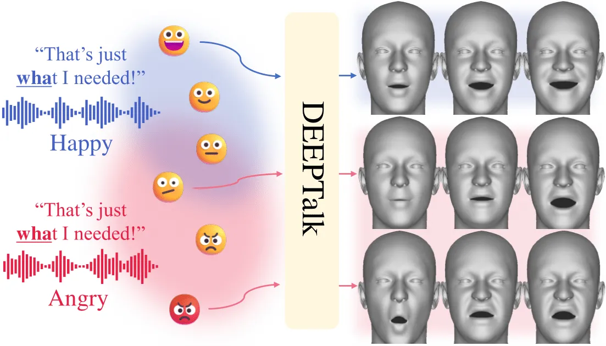

Figure 1: Overview of DEEPTalk. Starting with an emotional speech input
(left), we extract probabilistic emotion embeddings (depicted as blobs),
and sample from these embeddings to generate diverse emotional facial
animations aligned with the input speech (right).

Previous studies on talking faces have generated expressions using
either emotion labels (Daněček et al. 2023; Gan et al. 2023; Pan et al.
2023; Ji et al. 2021) or reference expressions (Ji et al. 2022; Tan
et al. 2024; Ma et al. 2023a; Liang et al. 2022). Using emotion labels
provides expressive but limited outcomes, while reference expressions
offer more diversity at the cost of needing numerous expressive
references. Moreover, both approaches fail to capture vocal nuances,
often leading to misalignment between facial expressions and speech. As
shown in Figure 1, the phrase ”That’s just what I needed!” can carry
different meanings based on the emotion it conveys (e.g., happiness or
anger), emphasizing the importance of facial expressions that reflect
the intended sentiment. Without this alignment, expressions may appear
unnatural from spoken words, contributing to uncanny valley effect
(Wang, Lilienfeld, and Rochat 2015).

Therefore, the most effective approach to generating nonverbal facial
expressions from speech is to leverage the rich information embedded
within the speech, which simultaneously conveys the speaker’s intentions
and emotions. Central to this process is prosody, encompassing
non-linguistic elements such as pitch, speed, volume, and tone
variations. Prosody is crucial due to its intricate link with facial
expressions as shown in (Cvejic, Kim, and Davis 2010)(Pell 2005).

Utilizing this groundwork, we propose a talking head model, DEEPTalk,
that leverages both emotion and motion priors to generate diverse
emotional 3D facial expressions directly from speech inputs. We first
utilize cross-modal contrastive learning to capture the emotional
correlation between speech and facial expressions. Unlike (Albanie
et al. 2018), which used this correlation primarily for emotion
recognition from unlabeled data, we aim to use it to develop a joint
embedding space, which we call DEE(Dynamic Emotion Embedding). Given the
inherent ambiguity in both speech and facial expressions—where multiple
expressions can correspond to a single piece of speech—we utilize
probabilistic embeddings (Chun et al. 2021; Chun 2023). These embeddings
are designed to model the uncertainty associated with the inputs and
facilitate sampling from the probability distribution. This allows the
generation of diverse emotional faces from the same speech input as
illustrated by the red lines in Figure 1. After constructing a joint
embedding space for facial motion and speech, we use it as a strong
emotion prior to train an emotional talking head model.

We then aim to build an expressive motion prior that is robust to
perceptual losses. Recent studies have demonstrated that by learning
motion priors from discrete codebooks, it is possible to generate a
diverse range of facial and body motions (Li et al. 2021; Yi et al.
2023; Xing et al. 2023; Ng et al. 2022). However, due to the dynamic
nature of emotional talking faces, VQ-VAE(Van Den Oord, Vinyals et al. 2017) alone struggles to capture the entire motion space fully.
Recognizing that facial motion encompasses different temporal
hierarchies—for instance, the mouth region exhibits high frequencies
while the upper face displays lower temporal frequencies—we train a
hierarchical discrete motion prior to effectively address these
variations effectively.

Building on the aforementioned robust emotion and motion priors,
DEEPTalk is specifically engineered to non-autoregressively map
emotional speech to our codebook indices. To ensure that generated
expressions consistently reflect the input speech emotions, we introduce
a novel emotion consistency loss. Training incoporates Gumbel-Softmax
(Jang, Gu, and Poole 2016) and differentiable rendering to ensure
end-to-end differentiability. Our qualitative and quantitative
assessments, including extensive user studies, demonstrate that DEEPTalk
excels at generating diverse emotional facial motions while also
outperforming lip synchronization.

In summary, our main contributions are as follows: we design a Dynamic
Emotion Embedding (DEE) that jointly learns from speech and facial
motion sequences through probabilistic contrastive learning.
Additionally, we propose a novel temporally hierarchical VQ-VAE
(TH-VQVAE) to construct a motion prior that is both expressive and
robust. Finally, we train a talking head model, DEEPTalk, leveraging
these strong priors to generate diverse and expressive emotional facial
motions while also outperforming state-of-the-art models on lip
synchronization.

## Related Work

#### Speech-Driven 3D Face Animation.

The availability of large 4D mesh datasets synchronized with audio
(Richard et al. 2021; Fanelli et al. 2010a) has greatly advanced deep
learning-based 3D face animation, enabling robust lip synchronization.
Extending these advancements, VOCA (Cudeiro et al. 2019b) improves
realism by generating animations from any speech inputs, employing time
convolutions with a speaker identity one-hot vector. FaceFormer (Fan
et al. 2022) uses a transformer-based model to generate facial movements
auto-regressively. However, despite accurate lip synchronization, the
generated upper face remains static as it is less correlated with input
speech. MeshTalk (Richard et al. 2021) addresses this by disentangling
audio-correlated and uncorrelated movements using a categorical latent
space to model upper face dynamics. Similarly, CodeTalker (Xing et al. 2023) utilizes a discrete motion prior with VQ-VAE to reconstruct
dynamic facial motions across the entire face. However, these methods
generate deterministic motion, overlooking the inherently
non-deterministic relationship between facial motion and speech.
Therefore, FaceDiffuser (Stan, Haque, and Yumak 2023) addresses the
limitation of deterministic models by employing a diffusion model, which
is probabilistic in nature, to generate multiple facial motions for a
given speech. However, it still falls short in capturing the diverse
emotional expressions conveyed through speech, which is crucial for
enhancing interactiveness for talking face models.

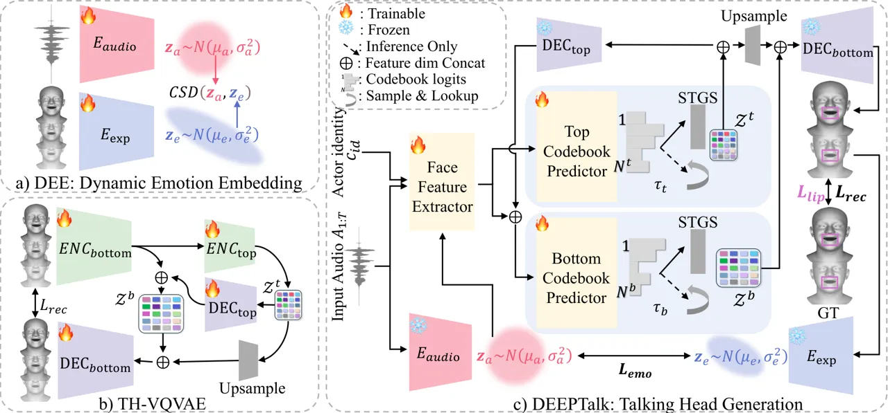

Figure 2: Overall Architecture of Our Method. (a) $`E_{audio}`$ and
$`E_{exp}`$ are trained to predict mean and variance for a joint
audio-facial emotion embedding space, DEE. (b) We train TH-VQVAE with
separate codebooks, $`\mathcal{Z}^{b}`$ and $`\mathcal{Z}^{t}`$, for low
and high-frequency motions, respectively. (c) DEEPTalk first extracts
face features, predict top and bottom codebook indices, and use frozen
TH-VQVAE decoders to decode the quantized motion features. To ensure
emotion alignment between input audio and the predicted facial
expressions, we introduce an emotional consistency loss $`L_{emo}`$ by
utilizing DEE.

#### Emotional 3D Face Animation.

Recent studies have underscored the critical role of emotion in creating
realistic and expressive 3D facial motions by integrating additional
emotional information. Specifically, EMOTE (Daněček et al. 2023) employs
one-hot labels to control emotion, producing emotional facial motions
through an emotion-content disentanglement loss. Chen et al. (Chen,
Zhao, and Zhang 2023) utilized the logits from an emotion classifier
applied to reference images as an emotion prior during training,
generating emotional facial motion through an emotion-augmented network.
However, these methods require explicit control, lacking a direct
connection to the emotion conveyed in the actual speech. The work most
related to ours is EmoTalk (Peng et al. 2023), which aims to generate
emotional blendshapes from audio input only, utilizing an
emotion-content disentangling method. However, the training of EmoTalk’s
emotion-content disentangling encoder is constrained to specific
datasets like RAVDESS (Livingstone and Russo 2018), containing the same
sentences expressed in multiple emotions. This constraint limits the use
of larger, more diverse datasets such as MEAD (Wang et al. 2020),
ultimately hindering the model’s ability to generalize emotional
expressions on other datasets. Unlike previous methods that either
disentangle content and emotion from speech or rely on explicit
conditioning, our approach establishes a robust emotion prior by
leveraging the natural correlation between speech and facial
expressions, enabling seamless integration into the talking face
training pipeline.

## Method

#### Overview

Our goal is to synthesize emotional facial motion solely from speech.
However, the complex many-to-many relationship between speech and facial
expressions poses challenges for generating expressive emotional faces.
To overcome this, we build (1) DEE, a joint probabilistic emotional
space to encode both audio and facial motion. DEE sample emotion
embeddings from audio, and enable generated facial motions aligned to
the corresponding embedding. Also for robust and expressive motion
prior, we design (2) TH-VQVAE to learn a discrete motion space capable
of capturing both high and low-frequency motions. Building on these
priors, we train (3) DEEPTalk to map emotional audio to motion
codebooks, resulting in facial animations that are both emotionally
expressive and accurately lip-synced. Additional details on each
component are provided in the Supplementary.

#### Formulation.

Our task can be formulated as follows: Let
$`\boldsymbol{A}_{1:T}=(\boldsymbol{a}_{1},\dots,\boldsymbol{a}_{T})`$
be a sequence of input speech snippets where each
$`\boldsymbol{a}_{t}\in\mathbb{R}^{D}`$ has $`D`$ sampled audio, and let
$`\boldsymbol{F}_{1:T}=(\boldsymbol{f}_{1},\cdots,\boldsymbol{f}_{T})`$,
where $`\boldsymbol{f}_{t}\in\mathbb{R}^{d_{exp}+3}`$ is a sequence of
FLAME expression parameters
$`\boldsymbol{\Psi}_{t}\in\mathbb{R}^{d_{exp}}`$ concatenated with jaw
parameters $`\boldsymbol{\theta}^{\text{jaw}}_{t}\in\mathbb{R}^{3}`$.

```math
\boldsymbol{f}_{t}=[\boldsymbol{\Psi}_{t},\boldsymbol{\theta}^{\text{jaw}}_{t}], \tag{1}
```

Our goal is to analyze the content and emotion of
$`\boldsymbol{A}_{1:T}`$ and, together with the one-hot speaker identity
$`\boldsymbol{c}_{id}`$, predict FLAME expression parameters
$`\boldsymbol{\hat{F}}_{1:T}=(\boldsymbol{\hat{f}}_{1},\cdots,\boldsymbol{\hat{f}}_{T})`$
that align with the input speech. As our talking head model is
non-auto-regressive, denoting $`\theta`$ as model parameters, our
end-to-end procedure can be written as

```math
\hat{\boldsymbol{F}}_{1:T}=\operatorname{DEEPTalk}_{\theta}(\boldsymbol{A}_{1:T},\boldsymbol{c}_{id}), \tag{2}
```

### DEE: Dynamic Emotional Embedding

#### Emotion feature extraction.

We utilized the recently proposed emotion2vec (Ma et al. 2023b) to
extract emotion features in our audio encoder. Denoting feature
extractor as $`F_{audio}`$, this process is defined as :

```math
F_{audio}(\boldsymbol{A}_{1:T})\rightarrow\epsilon_{audio} \tag{3}
```

For the expression feature extractor in the expression encoder, we first
trained an emotion classification model using the AffectNet
dataset (Mollahosseini, Hasani, and Mahoor 2017). As Affectnet is an
image dataset, we applied a 3D flame parameter reconstruction
method (Daněček, Black, and Bolkart 2022) to generate 3D pseudo ground
truth for each image in AffectNet and trained an emotion recognition
model. The trained encoder was then repurposed as the facial expression
feature extractor $`F_{exp}`$. This process is defined as:

```math
F_{exp}(\boldsymbol{F}_{1:T})\rightarrow\epsilon_{exp} \tag{4}
```

#### Emotional space construction.

With both audio and expression feature extractors in place, DEE trains
the audio and expression encoders separately. The overview of DEE is
illustrated in Figure 2(a). Each encoder $`E`$ comprises two distinct
heads, followed by a Generalized Pooling Operator (GPO) (Chen et al.
2021), with one head dedicated to $`\mu`$ and the other to
$`\log\sigma^{2}`$, similar to the approach in PCME++(Chun 2023). The
final probabilistic emotion embeddings for audio and expression can be
written as follows:

```math
E_{audio}(\epsilon_{audio})\rightarrow Z_{a}\sim N(\mu_{a},\sigma_{a}^{2}) \tag{5}
```

```math
E_{exp}(\epsilon_{exp})\rightarrow Z_{e}\sim N(\mu_{e},\sigma_{e}^{2}) \tag{6}
```

#### Objectives.

We train DEE on the Closed-Form Sampled distance (CSD), between audio
and expression probabilistic embeddings $`Z_{a},Z_{e}`$:

```math
CSD(Z_{a},Z_{e})=\|\mu_{a}-\mu_{e}\|^{2}_{2}+\|\sigma_{a}^{2}+\sigma_{e}^{2}\|_{1} \tag{7}
```

### TH-VQVAE: Temporally Hierarchical VQ-VAE

We addressed the challenge of modeling high-frequency lip movements and
slower facial motions by extending VQ-VAE2(Razavi, van den Oord, and
Vinyals 2019) into the temporal motion domain, creating TH-VQVAE. This
model uses distinct codebooks for different motion frequencies,
enhancing reconstruction quality and the capabilities of the Talking
Head Generator. It enables fine-grained lip movements and dynamic facial
expressions while also offering controllability at each hierarchical
level.

#### Model Architecture.

TH-VQVAE consists of a bottom encoder $`\text{ENC}_{bottom}`$, a top
encoder $`\text{ENC}_{top}`$, a bottom decoder $`\text{DEC}_{bottom}`$,
a top decoder $`\text{DEC}_{top}`$, and two facial motion codebooks
$`\mathcal{Z}^{b}`$ and $`\mathcal{Z}^{t}`$. Each codebook can be
formulated as

```math
\mathcal{Z}^{b}=\left\{\mathbf{z}^{b}_{k}\in\mathbb{R}^{C^{b}}\right\}_{k=1}^{N^{b}},\mathcal{Z}^{t}=\left\{\mathbf{z}^{t}_{k}\in\mathbb{R}^{C^{t}}\right\}_{k=1}^{N^{t}} \tag{8}
```

where each represents fine and coarse facial motion. Any sequence of
facial motion $`\boldsymbol{F}_{1:T}`$ can be represented by one item on
each codebook $`\boldsymbol{z}^{b}_{i},\boldsymbol{z}^{t}_{j}`$ and
decoded through $`\text{DEC}_{bottom}`$ into the corresponding facial
motion. As depicted in Figure 2(b), the input motion segment
$`x=\mathbf{F}_{1:T}\in\mathbb{R}^{T\times\left(d_{exp}+3\right)}`$ is
first encoded to a bottom motion feature and then encoded to top motion
feature.

```math
\hat{z}^{b}=\text{ENC}_{bottom}(x)\in\mathbb{R}^{\tau^{b}\times(C^{b}-C^{t})}, \tag{9}
```

where $`\tau^{b}=\frac{T}{{q^{b}}}`$ and
$`\tau^{t}=\frac{\tau}{{q^{t}}}`$ is the length of the sequence divided
by bottom quant factor $`q^{b}`$ and length of the sequence of the
bottom motion feature divided by top quant factor $`q^{t}`$. Using the
top motion feature, we obtain a top quantized sequence $`z^{t}_{q}`$,
then use this to get decoded top features $`{z}^{t}_{d}`$ as

```math
{z}^{t}_{q}=\arg\min_{{z}^{t}_{t}\in\mathcal{Z}^{t}}\left\|\hat{z}^{t}-z_{t}^{t}\right\|\in\mathbb{R}^{\tau^{t}\times C^{t}}. \tag{10}
```

```math
{z}^{t}_{d}=\text{DEC}_{top}({z}^{t}_{q})\in\mathbb{R}^{\tau^{b}\times C^{t}}, \tag{11}
```

and stack $`\hat{z}^{b}`$ and $`{z}^{t}_{d}`$ along the feature
dimension and obtain $`{z}^{b}_{q}`$ by

```math
{z}^{b}_{q}=\arg\min_{{z}^{b}_{t}\in\mathcal{Z}^{b}}\left\|[\hat{z}^{b},{z}^{t}_{d}]-z_{t}^{b}\right\|\in\mathbb{R}^{\tau^{t}\times C^{b}}. \tag{12}
```

Finally, we upsample $`{z}^{t}_{q}`$ from $`\tau^{t}`$ to match the
temporal dimension $`\tau^{b}`$ and decode the stacked upsampled top
quantized feature and bottom quantized feature to reconstruct the
original facial motion inputs.

```math
\hat{x}=\text{DEC}_{bottom}\left([\text{Upsample}({z}^{t}_{q}),{z}^{b}_{q}]\right) \tag{13}
```

where $`\hat{x}`$ is a reconstruction of the input motion sequence
$`x`$. We use the standard VQ-VAE loss to train TH-VQVAE. Details are
included in the Supplementary.

### DEEPTalk: Talking Head Generator

| Method       | CREMA-D           |                   |                       |                     |                   | RAVDESS           |                   |                       | HDTF                |                   | MEAD              |                   |                       |                     |                   |
| ------------ | ----------------- | ----------------- | --------------------- | ------------------- | ----------------- | ----------------- | ----------------- | --------------------- | ------------------- | ----------------- | ----------------- | ----------------- | --------------------- | ------------------- | ----------------- |
|              | FID$`\downarrow`$ | FFD$`\downarrow`$ | Emo-FID$`\downarrow`$ | LSE-D$`\downarrow`$ | LSE-C$`\uparrow`$ | FID$`\downarrow`$ | FFD$`\downarrow`$ | Emo-FID$`\downarrow`$ | LSE-D$`\downarrow`$ | LSE-C$`\uparrow`$ | FID$`\downarrow`$ | FFD$`\downarrow`$ | Emo-FID$`\downarrow`$ | LSE-D$`\downarrow`$ | LSE-C$`\uparrow`$ |
| FaceFormer   | 17.05             | 62.88             | 27.69                 | 8.659               | 1.460             | 27.43             | 50.40             | 40.45                 | 11.88               | 0.900             | 31.40             | 78.62             | 35.67                 | 10.70               | 1.106             |
| EmoTalk\*    | 64.75             | \-                | 149.1                 | 9.132               | 1.413             | \-                | \-                | \-                    | \-                  | \-                | 88.33             | \-                | 228.9                 | 10.77               | 0.896             |
| FaceDiffuser | 14.78             | 79.45             | 23.24                 | 8.686               | 1.507             | 17.06             | 81.74             | 31.23                 | 12.48               | 0.515             | 30.93             | 119.2             | 68.30                 | 10.93               | 0.784             |
| EMOTE        | 22.24             | 85.13             | 33.72                 | 8.612               | 1.573             | 20.22             | 62.05             | 27.40                 | 12.38               | 0.491             | 27.22             | 93.17             | 16.83                 | 10.73               | 1.035             |
| Ours         | 11.58             | 50.00             | 11.99                 | 8.535               | 1.523             | 11.94             | 32.82             | 11.44                 | 11.83               | 0.917             | 26.07             | 64.02             | 15.16                 | 10.65               | 1.103             |

Table 1: Quantitative Evaluation Results. Best performance in bold, and
the second best underlined. \*EmoTalk does not predict FLAME parameters
preventing evaluation of FFD and was trained on RAVDESS and HDTF. LSE-C
reported in Supplementary.

Shown in Figure 2(c), the Talking head generator is composed of two
distinct modules. 1) Face Feature Extractor that extracts facial
features from audio and emotion inputs, and 2) Codebook Predictor that
predicts codebook indices given facial features.

#### Face Feature Extractor.

In order to generate emotional face features aligned with input speech,
we employ Wav2Vec 2.0 (Baevski et al. 2020) to encode content and DEE’s
audio encoder $`E_{audio}`$ to encode emotion. During inference, we can
sample from the output distribution of $`E_{audio}`$ and control its
uncertainty through scaling the $`\log{\sigma^{2}}`$ of $`E_{audio}`$
output with the uncertainty control factor $`\alpha`$. Both features are
concatenated and fed into a transformer model to generate emotional face
features.

#### Codebook Predictor.

Instead of predicting each codebook’s index at once, we utilize two
separate models: the top codebook predictor and the bottom codebook
predictor. First, we obtain low-frequency motion features and use them
as a condition to predict high-frequency motion features. Specifically,
the top codebook predictor first predicts the logit distribution of the
top codebook and indexes the top quantized features, which contain
low-frequency motion information. It is then decoded by $`DEC_{top}`$
and concatenated with face features. The bottom codebook predictor then
predicts the bottom codebook’s logit distribution and indexes the bottom
quantized features. Both quantized feature sequences are concatenated
and fed to the pretrained and $`DEC_{bottom}`$ to produce FLAME
expression $`\boldsymbol{\hat{\Psi}}`$ and jaw pose
$`\boldsymbol{\hat{\theta}^{\text{jaw}}}`$ parameter sequence. During
training, we utilize the straight-through Gumbel-softmax (STGS) to make
indexing of codebooks differentiable, and during inference, we sample
from the logit distribution by controlling each codebook’s temperature
$`\tau_{b}`$ and $`\tau_{t}`$.

#### Objectives.

We employed three distinct loss functions to optimize performance : (i)
reconstruction loss, (ii) lip loss, and (iii) emotion consistency loss.

```math
L_{total}=\lambda_{1}L_{rec}+\lambda_{2}L_{emo}+\lambda_{3}L_{lip} \tag{14}
```

#### Reconstruction Loss.

We computed the Mean Squared Error between the pseudo-GT and predicted
vertices, denoted as $`L_{rec}`$.

#### Emotion Consistency Loss.

To ensure that the generated face motion reflects the same emotion as
the input audio, we propose an emotion consistency loss. By leveraging
the trained DEE, we predict the mean from audio input $`\mu_{a}`$ and
generated motion $`\mu_{e}`$ and enforce a high cosine similarity
between these pairs to ensure they represent the same emotion.

```math
L_{emo}=\frac{{\mu_{a}\cdot\mu_{e}}}{{\|\mu_{a}\|\|\mu_{e}\|}} \tag{15}
```

#### Lip Loss.

To provide additional lip supervision, we use lip reading perceptual
loss $`L_{lip}`$ (Daněček et al. 2023).

## Experiments

#### Datasets.

We utilize MEAD for train and test, and incorporate CREMA-D (Cao et al.
2014), RAVDESS, and HDTF (Zhang et al. 2021) for evaluation. MEAD,
CREMA-D, and RAVDESS are lab-recorded emotional talking face videos,
while HDTF comprises YouTube-sourced talking face videos. Due to
RAVDESS’s limited utterances and HDTF’s lack of emotion, we evaluate
only emotion and lip sync, respectively. Additionally, MEAD’s
overlapping utterance between train and test datasets make unsuitable
for fair comparisons with models untrained on it, and given no clear
benchmark for lip generalization on emotional in-the-wild speeches, we
constructed an audio test set, Emo-Vox, derived from VoxCeleb2. To
create a reliable pseudo-3D ground truth dataset, we employ the SOTA 3D
face reconstruction method (Daněček, Black, and Bolkart 2022)
exclusively on lab setting datasets for accurate FLAME parameter
extraction. Further details are in the Supplementary.

#### Baseline Impelmentations.

To compare DEEPTalk with facial parameter-based models, we train
FaceFormer, FaceDiffuser, and EMOTE on MEAD dataset. As EmoTalk employs
a unique training approach specifically tailored for RAVDESS and
utilizes an in-house blend shape reconstruction method, we utilize its
pre-trained weights. Additionally, we conduct experiments with
vertex-based models (FaceFormer, FaceDiffuser, MeshTalk, CodeTalker)
trained on the ground truth face mesh from the VOCASET dataset.

### Quantitative Evaluation

#### Evaluation Metrics.

We adopt FID to evaluate the realism of rendered faces. To further
assess the realism of facial movements in the FLAME parameter space, we
developed FFD (Frechet Face Distance), inspired by FGD (Yoon et al.
2020), and computed it on sequences of FLAME parameters using an encoder
trained on MEAD and BEATv2 (Liu et al. 2024). To evaluate emotional
expressiveness, we compute Emo-FID, an adaptation of FID that uses an
emotion feature extractor from AffectNet (Mollahosseini, Hasani, and
Mahoor 2017), replacing the inception network to focus on emotion
properties. For lip-sync evaluation, we used SyncNet metrics (Chung and
Zisserman 2016) LSE-D (Lip Sync Error Distance) and LSE-C (Lip Sync
Error Confidence) following (Aneja et al. 2024). Unlike Lip Vertex Error
(LVE), which is unsuitable for DEEPTalk due to its diverse emotional
faces, these metrics evaluate lip-sync without requiring ground truth
lip movements. Finally, we measure Diversity (Ren et al. 2023).

#### Evaluation on Realism and Emotion.

For realism comparison, DEEPTalk outperforms all other methods in FID
and FFD across all datasets, shown in Table 1, indicating superior
natural expressions and facial movements. DEEPTalk significantly
surpasses other methods in Emo-FID, demonstrating superior emotional
expressiveness that closely resembles real human expressions. It is
noteworthy that, despite utilizing ground truth emotion labels to
generate expressions, EMOTE still lags behind our approach due to its
lack of diversity and tendency for exaggerated expressions.

| Method       | Train Dataset | LSE-D$`\downarrow`$ | LSE-C$`\uparrow`$ |
| ------------ | ------------- | ------------------- | ----------------- |
| FaceFormer   | VOCASET       | 11.55               | 0.763             |
| MeshTalk     | VOCASET       | 11.54               | 0.555             |
| CodeTalker   | VOCASET       | 11.51               | 0.782             |
| FaceDiffuser | VOCASET       | 11.82               | 0.707             |
| EmoTalk      | RAV/HDTF      | 11.40               | 0.658             |
| FaceDiffuser | MEAD          | 11.61               | 0.569             |
| FaceFormer   | MEAD          | 11.31               | 0.893             |
| EMOTE        | MEAD          | 11.40               | 0.879             |
| Ours         | MEAD          | 11.28               | 0.889             |

Table 2: Lip sync results on Emo-Vox.

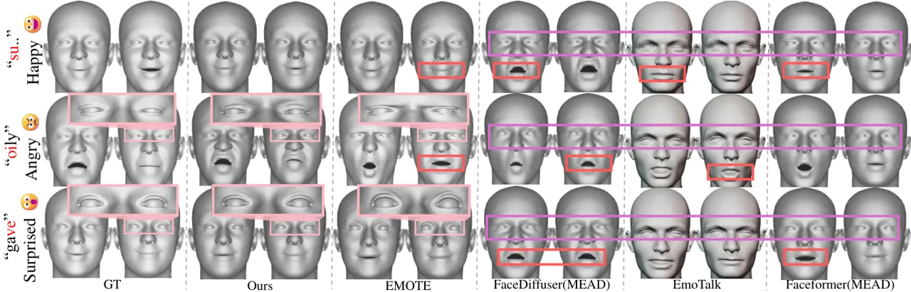

Figure 3: Qualitative results on MEAD test set. Each row displays the
predicted facial motions for each utterance and corresponding emotion
(left) generated by baseline models. Lip motion deviations from the
ground truth are highlighted in red, while incorrect or neutral
emotional expressions are indicated in purple. EMOTE, being conditioned
on emotion labels, exhibits a high degree of emotional expressiveness.
However, this conditioning sometimes results in exaggerated expressions,
highlighted in pink in the enlarged images. In contrast, DEEPTalk
generates natural emotional faces while maintaining accurate lip sync.

#### Evaluation on Lip sync.

In Table 1, DEEPTalk achieves the highest performance on LSE-D and ranks
first or second on LSE-C across the MEAD test set and other datasets,
demonstrating strong generalization and precise lip sync. We also
conducted evaluations on Emo-Vox to assess lip sync, while ensuring a
fair comparison with both parameter-based and vertex-based models. As
shown in Table 2, our model excels in LSE-D and ranks second in LSE-C,
demonstrating effective generalization of lip movements to emotional,
in-the-wild audio. This performance further indicates our bottom
codebook’s capability to capture high-frequency details, enhancing
dynamic lip movements. Moreover, due to the limited scale of the ground
truth scan dataset, vertex-based models fail to achieve accurate lip
sync compared to those using pseudo ground truth. Notably, FaceFormer,
trained on MEAD, produces nearly neutral expressions (see Figure 3),
whereas ours are more expressive, benefiting FaceFormer’s lip-sync
performance due to the emotion and lip-sync trade off, as demonstrated
in ablation studies.

|              |            |                             |                       |                     |
| ------------ | ---------- | --------------------------- | --------------------- | ------------------- |
| Method       | $`\alpha`$ | $`\tau`$                    | Diversity$`\uparrow`$ | LSE-D$`\downarrow`$ |
| FaceDiffuser | \-         | \-                          | 21.56                 | 10.93               |
| Ours         | 1          | argmax                      | 19.23                 | 10.65               |
| Ours         | 0.1        | argmax                      | 25.48                 | 10.60               |
| Ours         | -2         | argmax                      | 25.50                 | 10.60               |
| Ours         | -4         | argmax                      | 25.55                 | 10.60               |
| Ours         | mean       | $`\tau_{t}=1,\tau_{b}=0.1`$ | 9.91                  | 10.65               |
| Ours         | mean       | $`\tau_{t}=0.1,\tau_{b}=1`$ | 13.03                 | 10.65               |
| Ours         | mean       | $`\tau_{t}=4.5,\tau_{b}=1`$ | 23.22                 | 10.68               |

Table 3: Diversity results on the MEAD test set. DEEPTalk generates
diverse faces while maintaining accurate lip sync. LSE-C reported in the
Supplementary.

#### Evaluation on Diversity.

DEEPTalk provides control over the diversity of generated facial motions
in two ways: 1) diverse emotional facial motions from the same speech
input by adjusting the control factor $`\alpha`$, and 2) diverse facial
motions from the same speech and emotion by modifying the temperature of
the bottom ($`\tau_{b}`$) and top ($`\tau_{t}`$) codebook predictors. We
evaluated each controllability factor by varying them independently
while keeping the other factor deterministic. We continued this process
until our method surpassed FaceDiffuser in terms of diversity, after
which we assessed lip synchronization. As shown in Table 3, DEEPTalk
demonstrates superior lip synchronization, even with increased
diversity, compared to FaceDiffuser on both control factors,
illustrating the model’s effectiveness in generating diverse yet
accurate facial motion. Notably, these two methods of control are
orthogonal and can be used independently, potentially leading to even
greater diversity.

### Qualitative Evaluation

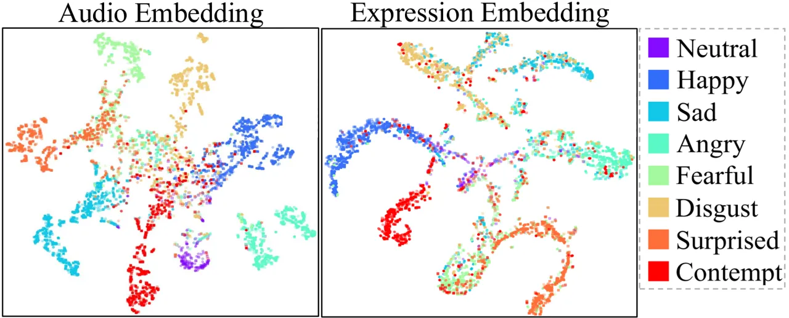

Figure 4: Embeddings are clustered by emotion categories.

Figure 5: User Study Results. Our method is preferred over most methods
on emotional alignment and lip synchronization.

#### Visual Comparison.

Figure 3 compares our method with SOTA methods on the MEAD test set.
While most methods generate natural lip movements, they often misalign
with the ground truth, such as opening or closing lips incorrectly.
Additionally, except for EMOTE, other methods produce incorrect or
unexpressive expressions. This highlights the effect of DEE and
$`L_{emo}`$ on our framework. While EMOTE generates emotional
expressions using emotional labels, it often produces exaggerated faces,
like unnaturally wide eyes or flat eyebrows, deviating from the ground
truth. In contrast, DEEPTalk generates natural emotional expressions
that closely resemble the ground truth without emotion labels by
leveraging emotions inherent within the speech.

#### Effect of Emotion Embedding.

Figure 4 shows that our emotion embedding clusters by emotions using
T-SNE, capturing a meaningful emotion space. Furthermore, to evaluate
its efficacy in generating emotional expressions, we randomly selected
two audio samples with distinct emotions and interchanged their emotion
embeddings from DEE’s audio encoder, before inputting them into the Face
Feature Extractor. As shown in Figure 6, this swap effectively modifies
the emotional expression to match the reference speech, while
maintaining precise lip synchronization with the original speech.
Further analysis is provided in Supplementary.

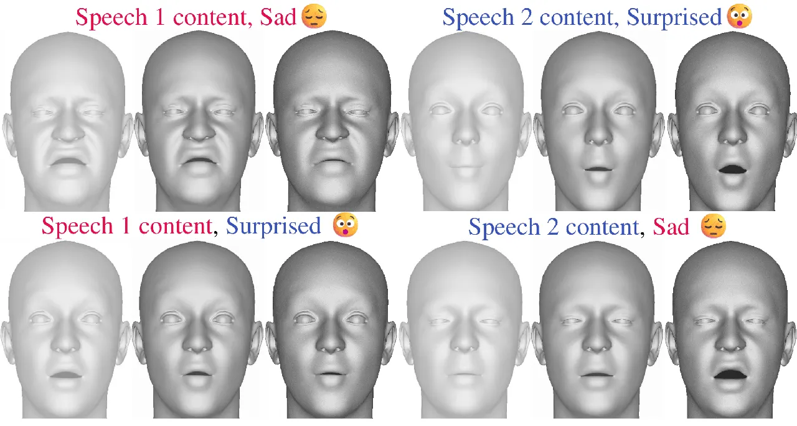

Figure 6: Swapping emotion embedding alters the emotional expression
while maintaining precise lip synchronization

#### User Studies.

We conducted A/B test with 5-point Likert scale for 98 users to evaluate
model preference across two subtasks: 1) emotional alignment between
speech and expression 2) lip synchronization. We sampled twenty audio
clips from MEAD and ten from Emo-Vox. Details are provided in
Supplementary. As shown in Figure 5, DEEPTalk outperformed all
parameter-based models across all tasks except for EMOTE, which
leverages ground truth emotion labels to generate faces, serving as the
upper bound for emotional face generation. Note that EMOTE is
deterministic and lacks expression diversity. For vertex-based models,
DEEPTalk excelled in both tasks for all competitors. Due to the scarcity
and limited size of emotional ground truth face scan datasets,
vertex-based methods struggle with emotional expression and accurate lip
synchronization. This highlights that using pseudo-3D data, as done in
DEEPTalk, is a promising approach for achieving accurate emotional 3D
talking face animation with precise lip synchronization.

|                 | Emo-Vox             |                   | MEAD                |                   |                       |                   |                   |
| --------------- | ------------------- | ----------------- | ------------------- | ----------------- | --------------------- | ----------------- | ----------------- |
| Methods         | LSE-D$`\downarrow`$ | LSE-C$`\uparrow`$ | LSE-D$`\downarrow`$ | LSE-C$`\uparrow`$ | Emo-FID$`\downarrow`$ | FID$`\downarrow`$ | FFD$`\downarrow`$ |
| w/ VAE          | 10.92               | 0.868             | 10.78               | 0.828             | 102.2                 | 43.40             | 325.1             |
| w/ VQVAE        | 10.87               | 1.102             | 10.70               | 1.075             | 16.58                 | 30.10             | 66.98             |
| w/o $`L_{lip}`$ | 10.98               | 1.000             | 10.91               | 0.901             | 19.94                 | 28.23             | 63.51             |
| w/o $`L_{emo}`$ | 10.67               | 1.187             | 10.66               | 1.107             | 28.78                 | 32.47             | 91.35             |
| Full (Ours)     | 10.74               | 1.140             | 10.65               | 1.103             | 15.15                 | 26.07             | 64.02             |

Table 4: Ablation results on Emo-Vox and MEAD test set.

### Ablation Studies

We conducted ablation studies on the MEAD test set and Emo-Vox to
analyze the contributions of individual components of DEEPTalk.
Specifically, we compared (1) DEEPTalk, (2) DEEPTalk with VAE, (3)
DEEPTalk with VQ-VAE, (4) DEEPTalk without $`L_{lip}`$ and (5) DEEPTalk
without $`L_{emo}`$. As shown in Table 4, utilizing a discrete motion
prior is crucial, as its absence results in significant quality
degradation. This is due to perceptual losses like $`L_{emo}`$ and
$`L_{lip}`$ where enforcing such constraints leads to unnatural
expressions. Furthermore, employing TH-VQVAE enhances performance across
all metrics by effectively capturing both low and high-frequency motion
patterns. The incorporation of our proposed $`L_{emo}`$ significantly
improves emotional expressiveness and realism, as evidenced by Emo-FID,
FID, and FFD scores. Interestingly, this enhancement results in a minor
decrease in lip synchronization, indicating a tradeoff between emotional
expressiveness and lip sync precision.

## Conclusion

This paper presents DEEPTalk, a novel speech-driven talking head
framework designed to generate diverse and emotionally expressive facial
animations. Unlike previous methods, DEEPTalk achieves precise lip
synchronization while ensuring facial expressions accurately reflecting
the emotional tone of the input speech. This is accomplished through our
dynamic emotion embedding (DEE), which serves as a strong emotion prior,
and a temporally hierarchical VQ-VAE (TH-VQVAE), which functions as a
robust and dynamic motion prior. Additionally, the probabilistic design
of DEEPTalk facilitates non-deterministic generation that can be
controlled on various levels. Extensive experiments on various datasets
demonstrate the superiority of our model over existing methods across
six metrics, with notable improvements in emotional realism.

## Acknowledgments

This work was supported by an IITP grant funded by the Korean Government
(MSIT) (No. RS-2020-II201361 , Artificial Intelligence Graduate School
Program (Yonsei University)) and Culture, Sports and Tourism R&D Program
through the Korea Creative Content Agency grant funded by the Ministry
of Culture, Sports and Tourism in 2024 (Project Name:Development of
multimodal UX evaluation platform technology for XR spatial responsive
content optimization, Project Number: RS-2024-00361757) and GIANTSTEP
Inc.

## References

- Albanie et al. (2018) Albanie, S.; Nagrani, A.; Vedaldi, A.; and
  Zisserman, A. 2018. Emotion Recognition in Speech using Cross-Modal
  Transfer in the Wild. _CoRR_, abs/1808.05561.
- Aneja et al. (2024) Aneja, S.; Thies, J.; Dai, A.; and
  Nießner, M. 2024. FaceTalk: Audio-Driven Motion Diffusion for Neural
  Parametric Head Models. In _Proc. IEEE Conf. on Computer Vision and
  Pattern Recognition (CVPR)_.
- Baevski et al. (2020) Baevski, A.; Zhou, Y.; Mohamed, A.; and
  Auli, M. 2020. wav2vec 2.0: A framework for self-supervised learning
  of speech representations. _Advances in neural information processing
  systems_, 33: 12449–12460.
- Cao et al. (2014) Cao, H.; Cooper, D. G.; Keutmann, M. K.; Gur, R. C.;
  Nenkova, A.; and Verma, R. 2014. Crema-d: Crowd-sourced emotional
  multimodal actors dataset. _IEEE transactions on affective computing_,
  5(4): 377–390.
- Chen et al. (2021) Chen, J.; Hu, H.; Wu, H.; Jiang, Y.; and
  Wang, C. 2021. Learning the Best Pooling Strategy for Visual Semantic
  Embedding. arXiv:2011.04305.
- Chen, Zhao, and Zhang (2023) Chen, Y.; Zhao, J.; and Zhang,
  W.-Q. 2023. Expressive Speech-driven Facial Animation with
  controllable emotions. In _2023 IEEE International Conference on
  Multimedia and Expo Workshops (ICMEW)_, 387–392. IEEE.
- Chun (2023) Chun, S. 2023. Improved probabilistic image-text
  representations. _arXiv preprint arXiv:2305.18171_.
- Chun et al. (2021) Chun, S.; Oh, S. J.; de Rezende, R. S.; Kalantidis,
  Y.; and Larlus, D. 2021. Probabilistic Embeddings for Cross-Modal
  Retrieval. arXiv:2101.05068.
- Chung and Zisserman (2016) Chung, J. S.; and Zisserman, A. 2016. Out
  of Time: Automated Lip Sync in the Wild. In _ACCV Workshops_.
- Cudeiro et al. (2019a) Cudeiro, D.; Bolkart, T.; Laidlaw, C.; Ranjan,
  A.; and Black, M. 2019a. Capture, Learning, and Synthesis of 3D
  Speaking Styles. In _Proceedings IEEE Conf. on Computer Vision and
  Pattern Recognition (CVPR)_, 10101–10111.
- Cudeiro et al. (2019b) Cudeiro, D.; Bolkart, T.; Laidlaw, C.; Ranjan,
  A.; and Black, M. J. 2019b. Capture, learning, and synthesis of 3D
  speaking styles. In _Proceedings of the IEEE/CVF conference on
  computer vision and pattern recognition_, 10101–10111.
- Cvejic, Kim, and Davis (2010) Cvejic, E.; Kim, J.; and Davis, C. 2010.
  Prosody off the top of the head: Prosodic contrasts can be
  discriminated by head motion. _Speech Commun._, 52(6): 555–564.
- Daněček, Black, and Bolkart (2022) Daněček, R.; Black, M. J.; and
  Bolkart, T. 2022. Emoca: Emotion driven monocular face capture and
  animation. In _Proceedings of the IEEE/CVF Conference on Computer
  Vision and Pattern Recognition_, 20311–20322.
- Daněček et al. (2023) Daněček, R.; Chhatre, K.; Tripathi, S.; Wen, Y.;
  Black, M.; and Bolkart, T. 2023. Emotional speech-driven animation
  with content-emotion disentanglement. In _SIGGRAPH Asia 2023
  Conference Papers_, 1–13.
- Fan et al. (2022) Fan, Y.; Lin, Z.; Saito, J.; Wang, W.; and
  Komura, T. 2022. Faceformer: Speech-driven 3d facial animation with
  transformers. In _Proceedings of the IEEE/CVF Conference on Computer
  Vision and Pattern Recognition_, 18770–18780.
- Fanelli et al. (2010a) Fanelli, G.; Gall, J.; Romsdorfer, H.; Weise,
  T.; and Van Gool, L. 2010a. A 3-d audio-visual corpus of affective
  communication. _IEEE Transactions on Multimedia_, 12(6): 591–598.
- Fanelli et al. (2010b) Fanelli, G.; Gall, J.; Romsdorfer, H.; Weise,
  T.; and Van Gool, L. 2010b. A 3-d audio-visual corpus of affective
  communication. _IEEE Transactions on Multimedia_, 12(6): 591–598.
- Gan et al. (2023) Gan, Y.; Yang, Z.; Yue, X.; Sun, L.; and
  Yang, Y. 2023. Efficient emotional adaptation for audio-driven
  talking-head generation. In _Proceedings of the IEEE/CVF International
  Conference on Computer Vision_, 22634–22645.
- Jang, Gu, and Poole (2016) Jang, E.; Gu, S.; and Poole, B. 2016.
  Categorical reparameterization with gumbel-softmax. _arXiv preprint
  arXiv:1611.01144_.
- Ji et al. (2022) Ji, X.; Zhou, H.; Wang, K.; Wu, Q.; Wu, W.; Xu, F.;
  and Cao, X. 2022. EAMM: One-Shot Emotional Talking Face via
  Audio-Based Emotion-Aware Motion Model. arXiv:2205.15278.
- Ji et al. (2021) Ji, X.; Zhou, H.; Wang, K.; Wu, W.; Loy, C. C.; Cao,
  X.; and Xu, F. 2021. Audio-driven emotional video portraits. In
  _Proceedings of the IEEE/CVF conference on computer vision and pattern
  recognition_, 14080–14089.
- Li et al. (2021) Li, J.; Kang, D.; Pei, W.; Zhe, X.; Zhang, Y.; He,
  Z.; and Bao, L. 2021. Audio2Gestures: Generating Diverse Gestures from
  Speech Audio with Conditional Variational Autoencoders.
  arXiv:2108.06720.
- Liang et al. (2022) Liang, B.; Pan, Y.; Guo, Z.; Zhou, H.; Hong, Z.;
  Han, X.; Han, J.; Liu, J.; Ding, E.; and Wang, J. 2022. Expressive
  talking head generation with granular audio-visual control. In
  _Proceedings of the IEEE/CVF Conference on Computer Vision and Pattern
  Recognition_, 3387–3396.
- Liu et al. (2024) Liu, H.; Zhu, Z.; Becherini, G.; Peng, Y.; Su, M.;
  Zhou, Y.; Zhe, X.; Iwamoto, N.; Zheng, B.; and Black, M. J. 2024.
  EMAGE: Towards Unified Holistic Co-Speech Gesture Generation via
  Expressive Masked Audio Gesture Modeling. arXiv:2401.00374.
- Liu et al. (2022) Liu, H.; Zhu, Z.; Iwamoto, N.; Peng, Y.; Li, Z.;
  Zhou, Y.; Bozkurt, E.; and Zheng, B. 2022. BEAT: A Large-Scale
  Semantic and Emotional Multi-Modal Dataset for Conversational Gestures
  Synthesis. arXiv:2203.05297.
- Livingstone and Russo (2018) Livingstone, S. R.; and Russo,
  F. A. 2018. The Ryerson Audio-Visual Database of Emotional Speech and
  Song (RAVDESS). Zenodo.
- Ma et al. (2023a) Ma, Y.; Wang, S.; Hu, Z.; Fan, C.; Lv, T.; Ding, Y.;
  Deng, Z.; and Yu, X. 2023a. Styletalk: One-shot talking head
  generation with controllable speaking styles. In _Proceedings of the
  AAAI Conference on Artificial Intelligence_, volume 37, 1896–1904.
- Ma et al. (2023b) Ma, Z.; Zheng, Z.; Ye, J.; Li, J.; Gao, Z.; Zhang,
  S.; and Chen, X. 2023b. emotion2vec: Self-Supervised Pre-Training for
  Speech Emotion Representation. _arXiv preprint arXiv:2312.15185_.
- Mollahosseini, Hasani, and Mahoor (2017) Mollahosseini, A.; Hasani,
  B.; and Mahoor, M. H. 2017. Affectnet: A database for facial
  expression, valence, and arousal computing in the wild. _IEEE
  Transactions on Affective Computing_, 10(1): 18–31.
- Ng et al. (2022) Ng, E.; Joo, H.; Hu, L.; Li, H.; Darrell, T.;
  Kanazawa, A.; and Ginosar, S. 2022. Learning to Listen: Modeling
  Non-Deterministic Dyadic Facial Motion. arXiv:2204.08451.
- Pan et al. (2023) Pan, Y.; Zhang, R.; Cheng, S.; Tan, S.; Ding, Y.;
  Mitchell, K.; and Yang, X. 2023. Emotional voice puppetry. _IEEE
  Transactions on Visualization and Computer Graphics_, 29(5):
  2527–2535.
- Pell (2005) Pell, M. 2005. Prosody–face Interactions in Emotional
  Processing as Revealed by the Facial Affect Decision Task. _Journal of
  Nonverbal Behavior_, 29: 193–215.
- Peng et al. (2023) Peng, Z.; Wu, H.; Song, Z.; Xu, H.; Zhu, X.; He,
  J.; Liu, H.; and Fan, Z. 2023. Emotalk: Speech-driven emotional
  disentanglement for 3d face animation. In _Proceedings of the IEEE/CVF
  International Conference on Computer Vision_, 20687–20697.
- Razavi, van den Oord, and Vinyals (2019) Razavi, A.; van den Oord, A.;
  and Vinyals, O. 2019. Generating Diverse High-Fidelity Images with
  VQ-VAE-2. arXiv:1906.00446.
- Ren et al. (2023) Ren, Z.; Pan, Z.; Zhou, X.; and Kang, L. 2023.
  Diffusion motion: Generate text-guided 3d human motion by diffusion
  model. In _ICASSP 2023-2023 IEEE International Conference on
  Acoustics, Speech and Signal Processing (ICASSP)_, 1–5. IEEE.
- Richard et al. (2021) Richard, A.; Zollhöfer, M.; Wen, Y.; De la
  Torre, F.; and Sheikh, Y. 2021. Meshtalk: 3d face animation from
  speech using cross-modality disentanglement. In _Proceedings of the
  IEEE/CVF International Conference on Computer Vision_, 1173–1182.
- Stan, Haque, and Yumak (2023) Stan, S.; Haque, K. I.; and
  Yumak, Z. 2023. FaceDiffuser: Speech-Driven 3D Facial Animation
  Synthesis Using Diffusion.
- Tan et al. (2024) Tan, S.; Ji, B.; Ding, Y.; and Pan, Y. 2024. Say
  anything with any style. In _Proceedings of the AAAI Conference on
  Artificial Intelligence_, volume 38, 5088–5096.
- Van Den Oord, Vinyals et al. (2017) Van Den Oord, A.; Vinyals, O.;
  et al. 2017. Neural discrete representation learning. _Advances in
  neural information processing systems_, 30.
- Wang et al. (2020) Wang, K.; Wu, Q.; Song, L.; Yang, Z.; Wu, W.; Qian,
  C.; He, R.; Qiao, Y.; and Loy, C. C. 2020. MEAD: A Large-scale
  Audio-visual Dataset for Emotional Talking-face Generation. In _ECCV_.
- Wang, Lilienfeld, and Rochat (2015) Wang, S.; Lilienfeld, S. O.; and
  Rochat, P. 2015. The Uncanny Valley: Existence and Explanations.
  _Review of General Psychology_, 19(4): 393–407.
- Xing et al. (2023) Xing, J.; Xia, M.; Zhang, Y.; Cun, X.; Wang, J.;
  and Wong, T.-T. 2023. Codetalker: Speech-driven 3d facial animation
  with discrete motion prior. In _Proceedings of the IEEE/CVF Conference
  on Computer Vision and Pattern Recognition_, 12780–12790.
- Yi et al. (2023) Yi, H.; Liang, H.; Liu, Y.; Cao, Q.; Wen, Y.;
  Bolkart, T.; Tao, D.; and Black, M. J. 2023. Generating Holistic 3D
  Human Motion from Speech. arXiv:2212.04420.
- Yoon et al. (2020) Yoon, Y.; Cha, B.; Lee, J.-H.; Jang, M.; Lee, J.;
  Kim, J.; and Lee, G. 2020. Speech gesture generation from the trimodal
  context of text, audio, and speaker identity. _ACM Transactions on
  Graphics (TOG)_, 39(6): 1–16.
- Zhang et al. (2021) Zhang, Z.; Li, L.; Ding, Y.; and Fan, C. 2021.
  Flow-guided one-shot talking face generation with a high-resolution
  audio-visual dataset. In _Proceedings of the IEEE/CVF Conference on
  Computer Vision and Pattern Recognition_, 3661–3670.

DEEPTalk: Dynamic Emotion Embedding for Probabilistic Speech-Driven 3D
Face Animation

Supplementary Material

## Method Details

This section provides detailed descriptions of the DEE, TH-VQVAE, and
DEEPTalk models, including specifics on their architectural design and
training details.

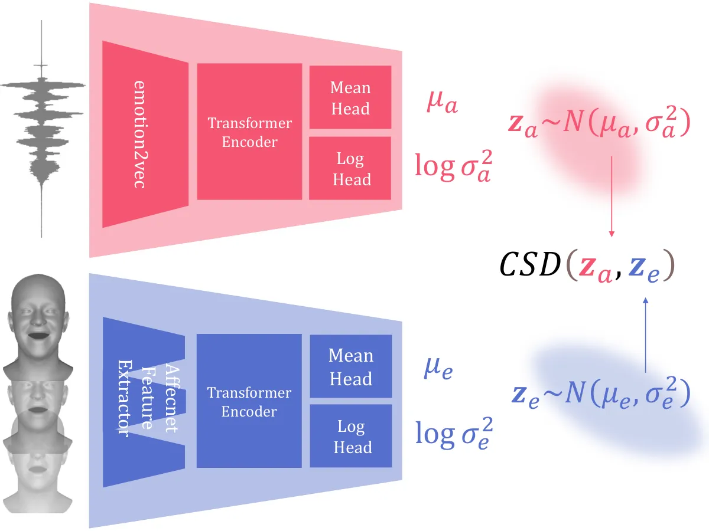

Figure A: Detailed architecture of DEE

### DEE

DEE comprises two feature extractors and two encoders for both audio and
expression modalities. In the audio feature extractor, we employed a
pretrained emotion2vec model (Ma et al. 2023b), with six unfrozen layers
from the final layer and the remaining layers frozen. As for the
expression feature extractor, a simple Multi-Layer Perceptron (MLP) was
utilized, featuring hidden layer sizes of 256, 512, 1024, 512, and 128,
with LeakyReLU activations. This MLP was trained on the Affectnet
dataset, but with FLAME parameters rather than images, to classify 8
emotions. We obtain an accuracy of 56.64 on the Affectnet benchmark
being close to 58 on the original Affectnet paper (Mollahosseini,
Hasani, and Mahoor 2017).

For the audio encoder, a two-layer transformer with eight heads and a
model dimension of 128 was employed, while the expression encoder
utilized a six-layer transformer architecture. Each mean head and log
head comprised a single-layer transformer encoder and a generalized
pooling operator(GPO)(Chen et al. 2021) layer. Notably, the output of
the mean head was normalized, whereas the log head output remained
unnormalized. Detailed model architecture is shown in Figure A.

The model underwent training with a learning rate set to 0.0001 for 300
epochs, utilizing a cosine annealing scheduler. The FLAME parameters had
a length of 50, while audio samples were set to 32000, resulting in
2-second sliced clips. Clips longer than 2 seconds were randomly sliced,
while shorter clips were padded accordingly.

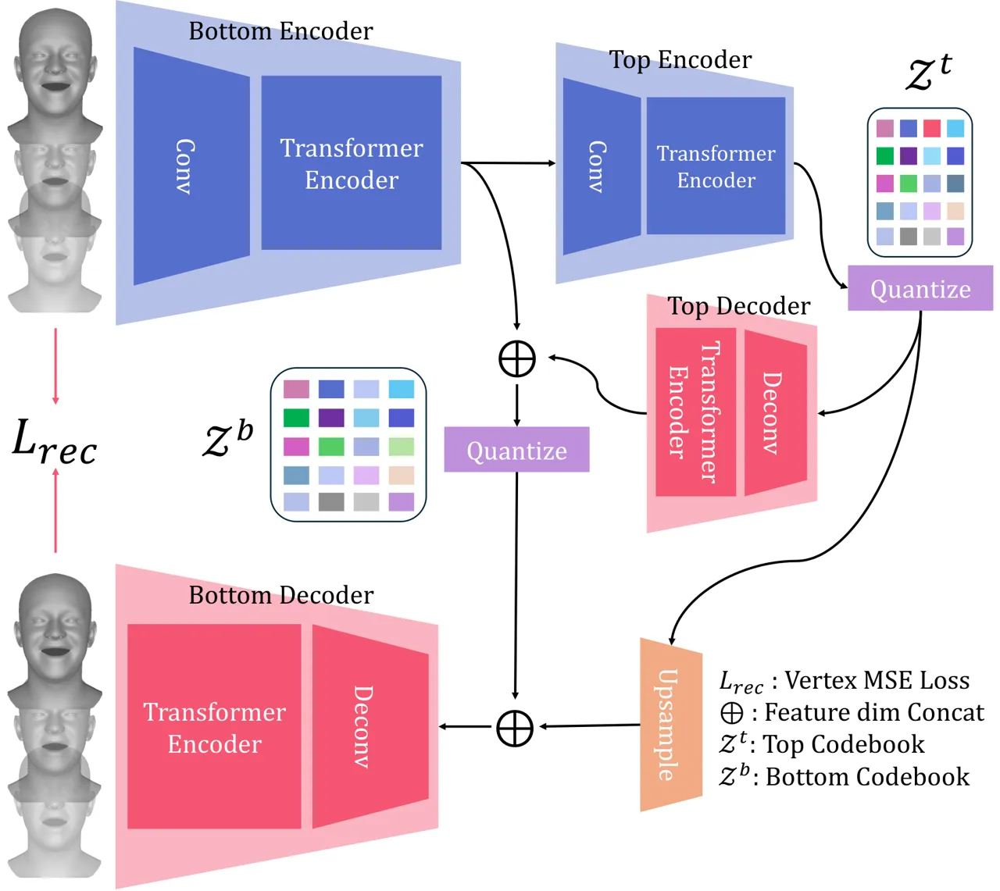

Figure B: Detailed architecture of TH-VQVAE

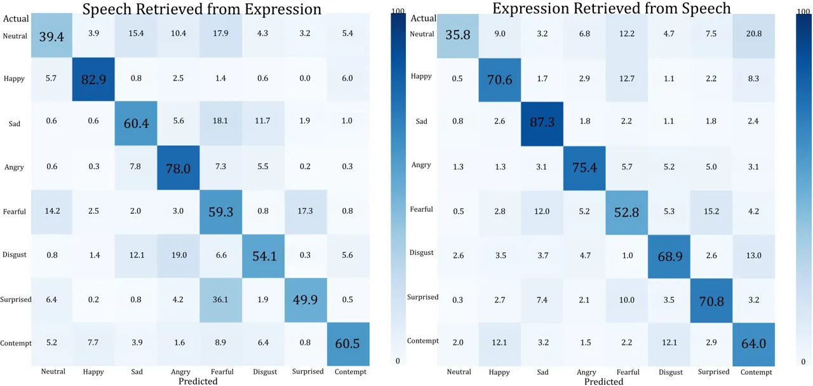

Figure C: Inter-modal Retrieval Top-1 Accuracy. Our model effectively
retrieves corresponding speech or facial expressions sharing the same
emotion. Neutral emotions present a greater challenge for retrieval
compared to other emotions due to the reduced information available in
both speech and facial expressions.

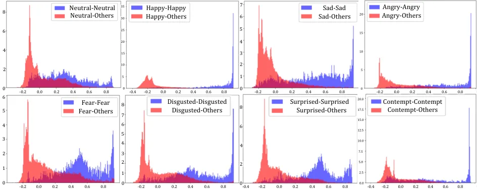

Figure D: Histogram of cosine similarities for all inter-modal pairs.
Embeddings with identical emotional labels exhibit an elevated
similarity, denoted by blue coloration, whereas embeddings representing
different emotional states demonstrate a diminished level of similarity,
depicted in red.

### TH-VQVAE

The Temporally Hierarchical VQ-VAE architecture consists of two encoders
and two decoders, both top and bottom. Each encoder comprises a
convolutional layer with a quantization length of 1, succeeded by a
single-layer transformer. Likewise, each decoder includes a single-layer
deconvolutional layer responsible for decoding latent embeddings along
the temporal axis, followed by a single-layer transformer. The top
codebook consists of 256 codes, each with a dimensionality of 128, while
the bottom codebook comprises 256 codes, each with a dimensionality of 256. Detailed model architecture is shown in Figure B.

The temporally hierarchical VQ-VAE (TH-VQVAE) model was trained with a
learning rate of 0.005 over 1500 epochs, utilizing a batch size of 256.
A learning rate warm-up strategy was employed for the initial 4000 steps
of training and the reconstruction loss weight was set to 100,000, while
the quantization loss weight was set to 1. As the reconstructed FLAME
parameters were noisy, we followed (Ng et al. 2022) using the savgol
filter to smooth movements with respect to the temporal axis.

#### Loss Function.

We define TH-VQVAE’s reconstruction loss as the $`L_{2}`$ distance
between the reconstructed vertex and the input vertex :

```math
L_{\text{rec }}=\|\widehat{\mathbf{V}}_{1:T}-\mathbf{V}_{1:T}\|_{2}^{2},
```

where $`\mathbf{V}_{t},\widehat{\mathbf{V}}_{t}`$ are obtained by
$`\mathbf{V}^{t}=\text{FLAME}\left(\boldsymbol{\psi}_{t},\boldsymbol{\theta}^{\text{jaw }}_{t}\right)`$.
The final loss function for training TH-VQVAE is as following:

```math
\mathcal{L}_{\text{total}}=L_{\text{rec }}+\beta\|Z-\operatorname{sg}[C]\|, \tag{16}
```

where, $`sg[\cdot]`$ signifies the stop gradient operation, and
$`\beta`$ denotes the weight of the ”commitment loss.” The updating of
the codebook is facilitated through the use of an Exponential Moving
Average (EMA)(Razavi, van den Oord, and Vinyals 2019).

### DEEPTalk

The DEEPTalk talking head generator consists of two main components: the
Face Feature Extractor and the Codebook Predictors (top and bottom). The
Face Feature Extractor includes an audio encoder and a transformer
encoder. For the audio encoder, we utilize a pre-trained Wav2vec2 model
(Baevski et al. 2020), where the Temporal Convolutional Network (TCN)
layers are frozen, and the remaining layers are unfrozen. The embeddings
from this audio encoder are concatenated with style embeddings, which
are derived by concatenating the DEE’s audio encoder output with an
identity one-hot vector, followed by a linear layer. These concatenated
features are then input to a single-layer transformer encoder with 128
model dimensions and 8 heads.

For the Codebook Predictors, both the top and bottom predictors are
6-layer transformers with 8 heads and a 128-dimensional feature space.
Using the face features, the top codebook predictor first predicts the
top codebook index, and the resulting top feature is decoded by the top
decoder of TH-VQVAE and then concatenated with the output of the Face
Feature Extractor. This concatenated feature is then passed to the
bottom codebook predictor to predict the logits of the bottom codebook.
The final output is obtained by upsampling the top quantized feature and
concatenating it with the bottom quantized feature. This output is fed
into the TH-VQVAE bottom decoder to generate the final FLAME parameters.

The training process involved two stages. In the first stage, only the
vertex error was utilized for training. In the second stage, an emotion
consistency loss and a lip reading loss were introduced. Each stage was
trained separately with a learning rate of 0.0001, a batch size of 128
for the first stage, and 16 for the second stage. The first stage was
trained for 200 epochs, while the second stage was trained for 1 epoch.
In the first stage, the tau of each gumbel softmax was set to decrease
linearly from 2 to 0.1, while in the second stage, we used 2.

[TABLE]

Table A: Comparisons of various Datasets. ‘PGT’ denotes Pseudo Ground
Truth, ‘MC’ denotes Motion Capture and ’BS’ denotes blendshapes.

## DEE Analysis

To demonstrate the comprehensive nature of our Dynamic Emotion Embedding
(DEE) as an emotional embedding space that encompasses both expression
and speech, we conducted two retrieval tasks and visualized histograms
of cosine similarities using the MEAD test set.

Inter-modal retrieval Two inter-modal retrieval tasks were conducted: 1)
retrieving speeches sharing the same emotion label as a given expression
and 2) retrieving expressions sharing the same emotion label as a given
speech. The top-1 accuracy of DEE’s inter-modal task is depicted in
Figure C. The capacity to retrieve speech or expression from the
alternative modality underscores the establishment of an emotional joint
embedding space within DEE’s framework, accommodating both expressive
facial features and speech signals.

Cosine Similarity: For each emotional label, we calculated the histogram
of embeddings’ cosine similarity for all inter-modal pairs with
different emotions and the same emotions. As shown in Figure D,
embeddings with identical emotional labels exhibit an elevated
similarity, denoted by bluecoloration, whereas embeddings representing
different emotional states demonstrate a diminished level of similarity,
depicted in red. This demonstrates how the embeddings are clustered by
emotions, for both speech and expression.

## Datasets

### 3D Talking Head Dataset

While 3D talking head datasets like BIWI(Fanelli et al. 2010b) and
VOCASET(Cudeiro et al. 2019a) provide accurate data, they lack emotional
expressions and scalability, making inadequate for learning emotional
facial dynamics. The BEAT dataset, introduced by (Liu et al. 2022),
presented a large-scale co-gesture dataset utilizing an iPhone to
capture the facial expressions of speaking actors. However, as shown in
Table A, BEAT comprises only 30 actors and lacks emotion intensities.
Crucially, it is designed for co-speech gesture generation rather than
talking heads, limiting the emotional expressiveness of facial
animations since actors focused on gestures over facial expressions.
Additionally, the use of non-personalized ARKit blendshapes captured by
an iPhone compromises its quality. Recently, EMAGE (Liu et al. 2024)
introduced BEATv2, which maps BEAT’s blendshape weights to FLAME
parameters with the assistance of animators. While this conversion
enhances the dataset’s utility for academic research, it still falls
short in capturing subtle movements and expressiveness of facial motion,
as it is derived from the original BEAT blendshape weights. On the other
hand, to train an emotional talking head model, (Peng et al. 2023)
curated a pseudo-3D dataset, called 3D-ETF composed of blendshape
weights captured using an in-house reconstruction method applied to
RAVDESS and HDTF. Despite its considerable scale and inclusion of over
324 actors, the dataset’s emotional talking duration is limited to just
1.5 hours, identical to RAVDESS, as HDTF lacks emotional content.
Furthermore, RAVDESS includes only 2 sentences, severely limiting the
variety of utterances. These limitations pose significant challenges for
generalizing to a broader range of emotional speeches.

To address the limitations of existing datasets, we constructed a
pseudo-3D dataset from the MEAD video dataset (3D-MEAD) to create a
large-scale emotional dataset, following the approach of EMOTE (Daněček
et al. 2023). The MEAD dataset is large-scale, featuring 60 actors
speaking diverse sentences with varying levels of emotion. This
extensive range makes it suitable for training models that generalize
well to various emotional expressions. We employed a fine-tuned version
of EMOCAv2 (Daněček, Black, and Bolkart 2022) on MEAD to achieve more
accurate reconstructions. Moreover, the MEAD dataset comprises video
recordings captured in a lab setting, focusing on the frontal view of
the upper body with a fixed camera, which minimizes noise and
facilitates the generation of precise 3D pseudo labels. Similarly,
CREMA-D and RAVDESS share this controlled recording characteristic,
making them suitable for benchmarking. In contrast, in-the-wild video
datasets like HDTF and VoxCeleb contain noise from factors such as head
turns, resulting in poor reconstruction outcomes. Consequently, we
exclude in-the-wild datasets from the construction of our 3D
pseudo-dataset, utilizing these datasets exclusively for evaluating lip
synchronization, as they do not require 3D vertex data.

### Emo-Vox

We introduce a test set for the emotional talking head task, named
Emo-Vox, for two primary reasons. First, to evaluate whether models can
generate synchronized lip motion with emotional, in-the-wild speeches.
Second, to validate performance on previously unseen utterances, since
the same utterances exist between MEAD’s training and test sets.
Therefore, we curated emotional speeches from VoxCeleb2 to create
Emo-Vox. We employed the DEE encoder, utilizing high-intensity emotion
embeddings from MEAD as anchors to retrieve high-intensity emotional
speeches. By extracting and comparing the emotion embeddings of audio
from VoxCeleb2 with high-intensity emotion embeddings from MEAD (both
audio and facial motion), we selected videos with similar emotional
cosine similarity. Consequently, we curated a total of 1.3 hours of
in-the-wild, emotional test data featuring diverse utterances. Note that
while our curation pipeline allows for significant expansion of this
test set, we limited its size to be comparable to that of RAVDESS.

## Metrics

### Frechet Face Distance

While the MEAD dataset contains emotional and expressive facial motions,
it remains a pseudo-3D data set. Relying solely on MEAD to train an
encoder for Frechet Facial Distance (FFD) may be unfair and show bias.
To address this, we combine the MEAD dataset with BEATv2 to form a
comprehensive dataset that includes both emotional facial expressions
and ground truth motion capture data. BEATv2, which originates from the
initial BEAT dataset (Liu et al. 2022) in blend shape weights, was later
transformed into FLAME space by (Liu et al. 2024). Although BEATv2 is
less expressive and less emotional compared to MEAD, it is regarded as
providing ground truth motion data.

We develop a Variational Autoencoder (VAE) whose encoder comprises 1D
convolutional layers to downsample FLAME motion sequences by a factor of
8, followed by a single-layer transformer. The decoder features a
single-layer transformer succeeded by 1D upconvolutional layers that
upsample the latent representation back to the original FLAME sequences.
Utilizing the trained encoder of the VAE, we calculate the Frechet
distance between the latent features of human facial motions, denoted as
$`F`$, and the latent features of predicted facial motions, denoted as
$`\hat{F}`$. The Frechet Facial Distance (FFD) is defined as:

```math
\text{FFD}(F,\hat{F})=\|\mu-\hat{\mu}\|^{2}+\text{Tr}(\Sigma+\hat{\Sigma}-2\sqrt{\Sigma\hat{\Sigma}})
```

Here, $`\mu`$ and $`\hat{\mu}`$ represent the mean vectors of the real
and predicted feature distributions, respectively, while $`\Sigma`$ and
$`\hat{\Sigma}`$ denote the corresponding covariance matrices. This
metric provides a comprehensive measure of the similarity between the
distributions of the real and generated facial motions.

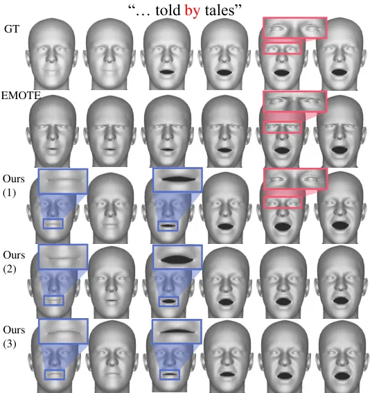

Figure E: Diverse Emotional Expressions from the Same Audio. The first
row displays a sequence of ground truth rendered faces saying the word
”by.” The second row shows the prediction by EMOTE, while the subsequent
rows present three individual predictions by DEEPTalk. Our method
generates diverse emotional expressions (shown in blue) and produces
natural emotional expressions close to the ground truth (shown in pink).

### Lip sync evaluation

In the case of lip synchronization, we used the lip sync metric from
(Chung and Zisserman 2016). Since our method generates diverse facial
expressions from the same audio, resulting in different lip shapes for
the same pronunciation (e.g., the corners of the mouth rise when
smiling), it becomes challenging to directly compare the lip vertices
with the ground truth (GT). Therefore, by employing the lip sync metric,
we can measure how well the rendered lip-cropped image matches the input
audio, not ground truth vertices. Specifically, the generated faces are
rendered, cropped, and fed into a pre-trained SyncNet Image model. The
MFCC spectrum of the corresponding audio is input into the pre-trained
SyncNet Audio model. The pairwise distance between both sets of features
is then calculated to evaluate the lip sync distance where a smaller
distance means an accurate lip sync.

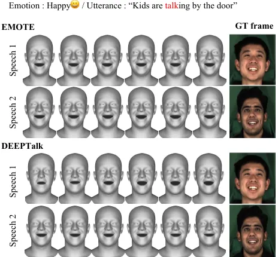

Figure F: Different expression from different speech with happy emotion
label. For the same emotion, EMOTE produces identical expressions,
whereas DEEPTalk generates diverse expressions.

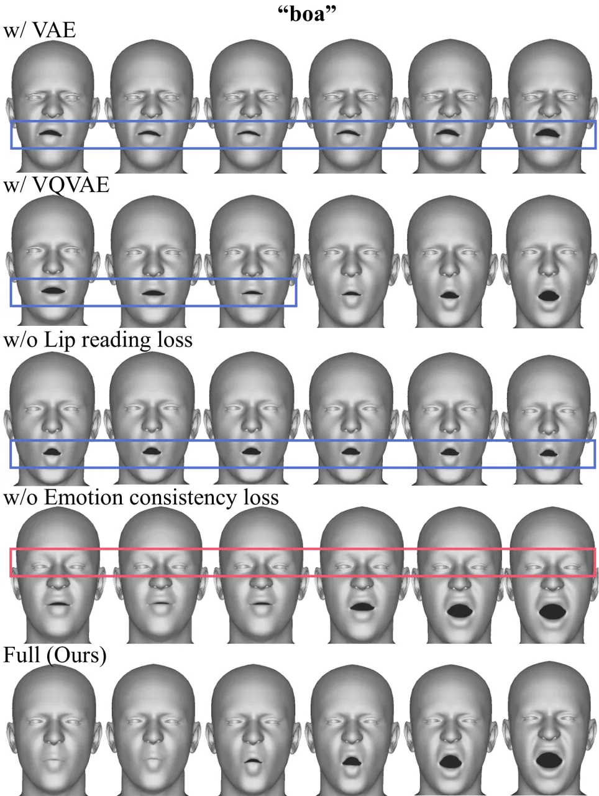

Figure G: Ablation study. Each row illustrates the effects of different
model components being replaced or removed. For the VAE, the lip shapes
appear awkward and generate unnatural expressions. The VQVAE struggles
to close the lips properly during rapid utterances, such as when
pronouncing ”b”. When the lip reading loss is absent, the overall lip
movements do not align well, and without the emotion consistency loss,
the generated faces are unexpressive and not emotional.

## Additional Qualitative Results

### Diverse emotion from the same audio input

DEEPTalk can generate diverse emotional facial motions from the same
speech input by sampling from the emotion distribution. We provide
visuals of the generated facial motion in Figure 5.

[TABLE]

Table B: User study results for ablation. 5 indicates DEEPTalk strongly
preferred and 1 indicates others strongly preferred. The highest score
is denoted by a red box, and the second highest score is represented by
an orange box.

### Diverse expression from different speech with the same emotion label

Emotional datasets and models that utilize emotion labels as input
typically categorize emotions into 7 or 8 classes. However, even within
the same emotion category, facial expressions can vary significantly as
there are diverse ways of expressing an emotion. Models like EMOTE fail
to capture this variation, generating identical expressions for the same
emotion label even when the speech differs. In contrast, DEEPTalk can
generate diverse expressions for audio that have the same emotion label.
Figure 6 presents the generated results using the RAVDESS dataset, where
speech1 and speech2 refer to the speeches of two different actors acting
the same sentence with the same emotion. In the GT frames of Figure 6,
it can be observed that even when expressing the same emotion, each
person’s facial expression differs. In contrast, EMOTE produces the same
expressions for different speeches. However, DEEPTalk generates
emotional expressions that align with the emotion label but with varying
styles, resembling the natural variations observed among different
individuals.

### Ablation study

We conducted an ablation qualitative test to evaluate how each component
of our model influences the generated facial expressions, as shown in
Figure 7. The test was performed on the Emo-Vox dataset.

### User Studies

Extensive user studies were conducted for parameter-based methods,
vertex-based methods, and ablations. Before executing the tasks, as in
Figure H, participants’ information was first surveyed to eliminate
potential biases and ascertain the relevance of the participants with
our survey. Subsequently, as shown in Figure I , comprehensive
instructions were provided, and as shown in Figure J, confirmatory
questions were used to ensure that participants understood the
instructions well. Responses from participants who demonstrated
misunderstanding during this phase were disregarded. We follow the A/B
user study methods done in recent works (Stan, Haque, and Yumak 2023)
and use a 5-point Likert scale(Daněček et al. 2023). As using the whole
test set is not feasible, we randomly sample four and four audio samples
from MEAD and emo-voxceleb and use them as our test case, resulting in a
total of 98 participants across all three tasks.

Ablation study Additionally, we included a user study table specifically
for the ablation, which was not featured in the main paper, to provide
further insights into our analysis. This ablation study evaluates the
influence of individual components of the DEEPTalk model on perceptual
quality. As in Table B, a rating scale ranging from 1 to 5 was employed,
where 5 indicates our DEEPTalk is strongly better, and 1 indicates
another baseline is strongly better. The highest score is denoted by a
red box, whereas the second-highest score is represented by an orange
box. The ablation components examined in this study mirror those of the
quantitative ablation study in the main paper. Given pairs of rendered
videos, participants were then prompted to select a better method,
considering each aspect, like the other experiments.

For relevancy of emotion for audio and generated facial motion sequence,
Table B demonstrates that our approach achieves the highest performance
when each of the four components is eliminated. Moreover, for the model
without emotion consistency loss, ours shows further improvements which
indicate that our perceptual emotion consistency loss, utilizing DEE,
helps the model to generate more audio aligned emotion facial motion.
Furthermore, for models without discrete motion prior and hierarchical
codebook, our approach achieves a high score due to TH-VQVAE’s
reconstruction capabilities. This allows DEEPTalk to generate a more
expressive facial motion with the same emotion supervision. Discretized
motion prior solves the smoothing problem, while the hierarchical
codebook learns to reconstruct dynamic frequency signals effectively,
thus leading to generating more expressive facial motion.

Regarding lip synchronization, DEEPTalk exhibits significantly better
performance with lip reading loss, as indicated in Table B. This
suggests that perceptual lip loss supervision effectively guides
DEEPTalk to generate realistic lip movements. Furthermore, our method
achieves a significantly higher score compared to approaches without
discrete motion prior and without a hierarchical codebook. This is due
to TH-VQVAE’s ability of generating high-frequency motion, such as lip
movements. Additionally, for emotion consistency loss, our result is
comparable to the model without emotion consistency loss, indicating
that our emotion consistency loss does not deteriorate lip movements’
quality.


Figure H: User info for User Study

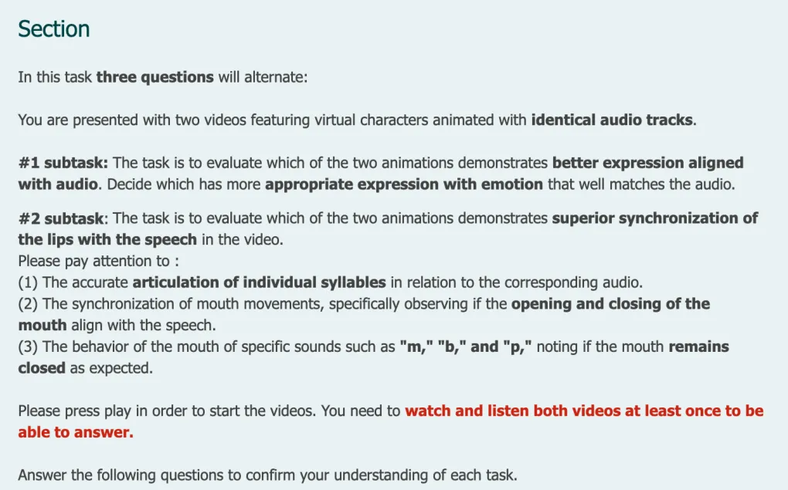

Figure I: Instruction for User Study

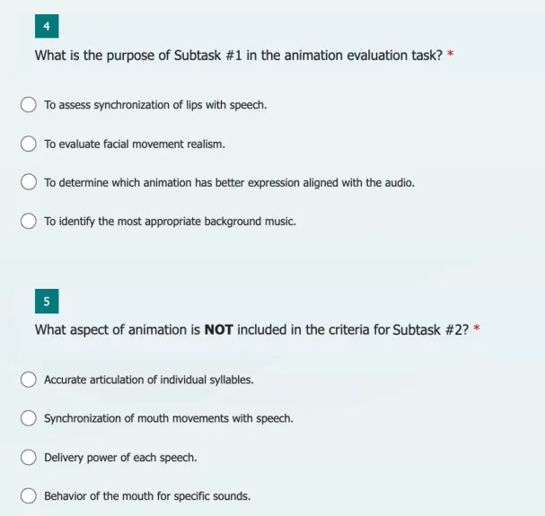

Figure J: Confirm question for User Study

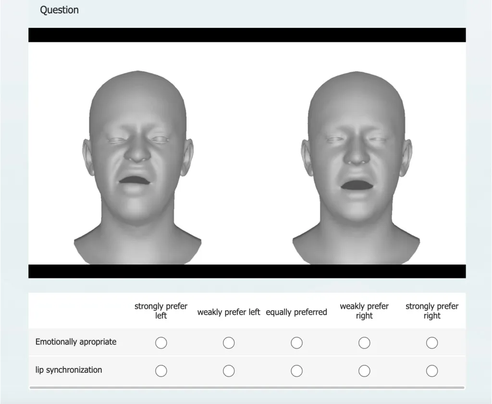

Figure K: UI for User Study. Each part has a number of questions for one
model for comparison, or an ablation of the DEEPTalk model.
