# DEGAS: Detailed Expressions on Full-Body Gaussian Avatars

Zhijing Shao Affiliation: The Hong Kong University of Science and
Technology (Guangzhou) Affiliation: Prometheus Vision Technology Co.,
Ltd.    Duotun Wang Affiliation: The Hong Kong University of Science and
Technology (Guangzhou)    Qing-Yao Tian Affiliation: Prometheus Vision
Technology Co., Ltd.    Yao-Dong Yang Affiliation: The Hong Kong
University of Science and Technology (Guangzhou)    Hengyu Meng
Affiliation: The Hong Kong University of Science and Technology
(Guangzhou)    Zeyu Cai Affiliation: The Hong Kong University of Science
and Technology (Guangzhou)    Bo Dong Affiliation: Swinburne University
of Technology    Yu Zhang Affiliation: Prometheus Vision Technology Co.,
Ltd.    Kang Zhang Affiliation: The Hong Kong University of Science and
Technology (Guangzhou) Affiliation: The Hong Kong University of Science
and Technology    Zeyu Wang Affiliation: The Hong Kong University of
Science and Technology (Guangzhou) Affiliation: The Hong Kong University
of Science and Technology

###### Abstract

Although neural rendering has made significant advances in creating
lifelike, animatable full-body and head avatars, incorporating detailed
expressions into full-body avatars remains largely unexplored. We
present DEGAS, the first 3D Gaussian Splatting (3DGS)-based modeling
method for full-body avatars with rich facial expressions. Trained on
multiview videos of a given subject, our method learns a conditional
variational autoencoder that takes both the body motion and facial
expression as driving signals to generate Gaussian maps in the UV
layout. To drive the facial expressions, instead of the commonly used 3D
Morphable Models (3DMMs) in 3D head avatars, we propose to adopt the
expression latent space trained solely on 2D portrait images, bridging
the gap between 2D talking faces and 3D avatars. Leveraging the
rendering capability of 3DGS and the rich expressiveness of the
expression latent space, the learned avatars can be reenacted to
reproduce photorealistic rendering images with subtle and accurate
facial expressions. Experiments on an existing dataset and our newly
proposed dataset of full-body talking avatars demonstrate the efficacy
of our method. We also propose an audio-driven extension of our method
with the help of 2D talking faces, opening new possibilities for
interactive AI agents. Project page:
[https://initialneil.github.io/DEGAS](https://initialneil.github.io/DEGAS)
.

![[Uncaptioned
image]](arxiv-2408-10588--1beaf3c39d43.figures/figure-1.webp)

Figure 1: Photorealistic rendering of full-body avatars using our method
on (a) ActorsHQ dataset and (b) our proposed DREAMS-Avatar dataset, (c)
with rich facial expressions.

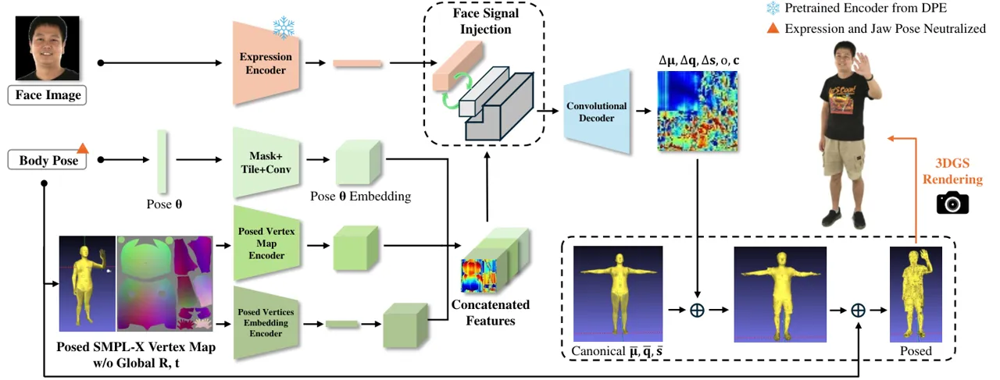

Figure 2: The pipeline of our method. DEGAS takes face signal from the
pretrained expression encoder of DPE \[44\], which is injected to the
body signal from SMPL-X \[46\]. The pose-dependent Gaussian maps
generated by the convolutional decoder are applied to the
pose-independent maps for 3DGS \[31\] rendering.

## 1 Introduction

Photorealistic and animatable human modeling has been an active research
topic in computer vision and graphics for decades. Interactive avatars
that are capable of performing natural body motions and subtle facial
expressions can benefit numerous downstream applications, e.g.,
tele-presentation \[30, 34\], virtual companion \[3\], and extended
reality (XR) storytelling \[8, 22\].

With the rise of neural rendering such as Neural Radiance
Fields (NeRF) \[42\] and 3DGS \[31\], we observe a boost in terms of
quality and rendering efficiency for both full-body avatars \[29, 38,
25\] and head avatars \[80, 56, 52, 55\]. Yet there is a lack of dataset
and method for integrating the two, i.e., expressive full-body avatars
equipped with both body pose control and rich facial expressions. We aim
to fill in the gap by proposing DEGAS (Detailed Expressions on full-body
Gaussian Avatars), the first 3DGS-based method for deling full-body
talking avatars together with a new dataset for evaluation.

A naive way to enable facial expressions on full-body avatars would be
using 3DMMs for facial control, for example, controlling the expression
parameters of SMPL-X \[46\], or using the parameters of FLAME \[36\] or
BFM \[47\] as driving signals. We find two drawbacks of such naive
methods. 1) The expressiveness of 3DMMs is limited \[44, 65, 59\]. Being
coarse meshes, 3DMMs are essentially not able to capture subtle facial
changes. 2) Driving signal generation for a 3DMM is non-trivial. Both
video-driven \[78, 17, 41\] and audio-driven \[16, 65, 58, 50, 1\]
methods suffer from efficiency, accuracy, and expressiveness issues.
Recent works \[52, 43\] have achieved photorealistic facial modeling in
a very dense multi-view camera set-up. However, accurate 3DMM
registration is non-trivial from a monocular camera \[17, 41\].

One important trend we observe in recent works on 2D talking faces is
the learning of disentangled latent spaces for identity, pose, and
expression \[62, 15, 44, 68\]. Such a framework enables standalone
extraction of identity-agnostic pose and expression parameters from
input images. We propose to adopt the pretrained encoder for expression
from DPE \[44\] to generate driving signals for the facial control of
our avatar modeling. To the best of our knowledge, we are the first
method to bridge the gap between 2D talking faces and 3D avatars. We
take inspiration from the Score Distillation Sampling proposed in
DreamFusion \[51\] where a pretrained 2D generative model lays the
foundation for 3D generative tasks.

One of the benefits of involving a pretrained encoder is that we can
extend audio-driven 2D talking faces to our 3D avatars. Given one
portrait image and an audio clip, we first use SadTalker \[74\] to
generate the corresponding talking head video, and then apply the
pretrained expression encoder to extract driving signals for our
avatars.

Though both trained with registered meshes, head avatars and full-body
avatars usually face very different registration qualities. With well
aligned mesh surfaces, the binding of the 3D Gaussians and the
underlying mesh is usually simple for head avatars. Both
SplattingAvatar \[56\] and GaussianAvatars \[52\] propose to bind 3D
Gaussians to FLAME mesh triangles without any pose-dependent
compensations. Full-body avatars, on the other hand, usually face the
challenge of a much less accurate underlying mesh because of clothing.
D3GA \[79\] proposes to alleviate this problem by modeling clothes with
separate tetrahedron layers. We follow the practice of
AnimatableGaussians \[38\] and CodecAvatars \[2\] to leverage the
ability of 2D CNNs for the pose-dependent generation of 3DGS parameters.

In summary, our main contributions are as follows:

- •
  We propose the first 3DGS-based method for full-body talking avatars
  and a multi-view captured dataset of full-body avatars with rich
  facial expressions.
- •
  We propose to drive 3D avatars with 2D talking faces, bridging the gap
  between these two research topics and opening new possibilities for
  the reenactment of photorealistic avatars.

## 2 Related Work

### 2.1 3D Avatar Representations

3D avatar modeling methods have three major design choices to make:
appearance representation, canonical modeling, and posing method. The
change of appearance representation from mesh texture \[20, 40, 2\] to
points \[75\], NeRF \[29, 80\], and 3DGS \[56, 52, 38, 25\], has been
the driving force of quality improvements in this field.

In terms of canonical modeling, there are two major categories depending
on whether the appearance is pixel-wisely defined on the UV space or
not. UV atlas of SMPL \[39\], SMPL-X \[46\], and FLAME \[36\] provides a
well aligned layout for pixel-wise appearance representation.
CodecAvatars \[40, 2, 43\], HDHumans \[21\], DDC \[20\], and
UVVolumes \[7\] predict pixel-wise appearance features on the UV space.
RGCA \[55\], ASH \[45\], and GaussianAvatar \[25\] construct pixel-wise
3D Gaussian parameters. AnimatableGaussians \[38\] further uses front
and back planes to utilize the geometry details from the mesh.

When the UV layout is not used, the canonical model is usually defined
tightly aligned to the underlying mesh. NeuralBody \[48, 49\] encodes
learnable latent codes to SMPL mesh vertices. EditableHumans \[24\]
assigns a learnable codebook to the vertices of SMPL-X. SLRF \[76\]
learns structured local radiance fields attached to SMPL.
AvatarRex \[77\] models the appearance with feature planes aligned to
the canonical mesh. TAVA \[35\], TotalSelfScan \[13\], PoseVocab \[37\],
InstantAvatar \[29\], and INSTA \[80\] propose to build NeRF aligned
with the canonical mesh. PointAvatar \[75\] constructs canonical points
coupled with FLAME canonical space. ARAH \[60\] and X-Avatar \[57\]
define pose-conditioned colors on the surface of the canonical SDF.
SplattingAvatar \[56\] and GaussianAvatars \[52\] learn 3D Gaussians
embedded on the underlying mesh triangles. 3DGS-Avatar \[53\] and
GauHuman \[26\] initialize 3D Gaussians by sampling from SMPL. To take
advantage of powerful 2D CNNs, our method falls in the former category
with pixel-wise 3DGS parameters defined as UV maps.

With the appearance and canonical modeling chosen, the posing scheme
helps warp sample points from the canonical space to the posed space or
vice versa depending on the need for rendering. Posed-dependent
compensation is usually introduced together with LBS to achieve higher
quality \[40, 2, 55, 25, 38\], while direct posing from mesh triangles
increases the inference FPS \[80, 56, 52\]. Appearance modeling methods
of texture, points, and 3DGS favor a forward posing scheme, i.e.,
per-primitive conversion from the canonical space to the posed space.
NeRF-based methods \[35, 13, 29, 37\], on the other hand, usually
require the conversion of multiple samples on each ray from the posed
space back to the canonical space \[5, 6\].

### 2.2 Talking Face Video Generation

With rapid advances in GANs and diffusion models, talking-face video
generation has achieved remarkable quality improvements. For instance,
view-dependent landmarks \[61\] and 3DMMs \[70\] have been leveraged to
enhance the temporal consistency of synthesized facial animations.
Recent investigations have focused on distilling disentangled
information such as emotion \[4, 66\], expression \[44\], and
appearance \[72\], enabling face reenactment and editing across
identities. For producing different speaking styles, image translation
approaches \[28, 18\] are utilized (e.g., HeadGAN \[14\] and
SadTalker \[74\]). To express a realistic appearance with natural pose
modifications, researchers have extended NeRF and 3DGS to talking face
tasks, as seen in GaussianTalk \[71\] and Ad-NeRF \[19\].

### 2.3 Choice of Driving Signal

Different from a 4D playback system like FVV \[10\], or 4DGS \[64\],
avatar modeling methods focus on the reenactment from accessible driving
signals. For full-body avatars, apart from the commonly used skeleton
poses as driving signals \[53, 29, 25\], AnimatableGaussians \[38\] also
encodes the posed position maps. SurMo \[27\] further considers temporal
dynamics to overcome the limitation of the deterministic nature of
driving signals. Head avatars \[80, 75, 52, 56\], on the other hand,
usually take into account the expression parameters of the underlying
3DMMs for better capturing the surface deformation of the face mesh.
Audio2Photoreal \[43\] models mesh-based full-body avatars with facial
control of accurate expression parameters registered from a dense camera
set-up, which is non-trivial to acquire from a more casual set-up.

Recent works in talking face video generation have explored different
driving signals for both audio-driven and video-driven tasks. Some \[54,
70, 50\] follow the practice of 3D face animation \[11, 16, 65, 58\] to
use parameters from a pretrained 3DMM as the driving signal. However,
the expressiveness of 3DMM is limited. CodeTalker \[65\] proposes to
regress vertex offsets instead of FLAME parameters to improve the
expressiveness of face animation. DPE \[44\], instead of using 3DMMs,
designs a bidirectional cyclic training strategy to construct
disentangled latent spaces for pose and expression. VASA-1 \[68\] and
Hallo \[67\] inherit this idea and achieve outstanding quality with the
diffusion model. In this paper, we aim to discuss that a well-trained
latent space of expression solely from 2D images, is a better choice
than 3DMM as the driving signal to reenact expressive 3D avatars.

## 3 Methodology

Given synchronized multiview videos and per-frame registered SMPL-X of a
given subject, we train an expressive full-body avatar modeled by a
conditional variational autoencoder (cVAE) to generate the 3D Gaussian
maps in the layout of SMPL-X’s UV space, where each pixel parameterizes
one 3D Gaussian primitive. We briefly introduce 3DGS in Section 3.1, and
elaborate on the choice of driving signals in Section 3.2, the design of
cVAE in Section 3.3, the LBS-based posing scheme in Section 3.4, and
finally the training process in Section 3.5.

### 3.1 Preliminaries: 3D Gaussian Splatting

3DGS \[31\] is an explicit primitive-based 3D representation that models
a scene or an object by a set of semi-transparent ellipsoids as 3D
Gaussians. Each 3D Gaussian has a parameter set of
$`G_{i}=(\boldsymbol{\mu}_{i},\boldsymbol{q}_{i},\boldsymbol{s}_{i},o_{i},\boldsymbol{\eta}_{i})`$.
The probability density of each Gaussian in space is formulated by its
mean (position) $`\boldsymbol{\mu}_{i}`$ and covariance matrix
$`\Sigma_{i}`$ as:

```math
f(x|\boldsymbol{\mu}_{i},\Sigma_{i})=e^{-\frac{1}{2}(x-\boldsymbol{\mu}_{i})^{T}\Sigma_{i}^{-1}(x-\boldsymbol{\mu}_{i})} \tag{1}
```

```math
\Sigma_{i}=R_{i}S_{i}S_{i}^{T}R_{i}^{T} \tag{2}
```

where the rotation matrix $`R_{i}`$ and scaling matrix $`S_{i}`$ that
formulate the covariance matrix $`\Sigma_{i}`$ are constructed from the
rotation quaternion $`\boldsymbol{q}_{i}`$ and the scaling vector
$`\boldsymbol{s}_{i}`$ respectively.

Given the world-to-camera view matrix $`W`$ and the Jacobian $`J`$ of
the point projection matrix, the influence of the 3D Gaussians can be
splatted onto 2D \[81\]:

```math
\Sigma^{\prime}_{i}=JW\Sigma_{i}W^{T}J^{T} \tag{3}
```

The final rendered color $`\boldsymbol{C}`$ of a pixel is given by the
_$`\alpha`$-blending_ of the 3D Gaussians that splatted onto it from
near to far:

```math
\boldsymbol{C}=\sum_{i=1}^{N}{\boldsymbol{c_{i}}}\alpha_{i}\prod_{j=1}^{i-1}(1-\alpha_{j}) \tag{4}
```

with $`\alpha_{i}`$ evaluated from the splatted covariance
$`\Sigma^{\prime}_{i}`$, and the opacity in logit $`o_{i}`$ with sigm()
being the standard sigmoid function:

```math
\alpha_{i}(x)=\text{sigm}(o_{i})\exp(-\frac{1}{2}(x-\mu_{i})(\Sigma^{\prime}_{i})^{-1}(x-\mu_{i})) \tag{5}
```

and $`\boldsymbol{c_{i}}`$ is the view-dependent color represented by
spherical harmonics $`\boldsymbol{\eta}_{i}`$. For simplicity in this
paper, we disable the view-dependent components of
$`\boldsymbol{\eta}_{i}`$ by predicting $`\boldsymbol{c_{i}}`$ directly.

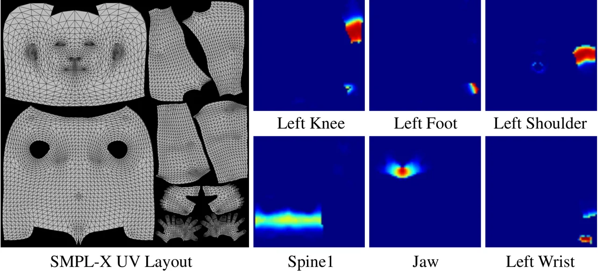

Figure 3: Tiling and masking of Pose $`\boldsymbol{\theta}`$ Embedding.
Joint angles are filled to corresponding areas in the UV layout where
the joints can affect through skinning. Colors visualize the skinning
weights, which are converted to binary masks.

### 3.2 Driving Signal

For full-body talking avatars, both facial expressions and body gestures
convey important messages in the process of communication. We divide the
driving signals into two parts: body signal and face signal.

Body signal. We use the body pose parameters from SMPL-X as the body
signal, which enables body motion control down to the finger level. We
keep the motion of the head to make the avatar more natural. The jaw
pose, on the other hand, is neutralized, leaving full facial control to
the face signal.

Face signal. Instead of using parameters from a 3DMM, we adopt the
pretrained expression encoder from DPE \[44\] to extract pose-agnostic
expressions from portrait images. Unlike 3DMMs \[47, 36\] trained from
untextured scan meshes, the latent space that 2D talking faces methods
like DPE \[44\] constructed from a large number of images is more
expressive to capture the expression-related appearance variations.

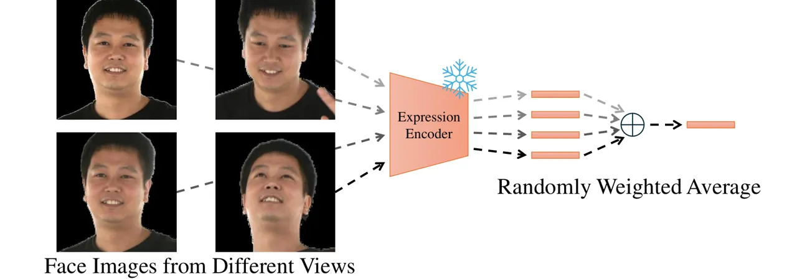

Figure 4: Training with faces from multiviews. During training, we
extract expressions from multiple views and use a randomly averaged
latent code as the face signal.

### 3.3 Conditional Variational Autoencoder

Given synchronized multiview images and registered SMPL-X of one frame,
we neutralize the jaw pose and expression parameters and encode the body
pose $`\boldsymbol{\theta}`$ with three encoders. Injected with a face
signal from the expression encoder, the mixed driving signal is fed to a
convolutional decoder for the generation of Gaussian parameters.
Figure 2 illustrates the pipeline.

Pose $`\boldsymbol{\theta}`$ Embedding. The first encoder takes as input
the pose vector $`\boldsymbol{\theta}\in\mathbb{R}^{162}`$ from SMPL-X
with 54 joint angles, excluding the root joint for global orientation.
We follow the practice of CABody \[2\] to expand the vector by
64$`\times`$64 and then mask by downsized skinning maps from UV. This
encoding scheme sets each pose component to the UV layout only where its
corresponding joint affects. We visualize where the joints’
$`\boldsymbol{\theta}`$ are filled to in Figure 3.

Posed Vertex Map Encoders. Another two encoders process the posed vertex
map on UV. The first convolution encoder, referred to as the Posed
Vertex Map (PVM) Encoder, encodes the posed vertex map down to
resolution 64$`\times`$64, matching that of the pose
$`\boldsymbol{\theta}`$ encoding. The second, referred to as the Posed
Vertices Embedding (PVE) Encoder, encodes the posed vertex map as a
latent code, which we believe better captures the global information of
the pose. The encoded features from the above three branches are
concatenated as the final pose feature.

Expression Encoder. DPE \[44\] proposes a bidirectional cyclic training
strategy in the training process aiming at the disentanglement of pose
and expression. We take the pretrained expression encoder as our facial
controller. From the input multiview images, we apply the head pose
estimator from SynergyNet \[63\] to find front-facing views. In the
training stage, we choose the four most frontal views to extract
expression codes. For every iteration, a randomly weighted average of
the four codes is used as the face signal, as illustrated in Figure 4.

Face Signal Injection. The expression code is firstly reformed by a
fully connected layer and a small convolutional decoder to the
resolution of 32$`\times`$32. Then it is used to replace the top-left
quarter of the pose feature. In the UV layout of SMPL-X, the top-left
quarter corresponds to the face region. After the injection, we feed the
mixed feature to a convolutional decoder for extracting Gaussian maps
with pose-dependent corrections for position $`\Delta\boldsymbol{\mu}`$,
rotation $`\Delta\boldsymbol{q}`$, and scaling $`\Delta\boldsymbol{s}`$,
as well as pose-independent opacity $`o`$, and color $`\boldsymbol{c}`$.

### 3.4 Gaussian Maps and LBS

We define the base Gaussian Maps in SMPL-X’s UV layout. The SMPL-X mesh
in T-Pose is rasterized to UV as the base positions
$`\overline{\boldsymbol{\mu}}`$, i.e., every valid pixel on UV
represents one 3D Gaussian primitive in the canonical space. Similar to
D3GA \[79\], we find every Gaussian primitive’s corresponding triangle
on the mesh to initialize its base rotation
$`\overline{\boldsymbol{q}}`$, such that each Gaussian will have its
first row axes aligned with the mesh surface and the third with the
normal. The base scaling $`\overline{\boldsymbol{s}}`$ is initialized by
treating the base positions as a regular point cloud.

Given the barycentric-interpolated skinning weights $`\mathcal{W}`$ from
SMPL-X mesh, we apply the pose-dependent corrections in the canonical
space, and calculate the Gaussian primitives’ posed position
$`\boldsymbol{\mu}_{p}`$ and rotation $`\boldsymbol{q}_{p}`$ by LBS:

```math
\boldsymbol{\mu}_{p}=LBS_{Rt}(\overline{\boldsymbol{\mu}}+\Delta\boldsymbol{\mu},\boldsymbol{\theta},\mathcal{W}) \tag{6}
```

```math
\boldsymbol{q}_{p}=LBS_{R}(\overline{\boldsymbol{q}}+\Delta\boldsymbol{q},\boldsymbol{\theta},\mathcal{W}) \tag{7}
```

```math
\boldsymbol{s}=\overline{\boldsymbol{s}}+\Delta\boldsymbol{s} \tag{8}
```

As in the 3DGS rendering pipeline, the Gaussian primitives in the posed
space
$`G=(\boldsymbol{\mu}_{p},\boldsymbol{q}_{p},\boldsymbol{s},o,\boldsymbol{c})`$
are splatted onto a 2D image as the final rendering.

### 3.5 Loss and Training

In the training process, DEGAS is supervised with photometric loss of
$`\mathcal{L}_{1}`$, $`\mathcal{L}_{ssim}`$, and
$`\mathcal{L}_{lpips}`$ \[73\]. The pose-dependent position
$`\Delta\boldsymbol{\mu}`$ is regularized by an offset loss. To help
convergency, we also introduce a regularization $`\mathcal{L}_{s}`$ on
scaling to prevent any Gaussians from becoming too large (10x larger
than its base scaling):

```math
\begin{split}\mathcal{L}=(1-\lambda_{ssim})\mathcal{L}_{1}+\lambda_{ssim}\mathcal{L}_{ssim}+\lambda_{lpips}\mathcal{L}_{lpips}\\
+\lambda_{\boldsymbol{\mu}}\left\|\Delta\boldsymbol{\mu}\right\|_{2}+\lambda_{s}\mathcal{L}_{s}\end{split} \tag{9}
```

```math
\mathcal{L}_{s}(i)=\left\{\begin{array}[]{lr}|\boldsymbol{s}_{i}|,&\boldsymbol{s}_{i}>10\overline{\boldsymbol{s}}_{i}\\
0,&otherwise\\
\end{array}\right. \tag{10}
```

where $`\lambda_{ssim}=0.2`$, $`\lambda_{lpips}=0.1`$,
$`\lambda_{\boldsymbol{\mu}}=0.001`$, and $`\lambda_{s}=1.0`$ all
through the experiments. We train DEGAS with Adam \[32\] for 800k
iterations.

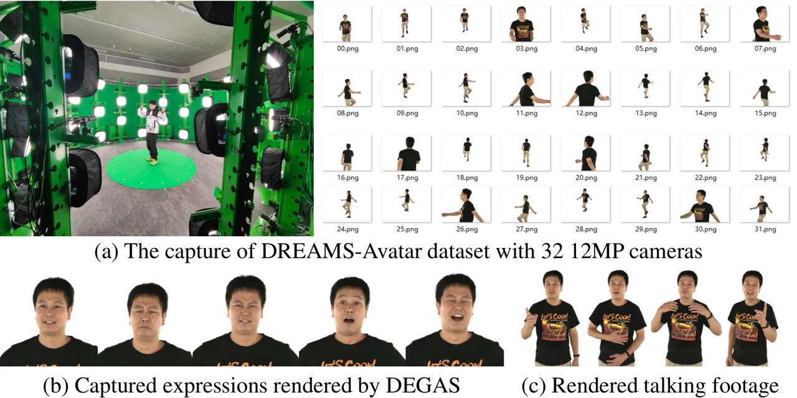

Figure 5: The DREAMS-Avatar dataset. 6 subjects captured with 32 12MP
cameras performing large body poses and rich facial expressions, e.g.,
smiling, laughing, angry, surprised, and a sequence of talking or
singing.

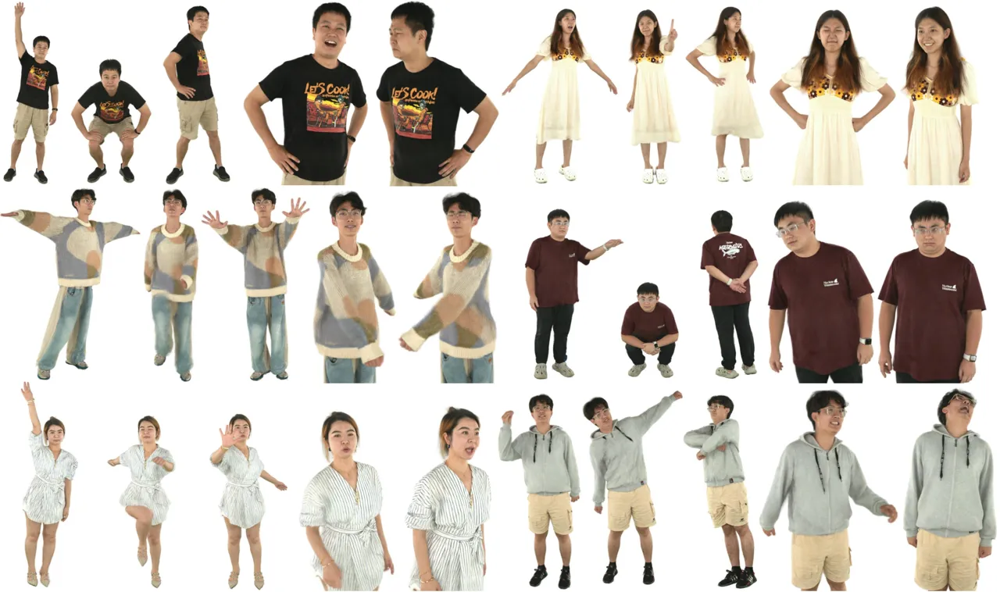

Figure 6: Rendering results of our method. We show rendering results of
our method DEGAS on the DREAMS-Avatar dataset. DEGAS is able to render
high quality avatars with large body pose variations and rich facial
expression details.

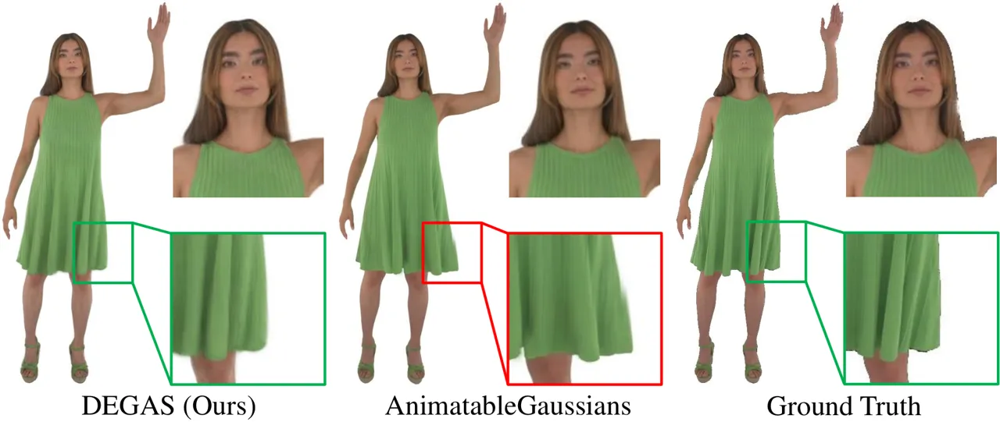

Figure 7: Comparison on full-body avatars. Our method renders high
quality details on ActorsHQ.

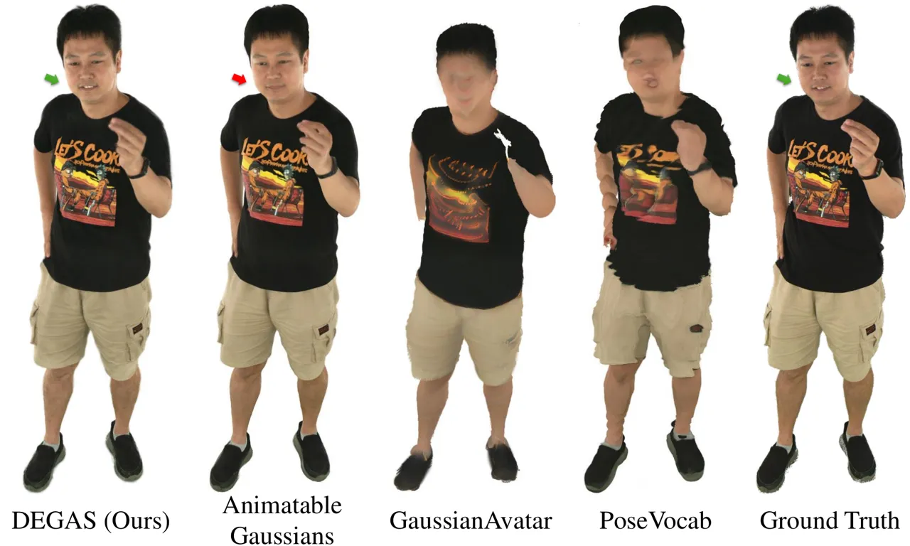

Figure 8: Comparison on our DREAMS-Avatar dataset. Our method renders
high quality details comparing to SoTA methods.

## 4 Experiments

ActorsHQ Dataset. ActorsHQ is a high-quality dataset for full-body
avatars. We follow the experiment setup of AnimatableGaussians \[38\] to
use 47 full-body views (46 views for training and 1 for testing, at 1k
resolution).

DREAMS-Avatar Dataset. Due to the lack of datasets for evaluating
full-body talking avatars with rich facial expressions, we propose the
DREAMS-Avatar dataset. DREAMS-Avatar includes the performance of 6
subjects captured with 32 12MP cameras, each with 2 sequences. The first
of which is the footage of standard poses and facial expressions, while
the second is a freestyle talking or singing. We show in Figures 1 and 5
the large body poses, rich facial expressions, and challenging clothes
and glasses in the dataset. We aim to cover the pose and expression
variations in a tele-presentation scenario.

| Method                     | PSNR$`\uparrow`$ | SSIM$`\uparrow`$ | LPIPS$`\downarrow`$ | FID$`\downarrow`$ |
| -------------------------- | ---------------- | ---------------- | ------------------- | ----------------- |
| GaussianAvatar \[25\]      | 26.9497          | 0.9389           | 0.0407              | 38.5387           |
| 3DGS-Avatar \[53\]         | 28.7836          | 0.9511           | 0.0418              | 49.3673           |
| AnimatableGaussians \[38\] | 30.3607          | 0.9682           | 0.0339              | 33.4665           |
| Ours                       | 31.1262          | 0.9708           | 0.0318              | 24.4555           |

Table 1: Quantitative comparison on full-body avatars. Experiments
conducted on ActorsHQ Actor01/Sequence1 following the setup of
AnimatableGaussians \[38\]. Our method quantitatively outperforms all
three SoTA methods.

### 4.1 Comparison on Full-body Avatars

We conducted experiments on ActorsHQ in comparison to state-of-the-art
(SoTA) methods including 3DGS-Avatar \[53\], GaussianAvatar \[25\], and
AnimatableGaussians \[38\]. Different from well-aligned 3DMMs available
in a multi-view head avatar dataset \[33\], registration in a full-body
setup is usually compromised by clothing (inaccurate surface alignment),
large poses (inaccurate joints), moving head (inaccurate face
alignment), etc.

Figure 7 shows the qualitative comparison on ActorsHQ. The rendering
results of our method exhibit rich texture details. The quantitative
comparison is reported in Table 1. We report PSNR and SSIM calculated in
the rendered full images, LPIPS \[73\] and FID \[23\] in the cropped
regions. Our method quantitatively outperforms all three SoTA methods.
One key observation we make is that the adoption of powerful 2D CNN
networks in both AnimatableGaussians \[38\] and ours significantly
improves pose-dependent modeling. More discussions are in Section 4.3.

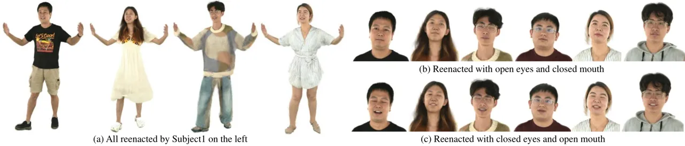

Figure 9: Reenactment results of our method. We show the rendering
results of all subjects reenacted by Subject1’s Sequence2. Most subjects
are reenacted correctly on eyes and mouths except that Subject4’s eyes
control was affected by the reflections on the glasses.

| Method                     | PSNR$`\uparrow`$ | SSIM$`\uparrow`$ | LPIPS$`\downarrow`$ | FID$`\downarrow`$ | AED$`\downarrow`$ |
| -------------------------- | ---------------- | ---------------- | ------------------- | ----------------- | ----------------- |
| AnimatableGaussians \[38\] | 32.1534          | 0.9814           | 0.0167              | 13.0829           | 0.2657            |
| PoseVocab \[37\]           | 28.3966          | 0.9740           | 0.0503              | 147.1550          | \-                |
| GaussianAvatar \[25\]      | 20.9320          | 0.9582           | 0.1056              | 81.0665           | \-                |
| DEGAS (ours)               | 33.9613          | 0.9853           | 0.01520             | 13.9276           | 0.0598            |

Table 2: Quantitative comparison on DREAMS-Avatar. Our method
outperforms other SoTA methods in terms of PSNR, SSIM, and LPIPS, and
has on-par FID with AnimatableGaussians \[38\]. Expression accuracy AED
of our method is significantly better. PoseVocab \[37\] and
GaussianAvatar \[25\] failed to reconstruct the face region in the
DREAMS-Avatar dataset.

### 4.2 Comparison on DREAMS-Avatar

For the experiments conducted on DREAMS-Avatar, we take Sequence1 of
each subject for training with 31 cameras excluding Cam02, which is used
only for testing. We evaluate view synthesis on Sequence1, novel pose
and facial expression reenactment on Sequence2.

View Synthesis. Table 2 shows the quantitative results of view synthesis
on Sequence1 Cam02’s 500–1000 frames where both large poses and rich
facial expressions are performed. The facial expression accuracy is
evaluated by the Average Expression Distance (AED) proposed in
PIRenderer \[54\], which estimates the cosine distance of the expression
coefficients extracted by Deep3DFaceRecon \[12\]. We show the
qualitative comparison in Figure 8. AnimatableGaussians \[38\] can
render a high-quality body and a neutral face. PoseVocab \[37\] and
GaussianAvatar \[25\] fail to model the face region due to the large
expression variations in the dataset. While our method renders
high-quality body and face details. We show more rendering results of
DEGAS in Figure 6 with various poses and rich facial expressions.

Novel Poses and Expressions. We demonstrate the reenactment of DEGAS to
novel poses. As shown in Figure 9, all avatars trained are reenacted by
Subject1’s Sequence2. Both same-identity and cross-identity reenactments
show high-quality details. Specifically on the face regions, DEGAS
responds correctly to eyes and mouth control.

| Method                     | FPS$`\uparrow`$ | Training Time$`\downarrow`$ | Disentangled    |
| -------------------------- | --------------- | --------------------------- | --------------- |
|                            |                 |                             | Encoder/Decoder |
| AnimatableGaussians \[38\] | 10              | 160 hours                   | $`\times`$      |
| DEGAS (ours)               | 30              | 55 hours                    | $`\checkmark`$  |

Table 3: Comparison with AnimatableGaussians \[38\]. Our method reaches
real-time framerate and favors disentangled encoder and decoder which
contribute to potential applications. Numbers recorded on one NVIDIA
RTX3090 and training with 800k iterations according to the original
paper of AnimatableGaussians \[38\].

### 4.3 Discussion w.r.t. AnimatableGaussians

Both our method and AnimatableGaussians \[38\] learn from
CodecAvatars \[2\] in adopting powerful 2D CNN networks for the
generation of Gaussian maps. The difference is that ours does not use
skip connections between encoder and decoder, considering the potential
streaming scenario \[40\]. Also, the bottleneck between the encoder and
decoder that follows the UV layout of SMPL-X enables the face signal
injection in our method. The runtime is compared in Table 3 where our
method reaches a real-time framerate.

### 4.4 Ablation Study

|                | Same-Identity Reenactment |                  |                     |                   | Cross-Identity    |
| -------------- | ------------------------- | ---------------- | ------------------- | ----------------- | ----------------- |
|                | PSNR$`\uparrow`$          | SSIM$`\uparrow`$ | LPIPS$`\downarrow`$ | AED$`\downarrow`$ | AED$`\downarrow`$ |
| w/ DECA        | 26.185                    | 0.954            | 0.049               | 0.1105            | 0.2638            |
| w/ DAD-3DHeads | 26.233                    | 0.954            | 0.049               | 0.0998            | 0.3697            |
| w/ DPE (ours)  | 26.212                    | 0.954            | 0.049               | 0.0853            | 0.2413            |

Table 4: Choice of face signal. The 2D talking faces-based expression
encoder from DPE \[44\] is a better choice as face signals.

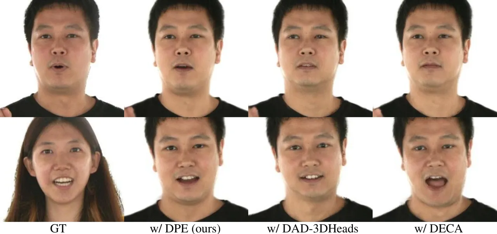

Figure 10: Ablation on facial reenactment. Using expression encoder from
DPE \[44\] drives more similar expressions comparing to using
DECA \[17\] or DAD-3DHeads \[41\].

Choice of face signal. We conducted ablation experiments to validate the
design choice of using a pretrained expression encoder from DPE \[44\]
as the face signal. We compared to using a 3DMM as the face signal by
extracting FLAME parameters from the frontal camera. We replaced the jaw
pose of SMPL-X with that from the extracted FLAME parameters and used
the expression parameters to condition our convolutional decoder. Note
that in our method, the jaw pose is neutralized, i.e., the jaw movements
are solely represented by the cVAE.

We tested two approaches for extracting FLAME parameters, i.e.,
DECA \[17\] and DAD-3DHeads \[41\]. For same-identity reenactment, we
trained on Subject1 Sequence1 and tested on Sequence2. For
cross-identity reenactment, we reenacted the avatar by the motion of
Subject2 Sequence2. As shown in Figure 10, the 2D talking faces-based
expression encoder from DPE \[44\] enables more similar expressions.
Table 4 shows the quantitative comparison.

|          | PSNR$`\uparrow`$ | SSIM$`\uparrow`$ | LPIPS$`\downarrow`$ | FID$`\downarrow`$ |
| -------- | ---------------- | ---------------- | ------------------- | ----------------- |
| 3 views  | 29.6554          | 0.9748           | 0.0262              | 33.4759           |
| 6 views  | 30.9780          | 0.9782           | 0.0188              | 36.6235           |
| 12 views | 30.9518          | 0.9783           | 0.0189              | 22.7458           |
| 31 views | 32.6349          | 0.9823           | 0.0166              | 14.2061           |

Table 5: Training with sparse views. Our method can be trained with
sparse views with decent quality.

Training with Sparse Views. Our avatar modeling method is trained in a
multi-view setup. We report in Table 5 that DEGAS can be trained with 3
views, 6 views, and 12 views.

|                                            | PSNR$`\uparrow`$ | SSIM$`\uparrow`$ | LPIPS$`\downarrow`$ | FID$`\downarrow`$ |
| ------------------------------------------ | ---------------- | ---------------- | ------------------- | ----------------- |
| w/o Pose $`\boldsymbol{\theta}`$ Embedding | 30.0084          | 0.9695           | 0.0289              | 23.8262           |
| w/o PVM Encoder                            | 30.4173          | 0.9729           | 0.0284              | 24.2348           |
| w/o PVE Encoder                            | 29.4263          | 0.9656           | 0.0338              | 26.5531           |
| Ours                                       | 30.6700          | 0.9731           | 0.0281              | 23.8110           |

Table 6: Ablation on encoder branches. All three encoder branches help
improve the rendering quality of our method.

Pose Encoders. There are three pose encoders in our method to generate
body signals. We conducted ablation studies on ActorsHQ Actor02 by
disabling one of them each time. The quantitative results are reported
in Table 6.

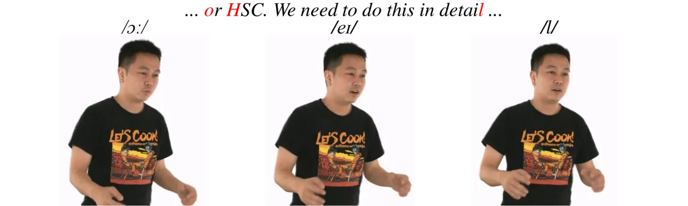

Figure 11: Audio-driven example of our method. Given an audio sequence,
we generate face signal from SadTalker \[74\] and DPE \[44\], and body
signal from TalkSHOW \[69\].

### 4.5 3D Full-body Talking Avatars

The use of a pretrained encoder from 2D talking faces lets our method
inherit the ability to both video-driven and audio-driven reenactment.
With the help of SadTalker \[74\], we show the extension of DEGAS to
full-body talking avatars. Given an audio clip, we firstly use
SadTalker \[74\] to generate 2D talking videos from one face image of
the subject, and then use the DPE \[44\] expression encoder to extract
face signal to drive our avatars. The body pose generation is a whole
another research track \[69, 43, 9\]. Here we only showcase the
generation from TalkSHOW \[69\] in Figure 11. Noted that the jaw pose
generated by TalkSHOW is not used.

### 4.6 Limitations

The pretrained expression encoder from DPE \[44\] that we explore in
this paper has the advantage of being trained with a large collection of
face images. Yet the quality of the 2D talking faces method itself
limits the reenactment quality of our method. We do observe pose and
identity-related information being not fully disentangled from the
expression. We believe that using encoders from more advanced 2D talking
faces methods \[68\] would help. Another issue is that the clothes are
not modeled in a separate layer, causing artifacts for the loose cloth
in challenging poses.

## 5 Conclusion

In this paper, we proposed DEGAS, the first 3DGS-based method for
full-body avatars with subtle and accurate facial expressions. We
discussed in this paper that an expression latent space pretrained
solely on 2D talking faces, is a better choice for the reenactment of 3D
avatars, opening new possibilities for interactive life-like agents. The
avatars modeled with DEGAS can be animated and rendered in real-time
framerate to perform natural body motions and rich facial expressions.
We conducted qualitative and quantitative experiments to validate the
efficacy of our method. We also showed the audio-driven extension of our
method to demonstrate its potential for downstream applications.

## 6 Acknowledgments

We thank the HKUST(GZ) DREAMS Lab for assisting in data collection. The
work is supported by the National Social Science Foundation of China
under grant number 24VWB020.

## References

- \[1\] Aneja, Shivangi and Thies, Justus and Dai, Angela and Nießner,
  Matthias. FaceTalk: Audio-Driven Motion Diffusion for Neural
  Parametric Head Models. In _Proceedings of the IEEE/CVF Conference on
  Computer Vision and Pattern Recognition (CVPR)_, pages
  21263–21273, 2024.
- \[2\] Timur Bagautdinov, Chenglei Wu, Tomas Simon, Fabián Prada,
  Takaaki Shiratori, Shih-En Wei, Weipeng Xu, Yaser Sheikh, and Jason
  Saragih. Driving-Signal Aware Full-Body Avatars. _ACM Trans. Graph._,
  40(4), 2021.
- \[3\] Elisabetta Bevacqua, Ken Prepin, Radoslaw Niewiadomski, Etienne
  de Sevin, and Catherine Pelachaud. Greta: Towards an Interactive
  Conversational Virtual Companion. _Artificial Companions in Society:
  Perspectives on the Present and Future_, pages 1–17, 2010.
- \[4\] Changpeng Cai, Guinan Guo, Jiao Li, Junhao Su, Chenghao He, Jing
  Xiao, Yuanxu Chen, Lei Dai, and Feiyu Zhu. Listen, Disentangle, and
  Control: Controllable Speech-Driven Talking Head Generation. _arXiv
  preprint arXiv:2405.07257_, 2024.
- \[5\] Xu Chen, Yufeng Zheng, Michael J. Black, Otmar Hilliges, and
  Andreas Geiger. SNARF: Differentiable Forward Skinning for Animating
  Non-Rigid Neural Implicit Shapes. In _Proceedings of the IEEE/CVF
  International Conference on Computer Vision (ICCV)_, pages
  11594–11604, 2021.
- \[6\] Xu Chen, Tianjian Jiang, Jie Song, Max Rietmann, Andreas Geiger,
  Michael J. Black, and Otmar Hilliges. Fast-SNARF: A Fast Deformer for
  Articulated Neural Fields. _Pattern Analysis and Machine Intelligence
  (PAMI)_, 2023a.
- \[7\] Yue Chen, Xuan Wang, Xingyu Chen, Qi Zhang, Xiaoyu Li, Yu Guo,
  Jue Wang, and Fei Wang. UV Volumes for Real-time Rendering of Editable
  Free-view Human Performance. In _Proceedings of the IEEE/CVF
  Conference on Computer Vision and Pattern Recognition (CVPR)_, pages
  16621–16631, 2023b.
- \[8\] Kun-Hung Cheng and Chin-Chung Tsai. Children and Parents’
  Reading of An Augmented Reality Picture Book: Analyses of Behavioral
  Patterns and Cognitive Attainment. _Computers & Education_,
  72:302–312, 2014.
- \[9\] Kiran Chhatre, Radek Daněček, Nikos Athanasiou, Giorgio
  Becherini, Christopher Peters, Michael J. Black, and Timo Bolkart.
  AMUSE: Emotional Speech-Driven 3D Body Animation via Disentangled
  Latent Diffusion. In _Proceedings of the IEEE/CVF Conference on
  Computer Vision and Pattern Recognition (CVPR)_, pages
  1942–1953, 2024.
- \[10\] Collet, Alvaro and Chuang, Ming and Sweeney, Pat and Gillett,
  Don and Evseev, Dennis and Calabrese, David and Hoppe, Hugues and
  Kirk, Adam and Sullivan, Steve. High-Quality Streamable Free-Viewpoint
  Video. _ACM Trans. Graph._, 34(4), 2015.
- \[11\] Daniel Cudeiro, Timo Bolkart, Cassidy Laidlaw, Anurag Ranjan,
  and Michael Black. Capture, Learning, and Synthesis of 3D Speaking
  Styles. In _Proceedings IEEE Conf. on Computer Vision and Pattern
  Recognition (CVPR)_, pages 10101–10111, 2019.
- \[12\] Yu Deng, Jiaolong Yang, Sicheng Xu, Dong Chen, Yunde Jia, and
  Xin Tong. Accurate 3D Face Reconstruction with Weakly-Supervised
  Learning: From Single Image to Image Set. In _IEEE Computer Vision and
  Pattern Recognition Workshops_, 2019.
- \[13\] Junting Dong, Qi Fang, Yudong Guo, Sida Peng, Qing Shuai,
  Xiaowei Zhou, and Hujun Bao. TotalSelfScan: Learning Full-body Avatars
  from Self-Portrait Videos of Faces, Hands, and Bodies. In _Advances in
  Neural Information Processing Systems_, 2022.
- \[14\] Michail Christos Doukas, Stefanos Zafeiriou, and Viktoriia
  Sharmanska. HeadGAN: One-Shot Neural Head Synthesis and Editing. In
  _Proceedings of the IEEE/CVF International Conference on Computer
  Vision (ICCV)_, pages 14398–14407, 2021.
- \[15\] Nikita Drobyshev, Jenya Chelishev, Taras Khakhulin, Aleksei
  Ivakhnenko, Victor Lempitsky, and Egor Zakharov. Megaportraits:
  One-shot Megapixel Neural Head Avatars. In _Proceedings of the 30th
  ACM International Conference on Multimedia_, pages 2663–2671, 2022.
- \[16\] Yingruo Fan, Zhaojiang Lin, Jun Saito, Wenping Wang, and Taku
  Komura. FaceFormer: Speech-Driven 3D Facial Animation with
  Transformers. In _Proceedings of the IEEE/CVF Conference on Computer
  Vision and Pattern Recognition (CVPR)_, 2022.
- \[17\] Yao Feng, Haiwen Feng, Michael J. Black, and Timo Bolkart.
  Learning an Animatable Detailed 3D Face Model from In-The-Wild Images.
  In _ACM Transactions on Graphics, (Proc. SIGGRAPH)_, 2021.
- \[18\] Ian Goodfellow, Jean Pouget-Abadie, Mehdi Mirza, Bing Xu, David
  Warde-Farley, Sherjil Ozair, Aaron Courville, and Yoshua Bengio.
  Generative Adversarial Nets. _Advances in Neural Information
  Processing Systems_, 27, 2014.
- \[19\] Yudong Guo, Keyu Chen, Sen Liang, Yong-Jin Liu, Hujun Bao, and
  Juyong Zhang. Ad-NeRF: Audio Driven Neural Radiance Fields for Talking
  Head Synthesis. In _Proceedings of the IEEE/CVF International
  Conference on Computer Vision (ICCV)_, pages 5784–5794, 2021.
- \[20\] Marc Habermann, Lingjie Liu, Weipeng Xu, Michael Zollhoefer,
  Gerard Pons-Moll, and Christian Theobalt. Real-time Deep Dynamic
  Characters. _ACM Transactions on Graphics (ToG)_, 40(4):1–16, 2021.
- \[21\] Marc Habermann, Lingjie Liu, Weipeng Xu, Gerard Pons-Moll,
  Michael Zollhoefer, and Christian Theobalt. HDHumans: A Hybrid
  Approach for High-Fidelity Digital Humans. _Proc. ACM Comput. Graph.
  Interact. Tech._, 6(3), 2023.
- \[22\] Jennifer Healey, Duotun Wang, Curtis Wigington, Tong Sun, and
  Huaishu Peng. A Mixed-Reality System to Promote Child Engagement in
  Remote Intergenerational Storytelling. In _2021 IEEE International
  Symposium on Mixed and Augmented Reality Adjunct (ISMAR-Adjunct)_,
  pages 274–279, 2021.
- \[23\] Martin Heusel, Hubert Ramsauer, Thomas Unterthiner, Bernhard
  Nessler, and Sepp Hochreiter. GANs Trained By a Two Time-Scale Update
  Rule Converge to a Local Nash Equilibrium. In _Proceedings of the 31st
  International Conference on Neural Information Processing Systems_,
  page 6629–6640, Red Hook, NY, USA, 2017. Curran Associates Inc.
- \[24\] Hsuan-I Ho, Lixin Xue, Jie Song, and Otmar Hilliges. Learning
  Locally Editable Virtual Humans. In _Proceedings of the IEEE/CVF
  Conference on Computer Vision and Pattern Recognition (CVPR)_, pages
  21024–21035, 2023.
- \[25\] Liangxiao Hu, Hongwen Zhang, Yuxiang Zhang, Boyao Zhou, Boning
  Liu, Shengping Zhang, and Liqiang Nie. GaussianAvatar: Towards
  Realistic Human Avatar Modeling from a Single Video via Animatable 3D
  Gaussians. In _Proceedings of the IEEE/CVF Conference on Computer
  Vision and Pattern Recognition (CVPR)_, 2024a.
- \[26\] Shoukang Hu, Tao Hu, and Ziwei Liu. Gauhuman: Articulated
  Gaussian Splatting from Monocular Human Videos. In _Proceedings of the
  IEEE/CVF Conference on Computer Vision and Pattern Recognition
  (CVPR)_, pages 20418–20431, 2024b.
- \[27\] Tao Hu, Fangzhou Hong, and Ziwei Liu. SurMo: Surface-Based 4D
  Motion Modeling for Dynamic Human Rendering. In _Proceedings of the
  IEEE/CVF Conference on Computer Vision and Pattern Recognition
  (CVPR)_, pages 6550–6560, 2024c.
- \[28\] Phillip Isola, Jun-Yan Zhu, Tinghui Zhou, and Alexei A Efros.
  Image-to-Image Translation with Conditional Adversarial Networks. In
  _Proceedings of the IEEE Conference on Computer Vision and Pattern
  Recognition (CVPR)_, pages 1125–1134, 2017.
- \[29\] Jiang, Tianjian and Chen, Xu and Song, Jie and Hilliges, Otmar.
  InstantAvatar: Learning Avatars From Monocular Video in 60 Seconds. In
  _Proceedings of the IEEE/CVF Conference on Computer Vision and Pattern
  Recognition (CVPR)_, pages 16922–16932, 2023.
- \[30\] Redouane Kachach, Pablo Perez, Alvaro Villegas, and Ester
  Gonzalez-Sosa. Virtual Tour: An Immersive Low Cost Telepresence
  System. In _2020 IEEE Conference on Virtual Reality and 3D User
  Interfaces Abstracts and Workshops (VRW)_, pages 504–506, 2020.
- \[31\] Bernhard Kerbl, Georgios Kopanas, Thomas Leimkühler, and George
  Drettakis. 3D Gaussian Splatting for Real-Time Radiance Field
  Rendering. _ACM Transactions on Graphics_, 42(4), 2023.
- \[32\] Diederik Kingma and Jimmy Ba. Adam: A Method for Stochastic
  Optimization. In _International Conference on Learning Representations
  (ICLR)_, San Diega, CA, USA, 2015.
- \[33\] Tobias Kirschstein, Shenhan Qian, Simon Giebenhain, Tim Walter,
  and Matthias Nießner. NeRSemble: Multi-View Radiance Field
  Reconstruction of Human Heads. _ACM Trans. Graph._, 42(4), 2023.
- \[34\] Nianlong Li, Zhengquan Zhang, Can Liu, Zengyao Yang, Yinan Fu,
  Feng Tian, Teng Han, and Mingming Fan. VMirror: Enhancing the
  Interaction with Occluded or Distant Objects in VR with Virtual
  Mirrors. In _Proceedings of the 2021 CHI Conference on Human Factors
  in Computing Systems_, New York, NY, USA, 2021. Association for
  Computing Machinery.
- \[35\] Ruilong Li, Julian Tanke, Minh Vo, Michael Zollhofer, Jurgen
  Gall, Angjoo Kanazawa, and Christoph Lassner. TAVA: Template-Free
  Animatable Volumetric Actors. In _European Conference on Computer
  Vision (ECCV)_, 2022.
- \[36\] Tianye Li, Timo Bolkart, Michael. J. Black, Hao Li, and Javier
  Romero. Learning a Model of Facial Shape and Expression from 4D Scans.
  _ACM Transactions on Graphics, (Proc. SIGGRAPH Asia)_,
  36(6):194:1–194:17, 2017.
- \[37\] Zhe Li, Zerong Zheng, Yuxiao Liu, Boyao Zhou, and Yebin Liu.
  PoseVocab: Learning Joint-Structured Pose Embeddings for Human Avatar
  Modeling. In _ACM SIGGRAPH Conference Proceedings_, 2023.
- \[38\] Zhe Li, Zerong Zheng, Lizhen Wang, and Yebin Liu. Animatable
  Gaussians: Learning Pose-Dependent Gaussian Maps for High-Fidelity
  Human Avatar Modeling. In _Proceedings of the IEEE/CVF Conference on
  Computer Vision and Pattern Recognition (CVPR)_, 2024.
- \[39\] Loper, Matthew and Mahmood, Naureen and Romero, Javier and
  Pons-Moll, Gerard and Black, Michael J. SMPL: A Skinned Multi-Person
  Linear Model. _ACM Trans. Graph._, 34(6), 2015.
- \[40\] Shugao Ma, Tomas Simon, Jason Saragih, Dawei Wang, Yuecheng Li,
  Fernando De la Torre, and Yaser Sheikh. Pixel Codec Avatars. In
  _Proceedings of the IEEE/CVF Conference on Computer Vision and Pattern
  Recognition (CVPR)_, pages 64–73, 2021.
- \[41\] Tetiana Martyniuk, Orest Kupyn, Yana Kurlyak, Igor Krashenyi,
  Jiři Matas, and Viktoriia Sharmanska. DAD-3DHeads: A Large-scale
  Dense, Accurate and Diverse Dataset for 3D Head Alignment from a
  Single Image. In _Proc. IEEE Conf. on Computer Vision and Pattern
  Recognition (CVPR)_, 2022.
- \[42\] Ben Mildenhall, Pratul P. Srinivasan, Matthew Tancik,
  Jonathan T. Barron, Ravi Ramamoorthi, and Ren Ng. NeRF: Representing
  Scenes as Neural Radiance Fields for View Synthesis. In _Computer
  Vision – ECCV 2020: 16th European Conference, Glasgow, UK, August
  23–28, 2020, Proceedings, Part I_, page 405–421, Berlin,
  Heidelberg, 2020. Springer-Verlag.
- \[43\] Evonne Ng, Javier Romero, Timur Bagautdinov, Shaojie Bai,
  Trevor Darrell, Angjoo Kanazawa, and Alexander Richard. From Audio to
  Photoreal Embodiment: Synthesizing Humans in Conversations. In _IEEE
  Conference on Computer Vision and Pattern Recognition (CVPR)_, 2024.
- \[44\] Youxin Pang, Yong Zhang, Weize Quan, Yanbo Fan, Xiaodong Cun,
  Ying Shan, and Dong-Ming Yan. DPE: Disentanglement of Pose and
  Expression for General Video Portrait Editing. In _Proceedings of the
  IEEE/CVF Conference on Computer Vision and Pattern Recognition
  (CVPR)_, pages 427–436, 2023.
- \[45\] Pang, Haokai and Zhu, Heming and Kortylewski, Adam and
  Theobalt, Christian and Habermann, Marc. Ash: Animatable gaussian
  splats for efficient and photoreal human rendering. In _Proceedings of
  the IEEE/CVF Conference on Computer Vision and Pattern Recognition
  (CVPR)_, pages 1165–1175, 2024.
- \[46\] Georgios Pavlakos, Vasileios Choutas, Nima Ghorbani, Timo
  Bolkart, Ahmed A. A. Osman, Dimitrios Tzionas, and Michael J. Black.
  Expressive Body Capture: 3D Hands, Face, and Body from a Single Image.
  In _Proceedings of the IEEE/CVF Conference on Computer Vision and
  Pattern Recognition (CVPR)_, 2019.
- \[47\] Pascal Paysan, Reinhard Knothe, Brian Amberg, Sami Romdhani,
  and Thomas Vetter. A 3D Face Model for Pose and Illumination Invariant
  Face Recognition. In _2009 sixth IEEE International Conference on
  Advanced Video and Signal Based Surveillance_, pages 296–301.
  Ieee, 2009.
- \[48\] Sida Peng, Yuanqing Zhang, Yinghao Xu, Qianqian Wang, Qing
  Shuai, Hujun Bao, and Xiaowei Zhou. Neural Body: Implicit Neural
  Representations with Structured Latent Codes for Novel View Synthesis
  of Dynamic Humans. In _Proceedings of the IEEE/CVF Conference on
  Computer Vision and Pattern Recognition (CVPR)_, 2021.
- \[49\] Sida Peng, Chen Geng, Yuanqing Zhang, Yinghao Xu, Qianqian
  Wang, Qing Shuai, Xiaowei Zhou, and Hujun Bao. Implicit Neural
  Representations with Structured Latent Codes for Human Body Modeling.
  _IEEE Transactions on Pattern Analysis and Machine
  Intelligence_, 2023.
- \[50\] Ziqiao Peng, Wentao Hu, Yue Shi, Xiangyu Zhu, Xiaomei Zhang,
  Jun He, Hongyan Liu, and Zhaoxin Fan. SyncTalk: The Devil is in The
  Synchronization for Talking Head Synthesis. In _Proceedings of the
  IEEE/CVF Conference on Computer Vision and Pattern Recognition
  (CVPR)_, 2024.
- \[51\] Ben Poole, Ajay Jain, Jonathan T. Barron, and Ben Mildenhall.
  DreamFusion: Text-to-3D using 2D Diffusion. _arXiv preprint
  arXiv:2209.14988_, 2022.
- \[52\] Shenhan Qian, Tobias Kirschstein, Liam Schoneveld, Davide
  Davoli, Simon Giebenhain, and Matthias Nießner. GaussianAvatars:
  Photorealistic Head Avatars with Rigged 3D Gaussians. In _Proceedings
  of the IEEE/CVF Conference on Computer Vision and Pattern Recognition
  (CVPR)_, 2024a.
- \[53\] Zhiyin Qian, Shaofei Wang, Marko Mihajlovic, Andreas Geiger,
  and Siyu Tang. 3DGS-Avatar: Animatable Avatars via Deformable 3D
  Gaussian Splatting. In _Proceedings of the IEEE/CVF Conference on
  Computer Vision and Pattern Recognition (CVPR)_, 2024b.
- \[54\] Yurui Ren, Ge Li, Yuanqi Chen, Thomas H Li, and Shan Liu.
  Pirenderer: Controllable Portrait Image Generation via Semantic Neural
  Rendering. In _Proceedings of the IEEE/CVF international conference on
  computer vision_, pages 13759–13768, 2021.
- \[55\] Shunsuke Saito, Gabriel Schwartz, Tomas Simon, Junxuan Li, and
  Giljoo Nam. Relightable Gaussian Codec Avatars. In _Proceedings of the
  IEEE/CVF Conference on Computer Vision and Pattern Recognition
  (CVPR)_, 2024.
- \[56\] Zhijing Shao, Zhaolong Wang, Zhuang Li, Duotun Wang, Xiangru
  Lin, Yu Zhang, Mingming Fan, and Zeyu Wang. SplattingAvatar: Realistic
  Real-Time Human Avatars with Mesh-Embedded Gaussian Splatting. In
  _Proceedings of the IEEE/CVF Conference on Computer Vision and Pattern
  Recognition (CVPR)_, 2024.
- \[57\] Kaiyue Shen, Chen Guo, Manuel Kaufmann, Juan Jose Zarate,
  Julien Valentin, Jie Song, and Otmar Hilliges. X-Avatar: Expressive
  Human Avatars. In _Proceedings of the IEEE/CVF Conference on Computer
  Vision and Pattern Recognition (CVPR)_, pages 16911–16921, 2023.
- \[58\] Thambiraja, Balamurugan and Habibie, Ikhsanul and Aliakbarian,
  Sadegh and Cosker, Darren and Theobalt, Christian and Thies, Justus.
  Imitator: Personalized Speech-Driven 3D Facial Animation. In
  _Proceedings of the IEEE/CVF International Conference on Computer
  Vision (ICCV)_, pages 20621–20631, 2023.
- \[59\] Duotun Wang, Hengyu Meng, Zeyu Cai, Zhijing Shao, Qianxi Liu,
  Lin Wang, Mingming Fan, Ying Shan, Xiaohang Zhan, and Zeyu Wang.
  HeadEvolver: Text to Head Avatars via Locally Learnable Mesh
  Deformation. _arXiv preprint arXiv:2403.09326_, 2024.
- \[60\] Shaofei Wang, Katja Schwarz, Andreas Geiger, and Siyu Tang.
  ARAH: Animatable Volume Rendering of Articulated Human SDFs. In
  _European Conference on Computer Vision (ECCV)_, 2022.
- \[61\] Ting-Chun Wang, Ming-Yu Liu, Andrew Tao, Guilin Liu, Bryan
  Catanzaro, and Jan Kautz. Few-Shot Video-to-Video Synthesis. In
  _Advances in Neural Information Processing Systems_. Curran
  Associates, Inc., 2019.
- \[62\] Ting-Chun Wang, Arun Mallya, and Ming-Yu Liu. One-Shot
  Free-View Neural Talking-Head Synthesis for Video Conferencing. In
  _Proceedings of the IEEE Conference on Computer Vision and Pattern
  Recognition (CVPR)_, 2021.
- \[63\] Cho-Ying Wu, Qiangeng Xu, and Ulrich Neumann. Synergy between
  3DMM and 3D Landmarks for Accurate 3D Facial Geometry. In _2021
  International Conference on 3D Vision (3DV)_, pages 453–463, 2021.
- \[64\] Wu, Guanjun and Yi, Taoran and Fang, Jiemin and Xie, Lingxi and
  Zhang, Xiaopeng and Wei, Wei and Liu, Wenyu and Tian, Qi and Wang,
  Xinggang. 4D Gaussian Splatting for Real-Time Dynamic Scene Rendering.
  In _Proceedings of the IEEE/CVF Conference on Computer Vision and
  Pattern Recognition (CVPR)_, pages 20310–20320, 2024.
- \[65\] Jinbo Xing, Menghan Xia, Yuechen Zhang, Xiaodong Cun, Jue Wang,
  and Tien-Tsin Wong. Codetalker: Speech-Driven 3D Facial Animation with
  Discrete Motion Prior. In _Proceedings of the IEEE/CVF Conference on
  Computer Vision and Pattern Recognition (CVPR)_, pages
  12780–12790, 2023.
- \[66\] Chao Xu, Yang Liu, Jiazheng Xing, Weida Wang, Mingze Sun, Jun
  Dan, Tianxin Huang, Siyuan Li, Zhi-Qi Cheng, Ying Tai, et al.
  FaceChain-ImagineID: Freely Crafting High-Fidelity Diverse Talking
  Faces from Disentangled Audio. In _Proceedings of the IEEE/CVF
  Conference on Computer Vision and Pattern Recognition (CVPR)_, pages
  1292–1302, 2024a.
- \[67\] Mingwang Xu, Hui Li, Qingkun Su, Hanlin Shang, Liwei Zhang, Ce
  Liu, Jingdong Wang, Luc Van Gool, Yao Yao, and Siyu Zhu. Hallo:
  Hierarchical Audio-Driven Visual Synthesis for Portrait Image
  Animation. _arXiv preprint arXiv:2406.08801_, 2024b.
- \[68\] Sicheng Xu, Guojun Chen, Yu-Xiao Guo, Jiaolong Yang, Chong Li,
  Zhenyu Zang, Yizhong Zhang, Xin Tong, and Baining Guo. Vasa-1:
  Lifelike Audio-Driven Talking Faces Generated in Real Time. _arXiv
  preprint arXiv:2404.10667_, 2024c.
- \[69\] Hongwei Yi, Hualin Liang, Yifei Liu, Qiong Cao, Yandong Wen,
  Timo Bolkart, Dacheng Tao, and Michael J Black. Generating Holistic 3D
  Human Motion from Speech. In _Proceedings of the IEEE/CVF Conference
  on Computer Vision and Pattern Recognition (CVPR)_, 2023.
- \[70\] Fei Yin, Yong Zhang, Xiaodong Cun, Mingdeng Cao, Yanbo Fan,
  Xuan Wang, Qingyan Bai, Baoyuan Wu, Jue Wang, and Yujiu Yang.
  Styleheat: One-Shot High-Resolution Editable Talking Face Generation
  via Pre-Trained Stylegan. In _European Conference on Computer Vision
  (ECCV)_, pages 85–101. Springer, 2022.
- \[71\] Hongyun Yu, Zhan Qu, Qihang Yu, Jianchuan Chen, Zhonghua Jiang,
  Zhiwen Chen, Shengyu Zhang, Jimin Xu, Fei Wu, Chengfei Lv, et al.
  GaussianTalker: Speaker-Specific Talking Head Synthesis via 3D
  Gaussian Splatting. _arXiv preprint arXiv:2404.14037_, 2024a.
- \[72\] Runyi Yu, Tianyu He, Ailing Zeng, Yuchi Wang, Junliang Guo, Xu
  Tan, Chang Liu, Jie Chen, and Jiang Bian. Make Your Actor Talk:
  Generalizable and High-Fidelity Lip Sync with Motion and Appearance
  Disentanglement. _arXiv preprint arXiv:2406.08096_, 2024b.
- \[73\] Richard Zhang, Phillip Isola, Alexei A Efros, Eli Shechtman,
  and Oliver Wang. The Unreasonable Effectiveness of Deep Features as a
  Perceptual Metric. In _Proceedings of the IEEE Conference on Computer
  Vision and Pattern Recognition (CVPR)_, 2018.
- \[74\] Wenxuan Zhang, Xiaodong Cun, Xuan Wang, Yong Zhang, Xi Shen, Yu
  Guo, Ying Shan, and Fei Wang. Sadtalker: Learning Realistic 3D Motion
  Coefficients for Stylized Audio-Driven Single Image Talking Face
  Animation. In _Proceedings of the IEEE/CVF Conference on Computer
  Vision and Pattern Recognition (CVPR)_, pages 8652–8661, 2023.
- \[75\] Yufeng Zheng, Wang Yifan, Gordon Wetzstein, Michael J Black,
  and Otmar Hilliges. Pointavatar: Deformable Point-Based Head Avatars
  from Videos. In _Proceedings of the IEEE/CVF Conference on Computer
  Vision and Pattern Recognition (CVPR)_, pages 21057–21067, 2023a.
- \[76\] Zerong Zheng, Han Huang, Tao Yu, Hongwen Zhang, Yandong Guo,
  and Yebin Liu. Structured Local Radiance Fields for Human Avatar
  Modeling. In _Proceedings of the IEEE/CVF Conference on Computer
  Vision and Pattern Recognition (CVPR)_, 2022.
- \[77\] Zerong Zheng, Xiaochen Zhao, Hongwen Zhang, Boning Liu, and
  Yebin Liu. AvatarRex: Real-Time Expressive Full-Body Avatars. _ACM
  Transactions on Graphics (TOG)_, 42(4), 2023b.
- \[78\] Wojciech Zielonka, Timo Bolkart, and Justus Thies. Towards
  Metrical Reconstruction of Human Faces. In _European Conference on
  Computer Vision (ECCV)_, 2022.
- \[79\] Wojciech Zielonka, Timur Bagautdinov, Shunsuke Saito, Michael
  Zollhöfer, Justus Thies, and Javier Romero. Drivable 3D Gaussian
  Avatars. _arXiv preprint arXiv:2311.08581_, 2023.
- \[80\] Zielonka, Wojciech and Bolkart, Timo and Thies, Justus. Instant
  Volumetric Head Avatars. In _Proceedings of the IEEE/CVF Conference on
  Computer Vision and Pattern Recognition (CVPR)_, pages
  4574–4584, 2023.
- \[81\] Matthias Zwicker, Hanspeter Pfister, Jeroen van Baar, and
  Markus Gross. Surface Splatting. In _Proceedings of the 28th Annual
  Conference on Computer Graphics and Interactive Techniques_, page
  371–378, New York, NY, USA, 2001. Association for Computing Machinery.

Supplementary Material

![[Uncaptioned
image]](arxiv-2408-10588--1beaf3c39d43.figures/figure-12.webp)

Figure A1: Network structures. We show the network structures of the
three encoder branches and the convolutional decoder.

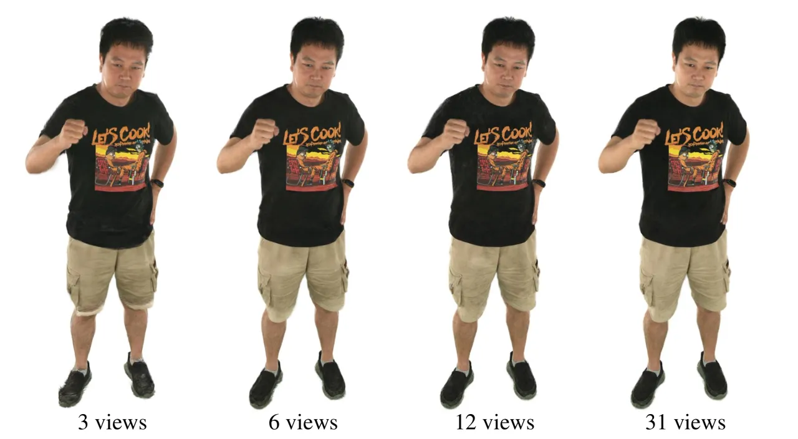

Figure A2: Ablation on sparse views. Our method can be trained with
sparse views, i.e., 3 views, 6 views, and 12 views.

## A Implementation Details

There are three encoder branches and one convolutional decoder defined
in this paper. We show the network structures in Figure A1. As can be
seen that though both the encoder PVM and PVE work on the position map,
PVE is much deeper than PVM. We find all three encoder branches help the
modeling. The convolutional decoder has three groups of CNNs, i.e., one
for position, one for rotation and scaling, and the last one for opacity
and color.

## B Sparse Views

We show in Figure A2 that our method can be trained with sparse views.

## C Ethics

We captured six human subjects in our proposed DREAMS-Avatar dataset.
All subjects have given written consent for the captured footage in this
dataset. We make the data publicly available for research purposes.

Our method could be extended to synthesize communication media contents
of real people. We do not condone using our work to generate fake images
or videos of any person with the intent of spreading misinformation or
tarnishing their reputation.
