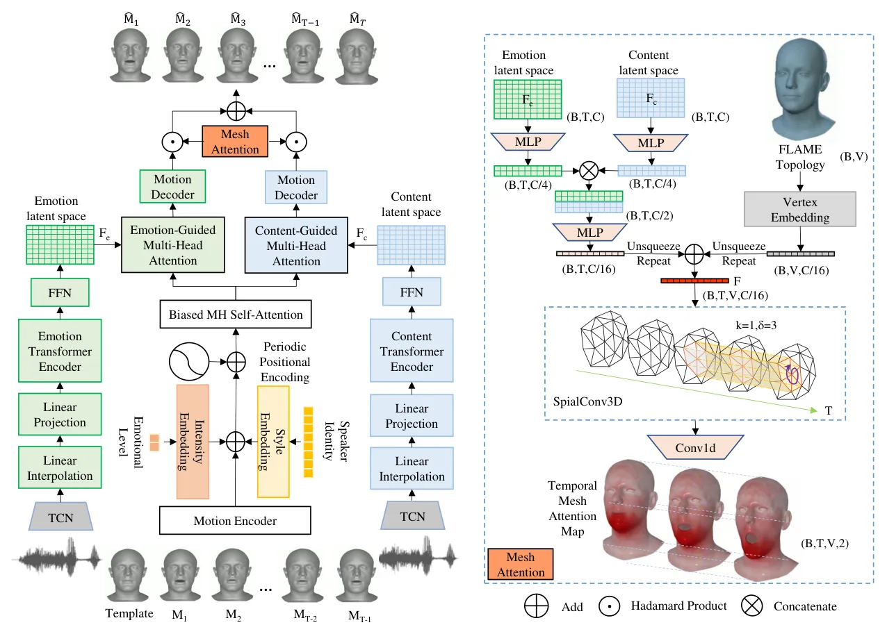
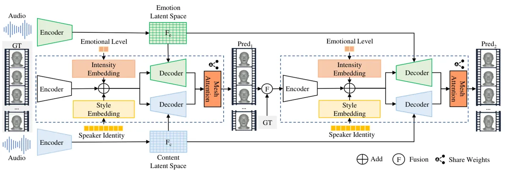
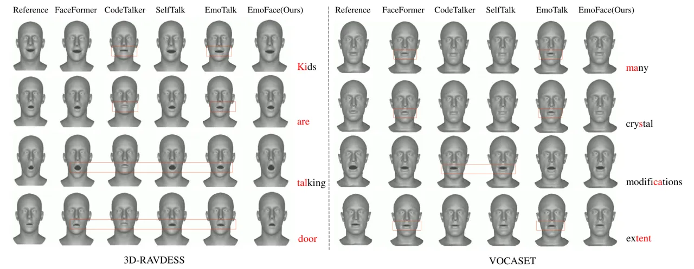
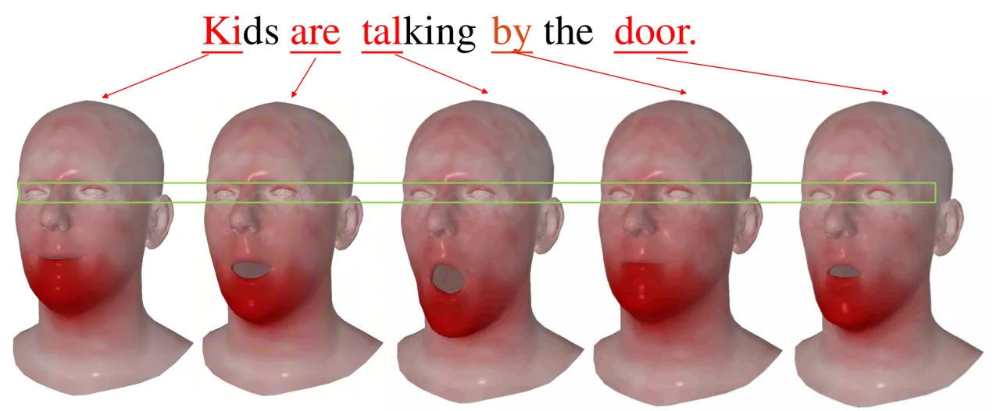
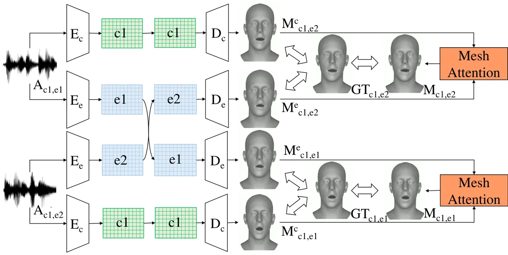
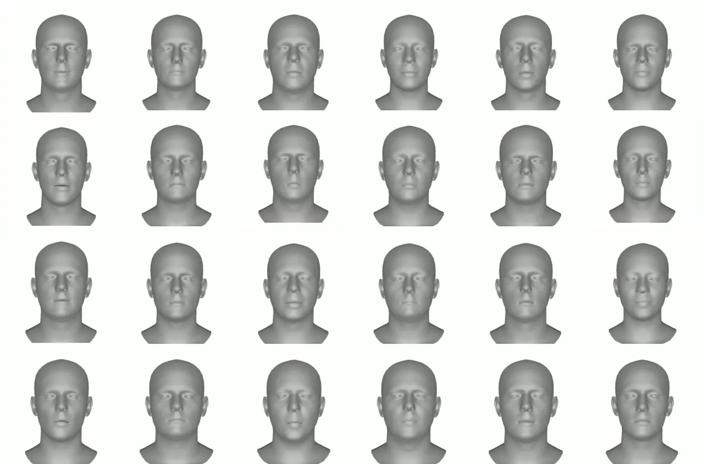
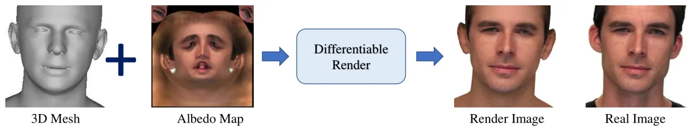

# EmoFace: Emotion-Content Disentangled Speech-Driven 3D Talking Face Animation

Yihong Lin    Liang Peng    Zhaoxin Fan Affiliation: Beijing Advanced
Innovation Center for Future Blockchain and Privacy Computing, School
ofArtificial Intelligence, Beihang University, Affiliation: Hangzhou
International Innovation Institute, Beihang University    Xianjia Wu
Affiliation: Huawei Cloud    Jianqiao Hu Affiliation: South China
University of Technology    Xiandong Li    Wenxiong Kang    Songju Lei
Affiliation: Nanjing University
[lxdphys@smail.nju.edu.cn](mailto:lxdphys@smail.nju.edu.cn)[auwxkang@scut.edu.cn](mailto:auwxkang@scut.edu.cn)

###### Abstract

The creation of increasingly vivid 3D talking face has become a hot
topic in recent years. Currently, most speech-driven works focus on lip
synchronisation but neglect to effectively capture the correlations
between emotions and facial motions. To address this problem, we propose
a two-stream network called EmoFace, which consists of an emotion branch
and a content branch. EmoFace employs a novel Mesh Attention mechanism
to analyse and fuse the emotion features and content features.
Particularly, a newly designed spatio-temporal graph-based convolution,
SpiralConv3D, is used in Mesh Attention to learn potential temporal and
spatial feature dependencies between mesh vertices. In addition, to the
best of our knowledge, it is the first time to introduce a new
self-growing training scheme with intermediate supervision to
dynamically adjust the ratio of groundtruth adopted in the 3D face
animation task. Comprehensive quantitative and qualitative evaluations
on our high-quality 3D emotional facial animation dataset, 3D-RAVDESS
($`4.8863\times 10^{-5}`$mm for LVE and $`0.9509\times 10^{-5}`$mm for
EVE), together with the public dataset VOCASET
($`2.8669\times 10^{-5}`$mm for LVE and $`0.4664\times 10^{-5}`$mm for
EVE), demonstrate that our approach achieves state-of-the-art
performance.

## 1 Introduction

Generating realistic 2D/3D face animations has received great attention
in a number of fields, including film production, computer games,
virtual reality, education, etc. Ping et al. (2013); Edwards et al.
(2016); Wohlgenannt et al. (2020). Recent methods based on deep learning
Karras et al. (2017); Cudeiro et al. (2019); Richard et al. (2021); Fan
et al. (2022); Xing et al. (2023); Peng et al. (2023a); Wu et al.
(2023); Stan et al. (2023) produce impressive 3D face animations with
significant savings in time and labour compared to manual production,
making them preferred for academic research and commercial exploration.
However, there are still some situations remained to be adequately
addressed, for example, the relationship between emotions and facial
expressions. Most of the preceding speech-driven methods Cudeiro et al.
(2019); Richard et al. (2021); Fan et al. (2022); Xing et al. (2023);
Peng et al. (2023a) focus more on achieving high-quality lip
synchronisation, while ignoring the impact of emotion on facial
animations. Recognizing the significance of emotion, EmoTalk Peng et al.
(2023b) and EMOTE Daněček et al. (2023) disentangle emotional and
content information in speech to generate high-quality emotional 3D
facial animations. Nevertheless, EmoTalk only uses emotion as the
driving source, regardless of content, thereby limiting its performance.
EMOTE doesn’t achieve end-to-end training and adopts a FLAME Li et al.
(2017) parameter-based method that theoretically does not control motion
as accurately as vertex-based methods because the abstract coefficient
estimation ignores spatial correlations.

In this paper, we propose a novel vertex-based autoregressive emotional
speech-driven 3D face animation approach. We first disentangle emotion
and content from speech and extract their features separately, then a
latent space decoder is used to obtain the emotion-based and
content-based vertex offsets, which are eventually integrated by Mesh
Attention to predict the final offsets. Due to that the fusion weights
for the emotion branch and the content branch are variable in both
temporal and spatial domains, we add a 3D graph-based convolution
operator SpiralConv3D in Mesh Attention for effective feature exaction.
Moreover, during the training process, it is observed that the
autoregression scheme of the transformer decoder results in error
accumulation, which ultimately leads to a deterioration in the output
and increases the training time. Although, existing teacher-forcing
scheme can help to alleviate this problem, exposure bias may occur when
switching from training to inference due to inability to access real
historical data. Inspired by scheduled sampling Mihaylova and Martins
(2019), we propose a self-growing scheme that gradually adjusts the
ratio of groundtruth provided during training. In order to better train
our emotion-content disentanglement model, we construct a high-quality
dataset 3D-RAVDESS by reconstructing reliable 3D faces from 2D dataset
RAVDESS Livingstone and Russo (2018). Extensive qualitative and
quantitative experiments demonstrate that our method outperforms current
state-of-the-art methods for better generation of facial expressions and
lip synchronisation. In summary, our main contributions are as follows:

- •
  We provide a new high-quality emotional speech-driven dataset,
  3D-RAVDESS.
- •
  We design a two-stream network, EmoFace, to obtain the emotion-based
  and content-based vertex offsets, respectively, which are dynamically
  fused by a novel Mesh Attention with SpiralConv3D that efficiently
  extracts features in the spatio-temporal domain.
- •
  We introduce intermediate supervision to guide two branches
  respectively and propose a self-growing training scheme to gradually
  increase the difficulty of prediction, thus improving the robustness
  of the model.
- •
  Extensive experiments demonstrate the superiority of EmoFace over
  existing SOTA methods in terms of full face realism, emotion
  expression and lip synchronisation on both 3D-RAVDESS and VOCASET.

## 2 Related Work

### 2.1 Speech-Driven 3D Talking Face

Speech-driven 3D talking face generation is a task to generate realistic
facial animations based on speech Karras et al. (2017); Lahiri et al.
(2021); Pham et al. (2017); Taylor et al. (2017). A number of rule-based
approaches have been employed to generate 3D motions, including the
capture of the relationship between visemes Mattheyses and Verhelst
(2015) and facial action units (FAUs) Ekman and Friesen (1978), as well
as the establishment of a phoneme-viseme mapping that has yielded highly
promising results in early studies Edwards et al. (2016); Xu et al.
(2013). Nevertheless, these methods do not easily transfer to new faces
as they heavily rely on manual crafting and consume an excessive amount
of time.

In contrast to rule-based methods, deep learning-based 3D face animation
methods resort to a data-driven framework. Most of them take both speech
and a static 3D mesh template as input to generate realistic 3D face
animations. In an early work, VOCA Cudeiro et al. (2019) proposes a
temporal convolutional neural network with an open-source 4D dataset
VOCASET, Cudeiro et al. (2019), which has become a valuable resource for
subsequent studies. Building on this foundation, MeshTalk Richard et al.
(2021), FaceFormer Fan et al. (2022), and CodeTalker Xing et al. (2023)
incorporate motion priors to improve animation quality. MeshTalk notes
the importance of facial motion in audio-uncorrelated regions and adopts
categorical latent space to learn discrete motion priors. FaceFormer
focuses on the long temporal sequences and successfully uses a
transformer decoder Vaswani et al. (2017) to obtain contextual
information to generate sequential mesh sequences. CodeTalker introduces
VQ-VAE Van Den Oord et al. (2017) to learn discrete motion priors for
smooth facial motion generation. More recently, SelfTalk Peng et al.
(2023a) proposes consistency loss to improve the generation quality.
Other works Stan et al. (2023); Chen et al. (2023); Sun et al. (2024)
introduce diffusion model into 3D facial animation to enhance motion
diversity.

However, all these approaches have mainly focused on lip synchronisation
but have not paid attention to the correlation between emotions and
facial expressions. To address this problem, EmoTalk Peng et al. (2023b)
and EMOTE Daněček et al. (2023) both propose speech-driven
content-emotion disentanglement pipelines. Nevertheless, EmoTalk does
not utilize content information and only focuses on the driving effect
of emotional information, while the effectiveness and efficiency of
EMOTE are limited by FLAME parameters and two-stage training pipelines,
respectively.



Figure 1: The overall framework of EmoFace. The emotion and content
branches disentangle the information in speech, while Mesh Attention
fuses these two branches to obtain the final result. The entire
framework is end-to-end, thus allowing for efficient training and
inference. $`\hat{M}_{i}`$ denotes the $`i`$-th predicted motion and
$`M_{i}`$ denotes the $`i`$-th reference motion. $`k`$ and $`\delta`$
represent the spatial and the temporal neighbourhood of SpiralConv3D
respectively.

### 2.2 Spiral Convolution

Defferrard et al. Defferrard et al. (2016) present a graph convolutional
network (GCN) based on spectral filtering for non-Euclidean graph
structure with the same linear complexity as the classical CNN.
Kolotouros et al. Kulon et al. (2020) devise a simple model consisting
of an encoder and a decoder with spiral convolution added to the
decoder, which can directly learn the mapping relationships from 2D
images to 3D meshes. Since the graph convolution operator is intuitive
enough for dealing with 3D mesh vertices in the spatial domain, Masci et
al. Masci et al. (2015) advance the idea of spatial graph convolution
with sampling of the graph signal. Lim et al. Lim et al. (2018) propose
spiral convolution based on graph convolution to handle 3D mesh vertices
in the spatial domain. Gong et al. Gong et al. (2019) introduce
SpiralNet++, which utilizes truncated spiral lines to constrain the
number of sampled vertices, while incorporating hollow spiral lines to
enhance the receptive field. Inspired by these previous works, we use
spiral convolution in a 3D facial animation generation task to allow
EmoFace to better learn the spatial as well as temporal associations of
mesh vertices.

## 3 Methods

### 3.1 Overview

The overall pipeline is shown in Figure 1. In order to generate vivid
emotional 3D talking faces, we propose EmoFace, a model that can
sufficiently learn emotions from speech and generate talking face with
rich expressions. The input of EmoFace consists of the speech sequence
$`A_{1:T}=(a_{1},a_{2},{\ldots},a_{T})`$, the emotional level
$`l\in\mathbb{R}^{2}`$, the speaking style $`s\in\mathbb{R}^{n}`$ and
the character template $`Y_{c}\in\mathbb{R}^{V\times 3}`$, where $`n`$
is the number of speaking styles, $`T`$ is the length of the mesh
sequence, and $`V`$ is the number of mesh vertices. The emotion level
and the speaking style are encoded as one-hot vectors. Inspired by Ji
et al. (2021) and Peng et al. (2023b), we use a similar emotion-content
disentanglement module that uses pre-trained speech feature extractors
wav2vec2.0 Baevski et al. (2020) to reduce the difficulty of learning
the mapping between speech and emotional facial expressions.
Specifically, the emotion branch and the content branch firstly
disentangle emotion-related features $`F_{e}`$ and content-related
features $`F_{c}`$ from the speech sequence $`A_{1:T}`$. Then,
emotion-related features $`F_{e}`$ and content-related features
$`F_{c}`$ drive the given template vertices to generate offsets
$`\Delta M^{e}_{1:T}=(\Delta m^{e}_{1},\Delta m^{e}_{2},{\ldots},\Delta m^{e}_{T})`$
and
$`\Delta M^{c}_{1:T}=(\Delta m^{c}_{1},\Delta m^{c}_{2},{\ldots},\Delta m^{c}_{T})`$,
respectively, using the same transformer decoder as FaceFormer, which
contains a multi-head cross-attention module to align the audio and
motion modalities as well as a multi-head self-attention module to learn
the dependencies between each frame of the past facial motions. Finally,
Mesh Attention is provided to fuse the predictions of the two branches
in temporal and spatial domains to obtain the final prediction
$`\Delta M_{1:T}`$.

### 3.2 Mesh Attention

In order to fuse the prediction results of the emotion branch and
content branch, we propose a novel spatio-temporal attention module Mesh
Attention that analyses the fusion weight. Different from conventional
MLP-based motion decoding methods that suffer from mesh Non-Euclidean
topology destruction and explicit geometric constraint absence, Mesh
Attention employs the core operator SpiralConv3D to directly model
spatial vertex connectivity within frames and temporal vertex
correspondence across frames. This approach performs spatiotemporal
aggregation of neighboring vertices’ geometric and semantic features
while maintaining the mesh’s local manifold structure and physical
constraints (e.g., smoothness, symmetry), ultimately generating a
Temporal Mesh Attention Map that quantifies the impact of two branches
on final predictions.

Firstly, $`F_{e1}\in\mathbb{R}^{B\times T\times C}`$ and
$`F_{c1}\in\mathbb{R}^{B\times T\times C}`$ go through one layer of MLP
to get $`F_{e1}\in\mathbb{R}^{B\times T\times C/4}`$ and
$`F_{c1}\in\mathbb{R}^{B\times T\times C/4}`$ with lower channel
dimensions, and then they are concatenated in channel dimensions,
followed by another layer of MLP to further reduce the channel number to
get the fusion feature
$`F_{audio}\in\mathbb{R}^{B\times T\times C/16}`$. Secondly, we perform
the vertex position embedding of the FLAME topology to obtain the
position embedding feature
$`F_{vertices-emb}\in\mathbb{R}^{B\times V\times C/16}`$. Furthermore,
to obtain the temporal features of the mesh vertices, we integrate the
fusion feature $`F_{audio}`$ and the position embedding feature
$`F_{vertices-emb}`$. Specifically, the fusion feature $`F_{audio}`$ is
unsqueezed in the second dimension and then repeated $`V`$ times to
obtain
$`F^{\prime}_{audio}\in\mathbb{R}^{B\times V\times T\times C/16}`$.
Similarly, $`F_{vertices-emb}`$ is unsqueezed in the first dimension and
then repeated $`T`$ times to obtain
$`F^{\prime}_{vertices-emb}\in\mathbb{R}^{B\times V\times T\times C/16}`$.
The obtained features are summed eventually to get the integrated
temporal features of the vertices
$`F\in\mathbb{R}^{B\times V\times T\times C/16}`$.



Figure 2: Self-growing scheme. In the first stage, the model inputs all
groundtruth frames at once and directly predicts the next frame
corresponding to each input frame. In the second stage, the input is
changed to a fusion of the groundtruth frames and the predicted frames
from the previous stage, and the same prediction process is applied to
obtain the final prediction results.

In purpose of further exploring the temporal-spatial connection between
vertices, we design a new graph-based convolution operator, 3D spiral
convolution (SpiralConv3D). In spatial domain, it determines the
convolution centre and generates a series of enumerated vertices based
on adjacency, followed by 1-ring vertices, 2-ring vertices, and so on,
until all vertices containing k rings are included. SpiralConv3D
determines the adjacency as follows:

```math
\displaystyle 0{-ring}(v) \displaystyle={v},
```

```math
\displaystyle(k+1){-}ring(v) \displaystyle=\mathcal{N}(k{-ring}(v))\setminus k{-disk}(v),
```

```math
\displaystyle k{-disk}(v) \displaystyle=\cup_{i=0,...,k}i{-ring}(v), \tag{1}
```

where $`\mathcal{N}(V)`$ selects all vertices in the neighborhood of any
vertex in set $`V`$. In temporal domain, SpiralConv3D considers how the
vertices have changed between the past $`T`$ frames, and creates
connections to the corresponding vertices between different frames:

```math
cnt_{\delta}(V_{ti})=\left\{\begin{aligned} \{V_{t-\delta+1,i},\ldots,V_{t-1,i},V_{t,i})\}&,t\geq\delta\\
\{Pad(\delta-t),V_{1,i},\ldots,V_{t,i}\}&,t<\delta\end{aligned}\right., \tag{2}
```

where $`V_{ti}`$ is the $`i`$-th vertex of moment $`t`$,
$`0\leq t\leq T`$ and $`0\leq i\leq 5023`$. Meanwhile,
$`cnt_{\delta}(V_{ti})`$ denotes the connection between $`V_{ti}`$ and
the vertices of past $`\delta`$ frames, and padding is used when
$`t<\delta`$. Similar to 3D ConvNets Tran et al. (2015), SpiralConv3D
considers both temporal and spatial correlations. In contrast,
SpiralConv3D applies this spatio-temporal modeling to mesh sequences
with a sparse spatial distribution and a dense temporal distribution,
considering convolution as the use of fully connected layers for feature
fusion:

```math
\displaystyle S\!piralConv3D(v)= \displaystyle W(f(cnt_{\delta}(k{-disk}(v))))
```

```math
\displaystyle+b, \tag{3}
```

where $`f`$ denotes the feature extractor, $`W`$ and $`b`$ are learnable
weights and bias. To our knowledge, this work exploits 3D GraphConv in
the context of supervised training datasets and modern deep
architectures to achieve the best performance on 3D facial animation.

### 3.3 Training and Testing

#### 3.3.1 Self-growing Scheme

During the training phase, we adopt a novel self-growing scheme instead
of teacher-forcing or autoregression scheme, as shown in Figure 2.
Self-growing scheme divides the training process in each epoch into two
stages. In the first stage, the model inputs all groundtruth frames at
once, and then uses Temporal Bias Fan et al. (2022) to eliminate the
influence of future frames and directly predicts the next frame
corresponding to each input frame. In the second stage, the model adopts
the fusion strategy to obtain new input data and repeats the prediction
operation in the previous stage. The fusion strategy is adapted
according to the training process. Specifically, in the first few
$`\theta`$ epochs, we keep all the groundtruth frames $`GT`$ as inputs;
in the remaining epochs, the first half gradually replace the
groundtruth frames $`GT`$ with the predicted frames $`P`$ from the
previous stage using the cosine function, and the second half directly
abandon the groundtruth frames. The fusion strategy can be denoted as
follows:

```math
\displaystyle I_{n,t}=\left\{\begin{array}[]{ll}GT_{t},n<\theta\text{\kern 5.0pt}or\text{\kern 5.0pt}rand()<cos(\frac{\pi(n-\theta)}{N-\theta})\\
P_{t},n>\frac{(N+\theta)}{2}\text{\kern 5.0pt}or\text{\kern 5.0pt}rand()\geq cos(\frac{\pi(n-\theta)}{N-\theta})\end{array},\right.
```

where $`n`$ and $`t`$ denote the $`n`$-th epoch and the $`t`$-th frame,
respectively. $`N`$ means the total number of epochs and $`rand()`$
generates a random number from a uniform distribution over the interval
\[0, 1\]. Self-growing scheme fully guides in the initial epochs and
then gradually reduces the guidance and accepts its own outputs, which
weakens the impact of error accumulation and improves the robustness and
generation quality.

During inference, EmoFace autoregressively predicts the mesh sequence
corresponding to previous 3D talking faces. Specifically, at each moment
$`t`$, EmoFace predicts the face motion $`M_{t}`$ conditioned on the raw
audio $`A`$, the prior sequence of face motions $`M_{\leq t}`$ , the
speaking style $`s_{n}`$, and the emotion level $`l_{n}`$ at each
moment. The $`s_{n}`$ and $`l_{n}`$ are determined by the speaker, and
thus altering the one-hot identity and intensity vectors can manipulate
the output in different styles and emotional levels.

#### 3.3.2 Training Strategy of Emotion-Content Disentanglement Module

We set a pseudo-training pair of samples with the same content but
different emotions. The emotion features and content features are
extracted respectively and the two emotion features are exchanged as
input of transformer decoder to implement cross reconstruction. Since
that we expect both the emotion branch and the content branch to be as
strong as possible in modeling the speech-mesh mapping relationship, our
emotion branch and content branch make separate predictions for the mesh
offsets of the next frame. We incorporate the intermediate supervision
into the predictions of two separate branches. However, both branches
have significant limitations in their respective abilities to model
facial motions. On the one hand, although the features extracted from
the content branch are strongly correlated with the lips, the inability
to extract long-term emotional features and the lack of the type and
intensity of emotion are not conducive to predicting the magnitude of
mouth opening. On the other hand, though the features extracted from the
emotion branch are strongly correlated with the motions of the eyes and
the face expressions, the lack of short-term content features results in
insufficiently accurate predictions of the lips. Thus, as mentioned
before, Mesh Attention is designed to fuse the driving results of the
two branches in temporal and spatial domains to obtain the final
prediction. Our self-reconstruction loss, cross-reconstruction loss,
velocity loss and classification loss are as follows:

```math
\displaystyle{L}_{self} \displaystyle=\left\|M^{e}_{c1,e1}-\hat{M}_{c1,e1}\right\|_{1}+\left\|M^{c}_{c1,e1}-\hat{M}_{c1,e1}\right\|_{1}
```

```math
\displaystyle+\left\|M_{c1,e1}-\hat{M}_{c1,e1}\right\|_{1}, \tag{6}
```

```math
\displaystyle{L}_{cross} \displaystyle=\left\|M^{e}_{c1,e2}-\hat{M}_{c1,e2}\right\|_{1}+\left\|M^{c}_{c1,e2}-\hat{M}_{c1,e2}\right\|_{1}
```

```math
\displaystyle+\left\|M_{c1,e2}-\hat{M}_{c1,e2}\right\|_{1}, \tag{7}
```

```math
\displaystyle{L}_{vel} \displaystyle=\left\|M^{t}_{c1,e1}-M^{t-1}_{c1,e1},\hat{M}^{t}_{c1,e1}-\hat{M}^{t-1}_{c1,e1}\right\|_{1}
```

```math
\displaystyle+\left\|M^{t}_{c1,e2}-M^{t-1}_{c1,e2},\hat{M}^{t}_{c1,e2}-\hat{M}^{t-1}_{c1,e2}\right\|_{1}, \tag{8}
```

```math
\displaystyle{L}_{cls} \displaystyle=-\sum_{i}\sum_{\phi=1}^{N_{e}}\left(y_{i\phi}*\log p_{i\phi}\right), \tag{9}
```

where $`M_{cx,ey}`$ represents predicted mesh sequence with content
$`x`$ and emotion $`y`$. $`M^{c}`$ and $`M^{e}`$ represents predicted
mesh sequence of content branch and emotion branch, respectively.
$`M^{t}`$ means the $`t`$-th frame of mesh sequence, $`\hat{M}`$ means
the groundtruth, $`N_{e}`$ represents the number of distinct emotion
categories, $`y_{i\phi}`$ is the observation function that determines
whether sample $`i`$ carries the emotion label $`\phi`$, and
$`p_{i\phi}`$ denotes the predicted probability that sample $`i`$
belongs to class $`\phi`$. Note that the first two terms of
self-reconstruction loss and cross-reconstruction loss are intermediate
supervision of the two branches. The overall function is given by:

```math
\displaystyle L=\lambda_{1}L_{self}+\lambda_{2}L_{cross}+\lambda_{3}L_{vel}+\lambda_{4}L_{cls}, \tag{10}
```

where $`\lambda_{1}=\lambda_{2}=1000`$, $`\lambda_{3}=500`$ and
$`\lambda_{4}=0.0001`$ in all of our experiments.

## 4 Experiments

### 4.1 Experimental Settings

We employ two datasets, including the non-emotional dataset VOCASET and
the emotional dataset 3D-RAVDESS, where the 3D-RAVDESS dataset is the
dataset we constructed.

VOCASET dataset. VOCASET Cudeiro et al. (2019) consists of 480 face mesh
sequences from 12 subjects. Each mesh sequence is 60fps and is between 3
and 4 seconds long in duration. Meanwhile, each 3D face mesh has 5023
vertices. We follow the data configuration of VOCA for a fair
comparison.

3D-RAVDESS Dataset. The RAVDESS Livingstone and Russo (2018) is a
multimodal emotion recognition dataset. As shown in Table 1, the dataset
contains 24 actors (12 male and 12 female), each actor has 60 sentences
with a total of 1440 face mesh sequences and corresponding speech. Each
actor in this dataset provides data on different emotion categories and
emotion levels, including neutral, calm, happy, sad, angry, fearful,
disgusted, and surprised. In this case, the data corresponding to the
first 20 subjects of the dataset are used for training, the 21st and
22nd subjects are used for validation, and the last two subjects are
used for testing. We first process 1440 videos from the original RAVDESS
dataset to convert the frame rate to 30 fps. Then, the emotional 3D
faces are reconstructed using EMOCA Daněček et al. (2022) to obtain a
sequence of 5023 mesh vertices under the FLAME network topology. Due to
the jittery results, we use Kalman Filter Kalman (1960) on the FLAME
parameters and fix the last three of the pose parameters to obtain 3D
head mesh sequences with smooth front view. Our 3D-RAVDESS dataset
consists of these mesh sequences and the corresponding speech from the
original 2D dataset.

| Subject | Gender Ratio | Text | Emotion | Sentence | FPS | Topology | Training:Validation:Testing |
| ------- | ------------ | ---- | ------- | -------- | --- | -------- | --------------------------- |
| 24      | 1:1          | 60   | 8       | 1440     | 30  | FLAME    | 10:1:1                      |

Table 1: Statistics of 3D-RAVDESS dataset.



Figure 3: Qualitative comparison of the facial movements of the
different methods on 3D-RAVDESS (left) and VOCASET (right). On
3D-RAVDESS, we generate facial animations of saying the sentence “Kids
are talking by the door.” with surprised. On VOCA-Test, facial
animations of saying the sentence “How many crystal modifications of
uranium hydride are extent?” without emotion are generated. Significant
differences in the lip region are denoted by red boxes. EmoFace
generates more realistic facial movements that match the speech, whether
it’s emotional or not.

### 4.2 Quantitative evaluation

To evaluate the lip synchronisation, we compute the lip vertex error
(LVE) that is used in previous work Fan et al. (2022). This metric
computes the maximum $`\ell_{2}`$ error among all lip vertices in the
test set and averages $`\ell_{2}`$ error across all frames.
Additionally, the emotional vertex error (EVE) Peng et al. (2023b) is
used to reflect the full emotional expression. It measures the maximum
$`\ell_{2}`$ error of all eye and forehead vertices in the test set and
averages $`\ell_{2}`$ error of them. Table 2 demonstrates significant
advantages of our algorithm in handling emotional speech-driven 3D face.
In particular, our LVE and EVE on 3D-RAVDESS dataset is 20% and 35%
lower than SelfTalk, respectively.

|                                 | VOCASET            |                    | 3D-RAVDESS         |                    |
| ------------------------------- | ------------------ | ------------------ | ------------------ | ------------------ |
| Methods                         | LVE $`\downarrow`$ | EVE $`\downarrow`$ | LVE $`\downarrow`$ | EVE $`\downarrow`$ |
| VOCA Cudeiro et al. (2019)      | 4.9245             | –                  | –                  | –                  |
| MeshTalk Richard et al. (2021)  | 4.5441             | –                  | –                  | –                  |
| FaceFormer Fan et al. (2022)    | 4.1090             | 0.4858             | 5.8462             | 1.4149             |
| CodeTalker Xing et al. (2023)   | 3.9445             | 0.5074             | 15.6160            | 3.4675             |
| EmoTalk Peng et al. (2023b)     | 3.7798             | 0.4862             | 6.6076             | 1.5994             |
| SelfTalk Peng et al. (2023a)    | 3.2238             | 0.4562             | 6.2560             | 1.5685             |
| TalkingStyle Song et al. (2024) | 3.5245             | 0.4686             | 5.9737             | 1.4471             |
| EmoFace(Ours)                   | 2.8669             | 0.4664             | 4.8863             | 0.9509             |

Table 2: Quantitative evaluation results on VOCASET and 3D-RAVDESS.(For
better visualization, we scale up the LVE and EVE by a factor of
$`10^{-5}`$.)

### 4.3 Qualitative evaluation

We qualitatively compare the driving effects of cross-identity between
different models by driving the new 3D character templates in the test
set with the speaking style of the training characters. The left side of
Figure 3 shows the driving results of different models for the same
speech with strong surprised emotion, and the right side shows the
driving results of different models in non-emotional speech. Since that
the speaking style of the new characters is unknown in the test data,
the model may be driven slightly differently to the real results. In
terms of lip synchronisation, EmoFace shows a greater amplitude of
movement, which is particularly evident in the lip shapes for “are",
“talking" and “door". This provides a more accurate reflection of
surprise and is more consistent with real movements of the lips. In
addition, it also has a higher degree of mouth closure than other
methods, for example, when pronouncing “many", “crystal" and “extent".
Furthermore, the full face comparison in Figure 3 indicates that EmoFace
drives more obvious and natural expressions. To further demonstrate the
superiority of our algorithm for both emotional and non-emotional audio
inputs, a supplementary video is provided for more detailed comparisons.

### 4.4 Ablation experiments

In this section, we conduct ablation experiments to investigate the
impact of our training strategy and Mesh Attention. All ablation
experiments are conducted on the 3D-RAVDESS dataset.

[TABLE]

Table 3: Ablation study for our components. We show the LVE and EVE in
different cases.

#### 4.4.1 Impact of self-growing scheme.

We train our method using teacher-forcing without self-growing and
obtain higher LVE and EVE, as shown in Table 3. We believe the reason is
that guiding is too strong, leading to poor robustness, and the
prediction errors in the previous frames accumulate and affect the
subsequent frames. However, with a gradually weakened guiding in the
self-growing scheme, EmoFace is trained to take the errors of the
previous frames into account, which is similar to the situation during
inference.

#### 4.4.2 Impact of Mesh Attention.

We compare the difference in effectiveness between the Mesh Attention
module and the Add operation. Table 3 also demonstrates that directly
adding up the gains predicted by the two branches without Mesh Attention
leads to a great degradation of model performance, whereas a weighted
sum seems more reasonable. This indicates that the contribution of the
two branches differs in the different head regions.

#### 4.4.3 Hyperparameters of SpiralConv3D.

A series of ablation experiments on dilation, kernel size and time
duration are provided, as shown in Table 4. In terms of dilation
coefficients, the third to fifth rows show that proper dilation can
improve performance, while excessive dilation leads to performance
degradation. SpiralConv3D may under-consider nearby vertex features with
too large dilation coefficient. Furthermore, with respect to kernel
size, the first to third rows indicate that large convolution kernels
bring high generation quality. SpiralConv3D with a larger kernel size
integrates vertex features within a larger spatial receptive field,
which has a significant effect on the performance improvement. Finally,
the fourth and the last two rows demonstrate the importance of large
temporal receptive field. A larger time duration means that the
connectivity relationship of the vertices between more video frames are
considered. Time duration coefficient of 1 degrades SpiralConv3D to
SpiralConv2D, which only spatially fuses the features and performs worse
than configuration of the fourth row. Based on the results of the
quantitative comparison, we adopt the configuration of the fourth row.

[TABLE]

Table 4: Ablation study of SpiralConv3D.



Figure 4: Visualization of the importance of emotional information for
facial regions. The eyes, mouth and jaw are strongly correlated with
emotions.

### 4.5 Visualization

We believe that although the lips are directly controlled by the content
of the speech, the gain from emotion is also quite important. Hence, we
visualize the attention weight of the emotion branch with darker color
representing larger weights, as shown in Figure 4. It is obvious that
emotion brings great effects on the motion amplitude and direction in
the mouth, jaw and eye regions. In other words, these regions are
strongly correlative to emotion.

The Supplementary Video shows the animation of the content branch. It
performs normally in non-silent frames but shows obvious lip jitter in
silent frames, which also leads to unstable Addition output. However,
EmoFace dynamically combines two branches with Mesh Attention to obtain
better animation results in terms of lip synchronization, expression
synchronization, movement amplitude and coherence. More results under
VOCASET-Test, 3D-RAVDESS-Test and long speech in the wild, performance
on different emotions and comparative demonstrations of ablation
experiments are shown in the Supplementary Video.

## 5 Conclusion

In this paper, we present EmoFace, an emotional speech-driven 3D talking
face model. Our model disentangles the emotion and content from the
speech and predicts the mesh offsets driven by emotion and content,
respectively. To further improve the prediction accuracy, new Mesh
Attention integrates the output mesh offsets. Particularly, a novel
graph-based SpiralConv3D is adopted to fuse spatio-temporal features of
mesh sequences. Extensive experiments conducted under self-growing
scheme using both public dataset VOCASET and newly constructed
high-quality dataset 3D-RAVDESS demonstrate that our model outperforms
existing state-of-the-art methods and receives better user experience
feedback.

## Limitations

Although our model gets state-of-the-art results, there are still some
limitations to address in future work. On the one hand, speech driven
methods do not model expressions and motions that are unrelative to
audio, for example, eye blinks. Our next work will take the video input
into account to obtain better animation results. On the other hand, the
Mesh Attention proposed in our work meets large amount of computation
because of the 3D spiral convolution operator. More explorations will be
done to reduce the computation costs.

## Ethical Statement

The existing scientific artifacts used in this work are consistent with
their intended use and our work is for research purposes only and should
not be used outside of research contexts. In addition, since face data
can be used for generating content that may jeopardize privacy, we must
act responsibly by considering the aspects related to privacy and
ethics.

## References

- Baevski et al. (2020) Alexei Baevski, Yuhao Zhou, Abdelrahman Mohamed,
  and Michael Auli. 2020. wav2vec 2.0: A framework for self-supervised
  learning of speech representations. _Advances in neural information
  processing systems_, 33:12449–12460.
- Chen et al. (2023) Peng Chen, Xiaobao Wei, Ming Lu, Yitong Zhu,
  Naiming Yao, Xingyu Xiao, and Hui Chen. 2023. Diffusiontalker:
  Personalization and acceleration for speech-driven 3d face diffuser.
  _arXiv preprint arXiv:2311.16565_.
- Cudeiro et al. (2019) Daniel Cudeiro, Timo Bolkart, Cassidy Laidlaw,
  Anurag Ranjan, and Michael J Black. 2019. Capture, learning, and
  synthesis of 3d speaking styles. In _Proceedings of the IEEE/CVF
  Conference on Computer Vision and Pattern Recognition_, pages
  10101–10111.
- Daněček et al. (2022) Radek Daněček, Michael J Black, and Timo
  Bolkart. 2022. Emoca: Emotion driven monocular face capture and
  animation. In _Proceedings of the IEEE/CVF Conference on Computer
  Vision and Pattern Recognition_, pages 20311–20322.
- Daněček et al. (2023) Radek Daněček, Kiran Chhatre, Shashank Tripathi,
  Yandong Wen, Michael Black, and Timo Bolkart. 2023. Emotional
  speech-driven animation with content-emotion disentanglement. In
  _SIGGRAPH Asia 2023 Conference Papers_, pages 1–13.
- Defferrard et al. (2016) Michaël Defferrard, Xavier Bresson, and
  Pierre Vandergheynst. 2016. Convolutional neural networks on graphs
  with fast localized spectral filtering. _Advances in neural
  information processing systems_, 29.
- Edwards et al. (2016) Pif Edwards, Chris Landreth, Eugene Fiume, and
  Karan Singh. 2016. Jali: an animator-centric viseme model for
  expressive lip synchronization. _ACM Transactions on graphics (TOG)_,
  35(4):1–11.
- Ekman and Friesen (1978) Paul Ekman and Wallace V Friesen. 1978.
  Facial action coding system. _Environmental Psychology & Nonverbal
  Behavior_.
- Fan et al. (2022) Yingruo Fan, Zhaojiang Lin, Jun Saito, Wenping Wang,
  and Taku Komura. 2022. Faceformer: Speech-driven 3d facial animation
  with transformers. In _Proceedings of the IEEE/CVF Conference on
  Computer Vision and Pattern Recognition_, pages 18770–18780.
- Gong et al. (2019) Shunwang Gong, Lei Chen, Michael Bronstein, and
  Stefanos Zafeiriou. 2019. Spiralnet++: A fast and highly efficient
  mesh convolution operator. In _Proceedings of the IEEE/CVF
  international conference on computer vision workshops_, pages 0–0.
- Ji et al. (2021) Xinya Ji, Hang Zhou, Kaisiyuan Wang, Wayne Wu,
  Chen Change Loy, Xun Cao, and Feng Xu. 2021. Audio-driven emotional
  video portraits. In _Proceedings of the IEEE/CVF conference on
  computer vision and pattern recognition_, pages 14080–14089.
- Kalman (1960) Rudolph Emil Kalman. 1960. A new approach to linear
  filtering and prediction problems.
- Karras et al. (2017) Tero Karras, Timo Aila, Samuli Laine, Antti
  Herva, and Jaakko Lehtinen. 2017. Audio-driven facial animation by
  joint end-to-end learning of pose and emotion. _ACM Transactions on
  Graphics (TOG)_, 36(4):1–12.
- Kulon et al. (2020) Dominik Kulon, Riza Alp Guler, Iasonas Kokkinos,
  Michael M Bronstein, and Stefanos Zafeiriou. 2020. Weakly-supervised
  mesh-convolutional hand reconstruction in the wild. In _Proceedings of
  the IEEE/CVF conference on computer vision and pattern recognition_,
  pages 4990–5000.
- Lahiri et al. (2021) Avisek Lahiri, Vivek Kwatra, Christian Frueh,
  John Lewis, and Chris Bregler. 2021. Lipsync3d: Data-efficient
  learning of personalized 3d talking faces from video using pose and
  lighting normalization. In _Proceedings of the IEEE/CVF conference on
  computer vision and pattern recognition_, pages 2755–2764.
- Li et al. (2017) Tianye Li, Timo Bolkart, Michael J Black, Hao Li, and
  Javier Romero. 2017. Learning a model of facial shape and expression
  from 4d scans. _ACM Trans. Graph._, 36(6):194–1.
- Lim et al. (2018) Isaak Lim, Alexander Dielen, Marcel Campen, and Leif
  Kobbelt. 2018. A simple approach to intrinsic correspondence learning
  on unstructured 3d meshes. In _Proceedings of the European conference
  on computer vision (ECCV) workshops_, pages 0–0.
- Livingstone and Russo (2018) Steven R Livingstone and Frank A
  Russo. 2018. The ryerson audio-visual database of emotional speech and
  song (ravdess): A dynamic, multimodal set of facial and vocal
  expressions in north american english. _PloS one_, 13(5):e0196391.
- Masci et al. (2015) Jonathan Masci, Davide Boscaini, Michael
  Bronstein, and Pierre Vandergheynst. 2015. Geodesic convolutional
  neural networks on riemannian manifolds. In _Proceedings of the IEEE
  international conference on computer vision workshops_, pages 37–45.
- Mattheyses and Verhelst (2015) Wesley Mattheyses and Werner
  Verhelst. 2015. Audiovisual speech synthesis: An overview of the
  state-of-the-art. _Speech Communication_, 66:182–217.
- Mihaylova and Martins (2019) Tsvetomila Mihaylova and André F. T.
  Martins. 2019. Scheduled sampling for transformers. In _Proceedings
  ACL SRW_.
- Park et al. (2023) Se Jin Park, Joanna Hong, Minsu Kim, and Yong Man
  Ro. 2023. Df-3dface: One-to-many speech synchronized 3d face animation
  with diffusion. _arXiv preprint arXiv:2310.05934_.
- Peng et al. (2023a) Ziqiao Peng, Yihao Luo, Yue Shi, Hao Xu, Xiangyu
  Zhu, Hongyan Liu, Jun He, and Zhaoxin Fan. 2023a. Selftalk: A
  self-supervised commutative training diagram to comprehend 3d talking
  faces. In _Proceedings of the 31st ACM International Conference on
  Multimedia_, pages 5292–5301.
- Peng et al. (2023b) Ziqiao Peng, Haoyu Wu, Zhenbo Song, Hao Xu,
  Xiangyu Zhu, Jun He, Hongyan Liu, and Zhaoxin Fan. 2023b. Emotalk:
  Speech-driven emotional disentanglement for 3d face animation. In
  _Proceedings of the IEEE/CVF International Conference on Computer
  Vision (ICCV)_, pages 20687–20697.
- Pham et al. (2017) Hai X Pham, Samuel Cheung, and Vladimir
  Pavlovic. 2017. Speech-driven 3d facial animation with implicit
  emotional awareness: A deep learning approach. In _Proceedings of the
  IEEE conference on computer vision and pattern recognition workshops_,
  pages 80–88.
- Ping et al. (2013) Heng Yu Ping, Lili Nurliyana Abdullah,
  Puteri Suhaiza Sulaiman, and Alfian Abdul Halin. 2013. Computer facial
  animation: A review. _International Journal of Computer Theory and
  Engineering_, 5(4):658.
- Rai et al. (2024) Aashish Rai, Hiresh Gupta, Ayush Pandey,
  Francisco Vicente Carrasco, Shingo Jason Takagi, Amaury Aubel, Daeil
  Kim, Aayush Prakash, and Fernando De la Torre. 2024. Towards realistic
  generative 3d face models. In _Proceedings of the IEEE/CVF Winter
  Conference on Applications of Computer Vision_, pages 3738–3748.
- Richard et al. (2021) Alexander Richard, Michael Zollhöfer, Yandong
  Wen, Fernando De la Torre, and Yaser Sheikh. 2021. Meshtalk: 3d face
  animation from speech using cross-modality disentanglement. In
  _Proceedings of the IEEE/CVF International Conference on Computer
  Vision_, pages 1173–1182.
- Song et al. (2024) Wenfeng Song, Xuan Wang, Shi Zheng, Shuai Li, Aimin
  Hao, and Xia Hou. 2024. Talkingstyle: Personalized speech-driven 3d
  facial animation with style preservation. _IEEE Transactions on
  Visualization and Computer Graphics_, pages 1–12.
- Stan et al. (2023) Stefan Stan, Kazi Injamamul Haque, and Zerrin
  Yumak. 2023. Facediffuser: Speech-driven 3d facial animation synthesis
  using diffusion. In _Proceedings of the 16th ACM SIGGRAPH Conference
  on Motion, Interaction and Games_, pages 1–11.
- Sun et al. (2024) Zhiyao Sun, Tian Lv, Sheng Ye, Matthieu Lin, Jenny
  Sheng, Yu-Hui Wen, Minjing Yu, and Yong-Jin Liu. 2024. Diffposetalk:
  Speech-driven stylistic 3d facial animation and head pose generation
  via diffusion models. _ACM Transactions on Graphics (TOG)_, 43(4).
- Sung-Bin et al. (2024) Kim Sung-Bin, Lee Hyun, Da Hye Hong, Suekyeong
  Nam, Janghoon Ju, and Tae-Hyun Oh. 2024. Laughtalk: Expressive 3d
  talking head generation with laughter. In _Proceedings of the IEEE/CVF
  Winter Conference on Applications of Computer Vision_, pages
  6404–6413.
- Taylor et al. (2017) Sarah Taylor, Taehwan Kim, Yisong Yue, Moshe
  Mahler, James Krahe, Anastasio Garcia Rodriguez, Jessica Hodgins, and
  Iain Matthews. 2017. A deep learning approach for generalized speech
  animation. _ACM Transactions On Graphics (TOG)_, 36(4):1–11.
- Tran et al. (2015) Du Tran, Lubomir Bourdev, Rob Fergus, Lorenzo
  Torresani, and Manohar Paluri. 2015. Learning spatiotemporal features
  with 3d convolutional networks. In _Proceedings of the IEEE
  international conference on computer vision_, pages 4489–4497.
- Van Den Oord et al. (2017) Aaron Van Den Oord, Oriol Vinyals, and 1
  others. 2017. Neural discrete representation learning. _Advances in
  neural information processing systems_, 30.
- Vaswani et al. (2017) Ashish Vaswani, Noam Shazeer, Niki Parmar, Jakob
  Uszkoreit, Llion Jones, Aidan N Gomez, Łukasz Kaiser, and Illia
  Polosukhin. 2017. Attention is all you need. _Advances in neural
  information processing systems_, 30.
- Wohlgenannt et al. (2020) Isabell Wohlgenannt, Alexander Simons, and
  Stefan Stieglitz. 2020. Virtual reality. _Business & Information
  Systems Engineering_, 62:455–461.
- Wu et al. (2023) Haozhe Wu, Songtao Zhou, Jia Jia, Junliang Xing,
  Qi Wen, and Xiang Wen. 2023. Speech-driven 3d face animation with
  composite and regional facial movements. In _Proceedings of the 31st
  ACM International Conference on Multimedia_, pages 6822–6830.
- Xing et al. (2023) Jinbo Xing, Menghan Xia, Yuechen Zhang, Xiaodong
  Cun, Jue Wang, and Tien-Tsin Wong. 2023. Codetalker: Speech-driven 3d
  facial animation with discrete motion prior. In _Proceedings of the
  IEEE/CVF Conference on Computer Vision and Pattern Recognition_, pages
  12780–12790.
- Xu et al. (2013) Yuyu Xu, Andrew W Feng, Stacy Marsella, and Ari
  Shapiro. 2013. A practical and configurable lip sync method for games.
  In _Proceedings of Motion on Games_, pages 131–140.

## Appendix A Appendix

### A.1 Training Details

Our method takes speech data as input and also provides mesh templates,
emotion levels, and speaker IDs as conditions. The sampling rate of the
speech is $`16kHz`$ and the frame rate of the mesh sequence is 30 frames
per second. During training, the model is end-to-end optimised using the
Adam optimizer. The learning rate and batch size are set to $`10^{-4}`$
and $`1`$ respectively. The model is trained on a single NVIDIA A100
with 200 epochs on VOCASET and 3D-RAVDESS.

### A.2 Emotion-Content Disentanglement Module

We set a pseudo-training pair of samples with the same content but
different emotions. The emotion features and content features are
extracted, respectively, and the two emotion features are exchanged as
input of transformer decoder to implement cross reconstruction, as shown
in Figure 5. The entire architecture of EmoFace is described in detail
as follows:

```math
\displaystyle F_{c1}=E_{c}(A_{c1,e1}), \tag{11}
```

```math
\displaystyle F_{e1}=E_{e}(A_{c1,e1}), \tag{12}
```

```math
\displaystyle F_{e2}=E_{e}(A_{c1,e2}), \tag{13}
```

```math
\displaystyle M^{c}_{c1,e1}=M^{c}_{c1,e2}=D_{c}(F_{c1}), \tag{14}
```

```math
\displaystyle M^{e}_{c1,e1}=D_{e}(F_{e1}),M^{e}_{c1,e2}=D_{e}(F_{e2}), \tag{15}
```

```math
\displaystyle M_{c1,e1}=\epsilon(M^{e}_{c1,e1},M^{c}_{c1,e1}), \tag{16}
```

```math
\displaystyle M_{c1,e2}=\epsilon(M^{e}_{c1,e2},M^{c}_{c1,e2}), \tag{17}
```

where $`\epsilon`$ is the Mesh Attention module, $`A_{cx,ey}`$
represents audio with content $`x`$ and emotion $`y`$, $`M_{cx,ey}`$
represents the mesh sequence with content $`x`$ and emotion $`y`$,
$`F_{c}`$ and $`F_{e}`$ denote the content features and the emotional
features, respectively, $`E`$ and $`D`$ are the encoder and decoder
respectively.



Figure 5: Supervision training strategy of emotion-content
disentanglement module. Various inputs of speech, conveying same content
and different emotions, are processed to generate cross-reconstructed
mesh vertex offsets representing distinct combinations of facial
expressions. Supervisions are added to both two branches and the final
output.

### A.3 Baseline Methods



Figure 6: FLAME Head Templates for 24 actors in 3D-RAVDESS.

Our method is compared with FaceFormer Fan et al. (2022), CodeTalker
Xing et al. (2023), EmoTalk Peng et al. (2023b), SelfTalk Peng et al.
(2023a) and TalkingStyle Song et al. (2024) and achieves
state-of-the-art performance on both VOCASET Cudeiro et al. (2019) and
3D-RAVDESS datasets. Since the official EmoTalk is a blendshape-based
method that is incompatible with the marked facial mesh vertices
provided by the datasets, we modify its output layer to directly predict
the offsets of the vertices. Our method, FaceFormer, CodeTalker and
TalkingStyle require conditions on a training speaker identity during
inference. Therefore, for unseen subjects in the test dataset, we follow
FaceFormer and CodeTalker to obtain the predictions by conditioning on
training identities. To adapt the input of non-silent initial frame to
the 3D-RAVDESS dataset, we use the first frame as a condition in the
training of EmoFace, FaceFormer, CodeTalker and TalkingStyle. All of
these models are autoregressive, facilitating the use of input data from
the first frame, while SelfTalk and EmoTalk are not autoregressive
models. For VOCASET, we use the pre-trained models provided by the five
methods to evaluate the vertex error on the VOCA-Test. For 3D-RAVDESS,
we retrain other methods under the official experimental configuration.
During the evaluation, we compute the error directly between the output
vertices and the ground truth. It is worth noting that since CodeTalker
training on 3D-RAVDESS crashes no matter how the hyperparameters are
adjusted, as mentioned in DF-3DFace Park et al. (2023) and LaughTalk
Sung-Bin et al. (2024). Thus, we follow these two previous work to
directly use the pre-trained model trained on VOCASET for zero-shot
prediction.

Besides, The 3D-ETF dataset used in EmoTalk is a blendshape dataset and
official EmoTalk has to convert the predict blendshape coefficients into
mesh vertices. However, EmoTalk has not yet released its converter.
Thus, we modified EmoTalk’s output layer to directly predict vertex
offsets to adapt to our vertex dataset 3D-RAVDESS to make a fair
comparison.

### A.4 Difference between self-growing and scheduled sampling

The primary distinction lies in how Stage 2 inputs are constructed.
Scheduled sampling employs a static mixing strategy (Softmax,
Gumbel-Softmax, or Sparemax) to blend ground-truth and Stage 1 predicted
frames throughout training. In contrast, our self-growing scheme
dynamically transitions through three optimized phases (Eq.3.3.1), each
designed to address specific training challenges.

Phase 1: Warm-up Period. The model trains exclusively on groundtruth
inputs, avoiding disruptions by unreliable early predictions. This
period ensures stable initial learning.

Phase 2: Adaptive Prediction Integration. A cosine annealing scheduler
gradually increases the proportion of Stage 1 predictions used as
inputs. As prediction accuracy improves with training, the adoption rate
accelerates (reflected by the increasing derivative of the cosine
function in Eq.3.3.1), enabling smooth transition to
prediction-dominated inputs.

Phase 3: Full Prediction Mode. The system operates solely on Stage 1
predictions, rigorously stress-testing the model against error
accumulation – a critical scenario omitted by scheduled sampling.

This phased approach ensures robust training, while scheduled sampling
lacks both initial stabilization and final robustness validation phases.

### A.5 Experiments between self-growing and autoregression

We have compared our method with autoregression in our experiments.
After extensive hyperparameter tuning failed to achieve convergence in
autoregressive training, we excluded these results from Table 3. The
non-convergence may be caused by two key factors: (1) the inherent
complexity of 3D-RAVDESS dataset samples, which exhibit high variability
in emotional expression dynamics, and (2) the error accumulation
characteristic of autoregression, where initial prediction inaccuracies
amplify catastrophically during sequential generation.

### A.6 3D-RAVDESS Dataset

In this study, we reconstruct 3D face mesh sequences from 2D videos
based on FLAME topology to construct a large 3D emotional talking face
dataset, 3D-RAVDESS.

Specifically, 1440 videos from the RAVDESS Livingstone and Russo (2018)
are processed by converting them into 30 frames per second and capturing
the mesh vertices for each frame by EMOCA Daněček et al. (2022). To
enhance the quality of the dataset and reduce frame-to-frame jitter, a
Kalman Filter is applied to the output FLAME parameters, which
significantly improves the smoothness of facial animation. The
3D-RAVDESS dataset generates 159,702 frames of mesh vertices, which
amounts to approximately 1.5 hours of video content.

Furthermore, 3D-RAVDESS dataset contains 24 templates for different
actors (as shown in Figure. 6). The actors all read sentences to express
specific emotions, including neutral, calm, happy, sad, angry, fearful,
disgusted, and surprised. A supplementary video demonstrates the
animation results of our EmoFace under speech with different emotional
types and intensities.

3D-RAVDESS outperforms the dataset used in EMOTE with its strictly
controlled multimodal synchronization and standardized actor
performances, making it more reliable for precise affective computing
research.



Figure 7: Rendering Process.

### A.7 User study

We design a comprehensive research questionnaire to evaluate the
effectiveness of EmoFace and compare it with FaceFormer, CodeTalker,
EmoTalk and SelfTalk. We provide 12 sets of comparison results on
3D-RAVDESS-Test and VOCA-Test with 8 emotions, and finally make 48
questions targeting four aspects: full face realism, lip
synchronization, eye movement and emotion expression. The questionnaire
shows comparison videos to the respondents and asks them to rate the
effectiveness of each algorithm. We calculate the Mean Opinion Score
(MOS) of all methods and EmoFace obtains the highest MOS, as shown in 5,
suggesting that our method receives the most positive feedback.

[TABLE]

Table 5: User study results.

### A.8 Application

The final render results with textures can be obtained based on the
output mesh of our method. The rendering process of transforming a 3D
mesh into a final rendered image is shown in Figure. 7. The requirements
include materials, textures and scene setup, each contributing to the
visual fidelity and realism of the final output.

#### A.8.1 Materials and Textures

Materials and textures are applied to the mesh to define its visual
properties. On the one hand, materials define surface characteristics
such as color, reflectivity and transparency, which determine how the
mesh interacts with light. On the other hand, textures add details like
patterns and surface irregularities. In our work, we use AlbedoGAN Rai
et al. (2024) to obtain an albedo map image, a texture image that
represents the color information without any lighting effects.

#### A.8.2 Scene Setup

The scene setup involves placing the mesh within a virtual environment
along with cameras, lighting and shading. Camera setup defines the
camera’s position, orientation, and properties to capture the scene
appropriately. And lighting adds light sources to illuminate the scene,
which significantly impacts the final appearance of the mesh. The
shading calculates the color and intensity of each pixel based on
lighting and material properties.

#### A.8.3 Rendering

A differentiable renderer is applied for high-quality renderings from
the mesh and the albedo map.

### A.9 Supplementary Video

We provide a Supplementary Video showing the results under VOCASET-Test,
3D-RAVDESS-Test and long speech in the wild, performance on different
emotions and comparative demonstrations of ablation experiments.
