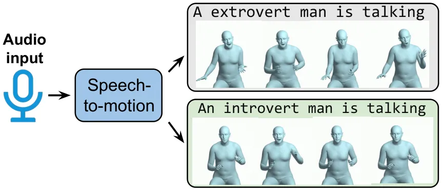
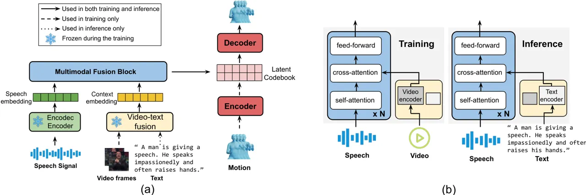
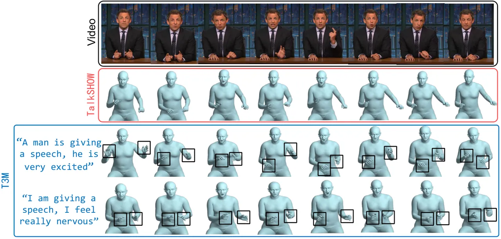
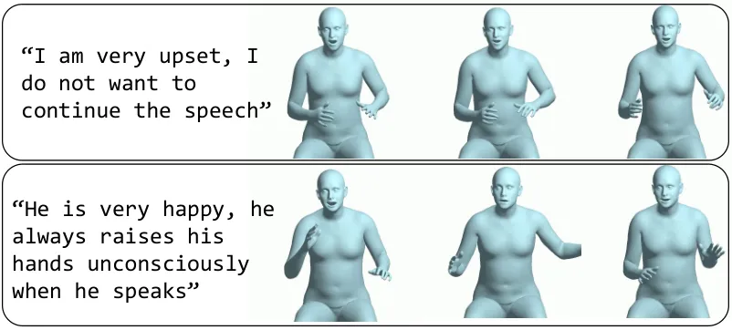

# T3M: Text Guided 3D Human Motion Synthesis from Speech

Wenshuo Peng Affiliation: OpenGVLab, Shanghai AI Laboratory
Email: [gin2pws@gmail.com](mailto:)    Kaipeng Zhang ^(†)^(†)thanks:
Corresponding author Affiliation: OpenGVLab, Shanghai AI Laboratory
Email: [zhangkaipeng@pjlab.org.cn](mailto:)    Sai Qian Zhang
^(†)^(†)thanks: Corresponding author Affiliation: New York University
Email: [sai.zhang@nyu.edu](mailto:)

###### Abstract

Speech-driven 3D motion synthesis seeks to create lifelike animations
based on human speech, with potential uses in virtual reality, gaming,
and the film production. Existing approaches reply solely on speech
audio for motion generation, leading to inaccurate and inflexible
synthesis results. To mitigate this problem, we introduce a novel
text-guided 3D human motion synthesis method, termed T3M. Unlike
traditional approaches, T3M allows precise control over motion synthesis
via textual input, enhancing the degree of diversity and user
customization. The experiment results demonstrate that T3M can greatly
outperform the state-of-the-art methods in both quantitative metrics and
qualitative evaluations. We have publicly released our code at
[https://github.com/Gloria2tt/T3M.git](https://github.com/Gloria2tt/T3M.git)

## 1 Introduction

Speech-driven 3D motion synthesis, known as speech-to-motion, is a
technique aimed at generating realistic and expressive motion animations
from human speech. Despite its promising applications in virtual reality
(VR) Wohlgenannt et al. (2020), gaming Ping et al. (2013), and film
production Ye et al. (2022), speech-to-motion also encounters
significant challenges, involving various modalities and intricate
mappings. Speech signals tend to be high-dimensional, noisy, and subject
to variability, while motion data often exhibit sparsity, discreteness,
and adherence to physical laws. Additionally, the connection between
speech and motion is not deterministic; instead, it relies on factors
such as the environment, emotions, and individual personalities.



Figure 1: Under the same audio input, extrovert and introvert persons
will talk in a completely different fashion.

Moreover, in traditional speech-to-motion systems, speech audio serves
as the sole input for generating various motions for the face, body, and
hands. However, this approach may lead to imprecise and undesired motion
synthesis due to limitations in the expressive capabilities of the audio
signal. Identical audio signals could also stem from entirely unrelated
contexts. For instance, as depicted in Figure 1, when examining the same
audio segment, an introverted speaker tends to use minimal body and hand
motions compared to an extroverted speaker, who exhibits a more
extensive range of movements. Capturing such contextual information
solely from audio input proves nearly impossible. This limitation in
precise control poses potential difficulties for emerging industries
like AI-driven film or animation production, where generated motions may
need additional refinement to match user preferences more accurately.

To address this issue, we introduce a novel text-guided 3D human motion
synthesis from speech method, termed T3M. The T3M framework enables
accurate control of body-hand motion generation via provided text
prompts. This improvement is especially valuable for addressing the
rigidity often observed in the motions generated due to the relationship
between speech and co-speech gesture is one-to-many in nature. Even the
same speech in different situation can be result in different motion
style. The controllability afforded by T3M facilitates the creation of
more nuanced and realistic motion sequences, enhancing overall realism
and expressiveness.

Our T3M contains three major blocks, a VQ-VAE network to generate an
intermediate codebook for action-to-action mapping, an audio feature
extraction network to extract acoustic information of audio, and a
multimodal fusion block to implement audio and text interaction.
Specifically, We train a VQ-VAE network with a two-layer codebook, which
contains hand and body information respectively. Considering that human
motions are related to the speaker’s emotion, intonation, and rhythm, we
utilize a pre-trained EnCodec Défossez et al. (2022) model to extract
acoustics features from the original audio. To align the sequenc lenth
of audio feature and the stored body-hand motion parameter, we use an
audio encoder to downsample the features. Furthermore, we propose a
multi-modal fusion encoder structure, which inserts a cross-attention
layer to the transformer decoder acoustics architecture for better
textual information fusion.

Another significant challenge arises in the generation of training
datasets for T3M. Most existing training datasets for speech-to-motion
are in the form of speech-motion pairs, lacking corresponding textual
information. One simple approach to address this gap is to utilize a
video large language model (VLLM) like Video-Llama Zhang et al. (2023)
for labeling datasets. However, current VLLMs can only provide a
coarse-grained description of the video input. Additionally, since
speech-motion pairs in the training dataset are often extracted from
particular segments of lengthy videos, employing VLLM for text
generation may lead to highly similar text descriptions being produced
across various video clips. To enhance the diversity of textual
descriptions within the training dataset, we adopt the video-language
contrastive learning framework, VideoCLIP Xu et al. (2021b). This
framework enforces the alignment of video and text in a joint embedding,
enabling the processing of video frames and utilizing the resultant
video features to replace textual features for T3M training.

Our research primarily centers on text-guided speech to body and hand
motions generation. For 3D face reconstruction, we utilize cutting-edge
methods in the field, such as those demonstrated in Emotalk Peng et al.
(2023). Overall, our contributions can be described as follows:

- •
  We propose a novel speech-to-motion training framework termed T3M,
  enabling users to achieve better control over the holistic motion
  generated from audio through the utilization of textual inputs.
- •
  To achieve audio-to-motion generation controlled by text, we align
  video and text in a joint embedding, utilizing video input for
  training and text descriptions for inference. This approach notably
  enhances the diversity of textual input within the training dataset
  and substantially improves the performance of motion synthesis.
- •
  The results show that the proposed T3M framework significantly
  outperforms existing methods in terms of both quantitative and
  qualitative evaluations.

## 2 Related Work

### 2.1 Motion Generation from Speech

In recent years, there has been a growing interest in generating
human-like motion from speech. One area of research is centered around
facial reconstruction, with various studies exploring 2D talking head
generation Mittal and Wang (2020). These investigations employ
image-driven or speech-driven techniques to produce realistic videos of
people speaking.

Extensive research has been conducted in the field of 3D talking heads
generation. To make the reconstruction more precise, FaceFormer Fan
et al. (2022) uses a Transformer-based model to obtain contextually
relevant audio information and generates continuous facial movements in
an autoregressive manner. VOCA Cudeiro et al. (2019) uses time
convolutions and control parameters to generate realistic character
animation from the speech signal and static character mesh.
MeshTalk Richard et al. (2021) places its emphasis on the upper facial
generation, an aspect where VOCA falls short. It establishes a
categorical latent space for facial animation and effectively separates
audio-correlated and audio-uncorrelated motions using cross-modality
loss, enabling the generation of audio-uncorrelated actions like
blinking and eyebrow movements. Another line of research centers on body
and hand motion reconstruction. These approaches can be categorized into
two groups: rule-based and learning-based methods. Rule-based methods,
such as Kopp and Wachsmuth (2004), involve the mapping of input speech
to pre-defined body motion units through manually crafted rules.

The development of learning-based methods for generating body motion, as
demonstrated in research like Ahuja et al. (2020), has made substantial
progress, largely attributed to the availability of openly accessible
synchronous speech and body motion datasets Habibie et al. (2021). Very
recently, TalkSHOW Yi et al. (2023) has introduced a simple
encoder-decoder architecture capable of producing holistic 3D mesh
motion.

However, it is important to highlight that despite these advancements,
these methods still encounter difficulties in achieving a balance
between diverse and controllable motion. Consequently, when applied in
real-time scenarios, the generated actions often display repetitiveness
and limited adaptability in response to changes in the external
condition.

### 2.2 Video-text Pre-training

The aim of video-text pre-training is to utilize the complementary
information found in both videos and textual inputs to improve the
performance of subsequent tasks. VideoBERT, as introduced in Sun et al.
(2019), pioneered the exploration of pre-training methods for video-text
data pairs. Its primary focus lies in acquiring a unified
visual-linguistic representation, and it demonstrates versatility in
adapting to a range of tasks, such as action classification and video
captioning.

VideoCLIP Xu et al. (2021b) employs a contrastive learning approach to
pre-train a unified model for zero-shot understanding of both video and
textual inputs, without relying on any labels in downstream tasks.
VLM Xu et al. (2021a) introduces a simplified, task-agnostic multi-modal
pre-training method. This method is capable of handling inputs in the
form of either video, text, or a combination of both, and it can be
applied to a diverse range of end tasks. Recently, there has been a
surge in research focused on large language models (LLMs), and some
researchers have started incorporating LLMs into this field, yielding
promising results. Video-LLaMA Zhang et al. (2023) bootstraps
cross-modal training from the frozen pre-trained visual, audio encoders
and the frozen LLMs. This approach utilizes the robust understanding
capabilities of large models for tasks such as video understanding and
video question answering. In our research, we make use of VideoCLIP to
process both video and textual inputs. In particular, during the
training phase, we utilize the video encoder of VideoCLIP to convert the
video input into latent vector for multimodal learning. During the
testing phase, we leverage its text encoder component to enable
text-based control over body and hand motion generation.

## 3 Method

In this section, we describe the detailed design of T3M, which can
generate holistic body motion, including body poses, hand gestures, and
facial expressions, based on provided text descriptions.



Figure 2: Overview of the proposed T3M. We employ a novel framework for
body and hand motion generation. Specifically, T3M first learns a
quantized body-hand codebook through a VQ-VAE model. In the training
phase, we the pre-trained EnCodec model to extract the speech embedding
of the given speech. We employ the pre-trained video encoder from
VideoCLIP to obtain the video embedding that corresponds to the provided
speech. To facilitate interaction between these two modalities, we
utilize a multimodal fusion block. This fusion block is built upon a
BERT-based framework, enhanced with a cross-attention layer for
effective fusion.

### 3.1 Preliminary

We begin by establishing a mathematical formulation for the problem.
Specifically, we define a temporal sequence of motion from time $`t=1`$
to $`t=T`$ as $`A_{1:T}`$ further contains three primary components:
facial expressions along with the jaw poses denoted as $`A^{f}_{1:T}`$,
body motions as $`A^{b}_{1:T}`$, and hand motions as $`A^{h}_{1:T}`$.
Each element $`a^{f}_{t}`$ of $`A^{f}_{1:T}`$ is defined as
$`a^{f}_{t}=(\theta^{jaw}_{t},\zeta_{t})`$, where $`\theta^{jaw}_{t}`$
is the jaw pose and $`\zeta_{t}`$ is the facial expression parameter. In
the case of $`A^{b}_{1:T}`$ and $`A^{h}_{1:T}`$, each element is defined
as follows: $`a^{h}_{t}=(\theta^{b}_{t})`$,
$`a^{b}_{t}=(\theta^{h}_{t})`$, where $`\theta^{b}_{t}`$ and
$`\theta^{h}_{t}`$ are the body poses and hand poses, respectively.
Prior methods Yi et al. (2023) primarily produces the holistic motion
solely based on the speech input. In contrast, our objective, when
provided with a speech input sequence $`S_{1:T}`$, is to produce
comprehensive motion sequences $`A^{b}_{1:T}`$, and $`A^{h}_{1:T}`$ by
incorporating additional textual context. This context describes the
situation and background associated with the speech input, allowing the
resultant holistic motions to vary according to both speech and textual
inputs. Formally, we express this as:

```math
\hat{A}_{1:T}=F_{T3M}(S_{1:T},B) \tag{1}
```

where $`B`$ is the textual input and $`\hat{A}_{1:T}`$ is the output
holistic motion generated by T3M and $`F_{T3M}`$ represents the T3M
function. Figure 2(a) depicts the overview of T3M framework, and we will
provide a detailed description of each component of T3M in the following
sections.

### 3.2 Face Generation

We adopt the approach outlined in TalkSHOW to generate facial
expressions and other body parts separately. Given that human facial
expressions primarily stem from speech content, we leverage the
pre-trained wav2vec 2.0 model Baevski et al. (2020) as a semantic
encoder to extract semantic representations from the provided speech.
These extracted features are then fed into a decoder to reconstruct
facial motion.

The wav2vec 2.0 model consists of three main components: firstly, a
stack of convolutional layers that process the raw audio waveform to
derive a latent representation; secondly, a group of transformer layers
that generate contextualized representations based on the derived latent
representation; and finally, a linear projection head that produces the
output.

The decoder consists of a Temporal Convolutional Networks (TCNs) with
six layers, followed by a fully-connected layer. We employ a similar
approach as described in Yi et al. (2023) to reconstruct facial motion.
However, it is worth noting that within our framework, we can replace
the face reconstruction method with other SOTA methods, such as Peng
et al. (2023).

### 3.3 Context Features Generation

As depicted in Figure 2(a), the generation of context feature is a
necessary step in T3M training. To create the context embedding, we
employ a video-text fusion model designed to generate diverse context
features. To achieve this, an intuitive approach involves sending the
text description directly to a text encoder, and forward the output
context features to the video-text fusion module for further processing.
However, this is not feasible for two key reasons. Firstly, it is
noteworthy that in many cases, several audio waveform segments within a
single video clip exhibit significant textual similarities. This
resemblance in textual content results in highly resemble output
features across these various audio segments, ultimately leading to a
suboptimal overall motion synthesis performance due to lack of training
data diversity. In contrast, our approach employs a video encoder to
process the video frames corresponding to the audio waveforms, which
will capture intricate context features corresponding to each speech
segment. These context features are subsequently passed on to the
multimodal fusion block for additional processing, as shown in the left
part in Figure 2(b). Secondly, even though it is feasible to manually
design distinct text descriptions with intentional variations for each
audio segment, this manual labeling process would be labor-intensive.

As a result, during training stage of T3M, we choose to utilize the
video frames corresponding to the speech input to generate the context
feature. During the inference, the text description will be sent to the
text encoder for better guiding the holistic motion synthesis (right
part of Figure 2(b)). To enable the precise text-guided motion
generation, we adopt the video and text encoders from the VideoCLIP
model, which establishes a detailed correlation between video and text
through contrastive learning. By mapping video and text embeddings into
a common latent feature space, we facilitate seamless modality
substitution for text-guided motion synthesis during inference. This
approach simplifies the process by eliminating the need for extensive
manual labeling of textual descriptions and leveraging existing joint
video-text representation models. It builds upon the concept of modality
substitution, which has been successfully employed in other contexts,
such as MusicLM Agostinelli et al. (2023) with audio and text.

### 3.4 Body and hand Motion Generation

#### Audio Feature Encoder

We obtain the speech embedding using EnCodec Défossez et al. (2022), a
state-of-the-art neural audio codec pre-trained model capable of
extracting audio features from the provided speech. It contains a total
of eight layers of codebooks, each layer stores different audio
information. Given that the audio token sequence stored in the 8-layer
codebook is overly lengthy, we opt not to employ these audio tokens as
the initial input. Instead, we employ the decoder of the codebook to
generate the audio features, which serve as our speech embeddings. Next,
we employ a compression model based on a convolutional neural network
architecture to transform these features, aligning them with the
sequence length of the motion embeddings. Finally, we further insert an
MLP at the end of the compression model to map the dimensions to 768,
where 768 is the dimension dim of the context feature. Using our audio
feature encoder, for a speech segment lasting $`k`$ seconds, we obtain
an speech embedding with a dimension of
$`e^{a}\in\mathbb{R}^{L_{seq}\times 768}`$, where
$`L_{seq}=k\times{fps}`$ represents the sequence length, where $`fps`$
is the frames per second rate of the motion data. This rate determines
the number of motion frames that correspond to each second of speech,
thereby aligning the temporal resolution of the audio and motion data.

#### Latent Codebook Design

It is challenging to directly produce the body-hand motion sequence for
a given speech sequence because the input and output belong to two
distinct modalities. To mitigate this problem, we utilize the VQ-VAE Van
Den Oord et al. (2017) model to create a latent codebook for both body
motion and hand motion.

Consequently, we obtain two distinct finite codebooks:
$`Z_{b}=\{z_{b_{i}}\}_{i=1}^{|Z_{b}|}`$ for body motions and
$`Z_{h}=\{z_{h_{j}}\}_{j=1}^{|Z_{h}|}`$ for hand motions, where
$`z_{b_{i}},z_{h_{j}}\in\mathbb{R}^{d_{z}}`$ and $`d_{z}`$ denotes the
length of each codebook element. This approach yields
$`|Z_{b}|\times|Z_{h}|`$ different body-hand pose code pairs
$`(z_{b_{i}},z_{h_{j}})`$, significantly expanding the range of motion
diversity.

#### Multimodal Fusion Block Design

The Multimodal Fusion Block is a transformer-decoder based model that
incorporates an cross-attention layer between the feedforward layer and
the self-attention layer, as depicted in Figure 2(b). Its purpose is to
produce latent codebook tokens from the provided speech features and
context features, which serve as input for the VQ-VAE decoder.

As described in Section 3.3, during the training phase, we substitute
the text input with the video frames corresponding to the speech. We
encode these video frames by ViCLIP video encoder into the context
feature space, which is shared with the text captions. Thus, for the
video $`x`$, its corresponding feature can be derived as follows:

```math
e^{v}=F_{v}(x) \tag{2}
```

where $`e^{v}\in\mathbb{R}^{1\times 512}`$ is the feature vector for the
video $`x`$ and $`F_{v}`$ is the video encoder function. $`e^{v}`$ will
be used as the context features during the inference operation for
conditional body and hand motion generation.

For the speech embedding $`e^{a}`$ and the context features $`e^{v}`$,
the multimodal fusion block layer then combines them through standard
cross-attention. It is important to highlight that the cross-attention
layer between the speech features and the context features offers two
significant advantages. Firstly, our model integrates context features
during training, enabling the generation of distinct body-hand motions
based on varying input text during the inference stage. Secondly, as
this context feature is incorporated during training, the reconstructed
motion exhibits higher quality and a greater level of alignment.

### 3.5 Loss Function

As illustrated in Figure 2(a), the training process of T3M involves
three main stages. First, the facial image generator is trained to
convert audio signals into facial expressions. Semantic features are
extracted using a pre-trained wave2vec encoder, and the decoder is
trained to minimize the Mean Square Error (MSE) loss between the ground
truth facial output and the decoder output.

Second, the VQ-VAE model is trained to map body and hand motions into a
latent space, resulting in a codebook
$`C\in\mathbb{R}^{d_{z}\times 2}`$. Formally, we have

```math
\displaystyle\mathcal{L}_{VQ} \displaystyle=\mathcal{L}_{\text{rec}}(A,\widehat{A})+\alpha\left\|\text{sg}[z_{e}(A)]-Z_{Q}({A)}\right\|
```

```math
\displaystyle+\lambda\left\|z_{e}(A)-\text{sg}[z_{q}(A)]\right\|
```

where $`\mathcal{L}_{\text{rec}}`$ is the mean squared error
reconstruction loss, $`sg[.]`$ is the stop gradient operation, $`z_{e}`$
is the output of the VQ-VAE encoder and $`z_{q}`$ is the quantization
function. $`\alpha`$ and $`\lambda`$ are two weight coefficients to
reflect the importance of each component.

Lastly, we train our multimodal fusion block to generate the discrete
token of the codebook from the speech and video through cross-entropy
loss.

## 4 Experiment

We first describe experiment setup in Section 4.1, and provide
quantitative and qualitative evaluate in Section 4.2 and Section 4.3. We
then evaluate T3M over more data examples in Section 4.4, and present
the ablation study in Section 4.5. We include a video demo in the
supplementary materials (data).

### 4.1 Experiment Setup

#### Dataset

In our research, we use the SHOW dataset Yi et al. (2023), a
high-quality audiovisual dataset which consists of expressive 3D body
meshes at 30fps, with a synchronized audio at a 22K sample rate. The 3D
body meshes are reconstructed from in-the-wild monocular videos and are
used as our pseudo ground truth (p-GT) in speech-to-motion generation.
For a given video clip of $`T`$ frames, the p-GT comprises parameters of
a shared body shape $`\beta\in\mathbb{R}^{300}`$, poses
$`\theta_{t}\in\mathbb{R}^{156T}_{t=1}`$, a shared camera pose
$`\theta_{c}\in\mathbb{R}^{3}`$, a translation
$`\epsilon\in\mathbb{R}^{3}`$ and facial expressions
$`\psi_{t}\in\mathbb{R}^{100T}_{t=1}`$. Here, the pose $`\theta_{t}`$
includes the jaw pose $`\theta_{\text{jaw}_{t}}\in\mathbb{R}^{3}`$, the
body pose $`\theta_{b_{t}}\in\mathbb{R}^{63}`$, and the hand pose
$`\theta_{h_{t}}\in\mathbb{R}^{90}`$.

#### Compared Baseline

We compare T3M with TalkSHOW, the first research work on holistic 3D
human motion generation using speech. We also evaluate the authenticity
and diversity of the resultant motion synthesis by comparing various
baselines, including Audio Encoder-Decoder Ginosar et al. (2019), Audio
VAE Yi et al. (2023), and Audio+Motion VAE Yi et al. (2023).

#### Metrics

We used the following methods to measure the quality of the generated
holistic motion. Firstly, we calculate the Reality Score (RS) of the
generated body and hand motions by employing a binary classifier, as per
the methodology outlined in Aliakbarian et al. (2020). The classifier is
trained to distinguish between authentic and synthetic samples, and RS
is computed from its predictions, serving as a metric for assessing the
realism of the generated motions. Secondly, we compute the Beat
Consistency Score (BCS) Zhao et al. (2023) of the resultant motions to
evaluate the motion-speech beat correlation (i.e., time consistency).

| Method                | RS    | BCS    |
| --------------------- | ----- | ------ |
| Habbie et al.         | 0.146 | \-     |
| Audio Encoder-Decoder | 0.214 | \-     |
| Audio VAE             | 0.182 | \-     |
| Audio+Motion VAE      | 0.240 | \-     |
| TalkSHOW              | 0.414 | 0.8130 |
| T3M(video prompt)     | 0.483 | 0.8586 |
| T3M(random prompt)    | 0.364 | 0.8398 |

Table 1: Evaluation results on several methods. For convenience, we use
video prompt and random prompt to test our T3M. - means the results are
not available. We focus on the comparison with TalkSHOW.

### 4.2 Quantitative Evaluation

Our experiment results are presented in Table 1. When using T3M, we
utilize two distinct prompt types for generating the context features.
The initial type replicates the training stage, utilizing a video
prompt. In contrast, the second type entails the generation of a random
vector with a mean of $`-0.04`$ and a variance of $`0.12`$, which is
utilized as the context features. In this setup, T3M generates synthetic
motions solely based on the speech input.

Based on the data presented in Table 1, it is evident that our T3M, when
using a video prompt, demonstrates superior performance in terms of both
RS and BCS indicators. Furthermore, we note that employing a random
prompt yields a slightly lower RS score compared to TalkSHOW; however,
it outperforms TalkSHOW in terms of BCS, which demonstrate that the
generated motions by our T3M are more consistent with the audio,

### 4.3 Qualitative Evaluation



Figure 3: Visualization of 3D holistic motions generated by TalkSHOW and
T3M. For T3M, three different text prompts are provided and the
positions of the hand are highlighted with black boxes. We notice that
the hand motions are closely aligned with the input text desription in
T3M.

#### Visualization Results

To demonstrate the impact of textual input over the resultant motion
synthesis, we utilized two text prompts with opposing semantic meanings,
along with a randomly generated embedding as our prompt input.
Specifically, for the text prompts, we use “A man is giving a speech, he
is very excited” and “I am giving a speech, I feel really nervous”,
which has totally opposite semantic meanings. Additionally, we also
compare the resultant holistic motions with TalkSHOW, the visualization
examples are depicted in Figure 3.

As depicted in Figure 3, it is evident that the motions generated by
TalkSHOW appear to lack diversity. The motions of both hands change
independently and do not correspond to the speaker’s emotions and
intonation, resulting in a unnatural and unrealistic appearance. For
T3M, When using the random prompt, we notice that the hand motions
closely resemble those of the original video. Additionally, the motions
of both hands exhibit corresponding interactions and a higher
coordination.

When using the prompt input, “A man is giving a speech, he is very
excited.”, we observe a notable increase in the range of hand motion
changes. Additionally, there are noticeable upward and downward
movements of the hands. These motions align closely with our textual
description, reflecting the speaker’s highly excited state during the
speech. By comparison, for text description “I am giving a speech, I
feel really nervous”. We notice that the generated motions distinctly
portray signs of nervousness. The hand movements are very restricted,
and there are noticeable trembling or jittery motions, effectively
capturing the heightened nervous state of the speaker. Overall, the
experimental results show that with the introduction of textual input,
T3M can achieve controllable motion generation with much higher degree
of diversity.

#### User Study

| Method       | hands and body | holistic |
| ------------ | -------------- | -------- |
| TalkSHOW     | 3.43           | 3.36     |
| T3M (random) | 3.25           | 3.08     |
| T3M (video)  | 3.86           | 3.95     |

Table 2: User study results (higher scores indicating better quality).
We use the video prompt and the random prompt to evaluate the quality of
our generated motions.

To offer a more comprehensive evaluation of T3M, we have devised a
thorough user study questionnaire. Following the methodology employed in
TalkSHOW, we randomly selected 40 videos from four different speakers in
the SHOW dataset, with each video having a duration of 10 seconds. We
have invited 12 participants to participate in the evaluation process.
Each participant will give a score ranging from 1 to 5 to rate the video
in terms of the generated motions. We use random prompt and video prompt
for our T3M model. Subsequently, we compute the average scores and
document the results in Table 2.

Table 2 reveals that our T3M, when using the video prompt, attains the
highest scores. Furthermore, it is evident from the table that utilizing
a random prompt yields only slightly lower scores compared to the
TalkSHOW method.

### 4.4 Other Examples



Figure 4: Experiments on unseen speech. We use two different text input
to control the motion generation.

In order to better verify the effect of T3M, we evaluate samples that
are not contained in the SHOW dataset. We employ an audio clip of French
as our speech input, utilizing two textual descriptions as prompts to
enhance our evaluation. One text expresses strong negative emotions: “I
am very upset, I do not want to continue the speech”, while the other
conveys positive emotions: “He is very happy, he always raises his hands
unconsciously when he speaks”. The results are shown in Figure 4.

We have noticed that when dealing with speech not present in the SHOW
dataset, T3M is still capable of producing distinct actions in response
to the input text. Specifically, when using “ I am very upset, I do not
want to continue the speech”, there is a lack of noticeable alterations
in the accompanying hand movements to convey the speaker’s upsetness.
When using “He is very happy, he always raises his hands unconsciously
when he speaks”, the range of hand movements of the speaker increased
significantly, including a conspicuous pattern of raising the hands.
These findings demonstrate that our approach successfully accomplishes
motion generation even in zero-shot scenarios.

| Method        | BCS    | Motion Score |
| ------------- | ------ | ------------ |
| T3M (MFCC)    | 0.8050 | 3.54         |
| T3M (EnCodec) | 0.8586 | 3.82         |

Table 3: Ablation results between Mel Frequency Cepstral Coefficients
(MFCC) and EnCodec. For the BCS indicator, using EnCodec achieves
$`+0.0536`$ test scores. For the user study score of the motion score
indicator, we randomly selected a total number of 20 generated videos
and invited 5 people to rate them.

### 4.5 Ablation Study

We conduct an ablation study to examine the contribution of each
component in T3M model.

#### Effect of EnCodec

We replace the EnCodec with Mel Frequency Cepstral Coefficients
(MFCC) Zheng et al. (2001) and use the BCS and user study score (USS) to
measure the effectiveness of generated motions. We report the results in
Table 3. Comparing MFCC with EnCodec, we observe a noticeable
performance improvement when utilizing EnCodec. Specifically, an
increase of 0.0536 in BCS is observed with the usage of EnCodec. A user
study was conducted to evaluate the motion score. A total of 20 samples
are randomly selected for evaluation. Five individuals were invited to
rate the generated videos, and a higher score indicates better
performance. From Table 3, we also observe T3M with EnCodec achieves a
better performance over MFCC.

#### Impact of Context Features

We aim to investigate the impact of context feature over the synthesis
effect. Particularly, we use four different types of embeddings to
encode context: random prompt, text prompt, video prompt, zero prompt.
For the text prompt, we use “I am giving a speech, I feel really
excite”. In contrast, for the zero prompt, we employ a context feature
vector consisting entirely of zeros. We invite five individuals to rate
ten videos which are generated from ten randomly selected speech
samples. We present the USS in Table 4. We observe that text prompt and
the video prompt both achieve better performance over random prompt and
zero prompt.

| Method       | Motion Score |
| ------------ | ------------ |
| T3M (random) | 3.12         |
| T3M (zero)   | 2.52         |
| T3M (text)   | 3.69         |
| T3M (video)  | 3.85         |

Table 4: Ablation results to evaluate different context embeddings.
"Zero" means using an all-0 vector as the context. We use the user study
results to evaluate the generated motions.

## 5 Conclusion

In this paper, we proposed T3M, a novel text-guided 3D human motion
synthesis method from speech. T3M can generate realistic and expressive
holistic motions by leveraging both speech and textual inputs. We use a
pre-trained EnCodec model to extract audio features from speech and a
multi-modal fusion model to fuse the audio and text features. To enhance
the text diversity during training, we employed VideoCLIP, a
video-language contrastive learning framework, to process the video
frames and use the output video features to replace the textual
features. By training on the SHOW dataset, a 3D holistic dataset, T3M
enables users to precisely control the holistic motion generated from
speech by utilizing textual inputs.

## 6 Limitation

When considering future enhancements, it is possible to achieve even
better performance with T3M by incorporating more advanced text and
video encoders from a pretrained multimodal model that surpasses the
capabilities of VideoCLIP. To the best of our knowledge, the SHOW
dataset currently stands as the sole dataset in the field of
speech-driven 3D motion synthesis, albeit it covers a relatively limited
range of scenes. We believe that enhancing the performance of T3M could
be achieved by training it on more extensive datasets that involves a
wider variety of scenarios and contexts.

## References

- Agostinelli et al. (2023) Andrea Agostinelli, Timo I. Denk, Zalán
  Borsos, Jesse Engel, Mauro Verzetti, Antoine Caillon, Qingqing Huang,
  Aren Jansen, Adam Roberts, Marco Tagliasacchi, Matt Sharifi, Neil
  Zeghidour, and Christian Frank. 2023. [Musiclm: Generating music from
  text](http://arxiv.org/abs/2301.11325).
- Ahuja et al. (2020) Chaitanya Ahuja, Dong Won Lee, Ryo Ishii, and
  Louis-Philippe Morency. 2020. No gestures left behind: Learning
  relationships between spoken language and freeform gestures. In
  _Findings of the Association for Computational Linguistics: EMNLP
  2020_, pages 1884–1895.
- Aliakbarian et al. (2020) Sadegh Aliakbarian, Fatemeh Sadat Saleh,
  Mathieu Salzmann, Lars Petersson, and Stephen Gould. 2020. A
  stochastic conditioning scheme for diverse human motion prediction. In
  _Proceedings of the IEEE/CVF Conference on Computer Vision and Pattern
  Recognition_, pages 5223–5232.
- Baevski et al. (2020) Alexei Baevski, Yuhao Zhou, Abdelrahman Mohamed,
  and Michael Auli. 2020. wav2vec 2.0: A framework for self-supervised
  learning of speech representations. _Advances in neural information
  processing systems_, 33:12449–12460.
- Cudeiro et al. (2019) Daniel Cudeiro, Timo Bolkart, Cassidy Laidlaw,
  Anurag Ranjan, and Michael J Black. 2019. Capture, learning, and
  synthesis of 3d speaking styles. In _Proceedings of the IEEE/CVF
  Conference on Computer Vision and Pattern Recognition_, pages
  10101–10111.
- Défossez et al. (2022) Alexandre Défossez, Jade Copet, Gabriel
  Synnaeve, and Yossi Adi. 2022. High fidelity neural audio compression.
  _arXiv preprint arXiv:2210.13438_.
- Fan et al. (2022) Yingruo Fan, Zhaojiang Lin, Jun Saito, Wenping Wang,
  and Taku Komura. 2022. Faceformer: Speech-driven 3d facial animation
  with transformers. In _Proceedings of the IEEE/CVF Conference on
  Computer Vision and Pattern Recognition_, pages 18770–18780.
- Ginosar et al. (2019) Shiry Ginosar, Amir Bar, Gefen Kohavi, Caroline
  Chan, Andrew Owens, and Jitendra Malik. 2019. Learning individual
  styles of conversational gesture. In _Proceedings of the IEEE/CVF
  Conference on Computer Vision and Pattern Recognition_, pages
  3497–3506.
- Habibie et al. (2021) Ikhsanul Habibie, Weipeng Xu, Dushyant Mehta,
  Lingjie Liu, Hans-Peter Seidel, Gerard Pons-Moll, Mohamed Elgharib,
  and Christian Theobalt. 2021. Learning speech-driven 3d conversational
  gestures from video. In _Proceedings of the 21st ACM International
  Conference on Intelligent Virtual Agents_, pages 101–108.
- He et al. (2016) Kaiming He, Xiangyu Zhang, Shaoqing Ren, and Jian
  Sun. 2016. Deep residual learning for image recognition. In
  _Proceedings of the IEEE conference on computer vision and pattern
  recognition_, pages 770–778.
- Ioffe and Szegedy (2015) Sergey Ioffe and Christian Szegedy. 2015.
  Batch normalization: Accelerating deep network training by reducing
  internal covariate shift. In _International conference on machine
  learning_, pages 448–456. pmlr.
- Kopp and Wachsmuth (2004) Stefan Kopp and Ipke Wachsmuth. 2004.
  Synthesizing multimodal utterances for conversational agents.
  _Computer animation and virtual worlds_, 15(1):39–52.
- Maas et al. (2013) Andrew L Maas, Awni Y Hannun, Andrew Y Ng,
  et al. 2013. Rectifier nonlinearities improve neural network acoustic
  models. In _Proc. icml_, volume 30, page 3. Atlanta, GA.
- Mittal and Wang (2020) Gaurav Mittal and Baoyuan Wang. 2020. Animating
  face using disentangled audio representations. In _Proceedings of the
  IEEE/CVF Winter Conference on Applications of Computer Vision_, pages
  3290–3298.
- Peng et al. (2023) Ziqiao Peng, Haoyu Wu, Zhenbo Song, Hao Xu, Xiangyu
  Zhu, Jun He, Hongyan Liu, and Zhaoxin Fan. 2023. Emotalk:
  Speech-driven emotional disentanglement for 3d face animation. In
  _Proceedings of the IEEE/CVF International Conference on Computer
  Vision (ICCV)_, pages 20687–20697.
- Ping et al. (2013) Heng Yu Ping, Lili Nurliyana Abdullah,
  Puteri Suhaiza Sulaiman, and Alfian Abdul Halin. 2013. Computer facial
  animation: A review. _International Journal of Computer Theory and
  Engineering_, 5(4):658.
- Richard et al. (2021) Alexander Richard, Michael Zollhöfer, Yandong
  Wen, Fernando De la Torre, and Yaser Sheikh. 2021. Meshtalk: 3d face
  animation from speech using cross-modality disentanglement. In
  _Proceedings of the IEEE/CVF International Conference on Computer
  Vision_, pages 1173–1182.
- Sun et al. (2019) Chen Sun, Austin Myers, Carl Vondrick, Kevin Murphy,
  and Cordelia Schmid. 2019. Videobert: A joint model for video and
  language representation learning. In _Proceedings of the IEEE/CVF
  international conference on computer vision_, pages 7464–7473.
- Van Den Oord et al. (2017) Aaron Van Den Oord, Oriol Vinyals,
  et al. 2017. Neural discrete representation learning. _Advances in
  neural information processing systems_, 30.
- Wohlgenannt et al. (2020) Isabell Wohlgenannt, Alexander Simons, and
  Stefan Stieglitz. 2020. Virtual reality. _Business & Information
  Systems Engineering_, 62:455–461.
- Xu et al. (2021a) Hu Xu, Gargi Ghosh, Po-Yao Huang, Prahal Arora,
  Masoumeh Aminzadeh, Christoph Feichtenhofer, Florian Metze, and Luke
  Zettlemoyer. 2021a. Vlm: Task-agnostic video-language model
  pre-training for video understanding. _arXiv preprint
  arXiv:2105.09996_.
- Xu et al. (2021b) Hu Xu, Gargi Ghosh, Po-Yao Huang, Dmytro Okhonko,
  Armen Aghajanyan, Florian Metze, Luke Zettlemoyer, and Christoph
  Feichtenhofer. 2021b. Videoclip: Contrastive pre-training for
  zero-shot video-text understanding. _arXiv preprint arXiv:2109.14084_.
- Ye et al. (2022) Tian Ye, Yunchen Zhang, Mingchao Jiang, Liang Chen,
  Yun Liu, Sixiang Chen, and Erkang Chen. 2022. Perceiving and modeling
  density for image dehazing. In _European Conference on Computer
  Vision_, pages 130–145. Springer.
- Yi et al. (2023) Hongwei Yi, Hualin Liang, Yifei Liu, Qiong Cao,
  Yandong Wen, Timo Bolkart, Dacheng Tao, and Michael J Black. 2023.
  Generating holistic 3d human motion from speech. In _Proceedings of
  the IEEE/CVF Conference on Computer Vision and Pattern Recognition_,
  pages 469–480.
- Zhang et al. (2023) Hang Zhang, Xin Li, and Lidong Bing. 2023.
  Video-llama: An instruction-tuned audio-visual language model for
  video understanding. _arXiv preprint arXiv:2306.02858_.
- Zhao et al. (2023) Zhuoran Zhao, Jinbin Bai, Delong Chen, Debang Wang,
  and Yubo Pan. 2023. Taming diffusion models for music-driven
  conducting motion generation. _arXiv preprint arXiv:2306.10065_.
- Zheng et al. (2001) Fang Zheng, Guoliang Zhang, and Zhanjiang
  Song. 2001. Comparison of different implementations of mfcc. _Journal
  of Computer science and Technology_, 16:582–589.

## Appendix A Implementation Details

### A.1 Quantization Function of VQ-VAE

Given the input body motions $`A_{b}^{1:T}\in\mathbb{R}^{63\times T}`$
and hand motions $`A_{h}^{1:T}\in\mathbb{R}^{90\times T}`$, the encoding
process begins by mapping them to feature sequences. Specifically, we
obtain
$`E_{b1:\tau}=(e_{b1},\ldots,e_{b\tau})\in\mathbb{R}^{64\times\tau}`$
and
$`E_{h1:\tau}=(e_{h1},\ldots,e_{h\tau})\in\mathbb{R}^{64\times\tau}`$,
where $`\tau=T\cdot C`$ and $`C`$ represents the temporal window size.
In our experiment, we set $`C=4`$ to strike a balance between the speed
of inference and the quality of the feature embeddings.

For the quantization, we have

```math
\displaystyle z_{b_{t}} \displaystyle=\arg\min_{z_{b_{k}}\in Z_{b}}\|e_{b_{t}}-z_{b_{k}}\|\in\mathbb{R}^{64},
```

```math
\displaystyle z_{h_{t}} \displaystyle=\arg\min_{z_{h_{k}}\in Z_{h}}\|e_{h_{t}}-z_{h_{k}}\|\in\mathbb{R}^{64}.
```

Here, $`z_{b_{t}}`$ and $`z_{h_{t}}`$ represent the quantized embeddings
for body and hand motions at time $`t`$, and $`Z_{b}`$ and $`Z_{h}`$
denote the codebooks associated with body and hand motions,
respectively.

### A.2 Training Details

#### Face Generator

For the head reconstruction, We adopt SGD with momentum and a learning
rate of 0.001 as the optimizer. The face generator is trained with
batchsize of 1 for 100 epochs, in which each batch contains a
full-length audio and corresponding facial motions.

#### VQ-VAE

For the VQ-VAE training, the VQ-VAE processes input consisting of either
body or hand motions. Each VQ-VAE encoder is constructed with three
residual layers, incorporating temporal convolution layers with a kernel
size, stride, and padding of 3, 1, and 1, respectively. Batch
normalization Ioffe and Szegedy (2015) and a Leaky ReLU activation
functionMaas et al. (2013) follow each convolution layer. An additional
temporal convolution layer with a kernel size, stride, and padding of 4,
2, and 1, respectively, is interleaved after every residual layer,
except the last, to maintain a temporal window size ($`C`$) equal to 4.
A fully connected layer is added atop the encoder to reduce dimensions
before quantization. The decoder mirrors the structure of the encoder.
For optimization, Adam is employed with $`\beta_{1}=0.9`$,
$`\beta_{2}=0.999`$, and a learning rate of 0.0001. The weight
($`\beta`$) for the commitment loss is set to 0.25. Training of the
VQ-VAEs is conducted with a batch size of 128 and a sequence length of
88 frames for 100 epochs.

#### Multimodal Fusion

For the given speech embedding from EnCodec and context embedding from
VideoCLIP, we first use a compression model to downsample the speech
embedding. The compression model is a superposition of 3 one-dimensional
convolutions and residual layer He et al. (2016) and use ReLU activation
function. For the multimodal fusion block, we set the number of
attention heads to be 8. We set the total number of hidden layer to be
6, respectively. For optimization, we use Adam with a learning rate of
1e-4 and we use the cosin warmup schedule.
