# GenCA: A Text-conditioned Generative Model for Realistic and Drivable Codec Avatars

Keqiang Sun Affiliation:  Chinese University of Hong Kong    Amin
Jourabloo Affiliation:  Meta Reality Labs    Riddhish Bhalodia
Affiliation:  Meta Reality Labs    Moustafa Meshry Affiliation:  Meta
Reality Labs    Yu Rong Affiliation:  Meta Reality Labs    Zhengyu Yang
Affiliation:  Meta Reality Labs    Thu Nguyen-Phuoc Affiliation:  Meta
Reality Labs    Christian Haene Affiliation:  Meta Reality Labs    Jiu
Xu Affiliation:  Meta Reality Labs    Sam Johnson Affiliation:  Meta
Reality Labs    Hongsheng Li Affiliation:  Chinese University of Hong
Kong    Sofien Bouaziz Affiliation:  Meta Reality Labs

###### Abstract

^(†)^(†) This work was performed during the first author’s internship at
Meta, Burlingame, CA.

Photo-realistic and controllable 3D avatars are crucial for various
applications such as virtual and mixed reality (VR/MR), telepresence,
gaming, and film production. Traditional methods for avatar creation
often involve time-consuming scanning and reconstruction processes for
each avatar, which limits their scalability. Furthermore, these methods
do not offer the flexibility to sample new identities or modify existing
ones. On the other hand, by learning a strong prior from data,
generative models provide a promising alternative to traditional
reconstruction methods, easing the time constraints for both data
capture and processing. Additionally, generative methods enable
downstream applications beyond reconstruction, such as editing and
stylization. Nonetheless, the research on generative 3D avatars is still
in its infancy, and therefore current methods still have limitations
such as creating static avatars, lacking photo-realism, having
incomplete facial details, or having limited drivability. To address
this, we propose a text-conditioned generative model that can generate
photo-realistic facial avatars of diverse identities, with more complete
details like hair, eyes and mouth interior, and which can be driven
through a powerful non-parametric latent expression space. Specifically,
we integrate the generative and editing capabilities of latent diffusion
models with a strong prior model for avatar expression driving. Our
model can generate and control high-fidelity avatars, even those
out-of-distribution. We also highlight its potential for downstream
applications, including avatar editing and single-shot avatar
reconstruction.

![[Uncaptioned
image]](arxiv-2408-13674--5c4ec2f3a9d1.figures/figure-1.webp)

Figure 1: Generative Codec Avatars. Given a sentence describing the
attributes of a face, our method generates a Codec Avatar, which can be
driven by realistic expressions (top). GenCA has many downstream
applications such as avatar reconstruction from a single in-the-wild
image (bottom). Additionally, it allows for editing features, such as
changing hair color to green (top) or removing facial hair (bottom).

## 1 Introduction

Generating high-quality human face models has numerous applications in
the gaming and film industries. Recently, social telepresence
applications in virtual reality (VR) and mixed reality (MR) have created
new demands for highly-accurate and authentic avatars that can be
controlled by users’ input expressions. These avatars play a vital role
in improving user experience and immersion in VR and MR, making their
development an area of significant interest.

Current methods for creating 3D avatars can be categorized into
reconstruction-based and generative-based approaches.
Reconstruction-based methods, such as the _Codec Avatar_ family of
works \[40, 54\], recover highly photo-realistic 3D avatars, but mostly
rely on extensive multi-view captures of real humans. Additionally, they
require a lengthy reconstruction process. Recently, \[11\] has reduced
the need for an extensive capture by training a Universal Prior Model
(UPM) using high-quality multi-view captures, and subsequently
fine-tuning this learned prior with a person-specific phone scan. A
state-of-the-art instant avatar method \[73\] made a significant stride
by further relaxing the capture requirement to a monocular HD video, and
reduced the avatar reconstruction time down to 10 minutes. However,
these methods only reconstruct a 3D representation that replicates the
identity and appearance of a given human performance capture, but
support neither single-/few-shot reconstructions, nor editing
capability, and cannot generate fictional avatars (_e.g.,_ for the
gaming and movie industries).

On the other hand, generative models, especially conditional diffusion
models, have demonstrated remarkable capabilities in generating
high-quality photo-realistic images from various conditional signals.
These 2D image generative models can be used to generate 3D
avatars \[66, 33, 72\] and have shown promising results for generating
and _editing_ high-quality avatars from text descriptions. However, the
generated avatars are not photo-realistic and have limited completeness
for areas such as eyes, mouth interior, hair, and wearable accessories.
Moreover, to create a single avatar, these methods still rely on a
lengthy optimization or distillation process even for state-of-the-art
methods, such as DreamFace \[72\]. Other 3D generative models \[65, 12,
43, 14\] recover an implicit 3D representation that can be rendered from
input camera views into photo-realistic images. While these methods
generate photo-realistic face avatars with good completeness (_e.g.,_
hair, teeth, glasses and other accessories), the generated avatars are
static and cannot be driven by users’ expressions. Therefore, in this
work, we combine the authenticity and drivability of Codec Avatars \[11,
37\], the generalization and completeness of 3D generative models \[65,
14\], and the intuitive text-based editing capability of 2D
vision-language generative models \[72\] (see Table 1).

We propose Generative Codec Avatars (GenCA ), a two-stage framework for
generating drivable 3D avatars using only text descriptions. In the
first stage, we introduce the Codec Avatar Auto-Encoder (CAAE), which
learns geometry and texture latent spaces from a dataset of 3D human
captures. These latent spaces model the identity distribution of avatars
and are combined with an expression latent space from a Universal Prior
Model (UPM) \[11\] to enable expression-driven, high-quality rendering
of the generated identities. In the second stage, we present the
Identity Generation Model. Here, the Geometry Generation module learns
to generate the neutral geometry code based on the input text prompt,
while the Geometry Conditioned Texture Generation Module learns to
generate the neutral texture conditioned on both the geometry and the
text. The generated drivable avatars capture a far more complete
representation of human heads (Fig. 1-top) compared to prior
state-of-the-art *generative drivable avatars* \[72, 33, 66\].
Additionally, our method significantly improves the driving capabilities
of the generated avatars, including the ability to control areas like
the eyes and tongue. Those areas are neither represented nor controlled
in previous methods _generative drivable avatars_, which rely on
parametric face models \[6\]. To demonstrate the effectiveness of our
learned prior, we adapt an inversion process from \[70, 21\] to enable
drivable avatar reconstruction from a single in-the-wild image
(Fig. 1-bottom). We further demonstrate avatar editing results, beyond
the training data, for both reconstructed and generated avatars
(Fig. 1-last column). In summary, our contributions are:

- •
  We present GenCA , the first text-conditioned generative model for
  photo-realistic, editable, and free-form drivable 3D avatar
  generation.
- •
  We devise a Codec Avatar Auto-encoder to map facial images into the
  latent space, and the Identity Generation Model for the Codec Avatar
  generation.
- •
  We showcase a variety of downstream applications enabled by GenCA
  model, including 3D avatar reconstruction from a single image, avatar
  editing and inpainting.

|                  | Generative | Photo-real | Completeness | Drivablity | Editability |
| ---------------- | ---------- | ---------- | ------------ | ---------- | ----------- |
| PanoHead \[2\]   | ✓          | ✓          | ✓            | ✗          | ✓           |
| RODIN \[65\]     | ✓          | ✗          | ✓            | ✗          | ✓           |
| ICA \[10\]       | ✗          | ✓          | ✓            | ✓          | ✗           |
| INSTA \[73\]     | ✗          | ✓          | ✓            | ✓          | ✗           |
| Describ3D \[66\] | ✓          | ✗          | ✗            | ✓          | ✓           |
| TADA \[33\]      | ✗          | ✗          | ✗            | ✓          | ✓           |
| DreamFace \[72\] | ✗          | ✓          | ✗            | ✓          | ✓           |
| GenCA (ours)     | ✓          | ✓          | ✓            | ✓          | ✓           |

Table 1: Comparison between our proposed method (GenCA) and
state-of-the-art avatar creation methods.

## 2 Related Works

Reconstruction or generating photo-realistic 3D face avatars is a
well-studied problem in computer graphics and computer vision. Existing
solutions often make trade-offs along different axes, such as avatar
quality, model completeness, reconstruction/generation cost,
driveability, editability, and generative capability. Here we review
landmark methods that are closely related to our work.

### 2.1 High-quality $`3`$D Face Reconstruction

Quality-sensitive applications of realistic $`3`$D avatars, such as
those in the movie industry and Telepresnece in AR/VR, can recover
high-quality 3D models of target individuals. Expensive and complex
multi-view capture systems \[17, 4, 5, 9, 19, 69\] are used to recover
high-quality geometric and appearance information. Additionally,
professional artists are employed to further clean up the recovered 3D
model and improve its quality, completeness, and driveability \[56,
72\]. While this can achieve very high level of quality, it comes at the
cost of an expensive and lengthy person-specific process.

### 2.2 Parametric Face Models

To enable accessible and cost-effective facial reconstruction, $`3`$D
Morphable Models ($`3`$DMM) \[7\] learn facial priors from a large
dataset of high-quality face scans. Such facial priors are
low-dimensional parametric models for facial geometry and
appearance \[7, 8, 31, 48\]. Light-weight data capture such as a
monocular camera or few-shot images are then used to supervise solving
an optimization problem in the low-dimensional parameter space. However,
the reduced user friction and data capture cost come at the expense of
two axes – quality and completeness. First, the low-dimensional
parameter space cannot represent identity-specific cues such as wrinkles
and high-frequency appearance details, which are crucial for a
photo-realistic representation of one’s identity. Second, learning a
mesh-based facial prior is limited to representing regions that are well
explained by a shared topology and simple deformation models. Therefore,
such priors mainly represent the facial skin region, while missing out
regions like the mouth interior, eyes and hair.

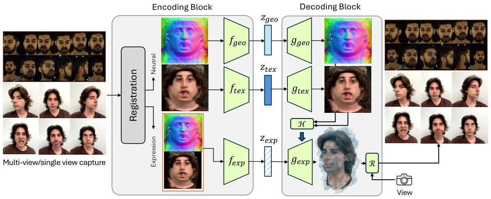

Figure 2: Main CAAE Framework for learning the latent space for geometry
and texture of avatars.

### 2.3 Neural Rendering

Neural Rendering \[61, 62\] techniques improved completeness and
achieved photo-realistic quality by optimizing a neural representation
and/or a rendering network to minimize the loss between renders and
captured data. Implicit volumetric neural representations \[45, 46\] can
recover and render highly photo-realistic head avatars, including
difficult regions such as eyes and hair, but they mainly learn a static
non-animatable representation. To recover dynamic and driveable avatars,
a neural representation is learned on top of a parametric face
model \[63, 20, 32, 74\], to allow expression transfer in the parametric
expression space of the template face mesh.

In contrast to using parametric models to drive an avatar, another line
of work \[36, 39, 37, 54\] learns a high dimensional latent expression
space, jointly with a latent shape and appearance code, and train an
expression encoder to map tracked expressions to the expression latent
space for driveability. Such models achieve ultra-realistic rendering
under very challenging expressions, and are able to render challenging
regions like eyes, teeth, tongue, mouth interior, and hair, but they
learn subject-specific models and require high-quality multi-view
data \[69\]. More recently, Cao *et al.* \[11\] generalized codec
approaches to new subjects by learning an identity-conditioned Universal
Prior Model (UPM) from high-quality captures, which can be fine-tuned
for phone-scans of new subjects. However, the learned prior encodes
identity information as high-dimensional multi-resolution feature maps
and is not a generative model, which both limits editability and
requires intricate fine-tuning strategy for personalization. In
contrast, we propose a text-to-avatar generative model that still
leverages the high quality, completeness, and driveability of Codec
decoders \[39, 11\] as a rendering framework.

### 2.4 Generative Face Models

Generating photo-realistic fictional avatars is widely desired for many
applications, such as gaming and virtual AI agents in AR/VR. Generative
models trained on facial image datasets learn a strong prior and can
dream up photo-realistic faces of non-existing people in 2D \[27, 28,
30, 29\] and in 3D \[13, 14, 2\], and some works showed limited
driveability of generated avatars using 3DMMs \[60, 68, 58, 59\].
However, in contrast to our approach, they can only render limited view
angles and cannot transfer challenging expressions, for exampling
showing tongue and mouth interior.

### 2.5 Text-to-3D Generation

Recent breakthroughs in visual-language models \[50\] and diffusion
models \[23, 57, 18\] have significantly improved text-to-image
generation \[51, 53, 52, 3\]. More recently, several works extend
text-to-image models to generate 3D objects or scenes from text prompts
by leveraging pre-trained text-to-image diffusion and optimizing 3D
neural representations that minimizes the CLIP scores between multi-view
2D renderings and text prompts \[71, 24, 41, 55, 26\] or that employs a
score distillation sampling (SDS) strategy \[49, 34, 15, 25\].

Described3D \[66\] is a concurrent work that generates driveable avatars
from an input text prompt. However, in contrast to our proposal, their
generated avatars are limited in terms of quality and completeness. For
example, their method cannot generate challenging regions like the mouth
interior, tongue, hair, head-wear or facial hair. Manual processing is
required to add extra assets like hair or accessories. Additionally,
Described3D is trained on synthetic data, so their results are far from
photo-realistic. On the other hand, DreamFace \[72\] can produce much
more appealing driveable avatars, but their method is not a generative
model. Instead, they take a compositional approach that relies on a
nearest neighbor selection of a best matching geometry from a pool of
acquired assets The selected geometry is refined through an optimization
process to align the avatar with the input text prompt using pre-trained
Language-Vision models. And finally, a prompt-based hair selection is
applied from a pool of 16 artist-created hair assets. In contrast, our
method relies on a data-driven prior that learns the models
photo-realistic 3D head avatars. Therefore we can generate new avatars
through a simple forward pass in our model. The generated avatars are
photo-realistic, driveable and achieve higher completeness compared to
existing methods.

## 3 Methods

Given a text prompt describing $`\mathcal{P}`$ the facial attributes of
a random identity, GenCA generates a photo-realistic and animatable 3D
avatar that matches the text prompt. To achieve this, we propose a
two-stage framework for GenCA .

In the first stage (Figure 2), we introduce a Codec Avatar Auto-Encoder
(CAAE) framework. The CAAE uses an _Encoding Block_, $`\mathcal{E}`$, to
map input images into a factorized latent space for identity and
expression. The identity latent space further broken into two latent
spaces ($`z_{\scriptsize\mbox{geo}},z_{\scriptsize\mbox{tex}}`$) for the
neutral geometry and texture of any given identity. Then a _Decoding
Block_, $`\mathcal{D}`$, transforms these latent codes back into
realistic images.

In the second stage (Figure 3), we train an _Identity Generation Model_
to learn a mapping from an input text prompt, describing an identity, to
its corresponding identity latent codes
($`z_{\scriptsize\mbox{geo}},z_{\scriptsize\mbox{tex}}`$).

During inference, given a text description of facial attributes, GenCA
utilizes the Identity Generation Model to sample an identity latent code
and employs the Decoding Block $`\mathcal{D}`$ to convert both the
identity and expression codes into a photo-realistic drivable 3D avatar.

### 3.1 Codec Avatar Auto-Encoder (CAAE)

#### 3.1.1 Preliminaries

Our CAAE extends the Universal Prior Model (UPM) for 3D faces proposed
by \[11\] (Figure 2). The UPM is composed of an expression encoder
$`f_{\scriptsize\mbox{exp}}`$, an identity-conditioned expression
decoder $`g_{\scriptsize\mbox{exp}}`$, and a hyper-network
$`\mathcal{H}`$. The expression encoder $`f_{\scriptsize\mbox{exp}}`$
takes as input per-frame geometry and texture
($`\mathcal{G}_{\scriptsize\mbox{exp}},\mathcal{T}_{\scriptsize\mbox{exp}})`$
and generates a universal expression code $`z_{\scriptsize\mbox{exp}}`$
that is shared across identities. The hyper-network $`\mathcal{H}`$
extracts identity features from the average neutral geometry and texture
($`\mathcal{G}_{\scriptsize\mbox{neu}},\mathcal{T}_{\scriptsize\mbox{neu}}`$)
and modulates the weights of the expression decoder
$`g_{\scriptsize\mbox{exp}}`$. The expression decoder
$`g_{\scriptsize\mbox{exp}}`$ then decodes the expression code
$`z_{\scriptsize\mbox{exp}}`$ into neural volumetric primitives \[37\]
that are rendered from any camera pose $`\mathcal{C}`$ into
photo-realistic images $`\hat{I}`$ using a renderer $`\mathcal{R}`$.

```math
\displaystyle\hat{I}=\mathcal{R}(g_{\scriptsize\mbox{exp}}(z_{\scriptsize\mbox{exp}}|\mathcal{H}(\mathcal{T}_{\scriptsize\mbox{neu}},\mathcal{G}_{\scriptsize\mbox{neu}})),\mathcal{C}),\quad z_{\scriptsize\mbox{exp}}=f_{\scriptsize\mbox{exp}}(\mathcal{T}_{\scriptsize\mbox{exp}},\mathcal{G}_{\scriptsize\mbox{exp}}) \tag{1}
```

While \[11\] train the UPM solely on a few hundreds of high-quality
multi-view dome captures, we opt to re-train the UPM by including an
additional large-scale dataset of phone captures that follow the phone
scan process proposed in \[11\]. To bridge the domain gap between the
high-quality multi-view dome captures and the simple phone captures, we
apply a discriminator on the expression codes
$`z_{\scriptsize\mbox{exp}}`$ to encourage a unified latent space for
both datasets. This additional data injection improves the UPM’s
generalization ability to reconstruct diverse identities. Both the phone
and multi-view datasets are registered using the method proposed
in \[11\].

We denote that the UPM from \[11\] is an auto-encoder framework and is
not a generative model, as it neither learns avatar appearance/identity
distribution, nor supports new avatar sampling. In contrast, the first
stage of our GenCA (Figure 2) extends the UPM by introducing encoders
and decoders for the average neutral geometry and texture
($`\mathcal{G}_{\scriptsize\mbox{neu}},\mathcal{T}_{\scriptsize\mbox{neu}}`$),
forming the Encoding and Decoding Block of our CAAE (Sec. 3.1). And the
second stage of GenCA (Section 3.2) trains a generative model for the
identity latent space.

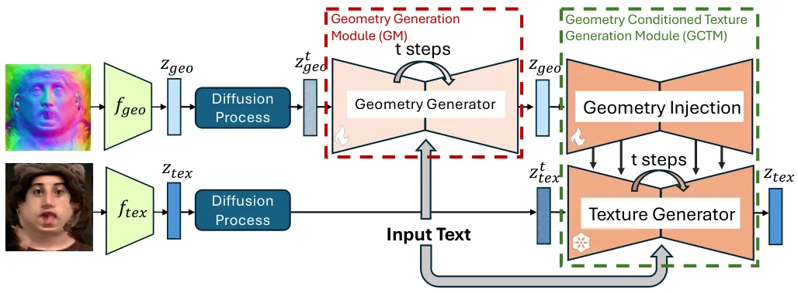

Figure 3: Training Pipeline of the Identity Generation Model, Geometry
generator Module (GM): Generates $`z_{geo}`$ of realistic geometries
based on text descriptions. Geometry Conditioned Texture Generation
(GCTM): Generates $`z_{tex}`$ of high quality texture, consistent with
conditioned geometry, based on the text descriptions.

#### 3.1.2 Encoding Block

As shown Figure 2, the Encoding Block $`\mathcal{E}`$ is composed of a
Registration Module $`\mathbf{\mathfrak{R}}`$, an encoder for neutral
geometry UV map $`f_{geo}`$, an encoder for neutral texture UV map
$`f_{tex}`$, and the expression encoder $`f_{\scriptsize\mbox{exp}}`$
(introduced in Section 3.1.1).

A single or multiple input images $`I_{inp}`$ of a subject is
categorized into either neutral expression and expressive expression
segments based on the capture script. The Registration Module
$`\mathbf{\mathfrak{R}}`$ then reconstructs the per-frame geometry and
the associated unwrapped texture as follows:

```math
\displaystyle\mathcal{T}_{\scriptsize\mbox{neu}},\mathcal{G}_{\scriptsize\mbox{neu}},\mathcal{T}_{\scriptsize\mbox{exp}},\mathcal{G}_{\scriptsize\mbox{exp}}=\mathbf{\mathfrak{R}}(I_{inp}) \tag{2}
```

Specifically, it computes the average neutral geometry map
$`\mathcal{G}_{neu}`$, neutral texture map $`\mathcal{T}_{neu}`$ using
the captured segment with neutral expression. Using the capture segment
with expressive expressions, the per-frame expression geometry and
texture maps $`\mathcal{G}_{\scriptsize\mbox{exp}}`$ and
$`\mathcal{T}_{\scriptsize\mbox{exp}}`$, as well as the camera view
$`\mathcal{C}`$ for each frame.

After the registration step, the Encoding Block $`\mathcal{E}`$ encodes
$`\mathcal{G}_{neu}`$, $`\mathcal{T}_{neu}`$,
$`\mathcal{G}_{\scriptsize\mbox{exp}}`$,
$`\mathcal{T}_{\scriptsize\mbox{exp}}`$ into the latent space:

```math
\displaystyle z_{\scriptsize\mbox{geo}},z_{\scriptsize\mbox{tex}},z_{\scriptsize\mbox{exp}} \displaystyle=\mathcal{E}(\mathcal{T}_{\scriptsize\mbox{neu}},\mathcal{G}_{\scriptsize\mbox{neu}},\mathcal{T}_{\scriptsize\mbox{exp}},\mathcal{G}_{\scriptsize\mbox{exp}}) \tag{3}
```

where $`z_{\scriptsize\mbox{geo}}`$, $`z_{\scriptsize\mbox{tex}}`$,
$`z_{\scriptsize\mbox{exp}}`$ are the latent codes for geometry, texture
and expression respectively. In particular, the identity geometry latent
code $`z_{\scriptsize\mbox{geo}}`$ and the identity texture latent code
$`z_{\scriptsize\mbox{tex}}`$ are computed by:

```math
z_{\scriptsize\mbox{geo}}=f_{\scriptsize\mbox{geo}}(\mathcal{G}_{\scriptsize\mbox{neu}}),\qquad z_{\scriptsize\mbox{tex}}=f_{\scriptsize\mbox{tex}}(\mathcal{T}_{\scriptsize\mbox{neu}}) \tag{4}
```

and the expression latent code $`z_{\scriptsize\mbox{exp}}`$ is obtained
as described in Equation 1.

#### 3.1.3 Decoding Block

Given a registered camera pose $`\mathcal{C}`$, the Decoding Block
$`\mathcal{D}`$ maps the latent codes from the Encoding Block
$`\mathcal{E}`$ to a rendered image:

```math
\displaystyle\hat{I}=\mathcal{D}(z_{\scriptsize\mbox{geo}},z_{\scriptsize\mbox{tex}},z_{\scriptsize\mbox{exp}},\mathcal{C}) \tag{5}
```

In particular, the Decoding Block $`D`$ contains a neutral texture
decoder $`g_{tex}`$ and a neutral geometry decoder $`g_{geo}`$, which
take the neutral geometry and texture latent codes and reconstruct the
associated registered UV maps:

```math
\displaystyle\hat{\mathcal{T}}_{neu} \displaystyle=g_{tex}(z_{\scriptsize\mbox{tex}}) \tag{6}
```

```math
\displaystyle\hat{\mathcal{G}}_{neu} \displaystyle=g_{geo}(z_{\scriptsize\mbox{geo}}) \tag{7}
```

The Decoding Block also contains an expression decoder $`g_{exp}`$ and a
hyper-network $`\mathcal{H}`$ as introduced in Section 3.1.1. We employ
the hyper-network $`\mathcal{H}`$ to extract feature maps from the
reconstructed $`\hat{\mathcal{T}}_{neu}`$ and
$`\hat{\mathcal{G}}_{neu}`$, which is then used to modulate $`g_{exp}`$.
The output of $`g_{exp}`$ is eventually rendered into an image
$`\hat{I}`$ by the renderer $`\mathcal{R}`$ given a registered camera
pose $`\mathcal{C}`$.

```math
\displaystyle\hat{I}=\mathcal{R}(g_{exp}(z_{\scriptsize\mbox{exp}}|\mathcal{H}(\hat{\mathcal{T}}_{neu},\hat{\mathcal{G}}_{neu})),\mathcal{C}) \tag{8}
```

#### 3.1.4 Loss Functions

To train the $`f_{\scriptsize\mbox{exp}}`$ and
$`g_{\scriptsize\mbox{exp}}`$, we first employ the loss functions
$`\mathcal{L}_{upm}`$ from UPM \[11\] as the reconstruction loss. To
train the identity auto-encoders, including
$`f_{\scriptsize\mbox{tex}}`$, $`g_{\scriptsize\mbox{tex}}`$,
$`f_{\scriptsize\mbox{geo}}`$ and $`g_{\scriptsize\mbox{geo}}`$, we
further compute the $`\mathcal{L}_{1}`$ loss for the reconstructed
geometry and texture:

```math
\mathcal{L}_{geo}=|\mathcal{G}_{\scriptsize\mbox{neu}}-\hat{\mathcal{G}}_{\scriptsize\mbox{neu}}|,\qquad\mathcal{L}_{tex}=|\mathcal{T}_{\scriptsize\mbox{neu}}-\hat{\mathcal{T}}_{\scriptsize\mbox{neu}}| \tag{9}
```

To regularize the latent space as a normal distribution, we also
minimize the Kullback–Leibler (KL) divergence $`\mathcal{L}_{KL}`$
between the learned neutral geometry and texture latent distribution and
a standard Gaussian distribution.

### 3.2 Identity Generation Model

The Codec Avatar Auto-Encoder (CAAE) introduced in Section 3.1 maps
facial images into a smooth latent space, and reconstructs the latent
code into images. Following Latent Diffusion Models \[52\], we train a
diffusion model in the identity latent space
$`z_{id}=\langle z_{\scriptsize\mbox{tex}},z_{\scriptsize\mbox{geo}}\rangle`$.
Dubbed as the Identity Generation Model, this diffusion model maps a
noise map to a latent identity code conditioned on a text prompt
$`\mathcal{P}`$, which can be decoded by $`\mathcal{D}`$ and rendered
into high-fidelity photo-realistic images.

The Identity Generation Model comprises two primary components: the
Geometry Generation Module (GM) and the Geometry Conditioned Texture
Generation Module (GCTM). The schematic of the Identity Generation Model
is shown in Fig. 3.

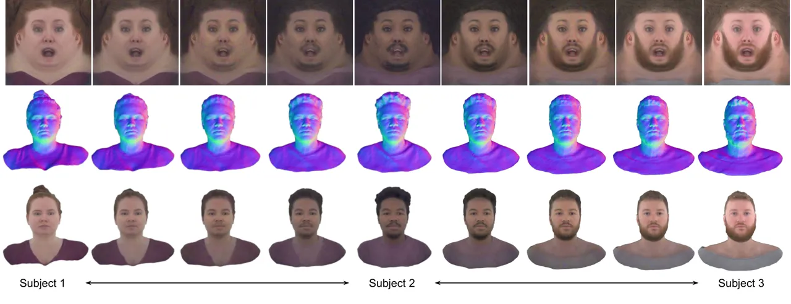

Figure 4: Smooth linear interpolation among the geometry and texture
latent codes.

#### 3.2.1 Geometry Generation Module (GM)

Given a text prompt $`\mathcal{P}`$ and a noise map
$`z_{\scriptsize\mbox{geo}}^{t}`$, GM $`\epsilon_{\theta}`$ aims to
denoise from $`z_{\scriptsize\mbox{geo}}^{t}`$ to
$`\hat{z}_{geo}^{t-1}`$. By repeating this process recursively, GM
eventually yeilds
$`\hat{z}_{geo}^{0}\sim f_{geo}(z_{\scriptsize\mbox{geo}}|\mathcal{G}_{neu})`$,
which can then be decoded by Equation 7.

For training this latent diffusion model, we follow \[23, 52\] to
perform the diffusion process manually to construct supervision.
Specifically, given a latent code $`\mathbf{z}_{geo}`$, we first add
noise to the $`t`$-th time step:

```math
\displaystyle\mathbf{z}_{geo}^{t}=\sqrt{\bar{\alpha}_{t}}\mathbf{z}_{geo}+\sqrt{1-\bar{\alpha}_{t}}\mathbf{\epsilon}, \tag{10}
```

The network $`\epsilon_{\theta}`$ then takes the noised latent code
$`\mathbf{z}_{t}`$ and time step $`t`$ to predict the noise

```math
\displaystyle\hat{\mathbf{\epsilon}}_{geo}^{t}=\epsilon_{\theta}(\mathbf{z}_{geo}^{t},t), \tag{11}
```

Finally, we re-sample the latent code $`\mathbf{z}_{geo}^{t}`$ with the
predicted noise $`\hat{\mathbf{\epsilon}}_{t}`$

```math
\displaystyle\hat{\mathbf{z}}_{geo}^{t-1}=h_{\eta}(\mathbf{z}_{geo}^{t},\hat{\mathbf{\epsilon}}_{geo}^{t}). \tag{12}
```

The Equation 12 and Equation 11 are recursively solved to get an
estimate $`\hat{\mathbf{z}}_{geo}^{0}`$ which can be used to produce the
estimated geometry by using the VAE decoder via Equation 7

#### 3.2.2 Geometry Conditioned Texture Generation Module (GCTM)

Directly applying the structure of GM for texture generation results in
poor convergence and severe semantic misalignment, as shown in Figure 7.
Inspired by ControlNet  \[35\], we devise a Geometry Conditioned Texture
Generation Module (GCTM), where the Texture Generator
$`\epsilon_{\phi}`$ takes the geometry information from the Geometry
Injection $`\epsilon_{\psi}`$ module, and generates a corresponding
texture latent code.

Specifically, given a geometry latent code
$`z_{\scriptsize\mbox{geo}}`$, we extract feature maps with the Geometry
Injection module $`\epsilon_{\psi}`$ and inject the features to the
Texture Generator $`\epsilon_{\phi}`$, to predict the noise in
$`z_{\scriptsize\mbox{tex}}^{t}`$:

```math
\displaystyle\hat{\epsilon}_{tex}^{t}=\epsilon_{\phi}(z_{\scriptsize\mbox{tex}}^{t},t|\epsilon_{\psi}(z_{\scriptsize\mbox{geo}})) \tag{13}
```

$`\hat{\epsilon}_{tex}^{t}`$ is then used for denoising, and by
repeating this process, $`\epsilon_{\phi}`$ eventually generates
$`\hat{z}_{tex}^{0}`$, which can be decoded via Equation 6.

We observed that training with GCTM results in better topological
alignment between texture and geometry compared to standalone texture
generation.

#### 3.2.3 Loss Functions

We follow \[23\] and use the latent diffusion loss for both the GM and
GCTM modules:

```math
\mathcal{L}_{ldm}:=\mathbb{E}_{\mathcal{E}(I_{inp}),\epsilon\sim\mathcal{N}(0,1),t}\Big[\|\epsilon^{t}-\hat{\epsilon}^{t}\|_{2}^{2}\Big]\,. \tag{14}
```

### 3.3 Inference

After training, to generate a new avatar, we first use GM to generate a
high-quality UV position map based on the text description. This map is
then used as an extra condition, alongside the text prompt, to generate
the corresponding texture via GCTM. Their ouputs, along with a selected
expression code $`z_{\scriptsize\mbox{exp}}`$, are decoded by the
Decoding Block and rendered into the final avatar images.

## 4 Experiments

### 4.1 Data

For training GenCA we use images data from two different sources. The
first source of data is from a capture dome setup where synchronized
multi-view cameras are setup and we capture an extensive set of subjects
expressions as the subject follows a pre-defined expression script. The
second source of data is the $`12000`$ phone scan data which are
acquired by a single view tripod video capture using iPhone $`13`$ of
the frontal face rotating in $`45`$ degree span while maintaining the
neutral expression. Both the multi-view captures as well as single view
captures are collected with mindset to covering a diverse population of
identities.

Both the data sources have associated attributes, and we use a large
language model API for generating descriptions, more details in
Supplementary.

### 4.2 Implementation Details

Our implementation is built upon Latent Diffusion Model (LDM). For both
the GM and GCTM, we initialize the VAE with the weights pre-trained on
in-the-wild image datasets. The AdamW optimizer with a fixed learning
rate of $`1\times{10}^{-5}`$ is employed, and the generation for
geometry and texture requires $`40`$ iterations in total. It takes about
$`40`$ seconds to generate a face on a single NVIDIA A100 GPU. We refer
readers to the supplementary material for more details.

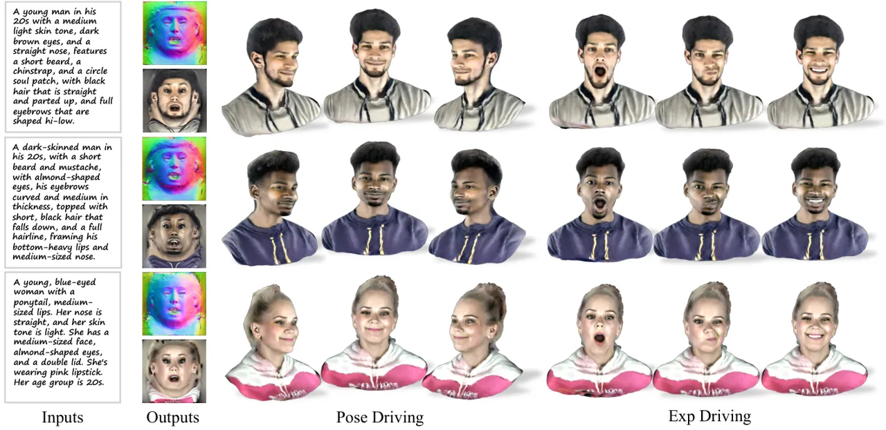

Figure 5: Generation Results: Qualitative results generated from the
captions provided in leftmost column.

| Method            | CLIP Score | Aesthetic Score | HPS v2 | User Study               |
| ----------------- | ---------- | --------------- | ------ | ------------------------ |
| Describe3D \[66\] | 17.71      | 4.581           | 0.1510 | 0.61% / 7.88% / 4.85%    |
| SOTA-M1           | 17.70      | 4.720           | 0.1605 | 2.42% / 7.27% / 6.06%    |
| SOTA-M2           | 17.83      | 4.471           | 0.1635 | 32.73% / 1.21% / 6.06%   |
| Ours              | 17.82      | 4.799           | 0.1731 | 64.24% / 83.64% / 83.03% |

Table 2: Comparison with three state-of-the-art Methods. The three
numbers for User Study denote: Semantic Alignment/Visual
Appealing/Overall Preference

|     | Condition | NeuRender | CLIP Score | Aes. Score | HPS v2 |
| --- | --------- | --------- | ---------- | ---------- | ------ |
| 1   | None      | Y         | 17.02      | 4.462      | 0.1073 |
| 2   | Disp      | Y         | 17.45      | 4.737      | 0.1675 |
| 3   | Norm      | Y         | 17.82      | 4.799      | 0.1731 |
| 4   | Norm      | N         | 16.78      | 4.682      | 0.1530 |

Table 3: Ablation study of the proposed method.

### 4.3 Generation Results

#### 4.3.1 Interpolation

In Fig. 4, we show interpolation results to demonstrate the latent space
of the trained CAAE can be interpolated smoothly, which lays a solid
foundation for the Identity Generation Model.

#### 4.3.2 Text conditioning generation

As shown in Fig. 5, GenCA takes a sentence in input and generate
corresponding Avatars, which is faithful to the input description and
can be driven to perform various wild expressions. GenCA has the
capability to produce avatars with a wide range of diversity,
encompassing aspects such as ethnicity, age, and appearance.

#### 4.3.3 Additional Applications

Please note that GenCA is versatile and can be applied to various
downstream tasks, such as single or multi-image registration and
text-based 3D avatar editing (e.g., adjusting skin tone, goatee,
clothing, hair color, etc.). Due to space constraints, the results are
included in the supplementary material. We encourage you to refer to it
for detailed outcomes.

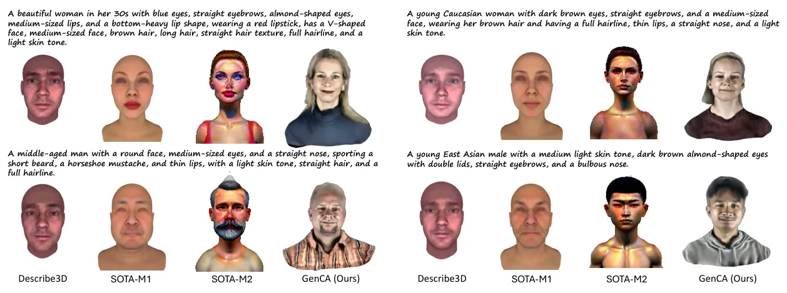

Figure 6: Qualitative comparison of GenCA generation with three
state-of-the-art methods. Compared to other methods, GenCA produces more
comprehensive and photorealistic avatars given the same text
descriptions.

### 4.4 Evaluation Metrics

We evaluate GenCA with several quantitative evaluation metrics common to
generative models. These metrics include the contrastive language–image
pretraining (CLIP) score \[22\], Aesthetic Score \[42\] and human
preference score (HPS) \[67\]. The CLIP score provides semantic accuracy
of generation given a text caption, the Aesthetic Score evaluates the
aesthetic quality of generated images and the HPS demonstrates the
alignment between text-to-image generation and human preferences. In
addition to these evaluation metrics we also conduct an unbiased user
study.

### 4.5 Comparison with State-of-the-Art Methods

We compare with three state-of-the-art methods Describe3D\[66\], and
other two SOTA methods M1 and M2 that uses generative approaches to
create text-driven avatars. The qualitative comparison in Fig. 6, shows
superiority of GenCA in generating photo-realistic avatars and following
the text description accurately. The quantitative comparisons are shown
in  Table 2, GenCA performs similarly with SOTA-M2 on the CLIP score but
outperforms all for the other three metrics, especially on the User
Study result, GenCA achieves the best scores by a significant margin.

### 4.6 Ablation Study

We perform ablation studies of different components of the proposed
method as shown in Fig. 7 and Table 3. For quantitative ablation, we
reuse the metrics introduced in Section 4.4. We mainly explore the
effects of different geometry conditioning (GeoCond) in the texture
generation and the effects of the neural renderer (NeuRender).
Specifically, the model without any geometry conditioning (None), as
shown in the first row of Table 3 and the first column of Fig. 7, fails
to learn a plausible texture, with blurry artefacts, leading to an
extremely low human preference score. Taking displacement map (Disp) for
geometry injection, as shown in the second row of Table 3 leads to
plausible texture and significant improvement in all the metrics.
However, as shown in the second column of Fig. 7, the texture is not
well-aligned with the geometry, and has severe distortion in the face.
In our final design (Norm), we propose to compute the normal map as the
geometry conditioning, which leads to the best performance both
qualitatively and quantitatively.

Furthermore, we evaluate the effectiveness of our neural renderer with
another comparison in row 3 and 4 of Table 3 and column 3 and 4 of
Fig. 7. Even with the same geometry and texture map generated by our
GenCA, using a traditional graphics-based renderer \[47\] leads to
unrealistic artifacts in the skin, whereas the proposed neural rending
block yields visually appealing effects.

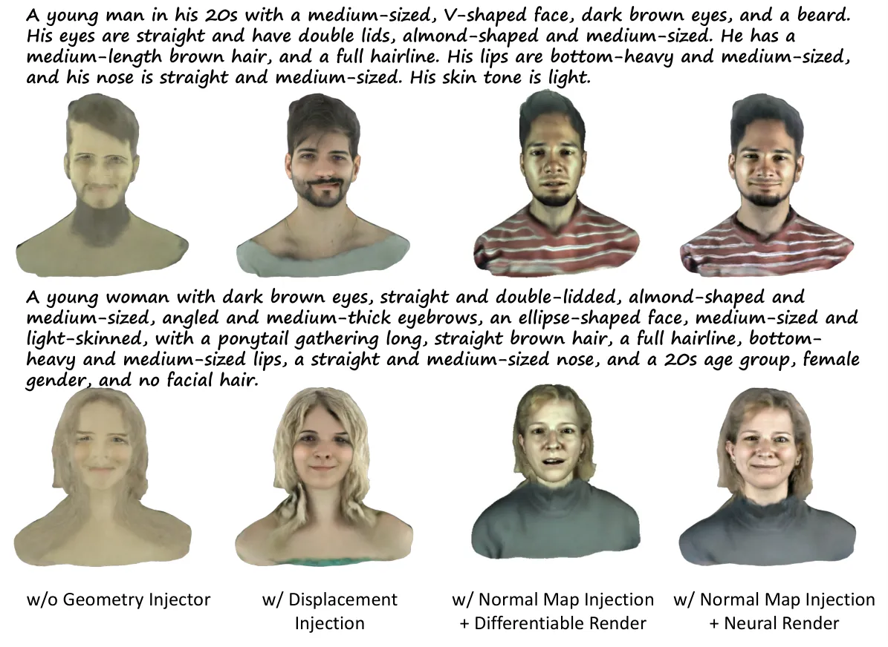

Figure 7: Ablation study by disabling different parts of the proposed
method.

## 5 Conclusion

We propose GenCA, a text-guided generative model capable of producing
photorealistic facial avatars with diverse identities and comprehensive
features. With complete details, such as hair, eyes, and mouth interior,
which can be driven through. We also showcase a variety of downstream
applications enabled by GenCA, including avatar reconstruction from a
single image, editing and inpainting. Finally, we achieve superior
performance/quality in comparison to other state-of-the-art methods.

Appendices

## Appendix A Inference Architecture

Once trained, GenCA generates neutral texture and neutral geometry
latent codes using input text prompt and random noise. Once we get the
$`z_{\scriptsize\mbox{geo}}`$ and $`z_{\scriptsize\mbox{tex}}`$, we pass
it through the decoding block $`\mathcal{D}`$ to obtain the UV maps
$`\hat{\mathcal{T}}_{neu},\hat{\mathcal{G}}_{neu}`$, which is then
rendered using the expression and view parametrization:

```math
\displaystyle\hat{I}=\mathcal{R}(g_{exp}(z_{\scriptsize\mbox{exp}}|\mathcal{H}(\hat{\mathcal{T}}_{neu},\hat{\mathcal{G}}_{neu})),\mathcal{C}) \tag{15}
```

The inference process is shown in Figure 10

## Appendix B Additional Implementation Details

In training the Geometry Generator, we set the resolution to
$`1024\times 1024`$, and set batch size to $`12`$. We trained the
Geometry Generator on use $`8`$ NVIDIA A100 GPUs for $`8`$ hours.

When training the Geometry-Conditioned Texture Generator, we take the
ground-truth geometry map as the input condition, and the corresponding
texture map as the supervision. The resolution of the Texture Generator
is also set to $`1024\times 1024`$, whereas the batch size is $`4`$, and
it takes $`12`$ hours to train on $`8`$ NVIDIA A100 GPUs.

## Appendix C Dataset

For each subject, we use a Visual Language Model (VLM) to annotate the
global attributes like age and gender, and the local attributes for the
eyebrows, eyes, glasses, lips, skin tone, hair, nose, face shape, face
size, facial hair, eyebrow style, eyebrow thickness, eye color, eye
direction, eye lid type, eye shape, eye size, glasses frame, glasses
size, glasses style, lip shape, lip size, lip stick color etc. As an
example, Fig. 8 shows the percentage distribution of both the muti-view
dome dataset and the single-view phone capture with respect to three
attributes (age, gender, and skintone). Eventually, we combine a Large
Language Model (LLM) to summarize all these information into a sentence
to describe the subject.

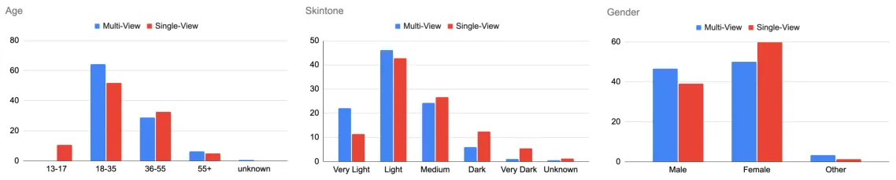

Figure 8: Data percentages with respect to three different attributes,
age, skintone and gender in the multi-view and single-view captures used
for GenCA training.

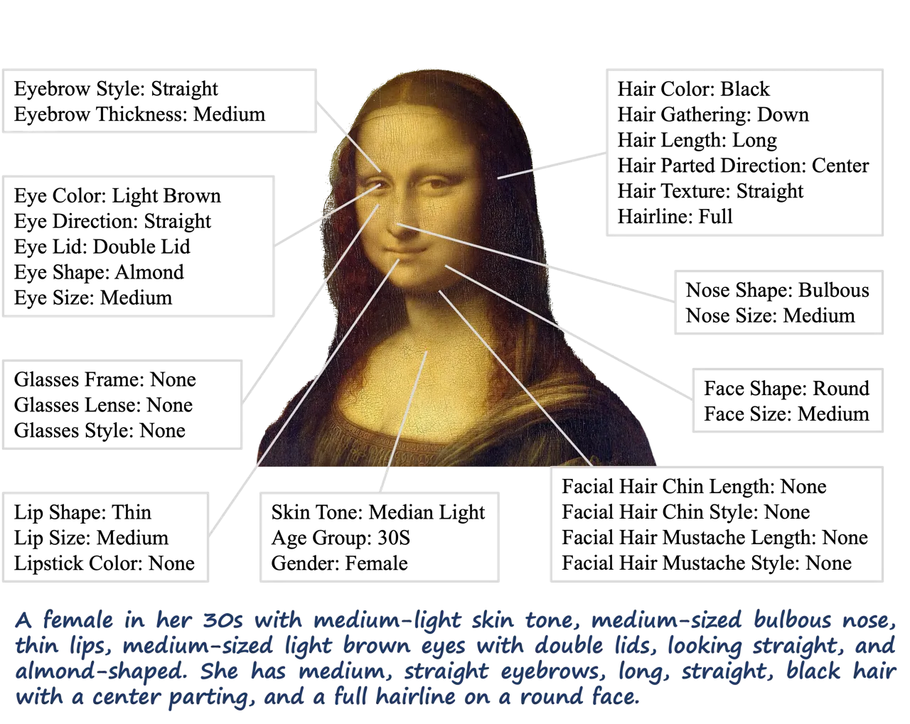

Figure 9: Example of extracting attributes and generating text caption.

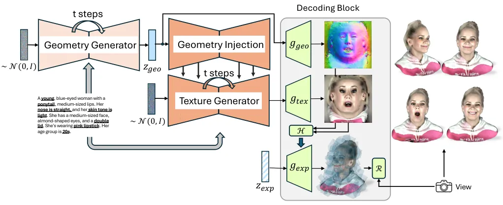

Figure 10: Inference for the GenCA. We pass in random noise and a text
prompt to generate the geometry and texture neutral codes. This is then
passed through the decoding block or obtaining view and expression
parametrized renderings of the generated avatar.

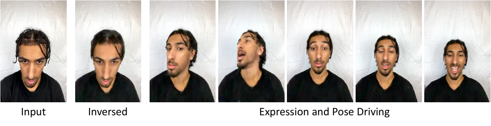

Figure 11: Given the input image in the first column, we perform
inversion to reconstruct the full Codec Avatar (second column), which
can be driven with different expressions and rendered from different
poses.

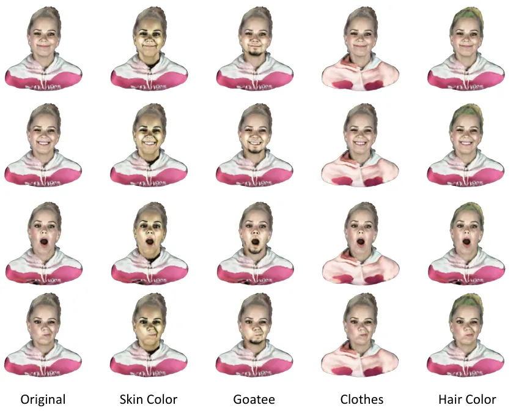

Figure 12: Editing results of generated avatar in the first column with
different expressions.

## Appendix D Additional Results

The Identity Generation Model with its rich identity latent space allows
us to leverage the power of generative model for several applications
including personalization and editing. This in turn allows for a
flexible and quick way to control the avatar’s appearance while still
maintaining the expression driving and generalization via the UPM.

### D.1 Single/Multi-Image Personalization

Given, we have a latent space for identities we can invert into that
space via the decoding block and find the $`z_{geo}`$ and $`z_{tex}`$
corresponding to a provided single/multi image input. More specifically,
we use a single or multi-image (Fig. 11) to get an approximate UV
texture and geometry, which allow us to get an initial estimate of the
latent codes using the encoding block. We then leverage UPM losses
(\[11\]) to supervise on the input data and backpropogate into the
identity latent space, similar methods are used for GAN inversion \[1\].

### D.2 Editing

Given any generated or personalized avatar, we can perform global and
local editing. For global appearance editing, we solely utilize text
conditioning with GCTM, which alters the texture while maintaining the
geometry. For local editing, we use semantic masks in the UV space to
perform in-painting \[38\]. Specifically, given a mask $`M`$, we perform
the following edit on the UV space
$`F_{out}=(1-M)\times F_{edit}+M\times F_{gen}`$, here $`F_{edit}`$ and
$`F_{gen}`$ are the edited and generated geometry or texture feature
respectively. This type of local editing enables us to selectively
modify the avatar’s geometry (e.g., hairstyle) and texture (e.g., hair
color) attributes, while leaving the rest of the avatar unchanged, as
shown in Fig. 12

## Appendix E Limitation

Currently, GenCA generates texture with baked in lighting information,
making it challenging to relight the generated avatars with new lighting
conditions. Additionally, our model still struggles with generating
fine-grained details for regions such as hair or sharp details for the
clothing regions. Finally, as our model is based on the Codec Avatar Cao
et al. \[11\], it inherits some of its limitations, including the
inability to model complex accessories like glasses or intricate and
longer hairstyles.

## Appendix F Ethical Concerns and Social Impact

GenCA introduces a powerful method for generating plausible and
photo-realistic 3D avatars based on text prompts, with the ability to
control both view and expression. While GenCA has proven to be
beneficial for many downstream tasks, it also raises significant ethical
concerns, particularly regarding potential misuse.

One major risk is the possibility of personification, where the
generated avatars could be used to impersonate real individuals in a
misleading or harmful way. Although our method does not offer
indistinguishable, pixel-perfect 2D video synthesis and does not model
several critical parameters such as lighting and background—key elements
typically exploited in malicious impersonation—these limitations do not
entirely eliminate the risk.

To mitigate these concerns, we have implemented strict ethical
guidelines in the development and deployment of GenCA . The model has
been trained exclusively on data collected with prior approval, ensuring
that only consenting subjects were involved in our research. Moreover,
our method is intended solely for legitimate uses, such as in creative
industries and virtual communication, and we strongly discourage any
application that could lead to ethical violations or harm to
individuals.

Equally important is the advancement of methods to detect fake content.
Recent works such as \[64, 44, 16\] have addressed the challenge of
distinguishing real from fake images. Notably, the work by Davide et
al.\[16\] demonstrates that a CLIP-based detector, trained on only a
handful of example images from a single generative model, exhibits
impressive generalization abilities and robustness across different
architectures, including recent commercial tools such as DALL-E 3,
Midjourney v5, and Firefly.

As generative models continue to improve and access to these models
becomes increasingly widespread, ongoing innovation in detection methods
will be essential. It is crucial to continue research in the field of
fake image detection to keep pace with the rapidly evolving domain of
image synthesis. Our model, GenCA , could potentially contribute to
detecting fake content by providing realistic generated images and
videos to enhance detection models.

## References

- \[1\] Rameen Abdal, Yipeng Qin, and Peter Wonka. Image2stylegan: How
  to embed images into the stylegan latent space? In _Proceedings of the
  IEEE/CVF international conference on computer vision_, pages
  4432–4441, 2019.
- \[2\] Sizhe An, Hongyi Xu, Yichun Shi, Guoxian Song, Umit Y Ogras, and
  Linjie Luo. Panohead: Geometry-aware 3d full-head synthesis in 360deg.
  In _Proceedings of the IEEE/CVF Conference on Computer Vision and
  Pattern Recognition_, pages 20950–20959, 2023.
- \[3\] Yogesh Balaji, Seungjun Nah, Xun Huang, Arash Vahdat, Jiaming
  Song, Karsten Kreis, Miika Aittala, Timo Aila, Samuli Laine, Bryan
  Catanzaro, et al. ediffi: Text-to-image diffusion models with an
  ensemble of expert denoisers. _arXiv preprint arXiv:2211.01324_, 2022.
- \[4\] Thabo Beeler, Fabian Hahn, Derek Bradley, Bernd Bickel, Paul A
  Beardsley, Craig Gotsman, Robert W Sumner, and Markus H Gross.
  High-quality passive facial performance capture using anchor frames.
  _ACM Trans. Graph._, 30(4):75, 2011.
- \[5\] Bernd Bickel, Mario Botsch, Roland Angst, Wojciech Matusik,
  Miguel Otaduy, Hanspeter Pfister, and Markus Gross. Multi-scale
  capture of facial geometry and motion. _ACM transactions on graphics
  (TOG)_, 26(3):33–es, 2007.
- \[6\] Volker Blanz and Thomas Vetter. A morphable model for the
  synthesis of 3d faces. pages 187–194, 1999.
- \[7\] Volker Blanz and Thomas Vetter. A morphable model for the
  synthesis of 3d faces. In _Seminal Graphics Papers: Pushing the
  Boundaries, Volume 2_, pages 157–164. 2023.
- \[8\] James Booth, Anastasios Roussos, Stefanos Zafeiriou, Allan
  Ponniah, and David Dunaway. A 3d morphable model learnt from 10,000
  faces. In _Proceedings of the IEEE conference on computer vision and
  pattern recognition_, pages 5543–5552, 2016.
- \[9\] Derek Bradley, Wolfgang Heidrich, Tiberiu Popa, and Alla
  Sheffer. High resolution passive facial performance capture. In _ACM
  SIGGRAPH 2010 papers_, pages 1–10. 2010.
- \[10\] Chen Cao, Tomas Simon, Jin Kyu Kim, Gabe Schwartz, Michael
  Zollhoefer, Shun-Suke Saito, Stephen Lombardi, Shih-En Wei, Danielle
  Belko, Shoou-I Yu, Yaser Sheikh, and Jason Saragih. Authentic
  volumetric avatars from a phone scan. _ACM Trans. Graph._, 41(4),
  2022a.
- \[11\] Chen Cao, Tomas Simon, Jin Kyu Kim, Gabe Schwartz, Michael
  Zollhoefer, Shun-Suke Saito, Stephen Lombardi, Shih-En Wei, Danielle
  Belko, Shoou-I Yu, et al. Authentic volumetric avatars from a phone
  scan. _ACM Transactions on Graphics (TOG)_, 41(4):1–19, 2022b.
- \[12\] Eric R. Chan, Marco Monteiro, Petr Kellnhofer, Jiajun Wu, and
  Gordon Wetzstein. Pi-gan: Periodic implicit generative adversarial
  networks for 3d-aware image synthesis. In _Proceedings of the IEEE/CVF
  Conference on Computer Vision and Pattern Recognition (CVPR)_, pages
  5799–5809, 2021a.
- \[13\] Eric R Chan, Marco Monteiro, Petr Kellnhofer, Jiajun Wu, and
  Gordon Wetzstein. pi-gan: Periodic implicit generative adversarial
  networks for 3d-aware image synthesis. In _Proceedings of the IEEE/CVF
  conference on computer vision and pattern recognition_, pages
  5799–5809, 2021b.
- \[14\] Eric R Chan, Connor Z Lin, Matthew A Chan, Koki Nagano, Boxiao
  Pan, Shalini De Mello, Orazio Gallo, Leonidas J Guibas, Jonathan
  Tremblay, Sameh Khamis, et al. Efficient geometry-aware 3d generative
  adversarial networks. In _Proceedings of the IEEE/CVF Conference on
  Computer Vision and Pattern Recognition_, pages 16123–16133, 2022.
- \[15\] Rui Chen, Yongwei Chen, Ningxin Jiao, and Kui Jia. Fantasia3d:
  Disentangling geometry and appearance for high-quality text-to-3d
  content creation. _arXiv preprint arXiv:2303.13873_, 2023.
- \[16\] Davide Cozzolino, Giovanni Poggi, Riccardo Corvi, Matthias
  Nießner, and Luisa Verdoliva. Raising the bar of ai-generated image
  detection with clip. In _Proceedings of the IEEE/CVF Conference on
  Computer Vision and Pattern Recognition_, pages 4356–4366, 2024.
- \[17\] Paul Debevec, Tim Hawkins, Chris Tchou, Haarm-Pieter Duiker,
  Westley Sarokin, and Mark Sagar. Acquiring the reflectance field of a
  human face. In _Proceedings of the 27th annual conference on Computer
  graphics and interactive techniques_, pages 145–156, 2000.
- \[18\] Prafulla Dhariwal and Alexander Nichol. Diffusion models beat
  gans on image synthesis. _NeurIPS_, 34:8780–8794, 2021.
- \[19\] Graham Fyffe, Andrew Jones, Oleg Alexander, Ryosuke Ichikari,
  and Paul Debevec. Driving high-resolution facial scans with video
  performance capture. _ACM Transactions on Graphics (TOG)_,
  34(1):1–14, 2014.
- \[20\] Guy Gafni, Justus Thies, Michael Zollhofer, and Matthias
  Nießner. Dynamic neural radiance fields for monocular 4d facial avatar
  reconstruction. In _Proceedings of the IEEE/CVF Conference on Computer
  Vision and Pattern Recognition_, pages 8649–8658, 2021.
- \[21\] Rinon Gal, Yuval Alaluf, Yuval Atzmon, Or Patashnik, Amit Haim
  Bermano, Gal Chechik, and Daniel Cohen-or. An image is worth one word:
  Personalizing text-to-image generation using textual inversion. In
  _The Eleventh International Conference on Learning
  Representations_, 2023.
- \[22\] Jack Hessel, Ari Holtzman, Maxwell Forbes, Ronan Le Bras, and
  Yejin Choi. Clipscore: A reference-free evaluation metric for image
  captioning. _arXiv preprint arXiv:2104.08718_, 2021.
- \[23\] Jonathan Ho, Ajay Jain, and Pieter Abbeel. Denoising diffusion
  probabilistic models. _NeurIPS_, 33:6840–6851, 2020.
- \[24\] Fangzhou Hong, Mingyuan Zhang, Liang Pan, Zhongang Cai, Lei
  Yang, and Ziwei Liu. Avatarclip: zero-shot text-driven generation and
  animation of 3d avatars. _ACM TOG_, 41(4):1–19, 2022.
- \[25\] Yukun Huang, Jianan Wang, Yukai Shi, Xianbiao Qi, Zheng-Jun
  Zha, and Lei Zhang. Dreamtime: An improved optimization strategy for
  text-to-3d content creation. _arXiv preprint arXiv:2306.12422_, 2023.
- \[26\] Ajay Jain, Ben Mildenhall, Jonathan T Barron, Pieter Abbeel,
  and Ben Poole. Zero-shot text-guided object generation with dream
  fields. In _CVPR_, pages 867–876, 2022.
- \[27\] Tero Karras, Timo Aila, Samuli Laine, and Jaakko Lehtinen.
  Progressive growing of gans for improved quality, stability, and
  variation. _arXiv preprint arXiv:1710.10196_, 2017.
- \[28\] Tero Karras, Samuli Laine, and Timo Aila. A style-based
  generator architecture for generative adversarial networks. In
  _Proceedings of the IEEE/CVF conference on computer vision and pattern
  recognition_, pages 4401–4410, 2019.
- \[29\] Tero Karras, Miika Aittala, Janne Hellsten, Samuli Laine,
  Jaakko Lehtinen, and Timo Aila. Training generative adversarial
  networks with limited data. _Advances in neural information processing
  systems_, 33:12104–12114, 2020a.
- \[30\] Tero Karras, Samuli Laine, Miika Aittala, Janne Hellsten,
  Jaakko Lehtinen, and Timo Aila. Analyzing and improving the image
  quality of stylegan. In _Proceedings of the IEEE/CVF conference on
  computer vision and pattern recognition_, pages 8110–8119, 2020b.
- \[31\] Ira Kemelmacher-Shlizerman. Internet based morphable model. In
  _Proceedings of the IEEE international conference on computer vision_,
  pages 3256–3263, 2013.
- \[32\] Tobias Kirschstein, Shenhan Qian, Simon Giebenhain, Tim Walter,
  and Matthias Nießner. Nersemble: Multi-view radiance field
  reconstruction of human heads. _arXiv preprint
  arXiv:2305.03027_, 2023.
- \[33\] Tingting Liao, Hongwei Yi, Yuliang Xiu, Jiaxiang Tang, Yangyi
  Huang, Justus Thies, and Michael J. Black. TADA! Text to Animatable
  Digital Avatars. In _International Conference on 3D Vision
  (3DV)_, 2024.
- \[34\] Chen-Hsuan Lin, Jun Gao, Luming Tang, Towaki Takikawa, Xiaohui
  Zeng, Xun Huang, Karsten Kreis, Sanja Fidler, Ming-Yu Liu, and
  Tsung-Yi Lin. Magic3d: High-resolution text-to-3d content creation. In
  _CVPR_, pages 300–309, 2023.
- \[35\] lllyasviel. Controlnet.
  [https://huggingface.co/runwayml/lllyasviel/sd-controlnet-depth](https://huggingface.co/runwayml/lllyasviel/sd-controlnet-depth), 2023.
- \[36\] Stephen Lombardi, Jason Saragih, Tomas Simon, and Yaser Sheikh.
  Deep appearance models for face rendering. _ACM Transactions on
  Graphics (ToG)_, 37(4):1–13, 2018.
- \[37\] Stephen Lombardi, Tomas Simon, Gabriel Schwartz, Michael
  Zollhoefer, Yaser Sheikh, and Jason Saragih. Mixture of volumetric
  primitives for efficient neural rendering. _ACM Transactions on
  Graphics (ToG)_, 40(4):1–13, 2021.
- \[38\] Andreas Lugmayr, Martin Danelljan, Andres Romero, Fisher Yu,
  Radu Timofte, and Luc Van Gool. Repaint: Inpainting using denoising
  diffusion probabilistic models. In _Proceedings of the IEEE/CVF
  conference on computer vision and pattern recognition_, pages
  11461–11471, 2022.
- \[39\] Shugao Ma, Tomas Simon, Jason Saragih, Dawei Wang, Yuecheng Li,
  Fernando De La Torre, and Yaser Sheikh. Pixel codec avatars. In
  _Proceedings of the IEEE/CVF Conference on Computer Vision and Pattern
  Recognition_, pages 64–73, 2021a.
- \[40\] Shugao Ma, Tomas Simon, Jason Saragih, Dawei Wang, Yuecheng Li,
  Fernando De La Torre, and Yaser Sheikh. Pixel codec avatars. In
  _Proceedings of the IEEE/CVF Conference on Computer Vision and Pattern
  Recognition_, pages 64–73, 2021b.
- \[41\] Oscar Michel, Roi Bar-On, Richard Liu, Sagie Benaim, and Rana
  Hanocka. Text2mesh: Text-driven neural stylization for meshes. In
  _CVPR_, pages 13492–13502, 2022.
- \[42\] Naila Murray, Luca Marchesotti, and Florent Perronnin. Ava: A
  large-scale database for aesthetic visual analysis. In _2012 IEEE
  conference on computer vision and pattern recognition_, pages
  2408–2415. IEEE, 2012.
- \[43\] Michael Niemeyer and Andreas Geiger. Giraffe: Representing
  scenes as compositional generative neural feature fields. In _Proc.
  IEEE Conf. on Computer Vision and Pattern Recognition (CVPR)_, 2021.
- \[44\] Utkarsh Ojha, Yuheng Li, and Yong Jae Lee. Towards universal
  fake image detectors that generalize across generative models. In
  _Proceedings of the IEEE/CVF Conference on Computer Vision and Pattern
  Recognition_, pages 24480–24489, 2023.
- \[45\] Keunhong Park, Utkarsh Sinha, Jonathan T. Barron, Sofien
  Bouaziz, Dan B Goldman, Steven M. Seitz, and Ricardo Martin-Brualla.
  Nerfies: Deformable neural radiance fields. _ICCV_, 2021a.
- \[46\] Keunhong Park, Utkarsh Sinha, Peter Hedman, Jonathan T. Barron,
  Sofien Bouaziz, Dan B Goldman, Ricardo Martin-Brualla, and Steven M.
  Seitz. Hypernerf: A higher-dimensional representation for
  topologically varying neural radiance fields. _ACM Trans. Graph._,
  40(6), 2021b.
- \[47\] Adam Paszke, Sam Gross, Soumith Chintala, Gregory Chanan,
  Edward Yang, Zachary DeVito, Zeming Lin, Alban Desmaison, Luca Antiga,
  and Adam Lerer. Automatic differentiation in pytorch. 2017.
- \[48\] Stylianos Ploumpis, Evangelos Ververas, Eimear O’Sullivan,
  Stylianos Moschoglou, Haoyang Wang, Nick Pears, William AP Smith,
  Baris Gecer, and Stefanos Zafeiriou. Towards a complete 3d morphable
  model of the human head. _IEEE transactions on pattern analysis and
  machine intelligence_, 43(11):4142–4160, 2020.
- \[49\] Ben Poole, Ajay Jain, Jonathan T Barron, and Ben Mildenhall.
  Dreamfusion: Text-to-3d using 2d diffusion. _arXiv preprint
  arXiv:2209.14988_, 2022.
- \[50\] Alec Radford, Jong Wook Kim, Chris Hallacy, Aditya Ramesh,
  Gabriel Goh, Sandhini Agarwal, Girish Sastry, Amanda Askell, Pamela
  Mishkin, Jack Clark, et al. Learning transferable visual models from
  natural language supervision. In _International conference on machine
  learning_, pages 8748–8763. PMLR, 2021.
- \[51\] Aditya Ramesh, Prafulla Dhariwal, Alex Nichol, Casey Chu, and
  Mark Chen. Hierarchical text-conditional image generation with clip
  latents. _arXiv preprint arXiv:2204.06125_, 1(2):3, 2022.
- \[52\] Robin Rombach, Andreas Blattmann, Dominik Lorenz, Patrick
  Esser, and Björn Ommer. High-resolution image synthesis with latent
  diffusion models. In _CVPR_, pages 10684–10695, 2022.
- \[53\] Chitwan Saharia, William Chan, Saurabh Saxena, Lala Li, Jay
  Whang, Emily L Denton, Kamyar Ghasemipour, Raphael Gontijo Lopes,
  Burcu Karagol Ayan, Tim Salimans, et al. Photorealistic text-to-image
  diffusion models with deep language understanding. _NeurIPS_,
  35:36479–36494, 2022.
- \[54\] Shunsuke Saito, Gabriel Schwartz, Tomas Simon, Junxuan Li, and
  Giljoo Nam. Relightable gaussian codec avatars. _arXiv preprint
  arXiv:2312.03704_, 2023.
- \[55\] Aditya Sanghi, Hang Chu, Joseph G Lambourne, Ye Wang, Chin-Yi
  Cheng, Marco Fumero, and Kamal Rahimi Malekshan. Clip-forge: Towards
  zero-shot text-to-shape generation. In _CVPR_, pages
  18603–18613, 2022.
- \[56\] Johannes L Schönberger. 3dscanstore.
  [https://www.3dscanstore.com/hd-head-scans/hd-head-models](https://www.3dscanstore.com/hd-head-scans/hd-head-models), 2016.
- \[57\] Jiaming Song, Chenlin Meng, and Stefano Ermon. Denoising
  diffusion implicit models. In _International Conference on Learning
  Representations_, 2020.
- \[58\] Keqiang Sun, Shangzhe Wu, Zhaoyang Huang, Ning Zhang, Quan
  Wang, and Hongsheng Li. Controllable 3d face synthesis with
  conditional generative occupancy fields. In _Advances in Neural
  Information Processing Systems_, 2022.
- \[59\] Keqiang Sun, Shangzhe Wu, Ning Zhang, Zhaoyang Huang, Quan
  Wang, and Hongsheng Li. Cgof++: Controllable 3d face synthesis with
  conditional generative occupancy fields. _IEEE Transactions on Pattern
  Analysis and Machine Intelligence_, 2023.
- \[60\] Ayush Tewari, Mohamed Elgharib, Gaurav Bharaj, Florian Bernard,
  Hans-Peter Seidel, Patrick Pérez, Michael Zollhofer, and Christian
  Theobalt. Stylerig: Rigging stylegan for 3d control over portrait
  images. In _Proceedings of the IEEE/CVF Conference on Computer Vision
  and Pattern Recognition_, pages 6142–6151, 2020a.
- \[61\] Ayush Tewari, Ohad Fried, Justus Thies, Vincent Sitzmann,
  Stephen Lombardi, Kalyan Sunkavalli, Ricardo Martin-Brualla, Tomas
  Simon, Jason Saragih, Matthias Nießner, et al. State of the art on
  neural rendering. In _Computer Graphics Forum_, pages 701–727. Wiley
  Online Library, 2020b.
- \[62\] Ayush Tewari, Justus Thies, Ben Mildenhall, Pratul Srinivasan,
  Edgar Tretschk, Wang Yifan, Christoph Lassner, Vincent Sitzmann,
  Ricardo Martin-Brualla, Stephen Lombardi, et al. Advances in neural
  rendering. In _Computer Graphics Forum_, pages 703–735. Wiley Online
  Library, 2022.
- \[63\] Justus Thies, Michael Zollhöfer, and Matthias Nießner. Deferred
  neural rendering: Image synthesis using neural textures. _ACM
  Transactions on Graphics (TOG)_, 38(4):1–12, 2019.
- \[64\] Sheng-Yu Wang, Oliver Wang, Richard Zhang, Andrew Owens, and
  Alexei A Efros. Cnn-generated images are surprisingly easy to spot…
  for now. In _Proceedings of the IEEE/CVF conference on computer vision
  and pattern recognition_, pages 8695–8704, 2020.
- \[65\] Tengfei Wang, Bo Zhang, Ting Zhang, Shuyang Gu, Jianmin Bao,
  Tadas Baltrusaitis, Jingjing Shen, Dong Chen, Fang Wen, Qifeng Chen,
  and Baining Guo. Rodin: A generative model for sculpting 3d digital
  avatars using diffusion. In _Proceedings of the IEEE/CVF Conference on
  Computer Vision and Pattern Recognition (CVPR)_, pages
  4563–4573, 2023.
- \[66\] Menghua Wu, Hao Zhu, Linjia Huang, Yiyu Zhuang, Yuanxun Lu, and
  Xun Cao. High-fidelity 3d face generation from natural language
  descriptions. In _Proceedings of the IEEE/CVF Conference on Computer
  Vision and Pattern Recognition_, pages 4521–4530, 2023a.
- \[67\] Xiaoshi Wu, Keqiang Sun, Feng Zhu, Rui Zhao, and Hongsheng Li.
  Human preference score: Better aligning text-to-image models with
  human preference. In _Proceedings of the IEEE/CVF International
  Conference on Computer Vision_, pages 2096–2105, 2023b.
- \[68\] Yue Wu, Yu Deng, Jiaolong Yang, Fangyun Wei, Qifeng Chen, and
  Xin Tong. Anifacegan: Animatable 3d-aware face image generation for
  video avatars. _Advances in Neural Information Processing Systems_,
  35:36188–36201, 2022.
- \[69\] Cheng-hsin Wuu, Ningyuan Zheng, Scott Ardisson, Rohan Bali,
  Danielle Belko, Eric Brockmeyer, Lucas Evans, Timothy Godisart, Hyowon
  Ha, Alexander Hypes, et al. Multiface: A dataset for neural face
  rendering. in arxiv, 2022.
- \[70\] Weihao Xia, Yulun Zhang, Yujiu Yang, Jing-Hao Xue, Bolei Zhou,
  and Ming-Hsuan Yang. Gan inversion: A survey. _IEEE Transactions on
  Pattern Analysis and Machine Intelligence (TPAMI)_, 2022.
- \[71\] Jiale Xu, Xintao Wang, Weihao Cheng, Yan-Pei Cao, Ying Shan,
  Xiaohu Qie, and Shenghua Gao. Dream3d: Zero-shot text-to-3d synthesis
  using 3d shape prior and text-to-image diffusion models. In _CVPR_,
  pages 20908–20918, 2023.
- \[72\] Longwen Zhang, Qiwei Qiu, Hongyang Lin, Qixuan Zhang, Cheng
  Shi, Wei Yang, Ye Shi, Sibei Yang, Lan Xu, and Jingyi Yu. Dreamface:
  Progressive generation of animatable 3d faces under text
  guidance, 2023.
- \[73\] Wojciech Zielonka, Timo Bolkart, and Justus Thies. Insta:
  Instant volumetric head avatars. In _IEEE Conference on Computer
  Vision and Pattern Recognition (CVPR)_, 2023a.
- \[74\] Wojciech Zielonka, Timo Bolkart, and Justus Thies. Instant
  volumetric head avatars. In _Proceedings of the IEEE/CVF Conference on
  Computer Vision and Pattern Recognition_, pages 4574–4584, 2023b.
