# TEDRA: Text-based Editing of Dynamic and Photoreal Actors

Basavaraj Sunagad Affiliation: Max Planck Institute for Informatics,
Saarland Informatics Campus Email: <bsunagad@mpi-inf.mpg.de>    Heming
Zhu Email: <hezhu@mpi-inf.mpg.de>    Mohit Mendiratta
Email: <mmendira@mpi-inf.mpg.de>    Adam Kortylewski Affiliation: Max
Planck Institute for Informatics, Saarland Informatics Campus
Affiliation: University of Freiburg Email: <akortyle@mpi-inf.mpg.de>   
Christian Theobalt Affiliation: Max Planck Institute for Informatics,
Saarland Informatics Campus Affiliation: Saarbrücken Research Center for
Visual Computing, Interaction and AI Email: <theobalt@mpi-inf.mpg.de>   
Marc Habermann Affiliation: Max Planck Institute for Informatics,
Saarland Informatics Campus Email: <mhaberma@mpi-inf.mpg.de>

###### Abstract

Over the past years, significant progress has been made in creating
photorealistic and drivable 3D avatars solely from videos of real
humans. However, a core remaining challenge is the fine-grained and
user-friendly editing of clothing styles by means of textual
descriptions. To this end, we present TEDRA  the first method allowing
text-based edits of an avatar, which maintains the avatar’s high
fidelity, space-time coherency, as well as dynamics, and enables
skeletal pose and view control. We begin by training a model to create a
controllable and high-fidelity digital replica of the real actor. Next,
we personalize a pre-trained generative diffusion model by fine-tuning
it on various frames of the real character captured from different
camera angles, ensuring the digital representation faithfully captures
the dynamics and movements of the real person. This two-stage process
lays the foundation for our approach to dynamic human avatar editing.
Utilizing this personalized diffusion model, we modify the dynamic
avatar based on a provided text prompt using our Personalized Normal
Aligned Score Distillation Sampling (PNA-SDS) within a model-based
guidance framework. Additionally, we propose a time step annealing
strategy to ensure high-quality edits. Our results demonstrate a clear
improvement over prior work in functionality and visual quality.

⁰⁰ 0 † Equal contribution.¹¹ 1 \* Corresponding author.²² 2 Project
page:
[vcai.mpi-inf.mpg.de/projects/Tedra](https://vcai.mpi-inf.mpg.de/projects/Tedra/)

## 1 Introduction

Digital avatars of real humans play a vital role in various
applications, including augmented and virtual reality, gaming, movie
production, and synthetic data generation \[11, 30, 35, 45, 66, 10, 72,
13, 29\]. However, creating highly realistic and easily animatable
avatars presents significant challenges due to the intricate and diverse
nature of human geometry and appearance. While creating and editing
highly realistic avatars is possible, it remains a time-intensive and
manual process requiring substantial expertise. Achieving a specific
individual’s likeness further adds complexity to this.

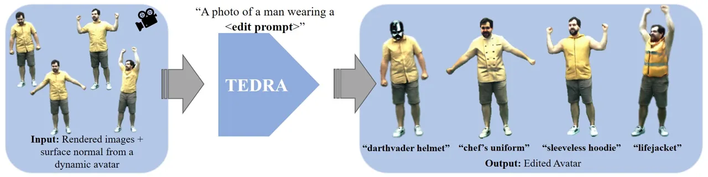

Figure 1: We propose a method for text-based editing of dynamic and
photoreal actors (TEDRA). Our approach edits a pre-trained neural 3D
human avatar according to a user-defined text prompt. Importantly, we
preserve the original dynamics and view consistency of the digital
avatar while also satisfying the desired edit.

In the past years, text-driven image synthesis attracted the attention
of the research community, as text is one of the most user-friendly data
modalities that can be easily deployed without any expert knowledge.
Thanks to the wide development and adaptation of transformers \[59, 47\]
and diffusion models \[49\], several works have shown the ability to
edit images in 2D \[2, 50\] and 3D \[46, 14, 23\], given a text prompt
as input. While 2D-based methods produce visually convincing results,
they most likely can not produce edits that are 3D-consistent. In
contrast, 3D-based methods \[14, 46, 23\] show results on a 3D volume
that can be rendered faithfully from an arbitrary camera viewpoint.
However, such methods are mostly limited to static scenes.

Several methods have been proposed to generate 3D avatars from textual
descriptions by distilling the 2D prior of generative models into 3D
avatar representations \[18, 21, 28\]. However, despite the promising
results, these methods often fail to adequately capture the dynamic and
fine-grained details such as clothing movement. These aspects are
crucial for interactive and dynamic applications.

Recent efforts \[37, 52\] have focused on modifying dynamic avatars
while preserving their underlying motion. However, these approaches are
restricted to the upper body \[52, 37\] and struggle to generalize to
novel poses \[37\]. A significant and open challenge persists in
seamlessly applying text-based edits to highly realistic and
controllable full-body avatars of real humans. The critical requirement
is that these edits must maintain spatio-temporal consistency, dynamics,
and the high fidelity of the original avatar, all while adhering to
user-specified modifications.

In this work, we propose TEDRA, the first text-based method for editing
the appearance of a dynamic full-body avatar while preserving intricate
details (see Fig. 1). Our approach assumes a full-body avatar as input,
which is trained from multi-view video. In particular, our work builds
upon TriHuman \[74\], where the avatar representation is modeled as a
signed distance and radiance field anchored to an explicit and
deformable mesh template, allowing fast inference of photorealistic
human appearance and geometry. Through a pre-training stage, a drivable
and photoreal digital avatar of the real actor is obtained.

Our method enables the text-based editing of such a dynamic volumetric
avatar, ensuring spatial and temporal coherence. More precisely, we
achieve editing through text-based conditional image generation
utilizing a diffusion model. We contribute several technical
advancements to ensure that the editing of TEDRA is authentic,
personalized, and maintains visually convincing spatiotemporal
consistency. Initially, we subsample frames from multi-view videos to
capture the avatar’s identity and dynamics. We then fine-tune a
pre-trained diffusion model with these frames and a unique text
identifier to create a personalized generative model that captures the
avatar’s detailed characteristics. Building on this, we introduce
Personalized Normal-Aligned Score Distillation Sampling (PNA-SDS), a
model-based, classifier-free method inspired by Zhang et al. \[71\]. The
method employs two latent diffusion models—one personalized and one
pre-trained—that perform iterative edits on the dynamic avatar. These
diffusion models are conditioned on rendered normals of the avatar to
preserve the dynamics while enhancing localized edits. Additionally,
noise estimates from both the personalized and pre-trained diffusion
models are strategically combined at specific timesteps to optimally
balance the original avatar characteristics with the intended
modifications.

Furthermore, to prevent over-saturation artifacts, we introduce a
windowed annealing strategy, which gradually reduces the influence of
the personalized diffusion model and enables high-frequency edits. In
summary, our contributions are:

- •
  We introduce TEDRA, a method for editing dynamic 3D full-body avatars
  based on textual input. Our approach combines neural volumetric scene
  representations with text-driven diffusion models. This allows for
  precisely editing dynamic digital avatars while preserving detailed
  wrinkle patterns and ensuring seamless animatability.
- •
  We propose a novel technique, termed as Personalized Normal Aligned
  Score Distillation Sampling (PNA-SDS), facilitating high-quality
  personalized editing while maintaining the integrity of dynamics.
- •
  We present windowed time-step annealing for score distillation from
  text-to-image diffusion models, preventing over-saturation artifacts
  and achieving high-quality edits.

We conduct a comprehensive evaluation of our method, employing, both,
subjective and numerical assessments through a user study and
comparisons with related techniques. The results demonstrate that our
approach not only generates a wide range of text-based edits but also
maintains the integrity of the initial identity. Additionally, we
showcase animations of the edited avatars, further highlighting the
temporal coherency and superior performance of our method compared to
other relevant approaches.

## 2 Related Work

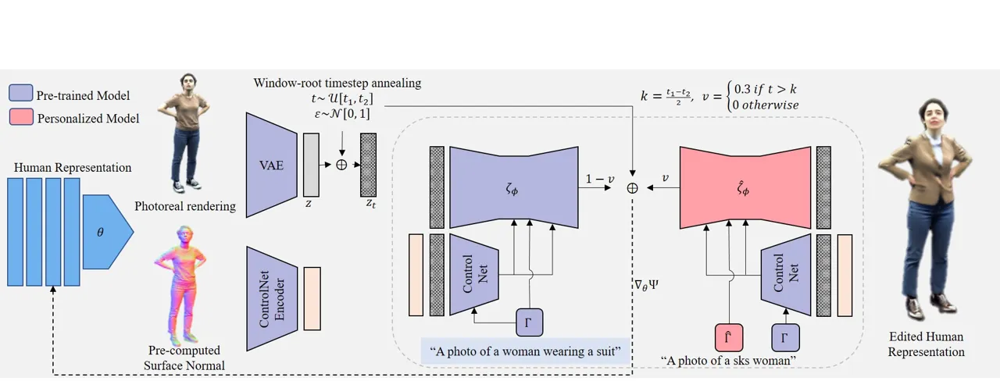

Figure 2: An overview of our approach for text-driven editing of dynamic
and photoreal avatars (TEDRA). Our approach starts with a pre-trained
TriHuman model as the base human representation. Then, we leverage a
fine-tuned diffusion model in conjunction with our proposed Personalized
Normal Aligned Score Distillation Sampling (PNA-SDS). The PNA-SDS
technique then computes a normal aligned model-based score distillation
sampling loss to optimize the human representation towards the edit
prompt while preserving the subject’s characteristics. This process is
further enhanced by incorporating an annealing mechanism, which
gradually refines the editing process.

Diffusion-based Text-to-3D Generation and Editing. In the realm of
computer graphics, the synthesis of 3D assets from textual descriptions
has emerged as a captivating area of research. These assets are
generated using Score Distillation Sampling (SDS), a technique
introduced in DreamFusion \[46\], which enables the generation of 3D
content from textual inputs by lifting text-to-image diffusion models to
3D domain. Fantasia3d \[7\] proposes a text-to-3D content creation
method by disentangling the modeling and learning process of geometry
and appearance. Meanwhile, Hi-FA \[75\] introduces a novel timestep
annealing approach that progressively reduces the sampled timestep
throughout a single-stage optimization process. InstructNerf2Nerf \[14\]
employs an image-conditioned diffusion model for editing NeRF scenes
with text instructions. Given a Neural Radiance Field (NeRF) \[39\]
representation of a scene and respective multi-view images, the method
uses an image-conditioned diffusion model \[3\] to iteratively edit the
input images while optimizing the underlying scene. In contrast,
Re-PaintNerf \[73\] starts with the semantic selection of the object to
be modified, followed by guiding the NeRF model using a pre-trained
diffusion model. All these works have in common that they create static
scenes, which neither support direct animation nor modeling of
piece-wise rigid articulated objects and respective dynamics, e.g.
motion-induced clothing deformations.

Diffusion-based Text-to-3D Avatar Generation. In the field of
text-driven 3D avatar generation, a series of methodologies have been
proposed recently, each tackling a specific challenge. For instance,
AvatarVerse \[68\] and AvatarCraft \[24\] focus on generating avatars
based solely on textual input. In contrast, DreamAvatar \[4\]
prioritizes creating avatars with controllable poses and body types.
HumanNorm \[20\] takes a unique approach, enhancing the perceived
realism of 3D avatars by focusing on how 2D information translates to 3D
geometry. Several methods, including DreamWaltz \[21\],
DreamHuman \[28\], and TADA \[32\], combine text-driven generation with
pre-built body models to create animatable avatars. Additionally,
ZeroAvatar \[65\] and TeCH \[22\] aim to improve the overall quality and
detail of generated avatars, while HaveFun \[67\] tackles the problem of
reconstructing avatars from just a few photos. However, all the above
works rely on a parametric body model to create a 3D avatar. When
dealing with diverse avatars that deviate significantly from the
parametric model, employing the original skinning weights in such
instances will result in animations perceived as unrealistic. Secondly,
and most importantly, they do not model the dynamics of the surface and
appearance, i.e. wrinkles and cast shadows.

Recent works such as DynVideo-E \[33\] and Control4D \[52\] focus on 4D
editing, ensuring temporal and spatial consistency by utilizing an
underlying radiance field representation. However, these methods do not
prioritize preserving the details and fidelity of the underlying avatar,
nor do they adequately capture deformations such as wrinkles. A closely
related work, AvatarStudio \[37\] introduces View-Time SDS for
maintaining consistency in editing the underlying facial avatar across
multiple views. Nevertheless, this method encounters challenges in
generalizing to facial motions that it has not encountered before and
faces limitations in real-time rendering. Additionally, the use of
view-specific prompts in AvatarStudio leads to an entanglement of camera
and identity views, restricting its applicability to datasets where the
person’s movement is limited.

Drivable 3D Avatars. Modeling high-fidelity, dynamic 3D-clothed human
avatars has been an emerging topic in recent years. Here, we focus on
the works related to the modeling of drivable 3D avatars, which take
only skeletal poses and virtual camera views as input at inference time
as they are most closely related.

Previous research on drivable avatars can be divided into two streams:
mesh-based and hybrid approaches. Mesh-based methods \[60, 5, 12, 53\]
represent the shape and appearance of dynamic characters with drivable
template meshes with static (dynamic) textures. However, the rendering
quality is bounded by the resolution of the underlying mesh template.

To improve the quality of both the generated geometry and rendering,
hybrid approaches articulate implicit fields \[15, 54, 55\] or radiance
fields \[38, 69\] with the explicit shape proxies, i.e., 3D skeletons,
parametric human body models \[36, 42, 44, 26\], or person-specific
template meshes  \[34, 29, 74, 13\]. A prevalent research trend \[56,
64, 6, 41, 62, 1, 25, 31, 57, 9, 19\] focuses on modeling dynamic humans
by mapping the posed space to a pose-agnostic canonical space. To better
model the pose-dependent appearance of humans, recent studies  \[35, 45,
66, 10, 72, 13, 29\] incorporate motion-aware residual deformations in
the canonicalized space. Among them, Neural Actor \[35\] and
HDHumans \[13\] leverage the texture space of the human body mesh as
local features to model dynamic human appearances. Nevertheless, both
methods require approximately 5 seconds to render a single frame.
TriHuman \[74\] achieves real-time rendering and geometry generation
through a deformable tri-plane anchored on the motion-controllable
template mesh. The rendering and geometry quality is on par with, or
even better than, the previous offline methods and significantly excels
the real-time methods. We, therefore, take it as our underlying drivable
avatar representation. Nevertheless, all these approaches exhibit a
limitation as they do not allow for text edits and solely animate the
clothing presented in the video.

## 3 Method

We aim to edit a pre-trained 3D human avatar, learned from multi-view
video data, using textual prompts that specify desired changes, such as
”Man wearing a hoodie” (see Fig. 2). The main challenge is to maintain
the avatar’s overall characteristics, transfer the original clothing
dynamics, and achieve the specified edits.

We leverage the recent state-of-the-art neural 3D avatar representation,
TriHuman \[74\], due to its high geometric and visual quality as well as
its real-time performance. The challenge lies in preserving intricate
dynamics, such as wrinkles and other details, from the pre-trained human
avatar during the editing process. To achieve this, we propose a novel
score distillation-based approach, which effectively leverages the edit
capabilities of large text-guided latent diffusion models (LDM) \[8,
49\] to coherently modify the motion-aware geometry and appearance
generated by TriHuman. Next, before we introduce TEDRA (Sec. 3.2), we
first discuss the necessary foundations, i.e., the avatar
representation, LDMs, and Score Distillation Sampling (Sec. 3.1).

### 3.1 Preliminaries

Avatar Representation. Among the existing methods, we choose
TriHuman \[74\] as the human representation for its ability to generate
high-quality, motion-aware, and coherent geometry and appearance of
dynamic humans in real-time.

As a hybrid representation, TriHuman  firstly adopts an explicit,
skeleton-driven human template mesh to depict the human character’s
coarse geometry. To generate the template mesh, it learns the non-rigid
deformation of the human template mesh in the canonical space in a
graph-to-graph translation manner \[12\]. The non-rigid deformed
canonical template meshes are then transformed to the posed space via
Dual Quaternion Skinning \[27\].

While the template mesh captures the motion-aware dynamics of the human
characters, the fidelity of the appearance and geometry is bounded by
the resolution of the template mesh. To this end, TriHuman  introduced a
deformable volume, parameterized with a Tri-plane, anchored on the
deformable character’s texture space. Given a spatial sample
$`\mathbf{x}_{j}`$ along marching rays in the posed space, TriHuman 
non-rigidly maps the sample $`\mathbf{x}_{j}`$ to the texture volume
bridged by the pose-deformed template mesh through inverse skinning. The
respective position of $`\mathbf{x}_{j}`$ in the texture volume is
denoted as $`\mathbf{u}_{j}`$. The sampled Tri-plane’s features, denoted
as $`\mathbf{F}_{j,f}`$ at position $`\mathbf{u}_{j}`$ are further fed
into two shallow MLPs, i.e., the shape MLP
$`\mathcal{H}_{\mathrm{sdf}}`$, and the color MLP
$`\mathcal{H}_{\mathrm{col}}`$, to produce the corresponding SDF
$`s_{j,f}`$ and color value $`\mathbf{c}_{j,f}`$.

```math
\displaystyle\mathcal{H}_{\mathrm{sdf}}(\mathbf{F}_{j,f},p(\mathbf{u}_{j})=s_{j,f},\mathbf{q}_{j,f} \tag{1}
```

```math
\displaystyle\mathcal{H}_{\mathrm{col}}(\mathbf{q}_{j,f},\mathbf{n}_{j,f},p(\mathbf{d}))=\mathbf{c}_{j,f}. \tag{2}
```

where $`\mathbf{q}_{j,f}`$ denotes the motion-aware local shape
features, $`\mathbf{n}_{j,f}`$ is the surface normal, $`p`$ indicates
positional encoding \[38\], $`f`$ denotes the frame index, and
$`\mathbf{d}`$ is the ray direction. Lastly, unbiased volume
rendering \[61\] is adopted to integrate the ray samples and generate
the final rendering. We refer to the original work \[74\] and our
supplemental document for more details.

Latent Diffusion Models. In Latent Diffusion Models (LDMs) \[49\], an
encoder function $`\mathcal{E}`$ maps a high-dimensional data point
$`\mathbf{x}`$, e.g., an image, into a lower-dimensional latent
representation $`\mathbf{z}=\mathcal{E}(\mathbf{x})`$. This latent space
representation is then subject to a diffusion process \[17, 40\], a
Markov chain of $`T`$ steps. Each step adds a small amount of Gaussian
noise, gradually transforming the data into a noise distribution.
Mathematically, this process can be described as:

```math
\mathbf{z}_{t}=\sqrt{\alpha_{t}}\mathbf{z}+\sqrt{1-\alpha_{t}}\boldsymbol{\epsilon},\boldsymbol{\epsilon}\sim\mathcal{N}(0,I). \tag{3}
```

where the diffusion timestep $`t`$ ranges from $`1\leq t\leq T`$. The
reverse diffusion process in LDMs aims to gradually denoise the latent
representation to generate new data samples. The reverse process is
modeled by a neural network $`\boldsymbol{\epsilon}_{\phi}`$, where
$`\phi`$ represents the trainable parameters of the network. This
network learns to predict the noise $`\boldsymbol{\epsilon}`$ added at
each step, enabling the model to reverse the diffusion process.
Diffusion models, akin to various other generative models, are
inherently capable of capturing conditional distributions denoted as
$`p(\mathbf{x}|\mathbf{c})`$, where c represents a conditioning
variable. The learning process for the conditional latent diffusion
models then minimizes

```math
\mathbb{E}_{\boldsymbol{\epsilon}\sim\mathcal{N}(0,1),t}\left[\|\boldsymbol{\epsilon}-\boldsymbol{\epsilon}_{\phi}(\mathbf{z}_{t},t,\mathbf{c})\|_{2}^{2}\right]. \tag{4}
```

Score Distillation Sampling (SDS). Score Distillation Sampling \[46\]
optimizes an implicit 3D representation from textual descriptions to
generate a view-consistent scene using pre-trained 2D text-to-image
diffusion models. The approach constructs the scene through a
differentiable image parameterization, employing a differentiable
generator $`\mathcal{G}`$ that produces 2D images x from 3D scene
parameters $`\boldsymbol{\theta}`$. The method utilizes a combination of
a pre-trained and personalized diffusion model to derive a score
function $`{\Psi_{\boldsymbol{\phi}}}(\textbf{x}_{t},\mathbf{y},t)`$.
This score function estimates the noise $`\boldsymbol{\epsilon}`$, given
the noisy image $`\textbf{x}_{t}`$, text embedding y, and noise level
$`t`$. The score function is crucial for determining the gradient
direction for the scene parameter updates $`\boldsymbol{\theta}`$. The
gradient, essential for updating these parameters, is computed as

```math
\nabla_{\boldsymbol{\theta}}\mathcal{L}_{\text{SDS}}(\phi,\mathbf{x})=\mathbb{E}_{t,\epsilon}\left[\mu(t)({\Psi_{\boldsymbol{\phi}}}(\mathbf{x}_{t};\mathbf{y},t)-\boldsymbol{\epsilon})\mathbf{\frac{\partial x}{\partial\boldsymbol{\theta}}}\right]. \tag{5}
```

Here, $`\mu(t)`$ is a weighting based on the diffusion timestep $`t`$.

### 3.2 Proposed Method

We start by employing the pre-trained TriHuman model to generate images
displaying diverse views and poses. Subsequently, we fine-tune the
pre-trained Stable Diffusion model \[48\] on these generated images,
utilizing an identity-specific prompt (Sec. 3.2.1). To ensure the
accurate editing of the pre-trained avatar, we introduce our novel
PNA-SDS loss (Sec. 3.2.2). This loss is computed through model-based
classifier-free guidance \[16\], guided by the normal-aligned
ControlNet \[70\]. Finally, we introduce our window-root timestep
annealing strategy (Sec. 3.2.3), specifically designed for
diffusion-guided text-to-3d editing.

#### 3.2.1 Fine-tuning the Latent Diffusion Model

In dynamic full-body editing, the main challenge is preserving the
body’s original characteristics, such as identity, cloth deformation
details, and motions, rather than completely altering its appearance.
DreamBooth \[50\] addresses identity-specific image generation by
fine-tuning the Latent Diffusion Model (LDM) with an identity-specific
prompt and a few images (4-5) of the subject. While effective for
generating novel images, it is not suitable for consistently editing
articulated and animatable avatars. Unlike AvatarStudio’s \[37\]
view-time fine-tuning scheme for short-sequence facial edits with 8-10
images, editing animatable full-body avatars is more complex and
requires the LDM to manage novel poses and extensive view-dependent
appearances, necessitating long sequences with a large number of frames
for training. Furthermore, the fine-tuning strategy struggles with large
datasets to generate accurate view-time token samples.

To address this, we propose a more comprehensive fine-tuning strategy
that encompasses all conceivable poses and viewpoints, aiming to
accurately represent the full spectrum of human surface dynamics and
appearances. We render multi-view and multi-pose images denoted as
$`[\textbf{x}_{i};i\in\{1,...,n\}]`$ from the pre-trained TriHuman 
model for fine-tuning the UNet and the text encoder of the LDM. The
fine-tuning process is further refined by incorporating an
identity-specific token alongside a class noun within the prompt. This
results in a structured prompt of the form ’a photo of a sks man/woman’,
where ’sks’ is the identity-specific token.

We then fine-tune the UNet, denoted as $`\hat{\zeta}_{\phi}`$ and text
encoder $`\Gamma`$, so the LDM can regenerate an image
$`\textbf{x}_{i}`$ from an initial noise map
$`\boldsymbol{\epsilon}\sim\mathcal{N}(0,I)`$ and a conditioning vector
$`\textbf{s}=\Gamma(\textbf{P})`$, derived using a text encoder,
conditioned on a text prompt P. The fine-tuning of $`\zeta_{\theta}`$
and $`\Gamma`$ is supervised with a squared error loss function and a
class-specific prior preservation loss \[50\]. The squared error loss
for denoising a variably-noised image or latent code, given by
$`\textbf{z}_{t,i}=\alpha_{t}\mathcal{E}(\textbf{x}_{i})+\beta_{t}\boldsymbol{\epsilon}`$,
is expressed as

```math
\mathbb{E}_{x_{i},s_{i},\zeta,t}\left[w_{t}\|\hat{{\zeta}}_{\phi}(\textbf{z}_{t,i},\textbf{s})-\mathcal{E}(\textbf{x}_{i})\|^{2}_{2}\right], \tag{6}
```

where $`\alpha_{t},\beta_{t},`$ and $`w_{t}`$ control the noise
schedule.

After fine-tuning the LDM, we use a pre-trained normal-aligned
ControlNet \[70\] encoder conditioned with a null prompt to control the
virtual camera view and skeletal pose in the generated images.

#### 3.2.2 Personalized Normal-aligned Model-based Score Distillation (PNA-SDS)

To enable subject-consistent, view, and pose-dependent edits, we compute
the edit score with model-based classifier-free guidance \[16\] for
updating the pretrained TriHuman model. This is done by interpolating
the noise estimates from the fine-tuned model $`\hat{\zeta}_{\phi}`$ and
pre-trained stable diffusion model $`\zeta_{\phi}`$, respectively, at
specific timesteps. Our 3D human representation can generate surface
normal maps, which guide the diffusion models via our normal-aligned
pre-trained ControlNet. We adopt a parameter $`k`$ based on the
diffusion timestep $`t`$ to determine whether or not to interpolate
between the scores, which effectively balances between edits and
identity.

Given a rendered image x, we obtain its latent representation z using
the VAE of the stable diffusion: $`\textbf{z}=\mathcal{E}(\textbf{x})`$.
We then uniformly sample a diffusion timestep
$`t\sim\mathcal{U}(t_{1},t_{2})`$, where $`t_{1}`$ and $`t_{2}`$
represent the upper and lower limits of the diffusion noise timestep
$`t`$. These limits are introduced in the next paragraph, where we
discuss the annealing process. We apply this sampled timestep to
introduce noise to the input latent, resulting in a noised latent
$`\textbf{z}_{t}`$.

Let c represent the embedding of the editing text prompt (e.g., ’a photo
of a man wearing a hoodie’), $`\hat{\textbf{c}}`$ represent the text
embedding of the prompt for the identity (e.g., ’a photo of a sks man’),
and n (Eq. 2) represents the normal map rendered with TriHuman. Then, we
can obtain the editing score as follows:

```math
\displaystyle\boldsymbol{\Psi}(\mathbf{z}_{t},t,\mathbf{c},\hat{\mathbf{c}},\mathbf{n}) \displaystyle=w((1-v)\boldsymbol{\zeta}_{\phi}(\mathbf{z}_{t},\mathbf{c},\mathbf{n})+v\hat{\boldsymbol{\zeta}}_{\phi}(\mathbf{z}_{t},\hat{\mathbf{c}},\mathbf{n})) \tag{7}
```

```math
\displaystyle+(1-w)\boldsymbol{\zeta}_{\phi}\left(\mathbf{z}_{t},\mathbf{n}\right),v=\begin{cases}0.3&\text{if }t>k,\\
0&\text{otherwise.}\end{cases}
```

where $`w`$ is the overall guidance weight and $`v`$ stands for the
model guidance weight. We use Eq. 7 for the noise estimate and $`k`$
represents a threshold timestep for using a personalized diffusion
model. It is important to note that incorporating surface normals as a
condition for both text-guided and null prompts is essential to maintain
spatial relationships and surface orientations within the estimated
score. Our Personalized Normal Aligned-SDS, combined with a
comprehensive fine-tuning strategy, excels in generalizing edits to
novel views and poses not seen in the fine-tuning dataset. In Fig. 5, we
show the effectiveness of Personalized Normal Aligned-SDS compared with
other SDS variants.

#### 3.2.3 Windowed Root Timestep Annealing

Similar to previous studies \[7, 75, 63\], our experimental results
indicate that Score Distillation Sampling (SDS) encounters notable
challenges related to over-saturation and loss of fine details,
particularly when a large timestep $`t`$ is randomly selected. In
diffusion models, the higher timesteps correspond to the semantics of
the image, while the lower timesteps correspond to finer details \[43\].
Thus, for an editing task, it is crucial to establish the edit semantics
early on and then move to add finer details.

Several annealing strategies have been proposed \[7, 75, 63\], but none
of them are suitable for an editing task. HiFA \[75\] proposed a square
root annealing strategy for selecting the diffusion timestep $`t`$ based
on the iteration step, directly correlating the diffusion process’
progression with the training iteration. However, random sampling of
$`t`$ is crucial for model-based classifier-free guidance as per Eq. 7.
When $`t`$ is deterministically chosen, as in HiFA, we face the
following limitations:

- •
  With a fixed threshold $`k=600`$, model-based guidance ceases after
  $`t>k`$, leading to a loss of identity due to the lack of influence
  from the personalized model in later iterations (refer to PNA-SDS+HiFA
  annealing in Sec. 4.3).
- •
  Constant model-based guidance ($`k=0`$) restricts edit flexibility and
  results in blurry artifacts.

Thus, it is important to stochastically sample $`t`$ to balance identity
preservation and edit flexibility.

To address this, we introduce a windowed square root annealing strategy
specifically designed to modulate the annealing of timesteps while
allowing random sampling. This approach ensures a more controlled and
gradual progression of timesteps during the training process.

Given the total number of iterations $`N`$ and the current iteration
$`\tau`$, along with a specified window size $`w`$, our annealing values
are:

```math
t_{1}=t_{\text{max}}-(t_{\text{max}}-t_{\text{min}})\times\sqrt{\frac{\tau}{N}},\,k=t_{\text{1}}-\frac{w}{2},\,t_{2}=t_{1}-w. \tag{8}
```

Here, $`t_{\text{max}}`$ and $`t_{\text{min}}`$ represent the maximum
and minimum diffusion timesteps, respectively. The window
$`[t_{1},t_{2}]`$ is the range within which $`t`$ is randomly sampled.
The parameter $`k`$ signifies the timestep for using the personalized
diffusion model. This dynamic window adapts throughout the annealing
process, facilitating a balance between establishing edit semantics at
higher timesteps and adding fine details at lower timesteps, thereby
mitigating issues of oversaturation.

Moreover, the weight $`v`$ of the personalized diffusion model is
annealed to enhance the faithfulness of the edits to the input prompt.
This approach not only improves the semantic integrity during initial
higher timesteps but also ensures the preservation of fine details as
the process progresses to lower timesteps.

## 4 Experiments

Our evaluation focuses on three key aspects: 1) Ensuring alignment with
the target text prompt while maintaining the subject’s inherent
characteristics; 2) The capability to produce 3D consistent edits for
high-quality free-view rendering; 3) The temporal coherency of the
generated edits, enabling dynamic replay and skeleton animations.

##### Dataset.

We conduct experiments on one subject (wearing shorts and a shirt) of
the DynaCap dataset \[12\], which is recorded in a calibrated
multi-camera studio. In addition, we captured three more subjects in
various clothing in a similar studio setup. For training TriHuman, we
obtain skeletal motion using markerless motion capture \[58\], and
foreground masks using background matting \[51\]. For more details, we
refer to the supplemental document.

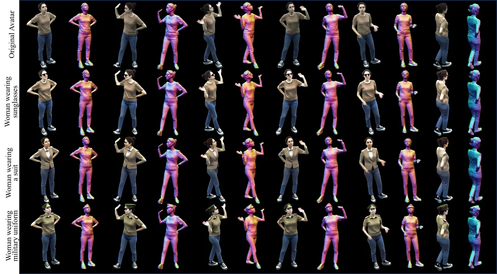

Figure 3: Qualitative Results. We present the text-based visual editing
results and the underlying geometry. Our method generates compelling
text-driven visual edits, ensuring 3D and temporal consistency while
altering appearance and geometry. We recommend the readers to zoom in
for better viewing of the details.

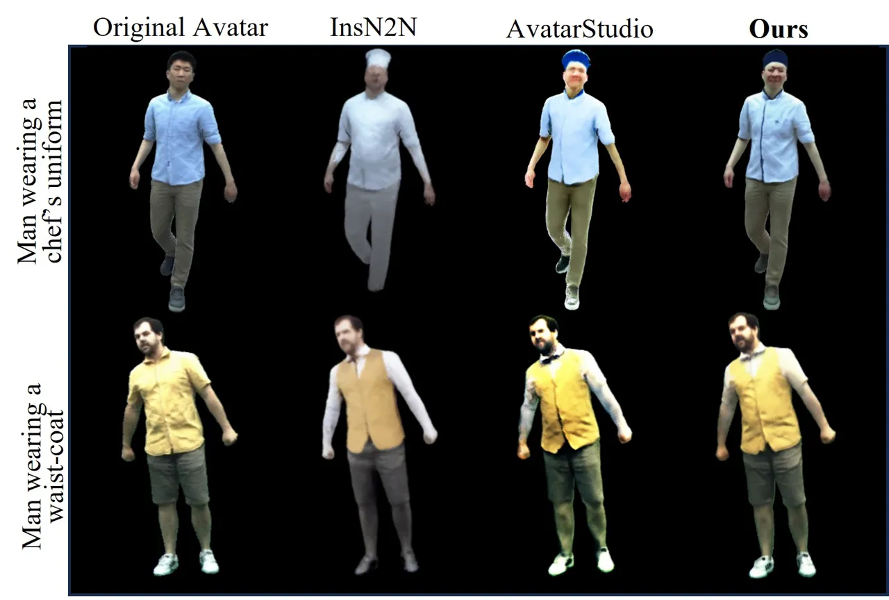

Figure 4: Qualitative Comparison. Our approach preserves the subject’s
characteristics and produces visually compelling edits that align with
the prompts.

|     |               |                     |      |
| --- | ------------- | ------------------- | ---- |
|     | InsN2N \[14\] | AvatarStudio \[37\] | Ours |
| Q1  | 9.6           | 12.8                | 77.6 |
| Q2  | 12            | 24                  | 64   |
| Q3  | 14.4          | 8                   | 77.6 |
| Q4  | 11.2          | 10.4                | 78.4 |

Table 1: User Study. Results from our study with 25 participants. Our
approach outperforms AvatarStudio and InstructNeRF2NeRF (InsN2N) by a
large margin.

### 4.1 Qualitative Results

Fig. 3 presents the text-based edits upon a single identity with various
poses generated by TEDRA. The results yield by TEDRA shine in the
following aspects: (1) Localized and precise: As illustrated in Fig. 3
(”Women wearing sunglasses”), TEDRA yields fine-grained edits on the
target region while preserving the clothing wrinkle details from the
original avatar. (2) Versatile and expressive: As shown in Fig. 3
(”Women wearing a suit”), TEDRA can modify not only the appearance but
also the style of the outfits. The edited outfits significantly differ
from the originals in, both, style and appearance. (3) 3D and temporal
coherent: TEDRA edits, both, the appearance and the underlying geometry
of the clothed human avatar to align with the given text prompt, as
evident in the representations of Fig. 3 (”Women wearing military
uniform”). The edits seamlessly integrate with the drivable avatar and
remain coherent across various poses. Please see the supplemental
materials for more results on novel poses and views.

### 4.2 Quantitative Evaluation

We compare our method with two recent 3D text-based editing approaches:
InstructNeRF2NeRF \[14\] and AvatarStudio \[37\]. To ensure a fair
comparison, we use the same training data for InstructNeRF2NeRF and
apply AvatarStudio’s full-head editing strategy to our full-body avatar.
Fig. 4 shows the outcomes under different text prompts.

InstructNeRF2NeRF exhibits poor alignment with target prompts and may
alter the original identity by editing incorrect regions. AvatarStudio
produces blurry results that lack fine details like wrinkles and
clothing dynamics. In contrast, our method retains fine details and
dynamics, producing more coherent edits aligned with the text.

Given the difficulty of quantitative comparison against ground truth in
this setting, we adopted a user study approach from AvatarStudio \[37\].
Each session featured four side-by-side videos: the original input and
randomly shuffled outputs from three text-driven methods. We evaluated
three identities with three different prompts, totaling nine videos,
each 10-15 seconds long. Participants were asked to respond to the
following questions:

- •
  Q1: Which method better preserves the identity of the input sequence
  (subject consistency)?
- •
  Q2: Which method better adheres to the provided textual prompt (prompt
  preservation)?
- •
  Q3: Which method better maintains the animations and dynamics of the
  original motion (temporal consistency)?
- •
  Q4: Which method performs better overall, considering the three
  aspects above?

Tab. 1 presents the user study results from 25 participants, with our
method consistently receiving the highest ratings. For overall quality
(Q4), our method was preferred 78.4% of the time, compared to
AvatarStudio’s 10.4% and InstructNeRF2NeRF’s 11.2%. We also evaluate
CLIP Text-Image Direction Similarity and FID scores. Tab. 2 shows that
our method outperforms prior works in these metrics by a large margin.

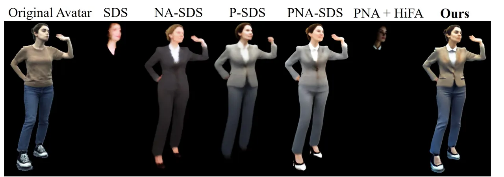

Figure 5: Ablation Study. Our full method achieves visually plausible
edits and preserves the dynamics of the original character.

|                              |               |                     |        |
| ---------------------------- | ------------- | ------------------- | ------ |
|                              | InsN2N \[14\] | AvatarStudio \[37\] | Ours   |
| CLIP Similarity $`\uparrow`$ | 0.1656        | 0.1412              | 0.2098 |
| FID Score $`\downarrow`$     | 98.932        | 116.732             | 80.74  |

Table 2: We adopt CLIP text-image Direction Similarity to assess the
alignment of the edits with the text within the CLIP space.
Additionally, we report the FID scores to evaluate the preservation of
identity and geometric accuracy of the avatars.

### 4.3 Ablations

In Fig. 5 and Tab. 3, we conduct ablative studies to assess the
effectiveness of our design choices.

Initially, we establish the necessity of incorporating normals as a
condition for, both, the edit-prompt and the null-prompt, we use a
pre-trained diffusion model \[48\] and ControlNet  \[70\] (Eq.  7 with
$`v=0`$), which we term as NA-SDS. As shown in Fig. 5, aligning the
score with normals crucially helps to preserve geometric details that
are lost with standard SDS.

Next, we highlight the importance of adopting the personalized model to
preserve the identity. Here, we compute the score using our proposed
loss, but we exclude the normals to highlight the impact of the
personalized model (Eq. 7 with $`n=\oslash`$) termed as P-SDS. We
observe an improvement in the appearance and overall structure of the
edits compared to vanilla SDS.

Although the model with Personalized-SDS, i.e, P-SDS, demonstrates
significant improvements compared to standard SDS, the absence of
geometric guidance from normals results in broken avatars. To this end,
we use normal guidance in our PNA-SDS formulation Eq. 7, which further
helps preserve the geometry as well as the key features in the original
avatar. Yet, the random sampling of the timestep $`t`$ leads to a
diminished resolution of fine details, underscoring the necessity for an
annealing process.

Additionally, we illustrate the ineffectiveness of the annealing
strategy proposed by HiFA \[75\] (termed as PNA-SDS + HiFA annealing)
when applied to our method. Here, we set a constant value for $`k`$ and
deterministically select the value of diffusion timestep $`t`$ based on
the iteration step. This is ineffective for our approach as once
$`t<k`$, the personalized model does not contribute to the score,
resulting in a complete breakdown of the avatar.

In striking contrast, our full method, termed Ours, delivers
high-quality edits while preserving the crucial details of the
pre-trained human avatar. The CLIP scores for the ablation study
(Tab. 3), further prove that our complete method outperforms all design
alternatives in terms of alignment with the textual prompts and overall
visual quality.

|        |        |        |         |          |        |
| ------ | ------ | ------ | ------- | -------- | ------ |
| SDS    | NA-SDS | P-SDS  | PNA-SDS | PNA+HiFA | Ours   |
| 0.1153 | 0.2256 | 0.1844 | 0.2005  | 0.1159   | 0.2409 |

Table 3: CLIP-Similarity scores corresponding to the ablations presented
in Fig.5. Note that each of our design choices leads to an improvement
compared to the baselines.

## 5 Conclusion

In this work, we tackled the problem of intuitive editing of 3D neural
avatars where a user can specify a desired edit via text prompts. Our
method then automatically adjusts the shape and appearance of the neural
avatar to fulfill the user’s demands while maintaining the subject’s
visual coherence. At the technical core, we propose a Personalized
Normal-Aligned Score Distillation Sampling and a windowed timestep
annealing to ensure space-time consistency in edits and high visual
fidelity. Our results demonstrate a clear step towards more intuitive,
high-fidelity 3D neural avatar editing and outperform respective
competing methods. While TEDRA facilitates the intuitive editing of 3D
neural human avatars with space-time consistency and superior visual
quality, it faces challenges with long training times. Future work will
focus on enabling more detailed edits while reducing resource demands.

## References

- \[1\] Alexander Bergman, Petr Kellnhofer, Wang Yifan, Eric Chan, David
  Lindell, and Gordon Wetzstein. Generative neural articulated radiance
  fields. _NeurIPS_, 35:19900–19916, 2022.
- \[2\] Tim Brooks, Aleksander Holynski, and Alexei A. Efros.
  Instructpix2pix: Learning to follow image editing instructions. In
  _CVPR_, 2023a.
- \[3\] Tim Brooks, Aleksander Holynski, and Alexei A Efros.
  Instructpix2pix: Learning to follow image editing instructions. In
  _Proceedings of the IEEE/CVF Conference on Computer Vision and Pattern
  Recognition_, pages 18392–18402, 2023b.
- \[4\] Yukang Cao, Yan-Pei Cao, Kai Han, Ying Shan, and Kwan-Yee K
  Wong. Dreamavatar: Text-and-shape guided 3d human avatar generation
  via diffusion models. _arXiv preprint arXiv:2304.00916_, 2023.
- \[5\] Dan Casas, Marco Volino, John Collomosse, and Adrian Hilton. 4d
  video textures for interactive character appearance. _Comput. Graph.
  Forum_, 33(2):371–380, 2014.
- \[6\] Jianchuan Chen, Ying Zhang, Di Kang, Xuefei Zhe, Linchao Bao, Xu
  Jia, and Huchuan Lu. Animatable neural radiance fields from monocular
  rgb videos. _arXiv preprint arXiv:2106.13629_, 2021.
- \[7\] Rui Chen, Yongwei Chen, Ningxin Jiao, and Kui Jia. Fantasia3d:
  Disentangling geometry and appearance for high-quality text-to-3d
  content creation. In _Proceedings of the IEEE/CVF International
  Conference on Computer Vision (ICCV)_, 2023.
- \[8\] CompVis. Stable diffusion, 2022.
- \[9\] Yao Feng, Jinlong Yang, Marc Pollefeys, Michael J. Black, and
  Timo Bolkart. Capturing and animation of body and clothing from
  monocular video. In _SIGGRAPH Asia 2022 Conference Papers_, 2022.
- \[10\] Qingzhe Gao, Yiming Wang, Libin Liu, Lingjie Liu, Christian
  Theobalt, and Baoquan Chen. Neural novel actor: Learning a generalized
  animatable neural representation for human actors. _IEEE TVCG_, 2023.
- \[11\] Marc Habermann, Weipeng Xu, Michael Zollhofer, Gerard
  Pons-Moll, and Christian Theobalt. Deepcap: Monocular human
  performance capture using weak supervision. In _Proceedings of the
  IEEE/CVF Conference on Computer Vision and Pattern Recognition_, pages
  5052–5063, 2020.
- \[12\] Marc Habermann, Lingjie Liu, Weipeng Xu, Michael Zollhoefer,
  Gerard Pons-Moll, and Christian Theobalt. Real-time deep dynamic
  characters. _ACM TOG_, 40(4), 2021.
- \[13\] Marc Habermann, Lingjie Liu, Weipeng Xu, Gerard Pons-Moll,
  Michael Zollhoefer, and Christian Theobalt. Hdhumans: A hybrid
  approach for high-fidelity digital humans. _Proceedings of the ACM on
  Computer Graphics and Interactive Techniques_, 6(3):1–23, 2023.
- \[14\] Ayaan Haque, Matthew Tancik, Alexei Efros, Aleksander Holynski,
  and Angjoo Kanazawa. Instruct-nerf2nerf: Editing 3d scenes with
  instructions. In _Proceedings of the IEEE/CVF International Conference
  on Computer Vision_, 2023.
- \[15\] Philipp Henzler, Niloy J Mitra, and Tobias Ritschel. Escaping
  plato’s cave: 3d shape from adversarial rendering. In _CVPR_, pages
  9984–9993, 2019.
- \[16\] Jonathan Ho and Tim Salimans. Classifier-free diffusion
  guidance, 2022.
- \[17\] Jonathan Ho, Ajay Jain, and Pieter Abbeel. Denoising diffusion
  probabilistic models, 2020.
- \[18\] Fangzhou Hong, Mingyuan Zhang, Liang Pan, Zhongang Cai, Lei
  Yang, and Ziwei Liu. Avatarclip: Zero-shot text-driven generation and
  animation of 3d avatars. _ACM Transactions on Graphics (TOG)_,
  41(4):1–19, 2022.
- \[19\] Shoukang Hu, Fangzhou Hong, Liang Pan, Haiyi Mei, Lei Yang, and
  Ziwei Liu. Sherf: Generalizable human nerf from a single image. _arXiv
  preprint_, 2023.
- \[20\] Xin Huang, Ruizhi Shao, Qi Zhang, Hongwen Zhang, Ying Feng,
  Yebin Liu, and Qing Wang. Humannorm: Learning normal diffusion model
  for high-quality and realistic 3d human generation. _arXiv_, 2023a.
- \[21\] Yukun Huang, Jianan Wang, Ailing Zeng, He Cao, Xianbiao Qi,
  Yukai Shi, Zheng-Jun Zha, and Lei Zhang. Dreamwaltz: Make a scene with
  complex 3d animatable avatars. 2023b.
- \[22\] Yangyi Huang, Hongwei Yi, Yuliang Xiu, Tingting Liao, Jiaxiang
  Tang, Deng Cai, and Justus Thies. Tech: Text-guided reconstruction of
  lifelike clothed humans, 2023c.
- \[23\] Ajay Jain, Ben Mildenhall, Jonathan T. Barron, Pieter Abbeel,
  and Ben Poole. Zero-shot text-guided object generation with dream
  fields. _CVPR_, 2022.
- \[24\] Ruixiang Jiang, Can Wang, Jingbo Zhang, Menglei Chai, Mingming
  He, Dongdong Chen, and Jing Liao. Avatarcraft: Transforming text into
  neural human avatars with parameterized shape and pose control, 2023a.
- \[25\] T. Jiang, X. Chen, J. Song, and O. Hilliges. In _CVPR_, pages
  16922–16932, 2023b.
- \[26\] Hanbyul Joo, Tomas Simon, and Yaser Sheikh. Total capture: A 3d
  deformation model for tracking faces, hands, and bodies. In _CVPR_,
  pages 8320–8329, 2018.
- \[27\] Ladislav Kavan, Steven Collins, Jiří Žára, and Carol
  O’Sullivan. Skinning with dual quaternions. In _Proceedings of the
  2007 symposium on Interactive 3D graphics and games_, pages
  39–46, 2007.
- \[28\] Nikos Kolotouros, Thiemo Alldieck, Andrei Zanfir,
  Eduard Gabriel Bazavan, Mihai Fieraru, and Cristian Sminchisescu.
  Dreamhuman: Animatable 3d avatars from text. 2023.
- \[29\] Youngjoong Kwon, Lingjie Liu, Henry Fuchs, Marc Habermann, and
  Christian Theobalt. Deliffas: Deformable light fields for fast avatar
  synthesis. _NeurIPS_, 2023.
- \[30\] Ruilong Li, Kyle Olszewski, Yuliang Xiu, Shunsuke Saito, Zeng
  Huang, and Hao Li. Volumetric human teleportation. In _ACM SIGGRAPH
  2020 Real-Time Live!_, pages 1–1. 2020.
- \[31\] Ruilong Li, Julian Tanke, Minh Vo, Michael Zollhofer, Jurgen
  Gall, Angjoo Kanazawa, and Christoph Lassner. Tava: Template-free
  animatable volumetric actors. 2022.
- \[32\] Tingting Liao, Hongwei Yi, Yuliang Xiu, Jiaxaing Tang, Yangyi
  Huang, Justus Thies, and Michael J Black. Tada! text to animatable
  digital avatars. _arXiv preprint arXiv:2308.10899_, 2023.
- \[33\] Jia-Wei Liu, Yan-Pei Cao, Jay Zhangjie Wu, Weijia Mao, Yuchao
  Gu, Rui Zhao, Jussi Keppo, Ying Shan, and Mike Zheng Shou. Dynvideo-e:
  Harnessing dynamic nerf for large-scale motion- and view-change
  human-centric video editing, 2023.
- \[34\] Lingjie Liu, Jiatao Gu, Kyaw Zaw Lin, Tat-Seng Chua, and
  Christian Theobalt. Neural sparse voxel fields. _NeurIPS_,
  33:15651–15663, 2020.
- \[35\] Lingjie Liu, Marc Habermann, Viktor Rudnev, Kripasindhu Sarkar,
  Jiatao Gu, and Christian Theobalt. Neural actor: Neural free-view
  synthesis of human actors with pose control. _ACM Trans. Graph.(ACM
  SIGGRAPH Asia)_, 2021.
- \[36\] Matthew Loper, Naureen Mahmood, Javier Romero, Gerard
  Pons-Moll, and Michael J. Black. SMPL: A skinned multi-person linear
  model. _ACM Trans. Graphics (Proc. SIGGRAPH Asia)_,
  34(6):248:1–248:16, 2015.
- \[37\] Mohit Mendiratta, Xingang Pan, Mohamed Elgharib, Kartik Teotia,
  Mallikarjun B R, Ayush Tewari, Vladislav Golyanik, Adam Kortylewski,
  and Christian Theobalt. Avatarstudio: Text-driven editing of 3d
  dynamic human head avatars. _ACM Trans. Graph._, 42(6), 2023.
- \[38\] Ben Mildenhall, Pratul P. Srinivasan, Matthew Tancik,
  Jonathan T. Barron, Ravi Ramamoorthi, and Ren Ng. Nerf: Representing
  scenes as neural radiance fields for view synthesis. In _ECCV_, 2020.
- \[39\] Ben Mildenhall, Pratul P Srinivasan, Matthew Tancik, Jonathan T
  Barron, Ravi Ramamoorthi, and Ren Ng. Nerf: Representing scenes as
  neural radiance fields for view synthesis. _Communications of the
  ACM_, 65(1):99–106, 2021.
- \[40\] Alex Nichol and Prafulla Dhariwal. Improved denoising diffusion
  probabilistic models, 2021.
- \[41\] Atsuhiro Noguchi, Xiao Sun, Stephen Lin, and Tatsuya Harada.
  Neural articulated radiance field. In _ICCV_, 2021.
- \[42\] Ahmed A. A. Osman, Timo Bolkart, and Michael J. Black. Star:
  Sparse trained articulated human body regressor. In _ECCV_, pages
  598–613, 2020.
- \[43\] Or Patashnik, Daniel Garibi, Idan Azuri, Hadar Averbuch-Elor,
  and Daniel Cohen-Or. Localizing object-level shape variations with
  text-to-image diffusion models. In _Proceedings of the IEEE/CVF
  International Conference on Computer Vision_, pages 23051–23061, 2023.
- \[44\] Georgios Pavlakos, Vasileios Choutas, Nima Ghorbani, Timo
  Bolkart, Ahmed A. A. Osman, Dimitrios Tzionas, and Michael J. Black.
  Expressive body capture: 3d hands, face, and body from a single image.
  In _CVPR_, pages 10975–10985, 2019.
- \[45\] Sida Peng, Junting Dong, Qianqian Wang, Shangzhan Zhang, Qing
  Shuai, Xiaowei Zhou, and Hujun Bao. Animatable neural radiance fields
  for modeling dynamic human bodies. In _ICCV_, pages 14314–14323, 2021.
- \[46\] Ben Poole, Ajay Jain, Jonathan T. Barron, and Ben Mildenhall.
  Dreamfusion: Text-to-3d using 2d diffusion. _arXiv_, 2022.
- \[47\] Alec Radford and Karthik Narasimhan. Improving language
  understanding by generative pre-training. 2018.
- \[48\] Robin Rombach, A. Blattmann, Dominik Lorenz, Patrick Esser, and
  Björn Ommer. High-resolution image synthesis with latent diffusion
  models. _2022 IEEE/CVF Conference on Computer Vision and Pattern
  Recognition (CVPR)_, pages 10674–10685, 2021.
- \[49\] Robin Rombach, Andreas Blattmann, Dominik Lorenz, Patrick
  Esser, and Björn Ommer. High-resolution image synthesis with latent
  diffusion models. In _Computer Vision and Pattern Recognition
  (CVPR)_, 2022.
- \[50\] Nataniel Ruiz, Yuanzhen Li, Varun Jampani, Yael Pritch, Michael
  Rubinstein, and Kfir Aberman. Dreambooth: Fine tuning text-to-image
  diffusion models for subject-driven generation. 2022.
- \[51\] Soumyadip Sengupta, Vivek Jayaram, Brian Curless, Steve Seitz,
  and Ira Kemelmacher-Shlizerman. Background matting: The world is your
  green screen. In _CVPR_, 2020.
- \[52\] Ruizhi Shao, Jingxiang Sun, Cheng Peng, Zerong Zheng, Boyao
  Zhou, Hongwen Zhang, and Yebin Liu. Control4d: Dynamic portrait
  editing by learning 4d gan from 2d diffusion-based editor. _arXiv
  preprint arXiv:2305.20082_, 2023.
- \[53\] Aliaksandra Shysheya, Egor Zakharov, Kara-Ali Aliev, Renat
  Bashirov, Egor Burkov, Karim Iskakov, Aleksei Ivakhnenko, Yury Malkov,
  Igor Pasechnik, Dmitry Ulyanov, et al. Textured neural avatars. In
  _CVPR_, pages 2387–2397, 2019.
- \[54\] Vincent Sitzmann, Justus Thies, Felix Heide, Matthias Nießner,
  Gordon Wetzstein, and Michael Zollhöfer. Deepvoxels: Learning
  persistent 3d feature embeddings. In _CVPR_, 2019a.
- \[55\] Vincent Sitzmann, Michael Zollhöfer, and Gordon Wetzstein.
  Scene representation networks: Continuous 3d-structure-aware neural
  scene representations. In _NeurIPS_, 2019b.
- \[56\] Shih-Yang Su, Frank Yu, Michael Zollhofer, and Helge Rhodin.
  A-nerf: Articulated neural radiance fields for learning human shape,
  appearance, and pose. _NeurIPS_, 34:12278–12291, 2021.
- \[57\] Shih-Yang Su, Timur Bagautdinov, and Helge Rhodin. Danbo:
  Disentangled articulated neural body representations via graph neural
  networks. In _ECCV_, 2022.
- \[58\] TheCaptury. The Captury.
  [http://www.thecaptury.com/](http://www.thecaptury.com/), 2020.
- \[59\] Ashish Vaswani, Noam Shazeer, Niki Parmar, Jakob Uszkoreit,
  Llion Jones, Aidan N Gomez, Ł ukasz Kaiser, and Illia Polosukhin.
  Attention is all you need. In _Advances in Neural Information
  Processing Systems_. Curran Associates, Inc., 2017.
- \[60\] Marco Volino, Dan Casas, John Collomosse, and Adrian Hilton.
  Optimal representation of multiple view video. In _BMVC_. BMVA
  Press, 2014.
- \[61\] Peng Wang, Lingjie Liu, Yuan Liu, Christian Theobalt, Taku
  Komura, and Wenping Wang. Neus: Learning neural implicit surfaces by
  volume rendering for multi-view reconstruction. _Advances in Neural
  Information Processing Systems_, 34:27171–27183, 2021.
- \[62\] Shaofei Wang, Katja Schwarz, Andreas Geiger, and Siyu Tang.
  Arah: Animatable volume rendering of articulated human sdfs. In
  _ECCV_, 2022.
- \[63\] Zhengyi Wang, Cheng Lu, Yikai Wang, Fan Bao, Chongxuan Li, Hang
  Su, and Jun Zhu. Prolificdreamer: High-fidelity and diverse text-to-3d
  generation with variational score distillation. In _Advances in Neural
  Information Processing Systems (NeurIPS)_, 2023.
- \[64\] Chung-Yi Weng, Brian Curless, and Ira Kemelmacher-Shlizerman.
  Vid2actor: Free-viewpoint animatable person synthesis from video in
  the wild. _arXiv preprint arXiv:2012.12884_, 2020.
- \[65\] Zhenzhen Weng, Zeyu Wang, and Serena Yeung. Zeroavatar:
  Zero-shot 3d avatar generation from a single image, 2023.
- \[66\] Hongyi Xu, Thiemo Alldieck, and Cristian Sminchisescu. H-nerf:
  Neural radiance fields for rendering and temporal reconstruction of
  humans in motion. _NeurIPS_, 34:14955–14966, 2021.
- \[67\] Xihe Yang, Xingyu Chen, Daiheng Gao, Xiaoguang Han, and Baoyuan
  Wang. Have-fun: Human avatar reconstruction from few-shot
  unconstrained images. _arXiv:2311.15672_, 2023.
- \[68\] Huichao Zhang, Bowen Chen, Hao Yang, Liao Qu, Xu Wang, Li Chen,
  Chao Long, Feida Zhu, Kang Du, and Min Zheng. Avatarverse:
  High-quality & stable 3d avatar creation from text and pose, 2023a.
- \[69\] Kai Zhang, Gernot Riegler, Noah Snavely, and Vladlen Koltun.
  Nerf++: Analyzing and improving neural radiance fields. _arXiv
  preprint arXiv:2010.07492_, 2020.
- \[70\] Lvmin Zhang, Anyi Rao, and Maneesh Agrawala. Adding conditional
  control to text-to-image diffusion models, 2023b.
- \[71\] Zhixing Zhang, Ligong Han, Arna Ghosh, Dimitris N. Metaxas, and
  Jian Ren. Sine: Single image editing with text-to-image diffusion
  models. _2023 IEEE/CVF Conference on Computer Vision and Pattern
  Recognition (CVPR)_, pages 6027–6037, 2022.
- \[72\] Zerong Zheng, Xiaochen Zhao, Hongwen Zhang, Boning Liu, and
  Yebin Liu. Avatarrex: Real-time expressive full-body avatars. _ACM
  TOG_, 42(4), 2023.
- \[73\] Xingchen Zhou, Ying He, F. Richard Yu, Jianqiang Li, and You
  Li. Repaint-nerf: Nerf editting via semantic masks and diffusion
  models, 2023.
- \[74\] Heming Zhu, Fangneng Zhan, Christian Theobalt, and Marc
  Habermann. Trihuman : A real-time and controllable tri-plane
  representation for detailed human geometry and appearance
  synthesis, 2023.
- \[75\] Junzhe Zhu and Peiye Zhuang. Hifa: High-fidelity text-to-3d
  generation with advanced diffusion guidance, 2023.

Supplementary Material

This supplemental document provides further information about the
implementation details (Sec. A). The additional results (Sec. B)
showcase testing on various subjects, free-viewpoint rendering
capabilities, animation transfer demonstrating pose adaptability to
multiple avatars, further ablation studies, and qualitative comparisons,
highlighting the robustness and versatility of our approach. Finally, we
address the limitations of our study and suggest potential directions
for future research (Sec. C).

## Appendix A Implementation Details

We first provide more details about the dataset (Sec. A.1), followed by
more details concerning fine-tuning the diffusion model (Sec. A.2),
editing the avatar (Sec. A.3), and our annealing strategy (Sec. A.4).

### A.1 Dataset

The dataset adopted to train the deformable avatar representation
consists of two parts: the DynaCap \[12\] dataset and the newly recorded
sequences. The DynaCap dataset consists of $`5`$ subjects wearing
different types of apparel, performing diversified everyday motions. In
this paper, we take one representative sequence from the DynaCap dataset
for training the deformable avatar model. Notably, we follow the
protocols mentioned in the TriHuman \[74\] and train the deformable
avatar using the training splits provided by the DynaCap dataset. Apart
from the DynaCap dataset, we captured 3 new sequences to demonstrate the
effectiveness of our model. The sequence features $`3`$ Subjects wearing
everyday clothing and engaging in various activities, including running,
jumping-jack, boxing, and dancing. The sequences are recorded in a
multi-view studio with $`120`$ $`4K`$ cameras at a frame rate of $`25`$
fps. Inspired by the protocol proposed by DynaCap Dataset, we recorded
separate training and testing sequences with 27,000 and 7,000 frames.
Specifically, we hold out $`4`$ cameras from different viewing
directions as testing camera views. Additionally, we annotate all the
captured frames with 3D skeletal poses (generated with markerless motion
capture software \[58\]), and foreground segmentation masks (produced by
the state-of-the-art background matting method \[51\]). We will make the
data and the annotations, publicly available for research use upon
acceptance.

### A.2 Fine-tuning Details

We start by rendering images at 1fps and 50 views from the pre-trained
avatar, the rendered images are then used to fine-tune the U-net
($`\hat{\zeta}_{\phi}`$) and the text-encoder ($`\Gamma`$) of the Latent
Diffusion Model (LDM) \[49\]. We follow the fine-tuning strategy
proposed by DreamBooth \[50\]:

```math
\mathbb{E}_{x_{i},s_{i},\zeta,t}\left[w_{t}\|\hat{{\zeta}}_{\phi}(\textbf{z}_{t,i},\textbf{s})-\mathcal{E}(\textbf{x}_{i})\|^{2}_{2}\right], \tag{9}
```

where
$`\textbf{z}_{t,i}=\alpha_{t}\mathcal{E}(\textbf{x}_{i})+\beta_{t}\boldsymbol{\epsilon}`$,
$`\boldsymbol{\epsilon}\sim\mathcal{N}(0,I)`$, $`\textbf{x}_{i}`$ is the
rendered image and $`\alpha_{t},\beta_{t}`$ control the noise schedule.
We use $`w_{t}={\sigma^{2}}{\sqrt{1-\sigma^{2}}}`$ as proposed in
Fantasia3D \[7\] for appearance modeling. Once trained, this model can
now generate images given the prompt ’a photo of a sks man/woman’ in
random poses and viewpoints.

To achieve pose and view-point control of the generated images we employ
a pre-trained ControlNet \[70\] which is conditioned on normal-maps.
TriHuman is capable of generating images of surface normals which are
computed by positional derivatives of the SDF field. Along with the
computed normals and an empty string as input, the ControlNet now acts
as an encoder to provide pose and view control over generated images of
the fine-tuned LDM.

Using this strategy, our fine-tuned model can also generalize avatar
editing to novel views and poses. The fine-tuning is performed for
20,000 iterations with a batch size of 30, and the learning rate is set
to 1e-6.

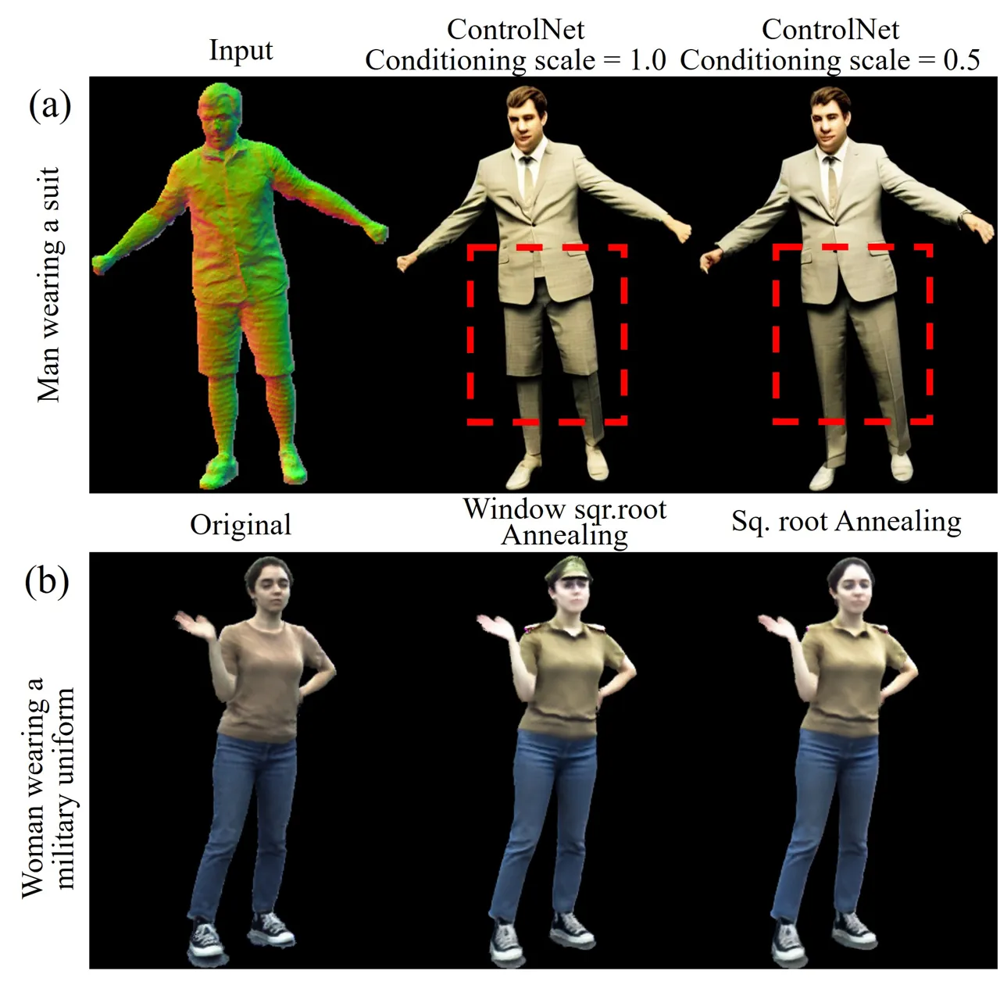

Figure 1: More ablative results on the ControlNet conditioning scale,
and the windowed root annealing method, please zoom-in to see the
details.

### A.3 Editing Details

During the editing phase, both the latent diffusion models and
ControlNets are frozen, and only the TriHuman model is optimized using
the proposed score distillation termed PNA-SDS (Personalized
Normal-Aligned Score Distillation Sampling) as defined in Eq. 7.

Since we use pre-computed normals for both the pre-trained and
personalized LDM, we set the ControlNet conditioning scale to 0.5 and
1.0 respectively. This allows the pre-trained LDM to facilitate
geometrical changes toward the targeted edit. Fig. 1 (a) shows the
impact of ControlNet conditioning scale on samples from pre-trained LDM.

The hyperparameters $`v=0.3`$ and $`k=750`$ are empirically chosen to
optimize the balance between preserving the original identity of the
avatar and achieving the desired edits. The impact of these values can
be found in Section 4.3 of SINE \[71\].

For a sequence of length 1k frames, we optimize the TriHuman model for
50k iterations with a learning rate of 1e-4 on an NVIDIA A100 GPU. We
utilize classifier-free guidance with $`w=20`$.

### A.4 Time-step Annealing Details

With reference to Eq. 8 we set the maximum and minimum diffusion
timesteps as $`t_{\mathrm{max}}=980`$ and $`t_{\mathrm{min}}=20`$, with
a window size of $`w=500`$. Initially, this configuration yields
$`t_{1}=980`$, $`t_{2}=480`$, and a blending threshold of $`k=730`$. The
annealing process ceases once $`t_{1}`$ reaches 500 to prevent further
increases in blurriness. Fig. 2 shows a graphical representation of the
proposed annealing strategy.

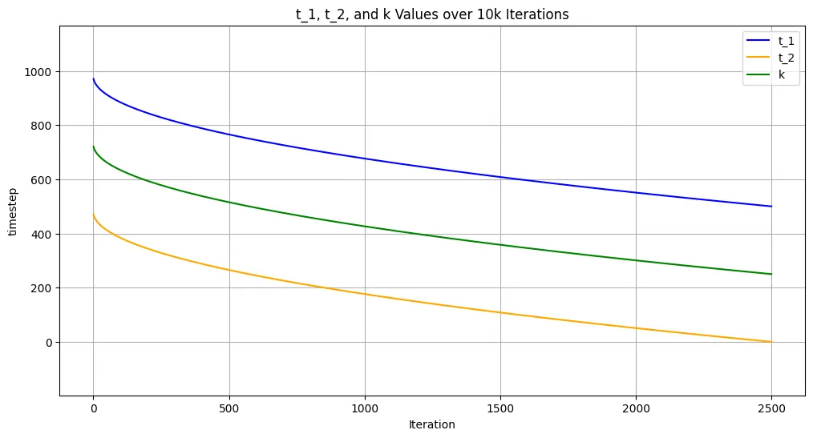

Figure 2: The figure shows the annealing of timesteps using the proposed
window-root timestep annealing strategy for 10k iterations. The timestep
$`t`$ is randomly sampled within the shown window. As per Eq. 7 if
$`t>k`$ Then the scores from both pre-trained LDM and personalized LDM
are used else only the scores from pre-trained LDM are used.

The windowed root annealing prioritizes larger timesteps $`t`$ early in
the training process, which, akin to diffusion models, establishes the
target semantics quickly. In Fig. 1 (b), the windowed root annealing
method shows the formation of a ’cap’ by prioritizing larger timesteps
$`t`$ early in training. As training progresses, $`t`$ gradually
decreases, refining fine details without losing them, a risk present at
higher timesteps.

## Appendix B Additional Results

The results section provides a comprehensive overview of the study’s
findings. It demonstrates the effectiveness of the methodology through
enhanced editing results across a diverse range of subjects (Sec. B.1),
underscoring its versatility. Additionally, the exploration of
free-viewpoint rendering enriches visual representation (Sec. B.2),
offering new perspectives on edited subjects, and the animation section
(Sec. B.3) showcases pose transfer adaptability to multiple avatars,
highlighting the robustness of our approach. Further ablations reveal
insights into variable impacts on the editing process (Sec. B.4).
Finally, we present additional comparisons of our method with
state-of-the-art methods (see Sec. B.5), highlighting advancements and
limitations.

### B.1 More Subjects

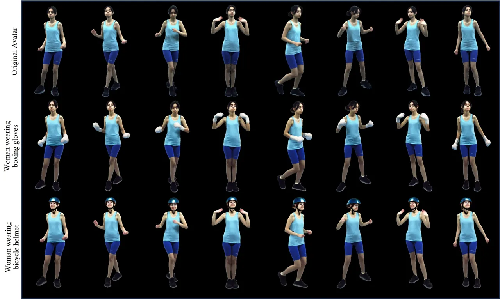

Figure 3: Qualitative Results. We present the text-based editing
results. We recommend the readers to zoom in to better view the details.

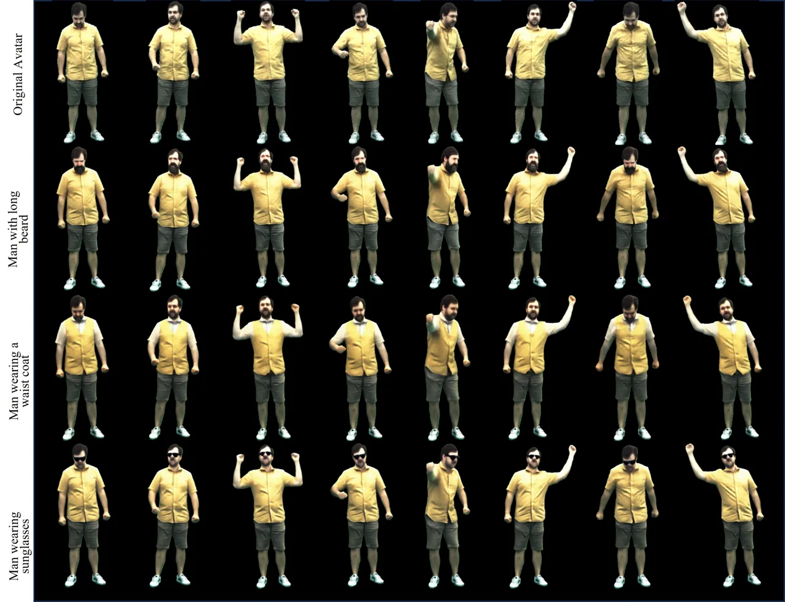

Figure 4: Qualitative Results. Our method demonstrates the capability to
execute diversified contextual edits on photo-real avatars. These edits
encompass various alterations such as adjusting length of the beard, as
well as more localized changes that target specific. We recommend the
readers to zoom in for better viewing of the details.

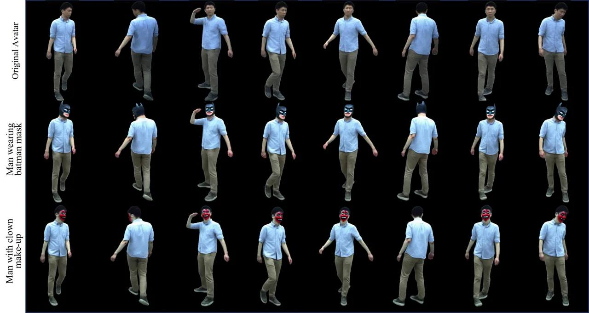

Figure 5: Qualitative Results. Our approach generates captivating visual
edits guided by textual prompts across various contexts. We recommend
the readers to zoom in for better viewing of the details.

Fig. 3-5 provide more qualitative results on multiple subjects. Our
approach introduces a novel framework for generating visually pleasing
edits guided by textual prompts across various contexts. The second row
of Fig. 3 showcases how our system adeptly adjusts the appearance of
gloves based on the provided textual guidance. Moreover, our method
demonstrates a remarkable ability to target and modify specific regions
as directed by the input text. For instance, the third row of Fig. 3
illustrates the versatility of our method, showcasing geometric
alterations prompted by instructions such as ”woman wearing a bicycle
helmet”. This demonstrates the proficiency of our system in interpreting
complex textual instructions and creating visually appealing edits as a
result. Critical to our approach is the maintenance of subject
consistency and coherence across both three-dimensional structure and
temporal progression. This is substantiated by the consistency observed
in our supplementary video evidence, reinforcing the reliability and
efficacy of our method in generating visually consistent outcomes.

In summary, our method excels in generating captivating visual edits
driven by textual prompts, offering a flexible and intuitive approach to
manipulating images across various scenarios.

### B.2 Free-viewpoint Rendering

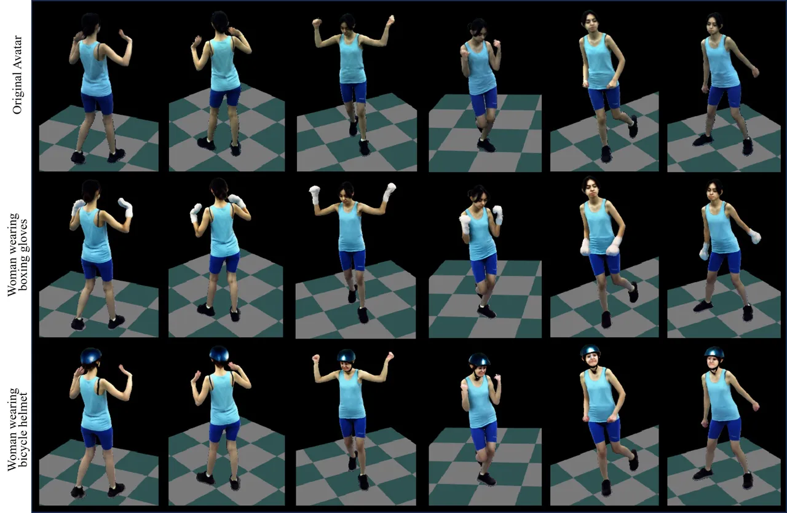

Figure 6: Qualitative Results. The free-viewpoint rendering results. We
recommend the readers to zoom in to better view the details.

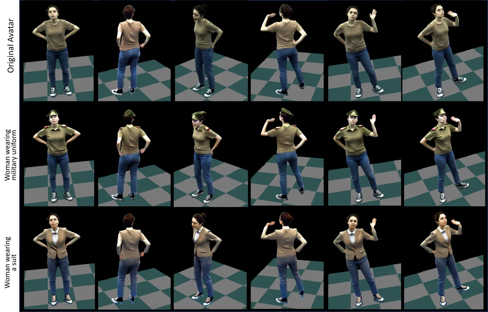

Figure 7: Qualitative Results. The free-viewpoint rendering results. We
recommend the readers to zoom in to better view the details.

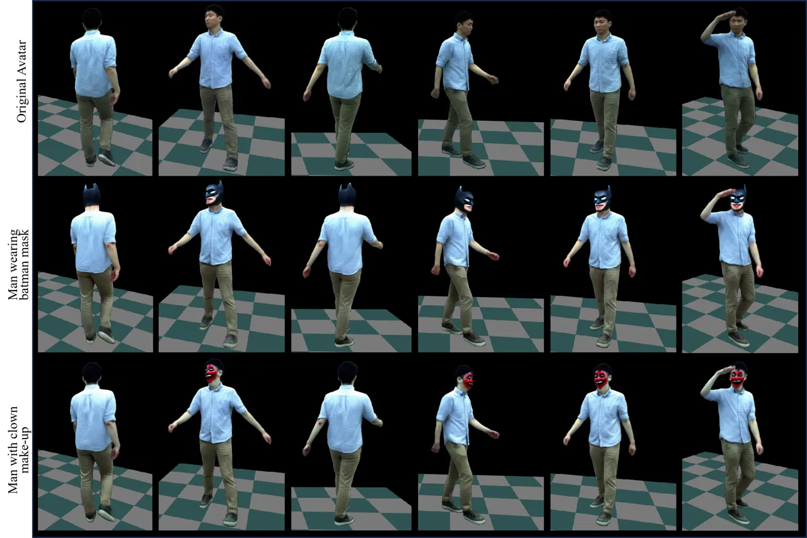

Figure 8: Qualitative Results. The free-viewpoint rendering results. We
recommend the readers to zoom in to better view the details.

Fig. 6-8 presents the free-viewpoint renderings of the edited avatars.
These results affirm that our approach maintains consistency across
different viewpoints and time frames during the editing process.

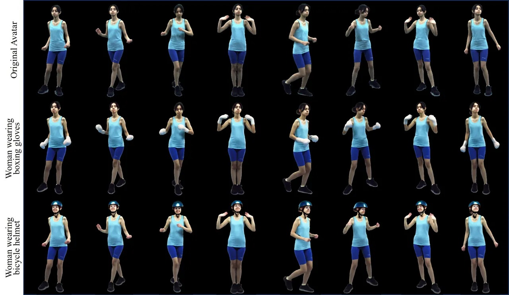

Figure 9: Qualitative Results. We present the results of avatar
animation using novel poses. The first row shows the driving pose,
followed by edited avatars driven by the same pose. The results indicate
that the edits are generalizable to novel poses. We recommend the
readers to zoom in to better view the details.

### B.3 Animation

We demonstrate the ability to transfer poses from one character to
multiple avatars, as shown in Fig. 9. The results not only confirm the
method’s ability to perform versatile edits but also its adaptability to
novel poses. This adaptability is particularly challenging within the
domain of photorealistic 3D human avatars, highlighting the robustness
of our approach.

### B.4 Additional Ablations

We conduct qualitative ablations on one more identity with a different
prompt as shown in Fig. 11. The terms used for different settings are as
follows:

SDS: Score Distillation Sampling using only the pre-trained latent
diffusion.

NA-SDS: Normal Aligned SDS using pre-treined LDM and ControlNet.

P-SDS: Personalized SDS using fine-tuned/personalized and pre-trained
LDMs.

PNA-SDS:Personalized Normal Aligned SDS using fine-tuned/personalized
and pre-trained LDMs with pre-trained ControlNet conditioning (ours).

PNA-SDS + HiFA Annealing: PNA SDS with the diffusion timestep annealing
strategy proposed by HiFA \[75\].

PNA-SDS + our Annealing: PNA SDS along with our window root timestep
annealing (our full method).

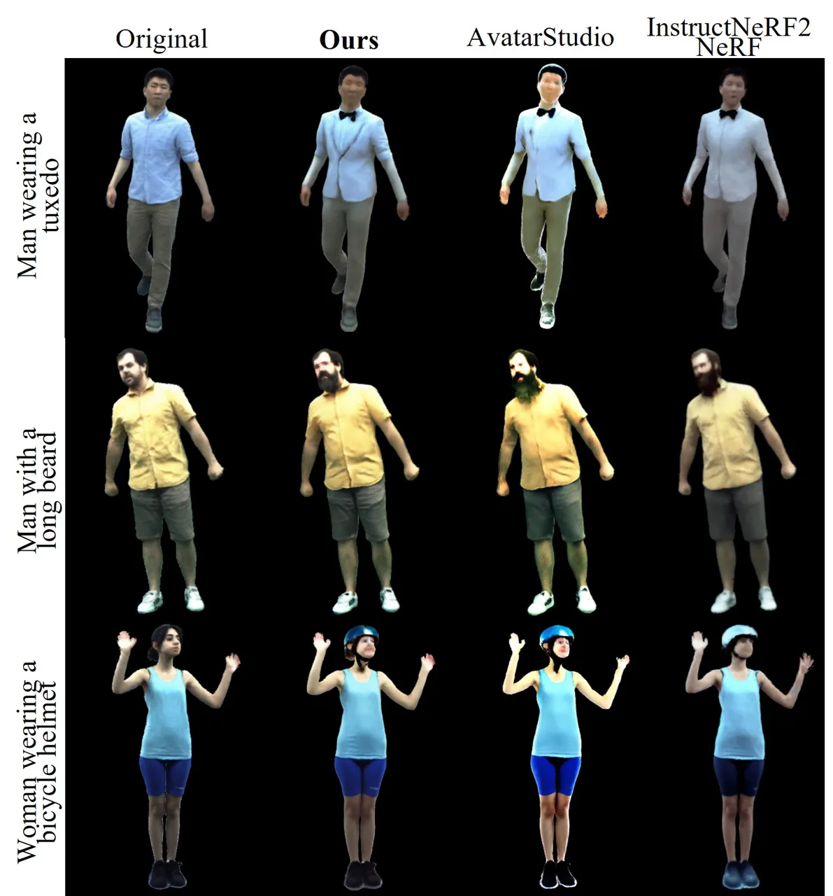

Figure 10: Qualitative Comparisons. We offer further comparisons
involving AvatarStudio \[37\] and InstructNeRF2NeRF \[14\]. Our findings
indicate that the outcomes generated by alternative methods,
specifically in columns 2 and 3, exhibit smoother surface details and
lack consistency in maintaining subject coherence.

The results clearly indicate the effectiveness of our comprehensive
method, achieving high-quality edits while maintaining the essential
details and dynamics of the pre-trained human avatar.

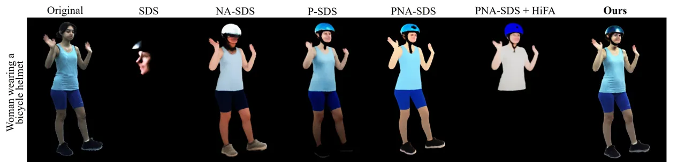

Figure 11: Ablation Study. We conduct a qualitative analysis, comparing
our comprehensive approach to various design alternatives using the text
prompt ”a photo of a woman wearing a bicycle helmet”. Our complete
method successfully generates visually convincing modifications that
maintain the crucial aspects of the original avatar.

### B.5 Additional Qualitative Comparisons

In this section, we conducted more qualitative comparisons against
competing approaches. Fig. 10 illustrates that our method maintains
subject consistency while preserving clothing deformations. In contrast,
Avatar Studio \[37\] produces over-saturated and excessively smoothed
results due to its limited subject information. Conversely, Instruct
Nerf2Nerf \[14\] exhibits lower visual quality and reduced temporal
consistency. Please refer to the supplementary video for more dynamic
results.

## Appendix C Limitations and Future Work

TEDRA significantly advances text-driven 3D avatar editing, providing
compelling and coherent modifications. However, it struggles to recover
fine facial details, like eyes, particularly because latent diffusion
models struggle to sample full-body images with high-quality facial
details. Our method’s mask-based ray sampling restricts significant
deviations in clothing from the pre-trained avatar model. Additionally,
our method’s dependency on per-prompt optimization and its intensive GPU
requirements highlight areas for efficiency improvements.

Further, TEDRA needs data from a multi-view studio, limiting its
accessibility. Exploring monocular setups for multi-view edits or
developing dynamic, implicit representations of novel humans from text
prompts offers promising directions for future research.
