# Realistic and Efficient Face Swapping: A Unified Approach with Diffusion Models

Sanoojan Baliah Affiliation: MBZUAI, UAE
Email: <sanoojan.baliah@mbzuai.ac.ae>    Qinliang Lin
Affiliation: Shenzhen University, China
Email: <muhammad.haris@mbzuai.ac.ae>    Shengcai Liao
Affiliation: Core42, UAE    Xiaodan Liang Affiliation: MBZUAI, UAE   
Muhammad Haris Khan Affiliation: MBZUAI, UAE

###### Abstract

Despite promising progress in face swapping task, realistic swapped
images remain elusive, often marred by artifacts, particularly in
scenarios involving high pose variation, color differences, and
occlusion. To address these issues, we propose a novel approach that
better harnesses diffusion models for face-swapping by making following
core contributions. (a) We propose to re-frame the face-swapping task as
a self-supervised, train-time inpainting problem, enhancing the identity
transfer while blending with the target image. (b) We introduce a
multi-step Denoising Diffusion Implicit Model (DDIM) sampling during
training, reinforcing identity and perceptual similarities. (c) Third,
we introduce CLIP feature disentanglement to extract pose, expression,
and lighting information from the target image, improving fidelity. (d)
Further, we introduce a mask shuffling technique during inpainting
training, which allows us to create a so-called universal model for
swapping, with an additional feature of head swapping. Ours can swap
hair and even accessories, beyond traditional face swapping. Unlike
prior works reliant on multiple off-the-shelf models, ours is a
relatively unified approach and so it is resilient to errors in other
off-the-shelf models. Extensive experiments on FFHQ and CelebA datasets
validate the efficacy and robustness of our approach, showcasing
high-fidelity, realistic face-swapping with minimal inference time. Our
code is available at [REFace](https://github.com/Sanoojan/REFace).

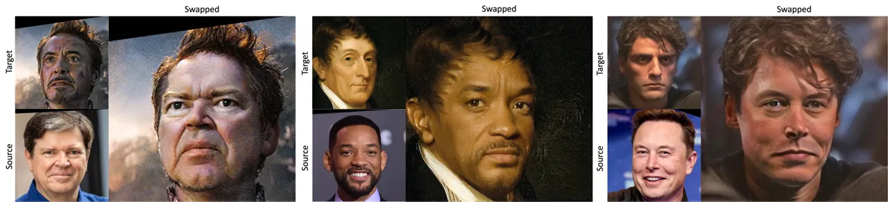

Figure 1: We show the Face Swapped results of our method. In all groups,
the swapped face(right) should contain the identity information from
source (left-bottom) and pose, expression and lighting conditions from
target (left-top). All the images are in $`512\times 512`$ resolution.

## 1 Introduction

Face-swapping is a fascinating yet challenging problem in the field of
computer vision, aiming to seamlessly transfer the identity features of
a source image onto a different target image while preserving the
target’s pose, expression and background \[4, 1, 2\]. The reliance on
GANs for face-swapping has led to notable breakthroughs \[17, 21, 4,
33\], where the identity features from a source face are extracted and
fused with the target face’s attribute features. However, training GANs
requires laborious hyperparameter search especially for face-swapping
where multiple off-the-shelf models\[17, 21\] are included and such
methods often suffer from the mode collapse problem \[31\]. Also,
GAN-based method are prone to producing artifacts, especially under
large pose variations, color differences, and occlusions \[11\]. These
challenges necessitate a closer examination of alternative approaches.

In recent years, the Diffusion model \[23, 24\] has emerged as a
powerful contender in image generation tasks, demonstrating success in
providing stable training and favorable outcomes in diversity and
fidelity. Such stability and desirable performance of the Diffusion
model makes it a compelling choice for potentially addressing the
inherent difficulties in face-swapping. Some pioneering works\[14, 38\]
attempt to apply diffusion modelling to the task of face-swapping with
some success. Diffswap \[38\] initially capitalizes on the diffusion
model by reframing face-swapping as inference-time conditional
inpainting. It is then supplemented with the midpoint estimation
techniques and 3D-aware masked diffusion to obtain a high fidelity
swapped face. However, this comes at the cost of more computationally
intensive denoising steps in inference, rendering it a
resource-expensive method. As for DiffFace \[14\], it injects ID
embedding as condition into the diffusion model and imposes various face
guidance constraints, however again at the inference stage, and so
presents itself with the following two limitations: (1) The inference
process becomes time-consuming due to the gradient computation performed
during testing, leading to significant time overhead. (2) Swapped faces
often produce noise artifacts and contain source image accessories if
present. Both diffusion-based methods employed in face-swapping
predominantly accomplish the swapping process during the inference
stage, thereby contributing to prolonged computational time. Further,
these methods encounter challenges in effectively adapting to variations
in the background lighting conditions.

Towards overcoming the existing issues, this paper proposes a novel
approach for face-swapping that aims to better harness the potential of
the Diffusion model. (1) We frame the face-swapping problem as a
self-supervised, train-time inpainting task, where the Diffusion model
learns to transfer the identity features seamlessly while blending with
the target image. (2) To reinforce this process, we introduce an N-step
Denoising Diffusion Implicit Model (DDIM) sampling during training to
enforce ID similarity and perceptual similarity at each step. This
enhances the model’s performance, particularly in ID transferability.
Additionally, this approach allows our method to achieve efficient,
minimal-step inference. (3) Next, we leverage the CLIP feature to
enhance the realism as well as expression maintenance with the target
image by the disentanglement of CLIP feature. (4) Apart from
face-swapping, our model can perform more challenging swaps, including
head swapping. In head swapping, we replace the entire head, including
hair, while preserving the identity from the source image and
maintaining the pose and expression of the target image with high
fidelity. To achieve this we propose a mask shuffling technique in the
training pipeline. Overall our approach brings a diverse and a realistic
swapping model with high fidelity with minimal inference time techniques
i.e., the naive DDIM inferencing. Also, many prior works depend on
several other off-the-shelf sophisticated models such as the reenactment
networks \[21, 37\] and face parsing networks to obtain the detailed
segmentation. Whereas our approach is simple as it needs just the
overall mask region, ID feature, CLIP feature and landmarks to provides
a realistic swapping even if there is some error from other models. (5)
Through extensive experimentation on both the FFHQ and CelebA datasets,
we substantiate the superior robustness of our models with minimal
inference time across varied datasets and scenarios (see Fig. 1).

## 2 Related works

GAN-based methods: GANs are a powerful tool for performing face-swapping
by extracting identity features from the source face and seamlessly
fusing them with the target face attribute features, resulting in
high-fidelity swapped faces. To avoid the subject-specific training,
FSGAN\[21\] has been proposed to be a subject-agnostic method that
incorporates a reenactment network and an inpainting network. By
leveraging face landmarks and segmentation, the method aims to recreate
the source image in alignment with the target image. Unlike FSGAN,
HifiFace\[33\] adopted other prior structural information like the 3D
shape-aware Identity feature to guide the high quality swapped face.
However, structural prior-guide models are usually limited to imprecise
face prior information. In contrast to above two methods, SimSwap\[4\]
and Faceshifter\[17\] are general and prior information-free methods.
Faceshifter proposed a two-stage framework to realize high fidelity and
occlusion aware face-swapping, while SimSwap proposed ID injection
Module and Weak Feature Matching Loss to help the network possess a good
attribute preservation ability. A recent breakthrough in face-swapping,
employing StyleGAN \[12, 13\], has yielded an effective solution for
achieving superior quality face swaps at high resolutions \[39, 35, 8,
34, 20\]. For instance, MegaFS\[39\] first projected source and target
image into hierarchical representation space and then fed them into
StyleGAN generator to obtain the swapped face. E4s \[20\] proposes a
region GAN inversion on the explicit disentanglement of texture and
shape features.

Diffusion-based methods: In contrast to GANs, diffusion models offer a
more stable training approach and demonstrate desirable outcomes in
terms of both diversity and fidelity. Intuitively, utilizing the
diffusion model for the face-swapping task can also serve as a strong
comparative baseline. DiffFace\[14\] made the first attempt to employ a
diffusion-based framework that aims to achieve high-fidelity and
controllable face swapping. However as they use ID features only to
train the model and swapping is entirely done at the inference stage,
this approach significantly burdens the inference process, leading to
low throughput even at lower resolutions. Additionally, it often tends
to produce noise artifacts, particularly in the eye region.

Another diffusion model-based work, namely DiffSwap\[38\] utilized a
powerful diffusion model to redefine face-swapping as inference time
conditional inpainting. They also introduced a 3D-aware masked diffusion
approach at inference to ensure the explicit consistency of facial
shape. Although Diffswap trains the diffusion model using combined
conditions from source and target images, its loss formulation compels
the model only to reenact the source image using the target image’s
landmarks. However, an essential blending step is performed through
masked fusion during the inference stage, which is inefficient.
Additionally, the method struggles to achieve effective ID
transferability. To address these issues, we train the diffusion model
as a conditional inpainting network, which fully mimics face swapping
during the training stage. We also supplement the conditioning with
powerful CLIP features, using our proposed disentanglement strategy to
improve ID transferability while maintaining the target’s pose,
expression, and lighting. Our approach simplifies the inference process,
allowing our method to produce high-quality face swaps with
significantly fewer inference steps and less inference time compared to
DiffFace\[14\] and Diffswap\[38\].

## 3 Methodology

### 3.1 Preliminaries

Problem setting: In face-swapping, we formally define a target image
$`x^{tar}`$ and a source image $`x^{src}`$ where the source image’s
identity features should be swapped to the target image’s face region
while preserving target’s pose, expression, lighting condition and
background \[4\]. Here, we swap a face region $`m^{tar}`$ of the target
with the information from the source image’s face region $`m^{src}`$ and
produce the swapped image $`x^{swap}`$. Apart from preserving the above
mentioned properties, a practical swapped face should be plausible and
properly merge to the target image’s outer region ($`1-m^{tar}`$)
without producing any artifacts. Furthermore, during training, we use
the term reference image $`x^{ref}`$, which serves as a source
$`x^{src}`$ image during inference.

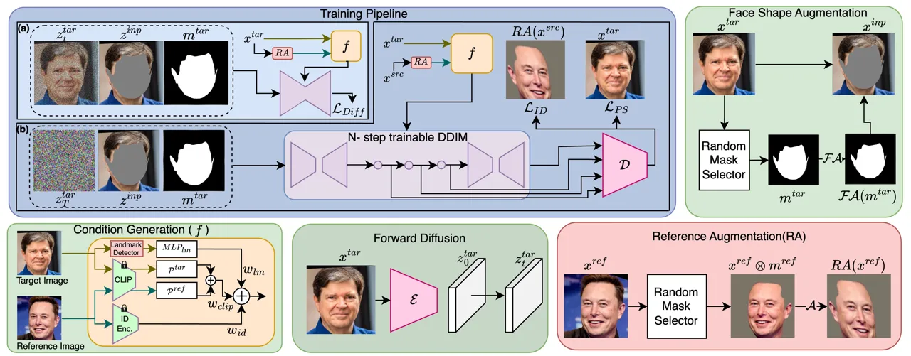

Figure 2: Our architecture pipeline for face swapping. The training
pipeline contains two major components (a) the inpainting diffusion
training, where we utilize the same image as reference (with reference
augment) and inpaint (with face shape augment). (b) Here we provide
different images and enforce identity loss and perceptual similarity
with source and target respectively. On the bottom left, we depict the
condition generation. Further, all the $`z`$-s in training pipeline are
latents obtained from the forward diffusion, but for better
understandability we show as images.

Diffusion model: Typically, denoising in diffusion models \[29\] is
executed using a U-Net architecture, trained to anticipate noise
patterns introduced during the diffusion forward process at any given
timestep $`t`$. A diffusion model can be defined as a $`T`$-step forward
process and a $`T`$-step reverse process. To more formally introduce let
us define the diffusion forward process $`z_{t}`$ at $`t^{th}`$ timestep
is obtained from $`z_{t-1}`$ by adding a gaussian noise defined as
$`q(z_{t}|z_{t-1})\sim\mathcal{N}(\sqrt{\alpha_{t}}z_{t-1},(1-\alpha_{t})I)`$.
Here $`\{\alpha_{t}\}_{t=1}^{T}`$ represents a pre-defined coefficient
sequence regulating the noise variance schedule. Alternatively, the
forward process for any time step $`t`$ from the initial latent
distribution $`z_{0}`$ can be represented by a closed-form solution,

```math
z_{t}=\sqrt{\bar{\alpha_{t}}}z_{0}+\sqrt{1-\bar{\alpha_{t}}}\epsilon. \tag{1}
```

Where, $`\bar{\alpha_{t}}=\prod_{i=1}^{t}\alpha_{i}`$ and $`\epsilon`$
is sampled from gaussian normal distribution. Here the diffusion model
is a learned denoising network $`\epsilon_{\theta}`$, trained to predict
the $`\epsilon`$,

```math
\epsilon_{\theta}(z_{t},t)\approx\epsilon=\frac{z_{t}-\sqrt{\bar{\alpha_{t}}}z_{0}}{\sqrt{1-\bar{\alpha_{t}}}} \tag{2}
```

In the vanilla diffusion model, the training is done to predict the
noise added in any arbitrary random timestep chosen from a uniform
distribution, that is, $`t\sim\mathcal{U}(1,T)`$, where $`T`$ is the
maximum timestep in the diffusion process that is sufficient enough to
make any image a complete Gaussian noise for the given noise schedule.
The training objective is often decomposed as the stepwise KL-divergence
between the predicted distribution and the posterior distribution. This
can be done within the noise or the noised latents. However, most of the
works on diffusion do so within the noise distributions. This objective
function can be further simplified as:

```math
\mathcal{L}_{DDPM}=\mathbb{E}_{t,z_{0},\epsilon}\parallel\epsilon_{\theta}(z_{t},t)-\epsilon\parallel_{2}^{2}.\\
 \tag{3}
```

Once the diffusion model $`\epsilon_{\theta}`$ is trained, the denoising
stage can be modeled in different ways \[30, 19\]. \[30\] proposed
Denoising Diffusion Implicit Models (DDIM) to compute the predicted
clean data point which helps to make the denoising stage faster.

```math
\hat{z}_{0}(z_{t},t)=\frac{z_{t}-(\sqrt{1-\bar{\alpha}_{t}})\epsilon_{\theta}(z_{t},t)}{\sqrt{\bar{\alpha_{t}}}} \tag{4}
```

Further, the mapping between the latent distribution is done using the
perceptual compression auto encoder model to reduce the computation cost
yet giving the handling capacity of high resolution images. As in Fig 2
(Forward diffusion), given an image
$`x\in\mathbb{R}^{H\times W\times 3}`$, $`\mathcal{E}`$ is an encoder
that encodes $`x`$ into a low resolution latent representation
$`z=\mathcal{E}(x)`$, and the decoder $`\mathcal{D}`$ reconstructs the
image from the latent $`z`$, giving $`\tilde{x}=\mathcal{D}(z)`$ where
$`z\in\mathbb{R}^{h\times w\times c}`$ \[25\].

Naive solution: The cut-and-paste approach for face-swapping, where the
face from the source image is cropped and affixed onto the target image
background, often fails to align the pose of the source face with that
of the target. An alternative approach leverages reenactment networks
\[21\] to adjust the pose and orientation of the face of the source
image before applying the cut-and-paste technique. However, the
resulting images may still exhibit artificial artifacts, particularly at
the merging boundaries (Fig. 3).

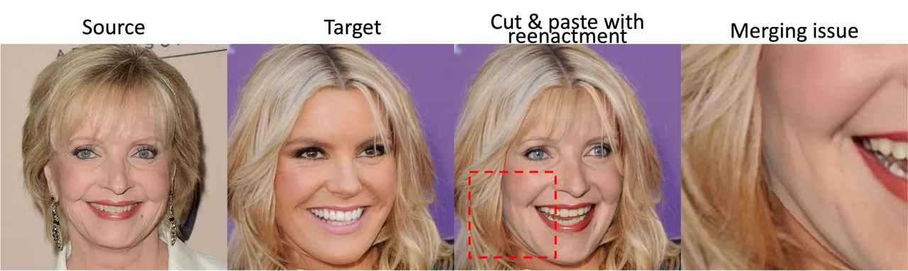

Figure 3: Example reenactment cut and paste swapping. Zoom in and view
at the boundaries of outcome which has merging issues.

Previous studies have tackled face-swapping through two primary avenues
\[4\]: (1) altering the target face image based on the identity features
of the source image. However, this method often falls short in
effectively transferring identity features, and (2) reconstructing the
swapped image using identity features as a blueprint, then integrating
it into the target background. The latter approach is more promising, as
it can infuse the swapped face with more authentic identity-related
attributes. However, it tends to introduce more artifacts, primarily due
to the merging process. Additionally, achieving accurate lighting
conditions from the original image or adapting them to fit the
background proves challenging, as no background information is typically
utilized in the reconstruction process.

Therefore, we train the diffusion model as a conditional inpainting
network, unlike other diffusion-based face-swapping approaches that
train diffusion as a reconstruction or reenactment network. For
instance, DiffFace trains the model as a reconstruction network using
the ID features as a condition. Our approach is primarily motivated by
exemplar-based image editing as demonstrated in \[36\]. This technique
allows for image editing using CLIP image feature conditions from an
example image, altering the context of a picture to match the given
example image within the masked inpaint region. As this method produces
photorealistic image inpainting, it serves as a robust baseline for
face-swapping tasks. However, while \[36\] performs well with natural
images, it fails to preserve the pose and expression of the target image
and the identity features of the source image when applied naively to
face swapping. Our main goal is to achieve photorealistic
face-swapping—where many other methods fall short—while maximizing
identity transferability and preserving attributes such as the target’s
pose, expression, and lighting. In Section 3.2, we describe how we adapt
\[36\] for face-swapping as conditional inpainting training. To improve
ID transferability, we use a multistep trainable DDIM to enforce a
multistep swapping enhancement loss, as detailed in Section 3.3.
Moreover, we introduce mask shuffling in Section 3.4, which enhances the
versatility of our model for various swapping applications, such as head
swaps. See Fig. 2 for the overall architecture of our face-swapping
pipeline.

### 3.2 Conditional Inpainting Diffusion training

In this section, we present our approach to conditional inpainting
diffusion training, a crucial component of our face-swapping pipeline
(see Fig. 2-Training pipeline(a)). We train the diffusion model to fill
an inpainted image within a specified masked region, leveraging the
features of the augmented version of the original image to guide the
reconstruction process. To create this inpaint image we use our face
shape augmentation. Face Shape Augmentation ($`\mathcal{FA}`$): involves
a mild shift and transformation of the target face mask (see Fig. 2-Face
Shape Augmentation). This prevents the model from learning to trivially
paste the reconstructed target image from $`x^{tar}`$. We find that face
shape augmentation results in more robust face swapping. More details
about the face shape augmentation are in appendix.

To elaborate further, for a target face image $`x^{tar}`$, we find its
latent image $`z^{tar}_{0}=\mathcal{E}(x^{tar})`$. For any randomly
chosen timestep $`t`$, the noised latent
$`z^{tar}_{t}(z^{tar}_{0},t,\epsilon)`$ is obtained using Eq.1 (see
Fig.2-Forward Diffusion). Additionally, the in-painting image latent
$`z^{inp}`$ is obtained from:

```math
z^{inp}=\mathcal{E}(x^{tar}\otimes\mathcal{FA}(1-{m}^{tar})) \tag{5}
```

where, $`m^{tar}`$ is the facial mask region that needs to be inpainted
by the diffusion model, and $`\mathcal{FA}`$ is a face shape
augmentation. We further compute the conditional feature as a weighted
average of the CLIP\[22\], Arcface\[5\] ID features, and facial
landmarks. Specifically, we find the reference image
$`x^{ref}=\mathcal{A}(x^{tar}\otimes m^{tar})`$, which is the facial
region, that serves as the source image at inference time. Here
$`\mathcal{A}`$ is an augment operator comprising of random resize,
horizontal flip, rotate, blur and elastic transform operations.

Condition Generation: is a pivotal aspect of training conditional
diffusion models, as the quality of the generated image heavily depends
on the quality of the condition feature. We find that using only the ID
features of $`x^{ref}`$ and the landmark features of $`x^{tar}`$ is
insufficient for both ID feature transfer and pose preservation. To this
end, we propose to leverage the CLIP\[22\] image feature to extract the
pose and expression information from the target image, and identity
information complementary to the arcface ID features from the reference.
We train two different linear projections to extract such different
information by disentangling CLIP feature in the same pipeline, those
are: a reference projector $`\mathcal{P}^{ref}`$ and a target projector
$`\mathcal{P}^{tar}`$. For the augmented reference image
$`RA(x^{ref})`$, we obtain the CLIP image encoder feature
$`f^{ref}_{clip}\in\mathbb{R}^{D}`$, Arcface ID feature
$`f_{id}=MLP_{id}(f^{{}^{\prime}}_{id}(RA(x^{ref})))`$ where
$`f_{id}\in\mathbb{R}^{D}`$, $`f^{{}^{\prime}}_{id}`$ is the Arcface
featurizer and the $`MLP_{id}`$ is a simple linear layer. From the
target image, we obtain the CLIP image encoder feature
$`f^{tar}_{clip}`$ and facial landmark positions
$`l^{tgt}=f{{}^{\prime}}_{lm}\in\mathbb{R}^{68\times 2}`$ using
DLib\[15\], which is further transformed as
$`f^{lm}=MLP_{lm}\circ l^{tgt}\in\mathbb{R}^{D}`$. These features are
then combined to create the conditioning feature $`f`$,

```math
\displaystyle f_{clip}=\mathcal{P}^{ref}\circ f^{ref}_{clip}+\mathcal{P}^{tar}\circ f^{tar}_{clip} \tag{6}
```

```math
\displaystyle f=w_{clip}f_{clip}+w_{id}f_{id}+w_{lm}f_{lm} \tag{7}
```

where, $`w_{clip},w_{id}`$ and $`w_{lm}`$ are the weights to average the
features. We empirically find that other forms of combining these, such
as concatenating and stacking features, provide inferior results in the
same setting (i.e. the number of epochs). The conditional feature is
used as the key in each cross-attention layer in the diffusion U-Net.
This stage works as a self-supervision where the diffusion model takes
the input as $`\{z_{t},z^{inp},m^{tar}\}`$, and using the condition
$`f`$, outputs the $`\epsilon_{\theta}`$ the predicted noise incurred in
the diffusion pipeline from step $`{t-1}`$ to $`t`$. Thus, the loss for
this stage is formulated as,

```math
\mathcal{L}_{Diff}=\mathbb{E}_{t,z_{0},\epsilon}\parallel\epsilon_{\theta}(z_{t},z^{inp},m^{tar},f,t)-\epsilon\parallel_{2}^{2} \tag{8}
```

### 3.3 Multistep swapping enhancement loss

Though the above-mentioned (sec. 3.2) inpainting training pipeline can
achieve realistic face-swapping compared to most of the other works,
this lacks the ID feature transferability. To further improve the ID
feature transferability and to train the projections
$`\mathcal{P}^{ref}`$ and $`\mathcal{P}^{tar}`$ which disentangles the
CLIP feature, we need to enforce the swapped image $`x^{swap}`$’s ID
similarity with $`x^{ref}(=x^{src})`$ as well as perceptual similarity
with $`x^{tar}`$. Note that this part uses different
{$`x^{tar},x^{ref}`$} pair unlike in 3.2 (See Fig. 2-training pipeline
(a), and (b)). We incorporate ID loss between the masked source image
and the masked swapped image. However, the diffusion training pipeline
is originally designed such that it predicts only the noise incurred
from any timestep to the next timestep i.e., it can predict a partly
denoised image for only one step and to compare the ID features this is
insufficient. To this end, we propose to use the differentiable DDIM
sampler at training time but with only N steps to restrict memory usage.
We estimate the initial sample from each N step and compute the ID loss
and perceptual similarity loss in each step using the following
equaions.

```math
\displaystyle\mathcal{L}_{ID} \displaystyle=\sum_{i=1}^{N}(1-<\mathcal{D}(\hat{z}_{0,t_{i}})\otimes m^{tar},x^{src}\otimes m^{src}>) \tag{9}
```

```math
\displaystyle\mathcal{L}_{PS} \displaystyle=\sum_{i=1}^{N}\mathcal{L}_{PIPS}(\mathcal{D}(\hat{z}_{0,t_{i}}),x^{tar}) \tag{10}
```

Where the $`\hat{z}_{0,t_{i}}`$ is obtained using eq. 4. Further the
$`t_{i}`$’s are chosen from the predefined step schedule with N same
intervals. The total loss is formulated as
$`\mathcal{L}_{Total}=\mathcal{L}_{Diff}+w^{\prime}_{ID}\times\mathcal{L}_{ID}+w^{\prime}_{PS}\times\mathcal{L}_{PS}`$.

### 3.4 Mask shuffling

We introduce a mask shuffling mechanism into our training pipeline,
enhancing the versatility of our approach. Among the 17 mask categories
delineating facial regions, such as left eye, right eye, skin,
background, etc., we randomly select $`N_{m}`$ masks to serve as both
$`m^{ref}`$ and $`m^{tar}`$. This strategy enables our diffusion model
to generalize effectively, facilitating modifications beyond facial
features. Moreover, leveraging CLIP features in conjunction with
identity (ID) features proves advantageous, as ID features alone may
struggle to extract pertinent information from the background. This
straightforward yet potent technique not only enables face-swapping but
also extends to other swapping scenarios under a unified model
architecture. Mask shuffling is applied during training pipline and
allows for modifications beyond the facial features. It has been
observed that without mask shuffling, especially in the hair region, the
generated hairstyles often fail to align with the target and may appear
unrealistic during head swapping.

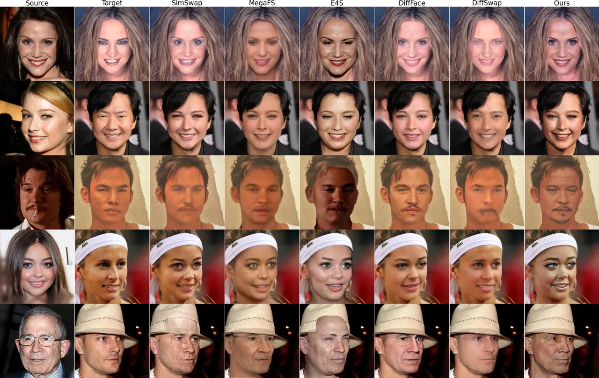

Figure 4: Qualitative comparison on CelebA dataset. Our approach
demonstrates robustness in maintaining target environmental conditions
(such as lighting) and preserving source ID information. Best viewed in
color and zoom in.

## 4 Experiments and Results

Datasets: Following prior works \[20, 35\] we utilize
CelebAMask-HQ\[16\] as our training dataset. CelebAMask-HQ comprises 30k
high-quality facial images with a resolution of $`1024\times 1024`$. To
avoid excessive consumption of training resources, we resize the image
to 512. We use 28k samples from CelebAMask-HQ to train our model and use
2k for evaluation. We use FFHQ\[12\] dataset for further evaluation
which offers 70K $`512\times 512`$ images.

Implementation details: We use PyTorch to implement our framework. We
train our model on 4 NVIDIA A100 GPUs(40GB). In training, we set the
global batch size to 4 and initialize the learning rate as $`10^{-5}`$
from the stable diffusion checkpoint \[24\]. We train the model for 20
epochs. The weights of ID loss and LPIPS loss are 0.3, and 0.1,
respectively. We use a pre-trained face recognition model\[5\] to
extract the face embedding, and CLIP L/14 \[22\] to obtain the CLIP
image features. The reported qualitative and quantitaive results are
produced using 50 DDIM steps.

Qualitative Results: Fig. 4 shows that on CelebA dataset, our method
achieves more realistic and high-fidelity swapped results. Likewise,
Fig. 5 demonstrates that in FFHQ dataset, our method excels in
preserving both the identity and facial details of the source image,
highlighting its strong generalization capabilities to open data set.
Due to the combination of CLIP’s identity features and identity
encoder’s features \[5\], our method can yield high-fidelity swapped
face, especially on individual facial features, as well as global
features including lighting, pose, and overall facial expression
appearance. Furthermore, our method’s output is largely free of
artifacts, especially at the edges of the faces, and it avoids
generating source image accessories like eyeglasses, unlike other
approaches.

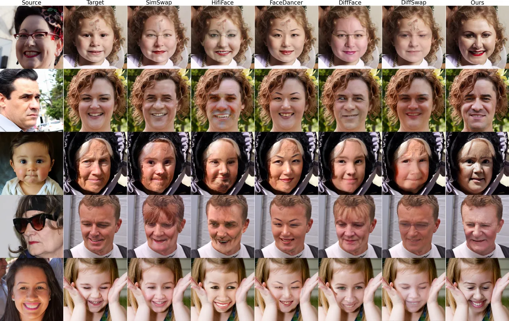

Figure 5: Qualitative comparisons of our method with SOTA face swapping
methods on FFHQ dataset. Best viewed in color and zoom-in.

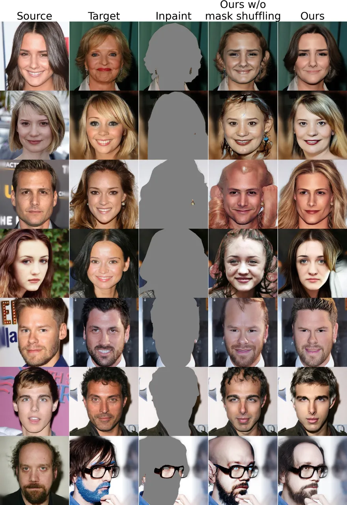

(a) Results on head swapping. With the mask shuffling, our method
produces robust outcome to head swap.

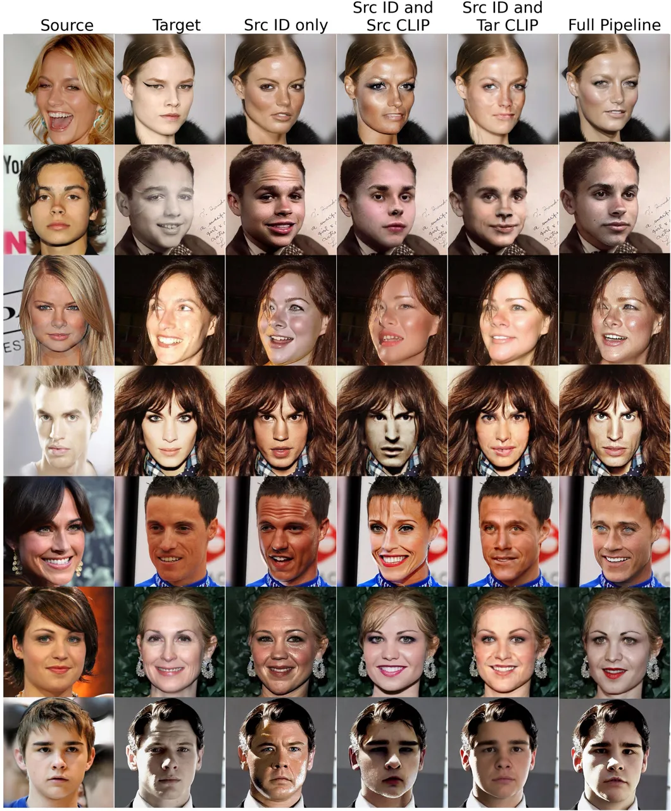

(b) Ablation study on adding CLIP feature disentanglement.

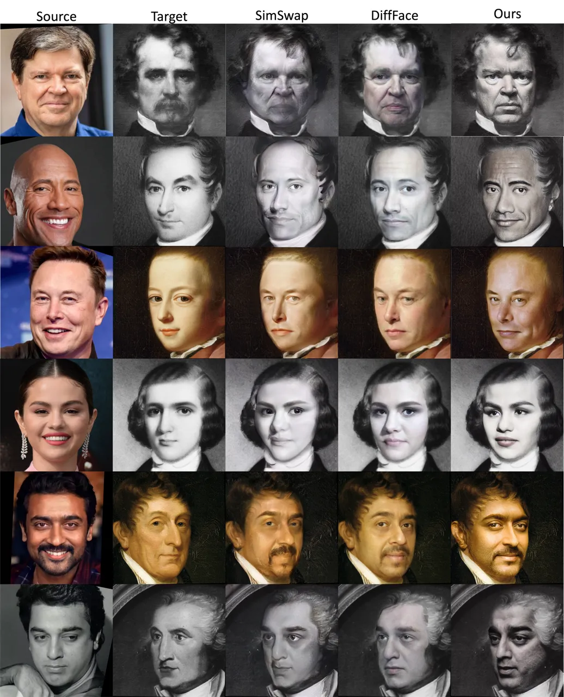

(c) Out-of-distribution generalizability of our method. Target images
are from \[27\].

Figure 6: (a) Head swap results (b) Ablation on CLIP feature
disentanglement (c) Qualitative results on out-of-distribution

Evaluation protocol: We obtain 1000 source and 1000 target images from
the dataset and produce the 1000 swapped images. We compute the FID
\[10\] between the swapped images. For the pose and expression, we use
HopeNet\[7\] and Deep3DFaceRecon \[6\] respectively, and compare the
target image and swapped image with L2 distance. To compute the ID
retrieval we masked out the background of both the swapped image and
source image, as that will contain different and unnecessary
information. Then we extracted the ID features from ArcFace\[5\], and
for each swapped face image, we conducted face retrieval by searching
for the most similar faces among all the source faces, measured by
cosine similarity, and then obtained the Top-1 accuracy and Top-5
accuracy. All results reported in this paper are obtained from a common
benchmark that we implemented based on the prior works \[38, 20\]
benchmark system.

Quantitative results: We conduct experiments on CelebA\[16\] dataset and
compare our result with previous methods in Table 1. Moreover, for a
more comprehensive quantitative comparison, in Table 2, we compare with
the latest methods on the dataset FFHQ. Both in Table 1 and Table 2, the
results demonstrate that our method surpasses the performance of
previous methods in ID Retrieval and FID, indicating our ability to
generate highly accurate swapped faces while better preserving the
original source identity.

|                  |                   |                           |        |                    |                     |
| ---------------- | ----------------- | ------------------------- | ------ | ------------------ | ------------------- |
| Method           | FID$`\downarrow`$ | ID retrieval $`\uparrow`$ |        | Pose$`\downarrow`$ | Expr.$`\downarrow`$ |
|                  |                   | Top-1                     | Top-5  |                    |                     |
| MegaFS \[39\]    | 20.3              | 73.9%                     | 80.3%  | 5.83               | 1.20                |
| HifiFace \[33\]  | 12.68             | 88.3%                     | 94.3%  | 2.92               | 1.09                |
| SimSwap\[4\]     | 10.7              | 95.3%                     | 98.6%  | 2.89               | 0.99                |
| E4S\[20\]        | 14.58             | 83.3%                     | 90.8%  | 4.15               | 1.16                |
| FaceDancer\[26\] | 12.83             | 0.10%                     | 0.50%  | 2.15               | 0.70                |
| DiffFace \[14\]  | 10.29             | 94.6%                     | 97.9%  | 36.1               | 2.15                |
| DiffSwap\[38\]   | 9.16              | 75.6 %                    | 90.9 % | 2.48               | 0.77                |
| Ours             | 6.09              | 98.8%                     | 99.6%  | 3.51               | 0.96                |

Table 1: Comparison on CelebA dataset. Best is in bold and second best
is underlined.

| Method           | FID$`\downarrow`$ | ID retrieval $`\uparrow`$ |        | Pose$`\downarrow`$ | Expr.$`\downarrow`$ |
| ---------------- | ----------------- | ------------------------- | ------ | ------------------ | ------------------- |
|                  |                   | Top-1                     | Top-5  |                    |                     |
| MegaFS \[39\]    | 12.0              | 59.6%                     | 74.1%  | 3.33               | 1.11                |
| HifiFace \[33\]  | 11.58             | 75.3%                     | 87.1%  | 3.28               | 1.41                |
| SimSwap\[4\]     | 13.8              | 90.6%                     | 96.4%  | 2.98               | 1.07                |
| E4S\[20\]        | 12.38             | 70.2%                     | 82.73% | 4.50               | 1.31                |
| FaceDancer\[26\] | 18.34             | 0.20%                     | 0.90%  | 2.6                | 0.96                |
| DiffFace \[14\]  | 8.59              | 87.2%                     | 94.4%  | 3.80               | 2.28                |
| DiffSwap\[38\]   | 8.58              | 78.2 %                    | 93.6 % | 2.92               | 1.10                |
| Ours             | 5.53              | 95.4%                     | 98.7%  | 3.74               | 1.04                |

Table 2: Comparison on FFHQ dataset.

HeadSwap: HeadSwap has been previously explored by HeSer \[28\] and HS
Diffusion \[32\] primarily on plane background. Benefiting from the
design of our mask shuffling, our method can also be extended to head
swapping task with more challenging backgrounds. Further, unlike
HS-Diffusion \[32\], our method can well preserve the target’s pose.
Unfortunately, we are unable to provide comparison with their methods as
they did not release their codes publicly. For our method, as displayed
in Fig. 6 (a), with mask shuffling, especially in the hair region, the
generated hairstyles are more realistic and properly aligned with the
target compared to those generated without mask shuffling.

Out-of-distribution generalizability for face-swapping: In Fig.  6(c),
we showcase our model’s adeptness at generating realistic face-swapped
images on out-of-distribution images. We select target images from the
manipulated FaceForensics++ dataset \[27\] and compare with highly
competitive methods, SimSwap\[4\] and DiffFace\[14\].

Ablation study: We analyze the role of CLIP feature disentanglement
technique (Fig 6 (b)). In the absence of this module, the pose,
expression and lighting of the swapped face result are poorly
represented. Hence, It can illustrate the collaboration between this
module and the ID decoupling module to make our face swap more superior.
Further, we analyze how same source images can interact with multiple
target images and vice-versa with different variations in skin tone and
pose (Fig. 8 & Fig. 7). Regardless of different variations, our method
consistently produces desirable swapping with high ID transferability.

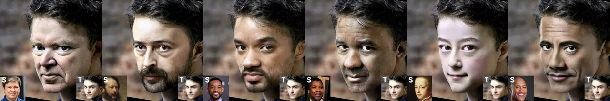

Figure 7: Same Target different sources with skin color and texture
variations. Zoom-in.

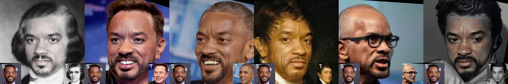

Figure 8: Same Source different targets with variations in pose,
expression, lighting, and texture. Zoom-in

| Method          | Per image | Resolution | Train Time |
| --------------- | --------- | ---------- | ---------- |
|                 | inference |            | GPU-days   |
| DiffFace \[14\] | 32 s      | 256        | 80         |
| DiffSwap \[38\] | 9.4 s     | 256        | unknown    |
| Ours            | 4.7 s     | 512        | 18         |

Table 3: Comparison of inference time and training cost.

Resource consumption: Although diffusion models have strong generative
capabilities, the simultaneous multi-step denoising is accompanied by
strong compute resources and time consumption \[30\]. Compared to
DiffFace and DiffSwap, ours is more efficient in inference time,
training cost, and can produce high res. output (Table 3). For diffswap,
we cannot estimate the train time. However, they use 8 A100s with global
batch size 32 for 100k iters, compared to 2 A100s with global batch size
of 4 for 140k iters on ours. Although we present results and analysis
for 50-step inference in this manuscript, our method is capable of
producing good swapped images with just 5 steps. See the appendix.A.2
for more analysis on this. Additionally, refer to the appendix for more
qualitative results and other details.

## 5 Conclusion & Limitations

We proposed a train-time diffusion-based inpainting pipeline for
face-swapping to obtain realistic swaps. Our introduction of a
disentangled CLIP feature further improves the pose and expression
perseverance. Furthermore, we propose a simple mask shuffling technique
to even handle headswapping task. While our method significantly boosts
both the performance (in qualitative and quantitative results) and
efficiency (i.e. inference time and training cost), there is still room
for improvement, especially under extreme pose and expression variations
which we leave for future work.

## References

- \[1\] DeepFakes.
  [https://github.com/deepfakes/faceswap](https://github.com/deepfakes/faceswap).
  Accessed: 2019-02-06.
- \[2\] Jianmin Bao, Dong Chen, Fang Wen, Houqiang Li, and Gang Hua.
  Towards open-set identity preserving face synthesis. In 2018 IEEE/CVF
  Conference on Computer Vision and Pattern Recognition, pages
  6713–6722, 2018.
- \[3\] Fred L. Bookstein. Principal warps: Thin-plate splines and the
  decomposition of deformations. IEEE Transactions on pattern analysis
  and machine intelligence, 11(6):567–585, 1989.
- \[4\] Renwang Chen, Xuanhong Chen, Bingbing Ni, and Yanhao Ge.
  Simswap: An efficient framework for high fidelity face swapping. In
  Proceedings of the 28th ACM International Conference on Multimedia,
  pages 2003–2011, 2020.
- \[5\] Jiankang Deng, Jia Guo, Niannan Xue, and Stefanos Zafeiriou.
  Arcface: Additive angular margin loss for deep face recognition. In
  Proceedings of the IEEE/CVF conference on computer vision and pattern
  recognition, pages 4690–4699, 2019.
- \[6\] Yu Deng, Jiaolong Yang, Sicheng Xu, Dong Chen, Yunde Jia, and
  Xin Tong. Accurate 3d face reconstruction with weakly-supervised
  learning: From single image to image set. In Proceedings of the
  IEEE/CVF conference on computer vision and pattern recognition
  workshops, pages 0–0, 2019.
- \[7\] Bardia Doosti, Shujon Naha, Majid Mirbagheri, and David J
  Crandall. Hope-net: A graph-based model for hand-object pose
  estimation. In Proceedings of the IEEE/CVF conference on computer
  vision and pattern recognition, pages 6608–6617, 2020.
- \[8\] Gege Gao, Huaibo Huang, Chaoyou Fu, Zhaoyang Li, and Ran He.
  Information bottleneck disentanglement for identity swapping. In
  Proceedings of the IEEE/CVF conference on computer vision and pattern
  recognition, pages 3404–3413, 2021.
- \[9\] Xilin He, Qinliang Lin, Cheng Luo, Weicheng Xie, Siyang Song,
  Feng Liu, and Linlin Shen. Shift from texture-bias to shape-bias: Edge
  deformation-based augmentation for robust object recognition. In
  Proceedings of the IEEE/CVF International Conference on Computer
  Vision, pages 1526–1535, 2023.
- \[10\] Martin Heusel, Hubert Ramsauer, Thomas Unterthiner, Bernhard
  Nessler, and Sepp Hochreiter. Gans trained by a two time-scale update
  rule converge to a local nash equilibrium. Advances in neural
  information processing systems, 30, 2017.
- \[11\] Amina Kammoun, Rim Slama, Hedi Tabia, Tarek Ouni, and Mohmed
  Abid. Generative adversarial networks for face generation: A survey.
  ACM Computing Surveys, 55(5):1–37, 2022.
- \[12\] Tero Karras, Samuli Laine, and Timo Aila. A style-based
  generator architecture for generative adversarial networks. In
  Proceedings of the IEEE/CVF conference on computer vision and pattern
  recognition, pages 4401–4410, 2019.
- \[13\] Tero Karras, Samuli Laine, Miika Aittala, Janne Hellsten,
  Jaakko Lehtinen, and Timo Aila. Analyzing and improving the image
  quality of stylegan. In Proceedings of the IEEE/CVF conference on
  computer vision and pattern recognition, pages 8110–8119, 2020.
- \[14\] Kihong Kim, Yunho Kim, Seokju Cho, Junyoung Seo, Jisu Nam,
  Kychul Lee, Seungryong Kim, and KwangHee Lee. Diffface:
  Diffusion-based face swapping with facial guidance. arXiv preprint
  arXiv:2212.13344, 2022.
- \[15\] Davis E King. Dlib-ml: A machine learning toolkit. The Journal
  of Machine Learning Research, 10:1755–1758, 2009.
- \[16\] Cheng-Han Lee, Ziwei Liu, Lingyun Wu, and Ping Luo. Maskgan:
  Towards diverse and interactive facial image manipulation. In
  Proceedings of the IEEE/CVF Conference on Computer Vision and Pattern
  Recognition, pages 5549–5558, 2020.
- \[17\] Lingzhi Li, Jianmin Bao, Hao Yang, Dong Chen, and Fang Wen.
  Faceshifter: Towards high fidelity and occlusion aware face swapping.
  arXiv preprint arXiv:1912.13457, 2019.
- \[18\] Qinliang Lin, Cheng Luo, Zenghao Niu, Xilin He, Weicheng Xie,
  Yuanbo Hou, Linlin Shen, and Siyang Song. Boosting adversarial
  transferability across model genus by deformation-constrained warping.
  arXiv preprint arXiv:2402.03951, 2024.
- \[19\] Luping Liu, Yi Ren, Zhijie Lin, and Zhou Zhao. Pseudo numerical
  methods for diffusion models on manifolds, 2022.
- \[20\] Zhian Liu, Maomao Li, Yong Zhang, Cairong Wang, Qi Zhang, Jue
  Wang, and Yongwei Nie. Fine-grained face swapping via regional gan
  inversion. In Proceedings of the IEEE/CVF Conference on Computer
  Vision and Pattern Recognition, pages 8578–8587, 2023.
- \[21\] Yuval Nirkin, Yosi Keller, and Tal Hassner. Fsgan: Subject
  agnostic face swapping and reenactment. In Proceedings of the IEEE/CVF
  international conference on computer vision, pages 7184–7193, 2019.
- \[22\] Alec Radford, Jong Wook Kim, Chris Hallacy, Aditya Ramesh,
  Gabriel Goh, Sandhini Agarwal, Girish Sastry, Amanda Askell, Pamela
  Mishkin, Jack Clark, et al. Learning transferable visual models from
  natural language supervision. In International conference on machine
  learning, pages 8748–8763. PMLR, 2021.
- \[23\] Aditya Ramesh, Prafulla Dhariwal, Alex Nichol, Casey Chu, and
  Mark Chen. Hierarchical text-conditional image generation with clip
  latents. arXiv preprint arXiv:2204.06125, 1(2):3, 2022.
- \[24\] Robin Rombach, Andreas Blattmann, Dominik Lorenz, Patrick
  Esser, and Björn Ommer. High-resolution image synthesis with latent
  diffusion models. In Proceedings of the IEEE/CVF conference on
  computer vision and pattern recognition, pages 10684–10695, 2022.
- \[25\] Robin Rombach, Andreas Blattmann, Dominik Lorenz, Patrick
  Esser, and Björn Ommer. High-resolution image synthesis with latent
  diffusion models, 2022.
- \[26\] Felix Rosberg, Eren Erdal Aksoy, Fernando Alonso-Fernandez, and
  Cristofer Englund. Facedancer: pose-and occlusion-aware high fidelity
  face swapping. In Proceedings of the IEEE/CVF winter conference on
  applications of computer vision, pages 3454–3463, 2023.
- \[27\] Andreas Rossler, Davide Cozzolino, Luisa Verdoliva, Christian
  Riess, Justus Thies, and Matthias Nießner. Faceforensics++: Learning
  to detect manipulated facial images. In Proceedings of the IEEE/CVF
  international conference on computer vision, pages 1–11, 2019.
- \[28\] Changyong Shu, Hemao Wu, Hang Zhou, Jiaming Liu, Zhibin Hong,
  Changxing Ding, Junyu Han, Jingtuo Liu, Errui Ding, and Jingdong Wang.
  Few-shot head swapping in the wild. In Proceedings of the IEEE/CVF
  Conference on Computer Vision and Pattern Recognition, pages
  10789–10798, 2022.
- \[29\] Jascha Sohl-Dickstein, Eric Weiss, Niru Maheswaranathan, and
  Surya Ganguli. Deep unsupervised learning using nonequilibrium
  thermodynamics. In International conference on machine learning, pages
  2256–2265. PMLR, 2015.
- \[30\] Jiaming Song, Chenlin Meng, and Stefano Ermon. Denoising
  diffusion implicit models, 2022.
- \[31\] Hoang Thanh-Tung and Truyen Tran. Catastrophic forgetting and
  mode collapse in gans. In 2020 international joint conference on
  neural networks (ijcnn), pages 1–10. IEEE, 2020.
- \[32\] Qinghe Wang, Lijie Liu, Miao Hua, Pengfei Zhu, Wangmeng Zuo,
  Qinghua Hu, Huchuan Lu, and Bing Cao. Hs-diffusion: Semantic-mixing
  diffusion for head swapping. arXiv preprint arXiv:2212.06458, 4, 2023.
- \[33\] Yuhan Wang, Xu Chen, Junwei Zhu, Wenqing Chu, Ying Tai,
  Chengjie Wang, Jilin Li, Yongjian Wu, Feiyue Huang, and Rongrong Ji.
  Hififace: 3d shape and semantic prior guided high fidelity face
  swapping. arXiv preprint arXiv:2106.09965, 2021.
- \[34\] Chao Xu, Jiangning Zhang, Miao Hua, Qian He, Zili Yi, and Yong
  Liu. Region-aware face swapping. In Proceedings of the IEEE/CVF
  Conference on Computer Vision and Pattern Recognition, pages
  7632–7641, 2022.
- \[35\] Yangyang Xu, Bailin Deng, Junle Wang, Yanqing Jing, Jia Pan,
  and Shengfeng He. High-resolution face swapping via latent semantics
  disentanglement. In Proceedings of the IEEE/CVF Conference on Computer
  Vision and Pattern Recognition, pages 7642–7651, 2022.
- \[36\] Binxin Yang, Shuyang Gu, Bo Zhang, Ting Zhang, Xuejin Chen,
  Xiaoyan Sun, Dong Chen, and Fang Wen. Paint by example: Exemplar-based
  image editing with diffusion models. arXiv preprint
  arXiv:2211.13227, 2022.
- \[37\] Jiangning Zhang, Xianfang Zeng, Yusu Pan, Yong Liu, Yu Ding,
  and Changjie Fan. Faceswapnet: Landmark guided many-to-many face
  reenactment. arXiv, 2019.
- \[38\] Wenliang Zhao, Yongming Rao, Weikang Shi, Zuyan Liu, Jie Zhou,
  and Jiwen Lu. Diffswap: High-fidelity and controllable face swapping
  via 3d-aware masked diffusion. In Proceedings of the IEEE/CVF
  Conference on Computer Vision and Pattern Recognition, pages
  8568–8577, 2023.
- \[39\] Yuhao Zhu, Qi Li, Jian Wang, Cheng-Zhong Xu, and Zhenan Sun.
  One shot face swapping on megapixels. In Proceedings of the IEEE/CVF
  conference on computer vision and pattern recognition, pages
  4834–4844, 2021.

## Appendix A Appendix

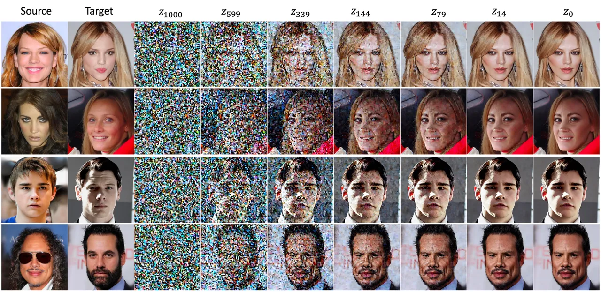

Figure 9: Denoising process visualization. The images shows the decoded
output of noisy latents ($`\mathcal{D}(z_{t})`$) through DDIM process.

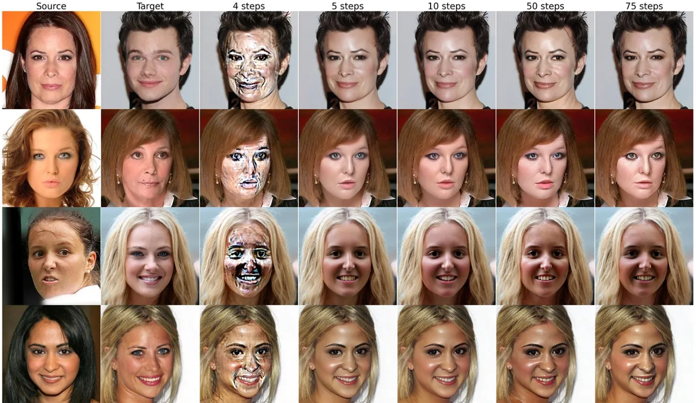

Figure 10: Comparison for total number of denoising steps using DDIM
with our model.

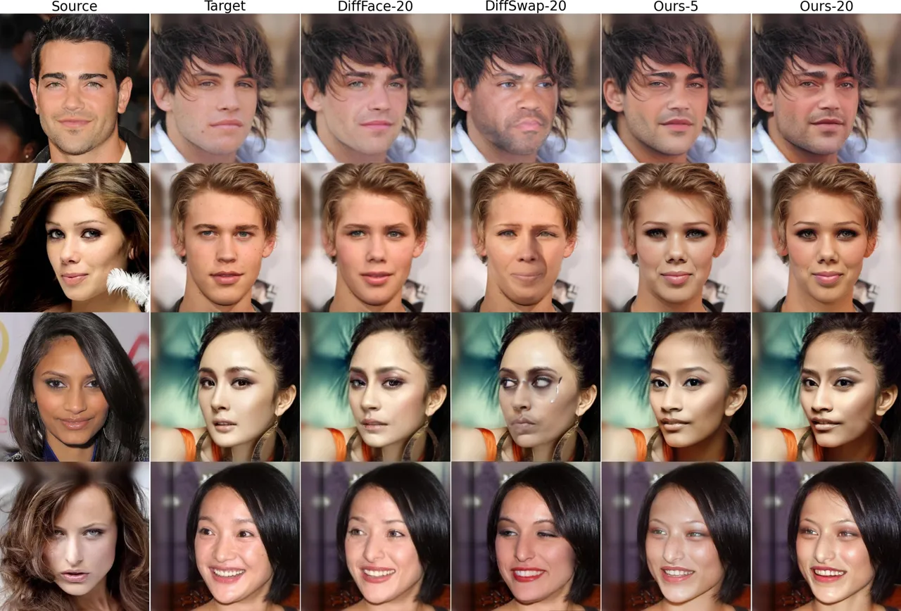

Figure 11: Comparison of the effect of total number of denoising steps
using DDIM with other approaches. While both DiffSwap\[38\] and
DiffFace\[14\] are failing to transfer identity and making artifacts,
our method produces superior swapped images even with 5 steps

### A.1 Diffusion Process Visualization

Fig 9 shows the source, target, and the decoded output images through
the diffusion process. Here, we show the denoising through 75 DDIM
steps. The $`z_{1000}\cdots z_{0}`$ images in Fig 9 correspond to
$`0^{th}`$, $`30^{th}`$, $`50^{th}`$, $`65^{th}`$, $`70^{th}`$,
$`73^{th}`$, and $`75^{th}`$ DDIM step respectively. We observe initial
steps recover the basic structure of the swapped image while a few later
($`65^{th}\text{ to }75^{th}`$) steps refine the image.

### A.2 Effect on Number of Steps in DDIM

Existing diffusion-based works on face-swapping use time-consuming
denoising steps. DiffSwap\[38\] uses 200 steps with masked fusion at
inference. DiffFace\[14\] uses 75 steps which consumes a huge amount of
time (approximately 9 hours to perform 1000 swaps) due to gradient
computation in their inference strategy. We use 50 steps to compare the
inference time in which we showed our method performs a magnitude faster
inference than DiffFace\[14\] and roughly twice faster than DiffSwap
\[38\]. Further, all the results we show in the main manuscript use 50
steps. However, to analyze the effect of the number of DDIM steps with
our algorithm, we show further analysis of qualitative images with
varying numbers of DDIM steps in Fig 10.

In contrast to existing methods that rely on complex inference processes
for face-swapping, often failing to produce satisfactory results and
fail to transfer identity features well with minimal denoising steps,
our approach stands out by achieving superior swapping outcomes even
with as few as 5 steps (see Fig. 11), which significantly reduces the
computational overhead, slashing the inference time to approximately
one-tenth of the duration required for 50 steps.

### A.3 Additional Implementation Details

Building upon the implementation details outlined in the main
manuscript, we provide additional specifications for clarity. We adopt a
pre-trained stable diffusion checkpoint, akin to the framework
introduced in \[36\], with a modification involving 9 channels. We use
AdamW optimizer with learning rate $`1e-5`$ and other default
parameters. Latent size is $`64\times 64`$. The condition feature
dimension $`D`$ is 768. In condition generation, the CLIP weight
$`w_{clip}`$, ID feature weight $`w_{id}`$, and the landmark feature
weight $`w_{lm}`$ are 1.0, 10.0, and 0.05 respectively. The number of
DDIM steps in our training pipeline $`N=4`$. The output image resolution
is $`512\times 512`$.

### A.4 Additional Information on Face shape Augmentation

To facilitate face shape augmentation, an image elastic deformation
approach \[9, 18\] based on Thin Plate Spline (TPS) transformation \[3\]
was employed. Specifically, we first generate a 2D grid of points of the
same size as the face mask. Then, we set up a set of control net points
$`O`$ on the grid. Next, we add random noise $`\delta`$ to control net
points $`O`$ and obtain $`P`$. The intensity of the noise is controlled
by a scaling factor $`s`$ to enable precise modulation. By utilizing the
two sets of control points, we can obtain an interpolation function that
acts on the entire mask, allowing us to achieve our mask augmentation
while ensuring coherence and consistency in subsequent transformations.
This is crucial for enhancing diversity and realism in augmented face
shapes, providing smooth and continuous deformation while preserving
structural integrity. We use this face shape augmentation to get the
inpaint image in our pipeline. We use a random scale $`s`$ sampled
uniformly from the range 0.5 to 1.

### A.5 Additional Qualitative Results

We provide more qualitative comparison for Face Swapping on CelebA
dataset (Fig 12) and FFHQ dataset (Fig 13). In the examples, we observe,
our method produces smoother boundaries and photo-realistic images.
Unlike other works which suffer in merging the swapped image and the
target’s hair and background, which often results in a visible merging
boundary our method seamlessly blends the swapped image as there is no
separate step of merging. Moreover, other works produce a lot of
artifacts, especially in challenging situations such as extreme pose
variations (E.g., last row of Fig 12), and occlusions or accessories in
source (E.g., third last row of Fig 13).

Further, we provide additional head-swapping qualitative images in Fig 14. Despite challenging masks, our approach is capable of producing
realistic head swaps while preserving the target pose and expression.

### A.6 Societal Impact

With the advancements in deep learning, creating swapped face has become
easier and social media platforms have made it easier for them to spread
rapidly. Everything has two sides. If facial swapping technology is used
for the advancement of productivity, such as in movie scenes, it can
greatly enhance productivity. However, if this technology is exploited
by malicious individuals, face swapping may pose a significant threat to
society. We are committed to developing powerful face swapping
technologies that have a beneficial impact on society. The purpose of
our research is also to promote the healthy development of this
technology. Furthermore, we control the generation of vulnerable images
in our method’s safety check via Stable Diffusion \[24\].

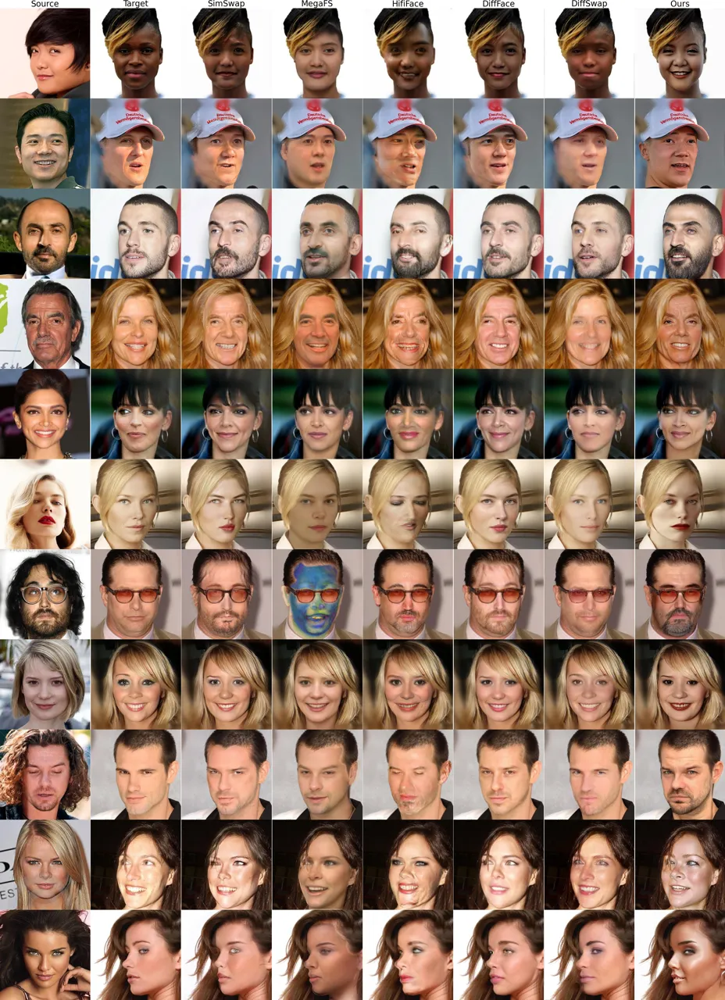

Figure 12: Qualitative comparison on CelebA dataset. Better viewed in
Zoom

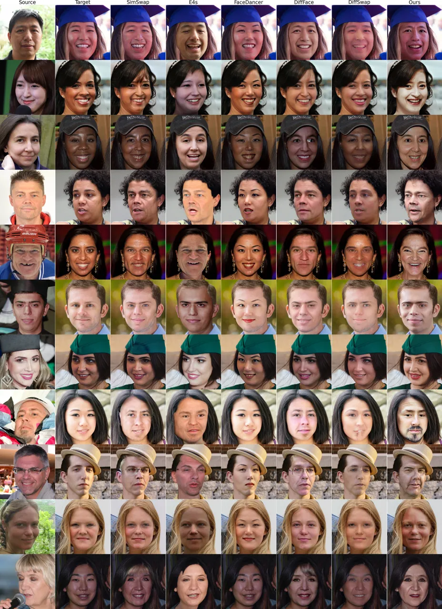

Figure 13: Qualitative comparison on FFHQ dataset. Better viewed in Zoom

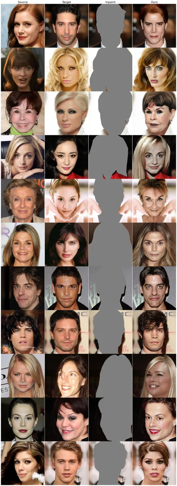

Figure 14: Additional Head Swap outcomes. Better viewed in Zoom
