JEAN

# JEAN: Joint Expression and Audio-guided NeRF-based Talking Face Generation

Sai Tanmay Reddy Chakkera    Aggelina Chatziagapi    Dimitris Samaras

###### Abstract

We introduce a novel method for joint expression and audio-guided
talking face generation. Recent approaches either struggle to preserve
the speaker identity or fail to produce faithful facial expressions. To
address these challenges, we propose a NeRF-based network. Since we
train our network on monocular videos without any ground truth, it is
essential to learn disentangled representations for audio and
expression. We first learn audio features in a self-supervised manner,
given utterances from multiple subjects. By incorporating a contrastive
learning technique, we ensure that the learned audio features are
aligned to the lip motion and disentangled from the muscle motion of the
rest of the face. We then devise a transformer-based architecture that
learns expression features, capturing long-range facial expressions and
disentangling them from the speech-specific mouth movements. Through
quantitative and qualitative evaluation, we demonstrate that our method
can synthesize high-fidelity talking face videos, achieving
state-of-the-art facial expression transfer along with lip
synchronization to unseen audio. Project Page:
[https://starc52.github.io/publications/JEAN](https://starc52.github.io/publications/2024-07-19-JEAN)

^(†)^(†)email: schakkera@cs.stonybrook.edu^(†)^(†)email:
aggelina@cs.stonybrook.edu^(†)^(†)email:
samaras@cs.stonybrook.edu^(†)^(†)affiliation: Stony Brook University  
NY, USA

## 1 Introduction

Talking face generation has increasingly drawn attention due to its
wide-ranging applications such as visual dubbing, video content creation
and video conferencing. There are two main requirements in synthesizing
a photorealistic talking face: (a) accurate lip synchronization to the
spoken utterance, and (b) faithful facial expressions to convey a
message with the intended affect. In human interaction, facial
expressions deliver essential cues while talking \[Ekman and
Friesen(1978), Ekman and Rosenberg(2005)\]. For example, the same
sentence spoken with an angry or happy emotion can have a different
meaning. Prior work has mostly focused on audio-only \[Prajwal
et al.(2020)Prajwal, Mukhopadhyay, Namboodiri, and Jawahar, Zhou
et al.(2020)Zhou, Han, Shechtman, Echevarria, Kalogerakis, and Li, Thies
et al.(2020)Thies, Elgharib, Tewari, Theobalt, and Nießner, Chung
et al.(2017)Chung, Jamaludin, Zisserman, et al., Vougioukas
et al.(2019)Vougioukas, Petridis, and Pantic, Zhou et al.(2021)Zhou,
Sun, Wu, Loy, Wang, and Liu\] or expression-only \[Pumarola
et al.(2018)Pumarola, Agudo, Martinez, Sanfeliu, and Moreno-Noguer,
Athar et al.(2019)Athar, Shu, and Samaras, Kim et al.(2018)Kim, Garrido,
Tewari, Xu, Thies, Nießner, Pérez, Richardt, Zollöfer, and Theobalt,
Doukas et al.(2020)Doukas, Koujan, Sharmanska, Roussos, and Zafeiriou,
Koujan et al.(2020)Koujan, Doukas, Roussos, and Zafeiriou, Athar
et al.(2020)Athar, Pumarola, Moreno-Noguer, and Samaras, Thies
et al.(2019)Thies, Zollhöfer, and Nießner\] guidance for face synthesis.
A few methods \[Ji et al.(2022)Ji, Zhou, Wang, Wu, Wu, Xu, and Cao, Wang
et al.(2023a)Wang, Deng, Yin, Shum, and Wang, Jang et al.(2023)Jang,
Rho, Woo, Lee, Park, Lim, Kim, and Chung, Ji et al.(2021)Ji, Zhou, Wang,
Wu, Loy, Cao, and Xu\] have tried to address the problem of simultaneous
control of facial expressions and lips. However, they either struggle to
preserve the speaker identity or fail to produce faithful expressions.
Recently, neural radiance fields (NeRFs) \[Mildenhall
et al.(2020)Mildenhall, Srinivasan, Tancik, Barron, Ramamoorthi, and
Ng\] have demonstrated photorealistic 3D modeling, preserving
identity-specific information and faithfully reconstructing
expressions \[Gafni et al.(2021)Gafni, Thies, Zollhöfer, and Nießner\].
However, NeRF-based methods have only addressed the problems of
lip-syncing \[Guo et al.(2021)Guo, Chen, Liang, Liu, Bao, and Zhang, Liu
et al.(2022)Liu, Xu, Wu, Zhou, Wu, and Zhou, Li et al.(2023)Li, Zhang,
Bai, Zhou, and Gu, Chatziagapi et al.(2023)Chatziagapi, Athar, Jain, MV,
Bhat, and Samaras, Ye et al.(2023b)Ye, Jiang, Ren, Liu, He, and Zhao\]
or expression transfer \[Gafni et al.(2021)Gafni, Thies, Zollhöfer, and
Nießner, Athar et al.(2023)Athar, Shu, and Samaras, Park
et al.(2021b)Park, Sinha, Hedman, Barron, Bouaziz, Goldman,
Martin-Brualla, and Seitz, Athar et al.(2022)Athar, Xu, Sunkavalli,
Shechtman, and Shu\] separately.

In this work, we present JEAN\xspace, a novel Joint Expression and
Audio-guided NeRF for talking face generation. Our network is trained on
monocular talking face videos without any ground truth. In these videos,
the expression-related facial movements are strongly entangled with the
speech-specific mouth movements. Controlling facial expressions and
speech-specific lip motion separately requires learning _disentangled_
representations for expression and audio correspondingly. To address
this, we introduce a self-supervised approach to disentangle facial
expressions from lip motion. We observe that mouth motion related to
speech and face motion related to expressions in talking faces differ
from each other temporally and spatially. Speech-related motion has
higher temporal frequency and is spatially localized to the mouth
region, while expression-related face motion has a lower temporal
frequency and may occur over the entire face region. Moreover, for the
same utterance spoken with different expressions, speech-related motion
remains consistent. We leverage these observations to disentangle
speech-related motion and expression-related motion.

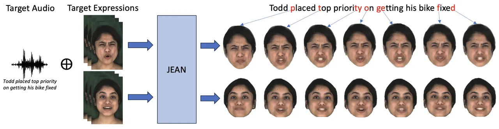

Figure 1: We introduce JEAN\xspace, a novel NeRF-based method that
simultaneously combines lip-syncing to a target audio with facial
expression transfer to generate talking faces.

We first learn a powerful audio representation in a self-supervised
manner by disentangling the lip motion from the motion of the rest of
the face in the feature space of an autoencoder. In general, achieving
accurate lip synchronization on unseen audio in NeRFs is hard, as they
tend to overfit on the training data \[Guo et al.(2021)Guo, Chen, Liang,
Liu, Bao, and Zhang\]. Recently, contrastive learning has shown promise
in synchronization in audio-visual tasks \[Zhou et al.(2019)Zhou, Liu,
Liu, Luo, and Wang, Wu et al.(2023)Wu, Hu, Wu, Lyu, Cao, Shan, Yang,
Sun, and Qi, Wang et al.(2023b)Wang, Qian, Zhang, Tan, and Li, Peng
et al.(2023)Peng, Luo, Shi, Xu, Zhu, Liu, He, and Fan\]. This prompted
us to introduce a contrastive learning strategy, in order to align the
learned audio features with the lip motion. Next, we introduce a
transformer-based architecture that learns expression features,
capturing long-range facial expressions and disentangling them from
speech-specific lip motion. Finally, we train a dynamic NeRF,
conditioned on the learned representations for expression and audio.
JEAN\xspacecan synthesize high-fidelity talking face videos, faithfully
following both the input facial expressions and speech signal for a
given identity.

In brief, the contributions of our work are as follows:

- •
  We introduce a self-supervised method to extract audio features
  aligned to lip motion features, achieving accurate lip synchronization
  on unseen audio.
- •
  We propose a transformer-based module to learn expression features,
  disentangled from speech-specific mouth motion.
- •
  Conditioning on the disentangled representations for expression and
  audio, we propose a novel NeRF-based method for simultaneous
  expression control and lip synchronization, outperforming the current
  state-of-the-art.

## 2 Related Work

Audio-driven Talking Face Generation. Audio-driven talking face
generation aims to generate portrait images with synchronized lip motion
to a given speech. Early attempts in talking face generation with lip
synchronization \[Sako et al.(2000)Sako, Tokuda, Masuko, Kobayashi, and
Kitamura, Fu et al.(2005)Fu, Gutierrez-Osuna, Esposito, Kakumanu, and
Garcia, Kim et al.(2015)Kim, Yue, Taylor, and Matthews\] use
probabilistic models to map speech phonemes to particular mouth shapes,
requiring accurate annotation. More recent methods \[Suwajanakorn
et al.(2017)Suwajanakorn, Seitz, and Kemelmacher-Shlizerman, Chung
et al.(2017)Chung, Jamaludin, Zisserman, et al., Zhou et al.(2020)Zhou,
Han, Shechtman, Echevarria, Kalogerakis, and Li, Thies
et al.(2020)Thies, Elgharib, Tewari, Theobalt, and Nießner, Vougioukas
et al.(2019)Vougioukas, Petridis, and Pantic, Chen et al.(2019)Chen,
Maddox, Duan, and Xu, Zhou et al.(2019)Zhou, Liu, Liu, Luo, and Wang,
Zhou et al.(2021)Zhou, Sun, Wu, Loy, Wang, and Liu, Prajwal
et al.(2020)Prajwal, Mukhopadhyay, Namboodiri, and Jawahar\] learn
neural networks, such as GANs, using a large amount of video data,
containing multiple identities, in order to learn a robust audio-lip
space. Our method, on the other hand, is NeRF-based, which enables us to
better capture the 3D geometry and appearance of a talking face, and
achieve higher output visual quality with just a few minutes of
monocular video data.

NeRFs for Human Faces. Implicit neural representations for modeling 3D
scenes have recently gained a lot of attention. In particular, neural
radiance fields (NeRFs) \[Mildenhall et al.(2020)Mildenhall, Srinivasan,
Tancik, Barron, Ramamoorthi, and Ng\] have shown photorealistic novel
view synthesis of complex static \[Barron et al.(2021)Barron,
Mildenhall, Tancik, Hedman, Martin-Brualla, and Srinivasan, Barron
et al.(2022)Barron, Mildenhall, Verbin, Srinivasan, and Hedman\] and
dynamic \[Li et al.(2022)Li, Slavcheva, Zollhöfer, Green, Lassner, Kim,
Schmidt, Lovegrove, Goesele, Newcombe, and Lv, Li et al.(2021)Li,
Niklaus, Snavely, and Wang, Pumarola et al.(2021)Pumarola, Corona,
Pons-Moll, and Moreno-Noguer, Xian et al.(2021)Xian, Huang, Kopf, and
Kim\] scenes. They represent a scene using an MLP, where each 3D point
is associated with a radiance and density. Various recent works \[Gafni
et al.(2021)Gafni, Thies, Zollhöfer, and Nießner, Park
et al.(2021a)Park, Sinha, Barron, Bouaziz, Goldman, Seitz, and
Martin-Brualla, Park et al.(2021b)Park, Sinha, Hedman, Barron, Bouaziz,
Goldman, Martin-Brualla, and Seitz, Raj et al.(2020)Raj, Zollhoefer,
Simon, Saragih, Saito, Hays, and Lombardi, Sun et al.(2021)Sun, Lin, Bi,
Xu, and Ramamoorthi\] use NeRFs to model the 3D face geometry.
AD-NeRF \[Guo et al.(2021)Guo, Chen, Liang, Liu, Bao, and Zhang\] learns
a dynamic NeRF conditioned on speech, encoded as DeepSpeech
features \[Hannun et al.(2014)Hannun, Case, Casper, Catanzaro, Diamos,
Elsen, Prenger, Satheesh, Sengupta, Coates, and Ng, Amodei
et al.(2016)Amodei, Ananthanarayanan, Anubhai, Bai, Battenberg, Case,
Casper, Catanzaro, Cheng, Chen, Chen, Chen, Chen, Chrzanowski, Coates,
Diamos, Ding, Du, Elsen, Engel, Fang, Fan, Fougner, Gao, Gong, Hannun,
Han, Johannes, Jiang, Ju, Jun, LeGresley, Lin, Liu, Liu, Li, Li, Ma,
Narang, Ng, Ozair, Peng, Prenger, Qian, Quan, Raiman, Rao, Satheesh,
Seetapun, Sengupta, Srinet, Sriram, Tang, Tang, Wang, Wang, Wang, Wang,
Wang, Wang, Wu, Wei, Xiao, Xie, Xie, Yogatama, Yuan, Zhan, and Zhu\].
Follow-up methods \[Liu et al.(2022)Liu, Xu, Wu, Zhou, Wu, and Zhou, Yao
et al.(2022)Yao, Zhong, Yan, Zhai, and Yang, Ye et al.(2023b)Ye, Jiang,
Ren, Liu, He, and Zhao, Ye et al.(2023a)Ye, He, Jiang, Huang, Huang,
Liu, Ren, Yin, Ma, and Zhao, Tang et al.(2022)Tang, Wang, Zhou, Chen,
He, Hu, Liu, Zeng, and Wang, Li et al.(2023)Li, Zhang, Bai, Zhou, and
Gu, Li et al.(2024)Li, Zhao, Wang, Peng, Zhang, Dong, and Tan, Shen
et al.(2024)Shen, Li, Huang, Zhu, Zhou, and Lu\] enhance the lip
synchronization in case of novel audio. NeRFace \[Gafni
et al.(2021)Gafni, Thies, Zollhöfer, and Nießner\] conditions the
network on 3DMM expression parameters. In contrast to the aforementioned
approaches, our proposed NeRF allows for simultaneous control over
facial expressions and lip motion to unseen audio.

Representation Learning for Human Faces. The task of representation
learning for faces has been widely explored in unsupervised \[Chen
et al.(2018)Chen, Li, Grosse, and Duvenaud, Chen et al.(2016)Chen, Duan,
Houthooft, Schulman, Sutskever, and Abbeel, Ding et al.(2020)Ding, Xu,
Xu, Parmar, Yang, Welling, and Tu, Higgins et al.(2017)Higgins, Matthey,
Pal, Burgess, Glorot, Botvinick, Mohamed, and Lerchner, Kim and
Mnih(2018), Nguyen-Phuoc et al.(2019)Nguyen-Phuoc, Li, Theis, Richardt,
and Yang, Wei et al.(2021)Wei, Shi, Liu, Ji, Gao, Wu, and Zuo\] and
self-, semi-, or weakly-supervised \[Deng et al.(2020)Deng, Yang, Chen,
Wen, and Tong, Ghosh et al.(2020)Ghosh, Gupta, Uziel, Ranjan, Black, and
Bolkart, Pumarola et al.(2018)Pumarola, Agudo, Martinez, Sanfeliu, and
Moreno-Noguer, Ren et al.(2021)Ren, Li, Chen, Li, and Liu\] techniques.
In the talking face setting, where supervision is scarce and hard to
find, self-supervision has been widely explored in the literature. Some
methods have used self-supervision to improve the lip
synchronization \[Wang et al.(2023b)Wang, Qian, Zhang, Tan, and Li, Peng
et al.(2023)Peng, Luo, Shi, Xu, Zhu, Liu, He, and Fan, Yao
et al.(2022)Yao, Zhong, Yan, Zhai, and Yang\] in talking head generation
tasks. Other methods have used self-supervised learning \[Liu
et al.(2024)Liu, Wei, Li, Li, and Liu, Gao et al.(2023)Gao, Zhou, Wang,
Li, Ming, and Lu, Wang et al.(2023a)Wang, Deng, Yin, Shum, and Wang\] to
disentangle pose, expression, eye motion, etc., of a talking face to
enable individual control. Other methods have used self-supervision to
learn proxies, such as depth \[Hong et al.(2023)Hong, , Shen, and Xu,
Hong et al.(2022)Hong, Zhang, Shen, and Xu\], latent features \[Xu
et al.(2023)Xu, Zhang, Wang, Zhao, Huang, Qi, and Liu\] or
keypoints \[Ji et al.(2022)Ji, Zhou, Wang, Wu, Wu, Xu, and Cao\] that
improve generated talking faces. Our method disentangles expression from
lip motion and aligns audio features to lip motion using
self-supervision.

Expression and Audio-driven Talking Face Generation. Expression and
audio-driven talking face generation aims to produce portrait images
that follow expressions from an expression source and lips synchronized
to an audio source. Prior work can be broadly classified into
warping-based methods \[Ji et al.(2022)Ji, Zhou, Wang, Wu, Wu, Xu, and
Cao, Tan et al.(2023)Tan, Ji, and Pan\] or synthesis-based
methods \[Wang et al.(2023a)Wang, Deng, Yin, Shum, and Wang, Sheng
et al.(2024)Sheng, Nie, Zhang, Chang, and Yan, Jang et al.(2023)Jang,
Rho, Woo, Lee, Park, Lim, Kim, and Chung, Ji et al.(2021)Ji, Zhou, Wang,
Wu, Loy, Cao, and Xu, Goyal et al.(2023)Goyal, Bhagat, Uppal, Jangra,
Yu, Yin, and Shah, Sinha et al.(2022)Sinha, Biswas, Yadav, and Bhowmick,
Peng et al.(2024)Peng, Hu, Shi, Zhu, Zhang, Zhao, He, Liu, and Fan\].
Warping-based techniques estimate warping flows between source and
target images, whereas synthesis-based methods generate images based on
intermediate representations. Warping-based techniques, like EAMM \[Ji
et al.(2022)Ji, Zhou, Wang, Wu, Wu, Xu, and Cao\], frequently produce 3D
inconsistencies, since they consider only the 2D space. Synthesis-based
methods, like PD-FGC \[Wang et al.(2023a)Wang, Deng, Yin, Shum, and
Wang\], lead to the semantic leakage problem \[Xia et al.(2023)Xia,
Wang, Deng, Luo, and Liu\], where the output erroneously contains
semantic elements of the input or training dataset. Some methods \[Sheng
et al.(2024)Sheng, Nie, Zhang, Chang, and Yan, Goyal et al.(2023)Goyal,
Bhagat, Uppal, Jangra, Yu, Yin, and Shah, Sinha et al.(2022)Sinha,
Biswas, Yadav, and Bhowmick\], such as EAT \[Gan et al.(2023)Gan, Yang,
Yue, Sun, and Yang\], learn a categorical emotional space, often based
on one-hot encodings. In contrast, our method learns a NeRF controllable
by both audio and expression from independent sources, giving 3D
accurate and identity-preserved outputs with faithful expressions.

## 3 Method

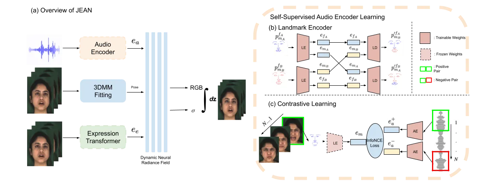

Figure 2: (a) illustrates an overview of JEAN\xspace, a novel method for
joint expression and audio-guided NeRF-based talking face generation.
(b) and (c) illustrate our proposed self-supervised learning of our
audio representation. Specifically, (b) demonstrates the self-supervised
learning of our landmark autoencoder that disentangles lip motion from
the motion of the rest of the face. Then, in (c), our audio encoder
$`AE`$ is trained using a contrastive learning regime, in order to align
audio features to lip motion.

We present JEAN\xspace, a novel method for joint expression and
audio-guided NeRF-based talking face generation. Fig. 2(a) illustrates
an overview of our proposed approach. Given monocular RGB videos of an
identity, we learn a NeRF that represents the identity’s 4D face
geometry and appearance in various expressions and lip positions. We
assume three inputs, namely an audio source, the identity’s head pose,
and an expression source. During training, these inputs come from the
same identity. During inference, we can use audio, pose, and expression
sources from different videos. Our proposed pipeline consists of three
main components: (1) We first learn an audio encoder in a
self-supervised manner to align audio features to lip motion features
(see Sec. 3.1). (2) We learn an expression transformer to disentangle
expression features from lip motion (see Sec. 3.2). (3) Finally, we
learn a dynamic NeRF conditioned on our learned representations for both
audio and expression (see Sec. 3.3).

### 3.1 Self-Supervised Audio Encoder

In order to learn a powerful audio representation and achieve a high
lip-sync accuracy, we propose a self-supervised contrastive learning
method that aligns audio features to lip motion features. Inspired by
Yao et al. \[Yao et al.(2022)Yao, Zhong, Yan, Zhai, and Yang\], we first
extract lip motion features through a landmark autoencoder. Next, we
train our audio encoder using a contrastive learning strategy.

Landmark Autoencoder. We propose a landmark autoencoder that learns to
disentangle mouth and eye-nose movements based on 2D landmarks, as
illustrated in Fig. 2(b). For a frame $`A`$ of an identity, we extract
face landmarks $`\textbf{p}^{f_{A}}_{m_{A}}`$, with superscript
$`f_{A}`$ indicating that the eye-nose landmarks are from frame $`A`$
and subscript $`m_{A}`$ indicating that mouth landmarks are from frame
$`A`$. Similarly, for a frame $`B`$, we extract face landmarks
$`\textbf{p}^{f_{B}}_{m_{B}}`$. A landmark encoder (LE) embeds the input
landmarks of each frame into a eye-nose embedding $`\textbf{e}_{f}`$ and
a mouth embedding $`\textbf{e}_{m}`$,
_i.e_$`\textbf{e}_{f_{A}},\textbf{e}_{m_{A}}=\text{{LE}}(\textbf{p}^{f_{A}}_{m_{A}})`$
and
$`\textbf{e}_{f_{B}},\textbf{e}_{m_{B}}=\text{{LE}}(\textbf{p}^{f_{B}}_{m_{B}})`$.
The mouth embeddings $`\textbf{e}_{m_{A}}`$ and $`\textbf{e}_{m_{B}}`$
of the two frames $`A`$ and $`B`$ correspondingly are swapped with a
probability $`\epsilon`$, and passed to a landmark decoder (LD) to
predict the corresponding landmarks
$`\textbf{p}^{\prime f_{A}}_{m_{B}}=\text{{LD}}(\textbf{e}_{f_{A}},\textbf{e}_{m_{B}})`$
and
$`\textbf{p}^{\prime f_{B}}_{m_{A}}=\text{{LD}}(\textbf{e}_{f_{B}},\textbf{e}_{m_{A}})`$.
We get the ground truth $`\textbf{p}^{f_{A}}_{m_{B}}`$ by replacing the
mouth landmarks of the frame $`A`$ with the corresponding mouth
landmarks of the frame $`B`$. The autoencoder is trained using an L1
reconstruction loss:

```math
\mathcal{L}_{{rec}_{lmd}}=\mathbf{E}\left[||\textbf{p}^{\prime f_{A}}_{m_{B}}-\textbf{p}^{f_{A}}_{m_{B}}||_{1}+||\textbf{p}^{\prime f_{B}}_{m_{A}}-\textbf{p}^{f_{B}}_{m_{A}}||_{1}\right]. \tag{1}
```

Using this training regime, the landmark encoder LE learns to represent
the lip movements in its latent space, disentangling them from any other
face motion. In our implementation, we extracted 68 face landmarks for
each video frame. We discarded the first 17 landmarks that correspond to
the face contour, in order to pay attention to the eye-nose and mouth
movements. The probability $`\epsilon`$ is set to $`0.8`$. The frames
$`A`$ and $`B`$ are randomly sampled from the same video of an identity
(see also suppl.).

Contrastive Learning. In order to learn audio embeddings aligned to the
extracted mouth embeddings $`\textbf{e}_{m}`$, we propose a constrastive
training strategy, as illustrated in Fig. 2(c). We learn a CNN-based
audio encoder AE that takes DeepSpeech \[Hannun et al.(2014)Hannun,
Case, Casper, Catanzaro, Diamos, Elsen, Prenger, Satheesh, Sengupta,
Coates, and Ng\] features a as input and outputs audio embeddings
$`\textbf{e}_{a}`$, _i.e_$`\textbf{e}_{a}=\text{{AE}}(\textbf{a})`$. For
a mouth embedding $`\textbf{e}_{m}`$, we set the corresponding audio
feature $`\textbf{e}^{+}_{a}`$ as the positive key and a randomly picked
audio feature $`\textbf{e}^{-}_{a}`$ as the negative key. We train our
audio encoder, using an InfoNCE \[van den Oord et al.(2019)van den Oord,
Li, and Vinyals\] loss, to ensure that the distance between the positive
pair $`(\textbf{e}^{+}_{a},\textbf{e}_{m})`$ is smaller than the
negative one $`(\textbf{e}^{-}_{a},\textbf{e}_{m})`$:

```math
\mathcal{L}_{\text{InfoNCE}}=-\underset{x\in\mathcal{X}}{\mathbf{E}}\left[\log{\frac{\exp(d(\textbf{e}^{+}_{a_{x}},\textbf{e}_{m_{x}}))}{\exp(d(\textbf{e}^{+}_{a_{x}},\textbf{e}_{m_{x}}))+\exp(d(\textbf{e}^{-}_{a_{x}},\textbf{e}_{m_{x}}))}}\right], \tag{2}
```

where $`\mathcal{X}`$ is the set of all
$`(\textbf{e}^{+}_{a},\textbf{e}_{m},\textbf{e}^{-}_{a})`$ tuples and
$`d(\textbf{x},\textbf{y})=\frac{\langle\textbf{x},\textbf{y}\rangle}{\tau||\textbf{x}||_{2}||\textbf{y}||_{2}}`$
is the temperature-adjusted cosine distance. During training, the
negative audio samples are randomly selected from the same identity but
different video. The temperature $`\tau`$ is set to $`0.1`$. We use
64-dimensional features for $`\textbf{e}_{a}`$, $`\textbf{e}_{f}`$, and
$`\textbf{e}_{m}`$. See suppl. for more details.

### 3.2 Expression Transformer

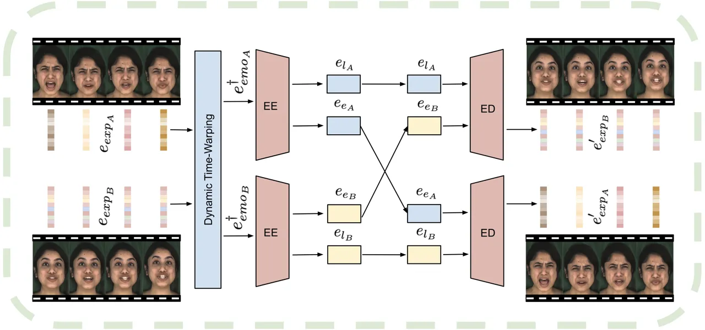

Figure 3: Expression Transformer. We propose an expression transformer
encoder that learns to disentangle facial expressions from
speech-specific lip motion. We extract emotion features and disentangle
them into expression content and speech-specific lip motion content.

We propose to learn an expression transformer that captures long-range
facial expressions, disentangling them from the speech-specific lip
motion (see Fig. 3). First, we extract emotion features $`e_{emo}`$ per
video frame, using a pre-trained network for emotion
recognition \[Danecek et al.(2022)Danecek, Black, and Bolkart\]. We then
learn an expression encoder that disentangles the emotion features into
expression content and speech-specific content. The idea is that when a
person is speaking, the face movements will have some aspects that are
emotion-specific (e.g. cheeks pulled up, flush face, raised eyebrows,
etc.) and some speech-specific (e.g. mouth motion for consonant ‘b’).
Given that we have video pairs of a person saying the same utterance in
different emotions, it is possible to capture the facial expressions and
successfully disentangle them from the speech-specific motion. More
specifically, for an utterance spoken with two different emotions $`A`$
and $`B`$, we extract emotion features
$`\textbf{e}_{{emo}_{A}[1:m_{1}]}`$ and
$`\textbf{e}_{{emo}_{B}[1:m_{2}]}`$. We align these sequences, using the
dynamic time warping (DTW) algorithm \[Bellman and Kalaba(1959)\]:

```math
\textbf{e}^{{\dagger}}_{{emo}_{A}[1:N]},\textbf{e}^{{\dagger}}_{{emo}_{B}[1:N]}=DTW(\textbf{e}_{{emo}_{A}[1:m_{1}]},\textbf{e}_{{emo}_{B}[1:m_{2}]}), \tag{3}
```

where $`m_{1}`$ and $`m_{2}`$ are the initial lengths and $`N`$ is the
output length of DTW. These are then given as input to the expression
transformer encoder (EE) in windows of size $`\omega`$. EE outputs
expression features $`\textbf{e}_{e}`$ and speech-specific lip motion
features $`\textbf{e}_{l}`$,
_i.e_$`\textbf{e}_{l}[t:\omega+t-1],\textbf{e}_{e}[t:\omega+t-1]=\text{{EE}}(\textbf{e}^{{\dagger}}_{{emo}[t:\omega+t-1]})`$
where $`t\in\mathbb{N}_{1:N}`$. The expression features are randomly
swapped with a probability $`\delta`$. The output features
$`\textbf{e}_{e}`$ and $`\textbf{e}_{l}`$ are input to the expression
decoder (ED). ED follows an auto-regressive architecture to reconstruct
the emotion features,
_i.e_$`\textbf{e}^{\prime}_{{emo}[t:\omega+t-1]}=\text{{ED}}(\textbf{e}_{l}[t:\omega+t-1],\textbf{e}_{e}[t:\omega+t-1])`$.
The expression transformer is trained using an L1 reconstruction loss:

```math
\mathcal{L}_{{rec}_{emo}}=\mathbf{E}\left[||\textbf{e}^{\prime}_{{emo}_{A}}-\textbf{e}^{{\dagger}}_{{emo}_{A}}||_{1}+||\textbf{e}^{\prime}_{{emo}_{B}}-\textbf{e}^{{\dagger}}_{{emo}_{B}}||_{1}\right]. \tag{4}
```

During inference, DTW is skipped and the emotion features are directly
input to $`EE`$. Our expression encoder is identity-specific, capturing
each person’s unique way of speaking with a particular emotion. In our
experiments, we set $`\omega=8`$ and $`\delta=0.8`$. $`EE`$ and $`ED`$
have $`3`$ layers and $`8`$ attention heads each. The emotion features
$`e_{emo}`$ are of $`2048`$ dimension and mapped to $`128`$ via 2 linear
layers. The output of $`EE`$ is split in half resulting in
$`64`$-dimensional $`\textbf{e}_{l}`$, $`\textbf{e}_{e}`$.

### 3.3 Dynamic NeRF

Our learned audio features $`\textbf{e}_{a}`$ and expression features
$`\textbf{e}_{e}`$ are concatenated to an embedding $`\textbf{e}_{in}`$,
conditioning our dynamic NeRF that models the 4D face dynamics of a
subject. For each video frame, we fit a 3DMM \[Paysan
et al.(2009)Paysan, Knothe, Amberg, Romdhani, and Vetter, Cao
et al.(2013)Cao, Weng, Zhou, Tong, and Zhou\] and extract the head pose
and camera parameters, in order to estimate the viewing direction d. The
learned feature $`\textbf{e}_{in}`$, the viewing direction d and a 3D
point location x in canonical space are input to the implicit function
$`F_{\Theta}`$ (MLP), which predicts the corresponding RGB color c and
density $`\sigma`$:

```math
F_{\Theta}:(\textbf{e}_{in},\textbf{d},\textbf{x})\longrightarrow(\textbf{c},\sigma) \tag{5}
```

Given the color c and density $`\sigma`$ at each sampled point of every
ray, we can reconstruct each video frame using volumetric rendering. For
each camera ray $`\textbf{r}(t)=\textbf{o}+t\textbf{d}`$, where o is the
camera center, the color $`C`$ is estimated by accumulating the RGB
colors and densities of the points sampled along the ray:
$`C(\textbf{r};\Theta)=\int^{t_{f}}_{t_{n}}\sigma_{\Theta}(\textbf{r}(t))\textbf{c}_{\Theta}(\textbf{r}(t),\textbf{d})T(t)dt`$ \[Mildenhall
et al.(2020)Mildenhall, Srinivasan, Tancik, Barron, Ramamoorthi, and
Ng\], where
$`T(s)=\exp(-\int^{t}_{t_{n}}\sigma_{\Theta}(\textbf{r}(s)))ds`$ is the
accumulated transmittance from $`t_{n}`$ to $`t`$, and $`t_{f}`$ and
$`t_{n}`$ are the far and near bounds respectively. We denote the
outputs of $`F_{\Theta}`$ as $`\textbf{c}_{\Theta}`$ and
$`\sigma_{\Theta}`$ for brevity. Similar to \[Mildenhall
et al.(2020)Mildenhall, Srinivasan, Tancik, Barron, Ramamoorthi, and
Ng\], we learn a coarse and a fine model for hierarchical volumetric
rendering. We optimize our NeRF using a photo-consistency loss:

```math
\mathcal{L}_{photo}=\sum_{\textbf{r}\in\mathcal{R}}||\hat{C}(\textbf{r};\Theta)-C(\textbf{r};\Theta)||^{2}_{2}, \tag{6}
```

which measures the mean squared error between the ground truth color
$`C(\textbf{r};\Theta)`$ and the predicted color
$`\hat{C}(\textbf{r};\Theta)`$, and $`\mathcal{R}`$ is the set of all
the rays in each batch (see also suppl.).

## 4 Experiments

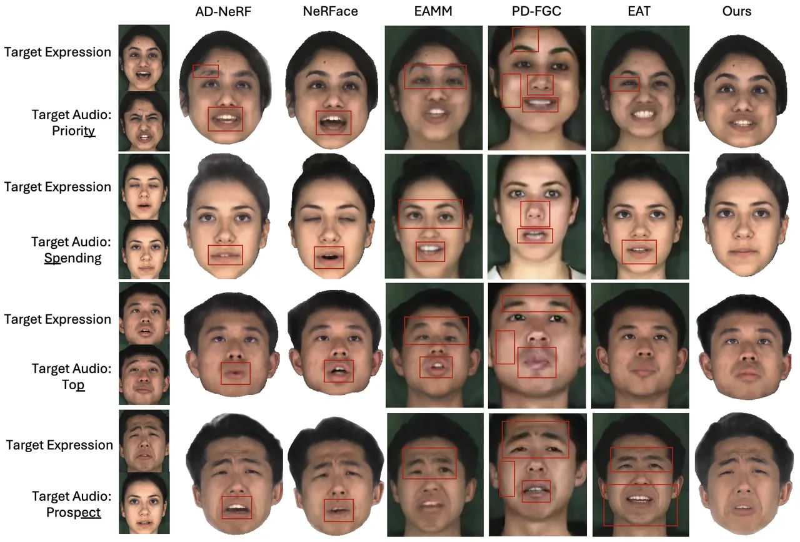

Figure 4: Talking face generation guided by target expression and audio
sources (1st column). We compare with state-of-the-art methods for
expression and audio-driven talking face generation (EAMM \[Ji
et al.(2022)Ji, Zhou, Wang, Wu, Wu, Xu, and Cao\], PD-FGC \[Wang
et al.(2023a)Wang, Deng, Yin, Shum, and Wang\]), categorical emotion
based talking face generation (EAT \[Gan et al.(2023)Gan, Yang, Yue,
Sun, and Yang\]), as well as the audio-only AD-NeRF \[Guo
et al.(2021)Guo, Chen, Liang, Liu, Bao, and Zhang\], and expression-only
NeRFace \[Gafni et al.(2021)Gafni, Thies, Zollhöfer, and Nießner\]. Our
method outperforms all these methods, transferring the expression and
audio inputs with higher fidelity, while preserving the target identity.

Dataset. In our experiments, we use the MEAD dataset \[Wang
et al.(2020)Wang, Wu, Song, Yang, Wu, Qian, He, Qiao, and Loy\]. MEAD
includes 48 identities, performing 7 emotions at 3 intensity levels and
1 neutral emotion. The videos are captured by 7 cameras at different
viewpoints. Each emotion level contains $`\approx 30-40`$ videos
corresponding to an utterance sampled from a superset of sentences. To
train our audio encoder (see Sec. 3.1), we use the complete set of
frontal-view videos. For the expression transformer (see Sec. 3.2), we
need video pairs, where a person pronounces the same utterance with
different emotions. We use the highest level (level 3) of the emotions
“angry”, “happy” and “sad”, and the single level of “neutral”, leading
to a total of 84 unique pairs of sentences being spoken in 2 emotions.
Of those, 60 pairs of videos are used for training, and 24 for
validation. Since each person’s expressions are unique, we train an
expression transformer for each identity. To train our dynamic NeRF, we
focus on 4 identities from MEAD, training the network for each identity.
Since the videos in MEAD are only 4-8 seconds long, we concatenate
videos of the same emotion for each identity. Not all the videos of the
same emotion for an identity were captured in the same head pose, so we
filter videos based on the estimated focal length and the pose
distribution after fitting a 3DMM. After concatenation, we get videos of
at least 12 seconds per emotion. See suppl. for more details.

### 4.1 Results

| Method                                                             | LSE-C $`\uparrow`$ | ACD $`\downarrow`$ | Exp-Diff $`\downarrow`$ | PSNR $`\uparrow`$ | SSIM $`\uparrow`$ | LPIPS $`\downarrow`$ |
| ------------------------------------------------------------------ | ------------------ | ------------------ | ----------------------- | ----------------- | ----------------- | -------------------- |
| AD-NeRF \[Guo et al.(2021)Guo, Chen, Liang, Liu, Bao, and Zhang\]  | 4.380              | 0.141              | 0.080                   | 20.467            | 0.698             | 0.187                |
| NeRFace \[Gafni et al.(2021)Gafni, Thies, Zollhöfer, and Nießner\] | 1.966              | 0.103              | 0.023                   | 21.335            | 0.736             | 0.175                |
| EAMM \[Ji et al.(2022)Ji, Zhou, Wang, Wu, Wu, Xu, and Cao\]        | 1.771              | 0.284              | 0.111                   | 18.474            | 0.592             | 0.248                |
| PD-FGC \[Wang et al.(2023a)Wang, Deng, Yin, Shum, and Wang\]       | 6.220              | 0.657              | 0.089                   | 21.094            | 0.648             | 0.228                |
| EAT \[Gan et al.(2023)Gan, Yang, Yue, Sun, and Yang\]              | 7.200              | 0.183              | 0.078                   | 19.222            | 0.691             | 0.205                |
| Ours                                                               | 4.466              | 0.095              | 0.043                   | 21.224            | 0.720             | 0.174                |

Table 1: Quantitative comparison of our method with the
state-of-the-art. Results are highlighted as follows: Best, Second Best
and Third Best.

In this section, we compare our proposed method with the
state-of-the-art. We include comparisons with AD-NeRF \[Guo
et al.(2021)Guo, Chen, Liang, Liu, Bao, and Zhang\] that takes only
audio as input and NeRFace \[Gafni et al.(2021)Gafni, Thies, Zollhöfer,
and Nießner\] that takes only 3DMM expression parameters as input, in
order to illustrate our method’s performance against NeRF-based methods
with just one of the inputs, audio or expression. Then, we compare with
EAMM \[Ji et al.(2022)Ji, Zhou, Wang, Wu, Wu, Xu, and Cao\],
PD-FGC \[Wang et al.(2023a)Wang, Deng, Yin, Shum, and Wang\], and
EAT \[Gan et al.(2023)Gan, Yang, Yue, Sun, and Yang\] that are
identity-generic methods for emotion-aware talking face video
generation, trained on large datasets. Note that while EAMM and PD-FGC
use a video source for expressions, EAT only takes an emotion label as
input to produce expressions. Our method achieves the best
disentanglement between expression and audio sources, producing
high-quality expressive talking faces.

#### 4.1.1 Qualitative Evaluation

Fig. 4 shows our qualitative results. Notice how our method produces
accurate lip shapes that follow the target audio (*e.g*phoneme “t” in
row 2), while also synthesizing the input expression (*e.g*sad) with
higher fidelity than the other methods. EAMM generally distorts the
input face, adds asymmetrical artifacts, and is unable to produce
accurate mouth shapes in all rows. While PD-FGC performs better than
EAMM in terms of lip-shape accuracy, it still distorts the input
identity and produces artifacts. For example, we observe glossy faces,
color distortions and lip artifacts in all rows, a plain white band in
place of teeth in rows 1 and 2, and loss of identity-specific
characteristics, such as the mole on the face of the woman in row 1. EAT
performs best among the other methods, creating accurate lip shapes,
synced to the input audio, while also being faithful to the source
emotions. However, EAT still struggles with preserving the input
identity. For example, it generates artifacts in the eye region and
eyebrows in rows 1 and 4 respectively, and wide jaws and crossed eyes in
row 4. In general, we observe identity inconsistency problems in all
EAMM, PD-FGC, and EAT. In contrast, the NeRF-based methods,
*i.e*AD-NeRF, NeRFace, and our method, learn to preserve the input
identity. Our method demonstrates high-quality results, transferring the
source facial expression and following the source audio with higher
fidelity.

#### 4.1.2 Quantitative Evaluation

Evaluation Metrics. We conduct quantitative evaluation on common metrics
used in the talking face generation field. We use LSE-C \[Prajwal
et al.(2020)Prajwal, Mukhopadhyay, Namboodiri, and Jawahar\] to measure
the lip synchronization of our method, and Peak Signal-to-Noise Ratio
(PSNR), Structural Similarity (SSIM) \[Wang et al.(2004)Wang, Bovik,
Sheikh, and Simoncelli\] and Learned Perceptual Image Patch Similarity
(LPIPS) \[Zhang et al.(2018)Zhang, Isola, Efros, Shechtman, and Wang\]
to measure the image quality against the expression source images. We
also estimate the expression transfer accuracy (Exp-Diff) \[Wang
et al.(2023a)Wang, Deng, Yin, Shum, and Wang\] by using 3D face
reconstruction \[Deng et al.(2019b)Deng, Yang, Xu, Chen, Jia, and Tong\]
and calculating the Mean Squared Error (MSE) of the extracted expression
parameters in the synthesized images with those of the driving
expression images. Further, we estimate the identity preservation using
the Average Content Distance (ACD) metric, inspired by \[Vougioukas
et al.(2019)Vougioukas, Petridis, and Pantic\], by calculating the
cosine distance between ArcFace \[Deng et al.(2019a)Deng, Guo, Xue, and
Zafeiriou\] face recognition embeddings of synthesized images and
driving expression images. Essentially, the idea is that the smaller the
distance between those embeddings, the closer are the synthesized images
to the driving images in terms of identity.

We show the corresponding quantitative results in Table 1. Since
Exp-Diff and the visual quality metrics are computed against expression
source frames, we find that the expression-only NeRFace performs best on
those metrics. Our method significantly outperforms the state-of-the-art
in emotion-aware talking face generation (EAMM, PD-FGC, EAT) in terms of
visual quality (PSNR, SSIM, LPIPS), identity preservation (ACD), and
expression transfer (Exp-Diff). While PD-FGC and EAT do perform better
than our method in terms of lip-syncing, as they are trained on
large-scale video data, our method outperforms the rest of the methods.
We encourage the readers to watch our suppl. video for additional
results demonstrating the efficacy of JEAN\xspace.

#### 4.1.3 Ablation Study

|           |                               |                            |                              |                        |                   |                        |                     |
| --------- | ----------------------------- | -------------------------- | ---------------------------- | ---------------------- | ----------------- | ---------------------- | ------------------- |
| Method    |                               |                            |                              |                        | Metrics           |                        |                     |
| Variant   | Self Supervised Audio Encoder | 3DMM Expression Parameters | Emotion Recognition Features | Expression Transformer | LSE-C$`\uparrow`$ | Exp-Diff$`\downarrow`$ | LPIPS$`\downarrow`$ |
| \(a\)     |                               |                            | $`\checkmark`$               |                        | 1.804             | 0.027                  | 0.170               |
| \(b\)     |                               | $`\checkmark`$             |                              |                        | 1.848             | 0.022                  | 0.161               |
| \(c\)     | $`\checkmark`$                |                            | $`\checkmark`$               |                        | 1.760             | 0.028                  | 0.168               |
| \(d\)     | $`\checkmark`$                | $`\checkmark`$             |                              | $`\checkmark`$         | 2.982             | 0.071                  | 0.190               |
| Full Net. | $`\checkmark`$                |                            | $`\checkmark`$               | $`\checkmark`$         | 4.466             | 0.043                  | 0.174               |

Table 2: Ablation study on our proposed audio and expression
representations. In (a), we train the network without the
self-supervised audio encoder learning and without expression
transformer (we use features from the pre-trained ResNet-based emotion
recognition network from \[Danecek et al.(2022)Danecek, Black, and
Bolkart\] passed through a thin MLP). In (b), we again omit the
self-supervised audio encoder learning and use 3DMM expression
parameters. In (c), we add the self-supervised audio encoder learning,
but we use expression features as in (a). In (d), we train our
expression transformer on 3DMM expression parameters. Best results are
highlighted in bold.

Expression Disentanglement. Table 2 shows different variants of our
method, demonstrating the efficacy of our self-supervised learning of
our audio representation, as well as the disentanglement of our
expression representation. More specifically, in variant (a), we omit
the self-supervised audio encoder learning and the expression
transformer (we directly use features from a pre-trained ResNet-based
emotion recognition network from \[Danecek et al.(2022)Danecek, Black,
and Bolkart\] mapped through a thin MLP, and the audio encoder is
trained along with the NeRF). In variant (b), we use 3DMM \[Paysan
et al.(2009)Paysan, Knothe, Amberg, Romdhani, and Vetter\] expression
parameters and skip the self-supervised audio encoder. In variant (c),
we add the self-supervised audio encoder learning, but we use expression
features as in (a). Finally, in variant (d), we learn the expression
features, using 3DMM expression parameters as input to our transformer.
We see that not disentangling the emotion recognition features in (a)
and (c), and the expression parameters from \[Paysan et al.(2009)Paysan,
Knothe, Amberg, Romdhani, and Vetter, Cao et al.(2013)Cao, Weng, Zhou,
Tong, and Zhou\] in (b), cause the NeRF network to only learn
expressions from the expression source and ignore the audio source. This
leads to a significant decrease in lip-sync metrics on unseen audio and
best performance in terms of Exp-Diff and LPIPS. Further, trying to
disentangle 3DMM expression parameters in (d) fails to learn meaningful
features which leads to poor lip-sync metrics on unseen audio and the
worst performance in terms of Exp-Diff and LPIPS. Our proposed
expression transformer leads to a successful disentanglement between
expression and speech-specific lip motion. Note that Exp-Diff is
computed against the driving expression images, which implies that if
the network has overfitted to the driving expression the corresponding
Exp-Diff would also be lower. Disentangling expressions from lip motion
leads to a balanced performance between expression and lip-sync
accuracy.

Interpreting Learnt Features.

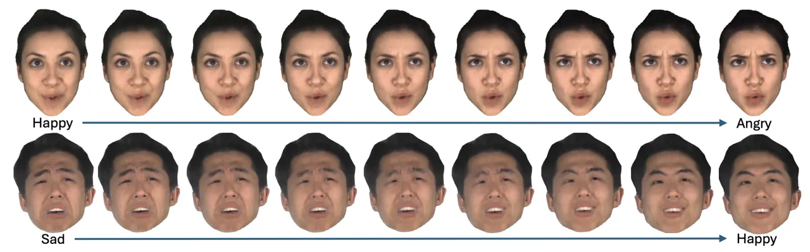

Figure 5: Additional analysis that shows that the expression encoder
disentangles features that are semantically grounded and well-behaved.
Interpolation of features between different emotional expressions leads
to semantically meaningful expressions.

In Fig. 5, we conduct further analysis to investigate the proposed
expression disentanglement and the nature of the learned expression
features. The interpolation result between two expression features,
learned by our expression transformer, shows that our method learns
semantically grounded features. In the suppl. material, we show
additional interpolation results and show t-SNE plots of the learned
expression features, indicating that they are semantically meaningful.

## 5 Conclusion

In conclusion, we introduce a novel method for joint expression and
audio-guided talking face generation. Prior work either struggles to
preserve the speaker identity or fails to synthesize faithful facial
expressions. We propose a self-supervised method to extract audio
features, aligned to lip motion, achieving accurate lip synchronization
to unseen audio. In addition, we design a transformer-based module to
learn expression features, disentangled from speech-specific mouth
motion. By conditioning on the learned representations, our dynamic NeRF
synthesizes high-fidelity talking face videos, providing simultaneous
control of facial expressions and lip movements, and outperforming the
current state-of-the-art. We argue that our proposed representations can
be easily extended to other neural rendering pipelines, such as Gaussian
Splatting \[Kerbl et al.(2023)Kerbl, Kopanas, Leimkühler, and
Drettakis\], that we plan to explore as future work.

Acknowledgements. This work was supported in part by Amazon Prime Video
and a grant from the CDC/NIOSH (U01 OH012476).

## References

- \[Ahuja et al.(2020)Ahuja, Lee, Nakano, and Morency\] Chaitanya Ahuja,
  Dong Won Lee, Yukiko I. Nakano, and Louis-Philippe Morency. Style
  transfer for co-speech gesture animation: A multi-speaker
  conditional-mixture approach. In _Eur. Conf. Comput. Vis._, 2020.
- \[Amodei et al.(2016)Amodei, Ananthanarayanan, Anubhai, Bai,
  Battenberg, Case, Casper, Catanzaro, Cheng, Chen, Chen, Chen, Chen,
  Chrzanowski, Coates, Diamos, Ding, Du, Elsen, Engel, Fang, Fan,
  Fougner, Gao, Gong, Hannun, Han, Johannes, Jiang, Ju, Jun, LeGresley,
  Lin, Liu, Liu, Li, Li, Ma, Narang, Ng, Ozair, Peng, Prenger, Qian,
  Quan, Raiman, Rao, Satheesh, Seetapun, Sengupta, Srinet, Sriram, Tang,
  Tang, Wang, Wang, Wang, Wang, Wang, Wang, Wu, Wei, Xiao, Xie, Xie,
  Yogatama, Yuan, Zhan, and Zhu\] Dario Amodei, Sundaram
  Ananthanarayanan, Rishita Anubhai, Jingliang Bai, Eric Battenberg,
  Carl Case, Jared Casper, Bryan Catanzaro, Qiang Cheng, Guoliang Chen,
  Jie Chen, Jingdong Chen, Zhijie Chen, Mike Chrzanowski, Adam Coates,
  Greg Diamos, Ke Ding, Niandong Du, Erich Elsen, Jesse Engel, Weiwei
  Fang, Linxi Fan, Christopher Fougner, Liang Gao, Caixia Gong, Awni
  Hannun, Tony Han, Lappi Vaino Johannes, Bing Jiang, Cai Ju, Billy Jun,
  Patrick LeGresley, Libby Lin, Junjie Liu, Yang Liu, Weigao Li,
  Xiangang Li, Dongpeng Ma, Sharan Narang, Andrew Ng, Sherjil Ozair,
  Yiping Peng, Ryan Prenger, Sheng Qian, Zongfeng Quan, Jonathan Raiman,
  Vinay Rao, Sanjeev Satheesh, David Seetapun, Shubho Sengupta, Kavya
  Srinet, Anuroop Sriram, Haiyuan Tang, Liliang Tang, Chong Wang, Jidong
  Wang, Kaifu Wang, Yi Wang, Zhijian Wang, Zhiqian Wang, Shuang Wu,
  Likai Wei, Bo Xiao, Wen Xie, Yan Xie, Dani Yogatama, Bin Yuan, Jun
  Zhan, and Zhenyao Zhu. Deep speech 2: end-to-end speech recognition in
  english and mandarin. In _Int. Conf. Mach. Learn._, 2016.
- \[Athar et al.(2019)Athar, Shu, and Samaras\] ShahRukh Athar, Zhixin
  Shu, and Dimitris Samaras. Self-supervised deformation modeling for
  facial expression editing. In _IEEE Conf. Face Gest. Recog.
  (FG)_, 2019.
- \[Athar et al.(2020)Athar, Pumarola, Moreno-Noguer, and Samaras\]
  ShahRukh Athar, Albert Pumarola, Francesc Moreno-Noguer, and Dimitris
  Samaras. Facedet3d: Facial expressions with 3d geometric detail
  prediction. _ArXiv_, abs/2012.07999, 2020.
- \[Athar et al.(2022)Athar, Xu, Sunkavalli, Shechtman, and Shu\]
  ShahRukh Athar, Zexiang Xu, Kalyan Sunkavalli, Eli Shechtman, and
  Zhixin Shu. Rignerf: Fully controllable neural 3d portraits. In _IEEE
  Conf. Comput. Vis. Pattern Recog._, 2022.
- \[Athar et al.(2023)Athar, Shu, and Samaras\] ShahRukh Athar, Zhixin
  Shu, and Dimitris Samaras. Flame-in-nerf: Neural control of radiance
  fields for free view face animation. In _IEEE Conf. Face Gest. Recog.
  (FG)_, 2023.
- \[Barron et al.(2021)Barron, Mildenhall, Tancik, Hedman,
  Martin-Brualla, and Srinivasan\] Jonathan T Barron, Ben Mildenhall,
  Matthew Tancik, Peter Hedman, Ricardo Martin-Brualla, and Pratul P
  Srinivasan. Mip-nerf: A multiscale representation for anti-aliasing
  neural radiance fields. In _Int. Conf. Comput. Vis._, 2021.
- \[Barron et al.(2022)Barron, Mildenhall, Verbin, Srinivasan, and
  Hedman\] Jonathan T Barron, Ben Mildenhall, Dor Verbin, Pratul P
  Srinivasan, and Peter Hedman. Mip-nerf 360: Unbounded anti-aliased
  neural radiance fields. In _IEEE Conf. Comput. Vis. Pattern
  Recog._, 2022.
- \[Bellman and Kalaba(1959)\] R. Bellman and R. Kalaba. On adaptive
  control processes. _IRE Transactions on Automatic Control_,
  4(2):1–9, 1959.
- \[Cai et al.(2023)Cai, Ghosh, Stefanov, Dhall, Cai, Rezatofighi,
  Haffari, and Hayat\] Zhixi Cai, Shreya Ghosh, Kalin Stefanov, Abhinav
  Dhall, Jianfei Cai, Hamid Rezatofighi, Reza Haffari, and Munawar
  Hayat. Marlin: Masked autoencoder for facial video representation
  learning. In _IEEE Conf. Comput. Vis. Pattern Recog._, 2023.
- \[Cao et al.(2013)Cao, Weng, Zhou, Tong, and Zhou\] Chen Cao, Yanlin
  Weng, Shun Zhou, Yiying Tong, and Kun Zhou. Facewarehouse: A 3d facial
  expression database for visual computing. _IEEE Trans. Vis. Comput.
  Graph._, 20(3):413–425, 2013.
- \[Chatziagapi et al.(2023)Chatziagapi, Athar, Jain, MV, Bhat, and
  Samaras\] Aggelina Chatziagapi, ShahRukh Athar, Abhinav Jain, Rohith
  MV, Vimal Bhat, and Dimitris Samaras. Lipnerf: What is the right
  feature space to lip-sync a nerf? In _IEEE Conf. Face Gest. Recog.
  (FG)_, 2023.
- \[Chen et al.(2019)Chen, Maddox, Duan, and Xu\] Lele Chen, Ross K.
  Maddox, Zhiyao Duan, and Chenliang Xu. Hierarchical cross-modal
  talking face generation with dynamic pixel-wise loss. In _IEEE Conf.
  Comput. Vis. Pattern Recog._, 2019.
- \[Chen et al.(2018)Chen, Li, Grosse, and Duvenaud\] Ricky TQ Chen,
  Xuechen Li, Roger B Grosse, and David K Duvenaud. Isolating sources of
  disentanglement in variational autoencoders. In _Adv. Neural Inform.
  Process. Syst._, 2018.
- \[Chen et al.(2016)Chen, Duan, Houthooft, Schulman, Sutskever, and
  Abbeel\] Xi Chen, Yan Duan, Rein Houthooft, John Schulman, Ilya
  Sutskever, and Pieter Abbeel. Infogan: Interpretable representation
  learning by information maximizing generative adversarial nets. In
  _Adv. Neural Inform. Process. Syst._, 2016.
- \[Chung et al.(2017)Chung, Jamaludin, Zisserman, et al.\] JS Chung,
  A Jamaludin, A Zisserman, et al. You said that? In _Brit. Mach. Vis.
  Conf._, 2017.
- \[Danecek et al.(2022)Danecek, Black, and Bolkart\] Radek Danecek,
  Michael J. Black, and Timo Bolkart. EMOCA: Emotion driven monocular
  face capture and animation. In _IEEE Conf. Comput. Vis. Pattern
  Recog._, 2022.
- \[Deng et al.(2019a)Deng, Guo, Xue, and Zafeiriou\] Jiankang Deng, Jia
  Guo, Niannan Xue, and Stefanos Zafeiriou. Arcface: Additive angular
  margin loss for deep face recognition. In _IEEE Conf. Comput. Vis.
  Pattern Recog._, 2019a.
- \[Deng et al.(2019b)Deng, Yang, Xu, Chen, Jia, and Tong\] Yu Deng,
  Jiaolong Yang, Sicheng Xu, Dong Chen, Yunde Jia, and Xin Tong.
  Accurate 3d face reconstruction with weakly-supervised learning: From
  single image to image set. In _IEEE Conf. Comput. Vis. Pattern Recog.
  Worksh._, 2019b.
- \[Deng et al.(2020)Deng, Yang, Chen, Wen, and Tong\] Yu Deng, Jiaolong
  Yang, Dong Chen, Fang Wen, and Xin Tong. Disentangled and controllable
  face image generation via 3d imitative-contrastive learning. In _IEEE
  Conf. Comput. Vis. Pattern Recog._, 2020.
- \[Ding et al.(2020)Ding, Xu, Xu, Parmar, Yang, Welling, and Tu\] Zheng
  Ding, Yifan Xu, Weijian Xu, Gaurav Parmar, Yang Yang, Max Welling, and
  Zhuowen Tu. Guided variational autoencoder for disentanglement
  learning. In _IEEE Conf. Comput. Vis. Pattern Recog._, 2020.
- \[Doukas et al.(2020)Doukas, Koujan, Sharmanska, Roussos, and
  Zafeiriou\] Michail Christos Doukas, Mohammad Rami Koujan, Viktoriia
  Sharmanska, Anastasios Roussos, and Stefanos Zafeiriou. Head2head++:
  Deep facial attributes re-targeting. _IEEE Trans. Bio., Beh., Id.
  Sci._, 3:31–43, 2020.
- \[Ekman and Friesen(1978)\] Paul Ekman and Wallace V. Friesen. Facial
  action coding system: a technique for the measurement of facial
  movement. _Environmental Psychology and Nonverbal Behavior._, 1978.
- \[Ekman and Rosenberg(2005)\] Paul Ekman and Erika L. Rosenberg. _What
  the Face Reveals: Basic and Applied Studies of Spontaneous Expression
  Using the Facial Action Coding System (FACS)_. Oxford University
  Press, 04 2005.
- \[Fedus et al.(2018)Fedus, Goodfellow, and Dai\] William Fedus, Ian
  Goodfellow, and Andrew M. Dai. MaskGAN: Better text generation via
  filling in the \_\_\_\_\_\_\_. In _Int. Conf. Learn.
  Represent._, 2018.
- \[Fu et al.(2005)Fu, Gutierrez-Osuna, Esposito, Kakumanu, and Garcia\]
  Shengli Fu, R. Gutierrez-Osuna, A. Esposito, P.K. Kakumanu, and O.N.
  Garcia. Audio/visual mapping with cross-modal hidden markov models.
  _IEEE Trans. Multimedia_, 7(2):243–252, 2005.
- \[Gafni et al.(2021)Gafni, Thies, Zollhöfer, and Nießner\] Guy Gafni,
  Justus Thies, Michael Zollhöfer, and Matthias Nießner. Dynamic neural
  radiance fields for monocular 4d facial avatar reconstruction. In
  _IEEE Conf. Comput. Vis. Pattern Recog._, 2021.
- \[Gan et al.(2023)Gan, Yang, Yue, Sun, and Yang\] Yuan Gan, Zongxin
  Yang, Xihang Yue, Lingyun Sun, and Yi Yang. Efficient emotional
  adaptation for audio-driven talking-head generation. In _Int. Conf.
  Comput. Vis._, 2023.
- \[Gao et al.(2023)Gao, Zhou, Wang, Li, Ming, and Lu\] Yue Gao, Yuan
  Zhou, Jinglu Wang, Xiao Li, Xiang Ming, and Yan Lu. High-fidelity and
  freely controllable talking head video generation. In _IEEE Conf.
  Comput. Vis. Pattern Recog._, 2023.
- \[Ghosh et al.(2020)Ghosh, Gupta, Uziel, Ranjan, Black, and Bolkart\]
  Partha Ghosh, Pravir Singh Gupta, Roy Uziel, Anurag Ranjan, Michael J.
  Black, and Timo Bolkart. Gif: Generative interpretable faces. In _IEEE
  Conf. 3D Vis. (3DV)_, 2020.
- \[Ginosar et al.(2019)Ginosar, Bar, Kohavi, Chan, Owens, and Malik\]
  Shiry Ginosar, Amir Bar, Gefen Kohavi, Caroline Chan, Andrew Owens,
  and Jitendra Malik. Learning individual styles of conversational
  gesture. In _IEEE Conf. Comput. Vis. Pattern Recog._, 2019.
- \[Goyal et al.(2023)Goyal, Bhagat, Uppal, Jangra, Yu, Yin, and Shah\]
  Sahil Goyal, Sarthak Bhagat, Shagun Uppal, Hitkul Jangra, Yi Yu,
  Yifang Yin, and Rajiv Ratn Shah. Emotionally enhanced talking face
  generation. In _Int. Conf. Multimedia Workshop_, 2023.
- \[Guo et al.()Guo, Deng, An, Yu, and Gecer\] Jia Guo, Jiankang Deng,
  Xiang An, Jack Yu, and Baris Gecer. Insightface repository model zoo.
  URL
  [https://github.com/deepinsight/insightface/tree/master/model_zoo](https://github.com/deepinsight/insightface/tree/master/model_zoo).
- \[Guo et al.(2018)Guo, Zhu, and Lei\] Jianzhu Guo, Xiangyu Zhu, and
  Zhen Lei. 3ddfa.
  [https://github.com/cleardusk/3DDFA](https://github.com/cleardusk/3DDFA), 2018.
- \[Guo et al.(2020)Guo, Zhu, Yang, Yang, Lei, and Li\] Jianzhu Guo,
  Xiangyu Zhu, Yang Yang, Fan Yang, Zhen Lei, and Stan Z Li. Towards
  fast, accurate and stable 3d dense face alignment. In _Eur. Conf.
  Comput. Vis._, 2020.
- \[Guo et al.(2021)Guo, Chen, Liang, Liu, Bao, and Zhang\] Yudong Guo,
  Keyu Chen, Sen Liang, Yongjin Liu, Hujun Bao, and Juyong Zhang.
  Ad-nerf: Audio driven neural radiance fields for talking head
  synthesis. In _Int. Conf. Comput. Vis._, 2021.
- \[Hannun et al.(2014)Hannun, Case, Casper, Catanzaro, Diamos, Elsen,
  Prenger, Satheesh, Sengupta, Coates, and Ng\] Awni Hannun, Carl Case,
  Jared Casper, Bryan Catanzaro, Greg Diamos, Erich Elsen, Ryan Prenger,
  Sanjeev Satheesh, Shubho Sengupta, Adam Coates, and Andrew Y. Ng. Deep
  speech: Scaling up end-to-end speech recognition.
  _arXiv:1412.5567_, 2014.
- \[Higgins et al.(2017)Higgins, Matthey, Pal, Burgess, Glorot,
  Botvinick, Mohamed, and Lerchner\] Irina Higgins, Loic Matthey, Arka
  Pal, Christopher P Burgess, Xavier Glorot, Matthew M Botvinick, Shakir
  Mohamed, and Alexander Lerchner. beta-vae: Learning basic visual
  concepts with a constrained variational framework. In _Int. Conf.
  Learn. Represent._, 2017.
- \[Hong et al.(2022)Hong, Zhang, Shen, and Xu\] Fa-Ting Hong, Longhao
  Zhang, Li Shen, and Dan Xu. Depth-aware generative adversarial network
  for talking head video generation. In _IEEE Conf. Comput. Vis. Pattern
  Recog._, 2022.
- \[Hong et al.(2023)Hong, , Shen, and Xu\] Fa-Ting Hong, , Li Shen, and
  Dan Xu. Dagan++: Depth-aware generative adversarial network for
  talking head video generation. _IEEE Trans. Pattern Anal. Mach.
  Intell._, 46(5):2997–3012, 2023.
- \[Jang et al.(2023)Jang, Rho, Woo, Lee, Park, Lim, Kim, and Chung\]
  Youngjoon Jang, Kyeongha Rho, Jongbin Woo, Hyeongkeun Lee, Jihwan
  Park, Youshin Lim, Byeong-Yeol Kim, and Joon Son Chung. That’s what i
  said: Fully-controllable talking face generation. In _ACM Int. Conf.
  Multimedia_, 2023.
- \[Ji et al.(2021)Ji, Zhou, Wang, Wu, Loy, Cao, and Xu\] Xinya Ji, Hang
  Zhou, Kaisiyuan Wang, Wayne Wu, Chen Change Loy, Xun Cao, and Feng Xu.
  Audio-driven emotional video portraits. In _IEEE Conf. Comput. Vis.
  Pattern Recog._, 2021.
- \[Ji et al.(2022)Ji, Zhou, Wang, Wu, Wu, Xu, and Cao\] Xinya Ji, Hang
  Zhou, Kaisiyuan Wang, Qianyi Wu, Wayne Wu, Feng Xu, and Xun Cao. Eamm:
  One-shot emotional talking face via audio-based emotion-aware motion
  model. In _ACM Proc. SIGGRAPH_, 2022.
- \[Kerbl et al.(2023)Kerbl, Kopanas, Leimkühler, and Drettakis\]
  Bernhard Kerbl, Georgios Kopanas, Thomas Leimkühler, and George
  Drettakis. 3d gaussian splatting for real-time radiance field
  rendering. _ACM Trans. Graph._, 42(4), 2023.
- \[Kim et al.(2018)Kim, Garrido, Tewari, Xu, Thies, Nießner, Pérez,
  Richardt, Zollöfer, and Theobalt\] Hyeongwoo Kim, Pablo Garrido, Ayush
  Tewari, Weipeng Xu, Justus Thies, Matthias Nießner, Patrick Pérez,
  Christian Richardt, Michael Zollöfer, and Christian Theobalt. Deep
  video portraits. _ACM Trans. Graph._, 37(4):163, 2018.
- \[Kim and Mnih(2018)\] Hyunjik Kim and Andriy Mnih. Disentangling by
  factorising. In _Int. Conf. Mach. Learn._, 2018.
- \[Kim et al.(2015)Kim, Yue, Taylor, and Matthews\] Taehwan Kim, Yisong
  Yue, Sarah Taylor, and Iain Matthews. A decision tree framework for
  spatiotemporal sequence prediction. In _Proc. ACM SIGKDD Int. Conf.
  Knowledge Disc. Data Mining_, 2015.
- \[Kingma and Ba(2014)\] Diederik P Kingma and Jimmy Ba. Adam: a method
  for stochastic optimization. In _Int. Conf. Learn. Represent._, 2014.
- \[Koujan et al.(2020)Koujan, Doukas, Roussos, and Zafeiriou\]
  Mohammad Rami Koujan, Michail Christos Doukas, Anastasios Roussos, and
  Stefanos Zafeiriou. Head2head: Video-based neural head synthesis. In
  _IEEE Conf. Face Gest. Recog. (FG)_, 2020.
- \[Li et al.(2024)Li, Zhao, Wang, Peng, Zhang, Dong, and Tan\] Dongze
  Li, Kang Zhao, Wei Wang, Bo Peng, Yingya Zhang, Jing Dong, and Tieniu
  Tan. Ae-nerf: Audio enhanced neural radiance field for few shot
  talking head synthesis. _Proc. AAAI Conf. on Art. Intel._,
  38(4), 2024.
- \[Li et al.(2023)Li, Zhang, Bai, Zhou, and Gu\] Jiahe Li, Jiawei
  Zhang, Xiao Bai, Jun Zhou, and Lin Gu. Efficient region-aware neural
  radiance fields for high-fidelity talking portrait synthesis. In _Int.
  Conf. Comput. Vis._, 2023.
- \[Li et al.(2022)Li, Slavcheva, Zollhöfer, Green, Lassner, Kim,
  Schmidt, Lovegrove, Goesele, Newcombe, and Lv\] Tianye Li, Mira
  Slavcheva, Michael Zollhöfer, Simon Green, Christoph Lassner, Changil
  Kim, Tanner Schmidt, Steven Lovegrove, Michael Goesele, Richard
  Newcombe, and Zhaoyang Lv. Neural 3d video synthesis from multi-view
  video. In _IEEE Conf. Comput. Vis. Pattern Recog._, 2022.
- \[Li et al.(2021)Li, Niklaus, Snavely, and Wang\] Zhengqi Li, Simon
  Niklaus, Noah Snavely, and Oliver Wang. Neural scene flow fields for
  space-time view synthesis of dynamic scenes. In _IEEE Conf. Comput.
  Vis. Pattern Recog._, 2021.
- \[Liu et al.(2024)Liu, Wei, Li, Li, and Liu\] Jiyuan Liu, Wenping Wei,
  Zhendong Li, Guanfeng Li, and Hao Liu. Invariant motion representation
  learning for 3d talking face synthesis. In _ICASSP_, 2024.
- \[Liu et al.(2022)Liu, Xu, Wu, Zhou, Wu, and Zhou\] Xian Liu, Yinghao
  Xu, Qianyi Wu, Hang Zhou, Wayne Wu, and Bolei Zhou. Semantic-aware
  implicit neural audio-driven video portrait generation. In _Eur. Conf.
  Comput. Vis._, 2022.
- \[Lu et al.(2021)Lu, Chai, and Cao\] Yuanxun Lu, Jinxiang Chai, and
  Xun Cao. Live speech portraits: real-time photorealistic talking-head
  animation. _ACM Trans. Graph._, 40(6), 2021.
- \[Mildenhall et al.(2020)Mildenhall, Srinivasan, Tancik, Barron,
  Ramamoorthi, and Ng\] Ben Mildenhall, Pratul P. Srinivasan, Matthew
  Tancik, Jonathan T. Barron, Ravi Ramamoorthi, and Ren Ng. Nerf:
  Representing scenes as neural radiance fields for view synthesis. In
  _Eur. Conf. Comput. Vis._, 2020.
- \[Mollahosseini et al.(2019)Mollahosseini, Hasani, and Mahoor\] Ali
  Mollahosseini, Behzad Hasani, and Mohammad H. Mahoor. Affectnet: A
  database for facial expression, valence, and arousal computing in the
  wild. _IEEE Trans. Affect. Comput._, 10(1):18–31, 2019.
- \[Nguyen-Phuoc et al.(2019)Nguyen-Phuoc, Li, Theis, Richardt, and
  Yang\] Thu Nguyen-Phuoc, Chuan Li, Lucas Theis, Christian Richardt,
  and Yong-Liang Yang. Hologan: Unsupervised learning of 3d
  representations from natural images. In _IEEE Conf. Comput. Vis.
  Pattern Recog._, 2019.
- \[Park et al.(2021a)Park, Sinha, Barron, Bouaziz, Goldman, Seitz, and
  Martin-Brualla\] Keunhong Park, Utkarsh Sinha, Jonathan T. Barron,
  Sofien Bouaziz, Dan B Goldman, Steven M. Seitz, and Ricardo
  Martin-Brualla. Nerfies: Deformable neural radiance fields. In _Int.
  Conf. Comput. Vis._, 2021a.
- \[Park et al.(2021b)Park, Sinha, Hedman, Barron, Bouaziz, Goldman,
  Martin-Brualla, and Seitz\] Keunhong Park, Utkarsh Sinha, Peter
  Hedman, Jonathan T. Barron, Sofien Bouaziz, Dan B Goldman, Ricardo
  Martin-Brualla, and Steven M. Seitz. Hypernerf: A higher-dimensional
  representation for topologically varying neural radiance fields. _ACM
  Trans. Graph._, 40(6), 2021b.
- \[Paysan et al.(2009)Paysan, Knothe, Amberg, Romdhani, and Vetter\]
  Pascal Paysan, Reinhard Knothe, Brian Amberg, Sami Romdhani, and
  Thomas Vetter. A 3d face model for pose and illumination invariant
  face recognition. In _2009 Sixth IEEE International Conference on
  Advanced Video and Signal Based Surveillance_, 2009.
- \[Peng et al.(2023)Peng, Luo, Shi, Xu, Zhu, Liu, He, and Fan\] Ziqiao
  Peng, Yihao Luo, Yue Shi, Hao Xu, Xiangyu Zhu, Hongyan Liu, Jun He,
  and Zhaoxin Fan. Selftalk: A self-supervised commutative training
  diagram to comprehend 3d talking faces. In _ACM Int. Conf.
  Multimedia_, 2023.
- \[Peng et al.(2024)Peng, Hu, Shi, Zhu, Zhang, Zhao, He, Liu, and Fan\]
  Ziqiao Peng, Wentao Hu, Yue Shi, Xiangyu Zhu, Xiaomei Zhang, Hao Zhao,
  Jun He, Hongyan Liu, and Zhaoxin Fan. Synctalk: The devil is in the
  synchronization for talking head synthesis. In _IEEE Conf. Comput.
  Vis. Pattern Recog._, 2024.
- \[Prajwal et al.(2020)Prajwal, Mukhopadhyay, Namboodiri, and Jawahar\]
  K R Prajwal, Rudrabha Mukhopadhyay, Vinay P. Namboodiri, and C.V.
  Jawahar. A lip sync expert is all you need for speech to lip
  generation in the wild. In _ACM Int. Conf. Multimedia_, 2020.
- \[Pumarola et al.(2018)Pumarola, Agudo, Martinez, Sanfeliu, and
  Moreno-Noguer\] Albert Pumarola, Antonio Agudo, Aleix M Martinez,
  Alberto Sanfeliu, and Francesc Moreno-Noguer. Ganimation:
  Anatomically-aware facial animation from a single image. In _Eur.
  Conf. Comput. Vis._, 2018.
- \[Pumarola et al.(2021)Pumarola, Corona, Pons-Moll, and
  Moreno-Noguer\] Albert Pumarola, Enric Corona, Gerard Pons-Moll, and
  Francesc Moreno-Noguer. D-nerf: Neural radiance fields for dynamic
  scenes. In _IEEE Conf. Comput. Vis. Pattern Recog._, 2021.
- \[Raj et al.(2020)Raj, Zollhoefer, Simon, Saragih, Saito, Hays, and
  Lombardi\] Amit Raj, Michael Zollhoefer, Tomas Simon, Jason Saragih,
  Shunsuke Saito, James Hays, and Stephen Lombardi. Pva: Pixel-aligned
  volumetric avatars. In _arXiv:2101.02697_, 2020.
- \[Reiss et al.(2023)Reiss, Cavia, and Hoshen\] Tal Reiss, Bar Cavia,
  and Yedid Hoshen. Detecting deepfakes without seeing any. _arXiv
  preprint arXiv:2311.01458_, 2023.
- \[Ren et al.(2021)Ren, Li, Chen, Li, and Liu\] Yurui Ren, Gezhong Li,
  Yuanqi Chen, Thomas H. Li, and Shan Liu. Pirenderer: Controllable
  portrait image generation via semantic neural rendering. In _Int.
  Conf. Comput. Vis._, 2021.
- \[Sako et al.(2000)Sako, Tokuda, Masuko, Kobayashi, and Kitamura\]
  Shinji Sako, Keiichi Tokuda, Takashi Masuko, Takao Kobayashi, and
  Tadashi Kitamura. Hmm-based text-to-audio-visual speech synthesis. In
  _”Proc. Int. Speech Comm. Assn., INTERSPEECH”_, 2000.
- \[Shen et al.(2024)Shen, Li, Huang, Zhu, Zhou, and Lu\] Shuai Shen,
  Wanhua Li, Xiaoke Huang, Zheng Zhu, Jie Zhou, and Jiwen Lu. Sd-nerf:
  Towards lifelike talking head animation via spatially-adaptive
  dual-driven nerfs. _IEEE Trans. Multimedia_, 26:3221–3234, 2024.
- \[Sheng et al.(2024)Sheng, Nie, Zhang, Chang, and Yan\] Zhicheng
  Sheng, Liqiang Nie, Min Zhang, Xiaojun Chang, and Yan Yan. Stochastic
  latent talking face generation toward emotional expressions and head
  poses. _IEEE Trans. Cir. Sys. Vid. Tech._, 34(4):2734–2748, 2024.
- \[Sinha et al.(2022)Sinha, Biswas, Yadav, and Bhowmick\] Sanjana
  Sinha, S. Biswas, Ravindra Yadav, and B. Bhowmick.
  Emotion-controllable generalized talking face generation. In
  _IJCAI_, 2022.
- \[Sun et al.(2021)Sun, Lin, Bi, Xu, and Ramamoorthi\] Tiancheng Sun,
  Kai-En Lin, Sai Bi, Zexiang Xu, and Ravi Ramamoorthi. Nelf: Neural
  light-transport field for portrait view synthesis and relighting. In
  _Eurographics Symposium on Rendering_, 2021.
- \[Suwajanakorn et al.(2017)Suwajanakorn, Seitz, and
  Kemelmacher-Shlizerman\] Supasorn Suwajanakorn, Steven M. Seitz, and
  Ira Kemelmacher-Shlizerman. Synthesizing obama: learning lip sync from
  audio. _ACM Trans. Graph._, 36(4):1–13, 2017.
- \[Tan et al.(2023)Tan, Ji, and Pan\] Shuai Tan, Bin Ji, and Ye Pan.
  Emmn: Emotional motion memory network for audio-driven emotional
  talking face generation. In _Int. Conf. Comput. Vis._, 2023.
- \[Tang et al.(2022)Tang, Wang, Zhou, Chen, He, Hu, Liu, Zeng, and
  Wang\] Jiaxiang Tang, Kaisiyuan Wang, Hang Zhou, Xiaokang Chen,
  Dongliang He, Tianshu Hu, Jingtuo Liu, Gang Zeng, and Jingdong Wang.
  Real-time neural radiance talking portrait synthesis via audio-spatial
  decomposition. _arXiv preprint arXiv:2211.12368_, 2022.
- \[Thies et al.(2019)Thies, Zollhöfer, and Nießner\] Justus Thies,
  Michael Zollhöfer, and Matthias Nießner. Deferred neural rendering:
  image synthesis using neural textures. _ACM Trans. Graph._,
  38(4):1–12, 2019.
- \[Thies et al.(2020)Thies, Elgharib, Tewari, Theobalt, and Nießner\]
  Justus Thies, Mohamed Elgharib, Ayush Tewari, Christian Theobalt, and
  Matthias Nießner. Neural voice puppetry: Audio-driven facial
  reenactment. _Eur. Conf. Comput. Vis._, 2020.
- \[van den Oord et al.(2019)van den Oord, Li, and Vinyals\] Aaron
  van den Oord, Yazhe Li, and Oriol Vinyals. Representation learning
  with contrastive predictive coding. _arXiv:1807.03748_, 2019.
- \[Vaswani et al.(2017)Vaswani, Shazeer, Parmar, Uszkoreit, Jones,
  Gomez, Kaiser, and Polosukhin\] Ashish Vaswani, Noam Shazeer, Niki
  Parmar, Jakob Uszkoreit, Llion Jones, Aidan N Gomez, Ł ukasz Kaiser,
  and Illia Polosukhin. Attention is all you need. In _Adv. Neural
  Inform. Process. Syst._, 2017.
- \[Vougioukas et al.(2019)Vougioukas, Petridis, and Pantic\]
  Konstantinos Vougioukas, Stavros Petridis, and Maja Pantic. End-to-end
  speech-driven realistic facial animation with temporal gans. In _IEEE
  Conf. Comput. Vis. Pattern Recog. Worksh._, 2019.
- \[Wang et al.(2023a)Wang, Deng, Yin, Shum, and Wang\] Duomin Wang,
  Yu Deng, Zixin Yin, Heung-Yeung Shum, and Baoyuan Wang. Progressive
  disentangled representation learning for fine-grained controllable
  talking head synthesis. In _IEEE Conf. Comput. Vis. Pattern Recog._,
  2023a.
- \[Wang et al.(2023b)Wang, Qian, Zhang, Tan, and Li\] Jiadong Wang,
  Xinyuan Qian, Malu Zhang, Robby T. Tan, and Haizhou Li. Seeing what
  you said: Talking face generation guided by a lip reading expert. In
  _IEEE Conf. Comput. Vis. Pattern Recog._, 2023b.
- \[Wang et al.(2020)Wang, Wu, Song, Yang, Wu, Qian, He, Qiao, and Loy\]
  Kaisiyuan Wang, Qianyi Wu, Linsen Song, Zhuoqian Yang, Wayne Wu, Chen
  Qian, Ran He, Yu Qiao, and Chen Change Loy. Mead: A large-scale
  audio-visual dataset for emotional talking-face generation. In _Eur.
  Conf. Comput. Vis._, 2020.
- \[Wang et al.(2004)Wang, Bovik, Sheikh, and Simoncelli\] Zhou Wang,
  A.C. Bovik, H.R. Sheikh, and E.P. Simoncelli. Image quality
  assessment: from error visibility to structural similarity. _IEEE
  Trans. Image Process._, 13(4):600–612, 2004.
- \[Wei et al.(2021)Wei, Shi, Liu, Ji, Gao, Wu, and Zuo\] Yuxiang Wei,
  Yupeng Shi, Xiao Liu, Zhilong Ji, Yuan Gao, Zhongqin Wu, and Wangmeng
  Zuo. Orthogonal jacobian regularization for unsupervised
  disentanglement in image generation. In _Int. Conf. Comput.
  Vis._, 2021.
- \[Wu et al.(2023)Wu, Hu, Wu, Lyu, Cao, Shan, Yang, Sun, and Qi\]
  Xiuzhe Wu, Pengfei Hu, Yang Wu, Xiaoyang Lyu, Yan-Pei Cao, Ying Shan,
  Wenming Yang, Zhongqian Sun, and Xiaojuan Qi. Speech2lip:
  High-fidelity speech to lip generation by learning from a short video.
  In _Int. Conf. Comput. Vis._, 2023.
- \[Xia et al.(2023)Xia, Wang, Deng, Luo, and Liu\] Yibo Xia, Lizhen
  Wang, Xiang Deng, Xiaoyan Luo, and Yebin Liu. Gmtalker: Gaussian
  mixture based emotional talking video portraits.
  _arXiv:2312.07669_, 2023.
- \[Xian et al.(2021)Xian, Huang, Kopf, and Kim\] Wenqi Xian, Jia-Bin
  Huang, Johannes Kopf, and Changil Kim. Space-time neural irradiance
  fields for free-viewpoint video. In _IEEE Conf. Comput. Vis. Pattern
  Recog._, 2021.
- \[Xu et al.(2023)Xu, Zhang, Wang, Zhao, Huang, Qi, and Liu\] Yuelang
  Xu, Hongwen Zhang, Lizhen Wang, Xiaochen Zhao, Han Huang, Guojun Qi,
  and Yebin Liu. Latentavatar: Learning latent expression code for
  expressive neural head avatar. In _ACM Proc. SIGGRAPH_, 2023.
- \[Yao et al.(2022)Yao, Zhong, Yan, Zhai, and Yang\] Shunyu Yao, RuiZhe
  Zhong, Yichao Yan, Guangtao Zhai, and Xiaokang Yang. Dfa-nerf:
  Personalized talking head generation via disentangled face attributes
  neural rendering. _arXiv preprint arXiv:2201.00791_, 2022.
- \[Ye et al.(2023a)Ye, He, Jiang, Huang, Huang, Liu, Ren, Yin, Ma, and
  Zhao\] Zhenhui Ye, Jinzheng He, Ziyue Jiang, Rongjie Huang, Jiawei
  Huang, Jinglin Liu, Yi Ren, Xiang Yin, Zejun Ma, and Zhou Zhao.
  Geneface++: Generalized and stable real-time audio-driven 3d talking
  face generation. _arXiv preprint arXiv:2305.00787_, 2023a.
- \[Ye et al.(2023b)Ye, Jiang, Ren, Liu, He, and Zhao\] Zhenhui Ye,
  Ziyue Jiang, Yi Ren, Jinglin Liu, Jinzheng He, and Zhou Zhao.
  Geneface: Generalized and high-fidelity audio-driven 3d talking face
  synthesis. In _Int. Conf. Learn. Represent._, 2023b.
- \[Zhang et al.(2018)Zhang, Isola, Efros, Shechtman, and Wang\] Richard
  Zhang, Phillip Isola, Alexei A Efros, Eli Shechtman, and Oliver Wang.
  The unreasonable effectiveness of deep features as a perceptual
  metric. In _IEEE Conf. Comput. Vis. Pattern Recog._, 2018.
- \[Zhou et al.(2019)Zhou, Liu, Liu, Luo, and Wang\] Hang Zhou, Yu Liu,
  Ziwei Liu, Ping Luo, and Xiaogang Wang. Talking face generation by
  adversarially disentangled audio-visual representation. In _Proc. AAAI
  Conf. Art. Intel. and Innov. App. Art. Intel. Conf. and AAAI Symp.
  Edu. Adv. Art. Intel._, 2019.
- \[Zhou et al.(2021)Zhou, Sun, Wu, Loy, Wang, and Liu\] Hang Zhou,
  Yasheng Sun, Wayne Wu, Chen Change Loy, Xiaogang Wang, and Ziwei Liu.
  Pose-controllable talking face generation by implicitly modularized
  audio-visual representation. In _IEEE Conf. Comput. Vis. Pattern
  Recog._, 2021.
- \[Zhou et al.(2020)Zhou, Han, Shechtman, Echevarria, Kalogerakis, and
  Li\] Yang Zhou, Xintong Han, Eli Shechtman, Jose Echevarria, Evangelos
  Kalogerakis, and Dingzeyu Li. Makelttalk: speaker-aware talking-head
  animation. _ACM Trans. Graph._, 39(6):1–15, 2020.
- \[Zhu et al.(2021)Zhu, Huang, Deng, Ye, Huang, Chen, Zhu, Yang, Lu,
  Du, and Zhou\] Zheng Zhu, Guan Huang, Jiankang Deng, Yun Ye, Junjie
  Huang, Xinze Chen, Jiagang Zhu, Tian Yang, Jiwen Lu, Dalong Du, and
  Jie Zhou. Webface260m: A benchmark unveiling the power of
  million-scale deep face recognition. In _IEEE Conf. Comput. Vis.
  Pattern Recog._, 2021.

## Supplementary

### Contents

The supplementary is organized as follows:

1.  1.  Additional Ablation Study in Sec. 6
2.  2.  Additional Results in Sec. 7
3.  3.  Implementation Details in Sec. 8
4.  4.  Discussion: Limitations and Ethical Considerations in Sec. 9

We strongly encourage the readers to watch our supplementary video.

## 6 Additional Ablation Study

Audio Encoder Learning. We conduct an ablation study on the impact of
the self-supervised audio encoder learning. We find that our proposed
audio representation improves the lip-sync performance. We show this
impact in Figure 8(b), where the method with self-supervised audio
encoder learning has better lip-sync performance than the method without
it. We conduct this experiment without including expression input.
Figure 8(a) illustrates the performance of our audio encoder learning
qualitatively. Our proposed self-supervised learning leads to more
accurate mouth shapes, corresponding to the spoken phonemes. Note that
we omit the expression disentanglement during this evaluation and
evaluate it on Obama2 and John Oliver from the datasets collected in
LSP \[Lu et al.(2021)Lu, Chai, and Cao\] and the PATS dataset \[Ginosar
et al.(2019)Ginosar, Bar, Kohavi, Chan, Owens, and Malik, Ahuja
et al.(2020)Ahuja, Lee, Nakano, and Morency\].

Interpreting Learnt Features. In Figure 9, we provide additional
examples of interpolation between two expression features, learned by
our expression transformer and representing two different emotions. As
shown, our method learns semantically grounded features. In Figure 10,
we demonstrate t-SNE plots of the expression features learned by our
proposed transformer for two identities. The plots indicate that the
learned features are well-behaved and clustered together according to
the corresponding emotion annotations.

{subfigure}

\[b\]0.69 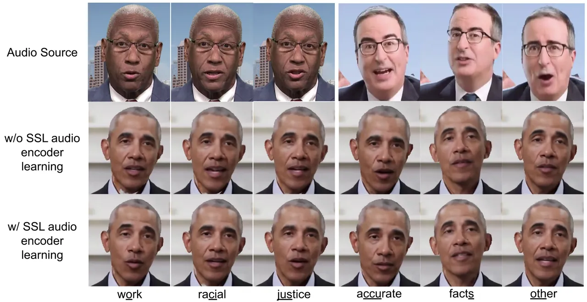
{subfigure}\[b\]0.29
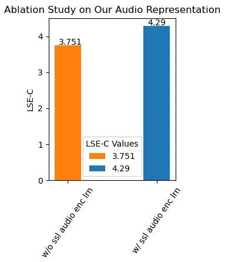

Figure 6:

Figure 7:

Figure 8: (a) illustrates the ablation with and without self-supervised
audio encoder learning. Our audio encoder learning produces better and
more accurate mouth shapes as compared to without it. In (b) we
quantitatively evaluate our method without and with self-supervised
audio encoder learning.

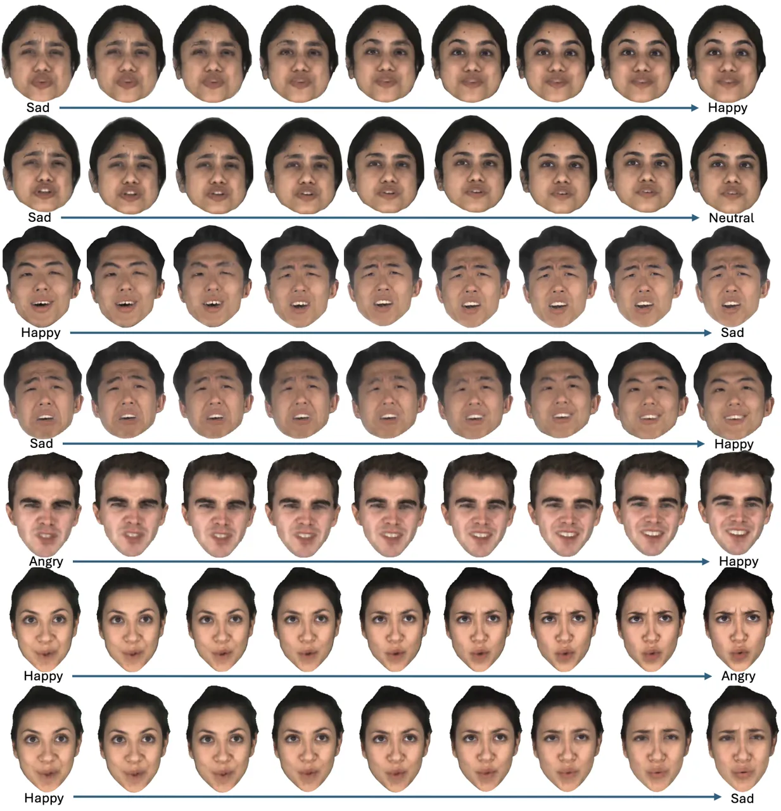

Figure 9: Additional analysis that shows that the expression encoder
disentangles features that are semantically grounded and well-behaved.
Interpolation of features from left to right leads to semantically
meaningful expressions.

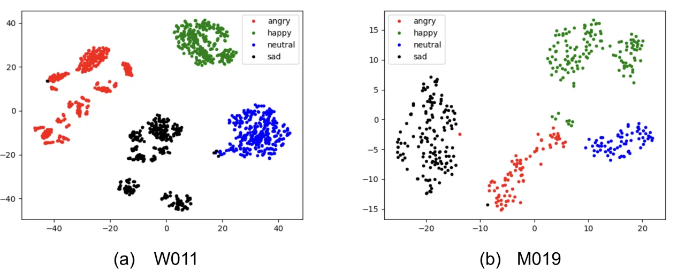

Figure 10: t-SNE plots of the expression features learned by our
expression transformer for the “W011” and “M019” identities of MEAD.

## 7 Additional Results

In Figures 11,  12,  13 we show additional results of rendered frames in
comparison with state-of-the-art methods for expression and audio-driven
talking face generation (EAMM \[Ji et al.(2022)Ji, Zhou, Wang, Wu, Wu,
Xu, and Cao\] and PD-FGC \[Wang et al.(2023a)Wang, Deng, Yin, Shum, and
Wang\]), categorical emotion based talking face generation (EAT \[Gan
et al.(2023)Gan, Yang, Yue, Sun, and Yang\]) as well as the audio-only
AD-NeRF \[Guo et al.(2021)Guo, Chen, Liang, Liu, Bao, and Zhang\], and
expression-only NeRFace \[Gafni et al.(2021)Gafni, Thies, Zollhöfer, and
Nießner\]. We also compare with Our method outperforms all the other
methods, transferring the expression and audio inputs with a high
fidelity, while preserving the target identity.

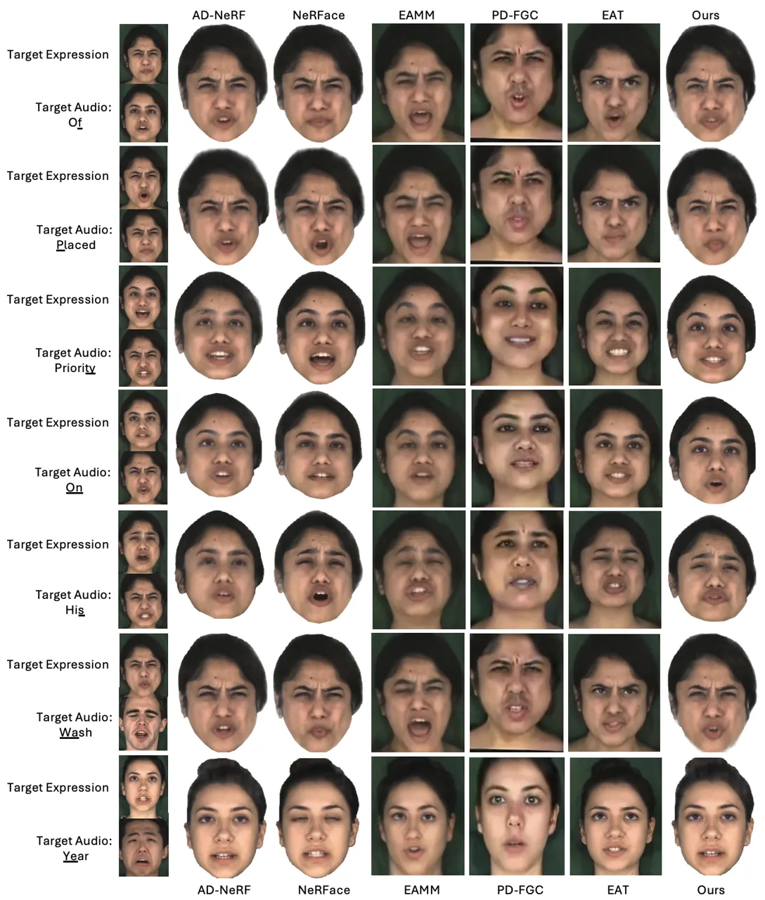

Figure 11: Talking face generation guided by target expression and audio
(1st column) compared with the state-of-the-art.

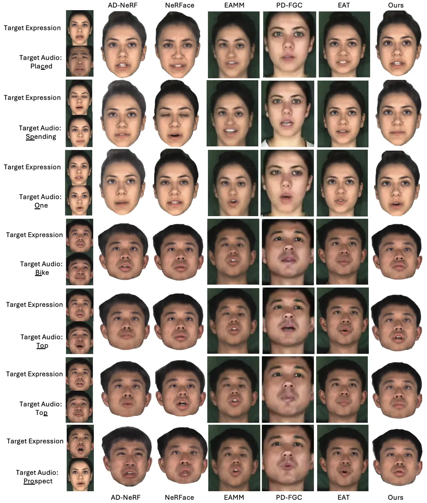

Figure 12: Talking face generation guided by target expression and audio
(1st column) compared with the state-of-the-art.

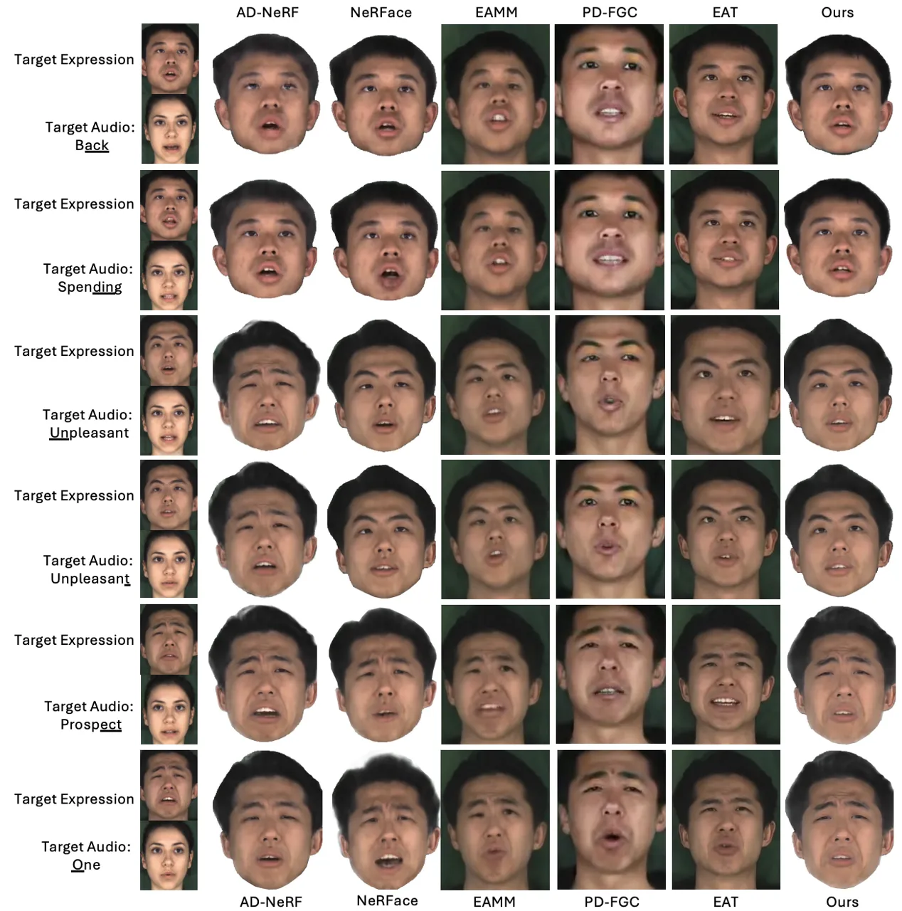

Figure 13: Talking face generation guided by target expression and audio
(1st column) compared with the state-of-the-art.

## 8 Implementation Details

### 8.1 Landmark Autoencoder

#### 8.1.1 Dataset

For this task, we use the complete available set of frontal view
MEAD \[Wang et al.(2020)Wang, Wu, Song, Yang, Wu, Qian, He, Qiao, and
Loy\] dataset videos, i.e. “part0”. $`39`$ identities from the dataset
were kept for training and rest $`9`$ for validation. We used 68 point
landmarks of which 17 landmarks corresponding to the face contour were
discarded for training the landmark autoencoder and these were input to
the autoencoder as arrays. We extract landmarks from square frame of
$`480\times 480`$ rescaled and cropped from the initial resolution of
$`1920\times 1080`$ (by cropping the middle $`1080\times 1080`$ frame
from the video and then resizing it to $`480\times 480`$).

#### 8.1.2 Pipeline

The landmark encoder and decoder consisted of 4 MLPs each with 256, 256,
128 as the hidden layer sizes and Leaky ReLU activations (negative slope
set to 0.02). The output features $`e_{f}`$ and $`e_{m}`$ were 64
dimensions each. For swapping, $`\epsilon`$ was set to $`0.8`$ and the
last 20 points in the landmarks representing the lips were used.

We noticed that sampling the frames $`A`$ and $`B`$ from different
videos of different identities or emotions would encourage the network
to learn features that may contain identity and emotion information.
Essentially, the network would try to differentiate between
identity-specific or emotion-specific characteristics of the face,
rather than learn lip motion features. This would deteriorate the
performance of our dynamic NeRF, which requires conditioning on a
powerful audio representation. Thus, we sample frames $`A`$ and $`B`$
randomly from the same video of an identity.

#### 8.1.3 Training

The model was optimized using Adam \[Kingma and Ba(2014)\] with default
parameters and $`10^{-5}`$ as weight decay value. We trained the
landmark encoder for 15 epochs on a single Nvidia V100 GPU with a batch
size of 256 which takes $`\approx 12`$ hours.

### 8.2 Contrastive Learning

#### 8.2.1 Dataset

For this task, the complete available set of frontal view videos from
MEAD dataset was used, *i.e*from “part0”. We use the same splits used
for training the landmark autoencoder, _i.e_$`39`$ identities for
training and rest $`9`$ for validation. We extract landmarks from square
frame of $`480\times 480`$ rescaled and cropped from the original
resolution of $`1920\times 1080`$ (by cropping the middle
$`1080\times 1080`$ frame from the video and then resizing it to
$`480\times 480`$). The corresponding audio signals for each video was
converted into DeepSpeech \[Amodei et al.(2016)Amodei, Ananthanarayanan,
Anubhai, Bai, Battenberg, Case, Casper, Catanzaro, Cheng, Chen, Chen,
Chen, Chen, Chrzanowski, Coates, Diamos, Ding, Du, Elsen, Engel, Fang,
Fan, Fougner, Gao, Gong, Hannun, Han, Johannes, Jiang, Ju, Jun,
LeGresley, Lin, Liu, Liu, Li, Li, Ma, Narang, Ng, Ozair, Peng, Prenger,
Qian, Quan, Raiman, Rao, Satheesh, Seetapun, Sengupta, Srinet, Sriram,
Tang, Tang, Wang, Wang, Wang, Wang, Wang, Wang, Wu, Wei, Xiao, Xie, Xie,
Yogatama, Yuan, Zhan, and Zhu\] features.

#### 8.2.2 Pipeline

We use the trained encoder from our Landmark Autoencoder and keep its
weights frozen during training. We use the same architecture as the
audio encoder of \[Guo et al.(2021)Guo, Chen, Liang, Liu, Bao, and
Zhang\] for our audio encoder. During training, negative audio samples
were randomly selected from the same identity but different video.
Further, the temperature $`\tau`$ in the InfoNCE loss formulation in Eq.
2 was set to $`0.1`$.

#### 8.2.3 Training

The audio encoder was optimized using Adam with learning rate set to
$`10^{-3}`$ and default parameters for the rest with an exponential
decay and final learning rate to be $`5\times 10^{-6}`$. We trained this
model for 30 epochs on a single Nvidia V100 GPU with a batch size of 256
which takes $`\approx 2`$ hours.

### 8.3 Expression Transformer

#### 8.3.1 Dataset

We use the MEAD dataset as it contains identities speaking the same
utterances in different emotions. This dataset is not consistent in the
sentences that are spoken in different emotions and hence only videos of
an utterance with corresponding videos of the same utterance present in
other emotions are used to train the expression transformer. This
filtering leads to $`18`$ unique sentences for each identity. For each
identity from MEAD that was used to test in our method, $`60`$ pairs of
videos where each video in the pair speak the same sentence with
different emotions were used for training. The rest ($`15-24`$) of the
pairs of videos formed the validation set. Note that we only included
the highest level videos of the emotions “angry”, “happy” and “sad”, and
the only level of “neutral” for these pairs.

For each video in these pairs, we extract the emotion features
$`e_{emo}`$ per video frame, using a vanilla ResNet50-based emotion
recognition network from \[Danecek et al.(2022)Danecek, Black, and
Bolkart\] trained on AffectNet \[Mollahosseini
et al.(2019)Mollahosseini, Hasani, and Mahoor\] on expression
classification, valence, and arousal regression task jointly. We use the
features from the ResNet backbone before being processed by any
classification/regression heads. To account for any misalignment of the
utterances of different emotions, we incorporate the dynamic
time-warping (DTW) algorithm \[Bellman and Kalaba(1959)\] to align the
input emotion feature sequences.

#### 8.3.2 Pipeline

We find that each person’s style of speaking with a particular emotion
is unique, so training a separate expression encoder is necessary. For
the expression autoencoder, we used a transformer architecture with
linear layers in the beginning to map down the $`2048`$ dimensional
emotion recognition features to $`128`$ via two MLP layers with Leaky
ReLU activation and a hidden layer size of $`512`$. The output of the
encoder is split in half resulting in $`64`$ dimension features for lip
motion and expressions. The encoder had $`8`$ attention heads, $`3`$
layers with dropout enabled and set to $`0.2`$. A positional encoding
was applied similar to \[Vaswani et al.(2017)Vaswani, Shazeer, Parmar,
Uszkoreit, Jones, Gomez, Kaiser, and Polosukhin\] and since a decoder
was used, the input sequence was padded with start and end sequence
vectors. The expression decoder had the same architecture in terms of
the number of attention heads and layers. The start and end sequence
tokens were stripped off and the features were mapped back to $`2048`$
dimensions using a 2 layer MLP with Leaky ReLU activations (negative
slope set to 0.02) and hidden layer size of $`512`$. $`\omega`$ is set
to $`8`$. Further, $`\delta`$ is set to $`0.8`$. During training, all
features output from the encoder corresponding to each input feature are
passed through to the decoder after the swapping operation.

#### 8.3.3 Training

The expression transformer was optimized using Adam with default
parameters and weight decay of $`10^{-5}`$. We trained this model for 20
epochs on a single Nvidia V100 GPU with a batch size of 256 which takes
$`\approx 1`$ hour.

### 8.4 NeRF

#### 8.4.1 Dataset

We used identities from MEAD to train the NeRF. For each identity, we
used the highest level emotions videos of “angry”, “happy” and “sad”,
and the only level of “neutral” to train the NeRF. Since videos in MEAD
are only 4-8 seconds long which are impractically small videos for
training NeRFs, we concatenate different videos of the same emotion.
Further, all videos in the same emotion of one identity were not
captured in the same pose or at the same distance from the camera. To
ensure that the NeRF is not overfitted to specific emotion - head pose
or emotion - camera distance pairs, we filter the videos of each
identity. More specifically, videos of an identity were filtered on the
basis of three factors: (1) whether they were shot immediately following
each other (determined by the lack of sudden change in pose and distance
from camera if two videos were concatenated), (2) whether the determined
focal length for the face after fitting a 3DMM \[Paysan
et al.(2009)Paysan, Knothe, Amberg, Romdhani, and Vetter, Cao
et al.(2013)Cao, Weng, Zhou, Tong, and Zhou\] was the same, and (3)
whether the pose distribution were very similar. After concatenation,
each video of a particular emotion was $`\approx 15`$ seconds long.

#### 8.4.2 Pipeline

The talking head is represented by an implicit function $`F_{\Theta}`$
that corresponds to an MLP. The model architecture for this implicit
function is the same as AD-NeRF, consisting of 8 linear layers with a
hidden size of 128 and ReLU activations. However, the input size was
changed from $`32`$ (audio features only) to 96 (audio features +
expression features). For each video frame, we fit a 3DMM \[Paysan
et al.(2009)Paysan, Knothe, Amberg, Romdhani, and Vetter, Cao
et al.(2013)Cao, Weng, Zhou, Tong, and Zhou\] and extract the head pose
and camera parameters, in order to estimate the viewing direction d.
After converting the head pose from the observation space to the
canonical space, we use the estimated head pose as the viewing direction
d of the radiance field. As in AD-NeRF, we positionally encode 3D point
x with 10 frequencies and viewing direction d with 4 frequencies but not
features $`e_{e}`$ and $`e_{a}`$. While training the NeRF, the frames
from videos of each emotion were randomly picked with their
corresponding audio features $`e_{a}`$, expression features $`e_{e}`$
(by spanning a window of features of size $`\omega`$ around the
corresponding index and selecting the $`\omega/2`$th feature of the
output as $`e_{e}`$) and pose. Similar to AD-NeRF \[Guo et al.(2021)Guo,
Chen, Liang, Liu, Bao, and Zhang\], we parse the head from the
background using an automatic parsing method, namely MaskGAN \[Fedus
et al.(2018)Fedus, Goodfellow, and Dai\]. Further, we assume that the
last point of each ray takes the RGB color of the background and lies on
it. During inference, we render the talking face on a white background.

#### 8.4.3 Training

The NeRF was optimized using Adam with an initial learning rate
$`5\times 10^{-4}`$ that decays exponentially to $`5\times 10^{-5}`$. At
each iteration, we randomly sample 2048 rays for a video frame. The
model is trained for 400,000 iterations (around 2 days on a single GPU).
We also enable the fine-tuning of the audio encoder during this training
with a learning rate of $`5\times 10^{-6}`$.

### 8.5 Metrics

We compute the visual quality metrics, namely PSNR, SSIM \[Wang
et al.(2004)Wang, Bovik, Sheikh, and Simoncelli\], LPIPS \[Zhang
et al.(2018)Zhang, Isola, Efros, Shechtman, and Wang\], after extracting
a face bounding box using 3DDFA V2  \[Guo et al.(2018)Guo, Zhu, and Lei,
Guo et al.(2020)Guo, Zhu, Yang, Yang, Lei, and Li\] and cropping the
face. The target frame from the expression source is also cropped in the
same manner and resized to the size of the cropped source frame. This is
done so that the background is not included in the quality computation.
The identity preservation metric (ACD) is measured using ArcFace \[Deng
et al.(2019a)Deng, Guo, Xue, and Zafeiriou\], a ResNet50-based network
trained on WebFace \[Zhu et al.(2021)Zhu, Huang, Deng, Ye, Huang, Chen,
Zhu, Yang, Lu, Du, and Zhou\]. Specifically, we used “buffalo_l” model
from the insightface repository \[Guo et al.()Guo, Deng, An, Yu, and
Gecer\]. For lip-sync confidence \[Prajwal et al.(2020)Prajwal,
Mukhopadhyay, Namboodiri, and Jawahar\] of NeRFace, we compute the
metric of each video against all testing audio sources and report the
average. Similarly, for Exp-Diff \[Wang et al.(2023a)Wang, Deng, Yin,
Shum, and Wang\] for AD-NeRF, we compute the metric of a particular
video against all testing expression source videos and report an
average.

## 9 Discussion

### 9.1 Limitations

An important factor of our method is the 3DMM fitting that is used as
ground truth to extract the head pose and camera parameters (see
Sec. 3.3 of the main paper and Sec. 8.4.2). This fitting can be noisy
and the error can be propagated to the final generated videos. Improving
the face tracking further would be an interesting future work. In
addition, we propose a NeRF-based representation that synthesizes
high-quality expressive talking faces. We believe that our proposed
audio and expression representations can be easily extended to other
neural rendering pipelines, like 3D Gaussian Splatting \[Kerbl
et al.(2023)Kerbl, Kopanas, Leimkühler, and Drettakis\] that provides
faster training and inference times. We plan to explore this direction
in the future.

### 9.2 Ethical Considerations

We would like to note the potential misuse of generation methods. With
the rise of “deep fakes”, it becomes easier to make photorealistic fake
videos of any speaker. These can be used for malicious purposes, e.g. to
spread misinformation. To this end, it is important to develop accurate
methods for fake content detection and forensics \[Cai et al.(2023)Cai,
Ghosh, Stefanov, Dhall, Cai, Rezatofighi, Haffari, and Hayat, Reiss
et al.(2023)Reiss, Cavia, and Hoshen\]. We intend to share our source
code to help improving such research. In addition, appropriate
procedures must be followed to ensure fair and safe use of videos if
used for training or inference. In our work, we use MEAD that is a
publicly available dataset, featuring actors talking with different
emotions in a controlled setup and has been used by several other
published works.
