# TalkinNeRF: Animatable Neural Fields for Full-Body Talking Humans

Aggelina Chatziagapi Affiliation: Stony Brook University
E-mail <%7Baggelina,samaras%7D@cs.stonybrook.edu>    Bindita Chaudhuri
Affiliation: Flawless AI E-mail <bindita.chaudhuri@flawlessai.com>   
Amit Kumar Affiliation: Meta Reality Labs
E-mail <%7Bakumar14,rakeshr,nsarafianos%7D@meta.com>    Rakesh Ranjan
Affiliation: Meta Reality Labs
E-mail <%7Bakumar14,rakeshr,nsarafianos%7D@meta.com>    Dimitris Samaras
Affiliation: Stony Brook University
E-mail <%7Baggelina,samaras%7D@cs.stonybrook.edu>    Nikolaos Sarafianos
Affiliation: Meta Reality Labs
E-mail <%7Bakumar14,rakeshr,nsarafianos%7D@meta.com>

###### Abstract

We introduce a novel framework that learns a dynamic neural radiance
field (NeRF) for full-body talking humans from monocular videos. Prior
work represents only the body pose or the face. However, humans
communicate with their full body, combining body pose, hand gestures, as
well as facial expressions. In this work, we propose TalkinNeRF, a
unified NeRF-based network that represents the holistic 4D human motion.
Given a monocular video of a subject, we learn corresponding modules for
the body, face, and hands, that are combined together to generate the
final result. To capture complex finger articulation, we learn an
additional deformation field for the hands. Our multi-identity
representation enables simultaneous training for multiple subjects, as
well as robust animation under completely unseen poses. It can also
generalize to novel identities, given only a short video as input. We
demonstrate state-of-the-art performance for animating full-body talking
humans, with fine-grained hand articulation and facial expressions.
Project page:
[https://aggelinacha.github.io/TalkinNeRF/](https://aggelinacha.github.io/TalkinNeRF/).
^(†)^(†)footnotetext: \* This work was conducted while at Meta.

###### Keywords: 

Talking Humans Neural Radiance Fields Full-Body Animation

![[Uncaptioned
image]](arxiv-2409-16666--6edb613bc84b.figures/figure-1.webp)

Figure 1: Given monocular videos, TalkinNeRF learns a unified NeRF-based
network that represents the _holistic_ 4D human motion, including body
pose, hand articulation, and facial expressions. It synthesizes
high-quality animations of _full-body talking humans_.

## 1 Introduction

Synthesizing photorealistic 4D humans has been a long standing research
problem in computer vision and graphics. It requires accurate capture of
the spatio-temporal (4D) dynamics of the human body, including rigid and
non-rigid deformations, such as facial expressions, with broad
applications, ranging from AR/VR and video games to virtual
communication and movies. Recent advances in dynamic neural radiance
fields (NeRF) \[41\] have enabled significant progress in rendering and
animating human bodies \[64, 51\] and faces \[15, 21\]. While many
NeRF-based approaches require multiple views \[51, 31, 46, 47, 42\],
recent works learn dynamic NeRFs from monocular videos \[15, 64, 68\].
These works consider specific sub-problems, such as free-viewpoint
rendering \[64\], rendering human subjects under novel poses \[68, 42\],
and face reconstruction \[15\]. However, humans communicate with their
full body, synchronizing their body pose, complex hand gestures, and
facial expressions, in order to convey the intended message. Existing
approaches do not consider this _holistic_ human motion, which is
crucial for generating plausible digital talking humans.

In this work, we propose TalkinNeRF, a novel method that learns a
dynamic NeRF for _full-body talking humans_ from monocular videos. To
the best of our knowledge, this is the first approach that introduces a
_unified_ NeRF, combining body pose, hand articulation, as well as
facial expressions, and learned from just monocular videos. In contrast
to prior work, our problem setting presents the following challenges.
(a) Our training data consists of monocular _frontal-only_ videos of
talking humans, whereas existing approaches leverage information from
side and back views \[32, 51, 13, 11, 68, 42, 71\]. (b) We combine rigid
and non-rigid human motion in a unified framework, where body parts
correlate differently. (c) In talking humans, fine-grained details, such
as finger articulation and facial expressions, play an important role in
the final result, in order to convey the intended message in a
conversation. Other works only consider the coarse limb
articulation \[42, 68\]. (d) We learn a _multi-identity_ representation,
not identity-specific NeRFs as in prior work.

Given monocular videos of talking humans, our unified network represents
their _holistic_ 4D human motion. For each video, we fit a parametric
model and extract the parameters for the body pose, hand pose, and
facial expression. These parameters condition corresponding modules for
body, face, and hands, that are combined together to synthesize the
final videos of _full-body_ talking humans. In order to capture complex
finger articulation, we learn an additional deformation field for the
hands. We also learn an identity code per subject, which enables us to
train TalkinNeRF on multiple identities simultaneously. Our
multi-identity representation leverages information from the diverse
motion of different subjects, enhancing the robustness under novel
poses, while significantly reducing the overall training time. We also
demonstrate animation guided by a speech-to-motion model, allowing for
speech-to-video retargeting. Lastly, our method can generalize to an
unseen identity, given a short video.

In brief, our contributions are as follows:

- •
  We introduce TalkinNeRF, a novel method that learns a unified dynamic
  NeRF for full-body talking humans from monocular videos, combining
  body pose, hand articulation, and facial expressions in a holistic
  manner.
- •
  We propose a multi-identity representation, which enables us to
  simultaneously train on multiple identities, enhancing the robustness
  to novel poses, reducing the overall training time, and allowing for
  generalization to unseen identities given only short videos.
- •
  TalkinNeRF synthesizes high-quality videos of full-body talking
  humans, animating them under novel poses, with fine-grained hand
  articulation and facial expressions, outperforming the current
  state-of-the-art.

## 2 Related Work

Neural Representations for Humans. Several methods for human body
reconstruction and retargeting rely on parametric models \[38, 49, 39,
58, 40, 45\], like SMPL \[38\]. These models are learned from large
datasets of high-quality human scans. Then, they can be used as prior,
conditioning neural representations of human avatars \[64, 68, 42, 56\].
Earlier methods for human body animation are based on image-to-image
translation networks \[26\]. SMPLpix \[53\] registers SMPL \[38\] to
ground truth 3D scans. EverybodyDanceNow \[5\] extracts 2D
skeletons \[4\] and learns an identity-specific image translation
network. Subsequent works propose NeRF-based approaches \[64, 15, 11,
14, 59, 71\], discussed in the following paragraphs. Most of them are
identity-specific, can only represent one kind of motion (_e.g_., coarse
rigid articulation or non-rigid facial motion), and require multiple
views. Even recent works that propose techniques to reduce the training
and inference times of radiance fields \[73, 12, 56\], including
3DGS-based \[55\], still have the same constraints. In contrast, our
method combines the holistic rigid and non-rigid human motion in a
unified framework, learned from in-the-wild monocular videos, and can
generalize to multiple identities.

Neural Radiance Fields. Implicit neural representations have recently
gained a lot of attention. NeRFs \[41, 2, 3, 36\] have been originally
proposed for static scenes and have shown photorealistic novel view
synthesis. They represent a scene as a continuous 5D function, using a
multilayer perceptron (MLP) that maps each 5D coordinate (3D spatial
location and 2D viewing direction) to an RGB color and volume density.
Recent works extend NeRFs to dynamic scenes \[54, 65, 34, 33, 46, 15,
47, 64\]. They usually decouple 4D as 3D and time, and map (deform) the
3D points from an observation to a canonical space, in order to learn a
time-invariant scene representation. Our work follows a similar concept,
but we jointly represent rigid and non-rigid motion of talking humans.

Dynamic NeRFs for Humans. Deformations of the human face and body are
particularly challenging to learn. Many NeRF-based approaches capture
the 4D dynamics and appearance of humans from multi-view videos \[51,
46, 47, 66, 44, 37, 29, 50, 16, 27\], while recent works use monocular
videos \[15, 64, 68, 42, 28, 60, 62, 21\]. They align the observed poses
of different video frames in a single canonical space, and learn a
conditional 3D representation. By conditioning a NeRF on body pose \[64,
68\], hand pose \[22\], or facial expressions \[15, 1, 6\] extracted
from parametric models \[38\], they enable meaningful control of the
synthesized subject. They consider specific sub-problems, _i.e_.,
HumanNeRF \[64\] shows remarkable results for free-viewpoint rendering,
MonoHuman \[68\] improves animation under novel poses, while
NeRFace \[15\] focuses on face reconstruction and LipNeRF \[6\] on
lip-syncing. However, all these works only animate the face, the hands,
or the body separately. TotalSelfScan \[11\] represents body, hand, and
head pose, omitting the non-rigid motion of facial muscles, and requires
multiple videos per subject. NeRFBlendshape \[17\] and AD-NeRF \[21\]
represent only the head and face motion. X-Avatar \[59\] requires 3D
scans or RGB-D data in order to learn the geometry. AvatarReX \[71\]
requires multi-view videos - they use 22 cameras (16 for body and 6 for
face). SCARF \[14\] requires a detailed geometry (upsampled version of
SMPL-X). In contrast, our method learns a unified network that
represents the holistic 4D body motion of talking humans, given only
frontal monocular videos.

Multi-Identity NeRFs for Humans. All the aforementioned approaches are
identity-specific, requiring expensive optimization per identity. Only a
limited number of prior work has aimed to train a generic NeRF for
humans \[57, 24, 72, 31, 42, 16\]. However, they all require multiple
views for training. Multi-view approaches usually learn blending
mechanisms, extract features from nearby views, and infer a novel view
in feed-forward manner \[61, 7, 70, 31\]. Constrained by the input
views, they cannot animate humans under novel poses. In contrast, in a
monocular setting, we cannot leverage nearby views as input. Another
line of work \[25, 8\] learns a model from multi-view images, with the
goal of rendering a new subject given only a single image as input. In
contrast, we propose a simple architecture that is capable of learning
multiple identities simultaneously, from just monocular videos, and can
synthesize high-fidelity animations of them. We also demonstrate
generalization to a new identity, given a short video.

## 3 Method

We introduce TalkinNeRF, a novel framework that learns a dynamic NeRF
for full-body talking humans from monocular videos. An overview is
illustrated in Fig. 2. Given a monocular RGB video of a subject, we
learn a unified network that represents their holistic 4D human motion.
For each video frame, we fit a parametric model and extract the
parameters for the body pose, hand pose, and facial expression. These
parameters condition corresponding modules for body, face, and hands,
that are combined, to generate the final _full-body_ talking human.
Additionally, we learn an identity code per video, which enables us to
extend our unified representation to multiple identities. Leveraging
information from multiple subjects, we enhance the robustness to unseen
poses, while significantly reducing the total training time. TalkinNeRF
synthesizes high-quality videos of talking humans, with fine-grained
hand articulation and facial expressions. It further generalizes to new
identities, given only a short video of them.

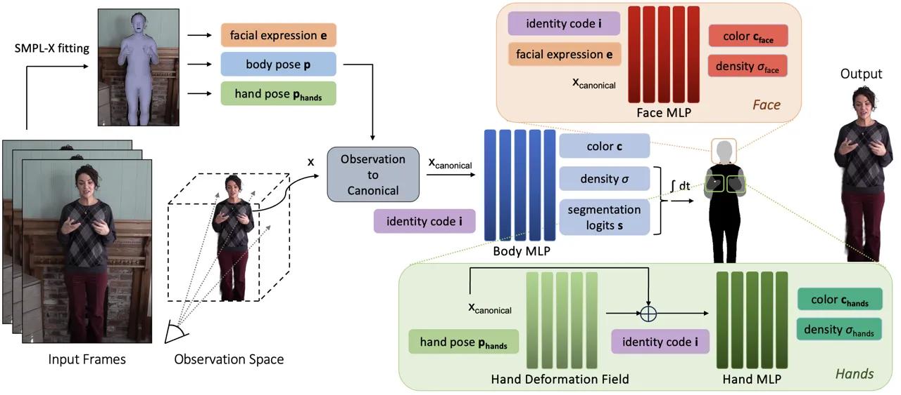

Figure 2: Overview of TalkinNeRF. Given a monocular video of a subject,
we learn a unified NeRF-based network that represents their holistic 4D
motion. Corresponding modules for body, face, and hands are combined
together, in order to synthesize the final _full-body talking human_. By
learning an identity code per video, our method can be trained on
multiple identities simultaneously.

### 3.1 Conditional Representation

TalkinNeRF learns a conditional representation of the human body
dynamics. First, for each video frame, we fit a parametric body model
similar to SMPL-X \[49\], and extract the estimated parameters for
facial expression $`\bm{\psi}\in\mathbb{R}^{10}`$ and pose vectors for
body $`\bm{p_{\text{body}}}\in\mathbb{R}^{22\times 3}`$, jaw
$`\bm{p_{\text{jaw}}}\in\mathbb{R}^{1\times 3}`$, and hands
$`\bm{p_{\text{hands}}}\in\mathbb{R}^{30\times 3}`$. The pose vectors
are in axis-angles representation and describe the relative rotations of
the joints. We also get the estimated camera intrinsics and extrinsics.

Body Pose. Based on the estimated parameters, we infer the relative
joint locations, and convert the axis-angles representation to a
$`3\times 3`$ rotation matrix using the Rodrigues’ rotation formula,
following \[64\]. In this way, we derive the corresponding rotation
$`\bm{R}_{i}\in\mathbb{R}^{{3\times 3}}`$ and translation
$`\bm{t}_{i}\in\mathbb{R}^{3}`$ matrices for each body joint
$`i=1,\dots,22`$. We define the body pose $`\bm{p}=(\bm{R},\bm{T})`$,
where $`\bm{R}=\{\bm{R}_{i}\}`$ and $`\bm{T}=\{\bm{t}_{i}\}`$
(see \[64\] for the detailed derivation).

Facial Expression. We combine the expression coefficients $`\bm{\psi}`$
and jaw pose $`\bm{p_{\text{jaw}}}`$ to a vector
$`\bm{e}=[\bm{\psi};\bm{p_{\text{jaw}}}]\in\mathbb{R}^{\text{13}}`$. The
jaw pose mostly captures the mouth openings and closures. Along with the
expression coefficients $`\bm{\psi}`$ in the learned PCA space, they
represent the facial expression $`\bm{e}`$ of the subject per frame.

Hand Pose. We directly concatenate the left and right hand poses (15
joints per hand) to a flattened vector
$`\bm{p_{\text{hands}}}\in\mathbb{R}^{\text{90}}`$.

Identity Code. We additionally learn an identity code
$`\bm{i}\in\mathbb{R}^{32}`$ per subject. This is a randomly initialized
embedding that is learned during training. By enforcing it to be the
same for all the frames of a subject, we ensure that it captures
identity-specific information.

### 3.2 Dynamic Neural Radiance Field

We learn a unified representation $`F_{\Theta}`$ of the human motion,
including body pose, hand articulation, and facial expressions.
Following the dynamic NeRF literature \[15, 64\], we consider our human
subject in a 3D scene and learn an implicit representation
$`F_{\Theta}`$ for each point in the scene. More specifically, given an
identity $`\bm{i}`$ at a specific video frame, shown from a particular
viewpoint and with a particular facial expression and body pose, we
first march camera rays through the scene and sample 3D points on these
rays. For a sampled 3D point $`\bm{x}`$, the estimated expression vector
$`\bm{e}`$, body pose $`\bm{p}`$, and hand pose
$`\bm{p_{\text{hands}}}`$, our learned $`F_{\Theta}`$ predicts the RGB
color $`\bm{c}`$ and density $`\sigma`$ of the point:

```math
F_{\Theta}:(\bm{x},\bm{e},\bm{p},\bm{p_{\text{hands}}},\bm{i})\longrightarrow(\bm{c},\sigma)\;. \tag{1}
```

Canonical Space. First, we map the points $`\bm{x}`$ from the
observation space to the canonical space, similar to \[64\]:

```math
\bm{x}_{\text{canonical}}=D_{\text{r}}(\bm{x},\bm{p})+D_{\text{nr}}(D_{\text{r}}(\bm{x},\bm{p}),\bm{p})\;, \tag{2}
```

where $`D_{\text{r}}`$ represents the rigid deformation of the joints
and $`D_{\text{nr}}`$ accounts for any non-rigid deformations (_e.g_.,
due to clothing). $`D_{\text{r}}`$ corresponds to inverse linear blend
skinning:

```math
D_{\text{r}}(\bm{x},\bm{p})=\sum_{i=1}^{K}w_{c}^{i}(\bm{x})(\bm{R}_{i}\bm{x}+\bm{t}_{i})\;, \tag{3}
```

where $`K=22`$ is the number of body joints and $`w_{c}^{i}`$ is the
blend weight for the $`i`$-th joint that is learned with a ConvNet
during training \[64\]. $`D_{\text{nr}}`$ corresponds to a trainable
MLP, which adds a small offset to the skeleton-driven motion field,
conditioned on the body pose.

Body MLP. Each point $`\bm{x}_{\text{canonical}}`$ is first passed to
the “Body MLP” $`F_{\text{body}}`$ (see Fig. 2) that predicts its color
$`\bm{c}`$, density $`\sigma`$, as well as segmentation logits
$`\bm{s}`$ over $`N`$ classes:

```math
F_{\text{body}}:(\bm{x}_{\text{canonical}},\bm{i})\longrightarrow(\bm{c},\sigma,\bm{s})\;, \tag{4}
```

where $`N=5`$ that include body, arms, hands, head, and background. We
add the segmentation prediction as an additional output of the Body MLP
for two main reasons: (a) we encourage the network to distinguish
between the important body parts and pay more attention to the arm and
hand gestures that are crucial while humans are conversing, and (b) we
integrate additional modules for the face and hands, directly connected
with the main Body MLP, avoiding any misalignment that can be caused by
separate modules used in other works \[21\]. When we predict that a
point belongs to the hand or head regions, we pass it to the Hand or
Face MLP correspondingly, described below.

Face MLP. If $`\bm{x}_{\text{canonical}}`$ is categorized as head, we
predict its color $`\bm{c}`$ and density $`\sigma`$ using the “Face MLP”
$`F_{\text{face}}`$, conditioned on the corresponding facial expression
$`\bm{e}`$:

```math
F_{\text{face}}:(\bm{x}_{\text{canonical}},\bm{e},\bm{i})\longrightarrow(\bm{c}_{\text{face}},\sigma_{\text{face}})\;, \tag{5}
```

and set $`\bm{c}=\bm{c}_{\text{face}}`$ and
$`\sigma=\sigma_{\text{face}}`$. In this way, our network learns
non-rigid deformations caused by various facial expressions, and can
synthesize expressive 3D humans.

Hand MLP. If $`\bm{x}_{\text{canonical}}`$ is categorized as hands, we
pass it to a hand deformation network $`D_{\text{hands}}`$, conditioned
on the hand pose $`\bm{p_{\text{hands}}}`$. $`D_{\text{hands}}`$ adds an
offset to the point location, in order to capture any deformations
caused by the flexible movements of the finger joints:

```math
\bm{x}_{\text{canonical}}=\bm{x}_{\text{canonical}}+D_{\text{hands}}(\bm{x}_{\text{canonical}},\bm{p_{\text{hands}}})\;. \tag{6}
```

The output is passed to the “Hand MLP” $`F_{\text{hands}}`$ that
predicts its color $`\bm{c}`$ and density $`\sigma`$:

```math
F_{\text{hands}}:(\bm{x}_{\text{canonical}},\bm{i})\longrightarrow(\bm{c}_{\text{hands}},\sigma_{\text{hands}})\;. \tag{7}
```

A key detail here is that unlike the face region, where we replace the
color and density predicted by $`F_{\text{body}}`$ with the
corresponding predictions of $`F_{\text{face}}`$, in the case of hands
we use the predicted pixel color (accumulated colors and densities)
given by $`F_{\text{body}}`$ as the color of the last point of the ray.
In this way, we assume that the prediction of $`F_{\text{body}}`$
corresponds to the background of the hands, as they move around and can
be on top of the subject’s clothes or outside the human body. This
ensures high-quality rendering, especially under novel poses (see
ablation study in Sec. 4.1).

Volume Rendering. Given the predicted color $`\bm{c}`$ and density
$`\sigma`$ for every point on each ray, we produce the final video frame
applying volume rendering \[41\]. For each camera ray
$`\bm{r}(t)=\bm{o}+t\bm{v}`$ with camera center $`\bm{o}`$ and viewing
direction $`\bm{v}`$, the color $`\hat{C}`$ of the corresponding pixel
can be computed by accumulating the predicted colors and densities of
the sampled points along the ray:

```math
\hat{C}(\bm{r};\Theta)=\int_{t_{n}}^{t_{f}}\sigma(\bm{r}(t))\bm{c}(\bm{r}(t))T(t)dt\;, \tag{8}
```

where $`t_{n}`$ and $`t_{f}`$ are the near and far bounds
correspondingly, and
$`T(t)=\exp\left(-\int_{t_{n}}^{t}\sigma(\bm{r}(s))ds\right)`$ is the
accumulated transmittance along the ray from $`t_{n}`$ to $`t`$.
Similarly, we compute the segmentation logits $`\hat{S}`$ per image
pixel:

```math
\hat{S}(\bm{r};\Theta)=\int_{t_{n}}^{t_{f}}\sigma(\bm{r}(t))\bm{s}(\bm{r}(t))T(t)dt\;. \tag{9}
```

Optimization. During training, we minimize the following objective
function:

```math
\mathcal{L}=\mathcal{L}_{\text{LPIPS}}+\lambda_{C}\mathcal{L}_{C}+\lambda_{S}\mathcal{L}_{S}\;, \tag{10}
```

where
$`\mathcal{L}_{C}=\sum_{\bm{r}}\left\|\hat{C}(\bm{r};\Theta)-C(\bm{r})\right\|_{2}^{2}`$
is the photometric loss that measures the pixel-wise difference between
the ground truth color $`C(\bm{r})`$ and the predicted color
$`\hat{C}(\bm{r};\Theta)`$ for all the rays $`\bm{r}`$,
$`\mathcal{L}_{\text{LPIPS}}`$ is the perceptual loss LPIPS \[69\] using
VGG as backbone, and $`\mathcal{L}_{S}`$ is the categorical
cross-entropy loss between the ground truth segmentation $`S(\bm{r})`$
and predicted $`\hat{S}(\bm{r};\Theta)`$. We set $`\lambda_{C}=0.2`$ and
$`\lambda_{S}=0.05`$.

Implementation Details. We segment the human body from the background
using an automatic human video matting method \[35\]. To get the
segmentation classes, we use DensePose \[18\] and keep the corresponding
labels for hands, arms, head, body (rest of body parts), and background.
We use Adam optimizer \[30\] with a learning rate of $`5\times 10^{-4}`$
with exponential decay, and train our network for 400k iterations on 4
GPUs (see suppl. for more details).

### 3.3 Multi-Identity Optimization

TalkinNeRF can be trained using a single monocular video of a human
subject or monocular videos of multiple subjects. By learning an
identity code $`\bm{i}`$ per video, we extend our method to multiple
identities, that can be trained simultaneously. The identity code
captures identity-specific information, _i.e_., the appearance of each
identity, such as clothing, and conditions $`F_{\text{body}}`$,
$`F_{\text{face}}`$, and $`F_{\text{hands}}`$. The network is fed with
the diverse body poses, hand articulation, and facial expressions of all
the training identities. By leveraging information from multiple
subjects, TalkinNeRF synthesizes high-quality videos of each of them
under novel poses. Our multi-identity optimization reduces the overall
training time by $`85\%`$ - it only takes 600k iterations for 10
identities (compared to 400k iterations per identity).

Novel Identity. TalkinNeRF can also be adapted to a novel identity, that
is not part of the initial training set. Given a short video of a new
subject, we fine-tune our network with a smaller learning rate
($`10^{-5}`$) for a few iterations (around 50k) to learn their identity
code. We can then synthesize high-quality videos of them under novel
poses.

## 4 Experiments

Dataset. We collected 10 full-body talking human videos of different
identities from the publicly available Casual Conversations
dataset \[23\]. These videos are monocular and frontal-only. Each
subject is standing and talking with their personal hand gestures and
facial expressions. Only 2 subjects are walking, slightly showing their
side to the camera, while talking. The videos are
$`\scriptstyle\mathtt{\sim}`$1 minute long at 29.97 fps and
$`1080\times 1080`$ resolution. Compared to prior work \[64, 68\], our
videos are more challenging for the following reasons: (a) they only
have frontal views, whereas previous methods use videos with side and
back views as well, (b) the variation in limb articulation is more
limited, following a long-tailed distribution (our subjects are mostly
standing and talking, with mainly arm and hand motion, in contrast to
free-movement videos \[32, 51, 13\]), and (c) we include facial
expression and hand articulation, compared to only body pose considered
in prior work.

Baselines. We evaluate our method against state-of-the-art NeRF-based
works, HumanNeRF \[64\] and MonoHuman \[68\]. We assess their
performance when rendering a subject under novel poses and facial
expressions.

Evaluation Metrics. We measure the visual quality of the generated
videos, using peak signal-to-noise ratio (PSNR), structural similarity
index (SSIM) \[63\], and learned perceptual image patch similarity
(LPIPS) \[69\]. Following related works, we report
$`\text{LPIPS}^{*}=\text{LPIPS}\times 10^{3}`$. Furthermore, we use the
LSE-D (lip sync error - distance) and LSE-C (lip sync error -
confidence) metrics \[52, 10\], to assess the lip synchronization,
_i.e_., if the generated expressions are meaningful given the
corresponding speech signal.

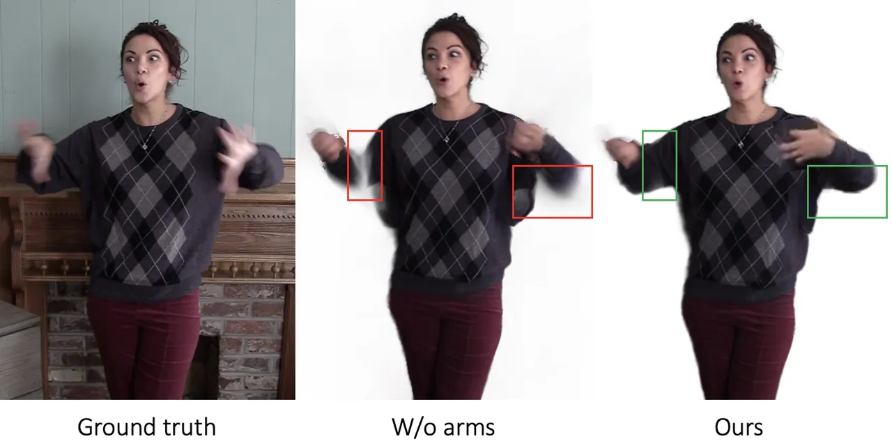

(a) Ablation study on the segmentation classes

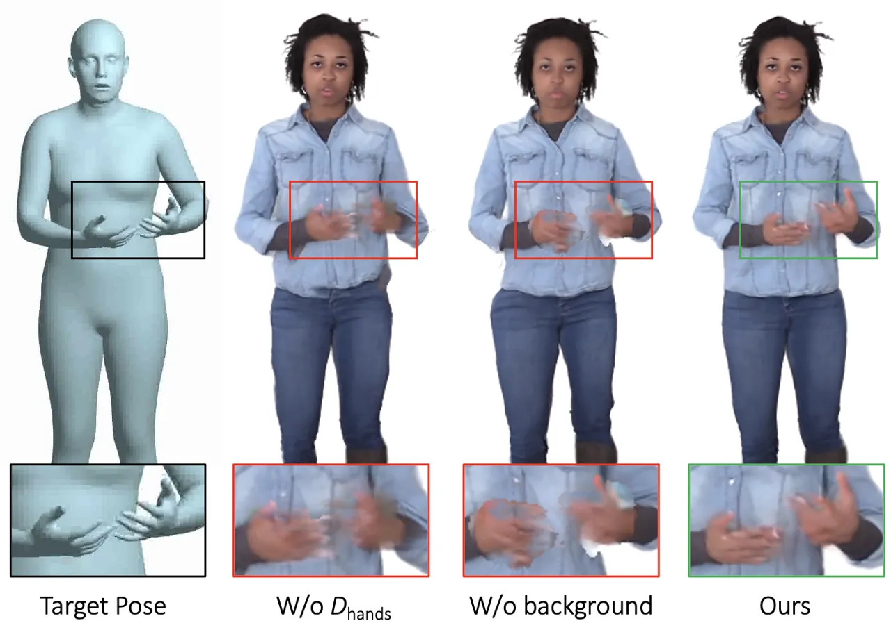

(b) Ablation study on the hand representation

Figure 3: (a) Ablation study on the segmentation classes. Our method
predicts 5 classes: head, hands, arms, body, background. If the arms are
considered as body (4 classes - “W/o arms”), we observe disconnected
arms in the reconstruction results. (b) Ablation study on the hand
representation when rendering novel (unseen) poses. Without learning a
hand deformation field $`D_{\text{hands}}`$, without considering the
output of Body MLP as background for the hands (“W/o background”), and
Ours (With $`D_{\text{hands}}`$ and background).

| Method Variant                 | $`\text{PSNR}_{\text{}}`$ $`\uparrow`$ | $`\text{SSIM}_{\text{}}`$ $`\uparrow`$ | $`\text{LPIPS}^{*}_{\text{}}`$ $`\downarrow`$ |
| ------------------------------ | -------------------------------------- | -------------------------------------- | --------------------------------------------- |
| W/o hand deformation field     | 17.56                                  | 0.4460                                 | 146.25                                        |
| W/o background for hands       | 17.07                                  | 0.3360                                 | 154.12                                        |
| Separate left and right hands  | 18.09                                  | 0.6282                                 | 87.09                                         |
| Hand joints in canonical space | 17.98                                  | 0.6123                                 | 89.97                                         |
| Complete Approach              | 18.15                                  | 0.6418                                 | 80.07                                         |

Table 1: Ablation study on the hand representation when rendering novel
(unseen) poses. We evaluate the following variants: without learning a
hand deformation field $`D_{\text{hands}}`$, without considering the
output of Body MLP as background for the hands (“W/o background”), when
we pass each hand separately through the Hand MLP, when we include the
hand joints in the observation-to-canonical transformation, and our
complete approach. The metrics are computed only in the hand region.

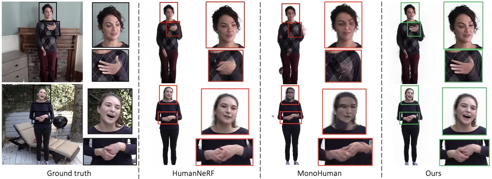

Figure 4: Qualitative comparison for rendering novel poses from the same
identity. We compare with HumanNeRF \[64\] and MonoHuman \[68\]. Ground
truth (not seen in training) is shown on the left. Our method generates
facial expressions and hand articulation with a high fidelity.

| Method Variant       | $`\text{PSNR}_{\text{}}`$ $`\uparrow`$ | $`\text{SSIM}_{\text{}}`$ $`\uparrow`$ | $`\text{LPIPS}^{*}_{\text{}}`$ $`\downarrow`$ |
| -------------------- | -------------------------------------- | -------------------------------------- | --------------------------------------------- |
| W/o jaw for the face | 19.20                                  | 0.7532                                 | 33.50                                         |
| Complete Approach    | 20.59                                  | 0.7677                                 | 31.48                                         |

Table 2: Ablation study on the face representation. We evaluate the
variant that does not include the jaw joint. The metrics are computed
only in the face region.

### 4.1 Ablation Study

We conduct an ablation study on the architecture of TalkinNeRF. First,
we investigate how the segmentation prediction of the Body MLP affects
our model. As described in Sec. 3.2, the hand and head classes are
necessary for the proposed pipeline, in order to pass the corresponding
points to the hand or face-related modules. We observe that adding the
arms as a separate class encourages the network to pay attention to the
subject’s gestures and avoids any disconnected arms from the main body,
due to fast motion (see Fig. 3(a)).

An important part of our method is the representation of the hands.
Fig. 3(b) and Tab. 1 demonstrate the results of different variants of
our hand representation when rendering a specific subject under novel
poses. By just using the Hand MLP, the network can overfit to the
training poses and render them correctly. However, synthesizing novel
poses is much more challenging. Without learning a hand deformation
field $`D_{\text{hands}}`$, the network cannot generate a plausible
deformation of the points caused by the various finger movements
(Fig. 3(b) column 2, Tab. 1 row 1). If we do not consider the output of
the Body MLP as background for the hands, the predicted hand color might
erroneously include nearby points, leading to artifacts (Fig. 3(b)
column 3, Tab. 1 row 2). We also investigate a variant where we pass
each hand separately through the Hand MLP (Tab. 1 row 3). However, we
observe a small increase in performance when we concatenate both hands
together. We suspect that this happens because the hands are highly
symmetrical and interact with each other. Thus, their combined pose is a
more informative input to the model. We also consider the case where we
include the hand joints in the transformation from the observation to
the canonical space, _i.e_.,  in Eqs. 2 and 3 (Tab. 1 row 4). Although
mapping the hand joints to the canonical space might be useful when
animating just the hands \[22\], in our case, that we animate body and
hands jointly, this degrades the visual quality under novel poses. We
suspect that this happens because of an increase in the number of
transformations and in the input size of $`D_{\text{nr}}`$, discouraging
the network to pay attention to the main body parts. Lastly, for the
face representation, as shown in Tab. 2, the jaw joint provides
additional information for the mouth motion.

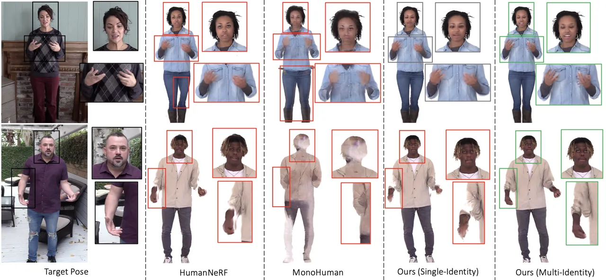

Figure 5: Qualitative comparison for rendering novel poses from a
different identity. From left to right: target pose, results of
HumanNeRF \[64\], MonoHuman \[68\], our single-identity model, and our
multi-identity model. Our multi-identity TalkinNeRF robustly renders
each identity under unseen poses and expressions.

### 4.2 Evaluation: Novel Poses

We identify 3 main evaluation settings, with increasing difficulty:
rendering a subject under (a) poses from the same identity, (b) poses
from a different identity, and (c) speech-driven generated poses.

Poses from the same identity. We train our model on the 10 full-body
talking videos and evaluate it on a test set of held-out frames per
identity. Fig. 4 demonstrates the corresponding qualitative results.
TalkinNeRF synthesizes the facial expression and fine-grained finger
articulation with a high fidelity. HumanNeRF \[64\] can only learn an
average facial expression that is the same for all the frames, which is
a major limitation for talking humans. MonoHuman \[68\] fails to learn a
good representation of the human subjects, as it needs a selection of
front and back frames that do not exist in our data. This is an
unrealistic assumption for several application scenarios, including
talking humans that naturally talk in front of the camera without
turning their back. Table 3 shows the corresponding quantitative results
on the held-out frames. Our method can be trained on each identity
separately, or on all the training videos simultaneously. By learning
from multiple identities, TalkinNeRF enhances the overall performance
under novel poses and is trained significantly faster
($`\scriptstyle\mathtt{\sim}`$85% faster than training a single-identity
model per subject). However, in this evaluation setting, we noticed that
sometimes the hands may be more faithfully produced by the
single-identity model (slight decrease in LPIPS for the hands). We
suspect that this happens because each subject’s hands can vary in size,
skin color, and articulation, and the single-identity model can better
memorize identity-specific details when rendering poses from the same
identity. This is not true though when rendering completely novel poses
from other identities, as shown next.

| Method           | PSNR $`\uparrow`$ | SSIM $`\uparrow`$ | $`\text{LPIPS}^{*}`$ $`\downarrow`$ | $`\text{LPIPS}^{*}_{\text{hands}}`$ $`\downarrow`$ |
| ---------------- | ----------------- | ----------------- | ----------------------------------- | -------------------------------------------------- |
| HumanNeRF        | 25.36             | 0.9108            | 38.62                               | 132.54                                             |
| MonoHuman        | 24.94             | 0.9010            | 47.40                               | 116.91                                             |
| Ours (Single-Id) | 25.78             | 0.9132            | 33.21                               | 80.07                                              |
| Ours (Multi-Id)  | 27.25             | 0.9341            | 32.06                               | 82.27                                              |

Table 3: Quantitative evaluation for rendering novel poses from the same
identity. We compare HumanNeRF \[64\], MonoHuman \[68\], our
single-identity, and multi-identity models, computing PSNR, SSIM, LPIPS
on the full image, and LPIPS only in the hand region
($`\text{LPIPS}^{*}=\text{LPIPS}\times 10^{3}`$). Our multi-identity
TalkinNeRF outperforms the other methods.

| Method           | LSE-D $`\downarrow`$ | LSE-C $`\uparrow`$ |
| ---------------- | -------------------- | ------------------ |
| HumanNeRF        | 11.42                | 0.200              |
| MonoHuman        | 11.01                | 0.157              |
| Ours (Single-Id) | 10.23                | 1.552              |
| Ours (Multi-Id)  | 9.54                 | 2.712              |

Table 4: Quantitative evaluation for rendering novel facial expressions.
We compare HumanNeRF \[64\], MonoHuman \[68\], our single-identity, and
multi-identity models, computing LSE-D and LSE-C metrics. Our
multi-identity TalkinNeRF outperforms the other methods.

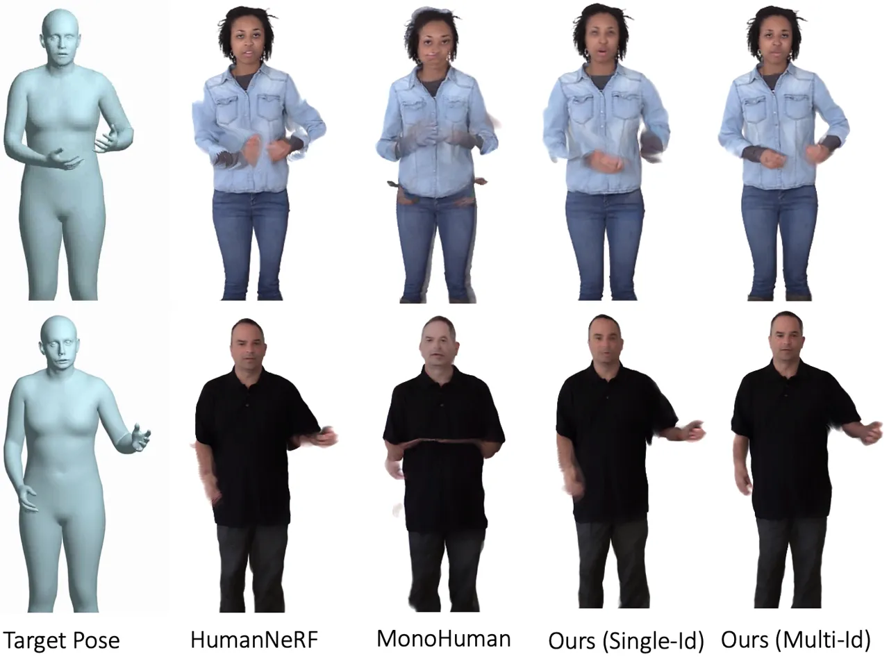

Figure 6: Qualitative comparison for rendering unseen
out-of-distribution poses. From left to right: target pose, results of
HumanNeRF \[64\], MonoHuman \[68\], our single-identity, and our
multi-identity model. Our multi-identity TalkinNeRF robustly renders
each identity under completely unseen poses and expressions.

Poses from other identities. Animating a subject under novel poses from
different identities is more challenging. Each subject has their own
personal talking style and hand articulation. Thus, novel poses from a
different subject might be far from the training distribution. Our
multi-identity representation significantly outperforms the other
methods in this setting, as demonstrated in the qualitative results in
Fig. 5. Notice in the first row, how it can photo-realistically
synthesize an unseen facial expression with closed eye lids and a smile,
following the target expression. In addition, it robustly produces the
unseen hand and arm pose, as well as facial expression in the second
row. Since we do not have ground truth in this case, we use the LSE-D
and LSE-C metrics \[52, 10\] to evaluate the generated facial
expressions, given the corresponding speech signal (see Tab. 4).

Speech-driven generated poses. Another interesting setting is rendering
poses generated from audio prompts. In this case, we use a
speech-to-motion model \[43\] that synthesizes sequences of 3D human
body poses, including hand gestures and facial expressions, given a
speech recording or a text-to-speech output. These generated poses are
more challenging, since they use different data for training and they
follow a different fitting algorithm. Fig. 6 demonstrates the
corresponding qualitative results. HumanNeRF, MonoHuman, and the
single-identity model can lead to artifacts (_e.g_., disconnected arms
and hands), while our multi-identity TalkinNeRF robustly produces
high-quality animations that faithfully follow the target poses.

### 4.3 Evaluation: Novel Identity

We also explore the scenario when we would like to animate a novel
identity, which originally is not part of our training subjects. Given
only a short video, _i.e_., a small number of consecutive frames, we
evaluate if our multi-identity model can learn to robustly animate this
new identity. Note that in this case, only a very small variation of
body poses, hand gestures, and facial expressions is seen for that
particular subject. We initially train our multi-identity TalkinNeRF
using the 9 full-body talking videos, and then adapt it to the
$`10^{th}`$ identity, as described in Sec. 3.3, using very small
portions of their videos (1, 3, 10, or 30 seconds). Fig. 7(a)
demonstrates the corresponding results when rendering a novel identity
under novel poses, _completely unseen in training_. Our method robustly
animates a novel identity, even given a very short video, in contrast to
HumanNeRF. Corresponding quantitative results are illustrated in
Fig. 7(b).

Fig. 8 shows additional qualitative comparison with SHERF \[25\], which
produces 3D humans from a single input frame. Given a short video of a
new identity, we fine-tune our multi-identity model, in order to learn
the corresponding identity code. We train HumanNeRF \[64\] and fine-tune
SHERF \[25\] using the same short video. TalkinNeRF significantly
outperforms the other methods, robustly animating the completely new
identity under completely unseen poses.

### 4.4 Limitations

Similarly with related works, the fitting algorithm that estimates the
input body poses, hand articulation and facial expressions can be noisy.
These are used as ground truth for training and thus, any error is
propagated to our method and the final results. It might introduce
temporal inconsistency. In addition, it might not be able to capture the
exact finger positions in fast moving frames and subtle facial
movements. In the future, we plan to collect higher resolution data for
the face and hands to further enhance the visual quality.

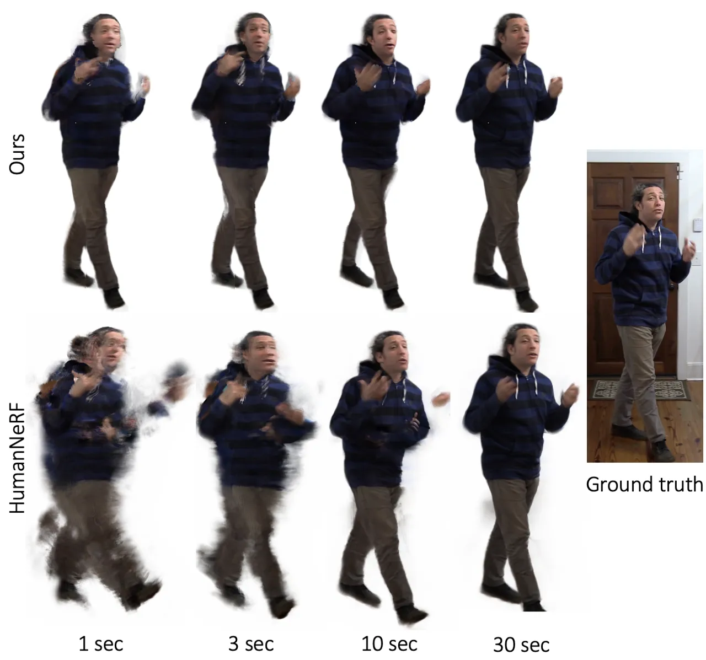

(a)

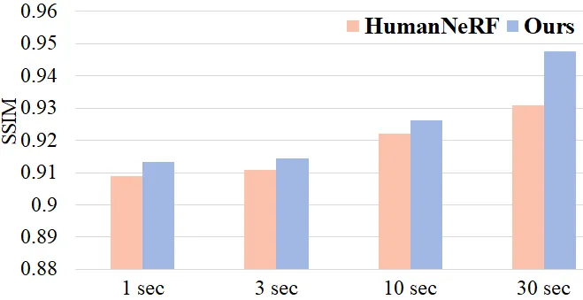

(b)

Figure 7: Learning a novel identity. (a) Qualitative comparison. The
novel identity is learned from a short video (1, 3, 10 or 30 sec.),
_i.e_., small number of consecutive frames. Compared to
HumanNeRF \[64\], our method robustly renders the new identity under
completely unseen poses, given only a very short video. (b) Quantitative
comparison. The novel identity is learned from a short video (1, 3, 10
or 30 sec.).

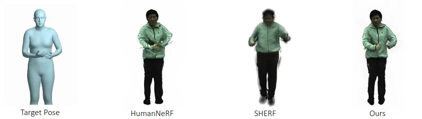

Figure 8: Learning a novel identity. From left to right: target pose,
results of HumanNeRF \[64\], SHERF \[25\], and our multi-identity model.
Our method robustly renders the new identity under completely unseen
poses.

## 5 Conclusion

We present TalkinNeRF, a novel approach that represents the holistic 4D
motion of talking humans from monocular videos. To the best of our
knowledge, this is the first approach to introduce a dynamic NeRF that
combines body pose, hand articulation, as well as facial expression,
learned from monocular frontal-only videos. We introduce a
multi-identity representation that enables us to simultaneously train on
multiple subjects. In this way, not only we reduce the overall training
time, but also we enhance our method’s robustness under completely
unseen poses and expressions. TalkinNeRF obtains state-of-the-art
performance in animating full-body talking humans. We provide several
applications, ranging from adapting to a completely new identity, given
only a short video, to generating a retargeted motion from a
speech-to-motion model.

## References

- \[1\] Athar, S., Xu, Z., Sunkavalli, K., Shechtman, E., Shu, Z.:
  RigNeRF: Fully Controllable Neural 3D Portraits. In: IEEE Conference
  on Computer Vision and Pattern Recognition (CVPR) (2022)
- \[2\] Barron, J.T., Mildenhall, B., Tancik, M., Hedman, P.,
  Martin-Brualla, R., Srinivasan, P.P.: Mip-NeRF: A Multiscale
  Representation for Anti-Aliasing Neural Radiance Fields (2021)
- \[3\] Barron, J.T., Mildenhall, B., Verbin, D., Srinivasan, P.P.,
  Hedman, P.: Mip-NeRF 360: Unbounded Anti-Aliased Neural Radiance
  Fields. IEEE Conference on Computer Vision and Pattern Recognition
  (CVPR) (2022)
- \[4\] Cao, Z., Hidalgo Martinez, G., Simon, T., Wei, S., Sheikh, Y.A.:
  Openpose: Realtime multi-person 2d pose estimation using part affinity
  fields. IEEE Transactions on Pattern Analysis and Machine
  Intelligence (2019)
- \[5\] Chan, C., Ginosar, S., Zhou, T., Efros, A.A.: Everybody dance
  now. In: IEEE International Conference on Computer Vision
  (ICCV) (2019)
- \[6\] Chatziagapi, A., Athar, S., Jain, A., Kumar, R.M.V., Bhat, V.,
  Samaras, D.: Lipnerf: What is the right feature space to lip-sync a
  nerf. In: International Conference on Automatic Face and Gesture
  Recognition (FG) (2023)
- \[7\] Chen, A., Xu, Z., Zhao, F., Zhang, X., Xiang, F., Yu, J., Su,
  H.: Mvsnerf: Fast generalizable radiance field reconstruction from
  multi-view stereo. arXiv preprint arXiv:2103.15595 (2021)
- \[8\] Choi, H., Moon, G., Armando, M., Leroy, V., Lee, K.M., Rogez,
  G.: Mononhr: Monocular neural human renderer. In: International
  Conference on 3D Vision (3DV). pp. 242–251. IEEE (2022)
- \[9\] Choutas, V., Pavlakos, G., Bolkart, T., Tzionas, D., Black,
  M.J.: Monocular expressive body regression through body-driven
  attention. In: European Conference on Computer Vision (ECCV) (2020)
- \[10\] Chung, J.S., Zisserman, A.: Out of time: automated lip sync in
  the wild. In: Asian conference on computer vision. pp. 251–263.
  Springer (2016)
- \[11\] Dong, J., Fang, Q., Guo, Y., Peng, S., Shuai, Q., Zhou, X.,
  Bao, H.: Totalselfscan: Learning full-body avatars from self-portrait
  videos of faces, hands, and bodies. In: Advances in Neural Information
  Processing Systems (2022)
- \[12\] Duan, H.B., Wang, M., Shi, J.C., Chen, X.C., Cao, Y.P.:
  Bakedavatar: Baking neural fields for real-time head avatar synthesis.
  ACM Trans. Graph. 42(6) (sep 2023). https://doi.org/10.1145/3618399,
  [https://doi.org/10.1145/3618399](https://doi.org/10.1145/3618399)
- \[13\] Fang, Q., Shuai, Q., Dong, J., Bao, H., Zhou, X.:
  Reconstructing 3D Human Pose by Watching Humans in the Mirror. In:
  IEEE Conference on Computer Vision and Pattern Recognition
  (CVPR) (2021)
- \[14\] Feng, Y., Yang, J., Pollefeys, M., Black, M.J., Bolkart, T.:
  Capturing and animation of body and clothing from monocular video. In:
  SIGGRAPH Asia 2022 Conference Papers. SA ’22 (2022)
- \[15\] Gafni, G., Thies, J., Zollhöfer, M., Nießner, M.: Dynamic
  Neural Radiance Fields for Monocular 4D Facial Avatar Reconstruction.
  In: IEEE Conference on Computer Vision and Pattern Recognition
  (CVPR) (2021)
- \[16\] Gao, X., Yang, J., Kim, J., Peng, S., Liu, Z., Tong, X.:
  MPS-NeRF: Generalizable 3D Human Rendering From Multiview Images. IEEE
  Transactions on Pattern Analysis and Machine Intelligence (2022)
- \[17\] Gao, X., Zhong, C., Xiang, J., Hong, Y., Guo, Y., Zhang, J.:
  Reconstructing personalized semantic facial nerf models from monocular
  video. ACM Transactions on Graphics (Proceedings of SIGGRAPH Asia)
  41(6) (2022). https://doi.org/10.1145/3550454.3555501
- \[18\] Güler, R.A., Neverova, N., Kokkinos, I.: Densepose: Dense human
  pose estimation in the wild. In: IEEE Conference on Computer Vision
  and Pattern Recognition (CVPR) (2018)
- \[19\] Guo, J., Zhu, X., Lei, Z.: 3ddfa.
  [https://github.com/cleardusk/3DDFA](https://github.com/cleardusk/3DDFA) (2018)
- \[20\] Guo, J., Zhu, X., Yang, Y., Yang, F., Lei, Z., Li, S.Z.:
  Towards fast, accurate and stable 3d dense face alignment. In:
  European Conference on Computer Vision (ECCV) (2020)
- \[21\] Guo, Y., Chen, K., Liang, S., Liu, Y.J., Bao, H., Zhang, J.:
  AD-NeRF: Audio driven neural radiance fields for talking head
  synthesis. In: IEEE International Conference on Computer Vision
  (ICCV). pp. 5784–5794 (2021)
- \[22\] Guo, Z., Zhou, W., Wang, M., Li, L., Li, H.: HandNeRF: Neural
  Radiance Fields for Animatable Interacting Hands. In: IEEE Conference
  on Computer Vision and Pattern Recognition (CVPR) (2023)
- \[23\] Hazirbas, C., Bitton, J., Dolhansky, B., Pan, J., Gordo, A.,
  Ferrer, C.C.: Towards measuring fairness in ai: the casual
  conversations dataset. IEEE Transactions on Biometrics, Behavior, and
  Identity Science 4(3), 324–332 (2021)
- \[24\] Hong, Y., Peng, B., Xiao, H., Liu, L., Zhang, J.: Headnerf: A
  real-time nerf-based parametric head model. In: IEEE Conference on
  Computer Vision and Pattern Recognition (CVPR) (2022)
- \[25\] Hu, S., Hong, F., Pan, L., Mei, H., Yang, L., Liu, Z.: Sherf:
  Generalizable human nerf from a single image. arXiv preprint
  arXiv:2303.12791 (2023)
- \[26\] Isola, P., Zhu, J.Y., Zhou, T., Efros, A.A.: Image-to-image
  translation with conditional adversarial networks. CVPR (2017)
- \[27\] Jayasundara, V., Agrawal, A., Heron, N., Shrivastava, A.,
  Davis, L.S.: Flexnerf: Photorealistic free-viewpoint rendering of
  moving humans from sparse views. In: IEEE Conference on Computer
  Vision and Pattern Recognition (CVPR) (2023)
- \[28\] Jiang, W., Yi, K.M., Samei, G., Tuzel, O., Ranjan, A.: NeuMan:
  Neural Human Radiance Field from a Single Video. In: European
  conference on computer vision (ECCV) (2022)
- \[29\] Kania, K., Yi, K.M., Kowalski, M., Trzciński, T., Tagliasacchi,
  A.: CoNeRF: Controllable Neural Radiance Fields. In: IEEE Conference
  on Computer Vision and Pattern Recognition (CVPR) (2022)
- \[30\] Kingma, D.P., Ba, J.: Adam: A method for stochastic
  optimization. arXiv preprint arXiv:1412.6980 (2014)
- \[31\] Kwon, Y., Kim, D., Ceylan, D., Fuchs, H.: Neural human
  performer: Learning generalizable radiance fields for human
  performance rendering. Advances in Neural Information Processing
  Systems 34 (2021)
- \[32\] Li, R., Yang, S., Ross, D.A., Kanazawa, A.: AI Choreographer:
  Music Conditioned 3D Dance Generation with AIST++ (2021)
- \[33\] Li, T., Slavcheva, M., Zollhoefer, M., Green, S., Lassner, C.,
  Kim, C., Schmidt, T., Lovegrove, S., Goesele, M., Newcombe, R.,
  et al.: Neural 3d video synthesis from multi-view video. In: IEEE
  Conference on Computer Vision and Pattern Recognition (CVPR) (2022)
- \[34\] Li, Z., Niklaus, S., Snavely, N., Wang, O.: Neural scene flow
  fields for space-time view synthesis of dynamic scenes. In: IEEE
  Conference on Computer Vision and Pattern Recognition (CVPR) (2021)
- \[35\] Lin, S., Yang, L., Saleemi, I., Sengupta, S.: Robust
  high-resolution video matting with temporal guidance (2021)
- \[36\] Lindell, D.B., Van Veen, D., Park, J.J., Wetzstein, G.: Bacon:
  Band-limited coordinate networks for multiscale scene representation.
  In: IEEE Conference on Computer Vision and Pattern Recognition
  (CVPR) (2022)
- \[37\] Liu, L., Habermann, M., Rudnev, V., Sarkar, K., Gu, J.,
  Theobalt, C.: Neural actor: Neural free-view synthesis of human actors
  with pose control. ACM Trans. Graph.(ACM SIGGRAPH Asia) (2021)
- \[38\] Loper, M., Mahmood, N., Romero, J., Pons-Moll, G., Black, M.J.:
  SMPL: A Skinned Multi-Person Linear Model. ACM Trans. Graphics (Proc.
  SIGGRAPH Asia) 34(6), 248:1–248:16 (Oct 2015)
- \[39\] Loper, M., Mahmood, N., Romero, J., Pons-Moll, G., Black, M.J.:
  Smpl: A skinned multi-person linear model. In: Seminal Graphics
  Papers: Pushing the Boundaries, Volume 2, pp. 851–866 (2023)
- \[40\] Mahmood, N., Ghorbani, N., Troje, N.F., Pons-Moll, G., Black,
  M.J.: AMASS: Archive of motion capture as surface shapes. In:
  International Conference on Computer Vision. pp. 5442–5451 (Oct 2019)
- \[41\] Mildenhall, B., Srinivasan, P.P., Tancik, M., Barron, J.T.,
  Ramamoorthi, R., Ng, R.: NeRF: Representing Scenes as Neural Radiance
  Fields for View Synthesis. In: European Conference on Computer Vision
  (ECCV) (2020)
- \[42\] Mu, J., Sang, S., Vasconcelos, N., Wang, X.: ActorsNeRF:
  Animatable Few-shot Human Rendering with Generalizable NeRFs (2023)
- \[43\] Ng, E., Romero, J., Bagautdinov, T., Bai, S., Darrell, T.,
  Kanazawa, A., Richard, A.: From audio to photoreal embodiment:
  Synthesizing humans in conversations. In: Proceedings of the IEEE/CVF
  Conference on Computer Vision and Pattern Recognition. pp.
  1001–1010 (2024)
- \[44\] Noguchi, A., Sun, X., Lin, S., Harada, T.: Neural Articulated
  Radiance Field. In: International Conference on Computer Vision
  (ICCV) (2021)
- \[45\] Osman, A.A.A., Bolkart, T., Black, M.J.: STAR: A sparse trained
  articulated human body regressor. In: European Conference on Computer
  Vision (ECCV). pp. 598–613 (2020),
  [https://star.is.tue.mpg.de](https://star.is.tue.mpg.de)
- \[46\] Park, K., Sinha, U., Barron, J.T., Bouaziz, S., Goldman, D.B.,
  Seitz, S.M., Martin-Brualla, R.: Nerfies: Deformable neural radiance
  fields. International Conference on Computer Vision (ICCV) (2021)
- \[47\] Park, K., Sinha, U., Hedman, P., Barron, J.T., Bouaziz, S.,
  Goldman, D.B., Martin-Brualla, R., Seitz, S.M.: HyperNeRF: A
  Higher-Dimensional Representation for Topologically Varying Neural
  Radiance Fields. ACM Trans. Graph. 40(6) (dec 2021)
- \[48\] Paszke, A., Gross, S., Massa, F., Lerer, A., Bradbury, J.,
  Chanan, G., Killeen, T., Lin, Z., Gimelshein, N., Antiga, L., et al.:
  Pytorch: An imperative style, high-performance deep learning library.
  Advances in Neural Information Processing Systems 32 (2019)
- \[49\] Pavlakos, G., Choutas, V., Ghorbani, N., Bolkart, T., Osman,
  A.A.A., Tzionas, D., Black, M.J.: Expressive body capture: 3d hands,
  face, and body from a single image. In: IEEE Conference on Computer
  Vision and Pattern Recognition (CVPR) (2019)
- \[50\] Peng, S., Geng, C., Zhang, Y., Xu, Y., Wang, Q., Shuai, Q.,
  Zhou, X., Bao, H.: Implicit Neural Representations with Structured
  Latent Codes for Human Body Modeling. IEEE Transactions on Pattern
  Analysis and Machine Intelligence (2023)
- \[51\] Peng, S., Zhang, Y., Xu, Y., Wang, Q., Shuai, Q., Bao, H.,
  Zhou, X.: Neural Body: Implicit Neural Representations with Structured
  Latent Codes for Novel View Synthesis of Dynamic Humans. In: IEEE
  Conference on Computer Vision and Pattern Recognition (CVPR) (2021)
- \[52\] Prajwal, K.R., Mukhopadhyay, R., Namboodiri, V.P., Jawahar, C.:
  A Lip Sync Expert Is All You Need for Speech to Lip Generation In the
  Wild. In: ACM International Conference on Multimedia. p.
  484–492 (2020)
- \[53\] Prokudin, S., Black, M.J., Romero, J.: Smplpix: Neural avatars
  from 3d human models. In: IEEE Winter Conference on Applications of
  Computer Vision. pp. 1810–1819 (2021)
- \[54\] Pumarola, A., Corona, E., Pons-Moll, G., Moreno-Noguer, F.:
  D-nerf: Neural radiance fields for dynamic scenes. In: IEEE Conference
  on Computer Vision and Pattern Recognition (CVPR) (2021)
- \[55\] Qian, S., Kirschstein, T., Schoneveld, L., Davoli, D.,
  Giebenhain, S., Nießner, M.: Gaussianavatars: Photorealistic head
  avatars with rigged 3d gaussians. arXiv preprint
  arXiv:2312.02069 (2023)
- \[56\] Qian, Z., Wang, S., Mihajlovic, M., Geiger, A., Tang, S.:
  3dgs-avatar: Animatable avatars via deformable 3d gaussian splatting.
  arXiv preprint arXiv:2312.09228 (2023)
- \[57\] Raj, A., Zollhofer, M., Simon, T., Saragih, J., Saito, S.,
  Hays, J., Lombardi, S.: Pixel-aligned volumetric avatars. In:
  Proceedings of the IEEE/CVF Conference on Computer Vision and Pattern
  Recognition. pp. 11733–11742 (2021)
- \[58\] Romero, J., Tzionas, D., Black, M.J.: Embodied hands: Modeling
  and capturing hands and bodies together. ACM Transactions on Graphics,
  (Proc. SIGGRAPH Asia) 36(6) (Nov 2017)
- \[59\] Shen, K., Guo, C., Kaufmann, M., Zarate, J., Valentin, J.,
  Song, J., Hilliges, O.: X-avatar: Expressive human avatars (2023)
- \[60\] Su, S.Y., Yu, F., Zollhöfer, M., Rhodin, H.: A-nerf:
  Articulated neural radiance fields for learning human shape,
  appearance, and pose. Advances in Neural Information Processing
  Systems 34, 12278–12291 (2021)
- \[61\] Wang, Q., Wang, Z., Genova, K., Srinivasan, P., Zhou, H.,
  Barron, J.T., Martin-Brualla, R., Snavely, N., Funkhouser, T.: Ibrnet:
  Learning multi-view image-based rendering. In: CVPR (2021)
- \[62\] Wang, T., Sarafianos, N., Yang, M.H., Tung, T.: Neural
  rendering of humans in novel view and pose from monocular video. arXiv
  preprint arXiv:2204.01218 (2022)
- \[63\] Wang, Z., Bovik, A.C., Sheikh, H.R., Simoncelli, E.P.: Image
  quality assessment: from error visibility to structural similarity.
  IEEE Transactions on Image Processing 13(4), 600–612 (2004)
- \[64\] Weng, C.Y., Curless, B., Srinivasan, P.P., Barron, J.T.,
  Kemelmacher-Shlizerman, I.: Humannerf: Free-viewpoint rendering of
  moving people from monocular video. In: IEEE Conference on Computer
  Vision and Pattern Recognition (CVPR) (2022)
- \[65\] Xian, W., Huang, J.B., Kopf, J., Kim, C.: Space-time Neural
  Irradiance Fields for Free-Viewpoint Video. In: IEEE Conference on
  Computer Vision and Pattern Recognition (CVPR) (2021)
- \[66\] Xu, H., Alldieck, T., Sminchisescu, C.: H-nerf: Neural radiance
  fields for rendering and temporal reconstruction of humans in motion.
  Advances in Neural Information Processing Systems 34,
  14955–14966 (2021)
- \[67\] Yi, H., Liang, H., Liu, Y., Cao, Q., Wen, Y., Bolkart, T., Tao,
  D., Black, M.J.: Generating Holistic 3D Human Motion from Speech. In:
  IEEE Conference on Computer Vision and Pattern Recognition
  (CVPR) (2023)
- \[68\] Yu, Z., Cheng, W., Liu, x., Wu, W., Lin, K.Y.: MonoHuman:
  Animatable Human Neural Field from Monocular Video. In: IEEE
  Conference on Computer Vision and Pattern Recognition (CVPR) (2023)
- \[69\] Zhang, R., Isola, P., Efros, A.A., Shechtman, E., Wang, O.: The
  Unreasonable Effectiveness of Deep Features as a Perceptual Metric.
  In: IEEE Conference on Computer Vision and Pattern Recognition
  (CVPR) (2018)
- \[70\] Zheng, S., Zhou, B., Shao, R., Liu, B., Zhang, S., Nie, L.,
  Liu, Y.: Gps-gaussian: Generalizable pixel-wise 3d gaussian splatting
  for real-time human novel view synthesis. arXiv (2023)
- \[71\] Zheng, Z., Zhao, X., Zhang, H., Liu, B., Liu, Y.: Avatarrex:
  Real-time expressive full-body avatars. ACM Transactions on Graphics
  (TOG) 42(4) (2023)
- \[72\] Zhuang, Y., Zhu, H., Sun, X., Cao, X.: MoFaNeRF: Morphable
  Facial Neural Radiance Field. In: European Conference on Computer
  Vision (ECCV) (2022)
- \[73\] Zielonka, W., Bolkart, T., Thies, J.: Instant volumetric head
  avatars. In: Proceedings of the IEEE/CVF Conference on Computer Vision
  and Pattern Recognition. pp. 4574–4584 (2023)

## Supplementary

The supplementary document is organized as follows:

1.  1.  Additional Results
2.  2.  Implementation Details

We strongly encourage the readers to watch our supplementary video on
our project page:
[https://aggelinacha.github.io/TalkinNeRF/](https://aggelinacha.github.io/TalkinNeRF/).

## A Additional Results

Fig. 13 shows additional qualitative results when rendering novel poses
from the same identity, not seen during training. Please notice the
facial expressions and the hands of each subject. TalkinNeRF synthesizes
them with a high fidelity. As also mentioned in Sec. 4.2,
HumanNeRF \[64\] learns only an average expression per subject, while
MonoHuman \[68\] produces artifacts, since our data include only frontal
videos.

Fig. 9 shows additional qualitative results when rendering novel poses
from different identities (first 2 rows), or speech-driven poses
generated by a speech-to-motion model \[67\] (last row). We compare
HumanNeRF \[64\], MonoHuman \[68\], our single-identity, and our
multi-identity model. In contrast to the other methods, our
multi-identity TalkinNeRF robustly renders each identity under
completely unseen body poses, hand articulation, and facial expressions.

Fig. 10 shows additional qualitative results when rendering a novel
identity, which originally is not part of our training subjects. As
mentioned in Sec. 4.3, given a short video of the new identity, we
fine-tune our multi-identity model, in order to learn the corresponding
identity code. Since we only use a few consecutive frames, our model
only sees a very small variation of body poses, hand gestures, and
facial expressions of the new identity. Similarly, we train
HumanNeRF \[64\] and fine-tune SHERF \[25\] using the same short video.
TalkinNeRF significantly outperforms the other methods, robustly
animating the new identity under completely unseen poses.

Fig. 11 compares our method with SMPLpix \[53\], which learns an
image-to-image translation network for rendering. SMPLpix fails to
synthesize photo-realistic facial expressions and hands. In Fig. 12, we
further compare with SCARF \[14\] that leads to blurry faces. Our method
produces high-quality videos of talking humans.

Video Results. We strongly encourage the readers to watch our
supplementary video that shows animations of full-body talking humans,
and corresponding comparisons with the state-of-the-art.

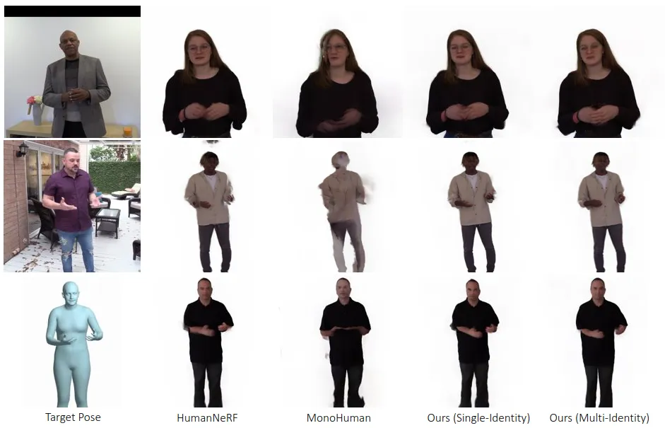

Figure 9: Qualitative comparison for rendering novel (unseen) poses.
From left to right: target pose, results of HumanNeRF \[64\],
MonoHuman \[68\], our single-identity model, and our multi-identity
model. Our multi-identity TalkinNeRF robustly renders each identity
under unseen poses and expressions.

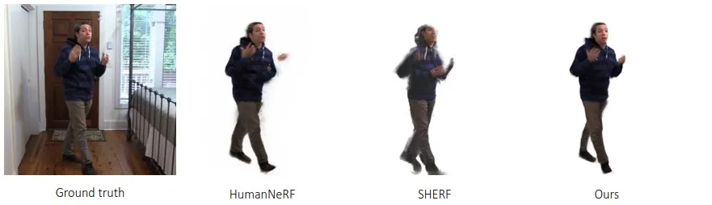

Figure 10: Qualitative comparison for learning a novel identity. From
left to right: ground truth, results of HumanNeRF \[64\], SHERF \[25\],
and our multi-identity model. Our method robustly renders the new
identity under completely unseen poses, given only a very short video of
10 seconds.

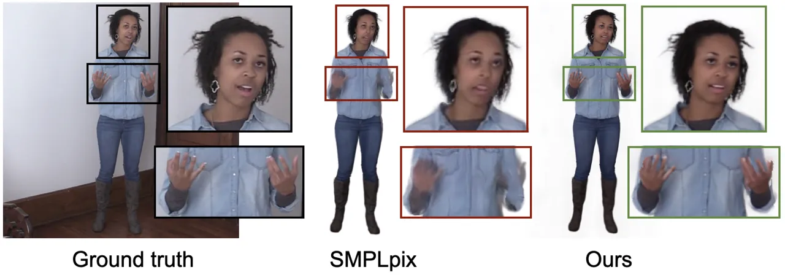

Figure 11: Qualitative comparison with SMPLpix \[53\]. Our method
captures fine-grained facial expression and hand articulation.

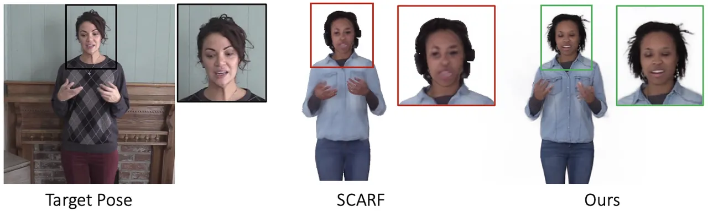

Figure 12: Qualitative comparison with SCARF \[14\]. Our method
synthesizes high visual quality, whereas SCARF leads to blurry faces.

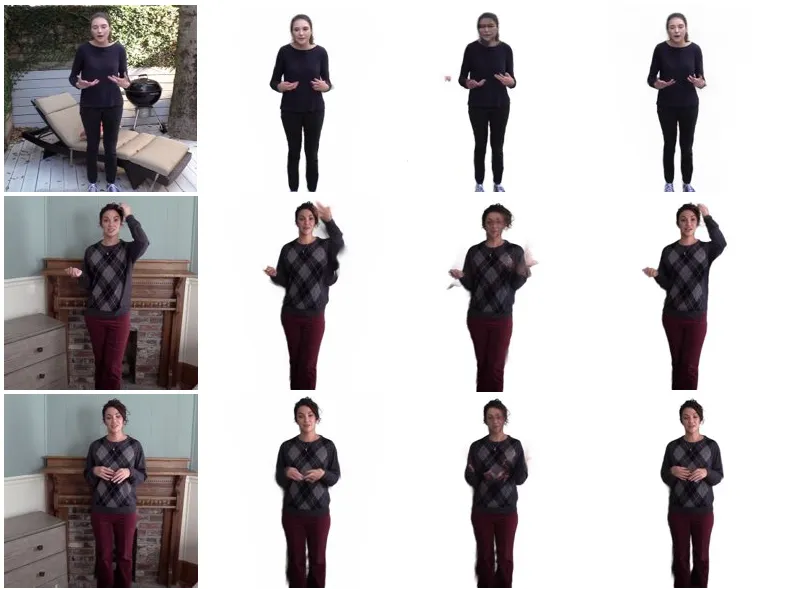

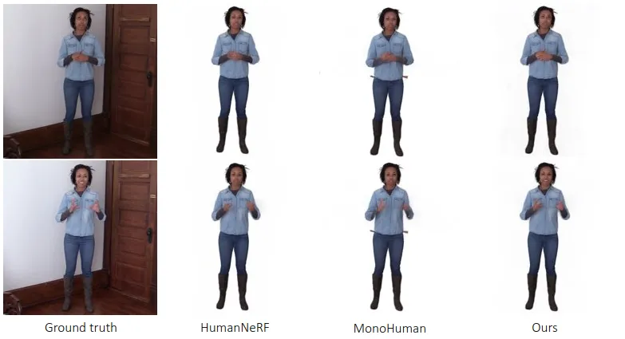

Figure 13: Qualitative comparison for rendering novel poses from the
same identity. We compare with HumanNeRF \[64\] and MonoHuman \[68\].
Ground truth (not seen in training) is shown on the left. Our method
generates facial expressions and hand articulation with a high fidelity.

## B Implementation Details

In this section, we include additional implementation details.

Segmentation. As mentioned in Sec. 3.2, we segment the human body from
the background using an automatic human video matting method \[35\]. To
get the segmentation ground truth classes, we use DensePose \[18\] and
keep the corresponding labels for hands, arms, head, body (rest of body
parts), and background.

Architecture. For the body pose, we closely follow the architecture of
HumanNeRF \[64\], in order to map the points from the observation to the
canonical space and train the Body MLP. For $`F_{\text{body}}`$,
$`F_{\text{face}}`$, and $`F_{\text{hands}}`$, we use MLPs of 8 linear
layers with 256 hidden units each, ReLU activations, and sinusoidal
positional encodings with 10 frequency bands for the input points. For
$`D_{\text{nr}}`$ and $`D_{\text{hands}}`$, we use MLPs of 6 linear
layers with 128 hidden units each, ReLU activations, and positional
encodings with 6 frequency bands with a truncated Hann window
applied \[64\]. To avoid overfitting to the seen poses for each subject,
$`D_{\text{nr}}`$ is included in the training after 100k iterations.

Sampling. We march 32768 rays and sample 128 points per ray during
training. We use stratified sampling \[41\] and sample points mostly
inside the 3D bounding box of the human subject, with a percentage of
80%. Since arm and hand gestures are important in talking humans, and
only cover a small area in the video frames, we additionally set certain
sampling percentages for arms and hands. Based on our ground truth
segmentation, we sample 20% of the points inside the bounding box from
the hands during the first 20k iterations, 20% from the hands and 60%
from the arms during the next 20k iterations, 40% from the hands and 40%
from the arms during the next 20k, 80% from the hands and 20% from the
arms during the next 20k, and 20% from the hands for all the following
iterations. We empirically found that this sampling strategy encourages
the network to learn the structure and motion of arms and hands at
appropriate iterations for our data.

Training. Our implementation is based on PyTorch \[48\]. We train our
single-identity network for 400k iterations and our multi-identity
network for 600k iterations for 10 subjects, using 4 GPUs. We use Adam
optimizer \[30\] with an initial learning rate of $`5\times 10^{-4}`$
and exponential decay, with a rate of 0.1 and 500k steps. The rest of
the Adam hyper-parameters are set at their default values
($`\beta_{1}=0.9,\beta_{2}=0.999,\epsilon=10^{-8}`$). To compute the
LPIPS loss, we apply patch-based ray sampling, similarly with \[64\]. We
sample 6 patches with a size of $`32\times 32`$ on each image.

Rendering. Since the target poses are usually noisy, estimated in a
frame-by-frame manner \[9\], we apply temporal smoothing for our final
video synthesis during test time. We use a Gaussian filter with a window
size of 5 frames and unit standard deviation, applied to the target body
poses, hand poses, facial expressions and camera parameters, along the
temporal axis. This ensures temporally smooth results.

Evaluation. We compute the visual quality metrics (PSNR, SSIM, LPIPS)
for the full video frames, only the face, and only the hands, as
indicated in our quantitative results. To compute them for the face
region, we crop each frame around the face, using the face detector from
3DDFA \[20, 19\]. Similarly for the hand region, to evaluate the hand
visual quality, we crop a bounding box around each hand, based on the
segmentation by DensePose \[18\].
