# Stable Video Portraits

Mirela
Ostrek[](https://orcid.org/0009-0009-9987-646X)
Affiliation: Max Planck Institute for Intelligent Systems, Tübingen,
Germany    Justus
Thies[](https://orcid.org/0000-0002-0056-9825)
Affiliation: Max Planck Institute for Intelligent Systems, Tübingen,
Germany Affiliation: Technical University of Darmstadt, Darmstadt,
Germany Affiliation: Max Planck Institute for Intelligent Systems,
Tübingen, Germany Affiliation: Technical University of Darmstadt,
Darmstadt, Germany

###### Abstract

Rapid advances in the field of generative AI and text-to-image methods
in particular have transformed the way we interact with and perceive
computer-generated imagery today. In parallel, much progress has been
made in 3D face reconstruction, using 3D Morphable Models (3DMM). In
this paper, we present Stable Video Portraits, a novel hybrid 2D/3D
generation method that outputs photorealistic videos of talking faces
leveraging a large pre-trained text-to-image prior (2D), controlled via
a 3DMM (3D). Specifically, we introduce a person-specific fine-tuning of
a general 2D stable diffusion model which we lift to a video model by
providing temporal 3DMM sequences as conditioning and by introducing a
temporal denoising procedure. As an output, this model generates
temporally smooth imagery of a person with 3DMM-based controls, i.e., a
person-specific avatar. The facial appearance of this person-specific
avatar can be edited and morphed to text-defined celebrities, without
any fine-tuning at test time. The method is analyzed quantitatively and
qualitatively, and we show that our method outperforms state-of-the-art
monocular head avatar methods.
[https://svp.is.tue.mpg.de/](https://svp.is.tue.mpg.de/)

###### Keywords: 

Neural rendering Generative AI Head avatars

![[Uncaptioned
image]](arxiv-2409-18083--4d46bd971844.figures/figure-1.webp)

Figure 1: Stable Video Portraits is a high-fidelity hybrid 2D/3D
person-specific monocular head avatar method; fine-grained control over
the head pose and expression parameters is achieved via 3DMM conditions.
Leveraging the Stable Diffusion prior, generated faces may be morphed
into celeb faces using text, without any fine-tuning at test time.

## 1 Introduction

Digitizing and animating our appearance is a core challenge for various
human-centric applications including telepresence in AR or VR,
e-commerce, or content creation for entertainment purposes (movies,
computer games). In the past years, we have seen immense progress in
this field \[55, 43, 44\] ranging from classical 3D reconstruction
methods that use 3DMMs \[46\], point clouds \[53\], and meshes with
dynamic offsets \[16\], to 2D neural rendering \[24, 6\] and 3D neural
rendering utilizing neural-radiance-based representations \[11, 52\]. In
parallel, we have witnessed tremendous successes in generative AI,
especially, for image synthesis. Most recently, large text-to-image
latent diffusion models such as Stable Diffusion \[37\], DALL-E \[36,
35\], and MidJourney \[31\], amongst others, have been in the spotlight
due to their capacity to generate remarkably detailed images of high
quality, in a matter of seconds. To control the image generation process
further, new finetuning modules and techniques such as
ControlNet \[51\], LoRA \[18\], DreamBooth \[38\], and textual
inversion \[12, 32\] have been proposed.

In this paper, we devise a hybrid 2D/3D monocular head avatar method
called Stable Video Portraits, leveraging (i) a large pre-trained 2D
text-to-image prior (Stable Diffusion) that is able to generate
remarkably detailed, lifelike faces of high quality, and (ii) a
3DMM-based 3D head model that offers a high level of controllability of
the avatar as it parameterizes the head in terms of 3D head pose and
facial expressions \[27, 33\]. To bridge the gap between 2D and 3D, the
conditioning 3DMMs are projected onto a 2D image plane, and
person-specific finetuning of stable diffusion via ControlNet \[51\] is
performed using a short video.

However, the process of generating 2D avatar images conditioned on the
output of an off-the-shelf 3D face reconstruction method presents
several challenges. These challenges include temporal inconsistencies in
reconstructed meshes and their corresponding 3DMM parameters, potential
ambiguities in regions not controlled by the mesh (e.g., hair and
shoulders), and discrepancies in texture and shape, attributable to
inaccuracies in the underlying 3D model. These issues often manifest as
flickering artifacts in the resulting videos. To address such
challenges, we introduce novel techniques aimed at enhancing temporal
consistency. Firstly, temporal conditioning is incorporated into
ControlNet by leveraging a sequence of meshes as input. Secondly, the
denoising process is refined by integrating the latent representation of
the previous frame during inference. These methodological improvements
lead to predictions that exhibit greater stability and visual coherence
throughout the generated videos.

In addition to generating person-specific avatars, our method allows for
face morphing at test time to adjust the avatar’s appearance to resemble
a celebrity, guided by text. During training, ControlNet learns
consistent shape and texture representations. At test time, it then
generates consistent offsets to those representations to morph the
person-specific face with the target celebrity face, leveraging existing
celebrity appearances within the Stable Diffusion text-to-image prior.
Remarkably, our method produces diverse appearances at test time from a
single training sequence, eliminating the need for any finetuning or
training for new text-defined identity morphs.

We demonstrate the effectiveness of our method through quantitative and
qualitative ablation studies comparing it with state-of-the-art
monocular head avatar methods. Our method outperforms the
state-of-the-art, especially considering its capability to reconstruct
detailed images (LPIPS) of high-fidelity human faces (FID/KID). In
summary, we make the following contributions:

- $`\circ`$
  A hybrid 2D/3D monocular avatar method, where (2D) Stable Diffusion
  image prior is leveraged to achieve high-fidelity reconstructions,
  while (3D) 3DMM enables fine-grained control over the head pose and
  expression parameters in a temporally coherent manner.
- $`\circ`$
  A novel denoising procedure, where each video frame is generated
  considering the previous frame, at inference time, producing
  temporally stable avatars.
- $`\circ`$
  A technique to morph the facial appearance of a person-specific
  avatar, into a text-defined celebrity, without any fine-tuning at test
  time.
- $`\circ`$
  A portrait avatar dataset with long talking sequences (8+ minutes)
  containing examples of non-trivial head movements for 6 female
  participants. Please see our supplementary materials for more details.

## 2 Related Work

Our proposed approach integrates aspects of 3DMM-based avatar
reconstruction with 2D generative AI, forming a hybrid methodology for
reconstructing portrait avatars from person-specific video sequences. In
this section, we explore related work on facial avatar reconstruction
from monocular data, and 2D generative methods including the techniques
leveraging large pre-trained diffusion models \[37\], as well as
Generative Adversarial Networks (GANs) \[15\].

#### 3D Head Avatars:

In the past few years, we have seen a large amount of publications about
3D human avatars. Especially, for facial avatars there are
state-of-the-art reports that cover classical 3DMM-based methods \[55\],
as well as 2D/3D neural rendering-based methods \[43, 44\]. The majority
of methods are based on a 3D morphable model like FLAME \[27\] or
BFM \[33\] to allow for expression and pose control. NeRFace \[11\]
embeds a neural radiance field around the BFM model which is conditioned
on the expression codes of the morphable model which effectively leads
to a dynamic neural radiance field. In INSTA \[54\], the neural radiance
field is deformed with the deformation field spanned by the morphable
model. I’M Avatar \[52\] uses a signed distance function to model the
surface of a human which is also driven by the deformation induced by
the morphable model. In contrast to these implicit representations,
NHA \[16\] uses an explicit mesh representation, by learning pose and
expression dependent displacements on top of the FLAME template mesh.
PointAvatar \[53\] represents the geometry of a face using surface
sample points. The resulting point cloud can be splatted, but holes can
occur in the output animation. DVP \[24\] and DNR \[45\] combine
3DMM-based rendering with 2D image synthesis using Pix2Pix-like U-Net
architectures \[19\] which is referred to as 2D neural rendering \[44\].
Besides these 2D refinement methods, there are also warping-based
methods that directly leverage the information of the training input
during inference. PECHead \[13\] is using landmarks of a 3DMM to warp an
intermediate feature representation of a single input image to follow
the motion of a driving video. In addition to the 3DMM landmarks it also
leverages learned key-points similar to the first order motion models
(FOMM) \[41\]. MegaPortraits \[8\] is a generalized single shot method,
but it encodes an image into a 3D volumetric space which can be warped
by a driving sequence and decoded to an output image.

In contrast to the above-mentioned methods that are based on commodity
sensors such as single webcams, there are methods based on multi-view
data that produce high-quality 3D avatars (’codec avatars’ \[30\],
MVP \[28\]). Cao at al. \[4\] demonstrate how to use high-quality data
to train a generative model for 3D face appearances which can be
fine-tuned for a specific subject using one monocular sequence. Our
method does not require a large-scale 3D dataset, instead, it uses the
Stable Diffusion image prior (trained on a collection of 2D images).

#### 2D Generative AI:

StyleGAN-based methods \[22, 23, 21\] are widely recognized for their
ability to generate high-quality images of human faces using
GANs \[15\]. StyleAvatar \[47\] leverages the StyleGAN architecture to
produce UV maps for a 3DMM-based neural avatar \[45\]. In contrast,
diffusion models \[36, 35, 31, 37, 39\] have gained prominence more
recently, surpassing previous image synthesis techniques in terms of
output quality and diversity. These large-scale models are trained on
extensive image datasets such as LAION-5B \[40\] that include textual
descriptions, facilitating text-to-image generation. Text conditioning
is important for our method as it allows for the modification of the
identity of the person-specific avatar. We use Stable Diffusion
(LDM) \[37\] as the image prior and further condition the model using
ControlNet  \[51\]. The latter facilitates image-to-image translation by
incorporating input conditioning, such as 2D images (e.g., landmarks,
segmentation masks), into latent diffusion models.

#### Video Diffusion:

Similarly, significant progress has been made in the field of
video-to-video translation and related domains \[49, 14, 5, 34, 48\]. In
contrast to these works, our method excels in generating unseen
sequences of subjects at test time, using a sequence of 3DMMs to enable
modifications of shape, pose, and expressions in 3D. Additionally, our
approach empowers the alteration of the original identity’s appearance,
through morphing with the face of a celebrity using text alone and
without requiring test-time finetuning.

Recently, many text-to-video models such as Lumiere \[1\], SORA \[3\],
and Stable Video Diffusion \[2\] have appeared. Some of these models
excel in generating coherent sequences from images or textual
descriptions but struggle with maintaining high quality over extended
durations and require significant computational resources. In contrast,
single-frame generation models allow for unlimited frame generation
without quality degradation and offer greater control, customization,
and resource efficiency. Here, we explore the time-space consistency of
single-frame video models.

## 3 Background

Stable Video Portraits  is built using the Stable Diffusion image
prior \[37\] and the ControlNet mechanism \[51\]. In the following, the
related notation is introduced.

#### Denoising diffusion probabilistic model (DDPM):

A denoising diffusion probabilistic model is trained to generate samples
of a data distribution via an interative denoising procedure that starts
at a sample of pure Gaussian noise. It is trained to denoise
synthetically corrupted data samples. Specifically, given a sample image
$`\mathbf{x}_{0}`$ drawn from the original data distribution
$`q(\mathbf{x})`$; $`\mathbf{x}_{0}\sim q(\mathbf{x})`$, Gaussian noise
$`\mathcal{N}(\mathbf{0},\mathbf{I})`$ is gradually added to
$`\mathbf{x}_{0}`$ in $`T`$ steps (Markov process), as defined by a
variance schedule $`\beta_{t}`$, where
$`\{\beta_{t}\in(0,1)\}_{t=1}^{T}`$. This is a forward diffusion
process, where each step is defined as:

```math
\begin{split}q(\mathbf{x}_{t}|\mathbf{x}_{t-1})=\mathcal{N}(\mathbf{x}_{t};\sqrt{1-\beta_{t}}\mathbf{x}_{t-1},\beta_{t}\mathbf{I}).\end{split} \tag{1}
```

At the end of the degradation process ($`t=T`$), $`\mathbf{x}_{0}`$ is
reduced to pure Gaussian noise. For the duration of all of the
time-steps $`t`$ of this forward diffusion process, a neural network is
trained to gradually denoise the sample $`\mathbf{x}_{t}`$ and retrieve
the less noisy sample $`\mathbf{x}_{t-1}`$:

```math
\begin{split}p_{\theta}(\mathbf{x}_{t-1}|\mathbf{x}_{t})=\mathcal{N}(\mathbf{x}_{t-1};\boldsymbol{\mu}_{\theta}(\mathbf{x}_{t},t),\boldsymbol{\Sigma}_{\theta}(\mathbf{x}_{t},t)).\end{split} \tag{2}
```

In our case, the denoising network with parameters $`\theta`$ is a
U-Net \[19\] and it is trained using the objective \[17\]:

```math
L_{DM}=\mathbb{E}_{x,\epsilon\sim\mathcal{N}(0,1),t}\Big[\|\epsilon-\epsilon_{\theta}(x_{t},t)\|_{2}^{2}\Big]\,, \tag{3}
```

where noise $`\epsilon`$ is predicted instead of the denoised sample.
Using this trained denoising network, new images can be generated by
reverting the entire forward diffusion process, staring at pure noise
$`\mathbf{x}_{T}\sim\mathcal{N}(\mathbf{0},\mathbf{I})`$:

```math
\begin{split}p_{\theta}(\mathbf{x}_{0:T})=p(\mathbf{x}_{T})\prod^{T}_{t=1}p_{\theta}(\mathbf{x}_{t-1}|\mathbf{x}_{t}).\end{split} \tag{4}
```

For a time-efficient inference procedure that avoids using $`T`$
denoising steps, denoising diffusion implicit models (DDIM) \[42\] were
introduced with a modified sampling schedule (at test time), where only
a small subset of $`S`$ DDPM diffusion steps is utilized to predict the
final output.

#### Latent diffusion model (LDM):

Instead of applying the diffusion model directly in image space, it can
be applied on a low-dimensional latent representation of an image, thus,
improving the training and inference efficiency \[37\]. Encoding a pixel
space sample $`\mathbf{x}_{t}`$ into a latent space sample
$`\mathbf{z}_{t}`$ is achieved via an encoder $`\mathcal{E}`$ from a
variational auto-encoder (VAE), resulting in:

```math
L_{LDM}:=\mathbb{E}_{\mathcal{E}(x),\epsilon\sim\mathcal{N}(0,1),t}\Big[\|\epsilon-\epsilon_{\theta}(z_{t},t)\|_{2}^{2}\Big]\,. \tag{5}
```

Using the decoder of the VAE, denoised latent samples can be converted
back to the actual images \[25\].

#### Conditional LDM:

An important aspect of the diffusion models is that the denoising
procedure can be conditioned on additional inputs like text embeddings
$`\mathbf{c}_{t}`$. This allows to produce samples based on a text
prompt. Another control mechanism is to guide the denoising procedure
with additional input maps $`\mathbf{c}_{\text{f}}`$ like segmentation
masks, or landmarks. ControlNet \[51\] duplicates the denoising network,
where one part receives the noise sample and the other the guiding
conditioning. The intermediate features of the two networks are blended
to achieve the conditional denoising. Adding the conditioning on text
$`\mathbf{c}_{t}`$ and images $`\mathbf{c}_{\text{f}}`$, Equation 5 is
transformed to the objective:

```math
\vskip-3.0ptL=\mathbb{E}_{\mathbf{z}_{0},\mathbf{t},\mathbf{c}_{t},\mathbf{c}_{\text{f}},\epsilon\sim\mathcal{N}(0,1)}\Big[\|\epsilon-\epsilon_{\theta}(\mathbf{z}_{t},\mathbf{t},\mathbf{c}_{t},\mathbf{c}_{\text{f}}))\|_{2}^{2}\Big]. \tag{6}
```

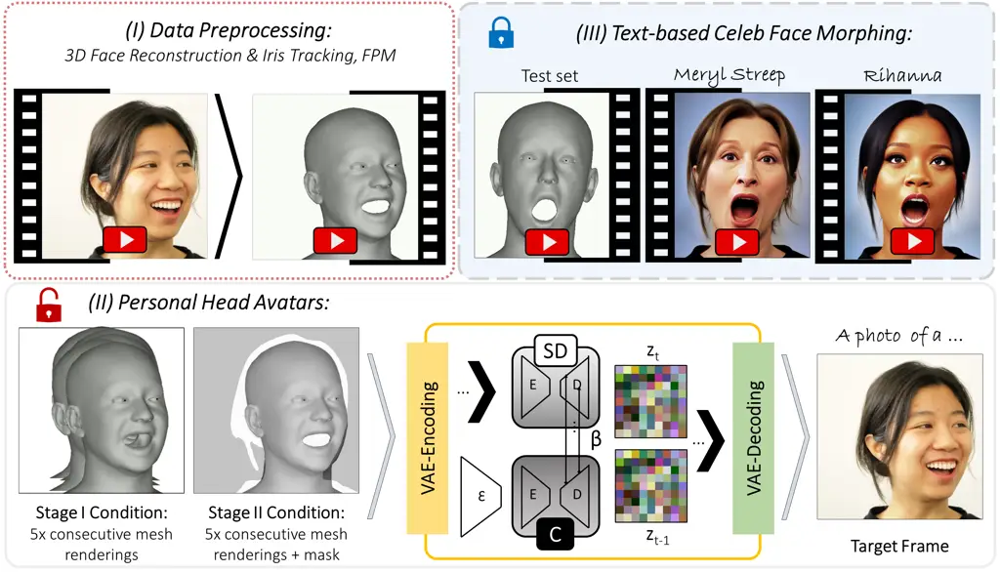

Figure 2: System Overview: (I) Using Spectre \[10\], face parsing maps
(FPM) \[50\], and Mediapipe \[29\], the input video is processed to
extract per-frame 3D face reconstructions (3DMM), FPM, and the iris
location. (II) Based on this data, two ControlNets are trained in
parallel, allowing for the generation of temporally stable outlines
(Stage I) and inner details (Stage II), resulting in photo-realistic
personal avatars (SD is fine-tuned in the unlocked mode). (III)
Person-specific avatars may be further morphed into a celebrity via
text, without additional fine-tuning (using the locked SD).

## 4 Methodology

Based on a short video of a human subject talking, we train a
personalized head avatar model leveraging the Stable Diffusion image
prior (see Figure 2). Our method generates unseen/new videos of a
subject, which is important for telepresence applications in AR/VR. As a
control, we leverage the parameter space of a 3D morphable model (3DMM)
as well as textual inputs in case of appearance editing. Our pipeline
for personalized head avatar reconstruction consists of two stages to
enable temporally stable outputs: Stage I takes in a temporal sequence
of rendered 3DMM models as well as the corresponding 2D landmarks (eye
pupil) as an optional input and produces a binary parsing mask for the
input conditioning in Stage II. The binary parsing mask is used as an
additional control signal that contains temporal information on parts
that are not represented by the 3DMM, e.g. the shoulders, hair, etc.
During the training of these two stages, our diffusion model is unlocked
and fine-tuned simultaneously with a ControlNet module which leads to
the accurate reconstruction of person-specific details. Finally, we show
how Stable Diffusion can be used to morph the person’s appearance
towards a text-defined celebrity.

### 4.1 Monocular Head Avatars

We take advantage of the control idea from ControlNet \[51\] to guide
the diffusion process of a latent diffusion model \[37\] conditioned on
the 2D renderings of the 3DMM. The key contribution of this work is how
to handle temporal inputs and how to establish a spatio-temporal
inference procedure. As mentioned above, we employ two stages of
diffusion. Both stages rely on a modified inference procedure of the
DDIM \[42\] to produce temporally consistent outputs.

#### Spatio-temporal inference procedure:

While LDMs \[37\] are designed to generate single images, we aim to
generate temporally consistent video frames. To this end, we modify the
original inference procedure to include information about the previous
frame, allowing for smoother transitions between the frames (for a
graphical model, see Figure 3). At timestep $`t=\tau`$ ($`\tau=23`$
using $`S=30`$ DDIM steps) of the denoising process for frame $`n`$, we
sum the final latent prediction of the previous frame ($`n-1`$), the
current latent prediction and a noise term $`\epsilon`$:

```math
\hat{\mathbf{x}}_{\tau}^{n}=w_{c}\cdot\mathbf{x}_{\tau}^{n}+w_{p}\cdot\mathbf{x}_{0}^{n-1}+w_{n}\cdot\epsilon, \tag{7}
```

where $`w_{p}`$ is the importance of the previous frame, $`w_{c}`$ is
the importance of the current frame, and $`w_{n}`$ is the amount of
noise $`\epsilon\sim\mathcal{N}(0,1)`$ added. The denoising process is
continued as usual after this procedure. Adding noise $`\epsilon`$ in
transitions where the face is moving fast helps mitigate blurriness
artifacts that happen when the previous frame is far away from the
current frame (see Figure 9). Note that we initialize $`x_{S}`$ with the
equivalent noise term for all frames.

We use this procedure in both stages for avatar creation. In Stage I, we
give more importance to the previous frame to generate smooth binary
face parsing masks, while in Stage II, we give more importance to the
current frame. As such, Stage I focuses on producing a temporally stable
coarse outline of the avatar (hair and shoulders), while Stage II aims
at smoothness and details.

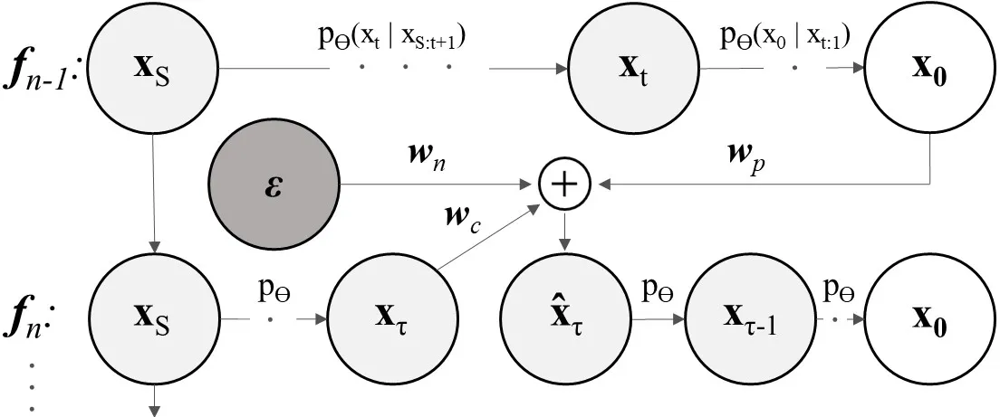

Figure 3: Spatio-temporal Denoising: Using the prediction for the frame
$`{f_{n-1}}`$, we modify the inference in the DDIM step $`t=\tau`$ for
frame $`{f_{n}}`$ to consider the previous frame, which leads to
temporally smooth outputs, controlled by $`w_{c},w_{p}`$ and $`w_{n}`$.

#### Training Stage I:

The first stage of our avatar generation method aims to generate smooth
binary face parsing maps which contain a smooth outline of the person
including the hair and shoulders that are not modelled by the 3DMM. To
reconstruct a 3DMM from a training sequence, we use Spectre \[10\]. The
reconstructed 3DMM model and its 2D renderings are utilized to provide
the conditioning to a modified ControlNet architecture. At test time,
the 3DMM parameters can be changed and novel expressions and poses can
be rendered. The facial expression parameters estimated from Spectre and
other state-of-the-art trackers \[9, 7\] might contain noise, thus,
leading to inconsistent training. We, therefore, use a series of mesh
renderings as input conditioning to the ControlNet, similar to
DreamPose \[20\]. Specifically, $`5`$ consecutive grayscale renderings
provide a temporal conditioning signal $`c_{f}`$ (with 5 channels,
resulting from the $`5`$ grayscale images). To control the eyes, we
additionally render the pupil \[29\] of the respective frame into the
grayscale renderings (optional for the static eyes). Conditioned on
these controls, the ControlNet outputs an RGB image, using our proposed
video inference procedure. Note that we use a high weight $`w_{p}`$ on
the previous frame to generate smooth videos, which might lack in facial
details. From generated images, human face parsing maps are estimated
with \[50\]. We train the first stage ControlNet model in the unlocked
mode, where both LDMs are fine-tuned simultaneously to match the
appearance of the subject as closely as possible, lowering the
possiblity of failure given that we take advantage of a pre-trained face
parsing model on top of our output. We use Equation 6 as a training
objective, where $`c_{f}`$ is our custom control image encoded into a
feature space conditioning vector through a small neural network \[51\].

#### Training Stage II:

The second stage is used to generate the details that are missing in the
temporally smooth outputs of the first stage. Specifically, smooth human
face parsing maps generated from the first stage are input to the second
diffusion model. During training of this second ControlNet, parsing maps
estimated from the original training samples \[50\] are used, thus, the
two stages can be trained in parallel, as the output of the first stage
is not required during training of the second. The model of the second
stage receives three channels as input: (I) the binary parsing map, (II)
the grayscale mesh rendering of the current frame with iris renderings
for eye control, as well as (III) a motion map. The motion map for frame
$`n`$ is computed by accumulating the renderings of the meshes
$`n-2,n-1,n+1`$, and $`n+2`$, with weights
$`\frac{1}{6},\frac{1}{3},\frac{1}{3},\frac{1}{6}`$, respectively. The
model is trained with the same scheme as in Stage I, however, the
inference weights for the previous frame are set to a lower value (see
Figure 9).

### 4.2 Text-based Celeb Face Morphing

While the Stable Diffusion model for the personalized avatar creation is
unlocked during training and adapts to the idiosyncrasies of a subject,
to enable morphing via text, we do not fine-tune it in stage II of our
text-based generative facial celebrity appearance morphing model. An
important factor during inference with this model is the ControlNet
strength. The ControlNet strength $`c`$ weights the features from the
pre-trained Stable Diffusion part and the fine-tuned ControlNet module
(see Figure 4). A weight of $`c=1`$ signifies that the personal
ControlNet model has full impact while the Stable Diffusion model has a
low influence, disabling the usage of text. Vice versa, with a weight of
$`c=0`$, the pose and expression information of the ControlNet is
ignored, and an image is generated that follows the text prompt. We
found that $`c<0.5`$ results in temporally unstable results that are not
well controlled by the 3DMM.

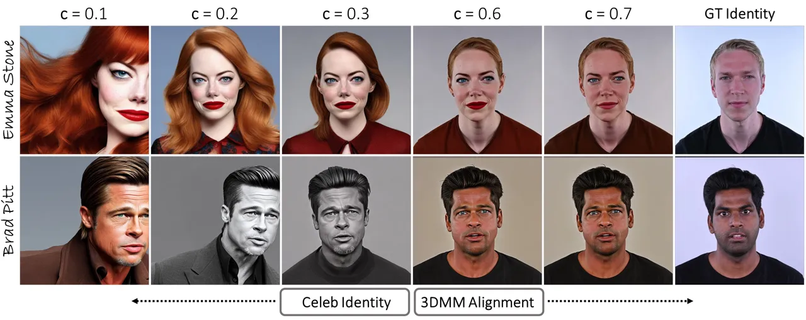

Figure 4: ControlNet Strength: The lower values give more importance to
the celeb ID (as defined by text), but they lead to inconsistent videos
and low controllability via 3DMM. The higher values allow for more
control while preserving the original identity.

In addition to the ControlNet strength parameter $`c`$, the
classifier-free guidance scale of the pre-trained Stable Diffusion
network controls the resulting appearance. Higher values lead to an
output that matches more closely to the appearance specified by the text
prompt, however, when the weight is too high, it may produce results of
low quality that resemble caricatures and do not look like real humans.
In our experiments, we use a default classifier guidance scale factor of
$`7.5`$.

While the method described above gives stable content for the human
(foreground), the background might be temporally unstable. To this end,
we employ an additional background inpainting using the predicted masks
and the procedure described in Sec. 4.5 of the original Stable Diffusion
work \[37\].

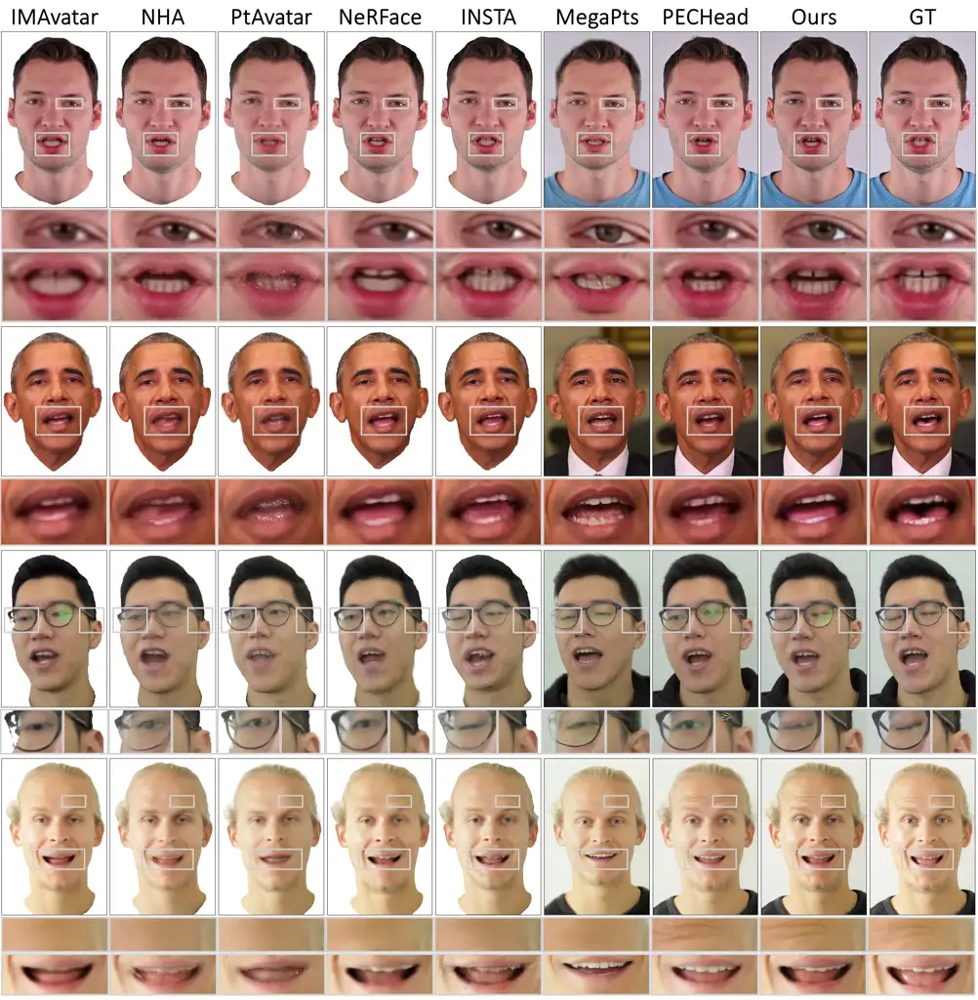

Figure 5: Qualitative Comparison with State of the Art: Our method
produces more detailed results in cases where features such as wrinkles
(row 4), mouth interior (rows 2, 4), teeth (rows 1,–4), hair/beard (rows
1, 4), or eyeglasses (row 3) appear.

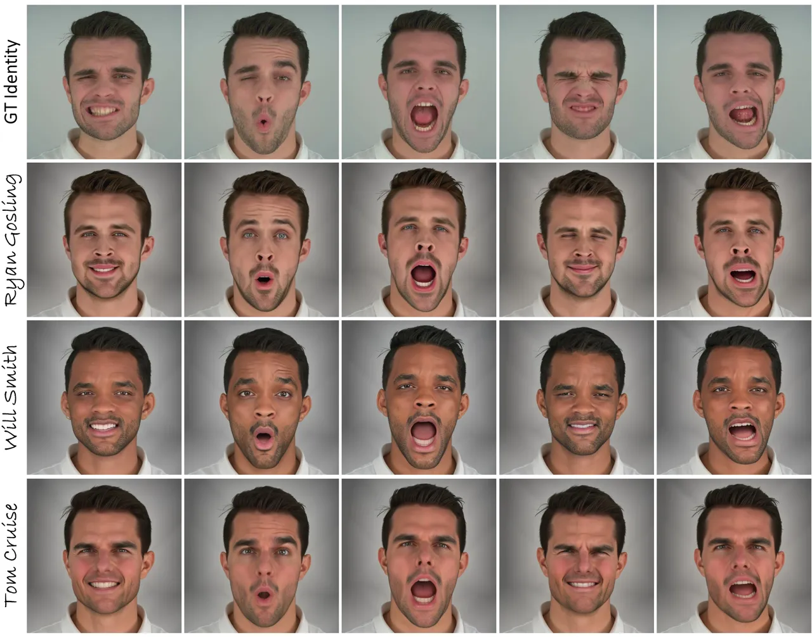

Figure 6: Face Morphing: Our method implicitly morphs the person’s
appearance (row 1) with a celebrity (rows 2-4). Identity remains stable
under challenging expressions.

## 5 Experiments

To evaluate SVP, we run experiments on single-view data used in
state-of-the-art avatar reconstruction methods as well as on multi-view
data from Nersemble \[26\]. The single-view data is used to compare our
portrait avatar generations to existing methods, while the multi-view
data (see Figure 1) is treated as a monocular sequence to demonstrate
the stability of our celeb face morphing approach. For more qualitative
results, please see our supplementary materials.

### 5.1 Monocular Personalized Head Avatars

|      | Sequence I: Obama |                   |                    |                      | Sequence II: Biden |                   |                    |                      |
| ---- | ----------------- | ----------------- | ------------------ | -------------------- | ------------------ | ----------------- | ------------------ | -------------------- |
| %    | PSNR $`\uparrow`$ | SSIM $`\uparrow`$ | MSE $`\downarrow`$ | LPIPS $`\downarrow`$ | PSNR $`\uparrow`$  | SSIM $`\uparrow`$ | MSE $`\downarrow`$ | LPIPS $`\downarrow`$ |
| 100  | 33.78             | 0.954             | 0.0004             | 0.016                | 34.41              | 0.960             | 0.0004             | 0.015                |
| 50   | 32.59             | 0.951             | 0.0006             | 0.016                | 32.56              | 0.955             | 0.0006             | 0.017                |
| 25   | 30.94             | 0.939             | 0.0008             | 0.021                | 29.69              | 0.944             | 0.0011             | 0.023                |
| 12.5 | 26.49             | 0.916             | 0.0023             | 0.035                | 26.46              | 0.929             | 0.0023             | 0.032                |
| 6.25 | 20.99             | 0.864             | 0.0080             | 0.132                | 20.72              | 0.882             | 0.0086             | 0.107                |

Table 1: Data Reduction Study: We evaluate the impact of reducing the
amount of training data by keeping only a specific percentage of frames
(see the % column).

#### Quantitative evaluation:

In Table 2, a quantitative comparison against state-of-the-art monocular
avatar reconstruction methods is shown. For this comparison, we use
monocular videos from the publicly released datasets of INSTA \[54\],
IMAvatar \[52\], NHA \[16\], as well as of PointAvatar \[53\]. As
baselines we consider IMAvatar \[52\], NHA \[16\], PointAvatar \[53\],
NeRFace \[11\], INSTA \[54\], MegaPortraits \[8\], and PECHead \[13\].
All methods, except, MegaPortraits which is a one-shot method, are
trained on the entire training video (per subject). Our method generates
high-quality images which is reflected in the image reconstruction
metrics in Table 2. Note that the metrics are computed using the scheme
of INSTA, where only the head and neck regions are considered, as most
of the methods only reconstruct those regions. Additionally, Table 1
provides a quantitative analysis considering the amount of data used for
training in two separate sequences, featuring Biden and Obama. As
expected, our method performs best with the most data, while performance
drops as data is reduced. This highlights the importance of using
sufficient training data for optimal results.

#### Qualitative evaluation:

The qualitative results on the task of personalized avatar
reconstruction are shown in Figure 5. Our qualitative analysis reveals
that our method excels in specific areas, outperforming the baseline
methods when facial features such as wrinkles (row 4), the interior of
the mouth (rows 2 and 4), teeth (rows 1, 2, 3, 4), hair and beard (rows
1, 4), or eyeglasses (row 3) appear.

### 5.2 Celeb Face Morphing

Our method allows us to morph the face considering the identity,
expressions and head pose, as shown in Figure 1. In Figure 6, we show a
further example of identity changes based on monocular data. The key
finding is that our method generates faces that may be morphed with
celeb faces, without additional fine-tuning, and these identity morphs
remain stable throughout the video even for challenging expressions,
provided that similar expressions exist in training data.

| Method              | PSNR $`\uparrow`$ | SSIM $`\uparrow`$ | MSE $`\downarrow`$ | LPIPS $`\downarrow`$ | FID $`\downarrow`$ | KID $`\downarrow`$ |
| ------------------- | ----------------- | ----------------- | ------------------ | -------------------- | ------------------ | ------------------ |
| I’M Avatar \[52\]   | 26.0              | 0.9363            | 0.0030             | 0.079                | 48                 | 0.062              |
| MegaPortraits \[8\] | 27.7              | 0.9085            | 0.0021             | 0.057                | 37                 | 0.041              |
| NHA \[16\]          | 28.1              | 0.9417            | 0.0019             | 0.050                | 25                 | 0.023              |
| Point Avatar \[53\] | 28.6              | 0.9301            | 0.0015             | 0.063                | 33                 | 0.037              |
| NeRFace \[11\]      | 29.0              | 0.9487            | 0.0016             | 0.063                | 44                 | 0.056              |
| INSTA \[54\]        | 28.2              | 0.9397            | 0.0017             | 0.061                | 31                 | 0.033              |
| PECHead \[13\]      | 31.4              | 0.9459            | 0.0009             | 0.034                | 23                 | 0.025              |
| Ours                | 31.4              | 0.9445            | 0.0010             | 0.026                | 11                 | 0.005              |

Table 2: Quantitative Comparison with State-of-the-art: Cells contain
the mean error (columns) for each method (rows) and for 8 sequences
(from INSTA (4), NeRFace (2), NHA (1), and IMAvatar (1)). Only the
head + neck region is considered. Our method is of high fidelity and it
is competitive with SOTA in PSNR, SSIM, and MSE metrics, while it
outperforms SOTA in LPIPS, FID, and KID metrics.

### 5.3 Ablation Studies

#### Denoising process:

The spatio-temporal denoising process introduces additional parameters
that allow for a control over how much influence the previous frame has
on the current frame. In the suppl. doc., we provide a detailed
quantitative analysis of these parameters. We visualize the effect of
different parameters used in this study in Figure 9. High influence from
the previous frame causes blurriness, while added noise enhances details
like facial hair. Dropping the information of the previous frame (as in
the original denoising scheme) leads to temporally unstable results
(Figure 8).

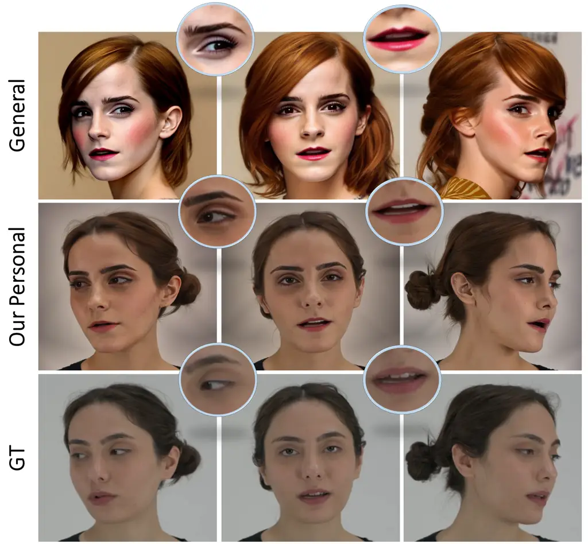

Figure 7: Person-Specific vs. Person-Generic Training: Generating a
video of a person defined by text and a sequence of facial animation
parameters (3DMM) is a challenging task for person-generic latent
diffusion models (row 1, general). This difficulty arises due to the
high ambiguity in mapping between the low-frequency conditioning and the
high-dimensional latent space. To address this, we propose fine-tuning
Stable Diffusion on one personal video sequence (row 3, GT) to achieve
stable video generation. The generated faces can be further morphed with
a celebrity, as shown in row 2 (personal) with the text prompt "Emma
Watson", while maintaining stability.

#### Person-specific v.s. person-generic model:

In Figure 7, we give a comparison between a personalized and a general
model. For this comparison, we fine-tune Stable Diffusion using a
ControlNet module on data from FFHQ and CelebA-HQ that contains a total
of 100K images, using 3DMM renderings as conditioning. As can be seen,
the person-generic model generates temporally inconsistent identity
images. In contrast, our method produces consistent appearances under
challenging expressions as well as views (see Figure 1).

#### ControlNet strength:

Figure 4 shows the impact of the ControlNet strength parameter $`c`$.
Low guidance from the ControlNet results in image generations that
ignore pose and expression information from the 3DMM. By varying the
strength parameter, different blending results can be achieved.

#### Limitations:

Our approach comes with the following downfalls. 3D face reconstruction
errors may result in lowered faithfulness to the original expressions
(see Figure 6) or image quality might suffer, especially, if the
provided test parameters are corrupted. The 3DMM also does not provide
information about the tongue, and dynamics of the hair. Supplying
sufficiently varied training data will lead to better expression
generalization.

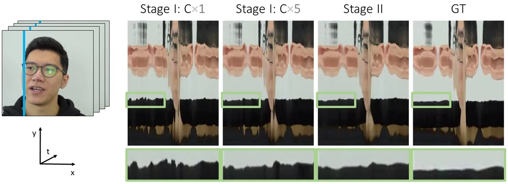

Figure 8: Ablation on Temporal Coherence: Our stage II prediction leads
to smoother transitions as compared to the stage I prediction using
either single or chained controls (1x or 5x meshes) as input
conditioning. The improvement can be observed especially in the areas
that are not controlled by a 3DMM. Here, the shoulders region is
showcased. We show a video extract corresponding to the movements of one
vertical stripe (on the left, in blue) over time. Please see the
supplemental video for details.

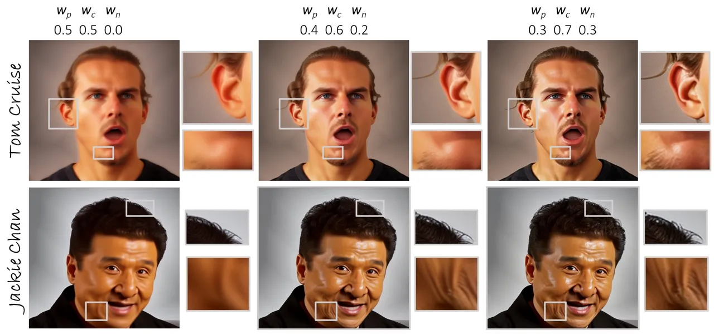

Figure 9: Ablation of the Denoising Parameters: A high impact of the
previous frame (colum 1) leads to blurry but temporally smooth results.
Adding random noise (columns 2, 3) helps in generating details like
facial hair, but it might generate images that are too sharp (column 3).
With reduced influence of the previous frame, temporal consistency is
lowered and flickering artifacts appear. Please see the supplemental
video.

## 6 Conclusion

In this paper, we have introduced Stable Video Portraits, a method for
generating controllable and morphable 3D avatars. Specifically, we
leverage a Stable Diffusion prior through ControlNet, guided by a
temporal 3DMM sequence. Our novel denoising scheme leads to the
generation of temporally stable videos. Compared to current monocular
avatar reconstruction methods, it achieves state-of-the-art quality,
with the additional possibility of face morphing with celeb faces.

Acknowledgements: The authors thank Tsvetelina Alexiadis, Claudia
Gallatz and Asuka Bertler for data collection; Tsvetelina Alexiadis,
Tomasz Niewiadomski and Taylor McConnell for perceptual study; Yue Gao,
Nikita Drobyshev, Jalees Nehvi and Wojciech Zielonka for help with the
baselines; Michael J. Black and Yao Feng for discussions; and Benjamin
Pellkofer for IT support. This work has received funding from the
European Union’s Horizon 2020 research and innovation programme under
the Marie Skłodowska Curie grant agreement No 860768 (CLIPE project).

## References

- \[1\] Bar-Tal, O., Chefer, H., Tov, O., Herrmann, C., Paiss, R., Zada,
  S., Ephrat, A., Hur, J., Li, Y., Michaeli, T., et al.: Lumiere: A
  space-time diffusion model for video generation. arXiv preprint
  arXiv:2401.12945 (2024)
- \[2\] Blattmann, A., Dockhorn, T., Kulal, S., Mendelevitch, D.,
  Kilian, M., Lorenz, D., Levi, Y., English, Z., Voleti, V., Letts, A.,
  et al.: Stable video diffusion: Scaling latent video diffusion models
  to large datasets. arXiv preprint arXiv:2311.15127 (2023)
- \[3\] Brooks, T., Peebles, B., Holmes, C., DePue, W., Guo, Y., Jing,
  L., Schnurr, D., Taylor, J., Luhman, T., Luhman, E., Ng, C., Wang, R.,
  Ramesh, A.: Video generation models as world simulators (2024),
  [https://openai.com/research/video-generation-models-as-world-simulators](https://openai.com/research/video-generation-models-as-world-simulators)
- \[4\] Cao, C., Simon, T., Kim, J.K., Schwartz, G., Zollhoefer, M.,
  Saito, S.S., Lombardi, S., Wei, S.E., Belko, D., Yu, S.I., et al.:
  Authentic volumetric avatars from a phone scan. ACM Transactions on
  Graphics (TOG) 41(4), 1–19 (2022)
- \[5\] Ceylan, D., Huang, C.H.P., Mitra, N.J.: Pix2video: Video editing
  using image diffusion. In: Proceedings of the IEEE/CVF International
  Conference on Computer Vision. pp. 23206–23217 (2023)
- \[6\] Chan, C., Ginosar, S., Zhou, T., Efros, A.A.: Everybody dance
  now. In: Proceedings of the IEEE/CVF international conference on
  computer vision. pp. 5933–5942 (2019)
- \[7\] Deng, Y., Yang, J., Xu, S., Chen, D., Jia, Y., Tong, X.:
  Accurate 3d face reconstruction with weakly-supervised learning: From
  single image to image set. In: IEEE Computer Vision and Pattern
  Recognition Workshops (2019)
- \[8\] Drobyshev, N., Chelishev, J., Khakhulin, T., Ivakhnenko, A.,
  Lempitsky, V., Zakharov, E.: Megaportraits: One-shot megapixel neural
  head avatars. In: Proceedings of the 30th ACM International Conference
  on Multimedia. pp. 2663–2671 (2022)
- \[9\] Feng, Y., Feng, H., Black, M.J., Bolkart, T.: Learning an
  animatable detailed 3D face model from in-the-wild images. ACM
  Transactions on Graphics (ToG), Proc. SIGGRAPH 40(4), 88:1–88:13
  (Aug 2021)
- \[10\] Filntisis, P.P., Retsinas, G., Paraperas-Papantoniou, F.,
  Katsamanis, A., Roussos, A., Maragos, P.: Spectre: Visual
  speech-informed perceptual 3d facial expression reconstruction from
  videos. In: Proceedings of the IEEE/CVF Conference on Computer Vision
  and Pattern Recognition. pp. 5744–5754 (2023)
- \[11\] Gafni, G., Thies, J., Zollhofer, M., Nießner, M.: Dynamic
  neural radiance fields for monocular 4d facial avatar reconstruction.
  In: Proceedings of the IEEE/CVF Conference on Computer Vision and
  Pattern Recognition. pp. 8649–8658 (2021)
- \[12\] Gal, R., Alaluf, Y., Atzmon, Y., Patashnik, O., Bermano, A.H.,
  Chechik, G., Cohen-Or, D.: An image is worth one word: Personalizing
  text-to-image generation using textual inversion. arXiv preprint
  arXiv:2208.01618 (2022)
- \[13\] Gao, Y., Zhou, Y., Wang, J., Li, X., Ming, X., Lu, Y.:
  High-fidelity and freely controllable talking head video generation.
  In: Proceedings of the IEEE/CVF Conference on Computer Vision and
  Pattern Recognition. pp. 5609–5619 (2023)
- \[14\] Geyer, M., Bar-Tal, O., Bagon, S., Dekel, T.: Tokenflow:
  Consistent diffusion features for consistent video editing. arXiv
  preprint arXiv:2307.10373 (2023)
- \[15\] Goodfellow, I., Pouget-Abadie, J., Mirza, M., Xu, B.,
  Warde-Farley, D., Ozair, S., Courville, A., Bengio, Y.: Generative
  adversarial networks. Communications of the ACM 63(11), 139–144 (2020)
- \[16\] Grassal, P.W., Prinzler, M., Leistner, T., Rother, C., Nießner,
  M., Thies, J.: Neural head avatars from monocular rgb videos. In:
  Proceedings of the IEEE/CVF Conference on Computer Vision and Pattern
  Recognition. pp. 18653–18664 (2022)
- \[17\] Ho, J., Jain, A., Abbeel, P.: Denoising diffusion probabilistic
  models. Advances in neural information processing systems 33,
  6840–6851 (2020)
- \[18\] Hu, E.J., Shen, Y., Wallis, P., Allen-Zhu, Z., Li, Y., Wang,
  S., Wang, L., Chen, W.: Lora: Low-rank adaptation of large language
  models. arXiv preprint arXiv:2106.09685 (2021)
- \[19\] Isola, P., Zhu, J.Y., Zhou, T., Efros, A.A.: Image-to-image
  translation with conditional adversarial networks. CVPR (2017)
- \[20\] Karras, J., Holynski, A., Wang, T.C., Kemelmacher-Shlizerman,
  I.: Dreampose: Fashion image-to-video synthesis via stable diffusion.
  arXiv preprint arXiv:2304.06025 (2023)
- \[21\] Karras, T., Aittala, M., Laine, S., Härkönen, E., Hellsten, J.,
  Lehtinen, J., Aila, T.: Alias-free generative adversarial networks.
  Advances in Neural Information Processing Systems 34, 852–863 (2021)
- \[22\] Karras, T., Laine, S., Aila, T.: A style-based generator
  architecture for generative adversarial networks. In: Proceedings of
  the IEEE/CVF conference on computer vision and pattern recognition.
  pp. 4401–4410 (2019)
- \[23\] Karras, T., Laine, S., Aittala, M., Hellsten, J., Lehtinen, J.,
  Aila, T.: Analyzing and improving the image quality of stylegan. In:
  Proceedings of the IEEE/CVF conference on computer vision and pattern
  recognition. pp. 8110–8119 (2020)
- \[24\] Kim, H., Garrido, P., Tewari, A., Xu, W., Thies, J., Niessner,
  M., Pérez, P., Richardt, C., Zollhöfer, M., Theobalt, C.: Deep video
  portraits. ACM transactions on graphics (TOG) 37(4), 1–14 (2018)
- \[25\] Kingma, D.P., Welling, M.: Auto-encoding variational bayes.
  arXiv preprint arXiv:1312.6114 (2013)
- \[26\] Kirschstein, T., Qian, S., Giebenhain, S., Walter, T., Nießner,
  M.: Nersemble: Multi-view radiance field reconstruction of human
  heads. arXiv preprint arXiv:2305.03027 (2023)
- \[27\] Li, T., Bolkart, T., Black, M.J., Li, H., Romero, J.: Learning
  a model of facial shape and expression from 4d scans. ACM Trans.
  Graph. 36(6), 194–1 (2017)
- \[28\] Lombardi, S., Simon, T., Schwartz, G., Zollhoefer, M., Sheikh,
  Y., Saragih, J.: Mixture of volumetric primitives for efficient neural
  rendering. ACM Transactions on Graphics (ToG) 40(4), 1–13 (2021)
- \[29\] Lugaresi, C., Tang, J., Nash, H., McClanahan, C., Uboweja, E.,
  Hays, M., Zhang, F., Chang, C.L., Yong, M.G., Lee, J., et al.:
  Mediapipe: A framework for building perception pipelines. arXiv
  preprint arXiv:1906.08172 (2019)
- \[30\] Ma, S., Simon, T., Saragih, J., Wang, D., Li, Y., De La Torre,
  F., Sheikh, Y.: Pixel codec avatars. In: Proceedings of the IEEE/CVF
  Conference on Computer Vision and Pattern Recognition. pp.
  64–73 (2021)
- \[31\] Midjourney.
  [https://www.midjourney.com](https://www.midjourney.com) (2023),
  accessed: 2023-11-01
- \[32\] Mokady, R., Hertz, A., Aberman, K., Pritch, Y., Cohen-Or, D.:
  Null-text inversion for editing real images using guided diffusion
  models. In: Proceedings of the IEEE/CVF Conference on Computer Vision
  and Pattern Recognition. pp. 6038–6047 (2023)
- \[33\] Paysan, P., Knothe, R., Amberg, B., Romdhani, S., Vetter, T.: A
  3d face model for pose and illumination invariant face recognition.
  In: 2009 sixth IEEE international conference on advanced video and
  signal based surveillance. pp. 296–301. Ieee (2009)
- \[34\] Qi, C., Cun, X., Zhang, Y., Lei, C., Wang, X., Shan, Y., Chen,
  Q.: Fatezero: Fusing attentions for zero-shot text-based video
  editing. arXiv preprint arXiv:2303.09535 (2023)
- \[35\] Ramesh, A., Dhariwal, P., Nichol, A., Chu, C., Chen, M.:
  Hierarchical text-conditional image generation with clip latents.
  arXiv preprint arXiv:2204.06125 1(2),  3 (2022)
- \[36\] Ramesh, A., Pavlov, M., Goh, G., Gray, S., Voss, C., Radford,
  A., Chen, M., Sutskever, I.: Zero-shot text-to-image generation. In:
  International Conference on Machine Learning. pp. 8821–8831.
  PMLR (2021)
- \[37\] Rombach, R., Blattmann, A., Lorenz, D., Esser, P., Ommer, B.:
  High-resolution image synthesis with latent diffusion models. In:
  Proceedings of the IEEE/CVF conference on computer vision and pattern
  recognition. pp. 10684–10695 (2022)
- \[38\] Ruiz, N., Li, Y., Jampani, V., Pritch, Y., Rubinstein, M.,
  Aberman, K.: Dreambooth: Fine tuning text-to-image diffusion models
  for subject-driven generation. In: Proceedings of the IEEE/CVF
  Conference on Computer Vision and Pattern Recognition. pp.
  22500–22510 (2023)
- \[39\] Saharia, C., Chan, W., Saxena, S., Li, L., Whang, J., Denton,
  E., Ghasemipour, S.K.S., Ayan, B.K., Mahdavi, S.S., Lopes, R.G.,
  Salimans, T., Ho, J., Fleet, D.J., Norouzi, M.: Photorealistic
  text-to-image diffusion models with deep language understanding. arXiv
  preprint arXiv:2205.11487 (2022)
- \[40\] Schuhmann, C., Beaumont, R., Vencu, R., Gordon, C., Wightman,
  R., Cherti, M., Coombes, T., Katta, A., Mullis, C., Wortsman, M.,
  et al.: Laion-5b: An open large-scale dataset for training next
  generation image-text models. Advances in Neural Information
  Processing Systems 35, 25278–25294 (2022)
- \[41\] Siarohin, A., Lathuilière, S., Tulyakov, S., Ricci, E., Sebe,
  N.: First order motion model for image animation. In: Conference on
  Neural Information Processing Systems (NeurIPS) (December 2019)
- \[42\] Song, J., Meng, C., Ermon, S.: Denoising diffusion implicit
  models. arXiv preprint arXiv:2010.02502 (2020)
- \[43\] Tewari, A., Fried, O., Thies, J., Sitzmann, V., Lombardi, S.,
  Sunkavalli, K., Martin-Brualla, R., Simon, T., Saragih, J., Nießner,
  M., et al.: State of the art on neural rendering. In: Computer
  Graphics Forum. vol. 39, pp. 701–727. Wiley Online Library (2020)
- \[44\] Tewari, A., Thies, J., Mildenhall, B., Srinivasan, P.,
  Tretschk, E., Yifan, W., Lassner, C., Sitzmann, V., Martin-Brualla,
  R., Lombardi, S., et al.: Advances in neural rendering. In: Computer
  Graphics Forum. vol. 41, pp. 703–735. Wiley Online Library (2022)
- \[45\] Thies, J., Zollhöfer, M., Nießner, M.: Deferred neural
  rendering: Image synthesis using neural textures. Acm Transactions on
  Graphics (TOG) 38(4), 1–12 (2019)
- \[46\] Thies, J., Zollhofer, M., Stamminger, M., Theobalt, C.,
  Nießner, M.: Face2face: Real-time face capture and reenactment of rgb
  videos. In: Proceedings of the IEEE conference on computer vision and
  pattern recognition. pp. 2387–2395 (2016)
- \[47\] Wang, L., Zhao, X., Sun, J., Zhang, Y., Zhang, H., Yu, T., Liu,
  Y.: Styleavatar: Real-time photo-realistic portrait avatar from a
  single video. arXiv preprint arXiv:2305.00942 (2023)
- \[48\] Wu, J.Z., Ge, Y., Wang, X., Lei, S.W., Gu, Y., Shi, Y., Hsu,
  W., Shan, Y., Qie, X., Shou, M.Z.: Tune-a-video: One-shot tuning of
  image diffusion models for text-to-video generation. In: Proceedings
  of the IEEE/CVF International Conference on Computer Vision. pp.
  7623–7633 (2023)
- \[49\] Yang, S., Zhou, Y., Liu, Z., Loy, C.C.: Rerender a video:
  Zero-shot text-guided video-to-video translation. arXiv preprint
  arXiv:2306.07954 (2023)
- \[50\] Yu, C., Gao, C., Wang, J., Yu, G., Shen, C., Sang, N.: Bisenet
  v2: Bilateral network with guided aggregation for real-time semantic
  segmentation. International Journal of Computer Vision 129,
  3051–3068 (2021)
- \[51\] Zhang, L., Rao, A., Agrawala, M.: Adding conditional control to
  text-to-image diffusion models. In: Proceedings of the IEEE/CVF
  International Conference on Computer Vision. pp. 3836–3847 (2023)
- \[52\] Zheng, Y., Abrevaya, V.F., Bühler, M.C., Chen, X., Black, M.J.,
  Hilliges, O.: Im avatar: Implicit morphable head avatars from videos.
  In: Proceedings of the IEEE/CVF Conference on Computer Vision and
  Pattern Recognition. pp. 13545–13555 (2022)
- \[53\] Zheng, Y., Yifan, W., Wetzstein, G., Black, M.J., Hilliges, O.:
  Pointavatar: Deformable point-based head avatars from videos. In:
  Proceedings of the IEEE/CVF Conference on Computer Vision and Pattern
  Recognition. pp. 21057–21067 (2023)
- \[54\] Zielonka, W., Bolkart, T., Thies, J.: Instant volumetric head
  avatars. In: Proceedings of the IEEE/CVF Conference on Computer Vision
  and Pattern Recognition. pp. 4574–4584 (2023)
- \[55\] Zollhöfer, M., Thies, J., Garrido, P., Bradley, D., Beeler, T.,
  Pérez, P., Stamminger, M., Nießner, M., Theobalt, C.: State of the art
  on monocular 3d face reconstruction, tracking, and applications. In:
  Computer graphics forum. vol. 37, pp. 523–550. Wiley Online
  Library (2018)

Stable Video Portraits - Appendix

Mirela
Ostrek[](https://orcid.org/0009-0009-9987-646X)
Justus
Thies[](https://orcid.org/0000-0002-0056-9825)

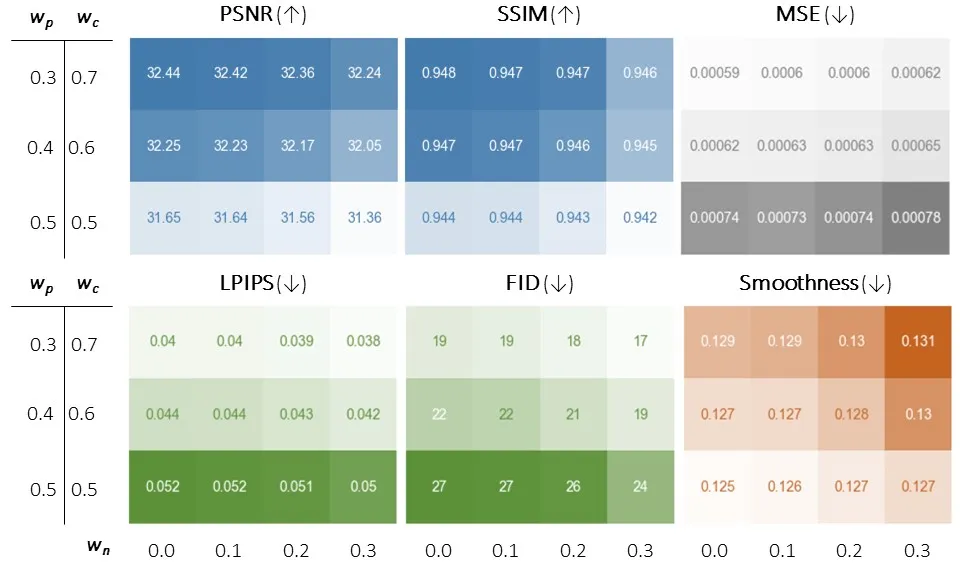

Figure 10: Quantitative ablation study: To investigate the effect of
each of the newly introduced denoising process parameters, namely
$`w_{n}`$ (noise term importance), $`w_{c}`$ (importance of the current
frame), and $`w_{p}`$ (importance of the previous frame), we show the
results on five standard evaluation metrics including PSNR, SSIM, MSE,
LPIPS, FID including our proposed smoothness metric. Darker cells
contain higher values.

## 7 Training Details

For avatar reconstruction, we fine-tune Stable Diffusion 2.1 model on
each sequence using ControlNet. Our input control is comprised of 5
consecutive meshes with two eye landmarks rendered on top of each, and
we additionally use alpha masks that cover the head and neck region
(provided in INSTA). We train the model for 200 epochs, with batch size
16, and gradient accumulation set to 4. The following text prompt is
used and dropped 50% of the time for each sequence during training: "a
high-quality, detailed, and professional photograph, portrait of a
person, speaking". At test time, we set the CGS to 5 and we do not use
additional text prompts. We randomly pick a number as a random seed and
we keep it fixed for every sequence during the entire generation
process. DDIM is used and the number of sampling steps is set to 30.

## 8 Data

A portrait avatar dataset has been released, containing six long
speaking sequences, each lasting more than eight minutes. These
sequences include head movement and feature female subjects with fixed
hair. In Figure 11, the samples are shown. Please see the supplemental
video for celebrity reconstructions featuring some of the subjects.

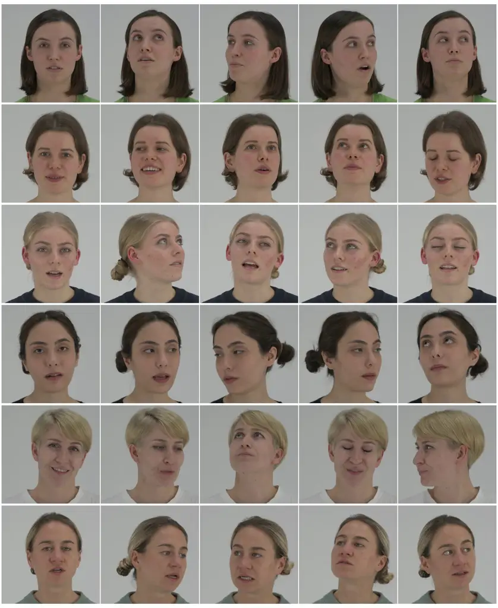

Figure 11: Data: We have released a portrait avatar dataset that
contains 6 long video sequences ($`8+`$ minutes) of women speaking with
head movement, for research purposes.

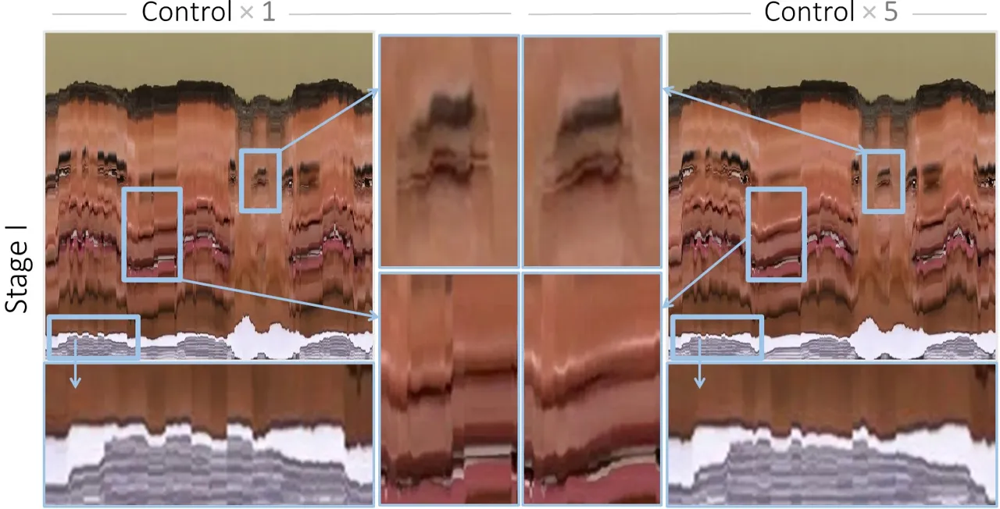

Figure 12: Temporal conditioning: Using temporal control signal reduces
temporal incoherence due to noisy conditioning. Here, we show how one
column of the generated image changes over time when only 1 v.s. 5
consecutive 3DMM controls are used.

## 9 Additional Experiments

### 9.1 Quantitative Ablation Study on the Denoising Parameters

In Figure 10, we investigate the properties of each of the newly
introduced parameters of the denoising process, considering five
standard evaluation metrics (PSNR, SSIM, MSE, LPIPS, FID) and we propose
an evaluation metric for smoothness, i.e. how smooth the overall
transitions in the generated videos are. The latter is defined as a sum
of the MSE error between the two neighboring frames. The lower value
indicates a smoother transition. All of the values are calculated for
one example sequence. It can be seen how giving more importance to the
previous frame through $`w_{p}`$ leads to smoother transitions (last
matrix). However, adding noise through $`w_{n}`$ makes the smoothness
error higher. At the same time, LPIPS and FID scores consistently
improve when more noise gets added as well as when $`w_{p}`$ is
decreased. Standard error metrics that encourage blurriness (MSE, PNSR,
SSIM) do better when $`w_{n}`$ is equal to 0 and when $`w_{p}`$ is
reduced. We conclude that there are trade-offs when different metrics
are considered. And therefore, the most suitable set of parameters is to
be determined subjectively upon visual inspection.

### 9.2 Qualitative Ablation Study on Temporal Input Controls

Figure 12 contains an ablation study on the importance of using temporal
controls. Here we show that using 5 consecutive 3DMM control signals as
opposed to 1 leads to the smoother transitions between the frames.

### 9.3 User Study on Face Morphing

We conducted a preliminary user study involving 32 participants who
viewed our celebrity face-morphing videos and were tasked with
identifying the celebrity the video most closely resembled (refer to
Fig. 13 for more details). The study involved 2 subjects, each morphed
with 6 celebrities. The results indicate that participants correctly
identified the celebrity 50.78% of the time, while in 49.22% of cases,
they selected one of the 5 incorrect celebrities.

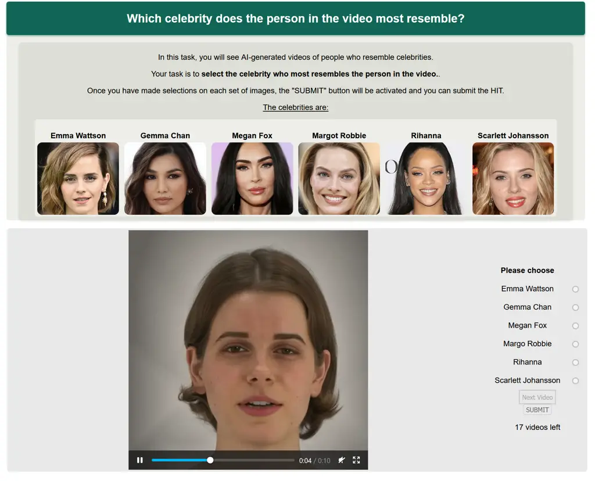

Figure 13: User study: Layout of our user study.
