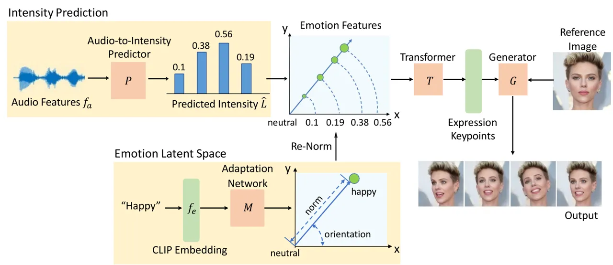
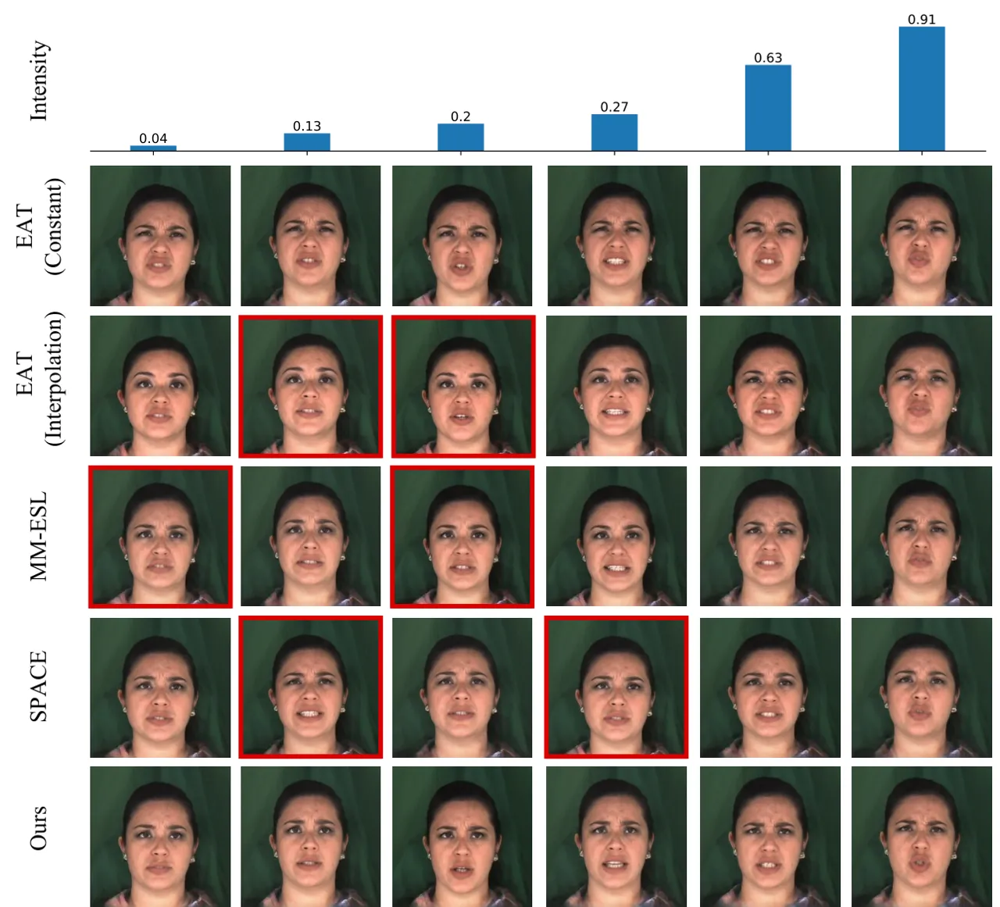
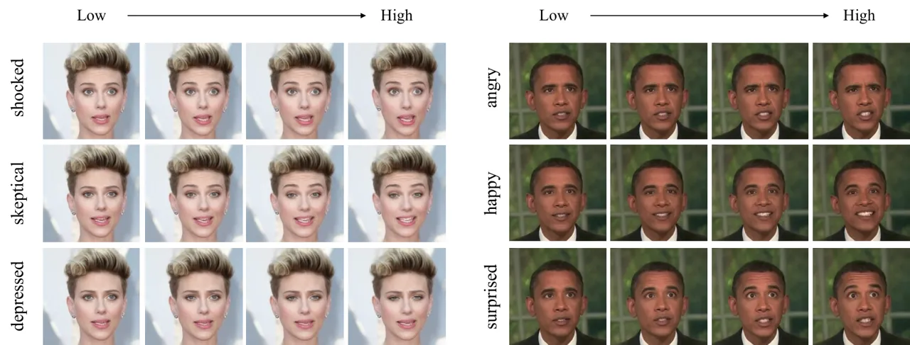
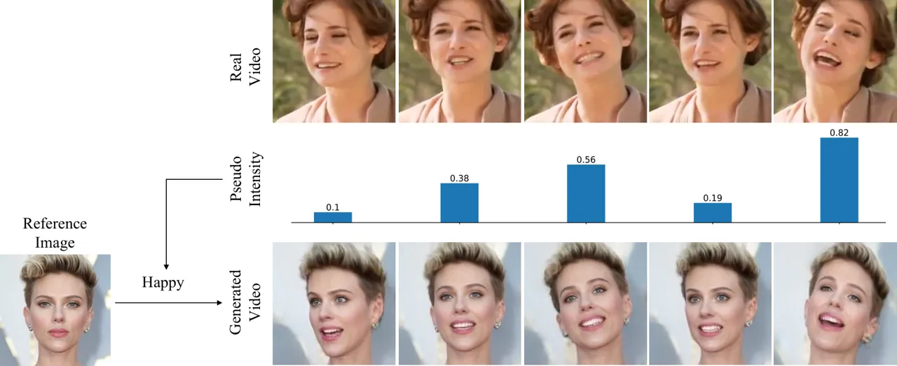
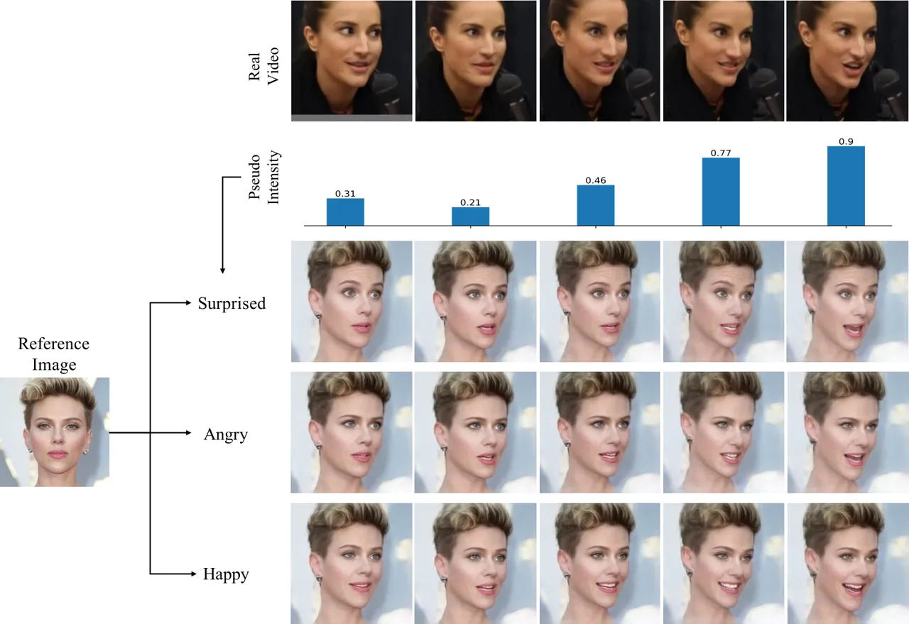
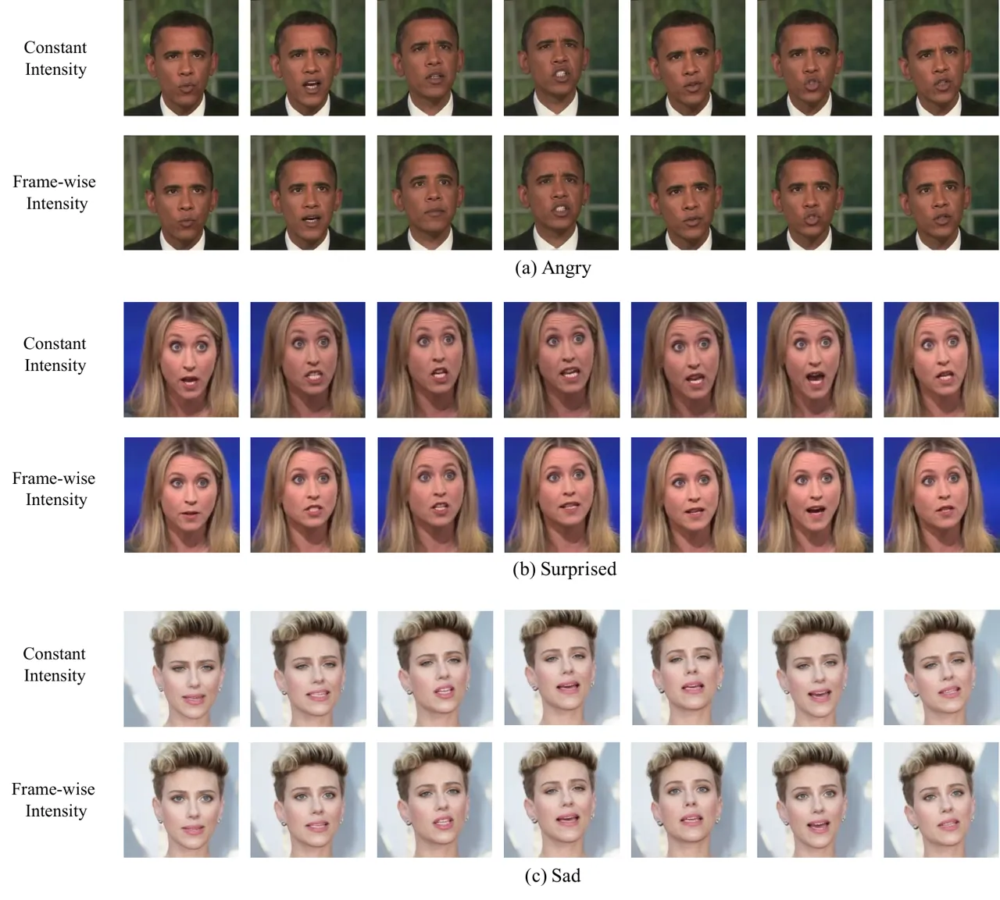

# Learning Frame-Wise Emotion Intensity for Audio-Driven Talking-Head Generation

Jingyi Xu Affiliation: Stony Brook University    Hieu Le
Affiliation: EPFL    Zhixin Shu Affiliation: Adobe Research    Yang Wang
Affiliation: Waymo    Yi-Hsuan Tsai Affiliation: Google    Dimitris
Samaras Affiliation: Stony Brook University

###### Abstract

Human emotional expression is inherently dynamic, complex, and fluid,
characterized by smooth transitions in intensity throughout verbal
communication. However, the modeling of such intensity fluctuations has
been largely overlooked by previous audio-driven talking-head generation
methods, which often results in static emotional outputs. In this paper,
we explore how emotion intensity fluctuates during speech, proposing a
method for capturing and generating these subtle shifts for talking-head
generation. Specifically, we develop a talking-head framework that is
capable of generating a variety of emotions with precise control over
intensity levels. This is achieved by learning a continuous emotion
latent space, where emotion types are encoded within latent orientations
and emotion intensity is reflected in latent norms. In addition, to
capture the dynamic intensity fluctuations, we adopt an
audio-to-intensity predictor by considering the speaking tone that
reflects the intensity. The training signals for this predictor are
obtained through our emotion-agnostic intensity pseudo-labeling method
without the need of frame-wise intensity labeling. Extensive experiments
and analyses validate the effectiveness of our proposed method in
accurately capturing and reproducing emotion intensity fluctuations in
talking-head generation, thereby significantly enhancing the
expressiveness and realism of the generated outputs.

## 1 Introduction

Audio-driven talking-head synthesis \[9, 10, 48, 51, 25\] has drawn
increasing attention due to its wide range of applications in various
fields such as virtual reality, digital humans \[12\], and assistive
technologies. Recently, many works have focused on synchronizing lip
movements with speech content \[25, 3, 5, 32\]. However, in addition to
speech, humans also convey intentions through emotional expressions.
Hence, developing emotionally expressive talking-heads is crucial to
enhance the fidelity of these systems for real-world applications.

Unlike static displays of emotion, our emotional expressions are
inherently dynamic and fluid with smooth transition in terms of emotion
intensity levels. Imagine a scenario where someone receives unexpected
good news. Initially, they may smile slightly as they process it. As
they fully comprehend, their smile might widen and their eyes might
brighten, reflecting growing excitement and happiness. This progression
illustrates the dynamic nature of human expressions with smooth shifts
in emotion intensity levels, unlike static displays such as a fixed
smile.

While there have been previous efforts to generate emotion-aware
talking-heads \[10, 13, 41, 17\], the natural fluctuations in intensity
levels have been largely overlooked. Addressing this requires the model
to 1) infer smooth emotion intensity flows based on audio cues and 2)
precisely generate facial expressions that correspond to the inferred
intensity levels. However, capturing these intensity fluctuations can be
challenging in existing emotional-aware talking-head methods: 1) the
model would rely on frame-wise intensity annotations, which are
difficult to obtain in practice; 2) there should be mechanisms to
control the generated intensity precisely, instead of homogeneous
outputs.

In this paper, we propose a framework for talking-head generation that
effectively tackles the two challenges as mentioned above, resulting in
talking-head videos with natural intensity flows. In particular, we
first introduce a method to obtain audio-synchronized intensity
fluctuations without any frame-level annotations. This is achieved
through an emotion-agnostic intensity pseudo-labeling method that
accurately quantifies the intensity of any given frame based on keypoint
distance. An audio-to-intensity predictor is then employed to predict
these frame-wise pseudo intensities based on the speaking tone, as the
speaking tone often reflects emotional fluctuations.

Furthermore, our goal is to generate talking-heads with emotions that
correspond accurately to the inferred intensity levels. This task is
particularly challenging because varying intensities often manifest as
subtle and smooth differences, which are difficult to capture. We draw
inspiration from the “wheel of emotion” \[2\], where emotions are
arranged on a disk with similar emotions positioned close to one
another, and intensity is represented by the distance from the center.
Instead of using a disk, we propose constructing a continuous and
unified latent space that naturally represents all types of emotions at
various intensity levels. In this space, the neutral emotion is placed
at the origin, with similar emotions located nearby. The emotion type is
encoded in the latent orientation, while the intensity is represented by
the latent norm. This design enables smooth transitions between
emotional intensities and types, enhancing the efficiency of the
learning process. Quantitative results on MEAD \[34\] and LRW \[6\],
along with qualitative analyses, demonstrate the effectiveness of this
method in generating diverse expressions with precise control over
intensity levels.

Our main contributions can be summarized as follows:

- •
  We present a talking-head generation framework that considers the
  emotion intensity for producing smooth transitions across facial
  expressions.
- •
  We introduce an audio-to-intensity predictor to capture the dynamics
  of emotion intensity in audio input, without the need of having
  frame-wise ground truth labels for intensity.
- •
  We propose an approach for reorganizing the latent space of emotions
  in talking-head generation, enabling both diverse emotional
  expressions and precise control over intensity levels.

## 2 Related Work

Audio-Driven Talking Head Generation. Early works on audio-driven
talking-head generation mainly focus on producing accurate lip
motion \[25, 3, 5, 32, 50\]. Wav2Lip \[25\], for example, leverages
audio signals to synchronize lip movements within a provided video
sequence. Subsequent advancements have led to techniques for generating
full-head animations \[53, 28, 39, 49, 47, 46\]. Audio2Head \[35\]
employs keypoint-based dense motion fields to manipulate facial images
for enhanced realism. Recently, transformer-based architecture has been
adopted for this task due to its ability to capture the long-term
context of audio inputs and generate complete sequence-level
representations. AVCT \[36\] designs an audio-visual correlation
transformer for generating talking-head videos. EAT \[10\] utilizes an
audio-to-expression transformer to map audio sequences to enhanced 3D
latent keypoints. In this paper, different from the above-mentioned
approaches, we focus on another important aspect of talking-head
generation, i.e., precise modeling of emotion intensity and
fluctuations, thereby enriching the naturalness of generated results.

Emotion-Aware Talking Head Generation. Emotional talking-head generation
has recently attracted growing interest within the field \[10, 13, 41,
17, 33, 34, 24, 22, 30\]. Wang et al. release MEAD \[34\], a
high-quality talking-head video dataset annotated with emotion
categories and intensity. Gan et al. \[10\] use this dataset to
fine-tune a pre-trained emotion-agnostic talking-head transformer for
emotion-aware talking-head generation. SPACE \[13\] leverages facial
landmarks and latent keypoints as intermediate face representations,
facilitating talking-head generation with control over emotion type and
intensity level. However, these methods encode emotion labels using
discrete one-hot vectors, which restricts the diversity of the generated
expressions. Moreover, MM-ESL \[41\] constructs a unified feature space
for various emotion types and controls the expression simply with a
scalar parameter. In contrast, we propose to model the intensity
directly from the audio input in an emotion-agnostic manner, so our
learned intensity can be flexibly integrated in our emotion latent space
without influencing the expression generation process.

Latent-Based Face Editing. Manipulating latent space is a common
practice for face-editing tasks \[14, 21, 52, 40, 54, 1, 44, 43, 19\].
FaderNet \[21\] disentangles different attributes in the latent space of
auto-encoder via adversarial training. InterfaceGAN \[29\] focuses on
understanding the semantics within the latent space of generative
adversarial networks (GANs) \[11\] through subspace projection. L2M-GAN
\[42\] showcases its ability for both local and global face attribute
editing through latent space factorization. In this work, we present an
intuitive approach for reorganizing the latent space of emotions in
talking-head generation, which allows for a wide range of emotional
expressions and offers precise control over intensity levels.



Figure 1: An overview of our proposed method. To generate talking-heads
with fluid intensity transitions, we first infer these fluctuations from
audio inputs using an audio-to-intensity predictor $`\mathbf{P}`$. The
training targets for this predictor are obtained through our
emotion-agnostic intensity pseudo-labeling method. Then, for a specified
driving emotion $`e`$ (e.g., happy), we map it onto our proposed emotion
latent space to get $`M(f_{e})`$ and adjust its norm based on the
inferred intensity $`\hat{L}`$. These resulting intensity-aware emotion
features $`M^{r}(f_{e})`$ then serve as guiding signals for a
transformer-based talking-head generation model, enabling the generation
of lifelike talking-head videos.

## 3 Our Proposed Method

In this section, we introduce our proposed method for generating
talking-heads with frame-wise emotion intensity. Figure 1 shows an
overview of the pipeline. Specifically, to generate talking-heads with
fluid intensity transitions, we first infer these fluctuations from
audio input using an audio-to-intensity predictor. Then, for a specified
driving emotion (e.g., happy), we map it onto our proposed emotion
latent space and adjust its norm based on the inferred intensity
fluctuations. These resulting intensity-aware emotion features then
serve as signals for a transformer-based talking-head generation model,
producing natural talking-head videos. In the following subsections, we
will elaborate on the details of our intensity pseudo-labeling method,
the audio-to-intensity predictor training, and the reorganization of the
intensity-aware emotion latent space.

### 3.1 Frame-Wise Intensity Modeling

In order to learn the intensity directly from the audio input, we
propose a pseudo-labeling method to avoid the frame-wise labeling
requirement, which is challenging to achieve in practice. In the
following, we describe more details about our pseudo-labeling scheme and
how we train the audio-to-intensity model.

Emotion-agnostic intensity pseudo-labeling. To model the dynamic
fluctuations in intensity during natural speech, we first introduce an
emotion-agnostic intensity pseudo-labeling approach. This method
quantifies the intensity level of any given frame. Specifically, given a
talking-head frame $`i`$ and the corresponding expression keypoints
$`K_{i}`$, we extract the expression keypoints $`K_{i}^{N}`$ from the
neutral face of the same person (see supplementary materials for more
details). The pseudo intensity $`L_{i}`$ is then computed as the sum of
absolute difference between $`K_{i}`$ and $`K_{i}^{N}`$, i.e.,
$`L_{i}=\sum\left|K_{i}-K_{i}^{N}\right|`$. Essentially, a greater
deviation between the given expression and the neutral facial expression
indicates a higher intensity level, while a lower deviation suggests a
lower intensity level.

Audio-to-intensity predictor. To further estimate the intensity
fluctuations from audio input during inference, we introduce a
variational auto-encoder based model for audio-to-intensity prediction.
This model predicts the pseudo-labeled emotion intensity conditioned on
audio input, as the speaking tone often reflects the emotion intensity
when people talk. To obtain audio representations, we utilize HuBERT
\[16\], a state-of-the-art automatic speech recognition model to extract
audio features $`f_{a}`$ from the input waveform. Throughout training,
the intensity predictor ($`\mathbf{P}`$) is trained to predict the
entire sequence of pseudo intensity using an encoder-decoder structure.
The training loss of this predictor can be written as follows:

```math
L_{P}(\phi,\theta,\epsilon)=-\textnormal{E}_{q_{\phi}(z|L,a)}[\textnormal{log}p_{\theta}(L|z,a)]+\textnormal{KL}(q_{\phi}(z|L,a)|p_{\epsilon}(z|a)), \tag{1}
```

where $`\phi,\theta,\epsilon`$ denote the model parameters of the
encoder, decoder and the VAE prior, respectively. $`z`$ denotes the
latent encoding of the intensity. A normalizing flow is employed to
establish a time-related distribution as the prior, following the
approach in \[45\]. We provide further details about the architecture of
the encoder and decoder in the supplementary materials.

### 3.2 Emotional Talking-Head Model Training

We present our emotion-aware talking-head generation model, which
leverages the predicted intensity fluctuations as input to generate
corresponding facial expressions. To this end, we introduce an emotion
latent space in which the latent features are used to guide a
transformer-based model to precisely generate the predicted emotion
intensity.

#### 3.2.1 Emotion Latent Space Reorganization

To enable emotional talking-head generation, we propose to learn a
continuous emotion latent space where the latent embeddings serve as
guidance to steer an audio-to-expression transformer in generating
different emotional expressions. Specifically, we expect this latent
space to 1) accommodate features of diverse emotion categories, and 2)
encode corresponding intensity levels. Furthermore, we aim for
disentanglement between the encoded emotion category and intensity,
thereby allowing for flexible control over both. To achieve this, we
reorganize the latent space such that emotion category information is
encoded in the latent orientation (see Figure 1), while intensity
information is encoded in the latent norm. For neutral emotion, we
consider the intensity to be zero and position it at the origin of the
latent space. Our intuition is that the intensity level should
positively correlate with the deviation from a neutral expression.
Through our reorganization method, this deviation is intrinsically
encoded in the distance from the origin point in the latent space, i.e.,
latent norm.

Intensity-aware emotion features. For an input video with emotion label
$`e`$ and intensity label $`l`$, we extract the corresponding text
embedding $`f_{e}`$ from the CLIP \[26\] text encoder. An adaptation
network $`M`$ is then adopted to map $`f_{e}`$ to our proposed emotion
latent space. In the case where $`e`$ represents neutral emotion, we
minimize the L2-norm of the emotion feature $`M(f_{e})`$ to enforce it
to center around the origin. Otherwise, for non-neutral emotions, we
re-scale $`M(f_{e})`$ to $`M^{r}(f_{e})`$ such that
$`\|M^{r}(f_{e})\|=t(l)`$, where $`t(l)`$ is positively correlated with
$`l`$. This ensures that the features of the same intensity will be
mapped to the same hypersphere, with norms representing intensity
levels. Meanwhile, the location on this hypersphere is determined by the
orientation of $`M(f_{e})`$, which is shared within the same emotion
type.

#### 3.2.2 Training Objectives

We input the re-scaled emotion features to an audio-to-expression
transformer $`\mathbf{T}`$ as a guidance to generate emotional
expressions. Specifically, this guidance is integrated as an additional
input token of the transformer layer following \[10\]. The transformer
produces a set of intensity-aware 3D expression latent keypoints, which
are then used by a talking-head generator $`\mathbf{G}`$ to generate
video frames. The final loss for training this talking-head generation
system is calculated as follow:

```math
L=\lambda_{exp}*L_{exp}+\lambda_{rec}*L_{rec}+\lambda_{sync}*L_{sync}+\lambda_{norm}*L_{norm}, \tag{2}
```

where $`\lambda_{exp}`$, $`\lambda_{sync}`$, $`\lambda_{rec}`$,
$`\lambda_{norm}`$ are hyper-parameters that re-weight the corresponding
loss term. $`L_{exp}`$ represents the mean square error between the
ground-truth expression keypoints and the corresponding keypoints
predicted by the transformer. $`L_{rec}`$ is the L1 reconstruction loss
between the generated frame and the input frame within the facial
region. $`L_{sync}`$ is the lip synchronization loss introduced in
Wav2Lip \[25\]. $`L_{norm}`$ denotes the L2-norm of the emotion feature,
which only applies for neutral emotion.

Inference procedure for talking-head generation. Our goal is to generate
talking-head videos with emotion intensity fluctuations that correspond
to changes in audio inputs. In particular, given an input audio and a
driving emotion in a text form, we first infer the emotion intensity
$`\hat{L}`$ using our trained audio-to-intensity predictor
$`\mathbf{P}`$, where the predicted intensity $`\hat{L}`$ is represented
as a sequence of scalars. To generate talking-head videos, we map the
CLIP embedding of the driving emotion to our proposed emotion latent
space. This emotion embedding is then re-normalized according to the
predicted intensity $`\hat{L}`$, resulting a sequence of embeddings with
the same latent direction but varying latent norms. With this sequence
of intensity-aware emotion embeddings, we can then leverage them to
guide the transformer model in generating talking-head videos with
frame-wise intensity fluctuations.

## 4 Experimental Results

### 4.1 Experimental Setup

Implementation details. Following \[10\], we first pre-train the
transformer-based talking-head generation model to produce
emotion-agnostic talking-heads. In particular, we sample the input
videos at 25 FPS, and crop and resize them to 256 $`\times`$ 256. The
input audios are down-sampled to 16kHz and are transformed into
mel-spectrograms, with the window length and hop length set to 640. We
use the pre-trained keypoint detector in \[37\] to extract canonical
keypoints from source images and expression/head pose sequences from
driving videos. Following \[10\], the values of the loss weights are set
as:
$`\lambda_{exp}=100,\lambda_{rec}=10,\lambda_{sync}=10,\lambda_{norm}=0.1`$.
For videos at three different intensity levels (levels 1, 2, 3), we
re-normalize the emotion features to 5, 15, and 30, respectively. For
training the audio-to-intensity predictor, we process the input audio
with a pre-trained HuBERT model \[16\]. We design the encoder and
decoder as dilated convolutional networks following \[45\].

Datasets and baselines. We use Voxceleb2 \[8\] to train our
audio-to-intensity predictor and the talking-head generation model. For
emotion-aware generation, we fine-tine the pre-trained talking-head
model on MEAD \[34\], a high-quality emotional video set with 8 kinds of
emotions. To ensure fair comparisons, we split the MEAD dataset into
training and testing sets based on identity, using the same test
identities as \[18\]. To show the effectiveness of our method, we
compare with one-shot talking-head generation methods on the LRW \[6\]
and MEAD \[34\] test sets. These methods include ATVG \[4\], Wav2Lip
\[25\], MakeItTalk \[53\], AVCT \[36\], PC-AVS \[51\], EAMM \[18\], and
EAT \[10\].

Evaluation metrics. We evaluate the quality of generated videos on
multiple metrics that have been widely used in previous studies.
Specifically, we use Frechet Inception Distance (FID) \[15\] to evaluate
the realism of generated frames. To evaluate identity preservation, we
calculate the structural similarity index measure (SSIM) and peak
signal-tonoise ratio (PSNR) \[38\] of identity embedding between the
source images and the generated frames. To evaluate audio-visual
synchronization, we use the confidence score provided by SyncNet \[7\].
In addition, we use the distance between landmarks of the entire face
(F-LMD) \[4\] as a measure of pose and expression accuracy. To assess
the emotional accuracy (Emo-Acc) of the generated emotions, we fine-tune
the Emotion-Fan \[23\] using the training set of MEAD following \[10\]
and use it for emotion classification.

### 4.2 Comparison with State-of-the-Art Methods

#### 4.2.1 Quantitative Results

Following the setting of EAMM \[18\], we test our method on the
public-available MEAD test set for emotional talking-head generation.
Results are summarized in Table 1. It can be observed that our method
outperforms the previous methods by a large margin in terms of emotion
accuracy and video quality, and obtains comparable lip-sync results with
EAT. The improvement in emotion accuracy is likely due to our method’s
effective modeling of emotion intensity integrated with the emotion
embedding space, resulting in more discriminative emotion
representations. This enables the transformer to generate more accurate
and diverse facial expressions, which further leads to better generation
results.

In addition, we test our method on the LRW \[6\] dataset for one-shot
emotion-agnostic talking-head generation. LRW dataset comprises 25K
neutral videos. We use the first frame of each video as the reference
image to generate videos following \[48\]. As shown in Table 2, our
method achieves better overall video quality. We note that Wav2Lip and
PC-AVS might overfit to the pre-trained SyncNet model since their
lip-sync scores are even higher than the ground-truth. Moreover, Wav2Lip
only generates mouth parts for better lip synchronization while our
method specifically focuses on emotion modeling.

| Method            | Emo-Acc $`\uparrow`$ | SSIM $`\uparrow`$ | PSNR $`\uparrow`$ | FID $`\downarrow`$ | SyncNet $`\uparrow`$ | F-LMD $`\downarrow`$ |
| ----------------- | -------------------- | ----------------- | ----------------- | ------------------ | -------------------- | -------------------- |
| ATVG \[4\]        | 17.36                | 0.56              | 17.64             | 99.42              | 1.80                 | 3.74                 |
| Wav2Lip \[25\]    | 17.87                | 0.57              | 19.12             | 67.49              | 8.97                 | 3.71                 |
| MakeItTalk \[53\] | 15.23                | 0.55              | 18.79             | 51.88              | 4.00                 | 5.28                 |
| AVCT \[36\]       | 15.64                | 0.54              | 18.43             | 39.18              | 6.02                 | 4.33                 |
| PC-AVS \[51\]     | 11.88                | 0.61              | 20.60             | 53.04              | 8.60                 | 2.70                 |
| EAMM \[18\]       | 49.85                | 0.66              | 20.55             | 22.38              | 6.62                 | 2.55                 |
| EAT \[10\]        | 75.43                | 0.68              | 21.75             | 19.69              | 8.28                 | 2.47                 |
| Ours              | 83.55                | 0.83              | 23.66             | 16.77              | 8.31                 | 2.40                 |
| Ground-Truth      | 84.37                | 1.00              | $`\infty`$        | 0                  | 7.76                 | 0.00                 |

Table 1: Quantitative comparisons with state-of-the-art methods on MEAD
\[34\].

| Method            | SSIM $`\uparrow`$ | PSNR $`\uparrow`$ | FID $`\downarrow`$ | SyncNet $`\uparrow`$ | F-LMD $`\downarrow`$ |
| ----------------- | ----------------- | ----------------- | ------------------ | -------------------- | -------------------- |
| ATVG \[4\]        | 0.64              | 18.40             | 51.56              | 2.73                 | 3.31                 |
| Wav2Lip \[25\]    | 0.73              | 22.80             | 7.44               | 7.59                 | 2.47                 |
| MakeItTalk \[53\] | 0.69              | 21.67             | 3.37               | 3.28                 | 2.99                 |
| AVCT \[36\]       | 0.68              | 21.72             | 2.01               | 4.63                 | 3.23                 |
| PC-AVS \[51\]     | 0.72              | 23.32             | 4.64               | 7.36                 | 2.11                 |
| EAMM \[18\]       | 0.71              | 22.34             | 6.44               | 4.67                 | 2.37                 |
| EAT \[10\]        | 0.77              | 24.11             | 3.52               | 6.22                 | 2.08                 |
| Ours              | 0.85              | 25.63             | 1.88               | 6.20                 | 1.75                 |
| Ground-Truth      | 1.00              | $`\infty`$        | 0                  | 7.06                 | 0.00                 |

Table 2: Quantitative comparisons with state-of-the-art methods on LRW
\[6\].



Figure 2: We compare our method with several intensity-control methods
for audio-driven talking-head generation. The first row represents the
predicted intensity from the audio-to-intensity predictor, while the
subsequent rows showcase the results of different methods utilizing the
predicted intensity. We observe that the intensity of the emotions
generated by our method highly correlates with the target intensity,
resulting in more diverse and realistic talking-head results. In
contrast, the generated intensity from other methods does not
consistently align with the target intensity, as shown by the bounded
frames in red.

#### 4.2.2 Qualitative Results

We show visual results of different emotion intensity-control methods in
Figure 2. The first row is the predicted intensity from the
audio-to-intensity predictor, which is then used as the target intensity
to generate angry talking-heads. The second row shows the results of EAT
using constant intensity. The generated angry emotions are constantly
intense throughout the video without any fluctuations. The results in
the third row are from interpolating the emotion embedding of angry with
neutral from EAT. We show that the model hardly generates meaningful
emotions with intensity levels in-between. MM-ESL \[41\] introduces an
additional scalar for intensity control, but the generated intensity is
not precisely correlated with the target intensity, especially when the
values are low (as shown in the first four columns). SPACE \[13\]
combines the emotion label with its intensity during training. While the
generated images exhibit some intensity variation, it is noteworthy that
the face generated with intensity ($`0.13`$) in the second column
appears more angry compared to faces with higher intensity values, i.e.,
$`0.2`$ and $`0.27`$. In comparison, our proposed method produces
diverse and authentic results with accurate intensity control, leading
to more natural and realistic talking-head videos.

### 4.3 Analysis

In this section, we conduct additional experiments and analyses to
validate the effectiveness of our method. The existing emotion-related
metric mainly focuses on measuring emotion classification accuracy. We
further evaluate the quality of the generated emotions from three
perspectives: the diversity of facial expressions, the alignment between
the audio and generated facial movements, and the reconstruction
accuracy of emotion intensity. Specifically, for the diversity, we
compute the average feature distance of the generated expression
keypoints following \[31\]. As for the alignment between audio and
generated facial movements, we calculate the average temporal distance
between each beat in audio and its closest beat in facial movements as
the Beat Align Score following \[31\]. Regarding the reconstruction
accuracy of emotion intensity, we compute the mean square error between
the generated emotion intensity and the target intensity, which is the
output of the audio-to-intensity predictor. Diversity and beat alignment
mainly assess the naturalness of generated talking-heads, while
intensity reconstruction accuracy measures model’s intensity
controllability.

#### 4.3.1 Analysis on Emotion Intensity Controllability

In this section, we conduct a comparative analysis of our method for
controlling emotion intensity against other intensity-controlling
baselines including 1) interpolating the embedding of target emotion
with neutral emotion, 2) concatenating the emotion embedding with an
intensity scalar $`\mu`$, where $`\mu\in\{1,2,3\}`$ during training
\[13\] and 3) scaling the emotion embedding with the intensity scalar
$`\mu`$ \[41\]. We implement these three methods within the framework of
EAT \[10\]. As shown in Table 3, our proposed method constantly
outperforms other baselines. By directly leveraging the property of the
reorganized latent space, our method achieves consistent controllability
of intensity, resulting in more natural talking-head videos, without the
need for interpolating intensities based on pre-computed emotions or
introducing additional scalar parameters.

| Method        | Intensity-control | Diversity $`\uparrow`$ | Beat Align $`\uparrow`$ | Intensity-L2 $`\downarrow`$ |
| ------------- | ----------------- | ---------------------- | ----------------------- | --------------------------- |
| EAT \[10\]    | Interpolation     | 7.152                  | 0.3081                  | 2.6320                      |
| SPACE \[13\]  | Concatenation     | 6.861                  | 0.3020                  | 3.2358                      |
| MM-ESL \[41\] | Scaling           | 7.495                  | 0.3023                  | 3.5265                      |
| Ours          | Re-Normalization  | 7.714                  | 0.3131                  | 2.5858                      |

Table 3: Analysis on emotion intensity controllability on MEAD.

| Method | Norm                 | Intensity  | Diversity $`\uparrow`$ | Beat Align $`\uparrow`$ | Intensity-L2 $`\downarrow`$ |
| ------ | -------------------- | ---------- | ---------------------- | ----------------------- | --------------------------- |
| EAT    | \-                   | Constant   | 6.752                  | 0.3023                  | 3.5534                      |
| Ours   | Constant             | Constant   | 7.208                  | 0.3024                  | 3.5521                      |
| Ours   | Intensity-correlated | Constant   | 7.251                  | 0.3040                  | 3.5527                      |
| Ours   | Intensity-correlated | Frame-wise | 7.714                  | 0.3131                  | 2.5858                      |

Table 4: Frame-wise intensity v.s. constant intensity on MEAD.



Figure 3: Generalization to unseen emotions and identities.

#### 4.3.2 Frame-Wise Intensity v.s. Constant Intensity

In this section, we compare our proposed frame-wise intensity modeling
method with simply using constant intensity throughout the talking-head
video. Apart from the EAT baseline, we include a variant of our method
in comparisons: instead of enforcing intensity-correlated norms during
training, this variant employs a constant norm regardless of the
intensity level. Results are summarized in Table 4. As shown, using
frame-wise intensity yields much lower intensity reconstruction errors
compared with using constant intensity. Given that the target intensity
is inferred from the audio, higher reconstruction accuracy indicates
better alignments between audio signals and facial movements. Moreover,
applying frame-wise intensity significantly enhances the diversity of
generated expressions, leading to overall more realistic talking-head
results.

#### 4.3.3 Generalization to Unseen Emotions and Identities

in Figure 3, our method can generalize to unseen emotions and
identities. Despite being trained only on eight basic emotions, the
model generates accurate novel emotions such as shocked, skeptical and
depressed. This is attributed to the rich semantic knowledge in the CLIP
space, allowing the model to effectively generalize to unseen emotions
located within similar emotion domains. Remarkably, our method also
allows for precise control over the intensity levels of unseen emotions.
This further suggests that within our learned latent space, emotion type
and intensity level are learned effectively.

#### 4.3.4 Analysis on Intensity Pseudo-labeling

Due to the lack of frame-wise intensity ground truths, we conduct a
qualitative experiment to validate the correctness of our intensity
pseudo-labeling method. Specifically, we sample five frames from a real
talking-head video and apply our method to compute the pseudo-intensity
for each frame. As shown in Figure 4, the computed pseudo-intensity
reliably reflects the emotion intensity of each real frame: the slightly
happy face (in the first column) is assigned a value of $`0.1`$; while
the extremely happy face (in the last column) is assigned a value of
$`0.82`$. We further use the pseudo-intensity as the target intensity to
generate talking-heads with happy emotion (as shown in the third row).
The generated emotion intensity precisely corresponds to the target
intensity, even under extreme pose variations.



Figure 4: We show a few frames from a real video, the inferred pseudo
intensity and the corresponding generated video using the inferred
intensity. Our pseudo-labeling method accurately captures the emotion
intensity from real talking-heads.

| Method        | Intensity Accuracy | Expression Diversity | Overall Naturalness |
| ------------- | ------------------ | -------------------- | ------------------- |
| MM-ESL \[41\] | 38.89%             | 13.54%               | 34.12%              |
| SPACE \[13\]  | 42.59%             | 15.74%               | 29.41%              |
| Ours          | 69.05%             | 72.22%               | 67.94%              |

Table 5: User studies on the quality of generated talking-head results.

### 4.4 User Study

We conduct user studies involving 25 participants to assess the
emotional talking-head videos generated by our method and two other
intensity-control methods. For each method, we generate a total of 30
videos, consisting of 20 videos generated from reference images in the
test set of MEAD \[34\] and 10 videos generated from in-the-wild
reference images. Participants are required to evaluate the generated
results based on three aspects: 1) accuracy of emotion intensity
control, 2) diversity of the generated emotional expressions, and 3)
overall naturalness. Results are summarized in Table 5. Our method is
preferred by the participants over other two competing methods by a
large margin for all three aspects. With our proposed latent space
reorganization approach, emotion intensity can be precisely controlled,
resulting in diverse facial expression generation and more realistic
talking-head videos overall.

## 5 Conclusions

This paper explores the dynamics of emotion intensity throughout speech,
introducing a new approach to capture and replicate these variations in
talking-head generation. Our method begins with developing a
talking-head generation model that is capable of generating a variety of
emotions with precise control over intensity levels. To further capture
the dynamic intensity fluctuations, we propose inferring
audio-synchronized intensity fluctuations from the speaking tone with an
audio-to-intensity predictor. Through extensive experiments and
analysis, we demonstrate the effectiveness of our approach in accurately
capturing and reproducing emotion intensity fluctuations in talking-head
generation. This substantially enhances the expressiveness and
authenticity of the generated outputs.

Ethics Statement. With the generated expressions at various intensity
levels, the talking-head may reflect more proper expressions aligning
with the audio, which could lead to better understandings of
talking-head applications perceived by humans. On the other hand,
although our generated talking-heads achieve state-of-the-art emotion
accuracy based on the emotion classification performance, there can be
still cases of less obvious or wrong expressions generated by our model.
We will aim to develop techniques to detect such cases and refine
talking-head results for the ethical consideration.

## References

- \[1\] Rameen Abdal, Peihao Zhu, Niloy J Mitra, and Peter Wonka.
  Styleflow: Attribute-conditioned exploration of stylegangenerated
  images using conditional continuous normalizing flows. In _ACM
  ToG_, 2021.
- \[2\] Tanja Bänziger, Marcello Mortillaro, and Klaus R Scherer.
  Introducing the geneva multimodal expression corpus for experimental
  research on emotion perception. In _PubMed_, 2012.
- \[3\] Lele Chen, Zhiheng Li, Ross K Maddox, Zhiyao Duan, and Chenliang
  Xu. Lip movements generation at a glance. In _ECCV_, 2018.
- \[4\] Lele Chen, Ross K Maddox, Zhiyao Duan, and Chenliang Xu.
  Hierarchical cross-modal talking face generation with dynamic
  pixel-wise loss. In _CVPR_, 2019.
- \[5\] Lele Chen, Guofeng Cui, Celong Liu, Zhong Li, Ziyi Kou, Yi Xu,
  and Chenliang Xu. Talking-head generation with rhythmic head motion.
  In _ECCV_, 2020.
- \[6\] Joon Son Chung and Andrew Zisserman. Lip reading in the wild. In
  _ACCV_, 2016a.
- \[7\] Joon Son Chung and Andrew Zisserman. Out of time: automated lip
  sync in the wild. In _ACCV_, 2016b.
- \[8\] Joon Son Chung, Arsha Nagrani, and Andrew Zisserman. Voxceleb2:
  Deep speaker recognition. In _ISCA_, 2018.
- \[9\] Dipanjan Das, Sandika Biswas, Sanjana Sinha, and Brojeshwar
  Bhowmick. Speech-driven facial animation using cascaded gans for
  learning of motion and texture. In _ECCV_, 2020.
- \[10\] Yuan Gan, Zongxin Yang, Xihang Yue, Lingyun Sun, and Yi Yang.
  Efficient emotional adaptation for audio-driven talking-head
  generation. In _ICCV_, 2023.
- \[11\] Ian Goodfellow, Jean Pouget-Abadie, Mehdi Mirza, Bing Xu, David
  Warde-Farley, Sherjil Ozair, Aaron Courville, and Yoshua Bengio.
  Generative adversarial nets. In _NeurIPS_, 2014.
- \[12\] Yudong Guo, Keyu Chen, Sen Liang, Yong-Jin Liu, Hujun Bao, and
  Juyong Zhang. Ad-nerf: Audio driven neural radiance fields for talking
  head synthesis. In _ICCV_, 2021.
- \[13\] Siddharth Gururani, Arun Mallya, Ting-Chun Wang, Rafael Valle,
  and Ming-Yu Liu. Space: Speech-driven portrait animation with
  controllable expression. In _ICCV_, 2023.
- \[14\] Zhenliang He, Wangmeng Zuo, Meina Kan, Shiguang Shan, and Xilin
  Chen. Attgan: Facial attribute editing by only changing what you want.
  In _TIP_, 2019.
- \[15\] Martin Heusel, Hubert Ramsauer, Thomas Unterthiner, Bernhard
  Nessler, and Sepp Hochreiter. G. Gans trained by a two time-scale
  update rule converge to a local nash equilibrium. In _NeurIPS_, 2017.
- \[16\] Wei-Ning Hsu, Benjamin Bolte, Yao-Hung Hubert Tsai, Kushal
  Lakhotia, Ruslan Salakhutdinov, and Abdelrahman Mohamed. Hubert:
  Self-supervised speech representation learning by masked prediction of
  hidden units. In _ACM_, 2021.
- \[17\] Xinya Ji, Hang Zhou, Kaisiyuan Wang, Wayne Wu, Chen Change Loy,
  Xun Cao, and Feng Xu. Audio-driven emotional video portraits. In
  _CVPR_, 2021.
- \[18\] Xinya Ji, Hang Zhou, Kaisiyuan Wang, Qianyi Wu, Wayne Wu, Feng
  Xu, and Xun Cao. Eamm: One-shot emotional talking face via audio-based
  emotion-aware motion model. In _ACM_, 2022.
- \[19\] Valentin Khrulkov, Leyla Mirvakhabova, Ivan Oseledets, and
  Artem Babenko. Latent transformations via neuralodes for gan-based
  image editing. In _ICCV_, 2021.
- \[20\] Diederik P Kingma and Jimmy Ba. Adam: A method for stochastic
  optimization. In _ICLR_, 2015.
- \[21\] Guillaume Lample, Neil Zeghidour, Nicolas Usunier, Antoine
  Bordes, Ludovic Denoyer, and Marc’ Aurelio Ranzato. Fader networks:
  Manipulating images by sliding attributes. In _NeurIPS_, 2017.
- \[22\] Borong Liang, Yan Pan, Zhizhi Guo, Hang Zhou, Zhibin Hong,
  Xiaoguang Han, Junyu Han, Jingtuo Liu, Errui Ding, and Jingdong Wang.
  Expressive talking head generation with granular audio-visual control.
  In _CVPR_, 2022.
- \[23\] Debin Meng, Xiaojiang Peng, Kai Wang, and Yu Qiao. Frame
  attention networks for facial expression recognition in videos. In
  _ICIP_, 2019.
- \[24\] Ziqiao Peng, Haoyu Wu, Zhenbo Song, Hao Xu, Xiangyu Zhu, Jun
  He, Hongyan Liu, and Zhaoxin Fan. Emotalk: Speech-driven emotional
  disentanglement for 3d face animation. In _ICCV_, 2023.
- \[25\] KR Prajwal, Rudrabha Mukhopadhyay, Vinay P Namboodiri, and
  CV Jawahar. A lip sync expert is all you need for speech to lip
  generation in the wild. In _ACM MM_, 2020.
- \[26\] Alec Radford, Jong Wook Kim, Chris Hallacy, Aditya Ramesh,
  Gabriel Goh, Sandhini Agarwal, Girish Sastry, Amanda Askell, Pamela
  Mishkin, and et al Jack Clark. Learning transferable visual models
  from natural language supervision. In _PMLR_, 2021.
- \[27\] Yi Ren, Jinglin Liu, and Zhou Zhao. Portaspeech: Portable and
  high-quality generative text-tospeech. In _NeurIPS_, 2021a.
- \[28\] Yurui Ren, Ge Li, Yuanqi Chen, Thomas H Li, and Shan Liu.
  Pirenderer: Controllable portrait image generation via semantic neural
  rendering. In _ICCV_, 2021b.
- \[29\] Yujun Shen, Jinjin Gu, Xiaoou Tang, and Bolei Zhou.
  Interpreting the latent space of gans for semantic face editing. In
  _CVPR_, 2020.
- \[30\] Sanjana Sinha, Sandika Biswas, Ravindra Yadav, and Brojeshwar
  Bhowmick. Emotion-controllable generalized talk- ing face generation.
  In _arXiv preprint arXiv:2205.01155_, 2022.
- \[31\] Li Siyao, Weijiang Yu, Tianpei Gu, Chunze Lin, Quan Wang, Chen
  Qian, Chen Change Loy, and Ziwei Liu. Bailando: 3d dance generation
  via actor-critic gpt with choreographic memory. In _CVPR_, 2022.
- \[32\] Yang Song, Jingwen Zhu, Dawei Li, Xiaolong Wang, and Hairong
  Qi. Talking face generation by conditional recurrent adversarial
  network. In _arXiv preprint arXiv:1804.04786_, 2018.
- \[33\] Shuai Tan, Bin Ji, and Ye Pan. Emmn: Emotional motion memory
  network for audio-driven emotional talking face generation. In
  _CVPR_, 2023.
- \[34\] Kaisiyuan Wang, Qianyi Wu, Linsen Song, Zhuoqian Yang, Wayne
  Wu, Chen Qian, Ran He, Yu Qiao, and Chen Change Loy. Mead: A
  large-scale audio-visual dataset for emotional talking-face
  generation. In _ECCV_, 2020.
- \[35\] Suzhen Wang, Lincheng Li, Yu Ding, Changjie Fan, and Xin Yu.
  Audio2head: Audio-driven one-shot talking-head. In _IJCAI_, 2021a.
- \[36\] Suzhen Wang, Lincheng Li, Yu Ding, and Xin Yu. One-shot talking
  face generation from single-speaker audio-visual correlation learning.
  In _AAAI_, 2022.
- \[37\] Ting-Chun Wang, Arun Mallya, and Ming-Yu Liu. One-shot
  free-view neural talking-head synthesis for video conferencing. In
  _CVPR_, 2021b.
- \[38\] Zhou Wang, Alan C Bovik, Hamid R Sheikh, and Eero P Simoncelli.
  Image quality assessment: from error visibility to structural
  similarity. In _TIP_, 2014.
- \[39\] Haozhe Wu, Jia Jia, Haoyu Wang, Yishun Dou, Chao Duan, and
  Qingshan Deng. Imitating arbitrary talking style for realistic
  audio-driven talking face synthesis. In _ACM_, 2021.
- \[40\] Taihong Xiao, Jiapeng Hong, and Jinwen Ma. Exchanging latent
  encodings with gan for transferring multiple face attributes. In
  _ECCV_, 2020.
- \[41\] Chao Xu, Junwei Zhu, Jiangning Zhang, Yue Han, Wenqing Chu,
  Ying Tai, Chengjie Wang, Zhifeng Xie, and Yong Liu. High-fidelity
  generalized emotional talking face generation with multi-modal emotion
  space learning. In _CVPR_, 2023.
- \[42\] Guoxing Yang, Nanyi Fei, Mingyu Ding, Guangzhen Liu, Zhiwu Lu,
  and Tao Xiang. L2m-gan: learning to manipulate latent space semantics
  for facial attribute editing. In _CVPR_, 2021a.
- \[43\] Huiting Yang, Liangyu Chai, Qiang Wen, Shuang Zhao, Zixun Sun,
  and Shengfeng He. Discovering interpretable latent space directions of
  gans beyond binary attributes. In _CVPR_, 2021b.
- \[44\] Xu Yao, Alasdair Newson, Yann Gousseau, and Pierre Hellier. A
  latent transformer for disentangled face editing in images and videos.
  In _ICCV_, 2021.
- \[45\] Zhenhui Ye, Ziyue Jiang, Yi Ren, Jinglin Liu, JinZheng He, and
  Zhou Zhao. Geneface: Generalized and high-fidelity audio-driven 3d
  talking face synthesis. In _ICLR_, 2023.
- \[46\] Fei Yin, Yong Zhang, Xiaodong, Cun, Mingdeng Cao, Yanbo Fan,
  Xuan Wang, Qingyan Bai, Baoyuan Wu, Jue Wang, and Yujiu Yang.
  Styleheat: One-shot high-resolution ed- itable talking face generation
  via pretrained stylegan. In _arXiv preprint arXiv:2203.04036_, 2022.
- \[47\] Chenxu Zhang, Yifan Zhao, Yifei Huang, Ming Zeng, Saifeng Ni,
  Madhukar Budagavi, and Xiaohu Guo. Facial: Synthesizing dynamic
  talking face with implicit attribute learning. In _ICCV_, 2021a.
- \[48\] Wenxuan Zhang, Xiaodong Cun, Xuan Wang, Yong Zhang, Xi Shen,
  Yu Guo, Ying Shan, and Fei Wang. Sadtalker: Learning realistic 3d
  motion coefficients for stylized audio-driven single image talking
  face animation. In _CVPR_, 2023.
- \[49\] Zhimeng Zhang, Lincheng Li, Yu Ding, and Changjie Fan.
  Flow-guided one-shot talking face generation with a high-resolution
  audio-visual dataset. In _CVPR_, 2021b.
- \[50\] Hang Zhou, Yu Liu, Ziwei Liu, Ping Luo, and Xiaogang Wang.
  Talking face generation by adversarially disentangled audio-visual
  representation. In _AAAI_, 2019.
- \[51\] Hang Zhou, Yasheng Sun, Wayne Wu, Chen Change Loy, Xiaogang
  Wang, and Ziwei Liu. Pose-controllable talking face generation by
  implicitly modularized audio-visual representation. In _CVPR_, 2021.
- \[52\] Shuchang Zhou, Taihong Xiao, Yi Yang, Dieqiao Feng, Qinyao He,
  and Weiran He. Genegan: Learning object transfiguration and attribute
  subspace from unpaired data. In _BMVC_, 2017.
- \[53\] Yang Zhou, Xintong Han, Eli Shechtman, Jose Echevarria,
  Evangelos Kalogerakis, and Dingzeyu Li. Makelttalk: speaker-aware
  talking-head animation. In _ACM TOG_, 2020.
- \[54\] Jiapeng Zhu, Yujun Shen, Deli Zhao, and Bolei Zhou. Indomain
  gan inversion for real image editing. In _ECCV_, 2020.

## 6 Supplementary Material

Figure 5: The detailed architecture of the encoder, decoder of the
audio-to-intensity predictor and the emotion adaptation network.

### 6.1 Details of Model Architectures

In this section, we provide additional details of the audio-to-intensity
predictor and the emotion adaption network. We note that the
audio-to-expression transformer is largely based on EAT \[10\], while
the generator is primarily derived from OSFV \[37\]. Please refer to
\[10\] and \[37\] for more details.

#### 6.1.1 Audio-to-Intensity Predictor

Our audio-to-intensity predictor consists of an encoder in Figure 5(a),
a decoder in Figure 5(b), and a flow-based prior model. The encoder
comprises a 1D-convolution, followed by ReLU activation and layer
normalization, and then a non-causal WaveNet. The decoder is composed of
a non-causal WaveNet and a 1D transposed convolution followed by ReLU
and layer normalization. The prior model is implemented as a normalizing
flow, consisting of a 1D-convolution coupling layer and a channel-wise
flip operation. We use HuBERT features as the audio condition of these
three modules.

#### 6.1.2 Emotion Adaptation Network

Our emotion adaptation network in Figure 5(c) maps the CLIP embedding of
the driving emotion to our proposed emotion latent space. It consists of
eight fully-connected (FC) layers with 384 hidden units. ReLU is used as
the non-linear activation function in the hidden layers. The input is a
16-dim latent code randomly sampled from a normal distribution. We
concatenate the CLIP embedding of the driving emotion to the
intermediate embedding after the 4th FC layer. The dimension of the
output emotion feature is set to 896.

### 6.2 Additional Training and Testing Details

We use the Monte-Carlo ELBO loss \[27\] to train the variational
audio-to-intensity predictor for 9000 steps (about 3 hours). We train
our intensity-aware talking-head generation model for about 8 hours on 4
NVIDIA TITAN RTX GPUs. We use Adam optimizer \[20\] with
$`\beta_{1}=0.5`$ and $`\beta_{2}=0.999`$. The learning rate is set to
$`1.5\times 10^{-4}`$ for the transformer and $`2\times 10^{-4}`$ for
other modules. For intensity pseudo-labeling, we find the neutral face
of the same person using an emotion classifier \[23\]. For precise
evaluations during testing, we first crop and align the faces following
\[4\] before computing PSNR, SSIM, FID, and F-LMD. Additionally, to
assess synchronization confidence, we preprocess the generated videos
following PC-AVS \[51\].

### 6.3 Additional Analysis on Pseudo-Labeling Method

In this section, we present additional qualitative results to validate
the correctness of our intensity pseudo-labeling method. As shown in
Figure 6, the computed pseudo-intensity reliably reflects the expression
intensity of each real frame: the slightly surprised face (in the second
column) is assigned a value of $`0.21`$; while the extremely surprised
face (in the last column) is assigned a value of $`0.9`$. We further use
the pseudo-intensity as the target intensity to generate talking-heads
with three different emotions, i.e., surprised, angry, happy. The
generated expression intensity precisely corresponds to the target
intensity across different emotions.



Figure 6: We show a few frames from a real video, the inferred pseudo
intensity and the corresponding generated video using the inferred
intensity. Our pseudo-labeling method accurately captures the emotion
intensity from real talking-heads.

### 6.4 Qualitative Comparisons with Constant Emotion Intensity

In this section, we provide qualitative comparisons between our method
with using constant expression intensity for talking-head generation in
Figure 7. As shown in the figure, when expression intensity remains
constant throughout the video, it appears artificial and lacking in
depth. In contrast, our generated results exhibit smoothly varying
expression intensity across frames, resulting in accurate real-life
human expressions.

### 6.5 Quantitative Results of Emotion Classification

We present the emotion classification accuracy for each class in Table 6. Our method achieves $`100\%`$ accuracy on angry, neutral, surprised
and outperforms the previous state-of-the-art, EAT, by a remarkable
margin on happy, disgusted and fear. Our proposed latent space
reorganization method effectively rearranges emotion features with
varying intensity levels, resulting in a more discriminative latent
distribution across classes. The only class that we observe a slight
accuracy drop compared to EAT is contempt. For this emotion, we notice
many videos where the intensity performed by the actors does not
accurately portray the corresponding intensity label, which could
negatively affect the learning of the emotion latent space.

|                   | Happy | Angry  | Disgusted | Fear  | Sad   | Neutral | Surprised | Contempt | Average |
| ----------------- | ----- | ------ | --------- | ----- | ----- | ------- | --------- | -------- | ------- |
| Wav2Lip \[25\]    | 0.00  | 25.64  | 0.00      | 0.00  | 0.00  | 91.25   | 0.00      | 0.00     | 17.87   |
| MakeItTalk \[53\] | 0.00  | 25.64  | 0.00      | 0.00  | 0.00  | 75.00   | 0.00      | 0.00     | 15.23   |
| AVCT \[36\]       | 0.83  | 25.64  | 0.00      | 0.00  | 0.00  | 69.38   | 0.00      | 10.08    | 15.64   |
| EAMM \[18\]       | 23.33 | 84.48  | 9.40      | 0.00  | 0.00  | 98.13   | 94.02     | 72.27    | 49.85   |
| EAT \[10\]        | 84.17 | 100.00 | 48.72     | 16.52 | 49.17 | 100.00  | 100.00    | 94.96    | 75.43   |
| Ours              | 99.16 | 100.00 | 59.83     | 37.39 | 75.00 | 100.00  | 100.00    | 89.92    | 83.55   |

Table 6: Emotion classification accuracy on MEAD \[34\].



Figure 7: Qualitative comparisons between frame-wise intensity and
constant intensity for different emotions.
