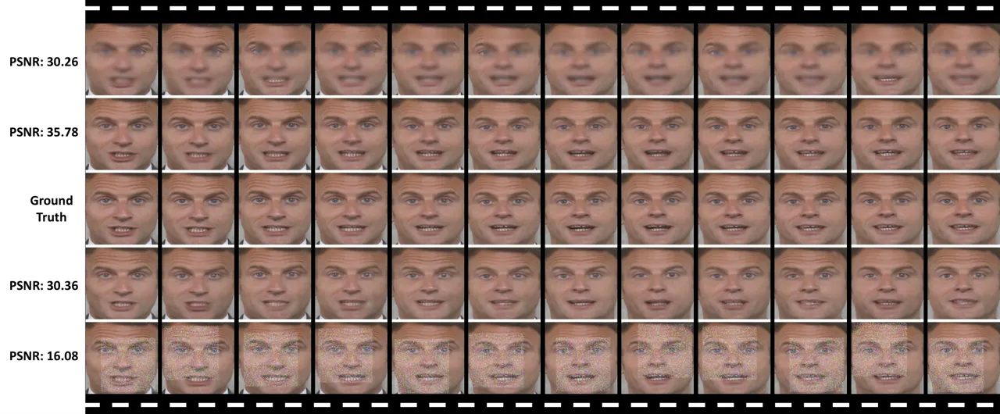
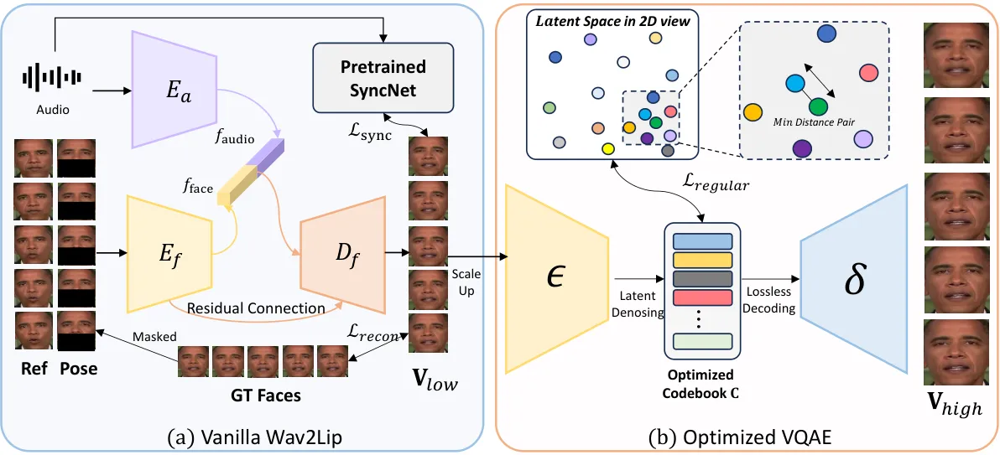
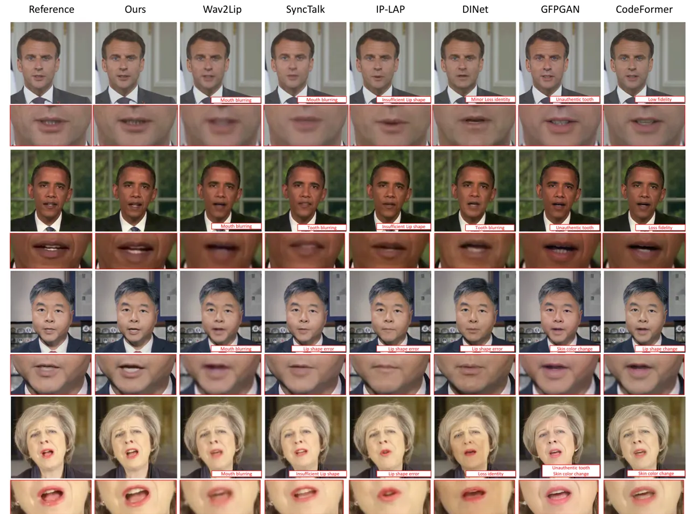
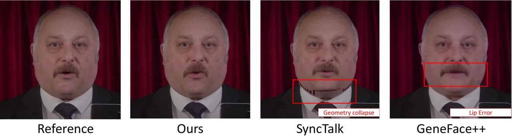
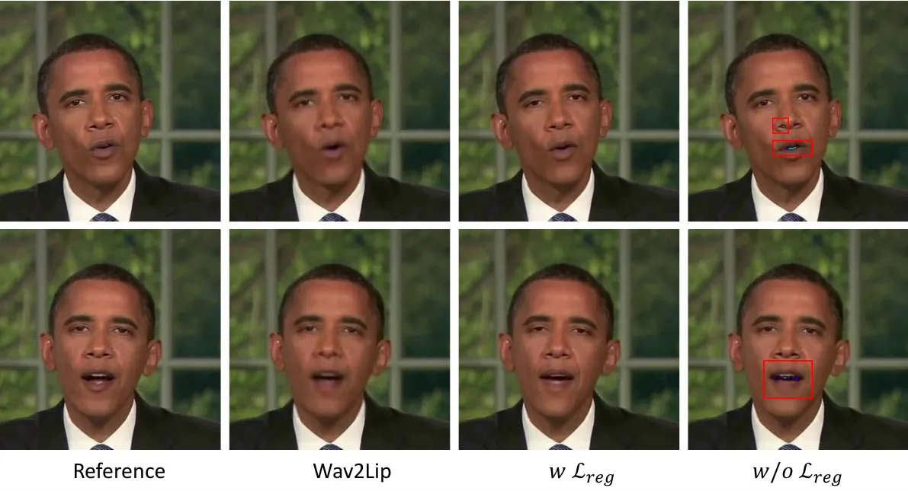
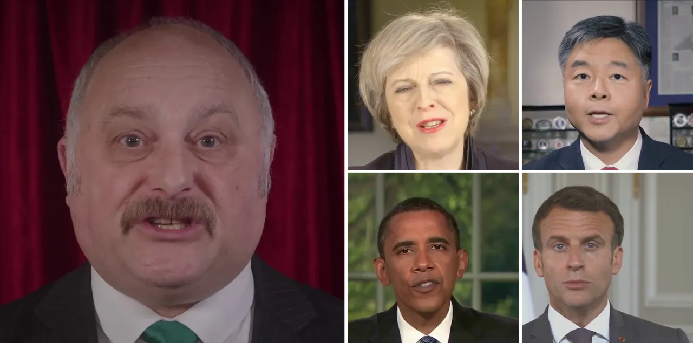
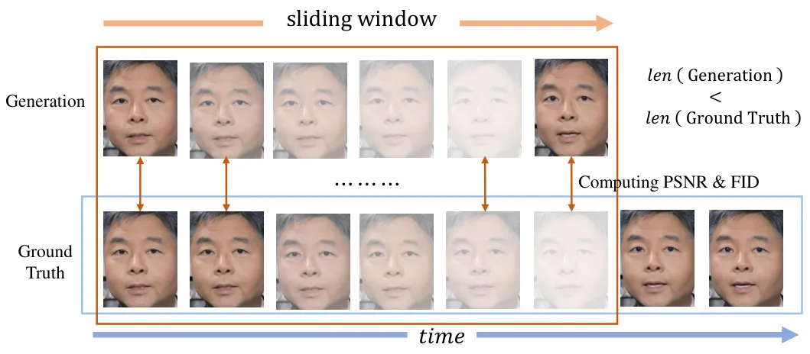
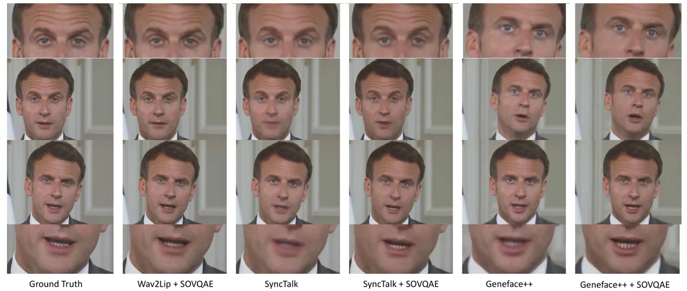

# Lipschitz-Driven Noise Robustness in VQ-AE for High-Frequency Texture Repair in ID-Specific Talking Heads

Jian Yang    Xukun Wang    Wentao Wang    Guoming Li    Qihang Fang   
Ruihong Yuan    Tianyang Wang    Xiaomei Zhang    Yeying Jin    Zhaoxin
Fan ^(†)^(†)thanks: Corresponding author. Email: fanzhaoxinruc@gmail.com

###### Abstract

Audio-driven IDentity-specific Talking Head Generation (ID-specific THG)
has shown increasing promise for applications in filmmaking and virtual
reality. Existing approaches are generally constructed as end-to-end
paradigms, and have achieved significant progress. However, they often
struggle to capture high-frequency textures due to limited model
capacity. To address these limitations, we adopt a simple yet efficient
post-processing framework—unlike previous studies that focus solely on
end-to-end training—guided by our theoretical insights. Specifically,
leveraging the Lipschitz Continuity Theory of neural networks, we prove
a crucial noise tolerance property for the Vector Quantized AutoEncoder
(VQ-AE), and establish the existence of a Noise Robustness Upper Bound
(NRoUB). This insight reveals that we can efficiently obtain an
identity-specific denoiser by training an identity-specific neural
discrete representation, without requiring an extra network. Based on
this theoretical foundation, we propose a plug-and-play Space-Optimized
VQ-AE (SOVQAE) with enhanced NRoUB to achieve temporally-consistent
denoising. For practical deployment, we further introduce a cascade
pipeline combining a pretrained Wav2Lip model with SOVQAE to perform
ID-specific THG. Our experiments demonstrate that this pipeline achieves
state-of-the-art performance in video quality and robustness for
out-of-distribution lip synchronization, surpassing existing
identity-specific THG methods. In addition, the pipeline requires only a
couple of consumer GPU hours and runs in real time, which is both
efficient and practical for industry applications.

¹Beihang University  ²Psyche AI Inc.  ³The University of Alabama at
Birmingham  ⁴CASIA   ⁵Tencent

## 1 Introduction

The generation of photo-realistic, speech-driven, IDentity-specific
Talking Head Generation (ID-specific THG) holds significant potential
across diverse domains, including filmmaking \[1\], virtual reality
\[2\], and digital avatar creation \[3\]. The goal of this task is to
synthesize ID-specific talking head videos that achieve precise lip
synchronization while preserving fine-grained details such as hair,
facial wrinkles, moles, eyelashes, and the intricate contours of the
lips. These high-frequency details are critical for enhancing realism in
synthesized videos.

Existing NeRF-based approaches \[4, 5, 6, 7, 8\] achieve impressive
advances in preserving high-fidelity identities. However, these methods
typically rely on multilayer perceptrons, which are inherently limited
in capturing high-frequency components due to the well-documented
spectral bias phenomenon: this bias, as stated in \[9, 10, 11\], arises
from the pathological eigenvalue distribution of the neural tangent
kernel \[12, 13\], where most eigenvalues are small, limiting
convergence on high-frequency components. On the other hand, blind face
restoration methods \[14, 15, 16\], common-used post-processing
techniques, are capable of enhancing high-frequency textures, but often
suffer from temporal inconsistencies such as texture flickering. While
fine-tuning these models on ID-specific data can reduce flickering, it
may degrade generalization and incurs additional inefficiencies.

To address these challenges, we propose a simple yet effective
post-processing method for ID-specific THG, grounded in rigorous
theoretical insights. By analyzing the forward dynamics of VQ-AE ¹¹ 1 We
use the term VQ-AE to distinguish it from VQGAN \[17\], which combines a
VQ-AE with a transformer network and emphasizes image synthesis. Here,
we focus on the auto-encoder nature of VQ-AE., we uncover the intrinsic
noise robustness of VQ-AE and formally derive its Noise Robustness Upper
Bound (NRoUB) under the Lipschitz Continuity framework \[18, 19\] (see
Sec. 3). This theoretical result implies that training an ID-specific
VQ-AE yields an efficient denoiser, where the denoising process remains
lossless as long as the noise perturbation stays below the NRoUB.
Building on this insight, we introduce a space regularization loss to
further improve the NRoUB, resulting in a variant we call
Space-Optimized VQ-AE (SOVQAE), which enables temporally consistent
denoising (see Fig. 1).



Figure 1: Display of the noise robustness performance in Macron subject.
Please zoom in for better visualization. From top to bottom, there are
Gaussian blurred video, denoised video by SOVQAE, ground truth video,
denoised video and Gaussian noised video. We pick 12 continuous frames
clip to demonstrate the temporal-consistency.

To translate this theoretical foundation into a practical THG pipeline,
we design a cascade architecture combining a pretrained Wav2Lip
model \[20\]—a lightweight and effective lip synchronization model—with
an ID-specific SOVQAE (detailed in Sec. 4). Empirical results show that
our pipeline achieves new state-of-the-art performance in both video
quality and out-of-distribution lip synchronization accuracy,
outperforming existing ID-specific THG methods. We attribute this
performance to the robust audio-lip synchronization provided by the
pretrained model and the high-frequency texture restoration enabled by
SOVQAE. Moreover, with half-precision training and inference, our
pipeline runs at 30 FPS on a consumer-grade GPU, demonstrating its
efficiency and practicality for industrial deployment. In summary, our
main contributions are as follows:

- •
  Theoretical Contribution: We establish the noise robustness of VQ-AE
  through the lens of Lipschitz continuity theory and derive a formal
  upper bound, termed the Noise Robustness Upper Bound (NRoUB).
- •
  Methodological Contribution: We propose SOVQAE, which leverages the
  derived NRoUB to enable temporally consistent post-processing.
  Additionally, we introduce an efficient cascade pipeline for
  identity-specific talking-head generation, combining a pre-trained
  Wav2Lip model with SOVQAE. The pipeline is simple to train, requiring
  only a few consumer GPU hours, and operates in real-time inference.
- •
  Empirical Contribution: Extensive experiments show that our cascade
  pipeline achieves state-of-the-art performance in video quality and
  robustness for out-of-distribution lip synchronization, highlighting
  its practical utility for real-world deployment.

## 2 Related Work

##### Audio-Driven Talking Heads Generation.

As delineated in \[20, 21, 22, 23, 24, 25, 26, 27\], one-shot methods
harness a plethora of talking video clips to capture the
generalizability across multiple faces, thereby attaining commendable
lip-synchronization performance. Despite these advancements, these
methods continue to grapple with maintaining identity consistency across
video frames. To counter this limitation, ID-specific NeRF-based methods
\[4, 6, 7, 5, 8, 28\] are proposed, focusing exclusively on
identity-specific data for training. Although this approach mitigates
issues of identity instability, the constrained volume of training data
hampers their cross-audio synchronization capabilities. To this end,
GeneFace \[7\] and SyncTalk \[4\] enhance their audio generalization
performance by leveraging pre-trained audio-to-landmarks predictors and
audio encoders \[20\] respectively. Although these initiatives
successfully bolster the cross-audio generalization of NeRF methods,
instances of cross-audio desynchronization persist.

##### Face Restoration.

Blind Face Restoration \[14, 15, 29, 16, 30, 31, 32, 33, 34\] endeavors
to rectify diverse degradations in facial imagery captured in non-ideal
conditions, including compression, blur, and noise. Given the unknown
nature of the specific degradations, this task is inherently ill-posed.
The prevalent approach to address this challenge is to integrate prior
knowledge within an encoder-decoder framework: GFPGAN \[33\] utilizes a
pre-trained face GAN’s rich priors for blind face restoration. Yang et
al. \[34\] integrate a GAN into a U-shaped DNN for enhanced face
restoration. Codeformer \[33\] uses a learned codebook to predict codes,
reducing restoration uncertainty. Through rigorous theoretical analysis
and empirical experiments, we establish that the SOVQAE is an effective
plug-and-play model for achieving identity-specific,
temporally-consistent face restoration, thereby enabling the generation
of high-quality talking faces.

##### Vector Quantization (VQ) Family.

Initially, VQ emerged as a technique within the Signal Processing
community \[35, 36, 37, 38\]. Mathematically, VQ maps signal spaces
$`\mathbb{R}^{K}`$ onto a finite set of Voronoi regions
$`\{{V_{n}}\}_{n=1}^{N}`$, each associated with an anchor vector
$`\{{\bf c}_{n}\}_{n=1}^{N}\subset\mathbb{R}^{c}`$:

```math
V_{n}=\{{\bf x}\in\mathbb{R}^{c}\mid\|{\bf x}-{\bf c}_{n}\|_{2}\leq\|{\bf x}-{\bf c}_{m}\|_{2},\forall m\neq n\}, \tag{1}
```

where $`\|\cdot\|_{2}`$ denotes the Euclidean distance. (Fig. 2(a)
represents a Voronoi case in 2D space.) Recently, Oord et al. \[39\]
integrated the VQ operation into generative models, sparking a trend of
discrete latent representation in the field \[15, 25, 17, 40, 41, 42,
43, 44, 45\].

Our study regards VQ-AE as a mechanism for learning and encoding
high-frequency facial details, similar to VQ-based approaches. Unlike
methods\[41, 42, 43, 44, 45\] that require additional networks, VQ-AE
inherently possesses noise robustness (Sec.3), enabling the recovery of
detailed textures from low-quality images. This simplicity makes our
method both effective and efficient.

## 3 Noise Robustness of VQ-AE

In this section, we derive the noise robustness of VQ-AE via the
Lipschitz Continuity theory, where the definition of lipschitz
continuity is following:

###### DEFINITION 3.1.

A function $`f:\mathbb{R}^{n}\to\mathbb{R}^{m}`$ is called Lipschitz
continuous if there exists a constant $`L`$ such that

```math
\forall x,y\in\mathbb{R}^{n},~\|f(x)-f(y)\|_{2}\leq L\|x-y\|_{2}. \tag{2}
```

The smallest value of $`L`$ for which the preceding inequality holds is
referred to as the Lipschitz constant of $`f`$. This property guarantees
that when a small perturbation $`\Delta x`$ is applied to $`x`$, the
resulting impact on $`f(x)`$ is linearly proportional to
$`\|\Delta x\|`$. This characteristic is more stringent than uniform
continuity because the Lipschitz constant is independent of specific
points in the domain.

Figure 2: (a) Illustrates Voronoi regions in 2D and explains the
denoising mechanism in VQ space. Given a mapping point $`P`$, there
exists an open disk
$`\{{\bf x}\in V_{A}\cup V_{B}\cup V_{C}:\|{\bf x}-P\|_{2}<s\}`$, where
all points in the disk share the same anchor point $`A`$. (b)
Demonstrates the robustness of VQ-AE under slight input disturbances.
When image perturbations occur, the VQ mechanism correctly matches the
appropriate codebook vector in the latent space, provided the affected
vector remains within the correct Voronoi region (e.g., the yellow-red
vector in the figure).

As depicted in Fig.2(b), a VQ-AE is encapsulated by the quadruple
$`\{\epsilon,\delta,{\bf C},g_{{\bf C}}\}`$. Here, $`\epsilon`$
represents the CNN encoder that maps the image domain
$`\mathbb{R}^{3\times h\times w}`$ to the latent space
$`\mathbb{R}^{c\times h_{o}\times w_{o}}`$. The term $`\delta`$
signifies the CNN decoder, which reconstructs the image from the latent
representation in $`\mathbb{R}^{c\times h_{o}\times w_{o}}`$. The
codebook $`{\bf C}=\{{\bf c}_{n}\}_{n=1}^{N}\in\mathbb{R}^{c\times N}`$
comprises $`N`$ anchor vectors. Furthermore, $`g_{{\bf C}}`$ refers to
the channel-wise 1-Nearest Neighbor (1-NN) feature matching operation,
responsible for the substitution of latent features with their closest
anchor vectors within the codebook. As demonstrated in recent studies
\[18, 19\], the following conclusion can be drawn:

###### THEOREM 3.2.

Given a trained VQ-AE $`\{\epsilon,\delta,{\bf C},g_{{\bf C}}\}`$, the
$`\epsilon:~\mathbb{R}^{3\times h\times w}\to\mathbb{R}^{c\times h_{o}\times w_{o}}`$
is a map with lipschitz continuity such that

```math
\forall x,y\in\mathbb{R}^{3\times h\times w},~\|\epsilon(x)-\epsilon(y)\|_{F}\leq L_{\epsilon}\|x-y\|_{F}, \tag{3}
```

where $`\|\cdot\|_{F}`$ is the Frobenius norm of matrix and
$`L_{\epsilon}`$ is the Lipschitz constant of $`\epsilon`$.

We provide the proof in Appendix.D. Let
$`{\bf V}_{low}\subset\mathbb{R}^{T\times 3\times h\times w}`$ denote
the noised version of $`{\bf V}_{high}`$, where $`{\bf V}_{high}`$
training video of VQ-AE. Without loss of generality, for any
$`{\bf I}_{low}\in{\bf V}_{low}`$ and
$`{\bf I}_{high}\in{\bf V}_{high}`$, we assume that
$`{\bf I}_{high}+{\bf\mathcal{N}}={\bf I}_{low}`$ holds, where
$`{\bf\mathcal{N}}`$ represents the numerical disturbance caused by any
degradation. Consequently, by Theorem 3.2, we derive the following
results:

```math
\epsilon({\bf I}_{low})\in\{x\in\mathbb{R}^{c\times h_{o}\times w_{o}}:\|x-\epsilon({\bf I}_{high})\|_{F}\leq L_{\epsilon}\|\mathcal{N}\|_{F}\}. \tag{4}
```

This implies that the $`\epsilon(\mathbf{I}_{\text{low}})`$ resides
within the interior of a hypersphere, with the point
$`\epsilon(\mathbf{I}_{\text{high}})`$ as its center and a radius of
$`L_{\epsilon}\|\mathcal{N}\|_{F}`$, in the measure of the Frobenius
norm. Furthermore, for each channel of the latent vector, denoted as
$`\epsilon(\mathbf{I}_{\text{low}})_{i,j}`$ and
$`\epsilon(\mathbf{I}_{\text{high}})_{i,j}\in\mathbb{R}^{c}`$, we have
that:

```math
\|\epsilon({\bf I}_{low})_{i,j}-\epsilon({\bf I}_{high})_{i,j}\|_{2}<L_{\epsilon}\|\mathcal{N}\|_{F}. \tag{5}
```

This further indicates an important and evident fact:

###### THEOREM 3.3.

In a trained VQ-AE $`\{\epsilon,\delta,{\bf C},g_{{\bf C}}\}`$, we
define
$`d_{C}={\rm min}\{\|{\bf c}_{i}-{\bf c}_{j}\|_{2}~:~{\bf c}_{i},{\bf c}_{j}\in{\bf C}~and~i\neq j\}`$
as the minimal distance between anchors of codebook $`{\bf C}`$,
$`\gamma`$ is the maximal distance of training image latent to closest
anchor in all channel, and $`L_{\epsilon}`$ is the Lipschitz constant of
$`\epsilon`$ . when
$`\|\mathcal{N}\|_{F}<\frac{d_{C}-2\gamma}{2L_{\epsilon}}`$ holds, we
have:

```math
g_{\bf C}(\epsilon({\bf I}_{low}))=g_{\bf C}(\epsilon({\bf I}_{high})). \tag{6}
```

This is what we refer to as the noise robustness/tolerance mechanism of
the VQ-AE, and we term the $`\frac{d_{C}-2\gamma}{2L_{\epsilon}}`$ as
Noise Robustness Upper Bound (NRoUB). Specifically, the anchors
$`\{\mathbf{c}_{n}\}_{n=1}^{N}`$ partition the latent domain into $`N`$
high-dimensional Voronoi regions as defined by Eq. (1). Let the nearest
anchor to $`\epsilon(\mathbf{I}_{\text{high}})_{i,j}`$ be
$`\mathbf{c}_{n}`$, and $`V_{n}`$ be its corresponding Voronoi region.
Theorem 3.2 ensures that $`\epsilon(\mathbf{I}_{\text{low}})_{i,j}`$
remains within $`V_{n}`$, provided that
$`\|\mathcal{N}\|_{F}<\frac{d_{C}-2\gamma}{2L_{\epsilon}}`$ is
satisfied, thereby enabling the $`g_{\mathbf{C}}`$ operation to
correctly assign $`\mathbf{c}_{n}`$ to
$`\epsilon(\mathbf{I}_{\text{low}})_{i,j}`$. This condition is valid for
each channel of $`\epsilon(\mathbf{I}_{\text{low}})`$, and thus
Theorem 3.3 applies, allowing the decoder $`\delta`$ to generate high
quality faces without loss. The complete proof of Theorem 3.3 is
detailed in Appendix E.

As shown in Fig. 1, we validate the noise robustness on a brief talking
sequence with two common video degradation types: Gaussian blurring and
Gaussian noise. For each frame, a $`192\times 192`$ pixel area is
randomly selected and subjected to these noise conditions. The increase
in PSNR from 30.26 to 35.78 following Gaussian blurring confirms the
temporal validity of Theorem 3.3. Even under more semantically
destructive Gaussian noise, our method adeptly recovers detail and
maintains temporal consistency, with PSNR rising from 16.08 to 30.36.
These observations underscore the robustness of VQ-AE to noise and
affirm its effectiveness.

##### Application insights for High-Frequency Texture Repair in ID-specific THG.

On the one hand, in ID-specific THG, generating realistic audio-driven
videos with high-frequency details is challenging to existing end-to-end
methods. A common way to enhance face details is doing face restoration.
However existing face restoration models fall short in
temporal-consistency. Hence, a feasible post-processing method for
ID-specific THG is to enhance texture with temporal-consistency.

On the other hand, our aforementioned theoretical analysis highlights
two important and interesting conclusions:

- •
  An ID-specific denoiser can be obtained through training the ID-aware
  neural discrete representation (VQ-AE);
- •
  The denoising performance can be temporal-consistent, when the noise
  disturbance is below the NRoUB.

Therefore, if we can increase the NRoUB of VQ-AE, we can obtain the
ideal post-processing model for ID-specific THG. To this end, we
introduce a space regularization loss to enhance the NRoUB of VQ-AE
(termed as SOVQAE) in next section, and illustrate its combination with
pretrained Wav2Lip showing its application potential.

## 4 Space-Optimized VQ-AE and Application

In this section, we firstly introduce a feasible space regularization
loss to enhance the NRoUB, building our SOVQAE, and illustrate how the
pretrained Wav2Lip combines with our SOVQAE to build state-of-the-art
ID-specific THG pipeline.



Figure 3: Illustration of cascade pipeline: (a) displays the overview of
Wav2Lip; (b) displays the latent denosing process of SOVQAE and the
mechanism of regularization loss. Please zoom in for better
visualization.

### 4.1 Space Optimized VQ-AE

According to Theorem 3.3, perfect denoising is achievable when
$`\|\mathcal{N}\|_{F}<\frac{d_{C}-2\gamma}{2L_{\epsilon}}`$. Hence our
goal is increasing the NRoUB thus to enhance the noise robustness of
VQ-AE. Note that $`\gamma`$ is much close to zero, because $`\gamma`$ is
optimized via VQ loss (see Eq. 8) in training. Hence, it seems optimal
to maximize $`d_{C}`$ while minimizing $`L_{\epsilon}`$. However, this
is theoretically infeasible, because $`L_{\epsilon}`$ is positively
correlated with the operation norm of convolutional kernels (according
to our proof of Theorem 3.2), implying that minimizing $`L_{\epsilon}`$
equates to L2/L1 parameter regularization \[46\]. Such regularization
would globally compress the latent space distribution, consequently
compressing the distribution of anchors in the codebook $`\mathbf{C}`$
and reducing $`d_{C}`$, thus to degrade NRoUB, as demonstrated in
Tab. 3.

Therefore, the collect optimization is that increasing $`d_{C}`$ while
maintaining $`L_{\epsilon}`$. In experiments, we find a practical
solution is to locally extend the $`d_{C}`$ with a given lower bound.
Thus, the codebook regularization loss we propose is:

```math
\mathcal{L}_{\text{regular}}=\|d_{C}-\theta\|_{2}, \tag{7}
```

where $`\theta`$ represents the given lower bound. This regularization
strategy effectively improves local noise robustness while maintaining
global robustness, which will be validated via ablation studies. In
addition to this regularization loss, the complete loss function of
SOVQAE comprises L2 reconstruction loss, VQ loss\[17\], perceptual loss,
and GAN loss with a patch-based discriminator\[47\]. The VQ loss is
following:

```math
\displaystyle\mathcal{L}_{\text{VQ}}(\epsilon,\delta,\mathbf{C}) \displaystyle=\|x-\hat{x}\|^{2}+\|\text{sg}[\epsilon(x)]-g_{\textbf{C}}(\epsilon(x))\|_{2}^{2} \tag{8}
```

```math
\displaystyle+\|\text{sg}[g_{\textbf{C}}(\epsilon(x))]-\epsilon(x))\|_{2}^{2},
```

where $`x`$ is the input image,
$`\hat{x}=\delta(g_{\textbf{C}}(\epsilon(x)))`$ is the reconstructed
image, $`\text{sg}(\cdot)`$ denotes the stop-gradient operation
following\[17\]. The later two components of Eq. 8 are utilized to
optimized the $`\gamma`$.

### 4.2 Cascade ID-specific THG pipeline

The Choice of Base Model. In ID-specific THG, an important demanding is
the generality with Out-of-Domain (OOD) audios. While end-to-end
methods \[8, 4\] make significant progress on it, they still have gap
with great OOD audio generality, as their limited training data.
Furthermore, while Wav2Lip \[20\] has been proposed for years, it still
outperforms with both recent one-shot \[48, 49\] and ID-specific \[50,
51\] methods and run in real time. It is an ideal lip-sync prior base
model for a post-processing framework. As shown in Tab. 1, this
combination makes outstanding lip-sync performance on OOD audios,
validating our choice of base model.

Cascade Pipeline. As shown in Fig. 3, Our SOVQAE is Cascaded with
pretrained Wav2Lip, and we kindly refer readers to obtain more details
from \[20\] due to the limited space. To adapt with outputs of Wav2Lip,
we employ face detection using S3FD \[52\] to extract facial regions
from a talking head video of a specific identity. These extracted
regions are subsequently resized to $`256\times 256`$ for training
SOVQAE. This strategy allows the codebook to concentrate on capturing
the high-frequency facial components. In inference, for given Low
resolution faces ($`96\times 96`$) from Wav2Lip, we upscale them to
$`256\times 256`$ before subjecting them to SQVQAE.

Efficiency and Plug-and-Play. With the half precision training and
inference, our cascade pipeline achieves 30 FPS inference speed on
consumer GPU, which demonstrates its feasibility in industry. Total
training takes 5 GPU hours on NVIDIA 4090, which is also comparable with
end-to-end counterparts. As shown in Fig. 10, trained SOVQAE can also
adapt for different base models, since it works as a denoiser.



Figure 4: The comparative visualization presents a curated selection of
discrete keyframes and corresponding sub-frames of lower-half faces.
Please zoom in for better visualization.

## 5 Experiments

Dataset. For comparative analysis, we employ the same set of
meticulously edited video sequences utilized in previous works \[5, 6,
7\], encompassing both English and French dialogues. The average
duration of these videos is approximately 8,843 frames. We refer to this
collection as the Usual Dataset to differentiate it from our proprietary
HF videos. These videos are characterized by their rich textures and
high resolution ($`1024\times 1024`$). The average length of these
videos is around 11,000 frames. More details of them can be found in
Appendix. All videos are centered on individual characters and captured
at a frame rate of 25 FPS. Consistent with prior research, we adopt a
train-to-test split ratio of $`10:1`$. We empirically set $`\theta=1`$.
Moreover, to assess the generalizability of our methods, we conduct
additional tests using a set of out-of-domain (OOD) audio. This OOD
audio comprises 10 diverse voice samples, spanning various languages and
genders. We place more implementation details in Appendix, due to the
limited space.

Comparison Baselines. We conduct a comparative analysis of our method
with a total of three one-shot approaches, which include Wav2Lip \[20\],
DINet \[22\], IP-LAP \[24\], and three ID-specific THG methods, namely
SyncTalk \[4\], GeneFace \[7\] and GeneFace++ \[8\]. Furthermore, to
underscore the significance of our identity-specific face restoration
concept, we establish two post-processing baselines using Codeformer
\[15\] and GFPGAN \[33\].

Evaluation Metrics. To assess the quality of the generated images, we
employ the Peak Signal-to-Noise Ratio (PSNR) and the Frechet Inception
Distance (FID) \[53\] as metrics. For evaluating lip synchronization, we
utilize the Lip Sync Error Confidence (LSE-C) and Lip Sync Error
Distance (LSE-D) scores.

### 5.1 Qualitative Comparison

To provide a more intuitive assessment of image quality, we present a
comparative analysis of our method alongside alternative approaches in
Fig. 4. Specifically, we contrast our method with both end-to-end
methodologies, including Wav2Lip \[20\], SyncTalk \[4\], IP-LAP \[24\],
and DINet \[22\], as well as two post-processing techniques,
GFPGAN \[33\] and CodeFormer \[15\].



Figure 5: Comparison on HF videos. Except for the collapse and lip error
(see red boxes), NeRF-based methods also has limitation in stability of
face scale. See supplemental videos for more details.

In summary, the qualitative comparison underscores that our method
surpasses all compared methods in terms of facial texture and
lip-synchronization. In Fig. 4, our method outperforms SyncTalk, a
state-of-the-art NeRF-based approach, by better capturing high-frequency
facial details. SyncTalk’s struggle to maintain these details,
particularly in dynamic scenes, results in blurred mouth and teeth
regions. This is attributed to NeRF’s limited expressivity for
high-frequency details. In contrast, our method, utilizing SOVQAE,
effectively restores individual-specific textures, enhancing fidelity.
The 7th and 8th columns of the figure, where our method’s
identity-specific restoration approach is superior to the two
post-processing baselines, which alter the subject’s identity due to
information leakage from a large OOD faces dataset \[54\]. This
underscores the necessity of our identity-specific restoration approach.
Besides, in more challenging HF videos, our method has more stable
performance. In contrast, NeRF-based methods occur geometry collapse
(see the 3-th cloumn in Fig.5) and lip error, when scale their
resolution to higher (from 512 to 1024).

### 5.2 Quantitative Comparison

Figure 6: Comparison with fine-tuned GFPGAN model.Note that the sudden
collapse of lip synchronization of GFPGAN is caused by the overfitting.
We display videos in our supplemental materials.

For a more exhaustive evaluation, our quantitative assessment is divided
into two segments: 1) Video quality and lip-synchronization comparison,
which evaluates image quality frame-by-frame and lip-synchronization
performance under original audio-driven conditions; 2)
Out-of-Distribution (OOD) audio-driven comparison, where we contrast
lip-synchronization with SOTA methods to underscore the superior
cross-audio generality of our approach, a critical application scenario.

Comparison with End-to-End Methods. As detailed in Tab. 1, on the Usual
Dataset, our method secures the highest scores for both PSNR (38.9213 )
and FID (3.5502), signifying that we achieve state-of-the-art image
quality for generated videos. This advancement is credited to the
SOVQAE, which retains high-frequency texture details in the codebook and
consistently recovers facial textures from low-quality faces. In terms
of lip-synchronization, we outperform all methods (excluding our base
model), a testament to Wav2Lip’s robust audio-lip alignment capability.
Although our method moderately reduces the lip-synchronization
performance of the base model, the substantial enhancement in visual
quality justifies this trade-off as valuable and insightful. Similar
outcomes are observed in the HF videos.

Comparison with Post-Process Methods. As illustrated in Tab. 1, our
method surpasses two post-process baselines in video quality. This
advantage stems from the fact that Codeformer and GFPGAN are tailored
for blind face restoration, and their face prior learning from
out-of-distribution multi-face datasets results in information leakage,
leading to identity errors. Moreover, their image-by-image training
strategy is not optimal for video scenarios, causing frame-wise
flickering. Although they maintain the lip-synchronization performance
of the base model, their subpar visual fidelity limits their
applicability to ID-specific THG. Furthermore, for fair comparison, we
also finetune GFPGAN model in ID-specific videos. As shown in Fig. 6,
while fine-tuning improves its performance in visual quality, its
synchronization decreases. On the other hand, our method has least GPU
need (5 GPU@4090 hours), best visual quality and comparable
synchronization. These findings strongly affirm the efficacy and
efficiency of our cascade pipeline for ID-specific THG.

Comparison on OOD Audio Driving. To evaluate our method’s voice
generalization, we compared it with recent SOTA models on the OOD
audio-driving task. As shown in Tab. 1, Our method achieves second best
in both LSE-C and LSE-D metrics, scoring 6.5521 in LSE-C and 7.6231 in
LSE-D, demonstrating strong generalization across diverse voices. It
significantly outperforms other methods such as SyncTalk, GeneFace++,
IP-LAP, and DINet, and is slightly behind Wav2Lip.

|                    |                  |                   |                   |                     |                  |                   |                   |                     |                   |                     |
| ------------------ | ---------------- | ----------------- | ----------------- | ------------------- | ---------------- | ----------------- | ----------------- | ------------------- | ----------------- | ------------------- |
| Method             | Usual Dataset    |                   |                   |                     | HF videos        |                   |                   |                     | OOD-audio         |                     |
|                    | PSNR$`\uparrow`$ | FID$`\downarrow`$ | LSE-C$`\uparrow`$ | LSE-D$`\downarrow`$ | PSNR$`\uparrow`$ | FID$`\downarrow`$ | LSE-C$`\uparrow`$ | LSE-D$`\downarrow`$ | LSE-C$`\uparrow`$ | LSE-D$`\downarrow`$ |
| Wav2Lip\[20\]      | 34.0979          | 10.8503           | 9.077             | 5.8769              | 34.6593          | 17.5281           | 8.8496            | 6.8712              | 7.1258            | 7.3521              |
| DINet\[22\]        | 33.9108          | 9.8385            | 7.1951            | 7.4343              | 34.4849          | 10.5749           | 8.3541            | 7.2340              | 5.2310            | 8.5922              |
| IP-LAP\[24\]       | 34.7263          | 10.1703           | 5.1736            | 8.8160              | 35.1595          | 9.9438            | 8.2604            | 7.1838              | 4.3759            | 9.0596              |
| GeneFace\[7\]      | 24.8165          | 21.7084           | 5.195             | \-                  | \-               | \-                | \-                | \-                  | \-                | \-                  |
| GeneFace++\[8\]    | 31.1164          | 20.5506           | 6.8916            | 7.5014              | 33.9692          | 22.3928           | 4.6112            | 11.0401             | 5.3445            | 8.3927              |
| SyncTalk\[4\]      | 36.0574          | 6.4855            | 7.054             | 7.282               | 39.4050          | 6.5370            | 7.816             | 7.715               | 5.1063            | 8.0474              |
| CodeFormer\*\[15\] | 33.2441          | 26.3567           | 9.1739            | 5.7720              | 33.7958          | 16.7215           | 7.9409            | 7.2582              | \-                | \-                  |
| GFPGAN\*\[33\]     | 33.9803          | 16.7267           | 9.0417            | 5.8144              | 33.7780          | 17.2715           | 8.7940            | 6.5193              | \-                | \-                  |
| Ours               | 38.9213          | 3.5502            | 8.1136            | 6.3402              | 39.6254          | 4.3525            | 8.2392            | 6.8238              | 6.5521            | 7.6231              |
| Best; Second best. |                  |                   |                   |                     |                  |                   |                   |                     |                   |                     |

Table 1: The quantitative experiments of different methods on Usual
Dataset and HF videos, and the OOD audio-driven experiment. \* indicates
post-process baselines combined with Wav2Lip.

|                      |                  |                   |                   |                     |
| -------------------- | ---------------- | ----------------- | ----------------- | ------------------- |
| Method               | PSNR$`\uparrow`$ | FID$`\downarrow`$ | LSE-C$`\uparrow`$ | LSE-D$`\downarrow`$ |
| GeneFace++           | 31.11            | 20.55             | 6.89              | 7.50                |
| GeneFace++ + SOVQAE  | 33.27            | 18.21             | 6.42              | 8.22                |
| SyncTalk (CVPR 2024) | 36.06            | 6.49              | 7.05              | 7.68                |
| SyncTalk + SOVQAE    | 37.16            | 5.12              | 6.58              | 7.88                |
| Ours                 | 38.92            | 3.55              | 8.11              | 6.34                |

Table 2: Plug-and-play experiments in Usual Dataset.

Plug-and-Play Performance. To demonstrate the plug-and-play performance
of SOVQAE, we integrated SOVQAE into different ID-specifc base models.
As shown in Tab.2, SOVQAE improves visual quality metrics across
different ID-specific base models, confirming its versatility and
effectiveness. Notably, we achieve the best overall performance by
leveraging the exceptional audio-lip synchronization capabilities of
Wav2Lip. This superior synchronization positively impacts PSNR and FID
values, thereby enhancing overall video quality and ensuring ours top
performance.

These observations suggest that our method effectively inherits the SOTA
audio generalization capability of Wav2Lip and validate the feasibility
of our cascade pipeline.

### 5.3 Ablation Study

In this section, we conduct an ablation study to further substantiate
the indispensability of each component within our pipeline.

VQ Regularization Loss. As previously discussed, in practical
applications, training without regularization on the VQ codebook can
result in a decrease in noise robustness due to the stochastic
optimization of the codebook. While Fig. 1 demonstrates impressive
robustness under Gaussian blur and Gaussian noise, vanilla VQ-AE falls
short to handle the unknown noise disturbance between the output of
Wav2Lip and ground truth, resulting artifacts. To illustrate the
efficacy of Eq. 7 in stabilizing this robustness, we conducted a
comparison between the VQ-AE with and without codebook optimization. As
shown in Fig. 7, the absence of our regularization loss introduces
numerous artifacts in the output video, attributable to errors in latent
matching.



Figure 7: Ablation study of the regularization loss. Without this loss
will lead to random noises ( see red boxes ).

To further demonstrate the necessity and efficacy of our VQ
regularization loss, we conduct detailed ablation studies on the lower
bound $`\theta`$ and optimization settings. As shown in Tab. 3,
optimizing the minimal distance pair in the codebook yields the best
results: (1) Optimizing pairwise distances within the codebook leads to
codebook collapse, as indicated by the first two rows. (2) In contrast,
local optimization with $`\theta=1`$ is effective. (3) Increasing the
distance ($`\theta=2`$) in local optimization degrades performance due
to over-constraint. This contrasts with general principles for training
VQ-VAEs, where maintaining a sufficiently large distance in the codebook
is crucial for diversity in image representation. However, our goal
differs: while VQ-VAE aims for diverse codebooks to handle varied
images, SOVQAE focuses on enhancing noise robustness for
identity-specific faces. We do not explore $`\theta<1`$ since
$`d_{c}<1`$ is typically the case.

| PSNR$`\uparrow`$ | FID$`\downarrow`$ | LSE-C$`\uparrow`$ | LSE-D$`\downarrow`$ | Reg. Obj.     | $`\theta`$ |
| ---------------- | ----------------- | ----------------- | ------------------- | ------------- | ---------- |
| 31.21            | 29.34             | 4.35              | 9.58                | Average Dist. | 2          |
| 34.18            | 18.34             | 5.67              | 8.02                | Average Dist. | 1          |
| 34.56            | 19.27             | 5.35              | 8.26                | Minimal Dist. | 2          |
| 38.97            | 3.45              | 8.13              | 6.44                | Minimal Dist. | 1          |

Table 3: Ablation experiments in Usual Dataset. ‘Reg. Obj.’ indicates
the regularized object in our regularization loss. ‘Minimal Dist.’ is
the $`d_{c}`$. ‘Average Dist.’ indicates the average distances of each
pair of codebook vectors.

Length of training videos. An essential inquiry pertains to the least
length of video required to train a sufficiently expressive SOVQAE to
support our pipeline in achieving realistic and temporally consistent
denoising performance. To address this question, we experimentally
varied the length of the training video for the SOVQAE and assessed the
corresponding impact on performance. The findings, as detailed in
Tab. 4, yield the following insights: Using extended training videos
improves the audio-driven capabilities of SOVQAE. A 5-minute training
video is adequate for generating realistic talking head videos with our
method, indicating similar data requirements to NeRF-based methods. To
make our manuscript more sufficient, we introduce our limitations in
Appendix B.

| Length of video        | 1       | 2       | 3       | 4       | 5       | 6       | Full (8’40”) |
| ---------------------- | ------- | ------- | ------- | ------- | ------- | ------- | ------------ |
| LSE-C$`\uparrow`$      | 6.4420  | 6.9288  | 7.0556  | 6.9871  | 7.1377  | 7.3170  | 7.2912       |
| LSE-D$`\downarrow`$    | 7.2267  | 6.6919  | 6.4644  | 6.5941  | 6.5378  | 6.5669  | 6.3571       |
| Mouth PSNR$`\uparrow`$ | 29.5289 | 30.4725 | 31.0795 | 31.7604 | 32.3984 | 32.2013 | 32.48622     |

Table 4: Ablation study on length of training video. Note that we only
compute the PSNR for the Mouth region in this experiment. We conduct
this experiment on Macron for more comprehensive study, since it is the
longest video in Usual dataset.

## 6 Conclusion

This work first establishes a theoretical foundation for the noise
robustness of VQ-AE by proving an upper bound based on Lipschitz
continuity theory, which enables subsequent method design. Building on
this foundation, we propose SOVQAE, enhancing temporal consistency in
latent space via a space regularization loss. Furthermore, we introduce
an efficient cascade pipeline combining a pre-trained Wav2Lip model with
ID-specific SOVQAE, achieving state-of-the-art video quality and
out-of-domain lip synchronization accuracy. The whole pipeline requires
only 5 GPU hours (NVIDIA 4090) for training and supports 30 FPS
real-time inference, making it suitable for industrial deployment. In
other words, this work highlights the potential of post-processing
paradigms in the domain of talking head generation. We hope that our
contributions will provide valuable insights to the research community.

## References

- \[1\] Hyeongwoo Kim, Pablo Garrido, Ayush Tewari, Weipeng Xu, Justus
  Thies, Matthias Niessner, Patrick Pérez, Christian Richardt, Michael
  Zollhöfer, and Christian Theobalt. Deep video portraits. ACM
  transactions on graphics (TOG), 37(4):1–14, 2018.
- \[2\] Shigeo Morishima. Real-time talking head driven by voice and its
  application to communication and entertainment. In AVSP’98
  International Conference on Auditory-Visual Speech Processing, 1998.
- \[3\] Justus Thies, Mohamed Elgharib, Ayush Tewari, Christian
  Theobalt, and Matthias Nießner. Neural voice puppetry: Audio-driven
  facial reenactment. In Computer Vision–ECCV 2020: 16th European
  Conference, Glasgow, UK, August 23–28, 2020, Proceedings, Part XVI 16,
  pages 716–731. Springer, 2020.
- \[4\] Ziqiao Peng, Wentao Hu, Yue Shi, Xiangyu Zhu, Xiaomei Zhang, Hao
  Zhao, Jun He, Hongyan Liu, and Zhaoxin Fan. Synctalk: The devil is in
  the synchronization for talking head synthesis. arXiv preprint
  arXiv:2311.17590, 2023.
- \[5\] Yudong Guo, Keyu Chen, Sen Liang, Yong-Jin Liu, Hujun Bao, and
  Juyong Zhang. Ad-nerf: Audio driven neural radiance fields for talking
  head synthesis. In Proceedings of the IEEE/CVF international
  conference on computer vision, pages 5784–5794, 2021.
- \[6\] Jiahe Li, Jiawei Zhang, Xiao Bai, Jun Zhou, and Lin Gu.
  Efficient region-aware neural radiance fields for high-fidelity
  talking portrait synthesis. In Proceedings of the IEEE/CVF
  International Conference on Computer Vision, pages 7568–7578, 2023.
- \[7\] Zhenhui Ye, Ziyue Jiang, Yi Ren, Jinglin Liu, Jinzheng He, and
  Zhou Zhao. Geneface: Generalized and high-fidelity audio-driven 3d
  talking face synthesis. arXiv preprint arXiv:2301.13430, 2023.
- \[8\] Zhenhui Ye, Jinzheng He, Ziyue Jiang, Rongjie Huang, Jiawei
  Huang, Jinglin Liu, Yi Ren, Xiang Yin, Zejun Ma, and Zhou Zhao.
  Geneface++: Generalized and stable real-time audio-driven 3d talking
  face generation. arXiv preprint arXiv:2305.00787, 2023.
- \[9\] Nasim Rahaman, Aristide Baratin, Devansh Arpit, Felix Draxler,
  Min Lin, Fred Hamprecht, Yoshua Bengio, and Aaron Courville. On the
  spectral bias of neural networks. In International conference on
  machine learning, pages 5301–5310. PMLR, 2019.
- \[10\] Ronen Basri, Meirav Galun, Amnon Geifman, David Jacobs, Yoni
  Kasten, and Shira Kritchman. Frequency bias in neural networks for
  input of non-uniform density. In International Conference on Machine
  Learning, pages 685–694. PMLR, 2020.
- \[11\] Gizem Yüce, Guillermo Ortiz-Jiménez, Beril Besbinar, and Pascal
  Frossard. A structured dictionary perspective on implicit neural
  representations. In Proceedings of the IEEE/CVF Conference on Computer
  Vision and Pattern Recognition, pages 19228–19238, 2022.
- \[12\] Arthur Jacot, Franck Gabriel, and Clément Hongler. Neural
  tangent kernel: Convergence and generalization in neural networks.
  Advances in neural information processing systems, 31, 2018.
- \[13\] Matthew Tancik, Pratul Srinivasan, Ben Mildenhall, Sara
  Fridovich-Keil, Nithin Raghavan, Utkarsh Singhal, Ravi Ramamoorthi,
  Jonathan Barron, and Ren Ng. Fourier features let networks learn high
  frequency functions in low dimensional domains. Advances in neural
  information processing systems, 33:7537–7547, 2020.
- \[14\] Zhixin Wang, Ziying Zhang, Xiaoyun Zhang, Huangjie Zheng,
  Mingyuan Zhou, Ya Zhang, and Yanfeng Wang. Dr2: Diffusion-based robust
  degradation remover for blind face restoration. In Proceedings of the
  IEEE/CVF Conference on Computer Vision and Pattern Recognition, pages
  1704–1713, 2023.
- \[15\] Shangchen Zhou, Kelvin Chan, Chongyi Li, and Chen Change Loy.
  Towards robust blind face restoration with codebook lookup
  transformer. Advances in Neural Information Processing Systems,
  35:30599–30611, 2022.
- \[16\] Feida Zhu, Junwei Zhu, Wenqing Chu, Xinyi Zhang, Xiaozhong Ji,
  Chengjie Wang, and Ying Tai. Blind face restoration via integrating
  face shape and generative priors. In Proceedings of the IEEE/CVF
  conference on computer vision and pattern recognition, pages
  7662–7671, 2022.
- \[17\] Patrick Esser, Robin Rombach, and Bjorn Ommer. Taming
  transformers for high-resolution image synthesis. In Proceedings of
  the IEEE/CVF conference on computer vision and pattern recognition,
  pages 12873–12883, 2021.
- \[18\] Radu Balan, Maneesh Singh, and Dongmian Zou. Lipschitz
  properties for deep convolutional networks. Contemporary Mathematics,
  706:129–151, 2018.
- \[19\] Dongmian Zou, Radu Balan, and Maneesh Singh. On lipschitz
  bounds of general convolutional neural networks. IEEE Transactions on
  Information Theory, 66(3):1738–1759, 2019.
- \[20\] KR Prajwal, Rudrabha Mukhopadhyay, Vinay P Namboodiri, and
  CV Jawahar. A lip sync expert is all you need for speech to lip
  generation in the wild. In Proceedings of the 28th ACM international
  conference on multimedia, pages 484–492, 2020.
- \[21\] Shuai Shen, Wenliang Zhao, Zibin Meng, Wanhua Li, Zheng Zhu,
  Jie Zhou, and Jiwen Lu. Difftalk: Crafting diffusion models for
  generalized audio-driven portraits animation. In Proceedings of the
  IEEE/CVF Conference on Computer Vision and Pattern Recognition, pages
  1982–1991, 2023.
- \[22\] Zhimeng Zhang, Zhipeng Hu, Wenjin Deng, Changjie Fan, Tangjie
  Lv, and Yu Ding. Dinet: Deformation inpainting network for realistic
  face visually dubbing on high resolution video. In Proceedings of the
  AAAI Conference on Artificial Intelligence, volume 37, pages
  3543–3551, 2023.
- \[23\] Jiadong Wang, Xinyuan Qian, Malu Zhang, Robby T Tan, and
  Haizhou Li. Seeing what you said: Talking face generation guided by a
  lip reading expert. In Proceedings of the IEEE/CVF Conference on
  Computer Vision and Pattern Recognition, pages 14653–14662, 2023.
- \[24\] Weizhi Zhong, Chaowei Fang, Yinqi Cai, Pengxu Wei, Gangming
  Zhao, Liang Lin, and Guanbin Li. Identity-preserving talking face
  generation with landmark and appearance priors. In Proceedings of the
  IEEE/CVF Conference on Computer Vision and Pattern Recognition, pages
  9729–9738, 2023.
- \[25\] Jiayu Wang, Kang Zhao, Shiwei Zhang, Yingya Zhang, Yujun Shen,
  Deli Zhao, and Jingren Zhou. Lipformer: High-fidelity and
  generalizable talking face generation with a pre-learned facial
  codebook. In Proceedings of the IEEE/CVF Conference on Computer Vision
  and Pattern Recognition, pages 13844–13853, 2023.
- \[26\] Michal Stypulkowski, Konstantinos Vougioukas, Sen He, Maciej
  Zieba, Stavros Petridis, and Maja Pantic. Diffused heads: Diffusion
  models beat gans on talking-face generation. In Proceedings of the
  IEEE/CVF Winter Conference on Applications of Computer Vision, pages
  5091–5100, 2024.
- \[27\] Yifeng Ma, Shiwei Zhang, Jiayu Wang, Xiang Wang, Yingya Zhang,
  and Zhidong Deng. Dreamtalk: When expressive talking head generation
  meets diffusion probabilistic models. arXiv preprint
  arXiv:2312.09767, 2023.
- \[28\] Jiaxiang Tang, Kaisiyuan Wang, Hang Zhou, Xiaokang Chen,
  Dongliang He, Tianshu Hu, Jingtuo Liu, Gang Zeng, and Jingdong Wang.
  Real-time neural radiance talking portrait synthesis via audio-spatial
  decomposition. arXiv preprint arXiv:2211.12368, 2022.
- \[29\] Yuchao Gu, Xintao Wang, Liangbin Xie, Chao Dong, Gen Li, Ying
  Shan, and Ming-Ming Cheng. Vqfr: Blind face restoration with
  vector-quantized dictionary and parallel decoder. In European
  Conference on Computer Vision, pages 126–143. Springer, 2022.
- \[30\] Jingwen He, Wu Shi, Kai Chen, Lean Fu, and Chao Dong. Gcfsr: a
  generative and controllable face super resolution method without
  facial and gan priors. In Proceedings of the IEEE/CVF conference on
  computer vision and pattern recognition, pages 1889–1898, 2022.
- \[31\] Peiqing Yang, Shangchen Zhou, Qingyi Tao, and Chen Change Loy.
  Pgdiff: Guiding diffusion models for versatile face restoration via
  partial guidance. Advances in Neural Information Processing Systems,
  36, 2024.
- \[32\] Maitreya Suin, Nithin Gopalakrishnan Nair, Chun Pong Lau,
  Vishal M Patel, and Rama Chellappa. Diffuse and restore: A
  region-adaptive diffusion model for identity-preserving blind face
  restoration. In Proceedings of the IEEE/CVF Winter Conference on
  Applications of Computer Vision, pages 6343–6352, 2024.
- \[33\] Xintao Wang, Yu Li, Honglun Zhang, and Ying Shan. Towards
  real-world blind face restoration with generative facial prior. In
  Proceedings of the IEEE/CVF conference on computer vision and pattern
  recognition, pages 9168–9178, 2021.
- \[34\] Tao Yang, Peiran Ren, Xuansong Xie, and Lei Zhang. Gan prior
  embedded network for blind face restoration in the wild. In
  Proceedings of the IEEE/CVF conference on computer vision and pattern
  recognition, pages 672–681, 2021.
- \[35\] Robert Gray. Vector quantization. IEEE Assp Magazine,
  1(2):4–29, 1984.
- \[36\] John Makhoul, Salim Roucos, and Herbert Gish. Vector
  quantization in speech coding. Proceedings of the IEEE,
  73(11):1551–1588, 1985.
- \[37\] Pamela C Cosman, Karen L Oehler, Eve A Riskin, and Robert M
  Gray. Using vector quantization for image processing. Proceedings of
  the IEEE, 81(9):1326–1341, 1993.
- \[38\] Nariman Farvardin. A study of vector quantization for noisy
  channels. IEEE Transactions on Information Theory,
  36(4):799–809, 1990.
- \[39\] Aaron Van Den Oord, Oriol Vinyals, et al. Neural discrete
  representation learning. Advances in neural information processing
  systems, 30, 2017.
- \[40\] Haohan Guo, Fenglong Xie, Xixin Wu, Frank K Soong, and Helen
  Meng. Msmc-tts: Multi-stage multi-codebook vq-vae based neural tts.
  IEEE/ACM Transactions on Audio, Speech, and Language Processing,
  31:1811–1824, 2023.
- \[41\] Mohammadhassan Vali and Tom Bäckström. Interpretable latent
  space using space-filling curves for phonetic analysis in voice
  conversion. In Proceedings of Interspeech Conference, 2023.
- \[42\] Samir Sadok, Simon Leglaive, Laurent Girin, Xavier
  Alameda-Pineda, and Renaud Séguier. A multimodal dynamical variational
  autoencoder for audiovisual speech representation learning. Neural
  Networks, 172:106120, 2024.
- \[43\] Yuming Jiang, Shuai Yang, Tong Liang Koh, Wayne Wu, Chen Change
  Loy, and Ziwei Liu. Text2performer: Text-driven human video
  generation. In Proceedings of the IEEE/CVF International Conference on
  Computer Vision, pages 22747–22757, 2023.
- \[44\] Robin Rombach, Andreas Blattmann, Dominik Lorenz, Patrick
  Esser, and Björn Ommer. High-resolution image synthesis with latent
  diffusion models. In Proceedings of the IEEE/CVF conference on
  computer vision and pattern recognition, pages 10684–10695, 2022.
- \[45\] Ryota Kaji and Keiji Yanai. Vq-vdm: Video diffusion models with
  3d vqgan. In Proceedings of the 5th ACM International Conference on
  Multimedia in Asia, pages 1–5, 2023.
- \[46\] Ian Goodfellow, Yoshua Bengio, and Aaron Courville. Deep
  learning. MIT press, 2016.
- \[47\] Phillip Isola, Jun-Yan Zhu, Tinghui Zhou, and Alexei A Efros.
  Image-to-image translation with conditional adversarial networks. In
  Proceedings of the IEEE conference on computer vision and pattern
  recognition, pages 1125–1134, 2017.
- \[48\] Shuai Tan, Bin Ji, Mengxiao Bi, and Ye Pan. Edtalk: Efficient
  disentanglement for emotional talking head synthesis. In European
  Conference on Computer Vision, pages 398–416. Springer, 2024.
- \[49\] Seyeon Kim, Siyoon Jin, Jihye Park, Kihong Kim, Jiyoung Kim,
  Jisu Nam, and Seungryong Kim. Moditalker: Motion-disentangled
  diffusion model for high-fidelity talking head generation. In
  Proceedings of the AAAI Conference on Artificial Intelligence,
  volume 39, pages 4302–4310, 2025.
- \[50\] Yifan Xie, Tao Feng, Xin Zhang, Xiangyang Luo, Zixuan Guo,
  Weijiang Yu, Heng Chang, Fei Ma, and Fei Richard Yu. Pointtalk:
  Audio-driven dynamic lip point cloud for 3d gaussian-based talking
  head synthesis. In Proceedings of the AAAI Conference on Artificial
  Intelligence, volume 39, pages 8753–8761, 2025.
- \[51\] Hongyun Yu, Zhan Qu, Qihang Yu, Jianchuan Chen, Zhonghua Jiang,
  Zhiwen Chen, Shengyu Zhang, Jimin Xu, Fei Wu, Chengfei Lv, et al.
  Gaussiantalker: Speaker-specific talking head synthesis via 3d
  gaussian splatting. In Proceedings of the 32nd ACM International
  Conference on Multimedia, pages 3548–3557, 2024.
- \[52\] Shifeng Zhang, Xiangyu Zhu, Zhen Lei, Hailin Shi, Xiaobo Wang,
  and Stan Z Li. S3fd: Single shot scale-invariant face detector. In
  Proceedings of the IEEE international conference on computer vision,
  pages 192–201, 2017.
- \[53\] Martin Heusel, Hubert Ramsauer, Thomas Unterthiner, Bernhard
  Nessler, and Sepp Hochreiter. Gans trained by a two time-scale update
  rule converge to a local nash equilibrium. Advances in neural
  information processing systems, 30, 2017.
- \[54\] Tero Karras, Samuli Laine, and Timo Aila. A style-based
  generator architecture for generative adversarial networks. In
  Proceedings of the IEEE/CVF conference on computer vision and pattern
  recognition, pages 4401–4410, 2019.
- \[55\] Aleksander Madry, Aleksandar Makelov, Ludwig Schmidt, Dimitris
  Tsipras, and Adrian Vladu. Towards deep learning models resistant to
  adversarial attacks. arXiv preprint arXiv:1706.06083, 2017.
- \[56\] Han Xu, Yao Ma, Hao-Chen Liu, Debayan Deb, Hui Liu, Ji-Liang
  Tang, and Anil K Jain. Adversarial attacks and defenses in images,
  graphs and text: A review. International journal of automation and
  computing, 17:151–178, 2020.
- \[57\] Xiaohui Zeng, Chenxi Liu, Yu-Siang Wang, Weichao Qiu, Lingxi
  Xie, Yu-Wing Tai, Chi-Keung Tang, and Alan L Yuille. Adversarial
  attacks beyond the image space. In Proceedings of the IEEE/CVF
  Conference on Computer Vision and Pattern Recognition, pages
  4302–4311, 2019.
- \[58\] David Steven Dummit and Richard M Foote. Abstract algebra,
  volume 3. Wiley Hoboken, 2004.
- \[59\] Thomas S Shores et al. Applied linear algebra and matrix
  analysis, volume 2541. Springer, 2007.
- \[60\] Robert M Gray et al. Toeplitz and circulant matrices: A review.
  Foundations and Trends® in Communications and Information Theory,
  2(3):155–239, 2006.

## Appendix A Implementation Details.

In our experiments, we configured the codebook with $`c=256`$ channels
and a size of $`N=1024`$. For the Usual Dataset, we trained the
optimized VQ-AE on face crops resized to a resolution of
$`256\times 256`$ pixels, completing 50 epochs using an NVIDIA 4090 GPU,
which amounted to 5 GPU hours. For the HF videos, the face crops were
resized to a higher resolution of $`512\times 512`$ pixels, and the
model was trained for 50 epochs on the same hardware, consuming 20 GPU
hours. We utilized a downsampling factor of $`h_{o}=h/16`$ and
$`w_{o}=w/16`$. Additional details regarding the network architecture
are presented in our Appendix F. The foundational Wav2Lip model employed
in our experiments is a pretrained version sourced from the official
repository²² 2
[https://github.com/Rudrabha/Wav2Lip](https://github.com/Rudrabha/Wav2Lip).
For the regularization loss defined in Eq. 7, we have empirically set
$`\theta=1`$. The high frequency videos consists of 4 4K videos from
YouTube, reprocessed to $`1024\times 1024`$ at 25 fps with a 10M bitrate
(compared to 2M in the Usual dataset). They have higher resolution and
richer high-frequency textures, as shown in Fig.8. These videos enable
evaluation of identity-specific methods under more detailed and
realistic conditions, aligning with industrial needs.



Figure 8: Example display of the processed HF videos. In the left side,
we display one keyframe of one of HF videos. In the right side, we
display four keyframes of videos in Usual Dataset. It is clear that HF
videos have more fine-grained details, sharper textures and larger face
region, which are more challenging.



Figure 9: Illustration of our Sliding Evaluation method.

Sliding Evaluation. In our experiments, we observe that the generated
video lengths from various methods \[20, 22, 7, 4, 6\] are not only
disparate but also consistently shorter than those of the ground truth
videos. Directly assessing image quality in conjunction with video
duration could potentially diminish the perceived performance of these
methods. To address this issue, we introduce a Sliding Evaluation
technique. As illustrated in Fig. 9, this approach treats the generated
video sequence as a dynamic sliding window, calculating the average
image quality across all frames captured within the window. The window
progressively moves along the timeline, and the maximum value obtained
from these iterations is adopted as the final evaluation outcome. We
apply this Sliding Evaluation method to all PSNR and FID results to
evaluate different methods, thus ensuring a more holistic and equitable
assessment.

## Appendix B Discussion

### B.1 Limitations

In comparison with existing methods, our approach has some limitations
in terms of computational requirements for both training and inference
phases. While NeRF-based methods such as SyncTalk \[4\] and GeneFace++
can achieve faster inference (\>40 FPS), our pipeline has only 30 FPS
inference speed on an Nvidia 4090 GPU. Besides, some 3DGS-based methods
could even achieve ultra inference speed (\>100 FPS). Additionally, our
training demand is more substantial; for instance, to train our model on
5 minutes of talking head video data, we require approximately 5 GPU
hours using an NVIDIA 4090 GPU. These computational demands highlight
areas for potential future optimization. On the other hand, our pipeline
cannot achieve novel view synthesis, as it is a video post-processing
pipeline.

Nevertheless, we believe our approach remains valuable for repairing
high-frequency details in identity-specific talking-head generation
(ID-specific THG).

### B.2 Boarder Impacts

#### B.2.1 Postive impacts

In contrast to traditional end-to-end frameworks, our method generates
realistic talking head videos through a temporally-consistent
post-processing approach. From an alternative viewpoint, we also
highlight the potential of harnessing the robust lip synchronization
capabilities of a pretrained Wav2Lip model. This suggests that
integrating a pretrained Wav2Lip model into a NeRF-based talking head
pipeline could significantly enhance per-frame stability and
synchronization performance. Moreover, a primary contribution of our
work is the theoretical proof and practical demonstration of the noise
robustness inherent in the Vector Quantization mechanism. Consequently,
it is a logical next step to explore the application of this concept
within the context of adversarial attacks \[55, 56, 57\] to bolster the
security and reliability of neural networks.

#### B.2.2 Negative impacts.

Our work proposes a method for generating high-fidelity,
identity-specific talking-head videos. While such technology has
promising applications in entertainment, virtual assistants, and
telecommunication, it also raises critical ethical concerns. For
example, our method could be misused to create highly realistic fake
videos for malicious purposes, such as identity theft, political
manipulation, or financial fraud. The realism of ID-specific generation
may reduce public trust in video content. Hence, if our model is
released publicly, we will require users to agree to a usage policy
prohibiting misuse (e.g., deepfake generation, identity fraud). Access
may be restricted to verified researchers or institutions.

#### B.2.3 Future works.

To the limitation on computational demand, we consider to explore more
efficient network design, which guarantees the noise robustness while
decrease the size of whole pipeline, aiming to faster inference and
lower training burden. Except for the pipeline optimization, we plan to
explore the way of prior integration in talking head task. Specifically,
the LQ talking head results of Wav2Lip model are seem as a kind of
intermediate representation (like the face keypoints representation in
GeneFace and GeneFace++). Following these works’ idea, integrating such
more semantic-rich intermediate representation into NeRF or 3DGS
pipeline seems like a promising way to achieve better audio generality.
Besides, we also notice that SOVQAE incurs decrease of
lip-synchronization. Hence, alleviating this phenomena via more delicate
network design is also our goal. Besides, it is notable that SOVQAE
still has mild damage in lip-synchronization metric to the output of
Wav2Lip model, maybe we can explore an extra lightweight network to
improve this.

## Appendix C Additional Experiments

### C.1 Plug-and-Play Experiment

To demonstrate the plug-and-play performance of our SOVQAE, we
integrated SOVQAE into various base models. In this experiment, we
follow our cascade pipeline workflow: 1) conduct face detection from
output video from different base models; 2) resize the detected faces to
$`256\times 256`$ then put them into SOVQAE; 3) resize back to detected
shape and paste back to output video from base model. As shown in Tab.2,
SOVQAE improves visual quality metrics across different ID-specific base
models, confirming its versatility and effectiveness. Notably, our
cascade pipeline achieves the best overall performance by leveraging the
exceptional audio-lip synchronization capabilities of Wav2Lip. This
superior synchronization positively impacts PSNR and FID values, thereby
enhancing overall video quality and ensuring cascade pipeline’s top
performance.

Additionally, we provide further visual evidence in Fig. 10. Our SOVQAE
significantly enhances high-fidelity details across different
ID-specific base models, as evidenced by more detailed forehead wrinkles
and finer tooth textures. These improvements highlight the effectiveness
of SOVQAE in preserving fine-grained details while maintaining temporal
consistency.



Figure 10: Visualization of the Plug-and-Play Experiment. From top to
bottom, the figure shows: close-ups of the forehead in the first
keyframe from different methods, the first keyframe, the second
keyframe, and close-ups of the teeth in the second keyframe.

### C.2 OOD Audio-driven Experiment

As shown in Table 5, we present a detailed breakdown of each item in our
out-of-distribution (OOD) audio-driven experiment. The evaluation covers
10 diverse audio clips spanning multiple languages—including Japanese,
English, Chinese, Spanish, and French—as well as varying speaker ages
and genders. Across all test cases, our pipeline consistently achieves
the best lip synchronization performance.

|          |                   |                     |                   |                     |                   |                     |                   |                     |                   |                     |
| -------- | ----------------- | ------------------- | ----------------- | ------------------- | ----------------- | ------------------- | ----------------- | ------------------- | ----------------- | ------------------- |
| Method   | DINet\[22\]       |                     | IP-LAP\[24\]      |                     | GeneFace++\[8\]   |                     | SyncTalk\[4\]     |                     | Ours              |                     |
| Metrics  | LSE-C$`\uparrow`$ | LSE-D$`\downarrow`$ | LSE-C$`\uparrow`$ | LSE-D$`\downarrow`$ | LSE-C$`\uparrow`$ | LSE-D$`\downarrow`$ | LSE-C$`\uparrow`$ | LSE-D$`\downarrow`$ | LSE-C$`\uparrow`$ | LSE-D$`\downarrow`$ |
| Audio 1  | 4.7768            | 8.9890              | 4.4024            | 9.3161              | 4.8974            | 8.9521              | 4.2177            | 9.28129             | 6.2354            | 8.0987              |
| Audio 2  | 4.3692            | 9.0287              | 4.1531            | 8.6423              | 4.6195            | 8.7908              | 4.6328            | 8.0043              | 5.9480            | 7.6968              |
| Audio 3  | 5.6343            | 8.6510              | 4.8950            | 9.1588              | 5.1553            | 8.8068              | 6.3866            | 8.0077              | 7.4764            | 7.5445              |
| Audio 4  | 4.2127            | 8.5808              | 4.8710            | 8.6493              | 3.9984            | 8.2326              | 5.7213            | 7.8372              | 6.7817            | 7.5449              |
| Audio 5  | 6.1828            | 8.5279              | 3.8994            | 9.4514              | 5.9873            | 8.5823              | 4.4513            | 8.8178              | 6.0246            | 7.9151              |
| Audio 6  | 6.2382            | 7.9339              | 5.1737            | 8.5354              | 5.9934            | 7.7590              | 6.0401            | 7.1978              | 7.1988            | 7.3960              |
| Audio 7  | 4.6975            | 8.7730              | 4.6781            | 9.2968              | 5.0774            | 8.3832              | 5.4807            | 8.2488              | 7.2357            | 7.1888              |
| Audio 8  | 5.5323            | 8.3505              | 4.5502            | 8.9811              | 5.9367            | 7.8090              | 5.4721            | 7.9490              | 6.8894            | 7.2750              |
| Audio 9  | 5.0672            | 8.8984              | 4.7241            | 9.2790              | 5.5664            | 8.6923              | 5.7529            | 7.7905              | 6.9524            | 7.5649              |
| Audio 10 | 5.5989            | 8.1889              | 2.4123            | 9.2861              | 6.2121            | 7.9188              | 2.9075            | 7.3401              | 3.7788            | 8.4436              |
| average  | 5.2310            | 8.5922              | 4.3759            | 9.0596              | 5.3445            | 8.3927              | 5.1063            | 8.0474              | 6.4521            | 7.6668              |
| Best.    |                   |                     |                   |                     |                   |                     |                   |                     |                   |                     |

Table 5: There are 10 cross-lingual and cross-gender 20 second audios in
OOD audio-driven experiment. We use different audios drive same subject
and calculate LSE-C and LSE-D metrics.

## Appendix D Proof of Theorem 3.1

### D.1 Notation

For all positive integer $`n`$, the set $`[n]=\{1,2,\cdots,n\}`$.

For all set $`I`$, the cardinality of $`A`$ is denoted by $`|I`$.

For all finite index sets $`I`$ and $`J`$, an $`I\times J`$ matrix $`M`$
over a ring $`R`$ is a $`|I|\times|J|`$ matrix whose rows is indexed by
$`I`$ and whose columns is indexed by $`J`$, and for all
$`i\in I,j\in J`$, the $`(i,j)`$-entry of $`M_{ij}\in R`$.

Let $`M`$ and $`N`$ be $`I\times J`$ and $`J\times K`$ matrices over
$`R`$ respectively. The product of $`MN`$ is a $`I\times J`$ matrix over
$`R`$ whose $`(i,k)`$-entry is

```math
(MN)_{ik}=\sum_{j\in J}M_{ij}N_{jk}.
```

For all $`I\times J`$ matrix $`M`$ over $`\mathbb{R}`$, the norm
$`\|M\|`$ of $`M`$ is the Frobenius norm of matrix, that is,

```math
\|M\|_{F}=\sqrt{\sum_{(i,j)\in I\times J}M^{2}_{ij}}.
```

### D.2 One layer CNN

We main consider the CNN for graphs, hence we always assume that the
shape of input is $`c_{i}\times h\times w`$.

###### DEFINITION D.1.

A _convolutional layer_ $`\mathcal{L}`$ is a data
$`(\ker\mathcal{L},p\in\mathbb{N}^{2},s\in\mathbb{N}^{2})`$ which is
consisted of

1.  1.  A tensor $`\ker\mathcal{L}`$ of shape
        $`c_{i}\times c_{o}\times k_{h}\times k_{w}`$, whish is called the
        _convolution kernel_ of $`\mathcal{L}`$. Where $`c_{i}`$ is the
        number of input channels and $`c_{o}`$ is the number of output
        channels.
2.  2.  A pair $`p=(p_{h},p_{w})`$ is the _padding_ of $`\mathcal{L}`$.
3.  3.  A pair $`s=(s_{h},s_{w})`$ is the _stride_ of $`\mathcal{L}`$.

For convenience, we assume that $`s_{h}`$ and $`s_{w}`$ is a factor of
$`(h-k_{h}+p_{h})`$ and $`(w-k_{w}+p_{w})`$ respectively.

For all convolutional layer $`\mathcal{L}=(\ker\mathcal{L},p,s)`$, there
is a map

```math
F_{\mathcal{L}}:\mathbb{R}^{c_{i}\times h\times w}\rightarrow\mathbb{R}^{c_{o}\times o_{h}\times o_{w}}
```

corresponding to $`\mathcal{L}`$, where
$`o_{h}=1+\frac{h-k_{h}+p_{h}}{s_{h}}`$ and
$`o_{w}=1+\frac{w-k_{w}+p_{w}}{s_{w}}`$.

The domain $`\mathbb{R}^{c_{i}\times h\times w}`$ should be considered
as $`c_{i}`$ input channels of shape $`h\times w`$. Similarly, the
codomain $`\mathbb{R}^{c_{o}\times h\times w}`$ should be considered as
$`c_{o}`$ output channels of shape $`o_{h}\times o_{w}`$.

Let $`V`$ and $`W`$ be $`R`$-modules. We denote
$`{\operatorname{Hom}}_{R}(V,W)`$ as the space of $`R`$-linear maps from
$`V`$ to $`W`$, which is also an $`R`$-module. And if

```math
V=\bigoplus_{i\in I}V_{i},\quad\text{and}\quad W=\bigoplus_{j\in J}W_{j}
```

then there is an $`R`$-isomorphism

```math
{\operatorname{Hom}}_{R}\left(\bigoplus_{i\in I}V_{i},\bigoplus_{j\in J}W_{j}\right)\cong\bigoplus_{(i,j)\in I\times J}{\operatorname{Hom}}_{R}(V_{i},W_{j}).
```

We refer to (58, Part 3) for details.

The map $`F_{\mathcal{L}}`$ is linear, then since

```math
\mathbb{R}^{c_{i}\times h\times w}=\bigoplus_{i=1}^{c_{i}}\mathbb{R}^{h\times w}\quad\text{and}\quad\mathbb{R}^{c_{o}\times o_{h}\times o_{w}}=\bigoplus_{j=1}^{c_{o}}\mathbb{R}^{o_{h}\times o_{w}},
```

there is a bijection

```math
{\operatorname{Hom}}_{\mathbb{R}}\left(\mathbb{R}^{c_{i}\times h\times w},\mathbb{R}^{c_{o}\times o_{h}\times o_{w}}\right)=\\
{\operatorname{Hom}}_{\mathbb{R}}\left(\bigoplus_{i=1}^{c_{i}}\mathbb{R}^{h\times w},\bigoplus_{j=1}^{c_{o}}\mathbb{R}^{o_{h}\times o_{w}}\right)\cong\bigoplus_{i,j}{\operatorname{Hom}}_{\mathbb{R}}\left(\mathbb{R}^{h\times w},\mathbb{R}^{o_{h}\times o_{w}}\right)
```

the linear map $`F_{\mathcal{L}}`$ can be identified as
$`c_{o}\times c_{i}`$ many matrix over $`\mathbb{R}`$ such that the
$`(i,j)`$-matrix are linear maps

```math
F_{\mathcal{L},i,j}:\mathbb{R}^{h\times w}\rightarrow\mathbb{R}^{o_{h}\times o_{w}}.
```

The linear map $`F_{\mathcal{L},i,j}`$ is the composition of

```math
\mathbb{R}^{h\times w}\xrightarrow{\iota}\mathbb{R}^{(h+p_{h})\times(w+h_{w})}\xrightarrow{\hat{F}_{\mathcal{L},i,j}}\mathbb{R}^{o_{h}\times o_{w}},
```

where $`\iota`$ is a linear map represented by a
$`([h+p_{h}]\times[w+p_{w}])\times([h]\times[w])`$ matrix whose
$`((a,b),(c,d))`$-entry is

```math
\iota_{(a,b),(c,d)}=\begin{cases}1,&\text{if }c=a+p_{h},d=b+p_{w}\\
0,&\text{otherwise}\end{cases}
```

We can check that the map $`\iota`$ is an isometry embedding.

The linear map $`\hat{F}_{\mathcal{L},i,j}`$ can also be represented by
$`([o_{h}]\times[o_{w}])\times([h+p_{h}]\times[w+p_{w}])`$ matrix such
that the $`((a,b),(c,d))`$-entry is

```math
F_{\mathcal{L},i,j,(a,b),(c,d)}=\begin{cases}(\ker\mathcal{L})_{i,j,x,y},&\text{if }(\star)\\
0,&\text{otherwise}\end{cases}
```

where $`(\ker\mathcal{L})_{i,j,x,y}`$ is the $`(i,j,x,y)`$-entry in the
tensor $`\ker\mathcal{L}`$, and the condition

```math
(\star):a=(c-1)k_{h}+x,b=(d-1)k_{w}+y,1\leq x\leq k_{h},1\leq y\leq k_{w}.
```

Now we use $`\|M\|_{\operatorname{op}}`$ to represent the operation norm
of the matrix $`M`$. That is,

```math
\|M\|_{\operatorname{op}}=\max_{\|x\|=1}\|Mx\|_{2}.
```

By definition,

```math
F_{\mathcal{L}}=\hat{F}_{\mathcal{L}}\circ\iota,
```

so we have

```math
\|F_{\mathcal{L}}\|_{\operatorname{op}}\leq\|\hat{F}_{\mathcal{L}}\|_{\operatorname{op}}\|\iota\|_{\operatorname{op}}=\|\hat{F}_{\mathcal{L}}\|_{\operatorname{op}}.
```

Thus, to estimate the operation norm $`\|F_{\mathcal{L}}\|`$ of
$`F_{\mathcal{L}}`$, it suffices to find the operation norm of
$`\|\hat{F}_{\mathcal{L}}\|`$. Now we first prove a simple but useful
lemma.

###### LEMMA D.2.

Let $`\mathcal{A}`$ be an $`M\times N`$ matrix that is be identity with
an $`m\times n`$ block matrix $`(A_{ij})_{ij}`$, then

```math
\|\mathcal{A}\|_{\operatorname{op}}\leq\sqrt{mn}\max_{i,j}\|A_{ij}\|_{\operatorname{op}}.
```

###### Proof.

Consider the easier case when $`m=1`$, for all $`x\in\mathbb{R}^{N}`$,
we split it as $`(x_{j})_{1\leq j\leq n}`$ which is compatible with the
block matrix representation of $`\mathcal{A}`$. We represent the vector
$`x_{i}`$ by $`(x_{jk})_{k}`$. Then

```math
\|x\|_{2}=\sqrt{\sum_{j=1}^{n}\sum_{k}x_{jk}^{2}}=\sqrt{\sum_{j=1}\|x_{j}\|_{2}^{2}}.
```

Now $`\mathcal{A}x=\sum_{j=1}^{n}A_{1j}x_{j}`$, so

```math
\displaystyle\|\mathcal{A}x\|_{2}=\left\|\sum_{j=1}^{n}A_{1j}x_{j}\right\|_{2} \displaystyle\leq\sum_{j=1}^{n}\|A_{1j}x_{j}\|_{2}
```

```math
\displaystyle\leq\sum_{j=1}^{n}\|A_{1j}\|_{\operatorname{op}}\|x_{j}\|_{2}
```

```math
\displaystyle\leq\sqrt{\sum_{j=1}^{n}\|A_{1j}\|_{\operatorname{op}}^{2}}\sqrt{\sum_{j=1}^{n}\|x_{j}\|_{2}}
```

```math
\displaystyle\leq\sqrt{n}\max_{1j}\|A_{1j}\|_{\operatorname{op}}\|x\|_{2},
```

so
$`\|\mathcal{A}\|_{\operatorname{op}}\leq\sqrt{n}\max_{1j}\|A_{1j}\|_{\operatorname{op}}`$.

Then when $`n=1`$, for all $`x\in\mathbb{R}^{N}`$,
$`\mathcal{A}x=(A_{i1}x)_{1\leq i\leq m}`$, so by above

```math
\|\mathcal{A}x\|_{2}=\|(A_{i1}x)^{T}\|_{2}=\sqrt{\sum_{i=1}^{m}\|A_{i1}x\|_{2}^{2}}\leq\sqrt{\sum_{i=1}^{m}\|A_{i1}\|_{\operatorname{op}}^{2}\|x\|_{2}^{2}}\leq\sqrt{m}\max_{i}\|A_{i1}\|_{\operatorname{op}}\|x\|_{2},
```

so
$`\|\mathcal{A}\|_{\operatorname{op}}\leq\sqrt{n}\max_{1j}\|A_{i1}\|_{\operatorname{op}}`$.

Now for the general case, denote the $`1\times n`$ block matrix
$`\mathcal{A}_{i}=(A_{ij})_{1\leq j\leq n}`$, then $`\mathcal{A}`$ can
be identity with the $`m\times 1`$ block matrix
$`(\mathcal{A}_{i})_{1\leq i\leq m}`$, so by above

```math
\|\mathcal{A}\|_{\operatorname{op}}\leq\sqrt{m}\max_{i}\|\mathcal{A}_{i}\|_{\operatorname{op}}\leq\sqrt{m}\max_{i}\left(\sqrt{n}\max_{j}\|A_{ij}\|_{\operatorname{op}}\right)=\sqrt{mn}\max_{i,j}\|A_{ij}\|_{\operatorname{op}},
```

hence,
$`\|\mathcal{A}\|_{\operatorname{op}}\leq\sqrt{mn}\max_{i,j}\|A_{ij}\|_{\operatorname{op}}`$.
∎

By the above Lemma, we have

```math
\|\hat{F}_{\mathcal{L}}\|_{\operatorname{op}}\leq\sqrt{c_{i}c_{o}}\max_{i,j}\|\hat{F}_{\mathcal{L},i,j}\|_{\operatorname{op}}.
```

Now we will estimate the operation norm of
$`\hat{F}_{\mathcal{L},i,j}`$.

By the definition of $`\hat{F}_{\mathcal{L},i,j}`$, we have a key
observation: we can rearrange the index such that the rows of
$`\hat{F}_{\mathcal{L},i,j}`$ are very similar, the matrix after
rearranging is denoted by $`\tilde{F}_{\mathcal{L},i,j}`$. Moreover, we
have

```math
\|\hat{F}_{\mathcal{L},i,j}\|_{\operatorname{op}}\leq\|\tilde{F}_{\mathcal{L},i,j}\|_{\operatorname{op}}.
```

For every vector $`v=(v_{i})_{i}\in\mathbb{R}^{n}`$ and for all positive
integer $`m`$, we define the shifted vector

```math
v[m]=(\underbrace{0,0,\cdots,0}_{m\text{ times}},v_{1},v_{2},\cdots,v_{n-m}).
```

After a proper rearrangement of index, let $`\wp_{k}`$ be the $`k`$-th
row of $`\tilde{F}_{\mathcal{L},i,j}`$, by calculation,

```math
\wp_{k}=\wp_{1}[s_{h}(k-1)],
```

hence, we denote $`\wp_{1}`$ by $`\wp`$. By the fact

```math
\|A\|_{\operatorname{op}}=\sqrt{\rho(AA^{T})},
```

where $`\rho(A)`$ is the spectral radius of $`A`$. See details for (59,
Theorem 6.15).

Notice that
$`\tilde{F}_{\mathcal{L},i,j}\tilde{F}_{\mathcal{L},i,j}^{T}`$ is a
positive definite symmetric Toeplitz matrix

```math
\begin{pmatrix}c_{0}&c_{1}&c_{2}&\cdots&c_{n}\\
c_{1}&c_{0}&c_{1}&\cdots&c_{n-1}\\
c_{2}&c_{1}&c_{0}&\cdots&c_{n-2}\\
\vdots&\vdots&\vdots&\cdots&\vdots\\
c_{n}&c_{n-1}&c_{n-2}&\cdots&c_{0}\end{pmatrix}
```

where $`c_{k}=\wp_{1}\cdot\wp_{k+1},n=o_{h}o_{w}-1`$.

###### PROPOSITION D.3.

If $`s_{h}\geq k_{h}`$ and $`s_{w}\geq k_{w}`$, then
$`\|\hat{F}_{\mathcal{L},i,j}\|_{\operatorname{op}}\leq\|\wp\|_{2}=\|\ker\mathcal{L}_{ij}\|_{F}`$.

###### Proof.

By calculation, if $`s_{h}\geq k_{h}`$ and $`s_{w}\geq k_{w}`$, then
$`\wp_{u}\cdot\wp_{v}=0`$ for all $`u\neq v`$, hence
$`AA^{T}={\operatorname{diag}}(\|\wp_{1}\|^{2},\|\wp_{2}\|^{2},\cdots)`$,
and by definition of $`F_{\mathcal{L}}`$,

```math
\|\wp_{k}\|_{2}=\|\wp\|_{2}=\|\ker\mathcal{L}_{ij}\|_{F},
```

hence,

```math
\|\hat{F}_{\mathcal{L},i,j}\|_{\operatorname{op}}\leq\|\tilde{F}_{\mathcal{L},i,j}\|_{\operatorname{op}}=\sqrt{\rho\left(\tilde{F}_{\mathcal{L},i,j}\tilde{F}_{\mathcal{L},i,j}^{T}\right)}=\sqrt{\|\wp\|_{2}^{2}}=\|\wp\|_{2}=\|\ker\mathcal{L}_{ij}\|_{F},
```

we are done. ∎

In practical applications, often $`k_{h}\ll h,k_{w}\ll w`$, which means
that $`AA^{T}`$ is a positive definite symmetric banded Toeplitz matrix,
there are many theorems estimating the operation norm of such matrices.
Now we state some relative results.

Let $`f`$ be a real value function. The _essential supremum_ $`M_{f}`$
of $`f`$ is the smallest number such that $`f(x)\leq M_{f}`$ for all
$`x`$ except on a set of measure 0.

For all Toeplitz matrix

```math
C=\begin{pmatrix}c_{0}&c_{-1}&c_{-2}&\cdots&c_{-n}\\
c_{1}&c_{0}&c_{-1}&\cdots&c_{-(n-1)}\\
c_{2}&c_{1}&c_{0}&\cdots&c_{-(n-2)}\\
\vdots&\vdots&\vdots&\cdots&\vdots\\
c_{n}&c_{n-1}&c_{n-2}&\cdots&c_{0}\end{pmatrix}
```

the Fourier series $`f_{C}(\lambda)`$ associate to $`C`$ is defined by

```math
f_{C}(\lambda)=\sum_{k=-n}^{n}c_{k}\mathrm{e}^{\mathrm{i}k\lambda},
```

then we have

```math
\rho(C)\leq 2M_{|f_{C}|}.
```

In particular, if $`C`$ is Hermitian, that is, $`c_{-k}=c_{k}^{*}`$,
then

```math
\rho(C)\leq M_{|f_{C}|}.
```

We refer to (60, Lemma 4.1) for details.

We denote the Fourier series
$`f_{\tilde{F}_{\mathcal{L},i,j}\tilde{F}_{\mathcal{L},i,j}^{T}}`$
associate to
$`\tilde{F}_{\mathcal{L},i,j}\tilde{F}_{\mathcal{L},i,j}^{T}`$ by
$`f_{\mathcal{L},i,j}`$. The above result gives that

```math
\|\hat{F}_{\mathcal{L},i,j}\|_{\operatorname{op}}\leq\|\tilde{F}_{\mathcal{L},i,j}\|_{\operatorname{op}}=\sqrt{\rho\left(\tilde{F}_{\mathcal{L},i,j}\tilde{F}_{\mathcal{L},i,j}^{T}\right)}\leq\sqrt{M_{\left|f_{\mathcal{L},i,j}\right|}}.
```

Therefore, we concliude that

```math
\|F_{\mathcal{L}}\|_{\operatorname{op}}\leq\max_{i,j}\sqrt{c_{i}c_{o}M_{\left|f_{\mathcal{L},i,j}\right|}}.
```

As a conclusion, if $`\mathcal{L}`$ is a convolutional layer, and
$`F_{\mathcal{L}}`$ is the map correspoeing to $`\mathcal{L}`$, then for
all $`x,y\in\mathbb{R}^{c_{i}\times h\times w}`$, we have

```math
\|F_{\mathcal{L}}(x)-F_{\mathcal{L}}(y)\|_{F}\leq M_{\mathcal{L}}\|x-y\|_{F}.
```

where
$`M_{\mathcal{L}}=\max_{i,j}\sqrt{c_{i}c_{o}M_{\left|f_{\mathcal{L},i,j}\right|}}`$.

We always assume that the activation function is Lipschitz continuous
and its Lipschitz constant is known.

### D.3 Multiple layers CNN

The above results show that single-layer CNN is Lipschitzian continuous
with computable Lipschitz constant. Since any CNN network is a composite
of multiple single-layer CNN networks and activation functions, we
conclude that any CNN is Lipschitzian continuous with computable
Lipschitz constant.

We, therefore, reach the following conclusion.

Let
$`\epsilon:\mathbb{R}^{c_{i}\times h\times w}\rightarrow\mathbb{R}^{c_{o}\times o_{h}\times o_{w}}`$
is a multi-layer CNN, $`\mathcal{L}_{k}`$ the $`k`$-th convolutional
layer, and let the Lipschitz constant of the $`k`$-th activation
functions be $`L_{k}`$. Then

```math
\forall x,y\in\mathbb{R}^{c_{i}\times h\times w},\quad\|\epsilon(x)-\epsilon(y)\|_{F}\leq L_{\epsilon}\|x-y\|_{F},
```

where $`L_{\epsilon}=\prod_{k}M_{\mathcal{L}_{k}}L_{k}`$.∎

## Appendix E Proof of Theorem 3.2

Now we mainly consider a CNN as a Lipschitzian continuous function
$`\epsilon`$ with Lipschitzian constant $`L_{\epsilon}`$. The spaces
$`\mathcal{S}`$ of graphs of size $`h\times w`$ is a subset of the space
$`\mathbb{R}^{c_{i}\times h\times w}`$. The range
$`\epsilon(\mathcal{S})`$ can be seen as an encoding of $`\mathcal{S}`$.
In this paper, we utilize VQ-AE to learn suitable encoding of space
$`\mathcal{S}`$ and simultaneously select anchors in this encoding. Our
goal is for this network to learn the features of high-quality images
and minimize the distance between codebook and the features. Meanwhile,
we also wish the network to be robust with mild input disturbance .Next,
we will demonstrate the feasibility of our approach.

We first prove it in the case of single channel:

Let $`\{\epsilon,\delta,{\bf C}\subset\mathbb{R}^{c},g_{{\bf C}}\}`$ be
VQ-AE with single channel latent space, where $`\epsilon`$ is the CNN
encoder with Lipschitzian constant $`L_{\epsilon}`$, and
$`\mathbf{C}\subset\epsilon(\mathcal{S})`$ is a set of codebook anchors.
Define $`d_{\mathbf{C}}=\min\{\|a-b\|_{F}:a,b\in\mathbf{C},a\neq b\}`$
and $`\gamma`$ be the maximal distance of high-quality image latent to
closest anchor, that is,
$`\gamma=\max_{p\in\epsilon(\mathbf{HQ})}d(p,\mathbf{C})`$, where
$`\mathbf{HQ}`$ is the space of high quality images, and
$`p\in\mathbb{R}^{c}`$ is single channel vector. Assume that
$`2\gamma<d_{\mathbf{C}}`$ (for almost all cases, it is naturally
satisfied). For all low-quality image $`y`$ corresponding to a
high-quality image $`x`$ such that

```math
\|x-y\|_{F}<\frac{d_{\mathbf{C}}-2\gamma}{2L_{\epsilon}},
```

then we have

```math
\|\epsilon(x)-\epsilon(y)\|_{F}\leq L_{\epsilon}\|x-y\|_{F}<\frac{d_{\mathbf{C}}-2\gamma}{2}.
```

Let $`g_{\mathbf{C}}(\epsilon(x))=s`$, that is, $`s\in\textbf{C}`$ is
the anchor closest to $`\epsilon(x)`$. Then

```math
\|\epsilon(x)-s\|=d(\epsilon(x),\mathbf{C})\leq\max_{p\in\epsilon(\mathbf{HQ})}d(p,\mathbf{C})=\gamma.
```

For anchor $`s`$,

```math
\displaystyle\|\epsilon(y)-s\|_{F} \displaystyle=\|\epsilon(y)-\epsilon(x)+\epsilon(x)-s\|_{F}
```

```math
\displaystyle\leq\|\epsilon(y)-\epsilon(x)\|_{F}+\|\epsilon(x)-s\|_{F}
```

```math
\displaystyle<\frac{d_{\mathbf{C}}-2\gamma}{2}+\gamma
```

```math
\displaystyle=\frac{d_{\mathbf{C}}}{2}
```

so $`\|\epsilon(y)-s\|_{F}<\frac{d_{\mathbf{C}}}{2}`$.

For each anchor $`s\neq a\in\mathbf{C}`$, we claim that
$`\|\epsilon(y)-a\|\geq\frac{d_{\mathbf{C}}}{2}`$: if not, then

```math
\displaystyle d_{\mathbf{C}} \displaystyle=\min\{\|a-b\|_{F}:a,b\in\mathbf{C},a\neq b\}
```

```math
\displaystyle\leq\|a-s\|_{F}
```

```math
\displaystyle=\|a-\epsilon(x)+\epsilon(x)-s\|_{F}
```

```math
\displaystyle\leq\|\epsilon(x)-a\|_{F}+\|\epsilon(x)-s\|_{F}
```

```math
\displaystyle<\frac{d_{\mathbf{C}}}{2}+\frac{d_{\mathbf{C}}}{2}
```

```math
\displaystyle=d_{\mathbf{C}}
```

so $`d_{\mathbf{C}}<d_{\mathbf{C}}`$, a contradiction. Thus, $`s`$ is
also the anchor closest to $`\epsilon(y)`$, which means that

```math
g_{\mathbf{C}}(\epsilon(y))=s=g_{\mathbf{C}}(\epsilon(x)).
```

When latent space is multi-channel
($`\epsilon(x)\subset\mathbb{R}^{h\times w\times c}`$), for all
low-quality image $`y`$ corresponding to a high-quality image $`x`$ such
that

```math
\|x-y\|_{F}<\frac{d_{\mathbf{C}}-2\gamma}{2L_{\epsilon}}.
```

Let $`\epsilon(x)_{ij},\epsilon(y)_{ij}\in\mathbb{R}^{c}`$ be two
single-channel vector of $`\epsilon(x),\epsilon(y)`$, and
$`s_{ij}=g_{\mathbf{C}}(\epsilon(x)_{ij})\in\textbf{C}`$ be the closest
anchor of $`\epsilon(x)_{ij}`$. Then

```math
\|\epsilon(x)_{ij}-\epsilon(y)_{ij}\|_{F}\leq\|\epsilon(x)-\epsilon(y)\|_{F}<\frac{d_{\mathbf{C}}-2\gamma}{2},
```

by the proof of the single channel case,

```math
g_{\mathbf{C}}(\epsilon(y)_{ij})=g_{\mathbf{C}}(\epsilon(x)_{ij}),
```

which shows that

```math
g_{\mathbf{C}}(\epsilon(y))=(g_{\mathbf{C}}(\epsilon(y)_{ij}))_{ij}=(g_{\mathbf{C}}(\epsilon(x)_{ij})_{ij}=g_{\mathbf{C}}(\epsilon(x)).
```

Therefore, we could get the desired high-quality image $`x`$
corresponding to $`y`$ after decoding by $`\delta`$. ∎

###### REMARK E.1.

If the VQ-AE
$`\{\epsilon,\delta,{\bf C}\subset\mathbb{R}^{c},g_{{\bf C}}\}`$ is
convergent, the distance of high-quality images to codebook
$`\mathbf{C}`$ is extremely small, which means that $`\gamma\ll 1`$ is
negligible.

As a corollary, if $`\mathbf{I}_{high}`$ is a high-quality image, and
$`\mathbf{I}_{up}=\mathbf{I}_{high}+\mathcal{N}`$ where $`\mathcal{N}`$
is the Gaussian degradation with
$`\|\mathcal{N}\|_{F}<\frac{d_{\mathbf{C}}-2\gamma}{2L_{\epsilon}}`$,
then the above shows that

```math
g_{\mathbf{C}}\left(\epsilon(\mathbf{I}_{up})\right)=g_{\mathbf{C}}\left(\epsilon(\mathbf{I}_{high})\right).
```

Therefore, for CNN $`\epsilon`$, it can correctly match images with a
distance of no more than
$`\frac{d_{\mathbf{C}}-2\gamma}{2L_{\epsilon}}`$ from the high-quality
images. The correctness of this result requires us to ensure that the
selected anchors are all high-quality images, which requires us to use
high-quality images for training so that the model can extract features
from high-definition images. The judgment range of this model is
determined by three parts: first, the Lipschitz constant
$`L_{\epsilon}`$ of $`\epsilon`$, and second the distance $`c`$ between
anchors in $`\epsilon(\mathcal{S})`$, and third, the distribution of
anchors in the original space $`\mathcal{S}`$. These three factors are
interdependent. To be precise, while ensuring that the anchor points
taken are all high-quality images, the effective range of the model is

```math
\bigcup_{a\in\mathbf{C}}B\left(\epsilon^{-1}(a),\frac{d_{\mathbf{C}}-2\gamma}{2L_{\epsilon}}\right),
```

where $`B(a,r)=\{x:\|x-a|<r\}`$.

This requires us to ensure that the anchors are all high-quality images,
and to make the anchors as uniform as possible in the original space
$`\mathcal{S}`$ if the number of anchors are fixed, while also making
the ratio $`\frac{d_{\mathbf{C}}-2\gamma}{2L_{\epsilon}}`$ as large as
possible. It should be noted that the values of $`d_{\mathbf{C}}`$ and
$`L_{\epsilon}`$ are correlated. For example, we can always multiply by
a constant $`\alpha<1`$ to change the Lipschitz constant to
$`\alpha L_{\epsilon}`$, but at the same time, the parameter
$`d_{\mathbf{C}}`$ and $`\gamma`$ also becomes $`\alpha d_{\mathbf{C}}`$
and $`\alpha\gamma`$ respectively, which implies that the ratio remains
unchanged.

In theory, the selection of anchors is independent of CNN $`\epsilon`$.
However, it’s worth noting that as $`\epsilon`$ changes, the model’s
ability to capture features of high-quality images also changes,
affecting the selection of anchor points. Having a large distance
$`d_{\mathbf{C}}`$ between anchor points is not ideal, as it affects
both the Lipschitz constant of the CNN, as mentioned above, and the
distribution of anchors in the space $`\mathcal{S}`$.

Similarly, we observe that having a Lipschitz constant $`L_{\epsilon}`$
that is too small is also not ideal, as it may cause the distances
between images of different content to be too small, leading to
decreased robustness of the model. An ideal scenario is where the
distances between images of the same content are compressed while the
distances between images of different content are relatively large.
Therefore, we choose to impose reasonable requirements on the
distribution of anchor points to train and improve the effectiveness of
our model.

Due to the characteristics of images, in practical applications, we
often process each part of the image locally. Therefore, we apply the
above method to each part to achieve more accurate results, and each
part can be regarded as a whole. Therefore, our above argument still
holds in this case.

## Appendix F More implementation details

Each network component is displayed in Table 6. In experiment, we have 4
downsample blocks. hence we have $`m=4,f=16`$ in table.

| Encoder                                                                                                | Decoder                                                                                        |
| ------------------------------------------------------------------------------------------------------ | ---------------------------------------------------------------------------------------------- |
| $`x\in\mathbb{R}^{H\times W\times C}`$                                                                 | $`z_{q}\in\mathbb{R}^{h\times w\times n_{z}}`$                                                 |
| Conv2D $`\to\mathbb{R}^{H\times W\times C^{\prime}}`$                                                  | Conv2D $`\to\mathbb{R}^{h\times w\times C^{\prime\prime}}`$                                    |
| $`m\times\{\text{Residual Block, Downsample Block}\}\to\mathbb{R}^{h\times w\times C^{\prime\prime}}`$ | Residual Block $`\to\mathbb{R}^{h\times w\times C^{\prime\prime}}`$                            |
| Residual Block $`\to\mathbb{R}^{h\times w\times C^{\prime\prime}}`$                                    | Non-Local Block $`\to\mathbb{R}^{h\times w\times C^{\prime\prime}}`$                           |
| Non-Local Block $`\to\mathbb{R}^{h\times w\times C^{\prime\prime}}`$                                   | Residual Block $`\to\mathbb{R}^{h\times w\times C^{\prime\prime}}`$                            |
| Residual Block $`\to\mathbb{R}^{h\times w\times C^{\prime\prime}}`$                                    | $`m\times\{\text{Residual Block, Upsample Block}\}\to\mathbb{R}^{H\times W\times C^{\prime}}`$ |
| GroupNorm, Swish, Conv2D $`\to\mathbb{R}^{h\times w\times n_{z}}`$                                     | GroupNorm, Swish, Conv2D $`\to\mathbb{R}^{H\times W\times C}`$                                 |

Table 6: High-level architecture of the encoder and decoder of our
SOVQAE. The design of the networks follows the architecture presented in
\[47\] with no skip-connections. For the discriminator, we use a
patch-based model. Note that $`h=\frac{H}{2^{m}},w=\frac{W}{2^{m}}`$ and
$`f=2^{m}`$.
