# DH-FaceVid-1K: A Large-Scale High-Quality Dataset for Face Video Generation

Donglin Di Affiliation: Li Auto    He Feng Affiliation: Harbin Institute
of Technology    Wenzhang Sun Affiliation: Li Auto    Yongjia Ma
Affiliation: Li Auto    Hao Li Affiliation: Li Auto    Wei Chen
Affiliation: Li Auto    Lei Fan Affiliation: University of New South
Wales    Tonghua Su Affiliation: Harbin Institute of Technology    Xun
Yang Affiliation: University of Science and Technology of China

###### Abstract

Human-centric generative models are becoming increasingly popular,
giving rise to various innovative tools and applications, such as
talking face videos conditioned on text or audio prompts. The core of
these capabilities lies in powerful pre-trained foundation models,
trained on large-scale, high-quality datasets. However, many advanced
methods rely on in-house data subject to various constraints, and other
current studies fail to generate high-resolution face videos, which is
mainly attributed to the significant lack of large-scale, high-quality
face video datasets. In this paper, we introduce a human face video
dataset, DH-FaceVid-1K. Our collection spans 1,200 hours in total,
encompassing 270,043 video clips from over 20,000 individuals. Each
sample includes corresponding speech audio, facial keypoints, and text
annotations. Compared to other publicly available datasets, ours
distinguishes itself through its multi-ethnic coverage and high-quality,
comprehensive individual attributes. We establish multiple face video
generation models supporting tasks such as text-to-video and
image-to-video generation. In addition, we develop comprehensive
benchmarks to validate the scaling law when using different proportions
of proposed dataset. Our primary aim is to contribute a face video
dataset, particularly addressing the underrepresentation of Asian faces
in existing curated datasets and thereby enriching the global spectrum
of face-centric data and mitigating demographic biases. Project Page:
[https://luna-ai-lab.github.io/DH-FaceVid-1K/](https://luna-ai-lab.github.io/DH-FaceVid-1K/)

![[Uncaptioned
image]](arxiv-2410-07151--cab0f3cb96e4.figures/figure-1.webp)

Figure 1: Overview of DH-FaceVid-1K Dataset. It consists of 270,043
video clips along with corresponding speech audio and annotations,
featuring more than 20,000 unique identities and over 1,200 hours of
facial video footage captured under various environmental and lighting
conditions. Notably, 80% of the dataset represents Asian individuals,
addressing the significant shortage of open-source Asian face video
datasets.

## 1 Introduction

Generating face videos \[65, 7\] has become one of the most popular
video generation tasks. There are various downstream tasks for creating
talking face videos under different input conditions, such as using text
prompts \[34, 75, 60, 31\], reference images \[27, 3, 72\], driving
audio \[36, 19, 55, 54, 14, 8\], or facial landmarks \[18, 35\]. Current
research on face video generation primarily follows two major branches:
GAN-based methods \[20, 21, 51, 50, 59, 78, 28\] and diffusion-based
methods \[26, 52, 74, 66, 62, 61\]. Recently, diffusion-based methods
have gained increasing popularity, offering higher quality, richer
diversity, and more natural head movements \[11\].

Current diffusion-based methods \[48, 53, 61, 38\] primarily focus on
adopting pre-trained universal generation backbone models, _e.g._,
Stable Diffusion \[47\], Diffusion Transformer \[43, 29, 71\], and
Stable Video Diffusion \[2\], leveraging their generative ability and
further optimizing the conditions to generate talking face videos, which
is similar to Text-to-Image \[45\] and Text-to-3D \[13, 12\] generation.

Drawing lessons from the remarkable success of Large Language Models
(LLMs) \[56, 30, 42\] and video generation/analysis approaches \[58, 32,
39, 67, 68, 69, 81\], high-quality, domain-specific, publicly available
large-scale datasets \[15, 16, 17\] play a crucial role in enhancing
model’s generalization, robustness, and generation capabilities.
However, in the field of human face video generation, current methods
often overlook the potential performance improvement brought by
high-quality datasets and corresponding pre-training strategies.
Meanwhile, widely-adopted public face video datasets (_e.g._, HDTF
\[77\], CelebV-HQ \[82\], CelebV-Text \[73\]) suffer from three
following critical limitations:

- •
  Limited total duration. Most datasets contain fewer than 300 hours of
  footage, which is insufficient for pre-training backbone models in
  face video generation;
- •
  Quality-quantity trade-off. Existing datasets struggle to balance data
  scale and quality. For instance, VoxCeleb2 \[6\] offers an extended
  duration but only provides a relatively low-resolution of
  $`224\times 224`$ pixels, while TalkingHead-1KH \[59\] has similar
  constraints;
- •
  Insufficient diversity. The underrepresentation of certain ethnic
  groups, particularly Asians, limits the model’s capability in
  generating diverse face videos.

In this paper, to mitigate these challenges, we collected diverse face
videos sourced from a crowdsourcing platform, producing nearly 1,000
hours with a strict annotation procedure, and we further included 200
hours of curated public dataset content to enhance ethnic diversity for
supplementing our dataset. This effort results in a comprehensive,
high-fidelity, multimodal human facial video dataset, named
DH-FaceVid-1K, as depicted in Figure 1. This dataset comprises over
1,200 hours of video, encompassing 270,043 video samples from over
20,000 individuals, where 65,353 samples are collected from trimmed
public datasets \[73\] and 204,690 samples from our own collected and
filtered data. All videos are annotated with the corresponding speech
audio, facial keypoints, and detailed facial annotations describing the
speaker (_e.g._, ethnicity, gender, emotion, environment, lighting
condition, and hair color). Each video has a resolution exceeding
$`512\times 512`$, with 46.5% of these videos having a resolution of or
greater than $`1080\times 1080`$. Compared to other datasets,
DH-FaceVid-1K excels in balancing scale, quality, and diversity,
featuring a wide range of ethnicities and emotions. Notably, Asian faces
constitute approximately 80% of the dataset, addressing the prior
underrepresentation in existing resources.

We conducted extensive experiments, including Text-to-Video (T2V) and
Image-to-Video (I2V), to compare the performance of models trained on
our dataset with those trained on public datasets under the same
conditions, thereby validating the superiority of the proposed dataset.
Furthermore, to explore the impact of dataset scale on the performance
of face video generation backbones and the differences between these
backbones, we addressed two key research questions (RQ) that require
empirical investigation: RQ1: Data Scale Requirement. What is the
cost-effective required scale of high-quality data, and what is the
corresponding number of model parameters needed to train a
well-performing backbone model for a specific domain? RQ2: Differences
in Backbones. How do various widely adopted video generation models
compare in terms of performance and computational cost under different
conditions for talking face video generation? To explore them, we
fine-tune a state-of-the-art video generation backbone \[71\] with
varying parameter sizes (2B & 5B) using subsets of the proposed dataset
at different data scales. This analysis is conducted under both T2V and
I2V settings, providing a comprehensive assessment of data scale and
model performance. The contributions can be summarized as follows:

- •
  We introduce DH-FaceVid-1K, a large-scale talking face video dataset
  with over 1,200 hours of content, exceeding all currently available
  public datasets and serving as a comprehensive research resource.
- •
  Our dataset features multi-ethnic diversity and high-resolution video
  quality, effectively mitigating the underrepresentation of Asian faces
  prevalent in existing datasets and ensuring the robust performance of
  face video generation backbone across different ethnicities.
- •
  Building upon our dataset, extensive experiments are conducted to
  demonstrate that these pre-trained models enhance performance on
  related tasks, establishing a series of new benchmarks for future
  research.

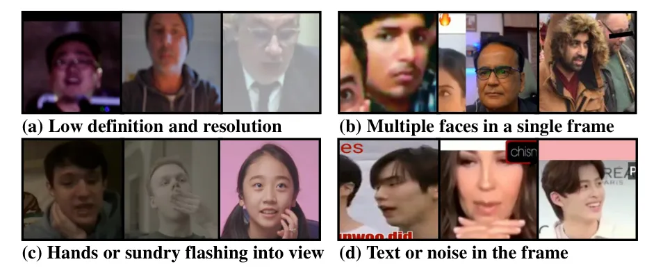

Figure 2: We identify several common issues in existing public human
face video datasets that significantly contribute to the poor quality of
videos generated by the corresponding trained models. These issues have
been largely neglected in previous works.

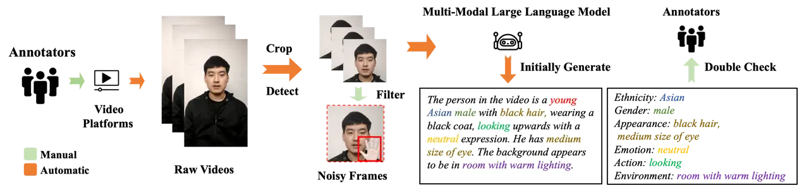

Figure 3: Illustration of the processing pipeline for collecting
DH-FaceVid-1K dataset, which includes the following main steps:
collecting raw videos, detecting and cropping to the face region,
filtering out noisy clips, and generating video descriptions.

## 2 DH-FaceVid-1K Dataset

In this section, we first provide detailed information on the collection
and pre-processing methods employed. Then, we present the statistical
properties of our collected dataset and compare it with those of other
public datasets.

### 2.1 Collection, Processing, and Annotations

Collection. We aim to build a large-scale, high-quality face video
dataset. To ensure that the collected videos contain clear facial
features without other human body parts or unwanted noise, we primarily
gathered content from interview programs and vlogs, as these videos are
typically single-person, filmed in professional environments with good
lighting, high-quality equipment, and stable shooting techniques. All
raw videos were sourced from crowdsourcing platforms with proper
permissions, and all identifiable information was removed. We selected
raw videos with resolutions exceeding 1080p, totaling about 2,000 hours.
The raw videos were initially cropped to include the full face and the
upper shoulder area. We then utilized FaceXFormer \[41\] to
automatically filter out face videos of individuals younger than 22
years old. Additionally, we used OpenCV to ensure that the face region
is at least $`256\times 256`$ pixels.

Processing and Annotations. We first drew inspiration from existing
public datasets, such as CelebV-Text, and identified several common
drawbacks that impose significant constraints on data quality. For
example, these limitations include low definition and resolution,
multiple faces in a single frame, hands or other objects momentarily
obstructing the view, and text or noise within the frame, as illustrated
in Figure 2. To mitigate these issues while ensuring high dataset
quality, we not only developed a data processing pipeline, as depicted
in Figure 3, but also employed over 100 annotators to manually annotate
labels, double-check, and cross-check the annotations over six months.

We initially filtered out videos containing noise information. For
subtitle detection, five frames were randomly sampled from each video,
including the first and last frames. These frames were converted to
grayscale and then binarized. Subsequently, contours in the images were
detected to identify potential subtitle regions. Optical Character
Recognition (OCR) \[49, 1\] was applied to these regions, and if the
extracted text exceeded 10 characters in length, the presence of
subtitles was confirmed. For black border noise, we detected continuous
black pixels along the top, bottom, left, and right of the video,
treating sections exceeding 20 pixels as noise. For multiple faces, we
used OpenCV to detect the number of faces and discard all videos with
more than one face. To address random hand appearances in videos, we
manually filtered out videos containing hands, text subtitles, or other
extraneous parts. After obtaining filtered videos, some videos remained
blurry. To enhance the quality of these videos (accounting for less than
4% of total dataset), we applied the CodeFormer \[80\] method.

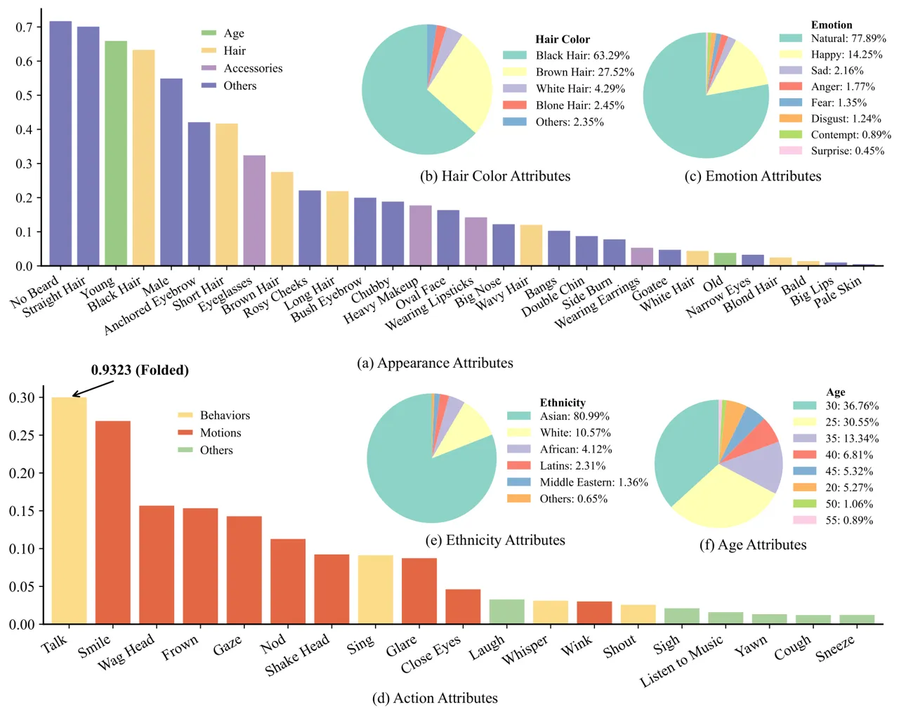

Figure 4: Distributions of general appearances in DH-FaceVid-1K,
including hair colors, emotions, actions, ethnicities, and ages.

We used DWPose \[70\] to extract facial keypoints from all videos, and
further proceeded to generate detailed video annotations. Specifically,
we utilized a pre-trained video captioning model, PLLaVA \[64\], to
automatically generate initial annotations. Unlike CelebV-Text \[73\],
which employs description templates for semi-automatic annotation
generation, we leveraged prompt-based techniques similar to those used
in LLM interactions to enhance effectiveness. The captioning model was
tasked with generating single-sentence descriptions of the characters in
the videos, detailing their ethnicity, gender, age, appearance
attributes (_e.g._, hairstyle and hair color), emotion, actions
(predominantly talking), background environment, and lighting
conditions. To capture the dynamic actions of characters in the videos
(_i.e._, head movements), we randomly sampled 3 non-consecutive frames
while generating captions to balance text accuracy and processing
efficiency. Finally, we manual double-checked all annotations to ensure
consistency, standardization, and high quality. To be specific, our
manually double-checking process can be divided into two stages, each
involving separate annotator groups. In the first stage, samples were
checked against ISO 2859 standards to ensure all annotations align with
the video content, including both static attributes (_e.g._, emotion and
facial features) and dynamic aspects (_e.g._, lighting, head poses and
movements). Multiple annotators cross-verified each sample and flagged
any discrepancies. In the second stage, the flagged samples underwent
further review to confirm their usability. Throughout this process, an
online platform with form-based checks ensured consistency and quality
control.

These rigorous processes resulted in a high-quality self-collected data
spanning over 1,000 hours of video, with 95% of the clips depicting
Asian faces. To further enhance data diversity, We applied the same
pipeline to clean CelebV-HQ, CelebV-Text, and TalkingHead-1KH, resulting
in 9,841, 32,595, and 22,917 samples respectively, totaling 200 hours.
In summary, our DH-FaceVid-1K dataset contains nearly 1200 hours by
combining these processed videos.

Data Sources and Agreement. We collected raw data from crowdsourcing
platforms to ensure both the scale and diversity of our dataset, while
simultaneously mitigating potential data ethics concerns. We comply with
stringent legal and usage policies, applying thorough screening
processes and anonymization measures to safeguard privacy. These
practices help prevent misuse, including unauthorized face
identification and deepfake creation.

| Datasets        | #\. Samples | Resolution             | Duration | Text | Audio |
| --------------- | ----------- | ---------------------- | -------- | ---- | ----- |
| VoxCeleb2       | 1,092,008   | 224$`\times`$224       | 2400h    | ✗    | ✓     |
| HDTF            | 368         | 512$`\times`$512 $`+`$ | 15.8h    | ✗    | ✓     |
| TalkingHead-1KH | 80,000      | 512$`\times`$512 $`-`$ | 160h     | ✗    | ✓     |
| CelebV-HQ       | 35,666      | 512$`\times`$512 $`+`$ | 68h      | ✓    | ✓     |
| CelebV-Text     | 70,000      | 512$`\times`$512 $`+`$ | 279h     | ✓    | ✓     |
| DH-FaceVid-1K   | 270,043     | 512$`\times`$512 $`+`$ | 1200h    | ✓    | ✓     |

Table 1: Comparison of our DH-FaceVid-1K with five related public
datasets. A black tick denotes partial audio presence.

### 2.2 Dataset Statistics

Data Scale. The DH-FaceVid-1K dataset contains 270,043 video clips,
comprising 65,353 clips sourced from trimmed public datasets and 204,690
newly collected clips. As illustrated in Table 1, while VoxCeleb2 offers
a substantial total duration, its data resolution remains relatively
low, a limitation also observed in TalkingHead-1KH. In contrast, HDTF,
CelebV-HQ, and CelebV-Text provide higher-quality data, yet their total
durations are somewhat limited. CC \[23\] and CCv2 \[44\] provide
word-level annotations for spoken utterances. However, CC’s audio
content consists of responses to random questions from a pre-approved
list, while CCv2’s audio content includes either a sample paragraph from
“The Idiot” by Fyodor Dostoevsky or answers to one of five predetermined
questions. The relatively monotonous audio content in both datasets
hinders the performance and generalizability of audio-driven talking
face generation models. Our dataset successfully balances data quality
and quantity, making it a comprehensive resource for face video
research.

Data Diversity. We define data diversity to encompass a rich array of
ethnicity and facial appearance, varying age groups and emotions,
actions beyond talking, as well as different head poses, environments,
and lighting conditions.

DH-FaceVid-1K specifically addresses the underrepresentation of Asian
faces in video datasets, comprising over 80% Asian faces complemented by
11% White, 4% African, and 5% other ethnicities (see Figure 4e). The
dataset maintains gender balance (55% male, 45% female) and covers four
age groups: minors (15%), adults (65%), middle-aged (18%), and elderly
(2%). Appearance attributes exhibit a long-tail distribution of 30
distinct features, with Asian-associated traits such as black straight
hair being the most prevalent (see Figure 4a-b). Eleven attributes occur
in over 20% of the dataset (_e.g._, No Beard, Young), while eight fall
between 10-20% prevalence (_e.g._, Bush Eyebrow, Wavy Hair). For emotion
distributions, as shown in Figure 4c, Neutral (65%) is the most common
emotion, largely due to the conversational nature of the content,
followed by Happy (20%) and Angry (8%). Talking (70%) is the predominant
action, supplemented by conversational gestures such as Smiling (15%)
and Head Movements (10%), along with specialized actions like Singing
(3%), as shown in Figure 4d.

For the head pose distributions, we followed pipeline from EFHQ \[10\].
Specifically, we uniformly sampled 5 frames from each video to estimate
the head poses and categorized them into the following 6 classes:
frontal (74%), profile_right (11%), profile_left (8%), profile_up (3%),
profile_down (3%), and extreme (1%). Since there may be head pose
variations between frames, we assigned the dominant pose category as the
video-level pose annotation.

Data Quality. We followed the evaluation approach used in CelebV-Text
\[82\] to measure video quality, employing BRISQUE \[40\] to assess the
quality of each video frame and then averaging the results. As shown in
Figure 5, our DH-FaceVid-1K achieves a higher BRISQUE score than
CelebV-HQ and CelebV-Text, highlighting its superior image quality. This
improvement stems largely from our comprehensive data processing
pipeline and extensive manual filtering, which together ensure a
high-quality dataset.

We analyzed the duration and resolution distribution of our dataset, as
shown in Figure 6, DH-FaceVid-1K offers significantly higher-resolution
and longer videos than CelebV-HQ and CelebV-Text: 46.5% of its clips are
in 1080p (vs. 6.8% and 30.7%, respectively), and 43.4% exceed 15 seconds
in duration (vs. 11.0% and 19.4%). These longer videos benefit face
video generation training by improving visual quality and temporal
consistency.

### 2.3 Audio Filtering

To further enhance the dataset’s quality and maximize its potential, we
applied additional audio filtering to support audio-driven talking head
generation. Ensuring accurate alignment between the video’s audio and
lip movements is paramount. Notably, the SyncNet \[5\] pre-trained on
LRW \[4\] showed significant scoring deviations for non-English speech.
Consequently, we adopted \[33\] to retrain a new SyncNet, which we then
used to generate SyncNet Scores for each video. Samples exhibiting poor
lip-audio synchronization were filtered out to ensure overall dataset
integrity.

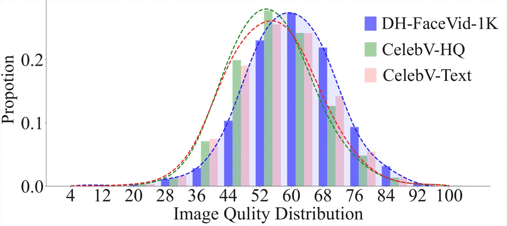

Figure 5: Comparison of image quality between our dataset and the
highest-quality public datasets (CelebV-HQ and CelebV-Text).

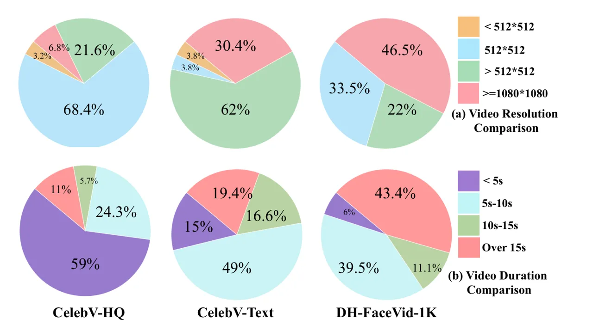

Figure 6: Video resolution and duration comparison among CelebV-HQ,
CelebV-Text, and DH-FaceVid-1K.

## 3 Data Safety

To prevent potential misuse of DH-FaceVid-1K such as in face
identification, deepfake, or generating videos that perpetuate
stereotypes or biases, we have instituted strict data governance
protocols.

| Methods         | AnimateDiff \[22\]   |                      |                     | Latte \[37\]         |                      |                     | OpenSora \[79\]      |                      |                     | EasyAnimate \[63\]   |                      |                     | CogVideoX \[71\]     |                      |                     |
| --------------- | -------------------- | -------------------- | ------------------- | -------------------- | -------------------- | ------------------- | -------------------- | -------------------- | ------------------- | -------------------- | -------------------- | ------------------- | -------------------- | -------------------- | ------------------- |
| Datasets        | FVD ($`\downarrow`$) | FID ($`\downarrow`$) | CLIP ($`\uparrow`$) | FVD ($`\downarrow`$) | FID ($`\downarrow`$) | CLIP ($`\uparrow`$) | FVD ($`\downarrow`$) | FID ($`\downarrow`$) | CLIP ($`\uparrow`$) | FVD ($`\downarrow`$) | FID ($`\downarrow`$) | CLIP ($`\uparrow`$) | FVD ($`\downarrow`$) | FID ($`\downarrow`$) | CLIP ($`\uparrow`$) |
| HDTF            | 177.88               | 28.89                | 0.8912              | 175.01               | 25.89                | 0.9319              | 143.52               | 20.01                | 0.9128              | 137.10               | 19.05                | 0.9236              | 127.88               | 17.83                | 0.9247              |
| TalkingHead-1KH | 261.16               | 32.67                | 0.8825              | 235.06               | 28.44                | 0.9133              | 176.43               | 21.56                | 0.9171              | 166.18               | 19.77                | 0.9212              | 167.23               | 19.02                | 0.9312              |
| CelebV-HQ       | 187.52               | 28.35                | 0.8925              | 169.43               | 25.05                | 0.9219              | 142.32               | 18.08                | 0.9374              | 147.62               | 17.45                | 0.9205              | 137.62               | 17.31                | 0.9305              |
| CelebV-Text     | 174.59               | 28.04                | 0.8874              | 159.52               | 26.83                | 0.9372              | 131.06               | 17.44                | 0.9355              | 121.22               | 16.53                | 0.9274              | 129.59               | 15.82                | 0.9388              |
| DH-FaceVid-1K   | 156.13               | 26.69                | 0.9057              | 140.01               | 24.95                | 0.9484              | 117.88               | 15.89                | 0.9365              | 113.27               | 13.91                | 0.9240              | 98.01                | 11.73                | 0.9401              |

Table 2: Quantitative Results on Text-to-Video Generation. We evaluate
the performance of five state-of-the-art open-source models for this
task, maintaining consistent settings to facilitate fair comparison
across different datasets.

| Method          | SVD \[2\]            |                      |                     | I2VGen-XL \[76\]     |                      |                     | ConsistI2V \[46\]    |                      |                     | EasyAnimate \[63\]   |                      |                     | CogVideoX \[71\]     |                      |                     |
| --------------- | -------------------- | -------------------- | ------------------- | -------------------- | -------------------- | ------------------- | -------------------- | -------------------- | ------------------- | -------------------- | -------------------- | ------------------- | -------------------- | -------------------- | ------------------- |
| Datasets        | FVD ($`\downarrow`$) | FID ($`\downarrow`$) | CLIP ($`\uparrow`$) | FVD ($`\downarrow`$) | FID ($`\downarrow`$) | CLIP ($`\uparrow`$) | FVD ($`\downarrow`$) | FID ($`\downarrow`$) | CLIP ($`\uparrow`$) | FVD ($`\downarrow`$) | FID ($`\downarrow`$) | CLIP ($`\uparrow`$) | FVD ($`\downarrow`$) | FID ($`\downarrow`$) | CLIP ($`\uparrow`$) |
| HDTF            | 207.88               | 26.83                | -                   | 240.19               | 28.05                | 0.9113              | 217.21               | 23.56                | 0.9057              | 135.06               | 21.71                | 0.9219              | 113.52               | 15.14                | 0.9328              |
| TalkingHead-1KH | 236.18               | 28.73                | -                   | 257.29               | 31.26                | 0.8962              | 256.03               | 30.23                | 0.8989              | 151.01               | 20.01                | 0.9193              | 157.22               | 17.83                | 0.9399              |
| CelebV-HQ       | 187.99               | 25.70                | -                   | 217.62               | 26.60                | 0.9031              | 225.79               | 24.95                | 0.9088              | 131.52               | 18.16                | 0.9335              | 130.91               | 16.25                | 0.9415              |
| CelebV-Text     | 162.59               | 23.07                | -                   | 185.59               | 23.07                | 0.9067              | 172.89               | 23.21                | 0.8909              | 125.14               | 17.54                | 0.9372              | 123.25               | 14.83                | 0.9471              |
| DH-FaceVid-1K   | 132.92               | 18.95                | -                   | 154.35               | 18.61                | 0.9013              | 152.92               | 18.95                | 0.9105              | 95.27                | 13.71                | 0.9321              | 92.31                | 10.69                | 0.9514              |

Table 3: Quantitative Results on Image-to-Video Generation. We evaluate
the performance of five state-of-the-art open-source models for this
task, ensuring consistent settings to facilitate fair comparison across
different datasets.

| Task       | Text-to-Video        |                      |                     |                      |                      |                     | Image-to-Video       |                      |                     |                      |                      |                     |
| ---------- | -------------------- | -------------------- | ------------------- | -------------------- | -------------------- | ------------------- | -------------------- | -------------------- | ------------------- | -------------------- | -------------------- | ------------------- |
| Param.     | 2B                   |                      |                     | 5B                   |                      |                     | 2B                   |                      |                     | 5B                   |                      |                     |
| Data Scale | FVD ($`\downarrow`$) | FID ($`\downarrow`$) | CLIP ($`\uparrow`$) | FVD ($`\downarrow`$) | FID ($`\downarrow`$) | CLIP ($`\uparrow`$) | FVD ($`\downarrow`$) | FID ($`\downarrow`$) | CLIP ($`\uparrow`$) | FVD ($`\downarrow`$) | FID ($`\downarrow`$) | CLIP ($`\uparrow`$) |
| 100h       | 215.06               | 17.01                | 0.9021              | 237.52               | 18.17                | 0.9128              | 159.26               | 14.01                | 0.9119              | 183.52               | 14.17                | 0.9228              |
| 200h       | 185.06               | 16.23                | 0.9034              | 203.52               | 16.37                | 0.9156              | 146.33               | 15.18                | 0.9232              | 162.44               | 15.73                | 0.9271              |
| 400h       | 177.18               | 14.16                | 0.9092              | 180.99               | 14.25                | 0.9197              | 147.18               | 13.06                | 0.9295              | 145.99               | 12.95                | 0.9314              |
| 600h       | 145.14               | 12.50                | 0.9173              | 143.25               | 12.83                | 0.9235              | 135.14               | 12.67                | 0.9306              | 133.85               | 12.83                | 0.9344              |
| 800h       | 148.82               | 13.15                | 0.9055              | 121.63               | 12.05                | 0.9385              | 137.52               | 12.71                | 0.9242              | 113.63               | 11.90                | 0.9387              |
| 1000h      | 150.27               | 13.31                | 0.9108              | 98.01                | 11.73                | 0.9401              | 141.36               | 12.94                | 0.9201              | 92.31                | 10.69                | 0.9514              |

Table 4: Performance of the CogVideoX Model on the Text-to-Video and
Image-to-Video Task. An investigation into the most cost-effective
training data scale using varying model parameters and different data
scales.

These include thorough vetting of dataset usage requests, clear
licensing terms, stringent rules governing the entire data lifecycle
(from application to final disposal), and the removal of any personally
identifiable information. To be specific, all users must submit an
application form detailing research interests and purposes; following
rigorous vetting, approved applicants enter a formal agreement that: (1)
limits usage strictly to academic research, (2) prohibits dataset
redistribution, (3) mandates transparent disclosure of research
objectives and methodologies, and (4) requires secure data destruction
upon project completion.

By championing responsible and open data usage, we aim to protect
individual rights, respect societal norms, and foster a culture of
accountability within the research community.

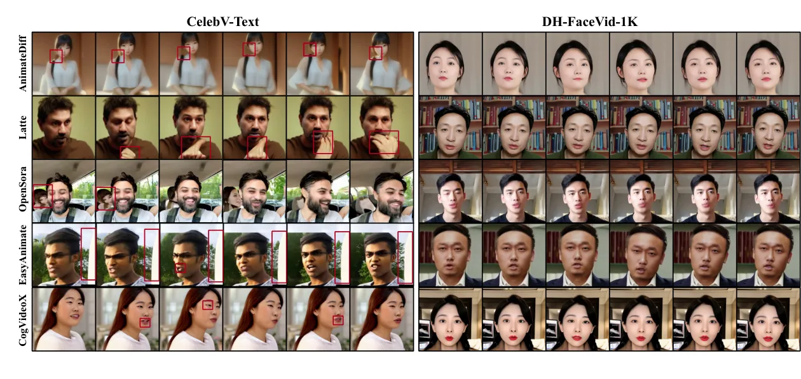

Figure 7: Text-to-Video. Using the same settings across different
methods, we compare models trained on CelebV-Text and our collected
dataset (DH-FaceVid-1K). For qualitative comparison, we use the exact
same text prompts (_i.e._, “A young man is talking.” and “A beautiful
young woman is talking.”). Please zoom in to observe the facial details
closely.

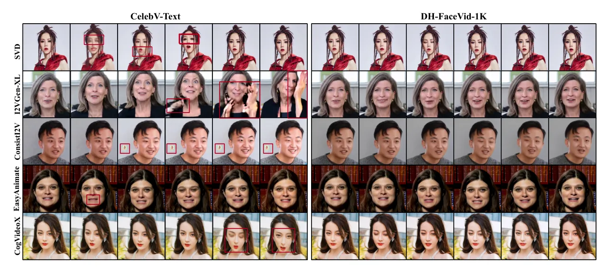

Figure 8: Image-to-Video. Using the same settings across different
methods, we compare models trained on CelebV-Text and our collected
dataset (DH-FaceVid-1K). For qualitative comparison, we use the exact
same text prompts (_i.e._, “A young man is talking.” and “A beautiful
young woman is laughing.”) as well as the same image prompt (the initial
image).

## 4 Experiments

In this section, we conducted experiments on public face video datasets
and our collected DH-FaceVid-1K dataset, focusing on two popular video
generation tasks: Text-to-Video and Image-to-Video generation. We
employed three widely accepted evaluation metrics, namely FVD \[57\],
FID \[25\], and CLIPScore \[24\] (abbreviated as “CLIP”) to assess
temporal consistency, single frame quality, and video-text similarity,
respectively. For the construction of the reference dataset used in the
following experiments, we followed CelebV-Text’s protocol by randomly
sampling 2,048 videos from the non-training portions of the datasets
listed in Table 1. Both qualitative and quantitative results
demonstrated the effectiveness and superiority of the proposed
DH-FaceVid-1K in these human face video generation tasks. Additionally,
we draw empirical insights to answer the two research questions (_i.e._,
RQ1: Analysis for Data Scale Requirement and RQ2: Difference of
Backbones) raised in previous sections.

### 4.1 Experiments on Text-to-Video Generation

We conducted experiments to demonstrate the effectiveness of
DH-FaceVid-1K for Text-to-Video generation using state-of-the-art
open-source methods, namely AnimateDiff \[22\], Latte \[37\], OpenSora
\[79\], EasyAnimate \[63\], and CogVideoX \[71\].

We fine-tuned these models using the datasets specified in Table 2 and
the official implementation code. The hyperparameters varied slightly
across model configurations. Settings like batch size and learning rate
were based on optimal parameters from official implementations and
technical reports. Specifically, for CogVideoX, the parameters included
a batch size of 1, a learning rate of 1e-5, and 30k steps. As shown in
Figure 7, we benchmarked our dataset against the highest-quality public
dataset, CelebV-Text, using the same settings and text prompts.

Models trained on CelebV-Text struggle with Asian face quality and
produce artifacts like “random hand noise” and “multiple faces”. In
contrast, models trained on DH-FaceVid-1K do not exhibit these issues
and show superior detail in areas like lips and teeth. As shown in Table
2, while all models trained on other datasets perform competitively
across metrics, those trained on our dataset significantly outperform
the others. Specifically, the best-performing model in our experiments,
CogVideoX \[71\], trained on our dataset, exhibits notably enhanced
performance.

This superior performance can be attributed to the rigorous filtering of
low-quality data, which enhances the training outcomes.

### 4.2 Experiments on Image-to-Video Generation

We used the open-source, widely-adopted Image-to-Video models Stable
Video Diffusion (SVD) \[2\], I2VGen-XL \[76\], ConsistI2V \[46\],
EasyAnimate \[63\], and CogVideoX \[71\] to compare the performance of
models trained on public datasets with those trained on our dataset. We
implemented these methods using the datasets specified in Table 2 and
the official implementation code. The hyperparameters varied slightly
for different model configurations, based on their official
implementations and technical reports. Specifically, for CogVideoX, the
parameters included a batch size of 1, a learning rate of 1e-5, and 30k
steps. The training configurations for other models also followed their
official repos. The qualitative comparison results, illustrated in
Figure 8, show that models trained on our dataset outperform those
trained on the leading public dataset. Since images inherently contain
more detailed information compared to ambiguous prompts of natural
language descriptions, all models can generate Asian face videos that
retain the input face characteristics. However, the models trained with
DH-FaceVid-1K still demonstrate superior performance in capturing facial
details such as teeth and eyes. They also generate a wider range of
natural facial motions and expressions due to the higher quality and
diversity of our dataset. The quantitative results presented in Table 3
demonstrate that all these models show competitive scores across three
metrics when trained on different datasets.

### 4.3 RQ1: Analysis for Data Scale Requirement

We conducted a series of experiments to investigate this research
question, using CogVideoX \[71\] for both T2V and I2V tasks. We randomly
sampled a series of videos (_i.e._, 100h, 200h, 400h, 600h, 800h, and
1,000h) from our collected dataset and performed identical training
setups with different parameter configurations of the model. All models
were trained with a learning rate of 1e-5, a batch size of 1, and other
identical hyperparameters for 30k steps. For the test set, we separately
sampled 2,048 videos before dividing the complete dataset into subsets
of different durations. From each sampled video, we uniformly extracted
4 frames. 2,048 videos and 8,912 frames were used as the GT for
calculating FVD and FID, respectively.

As shown in Table 4, smaller models perform well on limited data but
struggle with larger, more diverse datasets. This is reflected in the
lack of growth or slight decline of metrics. Specifically, we observe
that a 2B-parameter model trained on a 100-hour dataset produced highly
similar videos when given similar prompts. Through these experiments, we
conclude that for a 2B-scale DiT-based backbone face video generation
model (_i.e._, CogVideoX \[71\]), a dataset size of approximately 600
hours strikes a good balance between diversity and quality in the
generated videos for fine-tuning. On the other hand, the metrics of
larger models on small datasets are slightly lower than those of their
smaller counterparts. For instance, a 6B-parameter model fine-tuned on
the optimal 600-hour dataset configuration for the 2B model fails to
achieve comparable performance. The training process was unstable, the
generated results often contain noise, and the model’s performance does
not improve as steadily as expected as training progresses. We attribute
this to a mismatch between the dataset size and the parameter scale of
the model. By analyzing FVD, FID, and CLIPScore and manual evaluation,
we reveal that the 6B-parameter model fine-tuned on the full
DH-FaceVid-1K, or even a larger dataset, performs best.

### 4.4 RQ2: Analysis for Difference of Backbones

For this research question, we primarily examine the quantitative and
qualitative results from previous experiments to draw empirical
conclusions about training domain-specific video generation models from
scratch or fine-tuning pre-trained open-world video generation models.
From the results of both Text-to-Video and Image-to-Video tasks, we
observe that Diffusion-Transformer (DiT) based models (_e.g._, Latte
\[37\], CogVideoX \[71\]) usually outperform UNet-based models (_e.g._,
AnimateDiff \[22\]). The experimental results show that UNet-based
models (_e.g._, SVD \[2\]) converge faster than DiT-based ones, while
the latter require extensive training data, time, and GPU resources due
to their higher computational demands. Among them, CogVideoX excels with
its Expert Transformer architecture and progressive training strategy,
delivering higher-quality, more diverse outputs and superior fine-tuning
performance. Our conclusion aligns with the Hallo3 \[9\] (DiT) versus
Hallo2 \[7\] (UNet) comparison: while the former achieves superior
performance metrics (_e.g._, lower FVD), it demands significantly more
training resources than the latter.

## 5 Conclusion

In this work, we introduce a large-scale, high-quality face video
dataset, DH-FaceVid-1K. We hope that this resource can meet the demands
of research tasks related to human-centric video generation. We
conducted extensive experiments on the dataset, yielding several
valuable empirical insights. In future work, we will expand the dataset
to improve demographic diversity (_e.g._, individuals from Indonesia and
Vietnam) and release additional pre-trained video generation models to
benefit the community.

## 6 Acknowledgements

This work was supported by the National Natural Science Foundation of
China (NSFC) grant U22A2094.

## References

- \[1\] PaddlePaddle Authors. Paddleocr, awesome multilingual ocr
  toolkits based on paddlepaddle.
  [https://github.com/PaddlePaddle/PaddleOCR](https://github.com/PaddlePaddle/PaddleOCR), 2020.
- \[2\] Andreas Blattmann, Tim Dockhorn, and Sumith andothers Kulal.
  Stable video diffusion: Scaling latent video diffusion models to large
  datasets. _arXiv:2311.15127_, 2023.
- \[3\] Xuangeng Chu, Yu Li, Ailing Zeng, Tianyu Yang, Lijian Lin,
  Yunfei Liu, and Tatsuya Harada. GPAvatar: Generalizable and precise
  head avatar from image(s). In _ICLR_, 2024.
- \[4\] Joon Son Chung and Andrew Zisserman. Lip reading in the wild. In
  _ACCV_, pages 87–103. Springer, 2017a.
- \[5\] Joon Son Chung and Andrew Zisserman. Out of time: automated lip
  sync in the wild. In _ACCV_, pages 251–263. Springer, 2017b.
- \[6\] Joon Son Chung, Arsha Nagrani, and Andrew Zisserman. Voxceleb2:
  Deep speaker recognition. _arXiv:1806.05622_, 2018.
- \[7\] Jiahao Cui, Hui Li, Yao Yao, et al. Hallo2: Long-duration and
  high-resolution audio-driven portrait image animation.
  _arXiv:2410.07718_, 2024a.
- \[8\] Jiahao Cui, Hui Li, Yun Zhan, Hanlin Shang, Kaihui Cheng, Yuqi
  Ma, Shan Mu, Hang Zhou, Jingdong Wang, and Siyu Zhu. Hallo3: Highly
  dynamic and realistic portrait image animation with diffusion
  transformer networks. _arXiv:2412.00733_, 2024b.
- \[9\] Jiahao Cui, Hui Li, Yun Zhan, Hanlin Shang, Kaihui Cheng, Yuqi
  Ma, Shan Mu, Hang Zhou, Jingdong Wang, and Siyu Zhu. Hallo3: Highly
  dynamic and realistic portrait image animation with video diffusion
  transformer. In _CVPR_, pages 21086–21095, 2025.
- \[10\] Trung Tuan Dao, Duc Hong Vu, Cuong Pham, and Anh Tran. Efhq:
  Multi-purpose extremepose-face-hq dataset. In _CVPR_, 2024.
- \[11\] Prafulla Dhariwal and Alexander Nichol. Diffusion models beat
  gans on image synthesis. _NeurIPS_, 34:8780–8794, 2021.
- \[12\] Donglin Di, Jiahui Yang, Chaofan Luo, Zhou Xue, Wei Chen, Xun
  Yang, and Yue Gao. Hyper-3dg: Text-to-3d gaussian generation via
  hypergraph. _International Journal of Computer Vision_,
  133(5):2886–2909, 2025.
- \[13\] Lihe Ding, Shaocong Dong, Zhanpeng Huang, Zibin Wang, Yiyuan
  Zhang, Kaixiong Gong, Dan Xu, and Tianfan Xue. Text-to-3d generation
  with bidirectional diffusion using both 2d and 3d priors. In _CVPR_,
  pages 5115–5124, 2024.
- \[14\] Nikita Drobyshev, Antoni Bigata Casademunt, Konstantinos
  Vougioukas, Zoe Landgraf, Stavros Petridis, and Maja Pantic.
  Emoportraits: Emotion-enhanced multimodal one-shot head avatars. In
  _CVPR_, pages 8498–8507, 2024.
- \[15\] Lei Fan, Yiwen Ding, Dongdong Fan, Donglin Di, Maurice
  Pagnucco, and Yang Song. Grainspace: A large-scale dataset for
  fine-grained and domain-adaptive recognition of cereal grains. In
  _CVPR_, pages 21116–21125, 2022.
- \[16\] Lei Fan, Yiwen Ding, Dongdong Fan, Yong Wu, Hongxia Chu,
  Maurice Pagnucco, and Yang Song. An annotated grain kernel image
  database for visual quality inspection. _Scientific Data_,
  10(1):778, 2023.
- \[17\] Lei Fan, Dongdong Fan, Zhiguang Hu, et al. Manta: A large-scale
  multi-view and visual-text anomaly detection dataset for tiny objects.
  In _CVPR_, pages 25518–25527, 2025.
- \[18\] He Feng, Donglin Di, Yongjia Ma, Wei Chen, and Tonghua Su.
  One-shot pose-driving face animation platform.
  _arXiv:2407.08949_, 2024.
- \[19\] Yuan Gan, Zongxin Yang, Xihang Yue, Lingyun Sun, and Yi Yang.
  Efficient emotional adaptation for audio-driven talking-head
  generation. In _ICCV_, pages 22634–22645, 2023.
- \[20\] Ian Goodfellow, Jean Pouget-Abadie, Mehdi Mirza, Bing Xu, David
  Warde-Farley, Sherjil Ozair, Aaron Courville, and Yoshua Bengio.
  Generative adversarial nets. _NeurIPS_, 27, 2014.
- \[21\] Jianzhu Guo, Dingyun Zhang, Xiaoqiang Liu, Zhizhou Zhong, Yuan
  Zhang, Pengfei Wan, and Di Zhang. Liveportrait: Efficient portrait
  animation with stitching and retargeting control. _arXiv:2407.03168_,
  2024a.
- \[22\] Yuwei Guo, Ceyuan Yang, Anyi Rao, et al. Animatediff: Animate
  your personalized text-to-image diffusion models without specific
  tuning. _ICLR_, 2024b.
- \[23\] Caner Hazirbas, Joanna Bitton, Brian Dolhansky, Jacqueline Pan,
  Albert Gordo, and Cristian Canton Ferrer. Towards measuring fairness
  in ai: the casual conversations dataset. _IEEE Transactions on
  Biometrics, Behavior, and Identity Science_, 4(3):324–332, 2021.
- \[24\] Jack Hessel, Ari Holtzman, Maxwell Forbes, Ronan Le Bras, and
  Yejin Choi. Clipscore: A reference-free evaluation metric for image
  captioning. _arXiv:2104.08718_, 2021.
- \[25\] Martin Heusel, Hubert Ramsauer, Thomas Unterthiner, Bernhard
  Nessler, and Sepp Hochreiter. Gans trained by a two time-scale update
  rule converge to a local nash equilibrium. _NeurIPS_, 30, 2017.
- \[26\] Jonathan Ho, Ajay Jain, and Pieter Abbeel. Denoising diffusion
  probabilistic models. _NeurIPS_, 33:6840–6851, 2020.
- \[27\] Fa-Ting Hong and Dan Xu. Implicit identity representation
  conditioned memory compensation network for talking head video
  generation. In _ICCV_, pages 23062–23072, 2023.
- \[28\] Fa-Ting Hong, Longhao Zhang, Li Shen, and Dan Xu. Depth-aware
  generative adversarial network for talking head video generation. In
  _CVPR_, pages 3397–3406, 2022a.
- \[29\] Wenyi Hong, Ming Ding, Wendi Zheng, Xinghan Liu, and Jie Tang.
  Cogvideo: Large-scale pretraining for text-to-video generation via
  transformers. _arXiv:2205.15868_, 2022b.
- \[30\] Jinpeng Hu, Tengteng Dong, Luo Gang, Hui Ma, Peng Zou, Xiao
  Sun, Dan Guo, Xun Yang, and Meng Wang. Psycollm: Enhancing llm for
  psychological understanding and evaluation. _IEEE Transactions on
  Computational Social Systems_, 2024.
- \[31\] Youngjoon Jang, Ji-Hoon Kim, Junseok Ahn, et al. Faces that
  speak: Jointly synthesising talking face and speech from text. In
  _CVPR_, pages 8818–8828, 2024.
- \[32\] Yang Jin, Zhicheng Sun, Kun Xu, et al. Video-lavit: Unified
  video-language pre-training with decoupled visual-motional
  tokenization. _arXiv:2402.03161_, 2024.
- \[33\] Chunyu Li, Chao Zhang, Weikai Xu, et al. Latentsync: Audio
  conditioned latent diffusion models for lip sync.
  _arXiv:2412.09262_, 2024.
- \[34\] Lincheng Li, Suzhen Wang, Zhimeng Zhang, Yu Ding, Yixing Zheng,
  Xin Yu, and Changjie Fan. Write-a-speaker: Text-based emotional and
  rhythmic talking-head generation. In _AAAI_, pages 1911–1920, 2021.
- \[35\] Jiadong Liang and Feng Lu. Emotional conversation: Empowering
  talking faces with cohesive expression, gaze and pose generation.
  _arXiv:2406.07895_, 2024.
- \[36\] Yunfei Liu, Lijian Lin, Fei Yu, Changyin Zhou, and Yu Li. Moda:
  Mapping-once audio-driven portrait animation with dual attentions. In
  _ICCV_, pages 23020–23029, 2023.
- \[37\] Xin Ma, Yaohui Wang, Gengyun Jia, Xinyuan Chen, Ziwei Liu,
  Yuan-Fang Li, Cunjian Chen, and Yu Qiao. Latte: Latent diffusion
  transformer for video generation. _arXiv:2401.03048_, 2024a.
- \[38\] Yue Ma, Hongyu Liu, Hongfa Wang, et al. Follow-your-emoji:
  Fine-controllable and expressive freestyle portrait animation.
  _arXiv:2406.01900_, 2024b.
- \[39\] Yongjia Ma, Donglin Di, Xuan Liu, Xiaokai Chen, Lei Fan, Wei
  Chen, and Tonghua Su. Adams bashforth moulton solver for inversion and
  editing in rectified flow. _arXiv preprint arXiv:2503.16522_, 2025.
- \[40\] Anish Mittal, Anush Krishna Moorthy, and Alan Conrad Bovik.
  No-reference image quality assessment in the spatial domain. _IEEE
  TIP_, 21(12):4695–4708, 2012.
- \[41\] Kartik Narayan, Vibashan VS, Rama Chellappa, and Vishal M
  Patel. Facexformer: A unified transformer for facial analysis.
  _arXiv:2403.12960_, 2024.
- \[42\] Haowen Pan, Xiaozhi Wang, Yixin Cao, Zenglin Shi, Xun Yang,
  Juanzi Li, and Meng Wang. Precise localization of memories: A
  fine-grained neuron-level knowledge editing technique for llms. In
  _ICLR_, 2025.
- \[43\] William Peebles and Saining Xie. Scalable diffusion models with
  transformers. In _ICCV_, pages 4195–4205, 2023.
- \[44\] Bilal Porgali, Vítor Albiero, Jordan Ryda, Cristian Canton
  Ferrer, and Caner Hazirbas. The casual conversations v2 dataset. In
  _CVPR_, pages 10–17, 2023.
- \[45\] Aditya Ramesh, Mikhail Pavlov, Gabriel Goh, Scott Gray, Chelsea
  Voss, Alec Radford, Mark Chen, and Ilya Sutskever. Zero-shot
  text-to-image generation. In _ICML_, pages 8821–8831. Pmlr, 2021.
- \[46\] Weiming Ren, Harry Yang, Ge Zhang, et al. Consisti2v: Enhancing
  visual consistency for image-to-video generation.
  _arXiv:2402.04324_, 2024.
- \[47\] Robin Rombach, Andreas Blattmann, Dominik Lorenz, Patrick
  Esser, and Björn Ommer. High-resolution image synthesis with latent
  diffusion models. In _CVPR_, pages 10684–10695, 2022.
- \[48\] Shuai Shen, Wenliang Zhao, Zibin Meng, Wanhua Li, Zheng Zhu,
  Jie Zhou, and Jiwen Lu. Difftalk: Crafting diffusion models for
  generalized audio-driven portraits animation. In _CVPR_, 2023.
- \[49\] Baoguang Shi, Xiang Bai, and Cong Yao. An end-to-end trainable
  neural network for image-based sequence recognition and its
  application to scene text recognition. _IEEE TPAMI_,
  39(11):2298–2304, 2016.
- \[50\] Aliaksandr Siarohin, Stéphane Lathuilière, Sergey Tulyakov,
  Elisa Ricci, and Nicu Sebe. First order motion model for image
  animation. _NeurIPS_, 32, 2019.
- \[51\] Aliaksandr Siarohin, Oliver J Woodford, Jian Ren, Menglei Chai,
  and Sergey Tulyakov. Motion representations for articulated animation.
  In _CVPR_, pages 13653–13662, 2021.
- \[52\] Jiaming Song, Chenlin Meng, and Stefano Ermon. Denoising
  diffusion implicit models. In _ICLR_, 2021.
- \[53\] Michał Stypułkowski, Konstantinos Vougioukas, Sen He, Maciej
  Zikeba, Stavros Petridis, and Maja Pantic. Diffused heads: Diffusion
  models beat gans on talking-face generation. In _Proceedings of the
  IEEE/CVF Winter Conference on Applications of Computer Vision_, pages
  5091–5100, 2024.
- \[54\] Shuai Tan, Bin Ji, Yu Ding, and Ye Pan. Say anything with any
  style. In _AAAI_, pages 5088–5096, 2024a.
- \[55\] Shuai Tan, Bin Ji, and Ye Pan. Style2talker: High-resolution
  talking head generation with emotion style and art style. In _AAAI_,
  pages 5079–5087, 2024b.
- \[56\] Hugo Touvron, Thibaut Lavril, Gautier Izacard, Xavier Martinet,
  Marie-Anne Lachaux, Timothée Lacroix, Baptiste Rozière, Naman Goyal,
  Eric Hambro, Faisal Azhar, et al. Llama: Open and efficient foundation
  language models. _arXiv:2302.13971_, 2023.
- \[57\] Thomas Unterthiner, Sjoerd Van Steenkiste, Karol Kurach,
  Raphael Marinier, Marcin Michalski, and Sylvain Gelly. Towards
  accurate generative models of video: A new metric & challenges.
  _arXiv:1812.01717_, 2018.
- \[58\] Jinpeng Wang, Yixiao Ge, Rui Yan, Yuying Ge, Kevin Qinghong
  Lin, Satoshi Tsutsui, Xudong Lin, Guanyu Cai, Jianping Wu, Ying Shan,
  et al. All in one: Exploring unified video-language pre-training. In
  _CVPR_, pages 6598–6608, 2023a.
- \[59\] Ting-Chun Wang, Arun Mallya, and Ming-Yu Liu. One-shot
  free-view neural talking-head synthesis for video conferencing. In
  _CVPR_, pages 10039–10049, 2021.
- \[60\] Zhichao Wang, Mengyu Dai, and Keld Lundgaard. Text-to-video: a
  two-stage framework for zero-shot identity-agnostic talking-head
  generation. _arXiv:2308.06457_, 2023b.
- \[61\] Huawei Wei, Zejun Yang, and Zhisheng Wang. Aniportrait:
  Audio-driven synthesis of photorealistic portrait animation.
  _arXiv:2403.17694_, 2024.
- \[62\] You Xie, Hongyi Xu, Guoxian Song, Chao Wang, Yichun Shi, and
  Linjie Luo. X-portrait: Expressive portrait animation with
  hierarchical motion attention. In _ACM SIGGRAPH 2024 Conference
  Papers_, pages 1–11, 2024.
- \[63\] Jiaqi Xu, Xinyi Zou, Kunzhe Huang, et al. Easyanimate: A
  high-performance long video generation method based on transformer
  architecture. _arXiv:2405.18991_, 2024a.
- \[64\] Lin Xu, Yilin Zhao, Daquan Zhou, Zhijie Lin, See Kiong Ng, and
  Jiashi Feng. Pllava: Parameter-free llava extension from images to
  videos for video dense captioning. _arXiv:2404.16994_, 2024b.
- \[65\] Sicheng Xu, Guojun Chen, Yu-Xiao Guo, et al. Vasa-1: Lifelike
  audio-driven talking faces generated in real time. _arXiv:2404.10667_,
  2024c.
- \[66\] Shurong Yang, Huadong Li, Juhao Wu, et al. Megactor: Harness
  the power of raw video for vivid portrait animation.
  _arXiv:2405.20851_, 2024a.
- \[67\] Xun Yang, Fuli Feng, Wei Ji, Meng Wang, and Tat-Seng Chua.
  Deconfounded video moment retrieval with causal intervention. In
  _Proceedings of the 44th international ACM SIGIR conference on
  research and development in information retrieval_, pages 1–10, 2021.
- \[68\] Xun Yang, Shanshan Wang, Jian Dong, Jianfeng Dong, Meng Wang,
  and Tat-Seng Chua. Video moment retrieval with cross-modal neural
  architecture search. _IEEE Transactions on Image Processing_,
  31:1204–1216, 2022.
- \[69\] Xun Yang, Jianming Zeng, Dan Guo, Shanshan Wang, Jianfeng Dong,
  and Meng Wang. Robust video question answering via contrastive
  cross-modality representation learning. _Science China Information
  Sciences_, 67(10):202104, 2024b.
- \[70\] Zhendong Yang, Ailing Zeng, Chun Yuan, and Yu Li. Effective
  whole-body pose estimation with two-stages distillation. In _ICCV_,
  pages 4210–4220, 2023.
- \[71\] Zhuoyi Yang, Jiayan Teng, Wendi Zheng, et al. Cogvideox:
  Text-to-video diffusion models with an expert transformer.
  _arXiv:2408.06072_, 2024c.
- \[72\] Zhenhui Ye, Tianyun Zhong, Yi Ren, et al. Real3d-portrait:
  One-shot realistic 3d talking portrait synthesis. In _ICLR_, 2024.
- \[73\] Jianhui Yu, Hao Zhu, Liming Jiang, Chen Change Loy, Weidong
  Cai, and Wayne Wu. Celebv-text: A large-scale facial text-video
  dataset. In _CVPR_, pages 14805–14814, 2023.
- \[74\] Bohan Zeng, Xuhui Liu, Sicheng Gao, et al. Face animation with
  an attribute-guided diffusion model. In _CVPR_, pages 628–637, 2023.
- \[75\] Sibo Zhang, Jiahong Yuan, Miao Liao, and Liangjun Zhang.
  Text2video: Text-driven talking-head video synthesis with personalized
  phoneme-pose dictionary. In _ICASSP_, pages 2659–2663. IEEE, 2022.
- \[76\] Shiwei Zhang, Jiayu Wang, Yingya Zhang, et al. I2vgen-xl:
  High-quality image-to-video synthesis via cascaded diffusion models. 2023.
- \[77\] Zhimeng Zhang, Lincheng Li, Yu Ding, and Changjie Fan.
  Flow-guided one-shot talking face generation with a high-resolution
  audio-visual dataset. In _CVPR_, pages 3661–3670, 2021.
- \[78\] Jian Zhao and Hui Zhang. Thin-plate spline motion model for
  image animation. In _CVPR_, pages 3657–3666, 2022.
- \[79\] Zangwei Zheng, Xiangyu Peng, Tianji Yang, et al. Open-sora:
  Democratizing efficient video production for all, 2024.
- \[80\] Shangchen Zhou, Kelvin C.K. Chan, Chongyi Li, and Chen Change
  Loy. Towards robust blind face restoration with codebook lookup
  transformer. In _NeurIPS_, 2022.
- \[81\] Sheng Zhou, Junbin Xiao, Qingyun Li, Yicong Li, Xun Yang, Dan
  Guo, Meng Wang, Tat-Seng Chua, and Angela Yao. Egotextvqa: Towards
  egocentric scene-text aware video question answering. In _CVPR_, pages
  3363–3373, 2025.
- \[82\] Hao Zhu, Wayne Wu, Wentao Zhu, Liming Jiang, Siwei Tang, Li
  Zhang, Ziwei Liu, and Chen Change Loy. Celebv-hq: A large-scale video
  facial attributes dataset. In _ECCV_, pages 650–667. Springer, 2022.

|                        |                  |                  |                 |              |                  |
| ---------------------- | ---------------- | ---------------- | --------------- | ------------ | ---------------- |
| Static Attributes      |                  |                  |                 |              |                  |
| (a) Ethnicities        |                  |                  |                 |              |                  |
| Asian                  | White            | Indian           | European        | African      | Arab             |
| Latino                 | Chinese          | Japanese         | Korean          | Latina       | Jewish           |
| Mexican                |                  |                  |                 |              |                  |
| (b) General Appearance |                  |                  |                 |              |                  |
| No beard               | Male             | Female           | Straight hair   | Black hair   | Anchored eyebrow |
| Short hair             | Eyeglasses       | Brown hair       | Rosy cheeks     | Long hair    | Bush eyebrow     |
| Chubby                 | Heavy makeup     | Oval face        | Lipsticks       | Big nose     | Wavy hair        |
| Bangs                  | Double chin      | Side burn        | Earrings        | Goatee       | White hair       |
| Blonde hair            | Bald             | Old              | Narrow eyes     | Big lips     | Pale skin        |
| Wearing shirt          | Wearing jacket   | Wearing suit     | Wearing tie     | Wearing coat | Wearing blazer   |
| Wearing hoodie         | Redhead          | Wearing cloak    | Wearing bonnet  | Blemish      | Pompadour        |
| Mustache               | Wearing necklace | Wearing sweater  | Wearing blouse  | Wearing cap  | Wearing scarf    |
| Wearing hat            | Wearing dress    | Wearing headband | Mole            | Wearing vest | Tattoos          |
| Wearing sunglasses     | Piercings        | Wearing beanie   | Wearing hijab   | Ponytail     | Scars            |
| Wearing robe           | Tan              | Wearing ring     | Wrinkles        | Wearing hood | Wearing backpack |
| Wearing bandana        | Braids           | Wearing turban   | Pigtails        | Dreadlocks   | With purse       |
| (c) Light Conditions   |                  |                  |                 |              |                  |
| Dark                   | Outdoor          | Bright           | Natural         | Artificial   | Dim              |
| Daylight               | Normal           |                  |                 |              |                  |
| Dynamic Attributes     |                  |                  |                 |              |                  |
| (a) Action             |                  |                  |                 |              |                  |
| Talk                   | Smile            | Wag Head         | Frown           | Gaze         | Nod              |
| Shake Head             | Sing             | Glare            | Close Eyes      | Laugh        | Whisper          |
| Wink                   | Shout            | Sigh             | Listen To Music | Yawn         | Cough            |
| Sneeze                 | Study            | Speak            | Sleep           | Kiss         | Pile             |
| Stand                  | Think            | Eat              | Drink           | Read         | Touch            |
| Roll                   | Rest             | Work             | Wash            | Ride         | Drive            |
| Play                   | Hold             | Throw            | Run             | Clutch       | Tilt             |
| Hug                    | Walk             |                  |                 |              |                  |
| (b) Emotion            |                  |                  |                 |              |                  |
| Neutral                | Happy            | Sad              | Angry           | Fear         | Surprise         |
| Contempt               | Disgust          |                  |                 |              |                  |

Table 5: Comprehensive attribute list of DH-FaceVid-1K, including
ethnicities, appearance details, emotions, actions, and lighting
conditions.

## Dataset Construction

### A. Data details.

The majority of the facial video data in this dataset, over 65%,
consists of single-person frontal interview videos, ensuring the quality
and stability of the raw data. To enhance the diversity of video scenes,
we also collect some outdoor vlog-style talking head video data. To
ensure the diversity of the dataset, in over 95% of total data, each
identity corresponds to no more than 10 video clips.

As mentioned in the manuscript, we applied the data processing pipeline
from the text to filter the public datasets CelebV-HQ, CelebV-Text, and
TalkingHead-1KH. The filtered sample data can be found in Figure 10.

### B. CodeFormer bias

CodeFormer-enhanced videos sometimes exhibit artifacts, particularly
around the eyes of Asian faces. To address this, a team of 10 manually
reviews the first frame of each video, discarding any that display such
issues. The demo data corresponding to these failures can be found in
Figure 9.

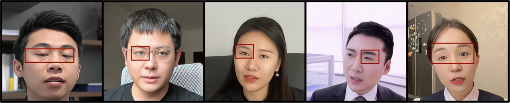

Figure 9: Sample image showing artifacts in the eye area after
introducing CodeFormer.

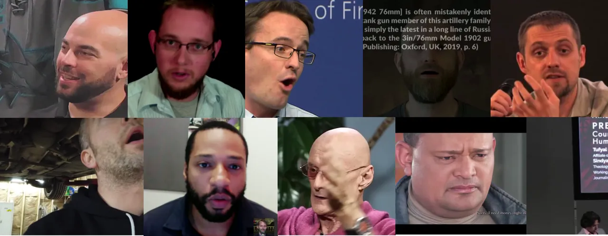

Figure 10: Filtered out sample data from public dataset.

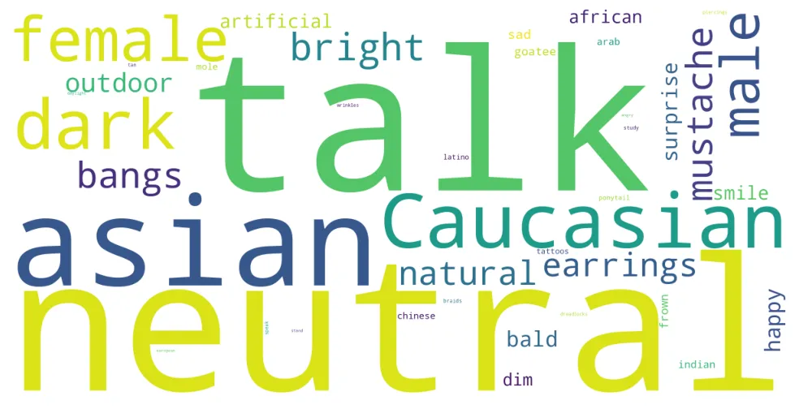

Figure 11: Key words of DH-FaceVid-1K’s annotations.

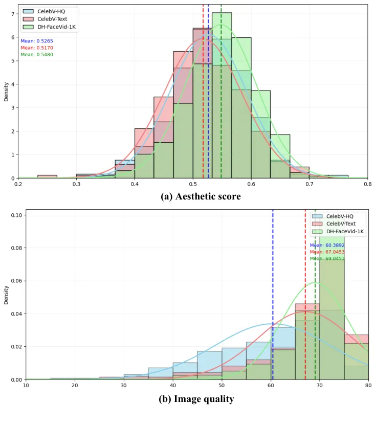

Figure 12: Comparison of CelebV-HQ, CelebV-Text and DH-FaceVid-1K on
VBench.

### C. Video Annotations

We first use PLLaVA to automatically generate video annotations. More
specifically, we interact with PLLaVA in a manner similar to conversing
with an LLM (Large Language Model). We provide it with a template
prompt, which it then uses to generate corresponding video annotations.
Our annotations primarily include information about appearance,
expressions, actions, and the environment—details that are also embedded
within the template, where we provide options for various attributes of
these annotations. For example, for the attribute “emotion”, we require
selecting from options such as Neutral, Happy, Sad, and Angry. The
selection of these options is based on the attribute design from
CelebV-Text.

After obtaining the initial annotations, we employ an additional 50
annotators to review the text. These annotators are tasked with
assessing static information in the annotations, such as age, ethnicity,
clothing, and facial accessories, based on the first frame of the video.
Subsequently, they evaluate dynamic information, such as emotional and
movement changes, based on three randomly selected non-consecutive
additional frames.

The comprehensive attribute list of DH-FaceVid-1K is presented in Table
5 We visualized some high-frequency words in the annotations. The word
cloud can be found in Figure 11

### D. Challenges

Although our primary goal is to construct a high-quality talking face
dataset mainly composed of Asians to address the scarcity of such
datasets, the statistical data presented in the main text indicates a
certain long-tail distribution in racial representation. However,
through experiments, we discover that by integrating our proposed
dataset with cleaned open-source data and thoroughly training powerful
video generation models, such as CogVideoX, it is still easy to generate
high-quality data for Caucasian, African, and Indian individuals. In
terms of actions and emotions, talking and neutral emotions dominate
overwhelmingly. Nevertheless, we find that even a small proportion of
data is sufficient for the model to learn, given our total duration of
nearly 1200 hours. Qualitative experimental images for other
ethnicities, scenes, emotions, and actions, such as smiling, can be
found in the later sections.

## E. Training Protocol

To validate the effectiveness and superiority of proposed dataset, we
evaluated the performance of generative models under different
architectures based on T2V (Text-to-Video) and T2I (Text-to-Image) in
the earlier experimental sections. All model training is conducted
separately using CelebV-Text and DH-FaceVid-1K as the training datasets.

We strive to replicate these methods according to the training details
provided officially, including the optimizer, learning rate, and loading
the official weight checkpoints. All models are fine-tuned for 100k
steps using eight A800 GPUs. However, for SVD, since the official
training code is not open-sourced, we train it based on a third-party
reproduced code.

For OpenSora, we fine-tune using version 1.2. For EasyAnimate, we use
version v3 for fine-tuning. However, this version often encounters
crashes when fine-tuning with large datasets. Our solution is to reduce
the learning rate (down to 2e-6) and frequently save checkpoints,
allowing us to revert to the most recent stable checkpoint in case of a
crash.

## F. Quantative Experiment Settings

We utilize FVD, FID, and CLIPSIM to evaluate video temporal consistency,
individual frame quality, and the relevance between the generated video
and text prompt. Before training different models, we randomly select
2048 videos from each of the two training datasets as the test set,
which are not involved in training. For Text-to-Video (T2V) generation
experiments, we generate 2048 videos as the “fake” videos to calculate
FVD and CLIPSIM, based on the prompts of the test set. Subsequently, to
compute FID, we uniformly sample 4 frames from each of these 2048 “fake”
videos as fake data and apply the same procedure to the test data. In
total, we have 8192 images for both real and fake data. For
Image-to-Video (I2V), we take the first frame from the test set images
as the image prompt to generate 2048 videos as fake data, with other
settings similar to the T2V experiments.

To ensure the fairness of the comparison, all real and fake data are
uniformly resized to 512 $`\times`$ 512.

## G. More Qualitative Results

We present additional qualitative results that were not covered in the
main text. For the Text-to-Video experiments, we first use more diverse
prompts, such as different emotions, ethnicities, actions, and scenes,
to generate results. We then include generation results from prompts
with formats different from those in the dataset annotations, such as
prompts lacking key information or using single-word descriptions of
character traits in the video. This demonstrates that our model, after
thorough training, possesses strong generalization capabilities. For
Image-to-Video (I2V), we use some“wild” data to generate results,
verifying that the model, trained on our dataset, still exhibits good
extrapolation abilities. The additional qualitative experimental results
in this section are generated using CogVideoX 5b version and Open Sora.

## H. Comparison using Vbench

We conducted a comparative analysis of aesthetic scores and image
quality metrics between DH-FaceVid-1K, CelebV-HQ, and CelebV-Text using
VBench \[2\], as illustrated in Figure 12. The results demonstrate that
the proposed DH-FaceVid-1K dataset achieves comparable aesthetic
performance while exhibiting superior image quality relative to the
benchmark datasets.

## I. Combination with Existing Datasets

Our dataset includes 200h of Caucasian and African data, with diverse
generation examples shown in Appendix Figures 7-8. Given that existing
public datasets already contain extensive non-Asian data (about 4.5k h),
we recommend using either equal-duration sampling (1:1) or
population-proportional splits to ensure generalization and racial
diversity.

| Dataset     | FID ($`\downarrow`$) | FVD ($`\downarrow`$) | CLIP ($`\uparrow`$) | DSL-FIQA ($`\uparrow`$) |
| ----------- | -------------------- | -------------------- | ------------------- | ----------------------- |
| CelebV-Text | 25.71                | 313.51               | 0.838               | 0.7531                  |
| Ours        | 22.81                | 250.53               | 0.845               | 0.8204                  |

Table 6: Comparison of T2V metrics on cross-dataset.

## J. Cross Reference-Dataset Evaluation

We have now conducted cross-dataset evaluation using CogVideoX-2B T2V to
assess the generalization capability of our dataset. The evaluation sets
include HDTF and CelebV-HQ (1:3, results are reported in Table 6 here).
Our dataset demonstrates strong generalizability and consistently
outperforms CelebV-Text across all metrics.

## K. User Study

We conduct a user study with 25 participants to evaluate CogVideoX’s T2V
face generation performance after fine-tuning. Participants compare 30
videos generated with the same prompt by models trained on CelebV-HQ,
CelebV-Text, and the proposed dataset. The prompts include diverse
ethnic groups and emotions(neutral:happy:angry:sad = 6:1:1:1) in various
settings. Evaluations focus on prompt adherence, face naturalness, video
quality, and overall quality. As shown in Table 7, videos using our
fine-tuned weights score the highest overall.

| Datasets    | Adherence | Naturalness | Visual Quality | Overall |
| ----------- | --------- | ----------- | -------------- | ------- |
| CelebV-HQ   | 2.53      | 4.01        | 3.75           | 3.90    |
| CelebV-Text | 2.89      | 3.88        | 4.17           | 4.01    |
| Ours        | 4.52      | 4.39        | 4.33           | 4.47    |

Table 7: User study measured by Mean Opinion Scores.

## L. Future Work

Our proposed dataset primarily focuses on talking faces, and when
combined with powerful open-source models, it already enables robust and
diverse talking face generation capabilities. However, there are still
limitations, such as the video’s restriction to facial expressions
without including common actions like eating or crying. On the other
hand, our current dataset contains a limited number of non-East Asian
faces. To further enhance data diversity, we are actively collecting
additional Asian facial data from regions beyond East Asia (including
Indian, Indonesian, Malay, and Vietnamese populations), while strictly
adhering to data privacy protocols.

Our future work will focus on developing datasets that support digital
human generation for both half-body and full-body models, aiming to
achieve true digital human synthesis.

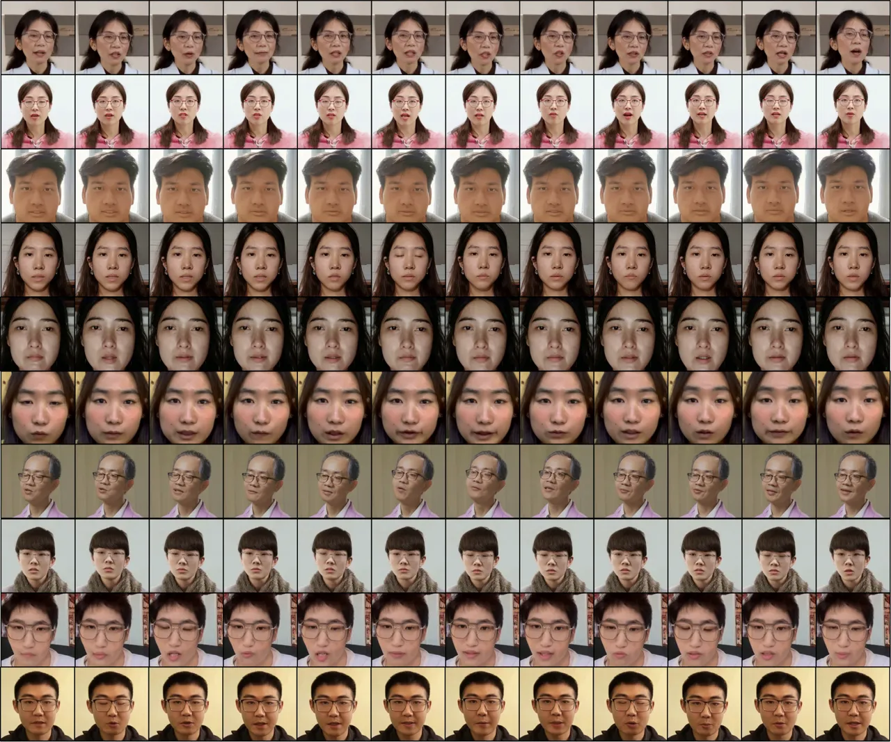

Figure 13: More qualitative T2V evaluation results from CogVideoX
demonstrate the effectiveness of the DH-FaceVid-1K fine-tuned model in
generating capabilities from different angles and facial distances

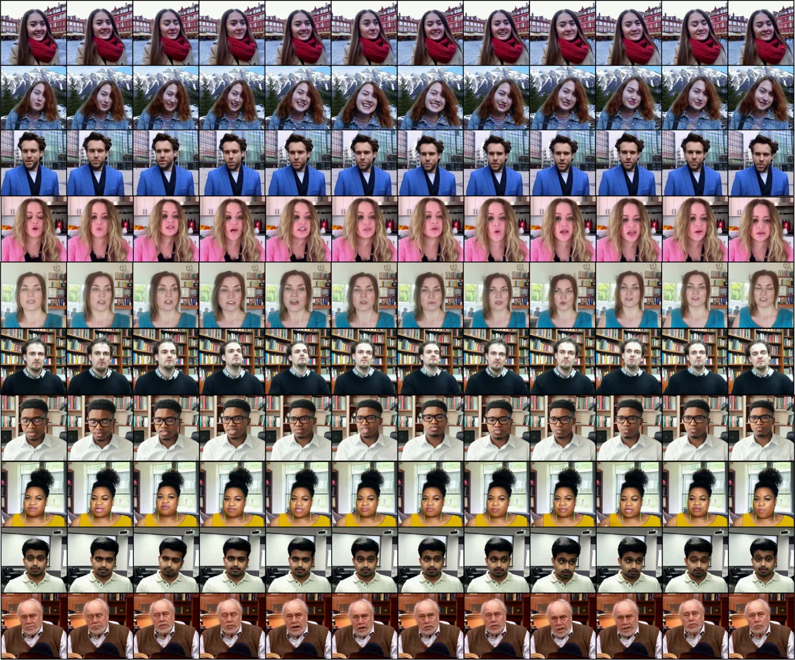

Figure 14: More qualitative T2V evaluation results from OpenSora confirm
that the DH-FaceVid-1K fine-tuned model retains the ability to generate
speaking videos of faces from multiple ethnicities, including Caucasian,
African, and Indian.

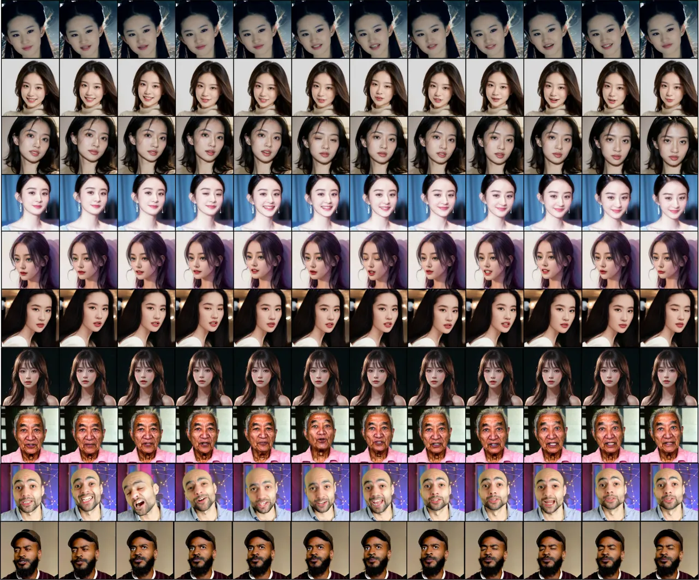

Figure 15: More qualitative I2V evaluation results from CogVideoX
confirm that the DH-FaceVid-1K fine-tuned model retains the ability to
generate various styles (realistic and cartoon) across multiple
ethnicities.

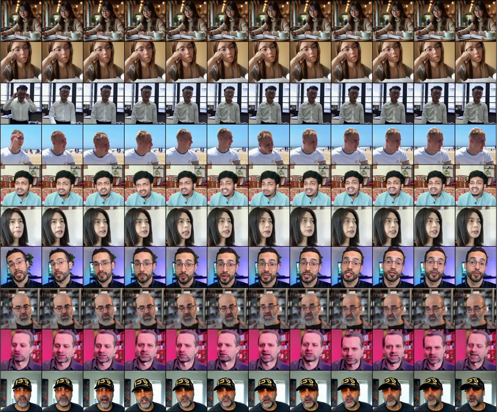

Figure 16: More qualitative I2V evaluation results from CogVideoX
confirm that the DH-FaceVid-1K fine-tuned model retains the ability to
generate not only speaking but also various other actions, such as
reading, and can produce half-body images beyond just the face, across
multiple ethnicities.

## DH-FaceVid-1K: A Large-Scale High-Quality Dataset for Face Video Generation

Supplementary Material

|                        |                  |                  |                 |              |                  |
| ---------------------- | ---------------- | ---------------- | --------------- | ------------ | ---------------- |
| Static Attributes      |                  |                  |                 |              |                  |
| (a) Ethnicities        |                  |                  |                 |              |                  |
| Asian                  | White            | Indian           | European        | African      | Arab             |
| Latino                 | Chinese          | Japanese         | Korean          | Latina       | Jewish           |
| Mexican                |                  |                  |                 |              |                  |
| (b) General Appearance |                  |                  |                 |              |                  |
| No beard               | Male             | Female           | Straight hair   | Black hair   | Anchored eyebrow |
| Short hair             | Eyeglasses       | Brown hair       | Rosy cheeks     | Long hair    | Bush eyebrow     |
| Chubby                 | Heavy makeup     | Oval face        | Lipsticks       | Big nose     | Wavy hair        |
| Bangs                  | Double chin      | Side burn        | Earrings        | Goatee       | White hair       |
| Blonde hair            | Bald             | Old              | Narrow eyes     | Big lips     | Pale skin        |
| Wearing shirt          | Wearing jacket   | Wearing suit     | Wearing tie     | Wearing coat | Wearing blazer   |
| Wearing hoodie         | Redhead          | Wearing cloak    | Wearing bonnet  | Blemish      | Pompadour        |
| Mustache               | Wearing necklace | Wearing sweater  | Wearing blouse  | Wearing cap  | Wearing scarf    |
| Wearing hat            | Wearing dress    | Wearing headband | Mole            | Wearing vest | Tattoos          |
| Wearing sunglasses     | Piercings        | Wearing beanie   | Wearing hijab   | Ponytail     | Scars            |
| Wearing robe           | Tan              | Wearing ring     | Wrinkles        | Wearing hood | Wearing backpack |
| Wearing bandana        | Braids           | Wearing turban   | Pigtails        | Dreadlocks   | With purse       |
| (c) Light Conditions   |                  |                  |                 |              |                  |
| Dark                   | Outdoor          | Bright           | Natural         | Artificial   | Dim              |
| Daylight               | Normal           |                  |                 |              |                  |
| Dynamic Attributes     |                  |                  |                 |              |                  |
| (a) Action             |                  |                  |                 |              |                  |
| Talk                   | Smile            | Wag Head         | Frown           | Gaze         | Nod              |
| Shake Head             | Sing             | Glare            | Close Eyes      | Laugh        | Whisper          |
| Wink                   | Shout            | Sigh             | Listen To Music | Yawn         | Cough            |
| Sneeze                 | Study            | Speak            | Sleep           | Kiss         | Pile             |
| Stand                  | Think            | Eat              | Drink           | Read         | Touch            |
| Roll                   | Rest             | Work             | Wash            | Ride         | Drive            |
| Play                   | Hold             | Throw            | Run             | Clutch       | Tilt             |
| Hug                    | Walk             |                  |                 |              |                  |
| (b) Emotion            |                  |                  |                 |              |                  |
| Neutral                | Happy            | Sad              | Angry           | Fear         | Surprise         |
| Contempt               | Disgust          |                  |                 |              |                  |

Table 1: Comprehensive attribute list of DH-FaceVid-1K, including
ethnicities, appearance details, emotions, actions, and lighting
conditions.

## Dataset Construction

### A. Data details.

The majority of the facial video data in this dataset, over 65%,
consists of single-person frontal interview videos, ensuring the quality
and stability of the raw data. To enhance the diversity of video scenes,
we also collect some outdoor vlog-style talking head video data. To
ensure the diversity of the dataset, in over 95% of total data, each
identity corresponds to no more than 10 video clips.

As mentioned in the manuscript, we applied the data processing pipeline
from the text to filter the public datasets CelebV-HQ, CelebV-Text, and
TalkingHead-1KH. The filtered sample data can be found in Figure 2.

### B. CodeFormer bias

CodeFormer-enhanced videos sometimes exhibit artifacts, particularly
around the eyes of Asian faces. To address this, a team of 10 manually
reviews the first frame of each video, discarding any that display such
issues. The demo data corresponding to these failures can be found in
Figure 1.

Figure 1: Sample image showing artifacts in the eye area after
introducing CodeFormer.

Figure 2: Filtered out sample data from public dataset.

Figure 3: Key words of DH-FaceVid-1K’s annotations.

Figure 4: Comparison of CelebV-HQ, CelebV-Text and DH-FaceVid-1K on
VBench.

### C. Video Annotations

We first use PLLaVA to automatically generate video annotations. More
specifically, we interact with PLLaVA in a manner similar to conversing
with an LLM (Large Language Model). We provide it with a template
prompt, which it then uses to generate corresponding video annotations.
Our annotations primarily include information about appearance,
expressions, actions, and the environment—details that are also embedded
within the template, where we provide options for various attributes of
these annotations. For example, for the attribute “emotion”, we require
selecting from options such as Neutral, Happy, Sad, and Angry. The
selection of these options is based on the attribute design from
CelebV-Text.

After obtaining the initial annotations, we employ an additional 50
annotators to review the text. These annotators are tasked with
assessing static information in the annotations, such as age, ethnicity,
clothing, and facial accessories, based on the first frame of the video.
Subsequently, they evaluate dynamic information, such as emotional and
movement changes, based on three randomly selected non-consecutive
additional frames.

The comprehensive attribute list of DH-FaceVid-1K is presented in Table
1 We visualized some high-frequency words in the annotations. The word
cloud can be found in Figure 3

### D. Challenges

Although our primary goal is to construct a high-quality talking face
dataset mainly composed of Asians to address the scarcity of such
datasets, the statistical data presented in the main text indicates a
certain long-tail distribution in racial representation. However,
through experiments, we discover that by integrating our proposed
dataset with cleaned open-source data and thoroughly training powerful
video generation models, such as CogVideoX, it is still easy to generate
high-quality data for Caucasian, African, and Indian individuals. In
terms of actions and emotions, talking and neutral emotions dominate
overwhelmingly. Nevertheless, we find that even a small proportion of
data is sufficient for the model to learn, given our total duration of
nearly 1200 hours. Qualitative experimental images for other
ethnicities, scenes, emotions, and actions, such as smiling, can be
found in the later sections.

## E. Training Protocol

To validate the effectiveness and superiority of proposed dataset, we
evaluated the performance of generative models under different
architectures based on T2V (Text-to-Video) and T2I (Text-to-Image) in
the earlier experimental sections. All model training is conducted
separately using CelebV-Text and DH-FaceVid-1K as the training datasets.

We strive to replicate these methods according to the training details
provided officially, including the optimizer, learning rate, and loading
the official weight checkpoints. All models are fine-tuned for 100k
steps using eight A800 GPUs. However, for SVD, since the official
training code is not open-sourced, we train it based on a third-party
reproduced code.

For OpenSora, we fine-tune using version 1.2. For EasyAnimate, we use
version v3 for fine-tuning. However, this version often encounters
crashes when fine-tuning with large datasets. Our solution is to reduce
the learning rate (down to 2e-6) and frequently save checkpoints,
allowing us to revert to the most recent stable checkpoint in case of a
crash.

## F. Quantative Experiment Settings

We utilize FVD, FID, and CLIPSIM to evaluate video temporal consistency,
individual frame quality, and the relevance between the generated video
and text prompt. Before training different models, we randomly select
2048 videos from each of the two training datasets as the test set,
which are not involved in training. For Text-to-Video (T2V) generation
experiments, we generate 2048 videos as the “fake” videos to calculate
FVD and CLIPSIM, based on the prompts of the test set. Subsequently, to
compute FID, we uniformly sample 4 frames from each of these 2048 “fake”
videos as fake data and apply the same procedure to the test data. In
total, we have 8192 images for both real and fake data. For
Image-to-Video (I2V), we take the first frame from the test set images
as the image prompt to generate 2048 videos as fake data, with other
settings similar to the T2V experiments.

To ensure the fairness of the comparison, all real and fake data are
uniformly resized to 512 $`\times`$ 512.

## G. More Qualitative Results

We present additional qualitative results that were not covered in the
main text. For the Text-to-Video experiments, we first use more diverse
prompts, such as different emotions, ethnicities, actions, and scenes,
to generate results. We then include generation results from prompts
with formats different from those in the dataset annotations, such as
prompts lacking key information or using single-word descriptions of
character traits in the video. This demonstrates that our model, after
thorough training, possesses strong generalization capabilities. For
Image-to-Video (I2V), we use some“wild” data to generate results,
verifying that the model, trained on our dataset, still exhibits good
extrapolation abilities. The additional qualitative experimental results
in this section are generated using CogVideoX 5b version and Open Sora.

## H. Comparison using Vbench

We conducted a comparative analysis of aesthetic scores and image
quality metrics between DH-FaceVid-1K, CelebV-HQ, and CelebV-Text using
VBench \[2\], as illustrated in Figure 4. The results demonstrate that
the proposed DH-FaceVid-1K dataset achieves comparable aesthetic
performance while exhibiting superior image quality relative to the
benchmark datasets.

## J. Combination with Existing Datasets

Our dataset includes 200h of Caucasian and African data, with diverse
generation examples shown in Appendix Figures 7-8. Given that existing
public datasets already contain extensive non-Asian data (about 4.5k h),
we recommend using either equal-duration sampling (1:1) or
population-proportional splits to ensure generalization and racial
diversity.

| Dataset     | FID ($`\downarrow`$) | FVD ($`\downarrow`$) | CLIP ($`\uparrow`$) | DSL-FIQA ($`\uparrow`$) |
| ----------- | -------------------- | -------------------- | ------------------- | ----------------------- |
| CelebV-Text | 25.71                | 313.51               | 0.838               | 0.7531                  |
| Ours        | 22.81                | 250.53               | 0.845               | 0.8204                  |

Table 2: Comparison of T2V metrics on cross-dataset.

## K. Cross Reference-Dataset Evaluation

We have now conducted cross-dataset evaluation using CogVideoX-2B T2V to
assess the generalization capability of our dataset. The evaluation sets
include HDTF and CelebV-HQ (1:3, results are reported in Table 2 here).
Our dataset demonstrates strong generalizability and consistently
outperforms CelebV-Text across all metrics.

## L. User Study

We conduct a user study with 25 participants to evaluate CogVideoX’s T2V
face generation performance after fine-tuning. Participants compare 30
videos generated with the same prompt by models trained on CelebV-HQ,
CelebV-Text, and the proposed dataset. The prompts include diverse
ethnic groups and emotions(neutral:happy:angry:sad = 6:1:1:1) in various
settings. Evaluations focus on prompt adherence, face naturalness, video
quality, and overall quality. As shown in Table 3, videos using our
fine-tuned weights score the highest overall.

| Datasets    | Adherence | Naturalness | Visual Quality | Overall |
| ----------- | --------- | ----------- | -------------- | ------- |
| CelebV-HQ   | 2.53      | 4.01        | 3.75           | 3.90    |
| CelebV-Text | 2.89      | 3.88        | 4.17           | 4.01    |
| Ours        | 4.52      | 4.39        | 4.33           | 4.47    |

Table 3: User study measured by Mean Opinion Scores.

## M. Future Work

Our proposed dataset primarily focuses on talking faces, and when
combined with powerful open-source models, it already enables robust and
diverse talking face generation capabilities. However, there are still
limitations, such as the video’s restriction to facial expressions
without including common actions like eating or crying. On the other
hand, our current dataset contains a limited number of non-East Asian
faces. To further enhance data diversity, we are actively collecting
additional Asian facial data from regions beyond East Asia (including
Indian, Indonesian, Malay, and Vietnamese populations), while strictly
adhering to data privacy protocols.

Our future work will focus on developing datasets that support digital
human generation for both half-body and full-body models, aiming to
achieve true digital human synthesis.

Figure 5: More qualitative T2V evaluation results from CogVideoX
demonstrate the effectiveness of the DH-FaceVid-1K fine-tuned model in
generating capabilities from different angles and facial distances

Figure 6: More qualitative T2V evaluation results from OpenSora confirm
that the DH-FaceVid-1K fine-tuned model retains the ability to generate
speaking videos of faces from multiple ethnicities, including Caucasian,
African, and Indian.

Figure 7: More qualitative I2V evaluation results from CogVideoX confirm
that the DH-FaceVid-1K fine-tuned model retains the ability to generate
various styles (realistic and cartoon) across multiple ethnicities.

Figure 8: More qualitative I2V evaluation results from CogVideoX confirm
that the DH-FaceVid-1K fine-tuned model retains the ability to generate
not only speaking but also various other actions, such as reading, and
can produce half-body images beyond just the face, across multiple
ethnicities.

## References

- \[1\] Junsong Chen, Chongjian Ge, Enze Xie, et al. Pixart-$`\sigma`$:
  Weak-to-strong training of diffusion transformer for 4k text-to-image
  generation, 2024.
- \[2\] Ziqi Huang, Yinan He, Jiashuo Yu, et al. VBench: Comprehensive
  benchmark suite for video generative models. In _CVPR_, 2024.
