# Generalizable and Animatable Gaussian Head Avatar

Xuangeng Chu Affiliation: The University of Tokyo
Email: [xuangeng.chu@mi.t.u-tokyo.ac.jp](mailto:)    Tatsuya Harada
Affiliation: The University of Tokyo Affiliation: RIKEN AIP
Email: [harada@mi.t.u-tokyo.ac.jp](mailto:)

###### Abstract

In this paper, we propose Generalizable and Animatable Gaussian head
Avatar (GAGAvatar) for one-shot animatable head avatar reconstruction.
Existing methods rely on neural radiance fields, leading to heavy
rendering consumption and low reenactment speeds. To address these
limitations, we generate the parameters of 3D Gaussians from a single
image in a single forward pass. The key innovation of our work is the
proposed dual-lifting method, which produces high-fidelity 3D Gaussians
that capture identity and facial details. Additionally, we leverage
global image features and the 3D morphable model to construct 3D
Gaussians for controlling expressions. After training, our model can
reconstruct unseen identities without specific optimizations and perform
reenactment rendering at real-time speeds. Experiments show that our
method exhibits superior performance compared to previous methods in
terms of reconstruction quality and expression accuracy. We believe our
method can establish new benchmarks for future research and advance
applications of digital avatars. Code and demos are available at
[https://github.com/xg-chu/GAGAvatar](https://github.com/xg-chu/GAGAvatar).

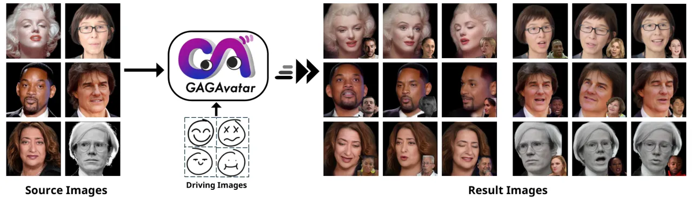

Figure 1: Our method can reconstruct animatable avatars from a single
image, offering strong generalization and controllability with real-time
reenactment speeds.

## 1 Introduction

One-shot head avatar reconstruction has garnered significant attention
in computer vision and graphics recently due to its great potential in
applications such as virtual reality and online meetings. The typical
problem involves faithfully recreating the source head from one image
while precisely controlling expressions and poses. In recent years, many
exploratory methods have achieved this goal using 2D generative models
and 3D synthesizers.

Some early 2D-based methods \[Yin et al., 2022, Ren et al., 2021\]
typically combine estimated deformation fields with generative networks
to drive images. However, due to the lack of necessary 3D constraints
and modeling, these methods struggle to maintain multi-view consistency
of expressions and identities when head poses change significantly.
Recently, Neural Radiance Fields (NeRF) \[Mildenhall et al., 2020\] have
shown impressive results in head avatar synthesis, providing solutions
using 3D synthesizers to achieve realistic details such as accessories
and hair. However, some NeRF-based methods \[Ma et al., 2023\] require
identity-specific training and optimization, and some methods \[Li
et al., 2023a, Chu et al., 2024, Deng et al., 2024a\] can’t render in
real-time during inference, limiting their application in certain
scenarios. With the emergence of 3D Gaussian splatting \[Kerbl et al.,
2023\], some methods \[Xu et al., 2024\] have achieved real-time
rendering. However, these methods still require specific training for
each identity and fail to generalize to unseen identities, leaving the
modeling of generalizable 3D Gaussian-based head models unexplored.

To address these limitations, we introduce a novel 3D Gaussian-based
framework for one-shot head avatar reconstruction. Given a single image,
our framework reconstructs an animatable 3D Gaussian-based head avatar,
achieving real-time expression control and rendering. Some examples are
shown in Fig. 1. The core challenge lies in faithfully reconstructing 3D
Gaussians from a single image, as a 3D Gaussian typically requires
multi-view input and millions of Gaussian points for detailed
reconstruction. To address this, we propose a novel dual-lifting method
that reconstructs the 3D Gaussians from one image. Specifically, instead
of directly estimating Gaussian points from the image, we predict the
lifting distances of each pixel relative to the image plane, and then
map the image plane and lifted points back to 3D space based on the
camera position. By predicting forward and backward lifting distances,
we can form an almost closed Gaussian points distribution and
reconstruct the head as completely as possible. This approach leverages
the fine-grained features of the input image and significantly reduces
the difficulty of predicting 3D Gaussian positions. We also utilize
priors from 3D Morphable Models (3DMM) \[Li et al., 2017\] to further
constrain the lifting distance, helping the model obtain correct 3D
lifting and capture details from the source image. We then bind
learnable features to the 3DMM vertices and construct expression
Gaussians using image global features, 3DMM learnable features, and 3DMM
point positions to ensure expression control capability. Finally, we use
a neural renderer to refine the splatting-rendered results, producing
the final reenacted image. Our model is learned from a large number of
monocular portrait images and can be generalized to unseen identities
after training. Experiments verify that our method performs better than
previous methods in terms of reconstruction quality and expression
accuracy, and achieves real-time reenactment and rendering speed.

Our major contributions can be summarized as follows:

- •
  We propose GAGAvatar, which to our knowledge is the first
  generalizable 3D Gaussian head avatar framework that achieves single
  forward reconstruction and real-time reenactment.

&nbsp;

- •
  To achieve this, we propose a dual-lifting method to lift Gaussians
  from a single image and introduce a method that uses 3DMM priors to
  constrain the lifting process.

&nbsp;

- •
  We combine 3DMM priors and 3D Gaussians to accurately transfer
  expression information while avoiding redundant computations.

## 2 Related Work

### 2.1 2D-based Talking Head Synthesis

The impressive performance of CNN and Generative Adversarial Networks
(GAN) \[Goodfellow et al., 2014, Isola et al., 2017, Karras et al.,
2020\] has inspired many methods for direct head image synthesis using
2D networks. A popular strategy of early works is inserting the
expression and head pose features of the driving image into the 2D
generative network to achieve realistic and animatable image generation.
For example, these methods \[Zakharov et al., 2019, Burkov et al., 2020,
Zhou et al., 2021, Wang et al., 2023\] inject latent representations of
expression into the U-Net backbone or StyleGAN-like \[Karras et al.,
2019\] generators to transfer driving expressions to reenacted images. A
recent trend in 2D-based talking head synthesis methods \[Siarohin
et al., 2019, Ren et al., 2021, Drobyshev et al., 2022, Hong et al.,
2022a, Zhang et al., 2023a\] is to represent expressions and head poses
as warp fields, performing expression transfer by deforming the source
image to match the driving image. However, due to the lack of explicit
understanding of the 3D geometry of head portraits, these methods often
produce unrealistic distortions and undesired identity changes when
there are significant pose and expression variations. Although some
methods \[Drobyshev et al., 2022, Wang et al., 2021a, Ren et al., 2021,
Yin et al., 2022, Zhang et al., 2023b\] introduce 3D Morphable Models
(3DMM) \[Blanz and Vetter, 1999, Paysan et al., 2009, Li et al., 2017,
Gerig et al., 2018\] into the 2D framework, they still lack the ability
to control the viewpoint and achieve free-viewpoint rendering.
Additionally, there are some audio-driven 2D control methods \[Guo
et al., 2021, Tang et al., 2022, Zhang et al., 2023b\], while flexible
to use, cannot explicitly control facial expressions and poses,
sometimes resulting in unsatisfactory outcomes. In contrast, our method
uses an explicit 3D representation to enable free view control and
realistic synthesis even under large pose variations.

### 2.2 3D-based Head Avatar Reconstruction

To achieve better 3D consistency in head avatars, many works have
explored using 3D representations for reconstruction. Early methods \[Xu
et al., 2020, Khakhulin et al., 2022\] used 3DMM-based meshes \[Li
et al., 2017, Gerig et al., 2018\] to reconstruct head avatars. Since
neural radiance fields (NeRF) \[Mildenhall et al., 2020\] have
demonstrated excellent results, many recent methods \[Li et al., 2023b,
Li et al., 2023a, Ma et al., 2023, Yu et al., 2023, Chu et al., 2024, Ye
et al., 2024, Deng et al., 2024b, Deng et al., 2024a, Park et al.,
2021a, Zheng et al., 2023, Bai et al., 2023a, Ki et al., 2024\] have
adopted NeRF for head reconstruction. However, some approaches \[Gafni
et al., 2021, Park et al., 2021a, Tretschk et al., 2021, Hong et al.,
2022b, Athar et al., 2022, Park et al., 2021b, Gao et al., 2022, Guo
et al., 2021, Bai et al., 2023b, Kirschstein et al., 2023, Zheng et al.,
2023, Bai et al., 2023a, Zhao et al., 2023, Zhang et al., 2024\] require
multi-view or single-view videos of specific identities for training,
limiting generalization and raising privacy concerns due to the need for
thousands of frames of personal image data. Additionally, some
methods \[Xu et al., 2023a, Tang et al., 2023, Sun et al., 2022, Xu
et al., 2023b, Zhuang et al., 2022a, Sun et al., 2023\] train generators
to produce controllable head avatars from random noise, followed by
inversion \[Roich et al., 2022, Xie et al., 2023\] for identity-specific
reconstruction. These methods often suffer from inversion accuracy
limitations, failing to preserve the identity of the source image. There
are also methods \[Hong et al., 2022b, Zhuang et al., 2022b, Ma et al.,
2023\] to perform test-time optimization on the source image to obtain
reconstructions, but the need for test-time optimization limits their
applicability. To address these challenges, some works \[Yu et al.,
2023, Li et al., 2023a, Li et al., 2023b, Ma et al., 2024a, Yang et al.,
2024, Chu et al., 2024, Ye et al., 2024, Ma et al., 2024a, Deng et al.,
2024b, Deng et al., 2024a\] focus on one-shot head reconstruction
without test-time optimization. For example, GOHA \[Li et al., 2023a\]
learns three tri-plane features to capture details. HideNeRF \[Li
et al., 2023b\] utilizes multi-resolution tri-planes and a deformation
field to generate reenactment images. GPAvatar \[Chu et al., 2024\] uses
a point-based expression field and a multi tri-plane attention module to
reconstruct head avatars. Real3DPortrait \[Ye et al., 2024\] generates a
tri-plane from images and adds motion adapters to get reenactment
images. CVTHead \[Ma et al., 2024a\] reconstructs head avatars using
point-based neural rendering and a vertex-feature transformer.
Portrait4D \[Deng et al., 2024b\] learns dynamic expression tri-plane
from multi-view synthetic data, while Portrait4D-v2 \[Deng et al.,
2024a\] learns from pseudo multi-view videos, addressing the lack of
real video training in Portrait4D. However, these NeRF-based methods
often face rendering speed limitations, preventing real-time
application. Methods \[Xu et al., 2024, Li et al., 2024, Hu et al.,
2023, Wang et al., 2024a, Ma et al., 2024b, Wang et al., 2024b\]
utilizing 3D Gaussian splatting\[Kerbl et al., 2023\] achieve excellent
performance and rendering speed but require video data for
identity-specific training, lacking generalization capabilities. In this
paper, we propose a one-shot 3D Gaussian head avatar reconstruction
method based on the dual-lifting method. Our method can generalize to
unseen identities, achieves real-time rendering, and surpasses previous
works in image quality.

## 3 Method

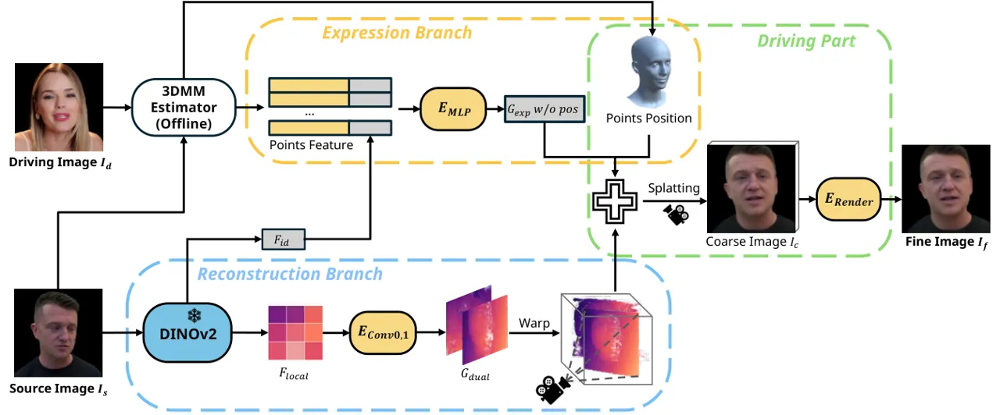

Figure 2: Our method consists of two branches: a reconstruction branch
(Sec. 3.1) and an expression branch (Sec. 3.2). We render dual-lifting
and expressed Gaussians to get coarse results, and then use a neural
renderer to get fine results. Only a small driving part needs to be run
repeatedly to drive the expression, while the rest is executed only
once.

An overview of the reenactment process of our method is shown in Fig. 2.
Given a source image $`I_{s}`$, we first use DINOv2 \[Darcet et al.,
2023, Oquab et al., 2023\] to extract global and local features. Using
the local features, we apply our proposed dual-lifting methods to
predict the parameters and positions of two 3D Gaussians.
Simultaneously, we assign learnable parameters to each vertex of the
3DMM \[Li et al., 2017\] model and predict another expression Gaussians
using the combination of the global feature and vertex features. We
directly use the vertex positions of the 3DMM model as the positions for
expression Gaussians. Finally, we combine these 3D Gaussians and perform
splatting to produce a coarse result image $`I_{c}`$ with the expression
and pose of driving image $`I_{d}`$, which is then further refined
through a neural renderer to obtain the fine result image $`I_{f}`$.

In the following subsections, we describe the reconstruction branch
based on dual-lifting in Sec. 3.1, explain the expression modeling and
control branch in Sec. 3.2, and detail our neural renderer in Sec. 3.3.
Finally, we describe our lifting distance loss and the training
objectives in Sec. 3.4.

### 3.1 Dual-lifting and Reconstruction Branch

Given an input source image, our goal is to reconstruct a detailed 3D
head avatar. To ensure stable modeling and learning, we impose certain
constraints on the reconstruction process. First, we assume that the
reconstructed head is always located at the origin in normalized 3D
space. Second, the rotation of the head is modeled through changes in
camera pose to ensure that the head itself is relatively stationary. We
follow the same strategy when tracking 3DMM parameters and camera
parameters from training and testing data. These constraints allow the
model to effectively utilize the stable priors of the human head
topology.

Leveraging the success of 3D Gaussians splatting \[Kerbl et al., 2023\]
in synthesis quality and rendering speed, we propose a dual-lifting
method to reconstruct 3D Gaussians from a single image. Reconstructing
3D Gaussians typically requires millions of points, but obtaining such a
dense density of Gaussian points from a single image is a challenging
task, especially without test-time optimization. To address this
problem, we propose a novel reconstruction method: the dual-lifting
method. Briefly, we first get the local feature plane $`F_{local}`$ by a
frozen DINOv2 backbone, and then predict the offsets of each pixel
relative to the feature plane and the other necessary parameters
(including color, opacity, scale and rotation), instead of predicting
the 3D Gaussians directly. We then map the plane back to 3D space based
on the camera pose and place the plane through the origin, which
provides the 3D position and normal vector of the plane pixels. Finally,
we can calculate the position of these 3D Gaussians in 3D space based on
the predicted offsets, positions and normal vector. This process can be
described as follows:

```math
G_{pos}=[p_{s}+E_{Conv0}(F_{local})\cdot n_{s},\quad p_{s}-E_{Conv1}(F_{local})\cdot n_{s}], \tag{1}
```

```math
G_{c,o,s,r}=[E_{Conv0}(F_{local}),\quad E_{Conv1}(F_{local})], \tag{2}
```

where $`p_{i}`$ is the initial points plane mapped based on the
estimated camera pose of $`I_{s}`$ and passes through the origin. The
size of $`p_{i}`$ is $`296\times 296`$, which is consistent with the
local feature $`F_{local}`$. $`E_{Conv0,1}`$ are convolutional networks,
$`n_{s}`$ is the normal vector of $`p_{s}`$, $`G_{pos}`$ is the position
of reconstructed 3D Gaussians, and $`G_{c,o,s,r}`$ represents the color,
opacity, scale, and rotation of 3D Gaussians.

It’s worth noting that while predicting one set of lifting distances
from the plane is possible, we adopted a strategy of predicting forward
and backward lifting separately. Our dual-lifting method aims to predict
a complete 3D structure from a single source image, to achieve
multi-view consistency during inference. If we predict only one set of
lifting distances from the image plane, we may face some ambiguous
situations during learning. For example, when we want to reconstruct a
side view source image, predicting one set of lifting will
simultaneously lift the point forward to the visible surface and
backward to include the other side of the head. During this process,
each pixel can be lifted to the visible surface or to the opposite
surface, as both are justified, resulting in model performance
degradation. Unlike single-lifting prediction, our dual-lifting strategy
predicts forward and backward lifting separately, which eliminates
ambiguities and stabilizes the optimization process.

Our dual-lifting method effectively exploits the detailed information of
the source image to reconstruct 3D Gaussians. At the same time, the two
sets of predicted lifting points can form an almost closed Gaussian
points distribution, thus enhancing the performance of large viewpoint
changes. The 3D Gaussian generated by dual-lifting can be rendered from
any viewpoint, producing static results. In the next section, we
describe how to control the facial expressions of the generated avatar.

### 3.2 Expression Branch

Expression transfer is not a straightforward task, but the 3DMM \[Li
et al., 2017\] provides us with a powerful tool to represent common
facial expressions and decouple expressions from identity, thereby
facilitating expression control. Our expression branch establishes 3D
Gaussians based on the 3DMM vertices to control the expressions of the
generated images. To achieve this, we bind learnable weights to each
vertex in the 3DMM. Due to the stable semantics of 3DMM vertices, the
features of these points correspond to facial positions such as the eyes
and mouth.

As shown in Fig. 2, given the source image $`I_{s}`$ and driving image
$`I_{d}`$, we concatenate the global features $`F_{id}`$ with the
learnable features of vertices. We then use a MLP to predict the
Gaussian parameters (excluding position) of each point from these
features, and use the position of the 3DMM vertices. Here we combine the
global features $`F_{id}`$ of the source image when predicting the
expression Gaussians. This will introduce identity information to the
expression branch and enhance the identity consistency under various
expressions, as confirmed by our experiments. Throughout the driving
process, we only need to infer the Gaussians of the reconstruction
branch and expression branch once. Reenactment is achieved by modifying
the camera pose and position of the Gaussians in the expression branch,
which allows us to perform fast reenactment without redundant
calculations.

### 3.3 Neural Renderer

Reconstructing 3D Gaussians typically requires millions of points, but
in our dual-lifting method, we generate only 175,232 points. These
Gaussians can reconstruct the target avatar, but with RGB information
alone it is insufficient for capturing the rich details of a human
avatar. To enhance the representation capability of the sparse
Gaussians, we predict 32-dimensional features containing RGB information
and then perform splatting to obtain coarse images. Then we use a
popular neural renderer following existing methods \[Li et al., 2023a,
Chu et al., 2024, Ye et al., 2024\] to get the fine image, as Fig. 2
shows. Unlike these methods which use neural render as a
super-resolution module to reduce rendering time, we do not upsample the
image as our method do not face significant rendering time issues. Our
neural renderer effectively decodes the dual lifting and expression
Gaussians features into RGB values, producing high-quality results and
resolving potential conflicts between the two sets of Gaussians. We
train our neural renderer from scratch during the training process,
without any pre-trained initialization.

### 3.4 Training Strategy and Loss Functions

With the exception of the frozen DINOv2 backbone, we train the model
from scratch. During training, we randomly sample two images from the
same video, one as the source image and the other as the driving image
and target image. Our primary objective during training is to ensure
that the reenacted coarse and fine image aligns with the target image.
Given that both images share the same identity, this alignment is
achievable. We employ L1 loss and perceptual loss \[Johnson et al.,
2016, Zhang et al., 2018, Ye et al., 2024\] on both the coarse and the
fine image.

Additionally, we propose a lifting distance loss
$`\mathcal{L}_{lifting}`$ to assist dual-lifting learning. With the help
of the prior provided by the tracked 3DMM, we require the lifting
distance predicted by the network to be as close as possible to the 3DMM
vertices. Specifically, we look for the lifting point closest to each
3DMM vertex and constrain their distance through L2 loss. The
calculation is as follows:

```math
\mathcal{L}_{lifting}=||P_{3dmm}-\left\{argmin_{q\in G_{pos}}\|p-q\|\mid p\in P_{3dmm}\right\}||, \tag{3}
```

where the $`P_{3dmm}`$ is the tracked 3DMM vertices, $`G_{pos}`$ is the
dual-lifting points, $`argmin`$ find the nearest point. Our lifting
distance loss leverages 3DMM priors. Additionally, since we constrain
only a subset of dual-lifting points, the model can still learn areas
not modeled by 3DMM, such as hair and accessories. Experiments show
$`\mathcal{L}_{lifting}`$ can improve the 3D structure and the
performance of large view changes.

The overall training objective is as follows:

```math
\mathcal{L}=||I_{c}-I_{t}||+||I_{f}-I_{t}||+\lambda_{p}(||\varphi(I_{c})-\varphi(I_{t})||+||\varphi(I_{f})-\varphi(I_{t})||)+\lambda_{l}\mathcal{L}_{lifting}, \tag{4}
```

where $`I_{t}`$ is target image, $`I_{c}`$ and $`I_{f}`$ are the
generated coarse and fine image, $`\lambda_{p}`$ and $`\lambda_{l}`$ are
the weights used to balance the losses.

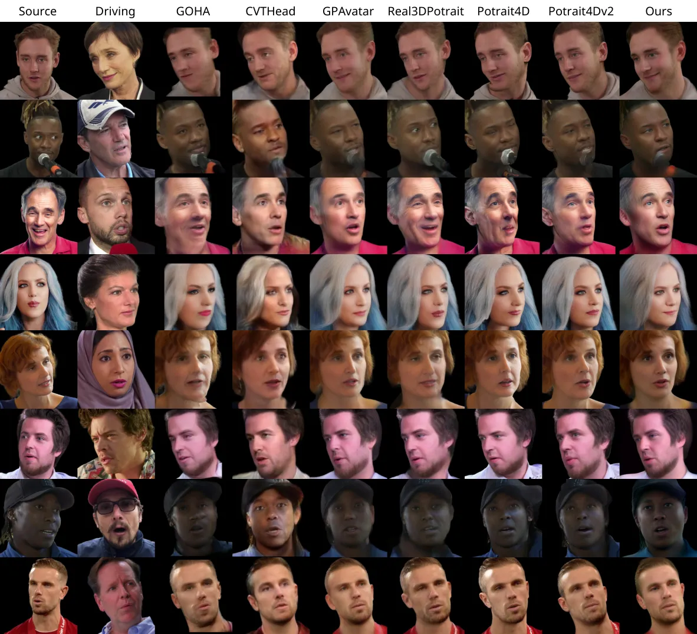

Figure 3: Cross-identity qualitative results on the VFHQ \[Xie et al.,
2022\] dataset. Compared with baseline methods, our method has accurate
expressions and rich details.

## 4 Experiments

### 4.1 Experiment Setting

Datasets. We use the VFHQ \[Xie et al., 2022\] dataset to train our
model, which comprises clips from various interview scenarios. To avoid
consecutive similar frames, we sampled 25 to 75 frames from the original
video depending on video length. This resulted in a dataset that
includes 586,382 frames from 15,204 video clips. All the images are
resized to 512$`\times`$512. We tracked camera poses, FLAME \[Li et al.,
2017\] parameters and removed the background following  \[Chu et al.,
2024\]. For evaluation, we use sampled frames from the VFHQ original
test split, consisting of 5000 frames from 100 videos. The first frame
of each video serves as the source image, with the remaining frames used
as driving and target images for reenactment. We also evaluate on
HDTF \[Zhang et al., 2021\] dataset, following the test split used
in \[Ma et al., 2023, Li et al., 2023a\], including 19 video clips.

Implementation details. Our framework is built on the PyTorch \[Paszke
et al., 2017\] platform. We use FLAME \[Li et al., 2017\] as our driving
3DMM. During training, we use the ADAM \[Kingma and Ba, 2014\] optimizer
with a learning rate of 1.0e-4. The DINOv2 \[Oquab et al., 2023\]
backbone is frozen during training and is not trained or fine-tuned. Our
training consists of 200,000 iterations with a total batch size of 8.
The training process is conducted on an NVIDIA Tesla A100 GPU and takes
approximately 46 GPU hours, demonstrating efficient resource
utilization. During inference, our method achieves 67 FPS on an A100 GPU
while using only 2.5 GB of VRAM, showcasing high efficiency. Further
implementation details of the model can be found in the supplementary
materials.

|                                      | Self Reenactment |                  |                     |                  |                   |                   |                   | Cross Reenactment |                   |                   |
| ------------------------------------ | ---------------- | ---------------- | ------------------- | ---------------- | ----------------- | ----------------- | ----------------- | ----------------- | ----------------- | ----------------- |
| Method                               | PSNR$`\uparrow`$ | SSIM$`\uparrow`$ | LPIPS$`\downarrow`$ | CSIM$`\uparrow`$ | AED$`\downarrow`$ | APD$`\downarrow`$ | AKD$`\downarrow`$ | CSIM$`\uparrow`$  | AED$`\downarrow`$ | APD$`\downarrow`$ |
| StyleHeat \[Yin et al., 2022\]       | 19.95            | 0.726            | 0.211               | 0.537            | 0.199             | 0.385             | 7.659             | 0.407             | 0.279             | 0.551             |
| ROME \[Khakhulin et al., 2022\]      | 19.96            | 0.786            | 0.192               | 0.701            | 0.138             | 0.186             | 4.986             | 0.530             | 0.259             | 0.277             |
| OTAvatar \[Ma et al., 2023\]         | 17.65            | 0.563            | 0.294               | 0.465            | 0.234             | 0.545             | 18.19             | 0.364             | 0.324             | 0.678             |
| HideNeRF \[Li et al., 2023b\]        | 19.79            | 0.768            | 0.180               | 0.787            | 0.143             | 0.361             | 7.254             | 0.514             | 0.277             | 0.527             |
| GOHA \[Li et al., 2023a\]            | 20.15            | 0.770            | 0.149               | 0.664            | 0.176             | 0.173             | 6.272             | 0.518             | 0.274             | 0.261             |
| CVTHead \[Ma et al., 2024a\]         | 18.43            | 0.706            | 0.317               | 0.504            | 0.186             | 0.224             | 5.678             | 0.374             | 0.261             | 0.311             |
| GPAvatar \[Chu et al., 2024\]        | 21.04            | 0.807            | 0.150               | 0.772            | 0.132             | 0.189             | 4.226             | 0.564             | 0.255             | 0.328             |
| Real3DPortrait \[Ye et al., 2024\]   | 20.88            | 0.780            | 0.154               | 0.801            | 0.150             | 0.268             | 5.971             | 0.663             | 0.296             | 0.411             |
| Portrait4D \[Deng et al., 2024b\]    | 20.35            | 0.741            | 0.191               | 0.765            | 0.144             | 0.205             | 4.854             | 0.596             | 0.286             | 0.258             |
| Portrait4D-v2 \[Deng et al., 2024a\] | 21.34            | 0.791            | 0.144               | 0.803            | 0.117             | 0.187             | 3.749             | 0.656             | 0.268             | 0.273             |
| Ours                                 | 21.83            | 0.818            | 0.122               | 0.816            | 0.111             | 0.135             | 3.349             | 0.633             | 0.253             | 0.247             |

Table 1: Quantitative results on the VFHQ \[Xie et al., 2022\] dataset.
We use colors to denote the first, second and third places respectively.

|                                      | Self Reenactment |                  |                     |                  |                   |                   |                   | Cross Reenactment |                   |                   |
| ------------------------------------ | ---------------- | ---------------- | ------------------- | ---------------- | ----------------- | ----------------- | ----------------- | ----------------- | ----------------- | ----------------- |
| Method                               | PSNR$`\uparrow`$ | SSIM$`\uparrow`$ | LPIPS$`\downarrow`$ | CSIM$`\uparrow`$ | AED$`\downarrow`$ | APD$`\downarrow`$ | AKD$`\downarrow`$ | CSIM$`\uparrow`$  | AED$`\downarrow`$ | APD$`\downarrow`$ |
| StyleHeat \[Yin et al., 2022\]       | 21.41            | 0.785            | 0.155               | 0.657            | 0.158             | 0.162             | 4.585             | 0.632             | 0.271             | 0.239             |
| ROME \[Khakhulin et al., 2022\]      | 20.51            | 0.803            | 0.145               | 0.738            | 0.133             | 0.123             | 4.763             | 0.726             | 0.268             | 0.191             |
| OTAvatar \[Ma et al., 2023\]         | 20.52            | 0.696            | 0.166               | 0.662            | 0.180             | 0.170             | 8.295             | 0.643             | 0.292             | 0.222             |
| HideNeRF \[Li et al., 2023b\]        | 21.08            | 0.811            | 0.117               | 0.858            | 0.120             | 0.247             | 5.837             | 0.843             | 0.276             | 0.288             |
| GOHA \[Li et al., 2023a\]            | 21.31            | 0.807            | 0.113               | 0.725            | 0.162             | 0.117             | 6.332             | 0.735             | 0.277             | 0.136             |
| CVTHead \[Ma et al., 2024a\]         | 20.08            | 0.762            | 0.179               | 0.608            | 0.169             | 0.138             | 4.585             | 0.591             | 0.242             | 0.203             |
| GPAvatar \[Chu et al., 2024\]        | 23.06            | 0.855            | 0.104               | 0.855            | 0.114             | 0.135             | 3.293             | 0.842             | 0.268             | 0.219             |
| Real3DPortrait \[Ye et al., 2024\]   | 22.82            | 0.835            | 0.103               | 0.851            | 0.138             | 0.137             | 4.640             | 0.903             | 0.299             | 0.238             |
| Portrait4D \[Deng et al., 2024b\]    | 20.81            | 0.786            | 0.137               | 0.810            | 0.134             | 0.131             | 4.151             | 0.793             | 0.291             | 0.240             |
| Portrait4D-v2 \[Deng et al., 2024a\] | 22.87            | 0.860            | 0.105               | 0.860            | 0.111             | 0.111             | 3.292             | 0.857             | 0.262             | 0.183             |
| Ours                                 | 23.13            | 0.863            | 0.103               | 0.862            | 0.110             | 0.111             | 2.985             | 0.851             | 0.231             | 0.181             |

Table 2: Quantitative results on the HDTF \[Zhang et al., 2021\]
dataset. We use colors to denote the first, second and third places
respectively.

### 4.2 Main Results

Baseline methods. We conduct comparisons with existing state-of-the-art
methods, including ROME \[Khakhulin et al., 2022\], StyleHeat \[Yin
et al., 2022\], OTAvatar \[Ma et al., 2023\], HideNeRF \[Li et al.,
2023b\], GOHA \[Li et al., 2023a\], CVTHead \[Ma et al., 2024a\],
GPAvatar \[Chu et al., 2024\], Real3DPortrait \[Ye et al., 2024\],
Portrait4D \[Deng et al., 2024b\], and Portrait4D-v2 \[Deng et al.,
2024a\]. For each method, we use the official implementation to obtain
the result. It is worth noting that actually the core contributions of
Portrait4D-v2 are orthogonal to our work. They introduced a new data
generation method and a novel learning paradigm to improve performance,
which means our method can also benefit from their advancements.

Qualitative results. Fig. 3 shows qualitative comparisons between
methods. Compared with other methods, our method can reconstruct
detailed head avatars from source images and capture subtle facial
movements such as eyes and mouth in driving images. Our method can also
maintain identity consistency and image quality when handling large head
rotations. At the same time, our method achieves high-quality
reconstruction and rendering at a much faster speed than the baseline
method.

Quantitative results. We also quantitatively evaluate the self and
cross-identity reenactment performance between methods. For
self-reenactment with ground truth available, we measure the quality of
the synthesized images using PSNR, SSIM, LPIPS \[Zhang et al., 2018\]
between the synthetic results and the ground truth. For identity
similarity, we calculate the cosine distance of face recognition
features \[Deng et al., 2019a\] between the reenactment results and the
source images. For expression and pose, we use the average expression
distance (AED) and average pose distance (APD) measured by a 3DMM
estimator \[Deng et al., 2019b\], and the average keypoint distance
(AKD) based on a facial landmark detector \[Bulat and Tzimiropoulos,
2017\] to evaluate the accuracy of driving control. For the
cross-identity reenactment task, due to the lack of ground truth, we
evaluate CSIM, AED, and APD, generally consistent with previous
work \[Li et al., 2023a, Chu et al., 2024, Ye et al., 2024\].

Tab. 1 and Tab. 2 show the quantitative results on the VFHQ and HDTF
datasets, respectively. Our method outperforms previous methods in terms
of reconstruction and synthesis quality and expression control accuracy
but the cross-reenactment identity consistency is slightly worse than
some existing methods. We believe this is due to the 3DMM \[Li et al.,
2017\] and 3DMM tracker we rely on, whose identity parameters and
expression parameters are not completely decoupled. Some methods \[Deng
et al., 2024b, Deng et al., 2024a\] that are not based on 3DMM have
brought some inspiration to solve this limitation, and we leave these to
future work. Importantly, our model not only achieves these quantitative
results, but also achieves the real-time reenactment speed, which is
much faster than existing methods.

Inference speed and efficiency. Our method can run at 67 FPS on an A100
GPU with the naive PyTorch framework and official 3D Gaussian Splatting
implementation. As shown in Tab. 3, we are the first real-time method
for animatable one-shot head avatar reconstruction, which shows the
application prospects and unique value of our method.

|             |           |       |          |          |      |         |          |        |      |        |       |
| ----------- | --------- | ----- | -------- | -------- | ---- | ------- | -------- | ------ | ---- | ------ | ----- |
|             | StyleHeat | ROME  | OTAvatar | HideNeRF | GOHA | CVTHead | GPAvatar | Real3D | P4D  | P4D-v2 | Ours  |
| Driving FPS | 19.82     | 11.21 | 0.12     | 9.73     | 6.57 | 18.09   | 16.86    | 4.55   | 9.49 | 9.62   | 67.12 |

Table 3: The time of reenactment is measured in FPS. All results exclude
the time for getting driving parameters that can be calculated in
advance and are averaged over 100 frames.

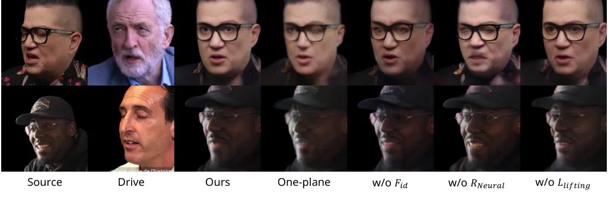

Figure 4: Ablation results on VFHQ \[Xie et al., 2022\] datasets. We can
see that our full method performs best, especially on facial edges such
as glasses in large view angles.

### 4.3 Ablation Studies

Dual-lifting. To validate the effectiveness of our proposed dual-lifting
method, we compare it against a baseline that lifts points from a single
plane. This baseline requires the model to simultaneously lift points
forward and backward from the image plane, sometimes creating
ambiguities. The results in Tab. 4 and Fig. 4 show that dual-lifting
significantly enhances reconstruction quality. Moreover, since the
lifting is performed only once per identity and subsequent expression
driving does not require recalculation, dual-lifting does not impact the
performance during reenactment.

Lifting distance loss. We evaluate the influence of the lifting distance
loss $`\mathcal{L}_{lifting}`$ by removing it during training. Without
lifting distance loss, we observed performance degradation as shown in
Tab. 4 and Fig. 4. Compared with our full method, removing the point
distance constraint will make it more difficult to reconstruct
high-quality 3D structures, especially on facial edges.

3D structure of dual-lifting. We further analyze and compare the 3D
structure of dual-lifting. We show the visualization of filtered lifting
points in Fig. 5. It can be seen that in the case of single-plane
lifting or without $`\mathcal{L}_{lifting}`$, the model can learn the
correct 3D lifting even without any explicit 3D constraints. However,
dual-lifting can produce 3D Gaussian points away from the input angle,
and the 3D structure is also more reasonable rather than relatively
flat.

Global feature in expression branch. We conduct an ablation study by
removing the global identity features $`F_{id}`$ from the expression
branch. The results in Tab. 4 and Fig. 4 indicate that removing
$`F_{id}`$ decreases the identity similarity (CSIM) of the results and
the reenactment quality. This demonstrates the importance of
incorporating identity information in the expression branch.

Neural renderer. Due to the sparsity of our reconstructed Gaussians, we
increased the output dimensions and introduced a neural renderer to
refine the coarse images and features. This process is similar to the
super-resolution module in EG3D \[Chan et al., 2022\], but our neural
renderer does not increase the resolution of the results. The results in
Tab. 4 and Fig. 4 show the performance of coarse results without neural
rendering. It can be observed that we can obtain reasonable results even
using only sparse Gaussians, but the neural renderer significantly
improves detail and expression.

Extreme inputs. We present more qualitative results with extreme inputs
in Fig. 6. For extreme expressions or common occlusions such as
sunglasses, our method shows good robustness. Our model can also work
well with low-quality images and challenging lighting conditions, but
the details of reconstructed avatars are inevitably affected. For
example, avatars reconstructed from blurred images lack details, while
those from images with challenging lighting conditions have fixed
lighting, such as shadows on the nose. However, these features also
demonstrate that our method can faithfully restore details and handle
various extreme cases.

Resolve conflicts of dual-lifting and expression Gaussians. Although we
attempt to bring the two sets of Gaussians closer, there are inherent
conflicts since one set is static and the other is dynamic. We show some
results with conflicts in Fig. 7. It can be seen that the RGB values
conflict when there is a significant expression difference between the
dual-lifting Gaussians and the expression Gaussians, but these conflicts
are well resolved after neural rendering. We believe this is because our
Gaussians have 32-D features that contain more information than RGB
values. The neural rendering module can act as a filter to integrate the
two point sets using these features and resolving possible conflicts.

|                               | Self Reenactment |                  |                     |                  |                   |                   |                   | Cross Reenactment |                   |                   |
| ----------------------------- | ---------------- | ---------------- | ------------------- | ---------------- | ----------------- | ----------------- | ----------------- | ----------------- | ----------------- | ----------------- |
| Method                        | PSNR$`\uparrow`$ | SSIM$`\uparrow`$ | LPIPS$`\downarrow`$ | CSIM$`\uparrow`$ | AED$`\downarrow`$ | APD$`\downarrow`$ | AKD$`\downarrow`$ | CSIM$`\uparrow`$  | AED$`\downarrow`$ | APD$`\downarrow`$ |
| one-plane lifting             | 21.34            | 0.802            | 0.158               | 0.781            | 0.127             | 0.170             | 3.810             | 0.581             | 0.272             | 0.290             |
| w/o $`F_{id}`$                | 21.13            | 0.807            | 0.155               | 0.774            | 0.125             | 0.155             | 3.722             | 0.537             | 0.270             | 0.272             |
| w/o neural renderer           | 20.34            | 0.789            | 0.138               | 0.788            | 0.147             | 0.202             | 4.763             | 0.623             | 0.300             | 0.353             |
| w/o $`\mathcal{L}_{lifting}`$ | 21.64            | 0.812            | 0.148               | 0.800            | 0.119             | 0.151             | 3.563             | 0.620             | 0.261             | 0.252             |
| Ours                          | 21.83            | 0.818            | 0.122               | 0.816            | 0.111             | 0.135             | 3.349             | 0.633             | 0.253             | 0.247             |

Table 4: Ablation results on the VFHQ \[Xie et al., 2022\] dataset.

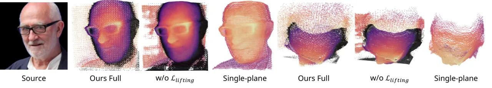

Figure 5: Lifting results of an in-the-wild image, include the front
view and the top view. Points are filtered by Gaussian opacity. We color
two parts of the dual-lifting separately, and the black points are the
image plane. It can be seen that the lifted 3D structure is relatively
flat without $`\mathcal{L}_{lifting}`$.

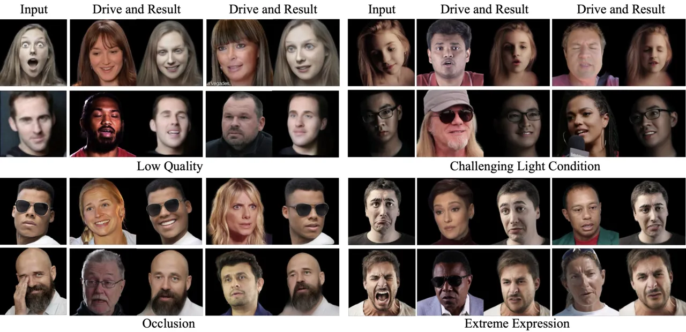

Figure 6: The robustness of our model. Our method can produce reasonable
results for low-quality images, challenging lighting conditions,
significant occlusions, and extreme expressions.

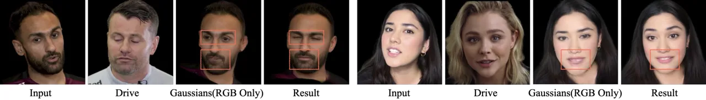

Figure 7: The case where two sets of Gaussians conflict, the conflict is
resolved after neural rendering. We believe that neural rendering
resolves the conflict through the 32D features carried by Gaussians.

## 5 Conclusion

In this paper, we proposed a novel framework for one-shot head avatar
reconstruction and real-time reenactment. The key innovation of our
method is the dual-lifting approach for one-shot 3D Gaussian
reconstruction, which estimates the Gaussian parameters in a single
forward pass. We also propose a 3DMM-based expression control method and
a loss function that uses 3DMM priors to constrain the lifting process.
Our experiments demonstrate that our method outperforms state-of-the-art
baselines in both the quality of head avatar reconstruction and
reenactment accuracy, with significant improvements in rendering speed.
We believe our method has a wide range of potential applications due to
its strong generalization capabilities and real-time rendering speed.

Broader impacts. Although our method has great potential in various
applications, it also poses the risk of misuse, such as generating fake
videos and spreading false information. We strongly oppose such misuse
and have proposed several measures to prevent it, as detailed in Sec. E.
With proper and responsible use, we believe our method can offer
significant benefits in a wide range of applications such as video
conferencing and entertainment industries.

Limitations and future work. Despite its strengths, our method has
certain limitations. For example our model may generate less detail for
unseen areas, and our 3DMM-based expression branch cannot control the
areas not modeled by 3DMM, such as hair and tongue. These limitations
highlight the possible improvements in future work to increase the
performance and practicality of our method. In Sec. F, we provide a more
detailed discussion of our limitations and future work.

## Acknowledgements

This work was partially supported by JST Moonshot R&D Grant Number
JPMJPS2011, CREST Grant Number JPMJCR2015 and Basic Research Grant
(Super AI) of Institute for AI and Beyond of the University of Tokyo. In
addition, this work was also partially supported by JST SPRING, Grant
Number JPMJSP2108.

## References

- Yin et al. \[2022\] Fei Yin, Yong Zhang, Xiaodong Cun, Mingdeng Cao,
  Yanbo Fan, Xuan Wang, Qingyan Bai, Baoyuan Wu, Jue Wang, and Yujiu
  Yang. Styleheat: One-shot high-resolution editable talking face
  generation via pre-trained stylegan. In _European Conference on
  Computer Vision (ECCV)_, 2022.
- Ren et al. \[2021\] Yurui Ren, Ge Li, Yuanqi Chen, Thomas H Li, and
  Shan Liu. Pirenderer: Controllable portrait image generation via
  semantic neural rendering. In _IEEE International Conference on
  Computer Vision (ICCV)_, 2021.
- Mildenhall et al. \[2020\] Ben Mildenhall, Pratul P. Srinivasan,
  Matthew Tancik, Jonathan T. Barron, Ravi Ramamoorthi, and Ren Ng.
  Nerf: Representing scenes as neural radiance fields for view
  synthesis. In _ECCV_, 2020.
- Ma et al. \[2023\] Zhiyuan Ma, Xiangyu Zhu, Guojun Qi, Zhen Lei, and
  Lei Zhang. Otavatar: One-shot talking face avatar with controllable
  tri-plane rendering. In _IEEE Conference on Computer Vision and
  Pattern Recognition (CVPR)_, 2023.
- Li et al. \[2023a\] Xueting Li, Shalini De Mello, Sifei Liu, Koki
  Nagano, Umar Iqbal, and Jan Kautz. Generalizable one-shot neural head
  avatar. _Arxiv_, 2023a.
- Chu et al. \[2024\] Xuangeng Chu, Yu Li, Ailing Zeng, Tianyu Yang,
  Lijian Lin, Yunfei Liu, and Tatsuya Harada. GPAvatar: Generalizable
  and precise head avatar from image(s). In _The Twelfth International
  Conference on Learning Representations_, 2024.
- Deng et al. \[2024a\] Yu Deng, Duomin Wang, and Baoyuan Wang.
  Portrait4d-v2: Pseudo multi-view data creates better 4d head
  synthesizer. _arXiv preprint arXiv:2403.13570_, 2024a.
- Kerbl et al. \[2023\] Bernhard Kerbl, Georgios Kopanas, Thomas
  Leimkühler, and George Drettakis. 3d gaussian splatting for real-time
  radiance field rendering. _ACM Transactions on Graphics_, 42, 2023.
- Xu et al. \[2024\] Yuelang Xu, Benwang Chen, Zhe Li, Hongwen Zhang,
  Lizhen Wang, Zerong Zheng, and Yebin Liu. Gaussian head avatar: Ultra
  high-fidelity head avatar via dynamic gaussians. In _Proceedings of
  the IEEE/CVF Conference on Computer Vision and Pattern Recognition
  (CVPR)_, 2024.
- Li et al. \[2017\] Tianye Li, Timo Bolkart, Michael. J. Black, Hao Li,
  and Javier Romero. Learning a model of facial shape and expression
  from 4D scans. _ACM Transactions on Graphics, (Proc. SIGGRAPH Asia)_,
  pages 194:1–194:17, 2017.
- Goodfellow et al. \[2014\] Ian Goodfellow, Jean Pouget-Abadie, Mehdi
  Mirza, Bing Xu, David Warde-Farley, Sherjil Ozair, Aaron Courville,
  and Yoshua Bengio. Generative adversarial nets. _Advances in neural
  information processing systems_, 27, 2014.
- Isola et al. \[2017\] Phillip Isola, Jun-Yan Zhu, Tinghui Zhou, and
  Alexei A Efros. Image-to-image translation with conditional
  adversarial networks. In _Proceedings of the IEEE conference on
  computer vision and pattern recognition_, pages 1125–1134, 2017.
- Karras et al. \[2020\] Tero Karras, Samuli Laine, Miika Aittala, Janne
  Hellsten, Jaakko Lehtinen, and Timo Aila. Analyzing and improving the
  image quality of stylegan. In _Proceedings of the IEEE/CVF conference
  on computer vision and pattern recognition_, pages 8110–8119, 2020.
- Zakharov et al. \[2019\] Egor Zakharov, Aliaksandra Shysheya, Egor
  Burkov, and Victor Lempitsky. Few-shot adversarial learning of
  realistic neural talking head models. In _Proceedings of the IEEE/CVF
  international conference on computer vision_, pages 9459–9468, 2019.
- Burkov et al. \[2020\] Egor Burkov, Igor Pasechnik, Artur Grigorev,
  and Victor Lempitsky. Neural head reenactment with latent pose
  descriptors. In _Proceedings of the IEEE/CVF conference on computer
  vision and pattern recognition_, pages 13786–13795, 2020.
- Zhou et al. \[2021\] Hang Zhou, Yasheng Sun, Wayne Wu, Chen Change
  Loy, Xiaogang Wang, and Ziwei Liu. Pose-controllable talking face
  generation by implicitly modularized audio-visual representation. In
  _Proceedings of the IEEE/CVF conference on computer vision and pattern
  recognition_, pages 4176–4186, 2021.
- Wang et al. \[2023\] Duomin Wang, Yu Deng, Zixin Yin, Heung-Yeung
  Shum, and Baoyuan Wang. Progressive disentangled representation
  learning for fine-grained controllable talking head synthesis. In
  _Proceedings of the IEEE/CVF Conference on Computer Vision and Pattern
  Recognition_, pages 17979–17989, 2023.
- Karras et al. \[2019\] Tero Karras, Samuli Laine, and Timo Aila. A
  style-based generator architecture for generative adversarial
  networks. In _Proceedings of the IEEE/CVF conference on computer
  vision and pattern recognition_, pages 4401–4410, 2019.
- Siarohin et al. \[2019\] Aliaksandr Siarohin, Stéphane Lathuilière,
  Sergey Tulyakov, Elisa Ricci, and Nicu Sebe. First order motion model
  for image animation. _Advances in neural information processing
  systems_, 32, 2019.
- Drobyshev et al. \[2022\] Nikita Drobyshev, Jenya Chelishev, Taras
  Khakhulin, Aleksei Ivakhnenko, Victor Lempitsky, and Egor Zakharov.
  Megaportraits: One-shot megapixel neural head avatars. In _Proceedings
  of the 30th ACM International Conference on Multimedia_, pages
  2663–2671, 2022.
- Hong et al. \[2022a\] Fa-Ting Hong, Longhao Zhang, Li Shen, and Dan
  Xu. Depth-aware generative adversarial network for talking head video
  generation. In _Proceedings of the IEEE/CVF conference on computer
  vision and pattern recognition_, pages 3397–3406, 2022a.
- Zhang et al. \[2023a\] Bowen Zhang, Chenyang Qi, Pan Zhang, Bo Zhang,
  HsiangTao Wu, Dong Chen, Qifeng Chen, Yong Wang, and Fang Wen.
  Metaportrait: Identity-preserving talking head generation with fast
  personalized adaptation. In _Proceedings of the IEEE/CVF Conference on
  Computer Vision and Pattern Recognition_, pages 22096–22105, 2023a.
- Wang et al. \[2021a\] Ting-Chun Wang, Arun Mallya, and Ming-Yu Liu.
  One-shot free-view neural talking-head synthesis for video
  conferencing. In _Proceedings of the IEEE/CVF conference on computer
  vision and pattern recognition_, pages 10039–10049, 2021a.
- Zhang et al. \[2023b\] Wenxuan Zhang, Xiaodong Cun, Xuan Wang, Yong
  Zhang, Xi Shen, Yu Guo, Ying Shan, and Fei Wang. Sadtalker: Learning
  realistic 3d motion coefficients for stylized audio-driven single
  image talking face animation. _Proceedings of the IEEE/CVF Conference
  on Computer Vision and Pattern Recognition_, pages 8652–8661, 2023b.
- Blanz and Vetter \[1999\] Volker Blanz and Thomas Vetter. A morphable
  model for the synthesis of 3d faces. In _Proceedings of the 26th
  annual conference on Computer graphics and interactive
  techniques_, 1999.
- Paysan et al. \[2009\] Pascal Paysan, Reinhard Knothe, Brian Amberg,
  Sami Romdhani, and Thomas Vetter. A 3d face model for pose and
  illumination invariant face recognition. In _2009 sixth IEEE
  international conference on advanced video and signal based
  surveillance_, pages 296–301, 2009.
- Gerig et al. \[2018\] Thomas Gerig, Andreas Morel-Forster, Clemens
  Blumer, Bernhard Egger, Marcel Luthi, Sandro Schönborn, and Thomas
  Vetter. Morphable face models-an open framework. In _2018 13th IEEE
  International Conference on Automatic Face & Gesture Recognition (FG 2018)_, pages 75–82, 2018.
- Guo et al. \[2021\] Yudong Guo, Keyu Chen, Sen Liang, Yong-Jin Liu,
  Hujun Bao, and Juyong Zhang. Ad-nerf: Audio driven neural radiance
  fields for talking head synthesis. In _Proceedings of the IEEE/CVF
  International Conference on Computer Vision_, pages 5784–5794, 2021.
- Tang et al. \[2022\] Jiaxiang Tang, Kaisiyuan Wang, Hang Zhou,
  Xiaokang Chen, Dongliang He, Tianshu Hu, Jingtuo Liu, Gang Zeng, and
  Jingdong Wang. Real-time neural radiance talking portrait synthesis
  via audio-spatial decomposition. _arXiv preprint
  arXiv:2211.12368_, 2022.
- Xu et al. \[2020\] Sicheng Xu, Jiaolong Yang, Dong Chen, Fang Wen,
  Yu Deng, Yunde Jia, and Xin Tong. Deep 3d portrait from a single
  image. In _Proceedings of the IEEE/CVF Conference on Computer Vision
  and Pattern Recognition_, pages 7710–7720, 2020.
- Khakhulin et al. \[2022\] Taras Khakhulin, Vanessa Sklyarova, Victor
  Lempitsky, and Egor Zakharov. Realistic one-shot mesh-based head
  avatars. In _European Conference on Computer Vision (ECCV)_, 2022.
- Li et al. \[2023b\] Weichuang Li, Longhao Zhang, Dong Wang, Bin Zhao,
  Zhigang Wang, Mulin Chen, Bang Zhang, Zhongjian Wang, Liefeng Bo, and
  Xuelong Li. One-shot high-fidelity talking-head synthesis with
  deformable neural radiance field. In _IEEE Conference on Computer
  Vision and Pattern Recognition (CVPR)_, 2023b.
- Yu et al. \[2023\] Wangbo Yu, Yanbo Fan, Yong Zhang, Xuan Wang, Fei
  Yin, Yunpeng Bai, Yan-Pei Cao, Ying Shan, Yang Wu, Zhongqian Sun,
  et al. Nofa: Nerf-based one-shot facial avatar reconstruction. In _ACM
  SIGGRAPH 2023 Conference Proceedings_, pages 1–12, 2023.
- Ye et al. \[2024\] Zhenhui Ye, Tianyun Zhong, Yi Ren, Jiaqi Yang,
  Weichuang Li, Jiawei Huang, Ziyue Jiang, Jinzheng He, Rongjie Huang,
  Jinglin Liu, et al. Real3d-portrait: One-shot realistic 3d talking
  portrait synthesis. _arXiv preprint arXiv:2401.08503_, 2024.
- Deng et al. \[2024b\] Yu Deng, Duomin Wang, Xiaohang Ren, Xingyu Chen,
  and Baoyuan Wang. Portrait4d: Learning one-shot 4d head avatar
  synthesis using synthetic data. In _IEEE/CVF Conference on Computer
  Vision and Pattern Recognition_, 2024b.
- Park et al. \[2021a\] Keunhong Park, Utkarsh Sinha, Jonathan T.
  Barron, Sofien Bouaziz, Dan B Goldman, Steven M. Seitz, and Ricardo
  Martin-Brualla. Nerfies: Deformable neural radiance fields. _IEEE
  International Conference on Computer Vision (ICCV)_, 2021a.
- Zheng et al. \[2023\] Yufeng Zheng, Wang Yifan, Gordon Wetzstein,
  Michael J Black, and Otmar Hilliges. Pointavatar: Deformable
  point-based head avatars from videos. In _Proceedings of the IEEE/CVF
  conference on computer vision and pattern recognition_, pages
  21057–21067, 2023.
- Bai et al. \[2023a\] Yunpeng Bai, Yanbo Fan, Xuan Wang, Yong Zhang,
  Jingxiang Sun, Chun Yuan, and Ying Shan. High-fidelity facial avatar
  reconstruction from monocular video with generative priors. In
  _Proceedings of the IEEE/CVF Conference on Computer Vision and Pattern
  Recognition (CVPR)_, 2023a.
- Ki et al. \[2024\] Taekyung Ki, Dongchan Min, and Gyeongsu Chae.
  Learning to generate conditional tri-plane for 3d-aware expression
  controllable portrait animation. _arXiv preprint
  arXiv:2404.00636_, 2024.
- Gafni et al. \[2021\] Guy Gafni, Justus Thies, Michael Zollhofer, and
  Matthias Nießner. Dynamic neural radiance fields for monocular 4d
  facial avatar reconstruction. In _Proceedings of the IEEE/CVF
  Conference on Computer Vision and Pattern Recognition_, pages
  8649–8658, 2021.
- Tretschk et al. \[2021\] Edgar Tretschk, Ayush Tewari, Vladislav
  Golyanik, Michael Zollhöfer, Christoph Lassner, and Christian
  Theobalt. Non-rigid neural radiance fields: Reconstruction and novel
  view synthesis of a dynamic scene from monocular video. In
  _Proceedings of the IEEE/CVF International Conference on Computer
  Vision_, 2021.
- Hong et al. \[2022b\] Yang Hong, Bo Peng, Haiyao Xiao, Ligang Liu, and
  Juyong Zhang. Headnerf: A real-time nerf-based parametric head model.
  In _Proceedings of the IEEE/CVF Conference on Computer Vision and
  Pattern Recognition_, pages 20374–20384, 2022b.
- Athar et al. \[2022\] ShahRukh Athar, Zexiang Xu, Kalyan Sunkavalli,
  Eli Shechtman, and Zhixin Shu. Rignerf: Fully controllable neural 3d
  portraits. In _Proceedings of the IEEE/CVF conference on Computer
  Vision and Pattern Recognition_, 2022.
- Park et al. \[2021b\] Keunhong Park, Utkarsh Sinha, Peter Hedman,
  Jonathan T. Barron, Sofien Bouaziz, Dan B Goldman, Ricardo
  Martin-Brualla, and Steven M. Seitz. Hypernerf: A higher-dimensional
  representation for topologically varying neural radiance fields. _ACM
  Trans. Graph._, 2021b.
- Gao et al. \[2022\] Xuan Gao, Chenglai Zhong, Jun Xiang, Yang Hong,
  Yudong Guo, and Juyong Zhang. Reconstructing personalized semantic
  facial nerf models from monocular video. _ACM Transactions on Graphics
  (TOG)_, 41, 2022.
- Bai et al. \[2023b\] Ziqian Bai, Feitong Tan, Zeng Huang, Kripasindhu
  Sarkar, Danhang Tang, Di Qiu, Abhimitra Meka, Ruofei Du, Mingsong Dou,
  Sergio Orts-Escolano, et al. Learning personalized high quality
  volumetric head avatars from monocular rgb videos. In _Proceedings of
  the IEEE/CVF Conference on Computer Vision and Pattern Recognition_,
  2023b.
- Kirschstein et al. \[2023\] Tobias Kirschstein, Shenhan Qian, Simon
  Giebenhain, Tim Walter, and Matthias Nießner. Nersemble: Multi-view
  radiance field reconstruction of human heads. _ACM Transactions on
  Graphics (TOG)_, 42, 2023.
- Zhao et al. \[2023\] Xiaochen Zhao, Lizhen Wang, Jingxiang Sun,
  Hongwen Zhang, Jinli Suo, and Yebin Liu. Havatar: High-fidelity head
  avatar via facial model conditioned neural radiance field. _ACM
  Transactions on Graphics_, 43, 2023.
- Zhang et al. \[2024\] Zicheng Zhang, Ruobing Zheng, Ziwen Liu,
  Congying Han, Tianqi Li, Meng Wang, Tiande Guo, Jingdong Chen, Bonan
  Li, and Ming Yang. Learning dynamic tetrahedra for high-quality
  talking head synthesis. _arXiv preprint arXiv:2402.17364_, 2024.
- Xu et al. \[2023a\] Zhongcong Xu, Jianfeng Zhang, Junhao Liew, Wenqing
  Zhang, Song Bai, Jiashi Feng, and Mike Zheng Shou. Pv3d: A 3d
  generative model for portrait video generation. In _The Tenth
  International Conference on Learning Representations_, 2023a.
- Tang et al. \[2023\] Junshu Tang, Bo Zhang, Binxin Yang, Ting Zhang,
  Dong Chen, Lizhuang Ma, and Fang Wen. 3dfaceshop: Explicitly
  controllable 3d-aware portrait generation. _IEEE Transactions on
  Visualization & Computer Graphics_, 2023.
- Sun et al. \[2022\] Keqiang Sun, Shangzhe Wu, Zhaoyang Huang, Ning
  Zhang, Quan Wang, and HongSheng Li. Controllable 3d face synthesis
  with conditional generative occupancy fields. _Advances in Neural
  Information Processing Systems_, 35, 2022.
- Xu et al. \[2023b\] Hongyi Xu, Guoxian Song, Zihang Jiang, Jianfeng
  Zhang, Yichun Shi, Jing Liu, Wanchun Ma, Jiashi Feng, and Linjie Luo.
  Omniavatar: Geometry-guided controllable 3d head synthesis. In
  _Proceedings of the IEEE/CVF Conference on Computer Vision and Pattern
  Recognition_, pages 12814–12824, 2023b.
- Zhuang et al. \[2022a\] Peiye Zhuang, Liqian Ma, Sanmi Koyejo, and
  Alexander Schwing. Controllable radiance fields for dynamic face
  synthesis. In _2022 International Conference on 3D Vision (3DV)_,
  2022a.
- Sun et al. \[2023\] Jingxiang Sun, Xuan Wang, Lizhen Wang, Xiaoyu Li,
  Yong Zhang, Hongwen Zhang, and Yebin Liu. Next3d: Generative neural
  texture rasterization for 3d-aware head avatars. In _Proceedings of
  the IEEE/CVF conference on computer vision and pattern
  recognition_, 2023.
- Roich et al. \[2022\] Daniel Roich, Ron Mokady, Amit H Bermano, and
  Daniel Cohen-Or. Pivotal tuning for latent-based editing of real
  images. _ACM Transactions on graphics (TOG)_, 2022.
- Xie et al. \[2023\] Jiaxin Xie, Hao Ouyang, Jingtan Piao, Chenyang
  Lei, and Qifeng Chen. High-fidelity 3d gan inversion by
  pseudo-multi-view optimization. In _Proceedings of the IEEE/CVF
  Conference on Computer Vision and Pattern Recognition_, pages
  321–331, 2023.
- Zhuang et al. \[2022b\] Yiyu Zhuang, Hao Zhu, Xusen Sun, and Xun Cao.
  Mofanerf: Morphable facial neural radiance field. In _European
  conference on computer vision_, 2022b.
- Ma et al. \[2024a\] Haoyu Ma, Tong Zhang, Shanlin Sun, Xiangyi Yan,
  Kun Han, and Xiaohui Xie. Cvthead: One-shot controllable head avatar
  with vertex-feature transformer. In _Proceedings of the IEEE/CVF
  Winter Conference on Applications of Computer Vision_, 2024a.
- Yang et al. \[2024\] Songlin Yang, Wei Wang, Yushi Lan, Xiangyu Fan,
  Bo Peng, Lei Yang, and Jing Dong. Learning dense correspondence for
  nerf-based face reenactment. In _Proceedings of the AAAI Conference on
  Artificial Intelligence_, volume 38, 2024.
- Li et al. \[2024\] Jiahe Li, Jiawei Zhang, Xiao Bai, Jin Zheng, Xin
  Ning, Jun Zhou, and Lin Gu. Talkinggaussian: Structure-persistent 3d
  talking head synthesis via gaussian splatting. _arXiv preprint
  arXiv:2404.15264_, 2024.
- Hu et al. \[2023\] Liangxiao Hu, Hongwen Zhang, Yuxiang Zhang, Boyao
  Zhou, Boning Liu, Shengping Zhang, and Liqiang Nie. Gaussianavatar:
  Towards realistic human avatar modeling from a single video via
  animatable 3d gaussians. _arXiv preprint arXiv:2312.02134_, 2023.
- Wang et al. \[2024a\] Cong Wang, Di Kang, He-Yi Sun, Shen-Han Qian,
  Zi-Xuan Wang, Linchao Bao, and Song-Hai Zhang. Mega: Hybrid
  mesh-gaussian head avatar for high-fidelity rendering and head
  editing. _arXiv preprint arXiv:2404.19026_, 2024a.
- Ma et al. \[2024b\] Shengjie Ma, Yanlin Weng, Tianjia Shao, and Kun
  Zhou. 3d gaussian blendshapes for head avatar animation. _arXiv
  preprint arXiv:2404.19398_, 2024b.
- Wang et al. \[2024b\] Shengze Wang, Xueting Li, Chao Liu, Matthew
  Chan, Michael Stengel, Josef Spjut, Henry Fuchs, Shalini De Mello, and
  Koki Nagano. Coherent 3d portrait video reconstruction via triplane
  fusion. _arXiv preprint arXiv:2405.00794_, 2024b.
- Darcet et al. \[2023\] Timothée Darcet, Maxime Oquab, Julien Mairal,
  and Piotr Bojanowski. Vision transformers need registers, 2023.
- Oquab et al. \[2023\] Maxime Oquab, Timothée Darcet, Theo Moutakanni,
  Huy V. Vo, Marc Szafraniec, Vasil Khalidov, Pierre Fernandez, Daniel
  Haziza, Francisco Massa, Alaaeldin El-Nouby, Russell Howes, Po-Yao
  Huang, Hu Xu, Vasu Sharma, Shang-Wen Li, Wojciech Galuba, Mike Rabbat,
  Mido Assran, Nicolas Ballas, Gabriel Synnaeve, Ishan Misra, Herve
  Jegou, Julien Mairal, Patrick Labatut, Armand Joulin, and Piotr
  Bojanowski. Dinov2: Learning robust visual features without
  supervision, 2023.
- Johnson et al. \[2016\] Justin Johnson, Alexandre Alahi, and
  Li Fei-Fei. Perceptual losses for real-time style transfer and
  super-resolution. In _Computer Vision–ECCV 2016: 14th European
  Conference, Amsterdam, The Netherlands, October 11-14, 2016,
  Proceedings, Part II 14_. Springer, 2016.
- Zhang et al. \[2018\] Richard Zhang, Phillip Isola, Alexei A Efros,
  Eli Shechtman, and Oliver Wang. The unreasonable effectiveness of deep
  features as a perceptual metric. In _Proceedings of the IEEE
  conference on computer vision and pattern recognition_, 2018.
- Xie et al. \[2022\] Liangbin Xie, Xintao Wang, Honglun Zhang, Chao
  Dong, and Ying Shan. Vfhq: A high-quality dataset and benchmark for
  video face super-resolution. In _The IEEE Conference on Computer
  Vision and Pattern Recognition Workshops (CVPRW)_, 2022.
- Zhang et al. \[2021\] Zhimeng Zhang, Lincheng Li, Yu Ding, and
  Changjie Fan. Flow-guided one-shot talking face generation with a
  high-resolution audio-visual dataset. In _Proceedings of the IEEE/CVF
  Conference on Computer Vision and Pattern Recognition_, 2021.
- Paszke et al. \[2017\] Adam Paszke, Sam Gross, Soumith Chintala,
  Gregory Chanan, Edward Yang, Zachary DeVito, Zeming Lin, Alban
  Desmaison, Luca Antiga, and Adam Lerer. Automatic differentiation in
  pytorch. 2017.
- Kingma and Ba \[2014\] Diederik P Kingma and Jimmy Ba. Adam: A method
  for stochastic optimization. _arXiv preprint arXiv:1412.6980_, 2014.
- Deng et al. \[2019a\] Jiankang Deng, Jia Guo, Niannan Xue, and
  Stefanos Zafeiriou. Arcface: Additive angular margin loss for deep
  face recognition. In _Proceedings of the IEEE/CVF conference on
  computer vision and pattern recognition_, 2019a.
- Deng et al. \[2019b\] Yu Deng, Jiaolong Yang, Sicheng Xu, Dong Chen,
  Yunde Jia, and Xin Tong. Accurate 3d face reconstruction with
  weakly-supervised learning: From single image to image set. In
  _Proceedings of the IEEE/CVF conference on computer vision and pattern
  recognition workshops_, 2019b.
- Bulat and Tzimiropoulos \[2017\] Adrian Bulat and Georgios
  Tzimiropoulos. How far are we from solving the 2d & 3d face alignment
  problem?(and a dataset of 230,000 3d facial landmarks). In
  _Proceedings of the IEEE international conference on computer
  vision_, 2017.
- Chan et al. \[2022\] Eric R Chan, Connor Z Lin, Matthew A Chan, Koki
  Nagano, Boxiao Pan, Shalini De Mello, Orazio Gallo, Leonidas J Guibas,
  Jonathan Tremblay, Sameh Khamis, et al. Efficient geometry-aware 3d
  generative adversarial networks. In _Proceedings of the IEEE/CVF
  Conference on Computer Vision and Pattern Recognition_, 2022.
- He et al. \[2016\] Kaiming He, Xiangyu Zhang, Shaoqing Ren, and Jian
  Sun. Deep residual learning for image recognition. In _Proceedings of
  the IEEE conference on computer vision and pattern recognition_, pages
  770–778, 2016.
- Wang et al. \[2021b\] Xintao Wang, Yu Li, Honglun Zhang, and Ying
  Shan. Towards real-world blind face restoration with generative facial
  prior. In _The IEEE Conference on Computer Vision and Pattern
  Recognition (CVPR)_, 2021b.
- Tancik et al. \[2020\] Matthew Tancik, Ben Mildenhall, and Ren Ng.
  Stegastamp: Invisible hyperlinks in physical photographs. In
  _Proceedings of the IEEE/CVF conference on computer vision and pattern
  recognition_, pages 2117–2126, 2020.

## Appendix A Reproducibility

### A.1 More Implementation Details

Specifically, we use DINOv2 Base as our feature extractor, which takes 3
$`\times`$ 518 $`\times`$ 518 images as input, and encodes
296$`\times`$296 local feature maps and 768-dimensional global features.
We then obtain the Gaussian parameters of each pixel through 4 groups of
ResBlocks He et al. \[2016\] without downsampling. The dimension of
Gaussian parameters is 41 dimensions, including 32 dimensions of color
information, 1 dimension of opacity information, 3 dimensions of scale
information, 4 dimensions of rotation information, and 1 dimension of
lifting distance information. Since FLAME \[Li et al., 2017\] contains
5023 points, we assign a 256-dimensional feature to each point, so the
total point feature size is 5023 $`\times`$ 256. We concatenate these
features with global features to predict expression Gaussian parameters
using an MLP with 1024 input dimensions. This MLP contains 6 layers, and
since it does not include lifting distance, the output is 40 dimensions.
Our neural renderer employs StyleUNet \[Wang et al., 2021b\] to map
images from 32 $`\times`$ 512 $`\times`$ 512 to 3 $`\times`$ 512
$`\times`$ 512 dimensions. We also provide the code for the model in the
supplementary material for reference.

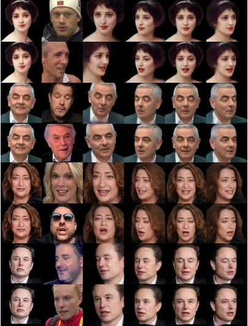

Figure 8: Reenactment and multi-view results of our method on
in-the-wild images. From left to right: input image, driving image,
driving and novel view results.

### A.2 More Data Processing Details

We use 15,204 video clips from the VFHQ dataset \[Xie et al., 2022\] for
training and 100 videos for testing, following the original VFHQ split.
For training videos, we uniformly sample frames based on the video’s
length: 25 frames if the video is less than 2 seconds, 50 frames if the
video is 2 to 3 seconds, and 75 frames if the video is longer than 3
seconds. For testing videos, we uniformly sample 50 frames from each
clip, resulting in a total of frames for training and 5,000 frames for
testing. For the HDTF dataset, we use the test split from OTAvatar \[Ma
et al., 2023\], which includes 19 videos. We uniformly sample 100 frames
from each video, creating a test set with 1,900 frames.

For all these frames, we remove the background and resize them to 512 ×
512 pixels. We extract and refine the 3DMM parameters for each frame
following \[Chu et al., 2024\]. Although the labels generated by this
automatic annotation method are somewhat noisy and imperfect, this
approach allows us to build a large dataset, effectively mitigating the
impact of data inaccuracies.

### A.3 More Evaluation Details

We conduct comparisons with several state-of-the-art methods, including
ROME \[Khakhulin et al., 2022\], StyleHeat \[Yin et al., 2022\],
OTAvatar \[Ma et al., 2023\], HideNeRF \[Li et al., 2023b\], GOHA \[Li
et al., 2023a\], CVTHead \[Ma et al., 2024a\], GPAvatar \[Chu et al.,
2024\], Real3DPortrait \[Ye et al., 2024\], Portrait4D \[Deng et al.,
2024b\], and Portrait4D-v2 \[Deng et al., 2024a\]. For each method, we
use the official data pre-processing script to process its input frame
and driver frame, and use the official implementation to obtain the
result frame. To ensure a fair comparison, we realign the results from
all methods, as some methods crop and center the face region while
others do not. Specifically, we detect landmarks and crop the head
region at the same size for all driving images and results, and then
resize the results to 512×512 for evaluation.

It is worth noting that although Portrait4D and Portrait4D-v2 achieve
the same functionality and get really good results, their core
contributions are orthogonal to our work. They introduce a new data
generation method and a new learning paradigm, which means our method
can also benefit from their advancements. We leave the integration of
these parallel works to future research.

## Appendix B Preliminaries of 3DMM

We utilize a widely-used 3D morphable model (3DMM): the FLAME \[Li
et al., 2017\] model which renowned for its geometric accuracy and
versatility. This model is popular in applications such as facial
animation, avatar creation, and facial recognition due to its realistic
rendering capabilities and flexibility. We use it to work as our
expression driven signal and geometry prior. The FLAME model represents
the head shape as follows:

```math
TP(\hat{\beta},\hat{\theta},\hat{\psi})=\bar{T}+BS(\hat{\beta};S)+BP(\hat{\theta};P)+BE(\hat{\psi};E), \tag{5}
```

where $`\bar{T}`$ is the template head avatar mesh,
$`BS(\hat{\beta};S)`$ is the shape blend-shape function to account for
identity-related shape variation, $`BP(\hat{\theta};P)`$ is a jaw and
neck pose part to correct pose deformations that cannot be explained
solely by linear blend skinning, and expression blend-shapes
$`BE(\hat{\psi};E)`$ is used to capture facial expressions such as
closing eyes or smiling.

## Appendix C Per-part Rendering and 3D Lifting of Our Method

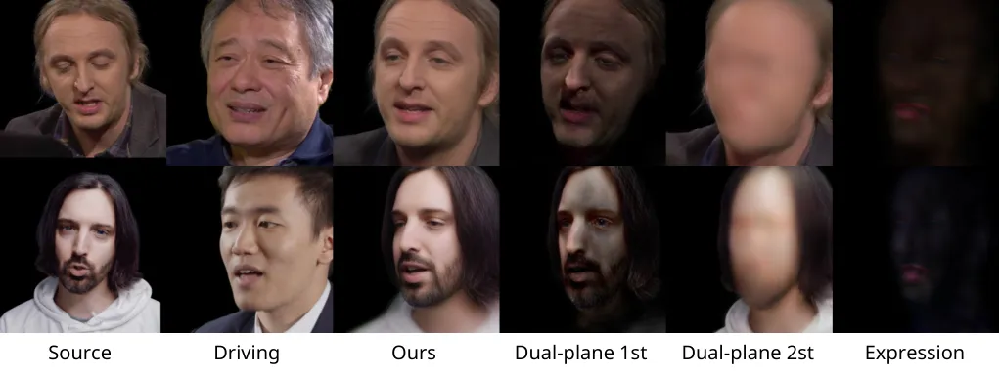

Figure 9: Per-part rendering of the dual-lifting and expression
Gaussians. We can see that the dual-lifting Gaussians reconstruct the
head’s base structure and facial details respectively. It is worth
noting that our Gaussians are not purely RGB Gaussians. Instead, our
Gaussians include 32-D features (as described in Sec. 3.3). We visualize
the first 3 dimensions of these features (i.e., the RGB values of the
Gaussians) here without the neural rendering module. So this
visualization is intended to intuitively display the functionality of
each part and the importance of each branch should not be judged based
on RGB values alone.

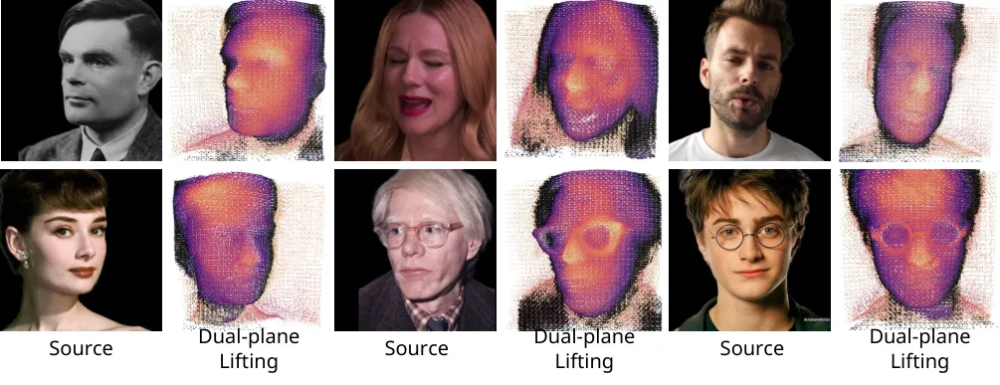

Figure 10: Dual-lifting results of in-the-wild images. We can see that
the dual-lifting point cloud has rich details, including glasses and
hair. We color the two parts of the dual-lifting separately, and the
black points are the image plane.

We present the results of rendering the dual-lifting Gaussians from the
reconstruction branch and the Gaussian from the expression branch
separately. As Fig. 9 shows, the dual-lifting Gaussians reconstruct the
head’s base structure and facial details respectively, which is in line
with our expectations. We also show more lifted points in Fig. 10, we
can see that the dual-lifting point cloud has rich details, including
glasses and hair. Additionally, we provide some lifting point cloud
files in supplementary materials.

## Appendix D More Qualitative Results

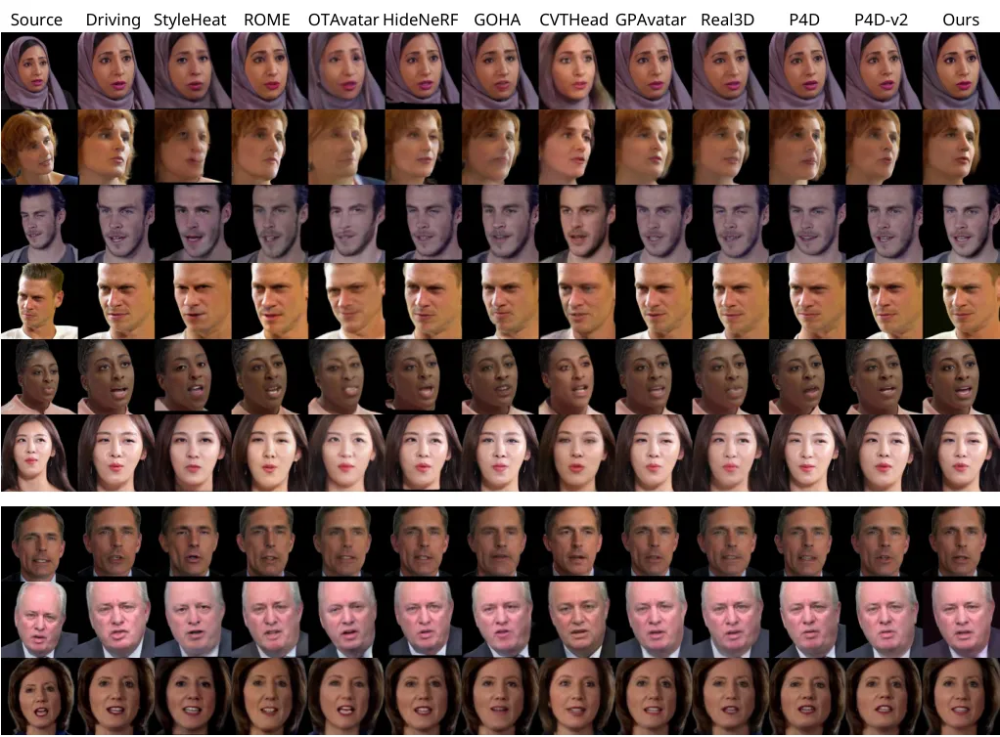

Figure 11: Self-identity reenactment results on VFHQ \[Xie et al.,
2022\] and HDTF \[Zhang et al., 2021\] datasets. The top six rows are
from VFHQ and the bottom three rows are from HDTF.

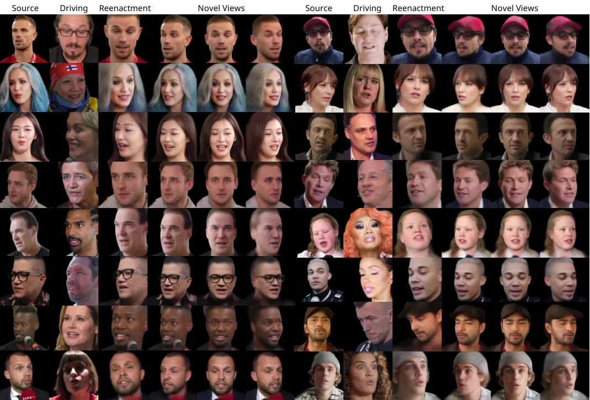

Figure 12: Reenactment and multi-view results of our method on the
VFHQ \[Xie et al., 2022\] dataset. Our method can maintain consistency
across multiple views.

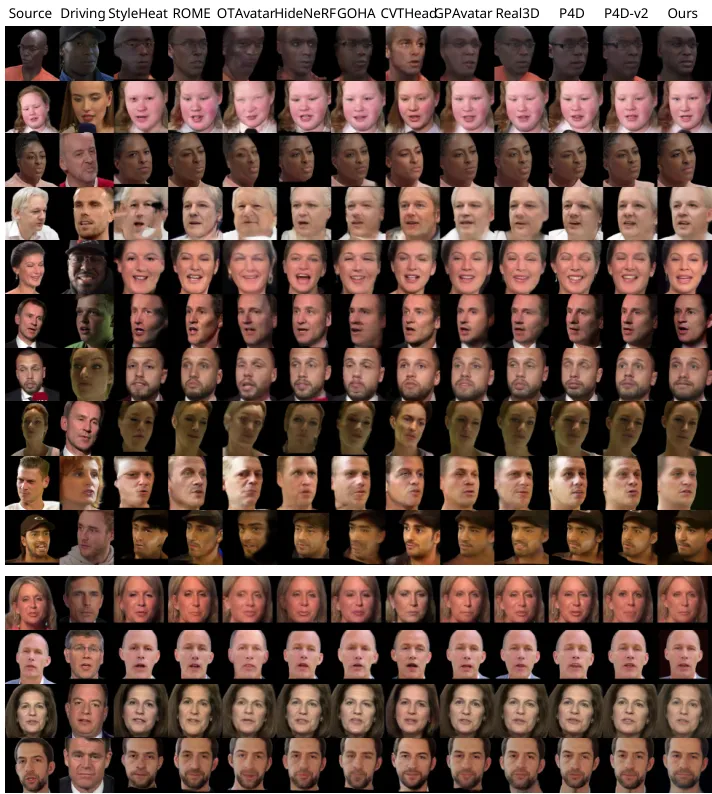

Figure 13: Cross-identity reenactment results on VFHQ \[Xie et al.,
2022\] and HDTF \[Zhang et al., 2021\] datasets. The top ten rows are
from VFHQ and the bottom four rows are from HDTF.

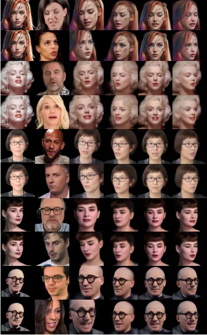

Figure 14: Reenactment and multi-view results of our method on
in-the-wild images. From left to right: input image, driving image,
driving and novel view results.

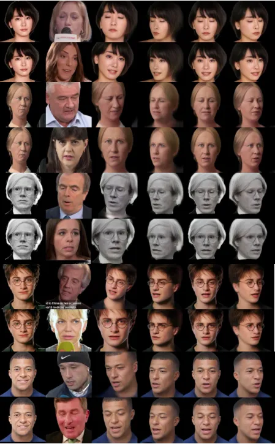

Figure 15: Reenactment and multi-view results of our method on
in-the-wild images. From left to right: input image, driving image,
driving and novel view results.

We show more self-identity qualitative comparisons with baseline methods
in Fig. 11, and cross-identity qualitative comparisons in Fig. 13. Here
we show the results of all baseline methods on the VFHQ \[Xie et al.,
2022\] dataset and HDTF \[Zhang et al., 2021\] dataset.

We also show more results of our method and baseline methods for self
and cross-identity reenactment. In Fig. 12, we not only show the
reenactment results but also the multi-view results of our method. In
Fig. 16, we show more comparisons and consecutive frames and highlight
the regions of interest. We also show more in-the-wild results of our
method in Fig. 8, 14 and 15. It can be seen that our method maintains
good identity consistency and 3D consistency when the viewing angle
changes.

Additionally, we provide a supplementary video to demonstrate video
driving results. Although no special processing is performed, our method
has timing-stable results on video generation.

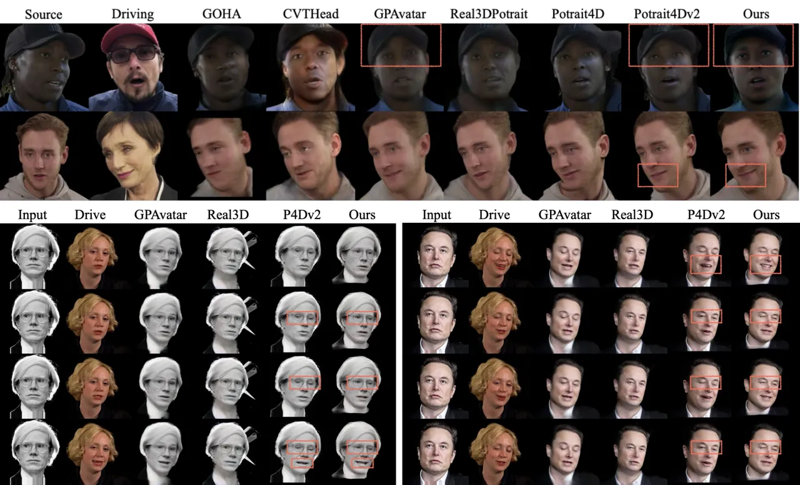

Figure 16: Qualitative results and video continuous frame results with
highlighted attention regions. We selected competitive methods to show
continuous frames. Better to view it zoomed in.

## Appendix E More In-Depth Ethical Discussion

Our framework offers many applications but also presents ethical risks,
such as the potential creation of fake videos ("deepfakes"), violations
of privacy, and the dissemination of false information. We do not
advocate such misuse and have proposed several measures to prevent these
risks:

Watermarking technologies. To ensure transparency and prevent misuse, we
plan to employ watermarking techniques in code that will be released.
Visible watermarks enable viewers to immediately recognize content as
AI-generated, helping them distinguish potential misuse. In addition to
visible watermarks, we plan to embed invisible watermarks \[Tancik
et al., 2020\], which are difficult to remove. These invisible marks
help track and identify the source of videos, even if they are
re-edited. This tracking capability encourages producers to consider the
ethical implications and potential risks of their creations by storing
information about the video producer.

Strict licenses. We will release our code and model under a strict
license. The license will prohibit the synthesis of real individuals
without explicit consent for commercial use. This ensures that our
technology is used ethically and prevents it from violating the consent
of the individual represented by the avatar. Illegal misuse can be
traced through the watermark system.

In summary, we will implement robust safeguards to prevent the misuse of
our head avatar reconstruction system. We urge video creators to be
mindful of the ethical responsibilities and potential risks when using
talking face generation technologies. With careful and responsible use,
our method can provide substantial benefits across various real-world
applications.

## Appendix F Limitations and Future Work

Although our method achieves high-quality synthesis results compared to
previous approaches, there are still some limitations. When rendering
synthesized results from novel views, unseen areas in the original
source image often lack detail and may produce results with
statistically average expectations. For example, generating the other
half of the face from a side view input or generating an open mouth from
an input image with a closed mouth. Additionally, our expression branch
is based on 3DMM and learned from VFHQ video data. This branch may not
capture extreme facial movements or parts not modeled by 3DMM, such as
one eye being open and the other being closed, the tongue, and hair. We
show the qualitative results of these limitations in Fig. 17. Future
work may involve learning expression embeddings \[Deng et al., 2024b\]
directly from images, alleviating data requirements and tracking
accuracy needs through data generation \[Deng et al., 2024a\], gathering
more expressive data to improve expression imitation. Extending our
approach to handle full-body avatar synthesis is also a promising
direction for future research.

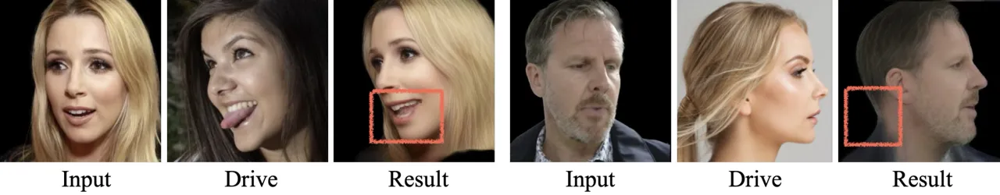

Figure 17: Our model has some limitations. For example, the tongue is
not modeled and the unseen regions of the input have less details.
Better to view it zoomed in.
