# MuseTalk: Real-Time High-Fidelity Video Dubbing via Spatio-Temporal Sampling

Yue Zhang^(\*) Affiliation:  Lyra Lab, Tencent Music Entertainment   
Zhizhou Zhong^(\*) Affiliation:  Lyra Lab, Tencent Music Entertainment
   Minhao Liu ^(†)^(†)thanks: Equal contribution. Affiliation:  Lyra
Lab, Tencent Music Entertainment    Zhaokang Chen Affiliation:  Lyra
Lab, Tencent Music Entertainment    Bin Wu ^(†)^(†)thanks: Corresponding
author Affiliation:  Lyra Lab, Tencent Music Entertainment    Yubin Zeng
Affiliation:  Lyra Lab, Tencent Music Entertainment    Chao Zhan
^(†)^(†)thanks: Work performed during an internship at Tencent Music
Entertainment Affiliation:  Lyra Lab, Tencent Music Entertainment
Affiliation:  The Chinese University of Hong Kong, Shenzhen    Yingjie
He Affiliation:  Lyra Lab, Tencent Music Entertainment    Junxin Huan
Affiliation:  Lyra Lab, Tencent Music Entertainment    Wenjiang Zhou
Affiliation:  Lyra Lab, Tencent Music Entertainment

###### Abstract

Real-time video dubbing that preserves identity consistency while
achieving accurate lip synchronization remains a critical challenge.
Existing approaches face a trilemma: diffusion-based methods achieve
high visual fidelity but suffer from prohibitive computational costs,
while GAN-based solutions sacrifice lip-sync accuracy or dental details
for real-time performance. We present MuseTalk, a novel two-stage
training framework that resolves this trade-off through latent space
optimization and spatio-temporal data sampling strategy. Our key
innovations include: (1) During the Facial Abstract Pretraining stage,
we propose Informative Frame Sampling to temporally align
reference-source pose pairs, eliminating redundant feature interference
while preserving identity cues. (2) In the Lip-Sync Adversarial
Finetuning stage, we employ Dynamic Margin Sampling to spatially select
the most suitable lip-movement-promoting regions, balancing audio-visual
synchronization and dental clarity. (3) MuseTalk establishes an
effective audio-visual feature fusion framework in the latent space,
delivering 30 FPS output at 256×256 resolution on an NVIDIA V100 GPU.
Extensive experiments demonstrate that MuseTalk outperforms
state-of-the-art methods in visual fidelity while achieving comparable
lip-sync accuracy. The code is made available at
[https://github.com/TMElyralab/MuseTalk](https://github.com/TMElyralab/MuseTalk)

## 1 Introduction

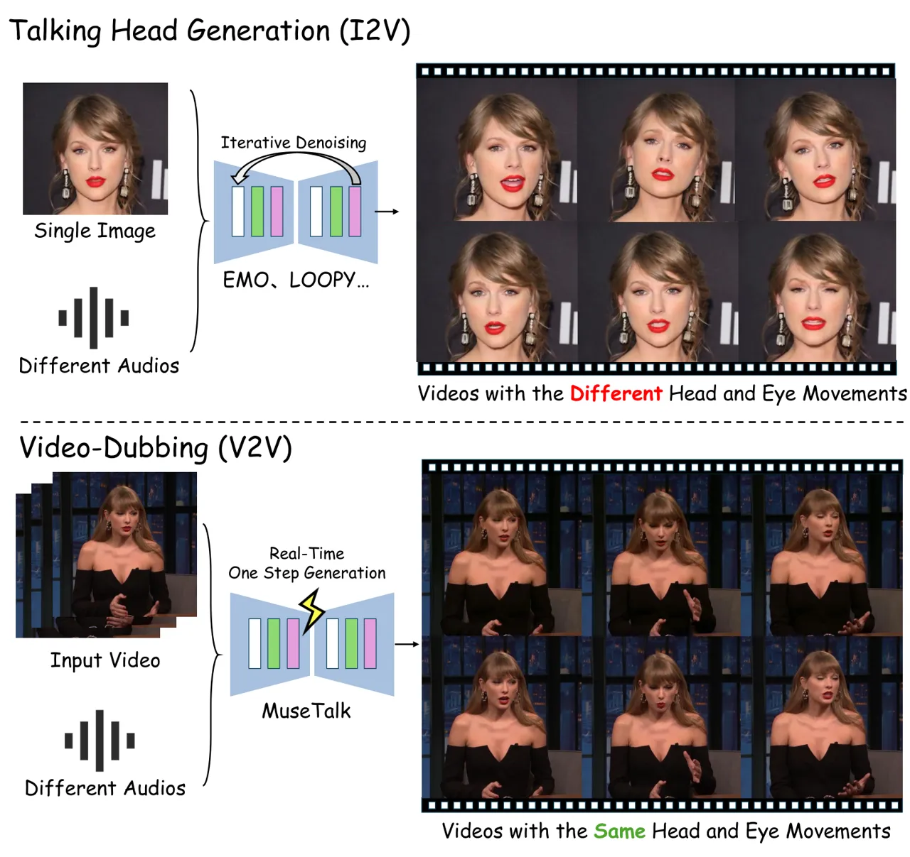

Figure 1: The difference between the talking head generation and the
video dubbing. Zoom in to see the differences in the lip area. MuseTalk
can efficiently generate video frames in one step for video dubbing
task.

Virtual human generation \[18, 46, 49, 5, 17, 12\] is an important
research field in computer vision. One significant application is
generating lip movements that match the pronunciation of the target
language for multilingual films or animations \[4\].It removes the
mismatch between lip movements and speech in traditional dubbing,
enhancing audience immersion without reshooting actors.

Recently, Image-to-Video (I2V) talking face generation methods \[53\]
have shown significant potential in creating virtual actors by
generating highly realistic avatars for specific identities. One-shot
talking face generation methods based on diffusion models \[16, 34\],
such as EMO \[5\], EchoMimic \[5\], and LOOPY \[19\], have gained
popularity. These methods allow users to create a video with good
audio-visual consistency by uploading just a single image and an audio
clip. However, their reliance on iterative denoising processes restricts
their suitability for real-time applications. In the generated videos,
the model autonomously adjusts characters’ head and eye movements based
on the audio, as illustrated in Fig. 1.

In this paper, we investigate one-shot video-dubbing, a Video-to-Video
(V2V) technique that focuses on preserving the original actor’s head and
eye movements while selectively modifying only the lip movements,
without requiring additional model retraining. Existing one-shot
video-dubbing methods can be broadly categorized into two main
paradigms: diffusion-based approaches \[2, 25\] and GAN-based techniques
\[52, 6, 4, 43\]. While diffusion models have demonstrated remarkable
capabilities for video-dubbing tasks, their reliance on extensive
training data and multi-step inference processes makes them
computationally expensive and impractical for local deployment by media
professionals and AI artists.

Existing GAN-based methods \[52, 6, 4, 43\] often fall short in video
quality, frequently producing blurry or distorted regions that
negatively impact visual fidelity. Additionally, these methods often
fail to preserve the original actor’s identity accurately, leading to
noticeable changes in facial appearance during the dubbing process. Such
issues significantly limit their practical applications. Despite
well-known training instabilities in GANs \[9, 27\], their ability to
generate outputs in a single step provides a promising solution to
real-time application. Driven by the computational efficiency and
cost-effectiveness of GANs, we investigate novel one-shot lip-sync
generation methods that achieve high-quality results while maintaining
efficiency.

This paper introduces MuseTalk, a GAN-based real-time one-shot
video-dubbing framework. Specifically, to reduce user costs, we design a
one-step face generator in the VAE \[21\] latent space. MuseTalk
addresses key training challenges in GAN-based video-dubbing through a
carefully designed two-stage training process. A novel spatio-temporal
sampling strategy is proposed to improve identity consistency and lip
movement accuracy. We first implement mild pretraining using latent
space inpainting to enhance the model’s ability for facial abstract
prediction. During this stage, we introduce Informative Frame Sampling
to select key frames. Subsequently, we incorporate audio-visual
synchornize loss and GAN loss, with the latter focusing on optimizing
the mouth region. Here, Dynamic Margin Sampling is employed to spatially
select critical facial regions that promote better lip movement
learning.

In summary, our contributions are three-fold: (i) We propose MuseTalk, a
GAN-based video-dubbing framework based on latent space inpainting,
which enables real-time generation of high-fidelity lip-synced videos;
(ii) We introduce a comprehensive two-stage training framework that
resolves the conflict between GAN loss and audio-visual synchornize
loss, achieving a balance between lip movement accuracy and teeth
clarity; (iii) We propose a novel spatio-temporal sampling strategy.
Specifically, we design Informative Frame Sampling at the frame level to
bridge the gap between training and inference, and Dynamic Margin
Sampling at the region level to promote lip movement learning in
adversarial training. Extensive experimental results demonstrate the
efficacy of MuseTalk, even compared to diffusion-based methods.

## 2 Related Work

### 2.1 Talking Head Generation

In recent years, audio-driven talking head generation methods have
attracted significant attention and provide valuable insight for video
dubbing techniques. Talking head generation can be categorized into
NeRF-based \[3, 40, 23, 13\], GAN-based \[4, 55, 56, 28, 7\], and
diffusion-based \[5, 5, 48, 19, 47, 2\] approaches.

NeRF-based methods require identity-specific videos for training and
additional rendering \[29\] time, with early methods like AD-NeRF \[13\]
taking several seconds per frame. Despite the real-time rendering
achieved by integrating Instant-NGP \[30, 40\], retraining is needed for
new identities. Diffusion-based methods, such as EMO Portrait \[5\],
employ a two-stage training process by integrating ReferenceNet \[17\],
temporal layers \[14\], and audio attention layers into Stable Diffusion
models \[34\]. Similar strategies are used in LOOPY \[19\],
Hallo \[47\], and EchoMimic \[5\]. These methods allow for one-shot
vivid talking head generation from images, but are computationally
expensive.

In contrast, GAN-based methods generate images in one step. Early
methods \[3, 4, 55\] fail to maintain identity consistency and accurate
lip movement. To address this, methods like MakeItTalk \[57\] and
SadTalker \[50\] adopt multistage inference, separating audio-to-motion
and motion-to-video modeling. Although this improves the results, it
increases the computational overhead and complexity.

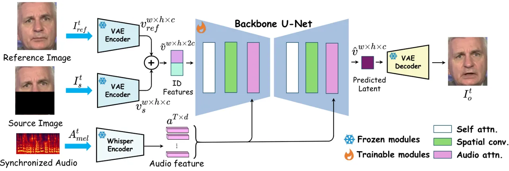

Figure 2: Illustration of MuseTalk’s framework. We first encode a
reference facial image and an occluded lower half target image into
perceptually equivalent latent space. Subsequently, we employ a
multimodal U-Net to effectively fuse audio and visual features at
various scales. Consequently, the decoded results from the latent space
yield more realistic and lip-synced talking face visual content.

### 2.2 Video Dubbing

Video dubbing focuses on replacing the mouth region of a source face
based on driving audio. The most common approach \[4\] involves using a
mask in the lower half of the face or the lip region to guide the model
to create new visual effects only in these areas, as shown in Fig. 2.
Early methods \[4, 52, 6, 43, 10, 38, 54\] predominantly relied on GANs.
Although these methods achieved lip movements that were relatively
consistent with the audio content, they often struggled with maintaining
identity consistency and reconstructing clear teeth details.
DI-Net \[52\] attempted to train models on high-resolution data, which
compromised lip accuracy. StyleSync \[10\] highlighted this dilemma,
noting that forcing the model to restore too many lip-relevant details
might interfere with learning.

Recently, methods such as LatentSync \[2\] and DiffTalk \[36\] have
leveraged the strong detail generation capabilities of the Latent
Diffusion paradigm \[34\] for video dubbing tasks. LatentSync integrates
the SyncNet loss \[4\] to enhance lip motion-audio alignment during the
one-step denoising process. Despite improvements in audio-visual
synchornize and clarity, these methods suffer from the heavy inference
burden.

## 3 Method

### 3.1 Overview

We propose MuseTalk, a GAN-based one-step generation framework operating
in the VAE latent space, building on insights from prior work. This
section outlines the technical implementation and design principles of
MuseTalk.

Through experimentation, we found that simultaneously optimizing the
SyncNet loss \[4\] and GAN loss in a single training stage for a
randomly initialized model leads to training instability. We further
discuss this issue in the supplementary materials. In contrast, MuseTalk
introduces a novel two-stage training strategy to mitigate this problem.

The first stage, Facial Abstraction Pretraining, establishes
foundational visual representations using our proposed Informative Frame
Sampling (IFS) mechanism. In the second stage, Lip-Sync Adversarial
Finetuning, we introduce Dynamic Margin Sampling (DMS) to balance
adversarial training objectives with lip-synchronization constraints,
enabling effective optimization of both aspects.

### 3.2 Network Pipelines

MuseTalk is designed to seamlessly integrate audio and visual
information while maintaining efficient one-step inference capabilities.
Unlike conventional GAN-based methods \[4, 43\], which use independent
encoders for audio and visual data, we leverage a multimodal U-Net
architecture \[35\] as the backbone of the generator. To further enhance
computational efficiency, we refer to the Latent Diffusion
approach \[34\], shifting the learning task from the pixel domain to the
latent space.

Identity Feature Handling. For video dubbing, the generated video must
retain the identity of the original reference image, which necessitates
integrating identity information into the network. Previous
diffusion-based methods \[5, 19\] achieve this by incorporating a
ReferenceNet that adjusts each attention layer to inject identity
information. While this approach is effective for multi-step denoising
processes, it can be overly computationally expensive for one-step
predictions. Instead, we simplify the process by concatenating identity
information along the channel dimension at the U-Net input.

Specifically, we pass the upper half of the source image at time $`t`$
and the full-face reference image (captured at a different moment)
through a VAE encoder. The encoded features are then concatenated along
the channel dimension to form a comprehensive image feature
representation $`v^{w\times h\times 2c}`$, where $`w`$ and $`h`$ denote
the width and height of the feature, respectively. As illustrated
in Fig. 2, an occluded lower half of the ground truth image
$`I_{s}^{t}`$ and a reference identity image $`I_{\text{ref}}^{t}`$ at
time $`t`$ are each passed through the VAE encoder, producing outpus
$`v_{\text{ref}}^{w\times h\times c}`$ and
$`v_{m}^{w\times h\times c}`$. Experimental results in Tab. 1
demonstrate that this straightforward yet effective design provides
robust identity control.

During inference, only a single input frame at time $`t`$ is required.
This frame is used as both $`I_{\text{ref}}^{t}`$ and $`I_{s}^{t}`$. The
generated $`I_{o}^{t}`$ is subsequently overlaid onto the original image
using advanced face parsing and blending techniques. Detailed
descriptions are provided in the supplementary materials. The
construction of reference and source images during training is
elaborated upon in subsequent sections.

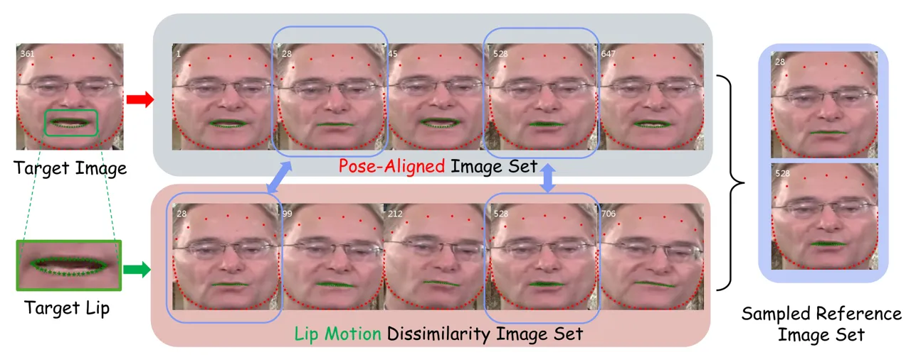

Figure 3: The illustration of proposed Informative Frame Sampling
mechanism. We calculate the pose and lip similarity based on Euclidean
distance between facial landmarks.

Audio Feature Handling. Following established practices \[5, 19, 5\], we
utilize a pre-trained audio encoder \[1, 33\] to extract audio features
and inject them into the U-Net through its cross-attention layers. To
optimize inference speed, we employ the lightweight Whisper-Tiny
model \[33\] to process an audio segment centered at time $`t`$ with
duration $`T`$. The selected audio segment is first resampled to 16,000
Hz and converted into an 80-channel log-magnitude Mel spectrogram,
denoted as $`A_{mel}^{t}\in\mathbb{R}^{T\times 80}`$. The resulting
audio feature has dimensions $`a^{T\times d}`$, where $`d=384`$.

### 3.3 Facial Abstract Pretraining

Observation. We observed that joint optimization of multiple losses
during early training stages leads to unstable convergence, particularly
when combined with adversarial objectives. To address this challenge, we
adopt a phased training approach where the first stage focuses on
cultivating facial abstract inpainting capabilities through mild
optimization strategies.

Loss Function. At this stage, we employ stable reconstruction losses
instead of adversarial training objectives. To focus the model’s
attention as much as possible on the facial region, we crop the images
along the edges of the face, thereby reducing the interference from
background inpainting tasks on the model, as illustrated in Fig. 5.
Given a synthesized talking face image $`I^{t}_{o}`$ and its ground
truth counterpart $`I^{t}_{gt}`$, we formulate the optimization target
as:

```math
\mathcal{L_{\text{stage1}}}=\left\|I^{t}_{o}-I^{t}_{gt}\right\|_{1}+\lambda_{vgg}\left\|\mathcal{V}(I^{t}_{o})-\mathcal{V}(I^{t}_{gt})\right\|_{2}, \tag{1}
```

where $`\mathcal{V}`$ denotes the feature extractor of VGG19 \[37\].
Utilizing solely the L1 loss tends to produce overly smoothed facial
reconstructions. In contrast, perceptual loss \[20\] facilitates the
learning of high-frequency visual patterns, particularly in capturing
transitional facial features such as sideburn textures and incipient
dental structures.

Informative Frame Sampling. Previous GAN-based approaches \[4, 52, 6\]
rely on random sampling to obtain the reference image $`I^{t}_{ref}`$.
However, this method introduces a significant gap between training and
inference phases. Specifically, during training, the reference image
$`I^{t}_{\text{ref}}`$ and the ground truth image $`I^{t}_{\text{gt}}`$
often exhibit different head poses. In contrast, during inference,
$`I^{t}_{\text{ref}}`$ and $`I^{t}_{\text{gt}}`$ share the same pose.
This discrepancy makes it challenging for models to generalize well
across different scenarios. We introduce a novel Informative Frame
Sampling (IFS) strategy to address the training-inference discrepancy by
focusing the model on lip movement generation. The IFS strategy aims to
construct data pairs $`I^{t}_{ref}`$ and $`I^{t}_{gt}`$ that retain
relevant texture details while filtering out redundant or distracting
information. As illustrated in Fig. 3, the process involves three key
steps:

1.  1.  Pose Alignment: We calculate head pose similarity using chin
        landmark distances and select the most similar frames to form the
        Pose-Aligned Set $`\mathcal{E}_{\text{pose}}`$.
2.  2.  Distinct Lip Movement: We compute inner-lip landmark differences to
        identify frames with distinct lip movements, forming the Lip Motion
        Dissimilarity Set $`\mathcal{E}_{\text{mouth}}`$.
3.  3.  Intersection Selection: We choose the intersection
        $`\mathcal{E}_{\text{pose}}\cap\mathcal{E}_{\text{mouth}}`$ as the
        Sampled Reference Image Set $`\mathcal{E}`$, sort it by similarity,
        and select the top $`k`$ subset as $`I^{t}_{\text{ref}}`$. We later
        describe the optimal value of $`k`$ in Tab. 3.

### 3.4 Lip-Sync Adversarial Finetuning

Optimization Objective. The primary goal of this stage is to enhance the
model’s capability in generating realistic dental details while ensuring
precise lip movements. Building upon the initial training phase, where
the model learns to extract facial abstract information from audio
inputs, we observe that the outputs tend to exhibit overly smoothed
teeth and replicated lip motions from reference images, as demonstrated
in Fig. 4(b). To overcome these limitations, we incorporate two loss
functions: an adversarial loss \[26\] and a SyncNet loss \[4\].

Adversarial Loss. The adversarial loss \[11\] is designed to enable the
generator to capture intricate details by competing against two
discriminators: one focused on the entire face $`\mathcal{D}_{face}`$
and another specifically targeting the lip region $`\mathcal{D}_{lip}`$.
For the lip discriminator $`\mathcal{D}_{lip}`$, the input region is
carefully cropped based on the lip landmarks, expand to a fixed size of
and fed into the network without any resizing operations. We chose the
expand method over resizing because resizing degrades lip generation
quality, resulting in inaccurate and unrealistic mouth shapes. The
optimization objective for the adversarial loss is formulated as:

```math
\mathcal{L}_{adv}=\mathcal{L}_{adv,face}+\mathcal{L}_{adv,lip}, \tag{2}
```

where

```math
\mathcal{L}_{adv,face}=-\mathbb{E}_{A_{mel}^{t},I^{t}_{ref}}[\mathcal{D}_{face}(I^{t}_{o})], \tag{3}
```

```math
\mathcal{L}_{adv,lip}=-\mathbb{E}_{A_{mel}^{t},I^{t}_{ref}}[\mathcal{D}_{lip}(I^{t}_{lip})]. \tag{4}
```

Sync Loss. The SyncNet loss promotes lip movement learning by aligning
the generated frames with the audio \[2, 4\]. Specifically, we apply a
SyncNet $`\mathcal{S}`$ that takes $`N`$ pairs of audio and image frames
as input. The output features are then used to calculate the cosine
similarity. The optimization objective is:

```math
\mathcal{L}_{sync}=\frac{1}{N}\sum_{i}^{N}-\log[{CosSim}(\mathcal{S}(A^{i}_{mel},I^{i}_{o}))]. \tag{5}
```

The overall optimization objective for this stage is:

```math
\displaystyle\mathcal{L}_{\text{stage2}}=\mathcal{L}_{\text{stage1}}+\lambda_{adv}\mathcal{L}_{adv}+\lambda_{sync}\mathcal{L}_{\text{sync}}. \tag{6}
```

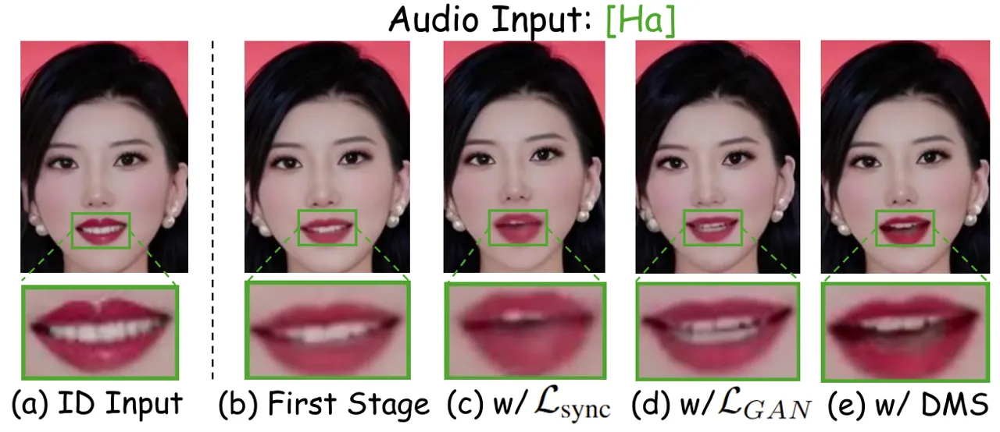

Figure 4: (a) Identity image during Inference. (b) First-stage model
generates smooth teeth. (c) SyncNet loss promotes accurate lip movements
but causes blurring. (d) GAN loss enhances clear teeth but replicates
the original lip. (e) After applying DMS, both accurate lip movements
and clear teeth are generated.

Dynamic Margin Sampling. When optimizing
$`\mathcal{L}_{\text{stage2}}`$, we observe conflicts between the
adversarial loss and the SyncNet loss. Specifically, optimizing the
adversarial loss alone can produce clear teeth but causes the model to
replicate the reference lip movements, especially when the reference
image shows teeth, as illustrated in Fig. 4(d). Conversely, as shown
in Fig. 4(c), optimizing the SyncNet loss alone enables the model to
close the mouth during silent periods but results in blurry lip
movements when speaking. When both losses are optimized simultaneously,
the SyncNet loss becomes difficult to converge, and the model’s behavior
tends towards that shown in Fig. 4(d).

Prior works \[42, 19, 47\] have noted that the mapping from audio to lip
movements is inherently weak. Stronger conditions, such as identity
constraints or other more dominant learning tasks, can easily overshadow
lip-sync learning. Additionally, we have identified and localized a
previously overlooked issue in previous methods \[4, 54\]: the leakage
of lip movement information in training data pairs. The left side
of Fig. 5 illustrates this issue. This may lead to the model directly
copying the reference’s lip movements and ignoring the actual changes in
lip movements, as shown in Fig. 4(d).

We propose Dynamic Margin Sampling (DMS) to disrupt this implicit “hint”
from the data. Specially, we introduce random margins around the chin
area when cropping $`I_{\text{ref}}^{t}`$ and $`I_{\text{gt}}^{t}`$. It
is crucial that the margins for $`I_{\text{ref}}^{t}`$ and
$`I_{\text{gt}}^{t}`$ are independently and randomly generated;
otherwise, the hint remains. As shown in Fig. 5, after applying DMS, the
information from unmasked regions (e.g., the nose area) no longer
directly indicates the degree of mouth opening, thereby forcing the
model to rely on the audio input to generate accurate lip movements.

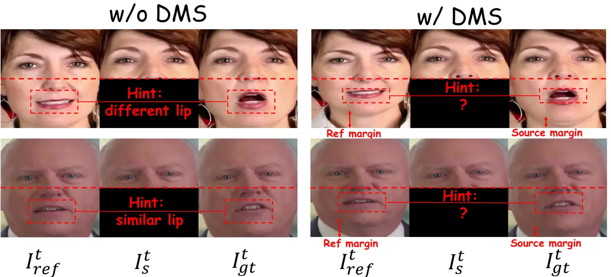

Figure 5: The principle of Dynamic Margin Sampling (DMS) in promoting
lip movement learning. Without DMS, the model can easily infer the
general lip shape of $`I_{gt}^{t}`$ from the relative position of the
nose in the input images $`I_{\text{ref}}^{t}`$ and $`I_{s}^{t}`$. With
DMS, this cue is weakened, forcing the model to learn the lip movements.

## 4 Experiments

| Method               | Type      | HTDF               |                   |                    | VFHQ               |                   |                    |
| -------------------- | --------- | ------------------ | ----------------- | ------------------ | ------------------ | ----------------- | ------------------ |
|                      |           | FID $`\downarrow`$ | CSIM $`\uparrow`$ | LSE-C $`\uparrow`$ | FID $`\downarrow`$ | CSIM $`\uparrow`$ | LSE-C $`\uparrow`$ |
| Wav2Lip \[4\]        | GAN       | 11.55              | 0.84              | 7.42               | 14.99              | 0.82              | 5.84               |
| VideoRetalking \[6\] | GAN       | 11.29              | 0.80              | 7.59               | 15.83              | 0.79              | 6.13               |
| DI-Net \[52\]        | GAN       | 6.94               | 0.80              | 5.96               | 15.03              | 0.71              | 3.37               |
| IP-LAP \[54\]        | GAN       | 10.16              | 0.86              | 4.47               | 10.95              | 0.85              | 3.88               |
| LatentSync \[2\]     | Diffusion | 8.41               | 0.84              | 7.90               | 9.89               | 0.82              | 6.79               |
| SyncLab \[39\]       | –         | 10.85              | 0.86              | 6.37               | 9.85               | 0.85              | 5.22               |
| Ground Truth         | –         | 0.00               | 1.00              | 7.73               | 0.00               | 1.00              | 6.93               |
| MuseTalk             | GAN       | 6.52               | 0.86              | 6.53               | 7.07               | 0.85              | 4.77               |

Table 1: Performance metrics for HDTF \[8\] and VFHQ \[7\]. We omit the
face restoration procedure from the original methods for fair
comparison. SyncLab \[39\] is a commercial software with unknown
technical details. The best results are highlighted in bold.

### 4.1 Experimental Setup

#### Model Architecture.

MuseTalk’s implementation adopts the pre-trained VAE model and the
multimodal U-Net architecture from Latent Diffusion \[34\]. For the
audio encoder, we opt for the lightweight Whisper-Tiny model \[33\],
which provides effective audio feature extraction. The audio features
are integrated into the U-Net through cross-attention layers after
undergoing reshaping and reorganization to match the required
dimensions.

#### Training Details.

We use 8 NVIDIA H20 GPUs for training. In the Facial Abstract
Pretraining stage, the model is trained with loss function
$`\mathcal{L}_{\text{stage1}}`$ (described in Eq. 1) for 200,000 steps
using the batch size of 32 per GPU. The AdamW optimizer \[24\] with a
learning rate of $`2\times 10^{-5}`$ is employed. This stage costs 60
hours.

During the Lip-Sync Adversarial Finetuning stage, the model undergoes
further refinement with the loss function
$`\mathcal{L}_{\text{stage2}}`$ (described in Eq. 6) for additional
20,000 steps. The parameter $`N`$ in $`\mathcal{L}_{\text{sync}}`$
(described in Eq. 5) is set to 16, and the batch size per GPU is reduced
to 2 to accommodate the increased computational demands of the
adversarial training. The learning rate is adjusted to
$`5\times 10^{-6}`$ to facilitate fine-grained updates. This finetuning
stage completes in approximately 30 hours. The loss hyper-parameters are
set as follows: $`\lambda_{vgg}=0.01`$, $`\lambda_{adv}=0.1`$,
$`\lambda_{sync}=0.05`$.

#### Dataset Preparation.

We collected publicly available talking head datasets \[8, 7\]. To
ensure high-quality data, we employed a rigorous data filtering
pipeline. The final dataset spans approximately 24 hours in total
duration. Details of the data filtering process are provided in the
supplementary materials. For evaluation, we randomly selected 26 videos
from HDTF and 10 videos from VFHQ, using the remainder for training. All
videos were segmented into clips for both training and testing phases.
For preprocessing, we detected faces in each frame as Regions of
Interest (ROIs), which were subsequently cropped and resized to
$`256\times 256`$ pixels. The parameter $`k`$ in the IFS was set to
$`50\%`$ of the video length. The input size of discriminator
$`\mathcal{D}_{lip}`$ is set to $`64\times 128`$.

During testing, we adopted a protocol mirroring real-world scenarios,
where the video and audio inputs are sourced independently, and the
reference image is extracted from the current frame. This unpaired
evaluation protocol aligns with that used by Wav2Lip \[4\] and
VideoRetalking \[6\], ensuring a fair comparison.

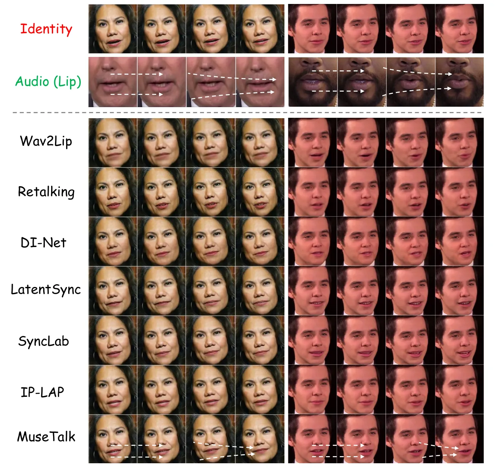

Figure 6: Qualitative comparisons on HDTF \[8\] (left) and VFHQ \[7\]
(right). The first two rows show the input video frames and the lips
corresponding to the audio. The arrow shows the lip movement trend (zoom
in for finer details). Additional video results are provided in the
supplementary materials.

#### Evaluation Metrics.

The experiments are designed to assess the method’s visual fidelity,
identity preservation, and lip synchronization capabilities. To evaluate
visual quality, we use the Frechet Inception Distance (FID) \[15\],
which measures the similarity between generated and real image
distributions, providing a robust metric for visual fidelity without
ground-truth talking videos. Identity preservation is evaluated using
cosine similarity (CSIM) between the identity embeddings \[8\] of the
source and generated images. Lip synchronization is evaluated using
lip-sync-error confidence (LSE-C) \[4\].

#### Compared Baselines.

We benchmark MuseTalk against a range of SOTA video dubbing approaches.
For fair comparison, we omit the face restoration \[6\] procedure if
required in the original methods. Each of them representing distinct
technical advancements in the field: (1) Wav2Lip \[4\]: Pioneering work
using a robust lip-sync discriminator for realistic synchronization; (2)
VideoRetalking \[6\]: Three-stage pipeline for high-quality lip
synchronization; (3) DI-Net \[52\]: Dual-encoder framework with facial
action units for photo-realistic and emotion-consistent talking face
videos; (4) IP-LAP \[54\]: Two-stage framework combining
Transformer-based landmarks with multi-reference alignment for identity
preservation; (5) LatentSync \[2\]: Integrates pixel-space SyncNet into
latent diffusion for efficient, high-fidelity lip-sync generation; (6)
SyncLab \[39\]: Commercial software for lip-syncing models, focusing on
cutting-edge AI video solutions.

### 4.2 Quantitative Evaluation

#### Benchmark.

Table 1 presents the quantitative analysis on the HDTF and VFHQ
datasets. MuseTalk demonstrates superior performance, achieving the
lowest FID scores (6.52 on HDTF and 7.07 on VFHQ) and the highest CSIM
scores (0.86 on HDTF and 0.85 on VFHQ), outperforming existing methods.
While its LSE-C scores are slightly lower than some competitors,
MuseTalk strikes a remarkable balance between visual fidelity and
lip-synchronization accuracy.

Analyzing the baseline methods, Wav2Lip \[4\] and VideoRetalking \[6\]
exhibit relatively lower visual quality, as evidenced by their higher
FID scores (e.g., 11.55 vs. 6.52 on HDTF for MuseTalk). This discrepancy
stems from their training on downscaled face regions (96 × 96 pixels),
which compromises image clarity. In contrast, DI-Net \[52\] achieves the
second-lowest FID score on HDTF (6.94) through its deformation-based
approach, which effectively preserves high-frequency texture details.
However, its identity preservation capability is notably limited, as
reflected in its subpar CSIM score (0.80 on HDTF and 0.71 on VFHQ). This
weakness arises from its reliance on random reference image sampling,
which introduces redundancy and hinders natural lip movements,
ultimately affecting its LSE-C performance.

Among GAN-based approaches, IP-LAP \[54\] stands out with the highest
CSIM score (0.86) on HDTF, showcasing exceptional identity preservation.
However, it suffers from low visual quality and lip-synchronization
capabilities. Turning to diffusion models, LatentSync \[2\] achieves the
best LSE-C score (7.90 on HDTF), indicating superior lip-synchronization
capabilities. However, its non-real-time nature limits its practicality
for real-world applications. In contrast, MuseTalk runs in real-time,
achieving 30 FPS at a 256×256 resolution on an NVIDIA V100 GPU with
preloaded data.

In summary, MuseTalk is the most balanced solution, achieving great
performance across multiple metrics while maintaining real-time
capabilities. Its lip-sync accuracy is on par with that of the
commercial software SyncLab \[39\].

#### User Study.

To assess the quality of lip synchronization, human judgment is relied
upon. A user study was conducted to further evaluate the performance of
our proposed method. For this study, dubbed videos were created by
different methods using 36 unsynced audio-video pairs from the HDTF
datasets and the VFHQ datasets. Ten participants were asked to rate each
video based on visual quality, identity consistency, and lip-sync
accuracy. They were provided with a five-point scale (with 1 being the
lowest and 5 being the highest) for their evaluations. A total of 360
ratings were collected.

In the subjective evaluation, method names were hidden and videos were
randomly shuffled to ensure unbiased assessment. Annotators saw labels
like “Method 1” and “Method 2” without knowing their specific methods,
and the same label across different pairs did not correspond to the same
method. This ensured fairness and prevented bias.

| Method               | VQ$`\uparrow`$ | IC$`\uparrow`$ | LSQ$`\uparrow`$ |
| -------------------- | -------------- | -------------- | --------------- |
| Wav2Lip \[4\]        | 2.19           | 3.07           | 2.70            |
| VideoRetalking \[6\] | 3.35           | 3.14           | 3.58            |
| DINet \[52\]         | 2.92           | 2.40           | 2.57            |
| LatentSync \[2\]     | 3.71           | 3.93           | 4.07            |
| SyncLab \[39\]       | 3.87           | 3.71           | 3.49            |
| MuseTalk             | 4.26           | 4.15           | 3.77            |

Table 2: User Study. The best results are shown in bold. VQ: Visual
Quality; IC: Identity Consistency; LSQ: Lip-Sync Quality.

As indicated in Tab. 2, the majority of participants awarded higher
scores to MuseTalk in terms of visual quality, lip-sync quality, and
identity consistency. More visualization can be found in the
supplementary materials.

### 4.3 Qualitative Evaluation

Two illustrative examples are included in Fig. 6. Wav2Lip \[4\] often
produces synthesized mouth regions that appear blurry.
VideoRetalking \[6\] results in jagged artifacts around the lip area and
overly smooths the face region. DI-Net \[52\] induces noticeable changes
in the subject’s identity within the generated results. IP-LAP \[54\]
maintains identity relatively well but generates inconsistent lip
movements. LatentSync \[2\] and SyncLab \[39\] generate clear facial and
dental details but require longer computation times compared to other
methods. In contrast, MuseTalk achieves a better balance in lip movement
consistency, identity preservation, and efficiency.

### 4.4 Ablation Studies

#### Informative Frame Sampling.

We tested various values of $`k`$ across different percentages (25%,
50%, and 75%) of the total candidate frames to identify its optimal
value. The results are shown in Tab. 3, highlighting the effects of
different $`k`$ values on overall performance.

As seen in the table, the IFS strategy achieves peak performance when
$`k`$ is set to 50% of the candidate frames. Specifically, the Fréchet
Inception Distance (FID) reaches its minimum at 6.52, indicating the
smallest discrepancy between generated and real images, and thus the
highest image quality. Meanwhile, the Cosine Similarity (CSIM) reaches
its maximum at 0.86, reflecting the highest similarity between generated
and real images. Additionally, the LSE-C value is maximized at 6.53,
further confirming the superior performance of the IFS strategy under
this setting. In contrast, random sampling yields significantly inferior
results, with an FID of 9.24, a CSIM of 0.79, and an LSE-C of 4.41.

| Sampling strategy | FID$`\downarrow`$ | CSIM$`\uparrow`$ | LSE-C$`\uparrow`$ |
| ----------------- | ----------------- | ---------------- | ----------------- |
| Random            | 9.24              | 0.79             | 4.41              |
| IFS (k=25%)       | 8.31              | 0.83             | 2.94              |
| IFS (k=50%)       | 6.52              | 0.86             | 6.53              |
| IFS (k=75%)       | 11.22             | 0.72             | 3.27              |

Table 3: Ablation study for sampling method on HDTF \[8\] benchmark. The
best results are shown in bold.

#### Dynamic Margin Sampling.

Dynamic Margin Sampling (DMS) generates random margins for the
chin-to-boundary distance from a normal distribution
$`\mathcal{N}(\mu,\sigma)`$ within one standard deviation. We
investigate two critical design choices: (1) the optimal margin
magnitude and (2) whether to share margins between reference
($`I_{\text{ref}}^{t}`$) and source ($`I_{s}^{t}`$) images. These
choices significantly affect lip generation quality.

To explore these factors, we evaluated three configurations: (i) a
margin drawn from $`\mathcal{N}(20,20)`$ with independent margins for
each image; (ii) a margin drawn from $`\mathcal{N}(10,10)`$ with shared
margins between the reference and source images; and (iii) a margin
drawn from $`\mathcal{N}(10,10)`$ with independent margins for each
image.

| DMS setting                            | FID$`\downarrow`$ | CSIM$`\uparrow`$ | LSE-C$`\uparrow`$ |
| -------------------------------------- | ----------------- | ---------------- | ----------------- |
| $`\mathcal{N}(20,20)`$ + idp margin    | 11.95             | 0.81             | 5.78              |
| $`\mathcal{N}(10,10)`$ + shared margin | 6.43              | 0.85             | 4.95              |
| $`\mathcal{N}(10,10)`$ + idp margin    | 6.52              | 0.86             | 6.53              |

Table 4: Ablation study for different DMS settings on HDTF \[8\]
benchmark. The “idp” means independent.

Table 4 shows that the larger margin setting (i) achieves lower FID and
CSIM scores. This is because the highly variable margins force the model
to focus more on background information, making it difficult to
accurately determine the chin position and resulting in numerous
artifacts in the generated images. The margin-sharing setting (ii)
degrades lip accuracy because when the margins of $`I_{\text{ref}}^{t}`$
and $`I_{s}^{t}`$ are identical, the model can infer the mouth shape of
$`I_{\text{gt}}^{t}`$ based on the nose position, thereby reintroducing
information leakage (described in Fig. 5). The configuration (iii)
achieves optimal performance by adopting a more moderate margin that
effectively addresses information leakage without compromising FID and
CSIM scores.

We use the optimal setting identified from these experiments for all
evaluations described in Sec. 4.

## 5 Conclusion

This paper introduces MuseTalk, a novel framework for real-time,
high-quality lip-synced generation for video dubbing. By modeling the
audio-visual relationship in the VAE latent space, MuseTalk bypasses the
computationally intensive diffusion process and outperforms existing
state-of-the-art methods. Its framework integrates two key innovations:
Informative Frame Sampling and Dynamic Margin Sampling, which address
the inherent trade-offs in GAN-based video dubbing methods, enhancing
both the accuracy of lip movements and the fidelity of the generated
videos. Comprehensive evaluations highlight MuseTalk’s effectiveness,
achieving the lowest FID, highest CSIM, and competitive LSE-C scores.
MuseTalk shows promise for transforming digital communication and
multimedia applications, with future work exploring multilingual support
and broader virtual content creation.

## References

- \[1\] Alexei Baevski, Yuhao Zhou, Abdelrahman Mohamed, and Michael
  Auli. wav2vec 2.0: A framework for self-supervised learning of speech
  representations. _Advances in neural information processing systems_,
  33:12449–12460, 2020.
- \[2\] Hejia Chen, Haoxian Zhang, Shoulong Zhang, Xiaoqiang Liu, Sisi
  Zhuang, Yuan Zhang, Pengfei Wan, Di ZHANG, and Shuai Li. Cafe-Talk:
  Generating 3d talking face animation with multimodal coarse-and
  fine-grained control. In _The Thirteenth International Conference on
  Learning Representations_.
- \[3\] Lele Chen, Zhiheng Li, Ross K Maddox, Zhiyao Duan, and Chenliang
  Xu. Lip movements generation at a glance. In _Proceedings of the
  European conference on computer vision (ECCV)_, pages 520–535, 2018.
- \[4\] Lele Chen, Ross K Maddox, Zhiyao Duan, and Chenliang Xu.
  Hierarchical cross-modal talking face generation with dynamic
  pixel-wise loss. In _Proceedings of the IEEE/CVF conference on
  computer vision and pattern recognition_, pages 7832–7841, 2019.
- \[5\] Zhiyuan Chen, Jiajiong Cao, Zhiquan Chen, Yuming Li, and
  Chenguang Ma. Echomimic: Lifelike audio-driven portrait animations
  through editable landmark conditions. _arXiv preprint
  arXiv:2407.08136_, 2024.
- \[6\] Kun Cheng, Xiaodong Cun, Yong Zhang, Menghan Xia, Fei Yin,
  Mingrui Zhu, Xuan Wang, Jue Wang, and Nannan Wang. Videoretalking:
  Audio-based lip synchronization for talking head video editing in the
  wild. In _SIGGRAPH Asia 2022 Conference Papers_, pages 1–9, 2022.
- \[7\] Dipanjan Das, Sandika Biswas, Sanjana Sinha, and Brojeshwar
  Bhowmick. Speech-driven facial animation using cascaded gans for
  learning of motion and texture. In _Computer Vision–ECCV 2020: 16th
  European Conference, Glasgow, UK, August 23–28, 2020, Proceedings,
  Part XXX 16_, pages 408–424. Springer, 2020.
- \[8\] Jiankang Deng, Jia Guo, Niannan Xue, and Stefanos Zafeiriou.
  Arcface: Additive angular margin loss for deep face recognition. In
  _Proceedings of the IEEE/CVF conference on computer vision and pattern
  recognition_, pages 4690–4699, 2019.
- \[9\] Ian Goodfellow, Jean Pouget-Abadie, Mehdi Mirza, Bing Xu, David
  Warde-Farley, Sherjil Ozair, Aaron Courville, and Yoshua Bengio.
  Generative adversarial nets. _Advances in neural information
  processing systems_, 27, 2014.
- \[10\] Jiazhi Guan, Zhanwang Zhang, Hang Zhou, Tianshu Hu, Kaisiyuan
  Wang, Dongliang He, Haocheng Feng, Jingtuo Liu, Errui Ding, Ziwei Liu,
  et al. Stylesync: High-fidelity generalized and personalized lip sync
  in style-based generator. In _Proceedings of the IEEE/CVF Conference
  on Computer Vision and Pattern Recognition_, pages 1505–1515, 2023.
- \[11\] Ishaan Gulrajani, Faruk Ahmed, Martin Arjovsky, Vincent
  Dumoulin, and Aaron C Courville. Improved training of wasserstein
  gans. _Advances in neural information processing systems_, 30, 2017.
- \[12\] Jianzhu Guo, Dingyun Zhang, Xiaoqiang Liu, Zhizhou Zhong, Yuan
  Zhang, Pengfei Wan, and Di Zhang. Liveportrait: Efficient portrait
  animation with stitching and retargeting control. _arXiv preprint
  arXiv:2407.03168_, 2024.
- \[13\] Yudong Guo, Keyu Chen, Sen Liang, Yong-Jin Liu, Hujun Bao, and
  Juyong Zhang. Ad-nerf: Audio driven neural radiance fields for talking
  head synthesis. In _Proceedings of the IEEE/CVF international
  conference on computer vision_, pages 5784–5794, 2021.
- \[14\] Yuwei Guo, Ceyuan Yang, Anyi Rao, Zhengyang Liang, Yaohui Wang,
  Yu Qiao, Maneesh Agrawala, Dahua Lin, and Bo Dai. Animatediff: Animate
  your personalized text-to-image diffusion models without specific
  tuning. _arXiv preprint arXiv:2307.04725_, 2023.
- \[15\] Martin Heusel, Hubert Ramsauer, Thomas Unterthiner, Bernhard
  Nessler, and Sepp Hochreiter. Gans trained by a two time-scale update
  rule converge to a local nash equilibrium. _Advances in neural
  information processing systems_, 30, 2017.
- \[16\] Jonathan Ho, Ajay Jain, and Pieter Abbeel. Denoising diffusion
  probabilistic models. _Advances in neural information processing
  systems_, 33:6840–6851, 2020.
- \[17\] Li Hu. Animate anyone: Consistent and controllable
  image-to-video synthesis for character animation. In _Proceedings of
  the IEEE/CVF Conference on Computer Vision and Pattern Recognition_,
  pages 8153–8163, 2024.
- \[18\] Zhen Jia, Zhang Zhang, Liang Wang, and Tieniu Tan. Human image
  generation: A comprehensive survey. _ACM Computing Surveys_,
  56(11):1–39, 2024.
- \[19\] Jianwen Jiang, Chao Liang, Jiaqi Yang, Gaojie Lin, Tianyun
  Zhong, and Yanbo Zheng. Loopy: Taming audio-driven portrait avatar
  with long-term motion dependency. In _The Thirteenth International
  Conference on Learning Representations_, 2024.
- \[20\] Justin Johnson, Alexandre Alahi, and Li Fei-Fei. Perceptual
  losses for real-time style transfer and super-resolution. In _Computer
  Vision–ECCV 2016: 14th European Conference, Amsterdam, The
  Netherlands, October 11-14, 2016, Proceedings, Part II 14_, pages
  694–711. Springer, 2016.
- \[21\] Diederik P Kingma, Max Welling, et al. Auto-encoding
  variational bayes, 2013.
- \[22\] Chunyu Li, Chao Zhang, Weikai Xu, Jinghui Xie, Weiguo Feng,
  Bingyue Peng, and Weiwei Xing. Latentsync: Audio conditioned latent
  diffusion models for lip sync. _arXiv preprint
  arXiv:2412.09262_, 2024.
- \[23\] Xian Liu, Yinghao Xu, Qianyi Wu, Hang Zhou, Wayne Wu, and Bolei
  Zhou. Semantic-aware implicit neural audio-driven video portrait
  generation. In _European conference on computer vision_, pages
  106–125. Springer, 2022.
- \[24\] Ilya Loshchilov, Frank Hutter, et al. Fixing weight decay
  regularization in adam. _arXiv preprint arXiv:1711.05101_, 5:5, 2017.
- \[25\] Junxian Ma, Shiwen Wang, Jian Yang, Junyi Hu, Jian Liang,
  Guosheng Lin, Kai Li, Yu Meng, et al. Sayanything: Audio-driven lip
  synchronization with conditional video diffusion. _arXiv preprint
  arXiv:2502.11515_, 2025.
- \[26\] Xudong Mao, Qing Li, Haoran Xie, Raymond YK Lau, Zhen Wang, and
  Stephen Paul Smolley. Least squares generative adversarial networks.
  In _Proceedings of the IEEE international conference on computer
  vision_, pages 2794–2802, 2017.
- \[27\] Lars Mescheder, Andreas Geiger, and Sebastian Nowozin. Which
  training methods for gans do actually converge? In _International
  conference on machine learning_, pages 3481–3490. PMLR, 2018.
- \[28\] Moustafa Meshry, Saksham Suri, Larry S Davis, and Abhinav
  Shrivastava. Learned spatial representations for few-shot talking-head
  synthesis. In _Proceedings of the IEEE/CVF international conference on
  computer vision_, pages 13829–13838, 2021.
- \[29\] Ben Mildenhall, Pratul P Srinivasan, Matthew Tancik, Jonathan T
  Barron, Ravi Ramamoorthi, and Ren Ng. Nerf: Representing scenes as
  neural radiance fields for view synthesis. _Communications of the
  ACM_, 65(1):99–106, 2021.
- \[30\] Thomas Müller, Alex Evans, Christoph Schied, and Alexander
  Keller. Instant neural graphics primitives with a multiresolution hash
  encoding. _ACM transactions on graphics (TOG)_, 41(4):1–15, 2022.
- \[31\] Ziqiao Peng, Wentao Hu, Yue Shi, Xiangyu Zhu, Xiaomei Zhang,
  Hao Zhao, Jun He, Hongyan Liu, and Zhaoxin Fan. Synctalk: The devil is
  in the synchronization for talking head synthesis. In _Proceedings of
  the IEEE/CVF Conference on Computer Vision and Pattern Recognition_,
  pages 666–676, 2024.
- \[32\] KR Prajwal, Rudrabha Mukhopadhyay, Vinay P Namboodiri, and CV
  Jawahar. A lip sync expert is all you need for speech to lip
  generation in the wild. In _Proceedings of the 28th ACM international
  conference on multimedia_, pages 484–492, 2020.
- \[33\] Alec Radford, Jong Wook Kim, Tao Xu, Greg Brockman, Christine
  McLeavey, and Ilya Sutskever. Robust speech recognition via
  large-scale weak supervision. In _International conference on machine
  learning_, pages 28492–28518. PMLR, 2023.
- \[34\] Robin Rombach, Andreas Blattmann, Dominik Lorenz, Patrick
  Esser, and Björn Ommer. High-resolution image synthesis with latent
  diffusion models. In _Proceedings of the IEEE/CVF conference on
  computer vision and pattern recognition_, pages 10684–10695, 2022.
- \[35\] Olaf Ronneberger, Philipp Fischer, and Thomas Brox. U-net:
  Convolutional networks for biomedical image segmentation. In _Medical
  image computing and computer-assisted intervention–MICCAI 2015: 18th
  international conference, Munich, Germany, October 5-9, 2015,
  proceedings, part III 18_, pages 234–241. Springer, 2015.
- \[36\] Shuai Shen, Wenliang Zhao, Zibin Meng, Wanhua Li, Zheng Zhu,
  Jie Zhou, and Jiwen Lu. Difftalk: Crafting diffusion models for
  generalized audio-driven portraits animation. In _Proceedings of the
  IEEE/CVF Conference on Computer Vision and Pattern Recognition_, pages
  1982–1991, 2023.
- \[37\] Karen Simonyan and Andrew Zisserman. Very deep convolutional
  networks for large-scale image recognition. _arXiv preprint
  arXiv:1409.1556_, 2014.
- \[38\] Yasheng Sun, Hang Zhou, Kaisiyuan Wang, Qianyi Wu, Zhibin Hong,
  Jingtuo Liu, Errui Ding, Jingdong Wang, Ziwei Liu, and Koike Hideki.
  Masked lip-sync prediction by audio-visual contextual exploitation in
  transformers. In _SIGGRAPH Asia 2022 Conference Papers_, pages
  1–9, 2022.
- \[39\] SyncLab. SyncLab Projects.
  [https://sync.so/projects](https://sync.so/projects).
- \[40\] Jiaxiang Tang, Kaisiyuan Wang, Hang Zhou, Xiaokang Chen,
  Dongliang He, Tianshu Hu, Jingtuo Liu, Gang Zeng, and Jingdong Wang.
  Real-time neural radiance talking portrait synthesis via audio-spatial
  decomposition. _arXiv preprint arXiv:2211.12368_, 2022.
- \[41\] Linrui Tian, Qi Wang, Bang Zhang, and Liefeng Bo. Emo: Emote
  portrait alive generating expressive portrait videos with audio2video
  diffusion model under weak conditions. In _European Conference on
  Computer Vision_, pages 244–260. Springer, 2024.
- \[42\] Cong Wang, Kuan Tian, Jun Zhang, Yonghang Guan, Feng Luo, Fei
  Shen, Zhiwei Jiang, Qing Gu, Xiao Han, and Wei Yang. V-express:
  Conditional dropout for progressive training of portrait video
  generation. _arXiv preprint arXiv:2406.02511_, 2024.
- \[43\] Jiadong Wang, Xinyuan Qian, Malu Zhang, Robby T Tan, and
  Haizhou Li. Seeing what you said: Talking face generation guided by a
  lip reading expert. In _Proceedings of the IEEE/CVF Conference on
  Computer Vision and Pattern Recognition_, pages 14653–14662, 2023.
- \[44\] Xintao Wang, Yu Li, Honglun Zhang, and Ying Shan. Towards
  real-world blind face restoration with generative facial prior. In
  _Proceedings of the IEEE/CVF conference on computer vision and pattern
  recognition_, pages 9168–9178, 2021.
- \[45\] Liangbin Xie, Xintao Wang, Honglun Zhang, Chao Dong, and Ying
  Shan. Vfhq: A high-quality dataset and benchmark for video face
  super-resolution. In _Proceedings of the IEEE/CVF Conference on
  Computer Vision and Pattern Recognition_, pages 657–666, 2022.
- \[46\] Zhen Xing, Qijun Feng, Haoran Chen, Qi Dai, Han Hu, Hang Xu,
  Zuxuan Wu, and Yu-Gang Jiang. A survey on video diffusion models. _ACM
  Computing Surveys_, 57(2):1–42, 2024.
- \[47\] Mingwang Xu, Hui Li, Qingkun Su, Hanlin Shang, Liwei Zhang, Ce
  Liu, Jingdong Wang, Yao Yao, and Siyu Zhu. Hallo: Hierarchical
  audio-driven visual synthesis for portrait image animation. _arXiv
  preprint arXiv:2406.08801_, 2024a.
- \[48\] Sicheng Xu, Guojun Chen, Yu-Xiao Guo, Jiaolong Yang, Chong Li,
  Zhenyu Zang, Yizhong Zhang, Xin Tong, and Baining Guo. Vasa-1:
  Lifelike audio-driven talking faces generated in real time. _Advances
  in Neural Information Processing Systems_, 37:660–684, 2025.
- \[49\] Zunnan Xu, Yukang Lin, Haonan Han, Sicheng Yang, Ronghui Li,
  Yachao Zhang, and Xiu Li. Mambatalk: Efficient holistic gesture
  synthesis with selective state space models. In _The Thirty-eighth
  Annual Conference on Neural Information Processing Systems_, 2024b.
- \[50\] Wenxuan Zhang, Xiaodong Cun, Xuan Wang, Yong Zhang, Xi Shen, Yu
  Guo, Ying Shan, and Fei Wang. Sadtalker: Learning realistic 3d motion
  coefficients for stylized audio-driven single image talking face
  animation. In _Proceedings of the IEEE/CVF conference on computer
  vision and pattern recognition_, pages 8652–8661, 2023a.
- \[51\] Zhimeng Zhang, Lincheng Li, Yu Ding, and Changjie Fan.
  Flow-guided one-shot talking face generation with a high-resolution
  audio-visual dataset. In _Proceedings of the IEEE/CVF conference on
  computer vision and pattern recognition_, pages 3661–3670, 2021.
- \[52\] Zhimeng Zhang, Zhipeng Hu, Wenjin Deng, Changjie Fan, Tangjie
  Lv, and Yu Ding. Dinet: Deformation inpainting network for realistic
  face visually dubbing on high resolution video. In _Proceedings of the
  AAAI conference on artificial intelligence_, pages 3543–3551, 2023b.
- \[53\] Rui Zhen, Wenchao Song, Qiang He, Juan Cao, Lei Shi, and Jia
  Luo. Human-computer interaction system: A survey of talking-head
  generation. _Electronics_, 12(1):218, 2023.
- \[54\] Weizhi Zhong, Chaowei Fang, Yinqi Cai, Pengxu Wei, Gangming
  Zhao, Liang Lin, and Guanbin Li. Identity-preserving talking face
  generation with landmark and appearance priors. In _Proceedings of the
  IEEE/CVF Conference on Computer Vision and Pattern Recognition_, pages
  9729–9738, 2023.
- \[55\] Hang Zhou, Yu Liu, Ziwei Liu, Ping Luo, and Xiaogang Wang.
  Talking face generation by adversarially disentangled audio-visual
  representation. In _Proceedings of the AAAI conference on artificial
  intelligence_, pages 9299–9306, 2019.
- \[56\] Hang Zhou, Yasheng Sun, Wayne Wu, Chen Change Loy, Xiaogang
  Wang, and Ziwei Liu. Pose-controllable talking face generation by
  implicitly modularized audio-visual representation. In _Proceedings of
  the IEEE/CVF conference on computer vision and pattern recognition_,
  pages 4176–4186, 2021.
- \[57\] Yang Zhou, Xintong Han, Eli Shechtman, Jose Echevarria,
  Evangelos Kalogerakis, and Dingzeyu Li. Makelttalk: speaker-aware
  talking-head animation. _ACM Transactions On Graphics (TOG)_,
  39(6):1–15, 2020.

## Supplement Material for MuseTalk: Real-Time High-Fidelity Video Dubbing via Spatio-Temporal Sampling

## 1 Data Filtering

We’ve discovered that the audio-visual consistency of the original video
is crucial for model training of video-dubbing task, making data
filtering an essential step. For instance, the VFHQ dataset contains
numerous interview videos where the audio originates from someone
off-camera, while the person on-screen remains silent. This type of
“dirty” data can significantly impair the effectiveness of video dubbing
methods.

Our filtering approach involves calculating scores based on SyncNet, and
subsequently eliminating data with low confidence and high offset. For a
comparison of the datasets before and after filtering, please refer
to Tab. 1.

| Dataset    | Original Dataset | Filtered Dataset |
| ---------- | ---------------- | ---------------- |
| HDTF \[8\] | 15.75            | 15.32            |
| VFHQ \[7\] | 18.36            | 8.43             |

Table 1: The variation in the duration of the dataset before and after
filtering. The units in the table are measured in hours.

## 2 Ablation Study for Multi Stage Training

As mentioned in the Section 3 in main text, optimizing
$`\mathcal{L}_{\text{adv}}`$ and $`\mathcal{L}_{\text{sync}}`$
simultaneously in a single training stage for a less capable (randomly
initialized) model leads to severe training instability. We illustrate
this issue through qualitative results. As shown in Fig. 1, single-stage
training introduces significant artifacts, including white spots at the
corners of the mouth, missing mouth corners, and jagged teeth.

In contrast, the two-stage training strategy employed by MuseTalk first
employs a more moderate training regimen in first stage to equip the
model with initial face inpainting capabilities. This approach
stabilizes the model, enabling it to achieve higher-quality results
during the adversarial training in the scoond stage. These findings
demonstrate the necessity of our proposed two-stage training strategy.

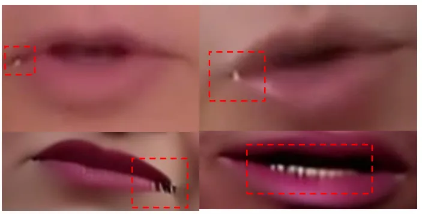

Figure 1: Artifacts observed in the generation results from single-stage
training.

#### ID Diversity in Different Stage.

The diagram in Fig. 2 demonstrates our application of different data
sampling strategies at various training stages.

In the first stage, our goal is to expose the model to a wide array of
unique identities. This exposure enables the model to learn a diverse
range of facial details, thereby enhancing its capacity for facial
abstraction. To accomplish this, we employ a larger batch size and
sample only one frame per video (identity).

In the second stage, we shift our focus towards optimizing the
consistency of lip movements for a specific identity. This stage is
pivotal as it ensures the model’s proficiency in accurately
synchronizing lip movements with the corresponding audio, a critical
aspect of video dubbing.

During the initial stage, we can configure the batch size per GPU to 32.
However, in the second stage, due to the necessity of concurrently
sampling N frames to compute the sync loss (where N equals 16 in our
case), the batch size per GPU is set to 2.

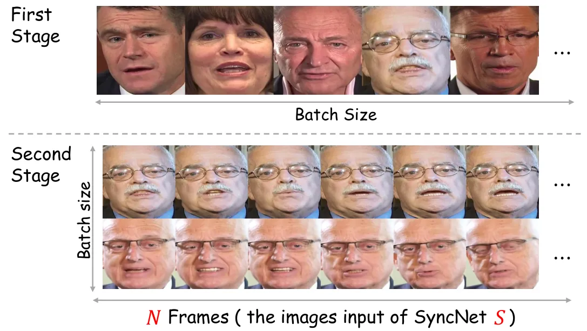

Figure 2: Data sampling strategies for different training stages.

## 3 Details for Spatial-Temporal Sampling

#### Visualization for IFS.

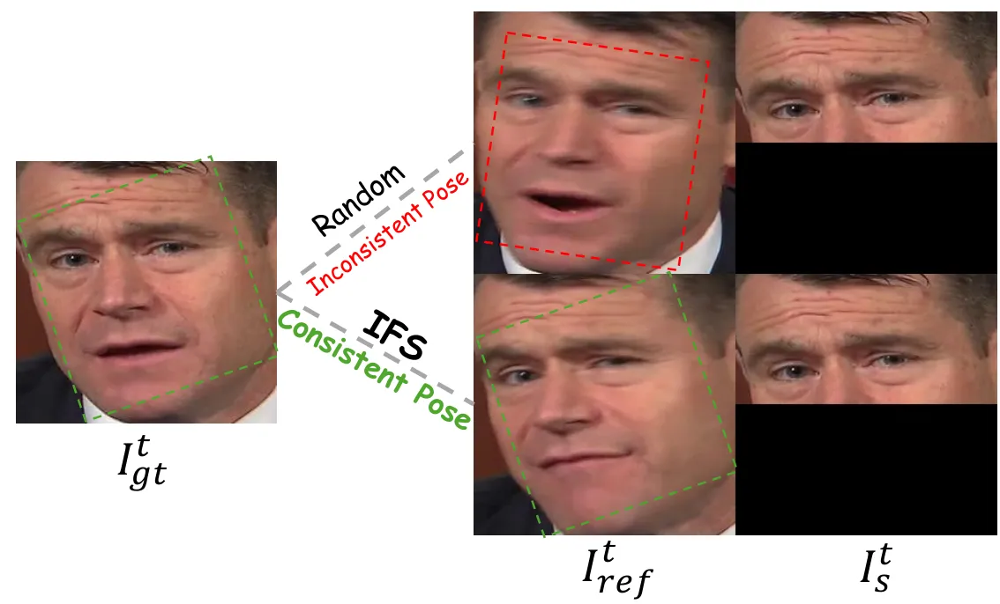

Figure 3: Comparison between random sampling and Informative Frame
Sampling (IFS).

We visualize the sampled data using Informative Frame Sampling (IFS) in
Fig. 3. As shown, IFS is capable of selecting $`I^{t}_{ref}`$ frames
that are consistent in pose but inconsistent in lip movement with the
ground-truth frame $`I^{t}_{gt}`$. In contrast, random sampling may
yield input data with large pose variations but similar lip movements
compared to $`I^{t}_{gt}`$.

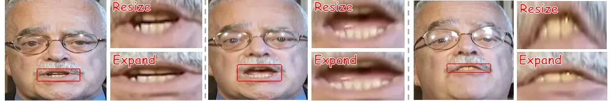

Figure 4: Visualization of the differences in processing methods for
different lip regions.

## 4 Details for Loss Function

#### SyncNet Loss.

The commonly used SyncNet model for evaluating audio-driven video
generation is derived from Wav2Lip \[4\] training, which is trained on
very low-resolution images ($`96\times 96`$ pixels). After reviewing
prior works \[5, 3\], we found that this model tends to produce higher
lip-sync-error confidence (LSE-C) \[4\] for low-resolution generation
methods, which does not strictly reflect the lip-sync quality of the
model.

Consequently, we sought a more effective audio-visual synchronization
guidance model. Recently, LatentSync \[2\] proposed a more effective
SyncNet training strategy, training a SyncNet with $`N=16`$ to handle
$`256\times 256`$ image inputs. This SyncNet has approximately ten times
the number of parameters compared to the model provided by Wav2Lip. Upon
manual inspection, we found that this model provides more accurate
audio-visual synchornize scores, which we integrated into our training
pipeline.

It is crucial to note that MuseTalk’s contribution lies not in providing
a superior SyncNet or a more innovative loss function, but rather in
harmonizing these classical losses to achieve higher-quality generation.

#### Adversarial Loss.

During the training process, we utilize two distinct discriminators:
$`\mathcal{D}_{face}`$, which concentrates on the entire face, and
$`\mathcal{D}_{lip}`$, which specifically targets the lip region. The
adversarial loss is incorporated using the WGAN (Wasserstein Generative
Adversarial Network) framework \[1\], offering a more stable training
experience compared to conventional GANs. For the generator, the
adversarial loss’s objective is to deceive both discriminators into
accepting the generated images as authentic. Specifically, the
generator’s goal is to minimize:

```math
\mathcal{L}_{adv}=\mathcal{L}_{adv,face}+\mathcal{L}_{adv,lip}, \tag{1}
```

where

```math
\mathcal{L}_{adv,face}=-\mathbb{E}_{A_{mel}^{t},I^{t}_{ref}}[D_{face}(I^{t}_{o})], \tag{2}
```

```math
\mathcal{L}_{adv,lip}=-\mathbb{E}_{A_{mel}^{t},I^{t}_{ref}}[D_{lip}(I^{t}_{lip})]. \tag{3}
```

For the discriminators, their objectives are to differentiate between
real and generated samples. The loss functions for the discriminators
are defined as:

```math
\mathcal{L}_{dis}=\mathcal{L}_{dis,face}+\mathcal{L}_{dis,lip}, \tag{4}
```

where

```math
\displaystyle\mathcal{L}_{dis,face} \displaystyle=\mathbb{E}_{I^{t}_{real,face}}[D_{face}(I^{t}_{real,face})]
```

```math
\displaystyle+\mathbb{E}_{A_{mel}^{t},I^{t}_{ref}}[D_{face}(I^{t}_{o})] \tag{5}
```

```math
\displaystyle\mathcal{L}_{dis,lip} \displaystyle=\mathbb{E}_{I^{t}_{real,lip}}[D_{lip}(I^{t}_{real,lip})]
```

```math
\displaystyle+\mathbb{E}_{A_{mel}^{t},I^{t}_{ref}}[D_{lip}(I^{t}_{lip})] \tag{6}
```

The discriminator operates on images of a fixed resolution. For
$`\mathcal{D}_{face}`$, we’ve matched the input region to that of
MuseTalk. However, for $`\mathcal{D}_{lip}`$, the lip region’s size
varies from frame to frame.

We explored numerous strategies to handle this fluctuation and found
that simply resizing the lip region could lead to distorted mouth
shapes. This distortion could negatively impact the synchronization of
audio and visuals, and compromise the overall realism. To tackle this
problem, we devised the expansion strategy. This method entails
pinpointing the longer side of the mouth based on its landmarks, and
then using half of this length to define the shorter side. We
subsequently expand outwards to set the upper and lower breakpoints in a
symmetrical manner. Following this expansion, the area is resized to a
standard region, thereby safeguarding the preservation of the original
mouth opening size. As illustrated in Fig. 4, the expansion operation
guarantees that the lip region maintains its natural proportions. This
results in superior mouth shape generation and improved audiovisual
consistency.

## 5 Blending based on Face Parsing

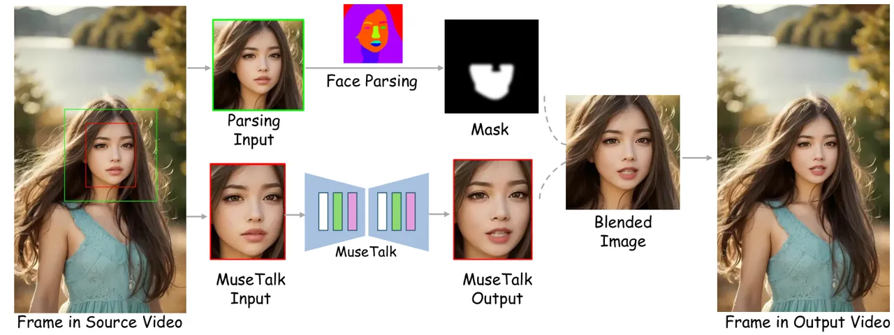

Figure 5: Illustration of the blending process used in MuseTalk.

We recognize that minor seams might be visible at the intersection of
the generated region and the original video. To address this, we utilize
a blending strategy based on face parsing.

The procedure starts by enlarging the bounding box of the identified
face in the source image to create a square region. Within this area, we
implement face parsing methods to generate a multi-class label map ¹¹ 1
https://github.com/zllrunning/face-parsing.PyTorch. This map offers
semantic segmentation of facial components such as eyes, mouth, nose,
and so on.

Using these labels, we preserve the lower half of the face, excluding
the nasal region. This choice aids in maintaining natural facial
features while circumventing intricate transitions around the nose.
Furthermore, we apply a Gaussian blur to the boundaries of the chosen
region to ensure seamless transitions during the blending process,
thereby creating a blending mask.

With this mask, we seamlessly integrate the generated region from
MuseTalk with the original video content. The blending mask governs the
contribution from each source.

For real-time applications, we precalculate the blending mask during the
preprocessing phase as it relies solely on the original video content.
This optimization considerably minimizes computational overhead during
runtime, facilitating efficient processing for real-world deployment.

Figure 5 depicts the entire blending process, showcasing how the
proposed method delivers visually consistent results while maintaining
computational efficiency.

## 6 Ethical Considerations

Technologies like MuseTalk, which facilitate video dubbing, contribute
significantly to advancements in multimedia communication and
entertainment. However, they also raise potential ethical concerns,
particularly regarding their misuse for creating deepfakes and other
forms of deceptive content. The synthesized results from MuseTalk, while
highly realistic, may still display certain visual artifacts. These
artifacts could serve as indicators for detecting deepfakes, thereby
providing a layer of transparency and assisting in the identification of
manipulated content. Furthermore, the development and deployment of such
technologies should be accompanied by robust measures to prevent
unauthorized use and ensure that the generated content is used ethically
and legally.

In summary, while MuseTalk and similar technologies provide powerful
tools for video dubbing and digital content creation, their use must be
approached with caution and responsibility. It is essential to implement
necessary safeguards to mitigate potential misuse and uphold ethical
standards in the digital domain.

## 7 Limitation and Future work

While MuseTalk demonstrates a notable improvement in face region
resolution ($`256\times 256`$) compared to other state-of-the-art
methods, it has yet to reach its full resolution potential.
Additionally, certain facial details—such as mustaches, lip shape, and
color—are not always well-preserved, which can affect identity
consistency. Lastly, occasional jitter is observed due to the
single-frame generation process, compromising smoothness.

To address these limitations, future work will focus on incorporating
higher-quality training data and integrating a temporal module to reduce
jitter and ensure smoother transitions. These enhancements aim to
improve both resolution and overall visual consistency. Moreover,
incorporating super-resolution models like GFP-GAN \[6\] as a
post-processing step could further elevate output quality in real-world
applications.

## References

- \[1\] Martin Arjovsky, Soumith Chintala, and Léon Bottou. Wasserstein
  generative adversarial networks. In _International conference on
  machine learning_, pages 214–223. PMLR, 2017.
- \[2\] Chunyu Li, Chao Zhang, Weikai Xu, Jinghui Xie, Weiguo Feng,
  Bingyue Peng, and Weiwei Xing. Latentsync: Audio conditioned latent
  diffusion models for lip sync. _arXiv preprint
  arXiv:2412.09262_, 2024.
- \[3\] Ziqiao Peng, Wentao Hu, Yue Shi, Xiangyu Zhu, Xiaomei Zhang, Hao
  Zhao, Jun He, Hongyan Liu, and Zhaoxin Fan. Synctalk: The devil is in
  the synchronization for talking head synthesis. In _Proceedings of the
  IEEE/CVF Conference on Computer Vision and Pattern Recognition_, pages
  666–676, 2024.
- \[4\] KR Prajwal, Rudrabha Mukhopadhyay, Vinay P Namboodiri, and CV
  Jawahar. A lip sync expert is all you need for speech to lip
  generation in the wild. In _Proceedings of the 28th ACM international
  conference on multimedia_, pages 484–492, 2020.
- \[5\] Linrui Tian, Qi Wang, Bang Zhang, and Liefeng Bo. Emo: Emote
  portrait alive generating expressive portrait videos with audio2video
  diffusion model under weak conditions. In _European Conference on
  Computer Vision_, pages 244–260. Springer, 2024.
- \[6\] Xintao Wang, Yu Li, Honglun Zhang, and Ying Shan. Towards
  real-world blind face restoration with generative facial prior. In
  _Proceedings of the IEEE/CVF conference on computer vision and pattern
  recognition_, pages 9168–9178, 2021.
- \[7\] Liangbin Xie, Xintao Wang, Honglun Zhang, Chao Dong, and Ying
  Shan. Vfhq: A high-quality dataset and benchmark for video face
  super-resolution. In _Proceedings of the IEEE/CVF Conference on
  Computer Vision and Pattern Recognition_, pages 657–666, 2022.
- \[8\] Zhimeng Zhang, Lincheng Li, Yu Ding, and Changjie Fan.
  Flow-guided one-shot talking face generation with a high-resolution
  audio-visual dataset. In _Proceedings of the IEEE/CVF conference on
  computer vision and pattern recognition_, pages 3661–3670, 2021.
