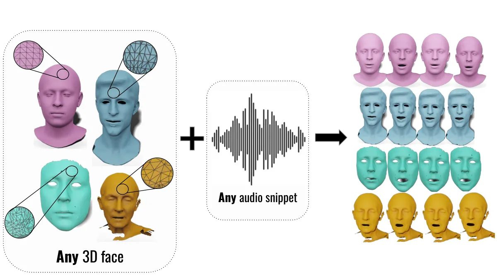
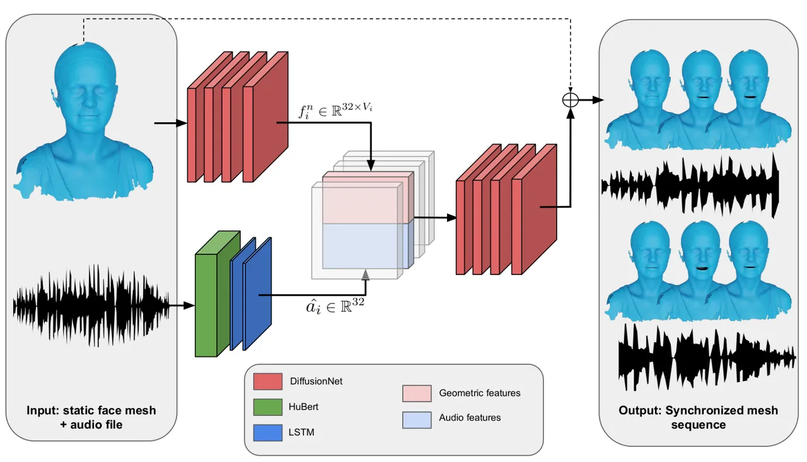
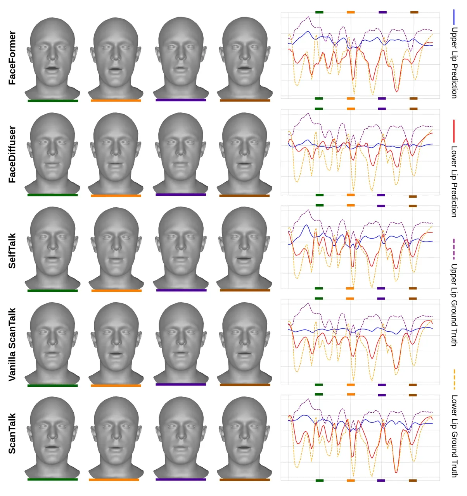
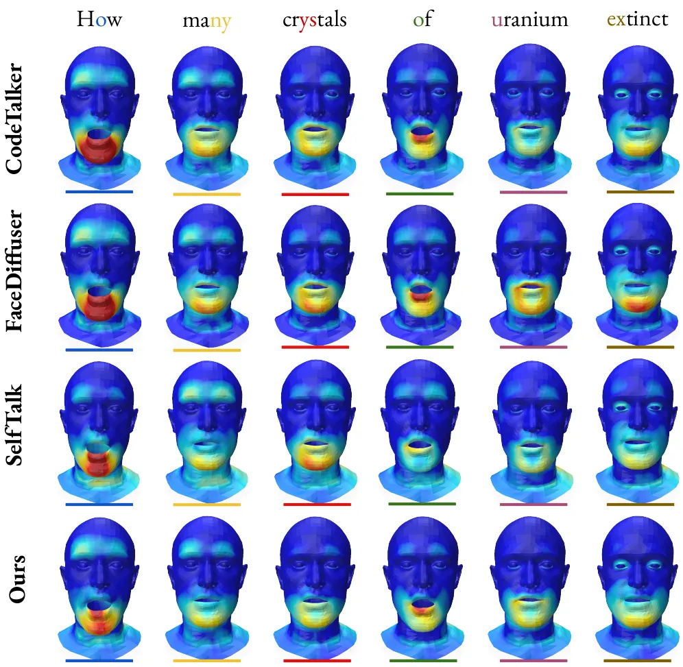
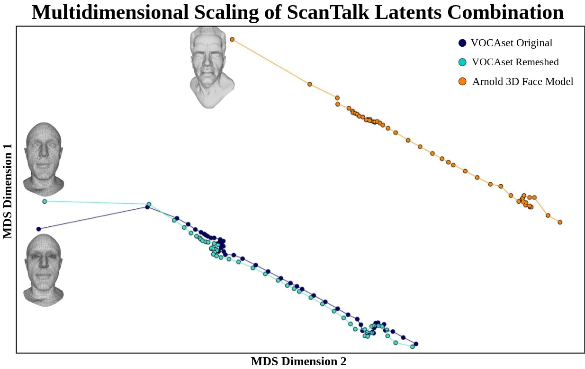

# Beyond Fixed Topologies: Unregistered Training and Comprehensive Evaluation Metrics for 3D Talking Heads

Federico Nocentini Affiliation: MICC, University of Florence    Thomas
Besnier Affiliation: CRIStAL, University of Lille, CNRS, Centrale Lille
   Claudio Ferrari Affiliation: Dept. of Information Engineering and
Mathematics, University of Siena    Sylvain Arguillere
Affiliation: Laboratoire Paul Painlevé, University of Lille, CNRS   
Mohamed Daoudi Affiliation: CRIStAL, University of Lille, CNRS, Centrale
Lille Affiliation: IMT Nord Europe, University of Lille    Stefano
Berretti Affiliation: MICC, University of Florence

###### Abstract

Generating speech-driven 3D talking heads presents numerous challenges;
among those is dealing with varying mesh topologies where no point-wise
correspondence exists across the meshes the model can animate. While
previous literature works assume fixed mesh structures, in this work we
present the first framework capable of animating 3D faces in arbitrary
topologies, including real scanned data. Our approach leverages heat
diffusion to predict features that are robust to the mesh topology. We
explore two training settings: a registered one, in which meshes in a
training sequences share a fixed topology but any mesh can be animated
at test time, and an fully unregistered one, which allows effective
training with varying mesh structures. Additionally, we highlight the
limitations of current evaluation metrics and propose new metrics for
better lip-syncing evaluation. An extensive evaluation shows our
approach performs favorably compared to fixed topology techniques,
setting a new benchmark by offering a versatile and high-fidelity
solution for 3D talking heads where the topology constraint is dropped.
The code along with the pre-trained model, is available
[here](https://github.com/miccunifi/ScanTalk).

^(†)^(†)equal-contributors: These authors contributed equally to this
work.^(†)^(†)equal-contributors: These authors contributed equally to
this work.

## 1 Introduction



Figure 1: ScanTalk animates any 3D face mesh from speech, handling both
registered and unregistered meshes across diverse datasets with a single
model.

3D talking heads refer to the task of animating a generic 3D face mesh
so that it corresponds to a speech, given in the form of an audio
signal. This task has received significant attention in recent years,
thanks to the wide range of potential applications, across diverse
fields, that it can open. This includes computer-generated imagery in
movies, video games, virtual reality, and medical simulations.
Nevertheless, it also faces unique challenges, primarily arising from
the complexity of mapping the semantics of the spoken words contained in
the audio to the intricacy of facial motions. A major challenge for 3D
talking heads is that of generating convincing and audio-synchronized
lip movements that faithfully replicate the spoken sentence. Several
other aspects, though, contribute to making a generated animation
realistic. For example, head movements, facial expressions or speech
styles are all important factors, and numerous approaches were proposed
to account for such diverse challenges Nocentini et al. (2025); Peng et
al. (2023b); Stan et al. (2023). In all cases, the primary objective is
that of learning a mapping between the audio input to non-rigid and
time-dependent deformations of the face mesh that allow for its
animation.

In this regard, all state-of-the-art methods in this field simplify the
problem by assuming that the meshes to be animated are aligned to a
fixed topology, that is, all face meshes share a consistent number and
arrangement of points. On one hand, this constraint allows for eluding
most difficulties related to processing unordered point-clouds. With the
meshes in vertex-wise correspondence and their structure known and
consistent, one can, for instance, use effective graph
operators Bouritsas et al. (2019); Defferrard et al. (2016); Gong et al.
(2019) or define specific losses to control localized face
areas Thambiraja et al. (2023b). On the other hand, it puts several
constraints on the applicability. For example, existing approaches
require training separate models for each specific topology, hindering
its generalization power. In addition, if one wants to animate a new
mesh, either captured with a real scanner or designed with some graphics
software, it is first required to process the mesh to make it consistent
with the topology used for training. This also adds a level of
complexity in the data collection since newly captured mesh sequences
need to be processed in order to align them to a common topology, which
unveils new challenges mostly when non-rigid face deformations are
involved Ferrari et al. (2021); Gilani et al. (2017). In Nocentini et
al. (2024), the training process is supervised by the vertex-wise
correspondence in the data and the model is robust to generalize to
different topologies at inference time. A step further is not assuming
vertex-wise correspondence within sequences during the training process
(unregistered sequences). In this scenario, training is not supervised
by vertex-wise correspondence. This is especially interesting because it
allows one to train on minimally processed data, enhancing even more the
versatility of the method.

In addition to the aforementioned issues, another critical aspect is
related to the evaluation protocols and metrics. Thoroughly assessing
the performance of a 3D talking head method is complex, as it requires
to simultaneously verify the extent to which: (i) the overall shape of
the animated face is preserved. There is in fact no guarantee that mouth
motions won’t negatively affect other face regions; (ii) the accuracy of
the lip motion and synchronization is maintained, both in terms of shape
similarity, perceived realism and motion dynamics. We identified a clear
shortcoming in the current literature in this regard. In most works, the
primary metrics used for quantitative evaluation and comparison measure
the discrepancy between ground-truth and generated animation in terms of
per-frame geometric discrepancy of vertices Cudeiro et al. (2019); Fan
et al. (2022); Peng et al. (2023a); Stan et al. (2023). These are
referred to as Lip-Vertex Error (LVE), Mean Vertex Error (MVE) and Face
Dynamics Deviation (FDD). We argue that these metrics do not provide a
thorough picture of a method performance, and while these quantitative
measures are widely used, they often fall short in providing a
comprehensive evaluation. Suffice it to say, the evaluation of the
motion dynamics and synchronization is largely ignored, and lower
metrics do not necessarily imply a more realistic animation. A common
workaround involves performing qualitative user studies, where people
are asked to evaluate the quality of the generated samples. While useful
to some extent, these studies lack a clear robust protocol, and usually
involve a few users and examples, posing doubts on their reliability.
Some papers raised similar concerns, and defined additional metrics to
fill in such gap. For instance, in Peng et al. (2023a) the Lip
Readability Percentage (LRP) is introduced. However, it is still based
on per-frame lip vertex distances. Other examples are Dynamic Time
Warping (DTW) used in Imitator Thambiraja et al. (2023b) for assessing
temporal coherence, or the Displacement Angle Discrepancy (DAE) proposed
in Nocentini et al. (2023), which provides a measure of the angular
difference between subsequent frames. These measures, and others, are a
clear evidence that the current benchmarking miss a piece, and that a
stable, consistent and comprehensive set of complementary error measures
needs to be defined for proper evaluation across methods.

In response to such limitations, we introduce ScanTalk, the first
framework capable of animating 3D faces regardless of their topology.
ScanTalk is designed to be versatile, accommodating any mesh topology,
including those from real 3D face scans. By maintaining fidelity and
coherence across different topologies, ScanTalk ensures that facial
animations remain realistic and expressive despite variations in the
mesh structure. This adaptability is particularly crucial for
speech-driven facial animations, where the dynamic nature of
speech-related lip movements and associated facial changes demands a
high-level of flexibility in the mesh topology. To address the
challenges associated with unregistered meshes, we present new
experiments that focus on handling unregistered point clouds and
employing suitable loss functions for training. These experiments
demonstrate ScanTalk’s capability to effectively manage real-world
scenarios, where mesh registration is impractical. In addition, we
propose and extensively analyze a complementary set of error measures,
with the aim of providing a complete view of the pros and cons of each,
and showing how using multiple metrics can help for the sake of a
comprehensive evaluation.

In summary, ScanTalk, illustrated in Figure 1, represents a significant
advancement in the field of speech-driven 3D face animation by
overcoming the limitations of fixed-topology models and establishing new
standards for evaluation and training. Our framework demonstrates broad
applicability across different datasets and conditions. Parts of the
current work have been introduced in our previous paper Nocentini et al.
(2024). The present extension provides the following new contributions:

- •
  In Nocentini et al. (2024), ScanTalk needs to be trained with
  homogeneous sequences: each frame of the sequence shares the topology
  of the first frame. Here, we modify the training scheme and define
  appropriate losses so that the model can be trained with inhomogeneous
  sequences: each frame of the sequence has an arbitrary topology. By
  dropping this constraint, ScanTalk can be trained with truly
  unregistered meshes;
- •
  While the Chamfer distance is widely used as a loss for unsupervised
  static 3D reconstruction, we propose to use a dynamic extension of
  this loss for a complete unsupervised setting to learn speech-driven
  motion prediction;
- •
  We expose and analyze the limitations of the current benchmark metrics
  for evaluating lip-sync and generation quality, prompting the
  introduction of new, comprehensive metrics. With these, we provide an
  extended and comprehensive evaluation of ScanTalk and state-of-the-art
  methods.

## 2 Related work

### 2.1 Animation of Unregistered 3D Face Meshes

Animating a 3D face mesh to reproduce expressions or speech is a
research topic that witnessed noticeable advancements only recently,
thanks to the progresses achieved in the design of effective deep
architectures for processing 3D data Bouritsas et al. (2019); Lu et al.
(); Otberdout et al. (2022); Otberdout et al. (2023). However, it is
well known that deep models are data-hungry, which poses the problem of
collecting sufficiently large 4D datasets. Moreover, all
state-of-the-art methods based on deep learning require the face meshes
to be in a fixed topology.

In the realm of 3D face mesh acquisition for datasets collection,
methodologies vary from extracting geometry from images or videos Yi et
al. (2023) or generating synthetic data Principi et al. (2023), to
employing specialized scanners in controlled environments Fanelli et al.
(2010); Ferrari et al. (2023); Ranjan et al. (2018); Wuu (2022); Yin et
al. (2006). While methods that follow the former paradigm are simpler
and cost-effective, and typically result in meshes with known topology,
they may not capture complete 3D information with the necessary
fidelity. On the other hand, 3D scans, though rich in captured details
of the face, often come unregistered. The varying mesh structure and
nuisances resulting from the sensors, e.g., holes or noise, further
complicate a direct animation. In response, a widely used approach to
address this challenge is that of first registering the raw scans onto
predefined topologies, typically by means of 3D Morphable Models Fanelli
et al. (2010); Ferrari et al. (2021); Li et al. (2017); Muralikrishnan
et al. (2023); Wuu (2022).

While some deep learning approaches have emerged to handle face scans
with unknown structure through latent representations with robust
encoders Sharp et al. (2022); Wiersma et al. (2022) built upon
PointNet Charles et al. (2017); Qi et al. (2017) or adaptive convolution
strategies Wang et al. (2019), these methods still rely on a registered
decoding strategy, which can smooth out important details. Recent
advancements closer to our work include DiffusionNet Sharp et al. (2022)
combined with neural Jacobian fields Aigerman et al. (2022) in Neural
Face Rigging (NFR) Qin et al. (2023), which facilitates animation
transfer between sequences of unregistered face meshes. Our framework
stands out by introducing a model that leverages audio data to animate
unregistered meshes directly.

### 2.2 3D Talking Heads

Numerous methodologies have emerged to synchronize facial animations
with speech. While significant progress has been made in 2D talking
heads Ji et al. (2022); Wang et al. (2023), extending these approaches
to 3D faces remains challenging. Nevertheless, generating 3D talking
heads from audio has seen significant advancements, initially pioneered
by Cudeiro et al. (2019) and greatly improved through deep learning
methods. Recent works leverage large datasets and deep learning
strategies Cudeiro et al. (2019); Fan et al. (2022); Haque and Yumak
(2023); Nocentini et al. (2023); Nocentini et al. (2025); Richard et al.
(2021); Stan et al. (2023); Thambiraja et al. (2023b); Xing et al.
(2023). VOCA Cudeiro et al. (2019) was among the first to develop a
generalizable model for 3D talking heads but lacked expressiveness and
convincing lip synchronization. MeshTalk Richard et al. (2021) improved
upon this with a larger registered dataset and a more expressive model.
FaceFormer Fan et al. (2022) utilized a transformer architecture and a
pre-trained audio encoder, like Wav2vec2 Schneider et al. (2019), with
further improvements in FaceXHubert Haque and Yumak (2023),
demonstrating enhanced cross-modality mappings from audio to facial
motion. From a different perspective, Nocentini et al. Nocentini et al.
(2023) designed a coarse-to-fine approach named S2L-S2D, and showed that
lip motion can be effectively modeled by learning to first animate
facial landmarks, and then reconstructing the whole face shape. Recent
models like CodeTalker Xing et al. (2023) and SelfTalk Peng et al.
(2023a) introduced new techniques to address over-smoothing and enhance
lip motion expressiveness. Integrating emotions Daněček et al. (2023);
Peng et al. (2023b) and head poses Sun et al. (2023); Zhang et al.
(2023) into models further pushes the boundaries, though the lack of
registered data remains a significant challenge. In this regard, a
recent work attempted to bridge this gap by proposing a data-driven
approach to synthetically generate a large-scale dataset of expressive
3D talking heads, named EmoVOCA Nocentini et al. (2025), which combines
the VOCAset dataset Cudeiro et al. (2019) with 4D expressive sequences
from the Florence4D dataset Principi et al. (2023). However, creating
this dataset was made easy as both VOCAset and Florence4D contain meshes
in the same topology. More recent approaches leverage denoising
diffusion models for generating 3D talking heads with head motions Sun
et al. (2023); Thambiraja et al. (2023a); Zhang et al. (2023), and
expressive lip motion generation Chen et al. (2025). However, these
diffusion-based frameworks still suffer from the limitation of fixed
topology of the mesh; some of them, such as DiffPoseTalk Sun et al.
(2023) require a morphable model, thus hindering the generalizability to
other face datasets.

Despite these advancements, all current methods are constrained by their
reliance on fixed mesh topologies. Our work addresses these limitations
by proposing a novel framework that can animate and be trained with any
face mesh, including real-world 3D scans, thereby enabling broader and
flexible applications in 3D facial animation.

### 2.3 3D Talking Heads Evaluation

In 2D talking head generation, metrics like Peak Signal-to-Noise Ratio
(PSNR), Structural Similarity Index Measure (SSIM), are commonly
employed to evaluate visual fidelity. Meanwhile, lip synchronization can
be measured using metrics such as Lip Sync Error Confidence (LSE-C), and
Lip Sync Error Distance (LSE-D), which rely on visual features extracted
by models like SyncNet Chung and Zisserman (2016); Prajwal et al.
(2020). Although these metrics effectively quantify the quality and
synchronization of 2D videos, they are not directly applicable to 3D
data, as the latter involve completely different measures and analyses.

Since the release of VOCA Cudeiro et al. (2019), the first high-quality
open dataset for speech-driven 3D talking heads generation, effectively
measuring the quality of the animations has been a challenge. Indeed,
this task requires metrics capturing both the temporal aspect (mostly
lip synchronization), and the non-Euclidean geometry of meshes in 3D
space. To this aim, MeshTalk Richard et al. (2021) proposed the
Lip-Vertex Error (LVE) that measures the maximum quadratic error between
the mouth vertices of the ground truth and predictions. However, LVE
focuses on maximum error, which can be misleading: it may be influenced
by a single inaccurate vertex, while the overall lip-sync quality
remains high. Furthermore, the LVE metric suffers from ambiguity in
defining mouth vertices, leading to inconsistent results across
different studies due to varying lip vertex masks. This metric was then
adopted in most subsequent works. CodeTalker Xing et al. (2023), in
addition to LVE, proposed the Face Dynamics Deviation (FDD) to measure
upper-face movement quality. Despite natural and dynamic face movements
are important for realism, the primary focus when generating 3D talking
heads should be the accuracy and intelligibility of the speech.
FaceDiffuser Stan et al. (2023) further introduced two additional
metrics: Mean Vertex Error (MVE) and Diversity. MVE measures the maximum
of the mean squared error between the ground truth and predictions,
while Diversity assesses the variation in generated animations given the
same audio and face. While these metrics provide insights into certain
aspects of the animation, they still fall short in capturing the true
quality of dynamic lip-syncing. To account for the temporal dynamics,
Imitator Thambiraja et al. (2023b) introduced Dynamic Time Warping (DTW)
to evaluate the quality of generated faces across all vertices and mouth
vertices, yet the ambiguity of the masking factor for the mouth remains.
On a similar trend, Nocentini et al. Nocentini et al. (2023) proposed
the Displacement Angle Discrepancy (DAE), which measures the angular
difference between subsequent frames of ground-truth and generated
animations. This helped in providing a coarse measure of the consistency
of vertices motion. However, it does not tell much about the geometric
similarity, as two similar motions might result from very different
meshes. On a different perspective, SelfTalk Peng et al. (2023a)
proposed the Lip Readability Percentage (LRP) to assess the
intelligibility of spoken words. However, it is an approximate measure
based on the distance between mouth vertices. It is basically a
thresholded version of the LVE. FaceTalk Aneja et al. (2024) showcased
how other metrics on the rendering of talking heads can be efficiently
used such as Lip Sync Error Distance (LSE-D) Prajwal et al. (2020),
FID/KID Ren et al. (2023), Face Image Quality Assessment Ou et al.
(2021) and Video Quality Assessment Wu et al. (2023). While providing
interesting insights regarding the qualitative performance of the
models, they may loose non-linear 3D contexts after projection in flat
spaces and are only applcable for textured meshes.

Many of these metrics fail to effectively measure the quality of
lip-syncing if considered alone. To address this, we thoroughly analyze
their values and shortcomings, and propose a set of complementary
metrics specifically designed to provide a comprehensive view of the
quality of lip-syncing and overall generation, thus filling in a crucial
gap in the current evaluation methodologies.

## 3 Motion Synthesis with Space-time Features

An overview of the proposed method is illustrated in Figure 2. In this
section, we detail the different elements that compose our model and how
they are combined. ScanTalk utilizes an Encoder-Decoder framework, which
takes a neutral face mesh and an audio snippet as inputs, and outputs a
sequence of per-vertex deformation fields. This time-dependent
deformation fields, define how the neutral face mesh should be deformed
to produce the animated sequence. The encoder consists of two modules:
an audio encoder, which integrates a pretrained encoder with a
bi-directional LSTM to extract audio features from the speech, and a
DiffusionNet encoder that predicts surface descriptors from the neutral
3D face. These descriptors are replicated and concatenated with the
audio features, and fed into a DiffusionNet decoder to produce the
deformations to be applied to the neutral face.

The above architecture is used both in the registered setting Nocentini
et al. (2024) and the newly introduced unregistered one, but the
training process, losses and evaluation metrics need to be adapted to
each case. In Section 3.1, we describe the two settings along with the
notations, in Section 3.4 we detail the two strategies we used for
training ScanTalk, and in Section 3.5 we illustrate the evaluation
metrics. The specifics on the encoding and decoding operations are
detailed, respectively, in Section 3.2, and Section 3.3.



Figure 2: Overview of the proposed deep architecture. From a static mesh
and an audio file, it computes time-dependent per-vertex features as a
concatenation of geometric features $`f_{i}^{n}`$ and audio features
$`\hat{a_{i}}`$. This learned signal over the mesh is used to learn a
time-dependent displacement field, which produces the motion. At
training time, the generated sequence is compared to the ground truth
with different loss functions for the registered and unregistered cases.

### 3.1 Protocols and Notation

ScanTalk was designed with the goal of animating meshes in arbitrary
topologies. In our first proposal Nocentini et al. (2024), any mesh,
seen or unseen during training, could be animated at inference time.
Yet, during training, meshes within each training sequence had a fixed
and consistent mesh structure (registered setting): the sequences are
said to be homogeneous. This allowed us to rely on losses that fully
exploit the known vertex-wise correspondence. In the new, unregistered
setting, this constraint is dropped.

##### Registered Setting

Let $`L=\{(M_{i}^{gt},m_{i}^{n},A_{i})\}_{i=0}^{N-1}`$ represent the
training set comprising $`N`$ samples, where $`A_{i}`$ is an audio file
containing a spoken sentence,
$`M_{i}^{gt}=(m_{i}^{0},\dots,m_{i}^{T_{i}-1})\in\mathbb{R}^{T_{i}\times V_{i}\times 3}`$
denotes a sequence of 3D faces (sharing the same mesh topology) of
length $`T_{i}`$, synchronized with the spoken sentence in $`A_{i}`$,
and $`m_{i}^{n}\in\mathbb{R}^{V_{i}\times 3}`$ is a 3D neutral face.
Here, $`V_{i}`$ is the number of vertices in the $`i`$-th 3D face
sequence, and must remain consistent across each mesh in that sequence,
along with vertex connectivity, defining the surface mesh topology. Note
that in this setting, two different sequences $`M_{i}^{gt},M_{j}^{gt}`$
might have different mesh topologies, i.e., $`V_{i}\neq V_{j}`$. This
allowed us to train ScanTalk on multiple dataset despite different mesh
structures. Our objective is then to learn a function that maps an audio
input $`A_{i}`$ and a neutral 3D face $`m_{i}^{n}`$ to the ground-truth
sequence $`M_{i}^{gt}`$:

```math
\widehat{M}_{i}=ScanTalk(A_{i},m_{i}^{n})\approx M_{i}^{gt}. \tag{1}
```

The topology of the meshes in the generated sequence $`\widehat{M}_{i}`$
is frame-wise consistent, and matches that of the input neutral face
$`m_{i}^{n}`$. This holds both at training and inference. Since
$`m_{i}^{n}`$ and the meshes in $`M_{i}^{gt}`$ have the same structure
by construction, we can define losses that exploit the knowledge of the
point correspondence (Section 3.4.1).

##### Unregistered Setting

In this setting, meshes in each sequence of the training set $`L`$ can
be of arbitrary topology, that is, given a generic sequence
$`M_{i}^{gt}=(m_{i}^{0},\dots,m_{i}^{T_{i}-1})`$ each mesh
$`m_{i}^{j},\;j=0,\cdots,T_{i}-1`$ can have its own topology, i.e.,
$`m_{i}^{j}\in\mathbb{R}^{V_{i}^{j}\times 3}`$,
$`m_{i}^{k}\in\mathbb{R}^{V_{i}^{k}\times 3}`$ with
$`V_{i}^{j}\neq V_{i}^{k}`$ in general. Thus, we need different loss
formulations that do not rely on vertex-wise correspondence within the
training sequence (Section 3.4.2). Similar to the registered case, both
during training and inference, the topology of the meshes in the
generated sequence $`\widehat{M}_{i}`$ is fixed, matching that of the
neutral face $`m_{i}^{n}`$. However, this time can differ from that of
the ground-truth sequence $`M_{i}^{gt}`$.

### 3.2 Encoding geometry and audio into a unified space

ScanTalk requires an audio snippet $`A_{i}`$ and a 3D face in a neutral
state $`m_{i}^{n}`$ as inputs. ScanTalk uses two distinct encoders for
processing geometric and audio data, and later build a unified
space-time feature space encapsulating both information. The two modules
and the resulting combination are detailed below.

#### 3.2.1 Face Mesh Encoder

Several approaches are available for encoding face meshes, but
traditional graph convolution-based models, like Gong et al. (2019); Lim
et al. (2019), encounter limitations with varying graph structures.
Thus, we employ DiffusionNet Sharp et al. (2022), a
discretization-agnostic encoder that has proven effective for encoding
face meshes as in Qin et al. (2023). DiffusionNet integrates multi-layer
perceptrons (MLPs), learned diffusion, and spatial gradient features,
offering a straightforward yet robust architecture for surface learning
tasks.

In order to compute geometric features, DiffusionNet requires several
precomputed operators, which are the Cotangent Laplacian ($`Cl`$),
Eigenbasis ($`Eb`$), Mass Matrix ($`Mm`$), and Spatial Gradient Matrix
($`SgM`$). These features capture geometric properties of the face and
facilitate information propagation across the surface domain. The
Cotangent Laplacian, a discrete version of the Laplace-Beltrami
operator, quantifies surface curvature and smoothness during the
diffusion process. The Eigenbasis comprises eigenvectors derived from
the Laplacian matrix, representing fundamental modes of variation on the
surface. The Mass Matrix characterizes the distribution of mass or area
across vertices, while the Spatial Gradient Matrix captures spatial
derivatives of scalar functions defined on the surface. These operators
enhance the architecture’s robustness and flexibility, accommodating 3D
faces of any topology.

Let $`P_{i}^{n}=[Cl,Eb,Mm,SgM]=OP(m_{i}^{n})`$ represent the precomputed
features obtained by applying the above closed-form surface operators
$`OP`$ to the 3D neutral face $`m_{i}^{n}`$. Note that these can be
computed offline and do not need to be extracted multiple times as the
neutral face to be animated remains fixed. The DiffusionNet Encoder
$`DN_{e}`$, with latent size $`h`$, then processes a neutral 3D face
mesh $`m_{i}^{n}`$ and the precomputed per-vertex features $`P_{i}^{n}`$
to extract per-vertex descriptors $`f_{i}^{n}`$ capturing intricate
details of each vertex within the neutral 3D face:

```math
f_{i}^{n}=DN_{e}(m_{i}^{n},P_{i}^{n})\in\mathbb{R}^{V_{i}\times h}. \tag{2}
```

#### 3.2.2 Audio Encoder

Following Haque and Yumak (2023); Stan et al. (2023), the speech is
encoded using a pre-trained HuBERT Hsu et al. (2021) model followed by a
Linear layer, with which we obtain a per-frame audio representation:

```math
a_{i}=SpeechEncoder(A_{i})\in\mathbb{R}^{T_{i}\times(h/2)}. \tag{3}
```

To ensure temporal coherence in the speech representation, following the
methodology outlined in Nocentini et al. (2023), we concatenate the
SpeechEncoder with a Multilayer Bidirectional-LSTM, projecting the
speech signal into a temporal latent representation:

```math
\hat{a_{i}}=BiLSTM(a_{i})\in\mathbb{R}^{T_{i}\times h}. \tag{4}
```

The reason for choosing an LSTM over more complex models, e.g.,
Transformers, is that, in a speech, long range temporal dependencies do
not impact much as the mouth shape changes are only influenced by the
previous phonemes.

#### 3.2.3 Space-time feature field

Properly combining geometric and audio features is of utmost importance,
as it will form the base feature space for decoding the final talking
head sequence. The main challenge is how to combine these features such
that: (i) the process can be done regardless of the mesh topology, and
(ii) audio features guide the motion synthesis irrespective of the
underlying shape. To do so, we chose to concatenate per-vertex
descriptors $`f_{i}^{n}`$ extracted from the neutral face with temporal
latent vectors $`\hat{a_{i}}^{j}`$ from the Bidirectional-LSTM.
Specifically, for each frame (or timestep) $`j`$, the same audio
features $`\hat{a_{i}}^{j}`$ are replicated and concatenated for each
vertex $`k`$. Conversely, the same geometric features of the neutral
face $`f_{i}^{n}`$ are used for each frame $`j`$. More formally:

```math
\displaystyle(F_{i}^{j})_{k}=(f_{i}^{n})_{k}\oplus\hat{a_{i}}^{j}\in\mathbb{R}^{h*2}\qquad\forall\;k=0,\dots,V_{i-1};\;\;\;\forall\;j=0,\dots,T_{i-1}, \tag{5}
```

where $`k`$ is a mesh vertex, $`j`$ is a frame in the sequence, and
$`i`$ a sample in the dataset. This structure can be applied to neutral
faces with arbitrary topology. Furthermore, since the geometric features
are the same for each frame, the motion is guided by the audio features,
We thus obtain a combined latent
$`F_{i}^{j}\in\mathbb{R}^{V_{i}\times h*2}`$ that embeds both
audio-related and geometry-related features. This allows us to propagate
the dimensionality of the mesh, $`V_{i}`$, to the decoder, enabling the
desired animation regardless of the mesh structure. A simple
concatenation proved effective enough as compared to more elaborated
strategies, e.g., attention mechanism. A quantitative analysis of
different combination options are reported in the supplementary
material.

### 3.3 Decoding the talking sequence

To predict the deformation sequence, we employ a DiffusionNet Decoder
(essentially a reversed Encoder), denoted as $`DN_{d}`$. The decoder
module receives $`F_{i}^{j}`$ and precomputed features $`P_{i}^{n}`$
derived from $`m_{i}^{n}`$, predicting the deformation of $`m_{i}^{n}`$
as:

```math
\widehat{m_{i}}^{j}=DN_{d}(F_{i}^{j},P_{i}^{n})+m_{i}^{n}\in\mathbb{R}^{V_{i}\times 3}. \tag{6}
```

Here, $`\widehat{m}_{i}^{j}`$ represents the $`j`$-th frame of the
predicted sequence. The entire generated sequence is defined by
$`\widehat{M}_{i}\in\mathbb{R}^{T_{i}\times V_{i}\times 3}`$. To clarify
the process, suppose we want to animate a 3D face with $`V_{i}`$
vertices, $`V_{i}`$ is arbitrary. The DiffusionNet encoder $`DN_{e}`$
processes each vertex of $`m_{i}^{n}`$ along with precomputed features
$`P_{i}^{n}`$, producing a descriptor array of shape $`[V_{i},h]`$.
These descriptors are then concatenated with the descriptors $`v_{i}`$
from the audio processing pipeline. Each audio feature has the same size
$`h`$ of the geometric features, and is replicated for each vertex,
resulting in a combined feature set of shape $`[V_{i},h*2]`$ per audio
frame. This combined feature set, along with the precomputed operators
$`P_{i}^{n}`$ from the input mesh, is fed to the decoder. The decoder
outputs a per-vertex displacement field from a time-dependent per-vertex
descriptor field, yielding an output array of shape $`[V_{i},3]`$ per
audio frame. Predicting a deformation field rather than reconstructing
the actual geometry of the animated face offers advantages in terms of
training efficiency and resulting animation as it simplifies the
learning process by focusing solely on speech-related motion.

### 3.4 Training strategy

The architecture of ScanTalk allows both registered and fully
unregistered training. However, due to its design, the generated
deformation field maintains the same topology as the neutral face given
as input for animation (which can be arbitrary). Expanding on the
discussion in Section 3.1, this distinct feature ensures that even in
the unregistered setting the model outputs a sequence of meshes that
preserve the topology of the input neutral mesh, while being trainable
with per-frame unregistered sequences. Thus, if a sequence is composed
of $`N`$ meshes, each with a different topology, the generated sequence
will maintain that of the neutral face. Implicitly, it performs a sort
of dense registration, which is a valuable byproduct. This is achieved
thanks to the Decoder, which requires knowledge of the precomputed
features $`P_{i}^{n}`$ and number of vertices of the input mesh,
ultimately defining its structure.

#### 3.4.1 Registered Setting

In the registered setting, the ground-truth meshes within each sequence
must share a common topology. Yet, different sequences can have meshes
of different structures. Nonetheless, it proved to be non-restrictive in
practice as at inference time, any mesh can be animated even if its
topology was unseen during training. Furthermore, the advantage is that
one can exploit the additional knowledge of the mesh structure to impose
specific losses or sophisticated constraints. We employed four different
losses:

Mean Squared Error Loss ($`\mathcal{L}_{MSE}`$) minimizes the average
vertex-wise Mean Squared Error (MSE) over a sequence of length $`T_{i}`$
between the ground truth mesh $`M_{i}^{gt}`$ and the model prediction
$`\widehat{M}_{i}`$. The loss function is defined as:

```math
\mathcal{L}_{MSE}=\frac{1}{T_{i}-1}\sum_{j=0}^{T_{i}-1}\frac{1}{V_{i}-1}\sum_{k=0}^{V_{i}-1}\left\|(m_{i}^{j})_{k}-(\widehat{m}_{i}^{j})_{k}\right\|_{2}^{2}. \tag{7}
```

Masked Mean Squared Error Loss ($`\mathcal{L}_{M}`$) is similar to
$`L_{MSE}`$ but applied only to the mouth vertices. Here, $`M_{k}`$ is 1
if the vertex $`k`$ is a mouth vertex, and 0 otherwise.

```math
\mathcal{L}_{M}=\frac{1}{T_{i}-1}\sum_{j=0}^{T_{i}-1}\frac{1}{V_{i}-1}\sum_{k=0}^{V_{i}-1}M_{k}\left\|(m_{i}^{j})_{k}-(\widehat{m}_{i}^{j})_{k}\right\|_{2}^{2}. \tag{8}
```

Velocity Loss ($`\mathcal{L}_{Vel}`$) minimizes the MSE between the
motion of consecutive frames. It is intended to guide the generation by
forcing similar per-frame dynamics. By defining the motion of
consecutive frames for each vertex as:

```math
\displaystyle(d_{i}^{j})_{k}=(m_{i}^{j})_{k}-(m_{i}^{j-1})_{k},\qquad(\widehat{d_{i}}^{j})_{k}=(\widehat{m}_{i}^{j})_{k}-(\widehat{m}_{i}^{j-1})_{k}, \tag{9}
```

the loss function can then be defined as:

```math
\mathcal{L}_{Vel}=\frac{1}{T_{i}-1}\sum_{j=1}^{T_{i}-1}\frac{1}{V_{i}-1}\sum_{k=0}^{V_{i}-1}\\
\left\|(d_{i}^{j})_{k}-(\widehat{d_{i}}^{j})_{k}\right\|_{2}^{2}. \tag{10}
```

Cosine Distance Loss ($`\mathcal{L}_{Cos}`$) is similar to
$`\mathcal{L}_{Vel}`$, but minimizes an angular measure instead of the
MSE between per-frame motion vectors. It measures the cosine distance
between the predicted and ground-truth displacements in (9) relative to
the previous frame. By defining the cosine distance as:

```math
C_{d}((d_{i}^{j})_{k},(\widehat{d_{i}}^{j})_{k})=1-\frac{(d_{i}^{j})_{k}\cdot(\widehat{d_{i}}^{j})_{k}}{\|(d_{i}^{j})_{k}\|_{2}^{2}\|(\widehat{d_{i}}^{j})_{k}\|_{2}^{2}}, \tag{11}
```

the loss function then becomes:

```math
\mathcal{L}_{Cos}=\frac{1}{T_{i}-1}\sum_{j=0}^{T_{i}-1}\frac{1}{V_{i}-1}\sum_{k=0}^{V_{i}-1}C_{d}((d_{i}^{j})_{k},(\widehat{d_{i}}^{j})_{k}). \tag{12}
```

The above losses can be used under the assumption that each mesh within
a sequence has a known, consistent topology. In the fully unregistered
setting, this constraint is dropped. Thus, we need to define a different
set of loss functions to train ScanTalk.

#### 3.4.2 Unregistered Setting

All methods in the literature for 3D talking head generation assume the
training meshes have a known graph structure. In a fully unregistered
training setting instead, each mesh in the training dataset might have
its own topology, even within a given sequence. This unexplored scenario
calls for the definition of alternative loss functions. In this work, we
employ the Chamfer distance as loss, which is a well-established metric
for estimating the difference between two generic point-clouds. It is
defined as:

```math
d_{CD}(m_{i}^{j},\widehat{m}_{i}^{j})=\frac{1}{\widehat{V}_{i}}\sum_{l}\min_{k}\|(m_{i}^{j})_{k}-(\widehat{m}_{i}^{j})_{l}\|_{2}^{2}+\frac{1}{V_{i}}\sum_{k}\min_{l}\|(m_{i}^{j})_{k}-(\widehat{m}_{i}^{j})_{l}\|_{2}^{2}, \tag{13}
```

where the first term measures the average Euclidean distance between
each vertex $`l`$ in the generated mesh $`\widehat{m}_{i}^{j}`$ and its
corresponding nearest-neighbor $`k`$ in the ground-truth mesh
$`m_{i}^{j}`$. The second term, instead, measures the average Euclidean
distance between each vertex $`k`$ in the ground-truth mesh
$`m_{i}^{j}`$ and its corresponding nearest-neighbor $`l`$ in the
generated mesh $`\widehat{m}_{i}^{j}`$. Then, we can average these
distances along a sequence of length $`T`$ to obtain a dynamic Chamfer
distance $`\mathcal{L}^{CD}`$ as:

```math
\mathcal{L}^{CD}=\frac{1}{T}\sum_{j=0}^{T}d_{CD}(m_{i}^{j},\widehat{m}_{i}^{j}). \tag{14}
```

Whereas other more sophisticated options exist to compute the
discrepancy between generic meshes, in our experiments this loss proved
efficient enough in comparison with other losses such as those based on
varifolds or optimal transport Besnier et al. (2023); Croquet et al.
(2021). The latter are expensive to compute, even for static objects.
For speech-driven dynamics, this is even more exacerbated, making them
unsuitable.

### 3.5 Proposed Evaluation Metrics

In the realm of speech-driven 3D talking head animation, quantitatively
assessing the quality of animated faces poses significant challenges. To
define the proposed set of metrics, we mainly consider the registered
case. The reason is twofold: first, unregistered meshes require first to
establish point correspondence, which is an error-prone process. Fully
registered meshes allow for a more accurate error evaluation being the
point correspondence known. Second, recent research showed how measuring
the geometric error for unregistered 3D faces can be biased and
uninformative Sariyanidi et al. (2023). Nonetheless, to evaluate the
performance of ScanTalk when used in the unregistered setting, we also
present results using metrics that do not assume a known topology.

#### 3.5.1 Registered setting

The most widely used metric for evaluating the accuracy of 3D Talking
Head methods is the Lip-Vertex Error (LVE), which calculates the maximum
quadratic error between the mouth vertices of the ground truth and the
prediction. However, focusing on maximum error fails to capture the
comprehensive quality of lip synchronization, as it may be skewed by a
single inaccurate vertex, while overall lip-sync quality remains high.
As a result, LVE is insufficient for a thorough evaluation of the
generated faces and often produces rankings that do not align with
qualitative assessments from visual inspections. To address this, we
start with the assumption that evaluating lip-sync quality requires
assessing the accuracy of lip movements. In the registered setting for
training and evaluation, we select six lip vertices (three per lip) for
each topology (VOCAset, BIWI, Multiface) and measure the discrepancy
between the dynamics of these vertices in the ground truth and the
prediction. Specifically, we consider the 3D motion trajectory of these
six points throughout the sequences (both generated and real). These can
be interpreted as 3D signals, with each signal element corresponding to
the $`x`$, $`y`$ and $`z`$ coordinates of the lip vertex in the
respective face mesh of the sequence. This approach yields a collection
of 3D signals that effectively capture lip movements, allowing for the
application of time-series evaluation metrics. To assess the quality of
lip synchronization, we propose leveraging two metrics commonly used for
measuring distances between polygonal curves: the Discrete Fréchet
Distance and Dynamic Time Warping, similar to Thambiraja et al. (2023b).
Furthermore, we advocate for assessing both the magnitude and angular
deviations across subsequent frames. We thus define the Mean Squared
Displacement Error ($`\delta_{M}`$), and Cosine Displacement Error
$`(\delta_{Cd})`$. Given two sequences of points
$`P=\{p_{1},p_{2},\ldots,p_{n}\}`$ and
$`Q=\{q_{1},q_{2},\ldots,q_{n}\}`$, where $`p_{i}`$ and $`q_{j}`$ are
points in $`\mathbb{R}^{3}`$, the following metrics are defined:

Dynamic Time Warping (DTW) Müller (2007) $`\times 10^{-2}`$ $`(mm)`$
measures the similarity between two sequences by allowing for non-linear
alignments and different progression rates:

```math
DTW(P,Q)=\sqrt{\min_{W}\sum_{(i,j)\in W}\|p_{i}-q_{j}\|^{2}}, \tag{15}
```

where the minimization is over all valid warping paths $`W`$. This
distance reflects the minimum cumulative cost of aligning the sequences,
considering distortions in time.

Discrete Fréchet Distance (DFD) Eiter and Mannila (1994)
$`\times 10^{-3}`$ $`(mm)`$ measures the similarity between two
sequences of points by considering their order. It is defined as:

```math
Frechet(P,Q)=\min_{\sigma}\max_{i}\|p_{i}-q_{\sigma(i)}\|_{2}, \tag{16}
```

where $`\sigma`$ ranges over all the monotonic bijections between the
indices of $`P`$ and $`Q`$. A monotonic bijection $`\sigma`$ is a
sequence of index pairs $`(i,j)`$ such that $`1\leq i\leq n`$,
$`1\leq j\leq m`$, and $`i`$ and $`j`$ are non-decreasing.

Mean Squared Displacement $`\mathbf{\delta_{M}}`$ $`\times 10^{-6}`$
$`(mm)`$ measures the magnitude of errors between the displacement
vectors of two consecutive frames. It is defined as:

```math
\text{$\delta_{M}(P,Q)$}=\frac{1}{n-1}\sum_{i=2}^{n}\left\|(p_{i}-p_{i-1})-(q_{i}-q_{i-1})\right\|^{2}, \tag{17}
```

where $`p_{i}-p_{i-1}`$ and $`q_{i}-q_{i-1}`$ are the displacements
between consecutive frames.

Cosine Displacement $`\mathbf{\delta_{Cd}}`$ $`(rad)`$ evaluates the
angular similarity between two trajectories by measuring the cosine
distance between the displacement vectors of two consecutive frames. It
is defined as:

```math
\text{$\delta_{Cd}(P,Q)$}=\frac{1}{n-1}\sum_{i=2}^{n}\left(1-\frac{(p_{i}-p_{i-1})\cdot(q_{i}-q_{i-1})}{\|p_{i}-p_{i-1}\|\|q_{i}-q_{i-1}\|}\right), \tag{18}
```

where $`(p_{i}-p_{i-1})\cdot(q_{i}-q_{i-1})`$ is the dot product of the
displacement vectors, and $`\|p_{i}-p_{i-1}\|`$ and
$`\|q_{i}-q_{i-1}\|`$ are their magnitudes.

#### 3.5.2 Unregistered setting

In this setting, the generated and ground-truth meshes differ in
topology. In fact, all the generated meshes adhere to the input neutral
mesh topology, which can differ from the ground-truth. In order to
evaluate this scenario, since we do not have any known point-wise
correspondence, we use three different shape distances: the Chamfer
metric previously introduced, the Hausdorff distance (HD) and a kernel
metric $`\mathcal{L}^{K}`$ on varifold representations of meshes
introduced in Charon and Trouvé (2013); Kaltenmark et al. (2017). For
two meshes $`X`$ and $`\hat{X}`$, it is essentially computed by blending
areas $`(a_{f})`$, centers $`(c_{f})`$ and normals $`(\vec{n}_{f})`$ of
triangles faces with kernels $`k_{p}`$ and $`k_{n}`$:

```math
\mathcal{L}^{K}=\langle\mu_{X},\mu_{X}\rangle+\langle\mu_{\hat{X}},\mu_{\hat{X}}\rangle-2\langle\mu_{X},\mu_{\hat{X}}\rangle, \tag{19}
```

with:

```math
\langle\mu_{X},\mu_{\hat{X}}\rangle=\sum_{f\in F(X)}\sum_{\hat{f}\in F(\hat{X})}a_{f}a_{\hat{f}}k_{p}(c_{f},c_{\hat{f}})k_{n}(\vec{n}_{f},\vec{n}_{\hat{f}}). \tag{20}
```

The unoriented varifold metric is characterized by a scale $`\sigma`$
for the position kernel $`k_{p}`$:

```math
\displaystyle k_{p}:\begin{cases}\mathbb{R}^{3}\times\mathbb{R}^{3}&\rightarrow\mathbb{R}\\
(x,\hat{x})&\mapsto\exp\left(\frac{\|x-\hat{x}\|}{\sigma^{2}}\right)\end{cases}\qquad k_{n}:\begin{cases}\mathbb{S}^{2}\times\mathbb{S}^{2}&\rightarrow\mathbb{R}\\
(\vec{n}_{x},\vec{n}_{\hat{x}})&\mapsto\langle\vec{n}_{x},\vec{n}_{\hat{x}}\rangle^{2}.\end{cases} \tag{21}
```

## 4 Experiments

In the following sections, we first outline the experimental methodology
adopted for both registered and unregistered settings (Section 4.1). We
then present a comprehensive quantitative evaluation of our approach in
Section 4.2 and Section 4.4. We also present the results of a user study
in Section 4.3. Our models are trained and evaluated on three publicly
available datasets: VOCAset Cudeiro et al. (2019), BIWI Fanelli et al.
(2010), and Multiface Wuu (2022). Additional details on these datasets
can be found in the supplementary material.

### 4.1 Experimental Protocols

Registered setting. In this setting, all meshes of a given sequence are
aligned to a common topology. This allows using a supervised loss such
as the $`\mathcal{L}_{MSE}`$, $`\mathcal{L}_{M}`$, $`\mathcal{L}_{Vel}`$
and $`\mathcal{L}_{Cos}`$. Even though the topology may vary from one
sequence to another, when training a single model on several registered
datasets the only requirement is to rigidly align and scale the data
with a reference. For our experiments, we rigidly aligned all the meshes
with the VOCAset meshes.

Unregistered setting. Here, we replace $`\mathcal{L}_{MSE}`$ with the
dynamic Chamfer distance $`\mathcal{L}_{CD}`$. To showcase the results
of a training procedure on unregistered meshes, we chose to randomly
remesh VOCAset by upsampling and downsampling the meshes.In doing so,
each mesh of each sequence has its own structure, different from all the
others. For other settings, such as training directly on scans, one
should take care about rigid alignment with the training data and the
existence of a clear aperture for the mouth. Also, downsampling the
training meshes can make the training faster.

### 4.2 Registered Training

Table 1 shows the performance of ScanTalk when trained with various loss
combinations across all three registered datasets in a multidataset
setting. The table reports both the proposed metrics and the standard
ones. We compare against state-of-the-art methods and vanilla ScanTalk
trained separately on each dataset. At a first glance, it can be easily
noted that none of the compared approaches outperforms the others with
respect to all the metrics. In fact, while standard metrics (LVE, MVE,
FDD) mostly focus on geometric measures, they do not explicitly account
for the dynamics of the animation. The proposed ones instead (DTW, DFD,
$`\delta_{M}`$, $`\delta_{Cd}`$) provide such information. This points
towards the idea that there is still large room for improvements, but
without proper measurements such assessment is difficult.

|               |         |      |      |      |      |                |                 |       |      |      |      |      |                |                 |           |      |       |      |      |                |                 |
| ------------- | ------- | ---- | ---- | ---- | ---- | -------------- | --------------- | ----- | ---- | ---- | ---- | ---- | -------------- | --------------- | --------- | ---- | ----- | ---- | ---- | -------------- | --------------- |
|               | VOCAset |      |      |      |      |                |                 | BIWI₆ |      |      |      |      |                |                 | Multiface |      |       |      |      |                |                 |
|               | LVE     | MVE  | FDD  | DTW  | DFD  | $`\delta_{M}`$ | $`\delta_{Cd}`$ | LVE   | MVE  | FDD  | DTW  | DFD  | $`\delta_{M}`$ | $`\delta_{Cd}`$ | LVE       | MVE  | FDD   | DTW  | DFD  | $`\delta_{M}`$ | $`\delta_{Cd}`$ |
| VOCA          | 6.99    | 0.98 | 2.66 | 1.77 | 7.41 | 1.39           | 1.02            | 5.74  | 2.59 | 41.5 | 1.60 | 7.89 | 1.47           | 0.67            | 4.92      | 2.76 | 55.78 | 1.56 | 6.51 | 0.86           | 1.23            |
| FaceFormer    | 6.12    | 0.93 | 2.16 | 1.33 | 5.39 | 0.86           | 0.58            | 4.08  | 2.16 | 37.1 | 1.56 | 6.61 | 0.87           | 0.55            | 2.45      | 1.45 | 20.24 | 0.87 | 4.13 | 0.22           | 0.73            |
| FaceDiffuser  | 4.35    | 0.90 | 2.43 | 1.73 | 6.83 | 0.81           | 0.60            | 4.02  | 2.12 | 39.6 | 1.55 | 6.50 | 0.85           | 0.56            | 3.55      | 2.39 | 29.16 | 1.45 | 5.24 | 0.28           | 0.77            |
| CodeTalker    | 3.55    | 0.89 | 2.26 | 1.33 | 5.66 | 0.80           | 0.55            | 5.19  | 2.64 | 20.6 | 1.50 | 6.61 | 0.91           | 0.59            | 4.09      | 2.38 | 47.90 | 1.44 | 5.95 | 0.55           | 0.96            |
| SelfTalk      | 5.61    | 0.91 | 2.32 | 1.25 | 5.43 | 0.72           | 0.56            | 3.63  | 2.06 | 35.5 | 1.60 | 6.93 | 1.03           | 0.66            | 2.28      | 1.90 | 37.43 | 0.96 | 4.18 | 0.25           | 0.75            |
| ScanTalk (md) | 6.38    | 0.99 | 2.10 | 1.39 | 5.71 | 0.75           | 0.60            | 4.04  | 2.05 | 40.0 | 1.47 | 6.48 | 0.97           | 0.60            | 2.43      | 1.67 | 32.20 | 0.90 | 4.08 | 0.23           | 0.74            |
| +MV (md)      | 7.03    | 1.09 | 1.47 | 1.14 | 5.16 | 0.78           | 0.58            | 4.75  | 2.22 | 39.4 | 1.51 | 6.74 | 1.09           | 0.63            | 2.54      | 1.89 | 15.97 | 0.99 | 4.21 | 0.27           | 0.77            |
| +MVC (md)     | 7.05    | 1.07 | 1.29 | 1.19 | 5.25 | 0.72           | 0.52            | 4.44  | 2.09 | 36.6 | 1.46 | 6.71 | 1.01           | 0.61            | 2.37      | 1.71 | 16.00 | 0.93 | 4.71 | 0.33           | 0.74            |
| ScanTalk (sd) | 3.01    | 0.86 | 2.40 | 1.20 | 5.25 | 0.73           | 0.55            | 4.65  | 2.14 | 36.0 | 1.56 | 7.22 | 1.05           | 0.63            | 2.65      | 1.87 | 64.43 | 0.96 | 4.27 | 0.57           | 0.93            |

Table 1: Results across different datasets. MV stands for mask+velocity,
MVC for mask+velocity+cosine. State-of-the-art models are trained on a
single dataset, Scantalk is trained both on single (sd) and
multi-dataset (md) settings.

One interesting result that supports our claim is that in Table 1
vanilla ScanTalk performs better than ScanTalk trained with the
additional losses (masked, velocity and cosine) in terms of geometric
measures such as LVE. However, if one looks at the charts in Figure 3,
which reports both visual results and the generated $`y`$-coordinate
movements of the upper and lower lips against ground truth, can clearly
observe that the dynamics of the animation is better modeled when the
additional losses are used. This is reflected in lower DTW, DFD,
$`\delta_{M}`$ and $`\delta_{Cd}`$ measures in Table 1, which represent
a quantitative alternative to the qualitative results in the charts.



Figure 3: Comparison of ScanTalk variants and state-of-the-art methods
on a VOCAset test sequence, focusing on vertical lip movements
($`y`$-coordinate). Each row shows visual outputs and corresponding
lip-sync plots. The $`y`$-coordinate captures the main dynamics of lip
motion. ScanTalk benefits from additional loss terms, yielding more
accurate and expressive lip movement. Here same colors represent same
timestep.

Another notable observation from Table 1 is that while standard metrics
suggest that training vanilla ScanTalk on a single dataset yields better
performance, our proposed metrics reveal the opposite: the multi-dataset
training setting leads to improved performance, even on individual
datasets. Overall, ScanTalk trained in a multidataset setting performs
favorably with respect to state-of-the-art models, mostly on VOCAset,
with the newly introduced metrics providing a more complete evaluation.
For example, in VOCAset, FaceDiffuser and CodeTalker report the lowest
LVE and MVE. However, their motion dynamics is quite compromised when
looking at the generated animations. To support this, Figure 3 reports
their motion charts for a randomly picked sequence of VOCAset. The
generated motion fails to a large extent in following that of the
ground-truth. Indeed, this is again reflected in worse DTW, DFD and
$`\delta`$ measures. ScanTalk trained with the additional losses,
instead, better captures the motion dynamics. This improvement aligns
with our expectations, as the new losses were specifically designed to
enhance dynamic animation realism, a nuance that the standard metrics
failed to capture. This comparison highlights the limitations of
standard metrics, demonstrating their inadequate performance. In
contrast, the new metrics we propose offer a significantly improved
assessment of lip-sync quality. Heatmaps in Figure 4(a), which show the
MSE between the ground truth and predictions on VOCAset, qualitatively
reveal that ScanTalk performs comparably with other state-of-the-art
methods.

In $`BIWI_{6}`$ and Multiface performance vary more. Specifically,
ScanTalk surpasses the state-of-the-art method on $`BIWI_{6}`$ in DTW
and DFD, but not in $`\delta_{M}`$ and $`\delta_{Cd}`$. For Multiface,
ScanTalk outperforms state-of-the-art methods for the DFD metric and
performs comparably in terms of other metrics. These observations align
with findings from Nocentini et al. (2024), and we attribute this
performance discrepancy to the significant differences among the three
registered datasets. VOCAset features static faces with only mouth
movements, while $`BIWI_{6}`$ and particularly Multiface involve notable
head movements in their sequences. These dataset variations contribute
to the model’s reduced performance as they introduce a further level of
complexity to be modeled in a unified training scheme.

To evaluate the impact of such head rotations and the robustness of
ScanTalk, we performed a specific test. We computed the relative
difference $`\Delta_{R}`$ between a metric $`M`$ (e.g., LVE or others)
computed on the aligned ($`Original`$) test set of VOCASET and when
applying random rigid rotations by a certain angle ($`Rotated`$):

```math
\Delta_{R}=\frac{M(Rotated)-M(Original)}{M(Original)}. \tag{22}
```

The results in Table 2 provide clear insights of the robustness of
ScanTalk with respect to pose variation at test time. We observe that
the error increase remains relatively modest even under significant
rotations of the input mesh. When analyzing the LVE and MSE across
rotations of up to $`\pm 30^{\circ}`$, the relative performance
degradation is especially small for rotations around the $`Y`$ (yaw) and
$`Z`$ (roll) axes.

|                    | LVE   |       |       | MSE   |       |       |
| ------------------ | ----- | ----- | ----- | ----- | ----- | ----- |
| Angle (deg.)       | $`X`$ | $`Y`$ | $`Z`$ | $`X`$ | $`Y`$ | $`Z`$ |
| $`\pm 2^{\circ}`$  | 0.4   | 0.1   | 0.1   | 0.1   | 0.1   | 0.1   |
| $`\pm 5^{\circ}`$  | 1.4   | 0.4   | 0.2   | 0.2   | 0.1   | 0.1   |
| $`\pm 10^{\circ}`$ | 4.2   | 1.0   | 0.5   | 0.4   | 0.3   | 0.8   |
| $`\pm 20^{\circ}`$ | 5.4   | 2.2   | 2.0   | 1.5   | 1.0   | 1.6   |
| $`\pm 30^{\circ}`$ | 14.9  | 4.8   | 5.0   | 3.8   | 2.6   | 2.3   |

Table 2: Increase (%) in LVE and MSE after applying random test-time
rotations on VOCAset.

As we see in Table 2, the LVE error increases more significantly with
larger rotations, especially along the $`X`$ (pitch) axis. The figure
also shows the $`XYZ`$ coordinate system used to define rotation axes,
overlaid on a sample VOCAset face, which helps interpret the directional
impact of each rotation. This stability indicates that the model is not
overfitting to rigid, canonical head poses seen during training, but
rather learns representations that are invariant to moderate pose
shifts. In this sense, it acts as a form of data augmentation, which
improves the overall robustness of the model. More details about this
experiment can be found in the supplementary material.



(a) Comparison of ScanTalk with SOTA methods on VOCAset. Blue/red hues =
low/high error.



(b) MDS visualization of latent combinations. Same identity-audio pairs
show highly similar representations, despite different parameterization.
Different identities also exhibit similar MDS trajectories.

Figure 4: Visualization results comparing error maps and
multidimentional scaling.

Finally, to illustrate the consistency of the learned space-time feature
space, in Figure 4(b) we present the Multidimensional Scaling
(MDS) Torgerson (1952) projection of three sequences of latent
combinations from ScanTalk, each generated with the same audio snippet
but different faces to animate. The results show that when two faces
share the same identity but differ in topology, their MDS sequences are
very similar, nearly overlapping. In contrast, when animating different
identities with the same audio, the MDS paths exhibit similar patterns
but occupy distinct positions in space. These results underscore
ScanTalk capability to animate faces independently of topology, focusing
on the face identity. From Table 1, it is evident that ScanTalk, when
trained with the Chamfer loss in a registered setting, yields results
comparable to those obtained using registered losses in the same
setting. This comparison underscores the robustness and adaptability of
our framework.

### 4.3 User study

|              | VP(%) | P(%) | F(%) | G(%) | VG(%) |
| ------------ | ----- | ---- | ---- | ---- | ----- |
| FaceFormer   | 14.9  | 30.6 | 25.5 | 24.5 | 4.5   |
| FaceDiffuser | 40.1  | 39.9 | 14.3 | 5.7  | 0.0   |
| CodeTalker   | 1.2   | 16.3 | 31.4 | 30.2 | 20.9  |
| SelfTalk     | 0.0   | 4.5  | 30.9 | 45.5 | 19.1  |
| ScanTalk     | 1.3   | 10.3 | 26.0 | 38.5 | 23.9  |

Table 3: User study on lip-sync quality: percentage of ratings per
method across five categories.

With the goal of validating our claim regarding the need for additional
metrics to measure the realism of animations, we designed a user-based
study so to relate the subjective perception to the quantitative metrics
described in Section 3.5.1 and reported in Table 1. In particular, 14
participants were shown 60 animations (all in FLAME topology, so to
avoid potential biases) and asked them to evaluate the lip-sync quality
and realism using a five-point scale: Very Poor (VP), Poor (P), Fair
(F), Good (G), and Very Good (VG). We compared ScanTalk against 4 other
state-of-the-art models Fan et al. (2022); Peng et al. (2023a); Stan et
al. (2023); Xing et al. (2023). Note that we did not conduct the usual
A/B study where users are asked which result they like more among
multiple options; each animation is here given an independent score. The
goal of this design is twofold: to assess to what extent _(i)_
subjective perception correlates with the quantitative metrics, and
_(ii)_ the proposed dynamic losses affect the perceived realism with
respect to other approaches.

Table 3 summarizes the user study results, showing the distribution of
scores assigned to each method. Overall, the findings reveal a strong
alignment between subjective perception and our proposed metrics, with
ScanTalk receiving the highest proportion of Very Good ratings. Notably,
FaceDiffuser, despite achieving a lower LVE than both ScanTalk and
SelfTalk, received significantly lower user ratings, highlighting the
inadequacy of standard metrics in capturing perceived visual quality. In
contrast, the user scores show a clear correlation with our proposed
metrics, underlying their effectiveness in capturing the quality of lip
motion dynamics.

### 4.4 Unregistered Setting

Training on raw scans directly is too challenging for several reasons.
Teeth, hair, occlusions, and other physical attributes can introduce
significant interference in the signal, making it difficult for the
model to accurately learn lip movements. While holes and noise in the
raw scans are generally manageable, features like teeth or hair can be
problematic. The model typically collapses or overfits unless extra
information is provided through multi-modal approaches for instance.
However, our approach is still a significant step forward regarding the
robustness and generalizability of deep learning-based 3D talking heads.
To support our claim that performance remains almost unchanged in an
unregistered setting and to mimic raw scans attributes, we provide
results of ScanTalk when trained on the three datasets where these
undergo several types of alterations. In particular, we measure the
performance when the training datasets are Registered (Rgt), Remeshed
(Rmsh) by subdividing the mesh and then decimating it, randomly creating
holes (H) or adding Gaussian Noise (GN) to vertex positions. More
details on the data preparation are given in the supplementary material.

|                | VOCAset |      |      |      |      |                |                 | BIWI₆ |      |      |      |      |                |                 | Multiface |      |       |      |      |                |                 |
| -------------- | ------- | ---- | ---- | ---- | ---- | -------------- | --------------- | ----- | ---- | ---- | ---- | ---- | -------------- | --------------- | --------- | ---- | ----- | ---- | ---- | -------------- | --------------- |
| Trained on     | LVE     | MVE  | FDD  | DTW  | DFD  | $`\delta_{M}`$ | $`\delta_{Cd}`$ | LVE   | MVE  | FDD  | DTW  | DFD  | $`\delta_{M}`$ | $`\delta_{Cd}`$ | LVE       | MVE  | FDD   | DTW  | DFD  | $`\delta_{M}`$ | $`\delta_{Cd}`$ |
| Rgt (MSE)      | 6.38    | 0.99 | 2.10 | 1.39 | 5.71 | 0.75           | 0.60            | 4.04  | 2.05 | 40.0 | 1.47 | 6.48 | 0.97           | 0.60            | 2.43      | 1.67 | 32.20 | 0.90 | 4.08 | 0.23           | 0.74            |
| Rgt (CH)       | 6.57    | 1.01 | 2.31 | 1.53 | 6.24 | 0.77           | 0.59            | 4.30  | 2.14 | 34.9 | 1.54 | 6.75 | 0.99           | 0.62            | 3.71      | 2.52 | 110.6 | 1.36 | 5.64 | 0.35           | 0.74            |
| Rmsh (CH)      | 7.13    | 1.43 | 8.22 | 1.49 | 6.04 | 0.81           | 0.71            | 5.59  | 2.37 | 28.2 | 1.90 | 8.20 | 1.24           | 0.69            | 5.51      | 2.86 | 125.1 | 1.76 | 6.41 | 0.33           | 0.77            |
| Rmsh+H (CH)    | 7.13    | 1.37 | 9.94 | 1.73 | 6.80 | 0.93           | 0.71            | 5.45  | 2.21 | 37.1 | 1.75 | 7.72 | 1.04           | 0.66            | 5.69      | 3.00 | 26.1  | 1.66 | 6.43 | 0.41           | 0.79            |
| Rmsh+H+GN (CH) | 7.91    | 1.80 | 39.0 | 1.75 | 6.57 | 0.88           | 0.68            | 4.86  | 2.23 | 37.2 | 1.63 | 7.19 | 1.04           | 0.66            | 5.75      | 3.11 | 125.0 | 1.66 | 6.44 | 0.42           | 0.78            |

Table 4: Results across different datasets for the unregistered setting
in different scenarios. All models are trained on the three datasets
with different alteration: Registered (Rgt), Remeshed (Rmsh), randomly
creating holes (H) and adding Gaussian Noise (GN) to vertex positions.

As shown in Table 4, when ScanTalk is trained on unregistered datasets,
it still achieves strong performance on registered test data. Although
some degradation in results occurs as data quality decreases, the
overall metrics remain consistently high, demonstrating the strong
generalization capability and robustness of ScanTalk.

| Trained on     | HD    | CD ($`\times 10^{-5}`$) | Varifold ($`\times 10^{-5}`$) |
| -------------- | ----- | ----------------------- | ----------------------------- |
| Reg (CH)       | 0.038 | 7.60                    | 1.74                          |
| Rmsh (CH)      | 0.042 | 7.89                    | 1.98                          |
| Rmsh+H (CH)    | 0.044 | 7.92                    | 2.02                          |
| Rmsh+H+GN (CH) | 0.039 | 7.98                    | 2.03                          |

Table 5: Distance between generated motions and true scan motions. Here,
$`\sigma=0.1`$ for the varifold metric.

Finally, we evaluate our model performance on raw scan meshes with these
different training strategies. We animate the first frame of raw scan
sequences from VOCA. We compare the predicted motions against ground
truth raw scans sequences. To do this, we use three other unregistered
metrics: the mean Chamfer distance, the Hausdorff distance and the
varifold distance introduced in Section 3.5.2. As shown in Table 5,
training on either registered or unregistered datasets with unregistered
losses yields very similar results when tested on raw scans. This
further highlights the robustness of ScanTalk across both registered and
unregistered settings.

## 5 Discussions and Conclusions

By accommodating any 3D face mesh topology, ScanTalk offers versatility
and robustness, making it applicable across a diverse range of datasets
and scenarios. This flexibility not only resolves the constraints
imposed by fixed-topology models but also simplifies the process of
integrating new and varied mesh structures into the animation pipeline.
Furthermore, the introduction of novel training schemes and loss
functions that enable effective handling of unregistered meshes marks a
significant step forward from previous methods that required mesh
correspondence. This improvement facilitates the practical use of
ScanTalk in real-world applications, where mesh registration is often
impractical.

Additionally, our work highlights the need for more comprehensive
evaluation metrics in the field of 3D talking heads. The limitations of
standard metrics, such as Lip-Vertex Error (LVE) and Mean Vertex Error
(MVE), have been identified, and we propose new, more accurate metrics
to address these shortcomings. This evaluation framework provides a
clearer, more thorough assessment of animation quality and lip-sync
accuracy. Overall, ScanTalk’s contributions are helpful for future
research and applications in speech-driven facial animation, setting new
benchmarks for flexibility, evaluation, and practical utility. Our
findings underscore the potential of ScanTalk to improve the generation
and assessment of 3D facial animations, with implications extending to
fields such as film production, gaming, virtual reality, and beyond.

We acknowledge the ethical implications associated with generating 3D
facial animations. The creation of synthetic content using 3D faces
carries inherent risks, including the potential for both intentional
misuse and unintended societal consequences. We underscore the
importance of a human-centered approach in the development and
deployment of such technologies. A human-centered design philosophy is
critical for ensuring that technology serves and benefits people. The
aim of our work is to advance research by addressing an open problem in
the literature, with the broader goal of supporting meaningful and
beneficial applications. While speech-driven facial animation has many
potential uses, some positive, others potentially harmful, we stress the
importance of responsible usage and rely on end users to apply this
technology ethically and appropriately.

## Acknowledgments

This work is supported by the [CNRS Int. Research Project
GeoGen3DHuman](https://geogen3dhuman.univ-lille.fr). This work was also
partially supported by “Partenariato FAIR (Future Artificial
Intelligence Research) - PE00000013, CUP J33C22002830006” funded by
NextGenerationEU through the italian MUR within NRRP, project DL-MIG.
This work was also partially funded by the ministerial decree n.352 of
the 9th April 2022 NextGenerationEU through the italian MUR within NRRP.
This work was also partially supported by the project 4DSHAPE
ANR-24-CE23-5907 of the French National Research Agency (ANR), and by
Fédération de Recherche Mathématique des Hauts-de-France (FMHF, FR2037
du CNRS). This work was also partially supported by the AI4Debunk
project (HORIZON-CL4-2023-HUMAN-01-CNECT grant n.101135757).

## References

- Aigerman et al. (2022) N. Aigerman, K. Gupta, V. G. Kim, S.
  Chaudhuri, J. Saito, and T. Groueix Neural jacobian fields: learning
  intrinsic mappings of arbitrary meshes. ACM Trans. Graph.. External
  Links: [Document](https://dx.doi.org/10.1145/3528223.3530141) Cited
  by: §2.1.
- Aneja et al. (2024) S. Aneja, J. Thies, A. Dai, and M. Nießner
  FaceTalk: audio-driven motion diffusion for neural parametric head
  models. In Proc. IEEE Conf. on Computer Vision and Pattern Recognition
  (CVPR), Cited by: §2.3.
- Besnier et al. (2023) T. Besnier, S. Arguillère, E. Pierson, and M.
  Daoudi Toward Mesh-Invariant 3D Generative Deep Learning with
  Geometric Measures. Computers and Graphics. External Links:
  [Document](https://dx.doi.org/10.1016/j.cag.2023.06.027) Cited by:
  §3.4.2.
- Bouritsas et al. (2019) G. Bouritsas, S. Bokhnyak, S. Ploumpis, M.
  Bronstein, and S. Zafeiriou Neural 3D morphable models: spiral
  convolutional networks for 3D shape representation learning and
  generation. In IEEE Int. Conf. on Computer Vision (ICCV), Cited by:
  §1, §2.1.
- Charles et al. (2017) R. Q. Charles, H. Su, M. Kaichun, and L. J.
  Guibas PointNet: deep learning on point sets for 3d classification and
  segmentation. In IEEE Conf. on Computer Vision and Pattern Recognition
  (CVPR), pp. 77–85 (en). Cited by: §2.1.
- Charon and Trouvé (2013) N. Charon and A. Trouvé The varifold
  representation of nonoriented shapes for diffeomorphic registration.
  SIAM Journal on Imaging Sciences 6 (4), pp. 2547–2580. External Links:
  [Document](https://dx.doi.org/10.1137/130918885) Cited by: §3.5.2.
- Chen et al. (2025) P. Chen, X. Wei, M. Lu, H. Chen, and F. Tian
  DiffusionTalker: efficient and compact speech-driven 3d talking head
  via personalizer-guided distillation. Cited by: §2.2.
- Chung and Zisserman (2016) J. S. Chung and A. Zisserman Out of time:
  automated lip sync in the wild. In Workshop on Multi-view Lip-reading,
  ACCV, Cited by: §2.3.
- Croquet et al. (2021) B. Croquet, D. Christiaens, S. M. Weinberg, M.
  Bronstein, D. Vandermeulen, and P. Claes Unsupervised diffeomorphic
  surface registration and non-linear modelling. In Medical Image
  Computing and Computer Assisted Intervention (MICCAI), pp. 118–128
  (en). Cited by: §3.4.2.
- Cudeiro et al. (2019) D. Cudeiro, T. Bolkart, C. Laidlaw, A. Ranjan,
  and M. Black Capture, learning, and synthesis of 3D speaking styles.
  In IEEE Conf. on Computer Vision and Pattern Recognition (CVPR),
  pp. 10101–10111. Cited by: §1, §2.2, §2.3, §4.
- Daněček et al. (2023) R. Daněček, K. Chhatre, S. Tripathi, Y.
  Wen, M. J. Black, and T. Bolkart Emotional speech-driven animation
  with content-emotion disentanglement. arXiv preprint arXiv:2306.08990.
  Cited by: §2.2.
- Defferrard et al. (2016) M. Defferrard, X. Bresson, and P.
  Vandergheynst Convolutional neural networks on graphs with fast
  localized spectral filtering. Neural Information Processing Systems
  (NIPS), pp. 3844–3852. Cited by: §1.
- Eiter and Mannila (1994) T. Eiter and H. Mannila Computing discrete
  fréchet distance. Cited by: §3.5.1.
- Fan et al. (2022) Y. Fan, Z. Lin, J. Saito, W. Wang, and T. Komura
  FaceFormer: speech-driven 3d facial animation with transformers. In
  IEEE/CVF Conf. on Computer Vision and Pattern Recognition (CVPR),
  pp. 18749–18758. External Links:
  [Document](https://dx.doi.org/10.1109/CVPR52688.2022.01821) Cited by:
  §1, §2.2, §4.3.
- Fanelli et al. (2010) G. Fanelli, J. Gall, H. Romsdorfer, T. Weise,
  and L. Van Gool A 3-d audio-visual corpus of affective communication.
  IEEE Transactions on Multimedia 12 (6), pp. 591–598. External Links:
  [Document](https://dx.doi.org/10.1109/TMM.2010.2052239) Cited by:
  §2.1, §4.
- Ferrari et al. (2021) C. Ferrari, S. Berretti, P. Pala, and A. Del
  Bimbo A sparse and locally coherent morphable face model for dense
  semantic correspondence across heterogeneous 3d faces. IEEE Trans. on
  Pattern Analysis and Machine Intelligence 44 (10), pp. 6667–6682.
  Cited by: §1, §2.1.
- Ferrari et al. (2023) C. Ferrari, S. Berretti, P. Pala, and A. Del
  Bimbo The florence multi-resolution 3d facial expression dataset.
  Pattern Recognition Letters 175, pp. 23–29. Cited by: §2.1.
- Gilani et al. (2017) S. Z. Gilani, A. Mian, F. Shafait, and I. Reid
  Dense 3D face correspondence. IEEE Trans. on Pattern Analysis and
  Machine Intelligence 40 (7), pp. 1584–1598. Cited by: §1.
- Gong et al. (2019) S. Gong, L. Chen, M. Bronstein, and S. Zafeiriou
  SpiralNet++: a fast and highly efficient mesh convolution operator. In
  IEEE Int. Conf. on Computer Vision Workshops, pp. 4141–4148. Cited by:
  §1, §3.2.1.
- Haque and Yumak (2023) K. I. Haque and Z. Yumak FaceXHuBERT: text-less
  speech-driven e(x)pressive 3d facial animation synthesis using
  self-supervised speech representation learning. In Int. Conf. on
  Multimodal Interaction (ICMI), External Links:
  [Document](https://dx.doi.org/10.1145/3577190.3614157) Cited by: §2.2,
  §3.2.2.
- Hsu et al. (2021) W. Hsu, B. Bolte, Y. H. Tsai, K. Lakhotia, R.
  Salakhutdinov, and A. Mohamed HuBERT: self-supervised speech
  representation learning by masked prediction of hidden units. IEEE/ACM
  Trans. Audio, Speech and Lang. Proc. 29, pp. 3451–3460. External
  Links: [Document](https://dx.doi.org/10.1109/TASLP.2021.3122291) Cited
  by: §3.2.2.
- Ji et al. (2022) X. Ji, H. Zhou, K. Wang, Q. Wu, W. Wu, F. Xu, and X.
  Cao EAMM: one-shot emotional talking face via audio-based
  emotion-aware motion model. In ACM SIGGRAPH, External Links:
  [Document](https://dx.doi.org/10.1145/3528233.3530745) Cited by: §2.2.
- Kaltenmark et al. (2017) I. Kaltenmark, B. Charlier, and N. Charon A
  General Framework for Curve and Surface Comparison and Registration
  with Oriented Varifolds. In IEEE Conf. on Computer Vision and Pattern
  Recognition (CVPR), External Links:
  [Document](https://dx.doi.org/10.1109/CVPR.2017.487) Cited by: §3.5.2.
- Li et al. (2017) T. Li, T. Bolkart, Michael. J. Black, H. Li, and J.
  Romero Learning a model of facial shape and expression from 4D scans.
  ACM Trans. on Graphics, (Proc. SIGGRAPH Asia) 36 (6),
  pp. 194:1–194:17. Cited by: §2.1.
- Lim et al. (2019) I. Lim, A. Dielen, M. Campen, and L. Kobbelt A
  simple approach to intrinsic correspondence learning on unstructured
  3d meshes. In European Conf. on Computer Vision Workshops,
  pp. 349–362. External Links:
  [Document](https://dx.doi.org/10.1007/978-3-030-11015-4%5F26) Cited
  by: §3.2.1.
- \[26\] X. Lu, C. Zhuang, Z. Lu, Y. Wang, and J. Xiao FC-4dfs:
  frequency-controlled flexible 4d facial expression synthesizing. In
  ACM Multimedia 2024, Cited by: §2.1.
- Müller (2007) M. Müller Dynamic time warping. Information retrieval
  for music and motion, pp. 69–84. Cited by: §3.5.1.
- Muralikrishnan et al. (2023) S. Muralikrishnan, C. P. Huang, D.
  Ceylan, and N. J. Mitra BLiSS: bootstrapped linear shape space.
  External Links: 2309.01765 Cited by: §2.1.
- Nocentini et al. (2024) F. Nocentini, T. Besnier, C. Ferrari, S.
  Arguillere, S. Berretti, and M. Daoudi ScanTalk: 3d talking heads from
  unregistered scans. In European Conf. on Computer Vision (ECCV), Cited
  by: 1st item, §1, §1, §3.1, §3, §4.2.
- Nocentini et al. (2023) F. Nocentini, C. Ferrari, and S. Berretti
  Learning landmarks motion from speech for speaker-agnostic 3d talking
  heads generation. In Int. Conf. on Image Analysis and Processing
  (ICIAP), pp. 340–351. Cited by: §1, §2.2, §2.3, §3.2.2.
- Nocentini et al. (2025) F. Nocentini, C. Ferrari, and S. Berretti
  EmoVOCA: speech-driven emotional 3d talking heads. In Proceedings of
  the Winter Conference on Applications of Computer Vision (WACV),
  pp. 2859–2868. Cited by: §1, §2.2.
- Otberdout et al. (2022) N. Otberdout, C. Ferrari, M. Daoudi, S.
  Berretti, and A. Del Bimbo Sparse to dense dynamic 3d facial
  expression generation. In IEEE/CVF Conf. on Computer Vision and
  Pattern Recognition (CVPR), pp. 20385–20394. Cited by: §2.1.
- Otberdout et al. (2023) N. Otberdout, C. Ferrari, M. Daoudi, S.
  Berretti, and A. Del Bimbo Generating multiple 4d expression
  transitions by learning face landmark trajectories. IEEE Transactions
  on Affective Computing 15 (2), pp. 566–578. Cited by: §2.1.
- Ou et al. (2021) F. Ou, X. Chen, R. Zhang, Y. Huang, S. Li, J. Li, Y.
  Li, L. Cao, and Y. Wang SDD-FIQA: unsupervised face image quality
  assessment with similarity distribution distance. In IEEE Conf. on
  Computer Vision and Pattern Recognition (CVPR), Cited by: §2.3.
- Peng et al. (2023a) Z. Peng, Y. Luo, Y. Shi, H. Xu, X. Zhu, H. Liu, J.
  He, and Z. Fan SelfTalk: a self-supervised commutative training
  diagram to comprehend 3d talking faces. In ACM Int. Conf. on
  Multimedia, pp. 5292–5301. External Links:
  [Document](https://dx.doi.org/10.1145/3581783.3611734) Cited by: §1,
  §2.2, §2.3, §4.3.
- Peng et al. (2023b) Z. Peng, H. Wu, Z. Song, H. Xu, X. Zhu, J. He, H.
  Liu, and Z. Fan EmoTalk: speech-driven emotional disentanglement for
  3d face animation. Cited by: §1, §2.2.
- Prajwal et al. (2020) K. R. Prajwal, R. Mukhopadhyay, V. P.
  Namboodiri, and C.V. Jawahar A lip sync expert is all you need for
  speech to lip generation in the wild. In 28th ACM Int. Conf. on
  Multimedia (MM), pp. 484–492. External Links:
  [Document](https://dx.doi.org/10.1145/3394171.3413532) Cited by: §2.3,
  §2.3.
- Principi et al. (2023) F. Principi, S. Berretti, C. Ferrari, N.
  Otberdout, M. Daoudi, and A. Del Bimbo The florence 4d facial
  expression dataset. In 2023 IEEE 17th International Conference on
  Automatic Face and Gesture Recognition (FG), pp. 1–6. Cited by: §2.1,
  §2.2.
- Qi et al. (2017) C. R. Qi, L. Yi, H. Su, and L. J. Guibas Pointnet++:
  deep hierarchical feature learning on point sets in a metric space.
  Advances in Neural Information Processing Systems (NeurIPS) 30. Cited
  by: §2.1.
- Qin et al. (2023) D. Qin, J. Saito, N. Aigerman, G. Thibault, and T.
  Komura Neural face rigging for animating and retargeting facial meshes
  in the wild. In SIGGRAPH 2023 Conference Papers, Cited by: §2.1,
  §3.2.1.
- Ranjan et al. (2018) A. Ranjan, T. Bolkart, S. Sanyal, and M. J. Black
  Generating 3D faces using convolutional mesh autoencoders. In European
  Conf. on Computer Vision (ECCV), pp. 725–741. Cited by: §2.1.
- Ren et al. (2023) Z. Ren, Z. Pan, X. Zhou, and L. Kang Diffusion
  motion: generate text-guided 3d human motion by diffusion model. In
  IEEE Int. Conf. on Acoustics, Speech and Signal Processing (ICASSP),
  Vol. , pp. 1–5. External Links:
  [Document](https://dx.doi.org/10.1109/ICASSP49357.2023.10096441) Cited
  by: §2.3.
- Richard et al. (2021) A. Richard, M. Zollhöfer, Y. Wen, F. de la
  Torre, and Y. Sheikh MeshTalk: 3d face animation from speech using
  cross-modality disentanglement. In IEEE/CVF Int. Conf. on Computer
  Vision (ICCV), pp. 1173–1182. Cited by: §2.2, §2.3.
- Sariyanidi et al. (2023) E. Sariyanidi, C. Ferrari, S. Berretti, R. T.
  Schultz, and B. Tunc Meta-evaluation for 3d face reconstruction via
  synthetic data. In IEEE Int. Joint Conf. on Biometrics (IJCB),
  pp. 1–10. Cited by: §3.5.
- Schneider et al. (2019) S. Schneider, A. Baevski, R. Collobert, and M.
  Auli Wav2vec: unsupervised pre-training for speech recognition. In
  Interspeech 2019, pp. 3465–3469. External Links:
  [Document](https://dx.doi.org/10.21437/Interspeech.2019-1873) Cited
  by: §2.2.
- Sharp et al. (2022) N. Sharp, S. Attaiki, K. Crane, and M. Ovsjanikov
  DiffusionNet: discretization agnostic learning on surfaces. ACM Trans.
  Graph. 01 (1). Cited by: §2.1, §3.2.1.
- Stan et al. (2023) S. Stan, K. I. Haque, and Z. Yumak FaceDiffuser:
  speech-driven 3d facial animation synthesis using diffusion. In ACM
  SIGGRAPH Conf. on Motion, Interaction and Games (MIG), External Links:
  [Document](https://dx.doi.org/10.1145/3623264.3624447) Cited by: §1,
  §1, §2.2, §2.3, §3.2.2, §4.3.
- Sun et al. (2023) Z. Sun, T. Lv, S. Ye, M. G. Lin, J. Sheng, Y.
  Wen, M. Yu, and Y. Liu DiffPoseTalk: speech-driven stylistic 3d facial
  animation and head pose generation via diffusion models. External
  Links: 2310.00434 Cited by: §2.2.
- Thambiraja et al. (2023a) B. Thambiraja, S. Aliakbarian, D. Cosker,
  and J. Thies 3DiFACE: diffusion-based speech-driven 3d facial
  animation and editing. External Links: 2312.00870 Cited by: §2.2.
- Thambiraja et al. (2023b) B. Thambiraja, I. Habibie, S.
  Aliakbarian, D. Cosker, C. Theobalt, and J. Thies Imitator:
  personalized speech-driven 3d facial animation. In IEEE/CVF Int. Conf.
  on Computer Vision (ICCV), pp. 20621–20631. Cited by: §1, §1, §2.2,
  §2.3, §3.5.1.
- Torgerson (1952) W. S. Torgerson Multidimensional scaling: i. theory
  and method. Psychometrika 17 (4), pp. 401–419. Cited by: §4.2.
- Wang et al. (2023) J. Wang, Y. Zhao, L. Liu, T. Xu, Q. Li, and S. Li
  Emotional talking head generation based on memory-sharing and
  attention-augmented networks. ArXiv abs/2306.03594. Cited by: §2.2.
- Wang et al. (2019) Y. Wang, Y. Sun, Z. Liu, S. E. Sarma, M. M.
  Bronstein, and J. M. Solomon Dynamic graph cnn for learning on point
  clouds. ACM Transactions on Graphics (TOG). Cited by: §2.1.
- Wiersma et al. (2022) R. Wiersma, A. Nasikun, E. Eisemann, and K.
  Hildebrandt DeltaConv: anisotropic operators for geometric deep
  learning on point clouds. ACM Transactions on Graphics 41 (4).
  External Links: [Document](https://dx.doi.org/10.1145/3528223.3530166)
  Cited by: §2.1.
- Wu et al. (2023) H. Wu, E. Zhang, L. Liao, C. Chen, J. H. Hou, A.
  Wang, W. S. Sun, Q. Yan, and W. Lin Exploring video quality assessment
  on user generated contents from aesthetic and technical perspectives.
  In IEEE Int. Conf. on Computer Vision (ICCV), Cited by: §2.3.
- Wuu (2022) C. e. al. Wuu Multiface: a dataset for neural face
  rendering. In arXiv, External Links:
  [Document](https://dx.doi.org/10.48550/ARXIV.2207.11243) Cited by:
  §2.1, §4.
- Xing et al. (2023) J. Xing, M. Xia, Y. Zhang, X. Cun, J. Wang, and T.
  Wong Codetalker: speech-driven 3d facial animation with discrete
  motion prior. In IEEE/CVF Conf. on Computer Vision and Pattern
  Recognition (CVPR), pp. 12780–12790. Cited by: §2.2, §2.3, §4.3.
- Yi et al. (2023) H. Yi, H. Liang, Y. Liu, Q. Cao, Y. Wen, T.
  Bolkart, D. Tao, and M. J. Black Generating holistic 3d human motion
  from speech. In IEEE/CVF Conf. on Computer Vision and Pattern
  Recognition CVPR, Cited by: §2.1.
- Yin et al. (2006) L. Yin, X. Wei, Y. Sun, J. Wang, and M.J. Rosato A
  3D facial expression database for facial behavior research. In Int.
  Conf. on Automatic Face and Gesture Recognition (FGR), Vol. ,
  pp. 211–216. External Links:
  [Document](https://dx.doi.org/10.1109/FGR.2006.6) Cited by: §2.1.
- Zhang et al. (2023) W. Zhang, X. Cun, X. Wang, Y. Zhang, X. Shen, Y.
  Guo, Y. Shan, and F. Wang SadTalker: learning realistic 3d motion
  coefficients for stylized audio-driven single image talking face
  animation. In IEEE/CVF Conf. on Computer Vision and Pattern
  Recognition (CVPR), Vol. , pp. 8652–8661. External Links:
  [Document](https://dx.doi.org/10.1109/CVPR52729.2023.00836) Cited by:
  §2.2.
