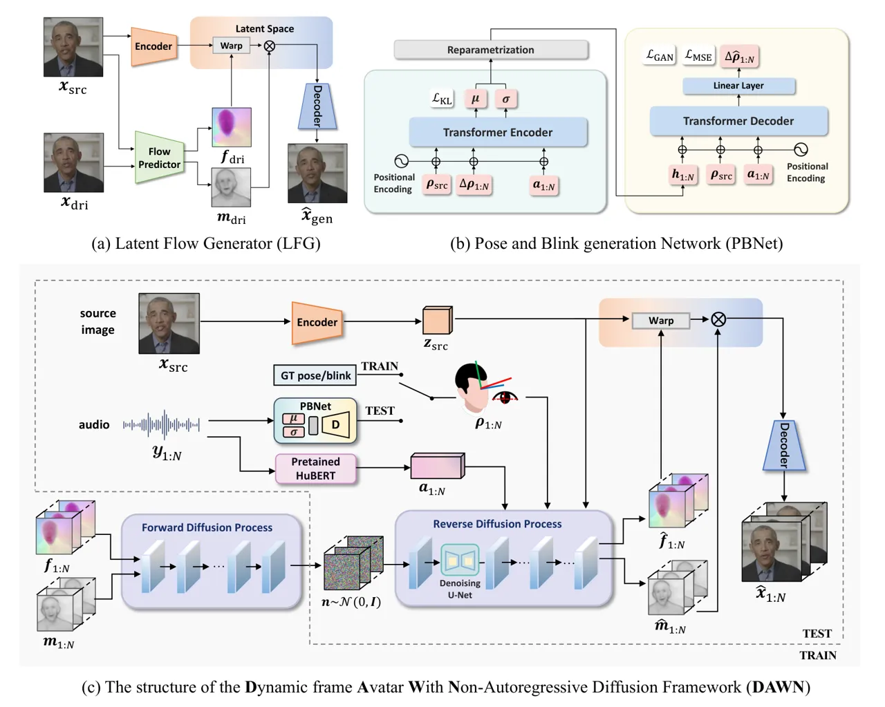
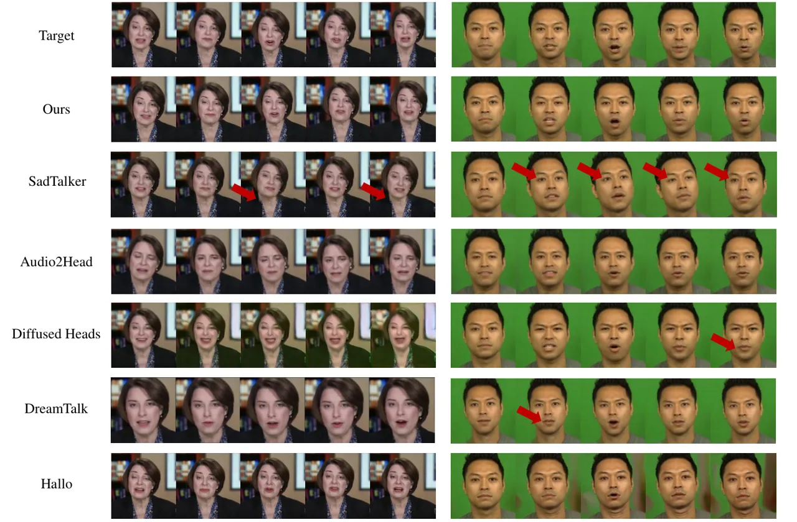
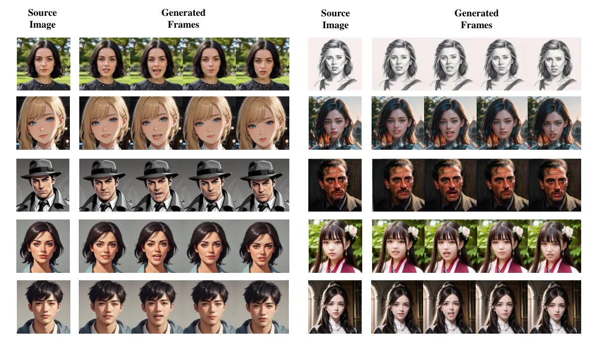
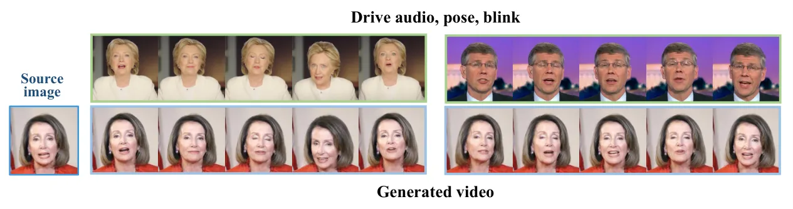
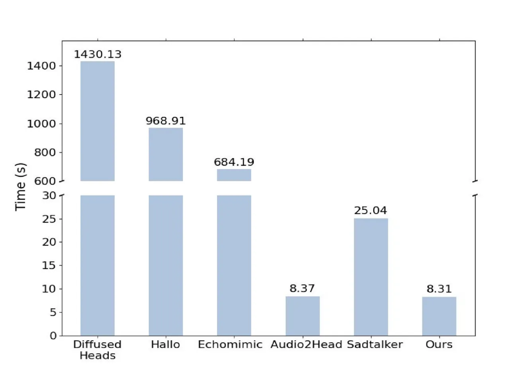
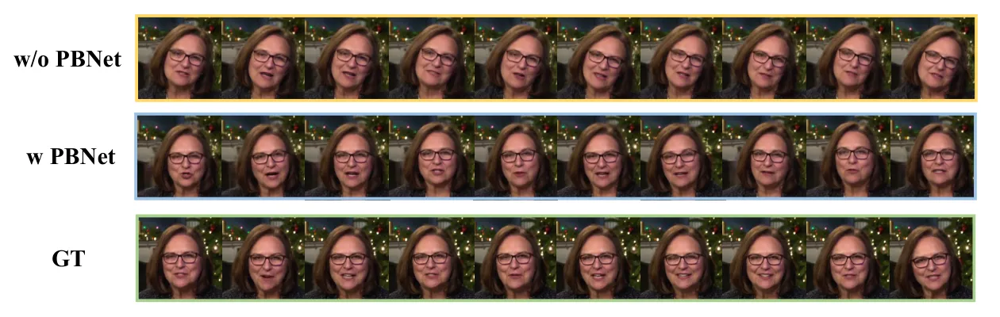

# DAWN: Dynamic Frame Avatar with Non-autoregressive Diffusion Framework for talking head Video Generation

Hanbo Cheng ^(†)^(†)thanks: Authors contributed equally to this
research, work done as interns at iFLYTEK Research.
Affiliation: ¹University of Science and Technology of China, ²iFLYTEK
Research    Limin Lin Affiliation: ¹University of Science and Technology
of China, ²iFLYTEK Research    Chenyu Liu Affiliation: ¹University of
Science and Technology of China, ²iFLYTEK Research    Pengcheng Xia
Affiliation: ¹University of Science and Technology of China, ²iFLYTEK
Research    Pengfei Hu Affiliation: ¹University of Science and
Technology of China, ²iFLYTEK Research     
Jiefeng Ma Affiliation: ¹University of Science and Technology of China,
²iFLYTEK Research    Jun Du ^(†)^(†)thanks: Corresponding author: Jun Du
(jundu@ustc.edu.cn). Affiliation: ¹University of Science and Technology
of China, ²iFLYTEK Research    Jia Pan Affiliation: ¹University of
Science and Technology of China, ²iFLYTEK Research
Affiliation: [https://hanbo-cheng.github.io/DAWN](https://hanbo-cheng.github.io/DAWN)

###### Abstract

Talking head generation intends to produce vivid and realistic talking
head videos from a single portrait and speech audio clip. Although
significant progress has been made in diffusion-based talking head
generation, almost all methods rely on autoregressive strategies, which
suffer from limited context utilization beyond the current generation
step, error accumulation, and slower generation speed. To address these
challenges, we present DAWN (Dynamic frame Avatar With
Non-autoregressive diffusion), a framework that enables all-at-once
generation of dynamic-length video sequences. Specifically, it consists
of two main components: (1) audio-driven holistic facial dynamics
generation in the latent motion space, and (2) audio-driven head pose
and blink generation. Extensive experiments demonstrate that our method
generates authentic and vivid videos with precise lip motions, and
natural pose/blink movements. Additionally, with a high generation
speed, DAWN possesses strong extrapolation capabilities, ensuring the
stable production of high-quality long videos. These results highlight
the considerable promise and potential impact of DAWN in the field of
talking head video generation. Furthermore, we hope that DAWN sparks
further exploration of non-autoregressive approaches in diffusion
models. Our code will be publicly available at
[https://github.com/Hanbo-Cheng/DAWN-pytorch](https://github.com/Hanbo-Cheng/DAWN-pytorch).

|     |
| --- |
|     |

## 1 Introduction

Talking head generation aims at synthesizing a realistic and expressive
talking head from a given portrait and audio clip, which is garnering
growing interest due to its potential applications in virtual meetings,
gaming, and film production. For talking head generation, it is
essential that the lip motions in the generated video precisely match
the accompanying speech, while maintaining high overall visual fidelity
(Guo et al., 2021a). Furthermore, natural coordination between head
pose, eye blinking, and the rhythm of the audio is also crucial for a
convincing output (Liu et al., 2023).

Recently, Diffusion Models (DM) (Ho et al., 2020) have achieved
significant success in video and image generation tasks (Rombach et al.,
2022; Ho et al., 2022b; Ho et al., 2022a; Peebles & Xie, 2023; Ni
et al., 2023). However, their application in talking head generation
(Shen et al., 2023; Bigioi et al., 2024) still faces several challenges.
Although many methods yield high-quality results, most of them rely on
autoregressive (AR) (Tian et al., 2024; Ma et al., 2023) or
semi-autoregressive (SAR) (Xu et al., 2024c; He et al., 2023)
strategies. In each iteration, AR generates one frame, while SAR
generates a fixed-length video segment. The two strategies significantly
slow down the inference speed and fail to adequately utilize contextual
information from future frames, which leads to constrained performance
and potential error accumulation, especially in long video sequences
(Stypułkowski et al., 2024; Tian et al., 2024; Xu et al., 2024b).

To address these challenges, we present DAWN (Dynamic frame Avatar With
Non-autoregressive diffusion), a novel approach that significantly
improves both the quality and efficiency of talking head generation. Our
approach leverages the DM to generate motion representation sequences
from a given audio and portrait. These motion representations are
subsequently used to reconstruct the video. Unlike other methods, our
approach produces videos of arbitrary length in a non-autoregressive
(NAR) manner. However, employing the NAR strategy to generate long
videos often results in either over-smoothing or significant content
inconsistencies due to limited extrapolation (Qiu et al., 2023). In the
context of talking head generation, we suggest that the model’s temporal
modeling capability is significantly hindered by the strong coupling
relationship among multiple motions. Typically, the motions in talking
head include (1) lip motions and (2) head pose and blink movements. The
temporal dependency of head and blink movements extends over several
seconds, far longer than that of lip motions (Zhou et al., 2020).
Training models to capture these long-term dependencies requires
extensive sequences, thus increasing the difficulty and cost of
training. Fortunately, head and blink movements can be represented as
low-dimensional vectors (Zhang et al., 2023), enabling the design of a
lightweight model that learns these long-term dependencies by training
on extended sequences. Thus, to further enhance the temporal modeling
and extrapolation capabilities of DAWN, we disentangle the motion
components involved in talking head videos. Specifically, we use the
Audio-to-Video Flow Diffusion Model (A2V-FDM) to learn the implicit
mapping between the lips and audio, while generating the head pose and
blinks via explicit control signals. Additionally, we propose a
lightweight Pose and Blink generation Network (PBNet) trained on long
sequences, to generate natural pose/blink movements during inference in
a NAR manner. In this way, we simplify the training of A2V-FDM as well
as achieve the long-term dependency modeling of the pose/blink movement.
To further strengthen the convergence and extrapolation capabilities of
A2V-FDM, we propose a two-stage training strategy based on curriculum
learning to guide the model in generating accurate lip motion and
precise pose/blink movement control.

The main contributions of this work are as follows: 1) We present DAWN
(Dynamic frame Avatar With Non-autoregressive diffusion) for generating
dynamic-length talking head videos from portrait images and audio clips
in a non-autoregressive (NAR) manner, achieving faster inference speeds
and high-quality results. To the best of our knowledge, this is the
first NAR solution based on diffusion models designed for general
talking head generation. 2) To compensate for the limitations of
extrapolation in NAR strategies and enhance the temporal modeling
capabilities for long videos, we decouple the motions of the lips, head,
and blink, achieving precise control over these movements. 3) We propose
the Pose and Blink generation Network (PBNet) to generate natural head
pose and blink sequences exclusively from audio in a NAR manner. 4) We
introduce the Two-stage Curriculum Learning (TCL) strategy to guide the
model in mastering lip motion generation and precise pose/blink control,
ensuring strong convergence and extrapolation ability.

## 2 Related works

Audio-driven talking head generation. Initial approaches for talking
head generation employed deterministic models to map audio to video
streams (Fan et al., 2016), with later methods introducing generative
models such as GANs (Isola et al., 2016a), VAEs (Kingma & Welling,
2022), and diffusion models (DMs) (Ho et al., 2020). GAN-related methods
(Vougioukas et al., 2020; Pumarola et al., 2018; Hong et al., 2022)
improved visual realism but faced convergence and mode collapse issues
(Xia et al., 2022). Following this, VAEs (Kingma & Welling, 2022)
generated 3D priors like 3D Morphable Models (3DMM) (Blanz & Vetter, 1999) followed by high-fidelity rendering (Ren et al., 2021), which
limited the realism and vividness. In contrast, DMs have been introduced
into talking head generation due to their good convergence, excellent
generation performance, and diversity. Stypułkowski et al. (2024)
presented a DM-based talking head generation solution using an AR
strategy to generate videos frame-by-frame iteratively. Subsequently,
Tian et al. (2024) improved this AR strategy by incorporating motion
conditions extracted by a VAE-based network as priors for each
iteration, effectively mitigating degradation issues. Concurrently, Xu
et al. (2024c); He et al. (2023) advocated for motion modeling instead
of image modeling. They utilized DMs to iteratively generate latent
motion representations over a fixed number of frames in a SAR manner,
subsequently converting these motion representations into video frames.
While most diffusion-based methods produce promising results, their AR
or SAR strategies incur slow generation speeds and collapse in
long-video generation. Although methods like Tian et al. (2024); Xu
et al. (2024c) alleviate issues such as inconsistencies in content
across iterations and long video generation collapse, the risk of error
accumulation remains unresolved. While methods like Du et al. (2023) use
identity-specific NAR strategies, to the best of our knowledge, none
have addressed NAR talking head generation for arbitrary identities.
Consequently, we propose a novel NAR dynamic frame generation framework
based on DM, which aims to achieve the low-cost and high-quality rapid
generation of realistic talking head video through a clip of audio and
arbitrary portrait.

Audio-driven pose and blink generation. Head pose and blink movements
significantly impact the naturalness of talking head videos. However,
the mapping from audio to pose and blink movement is a one-to-many
problem, which presents a significant challenge (Xu et al., 2024a; Chen
et al., 2020). Early works primarily focused on controlling poses
directly using facial landmarks or video references (Zhou et al., 2021;
Guo et al., 2021b). However, these approaches require additional
guidance information, which impairs the diversity of the results. Later
studies considered generating both pose and blink within the context of
talking head generation (Zhou et al., 2020). However, simultaneously
generating all facial movements can cause interference and ambiguity
(Zhang et al., 2023). Therefore, some works attempted to decouple the
speaker’s actions into components like lip, head pose, and blink, using
discriminative models to predict these conditions separately (Wang
et al., 2021; He et al., 2023). Later, researchers recognized that
probabilistic modeling is better suited for the one-to-many mapping
relationship, leading to the proposal of a VAE-based pose generation
framework (Liu et al., 2023). However, most existing pose generation
strategies also depend on AR or SAR approaches, negatively impacting
efficiency, smoothness, and naturalness. To address these issues, we
design a VAE-based NAR pose generation method to produce vivid and
smooth pose and blink movements while maintaining the NAR generation of
the entire framework.

## 3 Method

As shown in Figure 1, DAWN is divided into three main parts: (1) the
Latent Flow Generator (LFG); (2) the conditional Audio-to-Video Flow
Diffusion Model (A2V-FDM); and (3) the Pose and Blink generation Network
(PBNet). First, we train the LFG to estimate the motion representation
between different video frames in the latent space. Subsequently, the
A2V-FDM is trained to generate temporally coherent motion representation
from audio. Finally, PBNet is used to generate poses and blinks from
audio to control the content in the A2V-FDM. To enhance the model’s
extrapolation ability while ensuring better convergence, we propose a
novel Two-stage Curriculum Learning (TCL) training strategy. We will
first discuss preliminaries, then present the specific details of DAWN’s
three main components, namely LFG, A2V-FDM, and PBNet in Sections 3.2,
3.3, and 3.4, respectively. Finally, we will introduce the TCL strategy
in Section 3.5.

### 3.1 Preliminaries

Task definition. The task of talking head generation involves creating a
natural and vivid talking head video from two inputs: a static
single-person portrait, $`{\bm{x}}_{\text{src}}`$, and a speech
sequence,
$`\displaystyle{\bm{y}}_{1:N}=\{{\bm{y}}_{0},{\bm{y}}_{1},\ldots,{\bm{y}}_{N}\}`$.
The static image $`{\bm{x}}_{\text{src}}`$ and the speech sequence
$`\displaystyle{\bm{y}}`$ can originate from any individual, and the
output is
$`\hat{{\bm{x}}}_{1:N}=\{\hat{{\bm{x}}}_{0},\hat{{\bm{x}}}_{1},\ldots,\hat{{\bm{x}}}_{N}\}`$,
where $`N`$ represents the total number of frames.

Diffusion models. Diffusion models generate samples conforming to a
given data distribution by progressively denoising Gaussian noise (Ho
et al., 2020). Let $`{\bm{x}}_{0}`$ represent data sampled from a given
distribution $`q({\bm{x}}_{0})`$. In the forward diffusion process,
Gaussian noise is progressively added to $`{\bm{x}}_{0}`$ after $`T`$
steps, resulting in noisy data $`{\bm{x}}_{T}`$ (Nichol & Dhariwal,
2021; Song et al., 2020), and the conditional transition distribution at
each step is defined as:

```math
\displaystyle q({\bm{x}}_{t}|{\bm{x}}_{0})=\mathcal{N}({\bm{x}}_{t};\sqrt{\bar{\alpha}_{t}}\,{\bm{x}}_{0},(1-\bar{\alpha}_{t}){\bm{I}}) \tag{1}
```

where $`\bar{\alpha}_{t}=\prod_{i=1}^{t}\alpha_{i}`$ . The reverse
diffusion process gradually recovers the original data from the Gaussian
noise $`{\bm{x}}_{T}\sim\mathcal{N}(0,I)`$, utilizing a neural network
to predict $`p_{\theta}({\bm{x}}_{t-1}|{\bm{x}}_{t})`$, where $`\theta`$
represents the parameters of the neural network. The model is trained
using the following loss function:

```math
\displaystyle L_{\text{simple}}=\mathbb{E}_{t,{\bm{x}}_{0},\epsilon}[\|\epsilon-\epsilon_{\theta}({\bm{x}}_{t},t)\|^{2}] \tag{2}
```

where $`\epsilon`$ is the Gaussian noise added to $`{\bm{x}}_{0}`$ in
the forward diffusion process to obtain $`{\bm{x}}_{t}`$, and
$`\epsilon_{\theta}({\bm{x}}_{t},t)`$ is the noise predicted by the
model. In video-related tasks, the denoising model can be implemented
via a 3D U-Net (Ho et al., 2022b; Çiçek et al., 2016).



Figure 1: The pipeline of DAWN. First, we train the Latent Flow
Generator (LFG) in (a) to extract the motion representation from the
video. Then the Pose and Blink generation Network (PBNet) in (b) is
utilized to generate the head pose and blink sequences of the avatar.
Subsequently, the Audio-to-Video Flow Diffusion Model (A2V-FDM) in (c)
generates the talking head video from the source image conditioned by
the audio and pose/blink sequences provided by the PBNet.

### 3.2 Latent Flow Generator

The Latent Flow Generator (LFG) is a self-supervised training framework
designed to model motion information between the source image
$`{\bm{x}}_{\text{src}}`$ and the driving image
$`{\bm{x}}_{\text{dri}}`$. As illustrated in Figure 1 (a), LFG consists
of three trainable modules: the image encoder $`\mathcal{E}`$, the flow
predictor $`\mathcal{P}`$, and the image decoder $`\mathcal{D}`$. During
training,
$`{\bm{x}}_{\text{src}},{\bm{x}}_{\text{dri}}\in\mathbb{R}^{H\times W\times 3}`$
are images randomly selected from the same video. The image encoder
$`\mathcal{E}`$ encodes the source image $`{\bm{x}}_{\text{src}}`$ into
a latent code
$`{\bm{z}}_{\text{src}}\in\mathbb{R}^{H_{z}\times W_{z}\times C_{z}}`$.
The flow predictor estimates a dense flow map $`{\bm{f}}`$ and a
blocking map $`{\bm{m}}`$ (Siarohin et al., 2021; Siarohin et al.,
2020), corresponding to $`{\bm{x}}_{\text{src}}`$ and
$`{\bm{x}}_{\text{dri}}`$ :

```math
\displaystyle{\bm{f}},{\bm{m}}=\mathcal{P}({\bm{x}}_{\text{src}},{\bm{x}}_{\text{dri}}) \tag{3}
```

The flow map $`{\bm{f}}\in\mathbb{R}^{H_{z}\times W_{z}\times 2}`$
describes the feature-level movement of $`{\bm{x}}_{\text{dri}}`$
relative to $`{\bm{x}}_{\text{src}}`$ in horizontal and vertical
directions. The blocking map
$`{\bm{m}}\in\mathbb{R}^{H_{z}\times W_{z}\times 1}`$ ranging from 0 to
1, indicates the degree of area blocking in the transformation from
$`{\bm{x}}_{\text{src}}`$ to $`{\bm{x}}_{\text{dri}}`$. The flow map
$`{\bm{f}}`$ is used to perform the affine transformation
$`\mathcal{A}`$, serving as a coarse-grained warping of
$`{\bm{z}}_{\text{src}}`$. Subsequently, the blocking map $`{\bm{m}}`$
guides the model in repairing the occlusion area, thereby serving as
fine-grained repair. Finally, the image decoder $`\mathcal{D}`$ converts
the warped latent code into the target image
$`\hat{{\bm{x}}}_{\text{gen}}`$, where the $`\otimes`$ is the
element-wise product:

```math
\displaystyle\hat{{\bm{x}}}_{\text{gen}}=\mathcal{D}(\mathcal{A}({\bm{z}}_{\text{src}},{\bm{f}})\otimes{\bm{m}}) \tag{4}
```

The LFG is trained in an unsupervised manner and optimized using the
following reconstruction loss:

```math
\displaystyle L_{\text{LFG}}=L_{\text{rec}}(\hat{{\bm{x}}}_{\text{gen}},{\bm{x}}_{\text{dri}}) \tag{5}
```

where $`L_{\text{rec}}`$ is a multi-resolution reconstruction loss
derived from a pre-trained VGG-19 network, used to evaluate perceptual
differences between $`\hat{{\bm{x}}}_{\text{gen}}`$ and
$`{\bm{x}}_{\text{dri}}`$ (Johnson et al., 2016). We consider the
concatenation of $`{\bm{m}}`$ and $`{\bm{f}}`$ as
$`{\bm{z}}^{m}=[{\bm{f}},{\bm{m}}]`$ to represent the motion of
$`{\bm{x}}_{\text{dri}}`$ relative to $`{\bm{x}}_{\text{src}}`$. In this
way, we achieve two objectives: 1) finding an effective explicit motion
representation $`{\bm{z}}^{m}`$, which is identity-agnostic and
well-supported by physical meaning, and 2) reconstructing
$`{\bm{x}}_{\text{dri}}`$ from $`{\bm{x}}_{\text{src}}`$ and
$`{\bm{z}}^{m}`$ without the need for a full pixel generation.

### 3.3 Conditional Audio2Video Flow Diffusion Model

Through the LFG in Section 3.2, we can specify a
$`{\bm{x}}_{\text{src}}`$, and extract the identity-agnostic motion
representations $`{\bm{z}}^{m}_{1:N}`$ of the talking head video clip
$`{\bm{x}}_{1:N}`$ as well as the latent code $`{\bm{z}}_{\text{src}}`$
extracted by $`\mathcal{E}`$ from $`{\bm{x}}_{\text{src}}`$. Therefore,
we design the A2V-FDM to generate the motion representations
$`\hat{{\bm{z}}}^{m}_{1:N}=[\hat{{\bm{f}}}_{1:N},\hat{{\bm{m}}}_{1:N}]`$
of each frame relative to $`{\bm{x}}_{\text{src}}`$:

```math
\displaystyle\hat{{\bm{z}}}^{m}_{1:N}=\text{DM}(\mathcal{E}({\bm{x}}_{\text{src}}),{\bm{y}}_{1:N},\bm{\rho}_{1:N}) \tag{6}
```

where the DM refers the diffusion model and $`\bm{\rho}_{1:N}`$ is the
pose/blink signal. After generating $`\hat{{\bm{z}}}^{m}_{1:N}`$, we use
the decoder $`\mathcal{D}`$ in LFG to reconstruct the
$`\hat{{\bm{z}}}^{m}_{1:N}`$ to the target video frames, via the
Equation 4. The structure of A2V-FDM is illustrated in Figure 1 (c). The
A2V-FDM model includes a 3D U-Net denoising backbone (Ho et al., 2022b).
The residue block in the 3D U-Net contains temporal attention and
spatial attention modules, which handle frame-level and pixel-level
dependencies respectively. The parameters of the temporal attention
module are independent of the input length, so we believe that 3D U-Net
can theoretically process video sequences of any length. However, to
ease training difficulty, we train on short sequences and aim for
long-sequence inference. To enhance the 3D U-Net’s extrapolation ability
when handling long sequences, we used Rotary Positional Encoding (RoPE)
(Su et al., 2023) instead of traditional absolute position embeddings in
the temporal attention module.

Conditioning. We incorporate the following conditions to control its
generative behavior: audio embedding $`{\bm{a}}_{1:N}`$, pose/blink
signal $`\bm{\rho}_{1:N}`$, and source image latent code
$`{\bm{z}}_{\text{src}}`$. The audio embedding $`{\bm{a}}_{1:N}`$,
extracted from the audio $`{\mathbf{y}}_{1:N}`$ using Hubert (Hsu
et al., 2021), implicitly controls the lip motion. Due to the strict
alignment with video frames, we apply the audio embedding to its
corresponding image. Additionally, the avatar’s pose and blink are
controlled via explicit signals. The pose is described by a 6D vector Ji
et al. (2022). During training, the pose is extracted from video using
an open-source tool (Guo et al., 2020). For the blink signal, we adopt
the aspect ratio of the left and right eyes, following (Zhang et al.,
2023). To account for the arbitrary pose and eye-opening degree of the
source image $`{\bm{x}}_{\text{src}}`$, we use the difference between
the current frame $`{\bm{x}}_{i}`$ and the source frame
$`{\bm{x}}_{\text{src}}`$:
$`\Delta\bm{\rho}_{i}=\bm{\rho}_{i}-\bm{\rho}_{\text{src}}`$, which
models the transition of state rather than the state itself. The model
is provided with features $`{\bm{z}}_{\text{src}}`$ to supply facial
visual details. Each frame’s latent code performs cross attention with
the audio embedding $`{\bm{a}}_{i}`$ and pose/blink information
$`\Delta\bm{\rho}_{i}`$, respectively. This process injects these
conditions into the latent code with different spatial weights,
controlling specific regions of the generated content. The image feature
$`{\bm{z}}_{\text{src}}`$ is regarded as a global condition and is
concatenated directly with the noisy data as the initial input to the 3D
U-Net. We also utilize landmarks to create a face region mask for
$`{\bm{x}}_{\text{src}}`$, embedded with a lightweight convolutional
network, similar to the approach by Tian et al. (2024). This mask adds
to the denoising process in the same manner as
$`{\bm{z}}_{\text{src}}`$.

Loss function. We employed the DM regular denoising loss,
$`L_{\text{simple}}`$, in Equation 2 to train our model. The
synchronization of lip motions with audio is crucial for the talking
head task, while the lips often constitute only a small portion of the
frame. Consequently, during training, we employed landmarks to isolate
the lip region by generating a lip mask, $`{\bm{m}}_{\text{lip}}`$. We
then applied an additional weight, $`w_{\text{lip}}`$, to the denoising
process of this region, similar to Stypułkowski et al. (2024).
Ultimately, our loss function is defined as:

```math
\displaystyle L=L_{\text{simple}}+w_{\text{lip}}\cdot(L_{\text{simple}}\otimes{\bm{m}}_{\text{lip}}) \tag{7}
```

where the symbol $`\otimes`$ denotes element-wise product.

### 3.4 Audio-Driven Pose and Blink Generation

To prevent the generated results from exhibiting overly monotonous and
minimal movements, we design a separate module, namely the Pose and
Blink generation Network (PBNet). As shown in Figure 1 (b), PBNet learns
the mapping between audio and pose/blink movements. To maintain the
non-autoregressive (NAR) generation capabilities of A2V-FDM, PBNet
employs a transformer-based Variational Autoencoder (VAE) (Petrovich
et al., 2021) to generate variable-length pose and blink sequences. The
inputs to PBNet include the initial pose/blink state
$`\bm{\rho}_{\text{src}}`$, the residual pose/blink
$`\Delta\bm{\rho}_{1:N}`$, and the audio embedding $`{\bm{a}}_{1:N}`$.
The transformer encoder $`\mathcal{E}_{\text{t}}`$ embeds these inputs
into a Gaussian-distributed and obtain latent code
$`{\bm{h}}\in\mathbb{R}^{N\times C_{h}}`$ through resampling :

```math
\displaystyle\bm{\mu},\text{log}\bm{\sigma}=\mathcal{E}_{\text{t}}(\bm{\rho}_{\text{src}},\Delta\bm{\rho}_{1:N},{\bm{a}}_{1:N}),\;s.t.\;{\bm{h}}\sim\mathcal{N}(\bm{\mu},\bm{\sigma}) \tag{8}
```

We design $`{\bm{h}}`$ to have the same length as $`\Delta\bm{\rho}`$ to
ensure it can carry sufficient information for variable-length inputs.
The transformer decoder $`\mathcal{D}_{\text{t}}`$ generates the final
pose/blink sequence $`\Delta\hat{\bm{\rho}}_{1:N}`$, conditioned on
$`{\bm{a}}_{1:N}`$ and $`\bm{\rho}_{\text{src}}`$ :

```math
\displaystyle\Delta\hat{\bm{\rho}}_{1:N}=\mathcal{D}_{\text{t}}({\bm{h}},{\bm{a}}_{1:N},\bm{\rho}_{\text{src}}) \tag{9}
```

To enhance the model’s extrapolation capability, we use RoPE as the
positional encoding in the decoder, consistent with A2V-FDM. During
training, we apply an MSE-based reconstruction loss $`L_{\text{rec}}`$
and an adversarial loss $`L_{\text{GAN}}`$ to guide the model in
completing basic reconstruction tasks (Isola et al., 2016a; Ginosar
et al., 2019). Additionally, we employ a KL divergence loss
$`L_{\text{KL}}`$ to ensure that the latent code $`{\bm{h}}`$ closely
approximates a standard Gaussian distribution.

### 3.5 two-stage curriculum learning for talking head generation

Empirical evidence indicates that training our A2V-FDM model solely with
fixed-length short video clips leads to inaccurate control of poses and
blinks, as well as poor generalization to longer videos. We argue that a
one-step training approach impedes the model’s convergence to an optimal
solution and fails to achieve satisfactory results in the complex task
of talking head generation. To address these issues, we propose an
innovative Two-Stage Curriculum Learning (TCL) strategy inspired by the
theory of curriculum learning (Bengio et al., 2009).

Overall, the goal of the A2V-FDM during the training process can be
expressed as:

```math
\displaystyle\hat{{\bm{x}}}_{1:N}=\mathcal{D}(\text{DM}(\mathcal{E}({\bm{x}}_{\text{src}}),{\bm{y}}_{1:N},\bm{\rho}_{1:N})) \tag{10}
```

In the first stage, we set $`{\bm{x}}_{\text{src}}={\bm{x}}_{1}`$, and
the sequence length $`N=K^{\prime}`$ is a fixed, relatively small
constant. This stage primarily focuses on enabling the model to generate
basic lip motions. However, utilizing $`{\bm{x}}_{1}`$ as the source
image often exhibits limited variations in poses and blinks, and using
short clips can result in a scarcity of training samples with
significant pose or blink movements. Therefore, in the second stage, we
set $`{\bm{x}}_{\text{src}}\in{\mathbb{X}}`$ randomly, where
$`{\mathbb{X}}`$ is the set of frames in the entire video, to learn
control capabilities of large pose transformation. Additionally,
differing from stage one, we randomly set $`N\in[K_{\min},K_{\max}]`$,
$`K_{\min}>K^{\prime}`$. This approach aims to enhance control over
poses and blinks while maintaining precise lip motions, as longer clips
contain more diverse pose and blink movements. Training with
random-length sequences also helps the model avoid a bias towards
fixed-length sequences, further enhancing the model’s extrapolation.

### 3.6 Inference

Our inference process has four steps: 1) Extract the audio embedding
$`{\bm{a}}_{1:N}`$. 2) Use the source image $`{\bm{x}}_{\text{src}}`$ to
extract the initial pose/blink state $`\bm{\rho}_{\text{src}}`$ for
PBNet. Along with $`{\bm{a}}_{1:N}`$ and a latent space vector
$`{\bm{h}}_{1:N}`$ sampled from a standard Gaussian distribution, PBNet
generates the pose/blink sequences $`\hat{\bm{\rho}}_{1:N}`$. 3) Input
$`{\bm{x}}_{\text{src}}`$, $`{\bm{a}}_{1:N}`$, and
$`\hat{\bm{\rho}}_{1:N}`$ into the A2V-FDM, which generates the motion
representation sequences $`\hat{{\bm{z}}}^{m}_{1:N}`$. 4) Finally,
decode the video sequence $`\hat{{\bm{x}}}_{1:N}`$ from
$`{\bm{x}}_{\text{src}}`$ and $`\hat{{\bm{z}}}^{m}_{1:N}`$. Both PBNet
and A2V-FDM generate sequences of dynamic lengths in a single pass,
depending on input audio length.

Our method leverages non-autoregressive (NAR) generation during the
inference process. To enhance extrapolation during inference, we utilize
local attention (Luong, 2015) in the temporal attention module for both
the PBNet decoder and the 3D U-Net in A2V-FDM, which restricts the
attention scores to a local region. This approach effectively models
local dependencies in talking head videos. To accommodate the different
temporal dependencies of lip motions and pose/blink movements, we use a
larger window size in the local attention mechanism of PBNet compared to
A2V-FDM.

## 4 Experiment

### 4.1 Setup

Dataset. Our method is evaluated on two datasets: CREMA (Cao et al., 2014) and HDTF (Zhang et al., 2021). The CREMA dataset was collected in
a controlled laboratory environment and contains 7,442 videos from 91
identities, with durations ranging from 1 to 5 seconds. The HDTF dataset
consists of 410 videos, with an average duration exceeding 100 seconds.
These videos are gathered from wild scenarios and feature over 10,000
unique sentences for speech content, along with diverse head pose
movements. We partitioned the CREMA dataset into training and testing
sets following Stypułkowski et al. (2024). As for the HDTF dataset, we
conducted a random split with a 9:1 ratio between the training and
testing sets. We resized the videos at a resolution of $`128\times 128`$
and a frame rate of 25 frames per second (fps) without any additional
preprocessing.

Implementation details. The architecture of the encoder and decoder in
our model aligns with the design proposed by Johnson et al. (2016),
while the flow predictor is implemented based on MRAA (Siarohin et al.,
2021). The PBNet model is trained using pose and blink movement
sequences of 200 frames. During the inference phase of the PBNet model,
a local attention mechanism with a window size of 400 is employed. For
the inference phase of the A2V-FDM model, local attention with a window
size of 80 is applied. In our evaluation, the length of one-time
inference for CREMA is dynamic and depends on the ground truth, while
for HDTF, it is fixed at 200 frames for better comparison.

Evaluation metrics. We evaluate the performance of our method using
various metrics. Specifically, we employ the Fréchet Inception Distance
(FID) (Heusel et al., 2017) to assess the image quality. We utilize the
$`\text{FVD}_{16}`$ and $`\text{FVD}_{32}`$ scores, which calculate the
Fréchet Video Distance (FVD) based on window sizes of 16 and 32 frames,
respectively, to evaluate video quality across different temporal
scales. Furthermore, we assess the perception loss of lip shape using
the confidence score ($`\text{LSE}_{\text{C}}`$) and distance score
($`\text{LSE}_{\text{D}}`$) (Chung & Zisserman, 2017). To evaluate the
preservation of speaker identity, we use ArcFace (Deng et al., 2019) to
extract features from both the ground truth image and the generated
image, and use the cosine similarity (CSIM) between the two as the
evaluation metric. Moreover, we employ the Beat Align Score (BAS) (Siyao
et al., 2022) to evaluate the synchronization of head motion and audio,
and calculate the number of blinks per second (blink/s) to assess the
liveliness of the eyes. To better illustrate the error accumulation from
a quantitative perspective, we design a metric to quantify the severity
of error accumulation in the image space inspired by Bian et al. (2022)
in the sequential generation task: Degradation Rate (DR), defined as
$`\text{DR}=\frac{\text{FID}_{\text{ed}}}{\text{FID}_{\text{st}}}-1`$.
DR is related to the ratio between the FID of the last $`n`$ frames
$`\text{FID}_{\text{ed}}`$ and the first $`n`$ frames
$`\text{FID}_{\text{st}}`$. The motivation for proposing this metric is
that when error accumulation occurs, the quality of the generated data
at the end of the sequence significantly deteriorates compared to the
beginning. A larger DR indicates more severe error accumulation. In our
experiments, we set $`n`$ to 25 frames (1s) and 50 frames (2s), denoted
as $`\text{DR}_{25}`$ and $`\text{DR}_{50}`$, respectively.

### 4.2 Overall Comparison

We compared our method with several state-of-the-art methods: Wav2Lip
(Prajwal et al., 2020), Audio2Head (Wang et al., 2021), SadTalker (Zhang
et al., 2023), Diffused Heads (Stypułkowski et al., 2024), DreamTalk (Ma
et al., 2023), Hallo (Xu et al., 2024b), and EchoMimic (Chen et al.,
2024). The quantitative experimental results are shown in Table 1. Our
method achieves promising performance in FID, $`\text{FVD}_{16}`$,
$`\text{FVD}_{32}`$, CSIM, BAS, and Blink/s metrics for the CREMA and
HDTF datasets, as shown in Table 1. It also attains nearly best scores
for $`\text{LSE}_{\text{C}}`$ and $`\text{LSE}_{\text{D}}`$. It is
important to note that EchoMimic and DreamTalk are applicable only to
face-aligned scenarios, whereas other methods do not require
pre-cropping. Additionally, Hallo and EchoMimic are built upon
pre-trained Stable Diffusion models (Rombach et al., 2022), inheriting
substantial visual generation capabilities. Despite this, our method
still achieves comparable or even better performance on the HDTF
dataset. Furthermore, our method also outperforms Hallo and EchoMimic in
terms of generation speed. In Appendix A.4.3, results indicate that our
method achieves the fastest or near-fastest generation speed and
requires significantly less time than Diffused Heads, Hallo, and
EchoMimic.

|       |                |                   |                                   |                                   |                                       |                                         |                  |       |         |
| ----- | -------------- | ----------------- | --------------------------------- | --------------------------------- | ------------------------------------- | --------------------------------------- | ---------------- | ----- | ------- |
|       | Method         | FID$`\downarrow`$ | $`\text{FVD}_{16}`$$`\downarrow`$ | $`\text{FVD}_{32}`$$`\downarrow`$ | $`\text{LSE}_{\text{C}}`$$`\uparrow`$ | $`\text{LSE}_{\text{D}}`$$`\downarrow`$ | CSIM$`\uparrow`$ | BAS   | Blink/s |
|       | GT             | \-                | \-                                | \-                                | 5.88                                  | 7.87                                    | 1                | 0.192 | 0.24    |
|       | Audio2Head     | 29.58             | 188.54                            | 208.44                            | 5.13                                  | 7.92                                    | 0.660            | 0.274 | 0.01    |
|       | SadTalker      | 16.05             | 101.43                            | 158.85                            | 5.57                                  | 7.36                                    | 0.808            | 0.244 | 0.33    |
|       | Diffused Heads | 13.01             | 64.27                             | 116.18                            | 4.56                                  | 9.26                                    | 0.673            | 0.185 | 0.26    |
|       | Wav2Lip\*      | 10.23             | 130.23                            | 242.19                            | 6.08                                  | 7.74                                    | 0.801            | \-    | \-      |
| CREMA | DAWN (ours)    | 5.77              | 56.33                             | 75.82                             | 5.77                                  | 8.14                                    | 0.845            | 0.231 | 0.29    |
|       | GT             | \-                | \-                                | \-                                | 7.95                                  | 7.33                                    | 1                | 0.267 | 0.75    |
|       | Audio2Head     | 30.10             | 122.26                            | 205.42                            | 6.88                                  | 7.58                                    | 0.705            | 0.290 | 0.09    |
|       | SadTalker      | 26.11             | 97.43                             | 187.43                            | 6.27                                  | 8.03                                    | 0.767            | 0.297 | 0.47    |
|       | Wav2Lip\*      | 23.85             | 166.15                            | 281.73                            | 7.42                                  | 7.44                                    | 0.701            | \-    | \-      |
|       | DreamTalk      | 58.8              | 406.58                            | 516.21                            | 6.48                                  | 8.43                                    | 0.641            | 0.311 | 0.032   |
|       | EchoMimic      | 32.8              | 139.00                            | 178.16                            | 6.69                                  | 8.27                                    | 0.731            | 0.318 | 0.121   |
|       | Hallo          | 14.2              | 57.47                             | 100.99                            | 7.16                                  | 8.01                                    | 0.709            | 0.301 | 0.254   |
| HDTF  | DAWN (ours)    | 9.60              | 60.34                             | 95.64                             | 6.71                                  | 7.94                                    | 0.790            | 0.281 | 0.86    |

Table 1: Quantitative comparison with several state-of-the-art methods
methods on HDTF (Zhang et al., 2021) and CREMA (Cao et al., 2014)
datasets. We use bold to indicate the best score and underline to
represent the second-best score. \* Wav2Lip generated videos that only
contain lip motions, while the rest remain still images. For the sake of
rigor, consider it a reference for the quality of lip motion and we will
not include Wav2Lip in the ranking. “$`\uparrow`$” indicates better
performance with higher values, while “$`\downarrow`$” indicates better
performance with lower values. For both BAS and Blink/s, we consider
performance to be better when they are closer to the ground truth.



Figure 2: Qualitative comparison with several state-of-the-art methods
methods on HDTF (Zhang et al., 2021) and CREMA (Cao et al., 2014)
datasets. Our method produces higher-quality results in video quality,
lip-sync consistency, identity preservation, and head motions.

| Method | Time(s)$`\downarrow`$ | FID$`\downarrow`$ | $`\text{FVD}_{16}`$$`\downarrow`$ | $`\text{FVD}_{32}`$$`\downarrow`$ | $`\text{LSE}_{\text{C}}`$$`\uparrow`$ | $`\text{LSE}_{\text{D}}`$$`\downarrow`$ | $`\text{DR}_{25}`$ | $`\text{DR}_{50}`$ |
| ------ | --------------------- | ----------------- | --------------------------------- | --------------------------------- | ------------------------------------- | --------------------------------------- | ------------------ | ------------------ |
| SAR    | 11.42                 | 13.00             | 120.33                            | 210.52                            | 4.34                                  | 8.29                                    | 0.307              | 0.021              |
| TTR    | 19.25                 | 9.77              | 95.42                             | 137.14                            | 4.87                                  | 8.68                                    | -0.028             | -0.005             |
| Ours   | 7.32                  | 5.77              | 56.33                             | 75.82                             | 5.77                                  | 8.14                                    | 0.044              | 0.031              |

Table 2: Comparison with other generation strategies. The
semi-autoregressive (SAR) generation strategy is similar to He et al.
(2023). The two temporal resolution (TTR) generation method is mentioned
in Harvey et al. (2022). For the DR metric, we consider performance to
be better as it approaches zero.

| Inference length | FID$`\downarrow`$ | $`\text{FVD}_{16}`$$`\downarrow`$ | $`\text{FVD}_{32}`$$`\downarrow`$ | $`\text{LSE}_{\text{C}}`$$`\uparrow`$ | $`\text{LSE}_{\text{D}}`$$`\downarrow`$ |
| ---------------- | ----------------- | --------------------------------- | --------------------------------- | ------------------------------------- | --------------------------------------- |
| 40               | 9.35              | 59.58                             | 94.09                             | 5.76                                  | 7.89                                    |
| 100              | 9.83              | 61.72                             | 98.80                             | 6.41                                  | 7.96                                    |
| 200              | 9.60              | 60.34                             | 95.64                             | 6.71                                  | 7.94                                    |
| 400              | 10.36             | 61.57                             | 97.84                             | 6.63                                  | 8.12                                    |
| 600              | 10.30             | 60.44                             | 96.62                             | 6.76                                  | 8.02                                    |

Table 3: The experiment of extrapolation evaluation. "Inference length"
refers to the number of frames generated in a single inference process.

| Method       | GT PB | FID$`\downarrow`$ | $`\text{FVD}_{16}`$$`\downarrow`$ | $`\text{FVD}_{32}`$$`\downarrow`$ | $`\text{LSE}_{\text{C}}`$$`\uparrow`$ | $`\text{LSE}_{\text{D}}`$$`\downarrow`$ |
| ------------ | ----- | ----------------- | --------------------------------- | --------------------------------- | ------------------------------------- | --------------------------------------- |
| only stage 1 | ✓     | 7.95              | 81.84                             | 126.52                            | 4.38                                  | 10.04                                   |
| only stage 2 | ✓     | 13.71             | 125.75                            | 166.83                            | 6.14                                  | 8.43                                    |
| DAWN         | ✓     | 9.68              | 52.05                             | 87.11                             | 6.71                                  | 7.99                                    |
| w/o PBNet    | ×     | 15.20             | 100.94                            | 162.35                            | 5.79                                  | 8.36                                    |
| DAWN         | ×     | 9.60              | 60.34                             | 95.64                             | 6.71                                  | 7.94                                    |

Table 4: Ablation study on TCL and PBNet. The "GT PB" refers to whether
to use ground truth pose/blink signal.

For the qualitative experiment, as shown in Figure 2, we visualize the
generation results for each baseline on different datasets. Our method
evidently achieves the visual quality most similar to the ground truth,
showcasing the most realistic and vivid visual effects. Compared to our
method, SadTalker relies on the 3DMM prior, which limits its animation
capability to the facial region only, resulting in significant artifacts
when merging the face with the static torso below the neck.
Additionally, SadTalker exhibits unnatural head pose movements and gaze
direction, partially due to limited temporal modeling ability.
Audio2Head fails to preserve the speaker’s identity during generation.
For the HDTF dataset, the Diffused Heads method collapsed due to the
error accumulation. DreamTalk is only applicable to face-aligned
scenarios, thus requiring the source image to be cropped. Hallo leads to
serious error accumulation in the CREMA dataset, resulting in abnormal
color patches in the background, indicating a robustness defect.

### 4.3 comparison with other generation strategies

We compared our non-autoregressive generation strategy with two regular
video generation strategies: 1) semi-autoregressive (SAR) generation
similar to He et al. (2023), and 2) two-temporal resolution (TTR), which
trains two models with different temporal resolutions (Harvey et al.,
2022). The time cost represents the time required to generate an
8-second talking head video. The models were evaluated on the CREMA
dataset, and the results are shown in Table 2. According to the results,
our non-autoregressive method produces videos with the highest overall
quality and fastest speed. In addition, the SAR method results in a very
high DR, which is at least one order of magnitude higher than TTR and
NAR. This is because autoregressive methods suffer from degradation
issues during iterative generation. Although TTR also successfully
alleviates the degradation issue, it compromises generation speed and
overall quality. In summary, our non-autoregressive method addresses the
degradation problem while preserving fast generation speed and high
overall quality.

### 4.4 Extrapolation validation

To evaluate the extrapolation ability of our method, we used the HDTF
dataset to assess the impact of inference length on model performance,
ranging from 40 to 600 frames. FID and FVD metrics remain stable with
inference length, while longer audio improves lip movement precision.
This suggests that inference with sufficient length helps the model
produce more precise lip movement. Furthermore, to better compare the
extrapolation of other AR-based DM methods, Hallo was selected for
comparison. As shown in Table 5 from the Appendix A.3, our method’s DR
metric stabilizes within a certain range, in contrast to Hallo’s error
accumulation at increased inference lengths.

### 4.5 Ablation study

Ablation study on TCL strategy. Since TCL strategy is used only on
A2V-FDM, PBNet is excluded by using ground truth pose/blink for
evaluation. In this section, we extend the number of training epochs
based on data throughput when using single-stage training. A2V-FDM
trained with either stage 1 or 2 separately shows that stage 1 decreases
overall performance except for FID, due to shorter clip training causing
minor warping and lower FID scores but poorer FVD. Stage 2 improves
$`\text{LSE}_{\text{C}}`$ and $`\text{LSE}_{\text{D}}`$ but results in
worse FID and FVD as the model struggles with simultaneous pose/blink
control and lip movement. Both stages alone underperform compared to the
proposed TCL strategy, underscoring its effectiveness.

Ablation study on PBNet. We evaluate the effectiveness of the PBNet in
Table 4. The term "w/o PBNet" indicates that the PBNet module was
removed from the architecture, requiring the A2V-FDM to simultaneously
generate pose, blink, and lip motions from the audio by itself. The
results suggest an overall enhancement of all evaluation metrics with
the inclusion of PBNet. This is because modeling the long-term
dependency of pose and blink movements through PBNet simplifies training
for the A2V-FDM. We also visualized the effectiveness of PBNet in
Appendix A.4.5.

## 5 conclusion

We introduce DAWN, an innovative architecture that non-autoregressively
generates dynamic frames of talking head videos from given portraits and
audio. We utilized the LFG to extract motion representations from speech
videos. To produce vivid talking head videos, we propose PBNet and
A2V-LDM. The PBNet generates natural pose/blink movements from speech,
while A2V-LDM produces motion representations conditioned on audio and
pose/blink movements. Finally, these generated motion representations
are decoded into videos using LFG. We demonstrate on two datasets that
our model can generate extended talking head videos with high-quality
dynamic frames in a single pass, achieving realistic visual effects,
accurate lip synchronization, and strong extrapolation capabilities.

## 6 Limitation and future works

Our work still has certain limitations. For instance, the model cannot
fully comprehend physical common sense during generation, particularly
when individuals in portraits are wearing items such as hats, helmets,
or headpieces. Sometimes, these items do not move with the head, causing
artifacts in the results. We aim to inject these physical dependencies
into the model without sacrificing vividness in future work.
Additionally, our architecture currently requires each sub-module to be
trained separately. In future work, we plan to enable joint training to
reduce error propagation across modules.

#### Acknowledgments

This work was supported by the National Natural Science Foundation of
China under Grant 62171427.

## References

- Bengio et al. (2009) Yoshua Bengio, Jérôme Louradour, Ronan Collobert,
  and Jason Weston. Curriculum learning. In _Proceedings of the 26th
  annual international conference on machine learning_, pp. 41–48, 2009.
- Bian et al. (2022) Xiaohang Bian, Bo Qin, Xiaozhe Xin, Jianwu Li,
  Xuefeng Su, and Yanfeng Wang. Handwritten mathematical expression
  recognition via attention aggregation based bi-directional mutual
  learning. In _Proceedings of the AAAI conference on artificial
  intelligence_, volume 36, pp. 113–121, 2022.
- Bigioi et al. (2024) Dan Bigioi, Shubhajit Basak, Michał Stypułkowski,
  Maciej Zieba, Hugh Jordan, Rachel McDonnell, and Peter Corcoran.
  Speech driven video editing via an audio-conditioned diffusion model.
  _Image and Vision Computing_, 142:104911, 2024.
- Blanz & Vetter (1999) Volker Blanz and Thomas Vetter. A morphable
  model for the synthesis of 3d faces. In _Proceedings of the 26th
  Annual Conference on Computer Graphics and Interactive Techniques_,
  SIGGRAPH ’99, pp. 187–194, USA, 1999. ACM Press/Addison-Wesley
  Publishing Co. ISBN 0201485605. doi: 10.1145/311535.311556. URL
  [https://doi.org/10.1145/311535.311556](https://doi.org/10.1145/311535.311556).
- Cao et al. (2014) Houwei Cao, David G Cooper, Michael K Keutmann,
  Ruben C Gur, Ani Nenkova, and Ragini Verma. Crema-d: Crowd-sourced
  emotional multimodal actors dataset. _IEEE transactions on affective
  computing_, 5(4):377–390, 2014.
- Chen et al. (2020) Lele Chen, Guofeng Cui, Celong Liu, Zhong Li, Ziyi
  Kou, Yi Xu, and Chenliang Xu. Talking-head generation with rhythmic
  head motion. In _European Conference on Computer Vision_, pp. 35–51.
  Springer, 2020.
- Chen et al. (2024) Zhiyuan Chen, Jiajiong Cao, Zhiquan Chen, Yuming
  Li, and Chenguang Ma. Echomimic: Lifelike audio-driven portrait
  animations through editable landmark conditions, 2024. URL
  [https://arxiv.org/abs/2407.08136](https://arxiv.org/abs/2407.08136).
- Chung & Zisserman (2017) Joon Son Chung and Andrew Zisserman. Out of
  time: automated lip sync in the wild. In _Computer Vision–ACCV 2016
  Workshops: ACCV 2016 International Workshops, Taipei, Taiwan, November
  20-24, 2016, Revised Selected Papers, Part II 13_, pp. 251–263.
  Springer, 2017.
- Çiçek et al. (2016) Özgün Çiçek, Ahmed Abdulkadir, Soeren S Lienkamp,
  Thomas Brox, and Olaf Ronneberger. 3d u-net: learning dense volumetric
  segmentation from sparse annotation. In _Medical Image Computing and
  Computer-Assisted Intervention–MICCAI 2016: 19th International
  Conference, Athens, Greece, October 17-21, 2016, Proceedings, Part II
  19_, pp. 424–432. Springer, 2016.
- Deng et al. (2019) Jiankang Deng, Jia Guo, Niannan Xue, and Stefanos
  Zafeiriou. Arcface: Additive angular margin loss for deep face
  recognition. In _Proceedings of the IEEE/CVF conference on computer
  vision and pattern recognition_, pp. 4690–4699, 2019.
- Du et al. (2023) Chenpeng Du, Qi Chen, Tianyu He, Xu Tan, Xie Chen,
  Kai Yu, Sheng Zhao, and Jiang Bian. Dae-talker: High fidelity
  speech-driven talking face generation with diffusion autoencoder. In
  _Proceedings of the 31st ACM International Conference on Multimedia_,
  pp. 4281–4289, 2023.
- Fan et al. (2016) Bo Fan, Lei Xie, Shan Yang, Lijuan Wang, and Frank K
  Soong. A deep bidirectional lstm approach for video-realistic talking
  head. _Multimedia Tools and Applications_, 75:5287–5309, 2016.
- Ginosar et al. (2019) Shiry Ginosar, Amir Bar, Gefen Kohavi, Caroline
  Chan, Andrew Owens, and Jitendra Malik. Learning individual styles of
  conversational gesture. _CoRR_, abs/1906.04160, 2019. URL
  [http://arxiv.org/abs/1906.04160](http://arxiv.org/abs/1906.04160).
- Guo et al. (2020) Jianzhu Guo, Xiangyu Zhu, Yang Yang, Fan Yang, Zhen
  Lei, and Stan Z Li. Towards fast, accurate and stable 3d dense face
  alignment. In _European Conference on Computer Vision_, pp. 152–168.
  Springer, 2020.
- Guo et al. (2021a) Yudong Guo, Keyu Chen, Sen Liang, Yong-Jin Liu,
  Hujun Bao, and Juyong Zhang. Ad-nerf: Audio driven neural radiance
  fields for talking head synthesis. In _Proceedings of the IEEE/CVF
  international conference on computer vision_, pp. 5784–5794, 2021a.
- Guo et al. (2021b) Yudong Guo, Keyu Chen, Sen Liang, Yong-Jin Liu,
  Hujun Bao, and Juyong Zhang. Ad-nerf: Audio driven neural radiance
  fields for talking head synthesis. In _Proceedings of the IEEE/CVF
  international conference on computer vision_, pp. 5784–5794, 2021b.
- Harvey et al. (2022) William Harvey, Saeid Naderiparizi, Vaden
  Masrani, Christian Weilbach, and Frank Wood. Flexible diffusion
  modeling of long videos. In S. Koyejo, S. Mohamed, A. Agarwal,
  D. Belgrave, K. Cho, and A. Oh (eds.), _Advances in Neural Information
  Processing Systems_, volume 35, pp. 27953–27965. Curran Associates,
  Inc., 2022. URL
  [https://proceedings.neurips.cc/paper_files/paper/2022/file/b2fe1ee8d936ac08dd26f2ff58986c8f-Paper-Conference.pdf](https://proceedings.neurips.cc/paper_files/paper/2022/file/b2fe1ee8d936ac08dd26f2ff58986c8f-Paper-Conference.pdf).
- He et al. (2023) Tianyu He, Junliang Guo, Runyi Yu, Yuchi Wang,
  Jialiang Zhu, Kaikai An, Leyi Li, Xu Tan, Chunyu Wang, Han Hu, et al.
  Gaia: Zero-shot talking avatar generation. _arXiv preprint
  arXiv:2311.15230_, 2023.
- Heusel et al. (2017) Martin Heusel, Hubert Ramsauer, Thomas
  Unterthiner, Bernhard Nessler, and Sepp Hochreiter. Gans trained by a
  two time-scale update rule converge to a local nash equilibrium.
  _Advances in neural information processing systems_, 30, 2017.
- Ho et al. (2020) Jonathan Ho, Ajay Jain, and Pieter Abbeel. Denoising
  diffusion probabilistic models. _Advances in neural information
  processing systems_, 33:6840–6851, 2020.
- Ho et al. (2022a) Jonathan Ho, William Chan, Chitwan Saharia, Jay
  Whang, Ruiqi Gao, Alexey Gritsenko, Diederik P Kingma, Ben Poole,
  Mohammad Norouzi, David J Fleet, et al. Imagen video: High definition
  video generation with diffusion models. _arXiv preprint
  arXiv:2210.02303_, 2022a.
- Ho et al. (2022b) Jonathan Ho, Tim Salimans, Alexey Gritsenko, William
  Chan, Mohammad Norouzi, and David J Fleet. Video diffusion models.
  _Advances in Neural Information Processing Systems_, 35:8633–8646,
  2022b.
- Hong et al. (2022) Fa-Ting Hong, Longhao Zhang, Li Shen, and Dan Xu.
  Depth-aware generative adversarial network for talking head video
  generation. In _Proceedings of the IEEE/CVF conference on computer
  vision and pattern recognition_, pp. 3397–3406, 2022.
- Hsu et al. (2021) Wei-Ning Hsu, Benjamin Bolte, Yao-Hung Hubert Tsai,
  Kushal Lakhotia, Ruslan Salakhutdinov, and Abdelrahman Mohamed.
  Hubert: Self-supervised speech representation learning by masked
  prediction of hidden units. _IEEE/ACM transactions on audio, speech,
  and language processing_, 29:3451–3460, 2021.
- Isola et al. (2016a) Phillip Isola, Jun-Yan Zhu, Tinghui Zhou, and
  Alexei A. Efros. Image-to-image translation with conditional
  adversarial networks. _CoRR_, abs/1611.07004, 2016a. URL
  [http://arxiv.org/abs/1611.07004](http://arxiv.org/abs/1611.07004).
- Isola et al. (2016b) Phillip Isola, Jun-Yan Zhu, Tinghui Zhou, and
  Alexei A. Efros. Image-to-image translation with conditional
  adversarial networks. _2017 IEEE Conference on Computer Vision and
  Pattern Recognition (CVPR)_, pp. 5967–5976, 2016b. URL
  [https://api.semanticscholar.org/CorpusID:6200260](https://api.semanticscholar.org/CorpusID:6200260).
- Ji et al. (2022) Xinya Ji, Hang Zhou, Kaisiyuan Wang, Qianyi Wu, Wayne
  Wu, Feng Xu, and Xun Cao. Eamm: One-shot emotional talking face via
  audio-based emotion-aware motion model. In _ACM SIGGRAPH 2022
  Conference Proceedings_, pp. 1–10, 2022.
- Johnson et al. (2016) Justin Johnson, Alexandre Alahi, and Li Fei-Fei.
  Perceptual losses for real-time style transfer and super-resolution.
  _CoRR_, abs/1603.08155, 2016. URL
  [http://arxiv.org/abs/1603.08155](http://arxiv.org/abs/1603.08155).
- Kingma & Welling (2022) Diederik P Kingma and Max Welling.
  Auto-encoding variational bayes, 2022. URL
  [https://arxiv.org/abs/1312.6114](https://arxiv.org/abs/1312.6114).
- Liu et al. (2023) Yunfei Liu, Lijian Lin, Fei Yu, Changyin Zhou, and
  Yu Li. Moda: Mapping-once audio-driven portrait animation with dual
  attentions. In _Proceedings of the IEEE/CVF International Conference
  on Computer Vision_, pp. 23020–23029, 2023.
- Luong (2015) Minh-Thang Luong. Effective approaches to attention-based
  neural machine translation. _arXiv preprint arXiv:1508.04025_, 2015.
- Ma et al. (2023) Yifeng Ma, Shiwei Zhang, Jiayu Wang, Xiang Wang,
  Yingya Zhang, and Zhidong Deng. Dreamtalk: When expressive talking
  head generation meets diffusion probabilistic models. _arXiv preprint
  arXiv:2312.09767_, 2023.
- Nagrani et al. (2017) Arsha Nagrani, Joon Son Chung, and Andrew
  Zisserman. Voxceleb: A large-scale speaker identification dataset. In
  _Interspeech 2017_. ISCA, August 2017. doi:
  10.21437/interspeech.2017-950. URL
  [http://dx.doi.org/10.21437/Interspeech.2017-950](http://dx.doi.org/10.21437/Interspeech.2017-950).
- Ni et al. (2023) Haomiao Ni, Changhao Shi, Kai Li, Sharon X. Huang,
  and Martin Renqiang Min. Conditional image-to-video generation with
  latent flow diffusion models, 2023. URL
  [https://arxiv.org/abs/2303.13744](https://arxiv.org/abs/2303.13744).
- Nichol & Dhariwal (2021) Alexander Quinn Nichol and Prafulla Dhariwal.
  Improved denoising diffusion probabilistic models. In _International
  conference on machine learning_, pp. 8162–8171. PMLR, 2021.
- Peebles & Xie (2023) William Peebles and Saining Xie. Scalable
  diffusion models with transformers. In _Proceedings of the IEEE/CVF
  International Conference on Computer Vision_, pp. 4195–4205, 2023.
- Petrovich et al. (2021) Mathis Petrovich, Michael J. Black, and Gül
  Varol. Action-conditioned 3d human motion synthesis with transformer
  VAE. _CoRR_, abs/2104.05670, 2021. URL
  [https://arxiv.org/abs/2104.05670](https://arxiv.org/abs/2104.05670).
- Prajwal et al. (2020) KR Prajwal, Rudrabha Mukhopadhyay, Vinay P
  Namboodiri, and CV Jawahar. A lip sync expert is all you need for
  speech to lip generation in the wild. In _Proceedings of the 28th ACM
  international conference on multimedia_, pp. 484–492, 2020.
- Pumarola et al. (2018) Albert Pumarola, Antonio Agudo, Aleix M.
  Martinez, Alberto Sanfeliu, and Francesc Moreno-Noguer. Ganimation:
  Anatomically-aware facial animation from a single image. In
  _Proceedings of the European Conference on Computer Vision (ECCV)_,
  September 2018.
- Qiu et al. (2023) Haonan Qiu, Menghan Xia, Yong Zhang, Yingqing He,
  Xintao Wang, Ying Shan, and Ziwei Liu. Freenoise: Tuning-free longer
  video diffusion via noise rescheduling. _arXiv preprint
  arXiv:2310.15169_, 2023.
- Ren et al. (2021) Yurui Ren, Ge Li, Yuanqi Chen, Thomas H Li, and Shan
  Liu. Pirenderer: Controllable portrait image generation via semantic
  neural rendering. In _Proceedings of the IEEE/CVF international
  conference on computer vision_, pp. 13759–13768, 2021.
- Rombach et al. (2022) Robin Rombach, Andreas Blattmann, Dominik
  Lorenz, Patrick Esser, and Björn Ommer. High-resolution image
  synthesis with latent diffusion models. In _Proceedings of the
  IEEE/CVF conference on computer vision and pattern recognition_, pp.
  10684–10695, 2022.
- Shen et al. (2023) Shuai Shen, Wenliang Zhao, Zibin Meng, Wanhua Li,
  Zheng Zhu, Jie Zhou, and Jiwen Lu. Difftalk: Crafting diffusion models
  for generalized audio-driven portraits animation. In _Proceedings of
  the IEEE/CVF Conference on Computer Vision and Pattern Recognition_,
  pp. 1982–1991, 2023.
- Siarohin et al. (2020) Aliaksandr Siarohin, Stéphane Lathuilière,
  Sergey Tulyakov, Elisa Ricci, and Nicu Sebe. First order motion model
  for image animation. _CoRR_, abs/2003.00196, 2020. URL
  [https://arxiv.org/abs/2003.00196](https://arxiv.org/abs/2003.00196).
- Siarohin et al. (2021) Aliaksandr Siarohin, Oliver J. Woodford, Jian
  Ren, Menglei Chai, and Sergey Tulyakov. Motion representations for
  articulated animation. _CoRR_, abs/2104.11280, 2021. URL
  [https://arxiv.org/abs/2104.11280](https://arxiv.org/abs/2104.11280).
- Siyao et al. (2022) Li Siyao, Weijiang Yu, Tianpei Gu, Chunze Lin,
  Quan Wang, Chen Qian, Chen Change Loy, and Ziwei Liu. Bailando: 3d
  dance generation by actor-critic gpt with choreographic memory. In
  _Proceedings of the IEEE/CVF Conference on Computer Vision and Pattern
  Recognition_, pp. 11050–11059, 2022.
- Song et al. (2020) Jiaming Song, Chenlin Meng, and Stefano Ermon.
  Denoising diffusion implicit models. _arXiv preprint
  arXiv:2010.02502_, 2020.
- Stypułkowski et al. (2024) Michał Stypułkowski, Konstantinos
  Vougioukas, Sen He, Maciej Zięba, Stavros Petridis, and Maja Pantic.
  Diffused heads: Diffusion models beat gans on talking-face generation.
  In _Proceedings of the IEEE/CVF Winter Conference on Applications of
  Computer Vision_, pp. 5091–5100, 2024.
- Su et al. (2023) Jianlin Su, Yu Lu, Shengfeng Pan, Ahmed Murtadha,
  Bo Wen, and Yunfeng Liu. Roformer: Enhanced transformer with rotary
  position embedding, 2023. URL
  [https://arxiv.org/abs/2104.09864](https://arxiv.org/abs/2104.09864).
- Tian et al. (2024) Linrui Tian, Qi Wang, Bang Zhang, and Liefeng Bo.
  Emo: Emote portrait alive-generating expressive portrait videos with
  audio2video diffusion model under weak conditions. _arXiv preprint
  arXiv:2402.17485_, 2024.
- Vougioukas et al. (2020) Konstantinos Vougioukas, Stavros Petridis,
  and Maja Pantic. Realistic speech-driven facial animation with gans.
  _International Journal of Computer Vision_, 128(5):1398–1413, 2020.
- Wang et al. (2021) Suzhen Wang, Lincheng Li, Yu Ding, Changjie Fan,
  and Xin Yu. Audio2head: Audio-driven one-shot talking-head generation
  with natural head motion. _arXiv preprint arXiv:2107.09293_, 2021.
- Xia et al. (2022) Weihao Xia, Yulun Zhang, Yujiu Yang, Jing-Hao Xue,
  Bolei Zhou, and Ming-Hsuan Yang. Gan inversion: A survey. _IEEE
  transactions on pattern analysis and machine intelligence_,
  45(3):3121–3138, 2022.
- Xu et al. (2024a) Chao Xu, Yang Liu, Jiazheng Xing, Weida Wang, Mingze
  Sun, Jun Dan, Tianxin Huang, Siyuan Li, Zhi-Qi Cheng, Ying Tai, et al.
  Facechain-imagineid: Freely crafting high-fidelity diverse talking
  faces from disentangled audio. In _Proceedings of the IEEE/CVF
  Conference on Computer Vision and Pattern Recognition_, pp. 1292–1302,
  2024a.
- Xu et al. (2024b) Mingwang Xu, Hui Li, Qingkun Su, Hanlin Shang, Liwei
  Zhang, Ce Liu, Jingdong Wang, Yao Yao, and Siyu Zhu. Hallo:
  Hierarchical audio-driven visual synthesis for portrait image
  animation, 2024b. URL
  [https://arxiv.org/abs/2406.08801](https://arxiv.org/abs/2406.08801).
- Xu et al. (2024c) Sicheng Xu, Guojun Chen, Yu-Xiao Guo, Jiaolong Yang,
  Chong Li, Zhenyu Zang, Yizhong Zhang, Xin Tong, and Baining Guo.
  Vasa-1: Lifelike audio-driven talking faces generated in real time.
  _arXiv preprint arXiv:2404.10667_, 2024c.
- Zhang et al. (2023) Wenxuan Zhang, Xiaodong Cun, Xuan Wang, Yong
  Zhang, Xi Shen, Yu Guo, Ying Shan, and Fei Wang. Sadtalker: Learning
  realistic 3d motion coefficients for stylized audio-driven single
  image talking face animation. In _Proceedings of the IEEE/CVF
  Conference on Computer Vision and Pattern Recognition_, pp.
  8652–8661, 2023.
- Zhang et al. (2021) Zhimeng Zhang, Lincheng Li, Yu Ding, and Changjie
  Fan. Flow-guided one-shot talking face generation with a
  high-resolution audio-visual dataset. In _Proceedings of the IEEE/CVF
  Conference on Computer Vision and Pattern Recognition_, pp.
  3661–3670, 2021.
- Zhou et al. (2021) Hang Zhou, Yasheng Sun, Wayne Wu, Chen Change Loy,
  Xiaogang Wang, and Ziwei Liu. Pose-controllable talking face
  generation by implicitly modularized audio-visual representation. In
  _Proceedings of the IEEE/CVF conference on computer vision and pattern
  recognition_, pp. 4176–4186, 2021.
- Zhou et al. (2020) Yang Zhou, Xintong Han, Eli Shechtman, Jose
  Echevarria, Evangelos Kalogerakis, and Dingzeyu Li. Makelttalk:
  speaker-aware talking-head animation. _ACM Transactions On Graphics
  (TOG)_, 39(6):1–15, 2020.

## Appendix A Appendix

### A.1 Social Impact consideration

DAWN focuses on creating realistic talking head videos with the aim of
generating positive social impact. We firmly oppose the malicious misuse
of our method, including fraud, creating fake news, and violating
portrait rights. Thus, we assert that our open-source code and model
should be used exclusively for research purposes. We hope that our
technique can provide social benefits in the future, such as promoting
education, enabling face-to-face communication for separated people, and
treating certain psychological disorders.

### A.2 Training Details

Since the HDTF dataset contains fewer videos of longer length compared
to the CREMA dataset, each video in the HDTF dataset is sampled 25 times
per epoch to achieve better I/O performance. The LFG is fine-tuned
independently on the training datasets of CREMA and HDTF, using a
checkpoint pre-trained on the VoxCeleb (Nagrani et al., 2017) dataset.
We fine-tune the LFG with 400 epochs. During the training of A2V-FDM, we
trained with 500 epochs for each stage. In both stages, we select the
$`w_{\text{lip}}=1`$ for the loss function in Equation 7. We freeze the
parameters of LFG when training the A2V-FDM. Although end-to-end
training can prevent errors in the LFG from affecting the A2V-FDM, the
main reason for not adopting end-to-end training is the difficulty in
achieving stable convergence. In an end-to-end training setup, the
A2V-FDM is likely to receive incorrect supervision signals, which can
hinder the training process of the model and make it highly unstable.
For PBNet, the MSE-based reconstruction loss can be expressed as:

```math
\displaystyle\mathcal{L}_{\text{MSE}}=\frac{1}{T}\sum_{n=1}^{N}\left(\Delta\hat{\bm{\rho}}_{n}-\Delta\bm{\rho}_{n}\right)^{2} \tag{11}
```

where $`\Delta\hat{\bm{\rho}}`$ is the predicted pose/blink sequences,
and $`\Delta{\bm{\rho}}`$ is the ground truth sequences. We also
implement a KL divergence loss to constrain the latent code $`{\bm{h}}`$
closely approximates a standard Gaussian distribution. The adversarial
loss $`L_{\text{GAN}}`$ is defined as:

```math
\displaystyle L_{GAN}=\arg\min_{G}\max_{D}\left(G,D\right) \tag{12}
```

where the $`G`$ is our proposed PBNet and the $`D`$ is a discriminator
implemented based on PatchGAN (Isola et al., 2016b). We use a 1D
convolution based network to output the probability of each patch in the
pose/blink sequence originating from real actions. The discriminator is
guided by the BCE loss. In the training, the loss function of PBNet is
set as:

```math
\displaystyle L=\lambda_{\text{rec}}L_{\text{rec}}+\lambda_{\text{KL}}L_{\text{KL}}+\lambda_{\text{GAN}}L_{\text{GAN}} \tag{13}
```

where we set $`\lambda_{\text{rec}}=1`$, $`\lambda_{\text{GAN}}=0.6`$.
During the training process, we observed that $`L_{\text{KL}}`$ rapidly
converges to approximately zero at the beginning. This convergence
impairs the latent state’s ability to retain effective information,
causing the model to depend almost entirely on the decoder’s predictive
capability for completing the fixed fitting task from audio to
pose/blink. To ensure diversity in generation, we implemented a method
of progressively increasing the $`\lambda_{\text{KL}}`$ in training
PBNet. The PBNet was trained over 1600 epochs. In the initial 400
epochs, we did not apply the $`L_{\text{KL}}`$ constraint to the latent
code., which helped the model develop basic sequence reconstruction
capabilities in the early training phase. From that point until the end
of training, $`\lambda_{\text{KL}}`$ was gradually increased to 0.01.



Figure 3: The qualitative study on higher resolution ($`256\times 256`$)
and different portrait styles.

### A.3 Additional experiments

| Inference length | DAWN               |                    | Hallo              |                    |
| ---------------- | ------------------ | ------------------ | ------------------ | ------------------ |
|                  | $`\text{DR}_{25}`$ | $`\text{DR}_{50}`$ | $`\text{DR}_{25}`$ | $`\text{DR}_{50}`$ |
| 200              | 0.253              | 0.043              | 0.214              | 0.094              |
| 400              | 0.208              | 0.164              | 0.279              | 0.161              |
| 600              | 0.152              | 0.152              | 0.422              | 0.332              |

Table 5: The comparison experiment of error accumulation with Hallo.
"Inference length" refers to the number of frames generated in a single
inference process.

#### A.3.1 Extrapolation Comparison

To highlight the advantages of NAR generation, we selected an
image-based diffusion method, Hallo, for comparison, due to its
representative structure similar to most of the latest AR or SAR
methods. We evaluated the degradation rate for both our model and Hallo
across inference lengths of 200, 400, and 600, as detailed in Table 5.
The results indicate that, in our method, both the $`\text{DR}_{25}`$
and $`\text{DR}_{50}`$ metrics remain stable as inference length
increases. In contrast, Hallo’s $`\text{DR}_{25}`$ and
$`\text{DR}_{50}`$ metrics significantly increase with longer inference
lengths, suggesting notable error accumulation in the image space. This
demonstrates that image-based AR methods, such as Hallo, struggle with
error accumulation in longer tasks, while our model exhibits superior
extrapolation capabilities and more consistent performance with extended
video sequences. These findings underscore the superiority of NAR
methods compared to AR and SAR alternatives.

### A.4 User study

The user study evaluates generated videos across four dimensions: 1)
L-Sync: Lip-audio synchronization; 2) O-Nat: The overall naturalness of
the generated talking head ; 3) M-Viv: The vividness of the head
movements; 4) V-Qual: The overall video quality (e.g., presence of
artifacts or abnormal color blocks). We generated 10 test videos per
method, with 23 participants scoring each on a 1-5 scale. Users
disregarded resolution and cropping when rating. As shown in Table 6,
our method surpasses existing approaches in lip synchronization,
naturalness, and head movement vividness, and is comparable to EchoMimic
in video quality.

| Method     | L-Sync | O-Nat | M-Viv | V-Qual |
| ---------- | ------ | ----- | ----- | ------ |
| Audio2Head | 3.87   | 3.67  | 3.28  | 3.66   |
| Sadtalker  | 4.23   | 3.13  | 2.81  | 4.14   |
| DreamTalk  | 4.38   | 3.89  | 3.41  | 4.42   |
| Hallo      | 4.40   | 3.76  | 3.89  | 4.03   |
| EchoMimic  | 4.45   | 4.30  | 4.06  | 4.53   |
| DAWN(ours) | 4.57   | 4.41  | 4.43  | 4.51   |

Table 6: User study.

#### A.4.1 Pose/blink controllable generation

In addition to generating lifelike avatars, our method also enables the
controllable generation of pose and blink actions. Users can either use
pose and blink information generated by our PBNet or provide these
sequences directly, such as by extracting them from a given video. The
results, as shown in Figure 4, demonstrate that our method not only
provides high-precision control over the pose/blink movements of the
generated avatars, but also effectively transfers rich facial dynamics,
including expressions, blinks, and lip motions.



Figure 4: Visualization of cross-identity reenactment. We extract the
audio, head pose, and blink signals from the video in the first row, and
use them to drive the source image, generating the talking head video in
the second row.

#### A.4.2 Experiment on higher resolution and different portrait styles

We further investigate the generalization ability of our method on
higher-resolution images and different portrait styles. We trained DAWN
on the HDTF dataset with a resolution of $`256\times 256`$. Then we
evaluated our higher-resolution model on the HDTF test set. The
quantitative results are illustrated in Table 7. The results show that
our method still maintains strong competitiveness compared to the latest
talking head models. We also test our method on multiple out-of-dataset
source images featuring diverse styles, as showcased in Figure 3. The
results indicate that our method yields promising outcomes in
high-resolution generation and demonstrates considerable generalization
ability across various image styles, including photos, paintings, anime,
and sketches.

#### A.4.3 Comparison experiment on generation time cost

We experimented to test the time cost of video generation. We generated
8-second talking head videos with the same source image and audio, then
recorded the time consumption for each method. To ensure a fair
comparison, we excluded the audio encoding step for all methods. The
testing was performed on a single V100 16G GPU. As shown in Figure 5,
our method achieves the fastest or near-fastest generation speed and
requires significantly less time compared to the previous
diffusion-based methods, Diffused Heads, Hallo, and EchoMimic.

| Method     | FID$`\downarrow`$ | $`\text{FVD}_{16}`$$`\downarrow`$ | $`\text{FVD}_{32}`$$`\downarrow`$ | $`\text{LSE}_{\text{C}}`$$`\uparrow`$ | $`\text{LSE}_{\text{D}}`$$`\downarrow`$ | CSIM$`\uparrow`$ | BAS   | Blink/s |
| ---------- | ----------------- | --------------------------------- | --------------------------------- | ------------------------------------- | --------------------------------------- | ---------------- | ----- | ------- |
| GT         | \-                | \-                                | \-                                | 7.95                                  | 7.33                                    | 1                | 0.267 | 0.75    |
| DAWN (128) | 9.60              | 60.34                             | 95.64                             | 6.71                                  | 7.94                                    | 0.790            | 0.281 | 0.86    |
| DAWN (256) | 11.80             | 68.07                             | 105.20                            | 7.20                                  | 7.80                                    | 0.791            | 0.278 | 0.73    |

Table 7: Quantitative study on different resolutions. The "128"
indicates our method is trained on a $`128\times 128`$ resolution, and
the "256" indicates training on a $`256\times 256`$ resolution.



Figure 5: The comparison experiment on generation time cost. The
Diffused Heads, Hallo, EchoMimic are existing diffusion-based methods.

#### A.4.4 Ablation study on the local attention mechanism

In our work, we utilized a local attention mechanism to enhance the
extrapolation capability of our model. We conducted experiments to
evaluate the effect of varying the window size of the local attention
mechanism in A2V-FDM, ranging from 20 to 200, and also assessed the
model’s performance without the local attention mechanism. To eliminate
the influence of the generated pose/blink, we used the ground-truth
pose/blink signals to drive the model. The results, presented in Table
8, indicate that the model’s performance peaks around a window size of 80. This is attributed to the maximum length of the video clips during
training, which is 40 frames. Consequently, the model learns to process
temporal dependencies within a 40-frame distance. Thus, using the window
size of twice the max training clip length takes full advantage of the
model’s capability. Reducing or increasing the window size degrades
performance; a smaller window size leads to a loss of contextual
information, significantly impairing the model’s performance, while a
larger window size or the absence of the local attention mechanism
reduces extrapolation ability, also resulting in lower performance.
Since extrapolation ability is also supported by our TCL strategy and
the intrinsic structure of A2V-FDM, removing the local attention
mechanism causes relatively minor damage compared to the loss of
contextual information.

| Window | FID$`\downarrow`$ | $`\text{FVD}_{16}`$$`\downarrow`$ | $`\text{FVD}_{32}`$$`\downarrow`$ | $`\text{LSE}_{\text{C}}`$$`\uparrow`$ | $`\text{LSE}_{\text{D}}`$$`\downarrow`$ |
| ------ | ----------------- | --------------------------------- | --------------------------------- | ------------------------------------- | --------------------------------------- |
| 20     | 14.47             | 159.19                            | 217.54                            | 5.69                                  | 8.97                                    |
| 40     | 10.93             | 72.93                             | 114.52                            | 6.35                                  | 8.33                                    |
| 80     | 9.68              | 52.05                             | 87.11                             | 6.71                                  | 7.99                                    |
| 200    | 9.44              | 53.48                             | 88.84                             | 6.60                                  | 7.94                                    |
| None   | 9.70              | 63.95                             | 103.83                            | 6.37                                  | 8.15                                    |

Table 8: Ablation study on the local attention mechanism. The "window"
means the window size in the local attention operation. The "None" means
we use the original attention mechanism instead.

#### A.4.5 Ablation study on the PBNet

We further provide the visualization of the ablation study on PBNet in
Figure 6, while the quantitative results are illustrated in Table 4. It
suggests that using the PBNet to generate the pose exclusively will
provide the pose with more vividness and diversity. However, generating
lip, head pose, and blink movement from audio simultaneously will cause
a relatively static head pose, which severely impacts the vividness and
naturalness.



Figure 6: The visualization of the ablation study on PBNet demonstrates
different methodologies. The term "w/o PBNet" indicates "without PBNet",
whereby the A2V-FDM is utilized to infer pose and blink movements.
Conversely, "w PBNet" signifies the "with PBNet", which directly
generates explicit pose and blink signals to control the generation of
A2V-FDM.
