# Real-time 3D-aware Portrait Video Relighting

Ziqi Cai    Kaiwen Jiang    Shu-Yu Chen    Yu-Kun Lai    Hongbo Fu   
Boxin Shi    Lin Gao ^(†)^(†)thanks: Corresponding author is Lin Gao
Affiliation:  Beijing Key Laboratory of Mobile Computing and Pervasive
Device, Institute of Computing Technology, Chinese Academy of Sciences  
Beijing Jiaotong University University of California San Diego  Cardiff
University City University of Hong Kong  
The Hong Kong University of Science and Technology University of Chinese
Academy of Sciences  
National Key Laboratory for Multimedia Information Processing, School of
Computer Science, Peking University  
National Engineering Research Center of Visual Technology, School of
Computer Science, Peking University {zqtsai,kevinjiangedu}@gmail.com,  
chenshuyu@ict.ac.cn,   Yukun.Lai@cs.cardiff.ac.uk
hongbofu@cityu.edu.hk,   shiboxin@pku.edu.cn,   gaolin@ict.ac.cn

###### Abstract

Synthesizing realistic videos of talking faces under custom lighting
conditions and viewing angles benefits various downstream applications
like video conferencing. However, most existing relighting methods are
either time-consuming or unable to adjust the viewpoints. In this paper,
we present the first real-time 3D-aware method for relighting
in-the-wild videos of talking faces based on Neural Radiance Fields
(NeRF). Given an input portrait video, our method can synthesize talking
faces under both novel views and novel lighting conditions with a
photo-realistic and disentangled 3D representation. Specifically, we
infer an albedo tri-plane, as well as a shading tri-plane based on a
desired lighting condition for each video frame with fast dual-encoders.
We also leverage a temporal consistency network to ensure smooth
transitions and reduce flickering artifacts. Our method runs at 32.98
fps on consumer-level hardware and achieves state-of-the-art results in
terms of reconstruction quality, lighting error, lighting instability,
temporal consistency and inference speed. We demonstrate the
effectiveness and interactivity of our method on various portrait videos
with diverse lighting and viewing conditions.

## 1 Introduction

Portrait videos are widely used in various scenarios, such as video
conferencing, video editing, entertainment, virtual reality, _etc_.
However, many portrait videos are captured under unsatisfactory
conditions, such as environments that are either too dark or too bright,
or with virtual backgrounds that do not match the lighting of the
foreground. These factors degrade the visual quality and realism of
videos and affect the user experience.

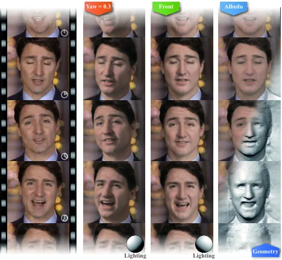

Figure 1: Given a portrait video shown in the leftmost column, our
method reconstructs a 3D relightable face for each video frame. Users
can then adjust their viewpoints and lighting conditions interactively.
The second column displays relighted video frames with a head pose yaw
of 0.3, while the third column presents faces relighted under an
alternative lighting condition with a frontal head pose. The rightmost
column provides the predicted albedo and geometry of the reconstructed
face. Please see the supplementary video for the full results.

Of particular significance is the context of augmented reality (AR) and
virtual reality (VR) applications, where users often seek to create 3D
faces that can be dynamically relighted to fit the environment. This
dynamic relighting capability becomes possible only when the underlying
method is inherently 3D-aware and operates in real time.

However, 3D-aware portrait video relighting is a challenging task, since
it involves modeling the complex interactions between the light,
geometry, and appearance of human faces, as well as ensuring the
temporal coherence and naturalness of synthesized videos. It is even
more challenging when real-time performance is required. Existing
methods for face relighting suffer from some limitations that prevent
them from being widely adopted in practice. First, most of them (_e.g_.,
\[50, 31, 54\]) can only relight the faces from the input viewpoints,
thus restricting the user’s freedom to change the camera angle or
perspective. This also limits the creative possibilities and
applications for AR/VR scenarios. Second, many methods (_e.g_., \[56,
19\]) are designed for monocular image inputs and thus produce
flickering or unnatural results when directly applied to videos, making
them inferior for practical usage, where smooth and realistic
transitions are expected. Third, some methods are time-consuming in
terms of both training and inference. For example, ReliTalk \[33\] takes
3 days of training for a 2-minute video clip. Once trained, it takes 0.2
seconds to relight a video frame. Although DPR \[56\] achieves real-time
performance, it suffers from low-quality results. It is still
challenging to balance quality and efficiency with existing solutions.

In this paper, we present a novel real-time 3D-aware portrait video
relighting method that jointly solves the above problems by generating
realistic and consistent relighting results for faces from novel
viewpoints in real time, enabling users to create realistic and natural
personas for AR/VR applications, as shown in Figure 1. In summary, our
technical contributions are:

- •
  We contribute to the ongoing field of 3D-aware portrait video
  relighting by introducing a novel approach that achieves real-time
  performance while producing realistic and consistent results.
- •
  We propose to use dual feed-forward encoders to capture the albedo and
  shading information within a portrait. The shading encoder is
  conditioned on the albedo encoder to ensure spatial alignment of
  albedo and shading, resulting in realistic reconstruction and accurate
  relighting.
- •
  We use a novel temporal consistency network to address temporal
  inconsistencies in video data, reducing flickering artifacts and
  ensuring seamless transitions between frames.

## 2 Related Work

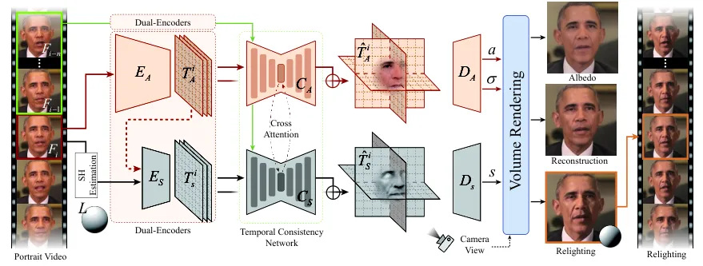

Figure 2: The pipeline of our method. Given a portrait video shown on
the left side, we embed each video frame into an albedo tri-plane and a
shading tri-plane using Dual-Encoders. For example, for frame $`F_{i}`$,
we predict the albedo tri-plane $`T_{A}^{i}`$. Next, we use the
estimated lighting condition $`L`$ and the albedo tri-plane
$`T_{A}^{i}`$ to predict the shading tri-plane $`T_{S}^{i}`$ that models
the illumination effects on the face. Then we feed $`T_{S}^{i}`$ and
$`T_{A}^{i}`$ along with the tri-planes predicted from previous $`n`$
frames into two transformer models $`C_{A}`$ and $`C_{S}`$ to enhance
the temporal consistency. The two transformers use cross-attention to
cooperate for information sharing and alignment between the albedo and
shading branches. We add the predicted residual to $`T_{A}^{i}`$ and
$`T_{S}^{i}`$ as $`\hat{T}_{A}^{i},\hat{T}_{S}^{i}`$ for better temporal
consistency. Finally, we use $`\hat{T}_{A}^{i}`$ and $`\hat{T}_{S}^{i}`$
to condition the volumetric rendering process, producing depth, albedo,
shading, color, and super-resolved images.

Our work closely relates to several topics, including 3D-aware portrait
generation, portrait relighting, and GAN (Generative Adversarial
Network) inversion.

### 2.1 3D-aware Portrait Generation

3D-aware portrait generation is the task of generating realistic and
diverse images of human faces. Previous work on this task relied on 3D
face priors to model the geometry and appearance of faces, such as 3D
morphable models \[4, 25\] or neural face models \[42, 14\]. However,
these methods require expensive 3D scanning or manual annotation and
often produce low-resolution or unnatural results. With the advancement
of generative models \[40\], it is now possible to learn a 3D
representation of faces from a collection of 2D images without any
explicit 3D supervision. In particular, recent approaches combine neural
radiance fields (NeRF) \[27\] and generative models such as generative
adversarial networks (GANs) \[17\] and diffusion models \[18\] to
generate high-resolution and multi-view consistent face images \[5, 1,
37, 29, 30, 10, 49, 38, 28, 39, 45\]. In this paper, we adopt the
tri-plane representation from EG3D \[5\] as our 3D representation for
portrait synthesis and relighting. This choice is motivated by the
insights presented in \[20\], which shows that the tri-plane 3D
representation facilitates the disentanglement of albedo and shading.
This disentanglement, afforded by the tri-plane structure, enables a
3D-aware approach for relighting portraits in a photorealistic manner.

### 2.2 Portrait Relighting

Portrait relighting requires changing the illumination of a portrait
image or video while preserving the identity and appearance of the
subject. Previous works (_e.g_., \[54\]) used One-Light-at-A-Time (OLAT)
capturing systems to obtain detailed portrait geometry and reflectance,
which enabled realistic relighting results. However, OLAT data is
expensive and difficult to acquire, thus limiting the applicability of
these methods. To overcome this limitation, some recent works
(_e.g_., \[57, 50, 32, 13\]) used synthetic data for training and showed
good generalization to real data.

Another line of research explored 3D-aware portrait relighting, which
leveraged the recent advances in unconditional 3D-aware portrait
generation \[5\] by combining GANs \[17\] and NeRFs \[27\].
Concurrently, Jiang _et al_. \[20\] and Ranjan _et al_. \[35\] modeled
the lighting effects in generative models, either implicitly or
explicitly, and achieved impressive quality of image relighting.
However, these methods are unsuitable for video relighting since they
require inverting each frame separately, which is time-consuming and
does not ensure temporal consistency, leading to flickering artifacts.

This paper proposes a novel method for real-time 3D-aware video
relighting, which builds on \[20\] and distills its knowledge into a
feedforward network with a temporal enhancement module. Our method can
produce realistic, high-quality portrait relighting videos with various
lighting effects and novel views. In contrast to our approach, none of
the existing portrait relighting techniques can handle consistent and
real-time novel view synthesis for a video sequence.

### 2.3 GAN Inversion

GAN inversion aims to find a latent representation in a pretrained
model’s latent space that can reconstruct a given image with its
generator. Existing GAN inversion methods can be divided into
optimization-based, learning-based, and hybrid approaches.

Optimization-based methods minimize reconstruction errors for
high-quality results but are slow, as seen in \[51\] and \[47\], since
these methods require end-to-end optimization across numerous video
frames. Learning-based methods (_e.g_., \[43\]), using an encoder, are
faster but at the cost of lower-quality reconstruction quality. With
recent trends of predicting richer information from input images, Yuan
_et al_. \[53\], Bhattarai _et al_. \[3\], and Trevithick _et
al_. \[44\] propose to predict a tri-plane from input images, striking a
good balance between quality and efficiency. Hybrid methods (_e.g_.,
\[36, 52, 2, 15\]) combine optimization and learning, enhancing both
quality and efficiency. Nevertheless, their practical utility is
hindered because they still require minutes to hours to process a video
clip, preventing real-time applications.

Among these methods, only pure learning-based methods have the potential
for real-time applications. Based on the idea of LP3D \[44\], we propose
a novel learning-based method for video inversion, which predicts
tri-plane representations from input images instead of latent codes.
Tri-plane representations contain richer information than latent codes
and can better capture the geometry and appearance variations of the
input images. Unlike previous learning-based methods, such as \[43, 53,
3, 44\], that are designed for single-image inversion and thus neglect
the temporal information in videos, we introduce a temporal consistency
network to enforce smooth transitions between consecutive frames. Our
method can achieve high-quality and consistent video inversion in real
time with relighting capabilities.

## 3 Methodology

In this section, we give the preliminaries of the pre-trained generator
in Sec. 3.1. Then, we describe how we achieve real-time video inversion
and enable lighting control by using two tri-planes in Sec. 3.2. Next,
we introduce how to enhance temporal consistency for video inputs in
Sec. 3.3. Finally, we introduce our training objectives in Sec. 3.4. The
overall pipeline is illustrated in Figure 2.

### 3.1 Preliminaries

Our work distills knowledge from a pre-trained 3D-aware generator $`G`$
trained based on the GAN framework \[20\], to enable real-time synthesis
and lighting control of multiview consistent video frames. Given a
latent code $`w`$ in an albedo latent space, an albedo tri-plane is
first predicted through a generator and then fed into a convolutional
network \[22\] to predict a shading tri-plane, which is additionally
conditioned on the second-order spherical harmonic (SH) coefficients
$`L`$ \[34\]. Both albedo tri-plane and shading tri-plane are used to
condition the neural rendering process given a viewing angle. In this
way, a realistic facial image $`I`$ and its corresponding albedo $`A`$
can be generated, while allowing the disentangled control of camera and
lighting conditions.

### 3.2 Tri-plane Dual-encoders

We present dual-encoders (Figure 2) that can infer an albedo tri-plane
and a shading tri-plane from a single RGB image. These two tri-planes
are later rendered into a high-resolution ($`512\times 512`$) RGB image
$`\hat{I}`$ and an albedo image $`\hat{A}`$ through a rendering process
identical to \[20\]. Our network extends the LP3D model \[44\], which
encodes an image into a tri-plane representation for neural rendering.
However, unlike LP3D, our network can produce two disentangled
tri-planes, allowing for dynamic adjustments of lighting conditions from
a single image. Our network consists of two branches: one is Albedo
Encoder $`E_{A}`$ for inferring an albedo tri-plane that captures the
shape and texture of the scene, and the other is Shading Encoder
$`E_{S}`$ for inferring a shading tri-plane that models the fine-grained
illumination effects.

#### Albedo Encoder.

Inspired by LP3D \[44\], we use an encoder based on Vision Transformer
(ViT) \[12\] in the albedo branch for albedo prediction. The input to
our method is a single RGB image $`F`$ with an overlaid coordinate map,
forming a 5-channel image. We use a DeepLabV3 \[7\] network pretrained
on ImageNet \[8\] to extract low-frequency features from the input
image, which capture global context and semantic information. We then
feed these features into a ViT-based encoder \[44\] that further
enhances the global features by self-attention mechanisms to get final
low-frequency feature $`f_{\text{low}}`$. We also use a convolutional
neural network (CNN) \[44\] to extract high-frequency features
$`f_{\text{high}}`$ from the input image $`F`$, which capture the fine
details and edges. We feed $`f_{\text{high}}`$ into another ViT-based
encoder \[44\], along with the low-frequency features $`f_{\text{low}}`$
to predict the final albedo tri-plane $`T_{\text{A}}`$.

#### Shading Encoder.

To predict the shading tri-plane $`T_{S}`$, we use a CNN with additional
StyleGAN \[22\] blocks, conditioned on the albedo tri-plane $`T_{A}`$
and the lighting condition $`L`$. We represent the lighting condition
$`L`$ as second-order SH coefficients mapped using an off-the-shelf
mapping network \[20\]. This design ensures that the shading tri-plane
$`T_{S}`$ is spatially aligned with the albedo tri-plane $`T_{A}`$ for
realistic reconstruction and relighting.

We employ a three-stage training strategy for our encoder. In the
initial stage, we adhere to the procedure outlined in \[44\] to train
the albedo encoder, focusing on reconstructing the provided portrait
without considering the disentanglement between albedo and shading. In
the second stage, we independently train the albedo branch and the
shading branch. In the third stage, we integrate the two branches and
train them jointly. This strategic approach enhances convergence and
performance compared to training both branches simultaneously from the
outset.

### 3.3 Temporal Consistency Network

We aim to invert a video sequence into a sequence of tri-planes, which
are low-dimensional representations of the 3D scene structure, texture,
and illumination. However, simply inverting each video frame
independently leads to temporal inconsistency and causes flickering
artifacts in the rendered images.

To address this problem, we propose a temporal consistency network
(Figure 2), which exploits the rich temporal information in the video
sequence to enhance the temporal consistency of the tri-plane features.
The network is composed of two transformers, denoted as $`C_{A}`$ and
$`C_{S}`$, accompanied by an additional convolutional neural network
(CNN). Our design is inspired by \[24\], yet distinctively employs
features at the tri-plane level. Both transformers take in corresponding
predicted tri-planes for $`n`$ frames, and predict residual tri-planes
for each frame $`i`$ to be added to the original tri-planes as
$`\hat{T}^{i}_{A},\hat{T}^{i}_{S}`$. The residual tri-planes capture the
temporal variations and dynamics of the subject and help to eliminate
the flickering effects. Moreover, this network uses cross-attention
between the albedo branch and the shading branch, which allows them to
interact with each other for better temporal consistency.

We use synthetic data to train such a temporal consistency network.
Similar to training the tri-plane encoder, we generate synthetic data
with augmentation techniques tailored for temporal consistency. This
involves interpolating between two randomly selected camera views to
simulate realistic video sequences. Additionally, random noise is added
to both tri-planes to emulate flickering effects. This process for
generating synthetic data provides us with a ground truth for
de-flickering, devoid of errors stemming from inaccurate camera and
lighting estimations. We empirically find that such a temporal
consistency network trained on dynamic viewing angles and artificial
noises make our method robust towards more diverse temporal dynamics in
the real-world case, such as dynamic expressions.

### 3.4 Training Objectives

We first train our tri-plane dual-encoders to converge, and then train
the temporal consistency network. Specifically, the tri-plane
dual-encoders are trained with loss defined as follows:

#### Albedo Loss.

This loss quantifies the dissimilarity between the predicted and
ground-truth albedo images and tri-planes. Specifically, the albedo loss
is defined as:

```math
\displaystyle\mathcal{L}_{\text{albedo}} \displaystyle=||\hat{A}-A||_{1}+||\hat{A_{r}}-A_{r}||_{1}+\mathcal{L}_{\text{lpips}}(\hat{A},A) \tag{1}
```

```math
\displaystyle+\mathcal{L}_{\text{lpips}}(\hat{A_{r}},A_{r})+\lambda_{g}||\hat{T_{g}}-T_{g}||_{1},
```

where $`\mathcal{L}_{\text{lpips}}`$ denotes a perceptual loss \[55\],
$`\hat{A_{r}}`$, $`\hat{A}`$, and $`\hat{T_{g}}`$ are the rendered
albedo images in the raw and super-resolution domains, and the predicted
albedo tri-plane, respectively. $`A`$, $`A_{r}`$, and $`T_{g}`$ are the
corresponding ground truth. The parameter $`\lambda_{g}`$ decreases from
$`1`$ to $`0.01`$ after the initial 8 million iterations.

#### Shading Loss.

This loss measures the disparity between the predicted and ground-truth
shading features. It is defined as

```math
\mathcal{L}_{\text{shading}}=||\hat{S}-S||_{1}+\lambda_{s}||\hat{T_{S}}-T_{S}||_{1}, \tag{2}
```

where $`\hat{S}`$ and $`\hat{T_{S}}`$ are the predicted shading maps and
the shading tri-plane, respectively, and $`S`$ and $`T_{S}`$ are the
corresponding ground truth. The parameter $`\lambda_{s}`$ decreases from
$`1`$ to $`0.01`$ after the initial 8 million iterations.

#### RGB Loss.

This loss assesses the dissimilarity between the predicted and
ground-truth composed images in the raw, super-resolution, and feature
domains. In addition to a perceptual loss \[55\], an identity loss \[9\]
is employed to retain the appearance and identity of facial images. The
RGB loss is defined as

```math
\displaystyle\mathcal{L}_{\text{rgb}} \displaystyle=||\hat{I}-I||_{1}+||\hat{I_{r}}-I_{r}||_{1}+\mathcal{L}_{\text{lpips}}(\hat{I},I) \tag{3}
```

```math
\displaystyle+\mathcal{L}_{\text{lpips}}(\hat{I_{r}},I_{r})+\lambda_{f}||\hat{I_{f}}-I_{f}||_{1}+\mathcal{L}_{id}(\hat{I},I),
```

where $`\hat{I}`$, $`\hat{I_{r}}`$, and $`\hat{I_{f}}`$ are the
predicted RGB images in the raw, super-resolution, and feature domains,
respectively, and $`I`$, $`I_{r}`$, and $`I_{f}`$ are the corresponding
ground truth. The parameter $`\lambda_{f}`$ decreases from $`1`$ to
$`0`$ after the initial 8 million iterations.

#### Adversarial Loss.

This loss enforces the indistinguishability of the predicted RGB images
from the source RGB images in both the raw and super-resolution domains.
A dual discriminator $`D`$ from \[20\] is utilized to discriminate
between the predicted and real images. The adversarial loss is defined
as

```math
\displaystyle\mathcal{L}_{\text{adv}} \displaystyle=-(\mathbb{E}[\log D(I)]+\mathbb{E}[\log D(I_{r})] \tag{4}
```

```math
\displaystyle+\mathbb{E}[\log(1-D(\hat{I}))]+\mathbb{E}[\log(1-D(\hat{I}_{r}))]).
```

Our final loss function for training the dual-encoders is the weighted
sum of the above losses:

```math
\displaystyle\mathcal{L} \displaystyle=\lambda_{\text{albedo}}\mathcal{L}_{\text{albedo}}+\lambda_{\text{shading}}\mathcal{L}_{\text{shading}} \tag{5}
```

```math
\displaystyle+\lambda_{\text{rgb}}\mathcal{L}_{\text{rgb}}+\lambda_{\text{adv}}\mathcal{L}_{\text{adv}},
```

where $`\lambda_{\text{albedo}}`$, $`\lambda_{\text{shading}}`$,
$`\lambda_{\text{rgb}}`$ and $`\lambda_{\text{adv}}`$ are the weights
for each loss term. Initially, we set
$`\lambda_{\text{albedo}}=\lambda_{\text{shading}}=\lambda_{\text{rgb}}=1`$
and $`\lambda_{\text{adv}}=0`$. After the first 16M iterations, we
activate the adversarial loss by setting $`\lambda_{\text{adv}}=1`$ and
keep the other weights unchanged.

For training our temporal consistency network, besides a reconstruction
loss, we use an additional temporal loss similar to \[6, 24\] to ensure
consistency in both short-term and long-term contexts. Specifically,
this loss is defined as follows:

#### Temporal Consistency Loss.

Without loss of generality, we assume current frame index is $`i`$ for
discussion. The short-term temporal loss is computed by calculating the
optical flow $`f_{s}`$ between consecutive input frames $`F_{i}`$ and
$`F_{i-1}`$. Subsequently, the previous outputs are warped to align with
the current frame. Formally, the short-term temporal loss is defined as:

```math
\mathcal{L}_{\text{short}}=M_{s}^{i}\sum_{\omega\in\{\hat{I},\hat{I}_{r},\hat{A},\hat{A}_{r},\hat{S}\}}\mathcal{L}_{\text{lpips}}(\omega^{i}-\widetilde{\omega}^{i-1}), \tag{6}
```

where $`\hat{I}^{i},\hat{I}_{r}^{i},\hat{A}^{i},\hat{A}_{r}^{i},`$ and
$`\hat{S}^{i}`$ represent the currently predicted RGB image, raw RGB
image, albedo image, raw albedo image, and shading image, based on the
summation of original tri-planes and predicted residual tri-planes,
respectively. Similarly,
$`\widetilde{I}^{i-1},\widetilde{I}_{r}^{i-1},\widetilde{A}^{i-1},\widetilde{A}_{r}^{i-1},`$
and $`\widetilde{S}^{i-1}`$ are the corresponding frames warped using
$`f_{s}`$ from the previous time step. The mask $`M_{s}^{i}`$ is defined
as $`M_{s}^{i}=\exp(||I^{i}-\widetilde{I}^{i-1}||_{1})`$, which
mitigates errors introduced during the warping process.

For the long-term temporal loss, the same procedure is applied, but with
the temporal index $`i-1`$ replaced by 1. In other words, this process
ensures temporal consistency between the first frame and the current
frame. Similarly, the long-term temporal loss is defined as

```math
\mathcal{L}_{\text{long}}=M_{l}^{i}\sum_{\omega\in\{\hat{I},\hat{I}_{r},\hat{A},\hat{A}_{r},\hat{S}\}}\mathcal{L}_{\text{lpips}}(\omega^{i}-\widetilde{\omega}^{1}), \tag{7}
```

where
$`\widetilde{I}^{i-1},\widetilde{I}_{r}^{i-1},\widetilde{A}^{i-1},\widetilde{A}_{r}^{i-1},`$
and $`\widetilde{S}^{i-1}`$ are the corresponding frames warped using
$`f_{l}`$ from the first time step. The mask $`M_{l}^{i}`$ is defined as
$`M_{l}^{i}=\exp(||I^{i}-\widetilde{I}^{1}||_{1})`$.

Our final loss function for training the temporal consistency network is

```math
\mathcal{L}_{\text{temporal}}=\lambda_{\text{short}}\mathcal{L}_{\text{short}}+\lambda_{\text{long}}\mathcal{L}_{\text{long}}+\lambda_{\text{lpips}}\mathcal{L}_{\text{lpips}}(\hat{I}^{i},I^{i}). \tag{8}
```

where $`I^{i}`$ denotes the ground-truth image,
$`\mathcal{L}_{\text{lpips}}`$ promotes the reconstruction and
$`\lambda_{\text{short}}=1,\lambda_{\text{long}}=1,\lambda_{\text{lpips}}=1`$.

## 4 Experiments

|                                                            |                                                            |                                                            |                                                            |                                                            |                                                            |                                                            |
| ---------------------------------------------------------- | ---------------------------------------------------------- | ---------------------------------------------------------- | ---------------------------------------------------------- | ---------------------------------------------------------- | ---------------------------------------------------------- | ---------------------------------------------------------- |
| 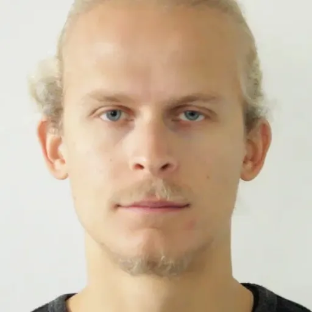  | 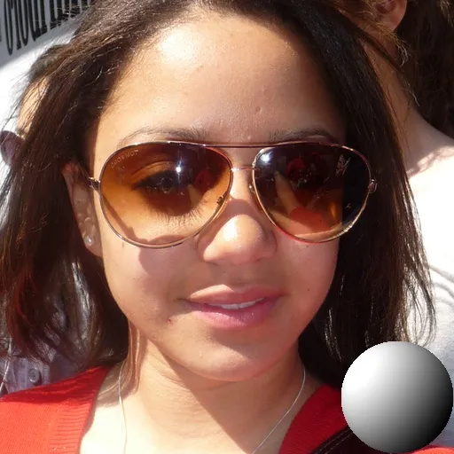  | 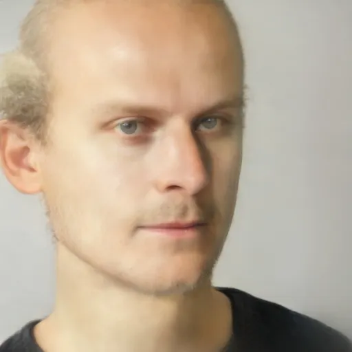  | 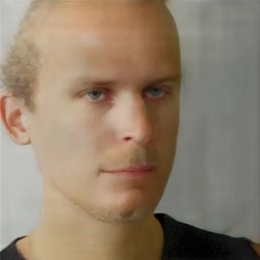  | 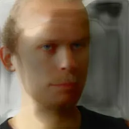  | 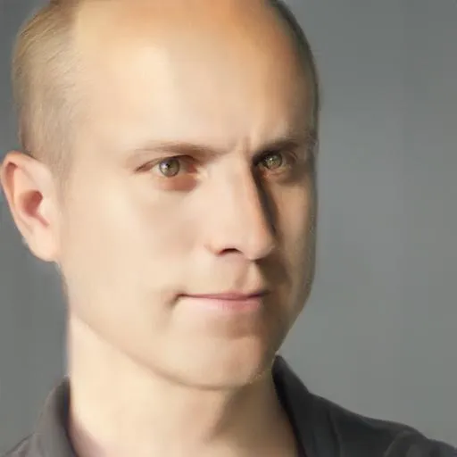  | 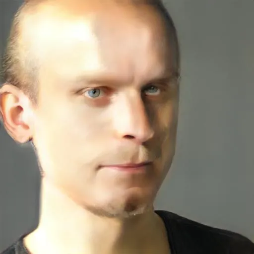  |
| 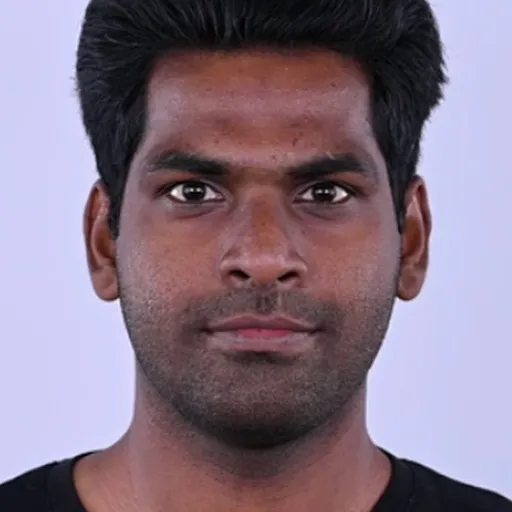 | 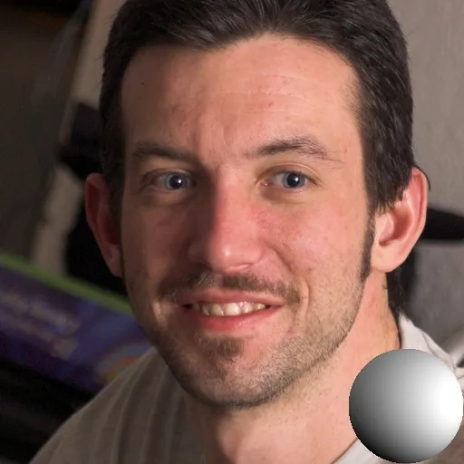 |  | 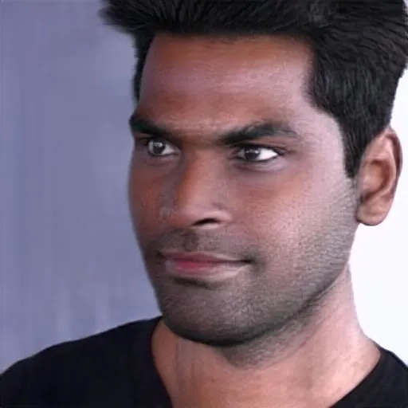 | 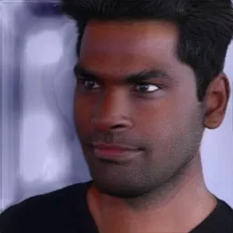 | 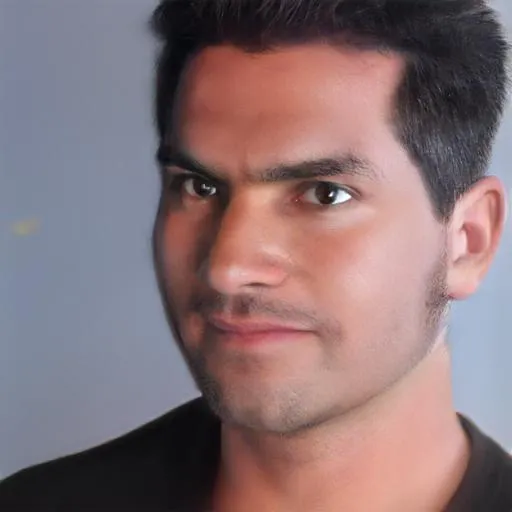 | 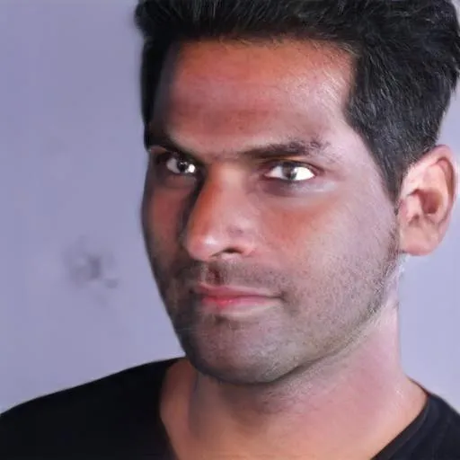 |
| Input                                                      | Light Reference                                            | Ours                                                       | B-DPR                                                      | B-SMFR                                                     | B-E4E                                                      | B-PTI                                                      |

Figure 3: Comparison of video relighting quality on novel views. Our
method produces more realistic and consistent results than the baseline
methods introduced in Sec. 4.2.

[TABLE]

Figure 4: Comparison of video relighting quality in the input view. We
compare our method with three methods: SMFR \[19\], DPR \[56\], and
ReliTalk \[33\]. We show the input video frames in the first row and the
relighted results under different lighting conditions in the remaining
rows. Our method produces more realistic and consistent results than
other methods, especially under challenging conditions like the side
lighting.

|                                                            |                                                            |                                                            |                                                            |                                                            |                                                            |                                                            |                                                            |                                                            |
| ---------------------------------------------------------- | ---------------------------------------------------------- | ---------------------------------------------------------- | ---------------------------------------------------------- | ---------------------------------------------------------- | ---------------------------------------------------------- | ---------------------------------------------------------- | ---------------------------------------------------------- | ---------------------------------------------------------- |
| 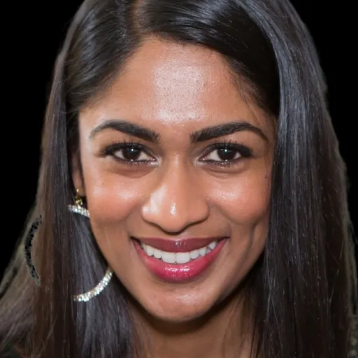 | 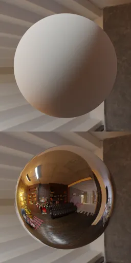 | 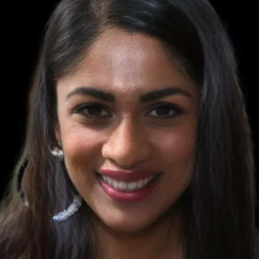 | 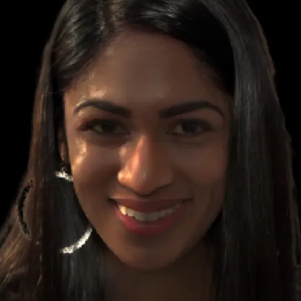 | 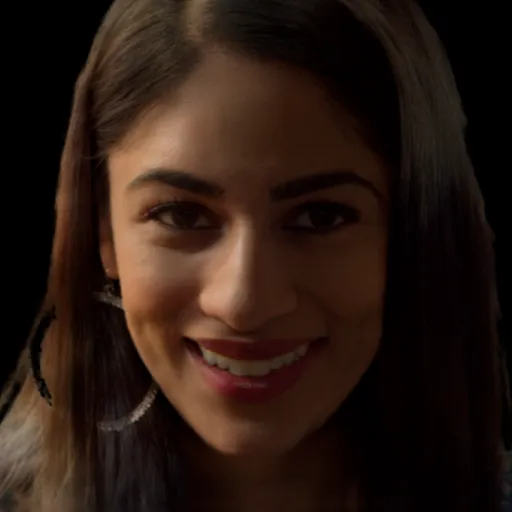 | 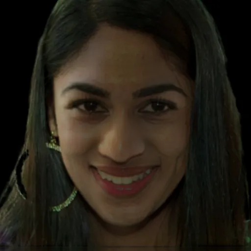 | 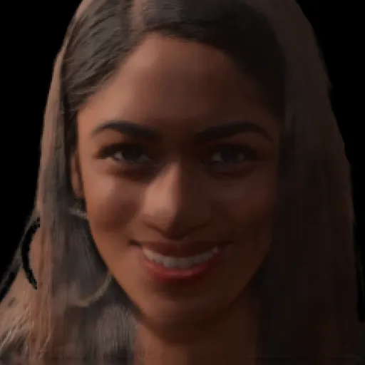 |  | 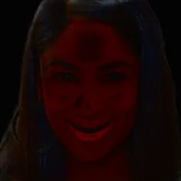 |
| 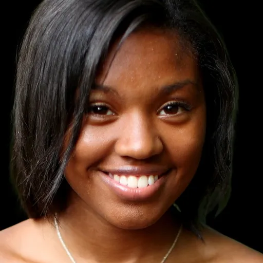 | 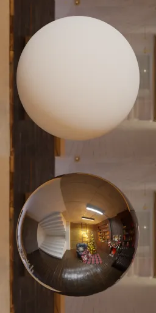 | 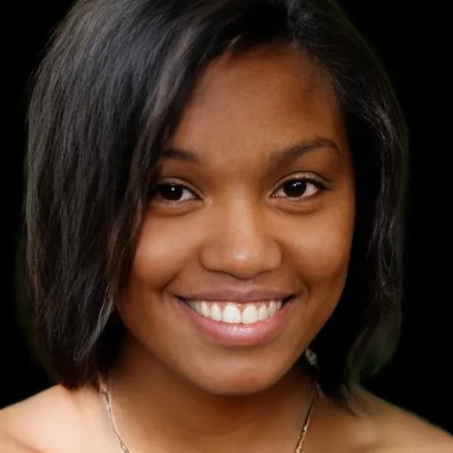 | 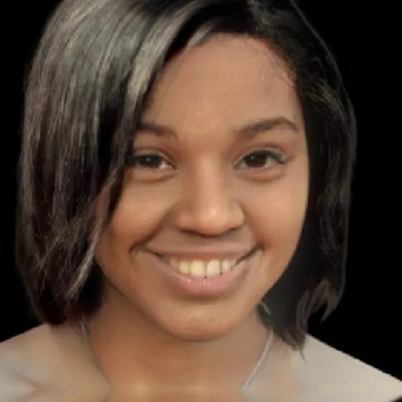 | 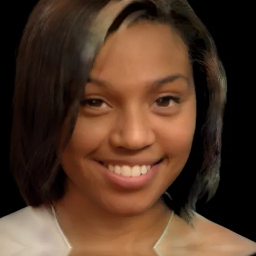 | 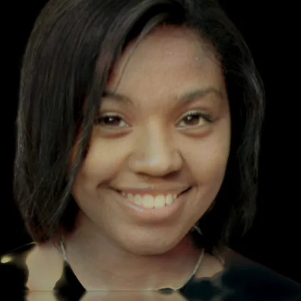 | 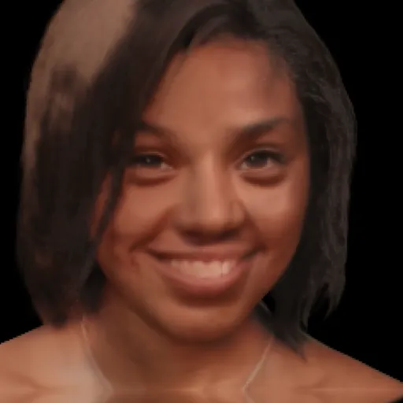 | 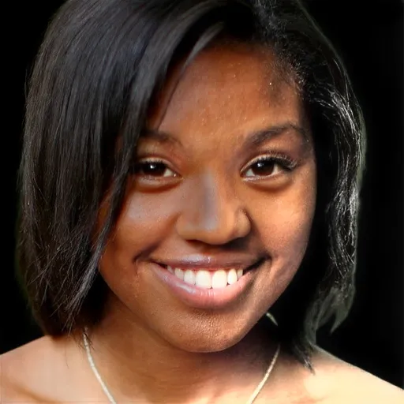 | 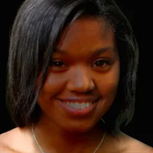 |
| 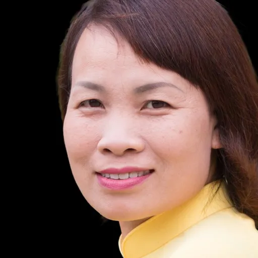 | 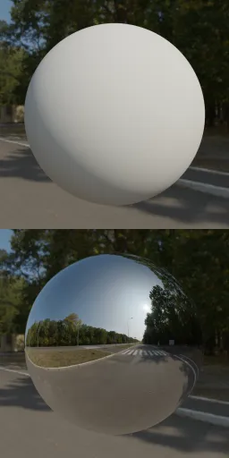 | 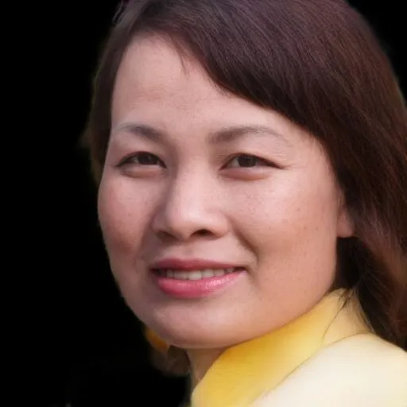 | 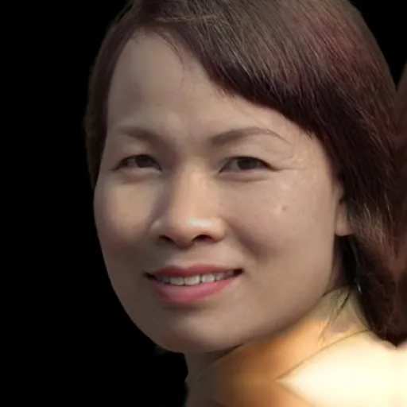 | 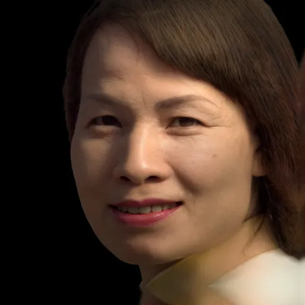 | 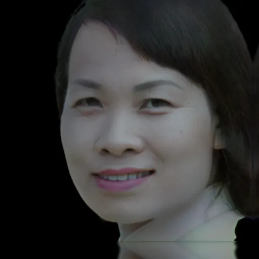 | 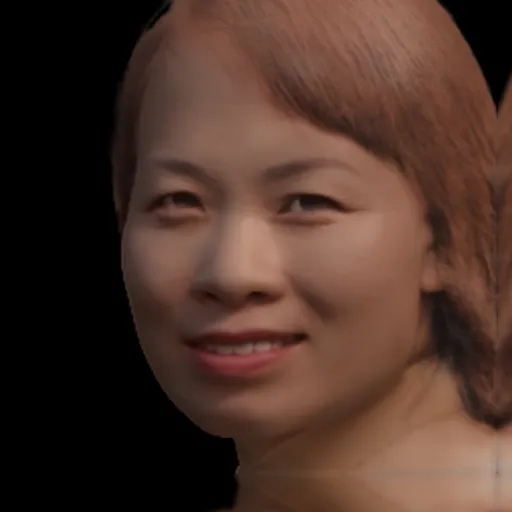 | 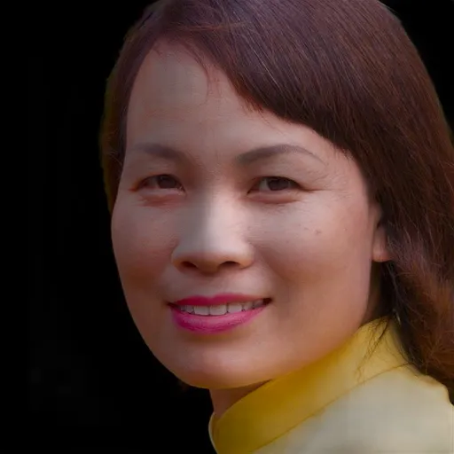 | 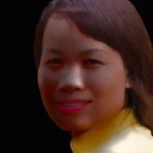 |
| Input                                                      | Light                                                      | Ours                                                       | Lumos \[50\]                                               | TR \[31\]                                                  | NVPR \[54\]                                                | SIPR-W \[46\]                                              | DPR \[56\]                                                 | SMFR \[19\]                                                |

Figure 5: Comparison of relighting quality on the input view. We compare
our method with six methods: Lumos \[50\], TR \[31\], NVPR \[54\],
SIPR-W \[46\], DPR \[56\] and SMFR \[19\]. We show the input image in
the first column, the sphere renderings from the environment map in the
second column, and the relighted results in the remaining columns. Our
method produces more realistic and consistent results than the other
methods.

In this section, we show our experimental setup and discuss the results
of our experiments. The comparisons with alternative methods, and
ablation study show the effectiveness of our method and its superiority
to the alternative approaches.

### 4.1 Implementation Details

#### Datasets.

We evaluate our method on the portrait videos from INSTA \[58\], which
consist of 31,079 frames in total. Following \[48\], we crop the images
and videos to focus on the faces. We estimate the camera pose for each
frame using the technique from \[5\]. We also extract the lighting
conditions with DPR \[56\].

#### Training Details.

As to the tri-plane dual-encoders, we first freeze the generator and
train only our encoder. After the first 16M iterations, we unfreeze the
albedo decoder, shading decoder, and super-resolution module and train
them jointly with the dual-encoders. As to the temporal consistency
network, we sample camera poses from normal and uniform distributions
for each person. We use two views for each person. For the first view,
we sample the focal length, camera radius, principal point, camera
pitch, camera yaw, and camera roll from $`\mathrm{N}(18.837,1)`$,
$`\mathrm{N}(2.7,0.1)`$, $`\mathrm{N}(256,14)`$,
$`\mathrm{U}(-26^{\circ},26^{\circ})`$,
$`\mathrm{U}(-49^{\circ},49^{\circ})`$, and $`\mathrm{N}(0,2^{\circ})`$,
respectively. For the second view, we sample the camera pitch and camera
yaw from $`\mathrm{U}(-26^{\circ},26^{\circ})`$ and
$`\mathrm{U}(-36^{\circ},36^{\circ})`$, respectively and fix the other
parameters to 18.837 (focal length), 2.7 (camera radius), 256 (principal
point), and 0 (camera roll).

We train our network using the Adam \[23\] optimizer with a learning
rate of 0.0001, except for the Transformer parameters, which have a
learning rate of 0.00005. It takes about 30 days to train our network on
8 NVIDIA Tesla V100 GPUs with batch size 32. More details can be found
in the supplementary material.

#### Inference Speed.

We employ a single RTX 4090 GPU during inference. The average inference
time for each frame is 30.32 milliseconds, resulting in an average of
32.98 frames per second (fps), excluding secondary tasks such as image
I/O and data transfer between the CPU and GPU.

### 4.2 Quantitative Evaluation

To evaluate the performance of our method, we compare it with other
methods capable of 3D-aware portrait relighting. However, none of
existing techniques can achieve this goal in a single step, so we have
to combine different methods to construct the baselines. Specifically,
we use the following methods. B-DPR uses PTI \[36\] to invert each frame
of an input video as a latent code of EG3D \[5\], allowing for rendering
novel views and relighting using DPR \[56\]. B-SMFR uses the same
inversion and rendering method as B-DPR, but uses SMFR \[19\] to relight
the rendered frames from novel views. B-E4E uses an off-the-shelf
encoder from a state-of-the-art NeRF-based face image relighting
method \[20\] to invert each frame of the input video and relight it
from novel views, which achieves real-time performance at the cost of
quality. B-PTI uses the same encoder as B-E4E, but we apply the
PTI \[36\] to fine-tune a single generator for each input video. This
improves the reconstruction quality but takes more training time than
B-E4E. We evaluate the performance of different methods regarding
reconstruction quality, novel view relighting quality, identity
perseverance, and time cost.

#### Novel View Relighting Quality.

To evaluate the relighting quality under novel views, we relight first
500 frames from each video from \[58\]. We render each video from three
novel views and pair them with five distinct lighting conditions,
resulting in a total of 75,000 frames for a comprehensive comparison.
Following \[20\], we adopt an off-the-shelf estimator \[14\] to
calculate the lighting accuracy and instability. We use MagFace \[26\],
different from the one we use in training, to measure identity
preservation between different views. To assess temporal consistency, we
use an optical flow estimator \[41\] to calculate warping error (WE).
This involves warping the preceding frame to align with the current
frame and measuring MSE loss. We also compute the LPIPS between adjacent
frames for an additional evaluation of temporal consistency. We list the
time each method takes to relight a face. Table 1 summarizes the
quantitative evaluation results using the lighting error, lighting
instability calculated based on the lighting transfer task introduced in
\[20\], identity preservation (ID), and processing time (Time) on the
INSTA \[58\] video dataset. Our method outperforms the baselines,
demonstrating the second lowest lighting error and instability, the
highest identity preservation, the lowest warping error and LPIPS, and
the lowest time cost.

|        |                  |                  |                |                  |                     |                         |
| ------ | ---------------- | ---------------- | -------------- | ---------------- | ------------------- | ----------------------- |
|        | LE$`\downarrow`$ | LI$`\downarrow`$ | ID$`\uparrow`$ | WE$`\downarrow`$ | LPIPS$`\downarrow`$ | Time (s) $`\downarrow`$ |
| B-DPR  | 0.9093           | 0.3041           | 0.5222         | 0.0029           | 0.1015              | 200                     |
| B-SMFR | 1.0929           | 0.3352           | 0.4479         | 0.0022           | 0.0626              | 200                     |
| B-E4E  | 0.6384           | 0.1963           | 0.2892         | 0.0007           | 0.0306              | 0.2                     |
| B-PTI  | 0.8220           | 0.2630           | 0.4728         | 0.0049           | 0.1080              | 30                      |
| Ours   | 0.7710           | 0.2533           | 0.5396         | 0.0003           | 0.0159              | 0.03                    |

Table 1: Quantitative evaluation using lighting error (LE), lighting
instability (LI), Identity Perservance (ID), Warping Error (WE), LPIPS
between consecutive frames and avarage time cost (Time) on the
INSTA \[58\] video dataset. We highlight the best score in boldface and
underline the second best.

#### Reconstruction Quality.

To assess the quality of reconstruction, we use four quantitative
metrics: LPIPS \[55\], DISTS \[11\], Pose Error (Pose), and Identity
Preservation (ID). We obtained and used the same test data as
LP3D \[44\].

|              | LPIPS$`\downarrow`$ | DISTS$`\downarrow`$ | Pose$`\downarrow`$ | ID$`\uparrow`$ |
| ------------ | ------------------- | ------------------- | ------------------ | -------------- |
| HeadNeRF^(†) | .2502               | .2427               | .0644              | .2031          |
| LP3D^(†)     | .1240               | .0770               | .0490              | .5481          |
| Ours^(†)     | .1746               | .1134               | .0323              | .7109          |
| ROME^(‡)     | .1158               | .1058               | .0637              | .3231          |
| LP3D^(‡)     | .0468               | .0407               | .0486              | .5410          |
| Ours^(‡)     | .1053               | .0835               | .0327              | .7201          |
| EG3D-PTI     | .3236               | .1277               | .0575              | .4650          |
| LP3D         | .2692               | .0904               | .0485              | .5426          |
| LP3D(LT)     | .2750               | .1021               | .0448              | .5404          |
| NFL-PTI      | .2332               | .1627               | .0228              | .6825          |
| Ours         | .2400               | .1282               | .0365              | .7015          |

Table 2: Quantitative evaluation using LPIPS, DISTS, Pose Accuracy
(Pose), and Identity Consistency (ID) on 500 FFHQ images. ^(†)Evaluated
only using the face region. ^(‡)Evaluated only using the foreground on
$`256^{2}`$ images. We highlight the best score in boldface and
underline the second best.

#### Input View Relighting Quality.

We compare our method with four state-of-the-art portrait relighting
methods: SIPR-W \[46\], TR \[31\], NVPR \[54\], and Lumos \[50\]. We
follow the same protocol as Lumos to obtain the results for comparison.
As shown in Table 3, our method achieves the lowest Fréchet Inception
Distance, suggesting more realistic outcomes, and the highest Identity
Preservation. For a visual comparison, please refer to Figure 4, where
our approach yields the most realistic and natural results.

For the video input, we evaluate the relighting accuracy and instability
while performing the video relighting on the input view. Following
\[20\], we adopt an off-the-shelf estimator \[14\], which is different
from the one \[56\] we use during the inference time, to calculate the
lighting accuracy and the lighting instability. As shown in Table 4.
Compared to DPR, SMFR and ReliTalk, our method achieves the lowest
lighting instability and the second lowest lighting error.

|                   | SIPR-W | NVPR   | TR     | Lumos  | SMFR   | Ours   |
| ----------------- | ------ | ------ | ------ | ------ | ------ | ------ |
| FID$`\downarrow`$ | 87.39  | 65.23  | 55.30  | 55.18  | 51.16  | 45.08  |
| ID$`\uparrow`$    | 0.6442 | 0.7242 | 0.6193 | 0.7374 | 0.6285 | 0.7711 |

Table 3: Quantitative evaluation on the cropped test set of FFHQ \[21\].
We highlight the best score in boldface and underline the second best.

|                 | Lighting Error$`\downarrow`$ | Lighting Instability$`\downarrow`$ | Time (s)$`\downarrow`$ |
| --------------- | ---------------------------- | ---------------------------------- | ---------------------- |
| DPR \[56\]      | 0.7600                       | 0.2997                             | 0.04                   |
| SMFR \[19\]     | 1.1381                       | 0.2895                             | 0.06                   |
| ReliTalk \[33\] | 1.2012                       | 0.4060                             | 0.20                   |
| Ours            | 0.7816                       | 0.2841                             | 0.03                   |

Table 4: Quantitative evaluation using the lighting error, lighting
instability, and average time cost (Time) on the INSTA \[58\] video
dataset. We highlight the best score in boldface and underline the
second best.

### 4.3 Qualitative Evaluation

We conduct a qualitative evaluation on portrait videos from \[16\] to
demonstrate the effectiveness of our method.

#### Novel View Relighting Quality.

Figure 3 shows our method’s novel view synthesis capability under
various viewpoints and lighting conditions. Among the five methods, our
method preserves the lighting conditions of the reference images the
most faithfully.

#### Input View Relighting Quality.

Figure 5 presents the video relighting results in the input view by our
method in comparison with three existing methods. Our approach
demonstrates superior accuracy in reproducing lighting effects,
especially compared to existing non-3D-aware methods. This is
particularly evident under challenging lighting conditions, such as side
lighting, where our method outperforms others in maintaining image
quality.

### 4.4 Ablation Study

We perform an ablation study to evaluate the necessity of each key
component in our method.

#### Temporal Consistency Network.

We remove the temporal consistency network and then compute lighting
error and lighting instability based on the lighting transfer task
introduced in \[20\]. We also evaluate the temporal consistency based on
the warp loss and LPIPS loss between consecutive frames, which serve as
a reliable approximation of human perception regarding temporal
consistency, capturing nuances like flickering effects. As shown in
Table 5, the absence of the temporal consistency network results in an
increase in warping error and LPIPS, signaling a decline in temporal
consistency.

|         | LE$`\downarrow`$ | LI$`\downarrow`$ | WE $`\downarrow`$ | LPIPS$`\downarrow`$ |
| ------- | ---------------- | ---------------- | ----------------- | ------------------- |
| w/o TCN | 0.7707           | 0.2526           | 0.0006            | 0.0304              |
| Ours    | 0.7710           | 0.2533           | 0.0003            | 0.0159              |

Table 5: Ablation study on temporal consistency network. We removed the
temporal consistency network and calculate Lighting Error (LE), Lighting
Instability (LI), Warping Error (WE) and LPIPS between consecutive
frames. We highlight the best score in boldface.

#### Tri-plane Dual-Encoders Design.

We remove the dual-encoders (DE) and use an existing latent code encoder
from \[20\] instead. While this alternative design does achieve
real-time 3D-aware relighting, it comes at the cost of a substantial
reduction in reconstruction quality, as visually depicted in Figure 6.

[TABLE]

Figure 6: Albation study comparing our model with and without the
tri-plane encoders. The model without tri-plane encoders replaces our
tri-plane encoders with an existing latent space encoder. This
replacement results in images that bear much less resemblance to the
input person, indicating a lower level of identity preservation.

## 5 Conclusion, Limitations and Future Work

#### Conclusion.

We introduced a real-time 3D-aware method for portrait video relighting
and novel view synthesis. Our method can recover coherent and consistent
geometry and relight the video under novel lighting conditions for a
given facial video. Our method combines the benefits of a relightable
generative model, _i.e_., disentanglement and controllability, to
capture the intrinsic geometry and appearance of the face in a video and
generate realistic and consistent videos under novel lighting
conditions. We evaluated our method on portrait videos and showed its
superiority over existing methods in terms of lighting accuracy and
lighting stability. Our work opens up new possibilities for 3D-aware
portrait video relighting and synthesis.

#### Limitations.

One of the limitations of our method is that it fails to model glares on
the eyeglasses, as shown in the rightmost column of Figure 4. Future
enhancements could benefit from incorporating advanced reflection and
refraction modeling techniques. Furthermore, our method does not
separate the motion information from the identity information, thus
limiting its ability to perform video-driven animation. This challenge
might be addressed through the integration of the latest advancements in
talking head generation techniques.

#### Future Work.

We are interested in extending our method to handle more complex scenes,
such as multiple faces, occlusions, and full-body relighting. We also
intend to explore more applications of our method, such as face editing
and animation.

## Acknowledgement

This work was supported by National Natural Science Foundation of China
(No. 62322210, No. 62102403, No. 62136001 and No. 62088102), Beijing
Municipal Natural Science Foundation for Distinguished Young Scholars
(No. JQ21013), and Beijing Municipal Science and Technology Commission
(No. Z231100005923031). We thank Yu Li from the High Performance
Computing Center at Beijing Jiaotong University for his support and
guidance in parallel computing optimization. We also thank Yu-Ying Yeh
for generously sharing data for comparison.

## References

- \[1\] Sizhe An, Hongyi Xu, Yichun Shi, Guoxian Song, Umit Y. Ogras,
  and Linjie Luo. PanoHead: Geometry-aware 3D full-head synthesis in
  360deg. In _IEEE/CVF Conference on Computer Vision and Pattern
  Recognition_, pages 20950–20959, 2023.
- \[2\] Yunpeng Bai, Yanbo Fan, Xuan Wang, Yong Zhang, Jingxiang Sun,
  Chun Yuan, and Ying Shan. High-fidelity facial avatar reconstruction
  from monocular video with generative priors. In _IEEE/CVF Conference
  on Computer Vision and Pattern Recognition_, pages 4541–4551, 2023.
- \[3\] Ananta R. Bhattarai, Matthias Nießner, and Artem Sevastopolsky.
  TriPlaneNet: An encoder for EG3D inversion. _IEEE/CVF Winter
  Conference on Applications of Computer Vision_, 2024.
- \[4\] V. Blanz and T. Vetter. A morphable model for the synthesis of
  3D faces. In _Proceedings of ACM SIGGRAPH_, pages 187–194, 1999.
- \[5\] Eric R Chan, Connor Z Lin, Matthew A Chan, Koki Nagano, Boxiao
  Pan, Shalini De Mello, Orazio Gallo, Leonidas J Guibas, Jonathan
  Tremblay, Sameh Khamis, et al. Efficient geometry-aware 3D generative
  adversarial networks. In _IEEE/CVF Conference on Computer Vision and
  Pattern Recognition_, pages 16123–16133, 2022.
- \[6\] Sreenithy Chandran, Yannick Hold-Geoffroy, Kalyan Sunkavalli,
  Zhixin Shu, and Suren Jayasuriya. Temporally consistent relighting for
  portrait videos. In _IEEE/CVF Winter Conference on Applications of
  Computer Vision_, pages 719–728, 2022.
- \[7\] Liang-Chieh Chen, George Papandreou, Florian Schroff, and
  Hartwig Adam. Rethinking atrous convolution for semantic image
  segmentation. _arXiv preprint arXiv:1706.05587_, 2017.
- \[8\] Jia Deng, Wei Dong, Richard Socher, Li-Jia Li, Kai Li, and Li
  Fei-Fei. ImageNet: A large-scale hierarchical image database. In
  _IEEE/CVF Conference on Computer Vision and Pattern Recognition_,
  pages 248–255, 2009.
- \[9\] Jiankang Deng, Jia Guo, Jing Yang, Niannan Xue, Irene Kotsia,
  and Stefanos Zafeiriou. ArcFace: Additive angular margin loss for deep
  face recognition. _IEEE Transactions on Pattern Analysis and Machine
  Intelligence_, 44(10):5962–5979, 2022a.
- \[10\] Yu Deng, Jiaolong Yang, Jianfeng Xiang, and Xin Tong. GRAM:
  Generative radiance manifolds for 3D-aware image generation. In
  _IEEE/CVF Conference on Computer Vision and Pattern Recognition_,
  2022b.
- \[11\] Keyan Ding, Kede Ma, Shiqi Wang, and Eero P. Simoncelli. Image
  quality assessment: Unifying structure and texture similarity. _IEEE
  Transactions on Pattern Analysis and Machine Intelligence_,
  44(5):2567–2581, 2022.
- \[12\] Alexey Dosovitskiy, Lucas Beyer, Alexander Kolesnikov, Dirk
  Weissenborn, Xiaohua Zhai, Thomas Unterthiner, Mostafa Dehghani,
  Matthias Minderer, Georg Heigold, Sylvain Gelly, Jakob Uszkoreit, and
  Neil Houlsby. An image is worth 16x16 words: Transformers for image
  recognition at scale. _International Conference on Learning
  Representations_, 2021.
- \[13\] Fan Fei, Yean Cheng, Yongjie Zhu, Qian Zheng, Si Li, Gang Pan,
  and Boxin Shi. SPLiT: Single portrait lighting estimation via a tetrad
  of face intrinsics. _IEEE Transactions on Pattern Analysis and Machine
  Intelligence_, 46(02):1079–1092, 2024.
- \[14\] Yao Feng, Haiwen Feng, Michael J. Black, and Timo Bolkart.
  Learning an animatable detailed 3D face model from in-the-wild images.
  _ACM Transactions on Graphics_, 40(8), 2021.
- \[15\] Anna Frühstück, Nikolaos Sarafianos, Yuanlu Xu, Peter Wonka,
  and Tony Tung. VIVE3D: Viewpoint-independent video editing using
  3D-aware GANs. In _IEEE/CVF Conference on Computer Vision and Pattern
  Recognition_, 2023.
- \[16\] Guy Gafni, Justus Thies, Michael Zollhöfer, and Matthias
  Nießner. Dynamic neural radiance fields for monocular 4D facial avatar
  reconstruction. In _IEEE/CVF Conference on Computer Vision and Pattern
  Recognition_, pages 8649–8658, 2021.
- \[17\] Ian Goodfellow, Jean Pouget-Abadie, Mehdi Mirza, Bing Xu, David
  Warde-Farley, Sherjil Ozair, Aaron Courville, and Yoshua Bengio.
  Generative adversarial networks. _Communications of the ACM_,
  63(11):139–144, 2020.
- \[18\] Jonathan Ho, Ajay Jain, and Pieter Abbeel. Denoising diffusion
  probabilistic models. _Advances in Neural Information Processing
  Systems_, 33:6840–6851, 2020.
- \[19\] Andrew Hou, Ze Zhang, Michel Sarkis, Ning Bi, Yiying Tong, and
  Xiaoming Liu. Towards high fidelity face relighting with realistic
  shadows. In _IEEE/CVF Conference on Computer Vision and Pattern
  Recognition_, 2021.
- \[20\] Kaiwen Jiang, Shu-Yu Chen, Hongbo Fu, and Lin Gao.
  NeRFFaceLighting: Implicit and disentangled face lighting
  representation leveraging generative prior in neural radiance fields.
  _ACM Transactions on Graphics_, 42(3), 2023.
- \[21\] Tero Karras, Samuli Laine, and Timo Aila. A style-based
  generator architecture for generative adversarial networks. In
  _IEEE/CVF Conference on Computer Vision and Pattern Recognition_,
  pages 4401–4410, 2019.
- \[22\] Tero Karras, Samuli Laine, Miika Aittala, Janne Hellsten,
  Jaakko Lehtinen, and Timo Aila. Analyzing and improving the image
  quality of StyleGAN. In _IEEE/CVF Conference on Computer Vision and
  Pattern Recognition_, pages 8110–8119, 2020.
- \[23\] Diederik P Kingma and Jimmy Ba. Adam: A method for stochastic
  optimization. In _International Conference on Learning
  Representations_, 2015.
- \[24\] Wei-Sheng Lai, Jia-Bin Huang, Oliver Wang, Eli Shechtman, Ersin
  Yumer, and Ming-Hsuan Yang. Learning blind video temporal consistency.
  In _European Conference on Computer Vision_, 2018.
- \[25\] Tianye Li, Timo Bolkart, Michael. J. Black, Hao Li, and Javier
  Romero. Learning a model of facial shape and expression from 4D scans.
  _ACM Transactions on Graphics_, 36(6):194:1–194:17, 2017.
- \[26\] Qiang Meng, Shichao Zhao, Zhida Huang, and Feng Zhou. MagFace:
  A universal representation for face recognition and quality
  assessment. In _IEEE/CVF Conference on Computer Vision and Pattern
  Recognition_, 2021.
- \[27\] Ben Mildenhall, Pratul P Srinivasan, Matthew Tancik, Jonathan T
  Barron, Ravi Ramamoorthi, and Ren Ng. NeRF: Representing scenes as
  neural radiance fields for view synthesis. _Communications of the
  ACM_, 65(1):99–106, 2021.
- \[28\] Norman Müller, Yawar Siddiqui, Lorenzo Porzi, Samuel Rota Bulo,
  Peter Kontschieder, and Matthias Nießner. DiffRF: Rendering-guided 3D
  radiance field diffusion. In _IEEE/CVF Conference on Computer Vision
  and Pattern Recognition_, pages 4328–4338, 2023.
- \[29\] Michael Niemeyer and Andreas Geiger. GIRAFFE: Representing
  scenes as compositional generative neural feature fields. In _IEEE/CVF
  Conference on Computer Vision and Pattern Recognition_, 2021.
- \[30\] Xingang Pan, Xudong Xu, Chen Change Loy, Christian Theobalt,
  and Bo Dai. A shading-guided generative implicit model for
  shape-accurate 3D-aware image synthesis. In _Advances in Neural
  Information Processing Systems_, 2021.
- \[31\] Rohit Pandey, Sergio Orts Escolano, Chloe Legendre, Christian
  Haene, Sofien Bouaziz, Christoph Rhemann, Paul Debevec, and Sean
  Fanello. Total Relighting: Learning to relight portraits for
  background replacement. _ACM Transactions on Graphics_,
  40(4):1–21, 2021.
- \[32\] Foivos Paraperas Papantoniou, Alexandros Lattas, Stylianos
  Moschoglou, and Stefanos Zafeiriou. Relightify: Relightable 3D faces
  from a single image via diffusion models. In _International Conference
  on Computer Vision_, 2023.
- \[33\] Haonan Qiu, Zhaoxi Chen, Yuming Jiang, Hang Zhou, Xiangyu Fan,
  Lei Yang, Wayne Wu, and Ziwei Liu. ReliTalk: Relightable talking
  portrait generation from a single video. In _International Journal of
  Computer Vision_, 2024.
- \[34\] Ravi Ramamoorthi and Pat Hanrahan. An efficient representation
  for irradiance environment maps. In _Proceedings of the 28th Annual
  Conference on Computer Graphics and Interactive Techniques_, page
  497–500, 2001.
- \[35\] Anurag Ranjan, Kwang Moo Yi, Rick Chang, and Oncel Tuzel.
  FaceLit: Neural 3D relightable faces. In _IEEE/CVF Conference on
  Computer Vision and Pattern Recognition_, 2023.
- \[36\] Daniel Roich, Ron Mokady, Amit H Bermano, and Daniel Cohen-Or.
  Pivotal tuning for latent-based editing of real images. _ACM
  Transactions on Graphics_, 42(1):1–13, 2022.
- \[37\] Katja Schwarz, Yiyi Liao, Michael Niemeyer, and Andreas Geiger.
  GRAF: Generative radiance fields for 3D-aware image synthesis. In
  _Advances in Neural Information Processing Systems_, 2020.
- \[38\] Jingxiang Sun, Xuan Wang, Yichun Shi, Lizhen Wang, Jue Wang,
  and Yebin Liu. IDE-3D: Interactive disentangled editing for
  high-resolution 3D-aware portrait synthesis. _ACM Transactions on
  Graphics_, 41(6):1–10, 2022.
- \[39\] Jingxiang Sun, Xuan Wang, Lizhen Wang, Xiaoyu Li, Yong Zhang,
  Hongwen Zhang, and Yebin Liu. Next3D: Generative neural texture
  rasterization for 3D-aware head avatars. In _IEEE/CVF Conference on
  Computer Vision and Pattern Recognition_, 2023.
- \[40\] Jia-Mu Sun, Wu Tong, and Lin Gao. Recent advances in implicit
  representation based 3D shape generation. _Visual Intelligence_,
  2, 2024.
- \[41\] Zachary Teed and Jia Deng. RAFT: Recurrent all-pairs field
  transforms for optical flow. In _European Conference on Computer
  Vision_, pages 402–419, 2020.
- \[42\] Ayush Tewari, Michael Zollhofer, Hyeongwoo Kim, Pablo Garrido,
  Florian Bernard, Patrick Perez, and Christian Theobalt. MoFA:
  Model-based deep convolutional face autoencoder for unsupervised
  monocular reconstruction. In _International Conference on Computer
  Vision Workshops_, pages 1274–1283, 2017.
- \[43\] Omer Tov, Yuval Alaluf, Yotam Nitzan, Or Patashnik, and Daniel
  Cohen-Or. Designing an encoder for StyleGAN image manipulation. _ACM
  Transactions on Graphics_, 40(4), 2021.
- \[44\] Alex Trevithick, Matthew Chan, Michael Stengel, Eric R. Chan,
  Chao Liu, Zhiding Yu, Sameh Khamis, Manmohan Chandraker, Ravi
  Ramamoorthi, and Koki Nagano. Real-time radiance fields for
  single-image portrait view synthesis. In _ACM Transactions on
  Graphics_, 2023.
- \[45\] Tengfei Wang, Bo Zhang, Ting Zhang, Shuyang Gu, Jianmin Bao,
  Tadas Baltrusaitis, Jingjing Shen, Dong Chen, Fang Wen, Qifeng Chen,
  et al. RODIN: A generative model for sculpting 3D digital avatars
  using diffusion. In _IEEE/CVF Conference on Computer Vision and
  Pattern Recognition_, pages 4563–4573, 2023.
- \[46\] Zhibo Wang, Xin Yu, Ming Lu, Quan Wang, Chen Qian, and Feng Xu.
  Single image portrait relighting via explicit multiple reflectance
  channel modeling. _ACM Transactions on Graphics_, 39(6):1–13, 2020.
- \[47\] Jiaxin Xie, Hao Ouyang, Jingtan Piao, Chenyang Lei, and Qifeng
  Chen. High-fidelity 3D GAN inversion by pseudo-multi-view
  optimization. 2023.
- \[48\] Eric Zhongcong Xu, Jianfeng Zhang, Junhao Liew, Wenqing Zhang,
  Song Bai, Jiashi Feng, and Mike Zheng Shou. PV3D: A 3D generative
  model for portrait video generation. In _International Conference on
  Learning Representations_, 2023.
- \[49\] Yang Xue, Yuheng Li, Krishna Kumar Singh, and Yong Jae Lee.
  Giraffe hd: A high-resolution 3d-aware generative model. In _IEEE/CVF
  Conference on Computer Vision and Pattern Recognition_, 2022.
- \[50\] Yu-Ying Yeh, Koki Nagano, Sameh Khamis, Jan Kautz, Ming-Yu Liu,
  and Ting-Chun Wang. Learning to relight portrait images via a virtual
  light stage and synthetic-to-real adaptation. _ACM Transactions on
  Graphics_, 2022.
- \[51\] Fei Yin, Yong Zhang, Xuan Wang, Tengfei Wang, Xiaoyu Li, Yuan
  Gong, Yanbo Fan, Xiaodong Cun, Öztireli Cengiz, and Yujiu Yang. 3D GAN
  inversion with facial symmetry prior. In _IEEE/CVF Conference on
  Computer Vision and Pattern Recognition_, 2023a.
- \[52\] Yu Yin, Kamran Ghasedi, HsiangTao Wu, Jiaolong Yang, Xin Tong,
  and Yun Fu. NeRFInvertor: High fidelity NeRF-GAN inversion for
  single-shot real image animation. In _IEEE/CVF Conference on Computer
  Vision and Pattern Recognition_, pages 8539–8548, 2023b.
- \[53\] Ziyang Yuan, Yiming Zhu, Yu Li, Hongyu Liu, and Chun Yuan. Make
  encoder great again in 3D GAN inversion through geometry and
  occlusion-aware encoding. In _International Conference on Computer
  Vision_, 2023.
- \[54\] Longwen Zhang, Qixuan Zhang, Minye Wu, Jingyi Yu, and Lan Xu.
  Neural video portrait relighting in real-time via consistency
  modeling. In _International Conference on Computer Vision_, pages
  802–812, 2021.
- \[55\] Richard Zhang, Phillip Isola, Alexei A Efros, Eli Shechtman,
  and Oliver Wang. The unreasonable effectiveness of deep features as a
  perceptual metric. In _IEEE/CVF Conference on Computer Vision and
  Pattern Recognition_, 2018.
- \[56\] Hao Zhou, Sunil Hadap, Kalyan Sunkavalli, and David W. Jacobs.
  Deep single portrait image relighting. In _Proceedings of the IEEE/CVF
  International Conference on Computer Vision_, 2019a.
- \[57\] Hao Zhou, Sunil Hadap, Kalyan Sunkavalli, and David W Jacobs.
  Deep single-image portrait relighting. In _IEEE/CVF Conference on
  Computer Vision and Pattern Recognition_, pages 7194–7202, 2019b.
- \[58\] Wojciech Zielonka, Timo Bolkart, and Justus Thies. Instant
  volumetric head avatars. In _IEEE/CVF Conference on Computer Vision
  and Pattern Recognition_, pages 4574–4584, 2023.
