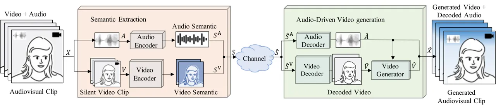
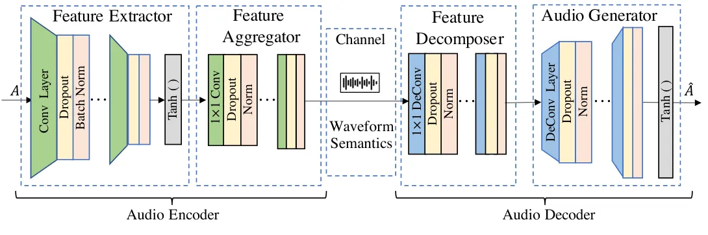
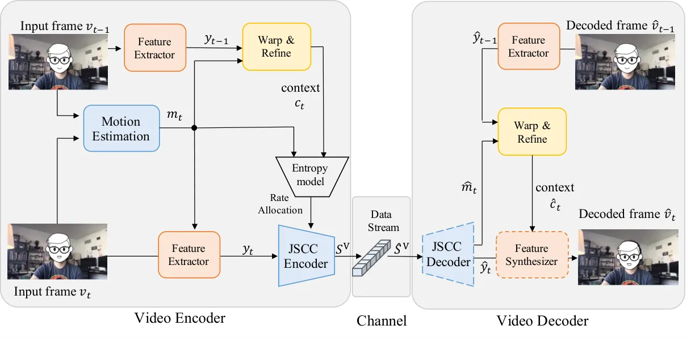
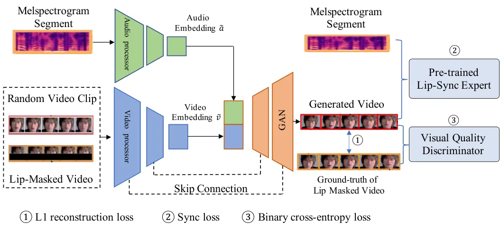

# Multimodal Semantic Communication for Generative Audio-Driven Video Conferencing Thanks:  H. Tong, H Li, and C. Yin are with the Beijing Key Laboratory of Network System Architecture and Convergence, and also with the Beijing Advanced Information Network Laboratory, Beijing University of Posts and Telecommunications, Beijing, 100876 China, Emails: hntong@bupt.edu.cn, hpli@bupt.edu.cn, ccyin@bupt.edu.cn. H. Du is with the Department of Electrical and Electronic Engineering, University of Hong Kong, Pok Fu Lam, Hong Kong SAR, China. Email: duhy@eee.hku.hk. Z. Yang is with the College of Information Science and Electronic Engineering, Zhejiang University, Hangzhou, Zhejiang 310027, China, Email: yang_zhaohui@zju.edu.cn. D. Niyato is with the College of Computing and Data Science at Nanyang Technological University (NTU), Singapore, Email: dniyato@ntu.edu.sg.

Haonan Tong    Haopeng Li    Hongyang Du    Student Member, IEEE,
Zhaohui Yang    Member, IEEE Affiliation: Changchuan Yin, Senior Member,
IEEE, and Dusit Niyato, Fellow, IEEE.

###### Abstract

This paper studies an efficient multimodal data communication scheme for
video conferencing. In our considered system, a speaker gives a talk to
the audiences, with talking head video and audio being transmitted.
Since the speaker does not frequently change posture and high-fidelity
transmission of audio (speech and music) is required, redundant visual
video data exists and can be removed by generating the video from the
audio. To this end, we propose a wave-to-video (Wav2Vid) system, an
efficient video transmission framework that reduces transmitted data by
generating talking head video from audio. In particular, full-duration
audio and short-duration video data are synchronously transmitted
through a wireless channel, with neural networks (NNs) extracting and
encoding audio and video semantics. The receiver then combines the
decoded audio and video data, as well as uses a generative adversarial
network (GAN) based model to generate the lip movement videos of the
speaker. Simulation results show that the proposed Wav2Vid system can
reduce the amount of transmitted data by up to 83% while maintaining the
perceptual quality of the generated conferencing video.

###### Index Terms: 

Multimodal semantic communication, video generation, generative
adversarial network.



Fig. 1: The architecture of Wav2Vid enabled video conferencing.

## I Introduction

Interactive services have rapidly developed in wireless network systems,
leading to a significant increase in the volume of video data
transmission and has become the main traffic in the network
system \[1\]. However, interactive video data imposes substantial
communication overloads, while limited communication resources impose
constraints on the implementation of interactive applications. Semantic
communication on visual data (image and video, etc.), which benefits
from joint source-channel coding (JSCC) \[2\], can reduce the volume of
data transmission by extracting visual data semantics according to the
communication task, thus improving interactive quality with limited
resources.

Recently, several works \[3, 4, 5\] have studied efficient video
communication methods with semantic extraction. The work in \[3\]
proposed a neural network (NN) based video semantic communication
scheme, which is robust against wireless channel impairments, especially
under low signal to noise ratio (SNR) conditions. Furthermore in \[4\],
the authors proposed semantic based video conferencing communication, in
which human facial key-points are extracted and efficiently transmitted
for portrait reconstruction at the receiver. The work in \[5\] extracted
the major objects in videos and reduced transmission overloads by not
transmitting the redundant visual parts. However, the compression ratios
of these methods \[3, 4, 5\] are limited in video conferencing, because
they lack the extraction of redundancy among different modal data, since
the visual information in talking head videos in conferencing is closely
related to the speaker’s speech.

The prior works in \[6, 7, 8\] have focused on multimodal semantic
communication. The work in \[6\] studied multimodal multiuser semantic
communication in a channel-level information fusion to improve the
spectrum efficiency. In \[7\], the authors proposed multimodal semantic
communication based on knowledge graphs for visual question
answering (VQA), which improved the vehicle driving efficiency and
safety by text clarifying the communication task and thus reduced
redundant transmission. However, the methods in \[6, 7\], which fused
multimodal data to provide supplementary information for enhancing task
completion, did not aligned the semantics of the multimodal data and
therefore cannot generate cross-modality data. For aligned semantics in
semantic communication, the method in \[8\] transmitted text data to
enable video conferencing using short-duration text driving videos to
generate long-duration videos. However, since audiences in video
conferencing mainly focus on audio information, the text-driven method
in \[8\] cannot meet the conferencing requirements because it loses key
audio information such as the speaker’s emotion and emphasis.

To this end, we aim to study multimodal semantic communication for video
conference using high-fidelity audio data to generate the speaker’s
video data. The main contributions of this paper are summarized as
follows.

1\) We propose a multimodal semantic communication-enabled
wave-to-video (Wav2Vid) system for video conferencing. The Wav2Vid
system transmits the semantics of short-duration video clips and
unabridged audio. Long-duration visual videos are then generated with
these short-duration video clips and full-duration audio.

2\) We design the audio codec, video codec, and video generator in
Wav2Vid. The audio codec extracts the audio waveform features, which are
coded to mitigate wireless channel impairments. The video codec extracts
and encodes the video spatio-temporal context information. The video
generator extracts relations between video and audio and generates the
speaker’s lip movements synchronized to the audio. The codecs use
pre-trained models and are fine-tuned to learn the wireless channel
character.

Simulation results show that the proposed Wav2Vid system can generate
vivid talking head videos, and reduce the transmitted data amount by up
to 83% while maintaining high video perceptual quality. The remainder of
this paper is organized as follows. The system model is formulated in
Section II. The designed semantic codecs are introduced in Section III.
In Section IV, simulation results are presented and discussed. The
conclusions are drawn in Section V.

## II System Model

We consider a video conference scenario in which one speaker gives a
talk facing a camera in a static environment, as shown in Fig. 1. In
this scenario, the speaker’s device must send audiovisual video clips
$`\boldsymbol{X}`$ to the audience. Note that, the visual information in
$`\boldsymbol{X}`$ has redundancy during the video conference, i.e., the
main changes in videos are lip movements while the other parts may stay
still (background) or change periodically (i.e., eye blink) if the
speaker does not have significant posture change \[9\]. To this end, in
the Wav2Vid system, only effective video clips that contain significant
posture changes need to be transmitted, while those without significant
changes are identified \[10\] and omitted from the transmission. In this
setting, the receiver can use real-time transmitted audios and effective
video clips to continuously generate synchronous lip movements in
audiovisual clips at the receiver. Next, we introduce the audio and
video semantic communication model in Wav2Vid, and then present video
generation process.

Given an original audiovisual clip $`\boldsymbol{X}`$ to be transmitted,
we first split the video into audio $`\boldsymbol{A}`$ and silent video
clip $`\boldsymbol{V}`$. To transmit the data through wireless channels,
semantic features of $`\boldsymbol{A}`$ and $`\boldsymbol{V}`$ are
extracted for efficient communication. The process of audio semantic
extraction is

```math
\boldsymbol{S}^{\mathrm{A}}={f}_{\theta}^{\mathrm{E}}(\boldsymbol{A}), \tag{1}
```

where $`{f}_{{\theta}}^{\mathrm{E}}(\cdot)`$ indicates the function of
the audio encoder parameterized by $`\theta`$, and
$`\boldsymbol{S}^{\mathrm{A}}`$ refines the waveform features of audios.
The video semantic extraction includes contextual feature coding, which
is given by

```math
\boldsymbol{S}^{\mathrm{V}}={f}_{{\phi}}^{\mathrm{E}}(\boldsymbol{V}), \tag{2}
```

where$`{f}_{\phi}^{\mathrm{E}}(\cdot)`$ is the video semantic encoder
function and $`\boldsymbol{S}^{\mathrm{V}}`$ is the video semantic
features that contain video spatial-temporal contextual information. For
synchronization, the semantic features of audio and silent video clips
are selectively integrated into one data stream $`\boldsymbol{S}`$,
which is given by

```math
\boldsymbol{S}=\begin{cases}\{\boldsymbol{S}^{\mathrm{A}},\boldsymbol{S}^{\mathrm{V}}\},\ \ \ \ \ \mathrm{HdPoseEst}(\boldsymbol{V})\geq\epsilon,\\
\{\boldsymbol{S}^{\mathrm{A}}\},\ \ \ \ \ \ \ \ \ \ \mathrm{HdPoseEst}(\boldsymbol{V})<\epsilon,\\
\end{cases} \tag{3}
```

where $`\epsilon`$ is the threshold, and
$`\mathrm{HdPoseEst}(\cdot)=|\Delta l_{yaw}(\boldsymbol{V})|+|\Delta l_{pitch}(\boldsymbol{V})|+|\Delta l_{roll}(\boldsymbol{V})|`$
is the head pose estimation function that calculates the change in head
orientation \[10\], with
$`\Delta l_{yaw}(\boldsymbol{V}),\Delta l_{pitch}(\boldsymbol{V})`$, and
$`\Delta l_{roll}(\boldsymbol{V})`$ being the changes of the yaw, pitch,
and roll angles of the head in video $`\boldsymbol{V}`$, respectively.
Thus, $`\mathrm{HdPoseEst}(\boldsymbol{V})\geq\epsilon`$ indicates that
the speaker’s head pose in $`\boldsymbol{V}`$ changes significantly.

The process of the data stream transmitting through the wireless channel
is

```math
\widehat{\boldsymbol{S}}={\color[rgb]{0,0,0}h}\boldsymbol{S}+\boldsymbol{n}, \tag{4}
```

where $`\widehat{\boldsymbol{S}}`$ is the received semantic information
at the decoder with transmission impairments, $`h`$ is Rayleigh channel
coefficient \[7\], and
$`\boldsymbol{n}\sim\mathcal{N}\left(0,\sigma^{2}\boldsymbol{I}\right)`$
denotes Gaussian channel noise with $`\sigma^{2}`$ being noise variance
and $`\boldsymbol{I}`$ being identity matrix.

The receiver at the audience uses semantic decoders (audio and video
decoders) to decode the received semantics
$`\widehat{\boldsymbol{S}}=\{\widehat{\boldsymbol{S}}^{\mathrm{A}},\widehat{\boldsymbol{S}}^{\mathrm{V}}\}`$
into reconstructed audio $`\widehat{\boldsymbol{A}}`$ and video
$`\widecheck{\boldsymbol{V}}`$. The audio decoding process is
$`\widehat{\boldsymbol{A}}={f}_{\theta}^{\mathrm{D}}(\widehat{\boldsymbol{S}}^{\mathrm{A}})`$,
where $`{f}_{\theta}^{\mathrm{D}}`$ is the audio decoder function
parameterized by $`\theta`$. The video decoding process is
$`\widecheck{\boldsymbol{V}}={f}_{\phi}^{\mathrm{D}}(\widehat{\boldsymbol{S}}^{\mathrm{V}})`$,
where $`{f}_{\phi}^{\mathrm{D}}`$ is the video decoder function
parameterized by $`\phi`$. Note that, when only audio semantics are
transmitted and accordingly
$`\widehat{\boldsymbol{S}}=\{\widehat{\boldsymbol{S}}^{\mathrm{A}}\}`$,
the receiver will put the cached $`\widecheck{\boldsymbol{V}}`$ (decoded
from the latest received $`\widehat{\boldsymbol{S}}^{\mathrm{V}}`$) into
the video generator.



Fig. 2: The architecture of ASC based audio codec.

The vacant video duration due to untransmitted videos are filled in by
video generated at the receiver. The video generator generates the video
$`\widehat{\boldsymbol{V}}`$ with the decoded video clip
$`\widecheck{\boldsymbol{V}}`$ and decoded audio
$`\widehat{\boldsymbol{A}}`$, which is given by

```math
\widehat{\boldsymbol{X}}=\{\widehat{\boldsymbol{V}},\widehat{\boldsymbol{A}}\}={g}_{\psi}(\widecheck{\boldsymbol{V}},\widehat{\boldsymbol{A}}), \tag{5}
```

where $`{g}_{\psi}(\cdot)`$ is video generation function parameterized
by $`\psi`$. For the video generation, Frechet Inception Distance (FID)
is used to measure generated video frame’s perceptual quality \[11\],
given by

```math
\operatorname{FID}(\boldsymbol{V},\widehat{\boldsymbol{V}})=\left\|\mu_{\boldsymbol{r}}-\mu_{{\boldsymbol{g}}}\right\|^{2}+\operatorname{Tr}\left(\Sigma_{\boldsymbol{r}}+\Sigma_{{\boldsymbol{g}}}-2\left(\Sigma_{\boldsymbol{r}}\Sigma_{{\boldsymbol{g}}}\right)^{\frac{1}{2}}\right), \tag{6}
```

where $`\boldsymbol{r}=\mathrm{Inception}(\boldsymbol{V})`$ is the
feature vector of original real video extracted by InceptionV3
model \[11\],
$`\boldsymbol{g}=\mathrm{Inception}(\widehat{\boldsymbol{V}})`$ is the
extracted visual feature vector from the generated video, $`\mu`$ is the
mean value of feature vector, $`\Sigma`$ is the covariance matrix, and
$`\operatorname{Tr}(\cdot)`$ is the trace of the matrix. Therefore, the
goal of the Wav2Vid system is to generate video with high perceptual
quality, formulated as

```math
\min_{\theta,\phi,\psi}\quad\operatorname{FID}(\boldsymbol{V},\widehat{\boldsymbol{V}}). \tag{7}
```

Due to video’s randomness, we design NN based modules to minimize FID of
generative video over wireless networks.

## III Designed Semantic Codec

In this section, we illustrate our designed semantic codec models and
the corresponding training scheme. The Wav2Vid system consists of
following modules: 1) audio codec, 2) video codec, and 3）video
generator.

### III-A Audio Codec

The audio codec uses the autoencoder based architecture according to the
audio semantic communication (ASC) codec in \[12\], which achieves JSCC
for audio transmission, as shown in Fig. 2. Since the Wav2Vid system
requires high-fidelity audio transmission for both speech and music, the
audio codec is designed to extract audio waveform features and ensure
their high-precision transmission \[13\], rather than using merely
speech-oriented semantic communication method (e.g., speech recognition
based method in \[14\]). In Fig. 2, the feature extractor in the encoder
uses convolution (Conv) neural network (CNN) layers to extract the
features of the audio waveform. The feature aggregator uses
$`1\times 1`$ Conv layer to aggregate the audio features and overcome
channel impairments \[12\]. The decoder at the receiver uses
deconvolution (DeConv) neural network (DeCNN) layers to decompose the
features and generate the audio, which is the reverse operation of the
encoder. Since the ASC codec aims to recover the original audio with
high fidelity, the loss function of the audio codec is the normalized
root mean square error (NRMSE), given by

```math
\mathcal{L}_{\theta}\left(\boldsymbol{A},\widehat{\boldsymbol{A}}\right)=\\
\text{NRMSE}(\boldsymbol{A},\widehat{\boldsymbol{A}})=\frac{\sum_{t=1}^{T_{a}}\left(a_{t}-\widehat{a}_{t}\right)^{2}}{\sum_{t=1}^{T_{a}}a_{t}^{2}}, \tag{8}
```

where $`\boldsymbol{A}=\left[a_{1},\cdots,a_{T_{a}}\right]`$ with
$`a_{t}`$ being the audio element in $`\boldsymbol{A}`$ at sampling
$`t`$, $`T_{a}`$ is the number of samplings, and
$`\widehat{\boldsymbol{A}}=\left[\widehat{a}_{1},\cdots,\widehat{a}_{T_{a}}\right]`$
with $`\widehat{a}_{t}`$ being the element in
$`\widehat{\boldsymbol{A}}`$ at time $`t`$. The audio codec is trained
by end-to-end method \[12\].

### III-B Video Codec



Fig. 3: The architecture of DVST based video codec.



Fig. 4: The architecture of wav2lip video generator.

The video codec uses the NN based wireless deep video semantic
transmission (DVST) system according to \[3\], as shown in Fig. 3. The
video codec consists of 2 modules: semantic extraction module and
contextual codec module.

#### III-B1 Semantic extraction

The video codec extracts visual object information into a high
dimensional representation using NNs, as shown in Fig. 3. In particular,
the feature extractor processes the frame into a semantic feature map
$`\boldsymbol{y}_{t}`$. The motion estimation module obtains the motion
vector $`\boldsymbol{m}_{t}`$ between the reference frame
$`\boldsymbol{v}_{t-1}`$ and the current frame $`\boldsymbol{v}_{t}`$.
Then, $`\boldsymbol{y}_{t}`$ and $`\boldsymbol{m}_{t}`$ are
concatenated, warped (align motion vectors on feature map spatially),
and refined (correct spatial discontinuities) in the video context
$`\boldsymbol{c}_{t}`$. In this way, the context $`\boldsymbol{c}_{t}`$
contains contextual information between adjacent video frames in a
high-dimensional feature space \[15\]. The detailed architectures of
feature extractor, motion estimation, and warp & refine modules are
described in \[3\]. To compress the video, $`\boldsymbol{y}_{t}`$ and
$`\boldsymbol{m}_{t}`$ are encoded into one data stream to be
transmitted, while $`\boldsymbol{c}_{t}`$ is used to determine the data
stream length.

#### III-B2 Contextual encoding

The contextual codec module uses an entropy model to determine the data
stream length for transmitting coded feature $`\boldsymbol{y}_{t}`$ and
motion $`\boldsymbol{m}_{t}`$ \[5\]. The entropy model fuses the outputs
of the temporal prior encoder (temporal correlation extraction), auto
regressive network (spatial correlation extraction), and hyper prior
codec (hierarchical prior side information extraction) \[3\]. The data
stream length is increased along with the entropy of
$`\boldsymbol{y}_{t}`$ and $`\boldsymbol{m}_{t}`$, given by

```math
\displaystyle k_{t}=k_{t}^{\mathrm{y}}+k_{t}^{\mathrm{m}}= \displaystyle-\sum_{i}\eta_{t,i}\log P\left(\bar{y}_{t,i}\mid{\mathbf{c}}_{t},\overline{\mathbf{z}}_{t}^{\mathrm{y}},\overline{\mathbf{y}}_{t,<i}\right) \tag{9}
```

```math
\displaystyle-\sum_{j}\eta_{t,j}\log P\left(\bar{m}_{t,j}\mid\overline{\mathbf{z}}_{t}^{\mathrm{m}},\overline{\mathbf{m}}_{t,<j}^{\mathrm{}}\right),
```

where $`\eta_{t,i}`$ and $`\eta_{t,j}`$ are scaling factors for the
number of symbols to be transmitted; $`\bar{(\cdot)}`$ is the
quantization operation; $`\overline{\mathbf{z}}_{t}^{\mathrm{y}}`$ is
the quantized hyper prior of $`\boldsymbol{y}_{t}`$;
$`\overline{\mathbf{y}}_{t,<i}`$ is the tensor consisting of quantized
feature map $`\overline{{y}}_{t,l}`$ with $`l<i`$.
$`\overline{\mathbf{z}}_{t}^{\mathrm{m}}`$ is the quantized hyper prior
of $`\boldsymbol{m}_{t}`$; $`\overline{\mathbf{m}}_{t,<j}`$ is the
tensor consisting of quantized motion vector $`\overline{{m}}_{t,l}`$
with $`l<j`$. Given $`k_{t}`$, the transmitted data stream is encoded by
a JSCC codec, according to the estimation feedback of wireless channel
conditions \[3\].

Contextual decoding and semantic synthesizer: At the receiver, the JSCC
decoder recovers the semantic feature map
$`\widehat{\boldsymbol{y}}_{t}`$ and the motion vector
$`\widehat{\boldsymbol{m}}_{t}`$, then fused with
$`\widehat{\boldsymbol{y}}_{t-1}`$ to reconstruct the current video
frame $`\widehat{\boldsymbol{v}}_{t}`$. The JSCC decoder and the feature
synthesizer are the inverse functions of the JSCC encoder and feature
extractor, respectively \[3\]. The video codec aims to balance data
stream length and peak signal-to-noise ratio (PSNR) between
$`\widecheck{\boldsymbol{V}}`$ and $`\boldsymbol{V}`$, given by

```math
\displaystyle\mathcal{L}_{\phi}\left(\boldsymbol{V},\widecheck{\boldsymbol{V}}\right) \displaystyle=\lambda~\text{PSNR}({\boldsymbol{V}},{\widecheck{\boldsymbol{V}}})+\mathrm{len}(\boldsymbol{S}^{\mathrm{V}}) \tag{10}
```

```math
\displaystyle=\lambda\cdot 10\cdot\log_{10}\left(\frac{\max(\boldsymbol{V})^{2}}{\text{MSE}({\boldsymbol{V}},{\widecheck{\boldsymbol{V}}})}\right)+\sum_{t}^{T_{v}}k_{t},
```

where $`\lambda`$ is the weight of PSNR to balance video codec’s
accuracy and compression rate, $`\text{MSE}(\cdot,\cdot)`$ is the mean
square error function, $`\max(\boldsymbol{V})`$ is the maximum value of
$`\boldsymbol{V}`$, and
$`\mathrm{len}(\boldsymbol{S}^{\mathrm{V}})=\sum_{t}^{T_{v}}k_{t}`$ is
the length of data stream $`\boldsymbol{S}^{\mathrm{V}}`$ with $`T_{v}`$
being the total frame number in $`\boldsymbol{V}`$.

### III-C Video Generator

To fill in the vacant video duration caused by the untransmitted video,
a video generator is introduced to generate lip movements in receiver’s
audiovisual video clips $`\widehat{\boldsymbol{X}}`$, as shown in
Fig. 4. The video generator is deployed by generative adversarial
network (GAN) based wav2lip model \[9\] rather than diffusion
models \[16\] for affordable complexity by mobile device. The video
generator aims to align the audio and video features and then to use a
GAN to generate lip movements that are synchronized to the speaker’s
audio. To achieve this, audio and video embeddings are first extracted
by audio and video processors, respectively, then concatenated and
finally input to the GAN. The loss function of the video generator is

```math
\mathcal{L}_{\psi}=\left(1-w_{s}-w_{g}\right)\cdot\mathcal{L}_{\text{recon }}+w_{s}\cdot E_{\text{sync }}+w_{g}\cdot\mathcal{L}_{gen}, \tag{11}
```

where $`w_{s}`$ and $`w_{g}`$ are weights,
$`\mathcal{L}_{\text{recon }}=\frac{1}{T}\sum_{t=1}^{T}\left\|v_{t}-\widehat{v}_{t}\right\|_{1}`$
is the reconstruction error of $`T`$ video frames. The synchronization
loss is
$`E_{\text{sync }}=\frac{1}{T}\sum_{t=1}^{T}-\log\left(P_{\text{sync},t}\right),`$
where
$`P_{\text{sync},t}=\frac{\widetilde{v}_{t}\cdot\widetilde{a}_{t}}{\max\left(\|\widetilde{v}_{t}\|_{2}\cdot\|\widetilde{a}_{t}\|_{2},{\color[rgb]{0,0,0}\kappa}\right)}`$
is the synchronization probability of each video frame and audio
fragment, with $`\widetilde{v}_{t}`$ being video embedding at time
$`t`$, $`\widetilde{a}_{t}`$ being audio embedding at time $`t`$, and
$`\kappa`$ being the noise variable, respectively. $`P_{\text{sync},t}`$
measures the similarity of audio and video in a high-dimensional feature
space. The loss function of the GAN is
$`\mathcal{L}_{gen}=\mathbb{E}_{\widehat{v}\sim\widehat{\boldsymbol{V}}}[\log(1-D(\widehat{v})]`$,
where $`D(\cdot)`$ is a binary discriminator that identifies whether a
video frame is real ($`D(\cdot)=1`$) or not ($`D(\cdot)=0`$). In (11),
$`\mathcal{L}_{\text{recon }}`$ and $`\mathcal{L}_{gen}`$ increase the
fidelity of generated video and $`E_{\text{sync}}`$ guarantees
synchronization of generated video and audio, thus improving fidelity of
generated audiovisual clips.

### III-D Training of the proposed system

Due to the diverse properties of audio and video, we use pre-trained
models in \[12, 3, 9\] to extract audio and video semantic features.
Moreover, the coding modules for wireless transmission are fine-tuned
online. The training algorithm of the proposed framework is summarized
in Algorithm 1. In particular, the pre-trained NNs for semantic
extraction and signal reconstruction are first deployed on the
transmitter and receiver. The coding modules are then randomly
initialized in the audio and video codecs. Then, to improve resistance
to channel impairments, the coding modules in $`\theta`$ and $`\phi`$
perform a few fine-tunings until convergence. This is on the condition
that the transmitter and receiver share moderate ground-truth feature
data. Since the features in the video generator $`\psi`$ do not pass
through wireless channel, all NNs in $`\psi`$ are trained offline by
optimizing $`\mathcal{L}_{\psi}`$ \[9\] and do not need fine-tuning
online. For implementation, since the audio codec, video codec, and
video generator consist of finite CNNs and DeCNN, the complexity of the
Wav2Vid system is affordable \[12\], enabling the Wav2Vid system to be
implemented on mobile devices.

1:   initialization: Deploy the pre-trained modules in $`\theta,\phi`$,
and $`\psi`$ at the transmitter and receiver \[12, 3, 9\]. Initialize
modules for JSCC coding in $`\theta`$ and $`\phi`$.

2:   while the audio and video codecs do not converge do:

3:     for each batch of training data do:

4:       Input training data batches, transmit $`\boldsymbol{S}`$ and
obtain $`\widehat{\boldsymbol{S}}`$,     calculate
$`\mathcal{L}_{\theta}\left(\boldsymbol{A},\widehat{\boldsymbol{A}}\right)`$
and $`\mathcal{L}_{\phi}(\boldsymbol{V},\widecheck{\boldsymbol{V}}).`$

5:       Fine-tune the feature aggregator and decomposer in     audio
codec, with other NNs being frozen
    $`{\theta}\leftarrow{\theta}-\eta\nabla_{{\theta}}\mathcal{L}_{\theta}\left(\boldsymbol{A},\widehat{\boldsymbol{A}}\right).`$

6:       Fine-tune the contextual JSCC codec in video codec,     with
other NNs being frozen
    $`{\phi}\leftarrow{\phi}-\eta\nabla_{{\phi}}\mathcal{L}_{\phi}\left(\boldsymbol{V},\widecheck{\boldsymbol{V}}\right)`$.

7:     end for

8:   end while

Algorithm 1 Training algorithm of Wav2Vid system.

## IV Simulation Results and Discussion

|                       |                         |                    |
| --------------------- | ----------------------- | ------------------ |
| Model                 | Module                  | Setting            |
| Audio codec \[12\]    | Audio Encoder           | 7 CNN blocks       |
|                       | Audio Decoder           | 8 DeCNN blocks     |
| Video codec \[3\]     | Feature Extractor       | 1 CNN              |
|                       | Entropy model           | 4 CNNs             |
|                       | JSCC codec              | 1 CNN + 4 Swin     |
|                       |                         | Transformer blocks |
| Video generator \[9\] | Audio & video processor | 2 CNNs             |
|                       | Generator               | 1 DeCNN based GAN  |

TABLE I: NN Parameters.

For the simulation, we consider a video conferencing system that
contains one transmitter and one receiver. We use real-world audio
dataset LibriSpeech \[17\] and talking head videos in \[8\]. The Wav2Vid
system is trained in Rayleigh channel with varied SNR from 0 to 20 dB.
The semantic extraction NN parameters are set as in \[12, 3\], the NN
parameters of the video generator are the same as in \[9\]. The NN
parameters for coding in ASC codec and video coedc are listed in
Table I. We compare our proposed method with the following baselines: 1)
Traditional codecs: transmit audiovisual clips using pulse code
modulation (PCM)/H.265 + LDPC + 16 quadrature amplitude modulation (QAM)
schemes \[12\]; 2) DVST: reconstructs video with NN encoding and
decoding video semantics \[3\]; 3) Txt2Vid: generates videos from
text \[8\], using (text and video) semantic codecs + text-to-speech
(TTS) + video generator. All simulations were performed using a single
NVIDIA RTX 4090 GPU. The demos of the generated videos are uploaded to
url: https://github.com/wcsnSC/Generatedvideos

|              |             |          |          |          |
| ------------ | ----------- | -------- | -------- | -------- |
|              | Traditional | DVST     | Txt2Vid  | Wav2Vid  |
|              | / Byte      | / symbol | / symbol | / symbol |
| Video        | 15 M        | 10 M     | 2.58 M   | 2 M      |
| Audio        | 1 M         | 1 M      | -        | 600 K    |
| Text         | -           | -        | 20 K     | -        |
| Total Amount | 16 M        | 11 M     | 2.6 M    | 2.6 M    |

TABLE II: Amount of Transmitted Data for One Video Content

Table II shows the amount of transmitted data (byte for the traditional
method and symbol for the others) when transmitting one video content
with 18s duration. The computation time of video generation is nearly
15s, which meets the requirements of real-time generation. For fair
comparison, the Txt2Vid method transmits longer duration video clip than
Wav2Vid, thus the Wav2Vid costs the same bandwidth as Txt2Vid. From
Table II, we see that the Wav2Vid method can reduce the amount of
transmitted data by up to 83.75%, compared to traditional methods. This
reduction is because Wav2Vid extracts the correlations between videos
and audios.

Fig. 5: Audio PESQ vs SNR.

Fig. 6: Video PSNR vs SNR.

Fig. 5 shows how the audio perceptual evaluation of speech quality
(PESQ) of all methods changes as the Rayleigh channel SNR increases.
Fig. 5 shows that the ASC based audio codec can improve the audio
perceptual quality especially under low SNR regions. The low PESQ of
Txt2Vid stems from the text to speech (TTS) technology, which generates
constant speed audio that is asynchronous to the original audio, losing
emotion and emphasis information and reducing the PESQ.

In Fig. 6, we show the change of video PSNR of all methods as Rayleigh
channel SNR increases. In Fig. 6, the DVST achieves the highest PSNR due
to the semantic extraction and the bend of the traditional method’s
curve is due to the “cliff effect” \[3\]. The similarity of Wav2Vid and
Txt2Vid methods’ PSNR stems from the use of the same video generation
model, with primary differences limited to lip movements, which do not
significantly impact PSNR. Moreover, when SNR is above 15 dB, the videos
generated by the Wav2Vid and Txt2Vid methods achieve high accuracy, with
similar PSNR values to those of the reconstructed videos using
traditional method.

Fig. 7: Video MS-SSIM vs SNR.

Fig. 7 shows how the multiscale structural similarity (MS-SSIM) of all
methods changes as the Rayleigh channel SNR increases. The results show,
when the SNR is higher than 15 dB, the Wav2Vid and Txt2Vid methods can
achieve similar MS-SSIM to the traditional method. When SNR is lower
than 8 dB, the MS-SSIM of Wav2Vid and Txt2Vid methods are higher than
that of the DVST method, which is because the GAN in video generator is
trained with noise, thus achieving more robust performance against
noise. Fig. 7 also shows that the MS-SSIM of Wav2Vid is slightly higher
than Txt2Vid, which stems from the synchronous audio of Wav2Vid method.

Fig. 8: Generative video FID vs SNR.

Fig. 8 shows how the FID between the generated video and the original
video of all Wav2Vid and Txt2Vid changes as Rayleigh channel SNR
increases. In Fig. 8 we see that, the FID of Wav2Vid is lower than that
of the Txt2Vid. The reason is that Wav2Vid can reconstruct the
synchronous audio with original video while Txt2Vid generates
asynchronous audio generated from text. Fig. 8 demonstrates the video
generation improvement of Wav2Vid with transmitting high-fidelity audio
rather than text in Txt2Vid.

## V Conclusion

In this paper, we have developed an efficient multimodal data
communication system for video conferencing. In our system, due to the
temporal correlation of video, the transmission of redundant visual
video data has been replaced by the audio-driven generative video. In
particular, we have proposed a Wav2Vid system, where the whole duration
of audio and short duration video are synchronously transmitted. The
receiver combines the decoded audio and video data, and then uses a GAN
to generate the lip movement videos of the speaker. Simulation results
show that the proposed Wav2Vid system can reduce the transmitted data by
up to 83% while maintaining the perceptual quality of the generated
video.

## References

- \[1\] Cisco, “Cisco visual networking index: Global mobile data
  traffic forecast update 2017-2022,” Accessed: 2021. \[Online\].
  Available:
  https://s3.amazonaws.com/media.mediapost.com/uploads/CiscoForecast.pdf
- \[2\] T. Wu, Z. Chen, D. He, L. Qian, Y. Xu, M. Tao, and W. Zhang,
  “CDDM: channel denoising diffusion models for wireless semantic
  communications,” _IEEE Transactions on Wireless Communications_,
  vol. 23, no. 9, pp. 11 168–11 183, Mar. 2024.
- \[3\] S. Wang, J. Dai, Z. Liang, K. Niu, Z. Si, C. Dong, X. Qin, and
  P. Zhang, “Wireless deep video semantic transmission,” _IEEE Journal
  on Selected Areas in Communications_, vol. 41, no. 1, pp. 214–229,
  Nov. 2023.
- \[4\] P. Jiang, C.-K. Wen, S. Jin, and G. Y. Li, “Wireless semantic
  communications for video conferencing,” _IEEE Journal on Selected
  Areas in Communications_, vol. 41, no. 1, pp. 230–244, Nov. 2023.
- \[5\] H. Li, H. Tong, S. Wang, N. Yang, Z. Yang, and C. Yin, “Video
  semantic communication with major object extraction and contextual
  video encoding,” in _IEEE Wireless Communications and Networking
  Conference (WCNC)_, Dubai, United Arab Emirates, Apr. 2024.
- \[6\] X. Luo, R. Gao, H.-H. Chen, S. Chen, Q. Guo, and P. N.
  Suganthan, “Multimodal and multiuser semantic communications for
  channel-level information fusion,” _IEEE Wireless Communications_,
  vol. 31, no. 2, pp. 117–125, Apr. 2024.
- \[7\] C. Xing, J. Lv, T. Luo, and Z. Zhang, “Representation and fusion
  based on knowledge graph in multi-modal semantic communication,” _IEEE
  Wireless Commun. Letters_, vol. 13, no. 5, pp. 1344–1348, May 2024.
- \[8\] P. Tandon, S. Chandak, P. Pataranutaporn, Y. Liu, A. M.
  Mapuranga, P. Maes, T. Weissman, and M. Sra, “Txt2vid: Ultra-low
  bitrate compression of talking-head videos via text,” _IEEE Journal on
  Selected Areas in Communications_, vol. 41, no. 1, pp. 107–118,
  Nov. 2023.
- \[9\] K. R. Prajwal, R. Mukhopadhyay, V. P. Namboodiri, and
  C. Jawahar, “A lip sync expert is all you need for speech to lip
  generation in the wild,” in _Proc. ACM International Conference on
  Multimedia (MM)_, New York, NY, USA, Oct 2020, pp. 484–492.
- \[10\] J. Celestino, M. Marques, J. C. Nascimento, and J. P. Costeira,
  “2D image head pose estimation via latent space regression under
  occlusion settings,” _Pattern Recognition_, vol. 137, p. 109288,
  May 2023.
- \[11\] M. Heusel, H. Ramsauer, T. Unterthiner, B. Nessler, and
  S. Hochreiter, “Gans trained by a two time-scale update rule converge
  to a local nash equilibrium,” in _Advances in Neural Information
  Processing Systems (NeurIPS)_, vol. 30, Dec. 2017.
- \[12\] H. Tong, Z. Yang, S. Wang, Y. Hu, W. Saad, and C. Yin,
  “Federated learning based audio semantic communication over wireless
  networks,” in _Proc. IEEE Global Commun. (GLOBECOM)_, Spain,
  Dec. 2021.
- \[13\] Z. Weng and Z. Qin, “Semantic communication systems for speech
  transmission,” _IEEE Journal on Selected Areas in Communications_,
  vol. 39, no. 8, pp. 2434–2444, Aug. 2021.
- \[14\] Z. Weng, Z. Qin, X. Tao, C. Pan, G. Liu, and G. Y. Li, “Deep
  learning enabled semantic communications with speech recognition and
  synthesis,” _IEEE Transactions on Wireless Communications_, vol. 22,
  no. 9, pp. 6227–6240, Feb. 2023.
- \[15\] J. Li, B. Li, and Y. Lu, “Deep contextual video compression,”
  in _Advances in Neural Information Processing Systems (NeurIPS)_,
  vol. 34, Dec. 2021, pp. 18 114–18 125.
- \[16\] Y. Liu, K. Zhang, Y. Li, Z. Yan, C. Gao, R. Chen, Z. Yuan,
  Y. Huang, H. Sun, J. Gao _et al._, “Sora: A review on background,
  technology, limitations, and opportunities of large vision models,”
  _arXiv preprint arXiv:2402.17177_, 2024.
- \[17\] V. Panayotov, G. Chen, D. Povey, and S. Khudanpur,
  “Librispeech: An asr corpus based on public domain audio books,” in
  _2015 IEEE International Conference on Acoustics, Speech and Signal
  Processing (ICASSP)_, 2015, pp. 5206–5210.
