# LES-Talker: Fine-Grained Emotion Editing for Talking Head Generation in Linear Emotion Space

Guanwen Feng Affiliation: School of Computer Science and Technology,
Xidian University, Xi’an 710071, China Affiliation: Xi’an Key Laboratory
of Big Data and Intelligent Vision, Xi’an, Shaanxi 710071, China
Affiliation: Key Laboratory of Collaborative Intelligence Systems,
Ministry of Education, Xidian University, Xi’an 710071, China    Zhihao
Qian Affiliation: School of Computer Science and Technology, Xidian
University, Xi’an 710071, China Affiliation: Xi’an Key Laboratory of Big
Data and Intelligent Vision, Xi’an, Shaanxi 710071, China
Affiliation: Key Laboratory of Collaborative Intelligence Systems,
Ministry of Education, Xidian University, Xi’an 710071, China    Yunan
Li^(\*) Affiliation: School of Computer Science and Technology, Xidian
University, Xi’an 710071, China Affiliation: Xi’an Key Laboratory of Big
Data and Intelligent Vision, Xi’an, Shaanxi 710071, China
Affiliation: Key Laboratory of Collaborative Intelligence Systems,
Ministry of Education, Xidian University, Xi’an 710071, China    Siyu
Jin Affiliation: School of Computer Science and Technology, Xidian
University, Xi’an 710071, China Affiliation: Xi’an Key Laboratory of Big
Data and Intelligent Vision, Xi’an, Shaanxi 710071, China
Affiliation: Key Laboratory of Collaborative Intelligence Systems,
Ministry of Education, Xidian University, Xi’an 710071, China    Qiguang
Miao^(\*) Affiliation: School of Computer Science and Technology, Xidian
University, Xi’an 710071, China Affiliation: Xi’an Key Laboratory of Big
Data and Intelligent Vision, Xi’an, Shaanxi 710071, China
Affiliation: Key Laboratory of Collaborative Intelligence Systems,
Ministry of Education, Xidian University, Xi’an 710071, China    Chi-Man
Pun Affiliation: Department of Computer and Information Science,
University of Macau, Macao 999078, China{gwfeng_1, zhqian_1,
syjin}@stu.xidian.edu.cn, {yunanli, qgmiao}@xidian.edu.cn, cmpun@umac.mo

###### Abstract

While existing one-shot talking head generation models have achieved
progress in coarse-grained emotion editing, there is still a lack of
fine-grained emotion editing models with high interpretability. We argue
that for an approach to be considered fine-grained, it needs to provide
clear definitions and sufficiently detailed differentiation. We present
LES-Talker, a novel one-shot talking head generation model with high
interpretability, to achieve fine-grained emotion editing across emotion
types, emotion levels, and facial units. We propose a Linear Emotion
Space (LES) definition based on Facial Action Units to characterize
emotion transformations as vector transformations. We design the
Cross-Dimension Attention Net (CDAN) to deeply mine the correlation
between LES representation and 3D model representation. Through mining
multiple relationships across different feature and structure
dimensions, we enable LES representation to guide the controllable
deformation of 3D model. In order to adapt the multimodal data with
deviations to the LES and enhance visual quality, we utilize specialized
network design and training strategies. Experiments show that our method
provides high visual quality along with multilevel and interpretable
fine-grained emotion editing, outperforming mainstream methods. [Project
page:
https://peterfanfan.github.io/LES-Talker/](https://peterfanfan.github.io/LES-Talker/)

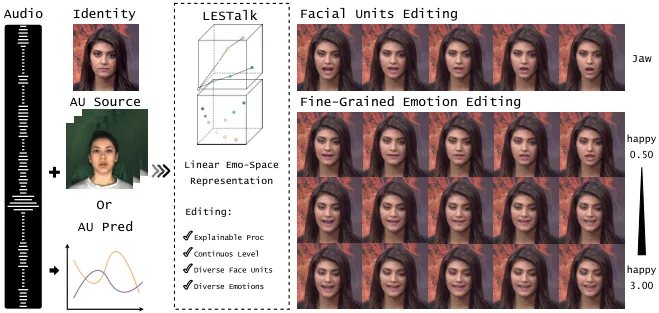

Figure 1: Linear Emotion Space (LES) based on Facial Action Units (AUs)
supports our LES-Talker model, offering exceptional interpretability. It
enables fine-grained editing across 8 emotion types, 17 facial units,
and continuous levels above 0. It can be driven by a lightweight use of
video (requiring a sequence of images to provide the AU source) or by
audio alone.

## 1 Introduction

Talking head generation has attracted significant attention from
researchers in recent years and has many applications in the fields of
digital human creation \[51\], virtual reality \[8\], etc. To enhance
the diversity and expressiveness of talking head generation, emotion
editing tasks were emphasized. However, existing studies have the
following two notable drawbacks: (1) the interpretability of methods is
lacking; (2) the effectiveness of emotion editing is still remains at a
coarse-grained level. On the one hand, some studies offer expression
reference images without clear emotion definition \[37, 38, 22\], while
others employ discrete emotion labels \[18, 36, 28\]. Additionally, some
extract emotion features from latent spaces \[38, 29, 23\] leading to an
implicit transformation of emotion. Although Facial Action Units (AUs)
effectively describe emotions, various methods \[14, 17, 15\] use
different combinations of AUs for the same emotion. Moreover, AUs alone
remain insufficient. On the other hand, several studies \[40, 29, 37\]
focus on generating videos with specific emotions, realizing only
coarse-grained emotion editing. One of the few fine-grained emotion
studies \[38, 35\] also shows only discrete emotion levels in three
emotion types.

We argue that for an approach to be considered fine-grained, it needs to
offer clear definitions and detailed differentiation. Motivated by the
above, we propose Linear Emotion Space (LES), a definition that
explicitly characterizes emotion transformations. LES supports us in
proposing LES-Talker, a video generation model for editing multiple
emotion types, continuous emotion levels, and individual Facial Action
Units. To provide an interpretable theoretical foundation, we develop an
LES definition based on elements derived from AUs. Using a
coarse-to-fine emotion strategy, LES characterizes emotion
transformations as vector changes in two subspaces: the Action Subspace,
representing facial unit actions, and the Isolation Subspace, capturing
subtle emotion details. When fine-grained emotion editing is required,
the vectors in the LES can be used as intermediate representations of
emotions. Specifically, when editing a neutral emotion video, each frame
is extracted with AUs values and mapped into the Action and Isolation
Subspaces as vector representations. The target emotion with specified
level corresponds to a vector in these spaces, allowing fine-grained
emotion transformations through vector transformations. Further, each
dimension of LES has a physical counterpart, making the meaning of these
edits explicit.

To achieve a satisfactory editing effect, our LES-Talker utilizes LES
vectors and 3DMM coefficients as two intermediate representations. We
divide the task into three major components. First, we aim to adapt the
multi-modal data to the LES definition. We transform the AUs sequences,
enhance audios and optimize predicted 3D coefficients, through direct
adaptation, wav2vec-based \[2\] audio encoder, and residual learning,
respectively. After generating the accurate representations in LES, we
apply vector operation to inject emotion according to the definition in
LES. We also propose a Cross-Dimension Attention Net (CDAN). By
combining CDANs in series and parallel, we enable detailed guidance of
the LES representation in the deformation of the 3D model. Inspired by
Sadtalker \[48\], we use the identity and pose information from
reference images and edited 3D coefficients to generate a video through
a novel render.

Our study makes the following four main contributions:

- •
  We propose the Linear Emotion Space (LES), a fine-grained emotion
  definition that provides an interpretable theoretical foundation for
  fine-grained emotion research.
- •
  We introduce LES-Talker, a novel one-shot talking head generation
  model with high interpretability, designed to achieve fine-grained
  emotion editing across emotion types, levels, and facial units.
- •
  We propose a novel and universal Cross-Dimension Attention Network to
  mine potential correlations between 3D model representation and LES
  representation, which enables the detailed guidance of LES
  representation in the deformation of the 3D model.
- •
  Quantitative and qualitative experiments demonstrate our method
  generates videos with high visual quality and is capable of
  fine-grained editing at multiple levels.

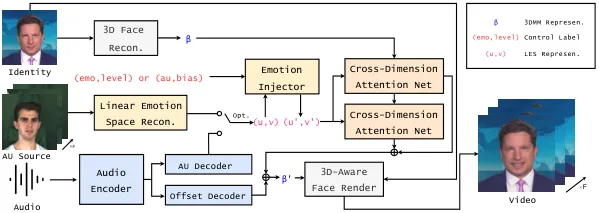

Figure 2: Pipeline of LES-Talker. Inputs include an identity image,
audio, optional AU Source, and user editing targets. The Linear Emotion
Space Recon. generates emotion vectors in LES. Emo Injector transforms
these vectors based on user targets $`(emo,level)\text{ or }(au,bias)`$.
Two levels of Cross-Dimension Attention Net (CDAN) process decomposed
vectors $`\boldsymbol{u}`$ and $`\boldsymbol{v}`$ to produce 3D
coefficients, optimized via Offset Decoder. These coefficients, along
with identity information, create the rendered video.

## 2 Related work

### 2.1 Talking Head Video Generation

Existing research on talking head generation is mainly categorized into
audio-driven \[41, 46, 34, 1, 20, 7\] and video-driven \[27, 42, 13,
52\] two broad categories. In audio-driven methods, lightweight use of
video to compensate the lack of information is a common approach, such
as StyleTalk \[28\] extracting facial motion patterns using a
transformer, and PC-AVS \[54\] incorporating head pose information
through implicit low-dimensional pose coding. Video-driven methods
utilize the richer information contained in the input video to generate
more natural results, focusing on different driving methods and
intermediate representations, which are divided into implicit and
explicit. Implicit modeling represents scenes by learning mathematical
functions, such as Signed Distance Functions (SDF) \[43, 53, 33\] and
Neural Radiation Fields (NeRF) \[19, 24, 32\]. Explicit modeling
directly constructs editable 3D geometric representations, such as 3D
Morphable Model (3DMM) \[48, 31, 44\] and 3D Gaussian Splatting (3D-GS)
\[45, 10, 25, 6\].

We adopt LES vectors and 3DMM coefficients as representations for
explicit control methods.

### 2.2 Fine-grained Facial Emotion Video Generation

In talking head generation, early studies \[30, 9\] focused on improving
visual quality, while recent studies \[47, 39, 26\] have explored
coarse-grained facial emotion editing. EmoTalk \[29\] employs an
audio-driven method using two different audio extractors to separate
emotion and content, and EDTalk \[37\] emphasizes controlled talking
head generation by decoupling mouth shape, head pose, and emotional
expression. However, these studies only achieve coarse-grained emotion
expression.Recently, a few fine-grained emotion studies have emerged.
Under co-driven conditions, PD-FGC \[38\] demonstrates linear
interpolation between expression features from different sources by
learning the expression latent space. EmoSpeaker \[16\] decouples audio
input into content and emotion vectors, editing content vectors for
different emotions. FG-EmoTalk \[35\] shows video-driven realization of
three defined emotions and several levels of fine-grained emotions using
AUs as control inputs. However, these studies lack clarity on the
principles of fine-grained emotion changes and primarily realize
discrete rather than continuous changes.

While utilizing AUs for fine-grained emotions is promising, it is
insufficient. Our study refines elements derived from AUs, providing a
rigorous definition and demonstrating talking head generation with
continuously varying level and multiple emotion options, allowing
individual control of specific facial units.

## 3 Method

We present the Linear Emotion Space (LES) and LES-Talker that aim to
achieve fine-grained emotion editing with exceptional interpretability.
The complete pipeline of our one-shot method is depicted in Fig. 2.
Below, we first provide a brief introduction to Action Units (AUs) and
3D face models as preliminaries in Sec. 3.1. Then, in Sec. 3.2, we offer
a precise and rigorous definition of the Linear Emotion Space, which
serves as the theoretical foundation of our model. Cross-Dimension
Attention Network (CDAN) plays a key role in enabling the LES
representation to guide the controllable deformation of the 3D model,
and we detail its design in Sec. 3.3. Finally, in Sec. 3.4, we describe
the design of other key components that adapt multi-modal features to
the LES and improve visual quality.

### 3.1 Preliminary

Facial Action Units. Facial Action Units (AUs) are essential in studying
facial expressions. AUs describe patterns of facial muscle movements
associated with emotions. Currently, there are seventeen controllable
AUs. For instance, in happiness, relevant AUs include AU6 (cheek muscle
contraction, forming a smile), AU12 (lip corner elevation, indicating
pleasure), AU25 (mouth opening, signifying excitement), and AU4 (brow
raising, expressing joy or surprise). Different AUs can be used
individually or in combination to represent emotional states; however,
varying definitions across studies can cause confusion. Our method
utilizes the complete set of AUs, along with subtle information beyond
AUs, to represent each emotional state. Further explanations of AUs are
in the supplementary materials.  
3D Morphable Model. We use 3D Morphable Models (3DMMs) as one of our
intermediate representations, inspired by the single image deep 3D
reconstruction method \[12\] and recent talking head generation method
\[48\]. The 3D face shape S and the talking head motion M can be
decoupled as:

```math
\begin{array}[]{c}S=\overline{S}+\alpha\cdot U_{\text{id}}+\beta\cdot U_{\text{exp}}\\
M=[\beta,\gamma]\end{array} \tag{1}
```

$`\overline{S}`$ is the average shape of the 3D face. $`U_{\text{id}}`$
and $`U_{\text{exp}}`$ are the orthonormal basis \[4\]. Coefficients
$`\alpha\in\mathbb{R}^{80}`$, $`\beta\in\mathbb{R}^{64}`$ and
$`\gamma\in\mathbb{R}^{6}`$ describe the person identity, face
expression and head pose respectively.

### 3.2 Linear Emotion Space

As mentioned in the Preliminary section, there are 17 controllable AUs,
indexed from 1 to 17. Their values could be extracted from the emotional
frame. Through two different optimization functions
($`\text{Opt}_{\text{1}}`$ and $`\text{Opt}_{\text{2}}`$), we derive a
point $`\boldsymbol{w}`$ with 41 coordinates, each having a specific
physical meaning. In the following descriptions, points, and vectors in
the LES are equivalent.

The Linear Emotion Space is based on two hypotheses: (1) The space
containing $`\boldsymbol{w}`$ is linear. (2) The level of emotion
$`int_{emo}`$ varies linearly in this space. Therefore, the Linear
Emotion Space $`\mathbb{E}`$ is defined with the following
characteristics:

```math
if\ \boldsymbol{w}=(e_{1},e_{2},\ldots,e_{41})\in\mathbb{E}\quad then\ \boldsymbol{w}\in\mathbb{R}^{41} \tag{2}
```

```math
e_{i}=\text{Opt}_{\text{1}}(AU_{i})\quad i\in[1,17] \tag{3}
```

```math
e_{i}=\text{Opt}_{\text{2}}(AU_{j})\quad j=i-17\quad i\in[18,34] \tag{4}
```

```math
e_{i}=0\text{ except }e_{index}=od\quad i\in[35,41] \tag{5}
```

```math
\mathbb{A}=\{\boldsymbol{u}=(e_{1},\ldots,e_{17})\}\subseteq\mathbb{E} \tag{6}
```

```math
\mathbb{I}=\{\boldsymbol{v}=(e_{18},\ldots,e_{41})\}\subseteq\mathbb{E} \tag{7}
```

```math
level_{emo}\ \text{varies linearly in}\ \mathbb{E} \tag{8}
```

Figure 3: Subspaces of Linear Emotion Space

Action Subspace. As shown in Fig. 3, the space $`\mathbb{E}`$ comprises
two subspaces: the Action Subspace $`\mathbb{A}`$ and the Isolation
Subspace $`\mathbb{I}`$.

Subspace $`\mathbb{A}`$ provides a representation for a unified AU level
and emotion level by defining feature vectors for different emotional
levels. The vector $`\boldsymbol{u}\in\mathbb{A}`$, as defined in Eqs. 3
and 6, primarily describes the actions of Facial Units. Considering the
imbalanced distribution between AUs, we apply optimization function
$`\text{Opt}_{\text{1}}`$:

```math
\text{Opt}_{\text{1}}(AU_{i})=\frac{AU_{i}-\mu_{D}}{\sigma_{D}} \tag{9}
```

where $`\mu_{D}`$ and $`\sigma_{D}`$ are the mean and standard deviation
of $`AU_{i}`$ based on the entire dataset. For each emotion, the Action
Subspace defines three special $`\boldsymbol{u}`$ as feature vectors
$`\boldsymbol{uf}_{emo,level}`$. The MEAD dataset classifies emotions
excluding neutral into three base levels:
$`\text{level}_{\text{1}}\text{, level}_{\text{2}}\text{, and }\text{level}_{\text{3}}`$,
used as base level anchors. We individually collect $`\boldsymbol{u}`$
for each emotion at different levels to obtain
$`\boldsymbol{uf}_{emo,level}`$:

```math
\boldsymbol{uf}_{emo,k}=\frac{1}{N}\sum\boldsymbol{u}_{emo,level_{k}} \tag{10}
```

```math
\boldsymbol{uf}_{neutral,0}=\frac{1}{N}\sum\boldsymbol{u}_{neutral,level_{1}} \tag{11}
```

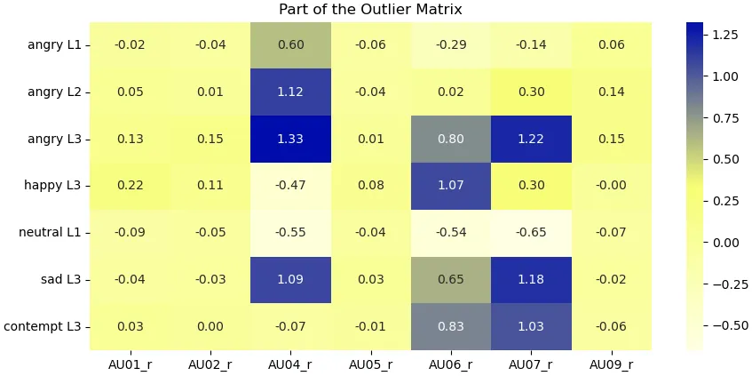

Figure 4: Part of the Outlier Matrix.

Effectiveness Proof For a $`\boldsymbol{uf_{emo,level}}`$ to effectively
capture the distinction from the general situation, it should exhibit
outlier values. In the same video, the correlation between
$`\boldsymbol{u}`$ decreases rapidly as the frame interval increases,
whereas in different videos, $`\boldsymbol{u}`$ is independent.
Belonging to the same AU, the $`e_{i}`$ is identically distributed. We
apply the Central Limit Theorem and hypothesis testing to determine if
an $`e_{i}`$ in $`\boldsymbol{uf_{emo,int}}`$ is an outlier. Given the
parameters: $`\mu=0`$, $`\sigma=1`$, $`n=45,000`$, confidence level =
0.999 (Z = 3.291). An $`e_{i}`$ is a significant anomaly if:

```math
|e_{i}|>\frac{Z\cdot\sigma}{\sqrt{n}}=0.0155 \tag{12}
```

In the outlier matrix Fig. 4, most AUs corresponding to $`e_{i}`$ are
outliers. The effectiveness has been proven.  
Isolation Subspace. Subspace $`\mathbb{I}`$ provides a representation
for subtle emotion transformations by isolating each emotional vector to
capture information beyond AUs.

The vector $`\boldsymbol{v}\in\mathbb{I}`$ is defined in Eq. 7. As
defined in Eq. 5, elements $`e_{35}`$ to $`e_{41}`$ use a one-hot-like
encoding to represent seven emotions excluding neutral, and $`index`$
corresponds to an emotion type. The origin distance is calculated as:

```math
od=\sqrt{\sum_{i=18}^{34}{e_{i}^{2}}} \tag{13}
```

This distance $`od`$ reflects emotion level tendency, which we leverage
to enable the network (CDAN) to learn additional representations. To
unify the tendency expressed by AUs, we apply the optimization function
$`\text{Opt}_{\text{2}}`$:

```math
\text{Opt}_{\text{2}}(AU_{i})=\frac{|AU_{i}|}{\sigma_{emo}} \tag{14}
```

where $`\sigma_{emo}`$ is the standard deviation of $`AU_{i}`$ for a
specific emotion.

Isolation Proof For a vector $`\boldsymbol{v}`$ to effectively represent
the emotion level tendency, it must be distinguishable from vectors of
other emotions. Poor results from Gaussian and k-means clustering
(Silhouette Scores: -0.0217 and 0.0137) in $`\mathbb{A}`$ indicate the
necessity of emotion isolation within $`\mathbb{I}`$. Define both outer
(Opd) and inner (Ipd) emotion distances:

```math
d=\|\boldsymbol{v}_{1}-\boldsymbol{v}_{2}\| \tag{15}
```

For $`\boldsymbol{v}`$ representing different emotions but with the same
Od:

```math
Ipd\leq od\times\sqrt{2}\leq Opd \tag{16}
```

This condition ensures that the network is always able to isolate
vectors of different emotions as the level increases. The isolation has
been proven.

Figure 5: Structure of the Cross-Dimension Attention Net. Illustration
in the process for a single frame’s coefficients. G denotes the vector
outer product operation, and C denotes vector concatenation.
$`\boldsymbol{u}`$,$`\boldsymbol{v}`$ are vectors in ACT and ISO
Subspace respectively. $`\beta`$ is 3DMM coefficients.

### 3.3 Cross-Dimension Attention Net

Cross-Dimension Attention Net (CDAN) mines high-dimensional correlations
between two low-dimensional inputs using matrix-attention and
cross-dimension mechanism. The network inputs are two vectors, $`\beta`$
and either $`\boldsymbol{u}`$ or $`\boldsymbol{v}`$. Specifically,
$`\boldsymbol{u}\in\mathbb{A}`$ is a $`1\times 17`$ vector, and
$`\boldsymbol{v}\in\mathbb{I}`$ is a $`1\times 24`$ vector. The vector
$`\beta`$, from Eq. 1, is a $`1\times 64`$ vector.

From a cross-dimensional perspective, Action Units (AUs) affect 3DMM
locations differently; for example, chin movements impact the lips more
than the eyes. Different facial regions correlate to varying degrees.
CDAN explores these correlations in higher and lower dimensions.

For higher dimensions, vectors $`\boldsymbol{u}`$ and
$`\boldsymbol{\beta}`$ are combined into the Initial Joint Coefficient
Matrix $`\boldsymbol{J}`$:

```math
\boldsymbol{J}=\text{Combine}(\boldsymbol{u},\boldsymbol{\beta}) \tag{17}
```

Passing $`\boldsymbol{J}`$ through a linear layer produces the Combined
Joint Coefficient Matrix $`\boldsymbol{J^{*}}`$:

```math
\boldsymbol{J^{*}}=\text{Linear}(\boldsymbol{J}) \tag{18}
```

Here, $`\boldsymbol{J^{*}}`$ is shaped $`17\times 64`$. The 17
dimensions represent facial units as sequence length, and the 64
dimensions represent 3DMM coefficients as embedding vectors. A
matrix-attention mechanism adds to correlation mining.

For lower dimensions, concatenate $`\boldsymbol{u}`$ and $`\beta`$:

```math
\text{Concat}(\boldsymbol{u},\boldsymbol{\beta})\rightarrow\text{FC}(\cdot) \tag{19}
```

Eq. 20 describes parallel inputs to predict transformed 3DMM
coefficients:

```math
\beta^{\prime}=\text{MLP}(\text{FC}(\boldsymbol{u},\beta),\text{Att}(\boldsymbol{u},\beta)) \tag{20}
```

As shown in Fig. 2, utilizing
$`\boldsymbol{{w}^{{}^{\prime}}}\in\mathbb{E}`$ from the Emo Injector,
our method employs two CDANs in series and parallel to achieve
controllable deformation of a facial 3D model. Each CDAN receives
vectors from the ACT and ISO subspaces, respectively. For finer
representation in the ISO subspace, when $`\boldsymbol{v}`$ is an input,
the other input is the predicted coefficients $`\beta^{\prime}`$
obtained from $`\boldsymbol{u}`$ and $`\beta`$.

Figure 6: The Emotion Injector.

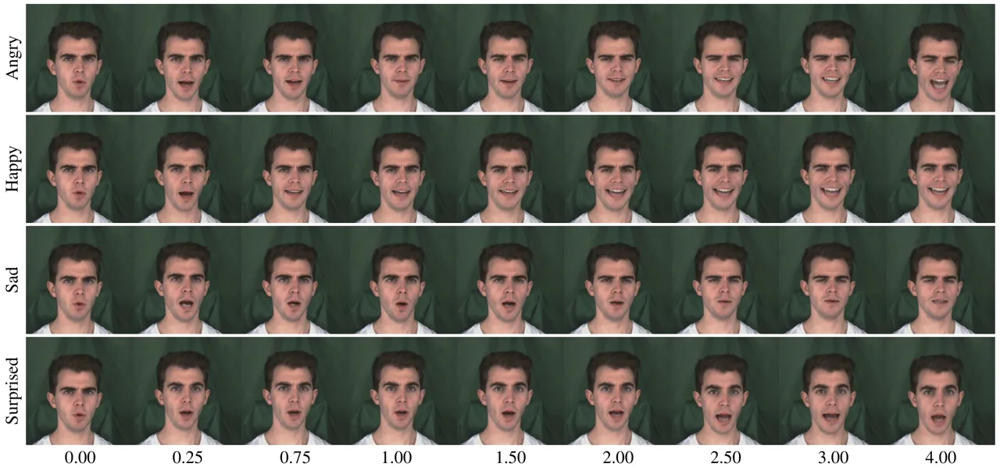

Figure 7: Fine-grained emotion editing.

### 3.4 Other Key Components

Linear Emotion Space Recon. The reconstruction of emotion utilizes
OpenFace \[3\] to extract the origin AUs sequence from a given AU source
and then processes the AUs sequence, mapping it to the ACT and ISO
subspaces. This involves deriving $`\mu_{D}`$, $`\sigma_{D}`$, and each
$`\sigma_{emo}`$ statistically before training, as shown in Eq. 9 and
Eq. 14.  
Audio Encoder-Decoder. Considering that it is not always easy for users
to provide AU source video in actual use, our method can be video-driven
as well as audio-driven. Shown in Fig. 2, an Audio Encoder, based on a
ResNet model \[48\], encodes audio inputs into content vectors for
further collaboration with Decoders. AU Decoder provides generative
input for vector $`\boldsymbol{w}\in\mathbb{E}`$ when AU inputs are
absent. Offset Decoder enhances the predicted 3D coefficients by
incorporating content vectors and leveraging predictions from another
pretrained audio encoder \[48\]. Since audio features contain unique
information, Offset Decoder compensates for residuals in the 3D
coefficients after CDAN prediction.  
Emotion Injector. The Emotion Injector, based on Fig. 4, Eq. 9, and
Eq. 10, utilizes twenty-two feature vectors $`\boldsymbol{uf}`$ for
eight emotions, stored statistically before testing.
$`\boldsymbol{uf}_{neutral,0}`$ is defined where emotion level is 0.
$`\boldsymbol{u}`$ is updated first and then $`\boldsymbol{v}`$ is
updated. As shown in Fig. 6 and based on Eq. 8, when user’s control
label is $`(emo,level)`$, the transformation is as follows:

```math
\begin{array}[]{c}i=\lceil level\rceil\quad\quad\quad j=\lfloor level\rfloor\end{array} \tag{21}
```

```math
\displaystyle\boldsymbol{uf}_{emo,level}= \displaystyle(\boldsymbol{uf}_{emo,i}-\boldsymbol{uf}_{emo,j}) \tag{22}
```

```math
\displaystyle\cdot(level-j)+\boldsymbol{uf}_{emo,j}
```

```math
\begin{array}[]{c}\boldsymbol{u}_{inj}=\boldsymbol{uf}_{emo,level}-\boldsymbol{uf}_{neutral,0}\end{array} \tag{23}
```

```math
\begin{array}[]{c}\boldsymbol{u^{\prime}}=\boldsymbol{u}_{inj}+\boldsymbol{u}\end{array} \tag{24}
```

3D-Aware Face Render. Inspired by Sadtalker \[48\], we use identity,
pose, and transformed 3D coefficients to generate a video with a
pre-trained renderer.

## 4 Experiment

In this section, we demonstrate three key points through multiple
experiment settings: (1) the adaptation to Linear Emotion Space (LES)
definition enables LES-Talker to achieve fine-grained emotion editing;
(2) the improved visual achieved by LES-Talker; (3) the effective design
of the CDAN and other key components.

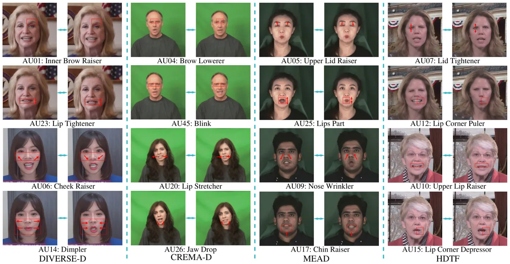

Figure 8: Fine-grained AUs editing.

### 4.1 Experimental Settings.

Datasets. We utilized the MEAD \[40\] as our primary dataset. To
demonstrate the generalizability of our method, we also conducted
evaluations using the CREMA-D \[5\], HDTF \[50\], and a diverse dataset
\[49\].  
Implementation Details. We performed all experiments on an NVIDIA RTX
3090Ti GPU using the PyTorch platform. The input audio was sampled at
16,000 Hz and represented as a 0.2-second mel spectrogram. Videos were
cropped and resized to 512$`\times`$512. OpenFace \[3\] and
DeepFace3DReconstruction \[12\] were used to extract AU values and 3DMM
coefficients from input images. Our training employs a two-step
coarse-to-fine strategy. We provide more details about training in the
supplementary materials.  
Evaluation Metrics. Video quality was assessed using the following four
metrics: Frechet Inception Distance (FID), Structural Similarity (SSIM),
Peak Signal-to-Noise Ratio (PSNR), Cumulative Probability Blur Detection
(CPBD). Lip synchronization was evaluated with three metrics using
Syncnet \[11\]: Lip Sync Confidence (AVConf), Lip Offset (AVOffset), and
Minimum Offset (MinDist).

Figure 9: t-SNE Visualization.

### 4.2 Editing Effectiveness

We demonstrate the effectiveness of the editing by achieving the
expected experimental results.  
Fine-grained emotion editing. In the test set, we selected identity
images and AU sources from neutral emotion videos, along with the
corresponding audio. The Emo Injector method was strictly followed to
inject different emotions at various levels. We compared frames with the
same emotion but varying levels. In Fig. 7, the horizontal axis
represents the level, while the vertical axis represents different
emotions. We achieved fine-grained editing for levels 0-3 and effective
editing for hyperdomain levels (level $`>`$ 3).  
Fine-grained AUs editing As shown in Fig. 1, we can set the level in a
arbitrary values. To validate the model’s generalization and
effectiveness, we imposed strict conditions: absent AU source,
cross-dataset, and cross-identity. Control conditions involved injecting
+2.5 and -2.5 into the AUs in the ACT Subspace, with each image pair
having +2.5 on the left and -2.5 on the right. As illustrated in Fig. 8,
our method achieves editing control over nearly all defined AUs.  
Space Visualization. We generated 1,755 videos across five emotions,
with levels from 0 to 4 in steps of 0.0114. Each video’s frames were
transformed into 41-dimensional LES representations and averaged,
followed by t-SNE for dimensionality reduction. In Fig. 9, we can
observe that the spatial representation reveals a clear emotional
gradient and distinct separation between emotions.

| Method          | Video Quality Comparison |       |        |       | Lip Synchronization Comparison |         |              | User Study |         |          |          |
| --------------- | ------------------------ | ----- | ------ | ----- | ------------------------------ | ------- | ------------ | ---------- | ------- | -------- | -------- |
|                 | FID↓                     | SSIM↑ | PSNR↑  | CPBD↑ | MinDist↓                       | AVConf↑ | AVOffset(→0) | LipSyn↑    | EmoAcc↑ | Reality↑ | Quality↑ |
| Real Video      | 0.000                    | 1.000 | 31.734 | 0.265 | 7.869                          | 6.564   | -2.000       | 4.54       | 4.74    | 4.88     | 4.89     |
| MEAD\[40\]      | 146.454                  | 0.469 | 14.864 | 0.191 | 11.957                         | 2.674   | -2.000       | 2.73       | 3.42    | 3.87     | 3.72     |
| EVP\[21\]       | 56.650                   | 0.453 | 16.308 | 0.341 | 12.443                         | 3.163   | 5.000        | 2.83       | 3.55    | 3.71     | 3.85     |
| EAMM\[22\]      | 204.002                  | 0.396 | 12.832 | 0.135 | 10.091                         | 3.046   | -4.000       | 3.12       | 3.72    | 3.65     | 3.56     |
| SadTalker\[48\] | 25.746                   | 0.718 | 20.728 | 0.249 | 8.875                          | 6.484   | 1.000        | 3.71       | -       | 3.30     | 3.86     |
| EAT\[18\]       | 135.439                  | 0.706 | 13.139 | 0.228 | 7.531                          | 8.164   | -2.000       | 3.38       | 3.76    | 3.91     | 3.93     |
| Ours            | 24.783                   | 0.743 | 21.686 | 0.261 | 9.800                          | 7.284   | 0.000        | 3.59       | 3.79    | 3.96     | 4.10     |

Table 1: Quantitative comparisons on video quality, lip synchronization,
and user study.

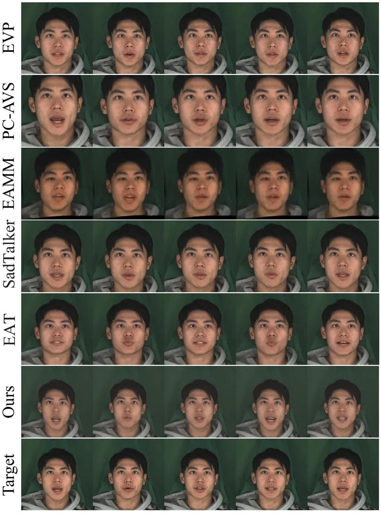

Figure 10: Visual quality comparison.

### 4.3 Visual Quaility

We compare our method with state-of-the-art open-source emotion-driven
models (EAMM, EVP, EAT) and the one-shot method SadTalker, achieving
superior visual quality.

| Emo Type  | Emo Level |      |      |      |      |
| --------- | --------- | ---- | ---- | ---- | ---- |
|           | 0.50      | 1.00 | 1.50 | 2.00 | 2.50 |
| Angry     | 0.87      | 1.20 | 1.60 | 1.80 | 1.84 |
| Happy     | 0.83      | 1.41 | 1.77 | 2.00 | 2.23 |
| Sad       | 1.22      | 1.42 | 1.51 | 2.07 | 2.07 |
| Surprised | 1.73      | 1.92 | 2.01 | 2.04 | 2.28 |
| Average   | 1.16      | 1.49 | 1.72 | 1.98 | 2.10 |

Table 2: User-perceived level.

| Opt. | OD  | AS  | MinDist$`\downarrow`$ | AVConf$`\uparrow`$ | AVOffset($`\to 0`$) |
| ---- | --- | --- | --------------------- | ------------------ | ------------------- |
|      |     |     | 13.184                | 2.081              | -11.000             |
|      | ✓   |     | 12.250                | 2.911              | -1.000              |
|      |     | ✓   | 10.727                | 6.330              | 0.000               |
| ✓    |     | ✓   | 10.403                | 6.563              | 0.000               |
|      | ✓   | ✓   | 10.152                | 6.876              | 0.000               |
| ✓    | ✓   | ✓   | 9.800                 | 7.284              | 0.000               |

Table 3: Quantitative comparisons in ablation study.

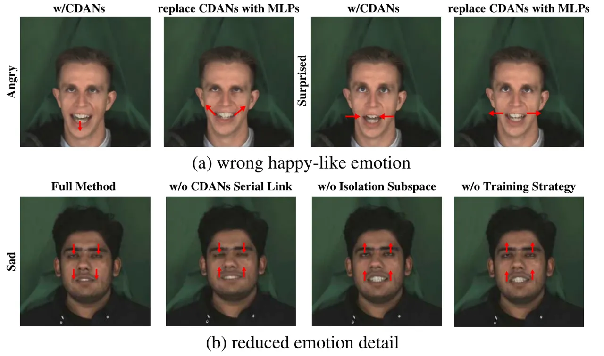

Figure 11: Generation in ablation study.

User Study. We conducted user studies with 15 participants to evaluate
our model across multiple metrics (rated 1–5) compared to other methods,
as detailed in Tab.1. Our method outperformed others. As illustrated in
Tab.2, we assessed user-perceived emotion levels when presented with
videos labeled $`(emo,level)`$. The results confirm a consistent upward
trend between theoretical and perceived emotion intensity, validating
our framework’s effectiveness. Meanwhile, intensity shifts in sadness
and surprise are subtler than in happiness and anger.

### 4.4 Ablation Study.

We conducted ablation studies in multiple conditions to comprehensively
demonstrate the contribution. Additionally, the absence of serial
connection between two-level CDANs leads to poor performance. The
incomplete methods shown in Fig. 11 lose the ability to express distinct
emotional details, causing angry, surprised, and sad to resemble
happy-like emotions, primarily by widening the mouth as the emotion
level increases. Opt., OD and AS represents the mechanisms referred to
Eq. 9 and Eq. 14 in LES Recon., Offset Decoder and Au Source
respectively. We display progressively incorporating components in
Tab. 3. More details are in the supplementary materials.

## 5 Conclusion

In this paper, we propose Linear Emotion Space (LES), a fine-grained
emotion definition capturing facial unit actions and subtle details
beyond AUs, along with a fine-grained emotion editing model, LES-Talker.
We use 3DMM as an intermediate representation and propose
Cross-Dimension Attention Net to guide the controllable deformation of
the 3D model. We also design various key components to adapt multi-modal
features. LES-Talker delivers high visual quality and fine-grained
emotion editing, performing diverse tasks. Our theoretical definition of
LES distinguishes the model and could serve as a foundation for future
research.

## References

- \[1\] Shivangi Aneja, Justus Thies, Angela Dai, and Matthias Nießner.
  Facetalk: Audio-driven motion diffusion for neural parametric head
  models. In _Proceedings of the IEEE/CVF Conference on Computer Vision
  and Pattern Recognition_, pages 21263–21273, 2024.
- \[2\] Alexei Baevski, Yuhao Zhou, Abdelrahman Mohamed, and Michael
  Auli. wav2vec 2.0: A framework for self-supervised learning of speech
  representations. _Advances in neural information processing systems_,
  33:12449–12460, 2020.
- \[3\] Tadas Baltrušaitis, Peter Robinson, and Louis-Philippe Morency.
  Openface: an open source facial behavior analysis toolkit. In _2016
  IEEE winter conference on applications of computer vision (WACV)_,
  pages 1–10. IEEE, 2016.
- \[4\] Volker Blanz and Thomas Vetter. A morphable model for the
  synthesis of 3d faces. In _Proceedings of the 26th Annual Conference
  on Computer Graphics and Interactive Techniques_, page 187–194,
  USA, 1999. ACM Press/Addison-Wesley Publishing Co.
- \[5\] Houwei Cao, David G Cooper, Michael K Keutmann, Ruben C Gur, Ani
  Nenkova, and Ragini Verma. Crema-d: Crowd-sourced emotional multimodal
  actors dataset. _IEEE transactions on affective computing_,
  5(4):377–390, 2014.
- \[6\] Junuk Cha, Seongro Yoon, Valeriya Strizhkova, Francois Bremond,
  and Seungryul Baek. Emotalkinggaussian: Continuous emotion-conditioned
  talking head synthesis. _arXiv preprint arXiv:2502.00654_, 2025.
- \[7\] Junming Chen, Yunfei Liu, Jianan Wang, Ailing Zeng, Yu Li, and
  Qifeng Chen. Diffsheg: A diffusion-based approach for real-time
  speech-driven holistic 3d expression and gesture generation. In
  _Proceedings of the IEEE/CVF Conference on Computer Vision and Pattern
  Recognition_, pages 7352–7361, 2024.
- \[8\] Shu-Yu Chen, Yu-Kun Lai, Shihong Xia, Paul L Rosin, and Lin Gao.
  3d face reconstruction and gaze tracking in the hmd for virtual
  interaction. _IEEE Transactions on Multimedia_, 25:3166–3179, 2022.
- \[9\] Kun Cheng, Xiaodong Cun, Yong Zhang, Menghan Xia, Fei Yin,
  Mingrui Zhu, Xuan Wang, Jue Wang, and Nannan Wang. Videoretalking:
  Audio-based lip synchronization for talking head video editing in the
  wild. In _SIGGRAPH Asia 2022 Conference Papers_, pages 1–9, 2022.
- \[10\] Kyusun Cho, Joungbin Lee, Heeji Yoon, Yeobin Hong, Jaehoon Ko,
  Sangjun Ahn, and Seungryong Kim. Gaussiantalker: Real-time talking
  head synthesis with 3d gaussian splatting. In _Proceedings of the 32nd
  ACM International Conference on Multimedia_, pages 10985–10994, 2024.
- \[11\] Joon Son Chung and Andrew Zisserman. Out of time: automated lip
  sync in the wild. In _Computer Vision–ACCV 2016 Workshops: ACCV 2016
  International Workshops, Taipei, Taiwan, November 20-24, 2016, Revised
  Selected Papers, Part II 13_, pages 251–263. Springer, 2017.
- \[12\] Yu Deng, Jiaolong Yang, Sicheng Xu, Dong Chen, Yunde Jia, and
  Xin Tong. Accurate 3d face reconstruction with weakly-supervised
  learning: From single image to image set. In _Proceedings of the
  IEEE/CVF conference on computer vision and pattern recognition
  workshops_, pages 0–0, 2019.
- \[13\] Nikita Drobyshev, Jenya Chelishev, Taras Khakhulin, Aleksei
  Ivakhnenko, Victor Lempitsky, and Egor Zakharov. Megaportraits:
  One-shot megapixel neural head avatars. In _Proceedings of the 30th
  ACM International Conference on Multimedia_, pages 2663–2671, 2022.
- \[14\] Paul Ekman and Wallace V Friesen. Facial action coding system.
  _Environmental Psychology & Nonverbal Behavior_, 1978.
- \[15\] P Ekman, E Rosenberg, and J Hager. Facial action coding system
  affect interpretation dictionary (facsaid). _In._, 1998.
- \[16\] Guanwen Feng, Haoran Cheng, Yunan Li, Zhiyuan Ma, Chaoneng Li,
  Zhihao Qian, Qiguang Miao, and Chi-Man Pun. Emospeaker: One-shot
  fine-grained emotion-controlled talking face generation. _arXiv
  preprint arXiv:2402.01422_, 2024.
- \[17\] Wallace V Friesen, Paul Ekman, et al. Emfacs-7: Emotional
  facial action coding system. _Unpublished manuscript, University of
  California at San Francisco_, 2(36):1, 1983.
- \[18\] Yuan Gan, Zongxin Yang, Xihang Yue, Lingyun Sun, and Yi Yang.
  Efficient emotional adaptation for audio-driven talking-head
  generation. In _Proceedings of the IEEE/CVF International Conference
  on Computer Vision_, pages 22634–22645, 2023.
- \[19\] Yudong Guo, Keyu Chen, Sen Liang, Yong-Jin Liu, Hujun Bao, and
  Juyong Zhang. Ad-nerf: Audio driven neural radiance fields for talking
  head synthesis. In _Proceedings of the IEEE/CVF international
  conference on computer vision_, pages 5784–5794, 2021.
- \[20\] Steven Hogue, Chenxu Zhang, Hamza Daruger, Yapeng Tian, and
  Xiaohu Guo. Diffted: One-shot audio-driven ted talk video generation
  with diffusion-based co-speech gestures. In _Proceedings of the
  IEEE/CVF Conference on Computer Vision and Pattern Recognition_, pages
  1922–1931, 2024.
- \[21\] Xinya Ji, Hang Zhou, Kaisiyuan Wang, Wayne Wu, Chen Change Loy,
  Xun Cao, and Feng Xu. Audio-driven emotional video portraits. In
  _Proceedings of the IEEE/CVF conference on computer vision and pattern
  recognition_, pages 14080–14089, 2021.
- \[22\] Xinya Ji, Hang Zhou, Kaisiyuan Wang, Qianyi Wu, Wayne Wu, Feng
  Xu, and Xun Cao. Eamm: One-shot emotional talking face via audio-based
  emotion-aware motion model. In _ACM SIGGRAPH 2022 Conference
  Proceedings_, pages 1–10, 2022.
- \[23\] Taekyung Ki, Dongchan Min, and Gyoungsu Chae. Float: Generative
  motion latent flow matching for audio-driven talking portrait. _arXiv
  preprint arXiv:2412.01064_, 2024.
- \[24\] Jiahe Li, Jiawei Zhang, Xiao Bai, Jun Zhou, and Lin Gu.
  Efficient region-aware neural radiance fields for high-fidelity
  talking portrait synthesis. In _Proceedings of the IEEE/CVF
  International Conference on Computer Vision_, pages 7568–7578, 2023.
- \[25\] Jiahe Li, Jiawei Zhang, Xiao Bai, Jin Zheng, Xin Ning, Jun
  Zhou, and Lin Gu. Talkinggaussian: Structure-persistent 3d talking
  head synthesis via gaussian splatting. In _European Conference on
  Computer Vision_, pages 127–145. Springer, 2025.
- \[26\] Huaize Liu, Wenzhang Sun, Donglin Di, Shibo Sun, Jiahui Yang,
  Changqing Zou, and Hujun Bao. Moee: Mixture of emotion experts for
  audio-driven portrait animation. _arXiv preprint
  arXiv:2501.01808_, 2025.
- \[27\] Jin Liu, Peng Chen, Tao Liang, Zhaoxing Li, Cai Yu, Shuqiao
  Zou, Jiao Dai, and Jizhong Han. Li-net: Large-pose identity-preserving
  face reenactment network. In _2021 IEEE International Conference on
  Multimedia and Expo (ICME)_, pages 1–6. IEEE, 2021.
- \[28\] Yifeng Ma, Suzhen Wang, Zhipeng Hu, Changjie Fan, Tangjie Lv,
  Yu Ding, Zhidong Deng, and Xin Yu. Styletalk: One-shot talking head
  generation with controllable speaking styles. In _Proceedings of the
  AAAI Conference on Artificial Intelligence_, pages 1896–1904, 2023.
- \[29\] Ziqiao Peng, Haoyu Wu, Zhenbo Song, Hao Xu, Xiangyu Zhu, Jun
  He, Hongyan Liu, and Zhaoxin Fan. Emotalk: Speech-driven emotional
  disentanglement for 3d face animation. In _Proceedings of the IEEE/CVF
  International Conference on Computer Vision_, pages 20687–20697, 2023.
- \[30\] KR Prajwal, Rudrabha Mukhopadhyay, Vinay P Namboodiri, and CV
  Jawahar. A lip sync expert is all you need for speech to lip
  generation in the wild. In _Proceedings of the 28th ACM international
  conference on multimedia_, pages 484–492, 2020.
- \[31\] Hsin-Yu Shen and Wen-Jiin Tsai. Talking head generation based
  on 3d morphable facial model. In _2024 Picture Coding Symposium
  (PCS)_, pages 1–5. IEEE, 2024.
- \[32\] Shuai Shen, Wanhua Li, Xiaoke Huang, Zheng Zhu, Jie Zhou, and
  Jiwen Lu. Sd-nerf: Towards lifelike talking head animation via
  spatially-adaptive dual-driven nerfs. _IEEE Transactions on
  Multimedia_, 2023.
- \[33\] Jaehyeok Shim, Changwoo Kang, and Kyungdon Joo. Diffusion-based
  signed distance fields for 3d shape generation. In _Proceedings of the
  IEEE/CVF conference on computer vision and pattern recognition_, pages
  20887–20897, 2023.
- \[34\] Zhiyao Sun, Tian Lv, Sheng Ye, Matthieu Lin, Jenny Sheng,
  Yu-Hui Wen, Minjing Yu, and Yong-jin Liu. Diffposetalk: Speech-driven
  stylistic 3d facial animation and head pose generation via diffusion
  models. _ACM Transactions on Graphics (TOG)_, 43(4):1–9, 2024a.
- \[35\] Zhaoxu Sun, Yuze Xuan, Fang Liu, and Yang Xiang. Fg-emotalk:
  Talking head video generation with fine-grained controllable facial
  expressions. In _Proceedings of the AAAI Conference on Artificial
  Intelligence_, pages 5043–5051, 2024b.
- \[36\] Shuai Tan, Bin Ji, and Ye Pan. Emmn: Emotional motion memory
  network for audio-driven emotional talking face generation. In
  _Proceedings of the IEEE/CVF International Conference on Computer
  Vision_, pages 22146–22156, 2023.
- \[37\] Shuai Tan, Bin Ji, Mengxiao Bi, and Ye Pan. Edtalk: Efficient
  disentanglement for emotional talking head synthesis. _arXiv preprint
  arXiv:2404.01647_, 2024.
- \[38\] Duomin Wang, Yu Deng, Zixin Yin, Heung-Yeung Shum, and Baoyuan
  Wang. Progressive disentangled representation learning for
  fine-grained controllable talking head synthesis. In _Proceedings of
  the IEEE/CVF Conference on Computer Vision and Pattern Recognition_,
  pages 17979–17989, 2023.
- \[39\] Haotian Wang, Yuzhe Weng, Yueyan Li, Zilu Guo, Jun Du, Shutong
  Niu, Jiefeng Ma, Shan He, Xiaoyan Wu, Qiming Hu, et al. Emotivetalk:
  Expressive talking head generation through audio information
  decoupling and emotional video diffusion. _arXiv preprint
  arXiv:2411.16726_, 2024.
- \[40\] Kaisiyuan Wang, Qianyi Wu, Linsen Song, Zhuoqian Yang, Wayne
  Wu, Chen Qian, Ran He, Yu Qiao, and Chen Change Loy. Mead: A
  large-scale audio-visual dataset for emotional talking-face
  generation. In _European Conference on Computer Vision_, pages
  700–717. Springer, 2020.
- \[41\] Suzhen Wang, Lincheng Li, Yu Ding, and Xin Yu. One-shot talking
  face generation from single-speaker audio-visual correlation learning.
  In _Proceedings of the AAAI Conference on Artificial Intelligence_,
  pages 2531–2539, 2022.
- \[42\] Ting-Chun Wang, Arun Mallya, and Ming-Yu Liu. One-shot
  free-view neural talking-head synthesis for video conferencing. In
  _Proceedings of the IEEE/CVF conference on computer vision and pattern
  recognition_, pages 10039–10049, 2021.
- \[43\] Hongyi Xu, Guoxian Song, Zihang Jiang, Jianfeng Zhang, Yichun
  Shi, Jing Liu, Wanchun Ma, Jiashi Feng, and Linjie Luo. Omniavatar:
  Geometry-guided controllable 3d head synthesis. In _Proceedings of the
  IEEE/CVF Conference on Computer Vision and Pattern Recognition_, pages
  12814–12824, 2023.
- \[44\] Zhijun Xu, Mingkun Zhang, and Dongyu Zhang. Facial
  expression-aware talking head generation with 3d morphable model. In
  _2024 5th International Seminar on Artificial Intelligence, Networking
  and Information Technology (AINIT)_, pages 1214–1217. IEEE, 2024.
- \[45\] Hongyun Yu, Zhan Qu, Qihang Yu, Jianchuan Chen, Zhonghua Jiang,
  Zhiwen Chen, Shengyu Zhang, Jimin Xu, Fei Wu, Chengfei Lv, et al.
  Gaussiantalker: Speaker-specific talking head synthesis via 3d
  gaussian splatting. _arXiv preprint arXiv:2404.14037_, 2024.
- \[46\] Zhentao Yu, Zixin Yin, Deyu Zhou, Duomin Wang, Finn Wong, and
  Baoyuan Wang. Talking head generation with probabilistic
  audio-to-visual diffusion priors. In _Proceedings of the IEEE/CVF
  International Conference on Computer Vision_, pages 7645–7655, 2023.
- \[47\] Chenxu Zhang, Chao Wang, Jianfeng Zhang, Hongyi Xu, Guoxian
  Song, You Xie, Linjie Luo, Yapeng Tian, Xiaohu Guo, and Jiashi Feng.
  Dream-talk: Diffusion-based realistic emotional audio-driven method
  for single image talking face generation. _arXiv preprint
  arXiv:2312.13578_, 2023a.
- \[48\] Wenxuan Zhang, Xiaodong Cun, Xuan Wang, Yong Zhang, Xi Shen, Yu
  Guo, Ying Shan, and Fei Wang. Sadtalker: Learning realistic 3d motion
  coefficients for stylized audio-driven single image talking face
  animation. In _Proceedings of the IEEE/CVF Conference on Computer
  Vision and Pattern Recognition_, pages 8652–8661, 2023b.
- \[49\] Weixia Zhang, Chengguang Zhu, Jingnan Gao, Yichao Yan, Guangtao
  Zhai, and Xiaokang Yang. A comparative study of perceptual quality
  metrics for audio-driven talking head videos. _arXiv preprint
  arXiv:2403.06421_, 2024a.
- \[50\] Zhimeng Zhang, Lincheng Li, Yu Ding, and Changjie Fan.
  Flow-guided one-shot talking face generation with a high-resolution
  audio-visual dataset. In _Proceedings of the IEEE/CVF Conference on
  Computer Vision and Pattern Recognition_, pages 3661–3670, 2021.
- \[51\] Zicheng Zhang, Yingjie Zhou, Chunyi Li, Kang Fu, Wei Sun,
  Xiaohong Liu, Xiongkuo Min, and Guangtao Zhai. A reduced-reference
  quality assessment metric for textured mesh digital humans. In _ICASSP
  2024-2024 IEEE International Conference on Acoustics, Speech and
  Signal Processing (ICASSP)_, pages 2965–2969. IEEE, 2024b.
- \[52\] Jian Zhao and Hui Zhang. Thin-plate spline motion model for
  image animation. In _Proceedings of the IEEE/CVF Conference on
  Computer Vision and Pattern Recognition_, pages 3657–3666, 2022.
- \[53\] Xin-Yang Zheng, Hao Pan, Peng-Shuai Wang, Xin Tong, Yang Liu,
  and Heung-Yeung Shum. Locally attentional sdf diffusion for
  controllable 3d shape generation. _ACM Transactions on Graphics
  (ToG)_, 42(4):1–13, 2023.
- \[54\] Hang Zhou, Yasheng Sun, Wayne Wu, Chen Change Loy, Xiaogang
  Wang, and Ziwei Liu. Pose-controllable talking face generation by
  implicitly modularized audio-visual representation. In _Proceedings of
  the IEEE/CVF conference on computer vision and pattern recognition_,
  pages 4176–4186, 2021.

## Appendix

## Appendix A Further Description of LES

| AUs  | Action Description | AUs  | Action Description   |
| ---- | ------------------ | ---- | -------------------- |
| AU1  | Inner Brow Raiser  | AU14 | Dimpler              |
| AU2  | Outer Brow Raiser  | AU15 | Lip Corner Depressor |
| AU4  | Brow Lowerer       | AU17 | Chin Raiser          |
| AU5  | Upper Lid Raiser   | AU20 | Lip Stretcher        |
| AU6  | Cheek Raiser       | AU23 | Lip Tightener        |
| AU7  | Lid Tightener      | AU25 | Lips Part            |
| AU9  | Nose Wrinkler      | AU26 | Jaw Drop             |
| AU10 | Upper Lip Raiser   | AU45 | Blink                |
| AU12 | Lip Corner Puller  |      |                      |

Table 4: Facial Action Units Description.

### A.1 Physical Meaning

Our proposed Linear Emotion Space contains a total of 41 dimensions. The
first 17 dimensions, which make up the Action Subspace $`\mathbb{A}`$,
directly correspond to the 17 Facial Action Units (AUs) listed above.
Their values have a unified physical meaning across all emotions,
representing the amplitude of movement of each facial unit. The next 17
dimensions (18-34) form the Isolation Subspace $`\mathbb{I}`$ and also
correspond to the same 17 AUs. However, in this subspace, the values
have distinct physical meanings under each emotion, representing the
magnitude of fluctuation in the movement of each facial unit. Finally,
the last 7 dimensions (35-41) of the Isolation Subspace are dedicated to
isolating individual emotions and directly capturing the overall
intensity of each emotion.

| Cluster | Top Emotion-Level Pairs    | Percentage |
| ------- | -------------------------- | ---------- |
| 0       | happy_level_3 (46.67%)     | 4.55       |
| 1       | contempt_level_3 (32.40%)  | 10.81      |
| 2       | disgusted_level_3 (42.24%) | 7.81       |
| 3       | fear_level_3 (39.32%)      | 7.88       |
| 4       | angry_level_3 (25.85%)     | 22.66      |
| 5       | neutral_level_1 (48.41%)   | 27.54      |
| 6       | sad_level_3 (37.66%)       | 10.37      |
| 7       | happy_level_3 (68.67%)     | 8.38       |

Table 5: GMM Clusters for vectors in ACT Subspace.

| Cluster | Top Emotion-Level Pairs    | Percentage |
| ------- | -------------------------- | ---------- |
| 0       | neutral-level_1 (42.63%)   | 33.80      |
| 1       | sad-level_3 (38.66%)       | 13.06      |
| 2       | happy-level_3 (59.41%)     | 3.40       |
| 3       | sad-level_3 (23.49%)       | 5.59       |
| 4       | contempt-level_3 (27.73%)  | 12.63      |
| 5       | contempt-level_3 (40.43%)  | 12.66      |
| 6       | disgusted-level_3 (42.16%) | 9.66       |
| 7       | happy-level_3 (64.10%)     | 9.19       |

Table 6: KMeans Clusters for vectors in ACT Subspace.

### A.2 Cluster Analysis

As shown in Tab. 5 and Tab. 6, we provide a detailed demonstration of
the clustering analysis mentioned in the main text. When performing
emotion reconstruction using only the Action Subspace, both K-means and
GMM clustering exhibit poor results. Within each cluster, the most
frequent emotion-level pair does not significantly dominate. Across
clusters, the sample points of each class—which should be approximately
equal in number—are unevenly distributed, and the different emotions
cannot be effectively separated.

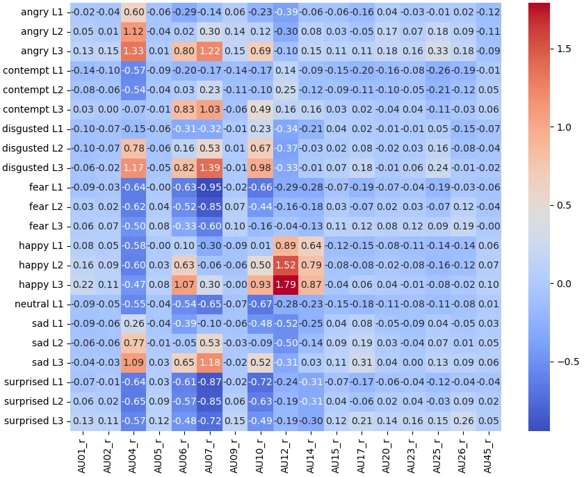

Figure 12: The complete outlier matrix.

### A.3 Complete Outlier Matrix

As illustrated in Fig. 12, we present the complete outlier matrix. The
horizontal axis corresponds to the indices of the 17 controllable action
facial units, while the vertical axis denotes the emotion-level pairs.
The outlier matrix is precomputed prior to training using the LES
definitions described in the main text, leveraging a pre-trained model
and statistical methods. The matrix provides 22 feature vectors
$`\mathbf{uf}`$ in the Action Subspace, which are employed for emotion
transformation in the Emotion Injector.

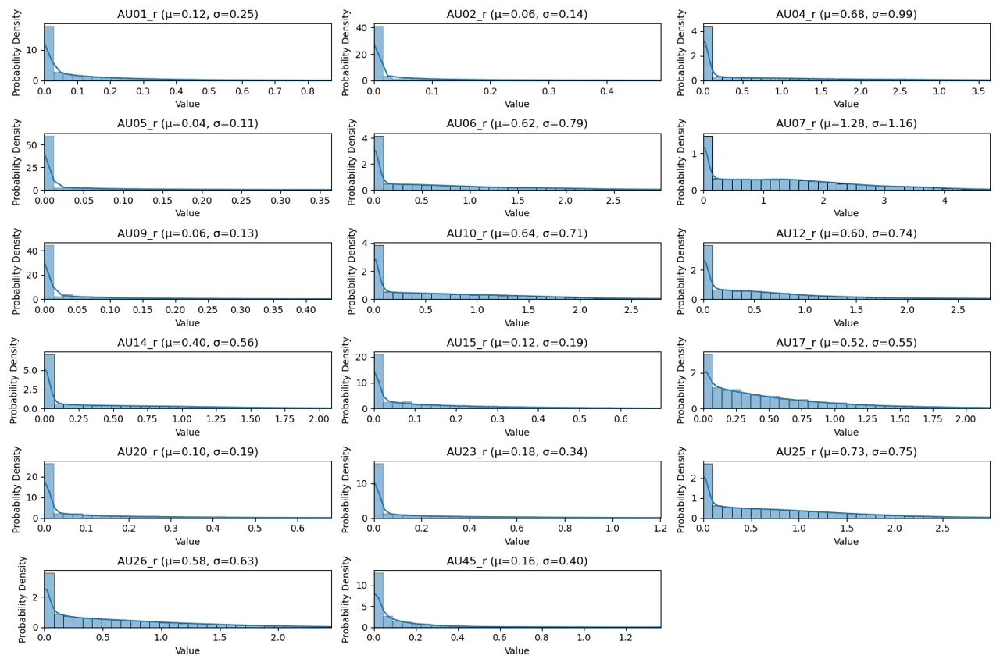

Figure 13: Unbalanced distribution before standardization.

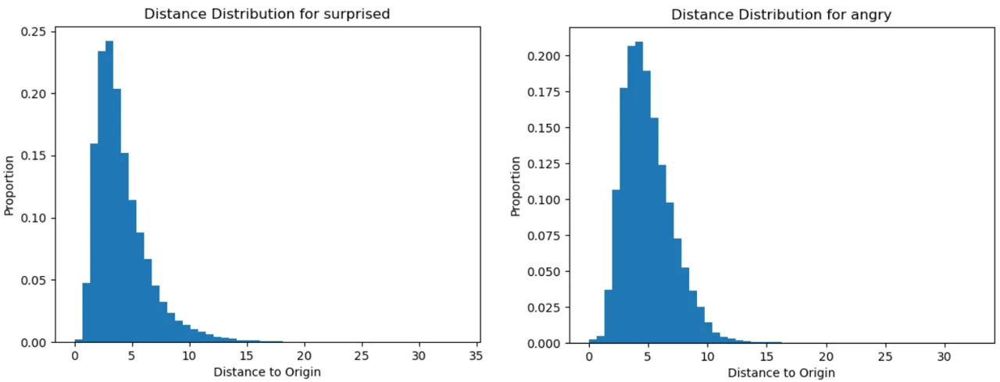

Figure 14: Od distribution in ISO Subspace.

### A.4 Distribution Optimizing

As shown in Fig. 13, prior to applying the Opt1 and Opt2 methods defined
in the LES, all AUs exhibit an unbalanced distribution. This is partly
due to inherent limitations of the dataset itself, and partly due to
defects in the AU extraction tools. Such an unbalanced distribution
leads to the inability to establish a unified representation in the
subsequent LES-defined space, and also results in deficiencies in the
final visual effects. As illustrated in Fig. 14, after distribution
optimization, in the Isolation Space, the vector distance $`Od`$ used to
represent emotional levels achieves a uniform distribution across
different emotions, providing support for a unified level representation
of different emotions.

## Appendix B Training Strategy

### B.1 Coarse-to-Fine Strategy

During training, a two-step strategy from coarse to fine was employed as
follows:

Coarse Training: The coarse training aligns with the design concept of
the Action Subspace, maximizing the use of AUs for facial action
representation. Train the first-level CDAN individually using the first
frame of each video as the reference image with
$`\boldsymbol{u}\in\mathbb{A}`$. Since the first frame better matches
the identity information of subsequent frames, this training approach
provides more precise facial action control.

Fine Training: As using only AUs is insufficient, facial expressions
beyond AUs need to be further adjusted through the Isolation Subspace in
the fine training. Freeze the first CDAN, then train the second-level
CDAN using the neutral emotion frame as the reference image with
$`\boldsymbol{v}\in\mathbb{I}`$. Because the final goal is to perform
arbitrary emotion transformations starting from a neutral emotion, our
method enables the network to have stronger emotion transformation
capabilities.

Finally, freeze both levels of CDAN and train the Offset Decoder
separately, utilizing information from the audio modality to compensate
for the residuals between the remaining predicted coefficients and the
ground truth coefficients. This specialized training method not only
allows the model to achieve the desired emotional expression
capabilities but also attains higher visual quality.

### B.2 Hyper-parameters

To ensure rapid and stable convergence of the model training towards
lower loss values, we employed the Adam optimizer and conducted
extensive hyperparameter tuning, including adjustments to the factor and
patience parameters. Experimental results demonstrated that the initial
learning rate for each epoch was set as
$`lr\times decay^{\text{epoch}}`$, where
$`lr\in\{10^{-3},\mathbf{10}^{-4},10^{-5}\}`$ and
$`decay\in\{0.9,\mathbf{0.86},0.74\}`$. The batch size was configured as
$`\{\mathbf{10},20,30\}`$, and patience was set to
$`\{1500,\mathbf{15000},30000\}`$. Larger batch sizes and excessively
low learning rates resulted in prolonged training times, while larger
factors and learning rates compromised training stability. Additionally,
smaller decay rates and patience values led to insufficient convergence.
Training was terminated after 30 epochs.

|    Guide Space    |    Method             |    FLD↓     |
| ----------------- | --------------------- | ----------- |
|    ACT            |    MLP                |    1.959    |
|    ACT            |    CDAN               |    1.150    |
|    ISO            |    MLP                |    2.230    |
|    ISO            |    CDAN w/o serial    |    2.012    |
|    ISO            |    CDAN               |    1.421    |

Table 7: Facial Landmark Distance (FLD) under emotional conditions,
based on 3DMM, summed over 200 frames.

## Appendix C Further Experiment

### C.1 Facial Landmark Distance

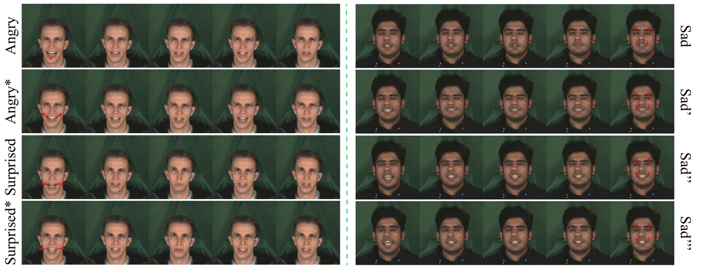

Figure 15: Generation in ablation study.

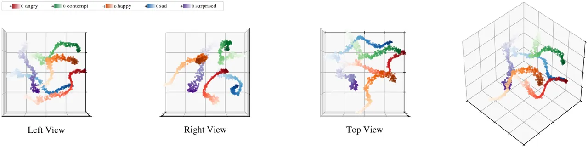

Figure 16: Multi-perspective visualization of the generated results
using t-SNE downscaling.

As shown in Tab. 7, we utilized the Facial Landmark Distance (FLD) based
on 3DMM coefficients, randomly selecting 200 frames for evaluation.
Initially, we tested the Action Subspace independently, using reference
images with identical emotions and identities for generation.
Subsequently, we incorporated the Isolation Subspace, employing
reference images with varying emotions and identities for generation.
Replacing CDAN with a three-layer multilayer perceptron (MLP) or
removing the serial connections resulted in a significant difference in
FLD.

### C.2 Visual Emotion Effects

Fig. 15 illustrates the more detailed generative effects of LES-Talker
compared to ablation results. Surprised\* and angry\* indicate the
ablation where both levels of CDAN are replaced with a 3-layer MLP
(consistent with Tab.7) . Sad’, Sad” and Sad”’ respectively, indicate
the absence of a serial connection between CDANs, the second level CDAN,
and the special training strategy. Emotion level is set to 3.00. When
either the CDANs, the special training strategy, or the serial
connection is removed, the model loses the ability to express distinct
emotional details, causing angry, surprised, and sad to resemble
happy-like emotions, primarily by widening the mouth as the emotion
level increases.

### C.3 Visualization of Emotion Representations

We generated 1,755 videos across five emotions, with levels ranging from
0 to 4 in increments of 0.0114. Each video’s frames were converted into
41-dimensional LES representations, averaged, and reduced using t-SNE.
Fig. 16 displays the multi-view spatial visualizations. For any pair of
emotional point clouds, a separating plane exists in at least one view.
Within each point cloud, intensity variations are clear and uniform. Our
LES design achieves superior emotional isolation and fine-grained
representation.

## Appendix D Core Inference Code

### D.1 Emotion Injector

We present the inference process of the Emotion Injector, which
primarily relies on the emotional semantics inherent in each vector
within the designed LES space. The Emotion Injector utilizes the LES
representations generated for each frame, along with 22 feature vectors
stored in the Action Subspace corresponding to eight emotions (including
neutral), to perform emotion transformations. In the absence of an AU
Source, a preset neutral emotion is employed as the initial LES
representation.

Input: emo_intensity, emo_name, mode_type, emo_control_pre  
Output: emo_control, point_control

1:  Load stats from CSV

2:  Initialize emo_control_dict and point_control_dict

3:  if emo_intensity is 0 then

4:   emo_control, point_control = None, None

5:  else if emo_intensity is -1 then

6:   Use emo_control_pre or default AU values

7:  else if 0 $`<`$ emo_intensity $`\leq`$ 3 then

8:   Calculate levels $`i`$ and $`j`$

9:   Set emo_up_name and emo_down_name

10:   for each AU do

11:    Interpolate emo_control_dict

12:    if mode_type is 3 then

13:     Set point_control_dict

14:    end if

15:   end for

16:  else

17:   Calculate excess $`ex`$

18:   for each AU do

19:    Extrapolate emo_control_dict

20:    if mode_type is 3 then

21:     Set point_control_dict

22:    end if

23:   end for

24:  end if

Algorithm 1 Emo Injector Algorithm

### D.2 Inference Structure

We present the inference algorithm, which operates in four modes: Mode 0
serves as the base; Mode 1 incorporates audio features to calibrate
facial expressions; Mode 2 employs the full method by integrating
complete multi-modal features as input; and Mode 3 operates without the
AU Source. In Mode 3, to achieve more stable emotion transformations, we
employ the point cloud obtained from the Emotion Injector as input to
the Isolation Subspace.

Input: current_mel_input, au, ref, emo_type, emo_intensity  
Output: exp_coeff_pred

1:  if au is not None then

2:   Normalize au using means and stds

3:  end if

4:  if mode_type is 0 then

5:   Compute exp_coeff_pred using CrossDimensionAttnNet1 with au and ref

6:  else if mode_type is 1 then

7:   if emo_control is not None then

8:    Adjust au with emo_control

9:   end if

10:   Extract au45 from au

11:   Compute exp_coeff_pred using CrossDimensionAttnNet1 with au and
ref

12:   Get pred_ref from PretrainedNetG using current_mel_input, ref,
au45

13:   Calculate exp_resi using OffsetDecoder

14:   Add exp_resi to exp_coeff_pred

15:  else if mode_type is 2 then

16:   Compute curr_exp_coeff_pred using CrossDimensionAttnNet1 with au
and ref

17:   Calculate emo_resi using CrossDimensionAttnNet2

18:   Calculate exp_resi and audio_embed using OffsetDecoder

19:   Add emo_resi And exp_resi to curr_exp_coeff_pred to get
exp_coeff_pred

20:  else if mode_type is 3 then

21:   Extract au45 from au

22:   Get pred_ref from PretrainedNetG using current_mel_input, ref,
au45

23:   Calculate exp_resi and audio_embed using OffsetDecoder

24:   Predict aus using AuDecoder

25:   Adjust au45 and combine with aus

26:   Normalize aus

27:   if emo_control is not None then

28:    Adjust aus with emo_control

29:   end if

30:   Compute curr_exp_coeff_pred using CrossDimensionAttnNet1 with aus
and ref

31:   if point_control is not None then

32:    Create au_pred

33:    Calculate emo_resi using CrossDimensionAttnNet2

34:    Add emo_resi to curr_exp_coeff_pred

35:   end if

36:   Add exp_resi to curr_exp_coeff_pred to get exp_coeff_pred

37:  end if

38:  return exp_coeff_pred

Algorithm 2 LES Core Structure
