# OSDFace: One-Step Diffusion Model for Face Restoration

Jingkai Wang ^(†)^(†)thanks: Equal contribution.    Jue
Gong¹¹footnotemark: 1    Lin Zhang    Zheng Chen    Xing Liu
Affiliation: Shanghai Jiao Tong University,  vivo Mobile Communication
Co., Ltd    Hong Gu Affiliation: Shanghai Jiao Tong University,  vivo
Mobile Communication Co., Ltd    Yutong Liu ^(†)^(†)thanks:
Corresponding authors.    Yulun Zhang²²footnotemark: 2    Xiaokang Yang

###### Abstract

Diffusion models have demonstrated impressive performance in face
restoration. Yet, their multi-step inference process remains
computationally intensive, limiting their applicability in real-world
scenarios. Moreover, existing methods often struggle to generate face
images that are harmonious, realistic, and consistent with the subject’s
identity. In this work, we propose OSDFace, a novel one-step diffusion
model for face restoration. Specifically, we propose a visual
representation embedder (VRE) to better capture prior information and
understand the input face. In VRE, low-quality faces are processed by a
visual tokenizer and subsequently embedded with a vector-quantized
dictionary to generate visual prompts. Additionally, we incorporate a
facial identity loss derived from face recognition to further ensure
identity consistency. We further employ a generative adversarial network
(GAN) as a guidance model to encourage distribution alignment between
the restored face and the ground truth. Experimental results demonstrate
that OSDFace surpasses current state-of-the-art (SOTA) methods in both
visual quality and quantitative metrics, generating high-fidelity,
natural face images with high identity consistency. The code and model
will be released at
[https://github.com/jkwang28/OSDFace](https://github.com/jkwang28/OSDFace).

## 1 Introduction

Face restoration aims to restore high-quality (HQ) face images from
degraded low-quality (LQ) inputs caused by complex degradation
processes. Blur, noise, downsampling, and JPEG compression are common
degradation types that can significantly affect the quality of face
images, leading to an ill-posed problem. Recent advancements focus on
leveraging CNN-based methods and Transformer-based methods \[13, 8, 61,
7\] to restore HQ face images, and have shown remarkable performance.
However, due to the severe degradation of face images, generative models
with strong prior knowledge exhibit irreplaceable advantages.

Generative adversarial networks (GANs) \[14\] and diffusion models \[18,
46, 47\] have gained considerable attention for generating high-fidelity
images with perceptual details. Many efforts, such as DifFace \[12\] and
DiffBIR \[6\], have also been applied to restoring HQ face images \[6,
54, 66, 3, 36, 11, 7, 38, 49\]. However, GANs are challenging to train
and may encounter issues such as mode collapse and training instability.
Conversely, diffusion models produce promising results but require
multiple forward passes during inference, leading to increased
computational cost and longer inference time.

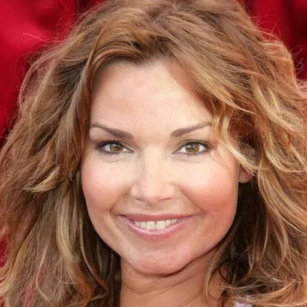
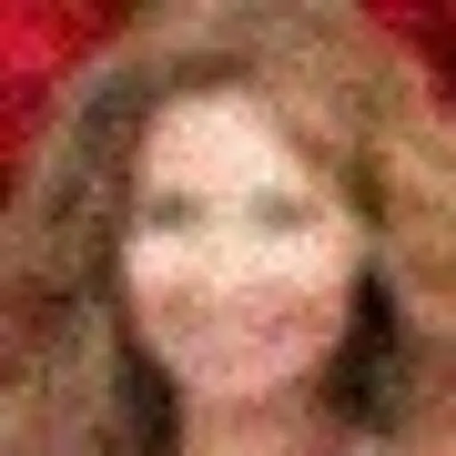
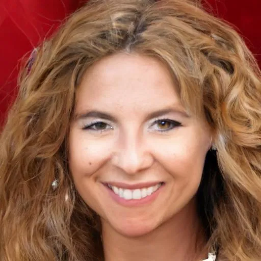
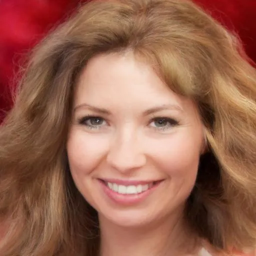 HQ
(512$`\times`$512) LQ (512$`\times`$512) PGDiff \[11\] DifFace \[12\]
MACs (T) / Time (s) / \# Steps 481.0 / 85.8 / 1,000 18.68 / 7.05 / 250
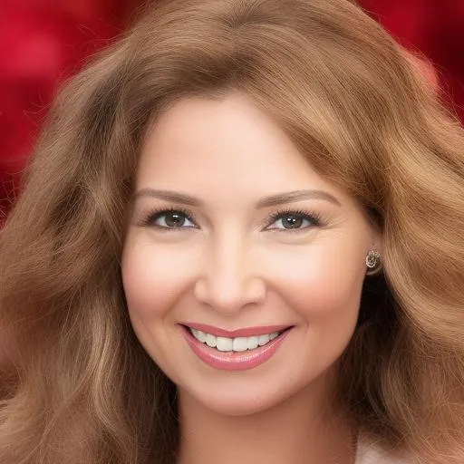
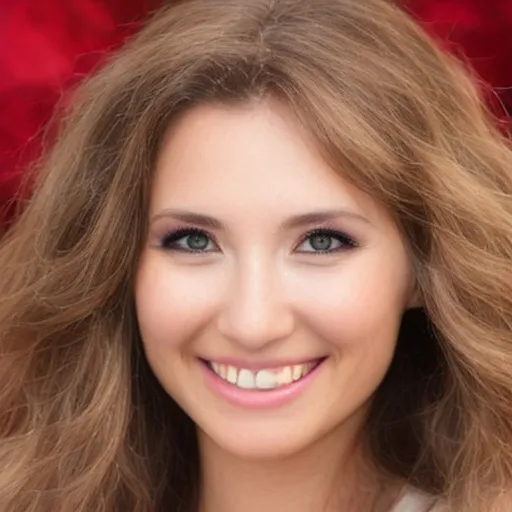
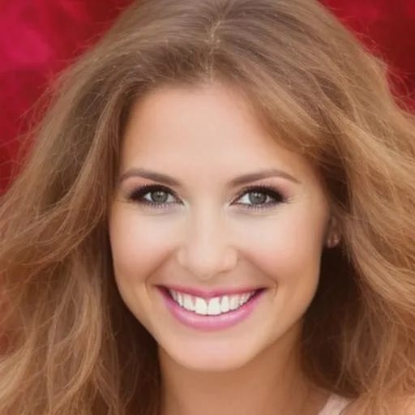
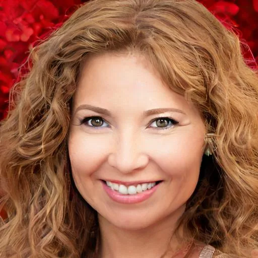 DiffBIR \[6\]
OSEDiff \[9\] OSEDiff\* \[9\] OSDFace (ours) 189.2 / 9.03 / 50 2.269 /
0.13 / 1 2.269 / 0.13 / 1 2.132 / 0.10 / 1

Figure 1: Visual samples of diffusion-based face restoration methods. We
provide multiply-accumulate operations (MACs), time, and number of
timesteps during inference. Our OSDFace achieves a more natural and
faithful visual result than other ones.

To speed up the diffusion inference, one-step diffusion (OSD)
models \[9, 28\] have emerged as a promising research topic. Benefiting
from the recently developed generative diffusion models, especially
large-scale pretrained text-to-image (T2I) models \[40, 41\], OSD
models \[9, 28\] enjoy the powerful restoration capability and fast
inference speed. It is anticipated that OSD models could be highly
competitive in face restoration practical applications.

As shown in Fig. 1, most diffusion-based face restoration methods can
effectively recover basic facial features such as eyes, mouth, and
contour. However, details, such as realistic-looking hair and complex
backgrounds, often remain unharmonious. The primary issue lies in the
insufficient incorporation of face priors \[62\]. Some diffusion-based
methods \[12, 6, 7\] rely solely on the diffusion model without
considering face priors, resulting in unrealistic restorations. Other
methods \[11, 49\] attempt to use face priors, but either limit the
generative capabilities or cause information reduction. On the other
hand, existing general OSD image restoration models, such as
OSEDiff \[9\], are not specifically designed for facial features.
OSEDiff employs image-to-tag prior and works well for natural images.
However, it meets challenges when applied to faces, as humans are highly
sensitive to facial features, and even minor inconsistencies or
unrealistic details are easily noticeable.

Figure 2: Performance comparison on the CelebA-Test. Those metrics which
smaller scores indicate better image quality, are inverted and
normalized for display. OSDFace achieves leading scores on most metrics
with only one diffusion step.

Thus, it is worthwhile to investigate how to design a prior capturer and
apply it to OSD model. One key issue is that designing priors to capture
rich facial features is challenging. Vector-quantized (VQ) prior-based
methods, such as CodeFormer \[13\] and DAEFR \[7\], effectively leverage
codebooks trained in HQ data as priors for face restoration. These
models perform well in generating facial features. However, the face
images often lack fine details and display unreal backgrounds because
they are generated by the codebook items directly. Furthermore,
incorporating priors into diffusion models for face restoration is also
a critical focus. Numerous efforts have been undertaken to incorporate
face priors. For example, PGDiff \[11\] employs a face prior by
pretraining a VQ-based restorer and using it as a target to guide the
diffusion model. Due to limitations imposed by the target model, such a
configuration inhibits the generative capabilities. In addition,
CLRFace \[49\] passes denoised latent vectors to a pretrained codebook
and a subsequent decoder. Relying on direct image generation with a
fixed-size codebook limits the diversity of results.

To alleviate the limitations, we propose a novel method, OSDFace, for
face restoration. Firstly, OSDFace is an OSD model that leverages the
powerful image restoration capabilities of diffusion models, as shown in
Fig. 2, while offering a fast inference speed (about 0.1s for a
512$`\times`$512 image). Secondly, our OSDFace integrates a visual
representation embedder (VRE) to extract rich facial information
directly from LQ inputs. Our proposed VRE consists of two components: a
visual tokenizer and a VQ embedder. The visual tokenizer contains a VAE
encoder and a VQ dictionary matching function. Trained on LQ data, it
could efficiently capture information from LQ faces. In the same LQ
semantic space, the VQ embedder performs a dictionary lookup of feature
categories to obtain the visual prompt in $`\mathcal{O}(1)`$ time.
Thirdly, to better keep a consistent identity, we incorporate a facial
identity loss derived from face recognition into our training process.
This approach significantly reduces the distance between the generated
faces and the ground truth in the compact deep feature space. Besides,
we employ a GAN discriminator as a guidance model, which encourages the
distribution alignment between the generated faces and the ground truth.
The alignment enables the model suitable for faces in complex
environments.

Our contributions can be summarized as follows.

- •
  We propose OSDFace, a novel and effective one-step diffusion model for
  face restoration. This is the first attempt to utilize one-step
  diffusion for restoring faces.
- •
  We design the visual representation embedder (VRE). Using LQ
  dictionary, VRE captures rich prior from LQ images for a deeper
  understanding of visual content.
- •
  We customize a comprehensive method for realistic face alignment,
  incorporating facial identity loss for identity consistency and GAN
  loss for distribution alignment.
- •
  Our OSDFace achieves significant SOTA face restoration performance,
  excelling in visual quality and quantitative metrics with reduced
  computational costs.

## 2 Related Work

### 2.1 Face Restoration

Face restoration aims to recover high-quality (HQ) faces from
low-quality (LQ) inputs affected by complex degradations. A key
challenge for researchers is how to grasp face prior efficiently and
effectively. Statistical priors are widely used in traditional image
processing techniques. Recently, with the development of deep learning,
researchers have begun to explore more advanced learning-based methods.

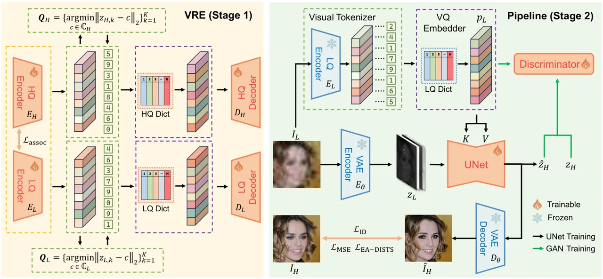

Figure 3: Training framework of OSDFace. First, to establish a visual
representation embedder (VRE), we train the autoencoder and VQ
dictionary for HQ and LQ face domains using self-reconstruction and
feature association loss $`\mathcal{L}_{\text{assoc}}`$. Then, we use
the VRE containing LQ encoder and dictionary to embed the LQ face
$`I_{L}`$, producing the visual prompt embedding $`p_{L}`$. Next, the LQ
image $`I_{L}`$ along with $`p_{L}`$ are inputed into the generator
$`\mathcal{G}_{\theta}`$ to yield the predicted HQ face $`\hat{I}_{H}`$:
$`\hat{I}_{H}=\mathcal{G}_{\theta}(I_{L};\operatorname{VRE}(I_{L}))`$.
The generator $`\mathcal{G}_{\theta}`$ incorporates the pretrained VAE
and UNet from Stable Diffusion, with only the UNet fine-tuned via LoRA.
Additionally, a series of feature alignment losses are applied to ensure
the generation of harmonious and coherent face images. The generator and
discriminator are trained alternately.

Geometric priors \[69, 8, 26, 44\], while useful, are limited by the
degree of degradation in low-quality images, restricting their ability
to recover high-quality details. Reference priors \[11, 31, 29, 30\] aim
to supplement missing information using the corresponding high-quality
reference images. However, obtaining references that match the target
data is often impractical. Generative priors \[35, 15, 52, 63, 54\] from
pretrained models are widely used for face restoration. These priors are
typically incorporated into encoder-decoder networks through iterative
latent optimization or direct latent encoding to enhance fidelity. This
approach has demonstrated stronger restoration potential compared to
earlier methods. Recently, diffusion priors \[24, 55, 13, 11\] have
gained attention with advancements in diffusion models. The degraded
images are generated from intermediate outputs at each diffusion
iteration. In parallel, VQ prior-based methods \[3, 13, 8, 7\] have
shown great promise, achieving impressive results in face restoration.
They typically reconstruct images by matching features extracted from LQ
inputs to items in a codebook, and then directly output the restored
images. However, the limited capacity of VQ priors often leads to blurry
backgrounds and unprecise details. Therefore, how to leverage face prior
information more effectively remains a crucial problem.

### 2.2 Diffusion Models

Diffusion models, known for powerful generative capacity, transform
random noise into structured data through iterative denoising processes.
Moreover, diffusion models have achieved promising results in image
restoration recently, showing strong performance in image-to-image tasks
using efficient guidance strategies \[6, 36, 12, 7, 49, 38\]. However,
some models possess highly complex structures \[49, 7\]. Most of them
require numerous iterative steps, limiting their popularization for
real-world applications.

Reducing the inference steps of diffusion models is critical to
accelerating generation speeds and reducing computational costs. Yet,
further reduction often results in a significant performance drop,
making it crucial to balance inference speed with model capability. Most
one-step diffusion (OSD) methods employ distillation to learn from a
teacher model, ensuring the quality of the generated images \[68, 67,
56, 9\]. D³SR \[28\] achieves promising results with OSD, free from the
limitations of model distillation. However, all models are designed
primarily for natural image restoration and lack strong generalization
for face-specific tasks. It is essential to incorporate prior knowledge
specific to human faces to enhance the applicability of OSD models in
face restoration. Consequently, the models could generate more realistic
and high-fidelity face images.

## 3 Method

We aim to extract as many features as possible from low-quality (LQ)
source images. These features are used as prompts to guide the diffusion
model in generating realistic faces that closely resemble the
individuals in the original images. To accomplish this, we propose an
innovative one-step diffusion model (see Fig. 3) focused on face
restoration. This model enhances the realism of the generated faces
while preserving the characteristics of LQ images.

### 3.1 One-Step Diffusion (OSD) Model

Latent diffusion models \[40\] are structured around both forward and
reverse operations. During the forward diffusion phase, Gaussian noise
with a variance $`\beta_{t}\in(0,1)`$ is incrementally added to the
latent vector $`z`$ at each timestep, resulting in
$`z_{t}=\sqrt{\bar{\alpha}_{t}}\,z+\sqrt{1-\bar{\alpha}_{t}}\,\varepsilon,`$
where $`\varepsilon\sim\mathcal{N}(0,I)`$. Here, $`\alpha_{t}`$ is
defined as $`1-\beta_{t}`$, and $`\bar{\alpha}_{t}`$ denotes the
cumulative product of $`{\alpha}_{s}`$ up to timestep $`t`$:
$`\bar{\alpha}_{t}=\prod_{s=1}^{t}\alpha_{s}`$.

In the reverse phase, the clean latent vector $`\hat{z}_{0}`$ can be
estimated directly using the predicted noise $`\hat{\varepsilon}`$:

```math
\hat{z}_{0}=\frac{z_{t}-\sqrt{1-\bar{\alpha}_{t}}\,\hat{\varepsilon}}{\sqrt{\bar{\alpha}_{t}}}. \tag{1}
```

The predicted noise $`\hat{\varepsilon}`$ could be formally expressed as
$`\varepsilon_{\theta}(z_{t};p,t)`$, where $`p`$ denotes prompt
embedding.

As illustrated in Fig. 3, we first employ the encoder $`E_{\theta}`$ to
map the low-quality (LQ) image $`I_{L}`$ into the latent space, yielding
$`z_{L}=E_{\theta}(I_{L})`$. Next, we perform one denoising step to
obtain the predicted noise $`\hat{\varepsilon}`$, allowing us to compute
the predicted high-quality (HQ) latent vector $`\hat{z}_{H}`$:

```math
\hat{z}_{H}=\frac{z_{L}-\sqrt{1-\bar{\alpha}_{T_{L}}}\varepsilon_{\theta}(z_{L};p,T_{L})}{\sqrt{\bar{\alpha}_{T_{L}}}}, \tag{2}
```

where $`\varepsilon_{\theta}`$ denotes the denoising network
parameterized by $`\theta`$, and $`T_{L}`$ is the diffusion timestep.

Unlike one-step T2I diffusion models \[48, 68\], the UNet input in
OSDFace is not entirely Gaussian noise. Therefore, we predefine a
parameter $`T_{L}\in[0,T]`$ and feed it into the UNet, where $`T`$
represents the total diffusion timesteps (in Stable Diffusion, $`T`$ is
set to 1,000). Finally, we use the decoder $`D_{\theta}`$ to reconstruct
the HQ face $`\hat{I}_{H}`$ from $`\hat{z}_{H}`$:

```math
\hat{I}_{H}=D_{\theta}(\hat{z}_{H}). \tag{3}
```

Denoting the entire generator as $`\mathcal{G}`$, the overall
computation procedure can be represented as:

```math
\hat{I}_{H}=\mathcal{G}_{\theta}(I_{L};p). \tag{4}
```

### 3.2 Stage 1. Visual Representation Embedder

Previous studies have emphasized the critical importance of
understanding input images and integrating face prior into models. To
incorporate priors, we first train a feature extraction module, _i.e._,
visual representation embedder (VRE), in stage 1 for LQ inputs. In stage
2, we utilize the pretrained VRE to guide the diffusion model, allowing
it to leverage prior knowledge from the input image more effectively.

We design a variational autoencoder (VAE) with a vector-quantized (VQ)
dictionary \[37, 12\] for effective feature extraction. The architecture
consists of the VRE and a VAE decoder utilized exclusively during the
first training stage. Through self-reconstruction training, the VRE
builds a dictionary of image categories as priors, enabling it to act as
a multi-class embedder using the VQ dictionary.

Given a low-quality (LQ) face
$`I_{L}\in\mathbb{R}^{H\times W\times 3}`$, the encoder $`E_{L}`$
processes the image, obtaining a set of feature vector
$`\{z_{L,k}\in\mathbb{R}^{d}\}_{k=1}^{K}`$. Then, each feature $`z_{L}`$
is transformed through a matching mechanism, generating a token
$`q\in\mathbb{N}`$ that corresponds to an item in the learnable
low-quality VQ dictionary
$`\mathbb{C}_{L}=\{c_{q}\in\mathbb{R}^{d}\}_{q=1}^{N}`$.

Visual Tokenizer. Tokenization is the process of dividing the input face
into smaller units, _i.e._, tokens. In our framework, the visual
tokenizer maps the input face to categories in the low-quality VQ
dictionary:

```math
\mathcal{M}\circ E_{L}:\mathbb{R}^{H\times W\times 3}\to\mathbb{N}^{K}. \tag{5}
```

For an LQ face denoted as $`I_{L}`$, we apply the VAE encoder $`E_{L}`$
followed by the matching function $`\mathcal{M}`$ to obtain the token
set $`\mathbf{Q}_{L}=\mathcal{M}(E_{L}(I_{L}))`$. The token set
$`\mathbf{Q}_{L}`$ represents the predicted categories corresponding to
LQ face.

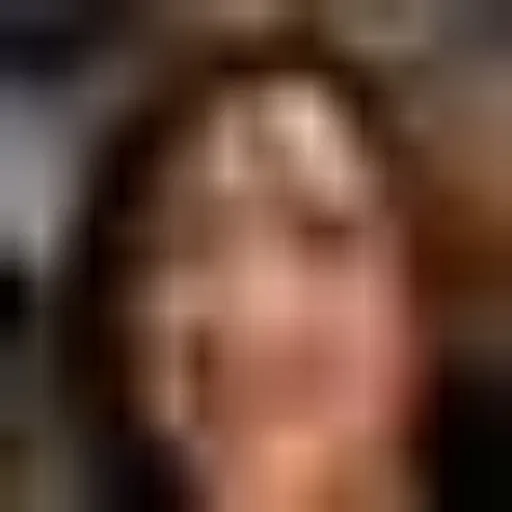
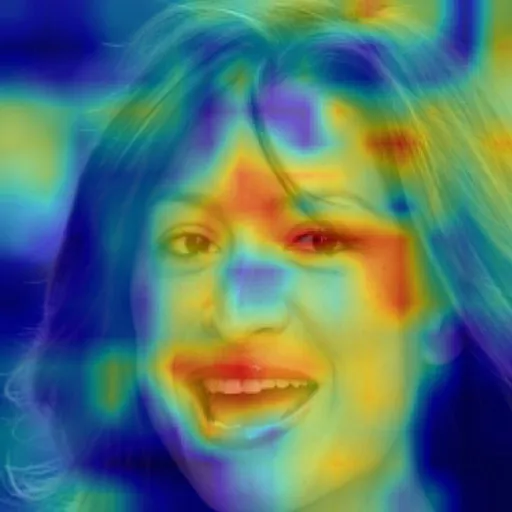
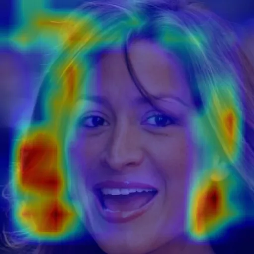
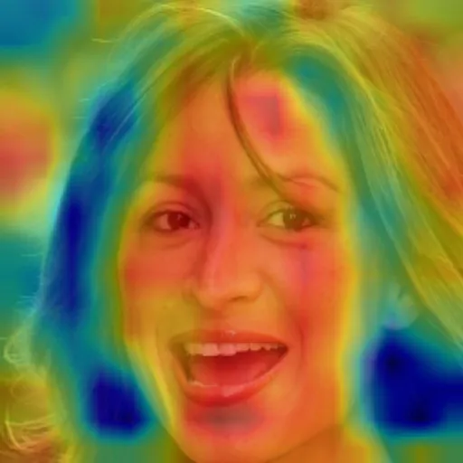
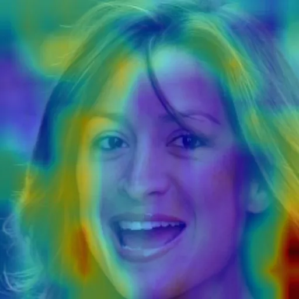 LQ att_120
att_173 enc_407 enc_470
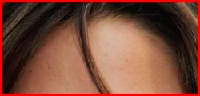
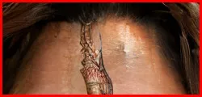
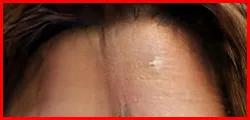
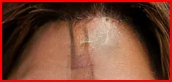
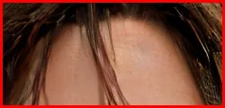
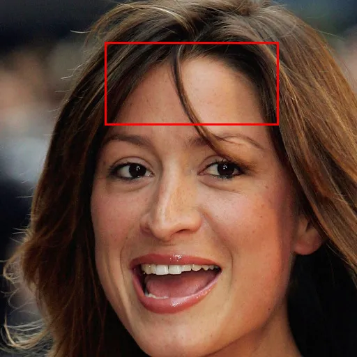
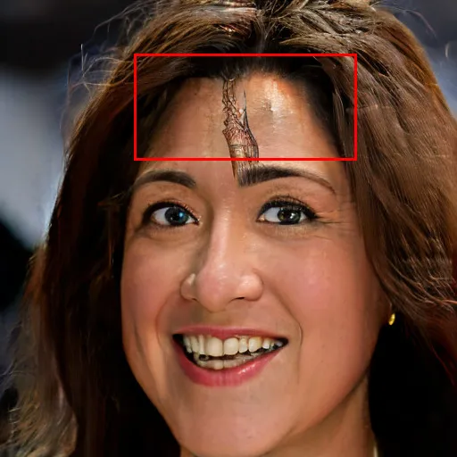
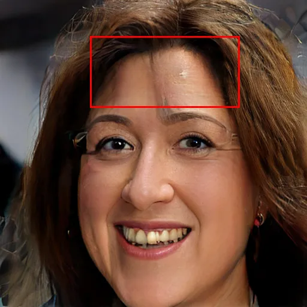
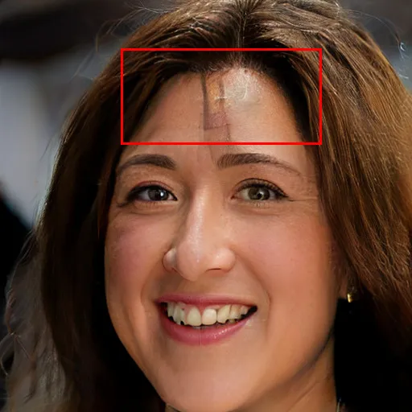
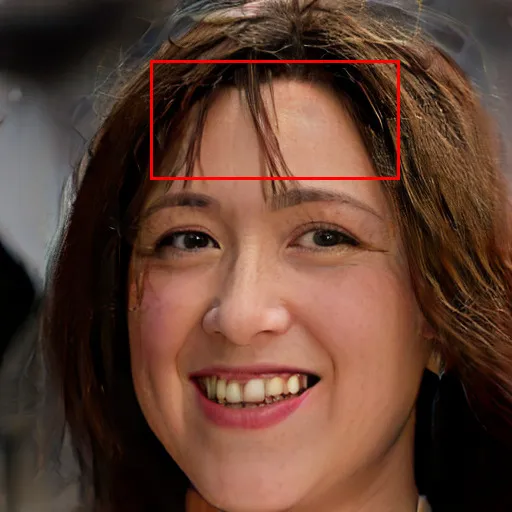 HQ Learnable
DAPE \[10\] VRE (w/o assoc) VRE (w/ assoc)

Figure 4: Attention maps of VRE and visual comparison of prompt
embedding generation. We use CelebA-Test 0262 as an example.

VQ Embedder. The VQ embedder processes the token set by retrieving the
corresponding items from the VQ dictionary. Specifically, for each image
token $`q`$ at position $`k`$, the embedder uses $`q`$ as an index to
access the dictionary item:

```math
z_{k}=\text{dict}(q),\hskip 10.00002ptq\in\mathbf{Q}_{L}, \tag{6}
```

where $`z_{k}`$ represents the $`k`$-th element of the visual prompt.

Unlike using image-to-tag models \[39, 73\] to generate tags as textual
prompts, VRE directly tokenizes each face and converts the tokens into
embeddings. This approach eliminates the information loss during the
image-tag-embedding process. As illustrated in Fig. 4, VRE shows a
strong recovery capacity. To study the working mechanism of VRE, we
visualize the weight matrix of the final self-attention layer and the
latent vector output by the VRE encoder. They are labeled as “att” and
“enc” in the figure captions, respectively. The visualizations clearly
indicate that the VRE focuses on both facial and nonfacial features. In
summary, we can embed the LQ face $`I_{L}`$ using VRE to obtain the
visual prompt $`p_{L}=\operatorname{VRE}(I_{L})`$.

We construct two VQ dictionaries corresponding to the HQ and LQ image
categories and train VQVAE using vector quantization \[37\] with
self-reconstruction. Following VQGAN \[12\], we use GAN loss to promote
extracting real-world features over noise. However, the LQ encoder
sometimes focuses on meaningless categories due to strong degradation.
Thus, we employ an alignment training strategy inspired by the CLIP
model \[39\] to align the categories between LQ and HQ faces. By
enhancing the diagonal correlation within VQ dictionaries, we could
guide the LQ encoder to align its attention with the HQ encoder.

Training Objectives. We divide the loss functions into two parts. The
first is a series of losses designed specifically for training the VQ
dictionary, and the second is for association. Following previous
works \[3, 13, 57\], we incorporate four types of losses during
training. Three of them are image restoration losses, _i.e._, absolute
differences $`\mathcal{L}_{1}`$, perceptual function
$`\mathcal{L}_{\text{per}}`$ \[72, 21\], and discriminative loss
$`\mathcal{L}_{\text{dis}}`$ \[20\]). Since the VQ is
non-differentiable, we adopt a classic quantization loss
$`\mathcal{L}_{\text{VQ}}`$ \[2, 37, 12\] additionally.

```math
\displaystyle\mathcal{L}_{1}=\|I_{h}-I_{h}^{\text{rec}}\|_{1},\mathcal{L}_{\text{per}}=\|\Phi(I_{h})-\Phi(I_{h}^{\text{rec}})\|_{2}^{2}, \tag{7}
```

```math
\displaystyle\mathcal{L}_{\text{dis}}=\left[\log D(I_{h})+\log(1-D(I_{h}^{\text{rec}}))\right],
```

```math
\displaystyle\mathcal{L}_{\text{VQ}}=\|\text{sg}(Z_{h})-Z_{h}^{c}\|_{2}^{2}+\beta\|Z_{h}-\text{sg}(Z_{h}^{c})\|_{2}^{2}.
```

Here, $`\Phi(\cdot)`$ represents the feature extractor of VGG19 \[45\],
$`D`$ is a patch-based discriminator \[20\], and $`\text{sg}(\cdot)`$
denotes the stop-gradient operation. $`\beta`$ is set to 0.25.

The combined loss $`\mathcal{L}_{\text{VQ}}`$ is then defined as

```math
\mathcal{L}_{\text{VQ}}=\mathcal{L}_{1}+\lambda_{\text{per}}\cdot\mathcal{L}_{\text{per}}+\lambda_{\text{dis}}\cdot\mathcal{L}_{\text{dis}}+\mathcal{L}_{\text{VQ}}, \tag{8}
```

where we set $`\lambda_{\text{per}}=1.0`$ and
$`\lambda_{\text{dis}}=0.8`$ in this setup.

Furthermore, we employ the cross-entropy loss introduced by DAEFR \[7\]
to enhance the correlation between the HQ and LQ features. The
similarity matrix $`M_{\text{assoc}}\in\mathbb{R}^{K\times K}`$ is
constructed from the encoded feature $`z_{H}`$ and $`z_{L}`$. We define
the similarity score along the HQ axis of $`M_{\text{assoc}}`$ as
$`p_{i,j}^{h}`$, and along the LQ axis as $`p_{i,j}^{l}`$. The
cross-entropy losses are then defined as

```math
\displaystyle\mathcal{L}_{\text{CE}}^{H} \displaystyle=-\frac{1}{K}\sum_{i=1}^{K}\sum_{j=1}^{K}y_{i,j}\log(p_{i,j}^{h}), \tag{9}
```

```math
\displaystyle\mathcal{L}_{\text{CE}}^{L} \displaystyle=-\frac{1}{K}\sum_{i=1}^{K}\sum_{j=1}^{K}y_{i,j}\log(p_{i,j}^{l}),
```

where $`y_{i,j}`$ represents the ground truth label. The final target
for the feature association component is then defined as

```math
\mathcal{L}_{\text{assoc}}=\left(\mathcal{L}_{\text{CE}}^{H}+\mathcal{L}_{\text{CE}}^{L}\right)/2. \tag{10}
```

The overall loss function for training the VRE at this stage can be
expressed as

```math
\mathcal{L}_{\text{total}}=\mathcal{L}_{\text{VQ}}+\lambda_{\text{assoc}}\cdot\mathcal{L}_{\text{assoc}}, \tag{11}
```

where $`\lambda_{\text{assoc}}`$ is set to 0 for the initial epochs, and
subsequently adjusted to 1 for the remaining epochs.

### 3.3 Stage 2. Realistic Face Alignment

Face restoration presents unique challenges and higher demands than
general image restoration, as humans are exceptionally familiar with and
sensitive to faces. Even minor inconsistencies or unnatural details in a
generated face image are immediately noticeable (see Fig. 1), often
resulting in an unrealistic appearance overall.

To ensure highly realistic face restoration, we design a series of
losses aimed at guiding the model to generate globally harmonious and
locally coherent face images. These carefully crafted losses play a key
role in achieving high fidelity and visual authenticity. The overall
loss function for the generator is defined as

```math
\displaystyle\mathcal{L}_{\text{gen}}=\lambda_{\text{dis}}\cdot\mathcal{L}_{\mathcal{G}}(z_{H},\hat{z}_{H})+\lambda_{\text{ID}}\cdot\mathcal{L}_{\text{ID}}(I_{H},\hat{I}_{H}) \tag{12}
```

```math
\displaystyle+\lambda_{\text{per}}\cdot\mathcal{L}_{\text{EA-DISTS}}(I_{H},\hat{I}_{H})+\operatorname{MSE}(I_{H},\hat{I}_{H}).
```

Facial Identity Loss. A key challenge in face restoration is how to
match each LQ face to a real, unique face portrait. However, during
reconstruction, the model often struggles to render ambiguous features,
leading to disharmonious facial attributes in the generated images.
Inspired by advancements in face recognition tasks \[50, 42, 33\], we
introduce a facial identity loss, specifically designed for face
restoration. This loss leverages a pretrained face recognition model to
measure feature similarity between the generated face and the target HQ
image. The facial identity loss helps to enhance both the overall
harmony of the generated face and the precise alignment of facial
features.

We utilize a pretrained ArcFace model \[2\] to encode both the generated
and HQ faces into identity embeddings (IDs). The cosine similarity
between these IDs is then computed and used as a loss to guide model
training. Denote the facial feature extraction model as $`\mathcal{F}`$.
The facial identity loss $`\mathcal{L}_{\text{ID}}`$ can be defined as
follows

```math
\mathcal{L}_{\text{ID}}=1-\cos\left(\mathcal{F}(I_{H}),\mathcal{F}(\hat{I}_{H})\right). \tag{13}
```

Perceptual Loss. Although LPIPS \[72\] is widely used for perceptual
evaluation, it can sometimes introduce visible artifacts, especially in
diffusion models. To alleviate this issue, we use DISTS \[10\] to better
capture texture details. During the reconstruction of LQ faces, DISTS
preserves texture details more effectively while maintaining perceptual
similarity, particularly in areas like hair and skin.

In addition, the accurate generation of edge details is essential for
achieving perceived sharpness in face restoration. Thus, following the
practice in D³SR \[28\], we introduce an edge-aware DISTS (EA-DISTS) as
our perceptual loss

```math
\displaystyle\mathcal{L}_{\text{EA-DISTS}}(\hat{I}_{H},I_{H})=\mathcal{L}_{\text{DISTS}}(\hat{I}_{H},I_{H}) \tag{14}
```

```math
\displaystyle+~\mathcal{L}_{\text{DISTS}}(\mathcal{S}(\hat{I}_{H}),\mathcal{S}(I_{H})) \displaystyle,
```

where $`\mathcal{S}(\cdot)`$ is the Sobel operator.

GAN Loss. OSD models face challenges in generating stable images, due to
their limited computational capacity. Previous studies \[56, 9\]
typically employ distillation techniques to transfer knowledge from
multi-step diffusion models. However, these methods are restricted by
the performance limitations of the teacher models.

As an alternative, we use a discriminative network to enhance the
realism of generated faces. This approach provides greater flexibility
and improves computational efficiency. The adversarial loss, used to
update both the generator $`\mathcal{G}_{\theta}`$ and discriminator
$`\mathcal{D}_{\theta}`$, is defined as

```math
\mathcal{L}_{\mathcal{G}}=-\mathbb{E}_{t}\left[\log\mathcal{D}_{\theta}\left(F(\hat{z}_{H},t)\right)\right], \tag{15}
```

```math
\displaystyle\mathcal{L}_{\mathcal{D}}= \displaystyle-\mathbb{E}_{t}\left[\log\left(1-\mathcal{D}_{\theta}\left(F(\hat{z}_{H},t)\right)\right)\right] \tag{16}
```

```math
\displaystyle-\mathbb{E}_{t}\left[\log\mathcal{D}_{\theta}\left(F({z}_{H},t)\right)\right],
```

where $`z_{H}`$ is the latent vector of HQ face, and $`F(\cdot,t)`$
denotes the forward diffusion process at timestep $`t\in[0,T]`$.

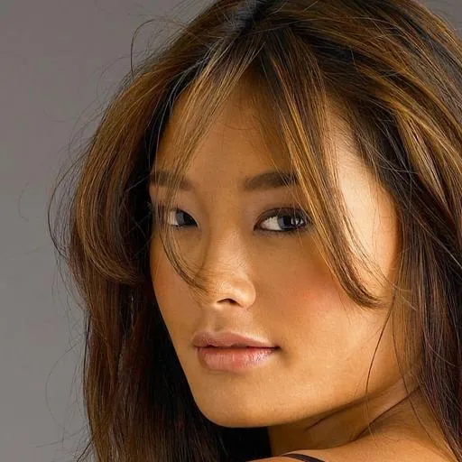
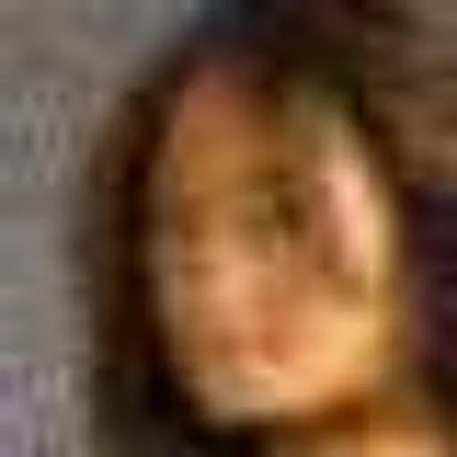
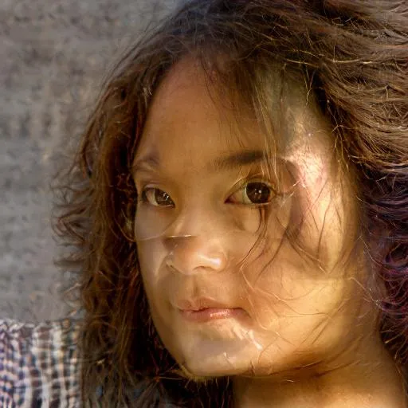
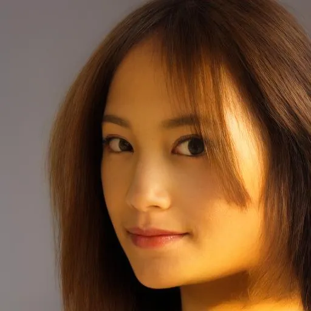
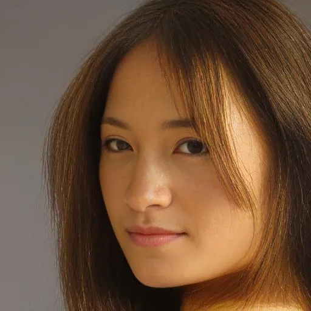

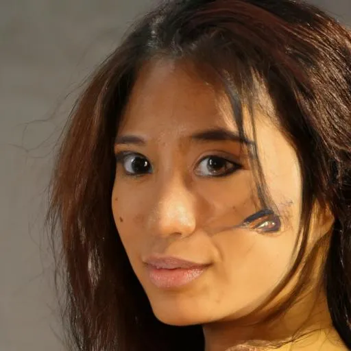


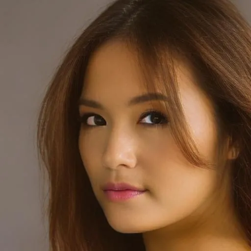
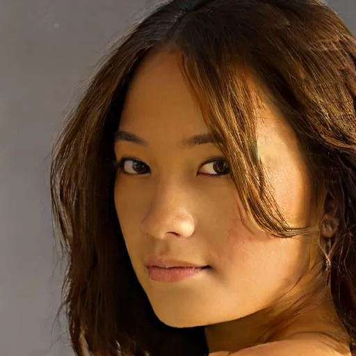 HQ - 0051
LQ - 0051 RF++ \[8\] VQFR \[3\] CodeFormer \[13\] DAEFR \[7\]
PGDiff \[11\] DifFace \[12\] DiffBIR \[6\] OSEDiff\* \[9\] OSDFace
(ours)


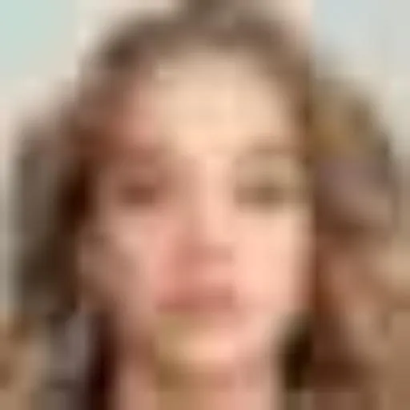
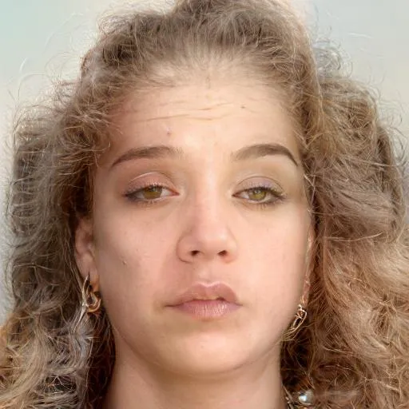
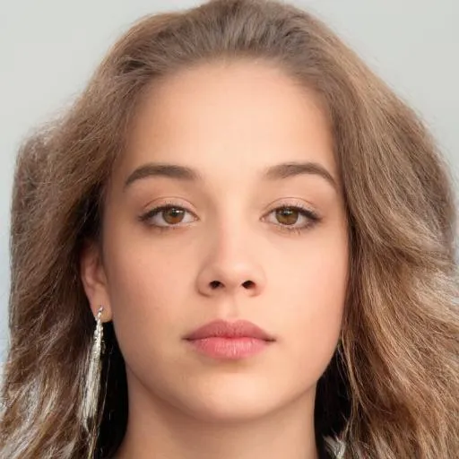

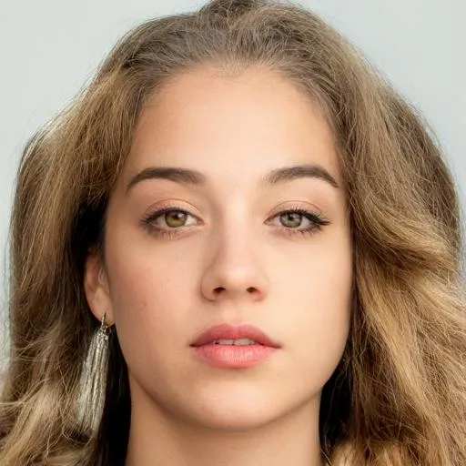
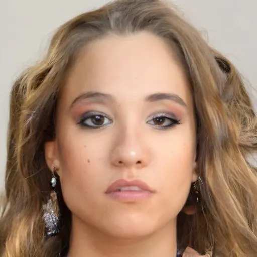
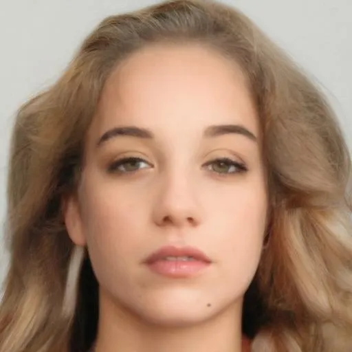
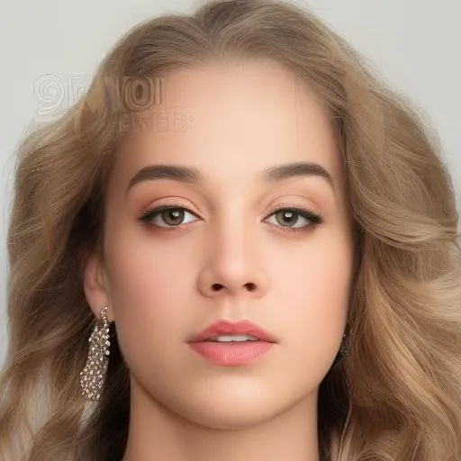
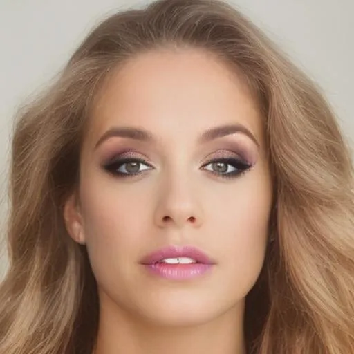
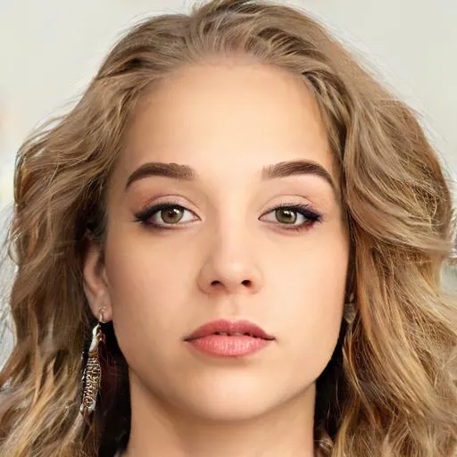 HQ - 0054
LQ - 0054 RF++ \[8\] VQFR \[3\] CodeFormer \[13\] DAEFR \[7\]
PGDiff \[11\] DifFace \[12\] DiffBIR \[6\] OSEDiff\* \[9\] OSDFace
(ours)


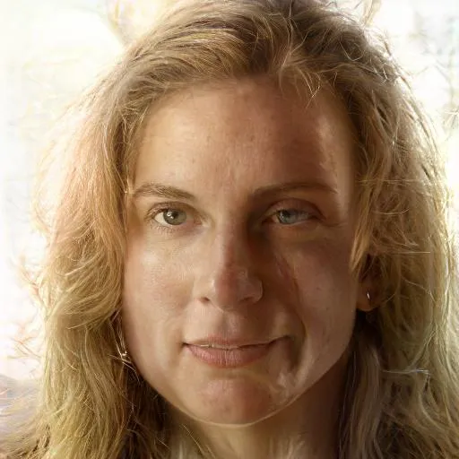


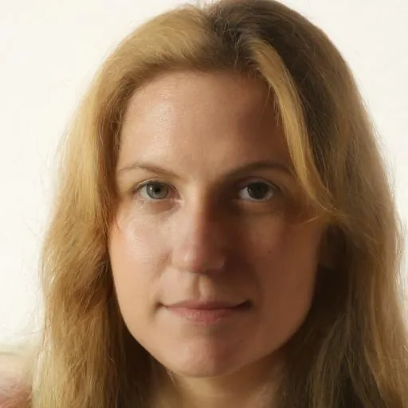


 HQ - 0067
LQ - 0067 RF++ \[8\] VQFR \[3\] CodeFormer \[13\] DAEFR \[7\]
PGDiff \[11\] DifFace \[12\] DiffBIR \[6\] OSEDiff\* \[9\] OSDFace
(ours)

Figure 5: Visual comparison of the synthetic CelebA-Test dataset in
challenging cases. Please zoom in for a better view.

|                      |                         |                     |                     |                   |                    |                    |                   |                         |                       |
| -------------------- | ----------------------- | ------------------- | ------------------- | ----------------- | ------------------ | ------------------ | ----------------- | ----------------------- | --------------------- |
| Types                | Methods                 | LPIPS$`\downarrow`$ | DISTS$`\downarrow`$ | MUSIQ$`\uparrow`$ | NIQE$`\downarrow`$ | Deg.$`\downarrow`$ | LMD$`\downarrow`$ | FID(FFHQ)$`\downarrow`$ | FID(HQ)$`\downarrow`$ |
| Non- Diffusion       | RestoreFormer++ \[8\]   | 0.4535              | 0.2301              | 72.3612           | 3.9524             | 70.5083            | 8.8019            | 57.3723                 | 72.7880               |
|                      | VQFR \[3\]              | 0.3390              | 0.2131              | 73.2969           | 4.8374             | 62.2595            | 5.7297            | 58.1044                 | 24.9093               |
|                      | CodeFormer \[13\]       | 0.3412              | 0.2151              | 75.9432           | 4.5157             | 62.1972            | 5.3819            | 62.0280                 | 26.8595               |
|                      | DAEFR \[7\]             | 0.3580              | 0.2146              | 74.9853           | 4.4161             | 62.8184            | 5.6332            | 52.0341                 | 26.0458               |
| Multi-Step Diffusion | PGDiff \[11\] (s=1,000) | 0.3866              | 0.1949              | 69.5676           | 4.0010             | 71.5996            | 7.3109            | 44.6258                 | 26.3694               |
|                      | DifFace \[12\] (s=250)  | 0.3469              | 0.2126              | 66.7451           | 4.6381             | 63.4511            | 5.4759            | 49.8075                 | 22.2370               |
|                      | DiffBIR \[6\] (s=50)    | 0.3740              | 0.2340              | 75.6360           | 6.2801             | 61.0238            | 5.1042            | 71.7767                 | 32.5109               |
| One-Step Diffusion   | OSEDiff \[9\] (s=1)     | 0.3306              | 0.2170              | 71.4674           | 5.1241             | 67.3904            | 6.4141            | 73.4843                 | 37.2103               |
|                      | OSEDiff\* \[9\] (s=1)   | 0.3496              | 0.2200              | 69.9807           | 5.3280             | 67.4026            | 7.4082            | 81.3624                 | 37.1309               |
|                      | OSDFace (ours, s=1)     | 0.3365              | 0.1773              | 75.6398           | 3.8840             | 60.0708            | 5.2867            | 45.4150                 | 17.0617               |

Table 1: Quantitative comparison on the synthetic CelebA-Test dataset
with non-diffusion, multi-step diffusion, and one-step diffusion
methods. The best and second best results are colored with red and blue.


 LQ OSDFace

 LQ OSDFace

Figure 6: Zero-shot results of real-world cartoons.


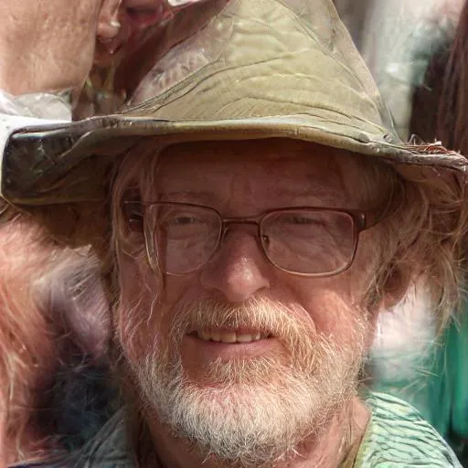

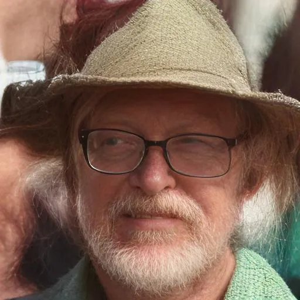

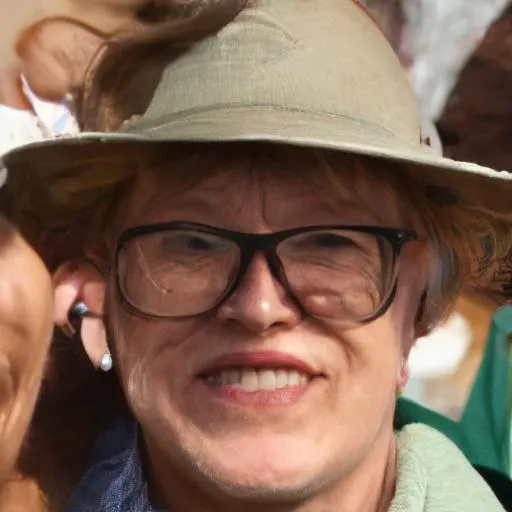

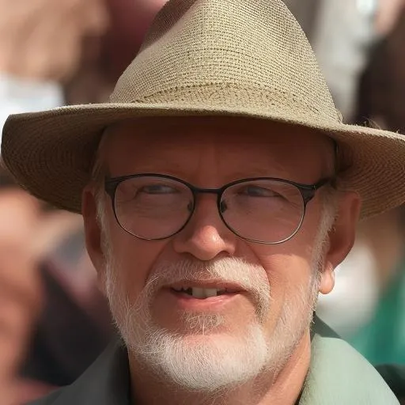

 Wider 0011
RF++ \[8\] VQFR \[3\] CodeFormer \[13\] DAEFR \[7\] PGDiff \[11\]
DifFace \[12\] DiffBIR \[6\] OSEDiff\* \[9\] OSDFace (ours)

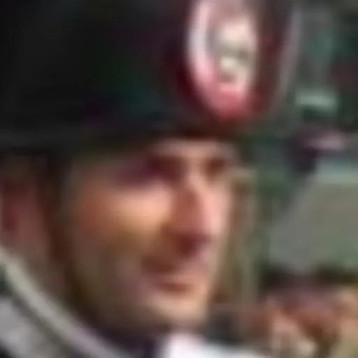
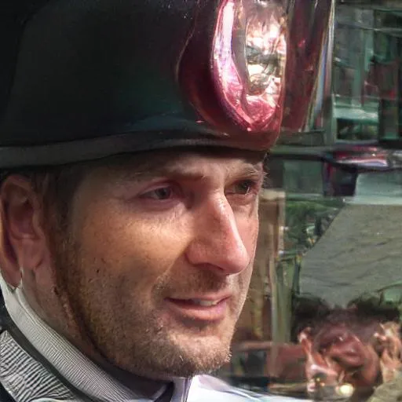


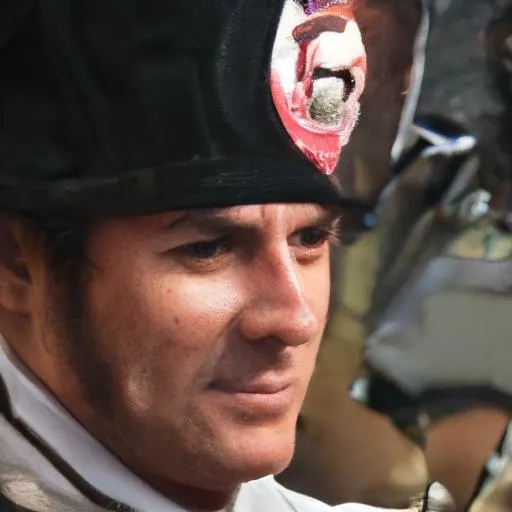


 Wider 0025
RF++ \[8\] VQFR \[3\] CodeFormer \[13\] DAEFR \[7\] PGDiff \[11\]
DifFace \[12\] DiffBIR \[6\] OSEDiff\* \[9\] OSDFace (ours)


 WebPhoto
00043 RF++ \[8\] VQFR \[3\] CodeFormer \[13\] DAEFR \[7\] PGDiff \[11\]
DifFace \[12\] DiffBIR \[6\] OSEDiff\* \[9\] OSDFace (ours)


 WebPhoto
10017 RF++ \[8\] VQFR \[3\] CodeFormer \[13\] DAEFR \[7\] PGDiff \[11\]
DifFace \[12\] DiffBIR \[6\] OSEDiff\* \[9\] OSDFace (ours)


 LFW A. Bynes
RF++ \[8\] VQFR \[3\] CodeFormer \[13\] DAEFR \[7\] PGDiff \[11\]
DifFace \[12\] DiffBIR \[6\] OSEDiff\* \[9\] OSDFace (ours)


 LFW Chok
T.G. RF++ \[8\] VQFR \[3\] CodeFormer \[13\] DAEFR \[7\] PGDiff \[11\]
DifFace \[12\] DiffBIR \[6\] OSEDiff\* \[9\] OSDFace (ours)

Figure 7: Visual comparison of the real-world datasets in challenging
cases. Please zoom in for a better view.

|                         |                   |                   |                   |                    |                   |                   |                   |                   |                    |                   |                   |                   |                   |                    |                   |
| ----------------------- | ----------------- | ----------------- | ----------------- | ------------------ | ----------------- | ----------------- | ----------------- | ----------------- | ------------------ | ----------------- | ----------------- | ----------------- | ----------------- | ------------------ | ----------------- |
|                         | Wider-Test        |                   |                   |                    |                   | LFW-Test          |                   |                   |                    |                   | WebPhoto-Test     |                   |                   |                    |                   |
| Methods                 | C-IQA$`\uparrow`$ | M-IQA$`\uparrow`$ | MUSIQ$`\uparrow`$ | NIQE$`\downarrow`$ | FID$`\downarrow`$ | C-IQA$`\uparrow`$ | M-IQA$`\uparrow`$ | MUSIQ$`\uparrow`$ | NIQE$`\downarrow`$ | FID$`\downarrow`$ | C-IQA$`\uparrow`$ | M-IQA$`\uparrow`$ | MUSIQ$`\uparrow`$ | NIQE$`\downarrow`$ | FID$`\downarrow`$ |
| RestoreFormer++ \[8\]   | 0.7159            | 0.4767            | 71.332            | 3.7231             | 45.398            | 0.7024            | 0.5108            | 72.250            | 3.8434             | 50.253            | 0.6950            | 0.4902            | 71.484            | 4.0202             | 75.071            |
| VQFR \[3\]              | 0.7069            | 0.5044            | 71.417            | 4.0357             | 37.866            | 0.7098            | 0.5339            | 74.385            | 3.8356             | 49.800            | 0.6769            | 0.4909            | 70.906            | 4.6095             | 84.776            |
| CodeFormer \[13\]       | 0.6986            | 0.4958            | 73.406            | 4.1188             | 38.765            | 0.6890            | 0.5266            | 75.484            | 4.4377             | 52.341            | 0.6918            | 0.5034            | 74.001            | 4.6273             | 83.197            |
| DAEFR \[7\]             | 0.6975            | 0.5205            | 74.143            | 3.5701             | 36.701            | 0.6964            | 0.5420            | 75.838            | 3.4788             | 47.527            | 0.6696            | 0.4934            | 72.698            | 3.9333             | 75.474            |
| PGDiff \[11\] (s=1,000) | 0.5824            | 0.4531            | 68.135            | 3.9315             | 35.862            | 0.5975            | 0.4858            | 71.244            | 4.0112             | 41.209            | 0.5653            | 0.4460            | 68.599            | 3.9930             | 86.954            |
| DifFace \[12\] (s=250)  | 0.5924            | 0.4299            | 64.907            | 4.2380             | 37.099            | 0.6075            | 0.4577            | 69.617            | 3.9016             | 46.127            | 0.5737            | 0.4189            | 65.116            | 4.2474             | 79.556            |
| DiffBIR \[6\] (s=50)    | 0.8084            | 0.6625            | 75.321            | 5.5903             | 35.343            | 0.7948            | 0.6735            | 76.421            | 5.6782             | 40.320            | 0.7441            | 0.5839            | 72.272            | 6.0093             | 91.834            |
| OSEDiff \[9\] (s=1)     | 0.6298            | 0.4951            | 70.559            | 4.9388             | 50.274            | 0.6326            | 0.5037            | 73.401            | 4.7196             | 57.800            | 0.6457            | 0.5108            | 72.593            | 5.2611             | 117.510           |
| OSEDiff\* \[9\] (s=1)   | 0.6193            | 0.4752            | 69.101            | 5.0869             | 47.883            | 0.6186            | 0.4879            | 71.707            | 4.8002             | 51.048            | 0.6254            | 0.4823            | 69.816            | 5.3253             | 109.236           |
| OSDFace (ours, s=1)     | 0.7284            | 0.5229            | 74.601            | 3.7741             | 34.648            | 0.7203            | 0.5493            | 75.354            | 3.8710             | 44.629            | 0.7106            | 0.5162            | 73.935            | 3.9864             | 84.597            |

Table 2: Quantitative comparison on real-world datasets. C-IQA stands
for CLIPIQA, and M-IQA stands for MANIQA. The best and second best
results are colored with red and blue. OSEDiff\* is retrained on FFHQ
dataset for reference.

## 4 Experiments

### 4.1 Experimental Settings

Training Datasets. Our model is trained on FFHQ \[23\] and its retouched
version \[43\], containing 70,000 different high-quality face images.
Images are resized to 512$`\times`$512 pixels. Synthetic training data
is generated using a dual-stage degradation model, with parameters
following WaveFace \[36\]. This dual-stage degradation process closely
aligns the synthetic data with real-world degradation scenarios,
handling both mild and severe degradations.

Testing Datasets. We evaluate our method on the synthetic dataset
CelebA-Test \[22\] from DAEFR \[7\] and three widely used real-world
datasets: Wider-Test \[13\], LFW-Test \[4\], and WebPhoto-Test \[54\],
following the settings in previous literature \[13, 8, 3\]. These
datasets exhibit diverse and complex degradations. For example, the
degradations in LFW-Test are relatively slight and regular, whereas
those in Wider-Test are stronger.

Metrics. For the _Synthetic Dataset_, we employ LPIPS \[72\] and
DISTS \[10\] as reference-based perceptual quality measures, together
with MUSIQ \[25\] and NIQE \[71\] as no-reference image quality
measures. To evaluate the distribution similarity between the ground
truth and restored faces, we calculate FID \[17\] with both FFHQ and
CelebA-Test HQ, showing the ability to recover “real” faces and HQ
images. Following previous works \[54, 3, 7\], we use the embedding
angle of ArcFace \[2\], namely “Deg.”, and landmark distance, namely
“LMD”, as additional identity and fidelity metrics. For the _Real-world
Datasets_, we employ non-reference metrics, including FID (with FFHQ as
reference), as well as CLIPIQA \[53\], MANIQA \[65\], MUSIQ \[25\], and
NIQE \[71\]. We utilize the evaluation codes provided by pyiqa \[5\] and
VQFR \[3\] for all metrics.

Implementation Details. In the first stage, we train the VRE using the
Adam optimizer \[27\] with a learning rate of
$`1.44`$$`\times`$$`10^{-4}`$ and a batch size of $`32`$. In our
implementation, the input face image has dimensions of 512$`\times`$512,
and the quantized feature map has dimensions of 256$`\times`$512 after
flattening. The VQ dictionaries contain $`N`$$`=`$$`1,024`$ code items,
each with a channel size of 512. The HQ and LQ dictionaries are trained
for 50 and 10 epochs, respectively. The association parameter
$`\lambda_{\text{assoc}}`$ is initially set to 0, followed by an
additional 10 epochs with $`\lambda_{\text{assoc}}`$$`=`$$`1`$. The VRE
is trained on 8 NVIDIA A800 GPUs.

In the second stage, our OSDFace is trained by the AdamW
optimizer \[34\], with learning rate $`1`$$`\times 10`$⁻⁴ and batch size
$`2`$ for both the generator and discriminator. The LoRA rank in the
UNet is set to $`16`$. The SD 2.1-base \[1\] serves as the pretrained
OSD model, with the VRE used to construct the prompt embeddings. The
setting of the discriminator is followed by D³SR \[28\], and the
generator and discriminator are trained alternately. Training is
performed for 150K iterations on 2 NVIDIA A6000 GPUs.

Compared State-of-the-Art (SOTA) Methods. We compare OSDFace with
several SOTA methods, including RestoreFormer++ \[8\], VQFR \[3\],
CodeFormer \[13\], DAEFR \[7\], PGDiff \[11\], DifFace \[12\] and
DiffBIR \[6\]. We also provide the current SOTA OSD model OSEDiff \[9\],
and retrain it on FFHQ \[23\], namely OSEDiff\*.

### 4.2 Performance on Synthetic Data

Quantitative Results. The results in Tab. 1 demonstrate that OSDFace
outperforms other methods in Deg., indicating better alignment with the
ID features of HQ images. It also achieves higher scores on LPIPS and
DISTS, highlighting superior perceptual coherence and detail
preservation. Performance in FID(HQ) shows that OSDFace effectively
recovers the distribution of the original HQ dataset.

Qualitative Results. Visual comparisons in Fig. 5 illustrate that our
method closely resembles real images. OSDFace enhances realism in
elements such as earrings, eyelashes, eyebrows, hair strands, and subtle
skin textures. Our approach restores hair most naturally, avoiding
additional streaks or other regular textures, and maintains consistent
hair color without random changes.

### 4.3 Performance on Real-world Data

Quantitative Results. In Tab. 2, we can see that OSDFace performs
significantly better than another OSD method across all metrics. OSDFace
outperforms non-diffusion models in most metrics. For multi-step
diffusion models, we generally surpass PGDiff and DifFace. For DiffBIR,
we maintain a small gap and even exceed it in certain metrics.

Qualitative Results. Figure 7 visualizes representative images in three
real-world datasets. Existing face restoration methods often emphasize
facial features while overlooking the precise reconstruction of facial
accessories like glasses, hair, hats, headwear, and background details.
Some methods, especially DiffBIR \[6\], are over-smoothing and lack fine
facial textures. OSDFace naturally and clearly restores multiple faces
within a single image, showing its effectiveness for unaligned faces.
OSDFace ensures high-fidelity restoration with balanced and consistent
visual quality throughout the image. We also test its zero-shot ability
on cartoon images in Fig. 6, using Anime Face Dataset \[4\].

|           |               |                |               |               |         |
| --------- | ------------- | -------------- | ------------- | ------------- | ------- |
| Methods   | PGDiff \[11\] | DifFace \[12\] | DiffBIR \[6\] | OSEDiff \[9\] | OSDFace |
| Step      | 1,000         | 250            | 50            | 1             |   1     |
| Time (s)  | 85.81         | 7.05           | 9.03          | 0.13          |   0.10  |
| Param (M) | 176.4         | 175.4          | 3,042         | 1,302         |   978.4 |
| MACs (G)  | 480,997       | 18,682         | 189,208       | 2,269         |   2,132 |

Table 3: Complexity comparison during inference. All models are tested
with an input image size of 512$`\times`$512.

|                 |                   |                   |                   |                    |                   |
| --------------- | ----------------- | ----------------- | ----------------- | ------------------ | ----------------- |
| Methods         | C-IQA$`\uparrow`$ | M-IQA$`\uparrow`$ | MUSIQ$`\uparrow`$ | NIQE$`\downarrow`$ | FID$`\downarrow`$ |
| Learnable       | 0.6714            | 0.5312            | 75.0339           | 4.0855             | 45.4041           |
| DAPE \[10\]     | 0.6863            | 0.5622            | 74.8107           | 4.3801             | 45.9380           |
| VRE (w/o assoc) | 0.6791            | 0.5180            | 75.2328           | 3.8228             | 44.3360           |
| VRE (w/ assoc)  | 0.6946            | 0.5356            | 75.2911           | 3.8793             | 41.9502           |

Table 4: Ablation study of prompt embedding generation. The best and
second best results are colored with red and blue, respectively.

### 4.4 Complexity Analysis.

Table 3 provides a detailed comparison of model complexity, including
number of steps, inference time, parameter number, and
multiply-accumulate operations (MACs) during inference. All evaluations
are carried out on an NVIDIA A6000 GPU for consistency. First, by
relying on one-step diffusion process, OSDFace significantly outperforms
multi-step diffusion models in both inference time and MACs,
demonstrating remarkable efficiency. Furthermore, OSDFace maintains an
advantage over other OSD model. We do not incorporate text encoders
(_e.g._, the DAPE used by OSEDiff \[9\]), nor do we introduce additional
modules that increase Stable Diffusion model complexity (_e.g._, the
ControlNet used by DiffBIR \[6\]). Instead, we utilize a more efficient
image encoder, VRE. Consequently, OSDFace achieves the lowest MACs count
and fastest inference speed among all evaluated diffusion-based methods.
Compared to the other OSD model, OSEDiff \[9\], OSDFace demonstrates a
25% reduction in parameters and a 23% improvement in inference speed.

|                             |                                   |                               |                                   |                   |                   |                   |                    |                   |
| --------------------------- | --------------------------------- | ----------------------------- | --------------------------------- | ----------------- | ----------------- | ----------------- | ------------------ | ----------------- |
| $`\mathcal{L}_{\text{ID}}`$ | $`\mathcal{L}_{\text{EA-DISTS}}`$ | $`\mathcal{L}_{\mathcal{G}}`$ | $`\mathcal{L}_{\text{EA-LPIPS}}`$ | C-IQA$`\uparrow`$ | M-IQA$`\uparrow`$ | MUSIQ$`\uparrow`$ | NIQE$`\downarrow`$ | FID$`\downarrow`$ |
|                             | ✓                                 | ✓                             |                                   | 0.6724            | 0.5243            | 74.5986           | 4.0190             | 41.7842           |
| ✓                           |                                   | ✓                             |                                   | 0.6710            | 0.5387            | 74.1060           | 4.3223             | 55.1016           |
| ✓                           |                                   | ✓                             | ✓                                 | 0.6674            | 0.5470            | 75.2021           | 4.1484             | 46.1684           |
| ✓                           | ✓                                 |                               |                                   | 0.6590            | 0.5081            | 75.2336           | 3.9857             | 45.7834           |
| ✓                           | ✓                                 | ✓                             |                                   | 0.6946            | 0.5356            | 75.2911           | 3.8793             | 41.9502           |

Table 5: Ablation studies on different components. The best and second
best results are colored with red and blue, respectively.

### 4.5 Ablation Studies

Visual Representation Embedder (VRE). We evaluated the impact of various
prompt embedding generation methods on the training of OSDFace,
including VRE, learnable prompt embeddings, and Degradation-Aware Prompt
Extractor (DAPE) \[10\]. As shown in Tab. 4, the experimental results
indicate that our method using VRE outperforms others across most
metrics. As shown in Fig. 4, using VRE significantly enhances the facial
details and the coherence of non-facial areas in the generated faces.

Furthermore, we trained the VRE using two approaches: with and without
the HQ-LQ feature association loss, further validating the effectiveness
of our method. As shown in the last two rows of Tab. 4, training with
association loss achieves superior performance. This demonstrates that
our VRE can extract valuable information from LQ images to guide face
restoration effectively. Notably, with the inclusion of the feature
association loss, the VRE gains the ability to identify and reconstruct
certain HQ-like categories from LQ inputs, enhancing face restoration
quality.

Realistic Face Alignment Loss. For the series of losses used in training
the OSDFace, such as facial identity loss, EA-DISTS, and adversarial
loss, we conducted extensive ablation studies. Additionally, we
introduce the EA-LPIPS loss, defined similarly to EA-DISTS in Sec. 3.3.
This loss first processes the image with the Sobel operator, followed by
calculating the LPIPS loss. As shown in Tab. 5, the losses we utilized
significantly contribute to model performance, with most metrics
reaching the best scores.

## 5 Conclusion

We propose OSDFace, a high-speed diffusion model that enhances face
image quality in one step. Our method bridges the gap between the
powerful generative capabilities of text-to-image diffusion models and
the specific requirements of face restoration. By introducing a visual
prompt consistent with the model’s original conditional input, we
effectively utilize prior information from the low-quality faces
themselves. This enables the model to generate more realistic and
high-fidelity face images. Our approach not only addresses the
limitations of previous methods but also sets a new direction for
incorporating visual priors into diffusion models for face restoration.
Extensive experiments demonstrate that OSDFace achieves superior
performance compared to recent state-of-the-art methods.

## Acknowledgments

We thank the reviewers for their valuable feedback. This work was
supported by the Shanghai Municipal Science and Technology Major Project
(2021SHZDZX0102) and the Fundamental Research Funds for the Central
Universities. Additionally, this work was supported in part by NSFC
grant 2024YFC3017100, YDZX20253100004004, 62302299, Shanghai Science and
Technology Development Funds under Grant 23YF1420500, and Huawei Explore
X funds. Special thanks to Jianze Li for his technical support.

## References

- \[1\] Stability AI. stabilityai/stable-diffusion-2-1-base. \[Online\].
  Available:
  [https://huggingface.co/stabilityai/stable-diffusion-2-1-base](https://huggingface.co/stabilityai/stable-diffusion-2-1-base), 2022.
- \[2\] Yoshua Bengio, Nicholas Léonard, and Aaron Courville. Estimating
  or propagating gradients through stochastic neurons for conditional
  computation. _arXiv preprint arXiv:1308.3432_, 2013.
- \[3\] Kelvin CK Chan, Xintao Wang, Xiangyu Xu, Jinwei Gu, and
  Chen Change Loy. Glean: Generative latent bank for large-factor image
  super-resolution. In _CVPR_, 2021.
- \[4\] Brian Chao. Anime Face Dataset: a collection of high-quality
  anime faces., 2019.
- \[5\] Chaofeng Chen and Jiadi Mo. IQA-PyTorch: Pytorch toolbox for
  image quality assessment. \[Online\]. Available:
  [https://github.com/chaofengc/IQA-PyTorch](https://github.com/chaofengc/IQA-PyTorch), 2022.
- \[6\] Chaofeng Chen, Xiaoming Li, Yang Lingbo, Xianhui Lin, Lei Zhang,
  and Kwan-Yee K. Wong. Progressive semantic-aware style transformation
  for blind face restoration. In _CVPR_, 2021.
- \[7\] Xiaoxu Chen, Jingfan Tan, Tao Wang, Kaihao Zhang, Wenhan Luo,
  and Xiaocun Cao. Towards real-world blind face restoration with
  generative diffusion prior. _arXiv preprint arXiv:2312.15736_, 2023.
- \[8\] Yu Chen, Ying Tai, Xiaoming Liu, Chunhua Shen, and Jian Yang.
  Fsrnet: End-to-end learning face super-resolution with facial priors.
  In _CVPR_, 2018.
- \[9\] Jiankang Deng, Jia Guo, Xue Niannan, and Stefanos Zafeiriou.
  ArcFace: Additive angular margin loss for deep face recognition. In
  _CVPR_, 2019.
- \[10\] Keyan Ding, Kede Ma, Shiqi Wang, and Eero P Simoncelli. Image
  quality assessment: Unifying structure and texture similarity. _IEEE
  TPAMI_, 2020.
- \[11\] Berk Dogan, Shuhang Gu, and Radu Timofte. Exemplar guided face
  image super-resolution without facial landmarks. In _CVPRW_, 2019.
- \[12\] Patrick Esser, Robin Rombach, and Bjorn Ommer. Taming
  transformers for high-resolution image synthesis. In _CVPR_, 2021.
- \[13\] Ben Fei, Zhaoyang Lyu, Liang Pan, Junzhe Zhang, Weidong Yang,
  Tianyue Luo, Bo Zhang, and Bo Dai. Generative diffusion prior for
  unified image restoration and enhancement. In _CVPR_, 2023.
- \[14\] Ian J. Goodfellow, Jean Pouget-Abadie, Mehdi Mirza, Bing Xu,
  David Warde-Farley, Sherjil Ozair, Aaron Courville, and Yoshua Bengio.
  Generative adversarial nets. In _NeurIPS_, 2014.
- \[15\] Jinjin Gu, Yujun Shen, and Bolei Zhou. Image processing using
  multi-code gan prior. In _CVPR_, 2020.
- \[16\] Yuchao Gu, Xintao Wang, Liangbin Xie, Chao Dong, Gen Li, Ying
  Shan, and Ming-Ming Cheng. VQFR: Blind face restoration with
  vector-quantized dictionary and parallel decoder. In _ECCV_, 2022.
- \[17\] Martin Heusel, Hubert Ramsauer, Thomas Unterthiner, Bernhard
  Nessler, and Sepp Hochreiter. Gans trained by a two time-scale update
  rule converge to a local nash equilibrium. In _NeurIPS_, 2017.
- \[18\] Jonathan Ho, Ajay Jain, and Pieter Abbeel. Denoising diffusion
  probabilistic models. In _NeurIPS_, 2020.
- \[19\] Gary B. Huang, Marwan Mattar, Tamara Berg, and Eric
  Learned-Miller. Labeled Faces in the Wild: A Database forStudying Face
  Recognition in Unconstrained Environments. In _Workshop on Faces in
  ’Real-Life’ Images: Detection, Alignment, and Recognition_, 2008.
- \[20\] Phillip Isola, Jun-Yan Zhu, Tinghui Zhou, and Alexei A. Efros.
  Image-to-image translation with conditional adversarial networks. In
  _CVPR_, 2017.
- \[21\] Justin Johnson, Alexandre Alahi, and Li Fei-Fei. Perceptual
  losses for real-time style transfer and super-resolution. In
  _ECCV_, 2016.
- \[22\] Tero Karras, Timo Aila, Samuli Laine, and Jaakko Lehtinen.
  Progressive growing of GANs for improved quality, stability, and
  variation. In _ICLR_, 2018.
- \[23\] Tero Karras, Samuli Laine, and Timo Aila. A style-based
  generator architecture for generative adversarial networks. In
  _CVPR_, 2019.
- \[24\] Bahjat Kawar, Michael Elad, Stefano Ermon, and Jiaming Song.
  Denoising diffusion restoration models. In _NeurIPS_, 2022.
- \[25\] Junjie Ke, Qifei Wang, Yilin Wang, Peyman Milanfar, and Feng
  Yang. MUSIQ: Multi-scale Image Quality Transformer . In _ICCV_, 2021.
- \[26\] Deokyun Kim, Minseon Kim, Gihyun Kwon, and Dae-Shik Kim.
  Progressive face super-resolution via attention to facial landmark. In
  _BMVC_, 2019.
- \[27\] Diederik P Kingma and Jimmy Ba. Adam: A method for stochastic
  optimization. In _ICLR_, 2015.
- \[28\] Jianze Li, Jiezhang Cao, Zichen Zou, Xiongfei Su, Xin Yuan,
  Yulun Zhang, Yong Guo, and Xiaokang Yang. Unleashing the power of
  one-step diffusion based image super-resolution via a large-scale
  diffusion discriminator. _arXiv preprint arXiv:2410.04224_, 2024.
- \[29\] Xiaoming Li, Ming Liu, Yuting Ye, Wangmeng Zuo, Liang Lin, and
  Ruigang Yang. Learning warped guidance for blind face restoration. In
  _ECCV_, 2018.
- \[30\] Xiaoming Li, Chaofeng Chen, Shangchen Zhou, Xianhui Lin,
  Wangmeng Zuo, and Lei Zhang. Blind face restoration via deep
  multi-scale component dictionaries. In _ECCV_, 2020a.
- \[31\] Xiaoming Li, Wenyu Li, Dongwei Ren, Hongzhi Zhang, Meng Wang,
  and Wangmeng Zuo. Enhanced blind face restoration with multi-exemplar
  images and adaptive spatial feature fusion. In _CVPR_, 2020b.
- \[32\] Xinqi Lin, Jingwen He, Ziyan Chen, Zhaoyang Lyu, Bo Dai,
  Fanghua Yu, Wanli Ouyang, Yu Qiao, and Chao Dong. DiffBIR: Towards
  blind image restoration with generative diffusion prior. In
  _ECCV_, 2024.
- \[33\] Weiyang Liu, Yandong Wen, Zhiding Yu, Ming Li, Bhiksha Raj, and
  Le Song. SphereFace: Deep hypersphere embedding for face recognition.
  In _CVPR_, 2017.
- \[34\] Ilya Loshchilov and Frank Hutter. Decoupled weight decay
  regularization. In _ICLR_, 2019.
- \[35\] Sachit Menon, Alexandru Damian, Shijia Hu, Nikhil Ravi, and
  Cynthia Rudin. Pulse: Self-supervised photo upsampling via latent
  space exploration of generative models. In _CVPR_, 2020.
- \[36\] Yunqi Miao, Jiankang Deng, and Jungong Han. Waveface: Authentic
  face restoration with efficient frequency recovery. In _CVPR_, 2024.
- \[37\] Aaron Van Den Oord, Oriol Vinyals, et al. Neural discrete
  representation learning. In _NeurIPS_, 2017.
- \[38\] Xinmin Qiu, Congying Han, Zicheng Zhang, Bonan Li, Tiande Guo,
  and Xuecheng Nie. Diffbfr: Bootstrapping diffusion model for blind
  face restoration. In _ACM MM_, 2023.
- \[39\] A. Radford, J. Kim, C. Hallacy, A. Ramesh, G. Goh, S.
  Agarwal, A. Sastry, A. Askell, D. Mishkin, D. Clark, and G. Krueger.
  Learning transferable visual models from natural language supervision.
  In _ICML_, 2021.
- \[40\] Robin Rombach, Andreas Blattmann, Dominik Lorenz, Patrick
  Esser, and Bjorn Ommer. High-Resolution Image Synthesis with Latent
  Diffusion Models . In _CVPR_, 2022.
- \[41\] Chitwan Saharia, William Chan, Saurabh Saxena, Lala Lit, Jay
  Whang, Emily Denton, Seyed Kamyar Seyed Ghasemipour, Burcu Karagol
  Ayan, S. Sara Mahdavi, Raphael Gontijo-Lopes, Tim Salimans, Jonathan
  Ho, David J Fleet, and Mohammad Norouzi. Photorealistic text-to-image
  diffusion models with deep language understanding. In _NeurIPS_, 2022.
- \[42\] Florian Schroff, Dmitry Kalenichenko, and James Philbin.
  FaceNet: A unified embedding for face recognition and clustering. In
  _CVPR_, 2015.
- \[43\] Alireza Shafaei, James J. Little, and Mark Schmidt.
  AutoRetouch: Automatic professional face retouching. In _WACV_, 2021.
- \[44\] Ziyi Shen, Wei-Sheng Lai, Tingfa Xu, Jan Kautz, and Ming-Hsuan
  Yang. Deep semantic face deblurring. In _CVPR_, 2018.
- \[45\] Karen Simonyan and Andrew Zisserman. Very deep convolutional
  networks for large-scale image recognition. In _ICLR_, 2015.
- \[46\] Jiaming Song, Chenlin Meng, and Stefano Ermon. Denoising
  diffusion implicit models. In _ICLR_, 2021a.
- \[47\] Yang Song, Jascha Sohl-Dickstein, Diederik P Kingma, Abhishek
  Kumar, Stefano Ermon, and Ben Poole. Score-based generative modeling
  through stochastic differential equations. In _ICLR_, 2021b.
- \[48\] Yang Song, Prafulla Dhariwal, Mark Chen, and Ilya Sutskever.
  Consistency models. In _ICML_, 2023.
- \[49\] Maitreya Suin and Rama Chellappa. CLR-Face: Conditional latent
  refinement for blind face restoration using score-based diffusion
  models. In _IJCAI_, 2024.
- \[50\] Yaniv Taigman, Ming Yang, Marc’Aurelio Ranzato, and Lior Wolf.
  DeepFace: Closing the gap to human-level performance in face
  verification. In _CVPR_, 2014.
- \[51\] Yu-Ju Tsai, Yu-Lun Liu, Lu Qi, Kelvin CK Chan, and Ming-Hsuan
  Yang. Dual associated encoder for face restoration. In _ICLR_, 2024.
- \[52\] Ziyu Wan, Bo Zhang, Dongdong Chen, Pan Zhang, Dong Chen, Jing
  Liao, and Fang Wen. Bringing old photos back to life. In _CVPR_, 2020.
- \[53\] Jianyi Wang, Kelvin CK Chan, and Chen Change Loy. Exploring
  clip for assessing the look and feel of images. In _AAAI_, 2023a.
- \[54\] Xintao Wang, Yu Li, Honglun Zhang, and Ying Shan. Towards
  real-world blind face restoration with generative facial prior. In
  _CVPR_, 2021.
- \[55\] Yinhuai Wang, Jiwen Yu, and Jian Zhang. Zero-shot image
  restoration using denoising diffusion null-space model. In _ICLR_,
  2023b.
- \[56\] Yufei Wang, Wenhan Yang, Xinyuan Chen, Yaohui Wang, Lanqing
  Guo, Lap-Pui Chau, Ziwei Liu, Yu Qiao, Alex C Kot, and Bihan Wen.
  Sinsr: diffusion-based image super-resolution in a single step. In
  _CVPR_, 2024.
- \[57\] Zhouxia Wang, Jiawei Zhang, Runjian Chen, Wenping Wang, and
  Ping Luo. Restoreformer: High-quality blind face restoration from
  undegraded key-value pairs. In _CVPR_, 2022.
- \[58\] Zhouxia Wang, Jiawei Zhang, Tianshui Chen, Wenping Wang, and
  Ping Luo. Restoreformer++: Towards real-world blind face restoration
  from undegraded key-value pairs. _IEEE TPAMI_, 2023c.
- \[59\] Rongyuan Wu, Lingchen Sun, Zhiyuan Ma, and Lei Zhang. One-step
  effective diffusion network for real-world image super-resolution. In
  _NeurIPS_, 2024a.
- \[60\] Rongyuan Wu, Tao Yang, Lingchen Sun, Zhengqiang Zhang, Shuai
  Li, and Lei Zhang. SeeSR: Towards semantics-aware real-world image
  super-resolution. In _CVPR_, 2024b.
- \[61\] Lianxin Xie, Csbingbing Zheng, Wen Xue, Le Jiang, Cheng Liu, Si
  Wu, and Hau San Wong. Learning degradation-unaware representation with
  prior-based latent transformations for blind face restoration. In
  _CVPR_, 2024.
- \[62\] Yichao Yan, Zanwei Zhou, Zi Wang, Jingnan Gao, and Xiaokang
  Yang. DialogueNeRF: towards realistic avatar face-to-face conversation
  video generation. _Visual Intelligence_, 2024.
- \[63\] Lingbo Yang, Shanshe Wang, Siwei Ma, Wen Gao, Chang Liu, Pan
  Wang, and Peiran Ren. Hifacegan: Face renovation via collaborative
  suppression and replenishment. In _ACM MM_, 2020.
- \[64\] Peiqing Yang, Shangchen Zhou, Qingyi Tao, and Chen Change Loy.
  PGDiff: Guiding diffusion models for versatile face restoration via
  partial guidance. In _NeurIPS_, 2023.
- \[65\] Sidi Yang, Tianhe Wu, Shuwei Shi, Shanshan Lao, Yuan Gong,
  Mingdeng Cao, Jiahao Wang, and Yujiu Yang. MANIQA: Multi-dimension
  attention network for no-reference image quality assessment. In
  _CVPRW_, 2022.
- \[66\] Tao Yang, Peiran Ren, Xuansong Xie, and Lei Zhang. Gan prior
  embedded network for blind face restoration in the wild. In
  _CVPR_, 2021.
- \[67\] Tianwei Yin, Michaël Gharbi, Taesung Park, Richard Zhang, Eli
  Shechtman, Fredo Durand, and William T Freeman. Improved distribution
  matching distillation for fast image synthesis. In _NeurIPS_, 2024a.
- \[68\] Tianwei Yin, Michaël Gharbi, Richard Zhang, Eli Shechtman,
  Frédo Durand, William T Freeman, and Taesung Park. One-step diffusion
  with distribution matching distillation. In _CVPR_, 2024b.
- \[69\] Xin Yu, Basura Fernando, Richard Hartley, and Fatih Porikli.
  Super-resolving very low-resolution face images with supplementary
  attributes. In _CVPR_, 2018.
- \[70\] Zongsheng Yue and Chen Change Loy. DifFace: Blind Face
  Restoration with Diffused Error Contraction . _IEEE TPAMI_, 2024.
- \[71\] Lin Zhang, Lei Zhang, and Alan C. Bovik. A feature-enriched
  completely blind image quality evaluator. _IEEE TIP_, 2015.
- \[72\] Richard Zhang, Phillip Isola, Alexei A. Efros, Eli Shechtman,
  and Oliver Wang. The unreasonable effectiveness of deep features as a
  perceptual metric. In _CVPR_, 2018.
- \[73\] Youcai Zhang, Xinyu Huang, Jinyu Ma, Zhaoyang Li, Zhaochuan
  Luo, Yanchun Xie, Yuzhuo Qin, Tong Luo, Yaqian Li, Shilong Liu,
  Yandong Guo, and Lei Zhang. Recognize Anything: A strong image tagging
  model. In _CVPR_, 2024.
- \[74\] Shangchen Zhou, Kelvin C.K. Chan, Chongyi Li, and Chen Change
  Loy. Towards robust blind face restoration with codebook lookup
  transformer. In _NeurIPS_, 2022.

## OSDFace: One-Step Diffusion Model for Face Restoration Supplementary Material

## A Overall

This supplementary material provides additional results to support the
main manuscript. First, in Section B, we analyze the parameter size of
VRE and inference time. Next, in Section C, we present experiments that
integrate VRE into OSEDiff \[9\]. These experiments demonstrate VRE’s
strong image understanding capabilities. In Section D, we validate our
method on downstream face recognition tasks. The results show that our
method outperforms others when used as a preprocessing step.
Additionally, we analysis the limitation and future work in Section E.
Finally, in Section F, we provide more visual comparisons with
state-of-the-art methods.

## B Parameters and Inference Time

Table 1 clearly shows that OSDFace achieves high inference speed and low
computational cost compared to other one-step diffusion models. The VRE
prompt embedder in OSDFace significantly reduces the parameter count and
MACs. This reduction is notable when compared to the prompt embedder
used in OSEDiff \[9\], _i.e._, DAPE \[10\] with CLIP text encoder.

Additionally, generating text embeddings from input images does not
conflict with generating latent vectors through a VAE encoder.
Therefore, we can introduce a parallel mechanism that could speed up
both OSEDiff \[9\] and OSDFace. Using parallel acceleration, our OSDFace
could further reduce inference time by 14% on top of its fast
performance. All tests are conducted on an NVIDIA A6000 GPU.

## C Integrating VRE into OSEDiff

The existing representative one-step diffusion (OSD) image restoration
model, OSEDiff \[9\], does not focus on face restoration tasks. In order
to assess its applicability to face restoration, we retrained it using
the same dataset and experimental settings as OSDFace, resulting in
OSEDiff\*. Furthermore, we integrated the proposed VRE into OSEDiff\*,
creating the enhanced model OSEDiff\*+VRE.


 Wider 0504
OSEDiff OSEDiff\* OSEDiff\*+VRE


 LFW D.
Brazile OSEDiff OSEDiff\* OSEDiff\*+VRE


 WebPhoto
10038 OSEDiff OSEDiff\* OSEDiff\*+VRE

Figure 1: Visual comparisons of various versions of OSEDiff \[9\].
OSEDiff\*+VRE shows enhanced visual quality.

|                |                 |          |                     |              |
| -------------- | --------------- | -------- | ------------------- | ------------ |
|                | Prompt Embedder |          | Inference Time (ms) |              |
| Methods        | Param (M)       | MACs (G) | Serialized          | Parallelized |
| OSEDiff \[9\]  | 353.41          | 141.45   | 130.75              | 125.54       |
| OSDFace (ours) | 28.63           | 99.47    | 119.00              | 102.83       |

Table 1: Complexity comparison during inference. “parallelized” refers
to the parallel execution of the prompt embedder and VAE encoder, while
“serialized” denotes a fully sequential execution approach. We provide
the number of parameters (Param), multiply-accumulate operations (MACs),
and time during inference. All models are evaluated with
512$`\times`$512 input image.

As shown in Tab. 2, Tab. 3, and Fig. 1, OSEDiff\*+VRE performs well in
both quantitative metrics and visual quality. The incorporation of VRE
significantly reduces information loss during the image-text-embedding
process, ensuring more accurate data representation. Visual results
indicate that OSEDiff\*+VRE prevents common issues like gender
misclassification and unwanted artifacts. Additionally, it reliably
captures subtle facial expressions from the input images. Besides, the
IQA metrics demonstrate a competitive advantage by consistently reducing
the distribution differences from the reference data. These experimental
results demonstrate that our proposed VRE substantially enhances face
restoration performance, particularly when applied to OSD models.

|                |                   |                   |                   |                    |                   |                   |                   |                   |                    |                   |                   |                   |                   |                    |                   |
| -------------- | ----------------- | ----------------- | ----------------- | ------------------ | ----------------- | ----------------- | ----------------- | ----------------- | ------------------ | ----------------- | ----------------- | ----------------- | ----------------- | ------------------ | ----------------- |
|                | Wider-Test        |                   |                   |                    |                   | LFW-Test          |                   |                   |                    |                   | WebPhoto-Test     |                   |                   |                    |                   |
| Methods        | C-IQA$`\uparrow`$ | M-IQA$`\uparrow`$ | MUSIQ$`\uparrow`$ | NIQE$`\downarrow`$ | FID$`\downarrow`$ | C-IQA$`\uparrow`$ | M-IQA$`\uparrow`$ | MUSIQ$`\uparrow`$ | NIQE$`\downarrow`$ | FID$`\downarrow`$ | C-IQA$`\uparrow`$ | M-IQA$`\uparrow`$ | MUSIQ$`\uparrow`$ | NIQE$`\downarrow`$ | FID$`\downarrow`$ |
| OSEDiff \[9\]  | 0.6298            | 0.4951            | 70.559            | 4.9388             | 50.274            | 0.6326            | 0.5037            | 73.401            | 4.7196             | 57.800            | 0.6457            | 0.5108            | 72.593            | 5.2611             | 117.510           |
| OSEDiff\*      | 0.6193            | 0.4752            | 69.101            | 5.0869             | 47.883            | 0.6186            | 0.4879            | 71.707            | 4.8002             | 51.048            | 0.6254            | 0.4823            | 69.816            | 5.3253             | 109.236           |
| OSEDiff\*+VRE  | 0.6637            | 0.4834            | 68.259            | 5.0490             | 41.490            | 0.6608            | 0.5015            | 70.826            | 4.8956             | 46.911            | 0.6410            | 0.4646            | 66.912            | 5.5233             | 95.566            |
| OSDFace (ours) | 0.7284            | 0.5229            | 74.601            | 3.7741             | 34.648            | 0.7203            | 0.5493            | 75.354            | 3.8710             | 44.629            | 0.7106            | 0.5162            | 73.935            | 3.9864             | 84.597            |

Table 2: Quantitative comparison on real-world datasets with one-step
diffusion methods. C-IQA stands for CLIPIQA, and M-IQA stands for
MANIQA. The best and second best results are colored with red and blue,
respectively.

|                |                     |                     |                   |                    |                    |                   |                         |                       |
| -------------- | ------------------- | ------------------- | ----------------- | ------------------ | ------------------ | ----------------- | ----------------------- | --------------------- |
| Methods        | LPIPS$`\downarrow`$ | DISTS$`\downarrow`$ | MUSIQ$`\uparrow`$ | NIQE$`\downarrow`$ | Deg.$`\downarrow`$ | LMD$`\downarrow`$ | FID(FFHQ)$`\downarrow`$ | FID(HQ)$`\downarrow`$ |
| OSEDiff \[9\]  | 0.3306              | 0.2170              | 71.467            | 5.1241             | 67.390             | 6.4141            | 73.484                  | 37.210                |
| OSEDiff\*      | 0.3496              | 0.2200              | 69.981            | 5.3280             | 67.403             | 7.4082            | 81.362                  | 37.131                |
| OSEDiff\*+VRE  | 0.3368              | 0.2420              | 69.089            | 5.3241             | 63.758             | 6.5365            | 67.785                  | 36.356                |
| OSDFace (ours) | 0.3365              | 0.1773              | 75.640            | 3.8840             | 60.071             | 5.2867            | 45.415                  | 17.062                |

Table 3: Quantitative comparison on the synthetic CelebA-Test dataset
with one-step diffusion methods. The best and second best results are
colored with red and blue, respectively.


Figure 2: Visualization of the atmospheric turbulence \[1\] range from
20,000 to 40,000.

## D Validation on Face Recognition

Face restoration, as a fundamental low-level vision task, could enhance
downstream face recognition tasks to achieve better performance. We use
the LFW \[4\] dataset as a benchmark for comparison, which includes
3,000 positive pairs and 3,000 negative pairs. Following DAEFR \[7\], we
evaluate the face recognition accuracy using the ArcFace \[2\] model
under different degradation levels. Specifically, we employ unseen
atmospheric turbulence degradation \[1\] to simulate diverse degradation
levels, with propagation lengths ranging from 20,000 to 40,000, as
illustrated in Fig. 2.

The experimental results in Fig. 3 demonstrate the superior performance
of our method across various degradation levels. As degradation severity
increases, our method significantly improves precision at the same
recall level. The ROC curve shows that OSDFace makes fewer errors at
specific true positive rates. Besides, OSDFace widens the gap between
positive and negative predictions, thereby improving classifier
performance. These findings indicate that our method provides
substantial enhancements to downstream face recognition tasks.

Figure 3: Quantitative results on the LFW dataset \[4\] for face
recognition using the official ArcFace \[2\] MS1MV3 R50 model. The
evaluated metrics include precision-recall (PR) curves, receiver
operating characteristic (ROC) curves, F1 scores, and mean sample
distance histograms. The mean sample distance is defined as the
difference between the average cosine similarity of predicted positive
pairs and predicted negative pairs. “w/o FR” refers to the absence of
the face restoration process. Atmospheric turbulence parameters range
from 20,000 to 40,000.

## E Limitations and Future Work

We briefly analyze the limitations and future work. (1) Color shift:
OSDFace sometimes over-enhances contrast or saturation in less degraded
regions, causing color shifts in restored face images. Although
AdaIN \[5\] can fix this during inference, we aim for an end-to-end,
color shift-free restoration. Future work will explore content-aware
color regularization to improve color preservation. (2) Texture in
complex regions: OSDFace struggles with realistic skin textures and fine
details in complex regions like limbs or fingers. This arises from the
model’s focus on face features, with limited training data for
non-facial parts with similar skin textures. Future work will explore
semantic information extraction and domain-specific priors to improve
the handling of these areas. (3) Generalization to low-degradation
images: OSDFace was not trained on minimal degradation images, but still
shows some generalization. However, finer skin texture restoration
remains a focus, requiring higher resolution input and output faces, HD
training data, and texture-sensitive architectures.

## F Additional Visual Comparisons

These comparisons demonstrate that our proposed OSDFace generates
high-quality faces and effectively preserves identities, even with
severely degraded input images. Compared to other methods, OSDFace more
accurately recovers finer details and produces more realistic faces. To
illustrate these advantages further, we select various representative
images with unique characteristics, which can be regarded as different
face categories. These images are briefly analyzed below.

Synthetic dataset. Visualized results are presented in Fig. 4, Fig. 5,
and Fig. 6. Compared to other methods, OSDFace produces more
natural-looking restorations with greater detail. This is especially
evident in the hair, whether long, short, straight, or curly.
Additionally, our method effectively restores occluded regions, such as
an arm covering the mouth or bangs obscuring the eyes. For profile
views, OSDFace naturally recovers facial contours. In some ground truth
images with blurred backgrounds, OSDFace performs well, even achieving
higher quality and greater detail than the original HQ images. In
scenarios with complex backgrounds, many VQ-based methods, such as
VQFR \[3\], CodeFormer \[13\], and DAEFR \[7\], fail to restore natural
backgrounds. These methods often produce wallpaper-like outputs, exhibit
color distortions, or even blend the person’s clothing with the
background. In contrast, OSDFace, which combines VQ Dict and diffusion
model, successfully generates harmonious faces.

Real-world dataset. More visual comparisons on real-world datasets are
shown in Fig. 7, Fig. 8, Fig. 9, and Fig. 10. Our OSDFace demonstrates
strong capabilities in detail generation and boundary distinction. Some
images contain multiple closely positioned faces, such as image 0026 in
the Wider-Test and Damon Stoudamire in the LFW-Test. Our method
successfully restores each individual face. In Wider 0003, only OSDFace
successfully generates complete glasses and clearly separates the arm
from the face. For faces with varying skin tones, our method
consistently maintains the realism of the images. Furthermore, our
approach accurately restores facial accessories, including patterns on
hats (Wider 0026), bandages (Daniel Osorno in LFW-Test), and earrings
(Wider 0173). In old photo restoration scenarios, our OSDFace also
effectively handles unknown degradations.


 HQ -
CelebA 0063 RestoreFormer++ \[8\] VQFR \[3\] CodeFormer \[13\]
DAEFR \[7\] PGDiff \[11\]


 LQ -
CelebA 0063 DifFace \[12\] DiffBIR \[6\] OSEDiff \[9\] OSEDiff\* \[9\]
OSDFace (ours)


 HQ -
CelebA 0064 RestoreFormer++ \[8\] VQFR \[3\] CodeFormer \[13\]
DAEFR \[7\] PGDiff \[11\]


 LQ -
CelebA 0064 DifFace \[12\] DiffBIR \[6\] OSEDiff \[9\] OSEDiff\* \[9\]
OSDFace (ours)


 HQ -
CelebA 0080 RestoreFormer++ \[8\] VQFR \[3\] CodeFormer \[13\]
DAEFR \[7\] PGDiff \[11\]


 LQ -
CelebA 0080 DifFace \[12\] DiffBIR \[6\] OSEDiff \[9\] OSEDiff\* \[9\]
OSDFace (ours)

Figure 4: More visual comparison of the synthetic CelebA-Test dataset in
challenging cases. Please zoom in for a better view.


 HQ -
CelebA 0124 RestoreFormer++ \[8\] VQFR \[3\] CodeFormer \[13\]
DAEFR \[7\] PGDiff \[11\]


 LQ -
CelebA 0124 DifFace \[12\] DiffBIR \[6\] OSEDiff \[9\] OSEDiff\* \[9\]
OSDFace (ours)


 HQ -
CelebA 0125 RestoreFormer++ \[8\] VQFR \[3\] CodeFormer \[13\]
DAEFR \[7\] PGDiff \[11\]


 LQ -
CelebA 0125 DifFace \[12\] DiffBIR \[6\] OSEDiff \[9\] OSEDiff\* \[9\]
OSDFace (ours)


 HQ -
CelebA 0186 RestoreFormer++ \[8\] VQFR \[3\] CodeFormer \[13\]
DAEFR \[7\] PGDiff \[11\]


 LQ -
CelebA 0186 DifFace \[12\] DiffBIR \[6\] OSEDiff \[9\] OSEDiff\* \[9\]
OSDFace (ours)

Figure 5: More visual comparison of the synthetic CelebA-Test dataset in
challenging cases. Please zoom in for a better view.


 HQ -
CelebA 0323 RestoreFormer++ \[8\] VQFR \[3\] CodeFormer \[13\]
DAEFR \[7\] PGDiff \[11\]


 LQ -
CelebA 0323 DifFace \[12\] DiffBIR \[6\] OSEDiff \[9\] OSEDiff\* \[9\]
OSDFace (ours)


 HQ -
CelebA 0448 RestoreFormer++ \[8\] VQFR \[3\] CodeFormer \[13\]
DAEFR \[7\] PGDiff \[11\]


 LQ -
CelebA 0448 DifFace \[12\] DiffBIR \[6\] OSEDiff \[9\] OSEDiff\* \[9\]
OSDFace (ours)


 HQ -
CelebA 0509 RestoreFormer++ \[8\] VQFR \[3\] CodeFormer \[13\]
DAEFR \[7\] PGDiff \[11\]


 LQ -
CelebA 0509 DifFace \[12\] DiffBIR \[6\] OSEDiff \[9\] OSEDiff\* \[9\]
OSDFace (ours)

Figure 6: More visual comparison of the synthetic CelebA-Test dataset in
challenging cases. Please zoom in for a better view.


 Wider 0003
RestoreFormer++ \[8\] VQFR \[3\] CodeFormer \[13\] DAEFR \[7\]


PGDiff \[11\] DifFace \[12\] DiffBIR \[6\] OSEDiff\* \[9\] OSDFace
(ours)


 Wider 0026
RestoreFormer++ \[8\] VQFR \[3\] CodeFormer \[13\] DAEFR \[7\]


PGDiff \[11\] DifFace \[12\] DiffBIR \[6\] OSEDiff\* \[9\] OSDFace
(ours)


 Wider 0047
RestoreFormer++ \[8\] VQFR \[3\] CodeFormer \[13\] DAEFR \[7\]


PGDiff \[11\] DifFace \[12\] DiffBIR \[6\] OSEDiff\* \[9\] OSDFace
(ours)

Figure 7: More visual comparison of the real-world Wider-Test dataset in
challenging cases. Please zoom in for a better view.


 LFW Anna
Faris RestoreFormer++ \[8\] VQFR \[3\] CodeFormer \[13\] DAEFR \[7\]


PGDiff \[11\] DifFace \[12\] DiffBIR \[6\] OSEDiff\* \[9\] OSDFace
(ours)


 LFW Damon
Stoudamire RestoreFormer++ \[8\] VQFR \[3\] CodeFormer \[13\]
DAEFR \[7\] 


PGDiff \[11\] DifFace \[12\] DiffBIR \[6\] OSEDiff\* \[9\] OSDFace
(ours)


 LFW Daniel
Osorno RestoreFormer++ \[8\] VQFR \[3\] CodeFormer \[13\] DAEFR \[7\]


PGDiff \[11\] DifFace \[12\] DiffBIR \[6\] OSEDiff\* \[9\] OSDFace
(ours)

Figure 8: More visual comparison of the real-world LFW-Test dataset in
challenging cases. Please zoom in for a better view.


WebPhoto 00058 RestoreFormer++ \[8\] VQFR \[3\] CodeFormer \[13\]
DAEFR \[7\] 


PGDiff \[11\] DifFace \[12\] DiffBIR \[6\] OSEDiff\* \[9\] OSDFace
(ours)


WebPhoto 00079 RestoreFormer++ \[8\] VQFR \[3\] CodeFormer \[13\]
DAEFR \[7\] 


PGDiff \[11\] DifFace \[12\] DiffBIR \[6\] OSEDiff\* \[9\] OSDFace
(ours)


WebPhoto 00101 RestoreFormer++ \[8\] VQFR \[3\] CodeFormer \[13\]
DAEFR \[7\] 


PGDiff \[11\] DifFace \[12\] DiffBIR \[6\] OSEDiff\* \[9\] OSDFace
(ours)

Figure 9: More visual comparison of the real-world WebPhoto-Test dataset
in challenging cases. Please zoom in for a better view.


 Wider 0173
RestoreFormer++ \[8\] VQFR \[3\] CodeFormer \[13\] DAEFR \[7\]


PGDiff \[11\] DifFace \[12\] DiffBIR \[6\] OSEDiff\* \[9\] OSDFace
(ours)


WebPhoto 00109 RestoreFormer++ \[8\] VQFR \[3\] CodeFormer \[13\]
DAEFR \[7\] 


PGDiff \[11\] DifFace \[12\] DiffBIR \[6\] OSEDiff\* \[9\] OSDFace
(ours)


WebPhoto 10015 RestoreFormer++ \[8\] VQFR \[3\] CodeFormer \[13\]
DAEFR \[7\] 


PGDiff \[11\] DifFace \[12\] DiffBIR \[6\] OSEDiff\* \[9\] OSDFace
(ours)

Figure 10: More visual comparison of the real-world datasets in
challenging cases. Please zoom in for a better view.

## References

- \[1\] Nicholas Chimitt and Stanley H Chan. Simulating anisoplanatic
  turbulence by sampling intermodal and spatially correlated zernike
  coefficients. _Optical Engineering_, 2020.
- \[2\] Jiankang Deng, Jia Guo, Xue Niannan, and Stefanos Zafeiriou.
  ArcFace: Additive angular margin loss for deep face recognition. In
  _CVPR_, 2019.
- \[3\] Yuchao Gu, Xintao Wang, Liangbin Xie, Chao Dong, Gen Li, Ying
  Shan, and Ming-Ming Cheng. VQFR: Blind face restoration with
  vector-quantized dictionary and parallel decoder. In _ECCV_, 2022.
- \[4\] Gary B. Huang, Marwan Mattar, Tamara Berg, and Eric
  Learned-Miller. Labeled Faces in the Wild: A Database forStudying Face
  Recognition in Unconstrained Environments. In _Workshop on Faces in
  ’Real-Life’ Images: Detection, Alignment, and Recognition_, 2008.
- \[5\] Xun Huang and Serge Belongie. Arbitrary style transfer in
  real-time with adaptive instance normalization. In _ICCV_, 2017.
- \[6\] Xinqi Lin, Jingwen He, Ziyan Chen, Zhaoyang Lyu, Bo Dai, Fanghua
  Yu, Wanli Ouyang, Yu Qiao, and Chao Dong. DiffBIR: Towards blind image
  restoration with generative diffusion prior. In _ECCV_, 2024.
- \[7\] Yu-Ju Tsai, Yu-Lun Liu, Lu Qi, Kelvin CK Chan, and Ming-Hsuan
  Yang. Dual associated encoder for face restoration. In _ICLR_, 2024.
- \[8\] Zhouxia Wang, Jiawei Zhang, Tianshui Chen, Wenping Wang, and
  Ping Luo. Restoreformer++: Towards real-world blind face restoration
  from undegraded key-value pairs. _IEEE TPAMI_, 2023.
- \[9\] Rongyuan Wu, Lingchen Sun, Zhiyuan Ma, and Lei Zhang. One-step
  effective diffusion network for real-world image super-resolution. In
  _NeurIPS_, 2024a.
- \[10\] Rongyuan Wu, Tao Yang, Lingchen Sun, Zhengqiang Zhang, Shuai
  Li, and Lei Zhang. SeeSR: Towards semantics-aware real-world image
  super-resolution. In _CVPR_, 2024b.
- \[11\] Peiqing Yang, Shangchen Zhou, Qingyi Tao, and Chen Change Loy.
  PGDiff: Guiding diffusion models for versatile face restoration via
  partial guidance. In _NeurIPS_, 2023.
- \[12\] Zongsheng Yue and Chen Change Loy. DifFace: Blind Face
  Restoration with Diffused Error Contraction . _IEEE TPAMI_, 2024.
- \[13\] Shangchen Zhou, Kelvin C.K. Chan, Chongyi Li, and Chen Change
  Loy. Towards robust blind face restoration with codebook lookup
  transformer. In _NeurIPS_, 2022.
