# Synergizing Motion and Appearance: Multi-Scale Compensatory Codebooks for Talking Head Video Generation

Shuling Zhao Affiliation: The Hong Kong University of Science and
Technology    Fa-Ting Hong Affiliation: The Hong Kong University of
Science and Technology    Xiaoshui Huang Affiliation: Shanghai Jiao Tong
University{szhaoax,fhongac}@connect.ust.hk, huangxiaoshui@sjtu.edu.cn,
danxu@cse.ust.hk    Dan Xu Affiliation: The Hong Kong University of
Science and Technology

###### Abstract

Talking head video generation aims to generate a realistic talking head
video that preserves the person’s identity from a source image and the
motion from a driving video. Despite the promising progress made in the
field, it remains a challenging and critical problem to generate videos
with accurate poses and fine-grained facial details simultaneously.
Essentially, facial motion is often highly complex to model precisely,
and the one-shot source face image cannot provide sufficient appearance
guidance during generation due to dynamic pose changes. To tackle the
problem, we propose to jointly learn motion and appearance codebooks and
perform multi-scale codebook compensation to effectively refine both the
facial motion conditions and appearance features for talking face image
decoding. Specifically, the designed multi-scale motion and appearance
codebooks are learned simultaneously in a unified framework to store
representative global facial motion flow and appearance patterns. Then,
we present a novel multi-scale motion and appearance compensation
module, which utilizes a transformer-based codebook retrieval strategy
to query complementary information from the two codebooks for joint
motion and appearance compensation. The entire process produces motion
flows of greater flexibility and appearance features with fewer
distortions across different scales, resulting in a high-quality talking
head video generation framework. Extensive experiments on various
benchmarks validate the effectiveness of our approach and demonstrate
superior generation results from both qualitative and quantitative
perspectives when compared to state-of-the-art competitors. The project
page is available at
[https://shaelynz.github.io/synergize-motion-appearance/](https://shaelynz.github.io/synergize-motion-appearance/).

## 1 Introduction

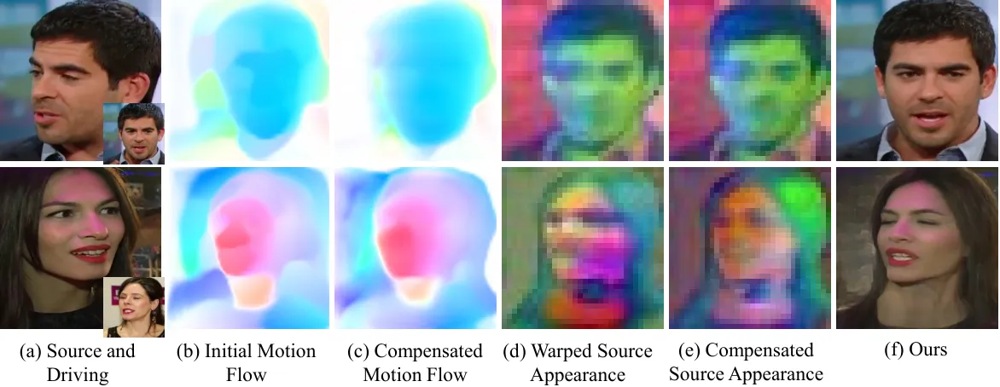

Figure 1: Effect of motion and appearance compensation with jointly
learned compensatory codebooks. Motion flows and warped source
appearance features are refined by the complementary information
retrieved from the motion and appearance codebooks, which jointly
contribute to high-quality generated results.

Given a source image and a driving video, talking head video
generation \[16, 25\] aims to animate the person in the source image
using the pose and expression from the driving video. Due to its
widespread applications, such as video conferencing, the film industry,
and virtual reality, it has attracted growing interest in the community.

Recent years have witnessed significant advancements in quality and
robustness for this task. Current approaches primarily focus on
improving motion estimation accuracy and appearance representation,
whether in 2D or 3D, to enhance generation quality. Along the direction,
unsupervised methods target predicting local motion flows around
unsupervised keypoints without relying on facial priors \[24, 43, 27\],
and methods based on predefined models (_e.g._, 3DMM) \[37, 40, 12\]
focus on learning robust decoding features to generate high-quality face
outputs. Despite the promising achievements, critical challenges
persist: 1) Some motion patterns (_e.g._, local subtle motions) cannot
be inferred from a single image pair solely relying on unsupervised
keypoints or predefined models for motion estimation, as such models
often have limited power of motion representation and may fail to
capture certain dynamic aspects of the facial motion from single image
pairs (see Fig. 1b). 2) Even with accurate motion estimation, highly
dynamic and complex motions in driving videos can create ambiguity
during generation, as a still source image lacks sufficient appearance
information to handle occluded regions or subtle expression changes (see
Fig. 1d). This results in noticeable artifacts and a significant drop in
the quality of the generated output. Therefore, generating
realistic-looking facial images requires not only inferring accurate
motion flow between the two given facial images but also compensating
for the intermediate appearance decoding features from the one-shot
source image for the final generation of face images.

In this work, we aim to synergize motion and appearance by
simultaneously learning accurate motion flows for facial warping and
robust facial appearance features for face image decoding, to advance
talking head generation. Inspired by the success of codebook
learning \[26\] where compact and useful representations of certain
modalities are learned from the whole training dataset, we propose to
use such representations as additional knowledge and compensate for
motion and appearance with them. Specifically, we propose a unified
framework that can achieve joint learning of both motion and appearance
codebooks with multi-scale compensation. To refine the motion flow
between two facial images (_i.e._, source and driving), we design a
multi-scale motion codebook that captures diverse motion patterns across
scales from the entire dataset during training. To enhance intermediate
warped facial feature maps for image decoding, we introduce a
multi-scale appearance codebook that represents diverse appearance
patterns learned from the entire dataset. To use the motion and
appearance codebooks, we further introduce a transformer-based
compensation structure to iteratively refine motion flows in a coarse to
fine manner and refine the warped features across different scales. This
approach enables us to improve motion accuracy and capture more facial
details by leveraging the diverse motion and appearance information
stored in the codebooks. To enhance the learning and compensation of
both codebooks, we propose a joint training strategy in which the motion
and appearance codebooks are learned simultaneously with the entire
framework. This approach allows both codebooks to be optimized together,
utilizing gradients from the refined warped features to strengthen their
mutual influence and improve overall performance. By learning both
multi-scale motion and appearance codebooks, our framework refines the
motion flow to accurately warp the source facial features, which are
further compensated with additional details from the appearance
codebook. This process yields robust intermediate facial decoding
features, resulting in improved generation.

We conduct extensive ablation studies to verify the effectiveness of the
learned multi-scale motion and appearance codebooks. Experimental
results demonstrate that both codebooks effectively enhance the motion
flow and intermediate warped features, resulting in more accurate and
detailed facial motion flows and feature textures. Furthermore, results
on two challenging datasets indicate that our method surpasses
state-of-the-art approaches, producing realistic-looking talking head
videos. In summary, our contributions are threefold:

- •
  We propose a novel framework that _jointly learns multi-scale motion
  and appearance codebooks_. The motion codebook captures motion
  patterns at varying levels of granularity, while the appearance
  codebook stores representative facial structure and texture features.
  This joint learning enables the model to effectively compensate for
  both motion and appearance for advanced generation.
- •
  We develop an effective _multi-scale compensation mechanism_ that
  utilizes the learned motion and appearance codebooks to progressively
  refine both motion and appearance representations. The mechanism can
  couple the compensation of both aspects at each level, achieving
  higher consistency of appearance and motion, thus leading to high
  visual quality in generated videos.
- •
  Extensive experiments, including those on challenging datasets,
  demonstrate that our method not only effectively compensates for
  facial motions and appearances but also significantly outperforms
  state-of-the-art approaches, generating more realistic talking head
  videos.

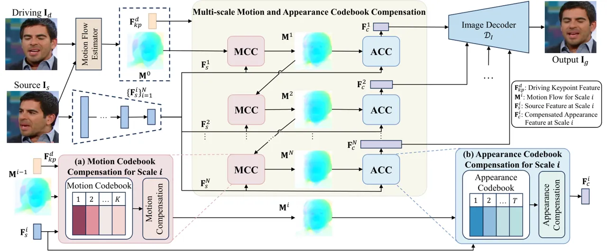

Figure 2: Overview of the framework. For each scale, multi-scale motion
and appearance codebook compensation consists of two sub-modules. (i)
Motion Codebook Compensation (MCC) compensates for a motion flow with
the motion codebook. (ii) To refine the source facial feature warped by
the compensated motion flow, Appearance Codebook Compensation (ACC)
produces the compensated appearance feature with the appearance codebook
for image decoding. These two sub-modules are employed for all scales.
We learn the motion and appearance codebooks jointly with the whole
framework.

## 2 Related Work

Talking Head Video Generation. Existing works on talking head video
generation generally separate the motion estimation module and the image
generation module to disentangle appearance and motion. To transfer the
motion, some works require facial priors provided by a pre-trained model
during generation. For example, landmark-based approaches \[12, 44, 33,
38\] detect predefined facial landmarks to transfer the facial pose and
expression from a driving frame to the source image. Some other methods
\[22, 39, 35\] use parameters from 3D face models \[1, 8, 47\] as motion
descriptors to disentangle identity and pose. However, they normally
cannot describe non-facial parts such as hair and neck, and their
generation quality is limited by the pre-trained model performance. To
address the issue, several methods that do not require any prior
knowledge from pre-trained models are proposed. Monkey-Net \[23\] learns
sparse motion-related keypoints in an unsupervised manner to describe
object movements. FOMM \[24\] extends it with local affine
transformation assumption around the keypoints to model complex motion.
Subsequent works introduce more flexible mathematical models such as
thin-plane spline transformation \[43\] and continuous
piecewise-affine-based transformation \[27\] to increase motion
estimation accuracy. Despite the expressiveness of the motion models,
they cannot fully describe large head poses and delicate expression
changes. MRFA \[25\] tackles the problem by building a correlation
volume for each image pair and using it to refine the coarse motion flow
iteratively. However, it only uses the warped image feature and a plain
image generator for image generation, which may fail when facing extreme
pose changes, as the appearance information from the one-shot source
image is often insufficient. Some works \[36, 21, 2\] leverage the
remarkable generative power of pre-trained StyleGAN \[17, 18\] for
better image generation, but they usually have to balance the
editability and fidelity. MCNet \[15\] learns a meta-memory bank of
spatial facial features to compensate for the warped source features.
Different from previous works, we compensate for both motion flows and
warped source features with jointly learned multi-scale motion and
appearance codebooks to boost the generation quality.

Codebook Learning. Codebook learning aims to learn useful discrete
representations with a fixed size. The learned codebook contains rich
and compact information, which can facilitate various tasks such as
image classification \[3, 41\], image synthesis \[7, 4\], blind face
restoration \[45, 10\] and audio-driven talking head video generation
\[28\]. Traditional methods often learn a codebook with unsupervised
clustering such as k-means \[5\]. VQ-VAE \[26\] first incorporates
vector quantization in a Variational Autoencoder to learn a codebook
containing discrete representative input features. To build a
context-rich codebook for images, VQGAN \[7\] further increases the
compression rate and adds a discriminator and a perceptual loss on
images reconstructed with the codes from the codebook. A transformer is
later used to model the composition of the codes for high-resolution
image synthesis. CodeFormer \[45\] uses a learned codebook of compressed
high-quality face image features as discrete prior and predicts the code
sequence based on the low-quality facial input for blind face
restoration. LipFormer \[28\] learns two codebooks of the upper half
face and the bottom half face respectively and predicts the lip codes
from the input audio to generate a face video from the audio. We also
adopt the idea of codebook learning, but we simultaneously learn
multi-scale motion and appearance codebooks that store diverse motion
and appearance patterns from the entire dataset during training to
facilitate high-quality talking head video generation. The codebooks and
the entire framework are trained together so that patterns useful for
talking head video generation can be stored in and retrieved from the
codebooks.

## 3 The Proposed Method

In this section, we will present the details of our framework. We
jointly learn multi-scale motion and appearance codebooks with
compensation for the motion and intermediate appearance features during
generation. We adopt the Taylor expansion approximation method to learn
the initial motion flow and the warping manner as same as Siarohin
et al. \[23\] for video generation.

### 3.1 Overview

Our framework is illustrated in Fig. 2. First, a keypoint-based motion
flow estimator takes both the source image $`\mathbf{I}_{s}`$ and
driving image $`\mathbf{I}_{d}`$ as input and estimates the initial
coarse motion flow $`\mathbf{M}^{0}`$. An image encoder
$`\mathcal{E}_{I}`$ extracts multi-scale source features
$`\{\mathbf{F}_{s}^{i}\}_{i=1}^{N}`$ from $`\mathbf{I}_{s}`$. Using
$`\mathbf{M}^{0}`$, $`\{\mathbf{F}_{s}^{i}\}_{i=1}^{N}`$, and the
driving keypoint feature $`\mathbf{F}_{kp}^{d}`$, the multi-scale motion
and appearance codebook compensation module refines the motion flows and
warped source features across all scales to obtain the multi-scale
compensated appearance features $`\{\mathbf{F}_{c}^{i}\}_{i=1}^{N}`$
with more accurate motion and less distortion. Finally, the image
decoder $`\mathcal{D}_{I}`$ decodes $`\{\mathbf{F}_{c}^{i}\}_{i=1}^{N}`$
to generate the final image $`\mathbf{I}_{g}`$ with the target motion
and appearance. Details on the design and learning of multi-scale motion
and appearance codebooks and compensation are provided in the following
subsections.

### 3.2 Multi-scale Motion and Appearance Codebook Learning and Compensation

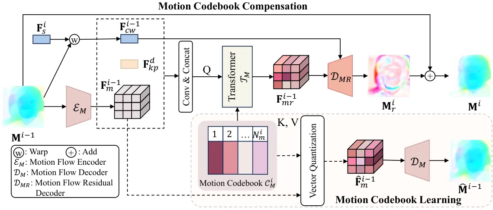

Figure 3: Illustration of motion codebook learning and compensation for
scale $`i`$. We adopt a transformer structure $`\mathcal{T}_{M}`$ to
compensate for the motion flow using the motion codebook. The proposed
motion codebook is learned under the supervision of a reconstruction
loss and a code-level loss.

We refine the initial motion flow $`\mathbf{M}^{0}`$ from coarse to fine
and enhance multi-scale source features warped by the refined motion
flows with the multi-scale motion and appearance codebook compensation
module, producing more accurate motion flows for source feature warping
at different scales and restore natural human faces from warping
distortions, which together result in higher-quality facial decoding
features. Specifically, we jointly learn a multi-scale motion codebook
storing local motion flow patterns and a multi-scale appearance codebook
containing local facial textures and retrieve relevant information from
them. Fig. 3 and Fig. 4 illustrate the motion and appearance codebook
learning and compensation process for scale $`i`$ respectively.

#### 3.2.1 Multi-scale Code Allocation

We aim to refine the initial motion flow and the warped source features
across all $`N`$ scales with multi-scale motion and appearance
codebooks. As the scale increases, larger appearance features require
finer motion flows for accurate warping and more detailed appearance
information for appearance compensation. To provide sufficient motion
and appearance compensation at larger scales, we introduce a code
allocation scheme for multi-scale motion and appearance codebooks, which
divides the codebook into multiple groups and allocates more codes for
larger scales. We illustrate the scheme with the motion codebook in
Fig. 5. The motion codebook
$`\mathcal{C}_{M}=\{\mathbf{m}_{k}\in\mathbb{R}^{d_{m}}\}_{k=1}^{K}`$
contains $`K`$ codes, and we perform motion compensation at $`N`$
different scales. The $`K`$ codes are split into $`N`$ equal groups,
each with $`K/N`$ codes. At scale $`i`$, the first $`i`$ groups,
totaling $`N_{m}^{i}=i\times K/N`$ codes, are allocated for motion
compensation. Similarly, for the appearance codebook
$`\mathcal{C}_{A}=\{\mathbf{a}_{k}\in\mathbb{R}^{d_{a}}\}_{k=1}^{T}`$
containing $`T`$ codes, we also allocate the first $`i`$ groups, which
are the first $`N_{a}^{i}=i\times T/N`$ codes for appearance
compensation. This allows codes with smaller indices to capture general
motion patterns or coarse appearance patterns shared across scales,
while codes with larger indices to focus on finer motion patterns or
facial details needed for larger scales. This maximizes the use of the
two codebooks by sharing general information across scales while
reserving space for scale-specific details.

At each scale $`i`$, we form new motion and appearance codebooks
$`\mathcal{C}_{M}^{i}`$ and $`\mathcal{C}_{A}^{i}`$ from the allocated
codes, resulting in $`N`$ scale-specific motion codebooks
$`\{\mathcal{C}_{M}^{i}\}_{i=1}^{N}`$ and $`N`$ scale-specific
appearance codebooks $`\{\mathcal{C}_{A}^{i}\}_{i=1}^{N}`$ for
multi-scale motion and appearance compensation.

#### 3.2.2 Joint Codebook Learning

To realize effective motion and appearance compensation at different
scales, we directly update $`\{\mathcal{C}_{M}^{i}\}_{i=1}^{N}`$ and
$`\{\mathcal{C}_{A}^{i}\}_{i=1}^{N}`$ with motion flow and appearance
feature units at each scale. We jointly optimize the two codebooks with
the whole framework, allowing the network to effectively store and
retrieve useful patterns at different scales with the codebooks, leading
to high-quality talking head video generation.

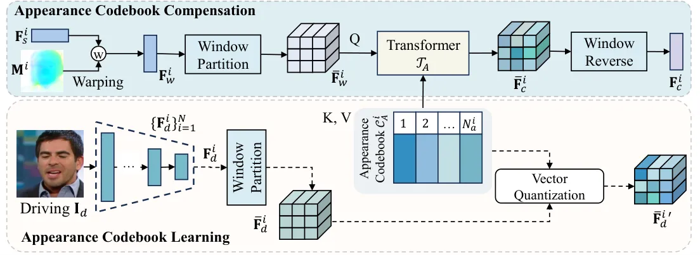

Figure 4: Illustration of appearance codebook learning and compensation
for scale $`i`$. We utilize a transformer structure $`\mathcal{T}_{A}`$
to compensate for the warped features with the appearance codebook,
adding more facial details to the feature map. Similar to the motion
codebook, the designed appearance codebook is learned under the
supervision of a code-level loss.

Motion Codebook Learning. At scale $`i`$, we use a CNN-based motion flow
encoder $`\mathcal{E}_{M}`$ to map the input motion flow
$`\mathbf{M}^{i-1}\in\mathbb{R}^{h\times w\times 2}`$ into a compact
motion flow feature
$`\mathbf{F}_{m}^{i-1}\in\mathbb{R}^{h_{m}\times w_{m}\times d_{m}}`$
where each unit is of length $`d_{m}`$ and captures a local motion flow
pattern on $`\mathbf{M}^{i-1}`$. We quantize each of its spatial
elements $`\mathbf{F}_{m}^{i-1}(x,y)`$ with the nearest code from
$`\mathcal{C}_{M}^{i}`$ to obtain a quantized motion flow feature
$`\hat{\mathbf{F}}_{m}^{i-1}`$:

```math
\hat{\mathbf{F}}_{m}^{i-1}=\mathit{Q}(\mathbf{F}_{m}^{i-1}):=\left(\mathop{\arg\min}_{\mathbf{m}_{k}\in\mathcal{C}_{M}^{i}}||\mathbf{F}_{m}^{i-1}(x,y)-\mathbf{m}_{k}||_{2}^{2}\right). \tag{1}
```

A motion flow decoder $`\mathcal{D}_{M}`$ reconstructs
$`\mathbf{M}^{i-1}`$ with the quantized motion flow feature
$`\hat{\mathbf{F}}_{m}^{i-1}`$:

```math
\hat{\mathbf{M}}^{i-1}=\mathcal{D}_{M}(\hat{\mathbf{F}}_{m}^{i-1})=\mathcal{D}_{M}(\mathit{Q}(\mathcal{E}_{M}(\mathbf{M}^{i-1}))). \tag{2}
```

To update the scale-specific motion codebook $`\mathcal{C}_{M}^{i}`$
with local motion flow patterns from $`\mathbf{F}_{m}^{i-1}`$, we use
the following loss function:

```math
\begin{split}\mathcal{L}_{vq,m}^{i}=&\lambda_{recon,m}||\hat{\mathbf{M}}^{i-1}-sg[\mathbf{M}^{i-1}]||_{1}\\
&+||sg[\mathcal{E}_{M}({\mathbf{M}}^{i-1})]-\hat{\mathbf{F}}_{m}^{i-1}||_{2}^{2}\\
&+\beta||sg[\hat{\mathbf{F}}_{m}^{i-1}]-\mathcal{E}_{M}(sg[\mathbf{M}^{i-1}])||_{2}^{2},\end{split} \tag{3}
```

where $`sg[\cdot]`$ denotes the stop gradient operator, and
$`\lambda_{recon,m}`$ and $`\beta`$ are the loss term weights. The first
term represents the motion flow reconstruction loss, while the last two
terms form a code-level loss \[26\] that minimizes the distance between
the latent motion flow units and the motion codes. We stop the gradient
of $`\mathbf{M}^{i-1}`$ to ensure that motion codebook learning at scale
$`i`$ does not interfere with the training of the motion flow estimator
or the compensated motion flows from prior scales. The overall loss
function for motion codebook learning across all $`N`$ scales is
$`\mathcal{L}_{vq,m}=\sum_{i=1}^{N}\mathcal{L}_{vq,m}^{i}`$.

Figure 5: Illustration of the code allocation scheme. We take the
multi-scale motion codebook as an example.

Appearance Codebook Learning. We use the image encoder
$`\mathcal{E}_{I}`$ to extract multi-scale driving features
$`\{\mathbf{F}_{d}^{i}\}_{i=1}^{N}`$, which serve as targets for our
appearance codebook. Since image features of different scales have
varying resolutions, directly flattening high-resolution features for
compensation can be computationally expensive. To address this, we apply
window partitioning. For a feature map of shape
$`(h_{a}^{i},w_{a}^{i},c_{a}^{i})`$ at scale $`i`$, we divide it into
patches of shape $`(h_{a}^{i}/h_{a},w_{a}^{i}/w_{a})`$, reshaping the
feature into
$`(h_{a},w_{a},c_{a}^{i}\times h_{a}^{i}\times w_{a}^{i}/h_{a}/w_{a})`$.
We then linearly project the features into $`d_{a}`$ dimensions to align
them with the appearance codes. This results in a more compact driving
feature
$`\overline{\mathbf{F}}_{d}^{i}\in\mathbb{R}^{h_{a}\times w_{a}\times d_{a}}`$,
where each unit represents an appearance pattern at scale $`i`$.
Finally, element-wise quantization with the nearest code from
$`\mathcal{C}_{A}^{i}`$ produces the quantized appearance feature
$`\overline{\mathbf{F}}_{d}^{i\prime}`$:

```math
\overline{\mathbf{F}}_{d}^{i\prime}=\mathit{Q}(\overline{\mathbf{F}}_{d}^{i}):=\left(\mathop{\arg\min}_{\mathbf{a}_{k}\in\mathcal{C}_{A}^{i}}||\overline{\mathbf{F}}_{d}^{i}(x,y)-\mathbf{a}_{k}||_{2}^{2}\right). \tag{4}
```

To update the scale-specific appearance codebook $`\mathcal{C}_{A}^{i}`$
with local appearance units from $`\overline{\mathbf{F}}_{d}^{i}`$, we
use the following loss function:

```math
\mathcal{L}_{vq,a}^{i}=||sg[\overline{\mathbf{F}}_{d}^{i}]-\overline{\mathbf{F}}_{d}^{i\prime}||_{2}^{2}+\beta||sg[\overline{\mathbf{F}}_{d}^{i\prime}]-\overline{\mathbf{F}}_{d}^{i}||_{2}^{2}, \tag{5}
```

where $`sg[\cdot]`$ denotes the stop gradient operator, and $`\beta`$ is
the loss term weight. We only use the code-level loss to reduce the
distance between the appearance feature units and the codes from
$`\mathcal{C}_{A}^{i}`$. The overall loss function for appearance
codebook learning is
$`\mathcal{L}_{vq,a}=\sum_{i=1}^{N}\mathcal{L}_{vq,a}^{i}`$. We do not
use the image decoder $`\mathcal{D}_{I}`$ to reconstruct the original
driving image $`\mathbf{I}_{d}`$ from
$`\{\overline{\mathbf{F}}_{d}^{i\prime}\}_{i=1}^{N}`$, allowing
$`\mathcal{D}_{I}`$ to focus on decoding the compensated appearance
features and improving the talking head video generation. Training a
separate image decoder for reconstruction with quantized appearance
codes would be computationally expensive. Experimental results in
Sec. 4.3 show that using only the code-level loss can already learn the
appearance codebook effectively.

#### 3.2.3 Multi-scale Joint Codebook Compensation

Motion and Appearance Codebook Compensation Coupling. With the
multi-scale motion and appearance codebooks, we couple motion and
appearance codebook compensation at each scale to produce better image
decoding features, as shown in Fig. 2. Specifically, at scale $`i`$,
motion codebook compensation (MCC) refines the input motion flow
$`\mathbf{M}^{i-1}`$ to obtain the compensated motion flow
$`\mathbf{M}^{i}`$, which is used to warp the source feature
$`\mathbf{F}_{s}^{i}`$. Appearance codebook compensation (ACC) then
refines the warped source feature to produce the compensated appearance
feature $`\mathbf{F}_{c}^{i}`$. If $`i<N`$, $`\mathbf{M}^{i}`$ is used
as the input motion flow for the next scale. In this way, motion and
appearance codebook compensation are coupled across scales, enabling
more consistent motion and appearance for high-quality video generation.

Motion Codebook Compensation. An intuitive approach for multi-scale
motion codebook compensation is to retrieve motion codes from the
scale-specific codebook and decode them into finer motion flows using
$`\mathcal{D}_{M}`$ at each scale. However, to reduce computational
complexity, we limit the number of motion codes, which decreases
expressiveness. This makes it difficult to fully reconstruct motion
flows, leading to degraded image quality. Instead, we predict motion
flow residual for the input flow at each scale, allowing the motion
codebook to enhance the motion flow without requiring precise
reconstruction.

As shown in Fig. 3, to retrieve motion residuals from
$`\mathcal{C}_{M}^{i}`$ at scale $`i`$, we use a motion code retrieval
transformer $`\mathcal{T}_{M}`$ shared for all scales. It queries the
scale-specific codebook $`\mathcal{C}_{M}^{i}`$ using the encoded motion
feature $`\mathbf{F}_{m}^{i-1}`$, the warped source feature
$`\mathbf{F}_{cw}^{i-1}`$, and the driving keypoint feature
$`\mathbf{F}_{kp}^{d}`$. The first two represent the current motion
flow, and the last indicates the target pose. These features are
processed through a convolutional encoding block and concatenated into a
compact motion query feature, then flattened and enhanced with a
learnable position embedding before being passed to $`\mathcal{T}_{M}`$.
$`\mathcal{T}_{M}`$ consists of $`L_{M}`$ transformer layers, each with
multi-head self-attention, cross-attention, and convolution layers
(instead of linear layers) to preserve spatial structure. The
self-attention models global correlations, and the cross-attention uses
the output of self-attention as the query and the codes from
$`\mathcal{C}_{M}^{i}`$ as key-value pairs to retrieve local motion flow
patterns. The transformer outputs the motion flow residual feature
$`\mathbf{F}_{mr}^{i-1}`$, which is decoded by a motion flow residual
decoder $`\mathcal{D}_{MR}`$ to obtain the motion flow residual
$`\mathbf{M}_{r}^{i}\in\mathbb{R}^{h\times w\times 2}`$. Finally, we add
$`\mathbf{M}_{r}^{i}`$ to the input motion flow $`\mathbf{M}^{i-1}`$ to
produce the compensated motion flow $`\mathbf{M}^{i}`$, which is used
for source feature warping at scale $`i`$.

The compensated motion flow $`\mathbf{M}^{i}`$ is sufficient for warping
the source feature $`\mathbf{F}_{s}^{i}`$, but may lack fine details for
higher-resolution features like $`\mathbf{F}_{s}^{i+1}`$. Therefore, we
use $`\mathbf{M}^{i}`$ as input for motion codebook compensation at
scale $`i+1`$ and refine it with more motion codes. This iterative
process continues across scales, producing multi-scale compensated
motion flows $`\{\mathbf{M}^{i}\}_{i=1}^{N}`$.

Appearance Codebook Compensation. At scale $`i`$, we first warp the
source feature $`\mathbf{F}_{s}^{i}`$ with the compensated motion flow
$`\mathbf{M}^{i}`$ to obtain the warped feature $`\mathbf{F}_{w}^{i}`$.
We then apply window partitioning to map $`\mathbf{F}_{w}^{i}`$ into a
compact feature $`\overline{\mathbf{F}}_{w}^{i}`$. To correct the
corrupted appearance in $`\overline{\mathbf{F}}_{w}^{i}`$, we retrieve
appearance codes with $`\overline{\mathbf{F}}_{w}^{i}`$ using a
transformer $`\mathcal{T}_{A}`$. Similar to motion codebook
compensation, $`\overline{\mathbf{F}}_{w}^{i}`$, reshaped and augmented
with a learnable position embedding, passes through $`L_{A}`$
transformer layers where appearance codes from $`\mathcal{C}_{A}^{i}`$
are retrieved with cross-attention. The transformer output is the
compensated appearance feature $`\overline{\mathbf{F}}_{c}^{i}`$, which
retains the pose but reduces distortion of
$`\overline{\mathbf{F}}_{w}^{i}`$. Finally, we apply window reverse on
$`\overline{\mathbf{F}}_{c}^{i}`$ to restore it to the original image
shape $`(h_{a}^{i},w_{a}^{i},c_{a}^{i})`$ using linear projection and
reshaping. This compensation is performed across all scales, resulting
in multi-scale compensated appearance features
$`\{\mathbf{F}_{c}^{i}\}_{i=1}^{N}`$.

### 3.3 Joint Optimization Objective of the Framework

We use the multi-scale compensated appearance features
$`\{\mathbf{F}_{c}^{i}\}_{i=1}^{N}`$ and the image decoder
$`\mathcal{D}_{I}`$ for image decoding. The low-resolution feature
$`\mathbf{F}_{c}^{1}`$ is fed as the initial input to
$`\mathcal{D}_{I}`$, which gradually upsamples it through a series of
upsampling layers and ResNet blocks \[13\] until it reaches the output
resolution. The intermediate features are refined with higher-resolution
features $`\{\mathbf{F}_{c}^{i}\}_{i=2}^{N}`$ by SFT \[30\] and addition
when they match the resolution of $`\mathbf{F}_{c}^{i}`$. After fusing
features from all scales, $`\mathcal{D}_{I}`$ generates the final output
$`\mathbf{I}_{g}`$.

The training objective combines the codebook losses from Sec. 3.2 with
common losses for talking head video generation \[24, 16\].
Specifically, we use the equivariance loss $`\mathcal{L}_{eq}`$ and
keypoint distance loss $`\mathcal{L}_{kpd}`$ to guide keypoint
prediction in the motion flow estimator, and an image reconstruction
loss $`\mathcal{L}_{recon}`$ and an adversarial loss
$`\mathcal{L}_{adv}`$ on $`\mathbf{I}_{g}`$. To avoid the image decoder
relying too much on high-resolution appearance features, we also
generate an image $`\mathbf{I}_{g}^{1}`$ using only
$`\mathbf{F}_{c}^{1}`$ and apply $`\mathcal{L}_{recon}`$ to minimize the
difference between $`\mathbf{I}_{g}^{1}`$ and $`\mathbf{I}_{d}`$. The
overall training objective is:

```math
\displaystyle\begin{split}\mathcal{L}=&\mathcal{L}_{recon}(\mathbf{I}_{d},\mathbf{I}_{g})+\lambda_{adv}\mathcal{L}_{adv}(\mathbf{I}_{d},\mathbf{I}_{g})+\mathcal{L}_{eq}+\mathcal{L}_{kpd}\\
&+\mathcal{L}_{vq,m}+\mathcal{L}_{vq,a}+\lambda^{1}\mathcal{L}_{recon}(\mathbf{I}_{d},\mathbf{I}_{g}^{1}),\end{split}
```

where $`\lambda_{adv}`$ and $`\lambda^{1}`$ are the loss term weights.

## 4 Experiments

### 4.1 Implementation Details

Datasets. We conduct experiments on VoxCeleb1 \[20\] and CelebV-HQ
\[46\] datasets. We train our model on VoxCeleb1 training set. For
evaluation, we build the test set on VoxCeleb1 by randomly sample 50
videos from its test split. To evaluate the model’s generalization
ability, we randomly select 50 videos from CelebV-HQ for testing.

Metrics. For same-identity reconstruction, we adopt PSNR,
$`\mathcal{L}_{1}`$ and LPIPS following \[25\] to evaluate the
reconstruction quality. We also use FID \[14\] to measure the realism of
the generated video frames. Following \[23\], we employ Average Keypoint
Distance (AKD) for motion transfer quality evaluation and Average
Euclidean Distance (AED) for identity preservation quality evaluation.

### 4.2 Comparison with State-of-the-art Methods

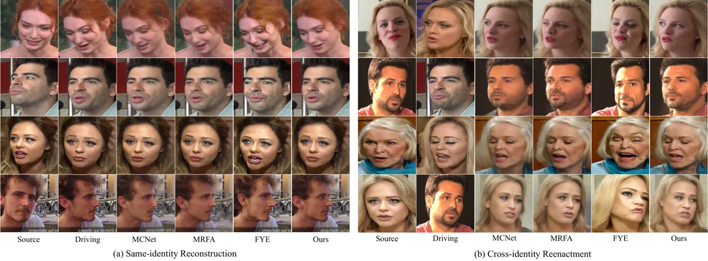

Figure 6: Qualitative comparison with state-of-the-art methods for (a)
same-identity reconstruction and (b) cross-identity reenactment on the
VoxCeleb1 and CelebV-HQ datasets. Our method can generate high-quality
facial images even under large pose variations.

| Method             | VoxCeleb1          |                   |                                    |                      |                    |                    | CelebV-HQ          |                   |                                    |                      |                    |                    |
| ------------------ | ------------------ | ----------------- | ---------------------------------- | -------------------- | ------------------ | ------------------ | ------------------ | ----------------- | ---------------------------------- | -------------------- | ------------------ | ------------------ |
|                    | FID $`\downarrow`$ | PSNR $`\uparrow`$ | $`\mathcal{L}_{1}`$ $`\downarrow`$ | LPIPS $`\downarrow`$ | AKD $`\downarrow`$ | AED $`\downarrow`$ | FID $`\downarrow`$ | PSNR $`\uparrow`$ | $`\mathcal{L}_{1}`$ $`\downarrow`$ | LPIPS $`\downarrow`$ | AKD $`\downarrow`$ | AED $`\downarrow`$ |
| FOMM \[24\]        | 53.97              | 22.96             | 0.0474                             | 0.2200               | 1.4037             | 0.1509             | 78.15              | 20.92             | 0.0685                             | 0.2925               | 3.6098             | 0.2955             |
| LIA \[31\]         | 57.51              | 22.88             | 0.0488                             | 0.2293               | 1.5395             | 0.1500             | 86.64              | 19.58             | 0.0830                             | 0.3159               | 3.3632             | 0.3430             |
| DaGAN \[16\]       | 51.55              | 22.92             | 0.0492                             | 0.2251               | 1.5740             | 0.1652             | 99.84              | 20.49             | 0.0781                             | 0.3209               | 7.6075             | 0.3301             |
| MCNet \[15\]       | 51.45              | 24.59             | 0.0402                             | 0.1996               | 1.2363             | 0.1254             | 78.33              | 22.20             | 0.0640                             | 0.2732               | 4.1386             | 0.2903             |
| MRFA \[25\]        | 48.49              | 25.26             | 0.0370                             | 0.1872               | 1.1823             | 0.1188             | 75.73              | 22.41             | 0.0625                             | 0.2670               | 3.7166             | 0.2527             |
| AniPortrait \[32\] | 52.65              | 20.15             | 0.0637                             | 0.2767               | 2.6543             | 0.2623             | 61.56              | 19.71             | 0.0748                             | 0.2878               | 2.2397             | 0.2739             |
| FYE \[19\]         | 43.25              | 19.54             | 0.0714                             | 0.2954               | 2.7071             | 0.2652             | 62.55              | 19.58             | 0.0802                             | 0.3006               | 4.8637             | 0.3029             |
| Ours               | 43.15              | 25.30             | 0.0355                             | 0.1846               | 1.2039             | 0.1071             | 71.78              | 22.40             | 0.0610                             | 0.2608               | 3.2562             | 0.2825             |

Table 1: Quantitative comparison with state-of-the-art methods for
same-identity reconstruction on VoxCeleb1 and CelebV-HQ datasets. Our
results are the best on the Voxceleb1 dataset and competitive on the
CelebV-HQ dataset.

We compare our method with a series of open-source state-of-the-art
methods, including non-diffusion-based FOMM \[24\], LIA \[31\], DaGAN
\[16\], MCNet \[15\] and MRFA \[25\], and diffusion-based AniPortrait
\[32\] and Follow-Your-Emoji (FYE) \[19\].

Same-identity Reconstruction. To evaluate the performance on
same-identity reconstruction, we use the first frame of each video as
the source image and reconstruct the whole video. Tab. 1 presents the
quantitative results for same-identity reconstruction. Our method
outperforms the other methods almost on all metrics on VoxCeleb1 dataset
and remains competitive when generalized to the more challenging
CelebV-HQ. Compared with those unsupervised methods \[24, 31, 16, 15,
25\], our method achieves better motion estimation, _e.g.,_ our method
gets the best AKD score on CelebV-HQ dataset. This result verifies the
effectiveness of our designed multi-scale motion codebook and its
generalizability. For the results of image quality (_i.e.,_ FID, PSNR,
$`\mathcal{L}_{1}`$, LPIPS), our method outperforms other methods on
VoxCeleb1 dataset, even those diffusion methods \[32, 19\] trained with
larger-scale datasets. It indicates that our designed multi-scale
appearance codebook is capable to compensate for the intermediate warped
feature for better talking head video generation.We also show some
qualitative results in Fig. 6a. Our method can generate plausible unseen
facial regions (row 2) and handle large motion (row 4) with accuracy.

Cross-identity Reenactment. We conduct cross-identity reenactment
experiments to validate our method. The qualitative results shown in
Fig. 6b indicate the superiority of our method. Compared to
non-diffusion-based MCNet \[15\] and MRFA \[25\], our method better
preserves facial details (row 1 and 3), even under large motions (row 2
and 4). Diffusion-based FYE \[19\] often produces exaggerated
expressions and struggles to imitate the driving expressions accurately,
likely due to its reliance on landmark-based embeddings without
explicitly modeling motion. These findings confirm the effectiveness of
our framework. More experimental results are shown in the supplementary
material.

### 4.3 Ablation Study

We perform ablation studies to assess the effectiveness of the learned
multi-scale motion and appearance compensatory codebooks. The model
variants in Tab. 2 are as follows: (i) “Baseline” is the model without
any compensatory codebook. (ii) “Baseline+SMC” includes only a
single-scale motion codebook, compensating for the initial motion flow
only at scale $`1`$, and the compensated result is used to warp
multi-scale features. (iii) “Baseline+MMC” includes a multi-scale motion
codebook to compensate for the motion flows across scales. (iv)
“Baseline+MMC+SAC” adds a single-scale appearance codebook to (iii),
compensating only the warped feature at scale $`1`$. (v)
“Baseline+MMC+MAC” is our full model with both multi-scale motion and
appearance codebooks. We present the quantitative results in Tab. 2 and
qualitative comparisons of (i), (iii), and (v) in Fig. 9.

Effect of Joint Codebook Learning. To evaluate the effectiveness of our
jointly learned multi-scale motion and appearance codebooks, we
visualize the reconstructed multi-scale motion flows with the motion
codebook in Fig. 7 and appearance features with the appearance codebook
in Fig. 8. For the motion flows, results in Fig. 7 are output of the
motion flow decoder $`\mathcal{D}_{M}`$ given the quantized motion flow
features. Despite the limited number of codes, our multi-scale motion
codebook can reconstruct high-quality motion flows, confirming its
ability to capture typical local motion patterns. For appearance
features, we visualize the quantized features directly in Fig. 8.
Despite some quantization loss, the multi-scale appearance codebook
reconstructs the driving features well with limited codes, demonstrating
its ability to store informative local appearance details. These results
demonstrate the effectiveness of joint codebook learning, allowing the
codebooks to store expressive local motion and appearance patterns.

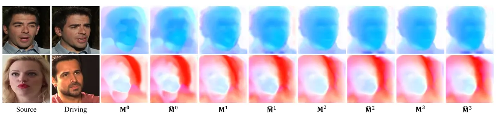

Figure 7: Visulization of the original and reconstructed motion flows
for different scales. Our multi-scale motion codebook can reconstruct
multi-scale motion flows with high quality.

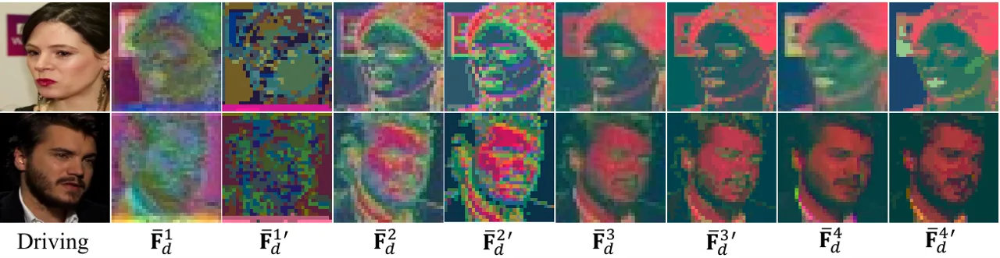

Figure 8: Visulization of the original and reconstructed driving
features. Our multi-scale appearance codebook can reconstruct
multi-scale appearance features with acceptable quantization loss.

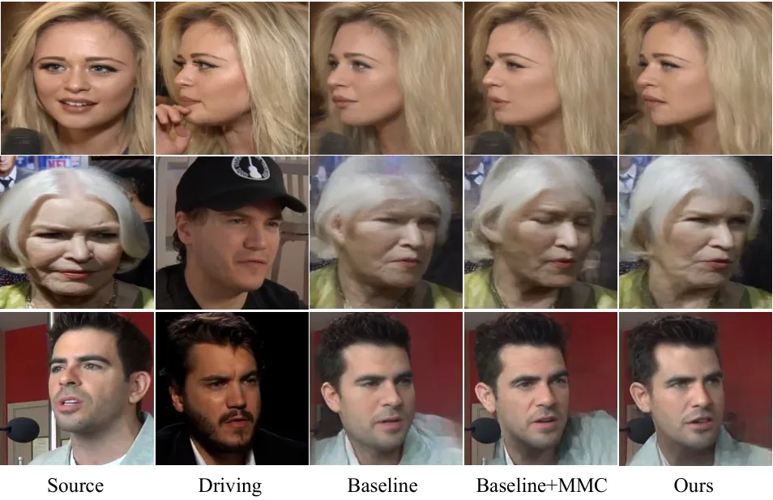

Figure 9: Qualitative ablation study on multi-scale motion and
appearance codebook compensation. Both motion and appearance codebook
compensation contribute to better generation quality.

|                     |                    |                   |                                    |                      |                    |                    |
| ------------------- | ------------------ | ----------------- | ---------------------------------- | -------------------- | ------------------ | ------------------ |
|                     | FID $`\downarrow`$ | PSNR $`\uparrow`$ | $`\mathcal{L}_{1}`$ $`\downarrow`$ | LPIPS $`\downarrow`$ | AKD $`\downarrow`$ | AED $`\downarrow`$ |
| Baseline            | 47.83              | 24.93             | 0.0375                             | 0.1954               | 1.2384             | 0.1106             |
| \+ SMC              | 49.00              | 24.97             | 0.0371                             | 0.1917               | 1.2183             | 0.1167             |
| \+ MMC              | 44.86              | 25.27             | 0.0360                             | 0.1875               | 1.2171             | 0.1076             |
| \+ MMC + SAC        | 44.32              | 25.16             | 0.0362                             | 0.1856               | 1.2106             | 0.1091             |
| \+ MMC + MAC (Ours) | 43.15              | 25.30             | 0.0355                             | 0.1846               | 1.2039             | 0.1071             |

Table 2: Ablation study on the multi-scale motion and appearance
codebook compensation. We present the results for same-identity
reconstruction on VoxCeleb1 dataset.

Effect of Multi-scale Motion Codebook Compensation. The second row of
Tab. 2 shows that using single-scale motion codebook compensation
already improves motion transfer and image quality, reflected by better
PSNR, $`\mathcal{L}_{1}`$, LPIPS, and AKD compared to the baseline. This
highlights the effectiveness of motion codebook compensation for talking
head video generation. Multi-scale motion codebook compensation further
enhances all metrics, underscoring the importance of handling motion
flows at different scales for improved feature warping. Fig. 9 shows
that multi-scale motion compensation achieves better motion transfer
(e.g., head pose in row 1), reduces artifacts (e.g., hair in row 2), and
preserves source identity (row 3). Fig. 10 visualizes the motion flow
compensation process, showing that the initial motion flow
$`\mathbf{M}^{0}`$ is rough, but multi-scale compensation refines it
iteratively with residuals $`\{\mathbf{M}_{r}^{i}\}_{i=1}^{N}`$, adding
finer details as the scale increases for smoother, more face-adapted
motion flows.

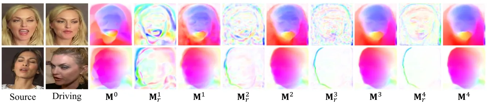

Figure 10: Visualization of the motion flow compensation process. We
present the initial motion flow $`\mathbf{M}^{0}`$, the motion flow
residuals $`\{\mathbf{M}_{r}^{i}\}_{i=1}^{N}`$ and the compensated
motion flows $`\{\mathbf{M}^{i}\}_{i=1}^{N}`$.

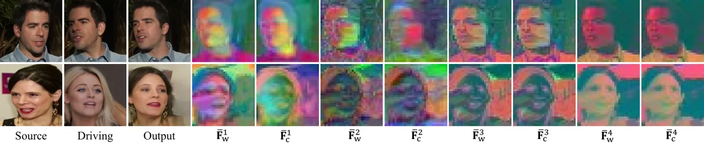

Figure 11: Visualization of the appearance compensation results. We
present the warped source features
$`\{\overline{\mathbf{F}}_{w}^{i}\}_{i=1}^{N}`$ and the compensated
appearance features $`\{\overline{\mathbf{F}}_{c}^{i}\}_{i=1}^{N}`$.

Effect of Multi-scale Appearance Codebook Compensation. The fourth row
in Tab. 2 shows that adding single-scale appearance codebook
compensation on top of multi-scale motion codebook compensation improves
FID, LPIPS, and AKD, indicating that appearance codebook compensation
refines warped source features for more realistic image generation.
However, there is a slight drop in PSNR, $`\mathcal{L}_{1}`$, and AED,
likely due to a conflict between scale $`1`$ compensated appearance
features and other warped features with warping artifacts. The fifth row
shows consistent improvement, suggesting that multi-scale appearance
codebook compensation resolves this conflict and further refines warped
features across scales, boosting overall performance. The last two
columns in Fig. 9 also verify that multi-scale appearance codebook
compensation leads to more accurate motion (e.g., the mouth in row 1,
eyes in row 2, and shoulders in row 3) with realistic facial details
(e.g., the hair in row 2). Additionally, Fig. 11 visualizes the
compensated feature maps at different scales, showing more complete
facial shapes and details compared to the warped feature
$`\overline{\mathbf{F}}_{w}^{i}`$. These results validate the
effectiveness of multi-scale appearance codebook compensation.

## 5 Conclusion

In this paper, we have presented a novel framework that jointly learns
multi-scale motion and appearance compensatory codebooks to enhance the
motion flows and appearance features for talking head video generation.
The motion and appearance codebooks store local motion and appearance
patterns learned from the entire dataset at different scales, and our
multi-scale motion and appearance codebook compensation module retrieves
useful codes from the codebooks with a transformer-based strategy at
different scales to refine motion flows and appearance features for
image generation. Extensive results verify the effectiveness of our
joint motion and appearance codebook learning and compensation,
synergizing both for high-quality talking video generation.

Acknowledgements. This research is supported in part by the Early Career
Scheme of the Research Grants Council (RGC) of the Hong Kong SAR under
grant No. 26202321, SAIL Research Project, HKUST-Zeekr Collaborative
Research Fund, HKUST-WeBank Joint Lab Project, and Tencent Rhino-Bird
Focused Research Program.

## References

- \[1\] Volker Blanz and Thomas Vetter. A morphable model for the
  synthesis of 3d faces. In _Seminal Graphics Papers: Pushing the
  Boundaries, Volume 2_, pages 157–164. Association for Computing
  Machinery, 2023.
- \[2\] Stella Bounareli, Christos Tzelepis, Vasileios Argyriou, Ioannis
  Patras, and Georgios Tzimiropoulos. Hyperreenact: One-shot reenactment
  via jointly learning to refine and retarget faces. In _ICCV_, 2023.
- \[3\] Hongping Cai, Fei Yan, and Krystian Mikolajczyk. Learning
  weights for codebook in image classification and retrieval. In
  _CVPR_, 2010.
- \[4\] Huiwen Chang, Han Zhang, Lu Jiang, Ce Liu, and William T.
  Freeman. Maskgit: Masked generative image transformer. In
  _CVPR_, 2022.
- \[5\] Gabriella Csurka, Christopher Dance, Lixin Fan, Jutta
  Willamowski, and Cédric Bray. Visual categorization with bags of
  keypoints. In _ECCV Workshop_, 2004.
- \[6\] Nikita Drobyshev, Jenya Chelishev, Taras Khakhulin, Aleksei
  Ivakhnenko, Victor Lempitsky, and Egor Zakharov. Megaportraits:
  One-shot megapixel neural head avatars. In _ACM MM_, 2022.
- \[7\] Patrick Esser, Robin Rombach, and Bjorn Ommer. Taming
  transformers for high-resolution image synthesis. In _CVPR_, 2021.
- \[8\] Yao Feng, Haiwen Feng, Michael J Black, and Timo Bolkart.
  Learning an animatable detailed 3d face model from in-the-wild images.
  _ACM TOG_, 40(4):1–13, 2021.
- \[9\] Yue Gao, Yuan Zhou, Jinglu Wang, Xiao Li, Xiang Ming, and Yan
  Lu. High-fidelity and freely controllable talking head video
  generation. In _CVPR_, 2023.
- \[10\] Yuchao Gu, Xintao Wang, Liangbin Xie, Chao Dong, Gen Li, Ying
  Shan, and Ming-Ming Cheng. Vqfr: Blind face restoration with
  vector-quantized dictionary and parallel decoder. In _ECCV_, 2022.
- \[11\] Jianzhu Guo, Dingyun Zhang, Xiaoqiang Liu, Zhizhou Zhong, Yuan
  Zhang, Pengfei Wan, and Di Zhang. Liveportrait: Efficient portrait
  animation with stitching and retargeting control. _arXiv preprint
  arXiv:2407.03168_, 2024.
- \[12\] Sungjoo Ha, Martin Kersner, Beomsu Kim, Seokjun Seo, and
  Dongyoung Kim. Marionette: Few-shot face reenactment preserving
  identity of unseen targets. In _AAAI_, 2020.
- \[13\] Kaiming He, Xiangyu Zhang, Shaoqing Ren, and Jian Sun. Deep
  residual learning for image recognition. In _CVPR_, 2016.
- \[14\] Martin Heusel, Hubert Ramsauer, Thomas Unterthiner, Bernhard
  Nessler, and Sepp Hochreiter. Gans trained by a two time-scale update
  rule converge to a local nash equilibrium. In _NeurIPS_, 2017.
- \[15\] Fa-Ting Hong and Dan Xu. Implicit identity representation
  conditioned memory compensation network for talking head video
  generation. In _ICCV_, 2023.
- \[16\] Fa-Ting Hong, Longhao Zhang, Li Shen, and Dan Xu. Depth-aware
  generative adversarial network for talking head video generation. In
  _CVPR_, 2022.
- \[17\] Tero Karras, Samuli Laine, and Timo Aila. A style-based
  generator architecture for generative adversarial networks. In
  _CVPR_, 2019.
- \[18\] Tero Karras, Samuli Laine, Miika Aittala, Janne Hellsten,
  Jaakko Lehtinen, and Timo Aila. Analyzing and improving the image
  quality of stylegan. In _CVPR_, 2020.
- \[19\] Yue Ma, Hongyu Liu, Hongfa Wang, Heng Pan, Yingqing He, Junkun
  Yuan, Ailing Zeng, Chengfei Cai, Heung-Yeung Shum, Wei Liu, et al.
  Follow-your-emoji: Fine-controllable and expressive freestyle portrait
  animation. In _SIGGRAPH Asia_, 2024.
- \[20\] Arsha Nagrani, Joon Son Chung, and Andrew Zisserman. Voxceleb:
  a large-scale speaker identification dataset. _arXiv preprint
  arXiv:1706.08612_, 2017.
- \[21\] Trevine Oorloff and Yaser Yacoob. Robust one-shot face video
  re-enactment using hybrid latent spaces of stylegan2. In _ICCV_, 2023.
- \[22\] Yurui Ren, Ge Li, Yuanqi Chen, Thomas H. Li, and Shan Liu.
  Pirenderer: Controllable portrait image generation via semantic neural
  rendering. In _ICCV_, 2021.
- \[23\] Aliaksandr Siarohin, Stéphane Lathuilière, Sergey Tulyakov,
  Elisa Ricci, and Nicu Sebe. Animating arbitrary objects via deep
  motion transfer. In _CVPR_, 2019a.
- \[24\] Aliaksandr Siarohin, Stéphane Lathuilière, Sergey Tulyakov,
  Elisa Ricci, and Nicu Sebe. First order motion model for image
  animation. In _NeurIPS_, 2019b.
- \[25\] Jiale Tao, Shuhang Gu, Wen Li, and Lixin Duan. Learning motion
  refinement for unsupervised face animation. In _NeurIPS_, 2024.
- \[26\] Aaron Van Den Oord, Oriol Vinyals, et al. Neural discrete
  representation learning. In _NeurIPS_, 2017.
- \[27\] Hexiang Wang, Fengqi Liu, Qianyu Zhou, Ran Yi, Xin Tan, and
  Lizhuang Ma. Continuous piecewise-affine based motion model for image
  animation. In _AAAI_, 2024.
- \[28\] Jiayu Wang, Kang Zhao, Shiwei Zhang, Yingya Zhang, Yujun Shen,
  Deli Zhao, and Jingren Zhou. Lipformer: High-fidelity and
  generalizable talking face generation with a pre-learned facial
  codebook. In _CVPR_, 2023.
- \[29\] Ting-Chun Wang, Arun Mallya, and Ming-Yu Liu. One-shot
  free-view neural talking-head synthesis for video conferencing. In
  _CVPR_, 2021.
- \[30\] Xintao Wang, Ke Yu, Chao Dong, and Chen Change Loy. Recovering
  realistic texture in image super-resolution by deep spatial feature
  transform. In _CVPR_, 2018.
- \[31\] Yaohui Wang, Di Yang, Francois Bremond, and Antitza Dantcheva.
  Latent image animator: Learning to animate images via latent space
  navigation. In _ICLR_, 2022.
- \[32\] Huawei Wei, Zejun Yang, and Zhisheng Wang. Aniportrait:
  Audio-driven synthesis of photorealistic portrait animation. _arXiv
  preprint arXiv:2403.17694_, 2024.
- \[33\] Wayne Wu, Yunxuan Zhang, Cheng Li, Chen Qian, and Chen Change
  Loy. Reenactgan: Learning to reenact faces via boundary transfer. In
  _ECCV_, 2018.
- \[34\] Liangbin Xie, Xintao Wang, Honglun Zhang, Chao Dong, and Ying
  Shan. Vfhq: A high-quality dataset and benchmark for video face
  super-resolution. In _CVPRW_, 2022.
- \[35\] Guangming Yao, Yi Yuan, Tianjia Shao, and Kun Zhou. Mesh guided
  one-shot face reenactment using graph convolutional networks. In _ACM
  MM_, 2020.
- \[36\] Fei Yin, Yong Zhang, Xiaodong Cun, Mingdeng Cao, Yanbo Fan,
  Xuan Wang, Qingyan Bai, Baoyuan Wu, Jue Wang, and Yujiu Yang.
  Styleheat: One-shot high-resolution editable talking face generation
  via pre-trained stylegan. In _ECCV_, 2022.
- \[37\] Egor Zakharov, Aliaksandra Shysheya, Egor Burkov, and Victor
  Lempitsky. Few-shot adversarial learning of realistic neural talking
  head models. In _ICCV_, 2019.
- \[38\] Egor Zakharov, Aleksei Ivakhnenko, Aliaksandra Shysheya, and
  Victor Lempitsky. Fast bi-layer neural synthesis of one-shot realistic
  head avatars. In _ECCV_, 2020.
- \[39\] Bohan Zeng, Xuhui Liu, Sicheng Gao, Boyu Liu, Hong Li,
  Jianzhuang Liu, and Baochang Zhang. Face animation with an
  attribute-guided diffusion model. In _CVPRW_, 2023.
- \[40\] Bowen Zhang, Chenyang Qi, Pan Zhang, Bo Zhang, HsiangTao Wu,
  Dong Chen, Qifeng Chen, Yong Wang, and Fang Wen. Metaportrait:
  Identity-preserving talking head generation with fast personalized
  adaptation. In _CVPR_, 2023.
- \[41\] Wei Zhang, Akshat Surve, Xiaoli Fern, and Thomas Dietterich.
  Learning non-redundant codebooks for classifying complex objects. In
  _ICML_, 2009.
- \[42\] Zhimeng Zhang, Lincheng Li, Yu Ding, and Changjie Fan.
  Flow-guided one-shot talking face generation with a high-resolution
  audio-visual dataset. In _CVPR_, 2021.
- \[43\] Jian Zhao and Hui Zhang. Thin-plate spline motion model for
  image animation. In _CVPR_, 2022.
- \[44\] Ruiqi Zhao, Tianyi Wu, and Guodong Guo. Sparse to dense motion
  transfer for face image animation. In _ICCV Workshops_, 2021.
- \[45\] Shangchen Zhou, Kelvin Chan, Chongyi Li, and Chen Change Loy.
  Towards robust blind face restoration with codebook lookup
  transformer. In _NeurIPS_, 2022.
- \[46\] Hao Zhu, Wayne Wu, Wentao Zhu, Liming Jiang, Siwei Tang, Li
  Zhang, Ziwei Liu, and Chen Change Loy. Celebv-hq: A large-scale video
  facial attributes dataset. In _ECCV_, 2022.
- \[47\] Xiangyu Zhu, Xiaoming Liu, Zhen Lei, and Stan Z Li. Face
  alignment in full pose range: A 3d total solution. _IEEE TPAMI_,
  41(1):78–92, 2017.

Supplementary Material

## 6 Additional Implementation Details

We perform multi-scale compensation across $`N=4`$ scales. We employ the
keypoint-based motion flow estimator from FOMM \[24\]. The multi-scale
motion flows are estimated at a size of $`64\times 64`$. We use
convolution layers to encode the motion flows into a latent motion flow
space of size $`32\times 32\times 32`$ and set the multi-scale motion
codebook size to $`K=1024`$ and $`d_{m}=32`$. We also use convolution
layers to decode the quantized motion flow features while adopting the
motion flow updater in MRFA \[25\] as our motion flow residual decoder.
We employ the image encoder and decoder architecture from VQGAN \[7\]
and further encode the multi-scale appearance features into a size of
$`32\times 32\times 256`$. The multi-scale appearance codebook size is
set to $`T=1024`$ and $`d_{a}=256`$.

We follow the unsupervised training pipeline from FOMM \[24\], where the
source and driving frames are extracted from the same video, and our
framework learns to reconstruct the driving frame. For the training
objective, we use the perceptual loss from FOMM \[24\] along with the L1
loss as the image reconstruction loss, and we set the loss weights as
$`\lambda_{adv}=0.8`$, $`\lambda^{1}=0.5`$, $`\lambda_{recon,m}=32`$ and
$`\beta=0.25`$. The entire framework is trained end-to-end utilizing the
Adam optimizer, with a learning rate set to $`8\times 10^{-5}`$ and a
batch size of 16 for 250K iterations on four NVIDIA RTX 3090 GPUs.

## 7 More Details on Experiments

### 7.1 Additional Details on the Compared Methods

We evaluate the performance of the compared methods using their released
pre-trained models, and we present the training datasets used for each
method in Tab. 3. All the GAN-based methods \[24, 31, 16, 15, 25\] and
our method are trained on the VoxCeleb1 \[20\] training set, while the
diffusion-based methods AniPortrait \[32\] and Follow-Your-Emoji
(FYE) \[19\] are trained on larger-scale datasets, including
VFHQ \[34\], CelebV-HQ \[46\], HDTF \[42\], and their own collected
dataset \[19\].

### 7.2 More Experimental Results

#### 7.2.1 Video Results

We present video results for the ablation study and state-of-the-art
comparisons on the project page¹¹ 1
[https://shaelynz.github.io/synergize-motion-appearance/](https://shaelynz.github.io/synergize-motion-appearance/)
to demonstrate the effectiveness of our video generation approach.

#### 7.2.2 More Comparison Results

Cross-identity Reenactment. In the absence of ground truth for
cross-identity reenactment, we conduct a user study comparing our
approach to recent state-of-the-art methods, including a GAN-based model
(MRFA \[25\]) and a diffusion-based model (Follow-You-Emoji
(FYE) \[19\]). We randomly selected 10 source-driving pairs and asked 30
participants to evaluate the generated videos based on appearance
realism, motion naturalness, and overall quality. The results shown in
Fig. 12 indicate that users prefer our method, confirming its
superiority.

|                    |                                                          |                    |                   |                    |
| ------------------ | -------------------------------------------------------- | ------------------ | ----------------- | ------------------ |
| Method             | Training Dataset                                         | FID $`\downarrow`$ | CSIM $`\uparrow`$ | ARD $`\downarrow`$ |
| AniPortrait \[32\] | VFHQ \[34\], CelebV-HQ \[46\]                            | 66.61              | 0.7226            | 2.9146             |
| FYE \[19\]         | HDTF \[42\], VFHQ \[34\], their collected dataset \[19\] | 60.05              | 0.7558            | 3.0822             |
| FOMM \[24\]        | VoxCeleb1 \[20\]                                         | 80.00              | 0.6010            | 1.8331             |
| LIA \[31\]         | VoxCeleb1 \[20\]                                         | 72.55              | 0.6505            | 2.5404             |
| DaGAN \[16\]       | VoxCeleb1 \[20\]                                         | 85.32              | 0.5743            | 2.0604             |
| MCNet \[15\]       | VoxCeleb1 \[20\]                                         | 82.72              | 0.5618            | 1.6970             |
| MRFA \[25\]        | VoxCeleb1 \[20\]                                         | 77.63              | 0.5962            | 1.5903             |
| Ours               | VoxCeleb1 \[20\]                                         | 76.47              | 0.6142            | 1.6234             |

Table 3: Quantitative comparison for cross-identity reenactment on
VoxCeleb1 dataset. AniPortrait \[32\] and Follow-Your-Emoji (FYE) \[19\]
are trained on much larger-scale datasets and are not suitable for a
direct comparison.

Figure 12: User study results ranking the quality of videos generated by
different methods.

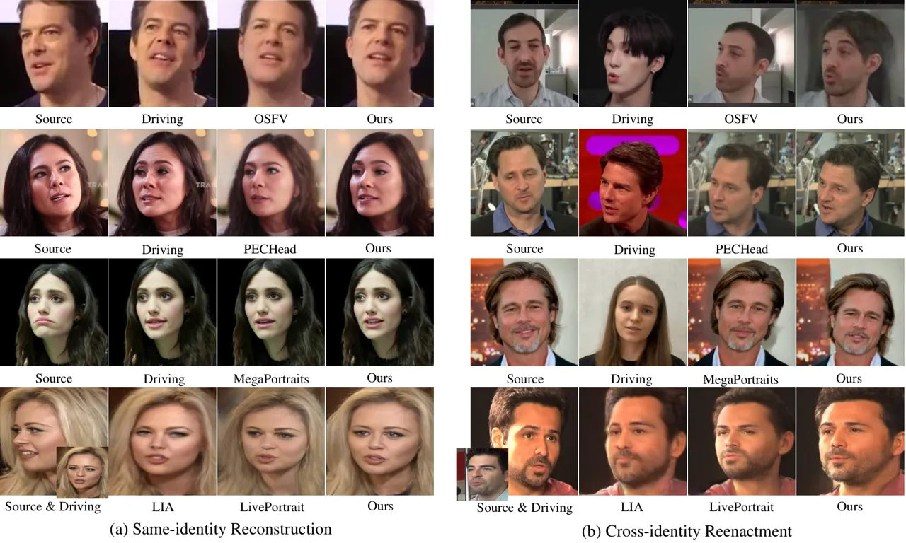

Figure 13: Qualitative comparison with more state-of-the-art approaches
for (a) same-identity reconstruction and (b) cross-identity reenactment
on VoxCeleb1 or examples from the corresponding papers or project pages
for closed-source methods (_i.e._, OSFV \[29\], PECHead \[9\], and
MegaPortraits \[6\]). Our method better mimics the driving motion and
preserves more facial details.

We also present quantitative comparison results for cross-identity
reenactment in Tab. 3. We use FID \[14\] for image quality evaluation,
Average Rotation Distance (ARD) for motion transfer evaluation
following \[25\], and cosine similarity (CSIM) for identity preservation
following \[12\]. Diffusion-based AniPortrait \[32\] and
Follow-Your-Emoji (FYE) \[19\] are trained on much larger-scale datasets
and are excluded from the comparison. Our method generally demonstrates
the highest overall performance, confirming its effectiveness.
LIA \[31\] is slightly better in image quality and identity
preservation, as it uses latent codes instead of keypoints as the motion
representation, which helps appearance preservation. However, its motion
transfer quality is much worse. We also provide a qualitative comparison
with LIA in Fig. 13 where our method mimics the driving motion better.
Although MRFA \[25\] can transfer motion well, its output frame quality
may be low and it may not preserve source identity effectively. Although
diffusion-based methods \[32, 19\] can achieve even better image quality
and identity preservation performance, they struggle to transfer motion
faithfully, which leads to undesirable visual quality.

Comparison with more state-of-the-art approaches. We additionally
provide comparisons with more state-of-the-art approaches, including an
open-source method (_i.e._, LivePortrait \[11\]) and several
closed-source methods (_i.e._, OSFV \[29\], PECHead \[9\], and
MegaPortraits \[6\]). The qualitative comparison in Fig. 13 highlights
the advantages of our method in the preservation of facial details and
expression transfer. We also provide a quantitative comparison with the
open-source LivePortrait \[11\] in Tab. 4. Although LivePortrait is
trained on significantly larger datasets and is unsuitable for a direct
fair comparison, our method can still outperform it on all metrics for
same-identity reconstruction.

| Method              | \# Training  | Same-identity Reconstruction |                   |                                    |                      |                    |                    | Cross-identity Reenactment |                   |                    |
| ------------------- | ------------ | ---------------------------- | ----------------- | ---------------------------------- | -------------------- | ------------------ | ------------------ | -------------------------- | ----------------- | ------------------ |
|                     | Video Frames | FID $`\downarrow`$           | PSNR $`\uparrow`$ | $`\mathcal{L}_{1}`$ $`\downarrow`$ | LPIPS $`\downarrow`$ | AKD $`\downarrow`$ | AED $`\downarrow`$ | FID $`\downarrow`$         | CSIM $`\uparrow`$ | ARD $`\downarrow`$ |
| LivePortrait \[11\] | 69M          | 48.11                        | 22.94             | 0.0484                             | 0.2213               | 1.5516             | 0.1602             | 75.95                      | 0.7260            | 1.3497             |
| Ours                | 4.3M         | 43.15                        | 25.30             | 0.0355                             | 0.1846               | 1.2039             | 0.1071             | 76.47                      | 0.6142            | 1.6234             |

Table 4: Quantitative comparison with LivePortrait \[11\] on VoxCeleb1.
LivePortrait, being trained on _significantly larger_ data, is
unsuitable for a direct comparison.

Inference speed. We evaluate the inference speed using an NVIDIA RTX
3090 and provide the results in Tab. 5. Our approach shows clear
advantages upon recent state-of-the-art methods \[25, 32, 19, 11\],
indicating its potential for real-time performance.

|                      | MRFA \[25\] | AniPortrait \[32\] | FYE \[19\] | LivePortrait \[11\] | Ours    |
| -------------------- | ----------- | ------------------ | ---------- | ------------------- | ------- |
| FLOPs $`\downarrow`$ | 403.05G     | 9.18T              | 15.04T     | 1.31T               | 352.91G |
| FPS $`\uparrow`$     | 12.41       | 0.36               | 0.39       | 11.28               | 15.13   |

Table 5: Inference speed comparison.

#### 7.2.3 Additional Ablation Study

Effect of the code allocation scheme. We propose a novel code allocation
scheme for motion and appearance codebooks that assigns different codes
to corresponding scales. This allows certain codes to be shared across
multiple scales, facilitating the transfer of information between them.
To assess the effect of our code allocation scheme, we conduct an
ablation study and present results in Tab. 6. We compare with two
alternative codebook splitting schemes: sharing all codes across all
scales and splitting the codes equally among the scales. As demonstrated
in Tab. 6, our code allocation scheme generally achieves the best
overall performance, confirming the superior performance of our code
allocation scheme.

| Method                      | FID $`\downarrow`$ | PSNR $`\uparrow`$ | $`\mathcal{L}_{1}`$ $`\downarrow`$ | LPIPS $`\downarrow`$ | AKD $`\downarrow`$ | AED $`\downarrow`$ |
| --------------------------- | ------------------ | ----------------- | ---------------------------------- | -------------------- | ------------------ | ------------------ |
| Sharing all codes           | 43.23              | 25.12             | 0.0359                             | 0.1860               | 1.2124             | 0.1065             |
| Splitting the codes equally | 42.52              | 25.20             | 0.0358                             | 0.1857               | 1.1893             | 0.1075             |
| Code Allocation (Ours)      | 43.15              | 25.30             | 0.0355                             | 0.1846               | 1.2039             | 0.1071             |

Table 6: Ablation study on the code allocation scheme.

Effect of the model design. To verify the source of our performance
improvement, we compare with a new “Baseline\*”, which has parameters
comparable to our full model, achieved by increasing the ResBlock
channel numbers of our image encoder and decoder. We present the results
in Tab. 7. Our method significantly improves upon “Baseline\*”. The
clear performance gap further confirms that the improvement comes from
our model design rather than the increased parameters, indicating the
effectiveness of our model design.

| Method     | \# Params (M) | FID $`\downarrow`$ | PSNR $`\uparrow`$ | $`\mathcal{L}_{1}`$ $`\downarrow`$ | LPIPS $`\downarrow`$ | AKD $`\downarrow`$ | AED $`\downarrow`$ |
| ---------- | ------------- | ------------------ | ----------------- | ---------------------------------- | -------------------- | ------------------ | ------------------ |
| Baseline\* | 82.2          | 48.09              | 21.64             | 0.0549                             | 0.2480               | 2.6798             | 0.2214             |
| Ours       | 82.2          | 43.15              | 25.30             | 0.0355                             | 0.1846               | 1.2039             | 0.1071             |

Table 7: Ablation study on the model design.

Codebook size. To assess how the codebook size affects the generation
speed and quality, we vary the number of codes in the codebooks to
achieve different codebook sizes and present results in Tab. 8. Larger
codebooks generally improve generation quality by providing sufficient
capacity to learn diverse motion and appearance codes, with only a
slight decrease in speed/memory performance. A small codebook of 256
also performs well, likely because codes are retrieved more frequently
during training, allowing for better optimization within the same
training iterations. However, its image quality remains limited.

| Number of Codes | FID $`\downarrow`$ | PSNR $`\uparrow`$ | $`\mathcal{L}_{1}`$ $`\downarrow`$ | LPIPS $`\downarrow`$ | AKD $`\downarrow`$ | AED $`\downarrow`$ | FLOPs (G) $`\downarrow`$ | FPS $`\uparrow`$ | Memory (M) $`\downarrow`$ |
| --------------- | ------------------ | ----------------- | ---------------------------------- | -------------------- | ------------------ | ------------------ | ------------------------ | ---------------- | ------------------------- |
| 256             | 47.50              | 25.18             | 0.0358                             | 0.1861               | 1.1970             | 0.1039             | 351.57                   | 15.60            | 6411                      |
| 512             | 46.62              | 25.11             | 0.0362                             | 0.1877               | 1.2190             | 0.1072             | 352.01                   | 15.47            | 6411                      |
| 1024 (Ours)     | 43.15              | 25.30             | 0.0355                             | 0.1846               | 1.2039             | 0.1071             | 352.91                   | 15.13            | 6413                      |

Table 8: Ablation study on the codebook size. We present the results of
different code numbers.

## 8 Limitation

A limitation of our method is the appearance leakage problem in
cross-identity reenactment, where the face in the generated video tends
to have a shape similar to that of the driving face rather than the
source face. This issue arises from the keypoint-based motion flow
estimator that we adopt to produce the initial coarse motion flow and
the driving keypoints for multi-scale motion codebook compensation.
Although this motion flow estimator is robust to non-facial motion, such
as hair and neck movement, by learning unsupervised keypoints on talking
heads, the keypoints also inherently model facial shapes, which leads to
the entanglement of motion and shape. Thus, appearance leakage is a
common issue for keypoint-based methods. Our method can effectively
alleviate this issue by demonstrating better appearance preservation
than other state-of-the-art keypoint-based approaches. As evidenced in
Tab. 3, we achieve the highest CSIM score among these approaches,
excluding LIA \[31\], which uses latent codes instead of keypoints for
motion representation. This issue can also be mitigated through relative
motion transfer \[24\], which is widely adopted by previous
methods \[16, 15, 25\].
