# Hallo3: Highly Dynamic and Realistic Portrait Image Animation with Video Diffusion Transformer

Jiahao Cui    Hui Li    Yun Zhan    Hanlin Shang    Kaihui Cheng    Yuqi
Ma    Shan Mu    Hang Zhou    Jingdong Wang    Siyu Zhu
Affiliation: Fudan University,   Baidu Inc,   Shanghai Academy of AI for
Science[https://fudan-generative-vision.github.io/hallo3](https://fudan-generative-vision.github.io/hallo3)

###### Abstract

Existing methodologies for animating portrait images face significant
challenges, particularly in handling non-frontal perspectives, rendering
dynamic objects around the portrait, and generating immersive, realistic
backgrounds. In this paper, we introduce the first application of a
pretrained transformer-based video generative model that demonstrates
strong generalization capabilities and generates highly dynamic,
realistic videos for portrait animation, effectively addressing these
challenges. The adoption of a new video backbone model makes previous
U-Net-based methods for identity maintenance, audio conditioning, and
video extrapolation inapplicable. To address this limitation, we design
an identity reference network consisting of a causal 3D VAE combined
with a stacked series of transformer layers, ensuring consistent facial
identity across video sequences. Additionally, we investigate various
speech audio conditioning and motion frame mechanisms to enable the
generation of continuous video driven by speech audio. Our method is
validated through experiments on benchmark and newly proposed wild
datasets, demonstrating substantial improvements over prior methods in
generating realistic portraits characterized by diverse orientations
within dynamic and immersive scenes.

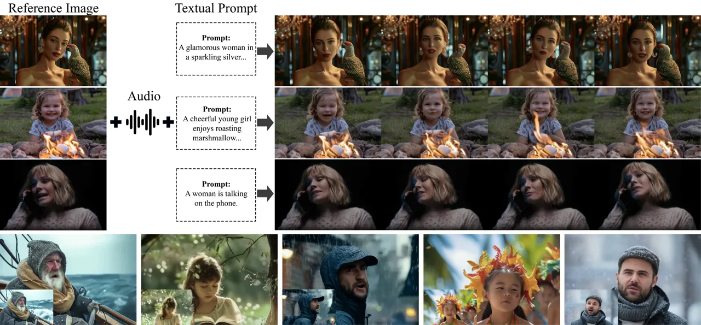

Figure 1: Demonstration of the proposed approach. Given a reference
image, an audio sequence, and a textual prompt, the method generates
animated portraits from frontal or different perspectives while
preserving the portrait identity over extended durations. Additionally,
it incorporates dynamic foreground and background elements, with
temporal consistency and high visual fidelity.

## 1 Introduction

Portrait image animation refers to the process of generating realistic
facial expressions, lip movements, and head poses based on portrait
images. This technique leverages various motion signals, including
audio, textual prompts, facial keypoints, and dense motion flow. As a
cross-disciplinary research task within the realms of computer vision
and computer graphics, this area has garnered increasing attention from
both academic and industrial communities. Furthermore, portrait image
animation has critical applications across several sectors, including
film and animation production, game development, social media content
creation, and online education and training.

In recent years, the field of portrait image animation has witnessed
rapid advancements. Early methodologies predominantly employed facial
landmarks—key points \[26, 35, 37\] on the face utilized for the
localization and representation of critical regions such as the mouth,
eyes, eyebrows, nose, and jawline. Additionally, these methods \[8, 23,
36\] incorporated 3D parametric models, notably the 3D Morphable Model
(3DMM) \[3\], which captures variability in human faces through a
statistical shape model integrated with a texture model. However, the
application of explicit approaches grounded in intermediate facial
representations is constrained by the accuracy of expression and head
pose reconstruction, as well as the richness and precision of the
resultant expressions. Simultaneously, significant advancements in
Generative Adversarial Networks (GANs) and diffusion models have notably
benefited portrait image animation. These advancements \[6, 14, 29, 31,
33\] enhance the high-resolution and high-quality generation of
realistic facial details, facilitate generalized character animation,
and enable long-term identity preservation. Recent contributions to the
field—including Live Portrait \[9\], which leverages GAN technology for
portrait animation with stitching and retargeting control, as well as
various end-to-end methods such as VASA-1 \[33\], EMO \[29\], and
Hallo \[32, 7\] employing diffusion models—exemplify these advancements.

Despite these improvements, existing methodologies encounter substantial
limitations. First, many current facial animation techniques emphasize
eye gaze, lip synchronization, and head posture while often depending on
reference portrait images that present a frontal, centered view of the
subject. This reliance presents challenges in handling profile,
overhead, or low-angle perspectives for portrait animation. Secondly,
accounting for significant accessories, such as holding a smartphone,
microphone, or wearing closely fitted objects, presents challenges in
generating realistic motion for the associated objects within video
sequences. Third, existing methods often assume static backgrounds,
undermining their ability to generate authentic video effects in dynamic
scenarios, such as those with campfires in the foreground or crowded
street scenes in the background.

Recent advancements in diffusion transformer-based video generation
models \[34, 19, 2, 15\] have addressed several challenges associated
with traditional video generation techniques, including issues of
realism, dynamic movement, and subject generalization. In this paper, we
present the first application of a pretrained DiT-based video generative
model to the task of portrait image animation. The introduction of this
new video backbone model renders previous U-Net-based methods for
identity maintenance, audio conditioning, and video extrapolation
impractical. We tackle these issues from three distinct perspectives.
(1) Identity preservation: We employ a 3D VAE in conjunction with a
stack of transformer layers as an identity reference network, enabling
the embedding and injection of identity information into the denoising
latent codes for self-attention. This facilitates accurate
representation and long-term preservation of the facial subject’s
identity. (2) Speech audio conditioning: We achieve high alignment
between speech audio—serving as motion control information—and facial
expression dynamics during training, which allows for precise control
during inference. We investigate the use of adaptive layer normalization
and cross-attention strategies, effectively integrating audio embeddings
through the latter. (3) Video extrapolation: Addressing the limitations
of the DiT model in generating contineous videos, which is constrained
to a maximum of several tens of frames, we propose a strategy for
long-duration video extrapolation. This approach uses motion frames as
conditional information, wherein the final frames of each generated
video serve as inputs for subsequent clip generation.

We validate our approach using benchmark datasets, including HTDF and
Celeb-V, demonstrating results comparable to previous methods that are
constrained to limited datasets characterized by frontal, centered
faces, static backgrounds, and defined expressions. Furthermore, our
method successfully generates dynamic foregrounds and backgrounds,
accommodating complex poses, such as profile views or interactions
involving devices like smartphones and microphones, yielding realistic
and smoothly animated motion, thereby addressing challenges that
previous methodologies have struggled to resolve effectively.

## 2 Related Work

Portrait Image Animation. Recent advancements in the domain of portrait
image animation have been significantly propelled by innovations in
audio-driven techniques. Notable frameworks, such as
LipSyncExpert \[20\] and SadTalker \[38\], have tackled challenges
related to facial synchronization and expression modulation, achieving
dynamic lip movements and coherent head motions. Concurrently,
DiffTalk \[25\] and VividTalk \[28\] have integrated latent diffusion
models, enhancing output quality while generalizing across diverse
identities without the necessity for extensive fine-tuning. Furthermore,
studies such as DreamTalk \[16\] and EMO \[29\] underscore the
importance of emotional expressiveness by showcasing the integration of
audio cues with facial dynamics. AniPortrait \[31\] and VASA \[33\]
propose methodologies that facilitate the generation of high-fidelity
animations, emphasizing temporal consistency along with effective
exploitation of static images and audio clips. In addition, recent
innovations like LivePortrait \[9\] and Loopy \[11\] focus on enhancing
computational efficiency while ensuring realism and fluid motion.
Furthermore, the works of Hallo \[32\] and Hallo2 \[7\] have made
significant progress in extending capabilities to facilitate
long-duration video synthesis and integrating adjustable semantic
inputs, thereby marking a step towards richer and more controllable
content generation. Nevertheless, existing facial animation techniques
still encounter limitations in addressing extreme facial poses,
accommodating background motion in dynamic environments, and
incorporating camera movements dictated by textual prompts.

Diffusion-Based Video Generation. Unet-based diffusion video generation
has made notable strides, exemplified by frameworks such as Make-A-Video
and MagicVideo \[40\]. Specifically, Make-A-Video \[27\] capitalizes on
pre-existing T2I models to enhance training efficiency without
necessitating paired text-video data, thereby achieving state-of-the-art
results across a variety of qualitative and quantitative metrics.
Simultaneously, MagicVideo \[40\] employs an innovative 3D U-Net
architecture to operate within a low-dimensional latent space, achieving
efficient video synthesis while significantly reducing computational
requirements. Building upon these foundational principles,
AnimateDiff \[10\] introduces a motion module that integrates seamlessly
with personalized T2I models, allowing for the generation of temporally
coherent animations without the need for model-specific adjustments.
Additionally, VideoComposer \[30\] enhances the controllability of video
synthesis by incorporating spatial, temporal, and textual conditions,
which facilitates improved inter-frame consistency. The development of
diffusion models continues with the advent of DiT-based approaches such
as CogVideoX \[34\] and Movie Gen \[19\]. CogVideoX employs a 3D
Variational Autoencoder to improve video fidelity and narrative
coherence, whereas Movie Gen establishes a robust foundation for
high-quality video generation complemented by advanced editing
capabilities. In the present study, we adopt the DiT diffusion
formulation to optimize the generalization capabilities of the generated
video.

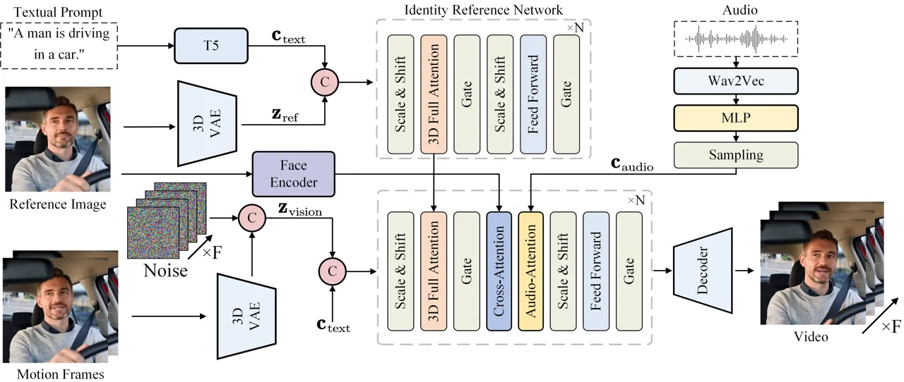

Figure 2: The overview of the proposed method. Specifically, the method
takes a reference image, an audio sequence, and a textual prompt as
inputs to generate a video output with temporal consistency and high
visual fidelity. We leverage the casual 3D VAE, T5, and Wav2Vec models
to process the visual, textual, and audio features, respectively. The
Identity Reference Network extracts identity features from the input
reference image and textual prompt, enabling controllable animation
while preserving the subject’s appearance. The audio encoder generates
motion information for lip synchronization, while the face encoder
extracts facial features to maintain consistency in facial expressions.
The 3D Full Attention and Audio-Attention Modules combine identity and
motion data within a denoising network, producing high-fidelity,
temporally consistent, and controllable animated videos.

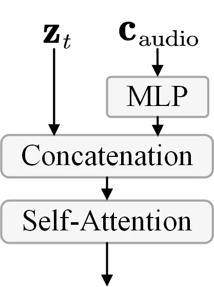

(a)

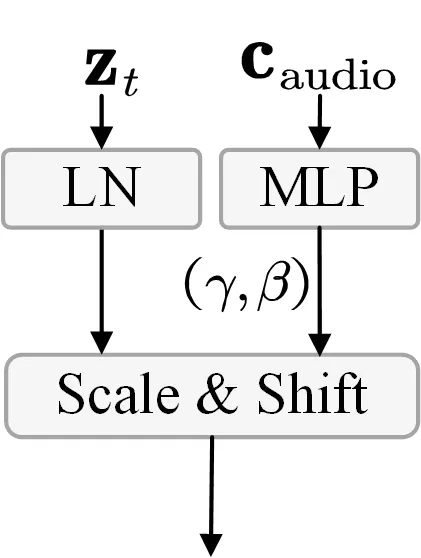

(b)

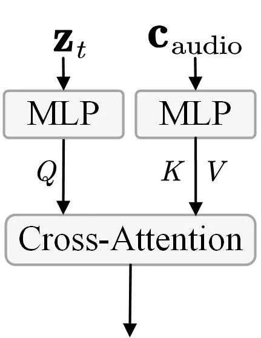

(c)

Figure 3: Different strategies of audio conditioning. (a)
self-attention; (b) adaptive norm; (c) cross-attention.

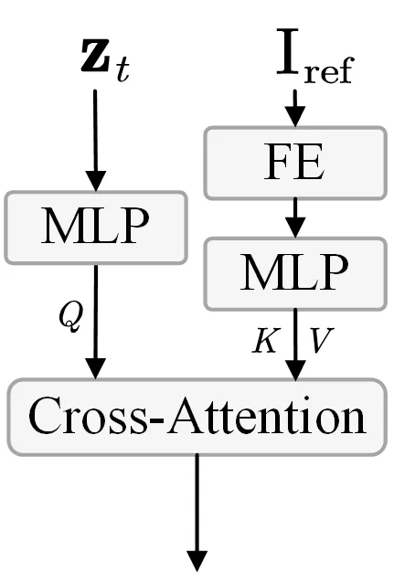

(d)

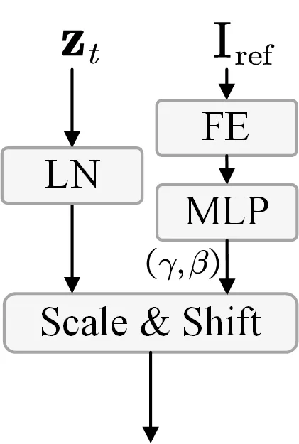

(e)

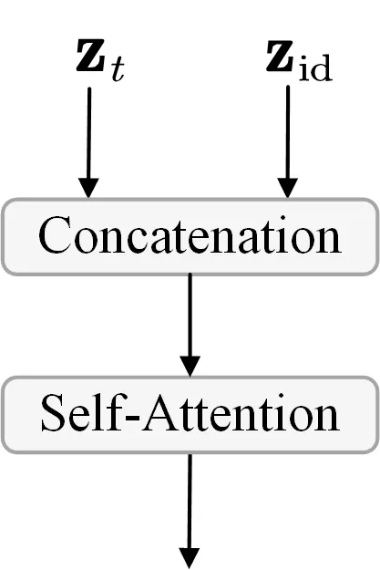

(f)

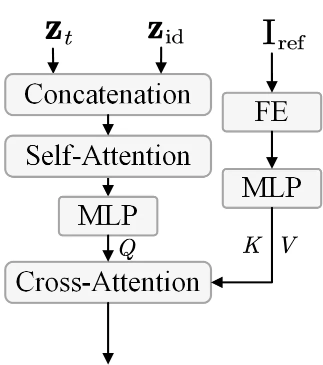

(g)

Figure 4: Different strategies of identity conditioning. FE refers to
the face encoder. cross-attention demonstrates the best performance. (a)
face attention; (b) face adaptive norm; (c) identity reference network;
(d) face attention and identity reference network.

## 3 Methodology

This methodology section systematically outlines the approaches employed
in our study. Section 3.1 describes the baseline transformer diffusion
network, detailing its architecture and functionality. Section 3.2
focuses on the integration of speech audio conditions via a
cross-attention mechanism. Section 3.3 discusses the implementation of
the identity reference network, which is crucial for preserving facial
identity coherence throughout extended video sequences. Section 3.4
reviews the training and inference procedures used for the transformer
diffusion network. Finally, Section 3.5 details the comprehensive
strategies for data sourcing and preprocessing.

### 3.1 Baseline Transformer Diffusion Network

Baseline Network. The CogVideoX model \[34\] serves as the foundational
architecture for our transformer diffusion network, employing a 3D VAE
for the compression of video data. In this framework, latent variables
are concatenated and reshaped into a sequential format, denoted as
$`\mathbf{z}_{t}`$. Concurrently, the model utilizes the T5
architecture \[21\] to encode textual inputs into embeddings,
represented as $`\mathbf{c}_{\text{text}}`$. The combined sequences of
video latent representations $`\mathbf{z}_{t}`$ and textual embeddings
$`\mathbf{c}_{\text{text}}`$ are subsequently processed through an
expert transformer network. To address discrepancies in feature space
between text and video, we implement expert adaptive layer normalization
techniques, which facilitate the effective utilization of temporal
information and ensure robust alignment between visual and semantic
data. Following this integration, a repair mechanism is applied to
restore the original latent variable, after which the output is decoded
through the 3D causal VAE decoder to reconstruct the video. Furthermore,
the incorporation of 3D Rotational Positional Encoding (3D RoPE) \[34\]
enhances the model’s capacity to capture inter-frame relationships
across the temporal dimension, thereby establishing long-range
dependencies within the video framework.

Conditioning in Diffusion Transformer. In addition to the textual prompt
$`\mathbf{c}_{\text{text}}`$, we introduce two supplementary conditions:
the speech audio condition $`\mathbf{c}_{\text{audio}}`$ and the
identity appearance condition $`\mathbf{c}_{\text{id}}`$.

Within diffusion transformers, four primary conditioning mechanisms are
identified: in-context conditioning, cross-attention, adaptive layer
normalization (adaLN), and adaLN-zero \[17\]. Our investigation
primarily focuses on cross-attention and adaptive layer normalization
(adaLN). Cross-attention enhances the model’s focus on conditional
information by treating condition embeddings as keys and values, while
latent representations serve as queries. Although adaLN is effective in
simpler conditioning scenarios, it may not be optimal for more complex
conditional embeddings that incorporate richer semantic details, such as
sequential speech audio. Relevant comparative analyses will be
elaborated upon in the experimental section.

### 3.2 Audio-Driven Transformer Diffusion

Speech Audio Embedding. To extract salient audio features for our
proposed model, we utilize the wav2vec framework developed by Schneider
et al. \[24\]. The audio representation is defined as
$`\mathbf{c}_{\text{audio}}`$. Specifically, we concatenate the audio
embeddings generated by the final twelve layers of the wav2vec network,
resulting in a comprehensive semantic representation capable of
capturing various audio hierarchies. This concatenation emphasizes the
significance of phonetic elements, such as pronunciation and prosody,
which are crucial as driving signals for character generation. To
transform the audio embeddings obtained from the pretrained model into
frame-specific representations, we apply three successive linear
transformation layers, mathematically expressed as:
$`\mathbf{c}_{\text{audio}}^{(f)}=\mathcal{L}_{3}\left(\mathcal{L}_{2}\left(\mathcal{L}_{1}\left(\mathbf{c}_{\text{audio}}\right)\right)\right)`$,
where $`\mathcal{L}_{1}`$, $`\mathcal{L}_{2}`$, and $`\mathcal{L}_{3}`$
represent the respective linear transformation functions. This
systematic approach ensures that the resulting frame-specific
representations effectively encapsulate the nuanced audio features
essential for the performance of our model.

Speech Audio Conditioning. We explore three fusion
strategies—self-attention, adaptive normalization, and
cross-attention—as illustrated in Figure 4 to integrate audio condition
into the DiT-based video generation model. Our experiments show that the
cross-attention strategy delivers the best performance in our model. For
more details, please refer to Section 4.3.

Following this, we integrate audio attention layers after each
face-attention layer within the denoising network, employing a
cross-attention mechanism that facilitates interaction between the
latent encodings and the audio embeddings. Specifically, within the DiT
block, the motion patches function as keys and values in the
cross-attention computation with the hidden states $`\mathbf{z}_{t}`$:
$`\mathbf{z}_{t}=\text{CrossAttention}(\mathbf{z}_{t},\mathbf{c}_{\text{audio}}^{(f)})`$.
This methodology leverages the conditional information from the audio
embeddings to enhance the coherence and relevance of the generated
outputs, ensuring that the model effectively captures the intricacies of
the audio signals that drive character generation.

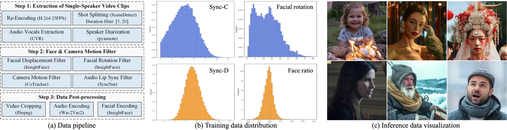

Figure 5: llustration of the dataset, including the flow of data
processing, data distribution across different metric, and the
visualization of inference data.

### 3.3 Identity Consistent Transformer Diffusion

Identity Reference Network. Diffusion transformer-based video generation
models encounter significant challenges in maintaining facial identity
coherence, particularly as the length of the generated video increases.
While incorporating speech audio embeddings as conditional features can
establish a correspondence between audio speech and facial movements,
prolonged generation often leads to rapid degradation of facial identity
characteristics.

To address this issue, we introduce a control condition within the
existing diffusion transformer architecture to ensure long-term
consistency of facial identity appearance. We explore four strategies
for appearance conditioning: 1) Face attention, where identity features
are encoded by the face encoder and combined with a cross-attention
module; 2) Face adaptive norm, which integrates features from the face
encoder with an adaptive layer normalization technique; 3) Identity
reference network, where identity features are captured by a 3D VAE and
combined with some transformer layers; and 4) Face attention and
Identity reference network, which encodes identity features using both
the face encoder and 3D VAE, combining them with self-attention and
cross-attention. Our experiments show that the combination with Face
attention and Identity reference net achieves the best performance in
our model. For further details, please refer to Section 4.3.

We treat a reference image as a single frame and input it into a causal
3D VAE to obtain latent features, which are then processed through a
reference network consisting of 42 transformer layers. Mathematically,
if $`\mathbf{I}_{\text{ref}}`$ denotes the reference image, the encoder
function of the 3D VAE is defined as:
$`\mathbf{z}_{\text{id}}=\mathcal{E}_{3D}(\mathbf{I}_{\text{ref}})`$,
where $`\mathbf{z}_{\text{id}}`$ represents the latent features
associated with the reference image.

During the operation of the reference network, we extract vision tokens
from the input of the 3D full attention mechanism for each transformer
layer, which serve as reference features $`\mathbf{z}_{\text{id}}`$.
These features are integrated into corresponding layers of the denoising
network to enhance its capability, expressed as:
$`\mathbf{z}_{t,\text{enhanced}}=\text{SelfAttention}(\mathbf{z}_{t},\mathbf{z}_{\text{id}}),`$
where $`\mathbf{z}_{t}`$ is the latent representation at time step
$`t`$. Given that both the reference network and denoising network
leverage the same causal 3D VAE with identical weights and comprise the
same number of transformer layers (42 layers in our implementation), the
visual features generated from both networks maintain semantic and scale
consistency. This consistency allows the reference network’s features to
incorporate the appearance characteristics of facial identity from the
reference image while minimizing disruption to the original feature
representations of the denoising network, thereby reinforcing the
model’s capacity to generate coherent and identity-consistent facial
animations across longer video sequences.

Temporal Motion Frames. To facilitate long video inference, we introduce
the last $`n`$ frames of the previously generated video, referred to as
motion frames, as additional conditions. Given a generated video length
of $`L`$ and the corresponding latent representation of $`l`$ frames, we
denote the motion frames as $`N`$. The motion frames are processed
through the 3D VAE to obtain $`n`$ frames of latent codes. We apply zero
padding to the subsequent $`(l-n)`$ frames and concatenate them with
$`l`$ frames of Gaussian noise. This concatenated representation is then
patchified to yield vision tokens, which are subsequently input into the
denoising network. By repeatedly utilizing motion frames, we achieve
temporally consistent long video inference.

### 3.4 Training and Inference

Training. The training process consists of two phases: (1) In the first
phase, we train the model to output videos with identity consistency.
The parameters of the 3D VAE and face image encoder are fixed, while the
parameters of the 3D full attention in the reference network, composed
of a series of transformer blocks, and those in the denoising network,
including the 3D full attention and face attention, are updated through
training. The model’s input comprises a randomly sampled reference image
from the training video, a textual prompt, and the face embedding
obtained from the face encoder, with the output being a sequence of 49
frames of video. (2) In the second phase, we train the model for
audio-driven video generation. We insert audio attention modules into
each transformer block of the denoising network, fixing the parameters
of the other components and updating only those of the audio attention
modules. The model’s input consists of the reference image, input audio,
and textual prompt, yielding a sequence of 49 frames of video.

Inference. During inference, the model receives a reference image, a
segment of driving audio, a textual prompt, and motion frames as inputs.
The model then generates a video that exhibits identity consistency and
lip synchronization based on the driving audio. To produce long videos,
we utilize the last two frames of the preceding video as motion frames,
thereby achieving temporally consistent video generation.

|                    |                   |                   |                    |                      |
| ------------------ | ----------------- | ----------------- | ------------------ | -------------------- |
|                    | FID$`\downarrow`$ | FVD$`\downarrow`$ | Sync-C$`\uparrow`$ | Sync-D$`\downarrow`$ |
| SadTalker \[37\]   | 22.340            | 203.860           | 7.885              | 7.545                |
| DreamTalk \[16\]   | 78.147            | 790.660           | 6.376              | 8.364                |
| AniPortrait \[31\] | 26.561            | 234.666           | 4.015              | 10.548               |
| Hallo \[32\]       | 20.545            | 173.497           | 7.750              | 7.659                |
| Ours               | 20.359            | 160.838           | 7.252              | 8.106                |
| Real video         | \-                | \-                | 8.700              | 6.597                |

Table 1: Comparison with the other methods on HDTF dataset.

|                    |                   |                   |                    |                      |                     |
| ------------------ | ----------------- | ----------------- | ------------------ | -------------------- | ------------------- |
|                    | FID$`\downarrow`$ | FVD$`\downarrow`$ | Sync-C$`\uparrow`$ | Sync-D$`\downarrow`$ | E-FID$`\downarrow`$ |
| SadTalker \[37\]   | 50.015            | 471.163           | 6.922              | 7.921                | 95.194              |
| DreamTalk \[16\]   | 109.011           | 988.539           | 5.709              | 8.743                | 153.450             |
| AniPortrait \[31\] | 46.915            | 477.179           | 2.853              | 11.709               | 88.986              |
| Hallo \[32\]       | 44.578            | 377.117           | 7.191              | 7.984                | 78.495              |
| Ours               | 43.271            | 355.272           | 6.527              | 9.113                | 71.210              |
| Real video         | \-                | \-                | 7.372              | 7.518                | \-                  |

Table 2: Comparison with other methods on Celeb-V dataset.

|                    |                    |                      |                             |                                |                           |                              |
| ------------------ | ------------------ | -------------------- | --------------------------- | ------------------------------ | ------------------------- | ---------------------------- |
|                    | Sync-C$`\uparrow`$ | Sync-D$`\downarrow`$ | Subject Dynamic$`\uparrow`$ | Background Dynamic$`\uparrow`$ | Subject FVD$`\downarrow`$ | Background FVD$`\downarrow`$ |
| SadTalker \[37\]   | 3.845              | 10.378               | 2.953                       | 0.220                          | 470.377                   | 313.758                      |
| DreamTalk \[16\]   | 4.498              | 11.005               | 6.958                       | 1.806                          | 835.480                   | 744.177                      |
| AniPortrait \[31\] | 1.685              | 12.025               | 3.351                       | 1.769                          | 473.173                   | 302.716                      |
| Hallo \[32\]       | 4.654              | 10.202               | 5.268                       | 1.272                          | 394.627                   | 291.052                      |
| Ours               | 6.154              | 8.574                | 13.286                      | 4.481                          | 359.493                   | 248.283                      |

Table 3: Comparison with other methods on our proposed wild dataset.

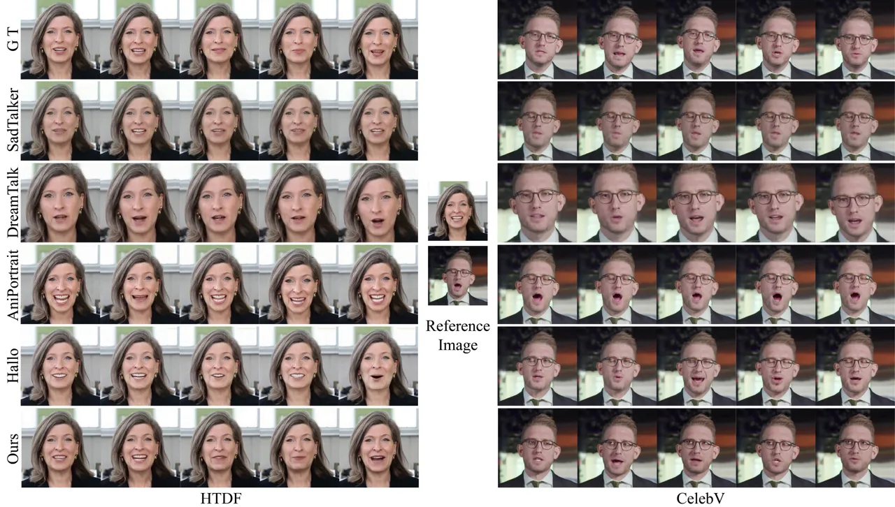

Figure 6: Qualitative comparison on the HTDF (left) and CelebV (right)
data-set.

### 3.5 Dataset

In this section, we will give a detailed introduction of our data
curation, including data sources, filtering strategy and data
statistics. Figure 5 shows the data pipeline and the statistical
analysis of the final data.

Data Sources The training data used in this work is prepared from three
distinct sources to ensure diversity and generalization. Specifically,
the sources are: (1) HDTF dataset \[39\], which contains 8 hours of raw
video footage; (2) YouTube data, which consists of 1,200 hours of public
raw videos; (3) a large scale movie dataset, which contains film videos
of 2,346 hours. Our dataset contains a large scale of human identities
and, however, we find that YouTube and movie dataset contains a large
amount of noised data. Therefore, we design a data curation pipeline as
follows to construct a high-quality and diverse talking dataset, as
shown in Figure 5a.

Video Filtering. During the data pre-processing phase, we implement a
series of meticulous filtering steps to ensure the quality and
applicability of the dataset. The workflow includes three stages:
extraction of single-speaker, motion filter and post-processing.
Firstly, we select video of single-speaker. This stage aims to clean the
video content to solve camera shot, background noise, etc, using
existing tools \[18, 4\]. After that, we apply several filtering
techniques to ensure the quality of head motion, head pose, camera
motion, etc \[13, 12, 5\]. In this stage, we compute all metric scores
for each clip, therefore, we can flexibly adjust data screening
strategies to satisfy different data requirement of our multiple
training stages or strategies. Finally, based on the facial positions
detected in previous steps, we crop the videos to a 3:2 aspect ratio to
meet the model’s input requirements. We then select a random frame from
each video and use InsightFace \[22\] to encode the face into
embeddings, providing essential facial feature information for the
model. Additionally, we extract the audio from the videos and encode it
into embeddings using Wav2Vec2 model \[1\], facilitating the
incorporation of audio conditions during model training.

Data Statistics. Following the data cleaning and filtering processes, we
conducted a detailed analysis of the final dataset to assess its quality
and suitability for the intended modeling tasks. Finally, our training
data contains about 134 hours training data, including 6 hours of
high-quality data from HDTF dataset, 72 hours YouTube videos, and 56
hours movie videos. Figure 5b also shows other statistics, such as Lip
Sync score (Sync-C and Sync-D), face rotation, Face ratio (the ratio of
face height to video height).

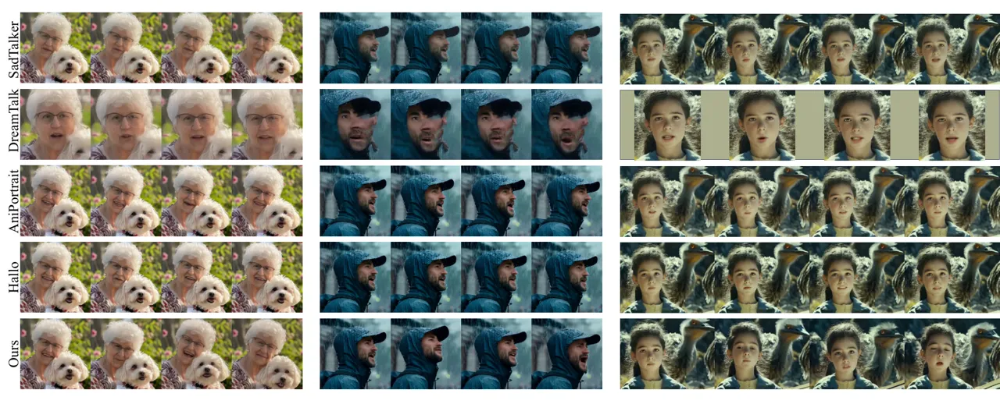

Figure 7: Complex facial identity with dynamic accessories subjects and
different pose orientation.

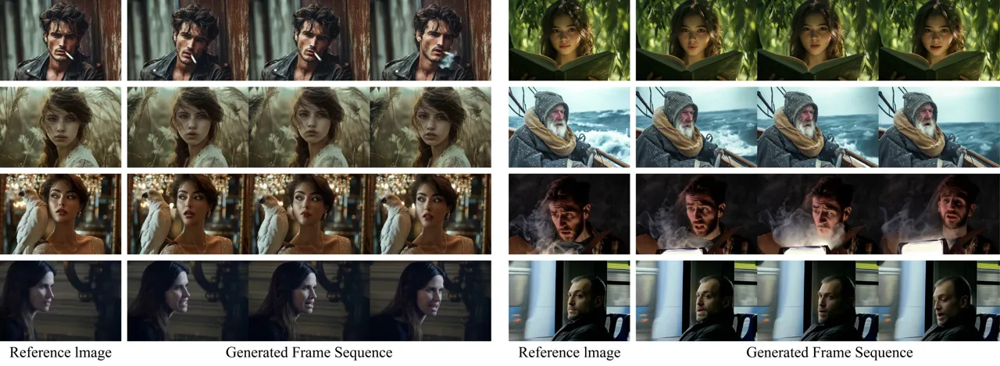

Figure 8: Complex scenes with dynamic foreground or background and
various head poses.

## 4 Experiment

### 4.1 Experimental Setups

Implementation. The model was trained using 64 NVIDIA A100 GPUs. In
addition to training, all experiments were conducted on a GPU server
equipped with 8 NVIDIA A100 GPUs. The first and second stages of the
model were trained 20,000 steps respectively. During training, the batch
size of each GPU was 1, and the learning rate was set to 1e-5. The
resolution of the training video is 480 x 720, and it can generate a
video with 49 frames at a time. In the training process, the audio
embedding is dropped with a probability of 0.05, and the motion frames
are randomly masked with a probability of 0.25.

### 4.2 Comparison with State-of-the-art

Comparison on HDTF and Celeb-V Dataset. As shown in Table 3 and  3, our
method achieves best results on FID, FVD on both datasets. Although our
approach shows some disparity compared to the state-of-the-art (SOTA) in
lip synchronization, it still demonstrates promising results as
illustrated in Figure 6. This is because, to generate animated portraits
from different perspectives, our training data primarily consists of
talking videos with significant head and body movements, as well as
diverse dynamic scenes, unlike static scenes with minimal motion. While
this may lead to some performance degradation on lip synchronization, it
better reflects realistic application scenarios.

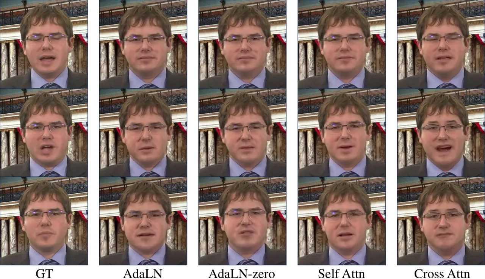

Figure 9: Qualitative comparison of different strategies for audio
conditioning.

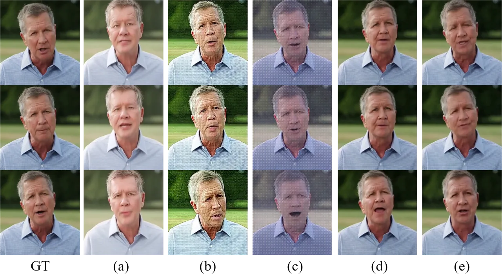

Figure 10: Qualitative comparison of different strategies for identity
conditioning. The serial numbers correspond to those listed in Table 5.

Comparison on Wild Dataset. To effectively demonstrate the performance
of the general talking portrait video generation, we carefully collect
34 representative cases for evaluation. This dataset consists of
portrait images with various head proportions, head poses, static and
dynamic scenes and complex headwears and clothing. To achieve
comprehensive assessment, we evaluate the performance on lip
synchronization (Sync-C and Sync-D), motion strength (subject and
background dynamic degree) and video quality (subject and background
FVD). As shown in Table 3, our method generates videos with largest head
and background dynamic degree (13.286 and 4.481) while keeping lip
synchronization of highest accuracy.

Figure 7 provides a qualitative comparison of different portrait methods
on a “wild” dataset. The results reveal that other methods struggle to
animate side-face portrait images, often resulting in static poses or
facial distortions. Additionally, these methods tend to focus solely on
animating the face, overlooking interactions with other objects in the
foreground—such as the dog next to the elderly, or the dynamic movement
of the background—like the ostrich behind the girl. In contrast, as
shown in Figure 8 our method produces realistic portraits with diverse
orientations and complex foreground and background scenes.

|                        |                   |                   |                    |                      |
| ---------------------- | ----------------- | ----------------- | ------------------ | -------------------- |
| Audio Injection Method | FID$`\downarrow`$ | FVD$`\downarrow`$ | Sync-C$`\uparrow`$ | Sync-D$`\downarrow`$ |
| AdaLN                  | 24.159            | 264.331           | 1.374              | 13.524               |
| AdaLN-zero             | 24.029            | 276.403           | 1.398              | 13.553               |
| Self Attn.             | 24.748            | 270.101           | 1.345              | 13.456               |
| Cross Attn.(Ours)      | 23.458            | 242.602           | 4.601              | 10.416               |

Table 4: Comparison on the different strategy of audio conditioning.

|                                                   |                   |                   |                    |                      |                                 |
| ------------------------------------------------- | ----------------- | ----------------- | ------------------ | -------------------- | ------------------------------- |
| Identity Injection Method                         | FID$`\downarrow`$ | FVD$`\downarrow`$ | Sync-C$`\uparrow`$ | Sync-D$`\downarrow`$ | Subject consistency$`\uparrow`$ |
| (a) No identity condition                         | 32.304            | 371.820           | 3.183              | 11.732               | 0.977                           |
| (b) Face attention                                | 57.541            | 740.536           | 4.042              | 10.682               | 0.974                           |
| (c) Face adaptive norm                            | 150.720           | 1587.395          | 3.822              | 12.324               | 0.904                           |
| (d) Identity reference network                    | 28.789            | 291.863           | 4.553              | 10.317               | 0.984                           |
| (e) Face attention and Identity reference network | 23.458            | 242.602           | 4.601              | 10.416               | 0.988                           |

Table 5: Comparison of different identity injection method. “No identity
condition” refers to the absence of any conditioning related to
identity; “Face attention” and “Face adaptive norm” involve
incorporating face embeddings using self-attention and adaptive layer
normalization, respectively. “Identity reference network” refers to the
introduction of identity features using a reference network.

### 4.3 Ablation Study and Discussion

Audio Conditioning. Table 4 and Figure 10 illustrate the effects of
various strategies for incorporating audio conditioning. The results
demonstrate that using cross-attention to integrate audio improves lip
synchronization by enhancing the local alignment between visual and
audio features, particularly around the lips. This is evident from the
improvements in Sync-C and Sync-D, and it also contributes to a degree
of enhancement in video quality.

Identity Reference Network. Table 5 and Figure 10 evaluate different
identity conditioning strategies. The results indicate that without an
identity condition, the model fails to preserve the portrait appearance.
When using face embedding alone, the model introduces blur and
distortion, as it focuses solely on facial features and disrupts the
global visual context. To address this, we introduce an identity
reference network to preserve global features while making facial motion
more controllable through identity-based facial embeddings. Thus, the
proposed method achieves a lower FID of 23.458 and FVD of 242.602, while
maintaining lip synchronization.

Temporal Motion Frames. Table 6 presents an analysis of varying temporal
motion frames. One motion frame achieves the highest Sync-C score
(6.889) and the lowest Sync-D score (8.695), indicating substantial lip
synchronization.

|                     |                   |                   |                    |                      |
| ------------------- | ----------------- | ----------------- | ------------------ | -------------------- |
| Motion Frame Number | FID$`\downarrow`$ | FVD$`\downarrow`$ | Sync-C$`\uparrow`$ | Sync-D$`\downarrow`$ |
| n = 1               | 24.040            | 242.708           | 6.889              | 8.695                |
| n = 2               | 23.458            | 242.602           | 4.601              | 10.416               |
| n = 4               | 24.459            | 269.904           | 5.109              | 10.489               |
| n = 8               | 27.303            | 265.396           | 5.114              | 10.464               |

Table 6: Ablation on the number of motion frames.

## 5 Conclusion

This paper introduces advancements in portrait image animation utilizing
the enhanced capabilities of a DiT-based diffusion model. By integrating
audio conditioning through cross-attention mechanisms, our approach
effectively captures the intricate relationship between audio signals
and facial expressions, achieving substantial lip synchronization. To
preserve facial identity across video sequences, we incorporate an
identity reference network. Additionally, we utilize motion frames to
enable the model to generate long-duration video extrapolations. Our
model produces animated portraits from diverse perspectives, seamlessly
blending dynamic foreground and background elements while maintaining
temporal consistency and high fidelity.

#### Acknowledgements.

This project is sponsored by Natural Science Foundation of Shanghai
under Grant No. 24ZR1407200 and Shanghai Oriental Talents Project under
Grant No. QNKJ2024060.

## References

- \[1\] Alexei Baevski, Yuhao Zhou, Abdelrahman Mohamed, and Michael
  Auli. wav2vec 2.0: A framework for self-supervised learning of speech
  representations. Advances in neural information processing systems,
  33:12449–12460, 2020.
- \[2\] Fan Bao, Chendong Xiang, Gang Yue, Guande He, Hongzhou Zhu,
  Kaiwen Zheng, Min Zhao, Shilong Liu, Yaole Wang, and Jun Zhu. Vidu: a
  highly consistent, dynamic and skilled text-to-video generator with
  diffusion models. arXiv preprint arXiv:2405.04233, 2024.
- \[3\] Volker Blanz and Thomas Vetter. Face recognition based on
  fitting a 3d morphable model. IEEE Transactions on pattern analysis
  and machine intelligence, 25(9):1063–1074, 2003.
- \[4\] Hervé Bredin. pyannote.audio 2.1 speaker diarization pipeline:
  principle, benchmark, and recipe. In Proc. INTERSPEECH 2023, 2023.
- \[5\] J. S. Chung and A. Zisserman. Out of time: automated lip sync in
  the wild. In Workshop on Multi-view Lip-reading, ACCV, 2016.
- \[6\] Enric Corona, Andrei Zanfir, Eduard Gabriel Bazavan, Nikos
  Kolotouros, Thiemo Alldieck, and Cristian Sminchisescu. Vlogger:
  Multimodal diffusion for embodied avatar synthesis. arXiv preprint
  arXiv:2403.08764, 2024.
- \[7\] Jiahao Cui, Hui Li, Yao Yao, Hao Zhu, Hanlin Shang, Kaihui
  Cheng, Hang Zhou, Siyu Zhu, and Jingdong Wang. Hallo2: Long-duration
  and high-resolution audio-driven portrait image animation. arXiv
  preprint arXiv:2410.07718, 2024.
- \[8\] Yue Gao, Yuan Zhou, Jinglu Wang, Xiao Li, Xiang Ming, and Yan
  Lu. High-fidelity and freely controllable talking head video
  generation. In Proceedings of the IEEE/CVF Conference on Computer
  Vision and Pattern Recognition (CVPR), pages 5609–5619, 2023.
- \[9\] Jianzhu Guo, Dingyun Zhang, Xiaoqiang Liu, Zhizhou Zhong, Yuan
  Zhang, Pengfei Wan, and Di Zhang. Liveportrait: Efficient portrait
  animation with stitching and retargeting control. arXiv preprint
  arXiv:2407.03168, 2024.
- \[10\] Yuwei Guo, Ceyuan Yang, Anyi Rao, Yaohui Wang, Yu Qiao, Dahua
  Lin, and Bo Dai. Animatediff: Animate your personalized text-to-image
  diffusion models without specific tuning. arXiv preprint
  arXiv:2307.04725, 2023.
- \[11\] Jianwen Jiang, Chao Liang, Jiaqi Yang, Gaojie Lin, Tianyun
  Zhong, and Yanbo Zheng. Loopy: Taming audio-driven portrait avatar
  with long-term motion dependency. arXiv preprint
  arXiv:2409.02634, 2024.
- \[12\] Nikita Karaev, Iurii Makarov, Jianyuan Wang, Natalia Neverova,
  Andrea Vedaldi, and Christian Rupprecht. Cotracker3: Simpler and
  better point tracking by pseudo-labelling real videos. In Proc.
  arXiv:2410.11831, 2024.
- \[13\] Nikita Karaev, Ignacio Rocco, Benjamin Graham, Natalia
  Neverova, Andrea Vedaldi, and Christian Rupprecht. Cotracker: It is
  better to track together. In Proc. ECCV, 2024.
- \[14\] Tao Liu, Feilong Chen, Shuai Fan, Chenpeng Du, Qi Chen, Xie
  Chen, and Kai Yu. Anitalker: Animate vivid and diverse talking faces
  through identity-decoupled facial motion encoding. arXiv preprint
  arXiv:2405.03121, 2024.
- \[15\] Yixin Liu, Kai Zhang, Yuan Li, Zhiling Yan, Chujie Gao, Ruoxi
  Chen, Zhengqing Yuan, Yue Huang, Hanchi Sun, Jianfeng Gao, et al.
  Sora: A review on background, technology, limitations, and
  opportunities of large vision models. arXiv preprint
  arXiv:2402.17177, 2024.
- \[16\] Yifeng Ma, Shiwei Zhang, Jiayu Wang, Xiang Wang, Yingya Zhang,
  and Zhidong Deng. Dreamtalk: When expressive talking head generation
  meets diffusion probabilistic models. arXiv preprint
  arXiv:2312.09767, 2023.
- \[17\] William Peebles and Saining Xie. Scalable diffusion models with
  transformers. In Proceedings of the IEEE/CVF International Conference
  on Computer Vision (ICCV), pages 4195–4205, 2023.
- \[18\] Alexis Plaquet and Hervé Bredin. Powerset multi-class cross
  entropy loss for neural speaker diarization. In Proc. INTERSPEECH
  2023, 2023.
- \[19\] Adam Polyak, Amit Zohar, Andrew Brown, Andros Tjandra, Animesh
  Sinha, Ann Lee, Apoorv Vyas, Bowen Shi, Chih-Yao Ma, Ching-Yao Chuang,
  et al. Movie gen: A cast of media foundation models. arXiv preprint
  arXiv:2410.13720, 2024.
- \[20\] KR Prajwal, Rudrabha Mukhopadhyay, Vinay P Namboodiri, and CV
  Jawahar. A lip sync expert is all you need for speech to lip
  generation in the wild. In Proceedings of the 28th ACM international
  conference on multimedia (ACM MM), pages 484–492, 2020.
- \[21\] Colin Raffel, Noam Shazeer, Adam Roberts, Katherine Lee, Sharan
  Narang, Michael Matena, Yanqi Zhou, Wei Li, and Peter J. Liu.
  Exploring the limits of transfer learning with a unified text-to-text
  transformer, 2023.
- \[22\] Xingyu Ren, Alexandros Lattas, Baris Gecer, Jiankang Deng, Chao
  Ma, and Xiaokang Yang. Facial geometric detail recovery via implicit
  representation. In 2023 IEEE 17th International Conference on
  Automatic Face and Gesture Recognition (FG), 2023.
- \[23\] Yurui Ren, Ge Li, Yuanqi Chen, Thomas H Li, and Shan Liu.
  Pirenderer: Controllable portrait image generation via semantic neural
  rendering. In Proceedings of the IEEE/CVF International Conference on
  Computer Vision (ICCV), pages 13759–13768, 2021.
- \[24\] Steffen Schneider, Alexei Baevski, Ronan Collobert, and Michael
  Auli. wav2vec: Unsupervised pre-training for speech recognition. arXiv
  preprint arXiv:1904.05862, 2019.
- \[25\] Shuai Shen, Wenliang Zhao, Zibin Meng, Wanhua Li, Zheng Zhu,
  Jie Zhou, and Jiwen Lu. Difftalk: Crafting diffusion models for
  generalized audio-driven portraits animation. In Proceedings of the
  IEEE/CVF Conference on Computer Vision and Pattern Recognition, pages
  1982–1991, 2023.
- \[26\] Aliaksandr Siarohin, Stéphane Lathuilière, Sergey Tulyakov,
  Elisa Ricci, and Nicu Sebe. First order motion model for image
  animation. Advances in Neural Information Processing Systems
  (NeurIPS), 32, 2019.
- \[27\] Uriel Singer, Adam Polyak, Thomas Hayes, Xi Yin, Jie An,
  Songyang Zhang, Qiyuan Hu, Harry Yang, Oron Ashual, Oran Gafni, et al.
  Make-a-video: Text-to-video generation without text-video data. arXiv
  preprint arXiv:2209.14792, 2022.
- \[28\] Xusen Sun, Longhao Zhang, Hao Zhu, Peng Zhang, Bang Zhang,
  Xinya Ji, Kangneng Zhou, Daiheng Gao, Liefeng Bo, and Xun Cao.
  Vividtalk: One-shot audio-driven talking head generation based on 3d
  hybrid prior. arXiv preprint arXiv:2312.01841, 2023.
- \[29\] Linrui Tian, Qi Wang, Bang Zhang, and Liefeng Bo. Emo: Emote
  portrait alive-generating expressive portrait videos with audio2video
  diffusion model under weak conditions. arXiv preprint
  arXiv:2402.17485, 2024.
- \[30\] Xiang Wang, Hangjie Yuan, Shiwei Zhang, Dayou Chen, Jiuniu
  Wang, Yingya Zhang, Yujun Shen, Deli Zhao, and Jingren Zhou.
  Videocomposer: Compositional video synthesis with motion
  controllability. Advances in Neural Information Processing Systems
  (NeurIPS), 36, 2024.
- \[31\] Huawei Wei, Zejun Yang, and Zhisheng Wang. Aniportrait:
  Audio-driven synthesis of photorealistic portrait animation. arXiv
  preprint arXiv:2403.17694, 2024.
- \[32\] Mingwang Xu, Hui Li, Qingkun Su, Hanlin Shang, Liwei Zhang, Ce
  Liu, Jingdong Wang, Yao Yao, and Siyu zhu. Hallo: Hierarchical
  audio-driven visual synthesis for portrait image animation, 2024.
- \[33\] Sicheng Xu, Guojun Chen, Yu-Xiao Guo, Jiaolong Yang, Chong Li,
  Zhenyu Zang, Yizhong Zhang, Xin Tong, and Baining Guo. Vasa-1:
  Lifelike audio-driven talking faces generated in real time. arXiv
  preprint arXiv:2404.10667, 2024.
- \[34\] Zhuoyi Yang, Jiayan Teng, Wendi Zheng, Ming Ding, Shiyu Huang,
  Jiazheng Xu, Yuanming Yang, Wenyi Hong, Xiaohan Zhang, Guanyu Feng,
  et al. Cogvideox: Text-to-video diffusion models with an expert
  transformer. arXiv preprint arXiv:2408.06072, 2024.
- \[35\] Egor Zakharov, Aleksei Ivakhnenko, Aliaksandra Shysheya, and
  Victor Lempitsky. Fast bi-layer neural synthesis of one-shot realistic
  head avatars. In Computer Vision–ECCV 2020: 16th European Conference,
  Glasgow, UK, August 23–28, 2020, Proceedings, Part XII 16, pages
  524–540. Springer, 2020.
- \[36\] Bowen Zhang, Chenyang Qi, Pan Zhang, Bo Zhang, HsiangTao Wu,
  Dong Chen, Qifeng Chen, Yong Wang, and Fang Wen. Metaportrait:
  Identity-preserving talking head generation with fast personalized
  adaptation. In Proceedings of the IEEE/CVF Conference on Computer
  Vision and Pattern Recognition (CVPR), pages 22096–22105, 2023.
- \[37\] Wenxuan Zhang, Xiaodong Cun, Xuan Wang, Yong Zhang, Xi Shen, Yu
  Guo, Ying Shan, and Fei Wang. Sadtalker: Learning realistic 3d motion
  coefficients for stylized audio-driven single image talking face
  animation. In Proceedings of the IEEE/CVF Conference on Computer
  Vision and Pattern Recognition (CVPR), pages 8652–8661, 2023.
- \[38\] Wenxuan Zhang, Xiaodong Cun, Xuan Wang, Yong Zhang, Xi Shen, Yu
  Guo, Ying Shan, and Fei Wang. Sadtalker: Learning realistic 3d motion
  coefficients for stylized audio-driven single image talking face
  animation. In Proceedings of the IEEE/CVF Conference on Computer
  Vision and Pattern Recognition (CVPR), pages 8652–8661, 2023.
- \[39\] Zhimeng Zhang, Lincheng Li, Yu Ding, and Changjie Fan.
  Flow-guided one-shot talking face generation with a high-resolution
  audio-visual dataset. In Proceedings of the IEEE/CVF Conference on
  Computer Vision and Pattern Recognition, pages 3661–3670, 2021.
- \[40\] Daquan Zhou, Weimin Wang, Hanshu Yan, Weiwei Lv, Yizhe Zhu, and
  Jiashi Feng. Magicvideo: Efficient video generation with latent
  diffusion models. arXiv preprint arXiv:2211.11018, 2022.
