# FLOAT: Generative Motion Latent Flow Matching for Audio-driven Talking Portrait

Taekyung Ki    Dongchan Min Affiliation: KAIST        Gyeongsu Chae
Affiliation: DeepBrain AI Inc.{taekyung.ki, alsehdcks95}@kaist.ac.kr    
gc@deepbrain.io[https://deepbrainai-research.github.io/float/](https://deepbrainai-research.github.io/float/)

###### Abstract

With the rapid advancement of diffusion-based generative models,
portrait image animation has achieved remarkable results. However, it
still faces challenges in temporally consistent video generation and
fast sampling due to its iterative sampling nature. This paper presents
FLOAT, an audio-driven talking portrait video generation method based on
flow matching generative model. Instead of a pixel-based latent space,
we take advantage of a learned orthogonal motion latent space, enabling
efficient generation and editing of temporally consistent motion. To
achieve this, we introduce a transformer-based vector field predictor
with an effective frame-wise conditioning mechanism. Additionally, our
method supports speech-driven emotion enhancement, enabling a natural
incorporation of expressive motions. Extensive experiments demonstrate
that our method outperforms state-of-the-art audio-driven talking
portrait methods in terms of visual quality, motion fidelity, and
efficiency.

![[Uncaptioned
image]](arxiv-2412-01064--b06cffc1f321.figures/figure-1.webp)

Figure 1: FLOAT can generate a talking portrait video from a single
source image and audio where the talking motion is generated by the
motion latent flow matching. It can enhance the emotion-related talking
motion by leveraging speech-driven emotion labels, a natural way of
emotion-aware motion control.

^(\$\star\$)^(\$\star\$)footnotetext: This work was done during South
Korea Mandatory Military Service at DeepBrain AI Inc.

## 1 Introduction

Animating a single image using a driving audio (_i.e_., audio-driven
talking portrait generation) has gained significant attention in recent
years for its great potential in avatar creation, video conferencing,
virtual avatar chat, and user-friendly customer service. It aims to
synthesize natural talking motion from audio signals, including accurate
lip synchronization, rhythmical head movements, and fine-grained facial
expressions. However, generating such motion solely from audio is
extremely challenging due to its one-to-many correlation between audio
and motion. In the earlier stage of this field, many works \[58, 34, 23,
54, 9, 98\] focus on generating accurate lip movements by relying on
learned audio-lip alignment losses \[10, 52\].

To comprehensively extend the range of motion, some works \[96, 52, 74\]
incorporate probabilistic generative models, such as VAE \[35\] and
normalizing flow \[60\], turning the motion generation into
probabilistic sampling. However, these models still lack expressiveness
in generated motion due to the limited capacity of these generative
models.

Recent talking portrait generation methods \[76, 86, 8, 89, 31, 43, 51,
80, 25, 70\], powered by diffusion-based generative models \[27, 68\],
successfully mitigate this expressiveness issue. EMO \[76\] introduces a
promising approach to this field \[86, 80, 8, 89, 31\] by employing a
strong pre-trained image diffusion model (_i.e_., StableDiffusion
\[61\]) and lifting it into video generation \[29\]. However, it still
faces challenges in generating temporally coherent videos and achieving
sampling efficiency, requiring tens of minutes for a few seconds of
video. Moreover, they heavily rely on auxiliary facial prior, such as
bounding boxes \[76, 89\], 2D landmarks and skeletons \[94, 8, 31\], or
3D meshes \[86\], which significantly restricts the diversity and the
fidelity of head movements due to their strong spatial bias.

In this paper, we present FLOAT, an audio-driven talking portrait video
generation model based on flow matching generative model in a motion
latent space. Flow matching \[42, 44\] has emerged as a promising
alternative to diffusion models due to its fast and high-quality
sampling. By modeling talking motion within a learned motion latent
space \[85\], we can more efficiently sample temporally consistent
motion latents. This is achieved by a simple yet effective
transformer-based \[79\] vector field predictor, inspired by DiT \[55\].
Since our motion latent space has orthogonal structure, our method can
manipulate head motion of the generated video using its basis.
Furthermore, our method supports natural emotion-aware motion
enhancement driven by speech. Our contributions are summarized as
follows:

- •
  We present, FLOAT, flow matching based audio-driven talking portrait
  generation model using a learned orthogonal motion latent space,
  enabling to generate talking portrait videos with reduced sampling
  steps.
- •
  We introduce a simple yet effective transformer-based flow vector
  field predictor for temporally consistent motion latent sampling,
  which also enables the speech-driven emotional controls.
- •
  Extensive experiments demonstrate that FLOAT achieves state-of-the-art
  performance compared to both diffusion- and non-diffusion-based
  methods.

## 2 Related Works

### 2.1 Diffusion Models and Flow Matching

Diffusion Models   Diffusion models or score-based generative models
\[61, 27, 67, 53, 68, 14\] are generative models that gradually diffuse
input signals into Gaussian noise and learn the denoising reverse
process for the generative modeling. They have shown remarkable results
in various generation tasks, such as unconditional image and video
generation \[55, 4, 18\], text-to-image generation \[61, 59, 62\],
text-to-video generation \[4, 24\], conditional image generation \[94,
29\], and 3D human generation \[75, 71, 37\].

Accelerating Diffusion Models   While diffusion models demonstrate
superior performance, their iterative sampling nature still bottlenecks
the efficient generation compared to VAEs \[35\], normalizing flow
\[60\], and GANs \[22\]. To overcome this limitation, several works have
been developed to boost the sampling speed of the diffusion models.
StableDiffusion (SD) \[61\] partially mitigates this problem by moving
the diffusion process from the pixel space to the spatial latent space,
establishing itself as a pivotal framework among diffusion models.
Another line of research has developed the sampling solvers \[47, 48\]
based on ordinary differential equations (ODEs). Meanwhile, model
distillation \[26\] has been introduced to transfer the knowledge of the
learned diffusion models into a student model, enabling one (or a few)
steps of generation \[69, 49, 45, 32, 41\]. However, these approaches
involve substantial effort to create a well-trained diffusion model and
suffer from training instability.

Flow Matching   Flow matching \[42, 44\] stands out as an alternative to
diffusion models for its high sampling speed and competitive sample
quality compared to diffusion models \[42, 11, 39, 20, 57\]. It belongs
to the family of flow-based generative models, which estimates a
transformation (referred to as a flow) between a prior distribution
(_e.g_., Gaussian) and a target distribution. Unlike the normalizing
flow \[60, 15\] that directly estimates the noise-to-data transformation
under specific architectural constraints (_e.g_., affine coupling), flow
matching regresses the time-dependent vector field that generates this
flow by solving its corresponding ODEs \[7\] with flexible
architectures. One specific design of flow matching is an optimal
transport (OT) based one, which transforms the data distribution along
the straight path with constant velocity \[42\].

Our audio-driven talking portrait method employs flow matching to
generate the natural talking motions. Thanks to the architectural
flexibility of flow matching, we use transformer-encoder architecture
\[79\] to estimate the generating vector field, allowing us to take the
video temporal consistency into account.

### 2.2 Audio-driven Portrait Animation

Audio-driven portrait animation is the task of generating a realistic
talking portrait video using a single portrait image and driving audio
\[82, 100, 99, 96, 52\]. Since audio-to-motion relation is basically a
one-to-many problem, several works utilize additional facial prior for
driving conditions, _e.g_., 2D facial landmarks \[100, 80, 8, 31, 25,
86\], 3D prior \[50, 91, 96, 9, 51\], or emotional labels \[90, 30,
73\]. In earlier stages, most works \[58, 34, 23, 9\] focused on
generating accurate lip motion from audio by utilizing the lip-sync
discriminator \[10\]. These approaches have advanced to generating
audio-related head poses in a probabilistic way. For example,
StyleTalker \[52\] uses normalizing flow \[60, 15\] to generate the head
motion from audio, while SadTalker \[96\] uses audio-conditional
variational inference \[35\] to learn the 3DMM coefficients \[2\],
bridging the intermediate representations of a pre-trained portrait
animator \[83\].

Meanwhile, several works \[81, 30, 73, 87\] focus on an emotion-aware
talking portrait generation. In particular, EAMM \[30\] considers an
emotion as the complementary displacement of facial motion, and learns
these displacement from an emotion label extracted from the image.

Recent audio-driven talking portrait methods powered by diffusion models
show remarkable results \[51, 76, 89, 90, 31, 8, 80, 86, 43\].
Specifically, EMO \[76\] and subsequent extensions \[89, 8, 80, 86\]
utilize the pre-trained SD \[61\] as their backbone to leverage
generative prior trained on the large-scale image datasets. They
introduce additional modules, _e.g_., ReferenceNet \[29\] and Temporal
Transformer \[24\], to preserve input identity and enhance the video
temporal consistency, respectively. However, these modules introduces
additional computational cost, requiring several minutes for a few
seconds of video, and still suffer from video-level artifacts, such as
noisy frames, and flickering.

VASA-1 \[90\] addresses the sampling time issue by sampling motion
latents \[16\], producing lifelike talking portraits. Our method takes
advantage of this approach. However, unlike \[90\], our motion latent
space has a strong linear orthogonal structure represented by a
computable basis, enabling to manipulate the generated motion at the
test-time without external driving signals. Based on this orthogonality,
we employ OT-based flow matching for motion latent sampling along a
straight line with reduced sampling steps.

## 3 Preliminaries: (Conditional) Flow Matching

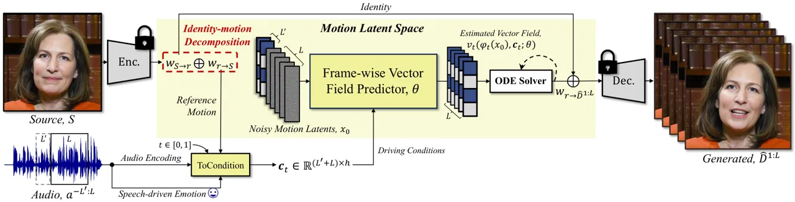

Figure 2: Overview of FLOAT. We encode the source image
$`S\in\mathbb{R}^{3\times H\times W}`$ into the latent with the explicit
identity-motion decomposition
$`w_{s}=w_{s\to r}+w_{r\to s}\in\mathbb{R}^{d}`$. Given audio segments
$`a^{-L^{\prime}:L}\in\mathbb{R}^{(L^{\prime}+L)\times d_{a}}`$ of the
length $`L^{\prime}+L`$ and the reference motion $`w_{r\to s}`$ $`\in`$
$`\mathbb{R}^{d}`$, and the speech-driven emotion label $`w_{e}`$
$`\in`$ $`\mathbb{R}^{7}`$, a flow matching transformer estimates the
generating vector field
$`v_{t}(\varphi_{t}(x_{0}),\mathbf{c}_{t};\theta)\in\mathbb{R}^{L\times d}`$
from noisy motion latents, which is used to solve corresponding ODE and
generates the motion latents $`w_{r\to\hat{D}^{1:L}}`$. Finally, the
sequence of latents
$`w_{S\to\hat{D}^{1:L}}:=(w_{S\to r}+w_{r\to\hat{D}^{l}})_{l=1}^{L}`$
are decoded into the video
$`\hat{D}^{1:L}\in\mathbb{R}^{L\times 3\times H\times W}`$.

Let $`x`$ $`\in`$ $`\mathbb{R}^{d}`$ be a data, $`t`$ $`\in`$ $`[0,1]`$
be the time, and $`q`$ be a unknown target distribution. We can define a
flow as a time-dependent transformation
$`\varphi_{t}:[0,1]\times\mathbb{R}^{d}\to\mathbb{R}^{d}`$ that
transforms a tractable prior distribution $`p_{0}`$ to the distribution
$`p_{1}\approx q`$. This flow $`\varphi_{t}`$ further introduces a
probability flow path
$`p_{t}:[0,1]\times\mathbb{R}^{d}\to\mathbb{R}_{>0}`$ and a generating
vector field $`v_{t}:[0,1]\times\mathbb{R}^{d}\to\mathbb{R}^{d}`$ where
$`p_{t}`$ is defined by the push-forwarding

```math
\displaystyle p_{t}(x)=p_{0}(\varphi_{t}^{-1}(x))\det\left|\frac{\partial\varphi_{t}^{-1}(x)}{\partial x}\right|, \tag{1}
```

and $`v_{t}`$ generates $`\varphi_{t}`$ by means of an ordinary
differential equation (ODE) \[7\]:

```math
\displaystyle\frac{d}{dt}\varphi_{t}(x)=v_{t}(\varphi_{t}(x))\quad\text{and}\quad\varphi_{0}(x)=x. \tag{2}
```

Flow matching \[42\] aims to estimate the target generating vector field
$`u_{t}`$ with a neural network parameterized by $`\theta`$:

```math
\displaystyle\mathcal{L}_{\text{FM}}(\theta):=\|v_{t}(x;\theta)-u_{t}(x)\|_{2}^{2}, \tag{3}
```

where $`t`$ $`\sim`$ $`\mathcal{U}[0,1]`$ and $`x`$ $`\sim`$
$`p_{t}(x)`$. However, the target generating vector field $`u_{t}`$ and
the sample distribution $`p_{t}`$ are intractable. To address this
issue, \[42\] proposes a method for constructing a “conditional"
probability path $`p_{t}(\cdot|x_{1})`$ as well as target “conditional"
vector field $`u_{t}(\cdot|x_{1})`$ using a sample $`x_{1}`$ $`\sim`$
$`q`$ as a condition. And they prove that the following objective

```math
\displaystyle\mathcal{L}_{\text{CFM}}(\theta):=\|v_{t}(x;\theta)-u_{t}(x|x_{1})\|_{2}^{2}, \tag{4}
```

where $`t`$ $`\sim`$ $`\mathcal{U}[0,1]`$ and $`x`$ $`\sim`$
$`p_{t}(x|x_{1})`$, is equivalent to (3) with respect to the gradient
$`\nabla_{\theta}`$.

One natural way of constructing $`u_{t}(\cdot|x_{1})`$ is a “straight
line" that connects $`x_{0}`$ $`\sim`$ $`p_{0}`$ and $`x_{1}`$ $`\sim`$
$`q`$, drawing an optimal transport (OT) path with constant velocity
\[42\]. Specifically, a linear time interpolation between $`x_{0}`$ and
$`x_{1}`$ gives us the flow $`x_{t}=\varphi_{t}(x)=(1-t)x_{0}+tx_{1}`$,
the conditional probability path $`p_{t}(x|x_{1})`$ defined via the
affine transformation
$`p_{t}(x|x_{1})=\mathcal{N}(x|tx_{1},(1-t)^{2}I)`$, and the target
generating vector field $`u_{t}(x|x_{1})=x_{1}-x_{0}`$. This specific
choice turns the objective (4) into

```math
\displaystyle\mathcal{L}_{\text{OT}}(\theta):=\|v_{t}((1-t)x_{0}+tx_{1};\theta)-(x_{1}-x_{0})\|_{2}^{2}, \tag{5}
```

where $`t`$ $`\sim`$ $`\mathcal{U}[0,1]`$, $`x_{0}`$ $`\sim`$ $`p_{0}`$,
and $`x_{1}`$ $`\sim`$ $`q`$, all of which are tractable.

Classifier-free Vector Field   \[11\] formulates a classifier-free
vector field (CFV) technique for flow matching, which enables
class-conditional sampling more controllable manner without any extra
classifier trained on noisy trajectory. Formally, CFV compute the
modified vector field $`\tilde{v}_{t}`$ by

```math
\displaystyle\tilde{v}_{t}(x_{t},c;\theta)\approx\gamma v_{t}(x_{t},c;\theta)+(1-\gamma)v_{t}(x_{t},c=\emptyset;\theta), \tag{6}
```

where $`\gamma`$ denotes the guidance scale.
$`v_{t}(x_{t},c=\emptyset;\theta)`$ is the predicted vector field
without a driving condition $`c`$. For more details, please refer to
\[42, 11\].

## 4 Method: Flow Matching for Audio-driven Talking Portrait

We provide an overview of FLOAT in Fig. 2. Given source image $`S`$
$`\in`$ $`\mathbb{R}^{3\times H\times W}`$, and a driving audio signal
$`a^{1:L}`$ $`\in`$ $`\mathbb{R}^{L\times d_{a}}`$ of length $`L`$, our
method generates a video

```math
\displaystyle\hat{D}^{1:L}=(\hat{D}^{l})_{l=1}^{L}\in\mathbb{R}^{L\times 3\times H\times W} \tag{7}
```

of $`L`$ frames, featuring audio-synchronized talking head motions,
including both verbal and non-verbal motions. Our method consists of two
phases. First, we pre-train a motion auto-encoder, which provides us
with the expressive and smooth motion latent space for the talking
portraits (Sec. 4.1). Next, we employ OT-based flow matching \[42\] to
generate a sequence of motion latents with a transformer-based vector
field predictor using the driving audio, which is decoded to the talking
portrait videos (Sec. 4.2). We also incorporate speech-driven emotions
as the driving conditions, achieving automatic emotion-aware talking
portrait generation without any extra user input for emotion.

### 4.1 Motion Latent Auto-encoder

Recent talking portrait methods utilize the VAE of StableDiffusion (SD)
\[61\] due to its rich semantic pixel-based latent space. However, they
often struggle to generate temporally consistent frames when lifted to
video generating tasks \[76, 89, 8, 29, 101\]. Thus, our first goal for
realistic talking portrait is to obtain good motion latent space,
capturing both global (_e.g_., head motion) and fine-grained local
(_e.g_., facial expressions, mouth and pupil movement) dynamics.

Instead of VAE of SD, we employ LIA \[85\] as a base motion latent
auto-encoder and pre-train it to encode images into motion latents. This
is achieved by training the auto-encoder to reconstruct a driving image
from a source image sampled from the same video clip, enforcing the
encoder to implicitly capture both temporally adjacent and distant
motions. Following \[85\], we use a learned orthonormal basis that can
decompose the motion along distinct orthogonal directions. Specifically,
our motion auto-encoder encodes the source $`S`$ into the latent
$`w_{S}\in\mathbb{R}^{d}`$ with following explicit decomposition:

```math
w_{S}:=w_{S\to r}+w_{r\to S}, \tag{8}
```

where $`w_{S\to r}`$ $`\in`$ $`\mathbb{R}^{d}`$ is the identity latent
and

```math
w_{r\to S}=\sum_{m=1}^{M}\lambda_{m}(S)\cdot\mathbf{v}_{m}\in\mathbb{R}^{d} \tag{9}
```

is the motion latent with $`\lambda(S)`$ $`:=`$
$`\left(\lambda_{m}(S)\right)_{m=1}^{M}`$ $`\in`$ $`\mathbb{R}^{M}`$
being the source-dependent motion coefficients that span the learned
source-agnostic motion basis
$`V:=\{\mathbf{v}_{m}\}_{m=1}^{M}\subseteq\mathbb{R}^{d}`$. In this
space, $`\lambda_{m}(S)`$ is the intensity of the motion direction
$`\mathbf{v}_{m}`$. As shown in Fig. 6, our method enables motion
editing of the sampled (generated) motion using only the basis $`V`$ and
its orthogonality, as stated in Eq. 15.

Improving Fidelity of Facial Components:
$`\mathcal{L}_{\text{comp-lp}}`$     The expressiveness of generated
motions and the image fidelity are determined by the motion space and
the motion auto-encoder. However, as resolution increases, fine details
in small facial regions (_e.g_., teeth, eyeballs) often get buried in
large-scale dynamics. To address this issue, we propose a facial
component perceptual loss $`\mathcal{L}_{\text{comp-lp}}`$ using \[95,
66\] that significantly improves the image fidelity (_e.g_., teeth and
eyes) as well as fine-grained motions (_e.g_., eyeball and eyebrows
movements). As shown in Fig. 3, $`\mathcal{L}_{\text{comp-lp}}`$ allows
us to generate high-fidelity facial components and their fine-grained
motions without relying on pre-trained foundation models, such as
StableDiffusion \[61\].

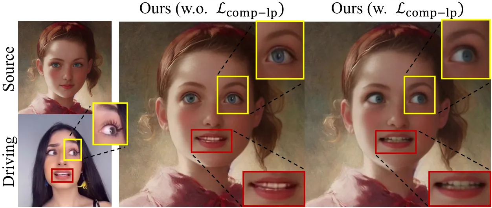

Figure 3: Efficacy of $`\mathcal{L}_{\text{comp-lp}}`$ for fine-grained
motion and fidelity.

### 4.2 Flow Matching in Motion Latent Space

Armed with this linear orthogonal space, we employ OT-based flow
matching \[42, 44\] for the motion sampling. Specifically, we predict a
vector field $`v_{t}(x_{t},\mathbf{c}_{t};\theta)`$ $`\in`$
$`\mathbb{R}^{L\times d}`$ where $`x_{t}`$ is the sample at flow time
$`t\in[0,1]`$, and $`\mathbf{c}_{t}`$ $`\in`$ $`\mathbb{R}^{L\times h}`$
represents the driving conditions for $`L`$ consequent frames. This
vector field generates the flow
$`\varphi_{t}:[0,1]\times\mathbb{R}^{L\times d}\to\mathbb{R}^{L\times d}`$
of $`L`$ frames by solving ODE (Eq. 2). As illustrated in Fig. 4, we
build our vector field predictor upon the transformer encoder \[79\]
architecture. Specifically, we adopt DiT \[55\] architecture, but
decouple frame-wise conditioning from time-axis attention mechanism,
which enables us to model temporally consistent motion latents.

In DiT \[55\], distinct semantic tokens are modulated by a single
diffusion time step embedding and class embedding through adaptive layer
normalization (AdaLN). In contrast, our vector field predictor modulates
each $`l`$-th input latent with its corresponding $`l`$-th condition and
then combines their temporal relations through a masked self-attention
layer that attends to $`2\cdot T`$ neighboring frames. Formally, for
each $`l`$-th frame, frame-wise AdaLN and frame-wise gating are computed
by

```math
\displaystyle\gamma_{i}^{l}\times\text{LN}(X_{t}^{l})+\beta_{i}^{l}\in\mathbb{R}^{h}\quad\text{and}\quad\alpha_{i}^{l}\times X_{t}^{l}\in\mathbb{R}^{h}, \tag{10}
```

respectively, where $`i`$ $`\in`$ $`\{1,2\}`$, $`h`$ is the hidden
dimension, $`\text{LN}(\cdot)`$ denotes layer norm \[40\], and
$`X_{t}^{l}`$ is the $`l`$-th input for each operation at flow time
$`t`$ $`\in`$ $`[0,1]`$. The coefficients
$`\alpha_{i}^{l},\beta_{i}^{l},\gamma_{i}^{l}\in\mathbb{R}^{h}`$ are
computed from the condition $`\mathbf{c}_{t}^{l}`$ $`\in`$
$`\mathbb{R}^{h}`$ through a linear layer, ToScaleShift, as depicted in
Fig. 4.

Speech-driven Emotion Enhancement   How can we make talking motions more
expressive and natural? During talking, humans naturally reflect their
emotions through their voices, and these emotions influence talking
motions. For instance, a person who speaks sadly may be more likely to
shake the head and avoid eye contact. This non-verbal motion derived
from emotions crucially impacts the naturalness of a talking portrait.  
Existing works \[81, 30, 90\] use image-emotion paired data or
image-driven emotion predictor \[63\] to generate the emotion-aware
motion. In contrast, we incorporate speech-driven emotions, a more
intuitive way of controlling emotion for audio-driven talking portrait.
Specifically, we utilize a pre-trained speech emotion predictor \[56\]
that produces softmax probabilities of seven distinct emotions: angry,
disgust, fear, happy, neutral, sad, and surprise, which we then input
into the vector field predictor.  
However, as people do not always speak with a single, clear emotion,
determining emotions solely from audio is often ambiguous \[30\]. Naive
introduction of speech-driven emotion can make emotion-aware motion
generation more challenging. To address this issue, we inject the
emotions together with other driving conditions at training phase and
modify them at inference phase.

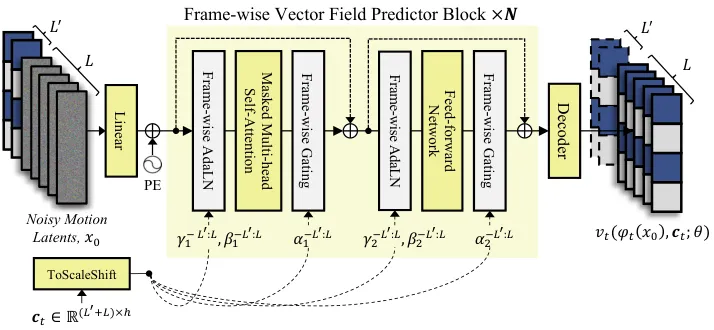

Figure 4: Frame-wise vector field predictor block at inference.

Driving Conditions   We concatenate the audio representation $`a^{1:L}`$
$`\in`$ $`\mathbb{R}^{L\times d_{a}}`$ of a pre-trained Wav2Vec2.0
\[1\], the speech emotion label $`w_{e}`$ $`\in`$ $`\mathbb{R}^{7}`$,
and the source motion latent $`w_{r\to S}`$ $`\in`$ $`\mathbb{R}^{d}`$.
Next, we add the flow time step embedding $`\text{Emb}(t)`$ $`\in`$
$`\mathbb{R}^{h}`$ to these conditions, producing $`\mathbf{c}_{t}`$
$`\in`$ $`\mathbb{R}^{L\times h}`$ via a linear layer, ToCondition, as
depicted in Fig. 2, where $`\text{Emb}(t)`$ is computed using the
sinusoidal position embedding \[79\].  
Training   We train FLOAT by reconstructing a target vector field
computed from driving frames using the corresponding audio segments and
a source motion latent. We choose a pair of driving motions and
corresponding audio ($`w_{r\to D^{1:L}}`$, $`a^{1:L}`$), and construct
the target vector field
$`u_{t}(x|w_{r\to D^{1:L}})=w_{r\to D^{1:L}}-x_{0}`$ $`\in`$
$`\mathbb{R}^{L\times d}`$ with noisy input
$`\varphi_{t}(x_{0})=(1-t)x_{0}+tw_{r\to D^{1:L}}`$ ($`t`$ $`\sim`$
$`\mathcal{U}[0,1]`$ and $`x_{0}`$ $`\sim`$ $`\mathcal{N}(0^{1:L},I)`$).

For smooth transitions of sequences longer than the window length $`L`$,
we incorporate last $`L^{\prime}`$ audio features and motion latents
$`w_{r\to D^{-L^{\prime}:0}}`$ from the preceding window as additional
input.

The flow matching objective $`\mathcal{L}_{\text{OT}}(\theta)`$ is
defined by

```math
\displaystyle\mathcal{L}_{\text{OT}}(\theta) \displaystyle=\|v_{t}^{1:L}(x_{t},\mathbf{c}_{t};\theta)-u_{t}(x|w_{r\to D^{1:L}})\|, \tag{11}
```

```math
\displaystyle+\|v_{t}^{-L^{\prime}:0}(x_{t},\mathbf{c}_{t};\theta)-w_{r\to D^{-L^{\prime}:0}}\|,
```

where $`x_{t}`$ $`:=`$
$`[w_{r\to D^{-L^{\prime}:0}}|~\varphi_{t}(x_{0})]`$ $`\in`$
$`\mathbb{R}^{(-L^{\prime}+L)\times d}`$ is the concatenated input,
$`\mathbf{c}_{t}`$ $`\in`$ $`\mathbb{R}^{(-L^{\prime}+L)\times h}`$ is
the driving condition consisting of
$`[t,w_{r\to S},w_{e},a^{1:L},a^{-L^{\prime}:0}]`$. Note that $`w_{e}`$
and $`w_{r\to S}`$ are shared across the $`L^{\prime}+L`$ frames. We
incorporate a velocity loss \[75\] to supervise temporal consistency:

```math
\displaystyle\mathcal{L}_{\text{vel}}(\theta)=\|\Delta v_{t}-\Delta u_{t}\|, \tag{12}
```

where $`\Delta v_{t}`$ and $`\Delta u_{t}`$ are the one-frame difference
along the time-axis for the prediction $`v_{t}`$ $`\in`$
$`\mathbb{R}^{(-L^{\prime}+L)\times d}`$ and the target
$`[w_{r\to D^{-L^{\prime}:0}}|~u_{t}]`$ $`\in`$
$`\mathbb{R}^{(-L^{\prime}+L)\times d}`$, respectively.

The total objective $`\mathcal{L}_{\text{total}}(\theta)`$ is

```math
\displaystyle\mathcal{L}_{\text{total}}(\theta)=\lambda_{\text{OT}}\mathcal{L}_{\text{OT}}(\theta)+\lambda_{\text{vel}}\mathcal{L}_{\text{vel}}(\theta), \tag{13}
```

where $`\lambda_{\text{OT}}`$ and $`\lambda_{\text{vel}}`$ are the
balancing coefficients. During training, we apply dropout to $`w_{r}`$,
$`w_{e}`$, and $`a^{1:L}`$ with a probability of $`0.1`$ for CFV.
Additionally, we apply dropout to the preceding audio and motion latents
with a probability $`0.5`$ for smooth transition in the initial window.

Table 1: Quantitative comparison results with state-of-the-art methods
on HDTF \[97\] / RAVDESS \[46\]. The best result for each metric is in
bold, and the second-best result is underlined. ^(†): evaluated with raw
$`256\times 256`$ resolution outputs.

|                      |                          |                    |                   |                      |                      |                      |                    |
| -------------------- | ------------------------ | ------------------ | ----------------- | -------------------- | -------------------- | -------------------- | ------------------ |
| Method               | Image & Video Generation |                    |                   |                      |                      | Lip Synchronization  |                    |
|                      | FID $`\downarrow`$       | FVD $`\downarrow`$ | CSIM $`\uparrow`$ | E-FID $`\downarrow`$ | P-FID $`\downarrow`$ | LSE-D $`\downarrow`$ | LSE-C $`\uparrow`$ |
| SadTalker^(†) \[96\] | 71.952 / 119.430         | 339.058 / 376.294  | 0.644 / 0.644     | 1.914 / 3.500        | 1.456 / 2.045        | 7.947 / 7.273        | 7.305 / 4.748      |
| EDTalk^(†) \[74\]    | 50.078 / 75.020          | 211.284 / 304.933  | 0.626 / 0.676     | 1.579 / 3.468        | 0.054 / 0.090        | 8.123 / 7.682        | 7.623 / 5.318      |
| AniTalker^(†) \[43\] | 39.512 / 70.430          | 184.454 / 265.341  | 0.643 / 0.725     | 1.830 / 2.330        | 0.092 / 0.126        | 7.907 / 8.176        | 7.288 / 4.555      |
| Hallo \[89\]         | 25.363 / 57.648          | 197.196 / 375.557  | 0.869 / 0.860     | 1.039 / 2.492        | 0.037 / 0.050        | 7.792 / 7.613        | 7.582 / 4.795      |
| EchoMimic \[8\]      | 33.552 / 81.839          | 296.757 / 320.220  | 0.823 / 0.805     | 1.234 / 3.201        | 0.023 / 0.047        | 8.903 / 8.161        | 6.242 / 4.144      |
| FLOAT (Ours)         | 21.100 / 31.681          | 162.052 / 166.359  | 0.843 / 0.810     | 1.229 / 1.367        | 0.032 / 0.031        | 7.290 / 6.994        | 8.222 / 5.730      |

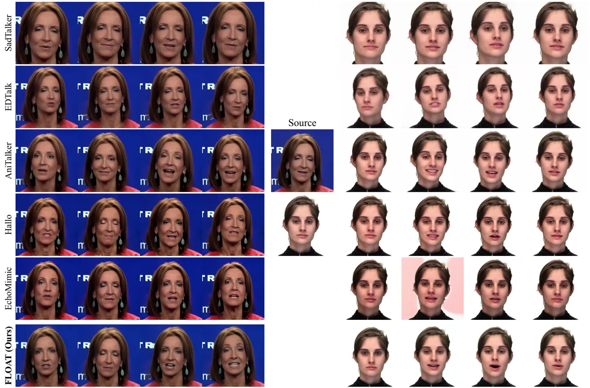

Figure 5: Qualitative comparison results with state-of-the-art methods
on HDTF \[97\] / RAVDESS \[46\]. Please refer to supplementary videos.
Note that we additionally provide a video comparison with EMO \[76\] and
VASA-1 \[90\] using their video demonstration.

Inference   During inference, we sample the generating vector field from
noise $`x_{0}`$, using the driving conditions $`w_{r\to S}`$, $`w_{e}`$,
and $`a^{1:L}`$, as well as the $`L^{\prime}`$ frames of preceding audio
and generated motion latents.

We extend the CFV \[11\] to an incremental CFV to separately adjust the
audio and emotion, inspired by \[3\]:

```math
\displaystyle\tilde{v}_{t} \displaystyle\approx v_{t}(x_{0},\mathbf{c}_{t}|_{\{a^{1:L},w_{e}\}})
```

```math
\displaystyle+\gamma_{a}\left[v_{t}(x_{0},\mathbf{c}_{t}|_{w_{e}})-v_{t}(x_{0},\mathbf{c}_{t}|_{\{a^{1:L},w_{e}\}}\right]
```

```math
\displaystyle+\gamma_{e}\left[v_{t}(x_{0},\mathbf{c}_{t})-v_{t}(x_{0},\mathbf{c}_{t}|_{w_{e}})\right], \tag{14}
```

where $`\gamma_{a}`$ and $`\gamma_{e}`$ are the guidance scales for
audio and emotion, respectively. $`\mathbf{c}_{t}|_{\{x,y\}}`$ denotes
the driving condition without the condition $`x`$ and $`y`$. We set
$`\gamma_{a}=2`$ and $`\gamma_{e}=1`$ based on the ablation studies on
$`\gamma_{a}`$ and $`\gamma_{e}`$ provided in supplementary materials.

After sampling, ODE solver receives the estimated vector field to
compute the motion latents through numerical integration. We empirically
find that FLOAT can generate reasonable motion with around 10 number of
function evaluations (NFE). Please refer to supplementary videos.

Lastly, we add the source identity latent to the generated motion
latents and decode them into video frames using the motion latent
decoder.

## 5 Experiments

### 5.1 Dataset and Pre-processing

For training the motion latent auto-encoder, we use three open-source
datasets: HDTF \[97\], RAVDESS \[46\], and VFHQ \[88\]. When training
FLOAT, we exclude VFHQ because it does not support the synchronized
audio. HDTF \[97\] is for high-definition talking face generation,
containing videos of over 300 unique identities. RAVDESS \[46\] includes
more than 2,400 emotion-intensive videos of 24 different identities.
VFHQ \[88\] is designed for high-resolution video super-resolution and
includes a large number of unique identities, which compensates the
limited number of identities of the preceding datasets. Following the
strategy of \[65\], we first convert each video to 25 FPS and resample
the audio into 16 kHz. Then, we crop and resize the facial region to
$`512^{2}`$ resolution \[5\]. After the pre-processing, for HDTF, we use
a total of 11.3 hours of 240 videos featuring 230 different identities
for training, and videos of 78 different identities, each 15 seconds
long, for test. For RAVDESS, we use videos of 22 identities for
training, and videos of the remaining 2 identities for test, with each
3-4 seconds long and representing 14 emotional intensities. Note that
the identities in the training and test are disjoint in both datasets.

### 5.2 Implementation Details

The motion latent dimension is set to $`d`$ $`=`$ $`512`$ with $`M`$
$`=`$ $`20`$ distinct orthogonal directions. For the vector predictor,
we use 8 attention heads, a hidden dimension $`h`$ $`=`$ $`1024`$, and
an attention window length $`T`$ $`=`$ $`2`$. Considering the length of
the training video clips, we set $`L`$ $`=`$ $`50`$ frames with
preceding $`L^{\prime}`$ $`=`$ $`10`$ frames at once, encompassing 2.4
seconds of video. We employ the Adam optimizer \[36\] with a batch size
of 8 and a learning late of $`10^{-5}`$. We use $`L1`$ distance for the
norm $`\|\cdot\|`$ in the training objective. We set the balancing
coefficients to $`\lambda_{\text{OT}}`$ $`=`$ $`\lambda_{\text{vel}}`$
$`=`$ $`1`$. The entire training takes about $`2`$ days for $`2,000`$k
steps on a single NVIDIA A100 GPU. We use Euler method \[42\] for the
ODE solver.

### 5.3 Evaluation

Metrics and Baselines   For evaluating the image and video generation
quality, we measure Fréchet Inecption Distance (FID) \[64\] and 16
frames Fréchet Video Distance (FVD) \[78\]. For facial identity,
expression and head motion, we measure Cosine Similarity of identity
embedding (CSIM) \[12\], Expression FID (E-FID) \[76\] and Pose FID
(P-FID), respectively. Lastly, we measure Lip-Sync Error Distance and
Confidence (LSE-D and LSE-C \[58\]) for audio-visual alignment.

We compare our method with state-of-the-art audio-driven talking
portrait methods whose official implementations are publicly available.
For non-diffusion methods, we compare with SadTalker \[96\] and EDTalk
\[74\]. For diffusion methods, we compare with AniTalker \[43\], Hallo
\[89\], and EchoMimic \[8\].

Comparison Results   In Tab. 1 and Fig. 5, we show the quantitative and
qualitative comparison results, respectively. FLOAT outperforms other
methods on most of the metrics and visual quality in both datasets.

Additionally, we provide video comparison results with EMO \[76\] and
VASA-1 \[90\] in the supplementary materials, using their demonstration
videos due to the infeasibility of direct implementation.

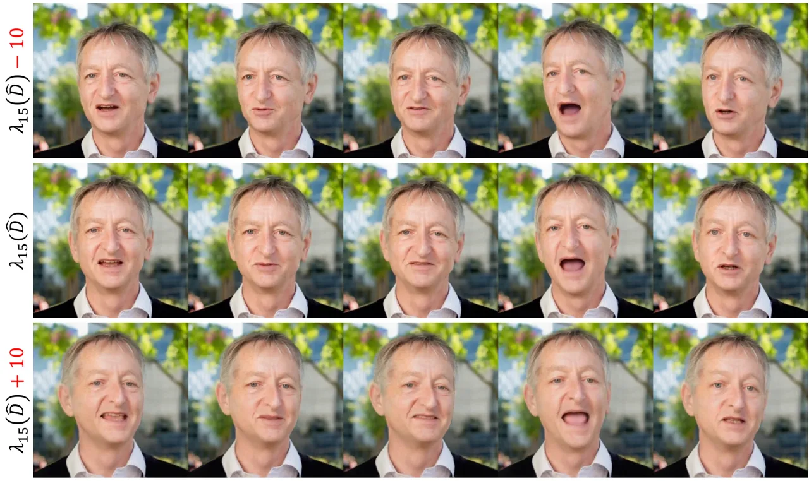

Figure 6: Test-time pose editing using $`\lambda`$-control
($`\lambda_{15}(\hat{D})\pm 10`$).

### 5.4 Applications

Test-time Pose Editing via Orthonormal Basis $`V`$   Since FLOAT learns
the underlying motion latent structure, it is natural to assume that for
any sampled motion latent $`w_{r\to\hat{D}}`$, there exist motion
coefficients $`\{\lambda_{m}(\hat{D})\}_{m=1}^{M}`$ satisfying the
representation in Eq. 9: $`w_{r\to\hat{D}}`$ $`=`$
$`\sum_{m=1}^{M}\lambda_{m}(\hat{D})\cdot\mathbf{v}_{m}`$.

We can always compute these coefficients in closed form by taking inner
products between the sampled motion $`w_{r\to\hat{D}}`$ and the learned
orthonormal basis $`V`$:

```math
\langle w_{r\to\hat{D}},~\mathbf{v}_{k}\rangle=\langle\sum_{m=1}^{M}\lambda_{m}(\hat{D})\cdot\mathbf{v}_{m},~\mathbf{v}_{k}\rangle=\lambda_{k}(\hat{D}), \tag{15}
```

where $`\langle\mathbf{v}_{m},\mathbf{v}_{k}\rangle=\delta_{m,k}`$ and
$`\delta`$ is Kronecker delta. At this point, we can edit the sampled
motions by editing the corresponding coefficients (e.g., via linear
operation) and combining them back into the motion latent. As shown in
Fig. 6, it allows us to control head direction without interfering with
other motions due to the orthogonality of the basis. We refer to this
test-time editing technique as $`\lambda`$-control.

Additional Driving Signals   In Fig. 7 and Tab. 2, we experiment with
additional driving conditions, head poses and image-driven emotion
labels, to explore additional controllability in our method. We employ
3DMM head pose parameters $`p`$ $`\in`$ $`\mathbb{R}^{6}`$ \[2\]
extracted by \[13\]. We concatenate a sequence of pose parameters
$`p^{1:L}`$ $`\in`$ $`\mathbb{R}^{L\times 6}`$ with the other driving
conditions, and then map them to $`c_{t}^{1:L}`$ $`\in`$
$`\mathbb{R}^{L\times h}`$. We also experiment on image-driven emotion
\[63\] for frame-wise emotion control rather than the long-term emotion
enhancement. FLOAT can effectively accommodate these additional
conditions, highlighting its flexibility across diverse control signals.

Redirecting Speech-driven Emotion  Since FLOAT learns diverse emotions
in the emotion-intensive data distribution \[46\], the generated
emotion-aware motion can be modified by redirecting the speech-driven
emotion label toward a different emotion at inference time. As
illustrated in Fig. 8, this technique is particularly beneficial for
manual redirection when the emotion predicted from speech is complex or
ambiguous.

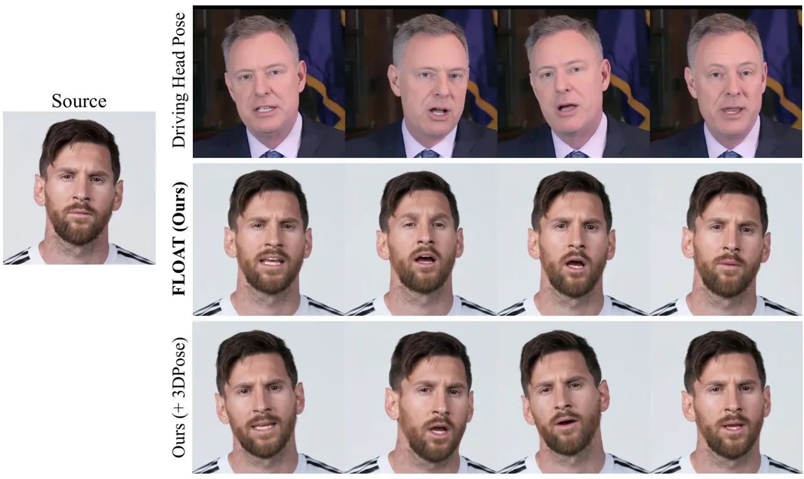

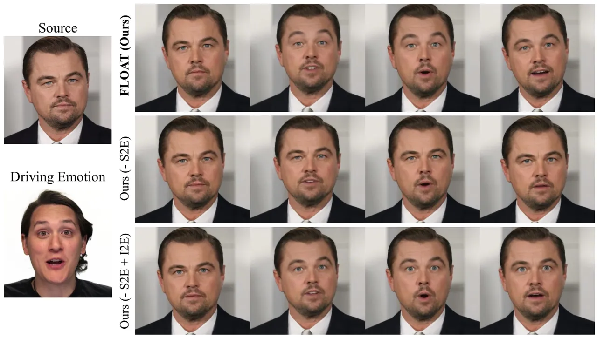

Figure 7: Additional conditioning results of FLOAT. 3DPose, S2E, and I2E
denote 3D head pose parameters \[13\], speech-to-emotion \[56\], and
image-to-emotion \[63\], respectively.

|                |               |                    |                    |                      |                      |                      |
| -------------- | ------------- | ------------------ | ------------------ | -------------------- | -------------------- | -------------------- |
| Configurations |               | FID $`\downarrow`$ | FVD $`\downarrow`$ | E-FID $`\downarrow`$ | P-FID $`\downarrow`$ | LSE-D $`\downarrow`$ |
| A              | FLOAT (Ours)  | 21.100 / 31.681    | 162.052 / 166.359  | 1.229 / 1.367        | 0.032 / 0.031        | 7.290 / 6.994        |
| B              | A + 3DPose    | 19.721 / 29.721    | 126.663 / 112.894  | 0.926 / 1.152        | 0.012 / 0.016        | 7.516 / 7.047        |
| C              | A - S2E       | 21.235 / 32.035    | 155.032 / 166.866  | 1.254 / 1.502        | 0.031 / 0.025        | 7.264 / 7.222        |
| D              | A - S2E + I2E | 21/528 / 31.609    | 158.577 / 162.369  | 1.158 / 1.305        | 0.034 / 0.022        | 7.183 / 7.150        |

Table 2: Quantitative results of FLOAT with additional conditions (HDTF
\[97\] / RAVDESS \[46\]). S2E, I2E, and 3DPose denote speech-to-emotion
\[56\], image-to-emotion \[63\], and 3DMM pose parameters \[13\],
respectively.

### 5.5 Ablation Studies

Ablation on Frame-wise AdaLN   We compare frame-wise AdaLN (and gating)
followed by masked self-attention to separate conditioning from
attending, with a cross-attention that performs conditioning and
attending simultaneously. As shown in Tab. 3, both approaches achieve
competitive image and video quality, while frame-wise AdaLN provides
better expression generation and lip synchronization. We observe that
frame-wise AdaLN can achieve more diverse head motions than the
cross-attention. Please refer to supplementary videos.

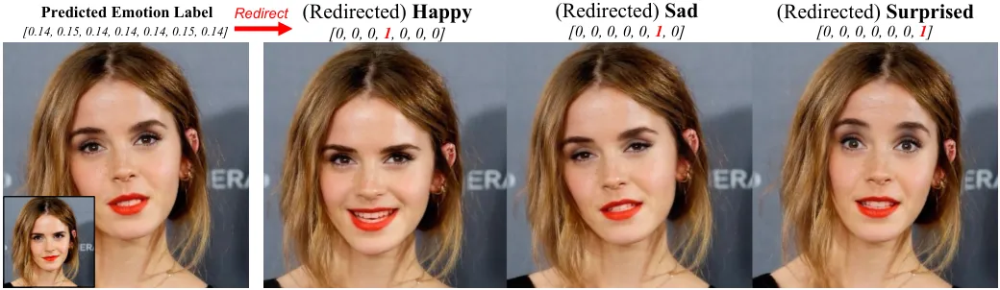

Figure 8: Redirecting the unclear emotion prediction to a desirable
one-hot encoding, which can be further intensified by the CFV.

Ablation on Flow Matching   We compare flow matching with two types of
diffusion models: $`\epsilon`$-prediction (noise) and
$`x_{0}`$-prediction (signal) \[59, 75\]. In both cases, we adopt our
vector predictor architecture as denoising networks. We adopt diffusion
training settings of VASA-1 \[90\] (500 diffusion steps with a cosine
noise scheduler \[53\] and 50 DDIM denoising steps) for the indirect
comparison with \[90\]. Notably, diffusion and flow matching achieve
competitive results on image quality while the latter achieves the
better lip synchronization. In Fig. 9, we compare the forward pass
efficiency by measuring frames per second (FPS) of each model. Thanks to
the compact motion latent representation and OT-based flow matching,
FLOAT achieves the highest FPS, superior lip-sync performance, dynamic
head motion, and the lowest NFEs.

|                                     |                    |                    |                      |                      |                        |
| ----------------------------------- | ------------------ | ------------------ | -------------------- | -------------------- | ---------------------- |
| Method                              | FID $`\downarrow`$ | FVD $`\downarrow`$ | E-FID $`\downarrow`$ | LSE-D $`\downarrow`$ | \# NFEs $`\downarrow`$ |
| Ours (w. Cross-Attn.)               | 21.873             | 162.702            | 1.452                | 7.757                | 10                     |
| Ours (w. Diff., $`\epsilon`$-pred.) | 21.190             | 161.666            | 1.213                | 9.922                | 50                     |
| Ours (w. Diff., $`x_{0}`$-pred.)    | 21.697             | 162.847            | 1.278                | 9.048                | 50                     |
| FLOAT (Ours)                        | 21.100             | 162.052            | 1.229                | 7.290                | 10                     |

Table 3: Ablation studies of FLOAT on HDTF \[97\]. The best result for
each metric is in bold, and the second-best result is underlined.

Figure 9: Comparison of the forward pass efficiency. We compute FPS on a
single NVIDIA V100 GPU.

## 6 Conclusion

We proposed FLOAT, a flow matching based audio-driven talking portrait
generation model leveraging a learned motion latent space. We introduced
a transformer-based vector field predictor, enabling temporally
consistent motion generation. Additionally, we incorporated
speech-driven emotion labels into the motion sampling process to improve
the naturalness of the audio-driven talking motions. FLOAT addresses
current core limitations of diffusion-based talking portrait video
generation methods by reducing the sampling time through flow matching
while achieving the remarkable sample quality. Extensive experiments
verified that FLOAT achieves state-of-the-art performance in terms of
visual quality, motion fidelity, and efficiency.

Discussion   We leave further discussion considering limitations, future
work, and ethical considerations in the supplementary materials.

## References

- \[1\] Alexei Baevski, Yuhao Zhou, Abdelrahman Mohamed, and Michael
  Auli. wav2vec 2.0: A framework for self-supervised learning of speech
  representations. _Advances in neural information processing systems_,
  33:12449–12460, 2020.
- \[2\] Volker Blanz and Thomas Vetter. A morphable model for the
  synthesis of 3d faces. In _Proceedings of the 26th annual conference
  on Computer graphics and interactive techniques_, pages 187–194, 1999.
- \[3\] Tim Brooks, Aleksander Holynski, and Alexei A Efros.
  Instructpix2pix: Learning to follow image editing instructions. In
  _Proceedings of the IEEE/CVF Conference on Computer Vision and Pattern
  Recognition (CVPR)_, pages 18392–18402, 2023.
- \[4\] Tim Brooks, Bill Peebles, Connor Holmes, Will DePue, Yufei Guo,
  Li Jing, David Schnurr, Joe Taylor, Troy Luhman, Eric Luhman, et al.
  Video generation models as world simulators, 2024.
- \[5\] Adrian Bulat and Georgios Tzimiropoulos. How far are we from
  solving the 2d & 3d face alignment problem? (and a dataset of 230,000
  3d facial landmarks). In _International Conference on Computer
  Vision_, 2017.
- \[6\] Joao Carreira and Andrew Zisserman. Quo vadis, action
  recognition? a new model and the kinetics dataset. In _proceedings of
  the IEEE Conference on Computer Vision and Pattern Recognition_, pages
  6299–6308, 2017.
- \[7\] Ricky TQ Chen, Yulia Rubanova, Jesse Bettencourt, and David K
  Duvenaud. Neural ordinary differential equations. _Advances in neural
  information processing systems_, 31, 2018.
- \[8\] Zhiyuan Chen, Jiajiong Cao, Zhiquan Chen, Yuming Li, and
  Chenguang Ma. Echomimic: Lifelike audio-driven portrait animations
  through editable landmark conditions. _arXiv preprint
  arXiv:2407.08136_, 2024.
- \[9\] Kun Cheng, Xiaodong Cun, Yong Zhang, Menghan Xia, Fei Yin,
  Mingrui Zhu, Xuan Wang, Jue Wang, and Nannan Wang. Videoretalking:
  Audio-based lip synchronization for talking head video editing in the
  wild. In _SIGGRAPH Asia 2022 Conference Papers_, pages 1–9, 2022.
- \[10\] Joon Son Chung and Andrew Zisserman. Out of time: automated lip
  sync in the wild. In _Asian Conference on Computer Vision_, pages
  251–263, 2016.
- \[11\] Quan Dao, Hao Phung, Binh Nguyen, and Anh Tran. Flow matching
  in latent space. _arXiv preprint arXiv:2307.08698_, 2023.
- \[12\] Jiankang Deng, Jia Guo, Niannan Xue, and Stefanos Zafeiriou.
  Arcface: Additive angular margin loss for deep face recognition. In
  _Proceedings of the IEEE/CVF Conference on Computer Vision and Pattern
  Recognition (CVPR)_, pages 4690–4699, 2019a.
- \[13\] Yu Deng, Jiaolong Yang, Sicheng Xu, Dong Chen, Yunde Jia, and
  Xin Tong. Accurate 3d face reconstruction with weakly-supervised
  learning: From single image to image set. In _Proceedings of the
  IEEE/CVF conference on computer vision and pattern recognition
  workshops_, pages 0–0, 2019b.
- \[14\] Prafulla Dhariwal and Alexander Nichol. Diffusion models beat
  gans on image synthesis. _Advances in neural information processing
  systems_, 34:8780–8794, 2021.
- \[15\] Laurent Dinh, Jascha Sohl-Dickstein, and Samy Bengio. Density
  estimation using real nvp. _arXiv preprint arXiv:1605.08803_, 2016.
- \[16\] Nikita Drobyshev, Jenya Chelishev, Taras Khakhulin, Aleksei
  Ivakhnenko, Victor Lempitsky, and Egor Zakharov. Megaportraits:
  One-shot megapixel neural head avatars. In _Proceedings of the 30th
  ACM International Conference on Multimedia_, pages 2663–2671, 2022.
- \[17\] Nikita Drobyshev, Antoni Bigata Casademunt, Konstantinos
  Vougioukas, Zoe Landgraf, Stavros Petridis, and Maja Pantic.
  Emoportraits: Emotion-enhanced multimodal one-shot head avatars. In
  _Proceedings of the IEEE/CVF Conference on Computer Vision and Pattern
  Recognition_, pages 8498–8507, 2024.
- \[18\] Patrick Esser, Sumith Kulal, Andreas Blattmann, Rahim Entezari,
  Jonas Müller, Harry Saini, Yam Levi, Dominik Lorenz, Axel Sauer,
  Frederic Boesel, et al. Scaling rectified flow transformers for
  high-resolution image synthesis. In _Forty-first International
  Conference on Machine Learning_, 2024.
- \[19\] Yingruo Fan, Zhaojiang Lin, Jun Saito, Wenping Wang, and Taku
  Komura. Faceformer: Speech-driven 3d facial animation with
  transformers. In _Proceedings of the IEEE/CVF Conference on Computer
  Vision and Pattern Recognition (CVPR)_, pages 18770–18780, 2022.
- \[20\] Johannes S Fischer, Ming Gui, Pingchuan Ma, Nick Stracke,
  Stefan A Baumann, and Björn Ommer. Boosting latent diffusion with flow
  matching. _arXiv preprint arXiv:2312.07360_, 2023.
- \[21\] Leon A. Gatys, Alexander S. Ecker, and Matthias Bethge. Image
  style transfer using convolutional neural networks. In _2016 IEEE
  Conference on Computer Vision and Pattern Recognition (CVPR)_, pages
  2414–2423, 2016.
- \[22\] Ian Goodfellow, Jean Pouget-Abadie, Mehdi Mirza, Bing Xu, David
  Warde-Farley, Sherjil Ozair, Aaron Courville, and Yoshua Bengio.
  Generative adversarial nets. _Advances in neural information
  processing systems_, 27, 2014.
- \[23\] Jiazhi Guan, Zhanwang Zhang, Hang Zhou, Tianshu Hu, Kaisiyuan
  Wang, Dongliang He, Haocheng Feng, Jingtuo Liu, Errui Ding, Ziwei Liu,
  et al. Stylesync: High-fidelity generalized and personalized lip sync
  in style-based generator. In _Proceedings of the IEEE/CVF Conference
  on Computer Vision and Pattern Recognition (CVPR)_, pages
  1505–1515, 2023.
- \[24\] Yuwei Guo, Ceyuan Yang, Anyi Rao, Zhengyang Liang, Yaohui Wang,
  Yu Qiao, Maneesh Agrawala, Dahua Lin, and Bo Dai. Animatediff: Animate
  your personalized text-to-image diffusion models without specific
  tuning. _arXiv preprint arXiv:2307.04725_, 2023.
- \[25\] Tianyu He, Junliang Guo, Runyi Yu, Yuchi Wang, Jialiang Zhu,
  Kaikai An, Leyi Li, Xu Tan, Chunyu Wang, Han Hu, et al. Gaia:
  Zero-shot talking avatar generation. _arXiv preprint
  arXiv:2311.15230_, 2023.
- \[26\] Geoffrey Hinton. Distilling the knowledge in a neural network.
  _arXiv preprint arXiv:1503.02531_, 2015.
- \[27\] Jonathan Ho, Ajay Jain, and Pieter Abbeel. Denoising diffusion
  probabilistic models. _Advances in neural information processing
  systems_, 33:6840–6851, 2020.
- \[28\] Wei-Ning Hsu, Benjamin Bolte, Yao-Hung Hubert Tsai, Kushal
  Lakhotia, Ruslan Salakhutdinov, and Abdelrahman Mohamed. Hubert:
  Self-supervised speech representation learning by masked prediction of
  hidden units. _IEEE/ACM transactions on audio, speech, and language
  processing_, 29:3451–3460, 2021.
- \[29\] Li Hu. Animate anyone: Consistent and controllable
  image-to-video synthesis for character animation. In _Proceedings of
  the IEEE/CVF Conference on Computer Vision and Pattern Recognition
  (CVPR)_, pages 8153–8163, 2024.
- \[30\] Xinya Ji, Hang Zhou, Kaisiyuan Wang, Qianyi Wu, Wayne Wu, Feng
  Xu, and Xun Cao. Eamm: One-shot emotional talking face via audio-based
  emotion-aware motion model. In _ACM SIGGRAPH 2022 Conference
  Proceedings_, pages 1–10, 2022.
- \[31\] Jianwen Jiang, Chao Liang, Jiaqi Yang, Gaojie Lin, Tianyun
  Zhong, and Yanbo Zheng. Loopy: Taming audio-driven portrait avatar
  with long-term motion dependency. _arXiv preprint
  arXiv:2409.02634_, 2024.
- \[32\] Minguk Kang, Richard Zhang, Connelly Barnes, Sylvain Paris,
  Suha Kwak, Jaesik Park, Eli Shechtman, Jun-Yan Zhu, and Taesung Park.
  Distilling diffusion models into conditional gans. _arXiv preprint
  arXiv:2405.05967_, 2024.
- \[33\] Tero Karras, Samuli Laine, Miika Aittala, Janne Hellsten,
  Jaakko Lehtinen, and Timo Aila. Analyzing and improving the image
  quality of stylegan. In _Proceedings of the IEEE/CVF Conference on
  Computer Vision and Pattern Recognition (CVPR)_, pages
  8110–8119, 2020.
- \[34\] Taekyung Ki and Dongchan Min. Stylelipsync: Style-based
  personalized lip-sync video generation. In _Proceedings of the
  IEEE/CVF International Conference on Computer Vision_, pages
  22841–22850, 2023.
- \[35\] Diederik P Kingma. Auto-encoding variational bayes. _arXiv
  preprint arXiv:1312.6114_, 2013.
- \[36\] Diederik P Kingma. Adam: A method for stochastic optimization.
  _arXiv preprint arXiv:1412.6980_, 2014.
- \[37\] Tobias Kirschstein, Simon Giebenhain, and Matthias Nießner.
  Diffusionavatars: Deferred diffusion for high-fidelity 3d head
  avatars. In _Proceedings of the IEEE/CVF Conference on Computer Vision
  and Pattern Recognition (CVPR)_, pages 5481–5492, 2024.
- \[38\] Alex Krizhevsky, Ilya Sutskever, and Geoffrey E Hinton.
  Imagenet classification with deep convolutional neural networks.
  _Advances in neural information processing systems_, 25, 2012.
- \[39\] Matthew Le, Apoorv Vyas, Bowen Shi, Brian Karrer, Leda Sari,
  Rashel Moritz, Mary Williamson, Vimal Manohar, Yossi Adi, Jay
  Mahadeokar, et al. Voicebox: Text-guided multilingual universal speech
  generation at scale. _Advances in neural information processing
  systems_, 36, 2024.
- \[40\] Jimmy Lei Ba, Jamie Ryan Kiros, and Geoffrey E Hinton. Layer
  normalization. _ArXiv e-prints_, pages arXiv–1607, 2016.
- \[41\] Senmao Li, Taihang Hu, Fahad Shahbaz Khan, Linxuan Li, Shiqi
  Yang, Yaxing Wang, Ming-Ming Cheng, and Jian Yang. Faster diffusion:
  Rethinking the role of unet encoder in diffusion models. _arXiv
  preprint arXiv:2312.09608_, 2023.
- \[42\] Yaron Lipman, Ricky TQ Chen, Heli Ben-Hamu, Maximilian Nickel,
  and Matt Le. Flow matching for generative modeling. _arXiv preprint
  arXiv:2210.02747_, 2022.
- \[43\] Tao Liu, Feilong Chen, Shuai Fan, Chenpeng Du, Qi Chen, Xie
  Chen, and Kai Yu. Anitalker: Animate vivid and diverse talking faces
  through identity-decoupled facial motion encoding. _arXiv preprint
  arXiv:2405.03121_, 2024.
- \[44\] Xingchao Liu, Chengyue Gong, and Qiang Liu. Flow straight and
  fast: Learning to generate and transfer data with rectified flow.
  _arXiv preprint arXiv:2209.03003_, 2022.
- \[45\] Xingchao Liu, Xiwen Zhang, Jianzhu Ma, Jian Peng, et al.
  Instaflow: One step is enough for high-quality diffusion-based
  text-to-image generation. In _The Twelfth International Conference on
  Learning Representations_, 2023.
- \[46\] Steven R Livingstone and Frank A Russo. The ryerson
  audio-visual database of emotional speech and song (ravdess): A
  dynamic, multimodal set of facial and vocal expressions in north
  american english. _PloS one_, 13(5):e0196391, 2018.
- \[47\] Cheng Lu, Yuhao Zhou, Fan Bao, Jianfei Chen, Chongxuan Li, and
  Jun Zhu. Dpm-solver: A fast ode solver for diffusion probabilistic
  model sampling in around 10 steps. _Advances in Neural Information
  Processing Systems_, 35:5775–5787, 2022a.
- \[48\] Cheng Lu, Yuhao Zhou, Fan Bao, Jianfei Chen, Chongxuan Li, and
  Jun Zhu. Dpm-solver++: Fast solver for guided sampling of diffusion
  probabilistic models. _arXiv preprint arXiv:2211.01095_, 2022b.
- \[49\] Simian Luo, Yiqin Tan, Longbo Huang, Jian Li, and Hang Zhao.
  Latent consistency models: Synthesizing high-resolution images with
  few-step inference. _arXiv preprint arXiv:2310.04378_, 2023.
- \[50\] Yifeng Ma, Suzhen Wang, Zhipeng Hu, Changjie Fan, Tangjie Lv,
  Yu Ding, Zhidong Deng, and Xin Yu. Styletalk: One-shot talking head
  generation with controllable speaking styles. In _Proceedings of the
  AAAI Conference on Artificial Intelligence_, pages 1896–1904, 2023a.
- \[51\] Yifeng Ma, Shiwei Zhang, Jiayu Wang, Xiang Wang, Yingya Zhang,
  and Zhidong Deng. Dreamtalk: When expressive talking head generation
  meets diffusion probabilistic models. _arXiv preprint
  arXiv:2312.09767_, 2023b.
- \[52\] Dongchan Min, Minyoung Song, Eunji Ko, and Sung Ju Hwang.
  Styletalker: One-shot style-based audio-driven talking head video
  generation. _arXiv preprint arXiv:2208.10922_, 2022.
- \[53\] Alexander Quinn Nichol and Prafulla Dhariwal. Improved
  denoising diffusion probabilistic models. In _International conference
  on machine learning_, pages 8162–8171. PMLR, 2021.
- \[54\] Se Jin Park, Minsu Kim, Joanna Hong, Jeongsoo Choi, and
  Yong Man Ro. Synctalkface: Talking face generation with precise
  lip-syncing via audio-lip memory. In _Proceedings of the AAAI
  Conference on Artificial Intelligence_, pages 2062–2070, 2022.
- \[55\] William Peebles and Saining Xie. Scalable diffusion models with
  transformers. In _Proceedings of the IEEE/CVF International Conference
  on Computer Vision_, pages 4195–4205, 2023.
- \[56\] Leonardo Pepino, Pablo Riera, and Luciana Ferrer. Emotion
  recognition from speech using wav2vec 2.0 embeddings. _arXiv preprint
  arXiv:2104.03502_, 2021.
- \[57\] Adam Polyak, Amit Zohar, Andrew Brown, Andros Tjandra, Animesh
  Sinha, Ann Lee, Apoorv Vyas, Bowen Shi, Chih-Yao Ma, Ching-Yao Chuang,
  et al. Movie gen: A cast of media foundation models. _arXiv preprint
  arXiv:2410.13720_, 2024.
- \[58\] KR Prajwal, Rudrabha Mukhopadhyay, Vinay P Namboodiri, and CV
  Jawahar. A lip sync expert is all you need for speech to lip
  generation in the wild. In _Proceedings of the 28th ACM International
  Conference on Multimedia_, pages 484–492, 2020.
- \[59\] Aditya Ramesh, Prafulla Dhariwal, Alex Nichol, Casey Chu, and
  Mark Chen. Hierarchical text-conditional image generation with clip
  latents. _arXiv preprint arXiv:2204.06125_, 1(2):3, 2022.
- \[60\] Danilo Rezende and Shakir Mohamed. Variational inference with
  normalizing flows. In _International conference on machine learning_,
  pages 1530–1538. PMLR, 2015.
- \[61\] Robin Rombach, Andreas Blattmann, Dominik Lorenz, Patrick
  Esser, and Björn Ommer. High-resolution image synthesis with latent
  diffusion models. In _Proceedings of the IEEE/CVF Conference on
  Computer Vision and Pattern Recognition (CVPR)_, pages
  10684–10695, 2022.
- \[62\] Chitwan Saharia, William Chan, Saurabh Saxena, Lala Li, Jay
  Whang, Emily L Denton, Kamyar Ghasemipour, Raphael Gontijo Lopes,
  Burcu Karagol Ayan, Tim Salimans, et al. Photorealistic text-to-image
  diffusion models with deep language understanding. _Advances in neural
  information processing systems_, 35:36479–36494, 2022.
- \[63\] Andrey V Savchenko. Hsemotion: High-speed emotion recognition
  library. _Software Impacts_, 14:100433, 2022.
- \[64\] Maximilian Seitzer. pytorch-fid: FID Score for PyTorch.
  [https://github.com/mseitzer/pytorch-fid](https://github.com/mseitzer/pytorch-fid), 2020.
  Version 0.3.0.
- \[65\] Aliaksandr Siarohin, Stéphane Lathuilière, Sergey Tulyakov,
  Elisa Ricci, and Nicu Sebe. First order motion model for image
  animation. _Advances in neural information processing systems_,
  32, 2019.
- \[66\] Karen Simonyan and Andrew Zisserman. Very deep convolutional
  networks for large-scale image recognition. _arXiv preprint
  arXiv:1409.1556_, 2014.
- \[67\] Jiaming Song, Chenlin Meng, and Stefano Ermon. Denoising
  diffusion implicit models. _arXiv preprint arXiv:2010.02502_, 2020a.
- \[68\] Yang Song, Jascha Sohl-Dickstein, Diederik P Kingma, Abhishek
  Kumar, Stefano Ermon, and Ben Poole. Score-based generative modeling
  through stochastic differential equations. _arXiv preprint
  arXiv:2011.13456_, 2020b.
- \[69\] Yang Song, Prafulla Dhariwal, Mark Chen, and Ilya Sutskever.
  Consistency models. _arXiv preprint arXiv:2303.01469_, 2023.
- \[70\] Michał Stypułkowski, Konstantinos Vougioukas, Sen He, Maciej
  Zięba, Stavros Petridis, and Maja Pantic. Diffused heads: Diffusion
  models beat gans on talking-face generation. In _Proceedings of the
  IEEE/CVF Winter Conference on Applications of Computer Vision_, pages
  5091–5100, 2024.
- \[71\] Zhiyao Sun, Tian Lv, Sheng Ye, Matthieu Lin, Jenny Sheng,
  Yu-Hui Wen, Minjing Yu, and Yong-jin Liu. Diffposetalk: Speech-driven
  stylistic 3d facial animation and head pose generation via diffusion
  models. _ACM Transactions on Graphics (TOG)_, 43(4):1–9, 2024.
- \[72\] Christian Szegedy, Wei Liu, Yangqing Jia, Pierre Sermanet,
  Scott Reed, Dragomir Anguelov, Dumitru Erhan, Vincent Vanhoucke, and
  Andrew Rabinovich. Going deeper with convolutions. In _Proceedings of
  the IEEE conference on computer vision and pattern recognition_, pages
  1–9, 2015.
- \[73\] Shuai Tan, Bin Ji, and Ye Pan. Emmn: Emotional motion memory
  network for audio-driven emotional talking face generation. In
  _Proceedings of the IEEE/CVF International Conference on Computer
  Vision_, pages 22146–22156, 2023.
- \[74\] Shuai Tan, Bin Ji, Mengxiao Bi, and Ye Pan. Edtalk: Efficient
  disentanglement for emotional talking head synthesis. In _European
  Conference on Computer Vision_, pages 398–416. Springer, 2025.
- \[75\] Guy Tevet, Sigal Raab, Brian Gordon, Yoni Shafir, Daniel
  Cohen-or, and Amit Haim Bermano. Human motion diffusion model. In _The
  Eleventh International Conference on Learning Representations_, 2023.
- \[76\] Linrui Tian, Qi Wang, Bang Zhang, and Liefeng Bo. Emo: Emote
  portrait alive-generating expressive portrait videos with audio2video
  diffusion model under weak conditions. _arXiv preprint
  arXiv:2402.17485_, 2024.
- \[77\] Alex Trevithick, Matthew Chan, Michael Stengel, Eric R. Chan,
  Chao Liu, Zhiding Yu, Sameh Khamis, Manmohan Chandraker, Ravi
  Ramamoorthi, and Koki Nagano. Real-time radiance fields for
  single-image portrait view synthesis. In _ACM Transactions on Graphics
  (SIGGRAPH)_, 2023.
- \[78\] Thomas Unterthiner, Sjoerd Van Steenkiste, Karol Kurach,
  Raphael Marinier, Marcin Michalski, and Sylvain Gelly. Towards
  accurate generative models of video: A new metric & challenges. _arXiv
  preprint arXiv:1812.01717_, 2018.
- \[79\] A Vaswani. Attention is all you need. _Advances in Neural
  Information Processing Systems_, 2017.
- \[80\] Cong Wang, Kuan Tian, Jun Zhang, Yonghang Guan, Feng Luo, Fei
  Shen, Zhiwei Jiang, Qing Gu, Xiao Han, and Wei Yang. V-express:
  Conditional dropout for progressive training of portrait video
  generation. _arXiv preprint arXiv:2406.02511_, 2024.
- \[81\] Kaisiyuan Wang, Qianyi Wu, Linsen Song, Zhuoqian Yang, Wayne
  Wu, Chen Qian, Ran He, Yu Qiao, and Chen Change Loy. Mead: A
  large-scale audio-visual dataset for emotional talking-face
  generation. In _European Conference on Computer Vision_, pages
  700–717. Springer, 2020.
- \[82\] Suzhen Wang, Lincheng Li, Yu Ding, Changjie Fan, and Xin Yu.
  Audio2head: Audio-driven one-shot talking-head generation with natural
  head motion. _arXiv preprint arXiv:2107.09293_, 2021a.
- \[83\] Ting-Chun Wang, Arun Mallya, and Ming-Yu Liu. One-shot
  free-view neural talking-head synthesis for video conferencing. In
  _Proceedings of the IEEE/CVF Conference on Computer Vision and Pattern
  Recognition (CVPR)_, pages 10039–10049, 2021b.
- \[84\] Xintao Wang, Yu Li, Honglun Zhang, and Ying Shan. Towards
  real-world blind face restoration with generative facial prior. In
  _Proceedings of the IEEE/CVF Conference on Computer Vision and Pattern
  Recognition (CVPR)_, pages 9168–9178, 2021c.
- \[85\] Yaohui Wang, Di Yang, Francois Bremond, and Antitza Dantcheva.
  Latent image animator: Learning to animate images via latent space
  navigation. _arXiv preprint arXiv:2203.09043_, 2022.
- \[86\] Huawei Wei, Zejun Yang, and Zhisheng Wang. Aniportrait:
  Audio-driven synthesis of photorealistic portrait animation. _arXiv
  preprint arXiv:2403.17694_, 2024.
- \[87\] Yibo Xia, Lizhen Wang, Xiang Deng, Xiaoyan Luo, and Yebin Liu.
  Gmtalker: Gaussian mixture based emotional talking video portraits.
  _arXiv preprint arXiv:2312.07669_, 2023.
- \[88\] Liangbin Xie, Xintao Wang, Honglun Zhang, Chao Dong, and Ying
  Shan. Vfhq: A high-quality dataset and benchmark for video face
  super-resolution. In _Proceedings of the IEEE/CVF Conference on
  Computer Vision and Pattern Recognition (CVPR)_, pages 657–666, 2022.
- \[89\] Mingwang Xu, Hui Li, Qingkun Su, Hanlin Shang, Liwei Zhang, Ce
  Liu, Jingdong Wang, Luc Van Gool, Yao Yao, and Siyu Zhu. Hallo:
  Hierarchical audio-driven visual synthesis for portrait image
  animation. _arXiv preprint arXiv:2406.08801_, 2024a.
- \[90\] Sicheng Xu, Guojun Chen, Yu-Xiao Guo, Jiaolong Yang, Chong Li,
  Zhenyu Zang, Yizhong Zhang, Xin Tong, and Baining Guo. Vasa-1:
  Lifelike audio-driven talking faces generated in real time. _arXiv
  preprint arXiv:2404.10667_, 2024b.
- \[91\] Fei Yin, Yong Zhang, Xiaodong Cun, Mingdeng Cao, Yanbo Fan,
  Xuan Wang, Qingyan Bai, Baoyuan Wu, Jue Wang, and Yujiu Yang.
  Styleheat: One-shot high-resolution editable talking face generation
  via pre-trained stylegan. In _European conference on computer vision_,
  pages 85–101. Springer, 2022.
- \[92\] Changqian Yu, Jingbo Wang, Chao Peng, Changxin Gao, Gang Yu,
  and Nong Sang. Bisenet: Bilateral segmentation network for real-time
  semantic segmentation. In _Proceedings of the European conference on
  computer vision (ECCV)_, pages 325–341, 2018.
- \[93\] Jianhui Yu, Hao Zhu, Liming Jiang, Chen Change Loy, Weidong
  Cai, and Wayne Wu. Celebv-text: A large-scale facial text-video
  dataset. In _Proceedings of the IEEE/CVF Conference on Computer Vision
  and Pattern Recognition_, pages 14805–14814, 2023.
- \[94\] Lvmin Zhang, Anyi Rao, and Maneesh Agrawala. Adding conditional
  control to text-to-image diffusion models. In _Proceedings of the
  IEEE/CVF International Conference on Computer Vision_, pages
  3836–3847, 2023a.
- \[95\] Richard Zhang, Phillip Isola, Alexei A Efros, Eli Shechtman,
  and Oliver Wang. The unreasonable effectiveness of deep features as a
  perceptual metric. In _Proceedings of the IEEE/CVF Conference on
  Computer Vision and Pattern Recognition (CVPR)_, pages 586–595, 2018.
- \[96\] Wenxuan Zhang, Xiaodong Cun, Xuan Wang, Yong Zhang, Xi Shen, Yu
  Guo, Ying Shan, and Fei Wang. Sadtalker: Learning realistic 3d motion
  coefficients for stylized audio-driven single image talking face
  animation. In _Proceedings of the IEEE/CVF Conference on Computer
  Vision and Pattern Recognition (CVPR)_, pages 8652–8661, 2023b.
- \[97\] Zhimeng Zhang, Lincheng Li, Yu Ding, and Changjie Fan.
  Flow-guided one-shot talking face generation with a high-resolution
  audio-visual dataset. In _Proceedings of the IEEE/CVF Conference on
  Computer Vision and Pattern Recognition (CVPR)_, pages
  3661–3670, 2021.
- \[98\] Zhimeng Zhang, Zhipeng Hu, Wenjin Deng, Changjie Fan, Tangjie
  Lv, and Yu Ding. Dinet: Deformation inpainting network for realistic
  face visually dubbing on high resolution video. In _Proceedings of the
  AAAI Conference on Artificial Intelligence_, pages 3543–3551, 2023c.
- \[99\] Hang Zhou, Yasheng Sun, Wayne Wu, Chen Change Loy, Xiaogang
  Wang, and Ziwei Liu. Pose-controllable talking face generation by
  implicitly modularized audio-visual representation. In _Proceedings of
  the IEEE/CVF Conference on Computer Vision and Pattern Recognition
  (CVPR)_, pages 4176–4186, 2021.
- \[100\] Yang Zhou, Xintong Han, Eli Shechtman, Jose Echevarria,
  Evangelos Kalogerakis, and Dingzeyu Li. Makelttalk: speaker-aware
  talking-head animation. _ACM Transactions On Graphics (TOG)_,
  39(6):1–15, 2020.
- \[101\] Shenhao Zhu, Junming Leo Chen, Zuozhuo Dai, Yinghui Xu, Xun
  Cao, Yao Yao, Hao Zhu, and Siyu Zhu. Champ: Controllable and
  consistent human image animation with 3d parametric guidance. _arXiv
  preprint arXiv:2403.14781_, 2024.

In this supplement, we first provide more details on motion latent
auto-encoder in Appendix A, regarding the model itself (Sec. A.1),
methods for improving the fidelity of facial components (Sec. A.2), the
training objective (Sec. A.3), and implementation details (Sec. A.4).

In Appendix B, we provide more details on FLOAT, regarding details on
evaluation metrics (Sec. B.1), baselines (Sec. B.2), and ablation
studies (Sec. B.3).

In Appendix C, we provide additional results, including comparison
results (Sec. C.1), out-of-distribution results (Sec. C.2), and user
study (Sec. C.3).

Finally, we discuss ethical considerations, limitations, and future work
in Appendix D.

## Appendix A More on Motion Latent Auto-encoder

In this section, we provide more details on our motion latent
auto-encoder, including its model architecture, dataset, and training
strategy.

### A.1 Model

We provide a detailed model architecture of our motion latent
auto-encoder in Fig. 17.

In Fig. 11(a), Fig. 11(b), Fig. 11(c), and Fig. 11(d), we present
visualization results of the latent decomposition

```math
\displaystyle w_{S}=w_{S\to r}+w_{r\to S}\in\mathbb{R}^{d} \tag{16}
```

of a source image $`S`$, following the approach of \[85\]. Notably, the
identity latent $`w_{r\to S}`$ is decoded into image featuring the
average head pose, expression, and field of view in pixel space.

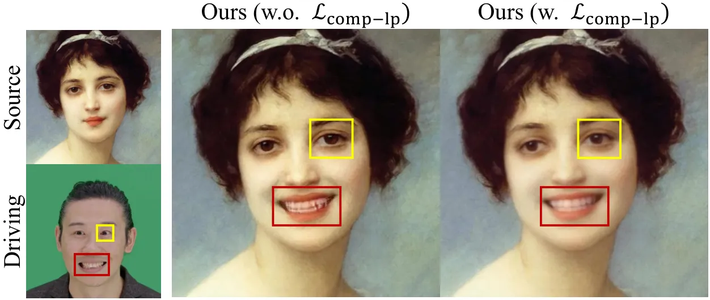

Figure 10: Ablation study on Facial Component Loss
$`\mathcal{L}_{\text{comp-lp}}`$. It significantly improves the image
fidelity of facial component (_e.g_., teeth, highlighted in red box) and
fined-grained motion (eyeball movement, highlighted in yellow box).

|                                       |                          |                             |                       |                       |                       |
| ------------------------------------- | ------------------------ | --------------------------- | --------------------- | --------------------- | --------------------- |
| Method                                | FID $`\downarrow`$       | FVD $`\downarrow`$          | LPIPS $`\downarrow`$  | E-FID $`\downarrow`$  | P-FID $`\downarrow`$  |
| LIA^(†) \[85\]                        | 47.481 / 67.541 / 89.209 | 172.195 / 130.836 / 342.964 | 0.184 / 0.122 / 0.245 | 1.279 / 1.153 / 1.106 | 0.120 / 0.005 / 0.013 |
| Ours (w.o. $`\mathcal{L}_{comp-lp}`$) | 21.061 / 28.866 / 46.950 | 150.340 / 103.145 / 299.757 | 0.110 / 0.072 / 0.165 | 1.369 / 1.157 / 0.872 | 0.011 / 0.010 / 0.014 |
| Ours                                  | 19.803 / 23.350 / 43.992 | 147.089 / 100.345 / 291.560 | 0.108 / 0.062 / 0.161 | 1.334 / 1.053 / 1.006 | 0.010 / 0.008 / 0.012 |

Table 4: Quantitative comparison result (Same-identity) of motion latent
auto-encoders on HDTF \[97\] / RAVDESS \[46\] / VFHQ \[88\]. The best
result for each metric is in bold. ^(†): Results generated by official
implementation ($`256\times 256`$)

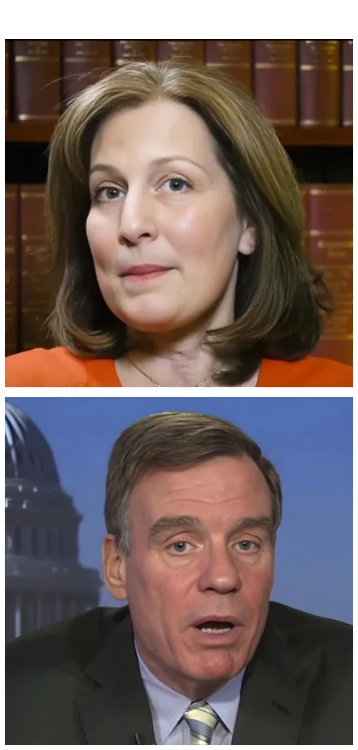

(a) Source, $`S`$

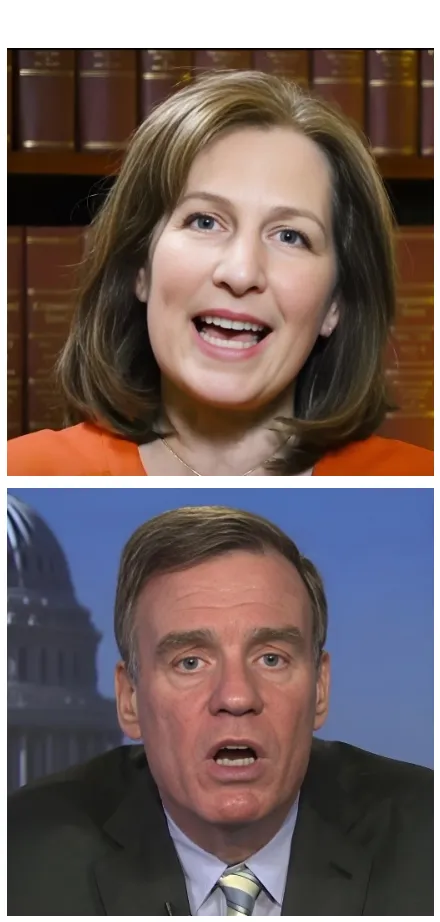

(b) Driving, $`D`$

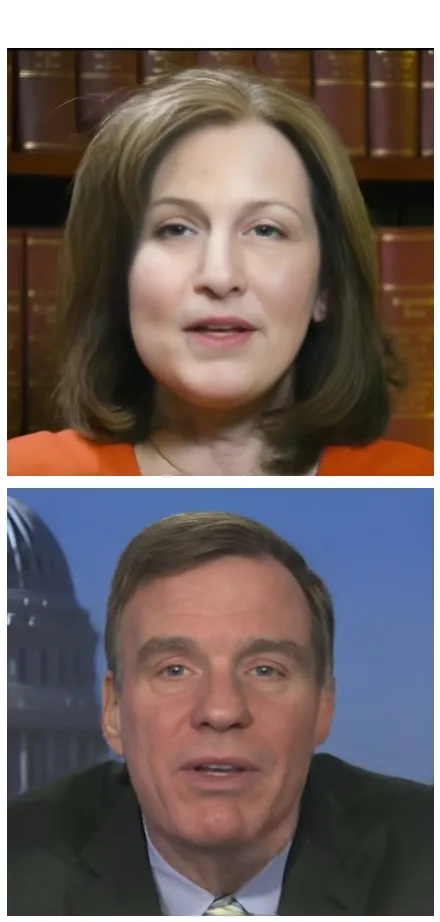

(c) Identity, $`w_{S\to r}`$

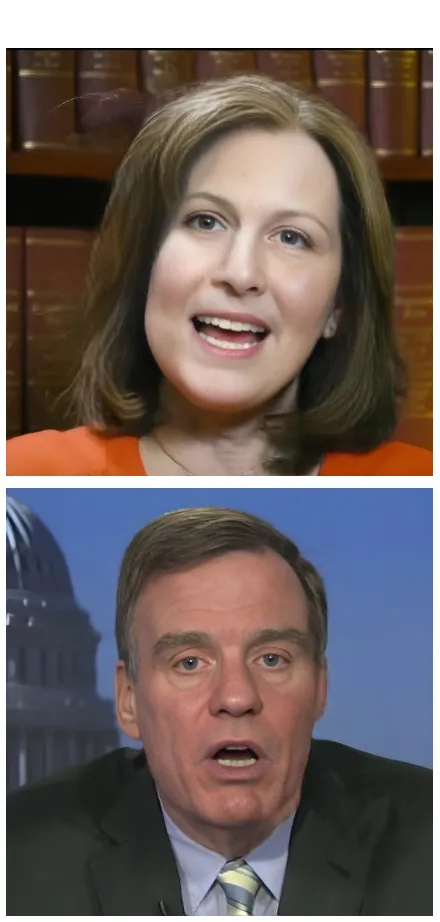

(d) Reconstruction, $`\hat{D}`$

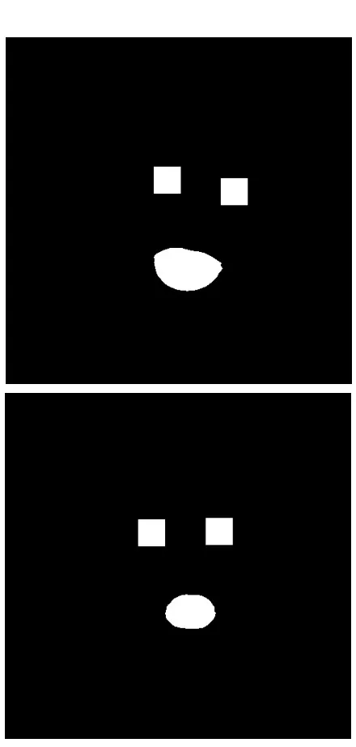

(e) Component mask

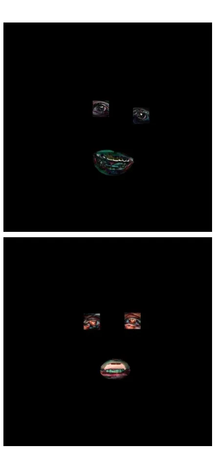

(f) Component diff

Figure 11: Visualization results of the motion latent auto-encoder.

### A.2 Improving Fidelity of Facial Components

Facial Components: Texture vs. Structure   As highlighted in face
restoration work \[84\], facial components such as eyeballs and teeth
play a important role in the perceptual quality of generated images. It
treats the issue as a lack of texture (lying in high frequencies) and
mitigate it by introducing facial component discriminators with the gram
matrix statistics matching. This approach is appropriate in face
restoration, where training objective is to reconstruct a clear image
from a degraded one that maintains the same spatial structure, ensuring
that the low-frequency structure preserved.

However, in the context of training a motion auto-encoder, spatial
mismatches are inevitably involved. Therefore, naively applying such
discriminators proves ineffective. Instead, achieving high-fidelity
facial components in a motion auto-encoder is more closely related to
structural problems (lying in low frequencies) than to texture issues as
shown in Fig. 11(f).

Facial Component Perceptual Loss $`\mathcal{L}_{\text{comp-lp}}`$   We
introduce a simple yet effective facial component perceptual loss, which
leverages the standard perceptual loss $`\mathcal{L}_{\text{lp}}`$
\[95\] known for its ability to capture structural features lying in low
frequencies. Formally, the facial component perceptual loss is defined
by

```math
\displaystyle\sum_{i=1}^{N}\frac{1}{|M_{i}|}\|M_{i}\otimes\phi_{i}(\hat{D})-M_{i}\otimes\phi_{i}(D)\|_{1}, \tag{17}
```

where $`D`$ is the driving, $`\hat{D}`$ is the generated image, $`N`$ is
the number of feature pyramid scales, $`\phi_{i}(X)`$ is the $`i`$-th
feature of the input image $`X`$ computed by VGG-19 \[66, 95\],
$`M_{i}`$ is the binary mask of the facial components that has same size
with $`\phi_{i}(X)`$, and $`|M_{i}|`$ is the sum of all values in the
binary mask $`M_{i}`$. We adopt a single perceptual loss with $`N=4`$
scales of VGG-19 feature pyramids. It is worth noting that we mask all
the multi-resolution features (not only the image).

To compute the facial component mask $`M_{i}`$, we utilize an
off-the-shelf face segmentation model \[92\] for tight mouth regions and
face landmark detector \[5\] for the bounding box regions of the eyes as
illustrated in Fig. 11(e).

In Tab. 4, we conduct ablation studies on motion latent auto-encoders.
Notably, $`\mathcal{L}_{\text{comp-lp}}`$ is consistently improves the
image fidelity over three datasets. As illustrated in Fig. 10, an
additional advantage of $`\mathcal{L}_{\text{comp-lp}}`$ is its ability
to directly supervise fine-grained motion (often neglected due to large
head motion) such as eyeball movement without any external driving
conditions such as eye-gazing direction \[17\].

### A.3 Training Objective

We train our motion latent auto-encoder by reconstructing a driving
image $`D`$ from a source image $`S`$, both sampled from the same video
clip.

The total loss function $`\mathcal{L}_{\text{total}}`$ for the motion
latent auto-encoder is defined as

```math
\displaystyle\mathcal{L}_{\text{total}} \displaystyle=\mathcal{L}_{L1}+\lambda_{\text{lp}}\mathcal{L}_{\text{lp}}+\lambda_{\text{comp-lp}}\mathcal{L}_{\text{comp-lp}}
```

```math
\displaystyle+\lambda_{\text{full-adv}}\mathcal{L}_{\text{full-adv}}
```

```math
\displaystyle+\lambda_{\text{eye-adv}}\mathcal{L}_{\text{eye-adv}}+\lambda_{\text{eye-FSM}}\mathcal{L}_{\text{eye-FSM}}
```

```math
\displaystyle+\lambda_{\text{lip-adv}}\mathcal{L}_{\text{lip-adv}}+\lambda_{\text{lip-FSM}}\mathcal{L}_{\text{lip-FSM}}, \tag{18}
```

where $`\lambda_{\text{lp}}`$, $`\lambda_{\text{comp-lp}}`$,
$`\lambda_{\text{eye-adv}}`$, $`\lambda_{\text{eye-FSM}}`$,
$`\lambda_{\text{lip-adv}}`$, $`\lambda_{\text{lip-FSM}}`$, and
$`\lambda_{\text{full-adv}}`$ are the balancing coefficients. Here,
$`\mathcal{L}_{L1}`$ is the L1 loss, and $`\mathcal{L}_{\text{lp}}`$ is
the VGG-19 \[66\] based multi-scale perceptual loss \[95\] similar to
$`\mathcal{L}_{\text{comp-lp}}`$. We incorporate 2-scale discriminator
$`\mathcal{L}_{\text{full-adv}}`$ with the non-saturating loss:

```math
\displaystyle\mathcal{L}_{\text{full-adv}}=-\log[\text{Disc}_{\text{full}}(\hat{D})], \tag{19}
```

where Disc denotes a discriminator adopted from \[33\]. To improve the
fidelity of the facial components, we also incorporate the facial
component discriminators with the feature style matching (FSM) \[84\],

```math
\displaystyle\mathcal{L}_{x\text{-adv}} \displaystyle=-\log[\text{Disc}_{x}(\hat{D}_{x})], \tag{20}
```

```math
\displaystyle\mathcal{L}_{x\text{-FSM}} \displaystyle=\|\text{Gram}(\psi(D_{x}))-\text{Gram}(\psi(\hat{D}_{x}))\|_{1}, \tag{21}
```

where $`x\in\{\text{eye},\text{lip}\}`$. $`D_{x}`$ and $`\hat{D}_{x}`$
represent the region of interest (RoI) for the component $`x`$ in the
driving $`D`$ and reconstruction $`\hat{D}`$, respectively. Gram is a
gram matrix calculation \[21\] and $`\psi`$ is the multi-resolution
features extracted by the learned component discriminators.

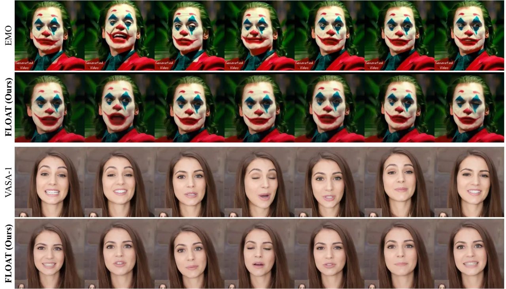

Figure 12: Comparison results with EMO \[76\] and VASA-1 \[90\] based on
their demonstration videos. Please note that their implementation are
unavailable.

### A.4 Implementation Details

We set the balancing coefficients $`\lambda_{\text{lp}}=10`$,
$`\lambda_{\text{comp-lp}}=100`$, $`\lambda_{\text{eye-adv}}=1`$,
$`\lambda_{\text{eye-FSM}}=100`$, $`\lambda_{\text{lip-adv}}=1`$,
$`\lambda_{\text{lip-FSM}}=100`$, and $`\lambda_{\text{full-adv}}=1`$.
We employ Adam optimizer \[36\] with a batch size of 8 and a learning
rate of $`2\cdot 10^{-4}`$. Entire training takes about 9 days for 460k
steps on a single NVIDIA A100 GPU.

For training our motion latent auto-encoder, we use VFHQ \[88\] to
supplement the limited number of identities provided by HDTF \[97\] and
RAVDESS \[46\]. After the same pre-processing, remaining 14,362 video
clips are used for training, and 49 video clips are used for test,
respectively.

## Appendix B More on FLOAT

In this section, we provide more details on FLOAT, including model,
experiments, and further results.

In Fig. 18, we provide a detailed model architecture for the driving
conditions $`\mathbf{c}_{t}`$.

### B.1 Evaluation Metrics

We provide further details of following metrics.

- •
  LPIPS \[95\] is used to measure the perceptual similarity between
  reconstructed image and real image based on the pre-trained AlexNet
  features \[38\].
- •
  FID \[64\] aims to measure the distance between the feature
  distributions of real and generated datasets. It is computed as:

  ```math
  \displaystyle\|\mu_{r}-\mu_{g}\|_{2}^{2}+\text{Tr}(\Sigma_{r}+\Sigma_{g}-2(\Sigma_{r}\Sigma_{g})^{\frac{1}{2}}), \tag{22}
  ```

  where $`\mu_{r}`$, $`\Sigma_{r}`$ and $`\mu_{g}`$, $`\Sigma_{g}`$ are
  the means and covariances of the pre-trained InceptionNet \[72\]
  features from the real and generated datasets, respectively.

- •
  FVD \[78\] is a variant of FID \[64\], which is used to measure the
  spatio-temporal consistency between the real and generated datasets by
  leveraging the features of pre-trained video model \[6\]. We compute
  this using 16 frames with a sliding window manner for each video.
- •
  CSIM \[12\] measures face similarity between the two face images by
  computing the cosine similarity between the pre-trained ArcFace
  features \[12\] of two images.
- •
  E-FID \[76\] aims to measure expression similarity by computing the
  FID score (Eq. 22) of 3DMM expression parameters (64-dim) \[13\] of
  generated videos and real videos.
- •
  P-FID aims to measure the head pose similarity by computing the FID
  score (Eq. 22) of 3DMM pose parameters (6-dim) \[13\] of generated
  videos and real videos.
- •
  LSE-D and LSE-C \[58\] measure lip synchronization using the
  pre-trained SynNet \[10\]. LSE-D computes the distance between the
  predicted audio embedding and the predicted video embedding, while
  LSE-C represents the confidence of synchronization.

### B.2 Baselines

For non-diffusion-based methods, we compare with SadTalker \[96\] and
EDTalk \[74\]. For diffusion-based methods, we compare with AniTalker
\[43\], Hallo \[89\], and EchoMimic \[8\].

- •
  SadTalker \[96\] employs an audio-conditional variational auto-encoder
  (VAE) to synthesize the head motion and eye blink in a probabilistic
  way.
- •
  EDTalk \[74\] uses normalizing for audio-driven head motion generation
  and can separately control the lip and head motion.
- •
  AniTalker \[43\] introduces a diffusion model to the learned motion
  latent space (similar to FLOAT) along with a variance adapter to
  improve the motion diversity. We use HuBERT audio feature-based
  implementation \[28\] for improved lip synchronization and apply
  default guidance scales and denoising steps of the official
  implementation.
- •
  Hallo \[89\] uilizes the pre-trained StableDiffusion \[61\] as its
  image generator, incorporating a hierarchical audio attention module
  to separately control lip synchronization, expression, and head pose.
  We use default guidance scales and denoising steps provided in the
  official implementation.
- •
  EchoMimic \[8\] is also StableDiffusion-based method, which leverages
  facial skeleton as additional driving signals. We use the default
  guidance scales and denoising steps provided in the official
  implementation.
- •
  It is worth noting that we compare with two superior works EMO \[76\]
  and VASA-1 \[90\] based on their demonstration videos due to their
  unavailable implementation. We highly recommend referring to
  ‘01$`\_`$EMO$`\_`$VASA-1$`\_`$Comparison$`/`$xxxx.mp4’.

### B.3 More on Experiments

For evaluating our method, we use the first frame of each video clip as
the source image. We use the first-order Euler method \[42\] as our ODE
solver. We experimentally find that other ODE solvers, such as mid-point
and Dopri5, do not lead to significant performance improvements.

|                   |                    |                    |                      |                      |                  |
| ----------------- | ------------------ | ------------------ | -------------------- | -------------------- | ---------------- |
| Ours-NFE          | FID $`\downarrow`$ | FVD $`\downarrow`$ | E-FID $`\downarrow`$ | LSE-D $`\downarrow`$ | FPS $`\uparrow`$ |
| Ours-2            | 21.785             | 178.831            | 1.542                | 7.559                | 45.22            |
| Ours-5            | 21.440             | 164.463            | 1.331                | 7.155                | 44.74            |
| Ours-10 (default) | 21.100             | 162.052            | 1.229                | 7.290                | 41.37            |
| Ours-20           | 21.158             | 164.392            | 1.293                | 7.343                | 38.20            |

Table 5: Ablation studies of the different NFE of ODE on HDTF \[97\].
FPS is computed on a single NVIDIA V100 GPU.

Ablation on NFE   In general, increasing the number of function
evaluation (NFE) reduces the solution error of ODEs. As shown in Tab. 5,
even with small NFE $`=2`$, FLOAT can achieve competitive image quality
(FID) and lip synchronization (LSE-D). However, it struggles to capture
consistent and expressive motions (FVD and E-FID), resulting in shaky
head motion and a static expression. This is because FLOAT generates the
motion in the latent space, while image fidelity is determined by the
auto-encoder. We provide supplementary videos, illustrating the impact
of different NFE (Number of Function Evaluations). Notably, with a small
NFE of 2, the generated images exhibit good quality, but the head
movements appear temporally unstable, and emotions may be exaggerated.
Please refer to supplementary videos for temporal jitters of low NFE.

|                                                 |                    |                    |                      |                      |
| ----------------------------------------------- | ------------------ | ------------------ | -------------------- | -------------------- |
| Guidance scales                                 | FID $`\downarrow`$ | FVD $`\downarrow`$ | E-FID $`\downarrow`$ | LSE-D $`\downarrow`$ |
| $`\gamma_{a}`$=1,   $`\gamma_{e}`$=1            | 33.066             | 171.047            | 1.555                | 7.049                |
| $`\gamma_{a}`$=1,   $`\gamma_{e}`$=2            | 31.844             | 166.041            | 1.334                | 7.212                |
| $`\gamma_{a}`$=2,   $`\gamma_{e}`$=1  (default) | 31.681             | 166.359            | 1.367                | 6.994                |
| $`\gamma_{a}`$=2,   $`\gamma_{e}`$=2            | 32.253             | 162.658            | 1.351                | 6.994                |

Table 6: Ablation studies of the audio guidance scale $`\gamma_{a}`$ and
the emotion guidance scale $`\gamma_{e}`$ on RAVDESS \[46\].

Ablation on Guidance Scales   In Tab. 6, we conduct ablation studies on
guidance scales: $`\gamma_{a}`$ and $`\gamma_{e}`$, with the emotion
intensive dataset RAVDESS \[46\]. Note that increasing $`\gamma_{a}`$
leads to better temporal consistency (FVD) and lip synchronization
quality (LSE-D). Moreover, increasing $`\gamma_{e}`$ improves video
consistency (FVD) and expressiveness (E-FID). This enables balanced
control over emotional audio-driven talking portrait generation.

In Fig. 20, we visualize the effect of different emotion guidance scale
$`\gamma_{e}`$. For this experiments, the predicted speech-to-emotion
label is disgust with $`99\%`$ probability. Notably, as increasing
$`\gamma_{e}`$ from 0 to 2, we can observe that emotion-related
expressions and motions are enhanced.

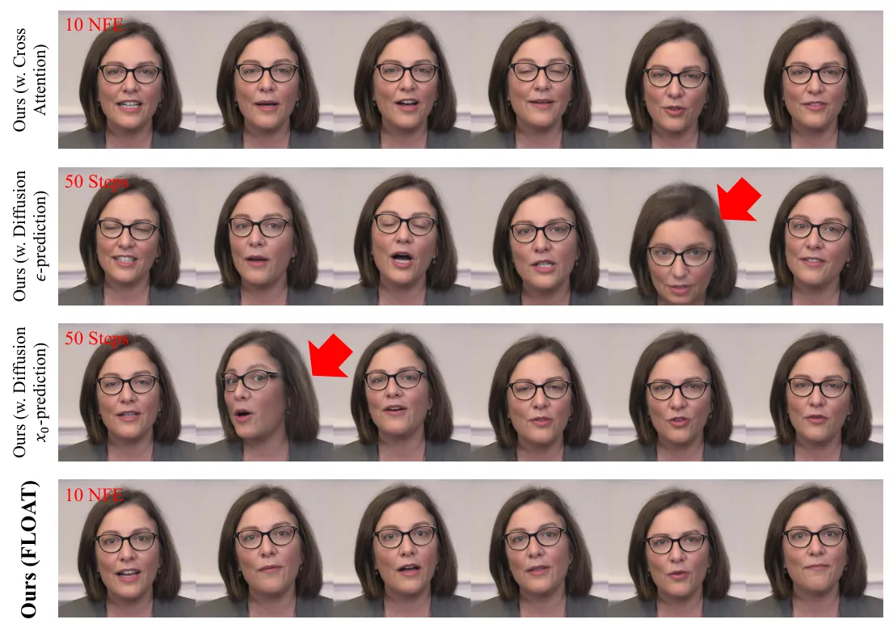

Figure 13: Ablation results on frame-wise AdaLN and flow matching.
Please refer to supplementary video for notable differences.

Ablation on AdaLN and Flow Matching  We conduct ablation study on
frame-wise AdaLN by comparing it with a cross-attention. We adopt the
stand cross-attention mechanism described in \[19, 71\], using
transformer encoder architecture for non-autoregressive sequence
modeling. We use the same attention mask used in the frame-wise AdaLN,
which attends to additional $`2T`$ adjacent frames for the $`l`$-th
input latent: $`[l-2,l-1,l,l+1,l+2]`$.

To compare against flow matching, we implement two diffusion models with
distinct parameterizations: $`\epsilon`$-prediction and
$`x_{0}`$-prediction. For $`\epsilon`$-prediction, we directly predict
Gaussian noise by the noise predictor $`s(\cdot;\theta)`$ parameterized
by $`\theta`$ with the following simple loss:

```math
\displaystyle\mathcal{L}_{\text{simple, noise}}(\theta)=\|s(x_{t},\mathbf{c}_{t};\theta)-\epsilon\|_{2}^{2}, \tag{23}
```

where $`t`$ $`\sim`$ $`\mathcal{U}[0,1]`$, $`\epsilon`$ $`\sim`$
$`\mathcal{N}(0^{-L^{\prime}:L},I)`$, and the noise input $`x_{t}`$
$`\in`$ $`\mathbb{R}^{(L^{\prime}+L)\times d}`$ is sampled from a
forward diffusion process
$`q(x_{t}|x_{t-1})=\mathcal{N}(x_{t};\sqrt{1-\beta_{t}}x_{t-1},\beta_{t}I)`$
\[27\]. In our case, $`x_{t}`$ is noisy motion latents at diffusion time
step $`t`$, starting from $`t=0`$ with $`x_{0}`$ $`=`$
$`w_{r\to D^{1:L}}`$ $`\in`$ $`\mathbb{R}^{(-L^{\prime}+L)\times d}`$.

For $`x_{0}`$-prediction, we predict a clean sample $`x_{0}`$, instead
of noise \[59\], by the predictor $`s(\cdot;\theta)`$ with the following
simple loss:

```math
\displaystyle\mathcal{L}_{\text{simple},x_{0}}(\theta)=\|s(x_{t},\mathbf{c}_{t};\theta)-x_{0}\|_{2}^{2}. \tag{24}
```

We also incorporate a velocity loss \[75\]:

```math
\displaystyle\mathcal{L}_{\text{vel},x_{0}}(\theta)=\|\Delta s-\Delta x_{0}\|_{2}^{2}, \tag{25}
```

where $`\Delta s`$ and $`\Delta x_{0}`$ are the one-frame difference
along the time-axis for $`s`$ and $`x_{0}`$, respectively. The total
loss $`\mathcal{L}_{\text{total},x_{0}}(\theta)`$ is

```math
\displaystyle\mathcal{L}_{\text{total},x_{0}}(\theta)=\mathcal{L}_{\text{simple},x_{0}}(\theta)+\mathcal{L}_{\text{vel},x_{0}}(\theta). \tag{26}
```

For reverse process, we use the DDIM \[67\] sampler with 50 denoising
steps.

In our implementation, both $`\epsilon`$-prediction and
$`x_{0}`$-prediction achieve the best results with guidance scales
$`\gamma_{a}=\gamma_{e}=1`$ (default). In Fig. 13, Fig. 21 and Fig. 22,
we provide qualitative comparisons between these approaches and FLOAT.
Notably, the cross-attention exhibits less diverse head motions compared
to FLOAT, while diffusion-based approaches struggle to generate
temporally stable lip and head motion, often resulting in out-of-sync
movements or motion artifacts.

## Appendix C Additional Results

### C.1 Additional Comparison Results

We provide additional comparison results with baselines in Fig. 24,
Fig. 25, and Fig. 26.

### C.2 Out-of-distribution (OOD) Results

In Fig. 19 and Fig. 20, we present additional out-of-distribution
results, including paintings, non-English speech, and singing.

### C.3 User Study

|                  |                   |                     |                   |                   |                        |
| ---------------- | ----------------- | ------------------- | ----------------- | ----------------- | ---------------------- |
| Method           | Lip Sync Accuracy | Natural Head Motion | Teeth Clarity     | Natural Emotion   | Overall Visual Quality |
| SadTalker \[96\] | 2.20 $`\pm`$ 0.35 | 2.03 $`\pm`$ 0.26   | 1.53 $`\pm`$ 0.19 | 1.80 $`\pm`$ 0.28 | 1.97 $`\pm`$ 0.23      |
| EdTalk \[74\]    | 2.50 $`\pm`$ 0.34 | 2.60 $`\pm`$ 0.28   | 1.17 $`\pm`$ 0.17 | 2.07 $`\pm`$ 0.36 | 1.83 $`\pm`$ 0.27      |
| AniTalker \[43\] | 2.70 $`\pm`$ 0.31 | 3.00 $`\pm`$ 0.30   | 2.13 $`\pm`$ 0.27 | 3.17 $`\pm`$ 0.27 | 2.63 $`\pm`$ 0.26      |
| Hallo \[89\]     | 3.30 $`\pm`$ 0.32 | 2.73 $`\pm`$ 0.35   | 2.23 $`\pm`$ 0.27 | 2.67 $`\pm`$ 0.35 | 2.27 $`\pm`$ 0.33      |
| EchoMimic \[8\]  | 2.67 $`\pm`$ 0.37 | 3.07 $`\pm`$ 0.30   | 2.20 $`\pm`$ 0.34 | 2.50 $`\pm`$ 0.37 | 2.70 $`\pm`$ 0.36      |
| FLOAT (Ours)     | 3.93 $`\pm`$ 0.21 | 3.57 $`\pm`$ 0.33   | 4.13 $`\pm`$ 0.27 | 3.77 $`\pm`$ 0.30 | 3.87 $`\pm`$ 0.30      |

Table 7: Mean opinion score (MOS) study results with $`95\%`$ confidence
interval. The score ranges in 1 to 5. The best result for each metric is
in bold.

In Tab. 7, we conduct a mean opinion score (MOS) based user study to
compare the perceptual quality of each method (_e.g_., teeth clarity and
naturalness of emotion). We generate 6 videos by using the baselines and
FLOAT, and ask 15 participants to evaluate each generated video with
five evaluation factors in the range of 1 to 5. As shown in Tab. 7,
FLOAT outperforms the baselines.

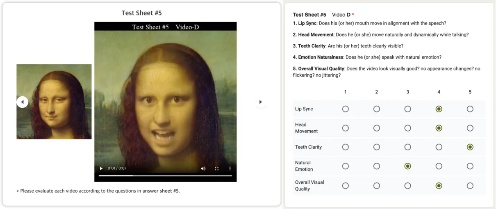

Figure 14: Example of user study interface. (Left) Test Sheet; (Right)
Answer Sheet. Participants were asked to evaluate 5 questions for each
video (total 180 videos).

In Fig. 14, we provide an example of test and answer sheet used of the
user study. We asked 15 participants to evaluate five questions for each
generated video produced by the baselines and FLOAT. Consequently, each
participant scores total 180 questions, with responses ranged from 1 to 5. Additionally, we include the supplementary videos used in the user
study.

### C.4 Video Results

We include video results to further illustrate the performance of our
method, including emotion redirection, additional driving conditions,
and OOD results. Please refer to provided videos.

## Appendix D Discussion

Ethical Consideration   This work aims to advance virtual avatar
generation. However, as it can generate realistic talking portrait only
from a single image and audio, we considerably recognize the potential
for misuse, such as deepfake creation. Attaching watermarks to generated
videos and carefully restricted license can mitigate this issues.
Additionally, we encourage researchers in deepfake detection to use our
results as data to improve detection tools.

Limitation and Further Work   While our method can generate realistic
talking portrait video from a single source image and a driving audio,
it has several limitations.

First, our method cannot generate more vivid and naunced emotional
talking motion. This is because the speech-driven emotion labels are
restricted to seven basic emotions, making it challenging to capture
more nuanced emotions like shyness. We believe this limitation can be
addressed by incorporating textual cues (_e.g_., “gazing forward with a
shyness"), an idea we plan to explore in future work. Moreover, any
other approaches to enhance the naturalness of talking motion are key
directions for our future work.

Figure 15: Distribution yaw angles in training dataset \[97, 46\] for
FLOAT.

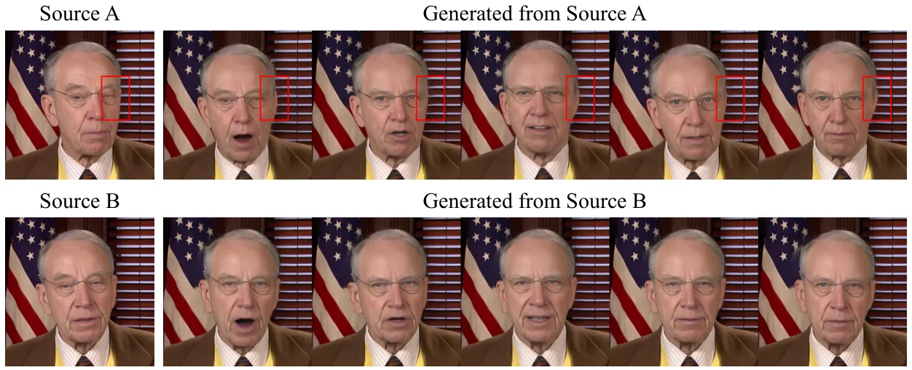

Figure 16: Failure case of FLOAT. It often struggles to handle
non-frontal faces and accessories, such as glasses. Please refer to
supplementary video.

Second, we aim to build our method solely upon high-definition
open-source datasets. Since the training datasets are biased toward
frontal head angles \[97, 46\], the generated results also exhibit a
similar bias, often producing suboptimal results for non-frontal
(_e.g_., $`|\text{yaw angle}|\geq$$`$) source images or images with
notable accessories. This is partially because the head pose
distribution of our training data as shown in Fig. 15. Although we
investigated other existing high-definite face video datasets, such as
MEAD \[81\] and CelebV-Text \[93\], we found limitations in their
suitability. MEAD \[81\] contains minimal head motion and a limited
number of identities, while CelebV-Text \[93\] is not organized for
audio-driven talking portrait, containing out-of-sync audio and
significant background inconsistencies.

This limitations can be mitigated by introducing carefully curated
external data, as demonstrated by other concurrent methods \[76, 89, 31,
90, 25\], or by incorporating multi-view supervision \[77\] when
training our motion latent auto-encoder. We provide examples of failure
case in Fig. 16 and supplementary video.

Acknowledgment   The source images and audio used in this paper are
taken from other talking portrait generation methods \[76, 90, 89, 8,
96\]. We sincerely thank the authors of these works for their valuable
contributions. Note that the individuals depicted in our source images
and the speech generated in our experiments are not associated with the
actual persons they represent.

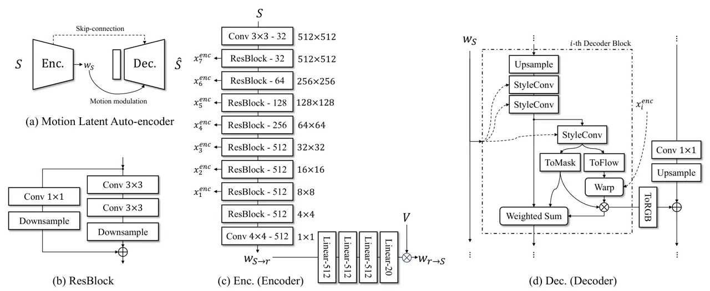

Figure 17: Detailed Model architecture of our motion latent
auto-encoder. The notations are adopted from LIA \[85\] and StyleGAN2
\[33\].

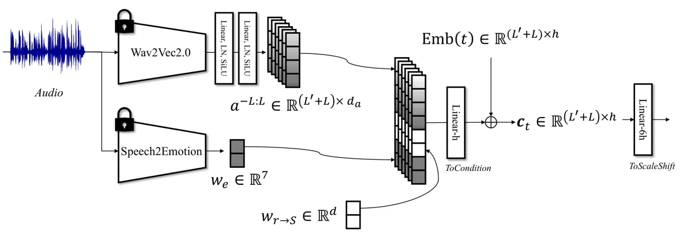

Figure 18: Detailed model architecture for constructing the driving
conditions $`\mathbf{c}_{t}\in\mathbb{R}^{(L^{\prime}+L)\times h}`$ in
FLOAT.

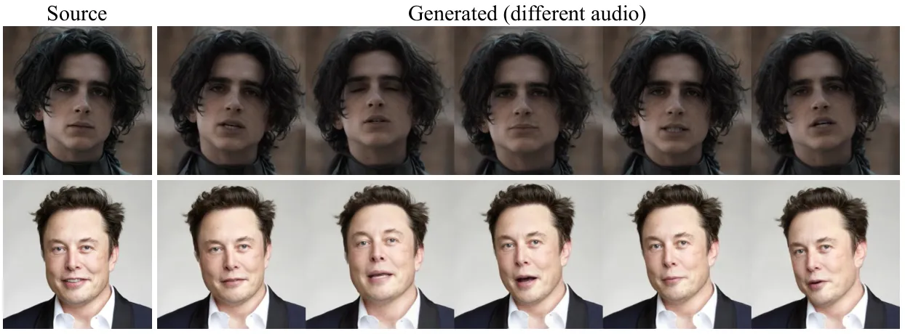

Figure 19: Out-of-distribution results. The first row shows the result
for Chinese audio, and the second row shows the result for singing
audio. Please refer to supplementary video.

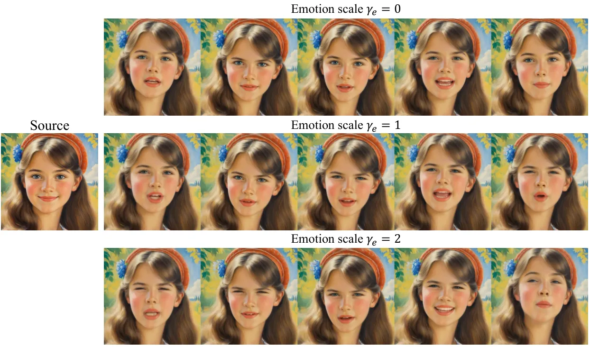

Figure 20: Ablation on emotion guidance scale $`\gamma_{e}`$. The
predicted speech-to-emotion label is disgust of $`99.99\%`$. Please
refer to supplementary video.

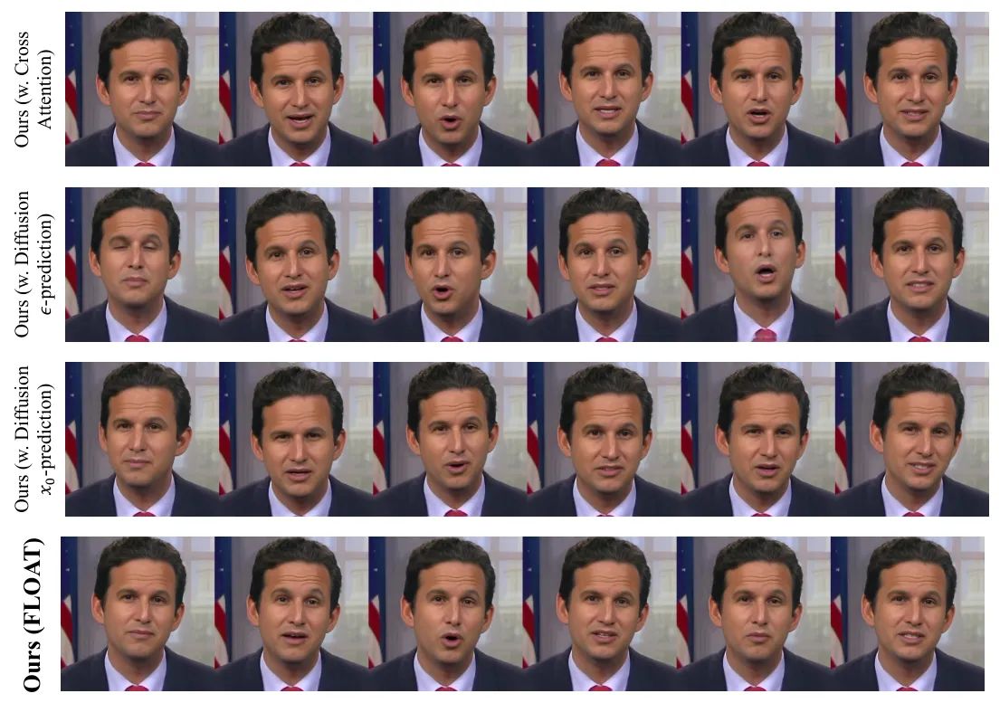

Figure 21: Ablation results on frame-wise AdaLN and flow matching.
Please refer to supplementary video.

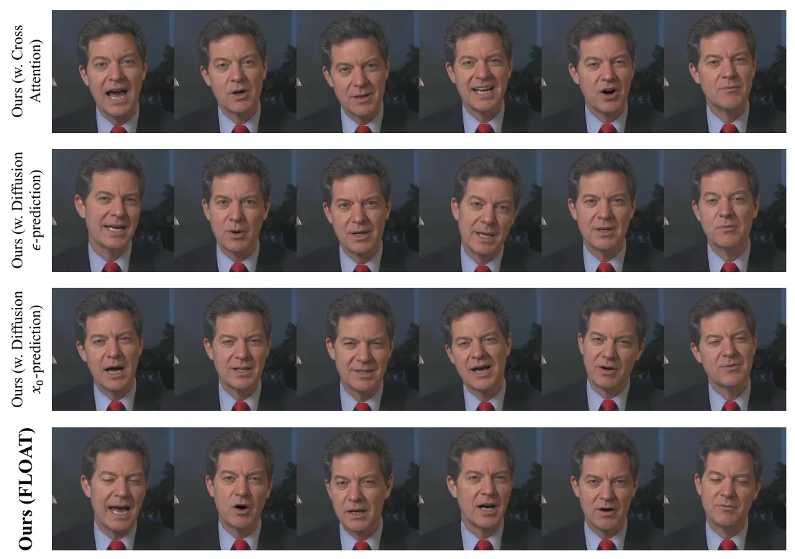

Figure 22: Ablation results on frame-wise AdaLN and flow matching.
Please refer to supplementary video.

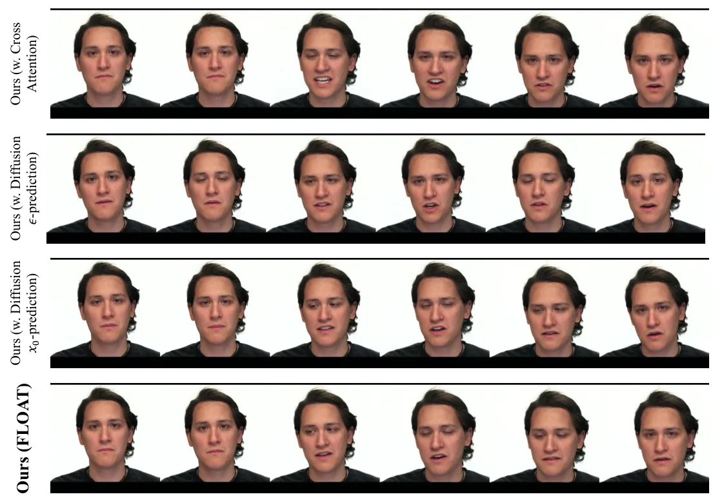

Figure 23: Ablation results on frame-wise AdaLN and flow matching.
Please refer to supplementary video.

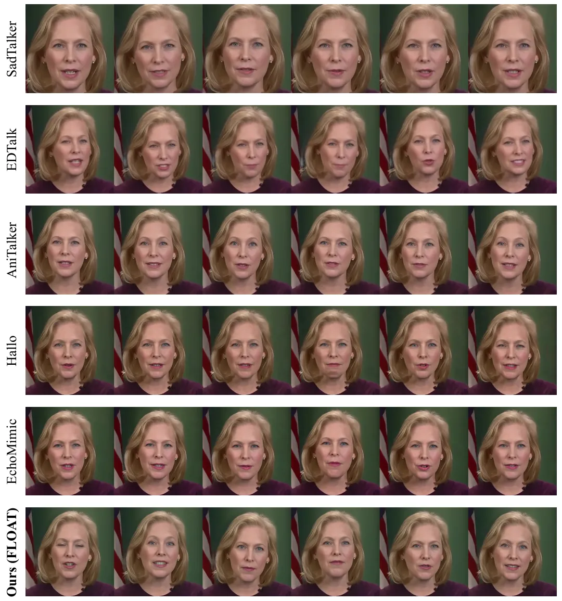

Figure 24: Qualitative comparison results with state-of-the-art methods.
Please refer to supplementary video.

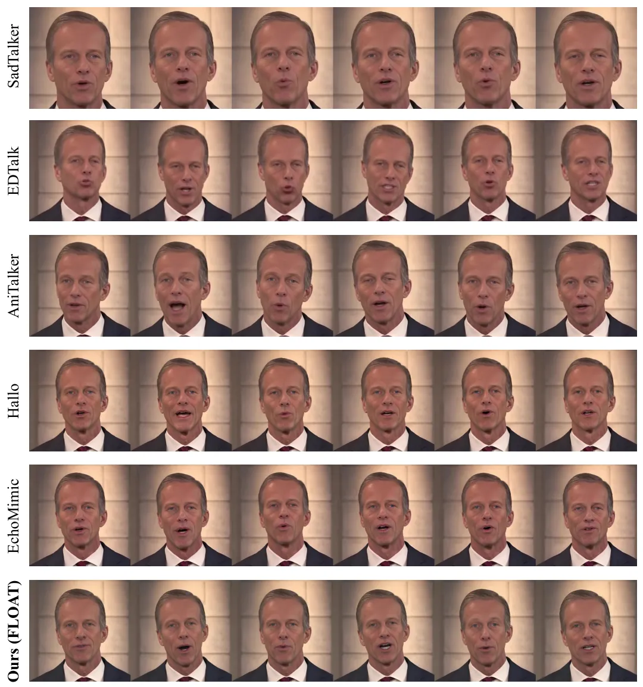

Figure 25: Qualitative comparison results with state-of-the-art methods.
Please refer to supplementary video.

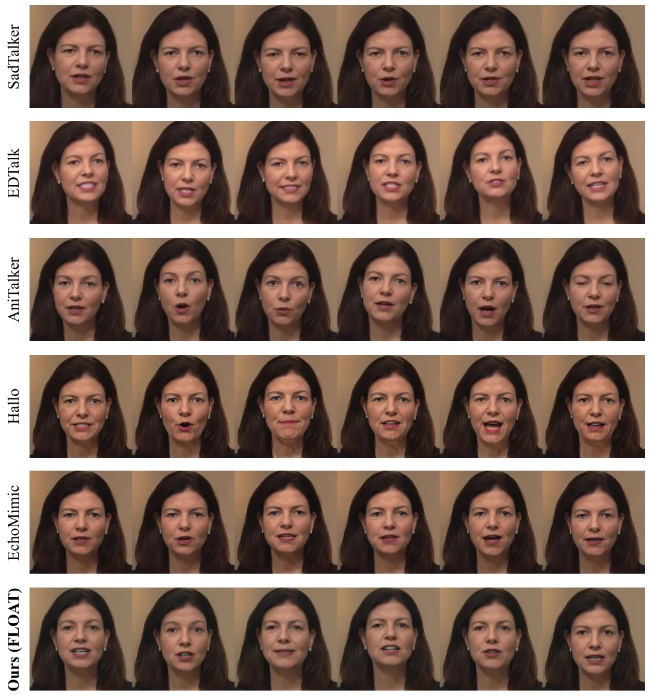

Figure 26: Qualitative comparison results with state-of-the-art methods.
Please refer to supplementary video.
