# EmojiDiff: Advanced Facial Expression Control with High Identity Preservation in Portrait Generation

Liangwei JiangRuida LiZhifeng Zhang    Shuo Fang    Chenguang Ma
Terminal Technology Department, Alipay, Ant Group
Email: [{jiangliangwei.jlw, ruida.lrd, jason.zzf, fangshuo.f,
chenguang.mcg}@antgroup.com](mailto:)

###### Abstract

This paper aims to bring fine-grained expression control while
maintaining high-fidelity identity in portrait generation. This is
challenging due to the mutual interference between expression and
identity. On one hand, fine expression control signals inevitably
introduce appearance-related semantics (e.g., facial contours, and
ratio), which impact the identity of the generated portrait. On the
other hand, even coarse-grained expression control can cause facial
changes that compromise identity, since they all act on the face. Here,
we introduce EmojiDiff, the first end-to-end solution that enables
simultaneous control of extremely detailed expression (RGB-level) and
high-fidelity identity in portrait generation. To address the above
challenges, EmojiDiff adopts a two-stage scheme involving decoupled
training and fine-tuning. For decoupled training, we innovate
ID-irrelevant Data Iteration (IDI) to synthesize high-quality
cross-identity expression pairs by separating and optimizing the
processes of maintaining expression and altering identity. Training the
model with this data, we effectively disentangle fine expression
features in the expression template from other extraneous information
(e.g., identity, skin). Subsequently, we present ID-enhanced Contrast
Alignment (ICA) for further fine-tuning. ICA achieves rapid
reconstruction and joint supervision of identity and expression
information, thus aligning identity representations of images with and
without expression control. Experimental results demonstrate that our
method significantly outperforms its counterparts, achieving precise
expression control with highly maintained identity, and generalizing
well to various diffusion models. Project page:
[https://emojidiff.github.io/](https://emojidiff.github.io/).

^(†)^(†) †Corresponding authors.

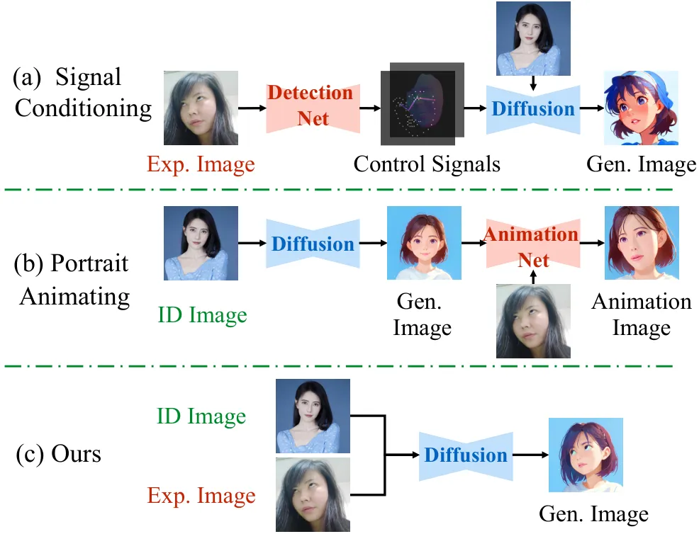

Figure 1: Expression customization by different methods. (a) The methods
extract the control signals from expressions and inject them into
diffusion models. (b) The methods generate stylized images and
manipulate them through animation. (c) The proposed method
simultaneously incorporates portrait images and reference expressions,
generating stylistic images in an end-to-end manner.

## 1 Introduction

The development of diffusion model \[20, 40, 42, 22, 33\] has catalyzed
significant advancements in identity (ID) customization \[52, 47, 18\].
This task involves generating images that align with the specified
identity of portrait images, with wide-ranging applications in AI
portraits \[27, 30, 24\], image animation \[23, 49\], and virtual
try-ons \[6, 7, 44\]. Despite substantial advancement, existing methods
reveal a notable limitation: monotonous facial expressions. This
shortcoming constrains the expressiveness of the generated portraits,
undermining their ability to convey subtle emotions and severely
hindering practical applications.

Researchers \[9, 25, 35\] seek to use reference images to manipulate
portrait expressions. However, due to the strong coupling between
expression and identity, it is challenging to introduce precise
expression control while preserving high identity fidelity. First,
fine-grained expression control conflicts with identity preservation.
Excessively detailed expression templates also bring appearance-related
semantic and style information (such as facial contours and skin). If
the model directly replicates the appearance and structure from the
expression reference, it compromises the identity of generated images
(referred to as ID leakage). Second, a potential conflict exists between
facial expression and identity control since both manipulate the face.
Expression control can modify the facial topology and reduce identity
fidelity, while identity control may make expressions more neutral.
Third, although the highly flexible diffusion model and Style LoRA
enrich the generated portraits, they also bring challenges in the
generalizability of identity and expression control across various
stylized scenes.

Pioneering works can hardly deal with these challenges altogether. As
depicted in Fig. 1, signal-conditioning generation methods \[9, 25, 35\]
tend to extract and inject coarse expression signals (_e.g_., landmarks,
poses) into the diffusion model to prevent ID leakage. However, these
signals lose many facial details (_e.g_., frowning, pouting, and cheek
twitching), and they are significantly limited by the accuracy of
third-party networks, such as pose \[2\] and action unit detectors
\[3\]. Portrait animation \[23, 5\] can serve as a post-processing tool
for expression customization, which transfers expressions from reference
templates to portrait images. However, these methods heavily rely on
generated stylized images, where the identity and data distribution of
the portraits significantly deviate from the real world, negatively
impacting identity fidelity, expression control, and image quality.

In this paper, we introduce EmojiDiff, an innovative end-to-end solution
that integrates fine-grained expression control with high-fidelity
portrait generation. Unlike previous signal conditioning-based methods
\[2, 34, 46\], we still insist that the model should derive the motion
directly from the original RGB expressions, ensuring comprehensive
expression representation and robust generalization \[17, 50\]. To
achieve this, we propose a pluggable expression controller (E-Adapter)
alongside its decoupled training strategy. As the core of the training,
we innovate ID-irrelevant Data Iteration (IDI) to synthesize the
identity-expression decoupling data (_i.e_., cross-identity expression
pairs), which are rarely available in real-world data. IDI creatively
divides cross-identity expression transfer into two steps: maintaining
expressions and modifying identities. By sequentially optimizing the two
steps, we achieve a stable and high-quality data supply. Training the
controller with these pairs facilitates the transfer of detailed
expressions to the generated output while implicitly filtering out
identity information concealed in the expressions, thereby preventing ID
leakage. To address the potential conflict between expression and
identity, we develop the ID-enhanced Contrast Alignment (ICA) for
fine-tuning. ICA efficiently computes the identity and expression loss
by one-step reconstruction, promoting the identity under different
expressions as consistent as possible. This process mitigates the
negative impacts of expression control on identity and enhances identity
fidelity. In summary, our contributions are fourfold:

1\) To the best of our knowledge, EmojiDiff is the first end-to-end
framework that achieves both fine-grained expression control and high ID
fidelity portrait generation, accommodating various diffusion models and
style LoRA.

2\) We innovate ID-irrelevant Data Iteration for decoupled training,
effectively disentangling fine expression features from RGB expression
images and preventing ID leakage effectively.

3\) We propose ID-enhanced Contrast Alignment, an efficient fine-tuning
strategy designed to ensure generated portraits maintain stable identity
across diverse expressions.

4\) We introduce the cross-identity expression dataset CIEP100k,
containing various expressions and data with the same expression but
different identities, facilitating further research on
expression-identity disentanglement.

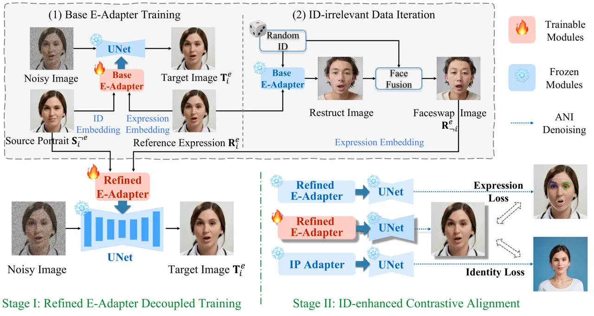

Figure 2: Overview of the proposed method. To integrate RGB-driven
expression control into diffusion models, we aim to synthesize
cross-identity data
$`\{\mathbf{S}_{i}^{\neg{e}},\mathbf{R}_{\neg{i}}^{e},\mathbf{T}_{i}^{e}\}`$
for the model’s decoupled training, and mitigate the negative impact on
the original identity through contrastive alignment fine-tuning. Before
decoupled training, the fundamental expression controller (i.e., Base
E-Adapter) is trained with same-identity data
$`\{\mathbf{S}_{i}^{\neg{e}},\mathbf{R}_{i}^{e},\mathbf{T}_{i}^{e}\}`$
to obtain expression transfer capabilities (the structure of the
E-Adapter is illustrated in Fig. 3). Next, the trained Base E-Adapter
and FaceFusion \[12\] are utilized to alter the identity of portraits,
thereby creating cross-identity expression pairs
$`\{\mathbf{R}_{\neg{i}}^{e},\mathbf{T}_{i}^{e}\}`$. Subsequently, the
Refined E-Adapter uses newly synthesized data for disentangled training,
facilitating dual control of identity and expression without ID leakage.
Finally, the Refined E-Adapter is fine-tuned by expression and identity
loss based on ANI.

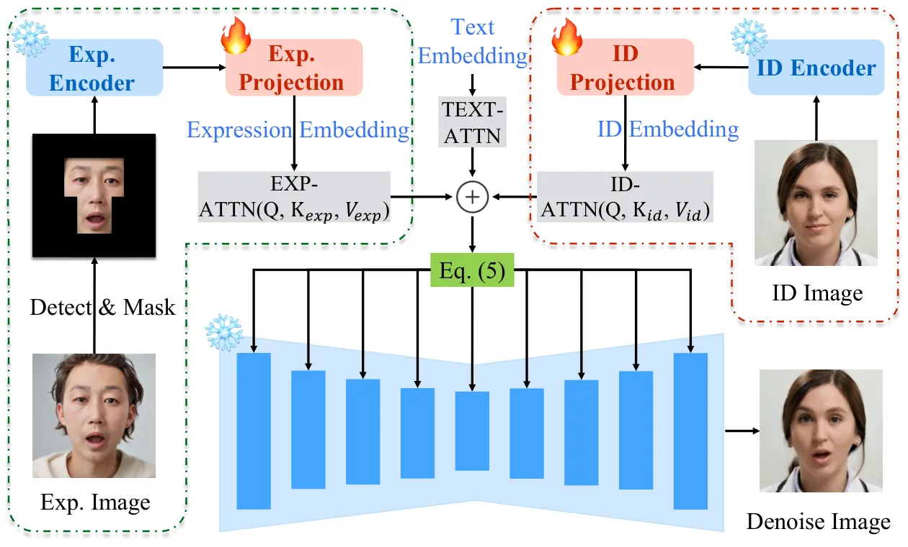

Figure 3: The proposed E-Adapter. The embeddings of identity and
expression images are obtained through respective branches.
Subsequently, the ID embedding, text embedding, and expression
embeddings are integrated into the network, as depicted in Eq. (5).

## 2 Related Work

### 2.1 ID-Preserving Image Generation

The task of identity-preserving generation \[42, 15, 22\] seeks to
empower diffusion models to synthesize images of given identities.
Recent studies \[27, 4, 24, 18\] have explored tuning-free methods,
which utilize face embeddings to conditioning generation without
altering raw models. For instance, FaceChain \[30\] introduces an
independent adapter before the cross-attention layer, preventing
interference between face and text conditions. IP-Adapter \[52\]
introduces a novel decoupled cross-attention mechanism for identity
injection. InstantID \[47\] proposes an IdentityNet to incorporate
facial key points with image conditions. Although these methods can
quickly generate customized portraits, they severely lack fine control
over the expressions.

### 2.2 Expression Customization

Most methods for expression animation integrate control signals
extracted from expression images into diffusion models. ControlNet
\[54\] is a pioneering effort that enables the incorporation of human
poses, depth maps, and other image conditions. Following this framework,
MediaPipe \[8\] specializes in extracting facial landmarks from
reference expressions to preserve more expression details. Arc2Face
\[9\] extracts 3D normal maps \[14\] to personalize expressions based on
given portraits. Additionally, some studies pursue more flexible
control. Collaborative Diffusion \[25\] allows localized editing of
facial parts using semantic maps. \[35\] combined valence & arousal, and
action units and GANmut \[11\] to characterize emotion information.
DiffSFSR \[29\] utilizes an emotional dictionary to transfer facial
expressions to the generated image. FineFace \[46\] employs action units
to allow localized control by describing the intensity of facial muscle
movements.

In practice, portrait animation \[53, 23, 32, 10, 5, 48, 49\] can adjust
portrait expressions without altering the image background. Notable
examples, such as FaceAdapter \[19\], X-Portrait \[50\], and
LivePortrait \[17\], which can be used for post-processing of generated
portrait images. However, these methods cannot simultaneously customize
real-world identities and expressions, adversely affecting identity
fidelity and image quality.

## 3 Methodology

Given a source portrait $`\mathbf{S}`$, a textual prompt $`\mathbf{P}`$,
and a reference $`\mathbf{R}`$, our method aims to generate target
images $`\mathbf{T}`$. To enable the model to accept RGB expression
inputs, we aim to construct ternary data sets
$`\mathcal{T}=\{\mathbf{S}_{i}^{\neg{e}},\mathbf{R}_{\neg{i}}^{e},\mathbf{T}_{i}^{e}\}`$
for decoupled training. Here, $`i`$ and $`e`$ denote the specific
identity and the expression, and $`\neg{i}`$ and $`\neg{e}`$ can be any
specific items different from $`i`$ and $`e`$. During training, the
model takes $`\mathbf{S}_{i}^{\neg{e}},\mathbf{R}_{\neg{i}}^{e}`$ as
inputs and $`\mathbf{T}_{i}^{e}`$ as the learning objective, represented
as
$`\mathbf{T}_{i}^{e}=\mathcal{F}(\mathbf{S}_{i}^{\neg{e}},\mathbf{R}_{\neg{i}}^{e})`$,
where $`\mathcal{F}`$ is the trained expression controller. This setup
allows the model to maintain the identity $`i`$ of $`\mathbf{S}`$ while
accurately replicating the expression $`e`$ from $`\mathbf{R}`$.
However, we are unable to collect qualified cross-identity expression
pairs $`\{\mathbf{R}_{\neg{i}}^{e},\mathbf{T}_{i}^{e}\}`$ from
real-world scenarios. Besides, the integration of expression control
hinders the original ID control.

To overcome these issues, our method is divided into two stages:
decoupling training and fine-tuning. Before decoupled training, we
construct the required data delicately in two steps. Firstly, we design
the expression controller and train a base version (Base E-Adapter)
using the same-identity ternary data sets as detailed in Sec. 3.2.1. The
images generated by Base E-Adapter exhibit a very high expression
consistency with given expression references, although they also have a
similar appearance to the references (ID leakage). Secondly, we develop
the ID-irrelevant Data Iteration (IDI) to alter the identity of the
images generated by Base E-Adapter, thus promoting the given reference
expressions and the altered images to form data pairs with the same
expression but different identity (as outlined in Sec. 3.2.2). Using the
newly created cross-identity dataset, we perform decoupled training on
the proposed expression controller to develop the Refined E-Adapter.
Refined E-Adapter accurately controls expression details while
preventing ID leakage when generating portrait images (see Sec. 3.2.3).
Finally, we introduce ID-enhanced Contrast Alignment (ICA) to further
fine-tune the Refined E-Adapter, reducing the negative impact of
expression manipulation on ID control (Sec. 3.3). Fig. 2 provides an
overview of our pipeline.

### 3.1 Preliminary

Latent Diffusion Model. The latent diffusion models involve a diffusion
process and a reverse process in the latent space. During the diffusion
process, an image $`x`$ is first projected to a smaller latent
representation by a VAE \[26\] encoder. Then, random noise is gradually
added to the representation $`z_{0}`$. The noisy representation
$`z_{t}`$ is derived as:

```math
z_{t}=\sqrt{\bar{\alpha}_{t}}z_{0}+\sqrt{1-\bar{\alpha}_{t}}\epsilon, \tag{1}
```

where $`t`$, $`\bar{\alpha}_{t}`$ denotes timestep and predefined
function of $`t`$, respectively. Conversely, during the denoising
process, a U-Net \[41\] is trained to predict the added noise
$`\epsilon`$ from the noisy latent representation $`z_{t}`$. The
training objective aims to minimize the loss function as follows:

```math
\mathcal{L}_{sd}=E_{z_{0},\epsilon\sim\mathcal{N}(\mu,\sigma^{2})}\left[\left\|\epsilon-\epsilon_{\theta}(z_{t},t,C)\right\|_{2}^{2}\right], \tag{2}
```

where $`C`$ represents the condition.

Image Prompt Adapter. IP-Adapter \[52\] introduces a novel approach to
incorporating an image prompt, working together with a text prompt to
control image generation. A decoupled cross-attention is used to
separate cross-attention layers for text features and image features,
formulated as:

```math
\displaystyle Z={\rm Attn}(Q,K_{t},V_{t})+\lambda\cdot{\rm Attn}(Q,K_{i},V_{i}), \tag{3}
```

where $`\lambda`$ is a weight factor, and $`\{Q,K,V\}_{source}`$ refers
to the source of the feature tensor.

### 3.2 Decoupled Training

Cross-identity expression pairs
$`\{\mathbf{R}_{\neg{i}}^{e},\mathbf{T}_{i}^{e}\}`$ are essential for
training expression controllers. However, we cannot obtain adequate
samples from the real world due to the subtle differences in individual
expressions. Additionally, existing methods \[17, 12, 50, 51\] also
struggle to synthesize qualified data pairs, particularly with extreme
expressions. Therefore, we seek to develop a novel strategy for data
construction.  Reviewing previous works \[50, 51\], we notice that they
avoid using same-identity expression pairs
$`\{\mathbf{R}_{i}^{e},\mathbf{T}_{i}^{e}\}`$ for controller training to
prevent identity leakage during inference. However, our insights suggest
that the controller trained with same-identity pairs exhibits superior
expression transfer capabilities, as shown in Fig. 4. Based upon this,
we divide the synthesis of cross-identity expression pairs into two
sequential steps: maintaining expression and modifying identity.
Initially, we utilize the same-identity data to train an expression
controller that accurately transfers reference expressions into
generated images without considering identity leakage. Subsequently, we
utilize the portrait generation process to further alter the identity of
the controller-generated image. With the powerful abilities of the
diffusion model, the modified image and the given expression template
form a high-quality cross-identity data pair. After that, the data can
be used to train the model to decouple expressions from identities.

#### 3.2.1 Base E-Adapter Training

In this subsection, we first propose the expression controller
(E-Adapter) suitable for portrait generation and then train its basic
version for subsequent data synthesis. Given the strong coupling between
identity and expression, we employ a decoupled parallel attention to
integrate them and design the E-Adapter, building upon IP-Adapter
\[52\]. As illustrated in Fig. 3, apart from text input, E-Adapter
includes two control branches: the identity and expression branch. This
simple yet effective design achieves three objectives. First, the
parallel control of expression and identity reduces operation errors
compared to the serial way. Second, the model can efficiently retrieve
features from identity or expression, and learn how to incorporate the
expression into the given identity. Third, the training module fully
decouples expression and identity control, enabling independent or
simultaneous manipulation of both (more empirical analysis can be found
in Sec. 4.3 and Sec. 4.4). Specifically, in the identity branch, we
inherited IP-Adapter to encode identity embeddings and inject them into
the U-Net along with text embeddings, formulated as:

```math
\displaystyle Z_{id}= \displaystyle\rm{\displaystyle Attn}(Q_{noise},K_{text},V_{text}) \tag{4}
```

```math
\displaystyle+\lambda_{id}\cdot{\rm Attn}(Q_{noise},K_{id},V_{id}),
```

where $`\lambda_{id}`$ refers to the strength of the ID control.

In the expression branch, we first preprocess the original expression
reference to obtain a local image, which removes irrelevant elements
such as the background, face contour, etc. We then extract the
expression embedding and inject it into the same cross-attention module
with the identity embedding, denoted as:

```math
Z_{exp}\ =Z_{id}+\lambda_{exp}\cdot{\rm Attn}(Q_{noise},K_{exp},V_{exp}), \tag{5}
```

where $`\lambda_{exp}`$ refers to the strength of the expression
control.

Based on the designed controller, we utilize the same-identity data
$`\{\mathbf{S}_{i}^{\neg{e}},\mathbf{R}_{i}^{e},\mathbf{T}_{i}^{e}\}`$
to train the Base E-Adapter, adopting denoising loss
$`\mathcal{L}_{sd}`$ throughout the process.

#### 3.2.2 ID-irrelevant Data Iteration

The image identity constructed using the Base E-Adapter is greatly
influenced by the expression reference’s appearance. The core idea of
IDI is to minimize this disruption. To achieve this, we innovatively
reuse Base E-Adapter to modify the identity of the generated image while
keeping the expression unchanged. Specifically, we utilize expression
images $`\mathbf{R}_{i}^{e}`$ inherited from training as the expression
input but random identity $`\neg{i}`$ as the input of the identity
branch, combining with the diffusion model to synthesize the restruct
image. Subsequently, we perform FaceFusion \[12\] on the restruct image
to create the faceswap image, further increasing the identity disparity
between the generated image and the expression reference. Meanwhile, we
employ facial blendshapes \[16\] and landmark \[31\] differences to
exclude unqualified data (detailed in supplementary material Sec. A.1).
Through these processes, we acquire cross-identity expression pairs
$`\{\mathbf{R}_{\neg{i}}^{e},\mathbf{T}_{i}^{e}\}`$ that maintain highly
consistent expressions while exhibiting completely distinct identity,
and the example is illustrated in Fig. 4.

Why can IDI keep the expression unchanged while changing the image’s
identity? On one hand, as our insights at the beginning of Sec. 3.2,
E-Adapter trained with the same identity data exhibits superior
expression transfer capability, since the model tends to replicate the
appearance and texture of the reference image. Additionally, the
expression branch of the Base E-Adapter has been overfit to all
expression images by training. Consequently, IDI can effortlessly
transmit the expression into the restruct images. On the other hand, the
ID branch possesses certain identity control capabilities. By reusing
the ID branch, we inject high-level semantic features of randomized
portraits (_e.g_., gender, hairstyle, and face shape) into the restruct
images. Notably, the identity of the generated image does not need to
match the input ID condition precisely; it simply needs to differ from
that of the expression condition. Moreover, the FaceFusion operation
further alters the low-level facial textures, ensuring that the identity
of the faceswap image is entirely distinct from the input.

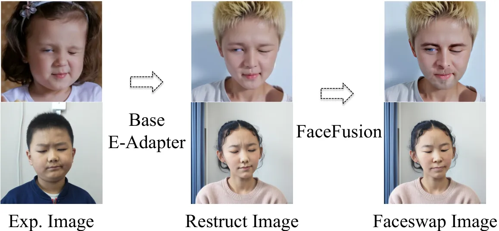

.

Figure 4: Examples of IDI, detailed in Sec. 3.2.2

#### 3.2.3 Refined E-Adapter Decoupled Training

Utilizing the newly developed cross-identity data, we train a new
expression controller termed the Refined E-Adapter. The controller’s
expression and ID branches accept input from different portraits
respectively. Consequently, the identity and expression control branches
are explicitly decoupled in their functions, each responsible solely for
conveying identity and expression, respectively.

### 3.3 ID-enhanced Contrast Alignment

Both identity control and expression control manipulate the face of the
generated image, causing potential interference between the two.
Inevitably, incorporating expression control affects the original
identity control in portrait generation tasks. Our findings indicate
that emphasizing expression control alters muscle details and facial
attributes (_e.g_., the presence of glasses, hair, and facial textures),
due to the generative diversity inherent in the diffusion model.

To this end, we propose ICA to fine-tune the E-Adapter. Based on the
same inputs, ICA incorporates the frozen Refined E-Adapter and the
original identity controller (IP-Adapter \[52\]) as supervision to
calculate expression loss $`\mathcal{L}_{exp}`$ and identity loss
$`\mathcal{L}_{id}`$. $`\mathcal{L}_{id}`$ encourages the IP-Adapter and
the E-Adapter which integrates expression control to generate similar
portraits, thereby minimizing the impact of expression control on
identity fidelity. Additionally, $`\mathcal{L}_{exp}`$ ensures that
fine-tuning does not compromise the existing expression control
capability of the Refined E-Adapter.

Both losses are dependent on the denoised clean image $`\hat{x}_{0}`$.
However, standard diffusion inference incurs significant gradient
backpropagation time costs and GPU memory usage, and it will increase
linearly with the number of timesteps. To overcome this, we propose
Adaptive Noise Inversion (ANI), an efficient one-step decoding strategy,
denoted by the formula:

```math
\displaystyle\hat{x}_{0} \displaystyle={\rm Decode}\left(z_{0}+f(t)\cdot\left(\epsilon-\epsilon_{\theta}(z_{t},t,C)\right)\right), \tag{6}
```

```math
\displaystyle f(t) \displaystyle=\begin{cases}\sqrt{\frac{1-\bar{\alpha}_{t}}{\bar{\alpha}_{t}}}&\text{if }t\leq R_{tmax},\\
f(R_{tmax})&\text{if }t>R_{tmax},\end{cases}
```

where ”$`{\rm Decode}`$” is the VAE decode function, and $`R_{tmax}`$ is
a constant. Through ANI, we can directly reconstruct images
$`\hat{x}_{0}`$ at any given timestep $`t`$, even with large timesteps
characterized by high noise. We present theoretical analysis of this
mechanism in supplementary material Sec. B.

Building on ANI, we employ the IP-Adapter to generate portrait image
$`\hat{x}_{0}^{id}`$, and the currently fine-tuning E-Adapter to
generate the image with expressions $`\hat{x}_{0}^{cur}`$.
$`\mathcal{L}_{id}`$ minimizes the identity difference between two
images, defined as:

```math
\displaystyle\mathcal{L}_{id}=1-\cos(\phi(\hat{x}_{0}^{id}),\phi(\hat{x}_{0}^{cur})), \tag{7}
```

where $`\cos`$ is cosine similarity, and $`\phi(\cdot)`$ is the
pre-trained face embedding extractor \[9\]. Here, we use
$`\hat{x}_{0}^{id}`$ rather than another clean portrait image as ground
truth of $`\mathcal{L}_{id}`$, since we find that the noise discrepancy
between the real image and one-step decoded image
$`\phi(\hat{x}_{0}^{cur})`$ destabilizes fine-tuning (ablated in Sec.
4.3). Similarly, we utilize the frozen Refined E-Adapter to generate
image $`\hat{x}_{0}^{exp}`$. The expression loss $`\mathcal{L}_{exp}`$
reduces the difference in facial landmarks between $`\hat{x}_{0}^{exp}`$
and $`\hat{x}_{0}^{cur}`$, is defined as follows:

```math
\mathcal{L}_{exp}={\rm Wing}(\varphi(\hat{x}_{0}^{exp}),\varphi(\hat{x}_{0}^{cur})),
```

where ”$`{\rm Wing}`$” denotes the wing loss \[13\], and
$`\varphi(\cdot)`$ is the pre-trained facial landmarks detector \[45\].

The loss during fine-tuning is formulated as below:

```math
\displaystyle\mathcal{L}_{ft}=\mathcal{L}_{sd}+w_{id}\cdot\mathcal{L}_{id}+w_{exp}\cdot\mathcal{L}_{exp}, \tag{8}
```

where $`w_{id}`$ and $`w_{exp}`$ are the balanced hyper-parameters.

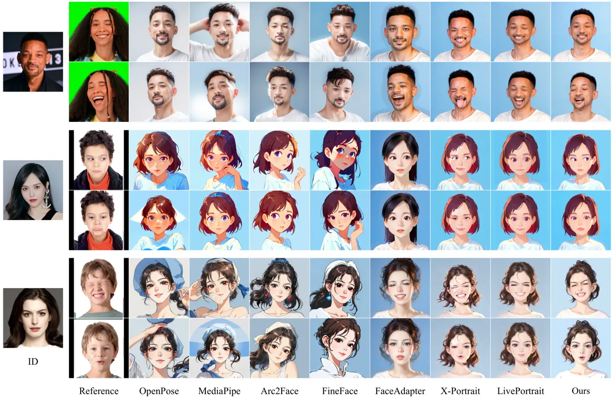

Figure 5: Qualitative Comparisons. Compared to other methods, our method
demonstrates the most accurate and robust transfer of subtle facial
expressions (_e.g_., pouting, single-eye blinks, and pupil movements)
while preserving the identity of the source portrait, even when applied
in artistic styles (such as anime and ink painting).

|                        |                 |                 |                     |                    |                 |                 |                     |                    |                 |                 |                     |                    |
| ---------------------- | --------------- | --------------- | ------------------- | ------------------ | --------------- | --------------- | ------------------- | ------------------ | --------------- | --------------- | ------------------- | ------------------ |
|                        | Realistic       |                 |                     |                    | Anime           |                 |                     |                    | Painting        |                 |                     |                    |
| Method                 | ID $`\uparrow`$ | IQ $`\uparrow`$ | Exp. $`\downarrow`$ | LMS $`\downarrow`$ | ID $`\uparrow`$ | IQ $`\uparrow`$ | Exp. $`\downarrow`$ | LMS $`\downarrow`$ | ID $`\uparrow`$ | IQ $`\uparrow`$ | Exp. $`\downarrow`$ | LMS $`\downarrow`$ |
| Portrait Animation     |                 |                 |                     |                    |                 |                 |                     |                    |                 |                 |                     |                    |
| FaceAdapter \[19\]     | 0.309           | 4.991           | 0.059               | 0.281              | 0.095           | 4.853           | 0.109               | 0.467              | 0.146           | 4.747           | 0.072               | 0.348              |
| X-Portrait \[50\]      | 0.505           | 4.902           | 0.058               | 0.266              | 0.188           | 4.142           | 0.066               | 0.335              | 0.332           | 3.668           | 0.062               | 0.291              |
| LivePortrait \[17\]    | 0.609           | 4.772           | 0.058               | 0.319              | 0.262           | 4.843           | 0.116               | 0.551              | 0.419           | 4.749           | 0.087               | 0.426              |
| Diffusion Conditioning |                 |                 |                     |                    |                 |                 |                     |                    |                 |                 |                     |                    |
| OpenPose \[54\]        | 0.628           | 4.981           | 0.097               | 0.447              | 0.162           | 4.741           | 0.142               | 0.698              | 0.326           | 4.484           | 0.121               | 0.507              |
| MediaPipe \[31\]       | 0.623           | 4.985           | 0.104               | 0.472              | 0.087           | 4.713           | 0.149               | 0.671              | 0.287           | 4.476           | 0.130               | 0.524              |
| Arc2Face \[9\]         | 0.618           | 4.946           | 0.116               | 0.537              | 0.097           | 4.630           | 0.163               | 0.713              | 0.146           | 4.349           | 0.141               | 0.609              |
| FineFace \[46\]        | 0.532           | 4.870           | 0.120               | 0.576              | 0.090           | 4.423           | 0.156               | 0.700              | 0.297           | 3.813           | 0.142               | 0.624              |
| EmojiDiff (Ours)       | 0.666           | 4.995           | 0.054               | 0.215              | 0.304           | 4.910           | 0.095               | 0.359              | 0.469           | 4.756           | 0.078               | 0.256              |

Table 1: Quantitative comparisons of our method with SOTA counterparts
in various base models. Bold and underlined values denote the best and
second-best results respectively.

## 4 Experiments

### 4.1 Experiment Setting

Dataset. We first collect 10k indoor and outdoor images of people of
different countries and genders, each with 3 to 12 expressions. Then, we
use LIQE \[56\] to filter out low-quality images and crop out
512$`\times`$512 face square images. Subsequently, this dataset is
employed to train the Base E-Adapter based on SD1.5 \[40\]. Afterward,
we construct about 120k cross-identity triplets through IDI. Through
expression consistency filtering, we retain about 100k triplets named
CIEP100k, for training and fine-tuning the Refined E-Adapter. For
evaluation, we gather images of 50 celebrities from diverse fields, with
30 different expressions.

Implementation Details. We train the Base E-Adapter on SD1.5 to
construct data and the Refined E-Adapter on both SD1.5 \[40\] and SDXL
\[37\]. In the Base E-Adapter training stage, our model is trained from
scratch for 0.5 days. In SD1.5, we train the Refined E-Adapter for 1 day
and fine-tune it for 4 hours. In SDXL, we train the Refined E-Adapter
for 2 days and fine-tune it for 0.5 days. More details are provided in
supplementary material Sec. A.1.

Baselines. We compare our model with prior methods, including OpenPose
\[54\], MediaPipe \[31\], Arc2Face \[34\], and FineFace \[46\], using
the same configurations (base model, text prompt, inference steps,
etc.). Although portrait animation methods are fundamentally different
from our approach, we assess these methods, including FaceAdapter
\[19\], X-Portrait \[50\], and LivePortrait \[17\], to thoroughly
evaluate our method. For the diffusion-based methods, we integrate
IP-Adapter \[52\] plugin for identity preservation. For animation-based
methods, an expressionless image of the portrait is generated, and then
animation is applied. We select LivePortrait \[17\] to construct data
triples $`\mathcal{T}`$ and train the E-Adapter, which serves as our
strong baseline.

Benchmarks. For a fair comparison, all experiments are conducted using
the SD1.5 framework across three styles: realistic, anime, and ink
painting, while the style is directly dependent on the base model and
style LoRA. Given the identity image, expression reference, and the
generated image, we evaluate all methods using ID fidelity (ID), image
quality (IQ), expression similarity (Exp.), and facial landmark
movements similarity (LMS). Different from ID encoder in E-Adapter, the
Antelopev2 \[1\] model is utilized to extract identity embeddings from
both the portrait and generated image, with the cosine similarity
between them used to evaluate identity fidelity. For the assessment of
image quality, the pre-trained network LIQE \[56\] is employed.
Expression similarity is measured by computing the L1 difference between
facial blendshapes extracted from the expression and the generated image
using MediaPipe \[31\]. To evaluate the keypoint similarity, crucial
facial landmarks (such as eyes, pupils, and mouth) are detected \[31\]
to calculate movement amplitude differences. More metric details are
provided in supplementary Sec. A.3.

### 4.2 Comparison

Quantitative results. As summarized in Tab. 1, our method consistently
outperforms all competitors by a good margin. Compared to the same type
of diffusion conditioning methods, our approach shows significant
improvements in ID similarity, image quality, and expression control
ability. Even evaluating against portrait animation methods such as
FaceAdapter \[19\] and LivePortrait \[17\], the proposed method offers
superior ID fidelity and more accurate expression control. Notably,
X-Portrait, which directly uses RGB expression images, also demonstrates
strong expression control. However, X-Portrait shows a noticeable drop
in image quality when applied to non-realistic styles, with IQ scores of
only 4.142 and 3.668 in the anime and painting styles, respectively. On
the contrary, our method produces exquisite stylized images due to the
seamless integration with the diffusion model. We provide comparisons
with more methods in the supplementary material Sec. C.1.

Qualitative results. Fig. 5 illustrates the results of various methods
across three styles. These examples demonstrate that our model
effectively conveys reference expressions, including lip movements and
eye gaze while preserving the portrait identity. The fourth and sixth
examples in the figure highlight the ability of our method to capture
subtle movements, including lower lip pursing and pouting. Similarly, as
illustrated in Fig. 6, the complete method retains more identity
details(_e.g_., glasses and hair color), compared to the method without
ICA.

### 4.3 Ablation Study

We evaluate the proposed IDI and ICA on SD1.5 and SDXL. As presented in
Tab. 2, in comparison to our baseline, IDI substantially improves
expression control, reducing the Exp. score of the two base models by
23.0% and 22.6%, respectively. Additionally, ICA further enhances ID
fidelity without compromising expression control, increasing the
corresponding ID score by 3% and 6%, respectively.

| IDI       | ICA       | SD1.5 \[40\]    |                     |                    | SDXL \[37\]     |                     |                    |
| --------- | --------- | --------------- | ------------------- | ------------------ | --------------- | ------------------- | ------------------ |
|           |           | ID $`\uparrow`$ | Exp. $`\downarrow`$ | LMS $`\downarrow`$ | ID $`\uparrow`$ | Exp. $`\downarrow`$ | LMS $`\downarrow`$ |
|           |           | 0.265           | 0.113               | 0.447              | 0.432           | 0.093               | 0.454              |
| $`\surd`$ |           | 0.295           | 0.087               | 0.355              | 0.465           | 0.072               | 0.338              |
| $`\surd`$ | $`\surd`$ | 0.304           | 0.095               | 0.359              | 0.509           | 0.071               | 0.341              |

Table 2: Quantitative ablation about IDI and ICA.

ID-irrelevant Data Iteration. As shown in Tab. 3, we assess the
performance of E-Adapter at different data iteration stages. Initially,
the Base E-Adapter achieves significant reductions in Exp. and LMS
scores compared to the baseline, showing the powerful expression
transfer ability of Base E-Adapter. After using the constructed restruct
images, the newly trained Refined E-Adapter substantially reduces ID
leakage and improves the ID score by 0.136. Finally, through further
face-swapping on the data, the Refined E-Adapter significantly
outperforms the baseline.

ID-enhanced Contrast Alignment. As shown in Tab. 4, when utilizing clean
real images as supervision, the ANI effectively improves ID fidelity and
expression controllability. Additionally, using model predictions
$`\hat{x}_{0}^{id}`$ rather than real images ensures consistency of
noise levels between data pairs, further facilitating model fine-tuning.

Expression Controller Architecture. We experiment with various
expression controller structures (The detailed structure can be found in
the supplementary material Sec. A.2.). As indicated in Tab. 5, our
approach combines identity and expression embeddings within a unified
cross-attention block, effectively fostering their interaction and
delivering optimal performance.

### 4.4 Generalizability of Proposed Approach

Decoupled identity and expression. As shown in Fig. 6, the third and
fourth columns demonstrate that the identity and expression branch can
take effect independently, enhancing the flexibility of facial control.

E-Adapter as the expression extractor. The expression embedding from our
method can be generalized to expression-related tasks. Specifically, we
evaluate the expression module of the E-Adapter on the expression
recognition task following the classic method DLN \[55\]. Our method
exhibits powerful expression recognition capabilities (88.7 vs DLN’s
86.4 in the RAF-DB benchmark \[43\]), demonstrating its efficacy as a
robust expression extractor.

Generalization to other architecture. In the main experiment,
considering generalizability of method and fair comparison with the
SD1.5-based animation methods (_e.g_., XPortrait \[50\], FaceAdapter
\[19\]), we simply injected condition information via the attention
mechanism, which is similar to IP-Adapter \[52\]. As shown in Tab. 6, by
directly utilizing the CIEP100k dataset and ICA, our method is
seamlessly adopted to InstantID \[47\] and achieves substantially more
detailed expression control.

| Stage / Data Source         | ID $`\uparrow`$ | Exp. $`\downarrow`$ | LMS $`\downarrow`$ |
| --------------------------- | --------------- | ------------------- | ------------------ |
| Baseline                    | 0.265           | 0.113               | 0.447              |
| Base E-Aadapter             | 0.127           | 0.065               | 0.283              |
| using Restruct Image        | 0.263           | 0.080               | 0.362              |
| Ours (using Faceswap Image) | 0.295           | 0.087               | 0.355              |

Table 3: Ablation study of IDI.

| Supervision        | ID $`\uparrow`$ | Exp. $`\downarrow`$ | LMS $`\downarrow`$ |
| ------------------ | --------------- | ------------------- | ------------------ |
| Clean Image        | 0.477           | 0.088               | 0.376              |
| Clean Image w/ ANI | 0.485           | 0.078               | 0.361              |
| Ours               | 0.509           | 0.071               | 0.341              |

Table 4: Ablation study of ICA supervision.

| Architecture               | ID $`\uparrow`$ | Exp. $`\downarrow`$ | LMS $`\downarrow`$ |
| -------------------------- | --------------- | ------------------- | ------------------ |
| \(a\) SelfAttn             | 0.266           | 0.109               | 0.497              |
| \(b\) ControlNet           | 0.294           | 0.121               | 0.552              |
| \(c\) Sequential CrossAttn | 0.276           | 0.104               | 0.435              |
| Ours                       | 0.295           | 0.087               | 0.355              |

Table 5: Ablation study of expression controller architecture.

|                   |                 |                     |                    |
| ----------------- | --------------- | ------------------- | ------------------ |
| Method            | ID $`\uparrow`$ | Exp. $`\downarrow`$ | LMS $`\downarrow`$ |
| PuLID \[18\]      | 0.536           | 0.117               | 0.502              |
| PhotoMaker \[27\] | 0.467           | 0.136               | 0.618              |
| InstantID \[47\]  | 0.543           | 0.105               | 0.476              |
| Ours              | 0.509           | 0.071               | 0.341              |
| Ours w/ InstantID | 0.540           | 0.077               | 0.356              |

Table 6: Comparisons with portrait generation methods.

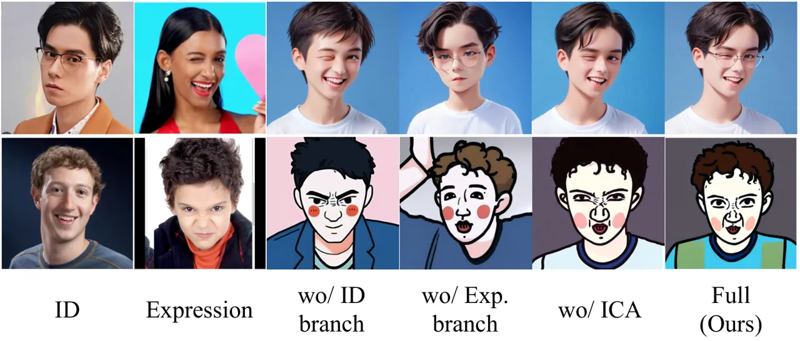

Figure 6: Images generated without using the ID branch, expression
branch, and ICA.

## 5 Conclusion

We introduce EmojiDiff, an innovative solution that utilizes both
portrait images and RGB expression images to generate expressive
portraits. To achieve this, we design a two-stage scheme including
decoupling training and fine-tuning. In the training stage, we propose
ID-irrelevant Data Iteration to synthesize identity-expression
decoupling data pairs CIEP100k, enabling the model to accept the RGB
expression template without interference from expression-irrelevant
features. In the fine-tuning stage, we propose ID-enhanced Contrast
Alignment to further harmonize identity and expression control. This
approach ensures the training process through Adaptive Noise Inversion
and mitigates the impact of expression modulation on identity fidelity.
Experimental results demonstrate that our approach achieves accurate and
nuanced facial expression control while maintaining precise identity
resemblance.

## References

- \[1\] (2024) Note:
  [https://huggingface.co/immich-app/antelopev2](https://huggingface.co/immich-app/antelopev2)
  Cited by: §4.1.
- \[2\] Z. Cao, G. Hidalgo Martinez, T. Simon, S. Wei, and Y. A.
  Sheikh (2019) OpenPose: realtime multi-person 2d pose estimation using
  part affinity fields. IEEE Transactions on Pattern Analysis and
  Machine Intelligence. Cited by: §1, §1.
- \[3\] D. Chang, Y. Yin, Z. Li, M. Tran, and M. Soleymani (2024)
  LibreFace: an open-source toolkit for deep facial expression analysis.
  In Proceedings of the IEEE Winter Conference on Applications of
  Computer Vision, Cited by: §1.
- \[4\] L. Chen, M. Zhao, Y. Liu, M. Ding, Y. Song, S. Wang, X. Wang, H.
  Yang, J. Liu, K. Du, et al. (2023) Photoverse: tuning-free image
  customization with text-to-image diffusion models. arXiv preprint
  arXiv:2309.05793. Cited by: §2.1, §B.
- \[5\] Z. Chen, J. Cao, Z. Chen, Y. Li, and C. Ma (2024) Echomimic:
  lifelike audio-driven portrait animations through editable landmark
  conditions. arXiv preprint arXiv:2407.08136. Cited by: §1, §2.2.
- \[6\] Y. Choi, S. Kwak, K. Lee, H. Choi, and J. Shin (2024) Improving
  diffusion models for authentic virtual try-on in the wild. arXiv
  preprint arXiv:2403.05139. Cited by: §1.
- \[7\] Z. Chong, X. Dong, H. Li, S. Zhang, W. Zhang, X. Zhang, H. Zhao,
  and X. Liang (2024) CatVTON: concatenation is all you need for virtual
  try-on with diffusion models. arXiv preprint arXiv:2407.15886. Cited
  by: §1.
- \[8\] CrucibleAI (2023) ControlNetMediaPipeFace. External Links:
  [Link](https://huggingface.co/CrucibleAI/ControlNetMediaPipeFace/tree/main)
  Cited by: §2.2.
- \[9\] J. Deng, J. Guo, N. Xue, and S. Zafeiriou (2019) Arcface:
  additive angular margin loss for deep face recognition. In Proceedings
  of the IEEE Conference on Computer Vision and Pattern Recognition,
  pp. 4690–4699. Cited by: §1, §1, §2.2, §3.3, Table 1.
- \[10\] N. Drobyshev, A. B. Casademunt, K. Vougioukas, Z. Landgraf, S.
  Petridis, and M. Pantic (2024) EMOPortraits: emotion-enhanced
  multimodal one-shot head avatars. In Proceedings of the IEEE
  Conference on Computer Vision and Pattern Recognition, pp. 8498–8507.
  Cited by: §2.2.
- \[11\] S. d’Apolito, D. P. Paudel, Z. Huang, A. Romero, and L. Van
  Gool (2021) GANmut: learning interpretable conditional space for gamut
  of emotions. In Proceedings of the IEEE Conference on Computer Vision
  and Pattern Recognition, pp. 568–577. Cited by: §2.2.
- \[12\] (2023) Note:
  [https://modelscope.cn/models/iic/cv_unet-image-face-fusion_damo](https://modelscope.cn/models/iic/cv_unet-image-face-fusion_damo)
  Cited by: Figure 2, Figure 2, §3.2.2, §3.2.
- \[13\] Z. Feng, J. Kittler, M. Awais, P. Huber, and X. Wu (2018) Wing
  loss for robust facial landmark localisation with convolutional neural
  networks. In Proceedings of the IEEE Conference on Computer Vision and
  Pattern Recognition, pp. 2235–2245. Cited by: §3.3.
- \[14\] P. P. Filntisis, G. Retsinas, F. Paraperas-Papantoniou, A.
  Katsamanis, A. Roussos, and P. Maragos (2022) Visual speech-aware
  perceptual 3d facial expression reconstruction from videos. arXiv
  preprint arXiv:2207.11094. Cited by: §2.2.
- \[15\] R. Gal, Y. Alaluf, Y. Atzmon, O. Patashnik, A. H. Bermano, G.
  Chechik, and D. Cohen-Or (2022) An image is worth one word:
  personalizing text-to-image generation using textual inversion. arXiv
  preprint arXiv:2208.01618. Cited by: §2.1.
- \[16\] Google (2022) BlendshapeV2. Note:
  [https://ai.google.dev/edge/mediapipe/solutions/vision/face_landmarker](https://ai.google.dev/edge/mediapipe/solutions/vision/face_landmarker)
  Cited by: §A.1, §A.3, §3.2.2.
- \[17\] J. Guo, D. Zhang, X. Liu, Z. Zhong, Y. Zhang, P. Wan, and D.
  Zhang (2024) LivePortrait: efficient portrait animation with stitching
  and retargeting control. arXiv preprint arXiv:2407.03168. Cited by:
  §1, §2.2, §3.2, Table 1, §4.1, §4.2.
- \[18\] Z. Guo, Y. Wu, Z. Chen, L. Chen, and Q. He (2024) PuLID: pure
  and lightning id customization via contrastive alignment. arXiv
  preprint arXiv:2404.16022. Cited by: §1, §2.1, Table 6.
- \[19\] Y. Han, J. Zhu, K. He, X. Chen, Y. Ge, W. Li, X. Li, J.
  Zhang, C. Wang, and Y. Liu (2024) Face adapter for pre-trained
  diffusion models with fine-grained id and attribute control. arXiv
  preprint arXiv:2405.12970. Cited by: §2.2, Table 1, §4.1, §4.2, §4.4.
- \[20\] J. Ho, A. Jain, and P. Abbeel (2020) Denoising diffusion
  probabilistic models. Advances in Neural Information Processing
  Systems 33, pp. 6840–6851. Cited by: §1.
- \[21\] F. Hong, L. Zhang, L. Shen, and D. Xu (2022) Depth-aware
  generative adversarial network for talking head video generation. In
  Proceedings of IEEE Conference on Computer Vision and Pattern
  Recognition, Cited by: Table 1.
- \[22\] E. J. Hu, Y. Shen, P. Wallis, Z. Allen-Zhu, Y. Li, S. Wang, L.
  Wang, and W. Chen (2021) Lora: low-rank adaptation of large language
  models. arXiv preprint arXiv:2106.09685. Cited by: §1, §2.1.
- \[23\] L. Hu (2024) Animate anyone: consistent and controllable
  image-to-video synthesis for character animation. In Proceedings of
  the IEEE Conference on Computer Vision and Pattern Recognition,
  pp. 8153–8163. Cited by: §1, §1, §2.2.
- \[24\] J. Huang, X. Dong, W. Song, H. Li, J. Zhou, Y. Cheng, S.
  Liao, L. Chen, Y. Yan, S. Liao, et al. (2024) ConsistentID: portrait
  generation with multimodal fine-grained identity preserving. arXiv
  preprint arXiv:2404.16771. Cited by: §1, §2.1.
- \[25\] Z. Huang, K. C. Chan, Y. Jiang, and Z. Liu (2023) Collaborative
  diffusion for multi-modal face generation and editing. In Proceedings
  of the IEEE Conference on Computer Vision and Pattern Recognition,
  pp. 6080–6090. Cited by: §1, §1, §2.2.
- \[26\] D. P. Kingma (2013) Auto-encoding variational bayes. arXiv
  preprint arXiv:1312.6114. Cited by: §3.1.
- \[27\] Z. Li, M. Cao, X. Wang, Z. Qi, M. Cheng, and Y. Shan (2024)
  Photomaker: customizing realistic human photos via stacked id
  embedding. In Proceedings of the IEEE Conference on Computer Vision
  and Pattern Recognition, pp. 8640–8650. Cited by: §1, §2.1, Table 6.
- \[28\] H. Liu, X. Wang, Z. Wan, Y. Ma, J. Chen, Y. Fan, Y. Shen, Y.
  Song, and Q. Chen (2025) AvatarArtist: open-domain 4d avatarization.
  arXiv preprint arXiv:2503.19906. Cited by: Table 1.
- \[29\] R. Liu, B. Ma, W. Zhang, Z. Hu, C. Fan, T. Lv, Y. Ding, and X.
  Cheng (2024) Towards a simultaneous and granular identity-expression
  control in personalized face generation. In Proceedings of the IEEE
  Conference on Computer Vision and Pattern Recognition, pp. 2114–2123.
  Cited by: §2.2.
- \[30\] Y. Liu, C. Yu, L. Shang, Y. He, Z. Wu, X. Wang, C. Xu, H.
  Xie, W. Wang, Y. Zhao, et al. (2023) FaceChain: a playground for
  human-centric artificial intelligence generated content. arXiv
  preprint arXiv:2308.14256. Cited by: §1, §2.1.
- \[31\] C. Lugaresi, J. Tang, H. Nash, C. McClanahan, E. Uboweja, M.
  Hays, F. Zhang, C. Chang, M. G. Yong, J. Lee, et al. (2019) Mediapipe:
  a framework for building perception pipelines. arXiv preprint
  arXiv:1906.08172. Cited by: §A.1, §A.3, §A.3, §3.2.2, Table 1, §4.1,
  §4.1.
- \[32\] Y. Ma, H. Liu, H. Wang, H. Pan, Y. He, J. Yuan, A. Zeng, C.
  Cai, H. Shum, W. Liu, et al. (2024) Follow-your-emoji:
  fine-controllable and expressive freestyle portrait animation. arXiv
  preprint arXiv:2406.01900. Cited by: Table 1, §2.2.
- \[33\] A. Nichol, P. Dhariwal, A. Ramesh, P. Shyam, P. Mishkin, B.
  McGrew, I. Sutskever, and M. Chen (2021) Glide: towards photorealistic
  image generation and editing with text-guided diffusion models. arXiv
  preprint arXiv:2112.10741. Cited by: §1.
- \[34\] F. Paraperas Papantoniou, A. Lattas, S. Moschoglou, J. Deng, B.
  Kainz, and S. Zafeiriou (2024) Arc2Face: a foundation model for
  id-consistent human faces. In Proceedings of the European Conference
  on Computer Vision, Cited by: §1, §4.1.
- \[35\] R. Paskaleva, M. Holubakha, A. Ilic, S. Motamed, L. Van Gool,
  and D. Paudel (2024) A unified and interpretable emotion
  representation and expression generation. In Proceedings of the IEEE
  Conference on Computer Vision and Pattern Recognition, pp. 2447–2456.
  Cited by: §1, §1, §2.2.
- \[36\] X. Peng, J. Zhu, B. Jiang, Y. Tai, D. Luo, J. Zhang, W. Lin, T.
  Jin, C. Wang, and R. Ji (2024) Portraitbooth: a versatile portrait
  model for fast identity-preserved personalization. In Proceedings of
  the IEEE Conference on Computer Vision and Pattern Recognition,
  pp. 27080–27090. Cited by: §B.
- \[37\] D. Podell, Z. English, K. Lacey, A. Blattmann, T. Dockhorn, J.
  Müller, J. Penna, and R. Rombach (2023) Sdxl: improving latent
  diffusion models for high-resolution image synthesis. arXiv preprint
  arXiv:2307.01952. Cited by: Figure 4, Figure 4, §C.3, §4.1, Table 2.
- \[38\] D. Qiu, Z. Fei, R. Wang, J. Bai, C. Yu, M. Fan, G. Chen, and X.
  Wen (2025) Skyreels-a1: expressive portrait animation in video
  diffusion transformers. arXiv preprint arXiv:2502.10841. Cited by:
  Table 1.
- \[39\] A. Radford, J. W. Kim, C. Hallacy, A. Ramesh, G. Goh, S.
  Agarwal, G. Sastry, A. Askell, P. Mishkin, J. Clark, et al. (2021)
  Learning transferable visual models from natural language supervision.
  In International Conference on Machine Learning, pp. 8748–8763. Cited
  by: §A.1.
- \[40\] R. Rombach, A. Blattmann, D. Lorenz, P. Esser, and B.
  Ommer (2022) High-resolution image synthesis with latent diffusion
  models. In Proceedings of the IEEE Conference on Computer Vision and
  Pattern Recognition, pp. 10684–10695. Cited by: §1, Figure 3, Figure
  3, §C.3, §4.1, §4.1, Table 2.
- \[41\] O. Ronneberger, P. Fischer, and T. Brox (2015) U-net:
  convolutional networks for biomedical image segmentation. In Medical
  image computing and computer-assisted intervention–MICCAI 2015: 18th
  international conference, Munich, Germany, October 5-9, 2015,
  proceedings, part III 18, pp. 234–241. Cited by: §3.1.
- \[42\] N. Ruiz, Y. Li, V. Jampani, Y. Pritch, M. Rubinstein, and K.
  Aberman (2023) Dreambooth: fine tuning text-to-image diffusion models
  for subject-driven generation. In Proceedings of the IEEE Conference
  on Computer Vision and Pattern Recognition, pp. 22500–22510. Cited by:
  §1, §2.1.
- \[43\] W. D. Shan Li (2017) Reliable crowdsourcing and deep
  locality-preserving learning for expression recognition in the wild.
  Proceedings of IEEE Conference on Computer Vision and Pattern
  Recognition. Cited by: §4.4.
- \[44\] F. Shen, X. Jiang, X. He, H. Ye, C. Wang, X. Du, Z. Li, and J.
  Tang (2024) Imagdressing-v1: customizable virtual dressing. arXiv
  preprint arXiv:2407.12705. Cited by: §1.
- \[45\] S. Song, Y. Song, C. Luo, Z. Song, S. Kuzucu, X. Jia, Z.
  Guo, W. Xie, L. Shen, and H. Gunes (2022) Gratis: deep learning graph
  representation with task-specific topology and multi-dimensional edge
  features. arXiv preprint arXiv:2211.12482. Cited by: §3.3.
- \[46\] T. Varanka, H. Khor, Y. Li, M. Wei, H. Kung, N. Sebe, and G.
  Zhao (2024) Towards localized fine-grained control for facial
  expression generation. arXiv preprint arXiv:2407.20175. Cited by: §1,
  §2.2, Table 1, §4.1.
- \[47\] Q. Wang, X. Bai, H. Wang, Z. Qin, and A. Chen (2024) Instantid:
  zero-shot identity-preserving generation in seconds. arXiv preprint
  arXiv:2401.07519. Cited by: §1, §2.1, §4.4, Table 6.
- \[48\] Y. Wang, J. Guo, J. Bai, R. Yu, T. He, X. Tan, X. Sun, and J.
  Bian (2024) InstructAvatar: text-guided emotion and motion control for
  avatar generation. arXiv preprint arXiv:2405.15758. Cited by: §2.2.
- \[49\] H. Wei, Z. Yang, and Z. Wang (2024) AniPortrait: audio-driven
  synthesis of photorealistic portrait animations. arXiv preprint
  arXiv:2403.17694. External Links: 2403.17694 Cited by: §1, §2.2.
- \[50\] Y. Xie, H. Xu, G. Song, C. Wang, Y. Shi, and L. Luo (2024)
  X-portrait: expressive portrait animation with hierarchical motion
  attention. In ACM SIGGRAPH 2024 Conference Papers, pp. 1–11. Cited by:
  §1, §2.2, §3.2, Table 1, §4.1, §4.4.
- \[51\] S. Yang, H. Li, J. Wu, M. Jing, L. Li, R. Ji, J. Liang, and H.
  Fan (2024) MegActor: harness the power of raw video for vivid portrait
  animation. arXiv preprint arXiv:2405.20851. External Links: 2405.20851
  Cited by: §3.2.
- \[52\] H. Ye, J. Zhang, S. Liu, X. Han, and W. Yang (2023) Ip-adapter:
  text compatible image prompt adapter for text-to-image diffusion
  models. arXiv preprint arXiv:2308.06721. Cited by: §A.1, §A.1, §1,
  §2.1, §3.1, §3.2.1, §3.3, §4.1, §4.4.
- \[53\] B. Zeng, X. Liu, S. Gao, B. Liu, H. Li, J. Liu, and B.
  Zhang (2023) Face animation with an attribute-guided diffusion model.
  In Proceedings of the IEEE Conference on Computer Vision and Pattern
  Recognition, pp. 628–637. Cited by: §2.2.
- \[54\] L. Zhang, A. Rao, and M. Agrawala (2023) Adding conditional
  control to text-to-image diffusion models. In Proceedings of the IEEE
  International Conference on Computer Vision, pp. 3836–3847. Cited by:
  §2.2, Table 1, §4.1.
- \[55\] W. Zhang, X. Ji, K. Chen, Y. Ding, and C. Fan (2021) Learning a
  facial expression embedding disentangled from identity. Proceedings of
  IEEE Conference on Computer Vision and Pattern Recognition. Cited by:
  §4.4.
- \[56\] W. Zhang, G. Zhai, Y. Wei, X. Yang, and K. Ma (2023) Blind
  image quality assessment via vision-language correspondence: a
  multitask learning perspective. In Proceedings of the IEEE Conference
  on Computer Vision and Pattern Recognition, pp. 14071–14081. Cited by:
  §A.1, §4.1, §4.1.

\thetitle

Supplementary Material

In this supplementary material, we provide more experimental details in
Sec. A, detailed derivation of Adaptive Noise Inversion (ANI) in Sec. B,
additional experimental results in Sec. C.

## A More Experimental Details

### A.1 Detailed Implementation

We gather images of over 10,000 people displaying various expressions
from video clips and in-house face databases, removing low-quality
images using LIQE \[56\]. Then, we employ the proposed IDI to construct
cross-identity, same-expression datasets. As mentioned in Sec. 3.2.2 of
the main body, facial blendshapes \[16\] and landmark \[31\] differences
are utilized to filter out expression-changed data during data
construction. Specifically, we calculate the Exp. and LMS metrics of the
original expression image and the synthesized new image, excluding the
data with Exp. $`\leq`$0.05 and LMS $`\leq`$0.18. Based on synthesized
data, we train the Refined E-Adapter for SD1.5 at a resolution of
512$`\times`$512. On SDXL, we upscale the data to a resolution of
1024$`\times`$1024 and train it with random scaling following IP-Adapter
\[52\]. The learning rates of the Adam optimizer during training and
fine-tuning are set to 2$`\times`$ $`10^{-5}`$ and
5$`\times`$$`10^{-6}`$, respectively, with $`\beta_{1}`$ = 0.5, and
$`\beta_{2}`$ = 0.999. In all experiments, $`\lambda_{id}`$,
$`\lambda_{exp}`$, $`R_{tmax}`$, $`w_{id}`$, and $`w_{exp}`$ are
consistently set to 1, 1, 600, 0.08, and 10, respectively.

In the E-Adapter, we employ CLIP \[39\] as the encoder for the
expression branch to extract expression signals. The image-prompt and
FaceID versions of IP-Adapter \[52\] are utilized to initialize the
projection layers of the expression and identity branches, emphasizing
structure and identity features, respectively. During training and
fine-tuning, the parameters of the expression branch and the projection
layer of the identity branch are updated, while other parameters remain
fixed.

### A.2 Ablation Experiments Details

In Sec. 4.3 of the main body, we experiment with various expression
controller structures. As is shown in the Fig. 1, expression embeddings
are injected into the diffusion model using one of the following
strategies: (a) self-attention, (b) ControlNet, (c) serial
cross-attention with ID embeddings, and (d) parallel cross-attention
with ID embeddings.

### A.3 Metric Details

Exp. We employ MediaPipe \[31\] to extract 52 facial blendshapes \[16\]
of the expression reference and the generated image, represented as
$`b^{ref}`$, $`b^{gen}`$, respectively. Each blendshape $`b^{gen}_{i}`$
in the \[0, 1\] range indicates the probability of the relevant facial
action occurring (_e.g_., eyeBlinkLeft, mouthClose). The expression
difference between reference and generated image can be formulated as:

```math
\displaystyle\mathbb{E}_{exp}=\sum_{i=0}^{51}\left(|b^{ref}_{i}-b^{gen}_{i}|\right) \tag{1}
```

LMS To further assess differences in the expression of critical facial
regions (such as eyes, pupils, and mouth), we propose evaluating the
landmark movement similarity (LMS) between the reference and generated
image. First, we utilize MediaPipe \[31\] to detect 478 facial landmarks
of the expression reference and generated image, denoted as $`l^{ref}`$
and $`l^{gen}`$, respectively. Next, we select representative landmarks
to calculate the movement amplitude of key facial actions, including
blinking, eye movement, and mouth opening, represented as:

```math
\displaystyle r_{leye} \displaystyle=\frac{\|l_{145}-l_{159}\|_{2}}{\max(10^{-5},\|l_{133}-l_{33}\|_{2})}, \tag{2}
```

```math
\displaystyle r_{lpupil} \displaystyle=\frac{\|l_{133}-l_{468}\|_{2}}{\max(10^{-5},\|l_{133}-l_{33}\|_{2})},
```

```math
\displaystyle r_{reye} \displaystyle=\frac{\|l_{374}-l_{386}\|_{2}}{\max(10^{-5},\|l_{263}-l_{362}\|_{2})},
```

```math
\displaystyle r_{rpupil} \displaystyle=\frac{\|l_{263}-l_{473}\|_{2}}{\max(10^{-5},\|l_{263}-l_{362}\|_{2})},
```

```math
\displaystyle r_{mouth} \displaystyle=\frac{\|l_{17}-l_{0}\|_{2}}{\max(10^{-5},\|l_{291}-l_{61}\|_{2})},
```

The LMS metric quantifies the difference in movement amplitude between
two images, expressed as:

```math
\displaystyle\mathbb{E}_{LMS}=\sum_{k\in S}\left(|r_{k}^{ref}-r_{k}^{gen}|\right), \tag{3}
```

where $`S=\{{\rm leye,reye,lpupil,rpupil,mouth}\}`$.

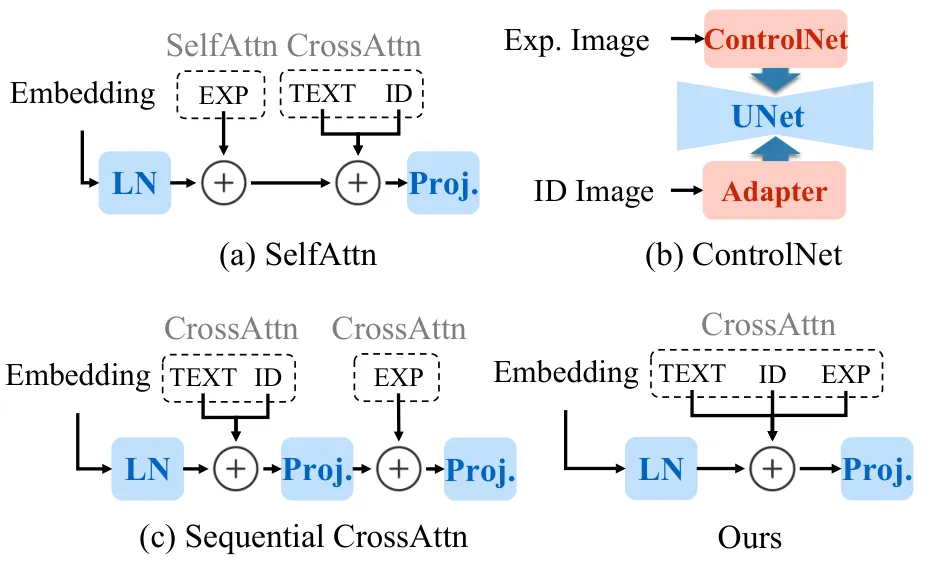

Figure 1: Different expression controller structure.

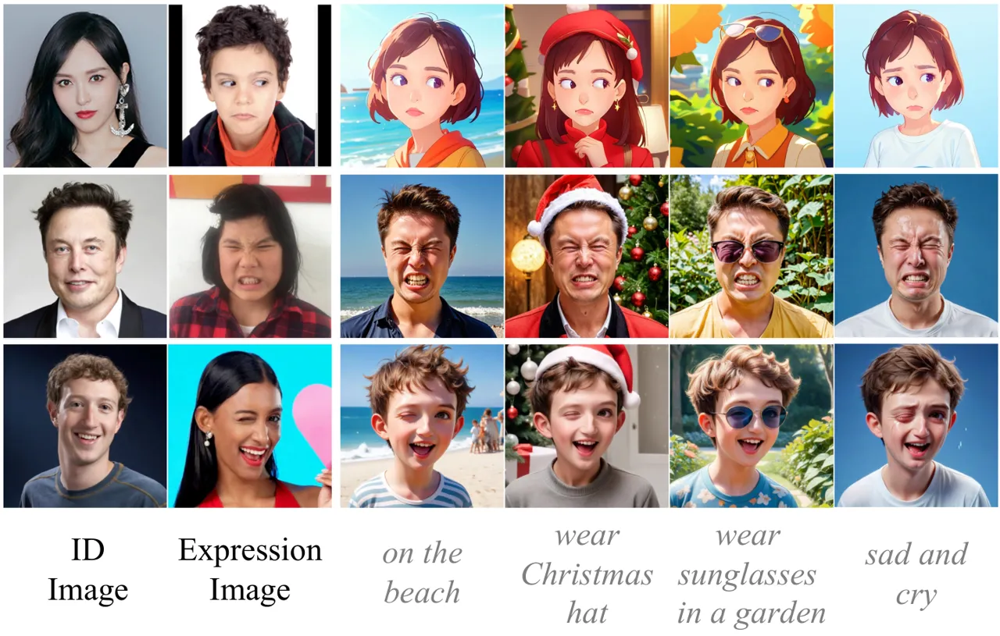

Figure 2: Images generated using different prompts.

| Method                | ID $`\uparrow`$ | Exp. $`\downarrow`$ | LMS $`\downarrow`$ |
| --------------------- | --------------- | ------------------- | ------------------ |
| DaGAN \[21\]          | 0.202           | 0.135               | 0.569              |
| Follow-U-Emoji \[32\] | 0.243           | 0.125               | 0.428              |
| AvatarArtist \[28\]   | 0.239           | 0.110               | 0.454              |
| SkyReels-A1 \[38\]    | 0.277           | 0.104               | 0.387              |
| Ours                  | 0.304           | 0.095               | 0.359              |

Table 1: Comparisons with post-processing animation methods.

## B Derivation of Adaptive Noise Inversion

During the diffusion process, the noisy representation $`z_{t}`$ is
derived from the original latent representation $`z_{0}`$ and added
noise $`\epsilon`$, represented as:

```math
 \begin{aligned} z_{t}={\sqrt{\bar{\alpha}_{t}}}z_{0}+\sqrt{1-\bar{\alpha}_{t}}*\epsilon, \end{aligned} \tag{4}
```

where $`t`$, $`\alpha_{t}`$ represent timestep and a predefined function
of $`t`$, respectively.  When the noise perturbation is small, the noise
 $`\epsilon_{\theta}(z_{t},t,C)`$ predicted by U-Net approximately
equals to the added noise $`\epsilon`$ \[36, 4\].  During the denoising
process, we can approximately reconstruct the original latent $`z_{0}`$
by performing single-step sampling, denoted as:

```math
 \begin{aligned} \hat{z}_{0}&=\frac{z_{t}-\sqrt{1-\bar{\alpha}_{t}}\ast\epsilon_{\theta}(z_{t},t,C)}{\sqrt{\bar{\alpha}_{t}}},\\
\end{aligned} \tag{5}
```

By combining the Eq. (4) and Eq. (5), the reconstructed latent
$`\hat{z}_{0}`$ can also be expressed as:

```math
 \begin{aligned} \hat{z}_{0}=z_{0}+\sqrt{\frac{1-\bar{\alpha}_{t}}{\bar{\alpha}_{t}}}\ast\left(\epsilon-\epsilon_{\theta}(z_{t},t,C)\right) \end{aligned} \tag{6}
```

As depicted in Eq. (6), the reconstructed latent $`z_{0}`$ can be
directly derived from the origin latent $`z_{0}`$ and the difference
between the added noise $`\epsilon`$ and predicted noise
$`\epsilon_{\theta}`$, and the signal-to-noise ratio is decided by
$`\sqrt{\frac{1-\bar{\alpha}_{t}}{\bar{\alpha}_{t}}}`$.  The
reconstructed sample $`\hat{x}_{0}`$ can be obtained by decoding
$`\hat{z}_{0}`$, formulated as:

```math
 \begin{aligned} \hat{x}_{0}&={\rm Decode}\left(z_{0}+\sqrt{\frac{1-\bar{\alpha}_{t}}{\bar{\alpha}_{t}}}\ast(\epsilon-\epsilon_{\theta}(z_{t},t,C))\right), \end{aligned} \tag{7}
```

where ”Decode” refers to the vae decode function. Notably, in the higher
noisy stage (large timestep), the reconstructed sample $`\hat{x}_{0}`$
may become noisy, resulting in inaccurate identity and expression loss
calculations. To overcome this, we propose the Adaptive Noise Inversion
(ANI), defined as:

```math
 \begin{aligned} \hat{x}_{0}&={\rm Decode}\left(z_{0}+f(t)\ast(\epsilon-\epsilon_{\theta}(z_{t},t,C))\right),\\
f(t)&=  \begin{cases}  \sqrt{\frac{1-\bar{\alpha}_{t}}{\bar{\alpha}_{t}}}&\text{if }t\leq R_{tmax},\\
  f(R_{tmax})&\text{if }t>R_{tmax},\end{cases} \end{aligned} \tag{8}
```

where $`R_{tmax}`$ is the predefined constant. Building on Eq. (6), ANI
directly truncates the model’s predictions based on the timestep $`t`$.
When $`t`$ exceeds $`R_{tmax}`$,  $`f(t)`$ is set to $`f(R_{tmax})`$ to
prevent the reconstructed $`\hat{x}_{0}`$ from being noisy.

## C Additional Experimental Results

### C.1 More Quantitative Comparisons

As shown in the Tab. 1, we provide comparisons with more methods
(_e.g_., GAN-based, animation-based, and avatar-based). Benefiting from
RGB-level expression input and simultaneous processing with identity
information, our method significantly surpasses other methods.

### C.2 Combined with Text Prompts

As depicted in Fig. 2, we show how to combine image control and text
control to generate images. Actually, prompts can be customized to meet
diverse requirements while expressions are stably governed by the
expression template. Moreover, an appropriate prompt will further
enhance the vividness of expressions (last column).

### C.3 More Visualization Results

In Fig. 5 of the main body, we only display a few generated images due
to the page limit. In this subsection, we present additional results
generated by our method on SD1.5 \[40\] and SDXL \[37\] framework. As
shown in Fig. 3 and 4, our method accurately transfers the reference
expression to the generated image while maintaining high identity
fidelity.

### C.4 Data Visualization

In Fig. 4 of the main body, we show examples illustrating the effect of
IDI in modifying the identities of individuals while maintaining facial
expressions. As a supplement, we provide more visualization results as
depicted in Fig. 5, clearly demonstrating the effectiveness of our
method and data quality of CIEP100k.

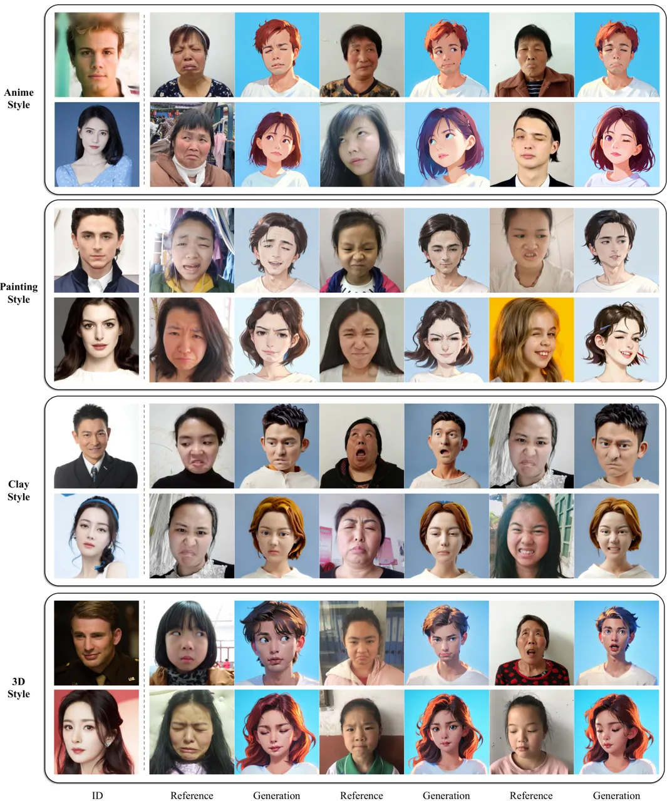

Figure 3: More qualitative results. For the given person (leftmost
column), our method generates the corresponding image based on the
various expression references, evaluated on SD1.5 \[40\] framework.

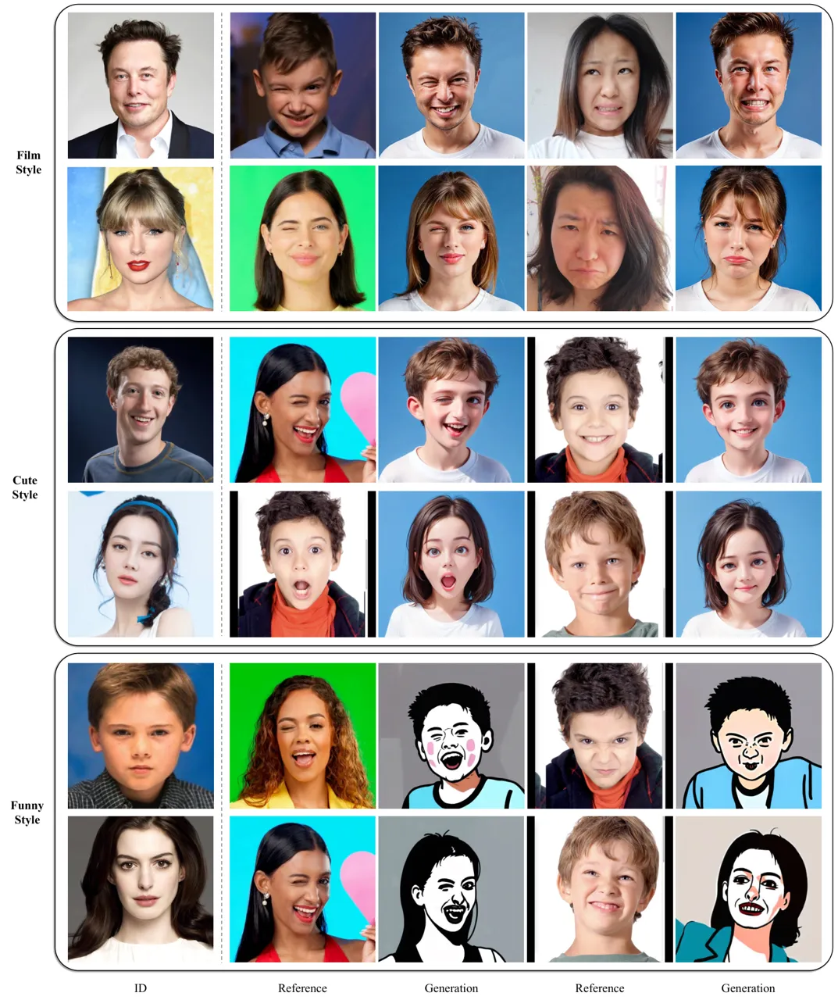

Figure 4: More qualitative result. For the given person (leftmost
column), our method generates the corresponding image based on the
various expression references, evaluated on SDXL \[37\] framework.

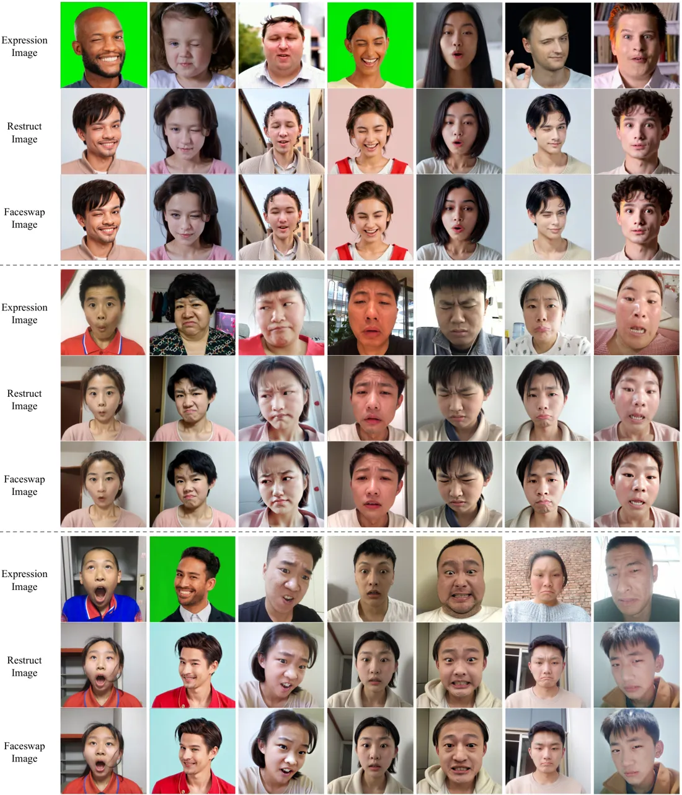

Figure 5: More examples of IDI and CIEP100k. ID-irrelevant Data
Iteration (IDI) is introduced to transform expression reference images
into the restruct and faceswap images, thus synthesizing high-quality
data pairs with differing identities and consistent expressions.
