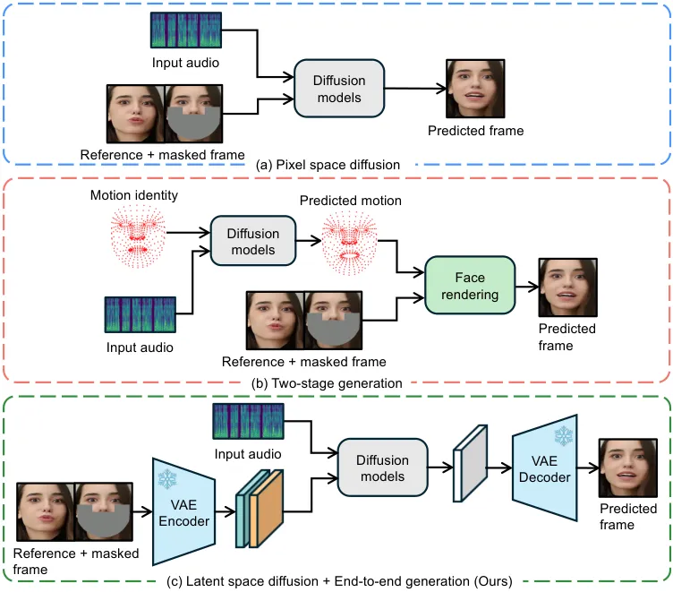
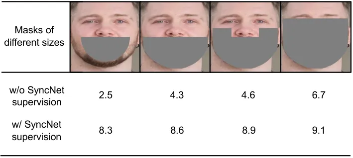
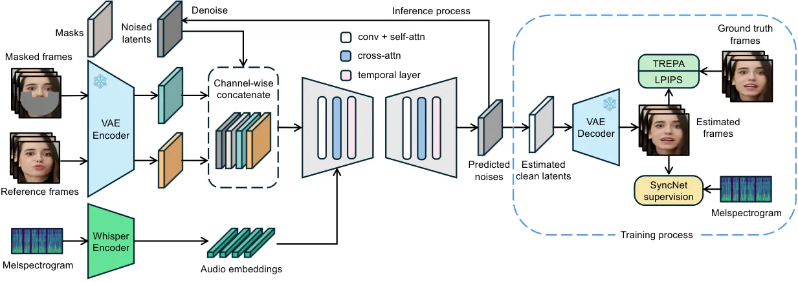
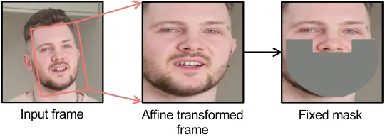
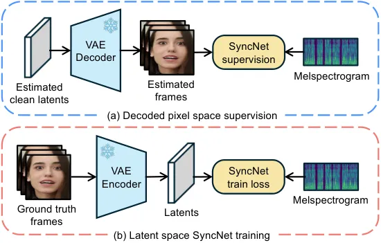
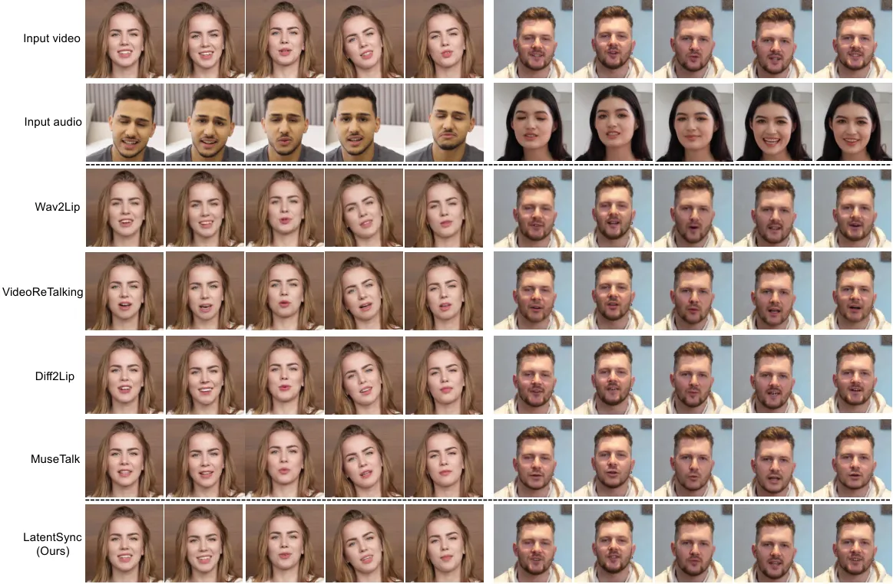

# LatentSync: Taming Audio-Conditioned Latent Diffusion Models for Lip Sync with SyncNet Supervision

Chunyu Li Affiliation: ByteDance Affiliation: Beijing Jiaotong
University    Chao Zhang Affiliation: ByteDance    Weikai Xu
Affiliation: ByteDance    Jingyu Lin Affiliation: Monash University   
Jinghui Xie Affiliation: ByteDance    Weiguo Feng Affiliation: ByteDance
   Bingyue Peng Affiliation: ByteDance    Cunjian Chen
Affiliation: Monash University    Weiwei Xing Affiliation: Beijing
Jiaotong University

###### Abstract

End-to-end audio-conditioned latent diffusion models (LDMs) have been
widely adopted for audio-driven portrait animation, demonstrating their
effectiveness in generating lifelike and high-resolution talking videos.
However, direct application of audio-conditioned LDMs to
lip-synchronization (lip-sync) tasks results in suboptimal lip-sync
accuracy. Through an in-depth analysis, we identified the underlying
cause as the “shortcut learning problem”, wherein the model
predominantly learns visual-visual shortcuts while neglecting the
critical audio-visual correlations. To address this issue, we explored
different approaches for integrating SyncNet supervision into
audio-conditioned LDMs to explicitly enforce the learning of
audio-visual correlations. Since the performance of SyncNet directly
influences the lip-sync accuracy of the supervised model, the training
of a well-converged SyncNet becomes crucial. We conducted the first
comprehensive empirical studies to identify key factors affecting
SyncNet convergence. Based on our analysis, we introduce StableSyncNet,
with an architecture designed for stable convergence. Our StableSyncNet
achieved a significant improvement in accuracy, increasing from 91% to
94% on the HDTF test set. Additionally, we introduce a novel Temporal
Representation Alignment (TREPA) mechanism to enhance temporal
consistency in the generated videos. Experimental results show that our
method surpasses state-of-the-art lip-sync approaches across various
evaluation metrics on the HDTF and VoxCeleb2 datasets. Code and models
are publicly available at
[https://github.com/bytedance/LatentSync](https://github.com/bytedance/LatentSync).

## 1 Introduction

The lip sync \[29, 28, 14, 52\] is a video editing task, which
regenerates the lip movements of a talking person according to the given
audio, while maintaining the head pose and personal identity. This
technique has broad applications in numerous practical domains, such as
visual dubbing, virtual avatars, and video conferencing.



Figure 1: Frameworks comparison between previous diffusion-based
lip-sync methods and our method.

In the field of lip sync, GAN-based methods \[14, 29\] remain the
mainstream approachs. The main issue with these methods is that they
struggle to scale up \[21, 36\] to large and diverse datasets due to the
unstable training \[2, 35\] and mode collapse \[39, 6\]. Recent studies
proposed diffusion-based methods \[28, 3, 53, 48, 25\] for lip sync,
allowing the model to easily generalize across different individuals
without the need for further fine-tuning on specific identities.
However, these methods still have some limitations. Specifically, \[28,
3\] perform the diffusion process in the pixel space (Fig. 1 a), which
restricts its ability to generate high-resolution videos due to the
prohibitive hardware requirements. Other methods \[53, 48\] adopt a
two-stage approach: the first stage generates lip motions from audio,
and the second stage synthesizes the visual appearance conditioned on
the motion (Fig. 1 b). The issue with this two-stage approach is that
subtly different sounds may map to the same motion representation,
leading to the loss of nuanced expressions linked to the emotional tone
of the speech.

To address the above limitations, we propose LatentSync, an end-to-end
lip sync framework based on audio-conditioned LDMs \[33\] to generate
lifelike and high-resolution talking videos, as shown in Fig. 1 (c). We
initially tried directly applying methods from the field of audio-driven
portrait animation, such as EMO \[41\] and Hallo \[46\]. However, the
results showed poor lip-sync accuracy. We delved deeper into this
phenomenon and identified the “shortcut learning problem” \[12\]
inherent in lip sync task.

The shortcut learning problem in lip sync. Lip-sync methods are
typically based on a video-to-video inpainting framework, the model
receives masked frames and audio as inputs. Unexpectedly, the
audio-conditioned LDMs tends to predict lip movements based on visual
information around the lips, such as facial muscles, eyes, and cheeks,
while ignoring the audio information. We conducted an experiment to
validate the existence of the shortcut learning problem and the
effectiveness of SyncNet supervision \[29\] in mitigating this issue. We
trained the audio-conditioned LDMs with masks of different sizes, both
with and without SyncNet supervision. We used the sync confidence score
\[9\] to evaluate the synchronization accuracy between audio and lip
movements.



Figure 2: The shortcut learning problem in the lip-sync task. Higher
sync confidence score means better lip-sync accuracy.

As shown in Fig. 2, without SyncNet supervision, as the mask size
increases, the visual information available in the masked frame for
inferring lip movements decreases, forcing the model to rely more on
audio information, thereby improving lip-sync accuracy, and vice versa.
In contrast, with SyncNet supervision, the model remains focused on
learning audio-visual correlations across different mask sizes.

Why is SyncNet supervision not necessary for audio-driven portrait
animation methods? These methods \[41, 46, 7, 20\] are based on
image-to-video framework. Since they do not involve input masked frames,
they do not suffer from the shortcut learning problem.

The previous work Diff2Lip \[28\] has explored how to add SyncNet
supervision to pixel-space diffusion models. However, how to effectively
apply SyncNet to latent diffusion models \[33\] remains unclear.
Specifically, we explored two methods to incorporate SyncNet supervision
into latent diffusion models: (a) Decoded pixel space supervision and
(b) Latent space supervision. Furthermore, We found that SyncNet
struggles to converge in both latent space and high-resolution pixel
space. Since the convergence of SyncNet significantly impacts its
supervision effectiveness, and ultimately affects the lip-sync accuracy
of the supervised model, the convergence issue of SyncNet is highly
valuable for research. Therefore, we conducted the first comprehensive
empirical studies in the aspects of model architecture design, training
hyperparameters, and data preprocessing techniques, introducing the
StableSyncNet with an architecture designed for stable convergence. Our
StableSyncNet achieved the unprecedented 94% accuracy on HDTF \[51\].

Additionally, we observed that high-frequency details in the generated
talking videos, such as teeth, lips, and facial hair, exhibit flickering
artifacts. We propose TREPA, a novel method designed to enhance temporal
consistency and reduce such artifacts.

In summary, we made the following contributions: (1) We proposed
LatentSync, the first lip-sync method that utilizes audio-conditioned
LDMs to achieve end-to-end lifelike lip sync on high-resolution videos,
incorporating TREPA to enhance the temporal consistency in the generated
videos. (2) We identified the shortcut learning problem in lip-sync task
and explored different methods to incorporate SyncNet supervision into
audio-condtioned LDMs. (3) We conducted the first comprehensive
empirical studies to identify key factors affecting SyncNet convergence,
introducing the StableSyncNet for stable convergence.



Figure 3: The overview of our LatentSync framework. We use the Whisper
\[32\] to convert melspectrogram into audio embeddings, which are then
integrated into the U-Net \[34\] via cross-attention layers. The
reference and masked frames are channel-wise concatenated with noised
latents as the input of U-Net. In the training process, we use a
one-step method to get estimated clean latents from predicted noises,
which are then decoded to obtain the estimated clean frames. The TREPA,
LPIPS \[49\] and SyncNet loss \[29\] are added in the pixel space.

## 2 Related Work

### 2.1 Diffusion-based Lip Sync

Diff2Lip \[28\] and DrivenVideoEditing \[3\] are both end-to-end lip
sync methods based on pixel-space audio-conditioned diffusion models.
MyTalk \[48\] uses diffusion models in the first stage to complete
audio-to-motion conversion and uses a VAE \[23\] in the second stage for
motion-to-image generation. StyleSync \[53\] uses transformers in the
first stage to convert audio to motion and employs diffusion models in
the second stage for motion-to-image generation. DiffDub \[25\] uses
diffusion autoencoders \[30\] to convert the masked images into semantic
latent codes in the first stage, and uses diffusion models to generate
an image conditioned on the semantic latent codes and audio in the
second stage.

### 2.2 Non-diffusion-based Lip Sync

Wav2Lip \[29\] is the most classic lip sync method that introduced using
a pretrained SyncNet \[9\] to supervise the training of the lip-sync
generator. \[16\] trains a VQ-VAE \[11\] to encode faces and head poses,
and then trains the lip sync generator in the quantized space to
generate high-resolution images. StyleSync \[14\] follows the overall
framework of Wav2Lip, with its main innovation being the use of
StyleGAN2 \[22\] as the generator backbone. VideoReTalking \[8\] divides
lip sync into three components: semantic-guided reenactment network, lip
sync network, and identity-aware refinement and enhancement. DINet
\[52\] deforms the feature maps to generate mouth shapes conditioned on
the driving audio. MuseTalk \[50\] uses the architecture of Stable
Diffusion \[33\] for inpainting, but it does not perform diffusion
process and uses a discriminator for adversarial learning \[13\], making
it more like a GAN-based framework.

### 2.3 Audio-driven Portrait Animation

Many people may confuse lip sync with audio-driven portrait animation.
These two tasks have some similarities but are actually completely
different tasks. Lip sync is based on video-to-video editing framework,
which needs to keep areas other than the mouth the same as in the input
video. Audio-driven portrait animation is based on image-to-video
animation framework, which can change the head movement and even facial
expressions. Although there are already some audio-driven portrait
animation methods based on audio-conditioned LDMs, such as \[41, 7, 46,
20\], they cannot be directly applied to the lip sync task due to the
shortcut learning problem.

## 3 Method

### 3.1 LatentSync Framework

The overview of the LatentSync framework is shown in Fig. 3. The
framework is based on video-to-video inpainting with the temporal
modeling by temporal layer \[15\]. To incorporate the visual features of
the face from the input video, reference frames are introduced as
additional inputs. During training, these frames are randomly selected,
while during inference, they are taken from the current frames. We
concatenate different inputs along the channel dimension, making the
total input of U-Net to be 13 channels (4 channels for noise latent, 1
channel for the mask, 4 channels for the masked frame, and 4 channels
for the reference frame). At the beginning of training, the model is
initialized with the parameters of SD 1.5 \[33\], except for the first
conv_in layer with 13 channels and cross-attention layers of dimension
384, which are randomly initialized.

Audio layers. We used the pretrained audio feature extractor Whisper
\[32\] to extract audio embeddings. Lip motion may be influenced by the
audio from the surrounding frames, and a larger range of audio input
also provides more temporal information for the model. Therefore, for
each generated frame, we bundled the audio from several surrounding
frames as input. We define the input audio feature $`A^{(f)}`$ for the
$`f`$th frame as:
$`A^{(f)}=\left\{a^{(f-m)},\dots,a^{(f)},\dots,a^{(f+m)}\right\}`$,
where $`m`$ is the number of surrounding audio features from one side.
To integrate the audio embeddings into the U-Net \[34\], we used the
native cross-attention layer.

Affine transformation and fixed mask. During the data preprocessing
stage, affine transformation was employed to perform face
frontalization. This approach \[14\] helps the model to effectively
learn facial features particularly in challenging scenarios such as
side-profile views. We applied a mask that covers the entire face to
minimize the model’s tendency to learn visual-visual shortcuts. The
position and shape of the mask are fixed. We do not use the detected
landmarks \[26, 5\] to draw the mask, as moving landmarks also provide
cues about lip movements. The affine transformation and fixed mask are
illustrated in Fig. 4.



Figure 4: The illustration of affine transformation and fixed mask.

SyncNet supervision. Latent diffusion models predict in the noise space,
while SyncNet \[9, 29\] requires an input in the image space. To address
this issue, we use the predicted noise $`\epsilon_{\theta}(z_{t})`$ to
obtain the estimated $`\hat{z}_{0}`$ in one step, which can be
formulated as:

```math
\hat{z}_{0}=\left(z_{t}-\sqrt{1-\bar{\alpha}_{t}}\,\epsilon_{\theta}(z_{t})\right)/\sqrt{\bar{\alpha}_{t}} \tag{1}
```

Another problem is that latent diffusion models make predictions in the
latent space. We explored two methods to incorporate SyncNet supervision
into latent diffusion models: (a) Decoded pixel space supervision, which
trains SyncNet in the same way as Wav2Lip \[29\]. (b) Latent space
supervision, which requires training a SyncNet in the latent space. The
visual encoder input of this SyncNet is the latent vectors obtained by
the VAE \[11, 23\] encoding. The illustration is shown in Fig. 5. Our
empirical analysis in Sec. 5.3 reveals that training SyncNet in the
latent space exhibits inferior convergence compared to training in the
pixel space. This degradation may arise from information loss in the lip
region during the VAE encoding process. The poorer convergence of
SyncNet in the latent space adversely impacts the lip-sync accuracy of
the supervised diffusion models, according to the experimental results
in Sec. 5.3. Therefore, we finally choose the decoded pixel space
supervision in the LatentSync framework.



Figure 5: Two methods to add SyncNet supervision to latent diffusion
models.

### 3.2 Two-Stage Training Strategy

The decoded pixel space supervision has a problem that the activations
in VAE decoding need to be stored for backpropagation, which
significantly increases GPU memory consumption. To mitigate this issue,
we designed a two-stage training strategy: in the first stage, the model
learns to extract features from reference frames and develops inpainting
capabilities, which we refer to as learning visual features. In the
second stage, it learns audio-visual correlations under SyncNet
supervision. This approach eliminates the need for the VAE decoding
process in the first stage, enabling model to learn visual features with
a larger batch size. We observed that audio-conditioned LDMs typically
spend more time learning visual features and less time learning
audio-visual correlations. Therefore, this two-stage training strategy
allows the model to efficiently learn both visual features and
audio-visual correlations. We provide the formal definitions of training
objectives in the following paragraphs.

In the first stage of training, we do not add the temporal layer \[15,
4\] and train all parameters of the U-Net. The training objective has
only a simple loss \[19\]:

```math
\mathcal{L}_{\text{simple}}=\mathbb{E}_{x,A,\epsilon\sim\mathcal{N}(0,1),t}\left[\left\|\epsilon-\epsilon_{\theta}(z_{t},t,\tau_{\theta}(A))\right\|_{2}^{2}\right] \tag{2}
```

where $`A`$ is the input audio,
$`\epsilon_{\theta}(z_{t},t,\tau_{\theta}(A))`$ is the predicted noise,
and $`\tau_{\theta}`$ is the audio feature extractor.

In the second stage of training, we only train the temporal layer and
audio layer while freezing the other parameters of the U-Net. Suppose we
have 16 decoded video frames $`\mathcal{D}(\hat{z}_{0})_{f:f+16}`$ and
the corresponding audio sequence $`a_{f:f+16}`$, the SyncNet loss can be
formulated as:

```math
\mathcal{L}_{\text{sync}}=\mathbb{E}_{x,a,\epsilon,t}\left[\text{SyncNet}(\mathcal{D}(\hat{z}_{0})_{f:f+16},a_{f:f+16})\right] \tag{3}
```

where $`\mathcal{D}`$ represents the VAE decoder, since the lipsync task
requires generating detailed areas, such as lips, teeth, and facial
hair, we used the LPIPS \[49\] to improve the visual quality of the
images generated by the U-Net.

```math
\mathcal{L}_{\text{lpips}}=\mathbb{E}_{x,\epsilon,t}\left[\left\|\mathcal{V}_{l}(\mathcal{D}(\hat{z}_{0})_{f})-\mathcal{V}_{l}(x_{f})\right\|_{2}^{2}\right] \tag{4}
```

where $`\mathcal{V}_{l}(\cdot)`$ denotes the features extracted from the
$`l^{\text{th}}`$ layer of a pretrained VGG network \[37\]. In addition,
to improve temporal consistency, we also employed the proposed TREPA,
see Eq. 6. For more details of the TREPA, please refer to Sec. 3.3.

The total loss function for the second stage of training is:

```math
\mathcal{L}_{\text{total}}=\lambda_{1}\mathcal{L}_{\text{simple}}+\lambda_{2}\mathcal{L}_{\text{sync}}+\lambda_{3}\mathcal{L}_{\text{lpips}}+\lambda_{4}\mathcal{L}_{\text{trepa}} \tag{5}
```

### 3.3 Temporal Representation Alignment

TREPA aligns the temporal representations of the generated image
sequences with those of ground truth image sequences. The insight behind
this method is that merely employing distance loss between individual
images improves the content quality of single generated images but does
not enhance the temporal consistency of the generated image sequence. In
contrast, temporal representations capture temporal correlation within
image sequences, enabling the model to focus on improving the overall
temporal consistency. We employed a large-scale self-supervised video
model VideoMAE-v2 \[44\] to extract temporal representations. Due to its
unsupervised training on large-scale unlabeled datasets, the model’s
temporal representations exhibit strong generalization capabilities,
robustness, and high information density.

In mathematical form, let $`\mathcal{T}`$ be the self-supervised video
model encoder. The encoder’s output is the embedding before the head
projection. TREPA can be represented as:

```math
\mathcal{L}_{\text{trepa}}=\mathbb{E}_{x,\epsilon,t}\left[\left\|\mathcal{T}(\mathcal{D}(\hat{z}_{0})_{f:f+16})-\mathcal{T}(x_{f:f+16})\right\|_{2}^{2}\right] \tag{6}
```

where the straightforward Mean Squared Error (MSE) is employed to
measure the distance between temporal representations. We also fix the
representation by $`\ell_{2}`$ normalization before calculating the MSE.

## 4 Empirical Studies on SyncNet Convergence

Our experiments reveal that SyncNet is difficult to converge in both
latent space and high-resolution pixel space, a typical characteristic
of this issue is that the training loss gets stuck at 0.69 and fails to
decrease further. In this section, we analyze the SyncNet convergence
problem and identify several critical factors affecting the convergence
through various ablation studies. Importantly, we preserved SyncNet’s
original training framework and employed the same contrastive loss
function as Wav2Lip \[29\]. Therefore, our experience can be applied to
many lip-sync \[29, 14, 28, 8, 52, 50\] and audio-driven portrait
animation methods \[27, 47\] that utilize SyncNet.

Why is the SyncNet training loss stuck at 0.69? According to the classic
training framework of SyncNet \[29, 9\], we randomly provide SyncNet
with positive and negative samples with a 50% probability during the
training stage. The output of SyncNet is a probability distribution of
whether the sample is positive or negative. We define $`p(x=1)`$ as the
probability that the sample is positive, and $`p(x=0)`$ as the
probability that the sample is negative. Let $`p(x)`$ be the true
probability distribution and $`q(x)`$ the predicted probability
distribution. When $`q(x=1)\approx q(x=0)\approx 0.5`$ and batch size
$`N`$ is sufficiently large, the training loss of SyncNet is (proof in
Appendix A):

```math
\displaystyle\mathcal{L}_{\text{syncnet}} \displaystyle=-\frac{1}{N}\sum_{i=1}^{N}\sum_{x_{i}\in\{0,1\}}p(x_{i})\,\text{log}\,{q(x_{i})}\approx 0.693 \tag{7}
```

This means that SyncNet has not learned any discriminative capability;
it is just randomly guessing whether the samples are positive or
negative. This may be due to various reasons, including the model’s
insufficient capacity to fit the data, the large audio-visual offset in
the data, and flaws in the training strategy. In the following
paragraphs, we will identify the key factors affecting the convergence
of SyncNet through comprehensive ablation studies.

Batch size. As shown in Fig. 6, a larger batch size (e.g., 1024) not
only enables the model to converge faster and more stably but also
results in a lower validation loss at the end of training. In contrast,
smaller batch sizes (e.g., 128) may fail to converge, with the loss
remaining stuck at 0.69. Even with a slightly larger batch size (e.g.,
256), while convergence may be achieved, the training loss exhibits
significant oscillations during its descent.

Figure 6: SyncNet training curves of different batch sizes. VoxCeleb2
results, the more transparent curves represent the training set loss,
while the darker curves represent the validation set loss; the same
applies to the following figures. (VoxCeleb2, Dim 2048, StbleSyncNet
arch, 16 frames.)

Architecture. We redesign the SyncNet’s visual and audio encoders with
the U-Net encoder from Stable Diffusion 1.5 \[33\], retaining the
structure of residual blocks \[17\] and self-attention blocks \[43\] in
the U-Net encoder blocks. We only adjusted the downsampling factors
based on the size of the input visual images and mel-spectrograms, and
we removed the cross-attention blocks, as SyncNet does not require
additional conditions. We refer to the SyncNet with this modified
architecture as StableSyncNet. As shown in Fig. 7, StableSyncNet
maintained both training loss and validation loss lower than those of
Wav2Lip’s SyncNet \[29\] throughout the training process.

Figure 7: SyncNet training curves of different architectures. For
comparison, we also modified the architecture of Wav2Lip’s SyncNet to
accept 256 $`\times`$ 256 visual input according to \[31\]. (VoxCeleb2,
Dim 2048, Batch size 512, 5 frames.)

Embedding dimension. As illustrated in Fig. 8, embeddings with smaller
dimensions (e.g., 512) result in representations that fail to capture
sufficient semantic information, while larger dimensions (e.g., 4096 or 6144) lead to sparse representations, thereby impeding model
convergence. Se identified that an optimal embedding dimension of 2048
is suitable for images with an input resolution of 256 $`\times`$ 256
pixels.

Figure 8: SyncNet training curves of different embedding dimensions.
(VoxCeleb2, Batch size 512, StableSyncNet arch, 16 frames.)

Number of frames. The number of input frames determines the range of
visual and audio information that SyncNet can perceive. As shown in
Fig. 9, selecting a larger number of frames (e.g., 16) can help the
model converge. However, an excessively large number of frames (e.g., 25) will cause the model to get stuck around 0.69 in the early stage of
training, and the validation loss at the end of training does not show a
significant advantage compared to using 16 frames.

Figure 9: SyncNet training curves of different numbers of input frames.
(VoxCeleb2, Batch size 512, StableSyncNet arch, Dim 2048.)

Data preprocessing. In-the-wild videos naturally contain audio-visual
offsets, it is necessary to adjust this offset to zero before inputting
them into the SyncNet network. We used the official open-source version
of pretrained SyncNet \[9\] to adjust the offset and remove videos with
$`{\text{Sync}}_{\text{conf}}`$ below 3. Specifically, we evaluated
adjusting the offset before and after applying affine transformation. As
shown in Fig. 10, without offset adjustment, the model’s convergence is
significantly impaired. Performing affine transformation before offset
adjustment yields better results. This may be due to that affine
transformation reducing data with side profiles or unusual angles,
allowing the pretrained SyncNet \[9\] to predict the offset more
accurately.

Figure 10: SyncNet training curves of different data preprocessing
methods. (VoxCeleb2, Batch size 512, StableSyncNet arch, Dim 2048, 16
frames.)

Discussions. Based on the ablation studies above, we found that batch
size, number of input frames, and data preprocessing method are the
primary factors affecting SyncNet convergence. We identified the optimal
settings for a StableSyncNet with the 256 $`\times`$ 256 input size:
batch size of 1024, 16 frames, SD U-Net encoder adapted for both visual
and audio encoders, embedding dimension of 2048, and adjusting the
audio-visual offset after affine transformation. We train a
StableSyncNet on VoxCeleb2 \[10\] and test it on HDTF \[51\], which is
an out-of-distribution experimental setup. The validation loss on
VoxCeleb2 reaches around 0.18 and the accuracy on HDTF achieves 94%,
which significantly surpasses the previous SOTA result 91% \[29, 16\].

## 5 Experiments

|                      |                    |                   |                                              |                    |                    |                    |                   |                                              |                    |                    |
| -------------------- | ------------------ | ----------------- | -------------------------------------------- | ------------------ | ------------------ | ------------------ | ----------------- | -------------------------------------------- | ------------------ | ------------------ |
| Method               | HDTF               |                   |                                              |                    | VoxCeleb2          |                    |                   |                                              |                    |                    |
|                      | FID $`\downarrow`$ | SSIM $`\uparrow`$ | $`{\text{Sync}}_{\text{conf}}`$ $`\uparrow`$ | LMD $`\downarrow`$ | FVD $`\downarrow`$ | FID $`\downarrow`$ | SSIM $`\uparrow`$ | $`{\text{Sync}}_{\text{conf}}`$ $`\uparrow`$ | LMD $`\downarrow`$ | FVD $`\downarrow`$ |
| Wav2Lip \[29\]       | 12.5               | 0.70              | 8.2                                          | 0.34               | 304.35             | 10.8               | 0.71              | 7.0                                          | 0.53               | 257.85             |
| VideoReTalking \[8\] | 9.5                | 0.75              | 7.5                                          | 0.49               | 270.56             | 7.5                | 0.77              | 6.4                                          | 0.60               | 215.67             |
| Diff2Lip \[28\]      | 10.3               | 0.72              | 7.9                                          | 0.36               | 260.45             | 9.8                | 0.73              | 6.9                                          | 0.54               | 210.45             |
| MuseTalk \[50\]      | 9.35               | 0.74              | 6.8                                          | 0.56               | 246.75             | 7.1                | 0.80              | 5.9                                          | 0.64               | 203.43             |
| LatentSync (Ours)    | 7.22               | 0.79              | 8.9                                          | 0.30               | 162.74             | 5.7                | 0.81              | 7.3                                          | 0.51               | 123.27             |

Table 1: Quantitative comparisons on HDTF and VoxCeleb2.



Figure 11: Qualitative comparisons with SOTA lip-sync methods. We run
two cases in the cross generation setting \[28\]. The first row
demonstrates the original input video, and the second row is the video
from which we extracted the audio as input, the video can be regarded as
the target lip movements. Rows 3 $`\sim`$ 7 display the lip-synced
videos. (All the photorealistic portrait images in this paper are from
contracted models.)

### 5.1 Experimental Settings

Datasets. We used a mixture of VoxCeleb2 \[10\] and HDTF \[51\] datasets
as our training set. VoxCeleb2 is a large-scale audio-visual dataset
containing over 1 million utterances from over 6,000 speakers. It
includes speakers from a wide range of ethnicities, accents, and
backgrounds. HDTF contains 362 different high-definition (HD) videos,
with resolutions typically around 720p to 1080p.

We used HyperIQA \[40\] to filter out videos with low visual quality,
specifically blurry or pixelated videos. During evaluation, we randomly
selected 30 videos from the test set of HDTF or VoxCeleb2.

Implementation details. When evaluating our model LatentSync, we first
converted the videos to 25 FPS, then applied the affine transformation
based on facial landmarks detected by face-alignment \[5\] to obtain 256
$`\times`$ 256 face videos. The audio was resampled to 16kHz. We used 20
steps of DDIM \[38\] sampling for inference.

Evaluation metrics. We evaluate our method in three aspects: (1) Visual
quality. We use SSIM \[45\] in the reconstruction setting and FID \[18\]
in the cross generation setting to assess visual quality. Following
\[28\], the reconstruction setting refers to using the same audio as the
input video, while the cross generation setting refers to using audio
different from the input video. (2) Lip-sync accuracy. We use the
confidence score of SyncNet ($`{\text{Sync}}_{\text{conf}}`$) \[9\] and
the landmark distances around the mouth (LMD) \[14\]. We found that
$`{\text{Sync}}_{\text{conf}}`$ aligns closely with visual assessments.
(3) Temporal consistency. We adopt the widely used FVD metric \[42\].

### 5.2 Comparisons

Comparison methods. We selected several SOTA methods that provide
open-source inference code and checkpoints for comparison. Wav2Lip
\[29\] is the classic lip-sync method, introducing the idea of using a
pretrained SyncNet for supervision instead of a lip-sync discriminator
\[24\]. VideoReTalking \[8\] divides the lip-sync process into three
steps to improve the results. Diff2Lip \[28\] utilized pixel-space
diffusion models to achieve generalized lip sync. MuseTalk \[50\]
utilizes the architecture of Stable Diffusion for inpainting, but it is
not based on the diffusion model framework and appears more like a
GAN-based approach.

Quantitative comparisons. As shown in Tab. 1, the lip-sync accuracy of
our method significantly surpasses that of other methods. This is
attributed to our 94% accuracy StbaleSyncNet, as well as the audio
cross-attention layers in U-Net, which better captures the relationship
between audio and lip movements. In terms of visual quality, our method
outperforms others, likely due to the powerful capabilities of the
Stable Diffusion model. Owing to temporal layer \[15\] and the
incorporation of TREPA, our FVD score is also superior to other methods.

| Method                            | $`{\text{Sync}}_{\text{conf}}`$ $`\uparrow`$ | FVD $`\downarrow`$ |
| --------------------------------- | -------------------------------------------- | ------------------ |
| LatentSync w/o SyncNet            | 4.6                                          | 220.37             |
| LatentSync + latent space SyncNet | 7.9                                          | 180.45             |
| LatentSync + pixel space SyncNet  | 8.9                                          | 162.74             |

Table 2: The ablation studies of different SyncNets. HDTF results.

Qualitative comparisons. We run two cases in the cross generation
setting. According to Fig. 11, Wav2Lip has excellent lip-sync accuracy,
but the generated videos are very blurry. VideoReTalking shows strange
artifacts. Diff2Lip is limited by pixel-space diffusion models and can
only generate low-resolution videos, resulting in noticeable blurriness.
MuseTalk does not preserve facial features well, the man’s beard becomes
sparse. In contrast, our method excels in both clarity and identity
preservation, even the mole on the woman’s face was preserved.
Furthermore, it hardly shows generated box due to the smooth shape of
fixed mask.

Figure 12: SyncNet training curves of different visual input spaces.
Here we use the open-sourced pretrained VAE from Stability AI \[1\] for
encoding. (VoxCeleb2, Batch size 512, StableSyncNet arch, Dim 1024, 16
frames.)

### 5.3 Ablation studies

The effectiveness of SyncNet supervision. As shown in Tab. 2, when the
SyncNet supervision is not added, The lip-sync performance of the
trained diffusion models is significantly poor. In fact, we found that
other end-to-end lipsync methods \[29, 28\] exhibit similar phenomena.
As for supervision in two different spaces, diffusion models under pixel
space SyncNet supervision perform better in terms of lip-sync accuracy
and temporal consistency. This is likely due to the poor convergence of
latent space SyncNet (as shown in Fig. 12), which is reasonable since
the input to the latent space SyncNet is the compressed latents obtained
from VAE encoding, and some lip information may already be lost.

In addition, we found that improvements in lip-sync accuracy were
accompanied by an increase in temporal consistency. This is because the
audio window inherently encapsulates rich temporal information. Enhanced
utilization of audio information by the model also leads to the improved
temporal consistency.

The effectiveness of TREPA. According to Tab. 3, both the temporal
consistency and visual quality improve after incorporating TREPA. This
improvement may be attributed to that the robust representations
extracted by VideoMAE-v2 \[44\] inherently encapsulate both visual and
temporal information.

| Method             | FID $`\downarrow`$ | SSIM $`\uparrow`$ | FVD $`\downarrow`$ |
| ------------------ | ------------------ | ----------------- | ------------------ |
| LatentSync         | 7.71               | 0.77              | 176.35             |
| LatentSync + TREPA | 7.22               | 0.79              | 162.74             |

Table 3: The ablation studies of TREPA. HDTF results.

## 6 Conclusion

We introduced LatentSync, the first lip-sync method based on
audio-conditioned LDMs, which addresses the problems of traditional
diffusion-based lip-sync methods: (1) The low sampling speed and
inability to generate high-resolution videos of pixel space diffusion.
(2) The information loss in two-stage generation methods. We identified
the shortcut learning problem in lip-sync task and explored different
approaches to incorporate SyncNet supervision to solve this problem. We
conducted comprehensive ablation studies to find out several key factors
influencing SyncNet converge. In addition, we proposed TREPA to further
improve the temporal consistency of our method.

## References

- \[1\] Stability AI. sd-vae-ft-mse.
  [https://huggingface.co/stabilityai/sd-vae-ft-mse](https://huggingface.co/stabilityai/sd-vae-ft-mse), 2022.
- \[2\] Martin Arjovsky, Soumith Chintala, and Léon Bottou. Wasserstein
  generative adversarial networks. In _International conference on
  machine learning_, pages 214–223. PMLR, 2017.
- \[3\] Dan Bigioi, Shubhajit Basak, Michał Stypułkowski, Maciej Zieba,
  Hugh Jordan, Rachel McDonnell, and Peter Corcoran. Speech driven video
  editing via an audio-conditioned diffusion model. _Image and Vision
  Computing_, 142:104911, 2024.
- \[4\] Andreas Blattmann, Robin Rombach, Huan Ling, Tim Dockhorn,
  Seung Wook Kim, Sanja Fidler, and Karsten Kreis. Align your latents:
  High-resolution video synthesis with latent diffusion models. In
  _Proceedings of the IEEE/CVF Conference on Computer Vision and Pattern
  Recognition_, pages 22563–22575, 2023.
- \[5\] Adrian Bulat and Georgios Tzimiropoulos. How far are we from
  solving the 2d & 3d face alignment problem?(and a dataset of 230,000
  3d facial landmarks). In _Proceedings of the IEEE international
  conference on computer vision_, pages 1021–1030, 2017.
- \[6\] Tong Che, Yanran Li, Athul Paul Jacob, Yoshua Bengio, and Wenjie
  Li. Mode regularized generative adversarial networks. _arXiv preprint
  arXiv:1612.02136_, 2016.
- \[7\] Zhiyuan Chen, Jiajiong Cao, Zhiquan Chen, Yuming Li, and
  Chenguang Ma. Echomimic: Lifelike audio-driven portrait animations
  through editable landmark conditions. _arXiv preprint
  arXiv:2407.08136_, 2024.
- \[8\] Kun Cheng, Xiaodong Cun, Yong Zhang, Menghan Xia, Fei Yin,
  Mingrui Zhu, Xuan Wang, Jue Wang, and Nannan Wang. Videoretalking:
  Audio-based lip synchronization for talking head video editing in the
  wild. In _SIGGRAPH Asia 2022 Conference Papers_, pages 1–9, 2022.
- \[9\] Joon Son Chung and Andrew Zisserman. Out of time: automated lip
  sync in the wild. In _Computer Vision–ACCV 2016 Workshops: ACCV 2016
  International Workshops, Taipei, Taiwan, November 20-24, 2016, Revised
  Selected Papers, Part II 13_, pages 251–263. Springer, 2017.
- \[10\] Joon Son Chung, Arsha Nagrani, and Andrew Zisserman. Voxceleb2:
  Deep speaker recognition. _arXiv preprint arXiv:1806.05622_, 2018.
- \[11\] Patrick Esser, Robin Rombach, and Bjorn Ommer. Taming
  transformers for high-resolution image synthesis. In _Proceedings of
  the IEEE/CVF conference on computer vision and pattern recognition_,
  pages 12873–12883, 2021.
- \[12\] Robert Geirhos, Jörn-Henrik Jacobsen, Claudio Michaelis,
  Richard Zemel, Wieland Brendel, Matthias Bethge, and Felix A Wichmann.
  Shortcut learning in deep neural networks. _Nature Machine
  Intelligence_, 2(11):665–673, 2020.
- \[13\] Ian Goodfellow, Jean Pouget-Abadie, Mehdi Mirza, Bing Xu, David
  Warde-Farley, Sherjil Ozair, Aaron Courville, and Yoshua Bengio.
  Generative adversarial nets. _Advances in neural information
  processing systems_, 27, 2014.
- \[14\] Jiazhi Guan, Zhanwang Zhang, Hang Zhou, Tianshu Hu, Kaisiyuan
  Wang, Dongliang He, Haocheng Feng, Jingtuo Liu, Errui Ding, Ziwei Liu,
  et al. Stylesync: High-fidelity generalized and personalized lip sync
  in style-based generator. In _Proceedings of the IEEE/CVF Conference
  on Computer Vision and Pattern Recognition_, pages 1505–1515, 2023.
- \[15\] Yuwei Guo, Ceyuan Yang, Anyi Rao, Zhengyang Liang, Yaohui Wang,
  Yu Qiao, Maneesh Agrawala, Dahua Lin, and Bo Dai. Animatediff: Animate
  your personalized text-to-image diffusion models without specific
  tuning. _arXiv preprint arXiv:2307.04725_, 2023.
- \[16\] Anchit Gupta, Rudrabha Mukhopadhyay, Sindhu Balachandra,
  Faizan Farooq Khan, Vinay P Namboodiri, and CV Jawahar. Towards
  generating ultra-high resolution talking-face videos with lip
  synchronization. In _Proceedings of the IEEE/CVF Winter Conference on
  Applications of Computer Vision_, pages 5209–5218, 2023.
- \[17\] Kaiming He, Xiangyu Zhang, Shaoqing Ren, and Jian Sun. Deep
  residual learning for image recognition. In _Proceedings of the IEEE
  conference on computer vision and pattern recognition_, pages
  770–778, 2016.
- \[18\] Martin Heusel, Hubert Ramsauer, Thomas Unterthiner, Bernhard
  Nessler, and Sepp Hochreiter. Gans trained by a two time-scale update
  rule converge to a local nash equilibrium. _Advances in neural
  information processing systems_, 30, 2017.
- \[19\] Jonathan Ho, Ajay Jain, and Pieter Abbeel. Denoising diffusion
  probabilistic models. _Advances in neural information processing
  systems_, 33:6840–6851, 2020.
- \[20\] Jianwen Jiang, Chao Liang, Jiaqi Yang, Gaojie Lin, Tianyun
  Zhong, and Yanbo Zheng. Loopy: Taming audio-driven portrait avatar
  with long-term motion dependency. In _The Thirteenth International
  Conference on Learning Representations_, 2024.
- \[21\] Minguk Kang, Jun-Yan Zhu, Richard Zhang, Jaesik Park, Eli
  Shechtman, Sylvain Paris, and Taesung Park. Scaling up gans for
  text-to-image synthesis. In _Proceedings of the IEEE/CVF Conference on
  Computer Vision and Pattern Recognition_, pages 10124–10134, 2023.
- \[22\] Tero Karras, Samuli Laine, Miika Aittala, Janne Hellsten,
  Jaakko Lehtinen, and Timo Aila. Analyzing and improving the image
  quality of stylegan. In _Proceedings of the IEEE/CVF conference on
  computer vision and pattern recognition_, pages 8110–8119, 2020.
- \[23\] Diederik P Kingma. Auto-encoding variational bayes. _arXiv
  preprint arXiv:1312.6114_, 2013.
- \[24\] Prajwal KR, Rudrabha Mukhopadhyay, Jerin Philip, Abhishek Jha,
  Vinay Namboodiri, and CV Jawahar. Towards automatic face-to-face
  translation. In _Proceedings of the 27th ACM international conference
  on multimedia_, pages 1428–1436, 2019.
- \[25\] Tao Liu, Chenpeng Du, Shuai Fan, Feilong Chen, and Kai Yu.
  Diffdub: Person-generic visual dubbing using inpainting renderer with
  diffusion auto-encoder. In _ICASSP 2024-2024 IEEE International
  Conference on Acoustics, Speech and Signal Processing (ICASSP)_, pages
  3630–3634. IEEE, 2024.
- \[26\] Camillo Lugaresi, Jiuqiang Tang, Hadon Nash, Chris McClanahan,
  Esha Uboweja, Michael Hays, Fan Zhang, Chuo-Ling Chang, Ming Guang
  Yong, Juhyun Lee, et al. Mediapipe: A framework for building
  perception pipelines. _arXiv preprint arXiv:1906.08172_, 2019.
- \[27\] Yifeng Ma, Shiwei Zhang, Jiayu Wang, Xiang Wang, Yingya Zhang,
  and Zhidong Deng. Dreamtalk: When expressive talking head generation
  meets diffusion probabilistic models. _arXiv preprint
  arXiv:2312.09767_, 2023.
- \[28\] Soumik Mukhopadhyay, Saksham Suri, Ravi Teja Gadde, and Abhinav
  Shrivastava. Diff2lip: Audio conditioned diffusion models for
  lip-synchronization. In _Proceedings of the IEEE/CVF Winter Conference
  on Applications of Computer Vision_, pages 5292–5302, 2024.
- \[29\] KR Prajwal, Rudrabha Mukhopadhyay, Vinay P Namboodiri, and CV
  Jawahar. A lip sync expert is all you need for speech to lip
  generation in the wild. In _Proceedings of the 28th ACM international
  conference on multimedia_, pages 484–492, 2020.
- \[30\] Konpat Preechakul, Nattanat Chatthee, Suttisak Wizadwongsa, and
  Supasorn Suwajanakorn. Diffusion autoencoders: Toward a meaningful and
  decodable representation. In _Proceedings of the IEEE/CVF conference
  on computer vision and pattern recognition_, pages 10619–10629, 2022.
- \[31\] primepake. wav2lip 288x288.
  [https://github.com/primepake/wav2lip_288x288](https://github.com/primepake/wav2lip_288x288), 2021.
- \[32\] Alec Radford, Jong Wook Kim, Tao Xu, Greg Brockman, Christine
  McLeavey, and Ilya Sutskever. Robust speech recognition via
  large-scale weak supervision. In _International conference on machine
  learning_, pages 28492–28518. PMLR, 2023.
- \[33\] Robin Rombach, Andreas Blattmann, Dominik Lorenz, Patrick
  Esser, and Björn Ommer. High-resolution image synthesis with latent
  diffusion models. In _Proceedings of the IEEE/CVF conference on
  computer vision and pattern recognition_, pages 10684–10695, 2022.
- \[34\] Olaf Ronneberger, Philipp Fischer, and Thomas Brox. U-net:
  Convolutional networks for biomedical image segmentation. In _Medical
  image computing and computer-assisted intervention–MICCAI 2015: 18th
  international conference, Munich, Germany, October 5-9, 2015,
  proceedings, part III 18_, pages 234–241. Springer, 2015.
- \[35\] Tim Salimans, Ian Goodfellow, Wojciech Zaremba, Vicki Cheung,
  Alec Radford, and Xi Chen. Improved techniques for training gans.
  _Advances in neural information processing systems_, 29, 2016.
- \[36\] Axel Sauer, Tero Karras, Samuli Laine, Andreas Geiger, and Timo
  Aila. Stylegan-t: Unlocking the power of gans for fast large-scale
  text-to-image synthesis. In _International conference on machine
  learning_, pages 30105–30118. PMLR, 2023.
- \[37\] Karen Simonyan and Andrew Zisserman. Very deep convolutional
  networks for large-scale image recognition. _arXiv preprint
  arXiv:1409.1556_, 2014.
- \[38\] Jiaming Song, Chenlin Meng, and Stefano Ermon. Denoising
  diffusion implicit models. _arXiv preprint arXiv:2010.02502_, 2020.
- \[39\] Akash Srivastava, Lazar Valkov, Chris Russell, Michael U
  Gutmann, and Charles Sutton. Veegan: Reducing mode collapse in gans
  using implicit variational learning. _Advances in neural information
  processing systems_, 30, 2017.
- \[40\] Shaolin Su, Qingsen Yan, Yu Zhu, Cheng Zhang, Xin Ge, Jinqiu
  Sun, and Yanning Zhang. Blindly assess image quality in the wild
  guided by a self-adaptive hyper network. In _Proceedings of the
  IEEE/CVF conference on computer vision and pattern recognition_, pages
  3667–3676, 2020.
- \[41\] Linrui Tian, Qi Wang, Bang Zhang, and Liefeng Bo. Emo: Emote
  portrait alive-generating expressive portrait videos with audio2video
  diffusion model under weak conditions. _arXiv preprint
  arXiv:2402.17485_, 2024.
- \[42\] Thomas Unterthiner, Sjoerd Van Steenkiste, Karol Kurach,
  Raphael Marinier, Marcin Michalski, and Sylvain Gelly. Towards
  accurate generative models of video: A new metric & challenges. _arXiv
  preprint arXiv:1812.01717_, 2018.
- \[43\] A Vaswani. Attention is all you need. _Advances in Neural
  Information Processing Systems_, 2017.
- \[44\] Limin Wang, Bingkun Huang, Zhiyu Zhao, Zhan Tong, Yinan He, Yi
  Wang, Yali Wang, and Yu Qiao. Videomae v2: Scaling video masked
  autoencoders with dual masking. In _Proceedings of the IEEE/CVF
  Conference on Computer Vision and Pattern Recognition_, pages
  14549–14560, 2023.
- \[45\] Zhou Wang, Alan C Bovik, Hamid R Sheikh, and Eero P Simoncelli.
  Image quality assessment: from error visibility to structural
  similarity. _IEEE transactions on image processing_,
  13(4):600–612, 2004.
- \[46\] Mingwang Xu, Hui Li, Qingkun Su, Hanlin Shang, Liwei Zhang, Ce
  Liu, Jingdong Wang, Luc Van Gool, Yao Yao, and Siyu Zhu. Hallo:
  Hierarchical audio-driven visual synthesis for portrait image
  animation. _arXiv preprint arXiv:2406.08801_, 2024.
- \[47\] Zhenhui Ye, Ziyue Jiang, Yi Ren, Jinglin Liu, Jinzheng He, and
  Zhou Zhao. Geneface: Generalized and high-fidelity audio-driven 3d
  talking face synthesis. _arXiv preprint arXiv:2301.13430_, 2023.
- \[48\] Runyi Yu, Tianyu He, Ailing Zeng, Yuchi Wang, Junliang Guo, Xu
  Tan, Chang Liu, Jie Chen, and Jiang Bian. Make your actor talk:
  Generalizable and high-fidelity lip sync with motion and appearance
  disentanglement. _arXiv preprint arXiv:2406.08096_, 2024.
- \[49\] Richard Zhang, Phillip Isola, Alexei A Efros, Eli Shechtman,
  and Oliver Wang. The unreasonable effectiveness of deep features as a
  perceptual metric. In _Proceedings of the IEEE conference on computer
  vision and pattern recognition_, pages 586–595, 2018.
- \[50\] Yue Zhang, Minhao Liu, Zhaokang Chen, Bin Wu, Yubin Zeng, Chao
  Zhan, Yingjie He, Junxin Huang, and Wenjiang Zhou. Musetalk: Real-time
  high quality lip synchronization with latent space inpainting. _arXiv
  preprint arXiv:2410.10122_, 2024.
- \[51\] Zhimeng Zhang, Lincheng Li, Yu Ding, and Changjie Fan.
  Flow-guided one-shot talking face generation with a high-resolution
  audio-visual dataset. In _Proceedings of the IEEE/CVF Conference on
  Computer Vision and Pattern Recognition_, pages 3661–3670, 2021.
- \[52\] Zhimeng Zhang, Zhipeng Hu, Wenjin Deng, Changjie Fan, Tangjie
  Lv, and Yu Ding. Dinet: Deformation inpainting network for realistic
  face visually dubbing on high resolution video. In _Proceedings of the
  AAAI Conference on Artificial Intelligence_, pages 3543–3551, 2023.
- \[53\] Weizhi Zhong, Jichang Li, Yinqi Cai, Liang Lin, and Guanbin Li.
  Style-preserving lip sync via audio-aware style reference. _arXiv
  preprint arXiv:2408.05412_, 2024.

Appendix

## Appendix A SyncNet Training Loss Proof

According to the classic training framework of SyncNet \[29, 9\], we
randomly provide SyncNet with positive and negative samples with a 50%
probability during the training stage. The output of SyncNet is a
probability distribution of whether the sample is positive or negative.
We define $`p(x=1)`$ as the probability that the sample is positive, and
$`p(x=0)`$ as the probability that the sample is negative. Let $`p(x)`$
be the true probability distribution and $`q(x)`$ the predicted
probability distribution. We plot some scatter charts to observe the
changes in the prediction probabilities of a non-converging SyncNet
during the training process.

Figure 13: We train a SyncNet on VoxCeleb2 \[10\] with batch size of 256. We modify its architecture and data to make it non-converging.
Every 100 steps, we plot a scatter plot to observe the probability
distribution of SyncNet’s predicted $`q(x_{i}=1)`$, including 256 data
points. The x-axis represents the probability $`q(x_{i}=1)`$, and we add
some random jitter along the y-axis for better visualization.

As shown in Fig. 13, in the early stages of training, the probabilities
predicted by SyncNet for $`q(x_{i}=1)`$ are dispersed, but later in the
training, the probabilities for $`q(x_{i}=1)`$ are almost all
distributed around 0.5 (the scatter charts for $`q(x_{i}=0)`$ are
similar). Now we have:

```math
\displaystyle\forall i\in{1,2,\ldots,N}:~~q(x_{i}=1)\approx q(x_{i}=0)\approx 0.5 \tag{8}
```

We speculate that this may be because, the non-converging SyncNet is
consistently unable to correctly distinguish whether a sample is
positive or negative during the training process. However, to reduce the
training loss, it tends to output a probability of 0.5 for all input
embeddings to minimize the training loss as much as possible. This is
why the training loss decreases somewhat initially and then gets stuck
(from 0.8 to 0.69).

We assmue that there are $`A`$ positive samples and $`B`$ negative
samples in a batch, and then we can derive SyncNet’s training loss based
on the following steps:

```math
\displaystyle\mathcal{L}_{\text{syncnet}} \displaystyle=-\frac{1}{N}\sum_{i=1}^{N}\sum_{x_{i}\in\{0,1\}}p(x_{i})\,\text{log}\,{q(x_{i})} \tag{9}
```

```math
\displaystyle=-\frac{1}{N}\sum_{i=1}^{N}\left[p(x_{i}=1)\,\text{log}\,{q(x_{i}=1)}+p(x_{i}=0)\,\text{log}\,{q(x_{i}=0)}\right] \tag{10}
```

```math
\displaystyle=-\frac{1}{N}\sum_{i=1}^{N}p(x_{i}=1)\,\text{log}\,{q(x_{i}=1)}-\frac{1}{N}\sum_{i=1}^{N}p(x_{i}=0)\,\text{log}\,{q(x_{i}=0)} \tag{11}
```

```math
\displaystyle=-\frac{1}{N}\left[\sum_{a=1}^{A}1\times\,\text{log}\,{q(x_{a}=1)}+\sum_{b=1}^{B}0\times\,\text{log}\,{q(x_{b}=1)}\right]-\frac{1}{N}\left[\sum_{a=1}^{A}0\times\,\text{log}\,{q(x_{a}=1)}+\sum_{b=1}^{B}1\times\,\text{log}\,{q(x_{b}=1)}\right] \tag{12}
```

```math
\displaystyle=-\frac{1}{N}\left[\sum_{a=1}^{A}\,\text{log}\,{q(x_{a}=1)}+\sum_{b=1}^{B}\,\text{log}\,{q(x_{b}=0)}\right] \tag{13}
```

```math
\displaystyle\approx-\frac{1}{N}\left[A\,\text{log}\,0.5+B\,\text{log}\,0.5\right]\quad\quad\quad\quad\quad\quad\quad\quad\quad\quad\quad\quad\quad\quad\quad\quad\quad\quad\quad\quad\quad\quad\text{Apply \lx@cref{creftype~refnum}{eq:q_prob}} \tag{14}
```

```math
\displaystyle=0.693 \tag{15}
```
