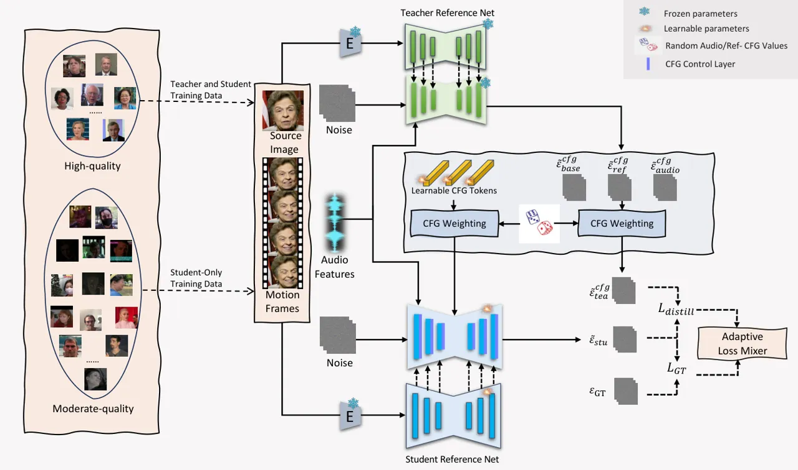
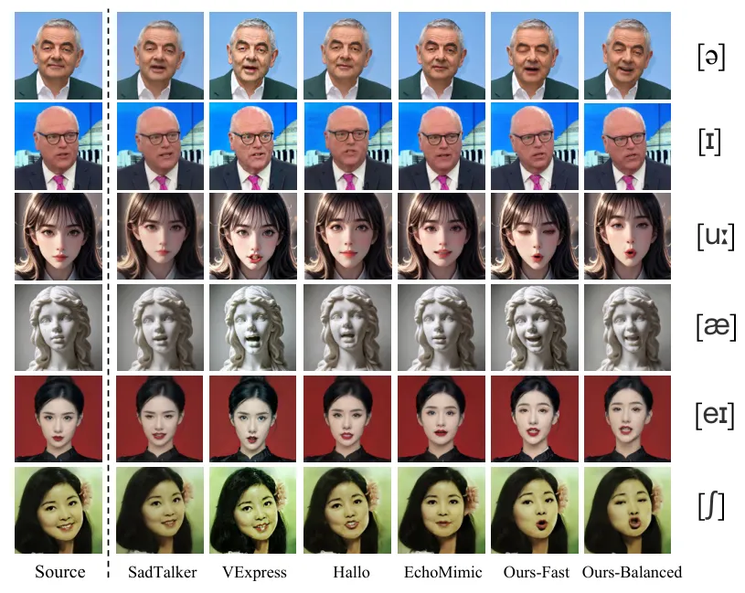

# FADA: Fast Diffusion Avatar Synthesis with Mixed-Supervised Multi-CFG Distillation

Tianyun Zhong ^(†)^(†)thanks: Equal Contribution^(†)^(†)thanks: Done
during an internship at ByteDance. Affiliation: ¹Zhejiang University,
²Bytedance Intelligent Creation  
zhongtianyun@zju.edu.cn  
{liangchao.0412,jianwen.alan,yjq850207131}@gmail.com    Chao Liang
Affiliation: ¹Zhejiang University, ²Bytedance Intelligent Creation  
zhongtianyun@zju.edu.cn  
{liangchao.0412,jianwen.alan,yjq850207131}@gmail.com    Jianwen Jiang
^(†)^(†)thanks: Project Lead Affiliation: ¹Zhejiang University,
²Bytedance Intelligent Creation  
zhongtianyun@zju.edu.cn  
{liangchao.0412,jianwen.alan,yjq850207131}@gmail.com    Gaojie Lin
Affiliation: ¹Zhejiang University, ²Bytedance Intelligent Creation  
zhongtianyun@zju.edu.cn  
{liangchao.0412,jianwen.alan,yjq850207131}@gmail.com    Jiaqi Yang
Affiliation: ¹Zhejiang University, ²Bytedance Intelligent Creation  
zhongtianyun@zju.edu.cn  
{liangchao.0412,jianwen.alan,yjq850207131}@gmail.com    Zhou Zhao
Affiliation: ¹Zhejiang University, ²Bytedance Intelligent Creation  
zhongtianyun@zju.edu.cn  
{liangchao.0412,jianwen.alan,yjq850207131}@gmail.com
Affiliation: [https://fadavatar.github.io/](https://fadavatar.github.io/)

###### Abstract

Diffusion-based audio-driven talking avatar methods have recently gained
attention for their high-fidelity, vivid, and expressive results.
However, their slow inference speed limits practical applications.
Despite the development of various distillation techniques for diffusion
models, we found that naive diffusion distillation methods do not yield
satisfactory results. Distilled models exhibit reduced robustness with
open-set input images and a decreased correlation between audio and
video compared to teacher models, undermining the advantages of
diffusion models. To address this, we propose FADA (Fast Diffusion
Avatar Synthesis with Mixed-Supervised Multi-CFG Distillation). We first
designed a mixed-supervised loss to leverage data of varying quality and
enhance the overall model capability as well as robustness.
Additionally, we propose a multi-CFG distillation with learnable tokens
to utilize the correlation between audio and reference image conditions,
reducing the threefold inference runs caused by multi-CFG with
acceptable quality degradation. Extensive experiments across multiple
datasets show that FADA generates vivid videos comparable to recent
diffusion model-based methods while achieving an NFE speedup of
4.17-12.5 times. Demos are available at our webpage
[https://fadavatar.github.io](https://fadavatar.github.io).

## 1 Introduction

Talking avatar synthesis aims to animate a given portrait image using
driven video or audio. Due to the ease of obtaining audio inputs and
their low usage barrier, there has been a surge of recent work in this
area.

Based on the technical route, talking avatar synthesis methods can be
categorized into GAN-based\[48, 34, 47, 44, 8, 19, 4\], NeRF-based\[5,
30, 39, 38, 41, 40\], and the more recent diffusion model-based
approaches\[31, 1, 36, 2, 10, 14, 33\]. Diffusion model-based methods,
in particular, have gained attention due to their strong generative
capabilities. These models exhibit excellent robustness in input images
and produce vivid and highly expressive videos that naturally align with
the audio.

However, the current diffusion model-based talking head generation
methods suffer from slow inference speeds, which hinder their practical
application. Methods\[10, 36, 1\] based on Stable Diffusion (SD)\[23\],
all require multiple denoising steps. Moreover, to ensure the
correlation between the audio input and the image input in the final
video, multi-CFG (Classifier-Free Guidance) inference is often employed,
further increasing the runtime. Although most methods achieve 30-40
denoising steps with the help of DDIM\[27\], they still face speed
challenges due to CFG calculations.

Recently, several works have explored diffusion distillation in
text-to-image \[24, 12, 21, 3, 15, 17, 28, 46\] and text-to-video tasks
\[18\] to accelerate inference. Nonetheless, there has been no direct
exploration of diffusion distillation for talking avatar synthesis
tasks. Our observations indicate that simply applying text-to-image and
text-to-video diffusion distillation methods results in a noticeable
decline in performance.

Unlike text to image or video tasks, talking avatar synthesis involves
two key conditions: audio and a reference image. Since audio has a
relatively weaker influence on video generation\[10, 31\], the final
output is jointly influenced by both conditions, necessitating careful
parameter tuning in multi-CFG settings. The sensitivity to condition
guidance often leads to severe artifacts when applying diffusion
distillation methods with few-step inference.

In this paper, we propose FADA (FAst Diffusion Avatar Synthesis with
Mixed-Supervised Multi-CFG Distillation) to address these issues from
two perspectives, resulting in an audio-driven talking avatar diffusion
model that balances both speed and quality.

First, we address the robustness of the distilled model. In this task,
the mapping between audio and portrait movement must be learned from
data. Previous works have emphasized meticulous data selection \[10, 14,
1\], such as removing instances with excessive movement or asynchronous
audio, to ensure high audio-portrait movement correlation. This
stringent selection process excludes a significant amount of data that
could enhance robustness. Considering that a well-trained teacher model
already provides high audio-portrait correlation guidance, this
discarded data can be utilized in training the student model. We
designed a mixed-supervised learning strategy that adaptively adjusts
the weights between learning from the teacher model’s guidance and the
student model’s own learning from previously discarded data. Secondly,
we address the speed issues of multimodal conditions in the distillation
process. In audio-driven methods, the final output is achieved through
composite CFG inference \[10, 14, 36\]. To make this process transparent
to the student model during training, we introduce a set of learnable
tokens. These tokens mimic the weighted calculations of multi-CFG with
its coefficients and are injected into the network as control signals,
enabling the student model to better learn the relationships between
multiple conditions, including those present during inference. Since the
learnable token conditions replicate the multi-CFG inference calculation
process, we can reduce the number of multi-CFG model inferences during
actual inference, further decreasing inference time on top of the
denoising step distillation.

Based on the above considerations and designed methods, we implemented
FADA, a diffusion distillation method for audio-driven talking head
generation, achieving up to a 12.5$`\times`$ speed-up while generating
vivid portrait videos comparable to recent undistilled diffusion models.
In summary, the contributions of this paper include:

1.  1.  We propose FADA, the first diffusion-based distillation framework
        for audio-driven talking avatar tasks. It includes a
        mixed-supervised loss to learn from data of varying quality and
        learnable token conditions to mimic the multi-CFG inference process,
        reducing performance loss by distillation and multi-CFG inferences.
2.  2.  Quantitative and qualitative experiments demonstrate that FADA
        matches state-of-the-art generation quality while achieving
        significantly higher efficiency.

## 2 Related Works

### 2.1 Audio-Driven Talking Avatar

The task of audio-driven talking avatars has gained increasing attention
recently, propelled by advancements in video-generation technologies.
GAN-based methods \[48, 34, 47, 44, 8, 19, 4\] typically employ a
two-stage pipeline involving an audio-to-motion module and a
motion-to-video module. Sadtalker \[42\] introduces a 3DMM-based motion
representation along with a conditional VAE for generating high-fidelity
talking heads. LivePortrait \[4\] expands the training dataset
incorporating images and videos, using implicit keypoints for
high-quality generation. NeRF-based methods \[5, 30, 39, 38, 41, 40\]
explore animating talking heads in 3D neural spaces. Real3D-Portrait
\[41\] combines a pre-trained image-to-triplane module with a motion
adapter for zero-shot and one-reference 3D talking head generation.
MimicTalk \[40\] captures the talking style of individuals through
in-context-learning audio-to-motion modules and rapid fine-tuning of
triplanes for mimic talking head generation.

Diffusion-based talking avatar synthesis has swiftly become a crucial
and efficient approach \[31, 1, 36, 2, 10, 14, 33\]. EMO \[31\] pioneers
a double UNet framework in audio-driven avatar creation, yielding
impressive and lifelike results. Concurrently, EchoMimic \[1\] trains on
audio and facial landmarks for versatile control inputs. Hallo \[36\]
incorporates a hierarchical audio-driven visual synthesis module to
refine audio-visual alignments, while Hallo2 \[2\] explores image
augmentation strategies for 4K avatar video synthesis. Loopy \[10\]
introduces a motion-frame squeeze technique and audio-to-latent training
for expressive results. Despite their progress in expressive
audio-driven generation, diffusion-based methods still face challenges
with slow inference speeds.

### 2.2 Diffusion Model Acceleration

Diffusion acceleration involves lowering costs for denoising runs and
reducing the number of runs. Various denoising methods aim to cut costs,
such as utilizing Model quantization  \[25, 26, 6, 13, 29, 45\] to
decrease the model parameters directly. ViDiT-Q \[47\] introduced a new
diffusion transformer quantization framework for video and image with
mixed-precision quantization. DeepCache \[20\] takes cues from video
compression to propagate reusable result regions through the model’s
internal structure, while Faster Diffusion \[12\] emphasizes re-using
computed encoder features.

Reducing the number of denoising runs is a direct way to accelerate
diffusion models. SD-Turbo\[24\] leverages the ideas from GAN and
introduces adversarial diffusion distillation to enhance the generation
fidelity. SnapFusion\[12\] proposes progressive distillation to achieve
fewer steps by learning the previous student model progressively.
SwiftBrush\[21\] and SwiftBrushV2\[3\] utilizing variational score
distillation to make it possible for texts-only distillation in
text-to-image tasks. SDXL-lightning\[15\] mixes progressive distillation
and adversarial distillation to achieve one-step image generation with a
delicate training process. Applying consistency models \[17, 28\] to
text-to-image tasks also helps reduce diffusion inference steps.
LCM\[17\] views the guided reverse diffusion process as solving an
augmented probability flow ODE. TCD\[46\] proposes trajectory
consistency distillation to accurately trace the entire trajectory of
the probability flow ODE in semi-linear form with an exponential
integrator. However, there is no specially-designed distillation
framework and techniques for talking avatar synthesis tasks to our
knowledge.

## 3 Methodology



Figure 1: Overall distillation framework of FADA. The teacher model is
trained only with high-quality data, which is omitted in the figure. The
student model is trained by a mixed loss of ground-truth and
teacher-supervised loss to leverage data of varying quality. Learnable
token-based CFG conditions enable the student model to mimic the
multi-CFG process, further reducing inference times. For simplicity, we
have omitted some components commonly used in previous methods.

In this section, we introduce our proposed method, FADA, a diffusion
distillation framework for avatar synthesis, as illustrated in Figure 1.
Section 3.1 provides an overview of the diffusion distillation
framework, based on recent PeRFlow \[37\]. Section 3.2 delves into the
specifics of the adaptive mixed-supervised distillation process. In
Section 3.3, we present the multiple-CFG distillation technique with a
learnable token implementation.

### 3.1 Overall Framework and Preliminary

Building upon cutting-edge diffusion-based methods for talking avatar
synthesis \[9, 31, 36, 2, 33, 1, 10, 14\], we introduce a dual-Unet
architecture for the teacher model, leveraging pre-trained weights from
Stable Diffusion\[23\] 1.5. As depicted in Figure 1, the reference image
and motion frames (i.e., images from the last clip) undergo processing
by a fixed VAE \[11\] and reference net. The output from each reference
layer is then input to the corresponding layer in the denoising net for
spatial attention. To facilitate audio-driven controls and ensure
temporal consistency in talking avatar synthesis, audio attention and
temporal attention layers are integrated into the denoising net.
Initially following the Loopy design \[10\], we simplify the model by
removing the TSM and Audio2Latents modules, streamlining subsequent
model distillation. The student model mirrors the teacher’s structure,
with the addition of a CFG control layer, detailed in Section 3.3.

We choose the recent PeRFlow \[37\] as the optimization target for
distillation. Initially, we train the teacher model on carefully curated
high-quality datasets that prioritize motion amplitude and audio-visual
synchronization. The teacher model is optimized using the
$`\epsilon`$-prediction DDPM loss \[7\], where it predicts noise
$`\epsilon_{\mathrm{tea}}(\cdot)`$ from noisy latent $`z_{t}`$ at
timestep $`t`$. The training objective can be succinctly described as:

```math
L_{\mathrm{tea}}=\mathbb{E}_{z_{t},c,t,\epsilon}\left[\lVert\epsilon-\epsilon_{\mathrm{tea}}(z_{t},t,c;\theta_{\mathrm{tea}})\rVert_{2}^{2}\right], \tag{1}
```

where $`c`$ includes the audio feature, reference image and motion
frames.

Note that it is not necessary for the teacher model to be trained with
flow-matching loss, and both $`\epsilon`$-prediction and
$`\upsilon`$-prediction are valid for PeRFlow distillation. During the
student distillation training, firstly same-interval $`K`$ time windows
$`\{[t_{k},t_{k-1})\}_{k=K}^{1}`$ are created where
$`t_{k}=k/K,k\in\{0,1,...,K\}`$. A time window $`[t_{k},t_{k-1})`$ is
randomly sampled out, and the standpoint $`z_{t_{k}}`$ can be derived
from the marginal distribution of the ground-truth targets, where
$`z_{t_{k}}=\sqrt{1-\sigma^{2}(t_{k})}z_{0}+\sigma(t_{k})\epsilon`$ and
$`\sigma(t)`$ denotes the noise schedule. Then the teacher-predicted
ending point $`\hat{z}_{t_{k-1}}`$ of this time window can be predicted
and solved by ODE solver $`\Phi(\cdot)`$:

```math
\hat{z}_{t_{k-1}}=\Phi(z_{t_{k}},t_{k},t_{k-1};\theta_{\mathrm{tea}}), \tag{2}
```

where $`\Phi(\cdot)`$ denotes the DDIM solver\[27\] which performs
several inference steps iteratively to reach the endpoint of this time
window. Note that the parameters of the teacher model are frozen and no
gradient computations are needed here. After that, the input noisy
latent of student $`\hat{z}_{t}`$ will be derived from a linear
interpolation between starting point $`t_{k}`$ and ending point
$`t_{k-1}`$:

```math
\hat{z}_{t}=\frac{z_{t_{k}}-\hat{z}_{t_{k-1}}}{t_{k}-t_{k-1}}(t-t_{k}). \tag{3}
```

Through the linear interpolation above, the ODE flow will be rectified
to piecewise straight lines so only a few steps are enough to denoising
in a time window, which reduces the number of timesteps at inference
stage. Meanwhile, we can figure out the target noise
$`\hat{\epsilon}(t)`$ via parameterization\[37\]:

```math
\hat{\epsilon}(t)=\frac{\hat{z}_{t_{k-1}}-\lambda_{k}z_{t_{k}}}{\eta_{k}}, \tag{4}
```

Where $`\lambda_{k}=\sqrt{\alpha_{t_{k-1}}}/\sqrt{\alpha_{t_{k}}}`$ and
$`\eta_{k}=\sqrt{1-\alpha_{t_{k-1}}}-\sqrt{1-\alpha_{t_{k}}}\sqrt{\alpha_{t_{k-1}}}/\sqrt{\alpha_{t_{k}}}`$
respectively. Finally, the training objective of the distillation
process can be obtained as

```math
L_{\mathrm{distill}}=\mathbb{E}_{k,t\in[t_{k},t_{k-1}),z_{t},c,\epsilon}\left[\lVert\hat{\epsilon}(t)-\epsilon_{\mathrm{stu}}(\hat{z_{t}},t,c;\theta_{\mathrm{stu})}\rVert_{2}^{2}\right], \tag{5}
```

where $`\epsilon_{\mathrm{stu}}(\cdot)`$ refers to the predicted noise
from the student model and $`L_{\mathrm{distill}}`$ represents the
distillation loss. Note that $`L_{\mathrm{distill}}`$ is only a trivial
part of our framework, the mixed-supervised training and multi-CFG
distillation will be proposed in Section 3.2 and 3.3.

### 3.2 Adaptive Mixed-Supervised Distillation

In our experiments, we found that distillation significantly degrades
the model’s performance, especially overall video synthesis quality, as
shown in Table 3. Increasing data can improve performance, but in
audio-driven portrait generation, the weak control of audio over motion
requires the model to learn high-quality motion patterns to fill in
details not covered by audio. This necessitates stricter data filtering,
reducing the available data quantity.

Fortunately, this problem can be mitigated in our proposed distillation
process. In our design, we first maintain the teacher training unchanged
with only a high-quality dataset $`\mathcal{A}`$ to ensure its output
stability. Then during the distillation stage, the data filtering
strategies will be relaxed and some moderate-quality data samples ( a
larger dataset $`\mathcal{B}`$ that includes $`\mathcal{A}`$ where
$`|\mathcal{B}|>|\mathcal{A}|`$.) will be fed to student training. Since
the student model mimics the teacher model’s output, it can maintain the
high-quality generation capability of the teacher model even with the
inclusion of lower-quality data. To further leverage the new data during
the distillation stage, we introduce a ground-truth supervised loss
$`L_{\mathrm{gt}}`$. The ground-truth noisy latent $`z^{*}_{t}`$ and
ground-truth target noise $`\epsilon^{*}(t)`$ can be simply obtained by
replacing $`\hat{z}_{t_{k-1}}`$ with ground truth ending point
$`z_{t_{k-1}}`$ in Formula 3 and 4. Similar to distillation loss
computation, the ground-truth loss $`L_{\mathrm{GT}}`$ and total mixed
loss $`L_{\mathrm{total}}`$ can be described as

```math
L_{\mathrm{GT}}=\mathbb{E}_{k,t\in[t_{k},t_{k-1}),z_{t},c,\epsilon}\left[\lVert\epsilon^{*}(t)-\epsilon_{\mathrm{stu}}(z_{t}^{*},t,c;\theta_{\mathrm{stu})}\rVert_{2}^{2}\right], \tag{6}
```

```math
L_{\mathrm{total}}=L_{\mathrm{distill}}+\mathcal{W}\cdot L_{\mathrm{GT}}, \tag{7}
```

where $`\mathcal{W}`$ represents the loss weight of $`L_{GT}`$. Through
this approach, the student model can better learn high-quality motion
pattern generation from the teacher model while also learning more
common patterns from a broader range of data to enhance its
generalization capability. A trivial implementation idea is to set a
fixed hyper-parameter to $`\mathcal{W}`$ but this is not very effective
because it assumes every sample has the same learning value, which is
inaccurate.

Hence, an adaptive method to balance teacher-supervised loss
$`L_{\mathrm{teacher}}`$ and ground-truth-supervised loss
$`L_{\mathrm{gt}}`$ is necessary, and the potential information behind
the two losses should be taken into account. Considering the ratio
$`\mathcal{R}=L_{\mathrm{gt}}/L_{\mathrm{teacher}}`$, it indicates the
difference level between the $`L_{\mathrm{gt}}`$ and
$`L_{\mathrm{teacher}}`$. Based on qualitative observations of the
$`\mathcal{R}`$ value, there are two trends: as $`\mathcal{R}`$
increases, the sample is more likely to be a valuable learning case,
such as a singing video, since it is often outside the teacher-training
dataset $`\mathcal{A}`$. However, if $`\mathcal{R}`$ is too large, the
sample is more likely to be low-quality, such as one with poor
audio-visual sync, because the teacher results are well synced.

Therefore, we should gradually increase the loss weight when
$`\mathcal{R}`$ increases in a reasonable range, and also punish the
loss weight if $`\mathcal{R}`$ increases out of the peak threshold
$`\mathcal{R}_{p}`$. For those cases whose $`\mathcal{R}`$ is bigger
than the dead threshold $`\mathcal{R}_{d}`$, the ground-truth supervised
loss weight should be zero. The detailed formulation for loss weight
$`W`$ can be obtained as:

```math
\mathcal{W}=\mathcal{W}_{0}\cdot\left\{\begin{array}[]{lr}\mathcal{R}^{s},&\mathcal{R}\in[0,\mathcal{R}_{p})\\
\mathcal{R}_{p}^{s}(\mathcal{R}_{d}-\mathcal{R})/(\mathcal{R}_{d}-\mathcal{R}_{p}),&\mathcal{R}\in[\mathcal{R}_{p},\mathcal{R}_{d})\\
0,&\mathcal{R}\in[\mathcal{R}_{d},+\infty)\end{array}\right. \tag{8}
```

where $`s`$, $`\mathcal{W}_{0}`$, $`\mathcal{R}_{p}`$ and
$`\mathcal{R}_{d}`$ are hyper-parameters, they are set to 0.25, 0.2, 30,
100 respectively in this paper. Note that these hyper-parameters are
relatively robust across different data distributions because they are
used to select data within a relatively moderate range for training.

Through the proposed design, FADA learns general generation capabilities
from more ordinary data during distillation, enhancing model robustness.
Our experiments validate the proposed loss’s effectiveness.
Additionally, our adaptive mixed-supervised distillation can extend to
tasks like text-to-image or text-to-video without specific restrictions.

### 3.3 Multi-CFG Distillation with Learnable Token

In audio-driven talking avatar synthesis tasks, the Multi-CFG technique
is utilized \[10, 14\] to achieve robust control of multiple conditions
(reference image and audio) effectively, Specifically, the single CFG
calculates the direction from unconditional predicted values to a
certain conditional predicted value and then moves a certain distance
from the unconditional predicted values to obtain conditional predicted
values. Furthermore, the Multi-CFG recursively computes the next CFG
based on the first CFG. In this paper, multi-CFG inference result noise
$`\epsilon_{cfg}`$ can be derived as follows\[10\]:

```math
\hat{\epsilon}_{cfg}=\mathrm{cfg}_{a}\times(\hat{\epsilon}_{a}-\hat{\epsilon}_{r})+\mathrm{cfg}_{r}\times(\hat{\epsilon}_{r}-\hat{\epsilon}_{b})+\hat{\epsilon}_{b}, \tag{9}
```

where $`\mathrm{cfg}_{a}`$ and $`\mathrm{cfg}_{r}`$ indicate the CFG
guidance scale of audio and reference condition. $`\hat{\epsilon}_{a}`$
refers to the noise prediction with both audio and reference conditions,
while $`\hat{\epsilon}_{r}`$ removes the audio condition and
$`\hat{\epsilon}_{b}`$ lacks both audio and reference.

Therefore, during inference, the model needs to run three times for each
denoising step, which is time-consuming.

It naturally comes to mind to inject the CFG guidance scale as a
condition into the network, and then let the student model learn the CFG
reasoning characteristics of the teacher model during the distillation
process, which echoes a similar concept to the $`\omega`$-condition
\[20\]. Specifically, the teacher model will conduct complete CFG
reasoning during training to obtain predictions
$`\hat{\epsilon}_{\mathrm{cfg}}`$ controlled by CFG. Subsequently, these
predictions are further integrated into Formulas 2, 3 and 4 to derive
input noisy latent $`\hat{z}_{t}^{\mathrm{cfg}}`$ and target noise
$`\hat{\epsilon}^{\mathrm{cfg}}(t)`$ controlled by CFG, eventually
undergoing a similar distillation procedure as Formula 5.

However, directly adding the CFG value as a condition to the network
does not yield satisfactory results. A careful design is needed for the
injection method of the CFG scale condition. By observing the
calculation of Multi-CFG reasoning in Formula 9, it is evident that this
is akin to performing linear transformations on three independent
vectors $`\epsilon_{b}`$, $`\epsilon_{a}`$, and $`\epsilon_{r}`$ in the
noise space using the given CFG strengths $`\mathrm{cfg}_{a}`$ and
$`\mathrm{cfg}_{r}`$. Meanwhile, $`\epsilon_{r}`$ serves as a crucial
link between the $`\epsilon_{b}`$ and $`\epsilon_{a}`$. Simply embedding
the CFG values overlooks the aforementioned relationships. Therefore, we
introduce learnable tokens $`\gamma_{b}`$, $`\gamma_{r}`$, and
$`\gamma_{r}`$ into the model to learn the features required for CFG
strength control and help the student model mimic the multi-CFG process.
To achieve this, we design the CFG embedding $`Emb_{\mathrm{cfg}}`$ of
the CFG guidance scale $`\mathrm{cfg}_{a}`$ and $`\mathrm{cfg}_{r}`$ as
follows:

```math
Emb_{\mathrm{cfg}}=\mathrm{cfg}_{a}\times(\gamma_{a}-\gamma_{r})+\mathrm{cfg}_{r}\times(\gamma_{r}-\gamma_{b})+\gamma_{b}. \tag{10}
```

After obtaining the CFG embedding $`Emb_{\mathrm{cfg}}`$, we similarly
introduce a CFG layer after each audio layer in the denoising network,
injecting the information from $`Emb_{\mathrm{cfg}}`$ into the denoising
process through cross attention. Importantly, the CFG layer does not
introduce excessive performance overhead, especially when compared to
the original cost of running three CFG runs. Therefore, our proposed
multi-CFG distillation with learnable tokens can achieve nearly three
times faster operation speed.

## 4 Experiments

In this section, we will introduce the experimental results. In Section
4.1, we will present the details of the implementation of FADA and the
meta-information of our training and testing datasets. In Section 4.2,
we will compare our proposed methods with other state-of-the-art
diffusion-based talking avatar methods via quantitative and qualitative
comparison. In Section 4.3, we will analyze our proposed techniques
including the basic distillation method, adaptive mixed-supervised
distillation and multi-CFG distillation, and prove their effectiveness.

### 4.1 Experimental Settings

#### Datasets

Regarding the training dataset, we primarily used speaker videos
obtained from the internet, sliced and cropped to durations ranging from
two to ten seconds with facial frames, and resized to 512$`\times`$512
resolution. We designed multi-dimensional filters for this dataset,
including filters for data source, image quality, audio-visual
synchronization, background stability and degree of movement, each with
different thresholds to control the filtering intensity. As elucidated
in Section 3.2, by using strict filtering thresholds, we obtained
approximately 160 hours of high-quality training data $`\mathcal{A}`$,
which was utilized in teacher pre-training. Additionally, by using
lenient filtering thresholds, we obtained around 1300 hours of
moderate-quality training data $`\mathcal{B}`$ for distillation
training. Following the approach of Echomimic \[1\], we selected 100
random samples from the open-source test sets HDTF \[43\] and CelebV-HQ
\[49\] to validate the model’s performance on various real human
scenarios. Furthermore, to evaluate the model’s performance in more open
and extreme scenarios, we adopted the openset test set from Loopy \[10\]
for qualitative comparisons, which contains various kinds of portraits
and audios.

#### Implementation Details

The training process consists of teacher pre-training and student
distillation. The training process of the teacher model closely aligns
with the first two stages of recent methods\[31, 10\] with high-quality
dataset $`\mathcal{A}`$. In student distillation with the
moderate-quality dataset $`\mathcal{B}`$, the student model is
initialized from the teacher model and integrated with CFG learnable
tokens and CFG layers. During testing, the CFG guidance scale is set to
2.5 and 6.5 for reference and audio conditions in models without CFG
distillation, while the scales were set to 2.0 and 6.5 for models with
CFG distillation.

The number of time windows in PeRFlow\[37\] is 4. All results of FADA
are conducted with 6-step inferences, where the two time-windows near
$`T=1`$ contain two inference steps while the others contain one
inference step.

### 4.2 Comparison with State-of-the-Arts

| Method          | NFE-D | CelebV-HQ Test      |                      |                     |                   |                     | HDTF Test           |                      |                     |                   |                     |
| --------------- | ----- | ------------------- | -------------------- | ------------------- | ----------------- | ------------------- | ------------------- | -------------------- | ------------------- | ----------------- | ------------------- |
|                 |       | IQA$`\uparrow`$     | Sync-D$`\downarrow`$ | FVD-R$`\downarrow`$ | FID$`\downarrow`$ | E-FID$`\downarrow`$ | IQA$`\uparrow`$     | Sync-D$`\downarrow`$ | FVD-R$`\downarrow`$ | FID$`\downarrow`$ | E-FID$`\downarrow`$ |
| Sadtalker\[42\] | \-    | $`2.953^{\pm.086}`$ | 8.765                | 171.8               | 36.64             | 2.248               | $`3.435^{\pm.069}`$ | 7.870                | 24.93               | 25.35             | 1.559               |
| Hallo\[36\]     | 80    | $`3.505^{\pm.091}`$ | 9.079                | 53.99               | 35.96             | 2.426               | $`3.922^{\pm.079}`$ | 7.917                | 21.71               | 20.15             | 1.337               |
| EchoMimic\[1\]  | 60    | $`3.307^{\pm.104}`$ | 10.37                | 54.71               | 35.37             | 3.018               | $`3.994^{\pm.083}`$ | 9.391                | 18.71               | 19.01             | 1.328               |
| V-Express\[33\] | 50    | $`2.946^{\pm.123}`$ | 9.415                | 117.8               | 65.09             | 2.414               | $`3.482^{\pm.071}`$ | 7.382                | 48.03               | 30.91             | 1.506               |
| Ours-Balanced   | 18    | $`3.588^{\pm.091}`$ | 8.998                | 50.36               | 33.67             | 2.202               | $`3.951^{\pm.082}`$ | 7.925                | 13.32               | 18.39             | 1.362               |
| Ours-Fast       | 6     | $`3.550^{\pm.093}`$ | 8.746                | 54.69               | 35.01             | 2.604               | $`3.927^{\pm.081}`$ | 7.996                | 16.67               | 18.51             | 1.635               |

Table 1: Quantitative comparisons with state-of-the-art methods on
CelebV-HQ & HDTF test sets. Bold and underlined numbers refer to the
best and the second-best result in this test set.

#### Metrics and Baselines

For the purpose of quantitative comparisons, we evaluate the generated
talking avatar videos with several metrics. We assess the image quality
with IQA\[35\] metrics and evaluate the audio-visual synchronization
distance with a pre-trained SyncNet\[22\] as Sync-D. FID and FVD\[32\]
(with 3D ResNet) are assessed to evaluate the image/video-level fidelity
difference between generated results and ground truths in the image
inception space. E-FID (Expression-FID)\[31\] measures the inception
distance between the generated and ground truths in expression parameter
space. NFE-D indicates the number of function evaluations of the
denoising net. For instance, our teacher model conducts 25-step DDIM
inference with 3 CFG runs, leading to 75 NFE-D.

Since our proposed FADA is a diffusion distillation framework, we mainly
compare recent open-source diffusion-based state-of-the-art methods in
talking portrait generation, including Hallo\[36\], EchoMimic\[1\], and
V-Express\[33\]. Additionally, for reference, we also include the
state-of-the-art GAN-based method SadTalker\[42\].

#### Quantitative Comparison

As shown in Table 1, we conduct quantitative comparison experiments with
CelebV-HQ and HDTF test sets. Since the differences in IQA are subtle,
we provide 95$`\%`$ confidence intervals to show their statistical
significance. Ours-Balanced refers to our proposed method with
mixed-supervised distillation with PeRFlow loss. Based on it, Ours-Fast
utilizes multi-CFG distillation to achieve about 3-time speedup and gets
a slight performance drop. Ours-Balanced achieves better IQA, FVD, FID,
and E-FID on the challenging open-set CelebVHQ test set compared to the
baselines. It also leads or is comparable in most metrics on the simpler
HDTF test set. Ours-Fast maintains similar performance in IQA and Sync-D
metrics with a slight drop in FVD, FID, and E-FID, which is still
comparable to the baselines in most metrics. In terms of audio
synchronization, the trend is similar. Notably, VExpress results show
almost only lip movements, which, despite good metrics, do not produce
satisfactory video quality. Finally, in terms of speedup, it is evident
that both Ours-Balanced and Ours-Fast achieve significant speedup using
the same SD base model as the baselines.

#### Qualitative Comparison



Figure 2: Qualitative comparisons between FADA and baselines across
different portraits and pronunciations in openset.

As illustrated in Figure 2 and in the supplementary video materials,
Ours-Fast and Ours-Balanced maintain good video quality and vivid
audio-visual expressiveness. We highly recommend readers watch the
supplementary videos since it is difficult for the static image to show
the audio-motion synchronization and temporal consistency. V-Express
shows color differences and inferior identity-preserving abilities in
all cases. Sadtalker generates good identity-preserving videos at the
image level, but the head motions and lip movements are not well-synced
with the emotion and pace of the given audio. EchoMimic and Hallo
generate acceptable expressions, but there are temporal jitters that
damage the visual quality. Moreover, by observing case-4 and case-6, we
can find that FADA produces more full and plump pronunciations than
baselines.

### 4.3 Ablation Study

|                              |       |                 |                      |                     |                   |                     |
| ---------------------------- | ----- | --------------- | -------------------- | ------------------- | ----------------- | ------------------- |
| Method                       | NFE-D | IQA$`\uparrow`$ | Sync-D$`\downarrow`$ | FVD-R$`\downarrow`$ | FID$`\downarrow`$ | E-FID$`\downarrow`$ |
| Teacher with $`\mathcal{A}`$ | 75    | 3.998           | 7.849                | 18.27               | 18.49             | 1.365               |
| Teacher with $`\mathcal{B}`$ | 75    | 3.885           | 8.123                | 19.64               | 21.40             | 1.689               |
| TCD                          | 18    | 3.827           | 7.937                | 23.01               | 23.15             | 1.893               |
| RFlow                        | 18    | 2.836           | 8.066                | 81.10               | 49.73             | 2.484               |
| PeRFlow                      | 18    | 3.823           | 8.001                | 21.91               | 21.26             | 1.477               |

Table 2: Ablation study of basic distillation methods on HDTF test set.
All methods in this table are free from mixed-supervised and CFG
distillation.

|                                     |       |                 |                      |                     |                   |                     |
| ----------------------------------- | ----- | --------------- | -------------------- | ------------------- | ----------------- | ------------------- |
| Method                              | NFE-D | IQA$`\uparrow`$ | Sync-D$`\downarrow`$ | FVD-R$`\downarrow`$ | FID$`\downarrow`$ | E-FID$`\downarrow`$ |
| Teacher with $`\mathcal{A}`$        | 75    | 3.998           | 7.849                | 18.27               | 18.49             | 1.365               |
| Stu. with $`\mathcal{A}`$           | 18    | 3.823           | 8.001                | 21.91               | 21.26             | 1.477               |
| Stu. with $`\mathcal{B}`$ (Fixed-0) | 18    | 3.762           | 7.909                | 25.06               | 21.47             | 1.462               |
| + Fixed-0.2                         | 18    | 3.863           | 7.934                | 13.71               | 19.94             | 1.434               |
| + Fixed-1.0                         | 18    | 3.812           | 7.903                | 24.53               | 21.42             | 1.494               |
| + Fixed-0.2, only $`\mathcal{A}`$   | 18    | 3.880           | 7.962                | 15.32               | 20.71             | 1.512               |
| + Adaptive-unl.-0.5                 | 18    | 3.824           | 7.914                | 15.15               | 20.74             | 1.471               |
| + Adaptive-unl.-0.25                | 18    | 3.846           | 7.906                | 14.20               | 19.92             | 1.424               |
| + Adaptive-0.5                      | 18    | 3.949           | 7.919                | 13.83               | 18.64             | 1.395               |
| + Adaptive-0.25                     | 18    | 3.951           | 7.925                | 13.32               | 18.39             | 1.362               |

Table 3: Ablation study of adaptive mixed-supervised distillation on
HDTF test set. All methods use PeRFlow with dataset $`\mathcal{B}`$
without CFG distillation. Fixed-x indicates fixed ground-truth loss with
weight x. Adaptive-unlimited-s and Adaptive-s indicate adaptive
ground-truth loss with hyper-parameter $`s`$, with the former being
without peak and dead threshold.

| Method                       | NFE-D | IQA$`\uparrow`$ | Sync-D$`\downarrow`$ | FVD-R$`\downarrow`$ | FID$`\downarrow`$ | E-FID$`\downarrow`$ |
| ---------------------------- | ----- | --------------- | -------------------- | ------------------- | ----------------- | ------------------- |
| Teacher with $`\mathcal{A}`$ | 75    | 3.998           | 7.849                | 18.27               | 18.49             | 1.365               |
| w.o. CFG                     | 6     | 3.674           | 9.020                | 27.10               | 26.56             | 2.096               |
| + CFG time embed             | 6     | 3.701           | 8.577                | 23.24               | 22.47             | 1.791               |
| + CFG layer                  | 6     | 3.746           | 7.906                | 20.05               | 20.94             | 1.620               |
| + CFG layer w. tokens        | 6     | 3.927           | 7.996                | 16.67               | 18.51             | 1.635               |

Table 4: Ablation study of multi-CFG distillation on HDTF test set. All
methods in this table are PeRFlow + mixed-supervised distillation. CFG
time embed refers to CFG distillation through timestep embedding
injection.

#### Analysis of Distillation Methods.

As illustrated in Table 2, we first compared various basic methods of
diffusion distillation, including TCD \[46\], RFlow \[16\], and PeRFlow
\[37\]. It was observed that compared to the TCD method, the PeRFlow
method showed similar performance in IQA, FVD, Sync-D, and FID metrics,
but with a significant advantage in E-FID. Additionally, the basic RFlow
method could not handle the 6-step inference in our task setting.
Therefore, we selected PeRFlow as the basic distillation method. We also
tried simply adding moderate-quality data during teacher model training,
which led to a decrease in model performance. These results indicate
that existing distillation methods cannot directly produce a
high-quality student model. Additionally, attempting to enhance the
teacher model’s capabilities by relaxing data filtering criteria and
increasing data volume does not yield positive results.

#### Analysis of Adaptive Mixed-Supervised Distillation

Here, based on the previously selected PeRFlow, we added dataset
$`\mathcal{B}`$ and a mixed-supervised loss to investigate the
effectiveness of our Adaptive Mixed-Supervised Distillation. As shown in
Table 4, below the hdashline, we provide the performance of
Mixed-Supervised Distillation with the addition of dataset
$`\mathcal{B}`$ under different parameters. Comparing the effects of
different Fixed-x values, it is evident that the ground-truth loss
improves model performance, and a smaller loss weight value of 0.2
yields better results. We further investigated the effectiveness of the
adaptive loss weight strategy. In the adaptive-unl. setting (unlimited,
without using peak and dead thresholds), the adaptive loss weight
increases infinitely as $`\mathcal{R}`$ increases, resulting in slightly
inferior performance compared to the Fixed-0.2 setting. However, when
employing the complete adaptive strategy, the ground-truth loss of
low-quality samples is automatically discarded, leading to a
distillation effect that surpasses the Fixed setting and approaches the
performance of the teacher model, especially in terms of the FVD
metrics. We also compared different values of $`s`$ and ultimately chose
0.25 due to its slight advantage.

Additionally, by comparing the performance of teacher and student models
under different data qualities and scales, it can be demonstrated that
mixed supervised distillation actually enhances the model’s utilization
of moderate-quality data. As depicted in Tables 2 and 3, when the
teacher model is trained with a large-scale moderate-quality dataset, a
decline in model performance is observed, whereas the student model
exhibits the opposite trend. Briefly, only mixed-supervised distillation
can take advantage of the moderate-quality data.

#### Analysis of Multi-CFG Distillation

Figure 3: Line charts showing the variations of FVD and Sync-D metrics
with different audio CFG on HDTF test set. Reference CFG is set to 2.0
in this figure.

Figure 4: Line charts showing the variations of FVD and Sync-D metrics
with different ref CFG on HDTF test set. Audio CFG is set to 6.5 in this
figure.

As demonstrated in Table 4, we further explore the effects of multi-CFG
distillation on top of mixed-supervised distillation. Initially, we
tested the results of conditional reasoning without CFG distillation,
which significantly deteriorated the model performance, especially
leading to a doubling of the FVD metric representing video quality. For
techniques like time embedding injection similar to $`\omega`$-condition
\[20\], they partially restored model performance but with limited
efficacy. In contrast, our proposed learnable token-based CFG control
layers significantly enhance model performance, nearly matching the
teacher model and even surpassing it in FVD. Notably, our model requires
only 8% of the teacher model’s NFE. We also tested without learnable
tokens, and while the pure CFG control layer had some effect, it could
not match the teacher model, especially in overall video quality metrics
like FVD.

To verify whether our proposed multi-CFG distillation effectively
captures the influence of audio and reference conditions on the
generated results, we plotted line charts of FVD and Sync-D metrics with
variations in audio CFG and reference CFG, as shown in Figures 3 and 4.
First, we observed improvements in both FVD and Sync-D as audio CFG
increased, reaching a stable maximum value after 6.5. Hence, we
ultimately chose 6.5 as the audio CFG for inference. Second, the
influence of reference CFG on FVD and Sync-D metrics displayed an
initially positive, then negative trend, with optimal performance
achieved around the 2.0 position. These results indicate that our CFG
control layer effectively mimics the multi-CFG process and achieves good
results.

## 5 Conclusion

In summary, we proposed FADA, a fast diffusion avatar synthesis
framework with mixed-supervised multi-CFG distillation. By designing a
mixed-supervised loss, we leverage data of varying quality to enhance
the robustness of generated results. Furthermore, a learnable
token-based multi-CFG condition design is introduced to maintain the
correlation between the audio and the generated video in the distilled
models. The quantitative and qualitative experiments across multiple
datasets show that our balanced setting achieves fast inference and
high-fidelity generation ability. Ablation studies prove our proposed
methods are effective in FADA. The limitations, future works and ethical
concerns of this paper will be discussed in Appendix B, H and I
respectively.

## References

- \[1\] Zhiyuan Chen, Jiajiong Cao, Zhiquan Chen, Yuming Li, and
  Chenguang Ma. Echomimic: Lifelike audio-driven portrait animations
  through editable landmark conditions. _arXiv preprint
  arXiv:2407.08136_, 2024.
- \[2\] Jiahao Cui, Hui Li, Yao Yao, Hao Zhu, Hanlin Shang, Kaihui
  Cheng, Hang Zhou, Siyu Zhu, and Jingdong Wang. Hallo2: Long-duration
  and high-resolution audio-driven portrait image animation. _arXiv
  preprint arXiv:2410.07718_, 2024.
- \[3\] Trung Dao, Thuan Hoang Nguyen, Thanh Le, Duc Vu, Khoi Nguyen,
  Cuong Pham, and Anh Tran. Swiftbrush v2: Make your one-step diffusion
  model better than its teacher. In _European Conference on Computer
  Vision_, pages 176–192. Springer, 2025.
- \[4\] Jianzhu Guo, Dingyun Zhang, Xiaoqiang Liu, Zhizhou Zhong, Yuan
  Zhang, Pengfei Wan, and Di Zhang. Liveportrait: Efficient portrait
  animation with stitching and retargeting control. _arXiv preprint
  arXiv:2407.03168_, 2024.
- \[5\] Yudong Guo, Keyu Chen, Sen Liang, Yong-Jin Liu, Hujun Bao, and
  Juyong Zhang. Ad-nerf: Audio driven neural radiance fields for talking
  head synthesis. In _Proceedings of the IEEE/CVF International
  Conference on Computer Vision_, pages 5784–5794, 2021.
- \[6\] Yefei He, Luping Liu, Jing Liu, Weijia Wu, Hong Zhou, and Bohan
  Zhuang. Ptqd: Accurate post-training quantization for diffusion
  models. _Advances in Neural Information Processing Systems_, 36, 2024.
- \[7\] Jonathan Ho, Ajay Jain, and Pieter Abbeel. Denoising diffusion
  probabilistic models. _Advances in neural information processing
  systems_, 33:6840–6851, 2020.
- \[8\] Fa-Ting Hong, Longhao Zhang, Li Shen, and Dan Xu. Depth-aware
  generative adversarial network for talking head video generation. In
  _Proceedings of the IEEE/CVF conference on computer vision and pattern
  recognition_, pages 3397–3406, 2022.
- \[9\] Li Hu. Animate anyone: Consistent and controllable
  image-to-video synthesis for character animation. In _Proceedings of
  the IEEE/CVF Conference on Computer Vision and Pattern Recognition_,
  pages 8153–8163, 2024.
- \[10\] Jianwen Jiang, Chao Liang, Jiaqi Yang, Gaojie Lin, Tianyun
  Zhong, and Yanbo Zheng. Loopy: Taming audio-driven portrait avatar
  with long-term motion dependency. _arXiv preprint
  arXiv:2409.02634_, 2024.
- \[11\] Diederik P Kingma. Auto-encoding variational bayes. _arXiv
  preprint arXiv:1312.6114_, 2013.
- \[12\] Yanyu Li, Huan Wang, Qing Jin, Ju Hu, Pavlo Chemerys, Yun Fu,
  Yanzhi Wang, Sergey Tulyakov, and Jian Ren. Snapfusion: Text-to-image
  diffusion model on mobile devices within two seconds. _Advances in
  Neural Information Processing Systems_, 36, 2024a.
- \[13\] Yanjing Li, Sheng Xu, Xianbin Cao, Xiao Sun, and Baochang
  Zhang. Q-dm: An efficient low-bit quantized diffusion model. _Advances
  in Neural Information Processing Systems_, 36, 2024b.
- \[14\] Gaojie Lin, Jianwen Jiang, Chao Liang, Tianyun Zhong, Jiaqi
  Yang, and Yanbo Zheng. Cyberhost: Taming audio-driven avatar diffusion
  model with region codebook attention. _arXiv preprint
  arXiv:2409.01876_, 2024a.
- \[15\] Shanchuan Lin, Anran Wang, and Xiao Yang. Sdxl-lightning:
  Progressive adversarial diffusion distillation. _arXiv preprint
  arXiv:2402.13929_, 2024b.
- \[16\] Qiang Liu. Rectified flow: A marginal preserving approach to
  optimal transport. _arXiv preprint arXiv:2209.14577_, 2022.
- \[17\] Simian Luo, Yiqin Tan, Longbo Huang, Jian Li, and Hang Zhao.
  Latent consistency models: Synthesizing high-resolution images with
  few-step inference. _arXiv preprint arXiv:2310.04378_, 2023.
- \[18\] Zhengyao Lv, Chenyang Si, Junhao Song, Zhenyu Yang, Yu Qiao,
  Ziwei Liu, and Kwan-Yee K Wong. Fastercache: Training-free video
  diffusion model acceleration with high quality. _arXiv preprint
  arXiv:2410.19355_, 2024.
- \[19\] Yifeng Ma, Suzhen Wang, Zhipeng Hu, Changjie Fan, Tangjie Lv,
  Yu Ding, Zhidong Deng, and Xin Yu. Styletalk: One-shot talking head
  generation with controllable speaking styles. In _Proceedings of the
  AAAI Conference on Artificial Intelligence_, pages 1896–1904, 2023.
- \[20\] Chenlin Meng, Robin Rombach, Ruiqi Gao, Diederik Kingma,
  Stefano Ermon, Jonathan Ho, and Tim Salimans. On distillation of
  guided diffusion models. In _Proceedings of the IEEE/CVF Conference on
  Computer Vision and Pattern Recognition_, pages 14297–14306, 2023.
- \[21\] Thuan Hoang Nguyen and Anh Tran. Swiftbrush: One-step
  text-to-image diffusion model with variational score distillation. In
  _Proceedings of the IEEE/CVF Conference on Computer Vision and Pattern
  Recognition_, pages 7807–7816, 2024.
- \[22\] KR Prajwal, Rudrabha Mukhopadhyay, Vinay P Namboodiri, and CV
  Jawahar. A lip sync expert is all you need for speech to lip
  generation in the wild. In _Proceedings of the 28th ACM international
  conference on multimedia_, pages 484–492, 2020.
- \[23\] Robin Rombach, Andreas Blattmann, Dominik Lorenz, Patrick
  Esser, and Björn Ommer. High-resolution image synthesis with latent
  diffusion models. In _Proceedings of the IEEE/CVF conference on
  computer vision and pattern recognition_, pages 10684–10695, 2022.
- \[24\] Axel Sauer, Dominik Lorenz, Andreas Blattmann, and Robin
  Rombach. Adversarial diffusion distillation. _arXiv preprint
  arXiv:2311.17042_, 2023.
- \[25\] Yuzhang Shang, Zhihang Yuan, Bin Xie, Bingzhe Wu, and Yan Yan.
  Post-training quantization on diffusion models. In _Proceedings of the
  IEEE/CVF conference on computer vision and pattern recognition_, pages
  1972–1981, 2023.
- \[26\] Junhyuk So, Jungwon Lee, Daehyun Ahn, Hyungjun Kim, and
  Eunhyeok Park. Temporal dynamic quantization for diffusion models.
  _Advances in Neural Information Processing Systems_, 36, 2024.
- \[27\] Jiaming Song, Chenlin Meng, and Stefano Ermon. Denoising
  diffusion implicit models. _arXiv preprint arXiv:2010.02502_, 2020.
- \[28\] Yang Song, Prafulla Dhariwal, Mark Chen, and Ilya Sutskever.
  Consistency models. _arXiv preprint arXiv:2303.01469_, 2023.
- \[29\] Yang Sui, Yanyu Li, Anil Kag, Yerlan Idelbayev, Junli Cao, Ju
  Hu, Dhritiman Sagar, Bo Yuan, Sergey Tulyakov, and Jian Ren.
  Bitsfusion: 1.99 bits weight quantization of diffusion model. _arXiv
  preprint arXiv:2406.04333_, 2024.
- \[30\] Jiaxiang Tang, Kaisiyuan Wang, Hang Zhou, Xiaokang Chen,
  Dongliang He, Tianshu Hu, Jingtuo Liu, Gang Zeng, and Jingdong Wang.
  Real-time neural radiance talking portrait synthesis via audio-spatial
  decomposition. _arXiv preprint arXiv:2211.12368_, 2022.
- \[31\] Linrui Tian, Qi Wang, Bang Zhang, and Liefeng Bo. Emo: Emote
  portrait alive-generating expressive portrait videos with audio2video
  diffusion model under weak conditions. _arXiv preprint
  arXiv:2402.17485_, 2024.
- \[32\] Thomas Unterthiner, Sjoerd van Steenkiste, Karol Kurach,
  Raphaël Marinier, Marcin Michalski, and Sylvain Gelly. Fvd: A new
  metric for video generation. _OpenReview_, 2019.
- \[33\] Cong Wang, Kuan Tian, Jun Zhang, Yonghang Guan, Feng Luo, Fei
  Shen, Zhiwei Jiang, Qing Gu, Xiao Han, and Wei Yang. V-express:
  Conditional dropout for progressive training of portrait video
  generation. _arXiv preprint arXiv:2406.02511_, 2024.
- \[34\] Ting-Chun Wang, Arun Mallya, and Ming-Yu Liu. One-shot
  free-view neural talking-head synthesis for video conferencing. In
  _Proceedings of the IEEE/CVF conference on computer vision and pattern
  recognition_, pages 10039–10049, 2021.
- \[35\] Haoning Wu, Zicheng Zhang, Weixia Zhang, Chaofeng Chen, Liang
  Liao, Chunyi Li, Yixuan Gao, Annan Wang, Erli Zhang, Wenxiu Sun,
  et al. Q-align: Teaching lmms for visual scoring via discrete
  text-defined levels. _arXiv preprint arXiv:2312.17090_, 2023.
- \[36\] Mingwang Xu, Hui Li, Qingkun Su, Hanlin Shang, Liwei Zhang, Ce
  Liu, Jingdong Wang, Luc Van Gool, Yao Yao, and Siyu Zhu. Hallo:
  Hierarchical audio-driven visual synthesis for portrait image
  animation. _arXiv preprint arXiv:2406.08801_, 2024.
- \[37\] Hanshu Yan, Xingchao Liu, Jiachun Pan, Jun Hao Liew, Qiang Liu,
  and Jiashi Feng. Perflow: Piecewise rectified flow as universal
  plug-and-play accelerator. _arXiv preprint arXiv:2405.07510_, 2024.
- \[38\] Zhenhui Ye, Jinzheng He, Ziyue Jiang, Rongjie Huang, Jiawei
  Huang, Jinglin Liu, Yi Ren, Xiang Yin, Zejun Ma, and Zhou Zhao.
  Geneface++: Generalized and stable real-time audio-driven 3d talking
  face generation. _arXiv preprint arXiv:2305.00787_, 2023a.
- \[39\] Zhenhui Ye, Ziyue Jiang, Yi Ren, Jinglin Liu, JinZheng He, and
  Zhou Zhao. Geneface: Generalized and high-fidelity audio-driven 3d
  talking face synthesis. _arXiv preprint arXiv:2301.13430_, 2023b.
- \[40\] Zhenhui Ye, Tianyun Zhong, Yi Ren, Ziyue Jiang, Jiawei Huang,
  Rongjie Huang, Jinglin Liu, Jinzheng He, Chen Zhang, Zehan Wang,
  et al. Mimictalk: Mimicking a personalized and expressive 3d talking
  face in minutes. _arXiv preprint arXiv:2410.06734_, 2024a.
- \[41\] Zhenhui Ye, Tianyun Zhong, Yi Ren, Jiaqi Yang, Weichuang Li,
  Jiawei Huang, Ziyue Jiang, Jinzheng He, Rongjie Huang, Jinglin Liu,
  et al. Real3d-portrait: One-shot realistic 3d talking portrait
  synthesis. _arXiv preprint arXiv:2401.08503_, 2024b.
- \[42\] Wenxuan Zhang, Xiaodong Cun, Xuan Wang, Yong Zhang, Xi Shen, Yu
  Guo, Ying Shan, and Fei Wang. Sadtalker: Learning realistic 3d motion
  coefficients for stylized audio-driven single image talking face
  animation. In _Proceedings of the IEEE/CVF Conference on Computer
  Vision and Pattern Recognition_, pages 8652–8661, 2023.
- \[43\] Zhimeng Zhang, Lincheng Li, Yu Ding, and Changjie Fan.
  Flow-guided one-shot talking face generation with a high-resolution
  audio-visual dataset. In _Proceedings of the IEEE/CVF Conference on
  Computer Vision and Pattern Recognition_, pages 3661–3670, 2021.
- \[44\] Jian Zhao and Hui Zhang. Thin-plate spline motion model for
  image animation. In _Proceedings of the IEEE/CVF Conference on
  Computer Vision and Pattern Recognition_, pages 3657–3666, 2022.
- \[45\] Tianchen Zhao, Tongcheng Fang, Enshu Liu, Wan Rui, Widyadewi
  Soedarmadji, Shiyao Li, Zinan Lin, Guohao Dai, Shengen Yan, Huazhong
  Yang, et al. Vidit-q: Efficient and accurate quantization of diffusion
  transformers for image and video generation. _arXiv preprint
  arXiv:2406.02540_, 2024.
- \[46\] Jianbin Zheng, Minghui Hu, Zhongyi Fan, Chaoyue Wang, Changxing
  Ding, Dacheng Tao, and Tat-Jen Cham. Trajectory consistency
  distillation. _arXiv preprint arXiv:2402.19159_, 2024.
- \[47\] Hang Zhou, Yasheng Sun, Wayne Wu, Chen Change Loy, Xiaogang
  Wang, and Ziwei Liu. Pose-controllable talking face generation by
  implicitly modularized audio-visual representation. In _Proceedings of
  the IEEE/CVF conference on computer vision and pattern recognition_,
  pages 4176–4186, 2021.
- \[48\] Yang Zhou, Xintong Han, Eli Shechtman, Jose Echevarria,
  Evangelos Kalogerakis, and Dingzeyu Li. Makelttalk: speaker-aware
  talking-head animation. _ACM Transactions On Graphics (TOG)_,
  39(6):1–15, 2020.
- \[49\] Hao Zhu, Wayne Wu, Wentao Zhu, Liming Jiang, Siwei Tang, Li
  Zhang, Ziwei Liu, and Chen Change Loy. Celebv-hq: A large-scale video
  facial attributes dataset. In _European conference on computer
  vision_, pages 650–667. Springer, 2022.
