# FaceLift: Learning Generalizable Single Image 3D Face Reconstruction from Synthetic Heads

Weijie Lyu    Yi Zhou Affiliation: Adobe Research    Ming-Hsuan Yang
Affiliation: University of California, Merced    Zhixin Shu

###### Abstract

We present FaceLift, a novel feed-forward approach for generalizable
high-quality 360-degree 3D head reconstruction from a single image. Our
pipeline first employs a multi-view latent diffusion model to generate
consistent side and back views from a single facial input, which then
feed into a transformer-based reconstructor that produces a
comprehensive 3D Gaussian splats representation. Previous methods for
monocular 3D face reconstruction often lack full view coverage or view
consistency due to insufficient multi-view supervision. We address this
by creating a high-quality synthetic head dataset that enables
consistent supervision across viewpoints. To bridge the domain gap
between synthetic training data and real-world images, we propose a
simple yet effective technique that ensures the view generation process
maintains fidelity to the input by learning to reconstruct the input
image alongside the view generation. Despite being trained exclusively
on synthetic data, our method demonstrates remarkable generalization to
real-world images. Through extensive qualitative and quantitative
evaluations, we show that FaceLift outperforms state-of-the-art 3D face
reconstruction methods on identity preservation, detail recovery and
rendering quality.

![[Uncaptioned
image]](arxiv-2412-17812--0167531971bb.figures/figure-1.webp)

Figure 1: FaceLift transforms a single facial image into a high-fidelity
3D Gaussian head representation. Trained exclusively on synthetic 3D
data, our pipeline first generates sparse, identity-preserving multiview
images of the input head using a diffusion model. These sparse generated
views are then fed into a transformer-based 3D Gaussian splats
reconstructor, producing complete and detailed 3D head representation
that generalize remarkably well to real-world human images. Project
page:
[https://weijielyu.github.io/FaceLift](https://weijielyu.github.io/FaceLift).

^(†)^(†) \*Work was done when Weijie Lyu was an intern at Adobe
Research.^(†)^(†) †Corresponding author.

## 1 Introduction

3D face reconstruction has been a central focus in computer vision and
graphics research for decades, driven by its crucial applications in
immersive virtual and augmented realities, VFX and gaming, digital
entertainment, and next-generation telepresence systems. However,
achieving high quality reconstruction from a single image remains very
challenging. On one hand, the monocular face reconstruction problem is
highly ill-posed – a single 2D image can be produced by countless
different 3D face shapes, creating fundamental ambiguity. On the other
hand, the human visual system is highly attuned to facial details,
making even subtle artifacts and imperfections noticeable to the eye.

Traditional 3D head synthesis approaches typically use parametric
textured mesh models \[60, 32\] trained on 3D scan datasets. While these
models enable basic head generation, the rendered images frequently lack
fine-scale geometric detail, realistic textures, and convincing hair,
limiting their perceptual realism and expressiveness. Recent
breakthroughs in image generative models \[19, 23\] and novel view
synthesis techniques \[40, 27\] have opened new possibilities for this
research area. Leveraging these developments, recent works \[72, 1\] use
neural 3D representations to learn effective 3D head representation from
unstructured real face image datasets \[25, 68\]. While these datasets
improve the realism and diversity of rendering results, they fail to
provide multi-view supervision for modeling 3D consistency causing view
inconsistency and artifacts on the back of the head. Since diverse
multi-view real images are hard to acquire, RodinHD \[73\] leverages
synthetic multi-view images to train generative models that directly
output 3D neural representations of the head. However, training solely
on synthetic data often results in significant perceptual identity loss
in the generated outputs, as demonstrated in Fig. 2.

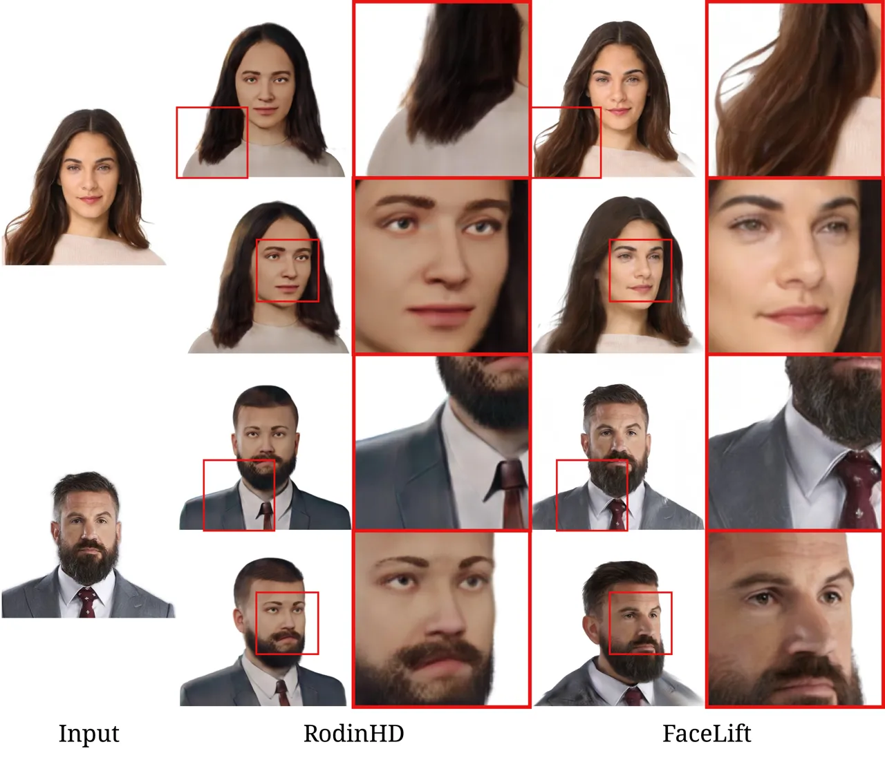

Figure 2: Comparison with RodinHD. RodinHD \[73\] trains triplane
diffusion with synthetic data, resulting in apparent identity loss. In
contrast, FaceLift achieves better identity preservation and generalizes
effectively to real human portraits.

In this work, we present FaceLift, a pipeline for learning generalizable
and high-fidelity single image to 3D face representation from synthetic
head data. To achieve high quality reconstruction that preserves the
input facial identity, we adopt a two-stage pipeline to first generate
identity preserving multi-view images using a diffusion model \[48\],
followed by a transformer-based feed-forward reconstructor to fuse the
generated sparse views into a comprehensive 3D Gaussian representation.
We train the model with synthetic images – multi-view renderings of 3D
synthetic human portraits using Blender. We highlight two key techniques
for generalizing to real-world images and preserving input facial
identity. First, we emphasize the importance of reconstructing the input
image alongside the view synthesis task in the conditional diffusion
model training, which significantly improved generalization capability
in testing. Second, we demonstrate that training the feed-forward
reconstructor benefits from a two-stage training process: pre-training
on general objects \[12\] to acquire a rich geometry and texture prior,
followed by fine-tuning on synthetic human head data to capture
head-specific geometry. With our two-stage approach, we focus on
learning identity preservation in the image space during the first
stage, achieving higher input fidelity compared to existing methods.

Comparing with prior art, we achieve three key advancements: (1) robust
view consistency through multi-view attention and supervision, (2)
improved generalization from training techniques and foundational model,
ensuring accurate identity preservation, (3) high-quality facial texture
and hair details via pixel-aligned Gaussian representation.

We extensively evaluate FaceLift quantitatively and qualitatively across
diverse datasets. Using real multi-view studio captures \[39\] and an
independent synthetic human dataset \[8\], our approach consistently
surpasses previous state-of-the-art methods across all evaluation
metrics. Through extensive testing on in-the-wild portrait images, we
demonstrate that our method reconstructs complete 3D heads with
fine-grained details, accurate identity preservation, and high visual
fidelity. Comparisons and ablation studies confirm that multi-view
consistent training data is crucial for high-fidelity face
reconstruction. Our contributions are summarized as follows:

- •
  We propose FaceLift, a framework that reconstructs a high-fidelity 3D
  head from a single image using view generation and feed-forward
  reconstructor.
- •
  Despite being trained solely on synthetic human head data, our
  approach shows no domain gap on real-world images, highlighting both
  the effectiveness of synthetic data and our model’s robust
  generalization capabilities.
- •
  We construct two benchmarks on single-image to 3D full head
  reconstruction tasks using the publicly available datasets Cafca \[8\]
  and Ava-256 \[39\] to quantitatively evaluate models’ performance on
  both reconstruction accuracy and identity preservation ability.
- •
  Our comprehensive evaluation confirms that our approach achieves
  state-of-the-art performance in reconstruction accuracy and identity
  preservation.

## 2 Related Work

Face Reconstruction. 3D face reconstruction has been a long-standing
challenge in computer vision, with substantial progress driven by
diverse approaches. Vetter and Blanz \[60\] pioneer a method for
synthesizing 3D faces by linearly blending multiple 3D templates, now
widely known as blendshapes. This work establishes the foundation for 3D
Morphable Models (3DMMs), which represent 3D face shapes and textures as
principal components derived from scanned data. Subsequent research \[5,
6, 32, 34, 47\] extend this framework, enabling the generation of new 3D
faces by manipulating blending coefficients. However, these methods
produce mesh-based representations that lack fine details and are
limited to modeling the front of the face, excluding hair and 360-degree
synthesis. While 3DMM-based methods have been foundational, recent
advances in deep learning, especially Generative Adversarial Networks
(GANs) \[19, 25, 26\], have greatly improved 3D face synthesis quality.
EG3D \[72\] uses a tri-plane NeRF representation with a pose-conditioned
StyleGAN2 \[26\] framework. Follow-up works \[33, 3\] achieve
single-image-to-3D generation through GAN inversion \[11\]. Despite
their success, these methods can only synthesize near-frontal views. To
overcome this, PanoHead \[1\] introduces a tri-grid neural volume
representation, enabling full 360-degree head synthesis. Unfortunately,
it does not provide a 3D head representation for consistent multi-view
rendering. Recent efforts explore alternative representations for 3D
face reconstruction from sparse input, such as a single image \[17, 42,
61\] or few-shot images \[7\]. However, these methods still require
pre-instance optimization. Rodin \[63\] and its extension RodinHD \[73\]
employ an image-conditioned diffusion model to generate a triplane
representation of a human head for full-head novel view synthesis.
Nevertheless, their triplane diffusion model is limited to synthetic
data and struggles to achieve high-fidelity reconstructions from
real-world images. For animatable 3D head avatars generations, Morphable
Diffusion \[10\] generates multi-view consistent images from a single
image using a morphable mesh, while HeadGAP \[76\] generates 3D
animatable head avatars using few-shot input, leveraging 3D head priors
learned from large-scale data. In contrast, our work focuses on
leveraging synthetic training data to produce high-fidelity, detailed 3D
Gaussian head models.

Synthetic Human Data. Capturing high-quality 3D data of real humans
requires a controlled studio environment and costly photography
equipment \[39\]. As an alternative, large-scale synthetic 3D head
datasets have emerged as an effective and resource-efficient solution
for tasks like human head reconstruction \[65, 63, 73, 8\] and
photorealistic relighting \[71, 9\], offering a scalable way to train
models without the restrictions of real-world data acquisition. Inspired
by these previous works, we aim to use synthetic data to improve the
model’s understanding of the human head and minimize the generalization
gap between synthetic data training and real-world inference.

Image or Text to 3D. Generative models have achieved remarkable success
in 2D image generation with VAEs \[28, 58\], GANs \[19, 25, 26\], and
diffusion models \[23, 48, 54\]. Building on this success, extensive
research has extended these models to 3D content generation \[66, 18,
43, 41\]. Starting with DreamFusion \[45\], numerous works \[36, 46, 57,
64, 51\] try to distill NeRF \[40, 72, 62\] or 3D Gaussians \[27\]
representation from 2D image diffusion using a Score Distillation
Sampling (SDS) loss. These methods can produce high-quality results but
often encounter challenges such as slow optimization, over-saturated
colors, and the Janus problem. To overcome these challenges, recent
works \[35, 53, 37, 31, 30\] generate multi-view images with high
consistency, which can be directly used for 3D reconstruction with
neural reconstruction methods \[40, 27, 62\]. However, optimizing NeRF
or NeuS remains far from real-time performance. Recent advancements in
large 3D reconstruction models (LRMs) \[24, 30, 74, 56\] offer a pathway
to faster 3D reconstruction. Leveraging scalable transformer
architectures \[59, 15\] and large datasets like Objaverse \[12, 13\],
these models effectively capture generalizable 3D priors. Unlike
traditional pre-scene optimization methods \[40, 27, 62\], LRMs employ a
feed-forward approach, enabling the prediction of high-quality NeRF,
mesh, or 3D Gaussian representations from sparse images in under a
second. However, most of these research efforts are applied to general
objects, with limited or suboptimal results for 3D head reconstruction.

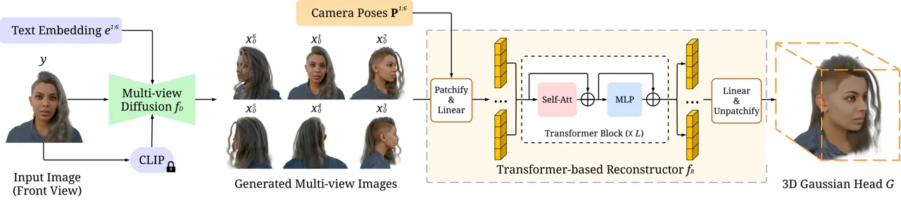

Figure 3: Overview of FaceLift. Given a single image of a human face
$`y`$ as input, we train an image-conditioned, multi-view diffusion
model to generate novel views $`x_{0}^{1},\dots,x_{0}^{N}`$ covering the
entire head. By generating $`x_{0}^{1}`$ the same as $`y`$ and
leveraging the high-quality synthetic data, our multi-view latent
diffusion model can hallucinate unseen views of the human head with
high-fidelity and multi-view consistency. We then train a
transformer-based reconstructor $`f_{R}`$, which takes multi-view images
$`x_{0}^{1:N}`$ and their camera poses $`\textsc{P}^{1:N}`$ as input and
generates 3D Gaussian splats $`G`$ to represent the human head.

## 3 Proposed Method

As shown in Fig. 3, given a single frontal image of a human face $`y`$,
our goal is to reconstruct a complete 3D head $`G`$, represented as 3D
Gaussian splats, with detailed facial texture and preserved identity.
This requires our system to have prior knowledge on the geometry
structure of a human face and the ability to synthesis plausible details
which are not visible in the input view. Hence, we train a multi-view
diffusion model $`f_{D}`$ on synthetic human head data to generate $`N`$
views $`x_{0}^{1},x_{0}^{2},\dots,x_{0}^{N}`$ covering $`360^{\circ}`$
of the human head while achieving multi-view consistency and preserving
identity. We choose pixel-aligned 3D Gaussians to obtain the final 3D
representation. Compared to NeRFs and meshes, 3D Gaussians offer
explicit volumetric primitives that better capture subtle facial
geometry and fine details. Their semi-transparent kernels naturally
model effects like wispy hair and translucency, which are challenging
for discrete surfaces or density fields. These generated views
$`x_{0}^{1:N}`$ from the diffusion model, along with their corresponding
Plücker ray coordinates $`\textsc{P}^{(1:N)}`$, are input into a
transformer-based Gaussian reconstructor $`f_{R}`$ to predict a set of
3D Gaussians$`G`$. Training of the Gaussian reconstructor follows a
pre-training process on general objects \[12\] and a fine-tuning process
on synthetic human head data.

### 3.1 Synthetic Human Head Dataset

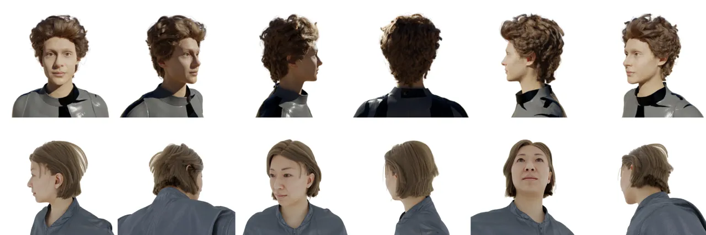

Figure 4: Synthetic data examples. Top row: six views for diffusion
training. Bottom row: samples of random views for reconstructor
training.

We implement a 3D head asset generation pipeline inspired by \[65\]. Our
process begins with a collection of high-quality, artist-created 3D head
meshes, which we enhance by incorporating detailed facial components,
including eyes, teeth, gums, and both facial and scalp hair. We then
augment these base models through rigging for pose variation and
blendshape deformation for diverse facial expressions. The final head
models are enriched with a set of PBR texture maps, including albedo,
normal, roughness, specular, and subsurface scattering maps. At last, we
dress the head model with a collection of clothing assets. The entire
pipeline is implemented in Blender and the images are rendered with
Cycles renderer.

To train our networks, we render images (samples shown in Fig. 4) at
512$`\times`$512 resolution from 200 unique identities, each with 50
varied appearances, including different hairstyles, skin tones,
expressions, clothes, poses, _etc_. We render our training dataset under
two types of lighting conditions: (1) ambient light and (2) random HDR
environment light. We render six views for each subject to train the
multi-view diffusion model. For fine-tuning the transformer-based
reconstructor, we render 32 views with random camera poses.

### 3.2 View Generation

We model the sparse view generation from a single image input as a
conditional diffusion process. We use a multi-view diffusion model
$`f_{D}`$ to generate $`N`$ views, denoted as
$`X_{0}^{1},X_{0}^{2},\dots,X_{0}^{N}`$, given a single front-facing
image $`y`$ and CLIP text embeddings $`e^{1},e^{2},\dots,e^{N}`$
corresponding to each generated view. This process is expressed as:

```math
\{X_{0}^{1},X_{0}^{2},\dots,X_{0}^{N}\}=f_{D}(y,\{e^{1},e^{2},\dots,e^{N}\}). \tag{1}
```

We aim to learn the joint distribution of all these views, conditioning
on the input image $`y`$ and text embedding $`e^{1},e^{2},\dots,e^{N}`$.
We denote the joint distribution as:

```math
p_{f_{D}}(x_{0}^{1:N}\mid y,e^{1:N}):=p_{f_{D}}(\{x_{0}^{1},\dots x_{0}^{N}\}\mid y,\{e^{1},\dots e^{N}\}). \tag{2}
```

View Selection. Given a single near frontal view face image with azimuth
$`\alpha`$, our multi-view diffusion model generates six views with
azimuths equal to {$`\alpha`$, $`\alpha\pm 45^{\circ}`$,
$`\alpha\pm 90^{\circ}`$, $`\alpha+180^{\circ}`$}, covering 360 degrees
of the human head. Elevation is 0 for all images. We opt for six views
as the optimal balance - fewer views compromise detail quality while
more views become computationally prohibitive for full head
reconstruction. An ablation study comparing four, six, and eight views
is presented in Sec. 5.2.

Multi-view Attention. To ensure the consistency of the generated novel
views, we use a multi-view attention mechanism to facilitate information
propagation and implicitly encode multi-view dependencies. Our attention
module encourages multi-view consistency by extending the 2D
self-attention mechanism to 3D and enabling interactions across views.
Instead of treating each view independently, we apply self-attention
across all views simultaneously, allowing information to be shared
between them. Specifically, we start with an input tensor of shape
$`B\!\times\!V\!\times\!H\!\times\!W\!\times\!C`$, where $`B`$ is the
batch size, $`V`$ is the number of views, $`H`$ and $`W`$ denote the
spatial resolution of the intermediate feature maps, and $`C`$ is the
number of feature channels. We reshape this tensor to
$`B\!\times\!VHW\!\times\!C`$, treating all spatial locations across all
views as a unified sequence of tokens for self-attention. This design
allows the model to learn multi-view correlations by sharing information
across views within the attention layers, enabling it to generate
consistent RGB images. We provide an ablation study on the multi-view
attention mechanism in the supplementary material.

Input View Reconstruction. During Training, we enforce the first
generated view to share the same camera with the input image. In other
words, we reconstruct the input view in the view generation process. We
find this approach, combined with the multi-view attention mechanism,
significantly outperforms the alternative strategy of generating only
novel views, which tends to overfit to synthetic training identities and
compromises generalization capability as we will show in Sec. 5.1 and
the supplementary material.

### 3.3 Multi-view to 3D Gaussians Reconstruction

Transformer-based Reconstructor. We choose pixel-aligned 3D Gaussians as
the final 3D representation. Each Gaussian $`G_{i}`$ is defined by
position $`p_{i}`$, scale $`s_{i}`$, orientation $`q_{i}`$, opacity
$`\alpha_{i}`$, and color features $`c_{i}`$. We use a transformer-based
reconstructor $`f_{G}`$ to obtain 3D Gaussians from generated multi-view
images $`x_{0}^{1:N}`$ and their corresponding Plücker ray
coordinates \[44\] $`\textsc{P}^{1:N}`$:

```math
\{G_{i}\}_{i=1}^{NHW}\!=\!\{p_{i},s_{i},q_{i},\alpha_{i},c_{i}\}_{i=1}^{NHW}\!=\!f_{G}(x_{0}^{1:N},\textsc{P}^{1:N}), \tag{3}
```

Our $`f_{G}`$ is a large reconstruction model \[24, 74\] which follows
the implementation of GS-LRM \[74\]: the $`N`$ multi-view images are
concatenated with their Plücker ray coordinates computed from the camera
intrinsic and extrinsic parameters for pose conditioning. Then, the
inputs are patchified by dividing the per-view feature map into
non-overlapping patches with a patch size of $`p`$. Each 2D patch is
then flattened into a 1D vector. Finally, a linear layer L is utilized
to map the 1D vectors to image patch tokens:

```math
\{\textsc{T}_{j}^{n}\}_{j=1,2,\dots,\frac{HW}{p^{2}}}=\textit{L}(\texttt{Patchify}_{p}(\texttt{Concat}(\textsc{I}^{n},\textsc{P}^{n}))). \tag{4}
```

Where $`\{\textsc{T}_{j}^{n}\}`$ denotes the set of patch tokens for
image $`n`$, totaling $`\frac{HW}{p^{2}}`$ tokens per image. The set of
multi-view image tokens $`\{\textsc{T}_{j}^{n}\}`$ are concatenated and
processed through a chain of transformer blocks. Each transformer block
is equipped with residual connections \[20\] and consists of
Pre-LayerNorm \[2\], multi-head Self-Attention \[59\] and MLP. Later,
the output tokens from the transformer are decoded into Gaussian
parameters using a single linear layer. Then, the Gaussian parameters
are unpatchified into $`p^{2}`$ Gaussians. Finally, we end up with
$`HW`$ Gaussians for each view, where pixel encodes one 3D Gaussian.

Two-stage Training. We find that training the transformer-based
reconstructor solely on synthetic human head data leads to inferior
texture details when applied to real-world images (see ablation study in
Fig. 12). We suspect this limitation arises because the synthetic
datasets lack geometric diversity. To address this, we propose a
two-stage training approach in which the reconstructor is pre-trained on
diverse object data \[12\] and subsequently fine-tuned using synthetic
head data. The pre-training stage enables the reconstructor to learn a
broad prior of diverse geometric structures, yielding more detailed and
clearer textures in delicate facial regions such as the eyes, nose, and
ears. The fine-tuning process then imparts specific knowledge of head
structure, producing smoother and more realistic results. During
training, we randomly select four input views to reconstruct a total of
eight views, four input and four novel views. Following \[74\], we
optimize the model using a combination of MSE and perceptual losses.
During inference, the reconstructor processes the six-view outputs from
multi-view diffusion model to reconstruct the head.

### 3.4 Real-world Image Inference

For inference on real-world images, since their intrinsic parameters are
unknown, we adopt a camera fov of $`50^{\circ}`$, same as during
training. To ensure plausible outputs, we first apply an MTCNN face
detector to estimate the face’s size and center. The image is then
resized and cropped/extended to match the average face size and center
computed from the training data. We find this alignment compensates for
the unknown intrinsic parameters well, ensuring plausible reconstruction
results.

## 4 Experiments

### 4.1 Experimental Setup

Evaluation Datasets. To quantitatively evaluate FaceLift, we establish
two benchmarks for single-image to 3D full head reconstruction tasks
using publicly available datasets: (1) Cafca dataset \[8\]: We select 40
subjects with 7 to 19 test camera poses each. Since the camera positions
are randomly distributed, we manually select the most frontal view as
input. Note that this synthetic dataset was independently developed and
differs significantly from our training dataset. (2) Ava-256
dataset \[39\]: This studio-captured dataset contains real human
subjects. We sample 10 subjects and 10 test camera poses for our
evaluation. More details in supplemental. To demonstrate our system’s
generalization capabilities, we also evaluate on a set of in-the-wild
face images for qualitative assessment.

Baselines. We compare our results against three state-of-the-art methods
for single-face 3D reconstruction: GGHead \[29\], PanoHead \[1\], and
Dual Encoder \[4\]. We perform GAN-inversion to reconstruct 3D head from
a given input image using these models. To emphasize the importance of
utilizing our synthetic human head data for training, we also compare
our method with two methods that focus on general object reconstruction:
Era3D \[31\] and LGM \[56\]. More comparison results with mesh-based
methods are provided in the supplementary material.

We further developed a baseline, Our MV + LGM, which leverages the
multi-view outputs generated by our diffusion model and employs LGM for
reconstruction. This demonstrates that our method can be seamlessly
integrated with other reconstruction frameworks to enhance performance
on face reconstruction tasks. We tried to fine-tune the LGM
reconstructor with our synthetic data, but it provides inferior results
with incorrect geometry and artifacts compared with the original
weights, which we suspect is due to training data mismatch (see details
in the supplementary material).

Evaluation Metrics. We evaluate reconstruction quality using four
standard metrics: PSNR, SSIM, LPIPS \[75\], and DreamSim \[16\]. To
evaluate identity preservation, we perform face verification using
ArcFace \[14\] through the DeepFace \[52\] implementation.

Implementation Details. Both Cafca \[8\] and Ava-256 \[39\] datasets
provide multi-view RGB images and corresponding camera poses. However,
their camera system differs from the ones utilized in FaceLift and
baselines. We recalculate the test camera extrinsic in each method’s
camera system. For a more accurate comparison, we use the Mediapipe
facial landmark detection algorithm \[38\] to identify facial landmarks
in both the target images and the rendered outputs, aligning them based
on landmark distributions. Details are provided in the supplementary
material.

Our system takes approximately 8 seconds to infer a 3D Gaussian head
from a single image: about 1.5 seconds for preprocessing (background
removal, rescaling, etc.), 5.5 seconds for multi-view image generation,
and under 1 second for 3D Gaussians reconstruction.

| Method              | PSNR $`\uparrow`$ | SSIM $`\uparrow`$ | LPIPS $`\downarrow`$ | DreamSim $`\downarrow`$ | ArcFace $`\downarrow`$ |
| ------------------- | ----------------- | ----------------- | -------------------- | ----------------------- | ---------------------- |
| GGHead \[29\]       | 10.35             | 0.7406            | 0.3636               | 0.3252                  | 0.2681                 |
| PanoHead \[1\]      | 10.72             | 0.7594            | 0.3351               | 0.2048                  | 0.2183                 |
| Dual Encoder \[4\]  | 10.78             | 0.7385            | 0.3922               | 0.2785                  | 0.2421                 |
| Era3D \[31\]        | 13.69             | 0.7230            | 0.3662               | 0.2892                  | 0.2978                 |
| LGM \[56\]          | 16.52             | 0.7933            | 0.3060               | 0.1552                  | 0.2557                 |
| Our MV + LGM \[56\] | 14.13             | 0.7812            | 0.2956               | 0.1282                  | 0.1767                 |
| FaceLift            | 16.61             | 0.7968            | 0.2694               | 0.1096                  | 0.1573                 |

Table 1: Quantitative results on Cafca. FaceLift achieves favorable
performance on all evaluation metrics.

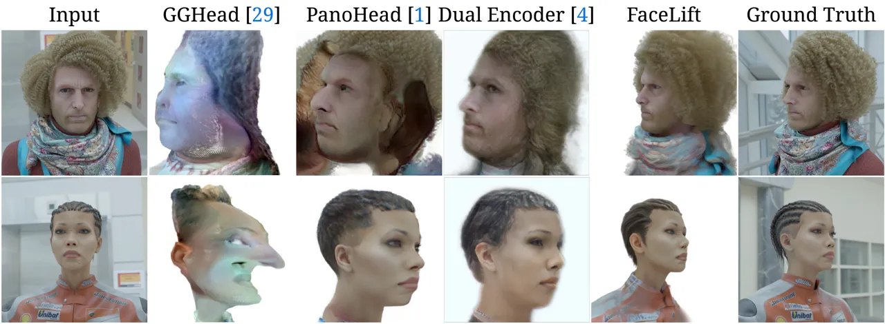

Figure 5: Visual results on Cafca compared with face reconstruction
methods. FaceLift renders novel views that closely match the ground
truth, while other baselines often fail to reconstruct the 3D head in
correct colors or geometry structures.

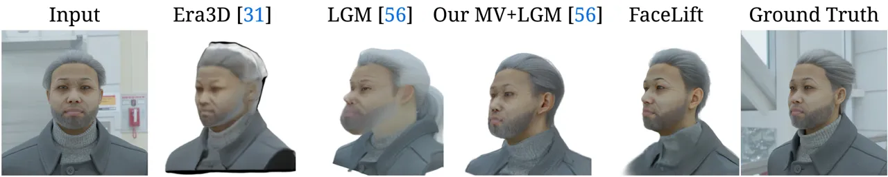

Figure 6: Visual results on Cafca compared with general objects
reconstruction methods. Comparison with general object reconstruction
methods shows the importance of specialized data.

### 4.2 Experiments on the Cafca Dataset

We report numerical comparison results on Cafca in Tab. 1. FaceLift
performs favorably against baselines, especially on DreamSim \[16\]
metric, indicating high-quality perceptual similarity. It also achieves
better identity preservation performance, as demonstrated by a lower
ArcFace \[14\] distance. We show visual results in Fig. 5 and Fig. 6.
FaceLift yields rendering results that closely match the ground truth.
Compared with other baselines, GGHead \[29\] does not support full-head
rendering, resulting in unrealistic outputs when the view angle
significantly deviates from the input. PanoHead \[1\] struggles with
challenging hairstyles, while Dual Encoder \[4\] produces blurred facial
textures. Additionally, Era3D \[31\] introduces artifacts on the back of
the head, and LGM \[56\] yields inaccurate nose and jaw shapes,
underscoring the importance of our synthetic human head data. When
integrated with our multi-view diffusion approach, LGM achieves enhanced
performance, demonstrating that our method can be seamlessly combined
with existing baselines to boost their results.

| Method            | PSNR $`\uparrow`$ | SSIM $`\uparrow`$ | LPIPS $`\downarrow`$ | DreamSim $`\downarrow`$ | ArcFace $`\downarrow`$ |
| ----------------- | ----------------- | ----------------- | -------------------- | ----------------------- | ---------------------- |
| Era3D \[31\]      | 14.77             | 0.7963            | 0.2538               | 0.2515                  | 0.3721                 |
| LGM \[56\]        | 14.05             | 0.8136            | 0.2476               | 0.1496                  | 0.3142                 |
| Our MV+LGM \[56\] | 15.24             | 0.8213            | 0.2292               | 0.1093                  | 0.2264                 |
| FaceLift          | 16.52             | 0.8271            | 0.2277               | 0.1065                  | 0.1871                 |

Table 2: Quantitative results on Ava-256. FaceLift performs favorably
than baseline methods in both reconstruction metrics and identity facial
identity metric, showing a better generalization ability towards
real-captured human images.

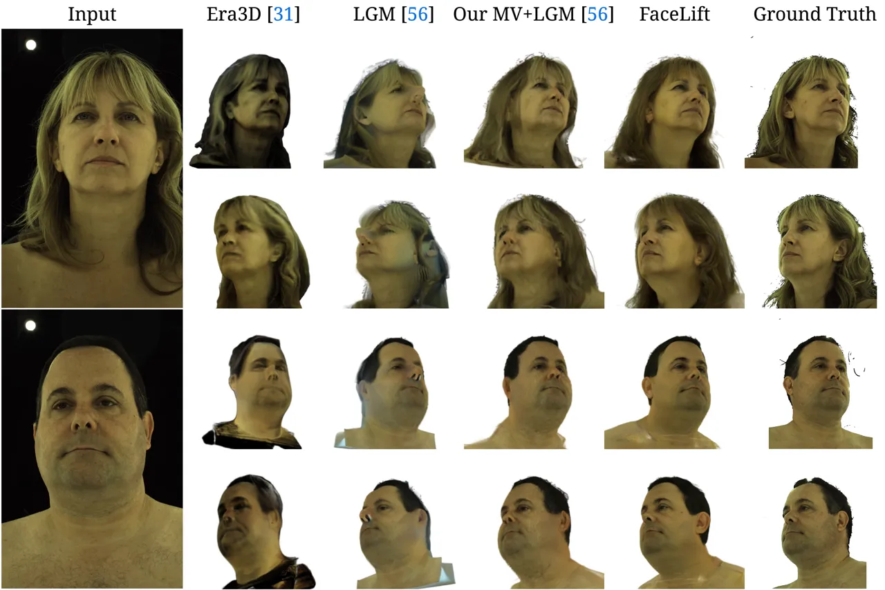

Figure 7: Visual results on Ava-256. Compared with baselines, FaceLift
provides multi-view renderings that are more realistic and similar to
ground truth. Era3D fails to deliver delicate facial structures, while
LGM generates inaccurate head shapes and colors.

### 4.3 Experiments on the Ava-256 Dataset

We further evaluate FaceLift against other baselines on a
studio-captured real human dataset, Ava-256 \[50\]. GAN-inversion based
methods \[1, 29, 4\] fail to produce reasonable results with the test
camera poses in this dataset, so we exclude these baselines. Tab. 2
shows that FaceLift outperforms all other baselines across all
evaluation metrics, demonstrating superior reconstruction quality and
identity preservation. It also highlights FaceLift’s strong ability to
generalize to real human faces. As shown in Fig. 7, FaceLift achieves
more realistic head synthesis, while Era3D \[31\] struggles with
accurate skin and hair textures, as well as facial details. LGM \[56\]
produces inaccuracies in the nose shape. When combined with our
multi-view diffusion model, LGM yields more accurate geometric
structures, yet its texture quality remains inferior to that of
FaceLift.

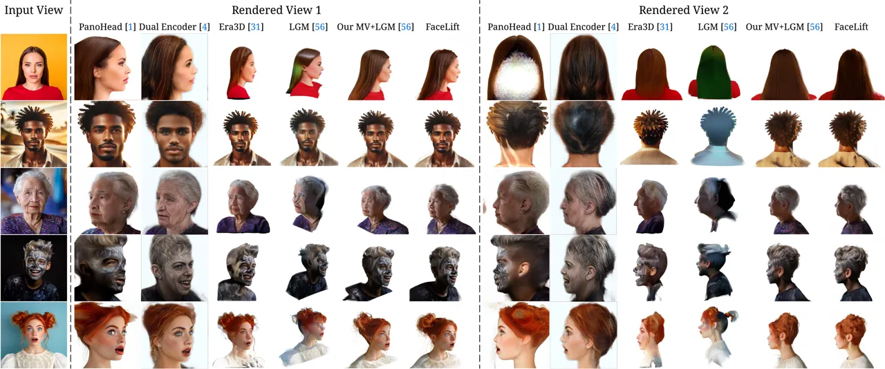

Figure 8: Visual comparison on in-the-wild data. FaceLift demonstrates
great generalization ability and robustness towards in-the-wild images,
provides realistic unseen view rendering results. Era3D \[31\] and
LGM \[56\] generate 3D head representation in inaccurate shape.
PanoHead \[1\] often creates severe artifacts on the back of the head
and can not handle challenging hairstyles well. Dual Encoder \[4\] shows
improved performance on reconstructing the back of the head but exhibits
more pronounced identity loss.

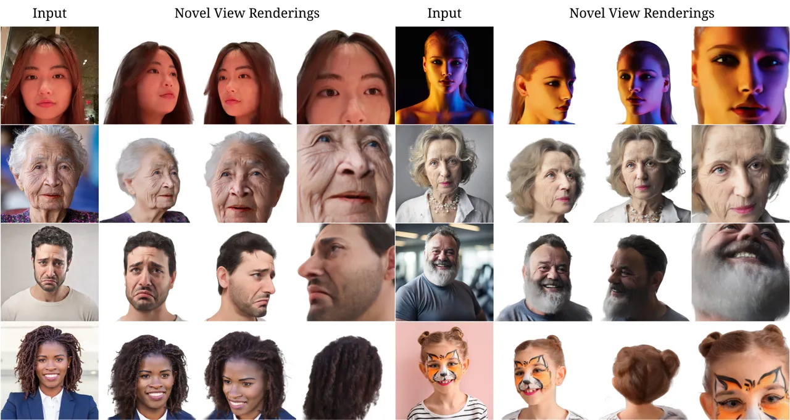

Figure 9: Results of FaceLift on in-the-wild images. FaceLift accurately
reconstructs 3D head models under challenging lighting conditions,
achieving high fidelity (row 1). It captures fine facial details such as
wrinkles (row 2), mustaches (row 3), and individual hairs (row 2 and row
4). Additionally, it remains robust to complex facial expressions (row 3) and various skin tones (row 4). Furthermore, it can realistically
reconstruct facial paint (row 4). More results are provided in the
supplementary materials.

### 4.4 Experiments with In-the-wild Images

We collect in-the-wild human face images and present qualitative results
in comparison with other baselines in Fig. 8. Baseline methods often
produce undesirable artifacts. For instance, PanoHead \[1\] frequently
fails to render the back of the head and sometimes generates extra eyes
at the rear. It also struggles to synthesize hair, shadows, wrinkles,
and facial paint accurately, and its outputs lack multi-view consistency
(_e.g_., the girl continues to face the camera in novel view 1 despite a
changed pose). Dual Encoder \[4\] improves back-of-head rendering but
suffers from severe identity loss (row 2) and fails to accurately
reconstruct face paint (row 4). Era3D \[31\] often produces an
inaccurate head shape, particularly from side views, and offers fewer
geometric details compared to FaceLift. LGM \[56\] generates Gaussians
with inaccurate color and opacity and lacks proper facial geometry,
resulting in distorted features. Baseline Our MV + LGM shows that our
multi-view diffusion model enhances LGM by providing improved facial
geometry and texture details. However, the LGM reconstructor still
produces Gaussians with inaccurate shapes and opacities, further
underscoring the advantages of our transformer-based reconstructor.

We present more FaceLift’s novel view rendering results in Fig. 9 to
demonstrate FaceLift’s ability to produce high-fidelity, realistic 3D
head reconstructions with intricate details across a variety of
challenging scenarios. FaceLift effectively handles faces under various
lighting conditions. It can especially render realistic novel view
images given a photo captured with an iPhone under dark lighting
conditions (row 1 column 1), emphasizing its robustness and potential
for real-world application. It reconstructs facial details with high
fidelity, especially the wrinkles and folds on the face caused by
extreme expression. FaceLift also excels at reconstructing challenging
textures, such as mustaches and hair. Furthermore, it faithfully
reconstructs facial paint, despite such data not being included in our
synthetic face dataset, showcasing its strong generalization ability.

## 5 Ablation Study

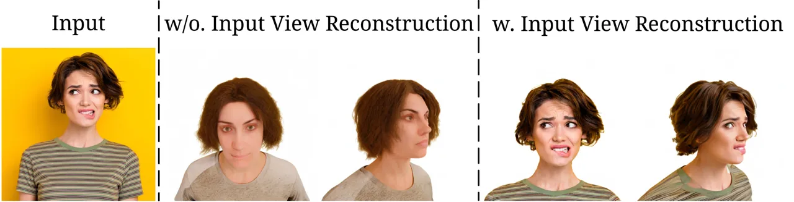

Figure 10: Importance of input view reconstruction. The diffusion model
that is not trained to perform the input view reconstruction, _i.e_.,
w/o. Input View Reconstruction, overfits to synthetic training
distribution, suffers from severe identity loss during inference.
Trained with input view reconstruction, our method preserves the input
identity and expression faithfully.

### 5.1 Input View Reconstruction

We conduct an ablation study to demonstrate the importance of
reconstructing the input view during training. For comparison, we train
a multi-view diffusion model that generates six novel views. In this
baseline, the first generated view’s elevation is adjusted from
$`0^{\circ}`$ to $`20^{\circ}`$, while the remaining views adopt the
same camera poses as in our default setting. We refer to this variant as
w/o. Input View Reconstruction. Fig. 10 presents the view generation
results of the two diffusion models when applied to real-world images.
Without the input view reconstruction task, the model trained on the
synthetic dataset generates views within a limited distribution, leading
to noticeable identity loss. Moreover, it loses its ability to preserve
facial expressions and face paint. In contrast, incorporating the input
view reconstruction task during training enables our diffusion model to
faithfully regenerate the input view, significantly improving its
generalization ability. Quantitative comparison is provided in the
supplementary material.

### 5.2 Number of Views

We evaluate three configurations: four views (front, left, right, and
back), six views (adding front-left and front-right), and eight views
(further including front-top and front-bottom). Fig. 11 compares the
baselines using different numbers of input views. With only four views,
the reconstructor fails to capture a complete forehead; however, with
six views, it reconstructs the eyes and eyebrows more smoothly and
renders challenging textures—such as facial wrinkles and ear folds—more
realistically. Eight views do not offer significant visual improvements,
and incur a higher computational cost in both stages. Thus, we find that
six views achieve a good balance between reconstruction quality and
computational efficiency.

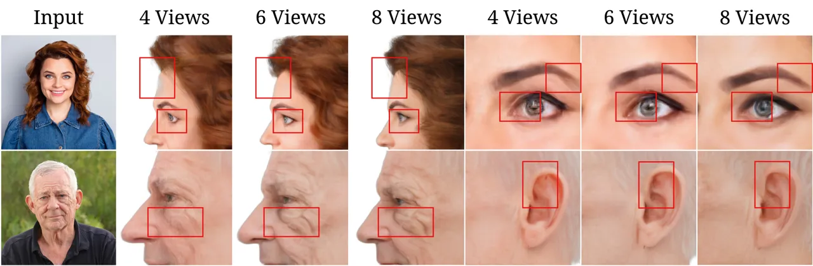

Figure 11: Number of input views of Gaussian reconstructor. Using six
views strike a good balance between reconstruction quality and
computational efficiency.

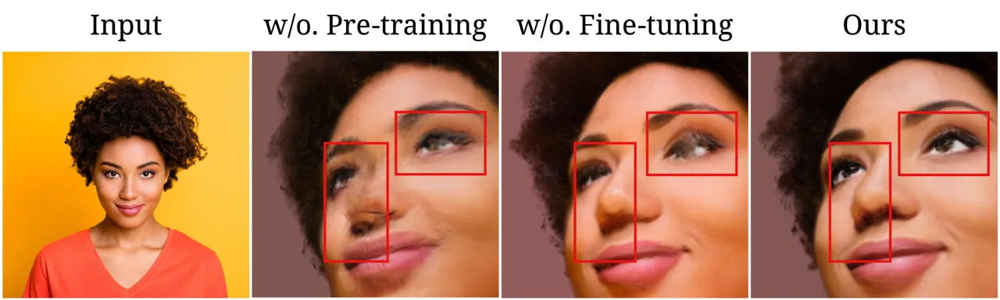

Figure 12: Two-stage training of reconstructor. Without pre-training on
general objects, the reconstructor fails to produce clear textures in
the reconstruction results. Meanwhile, without fine-tuning on synthetic
human head data, the model lacks a refined understanding of facial
structures, including the eyes and nose.

### 5.3 Two-stage Reconstructor Training

As illustrated in Sec. 3.3, our Gaussian reconstructor follows a
two-stage training pipeline. Fig. 12 shows that pre-training on general
objects helps the model learn a diverse prior of geometric structures,
resulting in clearer textures on delicate facial regions. Meanwhile,
fine-tuning on synthetic human head data enables the reconstructor to
gain a more refined understanding of facial structure, thereby enhancing
the accuracy of features such as the eyes, nose, and hair.

## 6 Conclusions

We propose FaceLift, a feed-forward approach that lifts a single facial
image to a detailed 3D reconstruction with preserved identity features.
Our method uses multi-view diffusion to generate unobservable views and
employs a transformer-based reconstructor to reconstruct 3D Gaussian
splats, enabling high-quality novel view synthesis. To overcome the
difficulty of capturing real-world multi-view human head images, we
render high-quality synthetic data for training and show that, despite
being trained solely on synthetic data, FaceLift can reconstruct 3D
heads from real-world captured images with high fidelity. Compared with
baselines \[1, 4, 29, 31, 56\], FaceLift generates 3D head
representation with finer geometry and texture details and exhibits
better identity preservation ability.

## 7 Acknowledgement

This was supported in part by the Institute of Information &
Communications Technology Planning & Evaluation (IITP) grant funded by
the Korean Government (MSIT) (No. RS-2024-00457882, National AI Research
Lab Project).

We appreciate the insightful discussions with Kai Zhang, Hao Tan,
Zexiang Xu, Sai Bi, Sumit Chaturvedi, Hanwen Jiang, Yu-Ju Tsai,
Kuan-Chih Huang, Chengxu Liu, and Dingyi Dai. We thank Nathan Carr and
Kalyan Sunkavalli for their support.

## References

- \[1\] Sizhe An, Hongyi Xu, Yichun Shi, Guoxian Song, Umit Y Ogras, and
  Linjie Luo. PanoHead: Geometry-aware 3D full-head synthesis in
  360^(∘). In _CVPR_, 2023.
- \[2\] Jimmy Lei Ba, Jamie Ryan Kiros, and Geoffrey E. Hinton. Layer
  normalization. _arXiv preprint arXiv:1607.06450_, 2016.
- \[3\] Ananta R. Bhattarai, Matthias Nießner, and Artem Sevastopolsky.
  TriPlaneNet: An encoder for EG3D inversion. In _WACV_, 2024.
- \[4\] Bahri Batuhan Bilecen, Ahmet Berke Gokmen, and Aysegul Dundar.
  Dual encoder GAN inversion for high-fidelity 3D head reconstruction
  from single images. In _NeurIPS_, 2024.
- \[5\] Volker Blanz and Thomas Vetter. A morphable model for the
  synthesis of 3D faces. In _SIGGRAPH_, 1999.
- \[6\] James Booth, Anastasios Roussos, Stefanos Zafeiriou, Allan
  Ponniah, and David Dunaway. A 3D morphable model learnt from 10,000
  faces. In _CVPR_, 2016.
- \[7\] Marcel C Bühler, Kripasindhu Sarkar, Tanmay Shah, Gengyan Li,
  Daoye Wang, Leonhard Helminger, Sergio Orts-Escolano, Dmitry Lagun,
  Otmar Hilliges, Thabo Beeler, et al. Preface: A data-driven volumetric
  prior for few-shot ultra high-resolution face synthesis. In
  _ICCV_, 2023.
- \[8\] Marcel C Bühler, Gengyan Li, Erroll Wood, Leonhard Helminger, Xu
  Chen, Tanmay Shah, Daoye Wang, Stephan Garbin, Sergio Orts-Escolano,
  Otmar Hilliges, et al. Cafca: High-quality novel view synthesis of
  expressive faces from casual few-shot captures. In _SIGGRAPH
  Asia_, 2024.
- \[9\] Sumit Chaturvedi, Mengwei Ren, Yannick Hold-Geoffroy, Jingyuan
  Liu, Julie Dorsey, and Zhixin Shu. SynthLight: Portrait relighting
  with diffusion model by learning to re-render synthetic faces. In
  _CVPR_, 2025.
- \[10\] Xiyi Chen, Marko Mihajlovic, Shaofei Wang, Sergey Prokudin, and
  Siyu Tang. Morphable diffusion: 3d-consistent diffusion for
  single-image avatar creation. In _CVPR_, 2024.
- \[11\] Antonia Creswell and Anil Anthony Bharath. Inverting the
  generator of a generative adversarial network. In _TNNLS_, 2018.
- \[12\] Matt Deitke, Dustin Schwenk, Jordi Salvador, Luca Weihs, Oscar
  Michel, Eli VanderBilt, Ludwig Schmidt, Kiana Ehsani, Aniruddha
  Kembhavi, and Ali Farhadi. Objaverse: A universe of annotated 3D
  objects. In _CVPR_, 2023.
- \[13\] Matt Deitke, Ruoshi Liu, Matthew Wallingford, Huong Ngo, Oscar
  Michel, Aditya Kusupati, Alan Fan, Christian Laforte, Vikram Voleti,
  Samir Yitzhak Gadre, et al. Objaverse-XL: A universe of 10M+ 3D
  objects. In _NeurIPS_, 2024.
- \[14\] Jiankang Deng, Jia Guo, Jing Yang, Niannan Xue, Irene Kotsia,
  and Stefanos Zafeiriou. ArcFace: Additive angular margin loss for deep
  face recognition. In _IEEE TPAMI_, 2022.
- \[15\] Alexey Dosovitskiy. An image is worth 16x16 words: Transformers
  for image recognition at scale. In _ICLR_, 2020.
- \[16\] Stephanie Fu, Netanel Tamir, Shobhita Sundaram, Lucy Chai,
  Richard Zhang, Tali Dekel, and Phillip Isola. DreamSim: Learning new
  dimensions of human visual similarity using synthetic data. In
  _NeurIPS_, 2023.
- \[17\] Chen Gao, Yichang Shih, Wei-Sheng Lai, Chia-Kai Liang, and
  Jia-Bin Huang. Portrait neural radiance fields from a single image.
  _arXiv preprint arXiv:2012.05903_, 2020.
- \[18\] Jun Gao, Tianchang Shen, Zian Wang, Wenzheng Chen, Kangxue Yin,
  Daiqing Li, Or Litany, Zan Gojcic, and Sanja Fidler. GET3D: A
  generative model of high quality 3D textured shapes learned from
  images. In _NeurIPS_, 2022.
- \[19\] Ian Goodfellow, Jean Pouget-Abadie, Mehdi Mirza, Bing Xu, David
  Warde-Farley, Sherjil Ozair, Aaron Courville, and Yoshua Bengio.
  Generative adversarial nets. In _NeurIPS_, 2014.
- \[20\] Kaiming He, Xiangyu Zhang, Shaoqing Ren, and Jian Sun. Deep
  residual learning for image recognition. In _CVPR_, 2016.
- \[21\] Jonathan Ho and Tim Salimans. Classifier-free diffusion
  guidance. In _NeurIPS 2021 Workshop on Deep Generative Models and
  Downstream Applications_, 2021.
- \[22\] Jonathan Ho, Ajay Jain, and Pieter Abbeel. Denoising diffusion
  probabilistic models. In _NeurIPS_, 2020a.
- \[23\] Jonathan Ho, Ajay Jain, and Pieter Abbeel. Denoising diffusion
  probabilistic models. In _NeurIPS_, 2020b.
- \[24\] Yicong Hong, Kai Zhang, Jiuxiang Gu, Sai Bi, Yang Zhou, Difan
  Liu, Feng Liu, Kalyan Sunkavalli, Trung Bui, and Hao Tan. LRM: Large
  reconstruction model for single image to 3D. In _ICLR_, 2024.
- \[25\] Tero Karras, Samuli Laine, and Timo Aila. A style-based
  generator architecture for generative adversarial networks. In
  _CVPR_, 2019.
- \[26\] Tero Karras, Samuli Laine, Miika Aittala, Janne Hellsten,
  Jaakko Lehtinen, and Timo Aila. Analyzing and improving the image
  quality of StyleGAN. In _CVPR_, 2020.
- \[27\] Bernhard Kerbl, Georgios Kopanas, Thomas Leimkühler, and George
  Drettakis. 3D gaussian splatting for real-time radiance field
  rendering. In _ACM TOG_, 2023.
- \[28\] Diederik P. Kingma and Max Welling. Auto-encoding variational
  bayes. In _ICLR_, 2014.
- \[29\] Tobias Kirschstein, Simon Giebenhain, Jiapeng Tang, Markos
  Georgopoulos, and Matthias Nießner. GGHead: Fast and generalizable 3D
  gaussian heads. In _SIGGRAPH Asia_, 2024.
- \[30\] Jiahao Li, Hao Tan, Kai Zhang, Zexiang Xu, Fujun Luan, Yinghao
  Xu, Yicong Hong, Kalyan Sunkavalli, Greg Shakhnarovich, and Sai Bi.
  Instant3D: Fast text-to-3D with sparse-view generation and large
  reconstruction model. In _ICLR_, 2024a.
- \[31\] Peng Li, Yuan Liu, Xiaoxiao Long, Feihu Zhang, Cheng Lin,
  Mengfei Li, Xingqun Qi, Shanghang Zhang, Wenhan Luo, Ping Tan, et al.
  Era3D: High-resolution multiview diffusion using efficient row-wise
  attention. In _NeurIPS_, 2024b.
- \[32\] Tianye Li, Timo Bolkart, Michael J Black, Hao Li, and Javier
  Romero. Learning a model of facial shape and expression from 4D scans.
  In _ACM TOG_, 2017.
- \[33\] Xueting Li, Shalini De Mello, Sifei Liu, Koki Nagano, Umar
  Iqbal, and Jan Kautz. Generalizable one-shot 3D neural head avatar. In
  _NeurIPS_, 2024c.
- \[34\] Jiangke Lin, Yi Yuan, Tianjia Shao, and Kun Zhou. Towards
  high-fidelity 3D face reconstruction from in-the-wild images using
  graph convolutional networks. In _CVPR_, 2020.
- \[35\] Minghua Liu, Chao Xu, Haian Jin, Linghao Chen, Mukund Varma T.,
  Zexiang Xu, and Hao Su. One-2-3-45: Any single image to 3D mesh in 45
  seconds without per-shape optimization. In _NeurIPS_, 2023a.
- \[36\] Ruoshi Liu, Rundi Wu, Basile Van Hoorick, Pavel Tokmakov,
  Sergey Zakharov, and Carl Vondrick. Zero-1-to-3: Zero-shot one image
  to 3d object. In _ICCV_, 2023b.
- \[37\] Xiaoxiao Long, Yuan-Chen Guo, Cheng Lin, Yuan Liu, Zhiyang Dou,
  Lingjie Liu, Yuexin Ma, Song-Hai Zhang, Marc Habermann, Christian
  Theobalt, et al. Wonder3D: Single image to 3D using cross-domain
  diffusion. In _CVPR_, 2024.
- \[38\] Camillo Lugaresi, Jiuqiang Tang, Hadon Nash, Chris McClanahan,
  Esha Uboweja, Michael Hays, Fan Zhang, Chuo-Ling Chang, Ming Guang
  Yong, Juhyun Lee, et al. Mediapipe: A framework for building
  perception pipelines. _arXiv preprint arXiv:1906.08172_, 2019.
- \[39\] Julieta Martinez, Emily Kim, Javier Romero, Timur Bagautdinov,
  Shunsuke Saito, Shoou-I Yu, Stuart Anderson, Michael Zollhöfer, Te-Li
  Wang, Shaojie Bai, Chenghui Li, Shih-En Wei, Rohan Joshi, Wyatt
  Borsos, Tomas Simon, Jason Saragih, Paul Theodosis, Alexander Greene,
  Anjani Josyula, Silvio Mano Maeta, Andrew I. Jewett, Simon Venshtain,
  Christopher Heilman, Yueh-Tung Chen, Sidi Fu, Mohamed Ezzeldin A.
  Elshaer, Tingfang Du, Longhua Wu, Shen-Chi Chen, Kai Kang, Michael Wu,
  Youssef Emad, Steven Longay, Ashley Brewer, Hitesh Shah, James Booth,
  Taylor Koska, Kayla Haidle, Matt Andromalos, Joanna Hsu, Thomas Dauer,
  Peter Selednik, Tim Godisart, Scott Ardisson, Matthew Cipperly, Ben
  Humberston, Lon Farr, Bob Hansen, Peihong Guo, Dave Braun, Steven
  Krenn, He Wen, Lucas Evans, Natalia Fadeeva, Matthew Stewart, Gabriel
  Schwartz, Divam Gupta, Gyeongsik Moon, Kaiwen Guo, Yuan Dong, Yichen
  Xu, Takaaki Shiratori, Fabian Prada, Bernardo R. Pires, Bo Peng, Julia
  Buffalini, Autumn Trimble, Kevyn McPhail, Melissa Schoeller, and Yaser
  Sheikh. Codec Avatar Studio: Paired human captures for complete,
  driveable, and generalizable avatars. In _NeurIPS_, 2024.
- \[40\] Ben Mildenhall, Pratul P. Srinivasan, Matthew Tancik,
  Jonathan T. Barron, Ravi Ramamoorthi, and Ren Ng. NeRF: Representing
  scenes as neural radiance fields for view synthesis. In _ECCV_, 2020.
- \[41\] Roy Or-El, Xuan Luo, Mengyi Shan, Eli Shechtman, Jeong Joon
  Park, and Ira Kemelmacher-Shlizerman. StyleSDF: High-resolution
  3D-consistent image and geometry generation. In _CVPR_, 2022.
- \[42\] Foivos Paraperas Papantoniou, Alexandros Lattas, Stylianos
  Moschoglou, and Stefanos Zafeiriou. Relightify: Relightable 3D faces
  from a single image via diffusion models. In _ICCV_, 2023.
- \[43\] Dario Pavllo, Graham Spinks, Thomas Hofmann, Marie-Francine
  Moens, and Aurélien Lucchi. Convolutional generation of textured 3D
  meshes. In _NeurIPS_, 2020.
- \[44\] Julius Plucker. Xvii. on a new geometry of space.
  _Philosophical Transactions of the Royal Society of London_, 1865.
- \[45\] Ben Poole, Ajay Jain, Jonathan T. Barron, and Ben Mildenhall.
  DreamFusion: Text-to-3D using 2D diffusion. In _ICLR_, 2023.
- \[46\] Guocheng Qian, Jinjie Mai, Abdullah Hamdi, Jian Ren, Aliaksandr
  Siarohin, Bing Li, Hsin-Ying Lee, Ivan Skorokhodov, Peter Wonka,
  Sergey Tulyakov, et al. Magic123: One image to high-quality 3D object
  generation using both 2D and 3D diffusion priors. In _ICLR_, 2024.
- \[47\] Elad Richardson, Matan Sela, and Ron Kimmel. 3D face
  reconstruction by learning from synthetic data. In _3DV_, 2016.
- \[48\] Robin Rombach, Andreas Blattmann, Dominik Lorenz, Patrick
  Esser, and Björn Ommer. High-resolution image synthesis with latent
  diffusion models. In _CVPR_, 2022a.
- \[49\] Robin Rombach, Andreas Blattmann, Dominik Lorenz, Patrick
  Esser, and Björn Ommer. High-resolution image synthesis with latent
  diffusion models. In _CVPR_, 2022b.
- \[50\] Shunsuke Saito, Gabriel Schwartz, Tomas Simon, Junxuan Li, and
  Giljoo Nam. Relightable gaussian codec avatars. In _CVPR_, 2024.
- \[51\] Kyle Sargent, Zizhang Li, Tanmay Shah, Charles Herrmann,
  Hong-Xing Yu, Yunzhi Zhang, Eric Ryan Chan, Dmitry Lagun, Li Fei-Fei,
  Deqing Sun, et al. ZeroNVS: Zero-shot 360-degree view synthesis from a
  single real image. In _CVPR_, 2024.
- \[52\] Sefik Ilkin Serengil and Alper Ozpinar. HyperExtended
  LightFace: A facial attribute analysis framework. In _ICEET_, 2021.
- \[53\] Ruoxi Shi, Hansheng Chen, Zhuoyang Zhang, Minghua Liu, Chao Xu,
  Xinyue Wei, Linghao Chen, Chong Zeng, and Hao Su. Zero123++: A single
  image to consistent multi-view diffusion base model. _arXiv preprint
  arXiv:2310.15110_, 2023.
- \[54\] Jiaming Song, Chenlin Meng, and Stefano Ermon. Denoising
  diffusion implicit models. In _ICLR_, 2021.
- \[55\] Wenqiang Sun, Shuo Chen, Fangfu Liu, Zilong Chen, Yueqi Duan,
  Jun Zhang, and Yikai Wang. DimensionX: Create any 3D and 4D scenes
  from a single image with controllable video diffusion. _arXiv preprint
  arXiv:2411.04928_, 2024.
- \[56\] Jiaxiang Tang, Zhaoxi Chen, Xiaokang Chen, Tengfei Wang, Gang
  Zeng, and Ziwei Liu. LGM: Large multi-view gaussian model for
  high-resolution 3D content creation. In _ECCV_, 2024a.
- \[57\] Jiaxiang Tang, Jiawei Ren, Hang Zhou, Ziwei Liu, and Gang Zeng.
  DreamGaussian: Generative gaussian splatting for efficient 3D content
  creation. In _ICLR_, 2024b.
- \[58\] Aäron van den Oord, Oriol Vinyals, and Koray Kavukcuoglu.
  Neural discrete representation learning. In _NeurIPS_, 2017.
- \[59\] Ashish Vaswani, Noam Shazeer, Niki Parmar, Jakob Uszkoreit,
  Llion Jones, Aidan N. Gomez, Lukasz Kaiser, and Illia Polosukhin.
  Attention is all you need. In _NeurIPS_, 2017.
- \[60\] Thomas Vetter and Volker Blanz. Estimating coloured 3D face
  models from single images: An example based approach. In _ECCV_, 1998.
- \[61\] Vishal Vinod, Tanmay Shah, and Dmitry Lagun. TEGLO: High
  fidelity canonical texture mapping from single-view images. In
  _WACV_, 2024.
- \[62\] Peng Wang, Lingjie Liu, Yuan Liu, Christian Theobalt, Taku
  Komura, and Wenping Wang. NeuS: Learning neural implicit surfaces by
  volume rendering for multi-view reconstruction. In _NeurIPS_, 2021.
- \[63\] Tengfei Wang, Bo Zhang, Ting Zhang, Shuyang Gu, Jianmin Bao,
  Tadas Baltrusaitis, Jingjing Shen, Dong Chen, Fang Wen, Qifeng Chen,
  et al. Rodin: A generative model for sculpting 3D digital avatars
  using diffusion. In _CVPR_, 2023.
- \[64\] Zhengyi Wang, Cheng Lu, Yikai Wang, Fan Bao, Chongxuan Li, Hang
  Su, and Jun Zhu. ProlificDreamer: High-fidelity and diverse text-to-3D
  generation with variational score distillation. In _NeurIPS_, 2024.
- \[65\] Erroll Wood, Tadas Baltrušaitis, Charlie Hewitt, Sebastian
  Dziadzio, Thomas J Cashman, and Jamie Shotton. Fake it till you make
  it: Face analysis in the wild using synthetic data alone. In
  _ICCV_, 2021.
- \[66\] Jiajun Wu, Chengkai Zhang, Tianfan Xue, Bill Freeman, and Josh
  Tenenbaum. Learning a probabilistic latent space of object shapes via
  3D generative-adversarial modeling. In _NeurIPS_, 2016.
- \[67\] Kailu Wu, Fangfu Liu, Zhihan Cai, Runjie Yan, Hanyang Wang,
  Yating Hu, Yueqi Duan, and Kaisheng Ma. Unique3d: High-quality and
  efficient 3d mesh generation from a single image. _arXiv preprint
  arXiv:2405.20343_, 2024.
- \[68\] Yiqian Wu, Jing Zhang, Hongbo Fu, and Xiaogang Jin. LPFF: A
  portrait dataset for face generators across large poses. In
  _ICCV_, 2023.
- \[69\] Jianfeng Xiang, Zelong Lv, Sicheng Xu, Yu Deng, Ruicheng Wang,
  Bowen Zhang, Dong Chen, Xin Tong, and Jiaolong Yang. Structured 3d
  latents for scalable and versatile 3d generation. In _CVPR_, 2024.
- \[70\] Jiale Xu, Weihao Cheng, Yiming Gao, Xintao Wang, Shenghua Gao,
  and Ying Shan. Instantmesh: Efficient 3d mesh generation from a single
  image with sparse-view large reconstruction models. _arXiv preprint
  arXiv:2404.07191_, 2024.
- \[71\] Yu-Ying Yeh, Koki Nagano, Sameh Khamis, Jan Kautz, Ming-Yu Liu,
  and Ting-Chun Wang. Learning to relight portrait images via a virtual
  light stage and synthetic-to-real adaptation. In _ACM TOG_, 2022.
- \[72\] Ziyang Yuan, Yiming Zhu, Yu Li, Hongyu Liu, and Chun Yuan. Make
  encoder great again in 3D GAN inversion through geometry and
  occlusion-aware encoding. In _ICCV_, 2023.
- \[73\] Bowen Zhang, Yiji Cheng, Chunyu Wang, Ting Zhang, Jiaolong
  Yang, Yansong Tang, Feng Zhao, Dong Chen, and Baining Guo. RodinHD:
  High-fidelity 3D avatar generation with diffusion models. In _ECCV_,
  2024a.
- \[74\] Kai Zhang, Sai Bi, Hao Tan, Yuanbo Xiangli, Nanxuan Zhao,
  Kalyan Sunkavalli, and Zexiang Xu. GS-LRM: Large reconstruction model
  for 3D gaussian splatting. In _ECCV_, 2024b.
- \[75\] Richard Zhang, Phillip Isola, Alexei A. Efros, Eli Shechtman,
  and Oliver Wang. The unreasonable effectiveness of deep features as a
  perceptual metric. In _CVPR_, 2018.
- \[76\] Xiaozheng Zheng, Chao Wen, Zhaohu Li, Weiyi Zhang, Zhuo Su, Xu
  Chang, Yang Zhao, Zheng Lv, Xiaoyuan Zhang, Yongjie Zhang, Guidong
  Wang, and Xu Lan. Headgap: Few-shot 3d head avatar via generalizable
  gaussian priors. In _3DV_, 2025.

Supplementary Material

## 1 Overview

This supplementary material presents additional results to complement
the main manuscript. We first provide a supplementary video showcasing
additional visual results. We then provide further experiments in
Sec. 3, including a comparison with DimensionX \[55\], additional visual
results of FaceLift on in-the-wild images, additional ablation study
results and an autoregressive generation pipeline to apply FaceLift on
videos to achieve 4D rendering. We deliver more details on our method in
Sec. 4 and illustrate experimental details in Sec. 5. Finally, we
discuss the limitations of FaceLift in Sec. 6.

## 2 Supplementary Video

Please refer to our supplementary video for a more comprehensive
visualization of the results. The video includes additional examples of
single-image-to-3D head reconstruction, demonstrations in the
interactive viewer, and results showcasing video-based input for 4D
novel view synthesis.

## 3 Additional Experiments

### 3.1 Comparison with DimensionX

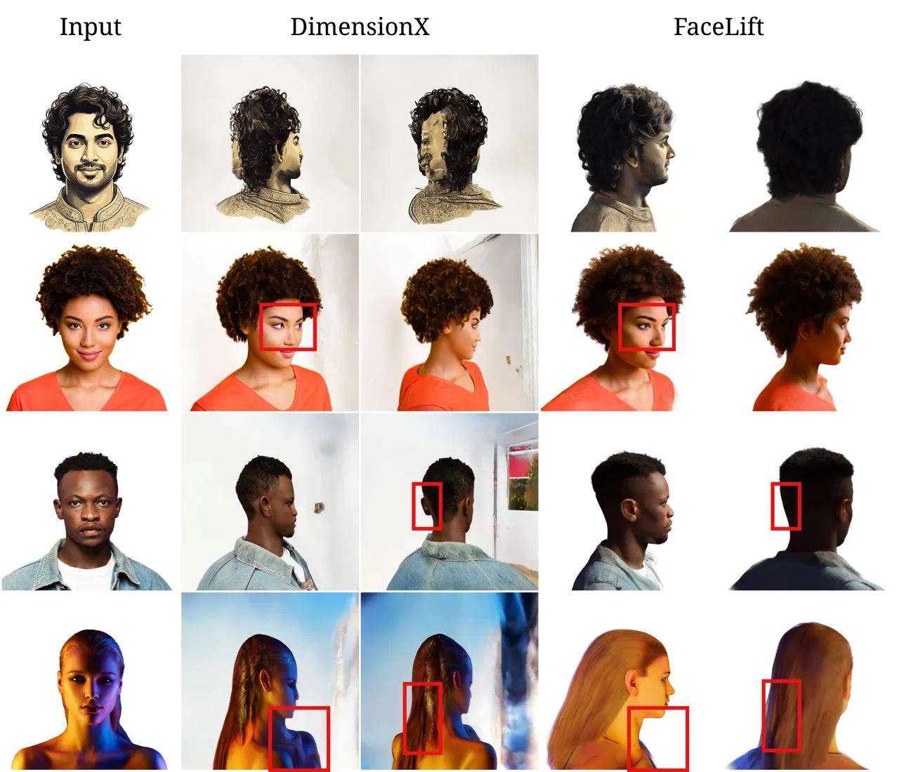

Figure 13: Visual comparison with DimensionX \[55\]. DimensionX
frequently produces inaccuracies in the back of the head and the
shoulder shapes. Other common issues include misaligned ears and eyes
gazing in incorrect directions. Additionally, controlling camera poses
is challenging. In contrast, FaceLift delivers results that are
significantly more consistent across multiple views while enabling the
generation of more visually appealing hair.

We provide additional comparison results on single image to 3D tasks
with a state-of-the-art video diffusion model, DimensionX \[55\].
DimensionX is a framework designed to generate photorealistic 3D and 4D
scenes from a single image with video diffusion. The results are shown
in Fig. 13. As a video diffusion model, DimensionX struggles to produce
multi-view consistent results and lacks a clear spatial understanding of
head shapes. As a result, it often generates eyes gazing in the wrong
direction and ears positioned incorrectly, along with inaccurate
shoulder shapes. In contrast, FaceLift generates highly realistic 3D
human heads while also producing more visually striking hair.

### 3.2 Comparison with Mesh-based Methods

We provide comparison results with mesh-based reconstruction methods
InstantMesh \[70\], Unique3D \[67\], and TRELLIS \[69\] on the Cafca
dataset \[8\]. Quantitative results are shown in Tab. 3, and
quantitative comparisons are shown in Fig. 14. Results show that
mesh-based reconstruction methods fail to provide realistic hair texture
and detailed skin wrinkles. Meanwhile, thanks to the input view
reconstruction strategy, FaceLift achieves superior identity
preservation.

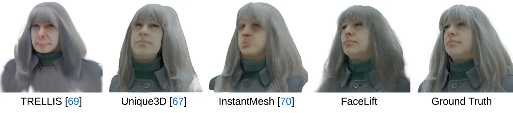

Figure 14: Visual results on Cafca compared with mesh-based
reconstruction methods. Compared to mesh-based reconstruction methods,
our use of pixel-aligned 3D Gaussians offers clear advantages: the
semi-transparent kernels naturally capture complex visual phenomena such
as hair strands and fine wrinkles.

| Method             | PSNR $`\uparrow`$ | SSIM $`\uparrow`$ | LPIPS $`\downarrow`$ | DreamSim $`\downarrow`$ | ArcFace $`\downarrow`$ |
| ------------------ | ----------------- | ----------------- | -------------------- | ----------------------- | ---------------------- |
| TRELLIS \[69\]     | 12.74             | 0.7412            | 0.3746               | 0.2170                  | 0.4001                 |
| Unique3D \[67\]    | 14.27             | 0.7643            | 0.3188               | 0.1277                  | 0.2088                 |
| InstantMesh \[70\] | 16.44             | 0.7815            | 0.2792               | 0.1504                  | 0.2741                 |
| FaceLift           | 16.61             | 0.7968            | 0.2694               | 0.1096                  | 0.1573                 |

Table 3: Quantitative results on Cafca compared with mesh-based
reconstruction methods. FaceLift achieves better quantitative results
with more suitable representations and specialized training data.

### 3.3 Additional Results on In-the-wild Images

We present additional results on in-the-wild images in Fig. 24, Fig. 25
and Fig. 26. FaceLift demonstrates the ability to effectively handle
diverse hairstyles and beards. Notably, it excels at hallucinating
unobservable hairline splits and synthesizing the transparent properties
of hair using Gaussians with low opacity. Our method reconstructs
photo-realistic 3D heads under various lighting conditions and can be
further extended to the reconstruction of cartoon characters.

### 3.4 Additional Ablation Study

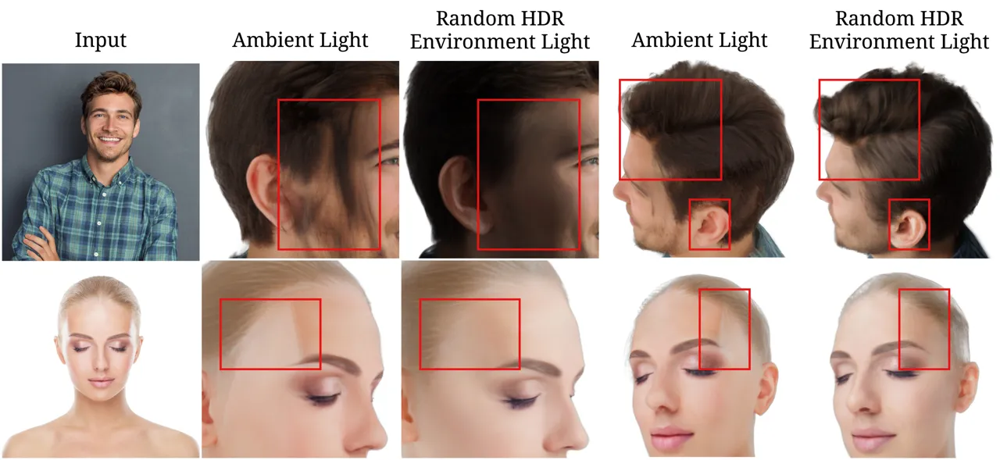

Figure 15: Ablation study on synthetic data lighting condition. Models
trained only with ambient light struggle to handle shadows and strong
lighting.

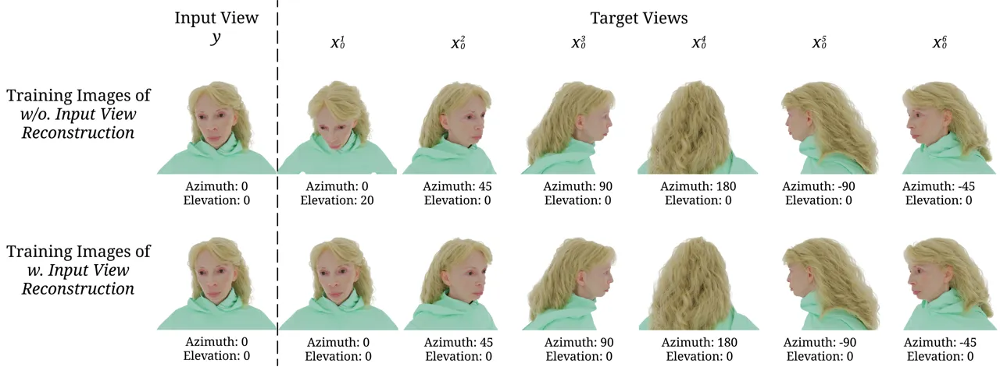

Figure 16: Training images used in the study of input view
reconstruction. We show example images for training baselines w/o. Input
View Reconstruction and w. Input View Reconstruction. The difference
lies in the elevation of the first target image.

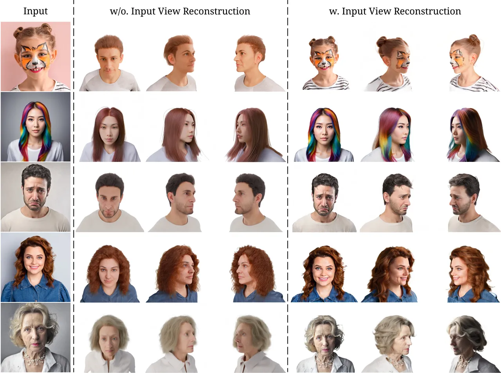

Figure 17: Importance of input view reconstruction. The diffusion model
without input view reconstruction training suffers from identity loss.
Additionally, it fails to generate accurate face paint (row 1), diverse
hair colors (row 2), varied expressions (row 3 and 4), and accessories
(row 5).

Importance of Data with Diverse Lighting. We use synthetic data to train
our models, which offers the advantage of controlling lighting
conditions and rendering head images under various lighting scenarios.
In contrast, real-world human data is typically captured in a studio
with lighting similar to ambient light, as shown in the input of Fig. 2.
To highlight the importance of training models with diverse lighting
conditions, we train FaceLift with (1) Data rendered with only ambient
light, and (2) Data rendered in random HDR environment light. We present
the visual result comparison in Fig. 15. The model trained exclusively
on ambient light data struggles to understand shadows, often generating
hair-like textures on the face. Furthermore, when exposed to strong
light, it produces white regions on the face. In contrast, the model
trained with random HDR environment light generates smooth transitions
between regions with different lighting conditions.

More Results on Input View Reconstruction.

| Baseline                      | PSNR $`\uparrow`$ | SSIM $`\uparrow`$ | LPIPS $`\downarrow`$ | DreamSim $`\downarrow`$ | ArcFace $`\downarrow`$ |
| ----------------------------- | ----------------- | ----------------- | -------------------- | ----------------------- | ---------------------- |
| w/o Input View Reconstruction | 16.02             | 0.7884            | 0.2893               | 0.1438                  | 0.2367                 |
| w/o Multi-view Attention      | 16.29             | 0.7885            | 0.2861               | 0.1552                  | 0.2126                 |
| Full Model                    | 16.61             | 0.7968            | 0.2694               | 0.1096                  | 0.1573                 |

Table 4: Quantitative results of ablation studies. FaceLift achieves
better quantitative results with more suitable representations and
specialized training data.

We show training samples for two baselines w/o. Input View
Reconstruction and w. Input View Reconstruction in Fig. 16. As the
target views are different, baseline w/o. Input View Reconstruction is
trained to generate six images with novel camera poses, while baseline
w. Input View Reconstruction reconstruct the input image and generate
five images with novel poses. Inference results on real world images are
displayed in Fig. 17 to illustrate the importance of reconstructing the
input image during multi-view diffusion training. The results
demonstrate that input view regeneration prevents the model from being
confined to the training data distribution, thereby enhancing its
ability to preserve identity. Quantitative results of baseline w/o.
Input View Reconstruction is shown in Tab. 4.

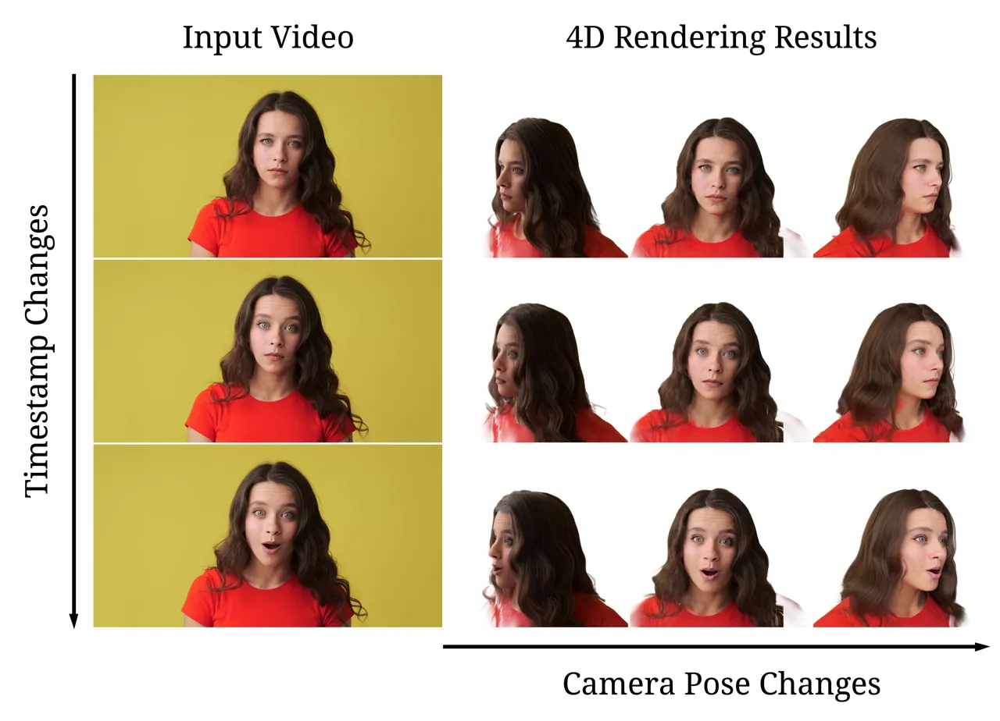

Figure 18: Results of directly applying FaceLift to video input. By
processing each video frame independently, FaceLift generates a sequence
of Gaussians that preserves consistent visual identity and accurately
captures facial expressions. However, this baseline does not consider
temporal consistency.

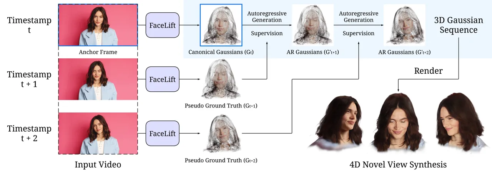

Figure 19: Autoregressive Generation for 4D Rendering. ”AR Gaussians”
denotes autoregressively generated Gaussians. With FaceLift, each video
frame is independently converted into a 3D Gaussian representation. An
anchor frame at timestamp $`t`$ (highlighted by the blue box) produces
Canonical Gaussians $`G_{t}`$, which are then deformed into the
representations for subsequent frames, $`G^{\prime}_{t+1}`$,
$`G^{\prime}_{t+2}`$, …, _etc_. This deformation is supervised by the
rendered output Gaussians $`G_{t+1}`$, $`G_{t+2}`$, …, _etc_., produced
by FaceLift. Iteratively applying this process yields a temporally
consistent Gaussian sequence that supports rendering from any viewpoint.

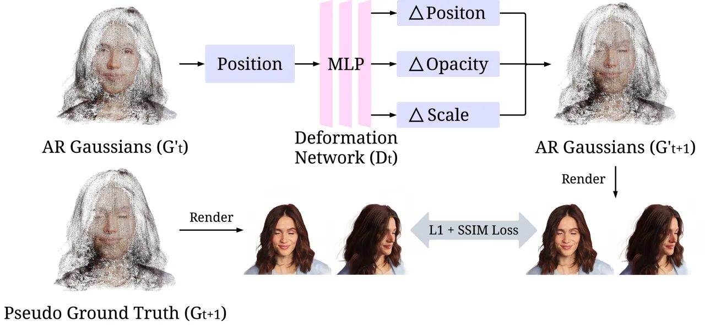

Figure 20: Deformation Network. The deformation network $`D_{t}`$ is an
eight-layer MLP that predicts geometric deformations, including
positional shifts, opacity adjustments, and scale changes. Combined with
the Gaussian representations from the previous frame $`G_{t}^{\prime}`$,
it forms the Gaussian representation for the next frame
$`G_{t+1}^{\prime}`$.

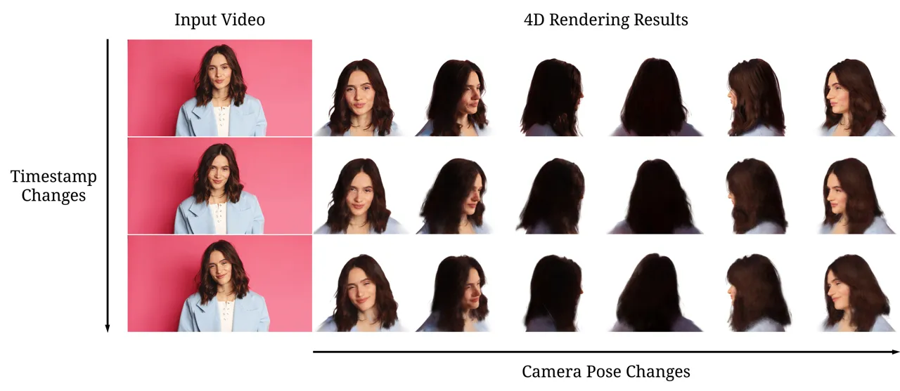

Figure 21: Results of applying FaceLift on video. Our proposed
autoregressive generation pipeline enables FaceLift to be applied
directly to video sequences, achieving 4D novel view synthesis –
rendering at any given timestamp and camera pose. Video results are
shown in the supplementary material.

### 3.5 Applying FaceLift on Videos

FaceLift can be directly applied to video frames and achieve
high-quality facial reconstructions with consistent visual identity and
accurate facial expression, as shown in Fig. 18. However, since FaceLift
is not trained on video data, many full-head details are generated
independently by the diffusion models, resulting in subtle flickering.
In this supplemental document, we introduce a simple yet effective
method that leverages FaceLift and autoregressive training to achieve
high-quality, temporally smooth 4D facial reconstructions.

Given an input video $`\{F_{0},F_{1},\dots F_{T}\}`$, we process each
video frame $`F_{t}`$ sequentially to generate a set of 3D Gaussian
sequences $`\{G_{0},G_{1},\dots G_{T}\}`$, where each $`G_{t}`$
represents the obtained Gaussian representation at timestamp $`t`$. As
each $`G_{t}`$ is generated from frame $`I_{t}`$ without interaction
with other frames, directly rendering from this Gaussian sequence
creates artifacts resulting from time-inconsistency. Hence, we propose
an autoregressive generation pipeline, as shown in Fig. 19.

We first select an anchor frame at timestamp $`t`$ (marked with blue
box), and treat its corresponding 3D Gaussian splats as the canonical
Gaussians $`G_{t}`$ (marked with blue box). Then, for a following
timestamp $`t+1`$, we train a deformation network $`D_{t}`$ to predict
Gaussian splats $`G_{t+1}^{\prime}`$ deformed from $`G_{t}`$ supervised
by rendering results from $`G_{t}`$. The deformation network is an
8-layer MLP, which takes the $`x,y,z`$ position of each Gaussian in
$`G_{t}`$ as input and predicts $`\Delta x`$, $`\Delta y`$,
$`\Delta z`$, opacity change $`\Delta\alpha`$ and scale change
$`\Delta s`$. These deformation parameters are combined with $`G_{t}`$
to generate $`G_{t+1}^{\prime}`$, as shown in Fig. 20.

To train the deformation network, we render six views with the same
camera poses as the multi-view diffusion outputs from
$`G_{t+1}^{\prime}`$, and the renderings of the same camera poses from
$`G_{t+1}`$ are used as pseudo ground truth supervision. Then we treat
$`G_{t+1}^{\prime}`$ as the initial Gaussians and train deformation
network $`D_{t+1}`$ to generate $`G_{t+2}^{\prime}`$. Iteratively, we
will get a Gaussian sequence
$`\{G_{0}^{\prime},G_{1}^{\prime},\dots,G_{T}^{\prime}\}`$. Given any
timestamp, we can select the corresponding 3D Gaussians from this
Gaussian sequence and render from any given pose. The results of this
method are shown in Fig. 21, which demonstrate improved temporal
consistency while preserving identity and achieving accurate expression
modeling. Please refer to the supplementary video for additional video
rendering results.

## 4 Method Details

### 4.1 Details on View Generation

Given a single near frontal view face image with azimuth $`\alpha`$, the
multi-view diffusion model will generate six views with azimuths equal
to {$`\alpha`$, $`\alpha\pm 45^{\circ}`$, $`\alpha\pm 90^{\circ}`$,
$`\alpha+180^{\circ}`$}, covering 360 degrees of the human head. All
images, both input and generated output, maintain a zero elevation
angle, ensuring consistent horizontal viewpoints. The generated views
consist of: a reconstructed front view matching the input image; left
and right profiles capturing the sides of the head; and a back view that
synthesizes hair structure and color based on the frontal input and
learned priors. We also generate three-quarter views (left-front and
right-front) to enhance facial details in the following reconstruction
stage.

To generate unseen views of the human head, we reformulate view
synthesis from a single image as a conditional diffusion process.
Specifically, we employ a DDPM-based diffusion model $`f_{D}`$ to
generate $`N`$ distinct views, denoted
$`X_{0}^{1},X_{0}^{2},\dots,X_{0}^{N}`$, from a single front-facing
image $`y`$ and corresponding text embeddings
$`e^{1},e^{2},\dots,e^{N}`$. This process can be expressed as:

```math
\{X_{0}^{1},X_{0}^{2},\dots,X_{0}^{N}\}=f_{D}\Bigl(y,\{e^{1},e^{2},\dots,e^{N}\}\Bigr). \tag{5}
```

Our objective is to learn the joint distribution of these views
conditioned on the input image and text embeddings. We denote this joint
distribution as:

```math
p_{\theta}(x_{0}^{1:N}\mid y,e^{1:N})\equiv p_{\theta}\Bigl(\{x_{0}^{1},\dots,x_{0}^{N}\}\mid y,\{e^{1},\dots,e^{N}\}\Bigr). \tag{6}
```

In the following discussion, we omit the condition $`y`$ and
$`e^{1},e^{2},\dots,e^{N}`$ for simplicity. The joint distribution as
$`p_{\theta}(x_{0}^{1:N})`$ is characterized by a Markov Chain (reverse
process):

```math
\displaystyle p_{\theta}(x_{0:T}^{1:N}) \displaystyle=p_{\theta}(x_{T}^{1:N})\prod_{t=1}^{T}p_{\theta}\bigl(x_{t-1}^{1:N}\mid x_{t}^{1:N}\bigr) \tag{7}
```

```math
\displaystyle=p_{\theta}(x_{T}^{1:N})\prod_{t=1}^{T}\prod_{n=1}^{N}p_{\theta}\bigl(x_{t-1}^{n}\mid x_{t}^{1:N}\bigr),
```

where
$`p_{\theta}(x_{T}^{1:N})=\mathcal{N}(x_{T}^{1:N};\textsc{0},\textsc{I})`$
and
$`p_{\theta}(x_{t-1}^{n}\mid x_{t}^{1:N})=N(x_{T}^{n};\mu_{\theta}^{n}(x_{t}^{1:N},t),\sigma_{t}^{2}\textsc{I})`$.
$`\mu_{\theta}(x_{t}^{1:N},t)`$ is a trainable component while the
variance $`\sigma_{t}^{2}`$ is untrained time-dependent constants. To
learn $`\mu_{\theta}`$ for generation, a Markov chain called forward
process is constructed as:

```math
\displaystyle q\bigl(x_{1:T}^{1:N}\mid x_{0}^{1:N}\bigr) \displaystyle=\prod_{t=1}^{T}q\bigl(x_{t}^{1:N}\mid x_{t-1}^{1:N}\bigr) \tag{8}
```

```math
\displaystyle=\prod_{t=1}^{T}\prod_{n=1}^{N}q\bigl(x_{t}^{n}\mid x_{t-1}^{n}\bigr),
```

where
$`q\bigl(x_{t}^{n}\mid x_{t-1}^{n}\bigr)\;=\;\mathcal{N}\bigl(x_{t}^{n};\sqrt{1-\beta_{t}}\,x_{t-1}^{n},\,\beta_{t}\mathbf{I}\bigr),`$
and $`\beta_{t}`$ are constants. DDPM \[22\] shows that by defining

```math
\mu_{\theta}^{n}(x_{t}^{1:N},t)=\frac{1}{\sqrt{\alpha_{t}}}\left(x_{t}^{n}-\frac{\beta_{t}}{\sqrt{1-\bar{\alpha}_{t}}}\,\epsilon_{\theta}\bigl(x_{t}^{1:N},t\bigr)\right). \tag{9}
```

$`\alpha_{t}`$ and $`\bar{\alpha}_{t}`$ are constants derived from
$`\beta_{t}`$ and $`\epsilon_{\theta}`$ is a noise predictor. We learn
$`\epsilon_{\theta}`$ by

```math
\ell\;=\;\mathbb{E}_{t,x_{0}^{1:N},n,\epsilon^{1:N}}\bigl[\|\epsilon^{n}\;-\;\epsilon_{\theta}^{n}(x_{t}^{1:N},\,t)\|_{2}\bigr], \tag{10}
```

where $`\epsilon^{1:N}`$ is the Gaussian noise of size
$`N\!\times\!H\!\times\!W`$ added to all $`N`$ views, and
$`\epsilon_{\theta}^{n}`$ is the noise predictor on the $`n_{th}`$ view.
We provide ablation study results of the multi-view attention mechanism
in Tab. 4.

## 5 Experimental Details

### 5.1 Details on Benchmark Evaluation

Test Camera Extrinsic. Both the Cafca \[8\] and Ava-256 \[39\] datasets
offer multi-view RGB images along with corresponding camera poses.
However, their camera systems differ from those used in FaceLift and the
baselines. Directly applying their camera poses for inference is
infeasible. Hence, we recalculate the test camera extrinsic in each
method’s camera system with the following procedure. The Ava-256 dataset
uses a world coordinate system with the origin set at one of the camera
positions. We first re-center the world coordinate origin to the
midpoint of all camera locations, which is approximately the center of
the human head. This step is unnecessary for the Cafca dataset, as its
world coordinate origin is defined as the head’s center. Next, we
compute the rotation transformation from the test camera pose to the
input camera pose within the dataset’s coordinate system. We then apply
the same transformation to the input camera pose in each method’s camera
system and rescale the translation to match the settings of each method
to get the test camera extrinsic under each method’s camera system.
After applying the camera pose transformation, perfect alignment is not
achieved due to differences in camera distance and intrinsic parameters.
To address this, we manually crop and scale the rendered images for
closer alignment with the target images.

Facial Landmark Alignment. To align two images based on their facial
landmarks, we first compute the geometric transformations—scale and
translation—that align the landmarks of one image with the landmarks of
the other. Given an input image $`I_{1}`$ and two sets of corresponding
facial landmarks $`L_{1}`$ and $`L_{2}`$, we begin by calculating the
centroids of the landmark sets, centering the landmarks around their
respective centroids. Next, we compute the uniform scaling factor and
translation vector that minimize the difference between the centered
landmarks. These transformations are then applied to the input image
$`I_{1}`$, producing the transformed image $`I_{t}`$ in which the facial
landmarks are aligned with those of $`L_{2}`$. This process is
illustrated in Algorithm 1.

Input: Image $`I_{1}`$, Landmarks $`L_{1}`$, $`L_{2}`$

Output: Transformed image $`I_{t}`$

1 Function _GetTransformFromLandmarks(_$`L_{1}`$, $`L_{2}`$_)_:

    2 Compute centroids $`C_{1},C_{2}`$ of $`L_{1},L_{2}`$;

    3 Center landmarks: $`L^{\prime}_{1}\leftarrow L_{1}-C_{1}`$,
$`L^{\prime}_{2}\leftarrow L_{2}-C_{2}`$;

    4 Compute scale:
$`s\leftarrow\frac{\sum(L^{\prime}_{1}\cdot L^{\prime}_{2})}{\sum(L^{\prime}_{1}\cdot L^{\prime}_{1})}`$;

    5 Compute translation: $`t\leftarrow C_{2}-s\cdot C_{1}`$;

    6 return _$`s,t`$_;

7 Function _ApplyTransformToImage(_$`I,s,t`$_)_:

    8 Create transformation matrix $`M`$;

    9 Transform image: $`I_{t}\leftarrow\text{warpAffine}(I,M)`$;

    10 return _$`I_{t}`$_;

11 Function _TransformImageWithLandmarks(_$`I_{1},L_{1},L_{2}`$_)_:

    12 Compute
$`s,t\leftarrow\textnormal{{GetTransformFromLandmarks}}(L_{1},L_{2})`$;

    13 Transform image:
$`I_{t}\leftarrow\textnormal{{ApplyTransformToImage}}(I_{1},s,t)`$;

    14 return _$`I_{t}`$_;

Algorithm 1 Image Alignment via Facial Landmarks

### 5.2 Implementation Details

Multi-view Diffusion. Our multi-view diffusion model is built based on
the open-source latent diffusion framework, Stable Diffusion V2-1-unCLIP
model \[49\]. The model is trained on eight A100 GPUs (each with 80 GB
of memory) using a batch size of 64 over 20,000 steps, with a learning
rate of 1e-4. For classifier-free guidance (CFG) \[21\], the CLIP
condition was randomly omitted at a rate of 0.05 during training. During
inference, we utilized the DDIM sampler \[54\] with 50 steps and a
guidance scale of 3.0 to generate multi-view images. Both the input and
output images have a resolution of 512$`\times`$512.

Transformer-based Gaussian Reconstructor. The training of the
reconstructor follows \[74\]. During each training step, we randomly
sample a set of 8 images (4 as input views and 4 as supervision views)
from either 32 ambient light renderings or 25 random HDR environment
light renderings. Both input and output images are rendered at a
resolution of 512×512. The model is fine-tuned for 20,000 steps using
eight A100 GPUs, each equipped with 40 GB of memory.

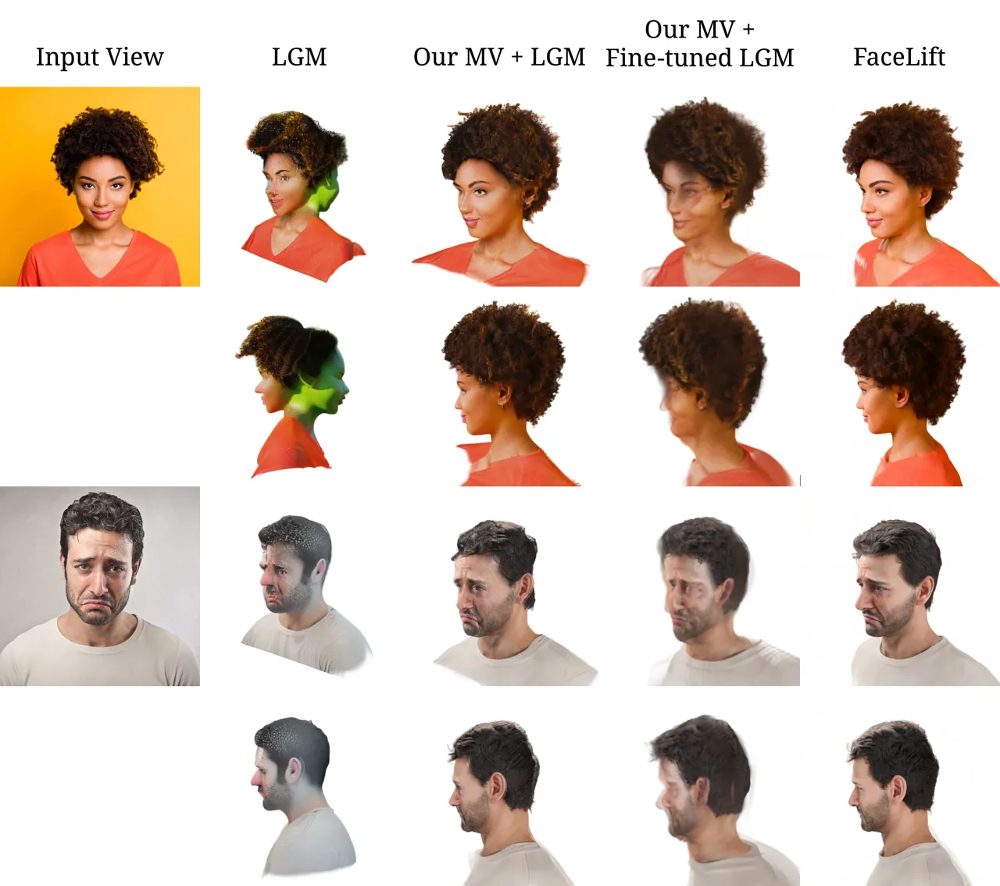

Figure 22: Visual Comparison with LGM. Leveraging the outputs of our
multi-view diffusion model enhances the performance of LGM \[56\]
(denoted as Our MV + LGM). We further fine-tuned LGM using our synthetic
human head data, resulting in Our MV + Fine-tuned LGM; however, its
performance was inferior to that achieved with the original weights in
Our MV + LGM.

For a fair comparison, we also fine-tune LGM \[56\] with our synthetic
data with their provided training codes. However, the fine-tuned LGM
achieves inferior performance than the original weights, as shown in
Fig. 22.

### 5.3 Datasets

Cafca Dataset. The Cafca dataset \[8\] comprises 1,500 identities, 30
camera poses, 13 expressions, and three environments. From this, we
select 40 identities, as detailed in Tab. 5. We utilize the first
expression and the first environment (folder 00000_000) for each
identity. The input view and test views corresponding to each identity
are also specified in Tab. 5.

Ava-256 Dataset. The Ava-256 dataset \[39\] consists of 256 identities,
each captured by 80 cameras, with over 5,000 frames per camera. For
qualitative evaluation, we select 10 identities, each with 10 test
camera views. All selected frames feature natural expressions. We use
camera 401168 as the input view, as it captures the front view of the
faces and is positioned at the center of Ava-256’s world coordinate
system. The input view, test view, and corresponding frame IDs are
detailed in Tab. 6.

## 6 Limitations

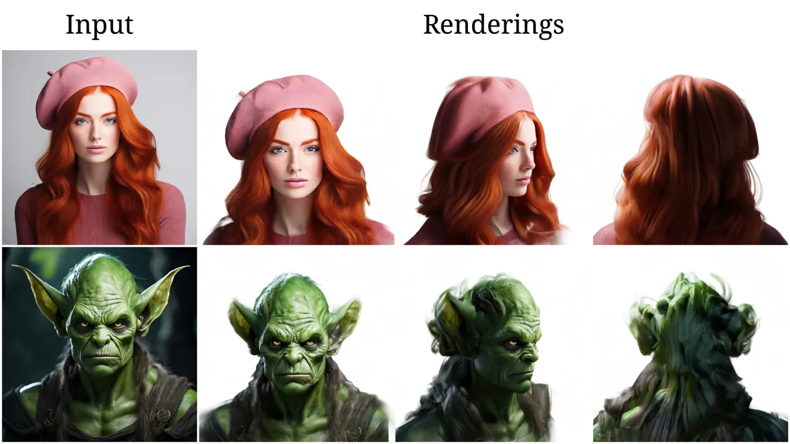

Figure 23: Limitation of FaceLift. Due to the absence of accessories in
the training data, our method often generates hair-like textures to
approximate hats. Additionally, it occasionally produces extraneous hair
when encountering out-of-distribution images.

FaceLift achieves high-fidelity, photorealistic 3D head reconstruction
from a single input image. It provides detailed representations of hair
and skin texture while demonstrating superior identity preservation
compared to existing methods. Despite these appealing results, our
approach has certain limitations. First, our synthetic dataset does not
include accessories such as hats or glasses. As a result, when the input
image features a hat, the model may generate hair-like textures to
approximate the back of the hat, as illustrated in Fig. 23, row 1. This
limitation could be addressed by incorporating synthetic data with
accessories. Additionally, when handling out-of-distribution inputs,
such as those in Fig. 23, row 2, the model occasionally generates
extraneous hair. This issue might be mitigated by refining the training
data distribution or introducing text prompts to enhance control over
the multi-view diffusion generation process. Finally, in some cases, the
unseen regions of the face appear more blurred than the visible areas
(frontal face). Our system emphasizes detailed reconstruction of the
front face: most views generated by the diffusion model concentrate on
the frontal region, and the input-view reconstruction strategy
faithfully preserves its features. In contrast, features of the back of
the head are primarily learned from synthetic data. Additionally, when
simulating lighting, the model tends to darken the back head and
introduce shadows, often causing the hair to appear black.

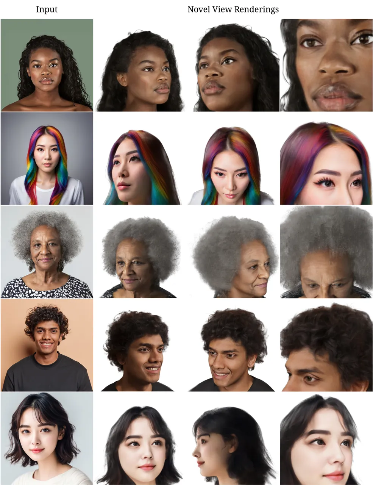

Figure 24: Results of FaceLift on in-the-wild images. FaceLift excels at
reconstructing intricate and diverse facial hair, encompassing a wide
array of hairstyles and hair colors. It also accurately captures a broad
range of skin tones.

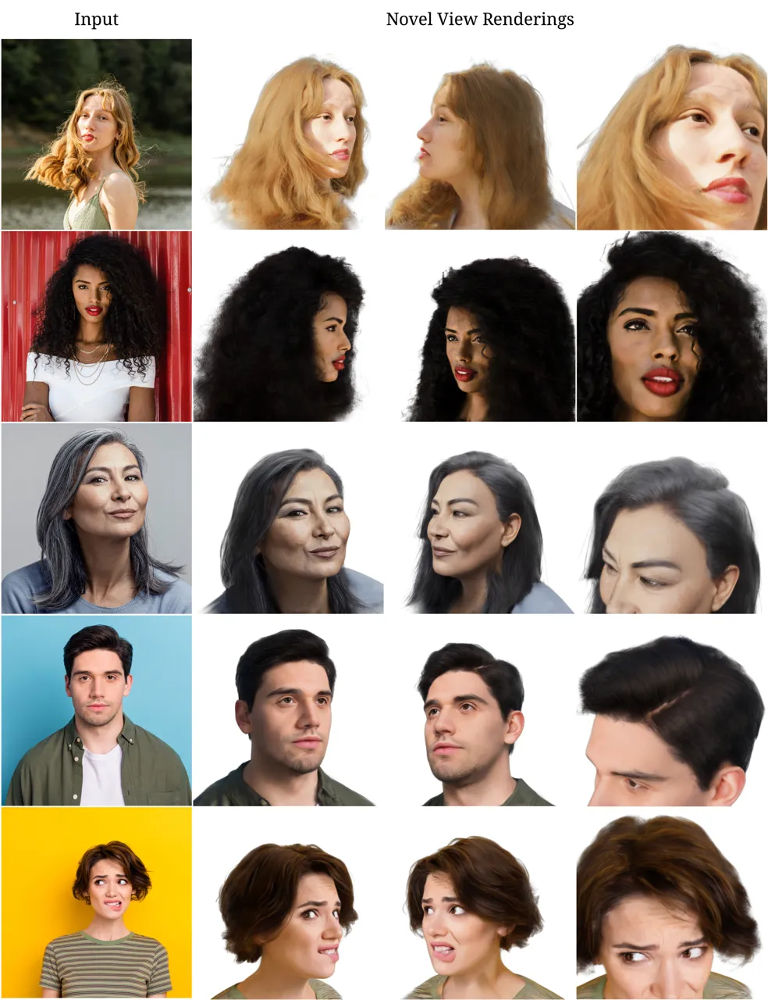

Figure 25: Results of FaceLift on in-the-wild images. FaceLift also
demonstrates the ability to reconstruct faces exhibiting a wide range of
pose variations. It can also accurately handle extreme expressions.

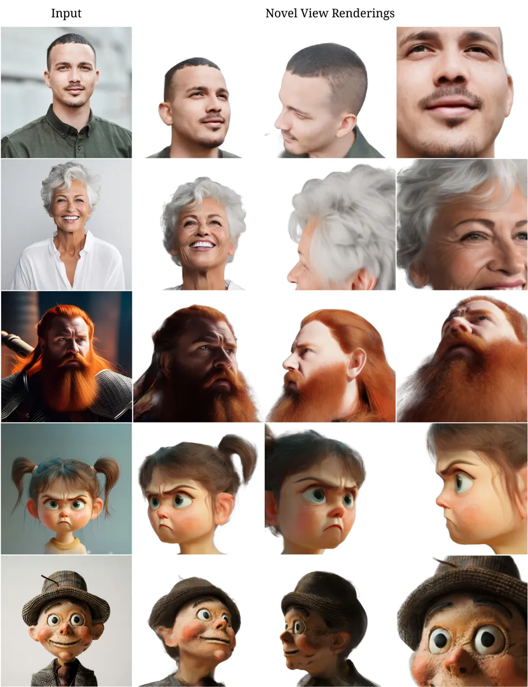

Figure 26: Results of FaceLift on in-the-wild images. FaceLift
realistically reconstructs detailed facial textures. Additionally,
FaceLift is well-suited for reconstructing cartoon characters.

| ID    | Input View | Test Views                                               |
| ----- | ---------- | -------------------------------------------------------- |
| 00000 | 26         | 00 02 06 08 10 11 12 13 17 19 20 23 24 26                |
| 00002 | 12         | 00 03 04 05 06 07 08 09 12 13 15 17 21 22 23 24 25       |
| 00004 | 07         | 03 04 07 09 10 11 18 19 23 24 25 26 27 29                |
| 00005 | 15         | 01 02 06 07 08 10 11 13 15 18 19 20 21 23 26 27 28       |
| 00006 | 27         | 00 02 10 19 20 23 27                                     |
| 00007 | 09         | 03 04 09 11 13 15 16 17 19 21 24 26 28                   |
| 00010 | 24         | 02 04 08 10 12 13 14 15 17 21 22 23 24 25 26 27 28 29    |
| 00011 | 07         | 02 05 07 09 11 12 14 16 24 27 29                         |
| 00014 | 03         | 02 03 06 12 14 17 22 23 25 28 29                         |
| 00015 | 22         | 00 02 04 06 09 12 14 15 20 22 24 27 28                   |
| 00017 | 12         | 01 02 07 12 14 15 16 17 20 22 23 24 25 26                |
| 00018 | 08         | 00 02 06 08 09 13 16 18 20 25 26                         |
| 00019 | 14         | 00 04 05 06 10 12 13 14 16 17 18 20 21 22 26 28          |
| 00020 | 01         | 00 01 03 04 06 07 10 14 16 17 19 22 23 25 26 27 29       |
| 00021 | 11         | 02 03 05 07 08 09 11 14 15 17 19 21 22 23 26             |
| 00022 | 18         | 00 01 03 07 08 09 11 12 17 18 19 21 22 24 26 28          |
| 00023 | 03         | 00 03 05 06 08 12 14 18 24 25 27                         |
| 00028 | 18         | 04 05 06 10 12 13 16 18 19 22 24 25 28 29                |
| 00030 | 21         | 00 01 02 03 06 07 08 11 14 17 19 21 22 24 26             |
| 00033 | 03         | 00 03 06 11 12 13 15 19 21 22 24 27 28                   |
| 00034 | 10         | 01 06 07 09 10 13 15 16 17 18 19 23 25 28                |
| 00048 | 04         | 00 01 02 04 05 06 07 10 12 15 20 23 24 25 27 28          |
| 00051 | 26         | 03 07 10 11 15 17 19 21 22 24 26 28 29                   |
| 00056 | 07         | 00 01 02 07 08 12 14 15 17 18 20 21 22 23 24 25 28 29    |
| 00057 | 11         | 00 01 02 03 05 06 08 11 12 14 17 18 19 22 26 29          |
| 00063 | 01         | 01 02 05 08 09 11 13 14 16 17 18 20 22 25 26 28 29       |
| 00066 | 13         | 01 05 06 07 12 13 21 22 26 27                            |
| 00068 | 12         | 00 01 06 10 12 14 16 19 21 22 25 26 27                   |
| 00072 | 25         | 02 04 05 10 12 13 14 17 25 26                            |
| 00078 | 20         | 00 02 03 05 06 07 08 12 13 14 15 16 17 18 20 24 25 28 29 |
| 00080 | 08         | 01 03 04 05 06 08 10 12 14 15 16 17 22 24 26             |
| 00082 | 16         | 05 06 07 09 13 16 17 19 20 23 25 27                      |
| 00083 | 16         | 00 02 03 04 05 08 09 13 14 16 17 19 21 22 24 25 27 29    |
| 00084 | 01         | 02 04 08 09 11 12 14 16 17 18 19 23 28 29                |
| 00086 | 13         | 00 01 03 04 08 09 13 14 17 18 19 20 22 23 24             |
| 00087 | 01         | 00 01 02 04 07 08 09 12 15 16 17 18 21 24 26 27          |
| 00094 | 08         | 02 05 08 09 12 19 24 25 27                               |
| 00095 | 08         | 00 01 03 04 08 09 10 11 13 14 18 19 20 21 24 28 29       |
| 00096 | 01         | 01 05 07 10 12 17 19 21 22 28                            |
| 00099 | 00         | 00 02 03 04 05 07 08 09 12 14 15 16 17 20 21 23 25 29    |

Table 5: Identities and views used for the experiment on Cafca.

| ID                   | Frame ID | Input View | Test Views           |
| -------------------- | -------- | ---------- | -------------------- |
| 20210810–1306–FXN596 | 029693   | 401168     | 400944 400981 401031 |
|                      |          |            | 401075 401163 401175 |
|                      |          |            | 401292 401303 401316 |
|                      |          |            | 401463               |
| 20210827–0906–KDA058 | 028930   | 401168     | 400944 401031 401071 |
|                      |          |            | 401163 401166 401292 |
|                      |          |            | 401316 401408 401410 |
|                      |          |            | 401458               |
| 20210901–0833–LAS440 | 027655   | 401168     | 400944 401031 401161 |
|                      |          |            | 401163 401172 401292 |
|                      |          |            | 401303 401316 401410 |
|                      |          |            | 401458               |
| 20210929–0827–MCR809 | 029457   | 401168     | 400981 401070 401158 |
|                      |          |            | 401166 401173 401305 |
|                      |          |            | 401313 401408 401410 |
|                      |          |            | 401458               |
| 20211001–0855–KJJ701 | 032309   | 401168     | 400939 401031 401163 |
|                      |          |            | 401166 401292 401316 |
|                      |          |            | 401408 401410 401452 |
|                      |          |            | 401458               |
| 20220215–0801–ONK705 | 027201   | 401168     | 400944 401031 401045 |
|                      |          |            | 401163 401166 401172 |
|                      |          |            | 401408 401410 401463 |
|                      |          |            | 401469               |
| 20220310–1128–ZSC414 | 028601   | 401168     | 400942 401031 401045 |
|                      |          |            | 401163 401164 401166 |
|                      |          |            | 401303 401408 401410 |
|                      |          |            | 401411               |
| 20220712–1040–JEH262 | 030060   | 401168     | 400944 400981 401031 |
|                      |          |            | 401045 401163 401408 |
|                      |          |            | 401410 401452 401458 |
|                      |          |            | 401469               |
| 20220809–1321–UTC375 | 027432   | 401168     | 401031 401071 401163 |
|                      |          |            | 401166 401175 401292 |
|                      |          |            | 401303 401452 401458 |
|                      |          |            | 401469               |
| 20220818–1653–SSF476 | 036588   | 401168     | 400981 401031 401071 |
|                      |          |            | 401163 401166 401175 |
|                      |          |            | 401408 401410 401458 |
|                      |          |            | 401469               |

Table 6: Identities and views used for the experiments on Ava-256.
