# MoEE: Mixture of Emotion Experts for Audio-Driven Portrait Animation

Huaize Liu Affiliation: Zhejiang Lab Affiliation: Li Auto
Affiliation: Hangzhou Institute for Advanced Study, University of
Chinese Academy of Sciences    Wenzhang Sun Affiliation: Li Auto   
Donglin Di Affiliation: Li Auto    Shibo Sun Affiliation: Harbin
Institute of Technology    Jiahui Yang Affiliation: Harbin Institute of
Technology    Changqing Zou Affiliation: Zhejiang Lab
Affiliation: Zhejiang University    Hujun Bao

###### Abstract

The generation of talking avatars has achieved significant advancements
in precise audio synchronization. However, crafting lifelike talking
head videos requires capturing a broad spectrum of emotions and subtle
facial expressions. Current methods face fundamental challenges: a) the
absence of frameworks for modeling single basic emotional expressions,
which restricts the generation of complex emotions such as compound
emotions; b) the lack of comprehensive datasets rich in human emotional
expressions, which limits the potential of models. To address these
challenges, we propose the following innovations: 1) the Mixture of
Emotion Experts (MoEE) model, which decouples six fundamental emotions
to enable the precise synthesis of both singular and compound emotional
states; 2) the DH-FaceEmoVid-150 dataset, specifically curated to
include six prevalent human emotional expressions as well as four types
of compound emotions, thereby expanding the training potential of
emotion-driven models. Furthermore, to enhance the flexibility of
emotion control, we propose an emotion-to-latents module that leverages
multimodal inputs, aligning diverse control signals—such as audio, text,
and labels—to ensure more varied control inputs as well as the ability
to control emotions using audio alone. Through extensive quantitative
and qualitative evaluations, we demonstrate that the MoEE framework, in
conjunction with the DH-FaceEmoVid-150 dataset, excels in generating
complex emotional expressions and nuanced facial details, setting a new
benchmark in the field. These datasets will be publicly released.

²²footnotetext: Corresponding author.

## 1 Introduction

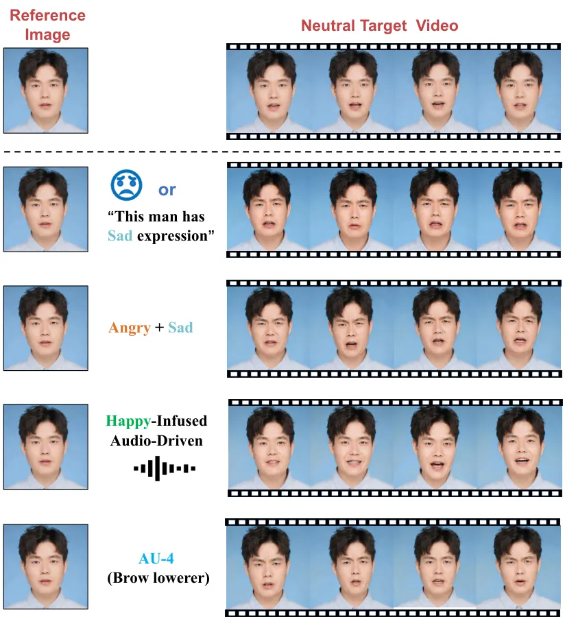

Figure 1: MoEE enables more natural and vivid basic emotion control and
compound emotion control, through labels or text prompts in the
generated talking face. It can also achieve emotion control based solely
on audio with emotional cues. Beyond coarse-grained emotion control
(_e.g_., audio, label and text prompt), our method allows for
fine-grained expression control through AU labels.

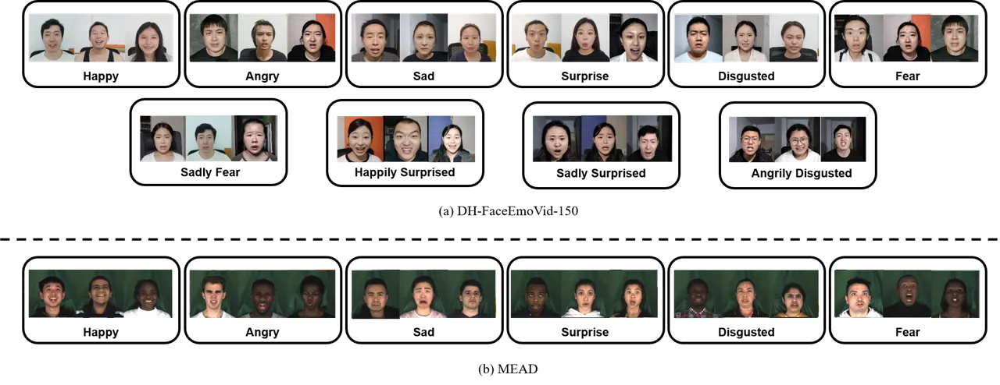

Figure 2: Showcase of publicly available datasets and our proposed
datasets: We refer to datasets like (a) DH-FaceEmoVid-150 and (b) MEAD
as emotion datasets.

In recent years, audio-driven avatar generation has achieved significant
advancements in precise audio synchronization \[3, 15, 42, 43, 48, 38,
17, 44\]. However, creating realistic conversational videos requires
more than just audio synchronization; it also demands the capture of a
wide range of emotions and subtle facial expressions. Research in this
area holds valuable applications not only in the entertainment industry
but also in fields such as remote communication, virtual assistants, and
mental health, showcasing considerable potential.

Previous studies attempt to integrate emotional and expressive
information through labels, text, or videos \[35, 21, 8, 41, 22, 37,
46\]. While these approaches can control basic emotions, they lack
naturalness in generating single emotions and diversity in generating
complex compound emotions. The fundamental limitations are twofold:
first, the absence of precise frameworks for modeling basic emotions
hinders accurate synthesis of complex emotional states. Second, the lack
of comprehensive datasets rich in diverse human emotional expressions
significantly limits the potential of these models to produce varied
emotional outputs.

To address these issues, we draw inspiration from mixture of experts and
propose the Mixture of Emotion Experts (MoEE) model. This model
decouples six basic emotions, enabling precise synthesis of both
singular and compound emotional states. To push the performance
boundaries of MoEE, we curate the DH-FaceEmoVid-150 dataset, comprising
150 hours of video content featuring six basic and four compound
emotions. Initially, we fine-tune a referenceNet \[13, 43\] and a
denoising unet \[29, 12\] on the entire dataset. We then train six
emotion expert networks with single emotion data for precise modeling,
and a gating network with compound emotion data to synthesize complex
expressions. This approach significantly boosts the generative quality
and generalization ability of the MoEE model.

Furthermore, we design an emotion-to-latents module that aligns
multimodal inputs (_i.e_., audio, text, labels, as illustrated in
Figure 1) into a latent space using adaptive attention. Extensive
quantitative and qualitative evaluations demonstrate that the MoEE
framework, in conjunction with the DH-FaceEmoVid-150 dataset, excels in
generating both singular and complex emotional expressions with nuanced
facial details. Our contributions are as follows:

- •
  We present the Mixture of Emotion Experts (MoEE) model focused on
  facial emotional expression in audio-driven portrait animation. MoEE
  achieves lifelike generation quality for both singular and compound
  emotions with strong generalization ability.
- •
  We introduce the DH-FaceEmoVid-150 dataset, a high-resolution (1080p)
  collection specifically for human facial emotional expressions. It
  comprises six basic and four compound emotions, providing multimodal
  information such as AU labels, text descriptions, and emotion
  categories for each video.
- •
  We develop a module that aligns multimodal inputs to unify coarse and
  fine-grained control signals, allowing flexible and controllable
  generation of detailed expressions in conjunction with MoEE.
- •
  Extensive experiments validate the superiority of our dataset and MoEE
  model architecture, achieving state-of-the-art emotional expression in
  audio-driven portrait animation.

## 2 Related Work

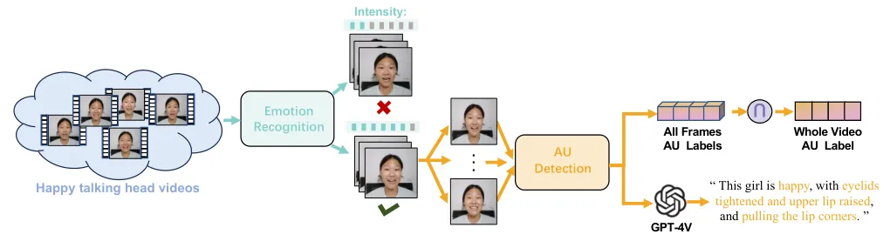

Figure 3: First, we filter the emotion dataset based on emotion
intensity. Then, to achieve fine-grained control, we extract the AUs and
prompt GPT-4V to paraphrase them into a sentence.

Audio-driven Talking Head Generation Significant progress has been made
in audio-driven talking head generation and portrait image animation,
emphasizing realism and synchronization with audio inputs \[3, 35, 38,
31, 34, 10, 5\]. Notably, Wav2Lip \[27\] excels at overlaying
synthesized lip movements onto existing video content, though its
outputs can sometimes show realism issues, such as blurring or
distortion in the lower facial region. Recent advancements have pivoted
towards image-based methodologies, undergirded by diffusion models, to
mitigate the limitations of video-centric approaches and enhance the
realism and expressiveness of synthesized animations. Subsequent methods
like SadTalker \[48\] and VividTalk \[35\] incorporated 3D motion
modeling and head pose generation to enhance expressiveness and temporal
synchronization. AniPortrait \[42\], EchoMimic \[3\], Hallo \[43\] and
Loopy \[15\] have contributed to enhanced capabilities, focusing on
expressiveness, realism, and identity preservation.

Emotion Editing in Talking Head Videos Acknowledging the limitations of
previous efforts, which often produce emotionless avatars, there is a
growing interest in integrating emotions into talking face generation
\[26, 16, 36, 45\]. For example, EAT \[8\] employs a mapping network to
derive emotional guidance from latent codes, where EAMM \[14\]
characterizes the facial dynamics of reference emotional videos as
displacements in motion representations. Similarly, StyleTalk \[21\]
develops a style encoder to capture the style of a reference video.
However, these methods either support a limited range of individual
emotion types or require users to find another video with the desired
style, thereby restricting the flexibility and controllability of the
generated avatars. Recently, some efforts have focused on using text as
an emotion control signal, such as InstructAvatar \[41\]. Nevertheless,
these methods rely solely on text descriptions for emotion control,
which limits the diversity of control conditions. In contrast, our
approach combines advancements in model architecture and dataset design
to enable vivid and natural emotion and expression control under
multimodal conditions, achieving greater flexibility and expressiveness.

## 3 Data Collection and Filteration

Talking head generation model is naturally scalable for large datasets,
but it also requires high-quality data as it learns from data
distribution. We have assembled our dataset from a variety of sources.
Some open-source emotion datasets, like MEAD \[39\], have limitations,
such as small dataset sizes and a restricted range of emotion
categories. To fill the gaps in existing datasets, we have additionally
collected a new emotional dataset: DH-FaceEmoVid-150, which focuses on
basic emotions and compound emotions. As shown in the Figure 2, the
entire dataset comprises six basic emotions: angry, disgusted, fear,
happy, sad, surprised. In addition, the dataset includes four compound
emotions: angrily disgusted, sadly surprised, sadly fear, happily
surprised. The total duration of the dataset is 150 hours, featuring 80
actors, with a resolution of no less than 1080×1080. The overview of all
the dataset statistics this model used is demonstrated in Tab. 1.
Additional visualizations of the dataset can be found in Appendix D

On this basis, to improve the quality of the dataset, we filtered the
dataset based on emotion intensity, extracted the corresponding AU
(Action Unit) labels for each video, and generated fine-grained text
instructions for each video. As shown in Figure 3, we used LibreFace
\[2\] for emotion recognition to filter out videos with ambiguous
emotions. We found that existing emotional talking head datasets
typically provide only tag-level annotations with limited emotion
categories (_e.g_., “happy” or “sad”) for talking videos, so we obtained
fine-grained AU labels and natural text instructions through Action Unit
Extraction and VLM Paraphrase. Action Units (AUs) are defined by Facial
Action Coding System (FACS) \[7\] and are used to describe facial muscle
movements. We extracted AU labels for each frame and the corresponding
action descriptions using the ME-GraphAU model \[20\]. Then, we randomly
selected 5 frames from a video, input the action descriptions and frames
images into the GPT-4V \[25\], and obtained text instructions for the
entire video.

| Datasets            | IDs | Hours | Single Emotion | Compound Emotion | Text       | AU Label   |
| ------------------- | --- | ----- | -------------- | ---------------- | ---------- | ---------- |
| HDTF \[49\]         | 362 | 16    | $`\times`$     | $`\times`$       | $`\times`$ | $`\times`$ |
| DH-FaceVid-1K \[6\] | 500 | 200   | $`\times`$     | $`\times`$       | $`\times`$ | $`\times`$ |
| Mead \[39\]         | 60  | 40    | ✓              | $`\times`$       | $`\times`$ | $`\times`$ |
| DH-FaceEmoVid-150   | 80  | 150   | ✓              | ✓                | ✓          | ✓          |

Table 1: Statistics of the collected dataset

## 4 Methodology

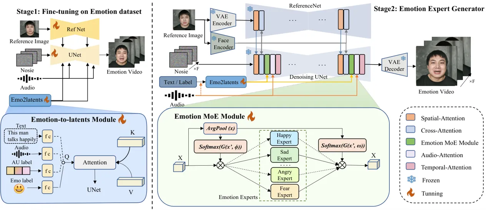

Figure 4: The overall framework of MoEE implements a two-stage training
process. First, we fine-tune the Reference Net and denoising U-Net
modules on emotion datasets to enable the model to learn as much prior
knowledge about expressive faces as possible. Then, we achieve more
natural and accurate emotion and expression control through the Mixture
of Emotion Experts. Additionally, the Emotion-to-Latents module enables
multi-modal emotion control.

In this section, we introduce our MoEE model. In Sec. 4.1, we provide an
overview of the architecture of MoEE. Subsequently, Sec. 4.2 describes
the Mixture of Emotion Expert to achieve diverse emotions control, while
Sec. 4.3 introduce the detail of Emotion-to-latents Module. Finally, in
Sec. 4.4, we demonstrate the training and inference details.

### 4.1 Model Overview

Given one portrait image $`\boldsymbol{I}`$, a sequence of audio clips
$`\boldsymbol{A}=[a_{1},a_{2},...,a_{N}]`$, and the Emotion Condition
$`\boldsymbol{C}`$, our model is tasked with animating the portrait to
utter the audio with the target style represented by the text, audio or
label. Overall, we aim to learn a mapping to generate a video
$`\boldsymbol{V=F(I,A,C)}`$. As illustrated in Figure 4, the backbone of
MoEE is a denoising U-Net \[1\], which denoises the input multi-frame
noisy latent under the conditions. This architecture includes an
additional Reference Net module, which is a Unet-based Stable Diffusion
network with the same number of layers as the denoising model network,
to capture the visual appearance of both the portrait and the associated
background. The input audio embedding is derived from a 12-layer wav2vec
\[30\] network and fed into the Audio Attention Layer to encode the
relationship with the audio. The Temporal Attention layer \[9\] is a
temporal-wise self-attention layer that captures the temporal
relationships between the video frames. Additionally, the denoising
U-Net incorporates an Emotion MoE Module, consisting of six
emotion-specific expert modules, to encode relationships with specific
emotional conditions. In the following sections, we will detail how to
design a mixture of emotion experts module, as well as how to design a
multimodal emotion condition module.

### 4.2 Mixture of Emotion Experts

To address the factors contributing to the poor performance of emotion
generation, we propose constructing a Mixture of Experts (MoE) module.
This module consists of emotion experts, each specializing in a single
emotion. We focus on six basic emotions: happiness, sadness, anger,
disgust, fear, and surprise, training an expert model for each. This is
achieved by training six cross-attention modules on well-structured,
single-emotion datasets. During the training of each expert, the latent
noise bypasses the other modules, whose parameters remain fixed. The
cross attention operation is formulated as:

```math
CrossAttn(Z_{t},C)=\operatorname{softmax}(QK^{T}/{\sqrt{d}})V \tag{1}
```

where $`Q=W_{Q}Z_{t}`$, $`K=W_{K}C`$ and $`V=W_{V}C`$ are the queries;
$`W_{Q}`$, $`W_{K}`$ and $`W_{V}`$ are learnable projection matrices;
and $`d_{k}`$ is the dimensionality of the keys.

Soft Mixture Assignment After training expert models for the six basic
emotions, an assignment mechanism needs to be introduced to better
coordinate each expert model during the generation process. Since the
process of generating complex emotions requires combinations of multiple
basic emotions, while the hard assignment mode in MoE only permits one
expert to access the given input. Therefore, inspired by Soft MoE
\[28\], we adopt a soft assignment, allowing multiple experts to handle
input simultaneously. In addition to the need for emotion control over
the global video frames, localized control is also essential, as
different emotions are mainly expressed through specific facial
expressions. Therefore, we use both global and local assignments. Local
assignment, by independently assigning weights to each token, enables
more precise control over the emotional expression of local features,
facilitating the generation of more vivid expressions.

Specifically, considering the input
$`X\in\mathbb{R}^{b\times n\times d}`$ where $`b`$ is the number of
batch size, $`n`$ is the number of token and $`d`$ is the feature
dimension. For local assignment, we use a local gating network that
contains a learnable gating layer $`G(\,,\phi)`$
($`\phi\in\mathbb{R}^{d\times e}`$, $`e`$ is the number of experts and
here $`e`$ is $`6`$, below is the same) and a $`\operatorname{sigmoid}`$
function. The gating network is to produce six normalized score maps
$`s=[s_{1},s_{2},s_{3},s_{4},s_{5},s_{6}]`$
($`s\in\mathbb{R}^{n\times e}`$) for six emotion experts as formulated:

```math
s=\operatorname{sigmoid}(G(X\,,\phi) \tag{2}
```

For global soft assignment, we use a global gating network including an
AdaptiveAvePool, a learnable gating layer $`G(\,,\omega)`$
($`\omega\in\mathbb{R}^{d\times e}`$), and a $`\operatorname{softmax}`$
function. This gating network is to produce six global scalars
$`g=[g_{1},\;g_{2},\;g_{3},\;g_{4},\;g_{5},\;g_{6}]`$($`g\in\mathbb{R}^{e}`$)
for six experts as formulated:

```math
g=\operatorname{softmax}(G(\operatorname{Pool}(X)\,,\omega))\,. \tag{3}
```

The soft mechanism is built on the fact that the input $`X`$ can
adaptively determine how much (weight) should be sent to each expert by
the $`\operatorname{softmax}`$ function. At the same time, the weights
among the various emotion experts are interdependent. For single emotion
control generation, only the corresponding expert model needs to be
invoked. For compound emotion control generation, cooperation among
different emotion expert modules is required. Specifically, we first
send $`X`$ to each emotion expert respectively, use $`s_{i}`$, where
$`i`$ is the number of emotion expert, to perform element-wise
multiplication (local assignment), and also perform global control by
scalars $`g_{i}`$. Then we add them back to the $`X`$, producing a new
output $`X^{{}^{\prime}}`$:

```math
X^{{}^{\prime}}=X+\sum_{i=1}g_{i}\cdot E_{i}(X\cdot s_{i})\hskip 10.00002pt \tag{4}
```

Futher network details about Mixture of Emotion Experts are provided in
the Appendix A

### 4.3 Emotion-to-latents Module

This module can accept a variety of different modality conditions, such
as text, audio, and labels. As illustrated in Figure 4, it maps
multimodal conditions, which have both strong and weak correlations with
emotion, to a shared emotion latent space, ensuring that all these
conditions have a good control effect. Specifically, the conditions from
various modalities are first transformed into feature vectors using
pretrained encoders. For textual information, we use the T5 text encoder
\[24\] and for audio signals, we employ emotion2vec model \[23\]. For
label signals, we train a custom two-layer MLP network as an encoder.
Then, we map these feature vectors to the same dimension via fully
connected layers (FC) to serve as query latent in the attention
mechanism. Additionally, we maintain a set of learnable embeddings,
which act as key and value features for attention computation to obtain
new features. These new features, referred to as emotion latent, replace
the input conditions in subsequent computations. These feature vectors
are then fed into the Emotion MoE Module, serving as key and value
features, injecting condition information into the U-Net. Futher network
details about Emotion-to-latents Module are provided in the Appendix A

### 4.4 Training and Inference

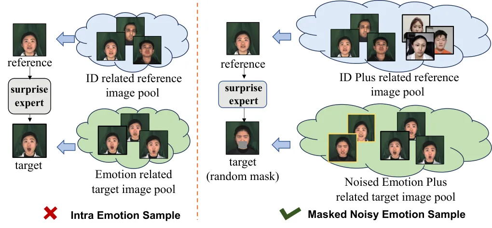

Figure 5: Visualization of different emotion sample strategy. Results
demonstrate that the proposed masked noisy emotion sample strategy can
ensure natural and vivid expression.

Masked Noisy Emotion Sampling Due to the relatively small size of the
segmented single-emotion datasets, the expert models trained on them
often risk learning knowledge beyond the targeted emotion. To amplify
the impact of emotion, we incorporate data of other emotions or neutral
expressions with a certain probability for a particular emotion. As
illustrated in Figure 4, this approach introduces noise into the emotion
conditions while expanding the number of person IDs thus enabling the
model to concentrate more effectively on the control of emotion
conditions.

However, since frames with different emotions come from different speech
videos, there can be significant variations in mouth shapes, leading the
model to focus more on mouth transformations rather than the emotions
themselves. To mitigate this, we first locate the position of the mouth
in portrait images by Mediapipe \[19\]. We then apply a mask to the
mouth. This method ensures that the expert model maintains consistent
person ID while achieving more accurate learning of facial expression
transformations.

Loss function Since the resolution of latent space ($`64\times 64`$ for
$`512\times 512`$ image) is relative too low to capture the subtle
facial details, a timestep-aware spatial loss is proposed to learning
the face expression directly in the pixel space. The loss function $`L`$
during the training process is summarized as:

```math
L=L_{latent}+\lambda L_{spatial} \tag{5}
```

Where $`L_{latent}`$ is the objective function guiding the denoising
process. With timestep $`t`$ is uniformly sampled from
$`\left\{1,...,T\right\}`$. The objective is to minimize the error
between the true noise $`\epsilon`$ and the model-predicted noise
$`\epsilon_{\theta}(z_{t},t,c)`$ based on the given timestep $`t`$, the
noisy latent variable $`z_{t}`$, and $`c_{embed}`$ denotes the
conditional embeddings. The loss function during the training process is
summarized as:

```math
L_{latent}=\mathbb{E}_{t,c_{embed},z_{t},\epsilon}[||\epsilon-\epsilon_{\theta}(z_{t},t,c_{embed})||^{2}] \tag{6}
```

For $`L_{spatial}`$, predicted latent $`z_{t}`$ is first mapped to
$`z_{0}`$ by sampler and the predicted image $`I_{p}`$ is obtained via
passing $`z_{0}`$ to the vae decoder. The L1 loss is computed on the
predicted image and its corresponding ground truth. Additionally, we
introduce a Perception loss, enhancing details and visual realism. The
specific formula is shown below:

```math
L_{spatial}=w(t)(||I_{p},I_{GT}||+||V(I_{p}),V(I_{GT})||^{2}) \tag{7}
```

where $`V`$ denotes the feature extractor of VGG19, and
$`w(t)=cosine(t*\pi/2T)`$ serves as a timestep aware function to reduce
the weight for large $`t`$.

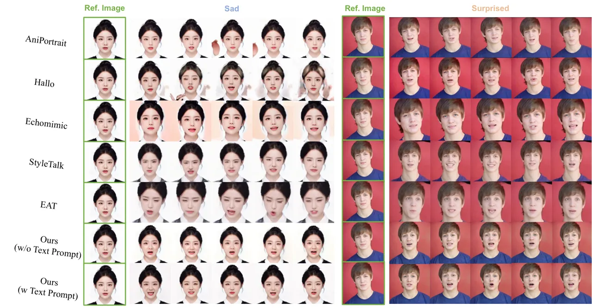

Figure 6: Qualitative comparison with baselines. It shows that MoEE
achieves well lip-sync quality and emotion controllability.
Additionally, MoEE enables emotion control without text prompt.

Training This study implements a two-stage training process aimed at
optimizing distinct components of the overall framework. Next, We will
describe each stage in detail below.

In the initial stage, considering the limited emotion prior for
diffusion model could be caused by the absence of high-quality emotion
datasets, our work bridges this gap by providing carefully collected
emotion datasets. We fine-tuning the Reference Net and denoising U-Net
modules on these emotion Datasets, and the well-trained model is then
sent to the next stage.

In the second stage, the model is trained to generate video frames based
on the reference image, driven audio, and emotion condition. During this
phase, the spatial modules, cross modules, audio modules and temporal
modules of Reference Net and denoising U-Net remain static. The
optimization process focuses on the Emotion MoE modules, which are
optimized to enhance the accuracy and diversity of emotion control
generation capabilities.

Inference During the inference stage, the network takes a single
reference image, driving audio and emotion condition as input, producing
a video sequence that animates the reference image based on the
corresponding emotion and audio. To produce visually consistent long
videos, we utilize the last 2 frames of the previous video clip as the
initial k frames of the next clip, enabling incremental inference for
video clip generation.

## 5 Experiment

### 5.1 Experiment setup

Datasets As outlined earlier, this research utilizes the filtered HDTF
\[49\], a segment of the DH-FaceVid-1K \[6\] dataset, as well as MEAD
\[39\] and DH-FaceEmoVid-150 for training. During the testing phase, we
choose 20 subjects from the HDTF datasets, selecting 10 video clips for
each subject at random, with each clip lasting about 5 to 10 seconds.
Notably, to assess the efficacy of the mixture of emotion experts, we
extract 20 subjects from both MEAD and DH-FaceEmoVid-150 datasets. For
each of these subjects, 10 videos are randomly chosen from 4 out of the
6 available emotional categories.

Evaluation Metrics The evaluation metrics utilized in the portrait image
animation approach include Learned Perceptual Image Patch Similarity
(LPIPS) \[47\], Fréchet Inception Distance (FID) \[11\], Fréchet Video
Distance (FVD) \[40\] , Average Keypoint Distance (AKD) \[32\] , and
synchronization metrics Sync-C and Sync-D \[4\]. LPIPS measures
perceptual similarity, with lower scores being preferable. FID and FVD
evaluate realism, where lower scores indicate greater similarity to real
data. AKD measures the alignment of facial keypoints, with lower values
indicating higher accuracy in reproducing facial expressions and
movements. Sync-C and Sync-D evaluate lip synchronization, where higher
Sync-C and lower Sync-D scores reflect better audio-visual alignment.
Since the dataset’s audio is in Chinese, Sync-C and Sync-D may not
provide an entirely objective evaluation, so we used tailored
combinations of evaluation metrics for each dataset.

Baseline We compared our proposed method with publicly available
implementations of AniPortrait \[42\], Hallo \[43\], EchoMimic \[3\],
StyleTalk \[21\], EAT \[8\] on the HDTF, MEAD, and DH-FaceEmoVid-150
datasets. We also conducted a qualitative comparison to provide deeper
insights into our method’s performance and its ability to generate
realistic, expressive talking head animations.

More experiment details can be found in the Appendix.

### 5.2 Quantitative Results

We conducted an exhaustive comparative analysis of existing
diffusion-based methods driven by audio. This study underscored the
efficacy of MoEE in achieving vivid and accurate control over emotions
and expressions. To ensure rigorous evaluation across datasets, we
selected appropriate metrics to showcase each method’s unique strengths.

| Method             | HDTF              |                   |                     |                    |                      |
| ------------------ | ----------------- | ----------------- | ------------------- | ------------------ | -------------------- |
|                    | FID$`\downarrow`$ | FVD$`\downarrow`$ | LPIPS$`\downarrow`$ | Sync-C$`\uparrow`$ | Sync-D$`\downarrow`$ |
| AniPortrait \[42\] | 36.826            | 476.818           | 0.211               | 5.977              | 9.898                |
| Hallo \[43\]       | 28.605            | 343.023           | 0.167               | 6.254              | 8.735                |
| Echomimic \[3\]    | 48.323            | 526.125           | 0.312               | 6.73               | 9.157                |
| StyleTalk \[21\]   | 76.564            | 502.334           | 0.326               | 3.885              | 10.644               |
| EAT \[8\]          | 81.254            | 545.266           | 0.357               | 5.012              | 9.885                |
| MoEE (Ours)        | 28.834            | 322.625           | 0.152               | 6.114              | 9.101                |

Table 2: Comparison of various methods on the HDTF dataset.

Comparison on the HDTF dataset Table 2 indicates that MoEE outperforms
other methods across multiple metrics. The Sync-C and Sync-D metrics
show a slight decline due to the Chinese talking head dataset we used.

| Method             | MEAD              |                   |                     |                    |                      |
| ------------------ | ----------------- | ----------------- | ------------------- | ------------------ | -------------------- |
|                    | FID$`\downarrow`$ | FVD$`\downarrow`$ | LPIPS$`\downarrow`$ | Sync-C$`\uparrow`$ | Sync-D$`\downarrow`$ |
| AniPortrait \[42\] | 64.582            | 735.691           | 0.379               | 6.212              | 9.866                |
| Hallo \[43\]       | 72.384            | 715.119           | 0.356               | 6.856              | 9.103                |
| Echomimic \[3\]    | 75.678            | 699.322           | 0.413               | 6.668              | 9.342                |
| StyleTalk \[21\]   | 49.399            | 577.657           | 0.295               | 3.968              | 10.578               |
| EAT \[8\]          | 32.696            | 412.709           | 0.394               | 5.509              | 8.209                |
| MoEE (Ours)        | 39.420            | 403.416           | 0.288               | 7.002              | 8.105                |

Table 3: Comparison of various methods on the MEAD dataset.

Comparison on the MEAD dataset Table 3 indicates that MoEE can achieve
the best performance in most metrics, demonstrates superior and stable
performance across image and video quality, as well as motion
synchronization.

|                    |                   |                   |                     |                   |     |
| ------------------ | ----------------- | ----------------- | ------------------- | ----------------- | --- |
| Method             | DH-FaceEmoVid-150 |                   |                     |                   |     |
|                    | FID$`\downarrow`$ | FVD$`\downarrow`$ | LPIPS$`\downarrow`$ | AKD$`\downarrow`$ |     |
| AniPortrait \[42\] | 66.034            | 712.291           | 0.323               | 20.654            |     |
| Hallo \[43\]       | 72.354            | 702.841           | 0.329               | 16.444            |     |
| Echomimic \[3\]    | 71.288            | 653.927           | 0.366               | 8.332             |     |
| StyleTalk \[21\]   | 51.038            | 534.217           | 0.242               | 4.234             |     |
| EAT \[8\]          | 48.011            | 467.739           | 0.260               | 14.109            |     |
| MoEE (Ours)        | 39.619            | 402.803           | 0.182               | 4.028             |     |

Table 4: Comparison of various methods on the DH-FaceEmoVid-150 dataset.

Comparison on the DH-FaceEmoVid-150 dataset DH-FaceEmoVid-150 dataset
contains a large set of facial videos with various emotions, enabling
MoEE to generate more stable results. As shown in Table 4, MoEE
significantly outperforms all other methods across all metrics.

### 5.3 Qualitative Results

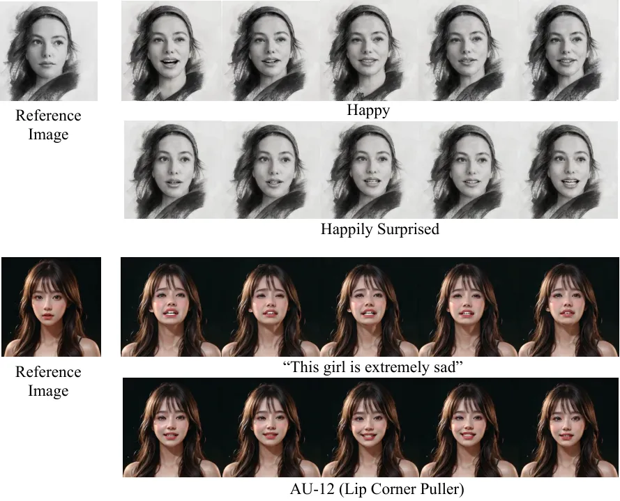

Figure 7: Portrait image animation results on Emotion Control and AU
Control with different portrait styles.

Visual comparison with baselines Figure 6 presents a visual comparison
of MoEE against other methods across different emotion control,
demonstrating superior performance under different conditions. Notably,
AniPortrait, Hallo and EchoMimic often exhibit background noise issues,
while EAT and StyleTalk often produce incorrect and unnatural
expressions. Our model demonstrates strong lip-sync accuracy, along with
enhanced naturalness and clarity, while effectively preserving identity
characteristics and background stability.

Visualization on Emotion Control and AU Control Figure 7 illustrates
that our method can achieve single-emotion control, compound emotion
control, and fine-grained expression control based on AU labels.
Additionally, our method is capable of processing a wide range of input
types, including paintings, portraits from generative models and more.
These findings highlight the versatility and effectiveness of our
approach in emotion control and accommodating different artistic styles.
More experiment details can be found in the Appendix C

| Methods                     | FID$`\downarrow`$ | FVD$`\downarrow`$ | LPIPS$`\downarrow`$ | AKD$`\downarrow`$ |
| --------------------------- | ----------------- | ----------------- | ------------------- | ----------------- |
| \(a\) w/o MoEE              | 58.411            | 655.329           | 0.325               | 14.959            |
| \(b\) w/o GS Assigment      | 46.334            | 447.814           | 0.194               | 10.652            |
| \(c\) w/o MNS Sample        | 51.788            | 489.241           | 0.211               | 4.591             |
| \(d\) w/o DH-FaceEmoVid-150 | 52.412            | 511.928           | 0.275               | 7.885             |
| MoEE (Ours)                 | 39.619            | 402.803           | 0.182               | 4.028             |

Table 5: More ablation studies on the proposed techniques. The first row
shows the results without using Mixture of Emotion Experts (MoEE). The
second row presents the results without Global Soft Assignment (GS
Assignment). The third row displays the results without Masked Noisy
Emotion Sample (MNS Sample). The forth row displays the results without
DH-FaceEmoVid-150 dataset.

### 5.4 Ablation Study

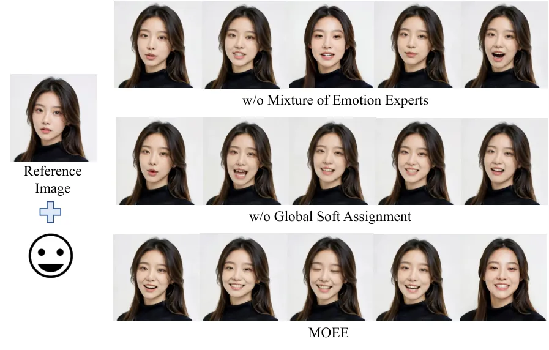

Figure 8: Visualization of different emotion control methods. Results
demonstrate that the proposed mixture of experts methods can ensure
natural and vivid expression.

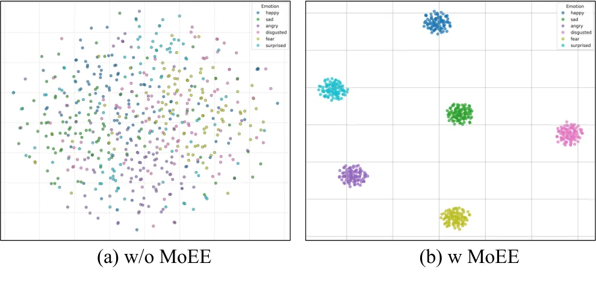

Figure 9: Visualization of the latent space.

Mixture of Emotion Experts Method We analyze the impact of different
emotion control methods on improving emotion control. As shown in
Figure 8, we compare three approaches: without mixture of experts
models, without global assignment, and with both mixture of experts
models and global assignment. The experiments demonstrate that our
method effectively capture fine-grained expression details. Table 5
illustrates the effects of Mixture of Emotion Experts. Notably, using
Global Soft Assignment enhances visual quality and emotion control, as
reflected by improvements in FID, FVD, and AKD.

We also analyzed the effect of employing the Mixture of Emotion Experts
module on the latent space across different emotional conditions.
Figure 9 presents a visualization of the latent space: with the
application of this module, the latent distributions across different
emotional conditions exhibit greater separation, ensuring accurate and
stable generation of talking heads with specific emotions.

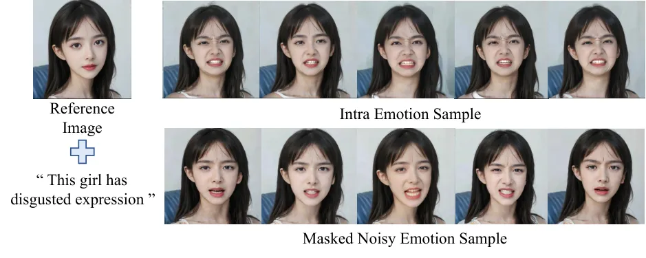

Figure 10: Visualization of different emotion sample strategy. Results
demonstrate that the proposed masked noisy emotion sample strategy can
ensure natural and vivid expression.

Masked Noisy Emotion Sample Strategy We introduced a masked noisy
emotion sample strategy to enhance emotion accuracy and character ID
consistency. As illustrated in Figure 10, we compared two sampling
methods: (a) intra-emotion sampling and (b) masked noisy emotion
sampling and the experimental results demonstrate that our proposed
approach effectively generates accurate and natural expressions. Table 5
further validates the effectiveness of the masked noisy emotion sampling
strategy.

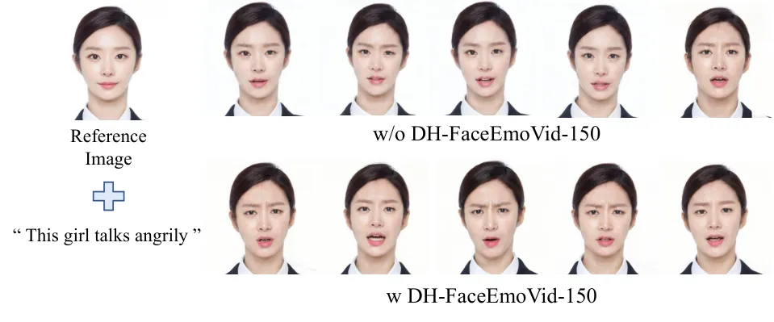

Figure 11: Visualization of emotion control based on different datasets.
Results demonstrate that DH-FaceEmoVid-150 can enhance emotion control
ability.

Dataset Efficiency To evaluate the effectiveness of the dataset, we
conducted both quantitative and qualitative comparison experiments. As
illustrated in Figure 11 and Table 5, the results verified that
DH-FaceEmoVid-150 significantly enhances the ability of emotional
Audio-Driven Portrait Animation.

### 5.5 User Study

We conduct a user study to compare our method with the other methods. We
involve 15 experienced users to score the generation quality and
controllability of each model. We randomly select 10 generation examples
from the MEAD and DH-FaceEmoVid-150 datasets. Our evaluation metric is
the Mean Opinion Score (MOS). We assess the lip-sync quality (Lip.),
emotion controllability (Emo.), naturalness (Nat.) and identity
preservation (ID.). Participants were presented with one video at a time
and asked to rate each video for each score on a scale of 1 to 5. We
calculated the average score as the final result. As shown in Table 6
and Table 7, Our proposed method achieves the best results across all
evaluation criteria.

| Method             | Emo.$`\uparrow`$ | Lip.$`\uparrow`$ | Nat.$`\uparrow`$ | ID.$`\uparrow`$ |
| ------------------ | ---------------- | ---------------- | ---------------- | --------------- |
| AniPortrait \[42\] | 2.05             | 3.98             | 4.33             | 4.31            |
| Hallo \[43\]       | 2.03             | 4.48             | 4.25             | 4.05            |
| Echomimic \[3\]    | 2.88             | 4.71             | 4.65             | 4.25            |
| StyleTalk \[21\]   | 4.44             | 3.22             | 3.54             | 3.58            |
| EAT \[8\]          | 4.23             | 3.57             | 3.81             | 4.29            |
| MoEE (Ours)        | 4.65             | 4.74             | 4.71             | 4.55            |

Table 6: User Study for MoEE and other baselines on MEAD. The bold
values indicate the best results.

| Method             | Emo.$`\uparrow`$ | Lip.$`\uparrow`$ | Nat.$`\uparrow`$ | ID.$`\uparrow`$ |
| ------------------ | ---------------- | ---------------- | ---------------- | --------------- |
| AniPortrait \[42\] | 2.25             | 4.02             | 4.18             | 4.31            |
| Hallo \[43\]       | 2.13             | 4.21             | 4.54             | 4.33            |
| Echomimic \[3\]    | 2.78             | 4.56             | 4.71             | 4.25            |
| StyleTalk \[21\]   | 4.62             | 3.51             | 3.73             | 3.58            |
| EAT \[8\]          | 4.51             | 3.45             | 3.75             | 4.21            |
| MoEE (Ours)        | 4.73             | 4.81             | 4.76             | 4.62            |

Table 7: User Study for MoEE and other baselines on DH-FaceEmoVid-150.
The bold values indicate the best results.

## 6 Limitations

Our method still has certain limitations in the following areas: (1) Due
to the limited compound emotion categories in the DH-FaceEmoVid-150
dataset, some compound emotions are not well represented. For example,
the "sadly disgusted" emotion does not successfully blend the two
emotions but instead emphasizes the "disgusted" emotion. (2) In terms of
fine-grained expression control, our model is trained solely on a
combination of action units extracted from real talking videos. This
dependency between action units may limit its ability to precisely
control a disentangled single action unit. Our future efforts will aim
to address these issues.

## 7 Conclusion and Future Work

In this paper, we introduce MoEE, a novel multimodal-guided framework
for coarse-grained emotion control and fine-grained expression control
in avatar generation, using end-to-end diffusion models, which
significantly enhancing controllability and vividness compared to
previous models. We develop a mixture of emotion expert module and a
emotional talking head dataset, to achieve accurate and vivid controls.
Additionally, our Emotion-to-Latents module enables multi-modal emotion
control and improves emotion control based solely on audio signals.
Experimental results demonstrate MoEE’s exceptional lip-sync quality,
fine-grained emotion controllability, and the naturalness of the
generated outputs. We hope our work will inspire further research into
emotional talking heads and encourage more studies in this area.

## References

- \[1\] Andreas Blattmann, Tim Dockhorn, Sumith Kulal, Daniel
  Mendelevitch, Maciej Kilian, Dominik Lorenz, Yam Levi, Zion English,
  Vikram Voleti, Adam Letts, et al. Stable video diffusion: Scaling
  latent video diffusion models to large datasets. _arXiv preprint
  arXiv:2311.15127_, 2023.
- \[2\] Di Chang, Yufeng Yin, Zongjian Li, Minh Tran, and Mohammad
  Soleymani. Libreface: An open-source toolkit for deep facial
  expression analysis. In _Proceedings of the IEEE/CVF Winter Conference
  on Applications of Computer Vision_, pages 8205–8215, 2024.
- \[3\] Zhiyuan Chen, Jiajiong Cao, Zhiquan Chen, Yuming Li, and
  Chenguang Ma. Echomimic: Lifelike audio-driven portrait animations
  through editable landmark conditions. _arXiv preprint
  arXiv:2407.08136_, 2024.
- \[4\] J. S. Chung and A. Zisserman. Out of time: automated lip sync in
  the wild. In _Workshop on Multi-view Lip-reading, ACCV_, 2016.
- \[5\] Enric Corona, Andrei Zanfir, Eduard Gabriel Bazavan, Nikos
  Kolotouros, Thiemo Alldieck, and Cristian Sminchisescu. Vlogger:
  Multimodal diffusion for embodied avatar synthesis. _arXiv preprint
  arXiv:2403.08764_, 2024.
- \[6\] Donglin Di, He Feng, Wenzhang Sun, Yongjia Ma, Hao Li, Wei Chen,
  Xiaofei Gou, Tonghua Su, and Xun Yang. Facevid-1k: A large-scale
  high-quality multiracial human face video dataset, 2024.
- \[7\] Paul Ekman and Wallace V Friesen. Facial action coding system.
  _Environmental Psychology & Nonverbal Behavior_, 1978.
- \[8\] Yuan Gan, Zongxin Yang, Xihang Yue, Lingyun Sun, and Yi Yang.
  Efficient emotional adaptation for audio-driven talking-head
  generation. In _Proceedings of the IEEE/CVF International Conference
  on Computer Vision_, pages 22634–22645, 2023.
- \[9\] Yuwei Guo, Ceyuan Yang, Anyi Rao, Zhengyang Liang, Yaohui Wang,
  Yu Qiao, Maneesh Agrawala, Dahua Lin, and Bo Dai. Animatediff: Animate
  your personalized text-to-image diffusion models without specific
  tuning. _arXiv preprint arXiv:2307.04725_, 2023.
- \[10\] Tianyu He, Junliang Guo, Runyi Yu, Yuchi Wang, Jialiang Zhu,
  Kaikai An, Leyi Li, Xu Tan, Chunyu Wang, Han Hu, et al. Gaia:
  Zero-shot talking avatar generation. _arXiv preprint
  arXiv:2311.15230_, 2023.
- \[11\] Martin Heusel, Hubert Ramsauer, Thomas Unterthiner, Bernhard
  Nessler, and Sepp Hochreiter. Gans trained by a two time-scale update
  rule converge to a local nash equilibrium. _Advances in neural
  information processing systems_, 30, 2017.
- \[12\] Jonathan Ho, Ajay Jain, and Pieter Abbeel. Denoising diffusion
  probabilistic models. pages 6840–6851, 2020.
- \[13\] Li Hu, Xin Gao, Peng Zhang, Ke Sun, Bang Zhang, and Liefeng Bo.
  Animate anyone: Consistent and controllable image-to-video synthesis
  for character animation. _arXiv preprint arXiv:2311.17117_, 2023.
- \[14\] Xinya Ji, Hang Zhou, Kaisiyuan Wang, Qianyi Wu, Wayne Wu, Feng
  Xu, and Xun Cao. Eamm: One-shot emotional talking face via audio-based
  emotion-aware motion model. In _ACM SIGGRAPH 2022 Conference
  Proceedings_, pages 1–10, 2022.
- \[15\] Jianwen Jiang, Chao Liang, Jiaqi Yang, Gaojie Lin, Tianyun
  Zhong, and Yanbo Zheng. Loopy: Taming audio-driven portrait avatar
  with long-term motion dependency. _arXiv preprint
  arXiv:2409.02634_, 2024.
- \[16\] Borong Liang, Yan Pan, Zhizhi Guo, Hang Zhou, Zhibin Hong,
  Xiaoguang Han, Junyu Han, Jingtuo Liu, Errui Ding, and Jingdong Wang.
  Expressive talking head generation with granular audio-visual control.
  In _Proceedings of the IEEE/CVF Conference on Computer Vision and
  Pattern Recognition_, pages 3387–3396, 2022.
- \[17\] Tao Liu, Feilong Chen, Shuai Fan, Chenpeng Du, Qi Chen, Xie
  Chen, and Kai Yu. Anitalker: animate vivid and diverse talking faces
  through identity-decoupled facial motion encoding. In _Proceedings of
  the 32nd ACM International Conference on Multimedia_, pages
  6696–6705, 2024.
- \[18\] I Loshchilov. Decoupled weight decay regularization. _arXiv
  preprint arXiv:1711.05101_, 2017.
- \[19\] Camillo Lugaresi, Jiuqiang Tang, Hadon Nash, Chris McClanahan,
  Esha Uboweja, Michael Hays, Fan Zhang, Chuo-Ling Chang, Ming Guang
  Yong, Juhyun Lee, et al. Mediapipe: A framework for building
  perception pipelines. _arXiv preprint arXiv:1906.08172_, 2019.
- \[20\] Cheng Luo, Siyang Song, Weicheng Xie, Linlin Shen, and Hatice
  Gunes. Learning multi-dimensional edge feature-based au relation graph
  for facial action unit recognition. _arXiv preprint
  arXiv:2205.01782_, 2022.
- \[21\] Yifeng Ma, Suzhen Wang, Zhipeng Hu, Changjie Fan, Tangjie Lv,
  Yu Ding, Zhidong Deng, and Xin Yu. Styletalk: One-shot talking head
  generation with controllable speaking styles. In _Proceedings of the
  AAAI Conference on Artificial Intelligence_, pages 1896–1904, 2023a.
- \[22\] Yifeng Ma, Shiwei Zhang, Jiayu Wang, Xiang Wang, Yingya Zhang,
  and Zhidong Deng. Dreamtalk: When expressive talking head generation
  meets diffusion probabilistic models. _arXiv preprint
  arXiv:2312.09767_, 2023b.
- \[23\] Ziyang Ma, Zhisheng Zheng, Jiaxin Ye, Jinchao Li, Zhifu Gao,
  Shiliang Zhang, and Xie Chen. emotion2vec: Self-supervised
  pre-training for speech emotion representation. _arXiv preprint
  arXiv:2312.15185_, 2023c.
- \[24\] Jianmo Ni, Gustavo Hernandez Abrego, Noah Constant, Ji Ma,
  Keith B Hall, Daniel Cer, and Yinfei Yang. Sentence-t5: Scalable
  sentence encoders from pre-trained text-to-text models. _arXiv
  preprint arXiv:2108.08877_, 2021.
- \[25\] OpenAI. Gpt-4v(ision) system card. 2023.
- \[26\] Ziqiao Peng, Haoyu Wu, Zhenbo Song, Hao Xu, Xiangyu Zhu, Jun
  He, Hongyan Liu, and Zhaoxin Fan. Emotalk: Speech-driven emotional
  disentanglement for 3d face animation. In _Proceedings of the IEEE/CVF
  International Conference on Computer Vision_, pages 20687–20697, 2023.
- \[27\] KR Prajwal, Rudrabha Mukhopadhyay, Vinay P Namboodiri, and CV
  Jawahar. A lip sync expert is all you need for speech to lip
  generation in the wild. In _Proceedings of the 28th ACM international
  conference on multimedia_, pages 484–492, 2020.
- \[28\] Joan Puigcerver, Carlos Riquelme Ruiz, Basil Mustafa, and Neil
  Houlsby. From sparse to soft mixtures of experts. In _The Twelfth
  International Conference on Learning Representations_.
- \[29\] Robin Rombach, Andreas Blattmann, Dominik Lorenz, Patrick
  Esser, and Björn Ommer. High-resolution image synthesis with latent
  diffusion models. In _Proceedings of the IEEE/CVF conference on
  computer vision and pattern recognition_, pages 10684–10695, 2022.
- \[30\] Steffen Schneider, Alexei Baevski, Ronan Collobert, and Michael
  Auli. wav2vec: Unsupervised pre-training for speech recognition.
  _arXiv preprint arXiv:1904.05862_, 2019.
- \[31\] Shuai Shen, Wenliang Zhao, Zibin Meng, Wanhua Li, Zheng Zhu,
  Jie Zhou, and Jiwen Lu. Difftalk: Crafting diffusion models for
  generalized audio-driven portraits animation. In _Proceedings of the
  IEEE/CVF Conference on Computer Vision and Pattern Recognition_, pages
  1982–1991, 2023.
- \[32\] Aliaksandr Siarohin, Stéphane Lathuilière, Sergey Tulyakov,
  Elisa Ricci, and Nicu Sebe. Animating arbitrary objects via deep
  motion transfer. In _Proceedings of the IEEE/CVF Conference on
  Computer Vision and Pattern Recognition_, pages 2377–2386, 2019.
- \[33\] Jiaming Song, Chenlin Meng, and Stefano Ermon. Denoising
  diffusion implicit models. _arXiv preprint arXiv:2010.02502_, 2020.
- \[34\] Michał Stypułkowski, Konstantinos Vougioukas, Sen He, Maciej
  Zięba, Stavros Petridis, and Maja Pantic. Diffused heads: Diffusion
  models beat gans on talking-face generation. In _Proceedings of the
  IEEE/CVF Winter Conference on Applications of Computer Vision_, pages
  5091–5100, 2024.
- \[35\] Xusen Sun, Longhao Zhang, Hao Zhu, Peng Zhang, Bang Zhang,
  Xinya Ji, Kangneng Zhou, Daiheng Gao, Liefeng Bo, and Xun Cao.
  Vividtalk: One-shot audio-driven talking head generation based on 3d
  hybrid prior. _arXiv preprint arXiv:2312.01841_, 2023.
- \[36\] Zhaoxu Sun, Yuze Xuan, Fang Liu, and Yang Xiang. Fg-emotalk:
  Talking head video generation with fine-grained controllable facial
  expressions. In _Proceedings of the AAAI Conference on Artificial
  Intelligence_, pages 5043–5051, 2024.
- \[37\] Shuai Tan, Bin Ji, and Ye Pan. Emmn: Emotional motion memory
  network for audio-driven emotional talking face generation. pages
  22089–22099, 2023.
- \[38\] Linrui Tian, Qi Wang, Bang Zhang, and Liefeng Bo. Emo: Emote
  portrait alive-generating expressive portrait videos with audio2video
  diffusion model under weak conditions. _arXiv preprint
  arXiv:2402.17485_, 2024.
- \[39\] Kaisiyuan Wang, Qianyi Wu, Linsen Song, Zhuoqian Yang, Wayne
  Wu, Chen Qian, Ran He, Yu Qiao, and Chen Change Loy. Mead: A
  large-scale audio-visual dataset for emotional talking-face
  generation. In _European Conference on Computer Vision_, pages
  700–717. Springer, 2020.
- \[40\] Ting-Chun Wang, Ming-Yu Liu, Jun-Yan Zhu, Guilin Liu, Andrew
  Tao, Jan Kautz, and Bryan Catanzaro. Video-to-video synthesis, 2018.
- \[41\] Yuchi Wang, Junliang Guo, Jianhong Bai, Runyi Yu, Tianyu He, Xu
  Tan, Xu Sun, and Jiang Bian. Instructavatar: Text-guided emotion and
  motion control for avatar generation. _arXiv preprint
  arXiv:2405.15758_, 2024.
- \[42\] Huawei Wei, Zejun Yang, and Zhisheng Wang. Aniportrait:
  Audio-driven synthesis of photorealistic portrait animation. _arXiv
  preprint arXiv:2403.17694_, 2024.
- \[43\] Mingwang Xu, Hui Li, Qingkun Su, Hanlin Shang, Liwei Zhang, Ce
  Liu, Jingdong Wang, Yao Yao, and Siyu Zhu. Hallo: Hierarchical
  audio-driven visual synthesis for portrait image animation. _arXiv
  preprint arXiv:2406.08801_, 2024a.
- \[44\] Sicheng Xu, Guojun Chen, Yu-Xiao Guo, Jiaolong Yang, Chong Li,
  Zhenyu Zang, Yizhong Zhang, Xin Tong, and Baining Guo. Vasa-1:
  Lifelike audio-driven talking faces generated in real time. _arXiv
  preprint arXiv:2404.10667_, 2024b.
- \[45\] Fei Yin, Yong Zhang, Xiaodong Cun, Mingdeng Cao, Yanbo Fan,
  Xuan Wang, Qingyan Bai, Baoyuan Wu, Jue Wang, and Yujiu Yang.
  Styleheat: One-shot high-resolution editable talking face generation
  via pre-trained stylegan. In _European conference on computer vision_,
  pages 85–101. Springer, 2022.
- \[46\] Shuyan Zhai, Meng Liu, Yongqiang Li, Zan Gao, Lei Zhu, and
  Liqiang Nie. Talking face generation with audio-deduced emotional
  landmarks. _IEEE Transactions on Neural Networks and Learning
  Systems_, 2023.
- \[47\] Richard Zhang, Phillip Isola, Alexei A Efros, Eli Shechtman,
  and Oliver Wang. The unreasonable effectiveness of deep features as a
  perceptual metric. In _Proceedings of the IEEE conference on computer
  vision and pattern recognition_, pages 586–595, 2018.
- \[48\] Wenxuan Zhang, Xiaodong Cun, Xuan Wang, Yong Zhang, Xi Shen, Yu
  Guo, Ying Shan, and Fei Wang. Sadtalker: Learning realistic 3d motion
  coefficients for stylized audio-driven single image talking face
  animation. In _Proceedings of the IEEE/CVF Conference on Computer
  Vision and Pattern Recognition_, pages 8652–8661, 2023.
- \[49\] Zhimeng Zhang, Lincheng Li, Yu Ding, and Changjie Fan.
  Flow-guided one-shot talking face generation with a high-resolution
  audio-visual dataset. In _Proceedings of the IEEE/CVF Conference on
  Computer Vision and Pattern Recognition_, pages 3661–3670, 2021.

In this Appendix, we first detail the Mixture of Emotion Experts module
and the Emotion-to-Latents module (Appendix A). Next, we introduce the
training and testing details (Appendix B). Finally, we provide more
visualization results (Appendix C) and further visualizations of the
dataset (Appendix D).

## A The Networks Details

Mixture of Emotion Experts In our model, we employ the Mixture of
Emotion Experts (MoEE) framework based on cross-attention. Different
emotion experts are guided by emotional signals extracted from audio and
text to generate single basic emotions. The emotion latent obtained from
the Emotion-to-Latents module serves as the key and value in the
cross-attention, with a dimension of $`(bs,t_{emotion},c_{emotion})`$.
Here, bs represents the batch size, $`t_{emotion}`$ denotes the number
of tokens (set to 8), and $`c_{emotion}`$ refers to the channel
dimension of the emotion latent (set to 512). The hidden state is used
as the query, which is normalized using LayerNorm before entering the
cross-attention module. Finally, a skip connection is applied to prevent
issues such as gradient vanishing and gradient explosion, thereby
accelerating the convergence of the model. Emotion-to-Latents To achieve
control signals across multiple modalities, we introduce the
Emotion-to-Latents module. Specifically, we first encode text, label,
and audio inputs using pretrained encoders. To map signals from
different modalities into a unified emotion latent space, we incorporate
a cross-attention module. Four separate fully connected networks are
trained to project the channel dimensions of different embeddings into
512 dimensions, which are used as queries. We also define learnable
embeddings that serve as keys and values for attention computation.
These embeddings, with a channel dimension of 768, are used to compute a
new feature representation based on the learnable embeddings. The
resulting emotion latents obtained from the cross-attention module are
then fed into the UNet for further processing.

## B Training and Testing Details

Experiments for both training and inference were conducted using a
platform with 8 NVIDIA A800 GPUs. Each of the two training stages
consisted of 30,000 steps, utilizing a batch size of 4 and video
dimensions of 512 × 512 pixels. The AdamW \[18\] optimizer is employed
with a learning rate of 1e-5, and the motion module was initialized
using pretrained weights from Animatediff. Each training instance in the
second stage produced 14 video frames, with the motion module’s latents
concatenated with the first 2 ground truth frames for video continuity.
For the diffusion model, a quadratic $`\beta`$ schedule is set with
$`\beta_{min}`$ = 0.05 and $`\beta_{max}`$ = 20.

In inference, the model follows the DDIM \[33\] approach and samples 150
steps. Continuity across sequences are ensured by concatenating noisy
latents with feature maps of the last 2 motion frames from the previous
step within the motion module.

## C More Visualization Results

To further support the conclusions drawn in the main paper, we provide
additional results in this section. Figure 12 shows more video
generation results of the proposed approach with different portrait
styles. Figure 13 presents additional examples of the single emotion,
compound emotion, and AU controls.

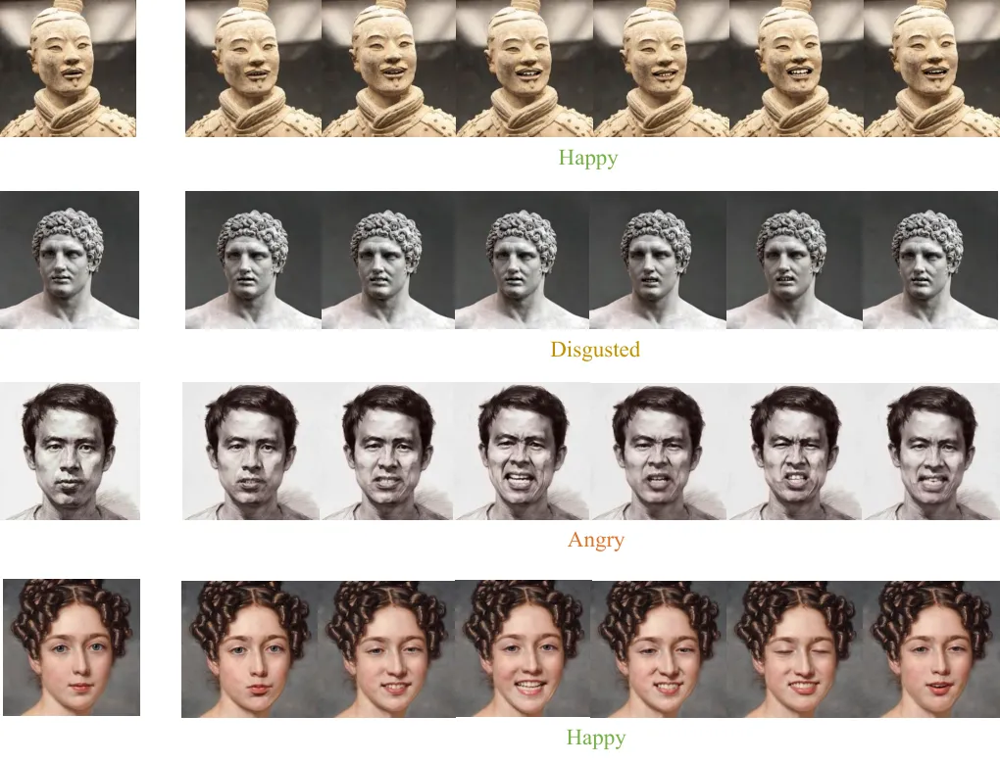

Figure 12: Talking head videos with different portrait styles under
various emotions.

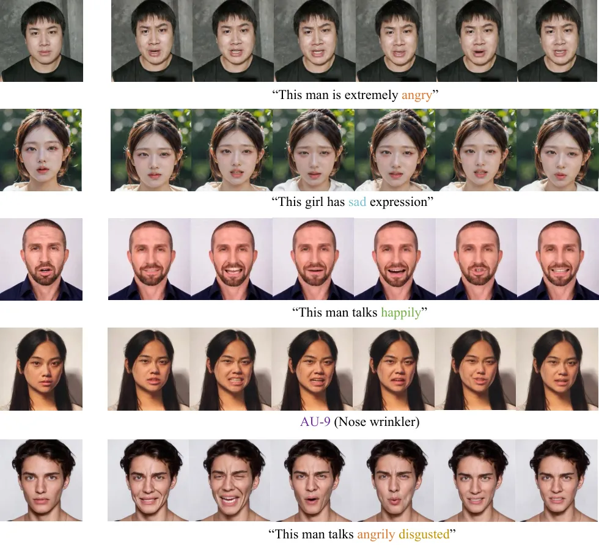

Figure 13: Portrait image animation results on Emotion Control and AU
Control.

## D More Visualization of the Dataset

We present additional samples from the DH-FaceEmoVid-150 dataset,
including six basic emotions in Figure 14 and four compound emotions in
Figure 15. The FPS of the videos in the dataset has been standardized to
30, with each video clip having a duration of 30 seconds.

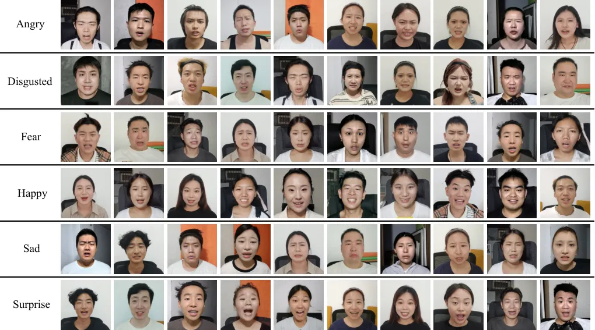

Figure 14: Visualization of basic emotion examples from the
DH-FaceEmoVid-150 dataset.

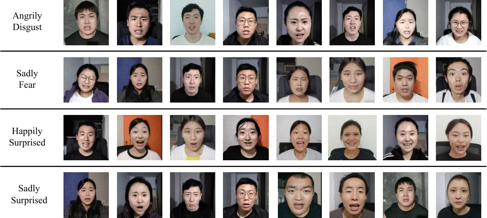

Figure 15: Visualization of compound emotion examples from the
DH-FaceEmoVid-150 dataset.
