# Make-A-Character 2: Animatable 3D Character Generation From a Single Image

Lin Liu,  Yutong Wang,  Jiahao Chen,  Jianfang Li,  
  Tangli Xue,  Longlong Li,  Jianqiang Ren,  Liefeng Bo  
Tongyi Lab,  Alibaba Group  
{lorrain.ll, yutong.yutongwang, peter.cjh, wuhui.ljf, xuetangli.xtl,  
longer.lll, jianqiang.rjq, liefeng.bo}@alibaba-inc.com

###### Abstract

This report introduces Make-A-Character 2, an advanced system for
generating high-quality 3D characters from single portrait photographs,
ideal for game development and digital human applications.
Make-A-Character 2 builds upon its predecessor by incorporating several
significant improvements for image-based head generation. We utilize the
IC-Light method to correct non-ideal illumination in input photos and
apply neural network-based color correction to harmonize skin tones
between the photos and game engine renders. We also employ the
Hierarchical Representation Network to capture high-frequency facial
structures and conduct adaptive skeleton calibration for accurate and
expressive facial animations. The entire image-to-3D-character
generation process takes less than 2 minutes. Furthermore, we leverage
transformer architecture to generate co-speech facial and gesture
actions, enabling real-time conversation with the generated character.
These technologies have been integrated into our conversational AI
avatar products.

## 1 Introduction

Make-A-Character\[27\] introduced a system that generates 3D characters
based on text descriptions. Although text is effective and lightweight,
it struggles to describe the precise nuances of facial features,
limiting its controllability on detailed attributes. As the saying goes,
a picture is worth a thousand words, images can convey far more detailed
information than text, allowing users to generate characters with
greater intuitiveness and control.

Given the aforementioned content, we introduce Make-A-Character 2, a
system for 3D characters generation from single images. We wish to
generate a 3D character with consistent appearance (_e.g._, face,
hairstyle, skin color) given a frontal face portrait photo, and the 3D
character is equipped with sophisticated underlying skeleton and ready
for animation. The Make-A-Character 2 inherits key properties from
Make-A-Character, such as highly-realistic rendering, full-body
completed and industry-compatible. Further more, we propose the
following major improvements:

Portraits Illumination Harmonization. To ensure the high quality of the
generated 3D head, ideal input portraits should be captured under
optimal lighting conditions. This includes uniform lighting that avoids
asymmetry, excessive shadows, or overexposure. However, daily portraits
often fail to meet these strict requirements. To address this issue, we
utilize the latest diffusion-based illumination editing method
IC-Light\[40\] to correct the lighting in the given photos, bringing
them to an ideal illumination state for subsequent operations.

Color Correction in Game Engine. We aim to ensure that the generated 3D
character maintains consistent lighting and skin tone with the input
photo. However, predicting the lighting environment from an input
portrait and replicating it in render engine is challenging. The final
color appearance in a game engine cannot be precisely predicted from a
diffuse texture map alone due to various influencing factors, such as
lighting setup, material properties, reflections, subsurface scattering,
and ambient occlusion. We draw inspiration from \[29\] and address the
challenge of non-differentiability in game engines by training a neural
network to learn the color discrepancies between diffuse maps and their
corresponding renders from the game engine. After the network
successfully models this color offset, we utilize the learned model to
adjust the diffuse map, allowing the render engine to produce the
desired color outcome more accurately.

Detailed Face Reconstruction. Our initial head geometry, reconstructed
guided by facial dense landmarks, often lacks high-frequency details. To
address this limitation, we leverage HRN\[18\] facial geometry to
augment the surface details of our initial model. For essential facial
regions, such as around the eyes and lips, we increase the density of
landmark predictions, enabling to capture intricate nuances with greater
precision.

Facial Skeleton Calibration. According to industry standards, the
creation of 3D facial assets necessitates a well-designed skeletal
structure and specialized rigging to achieve satisfactory animation
outcomes. In our work, we conducted skeleton fitting on the
reconstructed facial meshes, utilizing several neutral face models
sourced from MetaHuman, which had already undergone comprehensive
rigging processes as described in \[10\]. This approach guarantees that
each facial mesh produced through the aforementioned geometric
reconstruction algorithm is equipped with a customized skeletal
configuration.

Real-Time Speech-driven Animation. Although there are many
researches \[24, 42, 38, 4, 41\] addressing the problem of audio-driven
motion generation, the produced expression and gesture animations are
far from satisfactory. They mainly adopt ARKit blendshapes to represent
the facial expressions. The ARKit blendshapes are not able to express
detailed mouth shapes. As for the gesture, their generated results are
not restricted and the motions are jittering. In order to produce
realistic motions, we follow Metahuman’s control rig to animate facial
expressions and employ two senior animators to revise motion capture
data. Instead of generating gestures freely, we predict indices of
motion pieces, which are intentionally designed by animators. This
allows our system to generate natural and realistic body motions.

## 2 Related Work

Single-View 3D Reconstruction. Reconstructing a 3D object from a single
image is an ill-posed problem that typically relies on specific prior
knowledge. Inspired by the Scaling Law, which demonstrates notable
success in natural language processing (NLP) tasks through the
utilization of scalable network architectures and large training
datasets, recent works \[16, 32\] propose a large-scale 3D
reconstruction model based on the Transformer architecture. These models
aim to extract a generalized 3D prior from extensive datasets, thereby
enabling the prediction of Neural Radiance Field (NeRF) representations
from a single image. While these methods demonstrate remarkable
reconstruction quality and generalization capabilities, they face
significant challenges in the realm of 3D avatar generation, which
demands sophisticated structures to ensure animatability and
compatibility with existing industry CG pipelines.

Single-View 3D Head Generation. The 3D Morphable Model (3DMM) \[3\]
captures the variability inherent in human face by representing facial
geometries as a linear combination of blendshapes. This approach has
become a foundational technique in 3D face reconstruction. By fitting
the model parameters to 2D images, it enables face reconstruction from
single images.

With the advent of deep learning, researchers \[6, 31\] have developed
methods to leverage neural networks for predicting 3D face shapes
directly from images. To better capture fine details, many approaches
aim to improve the 3D Morphable Model (3DMM)-based framework by
introducing nonlinear 3DMM \[33\], deformation maps generation \[18\],
and displacement maps generation \[13\] for higher-quality geometry.
Regarding texture, the traditional linear combination of texture bases
often results in a blurred texture map. Thus, techniques like
differentiable rendering \[18\] or directly unwrapping the input image
into UV space \[20\] are more effective alternatives.

Advancements in neural 3D representations have led to the development of
a variety of models for detailed human head reconstruction. The Neural
Parametric Head Models (NPHM) \[15\] effectively use a signed distance
field (SDF) to achieve high-fidelity capture of complete human head
geometry. Despite their detailed geometrical focus, NPHMs do not support
appearance modeling or hair reconstruction. In contrast, Rodin \[35\]
employs diffusion models to create 3D digital avatars using neural
radiance fields (NeRF), which incorporate both geometry and appearance.
Additionally, the 3D Gaussian Parametric Head Model (GPHM) \[37\]
leverages 3D Gaussian to deliver photorealistic rendering quality and
real-time performance. Nonetheless, several challenges persist,
including integrating the Gaussian head model with a full body and
adapting these models to varying lighting conditions.

Speech-driven 3D Gesture Generation. Gesture generation is a complex
task that requires understanding speech, gestures, and their
relationships. To address this, BEAT  \[22\] presents a high-quality,
multi-modal motion data set captured from 30 speakers. Along with the
data set a Cascaded Motion Network is proposed to generate gestures from
speech. Based on this data set, EMAGE  \[23\] and ProbTalk  \[25\]
utilize masked transformer to predict gestures from audio in the latent
space of VQ-VAE. Although improved results are observed, the motion
diversity is restricted. Diffusion based models  \[38, 4, 42\] are also
explored in the literature of speech-driven motion generation. Compared
to the previous methods, these could generate diverse motions. However,
the results produced by all of these methods are far from industrial
standards. The predicted motions are usually jittering. Instead of
unrestricted generation, we directly predict the indices of predefined
motions, which are designed by senior animators. Based on this, it is
able to generate realistic gestures motions.

Speech-driven 3D Face Animation. Speech-driven 3D face animation focuses
on creating realistic facial animations from the input speech signals.
This field has developed for a long history and achieved significant
progress, which can be broadly categorized into visme-based and deep
learning-based methods. Visme-based methods primarily focused on
establishing mapping relationships from phonemes to visemes \[30, 8,
2\]. These methods allow for explicit control and can be easily
integrated into industrial animation pipelines. However, they have some
disadvantages: they mainly concentrate on lip region animations and lack
comprehensive strategies for animating the entire face. Additionally,
the expressiveness of these methods is limited, making it difficult to
capture detailed lip movements. Recently, deep learning-based methods
have been increasingly researched. Karras et al. \[17\] proposed an deep
neural network to learn a mapping from input waveforms to 3D vertex
coordinates of a face model. VOCA \[5\] utilizes an encoder-decoder
network where the encoder learns to transform audio features to a
low-dimensional embedding and the decoder maps this embedding into a
high-dimensional space of 3D vertex displacements. Faceformer \[12\]
also leverages an encoder-decoder model, but with Transformer-based
architecture and autoregressively generates a sequence of animated 3D
face meshes from input raw audio. To avoid over-smoothed facial motions,
Codetalker \[36\] adopts a pre-trained VQ-VAE motion prior. MeshTalk
\[28\] achieves highly realistic motion synthesis results for the entire
face based a categorical latent space that disentangles audio-correlated
and audio-uncorrelated information. SelfTalk \[26\] involve a
self-supervision framework to exchange cross-modals information to
generating realistic and accurate lip movements with lipreading
comprehensibility. However, the methods mentioned above are all based
vertex offset, usually lacking components like teeth, tongue, and
eyelashes, leading to flaws during animation. Additionally, they are
difficult to integrate into existing animation production pipelines.
However, these approaches can serve as valuable references.

## 3 3D Character Generation

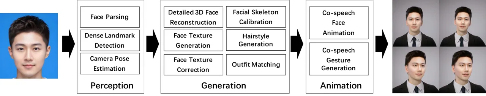

Figure 1: Pipeline for generating animatable 3D characters from a single
image.

### 3.1 Geometry Generation

#### 3.1.1 Hierarchical Facial Details Transfer

Unlike our prior work\[27\] which relied on textural descriptions, this
research uses a single portrait image as input, requiring more accurate
and detailed face generation. Our prior triplane-based method, which
used total variation loss for smoothness, struggled to reconstruct
intricate facial details like wrinkles and dimples in the initial head
geometry. Lei et al. \[18\] proposed a Hierarchical Representation
Network (HRN) enabling highly accurate single-image facial
reconstruction. We utilize this HRN to transfer detailed facial features
to our initial head model, overcoming previous geometric limitations. To
align the detail-rich HRN geometry with our model, we apply a rigid
transformation based on 7 facial landmarks, followed by details geometry
transfer. However, direct transfer can induce artifacts at the junctions
between the detail-enhanced facial areas and the fixed head region. To
ensure a seamless transition and achieve a natural appearance, we employ
a smoothing operation at these junctions. The complete pipeline is shown
in Figure 2.

Figure 3 showcases the effectiveness of our HRN-guided facial detail
transfer. Using images from the SCUT-FBP5500\[19\] as input, the figure
highlights a substantial enhancement in facial details. Notably, the
pre-transfer faces appear smooth and lack fine features, whereas the
post-transfer faces exhibit detailed characteristics, such as nasolabial
folds and dimples.

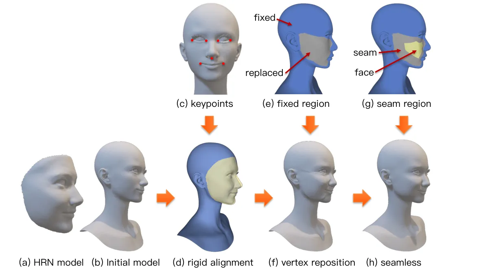

Figure 2: The facial details transfer pipeline. We align the HRN
geometric model (a) with the initial geometric model (b) through a rigid
alignment process (d) based on seven key points indicated in (c).
Following this, we fix the positions of the points within the blue
region, as depicted in (e) of our initial model, and subsequently
transfer the HRN facial details to the replaceable gray region also
shown in (e), leading to the creation of a replaced head model with HRN
face details (f). Finally, we determine the gray transition region as
shown in (g) and apply a smoothing technique to attain a final model (h)
that seamlessly integrates facial details and exhibits a natural
appearance.

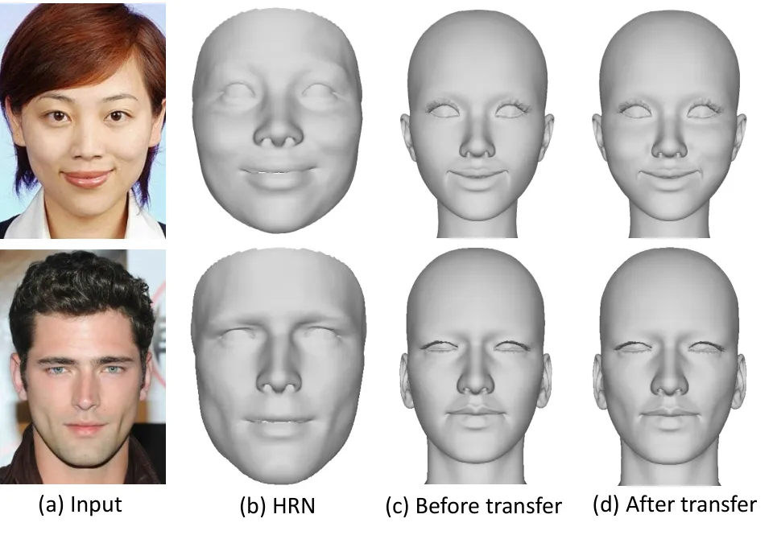

Figure 3: Results with facial details generated using our facial detail
transfer pipeline.

The complexity of the eyes and mouth requires a more detailed
representation than the original landmarks could provide. Therefore, we
increased the landmark count to 20 for the eyes and 28 for the mouth.
This crucial modification significantly improves the geometric precision
of these facial features, resulting in superior alignment with the input
image data. Figures 4 and 5 visually demonstrate this improvement.

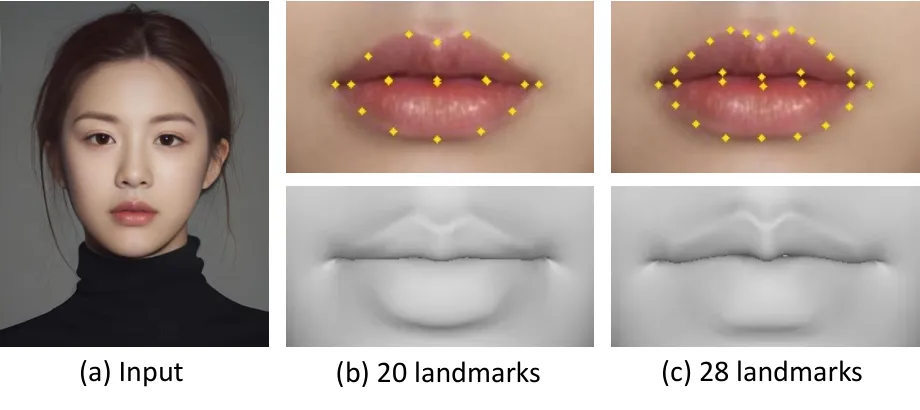

Figure 4: An example of mouth geometric results landmarks obtained by
expanding the mouth landmarks

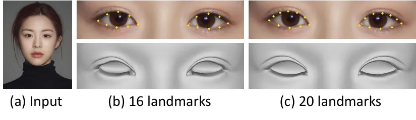

Figure 5: An example of eyes geometric results landmarks obtained by
expanding the eyes landmarks

Because the nose and adjacent facial areas have similar skin tones,
accurately detecting nose landmarks for shape reconstruction is a
difficult task. To improve the precision of nose shape reconstruction,
we leverage the shape knowledge encoded within the Basel Face Model
(BFM). Specifically, we augment the nose representation with 80 shape
bases from the BFM to obtain the final geometry $`V`$:

```math
V=triplane\left[v,u,:\right]+\sum_{i=0}^{80}S_{i}\alpha_{i} \tag{1}
```

As shown in Figure 6, the nose shape of $`S_{i}`$ is consistent with BFM
shape basis, but the topology is geometrically identical to the triplane
representation, and $`\alpha_{i}`$ is the nose shape coefficient.

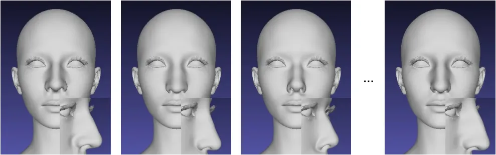

Figure 6: Nose Shape Basis Set Derived from the Basel Face Model.

#### 3.1.2 Facial Skeletons Calibration

Once high-fidelity human face meshes are generated, accurate
skeleton(_i.e._, joint, bone) binding is crucial for ensuring the
realistic and nuanced animation driving performance. We achieve this by
fitting the skeleton (joints and bones) from a pre-rigged,
neutral-shaped face mesh onto the newly generated target model.

Our approach begins by implementing the forward propagation of a
skeleton-driven skinning system. This system uses a hierarchical,
multi-branch, loop-free tree structure to organize hundreds of skeleton
nodes, mirroring the rig logic systems of MetaHuman\[11\]. Each node
stores its local translation and rotation relative to its parent. Once a
skeleton moves, we update the absolute positions of all descendant nodes
of this skeleton using forward kinematics. These displacements in
absolute coordinate, combined with Linear Blend Skinning (LBS) weights,
determine the displacements of mesh vertices and deform the mesh. Since
our geometry reconstruction maintains consistent face-vertex topology,
we can compute the vertex differences between the target mesh and the
deformed mesh on a per-vertex basis. These differences are then used as
the loss function for skeleton fitting:

```math
L_{v}=\sum_{n=1}^{N}\left\|\mathbf{v}_{i}^{\text{current}}-\mathbf{v}_{i}^{\text{target}}\right\|_{2}^{2} \tag{2}
```

where $`N`$ denotes the number of vertices in the mesh,
$`\mathbf{v}_{i}^{\text{current}}`$ and
$`\mathbf{v}_{i}^{\text{target}}`$ are the $`(x,y,z)`$ coordinates of
the i-th vertex in the current deformed mesh and the target mesh,
respectively. We aim to move the current vertices towards their
corresponding target positions.

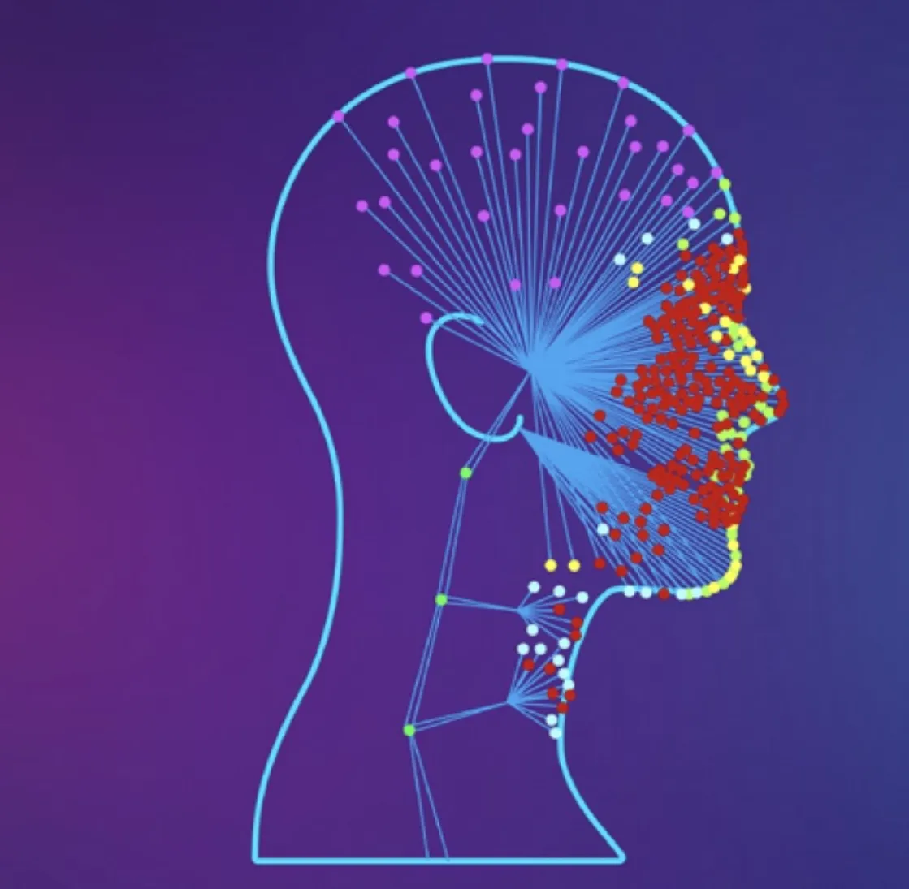

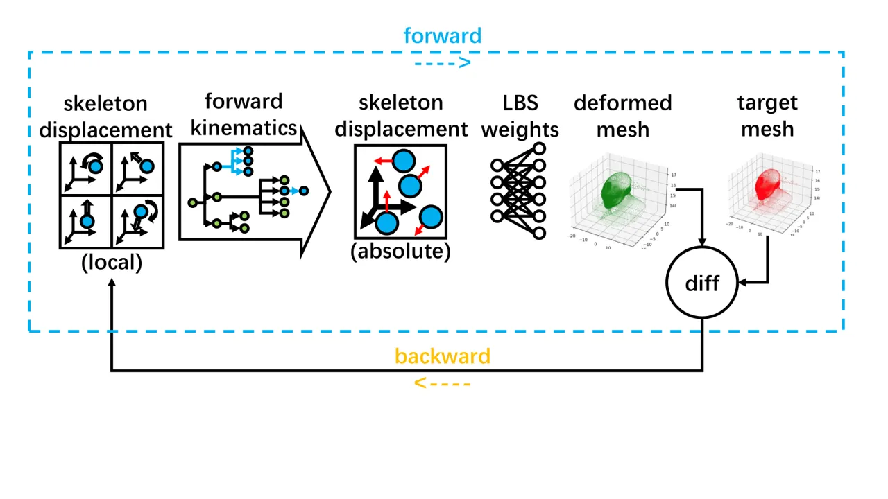

Figure 7: The skeleton calibration pipeline.

Leveraging the complete forward path from skeleton displacement to mesh
vertex displacement, we can directly utilize automatic differentiation
to optimize skeleton parameters. This process iteratively adjusts the
skeleton position, aiming to minimize the loss and drive the current
mesh closer to the target shape. This iterative fitting pipeline,
visualized in Figure 7, continues until convergence is achieved.

We also observe significant spatial overlap between the leaf node
skeletons and the mesh vertices on both the neutral and rigged face
meshes. We denote the index set of these overlapping leaf skeletons as
$`\Phi`$:

```math
M(i)=j,i\in\Phi \tag{3}
```

```math
\mathbf{s}_{i}=\mathbf{v}_{M(i)},i\in\Phi \tag{4}
```

the function $`M(.)`$ maps each index of a skeleton to the corresponding
index of its associated vertex in the mesh. Therefore, the positional
differences between these overlapping skeleton nodes and their mesh
counterparts are used as a supervision component in the fitting process:

```math
L_{s}=\sum_{i\in\Phi}\left\|\mathbf{s}^{\text{current}}_{i}-\mathbf{v}^{\text{current}}_{M(i)}\right\|_{2}^{2} \tag{5}
```

the total loss function is given by $`L_{total}`$= $`L_{v}`$ +
$`L_{s}`$.

Through practical experimentation, we observed that enabling updates for
all skeleton parameters during the optimization process can lead to
unreasonable skeleton configurations. Specifically, the optimizer tends
to induce exaggerated movements in the skeleton in an attempt to align
the deformed mesh with the target mesh. To mitigate this issue, we
impose a constraint by allowing updates only for the leaf node skeletons
within the skeleton tree system.

Simply fine-tuning the skeletons alone is insufficient to perfectly
match the target shape (the loss cannot be reduced to zero). Therefore,
our process first applies the residual offset as a blend shape to the
neutral face mesh. Subsequently, skeletons are adjusted according to the
results of the above solution. This two-step calibration enables a
well-rigged face mesh.

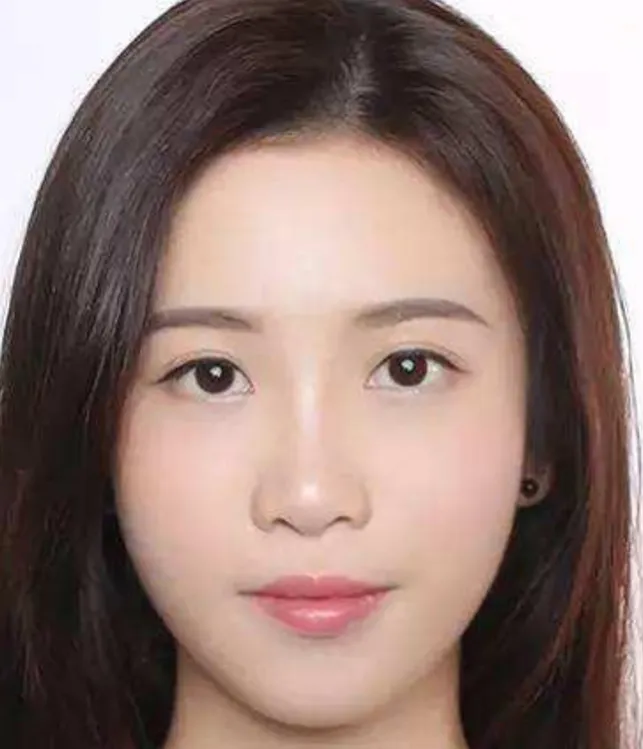

(a)

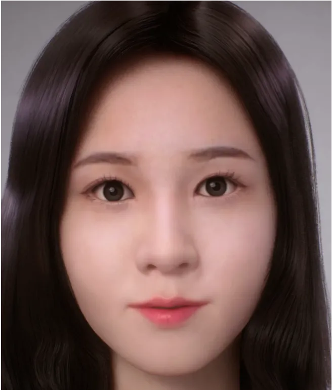

(b)

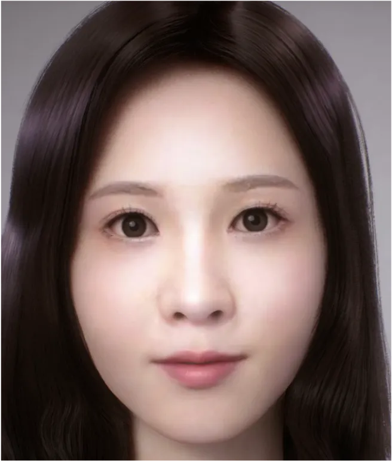

(c)

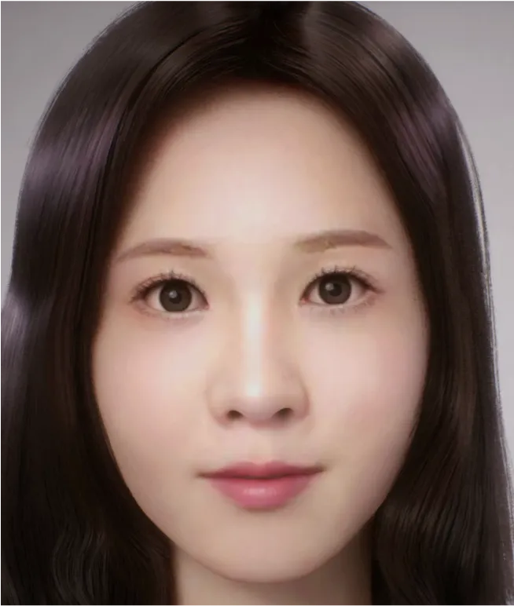

(d)

Figure 8: Comparison of different types of textures rendered in UE. (a)
is the input image, (b), (c), (d) are generated 3D characters using
diffuse albedo \[27\], texture generated from differentiable rendering
and the corrected textures.

### 3.2 Texture Generation

#### 3.2.1 Texture Correction

In our endeavor to accurately replicate the textures and shadings of the
input facial images within Unreal Engine (UE), the
illumination-independent diffuse albedos \[27\]prove to be unsuitable
for this scenario, as demonstrated in Figure 8(b). While textures
generated via differentiable rendering initially present as a promising
choice, they inherently incorporate baked illumination, leading to
significant discrepancies in light and shadow effects when rendered in
UE compared to those observed in the input facial images, as depicted in
Figure 8(c). Moreover, recreating identical lighting conditions in UE is
particularly challenging due to the inherently ill-posed problem of
inferring illumination from a single real-world image. To address these
issues, we opt to establish a fixed lighting environment within UE and
formulate the task of lighting replication as a classical image-to-image
translation problem. By learning the differences between the rendered
output and the input facial image, it corrects the textures generated by
the differentiable rendering and reproduces the lighting effects of the
input images, as illustrated in Figure 8(d).

It is well known that the rendering process in UE is not differentiable.
To overcome this limitation and facilitate back-propagation of shadings
onto facial textures, we propose a neural network, denoted as
$`\mathcal{N}`$, to emulate the inverse rendering process of the UE. As
in Figure 9, $`\mathcal{N}`$ maps the rendered color $`\mathcal{C}`$ to
a corrected color $`\mathcal{C}^{{}^{\prime}}`$, such that

```math
\mathcal{C}^{{}^{\prime}}=\mathcal{N}(\mathcal{C}) \tag{6}
```

When the corrected color $`\mathcal{C}^{{}^{\prime}}`$ is rendered
through UE, the rendered result yields to $`\mathcal{C}`$, indicating
successful replication of the rendered color. To achieve the replication
of the input facial images’ illumination, we apply $`\mathcal{N}`$ to
adjust the textures generated by the differentiable rendering process.

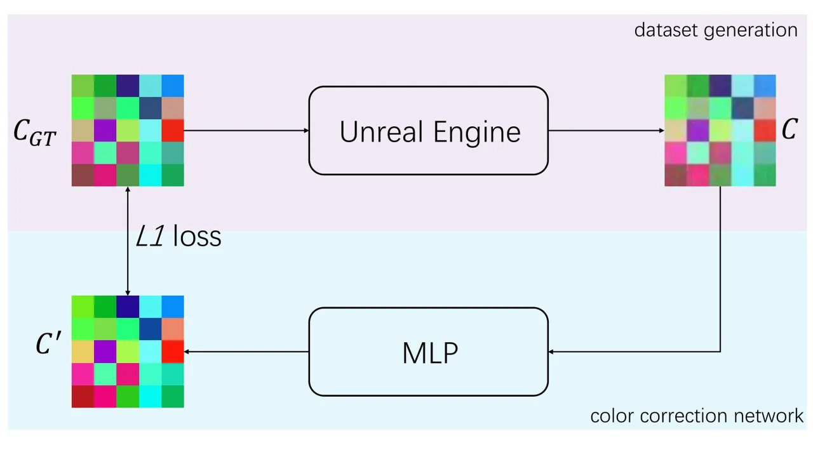

Figure 9: The color correction pipeline.

We implement the network $`\mathcal{N}`$ as a three-layer MLP with 32
hidden units, and define the loss function as
$`\sum_{i=1}^{n}\|\mathcal{C}_{i}^{{}^{\prime}}-\mathcal{N}(\mathcal{C}_{i})\|`$.
The training data is generated through an intuitive approach: we render
a variety of colors $`\mathcal{C}^{{}^{\prime}}`$ in UE and store the
results as $`\mathcal{C}`$, yielding over 10,000 color pairs for
training.

#### 3.2.2 Facial Lighting Normalization

When dealing with facial images under atypical lighting, such as
non-uniform, colored, or overexposed lighting conditions, the corrected
textures often retain these lighting features, including shadings and
highlights. As a result, it presents a dilemma, while these lighting
features enhance the fidelity of the rendered face compared to the
input, they also create visual inconsistencies within the uniformly lit
UE environment. To address this issue, we employ the IC-light algorithm
\[40\] to attenuate these atypical lighting features and achieve
normalized facial lighting. Given a facial image and the uniform light
map, the IC-light algorithm re-lights the face according to the new
lighting condition. To partially maintain the original shadings and
highlights, we blend the re-lit face with the input face, yielding a
similar yet even lighting facial image. Figure 10(a) and Figure 10(b)
present the 3D characters generated by the input facial image and the
normalized facial image, demonstrating that the latter’s shadings and
highlights are more natural and harmonious within our UE environment.

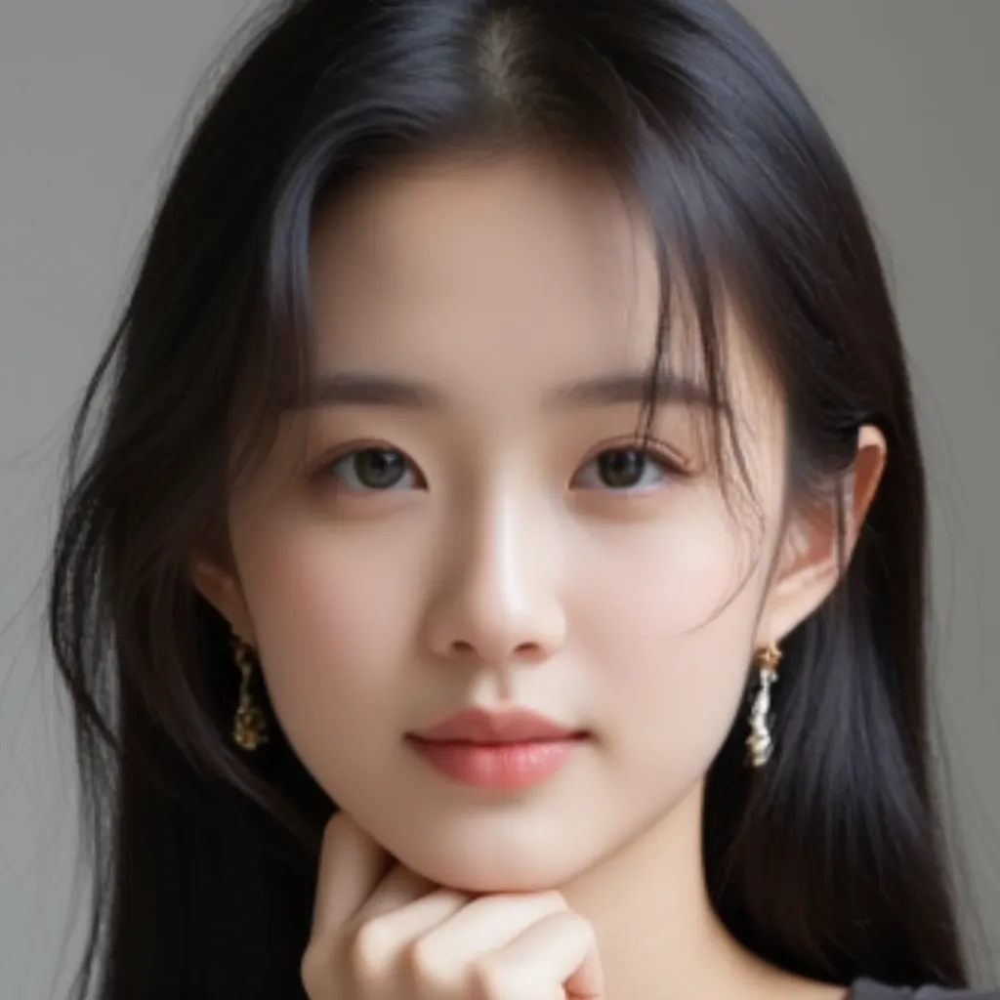

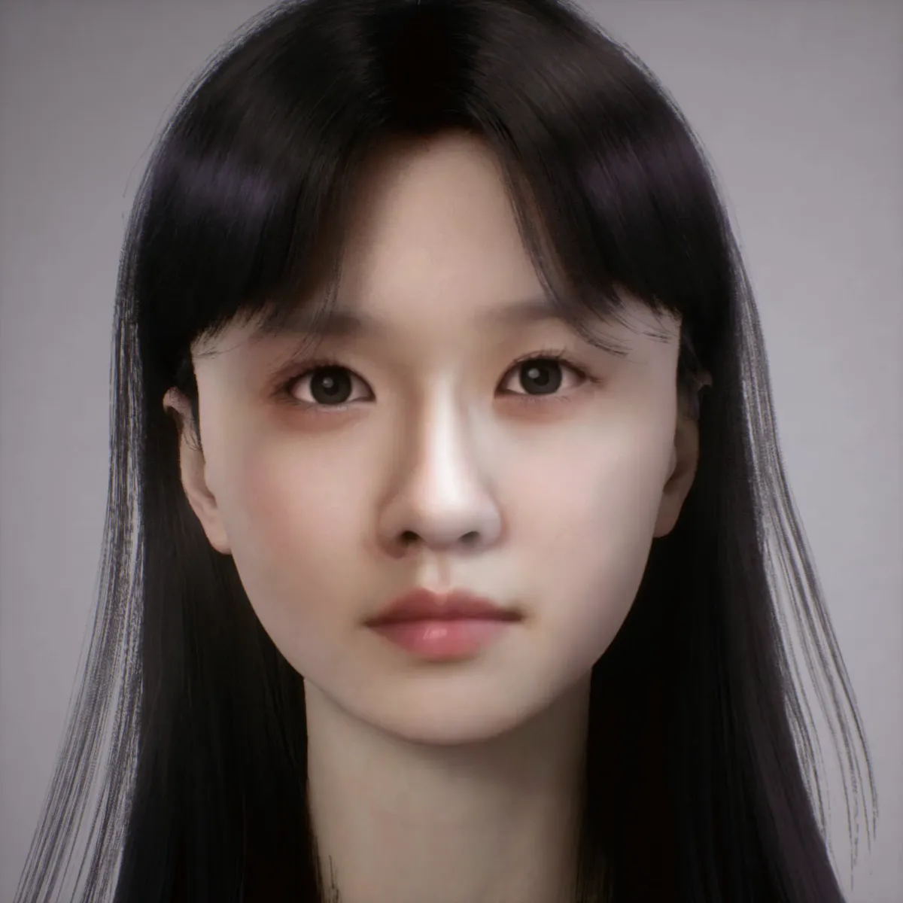

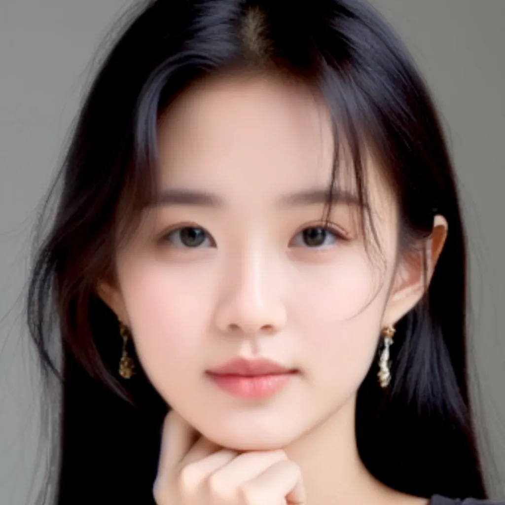

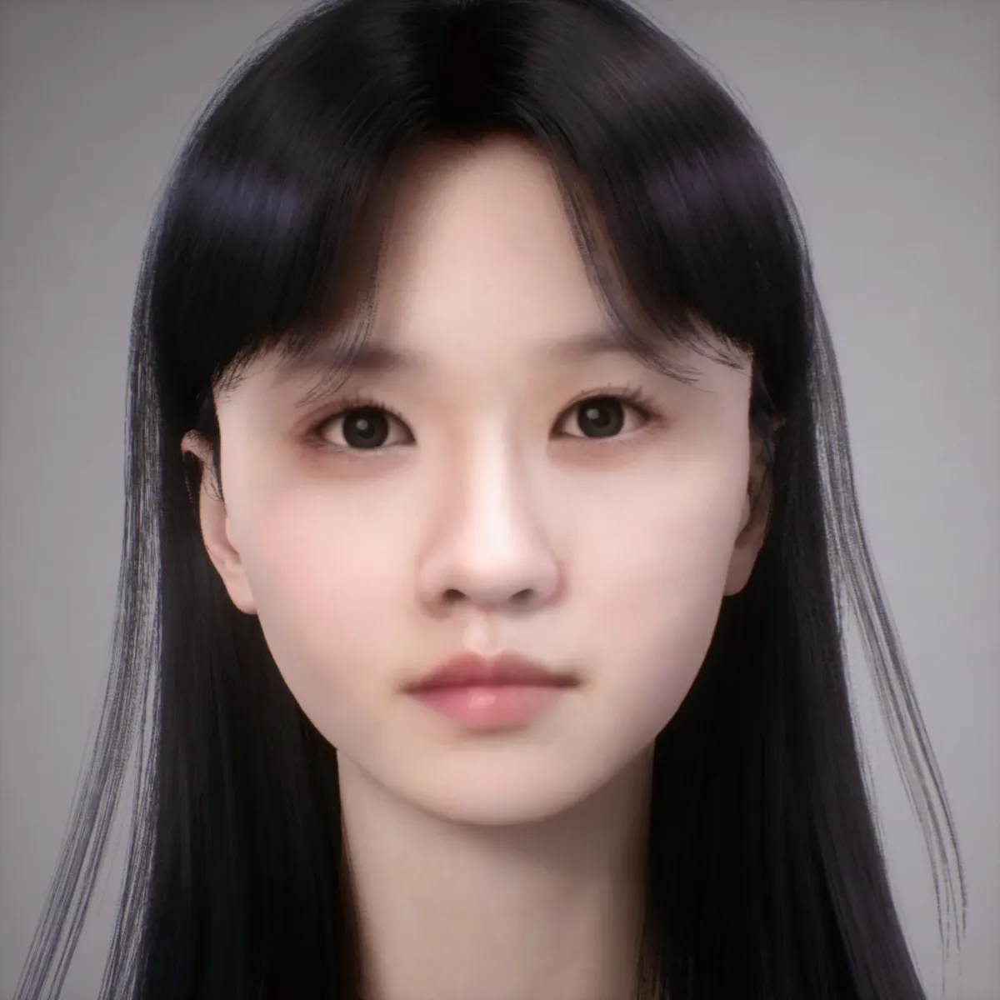

Figure 10: Results of the relighted image. This figure presents the 3D
characters generated by the input facial image and the normalized facial
image, respectively.

### 3.3 Hair Generation

When generating 3D avatars from single images, capturing the hairstyle
is crucial for achieving an accurate likeness. To facilitate this, we
utilize a specialized hairstyle classification model powered by
convolutional neural networks. This model directly maps a portrait image
to a specific hairstyle within our asset library, bypassing the need for
intermediate feature extraction. Many hairstyles naturally showcase
asymmetry, as seen in the way long hair flows over the chest or back and
the placement of bangs. In our asset library, we’ve enhanced these
asymmetrical hairstyles by applying a horizontal flip, treating the
flipped versions as unique styles. Consequently, when labeling the
training data, we distinctly differentiate between the left and right
variations of these hairstyles.

## 4 3D Character Animation

In our application we mainly concerned to animate the generated avatars
via speech audio. We leveraged bone skeleton and facial control rig to
generate gesture and facial motion, respectively.

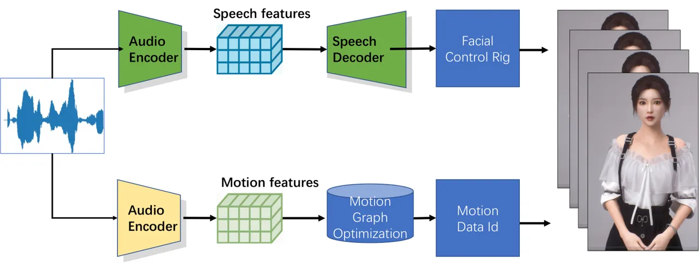

Figure 11: Pipeline of animations. Coefficients of facial control rig
were directly predicted from speech audio. Gesture motion clips were
selected from the captured data set by optimizing graph path.

### 4.1 Speech-driven Gesture Motions

Researchers have explored masked transformers  \[23, 25, 41\] or
diffusion models \[38, 4, 42\] to predict gestures from speech with or
without additional conditions, like word text, emotional labels or
semantic labels. They all freely generate gestures by learning
distribution from motion capture data. Their jittering results do not
meet the industrial requirements. In contrast, we suggest to predict
predefined motion pieces for realistic animations.

In order to produce realistic animations, we use Vicon, which is a
sophisticated motion capture system, to collect body motion data, and
employ two senior animators to adapt the data to our generated avatars.
We capture more than one hundred pieces of motion data. The length of
each piece of data falls between 2 seconds and 3 seconds. These data are
common nonverbal gestures made by people while speaking, and they can be
divided into 5 categories, which responds to 5 human poses(see
Figure 11). In each category, the start and end pose of each data are
same. This allows the motion data in each category to be smoothly
concatenated together to form longer animation. Besides, there is motion
data for transition between different poses. These captured data form
the foundation of our training data.

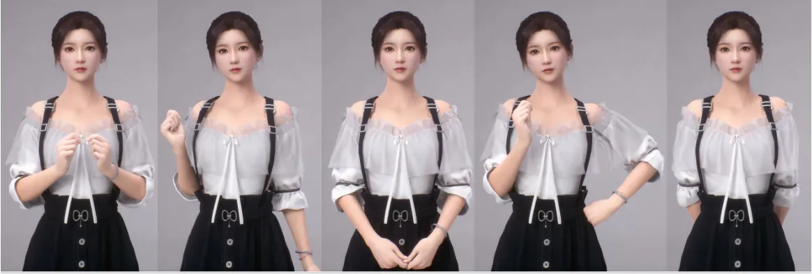

Figure 12: Captured motion data can be divided into 5 categories
corresponding to 5 poses. In each category, the start and end poses of
each data are same. This enables us to generate longer animation by
concatenating any two pieces of motion data in a single category.

The animators generate sequences of motion data based on speech audios
as our training data set. To align audio with motion sequences in the
data set, we use graph-based optimization method to generate motion
sequences. We take each piece of the data as a graph node, and there is
a directed edge between two nodes if these two nodes are in continuous
order in the training data set. The weight associated with a edge is
defined as follows:

```math
T(N_{i},N_{j})=\lambda_{1}T_{p}(N_{i},N_{j})+\lambda_{2}T_{r}(N_{i},N_{j}) \tag{7}
```

where $`N_{i}`$ denotes the $`i`$th graph node, $`T_{p}(N_{i},N_{j})`$
is the translation loss between two nodes, $`T_{r}(N_{i},N_{j})`$ is the
rotation loss of corresponding joints between two nodes. We also
associate each node with an audio embedding feature which extracted from
Wav2Vec2. Given an audio sequence $`M_{1},M_{2},....,M_{n}`$, the
corresponding motion sequence is obtained by an optimal path in the
directed graph. The cost is defined as follows:

```math
C=\sum_{i}^{n}C_{a}(A_{i},\hat{A}_{i})+\sum_{i}^{n-1}T(i,i+1) \tag{8}
```

where $`C_{a}(A_{i},\hat{A}_{i})`$ is the audio embedding loss.
$`A_{i}`$ and $`\hat{A}_{i}`$ denote the embedding features of audio
clip $`M_{i}`$ and graph node $`N_{i}`$, respectively. $`T(i,i+1)`$ is
the edge loss between the selected nodes with audio clip $`M_{i}`$ and
$`M_{i+1}`$. We use The viterbi algorithm  \[14\] to solve this
optimization problem.

In application we optimize the graph path within a specific motion data
category. For lengthy speech audio, we randomly choose transition data
to generate motions in another category. This strategy enables us to
generate a wide range of realistic animations.

### 4.2 Speech-Driven 3D Facial Animations

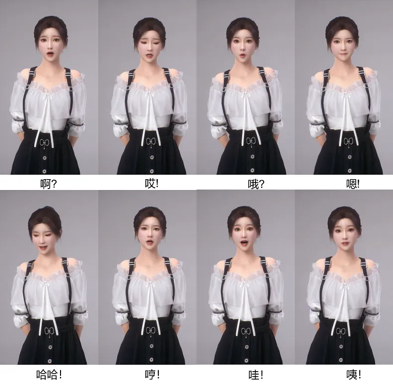

Figure 13: Screenshots of some Chinese interjections template animations

There are typically two parametric representation for creating 3D facial
animations: vertex displacement and blendshapes. While vertex
displacement methods can control facial movements with great precision,
it is challenging to animate components such as teeth, tongue, and
eyelashes, which can result in noticeable imperfections. On the other
hand, blendshape-based solutions are stable and less prone to
imperfections. However, the expressive capability of such solutions
depends on the number of blendshapes available. A larger number of
blendshapes allows for more nuanced expressions and improved animation
quality, whereas a smaller number may result in less satisfactory
outcomes. We adopt the blendshape-based approach, leveraging the robust
Control Rig system in Metahuman \[9\] to generate realistic facial
animations. In order to obtain high-quality facial animations data, we
employ a tool called MetaHuman Animator \[9\] to capture ctrlrig
coefficients and then refine them with the expertise of experienced
animators.

The entire pipeline of speech-driven 3D Facial Animations is shown in
Figure 11. Firstly, we utilize the state-of-the-art self-supervised
pre-trained speech model, wav2vec 2.0 \[1\], to encode audio signals.
Secondly, a non-autoregressive architecture is employed as the decoder
to directly regress facial animation weights from audio features. In
contrast to autoregressive transformer-based methods, the
non-autoregressive method only call decoder once, so it more efficient
than autoregressive method, which need a iterative decoding loop. We
only employ reconstruction loss and velocity loss which is also used in
Selftalk \[26\] to train the model. The loss function is formulated as:

```math
L=L_{\text{rec}}+L_{\text{vel}} \tag{9}
```

The reconstruction loss $`L_{\text{rec}}`$ measures the difference
between the predicted ctrlrig coefficients and the ground-truth ctrlrig
coefficients. Here, $`b_{t,i}`$ denotes the ground truth coefficients of
the $`i^{\text{th}}`$ ctrlrig at timestamp $`t`$, whereas
$`\hat{b}_{t,i}`$ represents the predicted value. $`T`$ is the length of
the sequence, $`N`$ is the number of ctrlrig.

```math
L_{\text{rec}}=\sum_{t=1}^{T}\sum_{i=1}^{N}\left\|b_{t,i}-\hat{b}_{t,i}\right\|_{2}^{2} \tag{10}
```

The velocity loss $`L_{\text{vel}}`$ is used to reduce lip jittery over
time.

```math
L_{\text{vel}}=\sum_{t=1}^{T}\sum_{i=1}^{N}\left\|(b_{t,i}-b_{t-1,i})-(\hat{b}_{t,i}-\hat{b}_{t-1,i})\right\|_{2}^{2} \tag{11}
```

In order to enhance the facial expressions of digital avatars, we
pre-create templates for words with strong emotions, such as
interjections.  Fig. 13 show some screenshots of the Chinese
interjections we created. When these interjections are detected in the
input audio, the corresponding facial expression templates are triggered
to enhance the expression of emotions.

## 5 Results

### 5.1 3D Character Generation

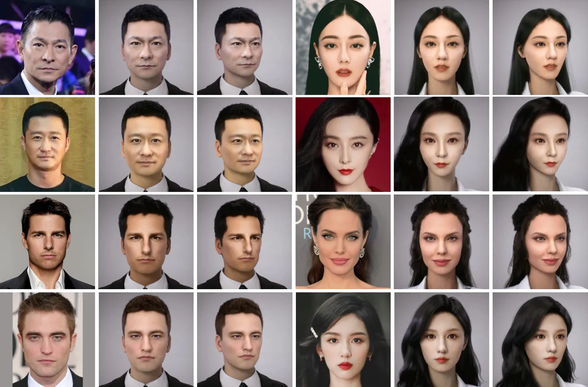

Figure 14: Textured 3D character models generated from frontal portrait
images. We utilize Unreal Engine for high-fidelity rendering.

Figure 14 presents the 3D characters created from single images with our
method. We compare our method with several state-of-art 3D avatar
generation algorithms, including two text-based avatar generation
methods(DreamFace \[39\], Rodin \[34\] ), and two single image-based
avatar generation methods (MeInGame \[21\] and MoSAR \[7\]). As shown in
Table 1, Our method generates complete, production-ready 3D character
assets compatible with modern CG pipelines, offering enhanced rendering
fidelity, highly accurate rigging, and improved editability compared to
other approaches.

| Method           | High Fidelity                 | Full-Body      | Facial Rigging                | CG Engine      | Outfit         |
| ---------------- | ----------------------------- | -------------- | ----------------------------- | -------------- | -------------- |
|                  | Generation                    | Completeness   | Fidelity                      | Compatible     | Editable       |
| DreamFace \[39\] | $`\star`$ $`\star`$ $`\star`$ | $`\times`$     | $`\star`$                     | $`\checkmark`$ | $`\checkmark`$ |
| Rodin \[34\]     | $`\star`$ $`\star`$           | $`\times`$     | $`\times`$                    | $`\times`$     | $`\times`$     |
| MeInGame \[21\]  | $`\star`$                     | $`\checkmark`$ | $`\star`$                     | $`\checkmark`$ | $`\checkmark`$ |
| MoSAR \[7\]      | $`\star`$ $`\star`$           | $`\times`$     | $`\star`$                     | $`\checkmark`$ | $`\checkmark`$ |
| Ours             | $`\star`$ $`\star`$ $`\star`$ | $`\checkmark`$ | $`\star`$ $`\star`$ $`\star`$ | $`\checkmark`$ | $`\checkmark`$ |

Table 1: Comparison of latest related 3D avatar generation algorithms.

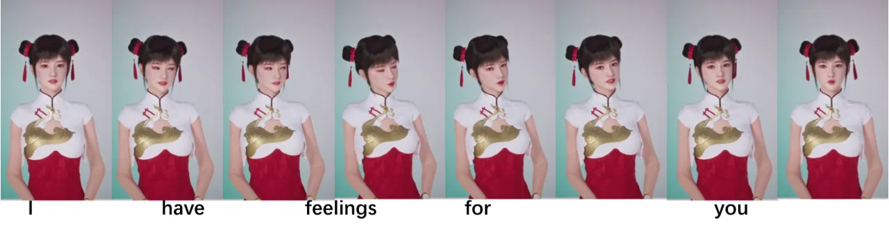

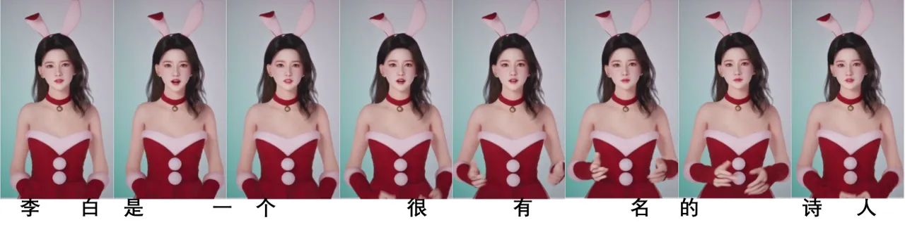

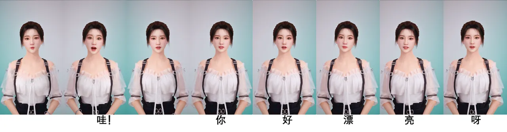

Figure 15: Full-body animations sequences generated by our system with
english speech(top row) ,Chinese speech(middle row) and Chinese speech
with interjection(bottom row).

### 5.2 3D Character Animation

Our system combines the facial animation and gesture animation, it can
generate holistic full-body motions. Figure 15 shows holistic gesture
motions and facial animations generated from English and Chinese
speeches. Benefit from high-quality mouth animations data, and
non-autoregressive decoder architecture, our system can generate
realistic lip-sync with efficiency exceeding real-time performance.
Additionally, suitable expressions are also incorporated into facial
animations during speech to enhance emotions. Our predefined motion data
set guarantees no jittering gestures. And the gesture motions are
aligned well with speech rhythm(See results in appendix videos).

## 6 Limitation

Although our method excels in generating high-quality 3D character
assets and animations, it still has several limitations. Firstly, when
the input face does not have a neutral expression, our expression
correction process may introduce artifacts, leading to unsatisfactory
facial rig results. Additionally, our generated characters currently
lack the ability to perform complex dynamic animations, such as singing
or dancing, due to a lack of specific training data. Furthermore, the
general nature of our animation model limits the personalization of
facial and body motion synthesis. We are actively researching ways to
overcome these limitations.

## References

- \[1\] Alexei Baevski, Yuhao Zhou, Abdelrahman Mohamed, and Michael
  Auli. wav2vec 2.0: A framework for self-supervised learning of speech
  representations. _Advances in neural information processing systems_,
  33:12449–12460, 2020.
- \[2\] Linchao Bao, Haoxian Zhang, Yue Qian, Tangli Xue, Changhai Chen,
  Xuefei Zhe, and Di Kang. Learning audio-driven viseme dynamics for 3d
  face animation. _arXiv preprint arXiv:2301.06059_, 2023.
- \[3\] Volker Blanz and Thomas Vetter. A morphable model for the
  synthesis of 3d faces. In _Proceedings of the 26th annual conference
  on Computer graphics and interactive techniques_, pages 187–194, 1999.
- \[4\] Junming Chen, Yunfei Liu, Jianan Wang, Ailing Zeng, Yu Li, and
  Qifeng Chen. Diffsheg: A diffusion-based approach for real-time
  speech-driven holistic 3d expression and gesture generation. In
  _CVPR_, 2024.
- \[5\] Daniel Cudeiro, Timo Bolkart, Cassidy Laidlaw, Anurag Ranjan,
  and Michael J Black. Capture, learning, and synthesis of 3d speaking
  styles. In _Proceedings of the IEEE/CVF conference on computer vision
  and pattern recognition_, pages 10101–10111, 2019.
- \[6\] Yu Deng, Jiaolong Yang, Sicheng Xu, Dong Chen, Yunde Jia, and
  Xin Tong. Accurate 3d face reconstruction with weakly-supervised
  learning: From single image to image set. In _Proceedings of the
  IEEE/CVF Conference on Computer Vision and Pattern Recognition
  Workshops_, pages 0–0, 2019.
- \[7\] Abdallah Dib, LuizGustavo Hafemann, Emeline Got, Trevor
  Anderson, Amin Fadaeinejad, RafaelM.O. Cruz, and Marc-Andre
  Carbonneau. \[ffhq-uv-intrinsics\] mosar: Monocular semi-supervised
  model for avatar reconstruction using differentiable shading. 2023.
- \[8\] Pif Edwards, Chris Landreth, Eugene Fiume, and Karan Singh.
  Jali: an animator-centric viseme model for expressive lip
  synchronization. _ACM Transactions on graphics (TOG)_,
  35(4):1–11, 2016.
- \[9\] Epic Games. Metahuman creator.
  [https://www.unrealengine.com/en-US/metahuman](https://www.unrealengine.com/en-US/metahuman), 2021.
  Accessed: 2024-06-01.
- \[10\] Inc Epic Games. Metahuman-dna-calibration github page.
  [https://github.com/EpicGames/MetaHuman-DNA-Calibration](https://github.com/EpicGames/MetaHuman-DNA-Calibration),
  2022a.
- \[11\] Inc Epic Games. Rig logic, runtime evaluation of metahuman face
  rigs.
  [https://cdn2-unrealengine-1251447533.file.myqcloud.com/rig-logic-whitepaper-v2-5c9f23f7e210.pdf](https://cdn2-unrealengine-1251447533.file.myqcloud.com/rig-logic-whitepaper-v2-5c9f23f7e210.pdf),
  2022b.
- \[12\] Yingruo Fan, Zhaojiang Lin, Jun Saito, Wenping Wang, and Taku
  Komura. Faceformer: Speech-driven 3d facial animation with
  transformers. In _Proceedings of the IEEE/CVF Conference on Computer
  Vision and Pattern Recognition_, pages 18770–18780, 2022.
- \[13\] Yao Feng, Haiwen Feng, Michael J Black, and Timo Bolkart.
  Learning an animatable detailed 3d face model from in-the-wild images.
  _ACM Transactions on Graphics (ToG)_, 40(4):1–13, 2021.
- \[14\] G.D. Forney. The viterbi algorithm. _Proceedings of the IEEE_,
  61(3):268–278, 1973.
- \[15\] Simon Giebenhain, Tobias Kirschstein, Markos Georgopoulos,
  Martin Rünz, Lourdes Agapito, and Matthias Nießner. Learning neural
  parametric head models. In _Proceedings of the IEEE/CVF Conference on
  Computer Vision and Pattern Recognition_, pages 21003–21012, 2023.
- \[16\] Yicong Hong, Kai Zhang, Jiuxiang Gu, Sai Bi, Yang Zhou, Difan
  Liu, Feng Liu, Kalyan Sunkavalli, Trung Bui, and Hao Tan. Lrm: Large
  reconstruction model for single image to 3d. _arXiv preprint
  arXiv:2311.04400_, 2023.
- \[17\] Tero Karras, Timo Aila, Samuli Laine, Antti Herva, and Jaakko
  Lehtinen. Audio-driven facial animation by joint end-to-end learning
  of pose and emotion. _ACM Transactions on Graphics (ToG)_,
  36(4):1–12, 2017.
- \[18\] Biwen Lei, Jianqiang Ren, Mengyang Feng, Miaomiao Cui, and
  Xuansong Xie. A hierarchical representation network for accurate and
  detailed face reconstruction from in-the-wild images. In _Proceedings
  of the IEEE/CVF Conference on Computer Vision and Pattern
  Recognition_, pages 394–403, 2023.
- \[19\] Lingyu Liang, Luojun Lin, Lianwen Jin, Duorui Xie, and Mengru
  Li. Scut-fbp5500: A diverse benchmark dataset for multi-paradigm
  facial beauty prediction. 2018.
- \[20\] Jiangke Lin, Yi Yuan, and Zhengxia Zou. Meingame: Create a game
  character face from a single portrait. In _Proceedings of the AAAI
  conference on artificial intelligence_, pages 311–319, 2021.
- \[21\] Jiangke Lin, Yi Yuan, and Zhengxia Zou. Meingame: Create a game
  character face from a single portrait. _Proceedings of the AAAI
  Conference on Artificial Intelligence_, page 311–319, 2022.
- \[22\] Haiyang Liu, Zihao Zhu, Naoya Iwamoto, Yichen Peng, Zhengqing
  Li, You Zhou, Elif Bozkurt, and Bo Zheng. Beat: A large-scale semantic
  and emotional multi-modal dataset for conversational gestures
  synthesis. In _Computer Vision – ECCV 2022_, pages 612–630,
  Cham, 2022. Springer Nature Switzerland.
- \[23\] Haiyang Liu, Zihao Zhu, Giorgio Becherini, Yichen Peng,
  Mingyang Su, You Zhou, Xuefei Zhe, Naoya Iwamoto, Bo Zheng, and
  Michael J. Black. Emage: Towards unified holistic co-speech gesture
  generation via expressive masked audio gesture modeling. In
  _Proceedings of the IEEE/CVF Conference on Computer Vision and Pattern
  Recognition (CVPR)_, pages 1144–1154, 2024a.
- \[24\] Haiyang Liu, Zihao Zhu, Giorgio Becherini, Yichen Peng,
  Mingyang Su, You Zhou, Xuefei Zhe, Naoya Iwamoto, Bo Zheng, and
  Michael J. Black. Emage: Towards unified holistic co-speech gesture
  generation via expressive masked audio gesture modeling, 2024b.
- \[25\] Yifei Liu, Qiong Cao, Yandong Wen, Huaiguang Jiang, and
  Changxing Ding. Towards variable and coordinated holistic co-speech
  motion generation. In _Proceedings of the IEEE/CVF Conference on
  Computer Vision and Pattern Recognition (CVPR)_, pages 1566–1576,
  2024c.
- \[26\] Ziqiao Peng, Yihao Luo, Yue Shi, Hao Xu, Xiangyu Zhu, Hongyan
  Liu, Jun He, and Zhaoxin Fan. Selftalk: A self-supervised commutative
  training diagram to comprehend 3d talking faces. In _Proceedings of
  the 31st ACM International Conference on Multimedia_, pages
  5292–5301, 2023.
- \[27\] Jianqiang Ren, Chao He, Lin Liu, Jiahao Chen, Yutong Wang,
  Yafei Song, Jianfang Li, Tangli Xue, Siqi Hu, Tao Chen, Kunkun Zheng,
  Jianjing Xiang, and Liefeng Bo. Make-a-character: High quality
  text-to-3d character generation within minutes. _arXiv preprint
  arXiv:2312.15430_, 2023.
- \[28\] Alexander Richard, Michael Zollhöfer, Yandong Wen, Fernando
  De la Torre, and Yaser Sheikh. Meshtalk: 3d face animation from speech
  using cross-modality disentanglement. In _Proceedings of the IEEE/CVF
  International Conference on Computer Vision_, pages 1173–1182, 2021.
- \[29\] Tianyang Shi, Yi Yuan, Changjie Fan, Zhengxia Zou, Zhenwei Shi,
  and Yong Liu. Face-to-parameter translation for game character
  auto-creation. In _Proceedings of the IEEE/CVF International
  Conference on Computer Vision_, pages 161–170, 2019.
- \[30\] Sarah L Taylor, Moshe Mahler, Barry-John Theobald, and Iain
  Matthews. Dynamic units of visual speech. In _Proceedings of the 11th
  ACM SIGGRAPH/Eurographics conference on Computer Animation_, pages
  275–284, 2012.
- \[31\] Ayush Tewari, Michael Zollhofer, Hyeongwoo Kim, Pablo Garrido,
  Florian Bernard, Patrick Perez, and Christian Theobalt. Mofa:
  Model-based deep convolutional face autoencoder for unsupervised
  monocular reconstruction. In _Proceedings of the IEEE International
  Conference on Computer Vision Workshops_, pages 1274–1283, 2017.
- \[32\] Dmitry Tochilkin, David Pankratz, Zexiang Liu, Zixuan Huang,
  Adam Letts, Yangguang Li, Ding Liang, Christian Laforte, Varun
  Jampani, and Yan-Pei Cao. Triposr: Fast 3d object reconstruction from
  a single image. _arXiv preprint arXiv:2403.02151_, 2024.
- \[33\] Luan Tran and Xiaoming Liu. Nonlinear 3d face morphable model.
  In _Proceedings of the IEEE conference on computer vision and pattern
  recognition_, pages 7346–7355, 2018.
- \[34\] Tengfei Wang, Bo Zhang, Ting Zhang, Shuyang Gu, Jianmin Bao,
  Tadas Baltrusaitis, Jingjing Shen, Dong Chen, Fang Wen, Qifeng Chen,
  and Baining Guo. Rodin: A generative model for sculpting 3d digital
  avatars using diffusion, 2022.
- \[35\] Tengfei Wang, Bo Zhang, Ting Zhang, Shuyang Gu, Jianmin Bao,
  Tadas Baltrusaitis, Jingjing Shen, Dong Chen, Fang Wen, Qifeng Chen,
  et al. Rodin: A generative model for sculpting 3d digital avatars
  using diffusion. In _Proceedings of the IEEE/CVF conference on
  computer vision and pattern recognition_, pages 4563–4573, 2023.
- \[36\] Jinbo Xing, Menghan Xia, Yuechen Zhang, Xiaodong Cun, Jue Wang,
  and Tien-Tsin Wong. Codetalker: Speech-driven 3d facial animation with
  discrete motion prior. In _Proceedings of the IEEE/CVF Conference on
  Computer Vision and Pattern Recognition_, pages 12780–12790, 2023.
- \[37\] Yuelang Xu, Zhaoqi Su, Qingyao Wu, and Yebin Liu. Gphm:
  Gaussian parametric head model for monocular head avatar
  reconstruction. _arXiv preprint arXiv:2407.15070_, 2024.
- \[38\] Sicheng Yang, Zhiyong Wu, Minglei Li, Zhensong Zhang, Lei Hao,
  Weihong Bao, Ming Cheng, and Long Xiao. Diffusestylegesture: Stylized
  audio-driven co-speech gesture generation with diffusion models. In
  _Proceedings of the Thirty-Second International Joint Conference on
  Artificial Intelligence, IJCAI-23_, pages 5860–5868. International
  Joint Conferences on Artificial Intelligence Organization, 2023.
- \[39\] Longwen Zhang, Qiwei Qiu, Hongyang Lin, Qixuan Zhang, Cheng
  Shi, Wei Yang, Ye Shi, Sibei Yang, Lan Xu, and Jingyi Yu. Dreamface:
  Progressive generation of animatable 3d faces under text guidance.
  _arXiv preprint arXiv:2304.03117_, 2023.
- \[40\] Lvmin Zhang, Anyi Rao, and Maneesh Agrawala. Ic-light github
  page, 2024a.
- \[41\] Xiangyue Zhang, Jiangfang Li, Jiaxu Zhang, Ziqiang Dang,
  Jianqiang Ren, Liefeng Bo, and Zhigang Tu. Semtalk: Holistic co-speech
  motion generation with frame-level semantic emphasis, 2024b.
- \[42\] Lingting Zhu, Xian Liu, Xuanyu Liu, Rui Qian, Ziwei Liu, and
  Lequan Yu. Taming diffusion models for audio-driven co-speech gesture
  generation. In _Proceedings of the IEEE/CVF Conference on Computer
  Vision and Pattern Recognition_, pages 10544–10553, 2023.
