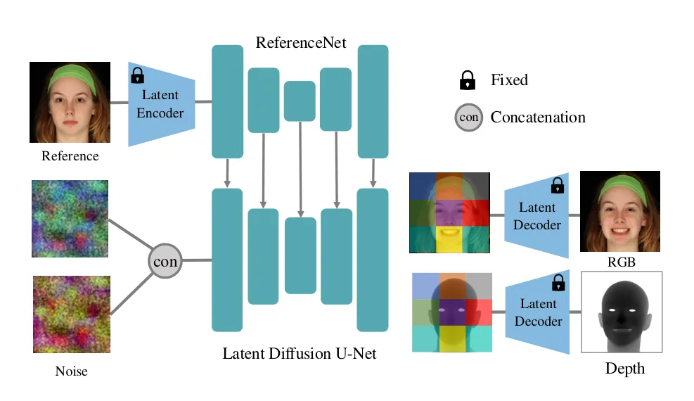
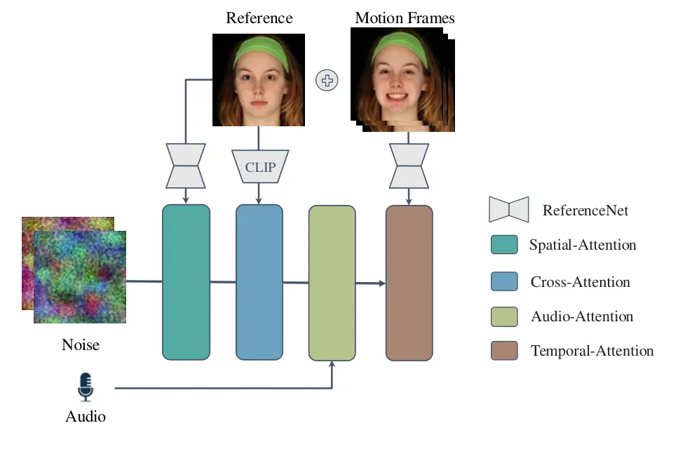
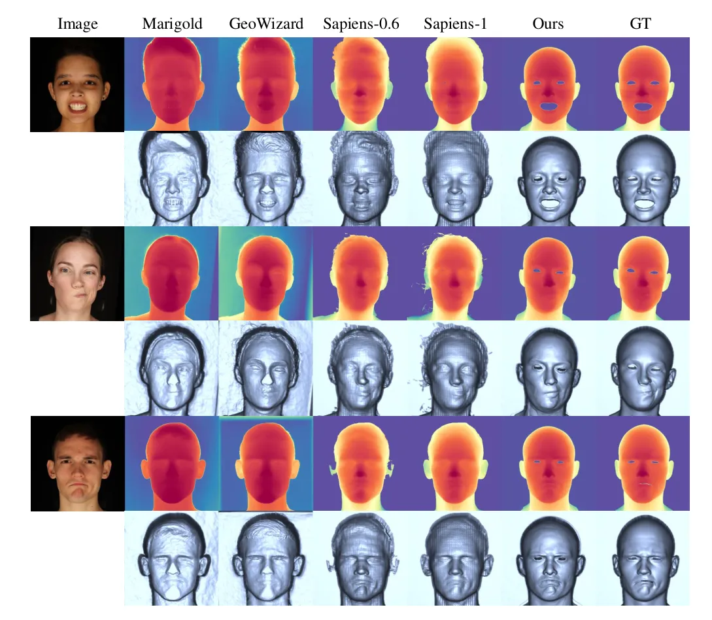
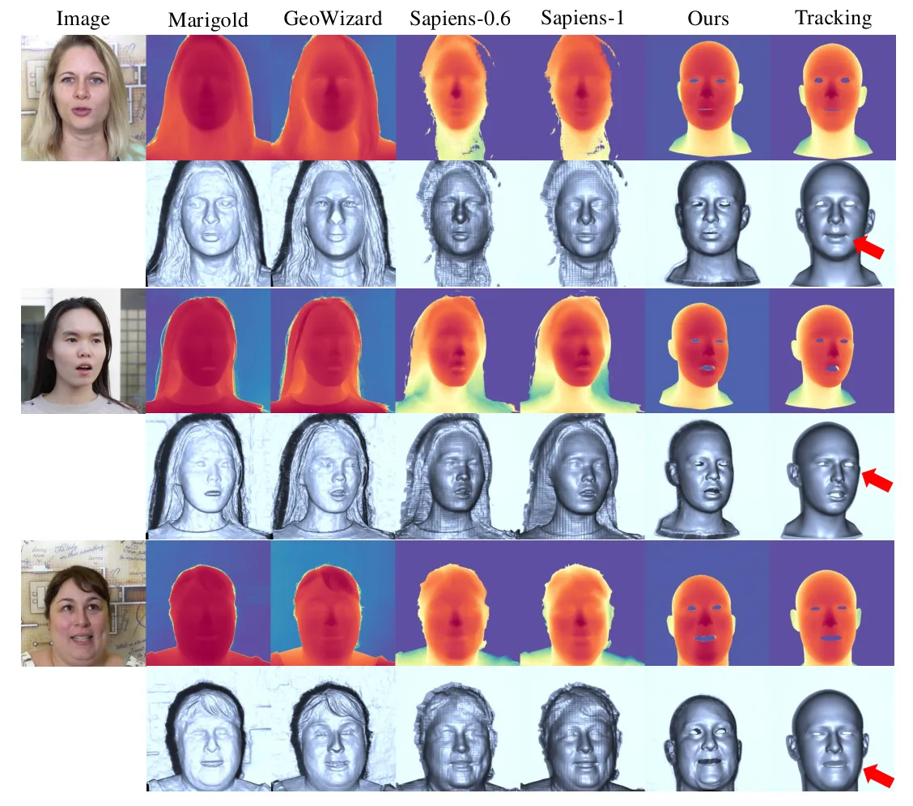
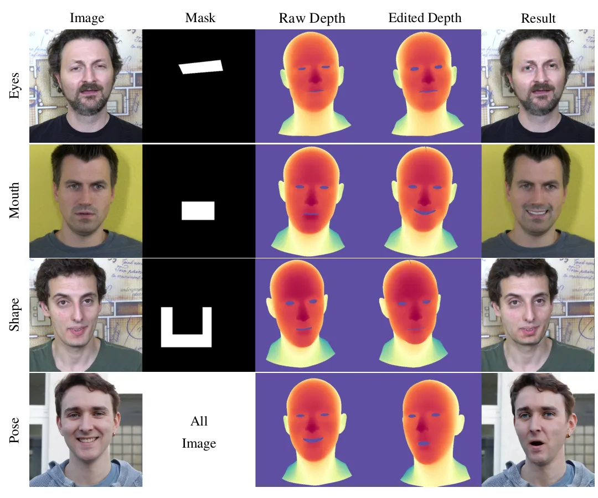
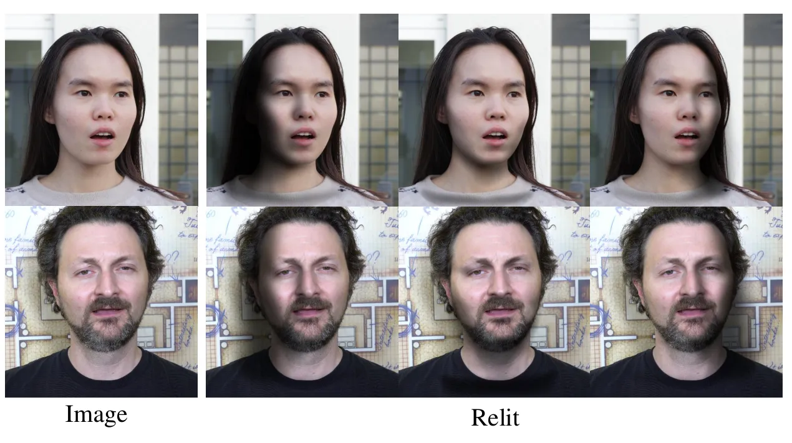
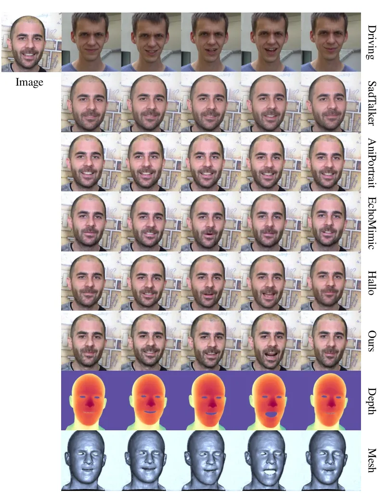
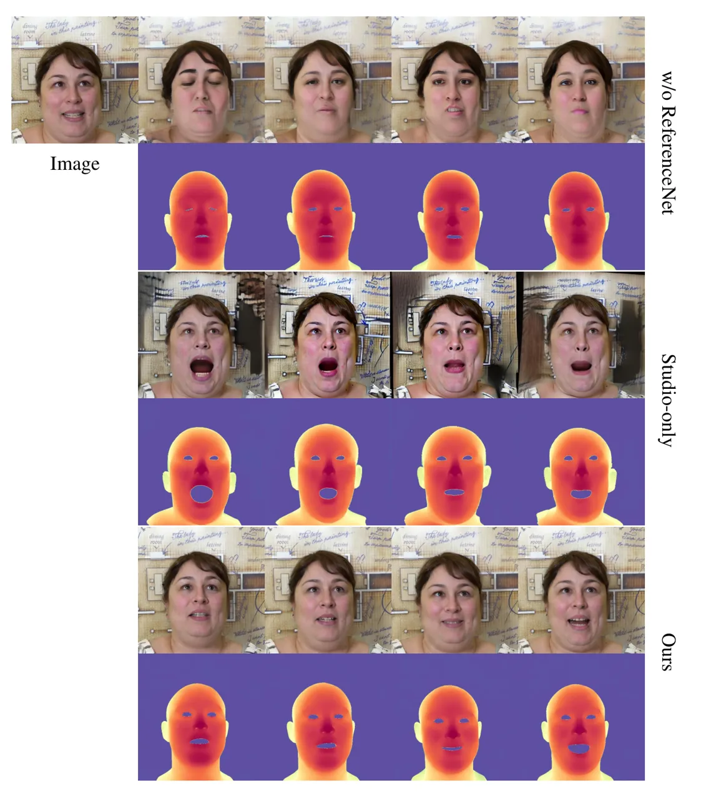
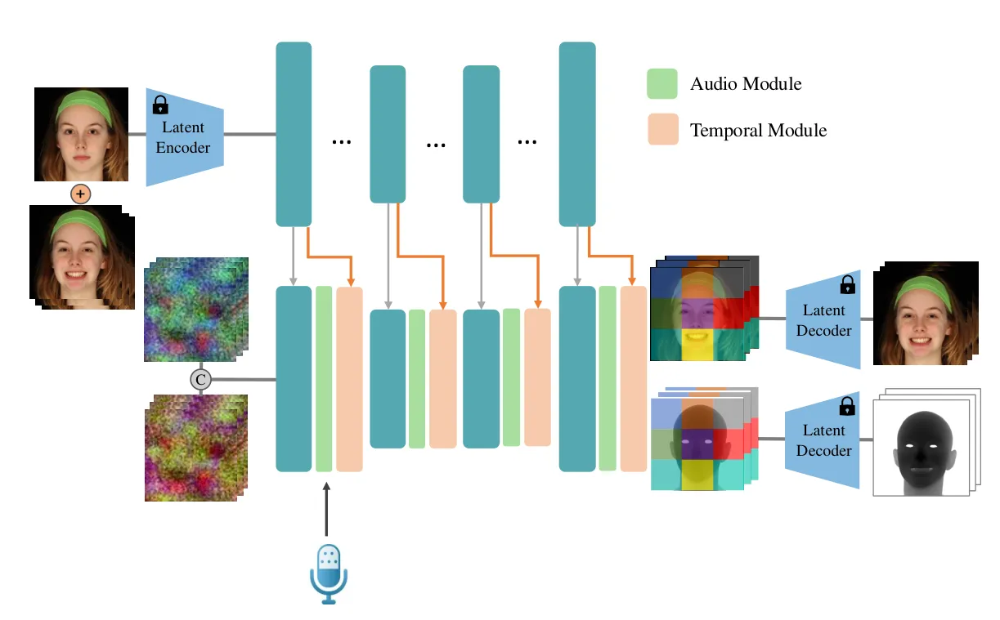
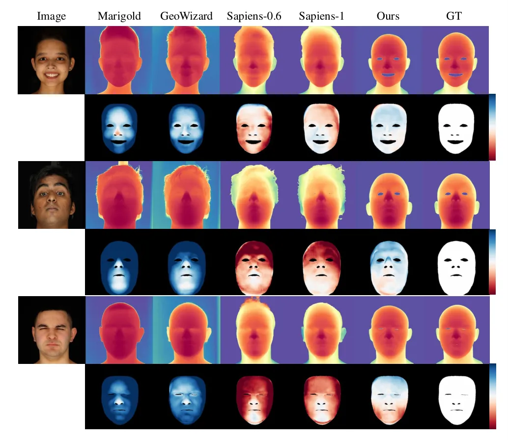

# Joint Learning of Depth and Appearance for Portrait Image Animation

Xinya Ji Affiliation: ETH Zürich Affiliation: Nanjing University
Email: <xinya@smail.nju.edu.cn>    Gaspard Zoss
Affiliation: DisneyResearch\|Studios Email: <caoxun@nju.edu.cn>   
Prashanth Chandran Affiliation: DisneyResearch\|Studios
Email: <lingchen.yang@inf.ethz.ch>    Lingchen Yang Affiliation: ETH
Zürich Email: <solenthaler@inf.ethz.ch>    Xun Cao Affiliation: Nanjing
University Email: <prashanth.chandran@disneyresearch.com>    Barbara
Solenthaler Affiliation: ETH Zürich
Email: <gaspard.zoss@disneyresearch.com>    Derek Bradley
Affiliation: DisneyResearch\|Studios
Email: <derek.bradley@disneyresearch.com>

###### Abstract

2D portrait animation has experienced significant advancements in recent
years. Much research has utilized the prior knowledge embedded in large
generative diffusion models to enhance high-quality image manipulation.
However, most methods only focus on generating RGB images as output, and
the co-generation of consistent visual plus 3D output remains largely
under-explored. In our work, we propose to jointly learn the visual
appearance and depth simultaneously in a diffusion-based portrait image
generator. Our method embraces the end-to-end diffusion paradigm and
introduces a new architecture suitable for learning this conditional
joint distribution, consisting of a reference network and a
channel-expanded diffusion backbone. Once trained, our framework can be
efficiently adapted to various downstream applications, such as facial
depth-to-image and image-to-depth generation, portrait relighting, and
audio-driven talking head animation with consistent 3D output.

## 1 Introduction

A popular application in the field of computer vision is to edit or
animate portrait photos. From an editing perspective, researchers have
devised a host of algorithms for tasks like portrait relighting \[51,
46, 36\], facial expression manipulation \[15, 44, 58, 68, 50, 54\] and
appearance editing \[56, 35, 11, 81\] (_e.g_. changing the hair color,
adding accessories or re-aging the person). From an animation
perspective, common tasks include animation retargeting from a driving
video of another individual \[19, 72, 29, 79\], or synthetic talking
head generation driven from an audio input \[48, 80, 89, 85, 88, 26, 28,
74, 90, 82, 45\].

To accomplish these tasks, modern approaches rely on deep generative
models, like GANs \[31, 32\] and diffusion models \[23, 5, 47\], that
are trained on large datasets of face images or videos. What we learned
from early models like StyleGAN \[55, 31\] is that image synthesis
methods can produce stunning photo-realistic images of human faces,
indistinguishable from reality. Thus the idea of recent image editing
and animation approaches is to start with a pre-trained generative
model \[5, 14, 49, 47\] as the backbone and learn to condition the
generation on other signals, like illumination or audio. While such
methods \[77, 24, 21, 20\] have proven to be very powerful in portrait
image manipulation, one issue is that previous methods only learn to
generate the appearance (_i.e_. the RGB color) of the face, which can
limit downstream applications. In this work we will show that jointly
learning both appearance and depth will allow for several expanded
applications in the field of portrait image animation.

We propose a new architecture for jointly learning both the depth and
the appearance of faces in a generative model, designed for portrait
image manipulation. The correlation between the appearance and depth
channels is of critical importance, _i.e_. the generated depth map must
match the generated face image. We accomplish this with a new
diffusion-based portrait image generator built on top of Stable
Diffusion \[47, 52\], but adapted to learn this joint distribution.
Similar to related work \[24, 75, 61\], we employ a reference network
designed to extract the identity of an RGB reference photo, which guides
the image diffusion process. We expand the traditional Stable Diffusion
backbone to de-noise a 6-channel input image, which consists of
separately-noised RGB and depth latent images. The shared UNet in the
diffusion step ensures good correlation between the appearance and depth
outputs. Finally we train the model on a combination of studio-captured
facial images with ground truth 3D geometry obtained from a facial
scanner, and also in-the-wild facial videos with approximate 3D
reconstructed geometry. As we will show, this combination allows our
model to both learn accurate depth generation and also generalize to
outdoor settings.

Once our model is trained it can be adapted for several applications. In
addition to unconditional sampling to achieve coupled RGB + depth
images, we show applications of channel-wise inpainting. Specifically,
for a given image we can inpaint the depth channel, achieving facial
depth estimation with our model. Alternatively, for a given depth image,
we can inpaint the RGB channels to obtain an artistic way to control
face image generation using either a 3D morphable face model or the
estimated depth from a separate image. Given the joint generation of
appearance and depth, we can further relight the face image in a
post-process using the normals from the depth image. Finally, we show
that our model can be extended to the task of creating audio-driven
talking head videos, with paired appearance and depth that is consistent
during the performance.

Specifically, our contributions are:

1.  1.  A novel architecture for joint learning of depth and appearance of
        portrait images,
2.  2.  A new training scheme for learning paired image and depth maps from
        a combination of in-studio and in-the-wild facial data,
3.  3.  The demonstration of several applications in portrait manipulation
        including both image-to-depth and depth-to-image channel-wise
        inpainting, portrait relighting, and audio-driven talking head
        animation.

## 2 Related Works

Diffusion Model for Character Animation. Diffusion-based generative
models have shown remarkable capabilities in generative tasks,
demonstrating diversity and adaptability across various multimedia
domains. The development of large pre-trained models, such as Stable
Diffusion \[52\], has spurred numerous applications leveraging its
robust model priors. By extending the pre-trained model from 2D image
generation to 3D video generation, researchers have explored tasks for
animating human images. For example, AnimateDiff \[21\] introduces a
plug-and-play temporal module designed to adapt flexibly to different
motion patterns without model-specific tuning. In animating specific
characters, DreamPose \[30\] introduces a dual clip-image encoder for
image encoding. Similarly, methods like Animate Anyone \[24\],
MagicAnimate \[77\], and Talk-Act \[17\] resort to a ReferenceNet with
symmetrical U-Net architecture to maintain appearance consistency.
Intermediate representations like landmarks, skeletons, or segmentation
maps are used as control signals in this process for fine-grained
control. Our work builds upon the diffusion priors of Stable Diffusion,
achieving video generation by integrating a motion module for improved
temporal consistency.

Diffusion Model for Geometric Estimation. Diffusion models trained on
large image datasets for high-quality generation tasks have been proven
to contain a rich understanding of the underlying scene structure. This
capability has extended the diffusion model to 3D geometric estimation
tasks, including depth estimation \[2, 3, 18, 25, 78\], normal
estimation \[69, 73\], and view synthesis \[42, 57, 41, 66\]. Recently,
Marigold \[33\] leverages the diffusion priors by fine-tuning large
pre-trained diffusion models specifically for depth estimation.
Wonder3D \[41\] designs a cross-domain diffusion model with attention
across different modalities for information exchange. Geowizard \[16\]
proposes to jointly estimate depth and normals and involve a scene
distribution decoupler strategy to discern different scene layouts.
Recently, Khirodkar _et al_. \[34\] proposes Sapiens, a human-centric
foundation model capable of pose estimation, body segmentation, depth
and normals estimation. Several approaches have been developed to
jointly denoise cross-domain representations utilizing the prior of
large pretrained model. JointNet \[83\] achieves joint generation by
replicating the original network, enabling it to handle multiple
geometric tasks within a unified framework. Additionally,
HyperHuman \[40\] proposes to learn the correlation between appearance
and geometric structure by denosing the depth and surface-normal along
with the RGB image. Similarly, we design a unified framework to jointly
learn RGB image and 3D depth by expanding the diffusion unet and
utilizing the priors of large pretrained generative model.

Audio-Driven Talking Head Generation. The goal of audio-driven talking
head generation is to synthesize facial movements synchronized with the
driven audio \[9, 63, 12, 60, 26, 22, 89, 87, 85, 89, 88, 27, 65, 43\].
Recently, with the development of the diffusion model, much progress has
been made in this area, emphasizing high-fidelity animation with
synchronized lip motion. For instance, EMO \[61\] firstly presents an
end-to-end framework capable of generating realistic facial animations
leveraging the pre-trained stable diffusion model from an audio track.
Similarly, VASA-1 \[76\] and AniTalker \[39\] train an audio-conditioned
diffusion model on the motion latent space for human faces and enables
real-time generation. Subsequent work like Aniportrait \[70\],
EchoMimic \[10\], and V-Express \[64\] expand the model for subtle
dynamics and stability by involving control signals like landmarks and
sophisticated loss functions. Hallo \[75\] and its updated version
Hallo2 \[13\] then focus on enhanced lip motion, long-duration and
high-resolution animation. Loopy \[28\] further improves the motion
quality by expanding the receptive field of the motion frames. Other
works like CyberHost \[38\] propose to integrate hand motion, which
enables video generation within the scope of the human body. However,
none of these previous works consider jointly synthesizing 2D and 3D
animation by utilizing the 3D priors in the pre-trained diffusion model.
Instead, we build a joint-learning framework which proves can be
extended to the audio-driven task and generate smooth animation.

## 3 Method



Figure 1: The overview of the proposed pipeline. Given a reference
image, our model jointly generates the appearance (RGB) and depth of the
identity under various expressions and poses, by simply sampling random
noise in the latent space.

### 3.1 Preliminaries

#### Latent Diffusion Models.

Diffusion models have set the new standard for generative models due to
its ability to generate high-quality samples and perform a wide range of
tasks with finetuning techniques. The diffusion model is trained to
generate images by iteratively adding noise to the image and then
removing the noise level-by-level, so that the model learns to generate
the image from the gaussian noise. Different from the diffusion models
that directly work on the image space, the latent diffusion models
perform diffusion in a latent space, providing computational compactness
and scalability to higher resolution images. The latent space is
obtained from a pretrained variational auto-encoder (VAE) \[37\].

For a given sampled image $`\mathbf{x}`$, the encoder $`\mathcal{E}`$ of
the VAE encodes the image into this latent space, as
$`\mathbf{z}=\mathcal{E}(\mathbf{x})`$. The forward pass of the
diffusion process adds noise to the latent code $`\mathbf{z}_{0}`$
according to the uniformly sampled noise level $`l`$:

```math
\mathbf{z}_{l}=\sqrt{\bar{\alpha}_{l}}\mathbf{z}_{0}+\sqrt{1-\bar{\alpha}_{l}}\boldsymbol{\epsilon}, \tag{1}
```

where $`\boldsymbol{\epsilon}\sim\mathcal{N}(0,\mathbf{I})`$,
$`\bar{\alpha}_{l}`$ is associated with the variance schedule of a
diffusion process with $`L`$ noise levels so that $`\mathbf{z}_{L}`$
becomes a gaussian distribution. In the reverse process, the denoising
network $`\boldsymbol{\epsilon}_{\theta}(\cdot)`$, parameterized with
learnable parameters $`\theta`$, gradually removes noise from
$`\mathbf{z}_{l}`$ to get $`\mathbf{z}_{l-1}`$, so as to obtain the
fully denoised $`\mathbf{z}_{0}`$. The decoder $`\mathcal{D}`$ of the
VAE then decodes $`\mathbf{z}_{0}`$ to generate the image
$`\mathbf{x}`$. During training, the parameters $`\theta`$ are updated
by minimizing the following loss function:

```math
\mathcal{L}(\theta)=\mathbb{E}_{\boldsymbol{\epsilon}\sim\mathcal{N}(0,\mathbf{I}),l\sim\mathcal{U}(L)}\left\|\epsilon-\boldsymbol{\epsilon}_{\theta}(\mathbf{z}_{l},l)\right\|^{2}. \tag{2}
```

Equipped with conditional information injected using cross-attention
modules \[62\], the latent diffusion models can be extended to perform
various tasks, such as text-to-image generation \[52\] and
image-to-image translation \[84\]. In this work, we propose to leverage
a pretrained latent diffusion model and adapt it to perform the task of
co-generation of depth and appearance for portrait image animation,
conditioned on a reference image.

### 3.2 Joint Learning of Depth and Appearance

As demonstrated in Fig. 1, given a reference image $`\mathbf{r}`$ of the
identity of interest, our task is to jointly generate the appearance
(RGB) $`\mathbf{x}`$ and depth $`\mathbf{d}`$ of the subject under
various expressions and poses. We model this as a conditional joint
distribution in the latent diffusion U-Net \[53\] model, as
$`p(\mathbf{z}^{\mathbf{x}}_{0},\mathbf{z}_{0}^{\mathbf{d}}|\mathbf{r})`$,
where $`\mathbf{z}^{\mathbf{x}}_{0}`$ and
$`\mathbf{z}_{0}^{\mathbf{d}}`$ are the latent features for the
appearance and depth, respectively. The final maps are generated by
decoding the latent codes with the decoder of the VAE, as
$`\mathbf{x}=\mathcal{D}(\mathbf{z}^{\mathbf{x}}_{0})`$ and
$`\mathbf{d}=\mathcal{D}(\mathbf{z}^{\mathbf{d}}_{0})`$.

The reference image $`\mathbf{r}`$ is essential to generate consistent
appearance and depth of the identity. In order to capture intricate
details of the target, we use a reference network $`\mathcal{R}`$ to
extract the identity features $`\mathbf{z}^{\mathbf{r}}`$ from the
reference image $`\mathbf{r}`$, as
$`\mathbf{z}^{\mathbf{r}}=\mathcal{R}(\mathbf{r})`$, which are then
injected into the latent diffusion model using the spatial attention
modules. Now the denoising process is conditional on the reference
features, as
$`\mathbf{z}_{l-1}=\mathbf{z}_{l}-\boldsymbol{\epsilon}_{\theta}(\mathbf{z}_{l},\mathbf{z}^{\mathbf{r}},l)`$.

To model the joint distribution, we generalize the latent diffusion
process to handle multiple latent codes. Specifically, in the forward
pass, we use the encoder $`\mathcal{E}`$ to separately encode the
appearance and depth, as
$`\mathbf{z}^{\mathbf{x}}_{0}=\mathcal{E}(\mathbf{x})`$ and
$`\mathbf{z}^{\mathbf{d}}_{0}=\mathcal{E}(\mathbf{d})`$. We then
independently add noise to each latent code, as follows:

```math
\displaystyle\mathbf{z}^{\mathbf{x}}_{l} \displaystyle=\sqrt{\bar{\alpha}_{l}}\mathbf{z}^{\mathbf{x}}_{0}+\sqrt{1-\bar{\alpha}_{l}}\boldsymbol{\epsilon}^{\mathbf{x}}, \tag{3}
```

```math
\displaystyle\mathbf{z}^{\mathbf{d}}_{l} \displaystyle=\sqrt{\bar{\alpha}_{l}}\mathbf{z}^{\mathbf{d}}_{0}+\sqrt{1-\bar{\alpha}_{l}}\boldsymbol{\epsilon}^{\mathbf{d}}, \tag{4}
```

where $`\boldsymbol{\epsilon}^{\mathbf{x}}`$ and
$`\boldsymbol{\epsilon}^{\mathbf{d}}`$ are independently sampled from
$`\mathcal{N}(0,\mathbf{I})`$. This follows the same reverse process as
the original latent diffusion model, except now the denoising network
$`\boldsymbol{\epsilon}_{\theta}`$ is modified to denoise both latent
codes. For simplicity, we concatenate the noised appearance and depth
latent codes, as
$`\mathbf{z}_{l}=[\mathbf{z}^{\mathbf{x}}_{l},\mathbf{z}^{\mathbf{d}}_{l}]`$.
Then the denoising network $`\boldsymbol{\epsilon}_{\theta}(\cdot)`$ is
modified to denoise the concatenated latent code, as
$`[\mathbf{z}^{\mathbf{x}}_{l-1},\mathbf{z}^{\mathbf{d}}_{l-1}]=\mathbf{z}_{l}-\boldsymbol{\epsilon}_{\theta}(\mathbf{z}_{l},\mathbf{z}^{\mathbf{r}},l)`$.
During training, $`\boldsymbol{\epsilon}_{\theta}`$ learns to predict
the concatenated noise:

```math
\mathcal{L}(\theta)=\mathbb{E}_{\boldsymbol{\epsilon}^{*}\sim\mathcal{N}(0,\mathbf{I}),l\sim\mathcal{U}(L)}\left\|[\boldsymbol{\epsilon}^{\mathbf{x}},\boldsymbol{\epsilon}^{\mathbf{d}}]-\boldsymbol{\epsilon}_{\theta}([\mathbf{z}^{\mathbf{x}}_{l},\mathbf{z}^{\mathbf{d}}_{l}],\mathbf{z}^{\mathbf{r}},l)\right\|^{2}. \tag{5}
```

### 3.3 Network Architecture

#### Diffusion Backbone.

We aim to leverage the expressive knowledge stored in a pretrained
latent diffusion model to learn our proposed conditional joint
distribution with limited available data. However, since the latent
diffusion model is originally trained to generate only RGB images, it
must be adapted to co-generate depth and appearance. Here, we adopt a
straightforward solution: expanding the input and output channels of the
latent denoising network $`\boldsymbol{\epsilon}_{\theta}`$.
Specifically, the additional parameters in the input layer are
initialized to zero, while the parameters in the output layer are
duplicated from the original ones. We find it sufficient for our task,
likely due to the rich priors learned in pretrained model, which
enhances the model’s capability to produce satisfactory results.

#### ReferenceNet.

ReferenceNet is designed to enhance and stabilize the generation process
by leveraging existing images as reference. It mirrors the layer
structure of the denoising model, ensuring compatibility. Both networks
produce feature maps with matching spatial resolutions and semantically
aligned characteristics. This alignment allows ReferenceNet to
effectively integrate extracted features into the diffusion model,
resulting in improved visual quality. The weights of our ReferenceNet
are initialized from the denoising network and trained together with it.



Figure 2: The detailed architecture of the building block of our
extended model for portrait RGBD video generation. The model is equipped
with additional attention modules to incorporate motion-related inputs.

## 4 Applications

Our model can be easily adapted to achieve a wide range of applications.
In Section 4.1, we demonstrate the bi-directional prediction of image or
depth conditioned on the other signal. This allows for tasks such as
monocular depth estimation and depth-based image editing. In
Section 4.2, we show our model, when equipped with additional motion
attention modules, can be extended to generate portrait RGBD videos.

### 4.1 Bi-Directional Prediction

Our joint distribution of depth and appearance can be transformed into a
conditional distribution in both directions, enabling bi-directional
prediction. This is accomplished by domain-wise inpainting for our
jointly learned model. With a light fine-tuning process, our model is
capable of both depth-to-image generation and image-to-depth generation.
Specifically, we employ masked latent as an additional input
condition \[52\] and design asymmetric masks for appearance and depth
while fine-tuning. The task of image-to-depth, _i.e_. monocular depth
estimation, can then be achieved by setting pure white for the depth
mask and pure black for the image mask, and vice-versa for
depth-to-image generation. Note that the involvement of ReferenceNet
here enables the generation of the RGB image matching the appearance of
the reference image, which allows possibilities for various applications
like facial attribute editing and animation. All of these entail the
alteration of the depth map, which can be easily achieved with standard
3D editing tools. We will show both image-to-depth and depth-to-image
experiments in Section 5.2 and Section 5.3, respectively.



Figure 3: Qualitative comparisons with the state-of-the-art methods for
monocular depth estimation on studio images.

### 4.2 Portrait RGBD Video Generation

Our model can be easily extended to generate portrait RGBD videos by
incorporating motion-related inputs and modules. For example, in the
context of audio-driven portrait video generation, audio and temporal
feedback are often incorporated into the diffusion backbone with
attention modules. Similar to existing methods \[75, 61, 28\], we add an
additional audio-attention module and a temporal-attention module in
each building block of the denoising U-Net to extract speech-related
motion signals and maintain consistency between the generated frames.
Fig. 2 illustrates the detailed architecture of the building block of
our extended model. Here we use a pretrained Wav2Vec model \[1\] to
extract a per-frame audio representation and concatenate features of
adjacent frames as audio input. To ensure the continuity between
consecutive sequences, our model incorporates the last motion frames
from previous generated sequence as input to the temporal module. This
allows the model to generate consistent portrait RGBD videos that are
synchronized with the audio input. Experiments of audio-driven facial
animation are illustrated in Section 5.5.

## 5 Experiments



Figure 4: Qualitative comparisons with the state-of-the-art methods for
monocular depth estimation on wild faces. Note that even 3D facial
tracking (right column) can sometimes fail. Our method can achieve a
better depth due to the high-quality studio data as a subset of our
training data.

### 5.1 Experimental Setups

Implementation Details. The joint learning of portrait RGB images and
depth takes about three days on four 4090 GPUs. We use a batch size of
32 and a constant learning rate of 1e-5 and train our model for 30000
steps. To learn our extended model with audio conditioning, we use a
batch size of 1. The weights of the motion module are initialized from
Animatediff\[21\], and we retain all other parameters from the first
stage. We generate 14 frames at once and use the first 4 ground truth
frames of each training sample as the motion frames during training.

Datasets. We train our model on a combination of datasets collected from
both studio and in-the-wild scenarios. Particularly, we use a
high-quality multi-view studio face dataset \[6\], comprising of images
from 336 subjects performing various facial expressions, along with
corresponding high-fidelity registered meshes. We render ground truth
depth maps from these registered meshes to obtain the paired RGB-Depth
data for training our method. To improve the generalization of our model
to real world data, we incorporate in-the-wild audio-visual sequences,
from selected clips of the HDTF \[86\] and VFHQ \[71\] datasets. As
these in-the-wild datasets do not contain corresponding geometry, we use
a state of the art monocular face tracking approach \[7, 8\] to estimate
3D geometry from these videos, using which we can extract pseudo ground
truth depth maps for training. In total we collect around 3 hours of
video data from HDTF and VFHQ, containing 2,423 clips with diverse
identities, facial expressions and head poses. All videos are sampled at
25 FPS and the images are cropped to a resolution of $`512\times 512`$.
We also pre-process the audio to 16kHz and extract per-frame wav2vec
audio features. The combination of studio data and in-the-wild data
provides a solid foundation, enabling our network to jointly generate
high-quality image and depth across various practical scenarios (see
Figs. 3 and 4). We will now demonstrate and evaluate the many different
applications made possible by our approach.



Figure 5: Depth-based face editing on shape, expression and pose.

### 5.2 Depth Estimation

Recently there has been great interest in fine-tuning foundational
models to predict depth from monocular RGB input \[16, 78, 33, 18\]. As
illustrated in Section 4.1, our model can readily be used for the task
of monocular depth estimation (or RGB conditioned depth prediction)
after a light fine-tuning.

We evaluate depth estimation on an unseen studio dataset as it provides
us with precise 3D depth maps which we can consider as ground truth.
This evaluation dataset consists of 1264 images from 55 identities
consisting of various facial expressions and poses. We follow the
relative-depth evaluation protocols proposed in MiDaS \[4\] and
LDM3D \[59\], and evaluate standard metrics including absolute relative
error (AbsRel), $`\delta_{1}`$ accuracy and root mean squared error
(RMSE). As the ground truth depth maps derived from the 3D mesh in the
studio dataset contain only the facial skin region, we apply a mask and
remove regions outside this area to ensure a fair comparison of methods.

We compare our method against state-of-the-art monocular depth
estimators including Marigold \[33\], Geowizard \[16\], and three
different backbones from the human-centric foundation model
Sapiens \[34\]. Quantitative results are listed in Tab. 1 and
qualitative results are shown in Fig. 3. As we see in Tab. 1, our method
outperforms all other models on this task, including the Sapiens-1B
model. Qualitatively our method captures the facial shape and expression
similar to Sapiens-1B, while containing significantly fewer grid-like
artifacts. We also present qualitative results for monocular depth
estimation on in-the-wild face portraits (Fig. 4), and compare our
estimated depth to the result of fitting a 3D morphable model \[7, 8\]
to the input RGB image. Even though such a fitting method was used to
generate the depth component of our in-the-wild training data, our
results on unseen in-the-wild images have better mouth and face
structure when compared to the 3DMM fit, and correspond better to the
RGB image. This is due to the fact that our method learned accurate
depth correlation from the combined studio training data.

|                     |                       |                             |                     |
| ------------------- | --------------------- | --------------------------- | ------------------- |
| Method              | AbsRel $`\downarrow`$ | $`\delta_{1}`$ $`\uparrow`$ | RMSE $`\downarrow`$ |
| Marigold \[33\]     | 0.529                 | 0.538                       | 0.055               |
| GeoWizard \[16\]    | 0.392                 | 0.644                       | 0.050               |
| Sapiens-0.3B \[34\] | 0.313                 | 0.526                       | 0.056               |
| Sapiens-0.6B \[34\] | 0.297                 | 0.549                       | 0.048               |
| Sapiens-1B \[34\]   | 0.197                 | 0.696                       | 0.047               |
| Ours-Wild-Only      | 0.313                 | 0.658                       | 0.059               |
| Ours                | 0.162                 | 0.765                       | 0.047               |

Table 1: Quantitative comparison for monocular depth estimation on
portrait images.



Figure 6: Portrait image relighting is possible using our generated
depth map.

### 5.3 Depth-Conditioned Portrait Animation

In addition to monocular depth estimation, the joint learning of RGB and
depth modalities also enables us to generate an RGB image by providing a
depth map as input. This application of our model can be particularly
useful in having precise control over the generated RGB image for
editing applications. In Fig. 5, we show examples of editing an RGB
image, by modifying its corresponding depth map, and requiring our model
to re-generate an RGB image corresponding to the edited depth. The
inpainting mask spatially guides the model to the regions it is expected
to modify in the given image. Our approach generates photo real images
that respect the identity of the original RGB image and the edited depth
maps.

### 5.4 Image Relighting

One benefit of our joint learning of appearance and depth is that the
facial depth can be used for downstream tasks like portrait relighting.
Fig. 6 illustrates an example where the generated depth maps are used to
compute surface normals for basic lighting changes in the generated
image. Here the normals are used for rendering a diffuse shading layer
that is multiplied with the image as a post-process.

### 5.5 Audio-driven Facial Animation

So far the applications we have seen in monocular depth estimation and
depth-conditioned portrait editing focus on single-image manipulation.
However as we described in Sec. 4.2, our network can be extended with
the insertion of motion modules and also be used for audio driven facial
animation, when trained along with in-the-wild audio visual data. In
Fig. 7, we compare the results of using our method for audio driven
facial animation against other 2D audio-driven methods including
SadTalker \[85\], AniPortrait \[70\], EchoMimic \[10\] and Hallo \[75\].
While providing visually similar results for the RGB channels, our
method can also jointly generate depth maps that align with the
generated images, thereby introducing new capability that is missing in
existing audio driven facial animation techniques.



Figure 7: Qualitative comparison with existing audio-driven animation
methods. Note that our method can jointly generate image and depth
animation.

### 5.6 Ablation Studies

We first evaluate the influence of the ReferenceNet on the quality of
our generated results. We train a version of our network where we remove
the ReferenceNet, and instead provide the latent reference RGB image as
an additional input to the denoising U-Net. After training, we jointly
generate RGB images and depth maps from multiple different noise inputs,
which are shown in the first row of Fig. 8. The generations without the
ReferenceNet fail to capture the identity of the reference image,
highlighting its importance in our architecture.

Secondly we also evaluate the importance of training our method on both
studio data with ground truth depth, and in-the-wild data with pseudo
ground truth depth. We first verify whether our method trained only on
studio data can generalize to unseen in-the-wild identities. As we seen
in the second row of Fig. 8, training only on studio data results in
poor generalization to in-the-wild data and degrades the visual quality
of the generated RGB images. However training with data from both studio
and in-the-wild sources, results in the best performance as we see in
the last row of the Fig. 8. This is also confirmed by our quantitative
results in Tab. 1.



Figure 8: Ablation studies to show the effect of our architecture
without the ReferenceNet (top), and trained on studio-only data
(middle), compared to our proposed method (bottom).

### 5.7 Limitations

Although our method is not limited to the facial skin region in
principle, as it currently relies on depth maps derived from registered
3D geometry for training, it can only predict depth maps only for the
skin region when given a new RGB image. Secondly, due to our modest
computational resources, we were limited from scaling our training
datasets and training times to those comparable with existing audio
driven portrait animation methods. Therefore our current results could
also be substantially improved with longer training on larger datasets.

## 6 Conclusion

In this work we propose a new generative model for face portrait images,
with a focus on jointly learning the visual appearance and the 3D depth
in a unified framework. To accomplish this task we introduce a new
diffusion-based architecture and corresponding training scheme, which
ensures correlation between the two different output signals. After
training, our model can be used in several image manipulation and
animation applications. Here we have demonstrated tasks such as coupled
image+depth portrait generation, monocular facial depth estimation,
depth-based image editing, portrait image relighting and audio-driven
talking head synthesis. Further applications are also possible with our
joint learning framework, which believe advances the state-of-the-art in
generative portrait image modeling.

## References

- \[1\] Alexei Baevski, Yuhao Zhou, Abdelrahman Mohamed, and Michael
  Auli. wav2vec 2.0: A framework for self-supervised learning of speech
  representations. _Advances in neural information processing systems_,
  33:12449–12460, 2020.
- \[2\] Shariq Farooq Bhat, Ibraheem Alhashim, and Peter Wonka. Adabins:
  Depth estimation using adaptive bins. In _Proceedings of the IEEE/CVF
  conference on computer vision and pattern recognition_, pages
  4009–4018, 2021.
- \[3\] Shariq Farooq Bhat, Reiner Birkl, Diana Wofk, Peter Wonka, and
  Matthias Müller. Zoedepth: Zero-shot transfer by combining relative
  and metric depth. _arXiv preprint arXiv:2302.12288_, 2023.
- \[4\] Reiner Birkl, Diana Wofk, and Matthias Müller. Midas v3. 1–a
  model zoo for robust monocular relative depth estimation. _arXiv
  preprint arXiv:2307.14460_, 2023.
- \[5\] Andreas Blattmann, Tim Dockhorn, Sumith Kulal, Daniel
  Mendelevitch, Maciej Kilian, Dominik Lorenz, Yam Levi, Zion English,
  Vikram Voleti, Adam Letts, et al. Stable video diffusion: Scaling
  latent video diffusion models to large datasets. _arXiv preprint
  arXiv:2311.15127_, 2023.
- \[6\] Prashanth Chandran, Derek Bradley, Markus Gross, and Thabo
  Beeler. Semantic deep face models. In _2020 international conference
  on 3D vision (3DV)_, pages 345–354. IEEE, 2020.
- \[7\] Prashanth Chandran, Gaspard Zoss, Paulo Gotardo, and Derek
  Bradley. Continuous landmark detection with 3d queries. In
  _Proceedings of the IEEE/CVF Conference on Computer Vision and Pattern
  Recognition_, pages 16858–16867, 2023.
- \[8\] Prashanth Chandran, Gaspard Zoss, Paulo Gotardo, and Derek
  Bradley. Infinite 3d landmarks: Improving continuous 2d facial
  landmark detection. In _Computer Graphics Forum_, page e15126. Wiley
  Online Library, 2024.
- \[9\] Lele Chen, Zhiheng Li, Ross K Maddox, Zhiyao Duan, and Chenliang
  Xu. Lip movements generation at a glance. In _Proceedings of the
  European conference on computer vision (ECCV)_, pages 520–535, 2018.
- \[10\] Zhiyuan Chen, Jiajiong Cao, Zhiquan Chen, Yuming Li, and
  Chenguang Ma. Echomimic: Lifelike audio-driven portrait animations
  through editable landmark conditions. _arXiv preprint
  arXiv:2407.08136_, 2024.
- \[11\] Yuhao Cheng, Zhuo Chen, Xingyu Ren, Wenhan Zhu, Zhengqin Xu, Di
  Xu, Changpeng Yang, and Yichao Yan. 3d-aware face editing via
  warping-guided latent direction learning. In _Proceedings of the
  IEEE/CVF Conference on Computer Vision and Pattern Recognition_, pages
  916–926, 2024.
- \[12\] Joon Son Chung, Amir Jamaludin, and Andrew Zisserman. You said
  that? _arXiv preprint arXiv:1705.02966_, 2017.
- \[13\] Jiahao Cui, Hui Li, Yao Yao, Hao Zhu, Hanlin Shang, Kaihui
  Cheng, Hang Zhou, Siyu Zhu, and Jingdong Wang. Hallo2: Long-duration
  and high-resolution audio-driven portrait image animation. _arXiv
  preprint arXiv:2410.07718_, 2024.
- \[14\] Prafulla Dhariwal and Alexander Nichol. Diffusion models beat
  gans on image synthesis. _Advances in neural information processing
  systems_, 34:8780–8794, 2021.
- \[15\] Nikita Drobyshev, Jenya Chelishev, Taras Khakhulin, Aleksei
  Ivakhnenko, Victor Lempitsky, and Egor Zakharov. Megaportraits:
  One-shot megapixel neural head avatars. In _Proceedings of the 30th
  ACM International Conference on Multimedia_, pages 2663–2671, 2022.
- \[16\] Xiao Fu, Wei Yin, Mu Hu, Kaixuan Wang, Yuexin Ma, Ping Tan,
  Shaojie Shen, Dahua Lin, and Xiaoxiao Long. Geowizard: Unleashing the
  diffusion priors for 3d geometry estimation from a single image. In
  _European Conference on Computer Vision_, pages 241–258.
  Springer, 2025.
- \[17\] Jiazhi Guan, Quanwei Yang, Kaisiyuan Wang, Hang Zhou, Shengyi
  He, Zhiliang Xu, Haocheng Feng, Errui Ding, Jingdong Wang, Hongtao
  Xie, et al. Talk-act: Enhance textural-awareness for 2d speaking
  avatar reenactment with diffusion model. _arXiv preprint
  arXiv:2410.10696_, 2024.
- \[18\] Vitor Guizilini, Igor Vasiljevic, Dian Chen, Rareș Ambruș, and
  Adrien Gaidon. Towards zero-shot scale-aware monocular depth
  estimation. In _Proceedings of the IEEE/CVF International Conference
  on Computer Vision_, pages 9233–9243, 2023.
- \[19\] Jianzhu Guo, Dingyun Zhang, Xiaoqiang Liu, Zhizhou Zhong, Yuan
  Zhang, Pengfei Wan, and Di Zhang. Liveportrait: Efficient portrait
  animation with stitching and retargeting control. _arXiv preprint
  arXiv:2407.03168_, 2024.
- \[20\] Yuwei Guo, Ceyuan Yang, Anyi Rao, Maneesh Agrawala, Dahua Lin,
  and Bo Dai. Sparsectrl: Adding sparse controls to text-to-video
  diffusion models. _arXiv preprint arXiv:2311.16933_, 2023a.
- \[21\] Yuwei Guo, Ceyuan Yang, Anyi Rao, Zhengyang Liang, Yaohui Wang,
  Yu Qiao, Maneesh Agrawala, Dahua Lin, and Bo Dai. Animatediff: Animate
  your personalized text-to-image diffusion models without specific
  tuning. _arXiv preprint arXiv:2307.04725_, 2023b.
- \[22\] Siddharth Gururani, Arun Mallya, Ting-Chun Wang, Rafael Valle,
  and Ming-Yu Liu. Spacex: Speech-driven portrait animation with
  controllable expression. _arXiv preprint arXiv:2211.09809_, 2022.
- \[23\] Jonathan Ho, Ajay Jain, and Pieter Abbeel. Denoising diffusion
  probabilistic models. _Advances in neural information processing
  systems_, 33:6840–6851, 2020.
- \[24\] Li Hu. Animate anyone: Consistent and controllable
  image-to-video synthesis for character animation. In _Proceedings of
  the IEEE/CVF Conference on Computer Vision and Pattern Recognition_,
  pages 8153–8163, 2024.
- \[25\] Yasamin Jafarian and Hyun Soo Park. Learning high fidelity
  depths of dressed humans by watching social media dance videos. In
  _Proceedings of the IEEE/CVF Conference on Computer Vision and Pattern
  Recognition_, pages 12753–12762, 2021.
- \[26\] Xinya Ji, Hang Zhou, Kaisiyuan Wang, Wayne Wu, Chen Change Loy,
  Xun Cao, and Feng Xu. Audio-driven emotional video portraits. In
  _Proceedings of the IEEE/CVF conference on computer vision and pattern
  recognition_, pages 14080–14089, 2021.
- \[27\] Xinya Ji, Hang Zhou, Kaisiyuan Wang, Qianyi Wu, Wayne Wu, Feng
  Xu, and Xun Cao. Eamm: One-shot emotional talking face via audio-based
  emotion-aware motion model. In _ACM SIGGRAPH 2022 Conference
  Proceedings_, pages 1–10, 2022.
- \[28\] Jianwen Jiang, Chao Liang, Jiaqi Yang, Gaojie Lin, Tianyun
  Zhong, and Yanbo Zheng. Loopy: Taming audio-driven portrait avatar
  with long-term motion dependency. _arXiv preprint arXiv:2409.02634_,
  2024a.
- \[29\] Jianwen Jiang, Gaojie Lin, Zhengkun Rong, Chao Liang, Yongming
  Zhu, Jiaqi Yang, and Tianyun Zhong. Mobileportrait: Real-time one-shot
  neural head avatars on mobile devices. _arXiv preprint
  arXiv:2407.05712_, 2024b.
- \[30\] Johanna Karras, Aleksander Holynski, Ting-Chun Wang, and Ira
  Kemelmacher-Shlizerman. Dreampose: Fashion image-to-video synthesis
  via stable diffusion. In _2023 IEEE/CVF International Conference on
  Computer Vision (ICCV)_, pages 22623–22633. IEEE, 2023.
- \[31\] Tero Karras, Samuli Laine, and Timo Aila. A style-based
  generator architecture for generative adversarial networks. In
  _Proceedings of the IEEE/CVF conference on computer vision and pattern
  recognition_, pages 4401–4410, 2019.
- \[32\] Tero Karras, Samuli Laine, Miika Aittala, Janne Hellsten,
  Jaakko Lehtinen, and Timo Aila. Analyzing and improving the image
  quality of stylegan. In _Proceedings of the IEEE/CVF conference on
  computer vision and pattern recognition_, pages 8110–8119, 2020.
- \[33\] Bingxin Ke, Anton Obukhov, Shengyu Huang, Nando Metzger,
  Rodrigo Caye Daudt, and Konrad Schindler. Repurposing diffusion-based
  image generators for monocular depth estimation. In _Proceedings of
  the IEEE/CVF Conference on Computer Vision and Pattern Recognition_,
  pages 9492–9502, 2024.
- \[34\] Rawal Khirodkar, Timur Bagautdinov, Julieta Martinez, Su
  Zhaoen, Austin James, Peter Selednik, Stuart Anderson, and Shunsuke
  Saito. Sapiens: Foundation for human vision models. In _European
  Conference on Computer Vision_, pages 206–228. Springer, 2025.
- \[35\] Gwanghyun Kim, Taesung Kwon, and Jong Chul Ye. Diffusionclip:
  Text-guided diffusion models for robust image manipulation. In
  _Proceedings of the IEEE/CVF conference on computer vision and pattern
  recognition_, pages 2426–2435, 2022.
- \[36\] Hoon Kim, Minje Jang, Wonjun Yoon, Jisoo Lee, Donghyun Na, and
  Sanghyun Woo. Switchlight: Co-design of physics-driven architecture
  and pre-training framework for human portrait relighting. In
  _Proceedings of the IEEE/CVF Conference on Computer Vision and Pattern
  Recognition_, pages 25096–25106, 2024.
- \[37\] Diederik P Kingma. Auto-encoding variational bayes. _arXiv
  preprint arXiv:1312.6114_, 2013.
- \[38\] Gaojie Lin, Jianwen Jiang, Chao Liang, Tianyun Zhong, Jiaqi
  Yang, and Yanbo Zheng. Cyberhost: Taming audio-driven avatar diffusion
  model with region codebook attention. _arXiv preprint
  arXiv:2409.01876_, 2024.
- \[39\] Tao Liu, Feilong Chen, Shuai Fan, Chenpeng Du, Qi Chen, Xie
  Chen, and Kai Yu. Anitalker: Animate vivid and diverse talking faces
  through identity-decoupled facial motion encoding. _arXiv preprint
  arXiv:2405.03121_, 2024.
- \[40\] Xian Liu, Jian Ren, Aliaksandr Siarohin, Ivan Skorokhodov,
  Yanyu Li, Dahua Lin, Xihui Liu, Ziwei Liu, and Sergey Tulyakov.
  Hyperhuman: Hyper-realistic human generation with latent structural
  diffusion. _arXiv preprint arXiv:2310.08579_, 2023.
- \[41\] Xiaoxiao Long, Yuan-Chen Guo, Cheng Lin, Yuan Liu, Zhiyang Dou,
  Lingjie Liu, Yuexin Ma, Song-Hai Zhang, Marc Habermann, Christian
  Theobalt, et al. Wonder3d: Single image to 3d using cross-domain
  diffusion. In _Proceedings of the IEEE/CVF Conference on Computer
  Vision and Pattern Recognition_, pages 9970–9980, 2024.
- \[42\] Yuanxun Lu, Jingyang Zhang, Shiwei Li, Tian Fang, David
  McKinnon, Yanghai Tsin, Long Quan, Xun Cao, and Yao Yao. Direct2. 5:
  Diverse text-to-3d generation via multi-view 2.5 d diffusion. In
  _Proceedings of the IEEE/CVF Conference on Computer Vision and Pattern
  Recognition_, pages 8744–8753, 2024.
- \[43\] Yifeng Ma, Shiwei Zhang, Jiayu Wang, Xiang Wang, Yingya Zhang,
  and Zhidong Deng. Dreamtalk: When expressive talking head generation
  meets diffusion probabilistic models. _arXiv preprint
  arXiv:2312.09767_, 2023a.
- \[44\] Yue Ma, Hongyu Liu, Hongfa Wang, Heng Pan, Yingqing He, Junkun
  Yuan, Ailing Zeng, Chengfei Cai, Heung-Yeung Shum, Wei Liu, et al.
  Follow-your-emoji: Fine-controllable and expressive freestyle portrait
  animation. _arXiv preprint arXiv:2406.01900_, 2024.
- \[45\] Zhiyuan Ma, Xiangyu Zhu, Guo-Jun Qi, Zhen Lei, and Lei Zhang.
  Otavatar: One-shot talking face avatar with controllable tri-plane
  rendering. In _Proceedings of the IEEE/CVF Conference on Computer
  Vision and Pattern Recognition_, pages 16901–16910, 2023b.
- \[46\] Rohit Pandey, Sergio Orts-Escolano, Chloe Legendre, Christian
  Haene, Sofien Bouaziz, Christoph Rhemann, Paul E Debevec, and
  Sean Ryan Fanello. Total relighting: learning to relight portraits for
  background replacement. _ACM Trans. Graph._, 40(4):43–1, 2021.
- \[47\] William Peebles and Saining Xie. Scalable diffusion models with
  transformers. In _Proceedings of the IEEE/CVF International Conference
  on Computer Vision_, pages 4195–4205, 2023.
- \[48\] Ziqiao Peng, Wentao Hu, Yue Shi, Xiangyu Zhu, Xiaomei Zhang,
  Hao Zhao, Jun He, Hongyan Liu, and Zhaoxin Fan. Synctalk: The devil is
  in the synchronization for talking head synthesis. In _Proceedings of
  the IEEE/CVF Conference on Computer Vision and Pattern Recognition_,
  pages 666–676, 2024.
- \[49\] Alec Radford, Jong Wook Kim, Chris Hallacy, Aditya Ramesh,
  Gabriel Goh, Sandhini Agarwal, Girish Sastry, Amanda Askell, Pamela
  Mishkin, Jack Clark, et al. Learning transferable visual models from
  natural language supervision. In _International conference on machine
  learning_, pages 8748–8763. PMLR, 2021.
- \[50\] Aditya Ramesh, Prafulla Dhariwal, Alex Nichol, Casey Chu, and
  Mark Chen. Hierarchical text-conditional image generation with clip
  latents. _arXiv preprint arXiv:2204.06125_, 1(2):3, 2022.
- \[51\] Pramod Rao, Gereon Fox, Abhimitra Meka, Mallikarjun BR,
  Fangneng Zhan, Tim Weyrich, Bernd Bickel, Hanspeter Pfister, Wojciech
  Matusik, Mohamed Elgharib, et al. Lite2relight: 3d-aware single image
  portrait relighting. In _ACM SIGGRAPH 2024 Conference Papers_, pages
  1–12, 2024.
- \[52\] Robin Rombach, Andreas Blattmann, Dominik Lorenz, Patrick
  Esser, and Björn Ommer. High-resolution image synthesis with latent
  diffusion models. In _Proceedings of the IEEE/CVF conference on
  computer vision and pattern recognition_, pages 10684–10695, 2022.
- \[53\] Olaf Ronneberger, Philipp Fischer, and Thomas Brox. U-net:
  Convolutional networks for biomedical image segmentation. In _Medical
  image computing and computer-assisted intervention–MICCAI 2015: 18th
  international conference, Munich, Germany, October 5-9, 2015,
  proceedings, part III 18_, pages 234–241. Springer, 2015.
- \[54\] Chitwan Saharia, William Chan, Saurabh Saxena, Lala Li, Jay
  Whang, Emily L Denton, Kamyar Ghasemipour, Raphael Gontijo Lopes,
  Burcu Karagol Ayan, Tim Salimans, et al. Photorealistic text-to-image
  diffusion models with deep language understanding. _Advances in neural
  information processing systems_, 35:36479–36494, 2022.
- \[55\] Axel Sauer, Katja Schwarz, and Andreas Geiger. Stylegan-xl:
  Scaling stylegan to large diverse datasets. In _ACM SIGGRAPH 2022
  conference proceedings_, pages 1–10, 2022.
- \[56\] Yujun Shen, Jinjin Gu, Xiaoou Tang, and Bolei Zhou.
  Interpreting the latent space of gans for semantic face editing. In
  _Proceedings of the IEEE/CVF conference on computer vision and pattern
  recognition_, pages 9243–9252, 2020.
- \[57\] Yichun Shi, Peng Wang, Jianglong Ye, Mai Long, Kejie Li, and
  Xiao Yang. Mvdream: Multi-view diffusion for 3d generation. _arXiv
  preprint arXiv:2308.16512_, 2023.
- \[58\] Aliaksandr Siarohin, Stéphane Lathuilière, Sergey Tulyakov,
  Elisa Ricci, and Nicu Sebe. First order motion model for image
  animation. _Advances in neural information processing systems_,
  32, 2019.
- \[59\] Gabriela Ben Melech Stan, Diana Wofk, Scottie Fox, Alex Redden,
  Will Saxton, Jean Yu, Estelle Aflalo, Shao-Yen Tseng, Fabio Nonato,
  Matthias Muller, et al. Ldm3d: Latent diffusion model for 3d. _arXiv
  preprint arXiv:2305.10853_, 2023.
- \[60\] Supasorn Suwajanakorn, Steven M Seitz, and Ira
  Kemelmacher-Shlizerman. Synthesizing obama: learning lip sync from
  audio. _ACM Transactions on Graphics (ToG)_, 36(4):1–13, 2017.
- \[61\] Linrui Tian, Qi Wang, Bang Zhang, and Liefeng Bo. Emo: Emote
  portrait alive-generating expressive portrait videos with audio2video
  diffusion model under weak conditions. _arXiv preprint
  arXiv:2402.17485_, 2024.
- \[62\] A Vaswani. Attention is all you need. _Advances in Neural
  Information Processing Systems_, 2017.
- \[63\] Konstantinos Vougioukas, Stavros Petridis, and Maja Pantic.
  Realistic speech-driven facial animation with gans. _International
  Journal of Computer Vision_, 128:1398–1413, 2020.
- \[64\] Cong Wang, Kuan Tian, Jun Zhang, Yonghang Guan, Feng Luo, Fei
  Shen, Zhiwei Jiang, Qing Gu, Xiao Han, and Wei Yang. V-express:
  Conditional dropout for progressive training of portrait video
  generation. _arXiv preprint arXiv:2406.02511_, 2024.
- \[65\] Duomin Wang, Yu Deng, Zixin Yin, Heung-Yeung Shum, and Baoyuan
  Wang. Progressive disentangled representation learning for
  fine-grained controllable talking head synthesis. In _Proceedings of
  the IEEE/CVF Conference on Computer Vision and Pattern Recognition_,
  pages 17979–17989, 2023.
- \[66\] Peng Wang, Lingjie Liu, Yuan Liu, Christian Theobalt, Taku
  Komura, and Wenping Wang. Neus: Learning neural implicit surfaces by
  volume rendering for multi-view reconstruction. _arXiv preprint
  arXiv:2106.10689_, 2021a.
- \[67\] Suzhen Wang, Lincheng Li, Yu Ding, Changjie Fan, and Xin Yu.
  Audio2head: Audio-driven one-shot talking-head generation with natural
  head motion. _arXiv preprint arXiv:2107.09293_, 2021b.
- \[68\] Ting-Chun Wang, Arun Mallya, and Ming-Yu Liu. One-shot
  free-view neural talking-head synthesis for video conferencing. In
  _Proceedings of the IEEE/CVF conference on computer vision and pattern
  recognition_, pages 10039–10049, 2021c.
- \[69\] Xiaolong Wang, David Fouhey, and Abhinav Gupta. Designing deep
  networks for surface normal estimation. In _Proceedings of the IEEE
  conference on computer vision and pattern recognition_, pages
  539–547, 2015.
- \[70\] Huawei Wei, Zejun Yang, and Zhisheng Wang. Aniportrait:
  Audio-driven synthesis of photorealistic portrait animation. _arXiv
  preprint arXiv:2403.17694_, 2024.
- \[71\] Liangbin Xie, Xintao Wang, Honglun Zhang, Chao Dong, and Ying
  Shan. Vfhq: A high-quality dataset and benchmark for video face
  super-resolution. In _The IEEE Conference on Computer Vision and
  Pattern Recognition Workshops (CVPRW)_, 2022.
- \[72\] You Xie, Hongyi Xu, Guoxian Song, Chao Wang, Yichun Shi, and
  Linjie Luo. X-portrait: Expressive portrait animation with
  hierarchical motion attention. In _ACM SIGGRAPH 2024 Conference
  Papers_, pages 1–11, 2024.
- \[73\] Yuliang Xiu, Jinlong Yang, Xu Cao, Dimitrios Tzionas, and
  Michael J Black. Econ: Explicit clothed humans optimized via normal
  integration. In _Proceedings of the IEEE/CVF conference on computer
  vision and pattern recognition_, pages 512–523, 2023.
- \[74\] Hongyi Xu, Guoxian Song, Zihang Jiang, Jianfeng Zhang, Yichun
  Shi, Jing Liu, Wanchun Ma, Jiashi Feng, and Linjie Luo. Omniavatar:
  Geometry-guided controllable 3d head synthesis. In _Proceedings of the
  IEEE/CVF Conference on Computer Vision and Pattern Recognition_, pages
  12814–12824, 2023.
- \[75\] Mingwang Xu, Hui Li, Qingkun Su, Hanlin Shang, Liwei Zhang, Ce
  Liu, Jingdong Wang, Luc Van Gool, Yao Yao, and Siyu Zhu. Hallo:
  Hierarchical audio-driven visual synthesis for portrait image
  animation. _arXiv preprint arXiv:2406.08801_, 2024a.
- \[76\] Sicheng Xu, Guojun Chen, Yu-Xiao Guo, Jiaolong Yang, Chong Li,
  Zhenyu Zang, Yizhong Zhang, Xin Tong, and Baining Guo. Vasa-1:
  Lifelike audio-driven talking faces generated in real time. _arXiv
  preprint arXiv:2404.10667_, 2024b.
- \[77\] Zhongcong Xu, Jianfeng Zhang, Jun Hao Liew, Hanshu Yan, Jia-Wei
  Liu, Chenxu Zhang, Jiashi Feng, and Mike Zheng Shou. Magicanimate:
  Temporally consistent human image animation using diffusion model. In
  _Proceedings of the IEEE/CVF Conference on Computer Vision and Pattern
  Recognition_, pages 1481–1490, 2024c.
- \[78\] Lihe Yang, Bingyi Kang, Zilong Huang, Xiaogang Xu, Jiashi Feng,
  and Hengshuang Zhao. Depth anything: Unleashing the power of
  large-scale unlabeled data. In _Proceedings of the IEEE/CVF Conference
  on Computer Vision and Pattern Recognition_, pages 10371–10381, 2024a.
- \[79\] Shurong Yang, Huadong Li, Juhao Wu, Minhao Jing, Linze Li,
  Renhe Ji, Jiajun Liang, and Haoqiang Fan. Megactor: Harness the power
  of raw video for vivid portrait animation. _arXiv preprint
  arXiv:2405.20851_, 2024b.
- \[80\] Hongyun Yu, Zhan Qu, Qihang Yu, Jianchuan Chen, Zhonghua Jiang,
  Zhiwen Chen, Shengyu Zhang, Jimin Xu, Fei Wu, Chengfei Lv, et al.
  Gaussiantalker: Speaker-specific talking head synthesis via 3d
  gaussian splatting. In _Proceedings of the 32nd ACM International
  Conference on Multimedia_, pages 3548–3557, 2024.
- \[81\] Dongxu Yue, Qin Guo, Munan Ning, Jiaxi Cui, Yuesheng Zhu, and
  Li Yuan. Chatface: Chat-guided real face editing via diffusion latent
  space manipulation. _arXiv preprint arXiv:2305.14742_, 2023.
- \[82\] Jichao Zhang, Jingjing Chen, Hao Tang, Enver Sangineto, Peng
  Wu, Yan Yan, Nicu Sebe, and Wei Wang. Unsupervised high-resolution
  portrait gaze correction and animation. _IEEE Transactions on Image
  Processing_, 31:5272–5286, 2022.
- \[83\] Jingyang Zhang, Shiwei Li, Yuanxun Lu, Tian Fang, David
  McKinnon, Yanghai Tsin, Long Quan, and Yao Yao. Jointnet: Extending
  text-to-image diffusion for dense distribution modeling. _arXiv
  preprint arXiv:2310.06347_, 2023a.
- \[84\] Lvmin Zhang, Anyi Rao, and Maneesh Agrawala. Adding conditional
  control to text-to-image diffusion models. In _Proceedings of the
  IEEE/CVF International Conference on Computer Vision_, pages
  3836–3847, 2023b.
- \[85\] Wenxuan Zhang, Xiaodong Cun, Xuan Wang, Yong Zhang, Xi Shen, Yu
  Guo, Ying Shan, and Fei Wang. Sadtalker: Learning realistic 3d motion
  coefficients for stylized audio-driven single image talking face
  animation. In _Proceedings of the IEEE/CVF Conference on Computer
  Vision and Pattern Recognition_, pages 8652–8661, 2023c.
- \[86\] Zhimeng Zhang, Lincheng Li, Yu Ding, and Changjie Fan.
  Flow-guided one-shot talking face generation with a high-resolution
  audio-visual dataset. In _Proceedings of the IEEE/CVF Conference on
  Computer Vision and Pattern Recognition_, pages 3661–3670, 2021.
- \[87\] Weizhi Zhong, Chaowei Fang, Yinqi Cai, Pengxu Wei, Gangming
  Zhao, Liang Lin, and Guanbin Li. Identity-preserving talking face
  generation with landmark and appearance priors. In _Proceedings of the
  IEEE/CVF Conference on Computer Vision and Pattern Recognition_, pages
  9729–9738, 2023.
- \[88\] Hang Zhou, Yasheng Sun, Wayne Wu, Chen Change Loy, Xiaogang
  Wang, and Ziwei Liu. Pose-controllable talking face generation by
  implicitly modularized audio-visual representation. In _Proceedings of
  the IEEE/CVF conference on computer vision and pattern recognition_,
  pages 4176–4186, 2021.
- \[89\] Yang Zhou, Xintong Han, Eli Shechtman, Jose Echevarria,
  Evangelos Kalogerakis, and Dingzeyu Li. Makelttalk: speaker-aware
  talking-head animation. _ACM Transactions On Graphics (TOG)_,
  39(6):1–15, 2020.
- \[90\] Shaobin Zhuang, Kunchang Li, Xinyuan Chen, Yaohui Wang, Ziwei
  Liu, Yu Qiao, and Yali Wang. Vlogger: Make your dream a vlog. In
  _Proceedings of the IEEE/CVF Conference on Computer Vision and Pattern
  Recognition_, pages 8806–8817, 2024.

Supplementary Material

In this supplementary material, we provide more details about the
network architecture and data processing. More information on our
training details and more results of our method are also provided. We
strongly recommend watching the supplementary video.

## 7 Implementation Details

We describe more implementation details on the network architecture and
the training details used in Section 3 of the main paper.

### 7.1 Network Architecture

Here, we present the details of our network architecture for
audio-driven animation (Sec. 4.2), as shown in Fig. 9. For the
audio-driven animation task, we add an audio-attention module and a
temporal-attention module in each block.

- •
  Audio-Attention Module. Our method effectively adopts a large
  pre-trained speech model wav2vec \[1\] for the downstream task of
  audio-driven facial animation generation. Here we concatenate the
  audio features extracted by different blocks of the wav2vec model to
  get an audio representation for each frame. After getting the
  per-frame audio feature, we use the feature of a window of k
  continuous frames as the input of the center frame. Then we perform
  cross-attention between this audio feature and the input to the audio
  module, extracting motion signals from the speech.
- •
  Temporal-Attention Module. We use the same Temporal-Attention layers
  as in recent advances \[61\]. This module is designed to ensure smooth
  transitions across synthesized frames. To capture the dependencies
  between consecutive frames, we apply self-attention mechanisms on the
  temporal dimension of the features. Specifically, we first reshape the
  input feature $`F\in\mathbb{R}^{b\times c\times f\times h\times w}`$,
  where $`b,c,f,h,w`$ represent the batch size, feature channel, the
  number of the generated frames in a sequence and the height and width
  of the feature map, to
  $`F\in\mathbb{R}^{(b\times h\times w)\times c\times f}`$. Then we
  apply self-attention across the temporal dimension $`f`$. However,
  motion consistency can only be guaranteed inside each sequence in this
  way, constraining the application for long video generation.
  Therefore, we draw inspiration from existing works \[67\] and take the
  last $`n`$ generated frames from the preceding sequence as the motion
  frames. Here, we first feed these motion frames into the ReferenceNet
  to extract multi-resolution motion features. Then in each block, we
  concatenate the temporal module input and the motion feature along the
  temporal dimension $`f`$ to get the self-attention layer input. In
  this way, the motion information from the previous sequence can be
  involved, so to ensure the coherence among different clips.



Figure 9: The overview of our audio-driven animation network.



Figure 10: Qualitative comparisons with the state-of-the-art methods for
monocular depth estimation on studio faces. We also show error map under
facial mask for each sample. Note that here white means no error.

### 7.2 Training Details

As described in Sec. 3, our method contains three different training
stages. In the first stage, we use the multi-view studio face dataset
along with the in-the-wild dataset to train our joint-learning network.
In the second stage, we slightly fine tune our model by incorporating
different masks for the inpainting task. Here we design asymmetric masks
for the RGB and depth branches, so that after fine-tuning, our model is
capable of down-stream tasks including depth estimation, relighting and
depth-based image editing. Note that our model is still capable of
jointly generating RGB and depth by setting the mask to be pure white
for both domains. In the third stage, we extend our first stage model to
the audio-driven RGBD animation task by incorporating audio and temporal
attention modules. Only in-the-wild datasets are employed in this stage
due to the lack of audio and video data in studio face datasets. As
mentioned in Sec. 5.1, we fix the parameters from the first stage while
training. The training is performed on 4x RTX 4090 GPUs, and it takes
about 3 days for the joint-learning model training, 15 hours for the
inpainting fine-tuning and 2 days for the motion module training
respectively.

### 7.3 Data Processing

In order to obtain the corresponding depth map for monoculor in-the-wild
datasets, we use an off-the-shelf face tracking tool \[7, 8\] to fit a
face mesh for each frame and then render out the depth map. The fitted
mesh is represented by the blendshape weights of a PCA-based face model,
which includes 50 eigen faces for identity and 25 for expression. A
landmark loss and a photometric loss are utilized to optimize the
weights. To ensure the stability and smoothness of the tracking on a
video sequence, we solve a global identity code for each clip.

## 8 More Results

### 8.1 Depth Estimation

As demonstrated in Sec. 5.2, we apply a mask on the face skin region
while calculating the depth estimation metrics with ground truth. In
Fig. 10, we show more qualitative results along with the error map under
the mask. Here we set the error range to be -0.1 to 0.1. As demonstrated
in the figure, our method outperforms other methods for generating depth
maps with accurate geometry under various expressions and poses.
