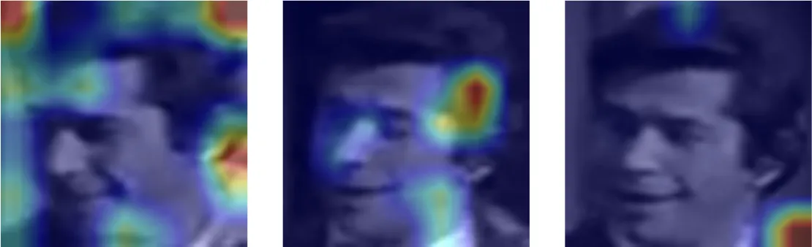
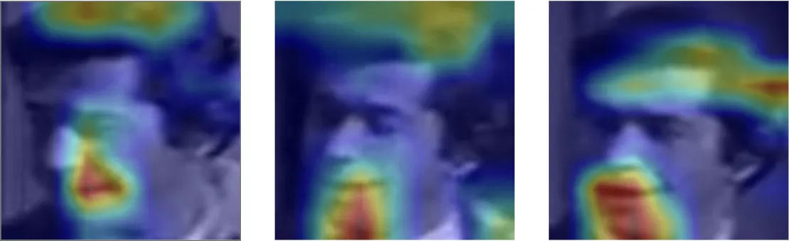
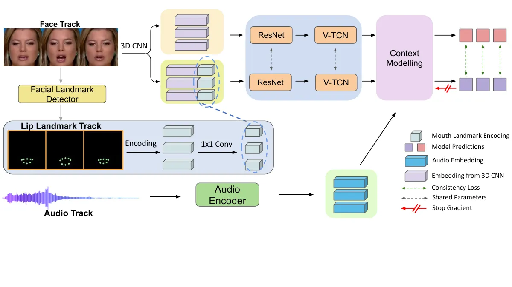
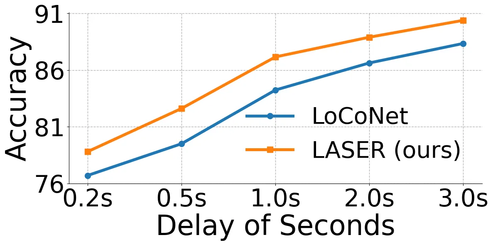
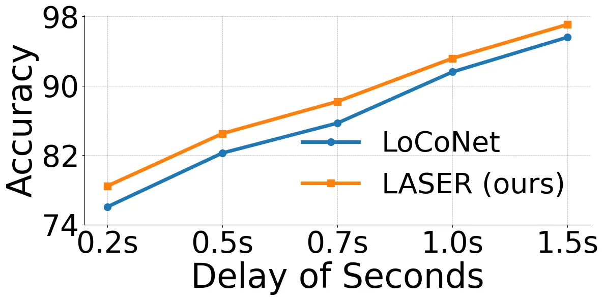
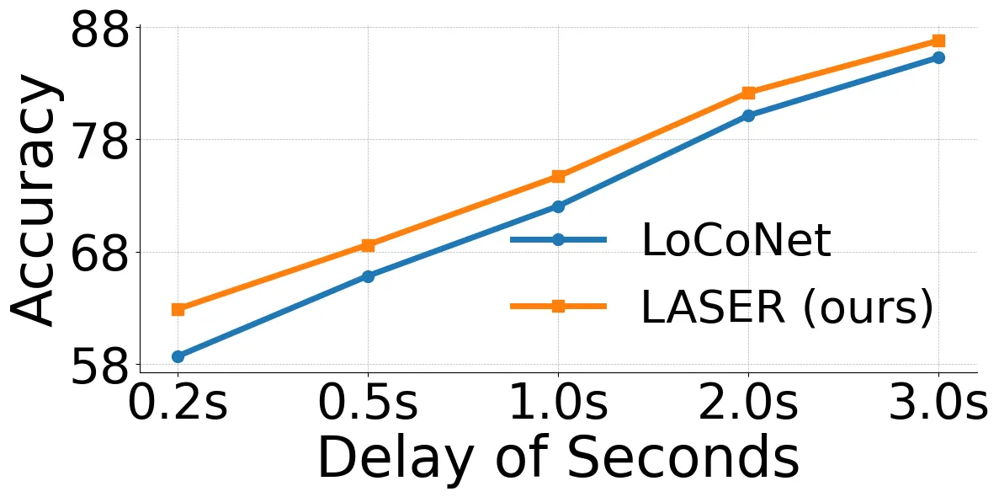
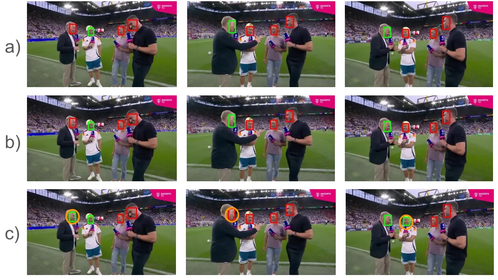
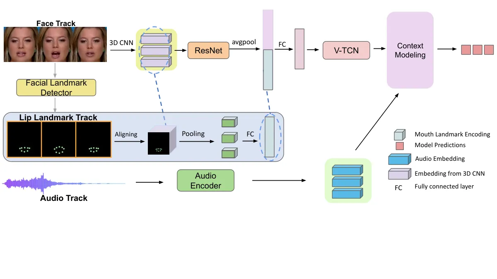
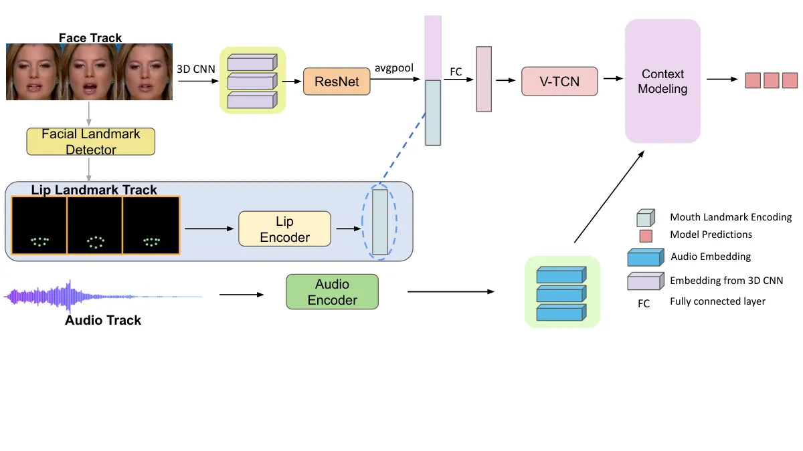

# LASER: Lip Landmark Assisted Speaker Detection for Robustness

Le Thien Phuc Nguyen\*    Zhuoran Yu ^(†)^(†)thanks: equal contribution
   Yong Jae Lee Affiliation: University of Wisconsin - Madison
Affiliation: {plnguyen6, zhuoran.yu}@wisc.edu
Email: [yongjaelee@cs.wisc.edu](mailto:)
Affiliation: [https://github.com/plnguyen2908/LASER_ASD](https://github.com/plnguyen2908/LASER_ASD)
Affiliation: [https://huggingface.co/datasets/plnguyen2908/LASER-bench](https://huggingface.co/datasets/plnguyen2908/LASER-bench)

###### Abstract

Active Speaker Detection (ASD) aims to identify who is speaking in
complex visual scenes. While humans naturally rely on lip-audio
synchronization, existing ASD models often misclassify non-speaking
instances when lip movements and audio are unsynchronized. To address
this, we propose Lip landmark Assisted Speaker dEtection for Robustness
(LASER), which explicitly incorporates lip landmarks during training to
guide the model’s attention to speech-relevant regions. Given a face
track, LASER extracts visual features and encodes 2D lip landmarks into
dense maps. To handle failure cases such as low resolution or occlusion,
we introduce an auxiliary consistency loss that aligns lip-aware and
face-only predictions, removing the need for landmark detectors at test
time. LASER outperforms state-of-the-art models across both in-domain
and out-of-domain benchmarks. To further evaluate robustness in
realistic conditions, we introduce LASER-bench, a curated dataset of
modern video clips with varying levels of background noise. On the
high-noise subset, LASER improves mAP by 3.3 and 4.3 points over LoCoNet
and TalkNet, respectively, demonstrating strong resilience to real-world
acoustic challenges.

## 1 Introduction

Active Speaker Detection (ASD) \[11, 29, 26, 16, 20, 2\] is a
fundamental task in audiovisual computing which aims to detect if one or
more people are speaking in a complex visual scene (usually represented
by videos). To effectively accomplish this task, models are not only
required to understand the visual scene, extract descriptive visual
features of candidate speakers, but also learn to correspond the visual
information to corresponding audio information. Advanced applications in
audiovisual computing such as human-robot interaction \[12, 23, 25\] and
multimodal chatbots \[30, 24, 8\] usually rely on the success of ASD.



(a) Grad-CAM for LoCoNet.



(b) Grad-CAM for our LASER

Figure 1: Qualitative comparison of Grad-Cam \[22\] visualizations for
LoCoNet and our LASER under nonsynchronized audiovisual scenarios.
LoCoNet \[29\] struggles to accurately predict “not speaking” when
visual frames and audio tracks are misaligned, often failing to focus on
the lip region when making these predictions. In contrast, our LASER
consistently concentrates on the lip area and successfully identifies
“not speaking” situations.

How can we, as humans, tell whether a person is speaking? The
synchronization of mouth movements with speech is a natural indicator,
allowing us to effortlessly perceive when someone is actually
speaking \[18\]. Even a slight delay that desynchronizes audio and
visual cues creates discomfort, making it immediately apparent that the
person is not truly speaking at that moment. This inherent sensitivity
to audiovisual alignment highlights the central role of mouth movement
in active speaker detection.

Do existing ASD models function in the same intuitive way, and can they
detect when a person is not speaking if the audio and mouth movements
are unsynchronized? Unfortunately, based on our analysis, the answer to
both questions is no. State-of-the-art ASD models consist of two main
phases: (1) visual and audio temporal representation learning, which
encodes video and audio streams into sequences of visual and audio
embeddings with temporal context, and (2) inter- and intra-person
context modeling, which leverages cross-attention to capture long-term
temporal dependencies and visual-audio interactions. While current
approaches utilize attention mechanisms to model inter- and intra-person
context \[29, 5, 1, 20, 2\], they still struggle to maintain a focus on
mouth movement when making prediction (Figure 1(a)). This limitation
prevents models from reliably identifying unsynchronization between
audio and visual cues, a key factor in human perception.

While most existing work focuses on improving context modeling, we argue
that such limitations stem from the visual features themselves, even
before they reach the context modeling module. To address this, we
propose Lip landmark Assisted Speaker dEtection for Robustness (LASER)
to overcome these limitations. The key novelty of LASER lies in the
lightweight visual temporal representation learning of ASD models:
instead of relying on the model to learn audiovisual interactions purely
from facial frames, LASER explicitly directs the model’s attention to
lip movements by incorporating lip landmarks in training (Figure 1(b)).

Given a face track¹¹ 1 A face track is a sequence of cropped images of
the same person’s face across consecutive frames in a video
stream \[19\]., LASER extracts frame-level visual feature maps and the
2D coordinates of lips landmarks for each frame of the face track using
a lightweight facial landmark detector \[17\], forming a “lip track”
corresponding it. We then encode the landmark coordinates to continuous
2D feature maps matching the spatial dimension of the visual feature
maps and combine them to form our visual features that combine the
information from the face track and the lip track. Since the lip
landmarks come in as 2D coordinates instead of continuous visual feature
maps, integrating such discrete coordinates with continuous feature maps
poses a challenge. To address this, we design a simple-yet-effective
encoding strategy that converts the 2D discrete coordinate information
into continuous 2D visual feature maps matching the spatial dimensions
of the corresponding visual features (details in Section 3.2).
Furthermore, to alleviate the sparsity of these feature maps, we
aggregate them into dense feature maps through a 1x1 convolution layer.
This way, the lip landmark coordinates are converted to dense feature
maps carrying out the information on the position and form of the lip.
The combined visual features are passed through the visual temporal
network to obtain the final visual representations with temporal context
and the representation can then be used by selected ASD models to
capture long-term temporal dependencies and integrate the information
from multimodal features.

While LASER enhances ASD model performance, we observe that facial
landmark detectors may occasionally fail to provide reliable outputs due
to issues like low resolution, occlusion, or extreme facial angles. For
example, on widely used AVA benchmarks \[19\], approximately 15% of face
tracks in the test sets lack any landmark detection results.
Consequently, missing lip landmarks—resulting in the absence of lip
track information—can lead to suboptimal model performance on these test
videos. To address this challenge, we introduce an auxiliary consistency
loss that aligns predictions made using LASER with those based solely on
visual features from the face track. Specifically, for each frame of a
face track, we optimize a KL-divergence loss between the predictions
obtained with LASER and those based on visual face-frame features alone.
This auxiliary loss enables the model to maintain accurate predictions
even when the lip track is unavailable, eliminating the dependency on a
facial landmark detector at test time.

Since LASER leverages explicit lip information, it is particularly
suited for acoustically noisy environments where accurate lip-audio
correspondence is essential. To evaluate this, we introduce LASER-bench,
a curated benchmark featuring modern video content with authentic
background noise, including crowd chatter and ambient sounds. Each clip
is processed using a voice activity detection (VAD) tool \[27\] to
isolate non-speech segments, and categorized into low and high-noise
subsets based on RMS energy. This allows for controlled analysis of
model robustness under varying noise levels in realistic settings.

To evaluate the effectiveness of our approach, we adopt multiple
protocols. Under the standard setup, we train on AVA \[19\] and evaluate
on both in-domain (AVA) and out-of-domain (Talkies \[2\], ASW \[13\])
test sets, where LASER consistently outperforms LoCoNet. To assess noise
robustness, we evaluate on LASER-bench, which contains modern video
clips grouped into low and high-noise subsets using VAD-filtered RMS
thresholds. LASER achieves notable gains over LoCoNet \[29\] and
TalkNet \[26\], particularly under high-noise conditions, up to +3.3 and
+4.3 mAP, respectively. We also test robustness to audio-visual
misalignment using audio-swapped and delayed audio settings, where our
method maintains consistent improvements in frame-level accuracy across
all datasets.

##### Contributions.

1\) We propose LASER, a novel ASD approach that explicitly directs the
model’s attention to lip movements by incorporating lip landmarks in
training through effective landmark encoding. 2) We introduce an
auxiliary consistency loss during training to address the absence of lip
track information at test time, eliminating dependency on facial
landmark detectors during inference. 3) We create LASER-bench, a curated
benchmark designed to systematically evaluate ASD robustness under
real-world acoustic conditions. 4) LASER outperforms state-of-the-art
models under standard evaluation protocols, and further shows improved
robustness in real-world scenarios such as audio-visual misalignment and
high background noise.

## 2 Related Work

##### Active Speaker Detection.

Active Speaker Detection (ASD) is a key audiovisual challenge, where the
goal is to determine if someone is speaking in a video. Recent
work \[26, 29, 11, 2, 20, 16\] emphasizes long-term temporal modeling
via RNNs \[16, 14\], attention \[29, 5, 31\], or both \[1\].
LoCoNet \[29\] adopts self- and cross-attention for intra-speaker
context, plus CNNs for inter-speaker modeling; TalkNCE \[11\] extends
LoCoNet with contrastive learning. In contrast, our method shifts the
focus by explicitly highlighting lip movements, complementing these
context-driven approaches. As shown in our experiments, augmenting
existing ASD models with LASER yields stronger generalization
performance under high background noise context and other complex
scenarios.

##### Facial Landmark Guidance in Audiovisual Computing.

Earlier studies (Saenko et al. \[21\], Everingham et al. \[7\])
extracted facial features by localizing key regions. For example, Saenko
et al. \[21\] focused on lip localization to detect speaking activity.
Recent works have explored the integration of facial landmarks to
improve model performance on audiovisual computing tasks by using facial
landmarks for feature pooling \[28\] or directly incorporating discrete
landmark coordinates \[9\]. While these prior approaches align with our
intuition that speaking behavior is intricately linked to lip movements,
they fundamentally differ from our method. Our approach transforms the
2D coordinates of lip landmarks into sparse feature maps through a
simple-yet-effective encoding function and our approach outperforms
these alternative designs within the state-of-the-art approach LoCoNet
framework (Section 5.5.1).

Active Speaker Detection Datasets. The field of active speaker detection
has been significantly advanced by several key benchmarking datasets.
AVA-ActivateSpeaker \[19\] stands out as the largest dataset in this
domain, featuring videos derived from movies over a decade ago. In
contrast, Talkies \[2\] and ASW \[13\] curate data from YouTube and the
VoxConverse dataset \[4\], respectively, focusing on real-world
scenarios to provide more diverse speaking environments. Since our
approach explicitly incorporates lip information, it is conceptually
better equipped to handle acoustically noisy conditions, where strong
lip-audio correspondence becomes crucial. To evaluate this, we introduce
LASER-bench, a benchmark spanning a wide range of real-world speaking
scenarios under background noise for comprehensive assessment.

## 3 Approach

In this section, we present the details of our proposed Lip landmark
Assisted Speaker dEtection for Robustness (LASER). LASER is a versatile
training framework that can be integrated with state-of-the-art ASD
models. We begin by reviewing the general framework of ASD models
(Section  3.1), then describe how we incorporate lip movement guidance
into the model (Section 3.2), and finally introduce our consistency
loss, which addresses the issue of missing lip landmarks at test time
(Section 3.3).

### 3.1 Preliminaries

The goal of active speaker detection is to classify the speaking
activity $`Y\in\mathbb{R}^{T}`$ for every frame of a face track
$`V\in\mathbb{R}^{T\times H\times W}`$ conditioned on audio
Mel-spectrograms $`A\in\mathbb{R}^{4T\times N}`$. Here, $`T`$ is face
track’s temporal length, $`(H,W)`$ is the face crop’s spatial dimension,
and $`N`$ is the number of audio Mel-spectrogram frequency bins.

State-of-the-art ASD models \[29, 26, 16, 5\] typically consist of two
main components: audio-visual encoders and long-term intra-speaker
context modeling modules. The audio-visual encoder includes separate
visual and audio encoders, $`\mathcal{F}_{v}`$ and $`\mathcal{F}_{a}`$,
respectively. The visual encoder $`\mathcal{F}_{v}`$ processes visual
face tracks to produce visual features
$`f_{v}\in\mathbb{R}^{T\times D}`$, while the audio encoder
$`\mathcal{F}_{a}`$ encodes audio spectrograms, generating audio
features $`f_{a}\in\mathbb{R}^{T\times C}`$, where $`D`$ and $`C`$
denote the embedding dimensions for visual and audio features,
respectively. $`f_{v}`$ and $`f_{a}`$ are then concatenated to
$`f_{av}=concat(f_{v},f_{a})`$ to form multimodal features and
$`f_{av}`$ is further processed by the context modeling modules
$`\mathcal{G}`$ \[29, 26, 16, 5\] to aggregate information from both
modalities. Typically, $`\mathcal{G}`$ outputs multimodal features
$`f^{\prime}_{av}`$ and unimodal features $`f^{\prime}_{v}`$ and
$`f^{\prime}_{a}`$. Linear classifiers, one for each of the three
modalities, are then used to process the corresponding features to make
final predictions. $`\mathcal{F}`$, $`\mathcal{G}`$ and the linear
classifiers are trained end-to-end with the following objective:

```math
\mathcal{L_{\text{asd}}}=\lambda_{v}\cdot\mathcal{L}_{v}+\lambda_{a}\cdot\mathcal{L}_{a}+\lambda_{av}\cdot\mathcal{L}_{av} \tag{1}
```

where $`\mathcal{L}_{av}`$ is the cross-entropy loss computed between
ground-truth labels $`GT`$ and predictions $`Y`$ in each frame and
$`L_{a}`$ and $`L_{v}`$ are auxiliary cross-entropy losses computed with
ground-truth labels and predictions using the unimodal features
$`f^{\prime}_{v}`$ and $`f^{\prime}_{a}`$, respectively, to avoid
$`\mathcal{G}`$ overly focusing on one modality of features \[19\].



Figure 2: Illustration of LASER. Given a face track $`V`$, we first
obtain a lip landmark track using a facial landmark detector and encode
the 2D coordinates of these landmarks into continuous 2D feature maps.
These maps are then aggregated through a 1x1 convolution layer. The
encoded lip track is concatenated with visual features from a 3D CNN and
fed into ResNet and V-TCN to capture a temporal visual representation,
which is further processed by context modeling modules \[29, 26, 16\] to
produce the final prediction. The consistency loss is computed between
predictions made with and without lip landmark encoding and gradients
are only propagated through the prediction without lip landmark. This
way, the model is robust against missing lip landmarks at test time.

### 3.2 Enhanced Representation from Lip Landmark Guidance

While existing work \[29, 26, 16, 5\] demonstrates competitive
performance on the popular AVA-ActiveSpeaker Benchmark \[19\], our
analysis reveals that they still struggles to capture the
synchronization between mouth movements and the audio track
(Figure 1(a)). This limitation highlights the need for enhanced focus on
lip-audio synchronization within active speaker detection models.

We speculate that this limitation stems from the visual features
themselves, even before they reach the context modeling module. To
address this, we propose LASER, which focuses on enhancing the
representations produced by the visual encoder $`\mathcal{F}_{v}`$. By
improving these initial visual features, the context modeling module
$`\mathcal{G}`$ can more effectively integrate visual and audio
information, ultimately enhancing speaker detection performance.

We adopt the same visual encoder architecture $`\mathcal{F}_{v}`$ from
prior work \[26, 29\] where the architecture is composed on a 3D
convolution layer, a ResNet-18 \[10\] backbone, and a video temporal
network (V-TCN) \[15\]. However, unlike prior work which simply forwards
visual face tracks to $`\mathcal{F}_{v}`$, we additionally apply a
facial landmark detector to the face track and collect a “lip landmark
track” $`M`$ of the corresponding face track. Each lip landmark is
represented as 2D coordinates $`{(x_{i},y_{i})}_{i=0}^{K}`$ where $`K`$
is the total number of lip landmarks collected.

#### 3.2.1 Lip Landmark Track Encoding

Integrating discrete 2D coordinate information with continuous visual
signals during training poses a challenge. To address this, we design a
simple-yet-effective encoding function $`\mathcal{T}(M)`$ that converts
the 2D discrete coordinate to continuous 2D feature maps matching the
spatial dimensions of the visual features. Specifically, the encoding
process $`h=\mathcal{T}(M)`$ for each landmark $`{(x_{i},y_{i})}`$ is
defined as follows:

```math
h_{x}^{i}(u,v)=\begin{cases}x_{i}/W,&\text{if }u=x_{i}\,,\,v=y_{i}\\
0,&\text{if }\text{otherwise}\end{cases} \tag{2}
```

```math
h_{y}^{i}(u,v)=\begin{cases}y_{i}/H,&\text{if }u=x_{i}\,,\,v=y_{i}\\
0,&\text{if }\text{otherwise}\end{cases} \tag{3}
```

The encoding process transforms the “lip landmark track” into features
$`h\in\mathbb{R}^{T\times K\times 2\times H\times W}`$, where $`K`$ is
the number of lip landmarks, and 2 corresponds to the $`x`$ and $`y`$
coordinates. We use the lightweight facial landmark detector from
Mediapipe \[17\] to extract $`K=82`$ lip landmarks.

#### 3.2.2 Lip Landmark Track Feature Aggregation

The encoded landmark features are sparse and contain many redundant zero
entries, which can hinder optimization during training. To address this,
we apply a simple feature aggregation module using $`1\times 1`$
convolution layers that condense the information from $`K`$ channels
down to $`S`$ channels, where $`S\ll K`$. In practice, we find that
setting $`S=4`$ achieves the best performance, adding only negligible
computational overhead. We denote the aggregated landmark feature as
$`h^{\prime}\in\mathbb{R}^{T\times S\times 2\times H\times W}`$.

We concatenate the lip landmark track feature $`h^{\prime}`$ with face
track visual features from a 3D convolution layer, passing the combined
feature through a ResNet for frame-level processing. The output is then
fed into a video temporal network \[15\] to generate temporal visual
representations $`f_{v*}\in\mathbb{R}^{T\times D}`$. In this way, the
visual encoder not only incorporates cues from frame-level lip landmarks
but also leverages temporal modeling to explicitly capture the dynamics
of lip movement across video frames.

Our visual encoder can be integrated to state-of-the-art ASD
models \[29, 26, 16, 5\] and can be trained end-to-end by the ASD
training objectives described in Equation 1. As we shall see in the
experiments, LASER enhances state-of-the-art ASD models across various
evaluation protocols.

### 3.3 Addressing Missing Lip Landmark Tracks

While LASER achieves strong performance across various evaluation
scenarios, we observe that the facial landmark detector does not always
return lip landmarks for every face track because of low resolution,
occlusion, or extreme angles in the facial frames. For example, our
facial landmark detector fails to detect any landmarks on approximately
15% of the face track on the AVA-ActiveSpeaker dataset \[19\]. At test
time, the absence of lip landmarks results in suboptimal visual
features, which can negatively impact the model’s performance.

To enable our visual encoder $`\mathcal{F}_{v}`$ to effectively handle
face tracks that are challenging for landmark detectors, we introduce an
auxiliary consistency loss to enforce consistency between the
predictions made from LASER-enhanced features and those from standard
face track features. Specifically, given a face track
$`V\in\mathbb{R}^{T\times H\times W}`$, we obtain the visual
representation $`f_{v}=\mathcal{F}_{v}(V)`$ without lip track encoding
and $`f_{v*}=\mathcal{F}_{v}(V,\mathcal{T}(M))`$ with lip track
encoding, where $`\mathcal{T}(M)`$ represents the lip landmark encoding.
The consistency loss is then defined as the KL-Divergence between the
final predictions made with $`f_{v}`$ and $`f_{v*}`$:

```math
\mathcal{L}_{\text{consistency}}=\sum_{j=0}^{1}\mathcal{G}(f_{v})_{j}\cdot\log\frac{\mathcal{G}(f_{v})_{j}}{\mathcal{G}(f_{v*})_{j}} \tag{4}
```

where $`j`$ denotes the class index of prediction. We apply stop
gradient operation on $`f_{v*}`$ (predictions made with lips track
encoding) when computing the consistency loss so that gradients only
flow through $`f_{v}`$ (predictions without lips track encoding),
encouraging the model to match the predictions it makes with lips track
encoding, implicitly guiding the model to focus on the lips-audio
synchronization even when the lips landmarks are not provided.

The final training objective is defined as

```math
\mathcal{L}=\mathcal{L}_{\text{asd}}+\lambda_{c}\mathcal{L}_{\text{consistency}} \tag{5}
```

where $`\mathcal{L}_{\text{asd}}`$ is the default training objective of
ASD models \[29, 26, 16, 5\] from Section 3.1. By enforcing consistent
predictions between face tracks with and without lip track encoding, our
model achieves robust performance even on challenging face tracks where
facial landmark detection may fail. Notably, as demonstrated in our
experiments, this approach allows us to completely eliminate the
reliance on the facial landmark detector, using only face tracks at test
time without sacrificing performance.

## 4 LASER-bench

Recall that LASER leverages explicit lip information to improve
audio-visual correspondence, which is particularly valuable in
acoustically noisy settings where background sounds may interfere with
speech perception. However, existing ASD benchmarks offer limited
support for evaluating this aspect. AVA-ActiveSpeaker \[19\], though
large in scale, consists mainly of clean audio from scripted movie
scenes, while ASW \[13\] includes noisy, in-the-wild videos but remains
small in size. To bridge this gap, we introduce LASER-bench, a
large-scale benchmark designed to evaluate ASD robustness under
authentic background noise.

| Statistics        | AVA-Val \[19\] | Talkies-Val \[2\] | ASW-Val \[13\] | LASER-bench (Ours) |
| ----------------- | -------------- | ----------------- | -------------- | ------------------ |
| Total face tracks | 8K             | 6.8K              | 3.5K           | 4.9K               |
| Total face crops  | 760K           | 235K              | 171K           | 738K               |

Table 1: Dataset comparison. We compare relevant statistics of MADE with
three other well-known datasets for active speaker detection (left
columns) and LASER-bench (right columns).

### 4.1 Data Curation.

In creating LASER-bench, we aim to assemble a diverse dataset that
captures complex acoustic scenarios, including off-screen speech, crowd
noise, and environmental noise. To achieve this goal, we primarily use
YouTube to source our clips, focusing on modern videos that typically
include spoken dialogue and multiple visible individuals. After
gathering an initial pool of vlogs, street interviews,
podcasts/interviews, and multi-person TV shows through relevant search
terms, we then filter out any content involving sensitive or potentially
objectionable topics. Then, we follow the procedure described in
AVA-ActiveSpeaker \[19\] by keeping the face tracks that are at least
0.2 seconds and interpolating to create missing detection inside the
tracks. However, we do not limit the length of each track like
AVA-ActiveSpeaker \[19\], and every annotation is gone through two
rounds of verification by our annotators.

### 4.2 Dataset Statistics

Table 1 provides a concise comparison of four active‐speaker benchmarks,
listing total face tracks and face crops for each: AVA‐Val \[19\] (8K
tracks, 760K crops), Talkies‐Val \[2\] (6.8K tracks, 235K crops),
ASW‐Val \[13\] (3.5K tracks, 171K crops) and our LASER-bench (4.9K
tracks, 738K crops). Notably, while ASW‐Val incorporates real background
noise to simulate challenging acoustic conditions, LASER‐bench preserves
that same noise realism at a much larger scale - offering over 1.4× more
face tracks and more than 4× the number of face crops - thereby
furnishing a richer resource for evaluating speaker detection models
under noisy, in‐the‐wild scenarios.

## 5 Experiments

In this section, we evaluate the effectiveness of our proposed approach
(LASER). We assess its performance on multiple datasets and compare it
against baseline models to demonstrate improvements across different
evaluation scenarios. We also ablate our design choices.

### 5.1 Experimental Setup

#### 5.1.1 Implementation Details

We implement LASER with the ASD models including LoCoNet \[29\],
TalkNet \[26\], and Light-ASD \[16\]. We closely follow the training
details of each model for fair comparison (details in Appendix). For ASD
training objectives, we follow the LoCoNet and TalkNet, setting
$`\lambda_{av}=1`$, $`\lambda_{a}=0.4`$, and $`\lambda_{v}=0.4`$. Random
resizing, cropping, horizontal flipping, and rotations are used as
visual data augmentation operations and a randomly selected audio signal
from the training set is added as background noise to the target
audio \[26\]. For LASER, We set $`S=4`$ and $`\lambda_{c}=1`$ for all
evaluations and ablation studies of these hyper-parameters can be found
in Appendix.

#### 5.1.2 Evaluation Protocols

We use the following evaluation protocols to assess the performance of
LASER and baseline methods:

\(1\) Standard Evaluation: We evaluate on both in-domain scenarios
(where training and testing data come from the same dataset) and
out-of-domain scenarios (where testing data comes from different
datasets). We use AVA-ActiveSpeaker \[19\] as our in-domain datasets and
Talkies \[2\] and ASW \[13\] as our out-of-domain evaluation datasets
and use mAP as the evaluation metric following common practice \[19\].

\(2\) Evaluation on LASER-bench. In addition to the synchronization
schema, we evaluate LASER on LASER-bench using the same metric mentioned
above. In particular, we divide LASER-bench into two subsets: Low Noise
and High Noise. To do so, for each audio track, we first remove speech
segments using a Voice Activity Detection (VAD) tool \[27\], then
compute the Root Mean Square (RMS) energy over the remaining background
audio. A threshold of 0.03 RMS distinguishes low and high noise levels.

\(3\) Evaluation with Unsynchronized audios: This protocol simulates
non-speaking scenarios where visual frames and audio tracks are
misaligned, a critical test for applications like web conferencing. For
instance, if a muted participant talks to someone else while the main
speaker is active, the model should correctly classify the muted
participant as ‘‘not speaking’’ to avoid confusion. We evaluate using
two protocols: 1) replacing the original audio with another video’s
audio and 2) introducing a short audio delay. The evaluation uses the
same dataset in (1), with results reported as average accuracy across
all frames. ²² 2 mAP is unsuitable here as all ground-truth frames are
negative (non-speaking).



(a) Evaluation on AVA-ActiveSpeaker



(b) Evaluation on Talkies



(c) Evaluation on ASW

Figure 3: Evaluation with unsynchronized audios. We use the same
datasets as the evaluation of synchronized audios and report the
per-frame accuracy on in-domain datasets (AVA-ActiveSpeaker) and
out-of-domain datasets (Talkies and ASW). LASER consistently outperforms
LoCoNet \[29\] under this evaluation protocol.

|                           |      |         |      |
| ------------------------- | ---- | ------- | ---- |
| Model                     | AVA  | Talkies | ASW  |
| EASEE \[3\]               | 94.1 | 86.7    | \-   |
| MAAS \[2\]                | 88.8 | 79.7    | \-   |
| TalkNet ^(†) \[26\]       | 92.2 | 85.9    | 85.8 |
| TalkNet + LASER           | 92.5 | 87.6    | 86.6 |
| Light-ASD^(†) \[16\]      | 93.5 | 87.6    | 87.4 |
| Light-ASD + LASER         | 93.8 | 88.1    | 87.6 |
| LoCoNet ^(†) \[29\]       | 95.2 | 88.4    | 88.4 |
| LoCoNet + LASER           | 95.3 | 89.0    | 88.9 |
| LoCoNet w/ CL ^(†) \[11\] | 95.5 | 88.3    | 88.5 |
| LoCoNet w/ CL + LASER     | 95.4 | 89.7    | 89.5 |

Table 2: Results of models trained on AVA-ActiveSpeaker \[19\]. The
models are trained on AVA-ActiveSpeaker dataset only and evaluated on
AVA, as in-domain evaluation and Talkies and ASW as out-of-domain
evaluations (underlined). CL denotes contrastive learning. ^(†) Results
are reproduced by the methods’ codebase.

### 5.2 Standard Evaluation

We further evaluate LASER on AVA-ActiveSpeaker, the most widely used
benchmark for active speaker detection. Training is conducted on the AVA
training set, with in-domain evaluations on the AVA-val set and
out-of-domain evaluations on Talkies \[2\] and ASW \[13\], following
LoCoNet \[29\].

As shown in Table 2, LASER still improves upon LoCoNet for in-domain
evaluations when the performance is already saturated on AVA. When
evaluating on Talkies and ASW whose data distribution is different from
AVA, LASER achieves 89.0 and 88.9 mAP respectively. Moreover, for
efficient architectures like TalkNet or Light-ASD, LASER advances the
performance on all three benchmarks. For example, LASER improves
TalkNet’s evaluation on Talkies and ASW by 1.7 and 0.8 mAP respectively.

Recent work \[11\] also proposes to add an auxiliary contrastive loss to
LoCoNet which brings audio-visual embedding pairs closer when they
originate from the same video frame, while pushing them apart otherwise.
As shown in Table 2 (bottom), while the contrastive loss enhances
LoCoNet’s in-domain performance by 0.3 mAP, it offers limited gains in
out-of-domain scenarios. Interestingly, when combined with LASER, our
method achieves an additional 1.4 and 1.0 mAP improvement on the Talkies
and ASW benchmarks, respectively. These results highlight both the
effectiveness and general applicability of LASER.

|                 |             |            |
| --------------- | ----------- | ---------- |
| Models          | LASER-bench |            |
|                 | Low Noise   | High Noise |
| TalkNet \[26\]  | 94.8        | 77.8       |
| TalkNet + LASER | 95.0        | 82.1       |
| LoCoNet \[29\]  | 96.2        | 86.7       |
| LoCoNet + LASER | 96.4        | 90.0       |

Table 3: Results on LASER-bench Combining LASER with TalkNet \[26\] and
LocoNet \[26\] consistently improves performance on LASER-bench, with
larger gains observed in scenarios with higher background noise.

### 5.3 Evaluation on LASER-bench

We further evaluate LASER on LASER-bench, treating it as an
out-of-domain testbed for assessing robustness under real-world acoustic
challenges. Models are trained on the AVA training set—composed
primarily of clean, scripted movie scenes—and evaluated on the low-noise
and high-noise subsets of LASER-bench, which feature modern online
content with diverse and realistic background noise. This setup isolates
the impact of acoustic variation without introducing major shifts in
speaking style or visual context.

As shown in Table 3, LASER augmentation yields consistent gains:
TalkNet’s mAP improves from 94.8 to 95.0 in low-noise conditions and
from 77.8 to 82.1 in high-noise, a substantial improvement of 4.3
points. Similarly, LoCoNet improves from 96.2 to 96.4 in low-noise and
from 86.7 to 90.0 in high-noise, gaining 3.3 points. Although both
models are trained solely on AVA, LASER models generalize well to
modern, noisy videos, with the largest gains observed under the most
challenging acoustic conditions.

|                                       |                  |                |         |             |            |
| ------------------------------------- | ---------------- | -------------- | ------- | ----------- | ---------- |
|                                       |                  |                |         | LASER-bench |            |
| Trained with Lip Track Encoding (LTE) | Consistency Loss | Eval. with LTE | AVA-Val | Low Noise   | High Noise |
| ✗                                     | ✗                | N/A            | 95.2    | 96.2        | 86.7       |
| ✓                                     | ✗                | ✓              | 95.1    | 96.1        | 85.7       |
| ✓                                     | ✓                | ✓              | 95.3    | 96.5        | 90.0       |
| ✓                                     | ✓                | ✗              | 95.3    | 96.4        | 90.0       |

Table 4: Importance of Each Component. Training solely with Lip Track
Encoding (LTE) leads to a slight decrease in mAP on both AVA-val \[19\]
and LASER-bench, primarily due to the unavailability of lips landmarks
on some face tracks. The consistency loss addresses this limitation,
enhancing the model’s robustness.

### 5.4 Evaluation with Unsynchronized Audios

| Model           | AVA  | Talkies | ASW  |
| --------------- | ---- | ------- | ---- |
| LoCoNet \[29\]  | 75.9 | 72.1    | 56.7 |
| LoCoNet + LASER | 77.6 | 73.9    | 59.9 |

Table 5: Evaluation with swapped audio track. LASER significantly
outperforms LoCoNet baseline when audio and visual frames are
misaligned.

To test robustness against audio-visual misalignment, we simulate
non-speaking scenarios by altering the audio stream while keeping the
visual input unchanged. This reflects real-world situations like web
conferencing, where off-screen or muted speakers may cause confusion. We
consider two protocols on the AVA dataset: (1) audio-swapping, where the
test audio is replaced with that from another video, and (2)
audio-shifting, where a fixed delay is introduced. All experiments are
conducted on the AVA test set, with accuracy computed as the average
across all frames.

As shown in Figure 3 and Table 5, LASER consistently outperforms LoCoNet
across both protocols. On audio-swapped AVA \[19\], Talkies \[2\], and
ASW \[13\], it improves accuracy by 1.7%, 1.8%, and 3.2%, respectively.
On audio-shifted AVA, it achieves at least a 2% gain, and maintains
strong performance across all temporal shifts on Talkies and ASW. These
results highlight LASER’s robustness under unsynchronized audio
conditions.

### 5.5 Ablation Studies

We next present ablation studies of LASER. All ablation studies are
conducted with the LoCoNet framework \[29\] unless otherwise noted.

#### 5.5.1 Alternative Facial Landmark Integration

|                   |      |         |      |     |
| ----------------- | ---- | ------- | ---- | --- |
| Model             | AVA  | Talkies | ASW  |     |
| LoCoNet \[29\]    | 95.2 | 88.4    | 88.4 |     |
| w/ LP \[28\] ^(§) | 94.7 | 88.3    | 88.5 |     |
| w/ LDI \[9\] ^(§) | 94.9 | 87.9    | 87.9 |     |
| w/ LASER          | 95.3 | 89.0    | 89.5 |     |

Table 6: Comparison of different ways to incorporate lip landmarks. ^(§)
Results are re-implemented in LoCoNet framework. LASER achieves the best
performance over other alternative designs on both in-domain and
out-of-domain evaluations.

Recall that we design a new encoding function to convert lip landmarks
into 2D spatial features so that they can be integrated to visual
features (Section 3.2.1). In this section, we compare our approach with
other alternative designs to incorporate lip landmark information in to
models.

Landmark Pooling (LP). Wang et al \[28\] proposes to pool the visual
features with lip landmark coordinates and use the resulting features in
combination with original visual features for further processing.

Landmark as Discrete Inputs (LDI). Geeroms et al. \[9\] directly uses
convolution layers to process the raw landmark coordinates. A lip
landmark track $`f\in\mathbb{R}^{T\times N\times 2}`$, where $`T`$
denotes the number of frames, $`N`$ is the number of landmarks, and 2 is
the coordinate $`(x,y)`$, is convolved with convolution layers along the
temporal dimension.

We implement these alternative designs in LoCoNet \[29\] and compare
them with our approach. As shown in Table 6, LASER achieves the best
performance over these baseline designs on both AVA and LASER-bench,
highlighting its efficacy. Moreover, LASER only introduces negligible
extra parameters to process lip landmarks compared to other approaches
(details in Appendix).

#### 5.5.2 Importance of Each Component

The lip landmark encoding and consistency loss are central to LASER,
enabling the integration of lip information during training while
addressing missing lip landmarks at test time. In practice, our landmark
detector fails on 15% of AVA and 39% of LASER-bench test face tracks. As
shown in Table 4, using lip landmark encoding alone leads to a slight
mAP drop due to missing test-time landmarks. In contrast, adding the
consistency loss allows the model to retain strong performance without
relying on lip landmarks, showing that the visual encoder learns to
capture lip motion implicitly. This removes the need for lip landmarks
during inference and reduces latency.



Figure 4: Qualitative Comparison on LASER-bench. a) Ground-truth
annotation. b) Detection results from our method LASER. c) Detection
Results from baseline LoCoNet. Red: not speaking; Green: speaking;
orange: incorrect predictions.

### 5.6 Qualitative Results

As shown in Figure 4, we present a qualitative comparison on LASER-Bench
to illustrate how LASER handles high background noise (e.g., crowd
cheering) more effectively than LoCoNet. In this clip, intense stadium
noise overwhelms the audio signal, causing LoCoNet to miss genuine
speaking events and produce false positives. In contrast, our method
consistently localizes the true active speaker. This results in accurate
speaking and non-speaking decisions where LoCoNet fails, highlighting
the robustness of LASER in acoustically challenging, real-world
scenarios.

## 6 Conclusion

In this work, we introduced LASER for active speaker detection. Unlike
prior methods that rely on raw facial appearance, LASER explicitly
guides the model to focus on lip landmarks, improving its ability to
detect active speakers in challenging conditions. To bridge the gap in
evaluating ASD performance under high background noise, we also
introduced LASER-bench (LASER-Bench), a curated dataset featuring
real-world videos with varying noise levels. Both quantitative and
qualitative results show that LASER outperforms state-of-the-art models
and achieves more reliable performance on LASER-Bench, demonstrating its
robustness in noisy, unconstrained environments.

## Acknowledgment

This work was supported in part by NSF IIS2404180, and Institute of
Information & communications Technology Planning & Evaluation (IITP)
grants funded by the Korea government (MSIT) (No. 2022-0-00871,
Development of AI Autonomy and Knowledge Enhancement for AI Agent
Collaboration) and (No. RS-2022-00187238, Development of Large Korean
Language Model Technology for Efficient Pre-training).

## References

- \[1\] J. L. Alcázar, F. Caba, L. Mai, F. Perazzi, J. Lee, P. Arbeláez,
  and B. Ghanem (2020) Active speakers in context. In Proceedings of the
  IEEE/CVF conference on computer vision and pattern recognition,
  pp. 12465–12474. Cited by: §1, §2.
- \[2\] J. L. Alcázar, F. Caba, A. K. Thabet, and B. Ghanem (2021) Maas:
  multi-modal assignation for active speaker detection. In Proceedings
  of the IEEE/CVF International Conference on Computer Vision,
  pp. 265–274. Cited by: §1, §1, §1, §2, §2, §4.2, Table 1, §5.1.2,
  §5.2, §5.4, Table 2.
- \[3\] J. L. Alcázar, M. Cordes, C. Zhao, and B. Ghanem (2022)
  End-to-end active speaker detection. In European Conference on
  Computer Vision, pp. 126–143. Cited by: Table 2.
- \[4\] J. S. Chung, J. Huh, A. Nagrani, T. Afouras, and A.
  Zisserman (2020) Spot the conversation: speaker diarisation in the
  wild. In Interspeech 2020, interspeech_2020. External Links:
  [Link](http://dx.doi.org/10.21437/Interspeech.2020-2337),
  [Document](https://dx.doi.org/10.21437/interspeech.2020-2337) Cited
  by: §2.
- \[5\] G. Datta, T. Etchart, V. Yadav, V. Hedau, P. Natarajan, and S.
  Chang (2022) Asd-transformer: efficient active speaker detection using
  self and multimodal transformers. In ICASSP 2022-2022 IEEE
  International Conference on Acoustics, Speech and Signal Processing
  (ICASSP), pp. 4568–4572. Cited by: §1, §2, §3.1, §3.2.2, §3.2, §3.3.
- \[6\] P. K. Diederik (2014) Adam: a method for stochastic
  optimization. arXiv preprint arXiv:1412.6980. Cited by: §A.1.
- \[7\] M. Everingham, J. Sivic, and A. Zisserman (2009) Taking the bite
  out of automated naming of characters in tv video. Image and Vision
  Computing 27 (5), pp. 545–559. Cited by: §2.
- \[8\] Z. Ge, H. Huang, M. Zhou, J. Li, G. Wang, S. Tang, and Y.
  Zhuang (2024) Worldgpt: empowering llm as multimodal world model. In
  Proceedings of the 32nd ACM International Conference on Multimedia,
  pp. 7346–7355. Cited by: §1.
- \[9\] W. Geeroms, G. Allebosch, S. Kindt, L. Kadri, P. Veelaert,
  and N. Madhu (2022) Audio-visual active speaker identification: a
  comparison of dense image-based features and sparse facial
  landmark-based features. In 2022 Sensor Data Fusion: Trends,
  Solutions, Applications (SDF), Vol. , pp. 1–6. External Links:
  [Document](https://dx.doi.org/10.1109/SDF55338.2022.9931697) Cited by:
  Figure B, Figure B, Figure C, Figure C, §A.2.2, §A.2, §2, §5.5.1,
  Table 6.
- \[10\] K. He, X. Zhang, S. Ren, and J. Sun (2016) Deep residual
  learning for image recognition. In Proceedings of the IEEE conference
  on computer vision and pattern recognition, pp. 770–778. Cited by:
  §3.2.
- \[11\] C. Jung, S. Lee, K. Nam, K. Rho, Y. J. Kim, Y. Jang, and J. S.
  Chung (2024) TalkNCE: improving active speaker detection with
  talk-aware contrastive learning. In ICASSP 2024-2024 IEEE
  International Conference on Acoustics, Speech and Signal Processing
  (ICASSP), pp. 8391–8395. Cited by: §1, §2, §5.2, Table 2.
- \[12\] S. Kang and J. Han (2023) Video captioning based on both
  egocentric and exocentric views of robot vision for human-robot
  interaction. International Journal of Social Robotics 15 (4),
  pp. 631–641. Cited by: §1.
- \[13\] Y. J. Kim, H. Heo, S. Choe, S. Chung, Y. Kwon, B. Lee, Y. Kwon,
  and J. S. Chung (2021) Look who’s talking: active speaker detection in
  the wild. arXiv preprint arXiv:2108.07640. Cited by: §1, §2, §4.2,
  Table 1, §4, §5.1.2, §5.2, §5.4.
- \[14\] O. Köpüklü, M. Taseska, and G. Rigoll (2021) How to design a
  three-stage architecture for audio-visual active speaker detection in
  the wild. In Proceedings of the IEEE/CVF international conference on
  computer vision, pp. 1193–1203. Cited by: §2.
- \[15\] C. Lea, R. Vidal, A. Reiter, and G. D. Hager (2016) Temporal
  convolutional networks: a unified approach to action segmentation. In
  Computer Vision–ECCV 2016 Workshops: Amsterdam, The Netherlands,
  October 8-10 and 15-16, 2016, Proceedings, Part III 14, pp. 47–54.
  Cited by: §3.2.2, §3.2.
- \[16\] J. Liao, H. Duan, K. Feng, W. Zhao, Y. Yang, and L. Chen (2023)
  A light weight model for active speaker detection. In Proceedings of
  the IEEE/CVF Conference on Computer Vision and Pattern Recognition,
  pp. 22932–22941. Cited by: §A.1, §1, §2, Figure 2, Figure 2, §3.1,
  §3.2.2, §3.2, §3.3, §5.1.1, Table 2.
- \[17\] C. Lugaresi, J. Tang, H. Nash, C. McClanahan, E. Uboweja, M.
  Hays, F. Zhang, C. Chang, M. G. Yong, J. Lee, et al. (2019) Mediapipe:
  a framework for building perception pipelines. arXiv preprint
  arXiv:1906.08172. Cited by: §1, §3.2.1.
- \[18\] H. Park, C. Kayser, G. Thut, and J. Gross (2016) Lip movements
  entrain the observers’ low-frequency brain oscillations to facilitate
  speech intelligibility. eLife 5. Cited by: §1.
- \[19\] J. Roth, S. Chaudhuri, O. Klejch, R. Marvin, A. Gallagher, L.
  Kaver, S. Ramaswamy, A. Stopczynski, C. Schmid, Z. Xi, et al. (2020)
  Ava active speaker: an audio-visual dataset for active speaker
  detection. In ICASSP 2020-2020 IEEE International Conference on
  Acoustics, Speech and Signal Processing (ICASSP), pp. 4492–4496. Cited
  by: §1, §1, §2, §3.1, §3.2, §3.3, §4.1, §4.2, Table 1, §4, §5.1.2,
  §5.4, Table 2, Table 2, Table 4, Table 4, footnote 1.
- \[20\] S. Roy, K. Min, S. Tripathi, T. Guha, and S. Majumdar (2021)
  Learning spatial-temporal graphs for active speaker detection. arXiv
  preprint arXiv:2112.01479. Cited by: §1, §1, §2.
- \[21\] K. Saenko, K. Livescu, M. Siracusa, K. Wilson, J. Glass, and T.
  Darrell (2005) Visual speech recognition with loosely synchronized
  feature streams. In Tenth IEEE International Conference on Computer
  Vision (ICCV’05) Volume 1, Vol. 2, pp. 1424–1431. Cited by: §2.
- \[22\] R. R. Selvaraju, M. Cogswell, A. Das, R. Vedantam, D. Parikh,
  and D. Batra (2019) Grad-cam: visual explanations from deep networks
  via gradient-based localization. International Journal of Computer
  Vision 128 (2), pp. 336–359. External Links: ISSN 1573-1405,
  [Link](http://dx.doi.org/10.1007/s11263-019-01228-7),
  [Document](https://dx.doi.org/10.1007/s11263-019-01228-7) Cited by:
  Figure 1, Figure 1.
- \[23\] T. B. Sheridan (2016) Human–robot interaction: status and
  challenges. Human factors 58 (4), pp. 525–532. Cited by: §1.
- \[24\] F. Shu, L. Zhang, H. Jiang, and C. Xie (2023) Audio-visual llm
  for video understanding. arXiv preprint arXiv:2312.06720. Cited by:
  §1.
- \[25\] G. Skantze (2021) Turn-taking in conversational systems and
  human-robot interaction: a review. Computer Speech & Language 67,
  pp. 101178. Cited by: §1.
- \[26\] R. Tao, Z. Pan, R. K. Das, X. Qian, M. Z. Shou, and H.
  Li (2021) Is someone speaking? exploring long-term temporal features
  for audio-visual active speaker detection. In Proceedings of the 29th
  ACM international conference on multimedia, pp. 3927–3935. Cited by:
  §A.1, §1, §1, §2, Figure 2, Figure 2, §3.1, §3.2.2, §3.2, §3.2, §3.3,
  §5.1.1, Table 2, Table 3, Table 3, Table 3.
- \[27\] S. Team (2024) Silero vad: pre-trained enterprise-grade voice
  activity detector (vad), number detector and language classifier.
  GitHub. Note:
  [https://github.com/snakers4/silero-vad](https://github.com/snakers4/silero-vad)
  Cited by: §1, §5.1.2.
- \[28\] B. Wang and X. Wang (2019) Are you speaking: real-time speech
  activity detection via landmark pooling network. In 2019 14th IEEE
  International Conference on Automatic Face & Gesture Recognition (FG
  2019), Vol. , pp. 1–5. External Links:
  [Document](https://dx.doi.org/10.1109/FG.2019.8756549) Cited by:
  Figure A, Figure A, Figure C, Figure C, §A.2.1, §A.2, §2, §5.5.1,
  Table 6.
- \[29\] X. Wang, F. Cheng, and G. Bertasius (2024) Loconet: long-short
  context network for active speaker detection. In Proceedings of the
  IEEE/CVF Conference on Computer Vision and Pattern Recognition,
  pp. 18462–18472. Cited by: Figure 1, Figure 1, §A.1, §1, §1, §1, §2,
  Figure 2, Figure 2, §3.1, §3.2.2, §3.2, §3.2, §3.3, Figure 3, Figure
  3, §5.1.1, §5.2, §5.5.1, §5.5, Table 2, Table 3, Table 5, Table 6.
- \[30\] S. Wu, H. Fei, L. Qu, W. Ji, and T. Chua (2023) Next-gpt:
  any-to-any multimodal llm. arXiv preprint arXiv:2309.05519. Cited by:
  §1.
- \[31\] J. Xiong, Y. Zhou, P. Zhang, L. Xie, W. Huang, and Y.
  Zha (2023) Look&listen: multi-modal correlation learning for active
  speaker detection and speech enhancement. IEEE Transactions on
  Multimedia 25 (), pp. 5800–5812. External Links:
  [Document](https://dx.doi.org/10.1109/TMM.2022.3199109) Cited by: §2.

## A Appendix

### A.1 Training Details

We implement our approach LASER in three different state-of-the-art ASD
frameworks, LoCoNet \[29\], TalkNet \[26\], and Light-ASD \[16\]. We
closely follow the training details for fair comparison. Specifically,
for LoCoNet-based training, we use batch size of 4 and sample 200 frames
per training example. Each model is trained with 25 epochs on 4 RTX 2080
GPUs. For Light-ASD and TalkNet, we use a batch size that contains at
most 2000 frames and each model is trained on one A40 GPU. We use
Adam \[6\] as our optimizer with learning rate of $`5\times 10^{-5}`$
that reduces by 0.5% per epoch. For LoCoNet and TalkNet, we set
$`\lambda_{av}=1`$, $`\lambda_{a}=0.4`$, and $`\lambda_{v}=0.4`$; and
for Light-ASD, we set $`\lambda_{av}=1`$ and $`\lambda_{v}=0.5`$,
following the original work. Random resizing, cropping, horizontal
flipping, and rotations are used as visual data augmentation operations
and a randomly selected audio signal from the training set is added as
background noise to the target audio \[26\].

### A.2 Implementation of Landmark Pooling and 2D Lip Encoding methods

In this section, we introduce implementation details of the Landmark
Pooling method \[28\] and Landmark as Discrete Inputs \[9\]. Since these
methods were originally proposed to work with simple CNN architectures,
we adapt them to the state-of-the-art LoCoNet framework for fair
comparison.



Figure A: Our implementation of Landmark Pooling \[28\].

#### A.2.1 Landmark Pooling

Given a face track and the lips landmark detection results, we first
obtain feature map
$`\mathcal{F}_{v}\in\mathbb{R}^{T\times C\times H\times W}`$ after the
first layer the ResNet, where $`T`$ denotes the number of frames, $`H`$
and $`W`$ are the spatial dimension of $`f_{v}`$, and $`C`$ is the
number of channels, we follow \[28\] to pool the feature with normalized
lip landmark coordinates $`\{(x_{i},y_{i})\}_{i=1}^{N}`$ by
$`\mathcal{F}_{v}[x_{i},y_{i}]\in\mathbb{R}^{T\times C}`$. Then, we
concatenate all $`N`$ landmarks into
$`\mathcal{F}_{ld}\in\mathbb{R}^{T\times NC}`$ and feed
$`\mathcal{F}_{ld}`$ through a fully connected layer to get
$`\mathcal{F}^{\prime}_{ld}\in\mathbb{R}^{T\times D}`$ where $`D`$ is
the hidden dimension after the average pooling layer of ResNet. Finally,
$`\mathcal{F}^{\prime}_{ld}`$ is concatenated to
$`\mathcal{F}^{\prime}_{v}`$, the semantic feature output by ResNet and
reduce the dimension with another fully-connected layer to obtain the
final frame-level representation
$`\mathcal{F}\in\mathbb{R}^{T\times D}`$. $`\mathcal{F}`$ is further
processed by V-TCN and Context Modeling models along with audio feature
to make prediction. The visualization of the method is presented in
Figure A.



Figure B: Our implementation of 2D Lip Encoding method \[9\].

#### A.2.2 Landmark as Discrete Inputs

Given a face track and the lips landmark detection results
$`f\in\mathbb{R}^{T\times N\times 2}`$ where $`T`$ is the number of
frames, $`N`$ is the number of landmarks, and 2 is the coordinate
$`(x,y)`$. We adopt the architecture in \[9\] to process $`f`$ with 3x3
convolution layers and convert the raw landmark coordinates into
embeddings. The resulting embedding is flattened and concatednated to
the visual feature in the same way of Landmark Pooling. The
visualization of the architecture is presented in Figure B.

### A.3 Parameter Effiency of LASER

As illustrated in Figure C, our proposed LASER approach not only
achieves better performance but also only requires the negligible
additional parameters compared to Landmark Pooling and Landmark as
Discrete Inputs. This indicates that LASER’s design is significantly
more parameter-efficient, which translates to reduced memory usage and
faster training/inference. By minimizing the number of additional
parameters without compromising accuracy, LASER offers a compelling
balance between computational cost and performance gains.

Figure C: Number of additional parameters of each method. The y-axis is
in log scale, and the number on each bar represents the true additional
number of parameters. The x-axis contains 3 methods: LASER, Landmark
Pooling \[28\], and Landmark as Discrete Inputs \[9\].

### A.4 Hyperparameters Selection

We present our ablation study on hyperparamete selection, including the
ablation on consistency loss weight and the Lip Track Encoding injection
layer. The hyperparameter selection process is conducted through a
holdout evaluation protocol (different from all protocols in main
evaluation) by reversing the audio in original video clip to establish a
non-speaking scenario. This avoids the risk of tuning on the test set
and ensures generalizability.

#### A.4.1 ResNet vs 3D CNN

As discussed in Section 3.2, we integrate the aggregated lip track
encoding (LTE) into the visual features produced by the 3D-CNN. We
compare this approach with integrating LTE directly with the RGB face
frames before the 3D-CNN. As shown in Table B, integrating LTE before
the 3D-CNN leads to a significant performance drop. We speculate that
this is due to the limited number of channels in the RGB image, where
integrating LTE with additional channels may interfere with the feature
extraction process of the original face frame. Thus, we opt to integrate
LTE into the visual features output by the 3D-CNN.

#### A.4.2 Integrating Lip Track Encoding to Visual Features

| Stage | \# Channels $`S`$ |      |      |      |      |
| ----- | ----------------- | ---- | ---- | ---- | ---- |
|       | 1                 | 2    | 4    | 8    | 16   |
| 1     | 84.9              | 84.3 | 86.9 | 85.6 | 84.7 |
| 2     | 84.3              | 84.7 | 86.2 | 83.6 | 85.0 |
| 3     | 85.5              | 84.2 | 83.8 | 86.1 | 82.9 |
| 4     | 85.3              | 86.5 | 85.1 | 84.9 | 82.4 |

Table A: Ablation study on lip track integration with different stages
of ResNet. Setting $`S=4`$ and integrating lip track encoding before the
first stage of ResNet results in the best performance.

| Layer  | Regular Audio | Noise Audio |
| ------ | ------------- | ----------- |
| 3D CNN | 92.6          | 86.6        |
| ResNet | 95.1          | 86.7        |

Table B: Ablation study on lip track encoding integration. Integrating
lip track encoding before 3D-CNN layer (i.e, on RGB frames) results in
suboptimal performance.

We further investigate integrating lip landmark encoding (LTE) at
different stages within ResNet, which has four internal stages with
varying downsampling strides. Our ablation study (Table A) shows that
integrating LTE before the first stage—using features from the 3D-CNN
output—yields the best performance under noisy audio conditions, while
later-stage integration degrades performance. Additionally, we examine
the sensitivity of the aggregation factor $`S`$ when condensing sparse
lip track encodings from $`K=82`$ to $`S`$ dense feature maps. We find
that $`S=4`$ achieves the best balance, avoiding both excessive
compression and sparsity.

|           |                 |      |      |      |      |
| --------- | --------------- | ---- | ---- | ---- | ---- |
| Method    | $`\lambda_{c}`$ |      |      |      |      |
| 0.2       | 0.4             | 0.6  | 0.8  | 1.0  |      |
| Acccuracy | 85.7            | 85.9 | 86.0 | 85.9 | 87.5 |

Table C: Ablation study on consistency loss weight. Setting
$`\lambda_{c}=1`$ achieves the best results while decreasing
$`\lambda_{c}`$ consistently degrades the performance.

#### A.4.3 Weight of Consistency Loss

We also study the sensitivity of the weight of consistency loss
$`\lambda_{c}`$ where we range the value from 0.2 to 1.0. As shown in
Table C, $`\lambda_{c}=1`$ achieves the best performance whereas
decreasing the loss weight consistently hurts the model performance.
Thus, we set $`\lambda_{c}=1`$ in all of our experiments.
