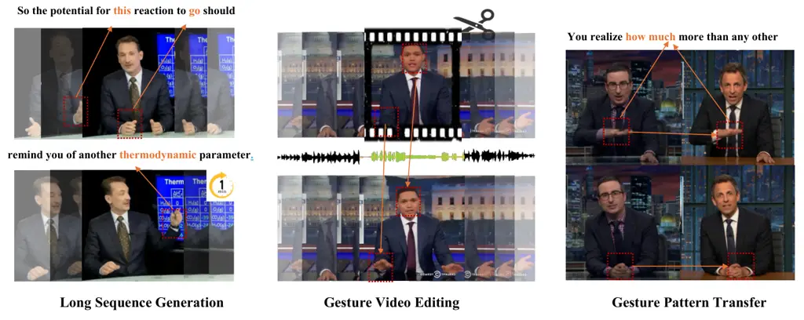
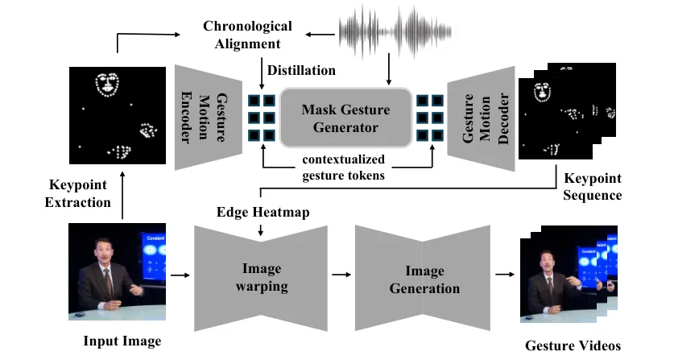
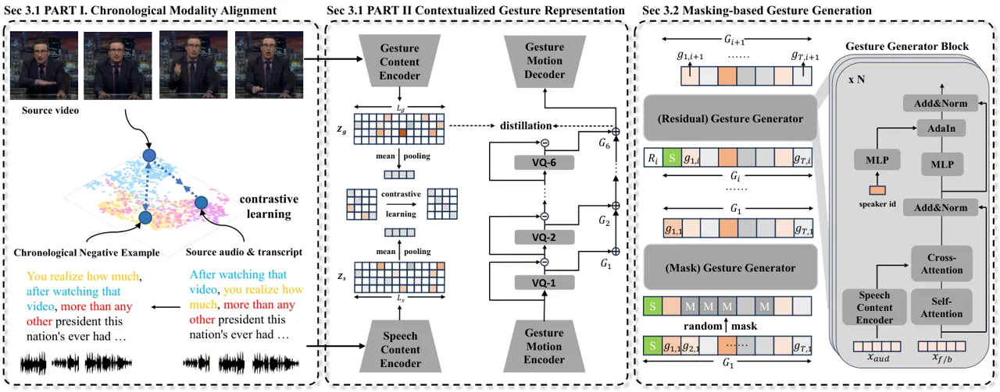
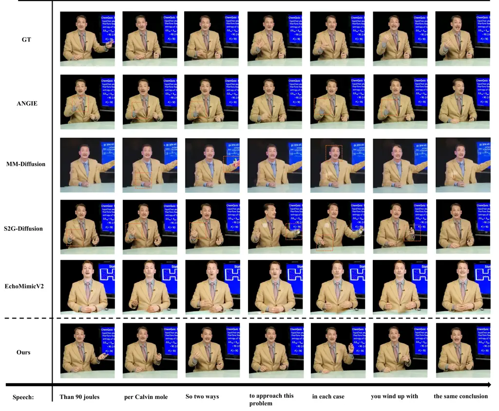
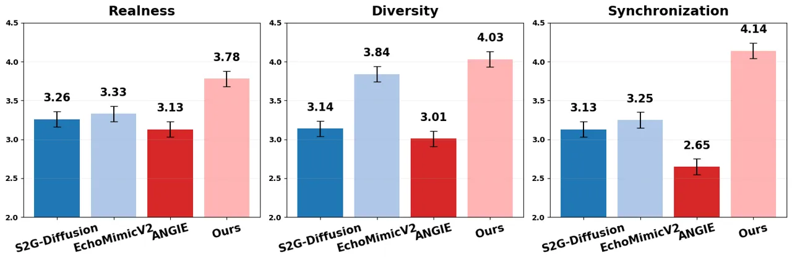
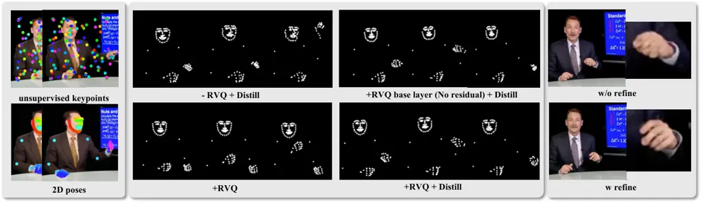
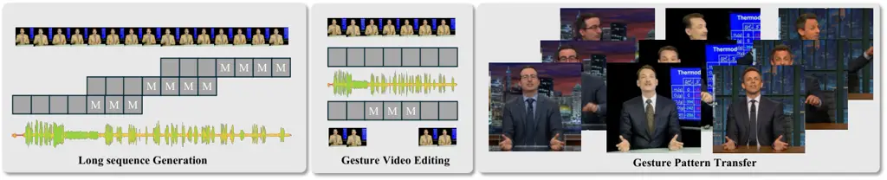
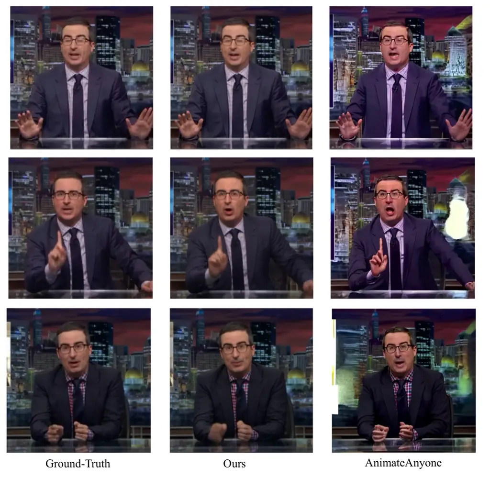
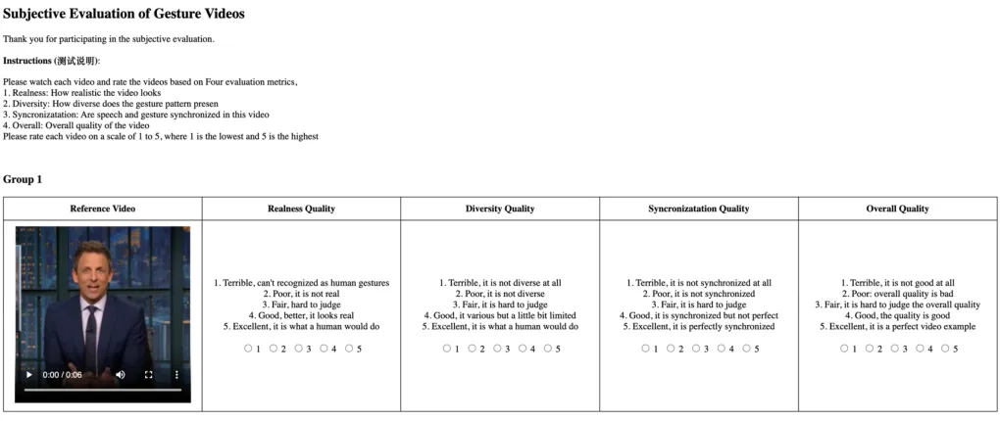

# Contextual Gesture: Co-Speech Gesture Video Generation through Context-aware Gesture Representation

Conference: Proceedings of the 33rd ACM International Conference on
Multimedia; October 27–31, 2025; Dublin, IrelandProceedings of the 33rd
ACM International Conference on Multimedia (MM ’25), October 27–31,
2025, Dublin,
IrelandDOI: [10.1145/3746027.3755140](https://doi.org/10.1145/3746027.3755140)ISBN: 979-8-4007-2035-2/2025/10CCS: Computing
methodologies Computer visionCCS: Computing methodologies Procedural
animation

Pinxin Liu
[](https://orcid.org/)
email: <pliu23@u.rochester> Affiliation: University of Rochester,
Rochester, New York, USA , Pengfei Zhang email: <pengfz5@uci.edu>
Affiliation: University of California Irvine, Irvine, California, USA ,
Hyeongwoo Kim Affiliation: Imperial College, London, United Kindom ,
Pablo Garrido email: <pablo.garrido@flawlessai.com>
Affiliation: Flawless AI, Santa Monica, California, USA , Ari Shapiro
email: <ariyshapiro@gmail.com> Affiliation: Flawless AI, Santa Monica,
California, USA and Kyle Olszewski email: <olszewski.kyle@gmail.com>
Affiliation: Flawless AI, Santa Monica, California, USA

© cc



Figure 1. Contextual Gesture achieves various fine-grained control over
video-level gesture motion. Left: We can generate 30s to 1 min speech
conditioned gesture videos. Mid: We modify the gestures for intermediate
frames of a video by providing a new audio segment. Right: Different
people present the same gesture patterns for a given audio.

###### Abstract.

Co-speech gesture generation is crucial for creating lifelike avatars
and enhancing human-computer interactions by synchronizing gestures with
speech. Despite recent advancements, existing methods struggle with
accurately identifying the rhythmic or semantic triggers from audio for
generating contextualized gesture patterns and achieving pixel-level
realism. To address these challenges, we introduce Contextual Gesture, a
framework that improves co-speech gesture video generation through three
innovative components: (1) a chronological speech-gesture alignment that
temporally connects two modalities, (2) a contextualized gesture
tokenization that incorporate speech context into motion pattern
representation through distillation, and (3) a structure-aware
refinement module that employs edge connection to link gesture keypoints
to improve video generation. Our extensive experiments demonstrate that
Contextual Gesture not only produces realistic and speech-aligned
gesture videos but also supports long-sequence generation and video
gesture editing applications, shown in Fig. 1.

###### Keywords: 

Co-speech gesture generation, video generation, data distillation

^(†)^(†)cc-license: by

## 1. Introduction

In human communication, speech is often accompanied by gestures that
enhance understanding and convey emotions (De Ruiter et al., 2012).
These non-verbal cues play a crucial role in effective
interaction (Burgoon et al., 1990), making gesture generation a key
component of natural human-computer interaction. Equipping virtual
avatars (Song et al., 2024a; Liu et al., 2024a; Zhang et al., 2025) with
realistic gesture capabilities is therefore essential for creating
engaging interactive experiences for industry production (Tang et al.,
2025).

Since the era of deep learning paradigm (Zhu et al., 2024b; Lu et al.,
2022; Gao et al., 2025; Lu et al., 2023; Lu et al., 2024; Ning et al.,
2024), many recent works tried to model the relationship between the
semantic and emotional content of speech, the associated gestures (Yi
et al., 2023; Liu et al., 2023; Luo et al., 2022; Liu et al., 2022c; Liu
et al., 2022a; Liu et al., 2025b). They simplify the problem by
generating coarse 3D motion representations—typically keypoints of
joints and body parts—that plausibly align with a given speech sample.
These simplified representations can be rendered via standard pipelines
and effectively capture basic motion patterns. However, they often
disregard the speaker’s visual appearance and fine-grained motions,
leading to a lack of realism that limits the expressive power and
communicative effectiveness of the generated gestures.

Other works, such as ANGIE (Liu et al., 2022b) and S2G-diffusion (He
et al., 2024), employ image-warping techniques for video generation,
guided by motion representations in the form of keypoints obtained from
optical-flow-based deformations. While promising, these approaches face
several critical limitations. First, their broad and unconstrained
motion representations fail to capture the contextual triggers of
gestures—particularly the semantic and emotional cues embedded in
speech. This disconnect limits the model’s ability to learn the nuanced
relationship between speech and gesture, making it difficult to generate
expressive motions that convey the speaker’s intent or metaphoric
meaning. Second, the predicted keypoints primarily encode coarse,
large-scale transformations, resulting in unstructured motion patterns
that are overly sensitive to pronounced movements. Consequently, the
generated outputs often suffer from noise and imprecision, especially in
fine-grained areas such as the hands and shoulders. These issues degrade
the realism and coherence of the generated video content.

To address these challenges, we introduce Contextual Gesture, a
framework designed to generate speech-aligned gesture motions and
afterwards high-fidelity speech video. To uncover the intrinsic temporal
connections between gestures and speech, we employ chronological
contrastive learning to align these two modalities into time-sensitive
joint representation of speech-contextual and gesture motion, which
captures the triggers of gesture patterns influenced by speech. We then
use knowledge distillation to incorporate speech-contextual features
into the tokenization process of gesture motions, aiming to infuse the
implicit intentions of gestures conveyed in the speech. This integration
creates a clear chronological linkage between the gestures and the
speech, enabling the generation of gestures that reflect the speaker’s
intentions. For motion generation, we employ a masking-based,
Transformer gesture generator that produces motion tokens and refines
their alignment with the speech signal through bidirectional mask
pretraining. Finally, for uplifting the gesture generation into 2D
animations, we propose a structure-aware image refinement module that
generates heatmaps of edge connections from keypoints, providing
image-level supervision to improve the quality of body regions with
large motion. Extensive experiments demonstrate that our method
outperforms the existing approaches in both quantitative and qualitative
metrics and achieves long sequence generation and editing applications.
In summary, our primary contributions are:

\(1\) Contextual Gesture, a framework that achieves time-sensitive joint
representation of both speech-contextual and gesture motion, and video
generation with various application support;

\(2\) a Contextual-aware gesture representation obtained through
knowledge distillation from the chronological gesture-speech aligned
features from chronological contrastive learning;

\(3\) a Structural-aware Image refinement module, with edge heatmaps as
supervision to improve video fidelity.

## 2. Related Work



Figure 2. We extract keypoints and leverage chronological alignment with
distillation to achieve contextualized gesture motion representation. We
leverage a masking-based generator conditioned on audio to generate
gesture keypoint sequences and apply image warping with refinement based
on edge heatmaps for final gesture video generation.

Co-speech Gesture generation Co-speech gesture generation is essential
for digital avatar production (Song et al., 2024b; Kumar et al., 2023)
and functions as the prior for realistic rendering (Luo et al., 2024;
Song et al., 2024c; Song et al., 2023). (Ginosar et al., 2019) use an
adversarial framework to predict hand and arm poses from audio, and
leverage conditional generation (Chan et al., 2019) based on
pix2pixHD (Wang et al., 2018) for videos. Some recent works (Liu et al.,
2022c; Deichler et al., 2023; Xu et al., 2023; Ao et al., 2022; Song
et al., 2021a; Song et al., 2021b; Liu et al., 2025a; Song et al.,
2024d) learns the hierarchical semantics or leverages contrastive
learning to obtain joint audio-gesture embedding from linguistic theory
to assist the gesture pose generation. TalkShow (Yi et al., 2023)
estimates SMPL (Pavlakos et al., 2019) poses, and models the body and
hand motions for talk-shows. CaMN (Liu et al., 2022d), EMAGE (Liu
et al., 2023) and Diffsheg (Chen et al., 2024) use large conversational
and speech datasets for joint face and body modeling with diverse style
control. ANGIE (Liu et al., 2022b) and S2G-Diffusion (He et al., 2024)
use image-warping features based on MRAA (Siarohin et al., 2021) or
TPS (Zhao and Zhang, 2022) to model body motion and achieve speech
driven animation by learning correspondence between audio and
image-warping features. However, none of these works produce structure-
and speech-aware motion patterns suitable for achieving natural and
realistic gesture rendering.

Conditional Video Generation Conditional Video Generation has undergo
significant progress with diffusion models (Huang et al., 2025; Tang
et al., 2024a; Karras et al., 2023; Huang et al., 2024a; Tang et al.,
2024b). AnimateDiff (Guo et al., 2024b) presents an efficient low-rank
adaptation  (Hu et al., 2022) (LoRA) to adapt image diffusion model for
video motion generation. AnimateAnyone (Hu et al., 2023) construct
referencenet for fine-grained control based on skeleton.
Make-Your-Anchor (Huang et al., 2024b) and Champ (Zhu et al., 2024a)
improve avatar video generation through face and body based on SMPL-X
conditions. EMO (Tian et al., 2024) and EchoMimic (Meng et al., 2024)
and Tango (Liu et al., 2024b) leverages audio as control signal for
talking head and upper body generation. However, these methods are slow
in inference speed and ignore the gesture patterns or rhythmic or
semantic signals from audio.

## 3. Contextual Gesture

Shown in Fig. 2, our framework targets at generating co-speech
photo-realistic human videos with contextualized gestures. To achieve
this goal, we first learn time-sensitive contextual-aware gesture
representation through knowledge distillation based on chronological
gesture-speech alignment (Sec. 3.1). We then leverage a Masking-based
Gesture Generator for gesture motion generation. (Sec. 3.2) To improve
the noisy hand and shoulder movement during the transfer of latent
motion to pixel space, we propose a structure-aware image refinement
through edge heatmaps for guidance. (Sec. 3.3).

### 3.1. Contextualized Gesture Representation

Generating natural and expressive gestures requires capturing
fine-grained contextual details that conventional approaches often
overlook. Consider a speaker emphasizing the word "really" in the
sentence "I really mean it" - while existing methods might generate a
generic emphatic gesture, they typically fail to capture the subtle,
context-specific body movements that make human gestures truly
expressive. This limitation stems from relying solely on motion
quantization, which often loses the nuanced relationship between speech
and corresponding gestures.

To address this challenge, we propose a novel approach that integrates
both audio and semantic information into the motion quantizer’s
codebook. This integration requires solving two fundamental problems.
First, we need to understand how gestures align with speech not just at
a high level, but in terms of precise temporal correspondence - when
specific words or phrases trigger particular movements, and how the
rhythm of speech influences gesture timing. To capture these temporal
dynamics, we develop a chronological gesture-speech alignment framework
using specialized contrastive learning. Second, we leverage knowledge
distillation to incorporate this learned temporal alignment information
into the gesture quantizer, enabling our system to generate gestures
that are synchronized with speech both semantically and rhythmically.



Figure 3. For gesture generation, we tokenize gesture keypoint sequences
using RVQ-VAE (Sec. 3.1 PART II), and use Gesture Generator to generate
the gesture tokens based on masked input (Sec 3.2). The gesture tokens
are then used to query the RVQ-VAE in order to generate the gestures.
For the RVQ-VAE training, we distill the contextual-aware feature from
gesture content encoder (Sec 3.1 PART II), which we trained using
chronological contrastive learning (Sec 3.1 PART I), in order to distill
speech-motion alignment information into the RVQ-VAE codebook.

Feature Representation. We utilize 2D poses extracted from images to
formulate gestures by facial and body movements. We represent a gesture
motion sequence as $`G=[F;B]=[f_{t};b_{t}]_{t=1}^{T}`$, where $`T`$
denotes the length of the motion, $`f`$ represents the 2D facial
landmarks, and $`b`$ denotes the 2D body landmarks. For speech
representation, we extract audio embeddings from WavLM (Chen et al., 2022) and Mel spectrogram features (Rabiner and Schafer, 2010) and beat
information using librosa (McFee et al., 2015). For text-semantics, we
extract embedding from RoBERTa (Liu et al., 2019). These features are
concatenated to form the speech representation.

Chronological Speech-Gesture Alignment. Traditional approaches to
modality alignment (Ao et al., 2022; Liu et al., 2022c; Deichler et al., 2023) rely on global representations through class tokens or max
pooling, which overlook the fine-grained temporal dynamics between
speech and gestures. We address this limitation by introducing
chronological modality alignment.

Vanilla Contrastive Alignment. To align gesture motion patterns with the
content of speech and beats, we first project both speech and gesture
modalities into a shared embedding space to enhance the speech content
awareness of gesture features. As illustrated in Fig. 3 Middle, we
separately train two gesture content encoders, $`\mathcal{E}_{f}`$ for
face motion and $`\mathcal{E}_{b}`$ for body motion, alongside two
speech encoders, $`\mathcal{E}_{S_{f}}`$ and $`\mathcal{E}_{S_{b}}`$, to
map face and body movements and speech signals into this joint embedding
space. For simplicity, we represent the general gesture motion sequence
as $`G`$. We then apply mean pooling to aggregate content-relevant
information to optimize the following loss (van den Oord et al., 2019):

```math
\begin{split}\mathcal{L}_{\text{NCE}}&=-\frac{1}{2N}\sum_{i}\left(\log\frac{\exp{S_{ii}/\tau}}{\sum_{j}\exp{S_{ij}/\tau}}+\log\frac{\exp{S_{ii}/\tau}}{\sum_{j}\exp{S_{ji}/\tau}}\right),~\end{split} \tag{1}
```

where $`S`$ computes the cosine similarities for all pairs in the batch,
defined as $`S_{ij}=\text{cos}(z^{s}_{i},z^{g}_{j})`$ and $`\tau`$ is
the temperature.

Chronological Negative Examples. While vanilla Contrastive Learning
builds global semantical alignment, we further propose to address the
temporal correspondence between speech and gesture. As shown in fig. 3
Left, consider a speaker saying, "After watching that video, you realize
how much, more than any other president…". In this case, the gesture
sequence involves "knocking at the table" when saying "more than any
other," serving as a visual emphasis for "how much" to highlight the
point. To encourage the model understand both semantic and rhythmic
alignment between two modalities, we shuffle the words and their
corresponding phonemes. By shuffling the sequence to "you realize how
much, after watching that video," the semantic intention of the speech
is preserved, but the rhythmic correspondence between speech and gesture
is disrupted. We use Whisper-X (Bain et al., 2023) to detect temporal
segments in the raw sequences. We cut the audio and shuffle these
segments, creating these augmented samples as additional chronological
negative examples within a batch during contrastive learning.

Gesture Quantization with Distillation. To construct context-aware
motion representations, we encode alignment information into the gesture
motion codebook. This allows the semantics and contextual triggers from
speech to be directly fused into the motion embedding, and enables the
generator to easily identify the corresponding motion representation in
response to speech triggers. To achieve this goal, we leverage gesture
content encoder as the teacher and distill knowledge to codebook latent
representation, shown in Fig. 3 Middle. We maximize the cosine
similarity over time between the RVQ quantization output and the
representation from the gesture content encoder:

```math
\mathcal{L}_{\text{distill}}=\sum_{t=1}^{T}\cos\left(p(Q_{R})^{t},Es(G)^{t}\right) \tag{2}
```

where $`p`$ denotes a linear projection layer, $`Q_{R}`$ is the final
quantized output from the RVQ-VAE, $`Es(G)`$ represents the output from
the gesture content encoder, and $`T`$ is the total time frames. The
overall training objective is defined as:

```math
\mathcal{L}_{\text{rvq}}=\left\lVert x-\hat{x}\right\rVert^{2}+\alpha\sum_{r=1}^{R}\left\lVert e_{r}-\text{sg}\left(z_{r}-e_{r}\right)\right\rVert^{2}+\beta\mathcal{L}_{\text{distill}} \tag{3}
```

where $`\mathcal{L}_{\text{rvq}}`$ combines a motion reconstruction
loss, a commitment loss (van den Oord et al., 2018) for each layer of
quantizer with a distillation loss, with $`\alpha`$ and $`\beta`$
weighting the contributions.

### 3.2. Speech-conditioned Gesture Generation

For Motion Generator, we adopt a similar masking-based generation
procedure as in MoMask (Guo et al., 2024a). We only include the
generator data flows in the main paper but defer the training and
inference strategy in the Appendix.

Mask Gesture Generator. As shown in Fig. 3 Right, during training, we
derive gesture tokens by processing raw gesture sequences through both
body and face tokenizers. The gesture token corresponding to the source
image acts as the conditioning for all subsequent frames. For speech
control, we initialize the audio content encoder from alignment
pre-training as described in Sec. 3.1. This pre-alignment of gesture
tokens with audio encoder features enhances the coherence of gesture
generation. We employ cross-attention to integrate audio information and
apply Adaptive Instance Normalization (AdaIN) (Huang and Belongie,
2017), enabling gesture styles based on the speaker’s identity.

Residual Gesture Generator. The Residual Gesture Generator shares a
similar architecture with the Masked Gesture Generator, but it includes
$`R`$ separate embedding layers corresponding to each RVQ residual
layer. This module iteratively predicts the residual tokens from the
base layers, ultimately producing the final quantized output. Please see
MoMask (Guo et al., 2024a) for further details.

### 3.3. Structure-Aware Image Generation

Converting generated gesture motions into realistic videos presents
significant challenges, particularly in handling camera movement
commonly found in videos. While recent 2D skeleton-based animation
methods (Hu et al., 2023) offer a potential solution, our empirical
analysis (detailed in the Appendix) reveals that these approaches
struggle with background stability in the presence of camera motion.

To address this limitation, we draw inspiration from optical-flow based
image warping methods (Zhao and Zhang, 2022; Siarohin et al., 2021;
Siarohin et al., 2019), which have shown promise in handling deformable
motion. We adapt these approaches by replacing their unsupervised
keypoints with our generated gesture keypoints from Sec. 3.2 for more
precise foreground optical flow estimation. However, this estimation
still presents uncertainties, resulting in blurry artifacts around hands
and shoulders, particularly when speakers make rapid or large movements.

To address the uncertainties by optical-flow-based deformation during
this process, we propose a Structure-Aware Generator. Auto-Link (He
et al., 2023) demonstrates that the learning of keypoint connections for
image reconstruction aids the model in understanding image semantics.
Based on this, we leverage keypoint connections as semantic guidance for
image generation.

Edge Heatmaps. Using the gesture motion keypoints, we establish linkages
between them to provide structural information. To optimize
computational efficiency, we limit the number of keypoint connections to
those defined by body joint relationships (Wan et al., 2017), rather
than all potential connections in (He et al., 2023).

For two keypoints $`{\bm{k}}_{i}`$ and $`{\bm{k}}_{j}`$ within
connection groups, we create a differentiable edge map
$`{\bm{S}}_{ij}`$, modeled as a Gaussian function extending along the
line connecting the keypoints. The edge map $`{\bm{S}}_{ij}`$ for
keypoints $`({\bm{k}}_{i},{\bm{k}}_{j})`$ is defined as:

```math
{\bm{S}}_{ij}({\bm{p}})=\exp\left(v_{ij}({\bm{p}})d^{2}_{ij}({\bm{p}})/\sigma^{2}\right), \tag{4}
```

where $`\sigma`$ is a learnable parameter controlling the edge
thickness, and $`d_{ij}({\bm{p}})`$ is the $`L_{2}`$ distance between
the pixel $`{\bm{p}}`$ and the edge defined by keypoints
$`{\bm{k}}_{i}`$ and $`{\bm{k}}_{j}`$:

```math
{\bm{d}}_{ij}({\bm{p}})=\left\{\begin{aligned} &\lVert{\bm{p}}-{\bm{k}}_{i}\rVert_{2}&\text{if}~~t\leq 0,\\
&\lVert{\bm{p}}-((1-t){\bm{k}}_{i}+t{\bm{k}}_{j})\rVert_{2}&\text{if}~~0<t<1,\\
&\lVert{\bm{p}}-{\bm{k}}_{j}\rVert_{2}&\text{if}~~t\geq 1,\end{aligned}\right. \tag{5}
```

```math
\text{where}\quad t=\frac{({\bm{p}}-{\bm{k}}_{i})\cdot({\bm{k}}_{j}-{\bm{k}}_{i})}{\lVert{\bm{k}}_{i}-{\bm{k}}_{j}\rVert^{2}_{2}}. \tag{6}
```

Here, $`t`$ denotes the normalized distance between $`{\bm{k}}_{i}`$ and
the projection of $`{\bm{p}}`$ onto the edge.

To derive the edge map $`{\bm{S}}\in\mathbb{R}^{H\times W}`$, we take
the maximum value at each pixel across all heatmaps:

```math
{\bm{S}}({\bm{p}})=\max_{ij}{\bm{S}}_{ij}({\bm{p}}). \tag{7}
```

Structural-guided Image Refinement. Traditional optical-flow-based
warping methods are effective for handling global deformations but often
fail under large motion patterns, such as those involving hands or
shoulders, resulting in significant distortions. To address this, we
introduce a structure-guided refinement process that incorporates
semantic guidance via structural heatmaps.

Instead of directly rendering the warped feature maps into RGB images,
we first predict a low-resolution feature map of size
$`256\times 256\times 32`$. Multi-resolution edge heatmaps are generated
and used as structural cues to refine the feature maps. After performing
deformation and occlusion prediction at each scale using TPS (Zhao and
Zhang, 2022), the edge heatmaps are fed into the generator.
Specifically, we integrate these heatmaps into the fusion block using
SPADE (Park et al., 2019) and the prediction of residuals are
element-wise added to the warped feature maps, ensuring precise
structural alignment.

To generate high-resolution RGB images, we employ a U-Net architecture
that takes both the warped features and edge heatmaps as inputs. This
design preserves fine-grained structural details while compensating for
motion-induced distortions. Additional architectural details and
analysis are provided in the Appendix.

Training Objective. We employ an adversarial loss, along with perceptual
similarity loss (LPIPS)  (Johnson et al., 2016) and pixel-level $`L1`$
loss for image refinement. The reconstruction objective is defined as:

```math
I_{\text{rec}}=\gamma\mathcal{L}_{GAN}+\mathcal{L}_{L1}+\mathcal{L}_{\text{LPIPS}}, \tag{8}
```

where $`I_{gt}`$ and $`I_{gan}`$ represent the ground-truth and
generated image separately. We use a small weighted term of $`\gamma`$
to stablize training.



Figure 4. Visual comparisons. Our method generates high-quality hand and
shoulder motions, and presents metaphoric gestures when saying “90
joules,” and “in each case.”. Red boxes denote the blurry or unnatural
gestures by other methods.

## 4. Experiments

Since our work focuses on joint gesture motion and video generation, to
validate the design, we first compare our proposed method for gesture
motion generation with relevant 3D gesture motion generation frameworks.
We further conduct holistic co-speech gesture video generation
comparisons.

### 4.1. 3D Gesture Motion Generation.

Dataset. We select BEAT-X (Liu et al., 2023) as the dataset for
comparison of gesture generation. For consistency, we exclude the
image-to-animation component from our method and leverage 3D SMPL-X
poses as in the existing literature. We compare the gesture generation
module of our work with representative state-of-the-art methods in
co-speech gesture generation (Ao et al., 2022; Yi et al., 2023; Liu
et al., 2023). We further design a baseline without using contextual
distillation.

Evaluation Metrics We evaluate the realism of body gestures by Fréchet
Gesture Distance (FGD)(Yoon et al., 2020). We include Diversity by
calculating the average L1 distance across clips. For synchronization,
we use Beat Constancy (BC) (Li et al., 2021). For facial expression, we
use the vertex Mean Squared Error (MSE) (Xing et al., 2023) for
positional accuracy.

Experiment Results. As shown in table 1, our method significantly
improves SMPL-X-based co-speech gesture generation, achieving lower FGD,
higher diversity. These results indicate that our method produces
smoother and more natural gesture motion patterns compared to existing
approaches. Furthermore, the lower MSE combined with appropriate BC
scores indicates that the generated gestures closely track the
ground-truth gestures across frames while maintaining rhythmic alignment
with the audio. This demonstrates that the gestures are well-coordinated
with, and responsive to, the accompanying speech. These findings
demonstrate the effectiveness of our contextual distillation strategy
for motion representation learning, as well as the benefit of
chronological alignment through contrastive learning. We defer the video
comparisons in the Appendix videos for reference.

|                                         |                    |                    |                   |                    |
| --------------------------------------- | ------------------ | ------------------ | ----------------- | ------------------ |
| Methods                                 | FGD $`\downarrow`$ | BC $`\rightarrow`$ | Div. $`\uparrow`$ | MSE $`\downarrow`$ |
| GT                                      |                    |                    | 0.703             | 11.97              |
| HA2G (Liu et al., 2022c)                | 12.320             | 0.677              | 8.626             | \-                 |
| DisCo (Liu et al., 2022a)               | 9.417              | 0.643              | 9.912             | \-                 |
| CaMN (Liu et al., 2022d)                | 6.644              | 0.676              | 10.86             | \-                 |
| DiffSHEG (Chen et al., 2024)            | 7.141              | 0.743              | 8.21              | 9.571              |
| TalkShow (Yi et al., 2023)              | 6.209              | 0.695              | 13.47             | 7.791              |
| Rhythmic Gesticulator (Ao et al., 2022) | 6.453              | 0.665              | 9.132             |                    |
| EMAGE (Liu et al., 2023)                | 5.512              | 0.772              | 13.06             | 7.680              |
| Ours (w/o distill)                      | 5.079              | 0.737              | 13.24             | 7.742              |
| Ours                                    | 4.434              | 0.724              | 13.76             | 7.021              |

Table 1. Quantitative results on BEAT-X. FGD (Frechet Gesture Distance)
multiplied by $`10^{-1}`$, BC (Beat Constancy) multiplied by
$`10^{-1}`$, Diversity, MSE (Mean Squared Error) multiplied by
$`10^{-7}`$. The best results are in bold.

### 4.2. Realistic Video Generation.

Dataset. We utilize PATS (Ginosar et al., 2019; Ahuja et al., 2020) for
the experiments. It contains 84,000 clips from 25 speakers with a mean
length of 10.7s, 251 hours in total. For a fair comparison, following
the literature (Liu et al., 2022b; He et al., 2024) and replace the
missing subject, with 4 speakers are selected (Noah, Kubinec, Oliver,
and Seth). All video clips are cropped with square bounding boxes,
centering speaks, resized to $`256\times 256`$. We defer the additional
details in the Appendix.

Evaluation Metric. For gesture motion metrics, we use Fréchet Gesture
Distance (FGD) (Yoon et al., 2020) to measure the distribution gap
between real and generated gestures in feature space, Diversity
(Div.) (Lee et al., 2019) to calculate the average feature distance
between generated gestures, Beat Alignment Score (BAS) following (Li
et al., 2021), Percent of Correct Motion parameters (PCM), difference of
generation deviate from ground-truth following (Chen et al., 2024). For
video generation, we extract 2D human poses for face and body using
MMPose (OpenMMLab, 2020) to represent the gesture motion. Note that in
comparison with other models, the FGD is measued by the keypoints
extracted from generated videos in the main experiment while in ablation
studies, to prevent the effect image warping errors, FGD is measured by
keypoints generated in Sec.3.2.

For pixel-level video quality, we assess Fréchet Video Distance
(FVD) (Unterthiner et al., 2018) for the overall quality of gesture
videos, VQA*(A) for aesthetics and VQA*(T) for technical quality based
on Dover (Wu et al., 2023), pretrained on datasets with labels ranked by
real users. We further evaluate the training and inference efficiency of
various methods, Train-T denotes the number of days for training.
Infer-T denotes the number of seconds to produce a 10-second video.

Baseline Methods. We benchmark Contextual Gesture against several
co-speech gesture video generation methods: (1) ANGIE (Liu et al.,
2022b), (2) S2G-Diffusion (He et al., 2024), (3) MM-Diffusion (Ruan
et al., 2023), and (4) EchoMimicV2 (Meng et al., 2024). The first two
are conventional optical-flow-based methods. MM-Diffusion is capable of
achieving joint audio-visual generation. EchoMimicV2 is the most recent
diffusion based speech-avatar animation model pretrained on large scale
data.

Evaluation Results. We present quantitative evaluations in table 2. Our
approach significantly outperforms existing methods in both gesture
motion and video quality metrics. We provide qualitative evaluations in
fig. 4. MM-Diffusion is not able to handle complex motion patterns,
leading to almost static results. ANGIE and S2G-Diffusion struggle with
local regions, such as the hands, due to its reliance on unsupervised
keypoints for global transformations, which neglects local deformations.
EchoMimicV2 lacks the background motion modeling and is only capable of
presenting the aligned centered avatars in the middle. In addition, it
fails to achieve diversified gestures. In contrast, our method
demonstrates high-quality video generation, particularly in the facial
and body areas. The alignment between gesture and speech is notably
enhanced through our speech-content-aware gesture latent representation.
For example, when the actor says ”90 joules,” he points to the screen,
and he emphasizes phrases like ”so two ways” and ”in each case” by
raising his hands.

|                                       |                           |                   |                  |                  |                          |                       |                       |                        |                        |
| ------------------------------------- | ------------------------- | ----------------- | ---------------- | ---------------- | ------------------------ | --------------------- | --------------------- | ---------------------- | ---------------------- |
| Name                                  | Gesture Motion Evaluation |                   |                  |                  | Video Quality Assessment |                       |                       | Speed                  |                        |
|                                       | FGD $`\downarrow`$        | Div. $`\uparrow`$ | BAS $`\uparrow`$ | PCM $`\uparrow`$ | FVD $`\downarrow`$       | VQA\_(A) $`\uparrow`$ | VQA\_(T) $`\uparrow`$ | Train-T $`\downarrow`$ | Infer-T $`\downarrow`$ |
| Ground Truth                          | 0.0                       | 14.01             | 1.00             | 1.00             | 0.00                     | 95.69                 | 5.33                  | \-                     | \-                     |
| MM-Diffusion (Ruan et al., 2023)      | 67.56                     | 4.32              | 0.65             | 0.11             | \-                       | 77.65                 | 4.14                  | 14 days                | 600 sec                |
| ANGIE (Liu et al., 2022b)             | 34.13                     | 7.87              | 0.78             | 0.37             | 515.43                   | 86.32                 | 4.98                  | 5 days                 | 30 sec                 |
| S2G-Diffusion (He et al., 2024)       | 10.54                     | 10.08             | 0.98             | 0.45             | 493.43                   | 94.54                 | 5.63                  | 5 days                 | 35 sec                 |
| EchoMimicV2 (Meng et al., 2024)       | 13.65                     | 9.85              | 0.98             | 0.45             | 466.84                   | 95.65                 | 5.98                  | \-                     | 1200 sec               |
| Ours + AnimateAnyone(Hu et al., 2023) | 6.56                      | 13.06             | 0.99             | 0.54             | 477.82                   | 95.63                 | 6.04                  | 8.5 days               | 50 sec                 |
| Ours                                  | 8.76                      | 13.13             | 0.99             | 0.54             | 466.43                   | 96.53                 | 6.12                  | 6 days                 | 3 sec                  |

Table 2. Quantitative results shows our method performs better in terms
of gesture motions and video generation quality.

User Study. We conducted a user study to evaluate the visual quality of
our method. We sampled 80 videos from each method including EchoMimicV2,
S2G-Diffusion, ANGIE and ours and invited 20 participants to conduct
Mean Opinion Scores (MOS) evaluations. The rating ranges from 1
(poorest) to 5 (highest). Participants rated the videos on: (1) MOS₁:
“How realistic does the video appear?”, (2) MOS₂: “How diverse does the
gesture pattern present?”, (3) MOS₃: “Are speech and gesture
synchronized in this video?”. The videos were presented in random order
to capture participants’ initial impressions. As shown in  fig. 5, our
method outperformed others across realness, synchronization and
diversity, achieving significant performance improvement over existing
methods.

### 4.3. Ablation Study

We present ablation studies of keypoint design for image warping,
gesture motion representation, generator architecture design, and varios
comparisons of image-refinement. We defer additional experiments in the
Appendix.

Motion Keypoint Design. We evaluate four settings for image-warping: (1)
unsupervised keypoints for global optical-flow transformation (as in
ANGIE and S2G-Diffusion), (2) 2D human poses, (3) 2D human poses
augmented with flexible learnable points, and (4) full-model
reconstruction with refinement. Each design is assessed using TPS (Zhao
and Zhang, 2022) transformation, with self-reconstruction based on these
keypoints for evaluation. As shown in table 3(a), learnable keypoints
lead to a significant decrease in FVD, highlighting their inadequacy for
motion control. The inclusion of flexible keypoints does not enhance the
image-warping outcomes. Consequently, we opt to utilize 2D pose
landmarks exclusively for our study.

Motion Representation. We evaluate several configurations: (1) baseline:
no motion representation, relying solely on the generator to synthesize
raw 2D landmarks; (2) + RVQ: utilizing Residual VQ (RVQ) to encode joint
face-body keypoints; (3) + distill: learning joint embeddings for speech
and gesture in both face and body motions; (4) + chrono: leverage
chronological alignment for distillation. We discover RVQ significantly
improve the precise pose location while distillation leads to natural
movements.

Generator Design. We explore various designs for the gesture generator:
(1) w/o res: no residual gesture decoder; (2) concat: instead of using
cross-attention for audio control, we concatenate the audio features
with gesture latent features element-wise during generation; (3) w/o
align: the audio encoder is randomly initialized rather than initialized
from face and body contrastive learning. Our findings indicate that the
Residual Gesture Generator significantly enhances finger motion
generation. The cross-attention design outperforms element-wise
concatenation, while the pre-alignment of the audio encoder notably
improves FGD.

Training Strategies. We evaluate the mask ratio during training and the
number of inference steps during decoding. As shown in table 3(d), our
model requires only 5 inference steps, in contrast to over 50 or 100
steps in diffusion-based models. Furthermore, a uniform masking ratio
between 0.5 and 1 during training yields optimal performance.

Long Sequence generation. To understand the capability of our framework
for long sequence generation, we conduct an ablation study for both PATS
and BEAT-X dataset. For BEAT-X, we cut the testing audios into segments
of 256 (about 8.53 seconds) for short sequence evaluation and use raw
testing audios for long sequence evaluation in table 1. Shown in
table 3(f), it is interesting for PATS dataset, long-sequence generation
as an application in the main paper presents quality lower than normal
settings. However, for BEAT-X dataset, the generation quality is not
affected much. We attribute this difference caused by the dataset
difference. Because PATS dataset consists training video lengths with a
average of less than 10 seconds, the model presents less diverse gesture
patterns. However, in BEAT-X, most of gesture video sequences are over
30 or 1 minutes, our method further benefits from this long sequence
learning precess and presents higher qualities.

Image Refinement. We examine various network designs for motion
generation, specifically: (1) w/o refine: no image refinement, relying
solely on image warping; (2) + UNet: employing a standard UNet; (3) +
pose skeleton: integrating connected skeleton maps as in the diffusion
ReferenceNet (Hu et al., 2023); (4) + edge heatmap: substituting the
previous design with our learnable edge heatmap. Our experiments reveal
that the edge heatmap outperforms skeleton maps, due to the learnable
thickness of connections for better semantic guidance.



Figure 5. User Study. We generate 80 videos per method for evaluations
of Realness, Diversity, and Synchronization.

| Kp Repr.  | FVD$`\downarrow`$ | LPIPS$`\downarrow`$ | PSNR$`\uparrow`$ |
| --------- | ----------------- | ------------------- | ---------------- |
| Unsup-kp  | 387.05            | 0.05                | 27.41            |
| 2D-pose   | 272.18            | 0.05                | 27.26            |
| + flex kp | 377.14            | 0.06                | 25.36            |
| full      | 225.77            | 0.04                | 27.17            |

(a) Configs for keypoint design.

| G-Repr.   | FGD$`\downarrow`$ | PCM$`\uparrow`$ |
| --------- | ----------------- | --------------- |
| baseline  | 8.84              | 0.35            |
| +RVQ      | 3.43              | 0.37            |
| + distill | 2.75              | 0.58            |
| + chrono  | 0.87              | 0.59            |

(b) Gesture Repr.

| G-Gen.     | FGD$`\downarrow`$ | PCM$`\uparrow`$ |
| ---------- | ----------------- | --------------- |
| w/o res    | 1.62              | 0.51            |
| concat     | 3.55              | 0.51            |
| w/o align  | 1.33              | 0.53            |
| full-model | 0.87              | 0.59            |

(c) Model Design.

| iter. | FGD$`\downarrow`$ | Div.$`\uparrow`$ | PCM$`\uparrow`$ |
| ----- | ----------------- | ---------------- | --------------- |
| 5     | 0.87              | 13.23            | 0.59            |
| 10    | 0.98              | 13.11            | 0.57            |
| 15    | 1.24              | 13.04            | 0.57            |
| 20    | 1.56              | 13.23            | 0.57            |

(d) Mask decoding steps.

| M-Ratio  | FGD$`\downarrow`$ | Div.$`\uparrow`$ | PCM$`\uparrow`$ |
| -------- | ----------------- | ---------------- | --------------- |
| Uni 0-1  | 2.13              | 14.31            | 0.56            |
| Uni .3-1 | 1.56              | 12.44            | 0.512           |
| Uni .5-1 | 0.87              | 13.23            | 0.59            |
| Uni .7-1 | 1.22              | 13.12            | 0.57            |

(e) Mask-ratio during training.

| Dataset | Setting     | FGD$`\downarrow`$ | Div.$`\uparrow`$ | BAS   |
| ------- | ----------- | ----------------- | ---------------- | ----- |
| PATS    | $`\leq`$10s | 1.303             | 13.260           | 0.996 |
|         | $`>`$10s    | 2.356             | 11.956           | 0.994 |
| BEAT-X  | $`\leq`$10s | 4.747             | 13.14            | 7.323 |
|         | $`>`$10s    | 4.650             | 13.55            | 7.370 |

(f) Long Seq Generation Quality.

| Refine     | VQA\_(A)$`\uparrow`$ | VQA\_(T)$`\uparrow`$ | FVD$`\downarrow`$ |
| ---------- | -------------------- | -------------------- | ----------------- |
| w/o refine | 92.15                | 5.43                 | 494.35            |
| + UNet     | 93.86                | 5.51                 | 478.54            |
| + skeleton | 95.79                | 5.65                 | 473.34            |
| + heatmap  | 96.53                | 6.12                 | 466.43            |

(g) Image-refinement strategies.

Table 3. Ablation Studies for keypoint design, gesture representation,
generator architecture, and inference strategies.



Figure 6. Ablations. Left: motion by unsupervised keypoints or 2d poses;
Middle: RVQ-based gesture representation and generation; Right:
image-refinement helps hand generation.



Figure 7. Our model supports multiple video gesture generation end
editing applications.

### 4.4. Application

Long Sequence Generation. As in fig. 7, to generate long sequences, we
begin with the initial frame and corresponding target audio, segmented
into smaller windows. After generating the first segment, the last few
frames of the output serve as the new starting condition for the next
segment, enabling iterative outpainting.

Video Gesture Editing. For editing, we extract keypoints from the video,
tokenize face and body movements into motion tokens, and insert mask
tokens where edits are needed. By changing the speech audio or speaker
identity, we can create new gesture patterns and re-render the video.

Gesture Pattern Transfer. With different identity embeddings, we
generate unique gesture patterns for the same audio input. See the demo
videos in the Appendix.

Speech-Gesture Retrieval. With chronological speech-gesture alignment,
the model is capable of retrieving the best gesture motion correponding
to the given speech audio in a batch of data. See additional details in
the Appendix.

## 5. Conclusion

We present Contextual Gesture, a framework for generating realistic
co-speech gesture videos. To ensure the gestures cohere well with
speech, we propose speech-content aware gesture motion representation
though knowledge distillation from the gesture-speech aligned features.
Our structural-aware image generation module improves the transformation
of latent motions into realistic animations for large-scale body
motions. We hope this work encourage further exploration of the
relationship between gesture patterns and speech context for better
video generations in the future.

## References

- Ahuja et al. (2020) Chaitanya Ahuja, Dong Won Lee, Ryo Ishii, and
  Louis-Philippe Morency. 2020. No Gestures Left Behind: Learning
  Relationships between Spoken Language and Freeform Gestures. In
  _Proceedings of the 2020 Conference on Empirical Methods in Natural
  Language Processing: Findings_. 1884–1895.
- Ao et al. (2022) Tenglong Ao, Qingzhe Gao, Yuke Lou, Baoquan Chen, and
  Libin Liu. 2022. Rhythmic gesticulator: Rhythm-aware co-speech gesture
  synthesis with hierarchical neural embeddings. _ACM Transactions on
  Graphics (TOG)_ 41, 6 (2022), 1–19.
- Bain et al. (2023) Max Bain, Jaesung Huh, Tengda Han, and Andrew
  Zisserman. 2023. WhisperX: Time-Accurate Speech Transcription of
  Long-Form Audio. _INTERSPEECH 2023_ (2023).
- Burgoon et al. (1990) Judee K Burgoon, Thomas Birk, and Michael
  Pfau. 1990. Nonverbal Behaviors, Persuasion, and Credibility. _Human
  communication research_ 17, 1 (1990), 140–169.
- Chan et al. (2019) Caroline Chan, Shiry Ginosar, Tinghui Zhou, and
  Alexei A Efros. 2019. Everybody Dance Now. In _ICCV_.
- Chang et al. (2023) Huiwen Chang, Han Zhang, Jarred Barber, AJ
  Maschinot, Jose Lezama, Lu Jiang, Ming-Hsuan Yang, Kevin Murphy,
  William T Freeman, Michael Rubinstein, et al. 2023. Muse:
  Text-to-Image Generation Via Masked Generative Transformers. _arXiv
  preprint arXiv:2301.00704_ (2023).
- Chen et al. (2024) Junming Chen, Yunfei Liu, Jianan Wang, Ailing Zeng,
  Yu Li, and Qifeng Chen. 2024. DiffSHEG: A Diffusion-Based Approach for
  Real-Time Speech-driven Holistic 3D Expression and Gesture Generation.
  arXiv:2401.04747 \[cs.SD\]
  [https://arxiv.org/abs/2401.04747](https://arxiv.org/abs/2401.04747)
- Chen et al. (2022) Sanyuan Chen, Chengyi Wang, Zhengyang Chen, Yu Wu,
  Shujie Liu, Zhuo Chen, Jinyu Li, Naoyuki Kanda, Takuya Yoshioka, Xiong
  Xiao, et al. 2022. WavLM: Large-Scale Self-Supervised Pre-Training for
  Full Stack Speech Processing. _IEEE Journal of Selected Topics in
  Signal Processing_ 16, 6 (2022), 1505–1518.
- De Ruiter et al. (2012) Jan P De Ruiter, Adrian Bangerter, and Paula
  Dings. 2012. The Interplay Between Gesture and Speech in the
  Production of Referring Expressions: Investigating the Tradeoff
  Hypothesis. _Topics in cognitive science_ 4, 2 (2012), 232–248.
- Deichler et al. (2023) Anna Deichler, Shivam Mehta, Simon
  Alexanderson, and Jonas Beskow. 2023. Diffusion-Based Co-Speech
  Gesture Generation Using Joint Text and Audio Representation. In
  _INTERNATIONAL CONFERENCE ON MULTIMODAL INTERACTION_ _(ICMI ’23)_.
  ACM.
  [https://doi.org/10.1145/3577190.3616117](https://doi.org/10.1145/3577190.3616117)
- Devlin (2018) Jacob Devlin. 2018. BERT: Pre-Training of Deep
  Bidirectional Transformers for Language Understanding. _arXiv preprint
  arXiv:1810.04805_ (2018).
- Gao et al. (2025) Daiheng Gao, Shilin Lu, Wenbo Zhou, Jiaming Chu, Jie
  Zhang, Mengxi Jia, Bang Zhang, Zhaoxin Fan, and Weiming Zhang. 2025.
  EraseAnything: Enabling Concept Erasure in Rectified Flow
  Transformers. In _Forty-second International Conference on Machine
  Learning_.
  [https://openreview.net/forum?id=vvBAZJh2nQ](https://openreview.net/forum?id=vvBAZJh2nQ)
- Ginosar et al. (2019) S. Ginosar, A. Bar, G. Kohavi, C. Chan, A.
  Owens, and J. Malik. 2019. Learning Individual Styles of
  Conversational Gesture. In _CVPR_. IEEE.
- Guo et al. (2024a) Chuan Guo, Yuxuan Mu, Muhammad Gohar Javed, Sen
  Wang, and Li Cheng. 2024a. Momask: Generative masked modeling of 3d
  human motions. In _Proceedings of the IEEE/CVF Conference on Computer
  Vision and Pattern Recognition_. 1900–1910.
- Guo et al. (2024b) Yuwei Guo, Ceyuan Yang, Anyi Rao, Zhengyang Liang,
  Yaohui Wang, Yu Qiao, Maneesh Agrawala, Dahua Lin, and Bo Dai. 2024b.
  AnimateDiff: Animate Your Personalized Text-to-Image Diffusion Models
  without Specific Tuning. _ICLR_ (2024).
- He et al. (2022) Kaiming He, Xinlei Chen, Saining Xie, Yanghao Li,
  Piotr Dollár, and Ross Girshick. 2022. Masked Autoencoders Are
  Scalable Vision Learners. In _CVPR_. 16000–16009.
- He et al. (2024) Xu He, Qiaochu Huang, Zhensong Zhang, Zhiwei Lin,
  Zhiyong Wu, Sicheng Yang, Minglei Li, Zhiyi Chen, Songcen Xu, and
  Xiaofei Wu. 2024. Co-Speech Gesture Video Generation via
  Motion-Decoupled Diffusion Model. In _CVPR_. 2263–2273.
- He et al. (2023) Xingzhe He, Bastian Wandt, and Helge Rhodin. 2023.
  AutoLink: Self-Supervised Learning of Human Skeletons and Object
  Outlines by Linking Keypoints. arXiv:2205.10636 \[cs.CV\]
  [https://arxiv.org/abs/2205.10636](https://arxiv.org/abs/2205.10636)
- Hu et al. (2022) Edward J Hu, Yelong Shen, Phillip Wallis, Zeyuan
  Allen-Zhu, Yuanzhi Li, Shean Wang, Lu Wang, and Weizhu Chen. 2022.
  LoRA: Low-Rank Adaptation of Large Language Models. In _ICLR_.
  [https://openreview.net/forum?id=nZeVKeeFYf9](https://openreview.net/forum?id=nZeVKeeFYf9)
- Hu et al. (2023) Li Hu, Xin Gao, Peng Zhang, Ke Sun, Bang Zhang, and
  Liefeng Bo. 2023. Animate Anyone: Consistent and Controllable
  Image-to-Video Synthesis for Character Animation. _arXiv preprint
  arXiv:2311.17117_ (2023).
- Huang et al. (2025) Chao Huang, Susan Liang, Yunlong Tang, Li Ma,
  Yapeng Tian, and Chenliang Xu. 2025. FreSca: Unveiling the Scaling
  Space in Diffusion Models. _arXiv preprint arXiv:2504.02154_ (2025).
- Huang et al. (2024a) Chao Huang, Susan Liang, Yunlong Tang, Yapeng
  Tian, Anurag Kumar, and Chenliang Xu. 2024a. Scaling Concept with
  Text-Guided Diffusion Models. _arXiv preprint arXiv:2410.24151_
  (2024).
- Huang and Belongie (2017) Xun Huang and Serge Belongie. 2017.
  Arbitrary Style Transfer in Real-time with Adaptive Instance
  Normalization. arXiv:1703.06868 \[cs.CV\]
  [https://arxiv.org/abs/1703.06868](https://arxiv.org/abs/1703.06868)
- Huang et al. (2024b) Ziyao Huang, Fan Tang, Yong Zhang, Xiaodong Cun,
  Juan Cao, Jintao Li, and Tong-Yee Lee. 2024b. Make-Your-Anchor: A
  Diffusion-based 2D Avatar Generation Framework. _arXiv preprint
  arXiv:2403.16510_ (2024).
- Jiang et al. (2023) Tao Jiang, Peng Lu, Li Zhang, Ningsheng Ma, Rui
  Han, Chengqi Lyu, Yining Li, and Kai Chen. 2023. RTMPose: Real-Time
  Multi-Person Pose Estimation based on MMPose.
  [https://doi.org/10.48550/ARXIV.2303.07399](https://doi.org/10.48550/ARXIV.2303.07399)
- Johnson et al. (2016) Justin Johnson, Alexandre Alahi, and Li
  Fei-Fei. 2016. Perceptual Losses for Real-Time Style Transfer and
  Super-Resolution. arXiv:1603.08155 \[cs.CV\]
  [https://arxiv.org/abs/1603.08155](https://arxiv.org/abs/1603.08155)
- Karras et al. (2023) Johanna Karras, Aleksander Holynski, Ting-Chun
  Wang, and Ira Kemelmacher-Shlizerman. 2023. DreamPose: Fashion
  Image-to-Video Synthesis via Stable Diffusion. _arXiv preprint
  arXiv:2304.06025_ (2023).
- Kingma (2014) Diederik P Kingma. 2014. Adam: A Method for Stochastic
  Optimization. _arXiv preprint arXiv:1412.6980_ (2014).
- Kumar et al. (2023) Raja Kumar, Jiahao Luo, Alex Pang, and James
  Davis. 2023. Disjoint pose and shape for 3d face reconstruction. In
  _Proceedings of the IEEE/CVF International Conference on Computer
  Vision_. 3115–3125.
- Lee et al. (2022) Doyup Lee, Chiheon Kim, Saehoon Kim, Minsu Cho, and
  Wook-Shin Han. 2022. Autoregressive Image Generation Using Residual
  Quantization. arXiv:2203.01941 \[cs.CV\]
  [https://arxiv.org/abs/2203.01941](https://arxiv.org/abs/2203.01941)
- Lee et al. (2019) Hsin-Ying Lee, Xiaodong Yang, Ming-Yu Liu, Ting-Chun
  Wang, Yu-Ding Lu, Ming-Hsuan Yang, and Jan Kautz. 2019. Dancing to
  Music. _NeurIPS_ 32 (2019).
- Li et al. (2021) Ruilong Li, Shan Yang, David A Ross, and Angjoo
  Kanazawa. 2021. AI Choreographer: Music Conditioned 3D Dance
  Generation with AIST++. In _Proceedings of the IEEE/CVF International
  Conference on Computer Vision_. 13401–13412.
- Li et al. (2023) Tianhong Li, Huiwen Chang, Shlok Mishra, Han Zhang,
  Dina Katabi, and Dilip Krishnan. 2023. MAGE: Masked Generative Encoder
  to Unify Representation Learning and Image Synthesis. In _CVPR_.
  2142–2152.
- Liu et al. (2022a) Haiyang Liu, Naoya Iwamoto, Zihao Zhu, Zhengqing
  Li, You Zhou, Elif Bozkurt, and Bo Zheng. 2022a. DisCo: Disentangled
  Implicit Content and Rhythm Learning for Diverse Co-Speech Gestures
  Synthesis. In _Proceedings of the 30th ACM International Conference on
  Multimedia_. 3764–3773.
- Liu et al. (2024b) Haiyang Liu, Xingchao Yang, Tomoya Akiyama,
  Yuantian Huang, Qiaoge Li, Shigeru Kuriyama, and Takafumi Taketomi.
  2024b. TANGO: Co-Speech Gesture Video Reenactment with Hierarchical
  Audio Motion Embedding and Diffusion Interpolation. _arXiv preprint
  arXiv:2410.04221_ (2024).
- Liu et al. (2023) Haiyang Liu, Zihao Zhu, Giorgio Becherini, Yichen
  Peng, Mingyang Su, You Zhou, Naoya Iwamoto, Bo Zheng, and Michael J
  Black. 2023. EMAGE: Towards Unified Holistic Co-Speech Gesture
  Generation via Masked Audio Gesture Modeling. _arXiv preprint
  arXiv:2401.00374_ (2023).
- Liu et al. (2022d) Haiyang Liu, Zihao Zhu, Naoya Iwamoto, Yichen Peng,
  Zhengqing Li, You Zhou, Elif Bozkurt, and Bo Zheng. 2022d. BEAT: A
  Large-Scale Semantic and Emotional Multi-Modal Dataset for
  Conversational Gestures Synthesis. _arXiv preprint arXiv:2203.05297_
  (2022).
- Liu et al. (2025a) Pinxin Liu, Haiyang Liu, Luchuan Song, and
  Chenliang Xu. 2025a. Intentional Gesture: Deliver Your Intentions with
  Gestures for Speech. arXiv:2505.15197 \[cs.CV\]
  [https://arxiv.org/abs/2505.15197](https://arxiv.org/abs/2505.15197)
- Liu et al. (2025b) Pinxin Liu, Luchuan Song, Junhua Huang, and
  Chenliang Xu. 2025b. GestureLSM: Latent Shortcut based Co-Speech
  Gesture Generation with Spatial-Temporal Modeling. _arXiv preprint
  arXiv:2501.18898_ (2025).
- Liu et al. (2024a) Pinxin Liu, Luchuan Song, Daoan Zhang, Hang Hua,
  Yunlong Tang, Huaijin Tu, Jiebo Luo, and Chenliang Xu. 2024a.
  GaussianStyle: Gaussian Head Avatar via StyleGAN. _arXiv preprint
  arXiv:2402.00827_ (2024).
- Liu et al. (2022b) Xian Liu, Qianyi Wu, Hang Zhou, Yuanqi Du, Wayne
  Wu, Dahua Lin, and Ziwei Liu. 2022b. Audio-Driven Co-Speech Gesture
  Video Generation. _NeurIPS_ 35 (2022), 21386–21399.
- Liu et al. (2022c) Xian Liu, Qianyi Wu, Hang Zhou, Yinghao Xu, Rui
  Qian, Xinyi Lin, Xiaowei Zhou, Wayne Wu, Bo Dai, and Bolei Zhou.
  2022c. Learning Hierarchical Cross-Modal Association for Co-Speech
  Gesture Generation. In _CVPR_. 10462–10472.
- Liu et al. (2019) Yinhan Liu, Myle Ott, Naman Goyal, Jingfei Du,
  Mandar Joshi, Danqi Chen, Omer Levy, Mike Lewis, Luke Zettlemoyer, and
  Veselin Stoyanov. 2019. RoBERTa: A Robustly Optimized BERT Pretraining
  Approach. arXiv:1907.11692 \[cs.CL\]
  [https://arxiv.org/abs/1907.11692](https://arxiv.org/abs/1907.11692)
- Lu et al. (2022) Shilin Lu, Xinghong Hu, Chengyou Wang, Lu Chen, Shulu
  Han, and Yuejia Han. 2022. Copy-move image forgery detection based on
  evolving circular domains coverage. _Multimedia Tools and
  Applications_ 81, 26 (2022), 37847–37872.
- Lu et al. (2023) Shilin Lu, Yanzhu Liu, and Adams Wai-Kin Kong. 2023.
  TF-ICON: Diffusion-Based Training-Free Cross-Domain Image Composition.
  In _Proceedings of the IEEE/CVF International Conference on Computer
  Vision (ICCV)_. 2294–2305.
- Lu et al. (2024) Shilin Lu, Zilan Wang, Leyang Li, Yanzhu Liu, and
  Adams Wai-Kin Kong. 2024. MACE: Mass Concept Erasure in Diffusion
  Models. In _Proceedings of the IEEE/CVF Conference on Computer Vision
  and Pattern Recognition (CVPR)_. 6430–6440.
- Luo et al. (2022) Jiahao Luo, Fahim Hasan Khan, Issei Mori, Akila de
  Silva, Eric Sandoval Ruezga, Minghao Liu, Alex Pang, and James
  Davis. 2022. How much does input data type impact final face model
  accuracy?. In _Proceedings of the IEEE/CVF Conference on Computer
  Vision and Pattern Recognition_. 18985–18994.
- Luo et al. (2024) Jiahao Luo, Jing Liu, and James Davis. 2024.
  SplatFace: Gaussian splat face reconstruction leveraging an
  optimizable surface. _arXiv preprint arXiv:2403.18784_ (2024).
- Mao et al. (2024) Xiaofeng Mao, Zhengkai Jiang, Qilin Wang, Chencan
  Fu, Jiangning Zhang, Jiafu Wu, Yabiao Wang, Chengjie Wang, Wei Li, and
  Mingmin Chi. 2024. MDT-A2G: Exploring Masked Diffusion Transformers
  for Co-Speech Gesture Generation. In _Proceedings of the 32nd ACM
  International Conference on Multimedia_ _(MM ’24)_. ACM, 3266–3274.
  [https://doi.org/10.1145/3664647.3680684](https://doi.org/10.1145/3664647.3680684)
- McFee et al. (2015) Brian McFee, Colin Raffel, Dawen Liang, Daniel PW
  Ellis, Matt McVicar, Eric Battenberg, and Oriol Nieto. 2015. librosa:
  Audio and Music Signal Analysis in Python. In _Proceedings of the 14th
  Python in Science Conference_, Vol. 8.
- Meng et al. (2024) Rang Meng, Xingyu Zhang, Yuming Li, and Chenguang
  Ma. 2024. EchoMimicV2: Towards Striking, Simplified, and Semi-Body
  Human Animation. arXiv:2411.10061 \[cs.CV\]
- Ning et al. (2024) Mang Ning, Mingxiao Li, Jianlin Su, Haozhe Jia,
  Lanmiao Liu, Martin Beneš, Wenshuo Chen, Albert Ali Salah, and
  Itir Onal Ertugrul. 2024. Dctdiff: Intriguing properties of image
  generative modeling in the dct space. _arXiv preprint
  arXiv:2412.15032_ (2024).
- OpenMMLab (2020) OpenMMLab. 2020. OpenMMLab Pose Estimation Toolbox
  and Benchmark.
  [https://github.com/open-mmlab/mmpose](https://github.com/open-mmlab/mmpose).
- Park et al. (2019) Taesung Park, Ming-Yu Liu, Ting-Chun Wang, and
  Jun-Yan Zhu. 2019. Semantic Image Synthesis with Spatially-Adaptive
  Normalization. In _CVPR_.
- Pavlakos et al. (2019) Georgios Pavlakos, Vasileios Choutas, Nima
  Ghorbani, Timo Bolkart, Ahmed A. A. Osman, Dimitrios Tzionas, and
  Michael J. Black. 2019. Expressive Body Capture: 3D Hands, Face, and
  Body from a Single Image. In _CVPR_.
- Petrovich et al. (2023) Mathis Petrovich, Michael J. Black, and Gül
  Varol. 2023. TMR: Text-to-Motion Retrieval Using Contrastive 3D Human
  Motion Synthesis. arXiv:2305.00976 \[cs.CV\]
  [https://arxiv.org/abs/2305.00976](https://arxiv.org/abs/2305.00976)
- Pinyoanuntapong et al. (2024) Ekkasit Pinyoanuntapong, Pu Wang, Minwoo
  Lee, and Chen Chen. 2024. MMM: Generative Masked Motion Model. In
  _CVPR_. 1546–1555.
- Rabiner and Schafer (2010) Lawrence Rabiner and Ronald Schafer. 2010.
  _Theory and Applications of Digital Speech Processing_. Prentice Hall
  Press.
- Ruan et al. (2023) Ludan Ruan, Yiyang Ma, Huan Yang, Huiguo He, Bei
  Liu, Jianlong Fu, Nicholas Jing Yuan, Qin Jin, and Baining Guo. 2023.
  MM-Diffusion: Learning Multi-Modal Diffusion Models for Joint Audio
  and Video Generation. In _CVPR_.
- Selvadurai and Selvadurai (2000) APS Selvadurai and APS
  Selvadurai. 2000. The Biharmonic Equation. _Partial Differential
  Equations in Mechanics 2: The Biharmonic Equation, Poisson’s Equation_
  (2000), 1–502.
- Siarohin et al. (2019) Aliaksandr Siarohin, Stéphane Lathuilière,
  Sergey Tulyakov, Elisa Ricci, and Nicu Sebe. 2019. First Order Motion
  Model for Image Animation. In _NeurIPS_.
- Siarohin et al. (2021) Aliaksandr Siarohin, Oliver Woodford, Jian Ren,
  Menglei Chai, and Sergey Tulyakov. 2021. Motion Representations for
  Articulated Animation. In _CVPR_.
- Siyao et al. (2022) Li Siyao, Weijiang Yu, Tianpei Gu, Chunze Lin,
  Quan Wang, Chen Qian, Chen Change Loy, and Ziwei Liu. 2022. Bailando:
  3D Dance Generation by Actor-Critic GPT with Choreographic Memory. In
  _CVPR_. 11050–11059.
- Song et al. (2024a) Luchuan Song, Lele Chen, Celong Liu, Pinxin Liu,
  and Chenliang Xu. 2024a. Texttoon: Real-time text toonify head avatar
  from single video. In _SIGGRAPH Asia 2024 Conference Papers_. 1–11.
- Song et al. (2021a) Luchuan Song, Bin Liu, Guojun Yin, Xiaoyi Dong,
  Yufei Zhang, and Jia-Xuan Bai. 2021a. Tacr-net: editing on deep video
  and voice portraits. In _Proceedings of the 29th ACM International
  Conference on Multimedia_. 478–486.
- Song et al. (2024b) Luchuan Song, Pinxin Liu, Lele Chen, Guojun Yin,
  and Chenliang Xu. 2024b. Tri 2-plane: Thinking Head Avatar via Feature
  Pyramid. In _European Conference on Computer Vision_. Springer, 1–20.
- Song et al. (2024c) Luchuan Song, Pinxin Liu, Guojun Yin, and
  Chenliang Xu. 2024c. Adaptive Super Resolution for One-Shot
  Talking-Head Generation. In _ICASSP 2024 - 2024 IEEE International
  Conference on Acoustics, Speech and Signal Processing (ICASSP)_.
  4115–4119.
  [https://doi.org/10.1109/ICASSP48485.2024.10446837](https://doi.org/10.1109/ICASSP48485.2024.10446837)
- Song et al. (2024d) Luchuan Song, Pinxin Liu, Guojun Yin, and
  Chenliang Xu. 2024d. Adaptive super resolution for one-shot
  talking-head generation. In _ICASSP 2024-2024 IEEE International
  Conference on Acoustics, Speech and Signal Processing (ICASSP)_. IEEE,
  4115–4119.
- Song et al. (2023) Luchuan Song, Guojun Yin, Zhenchao Jin, Xiaoyi
  Dong, and Chenliang Xu. 2023. Emotional listener portrait: Realistic
  listener motion simulation in conversation. In _2023 IEEE/CVF
  International Conference on Computer Vision (ICCV)_. IEEE,
  20782–20792.
- Song et al. (2021b) Luchuan Song, Guojun Yin, Bin Liu, Yuhui Zhang,
  and Nenghai Yu. 2021b. Fsft-net: face transfer video generation with
  few-shot views. In _2021 IEEE international conference on image
  processing (ICIP)_. IEEE, 3582–3586.
- Tang et al. (2024a) Yunlong Tang, Junjia Guo, Hang Hua, Susan Liang,
  Mingqian Feng, Xinyang Li, Rui Mao, Chao Huang, Jing Bi, Zeliang
  Zhang, et al. 2024a. VidComposition: Can MLLMs Analyze Compositions in
  Compiled Videos? _arXiv preprint arXiv:2411.10979_ (2024).
- Tang et al. (2025) Yunlong Tang, Junjia Guo, Pinxin Liu, Zhiyuan Wang,
  Hang Hua, Jia-Xing Zhong, Yunzhong Xiao, Chao Huang, Luchuan Song,
  Susan Liang, et al. 2025. Generative AI for Cel-Animation: A Survey.
  _arXiv preprint arXiv:2501.06250_ (2025).
- Tang et al. (2024b) Yunlong Tang, Gen Zhan, Li Yang, Yiting Liao, and
  Chenliang Xu. 2024b. Cardiff: Video salient object ranking chain of
  thought reasoning for saliency prediction with diffusion. _arXiv
  preprint arXiv:2408.12009_ (2024).
- Tevet et al. (2022) Guy Tevet, Sigal Raab, Brian Gordon, Yonatan
  Shafir, Daniel Cohen-Or, and Amit H Bermano. 2022. Human Motion
  Diffusion Model. _arXiv preprint arXiv:2209.14916_ (2022).
- Tian et al. (2024) Linrui Tian, Qi Wang, Bang Zhang, and Liefeng
  Bo. 2024. EMO: Emote Portrait Alive-Generating Expressive Portrait
  Videos with Audio2Video Diffusion Model Under Weak Conditions. _arXiv
  preprint arXiv:2402.17485_ (2024).
- Unterthiner et al. (2018) Thomas Unterthiner, Sjoerd Van Steenkiste,
  Karol Kurach, Raphael Marinier, Marcin Michalski, and Sylvain
  Gelly. 2018. Towards Accurate Generative Models of Video: A New Metric
  & Challenges. _arXiv preprint arXiv:1812.01717_ (2018).
- van den Oord et al. (2019) Aaron van den Oord, Yazhe Li, and Oriol
  Vinyals. 2019. Representation Learning with Contrastive Predictive
  Coding. arXiv:1807.03748 \[cs.LG\]
  [https://arxiv.org/abs/1807.03748](https://arxiv.org/abs/1807.03748)
- van den Oord et al. (2018) Aaron van den Oord, Oriol Vinyals, and
  Koray Kavukcuoglu. 2018. Neural Discrete Representation Learning.
  arXiv:1711.00937 \[cs.LG\]
  [https://arxiv.org/abs/1711.00937](https://arxiv.org/abs/1711.00937)
- Wan et al. (2017) Qingfu Wan, Wei Zhang, and Xiangyang Xue. 2017.
  DeepSkeleton: Skeleton Map for 3D Human Pose Regression.
  arXiv:1711.10796 \[cs.CV\]
  [https://arxiv.org/abs/1711.10796](https://arxiv.org/abs/1711.10796)
- Wang (2023) Congyi Wang. 2023. T2M-HiFiGPT: Generating High Quality
  Human Motion from Textual Descriptions with Residual Discrete
  Representations. arXiv:2312.10628 \[cs.CV\]
  [https://arxiv.org/abs/2312.10628](https://arxiv.org/abs/2312.10628)
- Wang et al. (2018) Ting-Chun Wang, Ming-Yu Liu, Jun-Yan Zhu, Andrew
  Tao, Jan Kautz, and Bryan Catanzaro. 2018. High-Resolution Image
  Synthesis and Semantic Manipulation with Conditional GANs. In _CVPR_.
- Wu et al. (2023) Haoning Wu, Erli Zhang, Liang Liao, Chaofeng Chen,
  Jingwen Hou Hou, Annan Wang, Wenxiu Sun Sun, Qiong Yan, and Weisi
  Lin. 2023. Exploring Video Quality Assessment on User Generated
  Contents from Aesthetic and Technical Perspectives. In _ICCV_.
- Xing et al. (2023) Jinbo Xing, Menghan Xia, Yuechen Zhang, Xiaodong
  Cun, Jue Wang, and Tien-Tsin Wong. 2023. Codetalker: Speech-driven 3d
  facial animation with discrete motion prior. In _Proceedings of the
  IEEE/CVF Conference on Computer Vision and Pattern Recognition_.
  12780–12790.
- Xu et al. (2023) Zunnan Xu, Yachao Zhang, Sicheng Yang, Ronghui Li,
  and Xiu Li. 2023. Chain of Generation: Multi-Modal Gesture Synthesis
  via Cascaded Conditional Control. arXiv:2312.15900 \[cs.CV\]
  [https://arxiv.org/abs/2312.15900](https://arxiv.org/abs/2312.15900)
- Yi et al. (2023) Hongwei Yi, Hualin Liang, Yifei Liu, Qiong Cao,
  Yandong Wen, Timo Bolkart, Dacheng Tao, and Michael J Black. 2023.
  Generating Holistic 3D Human Motion from Speech. In _CVPR_.
- Yoon et al. (2020) Youngwoo Yoon, Bok Cha, Joo-Haeng Lee, Minsu Jang,
  Jaeyeon Lee, Jaehong Kim, and Geehyuk Lee. 2020. Speech Gesture
  Generation from the Trimodal Context of Text, Audio, and Speaker
  Identity. _ACM TOG_ 39, 6 (2020).
- Zhang et al. (2025) Pengfei Zhang, Pinxin Liu, Hyeongwoo Kim, Pablo
  Garrido, and Bindita Chaudhuri. 2025. KinMo: Kinematic-aware Human
  Motion Understanding and Generation. arXiv:2411.15472 \[cs.CV\]
  [https://arxiv.org/abs/2411.15472](https://arxiv.org/abs/2411.15472)
- Zhao and Zhang (2022) Jian Zhao and Hui Zhang. 2022. Thin-Plate Spline
  Motion Model for Image Animation. In _CVPR_. 3657–3666.
- Zhu et al. (2024a) Shenhao Zhu, Junming Leo Chen, Zuozhuo Dai, Yinghui
  Xu, Xun Cao, Yao Yao, Hao Zhu, and Siyu Zhu. 2024a. Champ:
  Controllable and Consistent Human Image Animation with 3D Parametric
  Guidance. _arXiv preprint arXiv:2403.14781_ (2024).
- Zhu et al. (2024b) Yuanzhi Zhu, Ruiqing Wang, Shilin Lu, Junnan Li,
  Hanshu Yan, and Kai Zhang. 2024b. OFTSR: One-Step Flow for Image
  Super-Resolution with Tunable Fidelity-Realism Trade-offs.
  arXiv:2412.09465 \[cs.CV\]
  [https://arxiv.org/abs/2412.09465](https://arxiv.org/abs/2412.09465)

Contextual Gesture: Co-Speech Gesture Video Generation Through
Context-Aware Gesture Representation

Supplementary Material

## Appendix A Overview

The supplementary material is organized into the following sections:

- •
  Section B: Additional Related Works
- •
  Section C: Dataset Details and Preprocessing
- •
  Section D: Additional Implementation Details
- •
  Section E: Gesture Motion Generation
- •
  Section F: Gesture Speech Retrieval
- •
  Section G: Additional Experiments
- •
  Section H: Time and Resource Consumption
- •
  Section I: User Study Details
- •
  Section J TPS-based Image Warping
- •
  Section K Ethical Ethical Considerations
- •
  Section L: Limitations

For more visualization, please see the additional demo videos.

## Appendix B Additional Related Works

#### Masked Representation Learning for Generation

Masked Representation Learning has been demonstated an effective
representation learning for various modalities. (Devlin, 2018; He
et al., 2022) Some works explored the generation capabilities using this
paradigm. MAGE (Li et al., 2023) achieves high-quality image generation
through iterative remasking. Muse (Chang et al., 2023) extends this idea
to leverage language with region masking for image editing and achieve
fine-grained control. Recent Masking Models (Pinyoanuntapong et al.,
2024; Guo et al., 2024a; Wang, 2023; Mao et al., 2024; Zhang et al., 2025) bring this strategy to the motion and gesture domain and improves
the motion generation speed, quality, and editing capability. Inspired
by these work, we propose the masked gesture generation conditioned the
audio to learn the gesture-speech correspondence during generation.

## Appendix C Dataset Details and Preprocessing

### C.1. Preprocessing

We found that many videos used in ANGIE (Liu et al., 2022b) and
S2G-Diffusion (He et al., 2024), particularly for the subject Jon, are
no longer available. To address this, we replaced Jon with Noah. We
utilized the PATS (Ginosar et al., 2019) metadata to download videos
from YouTube and preprocess them. After filtering, we obtained 1080
videos for Oliver, 1080 for Kubinec, 1080 for Seth, and 988 for Noah.
For the testing dataset, we collected 120 videos for Oliver, 120 for
Kubinec, 120 for Seth, and 94 for Noah.

During the dataset preprocessing, while for image-generation we use the
whole video preprocessed as above, for for the speech-gesture alignment
and gesture pattern generation modules, we further preprocess the data
by slicing them into smaller chunks following S2G-Diffusion (He et al.,
2024). Specifically, based on the source training dataset, the keypoint
sequences and audio sequences are clipped to 80 frames (3.2s) with
stride 10 (0.4s) for training. We obtain 85971 overlapping training
examples and 8867 testing examples for gesture pattern modeling.

### C.2. Feature Representation

#### Gesture Keypoints.

We utilize RTMPose (Jiang et al., 2023) from MMPose (OpenMMLab, 2020)
for whole-human-body keypoint identification. The keypoint definition is
based on by 133 CoCo human pose estimation. Due to the PATS (Ginosar
et al., 2019) only contains the upper body, we select 68 face landmarks
for face motion modeling, 3 for left shoulder, 3 for right shoulder, 21
for left hand and 21 for right hand separately, which results in
flattened face feature with dim of 136 and body feature with dim of 96.

#### Audio Features.

The audio features are pre-extracted WavLM features (dim of 1024) with
additional low-level mel-spectrum and beat information with dimension of 34. We concatenate them channel-wise as the speech feature.

### C.3. Dataset License.

The video data within PATS dataset include personal identity
information, and we strictly adhere to the data usage license “CC BY -
NC - ND 4.0 International,” which permits non-commercial use.

## Appendix D Additional Implementation Details

We jointly train the framework on three speakers. The following sections
provide the details for each module’s training.

#### Optimizer Settings.

All modules utilize the Adam Optimizer (Kingma, 2014) during training,
with a learning rate of $`1\times 10^{-4}`$, $`\beta_{1}=0.5`$, and
$`\beta_{2}=0.999`$.

#### Speech-Gesture Alignment.

For aligning speech with facial and bodily gestures, we implement two
standard transformer blocks for encoding each modality. The latent
dimension is configured to 384, accompanied by a feedforward size of 1024. We calculate the mean features for both modalities and project
them using a two-layer MLP in a contrastive learning framework, with a
temperature parameter set to 0.7.

#### Residual Vector Quantization (RVQ) Tokenization.

The overall training objective for the RVQ-VAE is defined as:

```math
\mathcal{L}_{\text{rvq}}=\mathbb{E}_{x\sim p(x)}\left[\left\lVert x-\hat{x}\right\rVert^{2}\right]+\alpha\sum_{r=1}^{R}\mathbb{E}_{z_{r}\sim q(z_{r}|x)}\left[\left\lVert e_{r}-\text{sg}\left(z_{r}-e_{r}\right)\right\lVert^{2}\right]+\beta\mathcal{L}_{\text{distill}} \tag{9}
```

where $`\mathcal{L}_{\text{rvq}}`$ combines a motion reconstruction
loss, a commitment loss (van den Oord et al., 2018) for each layer of
quantizer with a distillation loss, with $`\alpha`$ and $`\beta`$
weighting the contributions.

We employ six layers of codebooks for residual vector quantization (Lee
et al., 2022) for both face and body modalities, each comprising 1024
codes. To address potential collapse issues during training, we
implement codebook resets. The RVQ encoder and decoder are built with
two layers of convolutional blocks and a latent dimension of 128. We
avoid temporal down-sampling to ensure the latent features maintain the
same temporal length as the original input sequences. During RVQ
training, we set $`\alpha=1`$ and $`\beta=0.5`$ to balance gesture
reconstruction with speech-context distillation.

#### Mask Gesture Generator.

The generator takes sequences of discrete tokens for both face and body,
derived from the RVQ codebook. This module includes two layers of audio
encoders for face and body, initialized based on the Speech-Gesture
Alignment. The latent dimension is again set to 384, with a feedforward
dimension of 1024, and it features eight layers for both modalities. A
two-layer MLP is utilized to project the latent space to the codebook
dimension, and cross-entropy is employed for model training. We
calculate reconstruction and acceleration loss by feeding the predicted
tokens into the RVQ decoder. A reconstruction loss of 50 is maintained
during training, and the mask ratio is uniformly varied between 0.5 and
1.0. For inference, a cosine schedule is adopted for decoding. We
uniformly mask between 50% and 100% of the tokens during training.
Following the BERT (Devlin, 2018), when a token is selected for masking,
we replace it with a \[MASK\] token 80% of the time, a random token 10%
of the time, and leave it unchanged 10% of the time. The Mask Gesture
Generator is trained over 250 epochs, taking approximately 1 days to
complete.

#### Residual Gesture Generator.

The Residual Gesture Generator is designed similarly to the Mask Gesture
Generator but utilizes only six layers for the generator. It features
four embedding and classification layers corresponding to the RVQ
tokenization scheme for residual layers. During training, we randomly
select a quantizer layer $`j\in[1,R]`$ for learning. All tokens from the
preceding layers $`t^{0:j-1}`$ are embedded and summed to form the token
embedding input. After generating the base layer predictions of discrete
tokens from the Masked Gesture Generator, these tokens are fed into the
Residual Gesture Generator. This module iteratively predicts the tokens
from the base layers, ultimately producing the final quantized output.
This module is trained for an additional 500 epochs, requiring about 0.5
days to finalize.

#### Image Warping.

For pixel-level motion generation, we utilize Thin Plate Splines
(TPS) (Zhao and Zhang, 2022). Our framework tracks 116 keypoints (68 for
the face and 48 for the body). The number of TPS transformations $`K`$
is set to 29, with each transformation utilizing $`N=4`$ paired
keypoints. In accordance with TPS methodologies, both the dense motion
network and occlusion-aware generators leverage 2D convolutions to
produce $`64\times 64`$ weight maps for optical flow generation, along
with four occlusion masks at various resolutions (32, 64, 128, and 256)
to facilitate image frame synthesis.

#### Structure-aware Image-Refinement.

We use the UNet similar to S2G-Diffusion (He et al., 2024) to restore
missing details, further improve the hand and shoulder areas. We keep
the training loss to be the same except the added conditional
adversarial loss based on edge heatmap. For the network design
difference, we add the multi-level edge heatmap as additional control
for different resolutions (32, 64 and 128). Each correponds to a
SPADE (Park et al., 2019) block to inject the semantic control into the
current generation.

## Appendix E Gesture Motion Generation

#### Inference.

While existing works (Liu et al., 2023; Yi et al., 2023; Chen et al., 2024) leverage auto-regressive next-token prediction or diffusion-based
generation process, these strategies hinder the fast synthesis for
real-time applications. To resolve this problem, as in Fig. 3, we employ
an iterative mask prediction strategy to decode motion tokens during
inference. Initially, all tokens are masked except for the first token
from the source frame. Conditioned on the audio input, the Mask Gesture
Generator predicts probabilities for the masked tokens. In the $`l`$-th
iteration, the tokens with the lowest confidence are re-masked, while
the remaining tokens stay unchanged for subsequent iterations. This
updated sequence continues to inform predictions until the final
iteration, when the base-layer tokens are fully generated. Upon
completion, the Residual Gesture Generator uses the predicted base-layer
tokens to progressively generate sequences for the remaining
quantization layers. Finally, all tokens are transformed back into
motion sequences via the RVQ-VAE decoder.

#### Training Objective.

To train our gesture generation models, $`\mathcal{L}_{mask}`$, and
$`\mathcal{L}_{res}`$ functions for two generaors respectively by
minimizing the categorical cross-entropy loss, as illustrated below:

```math
\mathcal{L}_{mask}=\sum_{i=1}^{T}-\log p_{\phi}(t_{i}|Es(S),\mathrm{MASK}),\quad\mathcal{L}_{res}=\sum_{j=1}^{V}\sum_{i=1}^{T}-\log p_{\phi}(t_{i}^{j}|t_{i}^{1:j-1},Es(S),j). \tag{10}
```

In this formulation, $`\mathcal{L}_{mask}`$ predicts the masked motion
tokens $`t_{i}`$ at each time step $`i`$ based on the input audio and
the special $`[\mathrm{MASK}]`$ token. Conversely, $`\mathcal{L}_{res}`$
focuses on learning from multiple quantization layers, where
$`t_{i}^{j}`$ represents the motion token from quantizer layer $`j`$ and
$`t_{i}^{1:j-1}`$ includes the tokens from preceding layers. We also
feed the predicted tokens into the RVQ decoder for gesture
reconstructions, with velocity and acceleration losses (Tevet et al.,
2022; Siyao et al., 2022).

## Appendix F Speech-Gesture Retrieval

To validate the effectiveness of Speech-Gesture Alignment, inspired by
TMR (Petrovich et al., 2023) we propose the Speech-Gesture Retrieval as
the evaluation benchmark.

Evaluation Settings. The retrieval performance is measures under recall
at various ranks, R@1, R@2, etc.Ṙecall at rank $`k`$ indicates the
percentage of times the correct label is among the top $`k`$ results;
therefore higher is better. We define two settings. The retrieval is
based on the sliced clips, with each lasting for 4 seconds and 120
frames, in total 8176 samples.

\(a\) All test set samples for face and body motions. This set is
problematic because the speech and gesture motion should not be of
one-to-one mapping relationship.

\(b\) Small batch size of 32 speech-gesture pairs are randomly picked,
reporting average performance.

Evaluation Result. Shown in table 4, the gesture patterns and speech
context do not present one-to-one mapping relationship, leading to the
significantly low performance of retrieval. However, based on setting
(b), within a small batch size of 32, the model achieves significantly
higher performance, indicating the alignment provides the discrimination
over different speech context and the motion. In addition, chronological
negative examples during contrastive training enhances the robustness of
retrieval.

|                     |                       |                  |                  |                  |                   |                       |                  |                  |                  |                   |
| ------------------- | --------------------- | ---------------- | ---------------- | ---------------- | ----------------- | --------------------- | ---------------- | ---------------- | ---------------- | ----------------- |
| Setting             | Speech-Face retrieval |                  |                  |                  |                   | Face-Speech retrieval |                  |                  |                  |                   |
|                     | R@1 $`\uparrow`$      | R@2 $`\uparrow`$ | R@3 $`\uparrow`$ | R@5 $`\uparrow`$ | R@10 $`\uparrow`$ | R@1 $`\uparrow`$      | R@2 $`\uparrow`$ | R@3 $`\uparrow`$ | R@5 $`\uparrow`$ | R@10 $`\uparrow`$ |
| \(a\) All           | 0.181                 | 0.350            | 0.485            | 0.722            | 1.343             | 0.226                 | 0.361            | 0.429            | 0.677            | 1.207             |
| \(a\) + chrono      | 0.231                 | 0.372            | 0.501            | 0.734            | 1.696             | 0.323                 | 0.398            | 0.454            | 0.712            | 1.332             |
| \(b\) Small batches | 26.230                | 45.318           | 59.330           | 77.019           | 89.858            | 24.977                | 44.822           | 59.894           | 77.775           | 90.264            |
| \(b\) + chrono      | 27.437                | 47.552           | 63.193           | 74.343           | 89.996            | 26.451                | 46.432           | 61.727           | 79.779           | 91.373            |
| Setting             | Speech-Body retrieval |                  |                  |                  |                   | Body-Speech retrieval |                  |                  |                  |                   |
|                     | R@1 $`\uparrow`$      | R@2 $`\uparrow`$ | R@3 $`\uparrow`$ | R@5 $`\uparrow`$ | R@10 $`\uparrow`$ | R@1 $`\uparrow`$      | R@2 $`\uparrow`$ | R@3 $`\uparrow`$ | R@5 $`\uparrow`$ | R@10 $`\uparrow`$ |
| \(a\) All           | 0.102                 | 0.237            | 0.327            | 0.587            | 1.230             | 0.158                 | 0.271            | 0.406            | 0.654            | 1.320             |
| \(a\) + chrono      | 0.132                 | 0.257            | 0.373            | 0.603            | 1.340             | 0.178                 | 0.289            | 0.443            | 0.671            | 1.404             |
| \(b\) Small batches | 25.542                | 43.660           | 57.954           | 77.471           | 90.309            | 24.052                | 43.874           | 58.495           | 76.986           | 89.745            |
| \(b\) + chrono      | 28.732                | 48.569           | 59.958           | 79.321           | 90.003            | 22.671                | 45.737           | 57.669           | 79.565           | 90.672            |

Table 4. Speech-to-Gesture Motion retrieval benchmark on PATS: We
establish two evaluation settings as described in Section F.

## Appendix G Additional Experiments

In the main paper, we have shown our method achieves promising joint
gesture motion and video generation. To understand the disentangled
gesture and video avatar generation separately, we further conduct Video
Avatar Animation experiments separately to compare our method with the
corresponding representative works.



Figure 8. Comparison of Video Avatar Animation Though presented with
worse hand structure reconstruction, we achieve better identity
preserving and significantly better background motion.

### G.1. Video Avatar Animation

Experiment Settings. We select PATS dataset as in main paper for avatar
rendering comparison. We processed the videos into 512x512 for
Diffusion-bassed model AnimateAnyone (Hu et al., 2023). We extract the
2D poses by MMPOse (OpenMMLab, 2020) for pose guidance for the Diffusion
Model, and maintain all the training details as in AnimateAnyone for
consistency.

Experiment Results. We compare the gesture generation module of our work
with representative AnimateAnyone (Hu et al., 2023). As shown in fig. 8,
though AnimateAnyone achieves better video generation quality for hand
structure of the speaker centering in the video, it fails to maintain
the speaker identity, making the avatar less similar to the source image
compared with our method. In addition, due to the entanglement of camera
motions and speaker gesture motions within the dataset, AnimateAnyone
fails to separate two types of motions from the source training video,
thus leading to significant background changes over time and dynamic
inconsistency. Unlike completely relying on human skeletons as
conditions in AnimateAnyone, our method benefits from Warping-based
method, which has the capability of resolving the background motions in
addition to the speaker motion. We defer visual comparisons in the
Appendix videos.

## Appendix H Time and Resource Consumption

In table 5, we present a comparison of training and inference times
against existing baseline methods. For audio-gesture generation, our
model’s training time is comparable, albeit slightly slower, than that
of ANGIE (Liu et al., 2022b) and S2G-Diffusion (He et al., 2024),
primarily due to the inclusion of additional modules. However, it is
considerably faster than MM-Diffusion (Ruan et al., 2023). Notably, our
method excels in inference speed, outperforming all other baselines.

While the training of image-warping and image refinement requires a lot
of time, our method leads to a substantial reduction in overall time and
resource usage compared to MM-Diffusion and other stable-diffusion-based
video generation approaches. Furthermore, the generative masking
paradigm we employ significantly cuts down inference times when compared
to diffusion-based models like S2G-Diffusion or the autoregressive
generations in ANGIE.

We further compared image-warping based method computation requirements
with Stable Diffusion-based models like AnimateAnyone (Hu et al., 2023)
in table 6.

[TABLE]

Table 5. Time consumption comparison of training (1 NVIDIA A100 GPU) and
inference (1 NVIDIA GeForce RTX A6000 GPU).

| Methods         | Training$`\downarrow`$ | Batch Size | Resolution | Memory$`\downarrow`$ | Training Task | Inference$`\uparrow`$ |
| --------------- | ---------------------- | ---------- | ---------- | -------------------- | ------------- | --------------------- |
| AnimateAnyone\* | 10 days                | 4          | 512        | 44 GB                | Pose-2-Img    | \-                    |
| AnimateAnyone\* | 5 days                 | 4          | 512        | 36GB                 | Img-2-Vid     | 15s                   |
| Ours            | 2.5 days               | 64         | 256        | 64 GB                | Img-Warp      | $`\leq`$1s            |
| Ours            | 1 day                  | 64         | 256        | 48GB                 | Img-Refine    | $`\leq`$ 1s           |
| Ours            | 3.5 days               | 32         | 512        | 60GB                 | Img-Warp      | $`\leq`$1s            |
| Ours            | 1 day                  | 32         | 512        | 40GB                 | Img-Refine    | $`\leq`$1s            |

Table 6. Resource consumption comparison with Stable-Diffusion-based
Image-Animation models (1 NVIDIA A100 GPU), \* means our
re-implementation on PATS dataset.



Figure 9. Screenshot of user study website.

## Appendix I User Study Details

For user study, we recruited 20 participants with good English
proficiency. To conduct the user study, we randomly select 80 videos
from EchoMimicV2 (Meng et al., 2024), ANGIE (Liu et al., 2022b),
S2G-Diffusion (He et al., 2024) and ours. Each user works on 20 videos,
with 4 videos from each of the aforementioned methods. The users are not
informed of the source of the video for fair evaluations. A
visualization of the user study is shown in  fig. 9.

## Appendix J TPS-based Image-Warping

In this paper, we utilize Thin Plate Splines (TPS) (Zhao and Zhang, 2022) to model deformations based on human poses for image-warping.
Here, we provide additional details on this approach.

The TPS transformation accepts $`N`$ pairs of corresponding keypoints
$`(p^{\mathbf{D}}_{i},p^{\mathbf{S}}_{i})`$ for $`i=1,2,\ldots,N`$
(referred to as control points) from a driving image $`\mathbf{D}`$ and
a source image $`\mathbf{S}`$. It outputs a pixel coordinate mapping
$`\mathcal{T}_{tps}\left(\cdot\right)`$, which represents the backward
optical flow from $`\mathbf{D}`$ to $`\mathbf{S}`$. This transformation
is founded on the principle that 2D warping can be effectively modeled
through a thin plate deformation mechanism. The TPS transformation seeks
to minimize the energy associated with bending this thin plate while
ensuring that the deformation aligns accurately with the control points.
The mathematical formulation is as follows:

```math
\begin{split}\min&\iint_{\mathbb{R}^{2}}\left(\left(\frac{\partial^{2}\mathcal{T}_{tps}}{\partial x^{2}}\right)^{2}+2\left(\frac{\partial^{2}\mathcal{T}_{tps}}{\partial x\partial y}\right)^{2}+\left(\frac{\partial^{2}\mathcal{T}_{tps}}{\partial y^{2}}\right)^{2}\right)\,dxdy,\\
&\text{s.t.}\quad\mathcal{T}_{tps}(p_{i}^{\mathbf{D}})=p_{i}^{\mathbf{S}},\quad i=1,2,\ldots,N,\end{split} \tag{11}
```

where $`p_{i}^{\mathbf{D}}`$ and $`p_{i}^{\mathbf{S}}`$ denote the
$`i^{th}`$ keypoints in $`\mathbf{D}`$ and $`\mathbf{S}`$ respectively.
As shown in (Zhao and Zhang, 2022), it can be demonstrated that the TPS
interpolating function satisfies eq. 11:

```math
\mathcal{T}_{tps}(p)=A\left[\begin{array}[]{l}p\\
1\end{array}\right]+\sum_{i=1}^{N}w_{i}U\left(\left\lVert p^{\mathbf{D}}_{i}-p\right\rVert_{2}\right), \tag{12}
```

where $`p=(x,y)^{\top}`$ represents the coordinates in $`\mathbf{D}`$,
and $`p^{\mathbf{D}}_{i}`$ is the $`i^{th}`$ keypoint in $`\mathbf{D}`$.
The function $`U(r)=r^{2}\log r^{2}`$ serves as a radial basis function.
Notably, $`U(r)`$ is the fundamental solution to the biharmonic equation
(Selvadurai and Selvadurai, 2000), defined by:

```math
\Delta^{2}U=\left(\frac{\partial^{2}}{\partial x^{2}}+\frac{\partial^{2}}{\partial y^{2}}\right)^{2}U\propto\delta_{(0,0)}, \tag{13}
```

where the generalized function $`\delta_{(0,0)}`$ is characterized as:

```math
\displaystyle\delta_{(0,0)}=\begin{cases}\infty,&\text{if }(x,y)=(0,0)\\
0,&\text{otherwise}\end{cases},\quad\text{and}\iint_{\mathbb{R}^{2}}\delta_{(0,0)}(x,y)\,dxdy=1, \tag{14}
```

indicating that $`\delta_{(0,0)}`$ is zero everywhere except at the
origin, where it integrates to one.

We denote the $`i^{th}`$ keypoint in image $`\mathbf{X}`$ (either
$`\mathbf{D}`$ or $`\mathbf{S}`$) as
$`p^{\mathbf{X}}_{i}=(x^{\mathbf{X}}_{i},y^{\mathbf{X}}_{i})^{\top}`$,
and we define:

```math
r_{ij}=\left\lVert p^{\mathbf{D}}_{i}-p^{\mathbf{D}}_{j}\right.\rVert,\quad i,j=1,2,\ldots,N. \tag{15}
```

Next, we construct the following matrices:

```math
\displaystyle K= \displaystyle{\displaystyle\left[\begin{array}[]{cccc}0&U\left(r_{12}\right)&\cdots&U\left(r_{1N}\right)\\
U\left(r_{21}\right)&0&\cdots&U\left(r_{2N}\right)\\
\vdots&\vdots&\ddots&\vdots\\
U\left(r_{N1}\right)&U\left(r_{N2}\right)&\cdots&0\end{array}\right]},\quad P=\left[\begin{array}[]{ccc}1&x^{\mathbf{D}}_{1}&y^{\mathbf{D}}_{1}\\
1&x^{\mathbf{D}}_{2}&y^{\mathbf{D}}_{2}\\
\vdots&\vdots&\vdots\\
1&x^{\mathbf{D}}_{N}&y^{\mathbf{D}}_{N}\end{array}\right], \tag{16}
```

```math
\displaystyle L \displaystyle=\left[\begin{array}[]{cc}K&P\\
P^{T}&0\end{array}\right],\quad Y=\left[\begin{array}[]{ccccccc}x^{\mathbf{S}}_{1}&x^{\mathbf{S}}_{2}&\cdots&x^{\mathbf{S}}_{N}&0&0&0\\
y^{\mathbf{S}}_{1}&y^{\mathbf{S}}_{2}&\cdots&y^{\mathbf{S}}_{N}&0&0&0\\
\end{array}\right]^{\top}. \tag{17}
```

We can then determine the affine parameters
$`A\in\mathcal{R}^{2\times 3}`$ and the TPS weights
$`w_{i}\in\mathcal{R}^{2\times 1}`$ by solving the following equation:

```math
\displaystyle\left[w_{1},w_{2},\cdots,w_{N},A\right]^{\top}=L^{-1}Y. \tag{18}
```

In eq. 12, the first term $`A\left[\begin{array}[]{l}p\\
1\end{array}\right]`$ represents an affine transformation that aligns
the paired control points $`(p^{\mathbf{D}}_{i},p^{\mathbf{S}}_{i})`$ in
linear space. The second term
$`\sum_{i=1}^{N}w_{i}U\left(\left\lVert p^{\mathbf{D}}_{i}-p\right\rVert_{2}\right)`$
accounts for nonlinear distortions that enable the thin plate to be
elevated or depressed. By combining both linear and nonlinear
transformations, the TPS framework facilitates precise deformations,
which are essential for accurately capturing motion while preserving
critical appearance details within our framework.

## Appendix K Ethical Considerations

While this work is centered on generating co-speech gesture videos, it
also raises important ethical concerns due to its potential for
photo-realistic rendering. This capability could be misused to fabricate
videos of public figures making statements or attending events that
never took place. Such risks are part of a broader issue within the
realm of AI-generated photo-realistic humans, where phenomena like
deepfakes and animated representations pose significant ethical
challenges.

Although it is difficult to eliminate the potential for misuse entirely,
our research offers a valuable technical analysis of gesture video
synthesis. This contribution is intended to enhance understanding of the
technology’s capabilities and limitations, particularly concerning
details such as facial nuances and temporal coherence.

In addition, we emphasize the importance of responsible use. We
recommend implementing practices such as watermarking generated videos
and utilizing synthetic avatar detection tools for photo-realistic
images. These measures are vital in mitigating the risks associated with
the misuse of this technology and ensuring ethical standards are upheld.

## Appendix L Limitations

While our method have achieved significant improvements over existing
baselines, there are still two limitations of the current work.

First, the generation quality still exhibit blurries and flickering
issues. The intricate structure of hand hinders the generator in
understanding the complex motions. In addition, PATS dataset is sourced
from in-the-wild videos of low quality. Most frames extracted from
videos demonstrate blurry hands, limiting the network learning. Thus, it
is important to collect the high-quality gesture video dataset with
clearer hands to further enhance the generation quality.

Second, when modeling the whole upper-body, it is hard to achieve
synchronized lip movements aligned with the audio. Even though we
explicit separate the face motion and body motion to deal with this
problem, there is no regularization on lip movement. We would like to
defer this problem to the future works that models disentangled and
fine-grained motions for each face and body region.
