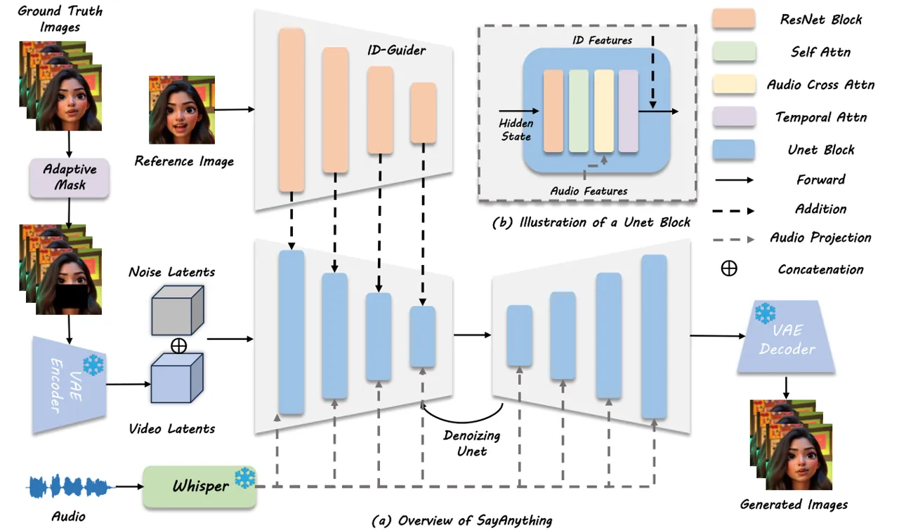
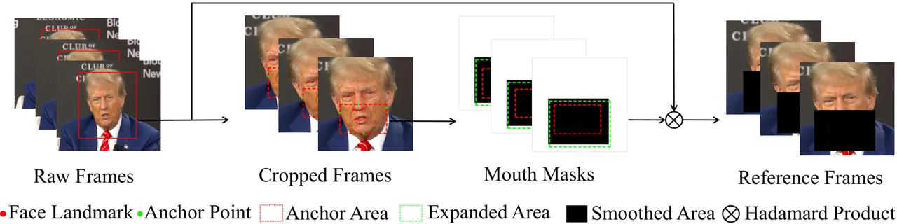
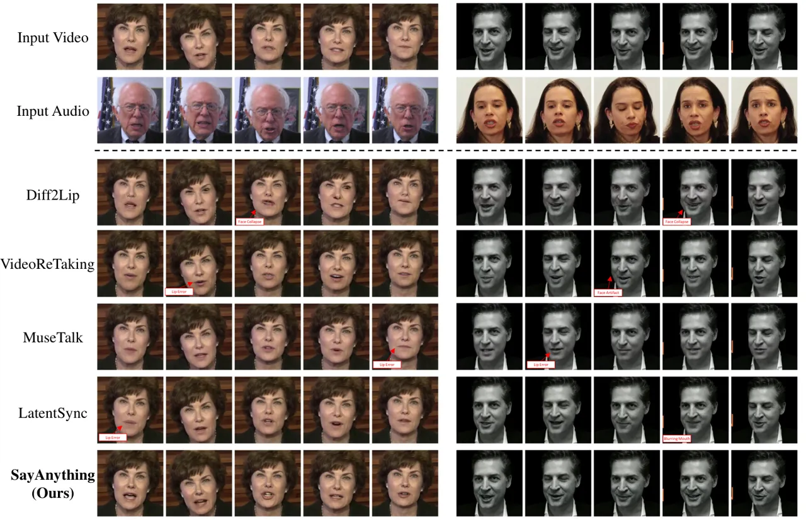
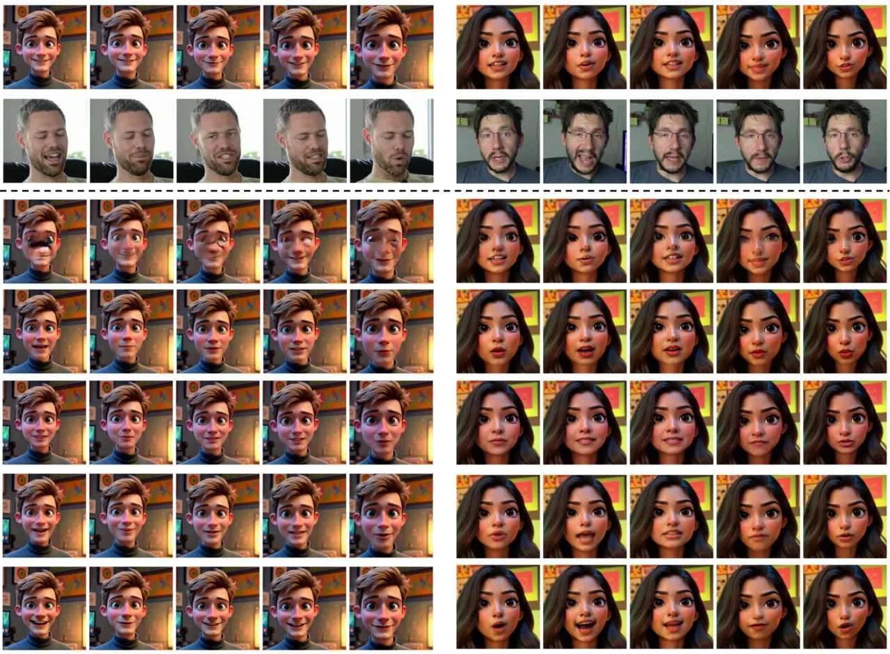
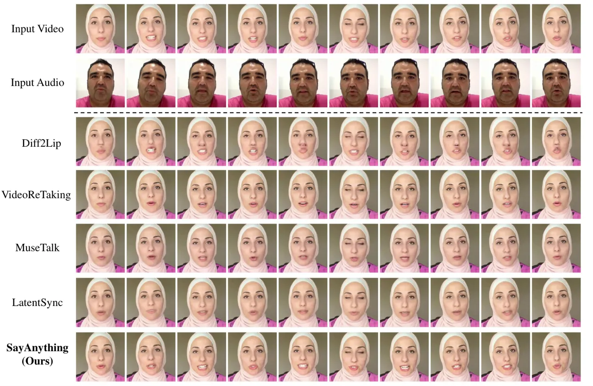
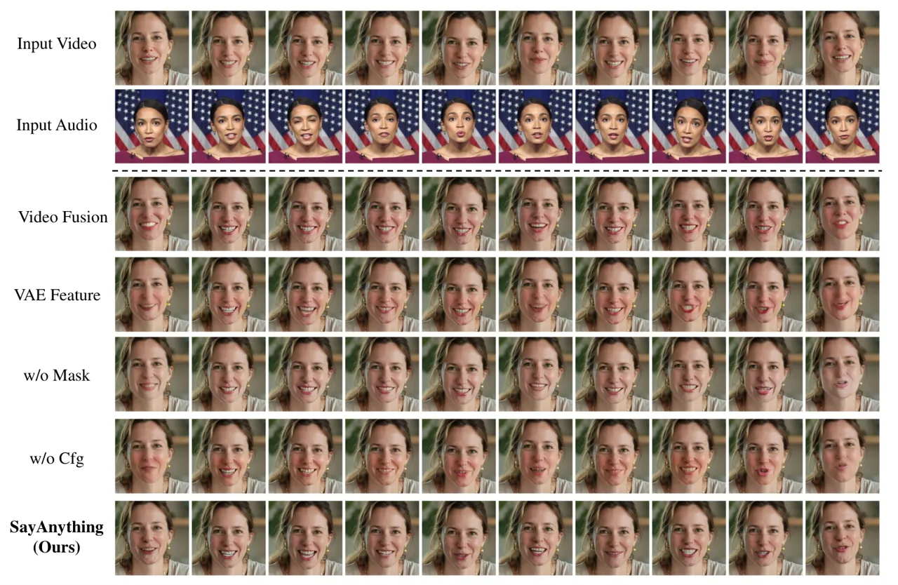
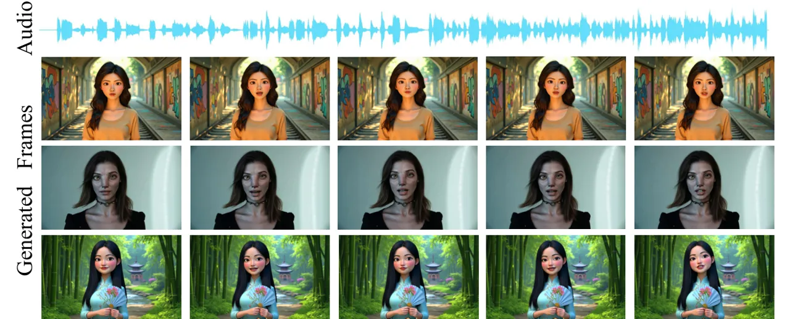
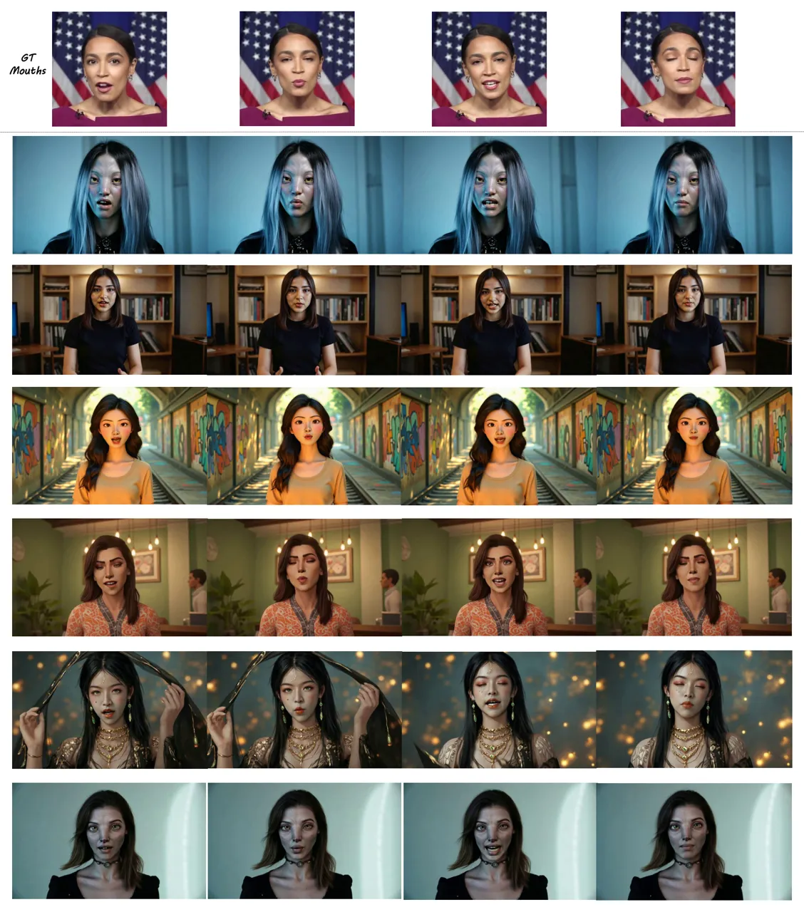

# SayAnything: Audio-Driven Lip Synchronization with Conditional Video Diffusion

Junxian Ma Affiliation: University of Chinese Academy of Sciences
Affiliation: RightBrain.AI Affiliation: Nanyang Technological University
Correspondence to: <majunxian20@mails.ucas.ac.cn>    Shiwen Wang
Affiliation: University of Chinese Academy of Sciences
Affiliation: RightBrain.AI    Jian Yang Affiliation: RightBrain.AI   
Junyi Hu Affiliation: RightBrain.AI Affiliation: Peking University   
Jian Liang Affiliation: RightBrain.AI    Guosheng Lin
Affiliation: Nanyang Technological University    Jingbo Chen
Affiliation: University of Chinese Academy of Sciences    Kai Li
Affiliation: University of Chinese Academy of Sciences Affiliation: City
University of Hong Kong    Yu Meng Affiliation: University of Chinese
Academy of Sciences

###### Abstract

Recent advances in diffusion models have led to significant progress in
audio-driven lip synchronization. However, existing methods typically
rely on constrained audio-visual alignment priors or multi-stage
learning of intermediate representations to force lip motion synthesis.
This leads to complex training pipelines and limited motion naturalness.
In this paper, we present SayAnything, a conditional video diffusion
framework that directly synthesizes lip movements from audio input while
preserving speaker identity. Specifically, we propose three specialized
modules, including an identity preservation module, an audio guidance
module, and an editing control module. Our novel design effectively
balances different condition signals in the latent space, enabling
precise control over appearance, motion, and region-specific generation
without requiring additional supervision signals or intermediate
representations. Extensive experiments demonstrate that SayAnything
generates highly realistic videos with improved lip-teeth coherence,
enabling unseen characters to say anything while effectively
generalizing to animated characters.

###### Keywords: 

Audio-Driven Generation, Video Diffusion Models, Lip Synchronization,
Video Editing

^(†)^(†)affiliationnotice: Work done while the first author was an
intern at RightBrain.AI, Beijing

![[Uncaptioned
image]](arxiv-2502-11515--68963cd93893.figures/figure-1.webp)

SayAnything performs audio-driven lip synchronization through video
editing, demonstrating zero-shot generalization to in-the-wild and
various style domains without fine-tuning. Our fusion scheme eliminates
the dependency on additional supervision signals like SyncNet for lip
synchronization.

## 1 Introduction

Audio-driven lip synchronization aims to generate synchronized lip
movements in videos based on input audio while preserving the speaker’s
identity and appearance. This task has significant applications in video
dubbing, virtual avatars, and live-streaming platforms.

In the field of lip synchronization, GAN-based approaches (Guan et al.,
2023; Su et al., 2024) remain the dominant paradigm. However, these
methods face two major limitations. First, they lack stability and
diversity in motion generation, resulting in unnatural visual effects.
Second, the inherent training instability and mode collapse issues make
them difficult to scale to diverse datasets (Heusel et al., 2017),
limiting their practical applications.

With the success of diffusion models (Ho et al., 2020; Song et al., 2020) in image and video generation (Blattmann et al., 2023a; Rombach
et al., 2022), audio-driven facial animation has emerged as a promising
research direction. Recent work leveraging diffusion models for lip
synchronization encounters a fundamental challenge where models favour
visual conditions over audio signals during generation. Existing
approaches (Mukhopadhyay et al., 2024; Li et al., 2024; Shen et al.,
2023; Zhong et al., 2024) force models to learn audio-visual
correspondence through additional supervision from Syncnet (Chung &
Zisserman, 2017) as lip experts (Mukhopadhyay et al., 2024; Li et al., 2024) or intermediate representations like landmarks (Shen et al., 2023;
Zhong et al., 2024). While this mitigates the challenge, the strong
dependency on visual priors from lip experts and intermediate
representations significantly constrains model generalizability and
motion dynamics.

To address these limitations, we present SayAnything, an end-to-end
framework that directly establishes audio-visual correlations in the
latent space without requiring additional supervision signals or
intermediate representations. Specifically, we design a multi-modal
condition fusion scheme, incorporating three specialized modules: 1) For
reference images, we design an identity preservation module with an
efficient encoder ID-Guider that extracts identity features while
controlling their influence on lip motion styles, 2) For videos, we
propose an editing control module with an adaptive masking strategy that
regulates the lip editing region and eliminates the dependency of lip
movements on surrounding pixel motion patterns, and 3) For audio inputs,
we develop an audio guidance module that enhances the control of
weakly-correlated audio features over motion generation. As shown in
SayAnything: Audio-Driven Lip Synchronization with Conditional Video
Diffusion, our method demonstrates effective zero-shot generalization to
both real-world and animated characters. To the best of our knowledge,
this is the first work to leverage Stable Video Diffusion
(SVD) (Blattmann et al., 2023a) for lip synchronization.

Our main contributions can be summarized as follows:

- •
  We propose an end-to-end video diffusion framework for audio-driven
  lip synchronization that eliminates the need for additional
  supervision signals or intermediate representations.
- •
  We design a novel multi-modal condition fusion scheme that effectively
  balances audio-driven control and portrait preservation, incorporating
  identity preservation, audio guidance, and editing control modules.
- •
  Both extensive experiments and user studies demonstrate that our
  approach achieves superior performance in terms of generation quality,
  temporal consistency, and lip motion flexibility compared to existing
  methods. Furthermore, our framework shows strong generalization
  capability to in-the-wild videos and animated characters.



Figure 1: (a) Overview of SayAnything architecture for lip
synchronization. The denoising UNet takes noisy latents as input,
concatenated with video latents obtained from masked video through VAE
encoding. The reference image is processed by ID-Guider to produce
multi-scale ID features, which are injected as residual signals into the
denoising UNet. Audio features from Whisper are fused through
cross-attention layers in the denoising process. (b) A typical UNet
block, consisting of ResNet block, Self Attention, Audio Cross
Attention, and Temporal Attention.

## 2 Related Work

### 2.1 Video Diffusion Models

Diffusion generative models have recently gained prominence as a leading
approach for vision generation tasks, with notable contributions from
several studies (Sohl-Dickstein et al., 2015; Song & Ermon, 2019; Ho
et al., 2020; Song et al., 2021; Ruiz et al., 2024). In the realm of
video generation, diffusion models have also seen significant
advancements, with various methods being proposed (Brooks et al., 2024;
Polyak et al., 2024; Zheng et al., 2024; Chen et al., 2024a; Blattmann
et al., 2023a; Ho et al., 2022c; Ho et al., 2022a; Blattmann et al.,
2023b; Guo et al., 2023; Ma et al., 2024; Girdhar et al., 2023; Zhou
et al., 2023). For instance, the early diffusion-based video generation
model VDM was introduced by (Ho et al., 2022c). ImagenVideo (Ho et al.,
2022a) employs a cascaded diffusion process (Ho et al., 2022b) to
generate high-resolution videos. MagicVideo (Zhou et al., 2023)
leverages the architecture of Latent Diffusion Models (Rombach et al., 2022) for video generation, utilizing a low-dimensional latent embedding
space defined by a pre-trained variational auto-encoder (VAE). The
text-to-video model SORA (Brooks et al., 2024) is capable of generating
high-quality videos up to a minute long based on user prompts. Movie
Gen (Polyak et al., 2024), developed by Meta, offers a suite of
foundation models that can produce high-quality, high-resolution videos
with synchronized audio in various aspect ratios. In the open-source
domain, recent foundational video generation models include
OpenSora (Zheng et al., 2024), VideoCrafter-2 (Chen et al., 2024a), and
Stable Video Diffusion (Blattmann et al., 2023a).

### 2.2 Video Editing

As diffusion-based video generation continues to advance, the ability to
edit videos using text inputs has become a focal point of research. One
notable contribution is Tune-A-Video (Wu et al., 2023b), which
introduces the idea of one-shot video editing tuning. This method
converts the spatial self-attention layers of a text-to-image (T2I)
StableDiffusion model into sparse-casual attention layers. However,
approaches like Tune-A-Video come with high fine-tuning costs. To
address this, SimDA (Xing et al., 2023) proposes a more
parameter-efficient fine-tuning method to extend T2I StableDiffusion to
text-to-video (T2V) generation. It achieves this by optimizing an
adapter composed of two learnable fully connected (FC) layers. Another
approach, Fairy (Wu et al., 2023a), focuses on parallelized frame
sampling and keyframe editing using T2I diffusion models (Brooks et al., 2023) in a single forward pass. Other works explore different conditions
for video editing. For example, Gen-1 (Esser et al., 2023) incorporates
depth maps (Ranftl et al., 2022) to provide sequential depth guidance,
although this method is computationally expensive due to the need to
fine-tune all parameters. MagicEdit (Liew et al., 2023) freezes the
pre-trained parameters of a T2I model and fine-tunes new temporal layers
on video data, similar to AnimateDiff (Guo et al., 2023). It then
integrates a ControlNet (Zhang et al., 2023a) trained for conditional
image generation. Ground-A-Video (Jeong & Ye, 2023) leverages both depth
maps and bounding boxes to provide spatial control over target regions
using an inflated ControlNet (Zhang et al., 2023a). Finally,
VideoComposer (Wang et al., 2023b) expands the range of controllable
conditions and allows simultaneous control with multiple inputs,
including sketch images (Su et al., 2021), depth maps (Ranftl et al.,
2022), and motion vectors (Vadakital et al., 2022).

### 2.3 Audio-Driven Talking Head Generation

Recently, GAN-based methods (Prajwal et al., 2020; Zhang et al., 2023b;
Zhong et al., 2023; Wang et al., 2023a; Tan et al., 2024; Tan et al.,
2025; Yang et al., 2024; Zhang et al., 2024; Cheng et al., 2022) have
emerged as an essential research area in talking head generation, but
they struggle to represent detailed texture making unremarkable video
performance. On the other hand, with the recent rise of diffusion model
in the AIGC community, numerous works (Xu et al., 2024a; Xu et al.,
2024b; Tian et al., 2025; Chen et al., 2024b; Zhu et al., 2024) have
been proposed to synthesize talking head video via sound and single
portrait conditions and achieved remarkable performance in lip
synchronization and visual effect. However, single portrait animation
has fewer application scenarios than video dubbing. To this end,
Diff2lip (Mukhopadhyay et al., 2024) and LatentSync (Li et al., 2024)
are proposed, which both introduce a lip expert (Prajwal et al., 2020)
to offer strong audio-visual alignment in pixel space. While this expert
benefits from the improvement of lip synchronization, the life-like
prior that it contains hinders the variety of input video types. To this
end, we propose SayAnything, which directly drives lip synchronization
by leveraging the general visual priors from stable video diffusion to
enable talking head generation across various styles.

## 3 Method

In this section, we will introduce our method, SayAnything. First, we
will provide an overview of the framework and the preliminaries of
SVD (Blattmann et al., 2023a). Then, we will detail our multi-modal
condition fusion scheme.

### 3.1 Overview

#### Stable Video Diffusion.

SVD is a high-quality and commonly used image-to-video generation model.
Given a reference image $`I`$, SVD will generate a video frame sequence
$`x=\{x_{0},x_{1},...,x_{N-1}\}`$ of length N, starting with $`I`$. The
sampling of SVD is conducted using a latent denoising diffusion process.
At each denoising step, a conditional 3D UNet $`\Phi_{\theta}`$ is used
to iteratively denoise this sequence:

```math
z^{0}=\Phi_{\theta}(z_{t},t,I) \tag{1}
```

where $`z_{t}`$ is the latent representation of $`x_{t}`$ and $`z^{0}`$
is the prediction of $`z_{0}`$. There are two conditional injection
paths for the reference image $`I`$: (1) It is embedded into tokens by
the CLIP (Radford et al., 2021) image encoder and injected into the
diffusion model through a cross-attention mechanism; (2) It is encoded
into a latent representation by the VAE (Kingma, 2013) encoder of the
latent diffusion model (Rombach et al., 2022), and concatenated with the
latent of each frame in channel dimension. SVD follows the
EDM-preconditioning (Karras et al., 2022) framework, which parameterizes
the learnable denoiser $`\Phi_{\theta}`$ as

```math
\displaystyle\Phi_{\theta}\bigl(z_{t},\,t,\,I;\sigma\bigr)=c_{skip}(\sigma)\,z_{t} \tag{2}
```

```math
\displaystyle\hskip 9.24994pt+\,c_{out}(\sigma)\,F_{\theta}\Bigl(c_{in}(\sigma)\,z_{t},\,t,\,I;\,c_{noise}(\sigma)\Bigr).
```

where $`\sigma`$ is the noise level, and $`F_{\theta}`$ is the network
to be trained. $`c_{skip},\,c_{out},\,c_{in},\,\text{and}\;c_{noise}`$
are preconditioning hyper-parameters. $`\Phi_{\theta}`$ is trained via a
denoising score matching (DSM) (Song & Ermon, 2019) objective:

```math
\mathbb{E}_{\begin{subarray}{c}z_{0},\,t\\
n\,\sim\,\mathcal{N}(0,\sigma^{2})\end{subarray}}\Bigl[\lambda_{\sigma}\,\bigl\|\Phi_{\theta}\bigl(z_{0}+n,\,t,\,I\bigr)\;-\;z_{0}\bigr\|_{2}^{2}\Bigr]. \tag{3}
```

#### SayAnything.

Given a reference video $`V_{m}`$ and an audio $`a`$, our objective is
to edit the lip motion of the person in $`V_{m}`$ so it aligns with
$`a`$. To achieve this, three key elements are involved: (1) identity
preservation via a reference image $`\mathcal{I}_{r}`$, (2) driving the
spatial configuration of the lips based on the audio $`a`$, and
(3) maintaining overall visual coherence by specifying an editable
region in the video through masking.

To ensure broad generalization, our method inherits as many structures
and parameters as possible from a pretrained stable video diffusion
model, fully exploiting its robust visual priors. We design a unified,
efficient multi-modal fusion scheme to balance these three conditioning
signals—comprising an efficient identity preservation module, an editing
control module for region edits, and an attention-based audio guidance
module.

Specifically, we adapt SVD’s denoiser $`\Phi_{\theta}`$ to fuse
$`\mathcal{I}_{r}`$, $`a`$, and $`V_{m}`$ in a unified manner. Below is
our conditional denoiser, which replaces the original single-condition
path:

```math
\displaystyle\Phi_{\theta}\bigl(z_{t},\,t,\,\mathcal{I}_{r},\,a,\,V_{m};\;\sigma\bigr)~=~c_{\mathrm{skip}}(\sigma)\,z_{t}
```

```math
\displaystyle\hskip 9.24994pt~+\;c_{\mathrm{out}}(\sigma)\;F_{\theta}\Bigl(c_{\mathrm{in}}(\sigma)\,z_{t},\;t,\;\mathcal{I}_{r},\;a,\;V_{m};\;c_{\mathrm{noise}}(\sigma)\Bigr). \tag{4}
```

By jointly injecting the identity signal $`\mathcal{I}_{r}`$, the audio
$`a`$, and the masked-video prior $`V_{m}`$, we avoid the need for
multi-stage training or extra intermediate representations. Moreover, we
eliminate the need for adversarial losses or lip expert supervision by
directly adopting the DSM objective. For each training iteration, we
sample a clean latent $`z_{0}`$ and noise
$`n\sim\mathcal{N}(0,\sigma^{2})`$, then set $`z_{t}=z_{0}+n`$. Our loss
is:

```math
\displaystyle\mathcal{L}=\mathbb{E}_{\begin{subarray}{c}z_{0},\,t\\
n\,\sim\,\mathcal{N}(0,\sigma^{2})\end{subarray}}\Bigl[\lambda_{\sigma}\,\bigl\|\,\Phi_{\theta}\bigl(z_{t},\,t,\,\mathcal{I}_{r},\,a,\,V_{m};\,\sigma\bigr)\!\!-\!\!z_{0}\bigr\|_{2}^{2}\Bigr]. \tag{5}
```

Figure 1 illustrates the overall pipeline of our method. Building on
insights from our experiments regarding the relative strength of each
condition, we first present in §3.2 our editing control module, then
introduce the identity preservation module in §3.3, followed by the
audio-driven module in §3.4. Finally, we discuss several key training
details and hyper-parameter choices.



Figure 2: Our adaptive masking strategy first determines the initial
mask through detected landmarks, then obtains the final mask through
expansion and smoothing, effectively preventing motion leakage.

### 3.2 Editing Control

The masked video sequence provides the strongest guidance signal in our
framework, as the model only needs to synthesize the masked regions
while preserving the rest. Previous studies (Mukhopadhyay et al., 2024;
Yaman et al., 2023) have shown that lip motions often fail to align with
input audio without SyncNet supervision, and we also observed this issue
in our early experiments. Even with the lip region masked, initial
experiments reveal that generated results maintain high similarity with
the reference video regardless of the input audio, indicating the audio
condition fails to guide lip motion synthesis effectively.

By comparing different masking strategies, we find that this motion
leakage effect originates from the temporal context in the masked video
sequence. With a low masking ratio, the model learns to infer lip
movements from visible facial muscle patterns instead of audio features,
as facial movements are highly correlated - visible facial regions can
effectively indicate the movements of the masked lip region. Although
this is not our desired optimization direction, it helps model
convergence in the early training stages.

While increasing the mask coverage might be a solution, this approach
alone is not optimal as it may remove essential facial features. To
address this trade-off, we design an adaptive masking strategy that
tracks head position across different head and lip poses. We opt for
rectangular masks to avoid potential guidance from mask shapes, ensuring
lip-surrounding pixels are masked and eliminating the influence of lower
facial muscle motion patterns on lip movements. As shown in Figure 2,
the mask is generated using facial landmarks, with additional padding to
ensure coverage of potential motion areas. To prevent motion leakage and
maintain temporal stability, we apply a temporal smoothing process to
the mask coordinates:

```math
\begin{split}x_{t}^{\prime}&=\alpha x_{t}+(1-\alpha)x_{t+1}\\
y_{t}^{\prime}&=\alpha y_{t}+(1-\alpha)y_{t+1}\end{split} \tag{6}
```

where $`\alpha=0.75`$ provides a balance between temporal consistency
and local accuracy. This smoothing process enhances mask movement
stability and further prevents the model from inferring lip movements
based on landmark motion patterns.

For implementation, we encode the masked video through the VAE encoder
to obtain its latent representation. We then concatenate these latents
with the noise latents along the channel dimension, forming an 8-channel
input tensor. This design replaces the original first-frame
concatenation in SVD while maintaining the same channel dimensionality,
thereby providing rich temporal guidance for generation.

### 3.3 Identity Preservation

Existing methods (Chang et al., 2023; Jiang et al., 2024) typically
employ ReferenceNet (Hu, 2024) for reference image encoding because it
shares the same architecture with the denoising UNet and can be
initialized with identical weights, enabling rapid condition-backbone
alignment. However, directly adopting a stable video diffusion
architecture would introduce substantial parameter redundancy.

Through experiments, we find that introducing complex architectures or
large numbers of parameters not only increases computational overhead
but also leads to excessive visual conditions. During our experiments,
we discovered a spatial dependency issue: a strong identity condition
influences the lip state in the reference image to dominate generation
results.

To address computational efficiency and spatial dependency issues, we
propose ID-Guider, an efficient encoding module comprising convolution
layers. Before feeding the reference image into ID-Guider, we first
concatenate the lip mask as an indicator channel with the reference
image, then process it through a simple pure convolutional downsampler
with channel dimensions $`[32,64,128,64]`$ to align the input with the
denoising UNet. Furthermore, compared to ReferenceNet, we remove
computationally intensive modules such as 3D convolutions, retaining
only 2D ResBlock modules with channel dimensions and layer counts
consistent with stable video diffusion to ensure proper residual
integration into the denoising UNet. We also eliminate upsample layers.
Moreover, since we remove the timestep-related modules, ID-Guider does
not need to recalculate following the denoising steps during inference.
As a result, ID-Guider maintains only 98M parameters, reducing the
parameter count by over 90%. This significantly improves computational
efficiency and reduces the influence of visual information from the
reference image while maintaining strong identity preservation
capabilities.

### 3.4 Audio Guidance

Audio signals, while relatively weak compared to visual conditions (Chen
et al., 2024b; Tian et al., 2025), provide essential features for
driving lip movements. We employ Whisper (Radford et al., 2023) as our
audio feature extractor for its robust audio representation
capabilities. Following common practice in audio-driven synthesis, we
align each video frame with a window of surrounding audio features
$`(x_{t-k},...,x_{t},...,x_{t+k})`$ to capture temporal context, where
$`x_{t}`$ denotes the audio feature at timestep $`t`$, and $`k`$
determines the temporal context range. For boundary frames, we apply
zero-padding without additional processing.

To strengthen the influence of audio signals, we incorporate audio
cross-attention into both the downsample and upsample modules of our
denoising UNet. Specifically, the noisy latents act as queries, while
the audio features serve as keys and values. Since these audio features
already encode a contextual window, we focus on computing spatial
attention that guides the lip region’s spatial distribution during
generation.

|                                      | HDTF              |                   |                  |                  |                     |                    | AVASpeech         |                   |                  |                  |                     |                    |
| ------------------------------------ | ----------------- | ----------------- | ---------------- | ---------------- | ------------------- | ------------------ | ----------------- | ----------------- | ---------------- | ---------------- | ------------------- | ------------------ |
| Method                               | FID$`\downarrow`$ | FVD$`\downarrow`$ | SSIM$`\uparrow`$ | PSNR$`\uparrow`$ | LPIPS$`\downarrow`$ | Sync-c$`\uparrow`$ | FID$`\downarrow`$ | FVD$`\downarrow`$ | SSIM$`\uparrow`$ | PSNR$`\uparrow`$ | LPIPS$`\downarrow`$ | Sync-c$`\uparrow`$ |
| Diff2lip (Mukhopadhyay et al., 2024) | 39.11             | 647.42            | 0.5664           | 14.36            | 0.2336              | 3.55               | 54.80             | 578.05            | 0.5153           | 12.14            | 0.2649              | 2.09               |
| VideoRetalking (Cheng et al., 2022)  | 15.48             | 328.33            | 0.0865           | 24.70            | 0.0528              | 7.60               | 18.93             | 354.27            | 0.8632           | 25.35            | 0.0550              | 7.98               |
| MuseTalk (Zhang et al., 2024)        | 8.42              | 209.79            | 0.8871           | 27.99            | 0.0297              | 6.39               | 15.76             | 331.71            | 0.8800           | 26.32            | 0.0414              | 6.46               |
| LatentSync (Li et al., 2024)         | 8.40              | 200.83            | 0.8870           | 27.67            | 0.0391              | 9.29               | 13.91             | 234.95            | 0.8836           | 27.09            | 0.0451              | 8.31               |
| SayAnything                          | 5.68              | 197.71            | 0.9347           | 29.04            | 0.0239              | 7.23               | 11.31             | 222.61            | 0.8881           | 27.12            | 0.0332              | 7.06               |
| GT                                   | –                 | –                 | –                | –                | –                   | 8.58               | –                 | –                 | –                | –                | –                   | 7.84               |

Table 1: Quantitative comparison on HDTF (Zhang et al., 2021) and
AVASpeech (Chaudhuri et al., 2018). Arrows indicate whether higher
($`\uparrow`$) or lower ($`\downarrow`$) values are better. The best
results are in bold. Notably, all baseline methods incorporate
SyncNet (Chung & Zisserman, 2017) as lip expert supervision and
LPIPS (Zhang et al., 2018) as an additional training loss, where the
ground-truth (GT) score is computed using SyncNet on real videos.
SayAnything outperforms these methods across most metrics without
requiring such expert supervision.

### 3.5 Training Strategy

In our framework, multiple conditions are involved, including audio
$`a`$, reference image $`\mathcal{I}_{r}`$, and masked video sequence
$`V_{m}`$. Due to the inherently weaker correlation with lip movements,
audio signals can be easily overwhelmed by visual features during
training, leading to insufficient audio-driven control. Based on this
observation, we adopt distinct masking strategies for the conditions
during the training process. First, $`a`$ has a 5% probability of being
masked to zero, while $`\mathcal{I}_{r}`$ has a 15% probability, and the
masking of $`a`$ always triggers the masking of $`\mathcal{I}_{r}`$ to
ensure audio-only generation scenarios. Second, all masking operations
are applied to the fused features in the latent space by setting them to
zero. The masked video sequence $`V_{m}`$ remains a fixed input
condition without masking.

## 4 Experiments

### 4.1 Experimental Settings

#### Datasets.

We utilize four public datasets for training: AVASpeech (Chaudhuri
et al., 2018), HDTF (Zhang et al., 2021), VFHQ (Wang et al., 2022), and
MultiTalk (Sung-Bin et al., 2024). AVASpeech (45 hours) was originally
designed for speech activity detection and includes a portion of noisy
audio segments. HDTF comprises 362 high-definition (HD) videos at
resolutions mostly between 720p and 1080p. VFHQ contains over 16,000
high-fidelity video clips from diverse interview scenarios. Finally,
MultiTalk is a multilingual dataset for 3D talking head generation; it
spans 20 languages and 423 hours of video content. After filtering out
videos with low face resolution, incomplete head regions, and
audio-visual misalignment, we obtain approximately 600 hours of curated
training data. For evaluation, we randomly sample 30 videos from the
test sets of HDTF and AVASpeech datasets.

#### Implementation Details.

We train our model on 8 NVIDIA H800 GPUs with a batch size of 16. The
model is initialized with SVD weights (Blattmann et al., 2023a) and
trained for 200k steps using AdamW optimizer (Loshchilov, 2017) with a
fixed learning rate of 6e-5. For training, video clips are processed at
25 fps with a resolution of 320×320 pixels, and each sequence consists
of 16 frames. Audio inputs are resampled to 16 kHz. The reference frame
for each sequence is randomly sampled from the corresponding complete
video.

#### Evaluation Metrics.

Our evaluation framework consists of three key aspects: (1) Visual
fidelity: We employ FID (Heusel et al., 2017) to evaluate the quality of
generated frames, particularly focusing on identity preservation and
visual details. SSIM and PSNR provide complementary measurements of
reconstruction accuracy, while LPIPS (Zhang et al., 2018) captures
perceptual similarities. (2) Temporal coherence: We adopt
FVD (Unterthiner et al., 2018) to assess video-level quality and motion
consistency. (3) Audio-visual synchronization: The SyncNet confidence
score (Chung & Zisserman, 2017) quantifies the accuracy of lip movements
relative to audio input.

### 4.2 Comparisons



(a)



(b)

Figure 3: Qualitative comparisons with SOTA diffusion-based lip-sync
methods (Mukhopadhyay et al., 2024; Zhang et al., 2024; Li et al., 2024;
Cheng et al., 2022). The first row demonstrates the original input
video, and the second row is the video from which we extracted the audio
as input, the video can be regarded as the target lip movements. Rows
3 - 7 display the lip-synced videos. (a) Two cases in the cross-sex and
ID generation setting. (b) Two cases in the animate settings. Our method
can generate more federal visual features like driven animators while
others tend to generate fake features which are more realistic.

#### Qualitative and Quantitative Comparison.

We compare our method with state-of-the-art diffusion-based approaches
that provide both inference code and pre-trained weights. Specifically,
we consider: (1) LatentSync (Li et al., 2024), which utilizes an
optimized SyncNet for additional supervision; (2) Diff2lip (Mukhopadhyay
et al., 2024), which directly generates the lower half of frames with
adversarial and sync losses; (3) MuseTalk (Zhang et al., 2024), which
builds upon the stable diffusion framework; and (4)
VideoRetalking (Cheng et al., 2022), which employs a three-stage network
architecture.

As shown in Table 1, our method demonstrates consistent improvements
across most metrics on both datasets. While our method shows lower
Sync-c scores (Chung & Zisserman, 2017), this metric is computed by the
original SyncNet model. Notably, all four baseline methods incorporate
SyncNet as an additional supervision signal during training, with
LatentSync employing an optimized version that produces scores exceeding
ground truth values. Our results in visual quality, identity
preservation, temporal consistency and competitive lip synchronization
demonstrate the superiority of SayAnything.



Figure 4: Qualitative comparison of lip motion dynamics and tooth
rendering. Our method demonstrates clearer and more consistent teeth as
well as more flexible lip movements.

As illustrated in Figure 3, existing methods exhibit various
limitations: Diff2Lip (Mukhopadhyay et al., 2024) generates corrupted
facial appearance, LatentSync (Li et al., 2024) produces incoherent lip
movements, MuseTalk (Zhang et al., 2024) struggles with identity
preservation, and VideoRetalking (Cheng et al., 2022) shows limited
temporal consistency. Influenced by SyncNet’s visual priors, these
methods not only transform animated characters’ lip shapes into
life-like ones, compromising identity preservation, but also tend to
generate conservative lip movements. In contrast, SayAnything maintains
consistent identity preservation while generating more dynamic yet
natural lip movements with high-quality teeth rendering and stable
temporal coherence. Previous studies (Jiang et al., 2024; Yaman et al., 2023) and comparisons of different methods (Mukhopadhyay et al., 2024;
Zhang et al., 2024; Li et al., 2024; Cheng et al., 2022) in Figure 4
further demonstrate this phenomenon: SyncNet evaluation is unstable and
favors conservative lip movements. Although our method shows significant
improvements in visual metrics and lip motion dynamics, such more
dynamic lip movements adversely affect the quantitative evaluation of
lip synchronization.

| Method                               | Virtual | Cartoon | Life | News |
| ------------------------------------ | ------- | ------- | ---- | ---- |
| Diff2Lip (Mukhopadhyay et al., 2024) | 0.2     | 0.4     | 5.2  | 3.4  |
| VideoRetalking (Cheng et al., 2022)  | 1.4     | 1.2     | 7.4  | 6.0  |
| MuseTalk (Zhang et al., 2024)        | 2.2     | 2.2     | 9.4  | 11.4 |
| LatentSync (Li et al., 2024)         | 19.4    | 21.4    | 30.2 | 29.4 |
| SayAnything                          | 76.8    | 74.8    | 48.8 | 49.8 |

Table 2: User preference rates (%) across different scenarios. Users
select one preferred method per test case. User study results across
four video template categories Users upload their audio for testing.
Results from 500 users show that SayAnything achieves the highest
preference rates across all scenarios.

|              | HDTF              |                   |                  |                  |                     |                    | AVASpeech         |                   |                  |                  |                     |                    |
| ------------ | ----------------- | ----------------- | ---------------- | ---------------- | ------------------- | ------------------ | ----------------- | ----------------- | ---------------- | ---------------- | ------------------- | ------------------ |
| Method       | FID$`\downarrow`$ | FVD$`\downarrow`$ | SSIM$`\uparrow`$ | PSNR$`\uparrow`$ | LPIPS$`\downarrow`$ | Sync-c$`\uparrow`$ | FID$`\downarrow`$ | FVD$`\downarrow`$ | SSIM$`\uparrow`$ | PSNR$`\uparrow`$ | LPIPS$`\downarrow`$ | Sync-c$`\uparrow`$ |
| Video Fusion | 20.14             | 247.73            | 0.8589           | 23.52            | 0.0504              | 6.09               | 20.32             | 280.65            | 0.8680           | 24.63            | 0.0497              | 6.09               |
| VAE Feature  | 20.13             | 244.42            | 0.8569           | 23.20            | 0.0516              | 5.88               | 21.24             | 324.96            | 0.8642           | 23.81            | 0.0518              | 5.56               |
| w/o Mask     | 16.19             | 299.44            | 0.8676           | 24.50            | 0.0483              | 6.54               | 17.80             | 299.85            | 0.8749           | 24.93            | 0.0497              | 6.30               |
| w/o Cfg      | 14.58             | 255.29            | 0.8628           | 23.72            | 0.0510              | 5.14               | 18.65             | 257.97            | 0.8635           | 24.06            | 0.0523              | 5.69               |
| SayAnything  | 5.68              | 197.71            | 0.9347           | 29.04            | 0.0239              | 7.23               | 11.31             | 222.61            | 0.8881           | 27.12            | 0.0332              | 7.06               |

Table 3: Ablation studies to validate the effectiveness of SayAnything
modules. Video Fusion refers to encoding masked video through ID-Guider
while processing reference images following stable video diffusion,
concatenated with noise latent. VAE Feature indicates pre-encoding
reference image through VAE. w/o Mask represents using larger fixed
masks for videos rather than adaptive masking. w/o Cfg denotes the
removal of the condition masking strategy during training.

#### User Study.

We further evaluate SayAnything through a comprehensive user study. We
provide 40 video templates that can be categorized into four types with
broad application scenarios: virtual characters generated by AI models,
cartoon characters rendered in styles similar to Disney animation films,
news anchors in studio settings, and lifestyle scenarios featuring
dynamic backgrounds and more significant head movements. Users can test
with their own audio inputs, comparing results from all methods
simultaneously and selecting the most preferred one. As shown in
Table 2, SayAnything achieves the highest preference rates across all
scenarios, demonstrating its versatility and superiority in handling
diverse visual styles.

### 4.3 Ablation Studies

This section presents a comprehensive ablation analysis of SayAnything’s
multi-modal fusion scheme and its key components. In earlier
experiments, we attempted to use the ID-Guider module to encode the
masked video, then replace the original first-frame image in stable
video diffusion with the reference image. This seemed a natural
approach, but we observed that the reference image ended up dominating
the output. For instance, if the reference image had a wide-open mouth,
the resulting video could no longer perform a closed-mouth action and
instead remained open-mouthed throughout, which severely impairs lip
synchronization accuracy. We believe this arises because the reference
image gets replicated to align with the noise latent dimension, which
originally helps lock in the first frame in the original model, but in
our approach, it suppresses any subsequent mouth movement due to the
spatial influence of the reference image.

Likewise, using a VAE to compress the reference image into latent space
and then input it to the ID-Guider produced a similar effect because it
allowed the identity information to align with the denoising UNet from
the earliest stage of training. Furthermore, applying a larger, fixed
mask hampered consistent identity in the generated video and caused
colour shifts between masked and unmasked regions, degrading visual
quality. This finding suggests that our adaptive masking strategy
effectively balances the editing region control with the audio-driven
lip movements. Moreover, our conditional masking strategy further boosts
the overall visual quality and stabilizes lip motions in the output
video. Figure 5 illustrates these phenomena and how our method improves
them. We also evaluated these different training configurations on the
HDTF (Zhang et al., 2021) and AVASpeech (Chaudhuri et al., 2018)
datasets; as shown in Table 3, our final approach’s key components
demonstrate both strong effectiveness and well-grounded design in the
fusion scheme.

### 4.4 Generalization Capability

Notably, SayAnything generalizes to out-of-domain video inputs without
any additional fine-tuning. We validate this capability through our user
study. As shown in Figure 6, our method demonstrates zero-shot
generalization to diverse animation styles while maintaining natural lip
movements and tooth consistency. Additional visual results are provided
in the supplementary materials.



Figure 5: Ablation studies of our components in SayAnything. Video
Fusion and VAE Feature significantly enhance reference image influence,
limiting the range of lip movements. Larger fixed masks lead to colour
shifts in masked regions and unnatural lip motions. Removing the
condition masking strategy reduces visual quality. Zoom in for generated
details.



Figure 6: Visualization of pixar and virtual character videos generated
by SayAnything.

## 5 Conclusion

We present SayAnything, an end-to-end video diffusion framework for
audio-driven lip synchronization. Our method achieves natural lip
movements with consistent teeth rendering and larger motion dynamics
while maintaining identity preservation. Through a unified condition
fusion scheme, SayAnything effectively balances audio-visual conditions
and generates high-quality results without requiring additional
supervision signals. The efficiency, innovation, and broad applicability
of SayAnything make it promising for practical applications in lip
synchronization.

## Impact Statement

The proposed SayAnything for audio-driven lip synchronization has
significant potential applications across multiple domains. It can
enhance digital content creation by enabling high-quality dubbing in
different languages, facilitating international content distribution,
and cross-cultural communication. The technology can improve virtual
communication experiences through more natural and expressive virtual
avatars in video conferencing and online education platforms. In the
entertainment industry, our method can streamline the production of
animated content and virtual characters by providing realistic lip
movements synchronized with audio, benefiting film production, gaming,
and digital media creation. Our experiments demonstrate that the model
generalizes well across different scenarios, from actual human subjects
to virtual characters and animated styles, enabling broad applications
without domain-specific fine-tuning.

Potential Negative Social Impact: We acknowledge that this technology
could potentially be misused for creating deceptive content, such as
deepfake videos with manipulated speech. To address these concerns, we
recommend: (1) implementing robust watermarking techniques to trace the
origin of generated contents; (2) developing detection methods to
identify AI-generated videos; (3) establishing clear guidelines and
ethical frameworks for the deployment of such technologies. We emphasize
the importance of collaborative efforts between researchers, industry
practitioners, and policymakers to ensure the responsible development
and application of audio-driven video synthesis technologies.

## References

- Blattmann et al. (2023a) Blattmann, A., Dockhorn, T., Kulal, S.,
  Mendelevitch, D., Kilian, M., Lorenz, D., Levi, Y., English, Z.,
  Voleti, V., Letts, A., et al. Stable video diffusion: Scaling latent
  video diffusion models to large datasets. _arXiv preprint
  arXiv:2311.15127_, 2023a. 2023a.
- Blattmann et al. (2023b) Blattmann, A., Rombach, R., Ling, H.,
  Dockhorn, T., Kim, S. W., Fidler, S., and Kreis, K. Align your
  latents: High-resolution video synthesis with latent diffusion models.
  In _CVPR_, pp. 22563–22575. IEEE, 2023b.
- Brooks et al. (2023) Brooks, T., Holynski, A., and Efros, A. A.
  Instructpix2pix: Learning to follow image editing instructions. In
  _CVPR_, pp. 18392–18402. IEEE, 2023.
- Brooks et al. (2024) Brooks, T., Peebles, B., Holmes, C., DePue, W.,
  Guo, Y., Jing, L., Schnurr, D., Taylor, J., Luhman, T., Luhman, E.,
  Ng, C., Wang, R., and Ramesh, A. Video generation models as world
  simulators, 2024.
- Chang et al. (2023) Chang, D., Shi, Y., Gao, Q., Fu, J., Xu, H., Song,
  G., Yan, Q., Yang, X., and Soleymani, M. Magicdance: Realistic human
  dance video generation with motions & facial expressions transfer.
  _CoRR_, 2023.
- Chaudhuri et al. (2018) Chaudhuri, S., Roth, J., Ellis, D. P.,
  Gallagher, A., Kaver, L., Marvin, R., Pantofaru, C., Reale, N., Reid,
  L. G., Wilson, K., et al. Ava-speech: A densely labeled dataset of
  speech activity in movies. _arXiv preprint arXiv:1808.00606_, 2018.
- Chen et al. (2024a) Chen, H., Zhang, Y., Cun, X., Xia, M., Wang, X.,
  Weng, C., and Shan, Y. Videocrafter2: Overcoming data limitations for
  high-quality video diffusion models. _arXiv preprint
  arXiv:2401.09047_, 2024a.
- Chen et al. (2024b) Chen, Z., Cao, J., Chen, Z., Li, Y., and Ma, C.
  Echomimic: Lifelike audio-driven portrait animations through editable
  landmark conditions. _arXiv preprint arXiv:2407.08136_, 2024b.
- Cheng et al. (2022) Cheng, K., Cun, X., Zhang, Y., Xia, M., Yin, F.,
  Zhu, M., Wang, X., Wang, J., and Wang, N. Videoretalking: Audio-based
  lip synchronization for talking head video editing in the wild. In
  _SIGGRAPH Asia 2022 Conference Papers_, pp. 1–9, 2022.
- Chung & Zisserman (2017) Chung, J. S. and Zisserman, A. Out of time:
  automated lip sync in the wild. In _Computer Vision–ACCV 2016
  Workshops: ACCV 2016 International Workshops, Taipei, Taiwan, November
  20-24, 2016, Revised Selected Papers, Part II 13_, pp. 251–263.
  Springer, 2017.
- Esser et al. (2023) Esser, P., Chiu, J., Atighehchian, P., Granskog,
  J., and Germanidis, A. Structure and content-guided video synthesis
  with diffusion models. In _ICCV_, pp. 7312–7322. IEEE, 2023.
- Girdhar et al. (2023) Girdhar, R., Singh, M., Brown, A., Duval, Q.,
  Azadi, S., Rambhatla, S. S., Shah, A., Yin, X., Parikh, D., and
  Misra, I. Emu video: Factorizing text-to-video generation by explicit
  image conditioning. _CoRR_, abs/2311.10709, 2023.
- Guan et al. (2023) Guan, J., Zhang, Z., Zhou, H., Hu, T., Wang, K.,
  He, D., Feng, H., Liu, J., Ding, E., Liu, Z., et al. Stylesync:
  High-fidelity generalized and personalized lip sync in style-based
  generator. In _Proceedings of the IEEE/CVF Conference on Computer
  Vision and Pattern Recognition_, pp. 1505–1515, 2023.
- Guo et al. (2023) Guo, Y., Yang, C., Rao, A., Wang, Y., Qiao, Y., Lin,
  D., and Dai, B. Animatediff: Animate your personalized text-to-image
  diffusion models without specific tuning. _CoRR_,
  abs/2307.04725, 2023.
- Heusel et al. (2017) Heusel, M., Ramsauer, H., Unterthiner, T.,
  Nessler, B., and Hochreiter, S. Gans trained by a two time-scale
  update rule converge to a local nash equilibrium. _Advances in neural
  information processing systems_, 30, 2017.
- Ho et al. (2020) Ho, J., Jain, A., and Abbeel, P. Denoising diffusion
  probabilistic models. _Advances in neural information processing
  systems_, 33:6840–6851, 2020.
- Ho et al. (2022a) Ho, J., Chan, W., Saharia, C., Whang, J., Gao, R.,
  Gritsenko, A. A., Kingma, D. P., Poole, B., Norouzi, M., Fleet, D. J.,
  and Salimans, T. Imagen video: High definition video generation with
  diffusion models. _CoRR_, abs/2210.02303, 2022a.
- Ho et al. (2022b) Ho, J., Saharia, C., Chan, W., Fleet, D. J.,
  Norouzi, M., and Salimans, T. Cascaded diffusion models for high
  fidelity image generation. _The Journal of Machine Learning Research_,
  23(1):2249–2281, 2022b. 2022b.
- Ho et al. (2022c) Ho, J., Salimans, T., Gritsenko, A. A., Chan, W.,
  Norouzi, M., and Fleet, D. J. Video diffusion models. In _NeurIPS_,
  2022c.
- Hu (2024) Hu, L. Animate anyone: Consistent and controllable
  image-to-video synthesis for character animation. In _Proceedings of
  the IEEE/CVF Conference on Computer Vision and Pattern Recognition_,
  pp. 8153–8163, 2024.
- Jeong & Ye (2023) Jeong, H. and Ye, J. C. Ground-a-video: Zero-shot
  grounded video editing using text-to-image diffusion models. _CoRR_,
  abs/2310.01107, 2023.
- Jiang et al. (2024) Jiang, J., Liang, C., Yang, J., Lin, G., Zhong,
  T., and Zheng, Y. Loopy: Taming audio-driven portrait avatar with
  long-term motion dependency. _arXiv preprint arXiv:2409.02634_, 2024.
- Karras et al. (2022) Karras, T., Aittala, M., Aila, T., and Laine, S.
  Elucidating the design space of diffusion-based generative models.
  _Advances in neural information processing systems_,
  35:26565–26577, 2022.
- Kingma (2013) Kingma, D. P. Auto-encoding variational bayes. _arXiv
  preprint arXiv:1312.6114_, 2013.
- Li et al. (2024) Li, C., Zhang, C., Xu, W., Xie, J., Feng, W., Peng,
  B., and Xing, W. Latentsync: Audio conditioned latent diffusion models
  for lip sync. _arXiv preprint arXiv:2412.09262_, 2024.
- Liew et al. (2023) Liew, J. H., Yan, H., Zhang, J., Xu, Z., and
  Feng, J. Magicedit: High-fidelity and temporally coherent video
  editing. _CoRR_, abs/2308.14749, 2023.
- Loshchilov (2017) Loshchilov, I. Decoupled weight decay
  regularization. _arXiv preprint arXiv:1711.05101_, 2017.
- Luo et al. (2023) Luo, S., Tan, Y., Huang, L., Li, J., and Zhao, H.
  Latent consistency models: Synthesizing high-resolution images with
  few-step inference. _arXiv preprint arXiv:2310.04378_, 2023.
- Ma et al. (2024) Ma, X., Wang, Y., Jia, G., Chen, X., Liu, Z., Li, Y.,
  Chen, C., and Qiao, Y. Latte: Latent diffusion transformer for video
  generation. _CoRR_, abs/2401.03048, 2024.
- Mukhopadhyay et al. (2024) Mukhopadhyay, S., Suri, S., Gadde, R. T.,
  and Shrivastava, A. Diff2lip: Audio conditioned diffusion models for
  lip-synchronization. In _Proceedings of the IEEE/CVF Winter Conference
  on Applications of Computer Vision_, pp. 5292–5302, 2024.
- Polyak et al. (2024) Polyak, A., Zohar, A., Brown, A., Tjandra, A.,
  Sinha, A., Lee, A., Vyas, A., Shi, B., Ma, C.-Y., Chuang, C.-Y.,
  et al. Movie gen: A cast of media foundation models. _arXiv preprint
  arXiv:2410.13720_, 2024.
- Prajwal et al. (2020) Prajwal, K., Mukhopadhyay, R., Namboodiri,
  V. P., and Jawahar, C. A lip sync expert is all you need for speech to
  lip generation in the wild. In _Proceedings of the 28th ACM
  international conference on multimedia_, pp. 484–492, 2020.
- Radford et al. (2021) Radford, A., Kim, J. W., Hallacy, C., Ramesh,
  A., Goh, G., Agarwal, S., Sastry, G., Askell, A., Mishkin, P., Clark,
  J., et al. Learning transferable visual models from natural language
  supervision. In _International conference on machine learning_, pp.
  8748–8763. PMLR, 2021.
- Radford et al. (2023) Radford, A., Kim, J. W., Xu, T., Brockman, G.,
  McLeavey, C., and Sutskever, I. Robust speech recognition via
  large-scale weak supervision. In _International conference on machine
  learning_, pp. 28492–28518. PMLR, 2023.
- Ranftl et al. (2022) Ranftl, R., Lasinger, K., Hafner, D., Schindler,
  K., and Koltun, V. Towards robust monocular depth estimation: Mixing
  datasets for zero-shot cross-dataset transfer. _IEEE Trans. Pattern
  Anal. Mach. Intell._, 44(3):1623–1637, 2022.
- Rombach et al. (2022) Rombach, R., Blattmann, A., Lorenz, D., Esser,
  P., and Ommer, B. High-resolution image synthesis with latent
  diffusion models. In _Proceedings of the IEEE/CVF Conference on
  Computer Vision and Pattern Recognition_, pp. 10684–10695, 2022.
- Ruiz et al. (2024) Ruiz, A., Melnik, A., Wang, D., and Ritter, H. Lane
  segmentation refinement with diffusion models. _arXiv preprint
  arXiv:2405.00620_, 2024.
- Shen et al. (2023) Shen, S., Zhao, W., Meng, Z., Li, W., Zhu, Z.,
  Zhou, J., and Lu, J. Difftalk: Crafting diffusion models for
  generalized audio-driven portraits animation. In _Proceedings of the
  IEEE/CVF Conference on Computer Vision and Pattern Recognition_, pp.
  1982–1991, 2023.
- Sohl-Dickstein et al. (2015) Sohl-Dickstein, J., Weiss, E.,
  Maheswaranathan, N., and Ganguli, S. Deep unsupervised learning using
  nonequilibrium thermodynamics. In _International conference on machine
  learning_, pp. 2256–2265. PMLR, 2015.
- Song & Ermon (2019) Song, Y. and Ermon, S. Generative modeling by
  estimating gradients of the data distribution. _Advances in neural
  information processing systems_, 32, 2019.
- Song et al. (2020) Song, Y., Sohl-Dickstein, J., Kingma, D. P., Kumar,
  A., Ermon, S., and Poole, B. Score-based generative modeling through
  stochastic differential equations. _arXiv preprint
  arXiv:2011.13456_, 2020.
- Song et al. (2021) Song, Y., Sohl-Dickstein, J., Kingma, D. P., Kumar,
  A., Ermon, S., and Poole, B. Score-based generative modeling through
  stochastic differential equations. In _International Conference on
  Learning Representations_, 2021.
- Su et al. (2024) Su, J., Liu, K., Chen, L., Yao, J., Liu, Q., and
  Lv, D. Audio-driven high-resolution seamless talking head video
  editing via stylegan. In _2024 IEEE International Conference on
  Multimedia and Expo (ICME)_, pp. 1–6. IEEE, 2024.
- Su et al. (2020) Su, S., Yan, Q., Zhu, Y., Zhang, C., Ge, X., Sun, J.,
  and Zhang, Y. Blindly assess image quality in the wild guided by a
  self-adaptive hyper network. In _2020 IEEE/CVF Conference on Computer
  Vision and Pattern Recognition (CVPR)_, pp. 3664–3673, 2020. doi:
  10.1109/CVPR42600.2020.00372.
- Su et al. (2021) Su, Z., Liu, W., Yu, Z., Hu, D., Liao, Q., Tian, Q.,
  Pietikäinen, M., and Liu, L. Pixel difference networks for efficient
  edge detection. In _ICCV_, pp. 5097–5107. IEEE, 2021.
- Sung-Bin et al. (2024) Sung-Bin, K., Chae-Yeon, L., Son, G., Hyun-Bin,
  O., Ju, J., Nam, S., and Oh, T.-H. Multitalk: Enhancing 3d talking
  head generation across languages with multilingual video dataset.
  _arXiv preprint arXiv:2406.14272_, 2024.
- Tan et al. (2024) Tan, S., Ji, B., and Pan, Y. Style2talker:
  High-resolution talking head generation with emotion style and art
  style. In _Proceedings of the AAAI Conference on Artificial
  Intelligence_, volume 38, pp. 5079–5087, 2024.
- Tan et al. (2025) Tan, S., Ji, B., Bi, M., and Pan, Y. Edtalk:
  Efficient disentanglement for emotional talking head synthesis. In
  _European Conference on Computer Vision_, pp. 398–416. Springer, 2025.
- Tian et al. (2025) Tian, L., Wang, Q., Zhang, B., and Bo, L. Emo:
  Emote portrait alive generating expressive portrait videos with
  audio2video diffusion model under weak conditions. In _European
  Conference on Computer Vision_, pp. 244–260. Springer, 2025.
- Unterthiner et al. (2018) Unterthiner, T., Van Steenkiste, S., Kurach,
  K., Marinier, R., Michalski, M., and Gelly, S. Towards accurate
  generative models of video: A new metric & challenges. _arXiv preprint
  arXiv:1812.01717_, 2018.
- Vadakital et al. (2022) Vadakital, V. K. M., Dziembowski, A., Lafruit,
  G., Thudor, F., Lee, G., and Rondao-Alface, P. The MPEG immersive
  video standard - current status and future outlook. _IEEE Multim._,
  29(3):101–111, 2022.
- Wang et al. (2023a) Wang, J., Zhao, K., Zhang, S., Zhang, Y., Shen,
  Y., Zhao, D., and Zhou, J. Lipformer: High-fidelity and generalizable
  talking face generation with a pre-learned facial codebook. In
  _Proceedings of the IEEE/CVF Conference on Computer Vision and Pattern
  Recognition_, pp. 13844–13853, 2023a.
- Wang et al. (2022) Wang, L. X., Zhang, H., Dong, C., Shan, Y., et al.
  Vfhq: A high-quality dataset and benchmark for video face
  super-resolution. _arXiv preprint arXiv:2205.03409_, 2022.
- Wang et al. (2023b) Wang, X., Yuan, H., Zhang, S., Chen, D., Wang, J.,
  Zhang, Y., Shen, Y., Zhao, D., and Zhou, J. Videocomposer:
  Compositional video synthesis with motion controllability. In
  _NeurIPS_, 2023b.
- Wu et al. (2023a) Wu, B., Chuang, C., Wang, X., Jia, Y., Krishnakumar,
  K., Xiao, T., Liang, F., Yu, L., and Vajda, P. Fairy: Fast
  parallelized instruction-guided video-to-video synthesis. _CoRR_,
  abs/2312.13834, 2023a.
- Wu et al. (2023b) Wu, J. Z., Ge, Y., Wang, X., Lei, S. W., Gu, Y.,
  Shi, Y., Hsu, W., Shan, Y., Qie, X., and Shou, M. Z. Tune-a-video:
  One-shot tuning of image diffusion models for text-to-video
  generation. In _ICCV_, pp. 7589–7599. IEEE, 2023b.
- Xing et al. (2023) Xing, Z., Dai, Q., Hu, H., Wu, Z., and Jiang, Y.
  Simda: Simple diffusion adapter for efficient video generation.
  _CoRR_, abs/2308.09710, 2023.
- Xu et al. (2024a) Xu, M., Li, H., Su, Q., Shang, H., Zhang, L., Liu,
  C., Wang, J., Yao, Y., and Zhu, S. Hallo: Hierarchical audio-driven
  visual synthesis for portrait image animation. _arXiv preprint
  arXiv:2406.08801_, 2024a.
- Xu et al. (2024b) Xu, S., Chen, G., Guo, Y.-X., Yang, J., Li, C.,
  Zang, Z., Zhang, Y., Tong, X., and Guo, B. Vasa-1: Lifelike
  audio-driven talking faces generated in real time. _arXiv preprint
  arXiv:2404.10667_, 2024b.
- Yaman et al. (2023) Yaman, D., Eyiokur, F. I., Bärmann, L., Ekenel,
  H. K., and Waibel, A. Plug the leaks: Advancing audio-driven talking
  face generation by preventing unintended information flow. _arXiv
  preprint arXiv:2307.09368_, 2023.
- Yang et al. (2024) Yang, J., Wang, X., Wang, W., Li, G., Fang, Q.,
  Yuan, R., Wang, T., and Fan, J. Z. Ladtalk: Latent denoising for
  synthesizing talking head videos with high frequency details. _arXiv
  preprint arXiv:2410.00990_, 2024.
- Zhang et al. (2023a) Zhang, L., Rao, A., and Agrawala, M. Adding
  conditional control to text-to-image diffusion models. In _ICCV_, pp.
  3813–3824. IEEE, 2023a.
- Zhang et al. (2018) Zhang, R., Isola, P., Efros, A. A., Shechtman, E.,
  and Wang, O. The unreasonable effectiveness of deep features as a
  perceptual metric. In _Proceedings of the IEEE conference on computer
  vision and pattern recognition_, pp. 586–595, 2018.
- Zhang et al. (2024) Zhang, Y., Liu, M., Chen, Z., Wu, B., Zeng, Y.,
  Zhan, C., He, Y., Huang, J., and Zhou, W. Musetalk: Real-time high
  quality lip synchronization with latent space inpainting. _arXiv
  preprint arXiv:2410.10122_, 2024.
- Zhang et al. (2021) Zhang, Z., Li, L., Ding, Y., and Fan, C.
  Flow-guided one-shot talking face generation with a high-resolution
  audio-visual dataset. In _Proceedings of the IEEE/CVF Conference on
  Computer Vision and Pattern Recognition_, pp. 3661–3670, 2021.
- Zhang et al. (2023b) Zhang, Z., Hu, Z., Deng, W., Fan, C., Lv, T., and
  Ding, Y. Dinet: Deformation inpainting network for realistic face
  visually dubbing on high resolution video. In _Proceedings of the AAAI
  Conference on Artificial Intelligence_, volume 37, pp. 3543–3551,
  2023b.
- Zheng et al. (2024) Zheng, Z., Peng, X., Yang, T., Shen, C., Li, S.,
  Liu, H., Zhou, Y., Li, T., and You, Y. Open-sora: Democratizing
  efficient video production for all, Mar 2024. URL:
  [https://github.com/hpcaitech/Open-Sora](https://github.com/hpcaitech/Open-Sora).
- Zhong et al. (2023) Zhong, W., Fang, C., Cai, Y., Wei, P., Zhao, G.,
  Lin, L., and Li, G. Identity-preserving talking face generation with
  landmark and appearance priors. In _Proceedings of the IEEE/CVF
  Conference on Computer Vision and Pattern Recognition_, pp.
  9729–9738, 2023.
- Zhong et al. (2024) Zhong, W., Lin, J., Chen, P., Lin, L., and Li, G.
  High-fidelity and lip-synced talking face synthesis via landmark-based
  diffusion model. _arXiv preprint arXiv:2408.05416_, 2024.
- Zhou et al. (2023) Zhou, D., Wang, W., Yan, H., Lv, W., Zhu, Y., and
  Feng, J. Magicvideo: Efficient video generation with latent diffusion
  models, 2023. URL
  [https://arxiv.org/abs/2211.11018](https://arxiv.org/abs/2211.11018).
- Zhu et al. (2024) Zhu, Y., Zhang, L., Rong, Z., Hu, T., Liang, S., and
  Ge, Z. Infp: Audio-driven interactive head generation in dyadic
  conversations. _arXiv preprint arXiv:2412.04037_, 2024.

## Appendix A Dataset Construction

We collect and process four public datasets, AVASpeech (Chaudhuri
et al., 2018), HDTF  (Zhang et al., 2021), MultiTalk (Sung-Bin et al.,
2024), and VFHQ (Wang et al., 2022). to build our training corpus. Among
these, _AVASpeech_ is the largest and includes some noisy audio
segments. _HDTF_ and _VFHQ_ contain predominantly high-definition (HD)
video, thus providing detailed visual information suitable for our task.
In the following, we outline our data filtering and pre-processing
steps:

#### Face Detection and Resolution Check.

We employ YOLOv5 to detect faces in each video, retaining only the
largest bounding box per frame. Any video whose face region never
exceeds $`228\times 228`$ pixels is discarded, removing clips with
insufficient facial detail.

#### Quality Filtering.

Following VFHQ, we adopt HyperIQA (Su et al., 2020) to remove videos
exhibiting low clarity. Since most videos in our dataset share
relatively consistent scenes, we additionally analyze frame-to-frame
movements of the bounding box to exclude clips with excessive jitter or
head motion. If the bounding box displacement across frames surpasses a
threshold, we segment the video around those points to ensure each
resulting clip is temporally coherent with a stable face region.
Furthermore, we discard clips shorter than 2 seconds, which also
effectively removes most multi-face scenes.

#### Adaptive Mask Allowance.

Due to our adaptive masking strategy (see Section 3.2 of the main text),
we can tolerate up to eight consecutive frames without a detected face.
In such cases, the mask is derived from contextual smoothing.
Consequently, we adopt a lenient criterion for filtering side-face or
partially occluded segments, aiming to maximize data utilization.

#### Audio-Visual Alignment.

Lastly, we remove instances where audio is clearly misaligned with the
person on screen (e.g., voice from an off-screen speaker or background
music instead of speech). Any clip with evidence of audio-video
asynchrony or background-only audio is excluded to guarantee consistent
lip and voice matching.

After applying all these steps, we obtain a curated dataset in which the
speaker’s face is clearly visible and well-aligned with the
corresponding audio. This final corpus spans a diverse range of speaking
styles and resolutions, satisfying the requirements of our audio-driven
lip synchronization framework.

## Appendix B Inference Procedure

At test time, _SayAnything_ takes as input an audio clip and a video
clip, which often differ in duration. We standardize to the _audio_
length:

- •
  If the audio is shorter than the video, we simply truncate the video
  to match the audio length.
- •
  If the audio is longer than the video, we concatenate the video in
  both forward and reverse orders, applying a smoothing function around
  the junction points to mitigate abrupt transitions.

Once the video duration is matched to the audio, we detect and crop the
face region in each frame. The bounding box is expanded by a certain
proportion to avoid tight cropping, and its coordinates are smoothed
across frames to prevent large jitter. We randomly select a reference
image from the video frames to serve as the identity condition.

To generate the final lip-synced output, we adopt a _segmented
inference_ approach, setting an overlap of four frames between adjacent
segments. The guidance scale is set to 3.0, and we use 15 denoising
steps, with the corresponding conditional CFG strategy as in training.
After inference, we locate the face region in both the original and the
generated videos. We dilate these bounding boxes slightly, then take
their union as the final region into which the generated face is
composited. This ensures a seamless integration of the lips and facial
region in the output video.

## Appendix C Limitations

Despite several efficiency optimizations, our method’s inference speed
is still constrained by the diffusion process. As noted before, we trade
off speed and quality by using 15 denoising steps, taking roughly 7
seconds on an RTX 4090 GPU to process 1 second of 25 fps video.
Moreover, _SayAnything_ has certain input limitations: for animated
characters, it struggles with extended silent segments where the lips
should remain static. Additionally, when faces are heavily occluded, the
method often produces visually inconsistent results.

## Appendix D Discussion on Motivation and Future Work

We discuss potential research and engineering improvements as follows.
First, to further expand real-world applications, our method can be
distilled into latent consistency models (LCMs) (Luo et al., 2023),
substantially boosting inference efficiency. Second, lip synchronization
can exhibit a potential gap between audio signals and emotional
expressiveness; by extending the region of interest from the lips to the
entire head or even the full body, one can incorporate additional
posture-based features that convey richer emotional cues. Such
directions are promising for enhancing both the performance and
expressiveness of audio-driven generation.

## Appendix E Addtional Visualizations

In this section, we present additional generation results of SayAnything
across various scenarios in Figure 7.



Figure 7: Lip synchronization results for different animated characters
driven by the same audio segment. Our method demonstrates consistent lip
motion patterns across various animation styles while preserving each
character’s unique visual characteristics.
