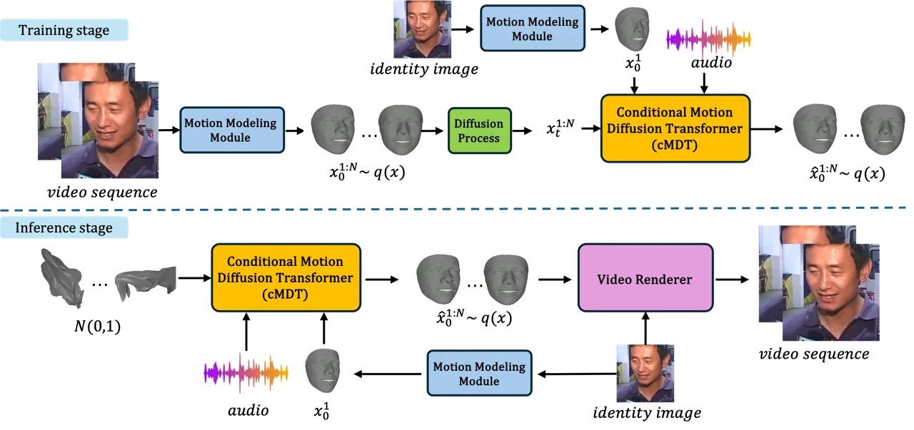
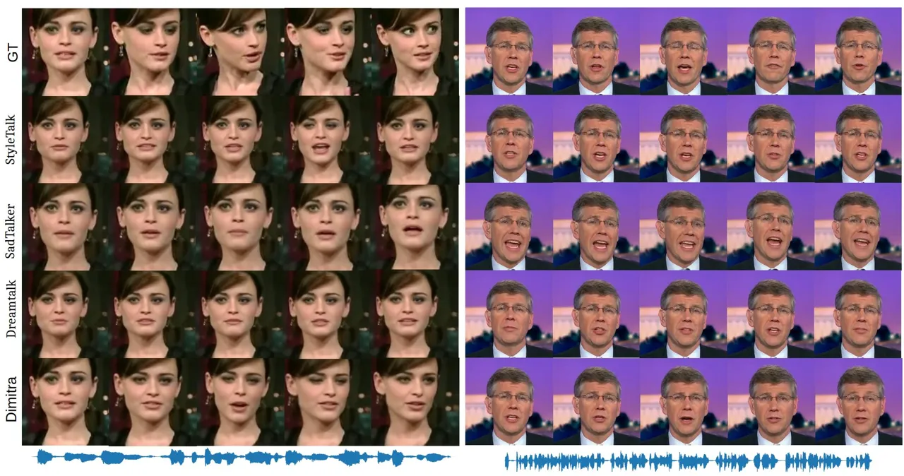

# Dimitra: Audio-driven Diffusion model for Expressive Talking Head Generation

Baptiste Chopin Tashvik Dhamija Pranav Balaji Yaohui Wang Antitza
Dantcheva  
Université Côte d’Azur, Inria, STARS Team, France Shanghai Artificial
Intelligence Laboratory, China

###### Abstract

We propose Dimitra, a novel framework for audio-driven talking head
generation, streamlined to learn lip motion, facial expression, as well
as head pose motion. Specifically, we train a conditional Motion
Diffusion Transformer (cMDT) by modeling facial motion sequences with 3D
representation. We condition the cMDT with only two input signals, an
audio-sequence, as well as a reference facial image. By extracting
additional features directly from audio, Dimitra is able to increase
quality and realism of generated videos. In particular, phoneme
sequences contribute to the realism of lip motion, whereas text
transcript to facial expression and head pose realism. Quantitative and
qualitative experiments on two widely employed datasets, VoxCeleb2 and
HDTF, showcase that Dimitra is able to outperform existing approaches
for generating realistic talking heads imparting lip motion, facial
expression, and head pose.

## I Introduction

Talking head generation aims at animating face images, placing emphasis
on generation of realistic appearance and motion. The latter has been
enabled by the rapid progress of generative models. Related results have
sparked attention in domains of application including digital humans,
AR/VR, as well as film-making. While video-driven talking head
generation has become highly realistic \[25, 34, 41\], animation driven
by audio-speech allows for additional applications such as video games
and chat-bots. Audio-driven talking head generation models \[11, 16,
19\] entail the animation of a face image by synchronizing the
audio-speech to lip motion. Hence, related work \[19, 7\] predominantly
focuses on generating lip motion. However, it is only when head pose and
facial expressions are animated that talking heads appear realistic, as
such facial behavior is crucial in human communication. Motivated by
this, most recent methods \[17, 36\] attempt to incorporate such facial
behavior. Such methods have primarily utilized additional existing video
sequences, in order to condition the generation of facial expression.
W.r.t. head pose, related movement has been mainly directly copied and
transferred from real video sequences, which might initially appear
realistic. However this is limited, as head pose sequences might be of
different length, and more importantly, will not be in accordance with
the speech to the generated video, resulting in unnatural motion.

Deviating from the above, in this work, we introduce Dimitra, a novel
framework for audio-driven talking head generation, streamlined to
animate a face image locally and globally based on audio speech.
Specifically, we place emphasis on generating natural and diverse face
motion and appearance by learning intrinsically behavior of talking
faces that includes motion of lips, head pose, as well as facial
expressions - directly from an audio input. Towards this, we propose a
conditional Motion Diffusion Transformer (cMDT), which accepts a
reference facial image, as well as an audio sequence as inputs. The
latter contributes to (i) Wav2Vec \[22\] features, (ii) text transcript
of the audio-speech, as well as (iii) phoneme sequences that we then
employ as input of the following network. In particular, the latter
utilizes an intermediate 3D mesh representation that facilitates
generation of facial motion, namely 3DMM \[4\]. This is beneficial in
reducing the number of parameters of Dimitra and improving head motion
in the 3D space. In addition, 3DMMs allow for flexibility w.r.t. image
resolution, as we are able to simply alter the final video renderer.

Our main contributions include the following.

- •
  We introduce a novel audio-driven talking head generation model,
  referred to as Dimitra, which generates motion pertained to lips,
  expression, as well as head pose in a reference facial image based on
  a single audio sequence. We extract multiple features from the audio
  sequence, conditioning the generation of talking head videos.
  Deviating from previous methods, we locally animate the mouth, as well
  as globally the entire face by generating facial expressions and head
  pose - without additional inputs. Such facial behavior is merely
  extracted and learned from audio sequences.
- •
  We conducted extensive experiments that quantitatively and
  qualitatively demonstrate that videos generated by Dimitra are
  realistic, imparting expressive and natural motion.

## II Related Work

Audio-driven Talking head generation methods can be person specific
\[13, 6\], where videos can only be generated of persons that have been
in the training set, clearly limiting the generation setting. More
related to our problem, person agnostic methods are able to animate
unknown identities in RGB \[42, 32\], neural radiance fields \[16\],
facial landmarks in a 3D space \[8, 30\], as well as mesh
representations \[17, 39\] employing numerous architectures such as LSTM
\[43\], CNN \[19\] or diffusion \[33, 37, 23\]. It is worth noting that
there exist methods that animate 3D meshes \[29\], deviating from our
work, as our framework Dimitra provides an RGB video as output.
Originally, methods focused on generating merely lip motion, render
generated videos rather unrealistic \[19\]. More recently, research has
focused on generating motion pertaining to the entire face, including
facial expression and head pose, however harnessing such directly or as
strong condition from real video sequences, which are required as
additional inputs \[17, 18\]. We note that such methods provide good
results, in case that expression and head pose sequences are manually
selected.

Diffusion Models \[26, 10\] have shown remarkable results in several
tasks including image generation \[10, 44\] as well as video generation
\[9, 35\]. Related to our setting, diffusion models have been proposed
towards generation of face images \[12, 14\], as well as of talking
heads \[28, 5\]. However, existing methods have not generated head pose
or facial expression, while being dataset specific. We here propose a
diffusion model, designed to generate videos of talking heads, endowed
with local lip motion and facial expression, as well as global head
pose, animating facial images of identities beyond the training set
based on an audio-speech-inputs.

Fig. 1: Dimitra pipeline. Dimitra comprises three main parts, a Motion
Modeling Module (MMM), a Conditional Motion Diffusion Transformer (cMDT)
and a Video Renderer. In the training stage, 3D meshes (3DMM) are
extracted from a video by the MMM. They are used by the cMDT jointly
with features extracted from an audio sequence, to noise then denoise
the 3DMM sequence. In the inference stage, using an audio sequence and
an identity 3DMM as condition, cMDT aims at generating a 3DMM sequence
from Gaussian noise. Finally, the Video Renderer transforms the 3DMM
sequence into a RGB video.

## III Method

In this work, our goal is to generate RGB videos, where a reference
facial image has been animated based on a provided audio-speech input.
Towards this, we introduce Dimitra, comprising of three parts (see
Fig. 1), namely a Motion Modeling Module (MMM), a Conditional Motion
Diffusion Transformer (cMDT) and a Video Renderer. While the MMM
extracts motion features from the RGB image using 3D mesh, the cMDT
extracts relevant features from audio that jointly, with the 3D mesh,
are targeted to generate a 3D mesh sequence of facial motion. Finally,
the Video Renderer converts the meshes into the RGB space, in order to
create an RGB video. We proceed to elaborate below.

### III-A Motion Modeling Module

While we seek to generate RGB videos, recent work \[39\] has showcased
that generating mesh representations allows for increased control of
generated motion in the 3D space that contributes to realistic
generation results that are highly limiting parameters in the network.
Motivated by this, we here adopt a facial mesh representation, namely
the 3DMM representation proposed by Deng _et al._ \[4\]. Firstly, we
encode the RGB data into 3D meshes by adopting an encoder \[4\]. The
parameters encode texture, identity, luminosity, and importantly 64
parameters, encoding facial landmarks and 6 parameters representing
global head pose (rotation and translation). In the following, we only
refer to these 64+6 parameters as facial features. We note that out of
the 64 facial parameters, 13 encode the mouth region. Formally, from a
video, we obtain a 3DMM sequence $`x^{1:N}={x^{1},...,x^{N}}`$ with
$`x^{i}\in\mathbb{R}^{d}`$ denoting a single 3DMM frame containing $`d`$
motion parameters and $`N`$ frames in the sequence.

### III-B Conditional Motion Diffusion Transformer (cMDT)

We formulate talking head generation as a reverse diffusion process and
propose a Conditional Motion Diffusion Transformer (cMDT) to learn this
process. The cMDT takes an audio sequence and the 3DMM representation of
a face as an input (Sec. III-A) towards generating a 3DMM sequence of
facial motion. The cMDT can be divided into Audio Feature Extractor,
Motion Transformer and Video Renderer, three parts.

#### III-B1 Diffusion background

Denoising diffusion probabilistic models (DDPMs) \[27\] entail two
processes, namely forward diffusion, as well as reverse diffusion.
During the forward diffusion process, Gaussian noise is gradually added
to the data up to the point, the data becomes Gaussian noise. On the
other hand, during the reverse process, a neural model learns to
gradually denoise the data.

#### III-B2 Audio Feature Extractor

Towards employing the audio sequence as condition, we extract relevant
features from raw audio. To leverage the strengths of both, phonemes
representation and audio features, we proceed to employ both, audio
features Wav2Vec \[22\] features, as well as phonemes as input of our
model. Wav2Vec is selected for associated efficiency at encoding speech.
In addition, we utilize a text transcript, in order to obtain semantic
information. We employ a phoneme aligner \[38\], providing phonemes with
timestamps from an audio-input and the corresponding text transcript.
Based on the timestamps we create a sequence of phonemes, corresponding
to the frame rate of the video and tokenize it. We note that phonemes
constitute the smallest discrete speech units and contain essential
information for word articulation. Formally we obtain
$`a^{1:N}={a^{1},...,a^{N}}`$ a Wav2Vec feature sequence with
$`a_{i}\in\mathbb{N}`$ being the features in one frame; a tokenized
phoneme sequence $`p^{1:N}={p^{1},...,p^{N}}`$ with
$`p_{i}\in\mathbb{N}`$ being a single phoneme token and a text
transcript $`S`$.

#### III-B3 Motion Transformer

We propose a Transformer architecture that accepts as input a Wav2Vec
feature sequence $`a^{1:N}`$, a tokenized phoneme sequence $`p^{1:N}`$,
a 3DMM sequence $`x^{1:N}`$, and the text transcript corresponding to
the audio $`S`$. Additionally, we provide the first frame of the 3DMM
sequence $`x^{1}_{0}`$ to condition the network on the first pose of the
sequence to ensure that the generated 3DMM sequence starts from the
original position. We formulate the facial motion generation as a
reverse diffusion problem, where we sample a random noise
$`x^{1:N}_{T}`$ towards obtaining a real 3DMM, representing the facial
motion corresponding to the inputs. We propose in this context a
Transformer architecture to learn the denoising process. In this
architecture, $`S`$ is encoded using a pretrained CLIP \[20\]
Transformer encoder, $`a^{1:N}`$ and $`p^{1:N}`$ are encoded using
simple trainable Transformer encoders and $`x^{1}_{0}`$ is encoded using
a simple MLP encoder. $`x^{1:N}_{t}`$ is then denoised using a
Transformer decoder containing self and cross attention layers to learn
the relationship between the motion and the conditions. Towards reducing
complexity, all attention layers employ efficient attention \[24\].

#### III-B4 Learning

Best results in our experiments are obtained for Dimitra, in case that
we train separate models for lip motion, facial expression and head
pose. This is partly due to the unbalanced number of parameters between
each component (13 for lips, 51 for face, 6 for head pose).
Consequently, we train three separate models with the same network
architecture and the same losses except for the head pose model. In
these, for $`x^{i}\in\mathbb{R}^{d}`$, $`d=13`$, $`d=51`$ and $`d=6`$
for the lip model, facial expression model and head pose model,
respectively. We only utilize the weighted diffusion loss
$`L_{G}=\lambda\times L_{diff}`$ as training loss for the lips and
expression models. Head pose, however is very sensitive to the previous
pose in the sequence, and discontinuities in the generation are highly
noticeable, in particular when generating recursively, in order to
obtain long sequences. To limit these discontinuities, in addition to
giving the first pose as input, we add a first pose diffusion loss that
corresponds to diffusion only on the first frame $`x^{1}_{t}`$.
Consequently, the loss for the head pose model is
$`L_{G}=\lambda\times L_{diff}+L_{first}`$. $`\lambda=6`$ in our
implementation.

### III-C Video Renderer

To transfer the generated 3DMM data to video space, we utilize a
pretrained image renderer, proposed by Ren et al. \[21\] that is able to
generate videos with $`256\times 256`$ resolution from a 3DMM input.
Nevertheless, 3DMM data is not limited to this resolution, rather
depends on the renderer. Furthermore, 3DMM is transferable to other 3D
mesh formats, enabling versatility in applications.

## IV Experiments

### IV-A Experimental settings

We train and test our network on a subset of VoxCeleb2 \[2\]. For
testing only, we also use the HDTF dataset \[40\]. We evaluate Dimitra
by computing standard metrics for talking head generation. Specifically,
F-LMD and M-LMD \[1, 17\] evaluate the facial and mouth landmarks
distance, respectively, whereas we employ the SyncNet \[3\] distance and
confidence score towards evaluating lip synchronisation of generated
video and audio. We compare our framework to state of the art methods
StyleTalker \[17\], SadTalker \[39\], and DreamTalk \[18\]. More details
about datasets, metrics and baselines can be found in the supplementary
material (SM).

| Method             | F-LMD$`\downarrow`$ | M-LMD$`\downarrow`$ | $`sync_{dist}\downarrow`$ | $`sync_{conf}\uparrow`$ |
| ------------------ | ------------------- | ------------------- | ------------------------- | ----------------------- |
| GT                 | \-                  | \-                  | 8.08                      | 5.80                    |
| StyleTalker \[17\] | 5.73                | 4.41                | 11.16                     | 3.24                    |
| SadTalker \[39\]   | 6.14                | 4.70                | 9.12                      | 5.28                    |
| DreamTalk \[18\]   | 5.78                | 4.43                | 8.48                      | 5.64                    |
| Dimitra            | 5.00                | 3.79                | 9.43                      | 4.93                    |

TABLE I: Quantitative results pertained to the VoxCeleb2 dataset

### IV-B Quantitative results

Tables I and II depict quantitative results pertained to the datasets
VoxCeleb2 and HDTF, respectively. We observe that our method outperforms
or is competitive w.r.t. the state of the art on both datasets.
Regarding landmark based metrics (F-LMD, M-LMD) our method outperforms
the other methods on both datasets. This indicates that given an audio
sequence, Dimitra generates realistic videos, resembling the ground
truth, as opposed to other methods _w.r.t._ lip motion and facial
expression. These results is supported by the user study in our SM.

Dimitra is competitive w.r.t. lip synchronisation metrics. While
qualitative results and the related user study (see SM) demonstrate the
realism and synchronization between lip movement and audio-speech, the
lip synchronisation (i.e., syncnet) results do not reflect on that. This
stems from the fact that syncnet-metrics are not adequate in evaluating
these. For example, SadTalker obtains competitive results _w.r.t._
syncnet distance and confidence, while being able to only generate two
states for the mouth, namely open and closed. Intermediate mouth shapes
corresponding to pronounced sounds are not well generated (Fig.2).

We note that deviating from DreamTalk, our framework Dimitra was not
trained on HDTF.

In Table II we show results of two versions of our method: with and
without head pose (Dimitra (HP) and Dimitra (no HP) respectively). For a
single 3DMM generated by the cMDT we use one directly (HP) while we
freeze the head pose 3DMM parameters at the renderer level for the other
(no HP). Surprisingly, while the F-LMD and M-LMD improve, the syncnet
score decreases. This should not be the case, as only head pose was
changed, while lip motion and expression remain exactly the same. This
indicates that the metrics are instable.

| Method            | F-LMD$`\downarrow`$ | M-LMD$`\downarrow`$ | $`sync_{dist}\downarrow`$ | $`sync_{conf}\uparrow`$ |     |
| ----------------- | ------------------- | ------------------- | ------------------------- | ----------------------- | --- |
| GT                | \-                  | \-                  | 8.63                      | 6.82                    |     |
| StyleTalker\[17\] | 2.51                | 2.42                | 13.06                     | 1.88                    |     |
| SadTalker \[39\]  | 3.74                | 4.19                | 10.36                     | 5.34                    |     |
| DreamTalk\[18\]   | 2.52                | 2.42                | 8.66                      | 6.14                    |     |
| Dimitra (HP)      | 3.85                | 3.23                | 9.42                      | 5.69                    |     |
| Dimitra (no HP)   | 2.51                | 2.38                | 9.60                      | 5.49                    |     |

TABLE II: Quantitative results pertained to the HDTF dataset

### IV-C Qualitative results

Fig. 2: Qualitative results. Examples of generated samples pertained to
the VoxCeleb2 dataset on the left and pertained to HDTF on the right.

We present qualitative results pertained to the VoxCeleb2 and HDTF
datasets in Figure 2. Specifically, our method generates coherent videos
that synchronize well with the ground truth, temporally and spatially.
Notably, results _w.r.t._ HDTF are convincing, despite our model not
being trained on this dataset. All other methods comprise visual
spatio-temporal synchronization errors. We also showcase that as
discussed in Sec.IV-B, SadTalker does not generate continuous mouth
shapes, it only generates an opened or closed mouth, sometimes failing
to generate a coherent mouth (Figure 2, right side). Despite these
issues, SadTalker obtains high lip-sync scores in the quantitative
analysis, indicating the limitation of the metric.

We observe that our method generates expressive talking faces. While
DreamTalk includes facial expressions in generated videos, they require
a strong conditioning based on an additional real ”style sequence”.
Dimitra is the only method to generate realistic head pose motion.

## V Conclusions

We introduced Dimitra, a network streamlined to generate talking head
videos based on a reference facial image and an audio-speech sequence.
Deviating from previous models, Dimitra endows the reference image with
lip motion associated to the audio, as well as with learned facial
expression and head pose. Our qualitative and quantitative results
showcase superiority _w.r.t._ state of the art on two widely used
datasets, due to reliable lip synchronization and expressiveness in our
generated videos. By extracting features (phoneme and text transcript)
directly from audio-speech, Dimitra generates local (i.e., facial
expression) and global (i.e., head pose) motion. Dimitra is able to
generate realistic videos, animating subjects outside of the original
training data distribution. Future work will focus on learning
representations and generating the entire upper body including
articulated hand gestures. The code, preprocessing code and training -
testing split will be released.

## References

- \[1\] L. Chen, Z. Li, R. K. Maddox, Z. Duan, and C. Xu. Lip movements
  generation at a glance. In Proceedings of ECCV, 2018.
- \[2\] J. S. Chung, A. Nagrani, and A. Zisserman. Voxceleb2: Deep
  speaker recognition. In Proceedings of INTERSPEECH, 2018.
- \[3\] J. S. Chung and A. Zisserman. Out of time: automated lip sync in
  the wild. In Proceedings of ACCV Workshops, 2017.
- \[4\] Y. Deng, J. Yang, S. Xu, D. Chen, Y. Jia, and X. Tong. Accurate
  3d face reconstruction with weakly-supervised learning: From single
  image to image set. In Proceedings of CVPR workshops, 2019.
- \[5\] C. Du, Q. Chen, T. He, X. Tan, X. Chen, K. Yu, S. Zhao, and
  J. Bian. Dae-talker: High fidelity speech-driven talking face
  generation with diffusion autoencoder. In Proceedings of ACM
  Multimedia, 2023.
- \[6\] O. Fried, A. Tewari, M. Zollhöfer, A. Finkelstein, E. Shechtman,
  D. B. Goldman, K. Genova, Z. Jin, C. Theobalt, and M. Agrawala.
  Text-based editing of talking-head video. ACM Transaction Graphics,
  38, 2019.
- \[7\] J. Guan, Z. Zhang, H. Zhou, T. HU, K. Wang, D. He, H. Feng,
  J. Liu, E. Ding, Z. Liu, and J. Wang. Stylesync: High-fidelity
  generalized and personalized lip sync in style-based generator. In
  Proceedings of CVPR, 2023.
- \[8\] S. Gururani, A. Mallya, T.-C. Wang, R. Valle, and M.-Y. Liu.
  SPACE: Speech-driven Portrait Animation with Controllable Expression.
  arXiv preprint arXiv:2211.09809, 2022.
- \[9\] W. Harvey, S. Naderiparizi, V. Masrani, C. Weilbach, and
  F. Wood. Flexible diffusion modeling of long videos. In Proceedings of
  NeurIPS, volume 35, 2022.
- \[10\] J. Ho, A. Jain, and P. Abbeel. Denoising diffusion
  probabilistic models. In Proceedings of NeurIPS, 2020.
- \[11\] F.-T. Hong, L. Zhang, L. Shen, and D. Xu. Depth-aware
  generative adversarial network for talking head video generation. In
  Proceedings of CVPR, 2022.
- \[12\] Z. Huang, K. C. Chan, Y. Jiang, and Z. Liu. Collaborative
  diffusion for multi-modal face generation and editing. In Proceedings
  of CVPR, 2023.
- \[13\] X. Ji, H. Zhou, K. Wang, W. Wu, C. C. Loy, X. Cao, and F. Xu.
  Audio-driven emotional video portraits. In Proceedings of CVPR, 2021.
- \[14\] M. Kim, F. Liu, A. Jain, and X. Liu. Dcface: Synthetic face
  generation with dual condition diffusion model. In Proceedings of
  CVPR, 2023.
- \[15\] D. E. King. Dlib-ml: A machine learning toolkit. Journal of
  Machine Learning Research, 10, 2009.
- \[16\] D. Li, K. Zhao, W. Wang, B. Peng, Y. Zhang, J. Dong, and
  T. Tan. Ae-nerf: Audio enhanced neural radiance field for few shot
  talking head synthesis. In Proceedings of AAAI, volume 38, 2024.
- \[17\] Y. Ma, S. Wang, Z. Hu, C. Fan, T. Lv, Y. Ding, Z. Deng, and
  X. Yu. Styletalk: One-shot talking head generation with controllable
  speaking styles. arXiv preprint arXiv:2301.01081, 2023.
- \[18\] Y. Ma, S. Zhang, J. Wang, X. Wang, Y. Zhang, and Z. Deng.
  Dreamtalk: When expressive talking head generation meets diffusion
  probabilistic models. arXiv preprint arXiv:2312.09767, 2023.
- \[19\] K. R. Prajwal, R. Mukhopadhyay, V. P. Namboodiri, and
  C. Jawahar. A lip sync expert is all you need for speech to lip
  generation in the wild. In Proceedings of ACM Multimedia, 2020.
- \[20\] A. Radford, J. W. Kim, C. Hallacy, A. Ramesh, G. Goh,
  S. Agarwal, G. Sastry, A. Askell, P. Mishkin, J. Clark, et al.
  Learning transferable visual models from natural language supervision.
  In Proceedings of ICML, 2021.
- \[21\] Y. Ren, G. Li, Y. Chen, T. H. Li, and S. Liu. Pirenderer:
  Controllable portrait image generation via semantic neural rendering.
  In Proceedings of ICCV, 2021.
- \[22\] S. Schneider, A. Baevski, R. Collobert, and M. Auli. wav2vec:
  Unsupervised pre-training for speech recognition. In Proceedings of
  Interspeech, 2019.
- \[23\] S. Shen, W. Zhao, Z. Meng, W. Li, Z. Zhu, J. Zhou, and J. Lu.
  Difftalk: Crafting diffusion models for generalized audio-driven
  portraits animation. In Proceedings of CVPR, 2023.
- \[24\] Z. Shen, M. Zhang, H. Zhao, S. Yi, and H. Li. Efficient
  attention: Attention with linear complexities. In PProceedings of
  WACV, 2021.
- \[25\] A. Siarohin, S. Lathuilière, S. Tulyakov, E. Ricci, and
  N. Sebe. First order motion model for image animation. In Proceedings
  of NeurIPS, volume 32, 2019.
- \[26\] J. Sohl-Dickstein, E. Weiss, N. Maheswaranathan, and
  S. Ganguli. Deep unsupervised learning using nonequilibrium
  thermodynamics. In Proceedings of ICML, 2015.
- \[27\] J. Sohl-Dickstein, E. Weiss, N. Maheswaranathan, and
  S. Ganguli. Deep unsupervised learning using nonequilibrium
  thermodynamics. In Proceedings of ICML, 2015.
- \[28\] M. Stypułkowski, K. Vougioukas, S. He, M. Zieba, S. Petridis,
  and M. Pantic. Diffused heads: Diffusion models beat gans on
  talking-face generation. In Proceedings of WACV, 2024.
- \[29\] Z. Sun, T. Lv, S. Ye, M. Lin, J. Sheng, Y.-H. Wen, M. Yu, and
  Y.-j. Liu. Diffposetalk: Speech-driven stylistic 3d facial animation
  and head pose generation via diffusion models. ACM Transactions on
  Graphics, 43, 2024.
- \[30\] W. Suzhen, L. Lincheng, D. Yu, F. Changjie, and Y. Xin.
  Audio2head: Audio-driven one-shot talking-head generation with natural
  head motion. In Proceedings of IJCAI, 2021.
- \[31\] S. Umeyama. Least-squares estimation of transformation
  parameters between two point patterns. IEEE Transactions on Pattern
  Analysis and Machine Intelligence, 13, 1991.
- \[32\] D. Wang, Y. Deng, Z. Yin, H.-Y. Shum, and B. Wang. Progressive
  disentangled representation learning for fine-grained controllable
  talking head synthesis. In Proceedings of CVPR, 2023.
- \[33\] H. Wang, X. Jia, and X. Cao. Eat-face: Emotion-controllable
  audio-driven talking face generation via diffusion model. In
  Proceedings of FG, 2024.
- \[34\] Y. Wang, D. Yang, F. Bremond, and A. Dantcheva. Latent image
  animator: Learning to animate images via latent space navigation. In
  Proceedings of ICLR, 2022.
- \[35\] J. Z. Wu, Y. Ge, X. Wang, S. W. Lei, Y. Gu, Y. Shi, W. Hsu,
  Y. Shan, X. Qie, and M. Z. Shou. Tune-a-video: One-shot tuning of
  image diffusion models for text-to-video generation. In Proceedings of
  ICCV, 2023.
- \[36\] Z. Ye, T. Zhong, Y. Ren, J. Yang, W. Li, J. Huang, Z. Jiang,
  J. He, R. Huang, J. Liu, et al. Real3d-portrait: One-shot realistic 3d
  talking portrait synthesis. arXiv preprint arXiv:2401.08503, 2024.
- \[37\] Z. Yu, Z. Yin, D. Zhou, D. Wang, F. Wong, and B. Wang. Talking
  head generation with probabilistic audio-to-visual diffusion priors.
  In Proceedings of ICCV, 2023.
- \[38\] J. Yuan, M. Liberman, et al. Speaker identification on the
  scotus corpus. Journal of the Acoustical Society of America,
  123, 2008.
- \[39\] W. Zhang, X. Cun, X. Wang, Y. Zhang, X. Shen, Y. Guo, Y. Shan,
  and F. Wang. Sadtalker: Learning realistic 3d motion coefficients for
  stylized audio-driven single image talking face animation. In
  Proceedings of CVPR, 2023.
- \[40\] Z. Zhang, L. Li, Y. Ding, and C. Fan. Flow-guided one-shot
  talking face generation with a high-resolution audio-visual dataset.
  In Proceedings of CVPR, 2021.
- \[41\] J. Zhao and H. Zhang. Thin-plate spline motion model for image
  animation. In Proceedings of CVPR, 2022.
- \[42\] H. Zhou, Y. Sun, W. Wu, C. C. Loy, X. Wang, and Z. Liu.
  Pose-controllable talking face generation by implicitly modularized
  audio-visual representation. In Proceedings of CVPR, 2021.
- \[43\] Y. Zhou, X. Han, E. Shechtman, J. Echevarria, E. Kalogerakis,
  and D. Li. Makelttalk: speaker-aware talking-head animation. ACM
  Transaction Graphics, 39, 2020.
- \[44\] Y. Zhou, B. Liu, Y. Zhu, X. Yang, C. Chen, and J. Xu. Shifted
  diffusion for text-to-image generation. In Proceedings of CVPR, 2023.

Dimitra: Audio-driven Diffusion model for Expressive Talking Head
Generation Supplemental Material

In this supplementary material we provide additional details w.r.t. user
study, as well as datasets, baselines and metrics.

## S-I User study

We conduct a user study to evaluate generated video quality. Towards
achieving fair evaluation, we display paired videos or generated by the
4 approaches (Dimitra, Styletalker, Sadtalker, Dreamtalk) on the HDTF
dataset and ask 20 human raters for each paired video the question
‘which clip is more realistic and natural?’. Each video-pair contains a
generated video from our method, as well as a video generated from
Styletalk, Sadtalker, Dreamtalk or the ground truth.

|                   | user preference (%) |
| ----------------- | ------------------- |
| Dimitra/Styletalk | 87.5/12.5           |
| Dimitra/Sadtalker | 75.0/25.0           |
| Dimitra/Dreamtalk | 68.8/31.2           |

TABLE I: User study. We ask 20 human raters to conduct a subjective
video quality evaluation on the HDTF dataset. Results show that videos
generated by Dimitra are consistently rated as more realistic.

Results suggest that our generated videos are the most realistic in
comparison to other methods on the HDTF dataset, see Table I.

## S-II Datasets, Baselines and Evaluation metrics

### S-II-A Datasets

VoxCeleb2 is a dataset containing more than 1 millions low resolution
clips (average length 10s) of people talking in TV shows or interviews.
We only use a subset of 50000 clips of which 3931 are used for testing
(corresponding to 39 identities). We use face crop with a resolution of
256\*256 but the quality of face crops vary as faces sizes in original
videos can be widely different. The data is diverse with many different
settings, a lot of facial expressions and head motions.

HDTF is a datasets containing 400 videos (average length 3-5 min) of
people talking, all videos are using for testing. The video resolutions
vary between 512\*512 and 1024\*1024, we resize all videos to 256\*256
for a fair comparison with the other methods. Unlike VoxCeleb2, HDTF
doesn’t contain many facial expression or head motions.

### S-II-B Baselines

We compare our framework to state of the art methods StyleTalker \[17\],
SadTalker \[39\], DreamTalk \[18\]. We note that StyleTalker and
DreamTalk generate a video based on an input facial image and an audio
sequence by creating a 3DMM representation similarly to Dimitra.
Deviating from our model, StyleTalker and DreamTalk additionally require
a head pose sequence, as well as a ”style sequence” that captures the
identity of the speaker and speaking style. For the sake of fairness, in
the scope of generating talking heads only from audio and one image, we
provide StyleTalker and DreamTalk with each first frame of the 3DMM
sequence as ”style sequence” and ”head pose sequence”. StyleTalker only
employs a phoneme representation for the audio, whereas DreamTalk
incorporates Wav2vec features \[22\]. As the StyleTalker-code associated
to their phoneme extractor is not publicly available, we convert our
phonemes to their format as input. SadTalker accepts audio and image as
inputs towards generating talking head endowed with head pose motion.
The training code for StyleTalker, DreamTalk and SadTalker were not
available, therefore we use pretrained weights, as provided by the
authors. These were obtained by training on a number of datasets
including HDTF and VoxCeleb2. Hence, samples of our training set might
have been part of the training set of these methods as well.

### S-II-C Metrics

We evaluate Dimitra by computing standard metrics for talking head
generation. Specifically, F-LMD and M-LMD \[1, 17\] evaluate the facial
and mouth landmarks, respectively (68 and 20 landmarks extracted with
dlib \[15\], respectively). Both metrics compare landmarks pertained to
generated sample and ground truth, and compute the average Euclidean
norm considering landmarks and frames. We normalize the landmarks
_w.r.t._ the head pose when evaluating F-LMD and M-LMD using the
Kabsch-Umeyama algorithm \[31\] between the ground truth landmarks and
the generated landmarks. This is done independently for each frame of
the sequence and allow us to remove the influence of head pose
translation and rotation when evaluating the expression and lips motion.
It also scale the data which is especially important when evaluating
Dreamtalk and Styletalk on VoxCeleb2 as the methods change the
viewpoint. Due to the large variations in head pose in the VoxCeleb2
dataset, dlib \[15\] was sometimes unable to find landmarks in the
ground truth videos. In those case the samples are ignored for the two
metrics. We employ the SyncNet \[3\] distance and confidence score
towards evaluating lip synchronisation of generated video and audio. For
those last two metrics, following the literature we simply feed the
generated videos into the code provided by the author of \[3\].
