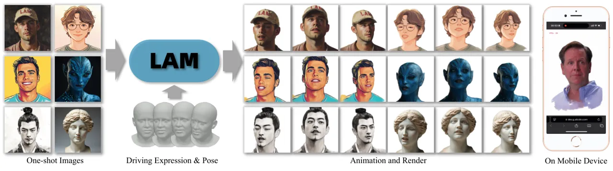
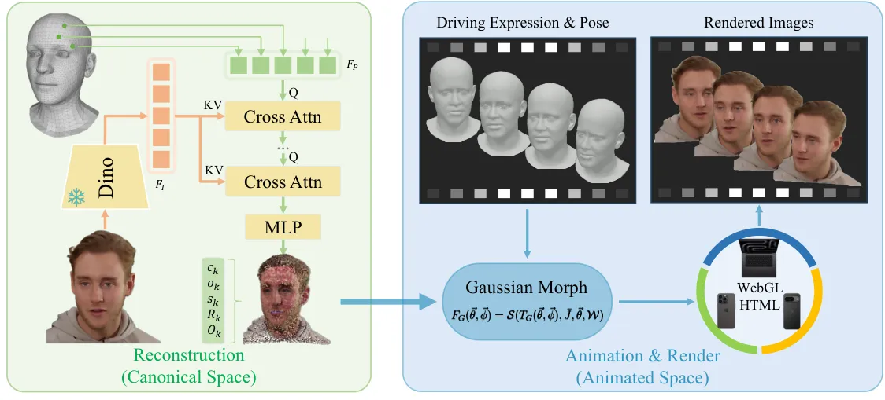
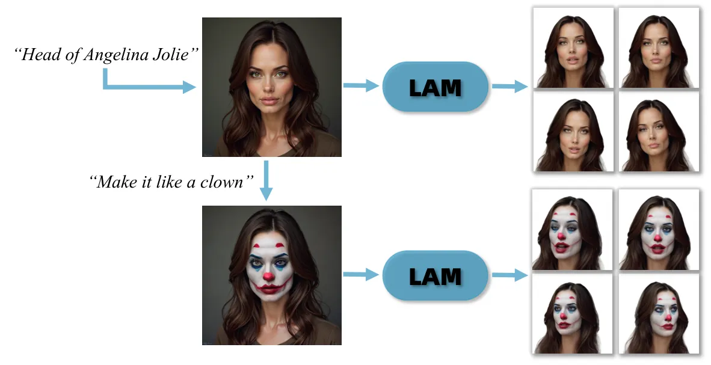
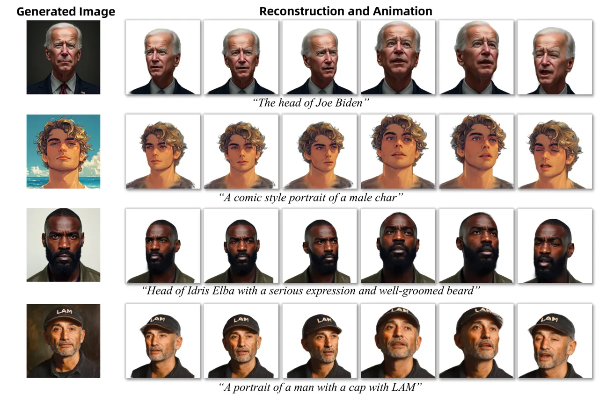
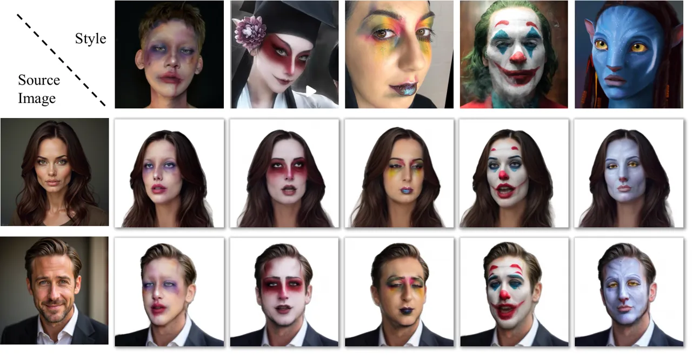
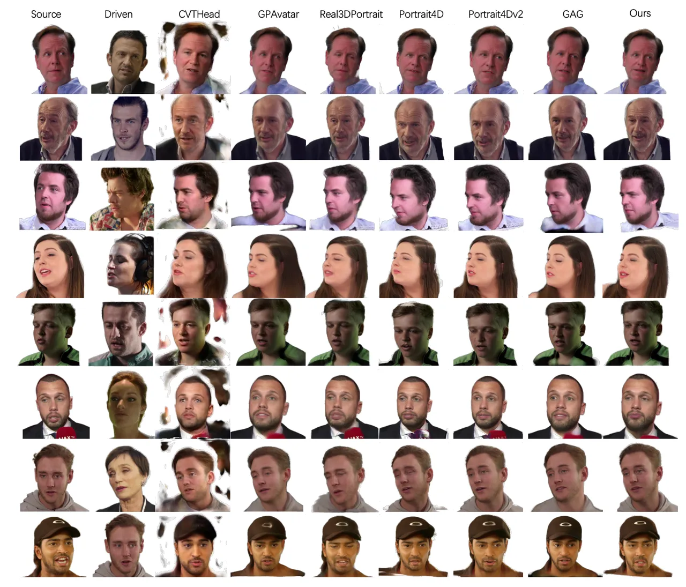
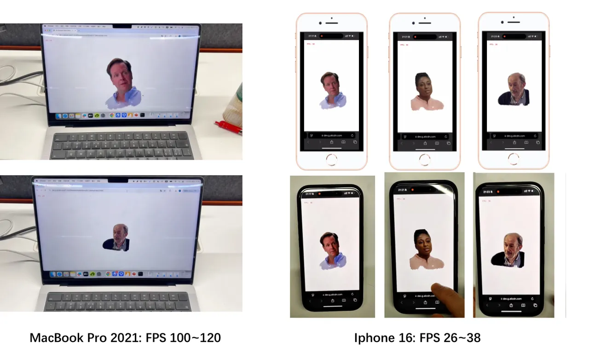
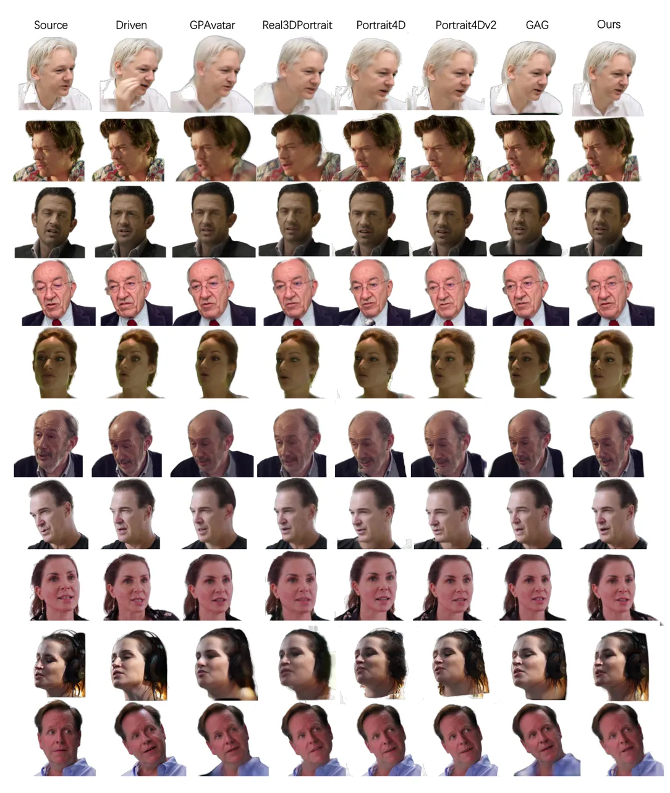

# LAM: Large Avatar Model for One-shot Animatable Gaussian Head

DOI: [XXXXXXX.XXXXXXX](https://doi.org/XXXXXXX.XXXXXXX)Conference: Make
sure to enter the correct conference title from your rights confirmation
emai; June 03–05, 2018; Woodstock,
NYISBN: 978-1-4503-XXXX-X/18/06829CCS: Computing
methodologies ReconstructionCCS: Computing methodologies Shape
representationsCCS: Computing methodologies Appearance and texture
representations

Yisheng He email: <heyisheng.hys@alibaba-inc.com> Note: Equal
Contribution Affiliation: Tongyi Lab, Alibaba Group, China , Xiaodong Gu
email: <dadong.gxd@alibaba-inc.com> Affiliation: Tongyi Lab, Alibaba
Group, China , Xiaodan Ye email: <doris.yxd@alibaba-inc.com>
Affiliation: Tongyi Lab, Alibaba Group, China , Chao Xu email:
<eric.xc@alibaba-inc.com> Affiliation: Tongyi Lab, Alibaba Group, China
, Zhengyi Zhao email: <bushe.zzy@alibaba-inc.com> Affiliation: Tongyi
Lab, Alibaba Group, China , Yuan Dong email: <dy283090@alibaba-inc.com>
Note: Corresponding Author Affiliation: Tongyi Lab, Alibaba Group, China
, Weihao Yuan email: <qianmu.ywh@alibaba-inc.com> Affiliation: Tongyi
Lab, Alibaba Group, China , Zilong Dong email:
<list.dzl@alibaba-inc.com> Affiliation: Tongyi Lab, Alibaba Group, China
and Liefeng Bo email: <liefeng.bo@alibaba-inc.com> Affiliation: Tongyi
Lab, Alibaba Group, China

2018



Figure 1. LAM creates animatable Gaussian heads with one-shot images in
a single forward pass. The reconstructed Gaussian avatar can be
reenacted and rendered on various platforms in real time.

###### Abstract.

We present LAM, an innovative Large Avatar Model for animatable Gaussian
head reconstruction from a single image. Unlike previous methods that
require extensive training on captured video sequences or rely on
auxiliary neural networks for animation and rendering during inference,
our approach generates Gaussian heads that are immediately animatable
and renderable. Specifically, LAM creates an animatable Gaussian head in
a single forward pass, enabling reenactment and rendering without
additional networks or post-processing steps. This capability allows for
seamless integration into existing rendering pipelines, ensuring
real-time animation and rendering across a wide range of platforms,
including mobile phones. The centerpiece of our framework is the
canonical Gaussian attributes generator, which utilizes FLAME canonical
points as queries. These points interact with multi-scale image features
through a Transformer to accurately predict Gaussian attributes in the
canonical space. The reconstructed canonical Gaussian avatar can then be
animated utilizing standard linear blend skinning (LBS) with corrective
blendshapes as the FLAME model did and rendered in real-time on various
platforms. Our experimental results demonstrate that LAM outperforms
state-of-the-art methods on existing benchmarks. Our code and video are
available
at [https://aigc3d.github.io/projects/LAM/](https://aigc3d.github.io/projects/LAM/).

###### Keywords: 

Animatable Head Avatar, Gaussian Splatting, Single-shot Reconstruction,
Real-time Animation and Rendering

## 1. Introduction

The reconstruction and animation of head avatars from a single image is
an important area of research within computer graphics and computer
vision. This area has a wide range of practical applications, including
online meetings, filmmaking, the gaming industry, and virtual reality.
Researchers have tackled this challenge using different methodologies,
primarily focusing on 2D and 3D generative models.

Early 2D methods (Karras et al., 2020; Isola et al., 2017; Goodfellow
et al., 2014) harness the capabilities of convolutional neural networks
and generative adversarial networks to depict facial expressions and
poses via warping fields applied to source images. Benefiting from
advances in image and video diffusion networks, more recent 2D-based
works (Cui et al., 2024; Xu et al., 2024b; Tian et al., 2024) get
improved results with diffusion techniques. Although achieving
impressive results, 2D solutions still face challenges related to long
generation times and significant computational resource demands.
Moreover, 2D techniques often struggle with extreme variations in poses
and expressions due to their lack of explicit three-dimensional
structures.

On the other hand, the emergence of advanced 3D synthesis techniques,
such as Neural Radiance Fields (NeRFs) and Gaussian Splatting, has
enhanced the consistency of multi-view avatar reconstruction and
animation. Nonetheless, NeRF-based (Gafni et al., 2021; Ki et al., 2024;
Bai et al., 2023a; Zheng et al., 2023; Park et al., 2021a; Yu et al.,
2023; Ma et al., 2023a; Li et al., 2023b) methods usually require
extensive optimization from a single image for each individual before
effective use, and their slow rendering speeds limit their application
in scenarios demanding real-time performance.

Recent developments, like GAGAvatar (Chu and Harada, 2024), introduced a
framework for single-shot Gaussian avatar generation and animation that
capitalizes on the quick rendering prowess of Gaussian Splatting.
However, these methods usually rely heavily on complex 2D neural
post-processing to achieve optimal outcomes, thus they are not pure 3D
solutions and may encounter similar problems presented in 2D solutions.
In addition, their severe reliance on neural network post-processing
makes their integration into traditional rendering pipelines across
various platforms cumbersome.

In this paper, we introduce a large avatar model for generating
animatable Gaussian head avatars. After one pass forward of the network
given a single image, our approach generates the Gaussian avatar that
can be instantly reenacted and rendered without any post-processing
network. This capability allows for seamless integration into existing
rendering pipelines and ensures efficient performance across a wide
range of devices, including mobile devices.

However, this task presents certain challenges. 1) The first hurdle lies
in enabling the animation of the reconstructed Gaussian without relying
on extra neural networks. Unlike previous studies that use neural
networks (Chu and Harada, 2024) for animation and rendering, our method
generate Gaussian avatar based on the FLAME animation model, which
operates and renders without additional neural networks, allowing
real-time application on various platforms. 2) The second challenge
involves reconstructing an animatable Gaussian from a single image. To
overcome this, we propose three main designs for our framework. i)
Firstly, unlike previous methods that reconstruct shapes from implicit
tri-plane (Tang et al., 2024a) or image plane (Chu and Harada, 2024), we
represent the shape with explicite point cloud initialized from
canonical FLAME vertices. In this way, we leverage the prior avatar
shape resides in the FLAME model to alleviates the reconstruction
challenge. ii) Secondly, instead of directly reconstructing the avatars
with various poses and expressions, we reconstruct all Gaussian avatars
in the canonical space with the same expression and pose. Such a unified
design not only enables convenient animation during inference but also
mitigates the reconstruction complexities by reducing the shape and pose
variety. iii) Finally, unlike previous methods (Pan et al., 2023) that
only utilize the painted image features for texture and shape reasoning,
our framework thoroughly reason on both local and global image features
within a cross-attention mechanism, improving the reconstruction quality
and texture fidelity.

The principal contributions of this work can be summarized as follows:

- •
  We introduce a large avatar model for generating the animatable
  Gaussian head avatar from one image, allowing instant animation and
  rendering without additional post-processing.
- •
  The generated Gaussian avatars from our framework can be seamlessly
  integrated into traditional rendering pipelines, supporting real-time
  animation and rendering across various platforms.
- •
  Built upon our large animatable Gaussian avatar model, we enable the
  efficient generation and stylization of animatable Gaussian avatars
  from a single text prompt or image.
- •
  Experimental results on benchmark datasets demonstrate the efficacy
  and efficiency of our approach.

## 2. Related work

Recent advances in single-image animatable head avatar generation can be
categorized into mainly 2D-based and 3D-based approaches.

#### Image to 2D Animatable Avatar.

2D-based methods, leveraging the power of convolutional neural networks
(CNNs) (Karras et al., 2020; Isola et al., 2017; Goodfellow et al.,
2014), often employ generative adversarial networks (GANs) (Karras
et al., 2019) for direct image synthesis. Early approaches (Wang et al.,
2023; Burkov et al., 2020; Zakharov et al., 2019) focus on injecting
expression and pose features into the generator network, often utilizing
architectures like U-Net or StyleGAN (Karras et al., 2019). Some other
2D methods (Guo et al., 2024; Zhang et al., 2023c; Hong et al., 2022;
Drobyshev et al., 2022a; Burkov et al., 2020; Siarohin et al., 2019)
represent expressions and poses as warping fields applied to the source
image. Benefiting from advances in image and video diffusion networks,
more recent 2D-based works (Cui et al., 2024; Xu et al., 2024b; Tian
et al., 2024) get improved results with diffusion techniques. However,
these methods still face challenges related to long generation times and
significant computational resource demands. Audio-driven 2D control
methods (Zhang et al., 2023a; Tang et al., 2022; Guo et al., 2021a) are
easy to use but cannot explicitly control facial expressions and poses.
2D-based techniques often struggle with large pose or expression
variations due to the lack of an explicit 3D structure, sometimes
producing unrealistic distortions or identity changes. While some 2D
methods (Zhang et al., 2023b; Yin et al., 2022a; Ren et al., 2021; Wang
et al., 2021; Drobyshev et al., 2022b) incorporate 3D Morphable Models
(3DMMs) (Gerig et al., 2018; Li et al., 2017; Paysan et al., 2009; Blanz
and Vetter, 1999) to mitigate these issues, they typically cannot
achieve free-viewpoint rendering.



Figure 2. Overall Framework. Our framework utilizes learnable query
features attached to FLAME vertices to perform cross-attention with the
extracted multi-level image features. The extracted features are then
decoded to reconstruct the Gaussian avatar in the canonical space, which
can be animated utilizing standard linear blend skinning (LBS) and
corrective blendshapes as the FLAME model did and rendered in real-time
on various platforms.

#### Image to 3D Animatable Avatar.

3D-aware methods offer improved geometric consistency and free-viewpoint
rendering capabilities. Early 3D approaches (Khakhulin et al., 2022a; Xu
et al., 2020) utilize 3DMMs for head avatar reconstruction. With the
advent of Neural Radiance Fields (NeRFs) (Mildenhall et al., 2020a),
many recent methods (Yu et al., 2023; Ma et al., 2023a; Li et al.,
2023b; Chu et al., 2024a; Ye et al., 2024; Deng et al., 2024b; Deng
et al., 2024a; Ki et al., 2024; Bai et al., 2023a; Zheng et al., 2023;
Park et al., 2021a; Zielonka et al., 2023) have adopted this
representation for higher fidelity, particularly in modeling fine
details like hair. However, NeRF-based (Zhang et al., 2024; Zhao et al.,
2024; Bai et al., 2023b; Guo et al., 2021b; Gao et al., 2022; Park
et al., 2021b; Athar et al., 2022; Hong et al., 2021; Tretschk et al.,
2021; Gafni et al., 2021; Ki et al., 2024; Bai et al., 2023a; Zheng
et al., 2023; Park et al., 2021a; Yu et al., 2023; Ma et al., 2023a; Li
et al., 2023b) approaches often require extensive training data,
including multi-view or single-view videos, raising privacy concerns and
limiting generalization to unseen identities. Some methods (Sun et al.,
2023; Zhuang et al., 2022; Sun et al., 2024; Tang et al., 2024b; Xu
et al., 2023) bypass this data requirement by training generators with
random noise and then inverting them for identity-specific
reconstruction, but inversion accuracy remains a challenge. Test-time
optimization offers another alternative, but its computational cost
limits practical applications. Several recent works (Li et al., 2023a;
Li et al., 2023c; Chu et al., 2024b; Ye et al., 2024; Ma et al., 2024;
Deng et al., 2024b; Deng et al., 2024a; Kirschstein et al., 2024) have
explored one-shot 3D head reconstruction to address the limitations of
data requirements and computational cost. These methods employ various
techniques, such as tri-plane features, deformation fields, point-based
expression fields, and vertex-feature transformers. Despite these
advancements, NeRF-based methods often struggle with real-time
rendering. Recently, 3D Gaussian Splatting (Kerbl et al., 2023) has
emerged as a promising alternative, offering both high-quality results
and fast rendering speeds. However, existing Gaussian Splatting
methods (Qian et al., 2024; Xu et al., 2024a) typically rely on video
data for training for each person, limiting their ability to generalize
to new identities. Instead, the most recent work, GAGAvatar (Chu and
Harada, 2024), proposes a one-shot 3D Gaussian-based head avatar
generation method. However, it still relies heavily on complex 2D neural
post-processing to achieve optimal animation outcomes, thus it is not a
pure 3D solution and the extra neural network hinders its application on
various platforms. In contrast, our work generates Gaussian heads that
are immediately animatable and renderable without additional networks or
post-processing steps, enabling seamless integration into existing
rendering pipelines for real-time animation and rendering across a wide
range of platforms, including mobile phones.

## 3. Methodology

### 3.1. Overview

Our approach begins with the development of a canonical Gaussian
attribute generator, utilizing a Transformer network. We incorporate
pre-trained Vision Transformer (ViT) weights to effectively extract
features at multiple levels from one single-view image. To fully
leverage the prior shape information and expression coefficients
provided by the FLAME (Li et al., 2017) model, we employ vertices from
the FLAME model as initial Gaussian positions. These vertices reason
geometric relationships through stacked self-attention and extract
corresponding features from the images within stacked cross-attention
modules, allowing us to predict the canonical Gaussian attributes and
deformation offsets to improve the shape accurately. Given a new
expression and pose, we utilize the animation weights from the FLAME
model to animate the reconstructed canonical Gaussian points
accordingly. This process facilitates the rendering of the image,
reflecting the desired expression and pose with accuracy and enabling
interactive frame rates of animation and rendering on a wide range of
computing platforms, including mobile phones.

### 3.2. Canonical Gaussian Head Avatar Generation

In this section, we outline our approach for reconstructing an
animatable avatar in the canonical space from a single input image. Our
objective is to create an avatar that can be animated and rendered
seamlessly, without the need for additional neural networks or
post-processing. This allows for straightforward integration into
existing rendering pipelines and enables interactive frame rates across
various computing devices.

#### Canonical Gaussian Head Avatar Reconstruction.

We draw inspiration from the success of Gaussian Splatting (Kerbl
et al., 2023) in novel view synthesis and its efficient rendering
capabilities. Therefore, we design our model to generate the Gaussian
head avatar. However, this task presents certain challenges. The first
hurdle lies in enabling the animation of the reconstructed Gaussian
without relying on extra neural networks. Previous studies (Xu et al.,
2024a) have explored dynamic Gaussians that utilize multi-layer
perceptrons (MLPs) to transform canonical Gaussians into new expressions
by predicting the residual attributes and rendered images with new
expressions. However, the reliance on additional neural networks hampers
compatibility with traditional rendering workflows and hinders real-time
rendering on platforms with less compatibility, such as mobile phones.
To address this issue, we incorporate insights from the animatable FLAME
model, which is animatable without extra neural networks. By using FLAME
as a foundation for constructing our animatable Gaussian, we leverage
its animation pipeline to animate our reconstructed avatar.

The second challenge involves reconstructing an animatable Gaussian from
a single image. To overcome this, we propose three main designs for our
framework: 1) Firstly, unlike previous methods (Tang et al., 2024a; Ma
et al., 2023b) that represent and reconstruct shapes from tri-plane
representation, we represent the shape with a point-cloud-like technique
and initialize the point position with canonical vertices of the FLAME
model. In this way, we can build the avatar with explicit shape and
leverage the shape prior that resides in the FLAME model, which
alleviates the reconstruction challenge. 2) Secondly, instead of
directly reconstructing the avatars with various poses and expressions,
we reconstruct all Gaussian avatars within the same canonical coordinate
with the same canonical expression and pose, which are then animated to
the target pose and expression. Such a unified design not only enables
convenient animation during inference but also mitigates the
complexities associated with the reconstruction by reducing the shape
and pose variety. 3) Finally, unlike previous methods (Pan et al., 2023)
that only utilize the painted image features lifted from projections for
texture and shape reasoning, we thoroughly utilize both local and global
features extracted from the source image by building cross-attention
modules between the point and image features, which improve the
reconstruction quality and texture fidelity.

As illustrated in Fig. 2, we begin by employing the pre-trained DinoV2
model (Oquab et al., 2024) to extract features from the input image. By
fusing features derived from both shallow and deep layers, we obtain
image features $`F_{I}`$, that capture essential local details, such as
hair strands and wrinkles, while ensuring global resemblance to the
original image. To incorporate prior shape information from the FLAME
model, we initial the Gaussian positions based on the FLAME’s vertices
after shape blendshapes. Then we attach learnable features to each point
as learnable query features $`F_{P}`$. In implementation, we utilize
multi-layer perceptron (MLP) to project the positional
encoding (Mildenhall et al., 2020b) of each point to get $`F_{P}`$.
These learnable features are trained to extract features from the images
feature $`F_{I}`$ with stacked cross-attention modules
$`\mathcal{C}=\{\mathcal{C}_{i}\}^{L}_{i=1}`$. Given the query point
features $`F_{P}`$ and the extracted multi-level image features
$`F_{I}`$, we flatten the features and process them with stacked
cross-attention modules as:

```math
F_{P_{i}}=\mathcal{C}_{i}(F_{P_{i-1}},F_{I}), \tag{1}
```

where $`\mathcal{C}_{i}`$ is the $`i_{th}`$ cross-attention module,
$`F_{P_{i}}`$ the $`i_{th}`$ layer’s queried features given previous
layers’ output $`F_{P_{i-1}}`$ as query, with $`F_{P_{1}}=F_{P}`$. This
architecture enables the model to interpret geometric information and
relationships within the point cloud via self-attention, while
simultaneously using cross-attention to extract relevant appearance
features from the image. Another advantage of this framework design is
that we can leverage the scaling law of the Transformer architecture,
which has been proven on ChatGPT ( , ) for text generation and  (Peebles
and Xie, 2023) for image generation. The advantage of this framework
design is that we can leverage the scaling law of the Transformer
architecture, which has been proven on (Touvron et al., 2023) for text
generation and  (Peebles and Xie, 2023) for image generation. We
instead, show that our designed transformer architecture can also be
scaled up for the animatable Gaussian avatar reconstruction.

After the feature extraction process, each point retains its unique
features. Leveraging these features, we construct decoding headers
$`\mathcal{D}`$ made up of MLPs to predict each point’s Gaussian
attributes, including color $`c_{k}\in\mathbb{R}^{3}`$, opacity
$`o_{k}\in\mathbb{R}`$, per-axis scale factors $`s_{k}\in\mathbb{R}`$,
and rotation $`R_{k}\in SO(3)`$. Since the FLAME only provides the
coarse shape information of a person, without details like hairs, we
also predict each point’s offset to obtain a more detailed shape of the
person, denoted as $`O_{k}\in\mathbb{R}^{3}`$. The decoding process can
then be denoted as:

```math
\{c_{k},o_{k},s_{k},R_{k},O_{k}\}^{M}_{k=1}=\mathcal{D}(F_{P_{L}}), \tag{2}
```

where $`M`$ is the total number of Gaussians. Consequently, we
reconstruct the Gaussian avatar in the canonical space, which can then
be animated with new expressions and rendered through a splatting
process to produce the final image.

#### FLAME Subdivision.

We utilize FLAME vertices as initialization of the Gaussian position and
also utilize them to query features from the image to predict the
Gaussian attributes. However, the original number of vertices on the
FLAME template model is 5023, which is small and Gaussian avatar with
such a number of points are not able to reconstruct details like hair,
moustache, and teeth well. Under such observation, we propose to
increase the number of points from FLAME as initialization.
Specifically, we utilize the mesh subdivision algorithm to increase the
number of mesh faces and vertices. Specifically, for each subdivision
iteration, the triangle mesh is subdivided by adding a new vertex at the
center of each edge and dividing each face into four new faces. We also
attach blendshapes attributes to each vertex, and subdivide them by
averaging the values of the attributes at the two vertices that form
each edge. In this way, we increase the number of vertices and obtain
the blendshapes attributes of each vertice for animation. These
blendshapes attributes are also applied to each Gaussian point for the
animation of the reconstructed Gaussian avatar. We can apply different
numbers of mesh subdivision iterations to obtain different numbers of
vertices as initialization. More points will lead to more detailed
reconstruction but at a lower rendering speed. By default, we apply mesh
subdivision twice to obtain $`M=81,424`$ vertices as initialization for
$`M`$ Gaussian points, which is the best trade-off between
reconstruction quality and rendering speed from our experiments.

### 3.3. New Expression Animation

Given the reconstructed canonical Gaussian head avatar, we introduce how
to reenact them into new FLAME expressions in this section. Since our
Gaussian positions are initialized from FLAME and attached with their
corresponding animation attributes, we can animate the model utilizing
standard vertex-based linear blend skinning (LBS) and corrective
blendshapes as the FLAME model did. We first have a brief review of how
the FLAME model is animated. Denote $`\bar{T}`$ the vertexes of the
FLAME template mesh, $`B_{S}(\vec{\beta})`$, the shape blendshape
function, $`B_{P}(\vec{\theta})`$ the pose blendshapes function,
$`B_{E}(\vec{\phi})`$ the expression blendshape function, and
$`\mathcal{S}(\bar{T},\textbf{J},\vec{\theta},\mathcal{W})`$ the
standard skinning function to rotate the vertexes $`\bar{T}`$ around
joints J and smoothed by blendweights $`\mathcal{W}`$, the FLAME model
can be defined as:

```math
F(\vec{\beta},\vec{\theta},\vec{\phi})=\mathcal{S}(T_{P}(\vec{\beta},\vec{\theta},\vec{\phi}),\textbf{J}(\vec{\beta}),\vec{\theta},\mathcal{W}), \tag{3}
```

where

```math
T_{P}(\vec{\beta},\vec{\theta},\vec{\phi})=\bar{T}+B_{S}(\vec{\beta};\mathcal{S})+B_{P}(\vec{\theta};\mathcal{P})+B_{E}(\vec{\phi};\mathcal{E}), \tag{4}
```

with $`T_{P}(\vec{\beta},\vec{\theta},\vec{\phi})`$ the template with
added shape, pose, and expression offsets. Our reconstructed Gaussian
avatar can be reenacted similarly by regarding the position location as
the vertices of FLAME and animating it with the blendshape and LBS
function to obtain the animated new Gaussian positions. The difference
is that we utilize the vertices of the subdivided FLAME mesh after shape
blendshapes $`\bar{T}+B_{S}(\vec{\beta})`$ as the initial Gaussian
position and our networks predict the XYZ offset of each point to
further improve the shape details in the canonical space, the function
in Formula (4) can be revised as:

```math
T_{G}(\vec{\theta},\vec{\phi})=\bar{G}+B_{P}(\vec{\theta};\mathcal{P})+B_{E}(\vec{\phi};\mathcal{E}), \tag{5}
```

where

```math
\bar{G}=\bar{T}+B_{S}(\vec{\beta};\mathcal{S})+O, \tag{6}
```

with $`O=\mathcal{N}(\bar{T}+B_{S}(\vec{\beta};\mathcal{S}))`$ the
predicted offset from our network $`\mathcal{N}`$ given shape blended
vertexes as input. Note that our shape blendshapes procedure denotes in
Formula (6) only computes once and can be fixed once the network is
forwarded and the canonical Gaussian avatar $`\bar{G}`$ is
reconstructed. Meanwhile, we can also pre-compute the shape blendshapes
to the joint once as $`\bar{J}=\textbf{J}(\vec{\beta})`$. Thereafter, we
can then pass the reconstructed $`\bar{G}`$ into the LBS function to
animate the Gaussian avatar at a fast speed during inference as:

```math
F_{G}(\vec{\theta},\vec{\phi})=\mathcal{S}(T_{G}(\vec{\theta},\vec{\phi}),\bar{J},\vec{\theta},\mathcal{W}). \tag{7}
```

After the position of the Gaussian is reanimated, we perform splatting
on the reanimated Gaussian and render the new image. Note that the
animation processing in Formula (7) and the rendering does not have any
neural network and postprocessing, which can be directly integrated into
the traditional rendering pipeline developed for various devices,
enabling fast deployment, which we will discuss in Sec. 3.5.



Figure 3. Text to animatable Gaussian avatar generation and editing
pipelines.

### 3.4. Text to Animatable Gaussian Avatar Generation and Editing.

Our approach takes full advantage of the shape information and animation
attributes provided by the FLAME model and the robust capabilities of
the DinoV2 image feature extractor, which is trained on extensive image
datasets. Furthermore, after training on large-scale datasets, the
scaling capability of the designed Transformer-based architecture allows
our framework to adapt effectively to various input styles, including
those derived from generated images. Building on this foundation, we
have designed a streamlined pipeline for converting text prompts into
animatable Gaussian avatars, along with an efficient style editing
process, as illustrated in Fig. 3. To generate target portrait images
based on textual prompts, we employ established text-to-image generation
frameworks, such as Stable Diffusion (Rombach et al., 2022). The
resulting images are then processed by our system to create animatable
Gaussian avatars through a feed-forward mechanism. In addition, our
framework is equipped to facilitate style editing; we can take an input
image and utilize an image-to-image translation framework to modify the
portrait’s style, such as changing the age or transforming it into a
cartoon representation. This edited image is subsequently fed into our
model to produce animatable Gaussian avatars that reflect the desired
styles.

### 3.5. Deployment to Traditional Rendering Pipeline on Various Platforms.

To deploy our Gaussian avatar on various computing platforms, we choose
WebGL as our implementation framework, the application of which can be
run on web browsers of different devices. Specifically, since the
animation mainly consists of matrix operations, and the computing is
highly parallelized, we pass the blenshapes and LBS information as
texture to the GLSL vertex shader and use transform feedback for
efficient GPU computing. For Gaussian splating, we also implement a
WebGL version. In this way, we enable animation and rendering of
reconstructed Gaussian avatars on different devices. Our interactive
viewer is an HTML webpage with Javascript, rendered by WebGL.

### 3.6. Optimization and Regularization

During training, we randomly sample $`N_{f}`$ frames of images from the
same video, selecting one as the reference image to reconstruct the
canonical Gaussian avatar and others as the driving images and target
images. We supervise the rendered RGB image with the ground truth target
images with a combination of $`\mathcal{L}_{1}`$ loss and perceptual
loss:

```math
\mathcal{L}_{rgb}=\lambda_{1}\mathcal{L}_{1}+\lambda_{2}\mathcal{L}_{lpips}. \tag{8}
```

We also render the silhouette and supervised it with $`\mathcal{L}_{1}`$
loss denoted as $`\mathcal{L}_{mask}`$.

We predict the deformation offset for each point to obtain a better
shape that can cover areas not modeled by FLAME, such as hair and
accessories. Without constraint, the points may move freely and hurt the
animation results. Therefore, we also add a regularization on the
predicted offset:

```math
\mathcal{L}_{o}=\mathcal{L}_{2}(O,\epsilon), \tag{9}
```

where $`O`$ is the predicted offset, $`\epsilon`$ an hyper parameters
set close to 0 so that each point will not deform too much. The total
loss function is a weighted sum of the above items as:

```math
\mathcal{L}=\lambda_{1}\mathcal{L}_{1}+\lambda_{2}\mathcal{L}_{lpips}+\lambda_{3}\mathcal{L}_{mask}+\lambda_{4}\mathcal{L}_{o}. \tag{10}
```

|                                    | Self Reenactment |                  |                     |                  |                   |                   |                   | Cross Reenactment |                   |                   |
| ---------------------------------- | ---------------- | ---------------- | ------------------- | ---------------- | ----------------- | ----------------- | ----------------- | ----------------- | ----------------- | ----------------- |
| Method                             | PSNR$`\uparrow`$ | SSIM$`\uparrow`$ | LPIPS$`\downarrow`$ | CSIM$`\uparrow`$ | AED$`\downarrow`$ | APD$`\downarrow`$ | AKD$`\downarrow`$ | CSIM$`\uparrow`$  | AED$`\downarrow`$ | APD$`\downarrow`$ |
| StyleHeat (Yin et al., 2022b)      | 19.95            | 0.726            | 0.211               | 0.537            | 0.199             | 0.385             | 7.659             | 0.407             | 0.279             | 0.551             |
| ROME (Khakhulin et al., 2022b)     | 19.96            | 0.786            | 0.192               | 0.701            | 0.138             | 0.186             | 4.986             | 0.530             | 0.259             | 0.277             |
| OTAvatar (Ma et al., 2023c)        | 17.65            | 0.563            | 0.294               | 0.465            | 0.234             | 0.545             | 18.19             | 0.364             | 0.324             | 0.678             |
| HideNeRF (Li et al., 2023c)        | 19.79            | 0.768            | 0.180               | 0.787            | 0.143             | 0.361             | 7.254             | 0.514             | 0.277             | 0.527             |
| GOHA (Li et al., 2023a)            | 20.15            | 0.770            | 0.149               | 0.664            | 0.176             | 0.173             | 6.272             | 0.518             | 0.274             | 0.261             |
| CVTHead (Ma et al., 2024)          | 18.43            | 0.706            | 0.317               | 0.504            | 0.186             | 0.224             | 5.678             | 0.374             | 0.261             | 0.311             |
| GPAvatar (Chu et al., 2024b)       | 21.04            | 0.807            | 0.150               | 0.772            | 0.132             | 0.189             | 4.226             | 0.564             | 0.255             | 0.328             |
| Real3DPortrait (Ye et al., 2024)   | 20.88            | 0.780            | 0.154               | 0.801            | 0.150             | 0.268             | 5.971             | 0.663             | 0.296             | 0.411             |
| Portrait4D (Deng et al., 2024b)    | 20.35            | 0.741            | 0.191               | 0.765            | 0.144             | 0.205             | 4.854             | 0.596             | 0.286             | 0.258             |
| Portrait4D-v2 (Deng et al., 2024a) | 21.34            | 0.791            | 0.144               | 0.803            | 0.117             | 0.187             | 3.749             | 0.656             | 0.268             | 0.273             |
| GAGAvatar (Chu and Harada, 2024)   | 21.83            | 0.818            | 0.122               | 0.816            | 0.111             | 0.135             | 3.349             | 0.633             | 0.253             | 0.247             |
| Ours                               | 22.65            | 0.829            | 0.109               | 0.822            | 0.102             | 0.134             | 2.059             | 0.651             | 0.250             | 0.356             |

Table 1. Quantitative results on the VFHQ dataset.

|                                    | Self Reenactment |                  |                     |                  |                   |                   |                   | Cross Reenactment |                   |                   |
| ---------------------------------- | ---------------- | ---------------- | ------------------- | ---------------- | ----------------- | ----------------- | ----------------- | ----------------- | ----------------- | ----------------- |
| Method                             | PSNR$`\uparrow`$ | SSIM$`\uparrow`$ | LPIPS$`\downarrow`$ | CSIM$`\uparrow`$ | AED$`\downarrow`$ | APD$`\downarrow`$ | AKD$`\downarrow`$ | CSIM$`\uparrow`$  | AED$`\downarrow`$ | APD$`\downarrow`$ |
| StyleHeat (Yin et al., 2022b)      | 21.41            | 0.785            | 0.155               | 0.657            | 0.158             | 0.162             | 4.585             | 0.632             | 0.271             | 0.239             |
| ROME (Khakhulin et al., 2022b)     | 20.51            | 0.803            | 0.145               | 0.738            | 0.133             | 0.123             | 4.763             | 0.726             | 0.268             | 0.191             |
| OTAvatar (Ma et al., 2023c)        | 20.52            | 0.696            | 0.166               | 0.662            | 0.180             | 0.170             | 8.295             | 0.643             | 0.292             | 0.222             |
| HideNeRF (Li et al., 2023c)        | 21.08            | 0.811            | 0.117               | 0.858            | 0.120             | 0.247             | 5.837             | 0.843             | 0.276             | 0.288             |
| GOHA (Li et al., 2023a)            | 21.31            | 0.807            | 0.113               | 0.725            | 0.162             | 0.117             | 6.332             | 0.735             | 0.277             | 0.136             |
| CVTHead (Ma et al., 2024)          | 20.08            | 0.762            | 0.179               | 0.608            | 0.169             | 0.138             | 4.585             | 0.591             | 0.242             | 0.203             |
| GPAvatar (Chu et al., 2024b)       | 23.06            | 0.855            | 0.104               | 0.855            | 0.114             | 0.135             | 3.293             | 0.842             | 0.268             | 0.219             |
| Real3DPortrait (Ye et al., 2024)   | 22.82            | 0.835            | 0.103               | 0.851            | 0.138             | 0.137             | 4.640             | 0.903             | 0.299             | 0.238             |
| Portrait4D (Deng et al., 2024b)    | 20.81            | 0.786            | 0.137               | 0.810            | 0.134             | 0.131             | 4.151             | 0.793             | 0.291             | 0.240             |
| Portrait4D-v2 (Deng et al., 2024a) | 22.87            | 0.860            | 0.105               | 0.860            | 0.111             | 0.111             | 3.292             | 0.857             | 0.262             | 0.183             |
| GAGAvatar (Chu and Harada, 2024)   | 23.13            | 0.863            | 0.103               | 0.862            | 0.110             | 0.111             | 2.985             | 0.851             | 0.231             | 0.181             |
| Ours                               | 23.43            | 0.873            | 0.097               | 0.865            | 0.101             | 0.093             | 1.965             | 0.849             | 0.230             | 0.229             |

Table 2. Quantitative results on the HDTF dataset.

|        |                        |       |          |         |        |        |           |        |                             |           |           |
| ------ | ---------------------- | ----- | -------- | ------- | ------ | ------ | --------- | ------ | --------------------------- | --------- | --------- |
|        | Platform with A100 GPU |       |          |         |        |        |           |        | Ours on Different Platforms |           |           |
| Method | StyleHeat              | ROME  | HideNeRF | CVTHead | Real3D | P4D-v2 | GAGavatar | Ours   | Macbook (M1 Pro)            | iPhone 16 | Xiaomi 14 |
| FPS    | 19.82                  | 11.21 | 9.73     | 18.09   | 4.55   | 9.62   | 67.12     | 280.96 | 120                         | 35        | 26        |

Table 3. Running time of reenactment and rendering measured in FPS. All
results exclude the time for avatar reconstruction and driving
parameters estimation that can be calculated in advance. The results are
averaged over 100 frames.

## 4. Experiments

### 4.1. Experiments Setting

#### Implementation Details.

We implement our framework with PyTorch. We froze the DINOv2 image
feature extraction backbone. The Transformer architecture consists of
$`L=10`$ layers of basic Transformer blocks with 16 attention heads and
1024 feature dimensions, and the extracted features are mapped to
Gaussian attributes with one Linear layer. We use estimated FLAME as our
driving 3DMM. We train the network with ADAM optimizer and cosine
warm-up scheduler for 200 epochs. We set the hyper-parameters
$`N_{f}=8`$, $`\lambda_{1}=\lambda_{2}=\lambda_{3}=1`$, and
$`\lambda_{4}=0.1`$ empirically.

#### Datasets.

We utilize the VFHQ dataset (Xie et al., 2022) for training our model,
which consists of video clips from a variety of interview scenarios. The
dataset comprises 15,204 video clips with 3M frames. For each frame
extracted from the videos, we detect the face region, enlarge the
bounding box to crop out the region of interest, and resize the cropped
images to 512×512 pixels for uniformity following GAGAvatar (Chu and
Harada, 2024). To enhance the dataset’s usability, we implement tracking
for camera poses and FLAME parameters as in GaussianAvatar (Qian et al.,
2024). Following the methodology established by (Chu et al., 2024a), we
also conducted background removal to isolate the subjects in the frames.
For evaluation purposes, we employ sampled frames from the original test
split of the VFHQ dataset following previous works (Chu et al., 2024a;
Chu and Harada, 2024). In our setup, the first frame of each video is
designated as the source image, while the subsequent frames act as
driving and target images for the reenactment process. Additionally, we
conduct evaluations using the HDTF dataset (Zhang et al., 2021) adhering
to the test split established by prior works (Ma et al., 2023b). This
evaluation includes a selection of 19 video clips, complementing our
analysis and contributing to a robust assessment of our model’s
performance across different datasets.

#### Evaluation Metrics.

In our evaluation of single-image animatable Gaussian head avatar
generation, we focus on self and cross-identity reenactment performance
metrics. For self-reenactment, when ground truth images are available,
we assess the quality of the synthesized images using three quantitative
measures: Peak Signal-to-Noise Ratio (PSNR), Structural Similarity Index
(SSIM), and Learned Perceptual Image Patch Similarity (LPIPS). These
metrics allow us to compare the synthetic images against the ground
truth effectively. To evaluate identity similarity (CSIM), we compute
the cosine distance of face recognition features, building on the work
of (Deng et al., 2022). For assessing expression and pose fidelity, we
employ the Average Expression Distance (AED) and Average Pose Distance
(APD) as determined by a 3D Morphable Model (3DMM) estimator (Deng
et al., 2019). Additionally, we measure the Average Keypoint Distance
(AKD) using a facial landmark detector as proposed by (Bulat and
Tzimiropoulos, 2017). These metrics provide insights into the accuracy
of the driving control in our animations. In cross-identity reenactment,
where ground truth images are unavailable, we rely on CSIM, AED, and APD
for evaluation. These metrics are in line with methodologies used in
prior research (Chu and Harada, 2024), allowing for a coherent
comparison across different approaches.

### 4.2. Main Results

#### Qualitative Results.

Fig. 6 compare the cross-reenactment results with other methods on the
VFHQ dataset. Compared to previous methods, LAM achieves better
reconstruction details on the textures, preserves better identity
consistency, and presents more consistent expression and pose as the
driven image. Note that our framework does not utilize any
super-resolution and post-processing techniques and can be easily
deployed on a traditional rendering pipeline for real-time rendering on
various computing platforms, including mobile phones.

#### Quantitative Results.

We also benchmark our framework on the VFHQ and HDTF dataset. Table 1
and Table 2 show the results on the two datasets respectively. As is
shown in the table, our method achieves the best image reconstruction
quality as is revealed from the PSNR, SSIM, and LPIPS metrics.
Meanwhile, we preserve good identity consistency, as is shown with the
CSIM metric. Furthermore, we obtain accurate expression and pose
consistency with the driven image, as is revealed from the AED, APD, and
AKD metrics. Notably, our framework achieves such quantitative results
with extremely faster animation and rendering speeds, enabling real-time
rendering on a wide range of devices.

#### Inference Speed on Various Platforms.

In the left side of Table 3, we evaluate all methods on an A100 GPU.
With a naive PyTorch framework and official 3D Gaussian Splatting
implementation, our framework achieves extremely faster animation and
rendering speed compared to existing methods. We also integrate our
generated Gaussian avatar into WebGL framework and deploy them on
various computing devices. As shown on the right side of Table 3, our
generated Gaussian avatar can perform real-time animation and rendering
across a wide range of computing platforms, including mobile phones.

| Choices | LAM-5K | LAM-20K | LAM-80K | Tri.   | PE     | Paint  |
| ------- | ------ | ------- | ------- | ------ | ------ | ------ |
| PSNR    | 20.96  | 21.43   | 22.65   | 21.33  | 20.96  | 20.87  |
| FPS     | 705.63 | 562.97  | 280.96  | 280.96 | 280.96 | 280.96 |

Table 4. Effect of different design choices on the VFHQ dataset.

### 4.3. More Applications

#### Text to Animatable Gaussian Avatar Generation.

Our model trained on the large-scale dataset can scale up to various
image styles, including generated images from the current text-to-image
dataset, this enables us to generate animatable Gaussian avatars
efficiently. In Fig. 4, we reconstruct the 3D Gaussian avatar from
generated images by the existing text-to-image generation pipeline and
animate them with different driven images. As is shown in the figure,
the reconstructed Gaussian avatar preserves the details of different
styles of image, which can be animated and rendered efficiently on
different platforms given different driven expressions.

#### Stylize Editing of Animatable Gaussian Avatar.

Fig. 5 shows the effective results of applying our framework for style
editing of animatable Gassian avatars. Unlike previous 3D editing
frameworks (Haque et al., 2023; He et al., 2024; Wang et al., 2024) that
require iterative training on multi-view images for stylization, our
framework can edit different styles of the 3D Gaussian avatar
efficiently utilizing a 2D editing prior models to edit the avatar in
the 2D image and then lift it to 3D Gaussian space, enabling efficient
and user-friendly editing of 3D assets.

### 4.4. Ablation Studies

#### Effect of Different Number of Gaussian Points.

We ablate the effect of different numbers of Gaussian points (5K, 20K
and 80K) in the left part of Table 4. We can see that more Gaussian
points obtained better reconstruction quality as they can describe more
details like hair and mustache, while results in slower inference speed.
We find that about 80 thousand points is the best trade-off.

#### Effect of Query Representation.

We also compare widely used triplane-based query representation with our
point-based query. Specifically, we replace the learnable query point
features $`F_{P}`$ with flattened learnable triplane features for
cross-attention with the image feature. Each sampled point then fetch
its corresponding features from the triplane by projection for Gaussian
attributes decoding. As shown in Table 4, with the same number of
points, our point-based framework (LAM-80K) gets better results compared
with triplane-based (Tri.).

#### Effect of Canonical Space Generation.

We compare our canonical space generation with directly generating
Gaussian avatar in the reference expression and pose (PE in Table 4) and
then reenact it to the driven pose and expression. The canonical space
simplifies the problem and gets better results. We use the same number
of points (80K) for fair comparisons.

#### Effect of Cross-Attention on Image Features.

Compared with only applying cross-attention on the painted image feature
as in (Pan et al., 2023) (denoted as Paint in Table 4), directly
performing cross-attention on the image features gets quite better
results. We use the same number of points (80K) for fair comparisons.

## 5. Conclusions and Limitations

In this work, we present a novel large avatar model for one-shot
animatable Gaussian head generation. The core of our framework is the
canonical Gaussian avatar generation Transformer. We utilize point-cloud
representation to fully leverage the prior shape information resides in
FLAME; build stacked cross-attention modules on multi-scale image
features for better texture and shape reconstruction; and generate the
Gaussian avatar in the unified canonical space with the same expression
and pose to mitigate reconstruction complexcities. Our framework can
generate Gaussian avatars that can be seamlessly integrated into the
existing rendering pipeline for real-time animation and rendering on a
wide range of platforms, including mobile phones. Moreover, we introduce
an efficient pipeline for text to animatable Gaussian avatar generation
and a user-friendly pipeline for Gaussian avatar style editing given a
single image.

#### Limitations.

We utilize FLAME parameters to animate our reconstructed 3D Gaussian
avatar. It fails to reproduce expressions that FLAME cannot model. For
example, LAM is not able to model the tongue movement since FLAME does
not model the tongue blend-shapes. Since we eliminate the 2D
post-processing network for efficient animation and rendering, some
expression-dependent details like dynamic wrinkles cannot be fully
modeled. The limitation of FLAME expressiveness and the challenge of
single input image also limits the expression neutralization capability.
Also, since we utilize algorithms to estimate FLAME from video, the
inaccurate estimated FLAME parameters will infect the results.

## References

- Athar et al. (2022) ShahRukh Athar, Zexiang Xu, Kalyan Sunkavalli, Eli
  Shechtman, and Zhixin Shu. 2022. RigNeRF: Fully Controllable Neural 3D
  Portraits. In _IEEE/CVF Conference on Computer Vision and Pattern
  Recognition, CVPR 2022, New Orleans, LA, USA, June 18-24, 2022_. IEEE,
  20332–20341.
  [https://doi.org/10.1109/CVPR52688.2022.01972](https://doi.org/10.1109/CVPR52688.2022.01972)
- Bai et al. (2023a) Yunpeng Bai, Yanbo Fan, Xuan Wang, Yong Zhang,
  Jingxiang Sun, Chun Yuan, and Ying Shan. 2023a. High-fidelity Facial
  Avatar Reconstruction from Monocular Video with Generative Priors. In
  _IEEE/CVF Conference on Computer Vision and Pattern Recognition, CVPR
  2023, Vancouver, BC, Canada, June 17-24, 2023_. IEEE, 4541–4551.
  [https://doi.org/10.1109/CVPR52729.2023.00441](https://doi.org/10.1109/CVPR52729.2023.00441)
- Bai et al. (2023b) Ziqian Bai, Feitong Tan, Zeng Huang, Kripasindhu
  Sarkar, Danhang Tang, Di Qiu, Abhimitra Meka, Ruofei Du, Mingsong Dou,
  Sergio Orts-Escolano, Rohit Pandey, Ping Tan, Thabo Beeler, Sean
  Fanello, and Yinda Zhang. 2023b. Learning Personalized High Quality
  Volumetric Head Avatars from Monocular RGB Videos. In _IEEE/CVF
  Conference on Computer Vision and Pattern Recognition, CVPR 2023,
  Vancouver, BC, Canada, June 17-24, 2023_. IEEE, 16890–16900.
  [https://doi.org/10.1109/CVPR52729.2023.01620](https://doi.org/10.1109/CVPR52729.2023.01620)
- Blanz and Vetter (1999) Volker Blanz and Thomas Vetter. 1999. A
  Morphable Model for the Synthesis of 3D Faces. In _Proceedings of the
  26th Annual Conference on Computer Graphics and Interactive
  Techniques, SIGGRAPH 1999, Los Angeles, CA, USA, August 8-13, 1999_,
  Warren N. Waggenspack (Ed.). ACM, 187–194.
  [https://dl.acm.org/citation.cfm?id=311556](https://dl.acm.org/citation.cfm?id=311556)
- Bulat and Tzimiropoulos (2017) Adrian Bulat and Georgios
  Tzimiropoulos. 2017. How Far are We from Solving the 2D & 3D Face
  Alignment Problem? (and a Dataset of 230, 000 3D Facial Landmarks). In
  _IEEE International Conference on Computer Vision, ICCV 2017, Venice,
  Italy, October 22-29, 2017_. IEEE Computer Society, 1021–1030.
  [https://doi.org/10.1109/ICCV.2017.116](https://doi.org/10.1109/ICCV.2017.116)
- Burkov et al. (2020) Egor Burkov, Igor Pasechnik, Artur Grigorev, and
  Victor S. Lempitsky. 2020. Neural Head Reenactment with Latent Pose
  Descriptors. In _2020 IEEE/CVF Conference on Computer Vision and
  Pattern Recognition, CVPR 2020, Seattle, WA, USA, June 13-19, 2020_.
  Computer Vision Foundation / IEEE, 13783–13792.
  [https://doi.org/10.1109/CVPR42600.2020.01380](https://doi.org/10.1109/CVPR42600.2020.01380)
- Chu and Harada (2024) Xuangeng Chu and Tatsuya Harada. 2024.
  Generalizable and Animatable Gaussian Head Avatar. In _Advances in
  Neural Information Processing Systems 38: Annual Conference on Neural
  Information Processing Systems 2024, NeurIPS 2024, Vancouver, BC,
  Canada, December 10 - 15, 2024_, Amir Globersons, Lester Mackey,
  Danielle Belgrave, Angela Fan, Ulrich Paquet, Jakub M. Tomczak, and
  Cheng Zhang (Eds.).
  [http://papers.nips.cc/paper_files/paper/2024/hash/6a14c7f9fb3f42645cfa6bd5aa446819-Abstract-Conference.html](http://papers.nips.cc/paper_files/paper/2024/hash/6a14c7f9fb3f42645cfa6bd5aa446819-Abstract-Conference.html)
- Chu et al. (2024a) Xuangeng Chu, Yu Li, Ailing Zeng, Tianyu Yang,
  Lijian Lin, Yunfei Liu, and Tatsuya Harada. 2024a. GPAvatar:
  Generalizable and Precise Head Avatar from Image(s). In _The Twelfth
  International Conference on Learning Representations, ICLR 2024,
  Vienna, Austria, May 7-11, 2024_. OpenReview.net.
  [https://openreview.net/forum?id=hgehGq2bDv](https://openreview.net/forum?id=hgehGq2bDv)
- Chu et al. (2024b) Xuangeng Chu, Yu Li, Ailing Zeng, Tianyu Yang,
  Lijian Lin, Yunfei Liu, and Tatsuya Harada. 2024b. GPAvatar:
  Generalizable and Precise Head Avatar from Image(s). In _The Twelfth
  International Conference on Learning Representations_.
- Cui et al. (2024) Jiahao Cui, Hui Li, Yao Yao, Hao Zhu, Hanlin Shang,
  Kaihui Cheng, Hang Zhou, Siyu Zhu, and Jingdong Wang. 2024. Hallo2:
  Long-Duration and High-Resolution Audio-Driven Portrait Image
  Animation. _CoRR_ abs/2410.07718 (2024).
  [https://doi.org/10.48550/ARXIV.2410.07718](https://doi.org/10.48550/ARXIV.2410.07718)
  arXiv:2410.07718
- Deng et al. (2022) Jiankang Deng, Jia Guo, Jing Yang, Niannan Xue,
  Irene Kotsia, and Stefanos Zafeiriou. 2022. ArcFace: Additive Angular
  Margin Loss for Deep Face Recognition. _IEEE Trans. Pattern Anal.
  Mach. Intell._ 44, 10 (2022), 5962–5979.
  [https://doi.org/10.1109/TPAMI.2021.3087709](https://doi.org/10.1109/TPAMI.2021.3087709)
- Deng et al. (2024b) Yu Deng, Duomin Wang, Xiaohang Ren, Xingyu Chen,
  and Baoyuan Wang. 2024b. Portrait4D: Learning One-Shot 4D Head Avatar
  Synthesis using Synthetic Data. In _IEEE/CVF Conference on Computer
  Vision and Pattern Recognition_.
- Deng et al. (2024a) Yu Deng, Duomin Wang, and Baoyuan Wang. 2024a.
  Portrait4D-v2: Pseudo Multi-View Data Creates Better 4D Head
  Synthesizer. _arXiv preprint arXiv:2403.13570_ (2024).
- Deng et al. (2019) Yu Deng, Jiaolong Yang, Sicheng Xu, Dong Chen,
  Yunde Jia, and Xin Tong. 2019. Accurate 3D Face Reconstruction With
  Weakly-Supervised Learning: From Single Image to Image Set. In _IEEE
  Conference on Computer Vision and Pattern Recognition Workshops, CVPR
  Workshops 2019, Long Beach, CA, USA, June 16-20, 2019_. Computer
  Vision Foundation / IEEE, 285–295.
  [https://doi.org/10.1109/CVPRW.2019.00038](https://doi.org/10.1109/CVPRW.2019.00038)
- Drobyshev et al. (2022a) Nikita Drobyshev, Jenya Chelishev, Taras
  Khakhulin, Aleksei Ivakhnenko, Victor Lempitsky, and Egor Zakharov.
  2022a. MegaPortraits: One-shot Megapixel Neural Head Avatars. In _MM
  ’22: The 30th ACM International Conference on Multimedia, Lisboa,
  Portugal, October 10 - 14, 2022_, João Magalhães, Alberto Del Bimbo,
  Shin’ichi Satoh, Nicu Sebe, Xavier Alameda-Pineda, Qin Jin, Vincent
  Oria, and Laura Toni (Eds.). ACM, 2663–2671.
  [https://doi.org/10.1145/3503161.3547838](https://doi.org/10.1145/3503161.3547838)
- Drobyshev et al. (2022b) Nikita Drobyshev, Jenya Chelishev, Taras
  Khakhulin, Aleksei Ivakhnenko, Victor Lempitsky, and Egor Zakharov.
  2022b. MegaPortraits: One-shot Megapixel Neural Head Avatars. In _MM
  ’22: The 30th ACM International Conference on Multimedia, Lisboa,
  Portugal, October 10 - 14, 2022_, João Magalhães, Alberto Del Bimbo,
  Shin’ichi Satoh, Nicu Sebe, Xavier Alameda-Pineda, Qin Jin, Vincent
  Oria, and Laura Toni (Eds.). ACM, 2663–2671.
  [https://doi.org/10.1145/3503161.3547838](https://doi.org/10.1145/3503161.3547838)
- Gafni et al. (2021) Guy Gafni, Justus Thies, Michael Zollhöfer, and
  Matthias Nießner. 2021. Dynamic Neural Radiance Fields for Monocular
  4D Facial Avatar Reconstruction. In _IEEE Conference on Computer
  Vision and Pattern Recognition, CVPR 2021, virtual, June 19-25, 2021_.
  Computer Vision Foundation / IEEE, 8649–8658.
  [https://doi.org/10.1109/CVPR46437.2021.00854](https://doi.org/10.1109/CVPR46437.2021.00854)
- Gao et al. (2022) Xuan Gao, Chenglai Zhong, Jun Xiang, Yang Hong,
  Yudong Guo, and Juyong Zhang. 2022. Reconstructing Personalized
  Semantic Facial NeRF Models from Monocular Video. _ACM Trans. Graph._
  41, 6 (2022), 200:1–200:12.
  [https://doi.org/10.1145/3550454.3555501](https://doi.org/10.1145/3550454.3555501)
- Gerig et al. (2018) Thomas Gerig, Andreas Morel-Forster, Clemens
  Blumer, Bernhard Egger, Marcel Lüthi, Sandro Schönborn, and Thomas
  Vetter. 2018. Morphable Face Models - An Open Framework. In _13th IEEE
  International Conference on Automatic Face & Gesture Recognition, FG
  2018, Xi’an, China, May 15-19, 2018_. IEEE Computer Society, 75–82.
  [https://doi.org/10.1109/FG.2018.00021](https://doi.org/10.1109/FG.2018.00021)
- Goodfellow et al. (2014) Ian J. Goodfellow, Jean Pouget-Abadie, Mehdi
  Mirza, Bing Xu, David Warde-Farley, Sherjil Ozair, Aaron C. Courville,
  and Yoshua Bengio. 2014. Generative Adversarial Nets. In _Advances in
  Neural Information Processing Systems 27: Annual Conference on Neural
  Information Processing Systems 2014, December 8-13 2014, Montreal,
  Quebec, Canada_, Zoubin Ghahramani, Max Welling, Corinna Cortes,
  Neil D. Lawrence, and Kilian Q. Weinberger (Eds.). 2672–2680.
  [https://proceedings.neurips.cc/paper/2014/hash/5ca3e9b122f61f8f06494c97b1afccf3-Abstract.html](https://proceedings.neurips.cc/paper/2014/hash/5ca3e9b122f61f8f06494c97b1afccf3-Abstract.html)
- Guo et al. (2024) Jianzhu Guo, Dingyun Zhang, Xiaoqiang Liu, Zhizhou
  Zhong, Yuan Zhang, Pengfei Wan, and Di Zhang. 2024. LivePortrait:
  Efficient Portrait Animation with Stitching and Retargeting Control.
  _CoRR_ abs/2407.03168 (2024).
  [https://doi.org/10.48550/ARXIV.2407.03168](https://doi.org/10.48550/ARXIV.2407.03168)
  arXiv:2407.03168
- Guo et al. (2021a) Yudong Guo, Keyu Chen, Sen Liang, Yong-Jin Liu,
  Hujun Bao, and Juyong Zhang. 2021a. AD-NeRF: Audio Driven Neural
  Radiance Fields for Talking Head Synthesis. In _2021 IEEE/CVF
  International Conference on Computer Vision, ICCV 2021, Montreal, QC,
  Canada, October 10-17, 2021_. IEEE, 5764–5774.
  [https://doi.org/10.1109/ICCV48922.2021.00573](https://doi.org/10.1109/ICCV48922.2021.00573)
- Guo et al. (2021b) Yudong Guo, Keyu Chen, Sen Liang, Yong-Jin Liu,
  Hujun Bao, and Juyong Zhang. 2021b. AD-NeRF: Audio Driven Neural
  Radiance Fields for Talking Head Synthesis. In _2021 IEEE/CVF
  International Conference on Computer Vision, ICCV 2021, Montreal, QC,
  Canada, October 10-17, 2021_. IEEE, 5764–5774.
  [https://doi.org/10.1109/ICCV48922.2021.00573](https://doi.org/10.1109/ICCV48922.2021.00573)
- Haque et al. (2023) Ayaan Haque, Matthew Tancik, Alexei A. Efros,
  Aleksander Holynski, and Angjoo Kanazawa. 2023. Instruct-NeRF2NeRF:
  Editing 3D Scenes with Instructions. In _IEEE/CVF International
  Conference on Computer Vision, ICCV 2023, Paris, France, October 1-6,
  2023_. IEEE, 19683–19693.
  [https://doi.org/10.1109/ICCV51070.2023.01808](https://doi.org/10.1109/ICCV51070.2023.01808)
- He et al. (2024) Yisheng He, Weihao Yuan, Siyu Zhu, Zilong Dong,
  Liefeng Bo, and Qixing Huang. 2024. Freditor: High-Fidelity and
  Transferable NeRF Editing by Frequency Decomposition. In _Computer
  Vision - ECCV 2024 - 18th European Conference, Milan, Italy, September
  29-October 4, 2024, Proceedings, Part XLI_ _(Lecture Notes in Computer
  Science, Vol. 15099)_, Ales Leonardis, Elisa Ricci, Stefan Roth, Olga
  Russakovsky, Torsten Sattler, and Gül Varol (Eds.). Springer, 73–91.
  [https://doi.org/10.1007/978-3-031-72940-9_5](https://doi.org/10.1007/978-3-031-72940-9_5)
- Hong et al. (2022) Fa-Ting Hong, Longhao Zhang, Li Shen, and Dan
  Xu. 2022. Depth-Aware Generative Adversarial Network for Talking Head
  Video Generation. In _IEEE/CVF Conference on Computer Vision and
  Pattern Recognition, CVPR 2022, New Orleans, LA, USA, June 18-24,
  2022_. IEEE, 3387–3396.
  [https://doi.org/10.1109/CVPR52688.2022.00339](https://doi.org/10.1109/CVPR52688.2022.00339)
- Hong et al. (2021) Yang Hong, Bo Peng, Haiyao Xiao, Ligang Liu, and
  Juyong Zhang. 2021. HeadNeRF: A Real-time NeRF-based Parametric Head
  Model. _CoRR_ abs/2112.05637 (2021). arXiv:2112.05637
  [https://arxiv.org/abs/2112.05637](https://arxiv.org/abs/2112.05637)
- Isola et al. (2017) Phillip Isola, Jun-Yan Zhu, Tinghui Zhou, and
  Alexei A. Efros. 2017. Image-to-Image Translation with Conditional
  Adversarial Networks. In _2017 IEEE Conference on Computer Vision and
  Pattern Recognition, CVPR 2017, Honolulu, HI, USA, July 21-26, 2017_.
  IEEE Computer Society, 5967–5976.
  [https://doi.org/10.1109/CVPR.2017.632](https://doi.org/10.1109/CVPR.2017.632)
- Karras et al. (2019) Tero Karras, Samuli Laine, and Timo Aila. 2019. A
  Style-Based Generator Architecture for Generative Adversarial
  Networks. In _IEEE Conference on Computer Vision and Pattern
  Recognition, CVPR 2019, Long Beach, CA, USA, June 16-20, 2019_.
  Computer Vision Foundation / IEEE, 4401–4410.
  [https://doi.org/10.1109/CVPR.2019.00453](https://doi.org/10.1109/CVPR.2019.00453)
- Karras et al. (2020) Tero Karras, Samuli Laine, Miika Aittala, Janne
  Hellsten, Jaakko Lehtinen, and Timo Aila. 2020. Analyzing and
  Improving the Image Quality of StyleGAN. In _2020 IEEE/CVF Conference
  on Computer Vision and Pattern Recognition, CVPR 2020, Seattle, WA,
  USA, June 13-19, 2020_. Computer Vision Foundation / IEEE, 8107–8116.
  [https://doi.org/10.1109/CVPR42600.2020.00813](https://doi.org/10.1109/CVPR42600.2020.00813)
- Kerbl et al. (2023) Bernhard Kerbl, Georgios Kopanas, Thomas
  Leimkühler, and George Drettakis. 2023. 3D Gaussian Splatting for
  Real-Time Radiance Field Rendering. _ACM Trans. Graph._ 42, 4 (2023),
  139:1–139:14.
  [https://doi.org/10.1145/3592433](https://doi.org/10.1145/3592433)
- Khakhulin et al. (2022a) Taras Khakhulin, Vanessa Sklyarova, Victor
  Lempitsky, and Egor Zakharov. 2022a. Realistic One-Shot Mesh-Based
  Head Avatars. In _Computer Vision - ECCV 2022 - 17th European
  Conference, Tel Aviv, Israel, October 23-27, 2022, Proceedings, Part
  II_ _(Lecture Notes in Computer Science, Vol. 13662)_, Shai Avidan,
  Gabriel J. Brostow, Moustapha Cissé, Giovanni Maria Farinella, and Tal
  Hassner (Eds.). Springer, 345–362.
  [https://doi.org/10.1007/978-3-031-20086-1_20](https://doi.org/10.1007/978-3-031-20086-1_20)
- Khakhulin et al. (2022b) Taras Khakhulin, Vanessa Sklyarova, Victor
  Lempitsky, and Egor Zakharov. 2022b. Realistic One-shot Mesh-based
  Head Avatars. In _European Conference on Computer Vision (ECCV)_.
- Ki et al. (2024) Taekyung Ki, Dongchan Min, and Gyeongsu Chae. 2024.
  Learning to Generate Conditional Tri-Plane for 3D-Aware Expression
  Controllable Portrait Animation. In _Computer Vision - ECCV 2024 -
  18th European Conference, Milan, Italy, September 29-October 4, 2024,
  Proceedings, Part I_ _(Lecture Notes in Computer Science,
  Vol. 15059)_, Ales Leonardis, Elisa Ricci, Stefan Roth, Olga
  Russakovsky, Torsten Sattler, and Gül Varol (Eds.). Springer, 476–493.
  [https://doi.org/10.1007/978-3-031-73232-4_27](https://doi.org/10.1007/978-3-031-73232-4_27)
- Kirschstein et al. (2024) Tobias Kirschstein, Simon Giebenhain,
  Jiapeng Tang, Markos Georgopoulos, and Matthias Nießner. 2024. GGHead:
  Fast and Generalizable 3D Gaussian Heads. In _SIGGRAPH Asia 2024
  Conference Papers, SA 2024, Tokyo, Japan, December 3-6, 2024_, Takeo
  Igarashi, Ariel Shamir, and Hao (Richard) Zhang (Eds.). ACM,
  126:1–126:11.
  [https://doi.org/10.1145/3680528.3687686](https://doi.org/10.1145/3680528.3687686)
- Li et al. (2017) Tianye Li, Timo Bolkart, Michael J. Black, Hao Li,
  and Javier Romero. 2017. Learning a model of facial shape and
  expression from 4D scans. _ACM Trans. Graph._ 36, 6 (2017),
  194:1–194:17.
  [https://doi.org/10.1145/3130800.3130813](https://doi.org/10.1145/3130800.3130813)
- Li et al. (2023b) Weichuang Li, Longhao Zhang, Dong Wang, Bin Zhao,
  Zhigang Wang, Mulin Chen, Bang Zhang, Zhongjian Wang, Liefeng Bo, and
  Xuelong Li. 2023b. One-Shot High-Fidelity Talking-Head Synthesis with
  Deformable Neural Radiance Field. In _IEEE/CVF Conference on Computer
  Vision and Pattern Recognition, CVPR 2023, Vancouver, BC, Canada, June
  17-24, 2023_. IEEE, 17969–17978.
  [https://doi.org/10.1109/CVPR52729.2023.01723](https://doi.org/10.1109/CVPR52729.2023.01723)
- Li et al. (2023c) Weichuang Li, Longhao Zhang, Dong Wang, Bin Zhao,
  Zhigang Wang, Mulin Chen, Bang Zhang, Zhongjian Wang, Liefeng Bo, and
  Xuelong Li. 2023c. One-Shot High-Fidelity Talking-Head Synthesis with
  Deformable Neural Radiance Field. In _IEEE Conference on Computer
  Vision and Pattern Recognition (CVPR)_.
- Li et al. (2023a) Xueting Li, Shalini De Mello, Sifei Liu, Koki
  Nagano, Umar Iqbal, and Jan Kautz. 2023a. Generalizable One-shot 3D
  Neural Head Avatar. In _Advances in Neural Information Processing
  Systems 36: Annual Conference on Neural Information Processing Systems
  2023, NeurIPS 2023, New Orleans, LA, USA, December 10 - 16, 2023_,
  Alice Oh, Tristan Naumann, Amir Globerson, Kate Saenko, Moritz Hardt,
  and Sergey Levine (Eds.).
  [http://papers.nips.cc/paper_files/paper/2023/hash/937ae0e83eb08d2cb8627fe1def8c751-Abstract-Conference.html](http://papers.nips.cc/paper_files/paper/2023/hash/937ae0e83eb08d2cb8627fe1def8c751-Abstract-Conference.html)
- Ma et al. (2024) Haoyu Ma, Tong Zhang, Shanlin Sun, Xiangyi Yan, Kun
  Han, and Xiaohui Xie. 2024. CVTHead: One-shot Controllable Head Avatar
  with Vertex-feature Transformer. In _Proceedings of the IEEE/CVF
  Winter Conference on Applications of Computer Vision_.
- Ma et al. (2023a) Zhiyuan Ma, Xiangyu Zhu, Guojun Qi, Zhen Lei, and
  Lei Zhang. 2023a. OTAvatar: One-Shot Talking Face Avatar with
  Controllable Tri-Plane Rendering. In _IEEE/CVF Conference on Computer
  Vision and Pattern Recognition, CVPR 2023, Vancouver, BC, Canada, June
  17-24, 2023_. IEEE, 16901–16910.
  [https://doi.org/10.1109/CVPR52729.2023.01621](https://doi.org/10.1109/CVPR52729.2023.01621)
- Ma et al. (2023b) Zhiyuan Ma, Xiangyu Zhu, Guojun Qi, Zhen Lei, and
  Lei Zhang. 2023b. OTAvatar: One-Shot Talking Face Avatar with
  Controllable Tri-Plane Rendering. In _IEEE/CVF Conference on Computer
  Vision and Pattern Recognition, CVPR 2023, Vancouver, BC, Canada, June
  17-24, 2023_. IEEE, 16901–16910.
  [https://doi.org/10.1109/CVPR52729.2023.01621](https://doi.org/10.1109/CVPR52729.2023.01621)
- Ma et al. (2023c) Zhiyuan Ma, Xiangyu Zhu, Guojun Qi, Zhen Lei, and
  Lei Zhang. 2023c. OTAvatar: One-shot Talking Face Avatar with
  Controllable Tri-plane Rendering. In _IEEE Conference on Computer
  Vision and Pattern Recognition (CVPR)_.
- Mildenhall et al. (2020a) Ben Mildenhall, Pratul P. Srinivasan,
  Matthew Tancik, Jonathan T. Barron, Ravi Ramamoorthi, and Ren Ng.
  2020a. NeRF: Representing Scenes as Neural Radiance Fields for View
  Synthesis. In _Computer Vision - ECCV 2020 - 16th European Conference,
  Glasgow, UK, August 23-28, 2020, Proceedings, Part I_ _(Lecture Notes
  in Computer Science, Vol. 12346)_, Andrea Vedaldi, Horst Bischof,
  Thomas Brox, and Jan-Michael Frahm (Eds.). Springer, 405–421.
  [https://doi.org/10.1007/978-3-030-58452-8_24](https://doi.org/10.1007/978-3-030-58452-8_24)
- Mildenhall et al. (2020b) Ben Mildenhall, Pratul P. Srinivasan,
  Matthew Tancik, Jonathan T. Barron, Ravi Ramamoorthi, and Ren Ng.
  2020b. NeRF: Representing Scenes as Neural Radiance Fields for View
  Synthesis. In _Computer Vision - ECCV 2020 - 16th European Conference,
  Glasgow, UK, August 23-28, 2020, Proceedings, Part I_ _(Lecture Notes
  in Computer Science, Vol. 12346)_, Andrea Vedaldi, Horst Bischof,
  Thomas Brox, and Jan-Michael Frahm (Eds.). Springer, 405–421.
  [https://doi.org/10.1007/978-3-030-58452-8_24](https://doi.org/10.1007/978-3-030-58452-8_24)
- Oquab et al. (2024) Maxime Oquab, Timothée Darcet, Théo Moutakanni,
  Huy V. Vo, Marc Szafraniec, Vasil Khalidov, Pierre Fernandez, Daniel
  Haziza, Francisco Massa, Alaaeldin El-Nouby, Mido Assran, Nicolas
  Ballas, Wojciech Galuba, Russell Howes, Po-Yao Huang, Shang-Wen Li,
  Ishan Misra, Michael Rabbat, Vasu Sharma, Gabriel Synnaeve, Hu Xu,
  Hervé Jégou, Julien Mairal, Patrick Labatut, Armand Joulin, and Piotr
  Bojanowski. 2024. DINOv2: Learning Robust Visual Features without
  Supervision. _Trans. Mach. Learn. Res._ 2024 (2024).
  [https://openreview.net/forum?id=a68SUt6zFt](https://openreview.net/forum?id=a68SUt6zFt)
- Pan et al. (2023) Xiao Pan, Zongxin Yang, Jianxin Ma, Chang Zhou, and
  Yi Yang. 2023. TransHuman: A Transformer-based Human Representation
  for Generalizable Neural Human Rendering. In _IEEE/CVF International
  Conference on Computer Vision, ICCV 2023, Paris, France, October 1-6,
  2023_. IEEE, 3521–3532.
  [https://doi.org/10.1109/ICCV51070.2023.00328](https://doi.org/10.1109/ICCV51070.2023.00328)
- Park et al. (2021a) Keunhong Park, Utkarsh Sinha, Jonathan T. Barron,
  Sofien Bouaziz, Dan B. Goldman, Steven M. Seitz, and Ricardo
  Martin-Brualla. 2021a. Nerfies: Deformable Neural Radiance Fields. In
  _2021 IEEE/CVF International Conference on Computer Vision, ICCV 2021,
  Montreal, QC, Canada, October 10-17, 2021_. IEEE, 5845–5854.
  [https://doi.org/10.1109/ICCV48922.2021.00581](https://doi.org/10.1109/ICCV48922.2021.00581)
- Park et al. (2021b) Keunhong Park, Utkarsh Sinha, Peter Hedman,
  Jonathan T. Barron, Sofien Bouaziz, Dan B. Goldman, Ricardo
  Martin-Brualla, and Steven M. Seitz. 2021b. HyperNeRF: a
  higher-dimensional representation for topologically varying neural
  radiance fields. _ACM Trans. Graph._ 40, 6 (2021), 238:1–238:12.
  [https://doi.org/10.1145/3478513.3480487](https://doi.org/10.1145/3478513.3480487)
- Paysan et al. (2009) Pascal Paysan, Reinhard Knothe, Brian Amberg,
  Sami Romdhani, and Thomas Vetter. 2009. A 3D Face Model for Pose and
  Illumination Invariant Face Recognition. In _Sixth IEEE International
  Conference on Advanced Video and Signal Based Surveillance, AVSS 2009,
  2-4 September 2009, Genova, Italy_, Stefano Tubaro and Jean-Luc
  Dugelay (Eds.). IEEE Computer Society, 296–301.
  [https://doi.org/10.1109/AVSS.2009.58](https://doi.org/10.1109/AVSS.2009.58)
- Peebles and Xie (2023) William Peebles and Saining Xie. 2023. Scalable
  Diffusion Models with Transformers. In _IEEE/CVF International
  Conference on Computer Vision, ICCV 2023, Paris, France, October 1-6,
  2023_. IEEE, 4172–4182.
  [https://doi.org/10.1109/ICCV51070.2023.00387](https://doi.org/10.1109/ICCV51070.2023.00387)
- Qian et al. (2024) Shenhan Qian, Tobias Kirschstein, Liam Schoneveld,
  Davide Davoli, Simon Giebenhain, and Matthias Nießner. 2024.
  GaussianAvatars: Photorealistic Head Avatars with Rigged 3D Gaussians.
  In _IEEE/CVF Conference on Computer Vision and Pattern Recognition,
  CVPR 2024, Seattle, WA, USA, June 16-22, 2024_. IEEE, 20299–20309.
  [https://doi.org/10.1109/CVPR52733.2024.01919](https://doi.org/10.1109/CVPR52733.2024.01919)
- Ren et al. (2021) Yurui Ren, Ge Li, Yuanqi Chen, Thomas H. Li, and
  Shan Liu. 2021. PIRenderer: Controllable Portrait Image Generation via
  Semantic Neural Rendering. In _2021 IEEE/CVF International Conference
  on Computer Vision, ICCV 2021, Montreal, QC, Canada, October 10-17,
  2021_. IEEE, 13739–13748.
  [https://doi.org/10.1109/ICCV48922.2021.01350](https://doi.org/10.1109/ICCV48922.2021.01350)
- Rombach et al. (2022) Robin Rombach, Andreas Blattmann, Dominik
  Lorenz, Patrick Esser, and Björn Ommer. 2022. High-Resolution Image
  Synthesis with Latent Diffusion Models. In _IEEE/CVF Conference on
  Computer Vision and Pattern Recognition, CVPR 2022, New Orleans, LA,
  USA, June 18-24, 2022_. IEEE, 10674–10685.
  [https://doi.org/10.1109/CVPR52688.2022.01042](https://doi.org/10.1109/CVPR52688.2022.01042)
- Siarohin et al. (2019) Aliaksandr Siarohin, Stéphane Lathuilière,
  Sergey Tulyakov, Elisa Ricci, and Nicu Sebe. 2019. First Order Motion
  Model for Image Animation. In _Advances in Neural Information
  Processing Systems 32: Annual Conference on Neural Information
  Processing Systems 2019, NeurIPS 2019, December 8-14, 2019, Vancouver,
  BC, Canada_, Hanna M. Wallach, Hugo Larochelle, Alina Beygelzimer,
  Florence d’Alché-Buc, Emily B. Fox, and Roman Garnett (Eds.).
  7135–7145.
  [https://proceedings.neurips.cc/paper/2019/hash/31c0b36aef265d9221af80872ceb62f9-Abstract.html](https://proceedings.neurips.cc/paper/2019/hash/31c0b36aef265d9221af80872ceb62f9-Abstract.html)
- Sun et al. (2023) Jingxiang Sun, Xuan Wang, Lizhen Wang, Xiaoyu Li,
  Yong Zhang, Hongwen Zhang, and Yebin Liu. 2023. Next3D: Generative
  Neural Texture Rasterization for 3D-Aware Head Avatars. In _IEEE/CVF
  Conference on Computer Vision and Pattern Recognition, CVPR 2023,
  Vancouver, BC, Canada, June 17-24, 2023_. IEEE, 20991–21002.
  [https://doi.org/10.1109/CVPR52729.2023.02011](https://doi.org/10.1109/CVPR52729.2023.02011)
- Sun et al. (2024) Keqiang Sun, Shangzhe Wu, Ning Zhang, Zhaoyang
  Huang, Quan Wang, and Hongsheng Li. 2024. CGOF++: Controllable 3D Face
  Synthesis With Conditional Generative Occupancy Fields. _IEEE Trans.
  Pattern Anal. Mach. Intell._ 46, 2 (2024), 913–926.
  [https://doi.org/10.1109/TPAMI.2023.3328912](https://doi.org/10.1109/TPAMI.2023.3328912)
- Tang et al. (2024a) Jiaxiang Tang, Zhaoxi Chen, Xiaokang Chen, Tengfei
  Wang, Gang Zeng, and Ziwei Liu. 2024a. LGM: Large Multi-view Gaussian
  Model for High-Resolution 3D Content Creation. In _Computer Vision -
  ECCV 2024 - 18th European Conference, Milan, Italy, September
  29-October 4, 2024, Proceedings, Part IV_ _(Lecture Notes in Computer
  Science, Vol. 15062)_, Ales Leonardis, Elisa Ricci, Stefan Roth, Olga
  Russakovsky, Torsten Sattler, and Gül Varol (Eds.). Springer, 1–18.
  [https://doi.org/10.1007/978-3-031-73235-5_1](https://doi.org/10.1007/978-3-031-73235-5_1)
- Tang et al. (2022) Jiaxiang Tang, Kaisiyuan Wang, Hang Zhou, Xiaokang
  Chen, Dongliang He, Tianshu Hu, Jingtuo Liu, Gang Zeng, and Jingdong
  Wang. 2022. Real-time Neural Radiance Talking Portrait Synthesis via
  Audio-spatial Decomposition. _CoRR_ abs/2211.12368 (2022).
  [https://doi.org/10.48550/ARXIV.2211.12368](https://doi.org/10.48550/ARXIV.2211.12368)
  arXiv:2211.12368
- Tang et al. (2024b) Junshu Tang, Bo Zhang, Binxin Yang, Ting Zhang,
  Dong Chen, Lizhuang Ma, and Fang Wen. 2024b. 3DFaceShop: Explicitly
  Controllable 3D-Aware Portrait Generation. _IEEE Trans. Vis. Comput.
  Graph._ 30, 9 (2024), 6020–6037.
  [https://doi.org/10.1109/TVCG.2023.3323578](https://doi.org/10.1109/TVCG.2023.3323578)
- Tian et al. (2024) Linrui Tian, Qi Wang, Bang Zhang, and Liefeng
  Bo. 2024. EMO: Emote Portrait Alive Generating Expressive Portrait
  Videos with Audio2Video Diffusion Model Under Weak Conditions. In
  _Computer Vision - ECCV 2024 - 18th European Conference, Milan, Italy,
  September 29-October 4, 2024, Proceedings, Part LXXXIII_ _(Lecture
  Notes in Computer Science, Vol. 15141)_, Ales Leonardis, Elisa Ricci,
  Stefan Roth, Olga Russakovsky, Torsten Sattler, and Gül Varol (Eds.).
  Springer, 244–260.
  [https://doi.org/10.1007/978-3-031-73010-8_15](https://doi.org/10.1007/978-3-031-73010-8_15)
- Touvron et al. (2023) Hugo Touvron, Thibaut Lavril, Gautier Izacard,
  Xavier Martinet, Marie-Anne Lachaux, Timothée Lacroix, Baptiste
  Rozière, Naman Goyal, Eric Hambro, Faisal Azhar, Aurélien Rodriguez,
  Armand Joulin, Edouard Grave, and Guillaume Lample. 2023. LLaMA: Open
  and Efficient Foundation Language Models. _CoRR_ abs/2302.13971
  (2023).
  [https://doi.org/10.48550/ARXIV.2302.13971](https://doi.org/10.48550/ARXIV.2302.13971)
  arXiv:2302.13971
- Tretschk et al. (2021) Edgar Tretschk, Ayush Tewari, Vladislav
  Golyanik, Michael Zollhöfer, Christoph Lassner, and Christian
  Theobalt. 2021. Non-Rigid Neural Radiance Fields: Reconstruction and
  Novel View Synthesis of a Dynamic Scene From Monocular Video. In _2021
  IEEE/CVF International Conference on Computer Vision, ICCV 2021,
  Montreal, QC, Canada, October 10-17, 2021_. IEEE, 12939–12950.
  [https://doi.org/10.1109/ICCV48922.2021.01272](https://doi.org/10.1109/ICCV48922.2021.01272)
- Wang et al. (2023) Duomin Wang, Yu Deng, Zixin Yin, Heung-Yeung Shum,
  and Baoyuan Wang. 2023. Progressive Disentangled Representation
  Learning for Fine-Grained Controllable Talking Head Synthesis. In
  _IEEE/CVF Conference on Computer Vision and Pattern Recognition, CVPR
  2023, Vancouver, BC, Canada, June 17-24, 2023_. IEEE, 17979–17989.
  [https://doi.org/10.1109/CVPR52729.2023.01724](https://doi.org/10.1109/CVPR52729.2023.01724)
- Wang et al. (2024) Junjie Wang, Jiemin Fang, Xiaopeng Zhang, Lingxi
  Xie, and Qi Tian. 2024. GaussianEditor: Editing 3D Gaussians
  Delicately with Text Instructions. In _IEEE/CVF Conference on Computer
  Vision and Pattern Recognition, CVPR 2024, Seattle, WA, USA, June
  16-22, 2024_. IEEE, 20902–20911.
  [https://doi.org/10.1109/CVPR52733.2024.01975](https://doi.org/10.1109/CVPR52733.2024.01975)
- Wang et al. (2021) Ting-Chun Wang, Arun Mallya, and Ming-Yu Liu. 2021.
  One-Shot Free-View Neural Talking-Head Synthesis for Video
  Conferencing. In _IEEE Conference on Computer Vision and Pattern
  Recognition, CVPR 2021, virtual, June 19-25, 2021_. Computer Vision
  Foundation / IEEE, 10039–10049.
  [https://doi.org/10.1109/CVPR46437.2021.00991](https://doi.org/10.1109/CVPR46437.2021.00991)
- Xie et al. (2022) Liangbin Xie, Xintao Wang, Honglun Zhang, Chao Dong,
  and Ying Shan. 2022. VFHQ: A High-Quality Dataset and Benchmark for
  Video Face Super-Resolution. In _IEEE/CVF Conference on Computer
  Vision and Pattern Recognition Workshops, CVPR Workshops 2022, New
  Orleans, LA, USA, June 19-20, 2022_. IEEE, 656–665.
  [https://doi.org/10.1109/CVPRW56347.2022.00081](https://doi.org/10.1109/CVPRW56347.2022.00081)
- Xu et al. (2023) Eric Zhongcong Xu, Jianfeng Zhang, Jun Hao Liew,
  Wenqing Zhang, Song Bai, Jiashi Feng, and Mike Zheng Shou. 2023. PV3D:
  A 3D Generative Model for Portrait Video Generation. In _The Eleventh
  International Conference on Learning Representations, ICLR 2023,
  Kigali, Rwanda, May 1-5, 2023_. OpenReview.net.
  [https://openreview.net/forum?id=o3yygm3lnzS](https://openreview.net/forum?id=o3yygm3lnzS)
- Xu et al. (2024b) Mingwang Xu, Hui Li, Qingkun Su, Hanlin Shang, Liwei
  Zhang, Ce Liu, Jingdong Wang, Yao Yao, and Siyu Zhu. 2024b. Hallo:
  Hierarchical Audio-Driven Visual Synthesis for Portrait Image
  Animation. _CoRR_ abs/2406.08801 (2024).
  [https://doi.org/10.48550/ARXIV.2406.08801](https://doi.org/10.48550/ARXIV.2406.08801)
  arXiv:2406.08801
- Xu et al. (2020) Sicheng Xu, Jiaolong Yang, Dong Chen, Fang Wen, Yu
  Deng, Yunde Jia, and Xin Tong. 2020. Deep 3D Portrait From a Single
  Image. In _2020 IEEE/CVF Conference on Computer Vision and Pattern
  Recognition, CVPR 2020, Seattle, WA, USA, June 13-19, 2020_. Computer
  Vision Foundation / IEEE, 7707–7717.
  [https://doi.org/10.1109/CVPR42600.2020.00773](https://doi.org/10.1109/CVPR42600.2020.00773)
- Xu et al. (2024a) Yuelang Xu, Bengwang Chen, Zhe Li, Hongwen Zhang,
  Lizhen Wang, Zerong Zheng, and Yebin Liu. 2024a. Gaussian Head Avatar:
  Ultra High-Fidelity Head Avatar via Dynamic Gaussians. In _IEEE/CVF
  Conference on Computer Vision and Pattern Recognition, CVPR 2024,
  Seattle, WA, USA, June 16-22, 2024_. IEEE, 1931–1941.
  [https://doi.org/10.1109/CVPR52733.2024.00189](https://doi.org/10.1109/CVPR52733.2024.00189)
- Ye et al. (2024) Zhenhui Ye, Tianyun Zhong, Yi Ren, Jiaqi Yang,
  Weichuang Li, Jiawei Huang, Ziyue Jiang, Jinzheng He, Rongjie Huang,
  Jinglin Liu, et al. 2024. Real3d-portrait: One-shot realistic 3d
  talking portrait synthesis. _arXiv preprint arXiv:2401.08503_ (2024).
- Yin et al. (2022a) Fei Yin, Yong Zhang, Xiaodong Cun, Mingdeng Cao,
  Yanbo Fan, Xuan Wang, Qingyan Bai, Baoyuan Wu, Jue Wang, and Yujiu
  Yang. 2022a. StyleHEAT: One-Shot High-Resolution Editable Talking Face
  Generation via Pre-trained StyleGAN. In _Computer Vision - ECCV 2022 -
  17th European Conference, Tel Aviv, Israel, October 23-27, 2022,
  Proceedings, Part XVII_ _(Lecture Notes in Computer Science,
  Vol. 13677)_, Shai Avidan, Gabriel J. Brostow, Moustapha Cissé,
  Giovanni Maria Farinella, and Tal Hassner (Eds.). Springer, 85–101.
  [https://doi.org/10.1007/978-3-031-19790-1_6](https://doi.org/10.1007/978-3-031-19790-1_6)
- Yin et al. (2022b) Fei Yin, Yong Zhang, Xiaodong Cun, Mingdeng Cao,
  Yanbo Fan, Xuan Wang, Qingyan Bai, Baoyuan Wu, Jue Wang, and Yujiu
  Yang. 2022b. StyleHEAT: One-shot high-resolution editable talking face
  generation via pre-trained StyleGAN. In _European Conference on
  Computer Vision (ECCV)_.
- Yu et al. (2023) Wangbo Yu, Yanbo Fan, Yong Zhang, Xuan Wang, Fei Yin,
  Yunpeng Bai, Yan-Pei Cao, Ying Shan, Yang Wu, Zhongqian Sun, and
  Baoyuan Wu. 2023. NOFA: NeRF-based One-shot Facial Avatar
  Reconstruction. In _ACM SIGGRAPH 2023 Conference Proceedings, SIGGRAPH
  2023, Los Angeles, CA, USA, August 6-10, 2023_, Erik Brunvand, Alla
  Sheffer, and Michael Wimmer (Eds.). ACM, 85:1–85:12.
  [https://doi.org/10.1145/3588432.3591555](https://doi.org/10.1145/3588432.3591555)
- Zakharov et al. (2019) Egor Zakharov, Aliaksandra Shysheya, Egor
  Burkov, and Victor S. Lempitsky. 2019. Few-Shot Adversarial Learning
  of Realistic Neural Talking Head Models. In _2019 IEEE/CVF
  International Conference on Computer Vision, ICCV 2019, Seoul, Korea
  (South), October 27 - November 2, 2019_. IEEE, 9458–9467.
  [https://doi.org/10.1109/ICCV.2019.00955](https://doi.org/10.1109/ICCV.2019.00955)
- Zhang et al. (2023c) Bowen Zhang, Chenyang Qi, Pan Zhang, Bo Zhang,
  HsiangTao Wu, Dong Chen, Qifeng Chen, Yong Wang, and Fang Wen. 2023c.
  MetaPortrait: Identity-Preserving Talking Head Generation with Fast
  Personalized Adaptation. In _IEEE/CVF Conference on Computer Vision
  and Pattern Recognition, CVPR 2023, Vancouver, BC, Canada, June 17-24,
  2023_. IEEE, 22096–22105.
  [https://doi.org/10.1109/CVPR52729.2023.02116](https://doi.org/10.1109/CVPR52729.2023.02116)
- Zhang et al. (2023a) Wenxuan Zhang, Xiaodong Cun, Xuan Wang, Yong
  Zhang, Xi Shen, Yu Guo, Ying Shan, and Fei Wang. 2023a. SadTalker:
  Learning Realistic 3D Motion Coefficients for Stylized Audio-Driven
  Single Image Talking Face Animation. In _IEEE/CVF Conference on
  Computer Vision and Pattern Recognition, CVPR 2023, Vancouver, BC,
  Canada, June 17-24, 2023_. IEEE, 8652–8661.
  [https://doi.org/10.1109/CVPR52729.2023.00836](https://doi.org/10.1109/CVPR52729.2023.00836)
- Zhang et al. (2023b) Wenxuan Zhang, Xiaodong Cun, Xuan Wang, Yong
  Zhang, Xi Shen, Yu Guo, Ying Shan, and Fei Wang. 2023b. SadTalker:
  Learning Realistic 3D Motion Coefficients for Stylized Audio-Driven
  Single Image Talking Face Animation. In _IEEE/CVF Conference on
  Computer Vision and Pattern Recognition, CVPR 2023, Vancouver, BC,
  Canada, June 17-24, 2023_. IEEE, 8652–8661.
  [https://doi.org/10.1109/CVPR52729.2023.00836](https://doi.org/10.1109/CVPR52729.2023.00836)
- Zhang et al. (2021) Zhimeng Zhang, Lincheng Li, Yu Ding, and Changjie
  Fan. 2021. Flow-Guided One-Shot Talking Face Generation With a
  High-Resolution Audio-Visual Dataset. In _IEEE Conference on Computer
  Vision and Pattern Recognition, CVPR 2021, virtual, June 19-25, 2021_.
  Computer Vision Foundation / IEEE, 3661–3670.
  [https://doi.org/10.1109/CVPR46437.2021.00366](https://doi.org/10.1109/CVPR46437.2021.00366)
- Zhang et al. (2024) Zicheng Zhang, Ruobing Zheng, Bonan Li, Congying
  Han, Tianqi Li, Meng Wang, Tiande Guo, Jingdong Chen, Ziwen Liu, and
  Ming Yang. 2024. Learning Dynamic Tetrahedra for High-Quality Talking
  Head Synthesis. In _IEEE/CVF Conference on Computer Vision and Pattern
  Recognition, CVPR 2024, Seattle, WA, USA, June 16-22, 2024_. IEEE,
  5209–5219.
  [https://doi.org/10.1109/CVPR52733.2024.00498](https://doi.org/10.1109/CVPR52733.2024.00498)
- Zhao et al. (2024) Xiaochen Zhao, Lizhen Wang, Jingxiang Sun, Hongwen
  Zhang, Jinli Suo, and Yebin Liu. 2024. HAvatar: High-fidelity Head
  Avatar via Facial Model Conditioned Neural Radiance Field. _ACM Trans.
  Graph._ 43, 1 (2024), 6:1–6:16.
  [https://doi.org/10.1145/3626316](https://doi.org/10.1145/3626316)
- Zheng et al. (2023) Yufeng Zheng, Wang Yifan, Gordon Wetzstein,
  Michael J. Black, and Otmar Hilliges. 2023. PointAvatar: Deformable
  Point-Based Head Avatars from Videos. In _IEEE/CVF Conference on
  Computer Vision and Pattern Recognition, CVPR 2023, Vancouver, BC,
  Canada, June 17-24, 2023_. IEEE, 21057–21067.
  [https://doi.org/10.1109/CVPR52729.2023.02017](https://doi.org/10.1109/CVPR52729.2023.02017)
- Zhuang et al. (2022) Peiye Zhuang, Liqian Ma, Sanmi Koyejo, and
  Alexander G. Schwing. 2022. Controllable Radiance Fields for Dynamic
  Face Synthesis. In _International Conference on 3D Vision, 3DV 2022,
  Prague, Czech Republic, September 12-16, 2022_. IEEE, 1–11.
  [https://doi.org/10.1109/3DV57658.2022.00075](https://doi.org/10.1109/3DV57658.2022.00075)
- Zielonka et al. (2023) Wojciech Zielonka, Timo Bolkart, and Justus
  Thies. 2023. Instant Volumetric Head Avatars. In _IEEE/CVF Conference
  on Computer Vision and Pattern Recognition, CVPR 2023, Vancouver, BC,
  Canada, June 17-24, 2023_. IEEE, 4574–4584.
  [https://doi.org/10.1109/CVPR52729.2023.00444](https://doi.org/10.1109/CVPR52729.2023.00444)



Figure 4. Visualization of cross-reenacted results on the generated
image with text prompts.



Figure 5. Visualization of cross-reenacted results on the stylized
images.



Figure 6. Visualization of cross-reenacted results on the VFHQ dataset.

## Appendix A More results

We show the real-time reenactment and rendering of our reconstructed
Gaussian avatars on various platforms, including mobile phones in
Fig. 7. Watching our supplementary videos is strongly recommended. In
Fig. 8, we show the self-reenacted results on the VFHQ dataset.



Figure 7. Visualization of the reenactment and rendering of our
reconstructed Gaussian avatar on various computing platforms, including
mobile phones.



Figure 8. Visualization of self-reenacted results on the VFHQ dataset.
