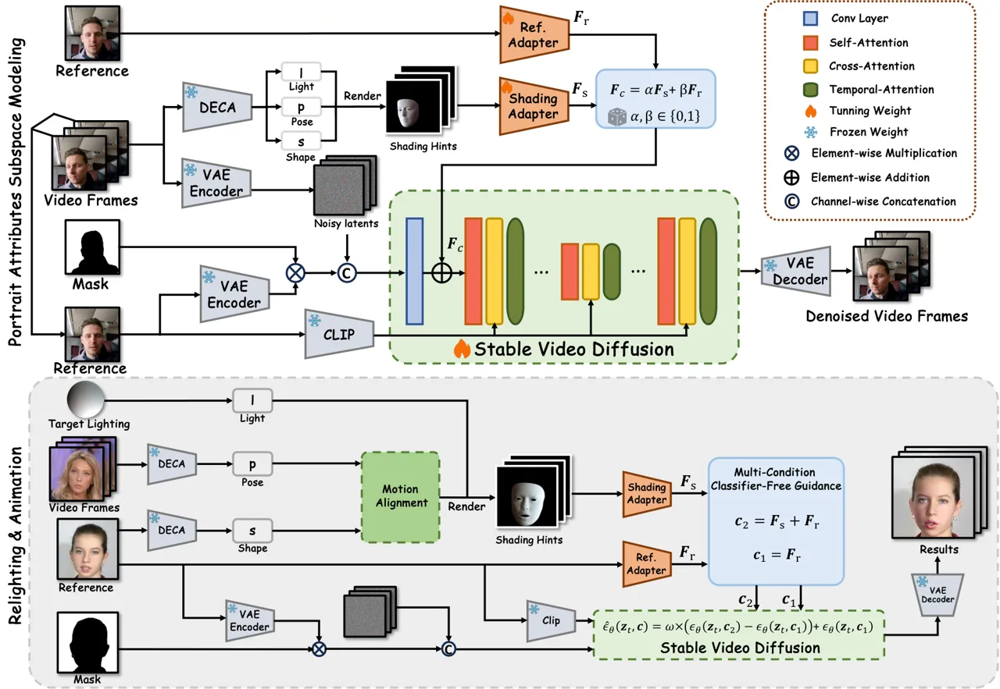
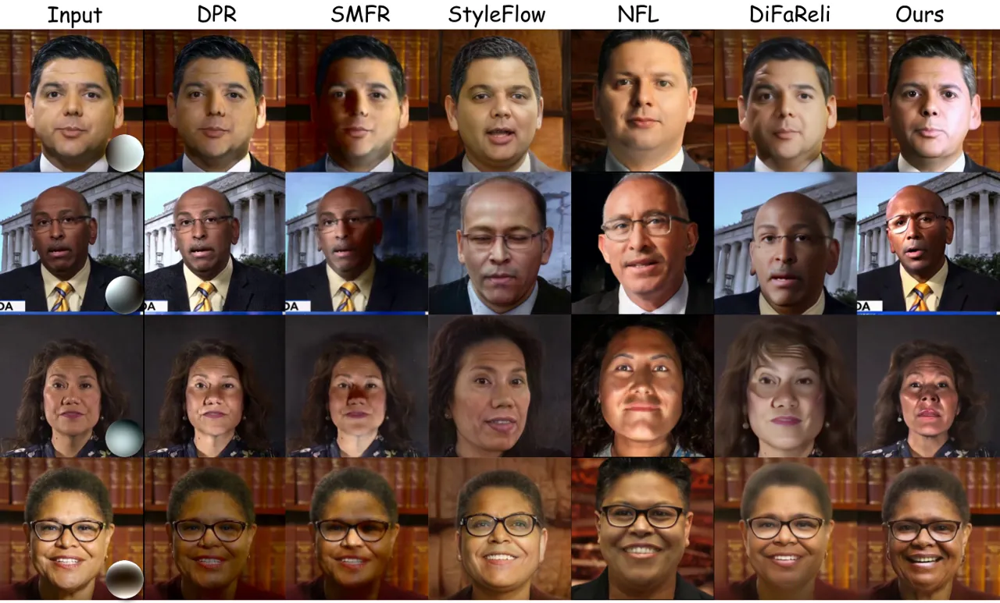
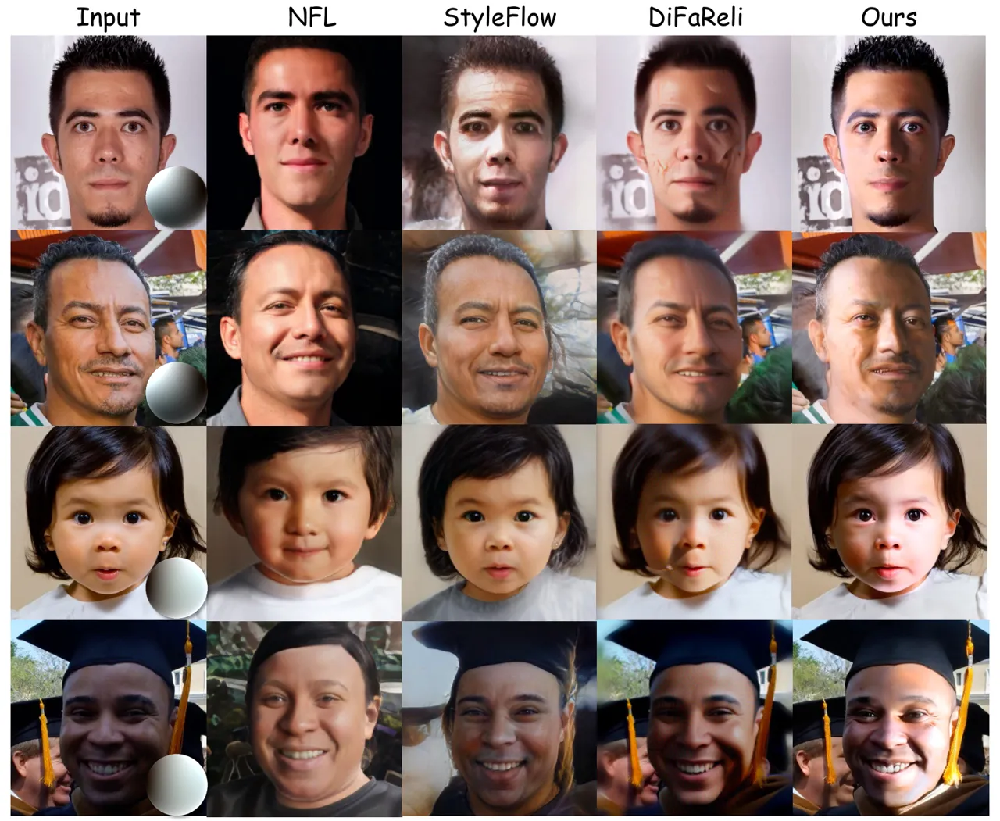
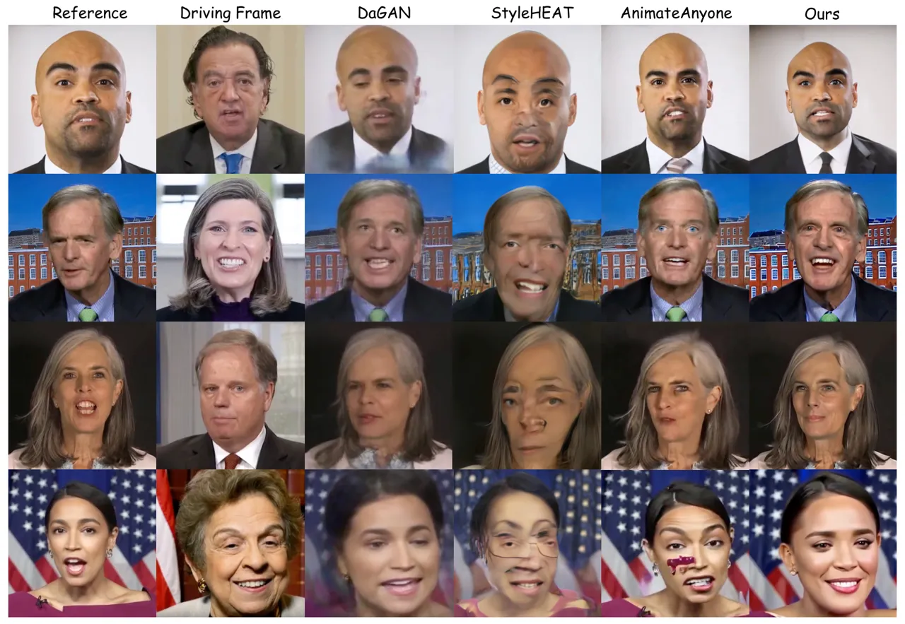
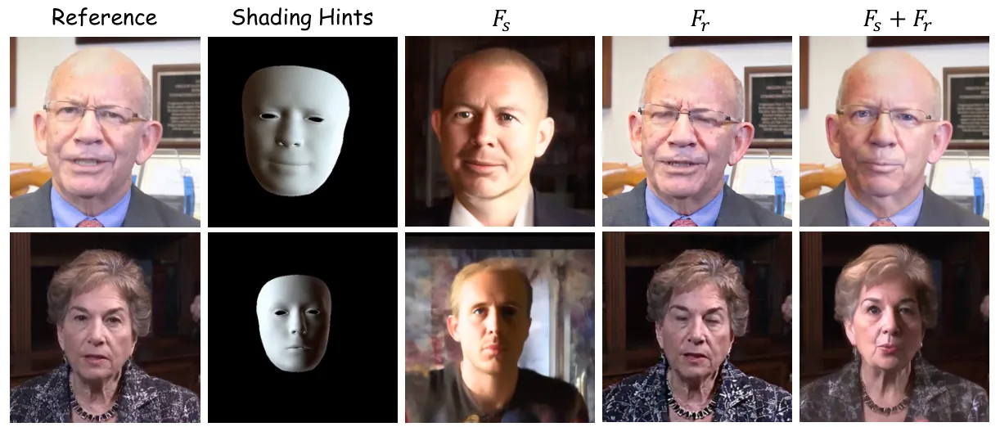
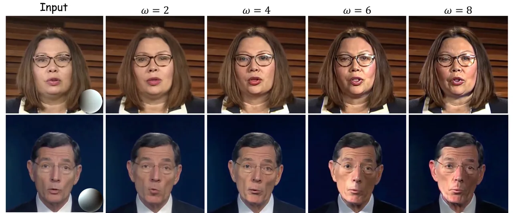
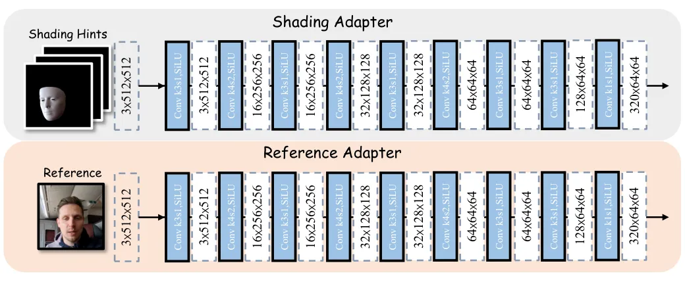

# High-Fidelity Relightable Monocular Portrait Animation with Lighting-Controllable Video Diffusion Model

Mingtao Guo Affiliation: National Key Laboratory of Fundamental Science
on Synthetic Vision, Sichuan University, Chengdu, China, 610065   
Guanyu Xing Affiliation: National Key Laboratory of Fundamental Science
on Synthetic Vision, Sichuan University, Chengdu, China, 610065    Yanli
Liu Affiliation: College of Computer Science, Sichuan University,
Chengdu, China, 610065mingtaoguo@stu.scu.edu.cn,{xingguanyu,
yanliliu}@scu.edu.cn

###### Abstract

Relightable portrait animation aims to animate a static reference
portrait to match the head movements and expressions of a driving video
while adapting to user-specified or reference lighting conditions.
Existing portrait animation methods fail to achieve relightable
portraits because they do not separate and manipulate intrinsic
(identity and appearance) and extrinsic (pose and lighting) features. In
this paper, we present a Lighting Controllable Video Diffusion model
(LCVD) for high-fidelity, relightable portrait animation. We address
this limitation by distinguishing these feature types through dedicated
subspaces within the feature space of a pre-trained image-to-video
diffusion model. Specifically, we employ the 3D mesh, pose, and
lighting-rendered shading hints of the portrait to represent the
extrinsic attributes, while the reference represents the intrinsic
attributes. In the training phase, we employ a reference adapter to map
the reference into the intrinsic feature subspace and a shading adapter
to map the shading hints into the extrinsic feature subspace. By merging
features from these subspaces, the model achieves nuanced control over
lighting, pose, and expression in generated animations. Extensive
evaluations show that LCVD outperforms state-of-the-art methods in
lighting realism, image quality, and video consistency, setting a new
benchmark in relightable portrait animation.

![[Uncaptioned
image]](arxiv-2502-19894--029268d9ae50.figures/figure-1.webp)

Figure 1: Qualitative results of our method. The target lighting is
applied to the meshes of the driving frames to generate shading hints.
Using the shading hints, our relightable portrait animation framework
animates and relights the reference frame, e.g., the results within the
solid boxes show lighting consistent with the target lighting and poses
consistent with the driving frames.

^(†)^(†)footnotetext: ^(†)Corresponding author: Yanli Liu.

## 1 Introduction

Portrait animation has wide applications in video conferencing, virtual
reality, and the film industry. With the rapid advancement of GANs \[15,
25, 26\] and Diffusion Models \[19, 45, 39\], existing portrait
animation methods \[59, 56, 16, 49, 11\] have demonstrated remarkable
capabilities in generating talking faces. For instance, the
state-of-the-art LivePortrait \[16\] achieves real-time, high-fidelity
portrait animation by designing better motion transformation and scaling
up the talking head datasets. However, the ability of manipulating
lighting during portrait animation remains under-explored, which is
highly important for seamlessly blending the generated foreground
portrait with backgrounds under varying lighting conditions.

In this paper, we focus on relightable portrait animation. We aim to
animate a portrait in a still reference image, matching the head
movement and facial expression of a driving video, at the same time,
matching the lighting condition provided by users or extracted from
another given portrait image. From the perspective of face attributes,
we can reduce the task to preserving the intrinsic features (identity
and appearance) of the reference portrait while effectively transferring
the extrinsic ones (given pose and lighting) to the reference portrait.
Obviously, the exact separation between intrinsic features and extrinsic
features is crucial to reach our goal. A main reason why existing
portrait animation methods can’t manipulate lighting is that they can’t
separately manipulate these two kinds of features.

In order to achieve high-fidelity relightable portrait animation, our
key idea is to distinguish these two types of features by learning their
feature subspaces, then maintain the intrinsic facial features and
transfer external features. We observe that the image-to-video (I2V)
diffusion model \[5\], trained on a large-scale dataset encompassing a
variety of portraits with different lighting, poses, identities and
appearances, provides a foundation for learning the two feature
subspaces. Specifically, we represent the portrait’s extrinsic
attributes using shading hints rendered with the reference image’s 3D
mesh, target lighting, and pose, while the intrinsic attributes are
represented by the reference image. During the self-supervised training
process, we design a shading adapter to map the shading hints into the
extrinsic feature subspace and a reference adapter to map the reference
image into the intrinsic feature subspace. By merging the features from
these two subspaces, the model generates portraits with specified
lighting, pose, identity, and appearance.

With the I2V diffusion model, we propose a novel Lighting Controllable
Video Diffusion model (LCVD) to achieve high-fidelity, relightable
portrait animation. First, we use an off-the-shelf model \[14\] to
extract the 3D mesh, pose, and spherical harmonics lighting coefficients
of the target portrait, which are rendered into shading hints containing
lighting and pose information. In the training stage, to enable pose
alignment and lighting control, we use a shading adapter to map these
shading hints to the extrinsic feature subspace, representing external
portrait attributes by establishing a mapping between the shading hints
and the target portrait. For identity and appearance preservation, we
use a reference adapter to map the reference image to the intrinsic
feature subspace, representing internal portrait attributes by creating
a mapping between an initial frame and subsequent frames. Finally,
during the inference stage, we merge the features from the two subspaces
and input them into the I2V diffusion model to generate portraits with
specified lighting, pose, identity, and appearance. To further control
the lighting magnitude, we employ multi-condition classifier-free
guidance to emphasize the influence of the shading adapter and reduces
the reference’s impact on relighting.

Our main contributions are listed as follows:

- •
  We introduce the Lighting Controllable Video Diffusion model, a
  diffusion-based framework for relightable portrait animation, which
  overcomes the limitations of current portrait animation methods that
  fail to manipulate lighting while animate the portrait.
- •
  We propose a shading adapter and a reference adapter to construct
  feature subspaces for extrinsic and intrinsic facial features. By
  merging these two subspaces, the I2V model is guided to achieve
  relightable portrait animation.
- •
  Extensive experiments demonstrate that LCVD surpasses state-of-the-art
  methods, showing significant improvements in metrics related to
  lighting effects, image quality, and video consistency.

## 2 Related Work

### 2.1 Portrait Relighting

Portrait relighting involves adjusting the lighting of an image or video
while preserving the subject’s identity and appearance. Previous methods
\[34, 46, 53\] utilized One-Light-at-a-Time (OLAT) systems to capture
detailed geometry and reflectance, achieving realistic relighting.
However, OLAT data is expensive and difficult to acquire, limiting its
practicality. To overcome this, recent approaches \[60, 21\] simulate
multi-lighting data and train networks for relighting. Despite these
efforts, simulated methods still lag behind the realism achieved by
OLAT-based techniques. Additionally, learning 3D face representations
from 2D images without explicit 3D supervision has now become feasible.
Recent method \[24\] combines neural radiance fields (NeRF) \[32\] with
generative models like GANs \[26\] and diffusion models \[39\] to
generate high-resolution, multi-view consistent face images.

Another simplified strategy \[33, 37\] involves capturing a selfie video
or a sequence of images to obtain multi-view information. However, the
rendering quality is highly dependent on the accuracy of the geometry,
requiring sufficient viewpoints from the video. Additionally, these
methods often need to be retrained for each new video, which makes them
impractical. In contrast, our method achieves high-fidelity and
temporally stable video portrait relighting, requiring only a single
portrait image and a target lighting.

### 2.2 Diffusion-based Portrait Animation

Denoising Diffusion Models \[19, 45\] are based on the idea of Markov
diffusion and fits the distribution of real samples by approximating a
standard normal distribution. They outperform GANs \[15\] in sample
diversity and quality, and have been successfully applied to image
synthesis \[27, 3, 54, 29, 41\], image editing \[2, 6\], and video
synthesis \[50, 10, 5\]. In portrait animation, FADM \[52\] refines
coarsely animated portraits generated by previous methods \[42, 43, 20\]
by combining 3DMM \[4\] parameters with a diffusion model to improve
appearance. Follow-Your-Emoji \[31\] instead uses expression-aware
landmarks within the Animate-Anyone framework \[22\] to guide the
animation process.

However, while diffusion-based portrait animation methods effectively
transfer poses from driving images to animate the reference image, they
cannot simultaneously manipulate the lighting of the portrait in the
reference image during the animation.

## 3 Preliminaries

The Latent Diffusion Model (LDM) \[39\] is designed to generate
high-quality, diverse images based on text prompts. It performs the
denoising process within the latent space of a Variational Autoencoder
(VAE) \[13\]. During training, the input image $`\mathbf{x}_{0}`$ is
first encoded into its latent representation
$`\mathbf{z}_{0}=\mathcal{E}(\mathbf{x}_{0})`$, where
$`\mathcal{E}(\cdot)`$ represents the frozen encoder. The resulting
latent code $`\mathbf{z}_{0}`$ is then perturbed as follows:

```math
\mathbf{z}_{t}=\sqrt{\bar{\alpha}_{t}}\mathbf{z}_{0}+\sqrt{1-\bar{\alpha}_{t}}\bm{\epsilon},\bm{\epsilon}\in\mathcal{N}(0,\bf{\textit{I}}), \tag{1}
```

where $`\bar{\alpha}_{t}=\prod_{i=1}^{t}(1-\beta_{t})`$ with
$`\beta_{t}`$ is the noise strength at step $`t`$, and $`t`$ is sampled
uniformly from $`\{1,\dots,T\}`$. This process is a Markov chain that
adds Gaussian noise to the latent code $`\mathbf{z}_{0}`$. The denoising
model $`\bm{\epsilon}_{\theta}`$ learns the latent space distribution by
optimizing the objective function using $`\mathbf{z}_{t}`$ as input,

```math
\mathcal{L}_{LDM}=\mathbb{E}_{\mathbf{z}_{0},\mathbf{c},\bm{\epsilon}\in\mathcal{N}(0,\mathbf{\textit{I}})}\left[\|\bm{\epsilon}-\bm{\epsilon}_{\theta}(\mathbf{z}_{t},t,\mathbf{c})\|^{2}_{2}\right], \tag{2}
```

where $`\mathbf{c}`$ represents the condition, which is the text
embedding encoded by the CLIP \[38\] text encoder provided by the user.

## 4 Methodology

### 4.1 Overview

Our pipeline for lighting controllable portrait animation consists of
two stages. First, in the training phase, we construct portrait
intrinsic and extrinsic feature subspaces within a pre-trained I2V
model’s feature space using two adapters. Then, in the relighting and
animation stage, we modify the extrinsic subspace and merge it with the
intrinsic subspace to achieve relightable portrait animation, as
illustrated in Fig. 2.

1.  1.  Portrait Attributes Subspace Modeling Stage: We employ an
        off-the-shelf model DECA \[14\] to encode each frame of the input
        video, extracting key parameters such as lighting, pose, and shape,
        which are then rendered as shading hints. After the shading hints
        and reference image are processed through the shading adapter and
        reference adapter, they are randomly selected, with each training
        iteration potentially including either one, both, or neither for
        composition (Sec. 4.2). The composed features are subsequently fed
        into the Stable Video Diffusion Model \[5\] for self-supervised
        training (Sec. 4.3). The goal of this stage is to model both the
        extrinsic and intrinsic feature subspaces through the joint
        optimization of two adapters.
2.  2.  Relighting and Animation Stage: We render the shading hints using
        the pose of the portrait from the video, the shape from the
        reference image, and the spherical harmonics coefficients of the
        target lighting. Then, we combine the outputs of the shading adapter
        and the reference adapter to form the conditional set and employ
        multi-condition classifier-free guidance to adjust the magnitude of
        the extrinsic feature guidance direction by modifying the strength
        of the guidance, thereby generating results for lighting
        controllable portrait animation (Sec. 4.4).



Figure 2: Overview of our pipeline for lighting controllable portrait
animation. It consists of two main stages: (1) Portrait Attributes
Subspace Modeling Stage: We use DECA to encode video frames and extract
lighting, pose, and shape parameters, which are rendered as shading
hints. After processing the shading hints and reference image through
the shading adapter and reference adapter, the two features are randomly
selected and fused as guidance to guide the Stable Video Diffusion Model
in generating denoised video frames with consistent lighting, pose,
identity, and appearance. (2) Relighting and Animation Stage: We render
the shading hints using the pose of the portrait from the video, the
shape from the reference image, and the spherical harmonics coefficients
of the target lighting. After processing the shading hints and reference
image through two adapters, we employ multi-condition classifier-free
guidance to adjust the magnitude of the extrinsic feature guidance
direction, enabling the generation of lighting controllable portrait
animations.

### 4.2 Portrait Attributes Subspace Modeling

Current portrait animation methods can be driven by user-provided pose
information. However, since portrait intrinsic and extrinsic features
are entangled during the self-supervised training process, manipulating
lighting requires modifying extrinsic features. This entanglement makes
it difficult to adjust lighting independently during portrait animation.
Therefore, separating portrait intrinsic and extrinsic features is a
significant challenge for enabling effective lighting control in
portrait animation.

To address this, we design a shading adapter and a reference adapter to
construct an extrinsic feature subspace, as well as an intrinsic feature
subspace within the SVD feature space during the training phase. First,
we use the parametric model $`\mathbf{FLAME}`$ \[30\] as a prior to
model the shape and pose attributes of human portraits.

```math
\mathbf{FLAME}(s,p,e)=\mathbb{R}^{|s|\times|p|\times|e|}\rightarrow\mathbb{R}^{m\times 3}, \tag{3}
```

which takes shape coefficients $`s\in\mathbb{R}^{|s|}`$, pose
$`p\in\mathbb{R}^{|p|}`$, and expression $`e\in\mathbb{R}^{|e|}`$ as
inputs to generate the corresponding 3D face mesh. We use DECA to
estimate these parameters, with the added benefit of DECA’s ability to
predict second-order spherical harmonics lighting coefficients
$`l\in\mathbb{R}^{|l|}`$. We then render the 3D face mesh using the
spherical harmonics to produce a lighting-shaded face, referred to as
shading hints.

We process the input video fragment into a sequence of shading hints,
which, together with the reference image, are independently transformed
by the shading and reference adapters into features $`\mathbf{F}_{s}`$
and $`\mathbf{F}_{r}`$. To establish these two feature subspaces,
$`\mathbf{F}_{s}`$ and $`\mathbf{F}_{r}`$ are recombined with random
coefficients
$`\left\{\alpha,\beta|\alpha,\beta\in\left\{0,1\right\}\right\}`$ and
input into the SVD. This method effectively enables the SVD to explore
both the extrinsic and intrinsic feature subspaces within its feature
space.

### 4.3 Lighting-Guided Video Diffusion Model

We choose the Stable Video Diffusion Model (SVD) \[5\] as the prior
model for our LCVD method. However, SVD is an image-guided video
generation model that takes an input image
$`I\in\mathbb{R}^{H\times W\times 3}`$. This image is first encoded by
CLIP’s vision encoder \[38\] and passed into SVD’s cross-attention
module. At the same time, the image is encoded by a Variational
Autoencoder (VAE) \[13\] into a latent representation
$`\mathbf{z}_{0}=\mathcal{E}(I)\in\mathbb{R}^{h\times w\times c}`$. This
latent $`\mathbf{z}_{0}`$ is then replicated $`T`$ times and
concatenated along the channel dimension with noise
$`\mathbf{\hat{z}}\in\mathbb{R}^{T\times h\times w\times c}`$, resulting
in $`\mathbf{z}_{t}\in\mathbb{R}^{T\times h\times w\times 2c}`$. The
resulting $`\mathbf{z}_{t}`$ is then input into a 3D UNet \[40\], which
progressively denoises the input to generate a video of $`T`$ frames.
Here, we set $`h=H/8`$, $`w=W/8`$, and $`c=4`$.

For instance, when an image of a dog walking on the street is input into
the SVD, the model predicts the next $`T`$ frames of the dog based on
the original image. As a result, the subsequent frames generated by SVD
inherit the objects and lighting conditions from the original image. To
eliminate the influence of the original image’s lighting on the
relighting results, as shown in Fig. 2, we use a mask to remove the
portrait from the latent space of the reference image.

During the training phase, we use a mask $`\mathcal{M}`$ to remove the
portrait, compensating for the loss of identity and appearance
information using the reference adapter. Additionally, we incorporate
each frame’s portrait mask into the loss function, encouraging the model
to focus more on the portrait region. The loss function is defined as
follows:

```math
\mathcal{L}_{p}=\mathbb{E}\left[\|\left(1-\mathcal{M}\right)\left(\bm{\epsilon}-\bm{\epsilon}_{\theta}\left(\mathbf{z}_{t},t,\mathbf{c}\right)\right)\|\right], \tag{4}
```

where
$`\bm{\epsilon}\sim\mathcal{N}(0,I)\in\mathbb{R}^{T\times h\times w\times c}`$,
and the portrait mask
$`\mathcal{M}\in\left\{0,1\right\}^{T\times h\times w\times c}`$.
Finally, the total loss is formulated as:

```math
\mathcal{L}=\mathcal{L}_{p}+\mathcal{L}_{LDM}. \tag{5}
```

### 4.4 Lighting Controllable Portrait Animation

In the relighting and animation stage, we incorporate the reference
image, video fragment, and target lighting. When the portrait in the
reference image corresponds to the same individual as that in the video
fragment, we utilize DECA to extract the pose information from the video
portrait and the shape information from the reference image,
subsequently rendering a sequence of shading hints based on the lighting
coefficients derived from the target lighting. However, in cases where
the portraits in the video and reference image do not represent the same
individual, we introduce a motion alignment module to mitigate the risk
of identity leakage from the video portrait, which could compromise the
quality of the generated output (for further details of motion
alignment, please refer to the supplementary materials).

Following this, we input the shading hints and the reference image into
the shading adapter and reference adapter. Given that the portrait in
the reference image inherently contains its own lighting information,
directly combining features may result in the original lighting
dominating the shading hints, leading to ineffective relighting. To
solve this, we adopt the concept of Composer \[23\]. This allows us to
achieve portrait lighting manipulation by adjusting the direction of the
lighting guidance within the set of conditions. The formula is as
follows:

```math
\hat{\bm{\epsilon}}_{\theta}(\mathbf{z}_{t},\mathbf{c})=\omega\left(\bm{\epsilon}_{\theta}(\mathbf{z}_{t},\mathbf{c}_{2})-\bm{\epsilon}_{\theta}(\mathbf{z}_{t},\mathbf{c}_{1})\right)+\bm{\epsilon}_{\theta}(\mathbf{z}_{t},\mathbf{c}_{1}), \tag{6}
```

here, $`\mathbf{c}_{1}`$ and $`\mathbf{c}_{2}`$ are two sets of
conditions. If a condition exists in $`\mathbf{c}_{2}`$ but not in
$`\mathbf{c}_{1}`$, its strength is enhanced by a weight $`\omega`$. The
larger $`\omega`$, the stronger the condition. If a condition exists in
both $`\mathbf{c}_{1}`$ and $`\mathbf{c}_{2}`$, $`\omega`$ has no
effect, and the condition strength defaults to 1.0. In this way, we can
set $`\mathbf{c}_{2}=\mathbf{F}_{s}+\mathbf{F}_{r}`$ and
$`\mathbf{c}_{1}=\mathbf{F}_{r}`$, where $`\mathbf{F}_{s}`$ and
$`\mathbf{F}_{r}`$ are the features from the shading adapter and
reference adapter. Since $`\mathbf{F}_{s}`$ is present in
$`\mathbf{c}_{2}`$ but not in $`\mathbf{c}_{1}`$, we can enhance the
strength of the extrinsic feature by adjusting $`\omega`$. At the same
time, because both $`\mathbf{c}_{1}`$ and $`\mathbf{c}_{2}`$ contain
$`\mathbf{F}_{r}`$, the reference image’s portrait features remain
intact. This allows us to achieve relightable portrait animation by
utilizing classifier-free guidance for condition combination.

## 5 Experiments

### 5.1 Implementation Details

Datasets. We train our model on the CelebV-HQ \[61\] and VFHQ \[48\]
datasets. Since the backbone of SVD \[5\] is sensitive to video quality,
we first evaluate each video in two datasets with the video quality
assessment method FasterVQA \[47\], and remove videos with scores lower
than 0.6. In the end, 37,644 videos remain for training. To ensure a
fair comparison in experiments, we evaluate our method on the portrait
video dataset HDTF \[58\] and FFHQ \[25\].

Training Details. During the training phase, for the temporal attention
layers of the SVD, we sample 16-frame video sequences to establish
temporal consistency, with each frame at a resolution of
$`512\times 512`$. Unlike methods such as \[22, 31\], which require two
separate training stages, we update all the weights of both the SVD and
two adapters simultaneously. The model is trained for 30,000 steps with
a batch size of 8 using gradient accumulation, optimized by 8bit-Adam
\[28\] with a learning rate of $`1\times 10^{-5}`$.

### 5.2 Metrics and Comparisons

Evaluation Metrics. To evaluate the performance of our method, following
\[8\], we relight the first 100 frames of each video in the HDTF
dataset. Each video is rendered with four distinct lighting conditions
derived from four different lighting-effect reference faces, resulting
in a total of 44,000 frames for comprehensive comparison. Following
\[24\], we use an off-the-shelf estimator \[14\] to calculate the
Lighting Error (LE). Arcface \[12\] is used to measure Identity
Preservation (ID) between the relit results and the original images. To
assess temporal consistency, we compute LPIPS \[55\] between adjacent
frames. We further employ an image quality assessment model \[9\] and a
video quality assessment model \[47\] to evaluate Image Quality (IQ) and
Video Quality (VQ), respectively. Additionally, Fréchet Inception
Distance (FID) \[17\] and Fréchet Video Distance (FVD) \[44\] are used
to measure video fidelity. In addition to objective evaluation, we
conduct a user study in which 17 participants rate the videos based on
three criteria: Lighting Accuracy (LA-User), Identity Similarity
(ID-User), and Video Quality (VQ-User). Each criterion is rated on a
scale of 1 to 5: poor, fair, average, good, and excellent. Finally, we
calculate the average score for each criterion across participants.

Comparative Methods. For the portrait relighting task, we conduct a
comparative analysis between LCVD and five state-of-the-art portrait
relighting methods: DPR \[60\], SMFR \[21\], NFL \[24\], StyleFlow
\[1\], and DiFaReli \[35\], evaluating performance on both the HDTF and
FFHQ datasets. For the portrait animation task, we compare LCVD with
three state-of-the-art portrait animation methods: DaGAN \[20\],
StyleHEAT \[51\], and AnimateAnyone \[22\], using the HDTF dataset for
evaluation.

|                 | Objective Evaluation |                |                     |                |                |                   |                   | User Study          |                     |                     |
| --------------- | -------------------- | -------------- | ------------------- | -------------- | -------------- | ----------------- | ----------------- | ------------------- | ------------------- | ------------------- |
| Methods         | LE$`\downarrow`$     | ID$`\uparrow`$ | LPIPS$`\downarrow`$ | IQ$`\uparrow`$ | VQ$`\uparrow`$ | FID$`\downarrow`$ | FVD$`\downarrow`$ | LA-User$`\uparrow`$ | ID-User$`\uparrow`$ | VQ-User$`\uparrow`$ |
| DPR \[60\]      | 0.768                | 0.730          | 0.0295              | 2.646          | 0.734          | 44.57             | 403.0             | 3.423               | 3.462               | 3.125               |
| SMFR \[21\]     | 0.747                | 0.601          | 0.0333              | 1.057          | 0.588          | 60.50             | 551.6             | 3.047               | 2.877               | 2.604               |
| NFL \[24\]      | 0.784                | 0.199          | 0.0823              | 2.586          | 0.766          | 96.17             | 819.3             | 2.894               | 2.553               | 2.398               |
| StyleFlow \[1\] | 0.932                | 0.474          | 0.1088              | 2.614          | 0.746          | 161.3             | 900.6             | 2.103               | 1.929               | 1.563               |
| DiFaReli \[35\] | 0.783                | 0.531          | 0.1152              | 1.103          | 0.458          | 57.49             | 743.2             | 3.141               | 2.592               | 2.284               |
| Ours            | 0.738                | 0.585          | 0.0282              | 3.034          | 0.775          | 37.46             | 273.3             | 3.534               | 4.000               | 3.398               |

Table 1: Quantitative comparison of portrait relighting with DPR, SMFR,
NFL, StyleFlow, and DiFaReli based on objective evaluation and user
study on the HDTF video dataset. The best scores are highlighted in
bold, and the second-best are underlined.

| Methods        | LE$`\downarrow`$ | ID$`\uparrow`$ | IQ$`\uparrow`$ | FID$`\downarrow`$ |
| -------------- | ---------------- | -------------- | -------------- | ----------------- |
| NFL\[24\]      | 0.892            | 0.253          | 3.020          | 118.9             |
| StyleFlow\[1\] | 1.042            | 0.485          | 3.846          | 102.7             |
| DiFaReli\[35\] | 0.749            | 0.687          | 1.591          | 25.98             |
| Ours           | 0.938            | 0.765          | 4.465          | 26.71             |

Table 2: Quantitative comparison of portrait relighting with NFL,
StyleFlow and DiFaReli on the FFHQ dataset. The best scores are
highlighted in bold, and the second-best are underlined.

| Methods       | ID$`\uparrow`$ | POSE$`\downarrow`$ | IQ$`\uparrow`$ | VQ$`\uparrow`$ | FID$`\downarrow`$ |
| ------------- | -------------- | ------------------ | -------------- | -------------- | ----------------- |
| DaGAN\[20\]   | 0.645          | 3.935              | 1.005          | 0.528          | 107.4             |
| StyHE.\[51\]  | 0.201          | 34.58              | 1.554          | 0.612          | 149.9             |
| AniAny.\[22\] | 0.806          | 5.086              | 2.744          | 0.706          | 69.85             |
| Ours          | 0.876          | 3.805              | 3.021          | 0.717          | 49.11             |

Table 3: Quantitative comparison of cross-identity portrait animation
with DaGAN, StyleHEAT, and AnimateAnyone on the HDTF dataset. The best
scores are highlighted in bold, and the second-best scores are
underlined.

### 5.3 Quantitative Evaluation

In portrait video relighting, Table 1 shows that our method outperforms
other state-of-the-art methods in all metrics except for ID.
Specifically, it improves video fidelity (FVD) by 32%, image fidelity
(FID) by 16%, and image quality (IQ) by 14.6% compared to the
second-best method, demonstrating excellent video quality. While our
method does not achieve the highest ID performance, this is because
relighting in our method is applied during portrait animation, where ID
information is derived only from the reference, unlike other methods
that relight each frame individually. However, our method achieves the
best ID performance in the user study, likely due to its higher-quality,
more stable video synthesis, which visually aligns with better ID
preservation. This also proves that the ID loss in our method is within
an acceptable range for human perception.

Since NFL \[24\], StyleFlow \[1\], and DiFaReli \[35\] are trained on
the aligned FFHQ facial dataset, we compare our method on 500 FFHQ
images for a fair evaluation. As shown in Table 2, our method
outperforms the second-best method in identity preservation (ID) by
11.4% and image quality (IQ) by 16.1%. However, it does not achieve the
best performance in lighting error (LE) and image fidelity (FID) because
these methods are trained on FFHQ, while our model is trained on
different video datasets, resulting in slightly lower lighting and
fidelity performance. Notably, since our method is designed for video
sequences and FFHQ is an image dataset, we replicate each image 16 times
to form a video sequence in order to adapt the method for image testing.

In addition to portrait relighting, we use the lighting and shape from
the reference image and the pose from the driving image to render
shading hints, guiding our model to achieve cross-identity portrait
animation, which we then evaluate. Beyond the previously mentioned
metrics, we incorporate a POSE metric to assess the pose accuracy of the
animated portraits, ensuring alignment with the poses in the driving
video. The POSE evaluation method follows that of \[43\], using a facial
landmark detection model \[7\] to measure the pose error between the
animated portraits and the driving portraits based on facial keypoints.
As shown in Table 3, our method outperforms the other methods in all
metrics, particularly achieving a 29.7% improvement in image fidelity
(FID), a 10.1% improvement in image quality (IQ), and an 8.7%
improvement in identity preservation (ID) compared to the second-best
method.



Figure 3: Qualitative comparisons with DPR \[60\], SMFR \[21\],
StyleFlow \[1\], NFL \[24\], and DiFaReli \[35\]. The first column shows
the input video frames, and the remaining columns present relighted
results under various lighting conditions. Our method demonstrates more
realistic performance, particularly in challenging cases such as side
lighting.



Figure 4: Qualitative comparison of portrait relighting with NFL \[24\],
StyleFlow \[1\], and DiFaReli \[35\] on the FFHQ dataset \[25\]. The
first column shows the input FFHQ portrait images, and the remaining
column display the relighted results under various lighting conditions.
Our method demonstrates more realistic results.



Figure 5: Qualitative comparison of cross-identity portrait animation
with DaGAN \[20\], StyleHEAT \[51\] and AnimateAnyone \[22\] on the HDTF
dataset. Our method demonstrates more lifelike results.



Figure 6: Ablation study comparing the performance of our model in
portrait generation under different adapter combinations. $`F_{s}`$
represents using only the shading adapter, $`F_{r}`$ represents using
only the reference adapter, and $`F_{s}+F_{r}`$ represents using both
adapters together.



Figure 7: Ablation study comparing our model with varying strengths of
multi-condition classifier-free guidance $`\omega`$. As $`\omega`$
increases, the relighting effect increasingly aligns with the target
lighting; however, this comes at the cost of some loss of identity
information and a decrease in image quality.

### 5.4 Qualitative Evaluation

We compare our approach with previous portrait relighting methods on the
HDTF dataset, including state-of-the-art face alignment-based approaches
such as StyleFlow \[1\], NFL \[24\], and DiFaReli \[35\]. Additionally,
we compare our method with face alignment-free methods like DPR \[60\]
and SMFR \[21\]. The results are shown in Fig. 3. We find that face
alignment-based methods easily suffer from background detail loss and
identity degradation, especially in pre-trained StyleGAN-based \[26\]
methods like StyleFlow and NFL (e.g., see the results in the fourth and
fifth columns, where the background details are completely lost, and the
facial identity is inconsistent with the input). On the other hand,
DiFaReli, based on a pre-trained diffusion model \[36\], benefits from
the DDIM inverse \[45\] method, which successfully reconstructs
background details and preserves identity; however, it introduces
noticeable artifacts on the face.

Although face alignment-free methods like DPR and SMFR achieve
relighting without losing background and facial identity, the trade-off
is a significant reduction in image quality, with the lighting appearing
unnatural, as if a shadow has been cast over the image (e.g., in the
first and second rows of the third column for SMFR). In contrast, our
method in the final column greatly outperforms others in both image
quality and the realism of the lighting effects. Notably, our approach
accurately renders specular reflections on the face and eyes, as well as
realistic shadows cast by facial muscles, while keeping identity loss
within acceptable limits. The background details are also largely
preserved. Overall, our approach demonstrates superior capability.

Since NFL, StyleFlow, and DiFaReli are trained on the aligned FFHQ
dataset, we visualize the relighting results on FFHQ for a fair
comparison. As shown in Fig. 4, NFL and StyleFlow lose background
details and alter the portrait identity. DiFaReli preserves background
details but introduces facial artifacts, lowering image quality. In
contrast, our method maintains background details and identity
consistency, achieving optimal image quality.

Additionally, we compare our method with DaGAN, StyleHEAT, and
AnimateAnyone for portrait animation. As shown in Fig. 5, while DaGAN
preserves the pose from the driving frame, the portrait identity differs
significantly from the reference, and the image quality is low.
StyleHEAT introduces distortions in cross-identity portrait animation,
and although AnimateAnyone, a diffusion model guided by a reference-net,
generates higher image quality, it still suffers from identity loss and
occasional facial artifacts.

### 5.5 Ablation Study

Effectiveness of Adapters. Our method constructs intrinsic and extrinsic
feature subspaces using the reference and shading adapters,
respectively, enabling relightable portrait animation by merging these
subspaces. We conduct an ablation study with different adapter
combinations. First, when retaining only the shading adapter as shown in
Fig. 6, the column labeled $`F_{s}`$ illustrates that the generated
portrait’s pose and lighting align with the shading hints, indicating
that only the extrinsic features are transferred. When only the
reference adapter is used, the column labeled $`F_{r}`$ shows that the
generated portrait closely resembles the reference with only minor
variations, such as blinking, indicating intrinsic feature preservation.
When both adapters are used, the column labeled $`F_{s}+F_{r}`$
demonstrates that the generated portrait not only matches the pose and
lighting of the shading hints but also maintains the identity and
appearance of the reference.

Effectiveness of Guidance Strength. In Fig. 7, we visualize the
relighting results for different $`\omega`$ values. When $`\omega=2`$,
the lighting effect is minimal, with only small differences from the
input image, resulting in good identity retention. In contrast, when
$`\omega=8`$, the lighting effect closely aligns with the target
lighting, but this also leads to reduced image quality and some loss of
identity retention. The primary reason for this phenomenon is that as
$`\omega`$ increases, the proportion of extrinsic features grows, while
the proportion of intrinsic features diminishes, resulting in a
degradation of identity information from the reference image.
Consequently, higher values of $`\omega`$ enhance lighting effects but
lead to greater identity loss.

## 6 Conclusion

In this paper, we introduce the Lighting Controllable Video Diffusion
model (LCVD) for high-fidelity, relightable portrait animation. By
distinguishing between intrinsic and extrinsic facial features, our
approach effectively preserves identity and appearance while enabling
precise control over lighting and pose. We propose a novel framework
that leverages reference and shading adapters to construct feature
subspaces and incorporates multi-condition classifier-free guidance to
fine-tune the lighting effects. Our extensive experimental results
demonstrate that LCVD outperforms existing methods, providing
significant improvements in lighting realism, image quality, and video
consistency.

## References

- \[1\] Rameen Abdal, Peihao Zhu, Niloy J. Mitra, and Peter Wonka.
  Styleflow: Attribute-conditioned exploration of stylegan-generated
  images using conditional continuous normalizing flows. _ACM Trans.
  Graph._, 40(3), 2021.
- \[2\] Omri Avrahami, Ohad Fried, and Dani Lischinski. Blended latent
  diffusion. _ACM Transactions on Graphics (TOG)_, 42(4):1–11, 2023a.
- \[3\] Omri Avrahami, Thomas Hayes, Oran Gafni, Sonal Gupta, Yaniv
  Taigman, Devi Parikh, Dani Lischinski, Ohad Fried, and Xi Yin.
  Spatext: Spatio-textual representation for controllable image
  generation. In _Proceedings of the IEEE/CVF Conference on Computer
  Vision and Pattern Recognition_, pages 18370–18380, 2023b.
- \[4\] Volker Blanz and Thomas Vetter. A morphable model for the
  synthesis of 3d faces. In _Proceedings of the 26th annual conference
  on Computer graphics and interactive techniques_, pages 187–194, 1999.
- \[5\] Andreas Blattmann, Tim Dockhorn, Sumith Kulal, Daniel
  Mendelevitch, Maciej Kilian, Dominik Lorenz, Yam Levi, Zion English,
  Vikram Voleti, Adam Letts, et al. Stable video diffusion: Scaling
  latent video diffusion models to large datasets. _arXiv preprint
  arXiv:2311.15127_, 2023.
- \[6\] Tim Brooks, Aleksander Holynski, and Alexei A Efros.
  Instructpix2pix: Learning to follow image editing instructions. In
  _Proceedings of the IEEE/CVF Conference on Computer Vision and Pattern
  Recognition_, pages 18392–18402, 2023.
- \[7\] Adrian Bulat and Georgios Tzimiropoulos. How far are we from
  solving the 2d & 3d face alignment problem? (and a dataset of 230,000
  3d facial landmarks). In _International Conference on Computer
  Vision_, 2017.
- \[8\] Ziqi Cai, Kaiwen Jiang, Shu-Yu Chen, Yu-Kun Lai, Hongbo Fu,
  Boxin Shi, and Lin Gao. Real-time 3d-aware portrait video relighting.
  In _Proceedings of the IEEE/CVF Conference on Computer Vision and
  Pattern Recognition_, pages 6221–6231, 2024.
- \[9\] Chaofeng Chen and Jiadi Mo. IQA-PyTorch: Pytorch toolbox for
  image quality assessment. \[Online\]. Available:
  [https://github.com/chaofengc/IQA-PyTorch](https://github.com/chaofengc/IQA-PyTorch), 2022.
- \[10\] Haoxin Chen, Yong Zhang, Xiaodong Cun, Menghan Xia, Xintao
  Wang, Chao Weng, and Ying Shan. Videocrafter2: Overcoming data
  limitations for high-quality video diffusion models. In _Proceedings
  of the IEEE/CVF Conference on Computer Vision and Pattern
  Recognition_, pages 7310–7320, 2024a.
- \[11\] Zhiyuan Chen, Jiajiong Cao, Zhiquan Chen, Yuming Li, and
  Chenguang Ma. Echomimic: Lifelike audio-driven portrait animations
  through editable landmark conditions. _arXiv preprint
  arXiv:2407.08136_, 2024b.
- \[12\] Jiankang Deng, Jia Guo, Niannan Xue, and Stefanos Zafeiriou.
  Arcface: Additive angular margin loss for deep face recognition. In
  _Proceedings of the IEEE Conference on Computer Vision and Pattern
  Recognition_, pages 4690–4699, 2019.
- \[13\] Patrick Esser, Robin Rombach, and Bjorn Ommer. Taming
  transformers for high-resolution image synthesis. In _Proceedings of
  the IEEE/CVF conference on computer vision and pattern recognition_,
  pages 12873–12883, 2021.
- \[14\] Yao Feng, Haiwen Feng, Michael J Black, and Timo Bolkart.
  Learning an animatable detailed 3d face model from in-the-wild images.
  _ACM Transactions on Graphics (ToG)_, 40(4):1–13, 2021.
- \[15\] Ian Goodfellow, Jean Pouget-Abadie, Mehdi Mirza, Bing Xu, David
  Warde-Farley, Sherjil Ozair, Aaron Courville, and Yoshua Bengio.
  Generative adversarial nets. _Advances in neural information
  processing systems_, 27, 2014.
- \[16\] Jianzhu Guo, Dingyun Zhang, Xiaoqiang Liu, Zhizhou Zhong, Yuan
  Zhang, Pengfei Wan, and Di Zhang. Liveportrait: Efficient portrait
  animation with stitching and retargeting control. _arXiv preprint
  arXiv:2407.03168_, 2024.
- \[17\] Martin Heusel, Hubert Ramsauer, Thomas Unterthiner, Bernhard
  Nessler, and Sepp Hochreiter. Gans trained by a two time-scale update
  rule converge to a local nash equilibrium. _Advances in neural
  information processing systems_, 30, 2017.
- \[18\] Jonathan Ho and Tim Salimans. Classifier-free diffusion
  guidance. _arXiv preprint arXiv:2207.12598_, 2022.
- \[19\] Jonathan Ho, Ajay Jain, and Pieter Abbeel. Denoising diffusion
  probabilistic models. _Advances in neural information processing
  systems_, 33:6840–6851, 2020.
- \[20\] Fa-Ting Hong, Longhao Zhang, Li Shen, and Dan Xu. Depth-aware
  generative adversarial network for talking head video generation. In
  _Proceedings of the IEEE/CVF conference on computer vision and pattern
  recognition_, pages 3397–3406, 2022.
- \[21\] Andrew Hou, Ze Zhang, Michel Sarkis, Ning Bi, Yiying Tong, and
  Xiaoming Liu. Towards high fidelity face relighting with realistic
  shadows. In _Proceedings of the IEEE/CVF conference on computer vision
  and pattern recognition_, pages 14719–14728, 2021.
- \[22\] Li Hu. Animate anyone: Consistent and controllable
  image-to-video synthesis for character animation. In _Proceedings of
  the IEEE/CVF Conference on Computer Vision and Pattern Recognition_,
  pages 8153–8163, 2024.
- \[23\] Lianghua Huang, Di Chen, Yu Liu, Yujun Shen, Deli Zhao, and
  Jingren Zhou. Composer: Creative and controllable image synthesis with
  composable conditions. In _International Conference on Machine
  Learning_, pages 13753–13773. PMLR, 2023.
- \[24\] Kaiwen Jiang, Shu-Yu Chen, Hongbo Fu, and Lin Gao.
  Nerffacelighting: Implicit and disentangled face lighting
  representation leveraging generative prior in neural radiance fields.
  _ACM Transactions on Graphics (TOG)_, 2023.
- \[25\] Tero Karras, Samuli Laine, and Timo Aila. A style-based
  generator architecture for generative adversarial networks. In
  _Proceedings of the IEEE/CVF conference on computer vision and pattern
  recognition_, pages 4401–4410, 2019.
- \[26\] Tero Karras, Samuli Laine, Miika Aittala, Janne Hellsten,
  Jaakko Lehtinen, and Timo Aila. Analyzing and improving the image
  quality of stylegan. In _Proceedings of the IEEE/CVF conference on
  computer vision and pattern recognition_, pages 8110–8119, 2020.
- \[27\] Bahjat Kawar, Shiran Zada, Oran Lang, Omer Tov, Huiwen Chang,
  Tali Dekel, Inbar Mosseri, and Michal Irani. Imagic: Text-based real
  image editing with diffusion models. In _Proceedings of the IEEE/CVF
  Conference on Computer Vision and Pattern Recognition_, pages
  6007–6017, 2023.
- \[28\] Diederik P Kingma. Adam: A method for stochastic optimization.
  _arXiv preprint arXiv:1412.6980_, 2014.
- \[29\] Nupur Kumari, Bingliang Zhang, Richard Zhang, Eli Shechtman,
  and Jun-Yan Zhu. Multi-concept customization of text-to-image
  diffusion. In _Proceedings of the IEEE/CVF Conference on Computer
  Vision and Pattern Recognition_, pages 1931–1941, 2023.
- \[30\] Tianye Li, Timo Bolkart, Michael J Black, Hao Li, and Javier
  Romero. Learning a model of facial shape and expression from 4d scans.
  _ACM Trans. Graph._, 36(6):194–1, 2017.
- \[31\] Yue Ma, Hongyu Liu, Hongfa Wang, Heng Pan, Yingqing He, Junkun
  Yuan, Ailing Zeng, Chengfei Cai, Heung-Yeung Shum, Wei Liu, et al.
  Follow-your-emoji: Fine-controllable and expressive freestyle portrait
  animation. _arXiv preprint arXiv:2406.01900_, 2024.
- \[32\] Ben Mildenhall, Pratul P Srinivasan, Matthew Tancik, Jonathan T
  Barron, Ravi Ramamoorthi, and Ren Ng. Nerf: Representing scenes as
  neural radiance fields for view synthesis. _Communications of the
  ACM_, 65(1):99–106, 2021.
- \[33\] Thomas Nestmeyer, Jean-François Lalonde, Iain Matthews, and
  Andreas Lehrmann. Learning physics-guided face relighting under
  directional light. In _Proceedings of the IEEE/CVF Conference on
  Computer Vision and Pattern Recognition_, pages 5124–5133, 2020.
- \[34\] Rohit Pandey, Sergio Orts-Escolano, Chloe Legendre, Christian
  Haene, Sofien Bouaziz, Christoph Rhemann, Paul E Debevec, and
  Sean Ryan Fanello. Total relighting: learning to relight portraits for
  background replacement. _ACM Trans. Graph._, 40(4):43–1, 2021.
- \[35\] Puntawat Ponglertnapakorn, Nontawat Tritrong, and Supasorn
  Suwajanakorn. Difareli: Diffusion face relighting. In _Proceedings of
  the IEEE/CVF International Conference on Computer Vision_, pages
  22646–22657, 2023.
- \[36\] Konpat Preechakul, Nattanat Chatthee, Suttisak Wizadwongsa, and
  Supasorn Suwajanakorn. Diffusion autoencoders: Toward a meaningful and
  decodable representation. In _IEEE Conference on Computer Vision and
  Pattern Recognition (CVPR)_, 2022.
- \[37\] Haonan Qiu, Zhaoxi Chen, Yuming Jiang, Hang Zhou, Xiangyu Fan,
  Lei Yang, Wayne Wu, and Ziwei Liu. Relitalk: Relightable talking
  portrait generation from a single video. _International Journal of
  Computer Vision_, pages 1–16, 2024.
- \[38\] Alec Radford, Jong Wook Kim, Chris Hallacy, Aditya Ramesh,
  Gabriel Goh, Sandhini Agarwal, Girish Sastry, Amanda Askell, Pamela
  Mishkin, Jack Clark, et al. Learning transferable visual models from
  natural language supervision. In _International conference on machine
  learning_, pages 8748–8763. PMLR, 2021.
- \[39\] Robin Rombach, Andreas Blattmann, Dominik Lorenz, Patrick
  Esser, and Björn Ommer. High-resolution image synthesis with latent
  diffusion models. In _Proceedings of the IEEE/CVF conference on
  computer vision and pattern recognition_, pages 10684–10695, 2022.
- \[40\] Olaf Ronneberger, Philipp Fischer, and Thomas Brox. U-net:
  Convolutional networks for biomedical image segmentation. In _Medical
  image computing and computer-assisted intervention–MICCAI 2015: 18th
  international conference, Munich, Germany, October 5-9, 2015,
  proceedings, part III 18_, pages 234–241. Springer, 2015.
- \[41\] Nataniel Ruiz, Yuanzhen Li, Varun Jampani, Yael Pritch, Michael
  Rubinstein, and Kfir Aberman. Dreambooth: Fine tuning text-to-image
  diffusion models for subject-driven generation. In _Proceedings of the
  IEEE/CVF Conference on Computer Vision and Pattern Recognition_, pages
  22500–22510, 2023.
- \[42\] Aliaksandr Siarohin, Stéphane Lathuilière, Sergey Tulyakov,
  Elisa Ricci, and Nicu Sebe. First order motion model for image
  animation. _Advances in neural information processing systems_,
  32, 2019.
- \[43\] Aliaksandr Siarohin, Oliver J Woodford, Jian Ren, Menglei Chai,
  and Sergey Tulyakov. Motion representations for articulated animation.
  In _Proceedings of the IEEE/CVF Conference on Computer Vision and
  Pattern Recognition_, pages 13653–13662, 2021.
- \[44\] Ivan Skorokhodov, Sergey Tulyakov, and Mohamed Elhoseiny.
  Stylegan-v: A continuous video generator with the price, image quality
  and perks of stylegan2. In _Proceedings of the IEEE/CVF conference on
  computer vision and pattern recognition_, pages 3626–3636, 2022.
- \[45\] Jiaming Song, Chenlin Meng, and Stefano Ermon. Denoising
  diffusion implicit models. _arXiv preprint arXiv:2010.02502_, 2020.
- \[46\] Tiancheng Sun, Jonathan T Barron, Yun-Ta Tsai, Zexiang Xu,
  Xueming Yu, Graham Fyffe, Christoph Rhemann, Jay Busch, Paul Debevec,
  and Ravi Ramamoorthi. Single image portrait relighting. _ACM
  Transactions on Graphics (TOG)_, 38(4):1–12, 2019.
- \[47\] Haoning Wu, Chaofeng Chen, Liang Liao, Jingwen Hou, Wenxiu Sun,
  Qiong Yan, Jinwei Gu, and Weisi Lin. Neighbourhood representative
  sampling for efficient end-to-end video quality assessment. _IEEE
  Transactions on Pattern Analysis and Machine Intelligence_, 2023.
- \[48\] Liangbin Xie, Xintao Wang, Honglun Zhang, Chao Dong, and Ying
  Shan. Vfhq: A high-quality dataset and benchmark for video face
  super-resolution. In _Proceedings of the IEEE/CVF Conference on
  Computer Vision and Pattern Recognition_, pages 657–666, 2022.
- \[49\] You Xie, Hongyi Xu, Guoxian Song, Chao Wang, Yichun Shi, and
  Linjie Luo. X-portrait: Expressive portrait animation with
  hierarchical motion attention. In _ACM SIGGRAPH 2024 Conference
  Papers_, pages 1–11, 2024.
- \[50\] Zhuoyi Yang, Jiayan Teng, Wendi Zheng, Ming Ding, Shiyu Huang,
  Jiazheng Xu, Yuanming Yang, Wenyi Hong, Xiaohan Zhang, Guanyu Feng,
  et al. Cogvideox: Text-to-video diffusion models with an expert
  transformer. _arXiv preprint arXiv:2408.06072_, 2024.
- \[51\] Fei Yin, Yong Zhang, Xiaodong Cun, Mingdeng Cao, Yanbo Fan,
  Xuan Wang, Qingyan Bai, Baoyuan Wu, Jue Wang, and Yujiu Yang.
  Styleheat: One-shot high-resolution editable talking face generation
  via pre-trained stylegan. In _European conference on computer vision_,
  pages 85–101. Springer, 2022.
- \[52\] Bohan Zeng, Xuhui Liu, Sicheng Gao, Boyu Liu, Hong Li,
  Jianzhuang Liu, and Baochang Zhang. Face animation with an
  attribute-guided diffusion model. In _Proceedings of the IEEE/CVF
  Conference on Computer Vision and Pattern Recognition_, pages
  628–637, 2023.
- \[53\] Longwen Zhang, Qixuan Zhang, Minye Wu, Jingyi Yu, and Lan Xu.
  Neural video portrait relighting in real-time via consistency
  modeling. In _Proceedings of the IEEE/CVF international conference on
  computer vision_, pages 802–812, 2021a.
- \[54\] Lvmin Zhang, Anyi Rao, and Maneesh Agrawala. Adding conditional
  control to text-to-image diffusion models. In _Proceedings of the
  IEEE/CVF International Conference on Computer Vision_, pages
  3836–3847, 2023a.
- \[55\] Richard Zhang, Phillip Isola, Alexei A Efros, Eli Shechtman,
  and Oliver Wang. The unreasonable effectiveness of deep features as a
  perceptual metric. In _CVPR_, 2018.
- \[56\] Wenxuan Zhang, Xiaodong Cun, Xuan Wang, Yong Zhang, Xi Shen, Yu
  Guo, Ying Shan, and Fei Wang. Sadtalker: Learning realistic 3d motion
  coefficients for stylized audio-driven single image talking face
  animation. In _Proceedings of the IEEE/CVF Conference on Computer
  Vision and Pattern Recognition_, pages 8652–8661, 2023b.
- \[57\] Yuang Zhang, Jiaxi Gu, Li-Wen Wang, Han Wang, Junqi Cheng,
  Yuefeng Zhu, and Fangyuan Zou. Mimicmotion: High-quality human motion
  video generation with confidence-aware pose guidance. _arXiv preprint
  arXiv:2406.19680_, 2024.
- \[58\] Zhimeng Zhang, Lincheng Li, Yu Ding, and Changjie Fan.
  Flow-guided one-shot talking face generation with a high-resolution
  audio-visual dataset. In _Proceedings of the IEEE/CVF Conference on
  Computer Vision and Pattern Recognition_, pages 3661–3670, 2021b.
- \[59\] Jian Zhao and Hui Zhang. Thin-plate spline motion model for
  image animation. In _Proceedings of the IEEE/CVF Conference on
  Computer Vision and Pattern Recognition_, pages 3657–3666, 2022.
- \[60\] Hao Zhou, Sunil Hadap, Kalyan Sunkavalli, and David W Jacobs.
  Deep single-image portrait relighting. In _Proceedings of the IEEE/CVF
  international conference on computer vision_, pages 7194–7202, 2019.
- \[61\] Hao Zhu, Wayne Wu, Wentao Zhu, Liming Jiang, Siwei Tang, Li
  Zhang, Ziwei Liu, and Chen Change Loy. Celebv-hq: A large-scale video
  facial attributes dataset. In _European conference on computer
  vision_, pages 650–667. Springer, 2022.

Supplementary Material

## 7 Ablation Study

Effectiveness of Adapters. The shading adapter maps shading hints to the
extrinsic feature subspace, while the reference adapter maps the
reference to the intrinsic feature subspace. The combination of features
from these different subspaces enables various effects, such as
controlling lighting magnitude, maintaining identity, and enhancing
image generation quality. To investigate the effectiveness of these
adapters, we conducted an ablation study with different adapter
combinations.

First, we retain only the reference adapter, as shown in Table 4 under
the row $`F_{r}`$. In this case, the lighting error is significant (LE
is large), while identity preservation is excellent (ID is high). This
indicates that the model preserves intrinsic features well but fails to
capture extrinsic features. Conversely, when we retain only the shading
adapter, as shown in the row $`F_{s}`$, the lighting error is minimal
(LE is small), but identity preservation is almost nonexistent (ID
approaches 0). This suggests that the model transfers extrinsic features
effectively while neglecting intrinsic features.

When both adapters are retained, we observe significant improvements in
intrinsic feature preservation compared to using only the shading
adapter and significant improvements in extrinsic feature transfer
compared to using only the reference adapter. Moreover, the image
quality also achieves its optimal level under this configuration.

Effectiveness of Guidance Strength. This method utilizes a
multi-condition classifier-free guidance approach to control the
lighting magnitude through the classifier-free guidance mechanism
\[18\]. The strength of the guidance, represented by $`\omega`$,
directly affects the lighting intensity.

To evaluate the impact of $`\omega`$, we conduct an ablation study with
varying values, as shown in Table 5. As $`\omega`$ increases, the
lighting effect improves (LE decreases), but identity preservation
deteriorates (ID decreases). Notably, image quality reaches its peak at
$`\omega=4`$. However, setting $`\omega`$ too high can lead to a decline
in image quality. Therefore, lighting effects, identity preservation,
and image quality can be balanced by appropriately adjusting the value
of $`\omega`$.

| Methods         | LE$`\downarrow`$ | ID$`\uparrow`$ | IQ$`\uparrow`$ | FID$`\downarrow`$ |
| --------------- | ---------------- | -------------- | -------------- | ----------------- |
| $`F_{r}`$       | 1.071            | 0.802          | 1.662          | 35.61             |
| $`F_{s}`$       | 0.582            | 0.028          | 1.248          | 56.63             |
| $`F_{s}+F_{r}`$ | 0.738            | 0.585          | 3.034          | 37.46             |

Table 4: Quantitative comparison of ablation study with different
adapter combinations on the HDTF dataset. $`F_{r}`$ denotes using only
the reference adapter, $`F_{s}`$ denotes using only the shading adapter,
and $`F_{s}+F_{r}`$ represents using both adapters. The best scores are
highlighted in bold, and the second-best are underlined.

| Methods          | $`\omega=2`$ | $`\omega=4`$ | $`\omega=6`$ | $`\omega=8`$ |
| ---------------- | ------------ | ------------ | ------------ | ------------ |
| LE$`\downarrow`$ | 1.079        | 0.809        | 0.744        | 0.681        |
| ID$`\uparrow`$   | 0.728        | 0.603        | 0.563        | 0.503        |
| IQ$`\uparrow`$   | 2.611        | 2.988        | 2.954        | 2.856        |

Table 5: Quantitative comparison of the ablation study on the impact of
different guidance strengths $`\omega`$ on lighting (LE), identity (ID),
and image quality (IQ) on the HDTF dataset. From left to right, each
metric is shown as it changes with increasing $`\omega`$. The best
scores are highlighted in bold, and the second-best are underlined.

## 8 Motion Alignment

As shown in Fig. 2, during the relighting and animation stages, we use a
video to animate the reference image, ensuring that the lighting effect
of the relit portrait is consistent with that of the target lighting. In
the inference stage, since the portrait in the video and the reference
image come from different identities, directly using the shading hints
of the portrait from the video to animate the reference image would
cause the generated portrait to resemble the one from the driving video.
This leads to identity leakage during animation, degrading the animation
quality. We propose two motion alignment methods: (1) a relative
displacement-based motion alignment method and (2) a portrait scale
consistency-based motion alignment method.

Relative Displacement-based Motion Alignment. This motion alignment
method is designed to use the reference image as the first frame, with
subsequent motions based on this initial frame. The motion guidance for
the reference frame is achieved by leveraging the relative displacement
between consecutive frames in the driving video. First, we use DECA to
extract the pose sequence
$`\mathbf{P}=\{p^{v}_{1},p^{v}_{2},\dots,p^{v}_{n}\}`$ and the
expression sequence
$`\mathbf{E}=\{e^{v}_{1},e^{v}_{2},\dots,e^{v}_{n}\}`$ from each frame
of the driving video, along with the pose $`p^{R}`$ and shape $`s^{R}`$
from the reference image. Next, we calculate the relative pose offsets
$`\bm{\Delta}\mathbf{P}=\{0,p^{v}_{2}-p^{v}_{1},\dots,p^{v}_{n}-p^{v}_{1}\}`$
for each frame with respect to the first frame. Using the reference
image’s pose $`p^{R}`$ as the base pose, we then apply these relative
offsets to obtain an aligned pose sequence
$`\mathbf{P}^{align}=\{p^{R},p^{R}+(p^{v}_{2}-p^{v}_{1}),\dots,p^{R}+(p^{v}_{n}-p^{v}_{1})\}`$.
Finally, we combine the expression sequence $`\mathbf{E}`$ with the
reference image’s shape $`s^{R}`$ and the aligned pose sequence
$`\mathbf{P}^{align}`$. These parameters are then input into Eq. 3 to
obtain $`\mathbf{FLAME}(s^{R},\mathbf{P}^{align},\mathbf{E})`$, which,
along with the spherical harmonic lighting coefficients $`l`$ from the
target lighting, is used to render the shading hints for each frame.

Portrait Scale Consistency-based Motion Alignment. The relative
displacement-based alignment method relies on using the reference image
as the base frame for relative motion. However, this approach does not
ensure perfect spatial alignment between the pose of the generated
portrait and the driving video. To address this, we propose an
alternative motion alignment method aimed at achieving perfect alignment
between the generated portrait’s pose and that of the driving video.
Specifically, we first use DECA to extract the pose sequence
$`\mathbf{P}=\{p^{v}_{1},p^{v}_{2},\dots,p^{v}_{n}\}`$ and the
expression sequence
$`\mathbf{E}=\{e^{v}_{1},e^{v}_{2},\dots,e^{v}_{n}\}`$ from each frame
of the driving video, along with the shape $`s^{R}`$ from the reference
image. These parameters are then input into Eq. 3 to compute
$`\mathbf{FLAME}(s^{R},\mathbf{P},\mathbf{E})`$. Combined with the
spherical harmonic lighting coefficients $`l`$ from the target lighting,
this process renders the shading hints for each frame.

## 9 Shading and Reference Adapter Network Architecture

As shown in Fig. 8, the network architecture of the shading adapter and
reference adapter is illustrated. These two networks map shading hints
and the reference image into the extrinsic feature subspace and
intrinsic feature subspace of SVD’s feature space, respectively. As
depicted in Fig. 2, the two features are fused with the features from
the first convolutional layer of SVD. Therefore, the shading hints and
reference image must match the spatial dimensions and channel count of
the output from SVD’s first convolutional layer. To achieve this, we
designed the network structure shown in Fig. 8.

Moreover, since SVD is designed for video sequence generation, the
output dimensions of its first layer include an additional temporal
dimension $`F`$, resulting in an output shape of
$`B\times F\times C\times H\times W`$. Accordingly, the input to the
shading adapter is a sequence of shading hints with dimensions
$`B\times F\times C\times H\times W`$. For the reference image, which
consists of a single frame with dimensions
$`B\times 1\times C\times H\times W`$, we duplicate the reference $`F`$
times to obtain dimensions $`B\times F\times C\times H\times W`$ before
feeding it into the reference adapter.



Figure 8: Network architecture of the shading adapter and reference
adapter, where $`k`$ denotes the kernel size and $`s`$ denotes the
stride. These two networks have the same structure but do not share
weights and are updated alongside SVD during the training phase.

## 10 Long Video Sequence Generation

Since our model is based on the SVD backbone, which is limited to
generating video sequences of 16 frames at a time, we tackle the
challenge of animating portrait videos of arbitrary length by utilizing
the diffusion model sampling method proposed in \[57\]. To ensure smooth
transitions between consecutive video segments, we implement a 6-frame
overlap strategy. In our experiments, we employ DDIM with 25 sampling
steps and set the default guidance weight $`\omega`$ to 4.5. For a
100-frame video, this method takes approximately two minutes and 10 GB
of VRAM to perform inference on an NVIDIA 4090 GPU.
