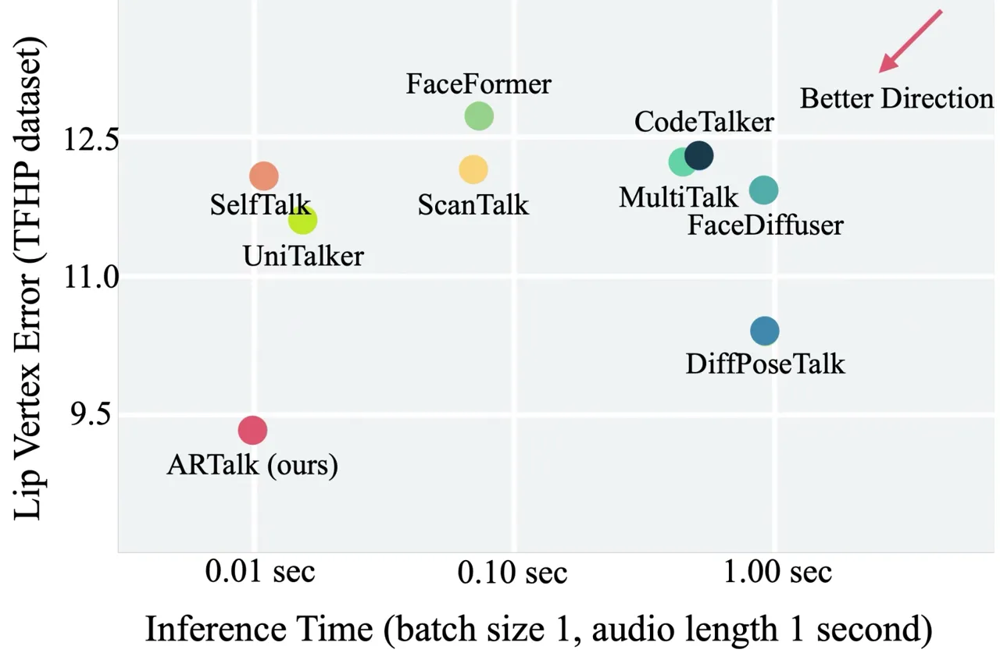
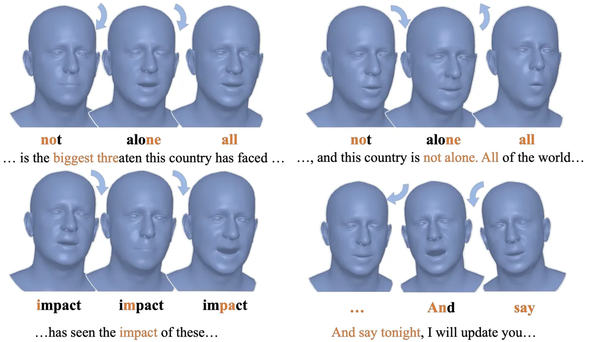
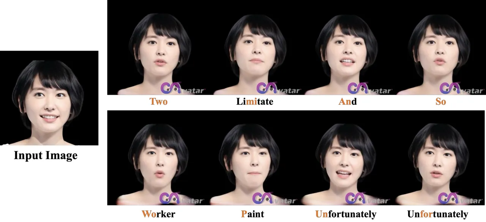
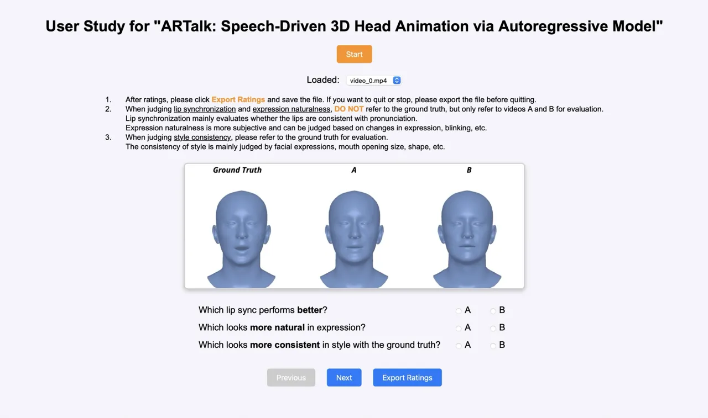

# ARTalk: Speech-Driven 3D Head Animation via Autoregressive Model

1975Journal: TOGConference: SIGGRAPH Asia 2025 Conference Papers;
December 15–18, 2025; Hong Kong, Hong KongSIGGRAPH Asia 2025 Conference
Papers (SA Conference Papers ’25), December 15–18, 2025, Hong Kong, Hong
KongDOI: [10.1145/3757377.3763955](https://doi.org/10.1145/3757377.3763955)ISBN: 979-8-4007-2137-3/2025/12CCS: Computing
methodologies Computer graphics

Xuangeng Chu Affiliation: The University of Tokyo, Tokyo, Japan email:
<xuangeng.chu@mi.t.u-tokyo.ac.jp> , Nabarun Goswami Affiliation: The
University of Tokyo, Tokyo, Japan email:
<nabarungoswami@mi.t.u-tokyo.ac.jp> , Ziteng Cui Affiliation: The
University of Tokyo, Tokyo, Japan email: <cui@mi.t.u-tokyo.ac.jp> ,
Hanqin Wang Affiliation: The University of Tokyo, Tokyo, Japan email:
<wang@mi.t.u-tokyo.ac.jp> and Tatsuya Harada Affiliation: The University
of Tokyo, , RIKEN AIP, Tokyo, Japan email: <harada@mi.t.u-tokyo.ac.jp>

© acmlicensed

###### Abstract.

Speech-driven 3D facial animation aims to generate realistic lip
movements and facial expressions for 3D head models from arbitrary audio
clips. Although existing diffusion-based methods are capable of
producing natural motions, their slow generation speed limits their
application potential. In this paper, we introduce a novel
autoregressive model that achieves real-time generation of highly
synchronized lip movements and realistic head poses and eye blinks by
learning a mapping from speech to a multi-scale motion codebook.
Furthermore, our model can adapt to unseen speaking styles, enabling the
creation of 3D talking avatars with unique personal styles beyond the
identities seen during training. Extensive evaluations and user studies
demonstrate that our method outperforms existing approaches in lip
synchronization accuracy and perceived quality.

###### Keywords: 

Speech-driven motion generation, Head animation, Autoregressive models

## 1. Introduction


Figure 1. We present ARTalk, a framework for speech-driven 3D facial
motion generation. Our method learns a mapping from speech to a
multi-scale motion code, enabling the real-time generation of realistic
and diverse animation sequences. A concept pipeline of our method.

The rapid evolution of large language models (Achiam et al., 2023; Team
et al., 2023; Guo et al., 2025) in recent years has driven significant
progress in artificial intelligence, particularly in generating
human-like text and facilitating complex conversational interactions.
However, many such systems primarily rely on text or synthesized speech
for communication, often lacking the visual embodiment necessary for
achieving rich and intuitive human-computer interaction. To bridge this
gap and create more engaging interactive experiences, research into
digital humans has garnered widespread attention from both academia and
industry. Due to the intrinsic and natural correlation between the
speech and facial expressions, speech-driven 3D facial animation has
emerged as a key component for shaping lifelike virtual characters.
Therefore, advancements in this field are essential for promoting the
application of digital humans in various scenarios such as education and
entertainment.

Speech-driven 3D head motion generation aims to synthesize natural and
temporally synchronized facial expressions, particularly lip movements,
along with realistic head motions directly from speech input. Recent
years have witnessed significant advancements in speech-driven motion
generation. Autoregressive models, for instance, have been explored to
predict deformation offsets on 3D meshes (Richard et al., 2021; Xing
et al., 2023; Sung-Bin et al., 2024; Nocentini et al., 2024). However,
the inherent complexity of representing facial motion through mesh
deformations in 3D space often struggles to fully capture the intricate
and non-linear mappings between speech and the resulting nuanced facial
expressions. This limitation frequently leads to over-smoothed non-lip
regions and a lack of fine-grained realism. More recently, diffusion
models (Ho et al., 2020; Tevet et al., 2023; Stan et al., 2023; Sun
et al., 2024) have demonstrated compelling generative capabilities,
including in the domain of speech-driven motion. For example,
FaceDiffuser (Stan et al., 2023) leverages diffusion processes to
generate motion directly on 3D meshes, while DiffPoseTalk (Sun et al., 2024) utilizes diffusion on the parametric FLAME model (Li et al., 2017)
blendshapes to produce natural facial expressions and head movements.
Despite their impressive results in generating high-fidelity motions,
these diffusion-based approaches typically suffer from high
computational costs, hindering their applicability in real-time and
low-latency scenarios. In parallel, multi-scale autoregressive models
(Tian et al., 2024) have achieved notable success in image generation
tasks, offering a balance between generation speed and output quality.
However, these architectures are primarily designed for processing
single, multi-scale static samples rather than sequential temporal data,
making their direct application to the temporal dynamics inherent in
speech-to-motion generation challenging.

To overcome the limitations of existing methods and achieve
high-quality, natural, and fast speech-driven motion generation, we
propose a novel approach based on temporal windows and multi-scale
autoregression. Our method segments the speech input into consecutive
temporal windows for motion generation, a window-wise processing
strategy crucial for achieving low-latency motion synthesis. Within each
temporal window, we further employ a multi-scale encoding and generation
strategy to capture facial expressions and head movements with rich
details. For instance, for a 4-second temporal window containing 100
motion frames, we encode it into a set of multi-scale representations
with varying temporal resolutions, such as encodings with lengths of
\[1, 5, 25, 50, 100\], and adopt a similar multi-scale decoding process
during generation. This design allows the model to simultaneously
capture global temporal context and fine-grained details of each motion
frame, resulting in more expressive motions. To minimize encoding errors
and ensure temporal coherence of the generated motions, we extend a VQ
codec to encode multi-scale motion codes across two consecutive temporal
windows, thereby effectively modeling and transferring temporal
dependencies between windows. Additionally, we design a novel
autoregressive generator that can autoregressively predict the
multi-scale motion codes for the current temporal window conditioned on
the speech features of the current window and the previously generated
motion sequence. This conditional generation mechanism enables our model
to achieve high-quality multi-scale motion generation within each
temporal window while maintaining smooth transitions and temporal
consistency across windows. Furthermore, we integrate a
Transformer-based style encoder to extract style representations from
example motion clips. This allows our model to generate stylized motions
with unique individual characteristics and helps to disentangle the
complex many-to-many mapping between speech and motion. Through these
innovations, our method can generate personalized and high-fidelity lip
movements, facial expressions, and head motions, demonstrating
significant potential for various speech-driven downstream applications.

Our main contributions are as follows:

- •
  We propose ARTalk, a novel autoregressive framework capable of
  generating natural 3D facial motions with head poses in real time.
- •
  We design a novel encoder-decoder that encode motions from consecutive
  time windows to produce temporally dependent multi-scale motion
  representations.
- •
  We introduce a novel conditional autoregressive generator on temporal
  and feature scales, enabling motion generations tightly aligned with
  speech conditions and consistent across time windows.

## 2. Related Work

| Method                            | w/ Style | w/ Pose | Real-time |
| --------------------------------- | -------- | ------- | --------- |
| FaceFormer (Fan et al., 2022)     | ✘        | ✘       | ✘         |
| CodeTalker (Xing et al., 2023)    | ✘        | ✘       | ✘         |
| SelfTalk (Peng et al., 2023a)     | ✘        | ✘       | ✔        |
| FaceDiffuser (Stan et al., 2023)  | ✘        | ✘       | ✘         |
| MultiTalk (Sung-Bin et al., 2024) | ✔       | ✘       | ✘         |
| ScanTalk (Nocentini et al., 2024) | ✘        | ✘       | ✘         |
| UniTalker (Fan et al., 2024)      | ✔       | ✘       | ✘         |
| DiffPoseTalk (Sun et al., 2024)   | ✔       | ✔      | ✘         |
| ARTalk (Ours)                     | ✔       | ✔      | ✔        |

Table 1. Comparison across methods, including style adaptation during
inference (w/ Style), head pose generation (w/ Pose), and real-time
capability (Real-time). ARTalk (ours) is the only method to achieve all
three features, demonstrating its comprehensive advantages over baseline
methods.


Figure 2. ARTalk involves two separated parts. (a) shows our temporal
multi-scale VQ autoencoder. It encodes motion sequences into multi-scale
token maps $`[M_{k_{1}},M_{k_{2}},...,M_{K}]`$ using a shared codebook
and causal masking on temporal. (b) shows The ARTalk Causal Transformer,
where training uses ground truth tokens with a block-wise causal
attention mask, and inference autoregressively predicts motion tokens
conditioned on speech features and last scale tokens and last time
window motions. Method pipeline of our method.

### 2.1. Speech-Driven 3D Facial Animation

Research on audio-driven 3D motion generation has been an area of
interest for decades, with methods evolving significantly over time.
Early approaches (Taylor et al., 2012; Xu et al., 2013; Edwards et al., 2016) relied primarily on procedural methods, which segmented speech
into phonemes and mapped them to predefined visemes through handcrafted
rules. Although procedural methods provide explicit control over the
generated animations, they typically require complex parameter tuning
and fail to capture the diversity and complexity of real-world speaking
styles. As a result, procedural methods struggled to deliver animations
that appeared both natural and adaptable to varying speech dynamics. In
recent years, learning-based approaches (Fan et al., 2022; Xing et al.,
2023; Sun et al., 2024; Daněček et al., 2023; Peng et al., 2023b; Yang
et al., 2024; Fan et al., 2024; Chae-Yeon et al., 2025) have advanced
rapidly, addressing these limitations and enabling more natural and
expressive facial animations. Additionally, some approaches (Yi et al.,
2022; Ye et al., 2024; Zhang et al., 2023; Tan et al., 2024) focus on
directly generating talking head videos without explicitly modeling
motion. However, this limits their ability to integrate with
motion-driven downstream applications, restricting their broader
applicability.

### 2.2. Autoregressive 3D Facial Motion Generation

Autoregressive (AR) methods model the temporal sequence of facial motion
in a step-by-step manner. These methods typically leverage pre-trained
speech model features (Baevski et al., 2020; Hsu et al., 2021; Défossez
et al., 2024) as speech representations, which are subsequently mapped
to 3D deformable model parameters or 3D meshes via neural networks. For
example, FaceFormer (Fan et al., 2022) autoregressively predicts the
continuous facial motion parameters while MeshTalk (Richard et al., 2021) learns a prior over categorical expression tokens. CodeTalker
(Xing et al., 2023) and MultiTalk (Sung-Bin et al., 2024) tokenize
facial motions with a VQ-VAE and train a transformer decoder to predict
subsequent motion tokens based on audio features. Learn2Talk (Zhuang
et al., 2024) augments FaceFormer with lip-sync and lip-reading losses,
improving alignment with speech. MMHead (Wu et al., 2024) provides text
descriptions as an extra condition for controlling the generated motion.
However, these methods also show limitations. Temporal autoregressive
modeling often under represents motion within each time window, leading
to overly smooth lip movements and failing to capture the complex
speech-to-motion mapping. This issue becomes more pronounced with larger
and more diverse datasets. Additionally, many approaches (Fan et al.,
2022; Xing et al., 2023; Sung-Bin et al., 2024) rely on a predefined set
of style labels to reduce the complexity of the mapping, which limits
their ability to adapt to new individuals and styles.

### 2.3. Diffusion based 3D Facial Motion Generation

Diffusion models (Ho et al., 2020; Zhu et al., 2023; Alexanderson
et al., 2023; Stan et al., 2023; Aneja et al., 2024; Baevski et al.,
2020; Ma et al., 2024; Sun et al., 2024; Zhang et al., 2024) have
recently gained traction for generative tasks because of their strong
modeling capacities. FaceDiffuser (Stan et al., 2023) conditions a
diffusion model on audio features to predict displacements from a
neutral template. Scantalk (Nocentini et al., 2024) uses a DiffusionNet
(Sharp et al., 2022) structure to overcome the fixed topology limitation
and perform diffusion on arbitrary meshes. Similarly, DiffPoseTalk (Sun
et al., 2024) uses a diffusion-based transformer decoder to generate
both expression and pose (blendshapes) conditioned on audio and learned
style features. Although these methods generate high-fidelity and
realistic facial motion, their iterative sampling steps can be
computationally expensive and may limit real-time applicability.

In this paper, we leverage FLAME (Li et al., 2017) as our motion
representation and propose a novel autoregressive framework for
speech-driven motion generation. It not only outperform current
diffusion models in generating facial motion, but also achieves
real-time speed and produces natural head poses. A comparison of our
method with existing approaches is shown in Table 1. Our method enables
arbitrary style inference, allowing stylized motion generation at
inference time by providing an example motion clip.

## 3. Method

We provide an overview of our method in Figure 2. We adopt the widely
used 3DMM (Li et al., 2017) as the facial representation and leverage a
multi-scale VQ autoencoder model to train and obtain a multi-scale
motion codebook along with its corresponding encoder-decoder, enabling a
discrete representation of the motion space. Subsequently, we train a
multi-scale autoregressive model to map speech information to the
discrete motion space.

In the following subsections, Section 3.1 details the problem definition
and the 3DMM representation, Section 3.2 explains the multi-scale motion
VQ autoencoder model, Section 3.3 introduces the multi-scale
autoregressive model.

### 3.1. Preliminaries

We adopt the widely used 3D morphable model (3DMM) FLAME (Li et al., 2017) to represent facial motion, where each frame is parameterized by
shape $`\beta`$, expression $`\psi`$, and pose $`\theta`$. Given these
parameters, the 3D face mesh, consisting of 5,023 vertices, is
reconstructed through blend shape and rotation operations. Compared to
previous methods (Fan et al., 2022; Xing et al., 2023; Peng et al.,
2023a; Nocentini et al., 2024) that directly model the mesh, FLAME
simplifies motion modeling by converting complex vertex movements into
lower-dimensional blend shape parameters while preserving expression and
motion details.

We define the motion vector $`\mathbf{M}\in\mathbb{R}^{K\times D}`$ as
the concatenation of per-frame expression and pose parameters over $`K`$
frames. The corresponding vertex coordinates
$`\mathbf{V}\in\mathbb{R}^{K\times N\times 3}`$ store the 3D positions
of $`N`$ mesh vertices per frame, where
$`\mathbf{V}_{\mathrm{lips}}\subset\mathbf{V}`$ denotes the subset
corresponding to the lip region, which is particularly important for
speech related modeling. Further details on 3DMM can be found in the
supplementary material.

### 3.2. Temporal Multi-scale VQ Autoencoder

Predicting motion frames from speech is a discrete task involving highly
dense temporal sequences and complex mappings. Inspired by the success
of discrete representations in image and motion generation (Xing et al.,
2023; van den Oord et al., 2017; Zhou et al., 2022), the effectiveness
of multiscale audio modeling for animation generation (Jung et al., 2024) and the effectiveness of multi-scale encoding in (Tian et al.,
2024), we propose a temporal multi-scale VQ autoencoder to efficiently
model motion dynamics.

The input motion sequence, consisting of $`K`$ frames, is first
processed by a Transformer encoder, which extracts temporal features and
maps them into a latent space. These representations are then quantized
using a multi-scale codebook that captures motion information at varying
temporal resolutions $`\bigl[k_{1},k_{2},\ldots,K\bigr]`$, producing
discrete tokens. The Transformer decoder reconstructs the motion from
these discrete embeddings, attending to both local and long-range
dependencies.

Multi-scale residual VQ. To progressively refine motion representations,
we adopt a residual vector quantization approach:

```math
\displaystyle\mathbf{h}^{(l)} \displaystyle=\mathrm{Interp}\bigl(\mathrm{Quant}(\mathbf{r}^{(l-1)}),\,k_{l}\bigr), \tag{1}
```

```math
\displaystyle\mathbf{r}^{(l)} \displaystyle=\mathbf{r}^{(l-1)}-\mathbf{h}^{(l)},
```

for $`l=1,\ldots,L`$, where $`\mathbf{r}^{(0)}`$ is the encoder output.
The function $`\mathrm{Quant}(\cdot)`$ assigns features to the closest
codebook entries, while $`\mathrm{Interp}(\cdot,k_{l})`$ adjusts
resolutions to ensure smooth transitions. By accumulating the outputs
$`\mathbf{h}^{(l)}`$ across scales, the model retains high fidelity
while removing redundancy in a structured manner.

Residual accumulation at the finest scale $`K`$ mitigates information
loss, while downsampling via region-based interpolation enhances
efficiency. We use a _shared_ codebook across scales to maintain a
unified motion space and simplify autoregressive modeling. This strategy
improves temporal consistency and preserves stylistic coherence across
different resolutions.

Temporal causal reasoning. To ensure stability over extended sequences,
we incorporate a causal reasoning mechanism that enforces cross-window
consistency. Our approach considers two consecutive time windows,
$`T-1`$ and $`T`$. During training and inference, causal masks are
applied, ensuring that predictions for $`T`$ depend only on previously
observed information from $`T-1`$, without leaking future details. This
prevents temporal discontinuities and enhances the smoothness of
long-term motion.

By integrating multi-scale residual quantization with causal reasoning
and Transformer-based encoding/decoding, our method ensures both
fine-grained expressiveness and long-term coherence in generated motion
sequences.

Training objectives.

To train the VQ autoencoder, we use a hybrid loss function balancing
motion accuracy, temporal smoothness, and codebook stability.

The reconstruction loss enforces alignment between predicted motion
vectors $`M^{\prime}`$ and the ground truth $`M`$, with additional
constraints on lip and facial vertices:

```math
\displaystyle L_{\text{recon}}=\|\hat{M}-M\|_{1}+w_{\text{lips}}\|\hat{V}_{\text{lips}}-V_{\text{lips}}\|^{2}+\|\hat{V}-V\|^{2} \tag{2}
```

To ensure smooth transitions, we penalize velocity and acceleration
differences:

```math
\displaystyle L_{\text{vel}} \displaystyle=\|(\hat{V}_{1:}-\hat{V}_{:-1})-(V_{1:}-V_{:-1})\|^{2}, \tag{3}
```

```math
\displaystyle L_{\text{smooth}} \displaystyle=\|\hat{V}_{2:}-2\hat{V}_{1:-1}+\hat{V}_{:-2}\|^{2}. \tag{4}
```

We also apply the standard VQ losses which we term as $`L_{\text{cb}}`$
to encourage stable VQ assignments and prevent mode collapse.

The final training objective is:

```math
\displaystyle L_{\text{VQ}}=L_{\text{recon}}+\lambda_{\text{vel}}L_{\text{vel}}+\lambda_{\text{smooth}}L_{\text{smooth}}+L_{\text{cb}}, \tag{5}
```

where $`\lambda_{\text{vel}}`$ and $`\lambda_{\text{smooth}}`$ control
the temporal constraints.

By jointly optimizing these terms, the model learns compact yet
expressive motion representations, ensuring high-fidelity synthesis with
strong temporal coherence.

### 3.3. Speech-to-Motion Autoregressive Model

After training the VQ autoencoder (Section 3.2), we obtain discrete
codes $`\{\mathbf{z}_{T}^{(l)}\}`$ at multiple resolutions $`k_{l}`$ for
each time window $`T`$, where $`l=1,\dots,L`$ spans from coarsest to
finest. To ensure long-term temporal coherence, we model these codes
with a Transformer that is autoregressive _across_ scales
$`(1\!\to\!L)`$ _and across_ adjacent windows $`(T-1\!\to\!T)`$.

Architecture. Figure 2(b) illustrates the AR model, where orange arrows
mark training-only components. A pre-trained HuBERT (Hsu et al., 2021)
encoder extracts speech features $`\mathbf{a}_{T}`$, resampled to each
scale $`k_{l}`$. A style token $`\mathbf{s}`$ encodes speaker identity
(Sun et al., 2024). Given the previous window’s finest-scale codes
$`\mathbf{z}_{T-1}^{(L)}`$, we predict
$`\mathbf{z}_{T}^{(1)},\dots,\mathbf{z}_{T}^{(L)}`$ for the current
window.

Two-level autoregression. Within each window $`T`$, the codes are
generated scale by scale:

```math
\displaystyle p(\{\mathbf{z}_{T}^{(l)}\}_{l=1}^{L}\mid\mathbf{z}_{T-1}^{(L)},\mathbf{a}_{T},\mathbf{s})\;=\;\prod_{l=1}^{L}p\!\bigl(\mathbf{z}_{T}^{(l)}\mid\mathbf{z}_{T}^{(<l)},\mathbf{z}_{T-1}^{(L)},\mathbf{a}_{T},\mathbf{s}\bigr), \tag{6}
```

where $`\mathbf{z}_{T}^{(<l)}`$ denotes codes at all coarser scales.
Inside each scale $`l`$, tokens are predicted _in parallel_ (blockwise)
while attending causally to previously generated scales and the previous
window.

Training and inference. During training, ground-truth codes
$`\{\mathbf{z}_{T}^{(l)\!\text{(gt)}}\}`$ supervise the model via
cross-entropy:

```math
\displaystyle L_{\mathrm{AR}} \displaystyle=\;-\sum_{T}\sum_{l=1}^{L}\log\,p(\mathbf{z}_{T}^{(l)\!\text{(gt)}}\mid\mathbf{z}_{T}^{(<l)\!\text{(gt)}},\mathbf{z}_{T-1}^{(L)\!\text{(gt)}},\mathbf{a}_{T},\mathbf{s}). \tag{7}
```

At inference, we sample or select each scale’s codes in sequence,
conditioned on $`\mathbf{z}_{T-1}^{(L)}`$, $`\mathbf{a}_{T}`$, and
$`\mathbf{s}`$. Repeating this process over windows yields motion
sequences that remain temporally coherent and stylistically consistent
throughout.



Figure 3. Comparison of efficiency and performance across different
methods.

## 4. Experiments

Datasets. We use the TFHP dataset proposed by  Sun et al. (2024) to
train our model, which consists of 1,052 video clips from 588 subjects,
with a total duration of approximately 26.5 hours. All videos are
tracked at 25 fps, resulting in approximately 2,385,000 action frames.
For training and evaluation, we adopt the train/test split provided in
the original paper (Sun et al., 2024). Furthermore, we evaluate the
generalization performance of our model on the test split of the widely
used VOCASET dataset (Cudeiro et al., 2019). The test split consists of
80 audiovisual sequence pairs from 2 subjects. To adapt VOCASET to our
method, we track the FLAME parameters at 25 fps and conduct evaluation
on our tracked data. It is worth noting that we don’t use VOCASET to
train or fine-tune our method.

Implementation Details. Our method is implemented on the PyTorch
framework (Paszke et al., 2017). In the first stage, we train our VQ
autoencoder to obtain a multi-scale motion codebook. The motion codebook
consists of 256 entries, each with a code dimension of 64. The time
window size is 100 frames (4 seconds), and the multi-scale levels are
\[1, 5, 25, 50, 100\]. At this stage, we used the AdamW optimizer with a
learning rate of 1.0e-4 and a total batch size of 64 for 50,000
iterations. In the second stage, we train the multi-scale autoregressive
model using the AdamW optimizer with the same learning rate of 1.0e-4
and a batch size of 64 for 50,000 iterations. During this stage, we
employ a frozen pre-trained HuBERT (Hsu et al., 2021) backbone.

All training was conducted on one NVIDIA Tesla A100 GPU, requiring a
total of approximately 13 GPU hours (5 hours for the first stage and 8
hours for the second stage), demonstrating efficient training resource
utilization. During inference, our method needs only 0.01 seconds to
generate motions for 1 second on an NVIDIA Tesla A100 GPU and 0.057
seconds on an Apple M2 Pro chip, showcasing high inference efficiency
and low latency. For more implementation details, please refer to the
supplementary materials.

| Method                                 | LVE $`\downarrow`$ | FFD $`\downarrow`$ | MOD $`\downarrow`$ |
| -------------------------------------- | ------------------ | ------------------ | ------------------ |
| FaceFormer (Fan et al., 2022)          | 12.72              | 22.06              | 2.73               |
| CodeTalker (Xing et al., 2023)         | 11.78              | 20.39              | 2.43               |
| SelfTalk (Peng et al., 2023a)          | 12.07              | 23.74              | 2.57               |
| FaceDiffuser (Stan et al., 2023)       | 11.92              | 22.17              | 2.55               |
| MultiTalk^(∗) (Sung-Bin et al., 2024)  | 12.23              | 24.42              | 2.48               |
| ScanTalk^(∗) (Nocentini et al., 2024)  | 12.14              | 21.02              | 3.20               |
| UniTalker^(∗) (Nocentini et al., 2024) | 11.61              | 29.31              | 2.07               |
| DiffPoseTalk (Sun et al., 2024)        | 10.39              | 20.15              | 2.07               |
| ARTalk (Ours)                          | 9.34               | 18.15              | 1.81               |

Table 2. Quantitative results on the TFHP (Sun et al., 2024) dataset. We
use colors to denote the first and second places respectively. $`{*}`$
indicates that the method was not trained on TFHP, while all other
methods were trained or fine-tuned on TFHP.

| Method                                 | LVE $`\downarrow`$ | FFD $`\downarrow`$ | MOD $`\downarrow`$ |
| -------------------------------------- | ------------------ | ------------------ | ------------------ |
| FaceFormer (Fan et al., 2022)          | 8.28               | 15.62              | 1.89               |
| CodeTalker (Xing et al., 2023)         | 7.73               | 18.86              | 1.81               |
| SelfTalk (Peng et al., 2023a)          | 7.71               | 28.70              | 1.79               |
| FaceDiffuser (Stan et al., 2023)       | 8.00               | 21.46              | 1.84               |
| MultiTalk^(∗) (Sung-Bin et al., 2024)  | 12.33              | 25.11              | 2.82               |
| ScanTalk (Nocentini et al., 2024)      | 7.15               | 15.56              | 1.61               |
| UniTalker^(∗) (Nocentini et al., 2024) | 7.38               | 21.72              | 1.89               |
| DiffPoseTalk^(∗) (Sun et al., 2024)    | 10.01              | 20.64              | 2.29               |
| ARTalk (Ours)^(∗)                      | 7.57               | 15.49              | 1.78               |

Table 3. Quantitative results on the VOCASET-Test (Cudeiro et al., 2019)
dataset. We use colors to denote the first and second places
respectively. $`{*}`$ indicates that the method was not trained on
VOCASET. It is worth noting that our method is not trained or fine-tuned
on VOCASET.


Figure 4. Qualitative comparison with existing methods (all head poses
fixed). The first four rows are from the TFHP dataset, and the last two
rows are from the VOCASET dataset. Our method shows better alignment
with the ground truth in expression style, mouth dynamics, and lip
synchronization. Additional results are available in the supplementary
materials and demo videos. Qualitative comparison.

### 4.1. Quantitative Results

Based on previous studies (Richard et al., 2021; Fan et al., 2022; Xing
et al., 2023; Nocentini et al., 2024; Sun et al., 2024), we adopted two
quantitative metrics, the lip vertex error (LVE) (Richard et al., 2021)
and the upper face dynamic deviation (FDD) (Xing et al., 2023), to
evaluate the generated facial motions. LVE calculates the maximum L2
error of all lip vertices for each frame, evaluating the largest
deviation between predicted and ground truth lip positions. FDD
calculates the standard deviation of the motion of each upper facial
vertex over time between predictions and ground truth, evaluating the
consistency of upper facial motion, which is closely related to speaking
styles. Additionally, we use a similar metric as  Sun et al. (2024),
mouth opening distance (MOD), to more accurately assess the stylistic
similarity of mouth opening movements. MOD measures the average
difference in mouth opening region between predictions and ground truth.
Compared to LVE, MOD focuses more on the similarity of mouth opening
styles and is less sensitive to temporal lip synchronization. For the
partitioning of the lip area and upper face, we used the mask
partitioning officially provided by FLAME (Li et al., 2017). The lip
region contains 254 points, while the upper face, including eye region
and forehead, contains 884 points.

We present the quantitative comparison on TFHP dataset (Sun et al., 2024) in Table 2. The baseline methods FaceFormer (Fan et al., 2022),
CodeTalker (Xing et al., 2023), SelfTalk (Peng et al., 2023a), and
FaceDiffuser (Stan et al., 2023) are mesh-based approaches and cannot
generalize to arbitrary styles or new meshes. To ensure a fair
comparison, we retrained these methods on meshes generated from the TFHP
dataset. For MultiTalk (Sung-Bin et al., 2024), which is trained on
FLAME meshes and supports language-based stylization, we used its
English style for evaluation. ScanTalk (Nocentini et al., 2024) claims
to work on arbitrary meshes, so we use the officially provided
pre-trained weights. For UniTalker (Fan et al., 2024), we compute the
metrics using the meshes generated by the generalized pivot identities.

For DiffPoseTalk (Sun et al., 2024), we used pre-trained weights on the
TFHP dataset (including head pose) for evaluation. The results in the
Table 2 show that our method achieving significant improvements in lip
synchronization accuracy (LVE) and style alignment (FFD and MOD),
indicating that our method not only achieves precise lip synchronization
but also effectively captures personalized speaking styles.

To demonstrate the generalizability of our method, we evaluated it on
the VOCASET dataset (Cudeiro et al., 2019). The results are presented in
Table 3. Notably, for some baseline methods (Fan et al., 2022; Xing
et al., 2023; Peng et al., 2023a; Stan et al., 2023; Nocentini et al.,
2024), we used their pre-trained weights on VOCASET, whereas our method
was not trained or fine-tuned on this dataset. Despite this, our method
achieved highly competitive performance and outperformed most baseline
methods specifically trained on this dataset. For MultiTalk (Sung-Bin
et al., 2024) and DiffPoseTalk (Sun et al., 2024) which designed with
style generalization capabilities, we directly testing it on the VOCASET
dataset without fine-tuning. The results indicate that our method
surpasses them in terms of generalization ability, further verifying the
robustness of our method in handling unseen styles and data.

We also present a comparison of LVE and efficiency in Figure 3. Although
our model adopts a two-level autoregressive framework, it remains more
efficient than fully autoregressive methods. This efficiency is achieved
by utilizing longer window lengths while retaining only the past 4
seconds of motion frames. Additionally, frames within each scale are
generated in parallel within the window, further improving computational
efficiency.

### 4.2. Qualitative Results

In Figure 4, we present a qualitative comparison between our method and
other baseline approaches. Our method demonstrates excellent lip
synchronization, accurately capturing various phonetic elements.
Furthermore, the generated results exhibit realistic facial expressions
and mouth opening, closely matching the style of the ground truth.
Notably, our method also generates realistic blinking and head
movements, which are implicitly learned and encoded within the motion
codebook. In Figure 5, we also show the ability of our method on head
movements. It can capture accents well and generate reasonable head
movements. Additional qualitative evaluation results are available in
the supplementary videos.

| Method       | Sync (%)            | N-Exp (%)           | Style (%)           | N-Pose (%)          |
| ------------ | ------------------- | ------------------- | ------------------- | ------------------- |
| FaceFormer   | 75.0 \[70.4, 79.6\] | 89.3 \[86.3, 92.8\] | 88.1 \[85.0, 91.8\] | \-                  |
| CodeTalker   | 84.5 \[80.7, 88.4\] | 86.9 \[83.3, 90.5\] | 92.9 \[90.5, 95.9\] | \-                  |
| SelfTalk     | 85.7 \[82.0, 89.5\] | 89.3 \[86.3, 92.8\] | 91.7 \[89.1, 94.9\] | \-                  |
| FaceDiffuser | 88.1 \[85.0, 91.8\] | 90.4 \[87.3, 93.6\] | 86.9 \[83.3, 90.5\] | \-                  |
| MultiTalk    | 78.6 \[74.5, 83.2\] | 76.2 \[72.0, 81.0\] | 78.6 \[74.5, 83.2\] | \-                  |
| ScanTalk     | 88.1 \[85.0, 91.8\] | 90.5 \[87.7, 93.9\] | 90.5 \[87.7, 93.9\] | \-                  |
| UniTalker    | 81.8 \[77.7, 86.0\] | 83.6 \[79.7, 87.6\] | 81.3 \[77.4, 85.7\] | \-                  |
| DiffPoseTalk | 63.1 \[58.2, 68.5\] | 59.5 \[54.3, 64.8\] | 60.7 \[55.5, 65.9\] | 58.3 \[53.1, 63.6\] |

Table 4. User study results. The percentages represent the proportion of
users who preferred the our method over the baseline in each category.
The values in brackets represent the 95% confidence interval, indicating
that we are 95% confident that the true value of the performance metric
lies within this range. Among them, Sync represents lip synchronization,
Style represents the consistency of style, N-Exp and N-Pose represent
the facial expression naturalness and head pose naturalness
respectively.

### 4.3. User Study

User studies are a reliable approach for evaluating 3D talking heads. To
comprehensively compare our method with baseline methods, we conducted a
user study focusing on four key metrics: lip synchronization, facial
expression naturalness, style consistency and head pose naturalness.

Given that head movements can significantly influence users’ evaluation
of lip synchronization, the study was divided into two parts. In the
first part, videos with fixed head poses were rendered across all
methods to assess lip synchronization and facial expression realism and
style consistency. In the second part, videos with dynamic head poses
were rendered to evaluate style consistency and head pose naturalness.
All comparisons were conducted using pairwise comparisons, where motions
generated by our method and a competing baseline were displayed side by
side, along with the ground truth provided as a reference for users.
After watching the videos, users selected the animation they perceived
as better based on their subjective preference. The proportion of user
selections was calculated to quantify satisfaction.

As presented in Table 4, our method significantly outperformed the
baseline methods in lip synchronization, style consistency and facial
expression realism. Furthermore, our method achieved superior head pose
naturalness compared to DiffPoseTalk (Sun et al., 2024), demonstrating
its comprehensive advantages.

### 4.4. Ablation study

Multi-Scale Autoregression. To validate the importance of multi-scale
autoregressive modeling within a single time window, we conducted
experiments by removing the multi-scale autoregressive mechanism
entirely. The results shown in Table 5 indicate a significant drop in
generation accuracy without multi-scale autoregression. We attribute
this decline to the model’s inability to fully capture the complex
details of the speech-to-motion mapping without the hierarchical
structure provided by multi-scale modeling.



Figure 5. Qualitative results of head pose. When certain words are
stressed or when accents occur, the model produces nodding motions
similar to human behavior.

Temporal Encoder and Temporal Autoregression. To assess the necessity of
temporal encoding and autoregression across time windows, we replaced
our proposed temporal encoder and autoregressive model with a standard
multi-scale encoder and a single-window multi-scale autoregressive
model, respectively. As shown in Table 5, the absence of temporal
modeling in VQ autoencoder or autoregressive both result in degraded
generation quality. Additionally, we also observed temporal
discontinuities in the motion sequences, further emphasizing the
critical role of our temporal design in achieving smooth and coherent
outputs.

Speaker Style Embedding. We also evaluated the effect of removing the
speaker style feature, which serves as the starting condition for the
autoregressive process. Without this feature, the complexity of the
many-to-many mapping between speech and motion increases significantly,
and the generated motions lack personalized style. As reflected in Table
5, the removal of style features causes a substantial decline in
generation quality, highlighting their importance in achieving stylistic
and expressive outputs.

Key Hyperparameter Choices. We explored different number of motion
frames within a single time window, which is critical for our method.
Specifically, we tested window lengths of 8, 25, 50 frames. For a window
length of 8, we used a multi-scale sequence of \[1,2,4,8\], while for 25
and 50, we adopted \[1,5,10,15,25\] and \[1,5,10,25,50\], respectively.
The results, presented in Table 5, demonstrate that the choice of window
size significantly impacts performance. However, the window size depends
heavily on the downstream task characteristics, such as whether the
input consists of streaming audio chunks. In general, longer temporal
windows generally produce better results, but longer windows mean that
more audio needs to be collected to output motion. In this paper, we
chose a window length of 100 frames and a multi-scale sequence of \[1,
5, 25, 50, 100\] as it is consistent with previous work such as
DiffPoseTalk (Sun et al., 2024) and achieves a good balance between
quality and efficiency. Further exploration of the number of multi-scale
layers and audio chunk lengths is provided in the supplementary
material.

Integration with Downstream Tasks Our method can be integrated into
various FLAME-based downstream applications, enabling a wider range of
use cases. While this extends beyond the primary scope of this paper, we
also demonstrate its application in GAGAvatar (Chu and Harada, 2024). As
shown in Figure 6, our method can generate control signals for
GAGAvatar, effectively transforming it into a speech-driven one-shot
dynamic avatar reconstruction method.

| Method                 | LVE$`\downarrow`$ | FFD$`\downarrow`$ | MOD $`\downarrow`$ |
| ---------------------- | ----------------- | ----------------- | ------------------ |
| w/o Multi-Scale AR     | 14.14             | 22.04             | 3.06               |
| w/o Temporal VQ        | 9.82              | 18.60             | 1.86               |
| w/o Temporal AR        | 9.97              | 18.71             | 1.99               |
| w/o Style Embedding    | 11.80             | 21.46             | 2.37               |
| Clip Length 8 Layer 5  | 11.73             | 24.89             | 2.25               |
| Clip Length 25 Layer 5 | 10.20             | 19.00             | 1.97               |
| Clip Length 50 Layer 5 | 9.78              | 18.03             | 1.89               |
| ARTalk (Full)          | 9.34              | 18.15             | 1.81               |

Table 5. Ablation results on TFHP dataset.



Figure 6. We reconstruct the avatar using GAGAvatar (Chu and Harada, 2024) and drive it with our ARTalk model, enabling speech-driven dynamic
avatar generation.

## 5. Discussion and Conclusion

In this paper, we introduced ARTalk, a novel framework for generating 3D
facial and head motions from speech. The core innovation of our method
lies in the temporal multi-scale autoencoder and the ARTalk
autoregressive Transformer, which together ensure temporal consistency
and precise motion generation. Our experimental results demonstrate that
ARTalk outperforms state-of-the-art baselines in terms of lip
synchronization, expression naturalness and style consistency, while
maintaining real-time generation capabilities. We believe that the
strong generalization ability of ARTalk make it a promising solution for
a wide range of applications, including virtual avatars, language
training, and animation production for gaming and movies.

Limitations and future work. While ARTalk demonstrates strong
performance in lip synchronization and expressions, a key limitation is
that head movements are driven by speech prosody, not semantic context.
This prevents the model from generating culturally-specific or
meaningful gestures like nodding or shaking the head to indicate
affirmation. Additionally, our use of a single style embedding can be
challenging for speech with dramatic emotional shifts, which is also a
common problem with existing methods. For example, when a speaker
suddenly shifts from calm to excited, a single embedding may struggle to
accurately capture this transition.

We hope that our work lays a solid foundation for the further research
of 3D talking head generation. Future research will focus on addressing
the above challenges, especially exploring how to effectively
incorporate semantic information into head motion generation and
developing more flexible style control methods.

## Impact Statement

Given that our method can generate highly realistic talking head
sequences, there is a potential risk of misuse, such as deepfake
creation and manipulation. To address these concerns, we strongly
advocate for watermarking or clearly annotating facial sequences
generated by our method as synthetic data. Moreover, we will collaborate
on deepfake detection research to further ensure that our proposed
method is used for positive and constructive applications. We also aim
to raise awareness about these risks and encourage collaboration among
governments, developers, researchers, and users to jointly prevent the
misuse of synthetic video technologies.

###### Acknowledgements.

This work was partially supported by JST Moonshot R&D Grant Number
JPMJPS2011, CREST Grant Number JPMJCR2015 and Basic Research Grant
(Super AI) of Institute for AI and Beyond of the University of Tokyo. In
addition, this work was also partially supported by JST SPRING, Grant
Number JPMJSP2108.

## References

- Achiam et al. (2023) Josh Achiam, Steven Adler, Sandhini Agarwal, Lama
  Ahmad, Ilge Akkaya, Florencia Leoni Aleman, Diogo Almeida, Janko
  Altenschmidt, Sam Altman, Shyamal Anadkat, et al. 2023. Gpt-4
  technical report. _arXiv preprint arXiv:2303.08774_ (2023).
- Alexanderson et al. (2023) Simon Alexanderson, Rajmund Nagy, Jonas
  Beskow, and Gustav Eje Henter. 2023. Listen, denoise, action!
  audio-driven motion synthesis with diffusion models. _ACM Transactions
  on Graphics (TOG)_ 42, 4 (2023), 1–20.
- Aneja et al. (2024) Shivangi Aneja, Justus Thies, Angela Dai, and
  Matthias Nießner. 2024. FaceTalk: Audio-Driven Motion Diffusion for
  Neural Parametric Head Models. In _Proc. IEEE Conf. on Computer Vision
  and Pattern Recognition (CVPR)_.
- Baevski et al. (2020) Alexei Baevski, Yuhao Zhou, Abdelrahman Mohamed,
  and Michael Auli. 2020. wav2vec 2.0: A framework for self-supervised
  learning of speech representations. _Advances in neural information
  processing systems_ 33 (2020), 12449–12460.
- Chae-Yeon et al. (2025) Lee Chae-Yeon, Oh Hyun-Bin, Han EunGi, Kim
  Sung-Bin, Suekyeong Nam, and Tae-Hyun Oh. 2025. Perceptually Accurate
  3D Talking Head Generation: New Definitions, Speech-Mesh
  Representation, and Evaluation Metrics. _arXiv preprint
  arXiv:2503.20308_ (2025).
- Chu and Harada (2024) Xuangeng Chu and Tatsuya Harada. 2024.
  Generalizable and Animatable Gaussian Head Avatar. In _The
  Thirty-eighth Annual Conference on Neural Information Processing
  Systems_.
  [https://openreview.net/forum?id=gVM2AZ5xA6](https://openreview.net/forum?id=gVM2AZ5xA6)
- Chu et al. (2024) Xuangeng Chu, Yu Li, Ailing Zeng, Tianyu Yang,
  Lijian Lin, Yunfei Liu, and Tatsuya Harada. 2024. GPAvatar:
  Generalizable and Precise Head Avatar from Image(s). In _The Twelfth
  International Conference on Learning Representations_.
- Cudeiro et al. (2019) Daniel Cudeiro, Timo Bolkart, Cassidy Laidlaw,
  Anurag Ranjan, and Michael Black. 2019. Capture, Learning, and
  Synthesis of 3D Speaking Styles. In _Proceedings IEEE Conf. on
  Computer Vision and Pattern Recognition (CVPR)_. 10101–10111.
  [http://voca.is.tue.mpg.de/](http://voca.is.tue.mpg.de/)
- Danecek et al. (2022) Radek Danecek, Michael J. Black, and Timo
  Bolkart. 2022. EMOCA: Emotion Driven Monocular Face Capture and
  Animation. In _Conference on Computer Vision and Pattern Recognition
  (CVPR)_. 20311–20322.
- Daněček et al. (2023) Radek Daněček, Kiran Chhatre, Shashank Tripathi,
  Yandong Wen, Michael Black, and Timo Bolkart. 2023. Emotional
  speech-driven animation with content-emotion disentanglement. In
  _SIGGRAPH Asia 2023 Conference Papers_. 1–13.
- Défossez et al. (2024) Alexandre Défossez, Laurent Mazaré, Manu
  Orsini, Amélie Royer, Patrick Pérez, Hervé Jégou, Edouard Grave, and
  Neil Zeghidour. 2024. _Moshi: a speech-text foundation model for
  real-time dialogue_. Technical Report. Kyutai.
  [http://kyutai.org/Moshi.pdf](http://kyutai.org/Moshi.pdf)
- Deng et al. (2024) Yu Deng, Duomin Wang, and Baoyuan Wang. 2024.
  Portrait4D-v2: Pseudo Multi-View Data Creates Better 4D Head
  Synthesizer. _arXiv preprint arXiv:2403.13570_ (2024).
- Edwards et al. (2016) Pif Edwards, Chris Landreth, Eugene Fiume, and
  Karan Singh. 2016. Jali: an animator-centric viseme model for
  expressive lip synchronization. _ACM Transactions on graphics (TOG)_
  35, 4 (2016), 1–11.
- Fan et al. (2024) Xiangyu Fan, Jiaqi Li, Zhiqian Lin, Weiye Xiao, and
  Lei Yang. 2024. UniTalker: Scaling up Audio-Driven 3D Facial Animation
  through A Unified Model. In _European Conference on Computer Vision_.
  Springer, 204–221.
- Fan et al. (2022) Yingruo Fan, Zhaojiang Lin, Jun Saito, Wenping Wang,
  and Taku Komura. 2022. FaceFormer: Speech-Driven 3D Facial Animation
  with Transformers. In _Proceedings of the IEEE/CVF Conference on
  Computer Vision and Pattern Recognition (CVPR)_.
- Feng et al. (2021) Yao Feng, Haiwen Feng, Michael J. Black, and Timo
  Bolkart. 2021. Learning an Animatable Detailed 3D Face Model from
  In-The-Wild Images. _ACM Transactions on Graphics, (Proc. SIGGRAPH)_
  40, 8.
  [https://doi.org/10.1145/3450626.3459936](https://doi.org/10.1145/3450626.3459936)
- Guo et al. (2025) Daya Guo, Dejian Yang, Haowei Zhang, Junxiao Song,
  Ruoyu Zhang, Runxin Xu, Qihao Zhu, Shirong Ma, Peiyi Wang, Xiao Bi,
  et al. 2025. Deepseek-r1: Incentivizing reasoning capability in llms
  via reinforcement learning. _arXiv preprint arXiv:2501.12948_ (2025).
- Ho et al. (2020) Jonathan Ho, Ajay Jain, and Pieter Abbeel. 2020.
  Denoising diffusion probabilistic models. _Advances in neural
  information processing systems_ 33 (2020), 6840–6851.
- Hsu et al. (2021) Wei-Ning Hsu, Benjamin Bolte, Yao-Hung Hubert Tsai,
  Kushal Lakhotia, Ruslan Salakhutdinov, and Abdelrahman Mohamed. 2021.
  Hubert: Self-supervised speech representation learning by masked
  prediction of hidden units. _IEEE/ACM transactions on audio, speech,
  and language processing_ 29 (2021), 3451–3460.
- Huang and Belongie (2017) Xun Huang and Serge Belongie. 2017.
  Arbitrary style transfer in real-time with adaptive instance
  normalization. In _Proceedings of the IEEE international conference on
  computer vision_. 1501–1510.
- Jung et al. (2024) Sunjin Jung, Yeongho Seol, Kwanggyoon Seo, Hyeonho
  Na, Seonghyeon Kim, Vanessa Tan, and Junyong Noh. 2024. Speed-aware
  audio-driven speech animation using adaptive windows. _ACM
  Transactions on Graphics_ 44, 1 (2024), 1–14.
- Li et al. (2017) Tianye Li, Timo Bolkart, Michael. J. Black, Hao Li,
  and Javier Romero. 2017. Learning a model of facial shape and
  expression from 4D scans. _ACM Transactions on Graphics, (Proc.
  SIGGRAPH Asia)_ 36, 6 (2017), 194:1–194:17.
  [https://doi.org/10.1145/3130800.3130813](https://doi.org/10.1145/3130800.3130813)
- Loshchilov (2017) I Loshchilov. 2017. Decoupled weight decay
  regularization. _arXiv preprint arXiv:1711.05101_ (2017).
- Ma et al. (2024) Zhiyuan Ma, Xiangyu Zhu, Guojun Qi, Chen Qian,
  Zhaoxiang Zhang, and Zhen Lei. 2024. DiffSpeaker: Speech-Driven 3D
  Facial Animation with Diffusion Transformer. _CoRR_ abs/2402.05712
  (2024).
  [https://doi.org/10.48550/arXiv.2402.05712](https://doi.org/10.48550/arXiv.2402.05712)
- Nocentini et al. (2024) F. Nocentini, T. Besnier, C. Ferrari, S.
  Arguillere, S. Berretti, and M. Daoudi. 2024. ScanTalk: 3D Talking
  Heads from Unregistered Scans. In _Proceedings of the European
  Conference on Computer Vision (ECCV)_.
- Paszke et al. (2017) Adam Paszke, Sam Gross, Soumith Chintala, Gregory
  Chanan, Edward Yang, Zachary DeVito, Zeming Lin, Alban Desmaison, Luca
  Antiga, and Adam Lerer. 2017. Automatic differentiation in pytorch.
  (2017).
- Peng et al. (2023a) Ziqiao Peng, Yihao Luo, Yue Shi, Hao Xu, Xiangyu
  Zhu, Hongyan Liu, Jun He, and Zhaoxin Fan. 2023a. SelfTalk: A
  Self-Supervised Commutative Training Diagram to Comprehend 3D Talking
  Faces. In _Proceedings of the 31st ACM International Conference on
  Multimedia_. 5292–5301.
  [https://doi.org/10.1145/3581783.3611734](https://doi.org/10.1145/3581783.3611734)
- Peng et al. (2023b) Ziqiao Peng, Haoyu Wu, Zhenbo Song, Hao Xu,
  Xiangyu Zhu, Jun He, Hongyan Liu, and Zhaoxin Fan. 2023b. EmoTalk:
  Speech-Driven Emotional Disentanglement for 3D Face Animation. In
  _Proceedings of the IEEE/CVF International Conference on Computer
  Vision (ICCV)_. 20687–20697.
- Richard et al. (2021) Alexander Richard, Michael Zollhöfer, Yandong
  Wen, Fernando De la Torre, and Yaser Sheikh. 2021. Meshtalk: 3d face
  animation from speech using cross-modality disentanglement. In
  _Proceedings of the IEEE/CVF International Conference on Computer
  Vision_. 1173–1182.
- Sharp et al. (2022) Nicholas Sharp, Souhaib Attaiki, Keenan Crane, and
  Maks Ovsjanikov. 2022. Diffusionnet: Discretization agnostic learning
  on surfaces. _ACM Transactions on Graphics (TOG)_ 41, 3 (2022), 1–16.
- Stan et al. (2023) Stefan Stan, Kazi Injamamul Haque, and Zerrin
  Yumak. 2023. Facediffuser: Speech-driven 3d facial animation synthesis
  using diffusion. In _Proceedings of the 16th ACM SIGGRAPH Conference
  on Motion, Interaction and Games_. 1–11.
  [https://doi.org/10.1145/3623264.3624447](https://doi.org/10.1145/3623264.3624447)
- Sun et al. (2024) Zhiyao Sun, Tian Lv, Sheng Ye, Matthieu Lin, Jenny
  Sheng, Yu-Hui Wen, Minjing Yu, and Yong-Jin Liu. 2024. DiffPoseTalk:
  Speech-Driven Stylistic 3D Facial Animation and Head Pose Generation
  via Diffusion Models. _ACM Transactions on Graphics (TOG)_ 43, 4,
  Article 46 (2024), 9 pages.
  [https://doi.org/10.1145/3658221](https://doi.org/10.1145/3658221)
- Sung-Bin et al. (2024) Kim Sung-Bin, Lee Chae-Yeon, Gihun Son, Oh
  Hyun-Bin, Janghoon Ju, Suekyeong Nam, and Tae-Hyun Oh. 2024.
  MultiTalk: Enhancing 3D Talking Head Generation Across Languages with
  Multilingual Video Dataset. In _Interspeech 2024_. 1380–1384.
  [https://doi.org/10.21437/Interspeech.2024-1794](https://doi.org/10.21437/Interspeech.2024-1794)
- Tan et al. (2024) Shuai Tan, Bin Ji, Yu Ding, and Ye Pan. 2024. Say
  Anything with Any Style. In _Proceedings of the AAAI Conference on
  Artificial Intelligence_, Vol. 38. 5088–5096.
- Taylor et al. (2012) Sarah L Taylor, Moshe Mahler, Barry-John
  Theobald, and Iain Matthews. 2012. Dynamic units of visual speech. In
  _Proceedings of the 11th ACM SIGGRAPH/Eurographics conference on
  Computer Animation_. 275–284.
- Team et al. (2023) Gemini Team, Rohan Anil, Sebastian Borgeaud,
  Jean-Baptiste Alayrac, Jiahui Yu, Radu Soricut, Johan Schalkwyk,
  Andrew M Dai, Anja Hauth, Katie Millican, et al. 2023. Gemini: a
  family of highly capable multimodal models. _arXiv preprint
  arXiv:2312.11805_ (2023).
- Tevet et al. (2023) Guy Tevet, Sigal Raab, Brian Gordon, Yoni Shafir,
  Daniel Cohen-or, and Amit Haim Bermano. 2023. Human Motion Diffusion
  Model. In _The Eleventh International Conference on Learning
  Representations_.
  [https://openreview.net/forum?id=SJ1kSyO2jwu](https://openreview.net/forum?id=SJ1kSyO2jwu)
- Tian et al. (2024) Keyu Tian, Yi Jiang, Zehuan Yuan, BINGYUE PENG, and
  Liwei Wang. 2024. Visual Autoregressive Modeling: Scalable Image
  Generation via Next-Scale Prediction. In _The Thirty-eighth Annual
  Conference on Neural Information Processing Systems_.
  [https://openreview.net/forum?id=gojL67CfS8](https://openreview.net/forum?id=gojL67CfS8)
- van den Oord et al. (2017) Aaron van den Oord, Oriol Vinyals, and
  Koray Kavukcuoglu. 2017. Neural discrete representation learning. In
  _Proceedings of the 31st International Conference on Neural
  Information Processing Systems_ (Long Beach, California, USA)
  _(NIPS’17)_. Curran Associates Inc., Red Hook, NY, USA, 6309–6318.
- Wang et al. (2020) Kaisiyuan Wang, Qianyi Wu, Linsen Song, Zhuoqian
  Yang, Wayne Wu, Chen Qian, Ran He, Yu Qiao, and Chen Change Loy. 2020.
  Mead: A large-scale audio-visual dataset for emotional talking-face
  generation. In _European conference on computer vision_. Springer,
  700–717.
- Wu et al. (2024) Sijing Wu, Yunhao Li, Yichao Yan, Huiyu Duan, Ziwei
  Liu, and Guangtao Zhai. 2024. MMHead: Towards Fine-grained Multi-modal
  3D Facial Animation. In _Proceedings of the 32nd ACM International
  Conference on Multimedia_. 7966–7975.
- Xie et al. (2022) Liangbin Xie, Xintao Wang, Honglun Zhang, Chao Dong,
  and Ying Shan. 2022. VFHQ: A High-Quality Dataset and Benchmark for
  Video Face Super-Resolution. In _The IEEE Conference on Computer
  Vision and Pattern Recognition Workshops (CVPRW)_.
- Xing et al. (2023) Jinbo Xing, Menghan Xia, Yuechen Zhang, Xiaodong
  Cun, Jue Wang, and Tien-Tsin Wong. 2023. Codetalker: Speech-driven 3d
  facial animation with discrete motion prior. In _Proceedings of the
  IEEE/CVF Conference on Computer Vision and Pattern Recognition_.
  12780–12790.
- Xu et al. (2024) Yuelang Xu, Benwang Chen, Zhe Li, Hongwen Zhang,
  Lizhen Wang, Zerong Zheng, and Yebin Liu. 2024. Gaussian Head Avatar:
  Ultra High-fidelity Head Avatar via Dynamic Gaussians. In _Proceedings
  of the IEEE/CVF Conference on Computer Vision and Pattern Recognition
  (CVPR)_.
- Xu et al. (2013) Yuyu Xu, Andrew W Feng, Stacy Marsella, and Ari
  Shapiro. 2013. A practical and configurable lip sync method for games.
  In _Proceedings of Motion on Games_. 131–140.
- Yang et al. (2024) Karren D Yang, Anurag Ranjan, Jen-Hao Rick Chang,
  Raviteja Vemulapalli, and Oncel Tuzel. 2024. Probabilistic
  Speech-Driven 3D Facial Motion Synthesis: New Benchmarks Methods and
  Applications. In _Proceedings of the IEEE/CVF Conference on Computer
  Vision and Pattern Recognition_. 27294–27303.
- Ye et al. (2024) Zhenhui Ye, Tianyun Zhong, Yi Ren, Jiaqi Yang,
  Weichuang Li, Jiawei Huang, Ziyue Jiang, Jinzheng He, Rongjie Huang,
  Jinglin Liu, et al. 2024. Real3D-Portrait: One-shot Realistic 3D
  Talking Portrait Synthesis. _arXiv preprint arXiv:2401.08503_ (2024).
- Yi et al. (2022) Ran Yi, Zipeng Ye, Zhiyao Sun, Juyong Zhang, Guoxin
  Zhang, Pengfei Wan, Hujun Bao, and Yong-Jin Liu. 2022. Predicting
  personalized head movement from short video and speech signal. _IEEE
  Transactions on Multimedia_ 25 (2022), 6315–6328.
- Zhang et al. (2024) Haojie Zhang, Zhihao Liang, Ruibo Fu, Zhengqi Wen,
  Xuefei Liu, Chenxing Li, Jianhua Tao, and Yaling Liang. 2024.
  LetsTalk: Latent Diffusion Transformer for Talking Video Synthesis.
  _arXiv preprint arXiv:2411.16748_ (2024).
- Zhang et al. (2023) Wenxuan Zhang, Xiaodong Cun, Xuan Wang, Yong
  Zhang, Xi Shen, Yu Guo, Ying Shan, and Fei Wang. 2023. Sadtalker:
  Learning realistic 3d motion coefficients for stylized audio-driven
  single image talking face animation. In _Proceedings of the IEEE/CVF
  Conference on Computer Vision and Pattern Recognition_. 8652–8661.
- Zhou et al. (2022) Shangchen Zhou, Kelvin C.K. Chan, Chongyi Li, and
  Chen Change Loy. 2022. Towards Robust Blind Face Restoration with
  Codebook Lookup TransFormer. In _NeurIPS_.
- Zhu et al. (2023) Lingting Zhu, Xian Liu, Xuanyu Liu, Rui Qian, Ziwei
  Liu, and Lequan Yu. 2023. Taming Diffusion Models for Audio-Driven
  Co-Speech Gesture Generation. In _Proceedings of the IEEE/CVF
  Conference on Computer Vision and Pattern Recognition_. 10544–10553.
- Zhuang et al. (2024) Yixiang Zhuang, Baoping Cheng, Yao Cheng, Yuntao
  Jin, Renshuai Liu, Chengyang Li, Xuan Cheng, Jing Liao, and Juncong
  Lin. 2024. Learn2Talk: 3D Talking Face Learns from 2D Talking Face.
  _IEEE Transactions on Visualization and Computer Graphics_ (2024),
  1–13.
  [https://doi.org/10.1109/TVCG.2024.3476275](https://doi.org/10.1109/TVCG.2024.3476275)
- Zielonka et al. (2022) Wojciech Zielonka, Timo Bolkart, and Justus
  Thies. 2022. Towards Metrical Reconstruction of Human Faces. In
  _European Conference on Computer Vision_. 20311–20322.

## 6. Reproducibility

### 6.1. More Data Processing Details of VOCASET

For evaluation, we also re-tracked the FLAME (Li et al., 2017)
parameters of the VOCASET (Cudeiro et al., 2019) dataset. This is
necessary because the original data of VOCASET registers head motion
directly onto FLAME meshes rather than FLAME parameters, and also
introduces details such as hair that cannot be represented by the FLAME
parameters. Since our method and DiffPoseTalk (Sun et al., 2024) works
in the FLAME parameter space, we reprocessed VOCASET accordingly.
Specifically, we obtained the original VOCASET videos, resampled them to
25 fps, and used EMICA (Feng et al., 2021; Zielonka et al., 2022;
Danecek et al., 2022) to extract a 100-dimensional shape vector, a
50-dimensional expression vector, and a 6-dimensional pose vector for
evaluation.

For mesh-based baseline methods, we used meshes reconstructed from FLAME
parameters instead of the original VOCASET meshes. While this introduces
minor differences—such as the absence of hair and subtle expression
details—these variations have minimal impact on our primary evaluation,
which focuses on lip movements.

### 6.2. More Implementation Details

Our model consists of two main components: a multi-scale encoder-decoder
and an autoregressive module.

The multi-scale encoder-decoder adopts a transformer-based architecture.
Encoder and decoder both consist of 8 layers, each with 8 attention
heads and a hidden dimension of 512. The encoder outputs a
64-dimensional codebook representation, while the decoder reconstructs
the original expression and pose parameters. During multi-scale
quantization, an additional fully connected layer is used in the
upsampling process to recover lost information, maintaining an input and
output dimension of 64. The codebook consists of 256 vectors, each with
a dimensionality of 64.

The autoregressive module is a transformer-based autoregressive model.
It has an input and hidden dimension of 768, a conditional vector
dimension of 768, and a depth of 12 layers with 12 attention heads. At
the input stage, both the codebook features and the audio encoding
features are projected to a 768-dimensional space. The audio conditions
are incorporated into the transformer layers using adaptive instance
normalization (AdaIN) (Huang and Belongie, 2017). After generation
through the transformer, a fully connected layer maps the output to a
256-dimensional space, followed by a softmax function to compute the
probability distribution over the codebook entries.

We use the AdamW (Loshchilov, 2017) optimizer with an initial learning
rate of $`1\times 10^{-4}`$, trained for 50,000 iterations. A linear
decay learning rate scheduler is applied, gradually reducing the
learning rate to $`1\times 10^{-5}`$ over the course of training.

### 6.3. More Evaluation Details

We generally follow the approach of CodeTalker (Xing et al., 2023) to
compute LVE and FFD, and additionally compute the mean mouth opening
distance (MMD). Since existing works rarely specify the exact selection
of mouth and upper face vertices, we adopt the official FLAME region
masks. ¹¹ 1 FLAME_masks.pkl downloaded from http://s2017.siggraph.org.
Specifically, the lip/mouth region consists of 254 vertices from the
“lips” area, while the upper face region includes 884 vertices from the
“eye_region” and “forehead” areas.

| Method                         | LVE$`\downarrow`$ | FFD$`\downarrow`$ | MOD $`\downarrow`$ |
| ------------------------------ | ----------------- | ----------------- | ------------------ |
| Motion Clip Length 100 Layer 3 | 11.03             | 20.82             | 2.01               |
| Motion Clip Length 100 Layer 4 | 9.58              | 17.26             | 1.89               |
| Motion Clip Length 100 Layer 6 | 9.81              | 18.46             | 1.92               |
| Motion Clip Length 150 Layer 5 | 7.98              | 14.09             | 1.66               |
| Motion Clip Length 100 Layer 5 | 9.34              | 18.15             | 1.81               |

Table 6. Different audio encoder performance on TFHP dataset.

| Method                          | LVE$`\downarrow`$ | FFD$`\downarrow`$ | MOD $`\downarrow`$ |
| ------------------------------- | ----------------- | ----------------- | ------------------ |
| Motion Clip Length 8 + MIMI     | 11.01             | 22.79             | 2.14               |
| Motion Clip Length 8 + HuBERT   | 11.73             | 24.89             | 2.25               |
| Motion Clip Length 25 + MIMI    | 10.33             | 19.65             | 1.99               |
| Motion Clip Length 25 + HuBERT  | 10.20             | 19.00             | 1.97               |
| Motion Clip Length 50 + MIMI    | 10.10             | 19.16             | 1.95               |
| Motion Clip Length 50 + HuBERT  | 9.78              | 18.03             | 1.89               |
| Motion Clip Length 100 + MIMI   | 9.97              | 18.48             | 1.93               |
| Motion Clip Length 100 + HuBERT | 9.34              | 18.15             | 1.81               |

Table 7. Different audio encoder performance on TFHP dataset.

## 7. Preliminaries of 3DMM

We leverage the widely used 3D morphable model (3DMM), FLAME (Li et al.,
2017), known for its geometric accuracy and versatility. Due to its
realistic rendering capabilities and flexibility, FLAME has been widely
adopted in applications such as facial animation, avatar creation, and
facial recognition. We use FLAME as our representation for facial
motion, construct a multi-scale codebook using FLAME parameters and
learn speech-driven autoregression within this codebook, effectively
leveraging the priors embedded in FLAME. This approach provides two key
advantages: (1) it reduces the high-dimensional complexity of modeling a
large number of mesh vertices, and (2) it enables seamless integration
with downstream tasks that utilize FLAME-based representations (Chu
et al., 2024; Deng et al., 2024; Chu and Harada, 2024; Xu et al., 2024).

The FLAME model represents the head shape as follows:

```math
TP(\hat{\beta},\hat{\theta},\hat{\psi})=\bar{T}+BS(\hat{\beta};S)+BP(\hat{\theta};P)+BE(\hat{\psi};E), \tag{8}
```

where $`\bar{T}`$ represents the template head avatar mesh,
$`BS(\hat{\beta};S)`$ is the shape blend-shape function to account for
identity-related shape variation, $`BP(\hat{\theta};P)`$ models jaw and
neck pose to correct deformations that cannot be fully explained by
linear blend skinning, and the expression blend-shapes
$`BE(\hat{\psi};E)`$ capture facial expressions such as eye closure and
smiling.

| Method                 | LVE$`\downarrow`$ | FFD$`\downarrow`$ | MOD $`\downarrow`$ |
| ---------------------- | ----------------- | ----------------- | ------------------ |
| Motion Clip Length 8   | 1.96              | 8.81              | 0.43               |
| Motion Clip Length 25  | 1.97              | 9.57              | 0.44               |
| Motion Clip Length 50  | 2.19              | 9.54              | 0.47               |
| Motion Clip Length 100 | 2.08              | 8.97              | 0.45               |

Table 8. VQ Autoencoder performance on TFHP dataset.

| Method                                | LVE $`\downarrow`$ | FFD $`\downarrow`$ | MOD $`\downarrow`$ |
| ------------------------------------- | ------------------ | ------------------ | ------------------ |
| FaceFormer (Fan et al., 2022)         | 8.07               | 21.65              | 1.94               |
| CodeTalker (Xing et al., 2023)        | 7.80               | 23.42              | 1.74               |
| SelfTalk (Peng et al., 2023a)         | 7.59               | 28.23              | 1.71               |
| FaceDiffuser (Stan et al., 2023)      | 7.63               | 24.61              | 1.78               |
| MultiTalk^(∗) (Sung-Bin et al., 2024) | 10.91              | 31.79              | 2.56               |
| ScanTalk (Nocentini et al., 2024)     | 7.77               | 25.26              | 1.79               |
| UniTalker (Fan et al., 2024)          | 8.94               | 26.89              | 2.31               |
| DiffPoseTalk^(∗) (Sun et al., 2024)   | 7.79               | 23.42              | 1.73               |
| ARTalk (Ours)^(∗)                     | 6.92               | 21.19              | 1.53               |

Table 9. Quantitative results on the VFHQ (Xie et al., 2022) dataset.

## 8. More Discussions on ARTalk

### 8.1. Multi-scale Layers and Time Windows

Here, we provide an extended exploration of the number of layers and
time window lengths. The quantitative results are shown in the Table. 6.

We use \[1, 50, 100\] for the 100 motion length with 3 layers, \[1, 20,
60, 100\] for 100 motion length with 4 layers, \[1, 5, 25, 50, 75, 100\]
for 100 motion length with 6 layers and \[1, 20, 50, 100, 150\] for 150
motion length with 5 layers. The baseline version, as described in our
main paper, is a 100-frame window with 5 layers: \[1, 5, 25, 50, 100\].

Our observations indicate that different numbers of multi-scale layers
have some impact on performance, but this effect is not particularly
significant when the number of layers is similar. A noticeable impact on
performance is only observed when the number of layers is significantly
reduced.

In contrast, the window length continues to show a clear positive
correlation with performance; that is, longer time windows generally
yield better results. However, it is important to note that overly long
time windows are highly impractical for streaming applications, as the
entire window must be collected before generation can begin. We believe
that a 100-frame (4-second) window length strikes a good balance for
this purpose. And the time window can be further reduced when necessary.

### 8.2. The Choice of Audio Encoder

The performance of the audio encoder has a significant impact on the
overall model. In this work, we use the HuBERT (Hsu et al., 2021)
encoder for experiments. However, HuBERT is primarily designed for
longer audio comprehension, which may not be ideal for our windowed
input setting. For instance, when the input is as short as 8 frames (320
ms), HuBERT struggles to effectively capture phonetic features.

To address this, we experiment with Mimi (Défossez et al., 2024), an
audio encoder better suited for streaming input and short audio
segments. As shown in Table 7, Mimi outperforms HuBERT when the input
length is short, whereas HuBERT performs better on longer audio
segments. We attribute this to Mimi’s design, which prioritizes
capturing fine-grained phonetic details in short audio sequences.
However, its lower feature dimensionality limits its representational
capacity for longer segments compared to HuBERT. Ultimately, the
selection of the audio encoder should be guided by the specific
requirements of the application, balancing the need for short-term
phonetic precision and long-term representational capacity.

| Method                                | LVE $`\downarrow`$ | FFD $`\downarrow`$ | MOD $`\downarrow`$ |
| ------------------------------------- | ------------------ | ------------------ | ------------------ |
| FaceFormer (Fan et al., 2022)         | 9.90               | 21.29              | 2.31               |
| CodeTalker (Xing et al., 2023)        | 9.59               | 23.50              | 2.08               |
| SelfTalk (Peng et al., 2023a)         | 9.49               | 29.54              | 2.06               |
| FaceDiffuser (Stan et al., 2023)      | 9.32               | 25.61              | 2.04               |
| MultiTalk^(∗) (Sung-Bin et al., 2024) | 9.09               | 26.98              | 2.03               |
| ScanTalk (Nocentini et al., 2024)     | 9.31               | 26.80              | 2.42               |
| UniTalker (Fan et al., 2024)          | 10.79              | 27.39              | 2.65               |
| DiffPoseTalk^(∗) (Sun et al., 2024)   | 10.93              | 25.73              | 2.44               |
| ARTalk (Ours)^(∗)                     | 7.40               | 23.78              | 1.64               |

Table 10. Quantitative results on the MultiTalk (Sung-Bin et al., 2024)
dataset.

| Method                                | LVE $`\downarrow`$ | FFD $`\downarrow`$ | MOD $`\downarrow`$ |
| ------------------------------------- | ------------------ | ------------------ | ------------------ |
| FaceFormer (Fan et al., 2022)         | 12.80              | 30.67              | 2.94               |
| CodeTalker (Xing et al., 2023)        | 11.36              | 30.90              | 2.59               |
| SelfTalk (Peng et al., 2023a)         | 11.50              | 32.44              | 2.55               |
| FaceDiffuser (Stan et al., 2023)      | 10.23              | 31.61              | 2.38               |
| MultiTalk^(∗) (Sung-Bin et al., 2024) | 11.53              | 34.03              | 2.62               |
| ScanTalk (Nocentini et al., 2024)     | 9.83               | 24.33              | 2.85               |
| UniTalker (Fan et al., 2024)          | 13.72              | 34.18              | 3.39               |
| DiffPoseTalk^(∗) (Sun et al., 2024)   | 10.28              | 29.40              | 2.43               |
| ARTalk (Ours)^(∗)                     | 8.64               | 26.33              | 1.89               |

Table 11. Quantitative results on the MEAD (Wang et al., 2020) dataset.

### 8.3. Performance of Multi-scale VQ Autoencoder

The overall performance of the model is inherently influenced by the VQ
autoencoder, which serves as the upper bound for the final model’s
performance. Here in Table 8, we present the performance of VQ
autoencoder trained with different clip lengths. We did not observe a
significant impact of clip length on the performance of the VQ
autoencoder. For the autoregressive generation results under different
segment length settings, please refer to the Table 5 in the main paper.



Figure 7. The interface of our user study. Users evaluate each video
based on three criteria: lip synchronization, expression naturalness,
and style consistency. The first two are judged by comparing method A
and B, while style consistency is assessed with reference to the ground
truth. One of the videos (A or B) is generated by our method, and the
other by a baseline method, with their order randomized.

## 9. User Study Details

We collected a total of 28 survey responses, with each participant
answering 96 questions (corresponding to 84 pairwise comparison trials),
for a total of 2688 comparisons. Among these, 63 comparisons were
conducted on the TFHP dataset and 21 on the VOCASET dataset. To mitigate
potential biases caused by random or preferential selections, we
randomized the display order of our method and the baseline in each
trial. Which means in each comparison, one of the videos (A or B) was
generated by our method, but the assignment was randomized.

For each comparison, users were asked three questions. The first two
questions follow prior studies (Fan et al., 2022; Xing et al., 2023),
assessing the quality of lip synchronization and the perceived
naturalness of expressions. Additionally, we introduce a third question
to evaluate the consistency of the generated animation with the ground
truth style. The questions presented to users were as follows: Which lip
sync performs better? Which looks more natural in expression? Which
looks more consistent in style with the ground truth? All three
questions are single-choice, requiring users to select either A or B.

## 10. More Quantitative Results

We also provide quantitative results on more datasets in Table 9, 10 and 11. Specifically, we have tracked the test sets of VFHQ (Xie et al.,
2022), the MultiTalk English subset (Sung-Bin et al., 2024), and MEAD
(ID M003) (Wang et al., 2020), and we have evaluated various methods on
these datasets. For VFHQ, MultiTalk and MEAD, we use models trained on
TFHP and only evaluate on these datasets.
