# Faceshot: Bring any Character into Life

Junyao Gao Affiliation: Tongji University
Email: <sunyanan@pjlab.org.cn.>    Yanan Sun ^(†)^(†)thanks: Work done
during an internship in Shanghai AI Laboratory. corresponding authors.
Affiliation: Shanghai AI Laboratory Email: <xingzhening@pjlab.org.cn.>
   Fei Shen Affiliation: Nanjing University of Science and
Technology.{junyaogao,zhaocairong}@tongji.edu.cn,
{feishen,xinjiang}@njust.edu.cn, Email: <chenkai@pjlab.org.cn.>    Xin
Jiang Affiliation: Nanjing University of Science and
Technology.{junyaogao,zhaocairong}@tongji.edu.cn,
{feishen,xinjiang}@njust.edu.cn,    Zhening Xing Affiliation: Shanghai
AI Laboratory    Kai Chen, Cairong Zhao²²footnotemark: 2 ^(†)^(†)thanks:
Work done during an internship in Shanghai AI Laboratory. corresponding
authors. Affiliation: Tongji University Affiliation: Shanghai AI
Laboratory

###### Abstract

In this paper, we present FaceShot, a novel training-free portrait
animation framework designed to bring any character into life from any
driven video without fine-tuning or retraining. We achieve this by
offering precise and robust reposed landmark sequences from an
appearance-guided landmark matching module and a coordinate-based
landmark retargeting module. Together, these components harness the
robust semantic correspondences of latent diffusion models to produce
facial motion sequence across a wide range of character types. After
that, we input the landmark sequences into a pre-trained landmark-driven
animation model to generate animated video. With this powerful
generalization capability, FaceShot can significantly extend the
application of portrait animation by breaking the limitation of
realistic portrait landmark detection for any stylized character and
driven video. Also, FaceShot is compatible with any landmark-driven
animation model, significantly improving overall performance. Extensive
experiments on our newly constructed character benchmark CharacBench
confirm that FaceShot consistently surpasses state-of-the-art (SOTA)
approaches across any character domain. More results are available at
our project website
[https://faceshot2024.github.io/faceshot/](https://faceshot2024.github.io/faceshot/).

|     |
| --- |
|     |

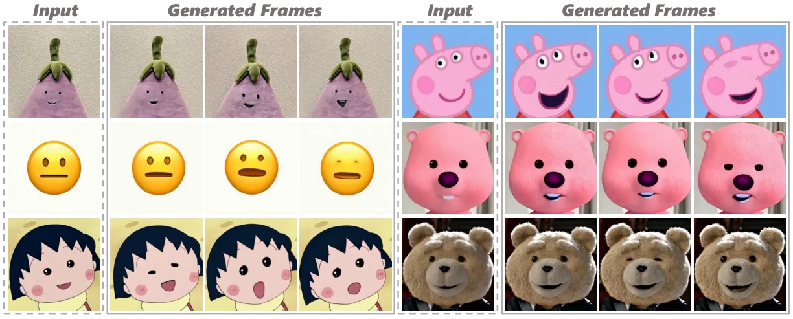

Figure 1: Visualization results of our FaceShot. Given any character and
any driven video, FaceShot effectively captures subtle facial
expressions and generates stable animations for each character.
Especially for non-human characters, such as emojis and toys, FaceShot
demonstrates remarkable animation capabilities.

## 1 Introduction

"I wish my toys could talk"-many people make this wish on birthdays or
at Christmas, hoping for the companionship from their “imaginary
friends”. Achieving this usually requires a bit of “magic”, as seen with
the talking teddy bear in Ted¹¹ 1
[https://en.wikipedia.org/wiki/Ted\_(film)](<https://en.wikipedia.org/wiki/Ted_(film)>)
or the three chipmunks in Alvin and The Chipmunks²² 2
[https://en.wikipedia.org/wiki/Alvin_and_the_Chipmunks\_(film)](<https://en.wikipedia.org/wiki/Alvin_and_the_Chipmunks_(film)>).
Behind these productions, making this “magic” a reality often requires
specialized equipment and significant manual effort for character
modeling and rigging. In this work, to bring any character into life for
every person, we propose a novel, training-free portrait animation
framework. As shown in Figure 1, even for emojis and toys, which have
totally different facial appearances from humans, our proposed framework
demonstrates remarkable performance in making these characters alive.

Portrait animation (Guo et al., 2024; Ma et al., 2024; Xie et al., 2024;
Yang et al., 2024; Wei et al., 2024; Niu et al., 2024; Wang et al.,
2021; Zeng et al., 2023) has demonstrated impressive results with the
recent advancements in generative models, such as Generative Adversarial
Networks (GANs) (Goodfellow et al., 2020; Donahue et al., 2016; Odena
et al., 2017; Radford, 2015) and diffusion models (Rombach et al., 2022;
Nichol et al., 2021; Saharia et al., 2022; Ho et al., 2020; Song et al.,
2021a). However, these methods depend on facial landmark recognition,
and their performance are constrained by the generalization capability
of facial landmark detection models (Zhou et al., 2023; Yang et al.,
2023). For non-human characters, such as emojis, animals and toys, which
often exhibit significantly different facial features compared to human
portraits, always resulting in landmark recognition failures due to the
supervised training paradigm and limited datasets. As shown in Figure 2,
the unaligned target facial features for non-human character lead to
disrupted animation results; the animation models even generate a human
mouth in the wrong position for a dog. In addition, Xie et al. (2024);
Yang et al. (2024) indicate that these methods cannot control subtle
facial motions, leading to inconsistent animation results.

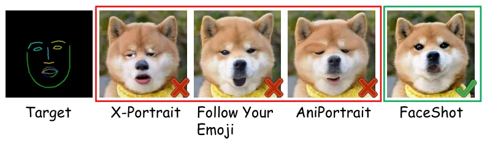

Figure 2: Visual results generated from current portrait animation
methods and our FaceShot. Previous methods apparently retain the target
human’s appearance. In contrast, the result of FaceShot both aligns the
dog’s facial features and captures the target human’s expression.

To address the above limitations, we propose FaceShot, a novel portrait
animation framework capable of animating any character from any driven
video without the need for training. As demonstrated in Figure 1,
FaceShot produces vivid and stable animations for various characters,
particularly for non-human characters. This is achieved through three
key components: (1) the appearance-guided landmark matching module, (2)
the coordinate-based landmark retargeting module, and (3) a
landmark-driven animation model.

In our landmark matching module, we inject appearance priors into
diffusion features and leverage their strong semantic correspondences to
match the landmarks. For the second component, we introduce a
theoretical algorithm to capture subtle facial motions between frames
and generate the landmark sequence aligned with the driven video.
Finally, for the third component, we input the landmark sequence of the
reference character into a pre-trained landmark-driven animation model
to animate the character. As shown in Figure 2, FaceShot provides the
reasonable animation result by offering the precise landmarks of
non-human character. Furthermore, FaceShot is compatible with any
landmark-driven portrait animation model as a plugin, improving their
performance on non-human characters, with experimental analysis in
Section 4.3.

Moreover, to address the absence of a benchmark for character animation,
we establish CharacBench that contains 46 diverse characters.
Qualitative and quantitative evaluations on CharacBench demonstrate that
FaceShot excels in animating characters, especially in non-human
characters, outperforming existing portrait animation methods.
Additionally, ablation studies validate the effectiveness and
superiority of our framework, providing valuable insights for the
community. Furthermore, we provide the animation results of FaceShot
from non-human driven videos, bringing a potential solution to the
community for open-domain portrait animation.

The main contributions of this paper are as follows:

- •
  We propose FaceShot, a novel portrait animation framework capable of
  animating any character from any driven video without the need for
  training.
- •
  FaceShot generates precise reposed landmark sequences for any
  character and any driven video, bringing a potential solution to the
  community for open-domain portrait animation.
- •
  FaceShot can be seamlessly integrated as a plugin with any
  landmark-driven animation model, further improving its performance.
- •
  We establish CharacBench, a benchmark with diverse characters for
  comprehensive evaluation. Experiments on CharacBench show that
  FaceShot outperforms SOTA approaches.

## 2 Related Work

Portrait Animation. Early portrait animation methods primarily relied on
GANs (Goodfellow et al., 2020) to generate portrait animation through
warping and rendering techniques (Drobyshev et al., 2022; Siarohin
et al., 2019; Hong et al., 2022; Wang et al., 2021; Zhao & Zhang, 2022).
Recent advancements in latent diffusion models (LDMs) (Rombach et al.,
2022; Ramesh et al., 2022; Shen et al., 2023; Gao et al., 2024; Shen
et al., 2024b; Wang et al., 2024a; Shen et al., 2024a; Li et al., 2024a;
Shen & Tang, 2024) have improved the quality and efficiency of image
generation. Building on this, some methods (Xie et al., 2024; Yang
et al., 2024) learn the identity-free expression by constructing paired
data, demonstrating impressive performance. However, current data
collection pipelines face challenges in constructing paired data for
diverse domains, particularly for non-human characters, which limits the
generalization ability of these methods. Additionally, other approaches
(Wei et al., 2024; Niu et al., 2024; Ma et al., 2024; Shen et al., 2025)
tend to utilize highly scalable conditions, such as facial landmarks, to
enhance motion control. Naturally, these methods depend on the facial
landmark recognition, which also restricts their applicability to
non-human characters. To break these limitations and bring any character
into life, we focus on providing precise reposed landmark sequences
within landmark-driven portrait animation in this work.

Facial Landmark Detection Facial landmark detection aims to detect key
points in given face. Traditional methods (Cootes et al., 2000; Cootes
et al., 2001; Dollár et al., 2010; Kowalski et al., 2017) often
construct a shape model for each key point and perform iterative
searches to match the landmarks. With the development of deep networks,
some methods (Sun et al., 2013; Zhou et al., 2013; Wu et al., 2018; Wu
et al., 2017) select a series of coarse to fine cascaded networks to
perform direct regression on the landmarks. Another trend, Huang et al.
(2020); Zhou et al. (2023); Merget et al. (2018); Kumar et al. (2020)
predict the heatmap of each point for indirect regression, improving the
accuracy of landmark detection. Recently, Yang et al. (2023); Xu et al.
(2022); Li et al. (2024b) collect larger datasets and train larger
models for more generalize landmark detection. However, due to the
supervised training paradigm and limited dataset, these methods are
difficult to perfectly detect the landmark of non-human characters. In
our paper, we turn to a training-free landmark matching module through
the strong semantic correspondence and the generalization in diffusion
features (Tang et al., 2023; Hedlin et al., 2024; Luo et al., 2024),
aiming to provide precise landmarks for non-human characters.

Image to Video Generation Image to video (I2V) generation has gained
significant attention in recent years due to its potential in various
applications, such as image animation (Dai et al., 2023; Gong et al.,
2024; Ni et al., 2023; Guo et al., 2023) and video synthesis (Blattmann
et al., 2023b; Wang et al., 2024b; Ruan et al., 2023). Since diffusion
models demonstrate the powerful image generation capabilities, Zhang
et al. (2024); Shi et al. (2024); Xing et al. (2023); Ma et al. (2024)
achieve image animation by inserting temporal layers into a pre-trained
2D UNet and fine-tuning it with video data. Furthermore, some methods
(Zhang et al., 2023a; Blattmann et al., 2023a) have constructed their
own I2V models and performed full training with large amounts of
high-quality data, demonstrating strong competitiveness. In our work, we
utilize MOFA-Video (Niu et al., 2024) as our base animation model.

## 3 Method

The framework of FaceShot is depicted in Figure 3. We first introduce
the foundational concepts of diffusion models in Section 3.1. We then
explain the three key components of our framework in detail in Section
3.2: appearance-guided landmark matching, coordinate-based landmark
retargeting, and character animation model.

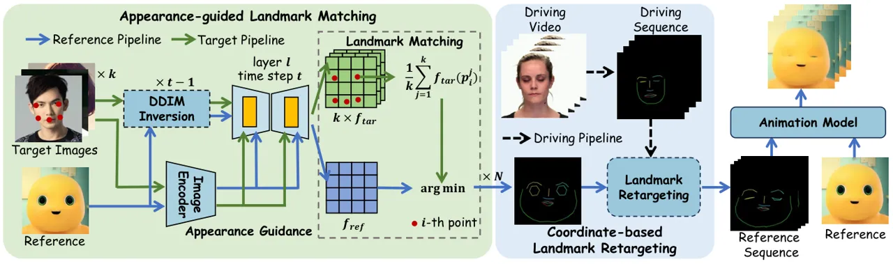

Figure 3: The FaceShot framework first generates precise facial
landmarks for the reference character with appearance guidance. Next, a
coordinate-based landmark retargeting module generates the landmark
sequence based on driving video. Finally, this sequence is fed into an
animation model to animate character.

### 3.1 preliminary

In FaceShot, we utilize Stable Diffusion (SD) (Rombach et al., 2022) as
the base model for landmark matching, which consists of a Variational
Auto-Encoder (VAE) (Kingma, 2013), a CLIP text encoder (Radford et al.,
2021), and a denoising U-Net (Ronneberger et al., 2015). Compared to
pixel-based diffusion models, SD uses the VAE encoder $`\mathcal{E}`$ to
encode the input image $`\mathbf{x}`$ into a latent representation
$`\mathbf{z}=\mathcal{E}(\mathbf{x})`$. The VAE decoder $`\mathcal{D}`$
then reconstructs the image by decoding the latent representation:
$`\mathbf{x}=\mathcal{D}(\mathbf{z})`$.

To train the denoising U-Net $`{\epsilon_{\theta}}`$, the objective
typically minimizes the Mean Square Error (MSE) loss $`\mathcal{L}`$ at
each time step $`t`$, as follows:

```math
\mathcal{L}=\mathbb{E}_{\mathbf{z}^{t},\epsilon\sim\mathcal{N}(\mathbf{0},\mathbf{I}),\mathbf{c},t}\|\epsilon_{\theta}(\mathbf{z}^{t},\mathbf{c},t)-\epsilon^{t}\|^{2}, \tag{1}
```

where
$`\mathbf{z}^{t}=\sqrt{\bar{\alpha}^{t}}\mathbf{z}^{0}+\sqrt{1-\bar{\alpha}^{t}}\epsilon^{t}`$
is the noisy latent at time step $`t`$,
$`\bar{\alpha}^{t}:=\prod_{s=1}^{t}\alpha^{s}`$ and
$`\alpha^{t}:=1-\beta^{t}`$, with $`\beta^{t}`$ represent the forward
process variances. $`\epsilon^{t}`$ denotes the added Gaussian noise,
and $`\mathbf{c}`$ is the text condition, processed by the U-Net’s
cross-attention module.

Moreover, the Denoising Diffusion Implicit Model (Song et al., 2021a)
(DDIM) enables the inversion of the latent variable $`z_{0}`$ to
$`z_{t}`$ in a deterministic manner. The formula is as follows:

```math
z^{t}=\sqrt{\frac{\alpha^{t}}{\alpha^{t-1}}}z^{t-1}++\left(\sqrt{\frac{1}{\alpha^{t}}-1}-\sqrt{\frac{1}{\alpha^{t-1}}-1}\right)\cdot\epsilon_{\theta}\left(z^{t-1},t-1,c,c^{\prime}\right),\\
 \tag{2}
```

where $`c^{\prime}`$ represents the additional image prompt. In our
implementation, we utilize the latent space features at $`t`$-th time
step and $`l`$-th layer of U-Net from DDIM inversion for landmark
matching.

### 3.2 FaceShot: Bring any Character into Life

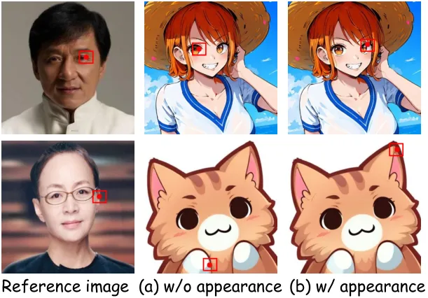

Figure 4: Visualizations of point matching with (w/, highlighted in a
red box) or without (w/o) appearance guidance using an anime diffusion
model.

Reviewing the remarkable variance in performance caused by inaccurate or
accurate facial landmarks in Figure 2. A well-generalized landmark
detector is necessary for landmark-driven portrait animation model to
bring any character into life. Prior landmark detectors (Yang et al.,
2023; Xu et al., 2022; Zhou et al., 2023) have either curated more
diverse public datasets or introduced new loss functions during training
to improve the generalization of landmark detection. However, within a
supervised training paradigm, these detectors struggle to generalize to
non-human characters, resulting inaccurate results for portrait
animation. To address this, we propose an appearance-guided landmark
matching module that generalizes to any character to generate precise
landmarks. In addition, to capture the subtle movements in driving
videos, we offer a coordinate-based landmark retargeting module.
Finally, a character animation model is employed as our base model to
animate reference characters.

Appearance-guided Landmark Matching. Tang et al. (2023); Hedlin et al.
(2024); Luo et al. (2024) demonstrate the strong semantic correspondence
and generalization between diffusion features, where simple feature
matching can map the point $`p^{\prime}`$ on the reference image
$`I_{ref}`$ to a semantic similar point $`p`$ on the target image
$`I_{tar}`$. However, appearance discrepancies across different domains
often result in mismatches, as shown in Figure 4 (a), where the points
on the left eye and right ear are incorrectly matched. A natural
solution is to inject prior appearance knowledge through inference using
a domain-specific diffusion model. As shown in Figure 4 (b), points are
correctly matched when inferred on an anime diffusion model.

Since fine-tuning a diffusion model for each reference image is costly,
inspired by IP-Adapter (Ye et al., 2023), we utilize image prompts to
provide appearance guidance. Specifically, we treat the reference image
$`I_{ref}`$ and the target image $`I_{tar}`$ as image prompts, denoted
as $`c^{\prime}_{ref}`$ and $`c^{\prime}_{tar}`$. We then apply the DDIM
inversion process to obtain deterministic diffusion features $`f_{ref}`$
and $`f_{tar}`$ from $`I_{ref}`$ and $`I_{tar}`$ at time step $`t`$ and
the $`l`$-th layer of the U-Net:

```math
\displaystyle f_{tar} \displaystyle=F_{l}(\epsilon_{\theta}(z^{t-1}_{tar},t-1,c,c^{\prime}_{ref})), \tag{3}
```

```math
\displaystyle f_{ref} \displaystyle=F_{l}(\epsilon_{\theta}(z^{t-1}_{ref},t-1,c,c^{\prime}_{tar})),
```

where $`z^{t-1}_{tar}`$ and $`z^{t-1}_{ref}`$ are iteratively sampled by
Eq. 2 from $`z^{0}_{tar}=\mathcal{E}(I_{tar})`$ and
$`z^{0}_{ref}=\mathcal{E}(I_{ref})`$ using the text prompt $`c=`$“a
photo of a face” and the image prompts $`c^{\prime}_{ref}`$ and
$`c^{\prime}_{tar}`$, respectively. $`F_{l}`$ denotes the function that
extracts the output feature at the $`l`$-th layer of the U-Net.

After obtaining the diffusion features
$`f_{ref}\in\mathbb{R}^{1\times C_{l}\times h_{l}\times w_{l}}`$ and
$`f_{tar}\in\mathbb{R}^{1\times C_{l}\times h_{l}\times w_{l}}`$, we
upsample them to
$`f_{ref}^{\prime}\in\mathbb{R}^{1\times C_{l}\times H\times W}`$ and
$`f_{tar}^{\prime}\in\mathbb{R}^{1\times C_{l}\times H\times W}`$ to
match the resolutions of $`I_{ref}`$ and $`I_{tar}`$. To improve
performance and stability, we construct the average feature of the
$`i`$-th landmark point $`p_{tar}^{i}`$ from $`k`$ target images to
match the corresponding point $`p^{i}_{ref}`$ in the reference image, as
follows:

```math
p^{i}_{ref}=\underset{p_{ref}}{\arg\min}\ d_{cos}\left(\frac{1}{k}\sum_{j=1}^{k}f^{\prime j}_{tar}(p_{tar}^{j,i}),f^{\prime}_{ref}(p_{ref})\right), \tag{4}
```

where $`f^{\prime}(p)\in\mathbb{R}^{1\times C_{l}}`$ represents the
diffusion feature vector at point $`p`$, $`d_{cos}`$ denotes the cosine
distance and $`p_{ref}`$ refers to points in the reference feature map.
Finally, we denote the matched landmark points of the reference image as
$`L^{0}_{ref}=\{p^{i}_{ref}\mid i=1,\dots,N\}`$, where $`N`$ represents
the number of facial landmarks.

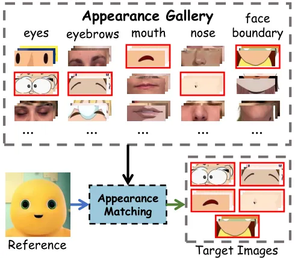

Figure 5: Illustration of our appearance gallery. We output the closest
domains for each reference image to reduce the appearance discrepancy.

Appearance Gallery. We introduce an appearance gallery
$`G=\left[G_{e},G_{m},G_{n},G_{eb},G_{fb}\right]`$, which is a
collection of five prior components—eyes, mouth, nose, eyebrows, and
face boundary—across various domains, with each domain containing $`k`$
images. For a reference image $`I_{ref}`$, we reconstruct the target
image as
$`I_{tar}=[G_{e}^{*},G_{m}^{*},G_{n}^{*},G_{eb}^{*},G_{fb}^{*}]`$ by
matching $`I_{ref}`$ with the closest domain in the appearance gallery
$`G`$, thereby explicitly reducing the appearance discrepancy between
the reference and target images, as shown in Figure 5.

Coordinate-based Landmark Retargeting. Currently, Niu et al. (2024); Wei
et al. (2024); Ma et al. (2024) utilize 3D Morphable Models
(3DMM) (Booth et al., 2016) to generate the landmark sequence of the
reference image by applying 3D face parameters. However, 3DMM-based
methods often struggle to generalize to non-human character faces due to
the limited number of high-quality 3D data and their inability to
capture subtle expression movements (Retsinas et al., 2024). As shown in
Figure 6, the head shapes of the 3D face are not well aligned with the
input images, and subtle movements, such as eye closures, are absent in
the $`i`$-th frame. Therefore, we propose a coordinate-based landmark
retargeting module designed to generate a retargeted landmark sequence
$`L_{ref}`$ that can stably capture the subtle movements from driving
video based on transformations in rectangular coordinate systems.

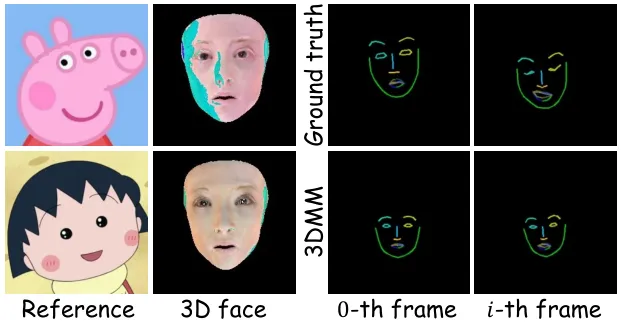

Figure 6: Visualizations of 3D face and retargeting results using 3DMM.

Our module consists of two stages, which respectively retarget the
global motion of entire face and the local motion of different facial
parts from driving sequence to reference image. In the first stage, the
global motion from the $`0`$-th to the $`m`$-th driving frame is defined
as the translation $`\Delta O_{dri}=O_{dri}^{m}-O_{dri}^{0}`$ and
rotation $`\Delta\theta_{dri}=\theta_{dri}^{m}-\theta_{dri}^{0}`$ of the
corresponding global rectangular coordinate systems
$`(O^{0}_{dri},\theta^{0}_{dri})`$ and
$`(O^{m}_{dri},\theta^{m}_{dri})`$. Specifically, the global rectangular
coordinate system is constructed by the origin $`O`$ and angle
$`\theta`$, which are calculated from the endpoints of face boundary.
Afterward, the global coordinate system of reference image at $`m`$-th
frame can be calculated from those of $`0`$-th frame’s as follows:

```math
O_{ref}^{m}=O_{ref}^{0}+\Delta O_{dri},\ \theta_{ref}^{m}=\theta_{ref}^{0}+\Delta\theta_{dri}. \tag{5}
```

Finally, we transfer the coordinates of the landmark points from
$`(O_{ref}^{0},\theta_{ref}^{0})`$ to
$`(O_{ref}^{m},\theta_{ref}^{m})`$, representing the global motion of
the entire reference face.

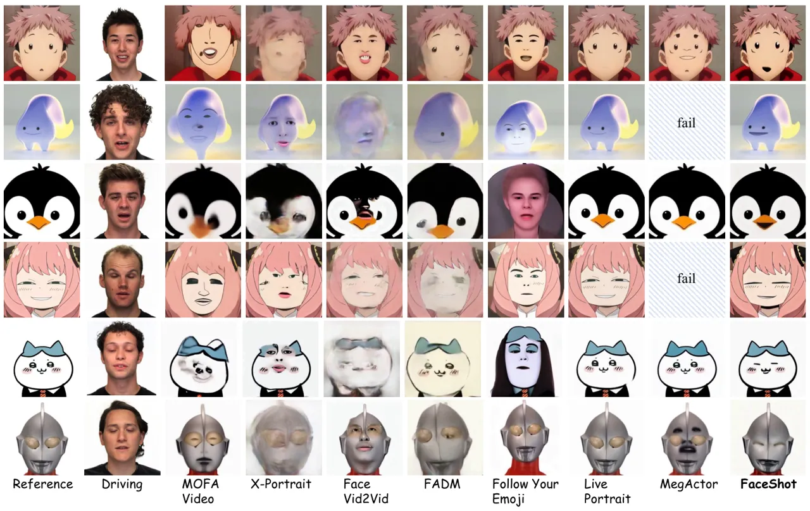

Figure 7: Qualitative comparison with SOTA portrait animation methods.
Slash boxes represent that the method has fail to generate animation for
this character.

In stage two, the local motion involves two processes: the relative
motion and point motion, applied to five facial parts: eyes, mouth,
nose, eyebrows, and face boundary. The relative motion is similar to the
global motion, but the part-specific coordinate systems are calculated
from the endpoints of each part. Furthermore, to constrain each part
within a reasonable facial range, we scale $`\Delta O_{dri}`$ as
$`\frac{b_{ref}}{b_{dri}}\Delta O_{dri}`$, where $`b`$ represents the
distance from the origin to the boundary of each part. Next, we model
the point motion as follows:

```math
p^{m,i}_{ref}=\left(\frac{p^{m,i}_{dri}[0]}{p^{0,i}_{dri}[0]}\cdot p^{0,i}_{ref}[0],\frac{p^{m,i}_{dri}[1]}{p^{0,i}_{dri}[1]}\cdot p^{0,i}_{ref}[1]\right), \tag{6}
```

where $`p^{m,i}_{ref}`$ and $`p^{m,i}_{dri}`$ represent the coordinates
in the part-specific coordinate system for the $`m`$-th frame and
$`i`$-th point. This simple yet effective design enables us to capture
both global and local, obvious and subtle motions into landmark sequence
$`L_{ref}=\{L_{ref}^{j}\mid j=1,\dots,M\}`$ for any character, where
$`M`$ represents the number of video frames.

Character Animation Model. After obtaining the reference landmark
sequence $`L_{ref}`$, it can be applied to any landmark-driven animation
model to animate the character portrait. Specifically, $`L_{ref}`$ is
treated as an additional condition for the U-Net, either injected via a
ControlNet-like structure (Niu et al., 2024) or incorporated directly
into the latent space (Hu, 2024; Wei et al., 2024). This enables the
model to precisely track the motion encoded in the landmark sequence
while preserving the character’s visual identity. Moreover, this
flexible condition can be seamlessly extended to various architectures,
enhancing scalability across diverse animation tasks.

## 4 Experiments

### 4.1 Implement Detail

In this work, we employ MOFA-Video (Niu et al., 2024), a Stable Video
Diffusion (Blattmann et al., 2023a) (SVD)-based landmark-driven
animation model, as our base character animation model. For
appearance-guided landmark matching, we utilize Stable Diffusion v1.5
along with the pre-trained weights of IP-Adapter (Ye et al., 2023) to
extract diffusion features from the images. Specifically, we set the
time step $`t=301`$, the U-Net layer $`l=6`$, and the number of target
images $`k=10`$. Additionally, following MOFA-Video, we use $`N=68`$
keypoints (Sagonas et al., 2016) as facial landmarks and $`M=64`$ frames
for animation. More details are shown in Appendix.

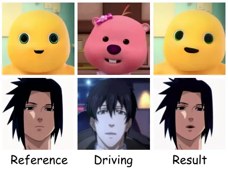

Figure 8: Visualizations of character animation from non-human driving
videos.

Evaluation Metrics. Following Xie et al. (2024); Ma et al. (2024), we
employ four metrics to evaluate identity similarity, high- and low-level
image quality and expression accuracy. Specifically, we utilize ArcFace
score (Deng et al., 2019a) that calculates average cosine similarity
between source and generated videos as identity similarity. We also
employ HyperIQA (Zhang et al., 2023b) and LAION Aesthetic (Schuhmann
et al., 2022) for evaluating image quality from low- and high-level.
Moreover, we conduct the expression evaluation following the steps of
Point-Tracking in MimicBench³³ 3
https://github.com/open-mmlab/MimicBench.

Character Benchmark. To comprehensively evaluate the effectiveness and
generalization ability of portrait animation methods towards characters,
we build CharacBench that comprises 46 characters from various domains,
such as animals, emojis, toys and anime characters. Characters in
CharacBench are collected from Internet by following the guideline of
ensuring that the characters do not resemble human facial features as
much as possible. Moreover, we consider videos of human head from
RAVDESS (Livingstone & Russo, 2018) as our driving videos.

### 4.2 Comparison with SOTA Methods

Qualitative Results. We compare proposed FaceShot with SOTA portrait
animation methods, including MOFA-Video (Niu et al., 2024), X-Portrait
(Xie et al., 2024), FaceVid2Vid (Wang et al., 2021), FADM (Zeng et al.,
2023), Follow Your Emoji (Ma et al., 2024), LivePortrait (Guo et al.,
2024), and MegActor (Yang et al., 2024). Visual comparisons are
presented in Figure 7, where fail indicates that the method was unable
to generate animation for the character. As AniPortrait (Wei et al., 2024) fails with most non-human characters, we only provide its
quantitative results. We observe that most methods such as MOFA-Video,
X-Portrait, FaceVid2Vid and Follow Your Emoji, are influenced by the
human prior in the driving video, resulting in human facial features
appearing on character faces. In contrast, FaceShot effectively
preserves the identity of reference characters through precise landmarks
provided by our proposed appearance-guided landmark matching module.
Furthermore, while most methods struggle to retarget the motions like
eye closure and mouth opening, our coordinated-based landmark
retargeting module enables FaceShot to capture subtle movements.

Beyond its effective character animation capability, FaceShot can also
animate reference characters from non-human driving videos, extending
the application of portrait animation from human-related videos to any
video as shown in Fig. 8. This demonstrates its potential for
open-domain portrait animations.

|                   |                      |                       |                        |                               |                     |                       |                      |
| ----------------- | -------------------- | --------------------- | ---------------------- | ----------------------------- | ------------------- | --------------------- | -------------------- |
| Methods           | Metrics              |                       |                        |                               | User Preference     |                       |                      |
|                   | ArcFace $`\uparrow`$ | HyperIQA $`\uparrow`$ | Aesthetic $`\uparrow`$ | Point-Tracking $`\downarrow`$ | Motion $`\uparrow`$ | Identity $`\uparrow`$ | Overall $`\uparrow`$ |
| FaceVid2Vid       | 0.525                | 33.721                | 4.267                  | 6.944                         | 3.58                | 3.83                  | 4.52                 |
| FADM              | 0.633                | 39.402                | 4.522                  | 6.993                         | 1.93                | 2.04                  | 1.96                 |
| X-Portrait        | 0.490                | 52.357                | 4.754                  | 7.301                         | 1.47                | 1.63                  | 1.57                 |
| Follow Your Emoji | 0.612                | 52.056                | 4.906                  | 6.960                         | 6.91                | 6.67                  | 6.74                 |
| AniPortrait\*     | 0.634                | 55.951                | 4.928                  | 6.367                         | 5.84                | 5.64                  | 5.39                 |
| MegActor\*        | 0.613                | 40.191                | 4.855                  | 7.183                         | 6.53                | 6.75                  | 6.26                 |
| LivePortrait\*    | 0.893                | 53.587                | 5.092                  | 7.474                         | 7.33                | 7.08                  | 7.11                 |
| MOFA-Video        | 0.695                | 52.272                | 4.952                  | 14.985                        | 3.27                | 3.04                  | 3.18                 |
| FaceShot          | 0.848                | 53.723                | 5.036                  | 6.935                         | 8.14                | 8.32                  | 8.27                 |

Table 1: Quantitative comparison between FaceShot and other SOTA methods
on CharacBench. The best result is marked in bold, and the second-best
performance is highlighted in underline. Symbol \* indicates that there
are some failure cases in these methods, we report the values of these
methods only for reference.

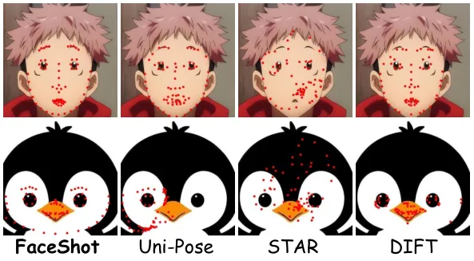

Figure 9: The visualizations of landmarks detection on different
characters in CharacBench using DIFT, STAR, Uni-Pose and FaceShot.

Quantitative Results. We conduct a quantitative comparison on the
metrics mentioned in Section 4.1. Please note that some methods, such as
LivePortrait, MegActor, and AniPortrait, fail to generate animations for
certain characters when they are unable to detect the face. Therefore,
for a fair comparison, we report the failure rate for these methods as
follows: AniPortrait (39.13%), MegActor (36.50%), and LivePortrait
(16.67%), and we calculate their metric values on successful characters
only for reference purposes. Based on Table 1, FaceShot demonstrates
significantly superior performance across various metrics compared to
other methods on CharacBench. Specifically, FaceShot achieves the
highest score in terms of ArcFace (0.848), demonstrating the
effectiveness of the precise landmarks generated by the
appearance-guided landmark matching module in preserving facial
identity. FaceShot achieves superior HyperIQA (53.723) and Aesthetic
(5.036) scores, indicating better image quality. Additionally, the
coordinate-based landmark retargeting module contributes to the
competitive point tracking score (6.935), highlighting its ability to
handle motion effectively. It is important to note that our method has
achieved significant improvements across all metrics compared to the
base method, MOFA-Video, further demonstrating the effectiveness of our
proposed FaceShot.

User Preference. Additionally, we randomly selected 15 case examples and
enlisted 20 volunteers to evaluate each method across three key
dimensions: Motion, Identity, and Overall User Satisfaction. Volunteers
ranked the animations based on these criteria, ensuring a fair and
comprehensive comparison between the methods. As shown in Table 1,
FaceShot achieves the highest scores in Motion, Identity, and Overall
categories, demonstrating its robust animation capabilities across
diverse characters and driving videos.

### 4.3 Ablation Studies

Appearance-guided Landmark Matching. To evaluate the effectiveness of
our appearance-guided landmark matching module, we compare it with SOTA
unsupervised algorithm DIFT (Tang et al., 2023) and supervised
algorithms Uni-Pose (Yang et al., 2023) and STAR (Zhou et al., 2023) on
CharacBench. Specifically, we recruited volunteers to annotate the
landmarks of images in CharacBench as ground-truth values for
calculating the corresponding Normalized Mean Error (NME) value.

|          |                    |                      |                       |                        |
| -------- | ------------------ | -------------------- | --------------------- | ---------------------- |
| Methods  | NME $`\downarrow`$ | ArcFace $`\uparrow`$ | HyperIQA $`\uparrow`$ | Aesthetic $`\uparrow`$ |
| STAR     | 24.530             | 52.849               | 0.829                 | 4.989                  |
| Uni-Pose | 13.731             | 53.685               | 0.851                 | 5.025                  |
| DIFT     | 11.448             | 53.506               | 0.843                 | 5.023                  |
| FaceShot | 8.569              | 53.723               | 0.848                 | 5.036                  |

Table 2: Albation studies of our appearance-guided landmark matching
module with supervised SOTA methods Uni-Pose and STAR and unsupervised
method DIFT on CharacBench. Best result is marked in bold, and the
second-best performance is highlighted in underline.

As illustrated in Table 2, FaceShot achieves the lowest NME on
CharacBench. The visual landmark results are shown in Figure 9, FaceShot
accurately detects the landmarks on the non-human characters, whereas
others fail to match the positions of the eyes and mouth. Furthermore,
we observe that Faceshot also achieves the best scores in Table 2,
highlighting the necessity of precise landmarks of landmark-driven
portrait animation models.

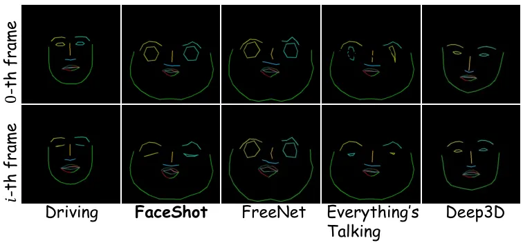

Figure 10: Visual results of landmark retargeting between FaceShot and
other methods.

Coordinate-based Landmark Retargeting. To evaluate the effectiveness of
our landmark retargeting module, we provide a comparison with SOTA
landmark retargeting methods, including Deep3D (3DMM) (Deng et al.,
2019b), Everthing’s Talking (Song et al., 2021b) and FreeNet (Zhang
et al., 2020), where Everthing’s Talking models the Bézier Curve as the
motion controller and FreeNet trains a parameterized network for
retargeting.

|                                |          |        |                     |         |
| ------------------------------ | -------- | ------ | ------------------- | ------- |
| Metric                         | FaceShot | Deep3D | Everthing’s Talking | FreeNet |
| Point- Tracking $`\downarrow`$ | 6.935    | 8.282  | 8.382               | 8.272   |

Table 3: Albation studies of coordinate-based landmark retargeting
module with SOTA methods Deep3D, Everthing’s Talking and FreeNet. Best
result is marked in bold.

As shown in Figure 10, due to the precision loss of fitting a Bezier
curve, Everthing’s Talking always generates the inaccurate retargeting.
FreeNet and 3DMM have strict requirements for the distribution facial
features, making it unable to adapt to non-human characters. In
contrast, our module can precisely capture the subtle motion such as
mouth opening, eye closure, and global face movement. Additionally,
FaceShot also achieves the lowest point-tracking score in Table 3,
demonstrating its effectiveness in capturing the consistent face
movements.

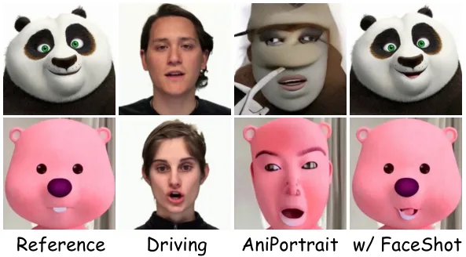

Figure 11: Visual results of AniPortrait with or without FaceShot as a
plugin to generate animation results.

As a Plugin. Experiments in Section 4.2 have demonstrated that FaceShot
can significantly improve the performance of the landmark-driven method
MOFA-Video (Niu et al., 2024). To further verify its effectiveness as a
plugin for landmark-driven animation models, we input the reposed
landmark sequences generated by FaceShot into AniPortrait’s (Wei et al., 2024) pipeline. As shown in Figure 11, inaccurate landmarks in original
AniPortrait often result in distortions, producing results that resemble
real humans. In contrast, FaceShot can provide precise and robust
landmarks for characters, leading to harmonious and stable animation
results.

## 5 Conclusion

In this paper, we introduced FaceShot, a training-free portrait
animation framework that animates any character from any driven video.
By leveraging semantic correspondence in latent diffusion model
features, FaceShot addresses the limitations of existing landmark-driven
methods, enabling precise landmark matching and landmark retargeting.
This powerful capability not only extends the application of portrait
animation beyond traditional boundaries but also enhances the realism
and consistency of animations in landmark-driven models. FaceShot is
also compatible with any landmark-driven animation model as a plugin.
Additionally, experimental results on CharacBench, a benchmark featuring
diverse characters, demonstrate that FaceShot consistently outperforms
current SOTA methods.

Future Work. Although FaceShot shows strong performance, future work
could focus on enhancing appearance-guided landmark matching by refining
semantic feature extraction from latent diffusion models, particularly
for complex facial geometries. Furthermore, parameterizing landmark
retargeting could offer more precise control over facial expressions,
improving the adaptability of FaceShot across diverse character types
and styles.

## Ethics Statement

In developing FaceShot, a training-free portrait animation framework
that animates any characters from any driven video, we are dedicated to
upholding ethical standards and promoting responsible AI use. We
acknowledge potential risks, such as deepfake misuse or unauthorized
media manipulation, and stress the importance of applying this
technology in ways that respect privacy, consent, and individual rights.
Our code will be publicly released to encourage responsible use in areas
like entertainment and education, while discouraging unethical
practices, including misinformation and harassment. We also advocate for
continued research on safeguards and detection mechanisms to prevent
misuse and ensure adherence to ethical guidelines and legal frameworks.

## Acknowledgments

This project is supported by the National Key R&D Program of China (No.
2022ZD0161600) and the National Natural Science Fund of China (No.
62473286).

## References

- Blattmann et al. (2023a) Andreas Blattmann, Tim Dockhorn, Sumith
  Kulal, Daniel Mendelevitch, Maciej Kilian, Dominik Lorenz, Yam Levi,
  Zion English, Vikram Voleti, Adam Letts, et al. Stable video
  diffusion: Scaling latent video diffusion models to large datasets.
  _arXiv preprint arXiv:2311.15127_, 2023a.
- Blattmann et al. (2023b) Andreas Blattmann, Robin Rombach, Huan Ling,
  Tim Dockhorn, Seung Wook Kim, Sanja Fidler, and Karsten Kreis. Align
  your latents: High-resolution video synthesis with latent diffusion
  models. In _Proceedings of the IEEE/CVF Conference on Computer Vision
  and Pattern Recognition_, pp. 22563–22575, 2023b.
- Booth et al. (2016) James Booth, Anastasios Roussos, Stefanos
  Zafeiriou, Allan Ponniah, and David Dunaway. A 3d morphable model
  learnt from 10,000 faces. In _Proceedings of the IEEE conference on
  computer vision and pattern recognition_, pp. 5543–5552, 2016.
- Cootes et al. (2000) Tim Cootes, ER Baldock, and J Graham. An
  introduction to active shape models. _Image processing and analysis_,
  328:223–248, 2000.
- Cootes et al. (2001) Timothy F. Cootes, Gareth J. Edwards, and
  Christopher J. Taylor. Active appearance models. _IEEE Transactions on
  pattern analysis and machine intelligence_, 23(6):681–685, 2001.
- Dai et al. (2023) Zuozhuo Dai, Zhenghao Zhang, Yao Yao, Bingxue Qiu,
  Siyu Zhu, Long Qin, and Weizhi Wang. Animateanything: Fine-grained
  open domain image animation with motion guidance. _arXiv e-prints_,
  pp. arXiv–2311, 2023.
- Deng et al. (2019a) Jiankang Deng, Jia Guo, Niannan Xue, and Stefanos
  Zafeiriou. Arcface: Additive angular margin loss for deep face
  recognition. In _Proceedings of the IEEE/CVF conference on computer
  vision and pattern recognition_, pp. 4690–4699, 2019a.
- Deng et al. (2019b) Yu Deng, Jiaolong Yang, Sicheng Xu, Dong Chen,
  Yunde Jia, and Xin Tong. Accurate 3d face reconstruction with
  weakly-supervised learning: From single image to image set. In
  _Proceedings of the IEEE/CVF conference on computer vision and pattern
  recognition workshops_, pp. 0–0, 2019b.
- Dollár et al. (2010) Piotr Dollár, Peter Welinder, and Pietro Perona.
  Cascaded pose regression. In _2010 IEEE Computer Society Conference on
  Computer Vision and Pattern Recognition_, pp. 1078–1085. IEEE, 2010.
- Donahue et al. (2016) Jeff Donahue, Philipp Krähenbühl, and Trevor
  Darrell. Adversarial feature learning. _arXiv preprint
  arXiv:1605.09782_, 2016.
- Drobyshev et al. (2022) Nikita Drobyshev, Jenya Chelishev, Taras
  Khakhulin, Aleksei Ivakhnenko, Victor Lempitsky, and Egor Zakharov.
  Megaportraits: One-shot megapixel neural head avatars. In _Proceedings
  of the 30th ACM International Conference on Multimedia_, pp.
  2663–2671, 2022.
- Feng et al. (2021) Yao Feng, Haiwen Feng, Michael J Black, and Timo
  Bolkart. Learning an animatable detailed 3d face model from
  in-the-wild images. _ACM Transactions on Graphics (ToG)_,
  40(4):1–13, 2021.
- Gao et al. (2024) Junyao Gao, Yanchen Liu, Yanan Sun, Yinhao Tang,
  Yanhong Zeng, Kai Chen, and Cairong Zhao. Styleshot: A snapshot on any
  style. _arXiv preprint arXiv:2407.01414_, 2024.
- Gong et al. (2024) Litong Gong, Yiran Zhu, Weijie Li, Xiaoyang Kang,
  Biao Wang, Tiezheng Ge, and Bo Zheng. Atomovideo: High fidelity
  image-to-video generation. _arXiv preprint arXiv:2403.01800_, 2024.
- Goodfellow et al. (2020) Ian Goodfellow, Jean Pouget-Abadie, Mehdi
  Mirza, Bing Xu, David Warde-Farley, Sherjil Ozair, Aaron Courville,
  and Yoshua Bengio. Generative adversarial networks. _Communications of
  the ACM_, 63(11):139–144, 2020.
- Guo et al. (2020) Jianzhu Guo, Xiangyu Zhu, Yang Yang, Fan Yang, Zhen
  Lei, and Stan Z Li. Towards fast, accurate and stable 3d dense face
  alignment. In _European Conference on Computer Vision_, pp. 152–168.
  Springer, 2020.
- Guo et al. (2024) Jianzhu Guo, Dingyun Zhang, Xiaoqiang Liu, Zhizhou
  Zhong, Yuan Zhang, Pengfei Wan, and Di Zhang. Liveportrait: Efficient
  portrait animation with stitching and retargeting control. _arXiv
  preprint arXiv:2407.03168_, 2024.
- Guo et al. (2023) Yuwei Guo, Ceyuan Yang, Anyi Rao, Zhengyang Liang,
  Yaohui Wang, Yu Qiao, Maneesh Agrawala, Dahua Lin, and Bo Dai.
  Animatediff: Animate your personalized text-to-image diffusion models
  without specific tuning. _arXiv preprint arXiv:2307.04725_, 2023.
- Hedlin et al. (2024) Eric Hedlin, Gopal Sharma, Shweta Mahajan,
  Xingzhe He, Hossam Isack, Abhishek Kar, Helge Rhodin, Andrea
  Tagliasacchi, and Kwang Moo Yi. Unsupervised keypoints from pretrained
  diffusion models. In _Proceedings of the IEEE/CVF Conference on
  Computer Vision and Pattern Recognition_, pp. 22820–22830, 2024.
- Ho et al. (2020) Jonathan Ho, Ajay Jain, and Pieter Abbeel. Denoising
  diffusion probabilistic models. In _NeurIPS_, 2020.
- Hong et al. (2022) Fa-Ting Hong, Longhao Zhang, Li Shen, and Dan Xu.
  Depth-aware generative adversarial network for talking head video
  generation. In _Proceedings of the IEEE/CVF conference on computer
  vision and pattern recognition_, pp. 3397–3406, 2022.
- Hu (2024) Li Hu. Animate anyone: Consistent and controllable
  image-to-video synthesis for character animation. In _Proceedings of
  the IEEE/CVF Conference on Computer Vision and Pattern Recognition_,
  pp. 8153–8163, 2024.
- Huang et al. (2020) Xiehe Huang, Weihong Deng, Haifeng Shen, Xiubao
  Zhang, and Jieping Ye. Propagationnet: Propagate points to curve to
  learn structure information. In _Proceedings of the IEEE/CVF
  Conference on Computer Vision and Pattern Recognition_, pp.
  7265–7274, 2020.
- Kingma (2013) Diederik P Kingma. Auto-encoding variational bayes.
  _arXiv preprint arXiv:1312.6114_, 2013.
- Kowalski et al. (2017) Marek Kowalski, Jacek Naruniec, and Tomasz
  Trzcinski. Deep alignment network: A convolutional neural network for
  robust face alignment. In _Proceedings of the IEEE conference on
  computer vision and pattern recognition workshops_, pp. 88–97, 2017.
- Kumar et al. (2020) Abhinav Kumar, Tim K Marks, Wenxuan Mou, Ye Wang,
  Michael Jones, Anoop Cherian, Toshiaki Koike-Akino, Xiaoming Liu, and
  Chen Feng. Luvli face alignment: Estimating landmarks’ location,
  uncertainty, and visibility likelihood. In _Proceedings of the
  IEEE/CVF Conference on Computer Vision and Pattern Recognition_, pp.
  8236–8246, 2020.
- Li et al. (2024a) Jiaxing Li, Hongbo Zhao, Yijun Wang, and Jianxin
  Lin. Towards photorealistic video colorization via gated color-guided
  image diffusion models. In _Proceedings of the 32nd ACM International
  Conference on Multimedia_, pp. 10891–10900, 2024a.
- Li et al. (2024b) Yaokun Li, Guang Tan, and Chao Gou. Cascaded
  iterative transformer for jointly predicting facial landmark,
  occlusion probability and head pose. _International Journal of
  Computer Vision_, 132(4):1242–1257, 2024b.
- Livingstone & Russo (2018) Steven R Livingstone and Frank A Russo. The
  ryerson audio-visual database of emotional speech and song (ravdess):
  A dynamic, multimodal set of facial and vocal expressions in north
  american english. _PloS one_, 13(5):e0196391, 2018.
- Luo et al. (2024) Grace Luo, Lisa Dunlap, Dong Huk Park, Aleksander
  Holynski, and Trevor Darrell. Diffusion hyperfeatures: Searching
  through time and space for semantic correspondence. _Advances in
  Neural Information Processing Systems_, 36, 2024.
- Ma et al. (2024) Yue Ma, Hongyu Liu, Hongfa Wang, Heng Pan, Yingqing
  He, Junkun Yuan, Ailing Zeng, Chengfei Cai, Heung-Yeung Shum, Wei Liu,
  et al. Follow-your-emoji: Fine-controllable and expressive freestyle
  portrait animation. _arXiv preprint arXiv:2406.01900_, 2024.
- Merget et al. (2018) Daniel Merget, Matthias Rock, and Gerhard Rigoll.
  Robust facial landmark detection via a fully-convolutional
  local-global context network. In _Proceedings of the IEEE conference
  on computer vision and pattern recognition_, pp. 781–790, 2018.
- Ni et al. (2023) Haomiao Ni, Changhao Shi, Kai Li, Sharon X Huang, and
  Martin Renqiang Min. Conditional image-to-video generation with latent
  flow diffusion models. In _Proceedings of the IEEE/CVF conference on
  computer vision and pattern recognition_, pp. 18444–18455, 2023.
- Nichol et al. (2021) Alex Nichol, Prafulla Dhariwal, Aditya Ramesh,
  Pranav Shyam, Pamela Mishkin, Bob McGrew, Ilya Sutskever, and Mark
  Chen. Glide: Towards photorealistic image generation and editing with
  text-guided diffusion models. _arXiv preprint arXiv:2112.10741_, 2021.
- Niu et al. (2024) Muyao Niu, Xiaodong Cun, Xintao Wang, Yong Zhang,
  Ying Shan, and Yinqiang Zheng. Mofa-video: Controllable image
  animation via generative motion field adaptions in frozen
  image-to-video diffusion model. _arXiv preprint
  arXiv:2405.20222_, 2024.
- Odena et al. (2017) Augustus Odena, Christopher Olah, and Jonathon
  Shlens. Conditional image synthesis with auxiliary classifier gans. In
  _International conference on machine learning_, pp. 2642–2651.
  PMLR, 2017.
- Radford (2015) Alec Radford. Unsupervised representation learning with
  deep convolutional generative adversarial networks. _arXiv preprint
  arXiv:1511.06434_, 2015.
- Radford et al. (2021) Alec Radford, Jong Wook Kim, Chris Hallacy,
  Aditya Ramesh, Gabriel Goh, Sandhini Agarwal, Girish Sastry, Amanda
  Askell, Pamela Mishkin, Jack Clark, et al. Learning transferable
  visual models from natural language supervision. In _International
  conference on machine learning_, pp. 8748–8763. PMLR, 2021.
- Ramesh et al. (2022) Aditya Ramesh, Prafulla Dhariwal, Alex Nichol,
  Casey Chu, and Mark Chen. Hierarchical text-conditional image
  generation with clip latents. _arXiv preprint arXiv:2204.06125_,
  1(2):3, 2022.
- Retsinas et al. (2024) George Retsinas, Panagiotis P Filntisis, Radek
  Danecek, Victoria F Abrevaya, Anastasios Roussos, Timo Bolkart, and
  Petros Maragos. 3d facial expressions through
  analysis-by-neural-synthesis. In _Proceedings of the IEEE/CVF
  Conference on Computer Vision and Pattern Recognition_, pp.
  2490–2501, 2024.
- Rombach et al. (2022) Robin Rombach, Andreas Blattmann, Dominik
  Lorenz, Patrick Esser, and Björn Ommer. High-resolution image
  synthesis with latent diffusion models. In _Proceedings of the
  IEEE/CVF conference on computer vision and pattern recognition_, pp.
  10684–10695, 2022.
- Ronneberger et al. (2015) Olaf Ronneberger, Philipp Fischer, and
  Thomas Brox. U-net: Convolutional networks for biomedical image
  segmentation. In _Medical Image Computing and Computer-Assisted
  Intervention–MICCAI 2015: 18th International Conference, Munich,
  Germany, October 5-9, 2015, Proceedings, Part III 18_, pp. 234–241.
  Springer, 2015.
- Ruan et al. (2023) Ludan Ruan, Yiyang Ma, Huan Yang, Huiguo He, Bei
  Liu, Jianlong Fu, Nicholas Jing Yuan, Qin Jin, and Baining Guo.
  Mm-diffusion: Learning multi-modal diffusion models for joint audio
  and video generation. In _Proceedings of the IEEE/CVF Conference on
  Computer Vision and Pattern Recognition_, pp. 10219–10228, 2023.
- Sagonas et al. (2016) Christos Sagonas, Epameinondas Antonakos,
  Georgios Tzimiropoulos, Stefanos Zafeiriou, and Maja Pantic. 300 faces
  in-the-wild challenge: Database and results. _Image and vision
  computing_, 47:3–18, 2016.
- Saharia et al. (2022) Chitwan Saharia, William Chan, Saurabh Saxena,
  Lala Li, Jay Whang, Emily L Denton, Kamyar Ghasemipour, Raphael
  Gontijo Lopes, Burcu Karagol Ayan, Tim Salimans, et al. Photorealistic
  text-to-image diffusion models with deep language understanding.
  _Advances in neural information processing systems_,
  35:36479–36494, 2022.
- Schuhmann et al. (2022) Christoph Schuhmann, Romain Beaumont, Richard
  Vencu, Cade Gordon, Ross Wightman, Mehdi Cherti, Theo Coombes, Aarush
  Katta, Clayton Mullis, Mitchell Wortsman, et al. Laion-5b: An open
  large-scale dataset for training next generation image-text models.
  _Advances in Neural Information Processing Systems_,
  35:25278–25294, 2022.
- Shen & Tang (2024) Fei Shen and Jinhui Tang. Imagpose: A unified
  conditional framework for pose-guided person generation. In _The
  Thirty-eighth Annual Conference on Neural Information Processing
  Systems_, 2024.
- Shen et al. (2023) Fei Shen, Hu Ye, Jun Zhang, Cong Wang, Xiao Han,
  and Wei Yang. Advancing pose-guided image synthesis with progressive
  conditional diffusion models. _arXiv preprint arXiv:2310.06313_, 2023.
- Shen et al. (2024a) Fei Shen, Xin Jiang, Xin He, Hu Ye, Cong Wang,
  Xiaoyu Du, Zechao Li, and Jinghui Tang. Imagdressing-v1: Customizable
  virtual dressing. _arXiv preprint arXiv:2407.12705_, 2024a.
- Shen et al. (2024b) Fei Shen, Hu Ye, Sibo Liu, Jun Zhang, Cong Wang,
  Xiao Han, and Wei Yang. Boosting consistency in story visualization
  with rich-contextual conditional diffusion models. _arXiv preprint
  arXiv:2407.02482_, 2024b.
- Shen et al. (2025) Fei Shen, Cong Wang, Junyao Gao, Qin Guo, Jisheng
  Dang, Jinhui Tang, and Tat-Seng Chua. Long-term talkingface generation
  via motion-prior conditional diffusion model. _arXiv preprint
  arXiv:2502.09533_, 2025.
- Shi et al. (2024) Xiaoyu Shi, Zhaoyang Huang, Fu-Yun Wang, Weikang
  Bian, Dasong Li, Yi Zhang, Manyuan Zhang, Ka Chun Cheung, Simon See,
  Hongwei Qin, et al. Motion-i2v: Consistent and controllable
  image-to-video generation with explicit motion modeling. In _ACM
  SIGGRAPH 2024 Conference Papers_, pp. 1–11, 2024.
- Siarohin et al. (2019) Aliaksandr Siarohin, Stéphane Lathuilière,
  Sergey Tulyakov, Elisa Ricci, and Nicu Sebe. First order motion model
  for image animation. _Advances in neural information processing
  systems_, 32, 2019.
- Song et al. (2021a) Jiaming Song, Chenlin Meng, and Stefano Ermon.
  Denoising diffusion implicit models. In _ICLR_, 2021a.
- Song et al. (2021b) Linsen Song, Wayne Wu, Chaoyou Fu, Chen Qian,
  Chen Change Loy, and Ran He. Everything’s talkin’: Pareidolia face
  reenactment. _arXiv preprint arXiv:2104.03061_, 2021b.
- Sun et al. (2013) Yi Sun, Xiaogang Wang, and Xiaoou Tang. Deep
  convolutional network cascade for facial point detection. In
  _Proceedings of the IEEE conference on computer vision and pattern
  recognition_, pp. 3476–3483, 2013.
- Tang et al. (2023) Luming Tang, Menglin Jia, Qianqian Wang,
  Cheng Perng Phoo, and Bharath Hariharan. Emergent correspondence from
  image diffusion. _Advances in Neural Information Processing Systems_,
  36:1363–1389, 2023.
- Wang et al. (2024a) Cong Wang, Kuan Tian, Yonghang Guan, Jun Zhang,
  Zhiwei Jiang, Fei Shen, Xiao Han, Qing Gu, and Wei Yang. Ensembling
  diffusion models via adaptive feature aggregation. _arXiv preprint
  arXiv:2405.17082_, 2024a.
- Wang et al. (2021) Ting-Chun Wang, Arun Mallya, and Ming-Yu Liu.
  One-shot free-view neural talking-head synthesis for video
  conferencing. In _Proceedings of the IEEE/CVF conference on computer
  vision and pattern recognition_, pp. 10039–10049, 2021.
- Wang et al. (2024b) Xiang Wang, Hangjie Yuan, Shiwei Zhang, Dayou
  Chen, Jiuniu Wang, Yingya Zhang, Yujun Shen, Deli Zhao, and Jingren
  Zhou. Videocomposer: Compositional video synthesis with motion
  controllability. _Advances in Neural Information Processing Systems_,
  36, 2024b.
- Wei et al. (2024) Huawei Wei, Zejun Yang, and Zhisheng Wang.
  Aniportrait: Audio-driven synthesis of photorealistic portrait
  animation. _arXiv preprint arXiv:2403.17694_, 2024.
- Wu et al. (2018) Wayne Wu, Chen Qian, Shuo Yang, Quan Wang, Yici Cai,
  and Qiang Zhou. Look at boundary: A boundary-aware face alignment
  algorithm. In _Proceedings of the IEEE conference on computer vision
  and pattern recognition_, pp. 2129–2138, 2018.
- Wu et al. (2017) Yue Wu, Tal Hassner, KangGeon Kim, Gerard Medioni,
  and Prem Natarajan. Facial landmark detection with tweaked
  convolutional neural networks. _IEEE transactions on pattern analysis
  and machine intelligence_, 40(12):3067–3074, 2017.
- Xie et al. (2024) You Xie, Hongyi Xu, Guoxian Song, Chao Wang, Yichun
  Shi, and Linjie Luo. X-portrait: Expressive portrait animation with
  hierarchical motion attention. In _ACM SIGGRAPH 2024 Conference
  Papers_, pp. 1–11, 2024.
- Xing et al. (2023) Jinbo Xing, Menghan Xia, Yong Zhang, Haoxin Chen,
  Xintao Wang, Tien-Tsin Wong, and Ying Shan. Dynamicrafter: Animating
  open-domain images with video diffusion priors. _arXiv preprint
  arXiv:2310.12190_, 2023.
- Xu et al. (2022) Lumin Xu, Sheng Jin, Wang Zeng, Wentao Liu, Chen
  Qian, Wanli Ouyang, Ping Luo, and Xiaogang Wang. Pose for everything:
  Towards category-agnostic pose estimation. In _European conference on
  computer vision_, pp. 398–416. Springer, 2022.
- Yang et al. (2023) Jie Yang, Ailing Zeng, Ruimao Zhang, and Lei Zhang.
  Unipose: Detecting any keypoints. _arXiv preprint
  arXiv:2310.08530_, 2023.
- Yang et al. (2024) Shurong Yang, Huadong Li, Juhao Wu, Minhao Jing,
  Linze Li, Renhe Ji, Jiajun Liang, and Haoqiang Fan. Megactor: Harness
  the power of raw video for vivid portrait animation. _arXiv preprint
  arXiv:2405.20851_, 2024.
- Ye et al. (2023) Hu Ye, Jun Zhang, Sibo Liu, Xiao Han, and Wei Yang.
  Ip-adapter: Text compatible image prompt adapter for text-to-image
  diffusion models. _arXiv preprint arXiv:2308.06721_, 2023.
- Zeng et al. (2023) Bohan Zeng, Xuhui Liu, Sicheng Gao, Boyu Liu, Hong
  Li, Jianzhuang Liu, and Baochang Zhang. Face animation with an
  attribute-guided diffusion model. In _Proceedings of the IEEE/CVF
  Conference on Computer Vision and Pattern Recognition_, pp.
  628–637, 2023.
- Zhang et al. (2020) Jiangning Zhang, Xianfang Zeng, Mengmeng Wang,
  Yusu Pan, Liang Liu, Yong Liu, Yu Ding, and Changjie Fan. Freenet:
  Multi-identity face reenactment. In _Proceedings of the IEEE/CVF
  conference on computer vision and pattern recognition_, pp.
  5326–5335, 2020.
- Zhang et al. (2023a) Shiwei Zhang, Jiayu Wang, Yingya Zhang, Kang
  Zhao, Hangjie Yuan, Zhiwu Qin, Xiang Wang, Deli Zhao, and Jingren
  Zhou. I2vgen-xl: High-quality image-to-video synthesis via cascaded
  diffusion models. _arXiv preprint arXiv:2311.04145_, 2023a.
- Zhang et al. (2023b) Weixia Zhang, Guangtao Zhai, Ying Wei, Xiaokang
  Yang, and Kede Ma. Blind image quality assessment via vision-language
  correspondence: A multitask learning perspective. In _Proceedings of
  the IEEE/CVF conference on computer vision and pattern recognition_,
  pp. 14071–14081, 2023b.
- Zhang et al. (2024) Yiming Zhang, Zhening Xing, Yanhong Zeng, Youqing
  Fang, and Kai Chen. Pia: Your personalized image animator via
  plug-and-play modules in text-to-image models. In _Proceedings of the
  IEEE/CVF Conference on Computer Vision and Pattern Recognition_, pp.
  7747–7756, 2024.
- Zhang et al. (2021) Zhimeng Zhang, Lincheng Li, Yu Ding, and Changjie
  Fan. Flow-guided one-shot talking face generation with a
  high-resolution audio-visual dataset. In _Proceedings of the IEEE/CVF
  Conference on Computer Vision and Pattern Recognition_, pp.
  3661–3670, 2021.
- Zhao & Zhang (2022) Jian Zhao and Hui Zhang. Thin-plate spline motion
  model for image animation. In _Proceedings of the IEEE/CVF Conference
  on Computer Vision and Pattern Recognition_, pp. 3657–3666, 2022.
- Zhou et al. (2013) Erjin Zhou, Haoqiang Fan, Zhimin Cao, Yuning Jiang,
  and Qi Yin. Extensive facial landmark localization with coarse-to-fine
  convolutional network cascade. In _Proceedings of the IEEE
  international conference on computer vision workshops_, pp.
  386–391, 2013.
- Zhou et al. (2023) Zhenglin Zhou, Huaxia Li, Hong Liu, Nanyang Wang,
  Gang Yu, and Rongrong Ji. Star loss: Reducing semantic ambiguity in
  facial landmark detection. In _Proceedings of the IEEE/CVF conference
  on computer vision and pattern recognition_, pp. 15475–15484, 2023.

## Appendix

## Appendix A Implementation Details

In FaceShot, we use a single H800 to generate animation results. And we
have included a total of 46 images and 24 driving videos in CharacBench,
with each video consisting of 110 to 127 frames. All videos (.mp4) and
images (.jpg) are processed into a resolution of $`512\times 512`$.
Following MOFA-Video, for human face and driving video, we utilized
Facial Alignment Network (FAN) implemented in facexlib as our annotating
algorithm to detect the landmarks. And for non-human characters, we
perform manual annotating as even the SOTA face landmark detection
methods still fail on these characters.

## Appendix B Methods

Appearance Matching in Appearance Gallery. As mentioned in Section 3.2,
the purpose of the appearance gallery is to reduce appearance
discrepancies by matching the reference image to the closest target
domain. In detail, the reference image is first cropped into five facial
parts i.e., eyes, mouth, nose, eyebrows and face boundary as:

```math
I_{ref}=[I_{ref,e},I_{ref,m},I_{ref,n},I_{ref,eb},I_{ref,fb}],
```

each facial part includes a specific number of landmarks, as listed in
the Table 4:

|      |       |      |          |               |
| ---- | ----- | ---- | -------- | ------------- |
| eyes | mouth | nose | eyebrows | face boundary |
| 12   | 20    | 9    | 10       | 17            |

Table 4: Specific landmark number for each facial part.

Next, each part is matched to the closest target domain in the
appearance gallery by calculating the average CLIP image score:

```math
G^{*}_{p}=\underset{j\in D}{\arg\max}\ \ \text{CLIP-S}(I_{ref,p},\frac{1}{k}\sum^{k}_{i=1}I_{tar,p}^{j,i}),
```

where $`p\in\{e,m,n,eb,fb\}`$ and $`D`$ represents the domains in part
$`p`$, $`k`$ denotes the number of target images in given domain and
CLIP-S denotes the clip image score. Finally, the target images are
formulated as
$`I_{tar}=[G_{e}^{*},G_{m}^{*},G_{n}^{*},G_{eb}^{*},G_{fb}^{*}]`$.

Figure 12: Illustration of the endpoints in each part, marked with a red
circle.

Settings in Landmark Retargeting. The angle and the origin of the
rectangular coordinate system are calculated using two endpoints
$`p^{e_{1}}`$ and $`p^{e_{2}}`$ as follows:

```math
\displaystyle O=\left(\frac{p^{e_{1}}[0]+p^{e_{2}}[0]}{2},\frac{p^{e_{1}}[1]+p^{e_{2}}[1]}{2}\right),
```

```math
\displaystyle\theta=\text{arctan}\left(\frac{p^{e_{2}}[1]-p^{e_{1}}[1]}{p^{e_{2}}[0]-p^{e_{1}}[0]}\right).
```

And the indices of the endpoints within each part of every frame are
fixed, as illustrated in the Figure 12. For better understanding of our
coordinate-based landmark retargeting module, we provide an illustration
of this module in Figure 13.

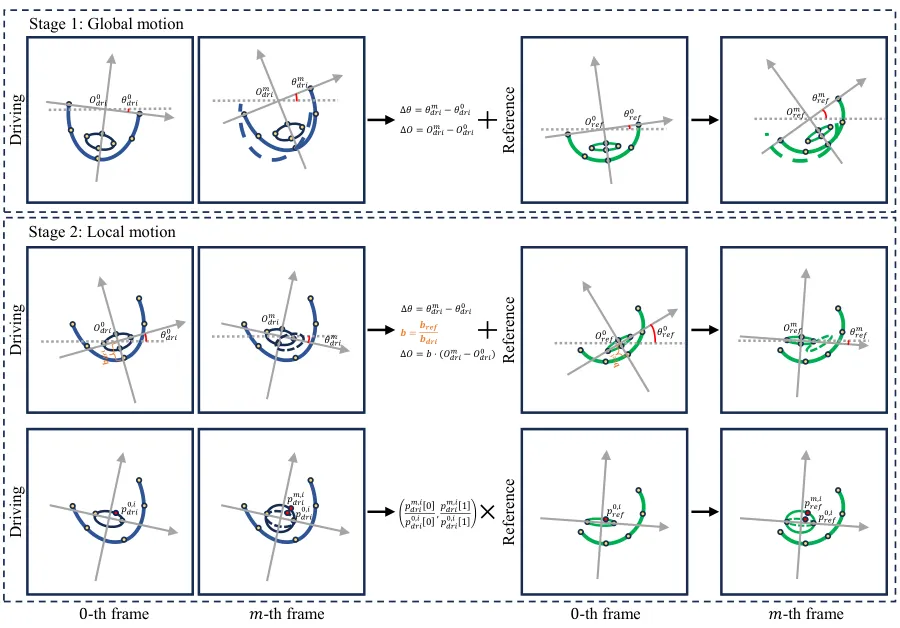

Figure 13: Illustration of our coordinate-based landmark retargeting
module. Specifically, our module consists of two stages: global motion
and local motion retargeting, which aim to capture global and local
positional changes of the entire face and individual facial parts
separately.

## Appendix C Experiments

Choices of Time Step $`t`$ and Layer $`l`$. To extract the diffusion
feature that best fits facial instances, we conduct detailed experiments
on the selection of time steps $`t`$ and layer $`l`$ of U-Net.
Specifically, we test different combinations of $`t`$ and $`l`$ on 300W
(Sagonas et al., 2016), a widely used facial dataset, and report NME as
the quantitative result. As shown in Figure 14, we achieve the best NME
value when $`t=301`$ and $`l=6`$, which are used as the basic settings
of our paper.

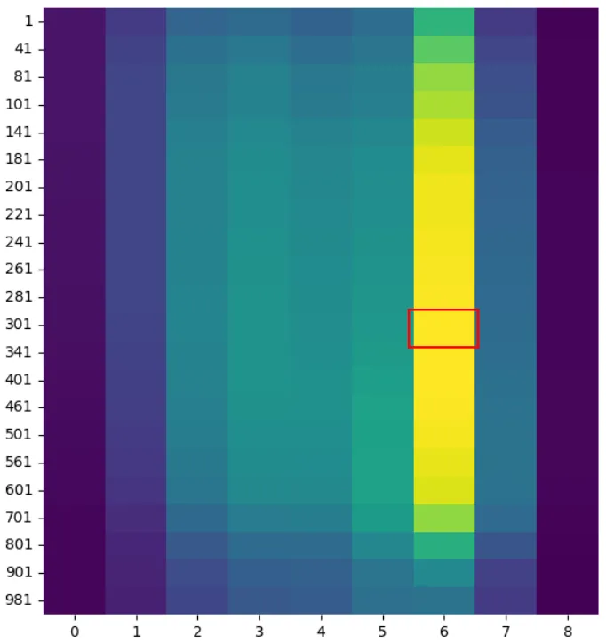

Figure 14: Heatmap of NME values for time step $`t`$ and layer $`l`$ of
the U-Net.

Choice of Target Number $`k`$. As mentioned in Section 3.2, we use the
averaged diffusion feature at the $`i`$-th point of $`k`$ target images
to improve matching performance. We evaluate different values of
$`k=1,5,10,15,50,1000`$ on the 300W dataset and report the NME in
Table 5. Results indicate that increasing $`k`$ significantly improves
performance when $`k\leq 10`$. However, for $`k>10`$, the time cost
increases exponentially with diminishing performance gains. Based on
this observation, we set $`k=10`$ for our experiments. Please note that
this analysis is solely aimed at determining the number of target
images. However, the features of the target images will be pre-stored as
local data, which is not considered additional time overhead during
inference.

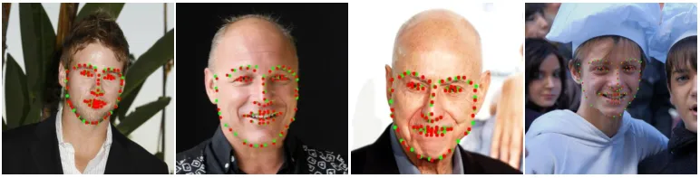

Figure 17: Visual results of landmarks on human faces.

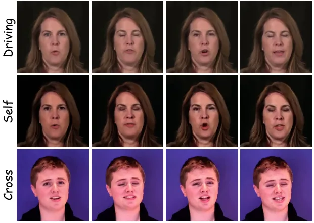

Figure 18: Self and cross identity driving results on HDTF.

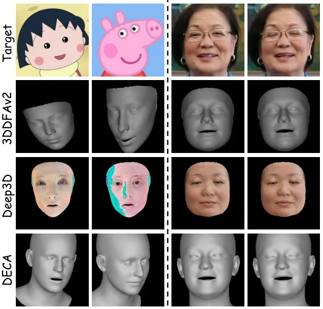

Figure 15: Modeling results of different 3DMM methods.

3DMM Modeling. Following our base model MOFA-Video, we adopt Deep3D
(Deng et al., 2019b) as the 3DMM method in Figure 6. Deep3D employs a
deep network to predict 3D coefficients (coeff) at each frame of driven
videos, instead of iterative fitting. Additionally, we provide the 3D
modeling results of DECA (Feng et al., 2021), Deep3D and 3DDFAv2 (Guo
et al., 2020) on non-human characters and driven videos in Figure 15.
Our observations reveal that none of these 3DMM methods can accurately
generate precise 3D models of non-human characters or capture subtle
movements in driven sequences, such as eye closure.

Visualization of Appearance Guidance. We provide the cosine similarity
distribution during inference. As depicted in Figure 16, with prior
appearance knowledge, the similarity between reference points and
unrelated target points becomes smaller, reducing the probability of
mismatching.

Figure 16: Cosine similarity distribution with or without appearance
guidance.

Human Evaluations. To evaluate the effectiveness of FaceShot on human
faces, we first provide the visual landmark results on 300W in Figure 17.

Furthermore, we present the animation results for self-identity and
cross-identity driving on traditional facial video datasets HDTF (Zhang
et al., 2021) in Figure 18. FaceShot perform well on these real human
faces, showing its robustness.

Time Efficiency. We present a time analysis of each step in FaceShot for
processing varying numbers of frames on a single H800 GPU, as shown in
the Table 6:

- •
  Driving Detection: Detecting the landmark sequence of the driving
  video using the landmark detector from MOFA-Video. The detector used
  is FAN from facexlib.
- •
  Landmark Matching: Detecting the target image landmarks using the
  appearance-guided landmark matching module. The time cost of landmark
  matching remains almost identical regardless of the number of frames
  because the matching is required only once for the target image,
  irrespective of the number of frames in the driving video. The
  0.8-second time includes both the DDIM inversion and the argmin
  operation in Eq. 4.
- •
  Landmark Retargeting: Retargeting landmark motion using
  coordinate-based landmark retargeting module. As no model parameters
  are required, our retargeting modules can generate precise landmark
  sequences with very low time cost.

|                   |        |       |       |       |       |       |
| ----------------- | ------ | ----- | ----- | ----- | ----- | ----- |
| Metric            | 1      | 5     | 10    | 15    | 50    | 1000  |
| NME$`\downarrow`$ | 12.801 | 7.009 | 6.343 | 6.267 | 6.252 | 6.104 |

Table 5: Experiments on the number $`k`$ of target images. Best NME
result is marked in bold.

|        |                   |                   |                      |
| ------ | ----------------- | ----------------- | -------------------- |
| frames | Driving Detection | Landmark Matching | Landmark Retargeting |
| 50     | 1.817(s)          | 0.860(s)          | 0.382(s)             |
| 100    | 3.562(s)          | 0.858(s)          | 0.751(s)             |

Table 6: Time analysis of each step in FaceShot for processing varying
numbers of frames.

In conclusion, FaceShot introduces only a 119ms additional time overhead
when used as a plugin for MOFA-Video (for 50 frames). This minimal time
cost is negligible compared to the inference time of diffusion-based
models (approximately 80 seconds for 50 frames). As shown in Table 7,
FaceShot achieves the low time cost among diffusion-based methods,
including AniPortrait, FADM, Follow Your Emoji, MegActor, X-Portrait,
and MOFA-Video.

|                             |            |            |            |
| --------------------------- | ---------- | ---------- | ---------- |
| Methods                     | Time       | Methods    | Time       |
| $`\text{FaceVid2Vid}^{*}`$  | 4.308(s)   | MegActor   | 174.189(s) |
| $`\text{LivePortrait}^{*}`$ | 4.321(s)   | X-Portrait | 132.702(s) |
| AniPortrait                 | 99.977(s)  | MOFA-Video | 79.421(s)  |
| FADM                        | 88.368(s)  | FaceShot   | 79.540(s)  |
| Follow Your Emoji           | 112.830(s) |            |            |

Table 7: Time analysis SOTA methods inference on 50 frames. Symbol ^(∗)
represents GAN-based method.
