# KeyFace: Expressive Audio-Driven Facial Animation for Long Sequences via KeyFrame Interpolation

Antoni Bigata Affiliation: Imperial College London
Email: <ab4522@imperial.ac.uk>    Michał Stypułkowski
Affiliation: University of Wrocław    Rodrigo MiraStella Bounareli
Affiliation: Imperial College London    Konstantinos Vougioukas
Affiliation: Imperial College London    Zoe Landgraf
Affiliation: Imperial College London    Nikita Drobyshev
Affiliation: Imperial College London    Maciej Zieba
Affiliation: Technical University of Wroclaw    Stavros Petridis
Affiliation: Imperial College London    Maja Pantic
Affiliation: Imperial College London

###### Abstract

Current audio-driven facial animation methods achieve impressive results
for short videos but suffer from error accumulation and identity drift
when extended to longer durations. Existing methods attempt to mitigate
this through external spatial control, increasing long-term consistency
but compromising the naturalness of motion. We propose KeyFace, a novel
two-stage diffusion-based framework, to address these issues. In the
first stage, keyframes are generated at a low frame rate, conditioned on
audio input and an identity frame, to capture essential facial
expressions and movements over extended periods of time. In the second
stage, an interpolation model fills in the gaps between keyframes,
ensuring smooth transitions and temporal coherence. To further enhance
realism, we incorporate continuous emotion representations and handle a
wide range of non-speech vocalizations (NSVs), such as laughter and
sighs. We also introduce two evaluation metrics for assessing lip
synchronization and NSV generation. Experimental results show that
KeyFace outperforms state-of-the-art methods in generating natural,
coherent facial animations over extended durations, successfully
encompassing NSVs and continuous emotions. See the [project
page](https://antonibigata.github.io/KeyFace/) for visualizations and
code.

## 1 Introduction

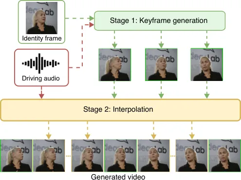

Figure 1: KeyFace generates long-term videos using a two-stage pipeline:
first, keyframes are created as anchor points, then they are used by an
interpolation model to produce smooth transitions.

The field of audio-driven facial animation has advanced significantly
with the development of generative models like Generative Adversarial
Networks (GANs) \[18\] and Diffusion Models (DMs) \[22, 13\]. These
approaches have greatly enhanced the realism and expressiveness of
facial animations, enabling promising applications in virtual
assistants, education, virtual reality, and aiding communication
impairments \[28, 34, 61\]. As a result, the demand for high-resolution,
natural, long-term audio-driven facial animations has increased
dramatically.

While early approaches in audio-driven facial animation were limited in
terms of head rotation \[58\] or focused solely on generating the mouth
region \[46\], current methods have advanced to produce results that are
nearly indistinguishable from real videos. Despite this progress, most
methods struggle when handling longer audio inputs, suffering from
identity drift and overall quality degradation beyond the initial few
seconds \[65, 52\]. To extend generation length, some approaches
incorporate additional spatial information, such as target head
positions or landmarks, as model inputs \[11, 56, 63\]. While this can
improve temporal consistency, it constrains animations to predefined
facial motions, limiting expressiveness. Other methods use motion frames
to provide context on prior movements \[65, 52\], but, as with many
autoregressive approaches, small errors accumulate over time, reducing
overall quality.

Furthermore, recent methods often neglect important aspects of long-form
natural speech, such as continuously changing emotions and NSVs.
Existing emotional audio-driven methods often assume a fixed emotional
state \[27, 55, 17\], which restricts them to short sequences and
overlooks real-world dynamics, where emotions fluctuate continuously.
Moreover, they typically rely on discrete emotion labels \[19, 17\],
which lack the nuance and fluidity of natural human expressions \[62\].
In contrast, the less-explored dimensions of valence and arousal provide
a more precise portrayal of emotional states \[2, 62\]. Similarly, NSVs
such as laughter and sighs are largely neglected, despite being
essential for natural communication \[48, 45\]. Crucially, handling
emotion and NSVs requires a model capable of interpreting them over
extended sequences to accurately animate the corresponding facial
expressions.

To address these limitations, inspired by keyframe-based
approaches \[67, 69\] initially introduced by \[43\], we propose
KeyFace, a novel two-stage approach for generating long and coherent
audio-driven facial animations. In the first stage, a keyframe
generation model produces a sequence at a low frame rate conditioned on
an identity and audio input, spanning multiple seconds and eliminating
the need for motion frames. In the second stage, an interpolation model
fills in intermediate frames, ensuring smooth transitions and temporal
coherence. By dividing generation into two parts, we implicitly separate
motion and identity control, resulting in more natural motion and
improved identity preservation over time. For longer sequences, this
process can be repeated, with the interpolation model generating
seamless transitions between segments. In addition to generating
realistic, long-term animations, our pipeline allows for emotions that
evolve over time, leveraging the keyframe generation model’s broad
contextual span.

Our main contributions can be summarized as follows:

- •
  State-of-the-art long-term animation: We introduce a state-of-the-art
  method that combines keyframe generation with interpolation to produce
  videos that maintain high quality over time and capture long-range
  temporal dependencies.
- •
  Continuous emotion modelling: Using valence and arousal, we enhance
  the emotional expressiveness of facial animations, allowing for
  nuanced portrayals of gradual emotional transitions.
- •
  Integration of non-speech vocalizations: We extend the communicative
  capabilities of our model by incorporating NSVs for more natural
  animations.

## 2 Related Works

#### Audio-driven facial animation

Audio-driven facial animation methods \[30, 58, 75\] generate realistic
talking-head sequences with audio-synchronized lip movements. Early
models, such as \[58\], used GANs, introducing a temporal GAN to
generate talking-head videos from a still image and audio input, while
Wav2Lip \[46\] improved lip-sync accuracy with a pre-trained expert
discriminator. More recent 3D-aware and head pose-driven methods \[7,
75, 77\] aimed to capture head motion, though often struggled with
artefacts and unnatural movements.

In contrast to GANs, which face challenges like mode collapse \[1\], DMs
excel in conditional image and video generation \[47, 73\] and are
promising for facial animation \[15, 66\]. In \[52\], an autoregressive
diffusion model generate head motions and expressions from audio but
face challenges with long-term consistency. Recent methods \[65, 59,
11\] use video DMs \[23, 3\] for improved temporal coherence. For
instance, AniPortrait \[63\] conditions on audio-predicted facial
landmarks, but converting audio to latent motion (e.g., landmarks \[63\]
or 3D meshes \[71\]) remains challenging, often yielding
synthetic-looking motion. Similarly, \[66\] proposes a two-stage
approach that disentangles motion and identity, but assumes strict
separation, which is not always respected. To preserve identity across
generated frames, several methods \[63, 59, 11\] leverage
ReferenceNet \[24\], which provides identity information, but increases
resource demands. In contrast, KeyFace addresses these limitations by
combining keyframe prediction and interpolation for temporally coherent,
identity-preserving animations without relying on intermediate
representations or ReferenceNet. Although similar approaches have been
applied to video generation \[51, 3\] and controllable animation \[42\],
ours is the first to apply this method to audio-driven animation.

#### Emotion-driven generation

Controllable emotion has recently become a key focus in audio-driven
facial animation to create more realistic, empathetic avatars. Most
works \[19, 17, 38, 10\] use discrete emotion labels (_e.g_. angry or
sad) with intensity levels, but this approach lacks expressivity beyond
predefined classes. Some approaches use a driving video or audio as a
richer emotional source \[55, 27, 44, 36, 49\], generating a latent
representation from the media to drive the animation. This latent
representation can sometimes be interpolated to control the resulting
emotion \[26\]. However, they require the driving audio or video during
inference, limiting expressiveness and restricting explicit control.
Continuous emotion conditioning, using valence and arousal, remains
underexplored, despite evidence that it better captures emotional
complexity \[2, 62\]. Additionally, few works allow for continuous
emotion variation within a video, and those that do are often limited to
a small set of emotions \[64\], likely due to challenges in achieving
coherent long-term animation.

#### Non-speech vocalizations

Non-speech vocalizations (NSVs), such as laughter and sighs,
significantly enhance human communication \[45, 48\] by providing
context beyond words and increasing speech naturalness. Despite this,
NSVs are often overlooked in audio-driven facial animation, and
state-of-the-art models trained only on speech typically perform poorly
on NSVs. Recently, two models have aimed to address this gap: Laughing
Matters \[5\], which proposes a diffusion model that can produce
realistic laughter videos from still images and audio, and
LaughTalk \[54\], a 3D model that generates both speech and laughter.
However, a model capable of handling multiple NSVs in addition to speech
has not yet been explored.

## 3 Method

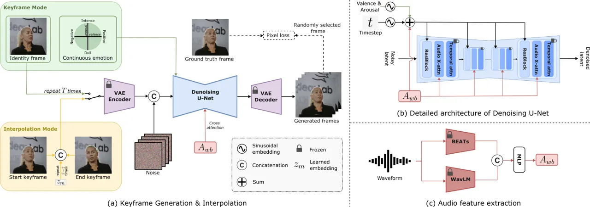

Figure 2: Overview of KeyFace’s two-stage framework. The main
architecture (a) is shared between the two stages, differing only in the
conditioning inputs. A detailed view is provided in (b). In the keyframe
generation stage, the model receives an identity frame
$`x_{\text{id}}`$, repeated and concatenated with the noised video input
to match the input dimensions. In the interpolation stage, the model is
conditioned on two consecutive frames $`z_{s}`$ and $`z_{e}`$ from the
keyframe sequence, interpolating the intermediate frames using a learned
masked embedding $`z_{m}`$ and a binary mask $`M`$. Both stages
incorporate audio embeddings $`A_{wb}`$ from WavLM and BEATs (c). We
also use continuous emotion embeddings in the keyframe generation to
produce facial animations that accurately convey both speech content and
emotional expressions.

Our two-stage approach, outlined in Fig. 2, starts with the generation
of temporally distant keyframes. In the second stage, an interpolation
model animates the full sequence by filling gaps between the generated
keyframes. Our architecture builds upon Stable Video Diffusion
(SVD) \[3\], with further architectural details and key distinctions
provided in Appendix B.

### 3.1 Latent diffusion

Diffusion models \[22, 13\] are generative models structured as Markov
chains with a Gaussian kernel, consisting of two main processes. The
forward process gradually adds noise to the initial data point, while
the reverse process denoises samples in multiple steps. Traditional
diffusion models require many sampling steps to achieve high-quality
images, which can be computationally demanding. The EDM
framework \[31\], which defines the diffusion process as a stochastic
differential equation and employs an Euler solver for denoising, reduces
the necessary diffusion steps by parametrising the learnable denoiser
$`D_{\theta}`$ as

```math
D_{\theta}(\mathbf{x};\sigma)=c_{\text{skip}}(\sigma)\mathbf{x}+c_{\text{out}}(\sigma)F_{\theta}(c_{\text{in}}(\sigma)\mathbf{x};c_{\text{noise}}(\sigma)), \tag{1}
```

where $`F_{\theta}`$ is the network to be trained, $`\mathbf{x}`$ is the
model input, and $`c_{\text{noise}}`$, $`c_{\text{out}}`$,
$`c_{\text{skip}}`$, and $`c_{\text{in}}`$ are scaling factors that
depend on the noise level $`\sigma`$. Latent Diffusion Models
(LDMs) \[47\] further reduce computational demands by integrating a
pre-trained Variational Autoencoder (VAE) \[35\]. Rather than operating
in the original high-dimensional space, LDMs map data into a compact
latent space via an encoder, where diffusion is applied more
efficiently. The latent samples are subsequently decoded back to the
original space.

### 3.2 Keyframe generation

In the first stage, we generate keyframes that capture essential facial
expressions and movements, guided by the audio over an extended temporal
context. These keyframes act as anchor points for the subsequent
interpolation stage, ensuring that the final animation accurately
reflects both the audio content and the associated emotional
expressions. We generate $`T`$ keyframes, spaced $`S`$ frames apart, to
capture long-range temporal dependencies efficiently.

Given a noised input sequence
$`z_{k}\in\mathbb{R}^{C\times T\times H\times W}`$, where $`C`$ is the
number of channels, and $`H\times W`$ are the spatial dimensions, our
goal is to generate a sequence of a person speaking in sync with the
given audio. To provide identity and background information, we repeat
an identity frame $`x_{id}\in\mathbb{R}^{C\times H\times W}`$, pass it
through the VAE encoder, and concatenate it with the noised input,
effectively leveraging the U-Net architecture’s skip connections to
preserve input details. Additionally, the model is conditioned on audio
embeddings (see Section 3.4), along with emotional valence and arousal
(see Section 3.5).

### 3.3 Interpolation

After generating the main frames that capture essential facial
expressions and movements, the next step is to interpolate between these
keyframes to produce a smooth and coherent video sequence.

We use the same architecture as the keyframe model, adapted for the
interpolation task. We take two consecutive frames $`z_{s}`$ and
$`z_{e}`$ from the keyframe sequence as conditioning frames. To match
the input shape $`z_{i}\in\mathbb{R}^{C\times S\times H\times W}`$, we
create a sequence

```math
s=\{z_{s},\underbrace{z_{m},\dots,z_{m}}_{\text{repeat}\ S-2\ \text{times}},z_{e}\}\in\mathbb{R}^{C\times S\times H\times W},
```

where $`z_{m}\in\mathbb{R}^{C\times H\times W}`$ is a learned embedding
that represents the missing frames. This sequence is concatenated
channel-wise with the noise input. We also incorporate a binary mask
$`M\in\mathbb{R}^{S\times 1\times H\times W}`$, where $`M_{s}=1`$ if
$`s`$ corresponds to a conditioning frame ($`s=1`$ or $`s=T`$), and
$`M_{s}=0`$ otherwise. This mask helps the model distinguish between
conditioned and unconditioned frames, allowing it to focus on
interpolating the intermediate frames.

### 3.4 Audio encoding

For audio processing, we combine embeddings from two pre-trained audio
encoders: WavLM $`A_{w}\in\mathbb{R}^{L\times C^{a}}`$ \[8\], which
excels at capturing linguistic content from speech, and BEATs
$`A_{b}\in\mathbb{R}^{L\times C^{a}}`$ \[9\], which is trained to
extract features from a broader range of acoustic signals, including
non-speech sounds. We define $`L\in\{T,S\}`$ based on whether we use the
interpolation or keyframe model and $`C^{a}`$ as the audio embedding
dimension. By concatenating these embeddings, we obtain
$`A_{wb}=\text{Concat}(A_{w},A_{b})\in\mathbb{R}^{L\times 2C^{a}}`$,
which we feed to the model via two mechanisms:

- •
  Audio Attention Blocks: The combined embeddings serve as keys and
  values in the cross-attention layers within the U-Net, enabling the
  model to attend to relevant audio features.
- •
  Timestep Embeddings: We pass $`A_{wb}`$ through an MLP and add it to
  the diffusion timestep embeddings $`t_{s}\in\mathbb{R}^{C^{s}}`$,
  yielding $`t_{s}^{\prime}=t_{s}+\text{MLP}(A_{wb})`$, where $`C^{s}`$
  is the timestep embedding dimension. This encourages alignment between
  image and audio frames.

### 3.5 Emotion modelling with valence and arousal

To capture complex, continuously changing emotional expressions, we
adopt a continuous representation based on valence and arousal. For each
frame, we extract valence and arousal using a pre-trained emotion
recognition model \[50\], encode them into sinusoidal embeddings
$`E_{v},E_{a}\in\mathbb{R}^{C^{s}}`$, and add them to the diffusion
timestep embedding along with the audio embeddings:

```math
t_{s}^{\prime\prime}=t_{s}^{\prime}+E_{v}+E_{a}. \tag{2}
```

Notably, we find that incorporating emotions solely in the keyframe
model is sufficient for achieving effective emotional control, as the
interpolation model can propagate emotional expressions without
additional conditioning. During inference, users can provide any valence
and arousal to guide the generation of desired emotional states.

### 3.6 Losses

Working in latent space is computationally efficient, but due to the
compressed representations, it can be challenging for the model to
retain fine semantic details from the original image \[72\]. This issue
is particularly critical for faces, as humans are highly sensitive to
minor imperfections in facial features, which can disrupt the perceived
realism and emotional expressiveness of animations. To mitigate this, we
decode the latent sequence $`z_{0}`$ back to RGB space to obtain
$`x_{0}\in\mathbb{R}^{3\times L\times H\times W}`$. We then apply an
$`L_{2}`$ loss between the decoded frames $`x_{0}`$ and the ground truth
frames $`x_{\text{gt}}`$, and add it to the existing $`L_{2}`$ loss
between the latent representations $`z_{0}`$ and $`z_{\text{gt}}`$. We
also include a perceptual loss $`L_{p}`$ based on features extracted
from a pre-trained VGG network \[29\], which encourages the generated
images to be perceptually similar to the ground truth, enhancing visual
quality.

To reduce memory consumption, we apply the additional pixel losses to a
single random frame rather than the entire sequence, which proves
sufficient for producing high-quality results. In contrast, the standard
diffusion loss continues to be applied across all frames. Moreover, we
introduce a specialized weight $`\lambda_{\text{lower}}`$ applied to the
lower half of the image, which helps the model focus on the mouth
region. This spatially targeted weight, within the compressed latent
space, enhances lip synchronization quality by emphasizing the alignment
between generated lip movements and audio inputs, which is crucial for
realistic audio-driven animations. The total loss function is defined as

```math
L=\lambda_{tot}\left(L_{2}(z_{0},z_{\text{gt}})+L_{2}(x_{0},x_{\text{gt}})+L_{p}(x_{0},x_{\text{gt}})\right), \tag{3}
```

where $`\lambda_{tot}=\lambda(t)\lambda_{lower}`$ and $`\lambda(t)`$ is
a weighting factor that depends on the diffusion timestep $`t`$, as
defined in \[31\].

### 3.7 Guidance

For the keyframe model, we use a modified version of classifier-free
guidance (CFG) \[21\], split into two parts: one for audio control and
the other for identity control, allowing separate scales for each. The
guidance formula is

```math
z=z_{\emptyset}+w_{\text{id}}\cdot(z_{\text{id}}-z_{\emptyset})+w_{\text{aud}}\cdot(z_{\text{id \& aud}}-z_{\text{id}}), \tag{4}
```

where $`w_{\text{aud}}`$ and $`w_{\text{id}}`$ are the guidance scales
for audio and identity, respectively. Here, $`z_{\emptyset}`$ is the
model output with all conditions set to 0, $`z_{\text{id}}`$ is the
output with only the identity condition, and $`z_{\text{id \& aud}}`$ is
the output with both conditions.

While CFG is effective in many scenarios, it can overly amplify the
conditioning signal, reducing output diversity \[32\]. In the
interpolation stage, where subtle emotional expressions and fluid motion
are critical, CFG may be ill-suited. Autoguidance \[32\], addresses this
by using a model that is either smaller or trained with fewer steps to
guide the main diffusion process, balancing guidance for improved video
quality without sacrificing diversity. Autoguidance is formulated as

```math
D(x;\sigma,c)=D_{\text{r}}(.)+w_{\text{auto}}\cdot\left(D_{\text{m}}(.)-D_{\text{r}}(.)\right), \tag{5}
```

where $`D(x;\sigma,c)`$ is the guided denoising step,
$`D_{\text{r}}(.)`$ is the reduced model, $`D_{\text{m}}(.)`$ is the
fully trained guiding model, and $`w_{\text{auto}}`$ controls the
guiding model’s influence.

## 4 Experiments

### 4.1 Datasets

We train both models on HDTF \[76\] and a dataset that we collected,
comprising 160 hours of speech and 30 hours of NSVs. We also experiment
with CelebV-Text \[70\] and CelebV-HQ \[78\] but find that excluding
these lower-quality datasets benefits training. For testing, we use the
HDTF test set, and 100 videos randomly selected from CelebV-Text.
Additionally, to evaluate our emotion control, we use a test set
selected from MEAD \[60\], as in \[55\].

### 4.2 Evaluation metrics

We evaluate image quality using the aesthetic quality metric from
VBench \[25\], Fréchet Inception Distance (FID) \[20\], and Learned
Perceptual Image Patch Similarity (LPIPS) \[74\]. For general video
quality, we use Fréchet Video Distance (FVD) \[57\] and the smoothness
metric from \[25\]. We compute the emotion accuracy ($`Emo_{acc}`$)
using the pre-trained emotion recognition model from \[50\]. We also
introduce two new metrics, further details are provided in Appendix D.

#### LipScore.

The typical metric for audio-visual synchronization, SyncNet \[46\], has
known limitations, including low correlation with lip-sync quality and
significant reliability issues even on ground truth data \[14, 19, 68\].
To address this, we introduce a lipreading perceptual score (LipScore)
inspired by \[6\], which computes the cosine similarity between the
generated and ground truth embeddings extracted from the final layer of
a state-of-the-art lipreader \[41\]. This lipreader is trained on
6$`\times`$ more data than SyncNet, providing higher-quality embeddings
that better correlate with human perception.

#### NSV accuracy.

To evaluate the model’s ability to generate NSVs, we train a video
classifier to recognize 8 NSV types (”Mhm”, ”Oh”, ”Ah”, coughs, sighs,
yawns, throat clears, and laughter) plus speech, for a total of 9
classes. The classifier is based on a pre-trained MViTv2 \[37\] for
video classification on the Kinetics dataset \[33\]. We then employ it
to evaluate the model’s ability to generate the correct NSV type and
measure the overall accuracy, denoting this metric as NSV accuracy
($`NSV_{acc}`$).

### 4.3 User study

To provide a more comprehensive evaluation, we conduct a user study
inspired by \[12\]. We select 20 videos per model (see Table 1) and
present participants with pairs of 5-second videos featuring the same
audio and identity, asking them to choose the more realistic video based
on visual quality, lip synchronization, and motion realism. We surveyed
51 participants, each of whom compared an average of 20 video pairs. We
use an Elo rating system \[16\] with bootstrapping applied to obtain a
more stable ranking \[12\].

## 5 Results

This section presents a comprehensive evaluation of our model, including
comparisons with established methods and ablation studies to assess the
impact of key components.

### 5.1 Quantitative analysis

|             |                    |                 |                    |                      |                    |                         |                       |                  |
| ----------- | ------------------ | --------------- | ------------------ | -------------------- | ------------------ | ----------------------- | --------------------- | ---------------- |
|             | Method             | AQ $`\uparrow`$ | FID $`\downarrow`$ | LPIPS $`\downarrow`$ | FVD $`\downarrow`$ | Smoothness $`\uparrow`$ | LipScore $`\uparrow`$ | Elo $`\uparrow`$ |
| HDTF        | SadTalker \[75\]   | 0.52            | 60.55              | 0.44                 | 410.86             | 0.9955                  | 0.24                  | 960.44           |
|             | Hallo \[65\]       | 0.55            | 19.22              | 0.17                 | 236.97             | 0.9939                  | 0.27                  | 1054.69          |
|             | V-Express \[59\]   | 0.55            | 34.68              | 0.21                 | 200.67             | 0.9943                  | 0.37                  | 985.35           |
|             | AniPortrait \[63\] | 0.56            | 20.68              | 0.19                 | 299.09             | 0.9951                  | 0.14                  | 887.84           |
|             | EchoMimic \[11\]   | 0.55            | 20.35              | 0.18                 | 213.30             | 0.9928                  | 0.17                  | 1023.53          |
|             | KeyFace            | 0.59            | 16.76              | 0.16                 | 137.25             | 0.9952                  | 0.36                  | 1091.52          |
| CelebV-Text | SadTalker \[75\]   | 0.49            | 49.85              | 0.49                 | 434.31             | 0.9959                  | 0.25                  | 950.56           |
|             | Hallo \[65\]       | 0.50            | 24.86              | 0.27                 | 310.00             | 0.9938                  | 0.29                  | 1020.27          |
|             | V-Express \[59\]   | 0.51            | 26.46              | 0.22                 | 253.16             | 0.9933                  | 0.32                  | 1044.43          |
|             | AniPortrait \[63\] | 0.52            | 24.84              | 0.28                 | 373.32             | 0.9950                  | 0.12                  | 841.79           |
|             | EchoMimic \[11\]   | 0.51            | 22.81              | 0.26                 | 298.33             | 0.9921                  | 0.18                  | 1043.26          |
|             | KeyFace            | 0.55            | 17.06              | 0.21                 | 180.26             | 0.9952                  | 0.30                  | 1100.90          |

Table 1: Quantitative comparisons on HDTF \[76\] and CelebV-Text \[70\]
between our model and state-of-the-art facial animation methods. The
best results are highlighted in bold, and the second-best results are
underlined. All the metrics are described in Section 4.2

We present a quantitative comparison against current state-of-the-art
methods in Table 1. KeyFace achieves the lowest FID and FVD, indicating
higher realism and temporal coherence. Our model also achieves the
highest AQ and LPIPS, confirming the visual appeal of our animations.
While SadTalker and V-Express achieve the highest smoothness and
LipScores, respectively, KeyFace ranks a close second and outperforms
both SadTalker and V-Express on the other metrics, demonstrating better
performance overall. Figure 3 illustrates FID over time for videos
generated by each method, where our two-stage approach maintains
consistent quality without degradation. In contrast, Hallo and
AniPortrait suffer from significant quality loss over time. To ensure
fairness in evaluation, we also report results for a variant of our
model trained exclusively on HDTF in Appendix F.

Additionally, the user study results (Elo) show that our model is
preferred over other methods, confirming the effectiveness of our
approach. A detailed analysis of the results is provided in Appendix E.

Figure 3: We present sliding window FID with a 1-second window size for
videos generated by different methods.

### 5.2 Emotional results

To assess our model’s ability to generate accurate emotional
expressions, we evaluate it on MEAD \[60\], comparing it to
state-of-the-art models in Table 2.

Notably, despite being trained with only pseudo-labels extracted from
our training data, KeyFace achieves competitive emotion accuracy
compared to other models, which are trained on ground-truth labels from
MEAD, outperforming 2 out of 3 models while delivering significantly
better image and video quality. We also show that using continuous
emotion labels (valence and arousal) yields significant improvements
compared to discrete labels, and allows our model to generate multiple
emotions within a single video by interpolating between points in the
valence and arousal space, as illustrated in Figure 4.

|               |                   |                    |                    |                            |
| ------------- | ----------------- | ------------------ | ------------------ | -------------------------- |
| Method        | Emotion Source    | FID $`\downarrow`$ | FVD $`\downarrow`$ | $`Emo_{acc}`$ $`\uparrow`$ |
| EDTalk \[55\] | Video             | 101.19             | 619.90             | 0.72                       |
| EAT \[17\]    | Discrete Labels   | 75.69              | 560.61             | 0.54                       |
| EAMM \[27\]   | Video             | 107.16             | 855.20             | 0.17                       |
| KeyFace       | Discrete Labels   | 50.34              | 509.13             | 0.43                       |
| KeyFace       | Valence & arousal | 44.43              | 447.74             | 0.67                       |

Table 2: Emotion evaluation on MEAD \[60\]. Default settings are
highlighted in gray on all tables.

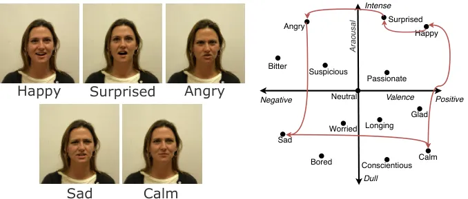

Figure 4: We show KeyFace’s ability to interpolate between several
different emotions within the same video.

### 5.3 Ablation Studies

#### Audio Encoder.

We evaluate the impact of different audio encoders on the model’s
ability to handle both speech and non-speech vocalizations (NSVs). As
shown in Table 3, the combination of WavLM and BEATs achieves the best
overall performance. BEATs is shown to significantly improve the
handling of NSV, aligning with the findings of \[5\]. Likewise, when it
is removed, the ability to generate the correct NSVs becomes close to
random probability. Finally, WavLM improves lip synchronization quality
compared to Wav2Vec2, with only a slight sacrifice in image quality, as
indicated by a marginal increase in FID.

|                  |                    |                    |                       |                            |
| ---------------- | ------------------ | ------------------ | --------------------- | -------------------------- |
| Audio backbone   | FID $`\downarrow`$ | FVD $`\downarrow`$ | LipScore $`\uparrow`$ | $`NSV_{acc}`$ $`\uparrow`$ |
| WavLM            | 16.89              | 147.12             | 0.36                  | 0.10                       |
| BEATs            | 19.52              | 212.47             | 0.29                  | 0.23                       |
| Wav2vec2 + BEATs | 16.00              | 143.97             | 0.32                  | 0.31                       |
| WavLM + BEATs    | 16.76              | 137.25             | 0.36                  | 0.42                       |

Table 3: Audio encoder ablation on HDTF \[76\]. For $`NSV_{acc}`$, we
use HDTF identities with audio containing NSVs.

#### Architecture.

We assess two key architectural modifications in Table 4. First, we
examine the effect of removing temporal layers for keyframe generation,
which leads to overly static frames, highlighting the importance of
generating keyframes as a cohesive sequence. Second, we replace the
concatenation operation with ReferenceNet, inspired by recent trends
from \[24\], and find that it requires twice as many training steps to
achieve acceptable results. Even then, it results in lower video
quality, introducing inconsistencies in background continuity and face
shape.

|                              |                    |                    |                       |
| ---------------------------- | ------------------ | ------------------ | --------------------- |
| Method                       | FID $`\downarrow`$ | FVD $`\downarrow`$ | LipScore $`\uparrow`$ |
| w/o temporal layers          | 23.74              | 250.30             | 0.25                  |
| w/o Concat, w/ Reference Net | 39.71              | 401.70             | 0.32                  |
| Concat w/ temporal layers    | 16.76              | 137.25             | 0.36                  |

Table 4: Architecture ablation on HDTF \[76\].

#### Losses.

We compare the effects of different pixel loss functions and weights in
Table 5. First, we see that having a pixel-space loss proves to be
beneficial regardless of the loss type. The L1 loss yields improved
image quality and lip synchronisation, but restricts model flexibility
compared to the L2 loss, resulting in a higher FVD. In addition,
incorporating the $`L_{p}`$ loss noticeably improves visual quality for
both losses, as shown by the decreased FID. Overall, combining $`L_{2}`$
and $`L_{p}`$ losses produces the best balance of quality, variety, and
lip synchronisation. Next, we examine $`\lambda_{lower}`$, which
controls the weight of the pixel loss for the lower part of the video.
Choosing a higher weight improves animation quality and lip
synchronization, but increasing it too much overemphasizes this region
and reduces overall quality. A good balance is achieved with
$`\lambda_{lower}=3`$.

|                       |                    |                    |                       |
| --------------------- | ------------------ | ------------------ | --------------------- |
| Method                | FID $`\downarrow`$ | FVD $`\downarrow`$ | LipScore $`\uparrow`$ |
| No pixel loss         | 18.76              | 148.22             | 0.33                  |
| $`L_{1}`$ only        | 17.66              | 172.01             | 0.37                  |
| $`L_{2}`$ only        | 19.00              | 137.54             | 0.34                  |
| $`L_{1}`$ + $`L_{p}`$ | 17.02              | 169.01             | 0.34                  |
| $`L_{2}`$ + $`L_{p}`$ | 16.76              | 137.25             | 0.36                  |
| $`\lambda_{lower}=1`$ | 17.40              | 186.87             | 0.33                  |
| $`\lambda_{lower}=2`$ | 16.71              | 147.01             | 0.35                  |
| $`\lambda_{lower}=3`$ | 16.76              | 137.25             | 0.36                  |
| $`\lambda_{lower}=4`$ | 17.36              | 161.40             | 0.35                  |

Table 5: Loss ablation on HDTF \[76\].

#### Data.

We test the effect of adding additional training data to each stage in
Table 6. Both models experience a decline in performance when trained
with data of lower quality, confirming our hypothesis from Section 4.1.
We find that training exclusively on high-quality data primarily
improves lip synchronization for the interpolation model, while
conversely enhancing video quality for the keyframe model, as indicated
by lower FID and FVD scores, respectively. This suggests that each model
plays a distinct role in the generation process and therefore reacts
differently to changes in training data.

|              |               |                    |                    |                       |
| ------------ | ------------- | ------------------ | ------------------ | --------------------- |
| Training set |               | FID $`\downarrow`$ | FVD $`\downarrow`$ | LipScore $`\uparrow`$ |
| Keyframe     | Interpolation |                    |                    |                       |
| All          | All           | 26.92              | 253.24             | 0.24                  |
| All          | HQ only       | 24.45              | 236.75             | 0.31                  |
| HQ only      | All           | 16.97              | 166.81             | 0.24                  |
| HQ only      | HQ only       | 16.76              | 137.25             | 0.36                  |

Table 6: Data Ablation on HDTF \[76\]. “HQ only” refers to our high
quality training set (HDTF and collected data), while “All” refers to
all training data, including CelebV-Text and CelebV-HQ.

#### Guidance.

We compare different guidance types in Table 7. Using CFG for both
models makes videos overly static, as it closely adheres to the
keyframes, limiting expression range and animation flow, as shown by the
lower FVD. In contrast, applying autoguidance to the keyframe model
worsens alignment with audio, resulting in lower LipScores. Using CFG
instead allows for a separate grid searches for audio and identity
guidance scales (Fig. 5), increasing flexibility and enhancing model
performance.

|                     |                     |                    |                    |                       |
| ------------------- | ------------------- | ------------------ | ------------------ | --------------------- |
| Guidance method     |                     | FID $`\downarrow`$ | FVD $`\downarrow`$ | LipScore $`\uparrow`$ |
| Keyframe            | Interpolation       |                    |                    |                       |
| Autoguidance \[32\] | CFG \[21\]          | 20.12              | 172.31             | 0.31                  |
| Autoguidance \[32\] | Autoguidance \[32\] | 18.86              | 152.77             | 0.33                  |
| CFG \[21\]          | CFG \[21\]          | 18.53              | 177.09             | 0.32                  |
| CFG \[21\]          | Autoguidance \[32\] | 16.76              | 137.25             | 0.36                  |

Table 7: Guidance Ablation on HDTF \[76\].

Figure 5: We show the impact of guidance scale for identity and audio
condition on FID and LipScore on HDTF \[76\].

### 5.4 Qualitative analysis

Motion. We compare the motion generated by KeyFace to that of other
existing models by analysing the average optical flow magnitude in the
predicted videos in Fig. 6. AniPortrait and V-Express are excluded from
this analysis, as they are conditioned on the ground-truth motion and
therefore are not suitable for a fair comparison. We see that models
like Hallo and EchoMimic, which rely on ReferenceNet, tend to produce
background inconsistencies over time, as shown by the noisy patterns
surrounding the speaker’s silhouette, while SadTalker generates
relatively static videos of lower quality, as indicated by a sparser
optical flow map. In contrast, we find that KeyFace generates motion
patterns that more closely align with those observed in real videos,
outperforming other methods.

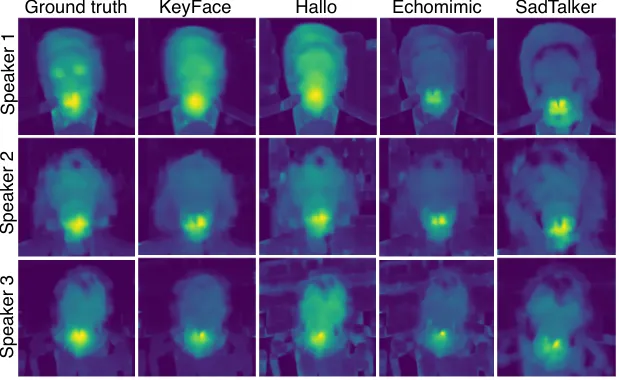

Figure 6: We show the average optical flow magnitude accross different
speakers and models.

Visual Quality. Figure 8 compares our model with other methods on the
same audio input using an out-of-distribution identity frame, revealing
key limitations in existing approaches. AniPortrait and SadTalker
exhibit repetitive movements, V-Express treats hair accessories as
background, causing unnatural head movements around the accessory, and
EchoMimic introduces inconsistent head movements and background
artifacts across frames. Hallo, on the other hand, produces natural
motion, but suffers from error accumulation. Finally, KeyFace produces
natural and varied head motion while achieving the best lip
synchronization, on par with V-Express. We highlight our model’s ability
to accurately animate non-speech vocalizations in Figure 7, emphasizing
our holistic approach to facial animation compared to existing methods
that can only handle speech. For a more comprehensive evaluation, we
strongly encourage readers to refer to the supplementary material.

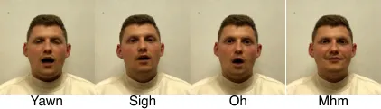

Figure 7: Examples of different NSVs generated using KeyFace,
highlighting the model’s capability to handle non-speech audio.

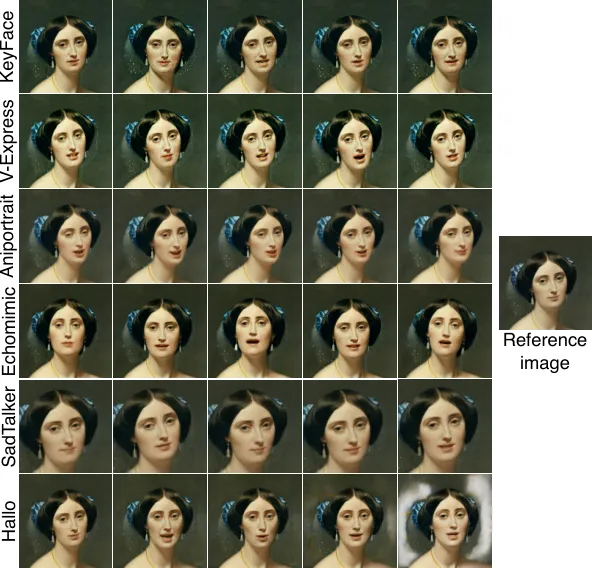

Figure 8: Results on out-of-distribution id using the same audio. Please
refer to our project page for additional video comparisons.

## 6 Conclusion

We introduce KeyFace, a two-stage diffusion-based framework for
generating long-duration, coherent, and natural audio-driven facial
animations. By leveraging an extended temporal context through keyframe
generation and interpolation, our method effectively preserves temporal
coherence and realism across long sequences. We further increase the
expressiveness of facial animations by conditioning on continuous
emotions for long-term emotional control, and adding NSVs to our
training set. Experimental results demonstrate that KeyFace outperforms
state-of-the-art methods across a comprehensive set of objective
metrics. Finally, we consolidate our findings via a series of
qualitative evaluations and prove that KeyFace successfully addresses
key challenges such as repetitive movements and error accumulation,
setting a new standard for natural and expressive animations over long
durations.

## References

- \[1\] Martín Arjovsky, Soumith Chintala, and Léon Bottou. Wasserstein
  generative adversarial networks. In _Proceedings of the 34th
  International Conference on Machine Learning, ICML 2017, Sydney, NSW,
  Australia, 6-11 August 2017_, pages 214–223. PMLR, 2017.
- \[2\] Sinem Aslan, Eda Okur, Nese Alyüz, Asli Arslan Esme, and Ryan S.
  Baker. Towards human affect modeling: A comparative analysis of
  discrete affect and valence-arousal labeling. In _HCI International
  2018 - Posters’ Extended Abstracts - 20th International Conference,
  HCI International 2018, Las Vegas, NV, USA, July 15-20, 2018,
  Proceedings, Part II_, pages 372–379. Springer, 2018.
- \[3\] Andreas Blattmann, Tim Dockhorn, Sumith Kulal, Daniel
  Mendelevitch, Maciej Kilian, Dominik Lorenz, Yam Levi, Zion English,
  Vikram Voleti, Adam Letts, Varun Jampani, and Robin Rombach. Stable
  video diffusion: Scaling latent video diffusion models to large
  datasets, 2023a.
- \[4\] Andreas Blattmann, Robin Rombach, Huan Ling, Tim Dockhorn,
  Seung Wook Kim, Sanja Fidler, and Karsten Kreis. Align your latents:
  High-resolution video synthesis with latent diffusion models. In _IEEE
  Conference on Computer Vision and Pattern Recognition (CVPR)_, 2023b.
- \[5\] Antoni Bigata Casademunt, Rodrigo Mira, Nikita Drobyshev,
  Konstantinos Vougioukas, Stavros Petridis, and Maja Pantic. Laughing
  matters: Introducing laughing-face generation using diffusion models.
  _arXiv preprint arXiv:2305.08854_, 2023.
- \[6\] Lele Chen, Guofeng Cui, Ziyi Kou, Haitian Zheng, and Chenliang
  Xu. What comprises a good talking-head video generation?: A survey and
  benchmark. _CoRR_, abs/2005.03201, 2020a.
- \[7\] Lele Chen, Guofeng Cui, Celong Liu, Zhong Li, Ziyi Kou, Yi Xu,
  and Chenliang Xu. Talking-head generation with rhythmic head motion.
  In _European Conference on Computer Vision_, pages 35–51. Springer,
  2020b.
- \[8\] Sanyuan Chen, Chengyi Wang, Zhengyang Chen, Yu Wu, Shujie Liu,
  Zhuo Chen, Jinyu Li, Naoyuki Kanda, Takuya Yoshioka, Xiong Xiao, Jian
  Wu, Long Zhou, Shuo Ren, Yanmin Qian, Yao Qian, Jian Wu, Michael Zeng,
  Xiangzhan Yu, and Furu Wei. Wavlm: Large-scale self-supervised
  pre-training for full stack speech processing. _IEEE J. Sel. Top.
  Signal Process._, 16(6):1505–1518, 2022.
- \[9\] Sanyuan Chen, Yu Wu, Chengyi Wang, Shujie Liu, Daniel Tompkins,
  Zhuo Chen, Wanxiang Che, Xiangzhan Yu, and Furu Wei. Beats: Audio
  pre-training with acoustic tokenizers. In _International Conference on
  Machine Learning, ICML 2023, 23-29 July 2023, Honolulu, Hawaii, USA_,
  pages 5178–5193. PMLR, 2023a.
- \[10\] Yutong Chen, Junhong Zhao, and Wei-Qiang Zhang. Expressive
  speech-driven facial animation with controllable emotions. In _2023
  IEEE International Conference on Multimedia and Expo Workshops
  (ICMEW)_, pages 387–392. IEEE, 2023b.
- \[11\] Zhiyuan Chen, Jiajiong Cao, Zhiquan Chen, Yuming Li, and
  Chenguang Ma. Echomimic: Lifelike audio-driven portrait animations
  through editable landmark conditions, 2024.
- \[12\] Wei-Lin Chiang, Lianmin Zheng, Ying Sheng, Anastasios Nikolas
  Angelopoulos, Tianle Li, Dacheng Li, Hao Zhang, Banghua Zhu, Michael
  Jordan, Joseph E. Gonzalez, and Ion Stoica. Chatbot arena: An open
  platform for evaluating llms by human preference, 2024.
- \[13\] Prafulla Dhariwal and Alexander Quinn Nichol. Diffusion models
  beat gans on image synthesis. In _Advances in Neural Information
  Processing Systems 34: Annual Conference on Neural Information
  Processing Systems 2021, NeurIPS 2021, December 6-14, 2021, virtual_,
  pages 8780–8794, 2021.
- \[14\] Nikita Drobyshev, Antoni Bigata Casademunt, Konstantinos
  Vougioukas, Zoe Landgraf, Stavros Petridis, and Maja Pantic.
  Emoportraits: Emotion-enhanced multimodal one-shot head avatars. In
  _IEEE/CVF Conference on Computer Vision and Pattern Recognition, CVPR
  2024, Seattle, WA, USA, June 16-22, 2024_, pages 8498–8507.
  IEEE, 2024.
- \[15\] Chenpeng Du, Qi Chen, Tianyu He, Xu Tan, Xie Chen, Kai Yu,
  Sheng Zhao, and Jiang Bian. Dae-talker: High fidelity speech-driven
  talking face generation with diffusion autoencoder. In _Proceedings of
  the 31st ACM International Conference on Multimedia_, pages
  4281–4289, 2023.
- \[16\] Arpad E. Elo. _The Rating of Chessplayers, Past and Present_.
  Arco Pub., New York, 1978.
- \[17\] Yuan Gan, Zongxin Yang, Xihang Yue, Lingyun Sun, and Yi Yang.
  Efficient emotional adaptation for audio-driven talking-head
  generation. In _Proceedings of the IEEE/CVF International Conference
  on Computer Vision (ICCV)_, pages 22634–22645, 2023.
- \[18\] Ian J. Goodfellow, Jean Pouget-Abadie, Mehdi Mirza, Bing Xu,
  David Warde-Farley, Sherjil Ozair, Aaron C. Courville, and Yoshua
  Bengio. Generative adversarial networks. _Commun. ACM_,
  63(11):139–144, 2020.
- \[19\] Siddharth Gururani, Arun Mallya, Ting-Chun Wang, Rafael Valle,
  and Ming-Yu Liu. Space: Speech-driven portrait animation with
  controllable expression. In _Proceedings of the IEEE/CVF International
  Conference on Computer Vision_, pages 20914–20923, 2023.
- \[20\] Martin Heusel, Hubert Ramsauer, Thomas Unterthiner, Bernhard
  Nessler, and Sepp Hochreiter. Gans trained by a two time-scale update
  rule converge to a local nash equilibrium. In _Advances in Neural
  Information Processing Systems 30: Annual Conference on Neural
  Information Processing Systems 2017, December 4-9, 2017, Long Beach,
  CA, USA_, pages 6626–6637, 2017.
- \[21\] Jonathan Ho and Tim Salimans. Classifier-free diffusion
  guidance, 2022.
- \[22\] Jonathan Ho, Ajay Jain, and Pieter Abbeel. Denoising diffusion
  probabilistic models. In _Advances in Neural Information Processing
  Systems 33: Annual Conference on Neural Information Processing Systems
  2020, NeurIPS 2020, December 6-12, 2020, virtual_, 2020.
- \[23\] Jonathan Ho, Tim Salimans, Alexey Gritsenko, William Chan,
  Mohammad Norouzi, and David J Fleet. Video diffusion models. _Advances
  in Neural Information Processing Systems_, 35:8633–8646, 2022.
- \[24\] Li Hu. Animate anyone: Consistent and controllable
  image-to-video synthesis for character animation. In _IEEE/CVF
  Conference on Computer Vision and Pattern Recognition, CVPR 2024,
  Seattle, WA, USA, June 16-22, 2024_, pages 8153–8163. IEEE, 2024.
- \[25\] Ziqi Huang, Yinan He, Jiashuo Yu, Fan Zhang, Chenyang Si,
  Yuming Jiang, Yuanhan Zhang, Tianxing Wu, Qingyang Jin, Nattapol
  Chanpaisit, Yaohui Wang, Xinyuan Chen, Limin Wang, Dahua Lin, Yu Qiao,
  and Ziwei Liu. Vbench: Comprehensive benchmark suite for video
  generative models. In _IEEE/CVF Conference on Computer Vision and
  Pattern Recognition, CVPR 2024, Seattle, WA, USA, June 16-22, 2024_,
  pages 21807–21818. IEEE, 2024.
- \[26\] Xinya Ji, Hang Zhou, Kaisiyuan Wang, Wayne Wu, Chen Change Loy,
  Xun Cao, and Feng Xu. Audio-driven emotional video portraits. In _IEEE
  Conference on Computer Vision and Pattern Recognition, CVPR 2021,
  virtual, June 19-25, 2021_, pages 14080–14089. Computer Vision
  Foundation / IEEE, 2021.
- \[27\] Xinya Ji, Hang Zhou, Kaisiyuan Wang, Qianyi Wu, Wayne Wu, Feng
  Xu, and Xun Cao. Eamm: One-shot emotional talking face via audio-based
  emotion-aware motion model. In _ACM SIGGRAPH 2022 Conference
  Proceedings_, pages 1–10, 2022.
- \[28\] Esperanza Johnson, Ramón Hervás, Carlos Gutiérrez López de la
  Franca, Tania Mondéjar, Sergio F Ochoa, and Jesús Favela. Assessing
  empathy and managing emotions through interactions with an affective
  avatar. _Health informatics journal_, 24(2):182–193, 2018.
- \[29\] Justin Johnson, Alexandre Alahi, and Li Fei-Fei. Perceptual
  losses for real-time style transfer and super-resolution. In _Computer
  Vision - ECCV 2016 - 14th European Conference, Amsterdam, The
  Netherlands, October 11-14, 2016, Proceedings, Part II_, pages
  694–711. Springer, 2016.
- \[30\] Tero Karras, Timo Aila, Samuli Laine, Antti Herva, and Jaakko
  Lehtinen. Audio-driven facial animation by joint end-to-end learning
  of pose and emotion. _ACM Transactions on Graphics (ToG)_,
  36(4):1–12, 2017.
- \[31\] Tero Karras, Miika Aittala, Timo Aila, and Samuli Laine.
  Elucidating the design space of diffusion-based generative models. In
  _Advances in Neural Information Processing Systems 35: Annual
  Conference on Neural Information Processing Systems 2022, NeurIPS
  2022, New Orleans, LA, USA, November 28 - December 9, 2022_, 2022.
- \[32\] Tero Karras, Miika Aittala, Tuomas Kynkäänniemi, Jaakko
  Lehtinen, Timo Aila, and Samuli Laine. Guiding a diffusion model with
  a bad version of itself, 2024.
- \[33\] Will Kay, Joao Carreira, Karen Simonyan, Brian Zhang, Chloe
  Hillier, Sudheendra Vijayanarasimhan, Fabio Viola, Tim Green, Trevor
  Back, Paul Natsev, Mustafa Suleyman, and Andrew Zisserman. The
  kinetics human action video dataset, 2017.
- \[34\] Greg Kessler. Technology and the future of language teaching.
  _Foreign language annals_, 51(1):205–218, 2018.
- \[35\] Diederik P. Kingma and Max Welling. Auto-encoding variational
  bayes. In _2nd International Conference on Learning Representations,
  ICLR 2014, Banff, AB, Canada, April 14-16, 2014, Conference Track
  Proceedings_, 2014.
- \[36\] Seongmin Lee, Jeonghaeng Lee, Hyewon Song, and Sanghoon Lee.
  Speech-driven emotional 3d talking face animation using emotional
  embeddings. In _ICASSP 2024-2024 IEEE International Conference on
  Acoustics, Speech and Signal Processing (ICASSP)_, pages 7840–7844.
  IEEE, 2024.
- \[37\] Yanghao Li, Chao-Yuan Wu, Haoqi Fan, Karttikeya Mangalam, Bo
  Xiong, Jitendra Malik, and Christoph Feichtenhofer. Mvitv2: Improved
  multiscale vision transformers for classification and detection, 2022.
- \[38\] Borong Liang, Yan Pan, Zhizhi Guo, Hang Zhou, Zhibin Hong,
  Xiaoguang Han, Junyu Han, Jingtuo Liu, Errui Ding, and Jingdong Wang.
  Expressive talking head generation with granular audio-visual control.
  In _Proceedings of the IEEE/CVF Conference on Computer Vision and
  Pattern Recognition_, pages 3387–3396, 2022.
- \[39\] Junhua Liao, Haihan Duan, Kanghui Feng, Wanbing Zhao, Yanbing
  Yang, and Liangyin Chen. A light weight model for active speaker
  detection. In _Proceedings of the IEEE/CVF Conference on Computer
  Vision and Pattern Recognition (CVPR)_, pages 22932–22941, 2023.
- \[40\] Ilya Loshchilov and Frank Hutter. Decoupled weight decay
  regularization. In _7th International Conference on Learning
  Representations, ICLR 2019, New Orleans, LA, USA, May 6-9, 2019_.
  OpenReview.net, 2019.
- \[41\] Pingchuan Ma, Alexandros Haliassos, Adriana Fernandez-Lopez,
  Honglie Chen, Stavros Petridis, and Maja Pantic. Auto-avsr:
  Audio-visual speech recognition with automatic labels. In _ICASSP
  2023 - 2023 IEEE International Conference on Acoustics, Speech and
  Signal Processing (ICASSP)_. IEEE, 2023.
- \[42\] Yue Ma, Hongyu Liu, Hongfa Wang, Heng Pan, Yingqing He, Junkun
  Yuan, Ailing Zeng, Chengfei Cai, Heung-Yeung Shum, Wei Liu, and Qifeng
  Chen. Follow-your-emoji: Fine-controllable and expressive freestyle
  portrait animation, 2024.
- \[43\] Frederic I. Parke. Computer generated animation of faces. In
  _Proceedings of the ACM annual conference, ACM 1972, Boston, MA, USA,
  August 1972, Volume 1_, pages 451–457. ACM, 1972.
- \[44\] Ziqiao Peng, Haoyu Wu, Zhenbo Song, Hao Xu, Xiangyu Zhu, Jun
  He, Hongyan Liu, and Zhaoxin Fan. Emotalk: Speech-driven emotional
  disentanglement for 3d face animation. In _Proceedings of the IEEE/CVF
  International Conference on Computer Vision_, pages 20687–20697, 2023.
- \[45\] Alex Pentland. _Honest signals: how they shape our world_. MIT
  press, 2010.
- \[46\] KR Prajwal, Rudrabha Mukhopadhyay, Vinay P Namboodiri, and CV
  Jawahar. A lip sync expert is all you need for speech to lip
  generation in the wild. In _Proceedings of the 28th ACM International
  Conference on Multimedia_, pages 484–492, 2020.
- \[47\] Robin Rombach, Andreas Blattmann, Dominik Lorenz, Patrick
  Esser, and Björn Ommer. High-resolution image synthesis with latent
  diffusion models. In _IEEE/CVF Conference on Computer Vision and
  Pattern Recognition, CVPR 2022, New Orleans, LA, USA, June 18-24,
  2022_, pages 10674–10685. IEEE, 2022.
- \[48\] Willibald Ruch and Paul Ekman. The expressive pattern of
  laughter. In _Emotions, qualia, and consciousness_, pages 426–443.
  World Scientific, 2001.
- \[49\] Jack R. Saunders and Vinay P. Namboodiri. READ avatars:
  Realistic emotion-controllable audio driven avatars. In _34th British
  Machine Vision Conference 2023, BMVC 2023, Aberdeen, UK, November
  20-24, 2023_, pages 216–225. BMVA Press, 2023.
- \[50\] Andrey V Savchenko. Hsemotion: High-speed emotion recognition
  library. _Software Impacts_, 14:100433, 2022.
- \[51\] Uriel Singer, Adam Polyak, Thomas Hayes, Xi Yin, Jie An,
  Songyang Zhang, Qiyuan Hu, Harry Yang, Oron Ashual, Oran Gafni, Devi
  Parikh, Sonal Gupta, and Yaniv Taigman. Make-a-video: Text-to-video
  generation without text-video data. In _The Eleventh International
  Conference on Learning Representations, ICLR 2023, Kigali, Rwanda, May
  1-5, 2023_. OpenReview.net, 2023.
- \[52\] Michal Stypulkowski, Konstantinos Vougioukas, Sen He, Maciej
  Zieba, Stavros Petridis, and Maja Pantic. Diffused heads: Diffusion
  models beat gans on talking-face generation. In _IEEE/CVF Winter
  Conference on Applications of Computer Vision, WACV 2024, Waikoloa,
  HI, USA, January 3-8, 2024_, pages 5089–5098. IEEE, 2024.
- \[53\] Shaolin Su, Qingsen Yan, Yu Zhu, Cheng Zhang, Xin Ge, Jinqiu
  Sun, and Yanning Zhang. Blindly assess image quality in the wild
  guided by a self-adaptive hyper network. In _IEEE/CVF Conference on
  Computer Vision and Pattern Recognition (CVPR)_, 2020.
- \[54\] Kim Sung-Bin, Lee Hyun, Da Hye Hong, Suekyeong Nam, Janghoon
  Ju, and Tae-Hyun Oh. Laughtalk: Expressive 3d talking head generation
  with laughter. In _IEEE/CVF Winter Conference on Applications of
  Computer Vision, WACV 2024, Waikoloa, HI, USA, January 3-8, 2024_,
  pages 6392–6401. IEEE, 2024.
- \[55\] Shuai Tan, Bin Ji, Mengxiao Bi, and Ye Pan. Edtalk: Efficient
  disentanglement for emotional talking head synthesis. In _European
  Conference on Computer Vision_, pages 398–416. Springer, 2025.
- \[56\] Linrui Tian, Qi Wang, Bang Zhang, and Liefeng Bo. Emo: Emote
  portrait alive – generating expressive portrait videos with
  audio2video diffusion model under weak conditions, 2024.
- \[57\] Thomas Unterthiner, Sjoerd van Steenkiste, Karol Kurach,
  Raphael Marinier, Marcin Michalski, and Sylvain Gelly. Towards
  accurate generative models of video: A new metric and
  challenges, 2019.
- \[58\] Konstantinos Vougioukas, Stavros Petridis, and Maja Pantic.
  Realistic speech-driven facial animation with gans. _International
  Journal of Computer Vision_, pages 1–16, 2019.
- \[59\] Cong Wang, Kuan Tian, Jun Zhang, Yonghang Guan, Feng Luo, Fei
  Shen, Zhiwei Jiang, Qing Gu, Xiao Han, and Wei Yang. V-express:
  Conditional dropout for progressive training of portrait video
  generation. _CoRR_, abs/2406.02511, 2024a.
- \[60\] Kaisiyuan Wang, Qianyi Wu, Linsen Song, Zhuoqian Yang, Wayne
  Wu, Chen Qian, Ran He, Yu Qiao, and Chen Change Loy. Mead: A
  large-scale audio-visual dataset for emotional talking-face
  generation. In _ECCV_, 2020.
- \[61\] Ting-Chun Wang, Arun Mallya, and Ming-Yu Liu. One-shot
  free-view neural talking-head synthesis for video conferencing. In
  _Proceedings of the IEEE/CVF conference on computer vision and pattern
  recognition_, pages 10039–10049, 2021.
- \[62\] Zheyu Wang, Jieying Zheng, and Feng Liu. Improvement of
  continuous emotion recognition of temporal convolutional networks with
  incomplete labels. _IET Image Processing_, 18(4):914–925, 2024b.
- \[63\] Huawei Wei, Zejun Yang, and Zhisheng Wang. Aniportrait:
  Audio-driven synthesis of photorealistic portrait animation, 2024.
- \[64\] Chao Xu, Shaoting Zhu, Junwei Zhu, Tianxin Huang, Jiangning
  Zhang, Ying Tai, and Yong Liu. Multimodal-driven talking face
  generation via a unified diffusion-based generator. _CoRR_,
  abs/2305.02594, 2023.
- \[65\] Mingwang Xu, Hui Li, Qingkun Su, Hanlin Shang, Liwei Zhang, Ce
  Liu, Jingdong Wang, Yao Yao, and Siyu Zhu. Hallo: Hierarchical
  audio-driven visual synthesis for portrait image animation, 2024a.
- \[66\] Sicheng Xu, Guojun Chen, Yu-Xiao Guo, Jiaolong Yang, Chong Li,
  Zhenyu Zang, Yizhong Zhang, Xin Tong, and Baining Guo. Vasa-1:
  Lifelike audio-driven talking faces generated in real time. _arXiv
  preprint arXiv:2404.10667_, 2024b.
- \[67\] Zhihao Xu, Shengjie Gong, Jiapeng Tang, Lingyu Liang, Yining
  Huang, Haojie Li, and Shuangping Huang. Kmtalk: Speech-driven 3d
  facial animation with key motion embedding. In _Computer Vision - ECCV
  2024 - 18th European Conference, Milan, Italy, September 29-October 4,
  2024, Proceedings, Part LVI_, pages 236–253. Springer, 2024c.
- \[68\] Dogucan Yaman, Fevziye Irem Eyiokur, Leonard Bärmann, Seymanur
  Akti, Hazim Kemal Ekenel, and Alexander Waibel. Audio-visual speech
  representation expert for enhanced talking face video generation and
  evaluation. In _IEEE/CVF Conference on Computer Vision and Pattern
  Recognition, CVPR 2024 - Workshops, Seattle, WA, USA, June 17-18,
  2024_, pages 6003–6013. IEEE, 2024.
- \[69\] Shengming Yin, Chenfei Wu, Huan Yang, Jianfeng Wang, Xiaodong
  Wang, Minheng Ni, Zhengyuan Yang, Linjie Li, Shuguang Liu, Fan Yang,
  Jianlong Fu, Ming Gong, Lijuan Wang, Zicheng Liu, Houqiang Li, and Nan
  Duan. NUWA-XL: diffusion over diffusion for extremely long video
  generation. In _Proceedings of the 61st Annual Meeting of the
  Association for Computational Linguistics (Volume 1: Long Papers), ACL
  2023, Toronto, Canada, July 9-14, 2023_, pages 1309–1320. Association
  for Computational Linguistics, 2023.
- \[70\] Jianhui Yu, Hao Zhu, Liming Jiang, Chen Change Loy, Weidong
  Cai, and Wayne Wu. CelebV-Text: A large-scale facial text-video
  dataset. In _CVPR_, 2023.
- \[71\] Chenxu Zhang, Chao Wang, Jianfeng Zhang, Hongyi Xu, Guoxian
  Song, You Xie, Linjie Luo, Yapeng Tian, Xiaohu Guo, and Jiashi Feng.
  Dream-talk: diffusion-based realistic emotional audio-driven method
  for single image talking face generation. _arXiv preprint
  arXiv:2312.13578_, 2023a.
- \[72\] David Junhao Zhang, Jay Zhangjie Wu, Jia-Wei Liu, Rui Zhao,
  Lingmin Ran, Yuchao Gu, Difei Gao, and Mike Zheng Shou. Show-1:
  Marrying pixel and latent diffusion models for text-to-video
  generation, 2023b.
- \[73\] Lvmin Zhang, Anyi Rao, and Maneesh Agrawala. Adding conditional
  control to text-to-image diffusion models. In _Proceedings of the
  IEEE/CVF International Conference on Computer Vision_, pages
  3836–3847, 2023c.
- \[74\] Richard Zhang, Phillip Isola, Alexei A. Efros, Eli Shechtman,
  and Oliver Wang. The unreasonable effectiveness of deep features as a
  perceptual metric. In _2018 IEEE Conference on Computer Vision and
  Pattern Recognition, CVPR 2018, Salt Lake City, UT, USA, June 18-22,
  2018_, pages 586–595. Computer Vision Foundation / IEEE Computer
  Society, 2018.
- \[75\] Wenxuan Zhang, Xiaodong Cun, Xuan Wang, Yong Zhang, Xi Shen, Yu
  Guo, Ying Shan, and Fei Wang. Sadtalker: Learning realistic 3d motion
  coefficients for stylized audio-driven single image talking face
  animation. In _IEEE/CVF Conference on Computer Vision and Pattern
  Recognition, CVPR 2023, Vancouver, BC, Canada, June 17-24, 2023_,
  pages 8652–8661. IEEE, 2023d.
- \[76\] Zhimeng Zhang, Lincheng Li, Yu Ding, and Changjie Fan.
  Flow-guided one-shot talking face generation with a high-resolution
  audio-visual dataset. In _2021 IEEE/CVF Conference on Computer Vision
  and Pattern Recognition (CVPR)_, pages 3660–3669, 2021.
- \[77\] Hang Zhou, Yasheng Sun, Wayne Wu, Chen Change Loy, Xiaogang
  Wang, and Ziwei Liu. Pose-controllable talking face generation by
  implicitly modularized audio-visual representation. In _Proceedings of
  the IEEE/CVF conference on computer vision and pattern recognition_,
  pages 4176–4186, 2021.
- \[78\] Hao Zhu, Wayne Wu, Wentao Zhu, Liming Jiang, Siwei Tang, Li
  Zhang, Ziwei Liu, and Chen Change Loy. CelebV-HQ: A large-scale video
  facial attributes dataset. In _ECCV_, 2022.

Supplementary Material

## Appendix A Model Details

#### Implementation

In our experiments, both the keyframe generator and the interpolation
model produce sequences of 14 frames. The keyframes are spaced by
$`S=12`$ frames, and the interpolation model uses two frames as
conditioning. Consequently, the total number of new frames generated
through interpolation is $`S`$. This configuration captures extended
temporal dependencies while maintaining computational efficiency.

We initialize the weights of the U-Net and VAE from SVD \[3\] and
conduct all experiments on NVIDIA A100 GPUs with a batch size of 32 for
both models. The keyframe generator is trained for 60, 000 steps, while
the interpolation model requires 120, 000 steps due to its greater
deviation from the pre-trained SVD. We use the AdamW optimizer \[40\]
with a constant learning rate of $`1\times 10^{-5}`$, following a
1, 000-step linear warm-up. For inference, we use 10 steps, consistent
with \[4\]. During training, the identity frame is randomly selected
from each video clip.

Audio is sampled at 16, 000 Hz to align with the pre-trained encoders
(WavLM \[8\] and BEATs \[9\]), while video frames are extracted at 25
fps and resized to $`512\times 512`$ pixels. During training, the audio
condition is randomly dropped 20 % of the time, and the identity
condition is dropped 10 % of the time to strengthen the guidance effect.

We train the reduced model for autoguidance \[32\] with 16$`\times`$
fewer training steps. The default settings are summarized in Table 8.

|                                             |                                |
| ------------------------------------------- | ------------------------------ |
| Parameter                                   | Value                          |
| Keyframe sequence length ($`T`$)            | 14                             |
| Keyframe spacing ($`S`$)                    | 12                             |
| Interpolation sequence length ($`S`$)       | 12                             |
| Keyframe training steps                     | 60, 000                        |
| Interpolation training steps                | 120, 000                       |
| Training batch size                         | 32                             |
| Optimizer                                   | AdamW                          |
| Learning rate                               | $`1\times 10^{-5}`$            |
| Warm-up steps                               | 1, 000                         |
| Inference steps                             | 10                             |
| GPU used                                    | NVIDIA A100                    |
| Autoguidance \[32\] model training steps    | 120, 000 $`/`$ 16 $`=`$ 7, 500 |
| Audio condition drop rate for CFG \[21\]    | 20 %                           |
| Identity condition drop rate for CFG \[21\] | 10 %                           |
| Audio CFG \[21\] scale                      | 3                              |
| ID CFG \[21\] scale                         | 2.33                           |

Table 8: Default model parameters and training configurations.

#### Inference speed

One limitation of our model is that it does not yet support real-time
generation. Nevertheless, our two-stage approach is faster than
competing diffusion-based models, particularly because it allows
batching, unlike autoregressive methods. We present an inference speed
comparison (Table 9), measured in seconds per frame. Real-time inference
could potentially be achieved through distillation methods (e.g.,
UFOGen), which we leave for future work.

|                  |              |                    |                  |         |
| ---------------- | ------------ | ------------------ | ---------------- | ------- |
| V-Express \[59\] | Hallo \[65\] | AniPortrait \[63\] | EchoMimic \[11\] | Keyface |
| 3.36             | 1.9          | 0.44               | 0.76             | 0.26    |

Table 9: Seconds per frame comparison for baseline models.

## Appendix B Comparison with SVD

Our method builds upon Stable Video Diffusion (SVD) \[3\] by introducing
carefully designed architectural and task-specific adaptations. These
modifications distinctly set our approach apart from prior work. We
highlight the primary differences below.

#### Audio Conditioning

While SVD primarily conditions on the initial frame to predict
subsequent video frames, our method extends this capability by
conditioning on both an identity frame and audio inputs to drive video
generation. To the best of our knowledge, we are the first to employ
conditioning based on outputs from two distinct audio encoders
(WavLM \[8\] and BEATs \[9\], allowing simultaneous processing of speech
and non-speech audio.

#### Emotional Conditioning

Unlike the original SVD architecture, our approach incorporates
additional control over emotional expression. We demonstrate that
training emotional models exclusively with pseudo-labels for valence and
arousal achieves robust and consistent performance.

#### Loss Functions

SVD employs only the EDM loss \[31\]. In contrast, we use two additional
pixel-space losses along with a weighted loss that specifically targets
the lower region of generated images.

#### Guidance

Whereas SVD solely employs vanilla classifier-free guidance
(CFG) \[21\], we provide an in-depth investigation into optimal guidance
techniques tailored specifically to each stage of our pipeline. We found
that, for the keyframe model, assigning different CFG weights to
identity and audio conditions leads to better performance and improved
robustness compared to classical CFG. Additionally, since interpolation
requires greater flexibility in head movement, we employed
autoguidance \[32\] to dynamically balance guidance, resulting in
enhanced overall video quality.

## Appendix C Datasets

### C.1 Data details

Table 10 provides an overview of the datasets used in this paper,
detailing the number of speakers, videos, average video duration, and
total duration for each dataset. We use a combination of publicly
available datasets (HDTF \[76\], CelebV-HQ \[78\], CelebV-Text \[70\])
and our own collected data. As stated in the main paper, we use only
HDTF and the collected data for training our final model. Additionally,
we utilize reference frames from FEED \[14\] for some qualitative
results.

|                      |             |           |             |              |
| -------------------- | ----------- | --------- | ----------- | ------------ |
| Dataset              | \# Speakers | \# Videos | Duration    |              |
|                      |             |           | Avg. (sec.) | Total (hrs.) |
| HDTF \[76\]          | 264         | 318       | 139.08      | 12           |
| CelebV-HQ \[78\]     | 3, 668      | 12, 000   | 4.00        | 13           |
| CelebV-Text \[70\]   | 9, 109      | 75, 307   | 6.38        | 130          |
| Collected data       | 824         | 4, 677    | 123.15      | 160          |
| Collected data (NSV) | 639         | 5, 701    | 18.94       | 30           |

Table 10: Overview of the datasets used in the study.

### C.2 Preprocessing details

Even during our experimentation with alternative data sources in the
data ablation study, we aim to obtain the highest-quality data possible.
To achieve this, we propose a data preprocessing pipeline with the
following steps:

- •
  Extract 25 fps video and 16 kHz mono audio.
- •
  Discard low-quality videos based on a quality score computed using
  HyperIQA \[53\].
- •
  Detect and separate scenes using
  [PySceneDetect](https://github.com/Breakthrough/PySceneDetect).
- •
  Remove clips without active speakers using Light-ASD \[39\].
- •
  Estimate landmarks and poses using
  [face-alignment](https://github.com/1adrianb/face-alignment).
- •
  Crop the video around the facial region across all frames.

Using this pipeline, we curate CelebV-HQ \[78\] and CelebV-Text \[70\].

However, even after filtering the datasets, we found that many samples
contain editing effects and/or occlusions that are not detected.
Examples include visible hands, camera movement, editing effects, and
occlusions, which we found occur in 20 % of videos even after our
cleaning process, as illustred in Figure 9. Since these artefacts don’t
correlate with speech, they can’t be replicated by the model, hindering
performance as shown in Section 5.3.

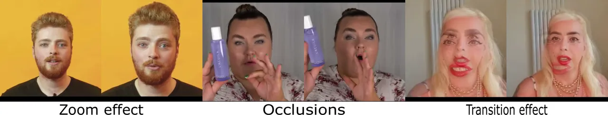

Figure 9: Illustration of bad examples in CelebV-HQ \[78\] and
CelebV-Text \[70\].

## Appendix D Evaluation metrics

### D.1 LipScore

To evaluate the effectiveness of our proposed LipScore metric compared
to the traditional SyncNet metric, we conduct experiments introducing
controlled temporal and spatial perturbations to synchronized
audio-visual data. The goal is to observe how each metric responds to
these perturbations and determine which better correlates with the
expected degradation in lip synchronization quality.

#### Temporal misalignment sensitivity

In the first set of experiments, we introduce temporal misalignments by
shifting the ground truth video temporally. The time shifts range from 0
milliseconds (ms) to 1000 ms.

Figure 10 illustrates the behavior of SyncNet Confidence and SyncNet
Distance as functions of the time shift. We observe that SyncNet
Confidence and Distance remain constant up to approximately 400 ms and
only start to change significantly beyond this point. This behavior is
undesirable, as even small misalignments (e.g., 100–200 ms) should
result in a noticeable decrease in confidence and an increase in
distance.

Figure 10: SyncNet Confidence and SyncNet Distance as functions of time
shift (ms).

In contrast, Figure 11 shows the LipScore metric’s response to the same
range of time shifts. LipScore exhibits a stable and consistent decrease
in score as the time shift increases. It begins to penalize even small
temporal perturbations, with a sharp decline at smaller offsets, and
stabilizes at lower scores as larger misalignments are introduced. This
behavior aligns with the expected characteristics of a robust lip
synchronization metric, demonstrating continuous sensitivity to temporal
misalignments without erratic or overly abrupt changes.

Figure 11: LipScore as a function of time shift (ms).

#### Robustness to spatial perturbations

We evaluate the robustness of the metrics to spatial transformations by
introducing horizontal shifts and rotations to the video frames.

Figure 12 illustrates the percentage deviation from the initial metric
values as horizontal shifts increase. LipScore remains stable,
exhibiting minimal deviation across the range of horizontal shifts,
indicating its robustness to this type of spatial perturbation. In
contrast, SyncNet Confidence and SyncNet Distance show significant
deviations starting at a shift of 75 pixels, highlighting their
sensitivity to horizontal displacements.

Figure 12: Effect of horizontal shifts on LipScore, SyncNet Confidence,
and SyncNet Distance. The plot shows the percentage deviation from the
initial value as the horizontal shift increases.

Similarly, Figure 13 shows the percentage deviation in metric values as
the rotation angle of the video frames increases. LipScore again
demonstrates robustness, with negligible changes in its values even as
the rotation angle grows. In contrast, SyncNet Confidence and SyncNet
Distance exhibit substantial deviations starting at 20 degrees,
indicating that these metrics are more adversely affected by rotational
transformations.

Figure 13: Effect of rotation angles on LipScore, SyncNet Confidence,
and SyncNet Distance. The plot shows the percentage deviation from the
initial value as the rotation angle increases.

#### WER on unseen datasets

We additionally evaluate our state-of-the-art lipreader \[41\] on HDTF
and find that it achieves a 21 % WER, demonstrating strong performance
on unseen data and further supporting LipScore’s validity.

### D.2 Non-speech vocalization classifier

We introduce the Non-Speech Vocalization (NSV) Classifier as part of our
evaluation methodology. This not only highlights the limitations of
pre-trained speech-driven animation methods but also demonstrates the
capabilities of our model in generating realistic NSV sequences. The
model processes video inputs and classifies them into one of eight NSV
types, plus speech.

#### Architecture

The architecture of the system is presented in Fig. 14. We employ a
Multiscale Vision Transformer (MViTv2) \[37\] backbone, augmented with
two linear layers and a dropout layer with a dropout probability set to
0.2. The MViTv2 model, pre-trained on the Kinetics dataset \[33\],
achieves a top-5 accuracy of 94.7 %.

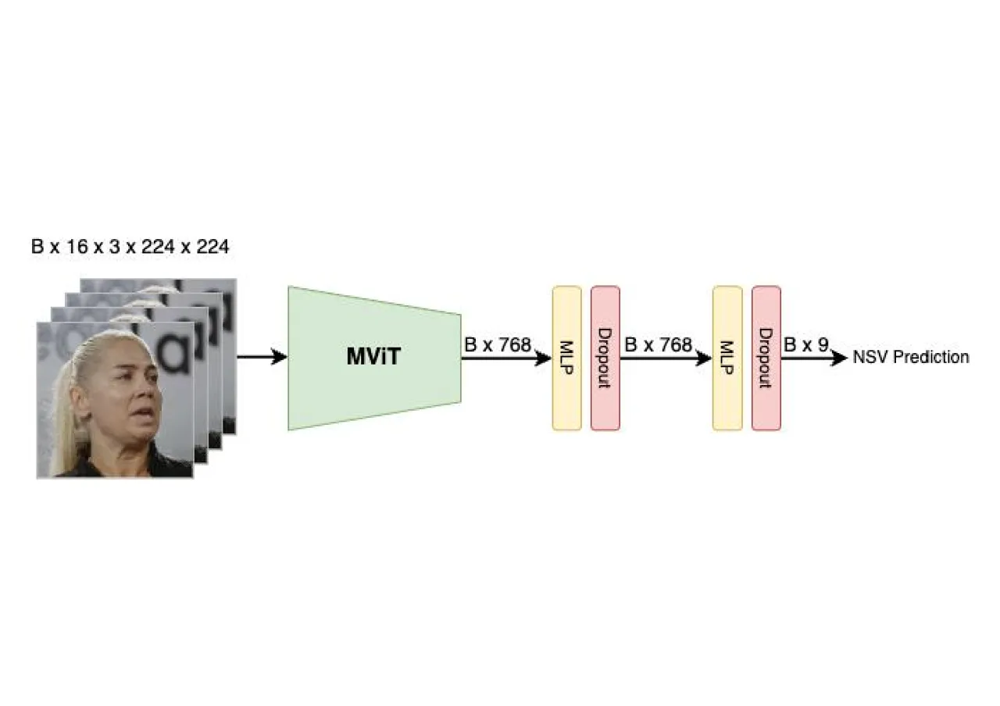

Figure 14: The architecture used for the Non-Speech Vocalization
Classifier. The batch size is denoted as B.

#### Training

Our model is trained using a dataset containing video clips of eight
different NSV types and speech. The eight NSV classes are: ”Mhm”, ”Oh”,
”Ah”, coughs, sighs, yawns, throat clears, and laughter. During the
training process, video clips corresponding to any of these classes are
fed into the model. We train using the AdamW optimizer with a learning
rate of $`1\times 10^{-4}`$, $`\beta_{1}=0.9`$, and $`\beta_{2}=0.999`$.
The cross-entropy loss is employed as the loss function.

Our model achieves an F1 score of 0.7 across these nine classes,
demonstrating its effectiveness in classifying various NSVs and speech.

#### NSVs performance boundaries

To demonstrate and understand the effectiveness of $`NSV_{acc}`$ across
individual NSVs, we present a confusion matrix on the validation set of
the data used to train $`NSV_{acc}`$ (Fig.15, left). Although the model
achieves good overall performance, certain NSVs are frequently confused,
such as “Oh” with “Ah,” “Sigh” with “Mhm,” and “Yawn” with “Cough.”

Additionally, we demonstrate that our model can generate visually
distinct NSVs (Fig.15, right) with few confusions by generating 10
videos per NSV category and speech.

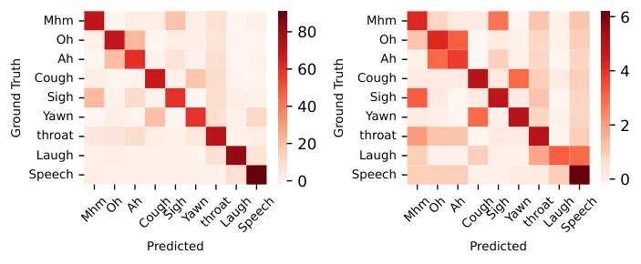

Figure 15: NSV confusion matrix for generated (left) and validation
(right) videos.

## Appendix E User study details

To evaluate the performance of our proposed method, KeyFace, against
existing baselines, we conduct a comprehensive user study. Participants
view pairs of talking face videos and select the one they find more
realistic. This section summarizes the results of the pairwise
comparisons and the derived metrics.

#### Pairwise Win Rates:

The pairwise win rate matrix is presented in Figure 16. Each cell
represents the proportion of times the reference model (rows) is
preferred over the competing model (columns). Green indicates a high win
rate for the reference model, while red represents a lower win rate.
KeyFace is consistently preferred over baseline models, achieving a win
rate of at least 64 % against all other methods.

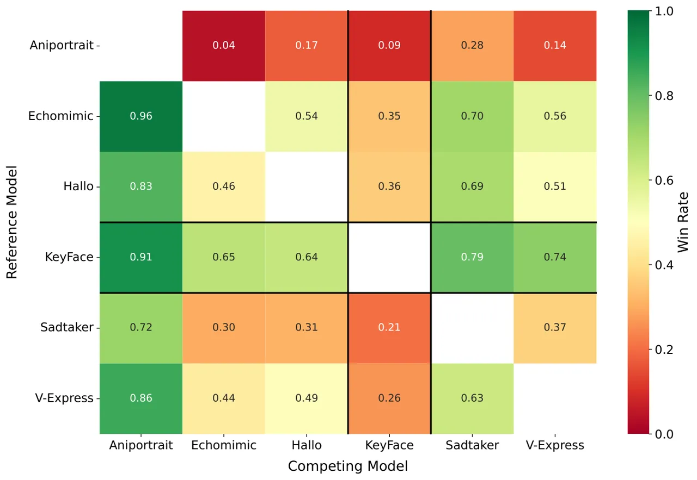

Figure 16: Pairwise win rates between reference (rows) and competing
models (columns). Green indicates higher, Red lower win rates.

#### Elo ratings:

Figure 17 presents the Elo ratings for all models with 95 % confidence
intervals. KeyFace achieves the highest Elo rating, significantly
outperforming the baselines, demonstrating its effectiveness in
generating high-quality talking face animations.

Figure 17: Elo ratings for all models with 95 % confidence intervals.
Higher ratings indicate better overall performance.

#### Elo rating distributions:

The density distributions of Elo ratings are shown in Figure 18. KeyFace
exhibits a sharp, high-density peak at the upper end, highlighting its
robustness and consistent user preference across evaluation scenarios.
Echomimic, V-Express, and Hallo show significant overlap in their
results, while Aniportrait and SadTalker consistently receive lower
ratings.

Figure 18: Density distributions of Elo ratings for all models. Peaks
indicate the most probable performance levels, with higher ratings
reflecting better performance.

## Appendix F Additional ablation

#### Audio mechanisms

|                            |                    |                    |                       |
| -------------------------- | ------------------ | ------------------ | --------------------- |
| Method                     | FID $`\downarrow`$ | FVD $`\downarrow`$ | LipScore $`\uparrow`$ |
| w/o cross attention        | 16.95              | 167.39             | 0.35                  |
| w/o timestep               | 17.20              | 176.83             | 0.28                  |
| cross attention + timestep | 16.76              | 137.25             | 0.36                  |

Table 11: Audio conditioning ablation on HDTF \[76\]: “Cross attention”
refers to incorporating audio through a cross-attention mechanism, while
“timestep” refers to adding the audio embeddings to the timestep
embeddings. The best results are highlighted in bold and default
settings are highlighted in gray on all tables.

Table 11 presents an ablation study on the impact of different audio
conditioning mechanisms on video generation quality. The results show
that the audio timestep plays a critical role in achieving accurate lip
synchronization, as removing it (row “w/o timestep”) results in the
lowest LipScore and the highest FVD. Adding cross attention alone
improves video quality but only marginally enhances the LipScore
compared to when the timestep is absent. The best performance is
achieved when both cross attention and audio timestep embeddings are
used together, leading to the lowest FID, significantly lower FVD, and
the highest LipScore. This indicates that while audio timestep
embeddings are essential for achieving good lip synchronization, the
addition of cross attention further enhances the overall quality of the
generated videos by improving visual coherence and temporal consistency.

#### Training on HDTF only

To ensure a fair comparison with baseline models, we retrain our model
exclusively on publicly available data (i.e. HDTF \[76\]), removing all
non-public sources. Although this leads to a decrease in performance,
our model still outperforms baseline methods trained on larger datasets.
We emphasize that most existing methods rely on private datasets;
therefore, to maintain fairness, we curated our dataset to have
comparable scale in terms of total hours and number of speakers as
described in Section C.1.

|                     |                    |                    |                       |
| ------------------- | ------------------ | ------------------ | --------------------- |
| Method              | FID $`\downarrow`$ | FVD $`\downarrow`$ | LipScore $`\uparrow`$ |
| KeyFace (HDTF only) | 19.49              | 165.06             | 0.28                  |

Table 12: Results of pipeline trained on HDTF only.

## Appendix G Limitations

One key limitation of our model, which it shares with all baseline
methods, is its performance when the initial frame exhibits an extreme
head pose. This issue primarily stems from the lack of training data
containing such extreme poses, resulting in difficulties in
reconstructing the occluded or unseen parts of the face. As illustrated
in Figure 19, although the model can generate plausible videos with
accurate lip synchronization, it partially loses the identity of the
reference image in these scenarios. Additional failure cases involving
challenging reference frames are provided in the supplementary videos.

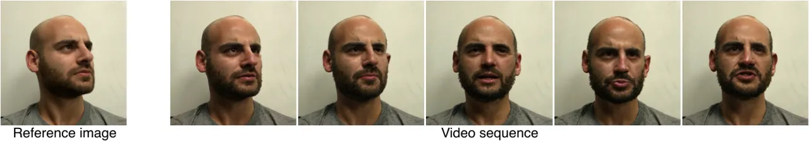

Figure 19: An example showcasing KeyFace’s limitations in handling
extreme head poses.

## Appendix H Additional qualitative results

To further demonstrate the effectiveness of our method, we provide
example videos generated by KeyFace (as well as competing methods, for
comparison) in the supplementary material:

- •
  Non-speech vocalizations comparison. We evaluate the model’s ability
  to handle eight distinct NSVs and compare its performance with
  baseline methods, highlighting the limitations of current
  state-of-the-art models and the strengths of our approach. For a fair
  comparison, all examples maintain a neutral emotional tone.
- •
  Speech and NSV comparison. We demonstrate the model’s capability to
  generate both speech and NSVs within the same video, comparing its
  performance to other approaches. The results showcase the holistic
  nature of our method, particularly in contrast to baseline models. We
  maintain a neutral emotional tone for consistency.
- •
  Side-by-side comparison. We present side-by-side comparisons between
  KeyFace and baseline models, showcasing KeyFace’s superior performance
  in generating realistic and expressive facial animations.
- •
  Emotion interpolation. We showcase transitions between different
  emotional states, emphasizing the model’s ability to capture subtle
  and nuanced expressions.
- •
  Out-of-distribution robustness. Figure 20 illustrates the model’s
  robustness in handling non-human faces, demonstrating successful
  generalization to a variety of input conditions.
- •
  Expanded KeyFace examples. We provide additional videos featuring
  KeyFace-generated animations in English and other languages,
  highlighting the model’s generalization capabilities across different
  linguistic contexts.

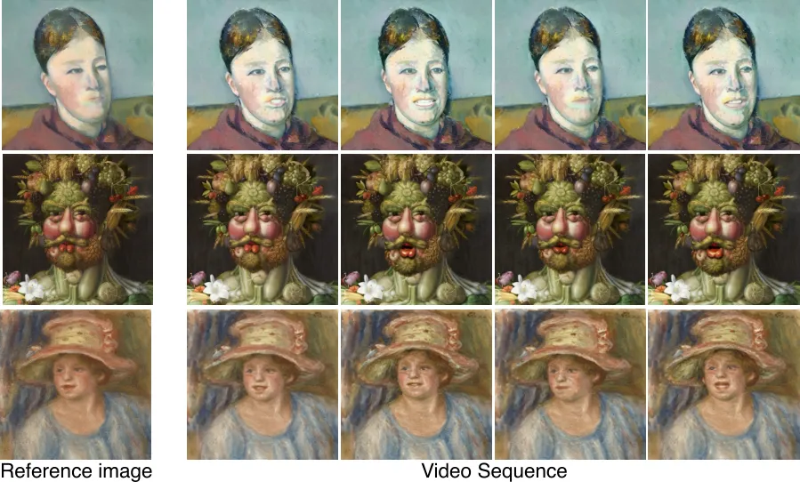

Figure 20: We present a set of examples with out-of-distribution
reference frames.
