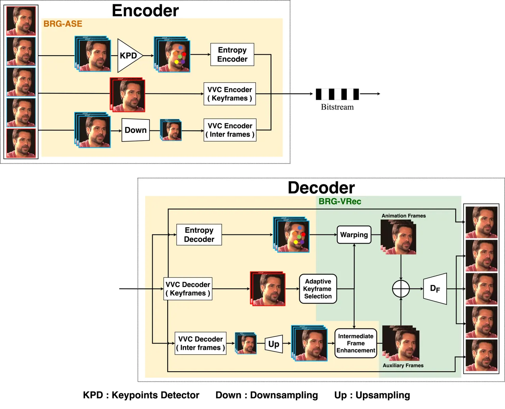
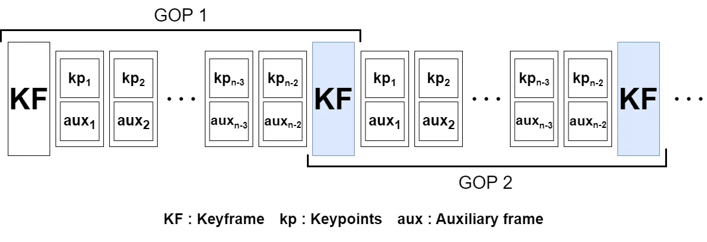
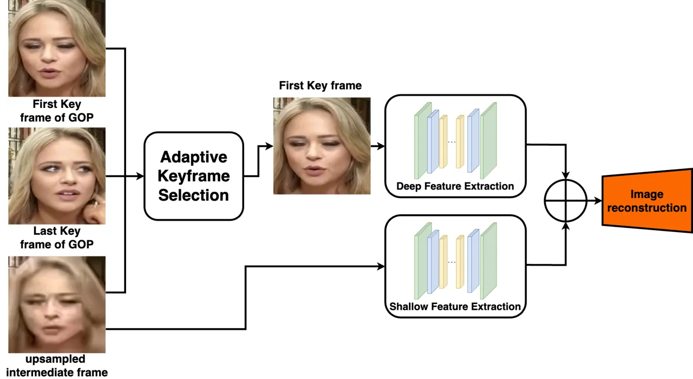
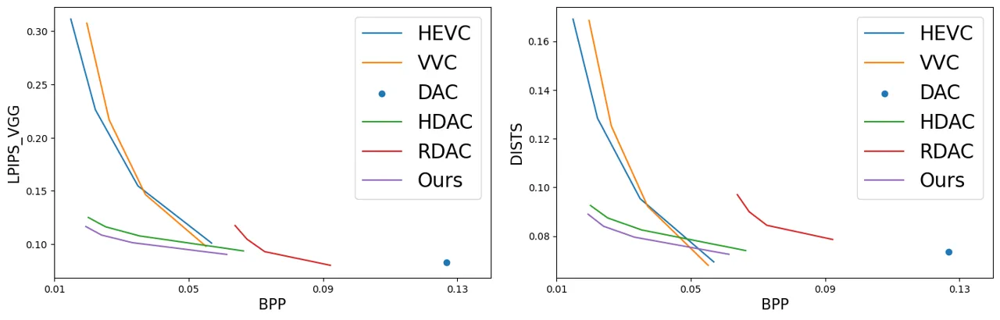
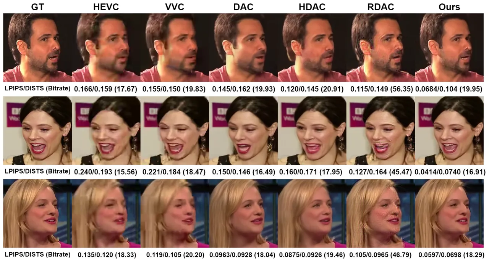
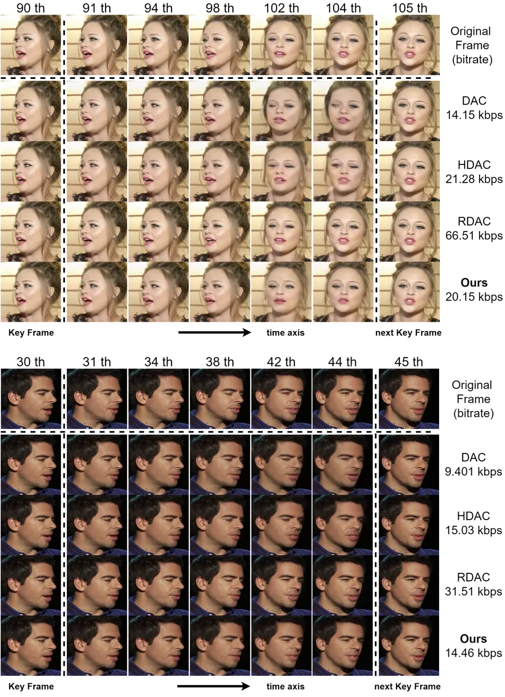

# Bidirectional Learned Facial Animation Codec for Low Bitrate Talking Head Videos

Riku Takahashi    Ryugo Morita    Fuma Kimishima    Kosuke Iwama and
Jinjia Zhou  
Hosei University, Tokyo, Japan

###### Abstract

Existing deep facial animation coding techniques efficiently compress
talking head videos by applying deep generative models. Instead of
compressing the entire video sequence, these methods focus on
compressing only the keyframe and the keypoints of non-keyframes (target
frames). The target frames are then reconstructed by utilizing a single
keyframe, and the keypoints of the target frame. Although these
unidirectional methods can reduce the bitrate, they rely on a single
keyframe and often struggle to capture large head movements accurately,
resulting in distortions in the facial region. In this paper, we propose
a novel bidirectional learned animation codec that generates natural
facial videos using past and future keyframes. First, in the
Bidirectional Reference-Guided Auxiliary Stream Enhancement (BRG-ASE)
process, we introduce a compact auxiliary stream for non-keyframes,
which is enhanced by adaptively selecting one of two keyframes (past and
future). This stream improves video quality with a slight increase in
bitrate. Then, in the Bidirectional Reference-Guided Video
Reconstruction (BRG-VRec) process, we animate the adaptively selected
keyframe and reconstruct the target frame using both the animated
keyframe and the auxiliary frame. Extensive experiments demonstrate a
55% bitrate reduction compared to the latest animation based video
codec, and a 35% bitrate reduction compared to the latest video coding
standard, Versatile Video Coding (VVC) on a talking head video dataset.
It showcases the efficiency of our approach in improving video quality
while simultaneously decreasing bitrate.

## 1 INTRODUCTION

In the digital era, video media has become a widely utilized
application, with its prevalence relying on the advancement and
dissemination of video coding technologies. Recent work on deep
learning-based video compression methods has shown the possibility of
compressing talking head videos at a very low bitrate for
videoconferencing applications. DAC \[1\] proposes a deep learning
approach for ultra-low bitrate video compression that reconstructs
target frames by using a keyframe and target keypoints representing
facial features. HDAC \[2\] uses non-key frames with a high compression
ratio as auxiliary information to handle background motion and
disocclusions that cannot be captured by keypoints. The limitations of
keypoints are overcome by using animated and auxiliary frame features to
reconstruct the target frame. RDAC \[3\] uses the residual difference
between the animated target frame and the target frame to correct the
animated target frame. Furthermore, by efficiently encoding the
residuals between consecutive frames over time, temporal dependencies
are eliminated, leading to improved compression efficiency. With
advanced image animation techniques \[4, 5\], these animation based
video compression methods \[1, 2, 3\] have demonstrated superior
results.

However, these unidirectional methods rely on a single keyframe, and as
the target frame moves away from the keyframe, the loss of temporal
correlation makes it difficult to capture large facial movements,
leading to distortions in the face region of the generated frames.
Additionally, the bit costs associated with ancillary information are
substantial and affect overall bitrate efficiency.

Figure 1: Architecture of the proposed codec. The first and last frames
(keyframes) are enclosed in red boxes, while the intermediate frames are
enclosed in blue boxes. BRG-ASE stands for the Bidirectional
Reference-Guided Auxiliary Stream Enhancement process, while BRG-VRec
stands for the Bidirectional Reference-Guided Video Reconstruction
process.

To solve these problems, we propose a novel bidirectional learned video
codec. This codec combines an image animation method with downsampling
based video coding, providing bidirectional keyframe information and low
bitrate auxiliary information. We introduce a novel coding approach
based on Group of Pictures (GOP) that utilizes bidirectional keyframes
(both past and future). This approach improves the quality of the video
reconstruction without increasing the bitrate. We also introduce an
adaptive keyframe selection algorithm that dynamically selects the
keyframe with the highest similarity to the target frame from the
bidirectional keyframes. This algorithm captures the motion between
frames and prevents the loss of temporal correlation, leading to a more
faithful reconstruction of the target frame. Additionally, a lightweight
auxiliary stream for non-keyframes is incorporated. By enhancing this
compact data, it serves as supplementary reference information to
further boost video quality with only a slight increase in bitrate.

Specifically, our framework can be divided into two processes. In the
Bidirectional Reference-Guided Auxiliary Stream Enhancement (BRG-ASE)
process, we provide low-bit auxiliary frames. The downsampled frames at
the encoder are transmitted, upsampled at the decoder, and enhanced
using the keyframes selected by the adaptive keyframe selection
algorithm from two keyframes. These frames are then used as auxiliary
frames in the next process to reconstruct the target frame. This
approach allows us to deliver auxiliary information while maintaining
quality and avoiding an increase in bitrate. In the Bidirectional
Reference-Guided Video Reconstruction (BRG-VRec) process, the keyframes
selected by the adaptive keyframe selection algorithm are animated, and
we reconstruct the target frame using the animated keyframe along with
the auxiliary frame obtained from the BRG-ASE process. By using
keyframes selected to minimize the motion difference with the target
frames, we address the issue of facial distortion caused by loss of
temporal correlation.

We demonstrated an average bitrate reduction of 24% compared to HDAC
\[2\], 55% compared to the latest animation based codec RDAC \[3\].
Additionally, we achieved a 35% reduction compared to the low-delay
configuration of the latest video coding standard, Versatile Video
Coding (VVC) \[6\]. This demonstrates the effectiveness of our approach
in reducing bitrate while maintaining high video quality.

Figure 2: The composition of the group being processed. The keyframe and
the auxiliary frame are the same size, 256x256. The last frame (filled
with blue) of each GOP is temporarily stored in the decoder for use in
the next GOP. Therefore, there is no need to send the same keyframe
twice.

## 2 THE PROPOSED METHOD

### 2.1 Framework of bidirectional learned facial amination codec

The structure of our proposed codec is shown in Figure 1. Our codec
consists of two processes: Bidirectional Reference-Guided Auxiliary
Stream Enhancement (BRG-ASE; Sec 2.2) and Bidirectional Reference-Guided
video Reconstruction(BRG-VRec; Sec 2.3). We divide one video sequence
into $`N`$ frames defined as the GOP
$`\{{I_{1},I_{2},\ldots,I_{N-1},I_{N}}\}`$.

In the BRG-ASE process, at the encoder, we estimate the keypoints from
the intermediate frames (intermediate keypoints), encodes them using a
standard arithmetic coding for entropy coding. Additionally, the first
and last keyframes $`\{I_{1},I_{N}\}`$ are compressed with high quality,
while the intermediate frames $`\{{I_{2},\ldots,I_{N-1}}\}`$ are
downsampled and compressed. Afterward, these compressed keypoints and
frames are transmitted as a bitstream. We note that the last keyframe
(future keyframe) in one GOP is reused for the first keyframe (past
keyframe) in the next GOP, as shown in Figure 2. At the decoder, the
intermediate frames are upsampled and enhanced by utilizing a keyframe
adaptively selected from two high-quality keyframes. The enhanced
intermediate frames are used as auxiliary frames during the BRG-VRec
process to address large facial movements and object occlusions that
cannot be handled solely by keypoints.

In the BRG-VRec process, we generate animation frames using adaptively
selected keyframes and intermediate keypoints. We then combine the
features of animation frames and the auxiliary frames by the BRG-ASE
process and reconstruct the frames by the decoder $`D_{F}`$.

0:  $`key_{1},key_{2}`$(keyframes), $`auxs`$(auxiliary
frames),$`inter\_kps`$(keypoints extracted from intermediate frames)

1:  $`Save(key_{2})`$ // Save keyframe at the decoder for next gop

2:  $`key\_kp_{1}=Keypoint(key_{1})`$

3:  $`key\_kp_{2}=Keypoint(key_{2})`$

4:  for $`aux,inter\_kp`$ in $`zip(auxs,inter\_kps)`$ do

5:   if $`PSNR(key_{1},aux)>PSNR(key_{2},aux)`$ then

6:    $`enh\_aux=Enhance(key_{1},aux)`$

7:    $`animation=Warp(key_{1},key\_kp_{1},inter\_kp)`$

8:    $`{DECI}=D_{F}(Concat(animation,enh\_aux))`$

9:   else

10:    $`enh\_aux=Enhance(key_{2},aux)`$

11:    $`animation=Warp(key_{2},key\_kp_{2},inter\_kp)`$

12:    $`{DECI}=D_{F}(Concat(animation,enh\_aux))`$

13:   end if

14:  end for

Algorithm 1 Adaptive frame enhancement & reconstruction

### 2.2 Bidirectional Reference-Guided Auxiliary Stream Enhancement (BRG-ASE)

At the encoder, we estimate the keypoints $`\boldsymbol{inter\_kps}`$
from the intermediate frames, encodes them using a standard arithmetic
coding for entropy coding, and transmits them as a bitstream. Following
to \[2\], we use the U-Net \[7\] to predict 10 keypoints for facial
features. We note that the keypoints of the keyframes are predicted at
the decoder. Furthermore, the first keyframe $`\boldsymbol{key_{1}}`$
and last keyframe $`\boldsymbol{key_{2}}`$ are compressed using VVC in
the intra configuration and sent as a bitstream. The intermediate frames
are downsampled with a scale of 2. The downsampled frames are compressed
using VVC in the low-delay configuration and also sent as a bitstream.
At the decoder, the downsampled intermediate frames are then upsampled
with a scale of 2 using bicubic technique and denoted as
$`\boldsymbol{auxs}`$. Then the $`auxs`$ are enhanced with the keyframes
$`\{{key}_{1},{key}_{2}\}`$. These enhanced intermediate frames
$`\boldsymbol{enh\_auxs}`$ are then used as auxiliary frames to improve
the accuracy of the reconstruction in the BRG-VRec process.

As shown in Algorithm1, when performing the enhancement, one frame is
selected from two decoded high-quality keyframes as the reference frame.
PSNR1 and PSNR2 are calculated using the upsampled intermediate frame
$`aux_{i}\in auxs`$ with $`{key_{1}}`$ and $`{key_{2}}`$, respectively.
PSNR1 and PSNR2 are compared, and the $`aux_{i}`$ frame is enhanced
using $`{key_{1}}`$ or $`{key_{2}}`$ as the reference frame, depending
on which PSNR value is larger. This algorithm allows the selection of
keyframe that have information similar to the intermediate frame and
enhances the intermediate frame.

To enhance the upsampled intermediate frames, we employed the SwinIR
framework \[8\]. SwinIR consists of three modules: shallow feature
extraction, deep feature extraction and high-quality image
reconstruction, and are intended for image restoration. SwinIR has
various tasks: image super-resolution, image denoising, and JPEG
compression artifact reduction. The upsampled intermediate frame and the
selected keyframe are taken as input. Then, the shallow features
extracted from the upsampled intermediate frame and the deep features
sampled from the keyframe are aggregated. Finally, the image enhancement
is conducted as shown in Figure3.

Figure 3: The structure of upsampled intermediate frame enhancement.

### 2.3 Bidirectional Reference-Guided Video Reconstruction (BRG-VRec)

As we have transmitted the first and last frames in high quality, they
are directly utilized as the output video, while only the intermediate
frames are reconstructed. For intermediate frame reconstruction, as in
the case of upsampled intermediate frame enhancement, the keyframe is
selected from two high-quality keyframes which has similar information
to the intermediate frame as shown in Algorithm1. We estimate the
keypoints from the selected keyframe using the U-Net as in the case of
intermediate keypoints estimation. The selected keyframe, its keypoints,
and intermediate keypoints are used to generate the optical flow and the
occlusion map. The dense optical flow captures object movement between
the keyframe and the target frame, aligning the keyframe’s feature map
with the object’s pose in the target frame. The occlusion map masks
regions of the feature map for inpainting. The animation frames
$`\boldsymbol{animations}`$ are generated in a similar process to \[4\].

If $`key_{1}`$ or $`key_{2}`$ is selected, the animation frame is
generated using the corresponding keyframe ($`key_{1}`$ or $`key_{2}`$),
the keyframe’s keypoints ($`key\_kp_{1}`$ or $`key\_kp_{2}`$), and
$`inter\_kp_{i}`$ from the intermediate frame.

After the animation frames are generated, the feature of the animation
frame $`animation\in animations`$ and the feature of the auxiliary frame
$`enh\_aux\in enh\_auxs`$ are concatenated. Then the pretrained decoder
$`D_{F}`$ \[2\] reconstructs the output video frame $`{DECI}`$.

### 2.4 Loss function and training

We initialize the intermediate frame enhancement with pretrained models
from SwinIR. To enhance the low quality intermediate frames, we used the
Charbonnier loss and $`{\varepsilon}`$ is a constant that is set to
$`10^{-3}`$.

$`L_{enhancement}=\sqrt{{||enh\_aux-I||}^{2}+\varepsilon}`$

The reconstruction network is also trained with a loss term following
HDAC \[2\].

## 3 EXPERIMENTS AND RESULTS

### 3.1 Datasets and metrics

As with \[1, 2, 3\], we employed the VoxCeleb dataset \[9\]. It is a
large audio-visual dataset of human speech extracted from YouTube
videos. We utilized videos with a resolution of 256x256 pixels. For
evaluating the results, we randomly selected 45 sequences. As described
in \[10, 3\], traditional objective quality assessment methods such as
PSNR and SSIM are designed for pixel-level distortion calculations and
are not suitable for quality assessment of deep learning-based
compression. Visual quality measures in learning-based image
compression, such as DISTS \[11\] and LPIPS \[12\], quantify the
similarity between the reconstructed image and the original image
through learning-based feature correlation and can better assess the
quality of the generated image. These assessments indicate that a lower
score corresponds to better quality.

vs. HEVC \[13\] vs. VVC \[6\] vs. HDAC \[2\] vs. RDAC \[3\] BD quality /
BD rate BD quality / BD rate BD quality / BD rate BD quality / BD rate
LPIPS_Alex↓ -3.134 / -31.110 -4.198 / -29.078 -0.465 / -24.746 -1.966 /
-52.018 LPIPS_VGG↓ -6.218 / -53.410 -7.363 / -48.266 -0.751 / -27.795
-3.311 / -53.886 DISTS↓ -2.032 / -30.223 -2.677 / -28.381 -0.365 /
-22.862 -2.799 / -66.859

Table 1: Comparison of the coding performance with SOTAs

Figure 4: RD performance comparison

### 3.2 Comparison with state-of-the-art video codecs

To compare the performance at different bitrates, the GOP size is
changed to affect the average reconstruction quality of the video
sequence. 120 frames of each video are tested with GOP sizes 5, 10, 15
and 20. The quantization parameters (QP) are set to 30 for keyframes and
45 for auxiliary frames. HEVC \[13\] and VVC \[6\] were tested under a
low-delay configuration with high QP settings to obtain a smaller
bitrate. We also compare with the animation based video codecs: DAC
\[1\], HDAC \[2\], and RDAC \[3\]. For a fair comparison, both these
animation based codecs and ours, keyframes are compressed with a QP
setting of 30 using VVC. In addition, since these codecs have various
parameters for testing, we used the original ones for those parameters
and obtained different bitrate results by changing the GOP.

Figure 4 provides the rate-distortion performance of the proposed codec
in comparisons with conventional video codecs in terms of both LPIPS and
DISTS. The rate-distortion performance is averaged across all sequences
in the test data. It can be observed that our codec obtains higher
performance at low bitrate compared to HEVC and VVC. It also achieved
better results most of the time compared to other animation based video
codecs.

Table 1 shows the bitrate savings in LPIPS_Alex, LPIPS_VGG, and DISTS
compared to state of the art codecs (SOTAs). Our codec delivers a 29%
bitrate reduction in LPIPS_Alex, 48% in LPIPS_VGG, and 28% in DISTS
compared to the video coding standard VVC. Furthermore, our codec
achieves a 52% bitrate reduction in LPIPS_Alex, 53% in LPIPS_VGG, and
66% in DISTS compared to the latest animation based video codec RDAC
\[3\].

Figure 5: Comparison of visual quality with SOTAs. GT stands for Ground
Truth frame.

As shown in Figure 5, at the similar bitrate, our approach demonstrates
superior subjective quality compared to other video compression model.
Additionally, it effectively maintains lower LPIPS_Alex and DISTS scores
compared to other methods. These results indicate that the bidirectional
learned video reconstruction method utilizing past and future keyframes
achieves better frame generation accuracy when compared to the
unidirectional video reconstruction method using a single keyframe.

Figure 6 shows the changes over time of the reconstructed frame quality
when the GOP is set to 15. Both DAC \[1\] and HDAC \[2\] generate frames
using a single keyframe, with DAC relying on keypoints for the target
frame and HDAC additionally compositing auxiliary frames onto the
animation frame generated similarly to DAC. These methods can accurately
reconstruct the target frame in the vicinity of the keyframe, but less
accurate as time progresses as shown in Figure 6. The latest RDAC \[3\]
reconstructs frames by combining the residuals of the animation frame as
DAC and the target frame, but as time progresses, the residuals do not
synthesize well and appear as noise. Also, as shown in the upper part of
Figure 6, if the motion between frames is large, the bitrate is larger
because more bits of the residuals are sent to the decoder. Our
bidirectional frame reconstruction with adaptive keyframe selection can
suppress the degradation of reconstruction accuracy as time progresses.
This has been shown to reduce the loss of temporal correlation.

## 4 CONCLUSION

In this paper, we propose a novel bidirectional learned video codec that
combines the image animation method with a downsampling based video
coding. Our approach leverages two keyframes while enhancing
downsampled/upsampled auxiliary frames. The reconstruction of
intermediate frames is achieved using two high-quality keyframes,
keypoints, and auxiliary frames. This method effectively addresses the
loss of temporal correlation problem by utilizing two keyframes and
adaptive keyframe selection, allowing for reconstruction with
information closely aligned to the target intermediate frame. Our
results demonstrate significant advantages over existing compression
standards such as HEVC and VVC at low bitrates. Also, compared to
existing unidirectional facial animation based video codecs, our
bidirectional approach can reduce distortion in facial regions. It also
maintains the same quality as current codecs but at a lower bitrate.

Figure 6: Changes in reconstructed frame quality over time (GOP=15)

## 5 REFERENCES

## References

- \[1\] Goluck Konuko, Giuseppe Valenzise, and Stéphane Lathuilière,
  “Ultra-low bitrate video conferencing using deep image animation,” in
  ICASSP 2021-2021 IEEE International Conference on Acoustics, Speech
  and Signal Processing (ICASSP). IEEE, 2021, pp. 4210–4214.
- \[2\] Goluck Konuko, Stéphane Lathuilière, and Giuseppe Valenzise, “A
  hybrid deep animation codec for low-bitrate video conferencing,” in
  2022 IEEE International Conference on Image Processing (ICIP). IEEE,
  2022, pp. 1–5.
- \[3\] Goluck Konuko, Stéphane Lathuilière, and Giuseppe Valenzise,
  “Predictive coding for animation-based video compression,” in 2023
  IEEE International Conference on Image Processing (ICIP). IEEE, 2023,
  pp. 2810–2814.
- \[4\] Aliaksandr Siarohin, Stéphane Lathuilière, Sergey Tulyakov,
  Elisa Ricci, and Nicu Sebe, “First order motion model for image
  animation,” in Conference on Neural Information Processing Systems
  (NeurIPS), December 2019.
- \[5\] Aliaksandr Siarohin, Stéphane Lathuilière, Sergey Tulyakov,
  Elisa Ricci, and Nicu Sebe, “Animating arbitrary objects via deep
  motion transfer,” in Proceedings of the IEEE/CVF Conference on
  Computer Vision and Pattern Recognition, 2019, pp. 2377–2386.
- \[6\] Benjamin Bross, Ye-Kui Wang, Yan Ye, Shan Liu, Jianle Chen,
  Gary J Sullivan, and Jens-Rainer Ohm, “Overview of the versatile video
  coding (vvc) standard and its applications,” IEEE Transactions on
  Circuits and Systems for Video Technology, vol. 31, no. 10, pp.
  3736–3764, 2021.
- \[7\] Olaf Ronneberger, Philipp Fischer, and Thomas Brox, “U-net:
  Convolutional networks for biomedical image segmentation,” in Medical
  Image Computing and Computer-Assisted Intervention–MICCAI 2015: 18th
  International Conference, Munich, Germany, October 5-9, 2015,
  Proceedings, Part III 18. Springer, 2015, pp. 234–241.
- \[8\] Jingyun Liang, Jiezhang Cao, Guolei Sun, Kai Zhang, Luc
  Van Gool, and Radu Timofte, “Swinir: Image restoration using swin
  transformer,” in Proceedings of the IEEE/CVF international conference
  on computer vision, 2021, pp. 1833–1844.
- \[9\] Arsha Nagrani, Joon Son Chung, and Andrew Zisserman, “Voxceleb:
  a large-scale speaker identification dataset,” arXiv preprint
  arXiv:1706.08612, 2017.
- \[10\] Bolin Chen, Zhao Wang, Binzhe Li, Rongqun Lin, Shiqi Wang, and
  Yan Ye, “Beyond keypoint coding: Temporal evolution inference with
  compact feature representation for talking face video compression,” in
  2022 Data Compression Conference (DCC). IEEE, 2022, pp. 13–22.
- \[11\] Keyan Ding, Kede Ma, Shiqi Wang, and Eero P Simoncelli, “Image
  quality assessment: Unifying structure and texture similarity,” IEEE
  transactions on pattern analysis and machine intelligence, vol. 44,
  no. 5, pp. 2567–2581, 2020.
- \[12\] Richard Zhang, Phillip Isola, Alexei A Efros, Eli Shechtman,
  and Oliver Wang, “The unreasonable effectiveness of deep features as a
  perceptual metric,” in Proceedings of the IEEE conference on computer
  vision and pattern recognition, 2018, pp. 586–595.
- \[13\] Gary J. Sullivan, Jens-Rainer Ohm, Woo-Jin Han, and Thomas
  Wiegand, “Overview of the high efficiency video coding (hevc)
  standard,” IEEE Transactions on Circuits and Systems for Video
  Technology, vol. 22, no. 12, pp. 1649–1668, 2012.
