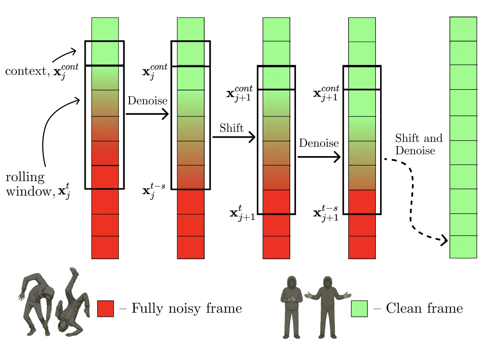
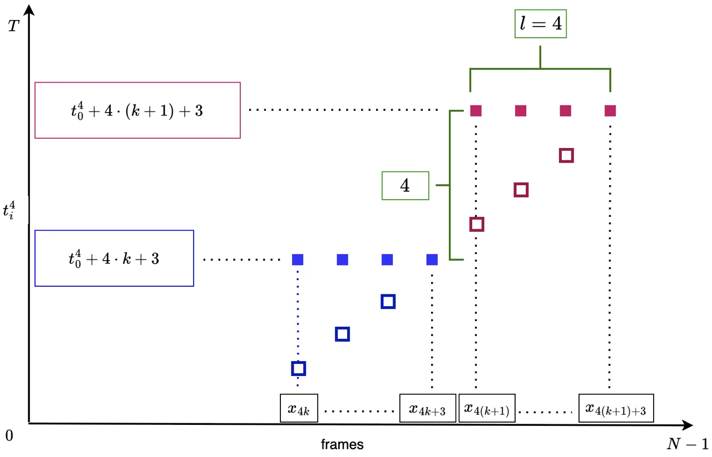
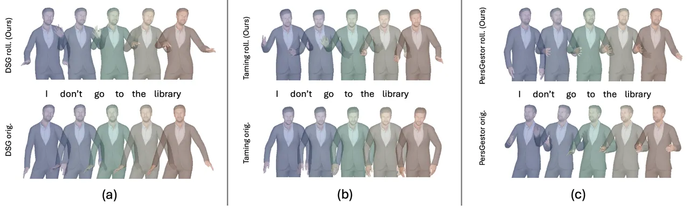
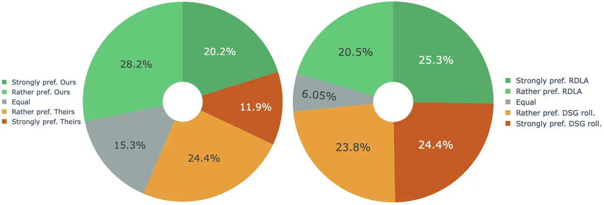
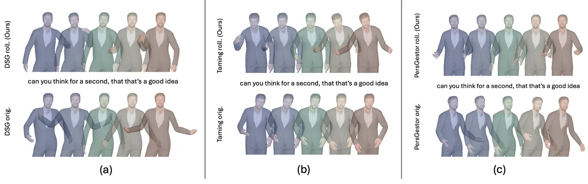
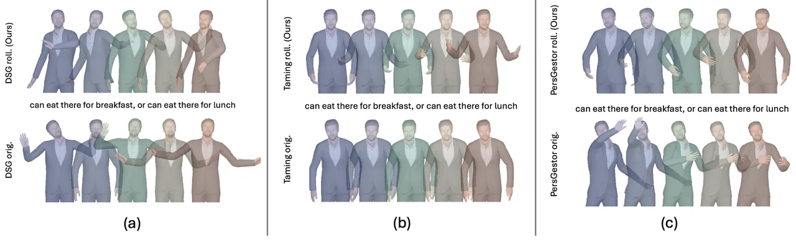

# Streaming Generation of Co-Speech Gestures via Accelerated Rolling Diffusion

Evgeniia Vu    Andrei Boiarov    Dmitry Vetrov

###### Abstract

Generating co-speech gestures in real time requires both temporal
coherence and efficient sampling. We introduce a novel framework for
streaming gesture generation that extends Rolling Diffusion models with
structured progressive noise scheduling, enabling seamless long-sequence
motion synthesis while preserving realism and diversity. Our framework
is universally compatible with existing diffusion-based gesture
generation model, transforming them into streaming methods capable of
continuous generation without requiring post-processing. We evaluate our
framework on ZEGGS and BEAT, strong benchmarks for real-world
applicability. Applied to state-of-the-art baselines on both datasets,
it consistently outperforms them, demonstrating its effectiveness as a
generalizable and efficient solution for real-time co-speech gesture
synthesis. We further propose Rolling Diffusion Ladder Acceleration
(RDLA), a new approach that employs a ladder-based noise scheduling
strategy to simultaneously denoise multiple frames. This significantly
improves sampling efficiency while maintaining motion consistency,
achieving up to a 4× speedup with high visual fidelity and temporal
coherence in our experiments. Comprehensive user studies further
validate our framework’s ability to generate realistic, diverse gestures
closely synchronized with the audio input.

¹Constructor University, Bremen, Germany

²Constructor Tech, Sofia, Bulgaria

andrei.boiarov@constructor.tech

Code —
https://github.com/andrewbo29/co-speech-gestures-rolling-diffusion

## 1 Introduction

Co-speech gestures enhance non-verbal communication by reinforcing
spoken content, and are essential for realism in virtual avatars, video
conferencing, gaming, and embodied AI (Nyatsanga et al. 2023).
Real-time, or streaming, generation is particularly important for
interactive settings such as virtual assistants, gaming, and
telepresence systems. Recent work largely relies on data-driven deep
learning to produce realistic motion, with diffusion-based models
standing out for their strong realism and diversity. Approaches such as
DiffuseStyleGesture (Yang et al. 2023), which uses cross-local and
self-attention for gesture–speech synchronization, and Taming
Diffusion (Zhu et al. 2023), which applies audio-conditioned diffusion
with transformer guidance, both rely on seed-pose conditioning to ensure
smooth transitions and temporal coherence.

Despite recent progress, diffusion-based methods still struggle in
real-time settings. To manage long sequences, many models generate
fixed-length chunks or incremental extensions. PersonaGestor (Zhang et
al. 2024a) uses fuzzy feature inference yet still stitches chunked
outputs, while DiffSHEG (Chen et al. 2024b) depends on incremental
outpainting. Such non-streaming strategies often cause visual
discontinuities and add latency due to post-processing. Methods that
condition on previous frames improve continuity but incur substantial
computational overhead, limiting real-time use (see Supplementary
Material).

A promising alternative is the Rolling Diffusion framework (Ruhe et al.
2024), which turns diffusion models into an autoregressive process and
improves temporal consistency for long sequences. However, applying it
to real-time co-speech gesture generation remains difficult, primarily
because the autoregressive loop is computationally expensive.

To address these challenges, we introduce a novel Rolling Diffusion
based framework integrating diffusion models with real-time capabilities
for co-speech gesture generation. By employing a structured ladder-based
noise scheduling strategy, our Rolling Diffusion Ladder Acceleration
(RDLA) approach simultaneously denoises multiple frames, significantly
improving sampling efficiency. This achieves generation speeds of up to
200 FPS without compromising visual fidelity or temporal coherence.
Extensive experiments on the ZEGGS (Ghorbani et al. 2023) and BEAT (Liu
et al. 2022) benchmarks confirm our method’s effectiveness for
realistic, diverse gesture generation in streaming contexts. In summary,
our key contributions are:

1.  1.  We are the first, to our knowledge, to successfully adapt a rolling
        diffusion framework to a practical application, specifically
        demonstrating its effectiveness in real-time co-speech gesture
        generation.
2.  2.  We propose a universal framework for converting any diffusion-based
        gesture generation approach into a real-time streaming model without
        requiring post-processing.
3.  3.  We provide comprehensive evaluations on standard benchmarks and user
        studies, showing that our method consistently outperforms baselines
        across the benchmarks, demonstrating its effectiveness as a
        generalizable solution for real-time, high-fidelity co-speech
        gesture synthesis.
4.  4.  We introduce RDLA, substantially increasing inference speed with
        minimal impact on gesture quality.

## 2 Proposed Approach

### Rolling Diffusion Models

Diffusion models (Song and Ermon 2019; Ho et al. 2020) consist of a
forward (diffusion) process and reverse process. The forward process
gradually adds Gaussian noise to a data sample $`x^{0}`$ over $`T`$
steps such that $`x^{T}\sim\mathcal{N}(0,1)`$ and each transition is
defined as:

```math
q(x^{t}\mid x^{t-1})=\mathcal{N}(x^{t};\sqrt{1-\beta^{t}}x^{t-1},\beta^{t}I) \tag{1}
```

where $`\beta^{t}`$ is a variance schedule controlling noise intensity.
The marginal distribution after $`t`$ steps is:

```math
q(x^{t}\mid x^{0})=\mathcal{N}(x^{t};\sqrt{\bar{\alpha}^{t}}x^{0},(1-\bar{\alpha}^{t})I) \tag{2}
```

where $`\alpha^{t}=1-\beta^{t}`$ and
$`\bar{\alpha}^{t}=\prod_{s=1}^{t}\alpha^{s}`$.  
The reverse process learns to denoise $`x^{t}`$ using a neural network
$`f_{\theta}(x^{t},t)=\hat{x}`$. The model is trained by minimizing the
objective:
$`\mathcal{L}(\theta):=\mathbb{E}_{t,x^{0}}\left[a(t)\|x^{0}-\hat{x}\|^{2}\right]`$,
where $`a(t)`$ is a weighting function that can be specified to control
the importance of different timesteps during training. This objective
encourages $`f_{\theta}(x^{t},t)`$ to accurately estimate the initial
signal of data sample.

Rolling Diffusion Models (RDMs) (Ruhe et al. 2024) introduce a
modification to standard diffusion models by incorporating a progressive
corruption process along the temporal axis, making them particularly
well-suited for sequential data
$`\mathbf{X}=\{x^{0}_{k}\}_{k=0}^{L-1}`$, where $`x_{l}`$ is $`k`$-th
element of sequence. Unlike standard diffusion models that apply noise
uniformly across all frames, RDMs operate with a rolling window of size
$`N`$. In this setup, the noise level gradually increases from the first
to the last frame in the window, enabling a seamless transition. In our
implementation, we discretize time which indicates the noise level using
$`t\in\{0,\ldots,T\}`$ instead of the continuous range $`t\in[0,1]`$,
where $`T=1000`$ represents the total number of noise steps. Since the
generation window size $`N`$ is typically much smaller than $`T`$, the
noise level difference between adjacent frames is greater than 1. We
define this difference as a step $`s`$, calculated as $`s=\frac{T}{N}`$.
To ensure uniform noise distribution across frames, we select the
generation window as a divisor of $`T`$, ensuring consistent step sizes
and preventing uneven noise application. This structured noise
scheduling allows for a more controlled and stable generation process,
improving the overall quality of generated sequences. Then the rolling
window takes the form
$`\mathbf{x}^{t_{0}}_{j}=\{x_{j+n}^{t_{n}}\}_{n=0}^{N-1}`$, where
$`t_{0}\in\{1,\ldots,s\}`$ is a noise level of the first frame in the
window, $`t_{n}=t_{0}+ns`$ is a noise level of $`n^{th}`$ frame. ¹¹ 1
Since noise levels of all frames within a rolling window are
deterministic functions of $`t_{0}`$ we may use this index to define the
noise levels of the entire rolling window $`\mathbf{x}_{j}^{t_{0}}`$.

In the forward process, noise is applied progressively as:

```math
q(\mathbf{x}^{t_{0}}_{j}|\mathbf{x}_{j})=\prod_{n=0}^{N-1}\mathcal{N}(x^{t_{n}}_{j+n}|\alpha^{t_{n}}x_{j+n}^{0},(1-\alpha^{t_{n}})^{2}I) \tag{3}
```

During training, the model
$`f_{\theta}(\mathbf{x}_{j}^{t_{0}},t)=\hat{\mathbf{x}}`$ processes only
the frames within the rolling window. The parametrized reverse process
$`p_{\theta}(\mathbf{x}^{t-1}_{j}|\mathbf{x}^{t}_{j})`$ is defined as:

```math
p_{\theta}(\mathbf{x}^{t_{0}-1}_{j}|\mathbf{x}^{t_{0}}_{j})=\prod_{n=0}^{N-1}q(x_{j+n}^{t_{n}-1}|x_{j+n}^{t_{n}},\hat{x}_{j+n}) \tag{4}
```



.

Figure 1: Visualization of the rolling denoising process with parameters
$`T=5`$, $`N=5`$, $`n^{cont}=1`$, $`s=1`$

Once the first frame is fully denoised, i.e. $`t_{0}`$ reaches $`0`$, a
new frame, sampled from Gaussian noise, is introduced, and the window
shifts forward ($`j=j+1`$, $`t_{0}=s`$) to continue the denoising
process. This approach allows for continuous and unbounded generation,
making RDMs particularly effective for producing arbitrarily long
sequences.

The training objective is

```math
L(\theta):=\mathbb{E}_{j}\mathbb{E}_{\mathbf{x}^{0}_{j}}\sum_{t^{0}=1}^{s}\mathbb{E}_{\mathbf{x}_{j}^{t_{0}}}\sum_{n=0}^{N-1}a(t_{n})\|x^{0}_{j+n}-\hat{x}_{j+n}\|^{2}, \tag{5}
```

where $`x_{k}^{t}`$ represents a single frame with the upper index $`t`$
denoting the noise level and the lower index $`k`$ representing the
index in the sequence and $`a(t_{n})`$ is a weighting function (e.g.
signal-to-noise ratio).

To achieve progressive noise scheduling, RDMs operate in two distinct
phases: initialization and rolling. In the initialization phase, the
model starts with a fully noisy sequence and gradually denoises it to
the partially clean state required by the rolling window. Once this
point is established, the model enters the rolling phase, where the
rolling denoising process described above is applied.

### Method

In our work, we adapt rolling diffusion models for co-speech gesture
generation, introducing a novel framework that transforms any
diffusion-based architecture into a streaming model. Our approach
enables seamless and continuous gesture generation of arbitrary length
by modifying the model architecture and integrating a structured noise
scheduling mechanism, which, combined with the rolling denoising
process, ensures smooth temporal transitions and prevents abrupt motion
discontinuities. As illustrated in figure 1, the model generates a new
clean frame in each $`s`$-step and shifts the generation window forward
to include the new frame at the end.

As a condition, the model receives audio features as input
$`U=\{u_{k}\}_{k=0}^{L-1}`$. Audio processing depends on the
implementation of the baseline model, but the most popular approach is
to use a pre-trained model such as WavLM (Chen et al. 2022). Also,
depending on the baseline’s architecture, the model can receive a speech
style or speaker ID as an additional condition.

The architecture of the baseline model is mostly preserved, and the main
change affects the integration of time embedding. All models incorporate
time embeddings into each frame, either by summing or concatenating them
with the frame embeddings. In the original models, a single time
embedding is replicated across all frames. In contrast, our approach
assigns a unique time embedding to each frame within the rolling window.

### Training Description

During training, we sample the initial noise level $`t_{0}`$ for the
first frame from a uniform distribution
$`t_{0}\sim\text{Uniform}(\{1,\dots,s\})`$ and select the starting index
$`j`$ for the rolling window uniformly
$`j\sim\text{Uniform}(\{1,\dots,L-N\})`$. We then determine the noise
levels for subsequent frames according to $`t_{n}=t_{0}+ns`$. These
noise levels are applied using eq. 3. As a result, the noise level for
each frame $`n`$ in the sequence falls within the range
$`t_{n}\in[s\cdot n,\;s\cdot(n+1))`$. To improve the performance of the
model, we include several clean frames at the beginning of the sequence
as an additional context, represented by
$`\mathbf{x}_{j}^{cont}=(x_{j-n^{cont}}^{1},\dots,x_{j-1}^{1})`$ with a
length $`n^{cont}`$. We discovered that applying a minimal level of
noise $`t=1`$ to these context frames is essential. This process acts as
a form of regularization and improves stability (see the Supplementary
Material for more details). Therefore, at each time step, the input to
the model consists of a concatenated sequence
$`[\mathbf{x}^{cont}_{j},\mathbf{x}^{t}_{j}]`$. Here,
$`\mathbf{x}^{t}_{j}`$ denotes a rolling window whose first frame
corresponds to the $`t`$-th noise level, and the associated audio
features for this sequence are given by
$`u_{j}=(u_{j-n^{cont}},\dots,u_{j+N-1})`$.  
Unlike prior work, our model is trained exclusively for the rolling
phase, omitting an initial descent phase. Furthermore, we use
$`a(t_{n})=1`$ in the training objective for all $`t`$, instead of using
the signal-to-noise ratio (SNR). The training procedure is summarized in
algorithm 1.

1: repeat

2:   $`j\sim\text{Uniform}(\{1,\dots,L-N\})`$

3:   $`t_{0}\sim\text{Uniform}(\{1,\dots,s\})`$

4:   $`\mathbf{x}^{0}_{j}\leftarrow(x^{0}_{j},\dots,x^{0}_{j+N-1})`$

5:   $`\mathbf{u}_{j}\leftarrow(u_{j-n^{cont}},\dots,u_{j+N-1})`$

6:   Sample
$`\mathbf{x}^{t_{0}}_{j}\sim q(\mathbf{x}^{t_{0}}_{j}|\mathbf{x}_{j})`$
(see eq. 3)

7:   Compute
$`\hat{\mathbf{x}}_{j}\leftarrow f_{\theta}\Bigl([\mathbf{x}^{\mathrm{cont}}_{j},\,\mathbf{x}^{t_{0}}_{j}],\,t_{0},\,\mathbf{u}_{j}\Bigr)`$

8:   Take gradient descent step on

```math
\nabla_{\theta}\sum_{n=0}^{N-1}a(t_{n})\|x^{0}_{j+n}-\hat{x}_{j+n}\|^{2}
```

9: until Converged

Algorithm 1 Training

### Sampling Process Description

To create a progressively noisy sequence within the rolling window, we
begin by padding the sequence with idle poses, each characteristic of
the style and corresponding to silence. These initial poses are then
noised according to a schedule starting at $`t_{0}=s`$. At each $`s`$-th
step, we get a fully denoised frame, which is appended to the output
sequence. Subsequently, a new frame is sampled from Gaussian noise,
added to the end of the rolling window, and the window is shifted. The
sampling process is outlined in algorithm 2.

1: audio $`\{u_{j}\}_{j=0}^{L-1}`$, idle $`x_{\mathrm{idle}}`$

2: Resulted prediction $`y`$

3: for $`n=-N,\dots,-1`$ do

4:   $`t_{n}=s(N+n+1)`$

5:   $`u_{n}=0`$

6:   Sample $`x_{n}^{t_{n}}\sim q(x_{n}^{t_{n}}|x_{\mathrm{idle}})`$

7: end for

8: $`\mathbf{u}_{-N}\leftarrow(u_{-N-n^{cont}},\dots,u_{-1})`$

9: $`\mathbf{x}_{-N}^{s}\leftarrow(x_{-N}^{s},\dots,x_{-1}^{T})`$

10:
$`\mathbf{x}_{-N}^{\mathrm{cont}}\leftarrow({x}_{\mathrm{idle}},\dots,x_{\mathrm{idle}})`$

11: $`j=-N`$

12: repeat

13:   for $`t_{0}=s,s-1,...,1`$ do

14:
   $`\hat{\mathbf{x}}_{j}\leftarrow f_{\theta}\Bigl([\mathbf{x}^{\mathrm{cont}}_{j},\,\mathbf{x}^{t_{0}}_{j}],\,t_{0},\,\mathbf{u}_{j}\Bigr)`$

15:    Sample
$`\mathbf{x}^{t_{0}-1}_{j}\sim p_{\theta}(\mathbf{x}^{t_{0}-1}_{l}|\mathbf{x}^{t_{0}}_{j})`$
(see eq. 4)

16:   end for

17:   $`y_{j}=\hat{x}_{j}^{0};j=j+1`$

18:   Sample
$`x_{j-1}^{1}\sim q(x_{j-1}^{1}|x_{j-1}^{0});x^{T}_{j+N}\sim\mathcal{N}(0,I)`$

19:
  $`\mathbf{x}_{j}^{cont}\leftarrow(x^{1}_{j-n^{\mathrm{cont}}},\dots,x_{j-1}^{1})`$

20:   $`\mathbf{x}_{j}^{s}\leftarrow(x_{j}^{s},\dots,x_{j+N}^{T})`$

21:   $`\mathbf{u}_{j}\leftarrow(u_{j-n^{cont}},\dots,u_{j+N})`$

22: until Completed

Algorithm 2 Sampling

## 3 Rolling Diffusion Ladder Acceleration

In the standard rolling diffusion sampling process (Section 2), only a
single frame is fully denoised at each $`s`$-th step, leading to a
sequential bottleneck that slows down the overall generation. Hence we
cannot make $`T`$ smaller than $`N`$, which corresponds to $`s=1`$. To
overcome this limitation, we introduce Rolling Diffusion Ladder
Acceleration (RDLA), a novel approach that transforms the original noise
schedule into a ladder with step size $`l`$ (see fig. 2), enabling the
simultaneous denoising of $`l`$ frames from the same noise level. We
introduce a new sequence of stepsize noise levels $`t_{i}^{l}`$
according to the following rule:

```math
t^{l}_{i}=t_{0}^{l}+(k+1)\cdot l-1,\ \ \ kl\leq i<(k+1)l-1,
```

where $`k\in\{0,\frac{N}{l}-1\}`$, $`t_{0}^{l}\in\{1,\ldots,l\}`$.



Figure 2: Rolling ladder steps $`k`$ (blue bottom squares) and $`k+1`$
(red upper squares) for the ladder step size $`l=4`$ with corresponding
noise level values and frames in the rolling window
$`\mathbf{x}^{t_{0}^{4}}_{j}`$. The hollow squares of the corresponding
color show the initial positions of the noise levels for a ladder of
step size $`l=1`$.

This modification allows multiple frames to be jointly denoised in each
iteration, accelerating the process. The conventional rolling diffusion
model can be seen as a special case of RDLA with $`l=1`$. The process of
constructing the ladder noise schedule $`l=4`$ for steps $`k`$ and
$`k+1`$ is illustrated in fig. 2. This proposed process can be viewed as
a transformation from the noise schedule with $`l=1`$ to the noise
schedule with $`l>1`$ ($`l=4`$ for  fig. 2). All noise levels within a
constructing ladder step are set equal to the last noise level in that
step. This design choice ensures a consistent step height across all
levels of the ladder and guarantees that the last ladder step noise
level equals to $`T`$. Thus, the sampling process in a rolling window
starts from $`T`$, and has zero signal-to-noise ratio, which, as
demonstrated in (Lin et al. 2024), is important for maintaining output
quality.

During inference, RDLA processes $`l`$ frames simultaneously by fully
denoising an entire block at each iteration. At the same time, $`l`$ new
frames are initialized from Gaussian noise and appended to the rolling
window, ensuring continuous sequence expansion. This modification
follows algorithm 2, but with enhanced efficiency due to the structured
noise scheduling of RDLA.

### RDLA Training Strategy

To further enhance RDLA’s effectiveness, we introduce a progressive
fine-tuning approach where the ladder step size is gradually increased
during training (e.g., $`l=2,4,...`$). The model architecture
$`f_{\theta}`$ remains unchanged, but its weights are initialized from
the previous iteration as $`l`$ increases.

One key challenge is the loss of coherence between context and newly
generated frames when $`l`$ becomes large. To address this, we increase
the context window size $`N+n^{\text{cont}}`$ while keeping the total
rolling window length $`N`$ fixed. To preserve the divisibility of $`T`$
by $`N`$, we also needed to reduce $`T`$. This ensures stable training
while maintaining performance across various step sizes.

Additionally, we introduce an inertial loss function
$`L_{\text{RDLA}}(\theta)`$ to regularize the transition between ladder
steps:

```math
\mathbb{E}_{j}\mathbb{E}_{\mathbf{x}^{0}_{j}}\sum_{t_{0}^{l}=1}^{l}\mathbb{E}_{\mathbf{x}_{j}^{t_{0}^{l}}}\Biggl[\sum_{n=0}^{N-1}\|x^{0}_{j+n}-\hat{x}_{j+n}\|^{2}\\
-2\lambda\sum_{n=0}^{N-1}\langle x^{0}_{j+n}-\hat{x}_{j+n},x^{0}_{j+n+1}-\hat{x}_{j+n+1}\rangle\Biggr] \tag{6}
```

where the second term penalizes abrupt changes between adjacent denoised
frames, reducing jitter.

By implementing RDLA, we achieve a substantial reduction in inference
time while maintaining high visual fidelity and temporal consistency.
Empirical results (Section 4) demonstrate that RDLA accelerates gesture
synthesis by up to 4× compared to standard rolling diffusion.



Figure 3: Qualitative Comparison on ZEGGS Dataset. Columns (a–c) are
DiffuseStyleGesture, Taming, and PersonaGestor; the baseline is on the
bottom row and our version on the top. Our approach generates a broader
range of natural, diverse gestures that are tightly synchronized with
the speech signal. Specifically, it responds to the negation “don’t”
with a rejecting/withdrawing motion, whereas the baselines largely
repeat neutral poses and miss this semantic cue.

## 4 Experiments

To thoroughly examine the impact of our method, we integrate our
progressive noise scheduling technique into multiple baseline models and
conduct comparisons across two datasets: ZEGGS  (Ghorbani et al. 2023)
and BEAT (Liu et al. 2022). ZEGGS was chosen for its clean, high-quality
motion capture data, recorded with a motion capture suit, ensuring
precise gesture representation. Additionally, it includes diverse
speaking styles, making it well-suited for evaluating stylistic
consistency. In contrast, BEAT is one of the largest and most widely
used datasets in the field, providing a broader range of conversational
gestures. However, it contains more noise, presenting a greater
challenge for generative models. Gestures in these datasets are
represented in the BioVision Hierarchy (BVH) format and processed as
vectors encoding joint positions and rotations in 3D space, along with
additional features such as velocities. The processing method used in
our work follows the baseline approaches.

This enables systematic evaluation of gesture-generation improvements
across architectures. Our aim is to assess whether the method can serve
as a generalizable framework for enhancing diverse gesture-synthesis
models, ensuring robustness across varying data conditions. All
evaluations used long sequences (1.5–2-min clips from ZEGGS/BEAT), from
which metrics and user-study samples were derived.

### Experimental Setup

#### Baseline approaches.

As the primary baselines for our work, we selected state-of-the-art
diffusion-based models for gesture generation: Taming Diffusion (Zhu et
al. 2023), DiffuseStyleGesture (Yang et al. 2023) (DSG), PersonaGestor
(Zhang et al. 2024a) and DiffSHEG (Chen et al. 2024b). These models were
chosen because they represent leading approaches in data-driven gesture
synthesis, each tackling different aspects of the task. Taming functions
as a general-purpose co-speech gesture model, while DiffuseStyleGesture
and DiffSHEG incorporate stylistic control through conditioning on
predefined style labels. In contrast, PersonaGestor also accounts for
stylistic variations, but derives them from features extracted directly
from the audio rather than relying on explicit style labels. Notably,
both DSG and Taming inherently employ direct conditioning on seed poses
to ensure smooth transitions during generation. DiffSHEG, on the other
hand, uses an outpainting strategy to concatenate adjacent clips, which
also enables streaming generation. In each experiment, we adopt the same
architecture as the baseline model, incorporating the modifications
outlined in section 2. Since the DiffSHEG model was not originally
developed with the ZEGGS dataset in mind, and its implementation relies
on additional information unavailable in ZEGGS, we adapted and tested
the model only on a single dataset where all necessary inputs were
provided.

For consistency with prior work, we follow the DiffuseStyleGesture
baseline setup, using six distinct speaking styles from the ZEGGS
dataset (Happy, Sad, Neutral, Old, Angry, and Relaxed) across all three
baselines. This ensures that our results remain comparable. For the BEAT
dataset, we include all 30 available speaking styles, leveraging its
extensive stylistic diversity to assess how well our method generalizes
across a broader range of conversational gestures. All experiments were
conducted on a workstation with an NVIDIA A40 GPU (48 GB), 126 GB RAM,
64-core CPU, and Ubuntu 22.04.

#### Evaluation metrics.

To evaluate the quality of our generated gestures, we utilize the
metrics $`\text{FD}_{g}`$, $`\text{FD}_{k}`$, $`\text{Div}_{g}`$, and
$`\text{Div}_{k}`$ introduced by Ng et al. (Ng et al. 2024). These
metrics are computed in the space of 3D joint coordinates. The Fréchet
distance (FD) metrics, $`\text{FD}_{g}`$ and $`\text{FD}_{k}`$, measure
the similarity between the generated gestures and the real motion data.
Specifically, $`\text{FD}_{g}`$ evaluates the spatial distribution of
poses, while $`\text{FD}_{k}`$ assesses motion dynamics by analyzing
frame-to-frame differences. Lower values indicate a closer resemblance
to real-world gestures. The Diversity (Div) metrics, $`\text{Div}_{g}`$
and $`\text{Div}_{k}`$, quantify the variability within the generated
gestures. Higher diversity values suggest a richer and more varied set
of gestures, preventing repetitive or overly uniform motion.
Kinetic-based metrics help ensure that the generated gestures exhibit
realistic movement patterns, maintaining a natural motion flow without
sudden, unnatural position changes. Together, these evaluation measures
provide a comprehensive assessment of both the realism and diversity of
the generated co-speech gestures.

#### Training hyperparameters.

Across all models, we retain most baseline hyperparameters to ensure
fair comparison. However, the generation window length is a critical
setting due to framework constraints. For the DSG rolling model, we use
$`N=100`$, with $`n^{\text{cont}}=8`$ for ZEGGS and 30 for BEAT.
Regularization is applied with weight decay $`\text{wd}=0.005`$ and
dropout 0.2 for ZEGGS, and $`\text{wd}=0.01`$ for BEAT. For Taming, we
adjust the generation window to $`N=50`$, $`n^{\text{cont}}=4`$, and
increase training to 2000 epochs. In PersonaGestor, we use $`N=200`$,
$`n^{\text{cont}}=20`$, and $`\text{wd}=0.01`$ for both datasets. The
rolling DiffSHEG model uses $`N=25`$ and $`n^{\text{cont}}=9`$ to match
the baseline window length of 34. We preserve all inference settings and
do not use resampling for last timesteps. Training is run for 700
epochs. All other hyperparameters remain unchanged.

#### RDLA experiments.

To evaluate the effectiveness of Rolling Diffusion Ladder Acceleration
(RDLA) in improving inference efficiency, we conducted a series of
experiments on ZEGGS and BEAT dataset. To ensure a fair comparison, we
applied RDLA to the DiffuseStyleGesture (DSG) model (Yang et al. 2023),
which has demonstrated state-of-the-art performance among
diffusion-based methods on these benchmarks.

A straightforward method for accelerating the sampling process is
reducing the number of denoising steps per frame. As described in
section 2, in our framework, each frame undergoes a predefined number of
denoising steps $`s`$ before the rolling window shifts forward in time.
In RDLA we reducing this number from $`s`$ to 1 leading to a total
inference step count of $`T_{r}=N`$, where $`N`$ is the total number of
frames in sliding window. As a result, we report RDLA results with a
reduced number of denoising steps ($`T_{r}=100`$) using DDPM (Ho et al. 2020) sampling strategy, while additional experiments with varying
$`T_{r}`$ values and alternative sampling strategies are provided in the
Supplementary Material.

Beyond reducing the number of sampling steps, we leveraged RDLA to
accelerate inference in the temporal dimension. By constructing a
denoising ladder with step size $`l`$, we simultaneously denoised $`l`$
frames at each iteration, achieving an $`l`$-fold acceleration. Our
experiments applied RDLA to DSG on ZEGGS and BEAT datasets with ladder
step sizes $`l\in\{2,4\}`$. For RDLA fine-tuning we used model’s weights
obtained in section 4 for $`l=1`$ as initial and continue training for
$`3000`$ epochs with $`\text{learning rate}=1e-7`$,
$`\text{dropout}=0.1`$, $`\text{wd}=0.01`$, and all remaining parameters
followed the original DSG setup. During our experiments, we observed
that RDLA performs best when the context length increases proportionally
with the ladder step size. Accordingly, we report results using a
context length of $`n^{\text{cont}}=28`$ for ZEGGS and
$`n^{\text{cont}}=50`$ for BEAT. Minor tremor that we observed for
larger $`l`$ is mitigated via the temporal-smoothness loss (eq. 6) and
an On-the-Fly Smoothing strategy, though the latter was not used in
reported results. Further details are provided in the Supplementary
Material.

|                  |                               |                               |                                  |                                |
| ---------------- | ----------------------------- | ----------------------------- | -------------------------------- | ------------------------------ |
| Method           | $`\text{Div}_{g}\uparrow`$    | $`\text{Div}_{k}\uparrow`$    | $`\text{FD}_{g}\downarrow`$      | $`\text{FD}_{k}\downarrow`$    |
| GT               | 272.34                        | 213.97                        | –                                | –                              |
| DSG orig.        | $`239.37_{\pm 2.4}`$          | $`161.07_{\pm 3.3}`$          | $`6393.99_{\pm 39.0}`$           | $`14.24_{\pm 1.2}`$            |
| DSG roll.        | $`\mathbf{251.35}_{\pm 0.8}`$ | $`\mathbf{175.12}_{\pm 1.8}`$ | $`\mathbf{3831.35}_{\pm 91.2}`$  | $`\mathbf{8.08}_{\pm 0.7}`$    |
| DSG RDLA 2       | $`222.25_{\pm 1.2}`$          | $`173.76_{\pm 1.0}`$          | $`5772.40_{\pm 63.9}`$           | $`13.65_{\pm 0.1}`$            |
| DSG RDLA 4       | $`157.77_{\pm 0.5}`$          | $`93.22_{\pm 0.6}`$           | $`16791.03_{\pm 59.4}`$          | $`42.19_{\pm 1.5}`$            |
| Taming orig.     | $`154.70_{\pm 1.2}`$          | $`80.70_{\pm 0.8}`$           | $`10784.86_{\pm 54.7}`$          | $`418.85_{\pm 12.7}`$          |
| Taming roll.     | $`\mathbf{190.09}_{\pm 1.2}`$ | $`\mathbf{124.42}_{\pm 1.0}`$ | $`\mathbf{9064.00}_{\pm 102.7}`$ | $`\mathbf{353.62}_{\pm 23.5}`$ |
| PersGestor orig. | $`230.11_{\pm 6.0}`$          | $`165.17_{\pm 1.9}`$          | $`4060.36_{\pm 68.2}`$           | $`11.12_{\pm 1.6}`$            |
| PersGestor roll. | $`\mathbf{242.14}_{\pm 7.8}`$ | $`\mathbf{189.31}_{\pm 2.7}`$ | $`\mathbf{3936.75}_{\pm 56.2}`$  | $`\mathbf{9.14}_{\pm 0.5}`$    |

Table 1: Results of quantitative analysis on ZEGGS dataset.

|                  |                               |                              |                                   |                               |
| ---------------- | ----------------------------- | ---------------------------- | --------------------------------- | ----------------------------- |
| Method           | $`\text{Div}_{g}\uparrow`$    | $`\text{Div}_{k}\uparrow`$   | $`\text{FD}_{g}\downarrow`$       | $`\text{FD}_{k}\downarrow`$   |
| GT               | 279.52                        | 116.17                       | –                                 | –                             |
| DSG orig.        | $`201.83_{\pm 8.4}`$          | $`63.78_{\pm 5.7}`$          | $`37062.19_{\pm 459.9}`$          | $`77.28_{\pm 1.9}`$           |
| DSG roll.        | $`\mathbf{241.50}_{\pm 9.8}`$ | $`76.09_{\pm 6.1}`$          | $`21441.91_{\pm 434.0}`$          | $`69.23_{\pm 5.7}`$           |
| DSG RDLA 2       | $`190.41_{\pm 9.9}`$          | $`58.72_{\pm 8.4}`$          | $`\mathbf{17309.63}_{\pm 327.1}`$ | $`\mathbf{56.24}_{\pm 5.5}`$  |
| DSG RDLA 4       | $`207.47_{\pm 9.1}`$          | $`\mathbf{83.08}_{\pm 8.7}`$ | $`18739.77_{\pm 467.2}`$          | $`59.02_{\pm 4.9}`$           |
| Taming orig.     | $`139.64_{\pm 0.6}`$          | $`57.40_{\pm 0.5}`$          | $`11632.64_{\pm 158.7}`$          | $`\mathbf{67.94}_{\pm 3.7}`$  |
| Taming roll.     | $`\mathbf{169.59}_{\pm 1.6}`$ | $`\mathbf{73.41}_{\pm 1.4}`$ | $`\mathbf{9835.27}_{\pm 190.7}`$  | $`74.15_{\pm 9.2}`$           |
| PersGestor orig. | $`173.05_{\pm 3.7}`$          | $`51.54_{\pm 1.6}`$          | $`11936.82_{\pm 324.5}`$          | $`143.37_{\pm 5.1}`$          |
| PersGestor roll. | $`\mathbf{181.12}_{\pm 3.2}`$ | $`\mathbf{62.50}_{\pm 1.5}`$ | $`\mathbf{10815.76}_{\pm 350.4}`$ | $`\mathbf{130.14}_{\pm 5.2}`$ |
| DiffSHEG orig.   | $`247.47_{\pm 3.0}`$          | $`108.7_{\pm 2.0}`$          | $`13547.4_{\pm 835}`$             | $`4517.2_{\pm 172}`$          |
| DiffSHEG roll.   | $`\mathbf{294.77}_{\pm 4.2}`$ | $`\mathbf{110.8}_{\pm 2.1}`$ | $`\mathbf{10201.9}_{\pm 1586}`$   | $`\mathbf{1696.6}_{\pm 307}`$ |

Table 2: Results of quantitative analysis on BEAT dataset.

### Results

The quantitative evaluation on ZEGGS and BEAT datasets is summarized in
table 1 and table 2 (values are reported as mean$`{}_{\pm\text{std}}`$,
where the mean and standard deviation are computed over five independent
runs). Across both datasets, rolling variants generally outperform their
original counterparts, with statistically significant gains in Fréchet
distance and diversity (paired $`t`$-test, $`p<0.05`$), except
$`\text{FD}_{k}`$ for Taming. DSG rolling shows the most notable
improvement, while other rolling versions also exhibits enhanced
performance. Since our method surpasses baselines that utilize direct
conditioning on seed frames or outpainting strategy, it clearly
demonstrates the superiority of our approach for generating coherent and
high-quality motion. These results confirm that our rolling diffusion
framework not only improves generation quality but does so in a
model-agnostic manner. By applying our method across multiple
state-of-the-art baselines without modifying their core architectures,
we show that the framework generalizes well and can serve as a
plug-and-play solution for streaming gesture synthesis.

Results in table 1 show that a 2× acceleration ($`l=2`$) yields only a
modest performance drop on ZEGGS, with metrics close to the baseline. On
BEAT (table 2), RDLA improves Fréchet distances for both $`l=2`$ and
$`l=4`$, and further boosts kinetic diversity at 4× acceleration. Thus,
RDLA provides substantial speedups while preserving or even improving
perceptual and motion quality. The differing trends stem from dataset
characteristics: ZEGGS is more expressive, whereas BEAT is calmer;
increasing $`l`$ introduces smoothing that is more disruptive for ZEGGS.

#### Acceleration findings.

|                      |       |       |     |               |
| -------------------- | ----- | ----- | --- | ------------- |
| Method               | $`l`$ | Steps | FPS | Latency (sec) |
| DSG orig. (baseline) | –     | 1000  | 10  | 8             |
| DSG roll. (ours)     | 1     | 1000  | 10  | 0.06          |
| DSG roll. (ours)     | 1     | 100   | 70  | 0.006         |
| DSG RDLA (ours)      | 2     | 100   | 120 | 0.003         |
| DSG RDLA (ours)      | 4     | 100   | 200 | 0.002         |

Table 3: Generation speed comparison.

On a NVIDIA A40 (48 GB), our rolling DSG and RDLA variants greatly
reduce latency without sacrificing throughput, as summarized in table 3.

#### Qualitative comparisons.

Figure 3 presents representative keyframes comparing our method with
baseline versions of DSG, Taming, and PersonaGestor. As illustrated, our
approach produces more expressive and semantically aligned gestures,
such as clear withdrawal motions in response to negations. Full video
visualizations are provided in the Supplementary Material for a
comprehensive qualitative comparison.

### User Study

To assess the quality of our generated co-speech gestures, we conducted
a user study using pairwise comparisons between our model and a
baseline. We selected the ZEGGS dataset for its clear and expressive
gestures, which allow for a precise evaluation of movement quality,
stylistic consistency, and synchronization with speech. We used the DSG
model as a baseline for comparison.

Participants were shown pairs of 15-second videos, each synchronized
with the same audio but generated using different models. Both videos
were displayed simultaneously, with their positions randomized in each
trial to eliminate possible bias towards one side. The participants were
asked to compare the two animations and rate them based on style
consistency, naturalness and fluidity of animations, audio-animation
synchronization, presence of technical issues (such as the gluing
effect). The rating could take values $`\{-2,-1,0,1,2\}`$ where $`-2`$
indicates a strong preference for the baseline, $`-1`$ – slight baseline
preference, $`0`$ means no noticeable differences, $`1`$ indicates a
slight preference for our model and $`2`$ indicates a strong preference
for our model. To ensure the reliability of our evaluators, we included
some videos multiple times and verified that the assessors provided
consistent ratings before including their responses in the final
analysis. The study was carried out on 60 pairs of video (10 per style
in six different styles). Twenty-two professional assessors trained to
work with video data were recruited to participate.



Figure 4: User study results. Left: “Ours” means DSG rolling
modification, “Theirs” means original DSG. In total $`48.4\%`$ of
participants preferred our model while $`36.3\%`$ preferred original
DSG. Right: RDLA user study results. In total $`48.2\%`$ of participants
preferred DSG rolling model while $`45.7\%`$ preferred RDLA.

The distribution of the user study results is shown in fig. 4 (Left).
Our rolling modification of DSG significantly outperforms the original
DSG, aligning well with the quantitative evaluation results; the
preference is statistically significant (two-sided Wilcoxon signed-rank,
$`p<0.05`$). To compare RDLA with our original method, we conducted a
user study between DSG rolling and RDLA with $`l=2`$. The distribution
of the RDLA user study results is shown in fig. 4 (Right). The RDLA
approach is only slightly inferior to our original method, which is
consistent with the quantitative findings.

## 5 Ablation Study

In our ablation study (see details in the Supplementary Material), we
analyzed key components influencing the Accelerated Rolling Diffusion
framework’s performance. First, we evaluated the necessity of minimal
noise in context frames. Results showed that incorporating minimal noise
($`\sigma^{2}_{1}=0.00004`$) into context frames significantly improved
model robustness and prevented overfitting, thus enhancing
generalization. Next, we assessed loss weighting strategies, comparing
clamped-SNR (Barrault et al. 2024) weighting versus uniform weighting.
Uniform weighting ($`a(t)=1`$ in eq. 5) provided a simpler, more stable
training process without compromising performance, confirming its
suitability for efficient sequential generation. Additionally, we
conducted ablations on the components of RDLA: inertial loss
regularization (eq. 6), progressive fine-tuning, on-the-fly smoothing
(OFS, not used in the reported results). Removing
$`L_{\text{RDLA}}(\theta)`$ increased motion jitter, underscoring its
importance for coherent motion. Progressive fine-tuning was crucial, as
models without it exhibited significant quality and diversity loss.
Omitting OFS only slightly degraded gesture smoothness. This strategy
enabled effective adaptation to increased ladder step sizes, preserving
performance.

## 6 Conclusion

We introduced Accelerated Rolling Diffusion, a framework for real-time,
high-quality co-speech gesture generation. Experiments on ZEGGS and
BEAT, plus user studies, demonstrate strong generalizability and
consistent gains across diffusion-based gesture models. Our method
produces continuous, temporally coherent motion without post-processing.
To boost efficiency, we proposed Rolling Diffusion Ladder Acceleration
(RDLA), which uses structured noise scheduling to reduce sampling steps
and achieve up to 4× speedup while maintaining realism. RDLA is a
promising direction for efficient diffusion acceleration, with potential
extensions to other temporal modalities such as text and video.

## References

- Alexanderson et al. (2023) S. Alexanderson, R. Nagy, J. Beskow,
  and G. E. Henter Listen, denoise, action! audio-driven motion
  synthesis with diffusion models. ACM Trans. Graph. 42 (4). External
  Links: ISSN 0730-0301, [Link](https://doi.org/10.1145/3592458),
  [Document](https://dx.doi.org/10.1145/3592458) Cited by: Appendix A.
- Athanasiou et al. (2022) N. Athanasiou, M. Petrovich, M. J. Black,
  and G. Varol TEACH: temporal action composition for 3d humans. In 2022
  International Conference on 3D Vision (3DV), Vol. , pp. 414–423.
  External Links:
  [Document](https://dx.doi.org/10.1109/3DV57658.2022.00053) Cited by:
  Appendix A.
- Bar-Tal et al. (2024) O. Bar-Tal, H. Chefer, O. Tov, C. Herrmann, R.
  Paiss, S. Zada, A. Ephrat, J. Hur, G. Liu, A. Raj, Y. Li, M.
  Rubinstein, T. Michaeli, O. Wang, D. Sun, T. Dekel, and I. Mosseri
  Lumiere: a space-time diffusion model for video generation. In
  SIGGRAPH Asia 2024 Conference Papers, SA ’24, New York, NY, USA.
  External Links: ISBN 9798400711312,
  [Link](https://doi.org/10.1145/3680528.3687614),
  [Document](https://dx.doi.org/10.1145/3680528.3687614) Cited by:
  Appendix A.
- Barquero et al. (2024) G. Barquero, S. Escalera, and C. Palmero
  Seamless human motion composition with blended positional encodings.
  In Proceedings of the IEEE/CVF Conference on Computer Vision and
  Pattern Recognition (CVPR), pp. 457–469. Cited by: Appendix A.
- Barrault et al. (2024) L. Barrault, P. Duquenne, M. Elbayad, A.
  Kozhevnikov, B. Alastruey, P. Andrews, M. Coria, G. Couairon, M. R.
  Costa-jussà, D. Dale, et al. Large concept models: language modeling
  in a sentence representation space. arXiv e-prints. Cited by: §5.
- Blattmann et al. (2023) A. Blattmann, T. Dockhorn, S. Kulal, D.
  Mendelevitch, M. Kilian, D. Lorenz, Y. Levi, Z. English, V. Voleti, A.
  Letts, et al. Stable video diffusion: scaling latent video diffusion
  models to large datasets. arXiv preprint arXiv:2311.15127. Cited by:
  Appendix A.
- Chen et al. (2024a) B. Chen, D. Martí Monsó, Y. Du, M. Simchowitz, R.
  Tedrake, and V. Sitzmann Diffusion forcing: next-token prediction
  meets full-sequence diffusion. In Advances in Neural Information
  Processing Systems, A. Globerson, L. Mackey, D. Belgrave, A. Fan, U.
  Paquet, J. Tomczak, and C. Zhang (Eds.), Vol. 37, pp. 24081–24125.
  External Links:
  [Link](https://proceedings.neurips.cc/paper_files/paper/2024/file/2aee1c4159e48407d68fe16ae8e6e49e-Paper-Conference.pdf)
  Cited by: Appendix A.
- Chen et al. (2024b) J. Chen, Y. Liu, J. Wang, A. Zeng, Y. Li, and Q.
  Chen Diffsheg: a diffusion-based approach for real-time speech-driven
  holistic 3d expression and gesture generation. In Proceedings of the
  IEEE/CVF Conference on Computer Vision and Pattern Recognition,
  pp. 7352–7361. Cited by: Appendix A, §1, §4.
- Chen et al. (2022) S. Chen, C. Wang, Z. Chen, Y. Wu, S. Liu, Z.
  Chen, J. Li, N. Kanda, T. Yoshioka, X. Xiao, et al. Wavlm: large-scale
  self-supervised pre-training for full stack speech processing. IEEE
  Journal of Selected Topics in Signal Processing 16 (6), pp. 1505–1518.
  Cited by: §2.
- Ghorbani et al. (2023) S. Ghorbani, Y. Ferstl, D. Holden, N. F. Troje,
  and M. Carbonneau ZeroEGGS: zero-shot example-based gesture generation
  from speech. In Computer Graphics Forum, Vol. 42, pp. 206–216. Cited
  by: Appendix C, §1, §4.
- Guo et al. (2025) X. Guo, Y. Zhang, B. Chen, H. Xu, J. Wang, and M.
  Long Dynamical diffusion: learning temporal dynamics with diffusion
  models. In The Thirteenth International Conference on Learning
  Representations, External Links:
  [Link](https://openreview.net/forum?id=c5JZEPyFUE) Cited by: Appendix
  A.
- Habibie et al. (2021) I. Habibie, W. Xu, D. Mehta, L. Liu, H.
  Seidel, G. Pons-Moll, M. Elgharib, and C. Theobalt Learning
  speech-driven 3d conversational gestures from video. In Proceedings of
  the 21st ACM International Conference on Intelligent Virtual Agents,
  pp. 101–108. Cited by: Appendix A.
- Ho et al. (2020) J. Ho, A. Jain, and P. Abbeel Denoising diffusion
  probabilistic models. Advances in neural information processing
  systems 33, pp. 6840–6851. Cited by: Appendix A, Appendix C, §2, §4.
- Ho et al. (2022) J. Ho, T. Salimans, A. Gritsenko, W. Chan, M.
  Norouzi, and D. J. Fleet Video diffusion models. In Advances in Neural
  Information Processing Systems, S. Koyejo, S. Mohamed, A. Agarwal, D.
  Belgrave, K. Cho, and A. Oh (Eds.), Vol. 35, pp. 8633–8646. External
  Links:
  [Link](https://proceedings.neurips.cc/paper_files/paper/2022/file/39235c56aef13fb05a6adc95eb9d8d66-Paper-Conference.pdf)
  Cited by: Appendix A.
- Hogue et al. (2024) S. Hogue, C. Zhang, H. Daruger, Y. Tian, and X.
  Guo Diffted: one-shot audio-driven ted talk video generation with
  diffusion-based co-speech gestures. In Proceedings of the IEEE/CVF
  Conference on Computer Vision and Pattern Recognition, pp. 1922–1931.
  Cited by: Appendix A.
- Jiang et al. (2023) B. Jiang, X. Chen, W. Liu, J. Yu, G. Yu, and T.
  Chen MotionGPT: human motion as a foreign language. In Advances in
  Neural Information Processing Systems, A. Oh, T. Naumann, A.
  Globerson, K. Saenko, M. Hardt, and S. Levine (Eds.), Vol. 36,
  pp. 20067–20079. External Links:
  [Link](https://proceedings.neurips.cc/paper_files/paper/2023/file/3fbf0c1ea0716c03dea93bb6be78dd6f-Paper-Conference.pdf)
  Cited by: Appendix A.
- Kim et al. (2024) J. Kim, J. Kang, J. Choi, and B. Han Fifo-diffusion:
  generating infinite videos from text without training. arXiv preprint
  arXiv:2405.11473. Cited by: Appendix A.
- Lee et al. (2023) T. Lee, G. Moon, and K. M. Lee MultiAct: long-term
  3d human motion generation from multiple action labels. Proceedings of
  the AAAI Conference on Artificial Intelligence 37 (1), pp. 1231–1239.
  External Links:
  [Link](https://ojs.aaai.org/index.php/AAAI/article/view/25206),
  [Document](https://dx.doi.org/10.1609/aaai.v37i1.25206) Cited by:
  Appendix A.
- Li et al. (2023) X. Li, W. Chu, Y. Wu, W. Yuan, F. Liu, Q. Zhang, F.
  Li, H. Feng, E. Ding, and J. Wang Videogen: a reference-guided latent
  diffusion approach for high definition text-to-video generation. arXiv
  preprint arXiv:2309.00398. Cited by: Appendix A.
- Lin et al. (2024) S. Lin, B. Liu, J. Li, and X. Yang Common diffusion
  noise schedules and sample steps are flawed. In Proceedings of the
  IEEE/CVF winter conference on applications of computer vision,
  pp. 5404–5411. Cited by: §3.
- Liu et al. (2024) H. Liu, Z. Zhu, G. Becherini, Y. Peng, M. Su, Y.
  Zhou, X. Zhe, N. Iwamoto, B. Zheng, and M. J. Black EMAGE: towards
  unified holistic co-speech gesture generation via expressive masked
  audio gesture modeling. In Proceedings of the IEEE/CVF Conference on
  Computer Vision and Pattern Recognition (CVPR), pp. 1144–1154. Cited
  by: Appendix A.
- Liu et al. (2022) H. Liu, Z. Zhu, N. Iwamoto, Y. Peng, Z. Li, Y.
  Zhou, E. Bozkurt, and B. Zheng Beat: a large-scale semantic and
  emotional multi-modal dataset for conversational gestures synthesis.
  In European conference on computer vision, pp. 612–630. Cited by: §1,
  §4.
- Mao et al. (2022) W. Mao, M. Liu, and M. Salzmann Weakly-supervised
  action transition learning for stochastic human motion prediction. In
  Proceedings of the IEEE/CVF Conference on Computer Vision and Pattern
  Recognition, pp. 8151–8160. Cited by: Appendix A.
- Ng et al. (2024) E. Ng, J. Romero, T. Bagautdinov, S. Bai, T.
  Darrell, A. Kanazawa, and A. Richard From audio to photoreal
  embodiment: synthesizing humans in conversations. In Proceedings of
  the IEEE/CVF Conference on Computer Vision and Pattern Recognition,
  pp. 1001–1010. Cited by: Appendix A, §4.
- Nyatsanga et al. (2023) S. Nyatsanga, T. Kucherenko, C. Ahuja, G. E.
  Henter, and M. Neff A comprehensive review of data-driven co-speech
  gesture generation. In Computer Graphics Forum, Vol. 42, pp. 569–596.
  Cited by: §1.
- Petrovich et al. (2024) M. Petrovich, O. Litany, U. Iqbal, M. J.
  Black, G. Varol, X. Bin Peng, and D. Rempe Multi-track timeline
  control for text-driven 3d human motion generation. In Proceedings of
  the IEEE/CVF Conference on Computer Vision and Pattern Recognition,
  pp. 1911–1921. Cited by: Appendix A.
- Rombach et al. (2022) R. Rombach, A. Blattmann, D. Lorenz, P. Esser,
  and B. Ommer High-resolution image synthesis with latent diffusion
  models. In Proceedings of the IEEE/CVF conference on computer vision
  and pattern recognition, pp. 10684–10695. Cited by: Appendix A.
- Ruhe et al. (2024) D. Ruhe, J. Heek, T. Salimans, and E. Hoogeboom
  Rolling diffusion models. In Proceedings of the 41st International
  Conference on Machine Learning, Proceedings of Machine Learning
  Research, Vol. 235, pp. 42818–42835. External Links:
  [Link](https://proceedings.mlr.press/v235/ruhe24a.html) Cited by:
  Appendix A, §1, §2.
- Saharia et al. (2022) C. Saharia, W. Chan, S. Saxena, L. Li, J.
  Whang, E. L. Denton, K. Ghasemipour, R. Gontijo Lopes, B. Karagol
  Ayan, T. Salimans, et al. Photorealistic text-to-image diffusion
  models with deep language understanding. Advances in neural
  information processing systems 35, pp. 36479–36494. Cited by: Appendix
  A.
- Shafir et al. (2023) Y. Shafir, G. Tevet, R. Kapon, and A. H. Bermano
  Human motion diffusion as a generative prior. arXiv preprint
  arXiv:2303.01418. Cited by: Appendix A.
- Song et al. (2021) J. Song, C. Meng, and S. Ermon Denoising diffusion
  implicit models. In International Conference on Learning
  Representations, Cited by: Appendix C.
- Song and Ermon (2019) Y. Song and S. Ermon Generative modeling by
  estimating gradients of the data distribution. Advances in neural
  information processing systems 32. Cited by: Appendix A, §2.
- Sun et al. (2022) J. Sun, C. Wang, H. Hu, H. Lai, Z. Jin, and J. Hu
  You never stop dancing: non-freezing dance generation via
  bank-constrained manifold projection. In Advances in Neural
  Information Processing Systems, S. Koyejo, S. Mohamed, A. Agarwal, D.
  Belgrave, K. Cho, and A. Oh (Eds.), Vol. 35, pp. 9995–10007. External
  Links:
  [Link](https://proceedings.neurips.cc/paper_files/paper/2022/file/40bfe6177e8aed33c982264cf9e6e62c-Paper-Conference.pdf)
  Cited by: Appendix A.
- Tseng et al. (2023) J. Tseng, R. Castellon, and K. Liu Edge: editable
  dance generation from music. In Proceedings of the IEEE/CVF Conference
  on Computer Vision and Pattern Recognition, pp. 448–458. Cited by:
  Appendix A.
- Yang et al. (2023) S. Yang, Z. Wu, M. Li, Z. Zhang, L. Hao, W. Bao, M.
  Cheng, and L. Xiao DiffuseStyleGesture: stylized audio-driven
  co-speech gesture generation with diffusion models. In Proceedings of
  the Thirty-Second International Joint Conference on Artificial
  Intelligence, pp. 5860–5868. Cited by: Appendix A, Appendix C, §1, §4,
  §4.
- Yang et al. (2024) S. Yang, Z. Xu, H. Xue, Y. Cheng, S. Huang, M.
  Gong, and Z. Wu Freetalker: controllable speech and text-driven
  gesture generation based on diffusion models for enhanced speaker
  naturalness. In ICASSP 2024-2024 IEEE International Conference on
  Acoustics, Speech and Signal Processing (ICASSP), pp. 7945–7949. Cited
  by: Appendix A.
- Yi et al. (2023) H. Yi, H. Liang, Y. Liu, Q. Cao, Y. Wen, T.
  Bolkart, D. Tao, and M. J. Black Generating holistic 3d human motion
  from speech. In Proceedings of the IEEE/CVF Conference on Computer
  Vision and Pattern Recognition, pp. 469–480. Cited by: Appendix A.
- Zhang et al. (2024a) F. Zhang, Z. Wang, X. Lyu, S. Zhao, M. Li, W.
  Geng, N. Ji, H. Du, F. Gao, H. Wu, et al. Speech-driven personalized
  gesture synthetics: harnessing automatic fuzzy feature inference. IEEE
  Transactions on Visualization and Computer Graphics. Cited by:
  Appendix A, §1, §4.
- Zhang et al. (2023) M. Zhang, H. Li, Z. Cai, J. Ren, L. Yang, and Z.
  Liu FineMoGen: fine-grained spatio-temporal motion generation and
  editing. In Advances in Neural Information Processing Systems, A.
  Oh, T. Naumann, A. Globerson, K. Saenko, M. Hardt, and S. Levine
  (Eds.), Vol. 36, pp. 13981–13992. External Links:
  [Link](https://proceedings.neurips.cc/paper_files/paper/2023/file/2d52879ef2ba487445ca2e143b104c3b-Paper-Conference.pdf)
  Cited by: Appendix A.
- Zhang et al. (2024b) Z. Zhang, A. Liu, I. Reid, R. Hartley, B. Zhuang,
  and H. Tang Motion mamba: efficient and long sequence motion
  generation. In European Conference on Computer Vision, pp. 265–282.
  Cited by: Appendix A.
- Zhu et al. (2023) L. Zhu, X. Liu, X. Liu, R. Qian, Z. Liu, and L. Yu
  Taming diffusion models for audio-driven co-speech gesture generation.
  In Proceedings of the IEEE/CVF Conference on Computer Vision and
  Pattern Recognition, pp. 10544–10553. Cited by: Appendix A, §1, §4.

## Supplementary Material

## Appendix A Related Work

Long-sequence Motion Generation. Generating long gesture sequences is
challenging due to variable context-driven lengths and memory
constraints. Gestures are typically conditioned by text, music, or
speech, each requiring tailored approaches. Text-based methods often
generate segments individually, stitching them together using weakly
supervised techniques with motion smoothness priors (Mao et al. 2022;
Zhang et al. 2023), iterative refinement like TEACH (Athanasiou et al.
2022), or diffusion-based methods (e.g., DoubleTake) for temporal
consistency (Shafir et al. 2023). Precise temporal control is provided
by multi-track timelines (Petrovich et al. 2024) and blended positional
encodings (Barquero et al. 2024). Additionally, hierarchical models like
MotionMamba (Zhang et al. 2024b) and MultiAct (Lee et al. 2023), along
with language-driven frameworks such as MotionGPT (Jiang et al. 2023),
enable seamless, coherent generation across extended sequences.  
Dancing Motions Generation. Long-sequence dance synthesis poses
challenges due to duration and style diversity. Methods like EDGE (Tseng
et al. 2023) align overlapping clips for smooth transitions, while ”You
Never Stop Dancing” (Sun et al. 2022) uses low-dimensional manifolds
with RefineBank and TransitBank to maintain fluid, high-quality
motion.  
Co-speech Gesture Generation. Driven by the pursuit of natural and
expressive human-computer interactions, co-speech gesture generation has
rapidly advanced using deep generative techniques. Researchers have
explored methods from GANs, VAEs, and VQ-VAEs to diffusion models
enhanced with transformer attention. While GANs (Habibie et al. 2021)
often face instability and mode collapse, diffusion models deliver
robustness, high fidelity, and diverse outputs. For instance,
DiffuseStyleGesture (Yang et al. 2023) integrates cross-local and
self-attention to synchronize varied gestures, and EMAGE (Liu et al. 2024) employs masked audio-conditioned modeling with VQ-VAEs for greater
expressivity. TalkSHOW (Yi et al. 2023) separately generates facial,
body, and hand motions for nuanced speech alignment, while DiffTED
(Hogue et al. 2024) uses TPS keypoints in a diffusion pipeline to
improve coherence. Lastly, Audio to Photoreal Embodiment (Ng et al. 2024) combines diffusion with vector quantization to create realistic
conversational avatars.  
Long-sequence Co-Speech Gestures Generation Generating coherent long
gesture sequences is challenging due to potential discontinuities and
temporal inconsistencies. A common approach is to generate short chunks
separately and then stitch overlapping clips together seamlessly
(Alexanderson et al. 2023; Liu et al. 2024; Yang et al. 2023; Zhu et al.
2023; Zhang et al. 2024a). For example, FreeTalker (Yang et al. 2024)
employs the DoubleTake blending technique to ensure smooth transitions,
while autoregressive methods condition each new gesture on preceding
outputs to preserve temporal coherence. Additionally, frameworks like
DiffSHEG (Chen et al. 2024b) use outpainting strategies to extend
sequences incrementally, and DiffTED (Hogue et al. 2024) generates
coherent TPS keypoint sequences that bridge gesture synthesis with
realistic video rendering.  
Current methods have made progress in long-sequence generation but still
face key limitations. They rely on complex architectures with extra
conditioning, resulting in high computational demands. Techniques using
overlapping segments tend to regenerate identical frames, reducing
efficiency. Moreover, most models focus solely on recent frames,
neglecting broader temporal context, and their dependence on fully
pre-recorded audio and postprocessing limits their use in real-time
applications.  
Diffusion Models have gained popularity for generative tasks,
particularly in image and video synthesis. Early work introduced
denoising score matching (Song and Ermon 2019) and later evolved into
denoising diffusion probabilistic models (DDPM) (Ho et al. 2020). Their
success in high-quality image synthesis, seen in models like Imagen
(Saharia et al. 2022) and Stable Diffusion (Rombach et al. 2022), has
been extended to video generation (Ho et al. 2022; Bar-Tal et al. 2024;
Li et al. 2023; Blattmann et al. 2023). Given their temporal consistency
and ability to model complex distributions, diffusion models are also
being explored for co-speech gesture generation.  
Rolling Diffusion Models (Ruhe et al. 2024) extend traditional
diffusion-based generation to sequential data, enabling autoregressive
synthesis by iteratively generating and conditioning on previous
outputs. This approach enhances temporal consistency and long-range
dependencies. Recent works (Chen et al. 2024a; Kim et al. 2024; Guo et
al. 2025) continue to refine this concept making diffusion models more
effective for sequential data generation by enhancing temporal
consistency, enabling infinite-length generation, and improving temporal
dynamics modeling.

## Appendix B Rolling Diffusion Ladder Acceleration

### On-the-Fly Smoothing

Our experiments revealed that although the RDLA approach significantly
accelerates sampling, it may introduce motion artifacts in certain
cases. Specifically, inconsistencies between denoised frame blocks may
lead to tremors in motion, degrading both quantitative metrics and
visual quality. To mitigate this, we introduce an On-the-Fly Smoothing
(OFS) procedure, which refines transitions between consecutive denoised
blocks. The core idea is to smooth the transition between the last frame
of the previous block and the first frame of the newly denoised block.
For $`k\in\{0,1,\ldots,l/2\}`$:

```math
\hat{x}_{n^{\text{cont}}+2k-1}=\begin{cases}\hat{x}_{n^{\text{cont}}+2k-1},&\text{if $d_{c}<\tau$},\\
(\hat{x}_{n^{\text{cont}}+2k-2}+\hat{x}_{n^{\text{cont}}+2k})/2,&\text{otherwise}.\end{cases}
```

where
$`d_{c}=\cos{(\hat{x}_{n^{\text{cont}}+2k-2},\hat{x}_{n^{\text{cont}}+2k})}`$,
while $`\tau`$ is a predefined threshold controlling the degree of
smoothing. The underlying intuition is that abrupt motion variations are
most pronounced when successive frames exhibit high similarity, leading
to a visual trembling effect. By averaging adjacent frames when
necessary, OFS effectively suppresses these tremors without sacrificing
the temporal integrity of motion sequences.

## Appendix C Rolling Diffusion Ladder Acceleration Results

### Rolling Diffusion Ladder Acceleration Results

To evaluate the effectiveness of Rolling Diffusion Ladder Acceleration
(RDLA) in improving inference efficiency, we conducted a series of
experiments on the ZEGGS dataset (Ghorbani et al. 2023). This dataset
was selected due to its high fidelity, as it is obtained through motion
capture, minimizing noise and annotation errors. To ensure a fair
comparison, we applied RDLA to the DiffuseStyleGesture (DSG) model (Yang
et al. 2023), which has demonstrated state-of-the-art performance among
diffusion-based methods on this benchmark. Following the evaluation
protocol in (Yang et al. 2023), we tested the performance of models on
the ZEGGS validation set, which includes six distinct styles: Happy,
Sad, Neutral, Old, Angry, and Relaxed. This results in a total of 36
audio samples for evaluation. In addition to the metrics presented in
the main paper, we also report static and kinetic mean squared error
(MSE) metrics here.

Our investigation focused on two key aspects of acceleration: (1)
reducing the number of denoising steps to minimize computational
overhead while maintaining output quality and (2) temporal acceleration
via RDLA, which employs ladder-based noise scheduling to denoise
multiple frames in each iteration, significantly enhancing inference
speed.

#### Accelerated inference via fewer diffusion steps.

A straightforward method for accelerating the sampling process is
reducing the number of denoising steps per frame. In our framework, each
frame undergoes a predefined number of denoising steps $`s`$ before the
rolling window shifts forward in time. We experimented with reducing
this number $`s_{r}`$ from $`s`$ to 1 leading to a total inference step
count of $`T_{r}=s_{r}\cdot N`$, where $`N`$ is the total number of
frames in sliding window.

We compared the performance of our accelerated approach against the
original DSG method under the same total denoising steps $`T_{r}`$.
Additionally, we evaluated both DDPM (Ho et al. 2020) and DDIM (Song et
al. 2021) sampling strategies, as DDIM is known to outperform DDPM when
the number of steps gets smaller. Experiments were conducted with
$`N=100`$, $`n^{\text{cont}}=8`$.

|                                         |                            |                            |                             |                             |
| --------------------------------------- | -------------------------- | -------------------------- | --------------------------- | --------------------------- |
| Method, $`T_{r}`$                       | $`\text{Div}_{g}\uparrow`$ | $`\text{Div}_{k}\uparrow`$ | $`\text{FD}_{g}\downarrow`$ | $`\text{FD}_{k}\downarrow`$ |
| GT                                      | 272.34                     | 213.97                     | \-                          | \-                          |
| $`\text{DSG}_{\text{DDPM}}`$, $`1000`$  | 239.37                     | 161.07                     | 6393.99                     | 14.24                       |
| $`\text{Ours}_{\text{DDPM}}`$, $`1000`$ | 251.35                     | 175.12                     | 3831.35                     | 8.08                        |
| $`\text{Ours}_{\text{DDIM}}`$, $`1000`$ | 244.69                     | 67.9                       | 3559.6                      | 10.6                        |
| $`\text{Ours}_{\text{DDPM}}`$, $`500`$  | 253.95                     | 182.95                     | 3147.35                     | 9.82                        |
| $`\text{Ours}_{\text{DDIM}}`$, $`500`$  | 245.65                     | 168.85                     | 3607.79                     | 10.40                       |
| $`\text{DSG}_{\text{DDPM}}`$, $`100`$   | 236.43                     | 160.42                     | 5647.32                     | 12.01                       |
| $`\text{DSG}_{\text{DDIM}}`$, $`100`$   | 231.42                     | 151.60                     | 6148.46                     | 11.96                       |
| $`\text{Ours}_{\text{DDPM}}`$, $`100`$  | 256.03                     | 179.33                     | 3612.14                     | 11.74                       |
| $`\text{Ours}_{\text{DDIM}}`$, $`100`$  | 244.95                     | 168.59                     | 3475.69                     | 11.51                       |

Table 4: Performance evaluation with reduced sampling steps on ZEGGS
dataset. For each $`T_{r}`$ category the best values highlighted in
bold.

|                                         |                              |                              |
| --------------------------------------- | ---------------------------- | ---------------------------- |
| Method, $`T_{r}`$                       | $`\text{MSE}_{s}\downarrow`$ | $`\text{MSE}_{k}\downarrow`$ |
| $`\text{DSG}_{\text{DDPM}}`$, $`1000`$  | 23.42                        | 143.13                       |
| $`\text{Ours}_{\text{DDPM}}`$, $`1000`$ | 24.89                        | 121.76                       |
| $`\text{Ours}_{\text{DDIM}}`$, $`1000`$ | 25.02                        | 132.54                       |
| $`\text{Ours}_{\text{DDPM}}`$, $`500`$  | 24.48                        | 143.96                       |
| $`\text{Ours}_{\text{DDIM}}`$, $`500`$  | 24.27                        | 137.17                       |
| $`\text{DSG}_{\text{DDPM}}`$, $`100`$   | 23.24                        | 141.05                       |
| $`\text{DSG}_{\text{DDIM}}`$, $`100`$   | 23.08                        | 138.26                       |
| $`\text{Ours}_{\text{DDPM}}`$, $`100`$  | 24.64                        | 137.17                       |
| $`\text{Ours}_{\text{DDIM}}`$, $`100`$  | 24.52                        | 135.81                       |

Table 5: Performance evaluation with reduced sampling steps on ZEGGS
dataset using MSE metrics.

As shown in table 4 and table 5, reducing the number of denoising steps
generally maintains and even improves performance in both Fréchet
distance (FD) and diversity (Div) metrics, with our approach
consistently outperforming the baseline DSG method. Notably, while DDIM
achieves competitive results, DDPM remains superior in most cases. These
findings suggest that our method can effectively operate with a reduced
number of denoising steps (e.g. $`T_{r}=100`$) without significant
degradation in quality.

#### Temporal acceleration experiments.

Beyond reducing the number of sampling steps, we leveraged RDLA to
accelerate inference in the temporal dimension. By constructing a
denoising ladder with step size $`l`$, we simultaneously denoised $`l`$
frames at each iteration, achieving an $`l`$-fold acceleration. Our
experiments applied RDLA to DSG, using $`N+n^{cont}=108`$, ladder step
sizes $`l\in\{2,4\}`$, and various context sizes
$`n^{\text{cont}}\in\{8,18,28,38\}`$. To maximize speedup, we coupled
RDLA with reduced denoising steps, using $`T_{r}\in\{100,90,80,70\}`$,
corresponding to different $`n^{\text{cont}}`$ values.

|                                 |                            |                            |                             |                             |
| ------------------------------- | -------------------------- | -------------------------- | --------------------------- | --------------------------- |
| Method                          | $`\text{Div}_{g}\uparrow`$ | $`\text{Div}_{k}\uparrow`$ | $`\text{FD}_{g}\downarrow`$ | $`\text{FD}_{k}\downarrow`$ |
| GT                              | 272.34                     | 213.97                     | \-                          | \-                          |
| $`l=1`$, $`n^{\text{cont}}=8`$  | 256.03                     | 179.33                     | 3612.14                     | 11.74                       |
| $`l=2`$, $`n^{\text{cont}}=8`$  | 194.99                     | 145.95                     | 11001.91                    | 28.56                       |
| $`l=2`$, $`n^{\text{cont}}=18`$ | 215.41                     | 170.92                     | 7124.30                     | 14.88                       |
| $`l=2`$, $`n^{\text{cont}}=28`$ | 222.25                     | 173.76                     | 5772.40                     | 13.65                       |
| $`l=2`$, $`n^{\text{cont}}=38`$ | 217.95                     | 173.07                     | 6728.25                     | 20.40                       |
| $`l=4`$, $`n^{\text{cont}}=8`$  | 151.90                     | 74.22                      | 22139.47                    | 53.61                       |
| $`l=4`$, $`n^{\text{cont}}=18`$ | 137.47                     | 75.69                      | 20378.92                    | 51.63                       |
| $`l=4`$, $`n^{\text{cont}}=28`$ | 151.82                     | 87.76                      | 18250.28                    | 45.44                       |
| $`l=4`$, $`n^{\text{cont}}=38`$ | 157.77                     | 93.22                      | 16791.03                    | 42.19                       |

Table 6: RDLA performance across different ladder steps and context
sizes on ZEGGS dataset.

|                                 |                              |                              |
| ------------------------------- | ---------------------------- | ---------------------------- |
| Method                          | $`\text{MSE}_{s}\downarrow`$ | $`\text{MSE}_{k}\downarrow`$ |
| $`l=1`$, $`n^{\text{cont}}=8`$  | 24.64                        | 114.01                       |
| $`l=2`$, $`n^{\text{cont}}=8`$  | 25.28                        | 134.65                       |
| $`l=2`$, $`n^{\text{cont}}=18`$ | 25.15                        | 139.63                       |
| $`l=2`$, $`n^{\text{cont}}=28`$ | $`25.33`$                    | $`120.21`$                   |
| $`l=2`$, $`n^{\text{cont}}=38`$ | $`26.02`$                    | $`124.37`$                   |
| $`l=4`$, $`n^{\text{cont}}=8`$  | $`29.63`$                    | $`131.06`$                   |
| $`l=4`$, $`n^{\text{cont}}=18`$ | 26.04                        | 128.37                       |
| $`l=4`$, $`n^{\text{cont}}=28`$ | 25.89                        | 129.21                       |
| $`l=4`$, $`n^{\text{cont}}=38`$ | 25.75                        | 126.86                       |

Table 7: RDLA performance across different ladder steps and context
sizes on ZEGGS dataset using MSE metrics.

Results in table 6 and table 7 indicate that a 2-fold acceleration
($`l=2`$) leads to a modest drop in metrics, with $`n^{\text{cont}}=28`$
achieving results comparable to the baseline. However, a 4-fold
acceleration ($`l=4`$) degrades quantitative performance. Despite this,
qualitative analysis confirms that motion artifacts are effectively
mitigated, and visual quality remains acceptable. Interestingly for
larger $`l`$ wider context improves the performance.

## Appendix D Ablation Study

To better understand the impact of key design choices in our framework,
we conduct an extensive ablation study focusing on different components
of our model. Specifically, we investigate the role of noise in context
frames and the contributions of individual elements within Rolling
Diffusion Ladder Acceleration (RDLA). All experiments are conducted
using the DSG backbone on the ZEGGS dataset, $`N=100`$ and
$`n^{\text{cont}}=8`$ unless otherwise specified.

### Noise in context frames

Our method includes $`n^{\text{cont}}`$ context frames at the beginning
of each rolling window $`\mathbf{x}`$ of length $`N`$ to provide a
stable conditioning signal. These frames receive minimal noise with
$`\sigma^{2}_{1}=1-\bar{\alpha}^{1}=0.00004`$ during training. To assess
the effect of this choice, we train a variant where context frames
remain completely noise-free ($`\sigma^{2}_{0}=0`$).

Results in table 8 and table 9 indicate that completely removing noise
from context frames leads to overfitting, because it required to adjust
regularization parameters (the dropout rate increased from $`0.2`$ to
$`0.3`$, the weight decay increased from $`0.01`$ to $`0.1`$) to achieve
an acceptable result. But even with this adjustment, performance does
not surpass the default setting where context frames contain minimal
noise. This suggests that slight corruption of context frames during
training improves robustness and generalization.

|                               |                            |                            |                             |                             |
| ----------------------------- | -------------------------- | -------------------------- | --------------------------- | --------------------------- |
| Method                        | $`\text{Div}_{g}\uparrow`$ | $`\text{Div}_{k}\uparrow`$ | $`\text{FD}_{g}\downarrow`$ | $`\text{FD}_{k}\downarrow`$ |
| $`\sigma^{2}_{1}=0.00004`$    | 251.35                     | 175.12                     | 3831.35                     | 8.08                        |
| $`\sigma^{2}_{0}=0`$          | 250.17                     | 155.25                     | 4163.21                     | 16.57                       |
| $`\sigma^{2}_{0}=0`$, def set | 234.84                     | 136.25                     | 8421.93                     | 11.90                       |

Table 8: Noise in context frames ablation study:
$`\sigma^{2}_{n}=0.00004`$ and
$`\sigma^{2}_{n}=0,\forall n\in[0,\ldots,n^{\text{cont}}-1]`$ during
training, “def set”” the default setting of the model.

|                                         |                              |                              |
| --------------------------------------- | ---------------------------- | ---------------------------- |
| Method                                  | $`\text{MSE}_{s}\downarrow`$ | $`\text{MSE}_{k}\downarrow`$ |
| $`\sigma^{2}_{n}=0.00004`$ in a context | 24.89                        | 121.76                       |
| $`\sigma^{2}_{n}=0`$                    | 24.73                        | 128.84                       |
| $`\sigma^{2}_{n}=0`$, def set           | 25.17                        | 116.68                       |

Table 9: Noise in context frames ablation study using MSE metrics:
$`\sigma^{2}_{n}=0.00004`$ and
$`\sigma^{2}_{n}=0,\forall n\in[0,\ldots,n^{\text{cont}}-1]`$ during
training, “def set”” the default setting of the model.

### Weighting in loss function

The weighting function $`a(t_{n})`$ in the training objective in the
context of Rolling Diffusion Model for co-speech gestures generation
determines the relative importance of different frames in the loss.
Prior work suggests that weighting strategies based on signal-to-noise
ratio (SNR) can improve training stability in diffusion models. To
investigate this, we evaluate a clamped-SNR weighting strategy, which
generalizes truncated-SNR and min-SNR weighting:

```math
a(t_{n})=\max(\min(\exp(\lambda_{t_{n}}),\lambda_{\text{max}}),\lambda_{\text{min}}) \tag{7}
```

where $`\lambda_{t_{n}}=\log(\bar{\alpha}^{t_{n}}/\sigma^{t_{n}})`$,
$`\sigma^{t_{n}}=1-\bar{\alpha}^{t_{n}}`$
$`\forall n\in[0,\ldots,N-1]`$. We experiment with different clamping
values $`\lambda_{\text{min}}\in\{0,0.001\}`$ and
$`\lambda_{\text{max}}\in\{1,10\}`$.

Results in table 10 and table 11 show that clamped-SNR weighting does
not improve performance over uniform weighting $`a(t_{n})=1,\forall n`$.
Instead, uniform weighting consistently yields superior results. These
findings contradict the hypothesis that assigning lower weight to
higher-noise frames improves training stability. This suggests that
equal importance across frames facilitates robust learning for
sequential generation.

|                                                             |                            |                            |                             |                             |
| ----------------------------------------------------------- | -------------------------- | -------------------------- | --------------------------- | --------------------------- |
| Method                                                      | $`\text{Div}_{g}\uparrow`$ | $`\text{Div}_{k}\uparrow`$ | $`\text{FD}_{g}\downarrow`$ | $`\text{FD}_{k}\downarrow`$ |
| $`a(t_{n})=1,\forall n`$                                    | 251.35                     | 175.12                     | 3831.35                     | 8.08                        |
| $`\lambda_{\text{min}}`$, $`\lambda_{\text{max}}`$ in eq. 7 |                            |                            |                             |                             |
| $`0.001`$,  $`1`$                                           | 205.64                     | 120.13                     | 9227.13                     | 20.21                       |
| $`0`$,  $`10`$                                              | 211.0                      | 109.17                     | 9522.56                     | 22.45                       |

Table 10: Weighting in loss function ablation study:
$`a(t_{n})=1\;\forall n`$ and clamped-SNR strategies.

|                                                             |                              |                              |
| ----------------------------------------------------------- | ---------------------------- | ---------------------------- |
| Method                                                      | $`\text{MSE}_{s}\downarrow`$ | $`\text{MSE}_{k}\downarrow`$ |
| $`a(t_{n})=1,\forall n`$                                    | 24.89                        | 121.76                       |
| $`\lambda_{\text{min}}`$, $`\lambda_{\text{max}}`$ in eq. 7 |                              |                              |
| $`0.001`$,  $`1`$                                           | 24.96                        | 111.32                       |
| $`0`$,  $`10`$                                              | 23.82                        | 109.48                       |

Table 11: Weighting in loss function ablation study using MSE metrics:
$`a(t_{n})=1\;\forall n`$ and clamped-SNR strategies.

### RDLA ablations

To thoroughly evaluate the effectiveness of RDLA, we conduct an ablation
study isolating key design components (table 12 and table 13). In all
experiments $`T=100`$. One challenge introduced by RDLA is the potential
for abrupt transitions between consecutive denoised blocks, leading to
motion discontinuities. To mitigate this, we employ an On-the-Fly
Smoothing (OFS) mechanism. As shown in table 12 and table 13, removing
OFS results in a slight degradation in motion smoothness.

RDLA’s inertial loss function $`L_{\text{inert}}`$ is designed to
regularize frame transitions during training. Ablation results in
table 12 and table 13 show that excluding $`L_{\text{inert}}`$ increases
$`\text{FD}_{k}`$ by $`6\%`$, indicating a loss in motion coherence.
This suggests that incorporating an explicit regularization term
improves the stability of frame transitions and reduces unwanted jitter
in generated gestures.

Given that RDLA introduces structured noise scheduling with a variable
step size, we adopt a progressive fine-tuning approach. Initially, the
model is trained with a single-frame denoising schedule ($`l=1`$),
followed by a gradual increase in $`l`$ (e.g., 2, 4, …). This iterative
process enables the model to adapt to larger step sizes while minimizing
performance degradation. To evaluate the effectiveness of this strategy,
we compare models trained from scratch at $`l=2`$ against those
fine-tuned from $`l=1`$. The results in table 12 and table 13 reveal
that direct training at $`l=2`$ leads to much higher $`\text{FD}_{g}`$
and $`\text{FD}_{k}`$ values and reduced $`\text{Div}_{g}`$ and
$`\text{Div}_{k}`$, underscoring the advantages of progressive
adaptation. Moreover, bypassing training at larger step sizes results in
a significant decline in performance, emphasizing the critical role of
fine-tuning in preserving fidelity.

|                                 |                            |                            |                             |                             |
| ------------------------------- | -------------------------- | -------------------------- | --------------------------- | --------------------------- |
| Method                          | $`\text{Div}_{g}\uparrow`$ | $`\text{Div}_{k}\uparrow`$ | $`\text{FD}_{g}\downarrow`$ | $`\text{FD}_{k}\downarrow`$ |
| $`l=2`$, $`n^{\text{cont}}=28`$ | 222.25                     | 173.76                     | 5772.40                     | 13.65                       |
| $`-`$ OFS                       | 219.41                     | 168.69                     | 6315.91                     | 14.57                       |
| $`-`$ $`L_{\text{RDLA}}`$       | 219.62                     | 166.45                     | 6208.70                     | 15.73                       |
| $`-`$ Fine-tuning               | 164.45                     | 105.89                     | 25448.14                    | 59.25                       |
| $`-`$ Training                  | 170.18                     | 86.18                      | 19284.87                    | 876.38                      |

Table 12: RDLA ablation study: impact of On-the-Fly Smoothing (OFS),
Inertial loss ($`L_{\text{RDLA}}(\theta)`$), fine-tuning from $`l=1`$
and bypassing training for $`l=2`$, $`n^{\text{cont}}=28`$. ’$`-`$’
indicates non-usage.

|                                 |                              |                              |
| ------------------------------- | ---------------------------- | ---------------------------- |
| Method                          | $`\text{MSE}_{s}\downarrow`$ | $`\text{MSE}_{k}\downarrow`$ |
| $`l=2`$, $`n^{\text{cont}}=28`$ | 25.33                        | 145.18                       |
| $`-`$ OFS,                      | 25.30                        | 147.46                       |
| $`-`$ $`L_{\text{RDLA}}`$       | 25.21                        | 148.16                       |
| $`-`$ Fine-tuning               | 25.80                        | 321.05                       |
| $`-`$ Training                  | 28.16                        | 505.69                       |

Table 13: RDLA ablation study using MSE metrics: impact of On-the-Fly
Smoothing (OFS), Inertial loss ($`L_{\text{RDLA}}(\theta)`$),
fine-tuning from $`l=1`$ and bypassing training for $`l=2`$,
$`n^{\text{cont}}=28`$. ’$`-`$’ indicates non-usage.

## Appendix E Qualitative Comparisons



Figure 5: Qualitative Comparison on ZEGGS Dataset. Columns (a–c) show
DiffuseStyleGesture, Taming, and PersonaGestor; the baseline is on the
bottom row and our version on the top. Our method produces natural,
dynamic gestures that are tightly aligned with the speech content.
Notably, it uses an energetic hand movement to point toward the
interlocutor on the word “you,” effectively emphasizing the rhetorical
intent of the phrase “can you think for a second, that that’s a good
idea,” while the baselines largely lack emphasis and gesture variation.



Figure 6: Qualitative Comparison on ZEGGS Dataset. Columns (a–c) show
DiffuseStyleGesture, Taming, and PersonaGestor; the baseline is on the
bottom row and our version on the top. Our approach generates
rhythmically aligned and semantically expressive gestures. In
particular, it uses distinct hand movements to accompany and emphasize
the repeated structure in “can eat there for breakfast, can eat there
for lunch,” effectively conveying a sense of enumeration and emphasis,
while the baselines remain mostly static or repetitive.
