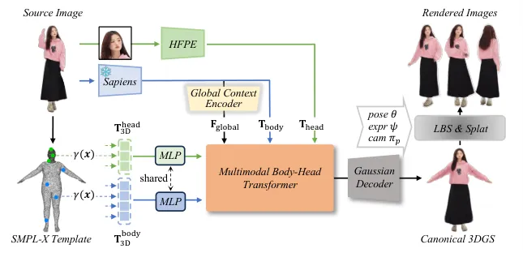
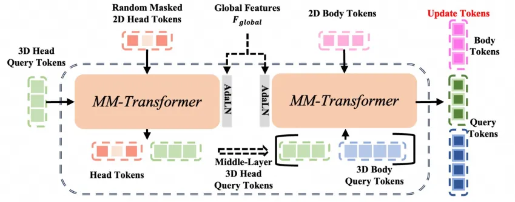
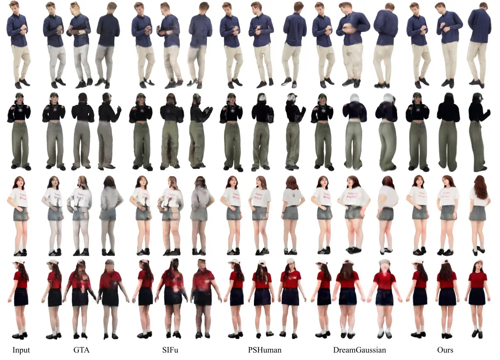
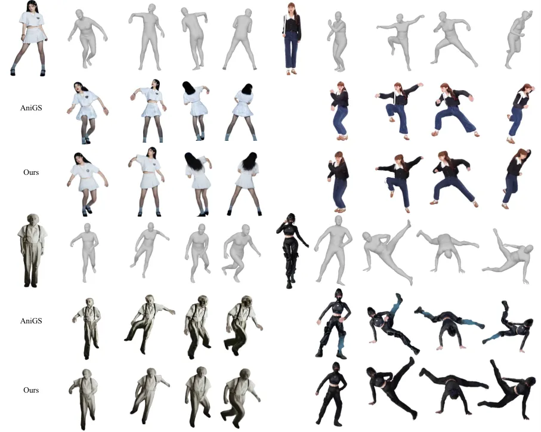
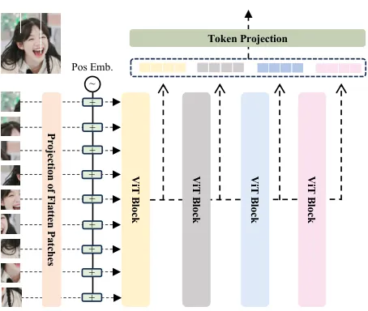
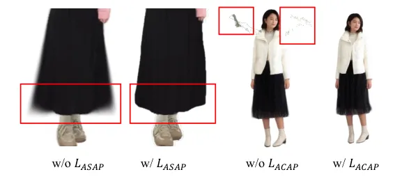
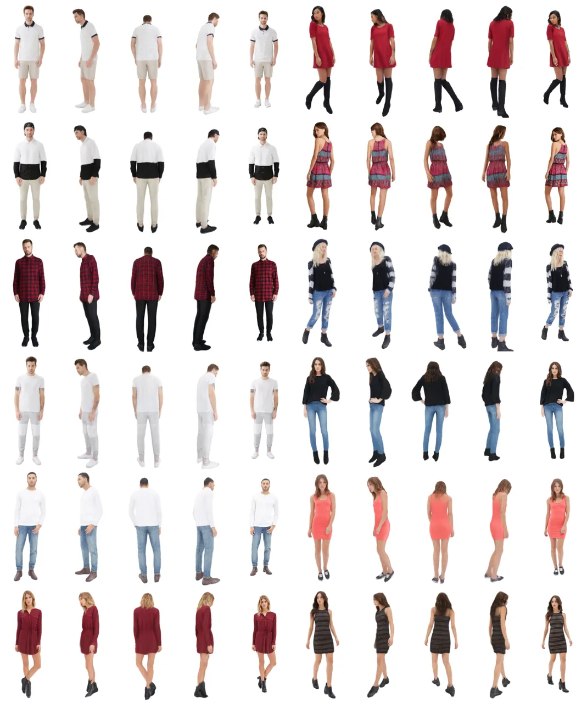
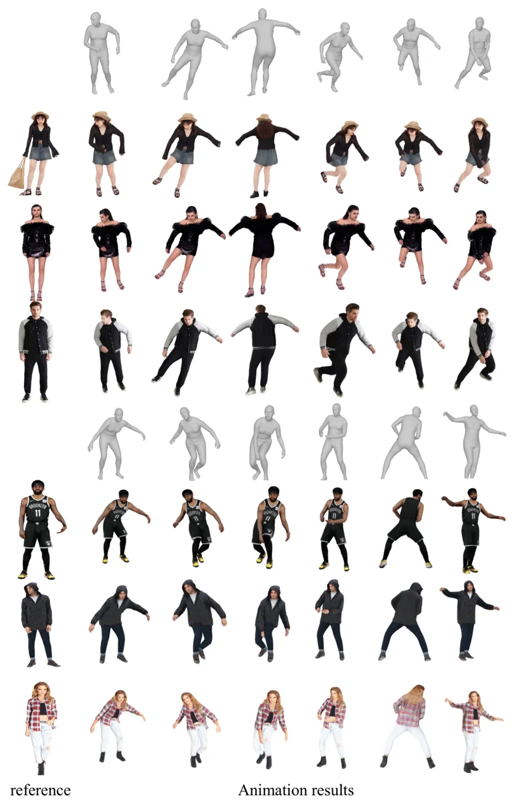

# LHM: Large Animatable Human Reconstruction Model for Single Image to 3D in Seconds

Lingteng Qiu¹¹ 1 Equal contribution.    Xiaodong Gu¹¹ 1 Equal
contribution.    Peihao Li¹¹ 1 Equal contribution.    Qi Zuo¹¹ 1 Equal
contribution. Affiliation: Weichao Shen    Junfei Zhang    Kejie Qiu   
Weihao Yuan    Guanying Chen²² 2 Corresponding author.    Zilong Dong ²²
2 Corresponding author.    Liefeng Bo Affiliation: Tongyi Lab, Alibaba
Group

###### Abstract

Animatable 3D human reconstruction from a single image is a challenging
problem due to the ambiguity in decoupling geometry, appearance, and
deformation. Recent advances in 3D human reconstruction mainly focus on
static human modeling, and the reliance of using synthetic 3D scans for
training limits their generalization ability. Conversely,
optimization-based video methods achieve higher fidelity but demand
controlled capture conditions and computationally intensive refinement
processes. Motivated by the emergence of large reconstruction models for
efficient static reconstruction, we propose LHM (Large Animatable Human
Reconstruction Model) to infer high-fidelity avatars represented as 3D
Gaussian splatting in a feed-forward pass. Our model leverages a
multimodal transformer architecture to effectively encode the human body
positional features and image features with attention mechanism,
enabling detailed preservation of clothing geometry and texture. To
further boost the face identity preservation and fine detail recovery,
we propose a head feature pyramid encoding scheme to aggregate
multi-scale features of the head regions. Extensive experiments
demonstrate that our LHM generates plausible animatable human in seconds
without post-processing for face and hands, outperforming existing
methods in both reconstruction accuracy and generalization ability. Our
code is available on
[https://github.com/aigc3d/LHM](https://github.com/aigc3d/LHM) .

![[Uncaptioned
image]](arxiv-2503-10625--696a8b3ace37.figures/figure-1.webp)

Figure 1: 3D Avatar Reconstruction and Animation Results of our _LHM_ .
Our method reconstructs an animatable human avatar in a single
feed-forward pass in seconds. The resulting model supports real-time
rendering and pose-controlled animation.

## 1 Introduction

Creating 3D animatable human avatars from single images is crucial for
immersive AR/VR applications, yet remains challenging due to the coupled
ambiguities of geometry, appearance, and deformation.

Recently, diffusion-based human video animation methods \[17, 69, 32,
37\] have shown the capability to generate photorealistic human videos.
However, these methods often suffer from inconsistent views under
extreme poses and require long inference times for video sampling. In 3D
animatable human reconstruction, early methods rely on parametric
models \[34, 2\] to provide strong human body priors for animation but
struggle to capture the fine-grained geometry of loose clothing, and
high-fidelity facial details, limiting their expressiveness. While
learning-based 3D methods have made considerable progress in static
clothed human reconstruction in recent years \[50, 51, 59\], most
existing approaches either fail to produce animatable humans or lack
generalization to in-the-wild images \[22, 14\]. The problem of
generalizable 3D animatable human reconstruction from a single image
remains underexplored due to the lack of a suitable model architecture
and a large-scale 3D rigged human dataset for learning.

Recently, large reconstruction model (LRM) \[16\] have shown that
scalable transformer models trained with large-scale of 3D data can
learn generalizable priors for single-image 3D object reconstruction.
While promising, extending this success to _animatable human
reconstruction_ presents unique challenges that demand solutions to two
critical problems: 1) designing an effective architecture that combines
3D human representation with animation capabilities, and 2) overcoming
the scarcity of high-quality 3D rigged human training data.

In this work, we propose _LHM_ (Large Animatable Human Model), a
scalable feed-forward transformer model, that produces animatable 3D
human avatars in seconds from single images. We represent the human
avatar as Gaussian splatting considering its real-time photo-realistic
rendering. Our method takes a single image as input and directly
predicts the canonical human as a set of 3D Gaussians in canonical
space. To enable animation, our method starts from a set of surface
points sampled from the SMPL-X \[44\] template mesh to serve as
geometric anchors for predicting 3D Gaussian properties.

The network architecture of our method is inspired by the multimodal
transformer (MM-transformer) block introduced by the state-of-the-art
image generation model SD3 \[11\], which is designed to model the
interaction between the text and image tokens. We adapt the
MM-transformer to our task to effectively encode the body 3D point
features and 2D image features with attention operation, enabling
detailed preservation of clothing geometry and texture. To address the
problem of facial identity preservation, we further introduce a _head
feature pyramid encoding_ (HFPE) scheme that aggregates multi-scale
visual features from head regions, significantly improving detail
recovery in these perceptually sensitive areas.

During training, to boost the performance of this transformer from
large-scale data, we transform the predicted canonical Gaussians to
various poses using SMPL-X skeleton parameters and optimize through a
combination of rendering losses and regularizations. This
self-supervised strategy allows learning generalizable human priors from
readily available video data rather than scarce 3D scans.

In summary, our contributions are:

- •
  We introduce a generalizable large human reconstruction model that
  produces animatable 3D avatars from single images in seconds.
- •
  We propose a multimodal human transformer to fuse 3D surface point
  features and image features via an attention mechanism, enabling joint
  reasoning across geometric and visual domains.
- •
  Our method, trained on a large-scale video dataset without rigged 3D
  data, achieves state-of-the-art performance on real-world imagery,
  surpassing existing approaches in generalization and animation
  consistency.

## 2 Related Work

### 2.1 Single-Image Human Reconstruction

Early approaches to single-image 3D human reconstruction primarily
relied on parametric body models like SMPL \[34, 44\] to predict
geometric offsets for naked or clothed subjects \[9, 24, 1, 3\]. These
methods often struggle to capture diverse clothing styles due to their
rigid mesh-based representations. Subsequent advancements leveraged
implicit functions \[50, 51, 59, 5, 68, 67, 58, 63\] to model complex
geometries, providing greater flexibility in handling fine surface
details without resolution constraints. Generative frameworks, such as
diffusion models \[7, 15, 43\] and GANs \[36, 28\], have been adopted to
synthesize detailed 3D humans conditioned on the input images. Some
researchers \[21, 60, 61, 19\] have explored generating avatars
distilled from diffusion models using SDS loss. However, these methods
tend to be time-consuming.



Figure 2: Overview of the proposed _LHM_ . Our method extracts body and
head image tokens from the input image, and utilizes the proposed
Multimodal Body-Head Transformer (MBHT) to fuse the 3D geometric body
tokens with the image tokens. After the attention-based fusion process,
the geometric body tokens are decoded into Gaussian parameters.

Recently, large reconstruction models (LRMs) have been introduced to
enable generalizable feed-forward object reconstruction \[16, 55\],
significantly accelerating inference time. Human-LRM \[57\] employs a
feed-forward transformer to decode triplane-NeRF representations to
enable multi-view rendering, followed by diffusion-based 3D
reconstruction. Human-Splat \[42\] first generates multi-view images
using video diffusion, and then applies a latent reconstruction
transformer to predict human avatars in 3D Gaussian Splatting (3DGS).
PSHuman \[29\] utilizes multi-view diffusion with the ID diffusion to
improve the face quality. In contrast to these methods, which focus on
static human reconstruction, our approach generates photorealistic,
animatable human avatars, enabling high-quality dynamic rendering and
interaction.

### 2.2 Animatable Human Generation

Creating animatable avatars has evolved from parametric-model-driven
methods \[2\] to hybrid approaches combining implicit surfaces and human
priors for clothed body modeling \[14\]. Video-based techniques further
improved reconstruction consistency by leveraging temporal cues from
monocular \[23, 56, 48, 18, 53, 64\] or multi-view sequences \[8, 30,
46, 39, 31\]. The rise of text-to-3D methods \[47\] has enabled avatar
generation from text prompts through a long optimization process \[20,
28, 6\].

In 3D animatable human reconstruction, CharacterGen \[45\] has explored
cartoon-style avatar generation using diffusion models for canonical
view synthesis and transformer-based shape reconstruction. AniGS \[49\]
employs a video diffusion model to generate multi-view canonical images,
followed by a 4D Gaussian splatting (4DGS) optimization to achieve
consistent 3D generation. GAS \[35\] adopts a generalizable human NeRF
to reconstruct the subject in a canonical space, followed by video
diffusion for refinement. More recently, IDOL \[70\] introduces a
feed-forward transformer model to decode Gaussian attribute maps in UV
spaces, and requires post-processing to refine the face and hands.
Unlike these methods, we propose an efficient and expressive multimodal
human transformer that directly regresses 3D human Gaussians without
relying on UV representations or requiring post-processing for hands and
face refinement.

## 3 Preliminary

##### Human Parametric Model

The SMPL \[34\] and SMPL-X \[44\] parametric models are commonly
employed for representing human body structures in computer vision
applications. These frameworks employ advanced deformation techniques,
including skinning mechanisms and blend shapes, which are derived from
extensive datasets comprising thousands of 3D body scans.

In particular, the SMPL-X model utilizes two primary types of parameters
to capture human body configurations. These include shape
parameters $`\boldsymbol{\beta}\in\mathbb{R}^{20}`$, and pose
parameters $`\boldsymbol{\theta}\in\mathbb{R}^{55\times 3}`$, which
determine the articulation and deformation of the body mesh based on
skeletal poses.

##### 3D Gaussian Splatting

The 3D Gaussian Splatting framework \[25\] models three-dimensional
information through a set of anisotropic Gaussian distributions. Each
primitive is parameterized by a centroid
$`\mathbf{p}\in\mathbb{R}^{3}`$, scale parameters
$`\mathbf{\sigma}\in\mathbb{R}^{3}`$, and a quaternion
$`\mathbf{r}\in\mathbb{R}^{4}`$ representing rotation. The model also
incorporates an opacity parameter $`\rho\in[0,1]`$ and appearance
features $`\mathbf{f}\in\mathbb{R}^{C}`$ encoded with spherical
harmonics to account for view-dependent lighting effects. During
differentiable rendering, these volumetric primitives are projected into
2D screen space as oriented Gaussian distributions, followed by
view-ordered alpha blending to composite the final pixel colors.

## 4 Method

### 4.1 Overview

Given an input RGB human image $`I\in\mathbb{R}^{H\times W\times 3}`$,
our goal is to reconstruct an animatable 3D human avatar in seconds. The
avatar is represented via 3D Gaussian Splatting (3DGS), which supports
real-time, photorealistic rendering and pose-controlled animation. To
achieve this, we propose _Large Animatable Human Reconstruction Model
(LHM)_, a feed-forward, transformer-based architecture that directly
predicts the canonical 3D avatar from a single image.

Inspired by recent multimodal transformers \[11\], we design a
_Multimodal Body-Head Transformer_ (MBHT) to effectively integrate
geometric and image features. As illustrated in Fig. 2, our framework
processes training pairs that consist of a source image, a target view
image, a foreground mask, SMPL-X pose parameters, and a camera matrix.

The proposed MBHT employs attention operations to integrate three types
of tokens: geometric tokens, body image tokens, and head image tokens,
where geometric tokens can effectively attend to other tokens, allowing
local and global refinement. In addition, Body and head tokens interact
through a part-aware transformer, ensuring balanced attention across
different body regions.

After the attention-based token fusion process, the geometric body
tokens are decoded into per-Gaussian parameters, including deformation,
scaling, rotation, and spherical harmonic (SH) coefficients. During
training, we employ Linear Blend Skinning (LBS) to warp the canonical
avatar to the target view, where photometric and regularization losses
guide the learning process.

### 4.2 Geometric and Image Feature Encoding

Geometric tokens are derived from SMPL-X surface points, encoding
structural priors of the human body. Body image tokens are extracted
from a pretrained vision transformer \[26\], encoding texture and
appearance. Head tokens specialize in capturing high-frequency facial
details through a multi-scale feature extraction process.

##### Human Geometric Feature Encoding

Leveraging SMPL-X’s human body prior, we initialize 3D query points
$`\{\mathbf{x}_{i}\}_{i=1}^{N_{\text{points}}}\subset\mathbb{R}^{3}`$ by
strategically sampling the canonical pose mesh. Each point undergoes
positional encoding \[38\], followed by a multi-layer perceptron (MLP)
projection to match the token channel dimension of the transformer:

```math
\mathbf{T}_{\text{3D}}=\text{MLP}_{\text{proj}}\left(\gamma(\mathbf{X})\right)\in\mathbb{R}^{N_{\text{points}}\times C}, \tag{1}
```

where $`\gamma:\mathbb{R}^{3}\to\mathbb{R}^{3L}`$ applies
$`L`$-frequency sinusoidal encoding to spatial coordinates, and $`C`$ is
the token dimension.



Figure 3: Architecture of the proposed Multimodal Body-Head Transformer
Block (MBHT-block).

##### Body Image Tokenization

Building on large-scale vision transformers pretrained on human-centric
datasets \[26\], we convert image pixels into transformer-compatible
tokens. Specifically, we employ the frozen Sapiens-1B encoder
$`\mathcal{E}_{\text{Sapiens}}`$, pretrained on 10 million human images,
to extract semantic body features:

```math
\mathbf{T}_{\text{body}}=\text{MLP}_{\text{proj}}\left({\mathcal{E}_{\text{Sapiens}}(I)}\right)\in\mathbb{R}^{N_{\text{body}}\times C}, \tag{2}
```

where $`N_{\text{body}}`$ denotes the body token numbers.

##### Head Feature Pyramid Tokenization

However, since the human head occupies only a small region in the input
image and undergoes spatial downsampling in the encoder, critical facial
details are often lost. To mitigate this issue, we propose a head
feature pyramid encoding (HFPE) that aggregates multi-scale features
{$`\mathcal{E}_{\text{dino}}^{\cdot}`$} from DINOv2 \[40\]:

```math
\mathbf{T}_{\text{head}}=\mathcal{F}_{\text{fusion}}\left(\mathcal{E}_{\text{dino}}^{4},\mathcal{E}_{\text{dino}}^{11},\mathcal{E}_{\text{dino}}^{17},\mathcal{E}_{\text{dino}}^{23}\right)\in\mathbb{R}^{N_{\text{head}}\times C}, \tag{3}
```

where $`\mathcal{F}_{\text{fusion}}`$ fuses features from the 4th, 11th,
17th, and 23rd transformer blocks using depthwise concatenation and 1×1
convolutions, followed by feature projection. This design captures a
hierarchy of semantic abstractions: early blocks retain high-frequency
texture details, while deeper layers encode robust head geometry priors.

### 4.3 Multimodal Body-Head Transformer

##### Global Context Feature

The global context token is used for the modulation of the attention
block. To capture global context information for attention modulation,
we take body tokens as the input, followed by max pooling and two MLP
layers to extract the global context embeddings:

```math
\mathbf{F}_{\text{global}}=\text{MLP}_{\text{global}}\left(\text{MaxPool}\left(\mathbf{T}_{\text{body}}\right)\right). \tag{4}
```

##### Multimodal Body-Head Transformer Block

The core design of the proposed model architecture is the multimodal
body-head transformer block (MBHT-block) that efficiently fuse 3D
geometric tokens with the body and head image features, as shown in
Fig. 3.

Specifically, the global context features, image tokens, and query point
tokens are fed simultaneously into the MBHT-block. To enhance the
learning of features specific to the head and body, the 3D head point
tokens will first fuse with the head image features, and then
concatenate with the 3D body point token to interact with the body image
tokens.

```math
\displaystyle\mathbf{T}^{\text{head}}_{\text{3D}},\mathbf{T}_{\text{head}} \displaystyle\coloneqq\text{MM-T}\left(\mathbf{T}^{\text{head}}_{\text{3D}},\mathbf{T}_{\text{head}};\mathbf{F}_{\text{global}}\right) \tag{5}
```

```math
\displaystyle\mathbf{T}_{\text{3D}} \displaystyle\coloneqq\text{Norm}(\mathbf{T}^{\text{head}}_{\text{3D}})~\|~\text{Norm}(\mathbf{T}^{\text{body}}_{\text{3D}})
```

```math
\displaystyle\mathbf{T}_{\text{3D}},\mathbf{T}_{\text{body}} \displaystyle\coloneqq\text{MM-T}\left(\mathbf{T}_{\text{3D}},\mathbf{T}_{\text{body}};\mathbf{F}_{\text{global}}\right)
```

where $`\mathbf{T}^{\text{body}}_{\text{3D}}`$ and
$`\mathbf{T}^{\text{head}}_{\text{3D}}`$ are 3D body and head points in
$`\mathbf{T}_{\text{3D}}`$, respectively. MM-T indicates the Multimodal
Transformer Block \[11\], and $`\|`$ denotes token-wise
concatenation (see supplementary materials for details).



Figure 4: Single-view reconstruction comparisons on DeepFashion \[33\]
and in-the-wild images. LHM achieves superior appearance fidelity and
texture sharpness, particularly evident in facial details and garment
wrinkles.

##### Head Token Shrinkage Regularization

Our experiments show that the attention mechanism in MBHT-block relies
heavily on head-region features, which limits its ability to learn
body-part features effectively. To address this imbalance, we take
inspiration from MAE \[13\] and randomly mask the head region of the
input crop during training.

Specifically, we apply spatial masking to head tokens with a ratio
ranging from 0% to 50%, encouraging the model to compensate through
enhanced body-context utilization. This regularization strategy improves
body-part self-attention capacity while maintaining head reconstruction
fidelity.

##### 3DGS Parameter Prediction

After $`N_{\text{layer}}`$ MBHT-block blocks, an MLP heads predict 3DGS
parameters:

```math
\displaystyle\{\Delta\mathbf{p}_{i},\mathbf{r}_{i},\mathbf{f}_{i},\rho_{i},\sigma_{i}\}=\text{MLP}_{\text{regress}}(\mathbf{T}_{\text{points}}^{(i)}) \tag{6}
```

```math
\displaystyle\mathbf{p}_{i}=\mathbf{x}_{i}+\Delta\mathbf{p}_{i},\quad\forall i\in\{1,...,N_{\text{points}}\}
```

where $`\Delta\mathbf{p}_{i}\in\mathbb{R}^{3}`$ represents residual
position offsets from the canonical SMPL-X.

### 4.4 Loss Function

Our training objective combines photometric supervision from in-the-wild
video sequences with regularization constraints in canonical space. The
complete optimization framework enables the learning of animatable
avatars without requiring ground truth 3D supervision.

#### 4.4.1 View Space Supervision

Given the predicted 3DGS parameters
$`\mathbf{\chi}=(\mathbf{p},\mathbf{r},\mathbf{f},\rho,\sigma)`$, we
first transform the canonical avatar to target view space using Linear
Blend Skinning (LBS). The transformed Gaussian primitives are then
rendered through differentiable splatting to produce the RGB image
$`\hat{I}`$ and alpha mask $`\hat{M}`$ under target camera parameters
$`\pi_{t}`$. To better model clothing deformations, we use a diffused
voxel skinning \[48\].

The view-consistent supervision comprises three components in view
space:

```math
\mathcal{L}_{\text{photometric}}=\underbrace{\lambda_{\text{rgb}}\mathcal{L}_{\text{color}}}_{\text{Appearance}}+\underbrace{\lambda_{\text{mask}}\mathcal{L}_{\text{mask}}}_{\text{Silhouette}}+\underbrace{\lambda_{\text{per}}\mathcal{L}_{\text{lpips}}}_{\text{Perceptual Quality}}. \tag{7}
```

In our implementation, the loss weights balance reconstruction aspects:
$`\lambda_{\text{rgb}}=1.0`$ for direct color supervison,
$`\lambda_{\text{mask}}=0.5`$ for geometric alignment, and
$`\lambda_{\text{per}}=1.0`$ to preserve high-frequency details.

#### 4.4.2 Canonical Space Regularization

While photometric loss provides effective supervision in target view
space, the canonical representation remains under-constrained due to the
ill-posed nature of monocular reconstruction. This limitation manifests
as deformation artifacts when warping the avatar to novel poses. To
address this fundamental challenge, we introduce two complementary
regularization terms that enforce geometric coherence in canonical
space.

##### Gaussian Shape Regularization

We apply the _as spherical as possible loss_ to penalize excessive
anisotropy in Gaussian primitives:

```math
\mathcal{L}_{\text{ASAP}}=\frac{1}{N}\sum_{i=1}^{N}\|\mathbf{S}_{i}-\text{diag}(1)\|_{F}^{2}, \tag{8}
```

where $`\mathbf{S}_{i}`$ represents the covariance matrix, effectively
discouraging needle-like ellipsoids while preserving necessary shape
variation.

##### Positional Anchoring

To maintain body surface plausibility, we include the _as close as
possible loss_ to encourage Gaussian positions to be close to their
SMPL-X initialized locations by a hinged distance constraint:

```math
\mathcal{L}_{\text{ACAP}}=\frac{1}{N_{\text{points}}}\sum_{i=1}^{N_{\text{points}}}\max\left(\|\Delta\mathbf{p}_{i}\|_{2}-d,0\right), \tag{9}
```

where $`d`$ represents an empirically determined threshold (5.25cm) in
practice) that permits local adjustments while preventing catastrophic
drift.

The combined canonical regularization operates as:

```math
\mathcal{L}_{\text{reg}}=50\mathcal{L}_{\text{ASAP}}+10\mathcal{L}_{\text{ACAP}}. \tag{10}
```

In summary, our composite training objective combines photometric
fidelity preservation with geometric regularization, formulated as:

```math
\mathcal{L}_{\text{total}}=\mathcal{L}_{\text{photometric}}+\mathcal{L}_{\text{reg}}. \tag{11}
```

## 5 Experiments

### 5.1 Implementation Details

##### In-the-Wild Training Data

We curate a large-scale dataset of 301,733 single-person video sequences
from 500K initial human motion footage samples collected from public
video repositories. Our multi-stage filtering pipeline removes sequences
containing multi-person interactions, occluded faces, or low-quality
frames through manual inspection and automated metric thresholds.

##### Synthetic Data Augmentation

To address viewpoint bias in natural videos, we supplement the training
with synthetic human scans from three sources: 2K2K \[12\],
Human4DiT \[52\] and RenderPeople (see supplementary materials for
details).

##### Preprocessing Pipeline

We employ SAMURAI \[62\] to extract foreground masks across video
sequences. For SMPL-X parametric estimation, we leverage Multi-HMR \[4\]
to estimate pose and shape parameters.

##### Training Configuration

Our implementation utilizes AdamW \[27\] optimization with an initial
learning rate of $`4\times 10^{-4}`$. We employ mixed-precision training
with dynamic loss scaling, gradient clipping at $`\|\nabla\|_{2}=0.1`$,
and weight decay regularization ($`\lambda=5\times 10^{-4}`$).
Distributed training executes on NVIDIA A100 clusters for 40K
iterations - 32 GPUs for 500M/700M models (16 samples/GPU), 64 GPUs for
the 1B parameter variant (8 samples/GPU). The total training times reach
78, 112, and 189 hours, respectively. During training, we randomly
sample a source view image and four target view images from a video
sequence.



Figure 5: Single-view animatable human reconstruction comparisons on
in-the-wild sequences. LHM produces more accurate and photorealistic
animation results than the baseline methods. Note that the results of
AniGS are not faithful to the input images.

### 5.2 Comparison with Existing Methods

##### Single-Image Human Reconstruction

We evaluate LHM against four baseline methods for single-view image
human reconstruction. GTA \[65\] and SIFU \[66\] employ recursive
optimization loops and pixel-aligned feature extraction, respectively,
focusing on geometric refinement through successive approximation steps.
PSHuman \[29\] employs multi-view diffusion in conjunction with local ID
diffusion to boost the quality of facial features in multi-view human
RGB and normal images, which is subsequently followed by multi-view mesh
reconstruction. DreamGaussian \[54\] leverages score distillation
sampling (SDS) \[47\] from 2D diffusion models to distill 3D
representations. While their progressive Gaussian densification strategy
reduces convergence time to approximately 2 minutes per asset, this
remains orders of magnitude slower than real-time requirements.

Table 1 compares the quantitative results on 200 synthetic datasets
among baseline methods on four metrics: PSNR, SSIM, LPIPS, and Face
Consistency (FC) measured via L2 distance in the ArcFace \[10\]
embedding space. Notably, for a fair comparison, we report metrics of
the model trained on the same synthetic dataset as baseline methods.

With respect to qualitative results, as illustrated in Fig. 4, the
visual comparisons highlight our method’s ability to maintain
input-aligned features while suppressing common artifacts such as
over-smoothing.

|                      |                   |                   |                      |                   |     |
| -------------------- | ----------------- | ----------------- | -------------------- | ----------------- | --- |
| Methods              | PSNR $`\uparrow`$ | SSIM $`\uparrow`$ | LPIPS $`\downarrow`$ | FC $`\downarrow`$ |     |
| GTA \[65\]           | 17.025            | 0.919             | 0.087                | 0.051             |     |
| SIFu \[66\]          | 16.681            | 0.917             | 0.093                | 0.060             |     |
| PSHuman \[29\]       | 17.556            | 0.921             | 0.076                | 0.037             |     |
| DreamGaussian \[41\] | 18.544            | 0.917             | 0.075                | 0.056             |     |
| LHM-0.5B\*           | 25.183            | 0.951             | 0.029                | 0.035             |     |

Table 1: Evaluation of static 3D reconstruction on synthtic data. \*
indicates this model only trains on synthetic data.

##### Single-Image Animatable Human Reconstruction

We assess LHM against two baseline approaches for reconstructing
animatable humans from a single-view image. The first baseline is
En3D \[36\], which generates 3D human models in canonical space using
physics-based 2D data alongside normal-constrained sculpting techniques.
The second baseline, AniGS \[49\], utilizes multi-view diffusion models
to create canonical human images and employs 4D Gaussian
splatting (4DGS) optimization to address inconsistencies in different
views.

For our evaluation, we utilize 200 in-the-wild video sequences drawn
from the validation subset of our dataset. Specifically, we take the
first front view image of each video as input and compare the
synthesized animations against the corresponding ground-truth sequences
using foreground segmentation masks. As shown in Table 2, our method
surpasses the baseline approaches, demonstrating superior rendering
quality in the animation sequences. In comparison to the best baseline
method, AniGS, our approach achieves performance gains of 3.322, 0.059,
0.063, and 0.018 in PSNR, SSIM, LIPIS, and FC metrics, respectively. As
illustrated in Fig. 5, our method yields more accurate and
photorealistic animation results compared to the baseline techniques.
Additional results can be found in the supplementary material.

|              |                   |                   |                      |                   |                    |                       |     |
| ------------ | ----------------- | ----------------- | -------------------- | ----------------- | ------------------ | --------------------- | --- |
| Methods      | PSNR $`\uparrow`$ | SSIM $`\uparrow`$ | LPIPS $`\downarrow`$ | FC $`\downarrow`$ | Time$`\downarrow`$ | Memory $`\downarrow`$ |     |
| En3D \[36\]  | 15.231            | 0.734             | 0.172                | 0.058             | 5 minutes          | 32 GB                 |     |
| AniGS \[49\] | 18.681            | 0.871             | 0.103                | 0.053             | 15 minutes         | 24 GB                 |     |
| LHM-0.5B     | 21.648            | 0.924             | 0.044                | 0.042             | 2.01 seconds       | 18 GB                 |     |
| LHM-0.7B     | 21.879            | 0.930             | 0.039                | 0.039             | 4.13 seconds       | 21 GB                 |     |
| LHM-1B       | 22.003            | 0.930             | 0.040                | 0.035             | 6.57 seconds       | 24 GB                 |     |

![[Uncaptioned
image]](arxiv-2503-10625--696a8b3ace37.figures/figure-6.webp)

(a) w/ MM-Transformer (b) LHM-0.5B (c) LHM-1B

Figure 6: Ablation study on model design and parameters.

Table 2: Human animation results on in-the-wild video dataset.

### 5.3 Ablation Study

##### Model Parameter Scalability

To verify the scalability of our LHM, we train variant models with
increasing parameter numbers by scaling the layer numbers. Table 2
compares performance across various model capacities. Our experiments
indicate that increasing the number of model parameters correlates with
improved performance. Figure 6 presents the comparison between LHM-0.5B
and LHM-1B, where the larger model achieves more accurate
reconstruction, especially in the face regions.

##### Dataset Scalability

To evaluate data scalability, we conduct controlled experiments using
stratified random subsets (10K, 50K, 100K) from the original video
training dataset of 300K. Table 5.3 illustrates that using only the
synthetic dataset results in poor model generalization. Incorporating an
in-the-wild dataset significantly enhances the model’s generality and
performance on in-the-wild tests. Moreover, larger dataset sizes yield
improved model results, although the rate of performance improvement
diminishes as the dataset size increases. Figure 5 showcases the
ablation study on dataset scalability.

|                           |                   |                   |                      |                   |     |
| ------------------------- | ----------------- | ----------------- | -------------------- | ----------------- | --- |
| Methods                   | PSNR $`\uparrow`$ | SSIM $`\uparrow`$ | LPIPS $`\downarrow`$ | FC $`\downarrow`$ |     |
| LHM-0.5B + Synthetic Data | 19.753            | 0.904             | 0.060                | 0.057             |     |
| LHM-0.5B + 10K Videos     | 20.692            | 0.911             | 0.052                | 0.048             |     |
| LHM-0.5B + 50K Videos     | 21.108            | 0.915             | 0.050                | 0.043             |     |
| LHM-0.5B + 100K Videos    | 21.429            | 0.920             | 0.049                | 0.045             |     |
| LHM-0.5B + All            | 21.648            | 0.924             | 0.044                | 0.042             |     |

|                                       |                   |                   |                      |                   |     |
| ------------------------------------- | ----------------- | ----------------- | -------------------- | ----------------- | --- |
| Methods                               | PSNR $`\uparrow`$ | SSIM $`\uparrow`$ | LPIPS $`\downarrow`$ | FC $`\downarrow`$ |     |
| LHM-0.5B w/ MM-Transformer            | 20.072            | 0.907             | 0.100                | 0.053             |     |
| LHM-0.5B w/o Shrinkage Regularization | 21.037            | 0.915             | 0.049                | 0.041             |     |
| LHM-0.5B                              | 21.648            | 0.924             | 0.044                | 0.042             |     |

![[Uncaptioned
image]](arxiv-2503-10625--696a8b3ace37.figures/figure-7.webp)

Input Synthetic Data 10K Videos 100K Videos 300K Videos

Table 5: Ablation study on dataset scalability.

Table 3: Quantitative results on in-the-wild video dataset.

Table 4: Ablation study for the transformer architecture.

##### Transformer Block Design

Table 5.3 presents the quantitative results of our transformer block
design. Compared to the vanilla MM-transformer block, our proposed
transformer block demonstrates performance improvements of 1.576, 0.017,
0.056, and 0.011 in PSNR, SSIM, LIPIS, and FC metrics, respectively.
Additionally, shrinkage regularization enhances the overall performance
of our model, albeit with a slight reduction in face consistency.
Figure 6 illustrates the qualitative results comparing the vanilla
MM-transformer with our proposed BH-Transformer block.

## 6 Conclusion

In this work, we introduce LHM, a feed-forward model for animatable 3D
human reconstruction from a single image in seconds. Our approach
leverages a multimodal transformer and a head feature pyramid encoding
scheme to effectively fuse 3D positional features and 2D image features
via an attention mechanism, enabling joint reasoning across geometric
and visual domains. Trained on a large-scale video dataset with an image
reconstruction loss, our model exhibits strong generalization ability to
diverse real-world scenarios. Extensive experiments on both synthetic
and in-the-wild datasets demonstrate that LHM achieves state-of-the-art
reconstruction accuracy, generalization, and animation consistency.

##### Limitations and Future Work

One limitation of our approach is that real-world video datasets often
contain biased view distributions, with limited coverage of uncommon
poses and extreme angles. This imbalance can affect the model’s ability
to generalize to novel viewpoints. In future work, we aim to develop
improved training strategies and curate a more diverse and comprehensive
dataset to enhance robustness.

## References

- \[1\] Thiemo Alldieck, Marcus Magnor, Weipeng Xu, Christian Theobalt,
  and Gerard Pons-Moll. Detailed human avatars from monocular video,
  2018a.
- \[2\] Thiemo Alldieck, Marcus Magnor, Weipeng Xu, Christian Theobalt,
  and Gerard Pons-Moll. Video based reconstruction of 3d people models,
  2018b.
- \[3\] Thiemo Alldieck, Gerard Pons-Moll, Christian Theobalt, and
  Marcus Magnor. Tex2shape: Detailed full human body geometry from a
  single image, 2019.
- \[4\] Fabien Baradel\*, Matthieu Armando, Salma Galaaoui, Romain
  Brégier, Philippe Weinzaepfel, Grégory Rogez, and Thomas Lucas\*.
  Multi-hmr: Multi-person whole-body human mesh recovery in a single
  shot. In _ECCV_, 2024.
- \[5\] Yukang Cao, Guanying Chen, Kai Han, Wenqi Yang, and Kwan-Yee K
  Wong. Jiff: Jointly-aligned implicit face function for high quality
  single view clothed human reconstruction. In _Proceedings of the
  IEEE/CVF Conference on Computer Vision and Pattern Recognition_, pages
  2729–2739, 2022.
- \[6\] Yukang Cao, Yan-Pei Cao, Kai Han, Ying Shan, and Kwan-Yee K
  Wong. Dreamavatar: Text-and-shape guided 3d human avatar generation
  via diffusion models. In _Proceedings of the IEEE/CVF Conference on
  Computer Vision and Pattern Recognition_, pages 958–968, 2024.
- \[7\] Mingjin Chen, Junhao Chen, Xiaojun Ye, Huan ang Gao, Xiaoxue
  Chen, Zhaoxin Fan, and Hao Zhao. Ultraman: Single image 3d human
  reconstruction with ultra speed and detail, 2024a.
- \[8\] Yushuo Chen, Zerong Zheng, Zhe Li, Chao Xu, and Yebin Liu.
  Meshavatar: Learning high-quality triangular human avatars from
  multi-view videos, 2024b.
- \[9\] Vasileios Choutas, Lea Muller, Chun-Hao P. Huang, Siyu Tang,
  Dimitrios Tzionas, and Michael J. Black. Accurate 3d body shape
  regression using metric and semantic attributes, 2022.
- \[10\] Jiankang Deng, Jia Guo, Niannan Xue, and Stefanos Zafeiriou.
  Arcface: Additive angular margin loss for deep face recognition. In
  _CVPR_, pages 4690–4699, 2019.
- \[11\] Patrick Esser, Sumith Kulal, Andreas Blattmann, Rahim Entezari,
  Jonas Müller, Harry Saini, Yam Levi, Dominik Lorenz, Axel Sauer,
  Frederic Boesel, et al. Scaling rectified flow transformers for
  high-resolution image synthesis. In _ICML_, 2024.
- \[12\] Sang-Hun Han, Min-Gyu Park, Ju Hong Yoon, Ju-Mi Kang, Young-Jae
  Park, and Hae-Gon Jeon. High-fidelity 3d human digitization from
  single 2k resolution images. In _CVPR_, 2023.
- \[13\] Kaiming He, Xinlei Chen, Saining Xie, Yanghao Li, Piotr Dollár,
  and Ross Girshick. Masked autoencoders are scalable vision learners.
  In _CVPR_, 2022a.
- \[14\] Tong He, Yuanlu Xu, Shunsuke Saito, Stefano Soatto, and Tony
  Tung. Arch++: Animation-ready clothed human reconstruction revisited,
  2022b.
- \[15\] Xu He, Xiaoyu Li, Di Kang, Jiangnan Ye, Chaopeng Zhang, Liyang
  Chen, Xiangjun Gao, Han Zhang, Zhiyong Wu, and Haolin Zhuang.
  Magicman: Generative novel view synthesis of humans with 3d-aware
  diffusion and iterative refinement, 2024.
- \[16\] Yicong Hong, Kai Zhang, Jiuxiang Gu, Sai Bi, Yang Zhou, Difan
  Liu, Feng Liu, Kalyan Sunkavalli, Trung Bui, and Hao Tan. Lrm: Large
  reconstruction model for single image to 3d. _arXiv preprint
  arXiv:2311.04400_, 2023.
- \[17\] Li Hu. Animate anyone: Consistent and controllable
  image-to-video synthesis for character animation. In _Proceedings of
  the IEEE/CVF Conference on Computer Vision and Pattern Recognition_,
  pages 8153–8163, 2024.
- \[18\] Shoukang Hu and Ziwei Liu. Gauhuman: Articulated gaussian
  splatting from monocular human videos. In _CVPR_, 2024.
- \[19\] Xin Huang, Ruizhi Shao, Qi Zhang, Hongwen Zhang, Ying Feng,
  Yebin Liu, and Qing Wang. Humannorm: Learning normal diffusion model
  for high-quality and realistic 3d human generation. _arXiv preprint
  arXiv:2310.01406_, 2023.
- \[20\] Yukun Huang, Jianan Wang, Ailing Zeng, He Cao, Xianbiao Qi,
  Yukai Shi, Zheng-Jun Zha, and Lei Zhang. Dreamwaltz: Make a scene with
  complex 3d animatable avatars. _Advances in Neural Information
  Processing Systems_, 36, 2024a.
- \[21\] Yangyi Huang, Hongwei Yi, Yuliang Xiu, Tingting Liao, Jiaxiang
  Tang, Deng Cai, and Justus Thies. TeCH: Text-guided Reconstruction of
  Lifelike Clothed Humans. In _International Conference on 3D Vision
  (3DV)_, 2024b.
- \[22\] Zeng Huang, Yuanlu Xu, Christoph Lassner, Hao Li, and Tony
  Tung. Arch: Animatable reconstruction of clothed humans, 2020.
- \[23\] Boyi Jiang, Yang Hong, Hujun Bao, and Juyong Zhang. Selfrecon:
  Self reconstruction your digital avatar from monocular video. In
  _CVPR_, 2022.
- \[24\] Angjoo Kanazawa, Michael J. Black, David W. Jacobs, and
  Jitendra Malik. End-to-end recovery of human shape and pose, 2018.
- \[25\] Bernhard Kerbl, Georgios Kopanas, Thomas Leimkühler, and George
  Drettakis. 3d gaussian splatting for real-time radiance field
  rendering. _TOG_, 2023.
- \[26\] Rawal Khirodkar, Timur Bagautdinov, Julieta Martinez, Su
  Zhaoen, Austin James, Peter Selednik, Stuart Anderson, and Shunsuke
  Saito. Sapiens: Foundation for human vision models. In _European
  Conference on Computer Vision_, pages 206–228. Springer, 2024.
- \[27\] Diederik P. Kingma and Jimmy Ba. Adam: A method for stochastic
  optimization. _CoRR_, abs/1412.6980, 2014.
- \[28\] Nikos Kolotouros, Thiemo Alldieck, Andrei Zanfir, Eduard
  Bazavan, Mihai Fieraru, and Cristian Sminchisescu. Dreamhuman:
  Animatable 3d avatars from text. _Advances in Neural Information
  Processing Systems_, 36, 2024.
- \[29\] Peng Li, Wangguandong Zheng, Yuan Liu, Tao Yu, Yangguang Li,
  Xingqun Qi, Mengfei Li, Xiaowei Chi, Siyu Xia, Wei Xue, et al.
  Pshuman: Photorealistic single-view human reconstruction using
  cross-scale diffusion. _arXiv preprint arXiv:2409.10141_, 2024a.
- \[30\] Zhe Li, Zerong Zheng, Lizhen Wang, and Yebin Liu. Animatable
  gaussians: Learning pose-dependent gaussian maps for high-fidelity
  human avatar modeling. In _Proceedings of the IEEE/CVF Conference on
  Computer Vision and Pattern Recognition_, pages 19711–19722, 2024b.
- \[31\] Zhe Li, Zerong Zheng, Lizhen Wang, and Yebin Liu. Animatable
  gaussians: Learning pose-dependent gaussian maps for high-fidelity
  human avatar modeling. In _CVPR_, 2024c.
- \[32\] Gaojie Lin, Jianwen Jiang, Jiaqi Yang, Zerong Zheng, and Chao
  Liang. Omnihuman-1: Rethinking the scaling-up of one-stage conditioned
  human animation models. _arXiv preprint arXiv:2502.01061_, 2025.
- \[33\] Ziwei Liu, Ping Luo, Shi Qiu, Xiaogang Wang, and Xiaoou Tang.
  Deepfashion: Powering robust clothes recognition and retrieval with
  rich annotations. In _CVPR_, 2016.
- \[34\] Matthew Loper, Naureen Mahmood, Javier Romero, Gerard
  Pons-Moll, and Michael J Black. Smpl: a skinned multi-person linear
  model. _TOG_, 34(6):1–16, 2015.
- \[35\] Yixing Lu, Junting Dong, Youngjoong Kwon, Qin Zhao, Bo Dai, and
  Fernando De la Torre. Gas: Generative avatar synthesis from a single
  image. _arXiv preprint arXiv:2502.06957_, 2025.
- \[36\] Yifang Men, Biwen Lei, Yuan Yao, Miaomiao Cui, Zhouhui Lian,
  and Xuansong Xie. En3d: An enhanced generative model for sculpting 3d
  humans from 2d synthetic data, 2024a.
- \[37\] Yifang Men, Yuan Yao, Miaomiao Cui, and Liefeng Bo. Mimo:
  Controllable character video synthesis with spatial decomposed
  modeling. _arXiv preprint arXiv:2409.16160_, 2024b.
- \[38\] Ben Mildenhall, Pratul P Srinivasan, Matthew Tancik, Jonathan T
  Barron, Ravi Ramamoorthi, and Ren Ng. NeRF: Representing scenes as
  neural radiance fields for view synthesis. In _ECCV_, pages
  405–421, 2020.
- \[39\] Gyeongsik Moon, Takaaki Shiratori, and Shunsuke Saito.
  Expressive whole-body 3d gaussian avatar. In _ECCV_, 2024.
- \[40\] Maxime Oquab, Timothée Darcet, Theo Moutakanni, Huy V. Vo, Marc
  Szafraniec, Vasil Khalidov, Pierre Fernandez, Daniel Haziza, Francisco
  Massa, Alaaeldin El-Nouby, Russell Howes, Po-Yao Huang, Hu Xu, Vasu
  Sharma, Shang-Wen Li, Wojciech Galuba, Mike Rabbat, Mido Assran,
  Nicolas Ballas, Gabriel Synnaeve, Ishan Misra, Herve Jegou, Julien
  Mairal, Patrick Labatut, Armand Joulin, and Piotr Bojanowski. Dinov2:
  Learning robust visual features without supervision, 2023.
- \[41\] Panwang Pan, Zhuo Su, Chenguo Lin, Zhen Fan, Yongjie Zhang,
  Zeming Li, Tingting Shen, Yadong Mu, and Yebin Liu. Humansplat:
  Generalizable single-image human gaussian splatting with structure
  priors. _arXiv preprint arXiv:2406.12459_, 2024.
- \[42\] Panwang Pan, Zhuo Su, Chenguo Lin, Zhen Fan, Yongjie Zhang,
  Zeming Li, Tingting Shen, Yadong Mu, and Yebin Liu. Humansplat:
  Generalizable single-image human gaussian splatting with structure
  priors. _Advances in Neural Information Processing Systems_,
  37:74383–74410, 2025.
- \[43\] Hui En Pang, Shuai Liu, Zhongang Cai, Lei Yang, Tianwei Zhang,
  and Ziwei Liu. Disco4d: Disentangled 4d human generation and animation
  from a single image. _ArXiv_, abs/2409.17280, 2024.
- \[44\] Georgios Pavlakos, Vasileios Choutas, Nima Ghorbani, Timo
  Bolkart, Ahmed AA Osman, Dimitrios Tzionas, and Michael J Black.
  Expressive body capture: 3d hands, face, and body from a single image.
  In _CVPR_, 2019.
- \[45\] Hao-Yang Peng, Jia-Peng Zhang, Meng-Hao Guo, Yan-Pei Cao, and
  Shi-Min Hu. Charactergen: Efficient 3d character generation from
  single images with multi-view pose canonicalization. _ACM Transactions
  on Graphics (TOG)_, 43(4):1–13, 2024.
- \[46\] Sida Peng, Junting Dong, Qianqian Wang, Shangzhan Zhang, Qing
  Shuai, Xiaowei Zhou, and Hujun Bao. Animatable neural radiance fields
  for modeling dynamic human bodies. In _Proceedings of the IEEE/CVF
  International Conference on Computer Vision_, pages 14314–14323, 2021.
- \[47\] Ben Poole, Ajay Jain, Jonathan T Barron, and Ben Mildenhall.
  Dreamfusion: Text-to-3d using 2d diffusion. In _ICLR_, 2023.
- \[48\] Lingteng Qiu and Guanying Chen. Rec-mv: Reconstructing 3d
  dynamic cloth from monocular videos. In _CVPR_, 2023.
- \[49\] Lingteng Qiu, Shenhao Zhu, Qi Zuo, Xiaodong Gu, Yuan Dong,
  Junfei Zhang, Chao Xu, Zhe Li, Weihao Yuan, Liefeng Bo, et al. Anigs:
  Animatable gaussian avatar from a single image with inconsistent
  gaussian reconstruction. In _CVPR_, 2025.
- \[50\] Shunsuke Saito, Zeng Huang, Ryota Natsume, Shigeo Morishima,
  Angjoo Kanazawa, and Hao Li. Pifu: Pixel-aligned implicit function for
  high-resolution clothed human digitization. In _Proceedings of the
  IEEE/CVF international conference on computer vision_, pages
  2304–2314, 2019.
- \[51\] Shunsuke Saito, Tomas Simon, Jason Saragih, and Hanbyul Joo.
  Pifuhd: Multi-level pixel-aligned implicit function for
  high-resolution 3d human digitization. In _Proceedings of the IEEE/CVF
  conference on computer vision and pattern recognition_, pages
  84–93, 2020.
- \[52\] Ruizhi Shao, Youxin Pang, Zerong Zheng, Jingxiang Sun, and
  Yebin Liu. Human4dit: 360-degree human video generation with 4d
  diffusion transformer. _TOG_, 43(6), 2024.
- \[53\] Jeff Tan, Donglai Xiang, Shubham Tulsiani, Deva Ramanan, and
  Gengshan Yang. Dressrecon: Freeform 4d human reconstruction from
  monocular video. In _3DV_, 2025.
- \[54\] Jiaxiang Tang, Jiawei Ren, Hang Zhou, Ziwei Liu, and Gang Zeng.
  Dreamgaussian: Generative gaussian splatting for efficient 3d content
  creation. In _ICLR_, 2024.
- \[55\] Jiaxiang Tang, Zhaoxi Chen, Xiaokang Chen, Tengfei Wang, Gang
  Zeng, and Ziwei Liu. Lgm: Large multi-view gaussian model for
  high-resolution 3d content creation. In _European Conference on
  Computer Vision_, pages 1–18. Springer, 2025.
- \[56\] Chung-Yi Weng, Brian Curless, Pratul P Srinivasan, Jonathan T
  Barron, and Ira Kemelmacher-Shlizerman. Humannerf: Free-viewpoint
  rendering of moving people from monocular video. In _CVPR_, 2022.
- \[57\] Zhenzhen Weng, Jingyuan Liu, Hao Tan, Zhan Xu, Yang Zhou,
  Serena Yeung-Levy, and Jimei Yang. Template-free single-view 3d human
  digitalization with diffusion-guided lrm. _arXiv preprint
  arXiv:2401.12175_, 2024.
- \[58\] Zhangyang Xiong, Chenghong Li, Kenkun Liu, Hongjie Liao,
  Jianqiao Hu, Junyi Zhu, Shuliang Ning, Lingteng Qiu, Chongjie Wang,
  Shijie Wang, et al. Mvhumannet: A large-scale dataset of multi-view
  daily dressing human captures. In _CVPR_, 2024.
- \[59\] Yuliang Xiu, Jinlong Yang, Xu Cao, Dimitrios Tzionas, and
  Michael J. Black. Econ: Explicit clothed humans optimized via normal
  integration, 2023.
- \[60\] Yuliang Xiu, Yufei Ye, Zhen Liu, Dimitrios Tzionas, and
  Michael J Black. Puzzleavatar: Assembling 3d avatars from personal
  albums. _TOG_, 2024.
- \[61\] Zhongcong Xu, Jianfeng Zhang, Junhao Liew, Jiashi Feng, and
  Mike Zheng Shou. Xagen: 3d expressive human avatars generation. In
  _NeurIPS_, 2023.
- \[62\] Cheng-Yen Yang, Hsiang-Wei Huang, Wenhao Chai, Zhongyu Jiang,
  and Jenq-Neng Hwang. Samurai: Adapting segment anything model for
  zero-shot visual tracking with motion-aware memory, 2024a.
- \[63\] Xihe Yang, Xingyu Chen, Daiheng Gao, Shaohui Wang, Xiaoguang
  Han, and Baoyuan Wang. Have-fun: Human avatar reconstruction from
  few-shot unconstrained images. In _CVPR_, 2024b.
- \[64\] Zhengming Yu, Wei Cheng, Xian Liu, Wayne Wu, and Kwan-Yee Lin.
  Monohuman: Animatable human neural field from monocular video. In
  _CVPR_, 2023.
- \[65\] Zechuan Zhang, Li Sun, Zongxin Yang, Ling Chen, and Yi Yang.
  Global-correlated 3d-decoupling transformer for clothed avatar
  reconstruction. In _NeurIPS_, 2023.
- \[66\] Zechuan Zhang, Zongxin Yang, and Yi Yang. Sifu: Side-view
  conditioned implicit function for real-world usable clothed human
  reconstruction. In _Proceedings of the IEEE/CVF Conference on Computer
  Vision and Pattern Recognition_, pages 9936–9947, 2024a.
- \[67\] Zechuan Zhang, Zongxin Yang, and Yi Yang. Sifu: Side-view
  conditioned implicit function for real-world usable clothed human
  reconstruction, 2024b.
- \[68\] Zerong Zheng, Tao Yu, Yebin Liu, and Qionghai Dai. Pamir:
  Parametric model-conditioned implicit representation for image-based
  human reconstruction, 2020.
- \[69\] Shenhao Zhu, Junming Leo Chen, Zuozhuo Dai, Yinghui Xu, Xun
  Cao, Yao Yao, Hao Zhu, and Siyu Zhu. Champ: Controllable and
  consistent human image animation with 3d parametric guidance. _arXiv
  preprint arXiv:2403.14781_, 2024.
- \[70\] Yiyu Zhuang, Jiaxi Lv, Hao Wen, Qing Shuai, Ailing Zeng, Hao
  Zhu, Shifeng Chen, Yujiu Yang, Xun Cao, and Wei Liu. Idol: Instant
  photorealistic 3d human creation from a single image. _arXiv preprint
  arXiv:2412.14963_, 2024.

## Appendix A Demo Video

Please kindly check the [Demo
Video](https://www.youtube.com/watch?v=tivEpz_yiEo) for animation
results of the reconstructed 3D avatar.

## Appendix B Details of the Multimodal Transformer

Our Multimodal Body-Head Transformer (MBHT) is built on top of the
recent Multimodal Transformers (MM-Transformer) \[11\].

The detailed architecture of MM-Transformer is summarized in Fig. 7. The
3D geometric body and head query tokens are fed as $`q`$ and semantic
image feature tokens are fed as $`h`$. MM-Transformer aggregates both
features by attention mechanism with Adaptive Layer Normalization
modulation guided by the extracted global context features.

Figure 7: Detailed architecture of Multi-Modal Transformer \[11\].

## Appendix C Details of Head Feature Pyramid Encoding

Given that the human head occupies a relatively small area within the
input image and is subject to spatial downsampling during the encoding
process, essential facial details are frequently lost. To address this
challenge, we introduce a head feature pyramid encoding (HFPE) designed
to aggregate multi-scale features of DINOv2 \[40\]. Figure 8 illustrates
the architecture of HFPE.

## Appendix D Details of the Synthetic Training Dataset

To address viewpoint bias in natural videos, we supplement training with
synthetic human scans from three sources: (1) 2K2K dataset \[12\]
sampling 1,000 textured models, (2) Human4DiT \[52\] sampling 4,324
textured characters, and (3) 400 commercial assets from RenderPeople,
culminating in 5,724 high-fidelity 3D human scans. Following
AniGS \[49\]’s multi-view rendering protocol, we generate 30 azimuthal
views per model with uniform angular spacing (12°intervals) under HDRI
lighting conditions.

## Appendix E Effects of Canonical Space Regularization

We conduct an ablation study to assess the impact of the canonical space
regularization design. Figure 9 shows that the _as spherical as
possible_ loss $`\mathcal{L}_{ASAP}`$ is effective in reducing
semi-transparent boundary artifacts caused by Gaussians with distorted
shapes.

Without the _as close as possible_ loss $`\mathcal{L}_{ACAP}`$, the
reconstruction results exhibit noticeable floating points around the
human. These results clearly demonstrate the effectiveness of the
proposed canonical space regularization losses.

## Appendix F More Results

Figure 10–Figure 11 showcase the reconstruction and animation results
for input images featuring diverse appearances, clothing, and poses. Our
method enables high-fidelity, animatable human avatar reconstruction in
a single forward pass with photorealistic rendering, demonstrating its
strong generalization and effectiveness.



Figure 8: Architecture of our HFPE for multi-scale facial feature
extraction



Figure 9: Ablation for canonical space shape regularization.



Figure 10: Visual results of 3D human reconstruction results from a
single image (Part I). Best viewed with zoom-in.



Figure 11: Visual results of 3D human animation from a single
image (Part II). Best viewed with zoom-in.
