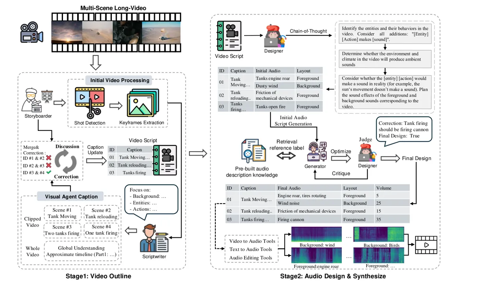
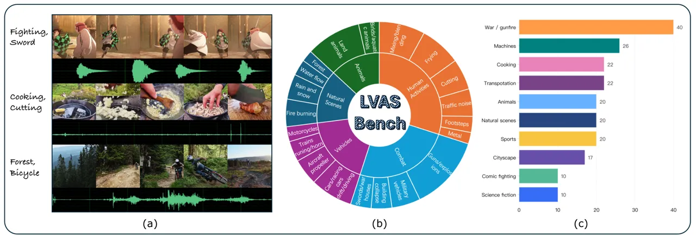
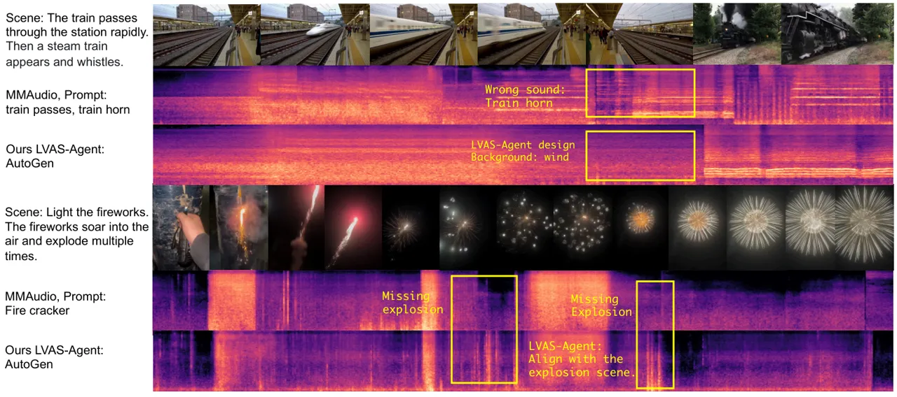

# Long-Video Audio Synthesis with Multi-Agent CollaborationThanks: Equal contribution. ^(†) Co-corresponding author.

Yehang Zhang    Xinli Xu    Xiaojie Xu    Li Liu Affiliation: HKUST(GZ)
   Ying-Cong Chen Affiliation: HKUST(GZ) Affiliation: HKUST

###### Abstract

Video-to-audio synthesis, which generates synchronized audio for visual
content, critically enhances viewer immersion and narrative coherence in
film and interactive media. However, video-to-audio dubbing for
long-form content remains an unsolved challenge due to dynamic semantic
shifts, temporal misalignment, and the absence of dedicated datasets.
While existing methods excel in short videos, they falter in long
scenarios (e.g., movies) due to fragmented synthesis and inadequate
cross-scene consistency. We propose LVAS-Agent, a novel multi-agent
framework that emulates professional dubbing workflows through
collaborative role specialization. Our approach decomposes long-video
synthesis into four steps including scene segmentation, script
generation, sound design and audio synthesis. Central innovations
include a discussion-correction mechanism for scene/script refinement
and a generation-retrieval loop for temporal-semantic alignment. To
enable systematic evaluation, we introduce LVAS-Bench, the first
benchmark with 207 professionally curated long videos spanning diverse
scenarios. Experiments demonstrate superior audio-visual alignment over
baseline methods. Project page:
[https://lvas-agent.github.io](https://lvas-agent.github.io).

## 1 Introduction

Recent advancements in generative AI, particularly diffusion models and
large language models (LLMs), have significantly improved short-video
dubbing, enabling synchronized audio that enhances viewer immersion.
However, long-video dubbing presents unique challenges, including
complex semantic shifts, cross-scene temporal alignment, and adaptation
to dynamic content. Current models, optimized for short clips, struggle
to maintain narrative coherence over extended durations, limiting their
effectiveness in applications such as film dubbing, AIGC video
voiceovers, and automatic narration for mute videos. Moreover, the lack
of dedicated datasets for long-video audio synthesis has hindered
progress, as current datasets and benchmarks focus on short-form
content.

Existing video-to-audio methods fall into two categories: (1) training
dedicated generators such as SpecVQGAN \[13\] and Diff-Audio \[33\],
which capture short-term correlations but fail in long-term scene
transitions, and (2) adapting text-to-audio models like
SonicVisionLM \[52\] and V2A-Mapper \[47\], which heavily rely on
textual descriptions and struggle with implicit visual cues in long
videos. These methods encounter common issues:(i) they lack mechanisms
to capture long-range dependencies across dynamically changing scenes,
(ii) they fail to preserve contextual continuity in dialogue-rich
videos, and (iii) they struggle to synthesize background sounds that
evolve naturally over extended durations. Additionally, these methods
rely on short-video datasets, which lack annotations for multi-sounds
and cross-scene consistency with only 2-4 words for each audio labels.

A fundamental question arises: How can we leverage short-video dubbing
priors to enable long-video synthesis while ensuring semantic coherence,
temporal alignment, and scalable synthesis without requiring large-scale
long-video training data? A naive approach is to split long videos into
shorter segments and apply existing methods. However, this approach
practically may lead to issues such as poor continuity, unnatural
transitions, and unclear main voice due to the lack of understanding of
long-sequence videos.

To address these challenges, we present LVAS-Agent, a multi-agent
framework that mimics professional dubbing workflows through structured
role collaboration. Our key innovation lies in decomposing the synthesis
process into specialized stages with collaborative agents:
semantic-aware scene segmentation, context-sensitive script generation,
ambiguity-resolved sound design, and knowledge-enhanced audio synthesis.
The overall is shown in Figure .

Specifically, our method operates through four tightly coupled roles.
The Storyboarder first segments videos into narrative-preserving scenes
using shot transition detection and contrastive keyframe clustering. The
Scriptwriter then generates time-aligned audio scripts by fusing visual
semantics from CLIP-encoded \[38\] features with dialogue context
analysis. Building on this, the Designer employs spectral saliency
analysis to disentangle foreground dialogues from ambient sounds,
refining annotations through agent-mediated ambiguity resolution.
Finally, the Synthesizer orchestrates hybrid audio generation, blending
neural text-to-speech with diffusion-based environmental effects.
Central to the system are two collaborative mechanisms: a
discussion-correction process for scene merging and script refinement,
and a generation-retrieval-optimization loop that iteratively aligns
sound design with retrievable audio knowledge, enabling precise temporal
and semantic consistency.

To enable systematic evaluation, we introduce the Long-Video Audio
Synthesis (LVAS) benchmark, comprising 207 professionally selected long
videos. LVAS-Bench covers various scenes such as urban landscapes,
combat simulations, and animation actions to ensure the accuracy of the
evaluation.

Our contributions can be summarized as follows:

- •
  We introduce LVAS-Agent, a multi-agent framework that systematically
  addresses long-video dubbing challenges by structuring the synthesis
  process into role-specialized collaborative agents.
- •
  We release LVAS-Bench, the first dedicated long-video audio synthesis
  dataset, covering 207 professionally curated videos across diverse
  scenarios, enabling standardized benchmarking.
- •
  Experiments demonstrate that LVAS-Agent improves semantic alignment,
  temporal alignment and distribution matching of audio-visual for
  long-video dubbing over existing baselines.

## 2 Related Work

### 2.1 Video-to-Audio Generation

Video-to-audio generation, also known as dubbing, is a crucial audio
technique for enhancing viewers’ auditory experience and has witnessed
significant evolution with the advent of neural approaches. Early neural
dubbing models demonstrated deep learning’s potential in sound effect
creation, though limited to specific genres \[1, 2, 30, 59\]. Recent
advancements in video-to-audio generation have followed two main
directions. The first approach focuses on training generators from
scratch, with notable works including SpecVQGAN \[13\], which employs a
cross-modal Transformer for auto-regressive sound generation, Im2Wav
\[40\], which conditions audio generation on CLIP features, Diff-Foley
\[27\], which enhances alignment through contrastive pre-training and
MMAudio \[3\], which use a flow matching-based multimodal joint training
framework on large-scale data. The second approach adapts text-to-audio
generators, with Xing et al. \[53\] utilizing ImageBind \[8\] for
optimization-based alignment, SonicVisionLM \[52\] employing
caption-based synthesis, V2A-Mapper \[47\] directly translating visual
to text embeddings and FoleyCrafter \[57\] integrating a learnable
module into text-to-audio models with end-to-end training. Despite these
advances, existing methods primarily excel only with short videos,
encountering issues such as noise artifacts and audio-scene
inconsistencies in longer videos. Our method addresses these limitations
by incorporating a video understanding segmentation module, providing an
effective solution for audio generation in long-form videos.

### 2.2 MLLMs for Video Understanding

Recent advances in vision foundation models \[4, 25, 38, 44, 43, 56,
15\] have led to the emergence of multimodal LLMs (MLLMs) \[23, 45, 55,
18\], which have demonstrated remarkable capabilities in language-guided
visual understanding. This progress has naturally extended to video
understanding, with pioneering works including VideoChat \[20\],
Video-ChatGPT \[28\], Video-LLaMA \[54\], Video-LLaVA \[22\],
LanguageBind \[60\], and Valley \[26\]. However, videos present unique
challenges compared to static images, particularly due to their temporal
nature and the substantial volume of visual information that, when
tokenized, often exceeds MLLMs’ context limitations. While most existing
approaches address this through frame sampling, some methods, such as
Video-ChatGPT \[28\], have introduced more efficient video feature
representations. The field has also witnessed significant progress in
instance-level video understanding, with works like PG-Video-LLaVA
\[31\] for video grounding, and Artemis \[36\] for video referring,
expanding the capabilities of video understanding systems.

The challenge becomes particularly acute in long video understanding,
where effective keyframe selection becomes more crucial and complex.
While some approaches like Kangaroo \[24\] and LLaVA-Video \[58\]
leverage language models with expanded context windows to accommodate
more frames, others have developed specialized techniques to handle this
limitation. MovieChat \[42\], for instance, implements a dual-memory
system with short-term and long-term memory banks for efficient video
content compression and preservation. Similarly, MA-LMM \[9\] and
VideoStreaming \[35\] employ a Q-former alongside a compact language
model (Phi-2 \[14\]) for video data condensation. LongVLM \[50\] takes a
different approach by utilizing token merging to reduce video token
count.

### 2.3 Multi-Agent System

Multi-agent systems have evolved significantly with the advent of large
language models (LLMs). Early single-agent frameworks like
ModelScope-Agent \[19\] and Toolformer \[39\] demonstrated the potential
of LLMs in executing complex tasks through tool integration. HuggingGPT
\[41\] and AudioGPT \[12\] further expanded this capability by
incorporating domain-specific models and functionalities.

However, the limitations of single-agent systems led to the emergence of
multi-agent frameworks. Inspired by the Society of Mind \[29\], works
like Generative Agents \[32\] pioneered the development of “Simulated
Society”, where multiple agents interact within defined environments.
Practical implementations such as ChatDev \[34\], MetaGPT \[10\], and
TransAgents \[51\] have successfully demonstrated collaborative
problem-solving through simulated workflows, achieving superior
reasoning and factuality compared to single-agent approaches. These
systems effectively address complex tasks requiring meaningful
collaborative interaction, which single agents typically struggle to
accomplish.

For long-video audio synthesis, while AudioAgent \[49\] employs
pre-trained diffusion models and GPT-4, it lacks explicit multi-agent
collaboration and specific optimizations for long videos. In contrast,
we propose LVAS-Agent: a multi-agent collaborative framework that mimics
professional dubbing workflows. Our system comprises specialized agents
for video segmentation, content understanding (leveraging advanced MLLM
models for precise description), and audio tag generation (separating
foreground and background elements). These components work in concert
with MMAudio to produce high-quality synthesized audio.

## 3 Method

### 3.1 Overview

Figure 2: Workflow of LVAS-Agent. Given the original video, Storyboarder
and Scriptwriter collaborate through Discussion and Correction to create
a structured video script. The Designer and Generator complete
multi-layered, high-quality sound synthesis through the
Generate-Retrieve-Optimize mechanism.

By clearly defining the roles of agents, multi-agent systems can
decompose complex tasks into smaller, more manageable ones. In
LVAS-Agent, we define four main characters: Storyboarder, Scriptwriter,
Designer, and Synthesizer. As show in Figure 2, each of these roles
carries its own specific set of responsibilities. The Storyboarder is
responsible for the creation of video storyboards. This includes
planning the storyboard strategy, segmenting video scenes, and
extracting keyframes. The Scriptwriter is in charge of writing the video
script. Their responsibilities include understanding the video content,
collaborating with the storyboard artist to generate a detailed video
outline, and providing references for the sound designer. The Designer
is tasked with annotating sound effects based on the video outline. This
includes analyzing video descriptions, generating detailed sound effect
annotations for each potential sound, classifying entity and
environmental sounds, and collaborating with the voiceover artist to
refine the sound annotations. Finally, the Generator is responsible for
the actual sound effect synthesis. This includes transforming sound
effect annotations into suitable sound labels and using professional
tools to achieve step-by-step sound-video synthesis, combining the main
sound and background sound.

### 3.2 Multi-agent collaboration strategy

In this section, we present the two agent collaboration strategies
employed in this work: Discussion-Correction (Algorithm 1) and
Generation-Retrieval-Optimization (Algorithm 2).

Discussion-Correction This strategy, as illustrated by Algorithm 1, is
executed through the collaboration between two agents . First, the
Storyboarder agent $`\mathbf{P}`$ segments the video into distinct
scenes, denoted as $`[v_{0},\dots,v_{n}]`$, based on shot transitions
and extracts the corresponding keyframes lists
$`\{[kf_{1,1},\dots],\dots,[kf_{n,1},\dots]\}`$. Next, the Scriptwriter
agent $`\mathbf{Q}`$ performs a global analysis of the entire video,
followed by a detailed examination of each segment based on its
respective keyframes. The Storyboarder agent $`\mathbf{P}`$ and
Scriptwriter agent $`\mathbf{Q}`$ then engage in a discussion to
determine whether certain segments should be merged and whether the
segment captions require refinement, based on both the global
understanding and the detailed video captions. The final output is a
structured video script.

Input: Storyboarder agent $`\mathbf{P}`$, Scriptwriter agent
$`\mathbf{Q}`$, Video $`\mathbf{V}`$

Output: Structured video script $`\mathbf{T}`$

$`\mathbf{T}`$() $`\leftarrow\emptyset`$
$`\{v_{0},\dots,v_{n}\}\leftarrow\textnormal{{$\mathbf{P}$}}(\textnormal{{$\mathbf{V}$}})`$
// Shot Change Detection

$`\{kf_{0},\dots,kf_{n}\}\leftarrow\textnormal{{$\mathbf{P}$}}(\{v_{0},\dots,v_{n}\})`$
// Keyframe Extraction

$`\textnormal{{$\mathrm{U}$}}_{\textnormal{{$\mathbf{V}$}}}\leftarrow\textnormal{{$\mathbf{Q}$}}(\textnormal{{$\mathbf{V}$}})`$
// Understand global content, style features

for _$`i=0`$ to $`n`$_ do

   $`\textnormal{{$\mathrm{U}$}}_{i}\leftarrow\textnormal{{$\mathbf{Q}$}}(kf_{i})`$

   if _$`i>1`$_ then

      $`D\leftarrow\textnormal{{$\mathbf{P}$}}(\textnormal{{$\mathrm{U}$}}_{i},\textnormal{{$\mathrm{U}$}}_{i-1},\textnormal{{$\mathrm{U}$}}_{\textnormal{{$\mathbf{V}$}}})`$

      if _$`D=MERGE`$_ then

         $`v_{i-1}\leftarrow merge\_segments(v_{i-1},v_{i})`$
$`\textnormal{{$\mathbf{T}$}}\leftarrow\textnormal{{$\mathbf{T}$}}\cup[\textnormal{{$\mathrm{U}$}}_{i-1},\textnormal{{$\mathrm{U}$}}_{i}]`$

      else

         $`\textnormal{{$\mathbf{T}$}}\leftarrow\textnormal{{$\mathbf{T}$}}\cup[\textnormal{{$\mathrm{U}$}}_{i}]`$

$`\textnormal{{$\mathbf{T}$}}\leftarrow\textnormal{{$\mathbf{T}$}}\cup\textnormal{{$\mathrm{U}$}}_{\textnormal{{$\mathbf{V}$}}}`$

return _$`\mathbf{T}`$_

Algorithm 1 Collaboration Strategy

Generation-Retrieval-Optimization This is accomplished through the
collaboration between the Designer agent $`\mathbf{D}`$ and the
Synthesizer agent $`\mathbf{S}`$. First, the Designer agent
$`\mathbf{D}`$ formulates an initial sound design based on the video
script. The Synthesizer agent $`\mathbf{S}`$ then retrieves relevant
knowledge from a sound synthesis database to generate a concrete
implementation plan. This plan is reviewed by the Designer agent
$`\mathbf{D}`$, who decides whether further refinement of the sound
design is needed or if the plan is ready for final synthesis.
Specifically, this process begins with an in-depth understanding of the
video script, followed by iterative exchanges of feedback between the
Designer agent $`\mathbf{D}`$ and the Synthesizer agent $`\mathbf{S}`$.
Through multiple iterations, the final sound synthesis plan is
determined.

Input: Designer agent $`\mathbf{D}`$, Synthesizer agent $`\mathbf{S}`$,
Video script $`\mathbf{T}`$, Maximum iterations $`N_{\max}`$

Output: Finalized sound synthesis plan $`\mathbf{A}_{\text{final}}`$

Initialization:
$`\mathbf{A}_{\text{init}}\leftarrow\mathbf{D}(\mathbf{T})`$;

$`\mathbf{A}_{\text{retrieved}}\leftarrow\mathbf{S}(\mathbf{A}_{\text{init}})`$;

for _$`i=1`$ to $`N_{\max}`$_ do

   $`\mathbf{A}_{\text{reviewed}}\leftarrow\mathbf{D}(\mathbf{A}_{\text{retrieved}})`$;

   if _$`\mathbf{D}`$ determines $`\mathbf{A}_{\text{reviewed}}`$ is
FINAL_ then

      break; // Exit early if finalized

   $`\mathbf{A}_{\text{modified}}\leftarrow\mathbf{D}(\mathbf{A}_{\text{reviewed}})`$;

   $`\mathbf{A}_{\text{retrieved}}\leftarrow\mathbf{S}(\mathbf{A}_{\text{modified}})`$;

return $`\mathbf{A}_{\text{reviewed}}`$;

Algorithm 2 Generation-Retrieval-Optimization Collaboration Strategy

### 3.3 Video Structure

As shown in Figure 2, this paper proposes a structured video script
generation method to assist in generating sound effects for full-length
videos. The method addresses three core challenges: 1) existing audio
synthesis tools have duration constraints; 2) current Video-To-Audio
methods struggle with scene and content transitions, hindering semantic
and temporal alignment; 3) ensuring consistency between video captions
and audio descriptions for coherent synthesis. To overcome these, we
introduce a fine-grained video structuring approach, supported by
collaboration between storyboarder and scriptwriter agents, as outlined
in Algorithm 1 The specific design of these agents is detailed as
follows.

Storyboarder is an LLM-based agent responsible for fine-grained video
structuring in the VTA task. Its key functions include detecting shot
transitions for coarse segmentation, extracting key frames using the
K-Means clustering algorithm, and refining segment boundaries and
captions based on the Scriptwriter’s Video Caption. Shot detection uses
an HSV color space transition method for rapid, frame-accurate
segmentation, enabling detailed video understanding. By extracting key
frames from smaller segments, it captures more visual information
compared to directly inputting the full video into a vision-language
model, enhancing video comprehension. Storyboarder also collaborates
with the Scriptwriter to decide whether segments should be merged or
captions refined, considering both local and global video context.
Detailed implementation is in Appendix 1.

Scriptwriter is a visual support agent responsible for comprehending
both the full video and individual video segments. Recent video
understanding tasks achieve comprehension by extracting information from
visual contexts to derive semantic features \[21\] or by directly
generating descriptive text \[5\]. Textual descriptions of the video
script make it easier to maintain consistency between video and audio
descriptions. Furthermore, the textual format facilitates interaction
among multiple agents. Notably, transforming the video into a structured
script, independent of video frames, enhances processing speed and
significantly reduces the number of tokens. The detailed implementation
is provided in Appendix 2.

Figure 3: Our LVAS-Bench is presented in the following parts: (a)
illustrates sample data from the benchmark, (b) provides statistical
distributions of audio categories and sub-categories across the dataset,
and (c) presents the statistics of video categories within the dataset.

### 3.4 Audio Design and Generation

This section presents the second stage of LVAS-Agent: audio design and
generation, as shown in Figure 2. The design follows key principles: 1)
Mimicking professional sound design workflows by analyzing video scripts
for accurate audio descriptions, 2) Enhancing efficiency and quality
using existing audio generation tools, and 3) Ensuring structured,
editable audio planning for fine-grained control. This stage uses a
collaborative framework with two LLM-based agents, integrating
retrieval-augmented generation (RAG) and audio synthesis tools to create
high-quality, multi-layered audio.

Designer annotates audio in the video script and collaborates with the
Synthesizer agent to finalize the audio design. Real-world dubbing often
involves complex scenes with layered environmental sounds, diverse
sound-producing actions, and varying audio levels. To address this, we
introduce a Chain-of-Thought (CoT) reasoning mechanism, breaking the
task into steps: identifying primary action sounds, analyzing background
audio, and ensuring audio coherence. The Designer agent creates the
initial audio design, covering foreground and background sounds, volume
control, and sound descriptions, while verifying alignment with the
video content. It then provides iterative feedback to the Audio
Synthesizer to optimize the final audio plan.

Generator The Generator synthesizes audio based on the audio annotations
obtained through collaboration with the Designer. It uses
retrieval-augmented generation (RAG) with an audio label knowledge base,
Video-to-Audio (VTA) and Text-to-Audio (TTA) models for synthesis,
hierarchical mixing, and volume adjustment. RAG-based retrieval ensures
high-quality synthesis, addressing the limitations of VTA models trained
on the VGGSound dataset, which contains only 310 audio labels with 2-4
words each. When audio prompts match these predefined labels, the
generated audio is more stable and higher quality.

Building on this insight, all VGGSound labels were reorganized and
reclassified into 20 common video scenarios. To enrich the labels, GPT-4
and human annotators added details such as typical scenarios and
relevant objects or interactions. This resulted in 192 refined labels.
The structured knowledge base allows the Generator to retrieve and
modify predefined labels, rather than relying on open-ended prompts.
This retrieval-based approach enables the
“generation-retrieval-optimization” mechanism in Algorithm 2,
facilitating iterative refinement of audio synthesis. The LVAS-Agent
employs MMAudio \[3\], an open-source framework supporting VTA and TTA
synthesis, ensuring flexibility for final audio mixing, volume
adjustment, and refinements.

## 4 LVAS-Bench

Collection. We construct the first specialized long-video audio
synthesis benchmark(LVAS-Bench). The benchmark contains 207
professionally curated videos (with an average duration of 1 minute)
sourced from three main origins: (1) film production archives with open
licenses, (2) annotated documentary segments, and (3) procedurally
generated synthetic scenes. Importantly, all videos in the dataset have
pure sound effects, with no background noise or human speech. This
creates a dataset of long-form, semantically rich videos with clear
transitions, matched with corresponding pure sound-audio. Figure 3(a)
illustrates representative video-audio cases.

Figure 4: We visualize the spectrograms of generated audio (by prior
works and our method). LVAS-Agent demonstrates superior performance in
synthesizing long video audio, ensuring seamless scene transitions
without errors or missing sounds.

Statistical Analysis. To ensure diversity, LVAS-Bench covers sufficient
video and audio categories. Figure 3(b) visualizes the benchmark’s audio
types, encompassing five major classes (e.g., human activities) with
numerous fine-grained subcategories. Figure 3(c) quantifies the
distribution across 10 video-level categories, where instances such as
the “cooking” category comprise 22 entries.

Benchmark Annotation. LVAS-Bench also offers detailed time-stamped
annotations for each video-audio pair and comprehensive global
descriptions. The time-stamped annotations indicate captions from
specific seconds to specific seconds, while the global descriptions
provide a detailed account of the entire long video. We implement a
hybrid annotation protocol: initial annotations are generated by video
understanding model, subsequently refined through manual verification by
domain experts.

## 5 Experiment

| Methods                 | Distribution Matching               |                                      |                                       |                                       |                                       | Audio Quality                       |                                     | Semantic Align       | Temporal Align       |
| ----------------------- | ----------------------------------- | ------------------------------------ | ------------------------------------- | ------------------------------------- | ------------------------------------- | ----------------------------------- | ----------------------------------- | -------------------- | -------------------- |
|                         | $`\mathrm{FD_{VGG}}`$$`\downarrow`$ | $`\mathrm{FD_{PANN}}`$$`\downarrow`$ | $`\mathrm{FD_{PASST}}`$$`\downarrow`$ | $`\mathrm{KL_{PANNs}}`$$`\downarrow`$ | $`\mathrm{KL_{PASST}}`$$`\downarrow`$ | $`\mathrm{IS_{PANNs}}`$$`\uparrow`$ | $`\mathrm{IS_{PASST}}`$$`\uparrow`$ | IB-Score$`\uparrow`$ | DeSync$`\downarrow`$ |
| Baseline (FoleyCrafter) | 6.61                                | 60.66                                | 637.82                                | 2.68                                  | 2.65                                  | 4.79                                | 4.34                                | 0.28                 | 1.24                 |
| Baseline (MMAudio)      | 9.48                                | 51.73                                | 588.24                                | 2.02                                  | 1.80                                  | 3.91                                | 3.05                                | 0.32                 | 0.61                 |
| LVAS-Agent (Ours)       | 5.76                                | 46.16                                | 573.67                                | 1.86                                  | 1.77                                  | 4.28                                | 3.50                                | 0.33                 | 0.53                 |

Table 1: Comparison of different methods on various evaluation metrics.
Lower values ($`\downarrow`$) indicate better performance, while higher
values ($`\uparrow`$) indicate better quality.

|                 |                  |     |                                     |                                       |                                      |                      |                    |
| --------------- | ---------------- | --- | ----------------------------------- | ------------------------------------- | ------------------------------------ | -------------------- | ------------------ |
| Key Components  |                  |     | Distribution Matching               |                                       | Audio Quality                        | Semantic Align       | Temporal Align     |
| Video-Structure | Chain-of-Thought | RAG | $`\mathrm{FD_{VGG}}`$$`\downarrow`$ | $`\mathrm{FD_{PANNs}}`$$`\downarrow`$ | $`\mathrm{IS_{PNSS}}`$$`\downarrow`$ | IB-Score$`\uparrow`$ | DeSync$`\uparrow`$ |
| ✓               |                  |     | 7.45                                | 77.65                                 | 1.85                                 | 0.312                | 0.361              |
| ✓               | ✓                |     | 7.41                                | 76.84                                 | 1.82                                 | 0.319                | 0.346              |
| ✓               | ✓                | ✓   | 7.12                                | 71.61                                 | 1.81                                 | 0.336                | 0.338              |

Table 2: Ablation Study. Ablating different key components of LVAS-Agent
and evaluating performance on LVAS-Bench.

### 5.1 Experiment Setup.

Metrics We assess the generation quality in four different dimensions:
distribution matching, audio quality, semantic alignment, and temporal
alignment. 1) Distribution matching assesses the similarity in feature
distribution between ground-truth audio and generated audio, under some
embedding models. We compute Fréchet Distance (FD) and Kullback–Leibler
(KL) distance. For FD, we adopt PaSST \[17\] (($`\mathrm{FD_{PaSST}}`$),
PANNs \[16\] ($`\mathrm{FD_{PANNs}}`$), and VGGish \[6\] as embedding
models. For the KL distance, we adopt PANNs ($`\mathrm{KL_{PANNs}}`$)
and PaSST ($`\mathrm{KL_{PaSST}}`$) as classifiers. 2) We use PANNs as
the classifier, following Wang et al. \[48\], to assess generation audio
quality without the need for comparison with the ground truth, utilizing
the inception score. 3) Semantic alignment is measured using ImageBind
\[7\], following Viertola et al. \[46\], by extracting visual features
from the input video and audio features from the generated audio, then
computing the average cosine similarity as the IB-score. 4) Temporal
alignment: We use synchronization score (DeSync) to assess audio-visual
synchrony. DeSync is predicted by Synchformer \[11\] as the misalignment
(in seconds) between the audio and video.

Data. Since our method focuses on the task of sound effect synthesis for
long videos, which consist of shorter video-audio pairs, are not
suitable for evaluation. Therefore, this paper uses the proposed
LVAS-Bench to assess the performance of the Agent-System.

Baselines. To accommodate sound effect synthesis for videos of arbitrary
length, the experimental baseline is designed to first segment the
video, then apply Video-to-Text (VTA) on each segment, and finally
combine the results. We use state-of-the-art open-source methods,
FoleyCrafter \[57\] and MMAudio \[3\], as VTA tools. FoleyCrafter
supports audio generation for segments up to 10 seconds, while MMAudio
performs better for videos around 10 seconds due to the duration of its
training data. Consequently, we set the segment interval for the
baseline to 10 seconds.

Implementation Details. In our experiments, all LLM-based agents use the
Qwen API \[37\] with the ‘‘qwen-max” model to simulate different agent
roles. The visual support agent is implemented using the locally
deployed ‘‘Qwen2.5-VL-7B” model. The retrieval-augmented generation for
the predefined audio description knowledge base is built on LlamaIndex
¹¹ 1 LlamaIndex:
[https://www.llamaindex.ai/](https://www.llamaindex.ai/). and powered by
a “qwen-plus” model.

### 5.2 Main Results

The evaluation metric comparison results are shown in Table 1, where
LVAS-Agent outperforms the baseline methods across all metrics in four
key dimensions, achieving state-of-the-art performance. Additionally, we
visualize and compare the audio waveforms generated by different
methods. The quantitative results demonstrate that our approach enables
the existing VTA base models to generate higher-quality audio in long
videos with enhanced semantic and temporal consistency, all without
additional training. As shown in the visualized spectrogram comparison
in Figure 4, (a) reveals that LVAS-Agent exhibits adaptive capability to
video content variations, ensuring a high level of alignment with the
video while reducing the omission of key sound effects and minimizing
incorrect audio generation. Furthermore, (b) shows that our method, by
designing foreground and background audio layers, achieves a multi-level
synthesis that enhances its off-screen capability.

### 5.3 Ablation Study

To validate the effectiveness of the Agent-Framework design, an ablation
study was conducted, as shown in Table 2. Key components of the
LVAS-Agent that contribute to enhancing audio generation quality were
identified, including: (1) generating sound effects after refined video
segmentation, (2) a Chain-of-Thought process for structured sound effect
description and hierarchical generation, and (3) an iterative
optimization process leveraging retrieved audio reference documents. The
experiment was conducted on 20 randomly selected video cases.

First, integrating the proposed video structuring method into the
baseline significantly improved audio quality. This improvement is
attributed to content-aware segmentation, which ensures consistency
between video content and generated audio. Building on this,
incorporating the CoT process for audio description further enhanced
both audio-visual synchronization and quality. This is due to CoT’s
ability to effectively transform video captions into detailed audio
descriptions, systematically reasoning through possible sound effects
and accurately identifying appropriate sources. Finally, the
retrieval-augmented iterative optimization of audio descriptions further
refined the VTA tool’s audio generation, leveraging a domain-specific
knowledge base to translate LLM-generated generalized descriptions into
precise audio prompts familiar to the VTA model.

### 5.4 User Study

We conducted a user study involving 30 participants to evaluate our
method in comparison with FoleyCrafter \[57\] and MMAudio \[3\].
Participants were asked to listen to 10 audio samples generated by each
method and rate them on a scale of 1 to 5 across three dimensions:
“Audio Quality,” “Video-Audio Consistency,” and “Overall Satisfaction.”
Higher scores indicate better performance. As illustrated in Figure 5,
the results of the user study demonstrate that our method outperforms
the two baseline approaches across all evaluated aspects.

Figure 5: User study comparing our method with baselines across
different aspects. Higher values indicate greater user preference.

## 6 Conclusion

We present LVAS-Agent, a multi-agent framework that systematically
tackles long-video dubbing challenges through role-specialized
collaborative agents. By decomposing the workflow into scene
segmentation, script generation, sound design, and hybrid synthesis, our
method overcomes limitations in semantic continuity and temporal
alignment inherent to existing approaches. We also release the first
dedicated long-video audio synthesis dataset, covering 207
professionally curated videos, named LVAS-Bench. Experimental results
demonstrate superior performance in distribution matching, audio
quality, and alignment metrics on LVAS-Bench.

For future work, we aim to develop a large-scale, finely annotated
dataset of long-video audio to further advance the development of
long-video dubbing models.

## References

- \[1\] Kan Chen, Chuanxi Zhang, Chen Fang, Zhaowen Wang, Trung Bui, and
  Ram Nevatia. Visually indicated sound generation by perceptually
  optimized classification. In _Proceedings of the European Conference
  on Computer Vision (ECCV) Workshops_, pages 0–0, 2018.
- \[2\] Peihao Chen, Yang Zhang, Mingkui Tan, Hongdong Xiao, Deng Huang,
  and Chuang Gan. Generating visually aligned sound from videos. _IEEE
  Transactions on Image Processing_, 29:8292–8302, 2020.
- \[3\] Ho Kei Cheng, Masato Ishii, Akio Hayakawa, Takashi Shibuya,
  Alexander Schwing, and Yuki Mitsufuji. Taming multimodal joint
  training for high-quality video-to-audio synthesis. _arXiv preprint
  arXiv:2412.15322_, 2024.
- \[4\] Alexey Dosovitskiy, Lucas Beyer, Alexander Kolesnikov, Dirk
  Weissenborn, Xiaohua Zhai, Thomas Unterthiner, Mostafa Dehghani,
  Matthias Minderer, Georg Heigold, Sylvain Gelly, et al. An image is
  worth 16x16 words: Transformers for image recognition at scale. _arXiv
  preprint arXiv:2010.11929_, 2020.
- \[5\] Yue Fan, Xiaojian Ma, Rujie Wu, Yuntao Du, Jiaqi Li, Zhi Gao,
  and Qing Li. Videoagent: A memory-augmented multimodal agent for video
  understanding. In _European Conference on Computer Vision_, pages
  75–92. Springer, 2025.
- \[6\] Jort F. Gemmeke, Daniel P. W. Ellis, Dylan Freedman, Aren
  Jansen, Wade Lawrence, R. Channing Moore, Manoj Plakal, and Marvin
  Ritter. Audio set: An ontology and human-labeled dataset for audio
  events. In _2017 IEEE International Conference on Acoustics, Speech
  and Signal Processing (ICASSP)_, pages 776–780, 2017.
- \[7\] Rohit Girdhar, Alaaeldin El-Nouby, Zhuang Liu, Mannat Singh,
  Kalyan Vasudev Alwala, Armand Joulin, and Ishan Misra. Imagebind one
  embedding space to bind them all. In _2023 IEEE/CVF Conference on
  Computer Vision and Pattern Recognition (CVPR)_, pages 15180–15190,
  2023a.
- \[8\] Rohit Girdhar, Alaaeldin El-Nouby, Zhuang Liu, Mannat Singh,
  Kalyan Vasudev Alwala, Armand Joulin, and Ishan Misra. Imagebind: One
  embedding space to bind them all. In _Proceedings of the IEEE/CVF
  conference on computer vision and pattern recognition_, pages
  15180–15190, 2023b.
- \[9\] Bo He, Hengduo Li, Young Kyun Jang, Menglin Jia, Xuefei Cao,
  Ashish Shah, Abhinav Shrivastava, and Ser-Nam Lim. Ma-lmm:
  Memory-augmented large multimodal model for long-term video
  understanding. In _Proceedings of the IEEE/CVF Conference on Computer
  Vision and Pattern Recognition_, pages 13504–13514, 2024.
- \[10\] Sirui Hong, Xiawu Zheng, Jonathan Chen, Yuheng Cheng, Jinlin
  Wang, Ceyao Zhang, Zili Wang, Steven Ka Shing Yau, Zijuan Lin, Liyang
  Zhou, et al. Metagpt: Meta programming for multi-agent collaborative
  framework. _arXiv preprint arXiv:2308.00352_, 3(4):6, 2023.
- \[11\] Jiawei Huang, Yi Ren, Rongjie Huang, Dongchao Yang, Zhenhui Ye,
  Chen Zhang, Jinglin Liu, Xiang Yin, Zejun Ma, and Zhou Zhao.
  Make-an-audio 2: Temporal-enhanced text-to-audio generation, 2023.
- \[12\] Rongjie Huang, Mingze Li, Dongchao Yang, Jiatong Shi, Xuankai
  Chang, Zhenhui Ye, Yuning Wu, Zhiqing Hong, Jiawei Huang, Jinglin Liu,
  et al. Audiogpt: Understanding and generating speech, music, sound,
  and talking head. In _Proceedings of the AAAI Conference on Artificial
  Intelligence_, pages 23802–23804, 2024.
- \[13\] Vladimir Iashin and Esa Rahtu. Taming visually guided sound
  generation. _arXiv preprint arXiv:2110.08791_, 2021.
- \[14\] Mojan Javaheripi, Sébastien Bubeck, Marah Abdin, Jyoti Aneja,
  Sebastien Bubeck, Caio César Teodoro Mendes, Weizhu Chen, Allie
  Del Giorno, Ronen Eldan, Sivakanth Gopi, et al. Phi-2: The surprising
  power of small language models. _Microsoft Research Blog_, 2023.
- \[15\] Alexander Kirillov, Eric Mintun, Nikhila Ravi, Hanzi Mao, Chloe
  Rolland, Laura Gustafson, Tete Xiao, Spencer Whitehead, Alexander C.
  Berg, Wan-Yen Lo, Piotr Dollár, and Ross Girshick. Segment Anything.
  _arXiv preprint arXiv:2304.02643_, 2023.
- \[16\] Qiuqiang Kong, Yin Cao, Turab Iqbal, Yuxuan Wang, Wenwu Wang,
  and Mark D Plumbley. Panns: Large-scale pretrained audio neural
  networks for audio pattern recognition. _IEEE/ACM Transactions on
  Audio, Speech, and Language Processing_, 28:2880–2894, 2020.
- \[17\] Khaled Koutini, Jan Schlüter, Hamid Eghbal-zadeh, and Gerhard
  Widmer. Efficient training of audio transformers with patchout. In
  _Interspeech 2022, 23rd Annual Conference of the International Speech
  Communication Association, Incheon, Korea, 18-22 September 2022_,
  pages 2753–2757. ISCA, 2022.
- \[18\] Xin Lai, Zhuotao Tian, Yukang Chen, Yanwei Li, Yuhui Yuan, Shu
  Liu, and Jiaya Jia. LISA: Reasoning Segmentation via Large Language
  Model. _arXiv preprint arXiv:2308.00692_, 2023.
- \[19\] Chenliang Li, Hehong Chen, Ming Yan, Weizhou Shen, Haiyang Xu,
  Zhikai Wu, Zhicheng Zhang, Wenmeng Zhou, Yingda Chen, Chen Cheng,
  et al. Modelscope-agent: Building your customizable agent system with
  open-source large language models. _arXiv preprint
  arXiv:2309.00986_, 2023.
- \[20\] KunChang Li, Yinan He, Yi Wang, Yizhuo Li, Wenhai Wang, Ping
  Luo, Yali Wang, Limin Wang, and Yu Qiao. Videochat: Chat-centric video
  understanding, 2024a.
- \[21\] KunChang Li, Yinan He, Yi Wang, Yizhuo Li, Wenhai Wang, Ping
  Luo, Yali Wang, Limin Wang, and Yu Qiao. Videochat: Chat-centric video
  understanding, 2024b.
- \[22\] Bin Lin, Yang Ye, Bin Zhu, Jiaxi Cui, Munan Ning, Peng Jin, and
  Li Yuan. Video-llava: Learning united visual representation by
  alignment before projection, 2023.
- \[23\] Haotian Liu, Chunyuan Li, Qingyang Wu, and Yong Jae Lee. Visual
  Instruction Tuning. _arXiv preprint arXiv:2304.08485_, 2023.
- \[24\] Jiajun Liu, Yibing Wang, Hanghang Ma, Xiaoping Wu, Xiaoqi Ma,
  Xiaoming Wei, Jianbin Jiao, Enhua Wu, and Jie Hu. Kangaroo: A powerful
  video-language model supporting long-context video input. _arXiv
  preprint arXiv:2408.15542_, 2024.
- \[25\] Ze Liu, Yutong Lin, Yue Cao, Han Hu, Yixuan Wei, Zheng Zhang,
  Stephen Lin, and Baining Guo. Swin transformer: Hierarchical vision
  transformer using shifted windows. In _Proceedings of the IEEE/CVF
  international conference on computer vision_, pages 10012–10022, 2021.
- \[26\] Ruipu Luo, Ziwang Zhao, Min Yang, Junwei Dong, Da Li, Pengcheng
  Lu, Tao Wang, Linmei Hu, Minghui Qiu, and Zhongyu Wei. Valley: Video
  assistant with large language model enhanced ability, 2023a.
- \[27\] Simian Luo, Chuanhao Yan, Chenxu Hu, and Hang Zhao. Diff-foley:
  Synchronized video-to-audio synthesis with latent diffusion models.
  _Advances in Neural Information Processing Systems_, 36:48855–48876,
  2023b.
- \[28\] Muhammad Maaz, Hanoona Rasheed, Salman Khan, and Fahad Shahbaz
  Khan. Video-chatgpt: Towards detailed video understanding via large
  vision and language models, 2023.
- \[29\] Marvin Minsky. _Society of mind_. Simon and Schuster, 1988.
- \[30\] Shentong Mo, Jing Shi, and Yapeng Tian. Text-to-audio
  generation synchronized with videos. _arXiv preprint
  arXiv:2403.07938_, 2024.
- \[31\] Shehan Munasinghe, Rusiru Thushara, Muhammad Maaz,
  Hanoona Abdul Rasheed, Salman Khan, Mubarak Shah, and Fahad Khan.
  Pg-video-llava: Pixel grounding large video-language models, 2023.
- \[32\] Joon Sung Park, Joseph O’Brien, Carrie Jun Cai, Meredith Ringel
  Morris, Percy Liang, and Michael S Bernstein. Generative agents:
  Interactive simulacra of human behavior. In _Proceedings of the 36th
  annual acm symposium on user interface software and technology_, pages
  1–22, 2023.
- \[33\] Vadim Popov, Amantur Amatov, Mikhail Kudinov, Vladimir
  Gogoryan, Tasnima Sadekova, and Ivan Vovk. Optimal transport in
  diffusion modeling for conversion tasks in audio domain. In _ICASSP
  2023-2023 IEEE International Conference on Acoustics, Speech and
  Signal Processing (ICASSP)_, pages 1–5. IEEE, 2023.
- \[34\] Chen Qian, Wei Liu, Hongzhang Liu, Nuo Chen, Yufan Dang, Jiahao
  Li, Cheng Yang, Weize Chen, Yusheng Su, Xin Cong, et al. Chatdev:
  Communicative agents for software development. _arXiv preprint
  arXiv:2307.07924_, 2023.
- \[35\] Rui Qian, Xiaoyi Dong, Pan Zhang, Yuhang Zang, Shuangrui Ding,
  Dahua Lin, and Jiaqi Wang. Streaming long video understanding with
  large language models. _arXiv preprint arXiv:2405.16009_, 2024.
- \[36\] Jihao Qiu, Yuan Zhang, Xi Tang, Lingxi Xie, Tianren Ma, Pengyu
  Yan, David Doermann, Qixiang Ye, and Yunjie Tian. Artemis: Towards
  referential understanding in complex videos. _arXiv preprint
  arXiv:2406.00258_, 2024.
- \[37\] Qwen, :, An Yang, Baosong Yang, Beichen Zhang, Binyuan Hui, Bo
  Zheng, Bowen Yu, Chengyuan Li, Dayiheng Liu, Fei Huang, Haoran Wei,
  Huan Lin, Jian Yang, Jianhong Tu, Jianwei Zhang, Jianxin Yang, Jiaxi
  Yang, Jingren Zhou, Junyang Lin, Kai Dang, Keming Lu, Keqin Bao, Kexin
  Yang, Le Yu, Mei Li, Mingfeng Xue, Pei Zhang, Qin Zhu, Rui Men, Runji
  Lin, Tianhao Li, Tianyi Tang, Tingyu Xia, Xingzhang Ren, Xuancheng
  Ren, Yang Fan, Yang Su, Yichang Zhang, Yu Wan, Yuqiong Liu, Zeyu Cui,
  Zhenru Zhang, and Zihan Qiu. Qwen2.5 technical report, 2025.
- \[38\] Alec Radford, Jong Wook Kim, Chris Hallacy, Aditya Ramesh,
  Gabriel Goh, Sandhini Agarwal, Girish Sastry, Amanda Askell, Pamela
  Mishkin, Jack Clark, et al. Learning transferable visual models from
  natural language supervision. In _International conference on machine
  learning_, pages 8748–8763. PMLR, 2021.
- \[39\] Timo Schick, Jane Dwivedi-Yu, Roberto Dessì, Roberta Raileanu,
  Maria Lomeli, Eric Hambro, Luke Zettlemoyer, Nicola Cancedda, and
  Thomas Scialom. Toolformer: Language models can teach themselves to
  use tools. _Advances in Neural Information Processing Systems_,
  36:68539–68551, 2023.
- \[40\] Roy Sheffer and Yossi Adi. I hear your true colors: Image
  guided audio generation. In _ICASSP 2023-2023 IEEE International
  Conference on Acoustics, Speech and Signal Processing (ICASSP)_, pages
  1–5. IEEE, 2023.
- \[41\] Yongliang Shen, Kaitao Song, Xu Tan, Dongsheng Li, Weiming Lu,
  and Yueting Zhuang. Hugginggpt: Solving ai tasks with chatgpt and its
  friends in hugging face. _Advances in Neural Information Processing
  Systems_, 36:38154–38180, 2023.
- \[42\] Enxin Song, Wenhao Chai, Guanhong Wang, Yucheng Zhang, Haoyang
  Zhou, Feiyang Wu, Haozhe Chi, Xun Guo, Tian Ye, Yanting Zhang, et al.
  Moviechat: From dense token to sparse memory for long video
  understanding. In _Proceedings of the IEEE/CVF Conference on Computer
  Vision and Pattern Recognition_, pages 18221–18232, 2024.
- \[43\] Yunjie Tian, Lingxi Xie, Xiaopeng Zhang, Jiemin Fang, Haohang
  Xu, Wei Huang, Jianbin Jiao, Qi Tian, and Qixiang Ye. Semantic-aware
  generation for self-supervised visual representation learning. _arXiv
  preprint arXiv:2111.13163_, 2021.
- \[44\] Yunjie Tian, Lingxi Xie, Zhaozhi Wang, Longhui Wei, Xiaopeng
  Zhang, Jianbin Jiao, Yaowei Wang, Qi Tian, and Qixiang Ye. Integrally
  Pre-Trained Transformer Pyramid Networks. In _2023 IEEE/CVF Conference
  on Computer Vision and Pattern Recognition_, pages 18610–18620.
  IEEE, 2023.
- \[45\] Yunjie Tian, Tianren Ma, Lingxi Xie, Jihao Qiu, Xi Tang, Yuan
  Zhang, Jianbin Jiao, Qi Tian, and Qixiang Ye. Chatterbox: Multi-round
  multimodal referring and grounding. _arXiv preprint
  arXiv:2401.13307_, 2024.
- \[46\] Ilpo Viertola, Vladimir Iashin, and Esa Rahtu. Temporally
  aligned audio for video with autoregression, 2024.
- \[47\] Heng Wang, Jianbo Ma, Santiago Pascual, Richard Cartwright, and
  Weidong Cai. V2a-mapper: A lightweight solution for vision-to-audio
  generation by connecting foundation models. In _Proceedings of the
  AAAI Conference on Artificial Intelligence_, pages 15492–15501, 2024a.
- \[48\] Yongqi Wang, Wenxiang Guo, Rongjie Huang, Jiawei Huang, Zehan
  Wang, Fuming You, Ruiqi Li, and Zhou Zhao. Frieren: Efficient
  video-to-audio generation network with rectified flow matching. In
  _The Thirty-eighth Annual Conference on Neural Information Processing
  Systems_, 2024b.
- \[49\] Zixuan Wang, Yu-Wing Tai, and Chi-Keung Tang. Audio-agent:
  Leveraging llms for audio generation, editing and composition. _arXiv
  preprint arXiv:2410.03335_, 2024c.
- \[50\] Yuetian Weng, Mingfei Han, Haoyu He, Xiaojun Chang, and Bohan
  Zhuang. Longvlm: Efficient long video understanding via large language
  models. _arXiv preprint arXiv:2404.03384_, 2024.
- \[51\] Minghao Wu, Jiahao Xu, and Longyue Wang. Transagents: Build
  your translation company with language agents. In _Proceedings of the
  2024 Conference on Empirical Methods in Natural Language Processing:
  System Demonstrations_, pages 131–141, 2024.
- \[52\] Zhifeng Xie, Shengye Yu, Qile He, and Mengtian Li.
  Sonicvisionlm: Playing sound with vision language models. In
  _Proceedings of the IEEE/CVF Conference on Computer Vision and Pattern
  Recognition_, pages 26866–26875, 2024.
- \[53\] Yazhou Xing, Yingqing He, Zeyue Tian, Xintao Wang, and Qifeng
  Chen. Seeing and hearing: Open-domain visual-audio generation with
  diffusion latent aligners. In _Proceedings of the IEEE/CVF Conference
  on Computer Vision and Pattern Recognition_, pages 7151–7161, 2024.
- \[54\] Hang Zhang, Xin Li, and Lidong Bing. Video-llama: An
  instruction-tuned audio-visual language model for video understanding,
  2023a.
- \[55\] Shilong Zhang, Peize Sun, Shoufa Chen, Min Xiao, Wenqi Shao,
  Wenwei Zhang, Kai Chen, and Ping Luo. GPT4RoI: Instruction Tuning
  Large Language Model on Region-of-Interest. _arXiv preprint
  arXiv:2307.03601_, 2023b.
- \[56\] Xiaosong Zhang, Yunjie Tian, Lingxi Xie, Wei Huang, Qi Dai,
  Qixiang Ye, and Qi Tian. Hivit: A simpler and more efficient design of
  hierarchical vision transformer. In _The Eleventh International
  Conference on Learning Representations_, 2022.
- \[57\] Yiming Zhang, Yicheng Gu, Yanhong Zeng, Zhening Xing, Yuancheng
  Wang, Zhizheng Wu, and Kai Chen. Foleycrafter: Bring silent videos to
  life with lifelike and synchronized sounds. _arXiv preprint
  arXiv:2407.01494_, 2024a.
- \[58\] Yuanhan Zhang, Jinming Wu, Wei Li, Bo Li, Zejun Ma, Ziwei Liu,
  and Chunyuan Li. Video instruction tuning with synthetic data. _arXiv
  preprint arXiv:2410.02713_, 2024b.
- \[59\] Yipin Zhou, Zhaowen Wang, Chen Fang, Trung Bui, and Tamara L
  Berg. Visual to sound: Generating natural sound for videos in the
  wild. In _Proceedings of the IEEE conference on computer vision and
  pattern recognition_, pages 3550–3558, 2018.
- \[60\] Bin Zhu, Bin Lin, Munan Ning, Yang Yan, Jiaxi Cui, HongFa Wang,
  Yatian Pang, Wenhao Jiang, Junwu Zhang, Zongwei Li, Wancai Zhang,
  Zhifeng Li, Wei Liu, and Li Yuan. Languagebind: Extending
  video-language pretraining to n-modality by language-based semantic
  alignment, 2024.

Supplementary Material

## Appendix A System Prompts

Here we show the detailed prompts of our LVAS-Agent, including
Storyboarder, Scriptwriter, Designer and Synthesizer. The prompt of
Storyboarder includes a prompt for global understanding as shown in
Figure  2, a prompt for understanding each of the divided small segments
as shown in Figure 3. The Storyboarder’s prompt as shown in Figure 1.
The Designer’s prompt as shown in Figure 4. The Synthesizer’s prompts
includes a system prompt (as shown in Figure  5) and a prompt for rag
(as shown in Figure  6).

Figure 1: Storyboarder Prompt

Figure 2: Scriptwriter Prompt: full video understanding

Figure 3: Scriptwriter Prompt: video segment understanding

Figure 4: Designer Prompt

Figure 5: Synthesizer Prompt

Figure 6: Synthesizer Prompt: Retrieval Augmented Generation(RAG)
