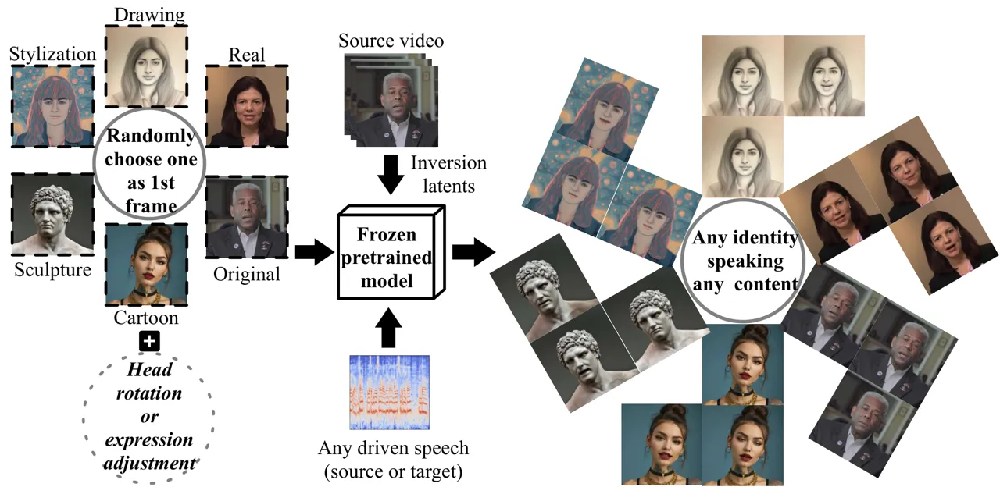
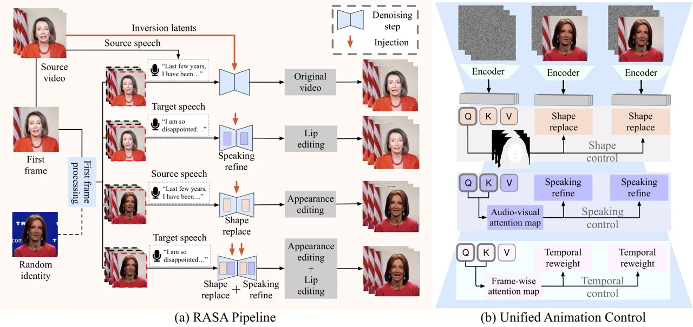
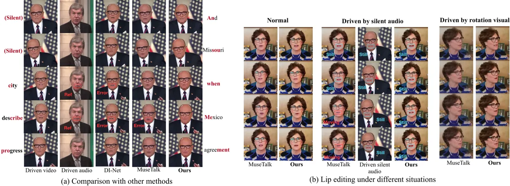
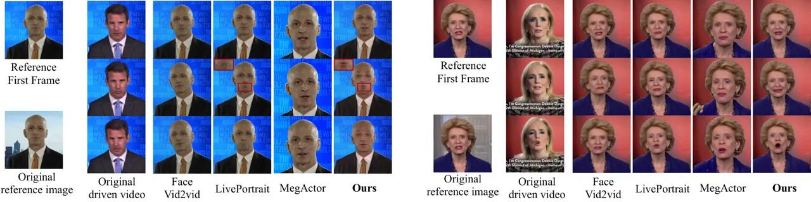
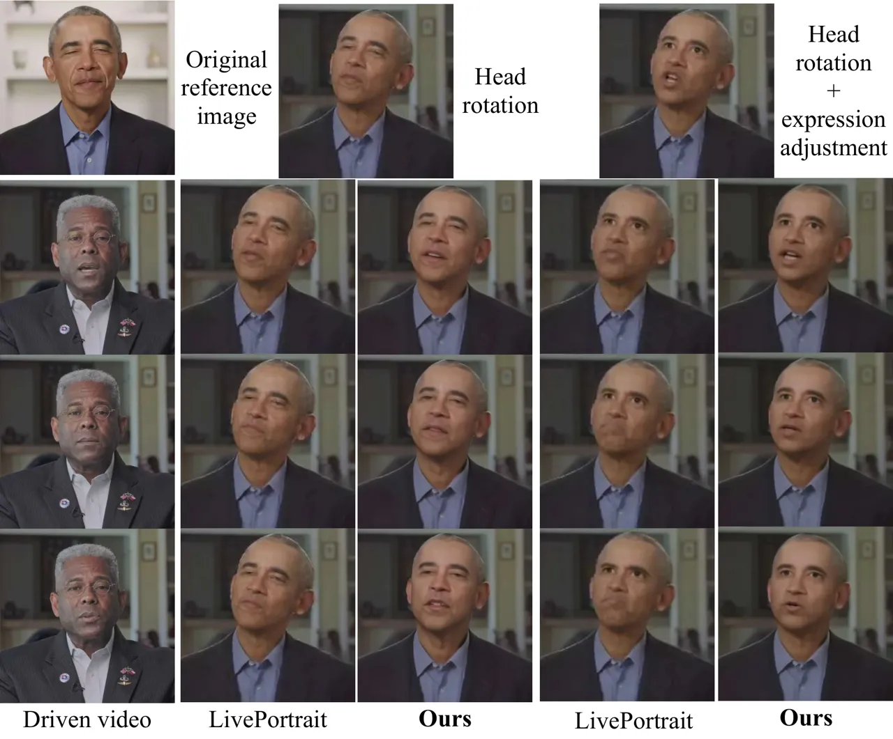
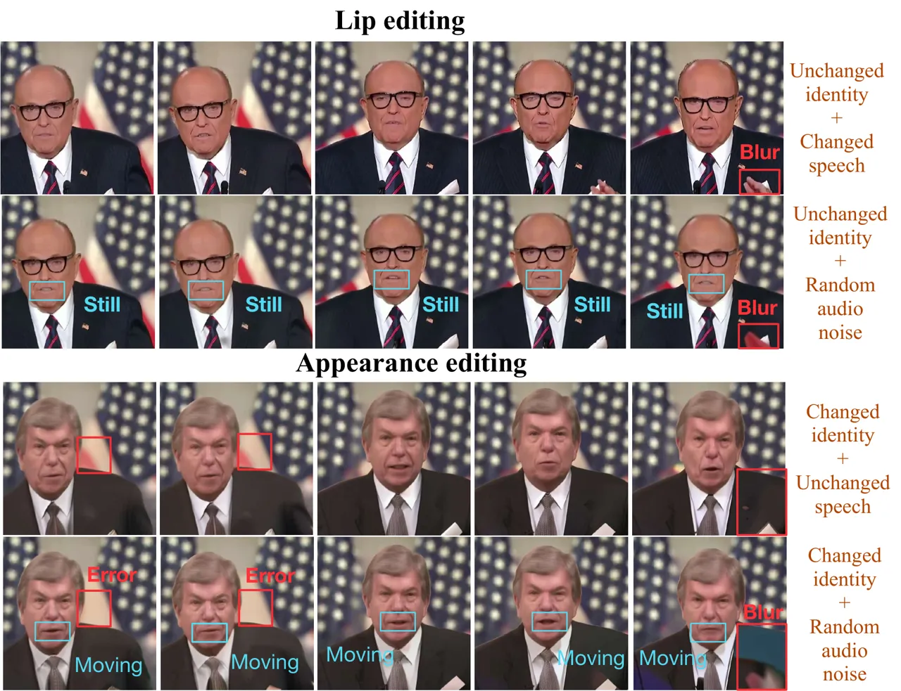
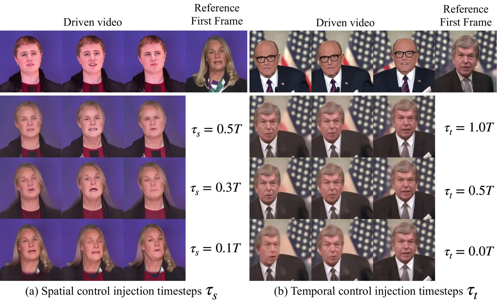

# RASA: Replace Anyone, Say Anything – A Training-Free Framework for Audio-Driven and Universal Portrait Video Editing

Tianrui Pan Affiliation: State Key Laboratory for Novel Software
Technology, Nanjing University Affiliation: Huawei Inc.    Lin Liu
Affiliation: Huawei Inc.    Jie Liu Affiliation: State Key Laboratory
for Novel Software Technology, Nanjing University    Xiaopeng Zhang
Affiliation: Huawei Inc.    Jie Tang Affiliation: State Key Laboratory
for Novel Software Technology, Nanjing University    Gangshan Wu
Affiliation: State Key Laboratory for Novel Software Technology, Nanjing
University    Qi Tian Affiliation: Huawei Inc.

###### Abstract

Portrait video editing focuses on modifying specific attributes of
portrait videos, guided by audio or video streams. Previous methods
typically either concentrate on lip-region reenactment or require
training specialized models to extract keypoints for motion transfer to
a new identity. In this paper, we introduce a training-free universal
portrait video editing framework that provides a versatile and adaptable
editing strategy. This framework supports portrait appearance editing
conditioned on the changed first reference frame, as well as lip editing
conditioned on varied speech, or a combination of both. It is based on a
Unified Animation Control (UAC) mechanism with source inversion latents
to edit the entire portrait, including visual-driven shape control,
audio-driven speaking control, and inter-frame temporal control.
Furthermore, our method can be adapted to different scenarios by
adjusting the initial reference frame, enabling detailed editing of
portrait videos with specific head rotations and facial expressions.
This comprehensive approach ensures a holistic and flexible solution for
portrait video editing. The experimental results show that our model can
achieve more accurate and synchronized lip movements for the lip editing
task, as well as more flexible motion transfer for the appearance
editing task. Demo is available at [RASA
DEMO](https://alice01010101.github.io/RASA/).

^(†)^(†)footnotetext: ^(†)Corresponding author.

## 1 Introduction



Figure 1: The overall pipeline of our model. RASA enables training-free
portrait video editing by leveraging inversion latents of the source
video, guided by any portrait identity or speech.

Portrait animation \[57, 38, 9, 17, 46, 47, 52, 41, 7, 12, 55, 25, 49,
19, 20\] aims to generate lifelike videos using a single source image as
the appearance reference, optionally deriving motion from driving
videos, audio, or text inputs. While most methods focus on enhancing
Image-to-Video (I2V) generation by either improving naturalness \[57,
38, 9, 17, 41, 25, 11\] or achieving precise motion control \[46, 47,
12, 55, 52, 53\], the area of portrait video editing has received
comparatively little research attention. There are instances when it is
essential to modify specific aspects of a video while preserving other
elements unchanged. Portrait video editing is essential in various
fields, including e-commerce product presentations \[48, 35\] and
gaming \[16\]. It can facilitate rapid adjustments to
lip-synchronization for modified speech content or identity
transformations, thereby obviating the need for video re-shoots. As
shown in Figure 1, in this paper, we propose the Replace Anyone, Say
Anything (RASA) framework, which is a training-free solution for
universal portrait video editing. The framework aims to facilitate
changes in identity or speech content, either individually or in
combination, to address various needs.

In portrait video editing, both audio and video serve as temporal
streams that provide multi-frame information, encompassing both
intra-frame and inter-frame relationships. As summarized in Table 1, we
systematically classify portrait video editing methods¹¹ 1 The portrait
video editing here refers to portrait animation methods driven by either
audio or video streams. based on their zero-shot adaptation capabilities
to changes in the driving modality, including audio, visual, or a
combination of both. As for cross-modal audio control, both lip-region
movements and overall facial expressions are closely related to specific
audio attributes in the driven speech, such as intensity, timbre, and
frequency. Existing methods \[8, 59, 4, 19\] focus primarily on
lip-region reenactment, which can result in poor audio-visual
synchronization and visual information leakage, leading to random lip
movements in the absence of audio information. As for visual-driven
appearance control, models like LivePortrait \[12\], MegActor \[52\],
and X-Portrait \[47\] extract keypoints or landmarks to enable motion
transfer and maintain coherence with the new portrait identity.
MegActor-$`\Sigma`$ \[53\] extends MegActor to multi-driven generation.
These methods typically require training in specialized modules using
masking and stitching techniques to enhance head movement coherence
between two different identities. However, to tackle challenges related
to identity transfer coherence, such as discrepancies in head shape and
eye size, these methods are sensitive to variations in portrait video.
Additionally, they often prioritize facial keypoint transfer while
overlooking background alteration and consistency. Table 1 illustrates
that our model excels in supporting various flexible cross-modal tasks.
It effectively bridges the gap between different editing objectives
while improving overall motion and foreground-background consistency,
rather than focusing solely on lip-region reenactment or training a
complex network for identity transfer. In particular, our model is based
on DDIM inversion to provide additional attention injection, introducing
perturbations to alter the original denoising forward trajectory.

|                            |                |                |                |        |            |                |            |                                                                              |
| -------------------------- | -------------- | -------------- | -------------- | ------ | ---------- | -------------- | ---------- | ---------------------------------------------------------------------------- |
| Method                     | Driven         |                |                | Task   | Edit       | Training       | Rotation   | Expression                                                                   |
|                            | A              | V              | AV             | L or S | type       | -free          | robustness | Adjustment                                                                   |
| VideoReTalking \[8\]       | $`\checkmark`$ | $`\times`$     | $`\times`$     | L      | lip        | $`\times`$     | low        | ![[Uncaptioned image]](arxiv-2503-11571--fb645e2048f4.figures/figure-2.webp) |
| MuseTalk \[59\]            |                |                |                | L      | lip        | $`\times`$     | low        | ![[Uncaptioned image]](arxiv-2503-11571--fb645e2048f4.figures/figure-2.webp) |
| DVE \[4\]                  |                |                |                | L      | lip        | $`\times`$     | low        | ![[Uncaptioned image]](arxiv-2503-11571--fb645e2048f4.figures/figure-2.webp) |
| LivePortarit \[12\]        | $`\times`$     | $`\checkmark`$ | $`\times`$     | S      | keypoints  | $`\times`$     | low        | ![[Uncaptioned image]](arxiv-2503-11571--fb645e2048f4.figures/figure-3.webp) |
| MegActor \[52\]            |                |                |                | S      | key areas  | $`\times`$     | low        | ![[Uncaptioned image]](arxiv-2503-11571--fb645e2048f4.figures/figure-2.webp) |
| X-Portrait \[47\]          |                |                |                | S      | keypoints  | $`\times`$     | low        | ![[Uncaptioned image]](arxiv-2503-11571--fb645e2048f4.figures/figure-2.webp) |
| MegActor-$`\Sigma`$ \[53\] | $`\checkmark`$ | $`\checkmark`$ | $`\checkmark`$ | both   | key areas  | $`\times`$     | low        | ![[Uncaptioned image]](arxiv-2503-11571--fb645e2048f4.figures/figure-3.webp) |
| RASA (Ours)                | $`\checkmark`$ | $`\checkmark`$ | $`\checkmark`$ | both   | whole face | $`\checkmark`$ | high       | ![[Uncaptioned image]](arxiv-2503-11571--fb645e2048f4.figures/figure-3.webp) |

Table 1: Summary of portrait video editing methods. In the first row, A
and V denote driven audio and video streams respectively, while L and S
represent the lip editing and appearance editing tasks, respectively. By
editing the entire face, our method achieves natural and synchronized
lip movements, with enhanced robustness and flexibility in handling head
rotations and expression adjustments.

The key model component is the Unified Animation Control (UAC) with
inversion-based injections. The UAC comprises three components:
visual-based shape control, audio-based speaking control, and
inter-frame temporal control. First, shape control provides the shape
query from the source video for each target frame, serving as implicit
motion control for either maintaining motion in the lip editing task or
transferring motion in the portrait appearance editing task. Second, the
speaking control manages the audio-visual mapping for speech-related lip
movements and facial expressions. Lastly, the temporal control enhances
inter-frame consistency, balancing video-driven movements and
audio-driven movements. Overall, the extensive experimental results show
that our method achieves more natural lip movements and better
audio-visual synchronization for lip editing than existing methods,
driven by changed speech with the same or different identities. It also
enables flexible motion transfer for appearance editing and allows for
head rotation and expression adjustment by simply editing the initial
reference frame.

To summarize, our main contributions are:

- •
  We propose the Replace Anyone, Say Anything (RASA) framework, a
  training-free solution for universal portrait video editing,
  facilitating independent or joint editing of lip movements and
  portrait appearance, optionally conditioned on various factors.
- •
  We propose the Unified Animation Control (UAC) based on inversion
  latents, which facilitates shape, speaking, and temporal control for
  coherent animations, achieving synchronized lip movements and flexible
  motion transfer.
- •
  Our model shows superior experimental results in lip editing,
  achieving better generation quality and synchronization. It also
  achieves natural motion transfer results for appearance editing,
  easily extending to generalized situations with head rotation and
  expression adjustment.



Figure 2: The overall structure of RASA. The left part (a) illustrates
the tuning-free universal portrait video editing pipeline. The right
part (b) details the denoising steps with unified animation control,
outlining the process for achieving multi-task portrait video editing.

## 2 Related Work

### 2.1 Portrait animation

Portrait animation encompasses the generation of dynamic facial videos.
Some methods \[57, 38, 9, 17, 41, 25, 49, 11, 30\] emphasize inter-frame
smoothness and natural expression. These techniques leverage neural
networks and temporal modeling for fluid transitions. Hallo2 \[9\]
extends Hallo \[51\] to generate long-duration, high-resolution portrait
videos with consistent visual quality and temporal coherence.
Conversely, other methods \[46, 47, 12, 55, 53, 29, 24, 43\] focus on
explicit or implicit motion extraction, enabling diverse motion control
for practical applications. This allows for precise manipulation of
facial dynamics in various contexts, such as animation and virtual
reality. AniPortrait \[46\], which uses explicit keypoints as
intermediate motion representations. X-Portrait \[47\] directly animates
portraits from the original driving video using implicit keypoints for
cross-identity training. MegActor \[52\] animates source portraits with
the original video while employing face-swapping and stylization to
enhance stability.

### 2.2 Inversion-based video editing

Inversion-based video editing leverages hidden features obtained from
the reconstruction branch to enhance the generation process of the
target branch. Video-P2P \[22\] and Vid2Vid-Zero \[45\] extend the
P2P \[13\] framework into video editing. Video-P2P substitutes spatial
self-attention layers with sparse-causal attention, whereas Vid2Vid-Zero
emphasizes the need for global spatio-temporal attention layers.
FateZero \[32\] generates fusion masks for self-attention injection by
binarizing cross-attention maps \[1\]. Edit-A-Video \[36\] interpolates
fusion masks between the initial frame and the current frame, using
self-attention maps as weights. Make-A-Protagonist \[62\] follows the
approaches of PnP \[39\] and MasaCtrl \[5\], employing Grounded
SAM \[33\] to acquire the segmentation mask for the first frame.
UniEdit \[2\] and AnyV2V \[18\] separate appearance and motion injection
through two auxiliary branches: one for reconstruction and another for
motion reference. As far as we know, we are the first to implement
inversion-based video editing for animated portrait videos, successfully
enabling the simultaneous and flexible transfer of various features.

## 3 Method

As illustrated in Figure 2, we propose a training-free portrait video
editing framework capable of animating any individual to say anything.
Figure 2(a) outlines the multi-task portrait video editing pipeline.
Based on the inversion latents of the source video, we can optionally
input the original first frame for lip editing, or replace it with
another identity for appearance editing. Figure 2(b) details the
training-free multi-task portrait editing structure with our proposed
Unified Animation Control (UAC). This includes shape control for
appearance replacement or maintenance, speaking control for enhancing
speech-related visual information, and temporal control to ensure
coherence and consistency. In this section, we will first introduce DDIM
inversion and the multiple conditional inputs in Section 3.1. Next, we
will detail the strategy for training-free multi-task portrait video
editing in Section 3.2, followed by the processing of the first frame in
Section 3.3.

### 3.1 DDIM Inversion and perturbation conditions

Diffusion models \[15, 34, 37\] generate the desired data samples
$`z_{0}`$ by iteratively removing noise from initial Gaussian noise
$`z_{T}`$ over $`T`$ steps. The sampling processes primarily involve
Denoising Diffusion Implicit Models (DDIM) \[34, 37\] and Denoising
Diffusion Probabilistic Models (DDPM) \[15\]. DDIM is more efficient,
allowing for step-skipping, while DDPM follows a Markovian process. Our
approach combines DDIM sampling with Latent Diffusion Models
(LDMs) \[34\], which enhances computational efficiency by operating in a
compressed latent space. To generate images from a given $`z_{T}`$, we
use deterministic DDIM sampling \[37\] to iteratively transition from
$`z_{T}`$ to $`z_{0}`$.

DDIM Inversion, the reverse process of DDIM sampling, is commonly used
for editing tasks across various modalities, including images \[28,
27\], videos \[62, 33, 2, 18\], and audio \[50, 58\]. While diffusion
models excel in feature space \[3, 10\] for various downstream tasks,
applying them to images poses challenges due to the lack of a natural
diffusion feature space for non-generated images. Thus, inverting
$`z_{0}`$ back to $`z_{T}`$ and saving the latents for the denoising
process is essential. DDIM inversion is often employed based on the
presumption that the ODE (Ordinary Differential Equation) process \[6\]
can be reversed with sufficiently small step sizes:

```math
\hat{z}_{t}=\alpha\hat{z}_{t-1}+\beta\epsilon_{\theta}(\hat{z}_{t-1},t-1), \tag{1}
```

where $`\alpha=\frac{\sqrt{\alpha_{t}}}{\sqrt{\alpha_{t-1}}}`$,
$`\beta=\sqrt{\alpha_{t}}\left(\sqrt{\frac{1}{\alpha_{t}}-1}-\sqrt{\frac{1}{\alpha_{t-1}}-1}\right)`$.
The presumption cannot be guaranteed, and there is often a perturbation
between $`z_{t}`$ and $`\hat{z}_{t}`$. In the task of portrait video
editing, we propose to produce specific perturbations guided by targeted
audio or visual streams. This guidance constrains the perturbations to
maintain desired features consistent with previous latent
representations while also modifying the target features based on
specific additional conditions. In our portrait video editing task, we
utilize two key inputs: the first reference frame, which serves as the
appearance condition, and the speech, which acts as the audio condition.
These inputs enable us to edit the source video from two distinct
perspectives: appearance and speech-related movements, either separately
or in combination. Compared with other task-specific methods, our
approach offers multi-task, training-free editing, allowing flexible
modifications to replace anyone saying anything.

### 3.2 Unified animation control

To achieve the multi-task portrait video editing under various
conditions, we propose a Unified Animation Control module UAC, shown in
Figure 2(b). The UAC consists of three components: Shape Control (SC),
Cross-modal Speaking Control (CSC), and Temporal Consistency Control
(TCC). SC keeps an appearance balance between the source video and the
target edited video. CSC facilitates the editing of speech-related
facial features, including content-specific lip movements and
frequency-related facial details and expressions. TCC further enhances
frame-wise consistency and continuity. We apply shape control, speaking
cross-modal control, and temporal-motion enhancement at the initial
denoising timesteps $`\tau_{s}`$, $`\tau_{a}`$, and $`\tau_{f}`$,
respectively.

Shape control. Most existing methods \[38, 9, 17, 11\] for generating
talking face videos rely on random Gaussian noise, guided by a reference
image and speech, which often results in limited motion variation. In
this work, we aim to conduct talking-face video editing tasks that
generate novel talking-face videos while ensuring consistency with the
structural layout established in the original video. MasaCtrl \[5\]
observed that the layout of objects is primarily formed through
self-attention queries. Inspired by this observation, we replace the
target query $`Q_{t}`$ in the target video generation pipeline with
source query $`Q_{s}`$, which is derived from the features of the
original video. This process is illustrated as follows:

```math
\displaystyle f_{SC}(t):=\begin{cases}\{Q_{\textrm{s}},K_{\textrm{t}},V_{\textrm{t}}\}&t\geq\tau_{s}\\
\{Q_{\textrm{t}},K_{\textrm{t}},V_{\textrm{t}}\}&t<\tau_{s}\end{cases} \tag{2}
```

The $`Q_{s}`$, $`K_{s}`$, and $`V_{s}`$ represent the query, key, and
value from the source original video for the SC module. We replace only
$`Q_{t}`$ instead of both $`Q_{t}`$ and $`K_{t}`$ because the attention
map $`M_{s}`$ from the original video contains excessive portrait
information, which can result in significant identity distortion. We
inject the $`Q_{s}`$ for the initial $`\tau_{s}`$ steps to strike a
balance between altering identity and enabling effective feature
adaptation. By maintaining structural layout consistency between the
source and target talking face videos, we preserve essential facial
features and spatial arrangements, thereby enhancing realism and
preventing distortions.

Cross-modal speaking control. Depending on practical needs, we may
require different portraits to either speak the same words or different
words. The cross-attention mechanism between visual and audio features
provides a direct method to establish the mapping between audio and the
corresponding facial features. In the context of cross-modal speaking
control, we inject the source visual query $`Q_{s}^{v}`$ and source
audio key $`K_{s}^{a}`$ obtained from the DDIM inversion into the target
generation pipeline to replace the target visual query $`Q_{t}^{v}`$ and
target audio key $`K_{t}^{a}`$ during the initial $`\tau_{a}`$ denoising
steps, as denoted below:

```math
\displaystyle f_{CSC}(t):=\begin{cases}\{Q_{\textrm{s}}^{v},K_{\textrm{s}}^{a},V_{\textrm{t}}^{a}\}&t\geq\tau_{a}\\
\{Q_{\textrm{t}}^{v},K_{\textrm{t}}^{a},V_{\textrm{t}}^{a}\}&t<\tau_{a}\end{cases} \tag{3}
```

This approach ensures a consistent mapping between audio inputs and
corresponding lip movements and facial expressions. Such alignment
enhances the coherence between auditory and visual components,
facilitating more natural interactions and improving the realism of the
generated output. In our video editing task, we maintain coherence in
lip movements and facial expressions for a portrait video when the audio
is the same and the spoken words are identical. Conversely, when the
driven audio differs and the spoken words change, we adapt the lip
movements and facial expressions to achieve a more natural performance.

Temporal consistency control. Finally, we enhance the frame-wise motion
consistency of the target video. This process improves previously edited
sections to align with the new appearance or speech conditions in the SC
and CSC. It ensures that these changes remain consistent with the
original movements in each frame. The details for controlling temporal
consistency are similar to those for speaking control. Specifically, we
replace the query $`Q_{\textrm{t}}^{f_{m}}`$ for the $`m`$-th target
frame with the query $`Q_{\textrm{s}}^{f_{m}}`$ for the $`m`$-th source
frame. And we replace the key $`K_{\textrm{t}}^{f_{n}}`$ for the
$`n`$-th target frame with the key $`K_{\textrm{s}}^{f_{n}}`$ for the
$`n`$-th source frame. This allows us to inject the source video’s
frame-wise attention into the target video.

Overall, the SC, CSC, and TCC modules are capable of supporting a wide
range of editing needs, either individually or in combination. SC
maintains movement consistency for the same identity and facilitates
motion transfer across different identities. With SC, we can adjust the
inversion injection timesteps to maintain the shape and motion during
the lip editing process, as demonstrated in the ablation results in
Figure 7(a). This adjustment also enhances the transfer of shape and
implicit movements from the source portrait to the target portrait in
the appearance editing task. CSC preserves lip movements and facial
details for identical speech content while adapting to corresponding lip
movements and facial expressions for altered speech content. This
integration ensures a more accurate and nuanced representation of speech
and expression in the animated portraits. TCC enhances coherence between
audio-driven and visual-driven movements, ensuring overall motion
consistency. As illustrated in Figure 2(a), through the proposed module
integration, we can achieve flexible portrait video editing that enables
the animation of any individual speaking any content.

### 3.3 First frame processing for appearance editing

In this subsection, we detail the first frame processing module, as
illustrated in Figure 2(a). The first reference frame is crucial during
the denoising process, as it provides both pixel-level information and
clip-based embeddings. As shown in Figure 1(a), it serves as the
appearance condition for both portrait appearance editing and lip
editing in our task. Processing the reference frame for diverse styles
and identities enables adaptation to a wide range of realistic
scenarios. To alter the first reference frame, we utilize several
techniques: 1) To modify the portrait while preserving the background,
we utilize a face-parsing method \[54\] to isolate the foreground
portrait from the target image and the background from the source image.
These components are then seamlessly merged, with inpainting
techniques \[21\] applied to address any inconsistencies, ensuring a
natural integration. 2) To generate portrait videos from diverse
viewpoints, we employ the approach described in \[44\] to synthesize new
head poses with varying yaw, pitch, and roll angles. 3) For creating
portrait videos with nuanced facial expressions, we leverage techniques
from \[12\] to adjust the openness of the eyes and mouth. It is
important to note that our current work does not address finer facial
expression details, such as eyebrow movement, eyeball shifts, teeth
visibility, or Ajna region modifications, which are left for future
investigation.

## 4 Experiments

| Method               | Self-id Driven Audio |                   |                     |                     |                   | Cross-id Driven Audio |                  |                     |                   |
| -------------------- | -------------------- | ----------------- | ------------------- | ------------------- | ----------------- | --------------------- | ---------------- | ------------------- | ----------------- |
|                      | FID$`\downarrow`$    | FVD$`\downarrow`$ | LPIPS$`\downarrow`$ | LSE-D$`\downarrow`$ | LSE-C$`\uparrow`$ | NIQE$`\uparrow`$      | CSIM$`\uparrow`$ | LSE-D$`\downarrow`$ | LSE-C$`\uparrow`$ |
| Wav2Lip \[31\]       | 35.727               | 225.706           | 0.257               | 6.384               | 8.049             | 5.716                 | 0.811            | 8.152               | 7.205             |
| VideoReTalking \[8\] | 30.834               | 208.496           | 0.256               | 8.082               | 6.871             | 5.508                 | 0.756            | 8.664               | 6.458             |
| TalkLip \[42\]       | 40.061               | 264.723           | 0.257               | 10.111              | 4.549             | 5.632                 | 0.799            | 10.212              | 4.813             |
| DI-Net \[61\]        | 34.130               | 231.347           | 0.250               | 9.167               | 7.423             | 5.385                 | 0.771            | 8.147               | 6.923             |
| DVE \[4\]            | \-                   | \-                | \-                  | \-                  | \-                | 5.192                 | \-               | 12.569              | 0.825             |
| Musetalk \[59\]      | 24.419               | 197.162           | 0.271               | 10.360              | 3.904             | 5.480                 | 0.839            | 10.560              | 4.509             |
| Ours                 | 23.327               | 188.611           | 0.248               | 6.975               | 7.875             | 6.096                 | 0.823            | 7.777               | 7.689             |

Table 2: Portrait lip editing results for audio-based portrait video
editing. The quantitative comparisons are conducted on the HDTF dataset.
The self-ID driven audio section involves altering the audio from the
same identity but using different audio segments. The cross-ID driven
audio section entails changing the audio from cropped segments of
different identities. The best results are in bold and the second best
results are underline.



Figure 3: Qualitative comparisons for the portrait lip editing. We
selected two edited video samples from the HDTF dataset to compare our
methods with others. In part (a), our audio-driven approach shows more
natural lip movements and better synchronization. Part (b) highlights
the robustness of our results in various scenarios, including silent
speech and head rotations.



Figure 4: Qualitative comparisons for the task of portrait appearance
editing. To achieve portrait video appearance editing, we first apply
background inpainting to obtain an edited first frame as the reference
frame, using the target portrait as the foreground and the source
background. We then input this reference image into our model to
implement the portrait video appearance editing.

### 4.1 Experimental setups

#### Datasets.

To evaluate our proposed method, we utilized the publicly available
dataset HDTF \[60\]. The HDTF dataset comprises approximately 410
in-the-wild videos, each available in 720P or 1080P resolution. For data
processing, we follow the approach outlined in Liu et al. \[23\] and
enlarge the cropping region to include the shoulders. For a fair
comparison, followed Wav2Lip \[31\] and VideoReTalking \[8\], we
randomly selected 20 videos, each containing 160 frames (6.4 seconds) in
the testing stage. Specifically, during video editing, the reference
image is randomly selected from one frame of the current video, while
the driven audio is sourced from a different video. We further
categorized the process into two scenarios: self-ID driven audio, where
the audio originates from the same individual, and cross-ID driven
audio, where the audio comes from a different person. This distinction
is essential, as individuals have distinct timbres and pitches,
introducing additional complexity to the evaluation process.

Evaluation metrics. To evaluate visual fidelity, identity preservation,
and lip synchronization capabilities, we employ multiple evaluation
metrics, which are introduced as follows: We assess our model using both
image- and video-based generative metrics, including FID \[14\],
FVD \[40\], and LPIPS \[56\]. These metrics enable us to evaluate the
generative quality of audio-driven face-changing videos in comparison to
ground-truth videos from various perspectives. LSE-D and LSE-C \[31\]
specifically measure lip synchronization through lip-sync error distance
and confidence levels. For scenarios involving cross-ID driven audio,
where the audio is sourced from a different individual, we utilize
NIQE \[26\] to assess the generated image quality without reference
images. Additionally, we employ CSIM to evaluate cross-ID similarity,
focusing on identity preservation in the cross-ID setting.

Implementation details. We first perform DDIM inversion for 500 backward
steps with classifier-free guidance set to 1.0. The forward denoising
steps are configured to 50, with a guidance scale of 3.5. The entire
inference process is carried out on a single NVIDIA Tesla V100. For the
default settings, we configure the injection steps for shape control,
denoted as $`\tau_{s}`$, speaking control, represented as $`\tau_{a}`$,
and temporal control, indicated by $`\tau_{f}`$, to values of 0.2, 0.2,
and 0.4, respectively. The parameters $`\tau_{s}`$ and $`\tau_{a}`$ are
detailed in Equation 2 and Equation 3, respectively. To facilitate
progressive video editing, we send every 16 frames to the denoising
forward process. To mitigate error accumulation during the iterative
generation process, we apply a random mask with a strength of 0.25 to
the last two generated frames before concatenating them with the next
set of 16 frames.

Compared baselines. The proposed method is compared with several
state-of-the-art video dubbing methods: 1) Wav2Lip \[31\] excels in
realistic lip synchronization using a pre-trained discriminator. 2)
VideoReTalking \[8\] offers high-quality audio-driven lip-syncing with
expression neutralization and speaker identity awareness. 3)
DI-Net \[61\] produces photorealistic videos by integrating a
dual-encoder framework focused on facial action units. 4) TalkLip \[42\]
employs contrastive learning and a transformer model for improved
temporal alignment between audio and video. 5) MuseTalk \[59\] generates
high-fidelity lip-sync targets in a latent space via a Variational
Autoencoder for efficient video creation.

### 4.2 Results on portrait lip editing

The timbre, pitch, and loudness of audio are closely linked to lip
movements and facial expressions. Most existing lip editing methods,
such as VideoReTalking \[8\] and MuseTalk \[59\], primarily focus on
masking and regenerating the mouth region, often overlooking necessary
adjustments to ensure the consistency and naturalness of the entire
face. As shown in Table 2, we evaluate the lip editing performance on 20
randomly selected samples from the HDTF dataset. This evaluation
involves replacing the original audio with both self-identity-driven and
cross-identity-driven audio. For self-identity lip editing, we compare
the generated videos against the same-audio-driven ground truth using
metrics such as FID and FVD to evaluate the quality of individual frames
and frame-by-frame videos, along with LPIPS to measure perceptual
similarity. We also assess audio-visual synchronization using LSE-D
distance and LSE-C confidence. For cross-identity lip editing, since
ground-truth generated videos are not available, we rely solely on the
no-reference metric NIQE for evaluation. The results indicate that our
method outperforms existing approaches across multiple metrics,
achieving a more accurate and natural representation while effectively
balancing motion consistency and naturalness.

The qualitative visualization results are presented in Figure 3. As
shown in Figure 3(a), our method effectively preserves the shape and
implicit pose motion when compared to the generation results from
DI-Net \[61\]. Furthermore, in comparison to the generation results from
MuseTalk \[59\], our approach demonstrates superior audio-lip
synchronization and improved lip-face consistency. Specifically, our
model employs shape control and temporal control to ensure motion
consistency for intra-frame shapes and frame-wise videos, respectively.
Additionally, speaking control leverages cross-modal audio mapping to
adjust the corresponding lip movements, enhancing lip-face coherence and
improving the overall naturalness of the generated output. In
Figure 3(b), we illustrate the superiority of our model under various
conditions, including silent speech and head rotation. When the provided
speech is silent, MuseTalk tends to produce random lip movements due to
visual information leakage, whereas our model maintains stillness in the
lips. Furthermore, our approach achieves greater coherence and improved
lip movements during head rotation situations.

### 4.3 Results on portrait appearance editing

As shown in Figure 4, we present qualitative results for this process.
Unlike LivePortrait \[12\] and MegActor \[52\], which focus on
extracting explicit or implicit keypoints for precise face motion
transfer, our method utilizes DDIM inversion noise latents to inject
implicit motion features into the current denoising pipeline. From
Figure 4, it is evident that mapping intermediate keypoints or landmarks
to another identity does not always succeed. Our qualitative results
demonstrate that our method extends the consistency of face keypoints to
encompass broader modifications, including the head, hair, and clothing,
resulting in more natural and versatile portrait transformations.
Compared to the video editing results from LivePortrait \[12\], our
approach achieves more accurate and detailed generation, as LivePortrait
exhibits some blurring in the lip region indicated by the red box in
Figure 4. Additionally, when compared to MegActor \[52\], we maintain a
closer identity resemblance to the original reference image.



Figure 5: Portrait appearance editing with different views. From left to
right, we sequentially edit the first reference image by changing the
background, applying head rotations, and expression editing.

We further demonstrate the robustness and flexibility of our model for
appearance editing under head rotation and expression editing. As shown
in Figure 5, we demonstrate the edited results with head rotation and
expression editing. Compared to LivePortrait, which strictly maintains
rotation angles and keypoint alignment, our method produces more natural
and coherent edited videos. Overall, unlike other portrait appearance
editing methods \[12, 52, 47, 53\] that emphasize rigid alignment, our
approach prioritizes fluidity and realism, enabling greater artistic
expression and adaptability across various scenarios. More qualitative
results can be found in the supplementary materials.

### 4.4 Ablation study



Figure 6: Ablation study for the driven audio. The red box emphasizes
that speech maintains image details like backgrounds and facial
features. The cyan box shows that while our model effectively maps
speech to lip movement, there is still potential for improvement in
handling identity and speech changes.



Figure 7: Ablation study for spatial control injection timesteps
$`\tau_{s}`$ and temporal control injection timesteps $`\tau_{t}`$. We
set the initial injection timesteps as follows: for spatial control
$`\tau_{s}`$, we used 0.5, 0.3, and 0.1 of total denoising timesteps
$`T`$; for temporal control $`\tau_{t}`$, we applied 1.0$`T`$, 0.5$`T`$,
and 0.0$`T`$.

#### The effectiveness of driven audio.

In Figure 6, we investigate the effectiveness of driven audio from two
perspectives. First, in both the lip editing and appearance editing
tasks, we observe that incorporating speech significantly enhances the
preservation of image details, such as the background, hands, and
shoulders. In contrast, using random audio noise results in blurring, as
highlighted by the red boxes. Second, in the lip editing task (indicated
by the cyan box), we find a strong correlation between speech and lip
movements; when random audio noise is used, the mouth often remains
open. However, during the video appearance editing task, our model
struggles to manage changes in both identity and speech simultaneously.
This highlights the need for further research into how random audio
noise affects lip movements.

Shape and temporal control injection. As shown in Figure 7(a), we set
the shape control injection steps, denoted as $`\tau_{s}`$, to 0.5, 0.3,
and 0.1 of the total denoising timesteps $`T`$, respectively. The
visualization results indicate that a higher degree of shape query
injection leads to the generated target portrait shape being more
similar to the source portrait. This method maintains a balance between
pose and facial expression consistency while preserving the fidelity of
the provided reference portrait image. Regarding the temporal control
injection, illustrated in Figure 7(b), we configured the initial
injection inversion timesteps to $`0.0T`$, $`0.5T`$, and $`1.0T`$. When
$`\tau_{t}`$=$`0.0T`$, it indicates the absence of the temporal
attention injection module, resulting in noticeable blurring or
distortion during large-scale movements in the source-driven video.
Additionally, as the temporal injection timesteps increase from $`0.0T`$
to $`1.0T`$, we observe that more background details are preserved,
including the intricate features of the flag in this example. We set
$`\tau_{s}`$ to 0.2$`T`$ and $`\tau_{t}`$ to 0.4$`T`$ in our experiment.

| $`\tau_{a}`$ | FVD $`\downarrow`$ | LSE-D $`\downarrow`$ | LSE-C $`\uparrow`$ |
| ------------ | ------------------ | -------------------- | ------------------ |
| 0.2T         | 190.504            | 7.406                | 7.541              |
| 0.5T         | 190.097            | 7.112                | 7.766              |
| 0.8T         | 189.213            | 7.359                | 7.698              |

Table 3: Ablation study for the speaking control injection timesteps
$`\tau_{a}`$. For the audio-visual cross-modal attention map injection,
we evaluate our model using the FVD metric for inter-frame details
fidelity, as well as the LSE-D and LSE-C metrics for audio-visual
synchronization.

Speaking control injection. The speaking attention maps demonstrate the
relationship between video and speech across modalities. In a Self-id
driven audio setting, we replaced the driven speech with segments from
the same speaker. The results, as shown in Table 3, indicate that
increasing the speaking injection timesteps from $`0.2T`$ to $`0.8T`$
improves the FVD metric. This improvement suggests that the speaking
attention map effectively captures detailed visual information related
to speech, including both facial features and background details.
Additionally, audio-visual synchronization, measured by LSE-D and LSE-C
metrics, improves as $`\tau_{a}`$ increases from $`0.2T`$ to $`0.5T`$,
suggesting enhanced audio-visual mapping. However, synchronization
declines when $`\tau_{a}`$ increases from $`0.5T`$ to $`0.8T`$, likely
due to excessive injection of original speech-related lip information,
which may disrupt the editing process.

## 5 Conclusions

In this paper, we propose a training-free framework for universal
portrait video editing that allows anyone to say any content. Our method
facilitates flexible lip and appearance editing through UAC, driven by
altered speech or visual identity. UAC provides control over shape,
speech, and temporal based on inversion latents. Additionally, it
supports background changes, head rotation, and expression adjustments,
ensuring adaptability to various scenarios. In the future, we will
explore multi-language editing scenarios and investigate motion transfer
between identities with significant differences, such as variations in
head size under close-up and long-shot conditions.

## References

- \[1\] Omri Avrahami, Ohad Fried, and Dani Lischinski. Blended latent
  diffusion. _ACM Transactions on Graphics_, 42(4):1–11, 2023.
- \[2\] Jianhong Bai, Tianyu He, Yuchi Wang, Junliang Guo, Haoji Hu,
  Zuozhu Liu, and Jiang Bian. Uniedit: A unified tuning-free framework
  for video motion and appearance editing. _arXiv e-prints_, pages
  arXiv–2402, 2024.
- \[3\] Yogesh Balaji, Seungjun Nah, Xun Huang, Arash Vahdat, Jiaming
  Song, Qinsheng Zhang, Karsten Kreis, Miika Aittala, Timo Aila, Samuli
  Laine, et al. ediff-i: Text-to-image diffusion models with an ensemble
  of expert denoisers. _arXiv e-prints_, pages arXiv–2211, 2022.
- \[4\] Dan Bigioi, Shubhajit Basak, Michał Stypułkowski, Maciej Zieba,
  Hugh Jordan, Rachel McDonnell, and Peter Corcoran. Speech driven video
  editing via an audio-conditioned diffusion model. _Image and Vision
  Computing_, 142:104911, 2024.
- \[5\] Mingdeng Cao, Xintao Wang, Zhongang Qi, Ying Shan, Xiaohu Qie,
  and Yinqiang Zheng. Masactrl: Tuning-free mutual self-attention
  control for consistent image synthesis and editing. In _Proceedings of
  the IEEE/CVF international conference on computer vision_, pages
  22560–22570, 2023.
- \[6\] Ricky TQ Chen, Yulia Rubanova, Jesse Bettencourt, and David K
  Duvenaud. Neural ordinary differential equations. _Advances in neural
  information processing systems_, 31, 2018.
- \[7\] Zhiyuan Chen, Jiajiong Cao, Zhiquan Chen, Yuming Li, and
  Chenguang Ma. Echomimic: Lifelike audio-driven portrait animations
  through editable landmark conditions. _arXiv e-prints_, pages
  arXiv–2407, 2024.
- \[8\] Kun Cheng, Xiaodong Cun, Yong Zhang, Menghan Xia, Fei Yin,
  Mingrui Zhu, Xuan Wang, Jue Wang, and Nannan Wang. Videoretalking:
  Audio-based lip synchronization for talking head video editing in the
  wild. In _SIGGRAPH Asia 2022 Conference Papers_, pages 1–9, 2022.
- \[9\] Jiahao Cui, Hui Li, Yao Yao, Hao Zhu, Hanlin Shang, Kaihui
  Cheng, Hang Zhou, Siyu Zhu, and Jingdong Wang. Hallo2: Long-duration
  and high-resolution audio-driven portrait image animation. _arXiv
  e-prints_, pages arXiv–2410, 2024.
- \[10\] Wenkai Dong, Song Xue, Xiaoyue Duan, and Shumin Han. Prompt
  tuning inversion for text-driven image editing using diffusion models.
  In _Proceedings of the IEEE/CVF International Conference on Computer
  Vision_, pages 7430–7440, 2023.
- \[11\] Nikita Drobyshev, Antoni Bigata Casademunt, Konstantinos
  Vougioukas, Zoe Landgraf, Stavros Petridis, and Maja Pantic.
  Emoportraits: Emotion-enhanced multimodal one-shot head avatars. In
  _Proceedings of the IEEE/CVF Conference on Computer Vision and Pattern
  Recognition_, pages 8498–8507, 2024.
- \[12\] Jianzhu Guo, Dingyun Zhang, Xiaoqiang Liu, Zhizhou Zhong, Yuan
  Zhang, Pengfei Wan, and Di Zhang. Liveportrait: Efficient portrait
  animation with stitching and retargeting control. _arXiv e-prints_,
  pages arXiv–2407, 2024.
- \[13\] Amir Hertz, Ron Mokady, Jay Tenenbaum, Kfir Aberman, Yael
  Pritch, and Daniel Cohen-or. Prompt-to-prompt image editing with
  cross-attention control. In _The Eleventh International Conference on
  Learning Representations_.
- \[14\] Martin Heusel, Hubert Ramsauer, Thomas Unterthiner, Bernhard
  Nessler, and Sepp Hochreiter. Gans trained by a two time-scale update
  rule converge to a local nash equilibrium. _Advances in neural
  information processing systems_, 30, 2017.
- \[15\] Jonathan Ho, Ajay Jain, and Pieter Abbeel. Denoising diffusion
  probabilistic models. _Advances in neural information processing
  systems_, 33:6840–6851, 2020.
- \[16\] Chengpeng Hu, Yunlong Zhao, Ziqi Wang, Haocheng Du, and Jialin
  Liu. Games for artificial intelligence research: A review and
  perspectives. _IEEE Transactions on Artificial Intelligence_, 2024.
- \[17\] Jianwen Jiang, Chao Liang, Jiaqi Yang, Gaojie Lin, Tianyun
  Zhong, and Yanbo Zheng. Loopy: Taming audio-driven portrait avatar
  with long-term motion dependency. In _The Thirteenth International
  Conference on Learning Representations_, 2024.
- \[18\] Max Ku, Cong Wei, Weiming Ren, Huan Yang, and Wenhu Chen.
  Anyv2v: A tuning-free framework for any video-to-video editing tasks.
  _Transactions on Machine Learning Research_.
- \[19\] Chunyu Li, Chao Zhang, Weikai Xu, Jinghui Xie, Weiguo Feng,
  Bingyue Peng, and Weiwei Xing. Latentsync: Audio conditioned latent
  diffusion models for lip sync. _arXiv e-prints_, pages
  arXiv–2412, 2024.
- \[20\] Gaojie Lin, Jianwen Jiang, Jiaqi Yang, Zerong Zheng, and Chao
  Liang. Omnihuman-1: Rethinking the scaling-up of one-stage conditioned
  human animation models. _arXiv preprint arXiv:2502.01061_, 2025.
- \[21\] Shaowei Liu, Zhongzheng Ren, Saurabh Gupta, and Shenlong Wang.
  Physgen: Rigid-body physics-grounded image-to-video generation. In
  _European Conference on Computer Vision_, pages 360–378. Springer,
  2024a.
- \[22\] Shaoteng Liu, Yuechen Zhang, Wenbo Li, Zhe Lin, and Jiaya Jia.
  Video-p2p: Video editing with cross-attention control. In _Proceedings
  of the IEEE/CVF Conference on Computer Vision and Pattern
  Recognition_, pages 8599–8608, 2024b.
- \[23\] Tao Liu, Feilong Chen, Shuai Fan, Chenpeng Du, Qi Chen, Xie
  Chen, and Kai Yu. Anitalker: animate vivid and diverse talking faces
  through identity-decoupled facial motion encoding. In _Proceedings of
  the 32nd ACM International Conference on Multimedia_, pages 6696–6705,
  2024c.
- \[24\] Junxian Ma, Shiwen Wang, Jian Yang, Junyi Hu, Jian Liang,
  Guosheng Lin, Kai Li, Yu Meng, et al. Sayanything: Audio-driven lip
  synchronization with conditional video diffusion. _arXiv e-prints_,
  pages arXiv–2502, 2025.
- \[25\] Yue Ma, Hongyu Liu, Hongfa Wang, Heng Pan, Yingqing He, Junkun
  Yuan, Ailing Zeng, Chengfei Cai, Heung-Yeung Shum, Wei Liu, et al.
  Follow-your-emoji: Fine-controllable and expressive freestyle portrait
  animation. In _SIGGRAPH Asia 2024 Conference Papers_, pages
  1–12, 2024.
- \[26\] Anish Mittal, Rajiv Soundararajan, and Alan C Bovik. Making a
  “completely blind” image quality analyzer. _IEEE Signal processing
  letters_, 20(3):209–212, 2012.
- \[27\] Daiki Miyake, Akihiro Iohara, Yu Saito, and Toshiyuki Tanaka.
  Negative-prompt inversion: Fast image inversion for editing with
  text-guided diffusion models. _arXiv e-prints_, pages
  arXiv–2305, 2023.
- \[28\] Ron Mokady, Amir Hertz, Kfir Aberman, Yael Pritch, and Daniel
  Cohen-Or. Null-text inversion for editing real images using guided
  diffusion models. In _Proceedings of the IEEE/CVF conference on
  computer vision and pattern recognition_, pages 6038–6047, 2023.
- \[29\] Soumik Mukhopadhyay, Saksham Suri, Ravi Teja Gadde, and Abhinav
  Shrivastava. Diff2lip: Audio conditioned diffusion models for
  lip-synchronization. In _Proceedings of the IEEE/CVF Winter Conference
  on Applications of Computer Vision_, pages 5292–5302, 2024.
- \[30\] Ziqiao Peng, Wentao Hu, Yue Shi, Xiangyu Zhu, Xiaomei Zhang,
  Hao Zhao, Jun He, Hongyan Liu, and Zhaoxin Fan. Synctalk: The devil is
  in the synchronization for talking head synthesis. In _Proceedings of
  the IEEE/CVF Conference on Computer Vision and Pattern Recognition_,
  pages 666–676, 2024.
- \[31\] K R Prajwal, Rudrabha Mukhopadhyay, Vinay P. Namboodiri, and
  C.V. Jawahar. A lip sync expert is all you need for speech to lip
  generation in the wild. In _Proceedings of the 28th ACM International
  Conference on Multimedia_, page 484–492. ACM, 2020.
- \[32\] Chenyang Qi, Xiaodong Cun, Yong Zhang, Chenyang Lei, Xintao
  Wang, Ying Shan, and Qifeng Chen. Fatezero: Fusing attentions for
  zero-shot text-based video editing. In _Proceedings of the IEEE/CVF
  International Conference on Computer Vision_, pages 15932–15942, 2023.
- \[33\] Tianhe Ren, Shilong Liu, Ailing Zeng, Jing Lin, Kunchang Li, He
  Cao, Jiayu Chen, Xinyu Huang, Yukang Chen, Feng Yan, et al. Grounded
  sam: Assembling open-world models for diverse visual tasks. _arXiv
  e-prints_, pages arXiv–2401, 2024.
- \[34\] Robin Rombach, Andreas Blattmann, Dominik Lorenz, Patrick
  Esser, and Björn Ommer. High-resolution image synthesis with latent
  diffusion models. In _Proceedings of the IEEE/CVF conference on
  computer vision and pattern recognition_, pages 10684–10695, 2022.
- \[35\] Rima Shah. Augmented reality in e-commerce: A review of current
  applications, opportunities, and challenges. In _Smart Trends in
  Computing and Communications_, pages 479–486, Singapore, 2024.
  Springer Nature Singapore.
- \[36\] Chaehun Shin, Heeseung Kim, Che Hyun Lee, Sang-gil Lee, and
  Sungroh Yoon. Edit-a-video: Single video editing with object-aware
  consistency. In _Asian Conference on Machine Learning_, pages
  1215–1230. PMLR, 2024.
- \[37\] Jiaming Song, Chenlin Meng, and Stefano Ermon. Denoising
  diffusion implicit models. In _International Conference on Learning
  Representations_.
- \[38\] Linrui Tian, Qi Wang, Bang Zhang, and Liefeng Bo. Emo: Emote
  portrait alive generating expressive portrait videos with audio2video
  diffusion model under weak conditions. In _European Conference on
  Computer Vision_, pages 244–260. Springer, 2024.
- \[39\] Narek Tumanyan, Michal Geyer, Shai Bagon, and Tali Dekel.
  Plug-and-play diffusion features for text-driven image-to-image
  translation. In _Proceedings of the IEEE/CVF Conference on Computer
  Vision and Pattern Recognition_, pages 1921–1930, 2023.
- \[40\] Thomas Unterthiner, Sjoerd van Steenkiste, Karol Kurach,
  Raphael Marinier, Marcin Michalski, and Sylvain Gelly. Towards
  accurate generative models of video: A new metric & challenges. _arXiv
  e-prints_, pages arXiv–1812, 2018.
- \[41\] Cong Wang, Kuan Tian, Jun Zhang, Yonghang Guan, Feng Luo, Fei
  Shen, Zhiwei Jiang, Qing Gu, Xiao Han, and Wei Yang. V-express:
  Conditional dropout for progressive training of portrait video
  generation. _arXiv e-prints_, pages arXiv–2406, 2024.
- \[42\] Jiadong Wang, Xinyuan Qian, Malu Zhang, Robby T Tan, and
  Haizhou Li. Seeing what you said: Talking face generation guided by a
  lip reading expert. In _Proceedings of the IEEE/CVF Conference on
  Computer Vision and Pattern Recognition_, pages 14653–14662, 2023a.
- \[43\] Qili Wang, Dajiang Wu, Zihang Xu, Junshi Huang, and Jun Lv.
  Joygen: Audio-driven 3d depth-aware talking-face video editing. _arXiv
  preprint arXiv:2501.01798_, 2025.
- \[44\] Ting-Chun Wang, Arun Mallya, and Ming-Yu Liu. One-shot
  free-view neural talking-head synthesis for video conferencing. In
  _Proceedings of the IEEE/CVF conference on computer vision and pattern
  recognition_, pages 10039–10049, 2021.
- \[45\] Wen Wang, Yan Jiang, Kangyang Xie, Zide Liu, Hao Chen, Yue Cao,
  Xinlong Wang, and Chunhua Shen. Zero-shot video editing using
  off-the-shelf image diffusion models. _arXiv e-prints_, pages
  arXiv–2303, 2023b.
- \[46\] Huawei Wei, Zejun Yang, and Zhisheng Wang. Aniportrait:
  Audio-driven synthesis of photorealistic portrait animation. _arXiv
  e-prints_, pages arXiv–2403, 2024.
- \[47\] You Xie, Hongyi Xu, Guoxian Song, Chao Wang, Yichun Shi, and
  Linjie Luo. X-portrait: Expressive portrait animation with
  hierarchical motion attention. In _ACM SIGGRAPH 2024 Conference
  Papers_, pages 1–11, 2024.
- \[48\] Borun Xu, Biao Wang, Jiale Tao, Tiezheng Ge, Yuning Jiang, Wen
  Li, and Lixin Duan. Move as you like: Image animation in e-commerce
  scenario. In _Proceedings of the 29th ACM International Conference on
  Multimedia_, page 2759–2761. ACM, 2021.
- \[49\] Chao Xu, Yang Liu, Jiazheng Xing, Weida Wang, Mingze Sun, Jun
  Dan, Tianxin Huang, Siyuan Li, Zhi-Qi Cheng, Ying Tai, and Baigui Sun.
  Facechain-imagineid: Freely crafting high-fidelity diverse talking
  faces from disentangled audio. In _Proceedings of the IEEE/CVF
  Conference on Computer Vision and Pattern Recognition (CVPR)_, pages
  1292–1302, 2024a.
- \[50\] Manjie Xu, Chenxing Li, Duzhen Zhang, Dan Su, Wei Liang, and
  Dong Yu. Prompt-guided precise audio editing with diffusion models. In
  _Proceedings of the 41st International Conference on Machine
  Learning_, pages 55126–55143, 2024b.
- \[51\] Mingwang Xu, Hui Li, Qingkun Su, Hanlin Shang, Liwei Zhang, Ce
  Liu, Jingdong Wang, Luc Van Gool, Yao Yao, and Siyu Zhu. Hallo:
  Hierarchical audio-driven visual synthesis for portrait image
  animation. _arXiv e-prints_, pages arXiv–2406, 2024c.
- \[52\] Shurong Yang, Huadong Li, Juhao Wu, Minhao Jing, Linze Li,
  Renhe Ji, Jiajun Liang, and Haoqiang Fan. Megactor: Harness the power
  of raw video for vivid portrait animation. _arXiv e-prints_, pages
  arXiv–2405, 2024a.
- \[53\] Shurong Yang, Huadong Li, Juhao Wu, Minhao Jing, Linze Li,
  Renhe Ji, Jiajun Liang, Haoqiang Fan, and Jin Wang.
  Megactor-$`sigma`$: Unlocking flexible mixed-modal control in portrait
  animation with diffusion transformer. _arXiv preprint
  arXiv:2408.14975_, 2024b.
- \[54\] Changqian Yu, Jingbo Wang, Chao Peng, Changxin Gao, Gang Yu,
  and Nong Sang. Bisenet: Bilateral segmentation network for real-time
  semantic segmentation. In _Proceedings of the European conference on
  computer vision (ECCV)_, pages 325–341, 2018.
- \[55\] Shenghai Yuan, Jinfa Huang, Xianyi He, Yunyuan Ge, Yujun Shi,
  Liuhan Chen, Jiebo Luo, and Li Yuan. Identity-preserving text-to-video
  generation by frequency decomposition. _arXiv e-prints_, pages
  arXiv–2411, 2024.
- \[56\] Richard Zhang, Phillip Isola, Alexei A Efros, Eli Shechtman,
  and Oliver Wang. The unreasonable effectiveness of deep features as a
  perceptual metric. In _Proceedings of the IEEE conference on computer
  vision and pattern recognition_, pages 586–595, 2018.
- \[57\] Wenxuan Zhang, Xiaodong Cun, Xuan Wang, Yong Zhang, Xi Shen, Yu
  Guo, Ying Shan, and Fei Wang. Sadtalker: Learning realistic 3d motion
  coefficients for stylized audio-driven single image talking face
  animation. In _Proceedings of the IEEE/CVF conference on computer
  vision and pattern recognition_, pages 8652–8661, 2023a.
- \[58\] Yixiao Zhang, Yukara Ikemiya, Gus Xia, Naoki Murata, Marco A
  Martínez-Ramírez, Wei-Hsiang Liao, Yuki Mitsufuji, and Simon Dixon.
  Musicmagus: zero-shot text-to-music editing via diffusion models. In
  _Proceedings of the Thirty-Third International Joint Conference on
  Artificial Intelligence_, pages 7805–7813, 2024a.
- \[59\] Yue Zhang, Minhao Liu, Zhaokang Chen, Bin Wu, Yubin Zeng, Chao
  Zhan, Yingjie He, Junxin Huang, and Wenjiang Zhou. Musetalk: Real-time
  high quality lip synchronization with latent space inpainting. _arXiv
  e-prints_, pages arXiv–2410, 2024b.
- \[60\] Zhimeng Zhang, Lincheng Li, Yu Ding, and Changjie Fan.
  Flow-guided one-shot talking face generation with a high-resolution
  audio-visual dataset. In _Proceedings of the IEEE/CVF Conference on
  Computer Vision and Pattern Recognition (CVPR)_, pages
  3661–3670, 2021.
- \[61\] Zhimeng Zhang, Zhipeng Hu, Wenjin Deng, Changjie Fan, Tangjie
  Lv, and Yu Ding. Dinet: Deformation inpainting network for realistic
  face visually dubbing on high resolution video. In _Proceedings of the
  AAAI conference on artificial intelligence_, pages 3543–3551, 2023b.
- \[62\] Yuyang Zhao, Enze Xie, Lanqing Hong, Zhenguo Li, and Gim Hee
  Lee. Make-a-protagonist: Generic video editing with an ensemble of
  experts. _arXiv e-prints_, pages arXiv–2305, 2023.
