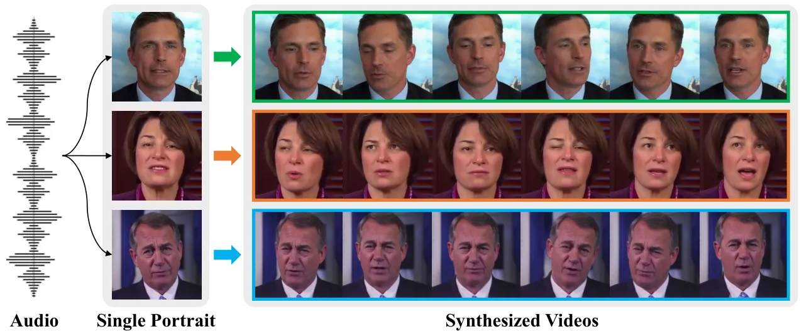
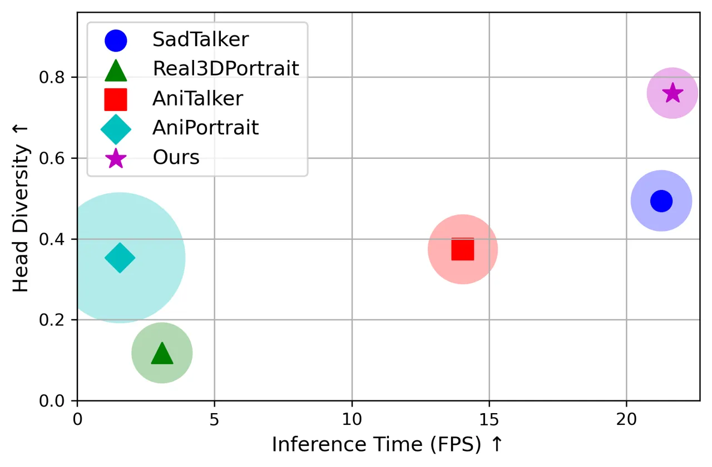
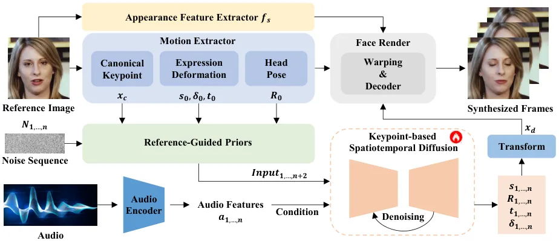
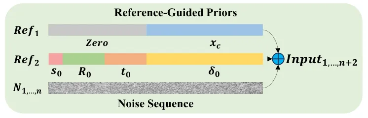
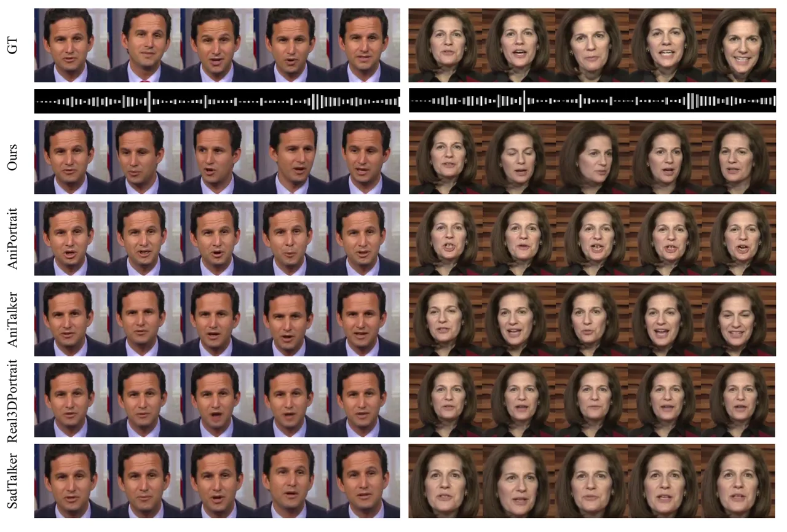
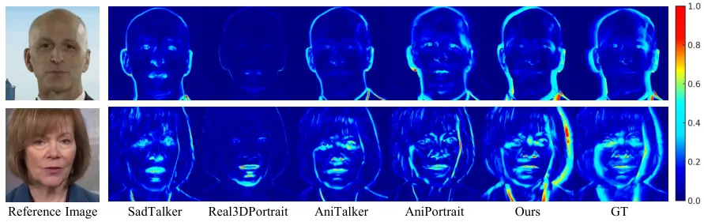

# Unlock Pose Diversity: Accurate and Efficient Implicit Keypoint-based Spatiotemporal Diffusion for Audio-driven Talking Portrait

Chaolong Yang Email: <Chaolong.Yang@liverpool.ac.uk>
Affiliation: Department of Computer Science, University of Liverpool,
Liverpool, L69 7ZX, UK Affiliation: Department of Mechatronics and
Robotics, Xi’an Jiaotong-Liverpool University, Suzhou, 215123, China   
Kai Yao Email: <jiumo.yk@antgroup.com> Affiliation: Ant Group, Hangzhou,
310000, China    Yuyao Yan Email: <yuyao.yan@xjtlu.edu.cn>
Affiliation: School of Robotic, Xi’an Jiaotong-Liverpool University,
Suzhou, 215123, China    Chenru Jiang
Email: <Chenru.Jiang@dukekunshan.edu.cn> Affiliation: Digital Innovation
Research Center, Duke Kunshan University, Kunshan, 215316, China   
Weiguang Zhao Email: <Weiguang.Zhao@liverpool.ac.uk>
Affiliation: Department of Computer Science, University of Liverpool,
Liverpool, L69 7ZX, UK Affiliation: Department of Foundational
Mathematics, Xi’an Jiaotong-Liverpool University, Suzhou, 215123, China
   Jie Sun Email: <Jie.Sun@xjtlu.edu.cn> Affiliation: Department of
Mechatronics and Robotics, Xi’an Jiaotong-Liverpool University, Suzhou,
215123, China    Guangliang Cheng
Email: <Guangliang.Cheng@liverpool.ac.uk> Affiliation: Department of
Computer Science, University of Liverpool, Liverpool, L69 7ZX, UK   
Yifei Zhang Email: <yifei.zhang@cn.ricoh.com> Affiliation: Ricoh
Software Research Center, Beijing, 100027, China    Bin Dong
Email: <bin.dong@dukekunshan.edu.cn> Affiliation: Digital Innovation
Research Center, Duke Kunshan University, Kunshan, 215316, China   
Kaizhu Huang Email: <Kaizhu.Huang@dukekunshan.edu.cn>
Affiliation: Digital Innovation Research Center, Duke Kunshan
University, Kunshan, 215316, China

###### Abstract

Audio-driven single-image talking portrait generation plays a crucial
role in virtual reality, digital human creation, and filmmaking.
Existing approaches are generally categorized into keypoint-based and
image-based methods. Keypoint-based methods effectively preserve
character identity but struggle to capture fine facial details due to
the fixed points limitation of the 3D Morphable Model. Moreover,
traditional generative networks face challenges in establishing
causality between audio and keypoints on limited datasets, resulting in
low pose diversity. In contrast, image-based approaches produce
high-quality portraits with diverse details using the diffusion network
but incur identity distortion and expensive computational costs. In this
work, we propose KDTalker, the first framework to combine unsupervised
implicit 3D keypoint with a spatiotemporal diffusion model. Leveraging
unsupervised implicit 3D keypoints, KDTalker adapts facial information
densities, allowing the diffusion process to model diverse head poses
and capture fine facial details flexibly. The custom-designed
spatiotemporal attention mechanism ensures accurate lip synchronization,
producing temporally consistent, high-quality animations while enhancing
computational efficiency. Experimental results demonstrate that KDTalker
achieves state-of-the-art performance regarding lip synchronization
accuracy, head pose diversity, and execution efficiency. Our codes are
available at
[https://github.com/chaolongy/KDTalker](https://github.com/chaolongy/KDTalker).

###### keywords

Talking Portrait Generation, Audio-driven, Spatiotemporal Diffusion,
Diversity Pose

^(†)^(†)equal-contributors: These authors contributed equally to this
work.^(†)^(†)equal-contributors: These authors contributed equally to
this work.

## 1 Introduction

The generation of natural and dynamic talking portraits has wide-ranging
applications in computer vision and digital content creation, such as
virtual reality, digital human creation, and film and television
production. Creating realistic talking head videos requires precise lip
synchronization and natural pose variations, which has been a
challenging task. Early research Suwajanakorn et al. (2017); KR et al.
(2019); Prajwal et al. (2020); Cheng et al. (2022) primarily focused on
lip synchronization, but by neglecting the diversity of head movements
and facial expressions, these methods often produced stiff animations
that lacked realism. As technology has advanced, researchers have
increasingly recognized that relying solely on lip movements is
insufficient to meet the demand for realism, leading to more
comprehensive exploration of facial animation, including head poses, eye
movements, and facial expressions.



Figure 1: The proposed KDTalker: A keypoint-based spatiotemporal
diffusion framework that generates synchronized, high-fidelity talking
videos from audio and a single image, enhancing pose diversity and
expression detail with realistic, temporally consistent animations.

Previous approaches can be broadly categorized into keypoint-based and
image-based methods to address these challenges. Explicit keypoint-based
methods Zhang et al. (2023); Ye et al. (2024); Gururani et al. (2023),
such as SadTalker Zhang et al. (2023), rely on audio to predict a 3D
Morphable Model (3DMM) Blanz and Vetter (1999) representation, which is
mapped to unsupervised implicit 3D keypoints and input to a pre-trained
facial rendering to generate facial animations that preserve character
identity. Image-based methods Shen et al. (2023); Liu et al. (2024); Wei
et al. (2024) generate talking faces by directly training an image
generator, typically producing high-quality images thanks to powerful
pre-trained models such as Stable Diffusion Rombach et al. (2022).

However, keypoint-based methods struggle to capture subtle facial
movements, such as eye movement and frowning, due to the fixed nature of
traditional 3DMM keypoints, limiting the expression detail of the
generated animations. Additionally, these methods use conventional
generative networks like Variational Autoencoders (VAEs) Kingma (2013)
and Generative Adversarial Networks (GANs) Goodfellow et al. (2020),
which fail to effectively model the causal relationship between audio
and key points on limited datasets, leading to poor diversity. On the
other hand, image-based methods demand significant computational
resources, and the image diffusion process considerably slows down
generation speed, hindering real-time application. Moreover, while these
methods excel in detail, they often suffer from identity distortion,
leading to a loss of character features in the generated faces. Notably,
even latent-space approaches like VASA-1 Xu et al. (2024) sacrifice
explicit head pose control for implicit motion modeling, limiting motion
flexibility.

To generate more nuanced facial expressions and diverse head poses while
maintaining efficiency, we propose a novel implicit keypoint-based
spatiotemporal diffusion framework, KDTalker. This model uniquely
combines the flexibility of unsupervised implicit 3D keypoint-driven
methods with the diversity capabilities of diffusion models. KDTalker
predicts unsupervised implicit 3D deformation keypoints and
transformation parameters from audio, capturing variations in lip
movements, facial expressions, and head poses. These transformed
keypoints are used for facial rendering to match the dynamics of the
audio sequence. Unlike traditional 3DMM, our model does not rely on
fixed keypoint positions. Instead, the learned keypoints can adapt to
varying facial information densities, allowing for a flexible capture of
subtle motion details through the diffusion process, significantly
enhancing the expressiveness of the generated results. Additionally,
KDTalker incorporates a spatiotemporal attention mechanism to capture
long-range dependencies between audio and 3D keypoint mappings, ensuring
that the generated animations are not only natural and smooth but also
precisely synchronized with the audio.

In summary, our KDTalker framework differs from previous works in three
key aspects. First, unlike explicit keypoint-based methods Zhang et al.
(2023); Ye et al. (2024); Gururani et al. (2023) that rely on fixed 3DMM
keypoints or landmarks, our unsupervised implicit keypoints dynamically
adapt to facial feature densities, enabling flexible motion capture via
diffusion modeling. This removes the rigidity of predefined keypoints
and simplifies processing. Second, while conventional keypoint-driven
approaches use VAEs/GANs Kingma (2013); Goodfellow et al. (2020), our
spatiotemporal diffusion model enhances expressiveness by modeling
causal audio-to-keypoint relationships. Third, compared to non-keypoint
image-based methods Shen et al. (2023); Liu et al. (2024); Wei et al.
(2024), which suffer from high computational costs and identity
distortion, KDTalker achieves efficient, real-time generation while
preserving identity through keypoint-guided rendering. Additionally, our
framework offers explicit control over head poses, overcoming the motion
constraints of latent-space methods like VASA-1 Xu et al. (2024). This
integration of implicit keypoints and diffusion modelling achieves
higher lip synchronization accuracy, richer head poses diversity and
more efficient generation speed, as shown in Fig. 2. The results of pose
diversity in the video generated by KDTalker can be seen in Fig. 1. Our
contribution is threefold:

- •
  We propose a novel implicit keypoint-diffusion-based audio-driven
  talking portrait framework, named KDTalker, that utilizes
  spatiotemporal-aware attention to capture long-term dependencies
  between keypoints and audio, allowing for more accurate and
  contextually aligned facial movements.
- •
  We are the first to integrate unsupervised implicit 3D keypoint-driven
  methods with diffusion models, significantly improving head pose and
  facial expression diversity while maintaining efficient computational
  performance suitable for real-time applications.
- •
  Experimental results demonstrate that KDTalker achieves
  state-of-the-art performance in lip synchronization accuracy, head
  poses diversity and generation speed.



Figure 2: Inference Time vs Head Diversity $`\&`$ LSE-D. The value of
LSE-D (Lip Sync Error Distance), a metric quantifying the alignment
between lip movements and audio, is represented by the size of the
circle. A smaller circle indicates a lower LSE-D value, reflecting
better lip sync performance.

## 2 Related Work

### 2.1 Audio-driven One-shot Talking Portrait

Early research Suwajanakorn et al. (2017); KR et al. (2019); Cheng
et al. (2022); Prajwal et al. (2020) primarily focused on generating
accurate lip-synced talking portrait videos from audio. However, these
methods often had limitations, leading to fixed head movements that
concentrated mainly on mouth motion, restricting overall realism. With
the advent of deep learning, attention shifted to more comprehensive
models that could capture not only mouth movements but also natural head
poses and facial expressions, providing a more realistic depiction.
Current approaches can be broadly divided into keypoint-based Chen
et al. (2019); Zhou et al. (2020); Ren et al. (2021); Zhang et al.
(2021); Zhang et al. (2023) and image-based Shen et al. (2023); Ma
et al. (2023); Liu et al. (2024); Wei et al. (2024); Kim et al. (2024);
Tian et al. (2024); Xu et al. (2024) methods.

Previous keypoint-based methods primarily rely on supervised keypoints,
such as 3DMM Ren et al. (2021); Zhang et al. (2021); Zhang et al. (2023)
or facial landmarks Chen et al. (2019); Zhou et al. (2020); Gururani
et al. (2023), which map audio features to predefined keypoints for
lips, blinks, and head poses. Although 3DMM provides a structured 3D
parameterization, its fixed keypoint configuration constrains the
capture of fine facial details and nuanced expressions. For instance,
SadTalker Zhang et al. (2023) employs unsupervised implicit 3D keypoints
in the final rendering stage while it is fundamentally based on initial
3DMM mappings, thus inheriting the limitations of supervised 3DMM
models. Furthermore, SPACE Gururani et al. (2023) rely on predefined
explicit keypoints as intermediate representations, limiting their
flexibility. In contrast, KDTalker directly predicts implicit keypoints
from audio, significantly simplifying intermediate processing. The
distances and distribution relationships among the unsupervised implicit
3D keypoints dynamically adapt to facial feature density, enabling
flexible control of expression details and head motion amplitude.

Image-based approaches Shen et al. (2023); Liu et al. (2024); Wei et al.
(2024) typically rely on pre-trained image generators, such as Stable
Diffusion Rombach et al. (2022), to directly generate facial frames,
often yielding high-quality images with detailed textures. Further
research has focused on enhancing generation quality Ma et al. (2023);
Kim et al. (2024); Tian et al. (2024). However, these methods are
computationally demanding and require considerable inference time due to
the image generation process, making real-time application challenging.
Additionally, while these methods produce high visual fidelity, they
tend to suffer from identity distortion, causing a loss of consistency
in character features across frames. Specifically, VASA-1 Xu et al.
(2024) adopts an implicit latent space to model audio-driven motion,
which restricts direct control over the generated character’s head pose
and movement amplitude. In contrast, our KDTalker framework leverages
transformation parameters, allowing for more control over head posture,
thereby offering greater flexibility in pose adjustment.

### 2.2 Video-driven One-shot Talking Portrait

Video-driven one-shot talking portrait synthesis involves transferring
the motion from a driving video to a target portrait, aiming to
reproduce the head movements, expressions, and lip-sync from the source
in the target. Video-driven methods focus on motion transfer within the
same domain (video-to-video), making the task relatively easier compared
to audio-driven methods. Researchers have extensively explored this
field by learning intermediate motion representations, such as
unsupervised landmarks Siarohin et al. (2019); Wang et al. (2021); Hong
et al. (2022); Wang et al. (2022); Zhao and Zhang (2022); Guo et al.
(2024), 3DMM Ren et al. (2021); Doukas et al. (2021); Yin et al. (2022),
and latent animations Wang et al. (2022); Mallya et al. (2022). Our
approach, KDTalker, leverages the latest video-driven method,
LivePortrait Guo et al. (2024), to generate implicit unsupervised 3D
keypoints. We then train a keypoint-based spatiotemporal diffusion model
using these keypoints. During inference, KDTalker predicts implicit
unsupervised 3D keypoints from the input reference image and audio, fed
into LivePortrait for rendering and video generation. This approach
effectively bridges the gap between video-driven and audio-driven tasks,
ensuring the natural synchronization of facial movements with the audio.

## 3 Method



Figure 3: Overview of the proposed KDTalker for talking portrait
synthesis.

### 3.1 Overview

As illustrated in Fig. 3, our framework generates talking head videos by
using unsupervised 3D facial keypoints as an intermediate
representation. The process begins with the motion extractor extracting
motion information from the reference image, while the audio encoder
extracts audio features to serve as conditions for the diffusion model.
Next, the Reference-Guided Priors module integrates this motion
information with a noise sequence, preparing the input for the model.
The Keypoint-based Spatiotemporal Diffusion module then uses this input
and audio feature to predict expression deformation keypoints
$`\delta`$, scaling and translation parameters $`s`$ and $`t`$, as well
as head rotation $`R`$. Finally, the predicted values ($`s`$, $`R`$,
$`t`$, $`\delta`$) are transformed into driving keypoints $`x_{d}`$,
which are passed to the Face Render module. Through warping and
decoding, this module generates $`N`$ video frames, producing a
lifelike, synchronized animation that aligns with the input audio. Each
component is detailed further in the following sections: audio and image
processing in Sec. 3.2, reference-guided priors in Sec. 3.3,
keypoint-based spatiotemporal diffusion in Sec. 3.4, and keypoint-driven
image animator in Sec. 3.5

### 3.2 Image and Audio Processing

The Motion Extractor module leverages the pre-trained LivePortrait Guo
et al. (2024) framework to derive critical elements from the reference
image. These include canonical keypoints that outline the fundamental
facial structure, expression deformation keypoints capturing nuanced
facial movements driven by speech and emotion, and head pose parameters
that denote head orientation. Through an unsupervised learning process,
LivePortrait generates flexible 3D keypoints without fixed positions,
allowing canonical keypoints to adapt across different reference images.
This flexibility enables the model to capture fine-grained expressions
and a wide range of head poses with greater accuracy. The Appearance
Feature Extractor extracts the appearance features of the reference
image $`f_{s}`$, preserving the visual identity of the subject in the
Face Render process. Together, these components ensure identity
retention and structural coherence in the generated videos.
Concurrently, the audio feature extraction module employs the
pre-trained Wav2Lip Prajwal et al. (2020) AudioEncoder to capture
audio-derived features, which serve as conditioning inputs for the
model.

### 3.3 Reference-Guided Priors

The Reference-Guided Priors module integrates motion information from
two key reference frames with a noise sequence to guide the generation
process, as shown in Fig. 4. Initially, the canonical keypoints
$`x_{c}`$ extracted from the reference image are used as the input for
the first frame, with zero-padding applied to align other parameters.
This setup provides the model with prior information on the facial
structure, ensuring the canonical keypoints serve as a foundation for
subsequent frames. In our ablation study, we demonstrate the importance
of this prior to achieving accurate lip synchronization. Specifically,
the expression deformation $`\delta_{0}`$ aligns with $`x_{c}`$, while
other parameters are aligned with zero-padding. These priors
($`Ref_{1}`$ & $`Ref_{2}`$) are then integrated with a noise sequence
$`N_{1,\ldots,n}`$ to construct the $`Input_{1,\ldots,n+2}`$ for the
diffusion model. By initializing the process with reference frames, the
model conditions the noise sequence on structured motion information,
enabling temporally coherent motion generation that aligns with the
original facial structure and adapts to the audio-driven dynamics.



Figure 4: Reference-Guided Priors.

### 3.4 Keypoint-based Spatiotemporal Diffusion

The Keypoint-based Spatiotemporal Diffusion module serves as the core
generative component, leveraging latent diffusion to predict motion
parameters that create realistic, temporally consistent talking head
animations. Given the structured priors and audio conditioning, the task
can be formally defined as learning a mapping
$`f:(x_{c},s_{0},R_{0},t_{0},\delta_{0},N_{1,\ldots,n},a_{1,\ldots,n})\rightarrow`$
$`(s,R,t,\delta)_{1,\ldots,n}`$. These inputs are iteratively denoised
by the diffusion model to obtain $`N`$-dimensional expression
deformation keypoints and transformation parameters. Subsequently, the
canonical keypoints $`x_{c}`$ are transformed according to the following
equation:

```math
x_{d}=s\cdot(x_{c}\cdot R+\delta)+t, \tag{1}
```

where $`x_{d}`$ represents the deformed keypoints.

#### 3.4.1 Diffusion Process

The forward diffusion process begins by initializing a latent variable
$`z_{0}`$ which encapsulates the facial features, including deformation
keypoints and transformation parameters. The model then introduces noise
progressively over $`T`$ steps to corrupt this latent representation.
This process can be mathematically expressed as:

```math
\displaystyle z_{t} \displaystyle=\sqrt{1-\beta_{t}}z_{t-1}+\sqrt{\beta_{t}}\epsilon_{t-1}, \tag{2}
```

```math
\displaystyle=\sqrt{\bar{\alpha_{t}}}z_{0}+\sqrt{1-\bar{\alpha_{t}}}\epsilon,
```

where $`\epsilon\sim N(0,I)`$, $`\beta_{t}`$ is the diffusion rate
corresponding to the $`t`$-th step in the increasing sequence with a
value range between (0, 1), and
$`\bar{\alpha_{t}}=\prod_{i=1}^{t}(1-\beta_{i})`$ is a parameter
expression defined based on the diffusion rate $`\beta_{t}`$.

In the context of our framework, the forward process is conditioned on
both the reference image and audio features. During training, the
reference-guided prior module adds noise to the real keypoints and
transformation parameters, and combines the motion information of the
reference image to form structured input. These structured input, along
with audio features, are then processed through the model to predict the
added noise.

The goal of training the diffusion model is to learn a reverse process
that reconstructs the original latent representation $`z_{0}`$ from the
noisy latent variables $`z_{t}`$. This reverse process is modelled by a
neural network $`\epsilon_{\theta}`$, which attempts to predict the
noise added at each timestep $`t`$. In particular, $`\epsilon_{\theta}`$
here refers to our spatiotemporal-aware attention network. The
corresponding loss function for training is the mean squared error (MSE)
between the predicted noise and the actual noise $`\epsilon_{t}`$:

```math
\pounds(\theta)=\mathbb{E}_{t,z_{t},a,\theta}[\left\|\epsilon_{t}-\epsilon_{\theta}(z_{t},a,t)\right\|_{2}^{2}], \tag{3}
```

where $`\epsilon_{\theta}(z_{t},a,t)`$ is the model’s prediction of the
noise added at time $`t`$, $`a`$ denotes the extracted audio features.

During inference, starting from a Gaussian noise $`z_{t}`$, the model
iteratively applies the reverse diffusion process to denoise $`z_{t}`$
and recover the original latent variable $`z_{0}`$. In our work,
$`z_{0}`$ refers to deformation keypoints $`\delta`$, and transformation
parameters ($`s`$, $`R`$, $`t`$). This reverse process can be described
as:

```math
z_{t-1}=z_{t}-\beta_{t}\epsilon_{\theta}(z_{t},a,t)+\sigma_{t}\epsilon, \tag{4}
```

where $`\sigma_{t}`$ adjusts the noise variance at each step,
controlling the amount of added noise and $`\epsilon`$ is sampled from a
Gaussian distribution, introducing random variability into the process.

#### 3.4.2 Spatiotemporal-Aware Attention Network

The Spatiotemporal-Aware Attention Network is designed to maintain both
spatial coherence in facial regions and temporal consistency in motion,
ensuring that keypoints evolve smoothly across frames while
synchronizing with audio input. As illustrated in Fig. 5, this attention
network integrates spatial and temporal information directly within the
diffusion process to achieve coordinated and realistic motion of facial
keypoints. The network consists of several key components:

Figure 5: Spatiotemporal-Aware Attention Network.

#### Timestep and Audio Feature Integration

In each diffusion step, the sampling timestep is encoded by a Time MLP
module to generate a temporal embedding vector, which is combined with
audio features. This combined vector serves as a conditional input to
the diffusion model, facilitating audio-driven learning that captures
both temporal progression and spatial variations of facial keypoints.

#### ResNet Blocks for Connection

The timestep and audio features are processed through a linear layer to
produce Scale and Shift embeddings, which are then applied to the
combined input generated by the Reference-Guided Priors module. By
applying the Scale and Shift transformations, a link is established
between audio-driven cues and spatiotemporal keypoint adjustments. This
transformed input is subsequently passed through the
Spatiotemporal-Aware Attention Network via a residual connection,
preserving essential characteristics from the original integrated input.

#### Spatiotemporal-Aware Self-Attention

Spatiotemporal-Aware Attention Network integrates a self-attention
mechanism that ensures coherence across spatial and temporal dimensions,
aligning predicted motion keypoints with audio cues while capturing
dependencies across frames. This mechanism introduces a spatiotemporal
bias to emphasize both recent frame transitions and spatial consistency
within each frame, ensuring fluid motion progression. Intermediate
features from ResNet blocks are projected into query, key, and value
vectors ($`Q,K,V`$), which are further enriched with spatial-temporal
positional encodings to capture dynamic, time-sensitive patterns. The
resulting embeddings enable the model to interpret relationships across
time points and spatial regions in sync with audio rhythm. Attention
weights are derived by computing the dot product of the encoded $`Q`$
and $`K`$ vectors, followed by softmax normalization, and applied to the
$`V`$ vectors in a weighted summation. Residual connections preserve
original feature information, yielding refined motion keypoints aligned
with the temporal structure and spatial details driven by audio. We
verified the importance of this attention mechanism in ensuring lip
synchronization and video smoothness in ablation experiments.

### 3.5 Face Render

The face rendering component synthesizes the final talking head
animation by using motion keypoints and transformation parameters
predicted by the Keypoint-based Spatiotemporal Diffusion model, along
with appearance features from the reference image. These appearance
features, encapsulating the subject’s identity and texture, maintain the
visual fidelity of the animated face. Meanwhile, the motion keypoints
drive audio-synchronized facial expressions, lip movements, and head
poses. Rendering is achieved through the LivePortrait Guo et al. (2024)
warping and decoder modules, which deform the facial structure and
reconstruct the visual details frame-by-frame to produce high-quality,
synchronized video aligned with the input audio.

## 4 Experiments

### 4.1 Experiments Setup

#### Datasets

The proposed model were trained on the VoxCeleb dataset Nagrani et al.
(2019), which includes over 100,000 video clips of 1,251 subjects. Due
to misalignments in some video and audio pairs within VoxCeleb, 4,282
aligned video-audio pairs were selected in the training stage. Following
the image animation method Siarohin et al. (2019), we cropped the
original videos and resized them to 256×256. Audio inputs were
downsampled to 16k Hz and converted to the mel-spectrogram features,
following the settings in Wav2lip Prajwal et al. (2020). For evaluation,
the first 8 seconds of 349 videos from the HDTF dataset Zhang et al.
(2021) were used, with the first frame of each video serving as the
reference image for video generation.

#### Evaluation Metric

The effectiveness of our method was demonstrated through several widely
recognized evaluation metrics. For lip synchronization and mouth shape
accuracy, we used perceptual metrics from Wav2Lip Prajwal et al. (2020),
specifically the distance score (LSE-D) and confidence score (LSE-C). To
analyze head motion, we assessed the diversity of generated motions by
calculating the standard deviation of head motion feature embeddings
extracted from the generated frames using Hopenet Ruiz et al. (2018).
Additionally, we evaluated the quality of generated frames with Frechet
Inception Distance (FID) Heusel et al. (2017) for frame realism and
cumulative probability blur detection (CPBD) Narvekar and Karam (2011)
for image sharpness. Identity preservation was assessed by computing the
cosine similarity (CSIM) between identity embeddings of source images
and generated frames, using ArcFace Deng et al. (2019) for embedding
extraction. Finally, we measured inference efficiency by reporting
Inference Time in frames per second (FPS), indicating the number of
frames generated per second.

#### Implementation Details

All experiments were conducted on a single NVIDIA GeForce RTX 4090. The
proposed KDTalker is an end-to-end model that requires only a single
training session, and the keypoint diffusion model consists of 42.93M
parameters. Furthermore, The diffusion timesteps are set to 1,000 during
the training phase, while DDIM Song et al. (2021) is employed for faster
inference with 50 steps. The model processed 64 audio frames per pass,
with a generated image resolution of 512x512. The experiments utilized
the AdamW optimizer Kingma (2014) with a learning rate schedule that
includes Warmup and cosine annealing, where the rate initially increases
linearly to 5.12$`e^{-4}`$ before decaying. Additionally, the batch size
for experiments was set to 256. Finally, the unsupervised motion
keypoints and parameters in our training data were extracted using the
pre-trained video-driven method LivePortrait Guo et al. (2024).

### 4.2 Comparison with the SOTA Methods

The proposed method was compared with several state-of-the-art
approaches for audio-driven talking portrait generation, including
keypoint-based methods like SadTalker Zhang et al. (2023) and
Real3DPortrait Ye et al. (2024), as well as image-based approaches like
AniTalker Liu et al. (2024) and AniPortrait Wei et al. (2024). All the
methods are compared quantitatively and qualitatively.

#### Quantitative Comparison

As shown in Table 1, the proposed method outperforms existing methods in
lip synchronization, head motion diversity, video quality, and inference
speed. Specifically, it achieves the highest LSE-C and lowest LSE-D,
demonstrating superior lip-sync accuracy, closely matching real video
performance. In head motion, our method demonstrates the highest
diversity attributed to its powerful generative capabilities with
unsupervised keypoints. Though our method may generate an even higher
diversity than that of real video, it leads to the smallest diversity
difference. For video quality, our CPBD achieves a performance
comparable to SadTalker, while AniPortrait achieves the highest CPBD
thanks to Stable Diffusion Rombach et al. (2022) but has the slowest
inference speed. Nevertheless, our best FID and CSIM scores highlight
the superior visual quality and structural accuracy of our output.
Furthermore, our inference speed reaches 21.678 FPS, demonstrating its
suitability for real-time applications. These results demonstrate our
model’s superiority over state-of-the-art methods.

|                                 |          |                     |                      |                        |                    |                   |                   |                  |
| ------------------------------- | -------- | ------------------- | -------------------- | ---------------------- | ------------------ | ----------------- | ----------------- | ---------------- |
| Method                          | Venue    | Lip Synchronization |                      | Head Motion            | Video Quality      |                   |                   | Inference Time   |
|                                 |          | LSE-C $`\uparrow`$  | LSE-D $`\downarrow`$ | Diversity $`\uparrow`$ | FID $`\downarrow`$ | CPBD $`\uparrow`$ | CSIM $`\uparrow`$ | FPS $`\uparrow`$ |
| Real Video                      | \-       | 8.243               | 6.929                | 0.639                  | 0.000              | 0.353             | 1.000             | 25               |
| SadTalker Zhang et al. (2023)   | CVPR’23  | 7.121               | 7.813                | 0.494                  | 12.701             | 0.280             | 0.929             | 21.277           |
| Real3DPortrait Ye et al. (2024) | ICLR’24  | 7.004               | 7.804                | 0.118                  | 17.428             | 0.239             | 0.937             | 3.092            |
| AniTalker Liu et al. (2024)     | MM’24    | 7.107               | 8.077                | 0.374                  | 10.244             | 0.305             | 0.893             | 14.045           |
| AniPortrait Wei et al. (2024)   | ArXiv’24 | 3.438               | 10.946               | 0.353                  | 14.480             | 0.401             | 0.928             | 1.555            |
| Ours                            | -        | 7.326               | 7.548                | 0.760                  | 9.756              | 0.277             | 0.949             | 21.678           |

Table 1: Quantitative comparison with the state-of-the-art methods on
HDTF dataset.

#### Qualitative Comparison

Qualitative visual results of various methods are provided, as shown in
Fig. 6. In addition, we also provide the GT results under the
corresponding audio frames to visualize the lip synchronization of our
method. As can be seen from the figure, our method has lip movements
similar to the GT video, but has richer head movements. The head
movement range of all the competitors is relatively small and lacks
diversity. To further verify the head diversity of our method, the
motion heatmaps of various methods were calculated and shown in Fig. 7.
In addition, AniPortrait’s lips are distorted, resulting in poor lip
synchronization performance. Please refer to our supplementary videos
for a clearer comparison.



Figure 6: Qualitative comparison with the state-of-the-art methods on
HDTF dataset.



Figure 7: Qualitative comparison of head motion diversity between
existing methods and our proposed approach.

### 4.3 User Studies

A user study was conducted to evaluate the performance of all methods.
We selected 20 sample images and corresponding audio from the HDTF
dataset as tests. These reference sample images contain different
genders, ages, expressions, poses, and backgrounds to show the
robustness of our method. The study involved 20 participants, who were
asked to subjectively evaluate and select the best-performing method for
each sample on each criterion, which included: lip synchronization, the
diversity of head motion and overall naturalness. In particular, the
participants comprised 13 males and 7 females with diverse professional
backgrounds, including doctors, algorithm researchers, product managers,
engineers, quality inspectors, and students of different grades. To
eliminate any potential bias caused by the order of presentation, the
sequence of methods in the comparative videos was randomized for each
sample, ensuring the authenticity and fairness of the evaluations.

The results are shown in Table 2. In terms of the three dimensions,
participants prefer our generated videos. It is worth noting that the
overall naturalness scores of 0% for AniPortrait Wei et al. (2024) and
Real3DPortrait Ye et al. (2024) can be attributed to different issues.
AniPortrait Wei et al. (2024) has obvious lip distortion, while
Real3DPortrait Ye et al. (2024) suffers from fixed poses. More user
study details can be seen in the supplemental material.

|                                 |       |           |             |
| ------------------------------- | ----- | --------- | ----------- |
| Method                          | Lip   | Head      | Overall     |
|                                 | Sync. | Diversity | Naturalness |
| SadTalker Zhang et al. (2023)   | 14.5% | 22.8%     | 15.8%       |
| Real3DPortrait Ye et al. (2024) | 3.8%  | 0.5%      | 0.0%        |
| AniTalker Liu et al. (2024)     | 39.0% | 13.0%     | 38.5%       |
| AniPortrait Wei et al. (2024)   | 2.0%  | 2.0%      | 0.0%        |
| Ours                            | 40.7% | 61.7%     | 45.7%       |

Table 2: User study showing the percentage of participants who selected
a method as the best across three evaluation dimensions.

### 4.4 Analytical Experiments

#### 4.4.1 Ablation Study for Main Components

First, we verify the important role of the typical key point $`x_{c}`$
in the reference image. As shown in Table 3, removing $`x_{c}`$ reduces
lip synchronization by approximately 8%, as $`x_{c}`$ offers crucial
prior keypoint information.

The Spatiotemporal-Aware Attention module captures temporal dependencies
between frames by modeling their sequential relationships through Rotary
Position Embedding, thereby establishing proximity relationships between
frames. This design enables the model to simultaneously address
short-term dynamics and long-term temporal evolution, rather than
treating all video frames as independent inputs. Excluding the
spatiotemporal attention mechanism causes a sharp drop in lip
synchronization, resulting in excessive and incoherent head movements
that lead to abnormally high head motion diversity. We observed that lip
synchronization is stable for frontal head poses but declines
significantly with larger head movements (e.g., profiles or side views).
To validate the advantages of RoPE, we conducted additional ablation
studies, as shown in Table 3. The results show that RoPE significantly
enhances lip synchronization (higher LSE-C, lower LSE-D) and head motion
diversity compared to vanilla self-attention.

Overall, our method effectively balances coherent and naturally diverse
head movements with strong lip synchronization, demonstrating the
advantages of incorporating RoPE and spatiotemporal attention in
generating high-quality talking head videos.

| Method                  | Lip Synchronization |                      | Head Motion            |
| ----------------------- | ------------------- | -------------------- | ---------------------- |
|                         | LSE-C $`\uparrow`$  | LSE-D $`\downarrow`$ | Diversity $`\uparrow`$ |
| w/o Reference $`x_{c}`$ | 6.656               | 8.203                | 0.791                  |
| w/o Attention           | 1.360               | 11.777               | 2.292                  |
| w/o RoPE                | 7.225               | 7.663                | 0.706                  |
| Ours Full               | 7.326               | 7.548                | 0.760                  |

Table 3: Ablation study for main components in proposed method.

#### 4.4.2 Comparison of Generative Methods

To demonstrate the advantages of diffusion models, we compared our model
with versions that replace the generator with VAE Kingma (2013) and
GAN Goodfellow et al. (2020), keeping the overall architecture
unchanged. As shown in Table 4, the VAE model achieves diverse head
movements but lacks accurate lip-audio synchronization, while GAN
suffers from convergence issues, leading to distorted outputs. The
combined VAE+GAN approach, similar to SadTalker, shows some audio-to-lip
mapping but fails to maintain temporal consistency in head movements,
resulting in unconvincing outputs. In contrast, the diffusion-based
method achieves superior synchronization and coherent, naturally diverse
head poses, demonstrating its effectiveness for high-quality talking
portrait generation.

|                                                  |                     |                      |                        |
| ------------------------------------------------ | ------------------- | -------------------- | ---------------------- |
| Method                                           | Lip Synchronization |                      | Head Motion            |
|                                                  | LSE-C $`\uparrow`$  | LSE-D $`\downarrow`$ | Diversity $`\uparrow`$ |
| VAE Kingma (2013)                                | 0.665               | 13.879               | 0.846                  |
| GAN Goodfellow et al. (2020)                     | \-                  | \-                   | \-                     |
| VAE Kingma (2013) + GAN Goodfellow et al. (2020) | 1.232               | 13.284               | 0.876                  |
| Diffusion (Ours)                                 | 7.326               | 7.548                | 0.760                  |

Table 4: Comparison of our model with different generators

#### 4.4.3 Ablation of Face Render

High-quality face render is crucial for generating realistic and
engaging animated videos, as it directly affects both the visual
authenticity and the coherence of facial movements. We compared
Face-vid2vid Wang et al. (2021) and LivePortrait Guo et al. (2024)
across key dimensions such as lip synchronization and overall video
quality to evaluate the effectiveness of different face rendering
methods. As shown in Table 5, LivePortrait demonstrates distinct
advantages in capturing accurate lip movements and enhancing visual
authenticity through a greater number of unsupervised keypoints, which
allow it to represent facial details more precisely. Although
Face-vid2vid performs slightly better in certain video quality metrics
like image clarity, LivePortrait’s marginally lower scores do not
significantly impact its overall output. The slight trade-off in
sharpness is offset by LivePortrait’s superior lip synchronization and
structural realism, making it highly effective for producing lifelike
animated portraits.

| Method                  | Points | Lip Synchronization |                      | Video Quality      |                   |                   |
| ----------------------- | ------ | ------------------- | -------------------- | ------------------ | ----------------- | ----------------- |
|                         |        | LSE-C $`\uparrow`$  | LSE-D $`\downarrow`$ | FID $`\downarrow`$ | CPBD $`\uparrow`$ | CSIM $`\uparrow`$ |
| F.V. Wang et al. (2021) | 15     | 5.579               | 9.228                | 8.625              | 0.307             | 0.940             |
| L.P. Guo et al. (2024)  | 21     | 7.326               | 7.548                | 9.756              | 0.277             | 0.949             |

Table 5: Ablation of Face Render. F.V. denotes Face-vid2vid, while L.P.
stands for LivePortrait, which is used in our method.

#### 4.4.4 Ablation of Inference Step

To balance performance and efficiency during inference, we conducted an
ablation study to explore the impact of different sampling steps when
using the DDIM strategy. Table 6 shows the results, focusing on lip
synchronization and video quality. The findings show that increasing the
number of steps initially improves both metrics, particularly from 1 to
5 steps, but further increases yield diminishing returns. The best video
quality, reflected in the lowest FID, is observed at 50 steps, while
CPBD and CSIM remain consistently high. Although fewer steps slightly
enhance lip synchronization, 50 steps provide the optimal balance
between quality, synchronization, and computational cost. This motivated
our decision to use 50 steps for inference to achieve efficient and
high-quality results.

| Step | Lip Synchronization |                      | Video Quality      |                   |                   |
| ---- | ------------------- | -------------------- | ------------------ | ----------------- | ----------------- |
|      | LSE-C $`\uparrow`$  | LSE-D $`\downarrow`$ | FID $`\downarrow`$ | CPBD $`\uparrow`$ | CSIM $`\uparrow`$ |
| 1    | 0.817               | 12.630               | 19.058             | 0.262             | 0.823             |
| 5    | 7.455               | 7.424                | 10.226             | 0.277             | 0.949             |
| 10   | 7.448               | 7.436                | 9.939              | 0.278             | 0.948             |
| 20   | 7.394               | 7.501                | 9.797              | 0.277             | 0.945             |
| 50   | 7.326               | 7.548                | 9.756              | 0.277             | 0.949             |
| 100  | 7.264               | 7.614                | 9.987              | 0.277             | 0.948             |
| 200  | 7.221               | 7.633                | 9.901              | 0.277             | 0.948             |

Table 6: Ablation of inference step

#### 4.4.5 Ablation of Frame Number

To improve video coherence, particularly in lip synchronization and head
motion, we explored the impact of different frame numbers. Table 7 shows
that increasing the number of frames generally improves lip
synchronization and head motion diversity, with 64 frames achieving the
best performance. Using 64 frames allows for better temporal
dependencies between frames, which helps achieve smoother transitions
and more natural motion. This results in improved lip synchronization
and head motion consistency, making 64 frames a favourable choice for
enhancing video quality and continuity.

| Frame Number | Lip Synchronization |                      | Head Motion            |
| ------------ | ------------------- | -------------------- | ---------------------- |
|              | LSE-C $`\uparrow`$  | LSE-D $`\downarrow`$ | Diversity $`\uparrow`$ |
| 8            | 6.875               | 7.928                | 0.673                  |
| 16           | 6.912               | 7.904                | 0.687                  |
| 32           | 7.256               | 7.636                | 0.686                  |
| 64           | 7.326               | 7.548                | 0.760                  |

Table 7: Ablation of frame number.

## 5 Conclusion

In this work, we presented KDTalker, a novel framework for generating
natural and dynamic talking portraits that effectively combines the
strengths of unsupervised 3D keypoint-driven animation with the
diversity capabilities of diffusion models. KDTalker addresses the
limitations of previous keypoint-based and image-based methods by
offering both high lip synchronization accuracy and rich head pose
diversity, which are essential for producing realistic and expressive
digital portraits. Unlike traditional 3DMM with fixed keypoints,
KDTalker adapts to varying facial information densities, capturing
nuanced expressions. It also integrates a spatiotemporal attention
mechanism to capture long-range audio-keypoint dependencies, ensuring
precise lip synchronization and coherent head poses that reflect speech
dynamics. Through extensive experiments, KDTalker achieves
state-of-the-art performance on multiple metrics, becoming a promising
solution for real-time applications.

#### Limitation

The KDTalker framework, while innovative, has limitations primarily
arising from its reliance on keypoint detection and transformation.
Since KDTalker relies on precise 3D keypoint detection for facial
rendering, noisy data or complex facial features can result in
misalignments and distortions in the animation. Additionally, the
framework struggles with occlusions, where parts of the face are blocked
by external objects. These occlusions can disrupt the keypoint
transformation process, resulting in artefacts such as blurred edges or
distorted features, particularly in areas crucial to facial expressions
like the eyes, mouth, and nose. These limitations underscore the
framework’s dependence on precise keypoint detection, which remains
vulnerable to errors in complex scenarios, impacting both the accuracy
and expressiveness of the generated animations.

## References

- Suwajanakorn et al. (2017) Suwajanakorn, S., Seitz, S.M.,
  Kemelmacher-Shlizerman, I.: Synthesizing obama: learning lip sync from
  audio. ACM TOG 36(4), 1–13 (2017)
- KR et al. (2019) KR, P., Mukhopadhyay, R., Philip, J., Jha, A.,
  Namboodiri, V., Jawahar, C.: Towards automatic face-to-face
  translation. In: ACM MM, pp. 1428–1436 (2019)
- Prajwal et al. (2020) Prajwal, K., Mukhopadhyay, R., Namboodiri, V.P.,
  Jawahar, C.: A lip sync expert is all you need for speech to lip
  generation in the wild. In: ACM MM, pp. 484–492 (2020)
- Cheng et al. (2022) Cheng, K., Cun, X., Zhang, Y., Xia, M., Yin, F.,
  Zhu, M., Wang, X., Wang, J., Wang, N.: Videoretalking: Audio-based lip
  synchronization for talking head video editing in the wild. In:
  SIGGRAPH ASIA, pp. 1–9 (2022)
- Zhang et al. (2023) Zhang, W., Cun, X., Wang, X., Zhang, Y., Shen, X.,
  Guo, Y., Shan, Y., Wang, F.: Sadtalker: Learning realistic 3d motion
  coefficients for stylized audio-driven single image talking face
  animation. In: CVPR, pp. 8652–8661 (2023)
- Ye et al. (2024) Ye, Z., Zhong, T., Ren, Y., Yang, J., Li, W., Huang,
  J., Jiang, Z., He, J., Huang, R., Liu, J., et al.: Real3d-portrait:
  One-shot realistic 3d talking portrait synthesis. In: ICLR (2024)
- Gururani et al. (2023) Gururani, S., Mallya, A., Wang, T.-C., Valle,
  R., Liu, M.-Y.: Space: Speech-driven portrait animation with
  controllable expression. In: ICCV, pp. 20914–20923 (2023)
- Blanz and Vetter (1999) Blanz, V., Vetter, T.: A morphable model for
  the synthesis of 3d faces. In: Proceedings of the 26th Annual
  Conference on Computer Graphics and Interactive Techniques, pp.
  187–194 (1999)
- Shen et al. (2023) Shen, S., Zhao, W., Meng, Z., Li, W., Zhu, Z.,
  Zhou, J., Lu, J.: Difftalk: Crafting diffusion models for generalized
  audio-driven portraits animation. In: CVPR, pp. 1982–1991 (2023)
- Liu et al. (2024) Liu, T., Chen, F., Fan, S., Du, C., Chen, Q., Chen,
  X., Yu, K.: Anitalker: Animate vivid and diverse talking faces through
  identity-decoupled facial motion encoding. In: ACM MM, pp.
  6696–6705 (2024)
- Wei et al. (2024) Wei, H., Yang, Z., Wang, Z.: Aniportrait:
  Audio-driven synthesis of photorealistic portrait animation. arXiv
  preprint arXiv:2403.17694 (2024)
- Rombach et al. (2022) Rombach, R., Blattmann, A., Lorenz, D., Esser,
  P., Ommer, B.: High-resolution image synthesis with latent diffusion
  models. In: CVPR, pp. 10684–10695 (2022)
- Kingma (2013) Kingma, D.P.: Auto-encoding variational bayes. arXiv
  preprint arXiv:1312.6114 (2013)
- Goodfellow et al. (2020) Goodfellow, I., Pouget-Abadie, J., Mirza, M.,
  Xu, B., Warde-Farley, D., Ozair, S., Courville, A., Bengio, Y.:
  Generative adversarial networks. Communications of the ACM 63(11),
  139–144 (2020)
- Xu et al. (2024) Xu, S., Chen, G., Guo, Y.-X., Yang, J., Li, C., Zang,
  Z., Zhang, Y., Tong, X., Guo, B.: Vasa-1: Lifelike audio-driven
  talking faces generated in real time. NeurIPS 37, 660–684 (2024)
- Chen et al. (2019) Chen, L., Maddox, R.K., Duan, Z., Xu, C.:
  Hierarchical cross-modal talking face generation with dynamic
  pixel-wise loss. In: CVPR, pp. 7832–7841 (2019)
- Zhou et al. (2020) Zhou, Y., Han, X., Shechtman, E., Echevarria, J.,
  Kalogerakis, E., Li, D.: Makelttalk: speaker-aware talking-head
  animation. ACM TOG 39(6), 1–15 (2020)
- Ren et al. (2021) Ren, Y., Li, G., Chen, Y., Li, T.H., Liu, S.:
  Pirenderer: Controllable portrait image generation via semantic neural
  rendering. In: ICCV, pp. 13759–13768 (2021)
- Zhang et al. (2021) Zhang, Z., Li, L., Ding, Y., Fan, C.: Flow-guided
  one-shot talking face generation with a high-resolution audio-visual
  dataset. In: CVPR, pp. 3661–3670 (2021)
- Ma et al. (2023) Ma, Y., Zhang, S., Wang, J., Wang, X., Zhang, Y.,
  Deng, Z.: Dreamtalk: When expressive talking head generation meets
  diffusion probabilistic models. arXiv preprint arXiv:2312.09767 (2023)
- Kim et al. (2024) Kim, S., Jin, S., Park, J., Kim, K., Kim, J., Nam,
  J., Kim, S.: Moditalker: Motion-disentangled diffusion model for
  high-fidelity talking head generation. arXiv preprint
  arXiv:2403.19144 (2024)
- Tian et al. (2024) Tian, L., Wang, Q., Zhang, B., Bo, L.: Emo: Emote
  portrait alive-generating expressive portrait videos with audio2video
  diffusion model under weak conditions. arXiv preprint
  arXiv:2402.17485 (2024)
- Siarohin et al. (2019) Siarohin, A., Lathuilière, S., Tulyakov, S.,
  Ricci, E., Sebe, N.: First order motion model for image animation.
  NeurIPS 32 (2019)
- Wang et al. (2021) Wang, T.-C., Mallya, A., Liu, M.-Y.: One-shot
  free-view neural talking-head synthesis for video conferencing. In:
  CVPR (2021)
- Hong et al. (2022) Hong, F.-T., Zhang, L., Shen, L., Xu, D.:
  Depth-aware generative adversarial network for talking head video
  generation. In: CVPR, pp. 3397–3406 (2022)
- Wang et al. (2022) Wang, S., Li, L., Ding, Y., Yu, X.: One-shot
  talking face generation from single-speaker audio-visual correlation
  learning. In: AAAI, vol. 36, pp. 2531–2539 (2022)
- Zhao and Zhang (2022) Zhao, J., Zhang, H.: Thin-plate spline motion
  model for image animation. In: CVPR, pp. 3657–3666 (2022)
- Guo et al. (2024) Guo, J., Zhang, D., Liu, X., Zhong, Z., Zhang, Y.,
  Wan, P., Zhang, D.: Liveportrait: Efficient portrait animation with
  stitching and retargeting control. arXiv preprint
  arXiv:2407.03168 (2024)
- Doukas et al. (2021) Doukas, M.C., Zafeiriou, S., Sharmanska, V.:
  Headgan: One-shot neural head synthesis and editing. In: ICCV, pp.
  14398–14407 (2021)
- Yin et al. (2022) Yin, F., Zhang, Y., Cun, X., Cao, M., Fan, Y., Wang,
  X., Bai, Q., Wu, B., Wang, J., Yang, Y.: Styleheat: One-shot
  high-resolution editable talking face generation via pre-trained
  stylegan. In: ECCV, pp. 85–101 (2022). Springer
- Wang et al. (2022) Wang, Y., Yang, D., Bremond, F., Dantcheva, A.:
  Latent image animator: Learning to animate images via latent space
  navigation. arXiv preprint arXiv:2203.09043 (2022)
- Mallya et al. (2022) Mallya, A., Wang, T.-C., Liu, M.-Y.: Implicit
  warping for animation with image sets. NeurIPS 35, 22438–22450 (2022)
- Nagrani et al. (2019) Nagrani, A., Chung, J.S., Xie, W., Zisserman,
  A.: Voxceleb: Large-scale speaker verification in the wild. Computer
  Science and Language 60, 101027 (2019)
- Ruiz et al. (2018) Ruiz, N., Chong, E., Rehg, J.M.: Fine-grained head
  pose estimation without keypoints. In: CVPRW, pp. 2074–2083 (2018)
- Heusel et al. (2017) Heusel, M., Ramsauer, H., Unterthiner, T.,
  Nessler, B., Hochreiter, S.: Gans trained by a two time-scale update
  rule converge to a local nash equilibrium. NeurIPS 30 (2017)
- Narvekar and Karam (2011) Narvekar, N.D., Karam, L.J.: A no-reference
  image blur metric based on the cumulative probability of blur
  detection (cpbd). IEEE TIP 20(9), 2678–2683 (2011)
- Deng et al. (2019) Deng, J., Guo, J., Xue, N., Zafeiriou, S.: Arcface:
  Additive angular margin loss for deep face recognition. In: CVPR, pp.
  4690–4699 (2019)
- Song et al. (2021) Song, J., Meng, C., Ermon, S.: Denoising diffusion
  implicit models. In: ICLR (2021)
- Kingma (2014) Kingma, D.P.: Adam: A method for stochastic
  optimization. arXiv preprint arXiv:1412.6980 (2014)
