# DiffPortrait360: Consistent Portrait Diffusion for 360 View Synthesis

Yuming Gu Affiliation: University of Southern California
Affiliation: MBZUAI Email: <heyuanli@link.cuhk.edu.cn>    Phong Tran
Affiliation: MBZUAI Email: <hao@hao-li.com>    Yujian Zheng
Affiliation: MBZUAI    Hongyi Xu Affiliation: ByteDance Inc.    Heyuan
Li Affiliation: The Chinese University of Hong Kong, Shenzhen    Adilbek
Karmanov Affiliation: MBZUAI    Hao Li Affiliation: MBZUAI
Affiliation: Pinscreen
Inc.[https://freedomgu.github.io/DiffPortrait360](https://freedomgu.github.io/DiffPortrait360)yuminggu@usc.edu,
{the.tran, yujian.zheng, adilbek.karmanov}@mbzuai.ac.ae

###### Abstract

Generating high-quality 360-degree views of human heads from single-view
images is essential for enabling accessible immersive telepresence
applications and scalable personalized content creation. While
cutting-edge methods for full head generation are limited to modeling
realistic human heads, the latest diffusion-based approaches for
style-omniscient head synthesis can produce only frontal views and
struggle with view consistency, preventing their conversion into true 3D
models for rendering from arbitrary angles. We introduce a novel
approach that generates fully consistent 360-degree head views,
accommodating human, stylized, and anthropomorphic forms, including
accessories like glasses and hats. Our method builds on the
DiffPortrait3D framework, incorporating a custom ControlNet for
back-of-head detail generation and a dual appearance module to ensure
global front-back consistency. By training on continuous view sequences
and integrating a back reference image, our approach achieves robust,
locally continuous view synthesis. Our model can be used to produce
high-quality neural radiance fields (NeRFs) for real-time,
free-viewpoint rendering, outperforming state-of-the-art methods in
object synthesis and 360-degree head generation for very challenging
input portraits.

![[Uncaptioned
image]](arxiv-2503-15667--6bd089350b02.figures/figure-1.webp)

Figure 1: Our DiffPortrait360 enables 360^(∘) view-consistent full-head
image synthesis. It is universally effective across a diverse range of
facial portraits, allowing for the creation of 3D-aware head portraits
from single-view images.

## 1 Introduction

In game, film, and animation production, CG characters are central to
the content creation pipeline, meticulously designed with the right
balance of realism and stylization to align with the narrative.
Multi-view stereo systems and 3D scanners are commonly used to
streamline the tedious manual process of creating realistic human
characters. However, stylized characters are still often 3D modeled from
scratch. Alongside the growing demand for efficient and scalable 3D
content production pipelines, immersive telepresence and virtual world
applications are fueling interest in embodying personalized or imaginary
characters created directly by end-users. In this context, highly
accessible 3D modeling tools that can generate characters from a single
photograph or drawing are becoming increasingly relevant.

The most widely adopted approaches for image-based full 3D head
reconstruction combine parametric models, like 3D Morphable Models
(3DMMs) \[37, 21, 54, 12, 52, 61, 31, 39, 22\], with data-driven hair
modeling or generate a single textured 3D mesh that includes both the
face and hair. These methods often struggle with diverse hairstyles and
capturing detailed appearance textures for the back of the head.
Cutting-edge 3D head reconstruction, utilizing transformer-based
networks \[51, 50, 49, 11, 10\] to estimate tri-plane representation,
have shown success in capturing complex portraits of human heads with
diverse hairstyles and accessories. However, tri-plane introduces strong
projection ambiguity for extreme non-frontal poses and therefore fails
to model 360-degree head. To facilitate the novel synthesis of full
360-degree views, tri-grid \[1\] neural volume representations have been
introduced. While these methods have demonstrated impressive results,
they are limited to realistic human heads and cannot handle stylized or
other anthropomorphic shapes.

The latest diffusion-based image-to-3D generation methods \[55, 29, 44\]
are designed to model a wide range of 3D objects. However, they struggle
to capture detailed, domain-specific appearances, such as those of human
heads and are prone to severe, unpredictable artifacts. A recent
diffusion model, DiffPortrait3D \[16\], demonstrates the capability to
generate novel views of style-omniscient heads by incorporating 3D-aware
noise for inference, and fine-tuning the model on a large 3D head
dataset. In addition to being limited to frontal views, this approach
also displays noticeable inconsistencies between angles.

We present the first method capable of generating consistent 360-degree
views from a single portrait of a head, accommodating human, stylized,
or animal anthropomorphic forms, as well as accessories like glasses
jewelries, or masks. Our novel views can be computed offline (5.6 sec
per view) and transformed into a high-quality neural radiance field
(NeRF) \[33\], enabling free-viewpoint rendering in real-time. Our
method is particularly robust, capable of handling a wide range of
subjects, complex hairstyles, varied head poses, and expressive facial
features, including detailed elements like tongues.

Building on the state-of-the-art DiffPortrait3D framework, we introduce
key innovations to support back-view renderings and achieve locally
continuous view consistency. We begin by generating the back of the head
from the input image using a custom ControlNet \[59\], trained
specifically to infer back-of-head details from a front-facing image.
This model is trained on a carefully curated dataset featuring diverse,
realistic, and stylized heads. The front and back images are then passed
into a dual appearance module (stable diffusion UNet), which extracts
appearance information from both perspectives to condition our main
image generator (stable diffusion denoising network) through attention
layers. Unlike DiffPortrait3D, our approach incorporates an additional
back reference image to improve global appearance consistency.
Furthermore, we ensure locally continuous view consistency by using
continuous view sequences (8 views) as conditions during training.
Unlike DiffPortrait3D, which is trained only on frontal 3D-aware head
generations, our approach utilizes a dataset comprising full 360-degree
views of human heads, with data that is both captured and synthetically
generated. Finally, our denoising process also uses a 3D-aware noise
which is initialized using a fine-tuned inversion process-based a
StyleGAN-based 360 head generator \[1\].

We demonstrate that diffusion models can generate highly detailed and
consistent 360-degree head views from in-the-wild images across an
extensive range of styles and complex portraits, handling challenging
lighting conditions, intricate hairstyles, diverse appearances, and
varying head poses. Our approach significantly outperforms all the
latest generative methods for our challenge human head benchmarks
generation, w.r.t. key metrics. More importantly, our method produces
globally consistent appearances for the back of the head and locally
view consistent synthesis when generating 360-degree views, which
enables us to reconstruct true 3D representations (e.g., NeRFs) for
free-view point rendering. We present the following contributions:

- •
  We present a novel method for $`360^{\circ}`$ view synthesis from a
  single style-omniscient portrait, which leverages priors from
  pre-trained stable diffusion models to generate view-consistent
  content.
- •
  We propose a dual appearance control module, supported by a
  diffusion-based back-view generator, that ensures global consistency
  in novel view synthesis around the subject.
- •
  We introduce a novel training strategy that employs view-consistent
  sequence generation to enhance continuity and smoothness, utilizing a
  3D head dataset composed of both captured and synthetic subjects.

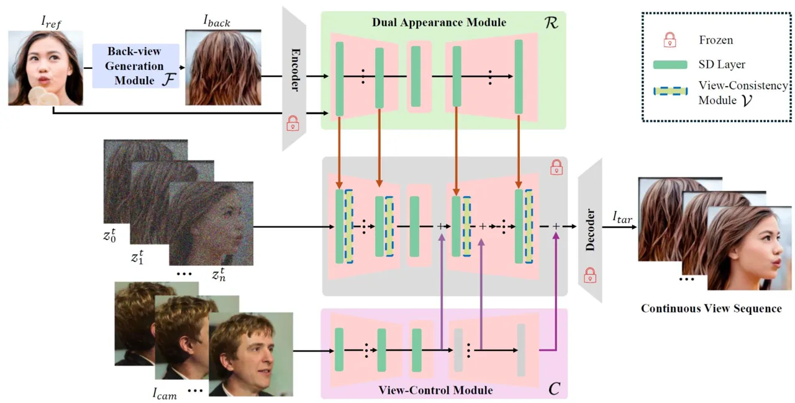

Figure 2: For the task of full-range 360-degree novel view synthesis,
DiffPortrait360 employs a frozen pre-trained Latent Diffusion Model
(LDM) as a rendering backbone and incorporates three auxiliary trainable
modules for disentangled control of dual appearance $`\mathcal{R}`$,
camera control $`\mathcal{C}`$, and U-Nets with view consistency
$`\mathcal{V}`$. Specifically, $`\mathcal{R}`$ extracts appearance
information from $`I_{\text{ref}}`$ and $`I_{\text{back}}`$, and
$`\mathcal{C}`$ derives the camera pose, which is rendered using an
off-the-shelf 3D GAN. During training, we utilize a continuous sampling
training strategy to better preserve the continuity of the camera
trajectory. We enhance attention to continuity between frames to
maintain the appearance information without changes due to turning
angles. For inference, we employ our tailored back-view image generation
network $`\mathcal{F}`$ to generate a back-view image, enabling us to
generate a 360-degree full range of camera trajectories using a single
image portrait. Note that $`z`$ stands for latent space noise rather
than image.

## 2 Related Work

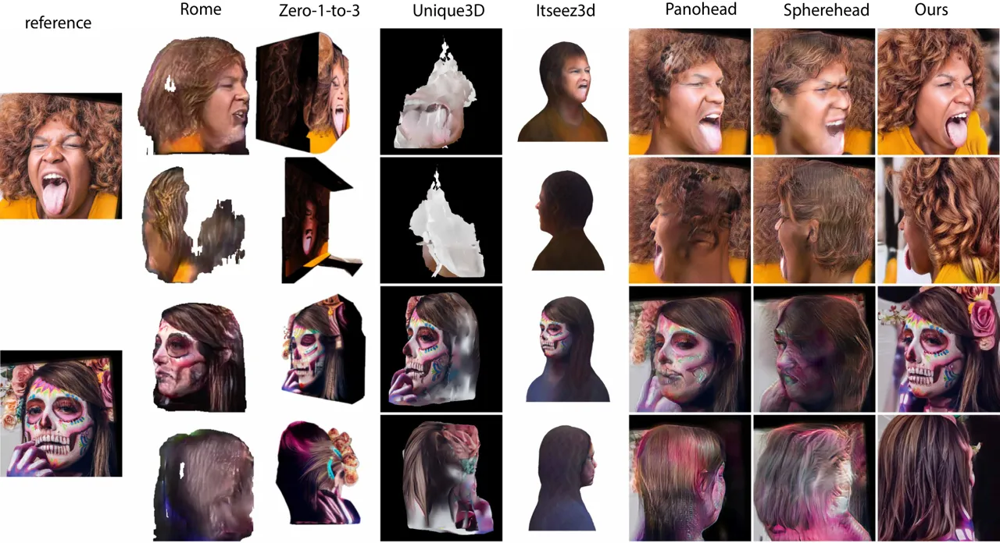

Figure 3: Qualitative comparisons with existing methods on in the wild
portraits. Compared to the baselines, our method shows superior
generalization capability to novel view synthesis of wild portraits with
unseen appearances, expressions, and styles, even without any reliance
on fine-tuning.

Numerous research methods and commercial solutions \[39, 22\] have been
developed for reconstructing full 3D avatar heads from a single input
photo, as opposed to using a multi-view capture approach \[2, 14, 30,
25, 41\]. These capabilities enable applications such as
consumer-accessible immersive telepresence, personalized avatars for 3D
games, and scalable approaches to content creation. Despite their wide
adoption, regression-based face modeling techniques from a single input
image \[37, 21, 54, 12, 52, 61, 31\] using parametric 3D Morphable
Models (3DMM) \[3\] are increasingly being complemented in many
applications by neural rendering techniques, as surveyed in \[48\].

#### 3D-Aware GAN-Based Full-Head Synthesis.

Recent advancements on 3D-aware GANs \[6, 15, 34, 57, 7, 45, 56, 9, 1,
26\], often leveraging StyleGAN2 \[23\] as backbone, are capable of
generating novel views from a single input photograph through fine-tuned
GAN inversion while ensuring view-consistency using a volumetric neural
radiance field representation based on tri-planes \[7\] or signed
distance function, such as StyleSDF \[34\]. While most of them can only
generate frontal faces due their training data and their 3D
representation, two recent methods have demonstrated how the generation
of consistent 360-degree views are possible, namely, PanoHead \[1\] and
SphereHead \[26\]. These methods generate a reasonable back head region
using enhanced tri-plane representations by incorporating multiple depth
layers or spherical coordinate system. However, their back-view
synthesis often appear unnatural and mismatching the front view,
especially when single-view inversion is applied. Most importantly, all
of these methods are domain specific and only work on realistic human
heads. They often fail for unknown accessories or complex hairstyles,
and generating novel views for stylized avatars is not possible.

#### Diffusion Model Based 360-Degree View Synthesis.

Diffusion-based models \[20, 46, 47\], particularly latent diffusion
models (LDM) \[43\], have recently gained significant attention for
their unmatched performance in generating highly diverse and
high-fidelity images across various domains. A number of diffusion-based
methods have been introduced for the task of novel view synthesis \[16,
28, 29, 44\] for general objects, and several methods \[44, 16\]
demonstrate the effectiveness of fusing features of a reference image
into self-attention blocks in the LDM UNets, facilitating high-quality
novel view generation while preserved appearance context effectively.
The notable work, ControlNet \[59\], extends the LDM framework to
controllable image generation with additive structural conditions from
signals such as 3D-aware GAN-synthesized camera viewpoints or rendered
3DMM condition \[40\]. The work, DiffPortrait3D \[16\] achieves the
state-of-the-art portrait novel view synthesis results by seamlessly
integrating the appearance and camera view attentions with pre-trained
UNets. Despite the impressive results, especially for stylized input
portraits, only frontal views are possible to generate, and unwanted
local inconsistencies between the model from being converted into a 3D
representation, such as textured Meshes, NeRFs or 3D Gaussian Splats,
which is needed for free-viewpoint rendering. Another recent
diffusion-based technique, called Portrait3D \[18\], generates
compelling views from all angles, achieving superior results to
GAN-based approaches \[1, 26\] but is restricted to realistic heads
only. Our proposed solution is particularly effective in generating
globally consistent and plausible back views of the head, while also
ensuring locally view-consistent renderings for full $`360^{\circ}`$
style-omniscient portraits.

## 3 Method

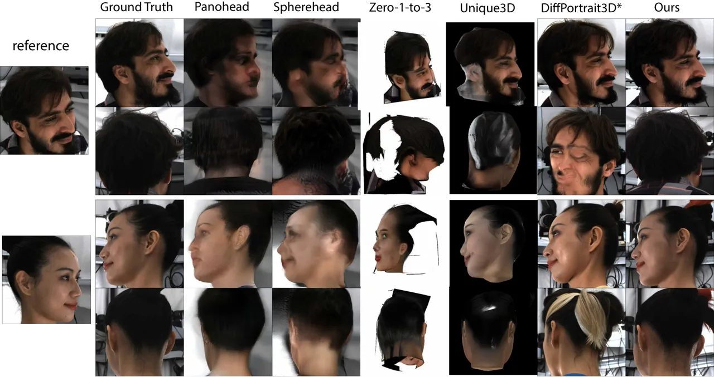

Figure 4: Qualitative comparisons of novel view synterhsis on
RenderMe360 \[35\]. Our method achieves effective appearance control for
novel synthesis under substantial change of camera view for synthesis.

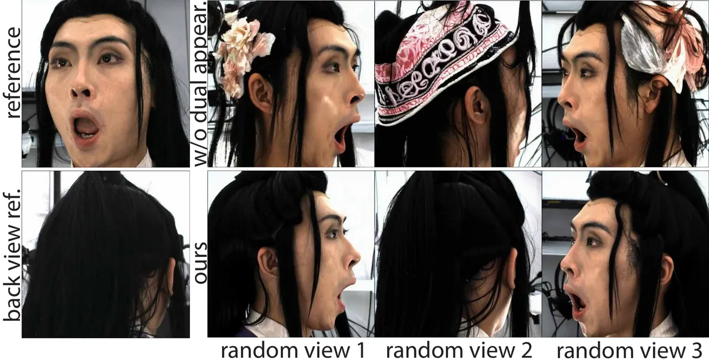

Figure 5: Ablation Study on Dual Appearance Control.

Given a single RGB portrait image with arbitrary style,
$`I_{\text{ref}}`$, our approach aims to synthesize a new image,
$`I_{\text{tar}}`$, from any camera perspective within a 360^(∘) range
using an $`I_{\text{cam}}`$ image. The novel view $`I_{\text{tar}}`$
must maintain consistent appearance information with $`I_{\text{ref}}`$,
with the camera view controlled by $`I_{\text{cam}}`$. It is crucial to
note that this includes not only positions near $`I_{\text{ref}}`$ but
also areas with minimal overlap and previously unobserved regions from
the given view.

In this work, DiffPortrait360 leverages powerful latent diffusion
models, enabling disentangled control of appearance and camera views, as
detailed in Section 3.1. Building upon this foundation, we propose a
tailored dual-appearance module that incorporates additional appearance
information from both the front and back of the head,
$`I_{\text{back}}`$ outlined in Section 3.2. We introduce an additional
ControlNet \[59\] based synthesizing network designed to generate a
plausible back view in $`I_{\text{back}}`$ from $`I_{\text{ref}}`$, and
to correct biases due to limited 3D head training data, as detailed in
Section 3.3. Finally, Section 3.4 introduces a novel training strategy
that leverages sequence priors to distill fine-grained structural
information, ensuring consistency and smooth view transitions while
maintaining high synthesis quality.

### 3.1 Background

#### Latent Diffusion Model.

Diffusion models \[20, 46, 47\] are generative models designed to
synthesize desired data samples from Gaussian noise $`z_{0}`$ by
iteratively denoising across $`T`$ time steps. Latent diffusion models
(LDMs) \[43\] extend this framework by operating in an encoded latent
space $`\mathcal{E}(I)`$ where $`I`$ is an input image, facilitated by a
pre-trained auto-encoder $`\mathcal{D}\circ\mathcal{E}(\cdot)`$.
Specifically, the model is trained to learn the denoising process from
$`z_{T}\sim\mathcal{N}(0,1)`$ to $`z_{0}=\mathcal{E}(I)`$ with the
objective,

```math
L_{ldm}=\mathbb{E}_{z_{0},t,\epsilon\sim\mathcal{N}(0,1)}\bigg[\Big\lVert\epsilon-\epsilon_{\theta}\big(z_{t},t\big)\Big\lVert_{2}^{2}\bigg], \tag{1}
```

where $`z_{t}`$ is the noise map at timestep $`t`$ and
$`\epsilon_{\theta}`$ is a trainable UNet equipped with layers of
convolutions and self-/cross-attentions (TransBlock). Finally, the
output image is calculated by mapping the denoised latent feature map
back to the image domain $`I=\mathcal{D}(z_{0})`$. Unlike traditional
Text-to-Image (T2I) diffusion models, which rely on textual inputs to
guide image synthesis, our approach directly extracts portrait
appearance context and camera information from $`I_{\text{ref}}`$ and
$`I_{\text{cam}}`$, respectively, without relying on text descriptions.
Consequently, we use an empty prompt for text control and omit it from
our formulations.

#### Diffusion-Based Novel View Synthesis.

Recent studies \[27, 44, 28, 29\] have leveraged pre-trained LDMs for
novel view synthesis. These efforts largely employ latent diffusion as
the backbone for novel view synthesis, incorporating modules for
appearance injection and camera information control. While most of this
research focuses on general objects, our work follows a specific  \[16\]
designed for portrait novel view synthesis, which uses three main
modules: 1) an Appearance Reference Module $`\mathcal{R}`$ that captures
identity attributes and background from $`I_{\text{ref}}`$, 2) a Control
Module (C) typically a ControlNet \[59\], that adjusts camera
perspectives based on $`I_{\text{cam}}`$ and 3) a View Consistency
Module $`\mathcal{V}`$, intervened within UNet blocks using temporal
cross-attention between features of multiple consecutive views to ensure
view consistency. We follow the same network structure but innovate on
enabling 360-degree and consistent novel view synthesis that preserves
input appearance coherence across extensive viewpoint shifts,
encompassing elements such as expressions, hairstyles, and head shapes.

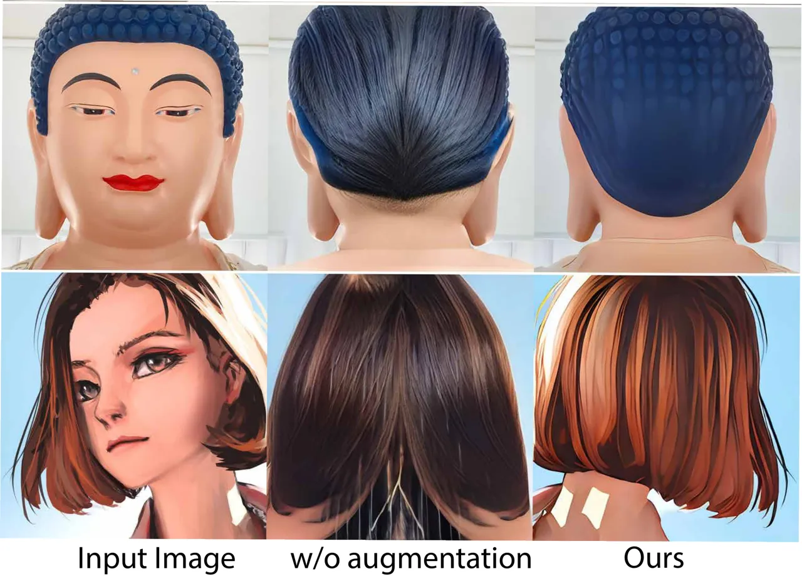

Figure 6: Ablation on Back-view Generation.

### 3.2 Dual Appearance Module

To ensure the preservation of appearance information characteristics,
previous methods typically employ a ReferenceNet \[5\] to inject the
reference image and guide the denoising process with $`I_{\text{ref}}`$
in order to extract sufficient information from $`I_{\text{ref}}`$. The
Appearance Control Module is trained to ensure meticulous transfer of
referenced structure and appearance into the SD-UNet for the task of
novel view synthesis of portrait views. While effective at reference
control in front near face, such an appearance control scheme induces
following problems: Firstly, the appearance content is largely provided
by the image of $`I_{\text{ref}}`$. As the viewpoint shifts from the
front of the face to the back of the head, the training dataset
introduces randomly generated content such as different hairstyles,
hats, and other features. Additionally, front face images contain only
very limited information related to the back of the head, with very few
pixels or even no pixels available for use. This leads to a significant
misuse of most of the facial feature information from the reference
image, causing leakage to the back of the head, which can be amplified
to create a dual face or result in facial information appearing on the
back of the head. Furthermore, these inaccuracies impact view control
consistency, since the network, as a shortcut, tends to use other
tailored modules, e.g., the view control module $`\mathcal{C}`$, to
generate information when there is insufficient appearance information.
As a result, system collapse occurs during the generation of larger
views with only a single reference.

To mitigate this issue, we require an appearance reference network that
could take information that entirely covers areas not observed by the
front appearance while minimizing the overlap with the front face, which
enables the diffusion network to access sufficient appearance
information. This motivation leads us to design a dual-appearance
module. Specifically, during training, we allow the appearance module to
access two images, $`I_{\text{ref}}`$ and $`I_{\text{back}}`$. The
rationale behind this modification is to reduce ambiguities caused by
insufficient or erroneous information during viewpoint transitions, and
to compel the network to autonomously decide which information from
$`I_{\text{ref}}`$ and $`I_{\text{back}}`$ should be relied on more
under different camera views. We note that in selecting
$`I_{\text{ref}}`$ and $`I_{\text{back}}`$, views should overlap as
little as possible but not be fixed, as this could affect the
generalization ability of the input images. Consequently, in our
training dataset, we deliberately choose pairs with minimal overlap as
inputs for $`I_{\text{ref}}`$ and $`I_{\text{back}}`$, enabling our dual
appearance module to leverage the information to its fullest extent. As
a result, we observed consistent and satisfactory appearance in areas
not covered by the reference images, and between the 360-degree area of
$`I_{\text{back}}`$ and $`I_{\text{ref}}`$. This makes our model capable
of generating consistent appearance information while changing the
camera views(see Figure 5).

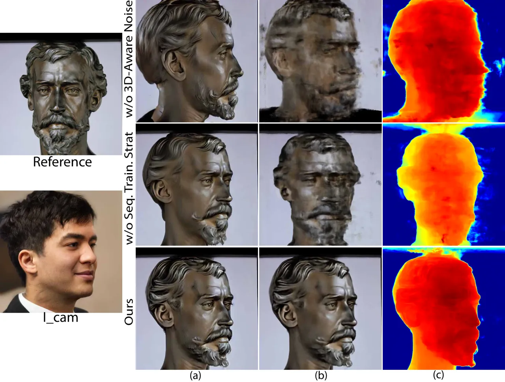

Figure 7: Ablation Study on View-consistency Control. (a) Generated
novel view. (b-c) Rendering and depth of fitted NeRFs.

### 3.3 Back-View Reference Generation

Our trained dual appearance module, $`\mathcal{R}`$, significantly
improves appearance consistency, especially during large changes in
viewing angles. However, during inference, it is challenging to obtain a
reasonable reference image context with a viewing angle drastically
different from the input, such as obtaining a nearly opposite auxiliary
image to the reference. Compromising to this difficulty will reduce the
effectiveness of the disentangled appearance information determined by
$`I_{\text{back}}`$.

To address this issue, we developed a generative network capable of
producing an $`I_{\text{back}}`$ that has minimal overlap in appearance
information with $`I_{\text{ref}}`$ while maintaining a consistent
style, reasonable head shape, and hairstyle. This motivates the use of
ControlNet \[59\] and the original $`I_{\text{ref}}`$ to generate a
decoupled $`I_{\text{back}}`$ as our extra appearance condition input.
This approach is practical for real-world applications, allowing the
generation of additional appearance information without needing external
inputs.

However, this generation model can exhibit a strong bias when using only
realistic data, which is unsuitable for producing a broader range of
artistic styles. To avoid an over-reliance on a training dataset that
could lead to the generation of unreasonable $`I_{\text{back}}`$, we
supplemented our dataset with a large collection of cartoon and stylized
task images of back views produced by \[13\] and Unique3D \[55\],
adjusting the distribution of our dataset to lessen the bias towards
realistic backdrops. Notably, even with limited camera views (only
including front and back views), this is sufficient for the Generative
Module to correct biases from real dataset training, enabling it to
generate reasonable unobserved head regions consistent with the input
portrait style. As demonstrated in our experiments, our trained
$`\mathcal{F}`$, with a limited dataset of cartoon front and back faces,
effectively resolves the challenge of sourcing additional appearance
$`I_{\text{back}}`$ in practical applications and generalizes well to
unseen portrait styles. (see Figure 6).

### 3.4 View-Consistency Module

Given an arbitrary view portrait image $`I_{\text{ref}}`$, our trained
module has already been capable of generating a full 360-degree range of
novel view syntheses $`I_{\text{tar}}`$ via above designs. Nevertheless,
during inference, we occasionally observe our module failing to capture
nuanced view consistency compared to 3D-aware GANs, such as appearance
flickering and choppy transitions between views. These unwanted
artifacts significantly impact the effectiveness of novel view synthesis
in downstream applications, such as 3D reconstruction.

Reviewing our above module, the view consistency module $`\mathcal{V}`$
is primarily managed by a temporal transformer \[17\], integrated with
3D-aware noise \[16\]. However, given the heritage motion prior
from \[17\], we note that view consistency is trained by focusing on
cross-view attentions with randomly shuffled views. We argue this
training approach does not fully utilize the advantages of the motion
prior, which may lead to the observed choppy transitions and minor
appearance changes, ultimately resulting in the loss of detail and
collapse of downstream tasks.

To alleviate this issue, we have revised the training approach of the
temporal transformer to include data from continuous view transitions.
Instead of randomly sampling sparse views from a sparse multi-view
dataset, we controlled the 3D-aware GAN \[1\] to generate consistently
sampled sequential view changes. In contrast to random view
cross-attention, our sequential training scheme effectively instructs
the view consistency module $`\mathcal{V}`$ to maximize the benefits
derived from the pretrained motion prior. Even when trained on only a
limited synthetic dataset, our sequential training scheme is sufficient
for $`\mathcal{V}`$ to decipher higher multi-view consistency accuracy
and smoother view-changing results, enabling the synthesis process to
produce smoother results that better fit downstream applications.

## 4 Experiments

### 4.1 Datasets

We train our model using a hybrid dataset comprised of photo-realistic
full-head multi-view images dataset RenderMe360 \[35\] and synthetic
ones by PanoHead \[1\] and SphereHead \[26\]. RenderMe360 consists of
images from 500 individuals, each captured with 12 different expressions
and an extended animated sequence from 60 multi-view camera positions.
This setup offers a substantial amount of multi-view consistent
appearance data for training. We manually separated the front and back
camera information, selecting front and back images as inputs for
dual-appearance control, while using the remaining camera views as
training data. We randomly selected 1,000 frames of multi-view data from
150 subjects while using PanoHead and SphereHead to sample continuous
views from 600 identities, specifically for training the sequential view
consistency module due to the scarcity of sparse camera views of
RenderMe360.

|                    |                   |                   |                      |                   |                    |                   |                   |                      |                    |
| ------------------ | ----------------- | ----------------- | -------------------- | ----------------- | ------------------ | ----------------- | ----------------- | -------------------- | ------------------ |
| Method             | Frontal View      |                   |                      |                   |                    | Back View         |                   |                      |                    |
|                    | PSNR $`\uparrow`$ | SSIM $`\uparrow`$ | LPIPS $`\downarrow`$ | CSIM $`\uparrow`$ | FID $`\downarrow`$ | PSNR $`\uparrow`$ | SSIM $`\uparrow`$ | LPIPS $`\downarrow`$ | FID $`\downarrow`$ |
| PanoHead + PTI     | 28.35             | 0.505             | 0.495                | 0.471             | 98.93              | 28.39             | 0.450             | 0.432                | 169.52             |
| SphereHead + PTI   | 28.62             | 0.513             | 0.432                | 0.556             | 69.41              | 28.63             | 0.463             | 0.413                | 106.21             |
| Zero123            | -                 | -                 | -                    | 0.431             | 152.03             | -                 | -                 | -                    | 216.88             |
| Unique3D           | -                 | -                 | -                    | 0.483             | 195.33             | -                 | -                 | -                    | 285.75             |
| DiffPortrait3D^(∗) | 28.96             | 0.509             | 0.425                | 0.709             | 49.02              | 28.47             | 0.373             | 0.446                | 91.37              |
| Ours               | 29.44             | 0.578             | 0.384                | 0.746             | 35.34              | 30.92             | 0.648             | 0.313                | 39.40              |

Table 1: Quantitative comparisons of novel view synthesis on
RenderMe360 \[35\] with perceptual metrics PSNR, SSIM \[53\],
LPIPS \[60\], FID \[19\] and an additional face recognition metric
CSIM \[58\] for frontal views.

For the back-head reference image generation network, we collected 1,000
manually chosen, stylized front-and-back image pairs to augment the
back-head image generation network. High-quality stylized front images
were generated using a state-of-the-art tool \[13\]; we then fed the
images to Unique3D \[55\] to generate content consistent back head. It’s
important to note that this highly stylized dataset, containing only
front and back views, was used solely as data augmentation to reduce
bias in the back-view generation and was not included in the training of
$`\mathcal{R}`$.

### 4.2 Comparisons

#### Comparisons on Stylized Portraits.

To demonstrate the generalization capability of our approach on stylized
input portraits, we conduct a qualitative comparison with existing
methods, as shown in Fig. 3. We also include Rome \[24\] and Itseez3D¹¹
1 https://itseez3d.com/. Thanks to our back-view generator and
view-consistency module, our method exhibits superior generalization to
diverse styles. We achieve high-quality details and continuous views
across the full range of head poses. In contrast, it is evident that
other approaches struggle to reach this level of performance.
Specifically, Rome fails to generate reasonable back-view textures and
structures, especially for inputs with thick hair and unusual
accessories. Similarly, Zero-1-to-3 \[29\] and Unique3D \[55\] continue
to struggle with bridging the domain gap between general objects and
human heads. Itseez3D appears to operate with templates that preserve
only the facial textures from the reference image. Additionally, both
PanoHead \[1\] and SphereHead \[26\] perform poorly on stylized
portraits.

#### Comparisons on Real Portraits.

We then compare the novel view synthesis results of our method with
existing approaches on the test split of RenderMe360 \[35\], as
illustrated in Fig. 4 and Tab. 1. We additionally incorporate
DiffPortrait3D\* \[16\], which has been finetuned using our full-head
datasets, as the original model was limited to generating frontal views
using the provided checkpoints. As shown in the qualitative comparisons
in Fig. 4, the GAN-based methods, PanoHead and SphereHead, struggle to
generate realistic details that align with the reference images. Their
outputs fail to preserve identity due to the limitations of the
PTI \[42\]. Zero-1-to-3 and Unique3D are trained on datasets of general
synthetic 3D objects, and without specific domain knowledge, they cannot
consistently produce reasonable novel views. Their results are often
riddled with artifacts unrelated to heads. Although we fine-tuned
DiffPortrait3D\* on our full-head datasets, it still struggles to
generate consistent novel views at the back, resulting in significant
discrepancies from the reference images. These examples show artifacts
such as multiple faces and misaligned hair color. In contrast, our
specially designed method outperforms all others, demonstrating strong
consistency across significantly different viewpoints. This conclusion
is further supported by the quantitative comparisons detailed in Tab. 1.
While existing methods reveal their shortcomings in evaluation
statistics using perceptual metrics—especially for back views—our method
performs nearly equally well for both frontal and back views.

### 4.3 Ablation Study

#### Back-view Generation.

By assessing the multi-style frontal/back pairs augmented from outputs
of Unique3D \[55\], we can clearly highlight their importance. As shown
in Fig. 6, when training the back-view generator using only real data
pairs, the generated views align with the distribution of actual hair.
In contrast, any incorrect back-view generated due to biases can
severely impact the consistency of the subsequent full head view
synthesis.

#### Dual Appearance Control.

As illustrated in the first row of Fig. 5, the generated near views
(random view 1 and 2) can exhibit significant inconsistencies without
leveraging our dual appearance control. Additionally, for the nearly
opposite views 2 and 3, the generated hair accessories do not match,
which occurs due to the limited reference information, as the target
view has only a small overlap with the provided image. With the
implementation of our dual control, enhanced by the generated back view,
our method effectively addresses these issues, achieving excellent
consistency in both textures and the underlying 3D shape, as
demonstrated in the second row of Fig. 5.

#### View-Consistency Control.

To assess the effectiveness of our strategy for view-consistency
control, we conduct an ablation study with three configurations: 1)
without 3D-aware noise, 2) without the sequential training strategy, and 3) our full method. In addition to comparing the synthesized views from
diffusion, we also fit NeRF \[36\] on 36 generated views that are evenly
distributed around the head to thoroughly evaluate multi-view
consistency. As shown in Fig. 7, the absence of 3D-aware noise results
in a failure to achieve visual alignment between the diffusion output
and the camera-control image. Without the sequential training approach,
the method can achieve some visual alignment for certain views, as
demonstrated in the second row of Fig. 7. However, when we fit the
generated full-range 36 views into a NeRF using the approach
from \[36\], the textures in rendered view (b) from the NeRF (with the
same camera as view (a)) become significantly messy due to the
discrepancies across multiple views. In contrast, our complete method
maintains good consistency among the generated views, which supports
decent 3D fitting and shows ability to provide plausible depth.

## 5 Discussion

We have presented the first framework for generating consistent, full
360° views from a single portrait, accommodating photorealistic and
stylized humans, as well as anthropomorphic animals or statues. Our
method is robust, handling particularly difficult input portraits with
complex accessories, make-ups, hairstyles, expressive faces, and
challenging lighting conditions. We demonstrate that our back-of-head
generation approach, combined with our novel dual appearance module, is
essential for achieving globally consistent appearance generation full
head.

## 6 Acknowledgment

This work is supported by the Metaverse Center Grant from the MBZUAI
Research Office. We thank Egor Zakharov, Zhenhui Lin, Maksat
Kengeskanov, and Yiming Chen for the early discussions, helpful
suggestions, and feedback.

## References

- \[1\] Sizhe An, Hongyi Xu, Yichun Shi, Guoxian Song, Umit Y. Ogras,
  and Linjie Luo. Panohead: Geometry-aware 3d full-head synthesis in
  360deg. In _CVPR_, pages 20950–20959, 2023.
- \[2\] Thabo Beeler, Bernd Bickel, Paul Beardsley, Bob Sumner, and
  Markus Gross. High-quality single-shot capture of facial geometry.
  _ACM Trans. Graph._, 29(4), 2010.
- \[3\] Volker Blanz and Thomas Vetter. A morphable model for the
  synthesis of 3d faces. In _Proceedings of the 26th Annual Conference
  on Computer Graphics and Interactive Techniques_, page 187–194, 1999.
- \[4\] Tim Brooks, Bill Peebles, Connor Holmes, Will DePue, Yufei Guo,
  Li Jing, David Schnurr, Joe Taylor, Troy Luhman, Eric Luhman, Clarence
  Ng, Ricky Wang, and Aditya Ramesh. Video generation models as world
  simulators. _N/A_, 2024.
- \[5\] Mingdeng Cao, Xintao Wang, Zhongang Qi, Ying Shan, Xiaohu Qie,
  and Yinqiang Zheng. Masactrl: Tuning-free mutual self-attention
  control for consistent image synthesis and editing. _arXiv preprint
  arXiv:2304.08465_, 2023.
- \[6\] Eric R Chan, Marco Monteiro, Petr Kellnhofer, Jiajun Wu, and
  Gordon Wetzstein. pi-gan: Periodic implicit generative adversarial
  networks for 3d-aware image synthesis. In _Proceedings of the IEEE/CVF
  conference on computer vision and pattern recognition_, pages
  5799–5809, 2021.
- \[7\] Eric R. Chan, Connor Z. Lin, Matthew A. Chan, Koki Nagano,
  Boxiao Pan, Shalini De Mello, Orazio Gallo, Leonidas Guibas, Jonathan
  Tremblay, Sameh Khamis, Tero Karras, and Gordon Wetzstein. Efficient
  geometry-aware 3D generative adversarial networks. In _CVPR_, 2022.
- \[8\] Yu Deng, Jiaolong Yang, Dong Chen, Fang Wen, and Xin Tong.
  Disentangled and controllable face image generation via 3d
  imitative-contrastive learning. In _Proceedings of the IEEE/CVF
  conference on computer vision and pattern recognition_, pages
  5154–5163, 2020.
- \[9\] Yu Deng, Jiaolong Yang, Jianfeng Xiang, and Xin Tong. Gram:
  Generative radiance manifolds for 3d-aware image generation.
  _CVPR_, 2022.
- \[10\] Yu Deng, Duomin Wang, Xiaohang Ren, Xingyu Chen, and Baoyuan
  Wang. Portrait4d: Learning one-shot 4d head avatar synthesis using
  synthetic data. In _IEEE/CVF Conference on Computer Vision and Pattern
  Recognition_, 2024a.
- \[11\] Yu Deng, Duomin Wang, and Baoyuan Wang. Portrait4d-v2: Pseudo
  multi-view data creates better 4d head synthesizer. _arXiv preprint
  arXiv:2403.13570_, 2024b.
- \[12\] Abdallah Dib, Cedric Thebault, Junghyun Ahn, Philippe-Henri
  Gosselin, Christian Theobalt, and Louis Chevallier. Towards high
  fidelity monocular face reconstruction with rich reflectance using
  self-supervised learning and ray tracing, 2021.
- \[13\] Flux AI. Flux ai: Design for hardware engineers.
  [https://flux-ai.io/?gad_source=1&gclid=CjwKCAiA3Na5BhAZEiwAzrfagAN-MUBK_2j_msa4PEJA7TqbF8_CkYQEFis4H8biY4osqRvQ1EeQRBoCJlsQAvD_BwE](https://flux-ai.io/?gad_source=1&gclid=CjwKCAiA3Na5BhAZEiwAzrfagAN-MUBK_2j_msa4PEJA7TqbF8_CkYQEFis4H8biY4osqRvQ1EeQRBoCJlsQAvD_BwE).
  Accessed: 2024-11-15.
- \[14\] Abhijeet Ghosh, Graham Fyffe, Borom Tunwattanapong, Jay Busch,
  Xueming Yu, and Paul Debevec. Multiview face capture using polarized
  spherical gradient illumination. _ACM Trans. Graph._,
  30(6):1–10, 2011.
- \[15\] Jiatao Gu, Lingjie Liu, Peng Wang, and Christian Theobalt.
  Stylenerf: A style-based 3d-aware generator for high-resolution image
  synthesis. _CVPR_, 2022.
- \[16\] Yuming Gu, Hongyi Xu, You Xie, Guoxian Song, Yichun Shi, Di
  Chang, Jing Yang, and Linjie Luo. Diffportrait3d: Controllable
  diffusion for zero-shot portrait view synthesis. In _Proceedings of
  the IEEE/CVF Conference on Computer Vision and Pattern Recognition
  (CVPR)_, pages 10456–10465, 2024.
- \[17\] Yuwei Guo, Ceyuan Yang, Anyi Rao, Yaohui Wang, Yu Qiao, Dahua
  Lin, and Bo Dai. Animatediff: Animate your personalized text-to-image
  diffusion models without specific tuning. _arXiv preprint
  arXiv:2307.04725_, 2023.
- \[18\] Jinkun Hao, Junshu Tang, Jiangning Zhang, Ran Yi, Yijia Hong,
  Moran Li, Weijian Cao, Yating Wang, and Lizhuang Ma. Portrait3d: 3d
  head generation from single in-the-wild portrait image, 2024.
- \[19\] Martin Heusel, Hubert Ramsauer, Thomas Unterthiner, Bernhard
  Nessler, and Sepp Hochreiter. Gans trained by a two time-scale update
  rule converge to a local nash equilibrium. _Advances in neural
  information processing systems_, 30, 2017.
- \[20\] Jonathan Ho, Ajay Jain, and Pieter Abbeel. Denoising diffusion
  probabilistic models. _NeurIPS_, 33:6840–6851, 2020.
- \[21\] Liwen Hu, Shunsuke Saito, Lingyu Wei, Koki Nagano, Jaewoo Seo,
  Jens Fursund, Iman Sadeghi, Carrie Sun, Yen-Chun Chen, and Hao Li.
  Avatar digitization from a single image for real-time rendering. _ACM
  Trans. Graph._, 36(6), 2017.
- \[22\] Itseez3D. Flux ai: Design for hardware engineers.
  [https://flux-ai.io/?gad_source=1&gclid=CjwKCAiA3Na5BhAZEiwAzrfagAN-MUBK_2j_msa4PEJA7TqbF8_CkYQEFis4H8biY4osqRvQ1EeQRBoCJlsQAvD_BwE](https://flux-ai.io/?gad_source=1&gclid=CjwKCAiA3Na5BhAZEiwAzrfagAN-MUBK_2j_msa4PEJA7TqbF8_CkYQEFis4H8biY4osqRvQ1EeQRBoCJlsQAvD_BwE).
  Accessed: 2024-11-15.
- \[23\] Tero Karras, Samuli Laine, Miika Aittala, Janne Hellsten,
  Jaakko Lehtinen, and Timo Aila. Analyzing and improving the image
  quality of stylegan. In _CVPR_, 2020.
- \[24\] Taras Khakhulin, Vanessa Sklyarova, Victor Lempitsky, and Egor
  Zakharov. Realistic one-shot mesh-based head avatars. In _European
  Conference on Computer Vision_, pages 345–362. Springer, 2022.
- \[25\] Tobias Kirschstein, Shenhan Qian, Simon Giebenhain, Tim Walter,
  and Matthias Nießner. Nersemble: Multi-view radiance field
  reconstruction of human heads. _ACM Transactions on Graphics_, 2023.
- \[26\] Heyuan Li, Ce Chen, Tianhao Shi, Yuda Qiu, Sizhe An, Guanying
  Chen, and Xiaoguang Han. Spherehead: Stable 3d full-head synthesis
  with spherical tri-plane representation, 2024.
- \[27\] Yukang Lin, Haonan Han, Chaoqun Gong, Zunnan Xu, Yachao Zhang,
  and Xiu Li. Consistent123: One image to highly consistent 3d asset
  using case-aware diffusion priors, 2023.
- \[28\] Minghua Liu, Chao Xu, Haian Jin, Linghao Chen, Mukund Varma T,
  Zexiang Xu, and Hao Su. One-2-3-45: Any single image to 3d mesh in 45
  seconds without per-shape optimization, 2023a.
- \[29\] Ruoshi Liu, Rundi Wu, Basile Van Hoorick, Pavel Tokmakov,
  Sergey Zakharov, and Carl Vondrick. Zero-1-to-3: Zero-shot one image
  to 3d object, 2023b.
- \[30\] Stephen Lombardi, Jason Saragih, Tomas Simon, and Yaser Sheikh.
  Deep appearance models for face rendering. _ACM Transactions on
  Graphics (ToG)_, 37(4):1–13, 2018.
- \[31\] Huiwen Luo, Koki Nagano, Han-Wei Kung, Qingguo Xu, Zejian Wang,
  Lingyu Wei, Liwen Hu, and Hao Li. Normalized avatar synthesis using
  stylegan and perceptual refinement. In _Proceedings of the IEEE/CVF
  Conference on Computer Vision and Pattern Recognition_, pages
  11662–11672, 2021.
- \[32\] Midjourney. midjourney. *https://www.midjourney.com*, 2024.
- \[33\] Ben Mildenhall, Pratul P Srinivasan, Matthew Tancik, Jonathan T
  Barron, Ravi Ramamoorthi, and Ren Ng. Nerf: Representing scenes as
  neural radiance fields for view synthesis. In _ECCV_, 2020.
- \[34\] Roy Or-El, Xuan Luo, Mengyi Shan, Eli Shechtman, Jeong Joon
  Park, and Ira Kemelmacher-Shlizerman. Stylesdf: High-resolution
  3d-consistent image and geometry generation. _CVPR_, 2022.
- \[35\] Dongwei Pan, Long Zhuo, Jingtan Piao, Huiwen Luo, Wei Cheng,
  Yuxin Wang, Siming Fan, Shengqi Liu, Lei Yang, Bo Dai, et al.
  Renderme-360: a large digital asset library and benchmarks towards
  high-fidelity head avatars. _Advances in Neural Information Processing
  Systems_, 36, 2024.
- \[36\] Keunhong Park, Utkarsh Sinha, Peter Hedman, Jonathan T Barron,
  Sofien Bouaziz, Dan B Goldman, Ricardo Martin-Brualla, and Steven M
  Seitz. Hypernerf: A higher-dimensional representation for
  topologically varying neural radiance fields. _arXiv preprint
  arXiv:2106.13228_, 2021.
- \[37\] Pascal Paysan, Reinhard Knothe, Brian Amberg, Sami Romdhani,
  and Thomas Vetter. A 3d face model for pose and illumination invariant
  face recognition. In _2009 sixth IEEE international conference on
  advanced video and signal based surveillance_, pages 296–301.
  Ieee, 2009.
- \[38\] Pexels. pexels. *https://www.pexels.com/*, 2024.
- \[39\] Pinscreen, 2024. Pinscreen Avatar Neo,
  https://www.avatarneo.com.
- \[40\] Malte Prinzler, Egor Zakharov, Vanessa Sklyarova, Berna
  Kabadayi, and Justus Thies. Joker: Conditional 3d head synthesis with
  extreme facial expressions, 2024.
- \[41\] Shenhan Qian, Tobias Kirschstein, Liam Schoneveld, Davide
  Davoli, Simon Giebenhain, and Matthias Nießner. Gaussianavatars:
  Photorealistic head avatars with rigged 3d gaussians. _arXiv preprint
  arXiv:2312.02069_, 2023.
- \[42\] Daniel Roich, Ron Mokady, Amit H Bermano, and Daniel Cohen-Or.
  Pivotal tuning for latent-based editing of real images. _ACM
  Transactions on Graphics_, 42(1):1–13, 2022.
- \[43\] Robin Rombach, Andreas Blattmann, Dominik Lorenz, Patrick
  Esser, and Björn Ommer. High-resolution image synthesis with latent
  diffusion models. In _CVPR_, pages 10684–10695, 2022.
- \[44\] Ruoxi Shi, Hansheng Chen, Zhuoyang Zhang, Minghua Liu, Chao Xu,
  Xinyue Wei, Linghao Chen, Chong Zeng, and Hao Su. Zero123++: a single
  image to consistent multi-view diffusion base model, 2023.
- \[45\] Ivan Skorokhodov, Sergey Tulyakov, Yiqun Wang, and Peter Wonka.
  Epigraf: Rethinking training of 3d gans. _arXiv preprint
  arXiv:2206.10535_, 2022.
- \[46\] Jiaming Song, Chenlin Meng, and Stefano Ermon. Denoising
  diffusion implicit models. _arXiv preprint arXiv:2010.02502_, 2020a.
- \[47\] Yang Song, Jascha Sohl-Dickstein, Diederik P Kingma, Abhishek
  Kumar, Stefano Ermon, and Ben Poole. Score-based generative modeling
  through stochastic differential equations. _arXiv preprint
  arXiv:2011.13456_, 2020b.
- \[48\] Ayush Tewari, Ohad Fried, Justus Thies, Vincent Sitzmann,
  Stephen Lombardi, Kalyan Sunkavalli, Ricardo Martin-Brualla, Tomas
  Simon, Jason Saragih, Matthias Nießner, et al. State of the art on
  neural rendering. In _Computer Graphics Forum_, pages 701–727. Wiley
  Online Library, 2020.
- \[49\] Phong Tran, Egor Zakharov, Long-Nhat Ho, Liwen Hu, Adilbek
  Karmanov, Aviral Agarwal, McLean Goldwhite, Ariana Bermudez Venegas,
  Anh Tuan Tran, and Hao Li. Voodoo xp: Expressive one-shot head
  reenactment for vr telepresence. _ACM Transactions on Graphics,
  Proceedings of the 17th ACM SIGGRAPH Conference and Exhibition in Asia
  2024, (SIGGRAPH Asia 2024), 12/2024_, 2024a.
- \[50\] Phong Tran, Egor Zakharov, Long-Nhat Ho, Anh Tuan Tran, Liwen
  Hu, and Hao Li. Voodoo 3d: Volumetric portrait disentanglement for
  one-shot 3d head reenactment. _Proceedings of the IEEE/CVF Conference
  on Computer Vision and Pattern Recognition_, 2024b.
- \[51\] Alex Trevithick, Matthew Chan, Michael Stengel, Eric R. Chan,
  Chao Liu, Zhiding Yu, Sameh Khamis, Manmohan Chandraker, Ravi
  Ramamoorthi, and Koki Nagano. Real-time radiance fields for
  single-image portrait view synthesis. In _SIGGRAPH_, 2023.
- \[52\] Satoshi Tsutsui, Weijia Mao, Sijing Lin, Yunyi Zhu, Murong Ma,
  and Mike Zheng Shou. Novel view synthesis for high-fidelity headshot
  scenes. _arXiv preprint arXiv:2205.15595_, 2022.
- \[53\] Zhou Wang, Alan C Bovik, Hamid R Sheikh, and Eero P Simoncelli.
  Image quality assessment: from error visibility to structural
  similarity. _IEEE transactions on image processing_,
  13(4):600–612, 2004.
- \[54\] Fanzi Wu, Linchao Bao, Yajing Chen, Yonggen Ling, Yibing Song,
  Songnan Li, King Ngi Ngan, and Wei Liu. Mvf-net: Multi-view 3d face
  morphable model regression. In _Proceedings of the IEEE/CVF conference
  on computer vision and pattern recognition_, pages 959–968, 2019.
- \[55\] Kailu Wu, Fangfu Liu, Zhihan Cai, Runjie Yan, Hanyang Wang,
  Yating Hu, Yueqi Duan, and Kaisheng Ma. Unique3d: High-quality and
  efficient 3d mesh generation from a single image. _arXiv preprint
  arXiv:2405.20343_, 2024.
- \[56\] Xudong Xu, Xingang Pan, Dahua Lin, and Bo Dai. Generative
  occupancy fields for 3d surface-aware image synthesis. _NeurIPS_,
  34:20683–20695, 2021.
- \[57\] Yang Xue, Yuheng Li, Krishna Kumar Singh, and Yong Jae Lee.
  Giraffe hd: A high-resolution 3d-aware generative model. In
  _CVPR_, 2022.
- \[58\] Egor Zakharov, Aliaksandra Shysheya, Egor Burkov, and Victor
  Lempitsky. Few-shot adversarial learning of realistic neural talking
  head models. In _Proceedings of the IEEE/CVF international conference
  on computer vision_, pages 9459–9468, 2019.
- \[59\] Lvmin Zhang, Anyi Rao, and Maneesh Agrawala. Adding conditional
  control to text-to-image diffusion models. In _ICCV_, pages
  3836–3847, 2023.
- \[60\] Richard Zhang, Phillip Isola, Alexei A Efros, Eli Shechtman,
  and Oliver Wang. The unreasonable effectiveness of deep features as a
  perceptual metric. In _Proceedings of the IEEE conference on computer
  vision and pattern recognition_, pages 586–595, 2018.
- \[61\] Yiyu Zhuang, Hao Zhu, Xusen Sun, and Xun Cao. Mofanerf:
  Morphable facial neural radiance field. In _European Conference on
  Computer Vision_, pages 268–285. Springer, 2022.

Supplementary Material

We provide additional implementation details in Section A, highlight
more comparisons and results in Section B, and provide additional
limitations in Section C.

## Appendix A Implementation Details

### A.1 Back-view Generation Module

We illustrate the framework of our back-view generation module
$`\mathcal{F}`$ in Fig. 8 along with its training data examples
in Fig. 9, which is used to enhance the generative capabilities of
$`\mathcal{F}`$. Specifically, we employ Stable Diffusion SD1.5 \[43\]
as the backbone. A reference network \[5\] is utilized to inject
information from the front face, and camera control is managed by
ControlNet \[59\]. In practice, we set a fixed camera view of the back
head. In particular, we uniformly generate a fixed view that captures
the maximum back appearance information, allowing the entire back-view
generation module to focus on back-view appearance generation.

For the stylized augmentation dataset used to train the back-view
generation module $`\mathcal{F}`$, we generate 2,000 subjects that are
various stylized front portraits using \[13\] and further produce ground
truth back-view by \[55\]. All data were processed with a cropped
resolution of $`512\times 512`$. Some of the lower-quality data were
filtered out using \[8\].

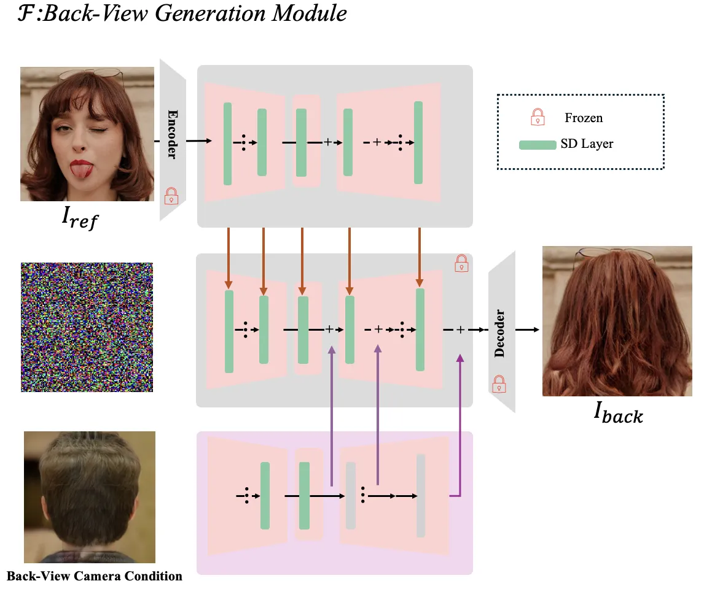

Figure 8: Illustration of our back-view generation module
$`\mathcal{F}`$. Given an arbitrary back-view camera condition and a
reference image, we follow the methods of the reference module and
ControlNet to decode a specific camera view. During inference, we set
the back-view camera generation condition to 180 degrees to maximize the
capture of appearance information from the back view.

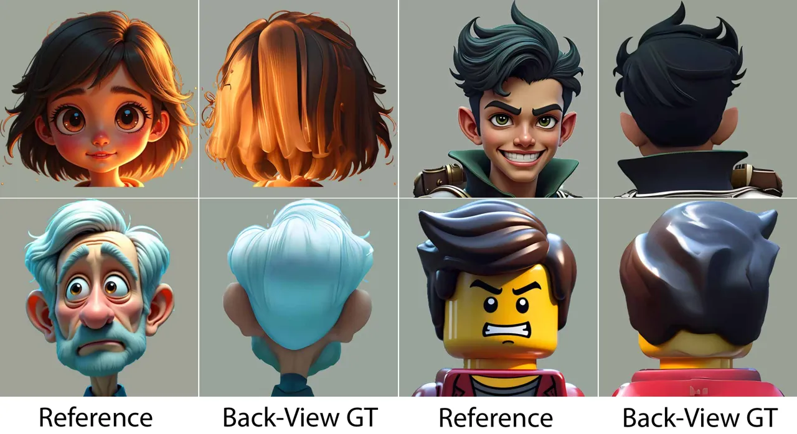

Figure 9: Examples in our stylized data augmentation which includes
extensive generation of stylized back appearances. Compared to training
back-view generation module $`\mathcal{F}`$ solely on real or synthetic
networks, such augmentation helps our back-view generation module
achieve greater generalizability.

### A.2 Training and Evaluations

Our model keeps the weights of the original Stable Diffusion model
frozen during training. The training was conducted in stages, where we
sequentially integrate and train modules $`\mathcal{R}`$,
$`\mathcal{C}`$, and $`\mathcal{V}`$ mentioned in main paper Figure 2.
All training were conducted on 6 NVIDIA RTX A6000 ADA GPUs with a
learning rate of $`10^{-5}`$; we performed 60,000 iterations with the
enhanced dataset for dual appearance and an additional 60,000 iterations
for the camera control stages and the sequential training stage each,
using only the PanoHead data due to unachievable camera intrinsics of
the back view and a limited number of sparse camera views. For test
inference, we collect 200 challenged portraits from Midjourney and
Pexels \[32, 38\], containing a wide variation in appearance,
expression, camera perspective, and style. For comparison in
RenderMe360\[35\], we use another unseen 500 multi-view image pairs with
different expressions.

### A.3 Dataset Details

Our dataset has 800 unique subjects: 150 from RenderMe360 and 600 from
PanoHead/SphereHead. We use 150 from RenderMe360, excluding those with
complex head accessories to avoid unwanted artifacts. RenderMe360 is not
used for sequential training due to sparse camera views. For the
back-head generator, we use 1,800 subjects: 150 from RenderMe360
(real-world), 650 from PanoHead/SphereHead (synthetic), and 1,000 from
Unique3D (stylized).

## Appendix B More Results

### B.1 More Ablation Study

As shown in Fig. 10, our experiments show image-based view control is
more accurate than naive camera pose representation via text embedding.
The effectiveness of alternative latent pose representations remains
unclear, and explicit pose estimation requires extensive high-quality
data, which we lack. However, we compare both methods using the POSE
metric in Tab. 1 of DiffPortrait3D \[14\]. (POSE$`\downarrow`$ Our Image
Cond.: 0.0018, Cam Param.: 0.0081).

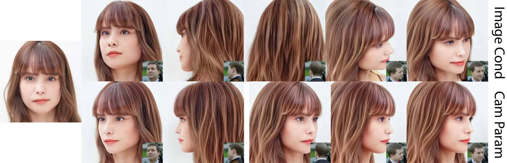

Figure 10: Ablation study on camera conditioning.

### B.2 More Qualitative Comparisons

We conduct more qualitative comparisons with PanoHead \[1\],
SphereHead \[26\], Unique3D \[55\], Rome \[24\] and Itseez3D²² 2
https://itseez3d.com/ on stylized portraits in  Fig. 13, where our
method shows superior generalization capability on diverse styles. We
also show additional qualitative comparisons with PanoHead \[1\],
SphereHead \[26\], Zero-1-to-3 \[29\], Unique3D \[55\] and
DiffPortrait3D \[16\] on RenderMe360\[35\] with paired ground truth
results in  Fig. 14.

### B.3 Comparing DiffPortrait3D on More Views

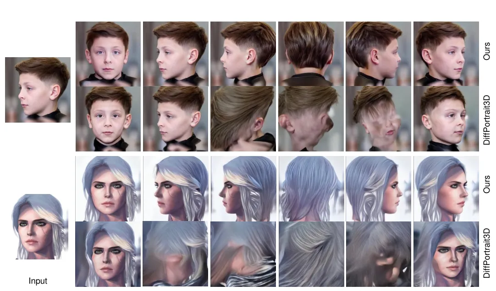

Figure 11: More comparisons with DiffPortrait3D \[16\] on more views.

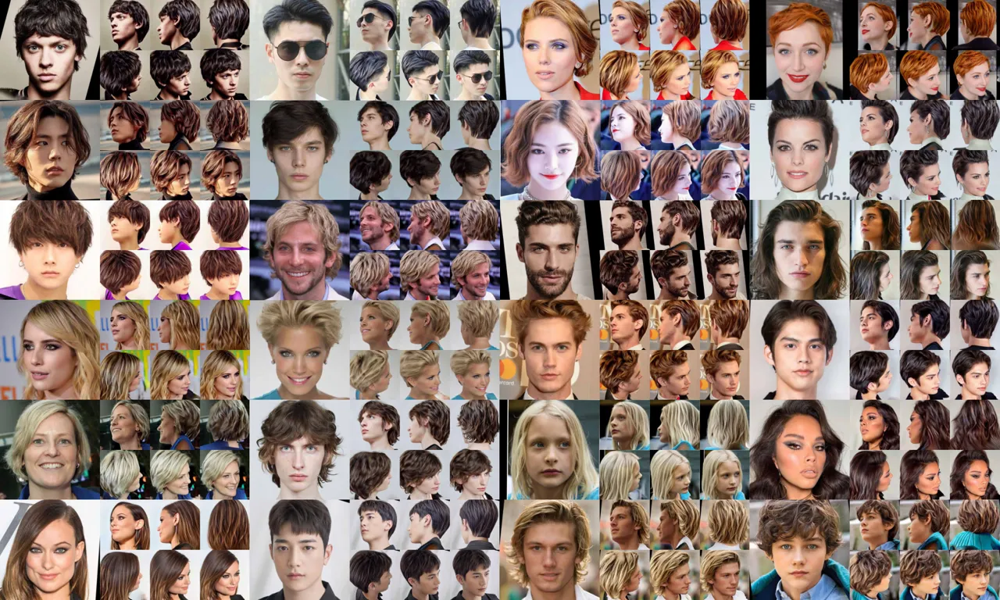

Figure 12: More real-world results.

Please find more comparisons with DiffPortrait3D \[16\] on more views
in Fig. 11.

### B.4 More Results

Finally, more visual results of our method are introduced in Fig. 15,
 Fig. 16 and Fig. 17.

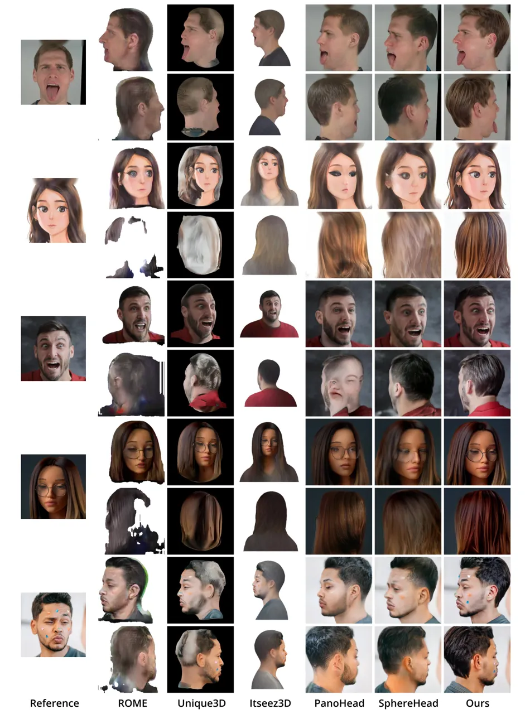

Figure 13: More qualitative comparisons with existing methods on in the
stylized portraits. Our method shows superior generalization capability
to novel view synthesis of wild portraits with unseen appearances,
expressions, and styles, even without any reliance on fine-tuning.

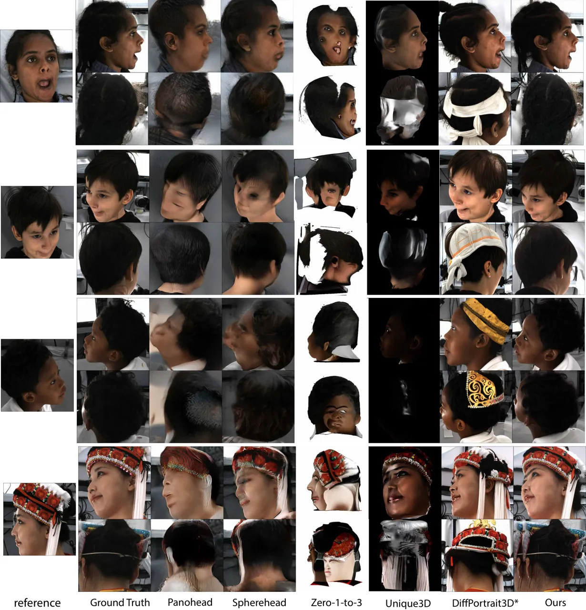

Figure 14: More qualitative comparisons of novel view synthesis on
RenderMe360 \[35\]. Our method achieves effective appearance control for
novel synthesis under substantial change of camera view for synthesis.

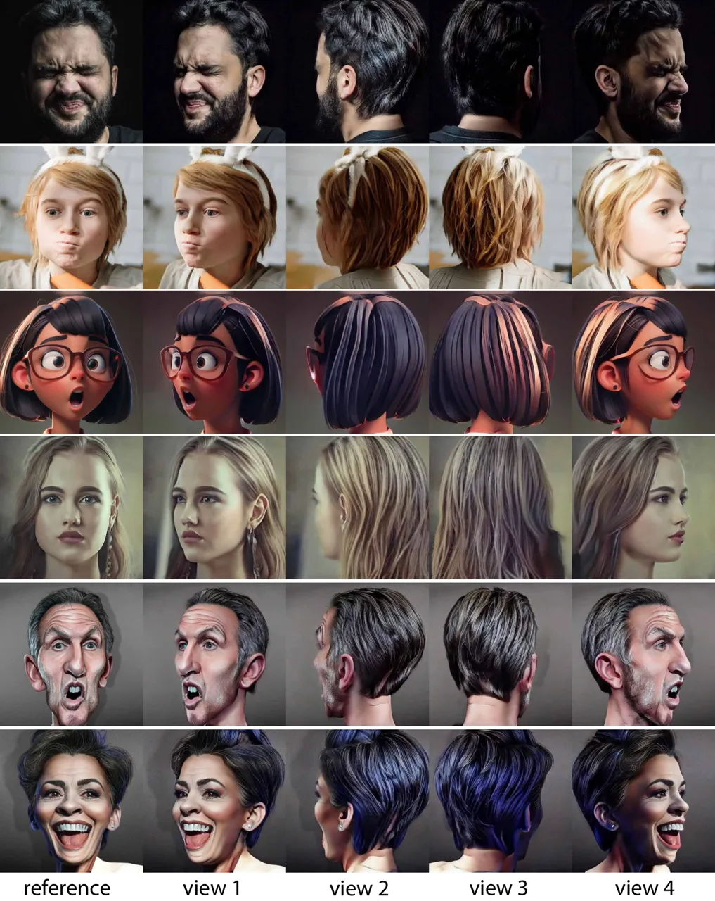

Figure 15: More qualitative results of our method.

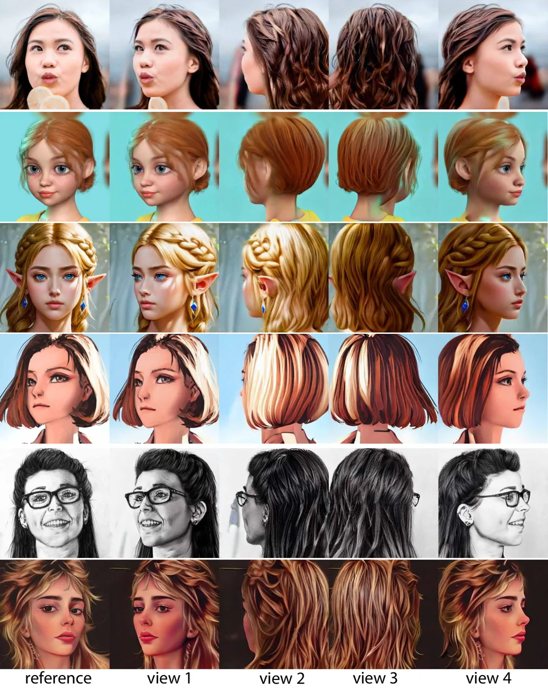

Figure 16: More qualitative results of our method.

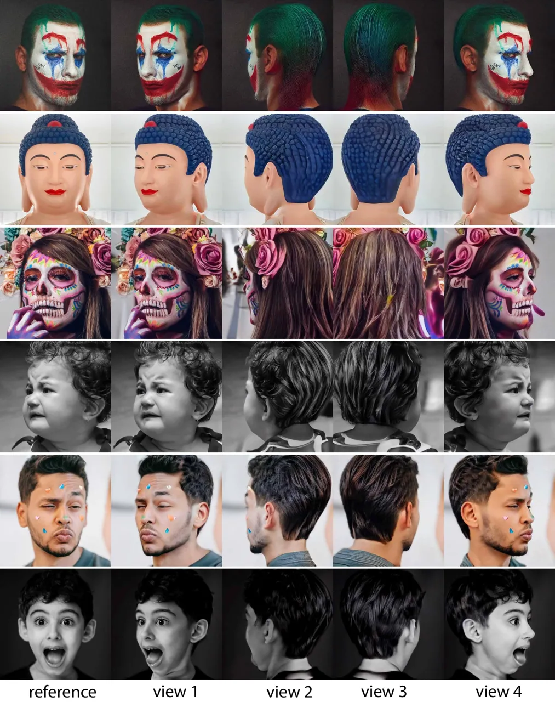

Figure 17: More qualitative results of our method.

## Appendix C Limitation and Future Work

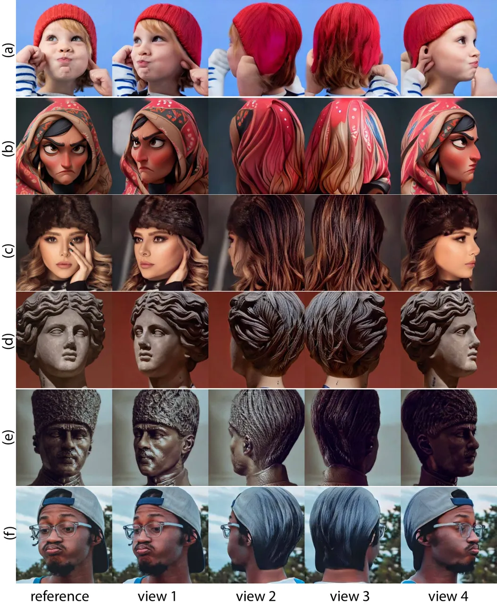

Figure 18: Limitations of our method.

Our experiments prove unlike the temporal fusion layer of DiffPortrait3D
trained on random views, our approach using continuous improves local
consistency which is crucial for 3D tasks. To this end, we also show
that our emphasis on achieving view consistency is crucial for
constructing a NeRF representation, enabling real-time free-viewpoint
rendering from any camera position. While our method outperforms all
state-of-the-art techniques, it still exhibits small inconsistencies for
certain portraits. This is due to the inherent 2D nature of stable
diffusion generation, which remains frozen during training to maintain
stability. In the future, we plan to either incorporate geometric priors
explicitly into the diffusion-based view synthesis process or extend our
framework by directly encoding multi-view images into visual patches
similar to, e.g., SORA\[4\] and explore the use of differentiable
rendering techniques and efficient radiance field representations, such
as 3D Gaussian Splats. Additionally, our method currently struggles with
certain types of headgear, such as various hats and unseen hairstyles
shown in Fig. 18, due to a biased distribution in our training data. We
believe that additional data collection is likely to improve the
performance. Finally, as our generated heads are currently static,
future directions include making them animatable and relightable, and
the cropping size of the head area should be expanded to accommodate
scenarios involving longer hair.
