# TaoAvatar: Real-Time Lifelike Full-Body Talking Avatars for Augmented Reality via 3D Gaussian Splatting

Jianchuan Chen¹¹ 1 Equal contribution. ^(‡)Project Leader and
^(†)Corresponding author. Project:
[https://PixelAI-Team.github.io/TaoAvatar](https://PixelAI-Team.github.io/TaoAvatar),Jingchuan
Hu¹¹ 1 Equal contribution. ^(‡)Project Leader and ^(†)Corresponding
author. Project:
[https://PixelAI-Team.github.io/TaoAvatar](https://PixelAI-Team.github.io/TaoAvatar),Gaige
Wang¹¹ 1 Equal contribution. ^(‡)Project Leader and ^(†)Corresponding
author. Project:
[https://PixelAI-Team.github.io/TaoAvatar](https://PixelAI-Team.github.io/TaoAvatar),Zhonghua
JiangTiansong Zhou    Zhiwen Chen    Chengfei LvAlibaba Group, Hangzhou,
China

###### Abstract

Realistic 3D full-body talking avatars hold great potential in AR, with
applications ranging from e-commerce live streaming to holographic
communication. Despite advances in 3D Gaussian Splatting (3DGS) for
lifelike avatar creation, existing methods struggle with fine-grained
control of facial expressions and body movements in full-body talking
tasks. Additionally, they often lack sufficient details and cannot run
in real-time on mobile devices. We present TaoAvatar, a high-fidelity,
lightweight, 3DGS-based full-body talking avatar driven by various
signals. Our approach starts by creating a personalized clothed human
parametric template that binds Gaussians to represent appearances. We
then pre-train a StyleUnet-based network to handle complex
pose-dependent non-rigid deformation, which can capture high-frequency
appearance details but is too resource-intensive for mobile devices. To
overcome this, we ”bake” the non-rigid deformations into a lightweight
MLP-based network using a distillation technique and develop blend
shapes to compensate for details. Extensive experiments show that
TaoAvatar achieves state-of-the-art rendering quality while running in
real-time across various devices, maintaining 90 FPS on high-definition
stereo devices such as the Apple Vision Pro.

![[Uncaptioned
image]](arxiv-2503-17032--7c6b5a8a75e6.figures/figure-1.webp)

Figure 1: TaoAvatar generates photorealistic, topology-consistent 3D
full-body avatars from multi-view sequences. It provides high-quality,
real-time rendering with low storage requirements, compatible across
various mobile and AR devices like the Apple Vision Pro.

## 1 Introduction

Creating lifelike 3D human avatars is a dynamic and rapidly advancing
research area in computer vision and graphics, essential for
applications in AR/VR, 3D entertainment, and virtual communication.
Despite decades of research, achieving realistic and immersive avatars
on mobile devices—particularly AR—remains challenging due to
computational limitations. Current industry solutions, such as
MetaHuman, often rely on high-precision scans and extensive manual
effort by artists for 3D modeling, rigging, and motion capture.

In recent years, academic researchers have adopted parametric
models \[36, 42\] for human representation, which are constructed from
massive body scans and can capture a performer’s shape, expression, and
pose from images or videos. These methods \[5, 4, 6, 26\] extend the
naked model \[36, 42\] by adding offsets to represent tailored clothing,
but are still struggling with complex geometries and high-frequency
details, such as loose skirts and fine hair, due to limitations of
topology and texture resolution. With the rise of neural radiance fields
(NeRF) \[39\], many researchers tend to define implicit neural human
representations in canonical space, animated by backward linear blend
skinning \[64, 43\] of these parametric models \[36, 42\]. While these
methods can handle arbitrary topology and deliver higher rendering
quality, they are highly time-consuming due to the large amount of
sampling required during volume rendering. Although many efforts \[23,
9\] have significantly improved rendering efficiency by introducing
iNGP \[41\], the animated results still fail to escape the Uncanny
Valley effect when driven. Recently, 3D Gaussian Splatting
(3DGS) \[28\], an explicit and efficient point-based representation, has
gained tremendous attention from researchers for its ability to deliver
both high-quality rendering and real-time performance. Compared to
implicit representations \[39, 53\], the explicit point-based
representation is more compatible with being integrated with the
mesh-based parametric models \[36, 42\], which can be directly driven by
forward linear blend skinning. Many recent methods \[19, 45, 47, 33\],
combining 3DGS and the parametric models \[36, 42\], have made
significant strides toward realizing lifelike 3D human avatars. However,
achieving real-time rendering on mobile devices remains challenging,
especially for AR glasses, which require high resolution, stereo
rendering, and seamless interaction.

We introduce TaoAvatar, a high-fidelity, lightweight, 3DGS-based
full-body talking avatar designed for running in real-time on Augmented
Reality (AR) devices. Unlike previous approaches \[8, 33, 10\], which
develop implicit parameterized models from scratch, we construct a
personalized, clothed parameterized template that preserves the facial
expressions and gesture controls inherent to the native SMPLX \[42\]. At
the same time, we bind the Gaussians to the triangles as texture to
create a hybrid avatar representation. Inspired by \[33\], we pre-train
a large StyleUnet-based teacher network to learn pose-dependent dynamic
deformation maps of Gaussians in 2D space by front and back orthogonal
projection. Although the teacher network is powerful enough to capture
high-frequency appearance details in various poses, its large number of
parameters makes it difficult to run in real-time on AR devices. To
achieve high-performance rendering, we bake the dynamic deformation of
Gaussians into the non-rigid deformation field of the mesh using a
distillation technique, employing a compact MLP-based student network.
Meanwhile, we propose two lightweight, learnable blend shapes to
compensate for the non-rigid deformation of the Gaussians. After
fine-tuning, our student model achieves high-performance rendering
without compromising quality.

To evaluate our approach, we propose a multi-view dataset named
TalkBody4D, focusing on prevalent full-body talking scenarios
encountered in daily life, which includes rich facial expressions and
gestures with synchronous audios different from existing full-body
motion datasets \[21, 11, 68\]. Experimental results demonstrate that
our method effectively captures high-frequency appearance details of
human avatars while maintaining a lightweight architecture capable of
rendering stereo images at 2K resolution on common mobile and AR
devices, including the Apple Vision Pro. The resulting full-body avatar
is highly expressive, enabling users to animate it with facial
expressions, hand gestures, and body poses, thereby highlighting the
potential applications of our method. Our contributions can be
summarized as follows:

- •
  We introduce TaoAvatar, a novel teacher-student framework which yields
  topologically consistent, well-aligned geometry, further creating a
  high-fidelity, lightweight, 3DGS-based drivable full-body talking
  avatar.
- •
  We propose two innovative strategies including non-rigid deformation
  baking and two lightweight blend shapes compensations to ensure
  high-quality rendering and efficient performance on mobile and AR
  devices, achieving 2K resolution rendering at 90 FPS on
  high-definition stereo devices like the Apple Vision Pro.
- •
  We contribute TalkBody4D, a multi-view dataset to be released,
  designed for full-body talking scenarios, featuring diverse facial
  expressions and gestures with synchronous audios. Extensive
  experiments demonstrate that our approach outperforms other
  state-of-the-art methods in both quality and performance.

## 2 Related work

3D Avatar Representation. Traditional computer graphics techniques \[49,
50, 12, 18\] use 3D scanning or multi-view stereo (MVS) to create
full-body meshes, which are then combined with a 3D skeleton to produce
driveable templates. However, this approach is both expensive and
inefficient. As parametric body models, SMPL \[36\] and SMPLX \[42\] are
widely used for their versatility but lack detail in simulating loose
clothing. Some works \[5, 4, 26\] have attempted to add clothing offsets
to SMPLX, effectively handling tight clothing but struggling with loose
garments. Due to the limited expressiveness of traditional meshes,
researchers have combined SMPL with advanced rendering techniques. Some
methods \[7, 56, 22, 35\] use NeRF \[39\] to implicitly express human
bodies, mapping points from the observation space backward to canonical
space. Although high-quality, volume rendering is slow and poses
challenges for real-time applications. In contrast, 3DGS \[28\] uses 3D
Gaussian distributions for scenes, offering real-time rendering \[37,
57\], fast training, and the ability to handle complex materials such as
hair and translucency. Some methods \[45, 33, 47, 55, 62\] combining
SMPLX \[42\] and 3DGS \[28\], like GaussianAvatar \[19\], use explicit
GS point clouds and forward skinning to efficiently simulate the
deformations, offering good rendering quality and speed. This
representation presents potential solutions for achieving both real-time
performance and computational efficiency.

Dynamic Nonrigid Deformation Modeling. Various methods have been
developed to simulate non-rigid human deformation realistically. The
MLP-based methods \[20, 29, 32, 40\], like 3DGS-Avatar \[45\], are noted
for lightweight flexibility but struggle with handling novel poses.
Physical simulation methods \[67, 58\] produce physics-based animations
but require unified topology, and complex modeling, and are
computationally expensive, which negatively impacts real-time
performance. Additionally, some methods \[16, 17\] use GNNs to learn
non-rigid deformations in a data-driven manner. These methods are faster
than traditional cloth simulations. Recently, dynamic texture methods
are emerging, these methods \[35, 31, 25\] model complex details in the
2D texture space, while AnimatableGS \[33\] and MeshAvatar \[10\]
enhance modeling with front and back projection strategies which avoid
texture unwarping.

3D Drivable Talking Avatars. Research on drivable digital humans is
rapidly advancing for various applications. In 3D Talking Heads,
methods \[44, 60, 46, 65, 59, 13\] excel in capturing and driving facial
expressions, enhancing the realism of virtual characters. For drivable
bodies, these methods \[19, 69, 33, 8, 55\] achieve precise restoration
of body movements by learning pose-dependent deformation fields.
Furthermore, some methods \[48, 58\] not only support detailed body
modeling and animation but also enable head expressions and lip-syncing.
Despite enhancing realism, running these methods in real-time on mobile
or AR devices is challenging due to their high computational demands,
exceeding current edge platform capabilities. Optimizing computational
efficiency without compromising high-quality output is a key research
focus.

## 3 Method

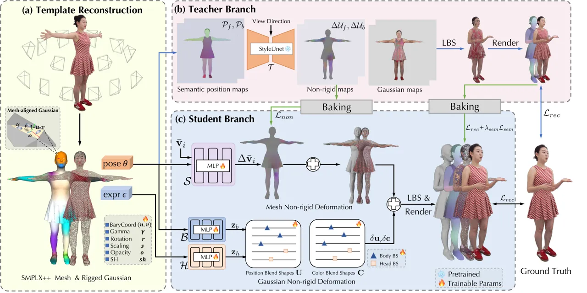

Figure 2: Illustration of our Method. Our pipeline begins by
reconstructing (a) a cloth-extended SMPLX mesh with aligned Gaussian
textures. To address complex dynamic non-rigid deformations, (b) we
employ a teacher StyleUnet to learn pose-dependent non-rigid maps, which
are then baked into a lightweight student MLP to infer non-rigid
deformations of our template mesh. For high-fidelity rendering, (c) we
introduce learnable Gaussian blend shapes to enhance appearance details.

Leveraging multi-view RGB videos of a performer alongside corresponding
SMPLX registrations for each frame, we aim to develop a high-fidelity,
lightweight full-body talking avatar capable of high-resolution and
high-performance rendering on mobile devices. To achieve this, we first
create a hybrid clothed parametric representation by integrating 3D
Gaussian Splatting (3DGS) \[28\] and SMPLX \[42\], which is more
expressive for simulating loose clothing and hair, while maintaining
high-quality rendering (Sec. 3.1). Next, we propose a teacher-student
framework to reconstruct high-frequency, pose-dependent dynamic details
as illustrated in Fig. 2. By leveraging non-rigid deformation baking and
incorporating two lightweight blend shape compensations, our method
achieves a tradeoff between high quality and high performance
(Sec. 3.2).

### 3.1 Hybrid Clothed Parametric Representations

The Clothed Extension of SMPLX. To extend SMPLX to complete clothed
human geometry with clothes, hair, etc., we choose a frame close to
T-pose as a reference, which provides more visible details and less
sticky geometry. First, we utilize NeuS2 \[53\] to reconstruct the
geometry of this reference frame and parse out non-body components
(e.g., clothes) from it using \[52\]. However, the body’s skeleton
cannot directly drive these components. We estimate the shape and pose
of the SMPLX \[36\] in the current frame and use robust skinning
transfer \[3\] to propagate the body’s skinning weights to these
non-body components. Finally, we apply inverse skinning to transform
these components back to the standard T-pose, resulting in a
comprehensive personalized parametric model, referred to as SMPLX++.

Binding Gaussians on Mesh as Texture. After obtaining the complete
geometric model, we bind 3D Gaussians to the mesh’s triangles as
textures, enabling them to move synchronously with the mesh. Inspired by
these hybrid representations \[44, 47\], we define the attributes of the
Gaussians in a local coordinate system relative to the triangles.
Specifically, for each triangle, we randomly initialize $`k`$ Gaussians,
each of which maintains the local attributes
$`\{f,(u,v),\gamma,\mathbf{r},\mathbf{s},o,\mathbf{sh}\}`$, where $`f`$
is the index of the parent triangle, $`(u,v)`$ is the barycentric
coordinates, $`\gamma`$ represents the translation along the triangle’s
normal direction, $`\mathbf{r}`$ and $`\mathbf{s}`$ denote rotation and
scaling in the local space, $`\mathbf{o}`$ indicates opacity, and
$`\mathbf{sh}`$ consists of spherical harmonic coefficients.
Additionally, we define the normal of each Gaussian as
$`\mathbf{n}_{g}=[1,0,0]`$ within the local space, ensuring consistency
with the mesh’s normal for subsequent transformations. To deform each
Gaussian from the local to the world space, we construct a
transformation based on its parent triangle
$`F_{f}(\mathbf{v}_{1},\mathbf{v}_{2},\mathbf{v}_{3})`$, where
$`\mathbf{v}_{1}`$, $`\mathbf{v}_{2}`$, $`\mathbf{v}_{3}`$ are the
vertices of the triangle $`F_{f}`$ in the world space:

```math
\displaystyle\mathbf{p} \displaystyle=u\cdot\mathbf{v}_{1}+v\cdot\mathbf{v}_{2}+\left(1-u-v\right)\cdot\mathbf{v}_{3}, \tag{1}
```

```math
\displaystyle\mathbf{R} \displaystyle=[\mathbf{n},\mathbf{q},\mathbf{n}\times\mathbf{q}],\mathbf{q}=\frac{\left(\mathbf{v}_{2}+\mathbf{v}_{3}\right)/2-\mathbf{v}_{1}}{\left\|\left(\mathbf{v}_{2}+\mathbf{v}_{3}\right)/2-\mathbf{v}_{1}\right\|},
```

```math
\displaystyle e \displaystyle=\left(\left\|\mathbf{v}_{1}-\mathbf{v}_{2}\right\|+\left\|\mathbf{v}_{2}-\mathbf{v}_{3}\right\|+\left\|\mathbf{v}_{1}-\mathbf{v}_{3}\right\|\right)/3,
```

where
$`\mathbf{n}=\frac{\left(\mathbf{v}_{1}-\mathbf{v}_{2}\right)\times\left(\mathbf{v}_{3}-\mathbf{v}_{1}\right)}{\left\|\mathbf{v}_{1}-\mathbf{v}_{2}\right\|\cdot\left\|\mathbf{v}_{3}-\mathbf{v}_{1}\right\|}`$
is the normal of the triangle, $`\mathbf{p}`$ denotes the surface point
on the parent triangle, and $`e`$ denotes the average edge length.

```math
\mathbf{u}_{w}=\mathbf{p}+\gamma\mathbf{R}\mathbf{n},\quad\mathbf{r}_{w}=\mathbf{R}\mathbf{r},\quad\mathbf{s}_{w}=e\cdot\mathbf{s}, \tag{2}
```

here, $`\mathbf{u}_{w}`$, $`\mathbf{r}_{w}`$, $`\mathbf{s}_{w}`$
represent the position, rotation, and scaling in the world spaces after
transformation, respectively. Furthermore,
$`\mathbf{c}_{w}=SH\left(\mathbf{sh},\mathbf{R}^{-1}\mathbf{d}\right)`$
denotes the color along the view direction $`\mathbf{d}`$ in the world
space.

### 3.2 Dynamic Mesh-based Gaussian Reconstruction

Learning Dynamic Non-Rigid Gaussian Deformation Maps. Although SMPLX++
can be directly driven by the skeleton, linear blend skinning is
insufficient for performing dynamic non-rigid deformation such as
clothing folds and swaying motions. Like dynamic Gaussian avatars \[33,
25\], we utilize a large StyleUnet \[51\] as the teacher network to
capture complex pose-dependent dynamic non-rigid deformation of
Gaussians in 2D texture space. Following \[33\], we rasterize the T-pose
mesh, which is colored using posed coordinates and segmentation colors,
to obtain the front and back position maps
$`\{\mathcal{P}_{f},\mathcal{P}_{b}\}`$. These position maps are then
fed into the StyleUnet network along with view directions to generate
the non-rigid deformation maps
$`\{\Delta\mathcal{U}_{f},\Delta\mathcal{U}_{b}\}`$ and other residual
Gaussian attribute maps. We add these residuals to the Gaussian’s local
attributes and transform them into the world space according to Eq. (2).
To train the StyleUnet-based teacher network $`\mathcal{T}`$, we adopt
the losses including L1, D-SSIM \[28\], and perceptual loss \[63\].
Additionally, we introduce a normal loss $`\mathcal{L}_{nor}`$.
Consequently, the total reconstruction loss $`\mathcal{L}_{rec}`$ is
defined as:

```math
\mathcal{L}_{rec}=\mathcal{L}_{1}+\lambda_{ssim}\mathcal{L}_{ssim}+\lambda_{lpips}\mathcal{L}_{lpips}+\lambda_{nor}\mathcal{L}_{nor}, \tag{3}
```

where $`\lambda_{*}`$ is the loss weights. The normal loss is defined as
$`\mathcal{L}_{nor}=\left\|N_{t}-N_{g}\right\|`$, where $`N_{t}`$ is the
rendered normal image by the teacher network, and the ground truth
normal image $`N_{g}`$ can be obtained from the method \[53\].

Baking Non-Rigid Gaussian Deformation into Mesh Deformation. Although
the StyleUnet-based network $`\mathcal{T}`$ can achieve good results, it
struggles to run in real-time on mobile devices due to its large number
of parameters, especially for AR devices, which require high resolution,
stereo rendering, and high performance. Inspired by knowledge
distillation, we bake the Gaussian non-rigid deformation of the teacher
network into the mesh non-rigid deformation field, which is a compact
MLP-based student network $`\mathcal{S}`$.

```math
\Delta\bar{\mathbf{v}}_{i}=\mathcal{S}\left(\bar{\mathbf{v}}_{i},\mathbf{\theta},\mathbf{z}_{t}\right), \tag{4}
```

where $`\bar{\mathbf{v}}_{i}`$ is the $`i`$-th vertex coordinate in the
canonical space, $`\mathbf{\theta}`$ is the pose parameter, and
$`\mathbf{z}_{t}`$ is a learnable embedding for each frame to compensate
for inaccurate pose estimation. To train the student network
$`\mathcal{S}`$ with the capability of pose-dependent non-rigid
deformation, we directly supervise its output using the Gaussian
non-rigid deformation maps
$`\{\Delta\mathcal{U}_{f},\Delta\mathcal{U}_{b}\}`$ of the teacher
network $`\mathcal{T}`$. Specifically, we render the mesh non-rigid
deformations $`\left\{\Delta\mathbf{v}_{i}\right\}_{i=1}^{N}`$ to front
and back deformation maps
$`\{\Delta\mathcal{V}_{f},\Delta\mathcal{V}_{b}\}`$ in the canonical
space, and then calculate the differences:

```math
\mathcal{L}_{non}=\left\|\Delta\mathcal{V}_{f}-\Delta\mathcal{U}_{f}\right\|+\left\|\Delta\mathcal{V}_{b}-\Delta\mathcal{U}_{b}\right\|. \tag{5}
```

Furthermore, to mitigate the intersection between clothing and the body,
we introduce a semantic loss $`\mathcal{L}_{sem}`$. For each vertex, we
assign a semantic label
$`\mathbf{e}_{i}=\mathbf{c}_{i}+\sin\left({\tau\bar{\mathbf{v}}_{i}}\right)`$
that integrates the candidate coordinates $`\bar{\mathbf{v}}_{i}`$ and
the artificial segmentation color $`\mathbf{c}_{i}`$, and $`\tau`$ is a
scale factor. The semantic label for each Gaussian can be obtained by
interpolating the semantic label of the three vertices of its parent
triangle. Subsequently, we render the Gaussian semantic map
$`\mathcal{E}_{t}`$ and the mesh semantic map $`\mathcal{E}_{s}`$ in the
world space separately and compute the semantic loss
$`\mathcal{L}_{sem}`$:

```math
\mathcal{L}_{sem}=\left\|\mathcal{E}_{s}-\mathcal{E}_{t}\right\|. \tag{6}
```

In addition, we refine the local attributes by computing the
reconstruction loss $`\mathcal{L}_{rec}`$, which takes the rendered
image of the teacher network as ground truth. The total loss
$`\mathcal{L}_{bak}`$ during baking is:

```math
\mathcal{L}_{bak}=\mathcal{L}_{rec}+\lambda_{non}\mathcal{L}_{non}+\lambda_{sem}\mathcal{L}_{sem}. \tag{7}
```

Compensating Gaussian Deformation with Lightweight Blend Shapes.
Inspired by pose corrective blend shapes in SMPL \[36\], we build
learnable blend shapes for position and color for each Gaussian. The
position blend shapes, $`\mathbf{U}\in\mathbb{R}^{3\times n}`$,
primarily compensate for Gaussian positional adjustments (e.g., hair
fluttering, clothing folds) across different poses. Meanwhile, the color
blend shapes, $`\mathbf{C}\in\mathbb{R}^{3\times n}`$, address
appearance changes, such as shadow variations caused by
self-obscuration. To obtain the corresponding driving coefficients, we
employ a mapping network $`\mathcal{H}`$ for the head using the
expression parameters $`\epsilon`$ as input and a mapping network
$`\mathcal{B}`$ for the body which inputs the body pose parameters
$`\mathbf{\theta}`$, to get the coefficients
$`\mathbf{z}_{h}\in\mathbb{R}^{n_{h}}`$ for the head and
$`\mathbf{z}_{b}\in\mathbb{R}^{n_{b}}`$ for the body, respectively,
enabling independent and fine-grained control over head and body
deformations. The compensation of position and color for each Gaussian
can be expressed as:

```math
\displaystyle\delta\mathbf{u} \displaystyle=BS\left(\mathbf{z}_{h}\oplus\mathbf{z}_{b};\mathbf{U}\right), \tag{8}
```

```math
\displaystyle\delta\mathbf{c} \displaystyle=BS\left(\mathbf{z}_{h}\oplus\mathbf{z}_{b};\mathbf{C}\right),
```

where $`\oplus`$ is a concatenation operation, resulting in the size
$`n=n_{h}+n_{b}`$. The function $`BS(\cdot,\cdot)`$ represents the blend
shapes operation mentioned in SMPL \[36\]. We add these residuals to
local attributes:

```math
\displaystyle\mathbf{u}_{w} \displaystyle=\mathbf{p}+\mathbf{R}\left(\gamma\mathbf{n}+\delta\mathbf{u}\right), \tag{9}
```

```math
\displaystyle\mathbf{c}_{w} \displaystyle=SH\left(\mathbf{R}^{-1}\mathbf{d}\right)+\delta\mathbf{c}.
```

For the fine-tuning stage on training data, we freeze the non-rigid
deformation field network $`\mathcal{S}`$, optimize the two mapping
networks $`\mathcal{H}`$ and $`\mathcal{B}`$, and two blend shapes
$`\mathbf{U}`$ and $`\mathbf{C}`$. The loss during fine-tuning is the
same as that pre-training the teacher network.

After baking mesh non-rigid deformation and applying Gaussian non-rigid
compensation, the performance of our student model is significantly
enhanced compared to the teacher model, while still maintaining high
quality.

## 4 Experiments

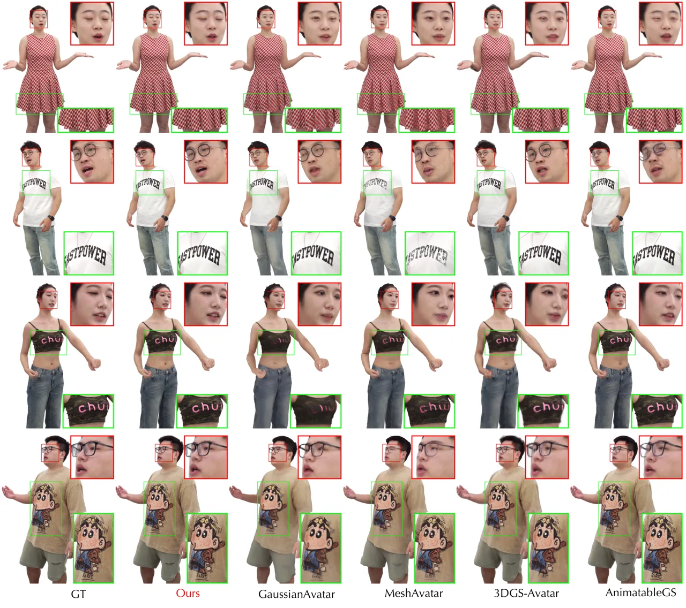

Figure 3: Qualitative comparisons on full-body talking tasks. Our method
outperforms state-of-the-art methods by producing clearer clothing
dynamics and enhanced facial details.

### 4.1 Experimental Settings

Datasets. To evaluate the performance on the full-body talking task, we
introduce a new dataset, TalkBody4D, designed for common full-body
talking scenarios in everyday life, primarily characterized by rich
mouth movements and diverse gestures with synchronous audios. The
dataset comprises $`4`$ distinct identities, each wearing $`2`$
different outfits. Each talking sequence consists of rough $`6`$k frames
with $`4`$K image resolution, $`60`$ views with $`48`$ full-body, and
$`12`$ face-region views. To evaluate performance on complex motions and
expressions, we select $`4`$ sequences (04, 05, 06, 08) from the
ActorHQ \[21\] dataset, supplement with $`2`$ dancing and $`2`$
exaggerated expression sequences. The resolution of our training and
testing images is $`1500\times 2000`$ for all experiments. SMPLX
registrations for these sequences can be obtained by first initializing
SMPLX parameters using existing tools \[1, 2, 44\], followed by
fine-tuning the poses with a photometric loss to improve geometry
alignment.

Implementation Details. The clothed parametric template has roughly
$`22k`$ vertices and $`45k`$ faces in total, which contains additional
$`23k`$ faces for clothes, hair, and shoes, compared to the naive SMPLX.
We randomly initialize about $`220k`$ Gaussians in total to bind with
the template as texture, for each triangle containing roughly $`4`$ to
$`6`$, and optimize these Gaussians for $`10k`$ iterations using the
multi-view images of the reference frame. We pre-train our
StyleUnet-based\[33\] teacher network for $`600k`$ iterations, and set
the loss weights
$`\lambda_{ssim}=0.2,\lambda_{lpips}=0.01,\lambda_{nor}=0.02`$ and batch
size is $`1`$ during the training process. Then we bake the teacher
network into a small $`5`$-layer MLP-based student network, which set
$`\lambda_{non}=0.1,\lambda_{sem}=1.0`$ and optimize $`30k`$ iterations.
Finally, we finetune the mapping networks and blend shapes for Gaussian
non-rigid compensation on training data $`100k`$ iterations at the batch
size of $`4`$. The size of two blend shapes for position and color is
$`n=28`$, in which $`n_{h}=8`$ for the head and $`n_{b}=20`$ for the
body.

### 4.2 Comparison

We conduct an extensive comparison between our method and recent
state-of-the-art full-body avatar methods include GaussianAvatar \[19\],
3DGS-Avatar \[45\], MeshAvatar \[10\], and AnimatableGS \[33\]. All of
these methods learn pose-dependent non-rigid deformations in the
canonical space and then utilize the skeleton-based rigid
transformations of SMPL \[36\] or SMPLX \[42\] into observation space to
model the dynamic human. We uniformly use SMPLX \[42\] across all these
methods to ensure a fair comparison.

Comparison on Full-body Talking. We conduct experiments on typical
full-body talking scenarios encountered in daily life, which include a
variety of mouth movements and gestures. We provide the quantitative
comparison on full-body talking as shown in Tab. 1. We also show the
qualitative comparison in Fig. 3, and our method can generate more
realistic and detailed results, especially in the face region.
3DGS-Avatar \[45\] directly learns two MLP-based networks to handle the
pose-dependent non-rigid deformation of Gaussians but produces very
blurry results due to the low-frequency bias of MLPs.
GaussianAvatar \[19\] uses a 2D CNN network by encoding the position map
in SMPLX’s UV space to generate the non-rigid deformation maps of
Gaussians. However, it is restricted by the mini-clothed topology of
SMPLX, struggling to handle loose skirts. MeshAvatar \[10\] chooses mesh
as a human representation, which is insufficient to express the geometry
of details, such as hair, and glasses. AnimatableGS \[33\] can generate
high-quality dynamic appearance and complex non-rigid deformation.
However, it is restricted by the implicit template of learning from
scratch, which makes it difficult to handle fine-grained expressions,
like blinking and flashing teeth as shown in the face region in Fig. 3.
Therefore we adopt the SMPLX++ model as the template whose face and
hands retain the native SMPLX prior. However, due to the amount
parameters of the teacher StyleUnet \[51\], it achieves poor performance
and is hard to run on a mobile device in real time. Through baking
non-rigid deformation, we can achieve $`150+`$ FPS at the resolution of
$`1500\times 2000`$ on Nvidia RTX4090 using only a small MLP-based mesh
non-rigid deformation network and two lightweight learnable blend shapes
as shown in Tab. 1.

|                      |                  |                  |                     |                               |                  |                     |       |
| -------------------- | ---------------- | ---------------- | ------------------- | ----------------------------- | ---------------- | ------------------- | ----- |
|                      | Novel View       |                  |                     | Novel Gestures and Expression |                  |                     | Speed |
| Model                | PSNR$`\uparrow`$ | SSIM$`\uparrow`$ | LPIPS$`\downarrow`$ | PSNR$`\uparrow`$              | SSIM$`\uparrow`$ | LPIPS$`\downarrow`$ | FPS   |
| GaussianAvatar\[19\] | 26.58 (23.57)    | .9313 (.8159)    | .10577 (.25242)     | 25.99 (23.15)                 | .9232 (.8092)    | .12265 (.26207)     | 54    |
| 3DGS-Avatar\[45\]    | 28.91 (23.95)    | .9411 (.8303)    | .07984 (.20450)     | 26.46 (23.32)                 | .9157 (.8184)    | .11804 (.21632)     | 55    |
| MeshAvatar\[10\]     | 28.53 (24.55)    | .9360 (.8083)    | .09470 (.25572)     | 27.08 (23.58)                 | .9229 (.7965)    | .10783 (.24947)     | 22    |
| AnimatableGS\[33\]   | 32.50 (26.42)    | .9599 (.8587)    | .06695 (.19535)     | 28.05 (23.68)                 | .9328 (.8142)    | .09191 (.22673)     | 16    |
| Ours (Teacher)       | 33.45 (27.01)    | .9649 (.8741)    | .04986 (.15613)     | 28.28 (24.28)                 | .9336 (.8291)    | .07385 (.18176)     | 16    |
| Ours (Student)       | 33.81 (27.80)    | .9689 (.8975)    | .06437 (.14218)     | 28.38 (24.99)                 | .9389 (.8525)    | .08874 (.13364)     | 156   |

Table 1: Quantitative comparisons on full-body talking task. The results
inside the parentheses are evaluated for the face area, and the
inference speed is evaluated on Nvidia RTX4090 when rendering images at
a resolution of 1500 × 2000.

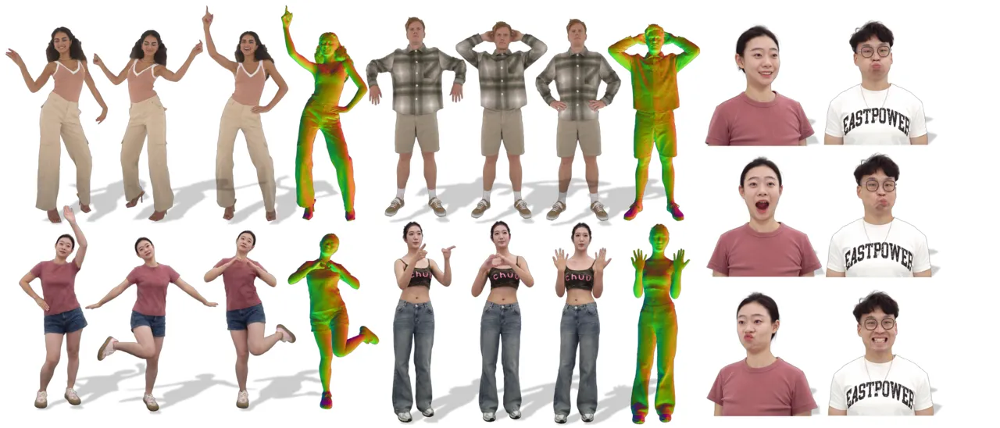

Figure 4: Results in challenging scenarios. Our method can obtain
high-quality reconstruction even for challenging pose and expressions.

|                      |                  |                  |                     |
| -------------------- | ---------------- | ---------------- | ------------------- |
| Model                | PSNR$`\uparrow`$ | SSIM$`\uparrow`$ | LPIPS$`\downarrow`$ |
| GaussianAvatar\[19\] | 25.94 (24.33)    | .9294 (.8251)    | .10478 (.24179)     |
| 3DGS-Avatar\[45\]    | 30.04 (25.08)    | .9403 (.8458)    | .08471 (.18044)     |
| MeshAvatar\[10\]     | 28.51 (24.94)    | .9334 (.8100)    | .08846 (.23517)     |
| AnimatableGS\[33\]   | 31.81 (26.79)    | .9493 (.8608)    | .07586 (.19521)     |
| Ours (Teacher)       | 32.80 (27.40)    | .9533 (.8768)    | .05581 (.14996)     |
| Ours (Student)       | 32.72 (27.35)    | .9579 (.8836)    | .07326 (.13914)     |

Table 2: Quantitative comparisons about complex motions and expressions
reconstruction. The results inside the parentheses are evaluated for
face regions with exaggerated expressions.

Comparison on Complex Motion and Expression. Besides full-body talking
scenes, our method is also capable of reconstructing complex motions as
well as exaggerated expressions as shown in Fig. 4. We provide
quantitative comparisons in  Tab. 2, our student network achieves
competitive results compared to the teacher network, outperforming other
methods. Especially for exaggerated expressions, our method
significantly outperforms others in reconstructing the face region as
shown in  Tab. 2. Moreover, our method can obtain high-quality normals
as shown in  Fig. 4, which can be used for image-based relighting.

Comparison on Novel Expression and Novel Gesture. Benefiting from our
parametric human model SMPLX++, our full-body avatars can be
expression-driven and gesture-driven. We provide quantitative
comparisons of self-driven on full-body talking scenes as shown
in Tab. 1. As shown in Fig. 5, we provide visualizations of different
characters driven by the same skeleton. In addition, our model can
accept expression parameter inputs generated from audio by
UniTalker \[14\] as shown in Fig. 5. More demos are provided in the
supplementary materials.

### 4.3 Ablation Study

In this subsection, we discuss the key contributions of our method.
Additional quantitative results and experiments are available in the
supplementary materials.

The Impact of Template. The choice of template has a crucial impact on
our approach. If we directly use SMPLX as our geometric template, as
shown in Tab. 3 (w SMPLX), leading to poor results with numerous
artifacts, especially for loose skirts as seen in Fig. 6. After
extending the geometry of SMPLX to a complete template with clothes,
hair, and shoes, this quality is significantly improved as shown
in Tab. 3 (w/o Mesh Non.), which allows our method to reconstruct more
challenging clothes.

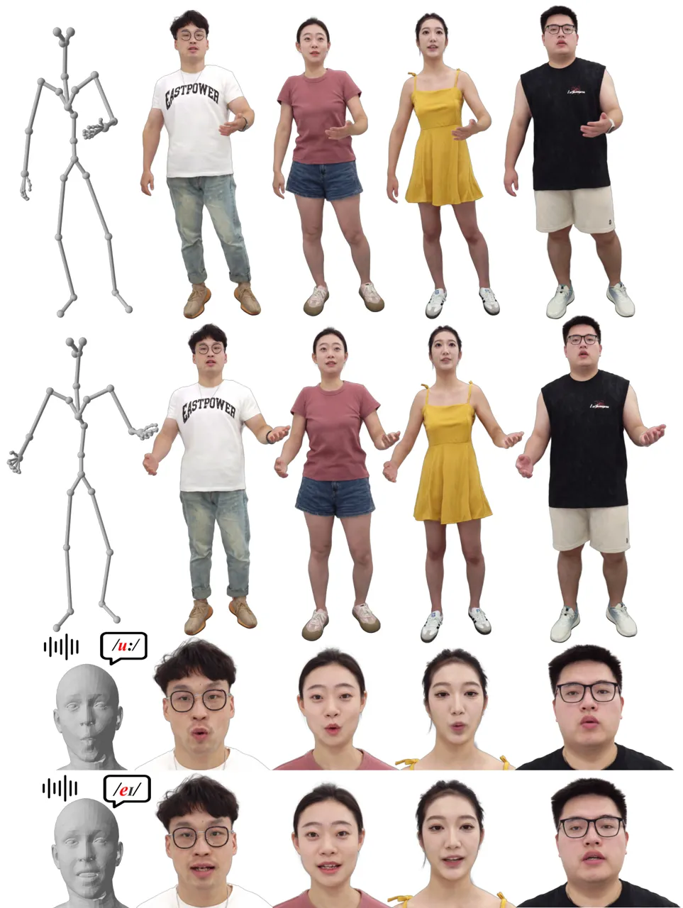

Figure 5: Novel pose and expression animation. TaoAvatar can be driven
by the same skeleton and expression parameters vividly.

The Impact of Non-rigid Deformation. Despite having a complete geometry,
the rigid transformations of the skeleton are not able to properly
represent non-rigid transformations such as skirt swinging and hair
flying. We concurrently introduce mesh non-rigid deformation and
Gaussian non-rigid deformation in our method. The geometry without mesh
non-rigid deformation is unable to attach to the surface of the
character as shown in Fig. 6 (w/o Mesh Non.). The Gaussian non-rigid
compensation also plays a crucial role in quantitative metrics. Without
the blend shapes for Gaussian non-rigid compensation, the results are
prone to produce artifices due to imprecise geometry and variable
appearance as shown in Fig. 6 (w/o Gau Non.).

The Impact of Baking Teacher. Compared to directly training a small
MLP-based network to handle non-rigid deformations as shown in Tab. 3
(w/o Teacher), our proposed multi-stage training strategy is more
efficient. With direct supervision of the non-rigid deformation of the
teacher network, it is easier for the student network to decouple the
geometry deformation and appearance variations.

## 5 Application

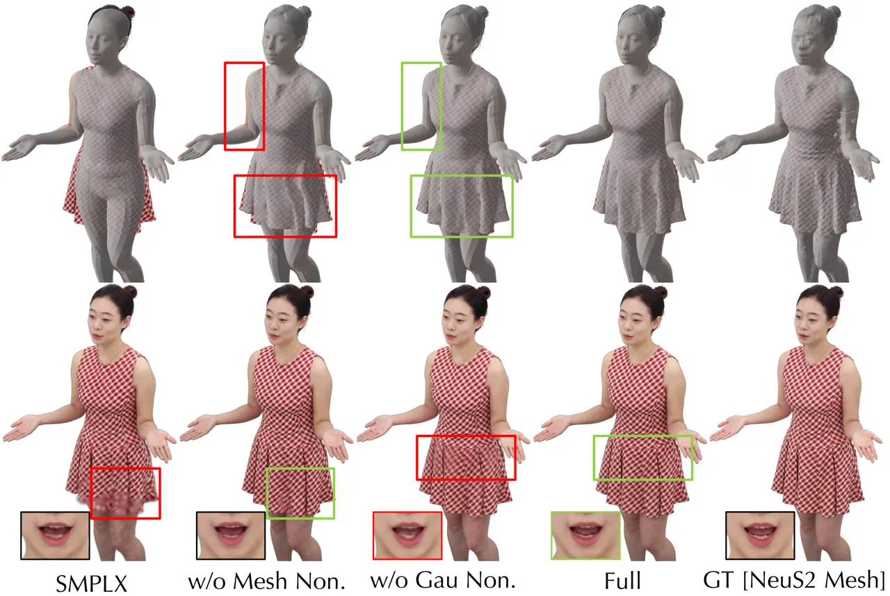

Figure 6: Ablation Study. Red and Green boxes show artifacts and their
improved counterparts.

| Model         | PSNR$`\uparrow`$ | SSIM$`\uparrow`$ | LPIPS$`\downarrow`$ | P2S$`\downarrow`$ | Chamfer$`\downarrow`$ |
| ------------- | ---------------- | ---------------- | ------------------- | ----------------- | --------------------- |
| w SMPLX       | 28.47            | .9476            | .07899              | .7690             | .9995                 |
| w/o Mesh Non. | 32.10            | .9734            | .03814              | .4877             | .5007                 |
| w/o Gau Non.  | 31.16            | .9686            | .03932              | .2968             | .3068                 |
| w/o Teacher   | 32.67            | .9751            | .03769              | .5236             | .5359                 |
| Full          | 33.29            | .9772            | .03464              | .2953             | .3052                 |

Table 3: Ablation Study. We use the mesh reconstructed by NeuS2 \[53\]
as a pseudo-truth for geometry evaluation.

TaoAvatar offers a lightweight, comprehensive representation for 3D
talking body scenarios, easily deployable on various mobile devices
using existing tools \[24\] as demonstrated in Fig. 1. It seamlessly
integrates with AI models to enable real-time dialogue interactions. we
deployed a 3D digital human agent on the Apple Vision Pro, which
interacts with users through an ASR-LLM-TTS pipeline \[15, 61, 30, 38\].
Facial expressions and gestures are dynamically controlled by an
Audio2BS model \[14\], allowing the agent to respond naturally with
synchronized speech, expressions, and movements. A live demonstration is
available in our supplementary materials.

## 6 Discussion

Conclusion. In this work, we present TaoAvatar, a lightweight, lifelike
full-body talking avatar solution. We demonstrate how the
teacher-student framework captures high-definition facial and body
details while ensuring real-time performance on AR devices. TaoAvatar
can be driven by diverse signals, including facial expressions, hand
gestures, and body poses. Through both quantitative and qualitative
evaluations, we showcase the advantages of our approach. Additionally,
we validate its practical potential with a real-world application on the
Apple Vision Pro.

Limitations and Future Works. TaoAvatar encounters challenges in
modeling flexible clothing deformation under exaggerated body poses,
which are out-of-distribution of training data. A possible solution is
to integrate GNN simulators \[16, 17\] handling larger hemlines, which
are compatible with our approach.

Potential Social Impact. TaoAvatar can synthesize lifelike talking
digital humans within an augmented reality environment, generating
fabricated 3D content or 2D videos. Therefore, responsible use of this
technology is essential.

## References

- \[1\]
  [https://github.com/zju3dv/EasyMocap](https://github.com/zju3dv/EasyMocap).
- \[2\]
  [https://github.com/ShenhanQian/VHAP](https://github.com/ShenhanQian/VHAP).
- \[3\] Rinat Abdrashitov, Kim Raichstat, Jared Monsen, and David Hill.
  Robust skin weights transfer via weight inpainting. In _SIGGRAPH Asia
  2023 Technical Communications, SA Technical Communications 2023,
  Sydney, NSW, Australia, December 12-15, 2023_, pages 25:1–25:4.
  ACM, 2023.
- \[4\] Thiemo Alldieck, Marcus A. Magnor, Weipeng Xu, Christian
  Theobalt, and Gerard Pons-Moll. Video based reconstruction of 3d
  people models. In _2018 IEEE Conference on Computer Vision and Pattern
  Recognition, CVPR 2018, Salt Lake City, UT, USA, June 18-22, 2018_,
  pages 8387–8397. Computer Vision Foundation / IEEE Computer
  Society, 2018.
- \[5\] Thiemo Alldieck, Marcus A. Magnor, Bharat Lal Bhatnagar,
  Christian Theobalt, and Gerard Pons-Moll. Learning to reconstruct
  people in clothing from a single RGB camera. In _IEEE Conference on
  Computer Vision and Pattern Recognition, CVPR 2019, Long Beach, CA,
  USA, June 16-20, 2019_, pages 1175–1186. Computer Vision Foundation /
  IEEE, 2019.
- \[6\] Bharat Lal Bhatnagar, Garvita Tiwari, Christian Theobalt, and
  Gerard Pons-Moll. Multi-garment net: Learning to dress 3d people from
  images. In _2019 IEEE/CVF International Conference on Computer Vision,
  ICCV 2019, Seoul, Korea (South), October 27 - November 2, 2019_, pages
  5419–5429. IEEE, 2019.
- \[7\] Jianchuan Chen, Ying Zhang, Di Kang, Xuefei Zhe, Linchao Bao, Xu
  Jia, and Huchuan Lu. Animatable neural radiance fields from monocular
  rgb videos, 2021a.
- \[8\] Xu Chen, Yufeng Zheng, Michael J. Black, Otmar Hilliges, and
  Andreas Geiger. SNARF: differentiable forward skinning for animating
  non-rigid neural implicit shapes. In _2021 IEEE/CVF International
  Conference on Computer Vision, ICCV 2021, Montreal, QC, Canada,
  October 10-17, 2021_, pages 11574–11584. IEEE, 2021b.
- \[9\] Xu Chen, Tianjian Jiang, Jie Song, Max Rietmann, Andreas Geiger,
  Michael J Black, and Otmar Hilliges. Fast-snarf: A fast deformer for
  articulated neural fields. _IEEE Transactions on Pattern Analysis and
  Machine Intelligence_, 45(10):11796–11809, 2023.
- \[10\] Yushuo Chen, Zerong Zheng, Zhe Li, Chao Xu, and Yebin Liu.
  Meshavatar: Learning high-quality triangular human avatars from
  multi-view videos. _CoRR_, abs/2407.08414, 2024.
- \[11\] Wei Cheng, Ruixiang Chen, Siming Fan, Wanqi Yin, Keyu Chen,
  Zhongang Cai, Jingbo Wang, Yang Gao, Zhengming Yu, Zhengyu Lin, Daxuan
  Ren, Lei Yang, Ziwei Liu, Chen Change Loy, Chen Qian, Wayne Wu, Dahua
  Lin, Bo Dai, and Kwan-Yee Lin. Dna-rendering: A diverse neural actor
  repository for high-fidelity human-centric rendering. In _IEEE/CVF
  International Conference on Computer Vision, ICCV 2023, Paris, France,
  October 1-6, 2023_, pages 19925–19936. IEEE, 2023.
- \[12\] Edilson De Aguiar, Christian Theobalt, Carsten Stoll, and
  Hans-Peter Seidel. Marker-less deformable mesh tracking for human
  shape and motion capture. In _2007 IEEE conference on computer vision
  and pattern recognition_, pages 1–8. IEEE, 2007.
- \[13\] Helisa Dhamo, Yinyu Nie, Arthur Moreau, Jifei Song, Richard
  Shaw, Yiren Zhou, and Eduardo Pérez-Pellitero. Headgas: Real-time
  animatable head avatars via 3d gaussian splatting. In _ECCV (2)_,
  pages 459–476. Springer, 2024.
- \[14\] Xiangyu Fan, Jiaqi Li, Zhiqian Lin, Weiye Xiao, and Lei Yang.
  Unitalker: Scaling up audio-driven 3d facial animation through A
  unified model. _CoRR_, abs/2408.00762, 2024.
- \[15\] Zhifu Gao, Shiliang Zhang, Ian McLoughlin, and Zhijie Yan.
  Paraformer: Fast and accurate parallel transformer for
  non-autoregressive end-to-end speech recognition. In _23rd Annual
  Conference of the International Speech Communication Association,
  Interspeech 2022, Incheon, Korea, September 18-22, 2022_, pages
  2063–2067. ISCA, 2022.
- \[16\] Artur Grigorev, Michael J. Black, and Otmar Hilliges. HOOD:
  hierarchical graphs for generalized modelling of clothing dynamics. In
  _IEEE/CVF Conference on Computer Vision and Pattern Recognition, CVPR
  2023, Vancouver, BC, Canada, June 17-24, 2023_, pages 16965–16974.
  IEEE, 2023.
- \[17\] Artur Grigorev, Giorgio Becherini, Michael J. Black, Otmar
  Hilliges, and Bernhard Thomaszewski. Contourcraft: Learning to resolve
  intersections in neural multi-garment simulations. In _ACM SIGGRAPH
  2024 Conference Papers, SIGGRAPH 2024, Denver, CO, USA, 27 July 2024-
  1 August 2024_, page 81. ACM, 2024.
- \[18\] Marc Habermann, Lingjie Liu, Weipeng Xu, Michael Zollhoefer,
  Gerard Pons-Moll, and Christian Theobalt. Real-time deep dynamic
  characters. _ACM Transactions on Graphics_, 40(4), 2021.
- \[19\] Liangxiao Hu, Hongwen Zhang, Yuxiang Zhang, Boyao Zhou, Boning
  Liu, Shengping Zhang, and Liqiang Nie. Gaussianavatar: Towards
  realistic human avatar modeling from a single video via animatable 3d
  gaussians. In _IEEE/CVF Conference on Computer Vision and Pattern
  Recognition, CVPR 2024, Seattle, WA, USA, June 16-22, 2024_, pages
  634–644. IEEE, 2024a.
- \[20\] Shoukang Hu, Tao Hu, and Ziwei Liu. Gauhuman: Articulated
  gaussian splatting from monocular human videos. In _IEEE/CVF
  Conference on Computer Vision and Pattern Recognition, CVPR 2024,
  Seattle, WA, USA, June 16-22, 2024_, pages 20418–20431. IEEE, 2024b.
- \[21\] Mustafa Isik, Martin Rünz, Markos Georgopoulos, Taras
  Khakhulin, Jonathan Starck, Lourdes Agapito, and Matthias Nießner.
  Humanrf: High-fidelity neural radiance fields for humans in motion.
  _ACM Trans. Graph._, 42(4):160:1–160:12, 2023.
- \[22\] Boyi Jiang, Yang Hong, Hujun Bao, and Juyong Zhang. Selfrecon:
  Self reconstruction your digital avatar from monocular video. In
  _IEEE/CVF Conference on Computer Vision and Pattern Recognition, CVPR
  2022, New Orleans, LA, USA, June 18-24, 2022_, pages 5595–5605.
  IEEE, 2022.
- \[23\] Tianjian Jiang, Xu Chen, Jie Song, and Otmar Hilliges.
  Instantavatar: Learning avatars from monocular video in 60 seconds. In
  _Proceedings of the IEEE/CVF Conference on Computer Vision and Pattern
  Recognition_, pages 16922–16932, 2023.
- \[24\] Xiaotang Jiang, Huan Wang, Yiliu Chen, Ziqi Wu, Lichuan Wang,
  Bin Zou, Yafeng Yang, Zongyang Cui, Yu Cai, Tianhang Yu, Chengfei Lyu,
  and Zhihua Wu. MNN: A universal and efficient inference engine. In
  _Proceedings of the Third Conference on Machine Learning and Systems,
  MLSys 2020, Austin, TX, USA, March 2-4, 2020_. mlsys.org, 2020.
- \[25\] Yujiao Jiang, Qingmin Liao, Xiaoyu Li, Li Ma, Qi Zhang,
  Chaopeng Zhang, Zongqing Lu, and Ying Shan. UV gaussians: Joint
  learning of mesh deformation and gaussian textures for human avatar
  modeling. _CoRR_, abs/2403.11589, 2024a.
- \[26\] Yujiao Jiang, Qingmin Liao, Zhaolong Wang, Xiangru Lin,
  Zongqing Lu, Yuxi Zhao, Hanqing Wei, Jingrui Ye, Yu Zhang, and Zhijing
  Shao. Smplx-lite: A realistic and drivable avatar benchmark with rich
  geometry and texture annotations. In _IEEE International Conference on
  Multimedia and Expo, ICME 2024, Niagara Falls, ON, Canada, July 15-19,
  2024_, pages 1–6. IEEE, 2024b.
- \[27\] Yingwenqi Jiang, Jiadong Tu, Yuan Liu, Xifeng Gao, Xiaoxiao
  Long, Wenping Wang, and Yuexin Ma. Gaussianshader: 3d gaussian
  splatting with shading functions for reflective surfaces. In _IEEE/CVF
  Conference on Computer Vision and Pattern Recognition, CVPR 2024,
  Seattle, WA, USA, June 16-22, 2024_, pages 5322–5332. IEEE, 2024c.
- \[28\] Bernhard Kerbl, Georgios Kopanas, Thomas Leimkühler, and George
  Drettakis. 3d gaussian splatting for real-time radiance field
  rendering. _ACM Transactions on Graphics_, 42(4), 2023.
- \[29\] Muhammed Kocabas, Jen-Hao Rick Chang, James Gabriel, Oncel
  Tuzel, and Anurag Ranjan. HUGS: human gaussian splats. In _IEEE/CVF
  Conference on Computer Vision and Pattern Recognition, CVPR 2024,
  Seattle, WA, USA, June 16-22, 2024_, pages 505–515. IEEE, 2024.
- \[30\] Jungil Kong, Jihoon Park, Beomjeong Kim, Jeongmin Kim, Dohee
  Kong, and Sangjin Kim. VITS2: improving quality and efficiency of
  single-stage text-to-speech with adversarial learning and architecture
  design. In _24th Annual Conference of the International Speech
  Communication Association, Interspeech 2023, Dublin, Ireland, August
  20-24, 2023_, pages 4374–4378. ISCA, 2023.
- \[31\] Youngjoong Kwon, Baole Fang, Yixing Lu, Haoye Dong, Cheng
  Zhang, Francisco Vicente Carrasco, Albert Mosella-Montoro, Jianjin Xu,
  Shingo Takagi, Daeil Kim, Aayush Prakash, and Fernando De la Torre.
  Generalizable human gaussians for sparse view synthesis. In _ECCV
  (78)_, pages 451–468. Springer, 2024.
- \[32\] Jiahui Lei, Yufu Wang, Georgios Pavlakos, Lingjie Liu, and
  Kostas Daniilidis. GART: gaussian articulated template models. In
  _IEEE/CVF Conference on Computer Vision and Pattern Recognition, CVPR
  2024, Seattle, WA, USA, June 16-22, 2024_, pages 19876–19887.
  IEEE, 2024.
- \[33\] Zhe Li, Zerong Zheng, Lizhen Wang, and Yebin Liu. Animatable
  gaussians: Learning pose-dependent gaussian maps for high-fidelity
  human avatar modeling. In _IEEE/CVF Conference on Computer Vision and
  Pattern Recognition, CVPR 2024, Seattle, WA, USA, June 16-22, 2024_,
  pages 19711–19722. IEEE, 2024.
- \[34\] Zhihao Liang, Qi Zhang, Ying Feng, Ying Shan, and Kui Jia.
  GS-IR: 3d gaussian splatting for inverse rendering. In _IEEE/CVF
  Conference on Computer Vision and Pattern Recognition, CVPR 2024,
  Seattle, WA, USA, June 16-22, 2024_, pages 21644–21653. IEEE, 2024.
- \[35\] Lingjie Liu, Marc Habermann, Viktor Rudnev, Kripasindhu Sarkar,
  Jiatao Gu, and Christian Theobalt. Neural actor: neural free-view
  synthesis of human actors with pose control. _ACM Trans. Graph._,
  40(6):219:1–219:16, 2021.
- \[36\] Matthew Loper, Naureen Mahmood, Javier Romero, Gerard
  Pons-Moll, and Michael J Black. Smpl: A skinned multi-person linear
  model. _ACM transactions on graphics (TOG)_, 34(6):1–16, 2015.
- \[37\] Jonathon Luiten, Georgios Kopanas, Bastian Leibe, and Deva
  Ramanan. Dynamic 3d gaussians: Tracking by persistent dynamic view
  synthesis. In _3DV_, 2024.
- \[38\] Chengfei Lv, Chaoyue Niu, Renjie Gu, Xiaotang Jiang, Zhaode
  Wang, Bin Liu, Ziqi Wu, Qiulin Yao, Congyu Huang, Panos Huang, Tao
  Huang, Hui Shu, Jinde Song, Bin Zou, Peng Lan, Guohuan Xu, Fei Wu,
  Shaojie Tang, Fan Wu, and Guihai Chen. Walle: An end-to-end,
  general-purpose, and large-scale production system for device-cloud
  collaborative machine learning. In _16th USENIX Symposium on Operating
  Systems Design and Implementation, OSDI 2022, Carlsbad, CA, USA, July
  11-13, 2022_, pages 249–265. USENIX Association, 2022.
- \[39\] Ben Mildenhall, Pratul P Srinivasan, Matthew Tancik, Jonathan T
  Barron, Ravi Ramamoorthi, and Ren Ng. Nerf: Representing scenes as
  neural radiance fields for view synthesis. _Communications of the
  ACM_, 65(1):99–106, 2021.
- \[40\] Arthur Moreau, Jifei Song, Helisa Dhamo, Richard Shaw, Yiren
  Zhou, and Eduardo Pérez-Pellitero. Human gaussian splatting: Real-time
  rendering of animatable avatars. In _CVPR_, pages 788–798. IEEE, 2024.
- \[41\] Thomas Müller, Alex Evans, Christoph Schied, and Alexander
  Keller. Instant neural graphics primitives with a multiresolution hash
  encoding. _ACM transactions on graphics (TOG)_, 41(4):1–15, 2022.
- \[42\] Georgios Pavlakos, Vasileios Choutas, Nima Ghorbani, Timo
  Bolkart, Ahmed A. A. Osman, Dimitrios Tzionas, and Michael J. Black.
  Expressive body capture: 3D hands, face, and body from a single image.
  In _Proceedings IEEE Conf. on Computer Vision and Pattern Recognition
  (CVPR)_, pages 10975–10985, 2019.
- \[43\] Sida Peng, Junting Dong, Qianqian Wang, Shangzhan Zhang, Qing
  Shuai, Xiaowei Zhou, and Hujun Bao. Animatable neural radiance fields
  for modeling dynamic human bodies. In _Proceedings of the IEEE/CVF
  International Conference on Computer Vision_, pages 14314–14323, 2021.
- \[44\] Shenhan Qian, Tobias Kirschstein, Liam Schoneveld, Davide
  Davoli, Simon Giebenhain, and Matthias Nießner. Gaussianavatars:
  Photorealistic head avatars with rigged 3d gaussians. In _IEEE/CVF
  Conference on Computer Vision and Pattern Recognition, CVPR 2024,
  Seattle, WA, USA, June 16-22, 2024_, pages 20299–20309. IEEE, 2024a.
- \[45\] Zhiyin Qian, Shaofei Wang, Marko Mihajlovic, Andreas Geiger,
  and Siyu Tang. 3dgs-avatar: Animatable avatars via deformable 3d
  gaussian splatting. In _IEEE/CVF Conference on Computer Vision and
  Pattern Recognition, CVPR 2024, Seattle, WA, USA, June 16-22, 2024_,
  pages 5020–5030. IEEE, 2024b.
- \[46\] Shunsuke Saito, Gabriel Schwartz, Tomas Simon, Junxuan Li, and
  Giljoo Nam. Relightable gaussian codec avatars. In _IEEE/CVF
  Conference on Computer Vision and Pattern Recognition, CVPR 2024,
  Seattle, WA, USA, June 16-22, 2024_, pages 130–141. IEEE, 2024.
- \[47\] Zhijing Shao, Zhaolong Wang, Zhuang Li, Duotun Wang, Xiangru
  Lin, Yu Zhang, Mingming Fan, and Zeyu Wang. Splattingavatar: Realistic
  real-time human avatars with mesh-embedded gaussian splatting. In
  _IEEE/CVF Conference on Computer Vision and Pattern Recognition, CVPR
  2024, Seattle, WA, USA, June 16-22, 2024_, pages 1606–1616.
  IEEE, 2024.
- \[48\] Kaiyue Shen, Chen Guo, Manuel Kaufmann, Juan Jose Zarate,
  Julien Valentin, Jie Song, and Otmar Hilliges. X-avatar: Expressive
  human avatars. In _IEEE/CVF Conference on Computer Vision and Pattern
  Recognition, CVPR 2023, Vancouver, BC, Canada, June 17-24, 2023_,
  pages 16911–16921. IEEE, 2023.
- \[49\] Carsten Stoll, Juergen Gall, Edilson De Aguiar, Sebastian
  Thrun, and Christian Theobalt. Video-based reconstruction of
  animatable human characters. _ACM Transactions on Graphics (TOG)_,
  29(6):1–10, 2010.
- \[50\] Daniel Vlasic, Pieter Peers, Ilya Baran, Paul E. Debevec, Jovan
  Popovic, Szymon Rusinkiewicz, and Wojciech Matusik. Dynamic shape
  capture using multi-view photometric stereo. _ACM Trans. Graph._,
  28(5):174, 2009.
- \[51\] Lizhen Wang, Xiaochen Zhao, Jingxiang Sun, Yuxiang Zhang,
  Hongwen Zhang, Tao Yu, and Yebin Liu. Styleavatar: Real-time
  photo-realistic portrait avatar from a single video. In _ACM SIGGRAPH
  2023 Conference Proceedings, SIGGRAPH 2023, Los Angeles, CA, USA,
  August 6-10, 2023_, pages 67:1–67:10. ACM, 2023a.
- \[52\] Wenbo Wang, Hsuan-I Ho, Chen Guo, Boxiang Rong, Artur Grigorev,
  Jie Song, Juan Jose Zarate, and Otmar Hilliges. 4d-dress: A 4d dataset
  of real-world human clothing with semantic annotations. In _IEEE/CVF
  Conference on Computer Vision and Pattern Recognition, CVPR 2024,
  Seattle, WA, USA, June 16-22, 2024_, pages 550–560. IEEE, 2024.
- \[53\] Yiming Wang, Qin Han, Marc Habermann, Kostas Daniilidis,
  Christian Theobalt, and Lingjie Liu. Neus2: Fast learning of neural
  implicit surfaces for multi-view reconstruction. In _IEEE/CVF
  International Conference on Computer Vision, ICCV 2023, Paris, France,
  October 1-6, 2023_, pages 3272–3283. IEEE, 2023b.
- \[54\] Zhou Wang, Alan C. Bovik, Hamid R. Sheikh, and Eero P.
  Simoncelli. Image quality assessment: from error visibility to
  structural similarity. _IEEE Trans. Image Process._,
  13(4):600–612, 2004.
- \[55\] Jing Wen, Xiaoming Zhao, Zhongzheng Ren, Alexander G. Schwing,
  and Shenlong Wang. Gomavatar: Efficient animatable human modeling from
  monocular video using gaussians-on-mesh. In _CVPR_, pages 2059–2069.
  IEEE, 2024.
- \[56\] Chung-Yi Weng, Brian Curless, Pratul P. Srinivasan, Jonathan T.
  Barron, and Ira Kemelmacher-Shlizerman. Humannerf: Free-viewpoint
  rendering of moving people from monocular video. In _IEEE/CVF
  Conference on Computer Vision and Pattern Recognition, CVPR 2022, New
  Orleans, LA, USA, June 18-24, 2022_, pages 16189–16199. IEEE, 2022.
- \[57\] Guanjun Wu, Taoran Yi, Jiemin Fang, Lingxi Xie, Xiaopeng Zhang,
  Wei Wei, Wenyu Liu, Qi Tian, and Xinggang Wang. 4d gaussian splatting
  for real-time dynamic scene rendering. In _Proceedings of the IEEE/CVF
  Conference on Computer Vision and Pattern Recognition (CVPR)_, pages
  20310–20320, 2024.
- \[58\] Donglai Xiang, Timur M. Bagautdinov, Tuur Stuyck, Fabian Prada,
  Javier Romero, Weipeng Xu, Shunsuke Saito, Jingfan Guo, Breannan
  Smith, Takaaki Shiratori, Yaser Sheikh, Jessica K. Hodgins, and
  Chenglei Wu. Dressing avatars: Deep photorealistic appearance for
  physically simulated clothing. _ACM Trans. Graph._,
  41(6):222:1–222:15, 2022.
- \[59\] Jun Xiang, Xuan Gao, Yudong Guo, and Juyong Zhang. Flashavatar:
  High-fidelity head avatar with efficient gaussian embedding. In
  _CVPR_, pages 1802–1812. IEEE, 2024.
- \[60\] Yuelang Xu, Bengwang Chen, Zhe Li, Hongwen Zhang, Lizhen Wang,
  Zerong Zheng, and Yebin Liu. Gaussian head avatar: Ultra high-fidelity
  head avatar via dynamic gaussians. In _IEEE/CVF Conference on Computer
  Vision and Pattern Recognition, CVPR 2024, Seattle, WA, USA, June
  16-22, 2024_, pages 1931–1941. IEEE, 2024.
- \[61\] An Yang, Baosong Yang, Binyuan Hui, Bo Zheng, Bowen Yu, Chang
  Zhou, Chengpeng Li, Chengyuan Li, Dayiheng Liu, Fei Huang, Guanting
  Dong, Haoran Wei, Huan Lin, Jialong Tang, Jialin Wang, Jian Yang,
  Jianhong Tu, Jianwei Zhang, Jianxin Ma, Jianxin Yang, Jin Xu, Jingren
  Zhou, Jinze Bai, Jinzheng He, Junyang Lin, Kai Dang, Keming Lu, Keqin
  Chen, Kexin Yang, Mei Li, Mingfeng Xue, Na Ni, Pei Zhang, Peng Wang,
  Ru Peng, Rui Men, Ruize Gao, Runji Lin, Shijie Wang, Shuai Bai, Sinan
  Tan, Tianhang Zhu, Tianhao Li, Tianyu Liu, Wenbin Ge, Xiaodong Deng,
  Xiaohuan Zhou, Xingzhang Ren, Xinyu Zhang, Xipin Wei, Xuancheng Ren,
  Xuejing Liu, Yang Fan, Yang Yao, Yichang Zhang, Yu Wan, Yunfei Chu,
  Yuqiong Liu, Zeyu Cui, Zhenru Zhang, Zhifang Guo, and Zhihao Fan.
  Qwen2 technical report. _CoRR_, abs/2407.10671, 2024.
- \[62\] Ye Yuan, Xueting Li, Yangyi Huang, Shalini De Mello, Koki
  Nagano, Jan Kautz, and Umar Iqbal. Gavatar: Animatable 3d gaussian
  avatars with implicit mesh learning. In _CVPR_, pages 896–905.
  IEEE, 2024.
- \[63\] Richard Zhang, Phillip Isola, Alexei A. Efros, Eli Shechtman,
  and Oliver Wang. The unreasonable effectiveness of deep features as a
  perceptual metric. In _2018 IEEE Conference on Computer Vision and
  Pattern Recognition, CVPR 2018, Salt Lake City, UT, USA, June 18-22,
  2018_, pages 586–595. Computer Vision Foundation / IEEE Computer
  Society, 2018.
- \[64\] Fuqiang Zhao, Wei Yang, Jiakai Zhang, Pei Lin, Yingliang Zhang,
  Jingyi Yu, and Lan Xu. Humannerf: Efficiently generated human radiance
  field from sparse inputs. In _Proceedings of the IEEE/CVF Conference
  on Computer Vision and Pattern Recognition_, pages 7743–7753, 2022.
- \[65\] Zhongyuan Zhao, Zhenyu Bao, Qing Li, Guoping Qiu, and Kanglin
  Liu. Psavatar: A point-based shape model for real-time head avatar
  animation with 3d gaussian splatting, 2024.
- \[66\] Peng Zheng, Dehong Gao, Deng-Ping Fan, Li Liu, Jorma Laaksonen,
  Wanli Ouyang, and Nicu Sebe. Bilateral reference for high-resolution
  dichotomous image segmentation. _CoRR_, abs/2401.03407, 2024a.
- \[67\] Yang Zheng, Qingqing Zhao, Guandao Yang, Wang Yifan, Donglai
  Xiang, Florian Dubost, Dmitry Lagun, Thabo Beeler, Federico Tombari,
  Leonidas J. Guibas, and Gordon Wetzstein. Physavatar: Learning the
  physics of dressed 3d avatars from visual observations. _CoRR_,
  abs/2404.04421, 2024b.
- \[68\] Zerong Zheng, Xiaochen Zhao, Hongwen Zhang, Boning Liu, and
  Yebin Liu. Avatarrex: Real-time expressive full-body avatars. _ACM
  Trans. Graph._, 42(4):158:1–158:19, 2023.
- \[69\] Wojciech Zielonka, Timo Bolkart, and Justus Thies. Instant
  volumetric head avatars. In _IEEE/CVF Conference on Computer Vision
  and Pattern Recognition, CVPR 2023, Vancouver, BC, Canada, June 17-24,
  2023_, pages 4574–4584. IEEE, 2023.

![[Uncaptioned
image]](arxiv-2503-17032--7c6b5a8a75e6.figures/figure-7.webp)

Figure 7: The Pipeline of the Template SMPLX++ Reconstruction.

## Appendix A Implementation Details

Template Reconstruction. The clothed template SMPLX++ plays a vital role
in our approach. As shown in Fig. 7, we create a pipeline to obtain the
personalized parametric template SMPLX++ from multi-view images. We
choose a frame close to T-pose as a reference, providing more visible
details and less sticky geometry and making obtaining accurate SMPLX
parameters easier. First, we reconstruct the complete geometry from the
multi-view images using NeuS2 \[53\]. Then we segment and simplify the
non-body components such as skirt, shoes, and hair, according to the
method proposed in 4D-Dress \[52\]. However these components are not
under the standard T-pose space, we estimate the SMPLX parameters for
the reference frame using existing tools \[1, 2\], and transform them
back to T-pose space according to the inverse rigid transformation.
Specifically, these skinning weights for non-body parts can be
automatically generated by Robust Skinning Transfer \[3\]. Finally, we
combine the naked SMPLX with segmented non-body components to create a
personalized complete model SMPLX++.

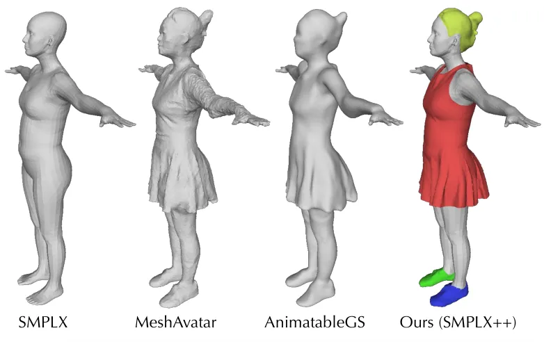

Figure 8: Template Comparison.

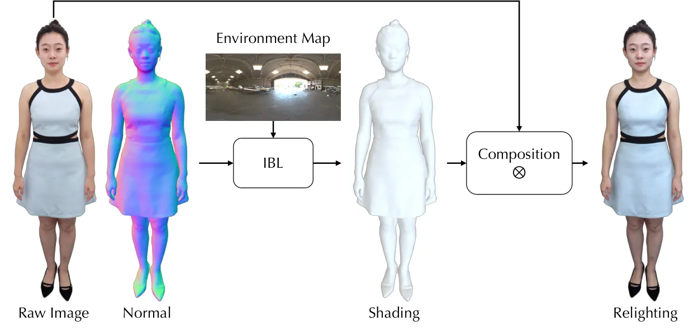

Figure 9: Relighting Visualisation.

The parametric template SMPLX++ can be driven by expression and pose
parameters same as the naive SMPLX, which is more expressive for loose
clothing geometry. The template contains roughly $`23k`$ vertices and
$`45k`$ faces, including $`20k`$ faces for clothes, $`2k`$ faces for
hair, and $`2k`$ faces for shoes. In contrast to MeshAvatar \[10\] and
AnimatableGS \[33\], which learn an implicit template from scratch, our
template preserves a priori facial expressions and hand gestures as
shown in Fig. 8, which are essential for achieving natural and
expressive animations.

Figure 10: Network Architecture of Mesh Nonrigid Deformation Field.

|                       |                 |           |                    |      |         |        |                 |        |             |
| --------------------- | --------------- | --------- | ------------------ | ---- | ------- | ------ | --------------- | ------ | ----------- |
| Model                 | Template        | Non-rigid | Gaussian/Face Num. |      | Quality |        | Controllability |        | Speed       |
|                       |                 |           | Head               | Body | Head    | Body   | Head            | Body   | (Inference) |
| 3DGS-Avatar \[45\]    | SMPLX           | MLP       | 19k                | 181k | low     | low    | low             | low    | 54          |
| GaussianAvatar \[19\] | SMPLX           | Unet      | 45k                | 146k | low     | low    | low             | medium | 55          |
| MeshAvatar \[10\]     | Mesh (Implicit) | StyleUnet | 5k                 | 50k  | low     | medium | low             | medium | 22          |
| AnimatableGS \[33\]   | Mesh (Implicit) | StyleUnet | 18k                | 246k | low     | high   | low             | high   | 16          |
| Ours (Teacher)        | SMPLX++         | StyleUnet | 19k                | 250k | medium  | high   | medium          | high   | 16          |
| Ours (Student)        | SMPLX++         | MLP+BS    | 70k                | 200k | high    | high   | high            | high   | 156         |

Table 4: Summary about these State-of-the-art Methods of Full-body
Avatars.

Network Architecture. We employ a compact MLP-based student network to
learn the pose-dependent non-rigid deformation of mesh:

```math
\displaystyle\mathbf{g}_{i} \displaystyle=\varphi\left(\bar{\mathbf{v}}_{i}\right)\oplus\mathbf{\theta}\oplus\mathbf{z}_{t} \tag{10}
```

```math
\displaystyle\Delta\bar{\mathbf{v}}_{i} \displaystyle=\mathcal{S}_{c}\left(\mathbf{g}_{i}\right)\cdot m_{i}+\mathcal{S}_{b}\left(\mathbf{g}_{i}\right)
```

where $`\bar{\mathbf{v}}_{i}\in\mathbb{R}^{3}`$ is the $`i`$-th vertex
coordinate in the canonical space, $`\theta\in\mathbb{R}^{63}`$ is the
pose parameter, and $`\mathbf{z}_{t}\in\mathbb{R}^{32}`$ is a learnable
embedding for each frame to compensate for inaccurate pose estimation.
The positional encoding function $`\varphi\left(\cdot\right)`$
introduced in NeRF \[39\], is applied with a frequency band of $`L=6`$
in our experiments. The architecture of the student network comprises
two specialized MLPs. The first MLP, $`\mathcal{S}_{b}`$, models the
body’s non-rigid deformations, while the second MLP,
$`\mathcal{S}_{c}`$, captures additional deformations arising from
clothing dynamics. To ensure that clothing deformations are applied
exclusively to vertices associated with clothing, we introduce a mask
$`m_{i}\in\{0,1\}`$, where $`m_{i}=1`$ for the vertices belonging to
clothing.

Relighting. We ensure that ambient lighting around the performer is as
uniform and white as possible during capture. We use the raw rendered
image as the base color and apply shading with new environment light
based on the rendered normal map as shown in Fig. 9. Although this
approach is not physically accurate, it results in better integration
with the environment.

Deployment and 3D Digital Human Agent Pipeline. We make some efforts for
mobile deployment, primarily including: a) FP16 quantization for the
MLP; b) UInt16 quantization for Gaussian sorting; and c) asynchronous
inference techniques, where the animation system operates at 20 FPS
(capture frame rate of training data) while the rendering system
interpolates animations to render at 90 FPS (maximum screen refresh
rate) on the Apple Vision Pro. Please note that all these strategies are
not applied on RTX4090 in Tab. 1, which can fundamentally demonstrate
the performance of our method. We develop a 3D digital human agent on
the Apple Vision Pro, which interacts with users through an
ASR-LLM-TTS-Audio2BS pipeline \[15, 61, 30, 14\] as shown in  Fig. 13.
Notably, all models run locally after deployment. Please stay tuned for
future work with more technical details.

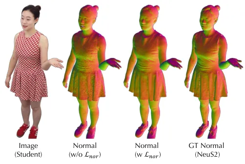

Figure 11: The Impact of Normal Loss.

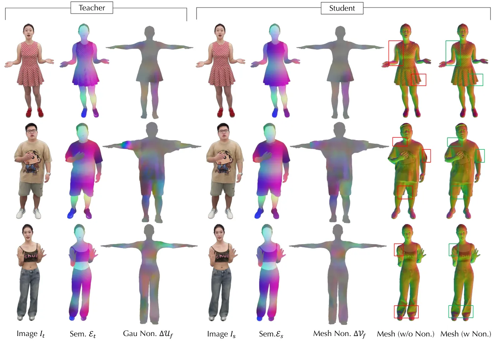

Figure 12: Qualitative Visualization of Baking.

Reanimation. We introduce a learnable embedding $`\mathbf{z}_{t}`$ for
each frame to better compensate for misalignment issues caused by the
inaccurate SMPLX \[42\] estimation and dynamic changes that cannot be
captured by body pose $`\mathbf{\theta}`$ (e.g., clothing inertia and
swing, changes in hand muscles, etc.). For offline reanimation, we can
utilize the Nonrigid Deformation Baking method introduced in the paper
to obtain the corresponding $`\mathbf{z}_{t}`$ under novel poses from
the teacher network. For online real-time body driving, we use the
$`\mathbf{z}_{0}`$ from the first training frame, which is practically
acceptable, although it compromises the accuracy of non-rigid
deformations.

## Appendix B Experiment Details

Metric Evaluation. To quantitatively evaluate the quality of the
rendered images, we choose Peak Signal-to-Noise Ratio (PSNR), Structure
Similarity Index Measure (SSIM) \[54\], and Learned Perceptual Image
Patch Similarity (LPIPS) \[63\]. In our experiments, we evaluate masked
images at a resolution of $`1500\times 2000`$, where the masks are
provided by BiRefNet \[66\]. It is important to note that while PSNR and
SSIM are highly sensitive to pixel misalignment, LPIPS demonstrates
greater robustness by computing differences in deep feature maps. As
illustrated in Fig. 15, the teacher network delivers superior full-body
clothing details (better LPIPS scores), while the student network excels
in the face region due to a more plausible Gaussian distribution. This
discrepancy primarily arises from background residuals introduced by the
segmentation network \[66\] and the teacher network’s propensity to omit
fine details, such as fragmented hair strands. Additionally, we crop the
face region for evaluation based on the projection of the head bounding
box. We also adopt point-to-surface distance (P2S) and Chamfer distance
(Chamfer) to evaluate the geometry, while the ground truth mesh is
generated from NeuS2 \[53\].

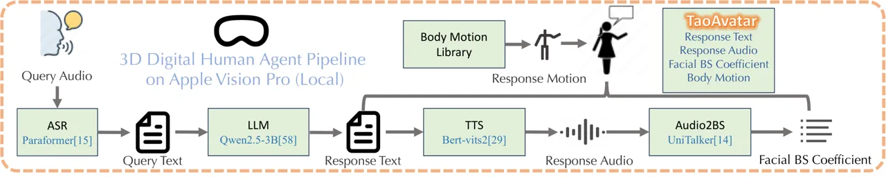

Figure 13: 3D Digital Human Agent Pipeline.

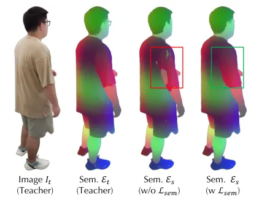

Figure 14: Ablation Study on Semantic Loss during Baking.

## Appendix C Additional Discussion

Discussion w.r.t AnimatableGS. In our teacher-student framework, we
utilize AnimatableGS \[33\] as the teacher network due to its robust
capability to model complex pose-dependent non-rigid deformations.
Unlike the original AnimatableGS \[33\], which learns an implicit
template from scratch, we adopt the SMPLX++ model as our predefined
template. We input semantic positional maps into StyleUnet \[51\] by
assigning distinct color labels to each component (e.g., red for
clothing, yellow for hair) and combining these labels with the posed
coordinates to generate the final vertex colors. This strategy can
provide better semantic information about segmentation for the teacher
network. Additionally, we incorporate a normal loss
$`\mathcal{L}_{nor}`$ during the training of the teacher network, which
contributes to the learning of smoother geometries.

Summary about Full-body Avatars. We present a comparative summary of
full-body avatar methods in Tab. 4. 3DGS-Avatar \[45\] and
GaussianAvatar \[19\] utilize the basic naked SMPLX model as their
template, resulting in poor rendering quality for loose clothing.
MeshAvatar \[10\] and AnimatableGS \[33\] develop implicit clothed
templates from scratch which compromising the control over facial
expressions and hand gestures. Regarding non-rigid deformation modeling,
StyleUnet exhibits more robust expressive capabilities than MLP and
Unet, as discussed in AnimatableGS \[33\]. Our method employs an
MLP-based student network baked from the teacher network and two
lightweight learnable blend shape compensations. This design enables
high-performance rendering with minimal quality degradation. Notably,
while maintaining the same number of Gaussians as the teacher model, we
allocate more Gaussians to the face to achieve higher facial sharpness
as shown in Fig. 17. In contrast, AnimatableGS \[33\] limits the number
of Gaussians on the face due to the resolution constraints of the
rendered positional maps.

The Non-rigid Loss and Semantic Loss during Baking. During the non-rigid
deformation baking process, both the non-rigid loss
$`\mathcal{L}_{non}`$ and the semantic loss $`\mathcal{L}_{sem}`$ play
crucial roles. For the non-rigid deformation loss $`\mathcal{L}_{non}`$,
we directly use the Gaussian non-rigid deformation maps
$`\{\Delta\mathcal{U}_{f},\Delta\mathcal{U}_{b}\}`$ generated by the
teacher network to directly supervise the mesh non-rigid deformation
maps $`\{\Delta\mathcal{V}_{f},\Delta\mathcal{V}_{b}\}`$ of the student
network under T-pose in the canonical space. Regarding the semantic loss
$`\mathcal{L}_{sem}`$, we construct a semantic label
$`\mathbf{e}_{i}=\mathbf{c}_{i}+\sin{\left(\tau\bar{\mathbf{v}}_{i}\right)}`$
for each vertex of the template, where $`\tau`$ is a scale factor is
designed to increase the frequency of positional changes, inspired by
the position embedding in NeRF \[39\]. As illustrated in Fig. 14, the
semantic loss $`\mathcal{L}_{sem}`$ helps mitigate the intersection
between clothing and the body. We provide visualizations of the products
from the baking process of different identities in Fig. 12. The teacher
network effectively guides learning mesh non-rigid deformation of the
student network, resulting in geometry that is well-aligned with the
performer’s surface as shown in Fig. 12 (Mesh (w/o Non.) vs. Mesh (w
Non.)). Without the help of the baking process, it isn’t easy to
decouple geometry and appearance.

The Impact of Normal Loss. Similar to most 3D Gaussian-based
methods \[27, 34\], we define the direction of the Gaussian’s shortest
axis as its normal. In contrast to other approaches that dynamically
determine the normal orientation based on the camera position, we assign
a fixed normal $`n=[1,0,0]`$ and scaling $`s=[\epsilon,1,1]`$ in the
local space for each Gaussian, where $`\epsilon=0.01`$ is a minimum to
make the Gaussian as thin as possible. Upon transforming its parent
triangle, the Gaussian’s normal in world space aligns with the
triangle’s normal. To promote smoother rendered normal maps, we
introduce a normal loss $`\mathcal{L}_{nor}`$ as illustrated in Fig. 11.
The ground truth normal maps are obtained from NeuS2 \[53\].
Additionally, the rendered normal maps facilitate image-based
relighting, as demonstrated in the provided video demo.

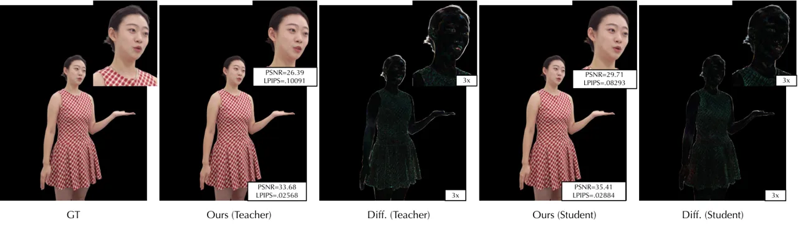

Figure 15: Qualitative Comparison of Details.

## Appendix D Failure Cases

Although TaoAvatar demonstrates remarkable performance in full-body
talking tasks, it still faces challenges in handling complex motions and
exaggerated outfits. Specifically, when the teacher network struggles to
accurately model loose garments under intricate motions (e.g.,
dancing-induced skirt motions), the task becomes increasingly difficult
for the student network as shown in Fig. 16. Moreover, TaoAvatar is
highly reliant on the precision of SMPLX parameters and is susceptible
to artifacts when the estimated SMPLX fails to align with the image
properly.

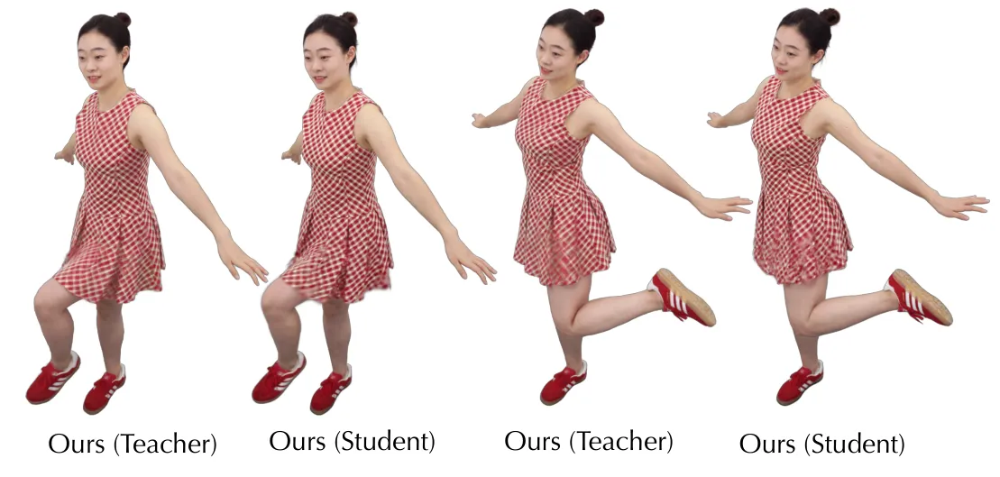

Figure 16: Failure Cases.

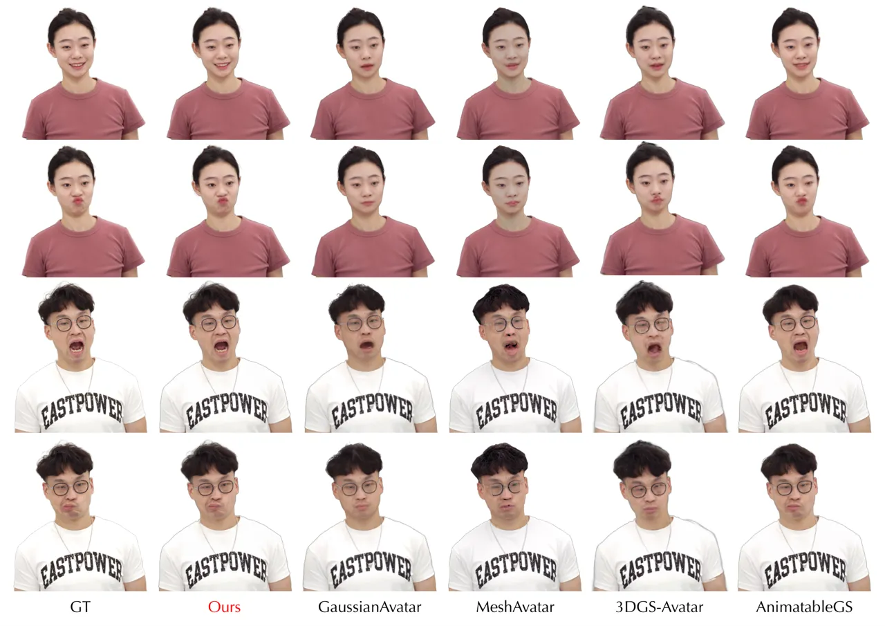

Figure 17: Qualitative Comparisons on Exaggerated Expression.
