# MVPortrait: Text-Guided Motion and Emotion Control for Multi-view Vivid Portrait Animation

Yukang Lin ^(†)^(†)thanks: Equal contribution. Affiliation: Tsinghua
University    Hokit Fung¹¹footnotemark: 1 Affiliation: The University of
Hong Kong    Jianjin Xu Affiliation: Carnegie Mellon
University{linyk23,rzp22}@mails.tsinghua.edu.cn,fung0311@connect.hku.hk,
jianjinx@andrew.cmu.edu, {adelalau, gyin}@hku.hk,
li.xiu@sz.tsinghua.edu.cn    Zeping Ren Affiliation: Tsinghua University
   Adela S.M. Lau Affiliation: The University of Hong Kong    Guosheng
Yin ^(†)^(†)thanks: Corresponding authors. Affiliation: The University
of Hong Kong    Xiu Li²²footnotemark: 2 Affiliation: Tsinghua University

###### Abstract

Recent portrait animation methods have made significant strides in
generating realistic lip synchronization. However, they often lack
explicit control over head movements and facial expressions, and cannot
produce videos from multiple viewpoints, resulting in less controllable
and expressive animations. Moreover, text-guided portrait animation
remains underexplored, despite its user-friendly nature. We present a
novel two-stage text-guided framework, MVPortrait (Multi-view Vivid
Portrait), to generate expressive multi-view portrait animations that
faithfully capture the described motion and emotion. MVPortrait is the
first to introduce FLAME as an intermediate representation, effectively
embedding facial movements, expressions, and view transformations within
its parameter space. In the first stage, we separately train the FLAME
motion and emotion diffusion models based on text input. In the second
stage, we train a multi-view video generation model conditioned on a
reference portrait image and multi-view FLAME rendering sequences from
the first stage. Experimental results exhibit that MVPortrait
outperforms existing methods in terms of motion and emotion control, as
well as view consistency. Furthermore, by leveraging FLAME as a bridge,
MVPortrait becomes the first controllable portrait animation framework
that is compatible with text, speech, and video as driving signals.

## 1 Introduction

With the advent of high-quality datasets \[42, 28\] and advanced methods
\[24, 30, 26, 58, 29, 60\], digital human animation has achieved
promising results. Among animations, portrait animation intends to
generate lively video from a reference image. With different guidance
such as audio, textual instructions, and exemplar gestures, the static
portrait is endowed with speaking and moving capabilities.

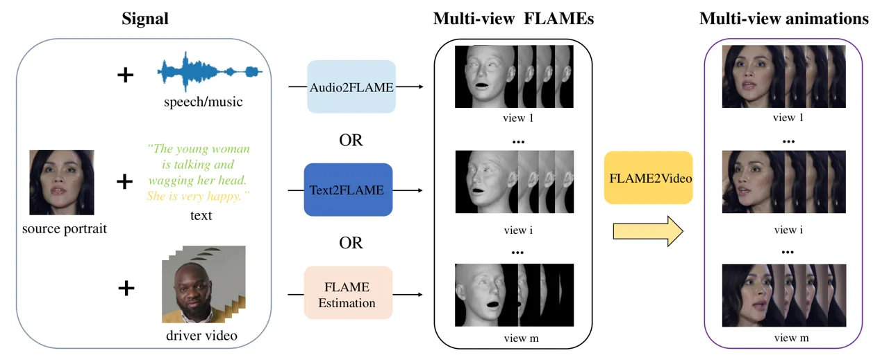

Figure 1: The unified pipeline of multi-view portrait animation. Users
can obtain FLAME sequences via audio-driven methods like Talkshow \[62\]
or FLAME estimation methods like DECA \[15\] from driver video. This
paper focuses on text-driven animation.

There are three primary approaches to accomplish portrait animation: (1)
Emotion control especially lip synchronization \[56, 57, 49\], (2)
Motion control \[54, 35\], and (3) 3D-aware face reconstruction \[14,
3\]. The first approach focuses on aligning lip movements with audio
input. The common way is to extract the audio features and inject the
features into the generative network, often via a cross-attention layer
in UNet \[41\]. Compared to full facial performance, lip synchronization
is a restrictive subset and lacks the generalization of portrait
expression learning. The second approach relies on pose images, i.e. the
expression-aware landmarks, to direct the animation, producing lifelike
facial expressions and diverse postures. However, relying on landmarks
alone may not capture all facial details, potentially limiting visual
fidelity. The third approach generates animations by creating sequential
3D representations like Triplane \[43\] and obtains multi-view
renderings. However, Triplane can introduce inconsistent artifacts, such
as the “multi-face” issue in side views \[1\], which may degrade
performance in multi-view animations. It is worth noting that
text-guided portrait animation, as the most user-friendly and flexible
scheme, has not been fully explored.

To address the problems of restrictive facial expression, lack of
detailed guidance, and poor multi-view performance, we propose
MVPortrait, a novel two-stage method designed to control facial motion
and emotion through text guidance and generate vivid portrait animation
from different viewpoints. It is important to note that MVPortrait
utilizes FLAME \[31\] as an intermediate representation. FLAME is a 3D
parametric model that compactly represents face shape, pose, and
expression, all unified within its parameter space. Benefiting from
FLAME’s extensive use in speech-driven head generation and facial
reconstruction from images, our framework also supports audio-driven and
video-driven portrait animation. The unified framework for text-driven,
audio-driven, and video-driven is shown in Fig. 1. Furthermore, the
FLAME representation allows for rendering multi-view images by simply
adjusting the head pose in the yaw, roll, and pitch directions, which
makes it highly convenient for our multi-view animation task.

Our MVPortrait consists of two stages: Text2FLAME and FLAME2Video. In
the Text2FLAME stage, in contrast to prior work which encodes the text
instruction into hidden features, we separately train two diffusion
models in the FLAME parameter space, namely MotionDM and EmotionDM.
MotionDM takes the motion descriptions as input and outputs a sequence
of pose parameters, while EmotionDM produces a sequence of expression
parameters from emotion descriptions. These two models focus on
capturing the full range of head movement and expression dynamics and
generate a FLAME sequence that aligns with the text prompt. In the
FLAME2Video stage, we first obtain multi-view FLAME conditions by
rendering the FLAME sequence from multiple viewpoints. Subsequently, we
proceed with training the multi-view animation framework, which includes
the VAE, FLAME encoder, Reference UNet, and Denoising UNet. By utilizing
the FLAME encoder, the pose and expression information captured in the
FLAME rendering can be effectively injected into the Denoising UNet. To
ensure consistency in multi-view animations, we introduce the view
attention mechanism by incorporating a view module within the Denoising
UNet.

Our contributions can be summarized as follows:

- •
  Through the implementation of MotionDM and EmotionDM, we integrate
  facial motion and expression control into our unified text-guided
  framework, thereby expanding the controllability for avatar
  manipulation.
- •
  We extend the current portrait animation to the multi-view level,
  enhancing its versatility and practicality. This expansion enables a
  richer, more immersive visual experience by representing subjects from
  multiple perspectives.
- •
  We introduce FLAME as an intermediate in our two-stage framework,
  allowing MVPortrait to accommodate various forms of signals, including
  audio and driver video, as illustrated in Fig. 1. This integration
  highlights enhanced adaptability compared to previous methodologies.

## 2 Related Work

### 2.1 Text-conditioned Human Motion Generation

Recently, significant advancements have been made in text-conditioned
human motion generation. Earlier works focused on training models using
motion capture datasets \[25, 12\] without text labels, treating the
problem as a deterministic mapping task utilizing CNN-based \[22, 23\]
or RNN-based \[16, 32\] models. The release of text-labeled motion
datasets, such as HumanML3D \[17\] and KIT-ML \[37\], has accelerated
development in this area \[8, 65, 52, 72\]. Notably,
MotionDiffuse \[66\] and MDM \[45\] were the first to apply diffusion
models to the text-to-motion task. ReMoDiffuse \[67\] enhanced this
approach by retrieving motions that correspond to target text and
generating motion based on those features, while CrossDiff \[40\]
utilized 2D motion data to support 3D motion generation. However, there
has been no dataset or significant work dedicated to text-driven facial
motion generation. We aim to leverage the successes in motion generation
to fill this gap.

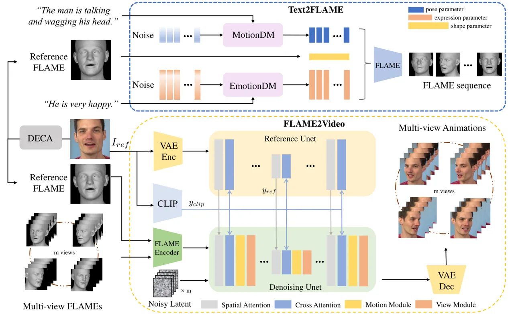

Figure 2: The overview of MVPortrait. MVPortrait consists of two stages:
Text2FLAME and FLAME2Video. In the Text2FLAME stage, a reference FLAME
is first estimated from the reference image. The text prompt is divided
into motion and emotion descriptions, which are then used by MotionDM
and EmotionDM to generate the corresponding pose and expression
sequences. These sequences, combined with the reference FLAME’s shape,
form the FLAME sequence. In the FLAME2Video stage, the reference image,
aligned reference FLAME rendering, and multi-view renderings of the
FLAME sequence are used as inputs to generate multi-view vivid and
consistent animations.

### 2.2 Portrait Animation

The great advancement of image generation has also extended to the realm
of video generation \[6, 19, 5, 51, 61, 50\] by integrating the
Transformer architecture \[48\] or the VAEs framework \[27\]. There are
typically three branches for portrait image animation: (1) Emotion
control especially lip synchronization, (2) Motion control, and (3)
3D-aware face reconstruction.

The first branch refers to talking head generation. LipSyncExpert \[38,
44\] introduced the lip-synchronization network to align the talking
audio to the mouth movement. Researchers \[69, 73, 64\] later attempt to
model different parts of the face. VASA-1 \[57\] and EMO \[46\] utilize
robust transformer models and cross-attention mechanisms to capture
various facial components within the motion latent space. Motion control
has been further developed on the foundation of the talking head branch,
emphasizing enhancing spatial and temporal consistency. FollowYourEmoji
\[35\] and AniPortrait \[54\] have incorporated motion and
expression-aware condition maps to allow for personalized character
motion adjustments. The advancement of 3D-aware face reconstruction
techniques allows 2D portrait animation to aggregate the domains of 3D
reconstruction \[14, 3, 34, 33\]. Rather than concentrating on creating
intricate 3D head models, these approaches utilize expedited methods
such as 3DMM \[4\] and 3D GAN \[7\] that project 3D facial features.
SadTalker \[69\] was the early trial to use lip-only 3DMM coefficients.
The 3D facial mesh was used in AniPortrait \[54\] to predict the
reference and target pose for better expression alignments.
Portrait4D-v2 \[14\] turns the sequential portrait animation into
temporal 3D face Triplane \[43\] and renders the views given the camera
input.

## 3 Methodology

Given a reference image $`I_{\rm ref}`$ and text prompt $`y`$ describing
motion and emotion, our goal is to synthesize vivid multi-view videos
$`V`$ with the appearance of $`I_{\rm ref}`$ while adhering to $`y`$ and
maintaining multi-view consistency. As illustrated in Fig. 2, the
proposed framework comprises two modules, namely Text2FLAME and
FLAME2Video.

### 3.1 FLAME Representation

This study utilizes FLAME as an intermediate representation to
synthesize portrait animation based on rendering images. FLAME is a
statistical 3D head model that integrates distinct linear spaces for
identity shape and expression, using linear blend skinning and
pose-dependent corrective blend shapes to animate the neck and jaw.
Given parameters of facial shape
$`\boldsymbol{\beta}\in\mathbb{R}^{|\boldsymbol{\beta}|}`$, pose
$`\boldsymbol{\theta}\in\mathbb{R}^{3k+3}`$ (with $`k=4`$ joints for
neck, jaw, and eyeballs), and expression
$`\boldsymbol{\psi}\in\mathbb{R}^{|\boldsymbol{\psi}|}`$, FLAME outputs
a mesh with $`n=5023`$ vertices. The model is defined as

```math
M(\boldsymbol{\beta},\boldsymbol{\theta},\boldsymbol{\psi})=W(T_{P}(\boldsymbol{\beta},\boldsymbol{\theta},\boldsymbol{\psi}),\mathbf{J}(\boldsymbol{\beta}),\boldsymbol{\theta},\mathcal{W}), \tag{1}
```

```math
T_{P}(\boldsymbol{\beta},\boldsymbol{\theta},\boldsymbol{\psi})=T+B_{S}(\boldsymbol{\beta};\boldsymbol{S})+B_{P}(\boldsymbol{\theta};\boldsymbol{P})+B_{E}(\boldsymbol{\psi};\boldsymbol{E}). \tag{2}
```

The blend skinning function
$`W(T_{P},\mathbf{J},\boldsymbol{\theta},\mathcal{W})`$ rotates the
vertices in $`T_{P}\in\mathbb{R}^{3n}`$ around joints
$`\mathbf{J}\in\mathbb{R}^{3k}`$, linearly smoothed by blendweights
$`\mathcal{W}\in\mathbb{R}^{k\times n}`$. The mean template is denoted
as $`T\in\mathbb{R}^{3n}`$, while the shape, pose, and expression blend
shapes are represented by $`B_{S}(\boldsymbol{\beta};\boldsymbol{S})`$,
$`B_{P}(\boldsymbol{\theta};\boldsymbol{P})`$, and
$`B_{E}(\boldsymbol{\psi};\boldsymbol{E})`$, respectively.

In our experiment, we leverage the pose parameter
$`f_{\rm pose}=\boldsymbol{\theta}`$ for head motion control, expression
parameter $`f_{\rm exp}=\boldsymbol{\psi}`$ for emotion control, and
shape parameter $`f_{\rm shape}=\boldsymbol{\beta}`$ for facial
identity. This enables the transformation of motion and expression
control into the generation of FLAME pose and expression parameters,
which are then rendered into images, explicitly capturing facial
movements and expressions for vivid and controllable animations.

### 3.2 Text2FLAME

In this part, we aim to synthesize FLAME sequence
$`f^{1:N}=\{f_{\rm shape}^{1:N}\,f_{\rm pose}^{1:N},f_{\rm exp}^{1:N}\}`$
of length $`N`$ given text condition $`y`$. For facial shape, we
estimate $`f_{\rm shape}`$ from reference portrait image $`I_{\rm ref}`$
using DECA \[15\], and utilize it for FLAME blending. Due to the varying
degrees of motion amplitude and emotion intensity, we decouple the
generation of pose $`f_{\rm pose}`$ and expression $`f_{\rm exp}`$.

To convert text into pose and expression, we adopt the transformer-based
diffusion architecture \[45\], which not only excels in the quality and
diversity of results but is also remarkably lightweight and
controllable. It is worth noting that to decouple motion and emotion, we
train two separate diffusion models, namely MotionDM and EmotionDM,
which share the same network architecture. The generated
$`f_{\rm type}^{1:N}=\{f^{i}\}_{i=1}^{N}`$ is a sequence of facial poses
or expressions represented by $`f_{\rm type}^{i}\in\mathbb{R}^{D}`$,
where type $`=`$ {pose, exp}, $`f_{\rm pose}^{i}\in\mathbb{R}^{12}`$ and
$`f_{\rm exp}^{i}\in\mathbb{R}^{50}`$. For simplicity, we omit the
subscript “type” in the following sections and refer to both MotionDM
and EmotionDM as $`DM`$. The sampling strategy and architecture of
$`DM`$ are shown in Fig. 3.

Based on the DDPM \[21\] framework, $`DM`$ assumes $`T`$ diffusion steps
modeled by the Markov noising process,

```math
q(f_{t}^{1:N}|f_{t-1}^{1:N})=\mathcal{N}(\sqrt{\alpha_{t}}f_{t-1}^{1:N},(1-\alpha_{t}){\bf I}), \tag{3}
```

where $`\alpha_{t}\in(0,1)`$ are constant hyper-parameters from the
noise schedule. From here on, we use $`f_{t}`$ to denote the complete
sequence at noising step $`t`$. In our task, $`DM`$ models the
distribution $`p(f_{0}|y)`$ as the reversed process of gradually
cleaning $`f_{T}`$. At each denoising step, we obtain
$`\hat{f}_{0}=DM(f_{t},t,y)`$ with the simple loss,

```math
\mathcal{L}_{\mathrm{simple}}=E_{f_{0}\sim q(f_{0}|y),t\sim[1,T]}[\|f_{0}-DM(f_{t},t,y)\|_{2}^{2}]. \tag{4}
```

To mitigate jittery and discontinuity, we employ a velocity geometric
loss $`\mathcal{L}_{\text{vel}}`$ to regularize $`DM`$,

```math
\mathcal{L}_{\text{vel}}=\frac{1}{N-1}\sum_{i=1}^{N-1}\|(f_{0}^{i+1}-f_{0}^{i})-(\hat{f}_{0}^{i+1}-\hat{f}_{0}^{i})\|_{2}^{2}. \tag{5}
```

Given the tuning parameter $`\lambda_{\mathrm{vel}}`$, the overall
training loss of $`DM`$ is

```math
\mathcal{L}_{DM}=\mathcal{L}_{\mathrm{simple}}+\lambda_{\mathrm{vel}}\mathcal{L}_{\mathrm{vel}}. \tag{6}
```

The experiments reveal that noise in raw data can cause severe jittery
and flickering in results, prompting the use of a sliding window
approach for smoothing. Given a window size $`L`$, the smoothed value
$`\tilde{x}_{i}`$ at position $`i`$ is computed as the average of the
original data values within the window centered at $`i`$. The formula
for the smoothed value is

```math
\tilde{f}_{i}=\frac{1}{L}\sum_{j=i-{L}/{2}}^{i+{L}/{2}}f_{j}. \tag{7}
```

Once MotionDM and EmotionDM are trained, by inputting text $`y`$, we can
sample FLAME motion and expression sequences, which together define the
FLAME model’s performance. According to the experiment, the generated
FLAME sequences effectively reflect the text description $`y`$.

Figure 3: (Top) The framework of $`DM`$. MotionDM and EmotionDM both
employ MDM as the backbone. They denoise conditioned on motion or
emotion descriptions separately. (Bottom) Sampling process. Given a
condition, $`DM`$ denoises $`f_{T}`$ from a Gaussian distribution to
obtain the clean motion or emotion $`f_{0}`$.

### 3.3 FLAME2Video

Given multi-view FLAME rendering sequences
$`P=[p_{1}^{1:N},\ldots,p_{m}^{1:N}]`$, our objective is to generate
temporally consistent and multi-view consistent portrait animations
$`V=[I_{1}^{1:N},\ldots,I_{m}^{1:N}]`$ with $`m`$ representing the
number of views, while the appearance in the videos adheres to
$`I_{\text{ref}}`$. To achieve the realistic animation, we follow the
recent diffusion-based portrait animation approaches \[59, 24, 35, 54\],
and adopt the reference UNet, pose guider and motion module in our
framework. Additionally, we insert the view module into the denoising
UNet to ensure the consistency of different views.

Appearance control. To preserve the appearance information of
$`I_{\rm ref}`$, such as face identity and background, reference UNet
creates a trainable copy of denoising UNet to compute low-level features
of $`I_{\rm ref}`$. Given the hidden states $`z_{t}`$ from each spatial
self-attention layer of denoising UNet and reference feature
$`y_{\rm ref}`$ from the corresponding layer of reference UNet, the
appearance injection is mathematically formulated as

```math
\mathrm{Attention}(Q,K,V,y_{\rm ref})=\mathrm{Softmax}\left(\frac{QK^{\prime\top}}{\sqrt{d}}\right)V^{\prime}, \tag{8}
```

```math
Q=W^{Q}z_{t},K^{\prime}=W^{K}[z_{t},y_{\rm ref}],V^{\prime}=W^{V}[z_{t},y_{\rm ref}]. \tag{9}
```

where $`[\cdot]`$ denotes concatenation operation. Moreover, we also
utilize the high-level reference features $`y_{\rm clip}`$ extracted via
CLIP \[39\] to adapt the cross-attention layers of both reference and
denoising UNet.

Pose and expression guidance. We incorporate the rendering image from
FLAME as the pose and expression driving signal. Obtaining the FLAME
sequence $`f^{1:N}`$ from the Text2FLAME stage, we can generate the
multi-view FLAME rendering sequences by $`P=\mathbf{R}(f^{1:N};C)`$,
where $`C=\{c_{1},\ldots,c_{m}\}`$ denotes the set of perspectives. The
architecture of our FLAME encoder is the same as the pose guider of
AniPortrait \[54\]. The feature map output from the FLAME encoder is
added to the noisy latent and then passed into the denoising UNet. The
FLAME encoder captures the facial shape, pose, and expression from the
FLAME rendering, constraining the generated video to align with the
reference FLAME sequences. This approach ensures that the video’s facial
shape remains consistent with the reference image while precisely
following the head movements and facial expressions described in the
text condition $`y`$.

Motion module. We follow AnimateDiff \[19\] by inserting temporal layers
into Stable Diffusion 1.5, transforming the FLAME sequence into a
temporally consistent and photorealistic animated portrait. Now we focus
solely on the single-view scenario. Given a feature map
$`x\in\mathbb{R}^{b\times t\times h\times w\times c}`$ from denoising
UNet, we reshape it to
$`x\in\mathbb{R}^{(b\times h\times w)\times t\times c}`$ before the
motion module, and then perform temporal attention, which refers to
self-attention along the dimension $`t`$.

View module. From here on, we explain the generation of multi-view
videos. Specifically, we insert a view module after the motion module,
where the architecture of the view module is identical to that of the
motion module. The multi-view feature map, initially
$`x\in\mathbb{R}^{b\times m\times t\times h\times w\times c}`$, is
reshaped to
$`x\in\mathbb{R}^{(b\times m)\times t\times h\times w\times c}`$ before
being fed into the denoising UNet. With this operation, the forward pass
remains the same as the process without the view module. For cross-view
information sharing, we reshape the feature map to
$`x\in\mathbb{R}^{(b\times t\times h\times w)\times m\times c}`$ before
the view module and then perform view attention, which refers to
self-attention along the dimension $`m`$.

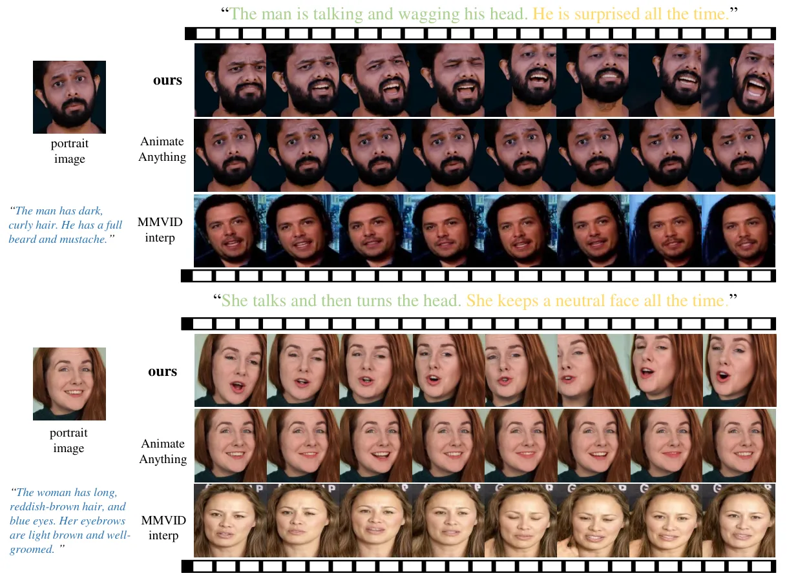

Figure 4: Qualitative comparison of text-guided portrait animation.
Motion descriptions are highlighted in green, emotion descriptions in
yellow, and appearance descriptions (used only by MMVID-interp) in blue.
Generated frames are shown sequentially from left to right. Additional
examples and video results can be found in supplementary materials.

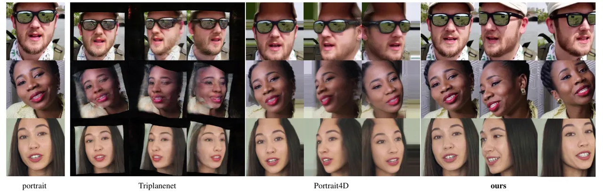

Figure 5: The qualitative comparison of multi-view consistency. We
present results from $`0^{\circ}`$, $`-30^{\circ}`$ and $`30^{\circ}`$
perspectives.

| Method          | LIQE$`\uparrow`$ | FID$`\downarrow`$ | FVD$`\downarrow`$ | CLIPSIM$`\uparrow`$ | VideoClip$`\uparrow`$ | Variability$`\uparrow`$ | MC$`\uparrow`$ | EC$`\uparrow`$ | VS$`\uparrow`$ |
| --------------- | ---------------- | ----------------- | ----------------- | ------------------- | --------------------- | ----------------------- | -------------- | -------------- | -------------- |
| AnimateAnything | 4.024            | 34.9              | 283.0             | 0.171               | 0.564                 | 0.095                   | 1.33           | 1.23           | 1.41           |
| MMVID-interp    | 1.541            | 217.4             | 1548.9            | 0.175               | 0.517                 | 0.092                   | 1.67           | 1.56           | 2.33           |
| MVPortrait      | 4.760            | 28.6              | 570.0             | 0.183               | 0.595                 | 0.110                   | 2.57           | 2.29           | 2.48           |
| No smoothing    | 3.849            | 108.4             | 1213.5            | 0.169               | 0.586                 | 0.243                   | 1.88           | 1.22           | 2.13           |
| Larger network  | 4.723            | 102.5             | 1572.9            | 0.174               | 0.548                 | 0.064                   | 1.44           | 1.75           | 1.38           |
| Joint training  | 4.409            | 76.8              | 824.7             | 0.175               | 0.559                 | 0.068                   | 1.50           | 1.44           | 1.56           |

Table 1: The quantitative comparison of text-guided portrait animation
on the CelebV-Text test set.

| Method                 | Self Reenactment  |                   |                   |                    | Cross Reenactment |                  |                         |
| ---------------------- | ----------------- | ----------------- | ----------------- | ------------------ | ----------------- | ---------------- | ----------------------- |
|                        | L1 $`\downarrow`$ | SSIM $`\uparrow`$ | FID$`\downarrow`$ | FVD $`\downarrow`$ | ID $`\uparrow`$   | LIQE$`\uparrow`$ | FLAME-L1 $`\downarrow`$ |
| FollowYourEmoji \[35\] | 92.346            | 0.763             | 68.5393           | 490.9643           | 0.888             | 4.0301           | 0.213                   |
| LivePortrait \[18\]    | 62.030            | 0.778             | 49.6557           | 268.7956           | 0.858             | 2.9312           | 0.213                   |
| MVPortrait             | 74.875            | 0.780             | 48.4632           | 409.3665           | 0.895             | 4.0605           | 0.196                   |

Table 2: The quantitative comparison of video-driven portrait animation
on the CelebV-Text test set.

| Method             | FID$`\downarrow`$ | FVD$`\downarrow`$ | SyncNet\[10\]$`\downarrow`$ |
| ------------------ | ----------------- | ----------------- | --------------------------- |
| SadTalker \[69\]   | 133.6572          | 644.2238          | 13.5674                     |
| AniPortrait \[54\] | 51.4862           | 387.8381          | 14.4973                     |
| EchoMimic \[9\]    | 113.7123          | 596.6174          | 13.7097                     |
| MVPortrait         | 56.1997           | 333.1806          | 14.6468                     |

Table 3: The quantitative comparison of audio-driven portrait animation
on the HDTF \[71\] and CelebV-Text datasets.

## 4 Experiment

### 4.1 Implementations

In the Text2FLAME stage, we utilize an encoder-transformer architecture
for both MotionDM and EmotionDM, configured with a single layer and a
latent dimension of 64. The velocity loss weight
$`\lambda_{\mathrm{vel}}`$ is set to 0.5. For MotionDM, we adopt the 6D
pose representation \[74\], where $`f_{\rm pose}\in\mathbb{R}^{12}`$
represents the 6D pose of the head and jaw. We apply a sliding window of
size 3 to smooth the pose and expression data. The noise schedule
follows a cosine pattern, and diffusion is set with 1000 steps, paired
with a learning rate of 1e-4. Both MotionDM and EmotionDM undergo 600k
training steps, taking approximately 16 hours with a batch size of 64 on
an A100 GPU. In the FLAME2Video stage, we adopt a three-phase training
strategy. The initial phase focuses on training the FLAME Encoder,
Reference UNet, and the 2D components of the Denoising Unet, while
excluding the motion module and view module. The motion module and view
module are trained independently in Phase 2 and Phase 3, during which
all other components are frozen. All images are resized to a resolution
of $`512\times 512`$, and the view number is set to 4. The Adam
optimizer is used, with a constant learning rate of 1e-5. These three
phases span approximately 3 days, 1 day, and 1 day respectively, on 8
A100 GPUs.

In terms of speed, our pipeline averages 0.04 s/frame for Text2FLAME,
with 0.021 seconds for motion and 0.019 seconds for emotion, 0.26
s/frame for FLAME rendering, and 0.45 s/frame for FLAME2Video. The
Text2FLAME and FLAME2Video require 2GB and 14GB of VRAM, respectively.

### 4.2 Dataset

To learn the mapping from text to FLAME pose and expression, we utilize
the CelebV-Text dataset \[63\] to construct our CelebV-TF dataset, which
includes over 15k text-FLAME pairs. CelebV-Text is a large-scale,
high-quality, and diverse facial text-video dataset, with each video
clip paired with texts describing the motion and emotion. From each
video clip, we modify and employ DECA \[15\] to extract the FLAME
parameters for Text2FLAME training and obtain the FLAME rendering images
for FLAME2Video training. DECA is selected for its high efficiency,
completing both estimation and rendering in approximately 0.3 s/frame.
For multi-view animations training in the FLAME2Video stage, we collect
a subset of RenderMe-360 Dataset \[36\], which consists of 21
performers. Aligning the goal of our model, we intentionally choose
video clips of 17 different motions while the selected 27 camera
perspectives fulfill the need for frontal and side views of the face. We
also employ DECA to extract the FLAME parameters and corresponding
rendering images.

### 4.3 Baseline and Metric

It is important to note that the primary functions of our framework are
text-guided portrait animation and multi-view video generation.
Therefore, our evaluation can be divided into two parts: the
effectiveness of text-guided single-view portrait animation (at the
video level) and the consistency of multi-view generation (at the image
level).

For text-guided single-view portrait animation, we compare our approach
with AnimateAnything \[11\] and MMVID-interp \[63\], both fine-tuned on
the CelebV-Text dataset. Following \[63\], we employ FID \[20\] for
per-frame quality, FVD \[47\] for temporal coherence, and CLIPSIM \[55\]
for text-video relevance. We also include LIQE \[70\] for image quality
assessment and VideoCLIP \[2\] to evaluate video-level text-video
alignment. To evaluate the expressiveness of videos, we designed a
metric called “Variability” to calculate the degree of head movement
changes. In addition, a user study was conducted to assess animation
quality across three subjective criteria: Motion Consistency (MC),
Emotion Consistency (EC), and Vividness Score (VS). Ratings were
assigned on a 3-point scale: 1 (poor), 2 (average), and 3 (good).
Participants were tasked with rating each video. As for multi-view
generation, we compare with Triplanenet \[3\] and Portrait4D-v2 \[14\],
both of which are for face novel view synthesis. We utilize LPIPS \[68\]
and SSIM \[53\] for evaluation of image quality, ID \[13\] for
multi-view identity consistency. Refer to the supplementary materials
for the implementation of all metrics.

Since our framework supports both speech-driven and video-driven
portrait animation, we compare it with methods from each of these
categories. For the FLAME-L1 metric, we estimate the FLAME parameters
for both the driving video and the generated video, and then calculate
the difference between them. The quantitative comparison results can be
found in Tab. 2 and Tab. 3. Refer to the supplementary materials for a
comprehensive visual comparison.

### 4.4 Qualitative Results

As observed in Fig. 4, with the prompt “The man is talking and wagging
his head. He is surprised all the time,” AnimateAnything produces a
nearly static result with minimal mouth movement and no head wagging,
missing the surprise expression entirely. MMVID-interp captures some
mouth movement and slight head motion, but lacks a consistent surprise
expression across frames. Besides, the videos exhibit visible distortion
and unnatural transitions. In contrast, our approach effectively
generates both talking and head-wagging motions, with a clear,
continuous expression of surprise. Overall, our approach generates
highly dynamic and expressive results, with head and mouth movements and
expressions that are closely aligned with the text prompts.

We present the comparison of multi-view synthesis in Fig. 5. We can see
that Triplanenet often produces severe artifacts and exhibits poor
multi-view consistency. While Portrait4D-v2 obtains consistent
multi-view portraits, it suffers from blurriness around the forehead. In
contrast, our method ensures both image quality and consistent
multi-view representation.

### 4.5 Quantitative Results

As shown in Tab. 1, our method outperforms both AnimateAnything and
MMVID-interp on CLIPSIM and VideoClip metrics, improving the alignment
between generated videos and text prompts. Besides, we surpass the
others on the Variability metric, indicating much more dynamic
animations. Additionally, our approach leads in subjective evaluation,
with notable improvements in MC, EC, and VS, suggesting that users find
our videos with better alignment in motion and emotion, as well as a
more vivid and expressive representation. Although our method shows
lower performance than AnimateAnything in terms of FVD, this is due to
the larger head motion amplitude in our videos, which causes some
misalignment with the original dataset. However, our approach excels in
expressiveness, capturing dynamic head movements and emotions, whereas
AnimateAnything produces nearly static results.

Furthermore, as demonstrated in Tab. 2 and Tab. 3, our unified animation
framework demonstrates strong competitiveness in both video-driven and
audio-driven scenarios.

| Method             | LPIPS$`\downarrow`$ | SSIM$`\uparrow`$ | ID$`\uparrow`$ |
| ------------------ | ------------------- | ---------------- | -------------- |
| Triplanenet        | 0.0936              | 0.5974           | 0.7710         |
| Portrait4D-v2      | 0.4468              | 0.5278           | 0.8006         |
| MVPortrait         | 0.2101              | 0.6224           | 0.8409         |
| w/o view attention | 0.2268              | 0.6058           | 0.7149         |

Table 4: The comparison of multi-view portrait synthesis.

Tab. 4 shows the numerical comparison of multi-view synthesis. We argue
that LPIPS favors images with black backgrounds, which is why
Triplanenet achieves unusual results. Our method is superior to others
in SSIM by a large margin, demonstrating the most compelling image
quality. We achieve an ID score of 0.8409, which indicates that our
method provides excellent multi-view identity consistency. This proves
that FLAME encapsulates sufficient facial information and maintains
consistency across multiple viewpoints, facilitating accurate and
coherent reproduction of the character’s appearance. More comparisons of
multi-view synthesis are provided in the supplementary materials.

### 4.6 Ablation Study

Text2FLAME. We ablate the Text2FLAME stage using three variants: No
Smoothing, and Larger Network Size, Joint Generation. The No Smoothing
variant involves training on raw data without sliding average smoothing.
For the Larger Network Size variant, we expand the network to 4 layers
with a latent dimension of 128. For the Joint Generation variant, we
train a single model to generate both motion and emotion simultaneously,
as opposed to our baseline approach of separate training. As illustrated
in Fig. 6, our results align closely with the text prompt, demonstrating
natural and expressive mouth and head movements. In contrast, the No
Smoothing variant produces mismatched expressions and severe head
jittery, thus leading to a higher Variability score compared to
MVPortrait. The Larger Network Size variant successfully generates
correct expressions, but the head movements are nearly absent. Finally,
the Joint Generation variant shows both incorrect expressions and static
motion, further emphasizing the benefits of our separate training in
MotionDM and EmotionDM.

FLAME2Video. In this stage, we evaluate the effectiveness of view
attention in ensuring multi-view consistency. As shown in Fig. 7,
removing the view module results in severe artifacts on the face in the
new viewpoints, and the character’s appearance deviates from the
original portrait. This highlights the importance of the view module for
achieving realistic and view-consistent animations.

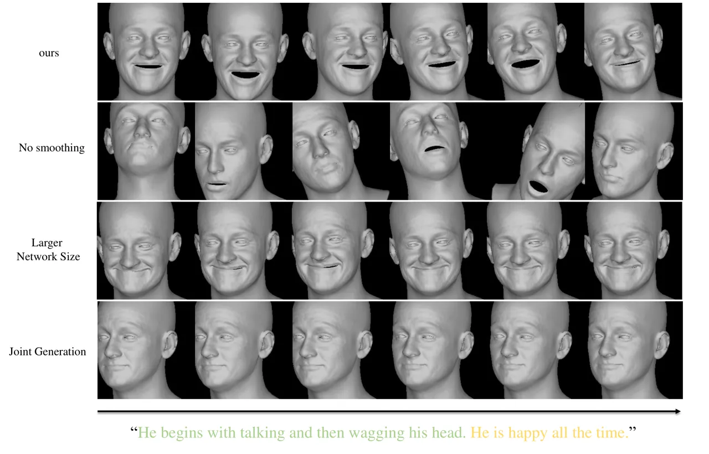

Figure 6: The ablation of the Text2FLAME stage.

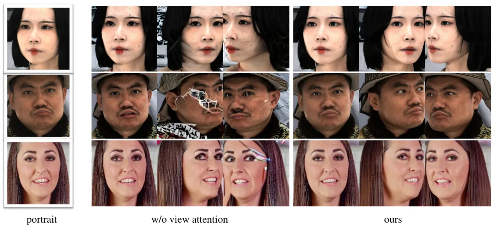

Figure 7: The ablation of the view attention.

## 5 Conclusion

In conclusion, MVPortrait addresses key challenges in portrait animation
by enhancing control over motion, emotion, and multi-view consistency.
By employing the FLAME model as an intermediate representation, our
two-stage framework effectively integrates these aspects to produce more
expressive and consistent animations. Moreover, MVPortrait’s unique
ability to integrate text, audio, and video as driving signals offers
unprecedented flexibility and control, making it a significant
advancement in the field of portrait animation, particularly text-driven
animation.

However, MVPortrait is limited by the accuracy of text annotations in
video datasets and the uneven distribution of facial movements and
emotions. Besides, despite FLAME’s proficiency in preserving identity,
it has limitations in capturing micro-expressions, which remains a
direction for future exploration. In the future, we will design a
text-driven framework with finer-grained control over expression, while
also improving its generalization ability.

## 6 Acknowledgements

This work was partially supported by the Shenzhen Key Laboratory of next
generation interactive media innovative technology
(No.ZDSYS20210623092001004).

## References

- \[1\] Sizhe An, Hongyi Xu, Yichun Shi, Guoxian Song, Umit Y Ogras, and
  Linjie Luo. Panohead: Geometry-aware 3d full-head synthesis in 360deg.
  In _Proceedings of the IEEE/CVF Conference on Computer Vision and
  Pattern Recognition_, pages 20950–20959, 2023.
- \[2\] AskVideos. Askvideos-videoclip: Language-grounded video
  embeddings. GitHub, 2024.
- \[3\] Ananta R Bhattarai, Matthias Nießner, and Artem Sevastopolsky.
  Triplanenet: An encoder for eg3d inversion. In _Proceedings of the
  IEEE/CVF Winter Conference on Applications of Computer Vision_, pages
  3055–3065, 2024.
- \[4\] Volker Blanz and Thomas Vetter. Face recognition based on
  fitting a 3d morphable model. _IEEE Transactions on Pattern Analysis
  and Machine Intelligence_, 25(9):1063–1074, 2003.
- \[5\] Andreas Blattmann, Tim Dockhorn, Sumith Kulal, Daniel
  Mendelevitch, Maciej Kilian, Dominik Lorenz, Yam Levi, Zion English,
  Vikram Voleti, Adam Letts, et al. Stable video diffusion: Scaling
  latent video diffusion models to large datasets. _arXiv preprint
  arXiv:2311.15127_, 2023a.
- \[6\] Andreas Blattmann, Robin Rombach, Huan Ling, Tim Dockhorn,
  Seung Wook Kim, Sanja Fidler, and Karsten Kreis. Align your latents:
  High-resolution video synthesis with latent diffusion models. In
  _Proceedings of the IEEE/CVF Conference on Computer Vision and Pattern
  Recognition_, pages 22563–22575, 2023b.
- \[7\] Eric R Chan, Connor Z Lin, Matthew A Chan, Koki Nagano, Boxiao
  Pan, Shalini De Mello, Orazio Gallo, Leonidas J Guibas, Jonathan
  Tremblay, Sameh Khamis, et al. Efficient geometry-aware 3d generative
  adversarial networks. In _Proceedings of the IEEE/CVF Conference on
  Computer Vision and Pattern Recognition_, pages 16123–16133, 2022.
- \[8\] Xin Chen, Biao Jiang, Wen Liu, Zilong Huang, Bin Fu, Tao Chen,
  and Gang Yu. Executing your commands via motion diffusion in latent
  space. In _Proceedings of the IEEE/CVF Conference on Computer Vision
  and Pattern Recognition_, pages 18000–18010, 2023.
- \[9\] Zhiyuan Chen, Jiajiong Cao, Zhiquan Chen, Yuming Li, and
  Chenguang Ma. Echomimic: Lifelike audio-driven portrait animations
  through editable landmark conditions. _arXiv preprint
  arXiv:2407.08136_, 2024.
- \[10\] J. S. Chung and A. Zisserman. Out of time: automated lip sync
  in the wild. In _Workshop on Multi-view Lip-reading, ACCV_, 2016.
- \[11\] Zuozhuo Dai, Zhenghao Zhang, Yao Yao, Bingxue Qiu, Siyu Zhu,
  Long Qin, and Weizhi Wang. Animateanything: Fine-grained open domain
  image animation with motion guidance, 2023.
- \[12\] Fernando De la Torre, Jessica Hodgins, Adam Bargteil, Xavier
  Martin, Justin Macey, Alex Collado, and Pep Beltran. Guide to the
  carnegie mellon university multimodal activity (cmu-mmac) database. 2009.
- \[13\] Jiankang Deng, Jia Guo, Niannan Xue, and Stefanos Zafeiriou.
  Arcface: Additive angular margin loss for deep face recognition. In
  _Proceedings of the IEEE/CVF Conference on Computer Vision and Pattern
  Recognition_, pages 4690–4699, 2019.
- \[14\] Yu Deng, Duomin Wang, and Baoyuan Wang. Portrait4d-v2: Pseudo
  multi-view data creates better 4d head synthesizer. _arXiv preprint
  arXiv:2403.13570_, 2024.
- \[15\] Yao Feng, Haiwen Feng, Michael J Black, and Timo Bolkart.
  Learning an animatable detailed 3d face model from in-the-wild images.
  _ACM Transactions on Graphics (ToG)_, 40(4):1–13, 2021.
- \[16\] Partha Ghosh, Jie Song, Emre Aksan, and Otmar Hilliges.
  Learning human motion models for long-term predictions. In _2017
  International Conference on 3D Vision (3DV)_, pages 458–466.
  IEEE, 2017.
- \[17\] Chuan Guo, Shihao Zou, Xinxin Zuo, Sen Wang, Wei Ji, Xingyu Li,
  and Li Cheng. Generating diverse and natural 3d human motions from
  text. In _Proceedings of the IEEE/CVF Conference on Computer Vision
  and Pattern Recognition_, pages 5152–5161, 2022.
- \[18\] Jianzhu Guo, Dingyun Zhang, Xiaoqiang Liu, Zhizhou Zhong, Yuan
  Zhang, Pengfei Wan, and Di Zhang. Liveportrait: Efficient portrait
  animation with stitching and retargeting control. _arXiv preprint
  arXiv:2407.03168_, 2024.
- \[19\] Yuwei Guo, Ceyuan Yang, Anyi Rao, Zhengyang Liang, Yaohui Wang,
  Yu Qiao, Maneesh Agrawala, Dahua Lin, and Bo Dai. Animatediff: Animate
  your personalized text-to-image diffusion models without specific
  tuning. _arXiv preprint arXiv:2307.04725_, 2023.
- \[20\] Martin Heusel, Hubert Ramsauer, Thomas Unterthiner, Bernhard
  Nessler, and Sepp Hochreiter. Gans trained by a two time-scale update
  rule converge to a local nash equilibrium. _Advances in Neural
  Information Processing Systems_, 30, 2017.
- \[21\] Jonathan Ho, Ajay Jain, and Pieter Abbeel. Denoising diffusion
  probabilistic models. _Advances in Neural Information Processing
  Systems_, 33:6840–6851, 2020.
- \[22\] Daniel Holden, Jun Saito, Taku Komura, and Thomas Joyce.
  Learning motion manifolds with convolutional autoencoders. In
  _SIGGRAPH Asia 2015 technical briefs_, pages 1–4. 2015.
- \[23\] Daniel Holden, Jun Saito, and Taku Komura. A deep learning
  framework for character motion synthesis and editing. _ACM
  Transactions on Graphics (TOG)_, 35(4):1–11, 2016.
- \[24\] Li Hu. Animate anyone: Consistent and controllable
  image-to-video synthesis for character animation. In _Proceedings of
  the IEEE/CVF Conference on Computer Vision and Pattern Recognition_,
  pages 8153–8163, 2024.
- \[25\] Catalin Ionescu, Dragos Papava, Vlad Olaru, and Cristian
  Sminchisescu. Human3. 6m: Large scale datasets and predictive methods
  for 3d human sensing in natural environments. _IEEE Transactions on
  Pattern Analysis and Machine Intelligence_, 36(7):1325–1339, 2013.
- \[26\] Xiaoyu Jin, Zunnan Xu, Mingwen Ou, and Wenming Yang. Alignment
  is all you need: A training-free augmentation strategy for pose-guided
  video generation. _arXiv preprint arXiv:2408.16506_, 2024.
- \[27\] Diederik P Kingma and Max Welling. Auto-encoding variational
  bayes. _arXiv preprint arXiv:1312.6114_, 2013.
- \[28\] Ronghui Li, Junfan Zhao, Yachao Zhang, Mingyang Su, Zeping Ren,
  Han Zhang, Yansong Tang, and Xiu Li. Finedance: A fine-grained
  choreography dataset for 3d full body dance generation. In
  _Proceedings of the IEEE/CVF International Conference on Computer
  Vision_, pages 10234–10243, 2023.
- \[29\] Ronghui Li, Hongwen Zhang, Yachao Zhang, Yuxiang Zhang,
  Youliang Zhang, Jie Guo, Yan Zhang, Xiu Li, and Yebin Liu. Lodge++:
  High-quality and long dance generation with vivid choreography
  patterns. _arXiv preprint arXiv:2410.20389_, 2024a.
- \[30\] Ronghui Li, YuXiang Zhang, Yachao Zhang, Hongwen Zhang, Jie
  Guo, Yan Zhang, Yebin Liu, and Xiu Li. Lodge: A coarse to fine
  diffusion network for long dance generation guided by the
  characteristic dance primitives. In _Proceedings of the IEEE/CVF
  Conference on Computer Vision and Pattern Recognition_, pages
  1524–1534, 2024b.
- \[31\] Tianye Li, Timo Bolkart, Michael. J. Black, Hao Li, and Javier
  Romero. Learning a model of facial shape and expression from 4D scans.
  _ACM Transactions on Graphics, (Proc. SIGGRAPH Asia)_,
  36(6):194:1–194:17, 2017a.
- \[32\] Zimo Li, Yi Zhou, Shuangjiu Xiao, Chong He, Zeng Huang, and Hao
  Li. Auto-conditioned recurrent networks for extended complex human
  motion synthesis. _arXiv preprint arXiv:1707.05363_, 2017b.
- \[33\] Yukang Lin, Ronghui Li, Kedi Lyu, Yachao Zhang, and Xiu Li.
  Rich: Robust implicit clothed humans reconstruction from multi-scale
  spatial cues. In _Chinese Conference on Pattern Recognition and
  Computer Vision (PRCV)_, pages 193–206. Springer, 2023.
- \[34\] Yukang Lin, Haonan Han, Chaoqun Gong, Zunnan Xu, Yachao Zhang,
  and Xiu Li. Consistent123: One image to highly consistent 3d asset
  using case-aware diffusion priors. In _Proceedings of the 32nd ACM
  International Conference on Multimedia_, pages 6715–6724, 2024.
- \[35\] Yue Ma, Hongyu Liu, Hongfa Wang, Heng Pan, Yingqing He, Junkun
  Yuan, Ailing Zeng, Chengfei Cai, Heung-Yeung Shum, Wei Liu, et al.
  Follow-your-emoji: Fine-controllable and expressive freestyle portrait
  animation. _arXiv preprint arXiv:2406.01900_, 2024.
- \[36\] Dongwei Pan, Long Zhuo, Jingtan Piao, Huiwen Luo, Wei Cheng,
  Yuxin Wang, Siming Fan, Shengqi Liu, Lei Yang, Bo Dai, Ziwei Liu,
  Chen Change Loy, Chen Qian, Wayne Wu, Dahua Lin, and Kwan-Yee Lin.
  Renderme-360: A large digital asset library and benchmarks towards
  high-fidelity head avatars. _Advances in Neural Information Processing
  Systems_, 36, 2024.
- \[37\] Matthias Plappert, Christian Mandery, and Tamim Asfour. The kit
  motion-language dataset. _Big data_, 4(4):236–252, 2016.
- \[38\] KR Prajwal, Rudrabha Mukhopadhyay, Vinay P Namboodiri, and CV
  Jawahar. A lip sync expert is all you need for speech to lip
  generation in the wild. In _Proceedings of the 28th ACM International
  Conference on Multimedia_, pages 484–492, 2020.
- \[39\] Alec Radford, Jong Wook Kim, Chris Hallacy, Aditya Ramesh,
  Gabriel Goh, Sandhini Agarwal, Girish Sastry, Amanda Askell, Pamela
  Mishkin, Jack Clark, et al. Learning transferable visual models from
  natural language supervision. In _International Conference on Machine
  Learning_, pages 8748–8763. PMLR, 2021.
- \[40\] Zeping Ren, Shaoli Huang, and Xiu Li. Realistic human motion
  generation with cross-diffusion models. In _European Conference on
  Computer Vision_, page 345–362, Berlin, Heidelberg, 2024.
  Springer-Verlag.
- \[41\] Olaf Ronneberger, Philipp Fischer, and Thomas Brox. U-net:
  Convolutional networks for biomedical image segmentation. In _Medical
  image computing and computer-assisted intervention–MICCAI 2015: 18th
  international conference, Munich, Germany, October 5-9, 2015,
  proceedings, part III 18_, pages 234–241. Springer, 2015.
- \[42\] Ruizhi Shao, Youxin Pang, Zerong Zheng, Jingxiang Sun, and
  Yebin Liu. Human4dit: 360-degree human video generation with 4d
  diffusion transformer. _arXiv preprint arXiv:2405.17405_, 2024.
- \[43\] J Ryan Shue, Eric Ryan Chan, Ryan Po, Zachary Ankner, Jiajun
  Wu, and Gordon Wetzstein. 3d neural field generation using triplane
  diffusion. In _Proceedings of the IEEE/CVF Conference on Computer
  Vision and Pattern Recognition_, pages 20875–20886, 2023.
- \[44\] Supasorn Suwajanakorn, Steven M Seitz, and Ira
  Kemelmacher-Shlizerman. Synthesizing obama: learning lip sync from
  audio. _ACM Transactions on Graphics (ToG)_, 36(4):1–13, 2017.
- \[45\] Guy Tevet, Sigal Raab, Brian Gordon, Yoni Shafir, Daniel
  Cohen-or, and Amit Haim Bermano. Human motion diffusion model. In _The
  Eleventh International Conference on Learning Representations_, 2023.
- \[46\] Linrui Tian, Qi Wang, Bang Zhang, and Liefeng Bo. Emo: Emote
  portrait alive-generating expressive portrait videos with audio2video
  diffusion model under weak conditions. _arXiv preprint
  arXiv:2402.17485_, 2024.
- \[47\] Thomas Unterthiner, Sjoerd Van Steenkiste, Karol Kurach,
  Raphael Marinier, Marcin Michalski, and Sylvain Gelly. Towards
  accurate generative models of video: A new metric & challenges. _arXiv
  preprint arXiv:1812.01717_, 2018.
- \[48\] Ashish Vaswani, Noam Shazeer, Niki Parmar, Jakob Uszkoreit,
  Llion Jones, Aidan N Gomez, Łukasz Kaiser, and Illia Polosukhin.
  Attention is all you need. _Advances in Neural Information Processing
  Systems_, 30, 2017.
- \[49\] Cong Wang, Kuan Tian, Jun Zhang, Yonghang Guan, Feng Luo, Fei
  Shen, Zhiwei Jiang, Qing Gu, Xiao Han, and Wei Yang. V-express:
  Conditional dropout for progressive training of portrait video
  generation. _arXiv preprint arXiv:2406.02511_, 2024a.
- \[50\] Jiangshan Wang, Yue Ma, Jiayi Guo, Yicheng Xiao, Gao Huang, and
  Xiu Li. Cove: Unleashing the diffusion feature correspondence for
  consistent video editing. _arXiv preprint arXiv:2406.08850_, 2024b.
- \[51\] Jiangshan Wang, Junfu Pu, Zhongang Qi, Jiayi Guo, Yue Ma, Nisha
  Huang, Yuxin Chen, Xiu Li, and Ying Shan. Taming rectified flow for
  inversion and editing. _arXiv preprint arXiv:2411.04746_, 2024c.
- \[52\] Yin Wang, Zhiying Leng, Frederick WB Li, Shun-Cheng Wu, and
  Xiaohui Liang. Fg-t2m: Fine-grained text-driven human motion
  generation via diffusion model. In _Proceedings of the IEEE/CVF
  International Conference on Computer Vision_, pages 22035–22044, 2023.
- \[53\] Zhou Wang, Alan C Bovik, Hamid R Sheikh, and Eero P Simoncelli.
  Image quality assessment: from error visibility to structural
  similarity. _IEEE Transactions on Image Processing_,
  13(4):600–612, 2004.
- \[54\] Huawei Wei, Zejun Yang, and Zhisheng Wang. Aniportrait:
  Audio-driven synthesis of photorealistic portrait animation. _arXiv
  preprint arXiv:2403.17694_, 2024.
- \[55\] Chenfei Wu, Lun Huang, Qianxi Zhang, Binyang Li, Lei Ji, Fan
  Yang, Guillermo Sapiro, and Nan Duan. Godiva: Generating open-domain
  videos from natural descriptions. _arXiv preprint
  arXiv:2104.14806_, 2021.
- \[56\] Mingwang Xu, Hui Li, Qingkun Su, Hanlin Shang, Liwei Zhang, Ce
  Liu, Jingdong Wang, Luc Van Gool, Yao Yao, and Siyu Zhu. Hallo:
  Hierarchical audio-driven visual synthesis for portrait image
  animation. _arXiv preprint arXiv:2406.08801_, 2024a.
- \[57\] Sicheng Xu, Guojun Chen, Yu-Xiao Guo, Jiaolong Yang, Chong Li,
  Zhenyu Zang, Yizhong Zhang, Xin Tong, and Baining Guo. Vasa-1:
  Lifelike audio-driven talking faces generated in real time. _arXiv
  preprint arXiv:2404.10667_, 2024b.
- \[58\] Zunnan Xu, Yukang Lin, Haonan Han, Sicheng Yang, Ronghui Li,
  Yachao Zhang, and Xiu Li. Mambatalk: Efficient holistic gesture
  synthesis with selective state space models. In _Advances in Neural
  Information Processing Systems_, 2024c.
- \[59\] Zhongcong Xu, Jianfeng Zhang, Jun Hao Liew, Hanshu Yan, Jia-Wei
  Liu, Chenxu Zhang, Jiashi Feng, and Mike Zheng Shou. Magicanimate:
  Temporally consistent human image animation using diffusion model. In
  _Proceedings of the IEEE/CVF Conference on Computer Vision and Pattern
  Recognition_, pages 1481–1490, 2024d.
- \[60\] Zunnan Xu, Yachao Zhang, Sicheng Yang, Ronghui Li, and Xiu Li.
  Chain of generation: Multi-modal gesture synthesis via cascaded
  conditional control. In _Proceedings of the AAAI Conference on
  Artificial Intelligence_, pages 6387–6395, 2024e.
- \[61\] Zunnan Xu, Zhentao Yu, Zixiang Zhou, Jun Zhou, Xiaoyu Jin,
  Fa-Ting Hong, Xiaozhong Ji, Junwei Zhu, Chengfei Cai, Shiyu Tang, Qin
  Lin, Xiu Li, and Qinglin Lu. Hunyuanportrait: Implicit condition
  control for enhanced portrait animation. _arXiv preprint
  arXiv:2503.18860_, 2025.
- \[62\] Hongwei Yi, Hualin Liang, Yifei Liu, Qiong Cao, Yandong Wen,
  Timo Bolkart, Dacheng Tao, and Michael J Black. Generating holistic 3d
  human motion from speech. In _Proceedings of the IEEE/CVF Conference
  on Computer Vision and Pattern Recognition_, pages 469–480, 2023.
- \[63\] Jianhui Yu, Hao Zhu, Liming Jiang, Chen Change Loy, Weidong
  Cai, and Wayne Wu. CelebV-Text: A large-scale facial text-video
  dataset. In _Proceedings of the IEEE/CVF Conference on Computer Vision
  and Pattern Recognition_, 2023a.
- \[64\] Zhentao Yu, Zixin Yin, Deyu Zhou, Duomin Wang, Finn Wong, and
  Baoyuan Wang. Talking head generation with probabilistic
  audio-to-visual diffusion priors. In _Proceedings of the IEEE/CVF
  International Conference on Computer Vision_, pages 7645–7655, 2023b.
- \[65\] Jianrong Zhang, Yangsong Zhang, Xiaodong Cun, Yong Zhang,
  Hongwei Zhao, Hongtao Lu, Xi Shen, and Ying Shan. Generating human
  motion from textual descriptions with discrete representations. In
  _Proceedings of the IEEE/CVF Conference on Computer Vision and Pattern
  Recognition_, pages 14730–14740, 2023a.
- \[66\] Mingyuan Zhang, Zhongang Cai, Liang Pan, Fangzhou Hong, Xinying
  Guo, Lei Yang, and Ziwei Liu. Motiondiffuse: Text-driven human motion
  generation with diffusion model. _arXiv preprint
  arXiv:2208.15001_, 2022.
- \[67\] Mingyuan Zhang, Xinying Guo, Liang Pan, Zhongang Cai, Fangzhou
  Hong, Huirong Li, Lei Yang, and Ziwei Liu. Remodiffuse:
  Retrieval-augmented motion diffusion model. In _Proceedings of the
  IEEE/CVF International Conference on Computer Vision_, pages 364–373,
  2023b.
- \[68\] Richard Zhang, Phillip Isola, Alexei A Efros, Eli Shechtman,
  and Oliver Wang. The unreasonable effectiveness of deep features as a
  perceptual metric. In _Proceedings of the IEEE/CVF Conference on
  Computer Vision and Pattern Recognition_, pages 586–595, 2018.
- \[69\] Wenxuan Zhang, Xiaodong Cun, Xuan Wang, Yong Zhang, Xi Shen, Yu
  Guo, Ying Shan, and Fei Wang. Sadtalker: Learning realistic 3d motion
  coefficients for stylized audio-driven single image talking face
  animation. In _Proceedings of the IEEE/CVF Conference on Computer
  Vision and Pattern Recognition_, pages 8652–8661, 2023c.
- \[70\] Weixia Zhang, Guangtao Zhai, Ying Wei, Xiaokang Yang, and Kede
  Ma. Blind image quality assessment via vision-language correspondence:
  A multitask learning perspective. In _Proceedings of the IEEE/CVF
  Conference on Computer Vision and Pattern Recognition_, pages
  14071–14081, 2023d.
- \[71\] Zhimeng Zhang, Lincheng Li, Yu Ding, and Changjie Fan.
  Flow-guided one-shot talking face generation with a high-resolution
  audio-visual dataset. In _Proceedings of the IEEE/CVF Conference on
  Computer Vision and Pattern Recognition_, pages 3661–3670, 2021.
- \[72\] Chongyang Zhong, Lei Hu, Zihao Zhang, and Shihong Xia. Attt2m:
  Text-driven human motion generation with multi-perspective attention
  mechanism. In _Proceedings of the IEEE/CVF International Conference on
  Computer Vision_, pages 509–519, 2023.
- \[73\] Hang Zhou, Yasheng Sun, Wayne Wu, Chen Change Loy, Xiaogang
  Wang, and Ziwei Liu. Pose-controllable talking face generation by
  implicitly modularized audio-visual representation. In _Proceedings of
  the IEEE/CVF Conference on Computer Vision and Pattern Recognition_,
  pages 4176–4186, 2021.
- \[74\] Yi Zhou, Connelly Barnes, Jingwan Lu, Jimei Yang, and Hao Li.
  On the continuity of rotation representations in neural networks. In
  _Proceedings of the IEEE/CVF Conference on Computer Vision and Pattern
  Recognition_, pages 5745–5753, 2019.

Supplementary Material

## 7 Training

The loss for FLAME2Video stage is formulated as

```math
\mathbb{E}_{\epsilon\thicksim\mathcal{N}(\mathbf{0},\mathbf{I}),\mathbf{x}_{t},\mathbf{c},t}[\|\epsilon-\epsilon_{\theta}(\mathbf{x}_{t};\mathbf{c},t)\|_{2}^{2}] \tag{10}
```

where $`\mathbf{c}`$ is image embedding encoded by CLIP and
$`\mathbf{x}_{t}`$ is derived by adding $`t`$-step noises to
$`\mathbf{x}_{0}`$, and $`\epsilon`$ and $`\epsilon_{\theta}`$
respectively represent the ground truth and predicted noise by Denoising
UNet.

In the Text2FLAME stage, the conditional learning strategy we use is a
classifier-free guidance. We set the text condition to null with a
probability of 10%. Following \[45\], we set a maximum frame limit
during the training, with padding applied to shorter videos. The
diffusion sampling step is set to 1000. In the FLAME2Video stage, the
diffusion sampling step is set to 25. We utilize the pre-trained UNet
weights from runwayml/stable-diffusion-v1-5.

## 8 Metrics

In this section, we explain the calculation processes for the metrics
not detailed in the main text.

Variability. We devise a metric to evaluate the amplitude of head
movements to assess the expressiveness of portrait videos. Specifically,
DECA \[15\] is employed to estimate FLAME parameters, through which the
yaw, pitch, and roll angles are extracted from the head pose. The mean
variability of motion in the generated videos is quantified by
calculating the temporal differences between consecutive frames for
these pose angles.

FLAME-L1. To quantify the differences in pose and expression between the
generated and driving videos during cross-reenactment, we utilize DECA
\[15\] to estimate FLAME parameters, including pose and expression, for
both the generated and driving videos. The FLAME-L1 metric is then
computed by calculating the L1 difference between the corresponding
parameters.

|                  |                  |                   |                   |                     |                       |                         |                |                |                |
| ---------------- | ---------------- | ----------------- | ----------------- | ------------------- | --------------------- | ----------------------- | -------------- | -------------- | -------------- |
| Method           | LIQE$`\uparrow`$ | FID$`\downarrow`$ | FVD$`\downarrow`$ | CLIPSIM$`\uparrow`$ | VideoClip$`\uparrow`$ | Variability$`\uparrow`$ | MC$`\uparrow`$ | EC$`\uparrow`$ | VS$`\uparrow`$ |
| DynamiCrafter-ft | 4.306            | 80.9              | 552.8             | 0.172               | 0.557                 | 0.074                   | 1.70           | 1.22           | 1.78           |
| CogVideoX-ft     | 4.046            | 171.7             | 962.3             | 0.179               | 0.589                 | 0.119                   | 2.37           | 2.22           | 2.25           |
| MVPortrait       | 4.760            | 28.6              | 570.0             | 0.183               | 0.595                 | 0.110                   | 2.57           | 2.29           | 2.48           |
| No smoothing     | 3.849            | 108.4             | 1213.5            | 0.169               | 0.586                 | 0.243                   | 1.88           | 1.22           | 2.13           |
| Window size: 5   | 4.590            | 67.0              | 948.7             | 0.180               | 0.593                 | 0.104                   | 2.25           | 2.10           | 2.11           |
| Joint training   | 4.409            | 76.8              | 824.7             | 0.175               | 0.559                 | 0.068                   | 1.50           | 1.44           | 1.56           |
| OOD cases        | 4.245            | \-                | \-                | 0.175               | 0.561                 | 0.111                   | 1.67           | 2.11           | 1.89           |

Table 5: Comparison of text-guided animation on the CelebV-Text test
set.

| Method                              | LPIPS$`\downarrow`$ | SSIM$`\uparrow`$ | L1$`\downarrow`$ | ID$`\uparrow`$ |
| ----------------------------------- | ------------------- | ---------------- | ---------------- | -------------- |
| Triplanenet-ft                      | 0.3752              | 0.5111           | 0.2200           | 0.8803         |
| Portrait4D-v2-ft                    | 0.3725              | 0.5150           | 0.1957           | 0.8342         |
| MVPortrait (view number: 4)         | 0.2445              | 0.5512           | 0.1735           | 0.8891         |
| view number: 2                      | 0.3206              | 0.5370           | 0.1971           | 0.8224         |
| w/o view attention (view number: 1) | 0.3959              | 0.4624           | 0.2746           | 0.7826         |

Table 6: Comparison of multi-view portrait synthesis on the RenderMe-360
test set.

## 9 Quantitative Comparison

### 9.1 Comparison with more baselines

We compare with text-guided video generative models like
CogVideoX\[yang2024cogvideox\] and
DynamiCrafter\[xing2024dynamicrafter\] to benchmark our model’s
performance against current leading methods. We fine-tune them on
CelebV-Text, with test results in Tab. 5.

### 9.2 Out-of-Distribution Performance

We generate 10 out-of-distribution (OOD) text descriptions using GPT-4,
and present the quantitative results for these cases in Tab. 5, where a
performance drop is observed. However, the example in Fig. 8 illustrates
that our model shows some generalization capability.

### 9.3 Multi-view Comparison

For fairness, we fine-tune Triplanenet \[3\] and Portrait4D-v2 \[14\] on
RenderMe-360 \[36\] training set, and present the evaluation results on
the RenderMe-360 test set in Tab. 6. Multi-view accuracy is measured as
the average LPIPS, SSIM, and L1 differences between the predictions and
ground truth across all viewpoints.

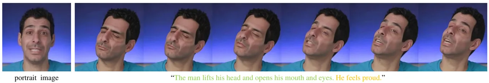

Figure 8: The example for demonstrating out-of-distribution performance.

## 10 Qualitative Comparison

We present additional visual comparisons to provide readers with a
clearer view of the differences between various methods. Since FLAME
\[31\] acts as an intermediate representation, our framework becomes the
first to support text, video, and audio-driven portrait animations. In
the following, we present qualitative comparisons of our method with
others under different driving signals.

### 10.1 Text-driven Animation

For text-driven portrait animation, we compare our method with
AnimateAnything \[11\] and MMVID-interp \[63\], both of which were
fine-tuned on the CelebV-Text dataset to ensure a fair comparison. As
end-to-end generation models, AnimateAnything and MMVID-interp achieve
text-driven portrait video generation by learning an implicit mapping
between text and video. However, both methods exhibit weaker
controllability compared to our approach, which leverages FLAME for
explicit control. This advantage is primarily due to our use of a
text-guided diffusion model to generate the corresponding head poses and
facial expressions. As shown in Fig. 9, our method surpasses the other
two methods in terms of motion and emotion consistency with the text
description, and demonstrates superior vividness. Furthermore, videos
are provided below for readers to review.

### 10.2 Video-driven Animation

Given a driving video, we first use the FLAME estimation method, DECA
\[15\] in our experiment to estimate the corresponding FLAME sequence
and obtain the renderings. Next, we use these renderings to generate the
animated video. Our experiments reveal that videos generated by
FollowYourEmoji exhibit significant flickering artifacts, as evident in
the video. While LivePortrait demonstrates strong driving performance,
the pose and expression in its generated videos often fail to align with
those in the driving video. In contrast, our method produces videos with
superior robustness and controllability.

Visual comparisons are provided in Fig. 10. In each subplot, the first
row shows the driving video, and the second row shows the FLAME
sequence, which is constructed from the FLAME pose and expression
parameter sequences estimated from the driving video, along with the
facial shape parameters and facial detail vectors estimated from the
reference image. Thus, the FLAME sequence here represents both the head
movements and facial expressions exhibited in the driving video, as well
as the facial shape and details of the reference portrait. These FLAME
sequences can serve as a reference for evaluating the effectiveness of
the driving algorithm. It is clear from subplots (a) and (b) that the
head pose in the results generated by LivePortrait is significantly
inconsistent with the driving video. Additionally, in subplot (c),
severe blurring is observed in the video generated by LivePortrait,
which may be due to the presence of hands in the driving video, a
scenario that LivePortrait struggles to handle robustly. FollowYourEmoji
also struggles to handle head pose and tends to produce larger mouth
movements compared to the driving video, as shown in all subplots. We
encourage readers to watch the videos in the supplementary materials to
gain a more intuitive understanding of the differences between the
methods.

### 10.3 Audio-driven Animation

In our framework, audio-driven generation is also carried out in two
stages. In the first stage, we use an audio-driven head generation
method, TalkShow \[62\] in our experiment, to produce FLAME parameters.
The FLAME parameters are used for generating FLAME images as guidance
conditions. In the second stage, FLAME is used to create the animation.
When showcasing MVPortrait’s performance in audio-driven animation, we
also present the FLAME generated by TalkShow, to better assess the
synchronization between audio and video. Refer to Fig. 11 for
comparison.

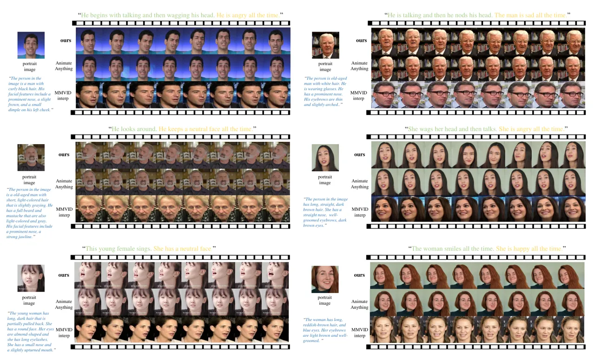

Figure 9: The qualitative comparison of text-guided portrait animation.
The motion descriptions are highlighted in green, while the emotion
descriptions are marked in yellow. The blue text represents the
appearance descriptions, which is only used by MMVID-interp. The
generated video frames are displayed sequentially from left to right.

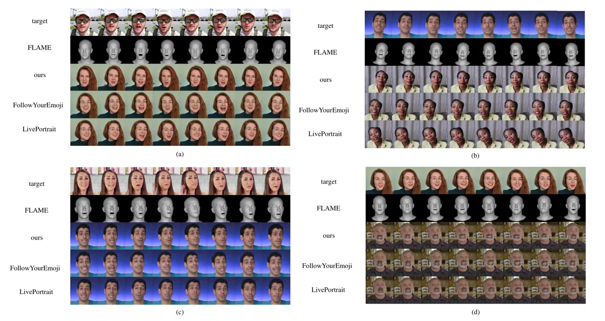

Figure 10: The qualitative comparison of video-driven portrait
animation. The generated video frames are displayed sequentially from
left to right.

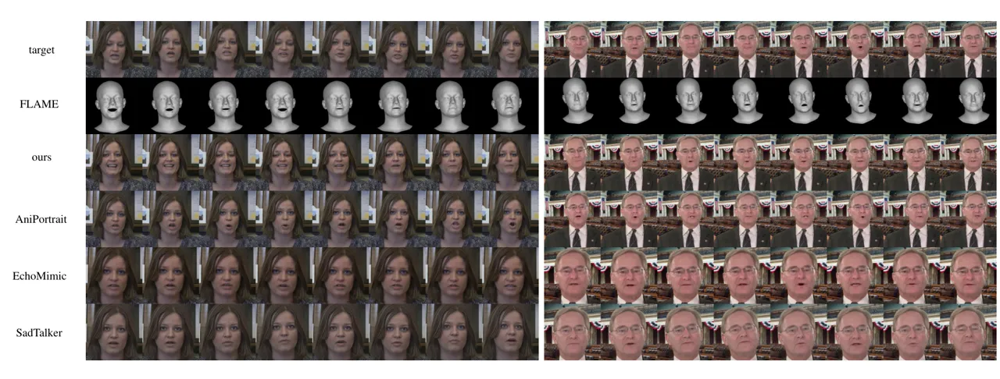

Figure 11: The qualitative comparison of audio-driven portrait
animation. The generated video frames are displayed sequentially from
left to right.

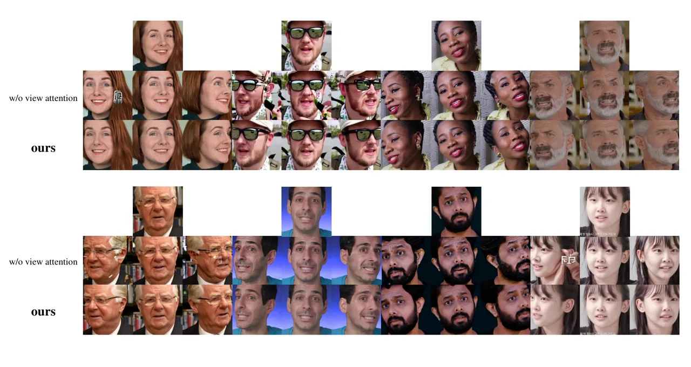

Figure 12: The qualitative ablation of view attention.

## 11 Ablation

### 11.1 Text2FLAME

We ablate the Text2FLAME stage using three variants: No Smoothing, and
Larger Network Size, Joint Generation. As mentioned in the main text,
the No Smoothing variant causes mismatched expressions and head jitter,
the Larger Network Size variant generates correct expressions but lacks
head movement, and the Joint Generation variant shows incorrect
expressions and static motion. We include animations of these variants
in the supplementary materials. Please watch them for comparison.

Additionally, for smoothing operations, we conduct an additional
experiment with a sliding window size of 5. The quantitative results are
shown in Tab. 5. Note that the window size for MVPortrait is 3, while
the window size for no smoothing is 1. This ablation shows a window size
of 3 balances stability and naturalness best.

### 11.2 FLAME2Video

In this part, we present additional multiview results to demonstrate the
effectiveness of our view attention mechanism in Fig. 12. We train a
2-view model and report evaluation results in Tab. 6, which shows that
the performance improves as the number of views increases, up to the
maximum of 4 supported on an 80GB A100 GPU.
