# EmoHead: Emotional Talking Head via Manipulating Semantic Expression Parameters

Xuli Shen Hua Cai Dingding Yu Weilin Shen Qing Xu Xiangyang Xue
Affiliation: Fudan University UniDT
[https://bisno.github.io/Emohead](https://bisno.github.io/Emohead)

###### Abstract

Generating emotion-specific talking head videos from audio input is an
important and complex challenge for human-machine interaction. However,
emotion is highly abstract concept with ambiguous boundaries, and it
necessitates disentangled expression parameters to generate emotionally
expressive talking head videos. In this work, we present EmoHead to
synthesize talking head videos via semantic expression parameters. To
predict expression parameter for arbitrary audio input, we apply an
audio-expression module that can be specified by an emotion tag. This
module aims to enhance correlation from audio input across various
emotions. Furthermore, we leverage pre-trained hyperplane to refine
facial movements by probing along the vertical direction. Finally, the
refined expression parameters regularize neural radiance fields and
facilitate the emotion-consistent generation of talking head videos.
Experimental results demonstrate that semantic expression parameters
lead to better reconstruction quality and controllability.

###### Index Terms: 

emotional talking head synthesis, video manipulation, multi-modality
alignment

## I Introduction

^(†)^(†)footnotetext: ^(⋆)Corresponding author.

Talking head synthesis is the process of reanimating a target person to
align with lip movement and head poses executed by input audio \[1, 2,
3, 4, 5\]. It involves the seamless integration of the audio source and
target avatar, resulting in a realistic and synchronized video output by
harnessing modern generative reconstruction methods \[6, 7\].

Emotional talking head synthesis, on the other hand, aims to generate
talking avatar videos with vivid expressions for specific emotions \[8,
9, 10\]. Benefiting from the facial morphable model \[11, 12\], there
are end-to-end methods that focus on audio-driven \[9\] or video-driven
\[10\] pipelines that empower with facial expression editing
capabilities. \[13\].

Nevertheless, these expression parameters are often entangled, which
leads to the “expression collapse” phenomenon in reconstructed results,
as depicted by the angry eye region for the target happy emotion in
Fig. 1. We hypothesize that if the expression parameters are
sufficiently refined, this phenomenon will be eliminated and emotional
consistency will be improved, as seen in the smiling eye region of
Fig. 1. In this work, we propose an target emotion expression refinement
method to enhance the overall authenticity and effectiveness of
emotional talking head synthesis. By accurately representing and
refining facial movements, the framework enables more engaging and
emotionally resonant experiences.

Specifically, we present an audio-expression module that regresses
low-dimensional expression parameters based on audio input from various
sources and specific emotion categories. To better synchronize emotional
talking videos, we first obtain the embedded audio feature and use
timestamp-aligned audio speech recognition alongside pretrained
audio-emotion encoder and text encoder to extract emotion features in
audio and text features, respectively. We then propose an emotional
cross-modality fusion mechanism, named Audio Expression Alignment, to
eliminate noise emotions and preserve strong correlations. Next, we
train emotion-specific hyperplanes to intricately refine and control
facial movements through the low-dimensional expression parameters.
Next, we leverage the predicted expression parameters and construct
emotion-conditional implicit function for talking head reconstruction
using volume rendering, and achieve high-fidelity synthesis with better
controllability. Our key contributions are:

- •
  We present an audio-expression module for mapping audio features to
  low-dimensional expression parameters. We propose Audio Expression
  Alignment, a cross-modality attention mechanism that enhances the
  correlation between audio features and emotion target.
- •
  We apply an expression refinement method to enhance the emotion
  consistency of expression parameters and manipulate emotion
  representation in the talking stage.
- •
  We leverage refined facial expression parameters for portrait
  rendering, resulting in better reconstruction quality and
  controllability of the target emotion.

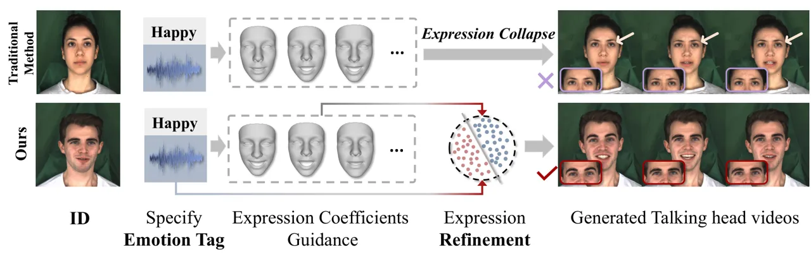

Fig. 1: Different from previous work, the proposed method applies
emotion-specific hyperplanes to eliminate “expression collapse”
phenomenon and generate target emotional videos.

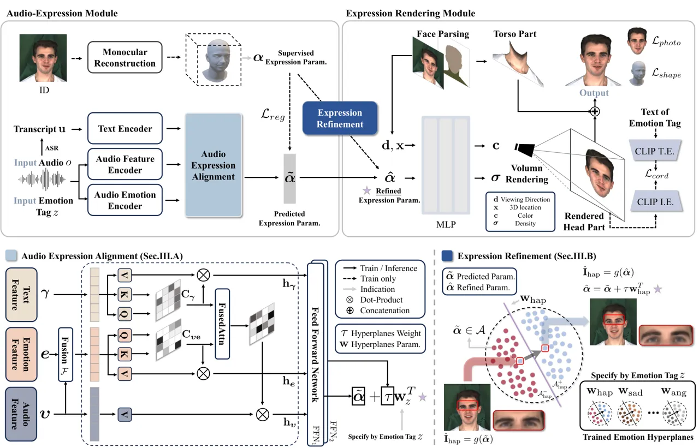

Fig. 2: The proposed framework of EmoHead.

## II Related Work

### II-A Audio-Driven Talking Head Generation

Existing audio-driven talking head generation can be divided into
identification-specific \[2, 3, 4, 5\] and identification-agnostic \[14,
15\] fields. Identification-specific audio-driven talking head
generation aims to synthesize videos of specifically trained target
individuals. Recently, Style2Talker \[5\] learns personalized
speaker-specific diffusion models using 3DMM coefficients and then
generates videos via CLIP \[16\] guidance. In the field of
identification-agnostic methods, talking head videos are generated in a
one-shot setting, building a universal model applicable across different
individuals. Specifically, SadTalker \[17\] learns decoupled and
realistic motion coefficients from audio inputs. LivePortrait \[15\]
drives arbitrary talking faces with audio while allowing free pose
control by learning pose motions from another video source.

### II-B Emotional Talking Head Generation

Emotional talking head generation requires both emotional manipulation
and high-fidelity generation method. In recent years, \[18, 8, 9, 19\]
has focused on generating one-shot talking head animations with emotion
control by providing an identity source image and an emotion source
video. EAMM \[19\] leverages emotion discriminative loss for emotion
talking head videos. EDTalk \[20\] aims to decompose the facial dynamics
to enhance emotion representation. EAT \[10\] focuses on controlling the
emotion via prompt. Nevertheless, few efforts have attempted to explore
precise emotion representation for emotional talking head synthesis in
cases where different emotions couple together.

## III Method

In this section, we present emotional talking head synthesis framework
EmoHead, illustrated in Fig. 2. First, we demonstrate the
audio-expression module, which predicts facial expression parameters
from multi-modality features. Next, we introduce a novel expression
parameters refinement via trained hyperplane that classifies the target
emotion. Then, we elaborate on the expression rendering module, which
uses the expression parameters to synthesize 2D talking head videos via
neural radiance field. Finally, we discuss key training details.

Task Formulation. We aim to synthesize talking face video given specific
emotion tag. The input audio state $`\mathbf{s}`$ is a pair $`(o,z)`$
where $`o`$ is a fixed-length audio and $`z`$ is the tag of required
emotion state. The goal of the task is to learn a function
$`\mathcal{G}:\mathbf{s}\rightarrow\bm{\alpha}\rightarrow\mathcal{I}`$ ,
where $`\mathcal{I}`$ is the set of output frames and
$`\bm{\alpha}\in\mathbb{R}^{m}`$ refers to expression parameter.

### III-A Audio-Expression Module

Given the audio input frame $`i`$, we obtain the audio features
$`\tilde{\bm{\upsilon}}_{i}`$, and emotional features
$`\tilde{\textbf{e}}_{i}`$ present in the audio $`o_{i}`$ using
HuBERT-base as audio feature encoder \[21\] and Emotion2vec-base \[22\]
as audio emotion encoder. Next, we utilize audio speech recognition (ASR
\[23\]) to provide transcript u, which is timestamp-aligned by audio
(see Appendix.C). Then, we leverage the large language model LLaMa2-7b
\[24\] to encode text features $`\tilde{\bm{\gamma}}_{i}`$. We apply
three different trainable linear mappings E to project all the above
features into same dimension $`d`$:

```math
\bm{\upsilon}_{i}=\tilde{\bm{\upsilon}}_{i}\textbf{E}_{1};\ \textbf{e}_{i}=\tilde{\textbf{e}}_{i}\textbf{E}_{2};\ \bm{\gamma}_{i}=\tilde{\bm{\gamma}}_{i}\textbf{E}_{3}. \tag{1}
```

Audio Expression Alignment. To better preserve lip-synchronization with
various audio emotions, we leverage cross-modality feature alignment to
predict expression parameters. Specifically, we first fuse audio feature
and emotion feature and compute the correlation matrix as

```math
\textbf{C}_{\bm{\upsilon}\textbf{e}}=\mathcal{F}(\bm{\upsilon},\textbf{e})\textbf{W}_{\text{q},1}\textbf{W}_{\text{k},1}^{T}\mathcal{F}(\bm{\upsilon},\textbf{e})^{T}, \tag{2}
```

where
$`\textbf{W}_{\text{q},1},\textbf{W}_{\text{k},1}\in\mathbf{R}^{d\times d_{h}}`$
are the projection matrices. $`\mathcal{F}`$ denotes the fusion function
from the neighboring frames, e.g.,
$`\mathcal{F}(\bm{\upsilon},\textbf{e})=\sum_{i-n}^{i}(\bm{\upsilon}_{i}+\textbf{e}_{i})`$,
and $`n`$ is empirically set as 5. Next, we compute the correlation
matrix of the text feature as:

```math
\textbf{C}_{\bm{\gamma}}=\bm{\gamma}_{i}\textbf{W}_{\text{q},2}\textbf{W}_{\text{k},2}^{T}\bm{\gamma}_{i}^{T}, \tag{3}
```

where
$`\textbf{W}_{\text{q},2},\textbf{W}_{\text{k},2}\in\mathbf{R}^{d\times d_{h}}`$.
Then, to better align audio and emotion feature, we fuse the two
correlation matrices and obtain the attention formula as follows
(denoted as “FusedAttn”):

```math
\displaystyle\textbf{h}_{\bm{\upsilon}} \displaystyle=\text{FusedAttn}(\bm{\upsilon},\textbf{e},\bm{\gamma}) \tag{4}
```

```math
\displaystyle=\text{Softmax}(\frac{\textbf{C}_{\bm{\upsilon}\textbf{e}}+\textbf{C}_{\bm{\gamma}}}{\sqrt{d_{h}}})\bm{\upsilon}\textbf{W}_{\text{v},1}, \tag{5}
```

where $`\textbf{W}_{\text{v,1}}\in\mathbf{R}^{d\times d}`$ and
$`\textbf{h}_{\bm{\upsilon}}`$ denotes the hidden state of the audio
feature. Finally, we consider the fused emotion and text feature
important enough to be fully learned, so we also pass and update them
between separately as follows:

```math
\displaystyle\textbf{h}_{\bm{e}} \displaystyle=\text{Softmax}(\frac{\textbf{C}_{\bm{\upsilon}\textbf{e}}}{\sqrt{d_{h}}})\mathcal{F}(\bm{\upsilon},\textbf{e})\textbf{W}_{\text{v},2} \tag{6}
```

```math
\displaystyle\textbf{h}_{\bm{\gamma}} \displaystyle=\text{Softmax}(\frac{\textbf{C}_{\bm{\gamma}}}{\sqrt{d_{h}}})\bm{\gamma}\textbf{W}_{\text{v},3}, \tag{7}
```

where
$`\textbf{W}_{\text{v,2}},\textbf{W}_{\text{v,3}}\in\mathbf{R}^{d\times d}`$
and $`\textbf{h}_{\bm{e}}`$ and $`\textbf{h}_{\bm{\gamma}}`$ denote the
hidden states of the emotion and the text features, respectively. At
last, we have the concatenated feature
$`[\textbf{h}_{\bm{\upsilon}};\textbf{h}_{\textbf{e}};\textbf{h}_{\bm{\gamma}}]`$,
which is sent to feed-forward networks to predict expression parameter
$`\tilde{\bm{\alpha}}`$. Note that $`\tilde{\bm{\alpha}}`$ is supervised
by the $`\bm{\alpha}`$ from 3DMM expression coefficients \[12\].

### III-B Expression Refinement

There remains a non-trivial challenge that the predicted
$`\tilde{\bm{\alpha}}`$ can not precisely generate target emotion. The
rendered frame with “happy” emotion displays expression collapse of
twinkling eyebrows in the bottom-right of Fig. 2. A simple method is to
pre-set certain dimension of expression parameter
$`\tilde{\bm{\alpha}}`$ to edit the emotion, for example setting
$`\text{dim}_{6}=-2.1`$ (depicted in Fig.1 of Appendix.A) to alleviate
coupled emotion representation, but not all dimensions of expression
parameters are relevant to specific emotion individually.

To this end, we employ emotion specific hyperplanes to explore the
entangled expression parameter space, depicted in the bottom right part
of Fig. 2. These hyperplanes, pre-trained by frames of emotion specified
talking head videos, enable the model to determine the boundary of
emotion concept and refine parameter $`\tilde{\bm{\alpha}}`$ to semantic
expression parameters. Specifically, the hyperplane is set as classifier
in the expression parameter space $`\mathcal{A}`$. We define
$`\{y^{+},y^{-}\}`$ to label the target emotion parameters
$`\mathcal{A}^{+}`$ and parameters for other emotions
$`\mathcal{A}^{-}`$. The hyperplane parameter is defined as
$`\mathbf{w}_{z}\in\mathbb{R}^{m}`$ with respect to emotion $`z`$. After
obtaining the trained hyperplanes (see Appendix.B for training details),
the frames can be generated and refined via predicted expression
parameter along the normal vector direction:

```math
\displaystyle\tilde{\bm{\alpha}}=\text{FFN}_{1}([\textbf{h}_{\bm{\upsilon}};\textbf{h}_{\textbf{e}} \displaystyle;\textbf{h}_{\bm{\gamma}}]),\tau=\text{FFN}_{2}([\textbf{h}_{\bm{\upsilon}};\textbf{h}_{\textbf{e}};\textbf{h}_{\bm{\gamma}}]) \tag{8}
```

```math
\displaystyle\hat{\bm{\alpha}}=\tilde{\bm{\alpha}}+\tau\mathbf{w}_{z}^{T} \tag{9}
```

```math
\displaystyle\hat{\mathbf{I}}=g(\hat{\bm{\alpha}}), \tag{10}
```

where FFN refers to feed-forward network, $`\tau`$ determines a
learnable weight of manipulation, $`\tilde{\bm{\alpha}}\in\mathcal{A}`$
refers to the predicted expression parameter and $`g`$ is the expression
rendering module to generate frame $`\hat{\mathbf{I}}`$ and will be
introduced in next section. Therefore, the emotion consistency of
rendered talking head is enhanced by changing the expression parameter
along the direction of normal vector, resulting in “happy” emotion with
relaxed eyebrows in bottom right part of Fig. 2.

### III-C Expression Rendering Module

Neural Radiance Fields for EmoHead. Different from previous audio-driven
reconstruction methods \[2, 25\], we present an expression-conditioned
neural radiance field. We apply implicit function with inputs of a
viewing direction $`\mathbf{d}`$, a 3D location $`\mathbf{x}`$, and
refined expression parameters $`\hat{\bm{\alpha}}`$. This implicit
function $`\theta`$ is realized by multi-layer perceptron (MLP). By
combining the input vectors
$`(\hat{\bm{\alpha}},\mathbf{d},\mathbf{x})`$, the MLP estimates colors
$`\mathbf{c}`$ and densities $`\bm{\sigma}`$ of rays. This implicit
function is formulated as
$`\theta:(\hat{\bm{\alpha}},\mathbf{d},\mathbf{x})\rightarrow(\mathbf{c},\bm{\sigma}).`$
Similar to the rendering process in NeRF \[7\], the expected color
$`\mathcal{C}`$ of a camera ray
$`\mathbf{r}(t)=\mathbf{o}+t\mathbf{d}`$, with a camera center
$`\mathbf{o}`$, viewing direction $`\mathbf{d}`$, is integrated from
near bound $`t_{n}`$ and far bound $`t_{f}`$:

```math
\displaystyle\mathcal{C}(\mathbf{r};\theta,\mathcal{W}, \displaystyle\hat{\bm{\alpha}})=\int_{t_{n}}^{t_{f}}\bm{\sigma}_{\theta}(\mathbf{r}(t))\cdot\mathbf{c}_{\theta}(\mathbf{r}(t),\mathbf{d})\cdot T(t)dt \tag{11}
```

```math
\displaystyle T(t)=exp\bigg(\int_{t_{n}}^{t}\bm{\sigma}_{\theta}(\mathbf{r}(s))ds\bigg). \tag{12}
```

Along the rays casted through each pixel, emotional talking head is
computed by volume rendering process which accumulates the sampled
density $`\bm{\sigma}_{\theta}`$ and RGB values $`\mathbf{c}_{\theta}`$,
predicted by the implicit function $`\theta`$.
$`\mathcal{W}=\{R,\omega\}`$ is the predicted rigid pose parameters of
the face, containing a rotation matrix $`R\in\mathbb{R}^{3\times 3}`$
and a translation vector $`\omega\in\mathbb{R}^{3\times 1}`$.

To obtain final synthesized output, we leverage face parsing \[26\] for
separating torso part of talking person and background image. Note that
we focus on facial emotion so that we does not discuss the performance
of torso part synthesis. The final outcome frame is the concatenation of
rendered head part, segmented torso part and arbitrary background.

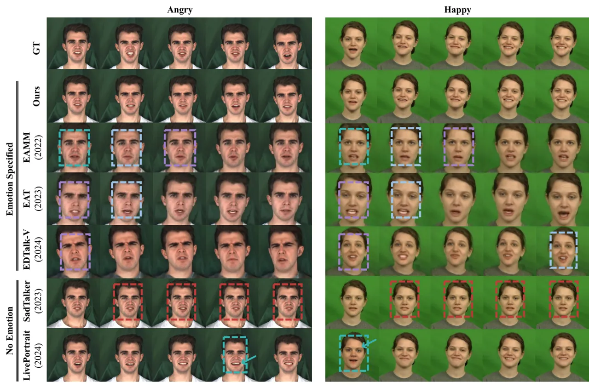

Fig. 3: Visualization comparisons of generated frames with
state-of-the-art methods. See the illustration of color in Sec.IV-C.

### III-D Training

Many-to-one Audio-expression Module. We aim to train a universal
audio-expression module that can estimate expression parameters
$`\bm{\alpha}`$ from arbitrary voice input. To this end, we leverage
contrastive learning that audio features from different individuals are
assigned to emotional parameters for same $`z`$:

```math
\displaystyle\mathcal{L}^{const}_{reg}=\|\bm{\alpha}_{\bm{\upsilon}}^{A} \displaystyle-\hat{\bm{\alpha}}_{\bm{\upsilon}}^{A}\|_{2}+\rho\|\bm{\alpha}_{\bm{\upsilon}}^{\bar{A}}-\hat{\bm{\alpha}}_{\bm{\upsilon}}^{A}\|_{2} \tag{13}
```

```math
\displaystyle\hat{\bm{\alpha}}=\tilde{\bm{\alpha}}+\tau\mathbf{w}_{z}^{T}, \tag{14}
```

where $`\hat{\bm{\alpha}}_{\bm{\upsilon}}^{A}`$ refers to the
post-refined expression parameters given audio feature from individual
$`A`$, $`\rho`$ is the hyperparameter that control the degree for
learning universal facial expression parameters, empirically set as
$`0.5`$. $`\textbf{w}^{T}_{z}`$ is the trained hyperplane that separate
expression parameters of emotion tag $`z`$ from the rest emotion tags
for expression refinement. During training stage,
$`\bm{\alpha}_{\bm{\upsilon}}^{\bar{A}}`$ is randomly sampled from
training set that belongs to another individual. Thus the
audio-expression module is able to estimate emotion parameters from
different individual for same emotion tag $`z`$.

Reconstruction Loss. We provide 2-stage reconstruction loss
$`\mathcal{L}`$ to train implicit function coarsely and finely:

```math
\displaystyle\mathcal{L}=\mathcal{L}_{photo}+\mathcal{L}_{refine}. \tag{15}
```

Specifically, during first half of training stage, let
$`\mathbf{I}_{r}=\sum_{\mathbf{r}}\mathcal{C}(\mathbf{r})`$ be the
rendered image and $`\mathbf{I}_{g}`$ be the groundtruth image, we
minimize the photo-metric error by
$`\mathcal{L}_{photo}=\|\mathbf{I}_{r}-\mathbf{I}_{g}\|_{2}`$ that
coarsely reconstructs target person. Next, we utilize geometry
parameters $`\bm{\beta}_{\mathbf{id}}\in\mathbb{R}^{50}`$ \[12\] to
ensure implicit function for better representation of specific
individual. Besides, since different person may show different
expression for same emotion tag, we use CLIP \[16\] loss to guide the
generated frame to be semantically consistent with required emotion. In
detail, given the emotion tag text $`emo`$, we have:

```math
\displaystyle\mathcal{L}_{refine}=\underbrace{-E_{I}(\mathbf{I}_{r})^{T}E_{T}(emo)}_{{\mathcal{L}_{cord}}}+\underbrace{\|\bm{\beta}_{\mathbf{id}}-\hat{\bm{\beta}}_{\mathbf{id}}\|_{2}}_{{\mathcal{L}_{shape}}}, \tag{16}
```

where $`E_{I}`$ and $`E_{T}`$ refer to image encoder and text encoder in
CLIP, respectively. We adopt $`\mathcal{L}_{refine}`$ in the second-half
of training stage, using $`\mathcal{L}_{cord}`$ for target emotion
text-image coordination, and $`\mathcal{L}_{shape}`$ for enhancing
reconstruction quality of target person. Finally, the weight set
$`\{\lambda_{photo},\lambda_{cord},\lambda_{shape}\}`$ is applied to
achieve training stability.

## IV Experiments

### IV-A Experiment Setup

|                     |                   |                   |                        |                    |                    |                    |                 |                       |                        |                      |
| ------------------- | ----------------- | ----------------- | ---------------------- | ------------------ | ------------------ | ------------------ | --------------- | --------------------- | ---------------------- | -------------------- |
| Methods             | SSIM $`\uparrow`$ | PSNR $`\uparrow`$ | M/F-LMD $`\downarrow`$ | FID $`\downarrow`$ | AUE $`\downarrow`$ | Sync. $`\uparrow`$ | ER $`\uparrow`$ | Fidelity $`\uparrow`$ | Coherence $`\uparrow`$ | Empathy $`\uparrow`$ |
| SadTalker \[17\]    | 0.606             | 19.042            | 2.038$`/`$2.335        | 69.2               | 2.86               | 5.68               | 52.11           | 3.2                   | 3.8                    | 3.2                  |
| LivePortrait \[15\] | 0.720             | 26.161            | 1.314$`/`$1.572        | 59.5               | 2.05               | 6.96               | 61.82           | 3.3                   | 3.5                    | 2.9                  |
| EAMM \[19\]         | 0.610             | 18.867            | 2.525$`/`$2.814        | 31.3               | 2.35               | 1.76               | 31.08           | 2.7                   | 2.9                    | 3.5                  |
| EAT \[10\]          | 0.652             | 20.007            | 1.750$`/`$1.668        | 34.6               | 1.48               | 7.98               | 64.40           | 2.7                   | 3.8                    | 4.0                  |
| EDTalk-V \[13\]     | 0.769             | 22.771            | 1.102$`/`$1.060        | 38.5               | 1.56               | 6.89               | 68.85           | 2.8                   | 3.1                    | 3.7                  |
| Ours                | 0.891             | 28.262            | 1.031$`/`$0.981        | 30.9               | 1.41               | 8.08               | 73.28           | 4.6                   | 4.3                    | 4.2                  |
| Groundtruth         | \-                | \-                | \-                     | \-                 | \-                 | 7.36               | 79.65           | 4.9                   | 4.7                    | 4.4                  |

TABLE I: Quantitative comparison and human evaluation on MEAD dataset.

|                     |                   |                   |                        |                    |                    |                    |                 |                       |                        |                      |
| ------------------- | ----------------- | ----------------- | ---------------------- | ------------------ | ------------------ | ------------------ | --------------- | --------------------- | ---------------------- | -------------------- |
| Methods             | SSIM $`\uparrow`$ | PSNR $`\uparrow`$ | M/F-LMD $`\downarrow`$ | FID $`\downarrow`$ | AUE $`\downarrow`$ | Sync. $`\uparrow`$ | ER $`\uparrow`$ | Fidelity $`\uparrow`$ | Coherence $`\uparrow`$ | Empathy $`\uparrow`$ |
| SadTalker \[17\]    | 0.688             | 25.572            | 2.851$`/`$2.156        | 63.7               | 2.01               | 5.99               | 69.59           | 3.4                   | 3.7                    | 3.8                  |
| LivePortrait \[15\] | 0.873             | 28.985            | 1.411$`/`$1.503        | 33.6               | 1.94               | 6.02               | 70.13           | 3.5                   | 3.6                    | 3.6                  |
| EAMM \[19\]         | 0.650             | 21.910            | 2.751$`/`$2.824        | 35.6               | 2.19               | 3.22               | 40.72           | 3.2                   | 3.1                    | 3.3                  |
| EAT \[10\]          | 0.794             | 23.712            | 1.925$`/`$1.791        | 32.3               | 1.98               | 5.70               | 61.76           | 3.1                   | 3.7                    | 3.5                  |
| EDTalk-V \[13\]     | 0.753             | 27.641            | 1.228$`/`$1.137        | 40.5               | 1.81               | 5.57               | 54.46           | 3.0                   | 2.9                    | 3.2                  |
| Ours                | 0.914             | 31.621            | 1.191$`/`$1.035        | 29.3               | 1.55               | 6.11               | 75.98           | 4.5                   | 4.7                    | 4.3                  |
| Groundtruth         | \-                | \-                | \-                     | \-                 | \-                 | 7.09               | 82.51           | 4.9                   | 4.8                    | 4.8                  |

TABLE II: Quantitative comparison and human evaluation on CREMA-D
dataset.

Dataset. We apply the multi-view emotional audio-visual dataset (MEAD)
\[27\] and the crowd-sourced emotional multimodal actors dataset
(CREMA-D) \[28\]. MEAD contains 60 expressive actors and actresses who
express eight distinct emotions at three varying intensity levels.
CREMA-D \[28\] consists of 7,442 original clips from 91 actors, each
with four different emotion levels. Baseline Methods. We compare EmoHead
against non-emotional methods and emotion-specific methods. For
non-emotional methods, we choose SadTalker \[17\] and LivePortrait
\[15\]. We use the original test video as the driving source and the
first frame as the input emotion condition. For emotion-specific
methods, we preset one target emotion and compare the state-of-the-art
methods EAMM \[19\], EDTalk \[13\], and EAT \[10\]. We implement all the
default hyperparameters for the baseline methods. Metrics. For the
generated video, we use PSNR and SSIM to quantify reconstruction
quality. We also evaluate the generated frames using the FID \[29\],
which measures image quality and diversity. Additionally, we employ the
action unit error (AUE) \[30\] and face landmark distances (F-LMD) for
evaluating the accuracy of face motion; the SyncNet score (Sync.) \[31\]
and mouth landmark distances (M-LMD) \[32\] for assessing lip
synchronization; and the accuracy of emotion recognition (ER) \[33\] in
frames to evaluate the emotion consistency of generated video with
target emotion.

### IV-B Quantitative Analysis

Comparison with Baseline Methods. Tab. I and II shows the reconstruction
quality produced by our proposed framework. Our method achieves the
highest SSIM and PSNR scores, resulting in high-quality talking head
videos. The AU error and F-LMD from proposed method consistently show
the highest results on both datasets, illustrating that our approach
also generates more realistic face motion and accurate expression than
emotion-aware method EAMM, EDTalk-V and EAT. It indicates that the
proposed audio-expression module successfully enhances the correlation
between facial movement and audio input. As for the accuracy comparison
of facial expression generation, we calculate mean accuracy of across
all the emotions in the test set. We surpass the state-of-the-art method
EDTalk which generates accurate target emotion of talking head. This is
due to the emotion-specific hyperplane disentangles expression
parameters at low-dimension space and regularize NeRF to increase the
semantic representation of emotional talking head synthesis.

Ablation Studies. Please kindly refer to Appendix (D&F) for the audio
expression alignment, expression refinement and loss implementation.

Human Evaluation. We conduct generation quality and emotion-based
pairwise preference test for EmoHead. For a given pair of generated
video and emotion tag, we assign crowd sourcing workers to annotate the
video with a score on scale of 0 to 5 and report average scores. We
define three aspects for evaluation: Fidelity, Coherence, and Empathy.
Fidelity refers to the reconstruction quality of generated video.
Coherence assesses the consistency of emotion with expression. Empathy
refers to the degree to which each video encourages the user to respond
with emotion. Tab. I and II show that the generated talking heads from
our model exhibit higher fidelity and coherence, indicating that refined
expression parameters lead to more accurate emotion representation. Our
model also outperforms all the baselines in terms of empathy, evoking
user for a more emotional experience.

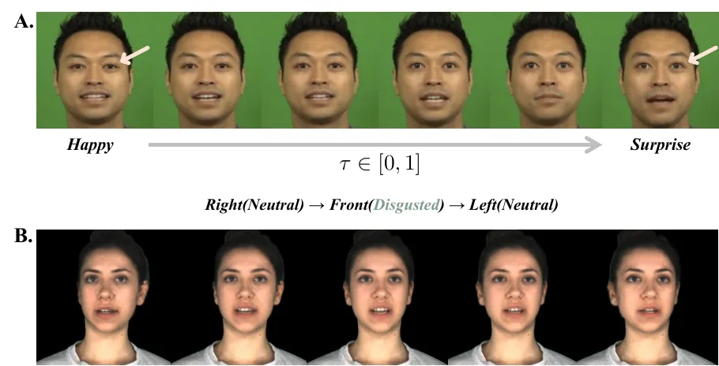

Fig. 4: (A) Continuous expression manipulation in talking stage. (B)
Reconstruction result of unseen views and varying emotion. Please refer
to the supplementary video.

### IV-C Qualitative Analysis

Comparison with Baseline Methods. We provide visual examples of specific
emotions to demonstrate the efficacy of the proposed method. Emotional
talking heads are generated using input audio clips corresponding to
each respective emotion for all methods. In Fig. 3, our method shows the
best fidelity for talking head synthesis compared to the other methods.
We use different colors to highlight the shortcomings of the baselines:
(1) Generated output from SadTalker is limited to the source image,
resulting in an output sequence that lacks of expression variability.
(2) LivePortrait generates inappropriate emotions since the mouth region
displays unexpected shapes and angles that do not semantically
correspond to anger. (3) EAMM, EAT, and EDTalk-V are unable to generate
the same identity as the target person. (4) EAMM, EAT, and EDTalk-V fail
to generate high-fidelity talking faces. Our method successfully
generates consistent facial emotion without showing expression collapse.

Refinement Efficacy. Please kindly refer to Appendix (B&E) for the
efficacy of the proposed methods in Sec.III-A & III-B.

Continuous Expression As shown in Fig. 4.A, our method can produce
continuous facial expression changes by Eq. (10) that linearly
interpolates between two expression parameters from different emotion
tags during the talking stage, which cannot be accomplished by the
baselines. Additionally, based on the neural radiance field, our method
can generate talking head videos from unseen views with expression
variation, which facilitates continuous talking head syntheses of
different views and emotions, as depicted in Fig. 4.B. Please refer to
the supplementary video.

## V Conclusion

In this paper, we present emotional talking head generation using
emotion tag and refined expression parameter from a morphable face
model. We provide a novel framework that includes an audio-express
module for predicting expression parameters from audio input and an
expression rendering module for generating person-specific talking head
videos. The predicted facial expression parameters can be manipulated
using pre-trained hyperplanes for expression refinement. Experimental
results show that the proposed framework is effective for
emotion-controllable talking head synthesis.

Acknowledgments. This work is supported in part by NSFC Project
(62176061) and Shanghai Municipal Science and Technology Major Project
(No.2021SHZDZX0103).

## References

- \[1\] KR Prajwal, Rudrabha Mukhopadhyay, Vinay P Namboodiri, and
  CV Jawahar, “A lip sync expert is all you need for speech to lip
  generation in the wild,” in ACM MM, 2020.
- \[2\] Yudong Guo, Keyu Chen, Sen Liang, Yong-Jin Liu, Hujun Bao, and
  Juyong Zhang, “Ad-nerf: Audio driven neural radiance fields for
  talking head synthesis,” in ICCV, 2021, pp. 5784–5794.
- \[3\] Linsen Song, Wayne Wu, Chen Qian, Ran He, and Chen Change Loy,
  “Everybody’s talkin’: Let me talk as you want,” IEEE Transactions on
  Information Forensics and Security, vol. 17, pp. 585–598, 2022.
- \[4\] Yaosen Chen, Yu Yao, Zhiqiang Li, Wei Wang, Yanru Zhang, Han
  Yang, and Xuming Wen, “Hyperlips: Hyper control lips with high
  resolution decoder for talking face generation,” in arxiv, 2023.
- \[5\] Shuai Tan, Bin Ji, and Ye Pan, “Style2talker: High-resolution
  talking head generation with emotion style and art style,” AAAI, 2024.
- \[6\] Ian Goodfellow, Jean Pouget-Abadie, Mehdi Mirza, Bing Xu, David
  Warde-Farley, Sherjil Ozair, Aaron Courville, and Yoshua Bengio,
  “Generative adversarial nets,” in NIPS, 2014, pp. 2672–2680.
- \[7\] Ben Mildenhall, Pratul P. Srinivasan, Matthew Tancik,
  Jonathan T. Barron, Ravi Ramamoorthi, and Ren Ng, “Nerf: Representing
  scenes as neural radiance fields for view synthesis,” in ECCV, 2020.
- \[8\] Suzhen Wang, Lincheng Li, Yu Ding, and Xin Yu, “One-shot talking
  face generation from single-speaker audio-visual correlation
  learning,” in AAAI, 2022.
- \[9\] Borong Liang, Yan Pan, Zhizhi Guo, Hang Zhou, Zhibin Hong,
  Xiaoguang Han, Junyu Han, Jingtuo Liu, Errui Ding, and Jingdong Wang,
  “Expressive talking head generation with granular audio-visual
  control,” in CVPR, 2022, pp. 3387–3396.
- \[10\] Yuan Gan, Zongxin Yang, Xihang Yue, Lingyun Sun, and Yi Yang,
  “Efficient emotional adaptation for audio-driven talking-head
  generation,” in ICCV, October 2023, pp. 22634–22645.
- \[11\] Volker Blanz and Thomas Vetter, “A morphable model for the
  synthesis of 3d faces,” in SIGGRAPH, 1999.
- \[12\] Jianzhu Guo, Xiangyu Zhu, Yang Yang, Fan Yang, Zhen Lei, and
  Stan Z Li, “Towards fast, accurate and stable 3d dense face
  alignment,” in ECCV, 2020.
- \[13\] Shuai Tan, Bin Ji, Mengxiao Bi, and Ye Pan, “Edtalk: Efficient
  disentanglement for emotional talking head synthesis,” in ECCV.
  Springer, 2025, pp. 398–416.
- \[14\] Yifeng Ma, Suzhen Wang, Zhipeng Hu, Changjie Fan, Tangjie Lv,
  Yu Ding, Zhidong Deng, and Xin Yu, “Styletalk: One-shot talking head
  generation with controllable speaking styles,” arXiv preprint
  arXiv:2301.01081, 2023.
- \[15\] Jianzhu Guo, Dingyun Zhang, Xiaoqiang Liu, Zhizhou Zhong, Yuan
  Zhang, Pengfei Wan, and Di Zhang, “Liveportrait: Efficient portrait
  animation with stitching and retargeting control,” arXiv preprint
  arXiv:2407.03168, 2024.
- \[16\] Alec Radford; et al., “Learning transferable visual models from
  natural language supervision,” in ICML, 2021.
- \[17\] Wenxuan Zhang, Xiaodong Cun, Xuan Wang, Yong Zhang, Xi Shen,
  Yu Guo, Ying Shan, and Fei Wang, “Sadtalker: Learning realistic 3d
  motion coefficients for stylized audio-driven single image talking
  face animation,” CVPR, 2023.
- \[18\] Sefik Emre Eskimez, You Zhang, and Zhiyao Duan, “Speech driven
  talking face generation from a single image and an emotion condition,”
  arXiv preprint arXiv:2008.03592, 2020.
- \[19\] Xinya Ji, Hang Zhou, Kaisiyuan Wang, Qianyi Wu, Wayne Wu, Feng
  Xu, and Xun Cao, “Eamm: One-shot emotional talking face via
  audio-based emotion-aware motion model,” in ACM SIGGRAPH, 2022.
- \[20\] Shuai Tan, Bin Ji, Mengxiao Bi, and Ye Pan, “Edtalk: Efficient
  disentanglement for emotional talking head synthesis,” ECCV, 2024.
- \[21\] Benjamin van Niekerk, Marc-André Carbonneau, Julian Zaïdi,
  Matthew Baas, Hugo Seuté, and Herman Kamper, “A comparison of discrete
  and soft speech units for improved voice conversion,” in ICASSP, 2022.
- \[22\] Ziyang Ma, Zhisheng Zheng, Jiaxin Ye, Jinchao Li, Zhifu Gao,
  Shiliang Zhang, and Xie Chen, “emotion2vec: Self-supervised
  pre-training for speech emotion representation,” arXiv preprint
  arXiv:2312.15185, 2023.
- \[23\] Zhifu Gao, Zerui Li, Jiaming Wang, Haoneng Luo, Xian Shi,
  Mengzhe Chen, Yabin Li, Lingyun Zuo, Zhihao Du, Zhangyu Xiao, and
  Shiliang Zhang, “Funasr: A fundamental end-to-end speech recognition
  toolkit,” in INTERSPEECH, 2023.
- \[24\] Hugo Touvron; et al., “Llama: Open and efficient foundation
  language models,” arXiv:2302.13971, 2023.
- \[25\] Zhenhui Ye, Tianyun Zhong, Yi Ren, Jiaqi Yang, Weichuang Li,
  Jiawei Huang, Ziyue Jiang, Jinzheng He, Rongjie Huang, Jinglin Liu,
  et al., “Real3d-portrait: One-shot realistic 3d talking portrait
  synthesis,” in ICLR, 2024.
- \[26\] Changqian Yu, Changxin Gao, Jingbo Wang, Gang Yu, Chunhua Shen,
  and Nong Sang, “Bisenet v2: Bilateral network with guided aggregation
  for real-time semantic segmentation,” IJCV, vol. 129, no. 11, pp.
  3051–3068, 2021.
- \[27\] Kaisiyuan Wang, Qianyi Wu, Linsen Song, Zhuoqian Yang, Wayne
  Wu, Chen Qian, Ran He, Yu Qiao, and Chen Change Loy, “Mead: A
  large-scale audio-visual dataset for emotional talking-face
  generation,” in ECCV, 2020.
- \[28\] Houwei Cao, David G. Cooper, Michael K. Keutmann, Ruben C. Gur,
  Ani Nenkova, and Ragini Verma, “Crema-d: Crowd-sourced emotional
  multimodal actors dataset,” IEEE Transactions on Affective Computing,
  vol. 5, no. 4, pp. 377–390, 2014.
- \[29\] Martin Heusel, Hubert Ramsauer, Thomas Unterthiner, Bernhard
  Nessler, and Sepp Hochreiter, “Gans trained by a two time-scale update
  rule converge to a local nash equilibrium,” in NIPS, 2017.
- \[30\] Tadas Baltrusaitis, Amir Zadeh, Yao Chong Lim, and
  Louis-Philippe Morency, “Openface 2.0: Facial behavior analysis
  toolkit,” in International Conference on Automatic Face and Gesture
  Recognition, 2018.
- \[31\] J. S. Chung and A. Zisserman, “Out of time: automated lip sync
  in the wild,” in Workshop on Multi-view Lip-reading, ACCV, 2016.
- \[32\] Lele Chen, Ross K Maddox, Zhiyao Duan, and Chenliang Xu,
  “Hierarchical cross-modal talking face generation with dynamic
  pixel-wise loss,” in CVPR, 2019.
- \[33\] Debin Meng, Xiaojiang Peng, Kai Wang, and Yu Qiao, “Frame
  attention networks for facial expression recognition in videos,” in
  ICIP, 2019.
- \[34\] Xinya Ji, Hang Zhou, Kaisiyuan Wang, Wayne Wu, Chen Change Loy,
  Xun Cao, and Feng Xu, “Audio-driven emotional video portraits,” in
  CVPR, 2021, pp. 14080–14089.
- \[35\] Pascal Paysan, Reinhard Knothe, Brian Amberg, Sami Romdhani,
  and Thomas Vetter, “A 3d face model for pose and illumination
  invariant face recognition,” in 2009 Sixth IEEE International
  Conference on Advanced Video and Signal Based Surveillance, 2009, pp.
  296–301.
- \[36\] R. Li, K. Bladin, Y. Zhao, C. Chinara, O. Ingraham, P. Xiang,
  X. Ren, P. Prasad, B. Kishore, J. Xing, and H. Li, “Learning formation
  of physically-based face attributes,” in CVPR, Los Alamitos, CA, USA,
  jun 2020, pp. 3407–3416, IEEE Computer Society.
- \[37\] Linchao Bao, Xiangkai Lin, Yajing Chen, Haoxian Zhang, Sheng
  Wang, Xuefei Zhe, Di Kang, Haozhi Huang, Xinwei Jiang, Jue Wang, Dong
  Yu, and Zhengyou Zhang, “High-fidelity 3d digital human head creation
  from rgb-d selfies,” ACM Trans. Graph., vol. 41, no. 1, nov 2021.
- \[38\] Xiyi Chen, Marko Mihajlovic, Shaofei Wang, Sergey Prokudin, and
  Siyu Tang, “Morphable diffusion: 3d-consistent diffusion for
  single-image avatar creation,” IEEE Conference on Computer Vision and
  Pattern Recognition (CVPR), 2024.
- \[39\] Haotian Yang, Hao Zhu, Yanru Wang, Mingkai Huang, Qiu Shen,
  Ruigang Yang, and Xun Cao, “Facescape: A large-scale high quality 3d
  face dataset and detailed riggable 3d face prediction,” in CVPR,
  June 2020.
- \[40\] Lizhen Wang, Zhiyua Chen, Tao Yu, Chenguang Ma, Liang Li, and
  Yebin Liu, “Faceverse: a fine-grained and detail-controllable 3d face
  morphable model from a hybrid dataset,” in CVPR, June 2022.
- \[41\] Shunyu Yao, RuiZhe Zhong, Yichao Yan, Guangtao Zhai, and
  Xiaokang Yang, “Dfa-nerf: Personalized talking head generation via
  disentangled face attributes neural rendering,” arXiv preprint
  arXiv:2201.00791, 2022.
- \[42\] Fabian Pedregosa, Gaël Varoquaux, Alexandre Gramfort, Vincent
  Michel, Bertrand Thirion, Olivier Grisel, Mathieu Blondel, Peter
  Prettenhofer, Ron Weiss, Vincent Dubourg, et al., “Scikit-learn:
  Machine learning in python,” Journal of machine learning research,
  vol. 12, no. Oct, pp. 2825–2830, 2011.
- \[43\] Shuhan Wang, Bin Shen, Xu Min, Yong He, Xiaolu Zhang, Liang
  Zhang, Jun Zhou, and Linjian Mo, “Aligned side information fusion
  method for sequential recommendation,” in Companion Proceedings of the
  ACM Web Conference 2024, New York, NY, USA, 2024, WWW ’24, pp.
  112–120, Association for Computing Machinery.
- \[44\] Jiaxiang Tang, Kaisiyuan Wang, Hang Zhou, Xiaokang Chen,
  Dongliang He, Tianshu Hu, Jingtuo Liu, Gang Zeng, and Jingdong Wang,
  “Real-time neural radiance talking portrait synthesis via
  audio-spatial decomposition,” arXiv preprint arXiv:2211.12368, 2022.
- \[45\] Alec Radford, Jong Wook Kim, Chris Hallacy, Aditya Ramesh,
  Gabriel Goh, Sandhini Agarwal, Girish Sastry, Amanda Askell, Pamela
  Mishkin, Jack Clark, Gretchen Krueger, and Ilya Sutskever, “Learning
  transferable visual models from natural language supervision,” in
  ICML. 2021, vol. 139 of Proceedings of Machine Learning Research, pp.
  8748–8763, PMLR.
- \[46\] Ashish Vaswani, Noam Shazeer, Niki Parmar, Jakob Uszkoreit,
  Llion Jones, Aidan N Gomez, Łukasz Kaiser, and Illia Polosukhin,
  “Attention is all you need,” in NIPS, 2017.

## Appendix of EmoHead

| Method                    | Manipulation Source             | Varying Within Two Emotions | Varying Views | Varying Different Emotions In Talking |
| ------------------------- | ------------------------------- | --------------------------- | ------------- | ------------------------------------- |
| LivePortrait, 2024 \[15\] | \-                              | \-                          | \-            | \-                                    |
| SadTalker, 2023 \[17\]    | \-                              | \-                          | \-            | \-                                    |
| EVP, 2020 \[34\]          | Emotion Encoding (audio)        | ✔                          | \-            | \-                                    |
| EAMM, 2022 \[19\]         | \-                              | \-                          | \-            | \-                                    |
| EAT, 2023 \[10\]          | CLIP (text)                     | \-                          | \-            | \-                                    |
| EDTalk, 2024 \[13\]       | Emotion Encoding (audio & text) | ✔                          | ✔            | \-                                    |
| Ours                      | 3DMM Exp. (hyperplane)          | ✔                          | ✔            | ✔                                    |

TABLE III: Comparison with Baselines in terms of emotion manipulation.
“-” denotes that the method is not able to achieve the function. “3DMM
Exp.” refers to the expression coefficients in 3DMM \[12\]

### V-A Entangled Expression Parameters in 3DMM

The 3D Face Morphable Model (3DMM) has been a fundamental area of
natural face reconstruction, first proposed by Blanz et al. \[11\] in 1999. Initially developed as a linear model using the PCA algorithm,
3DMM is capable of representing the shape and texture of a 3D face
model. Subsequent research has focused on enhancing its performance
through the utilization of larger 3D face datasets \[35, 36, 37\].

Recent 3D face datasets exhibit improved diversity in expression
parameters. \[38\] demonstrates superior generalization in facial
expression fitting and other datasets \[39, 40\] with rich facial
expressions has been collected to enhance the incorporation of facial
expression bases into 3DMM. The extracted facial expression parameters
from a 2D avatar satisfies continuous facial expression change through a
given range. Recently, due to the continuous expression change, depicted
in Figure 5.B, previous work \[41, 10, 25\] leverage the estimated
expression parameters to represent emotion in talking head video.

However, facial expression parameters do not semantically represent
target emotion. Take the reconstruction result from 3DDFA \[12\] as
example, In Figure 5.A, by changing the value of a single dimension, we
find that only a few dimensions can display interpretable facial
expressions with respect to target emotion. For instance, the “angry”
emotion is shown only by the eye region after setting
$`\text{Dim.6}=2.1`$, as indicated by the red box in Figure 5.A.
Nevertheless, most dimensions do not represent specific emotions, as
shown by the green boxes. For example, after changing “Dimension 6” from
$`\text{Dim.6}=2.1`$ to $`\text{Dim.6}=-2.1`$, the “angry” emotion is
emotion is lessened but shifted into an unclear emotion. Those unclear
emotions lead to “expression collapse” phenomenon and potentially
decrease generation quality of emotional talking head. In this work, we
aim to disentangle the facial expression parameters to ensure specific
emotion of talking head, which is crucial for generating high-quality
and emotionally natural talking head video.

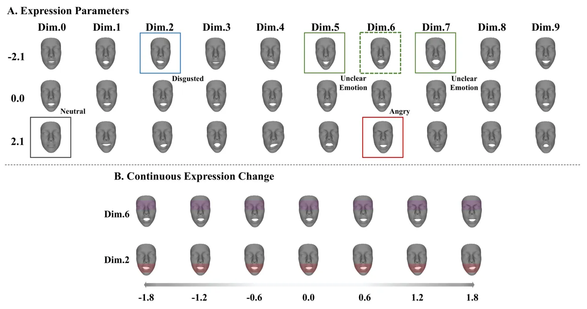

Fig. 5: Figure A displays the monocular reconstruction by changing the
value of each dimension for the expression parameters of 3DMM. Emotions
can hardly be reconstructed using facial expression parameters. Most
dimensions represent “unclear” emotions, as depicted in the green boxes.
Figure B shows the continuous expression change in a single dimension
through the range $`[-1.8,1.8]`$.

### V-B Emotion Hyperplane

Pre-training hyperplane. In this section, we introduce the training
details for the hyperplane designed to distinguish facial expressions
corresponding to desired emotions from other emotions. Firstly, we
employ 3DDFA \[12\] to transform video frames of the target character in
the training dataset into facial expression parameters. After the
transformation into facial parameters, we label all the parameters based
on their emotional tags. Subsequently, using these emotional labels, we
train a hyperplane using SVM in Scikit-learn \[42\]. To ensure that the
expression parameters effectively adapt to varying mouth openings during
speech, we utilize facial landmarks to categorize five arithmetic
groups, defined by the maximum and minimum of the MAR (mouth aspect
ratio). During training, we evenly sample and balance the quantities
across these five groups. After obtaining the trained hyperplanes, we
apply them to adjust the expression parameters to the target emotion, as
depicted in the lower-left part of Figure 2 (in the main paper).

The efficacy of the emotion hyperplane. In Table III, we compare our
method with baseline emotional talking head synthesis in terms of
emotion manipulation. To the best of our knowledge, we are the first to
combine emotion variations in talking, which benefits emotional
human-machine interaction. Here we conclude the efficacy and novelty of
our proposed method:

\(1\) Through this emotion refinement method, we can successfully
manipulate expressions based on their normal vectors for talking heads.
For instance, if we aim to make an expression appear happier, we can
move along the normal vector of happiness and apply a weighted
coefficient in the opposite direction. We provide all six emotion
variations in the CREMA-D dataset, as depicted in Figure 6.
Additionally, Figure 7 demonstrates that the edited emotions are more
semantically accurate than those of the baselines (EVP \[34\] and EDTalk
\[13\]), particularly in the mouth regions. Consequently, through this
plug-and-play method, we enhance the representation of the facial
parameters obtained after prediction from audio input to expression
parameters. Please refer to the emotion variations within two emotions
and views in the supplementary video (approximately at the 3:45 mark).

\(2\) The emotion hyperplane improves the reconstruction quality of
representing specific emotions. Figure 8 illustrates two refined
emotions of the same character. Our proposed expression refinement
method, along with the emotion hyperplane, semantically enhances
generation quality and alleviate “expression collapse” phenomenon, as
shown in the gray boxes of Figure 8. Surprisingly, the character’s eyes
appear smaller in our method for the emotion “Contempt”, which performs
even better than the ground truth.

\(3\) The proposed hyperplane is beneficial for generating talking heads
of two different emotions in talking stage, which can not be
accomplished by previous work. Specifically, we adopt the trained
hyperplanes from two different emotions, denoted as $`\textbf{w}_{1}`$
and $`\textbf{w}_{2}`$. During the inference stage, we substitute
$`\textbf{w}_{1}`$ with $`\textbf{w}_{2}`$ in the pre-determined time
and linearly probe them with the weight $`\tau`$. We demonstrate that
the generated face can successfully represent the combined emotion with
the semantic expression in a single video clip. Please refer to the
emotion variations during the talking stage in the supplementary video,
which is located in the application section (approximately at the 4:45
mark).

### V-C Implementation and Training Details

Implementation Details. First, in the Audio-Expression module, we are
inspired by the Fused Attention module of \[43\] but Emohead has
different domains and series window of model input. The input data
consists of audio $`o`$ and the frames per second (FPS) is set to 25 to
synchronize the audio input with the video frames. Concurrently, we
employ FunASR \[23\] to transcribe audio to text. This transcription is
timestamped, allowing us to correlate the audio with its corresponding
timestamps. For instance, at the $`i`$-th frame, we obtain an audio
segment $`o_{i}`$ and the corresponding text segment $`\textbf{u}_{j}`$.
Furthermore, within the fusion function of $`\mathcal{F}`$, the length
$`n`$ of neighboring frame frames is set to $`5`$. Since the initial
audio segments have an insufficient number of neighboring frames, we
employ silence segment padding to fill the gaps, as illustrated in
Figure 9.

Then, we provide Table V to display the detailed feature dimensions in
our framework. Note that the dimension of the hyperplane w corresponds
to the expression coefficients of 3DMM \[12\], where
$`\bm{\alpha}\in\mathbb{R}^{10}`$. For the two feedforward networks in
the audio expression module (Sec.III.A of the main paper), we use the
same network architecture $`(512,256,256,128,k)`$, where $`k=10`$ for
predicting expression parameters $`\bm{\alpha}`$ and $`k=1`$ for
predicting hyperplane weights $`\bm{\tau}`$.

For the rendering module, we choose the instant-ngp version of AD-NeRF
\[44\] to achieve better efficiency of training and inference. The
implicit function $`\theta`$ has the same network architecture in \[7\].

Training Details of Two datasets. For both datasets, we use PyTorch and
NVIDIA A100 to conduct all the experiments. To train the
audio-expression module, all the parameters are updated with Adam
optimizer with initial learning rate $`0.0005`$. We train
audio-expression module for 20k iterations and rendering module for 200k
iterations. We apply $`\mathcal{L}_{refine}`$ after 100k iterations. To
train the implicit function in rendering module, we set 200,000
iterations for both datasets. In the first 100,000 iterations
(first-half stage), we implement reconstruction loss with the Adam
optimizer and a linear learning schedule. Then, we employ
$`\mathcal{L}_{cord}`$ and $`\mathcal{L}_{shape}`$ at the second-half
training stage. Within $`\mathcal{L}_{cord}`$, the CLIP image encoder
$`E_{I}`$ is CLIP-RN50 and text encoder $`E_{T}`$ is the network
fine-tuned on GPT-2 \[45\]. The weights of loss are set to
$`\lambda_{photo}=1`$, $`\lambda_{cord}={1e-3}`$ and
$`\lambda_{shape}={1e-9}`$, correspondingly, to ensure a steady and
effective training process.

Differently, for the MEAD dataset, we crop the training videos to
dimensions of $`512\times 512`$, with each individual providing 10
minutes of training data and 2 minutes of testing data. For the CREMA-D
dataset, which is smaller than MEAD, the training videos are cropped to
$`340\times 340`$, with 2 minutes of video for training data and 1
minute of video for testing data.

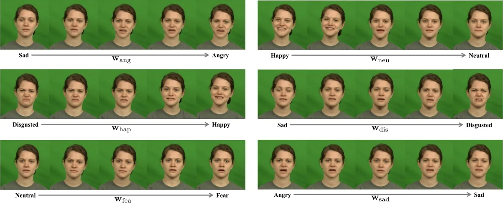

Fig. 6: Talking-stage visualization of probing expression parameters
through trained hyperplane for all six emotions in CREMA-D dataset.

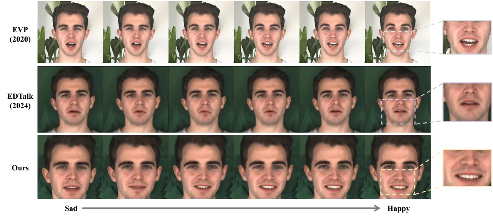

Fig. 7: Comparison of expression editing between two emotions. We
enlarge the mouth region for better visualization.

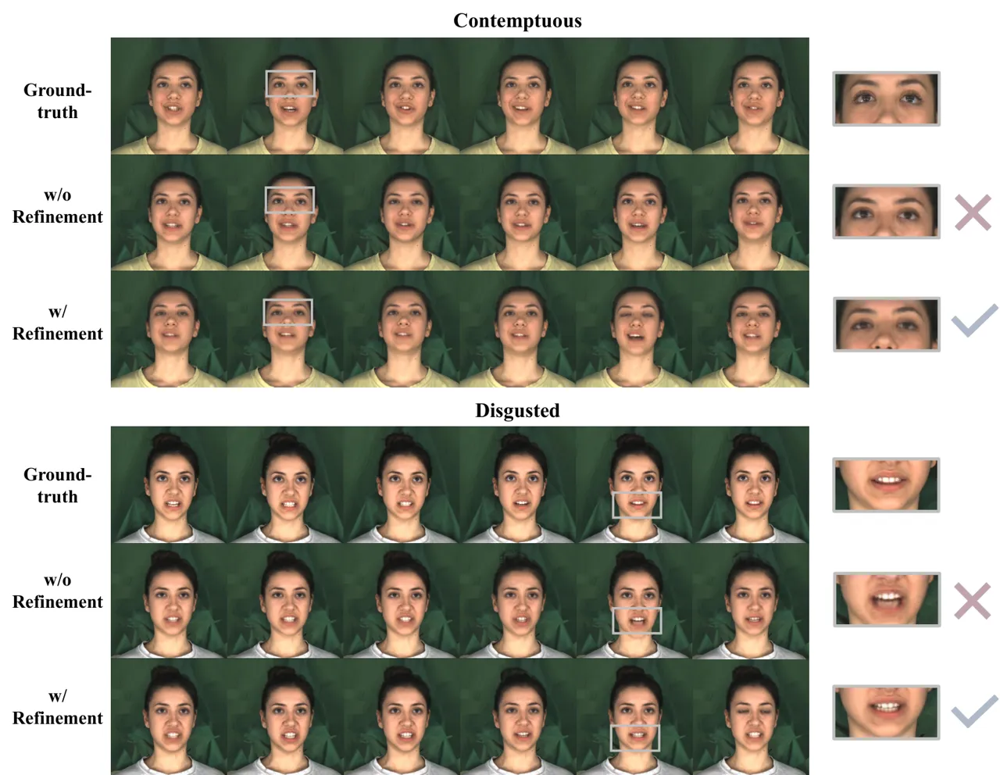

Fig. 8: Additional results of expression refinement. Gray boxes display
the refined region of expression.

|                                  |                   |                   |                        |                    |                    |                    |                 |
| -------------------------------- | ----------------- | ----------------- | ---------------------- | ------------------ | ------------------ | ------------------ | --------------- |
| Settings                         | SSIM $`\uparrow`$ | PSNR $`\uparrow`$ | M/F-LMD $`\downarrow`$ | FID $`\downarrow`$ | AUE $`\downarrow`$ | Sync. $`\uparrow`$ | ER $`\uparrow`$ |
| w/o audio expression alignment   | 0.730             | 25.191            | 1.149$`/`$1.082        | 89.6               | 1.95               | 6.19               | 63.44           |
| w/o hyperplane refinement        | 0.872             | 27.410            | 1.291$`/`$1.203        | 59.2               | 1.86               | 7.25               | 61.29           |
| Ours                             | 0.891             | 28.262            | 1.031$`/`$0.981        | 30.9               | 1.41               | 8.08               | 73.28           |
| Ours (FaceVerse) \[40\]          | 0.872             | 27.740            | 1.175$`/`$1.225        | 43.3               | 1.52               | 7.39               | 61.88           |
| Ours (MorphableDiffusion) \[38\] | 0.886             | 27.731            | 1.130$`/`$1.066        | 38.1               | 1.55               | 7.01               | 70.31           |
| Ours (3DDFA) \[12\]              | 0.891             | 28.262            | 1.031$`/`$0.981        | 30.9               | 1.41               | 8.08               | 73.28           |
| $`d,d_{h}=256,256`$              | 0.717             | 27.018            | 1.092$`/`$1.119        | 33.7               | 1.66               | 6.58               | 66.26           |
| $`d,d_{h}=512,512`$              | 0.891             | 28.262            | 1.031$`/`$0.981        | 30.9               | 1.41               | 8.08               | 73.28           |
| $`d,d_{h}=768,768`$              | 0.872             | 28.155            | 1.087$`/`$1.121        | 31.3               | 1.36               | 7.05               | 72.57           |
| $`d,d_{h}=1024,1024`$            | 0.852             | 27.719            | 1.093$`/`$1.139        | 33.5               | 1.44               | 7.96               | 70.61           |
| $`n=3`$                          | 0.803             | 26.114            | 1.072$`/`$1.087        | 34.6               | 1.56               | 6.77               | 69.31           |
| $`n=5`$                          | 0.891             | 28.262            | 1.031$`/`$0.981        | 30.9               | 1.41               | 8.08               | 73.28           |
| $`n=8`$                          | 0.869             | 27.256            | 1.064$`/`$0.991        | 31.6               | 1.49               | 7.58               | 72.17           |
| $`n=12`$                         | 0.885             | 28.223            | 1.105$`/`$1.076        | 32.9               | 1.45               | 7.96               | 74.42           |

TABLE IV: Quantitative comparison of ablation studies on MEAD dataset.

### V-D Ablation Studies of Quantitative Analysis

We quantitatively evaluate the effectiveness of audio expression
alignment and expression refinement:

- •
  w/o audio expression alignment: We use simple feature fusion method,
  that is, we sent the concatenated feature
  $`[\bm{\upsilon};\textbf{e};\bm{\gamma}]`$ to a typical self-attention
  transformer \[46\] for predicting expression parameter and hyperplane
  weights.
- •
  w/o hyperplane refinement: We does not implement expression refinement
  $`\hat{\bm{\alpha}}=\tilde{\bm{\alpha}}+\tau\mathbf{w}_{z}^{T}`$ for
  rendering talking head. Instead, the input of rendering module is
  $`\hat{\bm{\alpha}}=[z;\tilde{\bm{\alpha}}]`$, where
  $`z\in\mathbb{N}^{+}`$ is a integer that represent different emotion
  tags.

As shown in the top part of Table IV, the reconstruction quality without
audio expression alignment decreases significantly, showing much lower
SSIM and PSNR scores. Furthermore, it indicates that by enhancing the
correlation between audio features and emotional features, we can better
align audio features with the transcript, leading to improved lip
synchronization and showing higher Sync and M-LMD score. Regarding
expression refinement, we observe that without this refinement, the
performance of emotion representation decreases, as indicated by lower
AUE and ER score. This suggests that expression refinement enhances the
emotion representation for talking head synthesis.

|   Description                                                                           |   Encoder          |   Size        |
| --------------------------------------------------------------------------------------- | ------------------ | ------------- |
|   Dimension of Audio feature $`\tilde{\bm{\upsilon}}`$                                  |   HuBERT-base      |   $`768`$     |
|   Dimension of Audio Emotion Feature $`\tilde{\bm{e}}`$                                 |   Emotion2vec-base |   $`768`$     |
|   Dimension of Text feature $`\tilde{\bm{\gamma}}`$                                     |   LLaMA2-7B        |   $`4096`$    |
|   The Hidden Dimension for Audio Expression Alignment and projection matrix $`d,d_{h}`$ |   -                |   $`512,512`$ |
|   Dimension of Emotion Hyperplane $`m`$                                                 |   -                |   $`10`$      |

TABLE V: Details of Feature Dimensions.

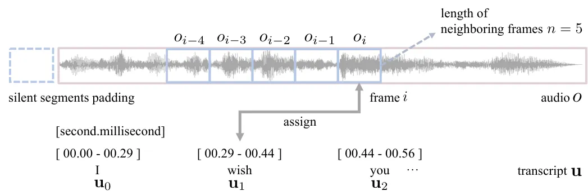

Fig. 9: Implementation details for aligned audio and transcript inputs.
We assign the word $`\textbf{u}_{j}`$ to audio $`o_{i}`$ based on
timestamp.

In order to explore how the coefficients of the 3D Face Morphable Model
affect our method, we compare the expression parameters of three
prevalent models. We choose MorphableDiffusion \[38\], FaceVerse \[40\],
and 3DDFA \[12\] to regress the expression parameters for the
audio-expression module. We implement dimensions of 100, 50, and 10 for
the expression parameters of MorphableDiffusion, FaceVerse, and 3DDFA,
respectively. Table IV demonstrates the similar performance of the three
sets of expression parameters. This indicates that we can leverage 3DDFA
as the source expression parameter model due to its higher runtime
efficiency without compromising the quality of reconstruction.

In the third part of Table IV, we compare the size of the hidden
dimension for audio expression alignment, denoted as $`d`$. It can be
observed that using dimension of $`512`$ significantly achieves better
performance than $`256`$, but there are no significant improvements when
the dimension exceeds $`512`$. Thus, for computation efficiency, we
directly set $`d=512`$.

In the bottom part of Table IV, we provide a comparison of the number of
neighboring frames $`n`$ for different fused functions in audio
expression alignment. The $`n=5`$ configuration outperforms the others,
except in the case of ER when $`n=12`$. However, the lip synchronization
for $`n=12`$ is significantly lower than for $`n=5`$, so we use $`n=5`$
in our experiments.

### V-E Efficacy of Audio Expression Alignment

Based on the proposed audio expression module, our method can generate
emotional talking head videos with different emotion tags, regardless of
the emotion conveyed in the audio input. Figure 11 demonstrates that we
generate three distinct emotions in different individuals using an audio
input with “fear” emotion. Our proposed audio expression alignment
successfully maps various emotional audio inputs to the desired
emotional expressions, regardless of audio emotion and gender
identification. Please refer to the supplementary video for detailed
generation comparison (approximately at the 2:21 mark).

### V-F Loss Implementation

We provide Figure 10 to visualize the reconstruction results of
different loss implementations. On both datasets, we observe that
$`\mathcal{L}_{cord}`$ improves the expression in the eye region,
showing a brighter and more energetic expression in the green box.
$`\mathcal{L}_{shape}`$ further enhances the generation quality by
displaying more accurate lip motion. By combining $`\mathcal{L}_{cord}`$
and $`\mathcal{L}_{shape}`$, the results show less vagueness in the
regions of the lips and teeth.

We then report quantitative ablation studies of loss implementation in
Table VI. We adopt the root mean squared error (RMSE) for the expression
parameters from the audio-expression module. The contrastive loss
$`\mathcal{L}^{const}_{reg}`$ enhances the audio-expression module by
alleviating the deterioration caused by person-specific audio features.
The CLIP loss $`\mathcal{L}_{cord}`$ improves expression recognition
accuracy, making the faces closer to the target emotion. Lastly, adding
identification shapes with $`\mathcal{L}_{shape}`$ results in a lower
AUE, indicating more vivid facial motion.

We also report the hyperparameters of the loss functions, specifically
the $`\rho`$ in the contrastive loss $`\mathcal{L}^{const}_{reg}`$ and
weight set $`\{\lambda_{photo},\lambda_{cord},\lambda_{shape}\}`$ for
the reconstruction loss $`\mathcal{L}`$. In the third part of Table VI,
$`\rho=0.5`$ performs the best, while $`\rho=1`$ is is the worst across
the two datasets. This indicates that when the weight of other
individual components increases, it decreases the performance of
expression parameter prediction. In the bottom part of Table VI, we can
obverse by up-weighting the $`\mathcal{L}_{cord}`$, the ER value is
increasing,the ER value increases, which is consistent with the findings
of the $`\mathcal{L}_{cord}`$ ablation study in second part of Table VI.
However, When increasing the $`\{\lambda_{cord},\lambda_{shape}\}`$ at,
the same time, the reconstruction quality and emotion representation
both decrease. We eclectically apply
$`\{\lambda_{photo},\lambda_{cord},\lambda_{shape}\}=\{1,{1e-3},{1e-9}\}`$
for our experiments, as it provides the top two performances.

|                                                                            |                               |                        |                         |                     |                        |                    |                 |                    |                       |                   |                 |
| -------------------------------------------------------------------------- | ----------------------------- | ---------------------- | ----------------------- | ------------------- | ---------------------- | ------------------ | --------------- | ------------------ | --------------------- | ----------------- | --------------- |
| $`\mathcal{L}_{reg}`$                                                      | $`\mathcal{L}^{const}_{reg}`$ | $`\mathcal{L}_{cord}`$ | $`\mathcal{L}_{shape}`$ | MEAD                |                        |                    |                 | CREMA-D            |                       |                   |                 |
|                                                                            |                               |                        |                         | RMSE $`\downarrow`$ | M/F-LMD $`\downarrow`$ | AUE $`\downarrow`$ | ER $`\uparrow`$ | RMSE$`\downarrow`$ | M/F-LMD$`\downarrow`$ | AUE$`\downarrow`$ | ER $`\uparrow`$ |
| ✔                                                                         |                               |                        |                         | 0.45                | \-                     | \-                 | \-              | 0.39               | \-                    | \-                | \-              |
| ✔                                                                         | ✔                            |                        |                         | 0.27                | \-                     | \-                 | \-              | 0.16               | \-                    | \-                | \-              |
| ✔                                                                         | ✔                            | ✔                     |                         | \-                  | 1.176$`/`$1.099        | 1.52               | 66.53           | \-                 | 1.233$`/`$1.179       | 1.79              | 69.80           |
| ✔                                                                         | ✔                            |                        | ✔                      | \-                  | 1.104$`/`$1.051        | 1.73               | 63.71           | \-                 | 1.208$`/`$1.095       | 1.58              | 61.23           |
| ✔                                                                         | ✔                            | ✔                     | ✔                      | \-                  | 1.031$`/`$0.981        | 1.41               | 73.28           | \-                 | 1.191$`/`$1.035       | 1.55              | 75.98           |
| $`\rho=0.2`$                                                               |                               |                        |                         | 0.35                | \-                     | \-                 | \-              | 0.22               | \-                    | \-                | \-              |
| $`\rho=0.5`$                                                               |                               |                        |                         | 0.27                | \-                     | \-                 | \-              | 0.16               | \-                    | \-                | \-              |
| $`\rho=0.7`$                                                               |                               |                        |                         | 0.29                | \-                     | \-                 | \-              | 0.25               | \-                    | \-                | \-              |
| $`\rho=1`$                                                                 |                               |                        |                         | 0.31                | \-                     | \-                 | \-              | 0.27               |                       | \-                | \-              |
| $`\{\lambda_{photo},\lambda_{cord},\lambda_{shape}\}=\{1,{1e-2},{1e-9}\}`$ |                               |                        |                         | \-                  | 1.158$`/`$1.094        | 1.56               | 74.33           | \-                 | 1.271$`/`$1.096       | 1.61              | 75.01           |
| $`\{\lambda_{photo},\lambda_{cord},\lambda_{shape}\}=\{1,{1e-3},{1e-8}\}`$ |                               |                        |                         | \-                  | 1.004$`/`$0.853        | 1.43               | 72.11           | \-                 | 1.215$`/`$1.050       | 1.56              | 71.45           |
| $`\{\lambda_{photo},\lambda_{cord},\lambda_{shape}\}=\{1,{5e-3},{5e-9}\}`$ |                               |                        |                         | \-                  | 1.085$`/`$1.098        | 1.49               | 72.48           | \-                 | 1.155$`/`$1.007       | 1.70              | 73.69           |
| $`\{\lambda_{photo},\lambda_{cord},\lambda_{shape}\}=\{1,{1e-2},{1e-8}\}`$ |                               |                        |                         | \-                  | 1.091$`/`$1.072        | 1.55               | 69.79           | \-                 | 1.187$`/`$1.066       | 1.73              | 70.92           |
| $`\{\lambda_{photo},\lambda_{cord},\lambda_{shape}\}=\{1,{1e-3},{1e-9}\}`$ |                               |                        |                         | \-                  | 1.034$`/`$0.981        | 1.41               | 73.28           | \-                 | 1.191$`/`$1.035       | 1.55              | 75.98           |

TABLE VI: Ablation Studies of loss implementation. We display the best
outcome in bold and second-best in underline.

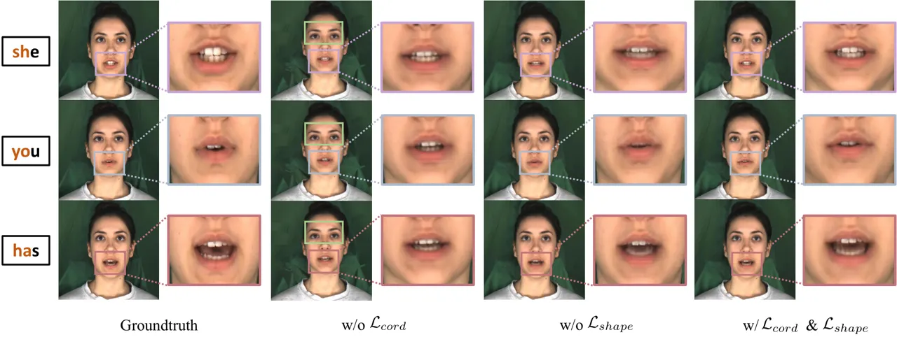

Fig. 10: Visualization of loss implementation. We present three
pronunciations to compare the lips motion synthesis quality of emotional
talking head.

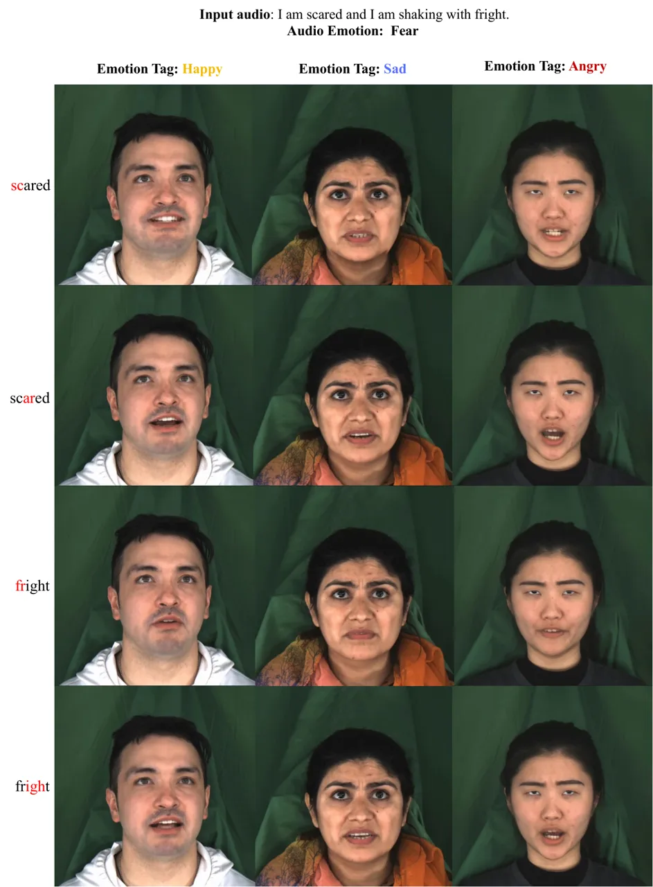

Fig. 11: Generated results of emotional talking head with different
audio emotion. We present emotion tag of happy, sad, and angry given
audio input of fear.
